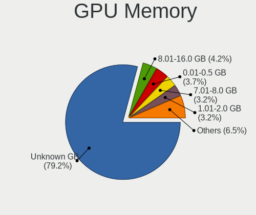
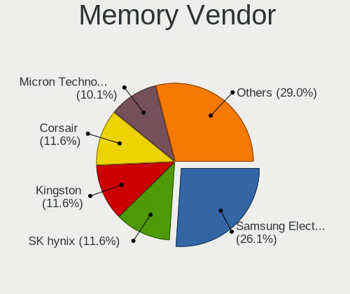

Pop!_OS Hardware Trends
-----------------------

A project to identify most popular hardware characteristics and track their change
over time based on data collected by Pop!_OS users at https://Linux-Hardware.org.

Anyone can contribute to this report by the [hw-probe](https://github.com/linuxhw/hw-probe) tool:

    sudo -E hw-probe -all -upload

This is a report for all computer types. See also reports for [desktops](/Dist/Pop!_OS/Desktop/README.md) and [notebooks](/Dist/Pop!_OS/Notebook/README.md).

This report is for one last month. Overall report since the beginning of time: [TestCoverage](https://github.com/linuxhw/TestCoverage)

Period: Apr, 2022.

Contents
--------

* [ System ](#system)
  - [ OS                       ](#os)
  - [ OS Family                ](#os-family)
  - [ Kernel                   ](#kernel)
  - [ Kernel Family            ](#kernel-family)
  - [ Kernel Major Ver.        ](#kernel-major-ver)
  - [ Arch                     ](#arch)
  - [ DE                       ](#de)
  - [ Display Server           ](#display-server)
  - [ Display Manager          ](#display-manager)
  - [ OS Lang                  ](#os-lang)
  - [ Boot Mode                ](#boot-mode)
  - [ Filesystem               ](#filesystem)
  - [ Part. scheme             ](#part-scheme)
  - [ Dual Boot with Linux/BSD ](#dual-boot-with-linuxbsd)
  - [ Dual Boot (Win)          ](#dual-boot-win)

* [ Board ](#board)
  - [ Vendor                   ](#vendor)
  - [ Model                    ](#model)
  - [ Model Family             ](#model-family)
  - [ MFG Year                 ](#mfg-year)
  - [ Form Factor              ](#form-factor)
  - [ Secure Boot              ](#secure-boot)
  - [ Coreboot                 ](#coreboot)
  - [ RAM Size                 ](#ram-size)
  - [ RAM Used                 ](#ram-used)
  - [ Total Drives             ](#total-drives)
  - [ Has CD-ROM               ](#has-cd-rom)
  - [ Has Ethernet             ](#has-ethernet)
  - [ Has WiFi                 ](#has-wifi)
  - [ Has Bluetooth            ](#has-bluetooth)

* [ Location ](#location)
  - [ Country                  ](#country)
  - [ City                     ](#city)

* [ Drives ](#drives)
  - [ Drive Vendor             ](#drive-vendor)
  - [ Drive Model              ](#drive-model)
  - [ HDD Vendor               ](#hdd-vendor)
  - [ SSD Vendor               ](#ssd-vendor)
  - [ Drive Kind               ](#drive-kind)
  - [ Drive Connector          ](#drive-connector)
  - [ Drive Size               ](#drive-size)
  - [ Space Total              ](#space-total)
  - [ Space Used               ](#space-used)
  - [ Malfunc. Drives          ](#malfunc-drives)
  - [ Malfunc. Drive Vendor    ](#malfunc-drive-vendor)
  - [ Malfunc. HDD Vendor      ](#malfunc-hdd-vendor)
  - [ Malfunc. Drive Kind      ](#malfunc-drive-kind)
  - [ Failed Drives            ](#failed-drives)
  - [ Failed Drive Vendor      ](#failed-drive-vendor)
  - [ Drive Status             ](#drive-status)

* [ Storage controller ](#storage-controller)
  - [ Storage Vendor           ](#storage-vendor)
  - [ Storage Model            ](#storage-model)
  - [ Storage Kind             ](#storage-kind)

* [ Processor ](#processor)
  - [ CPU Vendor               ](#cpu-vendor)
  - [ CPU Model                ](#cpu-model)
  - [ CPU Model Family         ](#cpu-model-family)
  - [ CPU Cores                ](#cpu-cores)
  - [ CPU Sockets              ](#cpu-sockets)
  - [ CPU Threads              ](#cpu-threads)
  - [ CPU Op-Modes             ](#cpu-op-modes)
  - [ CPU Microcode            ](#cpu-microcode)
  - [ CPU Microarch            ](#cpu-microarch)

* [ Graphics ](#graphics)
  - [ GPU Vendor               ](#gpu-vendor)
  - [ GPU Model                ](#gpu-model)
  - [ GPU Combo                ](#gpu-combo)
  - [ GPU Driver               ](#gpu-driver)
  - [ GPU Memory               ](#gpu-memory)

* [ Monitor ](#monitor)
  - [ Monitor Vendor           ](#monitor-vendor)
  - [ Monitor Model            ](#monitor-model)
  - [ Monitor Resolution       ](#monitor-resolution)
  - [ Monitor Diagonal         ](#monitor-diagonal)
  - [ Monitor Width            ](#monitor-width)
  - [ Aspect Ratio             ](#aspect-ratio)
  - [ Monitor Area             ](#monitor-area)
  - [ Pixel Density            ](#pixel-density)
  - [ Multiple Monitors        ](#multiple-monitors)

* [ Network ](#network)
  - [ Net Controller Vendor    ](#net-controller-vendor)
  - [ Net Controller Model     ](#net-controller-model)
  - [ Wireless Vendor          ](#wireless-vendor)
  - [ Wireless Model           ](#wireless-model)
  - [ Ethernet Vendor          ](#ethernet-vendor)
  - [ Ethernet Model           ](#ethernet-model)
  - [ Net Controller Kind      ](#net-controller-kind)
  - [ Used Controller          ](#used-controller)
  - [ NICs                     ](#nics)
  - [ IPv6                     ](#ipv6)

* [ Bluetooth ](#bluetooth)
  - [ Bluetooth Vendor         ](#bluetooth-vendor)
  - [ Bluetooth Model          ](#bluetooth-model)

* [ Sound ](#sound)
  - [ Sound Vendor             ](#sound-vendor)
  - [ Sound Model              ](#sound-model)

* [ Memory ](#memory)
  - [ Memory Vendor            ](#memory-vendor)
  - [ Memory Model             ](#memory-model)
  - [ Memory Kind              ](#memory-kind)
  - [ Memory Form Factor       ](#memory-form-factor)
  - [ Memory Size              ](#memory-size)
  - [ Memory Speed             ](#memory-speed)

* [ Printers & scanners ](#printers--scanners)
  - [ Printer Vendor           ](#printer-vendor)
  - [ Printer Model            ](#printer-model)
  - [ Scanner Vendor           ](#scanner-vendor)
  - [ Scanner Model            ](#scanner-model)

* [ Camera ](#camera)
  - [ Camera Vendor            ](#camera-vendor)
  - [ Camera Model             ](#camera-model)

* [ Security ](#security)
  - [ Fingerprint Vendor       ](#fingerprint-vendor)
  - [ Fingerprint Model        ](#fingerprint-model)
  - [ Chipcard Vendor          ](#chipcard-vendor)
  - [ Chipcard Model           ](#chipcard-model)

* [ Unsupported ](#unsupported)
  - [ Unsupported Devices      ](#unsupported-devices)
  - [ Unsupported Device Types ](#unsupported-device-types)

System
------

OS
--

Installed operating systems

| Name          | Computers | Percent |
|---------------|-----------|---------|
| Pop!_OS 21.10 | 219       | 69.97%  |
| Pop!_OS 22.04 | 67        | 21.41%  |
| Pop!_OS 20.04 | 18        | 5.75%   |
| Pop!_OS 21.04 | 9         | 2.88%   |

OS Family
---------

OS without a version

| Name    | Computers | Percent |
|---------|-----------|---------|
| Pop!_OS | 313       | 100%    |

Kernel
------

Version of the Linux kernel

| Version                  | Computers | Percent |
|--------------------------|-----------|---------|
| 5.16.15-76051615-generic | 141       | 45.05%  |
| 5.16.19-76051619-generic | 108       | 34.5%   |
| 5.16.11-76051611-generic | 32        | 10.22%  |
| 5.15.15-76051515-generic | 6         | 1.92%   |
| 5.15.11-76051511-generic | 6         | 1.92%   |
| 5.15.23-76051523-generic | 3         | 0.96%   |
| 5.13.0-7614-generic      | 3         | 0.96%   |
| 5.17.2-xanmod1           | 2         | 0.64%   |
| 5.15.8-76051508-generic  | 2         | 0.64%   |
| 5.15.5-76051505-generic  | 2         | 0.64%   |
| 5.17.1-xanmod1           | 1         | 0.32%   |
| 5.17.1-051701-generic    | 1         | 0.32%   |
| 5.16.20-tkg-pds          | 1         | 0.32%   |
| 5.16.16-xanmod1          | 1         | 0.32%   |
| 5.15.31-xanmod1-tt       | 1         | 0.32%   |
| 5.13.0-7620-generic      | 1         | 0.32%   |
| 5.11.0-7633-generic      | 1         | 0.32%   |
| 5.11.0-7620-generic      | 1         | 0.32%   |

Kernel Family
-------------

Linux kernel without a distro release

| Version | Computers | Percent |
|---------|-----------|---------|
| 5.16.15 | 141       | 45.05%  |
| 5.16.19 | 108       | 34.5%   |
| 5.16.11 | 32        | 10.22%  |
| 5.15.15 | 6         | 1.92%   |
| 5.15.11 | 6         | 1.92%   |
| 5.13.0  | 4         | 1.28%   |
| 5.15.23 | 3         | 0.96%   |
| 5.17.2  | 2         | 0.64%   |
| 5.17.1  | 2         | 0.64%   |
| 5.15.8  | 2         | 0.64%   |
| 5.15.5  | 2         | 0.64%   |
| 5.11.0  | 2         | 0.64%   |
| 5.16.20 | 1         | 0.32%   |
| 5.16.16 | 1         | 0.32%   |
| 5.15.31 | 1         | 0.32%   |

Kernel Major Ver.
-----------------

Linux kernel major version

| Version | Computers | Percent |
|---------|-----------|---------|
| 5.16    | 283       | 90.42%  |
| 5.15    | 20        | 6.39%   |
| 5.17    | 4         | 1.28%   |
| 5.13    | 4         | 1.28%   |
| 5.11    | 2         | 0.64%   |

Arch
----

OS architecture (x86_64, i586, etc.)

| Name   | Computers | Percent |
|--------|-----------|---------|
| x86_64 | 313       | 100%    |

DE
--

Desktop Environment

| Name            | Computers | Percent |
|-----------------|-----------|---------|
| GNOME           | 301       | 96.17%  |
| KDE5            | 4         | 1.28%   |
| Unknown         | 4         | 1.28%   |
| Unity           | 1         | 0.32%   |
| KDE             | 1         | 0.32%   |
| GNOME Flashback | 1         | 0.32%   |
| Cinnamon        | 1         | 0.32%   |

Display Server
--------------

X11 or Wayland

| Name    | Computers | Percent |
|---------|-----------|---------|
| X11     | 299       | 95.53%  |
| Wayland | 12        | 3.83%   |
| Unknown | 2         | 0.64%   |

Display Manager
---------------

SDDM, LightDM, etc.

| Name    | Computers | Percent |
|---------|-----------|---------|
| Unknown | 233       | 74.44%  |
| GDM     | 68        | 21.73%  |
| GDM3    | 11        | 3.51%   |
| LightDM | 1         | 0.32%   |

OS Lang
-------

Language

| Lang    | Computers | Percent |
|---------|-----------|---------|
| en_US   | 192       | 61.34%  |
| pt_BR   | 21        | 6.71%   |
| en_GB   | 19        | 6.07%   |
| de_DE   | 17        | 5.43%   |
| en_CA   | 10        | 3.19%   |
| en_AU   | 6         | 1.92%   |
| it_IT   | 5         | 1.6%    |
| sv_SE   | 4         | 1.28%   |
| ru_RU   | 4         | 1.28%   |
| pt_PT   | 4         | 1.28%   |
| fr_FR   | 4         | 1.28%   |
| Unknown | 4         | 1.28%   |
| C       | 3         | 0.96%   |
| es_CL   | 2         | 0.64%   |
| zh_TW   | 1         | 0.32%   |
| tr_TR   | 1         | 0.32%   |
| sk_SK   | 1         | 0.32%   |
| pl_PL   | 1         | 0.32%   |
| nb_NO   | 1         | 0.32%   |
| hr_HR   | 1         | 0.32%   |
| fr_BE   | 1         | 0.32%   |
| fi_FI   | 1         | 0.32%   |
| es_NI   | 1         | 0.32%   |
| es_AR   | 1         | 0.32%   |
| eo_US   | 1         | 0.32%   |
| en_PH   | 1         | 0.32%   |
| en_NZ   | 1         | 0.32%   |
| en_IN   | 1         | 0.32%   |
| en_IL   | 1         | 0.32%   |
| en_IE   | 1         | 0.32%   |
| en_DK   | 1         | 0.32%   |
| da_DK   | 1         | 0.32%   |

Boot Mode
---------

EFI or BIOS

| Mode | Computers | Percent |
|------|-----------|---------|
| BIOS | 241       | 77%     |
| EFI  | 72        | 23%     |

Filesystem
----------

Type of filesystem

| Type    | Computers | Percent |
|---------|-----------|---------|
| Ext4    | 297       | 94.89%  |
| Btrfs   | 12        | 3.83%   |
| Overlay | 3         | 0.96%   |
| Xfs     | 1         | 0.32%   |

Part. scheme
------------

Scheme of partitioning

| Type    | Computers | Percent |
|---------|-----------|---------|
| Unknown | 229       | 73.16%  |
| GPT     | 77        | 24.6%   |
| MBR     | 7         | 2.24%   |

Dual Boot with Linux/BSD
------------------------

Hosting more than one Linux/BSD

| Dual boot | Computers | Percent |
|-----------|-----------|---------|
| No        | 308       | 98.4%   |
| Yes       | 5         | 1.6%    |

Dual Boot (Win)
---------------

Hosting Linux and Windows

| Dual boot | Computers | Percent |
|-----------|-----------|---------|
| No        | 277       | 88.5%   |
| Yes       | 36        | 11.5%   |

Board
-----

Vendor
------

Motherboard manufacturer

| Name                   | Computers | Percent |
|------------------------|-----------|---------|
| ASUSTek Computer       | 69        | 22.04%  |
| Lenovo                 | 41        | 13.1%   |
| Dell                   | 41        | 13.1%   |
| Gigabyte Technology    | 33        | 10.54%  |
| MSI                    | 28        | 8.95%   |
| Hewlett-Packard        | 24        | 7.67%   |
| Acer                   | 14        | 4.47%   |
| Apple                  | 10        | 3.19%   |
| System76               | 8         | 2.56%   |
| Toshiba                | 6         | 1.92%   |
| ASRock                 | 6         | 1.92%   |
| Intel                  | 4         | 1.28%   |
| Samsung Electronics    | 3         | 0.96%   |
| Unknown                | 3         | 0.96%   |
| TUXEDO                 | 2         | 0.64%   |
| HUAWEI                 | 2         | 0.64%   |
| Fujitsu                | 2         | 0.64%   |
| Wortmann AG            | 1         | 0.32%   |
| Semp Toshiba           | 1         | 0.32%   |
| Purism                 | 1         | 0.32%   |
| Positivo               | 1         | 0.32%   |
| Pegatron               | 1         | 0.32%   |
| NZXT                   | 1         | 0.32%   |
| MOTILE                 | 1         | 0.32%   |
| Microsoft              | 1         | 0.32%   |
| GPU Company            | 1         | 0.32%   |
| Framework              | 1         | 0.32%   |
| Foxconn                | 1         | 0.32%   |
| EVGA                   | 1         | 0.32%   |
| eMachines              | 1         | 0.32%   |
| ECS                    | 1         | 0.32%   |
| CyberPowerPC           | 1         | 0.32%   |
| Avell High Performance | 1         | 0.32%   |
| AMI                    | 1         | 0.32%   |

Model
-----

Motherboard model

| Name                                     | Computers | Percent |
|------------------------------------------|-----------|---------|
| System76 Oryx Pro                        | 3         | 0.96%   |
| Gigabyte X570 AORUS ELITE                | 3         | 0.96%   |
| ASUS ROG STRIX B450-F GAMING             | 3         | 0.96%   |
| ASUS All Series                          | 3         | 0.96%   |
| Unknown                                  | 3         | 0.96%   |
| MSI MS-7D09                              | 2         | 0.64%   |
| MSI MS-7C02                              | 2         | 0.64%   |
| MSI GF63 Thin 10SC                       | 2         | 0.64%   |
| Lenovo IdeaPad S145-15API 81V7           | 2         | 0.64%   |
| Gigabyte B450M DS3H                      | 2         | 0.64%   |
| Gigabyte AB350-Gaming 3                  | 2         | 0.64%   |
| Dell XPS 13 9370                         | 2         | 0.64%   |
| Dell Inspiron 7559                       | 2         | 0.64%   |
| Dell Inspiron 3542                       | 2         | 0.64%   |
| Dell G7 7700                             | 2         | 0.64%   |
| ASUS TUF Gaming X570-PLUS                | 2         | 0.64%   |
| ASUS ROG STRIX X570-E GAMING             | 2         | 0.64%   |
| ASUS PRIME B450M-GAMING/BR               | 2         | 0.64%   |
| ASUS PRIME B450M-A                       | 2         | 0.64%   |
| Apple MacBookPro8,1                      | 2         | 0.64%   |
| Apple MacBookPro10,2                     | 2         | 0.64%   |
| Wortmann AG 1220663_1470189              | 1         | 0.32%   |
| TUXEDO Polaris AMD Gen2 (REN)            | 1         | 0.32%   |
| TUXEDO InfinityBook Pro 14 Gen6          | 1         | 0.32%   |
| Toshiba Satellite S75-A                  | 1         | 0.32%   |
| Toshiba Satellite L50D-B                 | 1         | 0.32%   |
| Toshiba Satellite L505                   | 1         | 0.32%   |
| Toshiba Satellite L10W-B-101             | 1         | 0.32%   |
| Toshiba Satellite C55t-C                 | 1         | 0.32%   |
| Toshiba Satellite A205                   | 1         | 0.32%   |
| System76 Thelio Major                    | 1         | 0.32%   |
| System76 Thelio                          | 1         | 0.32%   |
| System76 Pangolin                        | 1         | 0.32%   |
| System76 Galago Pro                      | 1         | 0.32%   |
| System76 Darter Pro                      | 1         | 0.32%   |
| Semp Toshiba IS 1413G                    | 1         | 0.32%   |
| Samsung 870Z5E/880Z5E/680Z5E             | 1         | 0.32%   |
| Samsung 550XDA                           | 1         | 0.32%   |
| Samsung 3570R/370R/470R/450R/510R/4450RV | 1         | 0.32%   |
| Purism Librem 15 v3                      | 1         | 0.32%   |
| Positivo N1250                           | 1         | 0.32%   |
| Pegatron p7-1110                         | 1         | 0.32%   |
| NZXT N7 B550                             | 1         | 0.32%   |
| MSI MS-7D43                              | 1         | 0.32%   |
| MSI MS-7D32                              | 1         | 0.32%   |
| MSI MS-7C91                              | 1         | 0.32%   |
| MSI MS-7C56                              | 1         | 0.32%   |
| MSI MS-7C37                              | 1         | 0.32%   |
| MSI MS-7B89                              | 1         | 0.32%   |
| MSI MS-7B87                              | 1         | 0.32%   |
| MSI MS-7B86                              | 1         | 0.32%   |
| MSI MS-7B48                              | 1         | 0.32%   |
| MSI MS-7B22                              | 1         | 0.32%   |
| MSI MS-7B17                              | 1         | 0.32%   |
| MSI MS-7A74                              | 1         | 0.32%   |
| MSI MS-7A70                              | 1         | 0.32%   |
| MSI MS-7A15                              | 1         | 0.32%   |
| MSI MS-7636                              | 1         | 0.32%   |
| MSI MS-7529                              | 1         | 0.32%   |
| MSI Katana GF76 11UG                     | 1         | 0.32%   |

Model Family
------------

Motherboard model prefix

| Name                  | Computers | Percent |
|-----------------------|-----------|---------|
| Lenovo ThinkPad       | 16        | 5.11%   |
| ASUS ROG              | 16        | 5.11%   |
| ASUS PRIME            | 14        | 4.47%   |
| Dell Inspiron         | 13        | 4.15%   |
| Dell XPS              | 11        | 3.51%   |
| Acer Aspire           | 7         | 2.24%   |
| Toshiba Satellite     | 6         | 1.92%   |
| Lenovo IdeaPad        | 6         | 1.92%   |
| HP ENVY               | 6         | 1.92%   |
| HP EliteBook          | 6         | 1.92%   |
| Gigabyte X570         | 5         | 1.6%    |
| Dell Latitude         | 5         | 1.6%    |
| ASUS TUF              | 5         | 1.6%    |
| Lenovo Legion         | 4         | 1.28%   |
| HP Pavilion           | 4         | 1.28%   |
| Gigabyte B450         | 4         | 1.28%   |
| Acer Nitro            | 4         | 1.28%   |
| System76 Oryx         | 3         | 0.96%   |
| MSI Katana            | 3         | 0.96%   |
| Gigabyte AB350-Gaming | 3         | 0.96%   |
| Dell Precision        | 3         | 0.96%   |
| Dell OptiPlex         | 3         | 0.96%   |
| Dell G7               | 3         | 0.96%   |
| ASUS All              | 3         | 0.96%   |
| Apple MacBookPro8     | 3         | 0.96%   |
| Unknown               | 3         | 0.96%   |
| System76 Thelio       | 2         | 0.64%   |
| MSI MS-7D09           | 2         | 0.64%   |
| MSI MS-7C02           | 2         | 0.64%   |
| MSI GS66              | 2         | 0.64%   |
| MSI GF63              | 2         | 0.64%   |
| Lenovo Yoga           | 2         | 0.64%   |
| Lenovo ThinkCentre    | 2         | 0.64%   |
| HP OMEN               | 2         | 0.64%   |
| Gigabyte B450M        | 2         | 0.64%   |
| Dell Vostro           | 2         | 0.64%   |
| ASUS M5A97            | 2         | 0.64%   |
| ASUS ASUS             | 2         | 0.64%   |
| ASRock X570           | 2         | 0.64%   |
| Apple MacBookPro10    | 2         | 0.64%   |
| Apple iMac14          | 2         | 0.64%   |
| Acer Swift            | 2         | 0.64%   |
| Wortmann AG 1220663   | 1         | 0.32%   |
| TUXEDO Polaris        | 1         | 0.32%   |
| TUXEDO InfinityBook   | 1         | 0.32%   |
| System76 Pangolin     | 1         | 0.32%   |
| System76 Galago       | 1         | 0.32%   |
| System76 Darter       | 1         | 0.32%   |
| Semp Toshiba IS       | 1         | 0.32%   |
| Samsung 870Z5E        | 1         | 0.32%   |
| Samsung 550XDA        | 1         | 0.32%   |
| Samsung 3570R         | 1         | 0.32%   |
| Purism Librem         | 1         | 0.32%   |
| Positivo N1250        | 1         | 0.32%   |
| Pegatron p7-1110      | 1         | 0.32%   |
| NZXT N7               | 1         | 0.32%   |
| MSI MS-7D43           | 1         | 0.32%   |
| MSI MS-7D32           | 1         | 0.32%   |
| MSI MS-7C91           | 1         | 0.32%   |
| MSI MS-7C56           | 1         | 0.32%   |

MFG Year
--------

Motherboard manufacture year

| Year | Computers | Percent |
|------|-----------|---------|
| 2021 | 60        | 19.17%  |
| 2018 | 42        | 13.42%  |
| 2019 | 41        | 13.1%   |
| 2020 | 29        | 9.27%   |
| 2013 | 21        | 6.71%   |
| 2016 | 19        | 6.07%   |
| 2014 | 19        | 6.07%   |
| 2017 | 17        | 5.43%   |
| 2015 | 15        | 4.79%   |
| 2012 | 14        | 4.47%   |
| 2011 | 12        | 3.83%   |
| 2010 | 9         | 2.88%   |
| 2009 | 6         | 1.92%   |
| 2022 | 4         | 1.28%   |
| 2008 | 3         | 0.96%   |
| 2007 | 1         | 0.32%   |
| 2004 | 1         | 0.32%   |

Form Factor
-----------

Physical design of the computer

| Name        | Computers | Percent |
|-------------|-----------|---------|
| Notebook    | 167       | 53.35%  |
| Desktop     | 128       | 40.89%  |
| Convertible | 8         | 2.56%   |
| Mini pc     | 6         | 1.92%   |
| Tablet      | 2         | 0.64%   |
| All in one  | 2         | 0.64%   |

Secure Boot
-----------

Enabled or disabled

| State    | Computers | Percent |
|----------|-----------|---------|
| Disabled | 313       | 100%    |

Coreboot
--------

Have coreboot on board

| Used | Computers | Percent |
|------|-----------|---------|
| No   | 307       | 98.08%  |
| Yes  | 6         | 1.92%   |

RAM Size
--------

Total RAM memory

| Size in GB      | Computers | Percent |
|-----------------|-----------|---------|
| 16.01-24.0      | 97        | 30.99%  |
| 8.01-16.0       | 58        | 18.53%  |
| 4.01-8.0        | 57        | 18.21%  |
| 32.01-64.0      | 51        | 16.29%  |
| 3.01-4.0        | 28        | 8.95%   |
| 64.01-256.0     | 15        | 4.79%   |
| 24.01-32.0      | 4         | 1.28%   |
| 1.01-2.0        | 2         | 0.64%   |
| More than 256.0 | 1         | 0.32%   |

RAM Used
--------

Used RAM memory

| Used GB    | Computers | Percent |
|------------|-----------|---------|
| 2.01-3.0   | 104       | 33.23%  |
| 4.01-8.0   | 72        | 23%     |
| 1.01-2.0   | 54        | 17.25%  |
| 3.01-4.0   | 53        | 16.93%  |
| 8.01-16.0  | 22        | 7.03%   |
| 16.01-24.0 | 4         | 1.28%   |
| 24.01-32.0 | 3         | 0.96%   |
| 32.01-64.0 | 1         | 0.32%   |

Total Drives
------------

Number of drives on board

| Drives | Computers | Percent |
|--------|-----------|---------|
| 1      | 164       | 52.4%   |
| 2      | 89        | 28.43%  |
| 3      | 32        | 10.22%  |
| 4      | 15        | 4.79%   |
| 5      | 6         | 1.92%   |
| 11     | 3         | 0.96%   |
| 6      | 2         | 0.64%   |
| 7      | 1         | 0.32%   |
| 0      | 1         | 0.32%   |

Has CD-ROM
----------

Has CD-ROM on board

| Presented | Computers | Percent |
|-----------|-----------|---------|
| No        | 232       | 74.12%  |
| Yes       | 81        | 25.88%  |

Has Ethernet
------------

Has Ethernet on board

| Presented | Computers | Percent |
|-----------|-----------|---------|
| Yes       | 272       | 86.9%   |
| No        | 41        | 13.1%   |

Has WiFi
--------

Has WiFi module

| Presented | Computers | Percent |
|-----------|-----------|---------|
| Yes       | 253       | 80.83%  |
| No        | 60        | 19.17%  |

Has Bluetooth
-------------

Has Bluetooth module

| Presented | Computers | Percent |
|-----------|-----------|---------|
| Yes       | 222       | 70.93%  |
| No        | 91        | 29.07%  |

Location
--------

Country
-------

Geographic location (country)

| Country      | Computers | Percent |
|--------------|-----------|---------|
| USA          | 103       | 32.91%  |
| Brazil       | 31        | 9.9%    |
| Germany      | 25        | 7.99%   |
| Canada       | 16        | 5.11%   |
| UK           | 11        | 3.51%   |
| Netherlands  | 8         | 2.56%   |
| India        | 8         | 2.56%   |
| Italy        | 7         | 2.24%   |
| Australia    | 6         | 1.92%   |
| Japan        | 5         | 1.6%    |
| France       | 5         | 1.6%    |
| Sweden       | 4         | 1.28%   |
| Russia       | 4         | 1.28%   |
| Israel       | 4         | 1.28%   |
| Ireland      | 4         | 1.28%   |
| Turkey       | 3         | 0.96%   |
| Saudi Arabia | 3         | 0.96%   |
| Romania      | 3         | 0.96%   |
| Portugal     | 3         | 0.96%   |
| Norway       | 3         | 0.96%   |
| Mexico       | 3         | 0.96%   |
| Switzerland  | 2         | 0.64%   |
| Spain        | 2         | 0.64%   |
| Slovenia     | 2         | 0.64%   |
| Slovakia     | 2         | 0.64%   |
| Poland       | 2         | 0.64%   |
| Philippines  | 2         | 0.64%   |
| New Zealand  | 2         | 0.64%   |
| Malaysia     | 2         | 0.64%   |
| Latvia       | 2         | 0.64%   |
| Indonesia    | 2         | 0.64%   |
| Hungary      | 2         | 0.64%   |
| Greece       | 2         | 0.64%   |
| Finland      | 2         | 0.64%   |
| Denmark      | 2         | 0.64%   |
| Croatia      | 2         | 0.64%   |
| Bulgaria     | 2         | 0.64%   |
| Belgium      | 2         | 0.64%   |
| Austria      | 2         | 0.64%   |
| Argentina    | 2         | 0.64%   |
| Venezuela    | 1         | 0.32%   |
| Thailand     | 1         | 0.32%   |
| Taiwan       | 1         | 0.32%   |
| South Africa | 1         | 0.32%   |
| Singapore    | 1         | 0.32%   |
| Nicaragua    | 1         | 0.32%   |
| Lithuania    | 1         | 0.32%   |
| Iran         | 1         | 0.32%   |
| Egypt        | 1         | 0.32%   |
| Czechia      | 1         | 0.32%   |
| Colombia     | 1         | 0.32%   |
| Chile        | 1         | 0.32%   |
| Belarus      | 1         | 0.32%   |
| Bangladesh   | 1         | 0.32%   |
| Azerbaijan   | 1         | 0.32%   |
| Armenia      | 1         | 0.32%   |

City
----

Geographic location (city)

| City                 | Computers | Percent |
|----------------------|-----------|---------|
| Sao Paulo            | 3         | 0.96%   |
| Salt Lake City       | 3         | 0.96%   |
| Dillenburg           | 3         | 0.96%   |
| Berlin               | 3         | 0.96%   |
| Zurich               | 2         | 0.64%   |
| Toronto              | 2         | 0.64%   |
| Sofia                | 2         | 0.64%   |
| Salvador             | 2         | 0.64%   |
| Rome                 | 2         | 0.64%   |
| Riyadh               | 2         | 0.64%   |
| Rio de Janeiro       | 2         | 0.64%   |
| Osaka                | 2         | 0.64%   |
| Moscow               | 2         | 0.64%   |
| Mendoza              | 2         | 0.64%   |
| Madrid               | 2         | 0.64%   |
| London               | 2         | 0.64%   |
| Kolkata              | 2         | 0.64%   |
| Karlsruhe            | 2         | 0.64%   |
| Halifax              | 2         | 0.64%   |
| Edmonton             | 2         | 0.64%   |
| Dublin               | 2         | 0.64%   |
| Dresden              | 2         | 0.64%   |
| Denver               | 2         | 0.64%   |
| Decatur              | 2         | 0.64%   |
| Chicago              | 2         | 0.64%   |
| Brasília            | 2         | 0.64%   |
| Bengaluru            | 2         | 0.64%   |
| Athens               | 2         | 0.64%   |
| Zutphen              | 1         | 0.32%   |
| Zagreb               | 1         | 0.32%   |
| Youngstown           | 1         | 0.32%   |
| Yerevan              | 1         | 0.32%   |
| Wroclaw              | 1         | 0.32%   |
| Woodway              | 1         | 0.32%   |
| Woodstock            | 1         | 0.32%   |
| Winnipeg             | 1         | 0.32%   |
| Williamsport         | 1         | 0.32%   |
| Whanganui            | 1         | 0.32%   |
| West Valley City     | 1         | 0.32%   |
| Wellington           | 1         | 0.32%   |
| Well                 | 1         | 0.32%   |
| Webster              | 1         | 0.32%   |
| Weare                | 1         | 0.32%   |
| Waynesville          | 1         | 0.32%   |
| Wausau               | 1         | 0.32%   |
| Waukegan             | 1         | 0.32%   |
| Wasilla              | 1         | 0.32%   |
| Warragul             | 1         | 0.32%   |
| Vila Velha           | 1         | 0.32%   |
| Venice               | 1         | 0.32%   |
| Vanlose              | 1         | 0.32%   |
| Vancouver            | 1         | 0.32%   |
| Vaihingen an der Enz | 1         | 0.32%   |
| Urjala               | 1         | 0.32%   |
| Ufa                  | 1         | 0.32%   |
| Uberlândia          | 1         | 0.32%   |
| Turners Falls        | 1         | 0.32%   |
| Tuam                 | 1         | 0.32%   |
| Truckee              | 1         | 0.32%   |
| Triel-sur-Seine      | 1         | 0.32%   |

Drives
------

Drive Vendor
------------

Hard drive vendors

| Vendor                      | Computers | Drives | Percent |
|-----------------------------|-----------|--------|---------|
| Samsung Electronics         | 97        | 125    | 19.72%  |
| WDC                         | 72        | 94     | 14.63%  |
| Seagate                     | 72        | 89     | 14.63%  |
| Sandisk                     | 34        | 38     | 6.91%   |
| Kingston                    | 29        | 29     | 5.89%   |
| Toshiba                     | 27        | 28     | 5.49%   |
| Crucial                     | 20        | 21     | 4.07%   |
| Intel                       | 16        | 18     | 3.25%   |
| SK Hynix                    | 14        | 14     | 2.85%   |
| Unknown                     | 8         | 11     | 1.63%   |
| HGST                        | 8         | 10     | 1.63%   |
| A-DATA Technology           | 8         | 9      | 1.63%   |
| Phison                      | 7         | 7      | 1.42%   |
| Hitachi                     | 7         | 8      | 1.42%   |
| Micron Technology           | 6         | 6      | 1.22%   |
| Micron/Crucial Technology   | 5         | 6      | 1.02%   |
| Apple                       | 5         | 5      | 1.02%   |
| PNY                         | 4         | 4      | 0.81%   |
| China                       | 4         | 5      | 0.81%   |
| UMIS                        | 3         | 3      | 0.61%   |
| Patriot                     | 3         | 3      | 0.61%   |
| KIOXIA                      | 3         | 3      | 0.61%   |
| ADATA Technology            | 3         | 4      | 0.61%   |
| XPG                         | 2         | 2      | 0.41%   |
| Transcend                   | 2         | 3      | 0.41%   |
| MAXIO Technology (Hangzhou) | 2         | 2      | 0.41%   |
| Lexar                       | 2         | 2      | 0.41%   |
| Lenovo                      | 2         | 2      | 0.41%   |
| Biwin                       | 2         | 2      | 0.41%   |
| ZADAK                       | 1         | 1      | 0.2%    |
| YMTC                        | 1         | 1      | 0.2%    |
| WDC WDS4                    | 1         | 1      | 0.2%    |
| W800S                       | 1         | 1      | 0.2%    |
| USB                         | 1         | 1      | 0.2%    |
| Union Memory (Shenzhen)     | 1         | 1      | 0.2%    |
| TO Exter                    | 1         | 1      | 0.2%    |
| STEC                        | 1         | 1      | 0.2%    |
| SSSTC                       | 1         | 1      | 0.2%    |
| SPCC                        | 1         | 1      | 0.2%    |
| Silicon Motion              | 1         | 1      | 0.2%    |
| Ramaxel Technology          | 1         | 1      | 0.2%    |
| OCZ                         | 1         | 1      | 0.2%    |
| Mushkin                     | 1         | 1      | 0.2%    |
| MAXTOR                      | 1         | 1      | 0.2%    |
| LITEON                      | 1         | 1      | 0.2%    |
| KINGBANK                    | 1         | 1      | 0.2%    |
| Intenso                     | 1         | 1      | 0.2%    |
| Hikvision                   | 1         | 1      | 0.2%    |
| GOODRAM                     | 1         | 1      | 0.2%    |
| Corsair                     | 1         | 1      | 0.2%    |
| BHT                         | 1         | 1      | 0.2%    |
| Apacer                      | 1         | 1      | 0.2%    |
| AMD                         | 1         | 2      | 0.2%    |
| Unknown                     | 1         | 1      | 0.2%    |

Drive Model
-----------

Hard drive models

| Model                              | Computers | Percent |
|------------------------------------|-----------|---------|
| Samsung NVMe SSD Drive 500GB       | 9         | 1.61%   |
| Samsung SSD 860 EVO 500GB          | 8         | 1.43%   |
| Samsung SSD 850 EVO 500GB          | 8         | 1.43%   |
| Samsung SSD 850 EVO 250GB          | 8         | 1.43%   |
| Samsung NVMe SSD Drive 1TB         | 8         | 1.43%   |
| SK Hynix NVMe SSD Drive 512GB      | 7         | 1.25%   |
| Sandisk NVMe SSD Drive 1TB         | 7         | 1.25%   |
| Kingston SA400S37120G 120GB SSD    | 7         | 1.25%   |
| Seagate ST2000DM008-2FR102 2TB     | 6         | 1.08%   |
| Sandisk NVMe SSD Drive 512GB       | 6         | 1.08%   |
| Samsung SSD 860 EVO 1TB            | 6         | 1.08%   |
| WDC WD10EZEX-08WN4A0 1TB           | 5         | 0.9%    |
| Seagate ST1000LM024 HN-M101MBB 1TB | 5         | 0.9%    |
| Sandisk NVMe SSD Drive 500GB       | 5         | 0.9%    |
| Samsung NVMe SSD Drive 2TB         | 5         | 0.9%    |
| Seagate ST3500413AS 500GB          | 4         | 0.72%   |
| Seagate ST1000LM035-1RK172 1TB     | 4         | 0.72%   |
| Seagate Expansion+ 2TB             | 4         | 0.72%   |
| Sandisk NVMe SSD Drive 256GB       | 4         | 0.72%   |
| Intel NVMe SSD Drive 512GB         | 4         | 0.72%   |
| Intel NVMe SSD Drive 1024GB        | 4         | 0.72%   |
| WDC WDS500G2B0A-00SM50 500GB SSD   | 3         | 0.54%   |
| WDC WD20EZRZ-00Z5HB0 2TB           | 3         | 0.54%   |
| Toshiba MQ01ABF050 500GB           | 3         | 0.54%   |
| Toshiba MQ01ABD075 752GB           | 3         | 0.54%   |
| Seagate ST31000528AS 1TB           | 3         | 0.54%   |
| Seagate ST1000DM003-1ER162 1TB     | 3         | 0.54%   |
| Samsung SSD 970 EVO Plus 500GB     | 3         | 0.54%   |
| Samsung NVMe SSD Drive 256GB       | 3         | 0.54%   |
| Samsung NVMe SSD Drive 1024GB      | 3         | 0.54%   |
| Kingston SA400S37240G 240GB SSD    | 3         | 0.54%   |
| Crucial CT500MX500SSD1 500GB       | 3         | 0.54%   |
| Crucial CT2000MX500SSD1 2TB        | 3         | 0.54%   |
| Crucial CT1000MX500SSD1 1TB        | 3         | 0.54%   |
| A-DATA SU630 240GB SSD             | 3         | 0.54%   |
| WDC WDS250G2B0B-00YS70 250GB SSD   | 2         | 0.36%   |
| WDC WDS240G2G0B-00EPW0 240GB SSD   | 2         | 0.36%   |
| WDC WDS100T2G0A-00JH30 1TB SSD     | 2         | 0.36%   |
| WDC WD30EZRX-00DC0B0 3TB           | 2         | 0.36%   |
| WDC WD30EFRX-68EUZN0 3TB           | 2         | 0.36%   |
| WDC WD20EZAZ-00GGJB0 2TB           | 2         | 0.36%   |
| WDC WD10SPZX-24Z10 1TB             | 2         | 0.36%   |
| WDC WD10SPZX-21Z10T0 1TB           | 2         | 0.36%   |
| WDC WD10JPVX-22JC3T0 1TB           | 2         | 0.36%   |
| Unknown MMC Card  64GB             | 2         | 0.36%   |
| Toshiba MQ01ABD100 1TB             | 2         | 0.36%   |
| Toshiba KXG50ZNV512G NVMe 512GB    | 2         | 0.36%   |
| Toshiba DT01ACA200 2TB             | 2         | 0.36%   |
| Toshiba DT01ACA100 1TB             | 2         | 0.36%   |
| SK Hynix NVMe SSD Drive 256GB      | 2         | 0.36%   |
| SK Hynix NVMe SSD Drive 1024GB     | 2         | 0.36%   |
| Seagate ST500LT012-9WS142 500GB    | 2         | 0.36%   |
| Seagate ST500DM002-1BD142 500GB    | 2         | 0.36%   |
| Seagate ST4000DM004-2CV104 4TB     | 2         | 0.36%   |
| Seagate ST4000DM000-1F2168 4TB     | 2         | 0.36%   |
| Seagate ST2000LX001-1RG174 2TB     | 2         | 0.36%   |
| Seagate ST2000DX002-2DV164 2TB     | 2         | 0.36%   |
| Seagate ST2000DM006-2DM164 2TB     | 2         | 0.36%   |
| Seagate ST2000DM001-1ER164 2TB     | 2         | 0.36%   |
| Seagate ST2000DM001-1CH164 2TB     | 2         | 0.36%   |

HDD Vendor
----------

Hard disk drive vendors

| Vendor              | Computers | Drives | Percent |
|---------------------|-----------|--------|---------|
| Seagate             | 70        | 86     | 42.42%  |
| WDC                 | 55        | 72     | 33.33%  |
| Toshiba             | 19        | 20     | 11.52%  |
| HGST                | 8         | 10     | 4.85%   |
| Hitachi             | 7         | 8      | 4.24%   |
| Apple               | 2         | 2      | 1.21%   |
| USB                 | 1         | 1      | 0.61%   |
| Unknown             | 1         | 1      | 0.61%   |
| Samsung Electronics | 1         | 1      | 0.61%   |
| MAXTOR              | 1         | 1      | 0.61%   |

SSD Vendor
----------

Solid state drive vendors

| Vendor              | Computers | Drives | Percent |
|---------------------|-----------|--------|---------|
| Samsung Electronics | 54        | 66     | 32.34%  |
| Kingston            | 22        | 22     | 13.17%  |
| Crucial             | 17        | 18     | 10.18%  |
| SanDisk             | 15        | 15     | 8.98%   |
| WDC                 | 13        | 14     | 7.78%   |
| Intel               | 5         | 5      | 2.99%   |
| A-DATA Technology   | 5         | 5      | 2.99%   |
| PNY                 | 4         | 4      | 2.4%    |
| China               | 4         | 5      | 2.4%    |
| Patriot             | 3         | 3      | 1.8%    |
| Apple               | 3         | 3      | 1.8%    |
| Transcend           | 2         | 3      | 1.2%    |
| SK Hynix            | 2         | 2      | 1.2%    |
| Micron Technology   | 2         | 2      | 1.2%    |
| Lexar               | 2         | 2      | 1.2%    |
| WDC WDS4            | 1         | 1      | 0.6%    |
| Toshiba             | 1         | 1      | 0.6%    |
| TO Exter            | 1         | 1      | 0.6%    |
| Ramaxel Technology  | 1         | 1      | 0.6%    |
| OCZ                 | 1         | 1      | 0.6%    |
| Mushkin             | 1         | 1      | 0.6%    |
| LITEON              | 1         | 1      | 0.6%    |
| KINGBANK            | 1         | 1      | 0.6%    |
| GOODRAM             | 1         | 1      | 0.6%    |
| Corsair             | 1         | 1      | 0.6%    |
| BIWIN               | 1         | 1      | 0.6%    |
| BHT                 | 1         | 1      | 0.6%    |
| Apacer              | 1         | 1      | 0.6%    |
| Unknown             | 1         | 1      | 0.6%    |

Drive Kind
----------

HDD or SSD

| Kind    | Computers | Drives | Percent |
|---------|-----------|--------|---------|
| SSD     | 149       | 183    | 33.33%  |
| NVMe    | 148       | 178    | 33.11%  |
| HDD     | 137       | 202    | 30.65%  |
| Unknown | 8         | 9      | 1.79%   |
| MMC     | 5         | 7      | 1.12%   |

Drive Connector
---------------

SATA, SAS, NVMe, etc.

| Type | Computers | Drives | Percent |
|------|-----------|--------|---------|
| SATA | 224       | 380    | 57.58%  |
| NVMe | 148       | 178    | 38.05%  |
| SAS  | 12        | 14     | 3.08%   |
| MMC  | 5         | 7      | 1.29%   |

Drive Size
----------

Size of hard drive

| Size in TB | Computers | Drives | Percent |
|------------|-----------|--------|---------|
| 0.01-0.5   | 154       | 193    | 51.51%  |
| 0.51-1.0   | 86        | 109    | 28.76%  |
| 1.01-2.0   | 39        | 51     | 13.04%  |
| 3.01-4.0   | 10        | 14     | 3.34%   |
| 2.01-3.0   | 6         | 8      | 2.01%   |
| 4.01-10.0  | 3         | 8      | 1%      |
| 10.01-20.0 | 1         | 2      | 0.33%   |

Space Total
-----------

Amount of disk space available on the file system

| Size in GB     | Computers | Percent |
|----------------|-----------|---------|
| 101-250        | 82        | 26.2%   |
| 251-500        | 80        | 25.56%  |
| 501-1000       | 62        | 19.81%  |
| 1001-2000      | 27        | 8.63%   |
| More than 3000 | 21        | 6.71%   |
| 51-100         | 17        | 5.43%   |
| 2001-3000      | 13        | 4.15%   |
| 21-50          | 4         | 1.28%   |
| Unknown        | 4         | 1.28%   |
| 1-20           | 3         | 0.96%   |

Space Used
----------

Amount of used disk space

| Used GB        | Computers | Percent |
|----------------|-----------|---------|
| 1-20           | 74        | 23.64%  |
| 21-50          | 60        | 19.17%  |
| 101-250        | 47        | 15.02%  |
| 51-100         | 47        | 15.02%  |
| 251-500        | 37        | 11.82%  |
| 501-1000       | 23        | 7.35%   |
| 1001-2000      | 10        | 3.19%   |
| More than 3000 | 7         | 2.24%   |
| 2001-3000      | 4         | 1.28%   |
| Unknown        | 4         | 1.28%   |

Malfunc. Drives
---------------

Drive models with a malfunction

| Model                                 | Computers | Drives | Percent |
|---------------------------------------|-----------|--------|---------|
| Seagate ST1000LM024 HN-M101MBB 1TB    | 2         | 2      | 13.33%  |
| WDC WD5000LPLX-00ZNTT0 500GB          | 1         | 2      | 6.67%   |
| WDC WD20EFRX-68AX9N0 2TB              | 1         | 1      | 6.67%   |
| WDC WD2003FYYS-05T9B0 2TB             | 1         | 1      | 6.67%   |
| WDC WD15EVDS-73V9B0 1TB               | 1         | 1      | 6.67%   |
| Toshiba MQ01ACF050 500GB              | 1         | 1      | 6.67%   |
| SK Hynix HFS512G39TND-N210A 512GB SSD | 1         | 1      | 6.67%   |
| Seagate ST8000DM004-2CX188 8TB        | 1         | 1      | 6.67%   |
| Seagate ST3320620AS 320GB             | 1         | 1      | 6.67%   |
| Seagate ST2000DM008-2FR102 2TB        | 1         | 1      | 6.67%   |
| Samsung Electronics SSD 980 1TB       | 1         | 1      | 6.67%   |
| Samsung Electronics SSD 850 EVO 500GB | 1         | 1      | 6.67%   |
| Intel SSDSC2BW480H6 480GB             | 1         | 1      | 6.67%   |
| HGST HTS541010A7E630 1TB              | 1         | 1      | 6.67%   |

Malfunc. Drive Vendor
---------------------

Vendors of faulty drives

| Vendor              | Computers | Drives | Percent |
|---------------------|-----------|--------|---------|
| Seagate             | 5         | 5      | 33.33%  |
| WDC                 | 4         | 5      | 26.67%  |
| Samsung Electronics | 2         | 2      | 13.33%  |
| Toshiba             | 1         | 1      | 6.67%   |
| SK Hynix            | 1         | 1      | 6.67%   |
| Intel               | 1         | 1      | 6.67%   |
| HGST                | 1         | 1      | 6.67%   |

Malfunc. HDD Vendor
-------------------

Vendors of faulty HDD drives

| Vendor  | Computers | Drives | Percent |
|---------|-----------|--------|---------|
| Seagate | 5         | 5      | 45.45%  |
| WDC     | 4         | 5      | 36.36%  |
| Toshiba | 1         | 1      | 9.09%   |
| HGST    | 1         | 1      | 9.09%   |

Malfunc. Drive Kind
-------------------

Kinds of faulty drives

| Kind | Computers | Drives | Percent |
|------|-----------|--------|---------|
| HDD  | 9         | 12     | 69.23%  |
| SSD  | 3         | 3      | 23.08%  |
| NVMe | 1         | 1      | 7.69%   |

Failed Drives
-------------

Failed drive models

| Model                  | Computers | Drives | Percent |
|------------------------|-----------|--------|---------|
| Patriot Pyro SSD 120GB | 1         | 1      | 100%    |

Failed Drive Vendor
-------------------

Failed drive vendors

| Vendor  | Computers | Drives | Percent |
|---------|-----------|--------|---------|
| Patriot | 1         | 1      | 100%    |

Drive Status
------------

Number of failed and malfunc. drives

| Status   | Computers | Drives | Percent |
|----------|-----------|--------|---------|
| Detected | 233       | 421    | 70.18%  |
| Works    | 86        | 141    | 25.9%   |
| Malfunc  | 12        | 16     | 3.61%   |
| Failed   | 1         | 1      | 0.3%    |

Storage controller
------------------

Storage Vendor
--------------

Storage controller vendors

| Vendor                           | Computers | Percent |
|----------------------------------|-----------|---------|
| Intel                            | 196       | 44.65%  |
| AMD                              | 79        | 18%     |
| Samsung Electronics              | 53        | 12.07%  |
| Sandisk                          | 27        | 6.15%   |
| SK Hynix                         | 12        | 2.73%   |
| Phison Electronics               | 8         | 1.82%   |
| Micron/Crucial Technology        | 8         | 1.82%   |
| ADATA Technology                 | 8         | 1.82%   |
| Toshiba America Info Systems     | 7         | 1.59%   |
| Kingston Technology Company      | 7         | 1.59%   |
| ASMedia Technology               | 6         | 1.37%   |
| Union Memory (Shenzhen)          | 4         | 0.91%   |
| Micron Technology                | 4         | 0.91%   |
| KIOXIA                           | 3         | 0.68%   |
| Nvidia                           | 2         | 0.46%   |
| MAXIO Technology (Hangzhou)      | 2         | 0.46%   |
| Lenovo                           | 2         | 0.46%   |
| Yangtze Memory Technologies      | 1         | 0.23%   |
| VIA Technologies                 | 1         | 0.23%   |
| Unknown                          | 1         | 0.23%   |
| Solid State Storage Technology   | 1         | 0.23%   |
| Silicon Motion                   | 1         | 0.23%   |
| Silicon Integrated Systems [SiS] | 1         | 0.23%   |
| Silicon Image                    | 1         | 0.23%   |
| Realtek Semiconductor            | 1         | 0.23%   |
| Marvell Technology Group         | 1         | 0.23%   |
| JMicron Technology               | 1         | 0.23%   |
| Biwin Storage Technology         | 1         | 0.23%   |

Storage Model
-------------

Storage controller models

| Model                                                                                   | Computers | Percent |
|-----------------------------------------------------------------------------------------|-----------|---------|
| AMD FCH SATA Controller [AHCI mode]                                                     | 57        | 11.56%  |
| Samsung NVMe SSD Controller SM981/PM981/PM983                                           | 27        | 5.48%   |
| AMD 400 Series Chipset SATA Controller                                                  | 22        | 4.46%   |
| Intel Volume Management Device NVMe RAID Controller                                     | 15        | 3.04%   |
| Samsung NVMe SSD Controller PM9A1/PM9A3/980PRO                                          | 13        | 2.64%   |
| Intel 7 Series Chipset Family 6-port SATA Controller [AHCI mode]                        | 13        | 2.64%   |
| Intel Sunrise Point-LP SATA Controller [AHCI mode]                                      | 12        | 2.43%   |
| Intel 8 Series SATA Controller 1 [AHCI mode]                                            | 12        | 2.43%   |
| Intel 500 Series Chipset Family SATA AHCI Controller                                    | 12        | 2.43%   |
| Intel 8 Series/C220 Series Chipset Family 6-port SATA Controller 1 [AHCI mode]          | 11        | 2.23%   |
| Intel 200 Series PCH SATA controller [AHCI mode]                                        | 10        | 2.03%   |
| Sandisk WD Black SN750 / PC SN730 NVMe SSD                                              | 9         | 1.83%   |
| Samsung NVMe SSD Controller 980                                                         | 8         | 1.62%   |
| Intel 82801 Mobile SATA Controller [RAID mode]                                          | 8         | 1.62%   |
| Sandisk WD Blue SN550 NVMe SSD                                                          | 7         | 1.42%   |
| Intel HM170/QM170 Chipset SATA Controller [AHCI Mode]                                   | 7         | 1.42%   |
| Intel 6 Series/C200 Series Chipset Family 6 port Mobile SATA AHCI Controller            | 7         | 1.42%   |
| AMD 500 Series Chipset SATA Controller                                                  | 7         | 1.42%   |
| SK Hynix Gold P31 SSD                                                                   | 6         | 1.22%   |
| Phison E12 NVMe Controller                                                              | 6         | 1.22%   |
| Micron/Crucial P1 NVMe PCIe SSD                                                         | 6         | 1.22%   |
| Intel Wildcat Point-LP SATA Controller [AHCI Mode]                                      | 6         | 1.22%   |
| Intel SSD 660P Series                                                                   | 6         | 1.22%   |
| Intel Q170/Q150/B150/H170/H110/Z170/CM236 Chipset SATA Controller [AHCI Mode]           | 6         | 1.22%   |
| ASMedia ASM1062 Serial ATA Controller                                                   | 6         | 1.22%   |
| Sandisk Non-Volatile memory controller                                                  | 5         | 1.01%   |
| Intel SATA Controller [RAID mode]                                                       | 5         | 1.01%   |
| Intel Cannon Lake PCH SATA AHCI Controller                                              | 5         | 1.01%   |
| Intel Cannon Lake Mobile PCH SATA AHCI Controller                                       | 5         | 1.01%   |
| Intel 400 Series Chipset Family SATA AHCI Controller                                    | 5         | 1.01%   |
| AMD 300 Series Chipset SATA Controller                                                  | 5         | 1.01%   |
| Micron Non-Volatile memory controller                                                   | 4         | 0.81%   |
| Intel NM10/ICH7 Family SATA Controller [IDE mode]                                       | 4         | 0.81%   |
| Intel Alder Lake-S PCH SATA Controller [AHCI Mode]                                      | 4         | 0.81%   |
| Intel 82801IBM/IEM (ICH9M/ICH9M-E) 4 port SATA Controller [AHCI mode]                   | 4         | 0.81%   |
| Intel 82801G (ICH7 Family) IDE Controller                                               | 4         | 0.81%   |
| Intel 6 Series/C200 Series Chipset Family Desktop SATA Controller (IDE mode, ports 4-5) | 4         | 0.81%   |
| Intel 6 Series/C200 Series Chipset Family Desktop SATA Controller (IDE mode, ports 0-3) | 4         | 0.81%   |
| AMD SB7x0/SB8x0/SB9x0 SATA Controller [AHCI mode]                                       | 4         | 0.81%   |
| ADATA XPG SX8200 Pro PCIe Gen3x4 M.2 2280 Solid State Drive                             | 4         | 0.81%   |
| ADATA Non-Volatile memory controller                                                    | 4         | 0.81%   |
| Toshiba America Info Systems XG6 NVMe SSD Controller                                    | 3         | 0.61%   |
| Toshiba America Info Systems Toshiba America Info Non-Volatile memory controller        | 3         | 0.61%   |
| SK Hynix BC511                                                                          | 3         | 0.61%   |
| Sandisk WD Blue SN500 / PC SN520 NVMe SSD                                               | 3         | 0.61%   |
| Samsung NVMe SSD Controller SM961/PM961/SM963                                           | 3         | 0.61%   |
| KIOXIA Non-Volatile memory controller                                                   | 3         | 0.61%   |
| Kingston Company Company Non-Volatile memory controller                                 | 3         | 0.61%   |
| Intel Tiger Lake-LP SATA Controller [AHCI mode]                                         | 3         | 0.61%   |
| Intel Non-Volatile memory controller                                                    | 3         | 0.61%   |
| Intel Comet Lake SATA AHCI Controller                                                   | 3         | 0.61%   |
| Intel Cannon Point-LP SATA Controller [AHCI Mode]                                       | 3         | 0.61%   |
| Intel 7 Series/C210 Series Chipset Family 6-port SATA Controller [AHCI mode]            | 3         | 0.61%   |
| AMD SB7x0/SB8x0/SB9x0 IDE Controller                                                    | 3         | 0.61%   |
| Union Memory (Shenzhen) Non-Volatile memory controller                                  | 2         | 0.41%   |
| Union Memory (Shenzhen) AM630 PCIe 4.0 x4 NVMe SSD Controller                           | 2         | 0.41%   |
| Sandisk WD PC SN810 / Black SN850 NVMe SSD                                              | 2         | 0.41%   |
| Phison PS5013 E13 NVMe Controller                                                       | 2         | 0.41%   |
| Micron/Crucial P2 NVMe PCIe SSD                                                         | 2         | 0.41%   |
| MAXIO (Hangzhou) NVMe SSD Controller MAP1001                                            | 2         | 0.41%   |

Storage Kind
------------

Kind of storage controller (IDE, SATA, NVMe, SAS, ...)

| Kind | Computers | Percent |
|------|-----------|---------|
| SATA | 233       | 53.44%  |
| NVMe | 148       | 33.94%  |
| RAID | 33        | 7.57%   |
| IDE  | 22        | 5.05%   |

Processor
---------

CPU Vendor
----------

Processor vendors

| Vendor | Computers | Percent |
|--------|-----------|---------|
| Intel  | 218       | 69.65%  |
| AMD    | 95        | 30.35%  |

CPU Model
---------

Processor models

| Model                                         | Computers | Percent |
|-----------------------------------------------|-----------|---------|
| AMD Ryzen 5 3600 6-Core Processor             | 9         | 2.88%   |
| Intel 11th Gen Core i7-11800H @ 2.30GHz       | 7         | 2.24%   |
| Intel Core i7-8550U CPU @ 1.80GHz             | 6         | 1.92%   |
| Intel 11th Gen Core i7-1165G7 @ 2.80GHz       | 6         | 1.92%   |
| Intel Core i7-4790 CPU @ 3.60GHz              | 5         | 1.6%    |
| Intel Core i5-10400 CPU @ 2.90GHz             | 5         | 1.6%    |
| AMD Ryzen 7 3700X 8-Core Processor            | 5         | 1.6%    |
| Intel Core i7-7700HQ CPU @ 2.80GHz            | 4         | 1.28%   |
| Intel Core i5-4200U CPU @ 1.60GHz             | 4         | 1.28%   |
| Intel 11th Gen Core i5-1135G7 @ 2.40GHz       | 4         | 1.28%   |
| AMD Ryzen 5 3500U with Radeon Vega Mobile Gfx | 4         | 1.28%   |
| Intel Core i7-6700HQ CPU @ 2.60GHz            | 3         | 0.96%   |
| Intel Core i7-4700MQ CPU @ 2.40GHz            | 3         | 0.96%   |
| Intel Core i7-10750H CPU @ 2.60GHz            | 3         | 0.96%   |
| Intel Core i5-7200U CPU @ 2.50GHz             | 3         | 0.96%   |
| Intel Core i5-4210U CPU @ 1.70GHz             | 3         | 0.96%   |
| Intel Core i5-3210M CPU @ 2.50GHz             | 3         | 0.96%   |
| Intel Core i3-6006U CPU @ 2.00GHz             | 3         | 0.96%   |
| Intel 11th Gen Core i9-11900H @ 2.50GHz       | 3         | 0.96%   |
| AMD Ryzen 9 3900X 12-Core Processor           | 3         | 0.96%   |
| AMD Ryzen 7 5800X 8-Core Processor            | 3         | 0.96%   |
| AMD Ryzen 7 4800H with Radeon Graphics        | 3         | 0.96%   |
| AMD Ryzen 5 5600X 6-Core Processor            | 3         | 0.96%   |
| AMD Ryzen 5 5500U with Radeon Graphics        | 3         | 0.96%   |
| AMD Ryzen 3 3200G with Radeon Vega Graphics   | 3         | 0.96%   |
| Intel Core i9-10900X CPU @ 3.70GHz            | 2         | 0.64%   |
| Intel Core i7-9750H CPU @ 2.60GHz             | 2         | 0.64%   |
| Intel Core i7-9700K CPU @ 3.60GHz             | 2         | 0.64%   |
| Intel Core i7-8750H CPU @ 2.20GHz             | 2         | 0.64%   |
| Intel Core i7-8700K CPU @ 3.70GHz             | 2         | 0.64%   |
| Intel Core i7-8650U CPU @ 1.90GHz             | 2         | 0.64%   |
| Intel Core i7-7700 CPU @ 3.60GHz              | 2         | 0.64%   |
| Intel Core i7-7500U CPU @ 2.70GHz             | 2         | 0.64%   |
| Intel Core i7-3630QM CPU @ 2.40GHz            | 2         | 0.64%   |
| Intel Core i5-8265U CPU @ 1.60GHz             | 2         | 0.64%   |
| Intel Core i5-6200U CPU @ 2.30GHz             | 2         | 0.64%   |
| Intel Core i5-5200U CPU @ 2.20GHz             | 2         | 0.64%   |
| Intel Core i5-2500K CPU @ 3.30GHz             | 2         | 0.64%   |
| Intel Core i5-10500H CPU @ 2.50GHz            | 2         | 0.64%   |
| Intel Core i3-2330M CPU @ 2.20GHz             | 2         | 0.64%   |
| Intel Core 2 Duo CPU T6500 @ 2.10GHz          | 2         | 0.64%   |
| Intel Celeron CPU N3160 @ 1.60GHz             | 2         | 0.64%   |
| Intel 12th Gen Core i5-12600K                 | 2         | 0.64%   |
| Intel 11th Gen Core i7-1185G7 @ 3.00GHz       | 2         | 0.64%   |
| Intel 11th Gen Core i7-11370H @ 3.30GHz       | 2         | 0.64%   |
| Intel 11th Gen Core i5-11400H @ 2.70GHz       | 2         | 0.64%   |
| AMD Ryzen 7 PRO 5850U with Radeon Graphics    | 2         | 0.64%   |
| AMD Ryzen 7 5800H with Radeon Graphics        | 2         | 0.64%   |
| AMD Ryzen 7 4700U with Radeon Graphics        | 2         | 0.64%   |
| AMD Ryzen 7 3800X 8-Core Processor            | 2         | 0.64%   |
| AMD Ryzen 7 2700X Eight-Core Processor        | 2         | 0.64%   |
| AMD Ryzen 5 4500U with Radeon Graphics        | 2         | 0.64%   |
| AMD Ryzen 5 3600X 6-Core Processor            | 2         | 0.64%   |
| AMD Ryzen 5 2600X Six-Core Processor          | 2         | 0.64%   |
| AMD Ryzen 5 2400G with Radeon Vega Graphics   | 2         | 0.64%   |
| AMD FX-8350 Eight-Core Processor              | 2         | 0.64%   |
| Intel Xeon CPU W3530 @ 2.80GHz                | 1         | 0.32%   |
| Intel Xeon CPU E5462 @ 2.80GHz                | 1         | 0.32%   |
| Intel Xeon CPU E5-1650 v3 @ 3.50GHz           | 1         | 0.32%   |
| Intel Pentium CPU N3540 @ 2.16GHz             | 1         | 0.32%   |

CPU Model Family
----------------

Processor model prefix

| Model                  | Computers | Percent |
|------------------------|-----------|---------|
| Intel Core i5          | 71        | 22.68%  |
| Intel Core i7          | 67        | 21.41%  |
| AMD Ryzen 5            | 37        | 11.82%  |
| Other                  | 35        | 11.18%  |
| AMD Ryzen 7            | 29        | 9.27%   |
| Intel Core i3          | 17        | 5.43%   |
| Intel Celeron          | 8         | 2.56%   |
| Intel Core 2 Duo       | 6         | 1.92%   |
| AMD Ryzen 9            | 6         | 1.92%   |
| AMD Ryzen 3            | 6         | 1.92%   |
| AMD FX                 | 5         | 1.6%    |
| Intel Core i9          | 4         | 1.28%   |
| Intel Xeon             | 3         | 0.96%   |
| AMD A6                 | 3         | 0.96%   |
| Intel Genuine          | 2         | 0.64%   |
| Intel Core 2 Quad      | 2         | 0.64%   |
| AMD Ryzen 7 PRO        | 2         | 0.64%   |
| AMD A10                | 2         | 0.64%   |
| Intel Pentium          | 1         | 0.32%   |
| Intel Core m5          | 1         | 0.32%   |
| Intel Atom             | 1         | 0.32%   |
| AMD Ryzen Threadripper | 1         | 0.32%   |
| AMD Phenom II X4       | 1         | 0.32%   |
| AMD Athlon 64 X2       | 1         | 0.32%   |
| AMD A8                 | 1         | 0.32%   |
| AMD A4                 | 1         | 0.32%   |

CPU Cores
---------

Number of processor cores

| Number | Computers | Percent |
|--------|-----------|---------|
| 4      | 118       | 37.7%   |
| 2      | 76        | 24.28%  |
| 6      | 54        | 17.25%  |
| 8      | 48        | 15.34%  |
| 12     | 5         | 1.6%    |
| 10     | 5         | 1.6%    |
| 16     | 2         | 0.64%   |
| 3      | 2         | 0.64%   |
| 32     | 1         | 0.32%   |
| 14     | 1         | 0.32%   |
| 1      | 1         | 0.32%   |

CPU Sockets
-----------

Number of sockets

| Number | Computers | Percent |
|--------|-----------|---------|
| 1      | 312       | 99.68%  |
| 2      | 1         | 0.32%   |

CPU Threads
-----------

Threads per core (Hyper-Threading)

| Number | Computers | Percent |
|--------|-----------|---------|
| 2      | 249       | 79.55%  |
| 1      | 64        | 20.45%  |

CPU Op-Modes
------------

CPU Operation Modes (32-bit, 64-bit)

| Op mode        | Computers | Percent |
|----------------|-----------|---------|
| 32-bit, 64-bit | 313       | 100%    |

CPU Microcode
-------------

Microcode number

| Number     | Computers | Percent |
|------------|-----------|---------|
| Unknown    | 229       | 73.16%  |
| 0x08701021 | 8         | 2.56%   |
| 0x806ea    | 6         | 1.92%   |
| 0x806d1    | 5         | 1.6%    |
| 0x806c1    | 5         | 1.6%    |
| 0x306a9    | 5         | 1.6%    |
| 0xa0652    | 4         | 1.28%   |
| 0x906ea    | 4         | 1.28%   |
| 0x906e9    | 4         | 1.28%   |
| 0x40651    | 4         | 1.28%   |
| 0x08600106 | 4         | 1.28%   |
| 0x306c3    | 3         | 0.96%   |
| 0x08108109 | 3         | 0.96%   |
| 0xa0653    | 2         | 0.64%   |
| 0x806ec    | 2         | 0.64%   |
| 0x806e9    | 2         | 0.64%   |
| 0x506e3    | 2         | 0.64%   |
| 0x406e3    | 2         | 0.64%   |
| 0x206a7    | 2         | 0.64%   |
| 0x1067a    | 2         | 0.64%   |
| 0x0a50000c | 2         | 0.64%   |
| 0x0a201016 | 2         | 0.64%   |
| 0x08608103 | 2         | 0.64%   |
| 0xa0671    | 1         | 0.32%   |
| 0x906a3    | 1         | 0.32%   |
| 0x6fd      | 1         | 0.32%   |
| 0x6fb      | 1         | 0.32%   |
| 0x306f2    | 1         | 0.32%   |
| 0x0a201009 | 1         | 0.32%   |
| 0x08108102 | 1         | 0.32%   |
| 0x0800820d | 1         | 0.32%   |
| 0x08001138 | 1         | 0.32%   |

CPU Microarch
-------------

Microarchitecture

| Name             | Computers | Percent |
|------------------|-----------|---------|
| KabyLake         | 53        | 16.93%  |
| Zen 2            | 33        | 10.54%  |
| Haswell          | 29        | 9.27%   |
| Zen 3            | 18        | 5.75%   |
| Skylake          | 18        | 5.75%   |
| IvyBridge        | 18        | 5.75%   |
| Unknown          | 18        | 5.75%   |
| Zen+             | 17        | 5.43%   |
| CometLake        | 17        | 5.43%   |
| TigerLake        | 16        | 5.11%   |
| SandyBridge      | 13        | 4.15%   |
| Zen              | 9         | 2.88%   |
| Penryn           | 8         | 2.56%   |
| Broadwell        | 7         | 2.24%   |
| Piledriver       | 6         | 1.92%   |
| Icelake          | 6         | 1.92%   |
| Silvermont       | 4         | 1.28%   |
| Core             | 4         | 1.28%   |
| Westmere         | 3         | 0.96%   |
| Nehalem          | 3         | 0.96%   |
| Goldmont         | 2         | 0.64%   |
| Excavator        | 2         | 0.64%   |
| Steamroller      | 1         | 0.32%   |
| Puma             | 1         | 0.32%   |
| K8 Hammer        | 1         | 0.32%   |
| K10              | 1         | 0.32%   |
| Jaguar           | 1         | 0.32%   |
| Goldmont plus    | 1         | 0.32%   |
| Bulldozer        | 1         | 0.32%   |
| Bonnell          | 1         | 0.32%   |
| Alderlake Hybrid | 1         | 0.32%   |

Graphics
--------

GPU Vendor
----------

Vendors of graphics cards

| Vendor                           | Computers | Percent |
|----------------------------------|-----------|---------|
| Intel                            | 160       | 40.61%  |
| Nvidia                           | 143       | 36.29%  |
| AMD                              | 90        | 22.84%  |
| Silicon Integrated Systems [SiS] | 1         | 0.25%   |

GPU Model
---------

Graphics card models

| Model                                                                                    | Computers | Percent |
|------------------------------------------------------------------------------------------|-----------|---------|
| Intel TigerLake-LP GT2 [Iris Xe Graphics]                                                | 15        | 3.7%    |
| Intel TigerLake-H GT1 [UHD Graphics]                                                     | 13        | 3.21%   |
| Intel Haswell-ULT Integrated Graphics Controller                                         | 12        | 2.96%   |
| Intel 3rd Gen Core processor Graphics Controller                                         | 12        | 2.96%   |
| AMD Picasso/Raven 2 [Radeon Vega Series / Radeon Vega Mobile Series]                     | 12        | 2.96%   |
| AMD Ellesmere [Radeon RX 470/480/570/570X/580/580X/590]                                  | 11        | 2.72%   |
| Intel UHD Graphics 620                                                                   | 10        | 2.47%   |
| Intel 2nd Generation Core Processor Family Integrated Graphics Controller                | 10        | 2.47%   |
| AMD Navi 10 [Radeon RX 5600 OEM/5600 XT / 5700/5700 XT]                                  | 10        | 2.47%   |
| AMD Renoir                                                                               | 9         | 2.22%   |
| Intel CoffeeLake-H GT2 [UHD Graphics 630]                                                | 8         | 1.98%   |
| AMD Cezanne                                                                              | 8         | 1.98%   |
| Intel Skylake GT2 [HD Graphics 520]                                                      | 7         | 1.73%   |
| Intel CometLake-H GT2 [UHD Graphics]                                                     | 7         | 1.73%   |
| Nvidia TU117M [GeForce GTX 1650 Mobile / Max-Q]                                          | 6         | 1.48%   |
| Nvidia GP106 [GeForce GTX 1060 6GB]                                                      | 6         | 1.48%   |
| Nvidia GP104 [GeForce GTX 1080]                                                          | 6         | 1.48%   |
| Nvidia GA106M [GeForce RTX 3060 Mobile / Max-Q]                                          | 6         | 1.48%   |
| Intel HD Graphics 620                                                                    | 6         | 1.48%   |
| Intel HD Graphics 5500                                                                   | 6         | 1.48%   |
| Nvidia GF117M [GeForce 610M/710M/810M/820M / GT 620M/625M/630M/720M]                     | 5         | 1.23%   |
| Nvidia GA104M [GeForce RTX 3070 Mobile / Max-Q]                                          | 5         | 1.23%   |
| Nvidia GP106M [GeForce GTX 1060 Mobile]                                                  | 4         | 0.99%   |
| Nvidia GA107M [GeForce RTX 3050 Ti Mobile]                                               | 4         | 0.99%   |
| Nvidia GA107M [GeForce RTX 3050 Mobile]                                                  | 4         | 0.99%   |
| Intel Mobile 4 Series Chipset Integrated Graphics Controller                             | 4         | 0.99%   |
| Intel HD Graphics 630                                                                    | 4         | 0.99%   |
| Intel HD Graphics 530                                                                    | 4         | 0.99%   |
| Intel 4th Gen Core Processor Integrated Graphics Controller                              | 4         | 0.99%   |
| AMD Raven Ridge [Radeon Vega Series / Radeon Vega Mobile Series]                         | 4         | 0.99%   |
| AMD Lucienne                                                                             | 4         | 0.99%   |
| Nvidia TU117M [GeForce GTX 1650 Ti Mobile]                                               | 3         | 0.74%   |
| Nvidia TU116 [GeForce GTX 1660 SUPER]                                                    | 3         | 0.74%   |
| Nvidia GP107M [GeForce GTX 1050 Mobile]                                                  | 3         | 0.74%   |
| Nvidia GP102 [GeForce GTX 1080 Ti]                                                       | 3         | 0.74%   |
| Nvidia GM204 [GeForce GTX 970]                                                           | 3         | 0.74%   |
| Nvidia GM108M [GeForce 940MX]                                                            | 3         | 0.74%   |
| Intel Xeon E3-1200 v3/4th Gen Core Processor Integrated Graphics Controller              | 3         | 0.74%   |
| Intel WhiskeyLake-U GT2 [UHD Graphics 620]                                               | 3         | 0.74%   |
| Nvidia TU116M [GeForce GTX 1660 Ti Mobile]                                               | 2         | 0.49%   |
| Nvidia TU116 [GeForce GTX 1660]                                                          | 2         | 0.49%   |
| Nvidia TU116 [GeForce GTX 1650 SUPER]                                                    | 2         | 0.49%   |
| Nvidia TU106 [GeForce RTX 2060 Rev. A]                                                   | 2         | 0.49%   |
| Nvidia TU104 [GeForce RTX 2080 Rev. A]                                                   | 2         | 0.49%   |
| Nvidia GT216M [GeForce GT 330M]                                                          | 2         | 0.49%   |
| Nvidia GP108 [GeForce GT 1030]                                                           | 2         | 0.49%   |
| Nvidia GP104 [GeForce GTX 1070]                                                          | 2         | 0.49%   |
| Nvidia GM200 [GeForce GTX 980 Ti]                                                        | 2         | 0.49%   |
| Nvidia GM107M [GeForce GTX 960M]                                                         | 2         | 0.49%   |
| Nvidia GK208BM [GeForce 920M]                                                            | 2         | 0.49%   |
| Nvidia GK104 [GeForce GTX 770]                                                           | 2         | 0.49%   |
| Nvidia GK104 [GeForce GTX 760]                                                           | 2         | 0.49%   |
| Nvidia GA104 [GeForce RTX 3070 Ti]                                                       | 2         | 0.49%   |
| Nvidia GA102 [GeForce RTX 3080 Ti]                                                       | 2         | 0.49%   |
| Intel HD Graphics 500                                                                    | 2         | 0.49%   |
| Intel Core Processor Integrated Graphics Controller                                      | 2         | 0.49%   |
| Intel CometLake-S GT2 [UHD Graphics 630]                                                 | 2         | 0.49%   |
| Intel CoffeeLake-U GT3e [Iris Plus Graphics 655]                                         | 2         | 0.49%   |
| Intel Atom/Celeron/Pentium Processor x5-E8000/J3xxx/N3xxx Integrated Graphics Controller | 2         | 0.49%   |
| Intel Atom Processor Z36xxx/Z37xxx Series Graphics & Display                             | 2         | 0.49%   |

GPU Combo
---------

Combinations of graphics cards

| Name           | Computers | Percent |
|----------------|-----------|---------|
| 1 x Intel      | 88        | 28.12%  |
| 1 x Nvidia     | 74        | 23.64%  |
| 1 x AMD        | 67        | 21.41%  |
| Intel + Nvidia | 59        | 18.85%  |
| AMD + Nvidia   | 9         | 2.88%   |
| 2 x AMD        | 7         | 2.24%   |
| Intel + AMD    | 7         | 2.24%   |
| 2 x Nvidia     | 1         | 0.32%   |
| 1 x SiS        | 1         | 0.32%   |

GPU Driver
----------

Free vs proprietary

| Driver      | Computers | Percent |
|-------------|-----------|---------|
| Free        | 191       | 61.02%  |
| Proprietary | 116       | 37.06%  |
| Unknown     | 6         | 1.92%   |

GPU Memory
----------

Total video memory

| Size in GB | Computers | Percent |
|------------|-----------|---------|
| Unknown    | 193       | 61.66%  |
| 5.01-6.0   | 28        | 8.95%   |
| 7.01-8.0   | 26        | 8.31%   |
| 3.01-4.0   | 25        | 7.99%   |
| 1.01-2.0   | 22        | 7.03%   |
| 8.01-16.0  | 9         | 2.88%   |
| 0.01-0.5   | 6         | 1.92%   |
| 2.01-3.0   | 3         | 0.96%   |
| 0.51-1.0   | 1         | 0.32%   |

Monitor
-------

Monitor Vendor
--------------

Monitor vendors

| Vendor                  | Computers | Percent |
|-------------------------|-----------|---------|
| Samsung Electronics     | 49        | 13.1%   |
| BOE                     | 40        | 10.7%   |
| Dell                    | 37        | 9.89%   |
| Chimei Innolux          | 33        | 8.82%   |
| AU Optronics            | 31        | 8.29%   |
| LG Display              | 29        | 7.75%   |
| Goldstar                | 22        | 5.88%   |
| Sharp                   | 13        | 3.48%   |
| Acer                    | 13        | 3.48%   |
| Hewlett-Packard         | 9         | 2.41%   |
| Apple                   | 9         | 2.41%   |
| AOC                     | 9         | 2.41%   |
| BenQ                    | 8         | 2.14%   |
| Ancor Communications    | 8         | 2.14%   |
| ViewSonic               | 5         | 1.34%   |
| Philips                 | 4         | 1.07%   |
| PANDA                   | 4         | 1.07%   |
| Lenovo                  | 4         | 1.07%   |
| CSO                     | 4         | 1.07%   |
| ASUSTek Computer        | 4         | 1.07%   |
| Sony                    | 3         | 0.8%    |
| Insignia                | 3         | 0.8%    |
| Iiyama                  | 3         | 0.8%    |
| Vestel Elektronik       | 2         | 0.53%   |
| Valve                   | 2         | 0.53%   |
| Toshiba                 | 2         | 0.53%   |
| Panasonic               | 2         | 0.53%   |
| MSI                     | 2         | 0.53%   |
| Vizio                   | 1         | 0.27%   |
| Unknown                 | 1         | 0.27%   |
| TCL                     | 1         | 0.27%   |
| Targa                   | 1         | 0.27%   |
| Sceptre Tech            | 1         | 0.27%   |
| Positivo                | 1         | 0.27%   |
| Pixio                   | 1         | 0.27%   |
| Philco                  | 1         | 0.27%   |
| NEC Computers           | 1         | 0.27%   |
| KDC                     | 1         | 0.27%   |
| IOD                     | 1         | 0.27%   |
| InfoVision              | 1         | 0.27%   |
| Fujitsu Siemens         | 1         | 0.27%   |
| DENON                   | 1         | 0.27%   |
| CVT                     | 1         | 0.27%   |
| Compal                  | 1         | 0.27%   |
| Chi Mei Optoelectronics | 1         | 0.27%   |
| CHD                     | 1         | 0.27%   |
| Belinea                 | 1         | 0.27%   |
| AGO                     | 1         | 0.27%   |

Monitor Model
-------------

Monitor models

| Model                                                                 | Computers | Percent |
|-----------------------------------------------------------------------|-----------|---------|
| Samsung Electronics LCD Monitor SEC314C 1920x1080 340x190mm 15.3-inch | 3         | 0.78%   |
| LG Display LCD Monitor LGD045C 1366x768 345x194mm 15.6-inch           | 3         | 0.78%   |
| Goldstar FULL HD GSM5B55 1920x1080 480x270mm 21.7-inch                | 3         | 0.78%   |
| Dell U2718Q DELA0EC 3840x2160 609x349mm 27.6-inch                     | 3         | 0.78%   |
| Chimei Innolux LCD Monitor CMN1521 1920x1080 344x193mm 15.5-inch      | 3         | 0.78%   |
| BOE LCD Monitor BOE08A8 1920x1080 344x194mm 15.5-inch                 | 3         | 0.78%   |
| BOE LCD Monitor BOE0757 1366x768 344x194mm 15.5-inch                  | 3         | 0.78%   |
| AU Optronics LCD Monitor AUO21ED 1920x1080 344x194mm 15.5-inch        | 3         | 0.78%   |
| Vestel Elektronik 40UHD_LCD_TV VES3700 3840x2160 890x500mm 40.2-inch  | 2         | 0.52%   |
| Valve Index HMD VLV91A8                                               | 2         | 0.52%   |
| Samsung Electronics S24F350 SAM0D20 1920x1080 520x290mm 23.4-inch     | 2         | 0.52%   |
| Samsung Electronics C27F390 SAM0D32 1920x1080 598x336mm 27.0-inch     | 2         | 0.52%   |
| LG Display LCD Monitor LGD046F 1920x1080 344x194mm 15.5-inch          | 2         | 0.52%   |
| LG Display LCD Monitor LGD02D8 1366x768 277x156mm 12.5-inch           | 2         | 0.52%   |
| Hewlett-Packard 23vx HWP3297 1920x1080 509x286mm 23.0-inch            | 2         | 0.52%   |
| Goldstar ULTRAWIDE GSM5AFB 2560x1080 798x334mm 34.1-inch              | 2         | 0.52%   |
| Goldstar ULTRAWIDE GSM59F2 2560x1080 798x334mm 34.1-inch              | 2         | 0.52%   |
| Goldstar ULTRAWIDE GSM59F1 2560x1080 677x290mm 29.0-inch              | 2         | 0.52%   |
| Dell U2414H DELA0A2 1920x1080 527x296mm 23.8-inch                     | 2         | 0.52%   |
| CSO LCD Monitor CSO1402 2880x1800 302x188mm 14.0-inch                 | 2         | 0.52%   |
| Chimei Innolux LCD Monitor CMN15DC 1366x768 344x193mm 15.5-inch       | 2         | 0.52%   |
| Chimei Innolux LCD Monitor CMN15AB 1366x768 344x194mm 15.5-inch       | 2         | 0.52%   |
| Chimei Innolux LCD Monitor CMN14D4 1920x1080 309x173mm 13.9-inch      | 2         | 0.52%   |
| Chimei Innolux LCD Monitor CMN1491 1366x768 309x174mm 14.0-inch       | 2         | 0.52%   |
| BOE LCD Monitor BOE08DF 1920x1080 344x194mm 15.5-inch                 | 2         | 0.52%   |
| BOE LCD Monitor BOE0812 1920x1080 344x194mm 15.5-inch                 | 2         | 0.52%   |
| BOE LCD Monitor BOE062F 1920x1080 344x194mm 15.5-inch                 | 2         | 0.52%   |
| AU Optronics LCD Monitor AUO978F 1920x1080 382x215mm 17.3-inch        | 2         | 0.52%   |
| AU Optronics LCD Monitor AUO38ED 1920x1080 344x193mm 15.5-inch        | 2         | 0.52%   |
| AU Optronics LCD Monitor AUO303D 1920x1080 309x173mm 13.9-inch        | 2         | 0.52%   |
| Apple iMac APPA012 1920x1080 475x267mm 21.5-inch                      | 2         | 0.52%   |
| Apple Color LCD APPA014 2560x1600 286x179mm 13.3-inch                 | 2         | 0.52%   |
| Ancor Communications VE247 ACI2493 1920x1080 531x299mm 24.0-inch      | 2         | 0.52%   |
| Vizio E420VO VIZ0070 1920x1080 930x523mm 42.0-inch                    | 1         | 0.26%   |
| ViewSonic XG270QG VSCF838 2560x1440 608x355mm 27.7-inch               | 1         | 0.26%   |
| ViewSonic XG270 VSCF638 1920x1080 598x336mm 27.0-inch                 | 1         | 0.26%   |
| ViewSonic VX3276-FHD VSCE735 1920x1080 698x393mm 31.5-inch            | 1         | 0.26%   |
| ViewSonic VX2768-2KP VSC0A3B 2560x1440 597x336mm 27.0-inch            | 1         | 0.26%   |
| ViewSonic VX2450 SERIES VSCE226 1920x1080 525x297mm 23.7-inch         | 1         | 0.26%   |
| Unknown LCD Monitor FFFF 2288x1287 2550x2550mm 142.0-inch             | 1         | 0.26%   |
| Toshiba LCD Monitor LCD3706 1280x800 261x163mm 12.1-inch              | 1         | 0.26%   |
| Toshiba Crystal View LCD0001 1920x1080 408x255mm 18.9-inch            | 1         | 0.26%   |
| TCL LCD TV TCL0030 1920x1080 708x398mm 32.0-inch                      | 1         | 0.26%   |
| Targa LCD Monitor LCDTV16 1360x768                                    | 1         | 0.26%   |
| Sony TV SNY9C01 1920x1080                                             | 1         | 0.26%   |
| Sony TV SNY7402 1920x1080 1018x573mm 46.0-inch                        | 1         | 0.26%   |
| Sony TV  *30 SNY7905 3840x2160 1220x680mm 55.0-inch                   | 1         | 0.26%   |
| Sharp LQ140M1JW49 SHP1523 1920x1080 309x174mm 14.0-inch               | 1         | 0.26%   |
| Sharp LCD Monitor SHP1542 1920x1080 309x174mm 14.0-inch               | 1         | 0.26%   |
| Sharp LCD Monitor SHP1517 3840x2400 366x229mm 17.0-inch               | 1         | 0.26%   |
| Sharp LCD Monitor SHP14FA 3840x2400 288x180mm 13.4-inch               | 1         | 0.26%   |
| Sharp LCD Monitor SHP14D1 1920x1200 336x210mm 15.6-inch               | 1         | 0.26%   |
| Sharp LCD Monitor SHP14AE 1920x1080 294x165mm 13.3-inch               | 1         | 0.26%   |
| Sharp LCD Monitor SHP148B 3840x2160 294x165mm 13.3-inch               | 1         | 0.26%   |
| Sharp LCD Monitor SHP1484 1920x1080 294x165mm 13.3-inch               | 1         | 0.26%   |
| Sharp LCD Monitor SHP1476 3840x2160 346x194mm 15.6-inch               | 1         | 0.26%   |
| Sharp LCD Monitor SHP144F 1920x1080 276x156mm 12.5-inch               | 1         | 0.26%   |
| Sharp LCD Monitor SHP144A 3200x1800 294x165mm 13.3-inch               | 1         | 0.26%   |
| Sharp LCD Monitor SHP1420 1920x1080 294x165mm 13.3-inch               | 1         | 0.26%   |
| Sharp LC-32LB150U SHP3233 1920x1080 698x392mm 31.5-inch               | 1         | 0.26%   |

Monitor Resolution
------------------

Monitor screen resolution

| Resolution         | Computers | Percent |
|--------------------|-----------|---------|
| 1920x1080 (FHD)    | 169       | 47.61%  |
| 1366x768 (WXGA)    | 52        | 14.65%  |
| 3840x2160 (4K)     | 34        | 9.58%   |
| 2560x1440 (QHD)    | 28        | 7.89%   |
| 2560x1080          | 8         | 2.25%   |
| 1920x1200 (WUXGA)  | 7         | 1.97%   |
| 1280x1024 (SXGA)   | 7         | 1.97%   |
| 1440x900 (WXGA+)   | 6         | 1.69%   |
| 3440x1440          | 5         | 1.41%   |
| 1280x800 (WXGA)    | 5         | 1.41%   |
| 2560x1600          | 4         | 1.13%   |
| 1600x900 (HD+)     | 4         | 1.13%   |
| 1920x540           | 3         | 0.85%   |
| 1680x1050 (WSXGA+) | 3         | 0.85%   |
| 1360x768           | 3         | 0.85%   |
| 3840x2400          | 2         | 0.56%   |
| 3200x1800 (QHD+)   | 2         | 0.56%   |
| 2880x1800          | 2         | 0.56%   |
| 1024x768 (XGA)     | 2         | 0.56%   |
| Unknown            | 2         | 0.56%   |
| 3840x1200          | 1         | 0.28%   |
| 3840x1080          | 1         | 0.28%   |
| 3456x2160          | 1         | 0.28%   |
| 2288x1287          | 1         | 0.28%   |
| 2256x1504          | 1         | 0.28%   |
| 2048x1152          | 1         | 0.28%   |
| 1920x800           | 1         | 0.28%   |

Monitor Diagonal
----------------

Diagonal size in inches

| Inches  | Computers | Percent |
|---------|-----------|---------|
| 15      | 94        | 25.07%  |
| 27      | 40        | 10.67%  |
| 13      | 32        | 8.53%   |
| 14      | 28        | 7.47%   |
| 24      | 27        | 7.2%    |
| 23      | 23        | 6.13%   |
| 21      | 21        | 5.6%    |
| 17      | 17        | 4.53%   |
| 31      | 13        | 3.47%   |
| 34      | 11        | 2.93%   |
| Unknown | 8         | 2.13%   |
| 84      | 7         | 1.87%   |
| 19      | 7         | 1.87%   |
| 12      | 7         | 1.87%   |
| 16      | 5         | 1.33%   |
| 18      | 4         | 1.07%   |
| 32      | 3         | 0.8%    |
| 20      | 3         | 0.8%    |
| 54      | 2         | 0.53%   |
| 43      | 2         | 0.53%   |
| 40      | 2         | 0.53%   |
| 35      | 2         | 0.53%   |
| 26      | 2         | 0.53%   |
| 22      | 2         | 0.53%   |
| 142     | 1         | 0.27%   |
| 72      | 1         | 0.27%   |
| 60      | 1         | 0.27%   |
| 55      | 1         | 0.27%   |
| 49      | 1         | 0.27%   |
| 48      | 1         | 0.27%   |
| 46      | 1         | 0.27%   |
| 42      | 1         | 0.27%   |
| 39      | 1         | 0.27%   |
| 33      | 1         | 0.27%   |
| 28      | 1         | 0.27%   |
| 25      | 1         | 0.27%   |
| 11      | 1         | 0.27%   |

Monitor Width
-------------

Physical width

| Width in mm    | Computers | Percent |
|----------------|-----------|---------|
| 301-350        | 136       | 37.36%  |
| 501-600        | 76        | 20.88%  |
| 401-500        | 31        | 8.52%   |
| 351-400        | 28        | 7.69%   |
| 201-300        | 25        | 6.87%   |
| 601-700        | 21        | 5.77%   |
| 701-800        | 15        | 4.12%   |
| 1501-2000      | 8         | 2.2%    |
| 1001-1500      | 8         | 2.2%    |
| Unknown        | 8         | 2.2%    |
| 801-900        | 4         | 1.1%    |
| 901-1000       | 3         | 0.82%   |
| More than 2000 | 1         | 0.27%   |

Aspect Ratio
------------

Proportional relationship between the width and the height

| Ratio   | Computers | Percent |
|---------|-----------|---------|
| 16/9    | 262       | 79.39%  |
| 16/10   | 32        | 9.7%    |
| 21/9    | 14        | 4.24%   |
| 5/4     | 7         | 2.12%   |
| 4/3     | 4         | 1.21%   |
| Unknown | 4         | 1.21%   |
| 32/9    | 2         | 0.61%   |
| 3/2     | 2         | 0.61%   |
| 3.20    | 1         | 0.3%    |
| 1.96    | 1         | 0.3%    |
| 1.00    | 1         | 0.3%    |

Monitor Area
------------

Area in inch²

| Area in inch² | Computers | Percent |
|----------------|-----------|---------|
| 101-110        | 96        | 25.95%  |
| 201-250        | 58        | 15.68%  |
| 81-90          | 47        | 12.7%   |
| 301-350        | 40        | 10.81%  |
| 351-500        | 29        | 7.84%   |
| 151-200        | 17        | 4.59%   |
| 71-80          | 14        | 3.78%   |
| More than 1000 | 13        | 3.51%   |
| 121-130        | 13        | 3.51%   |
| 251-300        | 10        | 2.7%    |
| 501-1000       | 10        | 2.7%    |
| Unknown        | 8         | 2.16%   |
| 61-70          | 6         | 1.62%   |
| 141-150        | 3         | 0.81%   |
| 131-140        | 2         | 0.54%   |
| 111-120        | 2         | 0.54%   |
| 51-60          | 1         | 0.27%   |
| 91-100         | 1         | 0.27%   |

Pixel Density
-------------

Pixels per inch

| Density       | Computers | Percent |
|---------------|-----------|---------|
| 51-100        | 114       | 31.93%  |
| 121-160       | 101       | 28.29%  |
| 101-120       | 90        | 25.21%  |
| 161-240       | 18        | 5.04%   |
| More than 240 | 16        | 4.48%   |
| 1-50          | 10        | 2.8%    |
| Unknown       | 8         | 2.24%   |

Multiple Monitors
-----------------

Total monitors connected

| Total | Computers | Percent |
|-------|-----------|---------|
| 1     | 227       | 72.52%  |
| 2     | 76        | 24.28%  |
| 0     | 6         | 1.92%   |
| 3     | 4         | 1.28%   |

Network
-------

Net Controller Vendor
---------------------

Controller vendors

| Vendor                          | Computers | Percent |
|---------------------------------|-----------|---------|
| Realtek Semiconductor           | 191       | 39.71%  |
| Intel                           | 164       | 34.1%   |
| Qualcomm Atheros                | 55        | 11.43%  |
| Broadcom                        | 22        | 4.57%   |
| TP-Link                         | 8         | 1.66%   |
| MEDIATEK                        | 8         | 1.66%   |
| Microsoft                       | 4         | 0.83%   |
| Broadcom Limited                | 4         | 0.83%   |
| DisplayLink                     | 3         | 0.62%   |
| Ralink Technology               | 2         | 0.42%   |
| NetGear                         | 2         | 0.42%   |
| InterBiometrics                 | 2         | 0.42%   |
| Xiaomi                          | 1         | 0.21%   |
| Sitecom Europe                  | 1         | 0.21%   |
| Samsung Electronics             | 1         | 0.21%   |
| Ralink                          | 1         | 0.21%   |
| Qualcomm Atheros Communications | 1         | 0.21%   |
| Prolific Technology             | 1         | 0.21%   |
| OnePlus Technology (Shenzhen)   | 1         | 0.21%   |
| Nvidia                          | 1         | 0.21%   |
| Micro Star International        | 1         | 0.21%   |
| Marvell Technology Group        | 1         | 0.21%   |
| Huawei Technologies             | 1         | 0.21%   |
| Hewlett-Packard                 | 1         | 0.21%   |
| Cypress Semiconductor           | 1         | 0.21%   |
| ASUSTek Computer                | 1         | 0.21%   |
| ASIX Electronics                | 1         | 0.21%   |
| Aquantia                        | 1         | 0.21%   |

Net Controller Model
--------------------

Controller models

| Model                                                             | Computers | Percent |
|-------------------------------------------------------------------|-----------|---------|
| Realtek RTL8111/8168/8411 PCI Express Gigabit Ethernet Controller | 126       | 22.38%  |
| Intel Wi-Fi 6 AX200                                               | 26        | 4.62%   |
| Realtek RTL810xE PCI Express Fast Ethernet controller             | 19        | 3.37%   |
| Intel I211 Gigabit Network Connection                             | 16        | 2.84%   |
| Qualcomm Atheros QCA9565 / AR9565 Wireless Network Adapter        | 14        | 2.49%   |
| Realtek RTL8125 2.5GbE Controller                                 | 13        | 2.31%   |
| Intel Wi-Fi 6 AX201                                               | 13        | 2.31%   |
| Intel Tiger Lake PCH CNVi WiFi                                    | 12        | 2.13%   |
| Realtek RTL8153 Gigabit Ethernet Adapter                          | 10        | 1.78%   |
| Qualcomm Atheros QCA6174 802.11ac Wireless Network Adapter        | 10        | 1.78%   |
| Intel Wireless 8265 / 8275                                        | 10        | 1.78%   |
| Qualcomm Atheros AR9485 Wireless Network Adapter                  | 8         | 1.42%   |
| Intel Ethernet Connection (2) I219-V                              | 8         | 1.42%   |
| Intel Cannon Lake PCH CNVi WiFi                                   | 8         | 1.42%   |
| Realtek RTL8822CE 802.11ac PCIe Wireless Network Adapter          | 7         | 1.24%   |
| Qualcomm Atheros QCA9377 802.11ac Wireless Network Adapter        | 7         | 1.24%   |
| Intel 82579LM Gigabit Network Connection (Lewisville)             | 7         | 1.24%   |
| MEDIATEK MT7921 802.11ax PCI Express Wireless Network Adapter     | 6         | 1.07%   |
| Intel Wireless-AC 9260                                            | 6         | 1.07%   |
| Intel Wireless 8260                                               | 6         | 1.07%   |
| Intel Wi-Fi 6 AX210/AX211/AX411 160MHz                            | 6         | 1.07%   |
| Intel Ethernet Controller I225-V                                  | 6         | 1.07%   |
| Intel Comet Lake PCH CNVi WiFi                                    | 6         | 1.07%   |
| Realtek RTL8188EUS 802.11n Wireless Network Adapter               | 5         | 0.89%   |
| Intel Wireless 7265                                               | 5         | 0.89%   |
| Intel Ethernet Connection (7) I219-V                              | 5         | 0.89%   |
| Intel Dual Band Wireless-AC 3168NGW [Stone Peak]                  | 5         | 0.89%   |
| Broadcom BCM4331 802.11a/b/g/n                                    | 5         | 0.89%   |
| Intel Wireless 7260                                               | 4         | 0.71%   |
| Intel Wireless 3165                                               | 4         | 0.71%   |
| Intel Centrino Advanced-N 6235                                    | 4         | 0.71%   |
| Intel Alder Lake-S PCH CNVi WiFi                                  | 4         | 0.71%   |
| Realtek RTL8821CE 802.11ac PCIe Wireless Network Adapter          | 3         | 0.53%   |
| Realtek RTL8723BU 802.11b/g/n WLAN Adapter                        | 3         | 0.53%   |
| Realtek RTL8188EE Wireless Network Adapter                        | 3         | 0.53%   |
| Realtek 802.11ac NIC                                              | 3         | 0.53%   |
| Qualcomm Atheros AR9462 Wireless Network Adapter                  | 3         | 0.53%   |
| Qualcomm Atheros AR8151 v2.0 Gigabit Ethernet                     | 3         | 0.53%   |
| Intel Ethernet Connection (4) I219-V                              | 3         | 0.53%   |
| Intel Ethernet Connection (4) I219-LM                             | 3         | 0.53%   |
| Intel Centrino Advanced-N 6205 [Taylor Peak]                      | 3         | 0.53%   |
| Intel Cannon Point-LP CNVi [Wireless-AC]                          | 3         | 0.53%   |
| Broadcom NetXtreme BCM57765 Gigabit Ethernet PCIe                 | 3         | 0.53%   |
| Broadcom BCM4360 802.11ac Wireless Network Adapter                | 3         | 0.53%   |
| TP-Link USB 10/100 LAN                                            | 2         | 0.36%   |
| TP-Link TL-WN722N v2/v3 [Realtek RTL8188EUS]                      | 2         | 0.36%   |
| TP-Link AC600 wireless Realtek RTL8811AU [Archer T2U Nano]        | 2         | 0.36%   |
| Realtek RTL8852AE 802.11ax PCIe Wireless Network Adapter          | 2         | 0.36%   |
| Realtek RTL8822BE 802.11a/b/g/n/ac WiFi adapter                   | 2         | 0.36%   |
| Realtek Killer E2600 Gigabit Ethernet Controller                  | 2         | 0.36%   |
| Realtek Killer E2500 Gigabit Ethernet Controller                  | 2         | 0.36%   |
| Qualcomm Atheros Killer E2400 Gigabit Ethernet Controller         | 2         | 0.36%   |
| Qualcomm Atheros AR8161 Gigabit Ethernet                          | 2         | 0.36%   |
| Qualcomm Atheros AR8131 Gigabit Ethernet                          | 2         | 0.36%   |
| Microsoft XBOX ACC                                                | 2         | 0.36%   |
| InterBiometrics Io                                                | 2         | 0.36%   |
| Intel Wireless 3160                                               | 2         | 0.36%   |
| Intel Ethernet Connection I218-LM                                 | 2         | 0.36%   |
| Intel Ethernet Connection I217-V                                  | 2         | 0.36%   |
| Intel Ethernet Connection I217-LM                                 | 2         | 0.36%   |

Wireless Vendor
---------------

Wireless vendors

| Vendor                          | Computers | Percent |
|---------------------------------|-----------|---------|
| Intel                           | 137       | 51.89%  |
| Qualcomm Atheros                | 46        | 17.42%  |
| Realtek Semiconductor           | 35        | 13.26%  |
| Broadcom                        | 16        | 6.06%   |
| MEDIATEK                        | 7         | 2.65%   |
| TP-Link                         | 5         | 1.89%   |
| Microsoft                       | 4         | 1.52%   |
| Broadcom Limited                | 4         | 1.52%   |
| Ralink Technology               | 2         | 0.76%   |
| NetGear                         | 2         | 0.76%   |
| Sitecom Europe                  | 1         | 0.38%   |
| Ralink                          | 1         | 0.38%   |
| Qualcomm Atheros Communications | 1         | 0.38%   |
| Micro Star International        | 1         | 0.38%   |
| Marvell Technology Group        | 1         | 0.38%   |
| ASUSTek Computer                | 1         | 0.38%   |

Wireless Model
--------------

Wireless models

| Model                                                                                 | Computers | Percent |
|---------------------------------------------------------------------------------------|-----------|---------|
| Intel Wi-Fi 6 AX200                                                                   | 26        | 9.74%   |
| Qualcomm Atheros QCA9565 / AR9565 Wireless Network Adapter                            | 14        | 5.24%   |
| Intel Wi-Fi 6 AX201                                                                   | 13        | 4.87%   |
| Intel Tiger Lake PCH CNVi WiFi                                                        | 12        | 4.49%   |
| Qualcomm Atheros QCA6174 802.11ac Wireless Network Adapter                            | 10        | 3.75%   |
| Intel Wireless 8265 / 8275                                                            | 10        | 3.75%   |
| Qualcomm Atheros AR9485 Wireless Network Adapter                                      | 8         | 3%      |
| Intel Cannon Lake PCH CNVi WiFi                                                       | 8         | 3%      |
| Realtek RTL8822CE 802.11ac PCIe Wireless Network Adapter                              | 7         | 2.62%   |
| Qualcomm Atheros QCA9377 802.11ac Wireless Network Adapter                            | 7         | 2.62%   |
| MEDIATEK MT7921 802.11ax PCI Express Wireless Network Adapter                         | 6         | 2.25%   |
| Intel Wireless-AC 9260                                                                | 6         | 2.25%   |
| Intel Wireless 8260                                                                   | 6         | 2.25%   |
| Intel Wi-Fi 6 AX210/AX211/AX411 160MHz                                                | 6         | 2.25%   |
| Intel Comet Lake PCH CNVi WiFi                                                        | 6         | 2.25%   |
| Realtek RTL8188EUS 802.11n Wireless Network Adapter                                   | 5         | 1.87%   |
| Intel Wireless 7265                                                                   | 5         | 1.87%   |
| Intel Dual Band Wireless-AC 3168NGW [Stone Peak]                                      | 5         | 1.87%   |
| Broadcom BCM4331 802.11a/b/g/n                                                        | 5         | 1.87%   |
| Intel Wireless 7260                                                                   | 4         | 1.5%    |
| Intel Wireless 3165                                                                   | 4         | 1.5%    |
| Intel Centrino Advanced-N 6235                                                        | 4         | 1.5%    |
| Intel Alder Lake-S PCH CNVi WiFi                                                      | 4         | 1.5%    |
| Realtek RTL8821CE 802.11ac PCIe Wireless Network Adapter                              | 3         | 1.12%   |
| Realtek RTL8723BU 802.11b/g/n WLAN Adapter                                            | 3         | 1.12%   |
| Realtek RTL8188EE Wireless Network Adapter                                            | 3         | 1.12%   |
| Realtek 802.11ac NIC                                                                  | 3         | 1.12%   |
| Qualcomm Atheros AR9462 Wireless Network Adapter                                      | 3         | 1.12%   |
| Intel Centrino Advanced-N 6205 [Taylor Peak]                                          | 3         | 1.12%   |
| Intel Cannon Point-LP CNVi [Wireless-AC]                                              | 3         | 1.12%   |
| Broadcom BCM4360 802.11ac Wireless Network Adapter                                    | 3         | 1.12%   |
| TP-Link TL-WN722N v2/v3 [Realtek RTL8188EUS]                                          | 2         | 0.75%   |
| TP-Link AC600 wireless Realtek RTL8811AU [Archer T2U Nano]                            | 2         | 0.75%   |
| Realtek RTL8852AE 802.11ax PCIe Wireless Network Adapter                              | 2         | 0.75%   |
| Realtek RTL8822BE 802.11a/b/g/n/ac WiFi adapter                                       | 2         | 0.75%   |
| Microsoft XBOX ACC                                                                    | 2         | 0.75%   |
| Intel Wireless 3160                                                                   | 2         | 0.75%   |
| Intel Comet Lake PCH-LP CNVi WiFi                                                     | 2         | 0.75%   |
| Broadcom BCM43142 802.11b/g/n                                                         | 2         | 0.75%   |
| TP-Link Archer T2U PLUS [RTL8821AU]                                                   | 1         | 0.37%   |
| Sitecom Europe WL-608 Wireless USB Adapter 54g                                        | 1         | 0.37%   |
| Realtek RTL88x2bu [AC1200 Techkey]                                                    | 1         | 0.37%   |
| Realtek RTL8821AE 802.11ac PCIe Wireless Network Adapter                              | 1         | 0.37%   |
| Realtek RTL8812AE 802.11ac PCIe Wireless Network Adapter                              | 1         | 0.37%   |
| Realtek RTL8811AU 802.11a/b/g/n/ac WLAN Adapter                                       | 1         | 0.37%   |
| Realtek RTL8723DE Wireless Network Adapter                                            | 1         | 0.37%   |
| Realtek RTL8723BE PCIe Wireless Network Adapter                                       | 1         | 0.37%   |
| Realtek RTL8192EE PCIe Wireless Network Adapter                                       | 1         | 0.37%   |
| Realtek RTL8191SEvA Wireless LAN Controller                                           | 1         | 0.37%   |
| Realtek RTL8188CE 802.11b/g/n WiFi Adapter                                            | 1         | 0.37%   |
| Realtek 802.11n WLAN Adapter                                                          | 1         | 0.37%   |
| Ralink RT5372 Wireless Adapter                                                        | 1         | 0.37%   |
| Ralink MT7601U Wireless Adapter                                                       | 1         | 0.37%   |
| Ralink RT3290 Wireless 802.11n 1T/1R PCIe                                             | 1         | 0.37%   |
| Qualcomm Atheros AR9271 802.11n                                                       | 1         | 0.37%   |
| Qualcomm Atheros AR93xx Wireless Network Adapter                                      | 1         | 0.37%   |
| Qualcomm Atheros AR928X Wireless Network Adapter (PCI-Express)                        | 1         | 0.37%   |
| Qualcomm Atheros AR9287 Wireless Network Adapter (PCI-Express)                        | 1         | 0.37%   |
| Qualcomm Atheros AR5418 Wireless Network Adapter [AR5008E 802.11(a)bgn] (PCI-Express) | 1         | 0.37%   |
| NetGear Nighthawk A7000 802.11ac Wireless Adapter AC1900 [Realtek 8814AU]             | 1         | 0.37%   |

Ethernet Vendor
---------------

Ethernet vendors

| Vendor                        | Computers | Percent |
|-------------------------------|-----------|---------|
| Realtek Semiconductor         | 174       | 60.42%  |
| Intel                         | 70        | 24.31%  |
| Broadcom                      | 15        | 5.21%   |
| Qualcomm Atheros              | 14        | 4.86%   |
| TP-Link                       | 3         | 1.04%   |
| DisplayLink                   | 3         | 1.04%   |
| Xiaomi                        | 1         | 0.35%   |
| Samsung Electronics           | 1         | 0.35%   |
| OnePlus Technology (Shenzhen) | 1         | 0.35%   |
| Nvidia                        | 1         | 0.35%   |
| MediaTek                      | 1         | 0.35%   |
| Huawei Technologies           | 1         | 0.35%   |
| Cypress Semiconductor         | 1         | 0.35%   |
| ASIX Electronics              | 1         | 0.35%   |
| Aquantia                      | 1         | 0.35%   |

Ethernet Model
--------------

Ethernet models

| Model                                                             | Computers | Percent |
|-------------------------------------------------------------------|-----------|---------|
| Realtek RTL8111/8168/8411 PCI Express Gigabit Ethernet Controller | 126       | 43.3%   |
| Realtek RTL810xE PCI Express Fast Ethernet controller             | 19        | 6.53%   |
| Intel I211 Gigabit Network Connection                             | 16        | 5.5%    |
| Realtek RTL8125 2.5GbE Controller                                 | 13        | 4.47%   |
| Realtek RTL8153 Gigabit Ethernet Adapter                          | 10        | 3.44%   |
| Intel Ethernet Connection (2) I219-V                              | 8         | 2.75%   |
| Intel 82579LM Gigabit Network Connection (Lewisville)             | 7         | 2.41%   |
| Intel Ethernet Controller I225-V                                  | 6         | 2.06%   |
| Intel Ethernet Connection (7) I219-V                              | 5         | 1.72%   |
| Qualcomm Atheros AR8151 v2.0 Gigabit Ethernet                     | 3         | 1.03%   |
| Intel Ethernet Connection (4) I219-V                              | 3         | 1.03%   |
| Intel Ethernet Connection (4) I219-LM                             | 3         | 1.03%   |
| Broadcom NetXtreme BCM57765 Gigabit Ethernet PCIe                 | 3         | 1.03%   |
| TP-Link USB 10/100 LAN                                            | 2         | 0.69%   |
| Realtek Killer E2600 Gigabit Ethernet Controller                  | 2         | 0.69%   |
| Realtek Killer E2500 Gigabit Ethernet Controller                  | 2         | 0.69%   |
| Qualcomm Atheros Killer E2400 Gigabit Ethernet Controller         | 2         | 0.69%   |
| Qualcomm Atheros AR8161 Gigabit Ethernet                          | 2         | 0.69%   |
| Qualcomm Atheros AR8131 Gigabit Ethernet                          | 2         | 0.69%   |
| Intel Ethernet Connection I218-LM                                 | 2         | 0.69%   |
| Intel Ethernet Connection I217-V                                  | 2         | 0.69%   |
| Intel Ethernet Connection I217-LM                                 | 2         | 0.69%   |
| Intel Ethernet Connection (7) I219-LM                             | 2         | 0.69%   |
| Intel Ethernet Connection (6) I219-V                              | 2         | 0.69%   |
| Intel Ethernet Connection (2) I218-V                              | 2         | 0.69%   |
| Intel Ethernet Connection (13) I219-V                             | 2         | 0.69%   |
| DisplayLink Dell Universal Dock D6000                             | 2         | 0.69%   |
| Broadcom NetXtreme BCM57786 Gigabit Ethernet PCIe                 | 2         | 0.69%   |
| Broadcom NetXtreme BCM57766 Gigabit Ethernet PCIe                 | 2         | 0.69%   |
| Broadcom NetXtreme BCM5764M Gigabit Ethernet PCIe                 | 2         | 0.69%   |
| Broadcom NetXtreme BCM5761 Gigabit Ethernet PCIe                  | 2         | 0.69%   |
| Xiaomi Mi/Redmi series (RNDIS + ADB)                              | 1         | 0.34%   |
| TP-Link USB 10/100/1000 LAN                                       | 1         | 0.34%   |
| Samsung Galaxy series, misc. (tethering mode)                     | 1         | 0.34%   |
| Realtek RTL8169 PCI Gigabit Ethernet Controller                   | 1         | 0.34%   |
| Realtek RTL8152 Fast Ethernet Adapter                             | 1         | 0.34%   |
| Realtek Realtek Ethernet controller                               | 1         | 0.34%   |
| Realtek Killer E3000 2.5GbE Controller                            | 1         | 0.34%   |
| Qualcomm Atheros QCA8172 Fast Ethernet                            | 1         | 0.34%   |
| Qualcomm Atheros QCA8171 Gigabit Ethernet                         | 1         | 0.34%   |
| Qualcomm Atheros Killer E220x Gigabit Ethernet Controller         | 1         | 0.34%   |
| Qualcomm Atheros AR8162 Fast Ethernet                             | 1         | 0.34%   |
| Qualcomm Atheros AR8121/AR8113/AR8114 Gigabit or Fast Ethernet    | 1         | 0.34%   |
| OnePlus (Shenzhen) AC2001                                         | 1         | 0.34%   |
| Nvidia MCP61 Ethernet                                             | 1         | 0.34%   |
| MediaTek NOA N2                                                   | 1         | 0.34%   |
| Intel I210 Gigabit Network Connection                             | 1         | 0.34%   |
| Intel Ethernet Controller I225-LM                                 | 1         | 0.34%   |
| Intel Ethernet controller                                         | 1         | 0.34%   |
| Intel Ethernet Connection I219-LM                                 | 1         | 0.34%   |
| Intel Ethernet Connection (6) I219-LM                             | 1         | 0.34%   |
| Intel Ethernet Connection (5) I219-LM                             | 1         | 0.34%   |
| Intel Ethernet Connection (3) I218-LM                             | 1         | 0.34%   |
| Intel Ethernet Connection (14) I219-V                             | 1         | 0.34%   |
| Intel 80003ES2LAN Gigabit Ethernet Controller (Copper)            | 1         | 0.34%   |
| Huawei JNY-LX1                                                    | 1         | 0.34%   |
| DisplayLink USB3.0 5K Graphic Docking                             | 1         | 0.34%   |
| Cypress K38231_03                                                 | 1         | 0.34%   |
| Broadcom NetXtreme BCM5752 Gigabit Ethernet PCI Express           | 1         | 0.34%   |
| Broadcom NetLink BCM5787 Gigabit Ethernet PCI Express             | 1         | 0.34%   |

Net Controller Kind
-------------------

Ethernet, WiFi or modem

| Kind     | Computers | Percent |
|----------|-----------|---------|
| Ethernet | 272       | 51.32%  |
| WiFi     | 253       | 47.74%  |
| Modem    | 4         | 0.75%   |
| Unknown  | 1         | 0.19%   |

Used Controller
---------------

Currently used network controller

| Kind     | Computers | Percent |
|----------|-----------|---------|
| WiFi     | 190       | 58.28%  |
| Ethernet | 136       | 41.72%  |

NICs
----

Total network controllers on board

| Total | Computers | Percent |
|-------|-----------|---------|
| 2     | 184       | 58.79%  |
| 1     | 118       | 37.7%   |
| 3     | 7         | 2.24%   |
| 0     | 4         | 1.28%   |

IPv6
----

IPv6 vs IPv4

| Used | Computers | Percent |
|------|-----------|---------|
| No   | 217       | 69.33%  |
| Yes  | 96        | 30.67%  |

Bluetooth
---------

Bluetooth Vendor
----------------

Controller vendors

| Vendor                          | Computers | Percent |
|---------------------------------|-----------|---------|
| Intel                           | 126       | 56.25%  |
| Qualcomm Atheros Communications | 23        | 10.27%  |
| Realtek Semiconductor           | 15        | 6.7%    |
| IMC Networks                    | 15        | 6.7%    |
| Apple                           | 11        | 4.91%   |
| Broadcom                        | 7         | 3.13%   |
| Foxconn / Hon Hai               | 5         | 2.23%   |
| Lite-On Technology              | 4         | 1.79%   |
| Cambridge Silicon Radio         | 4         | 1.79%   |
| ASUSTek Computer                | 4         | 1.79%   |
| Toshiba                         | 3         | 1.34%   |
| TP-Link                         | 1         | 0.45%   |
| Realtek                         | 1         | 0.45%   |
| Ralink                          | 1         | 0.45%   |
| Micro Star International        | 1         | 0.45%   |
| Marvell Semiconductor           | 1         | 0.45%   |
| Integrated System Solution      | 1         | 0.45%   |
| Askey Computer                  | 1         | 0.45%   |

Bluetooth Model
---------------

Controller models

| Model                                               | Computers | Percent |
|-----------------------------------------------------|-----------|---------|
| Intel Bluetooth Device                              | 35        | 15.63%  |
| Intel Bluetooth wireless interface                  | 29        | 12.95%  |
| Intel AX200 Bluetooth                               | 25        | 11.16%  |
| Intel Bluetooth 9460/9560 Jefferson Peak (JfP)      | 14        | 6.25%   |
| Qualcomm Atheros  Bluetooth Device                  | 12        | 5.36%   |
| Realtek Bluetooth Radio                             | 11        | 4.91%   |
| Intel Wireless-AC 9260 Bluetooth Adapter            | 7         | 3.13%   |
| Apple Bluetooth Host Controller                     | 7         | 3.13%   |
| Intel AX210 Bluetooth                               | 6         | 2.68%   |
| Qualcomm Atheros AR9462 Bluetooth                   | 5         | 2.23%   |
| Intel Wireless-AC 3168 Bluetooth                    | 5         | 2.23%   |
| Intel Centrino Bluetooth Wireless Transceiver       | 4         | 1.79%   |
| IMC Networks Wireless_Device                        | 4         | 1.79%   |
| IMC Networks Bluetooth Device                       | 4         | 1.79%   |
| IMC Networks Atheros AR3012 Bluetooth 4.0 Adapter   | 4         | 1.79%   |
| Cambridge Silicon Radio Bluetooth Dongle (HCI mode) | 4         | 1.79%   |
| Qualcomm Atheros QCA61x4 Bluetooth 4.0              | 3         | 1.34%   |
| Lite-On Bluetooth Device                            | 3         | 1.34%   |
| IMC Networks Bluetooth Radio                        | 3         | 1.34%   |
| Apple Bluetooth USB Host Controller                 | 3         | 1.34%   |
| Toshiba BCM43142A0                                  | 2         | 0.89%   |
| Realtek RTL8822BE Bluetooth 4.2 Adapter             | 2         | 0.89%   |
| Realtek  Bluetooth 4.2 Adapter                      | 2         | 0.89%   |
| Qualcomm Atheros AR3012 Bluetooth 4.0               | 2         | 0.89%   |
| Foxconn / Hon Hai Wireless_Device                   | 2         | 0.89%   |
| Foxconn / Hon Hai Bluetooth Device                  | 2         | 0.89%   |
| TP-Link UB500 Adapter                               | 1         | 0.45%   |
| Toshiba Bluetooth Radio                             | 1         | 0.45%   |
| Realtek Bluetooth Radio                             | 1         | 0.45%   |
| Ralink RT3290 Bluetooth                             | 1         | 0.45%   |
| Qualcomm Atheros Bluetooth USB Host Controller      | 1         | 0.45%   |
| Micro Star International Bluetooth Device           | 1         | 0.45%   |
| Marvell Bluetooth and Wireless LAN Composite        | 1         | 0.45%   |
| Lite-On Atheros AR3012 Bluetooth                    | 1         | 0.45%   |
| Intel Centrino Advanced-N 6230 Bluetooth adapter    | 1         | 0.45%   |
| Integrated System Solution Bluetooth Device         | 1         | 0.45%   |
| Foxconn / Hon Hai Acer Module                       | 1         | 0.45%   |
| Broadcom HP Portable Valentine                      | 1         | 0.45%   |
| Broadcom Bluetooth                                  | 1         | 0.45%   |
| Broadcom BCM20702A0 Bluetooth 4.0                   | 1         | 0.45%   |
| Broadcom BCM20702A0 Bluetooth                       | 1         | 0.45%   |
| Broadcom BCM20702A0                                 | 1         | 0.45%   |
| Broadcom BCM20702 Bluetooth 4.0 [ThinkPad]          | 1         | 0.45%   |
| Broadcom BCM2045B (BDC-2.1)                         | 1         | 0.45%   |
| ASUS Qualcomm Bluetooth 4.1                         | 1         | 0.45%   |
| ASUS BT-253 Bluetooth Adapter                       | 1         | 0.45%   |
| ASUS Broadcom BCM20702A0 Bluetooth                  | 1         | 0.45%   |
| ASUS Bluetooth Radio                                | 1         | 0.45%   |
| Askey Bluetooth Device                              | 1         | 0.45%   |
| Apple Bluetooth HCI                                 | 1         | 0.45%   |

Sound
-----

Sound Vendor
------------

Sound card vendors

| Vendor                                          | Computers | Percent |
|-------------------------------------------------|-----------|---------|
| Intel                                           | 215       | 41.67%  |
| Nvidia                                          | 115       | 22.29%  |
| AMD                                             | 109       | 21.12%  |
| Logitech                                        | 8         | 1.55%   |
| C-Media Electronics                             | 7         | 1.36%   |
| Corsair                                         | 6         | 1.16%   |
| Texas Instruments                               | 5         | 0.97%   |
| Realtek Semiconductor                           | 4         | 0.78%   |
| Focusrite-Novation                              | 4         | 0.78%   |
| Creative Labs                                   | 4         | 0.78%   |
| Sony                                            | 3         | 0.58%   |
| Kingston Technology                             | 3         | 0.58%   |
| Creative Technology                             | 3         | 0.58%   |
| Valve Software                                  | 2         | 0.39%   |
| Sennheiser Communications                       | 2         | 0.39%   |
| Plantronics                                     | 2         | 0.39%   |
| GN Netcom                                       | 2         | 0.39%   |
| FiiO Electronics Technology                     | 2         | 0.39%   |
| Zoran Co. Personal Media Division (Nogatech)    | 1         | 0.19%   |
| Yamaha                                          | 1         | 0.19%   |
| USB MIDI                                        | 1         | 0.19%   |
| Trust                                           | 1         | 0.19%   |
| Silicon Integrated Systems [SiS]                | 1         | 0.19%   |
| SAVITECH                                        | 1         | 0.19%   |
| Roland                                          | 1         | 0.19%   |
| Razer USA                                       | 1         | 0.19%   |
| Panasonic (Matsushita)                          | 1         | 0.19%   |
| Orbbec 3D Technology International              | 1         | 0.19%   |
| No brand                                        | 1         | 0.19%   |
| Microsoft                                       | 1         | 0.19%   |
| Micro Star International                        | 1         | 0.19%   |
| Medeli Electronics                              | 1         | 0.19%   |
| M-Audio                                         | 1         | 0.19%   |
| Licensed by Sony Computer Entertainment America | 1         | 0.19%   |
| Hewlett-Packard                                 | 1         | 0.19%   |
| Generalplus Technology                          | 1         | 0.19%   |
| Bose                                            | 1         | 0.19%   |
| Audio-Technica                                  | 1         | 0.19%   |

Sound Model
-----------

Sound card models

| Model                                                                      | Computers | Percent |
|----------------------------------------------------------------------------|-----------|---------|
| AMD Family 17h/19h HD Audio Controller                                     | 39        | 6.44%   |
| AMD Starship/Matisse HD Audio Controller                                   | 30        | 4.95%   |
| Intel Sunrise Point-LP HD Audio                                            | 24        | 3.96%   |
| AMD Renoir Radeon High Definition Audio Controller                         | 18        | 2.97%   |
| Intel 7 Series/C216 Chipset Family High Definition Audio Controller        | 17        | 2.81%   |
| Intel Tiger Lake-LP Smart Sound Technology Audio Controller                | 16        | 2.64%   |
| Intel Tiger Lake-H HD Audio Controller                                     | 15        | 2.48%   |
| Intel Cannon Lake PCH cAVS                                                 | 15        | 2.48%   |
| AMD Raven/Raven2/Fenghuang HDMI/DP Audio Controller                        | 15        | 2.48%   |
| Nvidia Audio device                                                        | 13        | 2.15%   |
| Intel 6 Series/C200 Series Chipset Family High Definition Audio Controller | 13        | 2.15%   |
| Nvidia GP106 High Definition Audio Controller                              | 12        | 1.98%   |
| Intel Haswell-ULT HD Audio Controller                                      | 12        | 1.98%   |
| Intel 8 Series/C220 Series Chipset High Definition Audio Controller        | 12        | 1.98%   |
| Intel 8 Series HD Audio Controller                                         | 12        | 1.98%   |
| Intel 200 Series PCH HD Audio                                              | 11        | 1.82%   |
| AMD Ellesmere HDMI Audio [Radeon RX 470/480 / 570/580/590]                 | 11        | 1.82%   |
| Nvidia TU116 High Definition Audio Controller                              | 10        | 1.65%   |
| AMD Navi 10 HDMI Audio                                                     | 10        | 1.65%   |
| Nvidia GA104 High Definition Audio Controller                              | 9         | 1.49%   |
| Intel Comet Lake PCH cAVS                                                  | 9         | 1.49%   |
| AMD Family 17h (Models 00h-0fh) HD Audio Controller                        | 9         | 1.49%   |
| Nvidia TU107 GeForce GTX 1650 High Definition Audio Controller             | 8         | 1.32%   |
| Nvidia GP104 High Definition Audio Controller                              | 8         | 1.32%   |
| Intel 100 Series/C230 Series Chipset Family HD Audio Controller            | 8         | 1.32%   |
| Intel Wildcat Point-LP High Definition Audio Controller                    | 7         | 1.16%   |
| Intel Broadwell-U Audio Controller                                         | 7         | 1.16%   |
| Intel Xeon E3-1200 v3/4th Gen Core Processor HD Audio Controller           | 6         | 0.99%   |
| Intel CM238 HD Audio Controller                                            | 6         | 0.99%   |
| Intel Audio device                                                         | 6         | 0.99%   |
| Nvidia TU106 High Definition Audio Controller                              | 5         | 0.83%   |
| Nvidia GP107GL High Definition Audio Controller                            | 5         | 0.83%   |
| Nvidia GK104 HDMI Audio Controller                                         | 5         | 0.83%   |
| Intel NM10/ICH7 Family High Definition Audio Controller                    | 5         | 0.83%   |
| Intel Cannon Point-LP High Definition Audio Controller                     | 5         | 0.83%   |
| AMD SBx00 Azalia (Intel HDA)                                               | 5         | 0.83%   |
| AMD FCH Azalia Controller                                                  | 5         | 0.83%   |
| Nvidia TU104 HD Audio Controller                                           | 4         | 0.66%   |
| Nvidia GM204 High Definition Audio Controller                              | 4         | 0.66%   |
| Nvidia GK208 HDMI/DP Audio Controller                                      | 4         | 0.66%   |
| Intel Alder Lake-S HD Audio Controller                                     | 4         | 0.66%   |
| Intel 82801I (ICH9 Family) HD Audio Controller                             | 4         | 0.66%   |
| Intel 5 Series/3400 Series Chipset High Definition Audio                   | 4         | 0.66%   |
| AMD Oland/Hainan/Cape Verde/Pitcairn HDMI Audio [Radeon HD 7000 Series]    | 4         | 0.66%   |
| AMD Baffin HDMI/DP Audio [Radeon RX 550 640SP / RX 560/560X]               | 4         | 0.66%   |
| Texas Instruments PCM2902 Audio Codec                                      | 3         | 0.5%    |
| Realtek Semiconductor USB Audio                                            | 3         | 0.5%    |
| Nvidia GP102 HDMI Audio Controller                                         | 3         | 0.5%    |
| Nvidia GA102 High Definition Audio Controller                              | 3         | 0.5%    |
| Focusrite-Novation Scarlett 2i2 Camera                                     | 3         | 0.5%    |
| Creative Labs Sound Core3D [Sound Blaster Recon3D / Z-Series]              | 3         | 0.5%    |
| AMD Navi 21/23 HDMI/DP Audio Controller                                    | 3         | 0.5%    |
| AMD Kabini HDMI/DP Audio                                                   | 3         | 0.5%    |
| Valve Software Valve VR Radio & HMD Mic                                    | 2         | 0.33%   |
| Nvidia GT216 HDMI Audio Controller                                         | 2         | 0.33%   |
| Nvidia GP108 High Definition Audio Controller                              | 2         | 0.33%   |
| Nvidia GM206 High Definition Audio Controller                              | 2         | 0.33%   |
| Nvidia GM200 High Definition Audio                                         | 2         | 0.33%   |
| Nvidia GM107 High Definition Audio Controller [GeForce 940MX]              | 2         | 0.33%   |
| Nvidia GK107 HDMI Audio Controller                                         | 2         | 0.33%   |

Memory
------

Memory Vendor
-------------

Memory module vendors

| Vendor              | Computers | Percent |
|---------------------|-----------|---------|
| Samsung Electronics | 22        | 20.75%  |
| Micron Technology   | 14        | 13.21%  |
| SK Hynix            | 13        | 12.26%  |
| Corsair             | 11        | 10.38%  |
| Kingston            | 10        | 9.43%   |
| Crucial             | 9         | 8.49%   |
| A-DATA Technology   | 7         | 6.6%    |
| G.Skill             | 4         | 3.77%   |
| Unknown             | 3         | 2.83%   |
| SMART Brazil        | 2         | 1.89%   |
| Neo Forza           | 2         | 1.89%   |
| Transcend           | 1         | 0.94%   |
| Teikon              | 1         | 0.94%   |
| Team                | 1         | 0.94%   |
| Smart               | 1         | 0.94%   |
| Ramaxel Technology  | 1         | 0.94%   |
| Goldkey             | 1         | 0.94%   |
| Elpida              | 1         | 0.94%   |
| Avant               | 1         | 0.94%   |
| Unknown             | 1         | 0.94%   |

Memory Model
------------

Memory module models

| Model                                                                    | Computers | Percent |
|--------------------------------------------------------------------------|-----------|---------|
| Samsung RAM M471A1G44AB0-CWE 8192MB SODIMM DDR4 3200MT/s                 | 3         | 2.65%   |
| SMART Brazil RAM SMS4TDC3C0K0446SCG 4GB SODIMM DDR4 2667MT/s             | 2         | 1.77%   |
| SK Hynix RAM HMT351S6CFR8C-PB 4GB SODIMM DDR3 1600MT/s                   | 2         | 1.77%   |
| SK Hynix RAM H9CCNNNCLGALAR-NVD 8GB Row Of Chips LPDDR3 2133MT/s         | 2         | 1.77%   |
| Samsung RAM M471B1G73DB0-YK0 8GB SODIMM DDR3 1600MT/s                    | 2         | 1.77%   |
| Samsung RAM M471A1K43CB1-CRC 8GB SODIMM DDR4 2667MT/s                    | 2         | 1.77%   |
| Neo Forza RAM NMSO416E82-3200E 16GB SODIMM DDR4 3200MT/s                 | 2         | 1.77%   |
| Micron RAM 8ATF1G64HZ-3G2J1 8192MB SODIMM DDR4 3200MT/s                  | 2         | 1.77%   |
| Micron RAM 4ATF1G64HZ-3G2E1 8GB Row Of Chips DDR4 3200MT/s               | 2         | 1.77%   |
| Corsair RAM CMK16GX4M2B3200C16 8GB DIMM DDR4 3600MT/s                    | 2         | 1.77%   |
| Unknown RAM V02D4LF8GB5285282400 8192MB DIMM DDR4 2400MT/s               | 1         | 0.88%   |
| Unknown RAM Module 4096MB DIMM 1600MT/s                                  | 1         | 0.88%   |
| Unknown RAM Module 2GB DIMM SDRAM                                        | 1         | 0.88%   |
| Transcend RAM JM3200HSG-8G 8GB SODIMM DDR4 3200MT/s                      | 1         | 0.88%   |
| Teikon RAM TMT41GS6BFR8A-PBHC 8GB SODIMM DDR3 1600MT/s                   | 1         | 0.88%   |
| Team RAM TEAMGROUP-UD4-2666 8GB DIMM DDR4 2667MT/s                       | 1         | 0.88%   |
| Smart RAM SG564568FG8NWKFSQR 2GB SODIMM DDR2 800MT/s                     | 1         | 0.88%   |
| SK Hynix RAM Module 16GB SODIMM DDR4 3200MT/s                            | 1         | 0.88%   |
| SK Hynix RAM HMT41GU6BFR8A-PB 8GB DIMM DDR3 2000MT/s                     | 1         | 0.88%   |
| SK Hynix RAM HMT41GS6MFR8C-PB 8192MB SODIMM DDR3 1600MT/s                | 1         | 0.88%   |
| SK Hynix RAM HMT351U6EFR8C-PB 4096MB DIMM DDR3 1800MT/s                  | 1         | 0.88%   |
| SK Hynix RAM HMT351S6EFR8C-PB 4096MB SODIMM DDR3 1600MT/s                | 1         | 0.88%   |
| SK Hynix RAM HMT351S6CFR8C-H9 4GB SODIMM DDR3 1333MT/s                   | 1         | 0.88%   |
| SK Hynix RAM HMAA2GS6CJR8N-XN 16GB SODIMM DDR4 3200MT/s                  | 1         | 0.88%   |
| SK Hynix RAM HMA82GS6JJR8N-VK 16GB SODIMM DDR4 2667MT/s                  | 1         | 0.88%   |
| SK Hynix RAM HMA81GS6JJR8N-VK 8GB SODIMM DDR4 2667MT/s                   | 1         | 0.88%   |
| SK Hynix RAM HMA81GS6AFR8N-UH 8GB SODIMM DDR4 2667MT/s                   | 1         | 0.88%   |
| SK Hynix RAM HCNNNCPMBLHR-NEE 2GB Row Of Chips LPDDR4 4267MT/s           | 1         | 0.88%   |
| Samsung RAM U6E3S4AA-MGCR 1GB Row Of Chips LPDDR4 4267MT/s               | 1         | 0.88%   |
| Samsung RAM M471B5773DH0-CH9 2GB SODIMM DDR3 1600MT/s                    | 1         | 0.88%   |
| Samsung RAM M471B5173DB0-YK0 4096MB SODIMM DDR3 1600MT/s                 | 1         | 0.88%   |
| Samsung RAM M471A5244CB0-CTD 4096MB SODIMM DDR4 3266MT/s                 | 1         | 0.88%   |
| Samsung RAM M471A4G43AB1-CWE 32GB SODIMM DDR4 3200MT/s                   | 1         | 0.88%   |
| Samsung RAM M471A2K43EB1-CWE 16384MB SODIMM DDR4 3200MT/s                | 1         | 0.88%   |
| Samsung RAM M471A2G43AB2-CWE 16GB SODIMM DDR4 3200MT/s                   | 1         | 0.88%   |
| Samsung RAM M471A1K43DB1-CWE 8192MB SODIMM DDR4 3200MT/s                 | 1         | 0.88%   |
| Samsung RAM M471A1K43DB1-CTD 8GB SODIMM DDR4 2667MT/s                    | 1         | 0.88%   |
| Samsung RAM M471A1K43CB1-CTD 8192MB SODIMM DDR4 2667MT/s                 | 1         | 0.88%   |
| Samsung RAM M471A1K43BB1-CTD 8GB Row Of Chips DDR4 2667MT/s              | 1         | 0.88%   |
| Samsung RAM M471A1G44AB0-CWE 8GB Row Of Chips DDR4 3200MT/s              | 1         | 0.88%   |
| Samsung RAM M425R1GB4BB0-CQKOL 8GB SODIMM 4800MT/s                       | 1         | 0.88%   |
| Samsung RAM M4 70T5663QZ3-CF7 2GB SODIMM DDR2 2048MT/s                   | 1         | 0.88%   |
| Samsung RAM M378B1G73QH0-CK0 8GB DIMM DDR3 1600MT/s                      | 1         | 0.88%   |
| Samsung RAM 181818181818181818181818181818181818 2GB SODIMM DDR2 800MT/s | 1         | 0.88%   |
| Samsung RAM 090909090909090909090909090909090909 2GB SODIMM DDR2 800MT/s | 1         | 0.88%   |
| Ramaxel RAM RMSA3230KB78HAF2133 8GB SODIMM DDR4 2133MT/s                 | 1         | 0.88%   |
| Micron RAM MT52L1G32D4PG-093 8GB Row Of Chips LPDDR3 2133MT/s            | 1         | 0.88%   |
| Micron RAM Module 4GB SODIMM DDR3 1600MT/s                               | 1         | 0.88%   |
| Micron RAM M378A1K43BB2G3A141 8GB DIMM DDR4 2400MT/s                     | 1         | 0.88%   |
| Micron RAM 8ATF1G64HZ-2G6E1 8GB SODIMM DDR4 2667MT/s                     | 1         | 0.88%   |
| Micron RAM 8ATF1G64HZ-2G3B1 8GB SODIMM DDR4 2400MT/s                     | 1         | 0.88%   |
| Micron RAM 8ATF1G64HZ-2G1B1 8GB SODIMM DDR4 2400MT/s                     | 1         | 0.88%   |
| Micron RAM 4ATS2G64HZ-3G2B1 16GB SODIMM DDR4 3200MT/s                    | 1         | 0.88%   |
| Micron RAM 4ATF51264HZ-2G3E1 4096MB SODIMM DDR4 2667MT/s                 | 1         | 0.88%   |
| Micron RAM 4ATF51264HZ-2G2AZ 4GB SODIMM DDR4 2133MT/s                    | 1         | 0.88%   |
| Micron RAM 18ASF1G72PDZ-2G1A1 8192MB RIMM DDR4 2133MT/s                  | 1         | 0.88%   |
| Kingston RAM Module 8GB DIMM DDR4 2666MT/s                               | 1         | 0.88%   |
| Kingston RAM Module 8192MB SODIMM DDR4 2400MT/s                          | 1         | 0.88%   |
| Kingston RAM Module 16GB DIMM DDR4 2400MT/s                              | 1         | 0.88%   |
| Kingston RAM KNWMX1-ETB 4GB SODIMM DDR3 1600MT/s                         | 1         | 0.88%   |

Memory Kind
-----------

Memory module kinds

| Kind    | Computers | Percent |
|---------|-----------|---------|
| DDR4    | 68        | 70.83%  |
| DDR3    | 17        | 17.71%  |
| LPDDR3  | 3         | 3.13%   |
| SDRAM   | 2         | 2.08%   |
| LPDDR4  | 2         | 2.08%   |
| DDR2    | 2         | 2.08%   |
| Unknown | 2         | 2.08%   |

Memory Form Factor
------------------

Physical design of the memory module

| Name         | Computers | Percent |
|--------------|-----------|---------|
| SODIMM       | 55        | 57.89%  |
| DIMM         | 30        | 31.58%  |
| Row Of Chips | 9         | 9.47%   |
| RIMM         | 1         | 1.05%   |

Memory Size
-----------

Memory module size

| Size  | Computers | Percent |
|-------|-----------|---------|
| 8192  | 48        | 48%     |
| 16384 | 21        | 21%     |
| 4096  | 17        | 17%     |
| 32768 | 9         | 9%      |
| 2048  | 5         | 5%      |

Memory Speed
------------

Memory module speed

| Speed   | Computers | Percent |
|---------|-----------|---------|
| 3200    | 29        | 27.88%  |
| 2667    | 18        | 17.31%  |
| 1600    | 16        | 15.38%  |
| 2400    | 10        | 9.62%   |
| 2133    | 8         | 7.69%   |
| 3600    | 5         | 4.81%   |
| 4267    | 2         | 1.92%   |
| 1333    | 2         | 1.92%   |
| 800     | 2         | 1.92%   |
| 4800    | 1         | 0.96%   |
| 4400    | 1         | 0.96%   |
| 3466    | 1         | 0.96%   |
| 3400    | 1         | 0.96%   |
| 3266    | 1         | 0.96%   |
| 3000    | 1         | 0.96%   |
| 2666    | 1         | 0.96%   |
| 2048    | 1         | 0.96%   |
| 2000    | 1         | 0.96%   |
| 1800    | 1         | 0.96%   |
| 1334    | 1         | 0.96%   |
| Unknown | 1         | 0.96%   |

Printers & scanners
-------------------

Printer Vendor
--------------

Printer device vendors

| Vendor              | Computers | Percent |
|---------------------|-----------|---------|
| Hewlett-Packard     | 3         | 50%     |
| Samsung Electronics | 1         | 16.67%  |
| Dymo-CoStar         | 1         | 16.67%  |
| Brother Industries  | 1         | 16.67%  |

Printer Model
-------------

Printer device models

| Model                                  | Computers | Percent |
|----------------------------------------|-----------|---------|
| Samsung M2020 Series                   | 1         | 16.67%  |
| HP PSC-1315/PSC-1317                   | 1         | 16.67%  |
| HP DeskJet 2700 series                 | 1         | 16.67%  |
| HP Color LaserJet 2605dn               | 1         | 16.67%  |
| Dymo-CoStar DYMO LabelWriter 450 Turbo | 1         | 16.67%  |
| Brother MFC-5440CN                     | 1         | 16.67%  |

Scanner Vendor
--------------

Scanner device vendors

| Vendor | Computers | Percent |
|--------|-----------|---------|
| Canon  | 1         | 100%    |

Scanner Model
-------------

Scanner device models

| Model                   | Computers | Percent |
|-------------------------|-----------|---------|
| Canon CanoScan LiDE 220 | 1         | 100%    |

Camera
------

Camera Vendor
-------------

Camera device vendors

| Vendor                                 | Computers | Percent |
|----------------------------------------|-----------|---------|
| Chicony Electronics                    | 41        | 20.6%   |
| Logitech                               | 25        | 12.56%  |
| Acer                                   | 19        | 9.55%   |
| Realtek Semiconductor                  | 18        | 9.05%   |
| IMC Networks                           | 18        | 9.05%   |
| Microdia                               | 15        | 7.54%   |
| Quanta                                 | 11        | 5.53%   |
| Apple                                  | 10        | 5.03%   |
| Sunplus Innovation Technology          | 6         | 3.02%   |
| Suyin                                  | 3         | 1.51%   |
| Silicon Motion                         | 3         | 1.51%   |
| Microsoft                              | 3         | 1.51%   |
| Luxvisions Innotech Limited            | 3         | 1.51%   |
| Cheng Uei Precision Industry (Foxlink) | 3         | 1.51%   |
| Alcor Micro                            | 3         | 1.51%   |
| Valve Software                         | 2         | 1.01%   |
| Syntek                                 | 2         | 1.01%   |
| Sonix Technology                       | 2         | 1.01%   |
| Razer USA                              | 2         | 1.01%   |
| Lite-On Technology                     | 2         | 1.01%   |
| YGTek                                  | 1         | 0.5%    |
| SunplusIT                              | 1         | 0.5%    |
| Orbbec 3D Technology International     | 1         | 0.5%    |
| MacroSilicon                           | 1         | 0.5%    |
| Jieli Technology                       | 1         | 0.5%    |
| Hewlett-Packard                        | 1         | 0.5%    |
| Generalplus Technology                 | 1         | 0.5%    |
| ARC International                      | 1         | 0.5%    |

Camera Model
------------

Camera device models

| Model                                    | Computers | Percent |
|------------------------------------------|-----------|---------|
| Chicony Integrated Camera                | 10        | 5%      |
| Microdia Integrated_Webcam_HD            | 9         | 4.5%    |
| Realtek Integrated_Webcam_HD             | 8         | 4%      |
| Logitech Webcam C270                     | 7         | 3.5%    |
| IMC Networks USB2.0 HD UVC WebCam        | 7         | 3.5%    |
| Chicony HD WebCam                        | 7         | 3.5%    |
| Logitech HD Pro Webcam C920              | 6         | 3%      |
| IMC Networks Integrated Camera           | 5         | 2.5%    |
| Acer HD Webcam                           | 5         | 2.5%    |
| Acer BisonCam,NB Pro                     | 5         | 2.5%    |
| Apple FaceTime HD Camera (Built-in)      | 4         | 2%      |
| Sunplus Integrated_Webcam_HD             | 3         | 1.5%    |
| Quanta HP Wide Vision HD Camera          | 3         | 1.5%    |
| Microdia Integrated Webcam HD            | 3         | 1.5%    |
| Logitech BRIO Ultra HD Webcam            | 3         | 1.5%    |
| Chicony HD User Facing                   | 3         | 1.5%    |
| Apple FaceTime HD Camera                 | 3         | 1.5%    |
| Valve Software 3D Camera                 | 2         | 1%      |
| Sunplus ASUS Webcam                      | 2         | 1%      |
| Realtek USB Camera                       | 2         | 1%      |
| Razer USA Gaming Webcam [Kiyo]           | 2         | 1%      |
| Quanta VGA WebCam                        | 2         | 1%      |
| Quanta HD User Facing                    | 2         | 1%      |
| Luxvisions Innotech Limited HP HD Camera | 2         | 1%      |
| Logitech HD Webcam C615                  | 2         | 1%      |
| IMC Networks TOSHIBA Web Camera - HD     | 2         | 1%      |
| Chicony USB2.0 HD UVC WebCam             | 2         | 1%      |
| Chicony USB2.0 Camera                    | 2         | 1%      |
| Chicony TOSHIBA Web Camera - HD          | 2         | 1%      |
| Chicony Integrated Camera (1280x720@30)  | 2         | 1%      |
| Chicony HP Wide Vision HD Camera         | 2         | 1%      |
| Chicony HP HD Webcam                     | 2         | 1%      |
| Chicony EasyCamera                       | 2         | 1%      |
| Apple iPhone 5/5C/5S/6/SE                | 2         | 1%      |
| Alcor Micro USB 2.0 Web Camera           | 2         | 1%      |
| Acer Integrated Camera                   | 2         | 1%      |
| Acer HD Camera                           | 2         | 1%      |
| Acer EasyCamera                          | 2         | 1%      |
| YGTek Webcam                             | 1         | 0.5%    |
| Syntek Lenovo EasyCamera                 | 1         | 0.5%    |
| Syntek Integrated Camera                 | 1         | 0.5%    |
| Suyin USB 2.0 Camera                     | 1         | 0.5%    |
| Suyin Integrated_Webcam_HD               | 1         | 0.5%    |
| Suyin HP Truevision HD                   | 1         | 0.5%    |
| SunplusIT MTD camera                     | 1         | 0.5%    |
| Sunplus 1.3M HD WebCam                   | 1         | 0.5%    |
| Sonix USB2.0 HD UVC WebCam               | 1         | 0.5%    |
| Sonix USB 2.0 Camera                     | 1         | 0.5%    |
| Silicon Motion WebCam SC-10HDP12631N     | 1         | 0.5%    |
| Silicon Motion WebCam SC-10HDD12636N     | 1         | 0.5%    |
| Silicon Motion 300k Pixel Camera         | 1         | 0.5%    |
| Realtek USB2.0 HD UVC WebCam             | 1         | 0.5%    |
| Realtek Lenovo EasyCamera                | 1         | 0.5%    |
| Realtek Laptop Camera                    | 1         | 0.5%    |
| Realtek Integrated Webcam HD             | 1         | 0.5%    |
| Realtek Integrated Camera 2M             | 1         | 0.5%    |
| Realtek Integrated Camera                | 1         | 0.5%    |
| Realtek HP "Truevision HD" laptop camera | 1         | 0.5%    |
| Realtek HD WebCam                        | 1         | 0.5%    |
| Quanta ov9734_techfront_camera           | 1         | 0.5%    |

Security
--------

Fingerprint Vendor
------------------

Fingerprint sensor vendors

| Vendor                     | Computers | Percent |
|----------------------------|-----------|---------|
| Synaptics                  | 15        | 53.57%  |
| Shenzhen Goodix Technology | 7         | 25%     |
| Validity Sensors           | 4         | 14.29%  |
| Upek                       | 1         | 3.57%   |
| AuthenTec                  | 1         | 3.57%   |

Fingerprint Model
-----------------

Fingerprint sensor models

| Model                                                      | Computers | Percent |
|------------------------------------------------------------|-----------|---------|
| Unknown                                                    | 5         | 17.86%  |
| Synaptics Prometheus MIS Touch Fingerprint Reader          | 3         | 10.71%  |
| Synaptics Metallica MIS Touch Fingerprint Reader           | 3         | 10.71%  |
| Shenzhen Goodix  Fingerprint Device                        | 3         | 10.71%  |
| Shenzhen Goodix Fingerprint Reader                         | 2         | 7.14%   |
| Shenzhen Goodix FingerPrint                                | 2         | 7.14%   |
| Validity Sensors VFS7552 Touch Fingerprint Sensor          | 1         | 3.57%   |
| Validity Sensors VFS495 Fingerprint Reader                 | 1         | 3.57%   |
| Validity Sensors VFS491                                    | 1         | 3.57%   |
| Validity Sensors Synaptics WBDI                            | 1         | 3.57%   |
| Upek Biometric Touchchip/Touchstrip Fingerprint Sensor     | 1         | 3.57%   |
| Synaptics  WBDI                                            | 1         | 3.57%   |
| Synaptics  VFS7552 Touch Fingerprint Sensor with PurePrint | 1         | 3.57%   |
| Synaptics  FS7604 Touch Fingerprint Sensor with PurePrint  | 1         | 3.57%   |
| Synaptics Metallica MOH Touch Fingerprint Reader           | 1         | 3.57%   |
| AuthenTec AES2550 Fingerprint Sensor                       | 1         | 3.57%   |

Chipcard Vendor
---------------

Chipcard module vendors

| Vendor      | Computers | Percent |
|-------------|-----------|---------|
| Alcor Micro | 3         | 33.33%  |
| Upek        | 2         | 22.22%  |
| Lenovo      | 2         | 22.22%  |
| O2 Micro    | 1         | 11.11%  |
| Broadcom    | 1         | 11.11%  |

Chipcard Model
--------------

Chipcard module models

| Model                                                      | Computers | Percent |
|------------------------------------------------------------|-----------|---------|
| Alcor Micro AU9540 Smartcard Reader                        | 3         | 33.33%  |
| Upek TouchChip Fingerprint Coprocessor (WBF advanced mode) | 2         | 22.22%  |
| Lenovo Integrated Smart Card Reader                        | 2         | 22.22%  |
| O2 Micro Oz776 SmartCard Reader                            | 1         | 11.11%  |
| Broadcom 5880                                              | 1         | 11.11%  |

Unsupported
-----------

Unsupported Devices
-------------------

Total unsupported devices on board

| Total | Computers | Percent |
|-------|-----------|---------|
| 0     | 224       | 71.57%  |
| 1     | 73        | 23.32%  |
| 2     | 16        | 5.11%   |

Unsupported Device Types
------------------------

Types of unsupported devices

| Type                  | Computers | Percent |
|-----------------------|-----------|---------|
| Fingerprint reader    | 26        | 24.76%  |
| Graphics card         | 22        | 20.95%  |
| Bluetooth             | 18        | 17.14%  |
| Net/wireless          | 12        | 11.43%  |
| Multimedia controller | 9         | 8.57%   |
| Chipcard              | 8         | 7.62%   |
| Net/ethernet          | 3         | 2.86%   |
| Unassigned class      | 2         | 1.9%    |
| Storage               | 2         | 1.9%    |
| Storage/raid          | 1         | 0.95%   |
| Sound                 | 1         | 0.95%   |
| Network               | 1         | 0.95%   |

