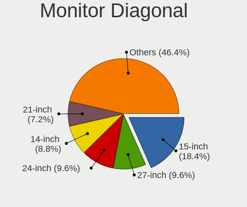
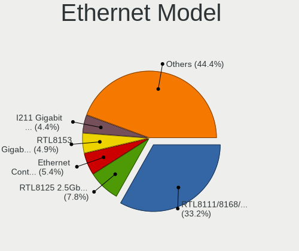
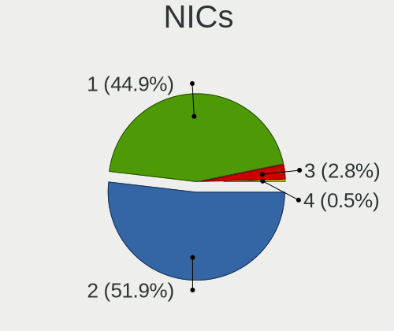
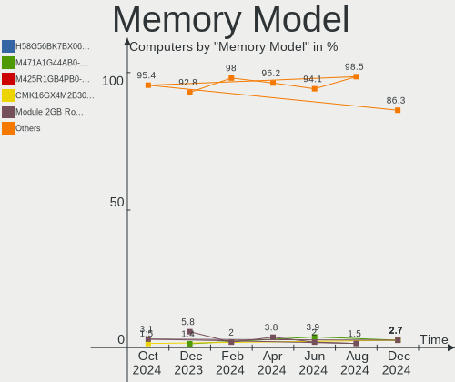
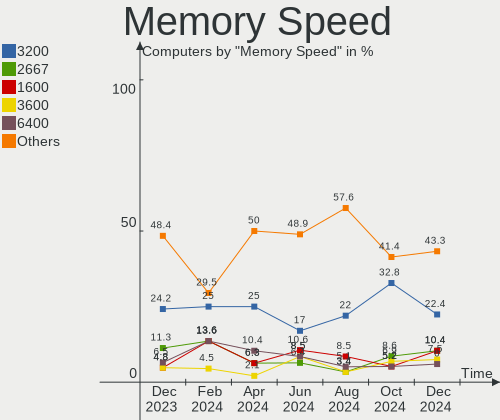
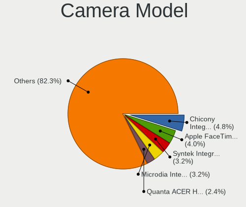
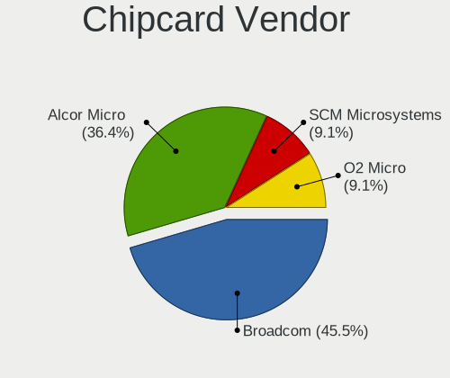

Pop!_OS Hardware Trends
-----------------------

A project to identify most popular hardware characteristics and track their change
over time based on data collected by Pop!_OS users at https://Linux-Hardware.org.

Anyone can contribute to this report by the [hw-probe](https://github.com/linuxhw/hw-probe) tool:

    sudo -E hw-probe -all -upload

This is a report for all computer types. See also reports for [desktops](/Dist/Pop!_OS/Desktop/README.md) and [notebooks](/Dist/Pop!_OS/Notebook/README.md).

Full-feature report is available here: https://linux-hardware.org/?view=trends

Period: Oct, 2021.

Contents
--------

* [ System ](#system)
  - [ OS                       ](#os)
  - [ OS Family                ](#os-family)
  - [ Kernel                   ](#kernel)
  - [ Kernel Family            ](#kernel-family)
  - [ Kernel Major Ver.        ](#kernel-major-ver)
  - [ Arch                     ](#arch)
  - [ DE                       ](#de)
  - [ Display Server           ](#display-server)
  - [ Display Manager          ](#display-manager)
  - [ OS Lang                  ](#os-lang)
  - [ Boot Mode                ](#boot-mode)
  - [ Filesystem               ](#filesystem)
  - [ Part. scheme             ](#part-scheme)
  - [ Dual Boot with Linux/BSD ](#dual-boot-with-linuxbsd)
  - [ Dual Boot (Win)          ](#dual-boot-win)

* [ Board ](#board)
  - [ Vendor                   ](#vendor)
  - [ Model                    ](#model)
  - [ Model Family             ](#model-family)
  - [ MFG Year                 ](#mfg-year)
  - [ Form Factor              ](#form-factor)
  - [ Secure Boot              ](#secure-boot)
  - [ Coreboot                 ](#coreboot)
  - [ RAM Size                 ](#ram-size)
  - [ RAM Used                 ](#ram-used)
  - [ Total Drives             ](#total-drives)
  - [ Has CD-ROM               ](#has-cd-rom)
  - [ Has Ethernet             ](#has-ethernet)
  - [ Has WiFi                 ](#has-wifi)
  - [ Has Bluetooth            ](#has-bluetooth)

* [ Location ](#location)
  - [ Country                  ](#country)
  - [ City                     ](#city)

* [ Drives ](#drives)
  - [ Drive Vendor             ](#drive-vendor)
  - [ Drive Model              ](#drive-model)
  - [ HDD Vendor               ](#hdd-vendor)
  - [ SSD Vendor               ](#ssd-vendor)
  - [ Drive Kind               ](#drive-kind)
  - [ Drive Connector          ](#drive-connector)
  - [ Drive Size               ](#drive-size)
  - [ Space Total              ](#space-total)
  - [ Space Used               ](#space-used)
  - [ Malfunc. Drives          ](#malfunc-drives)
  - [ Malfunc. Drive Vendor    ](#malfunc-drive-vendor)
  - [ Malfunc. HDD Vendor      ](#malfunc-hdd-vendor)
  - [ Malfunc. Drive Kind      ](#malfunc-drive-kind)
  - [ Failed Drives            ](#failed-drives)
  - [ Failed Drive Vendor      ](#failed-drive-vendor)
  - [ Drive Status             ](#drive-status)

* [ Storage controller ](#storage-controller)
  - [ Storage Vendor           ](#storage-vendor)
  - [ Storage Model            ](#storage-model)
  - [ Storage Kind             ](#storage-kind)

* [ Processor ](#processor)
  - [ CPU Vendor               ](#cpu-vendor)
  - [ CPU Model                ](#cpu-model)
  - [ CPU Model Family         ](#cpu-model-family)
  - [ CPU Cores                ](#cpu-cores)
  - [ CPU Sockets              ](#cpu-sockets)
  - [ CPU Threads              ](#cpu-threads)
  - [ CPU Op-Modes             ](#cpu-op-modes)
  - [ CPU Microcode            ](#cpu-microcode)
  - [ CPU Microarch            ](#cpu-microarch)

* [ Graphics ](#graphics)
  - [ GPU Vendor               ](#gpu-vendor)
  - [ GPU Model                ](#gpu-model)
  - [ GPU Combo                ](#gpu-combo)
  - [ GPU Driver               ](#gpu-driver)
  - [ GPU Memory               ](#gpu-memory)

* [ Monitor ](#monitor)
  - [ Monitor Vendor           ](#monitor-vendor)
  - [ Monitor Model            ](#monitor-model)
  - [ Monitor Resolution       ](#monitor-resolution)
  - [ Monitor Diagonal         ](#monitor-diagonal)
  - [ Monitor Width            ](#monitor-width)
  - [ Aspect Ratio             ](#aspect-ratio)
  - [ Monitor Area             ](#monitor-area)
  - [ Pixel Density            ](#pixel-density)
  - [ Multiple Monitors        ](#multiple-monitors)

* [ Network ](#network)
  - [ Net Controller Vendor    ](#net-controller-vendor)
  - [ Net Controller Model     ](#net-controller-model)
  - [ Wireless Vendor          ](#wireless-vendor)
  - [ Wireless Model           ](#wireless-model)
  - [ Ethernet Vendor          ](#ethernet-vendor)
  - [ Ethernet Model           ](#ethernet-model)
  - [ Net Controller Kind      ](#net-controller-kind)
  - [ Used Controller          ](#used-controller)
  - [ NICs                     ](#nics)
  - [ IPv6                     ](#ipv6)

* [ Bluetooth ](#bluetooth)
  - [ Bluetooth Vendor         ](#bluetooth-vendor)
  - [ Bluetooth Model          ](#bluetooth-model)

* [ Sound ](#sound)
  - [ Sound Vendor             ](#sound-vendor)
  - [ Sound Model              ](#sound-model)

* [ Memory ](#memory)
  - [ Memory Vendor            ](#memory-vendor)
  - [ Memory Model             ](#memory-model)
  - [ Memory Kind              ](#memory-kind)
  - [ Memory Form Factor       ](#memory-form-factor)
  - [ Memory Size              ](#memory-size)
  - [ Memory Speed             ](#memory-speed)

* [ Printers & scanners ](#printers--scanners)
  - [ Printer Vendor           ](#printer-vendor)
  - [ Printer Model            ](#printer-model)
  - [ Scanner Vendor           ](#scanner-vendor)
  - [ Scanner Model            ](#scanner-model)

* [ Camera ](#camera)
  - [ Camera Vendor            ](#camera-vendor)
  - [ Camera Model             ](#camera-model)

* [ Security ](#security)
  - [ Fingerprint Vendor       ](#fingerprint-vendor)
  - [ Fingerprint Model        ](#fingerprint-model)
  - [ Chipcard Vendor          ](#chipcard-vendor)
  - [ Chipcard Model           ](#chipcard-model)

* [ Unsupported ](#unsupported)
  - [ Unsupported Devices      ](#unsupported-devices)
  - [ Unsupported Device Types ](#unsupported-device-types)

System
------

OS
--

Installed operating systems

| Name          | Computers | Percent |
|---------------|-----------|---------|
| Pop!_OS 21.04 | 339       | 88.05%  |
| Pop!_OS 20.04 | 35        | 9.09%   |
| Pop!_OS 21.10 | 7         | 1.82%   |
| Pop!_OS 20.10 | 4         | 1.04%   |

OS Family
---------

OS without a version

| Name    | Computers | Percent |
|---------|-----------|---------|
| Pop!_OS | 385       | 100%    |

Kernel
------

Version of the Linux kernel

| Version                    | Computers | Percent |
|----------------------------|-----------|---------|
| 5.13.0-7614-generic        | 334       | 86.75%  |
| 5.11.0-7620-generic        | 14        | 3.64%   |
| 5.13.0-7620-generic        | 11        | 2.86%   |
| 5.11.0-7633-generic        | 5         | 1.3%    |
| 5.13.0-7619-generic        | 3         | 0.78%   |
| 5.8.0-7642-generic         | 1         | 0.26%   |
| 5.8.0-7630-generic         | 1         | 0.26%   |
| 5.4.0-7642-generic         | 1         | 0.26%   |
| 5.4.0-7626-generic         | 1         | 0.26%   |
| 5.4.0-7625-generic         | 1         | 0.26%   |
| 5.14.9-xanmod2             | 1         | 0.26%   |
| 5.14.9-xanmod1             | 1         | 0.26%   |
| 5.14.9-051409-generic      | 1         | 0.26%   |
| 5.14.7-051407-generic      | 1         | 0.26%   |
| 5.14.14-051414-generic     | 1         | 0.26%   |
| 5.14.11-xanmod1            | 1         | 0.26%   |
| 5.14.10-xanmod1            | 1         | 0.26%   |
| 5.14.10-051410-generic     | 1         | 0.26%   |
| 5.14.0-12.1-liquorix-amd64 | 1         | 0.26%   |
| 5.13.8-xanmod1             | 1         | 0.26%   |
| 5.13.0-1009-raspi          | 1         | 0.26%   |
| 5.13.0-1008-raspi          | 1         | 0.26%   |
| 5.11.0-7612-generic        | 1         | 0.26%   |

Kernel Family
-------------

Linux kernel without a distro release

| Version | Computers | Percent |
|---------|-----------|---------|
| 5.13.0  | 350       | 90.91%  |
| 5.11.0  | 20        | 5.19%   |
| 5.4.0   | 3         | 0.78%   |
| 5.14.9  | 3         | 0.78%   |
| 5.8.0   | 2         | 0.52%   |
| 5.14.10 | 2         | 0.52%   |
| 5.14.7  | 1         | 0.26%   |
| 5.14.14 | 1         | 0.26%   |
| 5.14.11 | 1         | 0.26%   |
| 5.14.0  | 1         | 0.26%   |
| 5.13.8  | 1         | 0.26%   |

Kernel Major Ver.
-----------------

Linux kernel major version

| Version | Computers | Percent |
|---------|-----------|---------|
| 5.13    | 351       | 91.17%  |
| 5.11    | 20        | 5.19%   |
| 5.14    | 9         | 2.34%   |
| 5.4     | 3         | 0.78%   |
| 5.8     | 2         | 0.52%   |

Arch
----

OS architecture (x86_64, i586, etc.)

| Name    | Computers | Percent |
|---------|-----------|---------|
| x86_64  | 383       | 99.48%  |
| aarch64 | 2         | 0.52%   |

DE
--

Desktop Environment

| Name     | Computers | Percent |
|----------|-----------|---------|
| GNOME    | 378       | 98.18%  |
| KDE5     | 5         | 1.3%    |
| XFCE     | 1         | 0.26%   |
| Cinnamon | 1         | 0.26%   |

Display Server
--------------

X11 or Wayland

| Name    | Computers | Percent |
|---------|-----------|---------|
| X11     | 378       | 98.18%  |
| Wayland | 7         | 1.82%   |

Display Manager
---------------

SDDM, LightDM, etc.

| Name    | Computers | Percent |
|---------|-----------|---------|
| Unknown | 329       | 85.45%  |
| GDM     | 55        | 14.29%  |
| GDM3    | 1         | 0.26%   |

OS Lang
-------

Language

| Lang  | Computers | Percent |
|-------|-----------|---------|
| en_US | 207       | 53.77%  |
| en_GB | 33        | 8.57%   |
| C     | 20        | 5.19%   |
| pt_BR | 18        | 4.68%   |
| fr_FR | 14        | 3.64%   |
| en_AU | 13        | 3.38%   |
| de_DE | 12        | 3.12%   |
| es_ES | 8         | 2.08%   |
| en_CA | 8         | 2.08%   |
| pl_PL | 6         | 1.56%   |
| sv_SE | 5         | 1.3%    |
| it_IT | 5         | 1.3%    |
| en_ZA | 5         | 1.3%    |
| ru_RU | 4         | 1.04%   |
| en_IN | 4         | 1.04%   |
| en_NZ | 3         | 0.78%   |
| de_AT | 3         | 0.78%   |
| pt_PT | 2         | 0.52%   |
| nl_NL | 2         | 0.52%   |
| fr_CA | 2         | 0.52%   |
| es_MX | 2         | 0.52%   |
| sk_SK | 1         | 0.26%   |
| ja_JP | 1         | 0.26%   |
| hr_HR | 1         | 0.26%   |
| fr_CH | 1         | 0.26%   |
| es_EC | 1         | 0.26%   |
| es_CO | 1         | 0.26%   |
| es_AR | 1         | 0.26%   |
| de_CH | 1         | 0.26%   |
| cs_CZ | 1         | 0.26%   |

Boot Mode
---------

EFI or BIOS

| Mode | Computers | Percent |
|------|-----------|---------|
| BIOS | 333       | 86.49%  |
| EFI  | 52        | 13.51%  |

Filesystem
----------

Type of filesystem

| Type    | Computers | Percent |
|---------|-----------|---------|
| Ext4    | 362       | 94.03%  |
| Overlay | 11        | 2.86%   |
| Btrfs   | 10        | 2.6%    |
| Zfs     | 1         | 0.26%   |
| Ext2    | 1         | 0.26%   |

Part. scheme
------------

Scheme of partitioning

| Type    | Computers | Percent |
|---------|-----------|---------|
| Unknown | 329       | 85.45%  |
| GPT     | 52        | 13.51%  |
| MBR     | 4         | 1.04%   |

Dual Boot with Linux/BSD
------------------------

Hosting more than one Linux/BSD

| Dual boot | Computers | Percent |
|-----------|-----------|---------|
| No        | 378       | 98.18%  |
| Yes       | 7         | 1.82%   |

Dual Boot (Win)
---------------

Hosting Linux and Windows

| Dual boot | Computers | Percent |
|-----------|-----------|---------|
| No        | 359       | 93.25%  |
| Yes       | 26        | 6.75%   |

Board
-----

Vendor
------

Motherboard manufacturer

| Name                    | Computers | Percent |
|-------------------------|-----------|---------|
| ASUSTek Computer        | 72        | 18.7%   |
| Dell                    | 52        | 13.51%  |
| Lenovo                  | 42        | 10.91%  |
| Hewlett-Packard         | 41        | 10.65%  |
| Gigabyte Technology     | 33        | 8.57%   |
| MSI                     | 28        | 7.27%   |
| Acer                    | 20        | 5.19%   |
| ASRock                  | 15        | 3.9%    |
| Apple                   | 11        | 2.86%   |
| Samsung Electronics     | 7         | 1.82%   |
| Intel                   | 6         | 1.56%   |
| Toshiba                 | 5         | 1.3%    |
| System76                | 5         | 1.3%    |
| Timi                    | 3         | 0.78%   |
| Sony                    | 3         | 0.78%   |
| Notebook                | 3         | 0.78%   |
| HUAWEI                  | 3         | 0.78%   |
| Unknown                 | 3         | 0.78%   |
| Supermicro              | 2         | 0.52%   |
| Raspberry Pi Foundation | 2         | 0.52%   |
| Pegatron                | 2         | 0.52%   |
| Medion                  | 2         | 0.52%   |
| Huanan                  | 2         | 0.52%   |
| Google                  | 2         | 0.52%   |
| Fujitsu Siemens         | 2         | 0.52%   |
| Alienware               | 2         | 0.52%   |
| Wistron                 | 1         | 0.26%   |
| Razer                   | 1         | 0.26%   |
| PC Specialist           | 1         | 0.26%   |
| Packard Bell            | 1         | 0.26%   |
| OEM                     | 1         | 0.26%   |
| Microsoft               | 1         | 0.26%   |
| IT Channel Pty          | 1         | 0.26%   |
| HASEE Computer          | 1         | 0.26%   |
| Gateway                 | 1         | 0.26%   |
| Fujitsu                 | 1         | 0.26%   |
| Foxconn                 | 1         | 0.26%   |
| ECS                     | 1         | 0.26%   |
| Digibras                | 1         | 0.26%   |
| Clevo                   | 1         | 0.26%   |
| Avell High Performance  | 1         | 0.26%   |
| Acidanthera             | 1         | 0.26%   |
| 16216-BM-27268          | 1         | 0.26%   |

Model
-----

Motherboard model

| Name                                        | Computers | Percent |
|---------------------------------------------|-----------|---------|
| MSI MS-7B86                                 | 4         | 1.04%   |
| Gigabyte B450M DS3H                         | 4         | 1.04%   |
| Dell OptiPlex 9020                          | 3         | 0.78%   |
| ASUS Z170-A                                 | 3         | 0.78%   |
| Unknown                                     | 3         | 0.78%   |
| System76 Gazelle                            | 2         | 0.52%   |
| Samsung 340XAA/350XAA/550XAA                | 2         | 0.52%   |
| RPi Raspberry Pi                            | 2         | 0.52%   |
| MSI MS-7C37                                 | 2         | 0.52%   |
| MSI MS-7C02                                 | 2         | 0.52%   |
| Lenovo MIIX 310-10ICR 80SG                  | 2         | 0.52%   |
| HP ProDesk 600 G1 SFF                       | 2         | 0.52%   |
| HP Pavilion dv6                             | 2         | 0.52%   |
| Gigabyte X570 UD                            | 2         | 0.52%   |
| Gigabyte X570 AORUS MASTER                  | 2         | 0.52%   |
| Gigabyte B150M-D3H                          | 2         | 0.52%   |
| Dell XPS 13 9310                            | 2         | 0.52%   |
| Dell OptiPlex 7010                          | 2         | 0.52%   |
| Dell Latitude 7275                          | 2         | 0.52%   |
| Dell Inspiron 7520                          | 2         | 0.52%   |
| ASUS ROG STRIX B450-F GAMING II             | 2         | 0.52%   |
| ASUS PRIME H510M-K                          | 2         | 0.52%   |
| ASUS PRIME B450-PLUS                        | 2         | 0.52%   |
| ASUS P8Z77-V LK                             | 2         | 0.52%   |
| ASRock B550M Steel Legend                   | 2         | 0.52%   |
| ASRock B450 Gaming K4                       | 2         | 0.52%   |
| Apple MacBookPro12,1                        | 2         | 0.52%   |
| Acer Nitro AN515-45                         | 2         | 0.52%   |
| Wistron ProLiant ML110 G6                   | 1         | 0.26%   |
| Toshiba TECRA R950                          | 1         | 0.26%   |
| Toshiba Satellite T130                      | 1         | 0.26%   |
| Toshiba Satellite L755                      | 1         | 0.26%   |
| Toshiba Satellite L55D-B                    | 1         | 0.26%   |
| Toshiba Satellite A355                      | 1         | 0.26%   |
| Timi RedmiBook 14-APCS                      | 1         | 0.26%   |
| Timi A35S                                   | 1         | 0.26%   |
| Timi A35                                    | 1         | 0.26%   |
| System76 Lemur Pro                          | 1         | 0.26%   |
| System76 Galago Pro                         | 1         | 0.26%   |
| System76 Darter Pro                         | 1         | 0.26%   |
| Supermicro X9DR3-F                          | 1         | 0.26%   |
| Supermicro SSG-6047R-E1R24N                 | 1         | 0.26%   |
| Sony VPCZ13M9E                              | 1         | 0.26%   |
| Sony VPCEH40EB                              | 1         | 0.26%   |
| Sony VGN-NR38S_S                            | 1         | 0.26%   |
| Samsung QX310/QX410/QX510/SF310/SF410/SF510 | 1         | 0.26%   |
| Samsung Galaxy TabPro S                     | 1         | 0.26%   |
| Samsung 930XCJ/931XCJ/930XCR                | 1         | 0.26%   |
| Samsung 550XDA                              | 1         | 0.26%   |
| Samsung 550P5C/550P7C                       | 1         | 0.26%   |
| Razer Blade 14 - RZ09-0370                  | 1         | 0.26%   |
| Pegatron p7-1110                            | 1         | 0.26%   |
| Pegatron AY691AA-ABA p6367c                 | 1         | 0.26%   |
| PC Specialist NP5x_NP6x_NP7xHP              | 1         | 0.26%   |
| Packard Bell IXTREME M5850                  | 1         | 0.26%   |
| OEM Intel H81                               | 1         | 0.26%   |
| Notebook PB50_70RF,RD,RC                    | 1         | 0.26%   |
| Notebook P7xxTM1                            | 1         | 0.26%   |
| Notebook N95_KP6                            | 1         | 0.26%   |
| MSI MS-7C96                                 | 1         | 0.26%   |

Model Family
------------

Motherboard model prefix

| Name                        | Computers | Percent |
|-----------------------------|-----------|---------|
| Lenovo ThinkPad             | 17        | 4.42%   |
| HP Pavilion                 | 14        | 3.64%   |
| Dell Inspiron               | 14        | 3.64%   |
| ASUS ROG                    | 14        | 3.64%   |
| Lenovo IdeaPad              | 13        | 3.38%   |
| Dell Latitude               | 13        | 3.38%   |
| ASUS PRIME                  | 13        | 3.38%   |
| Acer Aspire                 | 11        | 2.86%   |
| Dell OptiPlex               | 9         | 2.34%   |
| Dell XPS                    | 7         | 1.82%   |
| Lenovo Legion               | 5         | 1.3%    |
| Gigabyte X570               | 5         | 1.3%    |
| Toshiba Satellite           | 4         | 1.04%   |
| MSI MS-7B86                 | 4         | 1.04%   |
| HP ENVY                     | 4         | 1.04%   |
| Gigabyte B450M              | 4         | 1.04%   |
| ASUS TUF                    | 4         | 1.04%   |
| ASUS P8Z77-V                | 4         | 1.04%   |
| Acer Nitro                  | 4         | 1.04%   |
| HP Laptop                   | 3         | 0.78%   |
| HP EliteBook                | 3         | 0.78%   |
| Dell Vostro                 | 3         | 0.78%   |
| ASUS Z170-A                 | 3         | 0.78%   |
| ASUS ASUS                   | 3         | 0.78%   |
| Unknown                     | 3         | 0.78%   |
| System76 Gazelle            | 2         | 0.52%   |
| Samsung 340XAA              | 2         | 0.52%   |
| RPi Raspberry               | 2         | 0.52%   |
| MSI MS-7C37                 | 2         | 0.52%   |
| MSI MS-7C02                 | 2         | 0.52%   |
| Lenovo ThinkCentre          | 2         | 0.52%   |
| Lenovo MIIX                 | 2         | 0.52%   |
| Huanan X79                  | 2         | 0.52%   |
| HP ProDesk                  | 2         | 0.52%   |
| HP Compaq                   | 2         | 0.52%   |
| Gigabyte Z390               | 2         | 0.52%   |
| Gigabyte B450               | 2         | 0.52%   |
| Gigabyte B150M-D3H          | 2         | 0.52%   |
| Fujitsu Siemens AMILO       | 2         | 0.52%   |
| ASUS VivoBook               | 2         | 0.52%   |
| ASUS M5A97                  | 2         | 0.52%   |
| ASRock X570                 | 2         | 0.52%   |
| ASRock B550M                | 2         | 0.52%   |
| ASRock B450                 | 2         | 0.52%   |
| Apple MacBookPro9           | 2         | 0.52%   |
| Apple MacBookPro12          | 2         | 0.52%   |
| Apple MacBookPro11          | 2         | 0.52%   |
| Acer Predator               | 2         | 0.52%   |
| Wistron ProLiant            | 1         | 0.26%   |
| Toshiba TECRA               | 1         | 0.26%   |
| Timi RedmiBook              | 1         | 0.26%   |
| Timi A35S                   | 1         | 0.26%   |
| Timi A35                    | 1         | 0.26%   |
| System76 Lemur              | 1         | 0.26%   |
| System76 Galago             | 1         | 0.26%   |
| System76 Darter             | 1         | 0.26%   |
| Supermicro X9DR3-F          | 1         | 0.26%   |
| Supermicro SSG-6047R-E1R24N | 1         | 0.26%   |
| Sony VPCZ13M9E              | 1         | 0.26%   |
| Sony VPCEH40EB              | 1         | 0.26%   |

MFG Year
--------

Motherboard manufacture year

| Year    | Computers | Percent |
|---------|-----------|---------|
| 2021    | 104       | 27.01%  |
| 2020    | 59        | 15.32%  |
| 2018    | 42        | 10.91%  |
| 2019    | 39        | 10.13%  |
| 2012    | 19        | 4.94%   |
| 2017    | 18        | 4.68%   |
| 2011    | 17        | 4.42%   |
| 2013    | 16        | 4.16%   |
| 2016    | 15        | 3.9%    |
| 2015    | 14        | 3.64%   |
| 2014    | 13        | 3.38%   |
| 2010    | 10        | 2.6%    |
| 2009    | 7         | 1.82%   |
| 2008    | 6         | 1.56%   |
| 2007    | 4         | 1.04%   |
| Unknown | 2         | 0.52%   |

Form Factor
-----------

Physical design of the computer

| Name           | Computers | Percent |
|----------------|-----------|---------|
| Notebook       | 199       | 51.69%  |
| Desktop        | 160       | 41.56%  |
| Convertible    | 13        | 3.38%   |
| Tablet         | 7         | 1.82%   |
| System on chip | 2         | 0.52%   |
| Mini pc        | 2         | 0.52%   |
| All in one     | 2         | 0.52%   |

Secure Boot
-----------

Enabled or disabled

| State    | Computers | Percent |
|----------|-----------|---------|
| Disabled | 385       | 100%    |

Coreboot
--------

Have coreboot on board

| Used | Computers | Percent |
|------|-----------|---------|
| No   | 381       | 98.96%  |
| Yes  | 4         | 1.04%   |

RAM Size
--------

Total RAM memory

| Size in GB  | Computers | Percent |
|-------------|-----------|---------|
| 16.01-24.0  | 95        | 24.68%  |
| 4.01-8.0    | 84        | 21.82%  |
| 8.01-16.0   | 79        | 20.52%  |
| 32.01-64.0  | 58        | 15.06%  |
| 3.01-4.0    | 42        | 10.91%  |
| 64.01-256.0 | 14        | 3.64%   |
| 24.01-32.0  | 7         | 1.82%   |
| 1.01-2.0    | 6         | 1.56%   |

RAM Used
--------

Used RAM memory

| Used GB    | Computers | Percent |
|------------|-----------|---------|
| 1.01-2.0   | 127       | 32.99%  |
| 2.01-3.0   | 119       | 30.91%  |
| 4.01-8.0   | 62        | 16.1%   |
| 3.01-4.0   | 58        | 15.06%  |
| 8.01-16.0  | 15        | 3.9%    |
| 0.51-1.0   | 2         | 0.52%   |
| 32.01-64.0 | 1         | 0.26%   |
| 16.01-24.0 | 1         | 0.26%   |

Total Drives
------------

Number of drives on board

| Drives | Computers | Percent |
|--------|-----------|---------|
| 1      | 210       | 54.55%  |
| 2      | 98        | 25.45%  |
| 3      | 39        | 10.13%  |
| 4      | 19        | 4.94%   |
| 5      | 11        | 2.86%   |
| 0      | 5         | 1.3%    |
| 6      | 3         | 0.78%   |

Has CD-ROM
----------

Has CD-ROM on board

| Presented | Computers | Percent |
|-----------|-----------|---------|
| No        | 266       | 69.09%  |
| Yes       | 119       | 30.91%  |

Has Ethernet
------------

Has Ethernet on board

| Presented | Computers | Percent |
|-----------|-----------|---------|
| Yes       | 322       | 83.64%  |
| No        | 63        | 16.36%  |

Has WiFi
--------

Has WiFi module

| Presented | Computers | Percent |
|-----------|-----------|---------|
| Yes       | 299       | 77.66%  |
| No        | 86        | 22.34%  |

Has Bluetooth
-------------

Has Bluetooth module

| Presented | Computers | Percent |
|-----------|-----------|---------|
| Yes       | 249       | 64.68%  |
| No        | 136       | 35.32%  |

Location
--------

Country
-------

Geographic location (country)

| Country                | Computers | Percent |
|------------------------|-----------|---------|
| USA                    | 114       | 29.61%  |
| UK                     | 26        | 6.75%   |
| Brazil                 | 26        | 6.75%   |
| Germany                | 19        | 4.94%   |
| Canada                 | 18        | 4.68%   |
| France                 | 15        | 3.9%    |
| India                  | 12        | 3.12%   |
| Australia              | 12        | 3.12%   |
| South Africa           | 10        | 2.6%    |
| Poland                 | 10        | 2.6%    |
| Italy                  | 10        | 2.6%    |
| Sweden                 | 9         | 2.34%   |
| Netherlands            | 9         | 2.34%   |
| Switzerland            | 6         | 1.56%   |
| Spain                  | 5         | 1.3%    |
| Russia                 | 5         | 1.3%    |
| Portugal               | 5         | 1.3%    |
| Mexico                 | 5         | 1.3%    |
| Saudi Arabia           | 4         | 1.04%   |
| Philippines            | 4         | 1.04%   |
| New Zealand            | 4         | 1.04%   |
| Ecuador                | 4         | 1.04%   |
| Austria                | 4         | 1.04%   |
| Romania                | 3         | 0.78%   |
| Malaysia               | 3         | 0.78%   |
| Belgium                | 3         | 0.78%   |
| Slovenia               | 2         | 0.52%   |
| Norway                 | 2         | 0.52%   |
| Japan                  | 2         | 0.52%   |
| Indonesia              | 2         | 0.52%   |
| Hong Kong              | 2         | 0.52%   |
| Denmark                | 2         | 0.52%   |
| Czechia                | 2         | 0.52%   |
| Bosnia and Herzegovina | 2         | 0.52%   |
| Argentina              | 2         | 0.52%   |
| Vietnam                | 1         | 0.26%   |
| Slovakia               | 1         | 0.26%   |
| North Macedonia        | 1         | 0.26%   |
| Namibia                | 1         | 0.26%   |
| Lithuania              | 1         | 0.26%   |
| Latvia                 | 1         | 0.26%   |
| Israel                 | 1         | 0.26%   |
| Ireland                | 1         | 0.26%   |
| Iceland                | 1         | 0.26%   |
| Hungary                | 1         | 0.26%   |
| Greece                 | 1         | 0.26%   |
| Finland                | 1         | 0.26%   |
| Estonia                | 1         | 0.26%   |
| El Salvador            | 1         | 0.26%   |
| Dominican Republic     | 1         | 0.26%   |
| Czech Republic         | 1         | 0.26%   |
| Cuba                   | 1         | 0.26%   |
| Croatia                | 1         | 0.26%   |
| Colombia               | 1         | 0.26%   |
| Bulgaria               | 1         | 0.26%   |
| Bolivia                | 1         | 0.26%   |
| Bangladesh             | 1         | 0.26%   |

City
----

Geographic location (city)

| City               | Computers | Percent |
|--------------------|-----------|---------|
| Amsterdam          | 5         | 1.3%    |
| S??o Paulo         | 4         | 1.04%   |
| Rio de Janeiro     | 4         | 1.04%   |
| Johannesburg       | 4         | 1.04%   |
| Warsaw             | 3         | 0.78%   |
| Seattle            | 3         | 0.78%   |
| Quito              | 3         | 0.78%   |
| Mexico City        | 3         | 0.78%   |
| Los Angeles        | 3         | 0.78%   |
| Jeddah             | 3         | 0.78%   |
| Dallas             | 3         | 0.78%   |
| Brooklyn           | 3         | 0.78%   |
| Washington         | 2         | 0.52%   |
| Vienna             | 2         | 0.52%   |
| Valenza            | 2         | 0.52%   |
| Urbana             | 2         | 0.52%   |
| Tuscaloosa         | 2         | 0.52%   |
| Thunder Bay        | 2         | 0.52%   |
| Sydney             | 2         | 0.52%   |
| Salt Lake City     | 2         | 0.52%   |
| Osasco             | 2         | 0.52%   |
| Olsztyn            | 2         | 0.52%   |
| Montreal           | 2         | 0.52%   |
| Milan              | 2         | 0.52%   |
| Medicine Hat       | 2         | 0.52%   |
| Malmo              | 2         | 0.52%   |
| Ljubljana          | 2         | 0.52%   |
| Huntington Beach   | 2         | 0.52%   |
| Glasgow            | 2         | 0.52%   |
| Geneva             | 2         | 0.52%   |
| Farmington         | 2         | 0.52%   |
| Denver             | 2         | 0.52%   |
| Chennai            | 2         | 0.52%   |
| Buenos Aires       | 2         | 0.52%   |
| Bucharest          | 2         | 0.52%   |
| Browning           | 2         | 0.52%   |
| Brisbane           | 2         | 0.52%   |
| Berwick-Upon-Tweed | 2         | 0.52%   |
| Austin             | 2         | 0.52%   |
| Auckland           | 2         | 0.52%   |
| Ansfelden          | 2         | 0.52%   |
| Adelaide CBD       | 2         | 0.52%   |
| Zurich             | 1         | 0.26%   |
| Zagreb             | 1         | 0.26%   |
| Yekaterinburg      | 1         | 0.26%   |
| Wroclaw            | 1         | 0.26%   |
| Witten             | 1         | 0.26%   |
| Wisconsin Dells    | 1         | 0.26%   |
| Wisbech            | 1         | 0.26%   |
| Windhoek           | 1         | 0.26%   |
| Westwood           | 1         | 0.26%   |
| Westlake           | 1         | 0.26%   |
| West Lafayette     | 1         | 0.26%   |
| Wemmel             | 1         | 0.26%   |
| Waynesboro         | 1         | 0.26%   |
| Wausau             | 1         | 0.26%   |
| Waterloo           | 1         | 0.26%   |
| Waterford          | 1         | 0.26%   |
| Wasaga Beach       | 1         | 0.26%   |
| Wardha             | 1         | 0.26%   |

Drives
------

Drive Vendor
------------

Hard drive vendors

| Vendor                       | Computers | Drives | Percent |
|------------------------------|-----------|--------|---------|
| Samsung Electronics          | 99        | 128    | 16.61%  |
| Seagate                      | 90        | 107    | 15.1%   |
| WDC                          | 80        | 90     | 13.42%  |
| SanDisk                      | 42        | 42     | 7.05%   |
| Kingston                     | 40        | 46     | 6.71%   |
| Toshiba                      | 34        | 36     | 5.7%    |
| Unknown                      | 24        | 26     | 4.03%   |
| Crucial                      | 19        | 19     | 3.19%   |
| Intel                        | 17        | 17     | 2.85%   |
| SK Hynix                     | 15        | 15     | 2.52%   |
| Phison                       | 14        | 16     | 2.35%   |
| Micron Technology            | 13        | 15     | 2.18%   |
| Hitachi                      | 12        | 12     | 2.01%   |
| Apple                        | 9         | 11     | 1.51%   |
| HGST                         | 8         | 10     | 1.34%   |
| Silicon Motion               | 7         | 7      | 1.17%   |
| XPG                          | 5         | 9      | 0.84%   |
| Micron/Crucial Technology    | 5         | 5      | 0.84%   |
| KIOXIA                       | 5         | 5      | 0.84%   |
| China                        | 5         | 8      | 0.84%   |
| A-DATA Technology            | 5         | 5      | 0.84%   |
| LITEON                       | 4         | 4      | 0.67%   |
| Team                         | 3         | 3      | 0.5%    |
| PNY                          | 3         | 3      | 0.5%    |
| OCZ                          | 3         | 3      | 0.5%    |
| LITEONIT                     | 3         | 3      | 0.5%    |
| Hewlett-Packard              | 3         | 3      | 0.5%    |
| GOODRAM                      | 3         | 3      | 0.5%    |
| Transcend                    | 2         | 2      | 0.34%   |
| Realtek Semiconductor        | 2         | 2      | 0.34%   |
| JMicron                      | 2         | 2      | 0.34%   |
| Vaseky                       | 1         | 1      | 0.17%   |
| Union Memory (Shenzhen)      | 1         | 1      | 0.17%   |
| TO Exter                     | 1         | 1      | 0.17%   |
| StoreJet                     | 1         | 1      | 0.17%   |
| PLEXTOR                      | 1         | 1      | 0.17%   |
| Mushkin                      | 1         | 1      | 0.17%   |
| MidasForce                   | 1         | 1      | 0.17%   |
| MAXTOR                       | 1         | 1      | 0.17%   |
| KIOXIA-EXCERIA               | 1         | 1      | 0.17%   |
| KingSpec                     | 1         | 1      | 0.17%   |
| HPT                          | 1         | 3      | 0.17%   |
| Gigabyte Technology          | 1         | 1      | 0.17%   |
| Fujitsu                      | 1         | 1      | 0.17%   |
| ExcelStor                    | 1         | 1      | 0.17%   |
| Dogfish                      | 1         | 1      | 0.17%   |
| Corsair                      | 1         | 1      | 0.17%   |
| Colorful                     | 1         | 1      | 0.17%   |
| Beijing Starblaze Technology | 1         | 1      | 0.17%   |
| ASMT109x                     | 1         | 1      | 0.17%   |
| Unknown                      | 1         | 1      | 0.17%   |

Drive Model
-----------

Hard drive models

| Model                                  | Computers | Percent |
|----------------------------------------|-----------|---------|
| Samsung NVMe SSD Drive 500GB           | 12        | 1.84%   |
| Kingston SA400S37240G 240GB SSD        | 12        | 1.84%   |
| Samsung NVMe SSD Drive 1TB             | 10        | 1.53%   |
| Samsung SSD 850 EVO 500GB              | 8         | 1.23%   |
| Sandisk NVMe SSD Drive 512GB           | 7         | 1.07%   |
| Samsung NVMe SSD Drive 256GB           | 7         | 1.07%   |
| Seagate ST500DM002-1BD142 500GB        | 6         | 0.92%   |
| Samsung SSD 860 EVO 500GB              | 6         | 0.92%   |
| Unknown MMC Card  128GB                | 5         | 0.77%   |
| Toshiba MQ04ABF100 1TB                 | 5         | 0.77%   |
| Seagate ST3500418AS 500GB              | 5         | 0.77%   |
| Seagate ST2000DM008-2FR102 2TB         | 5         | 0.77%   |
| Seagate ST1000LM035-1RK172 1TB         | 5         | 0.77%   |
| Seagate ST1000DM010-2EP102 1TB         | 5         | 0.77%   |
| Sandisk NVMe SSD Drive 1TB             | 5         | 0.77%   |
| Samsung SSD 850 EVO 250GB              | 5         | 0.77%   |
| Samsung SM963 2.5" NVMe PCIe SSD 250GB | 5         | 0.77%   |
| Samsung PM963 2.5" NVMe PCIe SSD 512GB | 5         | 0.77%   |
| WDC WD10JPVX-22JC3T0 1TB               | 4         | 0.61%   |
| Unknown SD/MMC/MS PRO 128GB            | 4         | 0.61%   |
| Toshiba DT01ACA100 1TB                 | 4         | 0.61%   |
| SK Hynix NVMe SSD Drive 512GB          | 4         | 0.61%   |
| SK Hynix NVMe SSD Drive 256GB          | 4         | 0.61%   |
| SanDisk SSD PLUS 240GB                 | 4         | 0.61%   |
| Sandisk NVMe SSD Drive 500GB           | 4         | 0.61%   |
| Kingston SA400S37120G 120GB SSD        | 4         | 0.61%   |
| Intel NVMe SSD Drive 512GB             | 4         | 0.61%   |
| WDC WD10JPVX-75JC3T0 1TB               | 3         | 0.46%   |
| Unknown MMC Card  64GB                 | 3         | 0.46%   |
| Unknown MMC Card  32GB                 | 3         | 0.46%   |
| Unknown MMC Card  16GB                 | 3         | 0.46%   |
| Toshiba NVMe SSD Drive 512GB           | 3         | 0.46%   |
| Toshiba HDWD110 1TB                    | 3         | 0.46%   |
| Seagate ST9500325AS 500GB              | 3         | 0.46%   |
| Seagate ST3500630AS 500GB              | 3         | 0.46%   |
| Seagate ST31000528AS 1TB               | 3         | 0.46%   |
| SanDisk SDSSDA240G 240GB               | 3         | 0.46%   |
| Samsung SSD 860 QVO 2TB                | 3         | 0.46%   |
| Phison NVMe SSD Drive 1TB              | 3         | 0.46%   |
| Phison NVMe SSD Drive 1024GB           | 3         | 0.46%   |
| Micron NVMe SSD Drive 512GB            | 3         | 0.46%   |
| Intel NVMe SSD Drive 1024GB            | 3         | 0.46%   |
| Crucial CT250MX500SSD1 250GB           | 3         | 0.46%   |
| Crucial CT1000MX500SSD1 1TB            | 3         | 0.46%   |
| XPG NVMe SSD Drive 2TB                 | 2         | 0.31%   |
| WDC WDS240G2G0B-00EPW0 240GB SSD       | 2         | 0.31%   |
| WDC WDS240G2G0A-00JH30 240GB SSD       | 2         | 0.31%   |
| WDC WDS100T2B0A-00SM50 1TB SSD         | 2         | 0.31%   |
| WDC WD5000LPVX-75V0TT0 500GB           | 2         | 0.31%   |
| WDC WD2500AAKX-753CA1 250GB            | 2         | 0.31%   |
| WDC WD10SPZX-08Z10 1TB                 | 2         | 0.31%   |
| WDC WD10EZEX-08WN4A0 1TB               | 2         | 0.31%   |
| Unknown MMC Card  134GB                | 2         | 0.31%   |
| Toshiba NVMe SSD Drive 256GB           | 2         | 0.31%   |
| Toshiba MQ01ABD100 1TB                 | 2         | 0.31%   |
| Toshiba DT01ACA200 2TB                 | 2         | 0.31%   |
| SK Hynix NVMe SSD Drive 1024GB         | 2         | 0.31%   |
| Silicon Motion NVMe SSD Drive 512GB    | 2         | 0.31%   |
| Seagate ST9750420AS 752GB              | 2         | 0.31%   |
| Seagate ST500LT012-1DG142 500GB        | 2         | 0.31%   |

HDD Vendor
----------

Hard disk drive vendors

| Vendor              | Computers | Drives | Percent |
|---------------------|-----------|--------|---------|
| Seagate             | 89        | 105    | 41.2%   |
| WDC                 | 61        | 69     | 28.24%  |
| Toshiba             | 26        | 26     | 12.04%  |
| Hitachi             | 12        | 12     | 5.56%   |
| HGST                | 8         | 10     | 3.7%    |
| Samsung Electronics | 7         | 7      | 3.24%   |
| Unknown             | 4         | 4      | 1.85%   |
| Apple               | 2         | 2      | 0.93%   |
| TO Exter            | 1         | 1      | 0.46%   |
| MAXTOR              | 1         | 1      | 0.46%   |
| JMicron             | 1         | 1      | 0.46%   |
| Hewlett-Packard     | 1         | 1      | 0.46%   |
| Fujitsu             | 1         | 1      | 0.46%   |
| ExcelStor           | 1         | 1      | 0.46%   |
| ASMT109x            | 1         | 1      | 0.46%   |

SSD Vendor
----------

Solid state drive vendors

| Vendor              | Computers | Drives | Percent |
|---------------------|-----------|--------|---------|
| Samsung Electronics | 54        | 65     | 27.14%  |
| Kingston            | 33        | 37     | 16.58%  |
| SanDisk             | 20        | 20     | 10.05%  |
| Crucial             | 18        | 18     | 9.05%   |
| WDC                 | 10        | 10     | 5.03%   |
| Intel               | 7         | 7      | 3.52%   |
| China               | 5         | 8      | 2.51%   |
| Apple               | 5         | 5      | 2.51%   |
| Micron Technology   | 4         | 5      | 2.01%   |
| LITEON              | 4         | 4      | 2.01%   |
| A-DATA Technology   | 4         | 4      | 2.01%   |
| Toshiba             | 3         | 4      | 1.51%   |
| Team                | 3         | 3      | 1.51%   |
| SK Hynix            | 3         | 3      | 1.51%   |
| PNY                 | 3         | 3      | 1.51%   |
| OCZ                 | 3         | 3      | 1.51%   |
| LITEONIT            | 3         | 3      | 1.51%   |
| Transcend           | 2         | 2      | 1.01%   |
| Hewlett-Packard     | 2         | 2      | 1.01%   |
| Vaseky              | 1         | 1      | 0.5%    |
| Unknown             | 1         | 1      | 0.5%    |
| StoreJet            | 1         | 1      | 0.5%    |
| PLEXTOR             | 1         | 1      | 0.5%    |
| Phison              | 1         | 1      | 0.5%    |
| Mushkin             | 1         | 1      | 0.5%    |
| MidasForce          | 1         | 1      | 0.5%    |
| KIOXIA-EXCERIA      | 1         | 1      | 0.5%    |
| KingSpec            | 1         | 1      | 0.5%    |
| GOODRAM             | 1         | 1      | 0.5%    |
| Gigabyte Technology | 1         | 1      | 0.5%    |
| Dogfish             | 1         | 1      | 0.5%    |
| Colorful            | 1         | 1      | 0.5%    |

Drive Kind
----------

HDD or SSD

| Kind    | Computers | Drives | Percent |
|---------|-----------|--------|---------|
| SSD     | 178       | 219    | 33.09%  |
| HDD     | 176       | 242    | 32.71%  |
| NVMe    | 161       | 188    | 29.93%  |
| MMC     | 17        | 21     | 3.16%   |
| Unknown | 6         | 9      | 1.12%   |

Drive Connector
---------------

SATA, SAS, NVMe, etc.

| Type | Computers | Drives | Percent |
|------|-----------|--------|---------|
| SATA | 273       | 447    | 58.46%  |
| NVMe | 161       | 188    | 34.48%  |
| MMC  | 17        | 21     | 3.64%   |
| SAS  | 16        | 23     | 3.43%   |

Drive Size
----------

Size of hard drive

| Size in TB | Computers | Drives | Percent |
|------------|-----------|--------|---------|
| 0.01-0.5   | 210       | 268    | 56.45%  |
| 0.51-1.0   | 107       | 122    | 28.76%  |
| 1.01-2.0   | 29        | 37     | 7.8%    |
| 3.01-4.0   | 12        | 17     | 3.23%   |
| 2.01-3.0   | 11        | 14     | 2.96%   |
| 4.01-10.0  | 3         | 3      | 0.81%   |

Space Total
-----------

Amount of disk space available on the file system

| Size in GB     | Computers | Percent |
|----------------|-----------|---------|
| 101-250        | 122       | 31.69%  |
| 251-500        | 84        | 21.82%  |
| 501-1000       | 74        | 19.22%  |
| 1001-2000      | 30        | 7.79%   |
| More than 3000 | 22        | 5.71%   |
| 1-20           | 17        | 4.42%   |
| 51-100         | 17        | 4.42%   |
| 2001-3000      | 11        | 2.86%   |
| 21-50          | 5         | 1.3%    |
| Unknown        | 3         | 0.78%   |

Space Used
----------

Amount of used disk space

| Used GB        | Computers | Percent |
|----------------|-----------|---------|
| 1-20           | 150       | 38.96%  |
| 21-50          | 72        | 18.7%   |
| 101-250        | 50        | 12.99%  |
| 51-100         | 47        | 12.21%  |
| 501-1000       | 25        | 6.49%   |
| 251-500        | 18        | 4.68%   |
| 1001-2000      | 10        | 2.6%    |
| More than 3000 | 5         | 1.3%    |
| 2001-3000      | 5         | 1.3%    |
| Unknown        | 3         | 0.78%   |

Malfunc. Drives
---------------

Drive models with a malfunction

| Model                                   | Computers | Drives | Percent |
|-----------------------------------------|-----------|--------|---------|
| WDC WD10JPCX-24UE4T0 1TB                | 1         | 1      | 12.5%   |
| Seagate ST9750420AS 752GB               | 1         | 1      | 12.5%   |
| Seagate ST500LT012-9WS142 500GB         | 1         | 1      | 12.5%   |
| Seagate ST500DM002-1BD142 500GB         | 1         | 1      | 12.5%   |
| Seagate ST1000LM035-1RK172 1TB          | 1         | 1      | 12.5%   |
| Seagate ST1000DM010-2EP102 1TB          | 1         | 1      | 12.5%   |
| Kingston RBU-SNS8350DES3128GP 128GB SSD | 1         | 1      | 12.5%   |
| HGST HTS725050A7E630 500GB              | 1         | 2      | 12.5%   |

Malfunc. Drive Vendor
---------------------

Vendors of faulty drives

| Vendor   | Computers | Drives | Percent |
|----------|-----------|--------|---------|
| Seagate  | 5         | 5      | 62.5%   |
| WDC      | 1         | 1      | 12.5%   |
| Kingston | 1         | 1      | 12.5%   |
| HGST     | 1         | 2      | 12.5%   |

Malfunc. HDD Vendor
-------------------

Vendors of faulty HDD drives

| Vendor  | Computers | Drives | Percent |
|---------|-----------|--------|---------|
| Seagate | 5         | 5      | 71.43%  |
| WDC     | 1         | 1      | 14.29%  |
| HGST    | 1         | 2      | 14.29%  |

Malfunc. Drive Kind
-------------------

Kinds of faulty drives

| Kind | Computers | Drives | Percent |
|------|-----------|--------|---------|
| HDD  | 7         | 8      | 87.5%   |
| SSD  | 1         | 1      | 12.5%   |

Failed Drives
-------------

Failed drive models

Zero info for selected period =(

Failed Drive Vendor
-------------------

Failed drive vendors

Zero info for selected period =(

Drive Status
------------

Number of failed and malfunc. drives

| Status   | Computers | Drives | Percent |
|----------|-----------|--------|---------|
| Detected | 335       | 587    | 83.96%  |
| Works    | 56        | 83     | 14.04%  |
| Malfunc  | 8         | 9      | 2.01%   |

Storage controller
------------------

Storage Vendor
--------------

Storage controller vendors

| Vendor                       | Computers | Percent |
|------------------------------|-----------|---------|
| Intel                        | 249       | 46.98%  |
| AMD                          | 95        | 17.92%  |
| Samsung Electronics          | 54        | 10.19%  |
| Sandisk                      | 29        | 5.47%   |
| Phison Electronics           | 14        | 2.64%   |
| SK Hynix                     | 12        | 2.26%   |
| ASMedia Technology           | 12        | 2.26%   |
| Micron Technology            | 9         | 1.7%    |
| Toshiba America Info Systems | 8         | 1.51%   |
| Kingston Technology Company  | 8         | 1.51%   |
| Silicon Motion               | 7         | 1.32%   |
| Micron/Crucial Technology    | 6         | 1.13%   |
| ADATA Technology             | 6         | 1.13%   |
| Nvidia                       | 3         | 0.57%   |
| KIOXIA                       | 3         | 0.57%   |
| Silicon Image                | 2         | 0.38%   |
| Shenzhen Longsys Electronics | 2         | 0.38%   |
| Realtek Semiconductor        | 2         | 0.38%   |
| Marvell Technology Group     | 2         | 0.38%   |
| JMicron Technology           | 2         | 0.38%   |
| Apple                        | 2         | 0.38%   |
| Union Memory (Shenzhen)      | 1         | 0.19%   |
| HighPoint Technologies       | 1         | 0.19%   |
| Beijing Starblaze Technology | 1         | 0.19%   |

Storage Model
-------------

Storage controller models

| Model                                                                            | Computers | Percent |
|----------------------------------------------------------------------------------|-----------|---------|
| AMD FCH SATA Controller [AHCI mode]                                              | 71        | 12.1%   |
| Samsung NVMe SSD Controller SM981/PM981/PM983                                    | 36        | 6.13%   |
| AMD 400 Series Chipset SATA Controller                                           | 27        | 4.6%    |
| Intel Sunrise Point-LP SATA Controller [AHCI mode]                               | 20        | 3.41%   |
| Intel 82801 Mobile SATA Controller [RAID mode]                                   | 17        | 2.9%    |
| Intel 7 Series Chipset Family 6-port SATA Controller [AHCI mode]                 | 16        | 2.73%   |
| Intel Q170/Q150/B150/H170/H110/Z170/CM236 Chipset SATA Controller [AHCI Mode]    | 15        | 2.56%   |
| Intel 6 Series/C200 Series Chipset Family 6 port Mobile SATA AHCI Controller     | 14        | 2.39%   |
| Intel 8 Series/C220 Series Chipset Family 6-port SATA Controller 1 [AHCI mode]   | 13        | 2.21%   |
| Intel SATA Controller [RAID mode]                                                | 12        | 2.04%   |
| ASMedia ASM1062 Serial ATA Controller                                            | 12        | 2.04%   |
| Intel Cannon Lake Mobile PCH SATA AHCI Controller                                | 11        | 1.87%   |
| Intel 7 Series/C210 Series Chipset Family 6-port SATA Controller [AHCI mode]     | 11        | 1.87%   |
| AMD Starship/Matisse Chipset SATA Controller [AHCI mode]                         | 11        | 1.87%   |
| Sandisk WD Blue SN550 NVMe SSD                                                   | 10        | 1.7%    |
| Micron Non-Volatile memory controller                                            | 9         | 1.53%   |
| Intel 6 Series/C200 Series Chipset Family 6 port Desktop SATA AHCI Controller    | 9         | 1.53%   |
| Intel 200 Series PCH SATA controller [AHCI mode]                                 | 9         | 1.53%   |
| Sandisk WD Black SN750 / PC SN730 NVMe SSD                                       | 7         | 1.19%   |
| Intel Volume Management Device NVMe RAID Controller                              | 7         | 1.19%   |
| Intel 82801IBM/IEM (ICH9M/ICH9M-E) 4 port SATA Controller [AHCI mode]            | 7         | 1.19%   |
| Intel 500 Series Chipset Family SATA AHCI Controller                             | 7         | 1.19%   |
| AMD SB7x0/SB8x0/SB9x0 SATA Controller [AHCI mode]                                | 7         | 1.19%   |
| Silicon Motion SM2263EN/SM2263XT SSD Controller                                  | 6         | 1.02%   |
| Sandisk Non-Volatile memory controller                                           | 6         | 1.02%   |
| Phison E12 NVMe Controller                                                       | 6         | 1.02%   |
| Intel SSD 660P Series                                                            | 6         | 1.02%   |
| Intel Comet Lake SATA AHCI Controller                                            | 6         | 1.02%   |
| Intel Cannon Lake PCH SATA AHCI Controller                                       | 6         | 1.02%   |
| Intel 8 Series SATA Controller 1 [AHCI mode]                                     | 6         | 1.02%   |
| ADATA XPG SX8200 Pro PCIe Gen3x4 M.2 2280 Solid State Drive                      | 6         | 1.02%   |
| Toshiba America Info Systems XG6 NVMe SSD Controller                             | 5         | 0.85%   |
| SK Hynix Gold P31 SSD                                                            | 5         | 0.85%   |
| Samsung NVMe SSD Controller 980                                                  | 5         | 0.85%   |
| Kingston Company A2000 NVMe SSD                                                  | 5         | 0.85%   |
| Intel HM170/QM170 Chipset SATA Controller [AHCI Mode]                            | 5         | 0.85%   |
| Intel Cannon Point-LP SATA Controller [AHCI Mode]                                | 5         | 0.85%   |
| Intel 5 Series/3400 Series Chipset 6 port SATA AHCI Controller                   | 5         | 0.85%   |
| Samsung NVMe SSD Controller SM961/PM961/SM963                                    | 4         | 0.68%   |
| Phison E16 PCIe4 NVMe Controller                                                 | 4         | 0.68%   |
| Intel 400 Series Chipset Family SATA AHCI Controller                             | 4         | 0.68%   |
| AMD 300 Series Chipset SATA Controller                                           | 4         | 0.68%   |
| Sandisk PC SN520 NVMe SSD                                                        | 3         | 0.51%   |
| Samsung NVMe SSD Controller PM9A1/PM9A3/980PRO                                   | 3         | 0.51%   |
| Samsung Electronics SATA controller                                              | 3         | 0.51%   |
| Phison PS5013 E13 NVMe Controller                                                | 3         | 0.51%   |
| Micron/Crucial P2 NVMe PCIe SSD                                                  | 3         | 0.51%   |
| KIOXIA Non-Volatile memory controller                                            | 3         | 0.51%   |
| Intel Wildcat Point-LP SATA Controller [AHCI Mode]                               | 3         | 0.51%   |
| Intel Tiger Lake-LP SATA Controller [AHCI mode]                                  | 3         | 0.51%   |
| Intel Celeron N3350/Pentium N4200/Atom E3900 Series SATA AHCI Controller         | 3         | 0.51%   |
| Intel C602 chipset 4-Port SATA Storage Control Unit                              | 3         | 0.51%   |
| Intel C600/X79 series chipset 6-Port SATA AHCI Controller                        | 3         | 0.51%   |
| Intel Atom/Celeron/Pentium Processor x5-E8000/J3xxx/N3xxx Series SATA Controller | 3         | 0.51%   |
| Intel 9 Series Chipset Family SATA Controller [AHCI Mode]                        | 3         | 0.51%   |
| Intel 5 Series/3400 Series Chipset 4 port SATA AHCI Controller                   | 3         | 0.51%   |
| AMD SB7x0/SB8x0/SB9x0 IDE Controller                                             | 3         | 0.51%   |
| SK Hynix PC401 NVMe Solid State Drive 256GB                                      | 2         | 0.34%   |
| SK Hynix Non-Volatile memory controller                                          | 2         | 0.34%   |
| SK Hynix BC501 NVMe Solid State Drive                                            | 2         | 0.34%   |

Storage Kind
------------

Kind of storage controller (IDE, SATA, NVMe, SAS, ...)

| Kind | Computers | Percent |
|------|-----------|---------|
| SATA | 294       | 56.32%  |
| NVMe | 160       | 30.65%  |
| RAID | 43        | 8.24%   |
| IDE  | 22        | 4.21%   |
| SAS  | 3         | 0.57%   |

Processor
---------

CPU Vendor
----------

Processor vendors

| Vendor | Computers | Percent |
|--------|-----------|---------|
| Intel  | 271       | 70.39%  |
| AMD    | 112       | 29.09%  |
| ARM    | 2         | 0.52%   |

CPU Model
---------

Processor models

| Model                                         | Computers | Percent |
|-----------------------------------------------|-----------|---------|
| AMD Ryzen 5 3600 6-Core Processor             | 8         | 2.08%   |
| Intel Core i7-10510U CPU @ 1.80GHz            | 6         | 1.56%   |
| AMD Ryzen 9 5900X 12-Core Processor           | 6         | 1.56%   |
| AMD Ryzen 7 5800H with Radeon Graphics        | 6         | 1.56%   |
| Intel Core i7-9750H CPU @ 2.60GHz             | 5         | 1.3%    |
| Intel Core i5-2400 CPU @ 3.10GHz              | 5         | 1.3%    |
| AMD Ryzen 5 5600X 6-Core Processor            | 5         | 1.3%    |
| Intel Core i7-8750H CPU @ 2.20GHz             | 4         | 1.04%   |
| Intel Core i7-8565U CPU @ 1.80GHz             | 4         | 1.04%   |
| Intel Core i7-8550U CPU @ 1.80GHz             | 4         | 1.04%   |
| Intel Core i5-6200U CPU @ 2.30GHz             | 4         | 1.04%   |
| Intel Core i5 CPU M 460 @ 2.53GHz             | 4         | 1.04%   |
| Intel Core i3-3220 CPU @ 3.30GHz              | 4         | 1.04%   |
| Intel Atom x5-Z8350 CPU @ 1.44GHz             | 4         | 1.04%   |
| Intel 11th Gen Core i5-1135G7 @ 2.40GHz       | 4         | 1.04%   |
| AMD Ryzen 7 5800X 8-Core Processor            | 4         | 1.04%   |
| AMD Ryzen 7 5700U with Radeon Graphics        | 4         | 1.04%   |
| AMD Ryzen 7 2700X Eight-Core Processor        | 4         | 1.04%   |
| AMD Ryzen 5 2600 Six-Core Processor           | 4         | 1.04%   |
| Intel Core i7-7700HQ CPU @ 2.80GHz            | 3         | 0.78%   |
| Intel Core i7-6700HQ CPU @ 2.60GHz            | 3         | 0.78%   |
| Intel Core i7-3632QM CPU @ 2.20GHz            | 3         | 0.78%   |
| Intel Core i7-2670QM CPU @ 2.20GHz            | 3         | 0.78%   |
| Intel Core i5-9300H CPU @ 2.40GHz             | 3         | 0.78%   |
| Intel Core i5-8265U CPU @ 1.60GHz             | 3         | 0.78%   |
| Intel Core i5-8250U CPU @ 1.60GHz             | 3         | 0.78%   |
| Intel Core i5-4590 CPU @ 3.30GHz              | 3         | 0.78%   |
| Intel Core i5-3570K CPU @ 3.40GHz             | 3         | 0.78%   |
| Intel Core i5-2410M CPU @ 2.30GHz             | 3         | 0.78%   |
| Intel Core i5-10300H CPU @ 2.50GHz            | 3         | 0.78%   |
| Intel 11th Gen Core i7-1185G7 @ 3.00GHz       | 3         | 0.78%   |
| Intel 11th Gen Core i7-1165G7 @ 2.80GHz       | 3         | 0.78%   |
| AMD Ryzen 7 3700X 8-Core Processor            | 3         | 0.78%   |
| AMD Ryzen 5 5500U with Radeon Graphics        | 3         | 0.78%   |
| AMD Ryzen 5 3500U with Radeon Vega Mobile Gfx | 3         | 0.78%   |
| AMD Ryzen 5 3400G with Radeon Vega Graphics   | 3         | 0.78%   |
| AMD Ryzen 5 2600X Six-Core Processor          | 3         | 0.78%   |
| Intel Xeon CPU E5-2689 0 @ 2.60GHz            | 2         | 0.52%   |
| Intel Xeon CPU E5-1620 0 @ 3.60GHz            | 2         | 0.52%   |
| Intel Core m5-6Y57 CPU @ 1.10GHz              | 2         | 0.52%   |
| Intel Core i7-9700K CPU @ 3.60GHz             | 2         | 0.52%   |
| Intel Core i7-8700K CPU @ 3.70GHz             | 2         | 0.52%   |
| Intel Core i7-8650U CPU @ 1.90GHz             | 2         | 0.52%   |
| Intel Core i7-7500U CPU @ 2.70GHz             | 2         | 0.52%   |
| Intel Core i7-6820HQ CPU @ 2.70GHz            | 2         | 0.52%   |
| Intel Core i7-6700K CPU @ 4.00GHz             | 2         | 0.52%   |
| Intel Core i7-4790K CPU @ 4.00GHz             | 2         | 0.52%   |
| Intel Core i7-4770S CPU @ 3.10GHz             | 2         | 0.52%   |
| Intel Core i7-4500U CPU @ 1.80GHz             | 2         | 0.52%   |
| Intel Core i7-3770 CPU @ 3.40GHz              | 2         | 0.52%   |
| Intel Core i7-3612QM CPU @ 2.10GHz            | 2         | 0.52%   |
| Intel Core i7-3520M CPU @ 2.90GHz             | 2         | 0.52%   |
| Intel Core i7-2600 CPU @ 3.40GHz              | 2         | 0.52%   |
| Intel Core i7-10875H CPU @ 2.30GHz            | 2         | 0.52%   |
| Intel Core i7-10750H CPU @ 2.60GHz            | 2         | 0.52%   |
| Intel Core i5-7400 CPU @ 3.00GHz              | 2         | 0.52%   |
| Intel Core i5-7200U CPU @ 2.50GHz             | 2         | 0.52%   |
| Intel Core i5-5257U CPU @ 2.70GHz             | 2         | 0.52%   |
| Intel Core i5-4460 CPU @ 3.20GHz              | 2         | 0.52%   |
| Intel Core i5-3320M CPU @ 2.60GHz             | 2         | 0.52%   |

CPU Model Family
----------------

Processor model prefix

| Model                   | Computers | Percent |
|-------------------------|-----------|---------|
| Intel Core i7           | 95        | 24.68%  |
| Intel Core i5           | 86        | 22.34%  |
| AMD Ryzen 5             | 44        | 11.43%  |
| AMD Ryzen 7             | 28        | 7.27%   |
| Other                   | 19        | 4.94%   |
| Intel Core i3           | 19        | 4.94%   |
| AMD Ryzen 9             | 13        | 3.38%   |
| Intel Xeon              | 11        | 2.86%   |
| Intel Core 2 Duo        | 8         | 2.08%   |
| Intel Celeron           | 8         | 2.08%   |
| Intel Atom              | 5         | 1.3%    |
| AMD A8                  | 5         | 1.3%    |
| Intel Pentium           | 4         | 1.04%   |
| Intel Core i9           | 4         | 1.04%   |
| Intel Core 2 Quad       | 4         | 1.04%   |
| AMD FX                  | 4         | 1.04%   |
| AMD A6                  | 4         | 1.04%   |
| Intel Pentium Dual-Core | 2         | 0.52%   |
| Intel Genuine           | 2         | 0.52%   |
| Intel Core m5           | 2         | 0.52%   |
| AMD Ryzen 3 PRO         | 2         | 0.52%   |
| AMD Phenom II X4        | 2         | 0.52%   |
| Intel Pentium Silver    | 1         | 0.26%   |
| Intel Pentium Dual      | 1         | 0.26%   |
| Intel Core m3           | 1         | 0.26%   |
| Intel Core 2            | 1         | 0.26%   |
| AMD Turion 64 X2 Mobile | 1         | 0.26%   |
| AMD Turion 64 X2        | 1         | 0.26%   |
| AMD Ryzen Threadripper  | 1         | 0.26%   |
| AMD GX                  | 1         | 0.26%   |
| AMD E2                  | 1         | 0.26%   |
| AMD C-50                | 1         | 0.26%   |
| AMD Athlon II Dual-Core | 1         | 0.26%   |
| AMD Athlon 64 X2        | 1         | 0.26%   |
| AMD A4                  | 1         | 0.26%   |
| AMD A10                 | 1         | 0.26%   |

CPU Cores
---------

Number of processor cores

| Number  | Computers | Percent |
|---------|-----------|---------|
| 4       | 152       | 39.48%  |
| 2       | 106       | 27.53%  |
| 6       | 61        | 15.84%  |
| 8       | 46        | 11.95%  |
| 12      | 9         | 2.34%   |
| 10      | 3         | 0.78%   |
| 3       | 2         | 0.52%   |
| Unknown | 2         | 0.52%   |
| 24      | 1         | 0.26%   |
| 16      | 1         | 0.26%   |
| 7       | 1         | 0.26%   |
| 1       | 1         | 0.26%   |

CPU Sockets
-----------

Number of sockets

| Number  | Computers | Percent |
|---------|-----------|---------|
| 1       | 381       | 98.96%  |
| 2       | 2         | 0.52%   |
| Unknown | 2         | 0.52%   |

CPU Threads
-----------

Threads per core (Hyper-Threading)

| Number  | Computers | Percent |
|---------|-----------|---------|
| 2       | 295       | 76.62%  |
| 1       | 88        | 22.86%  |
| Unknown | 2         | 0.52%   |

CPU Op-Modes
------------

CPU Operation Modes (32-bit, 64-bit)

| Op mode        | Computers | Percent |
|----------------|-----------|---------|
| 32-bit, 64-bit | 383       | 99.48%  |
| 64-bit         | 2         | 0.52%   |

CPU Microcode
-------------

Microcode number

| Number     | Computers | Percent |
|------------|-----------|---------|
| Unknown    | 314       | 81.56%  |
| 0x806ec    | 6         | 1.56%   |
| 0x806c1    | 6         | 1.56%   |
| 0x306a9    | 6         | 1.56%   |
| 0x806ea    | 4         | 1.04%   |
| 0x906ea    | 3         | 0.78%   |
| 0x306c3    | 3         | 0.78%   |
| 0x0a50000c | 3         | 0.78%   |
| 0xa0671    | 2         | 0.52%   |
| 0xa0652    | 2         | 0.52%   |
| 0x506e3    | 2         | 0.52%   |
| 0x206a7    | 2         | 0.52%   |
| 0x0a50000b | 2         | 0.52%   |
| 0x0a201016 | 2         | 0.52%   |
| 0x08701021 | 2         | 0.52%   |
| 0x08701013 | 2         | 0.52%   |
| 0x08108109 | 2         | 0.52%   |
| 0xa0655    | 1         | 0.26%   |
| 0x906ed    | 1         | 0.26%   |
| 0x906ec    | 1         | 0.26%   |
| 0x906e9    | 1         | 0.26%   |
| 0x806eb    | 1         | 0.26%   |
| 0x806e9    | 1         | 0.26%   |
| 0x6fb      | 1         | 0.26%   |
| 0x406e3    | 1         | 0.26%   |
| 0x406c4    | 1         | 0.26%   |
| 0x406c3    | 1         | 0.26%   |
| 0x40651    | 1         | 0.26%   |
| 0x306e4    | 1         | 0.26%   |
| 0x306d4    | 1         | 0.26%   |
| 0x1067a    | 1         | 0.26%   |
| 0x0a201009 | 1         | 0.26%   |
| 0x08608103 | 1         | 0.26%   |
| 0x08600106 | 1         | 0.26%   |
| 0x08301039 | 1         | 0.26%   |
| 0x08108102 | 1         | 0.26%   |
| 0x08001138 | 1         | 0.26%   |
| 0x0800111c | 1         | 0.26%   |
| 0x03000027 | 1         | 0.26%   |

CPU Microarch
-------------

Microarchitecture

| Name          | Computers | Percent |
|---------------|-----------|---------|
| KabyLake      | 67        | 17.4%   |
| IvyBridge     | 34        | 8.83%   |
| SandyBridge   | 32        | 8.31%   |
| Zen 3         | 31        | 8.05%   |
| Haswell       | 29        | 7.53%   |
| Skylake       | 27        | 7.01%   |
| Zen 2         | 24        | 6.23%   |
| Zen+          | 19        | 4.94%   |
| CometLake     | 15        | 3.9%    |
| TigerLake     | 12        | 3.12%   |
| Penryn        | 12        | 3.12%   |
| Unknown       | 12        | 3.12%   |
| Silvermont    | 10        | 2.6%    |
| Westmere      | 8         | 2.08%   |
| Zen           | 7         | 1.82%   |
| Piledriver    | 7         | 1.82%   |
| Core          | 7         | 1.82%   |
| Broadwell     | 5         | 1.3%    |
| IceLake       | 4         | 1.04%   |
| Puma          | 3         | 0.78%   |
| K8 Hammer     | 3         | 0.78%   |
| K10           | 3         | 0.78%   |
| Goldmont      | 3         | 0.78%   |
| Excavator     | 3         | 0.78%   |
| Nehalem       | 2         | 0.52%   |
| K10 Llano     | 2         | 0.52%   |
| Jaguar        | 2         | 0.52%   |
| Goldmont plus | 1         | 0.26%   |
| Bobcat        | 1         | 0.26%   |

Graphics
--------

GPU Vendor
----------

Vendors of graphics cards

| Vendor                     | Computers | Percent |
|----------------------------|-----------|---------|
| Intel                      | 190       | 41.13%  |
| Nvidia                     | 163       | 35.28%  |
| AMD                        | 107       | 23.16%  |
| Matrox Electronics Systems | 2         | 0.43%   |

GPU Model
---------

Graphics card models

| Model                                                                                    | Computers | Percent |
|------------------------------------------------------------------------------------------|-----------|---------|
| Intel 2nd Generation Core Processor Family Integrated Graphics Controller                | 19        | 4.04%   |
| Intel 3rd Gen Core processor Graphics Controller                                         | 17        | 3.62%   |
| AMD Cezanne                                                                              | 14        | 2.98%   |
| Intel CoffeeLake-H GT2 [UHD Graphics 630]                                                | 13        | 2.77%   |
| AMD Ellesmere [Radeon RX 470/480/570/570X/580/580X/590]                                  | 13        | 2.77%   |
| Intel TigerLake-LP GT2 [Iris Xe Graphics]                                                | 11        | 2.34%   |
| Intel UHD Graphics 620                                                                   | 10        | 2.13%   |
| Intel Skylake GT2 [HD Graphics 520]                                                      | 8         | 1.7%    |
| Intel HD Graphics 530                                                                    | 8         | 1.7%    |
| Intel Atom/Celeron/Pentium Processor x5-E8000/J3xxx/N3xxx Integrated Graphics Controller | 8         | 1.7%    |
| AMD Picasso                                                                              | 8         | 1.7%    |
| Intel Xeon E3-1200 v3/4th Gen Core Processor Integrated Graphics Controller              | 7         | 1.49%   |
| Intel WhiskeyLake-U GT2 [UHD Graphics 620]                                               | 7         | 1.49%   |
| Intel Haswell-ULT Integrated Graphics Controller                                         | 7         | 1.49%   |
| Intel CometLake-U GT2 [UHD Graphics]                                                     | 7         | 1.49%   |
| AMD Renoir                                                                               | 7         | 1.49%   |
| AMD Lucienne                                                                             | 7         | 1.49%   |
| Nvidia TU117M [GeForce GTX 1650 Mobile / Max-Q]                                          | 6         | 1.28%   |
| Nvidia GP104 [GeForce GTX 1070]                                                          | 6         | 1.28%   |
| Nvidia GA106M [GeForce RTX 3060 Mobile / Max-Q]                                          | 6         | 1.28%   |
| Intel HD Graphics 620                                                                    | 6         | 1.28%   |
| Intel Core Processor Integrated Graphics Controller                                      | 6         | 1.28%   |
| Intel CometLake-H GT2 [UHD Graphics]                                                     | 6         | 1.28%   |
| AMD Navi 10 [Radeon RX 5600 OEM/5600 XT / 5700/5700 XT]                                  | 6         | 1.28%   |
| Nvidia TU116 [GeForce GTX 1660 SUPER]                                                    | 5         | 1.06%   |
| Nvidia GP107 [GeForce GTX 1050 Ti]                                                       | 5         | 1.06%   |
| Intel 4th Gen Core Processor Integrated Graphics Controller                              | 5         | 1.06%   |
| Nvidia GP108M [GeForce MX250]                                                            | 4         | 0.85%   |
| Nvidia GP107M [GeForce GTX 1050 Ti Mobile]                                               | 4         | 0.85%   |
| Nvidia GP106M [GeForce GTX 1060 Mobile]                                                  | 4         | 0.85%   |
| Nvidia GP104 [GeForce GTX 1080]                                                          | 4         | 0.85%   |
| Nvidia GK208B [GeForce GT 710]                                                           | 4         | 0.85%   |
| Intel Xeon E3-1200 v2/3rd Gen Core processor Graphics Controller                         | 4         | 0.85%   |
| Intel HD Graphics 630                                                                    | 4         | 0.85%   |
| AMD Navi 22 [Radeon RX 6700/6700 XT / 6800M]                                             | 4         | 0.85%   |
| Nvidia TU117M [GeForce GTX 1650 Ti Mobile]                                               | 3         | 0.64%   |
| Nvidia TU116 [GeForce GTX 1660]                                                          | 3         | 0.64%   |
| Nvidia GP107 [GeForce GTX 1050]                                                          | 3         | 0.64%   |
| Nvidia GP106 [GeForce GTX 1060 3GB]                                                      | 3         | 0.64%   |
| Nvidia GP102 [GeForce GTX 1080 Ti]                                                       | 3         | 0.64%   |
| Nvidia GM107 [GeForce GTX 750 Ti]                                                        | 3         | 0.64%   |
| Nvidia GK107 [GeForce GTX 650]                                                           | 3         | 0.64%   |
| Nvidia GK106 [GeForce GTX 660]                                                           | 3         | 0.64%   |
| Intel RocketLake-S GT1 [UHD Graphics 750]                                                | 3         | 0.64%   |
| Intel HD Graphics 5500                                                                   | 3         | 0.64%   |
| Intel HD Graphics 515                                                                    | 3         | 0.64%   |
| Intel CoffeeLake-S GT2 [UHD Graphics 630]                                                | 3         | 0.64%   |
| AMD Seymour [Radeon HD 6400M/7400M Series]                                               | 3         | 0.64%   |
| AMD Navi 21 [Radeon RX 6800/6800 XT / 6900 XT]                                           | 3         | 0.64%   |
| AMD Mullins [Radeon R4/R5 Graphics]                                                      | 3         | 0.64%   |
| Nvidia TU106 [GeForce RTX 2070]                                                          | 2         | 0.43%   |
| Nvidia GP108M [GeForce MX150]                                                            | 2         | 0.43%   |
| Nvidia GP107M [GeForce GTX 1050 3 GB Max-Q]                                              | 2         | 0.43%   |
| Nvidia GP106 [GeForce GTX 1060 6GB]                                                      | 2         | 0.43%   |
| Nvidia GM206 [GeForce GTX 960]                                                           | 2         | 0.43%   |
| Nvidia GM204 [GeForce GTX 970]                                                           | 2         | 0.43%   |
| Nvidia GM108M [GeForce MX110]                                                            | 2         | 0.43%   |
| Nvidia GM108M [GeForce 940MX]                                                            | 2         | 0.43%   |
| Nvidia GM107M [GeForce GTX 960M]                                                         | 2         | 0.43%   |
| Nvidia GK208B [GeForce GT 730]                                                           | 2         | 0.43%   |

GPU Combo
---------

Combinations of graphics cards

| Name           | Computers | Percent |
|----------------|-----------|---------|
| 1 x Intel      | 126       | 32.73%  |
| 1 x Nvidia     | 101       | 26.23%  |
| 1 x AMD        | 80        | 20.78%  |
| Intel + Nvidia | 47        | 12.21%  |
| Intel + AMD    | 11        | 2.86%   |
| AMD + Nvidia   | 11        | 2.86%   |
| 2 x AMD        | 4         | 1.04%   |
| Other          | 2         | 0.52%   |
| 2 x Nvidia     | 1         | 0.26%   |
| 1 x Matrox     | 1         | 0.26%   |
| AMD + Matrox   | 1         | 0.26%   |

GPU Driver
----------

Free vs proprietary

| Driver      | Computers | Percent |
|-------------|-----------|---------|
| Free        | 231       | 60%     |
| Proprietary | 138       | 35.84%  |
| Unknown     | 16        | 4.16%   |

GPU Memory
----------

Total video memory

| Size in GB | Computers | Percent |
|------------|-----------|---------|
| Unknown    | 252       | 65.45%  |
| 1.01-2.0   | 33        | 8.57%   |
| 3.01-4.0   | 28        | 7.27%   |
| 7.01-8.0   | 25        | 6.49%   |
| 5.01-6.0   | 23        | 5.97%   |
| 0.01-0.5   | 7         | 1.82%   |
| 2.01-3.0   | 6         | 1.56%   |
| 8.01-16.0  | 5         | 1.3%    |
| 0.51-1.0   | 4         | 1.04%   |
| 16.01-24.0 | 2         | 0.52%   |

Monitor
-------

Monitor Vendor
--------------

Monitor vendors

| Vendor                  | Computers | Percent |
|-------------------------|-----------|---------|
| Samsung Electronics     | 53        | 12.02%  |
| AU Optronics            | 47        | 10.66%  |
| LG Display              | 42        | 9.52%   |
| Chimei Innolux          | 33        | 7.48%   |
| Goldstar                | 27        | 6.12%   |
| Dell                    | 25        | 5.67%   |
| Acer                    | 25        | 5.67%   |
| BOE                     | 21        | 4.76%   |
| Hewlett-Packard         | 18        | 4.08%   |
| BenQ                    | 15        | 3.4%    |
| AOC                     | 13        | 2.95%   |
| Ancor Communications    | 12        | 2.72%   |
| Sharp                   | 10        | 2.27%   |
| Apple                   | 10        | 2.27%   |
| ASUSTek Computer        | 9         | 2.04%   |
| Philips                 | 8         | 1.81%   |
| PANDA                   | 8         | 1.81%   |
| ViewSonic               | 5         | 1.13%   |
| Lenovo                  | 5         | 1.13%   |
| Sony                    | 4         | 0.91%   |
| Panasonic               | 3         | 0.68%   |
| Insignia                | 3         | 0.68%   |
| Iiyama                  | 3         | 0.68%   |
| Hitachi                 | 3         | 0.68%   |
| Wacom                   | 2         | 0.45%   |
| Videoseven              | 2         | 0.45%   |
| Vestel Elektronik       | 2         | 0.45%   |
| PRI                     | 2         | 0.45%   |
| InfoVision              | 2         | 0.45%   |
| Gigabyte Technology     | 2         | 0.45%   |
| ___                     | 1         | 0.23%   |
| Zoran                   | 1         | 0.23%   |
| Vizio                   | 1         | 0.23%   |
| Toshiba                 | 1         | 0.23%   |
| TMX                     | 1         | 0.23%   |
| SGT                     | 1         | 0.23%   |
| Roku                    | 1         | 0.23%   |
| Onkyo                   | 1         | 0.23%   |
| Nixeus                  | 1         | 0.23%   |
| MSI                     | 1         | 0.23%   |
| Mi                      | 1         | 0.23%   |
| Medion                  | 1         | 0.23%   |
| Kogan                   | 1         | 0.23%   |
| KDC                     | 1         | 0.23%   |
| InnoLux Display         | 1         | 0.23%   |
| ICD                     | 1         | 0.23%   |
| Fujitsu Siemens         | 1         | 0.23%   |
| eMachines               | 1         | 0.23%   |
| Eizo                    | 1         | 0.23%   |
| EFN                     | 1         | 0.23%   |
| Denver                  | 1         | 0.23%   |
| CSO                     | 1         | 0.23%   |
| Compaq Computer         | 1         | 0.23%   |
| Chi Mei Optoelectronics | 1         | 0.23%   |
| Armaggeddon             | 1         | 0.23%   |
| Alba                    | 1         | 0.23%   |
| Unknown                 | 1         | 0.23%   |

Monitor Model
-------------

Monitor models

| Model                                                                  | Computers | Percent |
|------------------------------------------------------------------------|-----------|---------|
| Chimei Innolux LCD Monitor CMN14D4 1920x1080 309x173mm 13.9-inch       | 4         | 0.89%   |
| Samsung Electronics LCD Monitor SEC4251 1366x768 344x194mm 15.5-inch   | 3         | 0.67%   |
| LG Display LCD Monitor LGD02DC 1366x768 344x194mm 15.5-inch            | 3         | 0.67%   |
| Goldstar LG ULTRAWIDE GSM59F1 1920x1080 580x240mm 24.7-inch            | 3         | 0.67%   |
| Goldstar 27GL850 GSM5B7F 2560x1440 597x336mm 27.0-inch                 | 3         | 0.67%   |
| Dell P2419H DELD0DA 1920x1080 527x296mm 23.8-inch                      | 3         | 0.67%   |
| Chimei Innolux LCD Monitor CMN1738 1920x1080 381x214mm 17.2-inch       | 3         | 0.67%   |
| Chimei Innolux LCD Monitor CMN1521 1920x1080 344x193mm 15.5-inch       | 3         | 0.67%   |
| AU Optronics LCD Monitor AUO70EC 1366x768 340x190mm 15.3-inch          | 3         | 0.67%   |
| AU Optronics LCD Monitor AUO403D 1920x1080 309x173mm 13.9-inch         | 3         | 0.67%   |
| Wacom One 13 WAC1070 1920x1080 294x166mm 13.3-inch                     | 2         | 0.44%   |
| Videoseven D19W12C IGM19C1 1440x900 408x255mm 18.9-inch                | 2         | 0.44%   |
| Vestel Elektronik 50UHD_LCD_TV VES3700 3840x2160 1872x1053mm 84.6-inch | 2         | 0.44%   |
| Sharp LCD Monitor SHP14F9 1920x1200 288x180mm 13.4-inch                | 2         | 0.44%   |
| Sharp LCD Monitor SHP144F 1920x1080 276x156mm 12.5-inch                | 2         | 0.44%   |
| Samsung Electronics LCD Monitor SEC5441 1366x768 344x194mm 15.5-inch   | 2         | 0.44%   |
| Samsung Electronics LCD Monitor SEC304C 1920x1080 353x198mm 15.9-inch  | 2         | 0.44%   |
| Samsung Electronics LCD Monitor SDC4150 3456x2160 336x210mm 15.6-inch  | 2         | 0.44%   |
| Samsung Electronics LCD Monitor SAM0667 1920x1080                      | 2         | 0.44%   |
| Samsung Electronics Color LCD SDCA029 2160x1440 252x168mm 11.9-inch    | 2         | 0.44%   |
| PANDA LCD Monitor NCP002D 1920x1080 344x194mm 15.5-inch                | 2         | 0.44%   |
| LG Display LCD Monitor LGD05E5 1920x1080 344x194mm 15.5-inch           | 2         | 0.44%   |
| LG Display LCD Monitor LGD02DA 1920x1080 380x220mm 17.3-inch           | 2         | 0.44%   |
| Lenovo LEN G34w-10 LEN66A1 3440x1440 797x334mm 34.0-inch               | 2         | 0.44%   |
| Hitachi HDMI HEC0030 4096x2160 1150x650mm 52.0-inch                    | 2         | 0.44%   |
| Hewlett-Packard LE1901w HWP2842 1440x900 410x256mm 19.0-inch           | 2         | 0.44%   |
| Goldstar ULTRAGEAR GSM5B73 1920x1080 531x298mm 24.0-inch               | 2         | 0.44%   |
| Goldstar FULL HD GSM5B55 1920x1080 480x270mm 21.7-inch                 | 2         | 0.44%   |
| Dell S3221QS DELD105 3840x2160 697x392mm 31.5-inch                     | 2         | 0.44%   |
| Dell P2719H DEL4185 1920x1080 598x336mm 27.0-inch                      | 2         | 0.44%   |
| Dell P2417H DELA0DC 1920x1080 527x296mm 23.8-inch                      | 2         | 0.44%   |
| BOE LCD Monitor BOE08E8 1920x1080 344x194mm 15.5-inch                  | 2         | 0.44%   |
| BOE LCD Monitor BOE06A5 1366x768 344x194mm 15.5-inch                   | 2         | 0.44%   |
| BenQ GW2480 BNQ78E7 1920x1080 527x296mm 23.8-inch                      | 2         | 0.44%   |
| BenQ EL2870U BNQ7949 3840x2160 621x341mm 27.9-inch                     | 2         | 0.44%   |
| AU Optronics LCD Monitor AUOD1ED 1920x1080 340x190mm 15.3-inch         | 2         | 0.44%   |
| AU Optronics LCD Monitor AUO71EC 1366x768 340x190mm 15.3-inch          | 2         | 0.44%   |
| AU Optronics LCD Monitor AUO21ED 1920x1080 344x194mm 15.5-inch         | 2         | 0.44%   |
| AOC 27G2G4 AOC2702 1920x1080 598x336mm 27.0-inch                       | 2         | 0.44%   |
| Ancor Communications VE228 ACI22FA 1920x1080 477x268mm 21.5-inch       | 2         | 0.44%   |
| ___ LCD Monitor ___A770 1280x1024 320x240mm 15.7-inch                  | 1         | 0.22%   |
| Zoran MATRIX ZRN0302 1360x768 500x281mm 22.6-inch                      | 1         | 0.22%   |
| Vizio E241i-A1 VIZ1005 1920x1080 521x293mm 23.5-inch                   | 1         | 0.22%   |
| ViewSonic VA2719-2K VSC6B34 2560x1440 597x336mm 27.0-inch              | 1         | 0.22%   |
| ViewSonic VA1903wSERIES VSC701F 1440x900 408x255mm 18.9-inch           | 1         | 0.22%   |
| ViewSonic VA1601W-LED VSC1A25 1366x768 344x193mm 15.5-inch             | 1         | 0.22%   |
| ViewSonic Q201WB VSC5E21 1680x1050 433x271mm 20.1-inch                 | 1         | 0.22%   |
| ViewSonic LCD Monitor VSCDE2E 1920x1080 520x290mm 23.4-inch            | 1         | 0.22%   |
| Toshiba TV TSB2019 3840x2160 1600x900mm 72.3-inch                      | 1         | 0.22%   |
| TMX TL140BDXP01-0 TMX1400 2560x1440 310x174mm 14.0-inch                | 1         | 0.22%   |
| Sony TV SNY9500 1920x540 560x420mm 27.6-inch                           | 1         | 0.22%   |
| Sony TV SNY7402 1920x1080 890x500mm 40.2-inch                          | 1         | 0.22%   |
| Sony TV *00 SNY7105 3840x2160 1218x685mm 55.0-inch                     | 1         | 0.22%   |
| Sony Nvidia Defaul t Flat Panel SNY06FA 1600x900 360x200mm 16.2-inch   | 1         | 0.22%   |
| Sharp LQ156M1JW17 SHP14FC 1920x1080 344x194mm 15.5-inch                | 1         | 0.22%   |
| Sharp LQ134N1JW52 SHP151E 1920x1200 288x180mm 13.4-inch                | 1         | 0.22%   |
| Sharp LCD Monitor SHP14D1 1920x1200 336x210mm 15.6-inch                | 1         | 0.22%   |
| Sharp LCD Monitor SHP14B9 3840x2160 344x194mm 15.5-inch                | 1         | 0.22%   |
| Sharp LCD Monitor SHP149A 1920x1080 344x194mm 15.5-inch                | 1         | 0.22%   |
| Sharp LCD Monitor SHP1484 1920x1080 294x165mm 13.3-inch                | 1         | 0.22%   |

Monitor Resolution
------------------

Monitor screen resolution

| Resolution         | Computers | Percent |
|--------------------|-----------|---------|
| 1920x1080 (FHD)    | 193       | 46.51%  |
| 1366x768 (WXGA)    | 60        | 14.46%  |
| 3840x2160 (4K)     | 35        | 8.43%   |
| 2560x1440 (QHD)    | 33        | 7.95%   |
| 1600x900 (HD+)     | 14        | 3.37%   |
| 1680x1050 (WSXGA+) | 13        | 3.13%   |
| 1440x900 (WXGA+)   | 10        | 2.41%   |
| 1920x1200 (WUXGA)  | 9         | 2.17%   |
| 1280x1024 (SXGA)   | 8         | 1.93%   |
| 3440x1440          | 7         | 1.69%   |
| 2560x1600          | 7         | 1.69%   |
| 2560x1080          | 6         | 1.45%   |
| 3840x1080          | 3         | 0.72%   |
| 3456x2160          | 2         | 0.48%   |
| 3000x2000          | 2         | 0.48%   |
| 2880x1800          | 2         | 0.48%   |
| 1920x540           | 2         | 0.48%   |
| 1360x768           | 2         | 0.48%   |
| 1280x800 (WXGA)    | 2         | 0.48%   |
| 3840x1100          | 1         | 0.24%   |
| 1680x945           | 1         | 0.24%   |
| 1600x1200          | 1         | 0.24%   |
| 1280x720 (HD)      | 1         | 0.24%   |
| 1152x864           | 1         | 0.24%   |

Monitor Diagonal
----------------

Diagonal size in inches

| Inches  | Computers | Percent |
|---------|-----------|---------|
| 15      | 105       | 23.86%  |
| 24      | 43        | 9.77%   |
| 27      | 41        | 9.32%   |
| 13      | 36        | 8.18%   |
| 23      | 31        | 7.05%   |
| 14      | 30        | 6.82%   |
| 17      | 21        | 4.77%   |
| 21      | 20        | 4.55%   |
| 31      | 17        | 3.86%   |
| 19      | 12        | 2.73%   |
| 34      | 11        | 2.5%    |
| 20      | 10        | 2.27%   |
| 18      | 10        | 2.27%   |
| 12      | 6         | 1.36%   |
| Unknown | 6         | 1.36%   |
| 84      | 5         | 1.14%   |
| 22      | 4         | 0.91%   |
| 16      | 4         | 0.91%   |
| 48      | 3         | 0.68%   |
| 26      | 3         | 0.68%   |
| 11      | 3         | 0.68%   |
| 40      | 2         | 0.45%   |
| 29      | 2         | 0.45%   |
| 25      | 2         | 0.45%   |
| 72      | 1         | 0.23%   |
| 65      | 1         | 0.23%   |
| 59      | 1         | 0.23%   |
| 55      | 1         | 0.23%   |
| 49      | 1         | 0.23%   |
| 47      | 1         | 0.23%   |
| 46      | 1         | 0.23%   |
| 37      | 1         | 0.23%   |
| 36      | 1         | 0.23%   |
| 33      | 1         | 0.23%   |
| 32      | 1         | 0.23%   |
| 28      | 1         | 0.23%   |
| 10      | 1         | 0.23%   |

Monitor Width
-------------

Physical width

| Width in mm | Computers | Percent |
|-------------|-----------|---------|
| 301-350     | 143       | 33.49%  |
| 501-600     | 102       | 23.89%  |
| 401-500     | 52        | 12.18%  |
| 201-300     | 34        | 7.96%   |
| 351-400     | 32        | 7.49%   |
| 601-700     | 26        | 6.09%   |
| 701-800     | 13        | 3.04%   |
| 1001-1500   | 9         | 2.11%   |
| 1501-2000   | 6         | 1.41%   |
| Unknown     | 6         | 1.41%   |
| 801-900     | 4         | 0.94%   |

Aspect Ratio
------------

Proportional relationship between the width and the height

| Ratio | Computers | Percent |
|-------|-----------|---------|
| 16/9  | 313       | 80.26%  |
| 16/10 | 45        | 11.54%  |
| 21/9  | 13        | 3.33%   |
| 5/4   | 7         | 1.79%   |
| 4/3   | 4         | 1.03%   |
| 32/9  | 3         | 0.77%   |
| 3/2   | 3         | 0.77%   |
| 3.40  | 1         | 0.26%   |
| 1.96  | 1         | 0.26%   |

Monitor Area
------------

Area in inch

| Area in inch | Computers | Percent |
|----------------|-----------|---------|
| 101-110        | 106       | 24.54%  |
| 201-250        | 81        | 18.75%  |
| 301-350        | 46        | 10.65%  |
| 81-90          | 44        | 10.19%  |
| 151-200        | 32        | 7.41%   |
| 351-500        | 31        | 7.18%   |
| 71-80          | 21        | 4.86%   |
| 121-130        | 19        | 4.4%    |
| 501-1000       | 10        | 2.31%   |
| More than 1000 | 9         | 2.08%   |
| 141-150        | 8         | 1.85%   |
| 61-70          | 6         | 1.39%   |
| Unknown        | 6         | 1.39%   |
| 251-300        | 5         | 1.16%   |
| 51-60          | 4         | 0.93%   |
| 111-120        | 3         | 0.69%   |
| 41-50          | 1         | 0.23%   |

Pixel Density
-------------

Pixels per inch

| Density       | Computers | Percent |
|---------------|-----------|---------|
| 51-100        | 143       | 34.46%  |
| 121-160       | 118       | 28.43%  |
| 101-120       | 97        | 23.37%  |
| 161-240       | 29        | 6.99%   |
| More than 240 | 13        | 3.13%   |
| 1-50          | 9         | 2.17%   |
| Unknown       | 6         | 1.45%   |

Multiple Monitors
-----------------

Total monitors connected

| Total | Computers | Percent |
|-------|-----------|---------|
| 1     | 274       | 71.17%  |
| 2     | 80        | 20.78%  |
| 0     | 22        | 5.71%   |
| 3     | 9         | 2.34%   |

Network
-------

Net Controller Vendor
---------------------

Controller vendors

| Vendor                            | Computers | Percent |
|-----------------------------------|-----------|---------|
| Realtek Semiconductor             | 215       | 36.63%  |
| Intel                             | 212       | 36.12%  |
| Qualcomm Atheros                  | 55        | 9.37%   |
| Broadcom                          | 24        | 4.09%   |
| Ralink                            | 7         | 1.19%   |
| MEDIATEK                          | 7         | 1.19%   |
| Xiaomi                            | 6         | 1.02%   |
| TP-Link                           | 6         | 1.02%   |
| Ralink Technology                 | 6         | 1.02%   |
| Samsung Electronics               | 4         | 0.68%   |
| Microsoft                         | 4         | 0.68%   |
| Dell                              | 4         | 0.68%   |
| Nvidia                            | 3         | 0.51%   |
| DisplayLink                       | 3         | 0.51%   |
| Broadcom Limited                  | 3         | 0.51%   |
| Aquantia                          | 3         | 0.51%   |
| Qualcomm Atheros Communications   | 2         | 0.34%   |
| Marvell Technology Group          | 2         | 0.34%   |
| Linksys                           | 2         | 0.34%   |
| Google                            | 2         | 0.34%   |
| Ericsson Business Mobile Networks | 2         | 0.34%   |
| ZyDAS                             | 1         | 0.17%   |
| Wilocity                          | 1         | 0.17%   |
| TRENDnet                          | 1         | 0.17%   |
| Sierra Wireless                   | 1         | 0.17%   |
| Qualcomm                          | 1         | 0.17%   |
| QLogic                            | 1         | 0.17%   |
| OPPO Electronics                  | 1         | 0.17%   |
| OnePlus Technology (Shenzhen)     | 1         | 0.17%   |
| NetGear                           | 1         | 0.17%   |
| ICS Advent                        | 1         | 0.17%   |
| Huawei Technologies               | 1         | 0.17%   |
| HMD Global                        | 1         | 0.17%   |
| Gemtek                            | 1         | 0.17%   |
| Corega K.K.                       | 1         | 0.17%   |
| Conexant Systems                  | 1         | 0.17%   |

Net Controller Model
--------------------

Controller models

| Model                                                             | Computers | Percent |
|-------------------------------------------------------------------|-----------|---------|
| Realtek RTL8111/8168/8411 PCI Express Gigabit Ethernet Controller | 141       | 20.7%   |
| Realtek RTL810xE PCI Express Fast Ethernet controller             | 32        | 4.7%    |
| Intel Wi-Fi 6 AX200                                               | 28        | 4.11%   |
| Intel I211 Gigabit Network Connection                             | 19        | 2.79%   |
| Intel 82579LM Gigabit Network Connection (Lewisville)             | 19        | 2.79%   |
| Realtek RTL8125 2.5GbE Controller                                 | 16        | 2.35%   |
| Intel Ethernet Connection (2) I219-V                              | 15        | 2.2%    |
| Qualcomm Atheros QCA6174 802.11ac Wireless Network Adapter        | 12        | 1.76%   |
| Intel Wireless 8265 / 8275                                        | 11        | 1.62%   |
| Intel Wireless 8260                                               | 11        | 1.62%   |
| Qualcomm Atheros QCA9377 802.11ac Wireless Network Adapter        | 10        | 1.47%   |
| Intel Wi-Fi 6 AX201                                               | 9         | 1.32%   |
| Intel Cannon Lake PCH CNVi WiFi                                   | 9         | 1.32%   |
| Intel Wireless-AC 9260                                            | 8         | 1.17%   |
| Intel Comet Lake PCH-LP CNVi WiFi                                 | 8         | 1.17%   |
| Realtek RTL8821CE 802.11ac PCIe Wireless Network Adapter          | 7         | 1.03%   |
| Realtek RTL8153 Gigabit Ethernet Adapter                          | 7         | 1.03%   |
| Intel Wireless 7265                                               | 7         | 1.03%   |
| Intel Dual Band Wireless-AC 3168NGW [Stone Peak]                  | 7         | 1.03%   |
| Realtek RTL8852AE 802.11ax PCIe Wireless Network Adapter          | 6         | 0.88%   |
| Intel Wireless 7260                                               | 6         | 0.88%   |
| Intel Wireless 3165                                               | 6         | 0.88%   |
| Intel Ethernet Connection I217-LM                                 | 6         | 0.88%   |
| Intel Comet Lake PCH CNVi WiFi                                    | 6         | 0.88%   |
| Xiaomi Mi/Redmi series (RNDIS)                                    | 5         | 0.73%   |
| Realtek RTL88x2bu [AC1200 Techkey]                                | 5         | 0.73%   |
| Realtek RTL8822CE 802.11ac PCIe Wireless Network Adapter          | 5         | 0.73%   |
| Realtek RTL8188CE 802.11b/g/n WiFi Adapter                        | 5         | 0.73%   |
| Qualcomm Atheros QCA9565 / AR9565 Wireless Network Adapter        | 5         | 0.73%   |
| Qualcomm Atheros AR9485 Wireless Network Adapter                  | 5         | 0.73%   |
| MEDIATEK Network controller                                       | 5         | 0.73%   |
| Intel Ethernet Connection (7) I219-V                              | 5         | 0.73%   |
| Intel Centrino Advanced-N 6205 [Taylor Peak]                      | 5         | 0.73%   |
| Intel Cannon Point-LP CNVi [Wireless-AC]                          | 5         | 0.73%   |
| Realtek RTL8192EE PCIe Wireless Network Adapter                   | 4         | 0.59%   |
| Realtek 802.11ac NIC                                              | 4         | 0.59%   |
| Qualcomm Atheros AR9285 Wireless Network Adapter (PCI-Express)    | 4         | 0.59%   |
| Intel WiFi Link 5100                                              | 4         | 0.59%   |
| Intel Wi-Fi 6 AX210/AX211/AX411 160MHz                            | 4         | 0.59%   |
| Intel Ethernet Connection (14) I219-V                             | 4         | 0.59%   |
| Intel Centrino Wireless-N 2230                                    | 4         | 0.59%   |
| Intel 82579V Gigabit Network Connection                           | 4         | 0.59%   |
| Broadcom BCM43142 802.11b/g/n                                     | 4         | 0.59%   |
| Samsung Galaxy series, misc. (tethering mode)                     | 3         | 0.44%   |
| Realtek Killer E2600 Gigabit Ethernet Controller                  | 3         | 0.44%   |
| Ralink RT5370 Wireless Adapter                                    | 3         | 0.44%   |
| Qualcomm Atheros QCA8171 Gigabit Ethernet                         | 3         | 0.44%   |
| Qualcomm Atheros AR8161 Gigabit Ethernet                          | 3         | 0.44%   |
| Qualcomm Atheros AR8132 Fast Ethernet                             | 3         | 0.44%   |
| Intel PRO/Wireless 4965 AG or AGN [Kedron] Network Connection     | 3         | 0.44%   |
| Intel Ethernet Controller I225-V                                  | 3         | 0.44%   |
| Intel Ethernet Connection I219-LM                                 | 3         | 0.44%   |
| Intel Centrino Wireless-N 1030 [Rainbow Peak]                     | 3         | 0.44%   |
| Intel Centrino Ultimate-N 6300                                    | 3         | 0.44%   |
| Intel Centrino Advanced-N 6235                                    | 3         | 0.44%   |
| Broadcom BCM4360 802.11ac Wireless Network Adapter                | 3         | 0.44%   |
| Broadcom BCM4313 802.11bgn Wireless Network Adapter               | 3         | 0.44%   |
| Aquantia AQC107 NBase-T/IEEE 802.3bz Ethernet Controller [AQtion] | 3         | 0.44%   |
| TP-Link 802.11ac WLAN Adapter                                     | 2         | 0.29%   |
| Realtek RTL8191SEvB Wireless LAN Controller                       | 2         | 0.29%   |

Wireless Vendor
---------------

Wireless vendors

| Vendor                          | Computers | Percent |
|---------------------------------|-----------|---------|
| Intel                           | 161       | 51.11%  |
| Realtek Semiconductor           | 50        | 15.87%  |
| Qualcomm Atheros                | 41        | 13.02%  |
| Broadcom                        | 21        | 6.67%   |
| Ralink                          | 7         | 2.22%   |
| TP-Link                         | 6         | 1.9%    |
| Ralink Technology               | 6         | 1.9%    |
| MEDIATEK                        | 6         | 1.9%    |
| Dell                            | 4         | 1.27%   |
| Microsoft                       | 3         | 0.95%   |
| Qualcomm Atheros Communications | 2         | 0.63%   |
| ZyDAS                           | 1         | 0.32%   |
| Wilocity                        | 1         | 0.32%   |
| TRENDnet                        | 1         | 0.32%   |
| Sierra Wireless                 | 1         | 0.32%   |
| NetGear                         | 1         | 0.32%   |
| Linksys                         | 1         | 0.32%   |
| Gemtek                          | 1         | 0.32%   |
| Broadcom Limited                | 1         | 0.32%   |

Wireless Model
--------------

Wireless models

| Model                                                                                         | Computers | Percent |
|-----------------------------------------------------------------------------------------------|-----------|---------|
| Intel Wi-Fi 6 AX200                                                                           | 28        | 8.78%   |
| Qualcomm Atheros QCA6174 802.11ac Wireless Network Adapter                                    | 12        | 3.76%   |
| Intel Wireless 8265 / 8275                                                                    | 11        | 3.45%   |
| Intel Wireless 8260                                                                           | 11        | 3.45%   |
| Qualcomm Atheros QCA9377 802.11ac Wireless Network Adapter                                    | 10        | 3.13%   |
| Intel Wi-Fi 6 AX201                                                                           | 9         | 2.82%   |
| Intel Cannon Lake PCH CNVi WiFi                                                               | 9         | 2.82%   |
| Intel Wireless-AC 9260                                                                        | 8         | 2.51%   |
| Intel Comet Lake PCH-LP CNVi WiFi                                                             | 8         | 2.51%   |
| Realtek RTL8821CE 802.11ac PCIe Wireless Network Adapter                                      | 7         | 2.19%   |
| Intel Wireless 7265                                                                           | 7         | 2.19%   |
| Intel Dual Band Wireless-AC 3168NGW [Stone Peak]                                              | 7         | 2.19%   |
| Realtek RTL8852AE 802.11ax PCIe Wireless Network Adapter                                      | 6         | 1.88%   |
| Intel Wireless 7260                                                                           | 6         | 1.88%   |
| Intel Wireless 3165                                                                           | 6         | 1.88%   |
| Intel Comet Lake PCH CNVi WiFi                                                                | 6         | 1.88%   |
| Realtek RTL88x2bu [AC1200 Techkey]                                                            | 5         | 1.57%   |
| Realtek RTL8822CE 802.11ac PCIe Wireless Network Adapter                                      | 5         | 1.57%   |
| Realtek RTL8188CE 802.11b/g/n WiFi Adapter                                                    | 5         | 1.57%   |
| Qualcomm Atheros QCA9565 / AR9565 Wireless Network Adapter                                    | 5         | 1.57%   |
| Qualcomm Atheros AR9485 Wireless Network Adapter                                              | 5         | 1.57%   |
| MEDIATEK Network controller                                                                   | 5         | 1.57%   |
| Intel Centrino Advanced-N 6205 [Taylor Peak]                                                  | 5         | 1.57%   |
| Intel Cannon Point-LP CNVi [Wireless-AC]                                                      | 5         | 1.57%   |
| Realtek RTL8192EE PCIe Wireless Network Adapter                                               | 4         | 1.25%   |
| Realtek 802.11ac NIC                                                                          | 4         | 1.25%   |
| Qualcomm Atheros AR9285 Wireless Network Adapter (PCI-Express)                                | 4         | 1.25%   |
| Intel WiFi Link 5100                                                                          | 4         | 1.25%   |
| Intel Wi-Fi 6 AX210/AX211/AX411 160MHz                                                        | 4         | 1.25%   |
| Intel Centrino Wireless-N 2230                                                                | 4         | 1.25%   |
| Broadcom BCM43142 802.11b/g/n                                                                 | 4         | 1.25%   |
| Ralink RT5370 Wireless Adapter                                                                | 3         | 0.94%   |
| Intel PRO/Wireless 4965 AG or AGN [Kedron] Network Connection                                 | 3         | 0.94%   |
| Intel Centrino Wireless-N 1030 [Rainbow Peak]                                                 | 3         | 0.94%   |
| Intel Centrino Ultimate-N 6300                                                                | 3         | 0.94%   |
| Intel Centrino Advanced-N 6235                                                                | 3         | 0.94%   |
| Broadcom BCM4360 802.11ac Wireless Network Adapter                                            | 3         | 0.94%   |
| Broadcom BCM4313 802.11bgn Wireless Network Adapter                                           | 3         | 0.94%   |
| TP-Link 802.11ac WLAN Adapter                                                                 | 2         | 0.63%   |
| Realtek RTL8191SEvB Wireless LAN Controller                                                   | 2         | 0.63%   |
| Realtek RTL8188GU 802.11n WLAN Adapter (After Modeswitch)                                     | 2         | 0.63%   |
| Realtek RTL8188FTV 802.11b/g/n 1T1R 2.4G WLAN Adapter                                         | 2         | 0.63%   |
| Realtek Realtek 8812AU/8821AU 802.11ac WLAN Adapter [USB Wireless Dual-Band Adapter 2.4/5Ghz] | 2         | 0.63%   |
| Ralink RT3290 Wireless 802.11n 1T/1R PCIe                                                     | 2         | 0.63%   |
| Ralink RT3090 Wireless 802.11n 1T/1R PCIe                                                     | 2         | 0.63%   |
| Qualcomm Atheros AR9271 802.11n                                                               | 2         | 0.63%   |
| Intel Wireless 3160                                                                           | 2         | 0.63%   |
| Intel Dual Band Wireless-AC 3165 Plus Bluetooth                                               | 2         | 0.63%   |
| Intel Centrino Advanced-N 6200                                                                | 2         | 0.63%   |
| Broadcom BCM4364 802.11ac Wireless Network Adapter                                            | 2         | 0.63%   |
| Broadcom BCM43602 802.11ac Wireless LAN SoC                                                   | 2         | 0.63%   |
| Broadcom BCM4331 802.11a/b/g/n                                                                | 2         | 0.63%   |
| ZyDAS 802.11bg                                                                                | 1         | 0.31%   |
| Wilocity Wil6200 802.11ad Wireless Network Adapter                                            | 1         | 0.31%   |
| TRENDnet TEW-805UB 300Mbps+867Mbps Wireless AC Adapter [Realtek RTL8812AU]                    | 1         | 0.31%   |
| TP-Link TL-WN821N v5/v6 [RTL8192EU]                                                           | 1         | 0.31%   |
| TP-Link TL-WN722N v2/v3 [Realtek RTL8188EUS]                                                  | 1         | 0.31%   |
| TP-Link Archer T9UH v1 [Realtek RTL8814AU]                                                    | 1         | 0.31%   |
| TP-Link Archer T3U [Realtek RTL8812BU]                                                        | 1         | 0.31%   |
| Sierra Wireless EM7455                                                                        | 1         | 0.31%   |

Ethernet Vendor
---------------

Ethernet vendors

| Vendor                        | Computers | Percent |
|-------------------------------|-----------|---------|
| Realtek Semiconductor         | 197       | 55.81%  |
| Intel                         | 97        | 27.48%  |
| Qualcomm Atheros              | 17        | 4.82%   |
| Xiaomi                        | 6         | 1.7%    |
| Broadcom                      | 6         | 1.7%    |
| Samsung Electronics           | 4         | 1.13%   |
| Nvidia                        | 3         | 0.85%   |
| DisplayLink                   | 3         | 0.85%   |
| Aquantia                      | 3         | 0.85%   |
| Marvell Technology Group      | 2         | 0.57%   |
| Google                        | 2         | 0.57%   |
| Broadcom Limited              | 2         | 0.57%   |
| Qualcomm                      | 1         | 0.28%   |
| QLogic                        | 1         | 0.28%   |
| OPPO Electronics              | 1         | 0.28%   |
| OnePlus Technology (Shenzhen) | 1         | 0.28%   |
| Microsoft                     | 1         | 0.28%   |
| MediaTek                      | 1         | 0.28%   |
| Linksys                       | 1         | 0.28%   |
| ICS Advent                    | 1         | 0.28%   |
| Huawei Technologies           | 1         | 0.28%   |
| HMD Global                    | 1         | 0.28%   |
| Corega K.K.                   | 1         | 0.28%   |

Ethernet Model
--------------

Ethernet models

| Model                                                                          | Computers | Percent |
|--------------------------------------------------------------------------------|-----------|---------|
| Realtek RTL8111/8168/8411 PCI Express Gigabit Ethernet Controller              | 141       | 39.28%  |
| Realtek RTL810xE PCI Express Fast Ethernet controller                          | 32        | 8.91%   |
| Intel I211 Gigabit Network Connection                                          | 19        | 5.29%   |
| Intel 82579LM Gigabit Network Connection (Lewisville)                          | 19        | 5.29%   |
| Realtek RTL8125 2.5GbE Controller                                              | 16        | 4.46%   |
| Intel Ethernet Connection (2) I219-V                                           | 15        | 4.18%   |
| Realtek RTL8153 Gigabit Ethernet Adapter                                       | 7         | 1.95%   |
| Intel Ethernet Connection I217-LM                                              | 6         | 1.67%   |
| Xiaomi Mi/Redmi series (RNDIS)                                                 | 5         | 1.39%   |
| Intel Ethernet Connection (7) I219-V                                           | 5         | 1.39%   |
| Intel Ethernet Connection (14) I219-V                                          | 4         | 1.11%   |
| Intel 82579V Gigabit Network Connection                                        | 4         | 1.11%   |
| Samsung Galaxy series, misc. (tethering mode)                                  | 3         | 0.84%   |
| Realtek Killer E2600 Gigabit Ethernet Controller                               | 3         | 0.84%   |
| Qualcomm Atheros QCA8171 Gigabit Ethernet                                      | 3         | 0.84%   |
| Qualcomm Atheros AR8161 Gigabit Ethernet                                       | 3         | 0.84%   |
| Qualcomm Atheros AR8132 Fast Ethernet                                          | 3         | 0.84%   |
| Intel Ethernet Controller I225-V                                               | 3         | 0.84%   |
| Intel Ethernet Connection I219-LM                                              | 3         | 0.84%   |
| Aquantia AQC107 NBase-T/IEEE 802.3bz Ethernet Controller [AQtion]              | 3         | 0.84%   |
| Qualcomm Atheros Killer E220x Gigabit Ethernet Controller                      | 2         | 0.56%   |
| Qualcomm Atheros AR8151 v2.0 Gigabit Ethernet                                  | 2         | 0.56%   |
| Nvidia MCP51 Ethernet Controller                                               | 2         | 0.56%   |
| Intel I350 Gigabit Network Connection                                          | 2         | 0.56%   |
| Intel Ethernet Connection (4) I219-LM                                          | 2         | 0.56%   |
| Intel Ethernet Connection (2) I219-LM                                          | 2         | 0.56%   |
| Intel Ethernet Connection (10) I219-V                                          | 2         | 0.56%   |
| Google Nexus/Pixel Device (tether)                                             | 2         | 0.56%   |
| DisplayLink LAPDOCK                                                            | 2         | 0.56%   |
| Broadcom NetXtreme BCM57765 Gigabit Ethernet PCIe                              | 2         | 0.56%   |
| Xiaomi Mi/Redmi series (RNDIS + ADB)                                           | 1         | 0.28%   |
| Samsung GT-I9070 (network tethering, USB debugging enabled)                    | 1         | 0.28%   |
| Realtek RTL8150 Fast Ethernet Adapter                                          | 1         | 0.28%   |
| Qualcomm Mobile Router                                                         | 1         | 0.28%   |
| Qualcomm Atheros QCA8172 Fast Ethernet                                         | 1         | 0.28%   |
| Qualcomm Atheros Killer E2500 Gigabit Ethernet Controller                      | 1         | 0.28%   |
| Qualcomm Atheros AR8152 v2.0 Fast Ethernet                                     | 1         | 0.28%   |
| Qualcomm Atheros AR8131 Gigabit Ethernet                                       | 1         | 0.28%   |
| QLogic cLOM8214 1/10GbE Controller                                             | 1         | 0.28%   |
| OPPO SDM712-MTP _SN:E0B69F21                                                   | 1         | 0.28%   |
| OnePlus (Shenzhen) AC2003                                                      | 1         | 0.28%   |
| Nvidia MCP61 Ethernet                                                          | 1         | 0.28%   |
| Microsoft Ethernet Adapter                                                     | 1         | 0.28%   |
| MediaTek moto g(8) power lite                                                  | 1         | 0.28%   |
| Marvell Group Yukon Optima 88E8059 [PCIe Gigabit Ethernet Controller with AVB] | 1         | 0.28%   |
| Marvell Group 88E8039 PCI-E Fast Ethernet Controller                           | 1         | 0.28%   |
| Linksys Gigabit Ethernet Adapter                                               | 1         | 0.28%   |
| Intel WiMAX Connection 2400m                                                   | 1         | 0.28%   |
| Intel Ethernet Connection I219-V                                               | 1         | 0.28%   |
| Intel Ethernet Connection I218-LM                                              | 1         | 0.28%   |
| Intel Ethernet Connection I217-V                                               | 1         | 0.28%   |
| Intel Ethernet Connection (6) I219-V                                           | 1         | 0.28%   |
| Intel Ethernet Connection (3) I218-LM                                          | 1         | 0.28%   |
| Intel Ethernet Connection (2) I218-V                                           | 1         | 0.28%   |
| Intel Ethernet Connection (13) I219-V                                          | 1         | 0.28%   |
| Intel Ethernet Connection (10) I219-LM                                         | 1         | 0.28%   |
| Intel 82577LM Gigabit Network Connection                                       | 1         | 0.28%   |
| Intel 82577LC Gigabit Network Connection                                       | 1         | 0.28%   |
| Intel 82567LM-3 Gigabit Network Connection                                     | 1         | 0.28%   |
| Intel 82566MM Gigabit Network Connection                                       | 1         | 0.28%   |

Net Controller Kind
-------------------

Ethernet, WiFi or modem

| Kind     | Computers | Percent |
|----------|-----------|---------|
| Ethernet | 321       | 51.52%  |
| WiFi     | 299       | 47.99%  |
| Modem    | 3         | 0.48%   |

Used Controller
---------------

Currently used network controller

| Kind     | Computers | Percent |
|----------|-----------|---------|
| Ethernet | 299       | 52.46%  |
| WiFi     | 269       | 47.19%  |
| Modem    | 2         | 0.35%   |

NICs
----

Total network controllers on board

| Total | Computers | Percent |
|-------|-----------|---------|
| 2     | 194       | 50.39%  |
| 1     | 168       | 43.64%  |
| 3     | 14        | 3.64%   |
| 0     | 7         | 1.82%   |
| 6     | 1         | 0.26%   |
| 4     | 1         | 0.26%   |

IPv6
----

IPv6 vs IPv4

| Used | Computers | Percent |
|------|-----------|---------|
| No   | 279       | 72.47%  |
| Yes  | 106       | 27.53%  |

Bluetooth
---------

Bluetooth Vendor
----------------

Controller vendors

| Vendor                          | Computers | Percent |
|---------------------------------|-----------|---------|
| Intel                           | 133       | 53.41%  |
| Realtek Semiconductor           | 18        | 7.23%   |
| Broadcom                        | 18        | 7.23%   |
| Qualcomm Atheros Communications | 17        | 6.83%   |
| Cambridge Silicon Radio         | 14        | 5.62%   |
| IMC Networks                    | 10        | 4.02%   |
| Foxconn / Hon Hai               | 9         | 3.61%   |
| Apple                           | 9         | 3.61%   |
| Lite-On Technology              | 5         | 2.01%   |
| Dell                            | 3         | 1.2%    |
| Toshiba                         | 2         | 0.8%    |
| Ralink                          | 2         | 0.8%    |
| Hewlett-Packard                 | 2         | 0.8%    |
| USI                             | 1         | 0.4%    |
| SINO WEALTH                     | 1         | 0.4%    |
| Realtek                         | 1         | 0.4%    |
| Marvell Semiconductor           | 1         | 0.4%    |
| Creative Technology             | 1         | 0.4%    |
| Belkin Components               | 1         | 0.4%    |
| ASUSTek Computer                | 1         | 0.4%    |

Bluetooth Model
---------------

Controller models

| Model                                                                               | Computers | Percent |
|-------------------------------------------------------------------------------------|-----------|---------|
| Intel Bluetooth Device                                                              | 28        | 11.24%  |
| Intel AX200 Bluetooth                                                               | 27        | 10.84%  |
| Intel Bluetooth wireless interface                                                  | 22        | 8.84%   |
| Intel AX201 Bluetooth                                                               | 22        | 8.84%   |
| Intel Bluetooth 9460/9560 Jefferson Peak (JfP)                                      | 16        | 6.43%   |
| Realtek Bluetooth Radio                                                             | 15        | 6.02%   |
| Cambridge Silicon Radio Bluetooth Dongle (HCI mode)                                 | 14        | 5.62%   |
| Qualcomm Atheros  Bluetooth Device                                                  | 9         | 3.61%   |
| Intel Wireless-AC 9260 Bluetooth Adapter                                            | 7         | 2.81%   |
| Intel Wireless-AC 3168 Bluetooth                                                    | 7         | 2.81%   |
| Foxconn / Hon Hai Bluetooth Device                                                  | 5         | 2.01%   |
| Broadcom BCM20702A0 Bluetooth 4.0                                                   | 5         | 2.01%   |
| Lite-On Bluetooth Device                                                            | 4         | 1.61%   |
| Intel AX210 Bluetooth                                                               | 4         | 1.61%   |
| Broadcom BCM20702 Bluetooth 4.0 [ThinkPad]                                          | 4         | 1.61%   |
| Apple Bluetooth Host Controller                                                     | 4         | 1.61%   |
| Realtek  Bluetooth 4.2 Adapter                                                      | 3         | 1.2%    |
| Qualcomm Atheros AR9462 Bluetooth                                                   | 3         | 1.2%    |
| Qualcomm Atheros AR3011 Bluetooth                                                   | 3         | 1.2%    |
| IMC Networks Bluetooth Radio                                                        | 3         | 1.2%    |
| IMC Networks Bluetooth Device                                                       | 3         | 1.2%    |
| Apple Bluetooth USB Host Controller                                                 | 3         | 1.2%    |
| Ralink RT3290 Bluetooth                                                             | 2         | 0.8%    |
| IMC Networks Wireless_Device                                                        | 2         | 0.8%    |
| Foxconn / Hon Hai Wireless_Device                                                   | 2         | 0.8%    |
| Dell DW375 Bluetooth Module                                                         | 2         | 0.8%    |
| Broadcom BCM43142 Bluetooth 4.0                                                     | 2         | 0.8%    |
| USI Bluetooth Device                                                                | 1         | 0.4%    |
| Toshiba BCM43142A0                                                                  | 1         | 0.4%    |
| Toshiba Askey for                                                                   | 1         | 0.4%    |
| SINO WEALTH RK Bluetooth Keyboar                                                    | 1         | 0.4%    |
| Realtek Bluetooth Radio                                                             | 1         | 0.4%    |
| Qualcomm Atheros QCA61x4 Bluetooth 4.0                                              | 1         | 0.4%    |
| Qualcomm Atheros Bluetooth USB Host Controller                                      | 1         | 0.4%    |
| Marvell Bluetooth and Wireless LAN Composite Device                                 | 1         | 0.4%    |
| Lite-On Wireless_Device                                                             | 1         | 0.4%    |
| IMC Networks Bluetooth                                                              | 1         | 0.4%    |
| IMC Networks BCM20702A0                                                             | 1         | 0.4%    |
| HP Broadcom 2070 Bluetooth Combo                                                    | 1         | 0.4%    |
| HP Bluetooth 2.0 Interface [Broadcom BCM2045]                                       | 1         | 0.4%    |
| Foxconn / Hon Hai Foxconn T77H114 BCM2070 [Single-Chip Bluetooth 2.1 + EDR Adapter] | 1         | 0.4%    |
| Foxconn / Hon Hai Broadcom Bluetooth 2.1 Device                                     | 1         | 0.4%    |
| Dell Wireless 370 Bluetooth Mini-card                                               | 1         | 0.4%    |
| Creative Bluetooth Audio W2                                                         | 1         | 0.4%    |
| Broadcom HP Portable Valentine                                                      | 1         | 0.4%    |
| Broadcom HP Portable Bumble Bee                                                     | 1         | 0.4%    |
| Broadcom BCM43142A0 Bluetooth Device                                                | 1         | 0.4%    |
| Broadcom BCM2070 Bluetooth 2.1 + EDR                                                | 1         | 0.4%    |
| Broadcom BCM2045B (BDC-2.1)                                                         | 1         | 0.4%    |
| Broadcom BCM2045B (BDC-2) [Bluetooth Controller]                                    | 1         | 0.4%    |
| Broadcom BCM2045 Bluetooth                                                          | 1         | 0.4%    |
| Belkin Components Bluetooth Mini Dongle                                             | 1         | 0.4%    |
| ASUS BT-253 Bluetooth Adapter                                                       | 1         | 0.4%    |
| Apple Built-in Bluetooth 2.0+EDR HCI                                                | 1         | 0.4%    |
| Apple Bluetooth HCI                                                                 | 1         | 0.4%    |

Sound
-----

Sound Vendor
------------

Sound card vendors

| Vendor                                          | Computers | Percent |
|-------------------------------------------------|-----------|---------|
| Intel                                           | 259       | 44.05%  |
| AMD                                             | 130       | 22.11%  |
| Nvidia                                          | 129       | 21.94%  |
| C-Media Electronics                             | 10        | 1.7%    |
| Logitech                                        | 6         | 1.02%   |
| SteelSeries ApS                                 | 3         | 0.51%   |
| Kingston Technology                             | 3         | 0.51%   |
| JMTek                                           | 3         | 0.51%   |
| Creative Technology                             | 3         | 0.51%   |
| Corsair                                         | 3         | 0.51%   |
| Sony                                            | 2         | 0.34%   |
| Sennheiser Communications                       | 2         | 0.34%   |
| Schiit Audio                                    | 2         | 0.34%   |
| Razer USA                                       | 2         | 0.34%   |
| GN Netcom                                       | 2         | 0.34%   |
| Focusrite-Novation                              | 2         | 0.34%   |
| Blue Microphones                                | 2         | 0.34%   |
| XMOS                                            | 1         | 0.17%   |
| VIA Technologies                                | 1         | 0.17%   |
| Thesycon Systemsoftware & Consulting            | 1         | 0.17%   |
| Texas Instruments                               | 1         | 0.17%   |
| SAVITECH                                        | 1         | 0.17%   |
| Realtek Semiconductor                           | 1         | 0.17%   |
| Plantronics                                     | 1         | 0.17%   |
| OPPO Electronics                                | 1         | 0.17%   |
| Musical Fidelity                                | 1         | 0.17%   |
| Medeli Electronics                              | 1         | 0.17%   |
| Licensed by Sony Computer Entertainment America | 1         | 0.17%   |
| JBL                                             | 1         | 0.17%   |
| FiiO Electronics Technology                     | 1         | 0.17%   |
| Elgato Systems                                  | 1         | 0.17%   |
| Creative Labs                                   | 1         | 0.17%   |
| Cooler Master                                   | 1         | 0.17%   |
| Conexant Systems                                | 1         | 0.17%   |
| BY EDIFIER                                      | 1         | 0.17%   |
| Bose                                            | 1         | 0.17%   |
| BEHRINGER International                         | 1         | 0.17%   |
| Audio-Technica                                  | 1         | 0.17%   |
| ASUSTek Computer                                | 1         | 0.17%   |
| Astro Gaming                                    | 1         | 0.17%   |
| Apple                                           | 1         | 0.17%   |
| Alesis                                          | 1         | 0.17%   |

Sound Model
-----------

Sound card models

| Model                                                                                             | Computers | Percent |
|---------------------------------------------------------------------------------------------------|-----------|---------|
| AMD Family 17h (Models 10h-1fh) HD Audio Controller                                               | 39        | 5.76%   |
| AMD Starship/Matisse HD Audio Controller                                                          | 32        | 4.73%   |
| Intel 7 Series/C216 Chipset Family High Definition Audio Controller                               | 31        | 4.58%   |
| Intel 6 Series/C200 Series Chipset Family High Definition Audio Controller                        | 29        | 4.28%   |
| Intel Sunrise Point-LP HD Audio                                                                   | 27        | 3.99%   |
| AMD Renoir Radeon High Definition Audio Controller                                                | 22        | 3.25%   |
| Intel Cannon Lake PCH cAVS                                                                        | 18        | 2.66%   |
| Intel 100 Series/C230 Series Chipset Family HD Audio Controller                                   | 18        | 2.66%   |
| Intel 8 Series/C220 Series Chipset High Definition Audio Controller                               | 17        | 2.51%   |
| AMD Family 17h (Models 00h-0fh) HD Audio Controller                                               | 16        | 2.36%   |
| AMD Ellesmere HDMI Audio [Radeon RX 470/480 / 570/580/590]                                        | 13        | 1.92%   |
| Intel Xeon E3-1200 v3/4th Gen Core Processor HD Audio Controller                                  | 12        | 1.77%   |
| Intel Tiger Lake-LP Smart Sound Technology Audio Controller                                       | 12        | 1.77%   |
| Nvidia TU116 High Definition Audio Controller                                                     | 11        | 1.62%   |
| Nvidia GP107GL High Definition Audio Controller                                                   | 11        | 1.62%   |
| Nvidia GP104 High Definition Audio Controller                                                     | 11        | 1.62%   |
| Intel Comet Lake PCH cAVS                                                                         | 11        | 1.62%   |
| Intel 82801I (ICH9 Family) HD Audio Controller                                                    | 10        | 1.48%   |
| Intel 200 Series PCH HD Audio                                                                     | 10        | 1.48%   |
| AMD FCH Azalia Controller                                                                         | 10        | 1.48%   |
| Nvidia GP106 High Definition Audio Controller                                                     | 9         | 1.33%   |
| Nvidia GK107 HDMI Audio Controller                                                                | 9         | 1.33%   |
| Intel Comet Lake PCH-LP cAVS                                                                      | 9         | 1.33%   |
| Intel 5 Series/3400 Series Chipset High Definition Audio                                          | 9         | 1.33%   |
| Nvidia TU107 GeForce GTX 1650 High Definition Audio Controller                                    | 8         | 1.18%   |
| Intel Haswell-ULT HD Audio Controller                                                             | 8         | 1.18%   |
| Intel Cannon Point-LP High Definition Audio Controller                                            | 8         | 1.18%   |
| Intel 8 Series HD Audio Controller                                                                | 8         | 1.18%   |
| AMD Raven/Raven2/Fenghuang HDMI/DP Audio Controller                                               | 8         | 1.18%   |
| AMD Navi 21 HDMI Audio [Radeon RX 6800/6800 XT / 6900 XT]                                         | 8         | 1.18%   |
| Nvidia GK208 HDMI/DP Audio Controller                                                             | 7         | 1.03%   |
| Nvidia Audio device                                                                               | 7         | 1.03%   |
| AMD SBx00 Azalia (Intel HDA)                                                                      | 7         | 1.03%   |
| AMD Navi 10 HDMI Audio                                                                            | 7         | 1.03%   |
| Nvidia TU106 High Definition Audio Controller                                                     | 6         | 0.89%   |
| Nvidia GK104 HDMI Audio Controller                                                                | 6         | 0.89%   |
| Nvidia GA104 High Definition Audio Controller                                                     | 6         | 0.89%   |
| AMD Kabini HDMI/DP Audio                                                                          | 6         | 0.89%   |
| Nvidia GM107 High Definition Audio Controller [GeForce 940MX]                                     | 5         | 0.74%   |
| Intel Wildcat Point-LP High Definition Audio Controller                                           | 5         | 0.74%   |
| Intel Tiger Lake-H HD Audio Controller                                                            | 5         | 0.74%   |
| Intel Broadwell-U Audio Controller                                                                | 5         | 0.74%   |
| AMD Oland/Hainan/Cape Verde/Pitcairn HDMI Audio [Radeon HD 7000 Series]                           | 5         | 0.74%   |
| Nvidia GM204 High Definition Audio Controller                                                     | 4         | 0.59%   |
| Nvidia TU104 HD Audio Controller                                                                  | 3         | 0.44%   |
| Nvidia GP102 HDMI Audio Controller                                                                | 3         | 0.44%   |
| Nvidia GK106 HDMI Audio Controller                                                                | 3         | 0.44%   |
| Nvidia GF108 High Definition Audio Controller                                                     | 3         | 0.44%   |
| Nvidia GF106 High Definition Audio Controller                                                     | 3         | 0.44%   |
| JMTek USB PnP Audio Device                                                                        | 3         | 0.44%   |
| Intel CM238 HD Audio Controller                                                                   | 3         | 0.44%   |
| Intel Celeron N3350/Pentium N4200/Atom E3900 Series Audio Cluster                                 | 3         | 0.44%   |
| Intel C600/X79 series chipset High Definition Audio Controller                                    | 3         | 0.44%   |
| Intel Audio device                                                                                | 3         | 0.44%   |
| Intel Atom/Celeron/Pentium Processor x5-E8000/J3xxx/N3xxx Series High Definition Audio Controller | 3         | 0.44%   |
| Intel 9 Series Chipset Family HD Audio Controller                                                 | 3         | 0.44%   |
| Intel 82801H (ICH8 Family) HD Audio Controller                                                    | 3         | 0.44%   |
| C-Media Electronics Audio Adapter (Unitek Y-247A)                                                 | 3         | 0.44%   |
| AMD Trinity HDMI Audio Controller                                                                 | 3         | 0.44%   |
| AMD Family 15h (Models 60h-6fh) Audio Controller                                                  | 3         | 0.44%   |

Memory
------

Memory Vendor
-------------

Memory module vendors

| Vendor              | Computers | Percent |
|---------------------|-----------|---------|
| Samsung Electronics | 21        | 25.93%  |
| SK Hynix            | 13        | 16.05%  |
| Corsair             | 9         | 11.11%  |
| Kingston            | 8         | 9.88%   |
| Micron Technology   | 6         | 7.41%   |
| Unknown             | 5         | 6.17%   |
| Crucial             | 5         | 6.17%   |
| Team                | 4         | 4.94%   |
| G.Skill             | 3         | 3.7%    |
| A-DATA Technology   | 2         | 2.47%   |
| Smart               | 1         | 1.23%   |
| Ramaxel Technology  | 1         | 1.23%   |
| Puskill             | 1         | 1.23%   |
| Patriot             | 1         | 1.23%   |
| Nanya Technology    | 1         | 1.23%   |

Memory Model
------------

Memory module models

| Model                                                               | Computers | Percent |
|---------------------------------------------------------------------|-----------|---------|
| Samsung RAM M471A1G44AB0-CWE 8GB SODIMM DDR4 3200MT/s               | 3         | 3.7%    |
| Corsair RAM CMK16GX4M2B3200C16 8GB DIMM DDR4 3600MT/s               | 3         | 3.7%    |
| Unknown RAM Module 2GB SODIMM DDR3 1600MT/s                         | 2         | 2.47%   |
| Team RAM TEAMGROUP-UD4-2666 8192MB DIMM DDR4 2667MT/s               | 2         | 2.47%   |
| Samsung RAM M471A1K43DB1-CWE 8GB SODIMM DDR4 3200MT/s               | 2         | 2.47%   |
| Samsung RAM M471A1K43CB1-CRC 8GB SODIMM DDR4 2667MT/s               | 2         | 2.47%   |
| Samsung RAM M471A1G44AB0-CWE 8192MB Row Of Chips DDR4 3200MT/s      | 2         | 2.47%   |
| Unknown RAM Module 4GB DIMM DDR3 1333MT/s                           | 1         | 1.23%   |
| Unknown RAM Module 1GB Row Of Chips LPDDR4 4267MT/s                 | 1         | 1.23%   |
| Unknown RAM 3600 C17 Series 8GB DIMM DDR4 3200MT/s                  | 1         | 1.23%   |
| Team RAM TEAMGROUP-UD4-2400 8192MB DIMM DDR4 2400MT/s               | 1         | 1.23%   |
| Team RAM Elite-1600 8GB SODIMM DDR3 1600MT/s                        | 1         | 1.23%   |
| Smart RAM SF4641G8CK8IEGKSBG 8GB SODIMM DDR4 2400MT/s               | 1         | 1.23%   |
| SK Hynix RAM Module 32GB SODIMM DDR4 3200MT/s                       | 1         | 1.23%   |
| SK Hynix RAM Module 2GB Row Of Chips LPDDR4 4267MT/s                | 1         | 1.23%   |
| SK Hynix RAM HMT451S6AFR8A-PB 4GB SODIMM DDR3 1600MT/s              | 1         | 1.23%   |
| SK Hynix RAM HMT41GR7AFR8C 8GB DIMM DDR3 1600MT/s                   | 1         | 1.23%   |
| SK Hynix RAM HMT351S6EFR8C-PB 4096MB SODIMM DDR3 1600MT/s           | 1         | 1.23%   |
| SK Hynix RAM HMT351S6CFR8C-PB 4GB SODIMM DDR3 1600MT/s              | 1         | 1.23%   |
| SK Hynix RAM HMA851S6CJR6N-VK 4GB SODIMM DDR4 2667MT/s              | 1         | 1.23%   |
| SK Hynix RAM HMA82GS6MFR8N-TF 16GB SODIMM DDR4 2133MT/s             | 1         | 1.23%   |
| SK Hynix RAM HMA82GS6DJR8N-XN 16GB SODIMM DDR4 3200MT/s             | 1         | 1.23%   |
| SK Hynix RAM HMA81GS6CJR8N-VK 8GB SODIMM DDR4 2667MT/s              | 1         | 1.23%   |
| SK Hynix RAM HCNNNCPMMLXR-NEE 2048MB Row Of Chips LPDDR4 4267MT/s   | 1         | 1.23%   |
| SK Hynix RAM H9CCNNNCLGALAR-NVD 8192MB Row Of Chips LPDDR3 2133MT/s | 1         | 1.23%   |
| SK Hynix RAM DMT351E6CFR8C-H9 4096MB DIMM DDR3                      | 1         | 1.23%   |
| Samsung RAM Module 8GB SODIMM DDR4 2400MT/s                         | 1         | 1.23%   |
| Samsung RAM M471B5173DB0-YK0 4GB SODIMM DDR3 1600MT/s               | 1         | 1.23%   |
| Samsung RAM M471B1G73QH0-YK0 8GB SODIMM DDR3 2667MT/s               | 1         | 1.23%   |
| Samsung RAM M471B1G73EB0-YK0 8192MB SODIMM DDR3 1600MT/s            | 1         | 1.23%   |
| Samsung RAM M471A5244CB0-CTD 4GB SODIMM DDR4 3266MT/s               | 1         | 1.23%   |
| Samsung RAM M471A5244BB0-CPB 4096MB SODIMM DDR4 2400MT/s            | 1         | 1.23%   |
| Samsung RAM M471A2K43DB1-CWE 16GB SODIMM DDR4 3200MT/s              | 1         | 1.23%   |
| Samsung RAM M471A2K43CB1-CTD 16GB SODIMM DDR4 2667MT/s              | 1         | 1.23%   |
| Samsung RAM M471A1K43CB1-CTD 8GB SODIMM DDR4 2667MT/s               | 1         | 1.23%   |
| Samsung RAM M378B5173EB0-YK0 4GB DIMM DDR3 1600MT/s                 | 1         | 1.23%   |
| Samsung RAM K4B8G1646B-MYK0 4GB Chip DDR3 1600MT/s                  | 1         | 1.23%   |
| Samsung RAM K4A8G165WB-BCRC 4GB SODIMM DDR4 2400MT/s                | 1         | 1.23%   |
| Ramaxel RAM RMT3160ED58E9W1600 4GB SODIMM DDR3 1600MT/s             | 1         | 1.23%   |
| Puskill RAM PJ16TFK512M8 8GB SODIMM DDR3 1333MT/s                   | 1         | 1.23%   |
| Patriot RAM 1600EL Series 4GB DIMM DDR3 1600MT/s                    | 1         | 1.23%   |
| Nanya RAM NT4GC64B8HG0NS-DI 4GB SODIMM DDR3 1600MT/s                | 1         | 1.23%   |
| Micron RAM MT53E1G32D2NP-046 8GB SODIMM LPDDR4 4266MT/s             | 1         | 1.23%   |
| Micron RAM 8ATF2G64HZ-3G2B1 16384MB SODIMM DDR4 3200MT/s            | 1         | 1.23%   |
| Micron RAM 4ATF1G64HZ-3G2E2 8GB SODIMM DDR4 3200MT/s                | 1         | 1.23%   |
| Micron RAM 4ATF1G64HZ-3G2E1 8GB SODIMM DDR4 3200MT/s                | 1         | 1.23%   |
| Micron RAM 4ATF1G64HZ-3G2E1 8192MB Row Of Chips DDR4 3200MT/s       | 1         | 1.23%   |
| Micron RAM 16KTF1G64HZ-1G6N1 8GB SODIMM DDR3 1600MT/s               | 1         | 1.23%   |
| Kingston RAM KHYXPX-MIE 8GB SODIMM DDR4 2667MT/s                    | 1         | 1.23%   |
| Kingston RAM KHX3200C16D4/16GX 16GB DIMM DDR4 3600MT/s              | 1         | 1.23%   |
| Kingston RAM HP26D4S9S8ME-8 8192MB SODIMM DDR4 2667MT/s             | 1         | 1.23%   |
| Kingston RAM 99U5663-003.A00G 16GB SODIMM DDR4 2400MT/s             | 1         | 1.23%   |
| Kingston RAM 99U5428-078.A00LF 8GB SODIMM DDR3 1600MT/s             | 1         | 1.23%   |
| Kingston RAM 9905700-047.A00G 16384MB SODIMM DDR4 2667MT/s          | 1         | 1.23%   |
| Kingston RAM 9905663-008.A00G 16GB SODIMM DDR4 2133MT/s             | 1         | 1.23%   |
| Kingston RAM 9905471-006.A00LF 4GB DIMM DDR3 1333MT/s               | 1         | 1.23%   |
| G.Skill RAM F4-3600C18-8GVK 8GB DIMM DDR4 3600MT/s                  | 1         | 1.23%   |
| G.Skill RAM F4-3600C17-16GTZR 16384MB DIMM DDR4 3666MT/s            | 1         | 1.23%   |
| G.Skill RAM F4-3000C16-8GRS 8GB SODIMM DDR4 3000MT/s                | 1         | 1.23%   |
| Crucial RAM CT51264BA160B.C16F 4GB DIMM DDR3 1600MT/s               | 1         | 1.23%   |

Memory Kind
-----------

Memory module kinds

| Kind   | Computers | Percent |
|--------|-----------|---------|
| DDR4   | 48        | 68.57%  |
| DDR3   | 17        | 24.29%  |
| LPDDR4 | 4         | 5.71%   |
| LPDDR3 | 1         | 1.43%   |

Memory Form Factor
------------------

Physical design of the memory module

| Name         | Computers | Percent |
|--------------|-----------|---------|
| SODIMM       | 39        | 54.93%  |
| DIMM         | 24        | 33.8%   |
| Row Of Chips | 7         | 9.86%   |
| Chip         | 1         | 1.41%   |

Memory Size
-----------

Memory module size

| Size  | Computers | Percent |
|-------|-----------|---------|
| 8192  | 42        | 57.53%  |
| 4096  | 13        | 17.81%  |
| 16384 | 11        | 15.07%  |
| 2048  | 5         | 6.85%   |
| 32768 | 1         | 1.37%   |
| 1024  | 1         | 1.37%   |

Memory Speed
------------

Memory module speed

| Speed | Computers | Percent |
|-------|-----------|---------|
| 1600  | 15        | 20.27%  |
| 3200  | 14        | 18.92%  |
| 2667  | 14        | 18.92%  |
| 3600  | 7         | 9.46%   |
| 2400  | 7         | 9.46%   |
| 1333  | 4         | 5.41%   |
| 4267  | 3         | 4.05%   |
| 3000  | 2         | 2.7%    |
| 2133  | 2         | 2.7%    |
| 4266  | 1         | 1.35%   |
| 3733  | 1         | 1.35%   |
| 3666  | 1         | 1.35%   |
| 3400  | 1         | 1.35%   |
| 3266  | 1         | 1.35%   |
| 2666  | 1         | 1.35%   |

Printers & scanners
-------------------

Printer Vendor
--------------

Printer device vendors

| Vendor              | Computers | Percent |
|---------------------|-----------|---------|
| Hewlett-Packard     | 2         | 40%     |
| Samsung Electronics | 1         | 20%     |
| Canon               | 1         | 20%     |
| Brother Industries  | 1         | 20%     |

Printer Model
-------------

Printer device models

| Model                  | Computers | Percent |
|------------------------|-----------|---------|
| Samsung M2070 Series   | 1         | 20%     |
| HP OfficeJet Pro 8740  | 1         | 20%     |
| HP DeskJet 1110 series | 1         | 20%     |
| Canon G4010 series     | 1         | 20%     |
| Brother MFC-5440CN     | 1         | 20%     |

Scanner Vendor
--------------

Scanner device vendors

Zero info for selected period =(

Scanner Model
-------------

Scanner device models

Zero info for selected period =(

Camera
------

Camera Vendor
-------------

Camera device vendors

| Vendor                                 | Computers | Percent |
|----------------------------------------|-----------|---------|
| Chicony Electronics                    | 36        | 17.22%  |
| IMC Networks                           | 25        | 11.96%  |
| Microdia                               | 21        | 10.05%  |
| Acer                                   | 18        | 8.61%   |
| Realtek Semiconductor                  | 17        | 8.13%   |
| Logitech                               | 16        | 7.66%   |
| Sunplus Innovation Technology          | 10        | 4.78%   |
| Suyin                                  | 8         | 3.83%   |
| Quanta                                 | 7         | 3.35%   |
| Lite-On Technology                     | 5         | 2.39%   |
| Cheng Uei Precision Industry (Foxlink) | 5         | 2.39%   |
| Apple                                  | 5         | 2.39%   |
| Syntek                                 | 4         | 1.91%   |
| Ricoh                                  | 4         | 1.91%   |
| Samsung Electronics                    | 3         | 1.44%   |
| Microsoft                              | 3         | 1.44%   |
| Silicon Motion                         | 2         | 0.96%   |
| Luxvisions Innotech Limited            | 2         | 0.96%   |
| KYE Systems (Mouse Systems)            | 2         | 0.96%   |
| Generalplus Technology                 | 2         | 0.96%   |
| Alcor Micro                            | 2         | 0.96%   |
| Unknown                                | 1         | 0.48%   |
| Primax Electronics                     | 1         | 0.48%   |
| Magic Control Technology               | 1         | 0.48%   |
| Intel                                  | 1         | 0.48%   |
| Foxconn / Hon Hai                      | 1         | 0.48%   |
| DJKANA1RSF34LM                         | 1         | 0.48%   |
| DigiTech                               | 1         | 0.48%   |
| Cubeternet                             | 1         | 0.48%   |
| Creative Technology                    | 1         | 0.48%   |
| Alpha Imaging Technology               | 1         | 0.48%   |
| ALi                                    | 1         | 0.48%   |
| 8SSC20F27114V1SR0C71XEG                | 1         | 0.48%   |

Camera Model
------------

Camera device models

| Model                                               | Computers | Percent |
|-----------------------------------------------------|-----------|---------|
| Microdia Integrated_Webcam_HD                       | 8         | 3.81%   |
| IMC Networks USB2.0 HD UVC WebCam                   | 8         | 3.81%   |
| IMC Networks Integrated Camera                      | 6         | 2.86%   |
| Sunplus Integrated_Webcam_HD                        | 5         | 2.38%   |
| Realtek Integrated_Webcam_HD                        | 5         | 2.38%   |
| Logitech HD Pro Webcam C920                         | 5         | 2.38%   |
| Chicony HD Webcam                                   | 5         | 2.38%   |
| Microdia Laptop_Integrated_Webcam_HD                | 4         | 1.9%    |
| Logitech Webcam C270                                | 4         | 1.9%    |
| Chicony USB2.0 Camera                               | 4         | 1.9%    |
| Chicony Integrated Camera                           | 4         | 1.9%    |
| Acer BisonCam,NB Pro                                | 4         | 1.9%    |
| Syntek Integrated Camera                            | 3         | 1.43%   |
| Suyin HP Truevision HD                              | 3         | 1.43%   |
| Quanta HD User Facing                               | 3         | 1.43%   |
| Lite-On HP Wide Vision HD Camera                    | 3         | 1.43%   |
| IMC Networks USB2.0 VGA UVC WebCam                  | 3         | 1.43%   |
| Chicony USB2.0 HD UVC WebCam                        | 3         | 1.43%   |
| Chicony USB 2.0 Camera                              | 3         | 1.43%   |
| Acer Integrated Camera                              | 3         | 1.43%   |
| Suyin Acer/HP Integrated Webcam [CN0314]            | 2         | 0.95%   |
| Sunplus Laptop_Integrated_Webcam_HD                 | 2         | 0.95%   |
| Samsung Galaxy A5 (MTP)                             | 2         | 0.95%   |
| Realtek USB2.0 HD UVC WebCam                        | 2         | 0.95%   |
| Realtek Lenovo EasyCamera                           | 2         | 0.95%   |
| Realtek Integrated Webcam HD                        | 2         | 0.95%   |
| Realtek Integrated Webcam                           | 2         | 0.95%   |
| Luxvisions Innotech Limited HP TrueVision HD Camera | 2         | 0.95%   |
| Logitech Webcam Pro 9000                            | 2         | 0.95%   |
| KYE Systems (Mouse Systems) PC-LM1E Camera          | 2         | 0.95%   |
| IMC Networks XiaoMi Webcam                          | 2         | 0.95%   |
| IMC Networks ov9734_azurewave_camera                | 2         | 0.95%   |
| Generalplus GENERAL WEBCAM                          | 2         | 0.95%   |
| Chicony Integrated Camera (1280x720@30)             | 2         | 0.95%   |
| Chicony HP TrueVision HD Camera                     | 2         | 0.95%   |
| Chicony HP HD Camera                                | 2         | 0.95%   |
| Apple FaceTime HD Camera                            | 2         | 0.95%   |
| Acer ThinkPad Integrated Camera                     | 2         | 0.95%   |
| Acer HP TrueVision HD Webcam                        | 2         | 0.95%   |
| Acer BisonCam, NB Pro                               | 2         | 0.95%   |
| Unknown 720p HD Camera                              | 1         | 0.48%   |
| Syntek Lenovo EasyCamera                            | 1         | 0.48%   |
| Suyin USB2.0 UVC 1.3M WebCam                        | 1         | 0.48%   |
| Suyin Laptop_Integrated_Webcam_3M                   | 1         | 0.48%   |
| Suyin HD Video WebCam                               | 1         | 0.48%   |
| Sunplus Laptop Integrated Webcam HD                 | 1         | 0.48%   |
| Sunplus Laptop Integrated Webcam FHD                | 1         | 0.48%   |
| Sunplus Asus Webcam                                 | 1         | 0.48%   |
| Silicon Motion WebCam SC-13HDL11939N                | 1         | 0.48%   |
| Silicon Motion Web Camera                           | 1         | 0.48%   |
| Samsung Galaxy (PTP mode)                           | 1         | 0.48%   |
| Ricoh Sony Visual Communication Camera              | 1         | 0.48%   |
| Ricoh Laptop_Integrated_Webcam_FHD                  | 1         | 0.48%   |
| Ricoh Integrated Camera                             | 1         | 0.48%   |
| Ricoh HD Webcam                                     | 1         | 0.48%   |
| Realtek USB Camera                                  | 1         | 0.48%   |
| Realtek HD Webcam - Realtek                         | 1         | 0.48%   |
| Realtek HD WebCam                                   | 1         | 0.48%   |
| Realtek EasyCamera                                  | 1         | 0.48%   |
| Quanta HP Wide Vision FHD Camera                    | 1         | 0.48%   |

Security
--------

Fingerprint Vendor
------------------

Fingerprint sensor vendors

| Vendor                     | Computers | Percent |
|----------------------------|-----------|---------|
| Validity Sensors           | 7         | 21.21%  |
| Synaptics                  | 7         | 21.21%  |
| Shenzhen Goodix Technology | 6         | 18.18%  |
| Elan Microelectronics      | 5         | 15.15%  |
| LighTuning Technology      | 3         | 9.09%   |
| Upek                       | 2         | 6.06%   |
| STMicroelectronics         | 1         | 3.03%   |
| Samsung Electronics        | 1         | 3.03%   |
| AuthenTec                  | 1         | 3.03%   |

Fingerprint Model
-----------------

Fingerprint sensor models

| Model                                                     | Computers | Percent |
|-----------------------------------------------------------|-----------|---------|
| Elan ELAN:Fingerprint                                     | 5         | 15.15%  |
| Shenzhen Goodix FingerPrint                               | 3         | 9.09%   |
| Unknown                                                   | 3         | 9.09%   |
| Validity Sensors VFS 5011 fingerprint sensor              | 2         | 6.06%   |
| Upek Biometric Touchchip/Touchstrip Fingerprint Sensor    | 2         | 6.06%   |
| Shenzhen Goodix  Fingerprint Device                       | 2         | 6.06%   |
| LighTuning EgisTec Touch Fingerprint Sensor               | 2         | 6.06%   |
| Validity Sensors VFS7500 Touch Fingerprint Sensor         | 1         | 3.03%   |
| Validity Sensors VFS495 Fingerprint Reader                | 1         | 3.03%   |
| Validity Sensors VFS471 Fingerprint Reader                | 1         | 3.03%   |
| Validity Sensors Synaptics WBDI                           | 1         | 3.03%   |
| Validity Sensors Fingerprint scanner                      | 1         | 3.03%   |
| Synaptics WBDI Device                                     | 1         | 3.03%   |
| Synaptics  FS7604 Touch Fingerprint Sensor with PurePrint | 1         | 3.03%   |
| Synaptics Metallica MOH Touch Fingerprint Reader          | 1         | 3.03%   |
| Synaptics Metallica MIS Touch Fingerprint Reader          | 1         | 3.03%   |
| STMicroelectronics Fingerprint Reader                     | 1         | 3.03%   |
| Shenzhen Goodix Fingerprint Reader                        | 1         | 3.03%   |
| Samsung Fingerprint Sensor Device - 730B                  | 1         | 3.03%   |
| LighTuning ES603 Swipe Fingerprint Sensor                 | 1         | 3.03%   |
| AuthenTec AES1600                                         | 1         | 3.03%   |

Chipcard Vendor
---------------

Chipcard module vendors

| Vendor              | Computers | Percent |
|---------------------|-----------|---------|
| Broadcom            | 7         | 41.18%  |
| Alcor Micro         | 3         | 17.65%  |
| Upek                | 2         | 11.76%  |
| OmniKey             | 2         | 11.76%  |
| Lenovo              | 2         | 11.76%  |
| Giesecke & Devrient | 1         | 5.88%   |

Chipcard Model
--------------

Chipcard module models

| Model                                                                        | Computers | Percent |
|------------------------------------------------------------------------------|-----------|---------|
| Alcor Micro AU9540 Smartcard Reader                                          | 3         | 17.65%  |
| Upek TouchChip Fingerprint Coprocessor (WBF advanced mode)                   | 2         | 11.76%  |
| Lenovo Integrated Smart Card Reader                                          | 2         | 11.76%  |
| Broadcom BCM5880 Secure Applications Processor with fingerprint swipe sensor | 2         | 11.76%  |
| Broadcom 5880                                                                | 2         | 11.76%  |
| Broadcom 58200                                                               | 2         | 11.76%  |
| OmniKey CardMan 3021 / 3121                                                  | 1         | 5.88%   |
| OmniKey CardMan 1021                                                         | 1         | 5.88%   |
| Giesecke & Devrient StarSign CUT                                             | 1         | 5.88%   |
| Broadcom BCM5880 Secure Applications Processor                               | 1         | 5.88%   |

Unsupported
-----------

Unsupported Devices
-------------------

Total unsupported devices on board

| Total | Computers | Percent |
|-------|-----------|---------|
| 0     | 271       | 70.39%  |
| 1     | 93        | 24.16%  |
| 2     | 16        | 4.16%   |
| 3     | 3         | 0.78%   |
| 4     | 2         | 0.52%   |

Unsupported Device Types
------------------------

Types of unsupported devices

| Type                     | Computers | Percent |
|--------------------------|-----------|---------|
| Fingerprint reader       | 33        | 24.26%  |
| Multimedia controller    | 26        | 19.12%  |
| Net/wireless             | 25        | 18.38%  |
| Graphics card            | 17        | 12.5%   |
| Chipcard                 | 16        | 11.76%  |
| Communication controller | 8         | 5.88%   |
| Camera                   | 3         | 2.21%   |
| Bluetooth                | 2         | 1.47%   |
| Unassigned class         | 1         | 0.74%   |
| Storage/raid             | 1         | 0.74%   |
| Storage/ide              | 1         | 0.74%   |
| Storage                  | 1         | 0.74%   |
| Sound                    | 1         | 0.74%   |
| Modem                    | 1         | 0.74%   |

