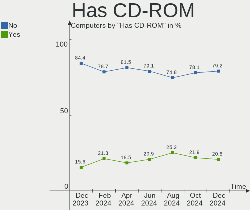
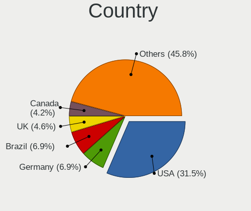
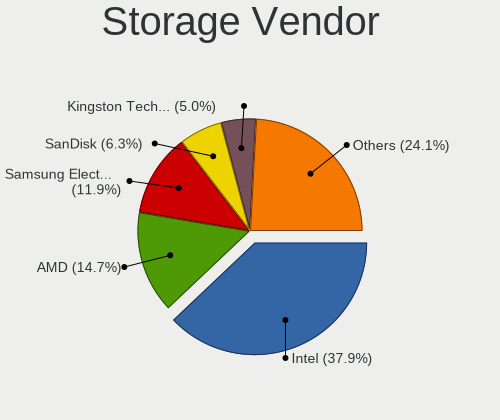
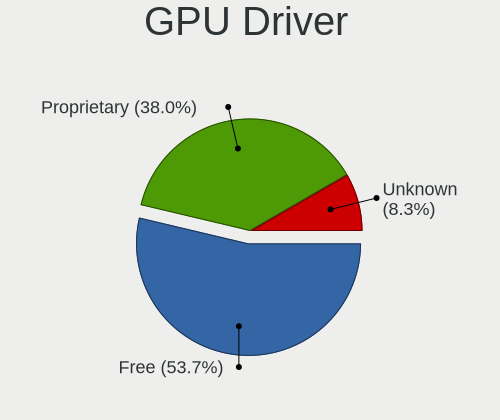
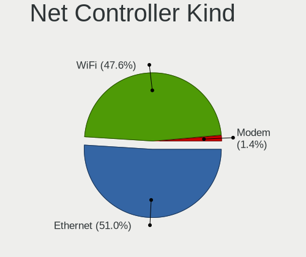

Pop!_OS - Hardware Trends
-------------------------

A project to identify most popular hardware characteristics and track their change
over time based on data collected by Linux users at https://Linux-Hardware.org.

Anyone can contribute to this report by the [hw-probe](https://github.com/linuxhw/hw-probe) tool:

    sudo -E hw-probe -all -upload

This is a report for all computer types. See also reports for [desktops](/Dist/Pop!_OS/Desktop/README.md) and [notebooks](/Dist/Pop!_OS/Notebook/README.md).

This report is for one last month. Overall report since the beginning of time: [TestDays](https://github.com/linuxhw/TestDays)

Period: Aug, 2023.

Contents
--------

* [ System ](#system)
  - [ OS                       ](#os)
  - [ OS Family                ](#os-family)
  - [ Kernel                   ](#kernel)
  - [ Kernel Family            ](#kernel-family)
  - [ Kernel Major Ver.        ](#kernel-major-ver)
  - [ Arch                     ](#arch)
  - [ DE                       ](#de)
  - [ Display Server           ](#display-server)
  - [ Display Manager          ](#display-manager)
  - [ OS Lang                  ](#os-lang)
  - [ Boot Mode                ](#boot-mode)
  - [ Filesystem               ](#filesystem)
  - [ Part. scheme             ](#part-scheme)
  - [ Dual Boot with Linux/BSD ](#dual-boot-with-linuxbsd)
  - [ Dual Boot (Win)          ](#dual-boot-win)

* [ Board ](#board)
  - [ Vendor                   ](#vendor)
  - [ Model                    ](#model)
  - [ Model Family             ](#model-family)
  - [ MFG Year                 ](#mfg-year)
  - [ Form Factor              ](#form-factor)
  - [ Secure Boot              ](#secure-boot)
  - [ Coreboot                 ](#coreboot)
  - [ RAM Size                 ](#ram-size)
  - [ RAM Used                 ](#ram-used)
  - [ Total Drives             ](#total-drives)
  - [ Has CD-ROM               ](#has-cd-rom)
  - [ Has Ethernet             ](#has-ethernet)
  - [ Has WiFi                 ](#has-wifi)
  - [ Has Bluetooth            ](#has-bluetooth)

* [ Location ](#location)
  - [ Country                  ](#country)
  - [ City                     ](#city)

* [ Drives ](#drives)
  - [ Drive Vendor             ](#drive-vendor)
  - [ Drive Model              ](#drive-model)
  - [ HDD Vendor               ](#hdd-vendor)
  - [ SSD Vendor               ](#ssd-vendor)
  - [ Drive Kind               ](#drive-kind)
  - [ Drive Connector          ](#drive-connector)
  - [ Drive Size               ](#drive-size)
  - [ Space Total              ](#space-total)
  - [ Space Used               ](#space-used)
  - [ Malfunc. Drives          ](#malfunc-drives)
  - [ Malfunc. Drive Vendor    ](#malfunc-drive-vendor)
  - [ Malfunc. HDD Vendor      ](#malfunc-hdd-vendor)
  - [ Malfunc. Drive Kind      ](#malfunc-drive-kind)
  - [ Failed Drives            ](#failed-drives)
  - [ Failed Drive Vendor      ](#failed-drive-vendor)
  - [ Drive Status             ](#drive-status)

* [ Storage controller ](#storage-controller)
  - [ Storage Vendor           ](#storage-vendor)
  - [ Storage Model            ](#storage-model)
  - [ Storage Kind             ](#storage-kind)

* [ Processor ](#processor)
  - [ CPU Vendor               ](#cpu-vendor)
  - [ CPU Model                ](#cpu-model)
  - [ CPU Model Family         ](#cpu-model-family)
  - [ CPU Cores                ](#cpu-cores)
  - [ CPU Sockets              ](#cpu-sockets)
  - [ CPU Threads              ](#cpu-threads)
  - [ CPU Op-Modes             ](#cpu-op-modes)
  - [ CPU Microcode            ](#cpu-microcode)
  - [ CPU Microarch            ](#cpu-microarch)

* [ Graphics ](#graphics)
  - [ GPU Vendor               ](#gpu-vendor)
  - [ GPU Model                ](#gpu-model)
  - [ GPU Combo                ](#gpu-combo)
  - [ GPU Driver               ](#gpu-driver)
  - [ GPU Memory               ](#gpu-memory)

* [ Monitor ](#monitor)
  - [ Monitor Vendor           ](#monitor-vendor)
  - [ Monitor Model            ](#monitor-model)
  - [ Monitor Resolution       ](#monitor-resolution)
  - [ Monitor Diagonal         ](#monitor-diagonal)
  - [ Monitor Width            ](#monitor-width)
  - [ Aspect Ratio             ](#aspect-ratio)
  - [ Monitor Area             ](#monitor-area)
  - [ Pixel Density            ](#pixel-density)
  - [ Multiple Monitors        ](#multiple-monitors)

* [ Network ](#network)
  - [ Net Controller Vendor    ](#net-controller-vendor)
  - [ Net Controller Model     ](#net-controller-model)
  - [ Wireless Vendor          ](#wireless-vendor)
  - [ Wireless Model           ](#wireless-model)
  - [ Ethernet Vendor          ](#ethernet-vendor)
  - [ Ethernet Model           ](#ethernet-model)
  - [ Net Controller Kind      ](#net-controller-kind)
  - [ Used Controller          ](#used-controller)
  - [ NICs                     ](#nics)
  - [ IPv6                     ](#ipv6)

* [ Bluetooth ](#bluetooth)
  - [ Bluetooth Vendor         ](#bluetooth-vendor)
  - [ Bluetooth Model          ](#bluetooth-model)

* [ Sound ](#sound)
  - [ Sound Vendor             ](#sound-vendor)
  - [ Sound Model              ](#sound-model)

* [ Memory ](#memory)
  - [ Memory Vendor            ](#memory-vendor)
  - [ Memory Model             ](#memory-model)
  - [ Memory Kind              ](#memory-kind)
  - [ Memory Form Factor       ](#memory-form-factor)
  - [ Memory Size              ](#memory-size)
  - [ Memory Speed             ](#memory-speed)

* [ Printers & scanners ](#printers--scanners)
  - [ Printer Vendor           ](#printer-vendor)
  - [ Printer Model            ](#printer-model)
  - [ Scanner Vendor           ](#scanner-vendor)
  - [ Scanner Model            ](#scanner-model)

* [ Camera ](#camera)
  - [ Camera Vendor            ](#camera-vendor)
  - [ Camera Model             ](#camera-model)

* [ Security ](#security)
  - [ Fingerprint Vendor       ](#fingerprint-vendor)
  - [ Fingerprint Model        ](#fingerprint-model)
  - [ Chipcard Vendor          ](#chipcard-vendor)
  - [ Chipcard Model           ](#chipcard-model)

* [ Unsupported ](#unsupported)
  - [ Unsupported Devices      ](#unsupported-devices)
  - [ Unsupported Device Types ](#unsupported-device-types)

System
------

OS
--

Installed operating systems

| Name          | Computers | Percent |
|---------------|-----------|---------|
| Pop!_OS 22.04 | 199       | 98.03%  |
| Pop!_OS 20.04 | 3         | 1.48%   |
| Pop!_OS 20.10 | 1         | 0.49%   |

OS Family
---------

OS without a version

| Name    | Computers | Percent |
|---------|-----------|---------|
| Pop!_OS | 203       | 100%    |

Kernel
------

Version of the Linux kernel

| Version                  | Computers | Percent |
|--------------------------|-----------|---------|
| 6.4.6-76060406-generic   | 121       | 59.61%  |
| 6.2.6-76060206-generic   | 71        | 34.98%  |
| 6.0.12-76060012-generic  | 3         | 1.48%   |
| 6.0.12-76060006-generic  | 2         | 0.99%   |
| 6.4.8-x64v3-xanmod1      | 1         | 0.49%   |
| 6.4.7-surface            | 1         | 0.49%   |
| 6.4.0-060400-generic     | 1         | 0.49%   |
| 6.3.7-060307-generic     | 1         | 0.49%   |
| 5.16.19-76051619-generic | 1         | 0.49%   |
| 5.11.0-7620-generic      | 1         | 0.49%   |

Kernel Family
-------------

Linux kernel without a distro release

| Version | Computers | Percent |
|---------|-----------|---------|
| 6.4.6   | 121       | 59.61%  |
| 6.2.6   | 71        | 34.98%  |
| 6.0.12  | 5         | 2.46%   |
| 6.4.8   | 1         | 0.49%   |
| 6.4.7   | 1         | 0.49%   |
| 6.4.0   | 1         | 0.49%   |
| 6.3.7   | 1         | 0.49%   |
| 5.16.19 | 1         | 0.49%   |
| 5.11.0  | 1         | 0.49%   |

Kernel Major Ver.
-----------------

Linux kernel major version

| Version | Computers | Percent |
|---------|-----------|---------|
| 6.4     | 124       | 61.08%  |
| 6.2     | 71        | 34.98%  |
| 6.0     | 5         | 2.46%   |
| 6.3     | 1         | 0.49%   |
| 5.16    | 1         | 0.49%   |
| 5.11    | 1         | 0.49%   |

Arch
----

OS architecture (x86_64, i586, etc.)

| Name   | Computers | Percent |
|--------|-----------|---------|
| x86_64 | 203       | 100%    |

DE
--

Desktop Environment

| Name       | Computers | Percent |
|------------|-----------|---------|
| GNOME      | 197       | 97.04%  |
| X-Cinnamon | 2         | 0.99%   |
| LXQt       | 1         | 0.49%   |
| KDE5       | 1         | 0.49%   |
| i3         | 1         | 0.49%   |
| Unknown    | 1         | 0.49%   |

Display Server
--------------

X11 or Wayland

| Name    | Computers | Percent |
|---------|-----------|---------|
| X11     | 193       | 95.07%  |
| Wayland | 10        | 4.93%   |

Display Manager
---------------

SDDM, LightDM, etc.

| Name    | Computers | Percent |
|---------|-----------|---------|
| Unknown | 166       | 81.77%  |
| GDM3    | 36        | 17.73%  |
| GDM     | 1         | 0.49%   |

OS Lang
-------

Language

| Lang    | Computers | Percent |
|---------|-----------|---------|
| en_US   | 113       | 55.67%  |
| de_DE   | 18        | 8.87%   |
| pt_BR   | 12        | 5.91%   |
| en_GB   | 11        | 5.42%   |
| fr_FR   | 7         | 3.45%   |
| en_AU   | 5         | 2.46%   |
| C       | 5         | 2.46%   |
| es_ES   | 4         | 1.97%   |
| es_MX   | 3         | 1.48%   |
| en_CA   | 3         | 1.48%   |
| sv_SE   | 2         | 0.99%   |
| ru_RU   | 2         | 0.99%   |
| nl_NL   | 2         | 0.99%   |
| it_IT   | 2         | 0.99%   |
| uk_UA   | 1         | 0.49%   |
| sk_SK   | 1         | 0.49%   |
| pt_PT   | 1         | 0.49%   |
| pl_PL   | 1         | 0.49%   |
| ja_JP   | 1         | 0.49%   |
| es_SV   | 1         | 0.49%   |
| es_PY   | 1         | 0.49%   |
| es_AR   | 1         | 0.49%   |
| en_DK   | 1         | 0.49%   |
| en_AG   | 1         | 0.49%   |
| de_CH   | 1         | 0.49%   |
| de_AT   | 1         | 0.49%   |
| cs_CZ   | 1         | 0.49%   |
| Unknown | 1         | 0.49%   |

Boot Mode
---------

EFI or BIOS

| Mode | Computers | Percent |
|------|-----------|---------|
| BIOS | 166       | 81.77%  |
| EFI  | 37        | 18.23%  |

Filesystem
----------

Type of filesystem

| Type    | Computers | Percent |
|---------|-----------|---------|
| Ext4    | 195       | 96.06%  |
| Overlay | 3         | 1.48%   |
| Btrfs   | 3         | 1.48%   |
| Xfs     | 1         | 0.49%   |
| Tmpfs   | 1         | 0.49%   |

Part. scheme
------------

Scheme of partitioning

| Type    | Computers | Percent |
|---------|-----------|---------|
| Unknown | 165       | 81.28%  |
| GPT     | 35        | 17.24%  |
| MBR     | 3         | 1.48%   |

Dual Boot with Linux/BSD
------------------------

Hosting more than one Linux/BSD

| Dual boot | Computers | Percent |
|-----------|-----------|---------|
| No        | 200       | 98.52%  |
| Yes       | 3         | 1.48%   |

Dual Boot (Win)
---------------

Hosting Linux and Windows

| Dual boot | Computers | Percent |
|-----------|-----------|---------|
| No        | 190       | 93.6%   |
| Yes       | 13        | 6.4%    |

Board
-----

Vendor
------

Motherboard manufacturer

| Name                | Computers | Percent |
|---------------------|-----------|---------|
| ASUSTek Computer    | 31        | 15.27%  |
| Lenovo              | 30        | 14.78%  |
| Hewlett-Packard     | 26        | 12.81%  |
| Dell                | 23        | 11.33%  |
| Apple               | 18        | 8.87%   |
| MSI                 | 14        | 6.9%    |
| Gigabyte Technology | 11        | 5.42%   |
| System76            | 10        | 4.93%   |
| Acer                | 9         | 4.43%   |
| ASRock              | 5         | 2.46%   |
| Unknown             | 4         | 1.97%   |
| Samsung Electronics | 2         | 0.99%   |
| NZXT                | 2         | 0.99%   |
| Microsoft           | 2         | 0.99%   |
| Google              | 2         | 0.99%   |
| Alienware           | 2         | 0.99%   |
| Toshiba             | 1         | 0.49%   |
| Timi                | 1         | 0.49%   |
| Supermicro          | 1         | 0.49%   |
| Positivo            | 1         | 0.49%   |
| Notebook            | 1         | 0.49%   |
| JHZD                | 1         | 0.49%   |
| Intel               | 1         | 0.49%   |
| GPU Company         | 1         | 0.49%   |
| Fujitsu             | 1         | 0.49%   |
| Framework           | 1         | 0.49%   |
| Clevo               | 1         | 0.49%   |
| A-DATA Technology   | 1         | 0.49%   |

Model
-----

Motherboard model

| Name                                  | Computers | Percent |
|---------------------------------------|-----------|---------|
| Unknown                               | 4         | 1.97%   |
| System76 Oryx Pro                     | 2         | 0.99%   |
| System76 Darter Pro                   | 2         | 0.99%   |
| MSI Modern 15 A5M                     | 2         | 0.99%   |
| HP ProBook 4730s                      | 2         | 0.99%   |
| Apple MacBookPro11,3                  | 2         | 0.99%   |
| Apple iMac12,2                        | 2         | 0.99%   |
| Toshiba Satellite L655                | 1         | 0.49%   |
| Timi RedmiBook Pro 15S                | 1         | 0.49%   |
| System76 Thelio Major                 | 1         | 0.49%   |
| System76 Lemur Pro                    | 1         | 0.49%   |
| System76 Kudu Pro                     | 1         | 0.49%   |
| System76 Gazelle                      | 1         | 0.49%   |
| System76 Galago Pro                   | 1         | 0.49%   |
| System76 Bonobo WS                    | 1         | 0.49%   |
| Supermicro X12SPA-TF                  | 1         | 0.49%   |
| Samsung 750TDA                        | 1         | 0.49%   |
| Samsung 270E5G/270E5U                 | 1         | 0.49%   |
| Positivo C8300                        | 1         | 0.49%   |
| NZXT N7 Z590                          | 1         | 0.49%   |
| NZXT N7 B550                          | 1         | 0.49%   |
| Notebook 1745                         | 1         | 0.49%   |
| MSI MS-7E07                           | 1         | 0.49%   |
| MSI MS-7D75                           | 1         | 0.49%   |
| MSI MS-7C95                           | 1         | 0.49%   |
| MSI MS-7C91                           | 1         | 0.49%   |
| MSI MS-7B79                           | 1         | 0.49%   |
| MSI MS-7B09                           | 1         | 0.49%   |
| MSI MS-7883                           | 1         | 0.49%   |
| MSI MS-7845                           | 1         | 0.49%   |
| MSI MS-7721                           | 1         | 0.49%   |
| MSI Mr. Office V R4                   | 1         | 0.49%   |
| MSI GP72 7RDX                         | 1         | 0.49%   |
| MSI GE60 2OC\2OD\2OE                  | 1         | 0.49%   |
| Microsoft Surface Pro 4               | 1         | 0.49%   |
| Microsoft Surface Pro                 | 1         | 0.49%   |
| Lenovo Yoga Pro 9 14IRP8 83BU         | 1         | 0.49%   |
| Lenovo Yoga 7 15ITL5 82BJ             | 1         | 0.49%   |
| Lenovo V15 G3 ABA 82TV                | 1         | 0.49%   |
| Lenovo ThinkPad X270 W10DG 20K5S08T00 | 1         | 0.49%   |

Model Family
------------

Motherboard model prefix

| Name                 | Computers | Percent |
|----------------------|-----------|---------|
| Lenovo ThinkPad      | 13        | 6.4%    |
| ASUS ROG             | 9         | 4.43%   |
| Lenovo IdeaPad       | 6         | 2.96%   |
| HP ProBook           | 6         | 2.96%   |
| Dell Latitude        | 6         | 2.96%   |
| HP Pavilion          | 5         | 2.46%   |
| Dell XPS             | 5         | 2.46%   |
| Dell Precision       | 5         | 2.46%   |
| Dell Inspiron        | 5         | 2.46%   |
| Acer Aspire          | 5         | 2.46%   |
| ASUS PRIME           | 4         | 1.97%   |
| Unknown              | 4         | 1.97%   |
| Lenovo Legion        | 3         | 1.48%   |
| HP EliteBook         | 3         | 1.48%   |
| ASUS Zenbook         | 3         | 1.48%   |
| Apple MacBookPro11   | 3         | 1.48%   |
| Acer Nitro           | 3         | 1.48%   |
| System76 Oryx        | 2         | 0.99%   |
| System76 Darter      | 2         | 0.99%   |
| NZXT N7              | 2         | 0.99%   |
| MSI Modern           | 2         | 0.99%   |
| Microsoft Surface    | 2         | 0.99%   |
| Lenovo Yoga          | 2         | 0.99%   |
| HP Victus            | 2         | 0.99%   |
| Gigabyte X570        | 2         | 0.99%   |
| Gigabyte H410M       | 2         | 0.99%   |
| ASUS Vivobook        | 2         | 0.99%   |
| ASUS TUF             | 2         | 0.99%   |
| ASUS ASUS            | 2         | 0.99%   |
| Apple iMac12         | 2         | 0.99%   |
| Toshiba Satellite    | 1         | 0.49%   |
| Timi RedmiBook       | 1         | 0.49%   |
| System76 Thelio      | 1         | 0.49%   |
| System76 Lemur       | 1         | 0.49%   |
| System76 Kudu        | 1         | 0.49%   |
| System76 Gazelle     | 1         | 0.49%   |
| System76 Galago      | 1         | 0.49%   |
| System76 Bonobo      | 1         | 0.49%   |
| Supermicro X12SPA-TF | 1         | 0.49%   |
| Samsung 750TDA       | 1         | 0.49%   |

MFG Year
--------

Motherboard manufacture year

| Year | Computers | Percent |
|------|-----------|---------|
| 2022 | 35        | 17.24%  |
| 2021 | 28        | 13.79%  |
| 2013 | 17        | 8.37%   |
| 2020 | 15        | 7.39%   |
| 2018 | 15        | 7.39%   |
| 2023 | 13        | 6.4%    |
| 2019 | 12        | 5.91%   |
| 2014 | 12        | 5.91%   |
| 2015 | 11        | 5.42%   |
| 2011 | 10        | 4.93%   |
| 2016 | 9         | 4.43%   |
| 2012 | 9         | 4.43%   |
| 2017 | 7         | 3.45%   |
| 2009 | 5         | 2.46%   |
| 2010 | 4         | 1.97%   |
| 2008 | 1         | 0.49%   |

Form Factor
-----------

Physical design of the computer

| Name        | Computers | Percent |
|-------------|-----------|---------|
| Notebook    | 119       | 58.62%  |
| Desktop     | 66        | 32.51%  |
| Convertible | 5         | 2.46%   |
| Mini pc     | 4         | 1.97%   |
| All in one  | 4         | 1.97%   |
| Tablet      | 3         | 1.48%   |
| Server      | 2         | 0.99%   |

Secure Boot
-----------

Enabled or disabled

| State    | Computers | Percent |
|----------|-----------|---------|
| Disabled | 203       | 100%    |

Coreboot
--------

Have coreboot on board

| Used | Computers | Percent |
|------|-----------|---------|
| No   | 195       | 96.06%  |
| Yes  | 8         | 3.94%   |

RAM Size
--------

Total RAM memory

| Size in GB  | Computers | Percent |
|-------------|-----------|---------|
| 16.01-24.0  | 50        | 24.63%  |
| 32.01-64.0  | 46        | 22.66%  |
| 8.01-16.0   | 38        | 18.72%  |
| 4.01-8.0    | 34        | 16.75%  |
| 3.01-4.0    | 16        | 7.88%   |
| 64.01-256.0 | 10        | 4.93%   |
| 24.01-32.0  | 9         | 4.43%   |

RAM Used
--------

Used RAM memory

| Used GB    | Computers | Percent |
|------------|-----------|---------|
| 4.01-8.0   | 82        | 40.39%  |
| 3.01-4.0   | 39        | 19.21%  |
| 8.01-16.0  | 37        | 18.23%  |
| 2.01-3.0   | 34        | 16.75%  |
| 16.01-24.0 | 4         | 1.97%   |
| 1.01-2.0   | 4         | 1.97%   |
| 24.01-32.0 | 2         | 0.99%   |
| 32.01-64.0 | 1         | 0.49%   |

Total Drives
------------

Number of drives on board

| Drives | Computers | Percent |
|--------|-----------|---------|
| 1      | 118       | 58.13%  |
| 2      | 56        | 27.59%  |
| 3      | 9         | 4.43%   |
| 4      | 8         | 3.94%   |
| 5      | 6         | 2.96%   |
| 7      | 3         | 1.48%   |
| 6      | 3         | 1.48%   |

Has CD-ROM
----------

Has CD-ROM on board

| Presented | Computers | Percent |
|-----------|-----------|---------|
| No        | 157       | 77.34%  |
| Yes       | 46        | 22.66%  |

Has Ethernet
------------

Has Ethernet on board

| Presented | Computers | Percent |
|-----------|-----------|---------|
| Yes       | 168       | 82.76%  |
| No        | 35        | 17.24%  |

Has WiFi
--------

Has WiFi module

| Presented | Computers | Percent |
|-----------|-----------|---------|
| Yes       | 176       | 86.7%   |
| No        | 27        | 13.3%   |

Has Bluetooth
-------------

Has Bluetooth module

| Presented | Computers | Percent |
|-----------|-----------|---------|
| Yes       | 154       | 75.86%  |
| No        | 49        | 24.14%  |

Location
--------

Country
-------

Geographic location (country)

| Country     | Computers | Percent |
|-------------|-----------|---------|
| USA         | 58        | 28.57%  |
| Germany     | 23        | 11.33%  |
| Brazil      | 17        | 8.37%   |
| Netherlands | 8         | 3.94%   |
| Canada      | 8         | 3.94%   |
| UK          | 7         | 3.45%   |
| Spain       | 7         | 3.45%   |
| France      | 7         | 3.45%   |
| Sweden      | 5         | 2.46%   |
| Russia      | 5         | 2.46%   |
| Australia   | 5         | 2.46%   |
| Mexico      | 4         | 1.97%   |
| Czechia     | 4         | 1.97%   |
| Portugal    | 3         | 1.48%   |
| Poland      | 3         | 1.48%   |
| India       | 3         | 1.48%   |
| Singapore   | 2         | 0.99%   |
| Norway      | 2         | 0.99%   |
| New Zealand | 2         | 0.99%   |
| Italy       | 2         | 0.99%   |
| Denmark     | 2         | 0.99%   |
| Bulgaria    | 2         | 0.99%   |
| Argentina   | 2         | 0.99%   |
| Vietnam     | 1         | 0.49%   |
| Turkey      | 1         | 0.49%   |
| Thailand    | 1         | 0.49%   |
| Slovenia    | 1         | 0.49%   |
| Slovakia    | 1         | 0.49%   |
| Serbia      | 1         | 0.49%   |
| Romania     | 1         | 0.49%   |
| Philippines | 1         | 0.49%   |
| Paraguay    | 1         | 0.49%   |
| Pakistan    | 1         | 0.49%   |
| Malta       | 1         | 0.49%   |
| Malaysia    | 1         | 0.49%   |
| Kazakhstan  | 1         | 0.49%   |
| Japan       | 1         | 0.49%   |
| Ireland     | 1         | 0.49%   |
| Iran        | 1         | 0.49%   |
| Indonesia   | 1         | 0.49%   |

City
----

Geographic location (city)

| City             | Computers | Percent |
|------------------|-----------|---------|
| Sao Paulo        | 5         | 2.46%   |
| Sydney           | 3         | 1.48%   |
| Prague           | 3         | 1.48%   |
| Moscow           | 3         | 1.48%   |
| Mexico City      | 3         | 1.48%   |
| Madrid           | 3         | 1.48%   |
| Coburg           | 3         | 1.48%   |
| Winnipeg         | 2         | 0.99%   |
| Warsaw           | 2         | 0.99%   |
| Stockholm        | 2         | 0.99%   |
| Singapore        | 2         | 0.99%   |
| Schiltigheim     | 2         | 0.99%   |
| Rotterdam        | 2         | 0.99%   |
| Lenoir           | 2         | 0.99%   |
| Las Vegas        | 2         | 0.99%   |
| Huntington Beach | 2         | 0.99%   |
| Hamburg          | 2         | 0.99%   |
| Chennai          | 2         | 0.99%   |
| Yekaterinburg    | 1         | 0.49%   |
| Wuppertal        | 1         | 0.49%   |
| Willow Grove     | 1         | 0.49%   |
| Willenhall       | 1         | 0.49%   |
| Westminster      | 1         | 0.49%   |
| West Bromwich    | 1         | 0.49%   |
| Weimar           | 1         | 0.49%   |
| Visakhapatnam    | 1         | 0.49%   |
| Villeurbanne     | 1         | 0.49%   |
| Vienna           | 1         | 0.49%   |
| Valletta         | 1         | 0.49%   |
| Umeå            | 1         | 0.49%   |
| Trondheim        | 1         | 0.49%   |
| Trnava           | 1         | 0.49%   |
| Torrelavega      | 1         | 0.49%   |
| Tomsk            | 1         | 0.49%   |
| Titusville       | 1         | 0.49%   |
| Tehran           | 1         | 0.49%   |
| Stevenson        | 1         | 0.49%   |
| Sragen           | 1         | 0.49%   |
| Springfield      | 1         | 0.49%   |
| Sofia            | 1         | 0.49%   |

Drives
------

Drive Vendor
------------

Hard drive vendors

| Vendor                         | Computers | Drives | Percent |
|--------------------------------|-----------|--------|---------|
| Samsung Electronics            | 58        | 79     | 18.95%  |
| WDC                            | 28        | 34     | 9.15%   |
| Seagate                        | 26        | 35     | 8.5%    |
| SanDisk                        | 26        | 31     | 8.5%    |
| Kingston                       | 21        | 24     | 6.86%   |
| Toshiba                        | 17        | 18     | 5.56%   |
| Intel                          | 12        | 12     | 3.92%   |
| SK hynix                       | 11        | 12     | 3.59%   |
| Crucial                        | 10        | 10     | 3.27%   |
| Apple                          | 8         | 8      | 2.61%   |
| Phison Electronics             | 7         | 10     | 2.29%   |
| Micron Technology              | 7         | 7      | 2.29%   |
| Unknown                        | 6         | 7      | 1.96%   |
| Kingston Technology Company    | 5         | 5      | 1.63%   |
| Micron/Crucial Technology      | 4         | 5      | 1.31%   |
| KIOXIA                         | 4         | 4      | 1.31%   |
| HGST                           | 4         | 4      | 1.31%   |
| China                          | 4         | 4      | 1.31%   |
| A-DATA Technology              | 4         | 4      | 1.31%   |
| Verbatim                       | 3         | 3      | 0.98%   |
| Team                           | 3         | 3      | 0.98%   |
| JMicron Technology             | 3         | 3      | 0.98%   |
| ADATA Technology               | 3         | 3      | 0.98%   |
| Netac                          | 2         | 2      | 0.65%   |
| Intenso                        | 2         | 2      | 0.65%   |
| Hitachi                        | 2         | 2      | 0.65%   |
| XrayDisk                       | 1         | 1      | 0.33%   |
| XPG                            | 1         | 1      | 0.33%   |
| Wibtek                         | 1         | 1      | 0.33%   |
| Western Digital                | 1         | 2      | 0.33%   |
| WD MediaMax                    | 1         | 1      | 0.33%   |
| Union Memory (Shenzhen)        | 1         | 1      | 0.33%   |
| StoreJet                       | 1         | 1      | 0.33%   |
| Solid State Storage Technology | 1         | 1      | 0.33%   |
| Solid State Storage            | 1         | 1      | 0.33%   |
| Smartbuy                       | 1         | 1      | 0.33%   |
| Silicon Motion                 | 1         | 1      | 0.33%   |
| PHD 3.0                        | 1         | 1      | 0.33%   |
| Patriot                        | 1         | 1      | 0.33%   |
| Oyen                           | 1         | 1      | 0.33%   |

Drive Model
-----------

Hard drive models

| Model                                                           | Computers | Percent |
|-----------------------------------------------------------------|-----------|---------|
| Samsung NVMe SSD Controller PM9A1/PM9A3/980PRO 1024GB           | 9         | 2.68%   |
| Samsung NVMe SSD Controller SM981/PM981/PM983 500GB             | 8         | 2.38%   |
| Sandisk WD Blue SN570 1TB                                       | 4         | 1.19%   |
| Sandisk WD Black SN850 256GB                                    | 4         | 1.19%   |
| Samsung SSD 870 EVO 500GB                                       | 4         | 1.19%   |
| Samsung SSD 850 EVO 500GB                                       | 4         | 1.19%   |
| Phison E12 NVMe Controller 256GB                                | 4         | 1.19%   |
| Kingston SA400S37120G 120GB SSD                                 | 4         | 1.19%   |
| Intel SSDPEKNU512GZ 512GB                                       | 4         | 1.19%   |
| Verbatim Vi550 S3 512GB                                         | 3         | 0.89%   |
| Samsung SSD 980 500GB                                           | 3         | 0.89%   |
| Micron/Crucial P2 NVMe PCIe SSD 1TB                             | 3         | 0.89%   |
| Kingston SA400S37960G 960GB SSD                                 | 3         | 0.89%   |
| Intel SSD 660P Series 512GB                                     | 3         | 0.89%   |
| Unknown MMC Card  32GB                                          | 2         | 0.6%    |
| Toshiba XG6 NVMe SSD Controller 1024GB                          | 2         | 0.6%    |
| Toshiba DT01ACA200 2TB                                          | 2         | 0.6%    |
| SK hynix SKHynix_HFS001TEJ9X115N 1TB                            | 2         | 0.6%    |
| Seagate ST500DM002-1BD142 500GB                                 | 2         | 0.6%    |
| Seagate ST2000DM008-2FR102 2TB                                  | 2         | 0.6%    |
| Seagate ST1000DM003-1SB102 1TB                                  | 2         | 0.6%    |
| Sandisk WDC WDS240G2G0C-00AJM0 240GB                            | 2         | 0.6%    |
| SanDisk NVMe SSD Drive 1TB                                      | 2         | 0.6%    |
| Samsung SSD 980 1TB                                             | 2         | 0.6%    |
| Samsung SSD 870 QVO 1TB                                         | 2         | 0.6%    |
| Samsung SSD 860 EVO 1TB                                         | 2         | 0.6%    |
| Samsung SSD 850 EVO 120GB                                       | 2         | 0.6%    |
| Samsung SSD 840 EVO 250GB                                       | 2         | 0.6%    |
| Samsung NVMe SSD Controller SM961/PM961/SM963 1024GB            | 2         | 0.6%    |
| Phison PCIe SSD 512GB                                           | 2         | 0.6%    |
| Kingston Company SNV2S2000G 2TB                                 | 2         | 0.6%    |
| Kingston SNVS500G 500GB                                         | 2         | 0.6%    |
| Kingston SKC3000D2048G 2TB                                      | 2         | 0.6%    |
| Kingston SA400S37480G 480GB SSD                                 | 2         | 0.6%    |
| Kingston OM8PCP3512F-AI1 512GB                                  | 2         | 0.6%    |
| JMicron Generic 1TB                                             | 2         | 0.6%    |
| Crucial CT1000MX500SSD1 1TB                                     | 2         | 0.6%    |
| Apple SSD SM0256F 256GB                                         | 2         | 0.6%    |
| ADATA XPG SX8200 Pro PCIe Gen3x4 M.2 2280 Solid State Drive 2TB | 2         | 0.6%    |
| XrayDisk 256GB                                                  | 1         | 0.3%    |

HDD Vendor
----------

Hard disk drive vendors

| Vendor              | Computers | Drives | Percent |
|---------------------|-----------|--------|---------|
| Seagate             | 26        | 31     | 37.68%  |
| WDC                 | 19        | 25     | 27.54%  |
| Toshiba             | 12        | 12     | 17.39%  |
| HGST                | 4         | 4      | 5.8%    |
| Hitachi             | 2         | 2      | 2.9%    |
| WD MediaMax         | 1         | 1      | 1.45%   |
| Unknown             | 1         | 1      | 1.45%   |
| StoreJet            | 1         | 1      | 1.45%   |
| Samsung Electronics | 1         | 1      | 1.45%   |
| PHD 3.0             | 1         | 1      | 1.45%   |
| LaCie               | 1         | 1      | 1.45%   |

SSD Vendor
----------

Solid state drive vendors

| Vendor              | Computers | Drives | Percent |
|---------------------|-----------|--------|---------|
| Samsung Electronics | 26        | 36     | 25%     |
| Kingston            | 14        | 14     | 13.46%  |
| Crucial             | 10        | 10     | 9.62%   |
| Apple               | 7         | 7      | 6.73%   |
| SanDisk             | 6         | 6      | 5.77%   |
| WDC                 | 5         | 5      | 4.81%   |
| China               | 4         | 4      | 3.85%   |
| A-DATA Technology   | 4         | 4      | 3.85%   |
| Verbatim            | 3         | 3      | 2.88%   |
| Team                | 2         | 2      | 1.92%   |
| Netac               | 2         | 2      | 1.92%   |
| Micron Technology   | 2         | 2      | 1.92%   |
| JMicron Technology  | 2         | 2      | 1.92%   |
| Intenso             | 2         | 2      | 1.92%   |
| Intel               | 2         | 2      | 1.92%   |
| Wibtek              | 1         | 1      | 0.96%   |
| Toshiba             | 1         | 1      | 0.96%   |
| Smartbuy            | 1         | 1      | 0.96%   |
| SK hynix            | 1         | 1      | 0.96%   |
| Patriot             | 1         | 1      | 0.96%   |
| OCZ                 | 1         | 1      | 0.96%   |
| Neo                 | 1         | 1      | 0.96%   |
| LITEONIT            | 1         | 1      | 0.96%   |
| Kingmax             | 1         | 1      | 0.96%   |
| KingDian            | 1         | 1      | 0.96%   |
| INTEL SS            | 1         | 1      | 0.96%   |
| Apacer              | 1         | 1      | 0.96%   |
| ADATA SU            | 1         | 1      | 0.96%   |

Drive Kind
----------

HDD or SSD

| Kind    | Computers | Drives | Percent |
|---------|-----------|--------|---------|
| NVMe    | 113       | 151    | 41.85%  |
| SSD     | 90        | 114    | 33.33%  |
| HDD     | 56        | 80     | 20.74%  |
| Unknown | 7         | 9      | 2.59%   |
| MMC     | 4         | 4      | 1.48%   |

Drive Connector
---------------

SATA, SAS, NVMe, etc.

| Type | Computers | Drives | Percent |
|------|-----------|--------|---------|
| SATA | 121       | 187    | 48.02%  |
| NVMe | 113       | 151    | 44.84%  |
| SAS  | 14        | 16     | 5.56%   |
| MMC  | 4         | 4      | 1.59%   |

Drive Size
----------

Size of hard drive

| Size in TB | Computers | Drives | Percent |
|------------|-----------|--------|---------|
| 0.01-0.5   | 81        | 105    | 52.26%  |
| 0.51-1.0   | 48        | 54     | 30.97%  |
| 1.01-2.0   | 16        | 22     | 10.32%  |
| 3.01-4.0   | 6         | 8      | 3.87%   |
| 2.01-3.0   | 2         | 2      | 1.29%   |
| 4.01-10.0  | 2         | 3      | 1.29%   |

Space Total
-----------

Amount of disk space available on the file system

| Size in GB     | Computers | Percent |
|----------------|-----------|---------|
| 251-500        | 53        | 26.11%  |
| 101-250        | 52        | 25.62%  |
| 501-1000       | 36        | 17.73%  |
| 1001-2000      | 22        | 10.84%  |
| More than 3000 | 16        | 7.88%   |
| 2001-3000      | 11        | 5.42%   |
| 51-100         | 6         | 2.96%   |
| 21-50          | 3         | 1.48%   |
| 1-20           | 3         | 1.48%   |
| Unknown        | 1         | 0.49%   |

Space Used
----------

Amount of used disk space

| Used GB        | Computers | Percent |
|----------------|-----------|---------|
| 1-20           | 54        | 26.6%   |
| 21-50          | 37        | 18.23%  |
| 101-250        | 30        | 14.78%  |
| 51-100         | 27        | 13.3%   |
| 251-500        | 18        | 8.87%   |
| 501-1000       | 12        | 5.91%   |
| 1001-2000      | 11        | 5.42%   |
| More than 3000 | 9         | 4.43%   |
| 2001-3000      | 4         | 1.97%   |
| Unknown        | 1         | 0.49%   |

Malfunc. Drives
---------------

Drive models with a malfunction

| Model                                 | Computers | Drives | Percent |
|---------------------------------------|-----------|--------|---------|
| WDC WD5000LPVX-22V0TT0 500GB          | 1         | 1      | 20%     |
| WDC WD10EARS-00MVWB0 1TB              | 1         | 1      | 20%     |
| SK hynix HFS128G39TND-N210A 128GB SSD | 1         | 1      | 20%     |
| Seagate ST3250310AS 250GB             | 1         | 1      | 20%     |
| Intel SSDPEKKF512G7L 512GB            | 1         | 1      | 20%     |

Malfunc. Drive Vendor
---------------------

Vendors of faulty drives

| Vendor   | Computers | Drives | Percent |
|----------|-----------|--------|---------|
| WDC      | 2         | 2      | 40%     |
| SK hynix | 1         | 1      | 20%     |
| Seagate  | 1         | 1      | 20%     |
| Intel    | 1         | 1      | 20%     |

Malfunc. HDD Vendor
-------------------

Vendors of faulty HDD drives

| Vendor  | Computers | Drives | Percent |
|---------|-----------|--------|---------|
| WDC     | 2         | 2      | 66.67%  |
| Seagate | 1         | 1      | 33.33%  |

Malfunc. Drive Kind
-------------------

Kinds of faulty drives

| Kind | Computers | Drives | Percent |
|------|-----------|--------|---------|
| HDD  | 3         | 3      | 60%     |
| NVMe | 1         | 1      | 20%     |
| SSD  | 1         | 1      | 20%     |

Failed Drives
-------------

Failed drive models

Zero info for selected period =(

Failed Drive Vendor
-------------------

Failed drive vendors

Zero info for selected period =(

Drive Status
------------

Number of failed and malfunc. drives

| Status   | Computers | Drives | Percent |
|----------|-----------|--------|---------|
| Detected | 169       | 301    | 80.86%  |
| Works    | 35        | 52     | 16.75%  |
| Malfunc  | 5         | 5      | 2.39%   |

Storage controller
------------------

Storage Vendor
--------------

Storage controller vendors

| Vendor                         | Computers | Percent |
|--------------------------------|-----------|---------|
| Intel                          | 114       | 38.78%  |
| AMD                            | 45        | 15.31%  |
| Samsung Electronics            | 39        | 13.27%  |
| SanDisk                        | 23        | 7.82%   |
| Kingston Technology Company    | 13        | 4.42%   |
| SK hynix                       | 10        | 3.4%    |
| Phison Electronics             | 7         | 2.38%   |
| ASMedia Technology             | 6         | 2.04%   |
| Micron Technology              | 5         | 1.7%    |
| KIOXIA                         | 5         | 1.7%    |
| Toshiba America Info Systems   | 4         | 1.36%   |
| Micron/Crucial Technology      | 4         | 1.36%   |
| Nvidia                         | 3         | 1.02%   |
| Marvell Technology Group       | 3         | 1.02%   |
| ADATA Technology               | 3         | 1.02%   |
| Solid State Storage Technology | 2         | 0.68%   |
| Seagate Technology             | 2         | 0.68%   |
| Western Digital                | 1         | 0.34%   |
| Union Memory (Shenzhen)        | 1         | 0.34%   |
| Silicon Motion                 | 1         | 0.34%   |
| Shenzhen Longsys Electronics   | 1         | 0.34%   |
| JMicron Technology             | 1         | 0.34%   |
| Apple                          | 1         | 0.34%   |

Storage Model
-------------

Storage controller models

| Model                                                                          | Computers | Percent |
|--------------------------------------------------------------------------------|-----------|---------|
| AMD FCH SATA Controller [AHCI mode]                                            | 31        | 9.6%    |
| Samsung NVMe SSD Controller SM981/PM981/PM983                                  | 13        | 4.02%   |
| Samsung NVMe SSD Controller PM9A1/PM9A3/980PRO                                 | 12        | 3.72%   |
| Intel 8 Series/C220 Series Chipset Family 6-port SATA Controller 1 [AHCI mode] | 12        | 3.72%   |
| Intel Volume Management Device NVMe RAID Controller                            | 8         | 2.48%   |
| Intel 7 Series Chipset Family 6-port SATA Controller [AHCI mode]               | 8         | 2.48%   |
| Intel 6 Series/C200 Series Chipset Family 6 port Mobile SATA AHCI Controller   | 7         | 2.17%   |
| AMD 500 Series Chipset SATA Controller                                         | 7         | 2.17%   |
| SanDisk WD PC SN810 / Black SN850 NVMe SSD                                     | 6         | 1.86%   |
| Samsung NVMe SSD Controller 980                                                | 6         | 1.86%   |
| Intel Sunrise Point-LP SATA Controller [AHCI mode]                             | 6         | 1.86%   |
| AMD 400 Series Chipset SATA Controller                                         | 6         | 1.86%   |
| Intel SSD 670p Series [Keystone Harbor]                                        | 5         | 1.55%   |
| Intel Cannon Point-LP SATA Controller [AHCI Mode]                              | 5         | 1.55%   |
| Intel 8 Series SATA Controller 1 [AHCI mode]                                   | 5         | 1.55%   |
| ASMedia ASM1062 Serial ATA Controller                                          | 5         | 1.55%   |
| SK hynix Platinum P41/PC801 NVMe Solid State Drive                             | 4         | 1.24%   |
| SanDisk WD Blue SN570 NVMe SSD 1TB                                             | 4         | 1.24%   |
| Phison E12 NVMe Controller                                                     | 4         | 1.24%   |
| Kingston Company Company Non-Volatile memory controller                        | 4         | 1.24%   |
| Intel Comet Lake SATA AHCI Controller                                          | 4         | 1.24%   |
| Intel Cannon Lake Mobile PCH SATA AHCI Controller                              | 4         | 1.24%   |
| Intel 400 Series Chipset Family SATA AHCI Controller                           | 4         | 1.24%   |
| Intel 200 Series PCH SATA controller [AHCI mode]                               | 4         | 1.24%   |
| SK hynix Gold P31/BC711/PC711 NVMe Solid State Drive                           | 3         | 0.93%   |
| SanDisk WD Blue SN550 NVMe SSD                                                 | 3         | 0.93%   |
| Samsung S4LN053X01 AHCI SSD Controller(Apple slot)                             | 3         | 0.93%   |
| Samsung NVMe SSD Controller SM961/PM961/SM963                                  | 3         | 0.93%   |
| Micron/Crucial P2 [Nick P2] / P3 / P3 Plus NVMe PCIe SSD (DRAM-less)           | 3         | 0.93%   |
| Micron 2450 NVMe SSD [HendrixV] (DRAM-less)                                    | 3         | 0.93%   |
| KIOXIA NVMe SSD Controller BG4 (DRAM-less)                                     | 3         | 0.93%   |
| Kingston Company KC3000/Renegade NVMe SSD                                      | 3         | 0.93%   |
| Intel Wildcat Point-LP SATA Controller [AHCI Mode]                             | 3         | 0.93%   |
| Intel SSD 660P Series                                                          | 3         | 0.93%   |
| Intel Q170/Q150/B150/H170/H110/Z170/CM236 Chipset SATA Controller [AHCI Mode]  | 3         | 0.93%   |
| Intel 7 Series/C210 Series Chipset Family 6-port SATA Controller [AHCI mode]   | 3         | 0.93%   |
| Intel 500 Series Chipset Family SATA AHCI Controller                           | 3         | 0.93%   |
| AMD SB7x0/SB8x0/SB9x0 SATA Controller [AHCI mode]                              | 3         | 0.93%   |
| Toshiba America Info Systems XG6 NVMe SSD Controller                           | 2         | 0.62%   |
| Toshiba America Info Systems XG5 NVMe SSD Controller                           | 2         | 0.62%   |

Storage Kind
------------

Kind of storage controller (IDE, SATA, NVMe, SAS, ...)

| Kind | Computers | Percent |
|------|-----------|---------|
| SATA | 143       | 51.07%  |
| NVMe | 113       | 40.36%  |
| RAID | 14        | 5%      |
| IDE  | 9         | 3.21%   |
| SAS  | 1         | 0.36%   |

Processor
---------

CPU Vendor
----------

Processor vendors

| Vendor | Computers | Percent |
|--------|-----------|---------|
| Intel  | 142       | 69.95%  |
| AMD    | 61        | 30.05%  |

CPU Model
---------

Processor models

| Model                                   | Computers | Percent |
|-----------------------------------------|-----------|---------|
| Intel Core i5-6300U CPU @ 2.40GHz       | 5         | 2.46%   |
| Intel 11th Gen Core i7-1165G7 @ 2.80GHz | 5         | 2.46%   |
| Intel Core i7-9750H CPU @ 2.60GHz       | 3         | 1.48%   |
| Intel Core i7-8750H CPU @ 2.20GHz       | 3         | 1.48%   |
| Intel Core i5-8265U CPU @ 1.60GHz       | 3         | 1.48%   |
| Intel Core i5-2430M CPU @ 2.40GHz       | 3         | 1.48%   |
| Intel 12th Gen Core i5-1240P            | 3         | 1.48%   |
| AMD Ryzen 9 7900X 12-Core Processor     | 3         | 1.48%   |
| AMD Ryzen 7 5700U with Radeon Graphics  | 3         | 1.48%   |
| Intel Core i7-8565U CPU @ 1.80GHz       | 2         | 0.99%   |
| Intel Core i7-8550U CPU @ 1.80GHz       | 2         | 0.99%   |
| Intel Core i7-7820HQ CPU @ 2.90GHz      | 2         | 0.99%   |
| Intel Core i7-7700HQ CPU @ 2.80GHz      | 2         | 0.99%   |
| Intel Core i7-4850HQ CPU @ 2.30GHz      | 2         | 0.99%   |
| Intel Core i7-4810MQ CPU @ 2.80GHz      | 2         | 0.99%   |
| Intel Core i7-4700MQ CPU @ 2.40GHz      | 2         | 0.99%   |
| Intel Core i7-10750H CPU @ 2.60GHz      | 2         | 0.99%   |
| Intel Core i5-3570K CPU @ 3.40GHz       | 2         | 0.99%   |
| Intel Core i5-2500S CPU @ 2.70GHz       | 2         | 0.99%   |
| Intel Core i5-2450M CPU @ 2.50GHz       | 2         | 0.99%   |
| Intel Core i3-9100 CPU @ 3.60GHz        | 2         | 0.99%   |
| Intel 12th Gen Core i9-12900H           | 2         | 0.99%   |
| Intel 12th Gen Core i7-12700H           | 2         | 0.99%   |
| Intel 11th Gen Core i7-11800H @ 2.30GHz | 2         | 0.99%   |
| AMD Ryzen 9 5900X 12-Core Processor     | 2         | 0.99%   |
| AMD Ryzen 7 5800X 8-Core Processor      | 2         | 0.99%   |
| AMD Ryzen 7 5800H with Radeon Graphics  | 2         | 0.99%   |
| AMD Ryzen 7 1800X Eight-Core Processor  | 2         | 0.99%   |
| AMD Ryzen 5 7520U with Radeon Graphics  | 2         | 0.99%   |
| AMD Ryzen 5 5625U with Radeon Graphics  | 2         | 0.99%   |
| AMD Ryzen 5 5600H with Radeon Graphics  | 2         | 0.99%   |
| AMD Ryzen 5 5500                        | 2         | 0.99%   |
| AMD Ryzen 5 3600 6-Core Processor       | 2         | 0.99%   |
| Intel Xeon Silver 4314 CPU @ 2.40GHz    | 1         | 0.49%   |
| Intel Xeon Gold 6242R CPU @ 3.10GHz     | 1         | 0.49%   |
| Intel Xeon CPU W3680 @ 3.33GHz          | 1         | 0.49%   |
| Intel Xeon CPU E5-2690 0 @ 2.90GHz      | 1         | 0.49%   |
| Intel Xeon CPU E5-1620 v2 @ 3.70GHz     | 1         | 0.49%   |
| Intel Pentium Silver N6005 @ 2.00GHz    | 1         | 0.49%   |
| Intel Pentium CPU P6200 @ 2.13GHz       | 1         | 0.49%   |

CPU Model Family
----------------

Processor model prefix

| Model                  | Computers | Percent |
|------------------------|-----------|---------|
| Intel Core i7          | 43        | 21.18%  |
| Intel Core i5          | 38        | 18.72%  |
| Other                  | 30        | 14.78%  |
| AMD Ryzen 7            | 21        | 10.34%  |
| AMD Ryzen 5            | 20        | 9.85%   |
| Intel Core i3          | 11        | 5.42%   |
| AMD Ryzen 9            | 7         | 3.45%   |
| Intel Celeron          | 5         | 2.46%   |
| Intel Core 2 Duo       | 4         | 1.97%   |
| AMD A8                 | 4         | 1.97%   |
| Intel Xeon             | 3         | 1.48%   |
| Intel Pentium          | 3         | 1.48%   |
| AMD Ryzen 7 PRO        | 2         | 0.99%   |
| AMD FX                 | 2         | 0.99%   |
| Intel Xeon Silver      | 1         | 0.49%   |
| Intel Xeon Gold        | 1         | 0.49%   |
| Intel Pentium Silver   | 1         | 0.49%   |
| Intel Core i9          | 1         | 0.49%   |
| Intel Core 2 Quad      | 1         | 0.49%   |
| AMD Ryzen Threadripper | 1         | 0.49%   |
| AMD E1                 | 1         | 0.49%   |
| AMD Athlon X2          | 1         | 0.49%   |
| AMD Athlon II X2       | 1         | 0.49%   |
| AMD A4                 | 1         | 0.49%   |

CPU Cores
---------

Number of processor cores

| Number | Computers | Percent |
|--------|-----------|---------|
| 4      | 73        | 35.96%  |
| 2      | 46        | 22.66%  |
| 8      | 31        | 15.27%  |
| 6      | 27        | 13.3%   |
| 12     | 10        | 4.93%   |
| 16     | 5         | 2.46%   |
| 14     | 5         | 2.46%   |
| 10     | 4         | 1.97%   |
| 40     | 1         | 0.49%   |
| 24     | 1         | 0.49%   |

CPU Sockets
-----------

Number of sockets

| Number | Computers | Percent |
|--------|-----------|---------|
| 1      | 202       | 99.51%  |
| 2      | 1         | 0.49%   |

CPU Threads
-----------

Threads per core (Hyper-Threading)

| Number | Computers | Percent |
|--------|-----------|---------|
| 2      | 168       | 82.76%  |
| 1      | 35        | 17.24%  |

CPU Op-Modes
------------

CPU Operation Modes (32-bit, 64-bit)

| Op mode        | Computers | Percent |
|----------------|-----------|---------|
| 32-bit, 64-bit | 203       | 100%    |

CPU Microcode
-------------

Microcode number

| Number     | Computers | Percent |
|------------|-----------|---------|
| Unknown    | 189       | 93.1%   |
| 0x0a601203 | 2         | 0.99%   |
| 0x0a50000c | 2         | 0.99%   |
| 0x08608103 | 2         | 0.99%   |
| 0x306c3    | 1         | 0.49%   |
| 0x0a50000d | 1         | 0.49%   |
| 0x0a404102 | 1         | 0.49%   |
| 0x0a201205 | 1         | 0.49%   |
| 0x0a201009 | 1         | 0.49%   |
| 0x08608104 | 1         | 0.49%   |
| 0x0700010f | 1         | 0.49%   |
| 0x06000852 | 1         | 0.49%   |

CPU Microarch
-------------

Microarchitecture

| Name             | Computers | Percent |
|------------------|-----------|---------|
| Unknown          | 35        | 17.24%  |
| KabyLake         | 26        | 12.81%  |
| Haswell          | 24        | 11.82%  |
| Zen 3            | 23        | 11.33%  |
| SandyBridge      | 12        | 5.91%   |
| Skylake          | 11        | 5.42%   |
| IvyBridge        | 11        | 5.42%   |
| CometLake        | 9         | 4.43%   |
| TigerLake        | 8         | 3.94%   |
| Zen+             | 5         | 2.46%   |
| Zen              | 5         | 2.46%   |
| Penryn           | 5         | 2.46%   |
| Alderlake Hybrid | 5         | 2.46%   |
| Zen 2            | 3         | 1.48%   |
| Westmere         | 3         | 1.48%   |
| Piledriver       | 3         | 1.48%   |
| Broadwell        | 3         | 1.48%   |
| Steamroller      | 2         | 0.99%   |
| Silvermont       | 2         | 0.99%   |
| Nehalem          | 1         | 0.49%   |
| K8 Hammer        | 1         | 0.49%   |
| K10 Llano        | 1         | 0.49%   |
| K10              | 1         | 0.49%   |
| Jaguar           | 1         | 0.49%   |
| Goldmont plus    | 1         | 0.49%   |
| Goldmont         | 1         | 0.49%   |
| Excavator        | 1         | 0.49%   |

Graphics
--------

GPU Vendor
----------

Vendors of graphics cards

| Vendor            | Computers | Percent |
|-------------------|-----------|---------|
| Intel             | 113       | 44.31%  |
| Nvidia            | 79        | 30.98%  |
| AMD               | 62        | 24.31%  |
| ASPEED Technology | 1         | 0.39%   |

GPU Model
---------

Graphics card models

| Model                                                                       | Computers | Percent |
|-----------------------------------------------------------------------------|-----------|---------|
| Intel 2nd Generation Core Processor Family Integrated Graphics Controller   | 10        | 3.83%   |
| AMD Cezanne [Radeon Vega Series / Radeon Vega Mobile Series]                | 9         | 3.45%   |
| Intel TigerLake-LP GT2 [Iris Xe Graphics]                                   | 8         | 3.07%   |
| Intel Alder Lake-P Integrated Graphics Controller                           | 8         | 3.07%   |
| Intel Skylake GT2 [HD Graphics 520]                                         | 7         | 2.68%   |
| Intel 3rd Gen Core processor Graphics Controller                            | 7         | 2.68%   |
| Intel WhiskeyLake-U GT2 [UHD Graphics 620]                                  | 6         | 2.3%    |
| Intel Haswell-ULT Integrated Graphics Controller                            | 6         | 2.3%    |
| Intel CoffeeLake-H GT2 [UHD Graphics 630]                                   | 6         | 2.3%    |
| Intel 4th Gen Core Processor Integrated Graphics Controller                 | 6         | 2.3%    |
| Nvidia GA106M [GeForce RTX 3060 Mobile / Max-Q]                             | 5         | 1.92%   |
| Intel Xeon E3-1200 v3/4th Gen Core Processor Integrated Graphics Controller | 5         | 1.92%   |
| AMD Raphael                                                                 | 5         | 1.92%   |
| Nvidia GA104 [GeForce RTX 3070 Lite Hash Rate]                              | 4         | 1.53%   |
| Intel UHD Graphics 620                                                      | 4         | 1.53%   |
| AMD Lucienne                                                                | 4         | 1.53%   |
| AMD Ellesmere [Radeon RX 470/480/570/570X/580/580X/590]                     | 4         | 1.53%   |
| Nvidia TU117M [GeForce GTX 1650 Mobile / Max-Q]                             | 3         | 1.15%   |
| Nvidia GF117M [GeForce 610M/710M/810M/820M / GT 620M/625M/630M/720M]        | 3         | 1.15%   |
| Nvidia GA107M [GeForce RTX 3050 Ti Mobile]                                  | 3         | 1.15%   |
| Nvidia GA107M [GeForce RTX 3050 Mobile]                                     | 3         | 1.15%   |
| Intel HD Graphics 630                                                       | 3         | 1.15%   |
| Intel HD Graphics 5500                                                      | 3         | 1.15%   |
| Intel CometLake-H GT2 [UHD Graphics]                                        | 3         | 1.15%   |
| AMD Seymour [Radeon HD 6400M/7400M Series]                                  | 3         | 1.15%   |
| AMD Rembrandt [Radeon 680M]                                                 | 3         | 1.15%   |
| AMD Picasso/Raven 2 [Radeon Vega Series / Radeon Vega Mobile Series]        | 3         | 1.15%   |
| AMD Lexa PRO [Radeon 540/540X/550/550X / RX 540X/550/550X]                  | 3         | 1.15%   |
| AMD Barcelo                                                                 | 3         | 1.15%   |
| Nvidia TU117M                                                               | 2         | 0.77%   |
| Nvidia GT218 [GeForce 210]                                                  | 2         | 0.77%   |
| Nvidia GP106M [GeForce GTX 1060 Mobile]                                     | 2         | 0.77%   |
| Nvidia GK107M [GeForce GT 750M Mac Edition]                                 | 2         | 0.77%   |
| Nvidia GA106 [GeForce RTX 3060]                                             | 2         | 0.77%   |
| Nvidia GA102 [GeForce RTX 3080 Lite Hash Rate]                              | 2         | 0.77%   |
| Nvidia AD107M [GeForce RTX 4050 Max-Q / Mobile]                             | 2         | 0.77%   |
| Nvidia AD104 [GeForce RTX 4070]                                             | 2         | 0.77%   |
| Nvidia AD103 [GeForce RTX 4080]                                             | 2         | 0.77%   |
| Intel TigerLake-H GT1 [UHD Graphics]                                        | 2         | 0.77%   |
| Intel Raptor Lake-P [Iris Xe Graphics]                                      | 2         | 0.77%   |

GPU Combo
---------

Combinations of graphics cards

| Name            | Computers | Percent |
|-----------------|-----------|---------|
| 1 x Intel       | 71        | 34.98%  |
| 1 x AMD         | 38        | 18.72%  |
| 1 x Nvidia      | 37        | 18.23%  |
| Intel + Nvidia  | 31        | 15.27%  |
| AMD + Nvidia    | 10        | 4.93%   |
| Intel + AMD     | 8         | 3.94%   |
| 2 x AMD         | 6         | 2.96%   |
| 2 x Intel       | 1         | 0.49%   |
| Nvidia + ASPEED | 1         | 0.49%   |

GPU Driver
----------

Free vs proprietary

| Driver      | Computers | Percent |
|-------------|-----------|---------|
| Free        | 140       | 68.97%  |
| Proprietary | 60        | 29.56%  |
| Unknown     | 3         | 1.48%   |

GPU Memory
----------

Total video memory

| Size in GB | Computers | Percent |
|------------|-----------|---------|
| Unknown    | 171       | 84.24%  |
| 7.01-8.0   | 10        | 4.93%   |
| 0.01-0.5   | 8         | 3.94%   |
| 3.01-4.0   | 4         | 1.97%   |
| 1.01-2.0   | 4         | 1.97%   |
| 8.01-16.0  | 4         | 1.97%   |
| 5.01-6.0   | 1         | 0.49%   |
| 0.51-1.0   | 1         | 0.49%   |

Monitor
-------

Monitor Vendor
--------------

Monitor vendors

| Vendor                  | Computers | Percent |
|-------------------------|-----------|---------|
| Chimei Innolux          | 31        | 13.19%  |
| Samsung Electronics     | 25        | 10.64%  |
| AU Optronics            | 25        | 10.64%  |
| BOE                     | 17        | 7.23%   |
| LG Display              | 16        | 6.81%   |
| Apple                   | 15        | 6.38%   |
| Dell                    | 12        | 5.11%   |
| Goldstar                | 10        | 4.26%   |
| Sharp                   | 8         | 3.4%    |
| Hewlett-Packard         | 7         | 2.98%   |
| Acer                    | 7         | 2.98%   |
| Lenovo                  | 6         | 2.55%   |
| AOC                     | 6         | 2.55%   |
| MSI                     | 4         | 1.7%    |
| Chi Mei Optoelectronics | 4         | 1.7%    |
| BenQ                    | 4         | 1.7%    |
| Philips                 | 3         | 1.28%   |
| PANDA                   | 3         | 1.28%   |
| Iiyama                  | 3         | 1.28%   |
| ASUSTek Computer        | 3         | 1.28%   |
| Ancor Communications    | 3         | 1.28%   |
| ViewSonic               | 2         | 0.85%   |
| HKC                     | 2         | 0.85%   |
| Gigabyte Technology     | 2         | 0.85%   |
| Toshiba                 | 1         | 0.43%   |
| TMX                     | 1         | 0.43%   |
| Sceptre Tech            | 1         | 0.43%   |
| RTK                     | 1         | 0.43%   |
| Plain Tree Systems      | 1         | 0.43%   |
| Panasonic               | 1         | 0.43%   |
| NEC Computers           | 1         | 0.43%   |
| MStar                   | 1         | 0.43%   |
| Microstep               | 1         | 0.43%   |
| Medion Akoya            | 1         | 0.43%   |
| Medion                  | 1         | 0.43%   |
| LG Electronics          | 1         | 0.43%   |
| JRY                     | 1         | 0.43%   |
| Hitachi                 | 1         | 0.43%   |
| GreenWood               | 1         | 0.43%   |
| CSO                     | 1         | 0.43%   |

Monitor Model
-------------

Monitor models

| Model                                                                 | Computers | Percent |
|-----------------------------------------------------------------------|-----------|---------|
| Goldstar HDR WFHD GSM7714 2560x1080 798x334mm 34.1-inch               | 3         | 1.23%   |
| Sharp LCD Monitor SHP1453 1920x1080 346x194mm 15.6-inch               | 2         | 0.82%   |
| Samsung Electronics LCD Monitor SAM71B4 3840x2160 950x540mm 43.0-inch | 2         | 0.82%   |
| Samsung Electronics LCD Monitor SAM0C39 1920x1080 885x498mm 40.0-inch | 2         | 0.82%   |
| PANDA LCD Monitor NCP004D 1920x1080 344x194mm 15.5-inch               | 2         | 0.82%   |
| LG Display LCD Monitor LGD027B 1600x900 382x215mm 17.3-inch           | 2         | 0.82%   |
| Chimei Innolux LCD Monitor CMN15E7 1920x1080 344x193mm 15.5-inch      | 2         | 0.82%   |
| Chimei Innolux LCD Monitor CMN15DB 1366x768 344x193mm 15.5-inch       | 2         | 0.82%   |
| AU Optronics LCD Monitor AUO2E8D 1920x1080 344x194mm 15.5-inch        | 2         | 0.82%   |
| AU Optronics LCD Monitor AUO243D 1920x1080 310x170mm 13.9-inch        | 2         | 0.82%   |
| AU Optronics LCD Monitor AUO106C 1366x768 276x155mm 12.5-inch         | 2         | 0.82%   |
| Apple iMac APPA007 2560x1440 597x336mm 27.0-inch                      | 2         | 0.82%   |
| Apple Color LCD APPA019 2880x1800 331x207mm 15.4-inch                 | 2         | 0.82%   |
| ViewSonic XG270QC VSCC438 2560x1440 597x336mm 27.0-inch               | 1         | 0.41%   |
| ViewSonic VP3481 VSC0938 3440x1440 797x333mm 34.0-inch                | 1         | 0.41%   |
| Toshiba TV TSB0206 1920x1080                                          | 1         | 0.41%   |
| TMX TL156MDMP01-1 TMX1560 3200x2000 336x210mm 15.6-inch               | 1         | 0.41%   |
| Sharp LQ140M1JW49 SHP1523 1920x1080 309x174mm 14.0-inch               | 1         | 0.41%   |
| Sharp LQ134R1JW52 SHP154E 3840x2400 288x180mm 13.4-inch               | 1         | 0.41%   |
| Sharp LCD Monitor SHP14F9 1920x1200 288x180mm 13.4-inch               | 1         | 0.41%   |
| Sharp LCD Monitor SHP14BA 1920x1080 340x190mm 15.3-inch               | 1         | 0.41%   |
| Sharp LCD Monitor SHP149A 1920x1080 344x194mm 15.5-inch               | 1         | 0.41%   |
| Sharp LCD Monitor SHP148B 3840x2160 294x165mm 13.3-inch               | 1         | 0.41%   |
| Sceptre Tech U435CV-UMC SPT1109 3840x2160 575x323mm 26.0-inch         | 1         | 0.41%   |
| Samsung Electronics U32R59x SAM0F95 3840x2160 697x392mm 31.5-inch     | 1         | 0.41%   |
| Samsung Electronics U28E590 SAM0C4D 3840x2160 607x345mm 27.5-inch     | 1         | 0.41%   |
| Samsung Electronics SyncMaster SAM0255 1680x1050 474x296mm 22.0-inch  | 1         | 0.41%   |
| Samsung Electronics SMB2230 SAM063F 1920x1080 477x268mm 21.5-inch     | 1         | 0.41%   |
| Samsung Electronics S32D850 SAM0BCC 2560x1440 708x398mm 32.0-inch     | 1         | 0.41%   |
| Samsung Electronics S24R35x SAM100E 1920x1080 521x293mm 23.5-inch     | 1         | 0.41%   |
| Samsung Electronics S22F350 SAM0D1A 1920x1080 477x268mm 21.5-inch     | 1         | 0.41%   |
| Samsung Electronics LS28AG700N SAM7177 3840x2160 632x360mm 28.6-inch  | 1         | 0.41%   |
| Samsung Electronics LF27T35 SAM707F 1920x1080 598x337mm 27.0-inch     | 1         | 0.41%   |
| Samsung Electronics LF24T35 SAM707D 1920x1080 528x297mm 23.9-inch     | 1         | 0.41%   |
| Samsung Electronics LCD Monitor SEC4252 1366x768 344x194mm 15.5-inch  | 1         | 0.41%   |
| Samsung Electronics LCD Monitor SEC364A 1366x768 344x194mm 15.5-inch  | 1         | 0.41%   |
| Samsung Electronics LCD Monitor SDC4852 1366x768 344x194mm 15.5-inch  | 1         | 0.41%   |
| Samsung Electronics LCD Monitor SDC4171 2880x1800 302x189mm 14.0-inch | 1         | 0.41%   |
| Samsung Electronics LCD Monitor SDC415F 3840x2160 344x194mm 15.5-inch | 1         | 0.41%   |
| Samsung Electronics LCD Monitor SDC3853 2736x1824 260x173mm 12.3-inch | 1         | 0.41%   |

Monitor Resolution
------------------

Monitor screen resolution

| Resolution         | Computers | Percent |
|--------------------|-----------|---------|
| 1920x1080 (FHD)    | 101       | 44.89%  |
| 1366x768 (WXGA)    | 26        | 11.56%  |
| 2560x1440 (QHD)    | 24        | 10.67%  |
| 3840x2160 (4K)     | 22        | 9.78%   |
| 1920x1200 (WUXGA)  | 7         | 3.11%   |
| 1680x1050 (WSXGA+) | 6         | 2.67%   |
| 1600x900 (HD+)     | 6         | 2.67%   |
| 2880x1800          | 5         | 2.22%   |
| 2560x1080          | 4         | 1.78%   |
| 3840x1080          | 3         | 1.33%   |
| 1280x800 (WXGA)    | 3         | 1.33%   |
| 3840x2400          | 2         | 0.89%   |
| 3440x1440          | 2         | 0.89%   |
| 3072x1920          | 2         | 0.89%   |
| 2736x1824          | 2         | 0.89%   |
| 2560x1600          | 2         | 0.89%   |
| 1440x900 (WXGA+)   | 2         | 0.89%   |
| 1280x1024 (SXGA)   | 2         | 0.89%   |
| 5120x1440          | 1         | 0.44%   |
| 3840x1100          | 1         | 0.44%   |
| 3200x2000          | 1         | 0.44%   |
| 2256x1504          | 1         | 0.44%   |

Monitor Diagonal
----------------

Diagonal size in inches

| Inches  | Computers | Percent |
|---------|-----------|---------|
| 15      | 64        | 27.35%  |
| 27      | 25        | 10.68%  |
| 13      | 25        | 10.68%  |
| 14      | 15        | 6.41%   |
| 24      | 14        | 5.98%   |
| 17      | 13        | 5.56%   |
| 31      | 10        | 4.27%   |
| 23      | 9         | 3.85%   |
| 21      | 9         | 3.85%   |
| 34      | 6         | 2.56%   |
| 22      | 5         | 2.14%   |
| 16      | 5         | 2.14%   |
| 12      | 5         | 2.14%   |
| 84      | 4         | 1.71%   |
| 19      | 3         | 1.28%   |
| 11      | 3         | 1.28%   |
| Unknown | 3         | 1.28%   |
| 54      | 2         | 0.85%   |
| 48      | 2         | 0.85%   |
| 32      | 2         | 0.85%   |
| 26      | 2         | 0.85%   |
| 74      | 1         | 0.43%   |
| 52      | 1         | 0.43%   |
| 49      | 1         | 0.43%   |
| 46      | 1         | 0.43%   |
| 40      | 1         | 0.43%   |
| 28      | 1         | 0.43%   |
| 20      | 1         | 0.43%   |
| 18      | 1         | 0.43%   |

Monitor Width
-------------

Physical width

| Width in mm | Computers | Percent |
|-------------|-----------|---------|
| 301-350     | 92        | 40.35%  |
| 501-600     | 44        | 19.3%   |
| 201-300     | 23        | 10.09%  |
| 401-500     | 17        | 7.46%   |
| 351-400     | 16        | 7.02%   |
| 601-700     | 12        | 5.26%   |
| 701-800     | 8         | 3.51%   |
| 1001-1500   | 7         | 3.07%   |
| 1501-2000   | 5         | 2.19%   |
| Unknown     | 3         | 1.32%   |
| 801-900     | 1         | 0.44%   |

Aspect Ratio
------------

Proportional relationship between the width and the height

| Ratio   | Computers | Percent |
|---------|-----------|---------|
| 16/9    | 165       | 76.39%  |
| 16/10   | 33        | 15.28%  |
| 21/9    | 6         | 2.78%   |
| 32/9    | 3         | 1.39%   |
| 3/2     | 3         | 1.39%   |
| Unknown | 3         | 1.39%   |
| 5/4     | 2         | 0.93%   |
| 3.40    | 1         | 0.46%   |

Monitor Area
------------

Area in inch²

| Area in inch² | Computers | Percent |
|----------------|-----------|---------|
| 101-110        | 65        | 28.14%  |
| 201-250        | 28        | 12.12%  |
| 81-90          | 26        | 11.26%  |
| 301-350        | 26        | 11.26%  |
| 351-500        | 19        | 8.23%   |
| 71-80          | 13        | 5.63%   |
| 121-130        | 12        | 5.19%   |
| More than 1000 | 8         | 3.46%   |
| 151-200        | 7         | 3.03%   |
| 501-1000       | 5         | 2.16%   |
| 61-70          | 4         | 1.73%   |
| 51-60          | 4         | 1.73%   |
| 251-300        | 4         | 1.73%   |
| 111-120        | 4         | 1.73%   |
| Unknown        | 3         | 1.3%    |
| 141-150        | 1         | 0.43%   |
| 131-140        | 1         | 0.43%   |
| 91-100         | 1         | 0.43%   |

Pixel Density
-------------

Pixels per inch

| Density       | Computers | Percent |
|---------------|-----------|---------|
| 121-160       | 82        | 35.81%  |
| 51-100        | 59        | 25.76%  |
| 101-120       | 51        | 22.27%  |
| 161-240       | 17        | 7.42%   |
| More than 240 | 11        | 4.8%    |
| 1-50          | 6         | 2.62%   |
| Unknown       | 3         | 1.31%   |

Multiple Monitors
-----------------

Total monitors connected

| Total | Computers | Percent |
|-------|-----------|---------|
| 1     | 159       | 78.33%  |
| 2     | 30        | 14.78%  |
| 3     | 10        | 4.93%   |
| 0     | 4         | 1.97%   |

Network
-------

Net Controller Vendor
---------------------

Controller vendors

| Vendor                          | Computers | Percent |
|---------------------------------|-----------|---------|
| Realtek Semiconductor           | 109       | 34.49%  |
| Intel                           | 99        | 31.33%  |
| Qualcomm Atheros                | 29        | 9.18%   |
| Broadcom                        | 27        | 8.54%   |
| MediaTek                        | 16        | 5.06%   |
| Broadcom Limited                | 4         | 1.27%   |
| Aquantia                        | 4         | 1.27%   |
| Samsung Electronics             | 3         | 0.95%   |
| ASIX Electronics                | 3         | 0.95%   |
| Xiaomi                          | 2         | 0.63%   |
| TP-Link                         | 2         | 0.63%   |
| Nvidia                          | 2         | 0.63%   |
| Marvell Technology Group        | 2         | 0.63%   |
| Dell                            | 2         | 0.63%   |
| ROCCAT                          | 1         | 0.32%   |
| Ralink                          | 1         | 0.32%   |
| Qualcomm Atheros Communications | 1         | 0.32%   |
| Qualcomm                        | 1         | 0.32%   |
| OPPO Electronics                | 1         | 0.32%   |
| Motorola PCS                    | 1         | 0.32%   |
| Linksys                         | 1         | 0.32%   |
| JMicron Technology              | 1         | 0.32%   |
| InterBiometrics                 | 1         | 0.32%   |
| Insyde Software                 | 1         | 0.32%   |
| Hewlett-Packard                 | 1         | 0.32%   |
| Google                          | 1         | 0.32%   |

Net Controller Model
--------------------

Controller models

| Model                                                             | Computers | Percent |
|-------------------------------------------------------------------|-----------|---------|
| Realtek RTL8111/8168/8411 PCI Express Gigabit Ethernet Controller | 70        | 18.62%  |
| Realtek RTL8153 Gigabit Ethernet Adapter                          | 13        | 3.46%   |
| Realtek RTL8125 2.5GbE Controller                                 | 11        | 2.93%   |
| Intel Alder Lake-P PCH CNVi WiFi                                  | 9         | 2.39%   |
| Realtek RTL8852BE PCIe 802.11ax Wireless Network Controller       | 8         | 2.13%   |
| Intel Wi-Fi 6 AX201                                               | 8         | 2.13%   |
| Intel Ethernet Controller I225-V                                  | 8         | 2.13%   |
| Broadcom BCM4360 802.11ac Wireless Network Adapter                | 8         | 2.13%   |
| MediaTek MT7921 802.11ax PCI Express Wireless Network Adapter     | 7         | 1.86%   |
| Intel Wireless 8260                                               | 7         | 1.86%   |
| Intel Wi-Fi 6 AX200                                               | 7         | 1.86%   |
| Qualcomm Atheros QCA6174 802.11ac Wireless Network Adapter        | 6         | 1.6%    |
| Intel Wireless 8265 / 8275                                        | 6         | 1.6%    |
| Intel I211 Gigabit Network Connection                             | 6         | 1.6%    |
| Intel Comet Lake PCH CNVi WiFi                                    | 6         | 1.6%    |
| Realtek RTL810xE PCI Express Fast Ethernet controller             | 5         | 1.33%   |
| MediaTek MT7921K (RZ608) Wi-Fi 6E 80MHz                           | 5         | 1.33%   |
| Intel Wi-Fi 6 AX210/AX211/AX411 160MHz                            | 5         | 1.33%   |
| Intel Ethernet Connection I219-LM                                 | 5         | 1.33%   |
| Intel Cannon Point-LP CNVi [Wireless-AC]                          | 5         | 1.33%   |
| Qualcomm Atheros QCA9565 / AR9565 Wireless Network Adapter        | 4         | 1.06%   |
| MediaTek MT7922 802.11ax PCI Express Wireless Network Adapter     | 4         | 1.06%   |
| Intel 82579LM Gigabit Network Connection (Lewisville)             | 4         | 1.06%   |
| Broadcom NetXtreme BCM57765 Gigabit Ethernet PCIe                 | 4         | 1.06%   |
| Realtek RTL8852AE 802.11ax PCIe Wireless Network Adapter          | 3         | 0.8%    |
| Realtek RTL8821CE 802.11ac PCIe Wireless Network Adapter          | 3         | 0.8%    |
| Realtek 802.11ac NIC                                              | 3         | 0.8%    |
| Qualcomm Atheros Killer E220x Gigabit Ethernet Controller         | 3         | 0.8%    |
| Qualcomm Atheros AR9485 Wireless Network Adapter                  | 3         | 0.8%    |
| Qualcomm Atheros AR93xx Wireless Network Adapter                  | 3         | 0.8%    |
| Qualcomm Atheros AR9285 Wireless Network Adapter (PCI-Express)    | 3         | 0.8%    |
| Intel Wireless 7260                                               | 3         | 0.8%    |
| Intel Ethernet Connection I217-LM                                 | 3         | 0.8%    |
| Intel Dual Band Wireless-AC 3168NGW [Stone Peak]                  | 3         | 0.8%    |
| Intel 700 Series Chipset Family Wi-Fi                             | 3         | 0.8%    |
| Broadcom NetXtreme BCM57766 Gigabit Ethernet PCIe                 | 3         | 0.8%    |
| Broadcom BCM4331 802.11a/b/g/n                                    | 3         | 0.8%    |
| Xiaomi Mi/Redmi series (RNDIS)                                    | 2         | 0.53%   |
| Samsung Galaxy series, misc. (tethering mode)                     | 2         | 0.53%   |
| Realtek RTL88x2bu [AC1200 Techkey]                                | 2         | 0.53%   |

Wireless Vendor
---------------

Wireless vendors

| Vendor                          | Computers | Percent |
|---------------------------------|-----------|---------|
| Intel                           | 82        | 44.81%  |
| Realtek Semiconductor           | 28        | 15.3%   |
| Broadcom                        | 22        | 12.02%  |
| Qualcomm Atheros                | 21        | 11.48%  |
| MediaTek                        | 16        | 8.74%   |
| Broadcom Limited                | 4         | 2.19%   |
| TP-Link                         | 2         | 1.09%   |
| Marvell Technology Group        | 2         | 1.09%   |
| Dell                            | 2         | 1.09%   |
| Ralink                          | 1         | 0.55%   |
| Qualcomm Atheros Communications | 1         | 0.55%   |
| Qualcomm                        | 1         | 0.55%   |
| Linksys                         | 1         | 0.55%   |

Wireless Model
--------------

Wireless models

| Model                                                          | Computers | Percent |
|----------------------------------------------------------------|-----------|---------|
| Intel Alder Lake-P PCH CNVi WiFi                               | 9         | 4.92%   |
| Realtek RTL8852BE PCIe 802.11ax Wireless Network Controller    | 8         | 4.37%   |
| Intel Wi-Fi 6 AX201                                            | 8         | 4.37%   |
| Broadcom BCM4360 802.11ac Wireless Network Adapter             | 8         | 4.37%   |
| MediaTek MT7921 802.11ax PCI Express Wireless Network Adapter  | 7         | 3.83%   |
| Intel Wireless 8260                                            | 7         | 3.83%   |
| Intel Wi-Fi 6 AX200                                            | 7         | 3.83%   |
| Qualcomm Atheros QCA6174 802.11ac Wireless Network Adapter     | 6         | 3.28%   |
| Intel Wireless 8265 / 8275                                     | 6         | 3.28%   |
| Intel Comet Lake PCH CNVi WiFi                                 | 6         | 3.28%   |
| MediaTek MT7921K (RZ608) Wi-Fi 6E 80MHz                        | 5         | 2.73%   |
| Intel Wi-Fi 6 AX210/AX211/AX411 160MHz                         | 5         | 2.73%   |
| Intel Cannon Point-LP CNVi [Wireless-AC]                       | 5         | 2.73%   |
| Qualcomm Atheros QCA9565 / AR9565 Wireless Network Adapter     | 4         | 2.19%   |
| MediaTek MT7922 802.11ax PCI Express Wireless Network Adapter  | 4         | 2.19%   |
| Realtek RTL8852AE 802.11ax PCIe Wireless Network Adapter       | 3         | 1.64%   |
| Realtek RTL8821CE 802.11ac PCIe Wireless Network Adapter       | 3         | 1.64%   |
| Realtek 802.11ac NIC                                           | 3         | 1.64%   |
| Qualcomm Atheros AR9485 Wireless Network Adapter               | 3         | 1.64%   |
| Qualcomm Atheros AR93xx Wireless Network Adapter               | 3         | 1.64%   |
| Qualcomm Atheros AR9285 Wireless Network Adapter (PCI-Express) | 3         | 1.64%   |
| Intel Wireless 7260                                            | 3         | 1.64%   |
| Intel Dual Band Wireless-AC 3168NGW [Stone Peak]               | 3         | 1.64%   |
| Intel 700 Series Chipset Family Wi-Fi                          | 3         | 1.64%   |
| Broadcom BCM4331 802.11a/b/g/n                                 | 3         | 1.64%   |
| Realtek RTL88x2bu [AC1200 Techkey]                             | 2         | 1.09%   |
| Realtek RTL8188CE 802.11b/g/n WiFi Adapter                     | 2         | 1.09%   |
| Marvell Group 88W8897 [AVASTAR] 802.11ac Wireless              | 2         | 1.09%   |
| Intel Wireless 7265                                            | 2         | 1.09%   |
| Intel Tiger Lake PCH CNVi WiFi                                 | 2         | 1.09%   |
| Intel Raptor Lake PCH CNVi WiFi                                | 2         | 1.09%   |
| Intel Dual Band Wireless-AC 3165 Plus Bluetooth                | 2         | 1.09%   |
| Intel Centrino Ultimate-N 6300                                 | 2         | 1.09%   |
| Intel Cannon Lake PCH CNVi WiFi                                | 2         | 1.09%   |
| Intel Alder Lake-S PCH CNVi WiFi                               | 2         | 1.09%   |
| Broadcom Limited BCM4360 802.11ac Wireless Network Adapter     | 2         | 1.09%   |
| Broadcom BCM43228 802.11a/b/g/n                                | 2         | 1.09%   |
| Broadcom BCM4322 802.11a/b/g/n Wireless LAN Controller         | 2         | 1.09%   |
| Broadcom BCM43142 802.11b/g/n                                  | 2         | 1.09%   |
| TP-Link Archer T4UH v2 [Realtek RTL8812AU]                     | 1         | 0.55%   |

Ethernet Vendor
---------------

Ethernet vendors

| Vendor                | Computers | Percent |
|-----------------------|-----------|---------|
| Realtek Semiconductor | 99        | 54.1%   |
| Intel                 | 43        | 23.5%   |
| Broadcom              | 12        | 6.56%   |
| Qualcomm Atheros      | 10        | 5.46%   |
| Aquantia              | 4         | 2.19%   |
| Samsung Electronics   | 3         | 1.64%   |
| ASIX Electronics      | 3         | 1.64%   |
| Xiaomi                | 2         | 1.09%   |
| Nvidia                | 2         | 1.09%   |
| OPPO Electronics      | 1         | 0.55%   |
| JMicron Technology    | 1         | 0.55%   |
| Insyde Software       | 1         | 0.55%   |
| Hewlett-Packard       | 1         | 0.55%   |
| Google                | 1         | 0.55%   |

Ethernet Model
--------------

Ethernet models

| Model                                                             | Computers | Percent |
|-------------------------------------------------------------------|-----------|---------|
| Realtek RTL8111/8168/8411 PCI Express Gigabit Ethernet Controller | 70        | 37.04%  |
| Realtek RTL8153 Gigabit Ethernet Adapter                          | 13        | 6.88%   |
| Realtek RTL8125 2.5GbE Controller                                 | 11        | 5.82%   |
| Intel Ethernet Controller I225-V                                  | 8         | 4.23%   |
| Intel I211 Gigabit Network Connection                             | 6         | 3.17%   |
| Realtek RTL810xE PCI Express Fast Ethernet controller             | 5         | 2.65%   |
| Intel Ethernet Connection I219-LM                                 | 5         | 2.65%   |
| Intel 82579LM Gigabit Network Connection (Lewisville)             | 4         | 2.12%   |
| Broadcom NetXtreme BCM57765 Gigabit Ethernet PCIe                 | 4         | 2.12%   |
| Qualcomm Atheros Killer E220x Gigabit Ethernet Controller         | 3         | 1.59%   |
| Intel Ethernet Connection I217-LM                                 | 3         | 1.59%   |
| Broadcom NetXtreme BCM57766 Gigabit Ethernet PCIe                 | 3         | 1.59%   |
| Xiaomi Mi/Redmi series (RNDIS)                                    | 2         | 1.06%   |
| Samsung Galaxy series, misc. (tethering mode)                     | 2         | 1.06%   |
| Realtek PCIe GbE Family Controller                                | 2         | 1.06%   |
| Realtek Killer E2600 Gigabit Ethernet Controller                  | 2         | 1.06%   |
| Qualcomm Atheros Killer E2400 Gigabit Ethernet Controller         | 2         | 1.06%   |
| Qualcomm Atheros AR8121/AR8113/AR8114 Gigabit or Fast Ethernet    | 2         | 1.06%   |
| Nvidia MCP79 Ethernet                                             | 2         | 1.06%   |
| Intel Ethernet Controller I226-V                                  | 2         | 1.06%   |
| Intel Ethernet Connection (4) I219-V                              | 2         | 1.06%   |
| Intel Ethernet Connection (2) I219-V                              | 2         | 1.06%   |
| Broadcom NetXtreme BCM5764M Gigabit Ethernet PCIe                 | 2         | 1.06%   |
| ASIX AX88179 Gigabit Ethernet                                     | 2         | 1.06%   |
| Samsung GT-I9070 (network tethering, USB debugging enabled)       | 1         | 0.53%   |
| Realtek Killer E3000 2.5GbE Controller                            | 1         | 0.53%   |
| Qualcomm Atheros Killer E2500 Gigabit Ethernet Controller         | 1         | 0.53%   |
| Qualcomm Atheros AR8152 v1.1 Fast Ethernet                        | 1         | 0.53%   |
| Qualcomm Atheros AR8131 Gigabit Ethernet                          | 1         | 0.53%   |
| OPPO SM8350-MTP _SN:E34C72C4                                      | 1         | 0.53%   |
| JMicron JMC250 PCI Express Gigabit Ethernet Controller            | 1         | 0.53%   |
| Intel I210 Gigabit Network Connection                             | 1         | 0.53%   |
| Intel Ethernet Connection I217-V                                  | 1         | 0.53%   |
| Intel Ethernet Connection (5) I219-LM                             | 1         | 0.53%   |
| Intel Ethernet Connection (4) I219-LM                             | 1         | 0.53%   |
| Intel Ethernet Connection (3) I219-LM                             | 1         | 0.53%   |
| Intel Ethernet Connection (3) I218-LM                             | 1         | 0.53%   |
| Intel Ethernet Connection (2) I219-LM                             | 1         | 0.53%   |
| Intel Ethernet Connection (16) I219-LM                            | 1         | 0.53%   |
| Intel Ethernet Connection (11) I219-V                             | 1         | 0.53%   |

Net Controller Kind
-------------------

Ethernet, WiFi or modem

| Kind     | Computers | Percent |
|----------|-----------|---------|
| WiFi     | 176       | 50.57%  |
| Ethernet | 168       | 48.28%  |
| Unknown  | 3         | 0.86%   |
| Modem    | 1         | 0.29%   |

Used Controller
---------------

Currently used network controller

| Kind     | Computers | Percent |
|----------|-----------|---------|
| WiFi     | 131       | 60.93%  |
| Ethernet | 84        | 39.07%  |

NICs
----

Total network controllers on board

| Total | Computers | Percent |
|-------|-----------|---------|
| 2     | 123       | 60.59%  |
| 1     | 72        | 35.47%  |
| 3     | 6         | 2.96%   |
| 4     | 1         | 0.49%   |
| 0     | 1         | 0.49%   |

IPv6
----

IPv6 vs IPv4

| Used | Computers | Percent |
|------|-----------|---------|
| No   | 130       | 64.04%  |
| Yes  | 73        | 35.96%  |

Bluetooth
---------

Bluetooth Vendor
----------------

Controller vendors

| Vendor                          | Computers | Percent |
|---------------------------------|-----------|---------|
| Intel                           | 69        | 44.81%  |
| Apple                           | 19        | 12.34%  |
| Realtek Semiconductor           | 15        | 9.74%   |
| Foxconn / Hon Hai               | 10        | 6.49%   |
| Qualcomm Atheros Communications | 8         | 5.19%   |
| MediaTek                        | 7         | 4.55%   |
| Lite-On Technology              | 6         | 3.9%    |
| IMC Networks                    | 5         | 3.25%   |
| Cambridge Silicon Radio         | 3         | 1.95%   |
| Broadcom                        | 3         | 1.95%   |
| Marvell Semiconductor           | 2         | 1.3%    |
| Dell                            | 2         | 1.3%    |
| TP-Link                         | 1         | 0.65%   |
| Opticis                         | 1         | 0.65%   |
| Hewlett-Packard                 | 1         | 0.65%   |
| Edimax Technology               | 1         | 0.65%   |
| ASUSTek Computer                | 1         | 0.65%   |

Bluetooth Model
---------------

Controller models

| Model                                               | Computers | Percent |
|-----------------------------------------------------|-----------|---------|
| Intel Bluetooth wireless interface                  | 20        | 12.99%  |
| Intel AX201 Bluetooth                               | 18        | 11.69%  |
| Intel Bluetooth Device                              | 14        | 9.09%   |
| Realtek Bluetooth Radio                             | 13        | 8.44%   |
| Apple Bluetooth Host Controller                     | 12        | 7.79%   |
| Intel Bluetooth 9460/9560 Jefferson Peak (JfP)      | 8         | 5.19%   |
| MediaTek Wireless_Device                            | 7         | 4.55%   |
| Intel AX200 Bluetooth                               | 5         | 3.25%   |
| Intel AX210 Bluetooth                               | 4         | 2.6%    |
| Apple Built-in Bluetooth 2.0+EDR HCI                | 4         | 2.6%    |
| Foxconn / Hon Hai Wireless_Device                   | 3         | 1.95%   |
| Foxconn / Hon Hai Bluetooth Device                  | 3         | 1.95%   |
| Cambridge Silicon Radio Bluetooth Dongle (HCI mode) | 3         | 1.95%   |
| Apple Bluetooth USB Host Controller                 | 3         | 1.95%   |
| Realtek  Bluetooth 4.2 Adapter                      | 2         | 1.3%    |
| Qualcomm Atheros  Bluetooth Device                  | 2         | 1.3%    |
| Qualcomm Atheros QCA61x4 Bluetooth 4.0              | 2         | 1.3%    |
| Qualcomm Atheros AR3011 Bluetooth                   | 2         | 1.3%    |
| Marvell Bluetooth and Wireless LAN Composite        | 2         | 1.3%    |
| Lite-On Bluetooth Radio                             | 2         | 1.3%    |
| Lite-On Bluetooth Device                            | 2         | 1.3%    |
| IMC Networks Wireless_Device                        | 2         | 1.3%    |
| Foxconn / Hon Hai MediaTek Bluetooth Adapter        | 2         | 1.3%    |
| TP-Link UB5A Adapter                                | 1         | 0.65%   |
| Qualcomm Atheros AR9462 Bluetooth                   | 1         | 0.65%   |
| Qualcomm Atheros AR3012 Bluetooth 4.0               | 1         | 0.65%   |
| Opticis Bluetooth Radio                             | 1         | 0.65%   |
| Lite-On BCM43142A0                                  | 1         | 0.65%   |
| Lite-On Atheros AR3012 Bluetooth                    | 1         | 0.65%   |
| IMC Networks Bluetooth                              | 1         | 0.65%   |
| IMC Networks BCM20702A0                             | 1         | 0.65%   |
| IMC Networks Azurewave 43228+20702                  | 1         | 0.65%   |
| HP Broadcom 2070 Bluetooth Combo                    | 1         | 0.65%   |
| Foxconn / Hon Hai MediaTek MT7921 Bluetooth         | 1         | 0.65%   |
| Foxconn / Hon Hai Acer Bluetooth module             | 1         | 0.65%   |
| Edimax Bluetooth Adapter                            | 1         | 0.65%   |
| Dell DW375 Bluetooth Module                         | 1         | 0.65%   |
| Dell Broadcom BCM20702A0 Bluetooth                  | 1         | 0.65%   |
| Broadcom HP Portable Bumble Bee                     | 1         | 0.65%   |
| Broadcom BCM43142 Bluetooth 4.0                     | 1         | 0.65%   |

Sound
-----

Sound Vendor
------------

Sound card vendors

| Vendor                     | Computers | Percent |
|----------------------------|-----------|---------|
| Intel                      | 138       | 43.13%  |
| AMD                        | 71        | 22.19%  |
| Nvidia                     | 70        | 21.88%  |
| Kingston Technology        | 5         | 1.56%   |
| C-Media Electronics        | 5         | 1.56%   |
| Razer USA                  | 4         | 1.25%   |
| SteelSeries ApS            | 3         | 0.94%   |
| Texas Instruments          | 2         | 0.63%   |
| PreSonus Audio Electronics | 2         | 0.63%   |
| Micro Star International   | 2         | 0.63%   |
| Logitech                   | 2         | 0.63%   |
| Creative Labs              | 2         | 0.63%   |
| ASUSTek Computer           | 2         | 0.63%   |
| Yamaha                     | 1         | 0.31%   |
| Seth                       | 1         | 0.31%   |
| RODE Microphones           | 1         | 0.31%   |
| Realtek Semiconductor      | 1         | 0.31%   |
| Plantronics                | 1         | 0.31%   |
| Lenovo                     | 1         | 0.31%   |
| JMTek                      | 1         | 0.31%   |
| GN Netcom                  | 1         | 0.31%   |
| DCMT Technology            | 1         | 0.31%   |
| Creative Technology        | 1         | 0.31%   |
| Corsair                    | 1         | 0.31%   |
| Apple                      | 1         | 0.31%   |

Sound Model
-----------

Sound card models

| Model                                                                      | Computers | Percent |
|----------------------------------------------------------------------------|-----------|---------|
| AMD Family 17h/19h HD Audio Controller                                     | 33        | 8.51%   |
| Nvidia Audio device                                                        | 17        | 4.38%   |
| AMD Renoir Radeon High Definition Audio Controller                         | 17        | 4.38%   |
| Intel 8 Series/C220 Series Chipset High Definition Audio Controller        | 16        | 4.12%   |
| Intel Sunrise Point-LP HD Audio                                            | 12        | 3.09%   |
| Intel Xeon E3-1200 v3/4th Gen Core Processor HD Audio Controller           | 11        | 2.84%   |
| Intel Alder Lake PCH-P High Definition Audio Controller                    | 11        | 2.84%   |
| Intel 7 Series/C216 Chipset Family High Definition Audio Controller        | 11        | 2.84%   |
| AMD Starship/Matisse HD Audio Controller                                   | 11        | 2.84%   |
| Intel 6 Series/C200 Series Chipset Family High Definition Audio Controller | 10        | 2.58%   |
| AMD Rembrandt Radeon High Definition Audio Controller                      | 10        | 2.58%   |
| Nvidia GA106 High Definition Audio Controller                              | 9         | 2.32%   |
| Nvidia GA104 High Definition Audio Controller                              | 8         | 2.06%   |
| Intel Tiger Lake-LP Smart Sound Technology Audio Controller                | 8         | 2.06%   |
| Intel Comet Lake PCH cAVS                                                  | 7         | 1.8%    |
| Intel Haswell-ULT HD Audio Controller                                      | 6         | 1.55%   |
| Intel Cannon Point-LP High Definition Audio Controller                     | 6         | 1.55%   |
| Intel Cannon Lake PCH cAVS                                                 | 6         | 1.55%   |
| Intel 8 Series HD Audio Controller                                         | 6         | 1.55%   |
| AMD Family 17h (Models 00h-0fh) HD Audio Controller                        | 6         | 1.55%   |
| Nvidia TU107 GeForce GTX 1650 High Definition Audio Controller             | 5         | 1.29%   |
| AMD Navi 21/23 HDMI/DP Audio Controller                                    | 5         | 1.29%   |
| AMD FCH Azalia Controller                                                  | 5         | 1.29%   |
| Intel Tiger Lake-H HD Audio Controller                                     | 4         | 1.03%   |
| Intel CM238 HD Audio Controller                                            | 4         | 1.03%   |
| Intel 200 Series PCH HD Audio                                              | 4         | 1.03%   |
| AMD Raven/Raven2/Fenghuang HDMI/DP Audio Controller                        | 4         | 1.03%   |
| AMD Ellesmere HDMI Audio [Radeon RX 470/480 / 570/580/590]                 | 4         | 1.03%   |
| Nvidia TU104 HD Audio Controller                                           | 3         | 0.77%   |
| Nvidia GP106 High Definition Audio Controller                              | 3         | 0.77%   |
| Nvidia GK107 HDMI Audio Controller                                         | 3         | 0.77%   |
| Nvidia GA102 High Definition Audio Controller                              | 3         | 0.77%   |
| Intel Wildcat Point-LP High Definition Audio Controller                    | 3         | 0.77%   |
| Intel Broadwell-U Audio Controller                                         | 3         | 0.77%   |
| Intel 700 Series Chipset Family Precise Touch and Stylus Port #1           | 3         | 0.77%   |
| Intel 5 Series/3400 Series Chipset High Definition Audio                   | 3         | 0.77%   |
| AMD SBx00 Azalia (Intel HDA)                                               | 3         | 0.77%   |
| AMD Baffin HDMI/DP Audio [Radeon RX 550 640SP / RX 560/560X]               | 3         | 0.77%   |
| Texas Instruments PCM2902 Audio Codec                                      | 2         | 0.52%   |
| Nvidia MCP79 High Definition Audio                                         | 2         | 0.52%   |

Memory
------

Memory Vendor
-------------

Memory module vendors

| Vendor              | Computers | Percent |
|---------------------|-----------|---------|
| SK hynix            | 9         | 18.37%  |
| Kingston            | 8         | 16.33%  |
| Samsung Electronics | 7         | 14.29%  |
| Micron Technology   | 7         | 14.29%  |
| Corsair             | 4         | 8.16%   |
| Crucial             | 3         | 6.12%   |
| Unknown             | 2         | 4.08%   |
| Elpida              | 2         | 4.08%   |
| Team                | 1         | 2.04%   |
| Ramaxel Technology  | 1         | 2.04%   |
| Goldkey             | 1         | 2.04%   |
| G.Skill             | 1         | 2.04%   |
| Asgard              | 1         | 2.04%   |
| A-DATA Technology   | 1         | 2.04%   |
| Unknown             | 1         | 2.04%   |

Memory Model
------------

Memory module models

| Model                                                            | Computers | Percent |
|------------------------------------------------------------------|-----------|---------|
| Samsung RAM M471A1G44AB0-CWE 8GB SODIMM DDR4 3200MT/s            | 3         | 6%      |
| Unknown RAM Module 8GB SODIMM DDR3 1600MT/s                      | 1         | 2%      |
| Unknown RAM Module 2GB DIMM DDR2 800MT/s                         | 1         | 2%      |
| Team RAM TEAMGROUP-SD4-3200 8192MB SODIMM DDR4 3200MT/s          | 1         | 2%      |
| SK hynix RAM Module 16GB SODIMM DDR5 4800MT/s                    | 1         | 2%      |
| SK hynix RAM HMT41GS6BFR8A-PB 8192MB SODIMM DDR3 1600MT/s        | 1         | 2%      |
| SK hynix RAM HMCG66MEBSA092N 8GB SODIMM DDR5 4800MT/s            | 1         | 2%      |
| SK hynix RAM HMAA2GS6CMR8K-VK 16GB SODIMM DDR4 2667MT/s          | 1         | 2%      |
| SK hynix RAM HMAA1GS6CMR8N-VK 8GB SODIMM DDR4 2667MT/s           | 1         | 2%      |
| SK hynix RAM HMA82GS6MFR8N-TF 16GB SODIMM DDR4 2133MT/s          | 1         | 2%      |
| SK hynix RAM HMA81GS6AFR8N-UH 8GB SODIMM DDR4 2667MT/s           | 1         | 2%      |
| SK hynix RAM H9JCNNNBK3MLYR-N6E 1GB Row Of Chips LPDDR5 6400MT/s | 1         | 2%      |
| SK hynix RAM H54G46CYRBX267N 4GB Row Of Chips LPDDR4 4267MT/s    | 1         | 2%      |
| Samsung RAM M471B5173QH0-YK0 4GB SODIMM DDR3 1600MT/s            | 1         | 2%      |
| Samsung RAM M471B1G73EB0-YK0 8GB SODIMM DDR3 1600MT/s            | 1         | 2%      |
| Samsung RAM M471A1K43EB1-CWE 8GB SODIMM DDR4 3200MT/s            | 1         | 2%      |
| Samsung RAM M378B5173EB0-YK0 4GB DIMM DDR3 1600MT/s              | 1         | 2%      |
| Ramaxel RAM RMT3170MK58F8F1600 2GB SODIMM DDR3 1600MT/s          | 1         | 2%      |
| Ramaxel RAM RMT3170ME68F9F1600 4GB SODIMM DDR3 1600MT/s          | 1         | 2%      |
| Micron RAM MTC8C1084S1SC48BA1 16GB SODIMM DDR5 4800MT/s          | 1         | 2%      |
| Micron RAM MT62F2G32D4DS-026 WT 8GB Row Of Chips LPDDR5 6400MT/s | 1         | 2%      |
| Micron RAM Module 4GB Row Of Chips LPDDR5 6400MT/s               | 1         | 2%      |
| Micron RAM 8ATF1G64HZ-3G2R1 8GB SODIMM DDR4 3200MT/s             | 1         | 2%      |
| Micron RAM 4ATF1G64HZ-3G2E2 8GB SODIMM DDR4 3200MT/s             | 1         | 2%      |
| Micron RAM 4ATF1G64HZ-3G2E1 8GB Row Of Chips DDR4 3200MT/s       | 1         | 2%      |
| Micron RAM 16KTF2G64HZ-1G6A1 16GB SODIMM DDR3 1600MT/s           | 1         | 2%      |
| Kingston RAM KF564C32-16 16GB DIMM DDR5 6400MT/s                 | 1         | 2%      |
| Kingston RAM KF560C36-32 32GB DIMM DDR5 4800MT/s                 | 1         | 2%      |
| Kingston RAM KF3200C20S4/8G 8GB SODIMM DDR4 3200MT/s             | 1         | 2%      |
| Kingston RAM KF3200C20S4/32GX 32GB SODIMM DDR4 3200MT/s          | 1         | 2%      |
| Kingston RAM K821PJ-MIH 16GB SODIMM DDR4 2400MT/s                | 1         | 2%      |
| Kingston RAM HX316C10FRK2/16 8GB DIMM DDR3 1600MT/s              | 1         | 2%      |
| Kingston RAM ACR16D3LS1KNG/4G 4GB SODIMM DDR3 1600MT/s           | 1         | 2%      |
| Kingston RAM 9965525-138.A00LF 8GB DIMM DDR3 1600MT/s            | 1         | 2%      |
| Goldkey RAM GKE800SO102408-2400 8GB SODIMM DDR4 2400MT/s         | 1         | 2%      |
| G.Skill RAM F3-1600C11-8GIS 8GB DIMM DDR3 1600MT/s               | 1         | 2%      |
| Elpida RAM Module 8GB SODIMM DDR3 1600MT/s                       | 1         | 2%      |
| Elpida RAM EBJ41UF8BCS0-DJ-F 4GB SODIMM DDR3 1334MT/s            | 1         | 2%      |
| Crucial RAM CT32G4SFD832A.M16FF 32GB SODIMM DDR4 3200MT/s        | 1         | 2%      |
| Crucial RAM BLS8G3D1609DS 8GB DIMM DDR3 1600MT/s                 | 1         | 2%      |

Memory Kind
-----------

Memory module kinds

| Kind   | Computers | Percent |
|--------|-----------|---------|
| DDR4   | 21        | 48.84%  |
| DDR3   | 10        | 23.26%  |
| DDR5   | 7         | 16.28%  |
| LPDDR5 | 3         | 6.98%   |
| LPDDR4 | 1         | 2.33%   |
| DDR2   | 1         | 2.33%   |

Memory Form Factor
------------------

Physical design of the memory module

| Name         | Computers | Percent |
|--------------|-----------|---------|
| SODIMM       | 28        | 65.12%  |
| DIMM         | 10        | 23.26%  |
| Row Of Chips | 5         | 11.63%  |

Memory Size
-----------

Memory module size

| Size  | Computers | Percent |
|-------|-----------|---------|
| 8192  | 23        | 47.92%  |
| 16384 | 12        | 25%     |
| 4096  | 7         | 14.58%  |
| 32768 | 4         | 8.33%   |
| 2048  | 2         | 4.17%   |

Memory Speed
------------

Memory module speed

| Speed | Computers | Percent |
|-------|-----------|---------|
| 3200  | 11        | 25%     |
| 1600  | 10        | 22.73%  |
| 4800  | 6         | 13.64%  |
| 2667  | 5         | 11.36%  |
| 6400  | 4         | 9.09%   |
| 2400  | 2         | 4.55%   |
| 2133  | 2         | 4.55%   |
| 4267  | 1         | 2.27%   |
| 3800  | 1         | 2.27%   |
| 1334  | 1         | 2.27%   |
| 800   | 1         | 2.27%   |

Printers & scanners
-------------------

Printer Vendor
--------------

Printer device vendors

| Vendor             | Computers | Percent |
|--------------------|-----------|---------|
| STMicroelectronics | 1         | 50%     |
| Canon              | 1         | 50%     |

Printer Model
-------------

Printer device models

| Model                            | Computers | Percent |
|----------------------------------|-----------|---------|
| STMicroelectronics USB Printer P | 1         | 50%     |
| Canon PIXMA MX920 Series         | 1         | 50%     |

Scanner Vendor
--------------

Scanner device vendors

Zero info for selected period =(

Scanner Model
-------------

Scanner device models

Zero info for selected period =(

Camera
------

Camera Vendor
-------------

Camera device vendors

| Vendor                                 | Computers | Percent |
|----------------------------------------|-----------|---------|
| Chicony Electronics                    | 24        | 18.46%  |
| Microdia                               | 16        | 12.31%  |
| Apple                                  | 13        | 10%     |
| Bison Electronics                      | 12        | 9.23%   |
| IMC Networks                           | 11        | 8.46%   |
| Realtek Semiconductor                  | 10        | 7.69%   |
| Syntek                                 | 5         | 3.85%   |
| Quanta                                 | 5         | 3.85%   |
| Sunplus Innovation Technology          | 4         | 3.08%   |
| Logitech                               | 4         | 3.08%   |
| Acer                                   | 4         | 3.08%   |
| Luxvisions Innotech Limited            | 3         | 2.31%   |
| Lite-On Technology                     | 3         | 2.31%   |
| Sonix Technology                       | 2         | 1.54%   |
| Razer USA                              | 2         | 1.54%   |
| Cheng Uei Precision Industry (Foxlink) | 2         | 1.54%   |
| Alcor Micro                            | 2         | 1.54%   |
| Silicon Motion                         | 1         | 0.77%   |
| ShineTech                              | 1         | 0.77%   |
| Samsung Electronics                    | 1         | 0.77%   |
| Microsoft                              | 1         | 0.77%   |
| Importek                               | 1         | 0.77%   |
| HRY                                    | 1         | 0.77%   |
| Generalplus Technology                 | 1         | 0.77%   |
| Creative Technology                    | 1         | 0.77%   |

Camera Model
------------

Camera device models

| Model                                   | Computers | Percent |
|-----------------------------------------|-----------|---------|
| Microdia Integrated_Webcam_HD           | 10        | 7.69%   |
| IMC Networks USB2.0 HD UVC WebCam       | 6         | 4.62%   |
| Syntek Integrated Camera                | 5         | 3.85%   |
| Apple FaceTime HD Camera (Built-in)     | 5         | 3.85%   |
| Realtek Integrated_Webcam_HD            | 4         | 3.08%   |
| Chicony Integrated Camera               | 4         | 3.08%   |
| Apple iPhone 5/5C/5S/6/SE/7/8/X         | 4         | 3.08%   |
| Quanta HD User Facing                   | 3         | 2.31%   |
| IMC Networks Integrated Camera          | 3         | 2.31%   |
| Chicony USB2.0 Camera                   | 3         | 2.31%   |
| Chicony HD WebCam                       | 3         | 2.31%   |
| Bison Integrated Camera                 | 3         | 2.31%   |
| Bison BisonCam,NB Pro                   | 3         | 2.31%   |
| Sonix USB2.0 HD UVC WebCam              | 2         | 1.54%   |
| Razer USA Razer Kiyo Pro                | 2         | 1.54%   |
| Microdia Integrated_Webcam_FHD          | 2         | 1.54%   |
| Logitech HD Pro Webcam C920             | 2         | 1.54%   |
| Bison BisonCam, NB Pro                  | 2         | 1.54%   |
| Apple FaceTime HD Camera                | 2         | 1.54%   |
| Apple Built-in iSight                   | 2         | 1.54%   |
| Sunplus XiaoMi USB 2.0 Webcam           | 1         | 0.77%   |
| Sunplus Laptop_Integrated_Webcam_FHD    | 1         | 0.77%   |
| Sunplus Integrated_Webcam_HD            | 1         | 0.77%   |
| Sunplus Depstech webcam                 | 1         | 0.77%   |
| Silicon Motion WebCam SC-10HDD12636N    | 1         | 0.77%   |
| ShineTech USB2.0 HD UVC WebCam          | 1         | 0.77%   |
| Samsung Galaxy series, misc. (MTP mode) | 1         | 0.77%   |
| Realtek USB Camera                      | 1         | 0.77%   |
| Realtek Laptop Camera                   | 1         | 0.77%   |
| Realtek Integrated Camera               | 1         | 0.77%   |
| Realtek HP Truevision HD                | 1         | 0.77%   |
| Realtek Auto Focus Camera               | 1         | 0.77%   |
| Realtek Acer 640 x 480 laptop camera    | 1         | 0.77%   |
| Quanta HP Wide Vision HD Camera         | 1         | 0.77%   |
| Quanta HP TrueVision HD Camera          | 1         | 0.77%   |
| Microsoft LifeCam HD-3000               | 1         | 0.77%   |
| Microdia USB Live camera                | 1         | 0.77%   |
| Microdia Lumina Camera - Raw            | 1         | 0.77%   |
| Microdia Laptop_Integrated_Webcam_HD    | 1         | 0.77%   |
| Microdia Laptop_Integrated_Webcam_FHD   | 1         | 0.77%   |

Security
--------

Fingerprint Vendor
------------------

Fingerprint sensor vendors

| Vendor                     | Computers | Percent |
|----------------------------|-----------|---------|
| Validity Sensors           | 9         | 45%     |
| Synaptics                  | 5         | 25%     |
| Shenzhen Goodix Technology | 4         | 20%     |
| Upek                       | 1         | 5%      |
| Focal-systems.Corp         | 1         | 5%      |

Fingerprint Model
-----------------

Fingerprint sensor models

| Model                                                    | Computers | Percent |
|----------------------------------------------------------|-----------|---------|
| Shenzhen Goodix Fingerprint Reader                       | 3         | 15%     |
| Validity Sensors VFS495 Fingerprint Reader               | 2         | 10%     |
| Validity Sensors VFS 5011 fingerprint sensor             | 2         | 10%     |
| Validity Sensors Synaptics WBDI                          | 2         | 10%     |
| Validity Sensors VFS7500 Touch Fingerprint Sensor        | 1         | 5%      |
| Validity Sensors VFS491                                  | 1         | 5%      |
| Validity Sensors VFS471 Fingerprint Reader               | 1         | 5%      |
| Upek TCS5B Fingerprint sensor                            | 1         | 5%      |
| Synaptics WBDI Device                                    | 1         | 5%      |
| Synaptics WBDI                                           | 1         | 5%      |
| Synaptics Metallica MIS Touch Fingerprint Reader         | 1         | 5%      |
| Synaptics FS7604 Touch Fingerprint Sensor with PurePrint | 1         | 5%      |
| Shenzhen Goodix FingerPrint                              | 1         | 5%      |
| Focal-systems.Corp FT9201Fingerprint.                    | 1         | 5%      |
| Unknown                                                  | 1         | 5%      |

Chipcard Vendor
---------------

Chipcard module vendors

| Vendor      | Computers | Percent |
|-------------|-----------|---------|
| Broadcom    | 5         | 71.43%  |
| Alcor Micro | 2         | 28.57%  |

Chipcard Model
--------------

Chipcard module models

| Model                                                                        | Computers | Percent |
|------------------------------------------------------------------------------|-----------|---------|
| Broadcom BCM5880 Secure Applications Processor                               | 2         | 28.57%  |
| Broadcom 58200                                                               | 2         | 28.57%  |
| Alcor Micro AU9540 Smartcard Reader                                          | 2         | 28.57%  |
| Broadcom BCM5880 Secure Applications Processor with fingerprint swipe sensor | 1         | 14.29%  |

Unsupported
-----------

Unsupported Devices
-------------------

Total unsupported devices on board

| Total | Computers | Percent |
|-------|-----------|---------|
| 0     | 123       | 60.59%  |
| 1     | 68        | 33.5%   |
| 2     | 11        | 5.42%   |
| 5     | 1         | 0.49%   |

Unsupported Device Types
------------------------

Types of unsupported devices

| Type                     | Computers | Percent |
|--------------------------|-----------|---------|
| Fingerprint reader       | 20        | 21.98%  |
| Net/wireless             | 14        | 15.38%  |
| Bluetooth                | 14        | 15.38%  |
| Graphics card            | 11        | 12.09%  |
| Multimedia controller    | 9         | 9.89%   |
| Chipcard                 | 7         | 7.69%   |
| Unassigned class         | 3         | 3.3%    |
| Camera                   | 3         | 3.3%    |
| Sound                    | 2         | 2.2%    |
| Modem                    | 2         | 2.2%    |
| Communication controller | 2         | 2.2%    |
| Storage/raid             | 1         | 1.1%    |
| Storage/ide              | 1         | 1.1%    |
| Storage                  | 1         | 1.1%    |
| Net/ethernet             | 1         | 1.1%    |

