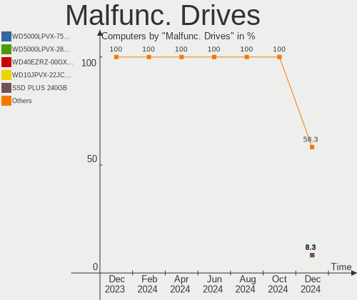
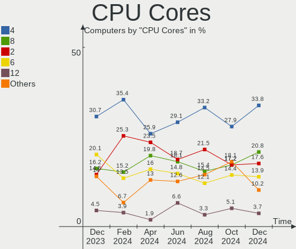
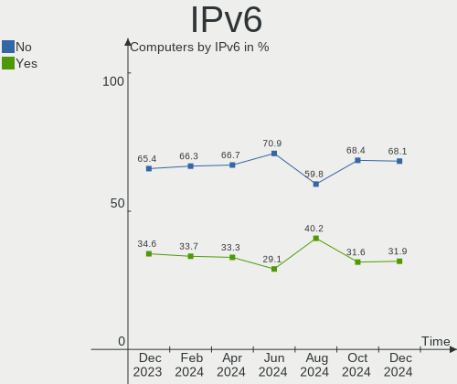
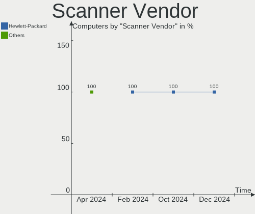

Pop!_OS Hardware Trends
-----------------------

A project to identify most popular hardware characteristics and track their change
over time based on data collected by Pop!_OS users at https://Linux-Hardware.org.

Anyone can contribute to this report by the [hw-probe](https://github.com/linuxhw/hw-probe) tool:

    sudo -E hw-probe -all -upload

This is a report for all computer types. See also reports for [desktops](/Dist/Pop!_OS/Desktop/README.md) and [notebooks](/Dist/Pop!_OS/Notebook/README.md).

Full-feature report is available here: https://linux-hardware.org/?view=trends

Period: Aug, 2021.

Contents
--------

* [ System ](#system)
  - [ OS                       ](#os)
  - [ OS Family                ](#os-family)
  - [ Kernel                   ](#kernel)
  - [ Kernel Family            ](#kernel-family)
  - [ Kernel Major Ver.        ](#kernel-major-ver)
  - [ Arch                     ](#arch)
  - [ DE                       ](#de)
  - [ Display Server           ](#display-server)
  - [ Display Manager          ](#display-manager)
  - [ OS Lang                  ](#os-lang)
  - [ Boot Mode                ](#boot-mode)
  - [ Filesystem               ](#filesystem)
  - [ Part. scheme             ](#part-scheme)
  - [ Dual Boot with Linux/BSD ](#dual-boot-with-linuxbsd)
  - [ Dual Boot (Win)          ](#dual-boot-win)

* [ Board ](#board)
  - [ Vendor                   ](#vendor)
  - [ Model                    ](#model)
  - [ Model Family             ](#model-family)
  - [ MFG Year                 ](#mfg-year)
  - [ Form Factor              ](#form-factor)
  - [ Secure Boot              ](#secure-boot)
  - [ Coreboot                 ](#coreboot)
  - [ RAM Size                 ](#ram-size)
  - [ RAM Used                 ](#ram-used)
  - [ Total Drives             ](#total-drives)
  - [ Has CD-ROM               ](#has-cd-rom)
  - [ Has Ethernet             ](#has-ethernet)
  - [ Has WiFi                 ](#has-wifi)
  - [ Has Bluetooth            ](#has-bluetooth)

* [ Location ](#location)
  - [ Country                  ](#country)
  - [ City                     ](#city)

* [ Drives ](#drives)
  - [ Drive Vendor             ](#drive-vendor)
  - [ Drive Model              ](#drive-model)
  - [ HDD Vendor               ](#hdd-vendor)
  - [ SSD Vendor               ](#ssd-vendor)
  - [ Drive Kind               ](#drive-kind)
  - [ Drive Connector          ](#drive-connector)
  - [ Drive Size               ](#drive-size)
  - [ Space Total              ](#space-total)
  - [ Space Used               ](#space-used)
  - [ Malfunc. Drives          ](#malfunc-drives)
  - [ Malfunc. Drive Vendor    ](#malfunc-drive-vendor)
  - [ Malfunc. HDD Vendor      ](#malfunc-hdd-vendor)
  - [ Malfunc. Drive Kind      ](#malfunc-drive-kind)
  - [ Failed Drives            ](#failed-drives)
  - [ Failed Drive Vendor      ](#failed-drive-vendor)
  - [ Drive Status             ](#drive-status)

* [ Storage controller ](#storage-controller)
  - [ Storage Vendor           ](#storage-vendor)
  - [ Storage Model            ](#storage-model)
  - [ Storage Kind             ](#storage-kind)

* [ Processor ](#processor)
  - [ CPU Vendor               ](#cpu-vendor)
  - [ CPU Model                ](#cpu-model)
  - [ CPU Model Family         ](#cpu-model-family)
  - [ CPU Cores                ](#cpu-cores)
  - [ CPU Sockets              ](#cpu-sockets)
  - [ CPU Threads              ](#cpu-threads)
  - [ CPU Op-Modes             ](#cpu-op-modes)
  - [ CPU Microcode            ](#cpu-microcode)
  - [ CPU Microarch            ](#cpu-microarch)

* [ Graphics ](#graphics)
  - [ GPU Vendor               ](#gpu-vendor)
  - [ GPU Model                ](#gpu-model)
  - [ GPU Combo                ](#gpu-combo)
  - [ GPU Driver               ](#gpu-driver)
  - [ GPU Memory               ](#gpu-memory)

* [ Monitor ](#monitor)
  - [ Monitor Vendor           ](#monitor-vendor)
  - [ Monitor Model            ](#monitor-model)
  - [ Monitor Resolution       ](#monitor-resolution)
  - [ Monitor Diagonal         ](#monitor-diagonal)
  - [ Monitor Width            ](#monitor-width)
  - [ Aspect Ratio             ](#aspect-ratio)
  - [ Monitor Area             ](#monitor-area)
  - [ Pixel Density            ](#pixel-density)
  - [ Multiple Monitors        ](#multiple-monitors)

* [ Network ](#network)
  - [ Net Controller Vendor    ](#net-controller-vendor)
  - [ Net Controller Model     ](#net-controller-model)
  - [ Wireless Vendor          ](#wireless-vendor)
  - [ Wireless Model           ](#wireless-model)
  - [ Ethernet Vendor          ](#ethernet-vendor)
  - [ Ethernet Model           ](#ethernet-model)
  - [ Net Controller Kind      ](#net-controller-kind)
  - [ Used Controller          ](#used-controller)
  - [ NICs                     ](#nics)
  - [ IPv6                     ](#ipv6)

* [ Bluetooth ](#bluetooth)
  - [ Bluetooth Vendor         ](#bluetooth-vendor)
  - [ Bluetooth Model          ](#bluetooth-model)

* [ Sound ](#sound)
  - [ Sound Vendor             ](#sound-vendor)
  - [ Sound Model              ](#sound-model)

* [ Memory ](#memory)
  - [ Memory Vendor            ](#memory-vendor)
  - [ Memory Model             ](#memory-model)
  - [ Memory Kind              ](#memory-kind)
  - [ Memory Form Factor       ](#memory-form-factor)
  - [ Memory Size              ](#memory-size)
  - [ Memory Speed             ](#memory-speed)

* [ Printers & scanners ](#printers--scanners)
  - [ Printer Vendor           ](#printer-vendor)
  - [ Printer Model            ](#printer-model)
  - [ Scanner Vendor           ](#scanner-vendor)
  - [ Scanner Model            ](#scanner-model)

* [ Camera ](#camera)
  - [ Camera Vendor            ](#camera-vendor)
  - [ Camera Model             ](#camera-model)

* [ Security ](#security)
  - [ Fingerprint Vendor       ](#fingerprint-vendor)
  - [ Fingerprint Model        ](#fingerprint-model)
  - [ Chipcard Vendor          ](#chipcard-vendor)
  - [ Chipcard Model           ](#chipcard-model)

* [ Unsupported ](#unsupported)
  - [ Unsupported Devices      ](#unsupported-devices)
  - [ Unsupported Device Types ](#unsupported-device-types)

System
------

OS
--

Installed operating systems

| Name          | Computers | Percent |
|---------------|-----------|---------|
| Pop!_OS 21.04 | 401       | 88.91%  |
| Pop!_OS 20.04 | 37        | 8.2%    |
| Pop!_OS 20.10 | 13        | 2.88%   |

OS Family
---------

OS without a version

| Name    | Computers | Percent |
|---------|-----------|---------|
| Pop!_OS | 451       | 100%    |

Kernel
------

Version of the Linux kernel

| Version                  | Computers | Percent |
|--------------------------|-----------|---------|
| 5.11.0-7620-generic      | 419       | 92.9%   |
| 5.11.0-7633-generic      | 7         | 1.55%   |
| 5.8.0-7642-generic       | 3         | 0.67%   |
| 5.13.12-xanmod1          | 2         | 0.44%   |
| 5.11.0-7612-generic      | 2         | 0.44%   |
| 5.8.0-7630-generic       | 1         | 0.22%   |
| 5.8.0-7625-generic       | 1         | 0.22%   |
| 5.4.0-7634-generic       | 1         | 0.22%   |
| 5.4.0-7626-generic       | 1         | 0.22%   |
| 5.14.0-051400rc3-generic | 1         | 0.22%   |
| 5.13.9-xanmod1           | 1         | 0.22%   |
| 5.13.7-surface           | 1         | 0.22%   |
| 5.13.13-xanmod1          | 1         | 0.22%   |
| 5.13.12-xanmod1-edge     | 1         | 0.22%   |
| 5.13.12-surface          | 1         | 0.22%   |
| 5.13.12-051312-generic   | 1         | 0.22%   |
| 5.13.0-051300-generic    | 1         | 0.22%   |
| 5.12.14-xanmod1          | 1         | 0.22%   |
| 5.12.0-051200-generic    | 1         | 0.22%   |
| 5.11.3-051103-generic    | 1         | 0.22%   |
| 5.11.10-051110-generic   | 1         | 0.22%   |
| 5.11.0-7614-generic      | 1         | 0.22%   |
| 5.11.0-31-lowlatency     | 1         | 0.22%   |

Kernel Family
-------------

Linux kernel without a distro release

| Version | Computers | Percent |
|---------|-----------|---------|
| 5.11.0  | 430       | 95.34%  |
| 5.8.0   | 5         | 1.11%   |
| 5.13.12 | 5         | 1.11%   |
| 5.4.0   | 2         | 0.44%   |
| 5.14.0  | 1         | 0.22%   |
| 5.13.9  | 1         | 0.22%   |
| 5.13.7  | 1         | 0.22%   |
| 5.13.13 | 1         | 0.22%   |
| 5.13.0  | 1         | 0.22%   |
| 5.12.14 | 1         | 0.22%   |
| 5.12.0  | 1         | 0.22%   |
| 5.11.3  | 1         | 0.22%   |
| 5.11.10 | 1         | 0.22%   |

Kernel Major Ver.
-----------------

Linux kernel major version

| Version | Computers | Percent |
|---------|-----------|---------|
| 5.11    | 432       | 95.79%  |
| 5.13    | 9         | 2%      |
| 5.8     | 5         | 1.11%   |
| 5.4     | 2         | 0.44%   |
| 5.12    | 2         | 0.44%   |
| 5.14    | 1         | 0.22%   |

Arch
----

OS architecture (x86_64, i586, etc.)

| Name   | Computers | Percent |
|--------|-----------|---------|
| x86_64 | 451       | 100%    |

DE
--

Desktop Environment

| Name     | Computers | Percent |
|----------|-----------|---------|
| GNOME    | 440       | 97.56%  |
| KDE      | 4         | 0.89%   |
| KDE5     | 2         | 0.44%   |
| Cinnamon | 2         | 0.44%   |
| Unity    | 1         | 0.22%   |
| MATE     | 1         | 0.22%   |
| LXQt     | 1         | 0.22%   |

Display Server
--------------

X11 or Wayland

| Name    | Computers | Percent |
|---------|-----------|---------|
| X11     | 443       | 98.23%  |
| Wayland | 6         | 1.33%   |
| Tty     | 2         | 0.44%   |

Display Manager
---------------

SDDM, LightDM, etc.

| Name    | Computers | Percent |
|---------|-----------|---------|
| Unknown | 377       | 83.59%  |
| GDM     | 73        | 16.19%  |
| SDDM    | 1         | 0.22%   |

OS Lang
-------

Language

| Lang   | Computers | Percent |
|--------|-----------|---------|
| en_US  | 254       | 56.32%  |
| pt_BR  | 38        | 8.43%   |
| en_GB  | 35        | 7.76%   |
| de_DE  | 20        | 4.43%   |
| en_AU  | 19        | 4.21%   |
| en_CA  | 11        | 2.44%   |
| C      | 8         | 1.77%   |
| fr_FR  | 7         | 1.55%   |
| en_IN  | 6         | 1.33%   |
| pt_PT  | 5         | 1.11%   |
| ru_RU  | 4         | 0.89%   |
| pl_PL  | 4         | 0.89%   |
| it_IT  | 4         | 0.89%   |
| sv_SE  | 3         | 0.67%   |
| es_ES  | 3         | 0.67%   |
| en_NZ  | 3         | 0.67%   |
| nl_NL  | 2         | 0.44%   |
| nl_BE  | 2         | 0.44%   |
| hu_HU  | 2         | 0.44%   |
| es_MX  | 2         | 0.44%   |
| es_CL  | 2         | 0.44%   |
| es_AR  | 2         | 0.44%   |
| zh_TW  | 1         | 0.22%   |
| zh_CN  | 1         | 0.22%   |
| tr_TR  | 1         | 0.22%   |
| ru_UA  | 1         | 0.22%   |
| ro_RO  | 1         | 0.22%   |
| nb_NO  | 1         | 0.22%   |
| lv_LV  | 1         | 0.22%   |
| hr_HR  | 1         | 0.22%   |
| fr_CA  | 1         | 0.22%   |
| fi_FI  | 1         | 0.22%   |
| es_CR  | 1         | 0.22%   |
| en_ZA  | 1         | 0.22%   |
| en_150 | 1         | 0.22%   |
| el_GR  | 1         | 0.22%   |
| da_DK  | 1         | 0.22%   |

Boot Mode
---------

EFI or BIOS

| Mode | Computers | Percent |
|------|-----------|---------|
| BIOS | 390       | 86.47%  |
| EFI  | 61        | 13.53%  |

Filesystem
----------

Type of filesystem

| Type    | Computers | Percent |
|---------|-----------|---------|
| Ext4    | 440       | 97.56%  |
| Btrfs   | 8         | 1.77%   |
| Overlay | 3         | 0.67%   |

Part. scheme
------------

Scheme of partitioning

| Type    | Computers | Percent |
|---------|-----------|---------|
| Unknown | 377       | 83.59%  |
| GPT     | 62        | 13.75%  |
| MBR     | 12        | 2.66%   |

Dual Boot with Linux/BSD
------------------------

Hosting more than one Linux/BSD

| Dual boot | Computers | Percent |
|-----------|-----------|---------|
| No        | 445       | 98.67%  |
| Yes       | 6         | 1.33%   |

Dual Boot (Win)
---------------

Hosting Linux and Windows

| Dual boot | Computers | Percent |
|-----------|-----------|---------|
| No        | 422       | 93.57%  |
| Yes       | 29        | 6.43%   |

Board
-----

Vendor
------

Motherboard manufacturer

| Name                   | Computers | Percent |
|------------------------|-----------|---------|
| ASUSTek Computer       | 70        | 15.52%  |
| Dell                   | 60        | 13.3%   |
| Hewlett-Packard        | 50        | 11.09%  |
| Lenovo                 | 48        | 10.64%  |
| MSI                    | 44        | 9.76%   |
| Gigabyte Technology    | 34        | 7.54%   |
| ASRock                 | 24        | 5.32%   |
| Acer                   | 24        | 5.32%   |
| Apple                  | 20        | 4.43%   |
| System76               | 10        | 2.22%   |
| Toshiba                | 6         | 1.33%   |
| Intel                  | 5         | 1.11%   |
| Teclast                | 3         | 0.67%   |
| Samsung Electronics    | 3         | 0.67%   |
| Positivo               | 3         | 0.67%   |
| Alienware              | 3         | 0.67%   |
| Sony                   | 2         | 0.44%   |
| Razer                  | 2         | 0.44%   |
| Pegatron               | 2         | 0.44%   |
| PC Specialist          | 2         | 0.44%   |
| Packard Bell           | 2         | 0.44%   |
| Notebook               | 2         | 0.44%   |
| Microsoft              | 2         | 0.44%   |
| Medion                 | 2         | 0.44%   |
| HUAWEI                 | 2         | 0.44%   |
| Google                 | 2         | 0.44%   |
| eMachines              | 2         | 0.44%   |
| Timi                   | 1         | 0.22%   |
| SLIMBOOK               | 1         | 0.22%   |
| Semp Toshiba           | 1         | 0.22%   |
| PCWare                 | 1         | 0.22%   |
| ONE-NETBOOK TECHNOLOGY | 1         | 0.22%   |
| ONDA                   | 1         | 0.22%   |
| Mustek                 | 1         | 0.22%   |
| Login Informatica      | 1         | 0.22%   |
| LincPlus               | 1         | 0.22%   |
| KOGAN                  | 1         | 0.22%   |
| Jumper                 | 1         | 0.22%   |
| IP3 Tech               | 1         | 0.22%   |
| Gateway                | 1         | 0.22%   |
| Fujitsu                | 1         | 0.22%   |
| Framework              | 1         | 0.22%   |
| Foxconn                | 1         | 0.22%   |
| EVGA                   | 1         | 0.22%   |
| Eluktronics            | 1         | 0.22%   |
| Carbon Systems         | 1         | 0.22%   |
| BANGHO                 | 1         | 0.22%   |
| AMD                    | 1         | 0.22%   |
| Unknown                | 1         | 0.22%   |

Model
-----

Motherboard model

| Name                               | Computers | Percent |
|------------------------------------|-----------|---------|
| HP Pavilion dv6                    | 4         | 0.89%   |
| Gigabyte A320M-S2H                 | 4         | 0.89%   |
| ASUS All Series                    | 4         | 0.89%   |
| Apple MacBookPro9,2                | 4         | 0.89%   |
| System76 Gazelle                   | 3         | 0.67%   |
| ASUS TUF GAMING X570-PLUS          | 3         | 0.67%   |
| System76 Oryx Pro                  | 2         | 0.44%   |
| MSI MS-7C84                        | 2         | 0.44%   |
| MSI MS-7C56                        | 2         | 0.44%   |
| MSI MS-7C37                        | 2         | 0.44%   |
| MSI MS-7B86                        | 2         | 0.44%   |
| MSI MS-7B48                        | 2         | 0.44%   |
| Lenovo IdeaPad 3 15ADA05 81W1      | 2         | 0.44%   |
| Intel Meerkat                      | 2         | 0.44%   |
| HP Stream Laptop 14-cb1xxx         | 2         | 0.44%   |
| HP Notebook                        | 2         | 0.44%   |
| HP G72                             | 2         | 0.44%   |
| HP ENVY x360 Convertible 15-eu0xxx | 2         | 0.44%   |
| HP EliteBook 820 G1                | 2         | 0.44%   |
| HP Compaq Presario CQ50            | 2         | 0.44%   |
| Gigabyte X570 AORUS ULTRA          | 2         | 0.44%   |
| Gigabyte X570 AORUS ELITE          | 2         | 0.44%   |
| Gigabyte B550 AORUS MASTER         | 2         | 0.44%   |
| Dell XPS 8300                      | 2         | 0.44%   |
| Dell XPS 17 9700                   | 2         | 0.44%   |
| Dell Precision WorkStation T3500   | 2         | 0.44%   |
| Dell OptiPlex 9020                 | 2         | 0.44%   |
| Dell OptiPlex 755                  | 2         | 0.44%   |
| Dell Inspiron 3421                 | 2         | 0.44%   |
| ASUS TUF Gaming FX505DY_FX505DY    | 2         | 0.44%   |
| ASUS ROG STRIX B450-F GAMING       | 2         | 0.44%   |
| ASUS Rampage IV EXTREME            | 2         | 0.44%   |
| ASUS PRIME B450M-K                 | 2         | 0.44%   |
| ASUS CROSSHAIR V FORMULA-Z         | 2         | 0.44%   |
| ASRock B450M Steel Legend          | 2         | 0.44%   |
| ASRock A55M-HVS                    | 2         | 0.44%   |
| Apple MacBookPro8,1                | 2         | 0.44%   |
| Apple MacBook4,1                   | 2         | 0.44%   |
| Apple iMac13,1                     | 2         | 0.44%   |
| Acer Nitro AN515-45                | 2         | 0.44%   |
| Acer Aspire one 1-431              | 2         | 0.44%   |
| Acer Aspire E5-575G                | 2         | 0.44%   |
| Toshiba Satellite Pro L450         | 1         | 0.22%   |
| Toshiba Satellite L775             | 1         | 0.22%   |
| Toshiba Satellite L50-B            | 1         | 0.22%   |
| Toshiba Satellite C650             | 1         | 0.22%   |
| Toshiba Satellite C55-C            | 1         | 0.22%   |
| Toshiba PORTEGE M780               | 1         | 0.22%   |
| Timi Mi NoteBook 14                | 1         | 0.22%   |
| Teclast TbooK 11                   | 1         | 0.22%   |
| Teclast F15S                       | 1         | 0.22%   |
| Teclast F15 Plus                   | 1         | 0.22%   |
| System76 Thelio Major              | 1         | 0.22%   |
| System76 Thelio                    | 1         | 0.22%   |
| System76 Serval                    | 1         | 0.22%   |
| System76 Lemur Pro                 | 1         | 0.22%   |
| System76 Darter Pro                | 1         | 0.22%   |
| Sony VPCF23M1E                     | 1         | 0.22%   |
| Sony SVF15N17CXB                   | 1         | 0.22%   |
| SLIMBOOK PROX15-AMD                | 1         | 0.22%   |

Model Family
------------

Motherboard model prefix

| Name                  | Computers | Percent |
|-----------------------|-----------|---------|
| Lenovo ThinkPad       | 24        | 5.32%   |
| Dell Inspiron         | 18        | 3.99%   |
| Acer Aspire           | 15        | 3.33%   |
| Lenovo IdeaPad        | 12        | 2.66%   |
| Dell XPS              | 12        | 2.66%   |
| Dell OptiPlex         | 10        | 2.22%   |
| ASUS TUF              | 10        | 2.22%   |
| ASUS ROG              | 10        | 2.22%   |
| HP Pavilion           | 9         | 2%      |
| Dell Precision        | 9         | 2%      |
| Dell Latitude         | 9         | 2%      |
| ASUS PRIME            | 8         | 1.77%   |
| Acer Nitro            | 6         | 1.33%   |
| Toshiba Satellite     | 5         | 1.11%   |
| HP ProBook            | 5         | 1.11%   |
| HP ENVY               | 5         | 1.11%   |
| HP EliteBook          | 5         | 1.11%   |
| HP Compaq             | 5         | 1.11%   |
| HP Laptop             | 4         | 0.89%   |
| Gigabyte X570         | 4         | 0.89%   |
| Gigabyte B450         | 4         | 0.89%   |
| Gigabyte A320M-S2H    | 4         | 0.89%   |
| ASUS VivoBook         | 4         | 0.89%   |
| ASUS All              | 4         | 0.89%   |
| Apple MacBookPro9     | 4         | 0.89%   |
| System76 Gazelle      | 3         | 0.67%   |
| Lenovo Yoga           | 3         | 0.67%   |
| Lenovo ThinkCentre    | 3         | 0.67%   |
| HP Stream             | 3         | 0.67%   |
| Gigabyte B550         | 3         | 0.67%   |
| ASUS CROSSHAIR        | 3         | 0.67%   |
| ASRock B450M          | 3         | 0.67%   |
| System76 Thelio       | 2         | 0.44%   |
| System76 Oryx         | 2         | 0.44%   |
| Razer Blade           | 2         | 0.44%   |
| Packard Bell EasyNote | 2         | 0.44%   |
| MSI MS-7C84           | 2         | 0.44%   |
| MSI MS-7C56           | 2         | 0.44%   |
| MSI MS-7C37           | 2         | 0.44%   |
| MSI MS-7B86           | 2         | 0.44%   |
| MSI MS-7B48           | 2         | 0.44%   |
| MSI Alpha             | 2         | 0.44%   |
| Microsoft Surface     | 2         | 0.44%   |
| Lenovo IdeaCentre     | 2         | 0.44%   |
| Intel Meerkat         | 2         | 0.44%   |
| HP Presario           | 2         | 0.44%   |
| HP Notebook           | 2         | 0.44%   |
| HP G72                | 2         | 0.44%   |
| ASUS Rampage          | 2         | 0.44%   |
| ASUS ASUS             | 2         | 0.44%   |
| ASRock A55M-HVS       | 2         | 0.44%   |
| Apple MacBookPro8     | 2         | 0.44%   |
| Apple MacBookPro5     | 2         | 0.44%   |
| Apple MacBookAir4     | 2         | 0.44%   |
| Apple MacBook4        | 2         | 0.44%   |
| Apple iMac13          | 2         | 0.44%   |
| Acer Swift            | 2         | 0.44%   |
| Toshiba PORTEGE       | 1         | 0.22%   |
| Timi Mi               | 1         | 0.22%   |
| Teclast TbooK         | 1         | 0.22%   |

MFG Year
--------

Motherboard manufacture year

| Year | Computers | Percent |
|------|-----------|---------|
| 2021 | 95        | 21.06%  |
| 2020 | 91        | 20.18%  |
| 2019 | 48        | 10.64%  |
| 2018 | 37        | 8.2%    |
| 2011 | 29        | 6.43%   |
| 2012 | 26        | 5.76%   |
| 2014 | 21        | 4.66%   |
| 2013 | 20        | 4.43%   |
| 2015 | 17        | 3.77%   |
| 2010 | 17        | 3.77%   |
| 2016 | 15        | 3.33%   |
| 2017 | 12        | 2.66%   |
| 2009 | 12        | 2.66%   |
| 2008 | 10        | 2.22%   |
| 2007 | 1         | 0.22%   |

Form Factor
-----------

Physical design of the computer

| Name        | Computers | Percent |
|-------------|-----------|---------|
| Notebook    | 235       | 52.11%  |
| Desktop     | 184       | 40.8%   |
| Convertible | 14        | 3.1%    |
| All in one  | 8         | 1.77%   |
| Tablet      | 5         | 1.11%   |
| Mini pc     | 4         | 0.89%   |
| Server      | 1         | 0.22%   |

Secure Boot
-----------

Enabled or disabled

| State    | Computers | Percent |
|----------|-----------|---------|
| Disabled | 451       | 100%    |

Coreboot
--------

Have coreboot on board

| Used | Computers | Percent |
|------|-----------|---------|
| No   | 443       | 98.23%  |
| Yes  | 8         | 1.77%   |

RAM Size
--------

Total RAM memory

| Size in GB  | Computers | Percent |
|-------------|-----------|---------|
| 16.01-24.0  | 107       | 23.73%  |
| 4.01-8.0    | 98        | 21.73%  |
| 8.01-16.0   | 80        | 17.74%  |
| 3.01-4.0    | 73        | 16.19%  |
| 32.01-64.0  | 62        | 13.75%  |
| 64.01-256.0 | 11        | 2.44%   |
| 1.01-2.0    | 11        | 2.44%   |
| 24.01-32.0  | 8         | 1.77%   |
| 2.01-3.0    | 1         | 0.22%   |

RAM Used
--------

Used RAM memory

| Used GB     | Computers | Percent |
|-------------|-----------|---------|
| 1.01-2.0    | 164       | 36.36%  |
| 2.01-3.0    | 136       | 30.16%  |
| 4.01-8.0    | 72        | 15.96%  |
| 3.01-4.0    | 62        | 13.75%  |
| 8.01-16.0   | 14        | 3.1%    |
| 64.01-256.0 | 1         | 0.22%   |
| 16.01-24.0  | 1         | 0.22%   |
| 0.51-1.0    | 1         | 0.22%   |

Total Drives
------------

Number of drives on board

| Drives | Computers | Percent |
|--------|-----------|---------|
| 1      | 238       | 52.77%  |
| 2      | 131       | 29.05%  |
| 3      | 44        | 9.76%   |
| 4      | 21        | 4.66%   |
| 5      | 9         | 2%      |
| 7      | 3         | 0.67%   |
| 6      | 2         | 0.44%   |
| 0      | 2         | 0.44%   |
| 10     | 1         | 0.22%   |

Has CD-ROM
----------

Has CD-ROM on board

| Presented | Computers | Percent |
|-----------|-----------|---------|
| No        | 302       | 66.96%  |
| Yes       | 149       | 33.04%  |

Has Ethernet
------------

Has Ethernet on board

| Presented | Computers | Percent |
|-----------|-----------|---------|
| Yes       | 388       | 86.03%  |
| No        | 63        | 13.97%  |

Has WiFi
--------

Has WiFi module

| Presented | Computers | Percent |
|-----------|-----------|---------|
| Yes       | 353       | 78.27%  |
| No        | 98        | 21.73%  |

Has Bluetooth
-------------

Has Bluetooth module

| Presented | Computers | Percent |
|-----------|-----------|---------|
| Yes       | 295       | 65.41%  |
| No        | 156       | 34.59%  |

Location
--------

Country
-------

Geographic location (country)

| Country      | Computers | Percent |
|--------------|-----------|---------|
| USA          | 139       | 30.82%  |
| Brazil       | 43        | 9.53%   |
| Germany      | 32        | 7.1%    |
| UK           | 22        | 4.88%   |
| India        | 21        | 4.66%   |
| Australia    | 19        | 4.21%   |
| Canada       | 18        | 3.99%   |
| Netherlands  | 13        | 2.88%   |
| France       | 11        | 2.44%   |
| Sweden       | 9         | 2%      |
| Italy        | 8         | 1.77%   |
| Portugal     | 7         | 1.55%   |
| Finland      | 7         | 1.55%   |
| Romania      | 6         | 1.33%   |
| Mexico       | 6         | 1.33%   |
| Belgium      | 6         | 1.33%   |
| Switzerland  | 5         | 1.11%   |
| Russia       | 5         | 1.11%   |
| South Africa | 4         | 0.89%   |
| Poland       | 4         | 0.89%   |
| New Zealand  | 4         | 0.89%   |
| Spain        | 3         | 0.67%   |
| Serbia       | 3         | 0.67%   |
| Philippines  | 3         | 0.67%   |
| Malaysia     | 3         | 0.67%   |
| Latvia       | 3         | 0.67%   |
| Indonesia    | 3         | 0.67%   |
| Greece       | 3         | 0.67%   |
| Croatia      | 3         | 0.67%   |
| Vietnam      | 2         | 0.44%   |
| Ukraine      | 2         | 0.44%   |
| Turkey       | 2         | 0.44%   |
| Pakistan     | 2         | 0.44%   |
| Norway       | 2         | 0.44%   |
| Lithuania    | 2         | 0.44%   |
| Lebanon      | 2         | 0.44%   |
| Israel       | 2         | 0.44%   |
| Denmark      | 2         | 0.44%   |
| Chile        | 2         | 0.44%   |
| Argentina    | 2         | 0.44%   |
| Thailand     | 1         | 0.22%   |
| Taiwan       | 1         | 0.22%   |
| South Korea  | 1         | 0.22%   |
| Malta        | 1         | 0.22%   |
| Luxembourg   | 1         | 0.22%   |
| Libya        | 1         | 0.22%   |
| Japan        | 1         | 0.22%   |
| Hungary      | 1         | 0.22%   |
| Estonia      | 1         | 0.22%   |
| Egypt        | 1         | 0.22%   |
| Czechia      | 1         | 0.22%   |
| Costa Rica   | 1         | 0.22%   |
| China        | 1         | 0.22%   |
| Cambodia     | 1         | 0.22%   |
| Bangladesh   | 1         | 0.22%   |
| Austria      | 1         | 0.22%   |

City
----

Geographic location (city)

| City              | Computers | Percent |
|-------------------|-----------|---------|
| S??o Paulo        | 7         | 1.55%   |
| Melbourne         | 6         | 1.33%   |
| London            | 6         | 1.33%   |
| Bengaluru         | 6         | 1.33%   |
| Berlin            | 5         | 1.11%   |
| Helsinki          | 4         | 0.89%   |
| Dallas            | 4         | 0.89%   |
| Amsterdam         | 4         | 0.89%   |
| Vancouver         | 3         | 0.67%   |
| Sydney            | 3         | 0.67%   |
| S??vres           | 3         | 0.67%   |
| Los Angeles       | 3         | 0.67%   |
| Indianapolis      | 3         | 0.67%   |
| Fortaleza         | 3         | 0.67%   |
| Ditzingen         | 3         | 0.67%   |
| Brisbane          | 3         | 0.67%   |
| Atlanta           | 3         | 0.67%   |
| Zurich            | 2         | 0.44%   |
| Wadena            | 2         | 0.44%   |
| Victoria          | 2         | 0.44%   |
| Split             | 2         | 0.44%   |
| San Diego         | 2         | 0.44%   |
| Rio de Janeiro    | 2         | 0.44%   |
| Riga              | 2         | 0.44%   |
| Porto Alegre      | 2         | 0.44%   |
| Perth             | 2         | 0.44%   |
| Paris             | 2         | 0.44%   |
| Okotoks           | 2         | 0.44%   |
| Oisterwijk        | 2         | 0.44%   |
| Oberhausen        | 2         | 0.44%   |
| New York          | 2         | 0.44%   |
| Mumbai            | 2         | 0.44%   |
| Milan             | 2         | 0.44%   |
| Miami             | 2         | 0.44%   |
| Malmo             | 2         | 0.44%   |
| Madrid            | 2         | 0.44%   |
| Madison           | 2         | 0.44%   |
| Longmont          | 2         | 0.44%   |
| Lisbon            | 2         | 0.44%   |
| Lahore            | 2         | 0.44%   |
| Kyiv              | 2         | 0.44%   |
| Klaip?—da         | 2         | 0.44%   |
| Johannesburg      | 2         | 0.44%   |
| Jacksonville      | 2         | 0.44%   |
| Hampstead         | 2         | 0.44%   |
| Groningen         | 2         | 0.44%   |
| Giessen           | 2         | 0.44%   |
| Frankfurt am Main | 2         | 0.44%   |
| Fort Lee          | 2         | 0.44%   |
| Delhi             | 2         | 0.44%   |
| Cuiab??           | 2         | 0.44%   |
| Chicago           | 2         | 0.44%   |
| Bensheim          | 2         | 0.44%   |
| Bennington        | 2         | 0.44%   |
| Baltimore         | 2         | 0.44%   |
| Austin            | 2         | 0.44%   |
| Ara?§atuba        | 2         | 0.44%   |
| Zion              | 1         | 0.22%   |
| Zandhoven         | 1         | 0.22%   |
| Zagreb            | 1         | 0.22%   |

Drives
------

Drive Vendor
------------

Hard drive vendors

| Vendor                    | Computers | Drives | Percent |
|---------------------------|-----------|--------|---------|
| Samsung Electronics       | 121       | 162    | 17.44%  |
| Seagate                   | 106       | 130    | 15.27%  |
| WDC                       | 89        | 100    | 12.82%  |
| SanDisk                   | 52        | 55     | 7.49%   |
| Toshiba                   | 43        | 46     | 6.2%    |
| Kingston                  | 36        | 37     | 5.19%   |
| Crucial                   | 34        | 36     | 4.9%    |
| Unknown                   | 33        | 41     | 4.76%   |
| SK Hynix                  | 16        | 16     | 2.31%   |
| Hitachi                   | 11        | 14     | 1.59%   |
| Phison                    | 10        | 10     | 1.44%   |
| Intel                     | 10        | 10     | 1.44%   |
| PNY                       | 9         | 9      | 1.3%    |
| A-DATA Technology         | 9         | 9      | 1.3%    |
| Micron Technology         | 8         | 8      | 1.15%   |
| Apple                     | 8         | 9      | 1.15%   |
| Silicon Motion            | 7         | 7      | 1.01%   |
| Micron/Crucial Technology | 6         | 6      | 0.86%   |
| KIOXIA                    | 6         | 6      | 0.86%   |
| HGST                      | 6         | 6      | 0.86%   |
| SPCC                      | 4         | 4      | 0.58%   |
| Realtek Semiconductor     | 4         | 4      | 0.58%   |
| Patriot                   | 4         | 5      | 0.58%   |
| China                     | 4         | 4      | 0.58%   |
| PLEXTOR                   | 3         | 3      | 0.43%   |
| Maxtor                    | 3         | 3      | 0.43%   |
| Gigabyte Technology       | 3         | 4      | 0.43%   |
| XrayDisk                  | 2         | 2      | 0.29%   |
| XPG                       | 2         | 2      | 0.29%   |
| Transcend                 | 2         | 2      | 0.29%   |
| Team                      | 2         | 2      | 0.29%   |
| Realtek                   | 2         | 3      | 0.29%   |
| LITEONIT                  | 2         | 4      | 0.29%   |
| LITEON                    | 2         | 2      | 0.29%   |
| JMicron                   | 2         | 5      | 0.29%   |
| Hewlett-Packard           | 2         | 2      | 0.29%   |
| Corsair                   | 2         | 2      | 0.29%   |
| Apacer                    | 2         | 2      | 0.29%   |
| ADATA Technology          | 2         | 2      | 0.29%   |
| Zheino                    | 1         | 1      | 0.14%   |
| ZEPLIN Z                  | 1         | 1      | 0.14%   |
| Verbatim                  | 1         | 1      | 0.14%   |
| TEXTORM                   | 1         | 1      | 0.14%   |
| Teutons                   | 1         | 1      | 0.14%   |
| TEAM T25                  | 1         | 1      | 0.14%   |
| SPCC Sol                  | 1         | 1      | 0.14%   |
| PNY USB                   | 1         | 1      | 0.14%   |
| OCZ                       | 1         | 1      | 0.14%   |
| Mushkin                   | 1         | 1      | 0.14%   |
| Memory                    | 1         | 1      | 0.14%   |
| Lite-On                   | 1         | 1      | 0.14%   |
| Lexar                     | 1         | 1      | 0.14%   |
| KingFast                  | 1         | 1      | 0.14%   |
| JetDrive                  | 1         | 1      | 0.14%   |
| JD                        | 1         | 2      | 0.14%   |
| Intenso                   | 1         | 1      | 0.14%   |
| HS-SSD-E100               | 1         | 1      | 0.14%   |
| HS-SSD-C100               | 1         | 1      | 0.14%   |
| Hikvision                 | 1         | 1      | 0.14%   |
| GOODRAM                   | 1         | 1      | 0.14%   |

Drive Model
-----------

Hard drive models

| Model                               | Computers | Percent |
|-------------------------------------|-----------|---------|
| Samsung NVMe SSD Drive 1TB          | 13        | 1.68%   |
| Samsung SSD 850 EVO 500GB           | 12        | 1.55%   |
| Kingston SA400S37240G 240GB SSD     | 11        | 1.42%   |
| Samsung SSD 860 EVO 500GB           | 10        | 1.29%   |
| Samsung NVMe SSD Drive 500GB        | 9         | 1.16%   |
| Sandisk NVMe SSD Drive 500GB        | 8         | 1.03%   |
| Unknown MMC Card  64GB              | 7         | 0.91%   |
| Unknown MMC Card  32GB              | 7         | 0.91%   |
| Seagate ST1000DM010-2EP102 1TB      | 7         | 0.91%   |
| Sandisk NVMe SSD Drive 512GB        | 7         | 0.91%   |
| Samsung SSD 860 EVO 1TB             | 7         | 0.91%   |
| Crucial CT240BX500SSD1 240GB        | 7         | 0.91%   |
| Crucial CT1000MX500SSD1 1TB         | 7         | 0.91%   |
| Seagate ST2000DM001-1CH164 2TB      | 6         | 0.78%   |
| SanDisk SSD PLUS 240GB              | 6         | 0.78%   |
| WDC WD10EZEX-08WN4A0 1TB            | 5         | 0.65%   |
| Toshiba MQ01ABD100 1TB              | 5         | 0.65%   |
| SK Hynix NVMe SSD Drive 512GB       | 5         | 0.65%   |
| Seagate Expansion 2TB               | 5         | 0.65%   |
| Sandisk NVMe SSD Drive 1TB          | 5         | 0.65%   |
| Samsung SSD 860 QVO 1TB             | 5         | 0.65%   |
| Samsung SSD 860 EVO 250GB           | 5         | 0.65%   |
| Samsung NVMe SSD Drive 2TB          | 5         | 0.65%   |
| Samsung NVMe SSD Drive 250GB        | 5         | 0.65%   |
| Unknown MMC Card  128GB             | 4         | 0.52%   |
| Toshiba NVMe SSD Drive 256GB        | 4         | 0.52%   |
| Toshiba MQ01ABF050 500GB            | 4         | 0.52%   |
| Seagate ST500LT012-1DG142 500GB     | 4         | 0.52%   |
| Seagate ST500DM002-1BD142 500GB     | 4         | 0.52%   |
| Seagate ST2000DM008-2FR102 2TB      | 4         | 0.52%   |
| Seagate ST1000LM049-2GH172 1TB      | 4         | 0.52%   |
| Seagate ST1000LM035-1RK172 1TB      | 4         | 0.52%   |
| Seagate ST1000DX001-1CM162 1TB      | 4         | 0.52%   |
| SanDisk SDSSDA240G 240GB            | 4         | 0.52%   |
| Samsung SSD 850 EVO 250GB           | 4         | 0.52%   |
| Samsung NVMe SSD Drive 1024GB       | 4         | 0.52%   |
| Kingston SA400S37120G 120GB SSD     | 4         | 0.52%   |
| Intel NVMe SSD Drive 512GB          | 4         | 0.52%   |
| Crucial CT500MX500SSD1 500GB        | 4         | 0.52%   |
| WDC WDS500G2B0A-00SM50 500GB SSD    | 3         | 0.39%   |
| WDC WD10SPZX-21Z10T0 1TB            | 3         | 0.39%   |
| WDC WD10EZEX-60WN4A0 1TB            | 3         | 0.39%   |
| Seagate ST500LM012 HN-M500MBB 500GB | 3         | 0.39%   |
| Seagate ST3250310AS 250GB           | 3         | 0.39%   |
| Seagate ST3000DM001-1ER166 3TB      | 3         | 0.39%   |
| Seagate ST2000DM006-2DM164 2TB      | 3         | 0.39%   |
| Seagate ST1000LX015-1U7172 1TB      | 3         | 0.39%   |
| Seagate ST1000LM024 HN-M101MBB 1TB  | 3         | 0.39%   |
| SanDisk SSD PLUS 120GB              | 3         | 0.39%   |
| Sandisk NVMe SSD Drive 256GB        | 3         | 0.39%   |
| Sandisk NVMe SSD Drive 1024GB       | 3         | 0.39%   |
| Samsung SSD 970 EVO Plus 1TB        | 3         | 0.39%   |
| Samsung SSD 970 EVO 500GB           | 3         | 0.39%   |
| Samsung SSD 870 QVO 2TB             | 3         | 0.39%   |
| Samsung SSD 860 EVO 2TB             | 3         | 0.39%   |
| Samsung SSD 850 EVO 1TB             | 3         | 0.39%   |
| Samsung NVMe SSD Drive 512GB        | 3         | 0.39%   |
| Samsung NVMe SSD Drive 256GB        | 3         | 0.39%   |
| PNY CS900 240GB SSD                 | 3         | 0.39%   |
| Patriot Burst 120GB SSD             | 3         | 0.39%   |

HDD Vendor
----------

Hard disk drive vendors

| Vendor              | Computers | Drives | Percent |
|---------------------|-----------|--------|---------|
| Seagate             | 101       | 123    | 42.62%  |
| WDC                 | 71        | 80     | 29.96%  |
| Toshiba             | 32        | 34     | 13.5%   |
| Hitachi             | 11        | 14     | 4.64%   |
| Samsung Electronics | 8         | 8      | 3.38%   |
| HGST                | 6         | 6      | 2.53%   |
| Apple               | 5         | 5      | 2.11%   |
| MAXTOR              | 2         | 2      | 0.84%   |
| JMicron             | 1         | 3      | 0.42%   |

SSD Vendor
----------

Solid state drive vendors

| Vendor              | Computers | Drives | Percent |
|---------------------|-----------|--------|---------|
| Samsung Electronics | 67        | 88     | 26.69%  |
| Crucial             | 31        | 32     | 12.35%  |
| Kingston            | 29        | 30     | 11.55%  |
| SanDisk             | 25        | 26     | 9.96%   |
| WDC                 | 12        | 13     | 4.78%   |
| PNY                 | 9         | 9      | 3.59%   |
| A-DATA Technology   | 9         | 9      | 3.59%   |
| SK Hynix            | 5         | 5      | 1.99%   |
| Toshiba             | 4         | 4      | 1.59%   |
| Patriot             | 4         | 5      | 1.59%   |
| China               | 4         | 4      | 1.59%   |
| Apple               | 4         | 4      | 1.59%   |
| Unknown             | 3         | 3      | 1.2%    |
| SPCC                | 3         | 3      | 1.2%    |
| PLEXTOR             | 3         | 3      | 1.2%    |
| Gigabyte Technology | 3         | 4      | 1.2%    |
| Transcend           | 2         | 2      | 0.8%    |
| Team                | 2         | 2      | 0.8%    |
| Micron Technology   | 2         | 2      | 0.8%    |
| LITEONIT            | 2         | 4      | 0.8%    |
| LITEON              | 2         | 2      | 0.8%    |
| Intel               | 2         | 2      | 0.8%    |
| Hewlett-Packard     | 2         | 2      | 0.8%    |
| Apacer              | 2         | 2      | 0.8%    |
| Verbatim            | 1         | 1      | 0.4%    |
| Teutons             | 1         | 1      | 0.4%    |
| TEAM T25            | 1         | 1      | 0.4%    |
| SPCC Sol            | 1         | 1      | 0.4%    |
| Seagate             | 1         | 1      | 0.4%    |
| PNY USB             | 1         | 1      | 0.4%    |
| Phison              | 1         | 1      | 0.4%    |
| OCZ                 | 1         | 1      | 0.4%    |
| Mushkin             | 1         | 1      | 0.4%    |
| Memory              | 1         | 1      | 0.4%    |
| Maxtor              | 1         | 1      | 0.4%    |
| Lexar               | 1         | 1      | 0.4%    |
| JMicron             | 1         | 1      | 0.4%    |
| JD                  | 1         | 1      | 0.4%    |
| Intenso             | 1         | 1      | 0.4%    |
| Hikvision           | 1         | 1      | 0.4%    |
| GOODRAM             | 1         | 1      | 0.4%    |
| DOGFISH             | 1         | 1      | 0.4%    |
| Corsair             | 1         | 1      | 0.4%    |
| AMD                 | 1         | 2      | 0.4%    |

Drive Kind
----------

HDD or SSD

| Kind    | Computers | Drives | Percent |
|---------|-----------|--------|---------|
| SSD     | 218       | 281    | 34.38%  |
| HDD     | 210       | 275    | 33.12%  |
| NVMe    | 161       | 191    | 25.39%  |
| MMC     | 24        | 30     | 3.79%   |
| Unknown | 21        | 24     | 3.31%   |

Drive Connector
---------------

SATA, SAS, NVMe, etc.

| Type | Computers | Drives | Percent |
|------|-----------|--------|---------|
| SATA | 340       | 545    | 61.48%  |
| NVMe | 161       | 190    | 29.11%  |
| SAS  | 28        | 36     | 5.06%   |
| MMC  | 24        | 30     | 4.34%   |

Drive Size
----------

Size of hard drive

| Size in TB | Computers | Drives | Percent |
|------------|-----------|--------|---------|
| 0.01-0.5   | 247       | 308    | 54.29%  |
| 0.51-1.0   | 131       | 149    | 28.79%  |
| 1.01-2.0   | 52        | 65     | 11.43%  |
| 4.01-10.0  | 9         | 10     | 1.98%   |
| 3.01-4.0   | 8         | 16     | 1.76%   |
| 2.01-3.0   | 7         | 7      | 1.54%   |
| 10.01-20.0 | 1         | 1      | 0.22%   |

Space Total
-----------

Amount of disk space available on the file system

| Size in GB     | Computers | Percent |
|----------------|-----------|---------|
| 101-250        | 136       | 30.16%  |
| 251-500        | 116       | 25.72%  |
| 501-1000       | 78        | 17.29%  |
| 1001-2000      | 38        | 8.43%   |
| 51-100         | 26        | 5.76%   |
| More than 3000 | 20        | 4.43%   |
| 2001-3000      | 17        | 3.77%   |
| 21-50          | 13        | 2.88%   |
| 1-20           | 7         | 1.55%   |

Space Used
----------

Amount of used disk space

| Used GB        | Computers | Percent |
|----------------|-----------|---------|
| 1-20           | 196       | 43.46%  |
| 21-50          | 94        | 20.84%  |
| 101-250        | 52        | 11.53%  |
| 51-100         | 40        | 8.87%   |
| 501-1000       | 24        | 5.32%   |
| 251-500        | 17        | 3.77%   |
| 1001-2000      | 15        | 3.33%   |
| More than 3000 | 9         | 2%      |
| 2001-3000      | 4         | 0.89%   |

Malfunc. Drives
---------------

Drive models with a malfunction

| Model                                          | Computers | Drives | Percent |
|------------------------------------------------|-----------|--------|---------|
| WDC WD5000LPCX-60VHAT0 500GB                   | 1         | 1      | 7.14%   |
| WDC WD10EZEX-60WN4A0 1TB                       | 1         | 1      | 7.14%   |
| Toshiba MK7559GSXP 752GB                       | 1         | 1      | 7.14%   |
| Seagate ST500DM002-1BC142 500GB                | 1         | 1      | 7.14%   |
| Seagate ST4000DM000-1F2168 4TB                 | 1         | 1      | 7.14%   |
| Seagate ST3400832AS 400GB                      | 1         | 1      | 7.14%   |
| Seagate ST3160318AS 160GB                      | 1         | 1      | 7.14%   |
| Seagate ST1000DX001-1CM162 1TB                 | 1         | 1      | 7.14%   |
| SanDisk SSD PLUS 240GB                         | 1         | 1      | 7.14%   |
| Samsung Electronics SSD 970 EVO 2TB            | 1         | 1      | 7.14%   |
| Samsung Electronics HD502HI 500GB              | 1         | 1      | 7.14%   |
| Micron Technology 1100_MTFDDAV512TBN 512GB SSD | 1         | 1      | 7.14%   |
| Kingston SUV400S37120G 120GB SSD               | 1         | 1      | 7.14%   |
| HGST HTS541010A9E680 1TB                       | 1         | 1      | 7.14%   |

Malfunc. Drive Vendor
---------------------

Vendors of faulty drives

| Vendor              | Computers | Drives | Percent |
|---------------------|-----------|--------|---------|
| Seagate             | 4         | 5      | 30.77%  |
| WDC                 | 2         | 2      | 15.38%  |
| Samsung Electronics | 2         | 2      | 15.38%  |
| Toshiba             | 1         | 1      | 7.69%   |
| SanDisk             | 1         | 1      | 7.69%   |
| Micron Technology   | 1         | 1      | 7.69%   |
| Kingston            | 1         | 1      | 7.69%   |
| HGST                | 1         | 1      | 7.69%   |

Malfunc. HDD Vendor
-------------------

Vendors of faulty HDD drives

| Vendor              | Computers | Drives | Percent |
|---------------------|-----------|--------|---------|
| Seagate             | 4         | 5      | 44.44%  |
| WDC                 | 2         | 2      | 22.22%  |
| Toshiba             | 1         | 1      | 11.11%  |
| Samsung Electronics | 1         | 1      | 11.11%  |
| HGST                | 1         | 1      | 11.11%  |

Malfunc. Drive Kind
-------------------

Kinds of faulty drives

| Kind | Computers | Drives | Percent |
|------|-----------|--------|---------|
| HDD  | 8         | 10     | 66.67%  |
| SSD  | 3         | 3      | 25%     |
| NVMe | 1         | 1      | 8.33%   |

Failed Drives
-------------

Failed drive models

Zero info for selected period =(

Failed Drive Vendor
-------------------

Failed drive vendors

Zero info for selected period =(

Drive Status
------------

Number of failed and malfunc. drives

| Status   | Computers | Drives | Percent |
|----------|-----------|--------|---------|
| Detected | 383       | 678    | 81.32%  |
| Works    | 76        | 109    | 16.14%  |
| Malfunc  | 12        | 14     | 2.55%   |

Storage controller
------------------

Storage Vendor
--------------

Storage controller vendors

| Vendor                         | Computers | Percent |
|--------------------------------|-----------|---------|
| Intel                          | 270       | 45.3%   |
| AMD                            | 119       | 19.97%  |
| Samsung Electronics            | 61        | 10.23%  |
| Sandisk                        | 32        | 5.37%   |
| ASMedia Technology             | 15        | 2.52%   |
| SK Hynix                       | 11        | 1.85%   |
| Phison Electronics             | 11        | 1.85%   |
| Nvidia                         | 10        | 1.68%   |
| Toshiba America Info Systems   | 8         | 1.34%   |
| Silicon Motion                 | 7         | 1.17%   |
| Micron/Crucial Technology      | 7         | 1.17%   |
| Micron Technology              | 7         | 1.17%   |
| Kingston Technology Company    | 7         | 1.17%   |
| KIOXIA                         | 6         | 1.01%   |
| Realtek Semiconductor          | 4         | 0.67%   |
| Marvell Technology Group       | 4         | 0.67%   |
| JMicron Technology             | 4         | 0.67%   |
| ADATA Technology               | 4         | 0.67%   |
| Seagate Technology             | 3         | 0.5%    |
| LSI Logic / Symbios Logic      | 2         | 0.34%   |
| Unknown                        | 1         | 0.17%   |
| Solid State Storage Technology | 1         | 0.17%   |
| Shenzhen Longsys Electronics   | 1         | 0.17%   |
| Lite-On Technology             | 1         | 0.17%   |

Storage Model
-------------

Storage controller models

| Model                                                                          | Computers | Percent |
|--------------------------------------------------------------------------------|-----------|---------|
| AMD FCH SATA Controller [AHCI mode]                                            | 78        | 11.66%  |
| Samsung NVMe SSD Controller SM981/PM981/PM983                                  | 35        | 5.23%   |
| AMD 400 Series Chipset SATA Controller                                         | 25        | 3.74%   |
| Intel 7 Series Chipset Family 6-port SATA Controller [AHCI mode]               | 23        | 3.44%   |
| Intel 8 Series/C220 Series Chipset Family 6-port SATA Controller 1 [AHCI mode] | 20        | 2.99%   |
| Intel 6 Series/C200 Series Chipset Family 6 port Mobile SATA AHCI Controller   | 17        | 2.54%   |
| Intel Sunrise Point-LP SATA Controller [AHCI mode]                             | 16        | 2.39%   |
| ASMedia ASM1062 Serial ATA Controller                                          | 14        | 2.09%   |
| AMD Starship/Matisse Chipset SATA Controller [AHCI mode]                       | 14        | 2.09%   |
| Intel 8 Series SATA Controller 1 [AHCI mode]                                   | 13        | 1.94%   |
| Sandisk WD Black SN750 / PC SN730 NVMe SSD                                     | 12        | 1.79%   |
| Intel 82801 Mobile SATA Controller [RAID mode]                                 | 12        | 1.79%   |
| AMD SB7x0/SB8x0/SB9x0 SATA Controller [AHCI mode]                              | 12        | 1.79%   |
| Intel 82801IBM/IEM (ICH9M/ICH9M-E) 4 port SATA Controller [AHCI mode]          | 11        | 1.64%   |
| Intel 6 Series/C200 Series Chipset Family 6 port Desktop SATA AHCI Controller  | 11        | 1.64%   |
| Intel Cannon Lake Mobile PCH SATA AHCI Controller                              | 10        | 1.49%   |
| Intel 5 Series/3400 Series Chipset 4 port SATA AHCI Controller                 | 10        | 1.49%   |
| Sandisk WD Blue SN550 NVMe SSD                                                 | 9         | 1.35%   |
| Samsung NVMe SSD Controller SM961/PM961/SM963                                  | 8         | 1.2%    |
| Samsung NVMe SSD Controller PM9A1/PM9A3/980PRO                                 | 8         | 1.2%    |
| Intel Comet Lake SATA AHCI Controller                                          | 8         | 1.2%    |
| Intel 200 Series PCH SATA controller [AHCI mode]                               | 8         | 1.2%    |
| AMD SB7x0/SB8x0/SB9x0 IDE Controller                                           | 8         | 1.2%    |
| Samsung NVMe Controller                                                        | 7         | 1.05%   |
| Micron Non-Volatile memory controller                                          | 7         | 1.05%   |
| Intel SSD 660P Series                                                          | 7         | 1.05%   |
| Intel SATA Controller [RAID mode]                                              | 7         | 1.05%   |
| Intel 400 Series Chipset Family SATA AHCI Controller                           | 7         | 1.05%   |
| Silicon Motion SM2263EN/SM2263XT SSD Controller                                | 6         | 0.9%    |
| Phison E12 NVMe Controller                                                     | 6         | 0.9%    |
| KIOXIA Non-Volatile memory controller                                          | 6         | 0.9%    |
| Intel Q170/Q150/B150/H170/H110/Z170/CM236 Chipset SATA Controller [AHCI Mode]  | 6         | 0.9%    |
| Intel HM170/QM170 Chipset SATA Controller [AHCI Mode]                          | 6         | 0.9%    |
| Intel Cannon Lake PCH SATA AHCI Controller                                     | 6         | 0.9%    |
| Intel 7 Series/C210 Series Chipset Family 6-port SATA Controller [AHCI mode]   | 6         | 0.9%    |
| AMD FCH SATA Controller D                                                      | 6         | 0.9%    |
| Intel Volume Management Device NVMe RAID Controller                            | 5         | 0.75%   |
| Intel NM10/ICH7 Family SATA Controller [IDE mode]                              | 5         | 0.75%   |
| Intel 5 Series/3400 Series Chipset 6 port SATA AHCI Controller                 | 5         | 0.75%   |
| SK Hynix NVMe SSD Controller                                                   | 4         | 0.6%    |
| Nvidia MCP61 SATA Controller                                                   | 4         | 0.6%    |
| Nvidia MCP61 IDE                                                               | 4         | 0.6%    |
| Intel Wildcat Point-LP SATA Controller [AHCI Mode]                             | 4         | 0.6%    |
| Intel Celeron/Pentium Silver Processor SATA Controller                         | 4         | 0.6%    |
| Intel Celeron N3350/Pentium N4200/Atom E3900 Series SATA AHCI Controller       | 4         | 0.6%    |
| Intel 9 Series Chipset Family SATA Controller [AHCI Mode]                      | 4         | 0.6%    |
| Intel 82801JI (ICH10 Family) SATA AHCI Controller                              | 4         | 0.6%    |
| Intel 82801JI (ICH10 Family) 4 port SATA IDE Controller #1                     | 4         | 0.6%    |
| Intel 82801JI (ICH10 Family) 2 port SATA IDE Controller #2                     | 4         | 0.6%    |
| Intel 82801IR/IO/IH (ICH9R/DO/DH) 6 port SATA Controller [AHCI mode]           | 4         | 0.6%    |
| Intel 82801G (ICH7 Family) IDE Controller                                      | 4         | 0.6%    |
| AMD SB7x0/SB8x0/SB9x0 SATA Controller [IDE mode]                               | 4         | 0.6%    |
| Toshiba America Info Systems XG6 NVMe SSD Controller                           | 3         | 0.45%   |
| SK Hynix Non-Volatile memory controller                                        | 3         | 0.45%   |
| SK Hynix BC511                                                                 | 3         | 0.45%   |
| Sandisk WD Blue SN500 / PC SN520 NVMe SSD                                      | 3         | 0.45%   |
| Sandisk WD Black 2018/SN750 / PC SN720 NVMe SSD                                | 3         | 0.45%   |
| Sandisk Non-Volatile memory controller                                         | 3         | 0.45%   |
| Realtek Realtek Non-Volatile memory controller                                 | 3         | 0.45%   |
| Phison E16 PCIe4 NVMe Controller                                               | 3         | 0.45%   |

Storage Kind
------------

Kind of storage controller (IDE, SATA, NVMe, SAS, ...)

| Kind | Computers | Percent |
|------|-----------|---------|
| SATA | 349       | 59.97%  |
| NVMe | 161       | 27.66%  |
| IDE  | 41        | 7.04%   |
| RAID | 29        | 4.98%   |
| SCSI | 2         | 0.34%   |

Processor
---------

CPU Vendor
----------

Processor vendors

| Vendor | Computers | Percent |
|--------|-----------|---------|
| Intel  | 310       | 68.74%  |
| AMD    | 141       | 31.26%  |

CPU Model
---------

Processor models

| Model                                         | Computers | Percent |
|-----------------------------------------------|-----------|---------|
| AMD Ryzen 5 3600 6-Core Processor             | 19        | 4.21%   |
| Intel Core i5-3210M CPU @ 2.50GHz             | 6         | 1.33%   |
| Intel Celeron N4000 CPU @ 1.10GHz             | 6         | 1.33%   |
| Intel 11th Gen Core i7-1165G7 @ 2.80GHz       | 6         | 1.33%   |
| AMD Ryzen 7 3700X 8-Core Processor            | 6         | 1.33%   |
| Intel Core i7-4790K CPU @ 4.00GHz             | 5         | 1.11%   |
| Intel Core i7-10875H CPU @ 2.30GHz            | 5         | 1.11%   |
| Intel Core i5-8400 CPU @ 2.80GHz              | 5         | 1.11%   |
| AMD Ryzen 7 4800H with Radeon Graphics        | 5         | 1.11%   |
| Intel Core i7-8750H CPU @ 2.20GHz             | 4         | 0.89%   |
| Intel Core i7-8565U CPU @ 1.80GHz             | 4         | 0.89%   |
| Intel Core i7-7700HQ CPU @ 2.80GHz            | 4         | 0.89%   |
| Intel Core i5-4440 CPU @ 3.10GHz              | 4         | 0.89%   |
| Intel Core i5-2400 CPU @ 3.10GHz              | 4         | 0.89%   |
| Intel Core i5-10210U CPU @ 1.60GHz            | 4         | 0.89%   |
| AMD Ryzen 9 5950X 16-Core Processor           | 4         | 0.89%   |
| AMD Ryzen 7 3800X 8-Core Processor            | 4         | 0.89%   |
| AMD Ryzen 5 5600X 6-Core Processor            | 4         | 0.89%   |
| AMD Ryzen 5 1600 Six-Core Processor           | 4         | 0.89%   |
| Intel Core i7-4790 CPU @ 3.60GHz              | 3         | 0.67%   |
| Intel Core i7-4500U CPU @ 1.80GHz             | 3         | 0.67%   |
| Intel Core i7-3632QM CPU @ 2.20GHz            | 3         | 0.67%   |
| Intel Core i7-10750H CPU @ 2.60GHz            | 3         | 0.67%   |
| Intel Core i7-1065G7 CPU @ 1.30GHz            | 3         | 0.67%   |
| Intel Core i7-10510U CPU @ 1.80GHz            | 3         | 0.67%   |
| Intel Core i7 CPU Q 720 @ 1.60GHz             | 3         | 0.67%   |
| Intel Core i5-8250U CPU @ 1.60GHz             | 3         | 0.67%   |
| Intel Core i5-7200U CPU @ 2.50GHz             | 3         | 0.67%   |
| Intel Core i5-3320M CPU @ 2.60GHz             | 3         | 0.67%   |
| Intel Core i5-2520M CPU @ 2.50GHz             | 3         | 0.67%   |
| Intel Core i3 CPU M 350 @ 2.27GHz             | 3         | 0.67%   |
| Intel 11th Gen Core i5-1135G7 @ 2.40GHz       | 3         | 0.67%   |
| AMD Ryzen 5 3500U with Radeon Vega Mobile Gfx | 3         | 0.67%   |
| AMD FX-8350 Eight-Core Processor              | 3         | 0.67%   |
| AMD FX-6300 Six-Core Processor                | 3         | 0.67%   |
| Intel Pentium Dual-Core CPU T4500 @ 2.30GHz   | 2         | 0.44%   |
| Intel Core m3-6Y30 CPU @ 0.90GHz              | 2         | 0.44%   |
| Intel Core i7-9750H CPU @ 2.60GHz             | 2         | 0.44%   |
| Intel Core i7-8700 CPU @ 3.20GHz              | 2         | 0.44%   |
| Intel Core i7-8650U CPU @ 1.90GHz             | 2         | 0.44%   |
| Intel Core i7-6600U CPU @ 2.60GHz             | 2         | 0.44%   |
| Intel Core i7-6500U CPU @ 2.50GHz             | 2         | 0.44%   |
| Intel Core i7-4770 CPU @ 3.40GHz              | 2         | 0.44%   |
| Intel Core i7-4600U CPU @ 2.10GHz             | 2         | 0.44%   |
| Intel Core i7-4510U CPU @ 2.00GHz             | 2         | 0.44%   |
| Intel Core i7-3610QM CPU @ 2.30GHz            | 2         | 0.44%   |
| Intel Core i7-2630QM CPU @ 2.00GHz            | 2         | 0.44%   |
| Intel Core i7-2600 CPU @ 3.40GHz              | 2         | 0.44%   |
| Intel Core i7-10870H CPU @ 2.20GHz            | 2         | 0.44%   |
| Intel Core i7-10710U CPU @ 1.10GHz            | 2         | 0.44%   |
| Intel Core i5-8300H CPU @ 2.30GHz             | 2         | 0.44%   |
| Intel Core i5-8265U CPU @ 1.60GHz             | 2         | 0.44%   |
| Intel Core i5-7400 CPU @ 3.00GHz              | 2         | 0.44%   |
| Intel Core i5-7300HQ CPU @ 2.50GHz            | 2         | 0.44%   |
| Intel Core i5-6600K CPU @ 3.50GHz             | 2         | 0.44%   |
| Intel Core i5-5200U CPU @ 2.20GHz             | 2         | 0.44%   |
| Intel Core i5-4690 CPU @ 3.50GHz              | 2         | 0.44%   |
| Intel Core i5-3570K CPU @ 3.40GHz             | 2         | 0.44%   |
| Intel Core i5-3570 CPU @ 3.40GHz              | 2         | 0.44%   |
| Intel Core i5-3337U CPU @ 1.80GHz             | 2         | 0.44%   |

CPU Model Family
----------------

Processor model prefix

| Model                   | Computers | Percent |
|-------------------------|-----------|---------|
| Intel Core i5           | 99        | 21.95%  |
| Intel Core i7           | 97        | 21.51%  |
| AMD Ryzen 5             | 46        | 10.2%   |
| AMD Ryzen 7             | 34        | 7.54%   |
| Intel Core i3           | 26        | 5.76%   |
| Intel Celeron           | 21        | 4.66%   |
| Other                   | 16        | 3.55%   |
| Intel Core 2 Duo        | 15        | 3.33%   |
| AMD Ryzen 9             | 12        | 2.66%   |
| Intel Xeon              | 10        | 2.22%   |
| AMD FX                  | 8         | 1.77%   |
| Intel Pentium Dual-Core | 7         | 1.55%   |
| Intel Pentium           | 7         | 1.55%   |
| AMD Ryzen 3             | 7         | 1.55%   |
| AMD Athlon              | 4         | 0.89%   |
| AMD A8                  | 4         | 0.89%   |
| Intel Core m3           | 3         | 0.67%   |
| Intel Core 2 Quad       | 3         | 0.67%   |
| AMD Athlon II X2        | 3         | 0.67%   |
| AMD A10                 | 3         | 0.67%   |
| Intel Core i9           | 2         | 0.44%   |
| Intel Atom              | 2         | 0.44%   |
| AMD Sempron             | 2         | 0.44%   |
| AMD Ryzen Threadripper  | 2         | 0.44%   |
| AMD Ryzen 7 PRO         | 2         | 0.44%   |
| AMD Phenom II X4        | 2         | 0.44%   |
| AMD E                   | 2         | 0.44%   |
| AMD A6                  | 2         | 0.44%   |
| Intel Pentium Silver    | 1         | 0.22%   |
| Intel Genuine           | 1         | 0.22%   |
| Intel Core 2            | 1         | 0.22%   |
| AMD V120                | 1         | 0.22%   |
| AMD Phenom II X6        | 1         | 0.22%   |
| AMD Phenom II           | 1         | 0.22%   |
| AMD Opteron             | 1         | 0.22%   |
| AMD Athlon X4           | 1         | 0.22%   |
| AMD Athlon II X4        | 1         | 0.22%   |
| AMD Athlon 64 X2        | 1         | 0.22%   |

CPU Cores
---------

Number of processor cores

| Number | Computers | Percent |
|--------|-----------|---------|
| 4      | 162       | 35.92%  |
| 2      | 151       | 33.48%  |
| 6      | 67        | 14.86%  |
| 8      | 51        | 11.31%  |
| 1      | 7         | 1.55%   |
| 16     | 5         | 1.11%   |
| 12     | 4         | 0.89%   |
| 3      | 3         | 0.67%   |
| 64     | 1         | 0.22%   |

CPU Sockets
-----------

Number of sockets

| Number | Computers | Percent |
|--------|-----------|---------|
| 1      | 451       | 100%    |

CPU Threads
-----------

Threads per core (Hyper-Threading)

| Number | Computers | Percent |
|--------|-----------|---------|
| 2      | 320       | 70.95%  |
| 1      | 131       | 29.05%  |

CPU Op-Modes
------------

CPU Operation Modes (32-bit, 64-bit)

| Op mode        | Computers | Percent |
|----------------|-----------|---------|
| 32-bit, 64-bit | 451       | 100%    |

CPU Microcode
-------------

Microcode number

| Number     | Computers | Percent |
|------------|-----------|---------|
| Unknown    | 365       | 80.93%  |
| 0x306a9    | 7         | 1.55%   |
| 0xa0652    | 6         | 1.33%   |
| 0x406e3    | 6         | 1.33%   |
| 0x906ea    | 5         | 1.11%   |
| 0x806c1    | 5         | 1.11%   |
| 0x08701021 | 4         | 0.89%   |
| 0x906e9    | 3         | 0.67%   |
| 0x806ec    | 3         | 0.67%   |
| 0x806ea    | 3         | 0.67%   |
| 0x506e3    | 3         | 0.67%   |
| 0x40651    | 3         | 0.67%   |
| 0x206a7    | 3         | 0.67%   |
| 0x806eb    | 2         | 0.44%   |
| 0x806e9    | 2         | 0.44%   |
| 0x6fd      | 2         | 0.44%   |
| 0x0a50000c | 2         | 0.44%   |
| 0x0a50000b | 2         | 0.44%   |
| 0x08108109 | 2         | 0.44%   |
| 0xa0655    | 1         | 0.22%   |
| 0xa0653    | 1         | 0.22%   |
| 0x906ec    | 1         | 0.22%   |
| 0x906eb    | 1         | 0.22%   |
| 0x806d1    | 1         | 0.22%   |
| 0x706a8    | 1         | 0.22%   |
| 0x706a1    | 1         | 0.22%   |
| 0x506c9    | 1         | 0.22%   |
| 0x406c4    | 1         | 0.22%   |
| 0x40661    | 1         | 0.22%   |
| 0x306d4    | 1         | 0.22%   |
| 0x306c3    | 1         | 0.22%   |
| 0x20652    | 1         | 0.22%   |
| 0x0a201016 | 1         | 0.22%   |
| 0x0a201009 | 1         | 0.22%   |
| 0x08701013 | 1         | 0.22%   |
| 0x08600106 | 1         | 0.22%   |
| 0x08108102 | 1         | 0.22%   |
| 0x0800820d | 1         | 0.22%   |
| 0x06001119 | 1         | 0.22%   |
| 0x06000852 | 1         | 0.22%   |
| 0x05000119 | 1         | 0.22%   |
| 0x01000095 | 1         | 0.22%   |

CPU Microarch
-------------

Microarchitecture

| Name            | Computers | Percent |
|-----------------|-----------|---------|
| KabyLake        | 65        | 14.41%  |
| Zen 2           | 49        | 10.86%  |
| Haswell         | 44        | 9.76%   |
| IvyBridge       | 35        | 7.76%   |
| SandyBridge     | 33        | 7.32%   |
| Penryn          | 21        | 4.66%   |
| Zen+            | 19        | 4.21%   |
| Zen 3           | 19        | 4.21%   |
| Westmere        | 17        | 3.77%   |
| Skylake         | 17        | 3.77%   |
| CometLake       | 17        | 3.77%   |
| Zen             | 16        | 3.55%   |
| Piledriver      | 12        | 2.66%   |
| K10             | 11        | 2.44%   |
| TigerLake       | 10        | 2.22%   |
| Silvermont      | 10        | 2.22%   |
| Goldmont plus   | 9         | 2%      |
| Nehalem         | 8         | 1.77%   |
| Unknown         | 8         | 1.77%   |
| Core            | 7         | 1.55%   |
| Broadwell       | 5         | 1.11%   |
| Goldmont        | 4         | 0.89%   |
| K10 Llano       | 3         | 0.67%   |
| IceLake         | 3         | 0.67%   |
| K8 Hammer       | 2         | 0.44%   |
| Bobcat          | 2         | 0.44%   |
| Steamroller     | 1         | 0.22%   |
| Puma            | 1         | 0.22%   |
| K8 & K10 hybrid | 1         | 0.22%   |
| Excavator       | 1         | 0.22%   |
| Bulldozer       | 1         | 0.22%   |

Graphics
--------

GPU Vendor
----------

Vendors of graphics cards

| Vendor | Computers | Percent |
|--------|-----------|---------|
| Intel  | 226       | 43.05%  |
| Nvidia | 171       | 32.57%  |
| AMD    | 128       | 24.38%  |

GPU Model
---------

Graphics card models

| Model                                                                                    | Computers | Percent |
|------------------------------------------------------------------------------------------|-----------|---------|
| Intel 2nd Generation Core Processor Family Integrated Graphics Controller                | 24        | 4.37%   |
| Intel 3rd Gen Core processor Graphics Controller                                         | 18        | 3.28%   |
| Intel Haswell-ULT Integrated Graphics Controller                                         | 14        | 2.55%   |
| AMD Picasso                                                                              | 14        | 2.55%   |
| AMD Renoir                                                                               | 12        | 2.19%   |
| AMD Ellesmere [Radeon RX 470/480/570/570X/580/580X/590]                                  | 12        | 2.19%   |
| Intel CoffeeLake-H GT2 [UHD Graphics 630]                                                | 11        | 2%      |
| Intel TigerLake-LP GT2 [Iris Xe Graphics]                                                | 10        | 1.82%   |
| Intel CometLake-H GT2 [UHD Graphics]                                                     | 10        | 1.82%   |
| Intel Xeon E3-1200 v3/4th Gen Core Processor Integrated Graphics Controller              | 9         | 1.64%   |
| Intel Mobile 4 Series Chipset Integrated Graphics Controller                             | 9         | 1.64%   |
| Intel HD Graphics 630                                                                    | 9         | 1.64%   |
| Intel CometLake-U GT2 [UHD Graphics]                                                     | 9         | 1.64%   |
| Intel GeminiLake [UHD Graphics 600]                                                      | 8         | 1.46%   |
| Intel Core Processor Integrated Graphics Controller                                      | 8         | 1.46%   |
| AMD Navi 21 [Radeon RX 6800/6800 XT / 6900 XT]                                           | 8         | 1.46%   |
| AMD Cezanne                                                                              | 8         | 1.46%   |
| Intel WhiskeyLake-U GT2 [UHD Graphics 620]                                               | 7         | 1.28%   |
| Intel Atom/Celeron/Pentium Processor x5-E8000/J3xxx/N3xxx Integrated Graphics Controller | 7         | 1.28%   |
| AMD Navi 10 [Radeon RX 5600 OEM/5600 XT / 5700/5700 XT]                                  | 7         | 1.28%   |
| Nvidia GK208B [GeForce GT 710]                                                           | 6         | 1.09%   |
| Intel UHD Graphics 620                                                                   | 6         | 1.09%   |
| Intel Skylake GT2 [HD Graphics 520]                                                      | 6         | 1.09%   |
| Nvidia TU106M [GeForce RTX 2060 Mobile]                                                  | 5         | 0.91%   |
| Nvidia GP104 [GeForce GTX 1080]                                                          | 5         | 0.91%   |
| Nvidia GP104 [GeForce GTX 1070]                                                          | 5         | 0.91%   |
| Nvidia GM204 [GeForce GTX 970]                                                           | 5         | 0.91%   |
| AMD Raven Ridge [Radeon Vega Series / Radeon Vega Mobile Series]                         | 5         | 0.91%   |
| AMD Navi 14 [Radeon RX 5500/5500M / Pro 5500M]                                           | 5         | 0.91%   |
| Nvidia TU116 [GeForce GTX 1660 SUPER]                                                    | 4         | 0.73%   |
| Nvidia TU106 [GeForce RTX 2060 Rev. A]                                                   | 4         | 0.73%   |
| Nvidia GT218 [GeForce 210]                                                               | 4         | 0.73%   |
| Nvidia GP107M [GeForce GTX 1050 Mobile]                                                  | 4         | 0.73%   |
| Nvidia GP106 [GeForce GTX 1060 6GB]                                                      | 4         | 0.73%   |
| Intel TigerLake-H GT1 [UHD Graphics]                                                     | 4         | 0.73%   |
| Intel HD Graphics 620                                                                    | 4         | 0.73%   |
| Intel HD Graphics 5500                                                                   | 4         | 0.73%   |
| Intel HD Graphics 530                                                                    | 4         | 0.73%   |
| Intel HD Graphics 500                                                                    | 4         | 0.73%   |
| Intel 4th Gen Core Processor Integrated Graphics Controller                              | 4         | 0.73%   |
| Nvidia TU106 [GeForce RTX 2070]                                                          | 3         | 0.55%   |
| Nvidia GP107M [GeForce GTX 1050 Ti Mobile]                                               | 3         | 0.55%   |
| Nvidia GP107 [GeForce GTX 1050 Ti]                                                       | 3         | 0.55%   |
| Nvidia GP106M [GeForce GTX 1060 Mobile]                                                  | 3         | 0.55%   |
| Nvidia GP106 [GeForce GTX 1060 3GB]                                                      | 3         | 0.55%   |
| Nvidia GP102 [GeForce GTX 1080 Ti]                                                       | 3         | 0.55%   |
| Nvidia GA106M [GeForce RTX 3060 Mobile / Max-Q]                                          | 3         | 0.55%   |
| Nvidia GA104 [GeForce RTX 3070]                                                          | 3         | 0.55%   |
| Intel Mobile GM965/GL960 Integrated Graphics Controller (secondary)                      | 3         | 0.55%   |
| Intel Mobile GM965/GL960 Integrated Graphics Controller (primary)                        | 3         | 0.55%   |
| Intel Iris Plus Graphics G7                                                              | 3         | 0.55%   |
| Intel CometLake-S GT2 [UHD Graphics 630]                                                 | 3         | 0.55%   |
| Intel Atom Processor Z36xxx/Z37xxx Series Graphics & Display                             | 3         | 0.55%   |
| AMD Topaz XT [Radeon R7 M260/M265 / M340/M360 / M440/M445 / 530/535 / 620/625 Mobile]    | 3         | 0.55%   |
| AMD Tahiti XT [Radeon HD 7970/8970 OEM / R9 280X]                                        | 3         | 0.55%   |
| AMD Sun XT [Radeon HD 8670A/8670M/8690M / R5 M330 / M430 / Radeon 520 Mobile]            | 3         | 0.55%   |
| AMD Seymour [Radeon HD 6400M/7400M Series]                                               | 3         | 0.55%   |
| AMD Oland [Radeon HD 8570 / R5 430 OEM / R7 240/340 / Radeon 520 OEM]                    | 3         | 0.55%   |
| AMD Lucienne                                                                             | 3         | 0.55%   |
| Nvidia TU117M [GeForce MX450]                                                            | 2         | 0.36%   |

GPU Combo
---------

Combinations of graphics cards

| Name           | Computers | Percent |
|----------------|-----------|---------|
| 1 x Intel      | 165       | 36.59%  |
| 1 x Nvidia     | 107       | 23.73%  |
| 1 x AMD        | 94        | 20.84%  |
| Intel + Nvidia | 47        | 10.42%  |
| 2 x AMD        | 14        | 3.1%    |
| AMD + Nvidia   | 11        | 2.44%   |
| Intel + AMD    | 9         | 2%      |
| 2 x Nvidia     | 4         | 0.89%   |

GPU Driver
----------

Free vs proprietary

| Driver      | Computers | Percent |
|-------------|-----------|---------|
| Free        | 295       | 65.41%  |
| Proprietary | 136       | 30.16%  |
| Unknown     | 20        | 4.43%   |

GPU Memory
----------

Total video memory

| Size in GB | Computers | Percent |
|------------|-----------|---------|
| Unknown    | 323       | 71.62%  |
| 5.01-6.0   | 28        | 6.21%   |
| 7.01-8.0   | 26        | 5.76%   |
| 1.01-2.0   | 26        | 5.76%   |
| 3.01-4.0   | 25        | 5.54%   |
| 0.51-1.0   | 8         | 1.77%   |
| 8.01-16.0  | 6         | 1.33%   |
| 0.01-0.5   | 5         | 1.11%   |
| 4.01-5.0   | 2         | 0.44%   |
| 2.01-3.0   | 2         | 0.44%   |

Monitor
-------

Monitor Vendor
--------------

Monitor vendors

| Vendor                  | Computers | Percent |
|-------------------------|-----------|---------|
| Samsung Electronics     | 67        | 13.37%  |
| AU Optronics            | 61        | 12.18%  |
| LG Display              | 34        | 6.79%   |
| Goldstar                | 31        | 6.19%   |
| BOE                     | 29        | 5.79%   |
| Dell                    | 28        | 5.59%   |
| Chimei Innolux          | 27        | 5.39%   |
| Acer                    | 24        | 4.79%   |
| Apple                   | 16        | 3.19%   |
| Sharp                   | 15        | 2.99%   |
| Hewlett-Packard         | 15        | 2.99%   |
| AOC                     | 13        | 2.59%   |
| Philips                 | 11        | 2.2%    |
| Ancor Communications    | 11        | 2.2%    |
| PANDA                   | 10        | 2%      |
| BenQ                    | 10        | 2%      |
| ASUSTek Computer        | 8         | 1.6%    |
| Sceptre Tech            | 6         | 1.2%    |
| Lenovo                  | 6         | 1.2%    |
| Iiyama                  | 6         | 1.2%    |
| ViewSonic               | 5         | 1%      |
| MSI                     | 5         | 1%      |
| Chi Mei Optoelectronics | 5         | 1%      |
| Toshiba                 | 4         | 0.8%    |
| Sony                    | 4         | 0.8%    |
| InfoVision              | 4         | 0.8%    |
| Vizio                   | 3         | 0.6%    |
| Ruijiang                | 3         | 0.6%    |
| Panasonic               | 3         | 0.6%    |
| CSO                     | 3         | 0.6%    |
| Viotek                  | 2         | 0.4%    |
| Unknown (XXX)           | 2         | 0.4%    |
| Unknown                 | 2         | 0.4%    |
| Medion                  | 2         | 0.4%    |
| ___                     | 1         | 0.2%    |
| Zoran                   | 1         | 0.2%    |
| Videoseven              | 1         | 0.2%    |
| Vestel Elektronik       | 1         | 0.2%    |
| UTV                     | 1         | 0.2%    |
| UGD                     | 1         | 0.2%    |
| TMX                     | 1         | 0.2%    |
| PVT                     | 1         | 0.2%    |
| PRI                     | 1         | 0.2%    |
| Packard Bell            | 1         | 0.2%    |
| Onkyo                   | 1         | 0.2%    |
| Nixeus                  | 1         | 0.2%    |
| NEC Computers           | 1         | 0.2%    |
| MStar                   | 1         | 0.2%    |
| MiTAC                   | 1         | 0.2%    |
| Mi                      | 1         | 0.2%    |
| LG Philips              | 1         | 0.2%    |
| JDI                     | 1         | 0.2%    |
| InnoLux Display         | 1         | 0.2%    |
| Hitachi                 | 1         | 0.2%    |
| HB@                     | 1         | 0.2%    |
| HannStar                | 1         | 0.2%    |
| Fujitsu Siemens         | 1         | 0.2%    |
| DZX                     | 1         | 0.2%    |
| Compaq Computer         | 1         | 0.2%    |
| COBY                    | 1         | 0.2%    |

Monitor Model
-------------

Monitor models

| Model                                                                  | Computers | Percent |
|------------------------------------------------------------------------|-----------|---------|
| Goldstar FULL HD GSM5B55 1920x1080 480x270mm 21.7-inch                 | 5         | 0.97%   |
| Goldstar 27GL850 GSM5B7F 2560x1440 597x336mm 27.0-inch                 | 4         | 0.78%   |
| AU Optronics LCD Monitor AUO38ED 1920x1080 340x190mm 15.3-inch         | 4         | 0.78%   |
| Philips 160VW PHL0875 1366x768 344x194mm 15.5-inch                     | 3         | 0.58%   |
| Dell P2412H DELA07D 1920x1080 531x299mm 24.0-inch                      | 3         | 0.58%   |
| Chimei Innolux LCD Monitor CMN15E6 1366x768 344x193mm 15.5-inch        | 3         | 0.58%   |
| Chimei Innolux LCD Monitor CMN1521 1920x1080 344x193mm 15.5-inch       | 3         | 0.58%   |
| AU Optronics LCD Monitor AUO21ED 1920x1080 344x194mm 15.5-inch         | 3         | 0.58%   |
| Apple LCD Monitor APP9CC3 1280x800 286x179mm 13.3-inch                 | 3         | 0.58%   |
| Vizio D32f-F1 VIZ1027 1920x1080 698x392mm 31.5-inch                    | 2         | 0.39%   |
| Unknown (XXX) Beyond TV XXX2851 3840x2160 1209x680mm 54.6-inch         | 2         | 0.39%   |
| Toshiba TV TSB0108 1920x1080 890x500mm 40.2-inch                       | 2         | 0.39%   |
| Sharp LCD Monitor SHP14D6 3840x2400 366x229mm 17.0-inch                | 2         | 0.39%   |
| Samsung Electronics LCD Monitor SEC4542 1280x800 303x190mm 14.1-inch   | 2         | 0.39%   |
| Samsung Electronics LCD Monitor SEC4251 1366x768 344x194mm 15.5-inch   | 2         | 0.39%   |
| Samsung Electronics LCD Monitor SDC4E51 1366x768 340x190mm 15.3-inch   | 2         | 0.39%   |
| Ruijiang HDMI RJT003A 1920x1080 800x480mm 36.7-inch                    | 2         | 0.39%   |
| Philips FTV PHL01EA 1920x1080 1440x810mm 65.0-inch                     | 2         | 0.39%   |
| PANDA LCD Monitor NCP0036 1920x1080 344x194mm 15.5-inch                | 2         | 0.39%   |
| PANDA LC116LF3L03 NCP000A 1920x1080 256x144mm 11.6-inch                | 2         | 0.39%   |
| Panasonic VVX13F009G00 MEI96A2 1920x1080 290x170mm 13.2-inch           | 2         | 0.39%   |
| MSI Optix MAG27CQ MSI1462 2560x1440 597x336mm 27.0-inch                | 2         | 0.39%   |
| LG Display LCD Monitor LGD040A 1920x1080 310x170mm 13.9-inch           | 2         | 0.39%   |
| Hewlett-Packard 24w HPN3431 1920x1080 527x296mm 23.8-inch              | 2         | 0.39%   |
| Goldstar ULTRAWIDE GSM76F9 2560x1080 531x298mm 24.0-inch               | 2         | 0.39%   |
| Goldstar LG ULTRAWIDE GSM59F1 1920x1080 580x240mm 24.7-inch            | 2         | 0.39%   |
| Goldstar HDR WFHD GSM7714 2560x1080 798x334mm 34.1-inch                | 2         | 0.39%   |
| Dell 1708FP DEL4023 1280x1024 338x270mm 17.0-inch                      | 2         | 0.39%   |
| Chimei Innolux LCD Monitor CMN15F4 1920x1080 344x193mm 15.5-inch       | 2         | 0.39%   |
| Chimei Innolux LCD Monitor CMN15DB 1366x768 344x193mm 15.5-inch        | 2         | 0.39%   |
| Chimei Innolux LCD Monitor CMN1517 1920x1080 344x193mm 15.5-inch       | 2         | 0.39%   |
| Chimei Innolux LCD Monitor CMN14C3 1366x768 309x173mm 13.9-inch        | 2         | 0.39%   |
| BOE LCD Monitor BOE06C6 1920x1080 344x194mm 15.5-inch                  | 2         | 0.39%   |
| BOE LCD Monitor BOE0696 1366x768 309x173mm 13.9-inch                   | 2         | 0.39%   |
| AU Optronics LCD Monitor AUO80ED 1920x1080 344x193mm 15.5-inch         | 2         | 0.39%   |
| AU Optronics LCD Monitor AUO303C 1366x768 309x173mm 13.9-inch          | 2         | 0.39%   |
| AU Optronics LCD Monitor AUO2E3C 1366x768 309x173mm 13.9-inch          | 2         | 0.39%   |
| AU Optronics LCD Monitor AUO26EC 1366x768 344x193mm 15.5-inch          | 2         | 0.39%   |
| AU Optronics LCD Monitor AUO22EC 1366x768 344x193mm 15.5-inch          | 2         | 0.39%   |
| ASUSTek Computer VP278 AUS27AE 1920x1080 598x336mm 27.0-inch           | 2         | 0.39%   |
| Apple iMac APPA012 1920x1080 480x270mm 21.7-inch                       | 2         | 0.39%   |
| AOC U2777B AOC2777 3840x2160 597x336mm 27.0-inch                       | 2         | 0.39%   |
| Ancor Communications VS248 ACI2498 1920x1080 531x299mm 24.0-inch       | 2         | 0.39%   |
| Ancor Communications VE248 ACI2494 1920x1080 531x299mm 24.0-inch       | 2         | 0.39%   |
| Acer XR382CQK ACR0566 3840x1600 880x367mm 37.5-inch                    | 2         | 0.39%   |
| Acer S242HL ACR0216 1920x1080 531x299mm 24.0-inch                      | 2         | 0.39%   |
| ___ LCDTV16 ___0101 1600x1200 1600x900mm 72.3-inch                     | 1         | 0.19%   |
| Zoran MATRIX ZRN0302 1360x768 500x281mm 22.6-inch                      | 1         | 0.19%   |
| Vizio V405-H9 VIZ1039 3840x2160 870x480mm 39.1-inch                    | 1         | 0.19%   |
| Viotek VIOTEKNB32C VTK3200 1920x1080 698x393mm 31.5-inch               | 1         | 0.19%   |
| Viotek GNV34DB VTK3500 3440x1440 798x342mm 34.2-inch                   | 1         | 0.19%   |
| ViewSonic VX3276-FHD VSCE735 1920x1080 698x393mm 31.5-inch             | 1         | 0.19%   |
| ViewSonic VX2457 VSCB931 1920x1080 520x290mm 23.4-inch                 | 1         | 0.19%   |
| ViewSonic VX2270 SERIES VSCE02C 1920x1080 476x267mm 21.5-inch          | 1         | 0.19%   |
| ViewSonic VA2445 SERIES VSC712E 1920x1080 521x293mm 23.5-inch          | 1         | 0.19%   |
| ViewSonic Q7-3 Series VSC8A1D 1280x1024 338x270mm 17.0-inch            | 1         | 0.19%   |
| Videoseven D19W12C IGM19C1 1440x900 408x255mm 18.9-inch                | 1         | 0.19%   |
| Vestel Elektronik 50UHD_LCD_TV VES3700 3840x2160 1872x1053mm 84.6-inch | 1         | 0.19%   |
| UTV MONITOR UTV0030 3840x2160 1872x1053mm 84.6-inch                    | 1         | 0.19%   |
| Unknown LCD TV 0101 1920x1080 1600x900mm 72.3-inch                     | 1         | 0.19%   |

Monitor Resolution
------------------

Monitor screen resolution

| Resolution         | Computers | Percent |
|--------------------|-----------|---------|
| 1920x1080 (FHD)    | 199       | 42.89%  |
| 1366x768 (WXGA)    | 84        | 18.1%   |
| 3840x2160 (4K)     | 52        | 11.21%  |
| 2560x1440 (QHD)    | 22        | 4.74%   |
| 1600x900 (HD+)     | 17        | 3.66%   |
| 1280x800 (WXGA)    | 13        | 2.8%    |
| 1920x1200 (WUXGA)  | 10        | 2.16%   |
| 1440x900 (WXGA+)   | 10        | 2.16%   |
| 3440x1440          | 9         | 1.94%   |
| 2560x1080          | 9         | 1.94%   |
| 1280x1024 (SXGA)   | 8         | 1.72%   |
| 1920x540           | 5         | 1.08%   |
| 1680x1050 (WSXGA+) | 5         | 1.08%   |
| 2560x1600          | 4         | 0.86%   |
| 3840x2400          | 3         | 0.65%   |
| 1360x768           | 3         | 0.65%   |
| 3840x1600          | 2         | 0.43%   |
| 2880x1800          | 2         | 0.43%   |
| 3840x1080          | 1         | 0.22%   |
| 2736x1824          | 1         | 0.22%   |
| 2256x1504          | 1         | 0.22%   |
| 2160x1440          | 1         | 0.22%   |
| 1920x1280          | 1         | 0.22%   |
| 1680x945           | 1         | 0.22%   |
| 1024x768 (XGA)     | 1         | 0.22%   |

Monitor Diagonal
----------------

Diagonal size in inches

| Inches  | Computers | Percent |
|---------|-----------|---------|
| 15      | 122       | 24.4%   |
| 13      | 48        | 9.6%    |
| 24      | 46        | 9.2%    |
| 27      | 41        | 8.2%    |
| 14      | 35        | 7%      |
| 21      | 32        | 6.4%    |
| 17      | 27        | 5.4%    |
| 23      | 21        | 4.2%    |
| 34      | 15        | 3%      |
| 31      | 13        | 2.6%    |
| 19      | 11        | 2.2%    |
| 20      | 8         | 1.6%    |
| 72      | 7         | 1.4%    |
| 18      | 7         | 1.4%    |
| 12      | 7         | 1.4%    |
| 11      | 7         | 1.4%    |
| 84      | 6         | 1.2%    |
| Unknown | 5         | 1%      |
| 49      | 4         | 0.8%    |
| 32      | 4         | 0.8%    |
| 25      | 4         | 0.8%    |
| 65      | 3         | 0.6%    |
| 54      | 3         | 0.6%    |
| 28      | 3         | 0.6%    |
| 57      | 2         | 0.4%    |
| 46      | 2         | 0.4%    |
| 37      | 2         | 0.4%    |
| 26      | 2         | 0.4%    |
| 22      | 2         | 0.4%    |
| 16      | 2         | 0.4%    |
| 74      | 1         | 0.2%    |
| 59      | 1         | 0.2%    |
| 52      | 1         | 0.2%    |
| 48      | 1         | 0.2%    |
| 39      | 1         | 0.2%    |
| 35      | 1         | 0.2%    |
| 33      | 1         | 0.2%    |
| 10      | 1         | 0.2%    |
| 8       | 1         | 0.2%    |

Monitor Width
-------------

Physical width

| Width in mm | Computers | Percent |
|-------------|-----------|---------|
| 301-350     | 182       | 37.14%  |
| 501-600     | 98        | 20%     |
| 401-500     | 57        | 11.63%  |
| 201-300     | 42        | 8.57%   |
| 351-400     | 27        | 5.51%   |
| 601-700     | 24        | 4.9%    |
| 701-800     | 20        | 4.08%   |
| 1001-1500   | 17        | 3.47%   |
| 1501-2000   | 13        | 2.65%   |
| Unknown     | 5         | 1.02%   |
| 801-900     | 4         | 0.82%   |
| 101-200     | 1         | 0.2%    |

Aspect Ratio
------------

Proportional relationship between the width and the height

| Ratio   | Computers | Percent |
|---------|-----------|---------|
| 16/9    | 341       | 78.94%  |
| 16/10   | 50        | 11.57%  |
| 21/9    | 20        | 4.63%   |
| 5/4     | 7         | 1.62%   |
| 3/2     | 6         | 1.39%   |
| 4/3     | 3         | 0.69%   |
| 32/9    | 2         | 0.46%   |
| Unknown | 2         | 0.46%   |
| 0.62    | 1         | 0.23%   |

Monitor Area
------------

Area in inch²

| Area in inch² | Computers | Percent |
|----------------|-----------|---------|
| 101-110        | 121       | 24.4%   |
| 201-250        | 75        | 15.12%  |
| 81-90          | 66        | 13.31%  |
| 301-350        | 41        | 8.27%   |
| 351-500        | 36        | 7.26%   |
| 151-200        | 29        | 5.85%   |
| More than 1000 | 27        | 5.44%   |
| 251-300        | 21        | 4.23%   |
| 121-130        | 20        | 4.03%   |
| 71-80          | 18        | 3.63%   |
| 141-150        | 11        | 2.22%   |
| 51-60          | 7         | 1.41%   |
| 61-70          | 6         | 1.21%   |
| 501-1000       | 6         | 1.21%   |
| Unknown        | 5         | 1.01%   |
| 111-120        | 3         | 0.6%    |
| 131-140        | 2         | 0.4%    |
| 41-50          | 1         | 0.2%    |
| 1-40           | 1         | 0.2%    |

Pixel Density
-------------

Pixels per inch

| Density       | Computers | Percent |
|---------------|-----------|---------|
| 51-100        | 151       | 31.39%  |
| 101-120       | 137       | 28.48%  |
| 121-160       | 117       | 24.32%  |
| 161-240       | 35        | 7.28%   |
| More than 240 | 18        | 3.74%   |
| 1-50          | 18        | 3.74%   |
| Unknown       | 5         | 1.04%   |

Multiple Monitors
-----------------

Total monitors connected

| Total | Computers | Percent |
|-------|-----------|---------|
| 1     | 333       | 73.84%  |
| 2     | 77        | 17.07%  |
| 0     | 29        | 6.43%   |
| 3     | 9         | 2%      |
| 4     | 3         | 0.67%   |

Network
-------

Net Controller Vendor
---------------------

Controller vendors

| Vendor                            | Computers | Percent |
|-----------------------------------|-----------|---------|
| Realtek Semiconductor             | 246       | 36.39%  |
| Intel                             | 211       | 31.21%  |
| Qualcomm Atheros                  | 71        | 10.5%   |
| Broadcom                          | 53        | 7.84%   |
| Broadcom Limited                  | 12        | 1.78%   |
| Ralink Technology                 | 9         | 1.33%   |
| Nvidia                            | 9         | 1.33%   |
| TP-Link                           | 8         | 1.18%   |
| Marvell Technology Group          | 7         | 1.04%   |
| Ralink                            | 6         | 0.89%   |
| MEDIATEK                          | 5         | 0.74%   |
| Motorola PCS                      | 3         | 0.44%   |
| Lenovo                            | 3         | 0.44%   |
| JMicron Technology                | 3         | 0.44%   |
| Google                            | 3         | 0.44%   |
| ASIX Electronics                  | 3         | 0.44%   |
| Xiaomi                            | 2         | 0.3%    |
| Samsung Electronics               | 2         | 0.3%    |
| Qualcomm Atheros Communications   | 2         | 0.3%    |
| Microsoft                         | 2         | 0.3%    |
| Huawei Technologies               | 2         | 0.3%    |
| D-Link                            | 2         | 0.3%    |
| ASUSTek Computer                  | 2         | 0.3%    |
| Tehuti Networks                   | 1         | 0.15%   |
| Solarflare Communications         | 1         | 0.15%   |
| NTmore                            | 1         | 0.15%   |
| InterBiometrics                   | 1         | 0.15%   |
| Ericsson Business Mobile Networks | 1         | 0.15%   |
| D-Link System                     | 1         | 0.15%   |
| Aquantia                          | 1         | 0.15%   |
| Apple                             | 1         | 0.15%   |
| Adafruit                          | 1         | 0.15%   |
| 3Com                              | 1         | 0.15%   |

Net Controller Model
--------------------

Controller models

| Model                                                                   | Computers | Percent |
|-------------------------------------------------------------------------|-----------|---------|
| Realtek RTL8111/8168/8411 PCI Express Gigabit Ethernet Controller       | 162       | 20.53%  |
| Intel Wi-Fi 6 AX200                                                     | 34        | 4.31%   |
| Realtek RTL810xE PCI Express Fast Ethernet controller                   | 29        | 3.68%   |
| Intel I211 Gigabit Network Connection                                   | 25        | 3.17%   |
| Intel 82579LM Gigabit Network Connection (Lewisville)                   | 13        | 1.65%   |
| Realtek RTL8153 Gigabit Ethernet Adapter                                | 12        | 1.52%   |
| Intel Wireless 7260                                                     | 12        | 1.52%   |
| Realtek RTL8821CE 802.11ac PCIe Wireless Network Adapter                | 11        | 1.39%   |
| Intel Wireless 8265 / 8275                                              | 11        | 1.39%   |
| Intel Wireless 7265                                                     | 10        | 1.27%   |
| Intel Comet Lake PCH-LP CNVi WiFi                                       | 10        | 1.27%   |
| Intel Comet Lake PCH CNVi WiFi                                          | 10        | 1.27%   |
| Realtek RTL8822CE 802.11ac PCIe Wireless Network Adapter                | 9         | 1.14%   |
| Realtek RTL8125 2.5GbE Controller                                       | 9         | 1.14%   |
| Qualcomm Atheros QCA9377 802.11ac Wireless Network Adapter              | 9         | 1.14%   |
| Qualcomm Atheros AR9485 Wireless Network Adapter                        | 9         | 1.14%   |
| Intel Wireless-AC 9260                                                  | 9         | 1.14%   |
| Qualcomm Atheros AR8151 v2.0 Gigabit Ethernet                           | 8         | 1.01%   |
| Intel Centrino Advanced-N 6205 [Taylor Peak]                            | 8         | 1.01%   |
| Qualcomm Atheros QCA6174 802.11ac Wireless Network Adapter              | 7         | 0.89%   |
| Qualcomm Atheros AR9285 Wireless Network Adapter (PCI-Express)          | 7         | 0.89%   |
| Intel Ethernet Connection I217-LM                                       | 7         | 0.89%   |
| Ralink MT7601U Wireless Adapter                                         | 6         | 0.76%   |
| Qualcomm Atheros QCA9565 / AR9565 Wireless Network Adapter              | 6         | 0.76%   |
| Intel Wireless 3165                                                     | 6         | 0.76%   |
| Intel Wi-Fi 6 AX201                                                     | 6         | 0.76%   |
| Broadcom NetXtreme BCM57765 Gigabit Ethernet PCIe                       | 6         | 0.76%   |
| Broadcom BCM4331 802.11a/b/g/n                                          | 6         | 0.76%   |
| Realtek RTL8822BE 802.11a/b/g/n/ac WiFi adapter                         | 5         | 0.63%   |
| Realtek RTL8723BE PCIe Wireless Network Adapter                         | 5         | 0.63%   |
| Qualcomm Atheros Killer E2500 Gigabit Ethernet Controller               | 5         | 0.63%   |
| Qualcomm Atheros Killer E220x Gigabit Ethernet Controller               | 5         | 0.63%   |
| Intel Wi-Fi 6 AX210/AX211/AX411 160MHz                                  | 5         | 0.63%   |
| Intel Ethernet Connection (2) I219-V                                    | 5         | 0.63%   |
| Intel Dual Band Wireless-AC 3168NGW [Stone Peak]                        | 5         | 0.63%   |
| Intel 82579V Gigabit Network Connection                                 | 5         | 0.63%   |
| Broadcom BCM4360 802.11ac Wireless Network Adapter                      | 5         | 0.63%   |
| Broadcom BCM4313 802.11bgn Wireless Network Adapter                     | 5         | 0.63%   |
| Realtek RTL8852AE 802.11ax PCIe Wireless Network Adapter                | 4         | 0.51%   |
| Realtek Killer E2600 Gigabit Ethernet Controller                        | 4         | 0.51%   |
| Qualcomm Atheros AR8161 Gigabit Ethernet                                | 4         | 0.51%   |
| MEDIATEK Network controller                                             | 4         | 0.51%   |
| Intel Ethernet Connection I218-LM                                       | 4         | 0.51%   |
| Intel Ethernet Connection (7) I219-V                                    | 4         | 0.51%   |
| Intel Ethernet Connection (2) I218-V                                    | 4         | 0.51%   |
| Intel Ethernet Connection (10) I219-V                                   | 4         | 0.51%   |
| Intel Dual Band Wireless-AC 3165 Plus Bluetooth                         | 4         | 0.51%   |
| Intel Cannon Lake PCH CNVi WiFi                                         | 4         | 0.51%   |
| Intel 82577LM Gigabit Network Connection                                | 4         | 0.51%   |
| Broadcom NetXtreme BCM57766 Gigabit Ethernet PCIe                       | 4         | 0.51%   |
| Broadcom NetXtreme BCM5761 Gigabit Ethernet PCIe                        | 4         | 0.51%   |
| Broadcom Limited BCM4312 802.11b/g LP-PHY                               | 4         | 0.51%   |
| Broadcom BCM43228 802.11a/b/g/n                                         | 4         | 0.51%   |
| Broadcom BCM43142 802.11b/g/n                                           | 4         | 0.51%   |
| Realtek RTL8192EU 802.11b/g/n WLAN Adapter                              | 3         | 0.38%   |
| Realtek RTL8192CU 802.11n WLAN Adapter                                  | 3         | 0.38%   |
| Realtek RTL8191SEvA Wireless LAN Controller                             | 3         | 0.38%   |
| Realtek RTL8188EUS 802.11n Wireless Network Adapter                     | 3         | 0.38%   |
| Qualcomm Atheros AR9287 Wireless Network Adapter (PCI-Express)          | 3         | 0.38%   |
| Qualcomm Atheros AR242x / AR542x Wireless Network Adapter (PCI-Express) | 3         | 0.38%   |

Wireless Vendor
---------------

Wireless vendors

| Vendor                          | Computers | Percent |
|---------------------------------|-----------|---------|
| Intel                           | 159       | 44.04%  |
| Realtek Semiconductor           | 65        | 18.01%  |
| Qualcomm Atheros                | 50        | 13.85%  |
| Broadcom                        | 38        | 10.53%  |
| Broadcom Limited                | 11        | 3.05%   |
| Ralink Technology               | 9         | 2.49%   |
| TP-Link                         | 8         | 2.22%   |
| Ralink                          | 6         | 1.66%   |
| MEDIATEK                        | 4         | 1.11%   |
| Qualcomm Atheros Communications | 2         | 0.55%   |
| Microsoft                       | 2         | 0.55%   |
| Marvell Technology Group        | 2         | 0.55%   |
| D-Link                          | 2         | 0.55%   |
| ASUSTek Computer                | 2         | 0.55%   |
| D-Link System                   | 1         | 0.28%   |

Wireless Model
--------------

Wireless models

| Model                                                                                         | Computers | Percent |
|-----------------------------------------------------------------------------------------------|-----------|---------|
| Intel Wi-Fi 6 AX200                                                                           | 34        | 9.34%   |
| Intel Wireless 7260                                                                           | 12        | 3.3%    |
| Realtek RTL8821CE 802.11ac PCIe Wireless Network Adapter                                      | 11        | 3.02%   |
| Intel Wireless 8265 / 8275                                                                    | 11        | 3.02%   |
| Intel Wireless 7265                                                                           | 10        | 2.75%   |
| Intel Comet Lake PCH-LP CNVi WiFi                                                             | 10        | 2.75%   |
| Intel Comet Lake PCH CNVi WiFi                                                                | 10        | 2.75%   |
| Qualcomm Atheros QCA9377 802.11ac Wireless Network Adapter                                    | 9         | 2.47%   |
| Qualcomm Atheros AR9485 Wireless Network Adapter                                              | 9         | 2.47%   |
| Intel Wireless-AC 9260                                                                        | 9         | 2.47%   |
| Intel Centrino Advanced-N 6205 [Taylor Peak]                                                  | 8         | 2.2%    |
| Realtek RTL8822CE 802.11ac PCIe Wireless Network Adapter                                      | 7         | 1.92%   |
| Qualcomm Atheros QCA6174 802.11ac Wireless Network Adapter                                    | 7         | 1.92%   |
| Qualcomm Atheros AR9285 Wireless Network Adapter (PCI-Express)                                | 7         | 1.92%   |
| Ralink MT7601U Wireless Adapter                                                               | 6         | 1.65%   |
| Qualcomm Atheros QCA9565 / AR9565 Wireless Network Adapter                                    | 6         | 1.65%   |
| Intel Wireless 3165                                                                           | 6         | 1.65%   |
| Intel Wi-Fi 6 AX201                                                                           | 6         | 1.65%   |
| Broadcom BCM4331 802.11a/b/g/n                                                                | 6         | 1.65%   |
| Realtek RTL8822BE 802.11a/b/g/n/ac WiFi adapter                                               | 5         | 1.37%   |
| Realtek RTL8723BE PCIe Wireless Network Adapter                                               | 5         | 1.37%   |
| Intel Wi-Fi 6 AX210/AX211/AX411 160MHz                                                        | 5         | 1.37%   |
| Intel Dual Band Wireless-AC 3168NGW [Stone Peak]                                              | 5         | 1.37%   |
| Broadcom BCM4360 802.11ac Wireless Network Adapter                                            | 5         | 1.37%   |
| Broadcom BCM4313 802.11bgn Wireless Network Adapter                                           | 5         | 1.37%   |
| Realtek RTL8852AE 802.11ax PCIe Wireless Network Adapter                                      | 4         | 1.1%    |
| MEDIATEK Network controller                                                                   | 4         | 1.1%    |
| Intel Dual Band Wireless-AC 3165 Plus Bluetooth                                               | 4         | 1.1%    |
| Intel Cannon Lake PCH CNVi WiFi                                                               | 4         | 1.1%    |
| Broadcom Limited BCM4312 802.11b/g LP-PHY                                                     | 4         | 1.1%    |
| Broadcom BCM43228 802.11a/b/g/n                                                               | 4         | 1.1%    |
| Broadcom BCM43142 802.11b/g/n                                                                 | 4         | 1.1%    |
| Realtek RTL8192EU 802.11b/g/n WLAN Adapter                                                    | 3         | 0.82%   |
| Realtek RTL8192CU 802.11n WLAN Adapter                                                        | 3         | 0.82%   |
| Realtek RTL8191SEvA Wireless LAN Controller                                                   | 3         | 0.82%   |
| Realtek RTL8188EUS 802.11n Wireless Network Adapter                                           | 3         | 0.82%   |
| Qualcomm Atheros AR9287 Wireless Network Adapter (PCI-Express)                                | 3         | 0.82%   |
| Qualcomm Atheros AR242x / AR542x Wireless Network Adapter (PCI-Express)                       | 3         | 0.82%   |
| Intel Wireless 3160                                                                           | 3         | 0.82%   |
| Intel Tiger Lake PCH CNVi WiFi                                                                | 3         | 0.82%   |
| Intel Ice Lake-LP PCH CNVi WiFi                                                               | 3         | 0.82%   |
| Intel Cannon Point-LP CNVi [Wireless-AC]                                                      | 3         | 0.82%   |
| Broadcom BCM43224 802.11a/b/g/n                                                               | 3         | 0.82%   |
| Broadcom BCM4322 802.11a/b/g/n Wireless LAN Controller                                        | 3         | 0.82%   |
| TP-Link TL-WN823N v2/v3 [Realtek RTL8192EU]                                                   | 2         | 0.55%   |
| Realtek RTL88x2bu [AC1200 Techkey]                                                            | 2         | 0.55%   |
| Realtek RTL8812AU 802.11a/b/g/n/ac 2T2R DB WLAN Adapter                                       | 2         | 0.55%   |
| Realtek RTL8192EE PCIe Wireless Network Adapter                                               | 2         | 0.55%   |
| Realtek RTL8191SEvB Wireless LAN Controller                                                   | 2         | 0.55%   |
| Realtek RTL8188EE Wireless Network Adapter                                                    | 2         | 0.55%   |
| Realtek RTL8188CE 802.11b/g/n WiFi Adapter                                                    | 2         | 0.55%   |
| Realtek Realtek 8812AU/8821AU 802.11ac WLAN Adapter [USB Wireless Dual-Band Adapter 2.4/5Ghz] | 2         | 0.55%   |
| Realtek 802.11ac NIC                                                                          | 2         | 0.55%   |
| Ralink RT3290 Wireless 802.11n 1T/1R PCIe                                                     | 2         | 0.55%   |
| Ralink RT3090 Wireless 802.11n 1T/1R PCIe                                                     | 2         | 0.55%   |
| Qualcomm Atheros AR9462 Wireless Network Adapter                                              | 2         | 0.55%   |
| Qualcomm Atheros AR928X Wireless Network Adapter (PCI-Express)                                | 2         | 0.55%   |
| Microsoft Xbox 360 Wireless Adapter                                                           | 2         | 0.55%   |
| Marvell Group 88W8897 [AVASTAR] 802.11ac Wireless                                             | 2         | 0.55%   |
| Intel Wireless 8260                                                                           | 2         | 0.55%   |

Ethernet Vendor
---------------

Ethernet vendors

| Vendor                    | Computers | Percent |
|---------------------------|-----------|---------|
| Realtek Semiconductor     | 217       | 53.19%  |
| Intel                     | 97        | 23.77%  |
| Qualcomm Atheros          | 30        | 7.35%   |
| Broadcom                  | 24        | 5.88%   |
| Nvidia                    | 9         | 2.21%   |
| Marvell Technology Group  | 5         | 1.23%   |
| JMicron Technology        | 3         | 0.74%   |
| Google                    | 3         | 0.74%   |
| ASIX Electronics          | 3         | 0.74%   |
| Xiaomi                    | 2         | 0.49%   |
| Samsung Electronics       | 2         | 0.49%   |
| Motorola PCS              | 2         | 0.49%   |
| Lenovo                    | 2         | 0.49%   |
| Huawei Technologies       | 2         | 0.49%   |
| Tehuti Networks           | 1         | 0.25%   |
| Solarflare Communications | 1         | 0.25%   |
| NTmore                    | 1         | 0.25%   |
| MediaTek                  | 1         | 0.25%   |
| Broadcom Limited          | 1         | 0.25%   |
| Aquantia                  | 1         | 0.25%   |
| 3Com                      | 1         | 0.25%   |

Ethernet Model
--------------

Ethernet models

| Model                                                             | Computers | Percent |
|-------------------------------------------------------------------|-----------|---------|
| Realtek RTL8111/8168/8411 PCI Express Gigabit Ethernet Controller | 162       | 38.66%  |
| Realtek RTL810xE PCI Express Fast Ethernet controller             | 29        | 6.92%   |
| Intel I211 Gigabit Network Connection                             | 25        | 5.97%   |
| Intel 82579LM Gigabit Network Connection (Lewisville)             | 13        | 3.1%    |
| Realtek RTL8153 Gigabit Ethernet Adapter                          | 12        | 2.86%   |
| Realtek RTL8125 2.5GbE Controller                                 | 9         | 2.15%   |
| Qualcomm Atheros AR8151 v2.0 Gigabit Ethernet                     | 8         | 1.91%   |
| Intel Ethernet Connection I217-LM                                 | 7         | 1.67%   |
| Broadcom NetXtreme BCM57765 Gigabit Ethernet PCIe                 | 6         | 1.43%   |
| Qualcomm Atheros Killer E2500 Gigabit Ethernet Controller         | 5         | 1.19%   |
| Qualcomm Atheros Killer E220x Gigabit Ethernet Controller         | 5         | 1.19%   |
| Intel Ethernet Connection (2) I219-V                              | 5         | 1.19%   |
| Intel 82579V Gigabit Network Connection                           | 5         | 1.19%   |
| Realtek Killer E2600 Gigabit Ethernet Controller                  | 4         | 0.95%   |
| Qualcomm Atheros AR8161 Gigabit Ethernet                          | 4         | 0.95%   |
| Intel Ethernet Connection I218-LM                                 | 4         | 0.95%   |
| Intel Ethernet Connection (7) I219-V                              | 4         | 0.95%   |
| Intel Ethernet Connection (2) I218-V                              | 4         | 0.95%   |
| Intel Ethernet Connection (10) I219-V                             | 4         | 0.95%   |
| Intel 82577LM Gigabit Network Connection                          | 4         | 0.95%   |
| Broadcom NetXtreme BCM57766 Gigabit Ethernet PCIe                 | 4         | 0.95%   |
| Broadcom NetXtreme BCM5761 Gigabit Ethernet PCIe                  | 4         | 0.95%   |
| Nvidia MCP79 Ethernet                                             | 3         | 0.72%   |
| Nvidia MCP61 Ethernet                                             | 3         | 0.72%   |
| JMicron JMC250 PCI Express Gigabit Ethernet Controller            | 3         | 0.72%   |
| Intel Ethernet Controller I225-V                                  | 3         | 0.72%   |
| Google Nexus/Pixel Device (tether)                                | 3         | 0.72%   |
| Broadcom NetLink BCM57780 Gigabit Ethernet PCIe                   | 3         | 0.72%   |
| Realtek RTL8822CE 802.11ac PCIe Wireless Network Adapter          | 2         | 0.48%   |
| Realtek RTL8152 Fast Ethernet Adapter                             | 2         | 0.48%   |
| Realtek RTL-8110SC/8169SC Gigabit Ethernet                        | 2         | 0.48%   |
| Qualcomm Atheros AR8152 v1.1 Fast Ethernet                        | 2         | 0.48%   |
| Nvidia MCP77 Ethernet                                             | 2         | 0.48%   |
| Motorola PCS moto g(30)                                           | 2         | 0.48%   |
| Marvell Group 88E8058 PCI-E Gigabit Ethernet Controller           | 2         | 0.48%   |
| Marvell Group 88E8040 PCI-E Fast Ethernet Controller              | 2         | 0.48%   |
| Intel Ethernet Connection I217-V                                  | 2         | 0.48%   |
| Intel Ethernet Connection (4) I219-LM                             | 2         | 0.48%   |
| Intel Ethernet Connection (2) I219-LM                             | 2         | 0.48%   |
| Intel 82583V Gigabit Network Connection                           | 2         | 0.48%   |
| Intel 82566DM-2 Gigabit Network Connection                        | 2         | 0.48%   |
| Broadcom NetLink BCM57788 Gigabit Ethernet PCIe                   | 2         | 0.48%   |
| Broadcom NetLink BCM57785 Gigabit Ethernet PCIe                   | 2         | 0.48%   |
| ASIX AX88179 Gigabit Ethernet                                     | 2         | 0.48%   |
| Xiaomi Mi/Redmi series (RNDIS)                                    | 1         | 0.24%   |
| Xiaomi Mi/Redmi series (RNDIS + ADB)                              | 1         | 0.24%   |
| Tehuti Networks TN9710P 10GBase-T/NBASE-T Ethernet Adapter        | 1         | 0.24%   |
| Solarflare SFC9020 10G Ethernet Controller                        | 1         | 0.24%   |
| Samsung GT-I9070 (network tethering, USB debugging enabled)       | 1         | 0.24%   |
| Samsung Galaxy series, misc. (tethering mode)                     | 1         | 0.24%   |
| Realtek RTL8169 PCI Gigabit Ethernet Controller                   | 1         | 0.24%   |
| Realtek Killer E3000 2.5GbE Controller                            | 1         | 0.24%   |
| Qualcomm Atheros QCA8171 Gigabit Ethernet                         | 1         | 0.24%   |
| Qualcomm Atheros Osprey Emulation Wireless Network Adapter        | 1         | 0.24%   |
| Qualcomm Atheros Killer E2400 Gigabit Ethernet Controller         | 1         | 0.24%   |
| Qualcomm Atheros AR8162 Fast Ethernet                             | 1         | 0.24%   |
| Qualcomm Atheros AR8132 Fast Ethernet                             | 1         | 0.24%   |
| Qualcomm Atheros AR8131 Gigabit Ethernet                          | 1         | 0.24%   |
| Nvidia MCP51 Ethernet Controller                                  | 1         | 0.24%   |
| NTmore JMR814                                                     | 1         | 0.24%   |

Net Controller Kind
-------------------

Ethernet, WiFi or modem

| Kind     | Computers | Percent |
|----------|-----------|---------|
| Ethernet | 387       | 51.88%  |
| WiFi     | 353       | 47.32%  |
| Modem    | 3         | 0.4%    |
| Unknown  | 3         | 0.4%    |

Used Controller
---------------

Currently used network controller

| Kind     | Computers | Percent |
|----------|-----------|---------|
| Ethernet | 354       | 51.91%  |
| WiFi     | 326       | 47.8%   |
| Modem    | 1         | 0.15%   |
| Unknown  | 1         | 0.15%   |

NICs
----

Total network controllers on board

| Total | Computers | Percent |
|-------|-----------|---------|
| 2     | 238       | 52.77%  |
| 1     | 198       | 43.9%   |
| 3     | 6         | 1.33%   |
| 0     | 5         | 1.11%   |
| 4     | 2         | 0.44%   |
| 6     | 1         | 0.22%   |
| 5     | 1         | 0.22%   |

IPv6
----

IPv6 vs IPv4

| Used | Computers | Percent |
|------|-----------|---------|
| No   | 324       | 71.84%  |
| Yes  | 127       | 28.16%  |

Bluetooth
---------

Bluetooth Vendor
----------------

Controller vendors

| Vendor                          | Computers | Percent |
|---------------------------------|-----------|---------|
| Intel                           | 138       | 46.78%  |
| Realtek Semiconductor           | 26        | 8.81%   |
| Cambridge Silicon Radio         | 25        | 8.47%   |
| Broadcom                        | 21        | 7.12%   |
| Apple                           | 21        | 7.12%   |
| Qualcomm Atheros Communications | 15        | 5.08%   |
| Lite-On Technology              | 13        | 4.41%   |
| IMC Networks                    | 12        | 4.07%   |
| ASUSTek Computer                | 7         | 2.37%   |
| Dell                            | 3         | 1.02%   |
| Realtek                         | 2         | 0.68%   |
| Ralink Technology               | 2         | 0.68%   |
| Ralink                          | 2         | 0.68%   |
| Marvell Semiconductor           | 2         | 0.68%   |
| Hewlett-Packard                 | 2         | 0.68%   |
| Foxconn / Hon Hai               | 2         | 0.68%   |
| Toshiba                         | 1         | 0.34%   |
| Foxconn International           | 1         | 0.34%   |

Bluetooth Model
---------------

Controller models

| Model                                               | Computers | Percent |
|-----------------------------------------------------|-----------|---------|
| Intel Bluetooth wireless interface                  | 44        | 14.81%  |
| Intel Bluetooth Device                              | 38        | 12.79%  |
| Intel AX200 Bluetooth                               | 33        | 11.11%  |
| Cambridge Silicon Radio Bluetooth Dongle (HCI mode) | 25        | 8.42%   |
| Realtek Bluetooth Radio                             | 21        | 7.07%   |
| Intel Bluetooth 9460/9560 Jefferson Peak (JfP)      | 14        | 4.71%   |
| Apple Bluetooth USB Host Controller                 | 10        | 3.37%   |
| Intel Wireless-AC 3168 Bluetooth                    | 6         | 2.02%   |
| Apple Bluetooth Host Controller                     | 6         | 2.02%   |
| Qualcomm Atheros  Bluetooth Device                  | 4         | 1.35%   |
| Qualcomm Atheros Bluetooth USB Host Controller      | 4         | 1.35%   |
| Lite-On Qualcomm Atheros QCA9377 Bluetooth          | 4         | 1.35%   |
| Intel Centrino Bluetooth Wireless Transceiver       | 4         | 1.35%   |
| IMC Networks Bluetooth Radio                        | 4         | 1.35%   |
| IMC Networks Bluetooth Device                       | 4         | 1.35%   |
| Realtek  Bluetooth 4.2 Adapter                      | 3         | 1.01%   |
| Qualcomm Atheros AR3011 Bluetooth                   | 3         | 1.01%   |
| Lite-On Bluetooth Device                            | 3         | 1.01%   |
| Broadcom BCM20702A0 Bluetooth 4.0                   | 3         | 1.01%   |
| Broadcom BCM2045B (BDC-2.1)                         | 3         | 1.01%   |
| ASUS Broadcom BCM20702A0 Bluetooth                  | 3         | 1.01%   |
| Apple Built-in Bluetooth 2.0+EDR HCI                | 3         | 1.01%   |
| Realtek Bluetooth Radio                             | 2         | 0.67%   |
| Ralink Motorola BC4 Bluetooth 3.0+HS Adapter        | 2         | 0.67%   |
| Ralink RT3290 Bluetooth                             | 2         | 0.67%   |
| Qualcomm Atheros QCA61x4 Bluetooth 4.0              | 2         | 0.67%   |
| Marvell Bluetooth and Wireless LAN Composite        | 2         | 0.67%   |
| Lite-On Wireless_Device                             | 2         | 0.67%   |
| Lite-On Bluetooth Radio                             | 2         | 0.67%   |
| IMC Networks Wireless_Device                        | 2         | 0.67%   |
| Foxconn / Hon Hai Bluetooth Device                  | 2         | 0.67%   |
| Broadcom HP Portable SoftSailing                    | 2         | 0.67%   |
| Broadcom HP Portable Bumble Bee                     | 2         | 0.67%   |
| Broadcom BCM43142 Bluetooth 4.0                     | 2         | 0.67%   |
| Broadcom BCM20702 Bluetooth 4.0 [ThinkPad]          | 2         | 0.67%   |
| Broadcom BCM2070 Bluetooth Device                   | 2         | 0.67%   |
| ASUS BT-270 Bluetooth Adapter                       | 2         | 0.67%   |
| Apple Bluetooth HCI                                 | 2         | 0.67%   |
| Toshiba Integrated Bluetooth HCI                    | 1         | 0.34%   |
| Realtek RTL8723B Bluetooth                          | 1         | 0.34%   |
| Realtek 802.11n WLAN Adapter                        | 1         | 0.34%   |
| Qualcomm Atheros AR9462 Bluetooth                   | 1         | 0.34%   |
| Qualcomm Atheros AR3012 Bluetooth 4.0               | 1         | 0.34%   |
| Lite-On Qualcomm Atheros Bluetooth                  | 1         | 0.34%   |
| Lite-On Atheros AR3012 Bluetooth                    | 1         | 0.34%   |
| Intel Centrino Advanced-N 6230 Bluetooth adapter    | 1         | 0.34%   |
| IMC Networks BCM20702A0                             | 1         | 0.34%   |
| IMC Networks Atheros AR3012 Bluetooth 4.0 Adapter   | 1         | 0.34%   |
| HP Broadcom 2070 Bluetooth Combo                    | 1         | 0.34%   |
| HP Bluetooth 2.0 Interface [Broadcom BCM2045]       | 1         | 0.34%   |
| Foxconn International BCM43142A0 Bluetooth module   | 1         | 0.34%   |
| Dell Wireless 365 Bluetooth                         | 1         | 0.34%   |
| Dell DW375 Bluetooth Module                         | 1         | 0.34%   |
| Dell Broadcom BCM20702A0 Bluetooth                  | 1         | 0.34%   |
| Broadcom BCM43142A0 Bluetooth 4.0                   | 1         | 0.34%   |
| Broadcom BCM20702A0 Bluetooth                       | 1         | 0.34%   |
| Broadcom BCM20702A0                                 | 1         | 0.34%   |
| Broadcom BCM2070 Bluetooth 2.1 + EDR                | 1         | 0.34%   |
| Broadcom BCM2045B (BDC-2) [Bluetooth Controller]    | 1         | 0.34%   |
| ASUS Bluetooth Radio                                | 1         | 0.34%   |

Sound
-----

Sound Vendor
------------

Sound card vendors

| Vendor                               | Computers | Percent |
|--------------------------------------|-----------|---------|
| Intel                                | 299       | 44.17%  |
| AMD                                  | 166       | 24.52%  |
| Nvidia                               | 144       | 21.27%  |
| C-Media Electronics                  | 10        | 1.48%   |
| Razer USA                            | 7         | 1.03%   |
| JMTek                                | 5         | 0.74%   |
| Logitech                             | 4         | 0.59%   |
| Blue Microphones                     | 4         | 0.59%   |
| Creative Technology                  | 3         | 0.44%   |
| Creative Labs                        | 3         | 0.44%   |
| Texas Instruments                    | 2         | 0.3%    |
| SteelSeries ApS                      | 2         | 0.3%    |
| Lenovo                               | 2         | 0.3%    |
| Kingston Technology                  | 2         | 0.3%    |
| Generalplus Technology               | 2         | 0.3%    |
| ASUSTek Computer                     | 2         | 0.3%    |
| XMOS                                 | 1         | 0.15%   |
| Thesycon Systemsoftware & Consulting | 1         | 0.15%   |
| Tenx Technology                      | 1         | 0.15%   |
| Sony                                 | 1         | 0.15%   |
| Solid State System                   | 1         | 0.15%   |
| Schiit Audio                         | 1         | 0.15%   |
| SAVITECH                             | 1         | 0.15%   |
| Samsung Electronics                  | 1         | 0.15%   |
| Samson Technologies                  | 1         | 0.15%   |
| Realtek Semiconductor                | 1         | 0.15%   |
| Plantronics                          | 1         | 0.15%   |
| Orbbec 3D Technology International   | 1         | 0.15%   |
| Numark                               | 1         | 0.15%   |
| Microsoft                            | 1         | 0.15%   |
| Hewlett-Packard                      | 1         | 0.15%   |
| GN Netcom                            | 1         | 0.15%   |
| Giga-Byte Technology                 | 1         | 0.15%   |
| Focusrite-Novation                   | 1         | 0.15%   |
| Corsair                              | 1         | 0.15%   |
| Cirrus Logic                         | 1         | 0.15%   |

Sound Model
-----------

Sound card models

| Model                                                                                             | Computers | Percent |
|---------------------------------------------------------------------------------------------------|-----------|---------|
| AMD Starship/Matisse HD Audio Controller                                                          | 48        | 6.08%   |
| AMD Family 17h (Models 10h-1fh) HD Audio Controller                                               | 45        | 5.7%    |
| Intel 7 Series/C216 Chipset Family High Definition Audio Controller                               | 34        | 4.3%    |
| Intel 6 Series/C200 Series Chipset Family High Definition Audio Controller                        | 31        | 3.92%   |
| Intel 8 Series/C220 Series Chipset High Definition Audio Controller                               | 25        | 3.16%   |
| Intel Sunrise Point-LP HD Audio                                                                   | 24        | 3.04%   |
| Intel Cannon Lake PCH cAVS                                                                        | 17        | 2.15%   |
| Intel 5 Series/3400 Series Chipset High Definition Audio                                          | 17        | 2.15%   |
| AMD SBx00 Azalia (Intel HDA)                                                                      | 17        | 2.15%   |
| Nvidia TU106 High Definition Audio Controller                                                     | 16        | 2.03%   |
| Intel 82801I (ICH9 Family) HD Audio Controller                                                    | 16        | 2.03%   |
| AMD Raven/Raven2/Fenghuang HDMI/DP Audio Controller                                               | 16        | 2.03%   |
| AMD Renoir Radeon High Definition Audio Controller                                                | 15        | 1.9%    |
| Intel Haswell-ULT HD Audio Controller                                                             | 14        | 1.77%   |
| Intel 8 Series HD Audio Controller                                                                | 14        | 1.77%   |
| Nvidia GP106 High Definition Audio Controller                                                     | 13        | 1.65%   |
| Nvidia GP104 High Definition Audio Controller                                                     | 12        | 1.52%   |
| Intel Xeon E3-1200 v3/4th Gen Core Processor HD Audio Controller                                  | 12        | 1.52%   |
| Intel Comet Lake PCH cAVS                                                                         | 12        | 1.52%   |
| AMD Navi 10 HDMI Audio                                                                            | 12        | 1.52%   |
| AMD Family 17h (Models 00h-0fh) HD Audio Controller                                               | 12        | 1.52%   |
| AMD Ellesmere HDMI Audio [Radeon RX 470/480 / 570/580/590]                                        | 12        | 1.52%   |
| Intel Comet Lake PCH-LP cAVS                                                                      | 11        | 1.39%   |
| Nvidia GP107GL High Definition Audio Controller                                                   | 10        | 1.27%   |
| Intel Tiger Lake-LP Smart Sound Technology Audio Controller                                       | 10        | 1.27%   |
| Intel 200 Series PCH HD Audio                                                                     | 10        | 1.27%   |
| AMD FCH Azalia Controller                                                                         | 10        | 1.27%   |
| Intel Celeron/Pentium Silver Processor High Definition Audio                                      | 9         | 1.14%   |
| Nvidia TU116 High Definition Audio Controller                                                     | 8         | 1.01%   |
| Intel 100 Series/C230 Series Chipset Family HD Audio Controller                                   | 8         | 1.01%   |
| AMD Navi 21 HDMI Audio [Radeon RX 6800/6800 XT / 6900 XT]                                         | 8         | 1.01%   |
| Nvidia High Definition Audio Controller                                                           | 7         | 0.89%   |
| Nvidia GK208 HDMI/DP Audio Controller                                                             | 7         | 0.89%   |
| Nvidia GA104 High Definition Audio Controller                                                     | 7         | 0.89%   |
| Intel Cannon Point-LP High Definition Audio Controller                                            | 7         | 0.89%   |
| Intel 82801JI (ICH10 Family) HD Audio Controller                                                  | 7         | 0.89%   |
| Nvidia GM204 High Definition Audio Controller                                                     | 6         | 0.76%   |
| Intel CM238 HD Audio Controller                                                                   | 6         | 0.76%   |
| AMD Oland/Hainan/Cape Verde/Pitcairn HDMI Audio [Radeon HD 7000 Series]                           | 6         | 0.76%   |
| Nvidia GM107 High Definition Audio Controller [GeForce 940MX]                                     | 5         | 0.63%   |
| Nvidia GK104 HDMI Audio Controller                                                                | 5         | 0.63%   |
| Nvidia GF108 High Definition Audio Controller                                                     | 5         | 0.63%   |
| Nvidia Audio device                                                                               | 5         | 0.63%   |
| Intel Wildcat Point-LP High Definition Audio Controller                                           | 5         | 0.63%   |
| Intel Tiger Lake-H HD Audio Controller                                                            | 5         | 0.63%   |
| Intel NM10/ICH7 Family High Definition Audio Controller                                           | 5         | 0.63%   |
| Intel Broadwell-U Audio Controller                                                                | 5         | 0.63%   |
| Intel Atom/Celeron/Pentium Processor x5-E8000/J3xxx/N3xxx Series High Definition Audio Controller | 5         | 0.63%   |
| Nvidia TU107 GeForce GTX 1650 High Definition Audio Controller                                    | 4         | 0.51%   |
| Nvidia TU104 HD Audio Controller                                                                  | 4         | 0.51%   |
| Nvidia MCP61 High Definition Audio                                                                | 4         | 0.51%   |
| Nvidia GF114 HDMI Audio Controller                                                                | 4         | 0.51%   |
| Intel Celeron N3350/Pentium N4200/Atom E3900 Series Audio Cluster                                 | 4         | 0.51%   |
| Blue Microphones Yeti Stereo Microphone                                                           | 4         | 0.51%   |
| AMD Tahiti HDMI Audio [Radeon HD 7870 XT / 7950/7970]                                             | 4         | 0.51%   |
| AMD Juniper HDMI Audio [Radeon HD 5700 Series]                                                    | 4         | 0.51%   |
| AMD Baffin HDMI/DP Audio [Radeon RX 550 640SP / RX 560/560X]                                      | 4         | 0.51%   |
| Nvidia MCP79 High Definition Audio                                                                | 3         | 0.38%   |
| Nvidia GP102 HDMI Audio Controller                                                                | 3         | 0.38%   |
| Nvidia GM206 High Definition Audio Controller                                                     | 3         | 0.38%   |

Memory
------

Memory Vendor
-------------

Memory module vendors

| Vendor              | Computers | Percent |
|---------------------|-----------|---------|
| Samsung Electronics | 22        | 22%     |
| SK Hynix            | 13        | 13%     |
| Crucial             | 11        | 11%     |
| Corsair             | 10        | 10%     |
| Micron Technology   | 9         | 9%      |
| Kingston            | 9         | 9%      |
| Unknown             | 7         | 7%      |
| Elpida              | 6         | 6%      |
| G.Skill             | 4         | 4%      |
| Ramaxel Technology  | 2         | 2%      |
| Neo Forza           | 2         | 2%      |
| Nanya Technology    | 1         | 1%      |
| Micron/Elpida       | 1         | 1%      |
| High Bridge         | 1         | 1%      |
| Goldkey             | 1         | 1%      |
| Avant               | 1         | 1%      |

Memory Model
------------

Memory module models

| Model                                                             | Computers | Percent |
|-------------------------------------------------------------------|-----------|---------|
| Samsung RAM M471A5244CB0-CRC 4GB SODIMM DDR4 2667MT/s             | 3         | 2.88%   |
| Samsung RAM M471B1G73QH0-YK0 8192MB SODIMM DDR3 2667MT/s          | 2         | 1.92%   |
| Samsung RAM M471A1K43EB1-CWE 8192MB SODIMM DDR4 3200MT/s          | 2         | 1.92%   |
| Micron RAM 4ATF51264HZ-2G6E1 4096MB SODIMM DDR4 2667MT/s          | 2         | 1.92%   |
| Elpida RAM EBJ41UF8BCS0-DJ-F 4GB SODIMM DDR3 1334MT/s             | 2         | 1.92%   |
| Crucial RAM CT102464BF160B.C16 8GB SODIMM DDR3 1600MT/s           | 2         | 1.92%   |
| Crucial RAM CB8GS2400.C8ET 8GB SODIMM DDR4 2667MT/s               | 2         | 1.92%   |
| Unknown RAM Module 8GB SODIMM DDR4 2667MT/s                       | 1         | 0.96%   |
| Unknown RAM Module 4GB SODIMM DDR3 1600MT/s                       | 1         | 0.96%   |
| Unknown RAM Module 4GB DIMM DDR3 1333MT/s                         | 1         | 0.96%   |
| Unknown RAM Module 4GB DIMM                                       | 1         | 0.96%   |
| Unknown RAM Module 2GB Row Of Chips LPDDR4 4267MT/s               | 1         | 0.96%   |
| Unknown RAM Module 2GB DIMM DDR3 1600MT/s                         | 1         | 0.96%   |
| Unknown RAM Module 2GB DIMM DDR2                                  | 1         | 0.96%   |
| SK Hynix RAM Module 16384MB SODIMM DDR4 3200MT/s                  | 1         | 0.96%   |
| SK Hynix RAM HMT451S6BFR8A-PB 4GB SODIMM DDR3 1600MT/s            | 1         | 0.96%   |
| SK Hynix RAM HMT451S6AFR8C-PB 4GB SODIMM DDR3 1600MT/s            | 1         | 0.96%   |
| SK Hynix RAM HMT41GS6BFR8A-PB 8GB SODIMM DDR3 1600MT/s            | 1         | 0.96%   |
| SK Hynix RAM HMAB2GS6AMR6N-XN 16GB SODIMM DDR4 3200MT/s           | 1         | 0.96%   |
| SK Hynix RAM HMAA51S6AMR6N-UH 8GB SODIMM DDR4 2400MT/s            | 1         | 0.96%   |
| SK Hynix RAM HMAA2GS6AJR8N-XN 16384MB SODIMM DDR4 3200MT/s        | 1         | 0.96%   |
| SK Hynix RAM HMA851S6CJR6N-VK 4GB Row Of Chips DDR4 2667MT/s      | 1         | 0.96%   |
| SK Hynix RAM HMA82GS6DJR8N-XN 16GB SODIMM DDR4 3200MT/s           | 1         | 0.96%   |
| SK Hynix RAM HMA82GS6CJR8N-VK 16GB SODIMM DDR4 2667MT/s           | 1         | 0.96%   |
| SK Hynix RAM HMA81GS6JJR8N-VK 8GB SODIMM DDR4 2667MT/s            | 1         | 0.96%   |
| SK Hynix RAM HMA81GS6AFR8N-UH 8GB SODIMM DDR4 2667MT/s            | 1         | 0.96%   |
| SK Hynix RAM HCNNNCPMMLXR-NEE 2048MB Row Of Chips LPDDR4 4267MT/s | 1         | 0.96%   |
| SK Hynix RAM H9CCNNNBJTALAR-NUD 4GB Row Of Chips LPDDR3 1867MT/s  | 1         | 0.96%   |
| Samsung RAM M471B5773DH0-CH9 2048MB SODIMM DDR3 1600MT/s          | 1         | 0.96%   |
| Samsung RAM M471B5273DH0-CK0 4GB SODIMM DDR3 1600MT/s             | 1         | 0.96%   |
| Samsung RAM M471A5244BB0-CRC 4096MB SODIMM DDR4 2667MT/s          | 1         | 0.96%   |
| Samsung RAM M471A5143EB0-CPB 4096MB SODIMM DDR4 2133MT/s          | 1         | 0.96%   |
| Samsung RAM M471A2K43EB1-CWE 16GB SODIMM DDR4 3200MT/s            | 1         | 0.96%   |
| Samsung RAM M471A2K43CB1-CRC 16GB SODIMM DDR4 2667MT/s            | 1         | 0.96%   |
| Samsung RAM M471A1K43DB1-CWE 8GB SODIMM DDR4 3200MT/s             | 1         | 0.96%   |
| Samsung RAM M471A1K43CB1-CRC 8192MB SODIMM DDR4 2667MT/s          | 1         | 0.96%   |
| Samsung RAM M471A1K43BB1-CRC 8192MB SODIMM DDR4 2667MT/s          | 1         | 0.96%   |
| Samsung RAM M471A1G44AB0-CWE 8GB SODIMM DDR4 3200MT/s             | 1         | 0.96%   |
| Samsung RAM M471A1G44AB0-CWE 8GB Row Of Chips DDR4 3200MT/s       | 1         | 0.96%   |
| Samsung RAM M471A1G44AB0-CTD 8192MB SODIMM DDR4 2667MT/s          | 1         | 0.96%   |
| Samsung RAM M3 78T2953EZ3-CE6 1GB DIMM DDR2 667MT/s               | 1         | 0.96%   |
| Samsung RAM K4E6E304EE-EGCF 4GB SODIMM LPDDR3 1867MT/s            | 1         | 0.96%   |
| Samsung RAM K4E6E304EE-EGCF 4GB Chip LPDDR3 1867MT/s              | 1         | 0.96%   |
| Samsung RAM K4E6E304EC-EGCG 4GB Row Of Chips LPDDR3 2133MT/s      | 1         | 0.96%   |
| Ramaxel RAM RMSA3310NA86H9F-2666 4GB SODIMM DDR4 2667MT/s         | 1         | 0.96%   |
| Ramaxel RAM RMSA3260NA78HAF-2400 8GB SODIMM DDR4 2400MT/s         | 1         | 0.96%   |
| Neo Forza RAM NMUD480E82-2666E 8192MB DIMM DDR4 2667MT/s          | 1         | 0.96%   |
| Neo Forza RAM NMSO432F82-3200E 32GB SODIMM DDR4 2933MT/s          | 1         | 0.96%   |
| Nanya RAM NT8GA64D88CX3S-JR 8GB SODIMM DDR4 3200MT/s              | 1         | 0.96%   |
| Micron/Elpida RAM Module 4GB Row Of Chips LPDDR3 1867MT/s         | 1         | 0.96%   |
| Micron RAM MT53E1G32D2NP-046 8GB SODIMM LPDDR4 4266MT/s           | 1         | 0.96%   |
| Micron RAM MT52L256M32D1PF-10 2048MB SODIMM LPDDR3 1867MT/s       | 1         | 0.96%   |
| Micron RAM MT52L1G32D4PG-093 8GB Row Of Chips LPDDR3 2133MT/s     | 1         | 0.96%   |
| Micron RAM Module 8GB SODIMM DDR3 1600MT/s                        | 1         | 0.96%   |
| Micron RAM 4ATF51264HZ-2G6E! 4GB SODIMM DDR4 2400MT/s             | 1         | 0.96%   |
| Micron RAM 4ATF51264HZ-2G3B1 4GB SODIMM DDR4 2400MT/s             | 1         | 0.96%   |
| Micron RAM 4ATF11G64HZ-3G2E1 8GB Row Of Chips DDR4 3200MT/s       | 1         | 0.96%   |
| Kingston RAM KNWMX1-ETB 4GB SODIMM DDR3 1333MT/s                  | 1         | 0.96%   |
| Kingston RAM KHX3200C16D4/8GX 8GB DIMM DDR4 3533MT/s              | 1         | 0.96%   |
| Kingston RAM KHX3200C16D4/16GX 16GB DIMM DDR4 3600MT/s            | 1         | 0.96%   |

Memory Kind
-----------

Memory module kinds

| Kind    | Computers | Percent |
|---------|-----------|---------|
| DDR4    | 53        | 62.35%  |
| DDR3    | 20        | 23.53%  |
| LPDDR3  | 6         | 7.06%   |
| LPDDR4  | 3         | 3.53%   |
| SDRAM   | 1         | 1.18%   |
| DDR2    | 1         | 1.18%   |
| Unknown | 1         | 1.18%   |

Memory Form Factor
------------------

Physical design of the memory module

| Name         | Computers | Percent |
|--------------|-----------|---------|
| SODIMM       | 51        | 58.62%  |
| DIMM         | 25        | 28.74%  |
| Row Of Chips | 9         | 10.34%  |
| Chip         | 2         | 2.3%    |

Memory Size
-----------

Memory module size

| Size  | Computers | Percent |
|-------|-----------|---------|
| 8192  | 38        | 40.86%  |
| 4096  | 28        | 30.11%  |
| 16384 | 15        | 16.13%  |
| 2048  | 9         | 9.68%   |
| 32768 | 2         | 2.15%   |
| 1024  | 1         | 1.08%   |

Memory Speed
------------

Memory module speed

| Speed   | Computers | Percent |
|---------|-----------|---------|
| 2667    | 21        | 22.58%  |
| 3200    | 17        | 18.28%  |
| 1600    | 16        | 17.2%   |
| 2400    | 6         | 6.45%   |
| 2133    | 6         | 6.45%   |
| 1867    | 4         | 4.3%    |
| 3600    | 3         | 3.23%   |
| 1333    | 3         | 3.23%   |
| 4267    | 2         | 2.15%   |
| 3000    | 2         | 2.15%   |
| 2933    | 2         | 2.15%   |
| 1334    | 2         | 2.15%   |
| Unknown | 2         | 2.15%   |
| 4266    | 1         | 1.08%   |
| 3533    | 1         | 1.08%   |
| 3466    | 1         | 1.08%   |
| 3400    | 1         | 1.08%   |
| 3066    | 1         | 1.08%   |
| 1067    | 1         | 1.08%   |
| 667     | 1         | 1.08%   |

Printers & scanners
-------------------

Printer Vendor
--------------

Printer device vendors

| Vendor                | Computers | Percent |
|-----------------------|-----------|---------|
| Hewlett-Packard       | 5         | 38.46%  |
| Seiko Epson           | 2         | 15.38%  |
| Canon                 | 2         | 15.38%  |
| Brother Industries    | 2         | 15.38%  |
| STMicroelectronics    | 1         | 7.69%   |
| Lexmark International | 1         | 7.69%   |

Printer Model
-------------

Printer device models

| Model                                                     | Computers | Percent |
|-----------------------------------------------------------|-----------|---------|
| STMicroelectronics LED badge -- mini LED display -- 11x44 | 1         | 7.69%   |
| Seiko Epson L355 Series                                   | 1         | 7.69%   |
| Seiko Epson L130 Series                                   | 1         | 7.69%   |
| Lexmark International Lexmark E238                        | 1         | 7.69%   |
| HP PSC-1315/PSC-1317                                      | 1         | 7.69%   |
| HP ENVY Photo 6200 series                                 | 1         | 7.69%   |
| HP DeskJet F4200 series                                   | 1         | 7.69%   |
| HP DeskJet F4100 Printer series                           | 1         | 7.69%   |
| HP Deskjet 3050 J610 series                               | 1         | 7.69%   |
| Canon PIXMA MG3500 Series                                 | 1         | 7.69%   |
| Canon G4010 series                                        | 1         | 7.69%   |
| Brother MFC-5440CN                                        | 1         | 7.69%   |
| Brother HL-L3230CDW series                                | 1         | 7.69%   |

Scanner Vendor
--------------

Scanner device vendors

| Vendor | Computers | Percent |
|--------|-----------|---------|
| Canon  | 1         | 100%    |

Scanner Model
-------------

Scanner device models

| Model                   | Computers | Percent |
|-------------------------|-----------|---------|
| Canon CanoScan LiDE 210 | 1         | 100%    |

Camera
------

Camera Vendor
-------------

Camera device vendors

| Vendor                                 | Computers | Percent |
|----------------------------------------|-----------|---------|
| Chicony Electronics                    | 50        | 19.38%  |
| Microdia                               | 25        | 9.69%   |
| IMC Networks                           | 23        | 8.91%   |
| Acer                                   | 22        | 8.53%   |
| Logitech                               | 19        | 7.36%   |
| Realtek Semiconductor                  | 17        | 6.59%   |
| Apple                                  | 17        | 6.59%   |
| Sunplus Innovation Technology          | 16        | 6.2%    |
| Quanta                                 | 15        | 5.81%   |
| Suyin                                  | 11        | 4.26%   |
| Alcor Micro                            | 5         | 1.94%   |
| Ricoh                                  | 4         | 1.55%   |
| Syntek                                 | 3         | 1.16%   |
| MacroSilicon                           | 3         | 1.16%   |
| Cheng Uei Precision Industry (Foxlink) | 3         | 1.16%   |
| Microsoft                              | 2         | 0.78%   |
| Luxvisions Innotech Limited            | 2         | 0.78%   |
| Lite-On Technology                     | 2         | 0.78%   |
| Lenovo                                 | 2         | 0.78%   |
| DigiTech                               | 2         | 0.78%   |
| Z-Star Microelectronics                | 1         | 0.39%   |
| webcam                                 | 1         | 0.39%   |
| Orbbec 3D Technology International     | 1         | 0.39%   |
| KYE Systems (Mouse Systems)            | 1         | 0.39%   |
| Intel                                  | 1         | 0.39%   |
| Importek                               | 1         | 0.39%   |
| icSpring                               | 1         | 0.39%   |
| Hewlett-Packard                        | 1         | 0.39%   |
| GenesysLogic Technology                | 1         | 0.39%   |
| Genesys Logic                          | 1         | 0.39%   |
| Generalplus Technology                 | 1         | 0.39%   |
| GEMBIRD                                | 1         | 0.39%   |
| Fitipower Integrated Technology        | 1         | 0.39%   |
| DLEQNA1RSF8M7D                         | 1         | 0.39%   |
| AVerMedia Technologies                 | 1         | 0.39%   |

Camera Model
------------

Camera device models

| Model                                                       | Computers | Percent |
|-------------------------------------------------------------|-----------|---------|
| Chicony HD Webcam                                           | 12        | 4.63%   |
| Microdia Integrated_Webcam_HD                               | 11        | 4.25%   |
| IMC Networks USB2.0 HD UVC WebCam                           | 11        | 4.25%   |
| Acer Integrated Camera                                      | 9         | 3.47%   |
| IMC Networks Integrated Camera                              | 8         | 3.09%   |
| Chicony integrated camera                                   | 7         | 2.7%    |
| Logitech Webcam C270                                        | 6         | 2.32%   |
| Apple FaceTime HD Camera                                    | 6         | 2.32%   |
| Sunplus Integrated_Webcam_HD                                | 5         | 1.93%   |
| Realtek Integrated_Webcam_HD                                | 5         | 1.93%   |
| Quanta HD User Facing                                       | 5         | 1.93%   |
| Sunplus Asus Webcam                                         | 4         | 1.54%   |
| Logitech HD Pro Webcam C920                                 | 4         | 1.54%   |
| Chicony USB2.0 Camera                                       | 4         | 1.54%   |
| Chicony HP HD Webcam                                        | 4         | 1.54%   |
| Suyin HP Webcam-101                                         | 3         | 1.16%   |
| Quanta VGA WebCam                                           | 3         | 1.16%   |
| Microdia Dell Laptop Integrated Webcam HD                   | 3         | 1.16%   |
| Cheng Uei Precision Industry (Foxlink) HP Webcam            | 3         | 1.16%   |
| Apple iPhone 5/5C/5S/6/SE                                   | 3         | 1.16%   |
| Apple FaceTime HD Camera (Built-in)                         | 3         | 1.16%   |
| Apple Built-in iSight                                       | 3         | 1.16%   |
| Acer BisonCam,NB Pro                                        | 3         | 1.16%   |
| Suyin VGA Webcam                                            | 2         | 0.77%   |
| Suyin HP TrueVision HD Integrated Webcam                    | 2         | 0.77%   |
| Suyin 1.3M WebCam (notebook emachines E730, Acer sub-brand) | 2         | 0.77%   |
| Sunplus Integrated_Webcam_FHD                               | 2         | 0.77%   |
| Realtek USB2.0 camera                                       | 2         | 0.77%   |
| Realtek USB Camera                                          | 2         | 0.77%   |
| Realtek Integrated Webcam HD                                | 2         | 0.77%   |
| Realtek HP Truevision HD                                    | 2         | 0.77%   |
| Realtek HD Webcam                                           | 2         | 0.77%   |
| Quanta HP TrueVision HD Camera                              | 2         | 0.77%   |
| Quanta HD Webcam                                            | 2         | 0.77%   |
| Microsoft LifeCam VX-2000                                   | 2         | 0.77%   |
| Microdia Webcam Vitade AF                                   | 2         | 0.77%   |
| Microdia Laptop_Integrated_Webcam_HD                        | 2         | 0.77%   |
| MacroSilicon USB Video                                      | 2         | 0.77%   |
| Logitech Webcam C930e                                       | 2         | 0.77%   |
| Logitech Logi Webcam C920e                                  | 2         | 0.77%   |
| Chicony USB2.0 VGA UVC WebCam                               | 2         | 0.77%   |
| Chicony USB 2.0 Camera                                      | 2         | 0.77%   |
| Apple FaceTime Camera                                       | 2         | 0.77%   |
| Alcor Micro Asus Integrated Webcam                          | 2         | 0.77%   |
| Acer HD Webcam                                              | 2         | 0.77%   |
| Acer EasyCamera                                             | 2         | 0.77%   |
| Z-Star Webcam                                               | 1         | 0.39%   |
| webcam webcam                                               | 1         | 0.39%   |
| Syntek USB Camera Device                                    | 1         | 0.39%   |
| Syntek Integrated Camera                                    | 1         | 0.39%   |
| Syntek EasyCamera                                           | 1         | 0.39%   |
| Suyin HP Webcam                                             | 1         | 0.39%   |
| Suyin HP Truevision HD                                      | 1         | 0.39%   |
| Sunplus Laptop_Integrated_Webcam_FHD                        | 1         | 0.39%   |
| Sunplus Integrated Camera                                   | 1         | 0.39%   |
| Sunplus HP TrueVision HD Camera                             | 1         | 0.39%   |
| Sunplus HD WebCam                                           | 1         | 0.39%   |
| Sunplus 1.3M HD WebCam                                      | 1         | 0.39%   |
| Ricoh USB2.0 Camera                                         | 1         | 0.39%   |
| Ricoh Laptop_Integrated_Webcam_FHD                          | 1         | 0.39%   |

Security
--------

Fingerprint Vendor
------------------

Fingerprint sensor vendors

| Vendor                     | Computers | Percent |
|----------------------------|-----------|---------|
| Synaptics                  | 15        | 37.5%   |
| Validity Sensors           | 11        | 27.5%   |
| Shenzhen Goodix Technology | 7         | 17.5%   |
| Upek                       | 2         | 5%      |
| LighTuning Technology      | 2         | 5%      |
| STMicroelectronics         | 1         | 2.5%    |
| Elan Microelectronics      | 1         | 2.5%    |
| AuthenTec                  | 1         | 2.5%    |

Fingerprint Model
-----------------

Fingerprint sensor models

| Model                                                       | Computers | Percent |
|-------------------------------------------------------------|-----------|---------|
| Synaptics Prometheus MIS Touch Fingerprint Reader           | 4         | 10%     |
| Shenzhen Goodix Fingerprint Reader                          | 3         | 7.5%    |
| Unknown                                                     | 3         | 7.5%    |
| Validity Sensors VFS7552 Touch Fingerprint Sensor           | 2         | 5%      |
| Validity Sensors VFS7500 Touch Fingerprint Sensor           | 2         | 5%      |
| Validity Sensors VFS495 Fingerprint Reader                  | 2         | 5%      |
| Upek Biometric Touchchip/Touchstrip Fingerprint Sensor      | 2         | 5%      |
| Synaptics WBDI Device                                       | 2         | 5%      |
| Synaptics  WBDI                                             | 2         | 5%      |
| Synaptics  FS7604 Touch Fingerprint Sensor with PurePrint   | 2         | 5%      |
| Synaptics Metallica MIS Touch Fingerprint Reader            | 2         | 5%      |
| Shenzhen Goodix  Fingerprint Device                         | 2         | 5%      |
| Shenzhen Goodix FingerPrint                                 | 2         | 5%      |
| LighTuning EgisTec Touch Fingerprint Sensor                 | 2         | 5%      |
| Validity Sensors VFS491                                     | 1         | 2.5%    |
| Validity Sensors VFS301 Fingerprint Reader                  | 1         | 2.5%    |
| Validity Sensors VFS 5011 fingerprint sensor                | 1         | 2.5%    |
| Validity Sensors Synaptics VFS7552 Touch Fingerprint Sensor | 1         | 2.5%    |
| Validity Sensors Fingerprint scanner                        | 1         | 2.5%    |
| STMicroelectronics Fingerprint Reader                       | 1         | 2.5%    |
| Elan ELAN:Fingerprint                                       | 1         | 2.5%    |
| AuthenTec AES1600                                           | 1         | 2.5%    |

Chipcard Vendor
---------------

Chipcard module vendors

| Vendor              | Computers | Percent |
|---------------------|-----------|---------|
| Broadcom            | 6         | 40%     |
| Alcor Micro         | 3         | 20%     |
| O2 Micro            | 2         | 13.33%  |
| Lenovo              | 2         | 13.33%  |
| SCM Microsystems    | 1         | 6.67%   |
| Giesecke & Devrient | 1         | 6.67%   |

Chipcard Model
--------------

Chipcard module models

| Model                                                  | Computers | Percent |
|--------------------------------------------------------|-----------|---------|
| Broadcom BCM5880 Secure Applications Processor         | 3         | 20%     |
| Alcor Micro AU9540 Smartcard Reader                    | 3         | 20%     |
| Lenovo Integrated Smart Card Reader                    | 2         | 13.33%  |
| Broadcom 5880                                          | 2         | 13.33%  |
| SCM Microsystems SCR331-LC1 / SCR3310 SmartCard Reader | 1         | 6.67%   |
| O2 Micro Oz776 SmartCard Reader                        | 1         | 6.67%   |
| O2 Micro OZ776 CCID Smartcard Reader                   | 1         | 6.67%   |
| Giesecke & Devrient StarSign CUT                       | 1         | 6.67%   |
| Broadcom 58200                                         | 1         | 6.67%   |

Unsupported
-----------

Unsupported Devices
-------------------

Total unsupported devices on board

| Total | Computers | Percent |
|-------|-----------|---------|
| 0     | 336       | 74.5%   |
| 1     | 97        | 21.51%  |
| 2     | 16        | 3.55%   |
| 3     | 2         | 0.44%   |

Unsupported Device Types
------------------------

Types of unsupported devices

| Type                  | Computers | Percent |
|-----------------------|-----------|---------|
| Fingerprint reader    | 38        | 28.36%  |
| Net/wireless          | 26        | 19.4%   |
| Graphics card         | 25        | 18.66%  |
| Multimedia controller | 18        | 13.43%  |
| Chipcard              | 13        | 9.7%    |
| Storage               | 2         | 1.49%   |
| Net/ethernet          | 2         | 1.49%   |
| Bluetooth             | 2         | 1.49%   |
| Storage/raid          | 1         | 0.75%   |
| Sound                 | 1         | 0.75%   |
| Network               | 1         | 0.75%   |
| Modem                 | 1         | 0.75%   |
| Firewire controller   | 1         | 0.75%   |
| Dvb card              | 1         | 0.75%   |
| Card reader           | 1         | 0.75%   |
| Camera                | 1         | 0.75%   |

