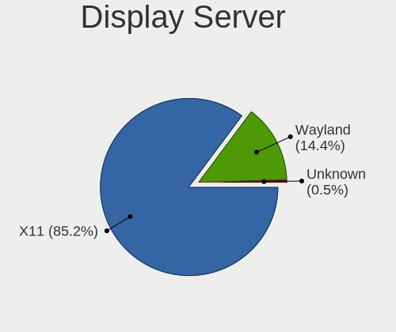
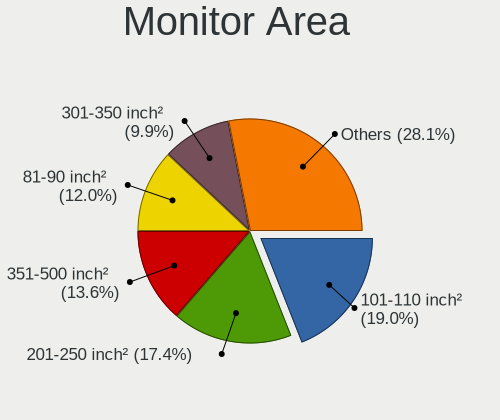
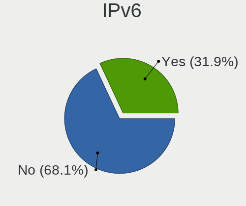

Pop!_OS - Hardware Trends
-------------------------

A project to identify most popular hardware characteristics and track their change
over time based on data collected by Linux users at https://Linux-Hardware.org.

Anyone can contribute to this report by the [hw-probe](https://github.com/linuxhw/hw-probe) tool:

    sudo -E hw-probe -all -upload

This is a report for all computer types. See also reports for [desktops](/Dist/Pop!_OS/Desktop/README.md) and [notebooks](/Dist/Pop!_OS/Notebook/README.md).

This report is for one last month. Overall report since the beginning of time: [TestCoverage](https://github.com/linuxhw/TestCoverage)

Period: Jan, 2023.

Contents
--------

* [ System ](#system)
  - [ OS                       ](#os)
  - [ OS Family                ](#os-family)
  - [ Kernel                   ](#kernel)
  - [ Kernel Family            ](#kernel-family)
  - [ Kernel Major Ver.        ](#kernel-major-ver)
  - [ Arch                     ](#arch)
  - [ DE                       ](#de)
  - [ Display Server           ](#display-server)
  - [ Display Manager          ](#display-manager)
  - [ OS Lang                  ](#os-lang)
  - [ Boot Mode                ](#boot-mode)
  - [ Filesystem               ](#filesystem)
  - [ Part. scheme             ](#part-scheme)
  - [ Dual Boot with Linux/BSD ](#dual-boot-with-linuxbsd)
  - [ Dual Boot (Win)          ](#dual-boot-win)

* [ Board ](#board)
  - [ Vendor                   ](#vendor)
  - [ Model                    ](#model)
  - [ Model Family             ](#model-family)
  - [ MFG Year                 ](#mfg-year)
  - [ Form Factor              ](#form-factor)
  - [ Secure Boot              ](#secure-boot)
  - [ Coreboot                 ](#coreboot)
  - [ RAM Size                 ](#ram-size)
  - [ RAM Used                 ](#ram-used)
  - [ Total Drives             ](#total-drives)
  - [ Has CD-ROM               ](#has-cd-rom)
  - [ Has Ethernet             ](#has-ethernet)
  - [ Has WiFi                 ](#has-wifi)
  - [ Has Bluetooth            ](#has-bluetooth)

* [ Location ](#location)
  - [ Country                  ](#country)
  - [ City                     ](#city)

* [ Drives ](#drives)
  - [ Drive Vendor             ](#drive-vendor)
  - [ Drive Model              ](#drive-model)
  - [ HDD Vendor               ](#hdd-vendor)
  - [ SSD Vendor               ](#ssd-vendor)
  - [ Drive Kind               ](#drive-kind)
  - [ Drive Connector          ](#drive-connector)
  - [ Drive Size               ](#drive-size)
  - [ Space Total              ](#space-total)
  - [ Space Used               ](#space-used)
  - [ Malfunc. Drives          ](#malfunc-drives)
  - [ Malfunc. Drive Vendor    ](#malfunc-drive-vendor)
  - [ Malfunc. HDD Vendor      ](#malfunc-hdd-vendor)
  - [ Malfunc. Drive Kind      ](#malfunc-drive-kind)
  - [ Failed Drives            ](#failed-drives)
  - [ Failed Drive Vendor      ](#failed-drive-vendor)
  - [ Drive Status             ](#drive-status)

* [ Storage controller ](#storage-controller)
  - [ Storage Vendor           ](#storage-vendor)
  - [ Storage Model            ](#storage-model)
  - [ Storage Kind             ](#storage-kind)

* [ Processor ](#processor)
  - [ CPU Vendor               ](#cpu-vendor)
  - [ CPU Model                ](#cpu-model)
  - [ CPU Model Family         ](#cpu-model-family)
  - [ CPU Cores                ](#cpu-cores)
  - [ CPU Sockets              ](#cpu-sockets)
  - [ CPU Threads              ](#cpu-threads)
  - [ CPU Op-Modes             ](#cpu-op-modes)
  - [ CPU Microcode            ](#cpu-microcode)
  - [ CPU Microarch            ](#cpu-microarch)

* [ Graphics ](#graphics)
  - [ GPU Vendor               ](#gpu-vendor)
  - [ GPU Model                ](#gpu-model)
  - [ GPU Combo                ](#gpu-combo)
  - [ GPU Driver               ](#gpu-driver)
  - [ GPU Memory               ](#gpu-memory)

* [ Monitor ](#monitor)
  - [ Monitor Vendor           ](#monitor-vendor)
  - [ Monitor Model            ](#monitor-model)
  - [ Monitor Resolution       ](#monitor-resolution)
  - [ Monitor Diagonal         ](#monitor-diagonal)
  - [ Monitor Width            ](#monitor-width)
  - [ Aspect Ratio             ](#aspect-ratio)
  - [ Monitor Area             ](#monitor-area)
  - [ Pixel Density            ](#pixel-density)
  - [ Multiple Monitors        ](#multiple-monitors)

* [ Network ](#network)
  - [ Net Controller Vendor    ](#net-controller-vendor)
  - [ Net Controller Model     ](#net-controller-model)
  - [ Wireless Vendor          ](#wireless-vendor)
  - [ Wireless Model           ](#wireless-model)
  - [ Ethernet Vendor          ](#ethernet-vendor)
  - [ Ethernet Model           ](#ethernet-model)
  - [ Net Controller Kind      ](#net-controller-kind)
  - [ Used Controller          ](#used-controller)
  - [ NICs                     ](#nics)
  - [ IPv6                     ](#ipv6)

* [ Bluetooth ](#bluetooth)
  - [ Bluetooth Vendor         ](#bluetooth-vendor)
  - [ Bluetooth Model          ](#bluetooth-model)

* [ Sound ](#sound)
  - [ Sound Vendor             ](#sound-vendor)
  - [ Sound Model              ](#sound-model)

* [ Memory ](#memory)
  - [ Memory Vendor            ](#memory-vendor)
  - [ Memory Model             ](#memory-model)
  - [ Memory Kind              ](#memory-kind)
  - [ Memory Form Factor       ](#memory-form-factor)
  - [ Memory Size              ](#memory-size)
  - [ Memory Speed             ](#memory-speed)

* [ Printers & scanners ](#printers--scanners)
  - [ Printer Vendor           ](#printer-vendor)
  - [ Printer Model            ](#printer-model)
  - [ Scanner Vendor           ](#scanner-vendor)
  - [ Scanner Model            ](#scanner-model)

* [ Camera ](#camera)
  - [ Camera Vendor            ](#camera-vendor)
  - [ Camera Model             ](#camera-model)

* [ Security ](#security)
  - [ Fingerprint Vendor       ](#fingerprint-vendor)
  - [ Fingerprint Model        ](#fingerprint-model)
  - [ Chipcard Vendor          ](#chipcard-vendor)
  - [ Chipcard Model           ](#chipcard-model)

* [ Unsupported ](#unsupported)
  - [ Unsupported Devices      ](#unsupported-devices)
  - [ Unsupported Device Types ](#unsupported-device-types)

System
------

OS
--

Installed operating systems

| Name          | Computers | Percent |
|---------------|-----------|---------|
| Pop!_OS 22.04 | 233       | 98.73%  |
| Pop!_OS 20.04 | 2         | 0.85%   |
| Pop!_OS 21.04 | 1         | 0.42%   |

OS Family
---------

OS without a version

| Name    | Computers | Percent |
|---------|-----------|---------|
| Pop!_OS | 236       | 100%    |

Kernel
------

Version of the Linux kernel

| Version                  | Computers | Percent |
|--------------------------|-----------|---------|
| 6.0.12-76060006-generic  | 209       | 88.56%  |
| 6.0.6-76060006-generic   | 10        | 4.24%   |
| 5.19.0-76051900-generic  | 3         | 1.27%   |
| 6.1.8-060108-generic     | 2         | 0.85%   |
| 5.18.10-76051810-generic | 2         | 0.85%   |
| 5.17.5-76051705-generic  | 2         | 0.85%   |
| 6.1.7-060107-generic     | 1         | 0.42%   |
| 6.1.2-surface            | 1         | 0.42%   |
| 6.1.0-2.1-liquorix-amd64 | 1         | 0.42%   |
| 6.0.3-76060003-generic   | 1         | 0.42%   |
| 5.19.4-xanmod1           | 1         | 0.42%   |
| 5.15.65-051565-generic   | 1         | 0.42%   |
| 5.15.11-76051511-generic | 1         | 0.42%   |
| 5.13.0-7620-generic      | 1         | 0.42%   |

Kernel Family
-------------

Linux kernel without a distro release

| Version | Computers | Percent |
|---------|-----------|---------|
| 6.0.12  | 209       | 88.56%  |
| 6.0.6   | 10        | 4.24%   |
| 5.19.0  | 3         | 1.27%   |
| 6.1.8   | 2         | 0.85%   |
| 5.18.10 | 2         | 0.85%   |
| 5.17.5  | 2         | 0.85%   |
| 6.1.7   | 1         | 0.42%   |
| 6.1.2   | 1         | 0.42%   |
| 6.1.0   | 1         | 0.42%   |
| 6.0.3   | 1         | 0.42%   |
| 5.19.4  | 1         | 0.42%   |
| 5.15.65 | 1         | 0.42%   |
| 5.15.11 | 1         | 0.42%   |
| 5.13.0  | 1         | 0.42%   |

Kernel Major Ver.
-----------------

Linux kernel major version

| Version | Computers | Percent |
|---------|-----------|---------|
| 6.0     | 220       | 93.22%  |
| 6.1     | 5         | 2.12%   |
| 5.19    | 4         | 1.69%   |
| 5.18    | 2         | 0.85%   |
| 5.17    | 2         | 0.85%   |
| 5.15    | 2         | 0.85%   |
| 5.13    | 1         | 0.42%   |

Arch
----

OS architecture (x86_64, i586, etc.)

| Name   | Computers | Percent |
|--------|-----------|---------|
| x86_64 | 236       | 100%    |

DE
--

Desktop Environment

| Name            | Computers | Percent |
|-----------------|-----------|---------|
| GNOME           | 230       | 97.46%  |
| KDE5            | 2         | 0.85%   |
| X-Cinnamon      | 1         | 0.42%   |
| LXQt            | 1         | 0.42%   |
| GNOME Flashback | 1         | 0.42%   |
| Unknown         | 1         | 0.42%   |

Display Server
--------------

X11 or Wayland

| Name    | Computers | Percent |
|---------|-----------|---------|
| X11     | 217       | 91.95%  |
| Wayland | 19        | 8.05%   |

Display Manager
---------------

SDDM, LightDM, etc.

| Name    | Computers | Percent |
|---------|-----------|---------|
| Unknown | 172       | 72.88%  |
| GDM3    | 64        | 27.12%  |

OS Lang
-------

Language

| Lang    | Computers | Percent |
|---------|-----------|---------|
| en_US   | 147       | 62.29%  |
| en_GB   | 14        | 5.93%   |
| pt_BR   | 12        | 5.08%   |
| de_DE   | 9         | 3.81%   |
| it_IT   | 5         | 2.12%   |
| en_CA   | 5         | 2.12%   |
| en_AU   | 5         | 2.12%   |
| ru_RU   | 4         | 1.69%   |
| fr_FR   | 4         | 1.69%   |
| C       | 4         | 1.69%   |
| ja_JP   | 3         | 1.27%   |
| en_NZ   | 3         | 1.27%   |
| en_IE   | 3         | 1.27%   |
| tr_TR   | 2         | 0.85%   |
| nb_NO   | 2         | 0.85%   |
| en_IN   | 2         | 0.85%   |
| sv_SE   | 1         | 0.42%   |
| sk_SK   | 1         | 0.42%   |
| ro_RO   | 1         | 0.42%   |
| pl_PL   | 1         | 0.42%   |
| nl_NL   | 1         | 0.42%   |
| fr_CH   | 1         | 0.42%   |
| es_MX   | 1         | 0.42%   |
| en_ZA   | 1         | 0.42%   |
| de_CH   | 1         | 0.42%   |
| de_AT   | 1         | 0.42%   |
| cs_CZ   | 1         | 0.42%   |
| Unknown | 1         | 0.42%   |

Boot Mode
---------

EFI or BIOS

| Mode | Computers | Percent |
|------|-----------|---------|
| BIOS | 173       | 73.31%  |
| EFI  | 63        | 26.69%  |

Filesystem
----------

Type of filesystem

| Type    | Computers | Percent |
|---------|-----------|---------|
| Ext4    | 223       | 94.49%  |
| Btrfs   | 7         | 2.97%   |
| Overlay | 3         | 1.27%   |
| Zfs     | 2         | 0.85%   |
| Unknown | 1         | 0.42%   |

Part. scheme
------------

Scheme of partitioning

| Type    | Computers | Percent |
|---------|-----------|---------|
| Unknown | 171       | 72.46%  |
| GPT     | 63        | 26.69%  |
| MBR     | 2         | 0.85%   |

Dual Boot with Linux/BSD
------------------------

Hosting more than one Linux/BSD

| Dual boot | Computers | Percent |
|-----------|-----------|---------|
| No        | 228       | 96.61%  |
| Yes       | 8         | 3.39%   |

Dual Boot (Win)
---------------

Hosting Linux and Windows

| Dual boot | Computers | Percent |
|-----------|-----------|---------|
| No        | 207       | 87.71%  |
| Yes       | 29        | 12.29%  |

Board
-----

Vendor
------

Motherboard manufacturer

| Name                   | Computers | Percent |
|------------------------|-----------|---------|
| ASUSTek Computer       | 46        | 19.49%  |
| Lenovo                 | 33        | 13.98%  |
| Dell                   | 32        | 13.56%  |
| Hewlett-Packard        | 31        | 13.14%  |
| MSI                    | 15        | 6.36%   |
| Gigabyte Technology    | 13        | 5.51%   |
| ASRock                 | 13        | 5.51%   |
| Acer                   | 8         | 3.39%   |
| System76               | 6         | 2.54%   |
| Intel                  | 6         | 2.54%   |
| Apple                  | 4         | 1.69%   |
| Wortmann AG            | 1         | 0.42%   |
| Win element            | 1         | 0.42%   |
| Timi                   | 1         | 0.42%   |
| Samsung Electronics    | 1         | 0.42%   |
| ReachingTech           | 1         | 0.42%   |
| Razer x Lambda         | 1         | 0.42%   |
| Razer                  | 1         | 0.42%   |
| Purism                 | 1         | 0.42%   |
| Panasonic              | 1         | 0.42%   |
| Notebook               | 1         | 0.42%   |
| Microsoft              | 1         | 0.42%   |
| MeLE                   | 1         | 0.42%   |
| MAXSUN                 | 1         | 0.42%   |
| MACHINIST              | 1         | 0.42%   |
| LG Electronics         | 1         | 0.42%   |
| HUAWEI                 | 1         | 0.42%   |
| HONOR                  | 1         | 0.42%   |
| HC                     | 1         | 0.42%   |
| GPU Company            | 1         | 0.42%   |
| Google                 | 1         | 0.42%   |
| Gateway                | 1         | 0.42%   |
| Fujitsu                | 1         | 0.42%   |
| Framework              | 1         | 0.42%   |
| Datto                  | 1         | 0.42%   |
| Clevo                  | 1         | 0.42%   |
| Chuwi                  | 1         | 0.42%   |
| AZW                    | 1         | 0.42%   |
| Avell High Performance | 1         | 0.42%   |
| Alienware              | 1         | 0.42%   |

Model
-----

Motherboard model

| Name                                  | Computers | Percent |
|---------------------------------------|-----------|---------|
| Dell Latitude E7240                   | 3         | 1.27%   |
| System76 Lemur Pro                    | 2         | 0.85%   |
| HP Notebook                           | 2         | 0.85%   |
| HP EliteBook 840 G5                   | 2         | 0.85%   |
| Gigabyte B450 AORUS PRO WIFI          | 2         | 0.85%   |
| ASUS Zephyrus G GU502DU_GA502DU       | 2         | 0.85%   |
| ASUS ROG STRIX B550-I GAMING          | 2         | 0.85%   |
| ASUS ROG STRIX B450-F GAMING          | 2         | 0.85%   |
| Apple MacBookPro12,1                  | 2         | 0.85%   |
| Wortmann AG NA92                      | 1         | 0.42%   |
| Win element M600                      | 1         | 0.42%   |
| Timi RedmiBook Pro 15S                | 1         | 0.42%   |
| System76 Thelio Mira                  | 1         | 0.42%   |
| System76 Oryx Pro                     | 1         | 0.42%   |
| System76 Gazelle                      | 1         | 0.42%   |
| System76 Bonobo WS                    | 1         | 0.42%   |
| Samsung 270E5J/2570EJ                 | 1         | 0.42%   |
| ReachingTech DreamQuest Pro 2022      | 1         | 0.42%   |
| Razer x Lambda TensorBook (late 2021) | 1         | 0.42%   |
| Razer Blade                           | 1         | 0.42%   |
| Purism Librem 15 v3                   | 1         | 0.42%   |
| Panasonic FZ55-1                      | 1         | 0.42%   |
| Notebook PCX0DX                       | 1         | 0.42%   |
| MSI Vector GP76 12UHSO                | 1         | 0.42%   |
| MSI MS-7D53                           | 1         | 0.42%   |
| MSI MS-7D36                           | 1         | 0.42%   |
| MSI MS-7C95                           | 1         | 0.42%   |
| MSI MS-7C91                           | 1         | 0.42%   |
| MSI MS-7C83                           | 1         | 0.42%   |
| MSI MS-7C56                           | 1         | 0.42%   |
| MSI MS-7B89                           | 1         | 0.42%   |
| MSI MS-7B85                           | 1         | 0.42%   |
| MSI MS-7A74                           | 1         | 0.42%   |
| MSI MS-7A38                           | 1         | 0.42%   |
| MSI MS-7817                           | 1         | 0.42%   |
| MSI H310 Gaming Infinite (MS-B915)    | 1         | 0.42%   |
| MSI Bravo 15 B5DD                     | 1         | 0.42%   |
| MSI Alpha 15 A3DDK                    | 1         | 0.42%   |
| Microsoft Surface Pro 6               | 1         | 0.42%   |
| MeLE Quieter2                         | 1         | 0.42%   |

Model Family
------------

Motherboard model prefix

| Name                    | Computers | Percent |
|-------------------------|-----------|---------|
| Lenovo ThinkPad         | 15        | 6.36%   |
| ASUS ROG                | 13        | 5.51%   |
| Dell Latitude           | 9         | 3.81%   |
| Lenovo IdeaPad          | 8         | 3.39%   |
| HP Pavilion             | 7         | 2.97%   |
| Dell Inspiron           | 7         | 2.97%   |
| HP EliteBook            | 5         | 2.12%   |
| Dell XPS                | 5         | 2.12%   |
| ASUS VivoBook           | 5         | 2.12%   |
| ASUS TUF                | 5         | 2.12%   |
| HP ZBook                | 4         | 1.69%   |
| Dell Precision          | 4         | 1.69%   |
| Acer Aspire             | 4         | 1.69%   |
| Lenovo Legion           | 3         | 1.27%   |
| HP ENVY                 | 3         | 1.27%   |
| ASRock B550             | 3         | 1.27%   |
| System76 Lemur          | 2         | 0.85%   |
| Lenovo ThinkCentre      | 2         | 0.85%   |
| HP OMEN                 | 2         | 0.85%   |
| HP Notebook             | 2         | 0.85%   |
| HP Compaq               | 2         | 0.85%   |
| Gigabyte B450           | 2         | 0.85%   |
| Dell G15                | 2         | 0.85%   |
| ASUS Zephyrus           | 2         | 0.85%   |
| ASUS PRIME              | 2         | 0.85%   |
| ASUS P6T                | 2         | 0.85%   |
| ASUS M5A97              | 2         | 0.85%   |
| ASUS ASUS               | 2         | 0.85%   |
| ASRock B450             | 2         | 0.85%   |
| Apple MacBookPro12      | 2         | 0.85%   |
| Acer Swift              | 2         | 0.85%   |
| Wortmann AG NA92        | 1         | 0.42%   |
| Win element M600        | 1         | 0.42%   |
| Timi RedmiBook          | 1         | 0.42%   |
| System76 Thelio         | 1         | 0.42%   |
| System76 Oryx           | 1         | 0.42%   |
| System76 Gazelle        | 1         | 0.42%   |
| System76 Bonobo         | 1         | 0.42%   |
| Samsung 270E5J          | 1         | 0.42%   |
| ReachingTech DreamQuest | 1         | 0.42%   |

MFG Year
--------

Motherboard manufacture year

| Year    | Computers | Percent |
|---------|-----------|---------|
| 2021    | 48        | 20.34%  |
| 2020    | 32        | 13.56%  |
| 2022    | 28        | 11.86%  |
| 2019    | 21        | 8.9%    |
| 2018    | 18        | 7.63%   |
| 2012    | 15        | 6.36%   |
| 2016    | 14        | 5.93%   |
| 2017    | 10        | 4.24%   |
| 2013    | 10        | 4.24%   |
| 2011    | 9         | 3.81%   |
| 2014    | 8         | 3.39%   |
| 2015    | 7         | 2.97%   |
| 2009    | 5         | 2.12%   |
| 2010    | 4         | 1.69%   |
| 2008    | 4         | 1.69%   |
| 2007    | 2         | 0.85%   |
| Unknown | 1         | 0.42%   |

Form Factor
-----------

Physical design of the computer

| Name        | Computers | Percent |
|-------------|-----------|---------|
| Notebook    | 123       | 52.12%  |
| Desktop     | 89        | 37.71%  |
| Convertible | 10        | 4.24%   |
| Mini pc     | 6         | 2.54%   |
| Tablet      | 3         | 1.27%   |
| All in one  | 3         | 1.27%   |
| Server      | 2         | 0.85%   |

Secure Boot
-----------

Enabled or disabled

| State    | Computers | Percent |
|----------|-----------|---------|
| Disabled | 236       | 100%    |

Coreboot
--------

Have coreboot on board

| Used | Computers | Percent |
|------|-----------|---------|
| No   | 229       | 97.03%  |
| Yes  | 7         | 2.97%   |

RAM Size
--------

Total RAM memory

| Size in GB  | Computers | Percent |
|-------------|-----------|---------|
| 16.01-24.0  | 53        | 22.46%  |
| 8.01-16.0   | 52        | 22.03%  |
| 4.01-8.0    | 48        | 20.34%  |
| 32.01-64.0  | 47        | 19.92%  |
| 3.01-4.0    | 18        | 7.63%   |
| 64.01-256.0 | 11        | 4.66%   |
| 24.01-32.0  | 7         | 2.97%   |

RAM Used
--------

Used RAM memory

| Used GB     | Computers | Percent |
|-------------|-----------|---------|
| 4.01-8.0    | 90        | 38.14%  |
| 2.01-3.0    | 54        | 22.88%  |
| 3.01-4.0    | 52        | 22.03%  |
| 8.01-16.0   | 17        | 7.2%    |
| 1.01-2.0    | 16        | 6.78%   |
| 16.01-24.0  | 4         | 1.69%   |
| 24.01-32.0  | 2         | 0.85%   |
| 64.01-256.0 | 1         | 0.42%   |

Total Drives
------------

Number of drives on board

| Drives | Computers | Percent |
|--------|-----------|---------|
| 1      | 137       | 58.05%  |
| 2      | 62        | 26.27%  |
| 3      | 18        | 7.63%   |
| 4      | 11        | 4.66%   |
| 5      | 7         | 2.97%   |
| 0      | 1         | 0.42%   |

Has CD-ROM
----------

Has CD-ROM on board

| Presented | Computers | Percent |
|-----------|-----------|---------|
| No        | 188       | 79.66%  |
| Yes       | 48        | 20.34%  |

Has Ethernet
------------

Has Ethernet on board

| Presented | Computers | Percent |
|-----------|-----------|---------|
| Yes       | 186       | 78.81%  |
| No        | 50        | 21.19%  |

Has WiFi
--------

Has WiFi module

| Presented | Computers | Percent |
|-----------|-----------|---------|
| Yes       | 198       | 83.9%   |
| No        | 38        | 16.1%   |

Has Bluetooth
-------------

Has Bluetooth module

| Presented | Computers | Percent |
|-----------|-----------|---------|
| Yes       | 167       | 70.76%  |
| No        | 69        | 29.24%  |

Location
--------

Country
-------

Geographic location (country)

| Country      | Computers | Percent |
|--------------|-----------|---------|
| USA          | 83        | 35.17%  |
| Germany      | 15        | 6.36%   |
| Canada       | 14        | 5.93%   |
| Brazil       | 14        | 5.93%   |
| Australia    | 12        | 5.08%   |
| UK           | 10        | 4.24%   |
| Italy        | 6         | 2.54%   |
| Russia       | 5         | 2.12%   |
| Norway       | 5         | 2.12%   |
| Japan        | 5         | 2.12%   |
| India        | 5         | 2.12%   |
| France       | 5         | 2.12%   |
| New Zealand  | 4         | 1.69%   |
| Netherlands  | 4         | 1.69%   |
| Greece       | 4         | 1.69%   |
| Sweden       | 3         | 1.27%   |
| Ireland      | 3         | 1.27%   |
| Hungary      | 3         | 1.27%   |
| Austria      | 3         | 1.27%   |
| Turkey       | 2         | 0.85%   |
| Switzerland  | 2         | 0.85%   |
| Serbia       | 2         | 0.85%   |
| Portugal     | 2         | 0.85%   |
| Poland       | 2         | 0.85%   |
| Mexico       | 2         | 0.85%   |
| Czechia      | 2         | 0.85%   |
| Belgium      | 2         | 0.85%   |
| Vietnam      | 1         | 0.42%   |
| Thailand     | 1         | 0.42%   |
| Syria        | 1         | 0.42%   |
| Spain        | 1         | 0.42%   |
| South Korea  | 1         | 0.42%   |
| South Africa | 1         | 0.42%   |
| Slovakia     | 1         | 0.42%   |
| Pakistan     | 1         | 0.42%   |
| Nigeria      | 1         | 0.42%   |
| Luxembourg   | 1         | 0.42%   |
| Israel       | 1         | 0.42%   |
| Indonesia    | 1         | 0.42%   |
| Hong Kong    | 1         | 0.42%   |

City
----

Geographic location (city)

| City          | Computers | Percent |
|---------------|-----------|---------|
| Sydney        | 4         | 1.69%   |
| Winnipeg      | 3         | 1.27%   |
| Washington    | 3         | 1.27%   |
| Portland      | 3         | 1.27%   |
| Vienna        | 2         | 0.85%   |
| Vancouver     | 2         | 0.85%   |
| Temecula      | 2         | 0.85%   |
| Sollentuna    | 2         | 0.85%   |
| Oslo          | 2         | 0.85%   |
| Oceanside     | 2         | 0.85%   |
| Melbourne     | 2         | 0.85%   |
| Martinez      | 2         | 0.85%   |
| Jacksonville  | 2         | 0.85%   |
| Dublin        | 2         | 0.85%   |
| Cleveland     | 2         | 0.85%   |
| Cherry Hill   | 2         | 0.85%   |
| Budapest      | 2         | 0.85%   |
| Berlin        | 2         | 0.85%   |
| Belgrade      | 2         | 0.85%   |
| Aurora        | 2         | 0.85%   |
| Albuquerque   | 2         | 0.85%   |
| Yoshkar-Ola   | 1         | 0.42%   |
| Yonkers       | 1         | 0.42%   |
| Yongin-si     | 1         | 0.42%   |
| Yekaterinburg | 1         | 0.42%   |
| Woodville     | 1         | 0.42%   |
| Wellington    | 1         | 0.42%   |
| Weaverville   | 1         | 0.42%   |
| Waukesha      | 1         | 0.42%   |
| Wattrelos     | 1         | 0.42%   |
| Warsaw        | 1         | 0.42%   |
| Waipahu       | 1         | 0.42%   |
| Vitória      | 1         | 0.42%   |
| Vichuga       | 1         | 0.42%   |
| Verona        | 1         | 0.42%   |
| Utrecht       | 1         | 0.42%   |
| Uba           | 1         | 0.42%   |
| Trondheim     | 1         | 0.42%   |
| Trivandrum    | 1         | 0.42%   |
| Telford       | 1         | 0.42%   |

Drives
------

Drive Vendor
------------

Hard drive vendors

| Vendor                      | Computers | Drives | Percent |
|-----------------------------|-----------|--------|---------|
| Samsung Electronics         | 75        | 85     | 20.83%  |
| WDC                         | 41        | 47     | 11.39%  |
| Sandisk                     | 34        | 41     | 9.44%   |
| Seagate                     | 32        | 41     | 8.89%   |
| SK hynix                    | 19        | 20     | 5.28%   |
| Kingston                    | 17        | 17     | 4.72%   |
| Crucial                     | 13        | 17     | 3.61%   |
| Intel                       | 12        | 14     | 3.33%   |
| Toshiba                     | 11        | 11     | 3.06%   |
| Unknown                     | 9         | 10     | 2.5%    |
| Phison Electronics          | 9         | 10     | 2.5%    |
| Micron/Crucial Technology   | 8         | 8      | 2.22%   |
| Micron Technology           | 7         | 8      | 1.94%   |
| Hitachi                     | 6         | 7      | 1.67%   |
| PNY                         | 5         | 5      | 1.39%   |
| KIOXIA                      | 5         | 5      | 1.39%   |
| Silicon Motion              | 4         | 4      | 1.11%   |
| China                       | 4         | 4      | 1.11%   |
| A-DATA Technology           | 4         | 4      | 1.11%   |
| Netac                       | 3         | 3      | 0.83%   |
| LITEONIT                    | 3         | 3      | 0.83%   |
| LITEON                      | 3         | 3      | 0.83%   |
| Apple                       | 3         | 3      | 0.83%   |
| SPCC                        | 2         | 2      | 0.56%   |
| SABRENT                     | 2         | 2      | 0.56%   |
| Realtek Semiconductor       | 2         | 2      | 0.56%   |
| Intenso                     | 2         | 2      | 0.56%   |
| Hewlett-Packard             | 2         | 2      | 0.56%   |
| XPG                         | 1         | 1      | 0.28%   |
| Wibtek                      | 1         | 1      | 0.28%   |
| Team                        | 1         | 1      | 0.28%   |
| SSSTC                       | 1         | 1      | 0.28%   |
| Phison                      | 1         | 1      | 0.28%   |
| OCZ                         | 1         | 1      | 0.28%   |
| NGFF                        | 1         | 1      | 0.28%   |
| Maxtor                      | 1         | 1      | 0.28%   |
| Lexar                       | 1         | 1      | 0.28%   |
| KIOXIA-EXCERIA              | 1         | 1      | 0.28%   |
| Kingston Technology Company | 1         | 1      | 0.28%   |
| KingSpec                    | 1         | 1      | 0.28%   |

Drive Model
-----------

Hard drive models

| Model                                                 | Computers | Percent |
|-------------------------------------------------------|-----------|---------|
| Samsung NVMe SSD Controller SM981/PM981/PM983 500GB   | 13        | 3.36%   |
| Samsung SSD 850 EVO 250GB                             | 5         | 1.29%   |
| Kingston SA400S37240G 240GB SSD                       | 5         | 1.29%   |
| Silicon Motion SM2263EN/SM2263XT SSD Controller 512GB | 4         | 1.03%   |
| Sandisk WD Blue SN570 1TB                             | 4         | 1.03%   |
| Samsung NVMe SSD Controller SM961/PM961/SM963 256GB   | 4         | 1.03%   |
| Micron/Crucial P2 NVMe PCIe SSD 500GB                 | 4         | 1.03%   |
| Kingston SA400S37480G 480GB SSD                       | 4         | 1.03%   |
| Intel SSD 660P Series 512GB                           | 4         | 1.03%   |
| WDC WD20EZAZ-00GGJB0 2TB                              | 3         | 0.78%   |
| SK hynix BC511 512GB                                  | 3         | 0.78%   |
| Seagate ST2000DM008-2FR102 2TB                        | 3         | 0.78%   |
| Seagate ST1000LM049-2GH172 1TB                        | 3         | 0.78%   |
| Seagate ST1000LM024 HN-M101MBB 1TB                    | 3         | 0.78%   |
| Sandisk WD Blue SN550 NVMe SSD 1TB                    | 3         | 0.78%   |
| Sandisk WD Black SN750 / PC SN730 NVMe SSD 1TB        | 3         | 0.78%   |
| SanDisk NVMe SSD Drive 1TB                            | 3         | 0.78%   |
| SanDisk Extreme 55AE 1TB SSD                          | 3         | 0.78%   |
| Samsung SSD 850 EVO 500GB                             | 3         | 0.78%   |
| Samsung NVMe SSD Controller PM9A1/PM9A3/980PRO 512GB  | 3         | 0.78%   |
| Phison E12 NVMe Controller 1TB                        | 3         | 0.78%   |
| Kingston SA400S37120G 120GB SSD                       | 3         | 0.78%   |
| Crucial CT1000MX500SSD1 1TB                           | 3         | 0.78%   |
| WDC WDS500G2B0A-00SM50 500GB SSD                      | 2         | 0.52%   |
| WDC WD4005FZBX-00K5WB0 4TB                            | 2         | 0.52%   |
| WDC WD10SPZX-24Z10 1TB                                | 2         | 0.52%   |
| Unknown SD/MMC/MS PRO 2GB                             | 2         | 0.52%   |
| Unknown MMC Card  128GB                               | 2         | 0.52%   |
| Toshiba MQ04ABF100 1TB                                | 2         | 0.52%   |
| SK hynix SHGS31-500GS-2 500GB SSD                     | 2         | 0.52%   |
| SK hynix BC501 NVMe Solid State Drive 512GB           | 2         | 0.52%   |
| Seagate ST1000DM010-2EP102 1TB                        | 2         | 0.52%   |
| Seagate Expansion 240GB                               | 2         | 0.52%   |
| Sandisk WD_BLACK SN770 1TB                            | 2         | 0.52%   |
| Sandisk WD Blue SN570 500GB                           | 2         | 0.52%   |
| Samsung SSD 970 EVO Plus 500GB                        | 2         | 0.52%   |
| Samsung SSD 870 QVO 2TB                               | 2         | 0.52%   |
| Samsung SSD 860 EVO 500GB                             | 2         | 0.52%   |
| Samsung MZVLQ256HAJD-000H1 256GB                      | 2         | 0.52%   |
| Samsung HD502HI 500GB                                 | 2         | 0.52%   |

HDD Vendor
----------

Hard disk drive vendors

| Vendor              | Computers | Drives | Percent |
|---------------------|-----------|--------|---------|
| Seagate             | 31        | 40     | 36.05%  |
| WDC                 | 29        | 33     | 33.72%  |
| Toshiba             | 8         | 8      | 9.3%    |
| Hitachi             | 6         | 7      | 6.98%   |
| Samsung Electronics | 5         | 5      | 5.81%   |
| Unknown             | 2         | 2      | 2.33%   |
| SABRENT             | 2         | 2      | 2.33%   |
| Maxtor              | 1         | 1      | 1.16%   |
| Intenso             | 1         | 1      | 1.16%   |
| HGST                | 1         | 1      | 1.16%   |

SSD Vendor
----------

Solid state drive vendors

| Vendor              | Computers | Drives | Percent |
|---------------------|-----------|--------|---------|
| Samsung Electronics | 30        | 32     | 25.86%  |
| Kingston            | 16        | 16     | 13.79%  |
| SanDisk             | 11        | 11     | 9.48%   |
| Crucial             | 10        | 12     | 8.62%   |
| PNY                 | 5         | 5      | 4.31%   |
| WDC                 | 4         | 4      | 3.45%   |
| China               | 4         | 4      | 3.45%   |
| SK hynix            | 3         | 3      | 2.59%   |
| LITEONIT            | 3         | 3      | 2.59%   |
| LITEON              | 3         | 3      | 2.59%   |
| SPCC                | 2         | 2      | 1.72%   |
| Netac               | 2         | 2      | 1.72%   |
| Micron Technology   | 2         | 2      | 1.72%   |
| Intel               | 2         | 3      | 1.72%   |
| Hewlett-Packard     | 2         | 2      | 1.72%   |
| Apple               | 2         | 2      | 1.72%   |
| A-DATA Technology   | 2         | 2      | 1.72%   |
| XPG                 | 1         | 1      | 0.86%   |
| Team                | 1         | 1      | 0.86%   |
| Seagate             | 1         | 1      | 0.86%   |
| OCZ                 | 1         | 1      | 0.86%   |
| NGFF                | 1         | 1      | 0.86%   |
| Lexar               | 1         | 1      | 0.86%   |
| KingSpec            | 1         | 1      | 0.86%   |
| KingDian            | 1         | 1      | 0.86%   |
| Intenso             | 1         | 1      | 0.86%   |
| INTEL SS            | 1         | 1      | 0.86%   |
| Dogfish             | 1         | 1      | 0.86%   |
| Apacer              | 1         | 2      | 0.86%   |
| Unknown             | 1         | 1      | 0.86%   |

Drive Kind
----------

HDD or SSD

| Kind    | Computers | Drives | Percent |
|---------|-----------|--------|---------|
| NVMe    | 137       | 172    | 43.08%  |
| SSD     | 99        | 122    | 31.13%  |
| HDD     | 72        | 100    | 22.64%  |
| MMC     | 5         | 5      | 1.57%   |
| Unknown | 5         | 5      | 1.57%   |

Drive Connector
---------------

SATA, SAS, NVMe, etc.

| Type | Computers | Drives | Percent |
|------|-----------|--------|---------|
| SATA | 141       | 203    | 46.53%  |
| NVMe | 137       | 172    | 45.21%  |
| SAS  | 20        | 24     | 6.6%    |
| MMC  | 5         | 5      | 1.65%   |

Drive Size
----------

Size of hard drive

| Size in TB | Computers | Drives | Percent |
|------------|-----------|--------|---------|
| 0.01-0.5   | 96        | 114    | 51.34%  |
| 0.51-1.0   | 53        | 63     | 28.34%  |
| 1.01-2.0   | 23        | 25     | 12.3%   |
| 3.01-4.0   | 9         | 9      | 4.81%   |
| 4.01-10.0  | 4         | 6      | 2.14%   |
| 2.01-3.0   | 2         | 5      | 1.07%   |

Space Total
-----------

Amount of disk space available on the file system

| Size in GB     | Computers | Percent |
|----------------|-----------|---------|
| 101-250        | 70        | 29.66%  |
| 501-1000       | 55        | 23.31%  |
| 251-500        | 52        | 22.03%  |
| 1001-2000      | 20        | 8.47%   |
| 2001-3000      | 11        | 4.66%   |
| More than 3000 | 10        | 4.24%   |
| 51-100         | 10        | 4.24%   |
| 1-20           | 5         | 2.12%   |
| 21-50          | 2         | 0.85%   |
| Unknown        | 1         | 0.42%   |

Space Used
----------

Amount of used disk space

| Used GB        | Computers | Percent |
|----------------|-----------|---------|
| 1-20           | 62        | 26.27%  |
| 21-50          | 47        | 19.92%  |
| 101-250        | 38        | 16.1%   |
| 251-500        | 30        | 12.71%  |
| 51-100         | 26        | 11.02%  |
| 501-1000       | 14        | 5.93%   |
| 1001-2000      | 11        | 4.66%   |
| 2001-3000      | 4         | 1.69%   |
| More than 3000 | 3         | 1.27%   |
| Unknown        | 1         | 0.42%   |

Malfunc. Drives
---------------

Drive models with a malfunction

| Model                                      | Computers | Drives | Percent |
|--------------------------------------------|-----------|--------|---------|
| WDC WD10JPVX-60JC3T1 1TB                   | 1         | 1      | 8.33%   |
| WDC WD1002FAEX-00Z3A0 1TB                  | 1         | 1      | 8.33%   |
| WDC PC SN520 SDAPMUW-128G-1001 128GB       | 1         | 1      | 8.33%   |
| Toshiba MQ04ABF100 1TB                     | 1         | 1      | 8.33%   |
| Toshiba MK1655GSX 160GB                    | 1         | 1      | 8.33%   |
| SK hynix HFS512G39TND-N210A 512GB SSD      | 1         | 1      | 8.33%   |
| Seagate ST2000DM001-1CH164 2TB             | 1         | 1      | 8.33%   |
| Seagate ST1500DL003-9VT16L 1TB             | 1         | 1      | 8.33%   |
| Samsung Electronics HD502HI 500GB          | 1         | 1      | 8.33%   |
| Micron Technology 9200_MTFDHAL1T9TCT 1.9TB | 1         | 1      | 8.33%   |
| Kingston SA400S37120G 120GB SSD            | 1         | 1      | 8.33%   |
| Hitachi HDS5C3020BLE630 2TB                | 1         | 1      | 8.33%   |

Malfunc. Drive Vendor
---------------------

Vendors of faulty drives

| Vendor              | Computers | Drives | Percent |
|---------------------|-----------|--------|---------|
| WDC                 | 3         | 3      | 27.27%  |
| Toshiba             | 2         | 2      | 18.18%  |
| SK hynix            | 1         | 1      | 9.09%   |
| Seagate             | 1         | 2      | 9.09%   |
| Samsung Electronics | 1         | 1      | 9.09%   |
| Micron Technology   | 1         | 1      | 9.09%   |
| Kingston            | 1         | 1      | 9.09%   |
| Hitachi             | 1         | 1      | 9.09%   |

Malfunc. HDD Vendor
-------------------

Vendors of faulty HDD drives

| Vendor              | Computers | Drives | Percent |
|---------------------|-----------|--------|---------|
| WDC                 | 2         | 2      | 28.57%  |
| Toshiba             | 2         | 2      | 28.57%  |
| Seagate             | 1         | 2      | 14.29%  |
| Samsung Electronics | 1         | 1      | 14.29%  |
| Hitachi             | 1         | 1      | 14.29%  |

Malfunc. Drive Kind
-------------------

Kinds of faulty drives

| Kind | Computers | Drives | Percent |
|------|-----------|--------|---------|
| HDD  | 6         | 8      | 60%     |
| NVMe | 2         | 2      | 20%     |
| SSD  | 2         | 2      | 20%     |

Failed Drives
-------------

Failed drive models

| Model                   | Computers | Drives | Percent |
|-------------------------|-----------|--------|---------|
| KingDian S400 120GB SSD | 1         | 1      | 100%    |

Failed Drive Vendor
-------------------

Failed drive vendors

| Vendor   | Computers | Drives | Percent |
|----------|-----------|--------|---------|
| KingDian | 1         | 1      | 100%    |

Drive Status
------------

Number of failed and malfunc. drives

| Status   | Computers | Drives | Percent |
|----------|-----------|--------|---------|
| Detected | 186       | 300    | 71.81%  |
| Works    | 62        | 91     | 23.94%  |
| Malfunc  | 10        | 12     | 3.86%   |
| Failed   | 1         | 1      | 0.39%   |

Storage controller
------------------

Storage Vendor
--------------

Storage controller vendors

| Vendor                         | Computers | Percent |
|--------------------------------|-----------|---------|
| Intel                          | 125       | 36.23%  |
| AMD                            | 67        | 19.42%  |
| Samsung Electronics            | 45        | 13.04%  |
| SanDisk                        | 32        | 9.28%   |
| SK hynix                       | 16        | 4.64%   |
| Micron/Crucial Technology      | 11        | 3.19%   |
| Phison Electronics             | 10        | 2.9%    |
| ASMedia Technology             | 7         | 2.03%   |
| Micron Technology              | 6         | 1.74%   |
| KIOXIA                         | 5         | 1.45%   |
| Silicon Motion                 | 4         | 1.16%   |
| Toshiba America Info Systems   | 3         | 0.87%   |
| ADATA Technology               | 3         | 0.87%   |
| Solid State Storage Technology | 2         | 0.58%   |
| Realtek Semiconductor          | 2         | 0.58%   |
| Kingston Technology Company    | 2         | 0.58%   |
| Netac Technology               | 1         | 0.29%   |
| Marvell Technology Group       | 1         | 0.29%   |
| LSI Logic / Symbios Logic      | 1         | 0.29%   |
| JMicron Technology             | 1         | 0.29%   |
| Apple                          | 1         | 0.29%   |

Storage Model
-------------

Storage controller models

| Model                                                                          | Computers | Percent |
|--------------------------------------------------------------------------------|-----------|---------|
| AMD FCH SATA Controller [AHCI mode]                                            | 39        | 10.21%  |
| Samsung NVMe SSD Controller SM981/PM981/PM983                                  | 20        | 5.24%   |
| AMD 500 Series Chipset SATA Controller                                         | 16        | 4.19%   |
| Intel Sunrise Point-LP SATA Controller [AHCI mode]                             | 15        | 3.93%   |
| SanDisk Non-Volatile memory controller                                         | 13        | 3.4%    |
| Intel Volume Management Device NVMe RAID Controller                            | 12        | 3.14%   |
| Intel 82801 Mobile SATA Controller [RAID mode]                                 | 12        | 3.14%   |
| AMD 400 Series Chipset SATA Controller                                         | 10        | 2.62%   |
| Samsung NVMe SSD Controller 980                                                | 9         | 2.36%   |
| Samsung NVMe SSD Controller PM9A1/PM9A3/980PRO                                 | 7         | 1.83%   |
| Intel 6 Series/C200 Series Chipset Family 6 port Desktop SATA AHCI Controller  | 7         | 1.83%   |
| AMD SB7x0/SB8x0/SB9x0 SATA Controller [AHCI mode]                              | 7         | 1.83%   |
| SK hynix Gold P31/PC711 NVMe Solid State Drive                                 | 6         | 1.57%   |
| SanDisk WD Blue SN570 NVMe SSD                                                 | 6         | 1.57%   |
| SanDisk WD Black SN750 / PC SN730 NVMe SSD                                     | 6         | 1.57%   |
| Samsung NVMe SSD Controller SM961/PM961/SM963                                  | 6         | 1.57%   |
| Intel SSD 660P Series                                                          | 6         | 1.57%   |
| Intel 8 Series/C220 Series Chipset Family 6-port SATA Controller 1 [AHCI mode] | 6         | 1.57%   |
| Intel 8 Series SATA Controller 1 [AHCI mode]                                   | 6         | 1.57%   |
| Intel 6 Series/C200 Series Chipset Family 6 port Mobile SATA AHCI Controller   | 6         | 1.57%   |
| Intel 500 Series Chipset Family SATA AHCI Controller                           | 6         | 1.57%   |
| ASMedia ASM1062 Serial ATA Controller                                          | 6         | 1.57%   |
| SanDisk WD Blue SN550 NVMe SSD                                                 | 5         | 1.31%   |
| Micron/Crucial P2 NVMe PCIe SSD                                                | 5         | 1.31%   |
| Micron Non-Volatile memory controller                                          | 5         | 1.31%   |
| SK hynix BC511                                                                 | 4         | 1.05%   |
| Silicon Motion SM2263EN/SM2263XT SSD Controller                                | 4         | 1.05%   |
| Phison E12 NVMe Controller                                                     | 4         | 1.05%   |
| Intel Comet Lake SATA AHCI Controller                                          | 4         | 1.05%   |
| Intel Celeron/Pentium Silver Processor SATA Controller                         | 4         | 1.05%   |
| Intel Alder Lake-S PCH SATA Controller [AHCI Mode]                             | 4         | 1.05%   |
| Intel 7 Series Chipset Family 6-port SATA Controller [AHCI mode]               | 4         | 1.05%   |
| Intel 400 Series Chipset Family SATA AHCI Controller                           | 4         | 1.05%   |
| SK hynix Non-Volatile memory controller                                        | 3         | 0.79%   |
| SK hynix BC501 NVMe Solid State Drive                                          | 3         | 0.79%   |
| KIOXIA Non-Volatile memory controller                                          | 3         | 0.79%   |
| Intel SATA Controller [RAID mode]                                              | 3         | 0.79%   |
| Intel Non-Volatile memory controller                                           | 3         | 0.79%   |
| Intel Cannon Lake Mobile PCH SATA AHCI Controller                              | 3         | 0.79%   |
| Intel 82801JI (ICH10 Family) SATA AHCI Controller                              | 3         | 0.79%   |

Storage Kind
------------

Kind of storage controller (IDE, SATA, NVMe, SAS, ...)

| Kind | Computers | Percent |
|------|-----------|---------|
| SATA | 161       | 47.35%  |
| NVMe | 136       | 40%     |
| RAID | 28        | 8.24%   |
| IDE  | 14        | 4.12%   |
| SAS  | 1         | 0.29%   |

Processor
---------

CPU Vendor
----------

Processor vendors

| Vendor | Computers | Percent |
|--------|-----------|---------|
| Intel  | 152       | 64.41%  |
| AMD    | 84        | 35.59%  |

CPU Model
---------

Processor models

| Model                                         | Computers | Percent |
|-----------------------------------------------|-----------|---------|
| Intel 11th Gen Core i5-1135G7 @ 2.40GHz       | 6         | 2.54%   |
| Intel Core i5-8250U CPU @ 1.60GHz             | 5         | 2.12%   |
| Intel Core i5-6200U CPU @ 2.30GHz             | 5         | 2.12%   |
| Intel 12th Gen Core i7-12700H                 | 5         | 2.12%   |
| Intel 11th Gen Core i7-11800H @ 2.30GHz       | 4         | 1.69%   |
| AMD Ryzen 7 5800H with Radeon Graphics        | 4         | 1.69%   |
| AMD Ryzen 7 5700U with Radeon Graphics        | 4         | 1.69%   |
| AMD Ryzen 7 2700X Eight-Core Processor        | 4         | 1.69%   |
| AMD Ryzen 5 5600G with Radeon Graphics        | 4         | 1.69%   |
| AMD Ryzen 5 3600 6-Core Processor             | 4         | 1.69%   |
| Intel Core i7-9750H CPU @ 2.60GHz             | 3         | 1.27%   |
| Intel Core i7-8650U CPU @ 1.90GHz             | 3         | 1.27%   |
| Intel Core i7-10750H CPU @ 2.60GHz            | 3         | 1.27%   |
| Intel Celeron J4125 CPU @ 2.00GHz             | 3         | 1.27%   |
| Intel 11th Gen Core i7-1165G7 @ 2.80GHz       | 3         | 1.27%   |
| Intel 11th Gen Core i7-11370H @ 3.30GHz       | 3         | 1.27%   |
| AMD Ryzen 9 5900X 12-Core Processor           | 3         | 1.27%   |
| AMD Ryzen 7 PRO 5850U with Radeon Graphics    | 3         | 1.27%   |
| AMD Ryzen 7 5800X 8-Core Processor            | 3         | 1.27%   |
| AMD Ryzen 7 5700G with Radeon Graphics        | 3         | 1.27%   |
| AMD Ryzen 7 3750H with Radeon Vega Mobile Gfx | 3         | 1.27%   |
| AMD Ryzen 5 5600X 6-Core Processor            | 3         | 1.27%   |
| Intel Core i7-6500U CPU @ 2.50GHz             | 2         | 0.85%   |
| Intel Core i7-4510U CPU @ 2.00GHz             | 2         | 0.85%   |
| Intel Core i7-3740QM CPU @ 2.70GHz            | 2         | 0.85%   |
| Intel Core i7-2630QM CPU @ 2.00GHz            | 2         | 0.85%   |
| Intel Core i7-2600 CPU @ 3.40GHz              | 2         | 0.85%   |
| Intel Core i7-10510U CPU @ 1.80GHz            | 2         | 0.85%   |
| Intel Core i5-6300U CPU @ 2.40GHz             | 2         | 0.85%   |
| Intel Core i5-5257U CPU @ 2.70GHz             | 2         | 0.85%   |
| Intel Core i5-4300U CPU @ 1.90GHz             | 2         | 0.85%   |
| Intel Core i5-2430M CPU @ 2.40GHz             | 2         | 0.85%   |
| Intel Core i5-2400 CPU @ 3.10GHz              | 2         | 0.85%   |
| Intel Core i3-10100 CPU @ 3.60GHz             | 2         | 0.85%   |
| Intel 12th Gen Core i7-1260P                  | 2         | 0.85%   |
| Intel 11th Gen Core i7-1185G7 @ 3.00GHz       | 2         | 0.85%   |
| AMD Ryzen 9 6900HX with Radeon Graphics       | 2         | 0.85%   |
| AMD Ryzen 9 3900X 12-Core Processor           | 2         | 0.85%   |
| AMD Ryzen 7 3700X 8-Core Processor            | 2         | 0.85%   |
| AMD Ryzen 7 1700 Eight-Core Processor         | 2         | 0.85%   |

CPU Model Family
----------------

Processor model prefix

| Model                | Computers | Percent |
|----------------------|-----------|---------|
| Intel Core i7        | 42        | 17.8%   |
| Intel Core i5        | 41        | 17.37%  |
| Other                | 38        | 16.1%   |
| AMD Ryzen 7          | 32        | 13.56%  |
| AMD Ryzen 5          | 24        | 10.17%  |
| AMD Ryzen 9          | 9         | 3.81%   |
| Intel Core i3        | 8         | 3.39%   |
| Intel Xeon           | 5         | 2.12%   |
| Intel Celeron        | 5         | 2.12%   |
| Intel Core 2 Duo     | 4         | 1.69%   |
| AMD FX               | 4         | 1.69%   |
| AMD Ryzen 7 PRO      | 3         | 1.27%   |
| Intel Core i9        | 2         | 0.85%   |
| Intel Core 2 Quad    | 2         | 0.85%   |
| AMD Athlon II X2     | 2         | 0.85%   |
| AMD A8               | 2         | 0.85%   |
| Intel Xeon Gold      | 1         | 0.42%   |
| Intel Pentium Silver | 1         | 0.42%   |
| Intel Pentium        | 1         | 0.42%   |
| Intel Core M         | 1         | 0.42%   |
| Intel Atom           | 1         | 0.42%   |
| AMD Ryzen 5 PRO      | 1         | 0.42%   |
| AMD Ryzen 3 PRO      | 1         | 0.42%   |
| AMD Ryzen 3          | 1         | 0.42%   |
| AMD Phenom II        | 1         | 0.42%   |
| AMD E1               | 1         | 0.42%   |
| AMD Athlon II X4     | 1         | 0.42%   |
| AMD Athlon           | 1         | 0.42%   |
| AMD A10              | 1         | 0.42%   |

CPU Cores
---------

Number of processor cores

| Number | Computers | Percent |
|--------|-----------|---------|
| 4      | 87        | 36.86%  |
| 2      | 46        | 19.49%  |
| 8      | 43        | 18.22%  |
| 6      | 34        | 14.41%  |
| 12     | 7         | 2.97%   |
| 16     | 6         | 2.54%   |
| 14     | 6         | 2.54%   |
| 10     | 4         | 1.69%   |
| 3      | 2         | 0.85%   |
| 40     | 1         | 0.42%   |

CPU Sockets
-----------

Number of sockets

| Number | Computers | Percent |
|--------|-----------|---------|
| 1      | 235       | 99.58%  |
| 2      | 1         | 0.42%   |

CPU Threads
-----------

Threads per core (Hyper-Threading)

| Number | Computers | Percent |
|--------|-----------|---------|
| 2      | 199       | 84.32%  |
| 1      | 37        | 15.68%  |

CPU Op-Modes
------------

CPU Operation Modes (32-bit, 64-bit)

| Op mode        | Computers | Percent |
|----------------|-----------|---------|
| 32-bit, 64-bit | 236       | 100%    |

CPU Microcode
-------------

Microcode number

| Number     | Computers | Percent |
|------------|-----------|---------|
| Unknown    | 173       | 73.31%  |
| 0x806c1    | 9         | 3.81%   |
| 0x806ea    | 5         | 2.12%   |
| 0x08701021 | 5         | 2.12%   |
| 0x906a3    | 4         | 1.69%   |
| 0x0a50000c | 3         | 1.27%   |
| 0x0a201016 | 3         | 1.27%   |
| 0xa0652    | 2         | 0.85%   |
| 0x906ea    | 2         | 0.85%   |
| 0x806ec    | 2         | 0.85%   |
| 0x806e9    | 2         | 0.85%   |
| 0x806d1    | 2         | 0.85%   |
| 0x706a8    | 2         | 0.85%   |
| 0x406e3    | 2         | 0.85%   |
| 0x0a50000d | 2         | 0.85%   |
| 0xa0660    | 1         | 0.42%   |
| 0xa0655    | 1         | 0.42%   |
| 0x906e9    | 1         | 0.42%   |
| 0x906a4    | 1         | 0.42%   |
| 0x706e5    | 1         | 0.42%   |
| 0x506e3    | 1         | 0.42%   |
| 0x40651    | 1         | 0.42%   |
| 0x206a7    | 1         | 0.42%   |
| 0x1067a    | 1         | 0.42%   |
| 0x10676    | 1         | 0.42%   |
| 0x0a404102 | 1         | 0.42%   |
| 0x08608103 | 1         | 0.42%   |
| 0x08608102 | 1         | 0.42%   |
| 0x08600106 | 1         | 0.42%   |
| 0x08108102 | 1         | 0.42%   |
| 0x08001137 | 1         | 0.42%   |
| 0x07030105 | 1         | 0.42%   |
| 0x06000852 | 1         | 0.42%   |

CPU Microarch
-------------

Microarchitecture

| Name             | Computers | Percent |
|------------------|-----------|---------|
| Zen 3            | 30        | 12.71%  |
| KabyLake         | 25        | 10.59%  |
| Unknown          | 24        | 10.17%  |
| Zen 2            | 16        | 6.78%   |
| TigerLake        | 16        | 6.78%   |
| Skylake          | 16        | 6.78%   |
| SandyBridge      | 15        | 6.36%   |
| Haswell          | 15        | 6.36%   |
| Zen+             | 12        | 5.08%   |
| CometLake        | 11        | 4.66%   |
| IvyBridge        | 10        | 4.24%   |
| Zen              | 5         | 2.12%   |
| Penryn           | 5         | 2.12%   |
| Piledriver       | 4         | 1.69%   |
| K10              | 4         | 1.69%   |
| IceLake          | 4         | 1.69%   |
| Goldmont plus    | 4         | 1.69%   |
| Alderlake Hybrid | 4         | 1.69%   |
| Nehalem          | 3         | 1.27%   |
| Broadwell        | 3         | 1.27%   |
| Westmere         | 2         | 0.85%   |
| Silvermont       | 2         | 0.85%   |
| Puma             | 2         | 0.85%   |
| Steamroller      | 1         | 0.42%   |
| Jaguar           | 1         | 0.42%   |
| Excavator        | 1         | 0.42%   |
| Core             | 1         | 0.42%   |

Graphics
--------

GPU Vendor
----------

Vendors of graphics cards

| Vendor                     | Computers | Percent |
|----------------------------|-----------|---------|
| Intel                      | 120       | 41.52%  |
| Nvidia                     | 92        | 31.83%  |
| AMD                        | 76        | 26.3%   |
| Matrox Electronics Systems | 1         | 0.35%   |

GPU Model
---------

Graphics card models

| Model                                                                     | Computers | Percent |
|---------------------------------------------------------------------------|-----------|---------|
| AMD Cezanne [Radeon Vega Series / Radeon Vega Mobile Series]              | 16        | 5.41%   |
| Intel TigerLake-LP GT2 [Iris Xe Graphics]                                 | 14        | 4.73%   |
| Intel Skylake GT2 [HD Graphics 520]                                       | 10        | 3.38%   |
| Intel 2nd Generation Core Processor Family Integrated Graphics Controller | 9         | 3.04%   |
| Intel UHD Graphics 620                                                    | 8         | 2.7%    |
| Intel Haswell-ULT Integrated Graphics Controller                          | 8         | 2.7%    |
| Intel Alder Lake-P Integrated Graphics Controller                         | 8         | 2.7%    |
| Nvidia TU116M [GeForce GTX 1660 Ti Mobile]                                | 6         | 2.03%   |
| Nvidia GA106M [GeForce RTX 3060 Mobile / Max-Q]                           | 6         | 2.03%   |
| Nvidia GP107 [GeForce GTX 1050 Ti]                                        | 5         | 1.69%   |
| AMD Picasso/Raven 2 [Radeon Vega Series / Radeon Vega Mobile Series]      | 5         | 1.69%   |
| AMD Lucienne                                                              | 5         | 1.69%   |
| Intel WhiskeyLake-U GT2 [UHD Graphics 620]                                | 4         | 1.35%   |
| Intel TigerLake-H GT1 [UHD Graphics]                                      | 4         | 1.35%   |
| Intel CometLake-H GT2 [UHD Graphics]                                      | 4         | 1.35%   |
| Intel 3rd Gen Core processor Graphics Controller                          | 4         | 1.35%   |
| AMD Renoir                                                                | 4         | 1.35%   |
| AMD Navi 14 [Radeon RX 5500/5500M / Pro 5500M]                            | 4         | 1.35%   |
| Nvidia GP107 [GeForce GTX 1050]                                           | 3         | 1.01%   |
| Nvidia GA107M [GeForce RTX 3050 Mobile]                                   | 3         | 1.01%   |
| Nvidia GA107GLM [RTX A1000 Laptop GPU]                                    | 3         | 1.01%   |
| Nvidia GA106 [GeForce RTX 3060 Lite Hash Rate]                            | 3         | 1.01%   |
| Intel Xeon E3-1200 v2/3rd Gen Core processor Graphics Controller          | 3         | 1.01%   |
| Intel GeminiLake [UHD Graphics 600]                                       | 3         | 1.01%   |
| Intel CometLake-U GT2 [UHD Graphics]                                      | 3         | 1.01%   |
| Intel CoffeeLake-H GT2 [UHD Graphics 630]                                 | 3         | 1.01%   |
| Intel 4th Gen Core Processor Integrated Graphics Controller               | 3         | 1.01%   |
| AMD Rembrandt [Radeon 680M]                                               | 3         | 1.01%   |
| AMD Navi 21 [Radeon RX 6800/6800 XT / 6900 XT]                            | 3         | 1.01%   |
| AMD Navi 10 [Radeon RX 5600 OEM/5600 XT / 5700/5700 XT]                   | 3         | 1.01%   |
| AMD Lexa PRO [Radeon 540/540X/550/550X / RX 540X/550/550X]                | 3         | 1.01%   |
| AMD Ellesmere [Radeon RX 470/480/570/570X/580/580X/590]                   | 3         | 1.01%   |
| Nvidia TU117M [GeForce GTX 1650 Mobile / Max-Q]                           | 2         | 0.68%   |
| Nvidia TU116 [GeForce GTX 1660 Ti]                                        | 2         | 0.68%   |
| Nvidia TU116 [GeForce GTX 1650 SUPER]                                     | 2         | 0.68%   |
| Nvidia TU106M [GeForce RTX 2070 Mobile / Max-Q Refresh]                   | 2         | 0.68%   |
| Nvidia TU106 [GeForce RTX 2060 SUPER]                                     | 2         | 0.68%   |
| Nvidia GP108 [GeForce GT 1030]                                            | 2         | 0.68%   |
| Nvidia GP106 [GeForce GTX 1060 6GB]                                       | 2         | 0.68%   |
| Nvidia GK208B [GeForce GT 710]                                            | 2         | 0.68%   |

GPU Combo
---------

Combinations of graphics cards

| Name               | Computers | Percent |
|--------------------|-----------|---------|
| 1 x Intel          | 79        | 33.47%  |
| 1 x AMD            | 55        | 23.31%  |
| 1 x Nvidia         | 46        | 19.49%  |
| Intel + Nvidia     | 33        | 13.98%  |
| AMD + Nvidia       | 12        | 5.08%   |
| Intel + AMD        | 5         | 2.12%   |
| 2 x AMD            | 4         | 1.69%   |
| 1 x Matrox         | 1         | 0.42%   |
| Intel + 2 x Nvidia | 1         | 0.42%   |

GPU Driver
----------

Free vs proprietary

| Driver      | Computers | Percent |
|-------------|-----------|---------|
| Free        | 158       | 66.95%  |
| Proprietary | 76        | 32.2%   |
| Unknown     | 2         | 0.85%   |

GPU Memory
----------

Total video memory

| Size in GB | Computers | Percent |
|------------|-----------|---------|
| Unknown    | 187       | 79.24%  |
| 7.01-8.0   | 8         | 3.39%   |
| 5.01-6.0   | 8         | 3.39%   |
| 1.01-2.0   | 8         | 3.39%   |
| 8.01-16.0  | 8         | 3.39%   |
| 3.01-4.0   | 7         | 2.97%   |
| 0.01-0.5   | 7         | 2.97%   |
| 2.01-3.0   | 1         | 0.42%   |
| 16.01-24.0 | 1         | 0.42%   |
| 0.51-1.0   | 1         | 0.42%   |

Monitor
-------

Monitor Vendor
--------------

Monitor vendors

| Vendor                  | Computers | Percent |
|-------------------------|-----------|---------|
| AU Optronics            | 30        | 10.95%  |
| LG Display              | 26        | 9.49%   |
| Samsung Electronics     | 24        | 8.76%   |
| Chimei Innolux          | 23        | 8.39%   |
| Dell                    | 20        | 7.3%    |
| BOE                     | 20        | 7.3%    |
| Goldstar                | 19        | 6.93%   |
| Acer                    | 11        | 4.01%   |
| Lenovo                  | 9         | 3.28%   |
| Philips                 | 7         | 2.55%   |
| PANDA                   | 7         | 2.55%   |
| AOC                     | 7         | 2.55%   |
| Sharp                   | 6         | 2.19%   |
| BenQ                    | 6         | 2.19%   |
| Ancor Communications    | 5         | 1.82%   |
| ViewSonic               | 4         | 1.46%   |
| Hewlett-Packard         | 4         | 1.46%   |
| ASUSTek Computer        | 4         | 1.46%   |
| Apple                   | 4         | 1.46%   |
| InfoVision              | 3         | 1.09%   |
| Iiyama                  | 3         | 1.09%   |
| Chi Mei Optoelectronics | 3         | 1.09%   |
| Panasonic               | 2         | 0.73%   |
| Gigabyte Technology     | 2         | 0.73%   |
| Xiaomi                  | 1         | 0.36%   |
| Vizio                   | 1         | 0.36%   |
| Viotek                  | 1         | 0.36%   |
| Vestel Elektronik       | 1         | 0.36%   |
| Unknown (XXX)           | 1         | 0.36%   |
| Toshiba                 | 1         | 0.36%   |
| TMX                     | 1         | 0.36%   |
| Sony                    | 1         | 0.36%   |
| Sceptre Tech            | 1         | 0.36%   |
| ONN                     | 1         | 0.36%   |
| NEC Computers           | 1         | 0.36%   |
| NCS                     | 1         | 0.36%   |
| MSI                     | 1         | 0.36%   |
| MiTAC                   | 1         | 0.36%   |
| Medion                  | 1         | 0.36%   |
| Hitachi                 | 1         | 0.36%   |

Monitor Model
-------------

Monitor models

| Model                                                                 | Computers | Percent |
|-----------------------------------------------------------------------|-----------|---------|
| PANDA LCD Monitor NCP0036 1920x1080 344x194mm 15.5-inch               | 2         | 0.7%    |
| LG Display LP156WH2-TLAA LGD0230 1366x768 344x194mm 15.5-inch         | 2         | 0.7%    |
| Goldstar LG ULTRAWIDE GSM59F1 2560x1080 670x280mm 28.6-inch           | 2         | 0.7%    |
| Dell U2412M DELA07A 1920x1200 518x324mm 24.1-inch                     | 2         | 0.7%    |
| Chimei Innolux LCD Monitor CMN15E6 1366x768 344x193mm 15.5-inch       | 2         | 0.7%    |
| Chimei Innolux LCD Monitor CMN1408 1920x1080 309x173mm 13.9-inch      | 2         | 0.7%    |
| BOE LCD Monitor BOE0819 1920x1080 344x194mm 15.5-inch                 | 2         | 0.7%    |
| AU Optronics LCD Monitor AUO80ED 1920x1080 344x194mm 15.5-inch        | 2         | 0.7%    |
| AU Optronics LCD Monitor AUO403D 1920x1080 309x173mm 13.9-inch        | 2         | 0.7%    |
| AU Optronics LCD Monitor AUO21ED 1920x1080 344x194mm 15.5-inch        | 2         | 0.7%    |
| Apple Color LCD APPA02A 2560x1600 286x179mm 13.3-inch                 | 2         | 0.7%    |
| AOC 24B1W1G5 AOC2401 1920x1080 527x296mm 23.8-inch                    | 2         | 0.7%    |
| Acer V246HL ACR032E 1920x1080 531x299mm 24.0-inch                     | 2         | 0.7%    |
| Xiaomi Mi TV XMD00E2 3840x2160 800x450mm 36.1-inch                    | 1         | 0.35%   |
| Vizio VO420E VIZ0050 1920x1080 930x520mm 41.9-inch                    | 1         | 0.35%   |
| Viotek FI24D VTK0238 2560x1440 530x290mm 23.8-inch                    | 1         | 0.35%   |
| ViewSonic VX2768-2KPC VSC093A 2560x1440 597x336mm 27.0-inch           | 1         | 0.35%   |
| ViewSonic VG921m VSC301E 1280x1024 380x300mm 19.1-inch                | 1         | 0.35%   |
| ViewSonic VE710s VSCF518 1280x1024 338x270mm 17.0-inch                | 1         | 0.35%   |
| ViewSonic VA2719-2K VSC6B34 2560x1440 597x336mm 27.0-inch             | 1         | 0.35%   |
| Vestel Elektronik 50FHD_LCD_TV VES3700 1920x1080 1280x720mm 57.8-inch | 1         | 0.35%   |
| Unknown (XXX) Beyond TV XXX9615 3840x2160 1210x680mm 54.6-inch        | 1         | 0.35%   |
| Toshiba TV TSB010B 1920x1080 706x398mm 31.9-inch                      | 1         | 0.35%   |
| TMX TL156MDMP01-0 TMX1560 3200x2000 336x210mm 15.6-inch               | 1         | 0.35%   |
| Sony TV SNY9C01 1360x768                                              | 1         | 0.35%   |
| Sharp PN-K321 SHP21DC 3840x2160 698x393mm 31.5-inch                   | 1         | 0.35%   |
| Sharp LQ156M1JW26 SHP1532 1920x1080 344x194mm 15.5-inch               | 1         | 0.35%   |
| Sharp LCD Monitor SHP14D0 3840x2400 336x210mm 15.6-inch               | 1         | 0.35%   |
| Sharp LCD Monitor SHP14CB 1920x1200 288x180mm 13.4-inch               | 1         | 0.35%   |
| Sharp LCD Monitor SHP144A 3200x1800 294x165mm 13.3-inch               | 1         | 0.35%   |
| Sharp LCD Monitor SHP1445 3840x2160 346x194mm 15.6-inch               | 1         | 0.35%   |
| Sceptre Tech E22 SPT08D5 1920x1080 470x300mm 22.0-inch                | 1         | 0.35%   |
| Samsung Electronics U28E590 SAM0C4D 3840x2160 607x345mm 27.5-inch     | 1         | 0.35%   |
| Samsung Electronics SyncMaster SAM0193 1280x1024 376x301mm 19.0-inch  | 1         | 0.35%   |
| Samsung Electronics SyncMaster SAM0052 1024x768 304x228mm 15.0-inch   | 1         | 0.35%   |
| Samsung Electronics SMS24A450 SAM0839 1920x1200 518x324mm 24.1-inch   | 1         | 0.35%   |
| Samsung Electronics SA300/SA350 SAM0791 1920x1080 510x287mm 23.0-inch | 1         | 0.35%   |
| Samsung Electronics S34J55x SAM0F70 3440x1440 797x333mm 34.0-inch     | 1         | 0.35%   |
| Samsung Electronics S27E510 SAM0C5F 1920x1080 598x336mm 27.0-inch     | 1         | 0.35%   |
| Samsung Electronics S24D590 SAM0B47 1920x1080 521x293mm 23.5-inch     | 1         | 0.35%   |

Monitor Resolution
------------------

Monitor screen resolution

| Resolution         | Computers | Percent |
|--------------------|-----------|---------|
| 1920x1080 (FHD)    | 120       | 46.33%  |
| 2560x1440 (QHD)    | 26        | 10.04%  |
| 1366x768 (WXGA)    | 25        | 9.65%   |
| 3840x2160 (4K)     | 23        | 8.88%   |
| 1920x1200 (WUXGA)  | 9         | 3.47%   |
| 3440x1440          | 8         | 3.09%   |
| 1600x900 (HD+)     | 8         | 3.09%   |
| 1280x1024 (SXGA)   | 7         | 2.7%    |
| 2560x1600          | 6         | 2.32%   |
| 2560x1080          | 5         | 1.93%   |
| 1440x900 (WXGA+)   | 3         | 1.16%   |
| 3840x2400          | 2         | 0.77%   |
| 3840x1080          | 2         | 0.77%   |
| 3200x1800 (QHD+)   | 2         | 0.77%   |
| 2880x1800          | 2         | 0.77%   |
| 3840x1600          | 1         | 0.39%   |
| 3840x1200          | 1         | 0.39%   |
| 3200x2000          | 1         | 0.39%   |
| 2736x1824          | 1         | 0.39%   |
| 2560x1700          | 1         | 0.39%   |
| 2304x1440          | 1         | 0.39%   |
| 2256x1504          | 1         | 0.39%   |
| 2160x1440          | 1         | 0.39%   |
| 1680x1050 (WSXGA+) | 1         | 0.39%   |
| 1280x800 (WXGA)    | 1         | 0.39%   |
| 1024x768 (XGA)     | 1         | 0.39%   |

Monitor Diagonal
----------------

Diagonal size in inches

| Inches  | Computers | Percent |
|---------|-----------|---------|
| 15      | 61        | 22.26%  |
| 27      | 33        | 12.04%  |
| 13      | 27        | 9.85%   |
| 14      | 22        | 8.03%   |
| 23      | 19        | 6.93%   |
| 24      | 16        | 5.84%   |
| 31      | 14        | 5.11%   |
| 34      | 12        | 4.38%   |
| 17      | 11        | 4.01%   |
| 19      | 9         | 3.28%   |
| 12      | 9         | 3.28%   |
| 21      | 8         | 2.92%   |
| 84      | 5         | 1.82%   |
| 72      | 3         | 1.09%   |
| 32      | 3         | 1.09%   |
| 20      | 3         | 1.09%   |
| 16      | 3         | 1.09%   |
| 48      | 2         | 0.73%   |
| 65      | 1         | 0.36%   |
| 54      | 1         | 0.36%   |
| 47      | 1         | 0.36%   |
| 43      | 1         | 0.36%   |
| 42      | 1         | 0.36%   |
| 40      | 1         | 0.36%   |
| 37      | 1         | 0.36%   |
| 36      | 1         | 0.36%   |
| 35      | 1         | 0.36%   |
| 33      | 1         | 0.36%   |
| 28      | 1         | 0.36%   |
| 25      | 1         | 0.36%   |
| 22      | 1         | 0.36%   |
| Unknown | 1         | 0.36%   |

Monitor Width
-------------

Physical width

| Width in mm | Computers | Percent |
|-------------|-----------|---------|
| 301-350     | 98        | 36.7%   |
| 501-600     | 62        | 23.22%  |
| 201-300     | 25        | 9.36%   |
| 601-700     | 17        | 6.37%   |
| 701-800     | 16        | 5.99%   |
| 351-400     | 15        | 5.62%   |
| 401-500     | 14        | 5.24%   |
| 1501-2000   | 8         | 3%      |
| 1001-1500   | 6         | 2.25%   |
| 801-900     | 4         | 1.5%    |
| 901-1000    | 1         | 0.37%   |
| Unknown     | 1         | 0.37%   |

Aspect Ratio
------------

Proportional relationship between the width and the height

| Ratio   | Computers | Percent |
|---------|-----------|---------|
| 16/9    | 178       | 74.17%  |
| 16/10   | 30        | 12.5%   |
| 21/9    | 15        | 6.25%   |
| 5/4     | 7         | 2.92%   |
| 3/2     | 4         | 1.67%   |
| 4/3     | 2         | 0.83%   |
| 32/9    | 2         | 0.83%   |
| 3.20    | 1         | 0.42%   |
| Unknown | 1         | 0.42%   |

Monitor Area
------------

Area in inch²

| Area in inch² | Computers | Percent |
|----------------|-----------|---------|
| 101-110        | 61        | 22.85%  |
| 81-90          | 36        | 13.48%  |
| 301-350        | 33        | 12.36%  |
| 201-250        | 31        | 11.61%  |
| 351-500        | 30        | 11.24%  |
| 71-80          | 15        | 5.62%   |
| 151-200        | 13        | 4.87%   |
| 251-300        | 10        | 3.75%   |
| More than 1000 | 9         | 3.37%   |
| 121-130        | 9         | 3.37%   |
| 501-1000       | 7         | 2.62%   |
| 61-70          | 6         | 2.25%   |
| 111-120        | 3         | 1.12%   |
| 141-150        | 1         | 0.37%   |
| 131-140        | 1         | 0.37%   |
| 91-100         | 1         | 0.37%   |
| Unknown        | 1         | 0.37%   |

Pixel Density
-------------

Pixels per inch

| Density       | Computers | Percent |
|---------------|-----------|---------|
| 51-100        | 89        | 33.84%  |
| 121-160       | 80        | 30.42%  |
| 101-120       | 49        | 18.63%  |
| 161-240       | 29        | 11.03%  |
| More than 240 | 9         | 3.42%   |
| 1-50          | 6         | 2.28%   |
| Unknown       | 1         | 0.38%   |

Multiple Monitors
-----------------

Total monitors connected

| Total | Computers | Percent |
|-------|-----------|---------|
| 1     | 181       | 76.69%  |
| 2     | 43        | 18.22%  |
| 3     | 7         | 2.97%   |
| 0     | 5         | 2.12%   |

Network
-------

Net Controller Vendor
---------------------

Controller vendors

| Vendor                   | Computers | Percent |
|--------------------------|-----------|---------|
| Intel                    | 133       | 38.44%  |
| Realtek Semiconductor    | 122       | 35.26%  |
| Qualcomm Atheros         | 26        | 7.51%   |
| Broadcom                 | 12        | 3.47%   |
| MediaTek                 | 8         | 2.31%   |
| TP-Link                  | 7         | 2.02%   |
| Broadcom Limited         | 5         | 1.45%   |
| ASIX Electronics         | 5         | 1.45%   |
| Ralink Technology        | 4         | 1.16%   |
| Marvell Technology Group | 3         | 0.87%   |
| Xiaomi                   | 2         | 0.58%   |
| U-Blox                   | 2         | 0.58%   |
| Sierra Wireless          | 2         | 0.58%   |
| Qualcomm                 | 2         | 0.58%   |
| Lenovo                   | 2         | 0.58%   |
| VIA Technologies         | 1         | 0.29%   |
| Prolific Technology      | 1         | 0.29%   |
| Linksys                  | 1         | 0.29%   |
| JMicron Technology       | 1         | 0.29%   |
| InterBiometrics          | 1         | 0.29%   |
| Google                   | 1         | 0.29%   |
| DisplayLink              | 1         | 0.29%   |
| Dell                     | 1         | 0.29%   |
| D-Link System            | 1         | 0.29%   |
| D-Link                   | 1         | 0.29%   |
| Aquantia                 | 1         | 0.29%   |

Net Controller Model
--------------------

Controller models

| Model                                                             | Computers | Percent |
|-------------------------------------------------------------------|-----------|---------|
| Realtek RTL8111/8168/8411 PCI Express Gigabit Ethernet Controller | 73        | 17.51%  |
| Intel Wi-Fi 6 AX200                                               | 23        | 5.52%   |
| Realtek RTL8125 2.5GbE Controller                                 | 18        | 4.32%   |
| Intel Wi-Fi 6 AX201                                               | 14        | 3.36%   |
| Intel I211 Gigabit Network Connection                             | 11        | 2.64%   |
| Intel Ethernet Controller I225-V                                  | 10        | 2.4%    |
| Intel Alder Lake-P PCH CNVi WiFi                                  | 10        | 2.4%    |
| Realtek RTL8153 Gigabit Ethernet Adapter                          | 9         | 2.16%   |
| Intel Wireless 8260                                               | 9         | 2.16%   |
| Qualcomm Atheros QCA9377 802.11ac Wireless Network Adapter        | 7         | 1.68%   |
| Intel Dual Band Wireless-AC 3168NGW [Stone Peak]                  | 7         | 1.68%   |
| Realtek RTL8822CE 802.11ac PCIe Wireless Network Adapter          | 6         | 1.44%   |
| Realtek RTL810xE PCI Express Fast Ethernet controller             | 6         | 1.44%   |
| Intel 82579LM Gigabit Network Connection (Lewisville)             | 6         | 1.44%   |
| Realtek RTL8821CE 802.11ac PCIe Wireless Network Adapter          | 5         | 1.2%    |
| MediaTek MT7921 802.11ax PCI Express Wireless Network Adapter     | 4         | 0.96%   |
| Intel Wireless 8265 / 8275                                        | 4         | 0.96%   |
| Intel Wireless 7265                                               | 4         | 0.96%   |
| Intel Wireless 7260                                               | 4         | 0.96%   |
| Intel Tiger Lake PCH CNVi WiFi                                    | 4         | 0.96%   |
| Intel Comet Lake PCH-LP CNVi WiFi                                 | 4         | 0.96%   |
| Intel Comet Lake PCH CNVi WiFi                                    | 4         | 0.96%   |
| ASIX AX88179 Gigabit Ethernet                                     | 4         | 0.96%   |
| Realtek RTL8852AE 802.11ax PCIe Wireless Network Adapter          | 3         | 0.72%   |
| Realtek RTL8822BE 802.11a/b/g/n/ac WiFi adapter                   | 3         | 0.72%   |
| Realtek RTL8723BE PCIe Wireless Network Adapter                   | 3         | 0.72%   |
| Realtek Killer E2600 Gigabit Ethernet Controller                  | 3         | 0.72%   |
| Qualcomm Atheros AR9485 Wireless Network Adapter                  | 3         | 0.72%   |
| Qualcomm Atheros AR9462 Wireless Network Adapter                  | 3         | 0.72%   |
| MediaTek MT7921K (RZ608) Wi-Fi 6E 80MHz                           | 3         | 0.72%   |
| Intel Wireless-AC 9260                                            | 3         | 0.72%   |
| Intel Wi-Fi 6 AX210/AX211/AX411 160MHz                            | 3         | 0.72%   |
| Intel Ethernet Connection I219-V                                  | 3         | 0.72%   |
| Intel Ethernet Connection I219-LM                                 | 3         | 0.72%   |
| Intel Ethernet Connection I218-LM                                 | 3         | 0.72%   |
| Intel Ethernet Connection (4) I219-LM                             | 3         | 0.72%   |
| Intel Cannon Point-LP CNVi [Wireless-AC]                          | 3         | 0.72%   |
| Intel Cannon Lake PCH CNVi WiFi                                   | 3         | 0.72%   |
| Intel Alder Lake-S PCH CNVi WiFi                                  | 3         | 0.72%   |
| Xiaomi Mi/Redmi series (RNDIS + ADB)                              | 2         | 0.48%   |

Wireless Vendor
---------------

Wireless vendors

| Vendor                   | Computers | Percent |
|--------------------------|-----------|---------|
| Intel                    | 116       | 56.04%  |
| Realtek Semiconductor    | 29        | 14.01%  |
| Qualcomm Atheros         | 23        | 11.11%  |
| Broadcom                 | 10        | 4.83%   |
| MediaTek                 | 8         | 3.86%   |
| TP-Link                  | 5         | 2.42%   |
| Ralink Technology        | 4         | 1.93%   |
| Broadcom Limited         | 3         | 1.45%   |
| Sierra Wireless          | 2         | 0.97%   |
| Qualcomm                 | 2         | 0.97%   |
| Marvell Technology Group | 1         | 0.48%   |
| Linksys                  | 1         | 0.48%   |
| Dell                     | 1         | 0.48%   |
| D-Link System            | 1         | 0.48%   |
| D-Link                   | 1         | 0.48%   |

Wireless Model
--------------

Wireless models

| Model                                                          | Computers | Percent |
|----------------------------------------------------------------|-----------|---------|
| Intel Wi-Fi 6 AX200                                            | 23        | 11%     |
| Intel Wi-Fi 6 AX201                                            | 14        | 6.7%    |
| Intel Alder Lake-P PCH CNVi WiFi                               | 10        | 4.78%   |
| Intel Wireless 8260                                            | 9         | 4.31%   |
| Qualcomm Atheros QCA9377 802.11ac Wireless Network Adapter     | 7         | 3.35%   |
| Intel Dual Band Wireless-AC 3168NGW [Stone Peak]               | 7         | 3.35%   |
| Realtek RTL8822CE 802.11ac PCIe Wireless Network Adapter       | 6         | 2.87%   |
| Realtek RTL8821CE 802.11ac PCIe Wireless Network Adapter       | 5         | 2.39%   |
| MediaTek MT7921 802.11ax PCI Express Wireless Network Adapter  | 4         | 1.91%   |
| Intel Wireless 8265 / 8275                                     | 4         | 1.91%   |
| Intel Wireless 7265                                            | 4         | 1.91%   |
| Intel Wireless 7260                                            | 4         | 1.91%   |
| Intel Tiger Lake PCH CNVi WiFi                                 | 4         | 1.91%   |
| Intel Comet Lake PCH-LP CNVi WiFi                              | 4         | 1.91%   |
| Intel Comet Lake PCH CNVi WiFi                                 | 4         | 1.91%   |
| Realtek RTL8852AE 802.11ax PCIe Wireless Network Adapter       | 3         | 1.44%   |
| Realtek RTL8822BE 802.11a/b/g/n/ac WiFi adapter                | 3         | 1.44%   |
| Realtek RTL8723BE PCIe Wireless Network Adapter                | 3         | 1.44%   |
| Qualcomm Atheros AR9485 Wireless Network Adapter               | 3         | 1.44%   |
| Qualcomm Atheros AR9462 Wireless Network Adapter               | 3         | 1.44%   |
| MediaTek MT7921K (RZ608) Wi-Fi 6E 80MHz                        | 3         | 1.44%   |
| Intel Wireless-AC 9260                                         | 3         | 1.44%   |
| Intel Wi-Fi 6 AX210/AX211/AX411 160MHz                         | 3         | 1.44%   |
| Intel Cannon Point-LP CNVi [Wireless-AC]                       | 3         | 1.44%   |
| Intel Cannon Lake PCH CNVi WiFi                                | 3         | 1.44%   |
| Intel Alder Lake-S PCH CNVi WiFi                               | 3         | 1.44%   |
| TP-Link Archer T3U [Realtek RTL8812BU]                         | 2         | 0.96%   |
| Realtek RTL88x2bu [AC1200 Techkey]                             | 2         | 0.96%   |
| Realtek RTL8188CUS 802.11n WLAN Adapter                        | 2         | 0.96%   |
| Ralink RT5372 Wireless Adapter                                 | 2         | 0.96%   |
| Qualcomm QCNFA765 Wireless Network Adapter                     | 2         | 0.96%   |
| Qualcomm Atheros QCA9565 / AR9565 Wireless Network Adapter     | 2         | 0.96%   |
| Qualcomm Atheros QCA6174 802.11ac Wireless Network Adapter     | 2         | 0.96%   |
| Qualcomm Atheros AR93xx Wireless Network Adapter               | 2         | 0.96%   |
| Qualcomm Atheros AR9287 Wireless Network Adapter (PCI-Express) | 2         | 0.96%   |
| Qualcomm Atheros AR9285 Wireless Network Adapter (PCI-Express) | 2         | 0.96%   |
| Intel Centrino Wireless-N 2230                                 | 2         | 0.96%   |
| Intel Centrino Wireless-N 1000 [Condor Peak]                   | 2         | 0.96%   |
| Intel Centrino Advanced-N 6235                                 | 2         | 0.96%   |
| Broadcom BCM43602 802.11ac Wireless LAN SoC                    | 2         | 0.96%   |

Ethernet Vendor
---------------

Ethernet vendors

| Vendor                   | Computers | Percent |
|--------------------------|-----------|---------|
| Realtek Semiconductor    | 112       | 55.45%  |
| Intel                    | 63        | 31.19%  |
| ASIX Electronics         | 5         | 2.48%   |
| Qualcomm Atheros         | 4         | 1.98%   |
| Broadcom                 | 3         | 1.49%   |
| Xiaomi                   | 2         | 0.99%   |
| TP-Link                  | 2         | 0.99%   |
| Marvell Technology Group | 2         | 0.99%   |
| Lenovo                   | 2         | 0.99%   |
| Broadcom Limited         | 2         | 0.99%   |
| VIA Technologies         | 1         | 0.5%    |
| JMicron Technology       | 1         | 0.5%    |
| Google                   | 1         | 0.5%    |
| DisplayLink              | 1         | 0.5%    |
| Aquantia                 | 1         | 0.5%    |

Ethernet Model
--------------

Ethernet models

| Model                                                             | Computers | Percent |
|-------------------------------------------------------------------|-----------|---------|
| Realtek RTL8111/8168/8411 PCI Express Gigabit Ethernet Controller | 73        | 35.78%  |
| Realtek RTL8125 2.5GbE Controller                                 | 18        | 8.82%   |
| Intel I211 Gigabit Network Connection                             | 11        | 5.39%   |
| Intel Ethernet Controller I225-V                                  | 10        | 4.9%    |
| Realtek RTL8153 Gigabit Ethernet Adapter                          | 9         | 4.41%   |
| Realtek RTL810xE PCI Express Fast Ethernet controller             | 6         | 2.94%   |
| Intel 82579LM Gigabit Network Connection (Lewisville)             | 6         | 2.94%   |
| ASIX AX88179 Gigabit Ethernet                                     | 4         | 1.96%   |
| Realtek Killer E2600 Gigabit Ethernet Controller                  | 3         | 1.47%   |
| Intel Ethernet Connection I219-V                                  | 3         | 1.47%   |
| Intel Ethernet Connection I219-LM                                 | 3         | 1.47%   |
| Intel Ethernet Connection I218-LM                                 | 3         | 1.47%   |
| Intel Ethernet Connection (4) I219-LM                             | 3         | 1.47%   |
| Xiaomi Mi/Redmi series (RNDIS + ADB)                              | 2         | 0.98%   |
| Realtek Killer E3000 2.5GbE Controller                            | 2         | 0.98%   |
| Qualcomm Atheros AR8151 v1.0 Gigabit Ethernet                     | 2         | 0.98%   |
| Intel Ethernet Connection (6) I219-LM                             | 2         | 0.98%   |
| Intel Ethernet Connection (2) I219-LM                             | 2         | 0.98%   |
| Intel Ethernet Connection (16) I219-V                             | 2         | 0.98%   |
| Intel Ethernet Connection (16) I219-LM                            | 2         | 0.98%   |
| Intel Ethernet Connection (10) I219-V                             | 2         | 0.98%   |
| Broadcom Limited NetLink BCM57781 Gigabit Ethernet PCIe           | 2         | 0.98%   |
| VIA VT6105/VT6106S [Rhine-III]                                    | 1         | 0.49%   |
| TP-Link UE300 10/100/1000 LAN (ethernet mode) [Realtek RTL8153]   | 1         | 0.49%   |
| TP-Link M7200                                                     | 1         | 0.49%   |
| Realtek RTL8169 PCI Gigabit Ethernet Controller                   | 1         | 0.49%   |
| Realtek Realtek Ethernet controller                               | 1         | 0.49%   |
| Realtek Killer E2500 Gigabit Ethernet Controller                  | 1         | 0.49%   |
| Qualcomm Atheros AR8162 Fast Ethernet                             | 1         | 0.49%   |
| Qualcomm Atheros AR8161 Gigabit Ethernet                          | 1         | 0.49%   |
| Marvell Group 88E8058 PCI-E Gigabit Ethernet Controller           | 1         | 0.49%   |
| Marvell Group 88E8055 PCI-E Gigabit Ethernet Controller           | 1         | 0.49%   |
| Lenovo USB-C Dock Ethernet                                        | 1         | 0.49%   |
| Lenovo ThinkPad Lan                                               | 1         | 0.49%   |
| JMicron JMC250 PCI Express Gigabit Ethernet Controller            | 1         | 0.49%   |
| Intel I210 Gigabit Network Connection                             | 1         | 0.49%   |
| Intel Ethernet Controller I225-LM                                 | 1         | 0.49%   |
| Intel Ethernet Connection I217-V                                  | 1         | 0.49%   |
| Intel Ethernet Connection I217-LM                                 | 1         | 0.49%   |
| Intel Ethernet Connection (6) I219-V                              | 1         | 0.49%   |

Net Controller Kind
-------------------

Ethernet, WiFi or modem

| Kind     | Computers | Percent |
|----------|-----------|---------|
| WiFi     | 198       | 51.03%  |
| Ethernet | 186       | 47.94%  |
| Modem    | 4         | 1.03%   |

Used Controller
---------------

Currently used network controller

| Kind     | Computers | Percent |
|----------|-----------|---------|
| WiFi     | 160       | 64.78%  |
| Ethernet | 87        | 35.22%  |

NICs
----

Total network controllers on board

| Total | Computers | Percent |
|-------|-----------|---------|
| 2     | 129       | 54.66%  |
| 1     | 100       | 42.37%  |
| 3     | 5         | 2.12%   |
| 0     | 2         | 0.85%   |

IPv6
----

IPv6 vs IPv4

| Used | Computers | Percent |
|------|-----------|---------|
| No   | 153       | 64.83%  |
| Yes  | 83        | 35.17%  |

Bluetooth
---------

Bluetooth Vendor
----------------

Controller vendors

| Vendor                          | Computers | Percent |
|---------------------------------|-----------|---------|
| Intel                           | 100       | 59.17%  |
| Realtek Semiconductor           | 16        | 9.47%   |
| Qualcomm Atheros Communications | 10        | 5.92%   |
| Foxconn / Hon Hai               | 9         | 5.33%   |
| IMC Networks                    | 7         | 4.14%   |
| Lite-On Technology              | 4         | 2.37%   |
| Cambridge Silicon Radio         | 4         | 2.37%   |
| Broadcom                        | 4         | 2.37%   |
| Apple                           | 4         | 2.37%   |
| MediaTek                        | 3         | 1.78%   |
| ASUSTek Computer                | 2         | 1.18%   |
| TP-Link                         | 1         | 0.59%   |
| Opticis                         | 1         | 0.59%   |
| Marvell Semiconductor           | 1         | 0.59%   |
| Integrated System Solution      | 1         | 0.59%   |
| Hewlett-Packard                 | 1         | 0.59%   |
| Dynex                           | 1         | 0.59%   |

Bluetooth Model
---------------

Controller models

| Model                                                    | Computers | Percent |
|----------------------------------------------------------|-----------|---------|
| Intel Bluetooth Device                                   | 37        | 21.76%  |
| Intel AX200 Bluetooth                                    | 21        | 12.35%  |
| Intel Bluetooth wireless interface                       | 18        | 10.59%  |
| Realtek Bluetooth Radio                                  | 10        | 5.88%   |
| Intel Bluetooth 9460/9560 Jefferson Peak (JfP)           | 9         | 5.29%   |
| Qualcomm Atheros  Bluetooth Device                       | 7         | 4.12%   |
| Intel Wireless-AC 3168 Bluetooth                         | 6         | 3.53%   |
| Realtek  Bluetooth 4.2 Adapter                           | 4         | 2.35%   |
| Intel Centrino Bluetooth Wireless Transceiver            | 4         | 2.35%   |
| Foxconn / Hon Hai Bluetooth Device                       | 4         | 2.35%   |
| Cambridge Silicon Radio Bluetooth Dongle (HCI mode)      | 4         | 2.35%   |
| MediaTek Wireless_Device                                 | 3         | 1.76%   |
| Intel Wireless-AC 9260 Bluetooth Adapter                 | 3         | 1.76%   |
| IMC Networks Bluetooth Radio                             | 3         | 1.76%   |
| Foxconn / Hon Hai Wireless_Device                        | 3         | 1.76%   |
| Qualcomm Atheros AR3012 Bluetooth 4.0                    | 2         | 1.18%   |
| Lite-On Bluetooth Radio                                  | 2         | 1.18%   |
| Intel AX210 Bluetooth                                    | 2         | 1.18%   |
| ASUS Broadcom BCM20702A0 Bluetooth                       | 2         | 1.18%   |
| Apple Bluetooth Host Controller                          | 2         | 1.18%   |
| TP-Link TPuLink UB500 Adapter                            | 1         | 0.59%   |
| Realtek RTL8821A Bluetooth                               | 1         | 0.59%   |
| Realtek RTL8723B Bluetooth                               | 1         | 0.59%   |
| Qualcomm Atheros QCA61x4 Bluetooth 4.0                   | 1         | 0.59%   |
| Opticis Bluetooth Radio                                  | 1         | 0.59%   |
| Marvell Bluetooth and Wireless LAN Composite             | 1         | 0.59%   |
| Lite-On Wireless_Device                                  | 1         | 0.59%   |
| Lite-On Atheros AR3012 Bluetooth                         | 1         | 0.59%   |
| Intel Centrino Advanced-N 6230 Bluetooth adapter         | 1         | 0.59%   |
| Integrated System Solution Bluetooth Device              | 1         | 0.59%   |
| IMC Networks Wireless_Device                             | 1         | 0.59%   |
| IMC Networks Bluetooth USB Host Controller               | 1         | 0.59%   |
| IMC Networks Bluetooth Device                            | 1         | 0.59%   |
| IMC Networks BCM20702A0                                  | 1         | 0.59%   |
| HP Bluetooth 2.0 Interface [Broadcom BCM2045]            | 1         | 0.59%   |
| Foxconn / Hon Hai Broadcom Bluetooth 2.1 Device          | 1         | 0.59%   |
| Foxconn / Hon Hai Broadcom BCM20702 Bluetooth            | 1         | 0.59%   |
| Dynex Bluetooth 4.0 Adapter [Broadcom, 1.12, BCM20702A0] | 1         | 0.59%   |
| Broadcom HP Portable SoftSailing                         | 1         | 0.59%   |
| Broadcom BCM20702A0 Bluetooth 4.0                        | 1         | 0.59%   |

Sound
-----

Sound Vendor
------------

Sound card vendors

| Vendor                      | Computers | Percent |
|-----------------------------|-----------|---------|
| Intel                       | 147       | 39.84%  |
| AMD                         | 89        | 24.12%  |
| Nvidia                      | 77        | 20.87%  |
| C-Media Electronics         | 7         | 1.9%    |
| Logitech                    | 4         | 1.08%   |
| Hewlett-Packard             | 4         | 1.08%   |
| Creative Labs               | 4         | 1.08%   |
| Texas Instruments           | 3         | 0.81%   |
| JMTek                       | 3         | 0.81%   |
| GN Netcom                   | 3         | 0.81%   |
| Corsair                     | 3         | 0.81%   |
| Focusrite-Novation          | 2         | 0.54%   |
| ASUSTek Computer            | 2         | 0.54%   |
| SteelSeries ApS             | 1         | 0.27%   |
| Sony                        | 1         | 0.27%   |
| Shure                       | 1         | 0.27%   |
| Schiit Audio                | 1         | 0.27%   |
| Realtek Semiconductor       | 1         | 0.27%   |
| Razer USA                   | 1         | 0.27%   |
| Micro Star International    | 1         | 0.27%   |
| Medeli Electronics          | 1         | 0.27%   |
| Lenovo                      | 1         | 0.27%   |
| Kingston Technology         | 1         | 0.27%   |
| Giga-Byte Technology        | 1         | 0.27%   |
| Generalplus Technology      | 1         | 0.27%   |
| FiiO Electronics Technology | 1         | 0.27%   |
| DSEA A/S                    | 1         | 0.27%   |
| Dell                        | 1         | 0.27%   |
| Creative Technology         | 1         | 0.27%   |
| Astro Gaming                | 1         | 0.27%   |
| Arturia                     | 1         | 0.27%   |
| AOKEO                       | 1         | 0.27%   |
| Antlion Audio               | 1         | 0.27%   |
| A4Tech                      | 1         | 0.27%   |

Sound Model
-----------

Sound card models

| Model                                                                                           | Computers | Percent |
|-------------------------------------------------------------------------------------------------|-----------|---------|
| AMD Family 17h/19h HD Audio Controller                                                          | 37        | 8.3%    |
| AMD Starship/Matisse HD Audio Controller                                                        | 23        | 5.16%   |
| AMD Renoir Radeon High Definition Audio Controller                                              | 23        | 5.16%   |
| Intel Sunrise Point-LP HD Audio                                                                 | 21        | 4.71%   |
| Intel Tiger Lake-LP Smart Sound Technology Audio Controller                                     | 16        | 3.59%   |
| Intel 6 Series/C200 Series Chipset Family High Definition Audio Controller                      | 13        | 2.91%   |
| Nvidia TU116 High Definition Audio Controller                                                   | 12        | 2.69%   |
| Nvidia GA106 High Definition Audio Controller                                                   | 10        | 2.24%   |
| Intel Alder Lake PCH-P High Definition Audio Controller                                         | 10        | 2.24%   |
| Nvidia GA104 High Definition Audio Controller                                                   | 9         | 2.02%   |
| Intel 7 Series/C216 Chipset Family High Definition Audio Controller                             | 9         | 2.02%   |
| AMD Family 17h (Models 00h-0fh) HD Audio Controller                                             | 9         | 2.02%   |
| Intel Haswell-ULT HD Audio Controller                                                           | 8         | 1.79%   |
| Intel 8 Series HD Audio Controller                                                              | 8         | 1.79%   |
| AMD SBx00 Azalia (Intel HDA)                                                                    | 8         | 1.79%   |
| AMD Navi 21/23 HDMI/DP Audio Controller                                                         | 8         | 1.79%   |
| Nvidia GP107GL High Definition Audio Controller                                                 | 7         | 1.57%   |
| Intel 8 Series/C220 Series Chipset High Definition Audio Controller                             | 7         | 1.57%   |
| AMD Navi 10 HDMI Audio                                                                          | 7         | 1.57%   |
| Nvidia TU106 High Definition Audio Controller                                                   | 6         | 1.35%   |
| Nvidia GP106 High Definition Audio Controller                                                   | 6         | 1.35%   |
| Intel Tiger Lake-H HD Audio Controller                                                          | 6         | 1.35%   |
| Intel Comet Lake PCH cAVS                                                                       | 6         | 1.35%   |
| AMD Raven/Raven2/Fenghuang HDMI/DP Audio Controller                                             | 6         | 1.35%   |
| Nvidia Audio device                                                                             | 5         | 1.12%   |
| Intel Xeon E3-1200 v3/4th Gen Core Processor HD Audio Controller                                | 5         | 1.12%   |
| Intel Cannon Lake PCH cAVS                                                                      | 5         | 1.12%   |
| Intel Comet Lake PCH-LP cAVS                                                                    | 4         | 0.9%    |
| Intel Celeron/Pentium Silver Processor High Definition Audio                                    | 4         | 0.9%    |
| Intel Cannon Point-LP High Definition Audio Controller                                          | 4         | 0.9%    |
| Intel Alder Lake-S HD Audio Controller                                                          | 4         | 0.9%    |
| Intel 82801JI (ICH10 Family) HD Audio Controller                                                | 4         | 0.9%    |
| Creative Labs CA0132 Sound Core3D [Sound Blaster Recon3D / Z-Series / Sound BlasterX AE-5 Plus] | 4         | 0.9%    |
| C-Media Electronics TONOR TC-777 Audio Device                                                   | 4         | 0.9%    |
| Nvidia TU104 HD Audio Controller                                                                | 3         | 0.67%   |
| Nvidia GK208 HDMI/DP Audio Controller                                                           | 3         | 0.67%   |
| Intel Wildcat Point-LP High Definition Audio Controller                                         | 3         | 0.67%   |
| Intel Broadwell-U Audio Controller                                                              | 3         | 0.67%   |
| Intel 82801H (ICH8 Family) HD Audio Controller                                                  | 3         | 0.67%   |
| Intel 200 Series PCH HD Audio                                                                   | 3         | 0.67%   |

Memory
------

Memory Vendor
-------------

Memory module vendors

| Vendor              | Computers | Percent |
|---------------------|-----------|---------|
| Samsung Electronics | 19        | 24.68%  |
| SK hynix            | 13        | 16.88%  |
| Micron Technology   | 10        | 12.99%  |
| Corsair             | 6         | 7.79%   |
| Unknown             | 5         | 6.49%   |
| Kingston            | 5         | 6.49%   |
| Crucial             | 5         | 6.49%   |
| Unknown (ABCD)      | 2         | 2.6%    |
| Team                | 2         | 2.6%    |
| Neo Forza           | 2         | 2.6%    |
| G.Skill             | 2         | 2.6%    |
| A-DATA Technology   | 2         | 2.6%    |
| Smart Brazil        | 1         | 1.3%    |
| PNY                 | 1         | 1.3%    |
| Gold Key            | 1         | 1.3%    |
| GeIL                | 1         | 1.3%    |

Memory Model
------------

Memory module models

| Model                                                            | Computers | Percent |
|------------------------------------------------------------------|-----------|---------|
| Samsung RAM M471A1G44AB0-CWE 8GB SODIMM DDR4 3200MT/s            | 4         | 5.06%   |
| SK hynix RAM HMA81GS6DJR8N-XN 8GB SODIMM DDR4 3200MT/s           | 2         | 2.53%   |
| Samsung RAM M471B1G73EB0-YK0 8GB SODIMM DDR3 1600MT/s            | 2         | 2.53%   |
| Samsung RAM M471A1K43EB1-CWE 8GB SODIMM DDR4 3200MT/s            | 2         | 2.53%   |
| Kingston RAM KHX3200C20S4/16GX 16GB SODIMM DDR4 3200MT/s         | 2         | 2.53%   |
| Unknown RAM Module 8GB SODIMM DDR4 3200MT/s                      | 1         | 1.27%   |
| Unknown RAM Module 8GB Row Of Chips LPDDR4 4267MT/s              | 1         | 1.27%   |
| Unknown RAM Module 4GB SODIMM DDR4 2400MT/s                      | 1         | 1.27%   |
| Unknown RAM Module 2GB SODIMM DDR2 800MT/s                       | 1         | 1.27%   |
| Unknown RAM Module 1GB Row Of Chips LPDDR4 4267MT/s              | 1         | 1.27%   |
| Unknown (ABCD) RAM 123456789012345678 4GB DIMM DDR4 2400MT/s     | 1         | 1.27%   |
| Unknown (ABCD) RAM 123456789012345678 2GB SODIMM LPDDR4 2400MT/s | 1         | 1.27%   |
| Team RAM TEAMGROUP-UD4-3200 16GB DIMM DDR4 3800MT/s              | 1         | 1.27%   |
| Team RAM TEAMGROUP-SD4-3200 16GB SODIMM DDR4 3200MT/s            | 1         | 1.27%   |
| Smart Brazil RAM SF4641G8CK8IEHLSBG 8GB SODIMM DDR4 2667MT/s     | 1         | 1.27%   |
| SK hynix RAM Module 16GB SODIMM DDR4 3200MT/s                    | 1         | 1.27%   |
| SK hynix RAM Module 16GB SODIMM DDR4 2133MT/s                    | 1         | 1.27%   |
| SK hynix RAM HMT451S6AFR8A-PB 4GB SODIMM DDR3 1600MT/s           | 1         | 1.27%   |
| SK hynix RAM HMT41GS6BFR8A-PB 8GB SODIMM DDR3 1600MT/s           | 1         | 1.27%   |
| SK hynix RAM HMT351S6BFR8C-G7 4GB SODIMM DDR3 1067MT/s           | 1         | 1.27%   |
| SK hynix RAM HMCG78MEBSA092N 16GB SODIMM DDR5 4800MT/s           | 1         | 1.27%   |
| SK hynix RAM HMAB2GS6CMR6N-XN 16GB SODIMM DDR4 3200MT/s          | 1         | 1.27%   |
| SK hynix RAM HMA851S6CJR6N-VK 8GB SODIMM DDR4 2667MT/s           | 1         | 1.27%   |
| SK hynix RAM HMA82GR7CJR8N-XN 16GB DIMM DDR4 3200MT/s            | 1         | 1.27%   |
| SK hynix RAM HMA81GS6AFR8N-UH 8192MB SODIMM DDR4 2667MT/s        | 1         | 1.27%   |
| SK hynix RAM H9JCNNNCP3MLYR-N6E 4GB SODIMM LPDDR5 6400MT/s       | 1         | 1.27%   |
| SK hynix RAM H9CCNNNBJTALAR-NVD 4GB Row Of Chips LPDDR3 2133MT/s | 1         | 1.27%   |
| Samsung RAM Module 4GB Row Of Chips LPDDR3 1867MT/s              | 1         | 1.27%   |
| Samsung RAM M471B5673FH0-CF8 2GB SODIMM 1067MT/s                 | 1         | 1.27%   |
| Samsung RAM M471B1G73QH0-YK0 8GB SODIMM DDR3 1867MT/s            | 1         | 1.27%   |
| Samsung RAM M471A5244CB0-CWE 4GB Row Of Chips DDR4 3200MT/s      | 1         | 1.27%   |
| Samsung RAM M471A5244CB0-CTD 4GB SODIMM DDR4 3266MT/s            | 1         | 1.27%   |
| Samsung RAM M471A5244CB0-CRC 4GB SODIMM DDR4 2667MT/s            | 1         | 1.27%   |
| Samsung RAM M471A1K43DB1-CWE 8GB SODIMM DDR4 3200MT/s            | 1         | 1.27%   |
| Samsung RAM M471A1K43DB1-CTD 8GB SODIMM DDR4 2667MT/s            | 1         | 1.27%   |
| Samsung RAM M471A1K43CB1-CTD 8GB SODIMM DDR4 2667MT/s            | 1         | 1.27%   |
| Samsung RAM M471A1G44AB0-CWE 8GB Row Of Chips DDR4 3200MT/s      | 1         | 1.27%   |
| Samsung RAM M425R4GA3BB0-CQKOL 32GB SODIMM DDR5 4800MT/s         | 1         | 1.27%   |
| Samsung RAM K3LKBKB@BM-MGCP 2GB Row Of Chips LPDDR5 6400MT/s     | 1         | 1.27%   |
| PNY RAM 8GBU1X08JGGG39-12-K 8GB SODIMM DDR4 2400MT/s             | 1         | 1.27%   |

Memory Kind
-----------

Memory module kinds

| Kind   | Computers | Percent |
|--------|-----------|---------|
| DDR4   | 51        | 72.86%  |
| DDR3   | 7         | 10%     |
| LPDDR4 | 5         | 7.14%   |
| LPDDR5 | 2         | 2.86%   |
| LPDDR3 | 2         | 2.86%   |
| DDR5   | 2         | 2.86%   |
| DDR2   | 1         | 1.43%   |

Memory Form Factor
------------------

Physical design of the memory module

| Name         | Computers | Percent |
|--------------|-----------|---------|
| SODIMM       | 45        | 63.38%  |
| DIMM         | 17        | 23.94%  |
| Row Of Chips | 9         | 12.68%  |

Memory Size
-----------

Memory module size

| Size  | Computers | Percent |
|-------|-----------|---------|
| 8192  | 31        | 41.33%  |
| 16384 | 21        | 28%     |
| 4096  | 13        | 17.33%  |
| 32768 | 6         | 8%      |
| 2048  | 3         | 4%      |
| 1024  | 1         | 1.33%   |

Memory Speed
------------

Memory module speed

| Speed | Computers | Percent |
|-------|-----------|---------|
| 3200  | 26        | 35.62%  |
| 2667  | 11        | 15.07%  |
| 2400  | 8         | 10.96%  |
| 1600  | 4         | 5.48%   |
| 4267  | 3         | 4.11%   |
| 3600  | 3         | 4.11%   |
| 6400  | 2         | 2.74%   |
| 4800  | 2         | 2.74%   |
| 2133  | 2         | 2.74%   |
| 1067  | 2         | 2.74%   |
| 3800  | 1         | 1.37%   |
| 3733  | 1         | 1.37%   |
| 3466  | 1         | 1.37%   |
| 3400  | 1         | 1.37%   |
| 3333  | 1         | 1.37%   |
| 3266  | 1         | 1.37%   |
| 3100  | 1         | 1.37%   |
| 3000  | 1         | 1.37%   |
| 1867  | 1         | 1.37%   |
| 800   | 1         | 1.37%   |

Printers & scanners
-------------------

Printer Vendor
--------------

Printer device vendors

| Vendor             | Computers | Percent |
|--------------------|-----------|---------|
| Hewlett-Packard    | 2         | 50%     |
| Canon              | 1         | 25%     |
| Brother Industries | 1         | 25%     |

Printer Model
-------------

Printer device models

| Model                        | Computers | Percent |
|------------------------------|-----------|---------|
| HP OfficeJet Pro 9010 series | 1         | 25%     |
| HP LaserJet 3050             | 1         | 25%     |
| Canon TS9100 series          | 1         | 25%     |
| Brother HL-L2370DW series    | 1         | 25%     |

Scanner Vendor
--------------

Scanner device vendors

Zero info for selected period =(

Scanner Model
-------------

Scanner device models

Zero info for selected period =(

Camera
------

Camera Vendor
-------------

Camera device vendors

| Vendor                                 | Computers | Percent |
|----------------------------------------|-----------|---------|
| Chicony Electronics                    | 34        | 22.97%  |
| Microdia                               | 16        | 10.81%  |
| Realtek Semiconductor                  | 14        | 9.46%   |
| Logitech                               | 12        | 8.11%   |
| Acer                                   | 12        | 8.11%   |
| IMC Networks                           | 10        | 6.76%   |
| Sunplus Innovation Technology          | 9         | 6.08%   |
| Quanta                                 | 9         | 6.08%   |
| Apple                                  | 6         | 4.05%   |
| Cheng Uei Precision Industry (Foxlink) | 4         | 2.7%    |
| Luxvisions Innotech Limited            | 3         | 2.03%   |
| Lite-On Technology                     | 3         | 2.03%   |
| Syntek                                 | 2         | 1.35%   |
| SunplusIT                              | 2         | 1.35%   |
| Sonix Technology                       | 1         | 0.68%   |
| Silicon Motion                         | 1         | 0.68%   |
| Samsung Electronics                    | 1         | 0.68%   |
| Razer USA                              | 1         | 0.68%   |
| Philips (or NXP)                       | 1         | 0.68%   |
| Microsoft                              | 1         | 0.68%   |
| MacroSilicon                           | 1         | 0.68%   |
| LG Electronics                         | 1         | 0.68%   |
| Jieli Technology                       | 1         | 0.68%   |
| Creative Technology                    | 1         | 0.68%   |
| ARC International                      | 1         | 0.68%   |
| ALi                                    | 1         | 0.68%   |

Camera Model
------------

Camera device models

| Model                                                           | Computers | Percent |
|-----------------------------------------------------------------|-----------|---------|
| Realtek Integrated_Webcam_HD                                    | 8         | 5.33%   |
| Chicony Integrated Camera                                       | 7         | 4.67%   |
| Microdia Integrated_Webcam_HD                                   | 5         | 3.33%   |
| Chicony USB2.0 Camera                                           | 5         | 3.33%   |
| Apple iPhone 5/5C/5S/6/SE                                       | 5         | 3.33%   |
| Microdia Integrated Webcam                                      | 4         | 2.67%   |
| Chicony HD WebCam                                               | 4         | 2.67%   |
| Sunplus Integrated_Webcam_HD                                    | 3         | 2%      |
| Quanta HP HD Camera                                             | 3         | 2%      |
| Microdia Webcam Vitade AF                                       | 3         | 2%      |
| Logitech HD Pro Webcam C920                                     | 3         | 2%      |
| IMC Networks USB2.0 HD UVC WebCam                               | 3         | 2%      |
| IMC Networks Integrated Camera                                  | 3         | 2%      |
| Chicony HP HD Camera                                            | 3         | 2%      |
| Cheng Uei Precision Industry (Foxlink) HP Wide Vision HD Camera | 3         | 2%      |
| Syntek Integrated Camera                                        | 2         | 1.33%   |
| SunplusIT USB 2.0 Camera                                        | 2         | 1.33%   |
| Sunplus HD WebCam                                               | 2         | 1.33%   |
| Quanta HD User Facing                                           | 2         | 1.33%   |
| Microdia Integrated_Webcam_FHD                                  | 2         | 1.33%   |
| Luxvisions Innotech Limited HP HD Camera                        | 2         | 1.33%   |
| Logitech Webcam C270                                            | 2         | 1.33%   |
| Logitech StreamCam                                              | 2         | 1.33%   |
| Chicony HP TrueVision HD                                        | 2         | 1.33%   |
| Chicony EasyCamera                                              | 2         | 1.33%   |
| Acer Integrated Camera                                          | 2         | 1.33%   |
| Acer BisonCam,NB Pro                                            | 2         | 1.33%   |
| Sunplus XiaoMi USB 2.0 Webcam                                   | 1         | 0.67%   |
| Sunplus Laptop_Integrated_Webcam_HD                             | 1         | 0.67%   |
| Sunplus Laptop Integrated Webcam HD                             | 1         | 0.67%   |
| Sunplus Aukey-PC-LM1E Camera                                    | 1         | 0.67%   |
| Sonix USB2.0 HD UVC WebCam                                      | 1         | 0.67%   |
| Silicon Motion Chromebook HD WebCam                             | 1         | 0.67%   |
| Samsung Galaxy A5 (MTP)                                         | 1         | 0.67%   |
| Realtek USB2.0 HD UVC WebCam                                    | 1         | 0.67%   |
| Realtek USB Camera                                              | 1         | 0.67%   |
| Realtek MTD camera                                              | 1         | 0.67%   |
| Realtek Integrated_Webcam_FHD                                   | 1         | 0.67%   |
| Realtek HP Wide Vision HD Camera                                | 1         | 0.67%   |
| Realtek HP Wide Vision FHD Camera                               | 1         | 0.67%   |

Security
--------

Fingerprint Vendor
------------------

Fingerprint sensor vendors

| Vendor                     | Computers | Percent |
|----------------------------|-----------|---------|
| Synaptics                  | 12        | 37.5%   |
| Validity Sensors           | 9         | 28.13%  |
| Shenzhen Goodix Technology | 6         | 18.75%  |
| LighTuning Technology      | 2         | 6.25%   |
| Elan Microelectronics      | 2         | 6.25%   |
| Upek                       | 1         | 3.13%   |

Fingerprint Model
-----------------

Fingerprint sensor models

| Model                                                                      | Computers | Percent |
|----------------------------------------------------------------------------|-----------|---------|
| Unknown                                                                    | 7         | 21.88%  |
| Synaptics Prometheus MIS Touch Fingerprint Reader                          | 3         | 9.38%   |
| Shenzhen Goodix  Fingerprint Device                                        | 3         | 9.38%   |
| Validity Sensors VFS 5011 fingerprint sensor                               | 2         | 6.25%   |
| Validity Sensors Synaptics VFS7552 Touch Fingerprint Sensor with PurePrint | 2         | 6.25%   |
| Validity Sensors Fingerprint scanner                                       | 2         | 6.25%   |
| Shenzhen Goodix FingerPrint                                                | 2         | 6.25%   |
| Elan ELAN:ARM-M4                                                           | 2         | 6.25%   |
| Validity Sensors VFS495 Fingerprint Reader                                 | 1         | 3.13%   |
| Validity Sensors VFS491                                                    | 1         | 3.13%   |
| Validity Sensors VFS451 Fingerprint Reader                                 | 1         | 3.13%   |
| Upek TCS5B Fingerprint sensor                                              | 1         | 3.13%   |
| Synaptics Metallica MOH Touch Fingerprint Reader                           | 1         | 3.13%   |
| Synaptics Metallica MIS Touch Fingerprint Reader                           | 1         | 3.13%   |
| Shenzhen Goodix Fingerprint Reader                                         | 1         | 3.13%   |
| LighTuning Fingerprint Sensor                                              | 1         | 3.13%   |
| LighTuning EgisTec Touch Fingerprint Sensor                                | 1         | 3.13%   |

Chipcard Vendor
---------------

Chipcard module vendors

| Vendor      | Computers | Percent |
|-------------|-----------|---------|
| Broadcom    | 6         | 50%     |
| Alcor Micro | 2         | 16.67%  |
| Upek        | 1         | 8.33%   |
| OmniKey     | 1         | 8.33%   |
| O2 Micro    | 1         | 8.33%   |
| Lenovo      | 1         | 8.33%   |

Chipcard Model
--------------

Chipcard module models

| Model                                                                        | Computers | Percent |
|------------------------------------------------------------------------------|-----------|---------|
| Broadcom BCM5880 Secure Applications Processor with fingerprint swipe sensor | 2         | 16.67%  |
| Broadcom 5880                                                                | 2         | 16.67%  |
| Broadcom 58200                                                               | 2         | 16.67%  |
| Alcor Micro AU9540 Smartcard Reader                                          | 2         | 16.67%  |
| Upek TouchChip Fingerprint Coprocessor (WBF advanced mode)                   | 1         | 8.33%   |
| OmniKey 3x21 Smart Card Reader                                               | 1         | 8.33%   |
| O2 Micro OZ776 CCID Smartcard Reader                                         | 1         | 8.33%   |
| Lenovo Integrated Smart Card Reader                                          | 1         | 8.33%   |

Unsupported
-----------

Unsupported Devices
-------------------

Total unsupported devices on board

| Total | Computers | Percent |
|-------|-----------|---------|
| 0     | 162       | 68.64%  |
| 1     | 59        | 25%     |
| 2     | 13        | 5.51%   |
| 3     | 2         | 0.85%   |

Unsupported Device Types
------------------------

Types of unsupported devices

| Type                     | Computers | Percent |
|--------------------------|-----------|---------|
| Fingerprint reader       | 30        | 33.71%  |
| Multimedia controller    | 15        | 16.85%  |
| Net/wireless             | 11        | 12.36%  |
| Chipcard                 | 10        | 11.24%  |
| Graphics card            | 8         | 8.99%   |
| Camera                   | 3         | 3.37%   |
| Sound                    | 2         | 2.25%   |
| Network                  | 2         | 2.25%   |
| Communication controller | 2         | 2.25%   |
| Card reader              | 2         | 2.25%   |
| Unassigned class         | 1         | 1.12%   |
| Storage/raid             | 1         | 1.12%   |
| Storage/nvme             | 1         | 1.12%   |
| Storage/ide              | 1         | 1.12%   |

