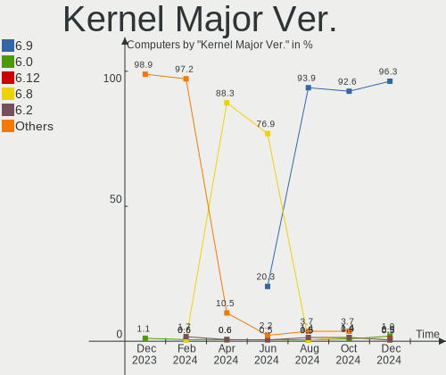
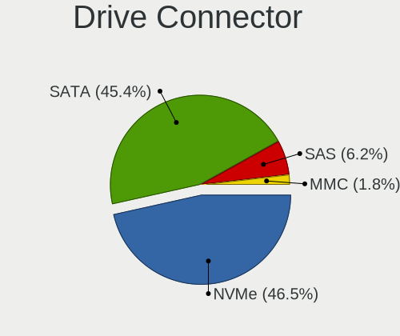
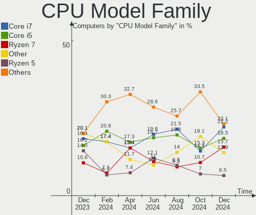
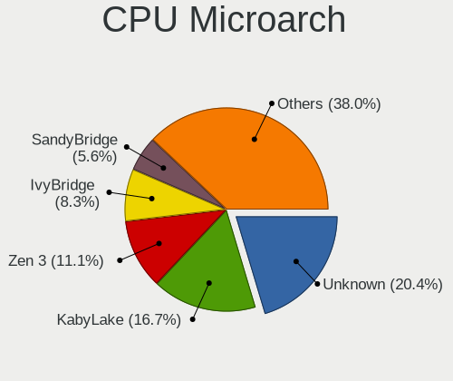
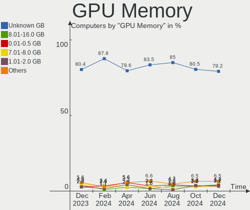
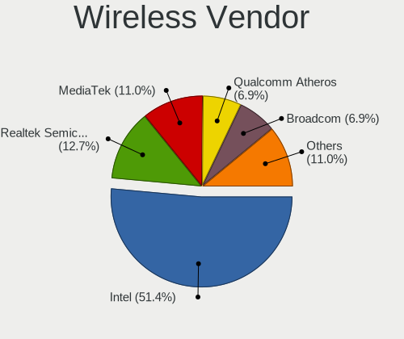
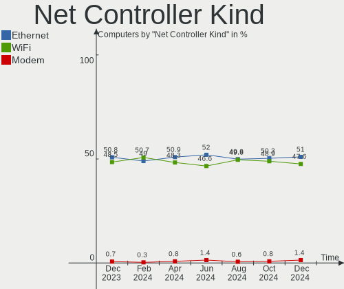
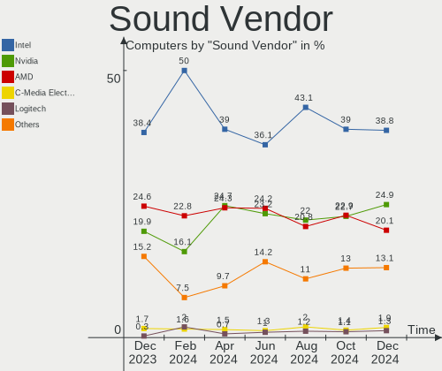
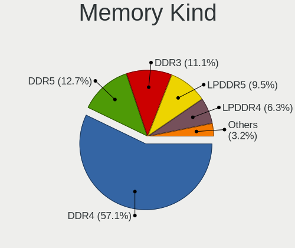

Pop!_OS - Hardware Trends
-------------------------

A project to identify most popular hardware characteristics and track their change
over time based on data collected by Linux users at https://Linux-Hardware.org.

Anyone can contribute to this report by the [hw-probe](https://github.com/linuxhw/hw-probe) tool:

    sudo -E hw-probe -all -upload

This is a report for all computer types. See also reports for [desktops](/Dist/Pop!_OS/Desktop/README.md) and [notebooks](/Dist/Pop!_OS/Notebook/README.md).

This report is for one last month. Overall report since the beginning of time: [TestDays](https://github.com/linuxhw/TestDays)

Period: May, 2023.

Contents
--------

* [ System ](#system)
  - [ OS                       ](#os)
  - [ OS Family                ](#os-family)
  - [ Kernel                   ](#kernel)
  - [ Kernel Family            ](#kernel-family)
  - [ Kernel Major Ver.        ](#kernel-major-ver)
  - [ Arch                     ](#arch)
  - [ DE                       ](#de)
  - [ Display Server           ](#display-server)
  - [ Display Manager          ](#display-manager)
  - [ OS Lang                  ](#os-lang)
  - [ Boot Mode                ](#boot-mode)
  - [ Filesystem               ](#filesystem)
  - [ Part. scheme             ](#part-scheme)
  - [ Dual Boot with Linux/BSD ](#dual-boot-with-linuxbsd)
  - [ Dual Boot (Win)          ](#dual-boot-win)

* [ Board ](#board)
  - [ Vendor                   ](#vendor)
  - [ Model                    ](#model)
  - [ Model Family             ](#model-family)
  - [ MFG Year                 ](#mfg-year)
  - [ Form Factor              ](#form-factor)
  - [ Secure Boot              ](#secure-boot)
  - [ Coreboot                 ](#coreboot)
  - [ RAM Size                 ](#ram-size)
  - [ RAM Used                 ](#ram-used)
  - [ Total Drives             ](#total-drives)
  - [ Has CD-ROM               ](#has-cd-rom)
  - [ Has Ethernet             ](#has-ethernet)
  - [ Has WiFi                 ](#has-wifi)
  - [ Has Bluetooth            ](#has-bluetooth)

* [ Location ](#location)
  - [ Country                  ](#country)
  - [ City                     ](#city)

* [ Drives ](#drives)
  - [ Drive Vendor             ](#drive-vendor)
  - [ Drive Model              ](#drive-model)
  - [ HDD Vendor               ](#hdd-vendor)
  - [ SSD Vendor               ](#ssd-vendor)
  - [ Drive Kind               ](#drive-kind)
  - [ Drive Connector          ](#drive-connector)
  - [ Drive Size               ](#drive-size)
  - [ Space Total              ](#space-total)
  - [ Space Used               ](#space-used)
  - [ Malfunc. Drives          ](#malfunc-drives)
  - [ Malfunc. Drive Vendor    ](#malfunc-drive-vendor)
  - [ Malfunc. HDD Vendor      ](#malfunc-hdd-vendor)
  - [ Malfunc. Drive Kind      ](#malfunc-drive-kind)
  - [ Failed Drives            ](#failed-drives)
  - [ Failed Drive Vendor      ](#failed-drive-vendor)
  - [ Drive Status             ](#drive-status)

* [ Storage controller ](#storage-controller)
  - [ Storage Vendor           ](#storage-vendor)
  - [ Storage Model            ](#storage-model)
  - [ Storage Kind             ](#storage-kind)

* [ Processor ](#processor)
  - [ CPU Vendor               ](#cpu-vendor)
  - [ CPU Model                ](#cpu-model)
  - [ CPU Model Family         ](#cpu-model-family)
  - [ CPU Cores                ](#cpu-cores)
  - [ CPU Sockets              ](#cpu-sockets)
  - [ CPU Threads              ](#cpu-threads)
  - [ CPU Op-Modes             ](#cpu-op-modes)
  - [ CPU Microcode            ](#cpu-microcode)
  - [ CPU Microarch            ](#cpu-microarch)

* [ Graphics ](#graphics)
  - [ GPU Vendor               ](#gpu-vendor)
  - [ GPU Model                ](#gpu-model)
  - [ GPU Combo                ](#gpu-combo)
  - [ GPU Driver               ](#gpu-driver)
  - [ GPU Memory               ](#gpu-memory)

* [ Monitor ](#monitor)
  - [ Monitor Vendor           ](#monitor-vendor)
  - [ Monitor Model            ](#monitor-model)
  - [ Monitor Resolution       ](#monitor-resolution)
  - [ Monitor Diagonal         ](#monitor-diagonal)
  - [ Monitor Width            ](#monitor-width)
  - [ Aspect Ratio             ](#aspect-ratio)
  - [ Monitor Area             ](#monitor-area)
  - [ Pixel Density            ](#pixel-density)
  - [ Multiple Monitors        ](#multiple-monitors)

* [ Network ](#network)
  - [ Net Controller Vendor    ](#net-controller-vendor)
  - [ Net Controller Model     ](#net-controller-model)
  - [ Wireless Vendor          ](#wireless-vendor)
  - [ Wireless Model           ](#wireless-model)
  - [ Ethernet Vendor          ](#ethernet-vendor)
  - [ Ethernet Model           ](#ethernet-model)
  - [ Net Controller Kind      ](#net-controller-kind)
  - [ Used Controller          ](#used-controller)
  - [ NICs                     ](#nics)
  - [ IPv6                     ](#ipv6)

* [ Bluetooth ](#bluetooth)
  - [ Bluetooth Vendor         ](#bluetooth-vendor)
  - [ Bluetooth Model          ](#bluetooth-model)

* [ Sound ](#sound)
  - [ Sound Vendor             ](#sound-vendor)
  - [ Sound Model              ](#sound-model)

* [ Memory ](#memory)
  - [ Memory Vendor            ](#memory-vendor)
  - [ Memory Model             ](#memory-model)
  - [ Memory Kind              ](#memory-kind)
  - [ Memory Form Factor       ](#memory-form-factor)
  - [ Memory Size              ](#memory-size)
  - [ Memory Speed             ](#memory-speed)

* [ Printers & scanners ](#printers--scanners)
  - [ Printer Vendor           ](#printer-vendor)
  - [ Printer Model            ](#printer-model)
  - [ Scanner Vendor           ](#scanner-vendor)
  - [ Scanner Model            ](#scanner-model)

* [ Camera ](#camera)
  - [ Camera Vendor            ](#camera-vendor)
  - [ Camera Model             ](#camera-model)

* [ Security ](#security)
  - [ Fingerprint Vendor       ](#fingerprint-vendor)
  - [ Fingerprint Model        ](#fingerprint-model)
  - [ Chipcard Vendor          ](#chipcard-vendor)
  - [ Chipcard Model           ](#chipcard-model)

* [ Unsupported ](#unsupported)
  - [ Unsupported Devices      ](#unsupported-devices)
  - [ Unsupported Device Types ](#unsupported-device-types)

System
------

OS
--

Installed operating systems

| Name          | Computers | Percent |
|---------------|-----------|---------|
| Pop!_OS 22.04 | 229       | 99.13%  |
| Pop!_OS 21.10 | 2         | 0.87%   |

OS Family
---------

OS without a version

| Name    | Computers | Percent |
|---------|-----------|---------|
| Pop!_OS | 231       | 100%    |

Kernel
------

Version of the Linux kernel

| Version                  | Computers | Percent |
|--------------------------|-----------|---------|
| 6.2.6-76060206-generic   | 203       | 87.88%  |
| 6.0.12-76060006-generic  | 4         | 1.73%   |
| 6.2.0-76060200-generic   | 3         | 1.3%    |
| 6.0.2-76060002-generic   | 3         | 1.3%    |
| 5.17.5-76051705-generic  | 3         | 1.3%    |
| 6.0.6-76060006-generic   | 2         | 0.87%   |
| 5.18.10-76051810-generic | 2         | 0.87%   |
| 6.3.4-x64v1-xanmod1      | 1         | 0.43%   |
| 6.3.4-060304-generic     | 1         | 0.43%   |
| 6.3.2-060302-generic     | 1         | 0.43%   |
| 6.3.1-x64v1-xanmod1      | 1         | 0.43%   |
| 6.3.1-060301-generic     | 1         | 0.43%   |
| 6.2.16-060216-generic    | 1         | 0.43%   |
| 6.2.14-surface           | 1         | 0.43%   |
| 6.1.11-76060111-generic  | 1         | 0.43%   |
| 5.19.0-42-generic        | 1         | 0.43%   |
| 5.16.19-76051619-generic | 1         | 0.43%   |
| 5.16.11-76051611-generic | 1         | 0.43%   |

Kernel Family
-------------

Linux kernel without a distro release

| Version | Computers | Percent |
|---------|-----------|---------|
| 6.2.6   | 203       | 87.88%  |
| 6.0.12  | 4         | 1.73%   |
| 6.2.0   | 3         | 1.3%    |
| 6.0.2   | 3         | 1.3%    |
| 5.17.5  | 3         | 1.3%    |
| 6.3.4   | 2         | 0.87%   |
| 6.3.1   | 2         | 0.87%   |
| 6.0.6   | 2         | 0.87%   |
| 5.18.10 | 2         | 0.87%   |
| 6.3.2   | 1         | 0.43%   |
| 6.2.16  | 1         | 0.43%   |
| 6.2.14  | 1         | 0.43%   |
| 6.1.11  | 1         | 0.43%   |
| 5.19.0  | 1         | 0.43%   |
| 5.16.19 | 1         | 0.43%   |
| 5.16.11 | 1         | 0.43%   |

Kernel Major Ver.
-----------------

Linux kernel major version

| Version | Computers | Percent |
|---------|-----------|---------|
| 6.2     | 208       | 90.04%  |
| 6.0     | 9         | 3.9%    |
| 6.3     | 5         | 2.16%   |
| 5.17    | 3         | 1.3%    |
| 5.18    | 2         | 0.87%   |
| 5.16    | 2         | 0.87%   |
| 6.1     | 1         | 0.43%   |
| 5.19    | 1         | 0.43%   |

Arch
----

OS architecture (x86_64, i586, etc.)

| Name   | Computers | Percent |
|--------|-----------|---------|
| x86_64 | 231       | 100%    |

DE
--

Desktop Environment

| Name            | Computers | Percent |
|-----------------|-----------|---------|
| GNOME           | 224       | 96.97%  |
| KDE5            | 2         | 0.87%   |
| Unknown         | 2         | 0.87%   |
| XFCE            | 1         | 0.43%   |
| Unity           | 1         | 0.43%   |
| GNOME Flashback | 1         | 0.43%   |

Display Server
--------------

X11 or Wayland

| Name    | Computers | Percent |
|---------|-----------|---------|
| X11     | 218       | 94.37%  |
| Wayland | 13        | 5.63%   |

Display Manager
---------------

SDDM, LightDM, etc.

| Name    | Computers | Percent |
|---------|-----------|---------|
| Unknown | 167       | 72.29%  |
| GDM3    | 62        | 26.84%  |
| SDDM    | 2         | 0.87%   |

OS Lang
-------

Language

| Lang    | Computers | Percent |
|---------|-----------|---------|
| en_US   | 135       | 58.44%  |
| en_GB   | 13        | 5.63%   |
| C       | 12        | 5.19%   |
| ru_RU   | 10        | 4.33%   |
| pt_BR   | 10        | 4.33%   |
| de_DE   | 9         | 3.9%    |
| en_CA   | 6         | 2.6%    |
| en_AU   | 4         | 1.73%   |
| fr_FR   | 3         | 1.3%    |
| Unknown | 3         | 1.3%    |
| pt_PT   | 2         | 0.87%   |
| pl_PL   | 2         | 0.87%   |
| it_IT   | 2         | 0.87%   |
| es_ES   | 2         | 0.87%   |
| en_NZ   | 2         | 0.87%   |
| tr_TR   | 1         | 0.43%   |
| nl_NL   | 1         | 0.43%   |
| nb_NO   | 1         | 0.43%   |
| ja_JP   | 1         | 0.43%   |
| fr_CA   | 1         | 0.43%   |
| fr_BE   | 1         | 0.43%   |
| es_MX   | 1         | 0.43%   |
| en_ZW   | 1         | 0.43%   |
| en_ZA   | 1         | 0.43%   |
| en_IN   | 1         | 0.43%   |
| en_IE   | 1         | 0.43%   |
| en_DK   | 1         | 0.43%   |
| de_CH   | 1         | 0.43%   |
| de_AT   | 1         | 0.43%   |
| da_DK   | 1         | 0.43%   |
| cs_CZ   | 1         | 0.43%   |

Boot Mode
---------

EFI or BIOS

| Mode | Computers | Percent |
|------|-----------|---------|
| BIOS | 172       | 74.46%  |
| EFI  | 59        | 25.54%  |

Filesystem
----------

Type of filesystem

| Type    | Computers | Percent |
|---------|-----------|---------|
| Ext4    | 218       | 94.37%  |
| Overlay | 9         | 3.9%    |
| Btrfs   | 2         | 0.87%   |
| Zfs     | 1         | 0.43%   |
| Xfs     | 1         | 0.43%   |

Part. scheme
------------

Scheme of partitioning

| Type    | Computers | Percent |
|---------|-----------|---------|
| Unknown | 165       | 71.43%  |
| GPT     | 61        | 26.41%  |
| MBR     | 5         | 2.16%   |

Dual Boot with Linux/BSD
------------------------

Hosting more than one Linux/BSD

| Dual boot | Computers | Percent |
|-----------|-----------|---------|
| No        | 222       | 96.1%   |
| Yes       | 9         | 3.9%    |

Dual Boot (Win)
---------------

Hosting Linux and Windows

| Dual boot | Computers | Percent |
|-----------|-----------|---------|
| No        | 208       | 90.04%  |
| Yes       | 23        | 9.96%   |

Board
-----

Vendor
------

Motherboard manufacturer

| Name                    | Computers | Percent |
|-------------------------|-----------|---------|
| ASUSTek Computer        | 46        | 19.91%  |
| Lenovo                  | 43        | 18.61%  |
| Hewlett-Packard         | 24        | 10.39%  |
| Dell                    | 22        | 9.52%   |
| MSI                     | 17        | 7.36%   |
| Gigabyte Technology     | 15        | 6.49%   |
| Apple                   | 12        | 5.19%   |
| System76                | 8         | 3.46%   |
| ASRock                  | 7         | 3.03%   |
| Acer                    | 6         | 2.6%    |
| Toshiba                 | 4         | 1.73%   |
| HUAWEI                  | 3         | 1.3%    |
| Samsung Electronics     | 2         | 0.87%   |
| Notebook                | 2         | 0.87%   |
| Google                  | 2         | 0.87%   |
| Fujitsu                 | 2         | 0.87%   |
| AZW                     | 2         | 0.87%   |
| Semp Toshiba            | 1         | 0.43%   |
| Reliance Communications | 1         | 0.43%   |
| PS                      | 1         | 0.43%   |
| Positivo                | 1         | 0.43%   |
| Packard Bell            | 1         | 0.43%   |
| Microsoft               | 1         | 0.43%   |
| Intel                   | 1         | 0.43%   |
| EVGA                    | 1         | 0.43%   |
| BESSTAR Tech            | 1         | 0.43%   |
| Avell High Performance  | 1         | 0.43%   |
| American Megatrends     | 1         | 0.43%   |
| Alienware               | 1         | 0.43%   |
| Acidanthera             | 1         | 0.43%   |
| Unknown                 | 1         | 0.43%   |

Model
-----

Motherboard model

| Name                                | Computers | Percent |
|-------------------------------------|-----------|---------|
| Unknown                             | 4         | 1.73%   |
| System76 Oryx Pro                   | 3         | 1.3%    |
| Lenovo Yoga 6 13ALC7 82UD           | 3         | 1.3%    |
| System76 Gazelle                    | 2         | 0.87%   |
| System76 Galago Pro                 | 2         | 0.87%   |
| MSI MS-7C84                         | 2         | 0.87%   |
| MSI MS-7B86                         | 2         | 0.87%   |
| HP Pavilion Aero Laptop 13-be0xxx   | 2         | 0.87%   |
| Gigabyte Z170X-Gaming 7             | 2         | 0.87%   |
| Dell OptiPlex 3060                  | 2         | 0.87%   |
| ASUS PRIME A320M-K/BR               | 2         | 0.87%   |
| Apple MacBookAir7,2                 | 2         | 0.87%   |
| Toshiba TECRA R850                  | 1         | 0.43%   |
| Toshiba Satellite P755              | 1         | 0.43%   |
| Toshiba Satellite L855D             | 1         | 0.43%   |
| Toshiba PORTEGE Z30-A               | 1         | 0.43%   |
| System76 Adder WS                   | 1         | 0.43%   |
| Semp Toshiba IS 1413G               | 1         | 0.43%   |
| Samsung DeskTop System              | 1         | 0.43%   |
| Samsung 355V4C/356V4C/3445VC/3545VC | 1         | 0.43%   |
| Reliance R141TL5                    | 1         | 0.43%   |
| PS G706                             | 1         | 0.43%   |
| Positivo N4350                      | 1         | 0.43%   |
| Packard Bell EasyNote LM85          | 1         | 0.43%   |
| Notebook P15SM                      | 1         | 0.43%   |
| Notebook N141CU                     | 1         | 0.43%   |
| MSI Stealth 16Studio A13VG          | 1         | 0.43%   |
| MSI MS-7C91                         | 1         | 0.43%   |
| MSI MS-7C37                         | 1         | 0.43%   |
| MSI MS-7B89                         | 1         | 0.43%   |
| MSI MS-7B38                         | 1         | 0.43%   |
| MSI MS-7A38                         | 1         | 0.43%   |
| MSI MS-7995                         | 1         | 0.43%   |
| MSI MS-7972                         | 1         | 0.43%   |
| MSI MS-7693                         | 1         | 0.43%   |
| MSI MS-7680                         | 1         | 0.43%   |
| MSI GV62 7RE                        | 1         | 0.43%   |
| MSI GL65 Leopard 10SCSR             | 1         | 0.43%   |
| MSI Alpha 15 A3DDK                  | 1         | 0.43%   |
| Microsoft Surface Pro 4             | 1         | 0.43%   |

Model Family
------------

Motherboard model prefix

| Name                  | Computers | Percent |
|-----------------------|-----------|---------|
| Lenovo ThinkPad       | 21        | 9.09%   |
| ASUS ROG              | 11        | 4.76%   |
| Lenovo IdeaPad        | 8         | 3.46%   |
| ASUS TUF              | 7         | 3.03%   |
| Lenovo Yoga           | 6         | 2.6%    |
| Dell Inspiron         | 6         | 2.6%    |
| HP Pavilion           | 5         | 2.16%   |
| Dell Precision        | 5         | 2.16%   |
| ASUS VivoBook         | 5         | 2.16%   |
| HP EliteBook          | 4         | 1.73%   |
| Dell XPS              | 4         | 1.73%   |
| ASUS PRIME            | 4         | 1.73%   |
| Acer Aspire           | 4         | 1.73%   |
| Unknown               | 4         | 1.73%   |
| System76 Oryx         | 3         | 1.3%    |
| Lenovo ThinkCentre    | 3         | 1.3%    |
| Dell OptiPlex         | 3         | 1.3%    |
| Toshiba Satellite     | 2         | 0.87%   |
| System76 Gazelle      | 2         | 0.87%   |
| System76 Galago       | 2         | 0.87%   |
| MSI MS-7C84           | 2         | 0.87%   |
| MSI MS-7B86           | 2         | 0.87%   |
| HP ZBook              | 2         | 0.87%   |
| HP OMEN               | 2         | 0.87%   |
| HP Laptop             | 2         | 0.87%   |
| HP Compaq             | 2         | 0.87%   |
| Gigabyte Z170X-Gaming | 2         | 0.87%   |
| Gigabyte H410M        | 2         | 0.87%   |
| Fujitsu ESPRIMO       | 2         | 0.87%   |
| Dell Latitude         | 2         | 0.87%   |
| ASRock X570           | 2         | 0.87%   |
| Apple MacBookAir7     | 2         | 0.87%   |
| Toshiba TECRA         | 1         | 0.43%   |
| Toshiba PORTEGE       | 1         | 0.43%   |
| System76 Adder        | 1         | 0.43%   |
| Semp Toshiba IS       | 1         | 0.43%   |
| Samsung DeskTop       | 1         | 0.43%   |
| Samsung 355V4C        | 1         | 0.43%   |
| Reliance R141TL5      | 1         | 0.43%   |
| PS G706               | 1         | 0.43%   |

MFG Year
--------

Motherboard manufacture year

| Year | Computers | Percent |
|------|-----------|---------|
| 2022 | 32        | 13.85%  |
| 2019 | 28        | 12.12%  |
| 2020 | 25        | 10.82%  |
| 2018 | 25        | 10.82%  |
| 2021 | 23        | 9.96%   |
| 2015 | 19        | 8.23%   |
| 2012 | 11        | 4.76%   |
| 2023 | 10        | 4.33%   |
| 2017 | 10        | 4.33%   |
| 2014 | 9         | 3.9%    |
| 2013 | 8         | 3.46%   |
| 2011 | 8         | 3.46%   |
| 2010 | 8         | 3.46%   |
| 2016 | 7         | 3.03%   |
| 2008 | 4         | 1.73%   |
| 2009 | 3         | 1.3%    |
| 2007 | 1         | 0.43%   |

Form Factor
-----------

Physical design of the computer

| Name        | Computers | Percent |
|-------------|-----------|---------|
| Notebook    | 127       | 54.98%  |
| Desktop     | 86        | 37.23%  |
| Convertible | 7         | 3.03%   |
| All in one  | 5         | 2.16%   |
| Mini pc     | 4         | 1.73%   |
| Tablet      | 1         | 0.43%   |
| Server      | 1         | 0.43%   |

Secure Boot
-----------

Enabled or disabled

| State    | Computers | Percent |
|----------|-----------|---------|
| Disabled | 231       | 100%    |

Coreboot
--------

Have coreboot on board

| Used | Computers | Percent |
|------|-----------|---------|
| No   | 220       | 95.24%  |
| Yes  | 11        | 4.76%   |

RAM Size
--------

Total RAM memory

| Size in GB  | Computers | Percent |
|-------------|-----------|---------|
| 16.01-24.0  | 65        | 28.14%  |
| 8.01-16.0   | 43        | 18.61%  |
| 4.01-8.0    | 42        | 18.18%  |
| 32.01-64.0  | 41        | 17.75%  |
| 3.01-4.0    | 16        | 6.93%   |
| 64.01-256.0 | 15        | 6.49%   |
| 24.01-32.0  | 8         | 3.46%   |
| 2.01-3.0    | 1         | 0.43%   |

RAM Used
--------

Used RAM memory

| Used GB    | Computers | Percent |
|------------|-----------|---------|
| 4.01-8.0   | 94        | 40.69%  |
| 3.01-4.0   | 50        | 21.65%  |
| 8.01-16.0  | 37        | 16.02%  |
| 2.01-3.0   | 32        | 13.85%  |
| 1.01-2.0   | 10        | 4.33%   |
| 24.01-32.0 | 4         | 1.73%   |
| 16.01-24.0 | 4         | 1.73%   |

Total Drives
------------

Number of drives on board

| Drives | Computers | Percent |
|--------|-----------|---------|
| 1      | 133       | 57.58%  |
| 2      | 56        | 24.24%  |
| 3      | 21        | 9.09%   |
| 4      | 9         | 3.9%    |
| 5      | 6         | 2.6%    |
| 6      | 3         | 1.3%    |
| 8      | 1         | 0.43%   |
| 7      | 1         | 0.43%   |
| 0      | 1         | 0.43%   |

Has CD-ROM
----------

Has CD-ROM on board

| Presented | Computers | Percent |
|-----------|-----------|---------|
| No        | 183       | 79.22%  |
| Yes       | 48        | 20.78%  |

Has Ethernet
------------

Has Ethernet on board

| Presented | Computers | Percent |
|-----------|-----------|---------|
| Yes       | 194       | 83.98%  |
| No        | 37        | 16.02%  |

Has WiFi
--------

Has WiFi module

| Presented | Computers | Percent |
|-----------|-----------|---------|
| Yes       | 193       | 83.55%  |
| No        | 38        | 16.45%  |

Has Bluetooth
-------------

Has Bluetooth module

| Presented | Computers | Percent |
|-----------|-----------|---------|
| Yes       | 160       | 69.26%  |
| No        | 71        | 30.74%  |

Location
--------

Country
-------

Geographic location (country)

| Country      | Computers | Percent |
|--------------|-----------|---------|
| USA          | 78        | 33.77%  |
| Brazil       | 16        | 6.93%   |
| Germany      | 14        | 6.06%   |
| UK           | 13        | 5.63%   |
| Canada       | 13        | 5.63%   |
| Russia       | 9         | 3.9%    |
| Australia    | 7         | 3.03%   |
| Sweden       | 5         | 2.16%   |
| France       | 5         | 2.16%   |
| Portugal     | 4         | 1.73%   |
| Poland       | 4         | 1.73%   |
| Mexico       | 4         | 1.73%   |
| Italy        | 4         | 1.73%   |
| India        | 4         | 1.73%   |
| Czechia      | 4         | 1.73%   |
| Spain        | 3         | 1.3%    |
| New Zealand  | 3         | 1.3%    |
| Ireland      | 3         | 1.3%    |
| Austria      | 3         | 1.3%    |
| Turkey       | 2         | 0.87%   |
| Norway       | 2         | 0.87%   |
| Netherlands  | 2         | 0.87%   |
| Morocco      | 2         | 0.87%   |
| Malaysia     | 2         | 0.87%   |
| Japan        | 2         | 0.87%   |
| Denmark      | 2         | 0.87%   |
| Vietnam      | 1         | 0.43%   |
| Switzerland  | 1         | 0.43%   |
| South Africa | 1         | 0.43%   |
| Slovenia     | 1         | 0.43%   |
| Serbia       | 1         | 0.43%   |
| Romania      | 1         | 0.43%   |
| Philippines  | 1         | 0.43%   |
| Pakistan     | 1         | 0.43%   |
| Oman         | 1         | 0.43%   |
| Nepal        | 1         | 0.43%   |
| Lithuania    | 1         | 0.43%   |
| Lebanon      | 1         | 0.43%   |
| Latvia       | 1         | 0.43%   |
| Israel       | 1         | 0.43%   |

City
----

Geographic location (city)

| City               | Computers | Percent |
|--------------------|-----------|---------|
| Brisbane           | 4         | 1.73%   |
| Rio de Janeiro     | 3         | 1.3%    |
| Gothenburg         | 3         | 1.3%    |
| Youngstown         | 2         | 0.87%   |
| Seattle            | 2         | 0.87%   |
| Sao Paulo          | 2         | 0.87%   |
| San Antonio        | 2         | 0.87%   |
| Petaling Jaya      | 2         | 0.87%   |
| Mogi das Cruzes    | 2         | 0.87%   |
| Mexico City        | 2         | 0.87%   |
| Melbourne          | 2         | 0.87%   |
| Leipzig            | 2         | 0.87%   |
| La Grande          | 2         | 0.87%   |
| Karlsruhe          | 2         | 0.87%   |
| Houston            | 2         | 0.87%   |
| Framingham         | 2         | 0.87%   |
| Flushing           | 2         | 0.87%   |
| Dublin             | 2         | 0.87%   |
| Christchurch       | 2         | 0.87%   |
| Zurich             | 1         | 0.43%   |
| Zephyrhills        | 1         | 0.43%   |
| Zeeland            | 1         | 0.43%   |
| Zapotlan el Grande | 1         | 0.43%   |
| Zadar              | 1         | 0.43%   |
| Wroclaw            | 1         | 0.43%   |
| Woodbridge         | 1         | 0.43%   |
| Winnipeg           | 1         | 0.43%   |
| Windsor            | 1         | 0.43%   |
| Whitley Bay        | 1         | 0.43%   |
| Westborough        | 1         | 0.43%   |
| Webster            | 1         | 0.43%   |
| Washington         | 1         | 0.43%   |
| Warsaw             | 1         | 0.43%   |
| Warrington         | 1         | 0.43%   |
| Waltham            | 1         | 0.43%   |
| Wake Forest        | 1         | 0.43%   |
| Voronezh           | 1         | 0.43%   |
| Vladimir           | 1         | 0.43%   |
| Vista              | 1         | 0.43%   |
| Vilnius            | 1         | 0.43%   |

Drives
------

Drive Vendor
------------

Hard drive vendors

| Vendor                         | Computers | Drives | Percent |
|--------------------------------|-----------|--------|---------|
| Samsung Electronics            | 66        | 84     | 18.75%  |
| WDC                            | 36        | 51     | 10.23%  |
| Seagate                        | 32        | 36     | 9.09%   |
| Sandisk                        | 23        | 30     | 6.53%   |
| Toshiba                        | 19        | 22     | 5.4%    |
| Kingston                       | 19        | 20     | 5.4%    |
| Crucial                        | 14        | 16     | 3.98%   |
| Unknown                        | 12        | 13     | 3.41%   |
| Intel                          | 11        | 11     | 3.13%   |
| Micron Technology              | 9         | 9      | 2.56%   |
| SK hynix                       | 8         | 8      | 2.27%   |
| China                          | 8         | 8      | 2.27%   |
| Apple                          | 7         | 7      | 1.99%   |
| A-DATA Technology              | 7         | 7      | 1.99%   |
| KIOXIA                         | 6         | 6      | 1.7%    |
| Kingston Technology Company    | 6         | 6      | 1.7%    |
| Phison Electronics             | 5         | 6      | 1.42%   |
| Micron/Crucial Technology      | 5         | 6      | 1.42%   |
| Hitachi                        | 5         | 5      | 1.42%   |
| HGST                           | 4         | 4      | 1.14%   |
| Transcend                      | 3         | 3      | 0.85%   |
| Silicon Motion                 | 3         | 3      | 0.85%   |
| LITEONIT                       | 3         | 3      | 0.85%   |
| Union Memory                   | 2         | 2      | 0.57%   |
| Solid State Storage Technology | 2         | 2      | 0.57%   |
| Realtek Semiconductor          | 2         | 2      | 0.57%   |
| Phison                         | 2         | 2      | 0.57%   |
| Lite-On Technology             | 2         | 2      | 0.57%   |
| Lexar                          | 2         | 2      | 0.57%   |
| Intenso                        | 2         | 2      | 0.57%   |
| Gigabyte Technology            | 2         | 2      | 0.57%   |
| Apacer                         | 2         | 2      | 0.57%   |
| Unknown                        | 2         | 2      | 0.57%   |
| TO Exter                       | 1         | 1      | 0.28%   |
| Team                           | 1         | 1      | 0.28%   |
| SPCC                           | 1         | 2      | 0.28%   |
| Solid State Storage            | 1         | 1      | 0.28%   |
| ShiJi                          | 1         | 1      | 0.28%   |
| PNY                            | 1         | 1      | 0.28%   |
| Patriot                        | 1         | 1      | 0.28%   |

Drive Model
-----------

Hard drive models

| Model                                               | Computers | Percent |
|-----------------------------------------------------|-----------|---------|
| Samsung NVMe SSD Controller SM981/PM981/PM983 256GB | 14        | 3.66%   |
| Kingston SA400S37240G 240GB SSD                     | 8         | 2.09%   |
| Samsung NVMe SSD Controller PM9A1/PM9A3/980PRO 1TB  | 5         | 1.31%   |
| Sandisk WD Blue SN550 NVMe SSD 512GB                | 4         | 1.05%   |
| Samsung SSD 860 EVO 500GB                           | 4         | 1.05%   |
| Samsung SSD 850 EVO 250GB                           | 4         | 1.05%   |
| Kingston SA400S37480G 480GB SSD                     | 4         | 1.05%   |
| Unknown MMC Card  32GB                              | 3         | 0.79%   |
| Phison E16 PCIe4 NVMe Controller 1TB                | 3         | 0.79%   |
| Micron/Crucial P2 NVMe PCIe SSD 1TB                 | 3         | 0.79%   |
| Crucial CT240BX500SSD1 240GB                        | 3         | 0.79%   |
| Crucial CT1000MX500SSD1 1TB                         | 3         | 0.79%   |
| WDC WDS500G2B0A-00SM50 500GB SSD                    | 2         | 0.52%   |
| WDC PC SN730 SDBQNTY-1T00-1001 1TB                  | 2         | 0.52%   |
| Unknown NVMe SSD Drive 512GB                        | 2         | 0.52%   |
| Union Memory UMIS RPJTJ512MEE1OWX 512GB             | 2         | 0.52%   |
| Toshiba MQ04ABF100 1TB                              | 2         | 0.52%   |
| SK hynix SKHynix_HFM512GD3HX015N 512GB              | 2         | 0.52%   |
| Seagate ST500DM002-1BD142 500GB                     | 2         | 0.52%   |
| Seagate ST4000DX001-1CE168 4TB                      | 2         | 0.52%   |
| Seagate ST4000DM004-2CV104 4TB                      | 2         | 0.52%   |
| Seagate ST2000LM007-1R8174 2TB                      | 2         | 0.52%   |
| Seagate ST1000LM035-1RK172 1TB                      | 2         | 0.52%   |
| Seagate ST1000DM010-2EP102 1TB                      | 2         | 0.52%   |
| Seagate ST1000DM003-1SB102 1TB                      | 2         | 0.52%   |
| Seagate Expansion 1TB                               | 2         | 0.52%   |
| Sandisk WD_BLACK SN850X 4000GB                      | 2         | 0.52%   |
| Sandisk WD Blue SN570 1TB                           | 2         | 0.52%   |
| Samsung SSD 980 PRO 1TB                             | 2         | 0.52%   |
| Samsung SSD 970 EVO Plus 2TB                        | 2         | 0.52%   |
| Samsung SSD 870 QVO 1TB                             | 2         | 0.52%   |
| Samsung SSD 870 EVO 250GB                           | 2         | 0.52%   |
| Samsung SSD 870 EVO 1TB                             | 2         | 0.52%   |
| Samsung SSD 860 QVO 2TB                             | 2         | 0.52%   |
| Samsung SSD 860 EVO 1TB                             | 2         | 0.52%   |
| Samsung PSSD T7 500GB                               | 2         | 0.52%   |
| Phison PCIe SSD 512GB                               | 2         | 0.52%   |
| Micron 2450_MTFDKBA1T0TFK 1TB                       | 2         | 0.52%   |
| KIOXIA KBG40ZNV1T02 1TB                             | 2         | 0.52%   |
| Kingston Company U-SNS8154P3 NVMe SSD 512GB         | 2         | 0.52%   |

HDD Vendor
----------

Hard disk drive vendors

| Vendor  | Computers | Drives | Percent |
|---------|-----------|--------|---------|
| Seagate | 31        | 35     | 38.27%  |
| WDC     | 23        | 38     | 28.4%   |
| Toshiba | 15        | 17     | 18.52%  |
| Hitachi | 5         | 5      | 6.17%   |
| HGST    | 4         | 4      | 4.94%   |
| Unknown | 1         | 1      | 1.23%   |
| Fujitsu | 1         | 1      | 1.23%   |
| Apple   | 1         | 1      | 1.23%   |

SSD Vendor
----------

Solid state drive vendors

| Vendor              | Computers | Drives | Percent |
|---------------------|-----------|--------|---------|
| Samsung Electronics | 28        | 40     | 24.35%  |
| Kingston            | 17        | 18     | 14.78%  |
| Crucial             | 12        | 14     | 10.43%  |
| SanDisk             | 8         | 8      | 6.96%   |
| China               | 8         | 8      | 6.96%   |
| WDC                 | 7         | 7      | 6.09%   |
| Apple               | 4         | 4      | 3.48%   |
| Micron Technology   | 3         | 3      | 2.61%   |
| LITEONIT            | 3         | 3      | 2.61%   |
| Intel               | 3         | 3      | 2.61%   |
| A-DATA Technology   | 3         | 3      | 2.61%   |
| Transcend           | 2         | 2      | 1.74%   |
| Gigabyte Technology | 2         | 2      | 1.74%   |
| Apacer              | 2         | 2      | 1.74%   |
| Toshiba             | 1         | 1      | 0.87%   |
| TO Exter            | 1         | 1      | 0.87%   |
| SPCC                | 1         | 2      | 0.87%   |
| PNY                 | 1         | 1      | 0.87%   |
| OWC                 | 1         | 1      | 0.87%   |
| OCZ                 | 1         | 1      | 0.87%   |
| Netac               | 1         | 1      | 0.87%   |
| Lexar               | 1         | 1      | 0.87%   |
| KingSpec            | 1         | 1      | 0.87%   |
| KingDian            | 1         | 1      | 0.87%   |
| Intenso             | 1         | 1      | 0.87%   |
| Dogfish             | 1         | 1      | 0.87%   |
| Corsair             | 1         | 1      | 0.87%   |

Drive Kind
----------

HDD or SSD

| Kind    | Computers | Drives | Percent |
|---------|-----------|--------|---------|
| NVMe    | 126       | 157    | 40.78%  |
| SSD     | 102       | 131    | 33.01%  |
| HDD     | 67        | 102    | 21.68%  |
| MMC     | 9         | 9      | 2.91%   |
| Unknown | 5         | 7      | 1.62%   |

Drive Connector
---------------

SATA, SAS, NVMe, etc.

| Type | Computers | Drives | Percent |
|------|-----------|--------|---------|
| SATA | 135       | 223    | 47.54%  |
| NVMe | 125       | 156    | 44.01%  |
| SAS  | 15        | 18     | 5.28%   |
| MMC  | 9         | 9      | 3.17%   |

Drive Size
----------

Size of hard drive

| Size in TB | Computers | Drives | Percent |
|------------|-----------|--------|---------|
| 0.01-0.5   | 98        | 127    | 52.69%  |
| 0.51-1.0   | 46        | 56     | 24.73%  |
| 1.01-2.0   | 20        | 24     | 10.75%  |
| 3.01-4.0   | 11        | 14     | 5.91%   |
| 4.01-10.0  | 8         | 9      | 4.3%    |
| 2.01-3.0   | 2         | 2      | 1.08%   |
| 10.01-20.0 | 1         | 1      | 0.54%   |

Space Total
-----------

Amount of disk space available on the file system

| Size in GB     | Computers | Percent |
|----------------|-----------|---------|
| 101-250        | 57        | 24.68%  |
| 501-1000       | 54        | 23.38%  |
| 251-500        | 53        | 22.94%  |
| More than 3000 | 24        | 10.39%  |
| 1001-2000      | 14        | 6.06%   |
| 51-100         | 10        | 4.33%   |
| 1-20           | 8         | 3.46%   |
| 2001-3000      | 5         | 2.16%   |
| 21-50          | 4         | 1.73%   |
| Unknown        | 2         | 0.87%   |

Space Used
----------

Amount of used disk space

| Used GB        | Computers | Percent |
|----------------|-----------|---------|
| 1-20           | 67        | 29%     |
| 21-50          | 52        | 22.51%  |
| 51-100         | 29        | 12.55%  |
| 101-250        | 26        | 11.26%  |
| 251-500        | 25        | 10.82%  |
| 1001-2000      | 12        | 5.19%   |
| More than 3000 | 8         | 3.46%   |
| 501-1000       | 8         | 3.46%   |
| 2001-3000      | 2         | 0.87%   |
| Unknown        | 2         | 0.87%   |

Malfunc. Drives
---------------

Drive models with a malfunction

| Model                                           | Computers | Drives | Percent |
|-------------------------------------------------|-----------|--------|---------|
| Toshiba MK3252GSX 320GB                         | 1         | 1      | 10%     |
| SK hynix PC711 HFS512GDE9X073N 512GB            | 1         | 1      | 10%     |
| Seagate ST500LT012-9WS142 500GB                 | 1         | 1      | 10%     |
| Seagate ST2000DL004 HD204UI 2TB                 | 1         | 1      | 10%     |
| Seagate ST1000LX015-1U7172 1TB                  | 1         | 1      | 10%     |
| Seagate ST1000LM035-1RK172 1TB                  | 1         | 1      | 10%     |
| Samsung Electronics SSD 870 EVO 1TB             | 1         | 1      | 10%     |
| Samsung Electronics SSD 850 EVO 250GB           | 1         | 1      | 10%     |
| Kingston Technology Company KC2000 NVMe SSD 1TB | 1         | 1      | 10%     |
| China SSD 240GB                                 | 1         | 1      | 10%     |

Malfunc. Drive Vendor
---------------------

Vendors of faulty drives

| Vendor                      | Computers | Drives | Percent |
|-----------------------------|-----------|--------|---------|
| Seagate                     | 4         | 4      | 44.44%  |
| Toshiba                     | 1         | 1      | 11.11%  |
| SK hynix                    | 1         | 1      | 11.11%  |
| Samsung Electronics         | 1         | 2      | 11.11%  |
| Kingston Technology Company | 1         | 1      | 11.11%  |
| China                       | 1         | 1      | 11.11%  |

Malfunc. HDD Vendor
-------------------

Vendors of faulty HDD drives

| Vendor  | Computers | Drives | Percent |
|---------|-----------|--------|---------|
| Seagate | 4         | 4      | 80%     |
| Toshiba | 1         | 1      | 20%     |

Malfunc. Drive Kind
-------------------

Kinds of faulty drives

| Kind | Computers | Drives | Percent |
|------|-----------|--------|---------|
| HDD  | 5         | 5      | 55.56%  |
| NVMe | 2         | 2      | 22.22%  |
| SSD  | 2         | 3      | 22.22%  |

Failed Drives
-------------

Failed drive models

Zero info for selected period =(

Failed Drive Vendor
-------------------

Failed drive vendors

Zero info for selected period =(

Drive Status
------------

Number of failed and malfunc. drives

| Status   | Computers | Drives | Percent |
|----------|-----------|--------|---------|
| Detected | 170       | 298    | 70.83%  |
| Works    | 61        | 98     | 25.42%  |
| Malfunc  | 9         | 10     | 3.75%   |

Storage controller
------------------

Storage Vendor
--------------

Storage controller vendors

| Vendor                         | Computers | Percent |
|--------------------------------|-----------|---------|
| Intel                          | 134       | 39.53%  |
| AMD                            | 53        | 15.63%  |
| Samsung Electronics            | 45        | 13.27%  |
| SanDisk                        | 22        | 6.49%   |
| SK hynix                       | 8         | 2.36%   |
| Kingston Technology Company    | 8         | 2.36%   |
| Phison Electronics             | 7         | 2.06%   |
| Micron/Crucial Technology      | 7         | 2.06%   |
| Micron Technology              | 6         | 1.77%   |
| Toshiba America Info Systems   | 5         | 1.47%   |
| Silicon Motion                 | 5         | 1.47%   |
| KIOXIA                         | 5         | 1.47%   |
| ADATA Technology               | 5         | 1.47%   |
| ASMedia Technology             | 4         | 1.18%   |
| Solid State Storage Technology | 3         | 0.88%   |
| Realtek Semiconductor          | 3         | 0.88%   |
| JMicron Technology             | 3         | 0.88%   |
| VIA Technologies               | 2         | 0.59%   |
| Union Memory (Shenzhen)        | 2         | 0.59%   |
| Nvidia                         | 2         | 0.59%   |
| Lite-On Technology             | 2         | 0.59%   |
| Apple                          | 2         | 0.59%   |
| Transcend                      | 1         | 0.29%   |
| Shenzhen Longsys Electronics   | 1         | 0.29%   |
| Netac Technology               | 1         | 0.29%   |
| MAXIO Technology (Hangzhou)    | 1         | 0.29%   |
| Marvell Technology Group       | 1         | 0.29%   |
| Biwin Storage Technology       | 1         | 0.29%   |

Storage Model
-------------

Storage controller models

| Model                                                                          | Computers | Percent |
|--------------------------------------------------------------------------------|-----------|---------|
| AMD FCH SATA Controller [AHCI mode]                                            | 40        | 10.72%  |
| Samsung NVMe SSD Controller SM981/PM981/PM983                                  | 24        | 6.43%   |
| Intel 8 Series/C220 Series Chipset Family 6-port SATA Controller 1 [AHCI mode] | 15        | 4.02%   |
| Intel Volume Management Device NVMe RAID Controller                            | 11        | 2.95%   |
| Samsung NVMe SSD Controller PM9A1/PM9A3/980PRO                                 | 10        | 2.68%   |
| Intel Sunrise Point-LP SATA Controller [AHCI mode]                             | 9         | 2.41%   |
| Intel SATA Controller [RAID mode]                                              | 7         | 1.88%   |
| Intel Q170/Q150/B150/H170/H110/Z170/CM236 Chipset SATA Controller [AHCI Mode]  | 7         | 1.88%   |
| SanDisk WD Blue SN550 NVMe SSD                                                 | 6         | 1.61%   |
| Intel Comet Lake SATA AHCI Controller                                          | 6         | 1.61%   |
| Intel Cannon Lake Mobile PCH SATA AHCI Controller                              | 6         | 1.61%   |
| AMD 400 Series Chipset SATA Controller                                         | 6         | 1.61%   |
| SK hynix Gold P31/PC711 NVMe Solid State Drive                                 | 5         | 1.34%   |
| Samsung NVMe SSD Controller 980                                                | 5         | 1.34%   |
| Micron NVMe Storage Controller                                                 | 5         | 1.34%   |
| Intel Wildcat Point-LP SATA Controller [AHCI Mode]                             | 5         | 1.34%   |
| Intel 200 Series PCH SATA controller [AHCI mode]                               | 5         | 1.34%   |
| AMD 500 Series Chipset SATA Controller                                         | 5         | 1.34%   |
| Phison E16 PCIe4 NVMe Controller                                               | 4         | 1.07%   |
| Intel SSD 660P Series                                                          | 4         | 1.07%   |
| Intel 82801 Mobile SATA Controller [RAID mode]                                 | 4         | 1.07%   |
| Intel 7 Series Chipset Family 6-port SATA Controller [AHCI mode]               | 4         | 1.07%   |
| Intel 400 Series Chipset Family SATA AHCI Controller                           | 4         | 1.07%   |
| ASMedia ASM1062 Serial ATA Controller                                          | 4         | 1.07%   |
| Toshiba America Info Systems XG5 NVMe SSD Controller                           | 3         | 0.8%    |
| Solid State Storage Non-Volatile memory controller                             | 3         | 0.8%    |
| Silicon Motion SM2263EN/SM2263XT SSD Controller                                | 3         | 0.8%    |
| SanDisk WD Blue SN570 NVMe SSD 1TB                                             | 3         | 0.8%    |
| SanDisk WD Black SN750 / PC SN730 NVMe SSD                                     | 3         | 0.8%    |
| Micron/Crucial P2 NVMe PCIe SSD                                                | 3         | 0.8%    |
| KIOXIA NVMe SSD Controller BG4                                                 | 3         | 0.8%    |
| Intel Alder Lake-S PCH SATA Controller [AHCI Mode]                             | 3         | 0.8%    |
| Intel Alder Lake-P SATA AHCI Controller                                        | 3         | 0.8%    |
| Intel 6 Series/C200 Series Chipset Family 6 port Mobile SATA AHCI Controller   | 3         | 0.8%    |
| Intel 500 Series Chipset Family SATA AHCI Controller                           | 3         | 0.8%    |
| Intel 5 Series/3400 Series Chipset 6 port SATA AHCI Controller                 | 3         | 0.8%    |
| Intel 5 Series/3400 Series Chipset 4 port SATA AHCI Controller                 | 3         | 0.8%    |
| AMD SB7x0/SB8x0/SB9x0 SATA Controller [IDE mode]                               | 3         | 0.8%    |
| AMD SB7x0/SB8x0/SB9x0 SATA Controller [AHCI mode]                              | 3         | 0.8%    |
| AMD SB7x0/SB8x0/SB9x0 IDE Controller                                           | 3         | 0.8%    |

Storage Kind
------------

Kind of storage controller (IDE, SATA, NVMe, SAS, ...)

| Kind | Computers | Percent |
|------|-----------|---------|
| SATA | 161       | 49.24%  |
| NVMe | 125       | 38.23%  |
| RAID | 25        | 7.65%   |
| IDE  | 15        | 4.59%   |
| SAS  | 1         | 0.31%   |

Processor
---------

CPU Vendor
----------

Processor vendors

| Vendor | Computers | Percent |
|--------|-----------|---------|
| Intel  | 159       | 68.83%  |
| AMD    | 72        | 31.17%  |

CPU Model
---------

Processor models

| Model                                         | Computers | Percent |
|-----------------------------------------------|-----------|---------|
| Intel 11th Gen Core i7-11800H @ 2.30GHz       | 5         | 2.16%   |
| AMD Ryzen 5 1600 Six-Core Processor           | 5         | 2.16%   |
| Intel Core i7-8750H CPU @ 2.20GHz             | 4         | 1.73%   |
| Intel Core i7-8650U CPU @ 1.90GHz             | 3         | 1.3%    |
| Intel Core i7-7700HQ CPU @ 2.80GHz            | 3         | 1.3%    |
| Intel Core i7-6700K CPU @ 4.00GHz             | 3         | 1.3%    |
| Intel Core i7-4790 CPU @ 3.60GHz              | 3         | 1.3%    |
| Intel Core i5-5300U CPU @ 2.30GHz             | 3         | 1.3%    |
| Intel Core i5-10210U CPU @ 1.60GHz            | 3         | 1.3%    |
| Intel 11th Gen Core i7-1165G7 @ 2.80GHz       | 3         | 1.3%    |
| AMD Ryzen 7 3750H with Radeon Vega Mobile Gfx | 3         | 1.3%    |
| AMD Ryzen 7 3700X 8-Core Processor            | 3         | 1.3%    |
| AMD Ryzen 5 5500U with Radeon Graphics        | 3         | 1.3%    |
| AMD Ryzen 5 3500U with Radeon Vega Mobile Gfx | 3         | 1.3%    |
| AMD FX-8350 Eight-Core Processor              | 3         | 1.3%    |
| Intel Core i7-8565U CPU @ 1.80GHz             | 2         | 0.87%   |
| Intel Core i7-8550U CPU @ 1.80GHz             | 2         | 0.87%   |
| Intel Core i7-4600M CPU @ 2.90GHz             | 2         | 0.87%   |
| Intel Core i7-10750H CPU @ 2.60GHz            | 2         | 0.87%   |
| Intel Core i5-8250U CPU @ 1.60GHz             | 2         | 0.87%   |
| Intel Core i5-6500 CPU @ 3.20GHz              | 2         | 0.87%   |
| Intel Core i5-2520M CPU @ 2.50GHz             | 2         | 0.87%   |
| Intel Core i5-1035G1 CPU @ 1.00GHz            | 2         | 0.87%   |
| Intel Core i3-6006U CPU @ 2.00GHz             | 2         | 0.87%   |
| Intel 13th Gen Core i9-13900H                 | 2         | 0.87%   |
| Intel 12th Gen Core i7-12700H                 | 2         | 0.87%   |
| Intel 11th Gen Core i5-1135G7 @ 2.40GHz       | 2         | 0.87%   |
| AMD Ryzen 9 7900X 12-Core Processor           | 2         | 0.87%   |
| AMD Ryzen 9 6900HS with Radeon Graphics       | 2         | 0.87%   |
| AMD Ryzen 9 5950X 16-Core Processor           | 2         | 0.87%   |
| AMD Ryzen 9 5900X 12-Core Processor           | 2         | 0.87%   |
| AMD Ryzen 7 PRO 5850U with Radeon Graphics    | 2         | 0.87%   |
| AMD Ryzen 7 6800H with Radeon Graphics        | 2         | 0.87%   |
| AMD Ryzen 7 5700U with Radeon Graphics        | 2         | 0.87%   |
| AMD Ryzen 5 5600U with Radeon Graphics        | 2         | 0.87%   |
| AMD Ryzen 5 3600 6-Core Processor             | 2         | 0.87%   |
| Intel Xeon Gold 6242R CPU @ 3.10GHz           | 1         | 0.43%   |
| Intel Xeon CPU E5620 @ 2.40GHz                | 1         | 0.43%   |
| Intel Xeon CPU E5-2680 v3 @ 2.50GHz           | 1         | 0.43%   |
| Intel Xeon CPU E5-2670 0 @ 2.60GHz            | 1         | 0.43%   |

CPU Model Family
----------------

Processor model prefix

| Model                   | Computers | Percent |
|-------------------------|-----------|---------|
| Intel Core i5           | 50        | 21.65%  |
| Intel Core i7           | 49        | 21.21%  |
| Other                   | 30        | 12.99%  |
| AMD Ryzen 5             | 23        | 9.96%   |
| AMD Ryzen 7             | 21        | 9.09%   |
| AMD Ryzen 9             | 12        | 5.19%   |
| Intel Core i3           | 10        | 4.33%   |
| Intel Core 2 Duo        | 6         | 2.6%    |
| AMD FX                  | 4         | 1.73%   |
| Intel Xeon              | 3         | 1.3%    |
| Intel Pentium           | 3         | 1.3%    |
| AMD Ryzen 7 PRO         | 3         | 1.3%    |
| Intel Core m5           | 2         | 0.87%   |
| Intel Celeron           | 2         | 0.87%   |
| AMD Phenom II X4        | 2         | 0.87%   |
| AMD A8                  | 2         | 0.87%   |
| Intel Xeon Gold         | 1         | 0.43%   |
| Intel Pentium Silver    | 1         | 0.43%   |
| Intel Pentium Dual-Core | 1         | 0.43%   |
| Intel Core i9           | 1         | 0.43%   |
| AMD Ryzen Threadripper  | 1         | 0.43%   |
| AMD Ryzen 5 PRO         | 1         | 0.43%   |
| AMD Ryzen 3             | 1         | 0.43%   |
| AMD Phenom II X6        | 1         | 0.43%   |
| AMD A10                 | 1         | 0.43%   |

CPU Cores
---------

Number of processor cores

| Number | Computers | Percent |
|--------|-----------|---------|
| 4      | 79        | 34.2%   |
| 2      | 50        | 21.65%  |
| 6      | 38        | 16.45%  |
| 8      | 37        | 16.02%  |
| 12     | 7         | 3.03%   |
| 14     | 6         | 2.6%    |
| 16     | 5         | 2.16%   |
| 10     | 4         | 1.73%   |
| 24     | 3         | 1.3%    |
| 40     | 1         | 0.43%   |
| 3      | 1         | 0.43%   |

CPU Sockets
-----------

Number of sockets

| Number | Computers | Percent |
|--------|-----------|---------|
| 1      | 227       | 98.27%  |
| 2      | 4         | 1.73%   |

CPU Threads
-----------

Threads per core (Hyper-Threading)

| Number | Computers | Percent |
|--------|-----------|---------|
| 2      | 192       | 83.12%  |
| 1      | 39        | 16.88%  |

CPU Op-Modes
------------

CPU Operation Modes (32-bit, 64-bit)

| Op mode        | Computers | Percent |
|----------------|-----------|---------|
| 32-bit, 64-bit | 231       | 100%    |

CPU Microcode
-------------

Microcode number

| Number     | Computers | Percent |
|------------|-----------|---------|
| Unknown    | 207       | 89.61%  |
| 0x0a601203 | 2         | 0.87%   |
| 0x0a50000d | 2         | 0.87%   |
| 0x0a404102 | 2         | 0.87%   |
| 0x08600106 | 2         | 0.87%   |
| 0x08108102 | 2         | 0.87%   |
| 0x0800820d | 2         | 0.87%   |
| 0xa0652    | 1         | 0.43%   |
| 0x806e9    | 1         | 0.43%   |
| 0x306c3    | 1         | 0.43%   |
| 0x0a50000c | 1         | 0.43%   |
| 0x0a201025 | 1         | 0.43%   |
| 0x08701021 | 1         | 0.43%   |
| 0x08600104 | 1         | 0.43%   |
| 0x08600103 | 1         | 0.43%   |
| 0x08301039 | 1         | 0.43%   |
| 0x08108109 | 1         | 0.43%   |
| 0x08001138 | 1         | 0.43%   |
| 0x06001119 | 1         | 0.43%   |

CPU Microarch
-------------

Microarchitecture

| Name             | Computers | Percent |
|------------------|-----------|---------|
| KabyLake         | 40        | 17.32%  |
| Unknown          | 26        | 11.26%  |
| Haswell          | 22        | 9.52%   |
| Zen 3            | 18        | 7.79%   |
| Skylake          | 17        | 7.36%   |
| Zen 2            | 15        | 6.49%   |
| Zen+             | 11        | 4.76%   |
| SandyBridge      | 8         | 3.46%   |
| Broadwell        | 8         | 3.46%   |
| TigerLake        | 7         | 3.03%   |
| IvyBridge        | 7         | 3.03%   |
| CometLake        | 7         | 3.03%   |
| Alderlake Hybrid | 7         | 3.03%   |
| Westmere         | 6         | 2.6%    |
| Piledriver       | 6         | 2.6%    |
| Penryn           | 6         | 2.6%    |
| Icelake          | 6         | 2.6%    |
| Zen              | 4         | 1.73%   |
| K10              | 3         | 1.3%    |
| Goldmont plus    | 3         | 1.3%    |
| Silvermont       | 1         | 0.43%   |
| Nehalem          | 1         | 0.43%   |
| Core             | 1         | 0.43%   |
| Bulldozer        | 1         | 0.43%   |

Graphics
--------

GPU Vendor
----------

Vendors of graphics cards

| Vendor | Computers | Percent |
|--------|-----------|---------|
| Intel  | 118       | 41.55%  |
| Nvidia | 93        | 32.75%  |
| AMD    | 73        | 25.7%   |

GPU Model
---------

Graphics card models

| Model                                                                       | Computers | Percent |
|-----------------------------------------------------------------------------|-----------|---------|
| Intel UHD Graphics 620                                                      | 8         | 2.74%   |
| Intel TigerLake-H GT1 [UHD Graphics]                                        | 8         | 2.74%   |
| AMD Picasso/Raven 2 [Radeon Vega Series / Radeon Vega Mobile Series]        | 8         | 2.74%   |
| Intel TigerLake-LP GT2 [Iris Xe Graphics]                                   | 7         | 2.4%    |
| Intel CoffeeLake-H GT2 [UHD Graphics 630]                                   | 7         | 2.4%    |
| Intel 4th Gen Core Processor Integrated Graphics Controller                 | 7         | 2.4%    |
| AMD Ellesmere [Radeon RX 470/480/570/570X/580/580X/590]                     | 7         | 2.4%    |
| Nvidia GP106 [GeForce GTX 1060 6GB]                                         | 6         | 2.05%   |
| Intel Xeon E3-1200 v3/4th Gen Core Processor Integrated Graphics Controller | 6         | 2.05%   |
| Intel Skylake GT2 [HD Graphics 520]                                         | 6         | 2.05%   |
| AMD Renoir                                                                  | 6         | 2.05%   |
| AMD Lucienne                                                                | 6         | 2.05%   |
| AMD Cezanne [Radeon Vega Series / Radeon Vega Mobile Series]                | 6         | 2.05%   |
| Intel HD Graphics 5500                                                      | 5         | 1.71%   |
| AMD Rembrandt [Radeon 680M]                                                 | 5         | 1.71%   |
| Nvidia GP107 [GeForce GTX 1050 Ti]                                          | 4         | 1.37%   |
| Nvidia GA107M [GeForce RTX 3050 Mobile]                                     | 4         | 1.37%   |
| Intel WhiskeyLake-U GT2 [UHD Graphics 620]                                  | 4         | 1.37%   |
| Intel CometLake-U GT2 [UHD Graphics]                                        | 4         | 1.37%   |
| Intel CoffeeLake-S GT2 [UHD Graphics 630]                                   | 4         | 1.37%   |
| Intel Alder Lake-P Integrated Graphics Controller                           | 4         | 1.37%   |
| Intel 2nd Generation Core Processor Family Integrated Graphics Controller   | 4         | 1.37%   |
| Nvidia TU117M [GeForce GTX 1650 Mobile / Max-Q]                             | 3         | 1.03%   |
| Nvidia TU116M [GeForce GTX 1660 Ti Mobile]                                  | 3         | 1.03%   |
| Nvidia GP107M [GeForce GTX 1050 Ti Mobile]                                  | 3         | 1.03%   |
| Nvidia GA107M [GeForce RTX 3050 Ti Mobile]                                  | 3         | 1.03%   |
| Intel HD Graphics 630                                                       | 3         | 1.03%   |
| Intel Core Processor Integrated Graphics Controller                         | 3         | 1.03%   |
| Intel 3rd Gen Core processor Graphics Controller                            | 3         | 1.03%   |
| AMD Raphael                                                                 | 3         | 1.03%   |
| AMD Navi 23 [Radeon RX 6600/6600 XT/6600M]                                  | 3         | 1.03%   |
| AMD Navi 10 [Radeon RX 5600 OEM/5600 XT / 5700/5700 XT]                     | 3         | 1.03%   |
| Nvidia TU117 [GeForce GTX 1650]                                             | 2         | 0.68%   |
| Nvidia TU116 [GeForce GTX 1660 Ti]                                          | 2         | 0.68%   |
| Nvidia TU104 [GeForce RTX 2070 SUPER]                                       | 2         | 0.68%   |
| Nvidia GP107M [GeForce GTX 1050 Mobile]                                     | 2         | 0.68%   |
| Nvidia GP106 [GeForce GTX 1060 3GB]                                         | 2         | 0.68%   |
| Nvidia GK107 [GeForce GT 640]                                               | 2         | 0.68%   |
| Nvidia GF114 [GeForce GTX 560 Ti]                                           | 2         | 0.68%   |
| Nvidia GA107GLM [RTX A1000 Laptop GPU]                                      | 2         | 0.68%   |

GPU Combo
---------

Combinations of graphics cards

| Name           | Computers | Percent |
|----------------|-----------|---------|
| 1 x Intel      | 71        | 30.74%  |
| 1 x AMD        | 54        | 23.38%  |
| 1 x Nvidia     | 50        | 21.65%  |
| Intel + Nvidia | 34        | 14.72%  |
| Intel + AMD    | 7         | 3.03%   |
| 2 x AMD        | 6         | 2.6%    |
| AMD + Nvidia   | 6         | 2.6%    |
| 2 x Nvidia     | 2         | 0.87%   |
| Other          | 1         | 0.43%   |

GPU Driver
----------

Free vs proprietary

| Driver      | Computers | Percent |
|-------------|-----------|---------|
| Free        | 149       | 64.5%   |
| Proprietary | 76        | 32.9%   |
| Unknown     | 6         | 2.6%    |

GPU Memory
----------

Total video memory

| Size in GB | Computers | Percent |
|------------|-----------|---------|
| Unknown    | 186       | 80.52%  |
| 1.01-2.0   | 10        | 4.33%   |
| 3.01-4.0   | 8         | 3.46%   |
| 7.01-8.0   | 7         | 3.03%   |
| 0.01-0.5   | 7         | 3.03%   |
| 8.01-16.0  | 6         | 2.6%    |
| 5.01-6.0   | 4         | 1.73%   |
| 0.51-1.0   | 2         | 0.87%   |
| 16.01-24.0 | 1         | 0.43%   |

Monitor
-------

Monitor Vendor
--------------

Monitor vendors

| Vendor              | Computers | Percent |
|---------------------|-----------|---------|
| AU Optronics        | 36        | 13.33%  |
| BOE                 | 34        | 12.59%  |
| Samsung Electronics | 21        | 7.78%   |
| Dell                | 20        | 7.41%   |
| Goldstar            | 19        | 7.04%   |
| Chimei Innolux      | 16        | 5.93%   |
| LG Display          | 15        | 5.56%   |
| Acer                | 15        | 5.56%   |
| Apple               | 9         | 3.33%   |
| Hewlett-Packard     | 8         | 2.96%   |
| AOC                 | 8         | 2.96%   |
| ASUSTek Computer    | 7         | 2.59%   |
| Philips             | 5         | 1.85%   |
| Lenovo              | 5         | 1.85%   |
| Sharp               | 4         | 1.48%   |
| PANDA               | 4         | 1.48%   |
| InfoVision          | 4         | 1.48%   |
| ViewSonic           | 3         | 1.11%   |
| Sony                | 3         | 1.11%   |
| Iiyama              | 3         | 1.11%   |
| Gigabyte Technology | 3         | 1.11%   |
| Vizio               | 2         | 0.74%   |
| Unknown (XXX)       | 2         | 0.74%   |
| Toshiba             | 2         | 0.74%   |
| TMX                 | 2         | 0.74%   |
| Panasonic           | 2         | 0.74%   |
| GDH                 | 2         | 0.74%   |
| ___                 | 1         | 0.37%   |
| Unknown             | 1         | 0.37%   |
| TCL                 | 1         | 0.37%   |
| Positivo            | 1         | 0.37%   |
| NECCI               | 1         | 0.37%   |
| MSI                 | 1         | 0.37%   |
| Monoprice           | 1         | 0.37%   |
| LG Electronics      | 1         | 0.37%   |
| IBM                 | 1         | 0.37%   |
| HKC                 | 1         | 0.37%   |
| Fujitsu Siemens     | 1         | 0.37%   |
| Eizo                | 1         | 0.37%   |
| Denver              | 1         | 0.37%   |

Monitor Model
-------------

Monitor models

| Model                                                            | Computers | Percent |
|------------------------------------------------------------------|-----------|---------|
| Goldstar Ultra HD GSM5B09 3840x2160 600x340mm 27.2-inch          | 3         | 1.08%   |
| Chimei Innolux LCD Monitor CMN15F5 1920x1080 344x193mm 15.5-inch | 3         | 1.08%   |
| Chimei Innolux LCD Monitor CMN14D4 1920x1080 309x173mm 13.9-inch | 3         | 1.08%   |
| BOE LCD Monitor BOE0823 1920x1080 382x215mm 17.3-inch            | 3         | 1.08%   |
| AU Optronics LCD Monitor AUOE48D 1920x1080 344x194mm 15.5-inch   | 3         | 1.08%   |
| TMX TL140ADXP01 TMX1481 2560x1600 301x188mm 14.0-inch            | 2         | 0.72%   |
| Sharp LCD Monitor SHP149A 1920x1080 344x194mm 15.5-inch          | 2         | 0.72%   |
| LG Display LCD Monitor LGD03D7 1366x768 310x174mm 14.0-inch      | 2         | 0.72%   |
| Lenovo LCD Monitor LEN40BA 1920x1080 344x194mm 15.5-inch         | 2         | 0.72%   |
| InfoVision LCD Monitor IVO854A 1920x1200 286x179mm 13.3-inch     | 2         | 0.72%   |
| Hewlett-Packard 27h HPN3929 1920x1080 597x336mm 27.0-inch        | 2         | 0.72%   |
| Goldstar ULTRAWIDE GSM59F1 2560x1080 673x284mm 28.8-inch         | 2         | 0.72%   |
| GDH Digital TV GDH0030 1920x540                                  | 2         | 0.72%   |
| Dell P2317H DEL40F4 1920x1080 509x286mm 23.0-inch                | 2         | 0.72%   |
| BOE LCD Monitor BOE0964 1920x1200 286x179mm 13.3-inch            | 2         | 0.72%   |
| BOE LCD Monitor BOE0872 1920x1080 344x194mm 15.5-inch            | 2         | 0.72%   |
| BOE LCD Monitor BOE0671 1366x768 344x194mm 15.5-inch             | 2         | 0.72%   |
| AU Optronics LCD Monitor AUO6496 1920x1200 286x178mm 13.3-inch   | 2         | 0.72%   |
| AU Optronics LCD Monitor AUO46EC 1366x768 344x193mm 15.5-inch    | 2         | 0.72%   |
| AU Optronics LCD Monitor AUO40EC 1366x768 344x193mm 15.5-inch    | 2         | 0.72%   |
| AU Optronics LCD Monitor AUO21ED 1920x1080 344x194mm 15.5-inch   | 2         | 0.72%   |
| AOC 27P2DG5 AOC2702 1920x1080 598x336mm 27.0-inch                | 2         | 0.72%   |
| Acer KG251Q ACR0591 1920x1080 544x303mm 24.5-inch                | 2         | 0.72%   |
| ___ LCDTV16 ___9000 1360x768                                     | 1         | 0.36%   |
| Vizio V655-G9 VIZ1033 3840x2160 1096x616mm 49.5-inch             | 1         | 0.36%   |
| Vizio D32h-G9 VIZ1028 1366x768 521x293mm 23.5-inch               | 1         | 0.36%   |
| ViewSonic VX3216 Series VSC1633 1920x1080 698x392mm 31.5-inch    | 1         | 0.36%   |
| ViewSonic VA2855 SERIES VSCD62F 1920x1080 621x341mm 27.9-inch    | 1         | 0.36%   |
| ViewSonic VA2231 Series VSCBB25 1920x1080 477x268mm 21.5-inch    | 1         | 0.36%   |
| Unknown LCDTV16 9000 1360x768 1600x900mm 72.3-inch               | 1         | 0.36%   |
| Unknown (XXX) Beyond TV XXX9615 3840x2160 1210x680mm 54.6-inch   | 1         | 0.36%   |
| Unknown (XXX) Beyond TV XXX2851 3840x2160 1209x680mm 54.6-inch   | 1         | 0.36%   |
| Toshiba TV TSB0206 1920x1080 1600x1000mm 74.3-inch               | 1         | 0.36%   |
| Toshiba TV TSB0030 3840x2160                                     | 1         | 0.36%   |
| TCL 75S555 TCL5335 3840x2160 1660x930mm 74.9-inch                | 1         | 0.36%   |
| Sony TV SNYF701 1920x1080 1440x810mm 65.0-inch                   | 1         | 0.36%   |
| Sony TV SNYEA01 1920x1080                                        | 1         | 0.36%   |
| Sony TV SNY4502 1920x1080                                        | 1         | 0.36%   |
| Sharp LCD Monitor SHP14A2 1920x1080 309x174mm 14.0-inch          | 1         | 0.36%   |
| Sharp LCD Monitor SHP1461 3200x1800 294x165mm 13.3-inch          | 1         | 0.36%   |

Monitor Resolution
------------------

Monitor screen resolution

| Resolution         | Computers | Percent |
|--------------------|-----------|---------|
| 1920x1080 (FHD)    | 119       | 45.77%  |
| 1366x768 (WXGA)    | 29        | 11.15%  |
| 3840x2160 (4K)     | 28        | 10.77%  |
| 2560x1440 (QHD)    | 14        | 5.38%   |
| 1920x1200 (WUXGA)  | 13        | 5%      |
| 2560x1080          | 9         | 3.46%   |
| 1680x1050 (WSXGA+) | 8         | 3.08%   |
| 3440x1440          | 6         | 2.31%   |
| 2560x1600          | 5         | 1.92%   |
| 1440x900 (WXGA+)   | 4         | 1.54%   |
| 1360x768           | 4         | 1.54%   |
| 3840x1080          | 3         | 1.15%   |
| 1600x900 (HD+)     | 3         | 1.15%   |
| 3840x1600          | 2         | 0.77%   |
| 2880x1800          | 2         | 0.77%   |
| 2240x1400          | 2         | 0.77%   |
| 1280x800 (WXGA)    | 2         | 0.77%   |
| 1280x1024 (SXGA)   | 2         | 0.77%   |
| 3840x2400          | 1         | 0.38%   |
| 3200x1800 (QHD+)   | 1         | 0.38%   |
| 2880x1620          | 1         | 0.38%   |
| 2736x1824          | 1         | 0.38%   |
| 1280x720 (HD)      | 1         | 0.38%   |

Monitor Diagonal
----------------

Diagonal size in inches

| Inches  | Computers | Percent |
|---------|-----------|---------|
| 15      | 62        | 22.96%  |
| 27      | 28        | 10.37%  |
| 14      | 26        | 9.63%   |
| 13      | 21        | 7.78%   |
| 24      | 18        | 6.67%   |
| 23      | 15        | 5.56%   |
| 17      | 13        | 4.81%   |
| 31      | 12        | 4.44%   |
| 21      | 12        | 4.44%   |
| 34      | 11        | 4.07%   |
| 22      | 5         | 1.85%   |
| 16      | 5         | 1.85%   |
| 18      | 4         | 1.48%   |
| 72      | 3         | 1.11%   |
| 52      | 3         | 1.11%   |
| 48      | 3         | 1.11%   |
| 32      | 3         | 1.11%   |
| 28      | 3         | 1.11%   |
| 12      | 3         | 1.11%   |
| 11      | 3         | 1.11%   |
| Unknown | 3         | 1.11%   |
| 84      | 2         | 0.74%   |
| 74      | 2         | 0.74%   |
| 54      | 2         | 0.74%   |
| 37      | 2         | 0.74%   |
| 29      | 2         | 0.74%   |
| 69      | 1         | 0.37%   |
| 65      | 1         | 0.37%   |
| 20      | 1         | 0.37%   |
| 19      | 1         | 0.37%   |

Monitor Width
-------------

Physical width

| Width in mm | Computers | Percent |
|-------------|-----------|---------|
| 301-350     | 99        | 37.5%   |
| 501-600     | 56        | 21.21%  |
| 401-500     | 22        | 8.33%   |
| 201-300     | 21        | 7.95%   |
| 601-700     | 17        | 6.44%   |
| 701-800     | 14        | 5.3%    |
| 351-400     | 13        | 4.92%   |
| 1001-1500   | 9         | 3.41%   |
| 1501-2000   | 8         | 3.03%   |
| Unknown     | 3         | 1.14%   |
| 801-900     | 2         | 0.76%   |

Aspect Ratio
------------

Proportional relationship between the width and the height

| Ratio   | Computers | Percent |
|---------|-----------|---------|
| 16/9    | 177       | 73.44%  |
| 16/10   | 41        | 17.01%  |
| 21/9    | 17        | 7.05%   |
| 5/4     | 2         | 0.83%   |
| 32/9    | 2         | 0.83%   |
| 3/2     | 1         | 0.41%   |
| Unknown | 1         | 0.41%   |

Monitor Area
------------

Area in inch

| Area in inch | Computers | Percent |
|----------------|-----------|---------|
| 101-110        | 64        | 23.79%  |
| 201-250        | 38        | 14.13%  |
| 81-90          | 34        | 12.64%  |
| 301-350        | 29        | 10.78%  |
| 351-500        | 28        | 10.41%  |
| More than 1000 | 15        | 5.58%   |
| 71-80          | 12        | 4.46%   |
| 251-300        | 12        | 4.46%   |
| 121-130        | 10        | 3.72%   |
| 141-150        | 6         | 2.23%   |
| 151-200        | 4         | 1.49%   |
| 61-70          | 3         | 1.12%   |
| 51-60          | 3         | 1.12%   |
| 111-120        | 3         | 1.12%   |
| 501-1000       | 3         | 1.12%   |
| Unknown        | 3         | 1.12%   |
| 131-140        | 1         | 0.37%   |
| 91-100         | 1         | 0.37%   |

Pixel Density
-------------

Pixels per inch

| Density       | Computers | Percent |
|---------------|-----------|---------|
| 121-160       | 82        | 32.03%  |
| 51-100        | 78        | 30.47%  |
| 101-120       | 50        | 19.53%  |
| 161-240       | 25        | 9.77%   |
| 1-50          | 11        | 4.3%    |
| More than 240 | 7         | 2.73%   |
| Unknown       | 3         | 1.17%   |

Multiple Monitors
-----------------

Total monitors connected

| Total | Computers | Percent |
|-------|-----------|---------|
| 1     | 170       | 73.59%  |
| 2     | 45        | 19.48%  |
| 0     | 9         | 3.9%    |
| 3     | 6         | 2.6%    |
| 4     | 1         | 0.43%   |

Network
-------

Net Controller Vendor
---------------------

Controller vendors

| Vendor                   | Computers | Percent |
|--------------------------|-----------|---------|
| Realtek Semiconductor    | 130       | 37.25%  |
| Intel                    | 126       | 36.1%   |
| Qualcomm Atheros         | 30        | 8.6%    |
| Broadcom                 | 17        | 4.87%   |
| MediaTek                 | 16        | 4.58%   |
| ASIX Electronics         | 5         | 1.43%   |
| Marvell Technology Group | 4         | 1.15%   |
| Broadcom Limited         | 4         | 1.15%   |
| TP-Link                  | 2         | 0.57%   |
| NetGear                  | 2         | 0.57%   |
| Xiaomi                   | 1         | 0.29%   |
| Wacom                    | 1         | 0.29%   |
| Sierra Wireless          | 1         | 0.29%   |
| Samsung Electronics      | 1         | 0.29%   |
| Ralink                   | 1         | 0.29%   |
| Qualcomm                 | 1         | 0.29%   |
| Nvidia                   | 1         | 0.29%   |
| Microsoft                | 1         | 0.29%   |
| Linksys                  | 1         | 0.29%   |
| Google                   | 1         | 0.29%   |
| Fibocom                  | 1         | 0.29%   |
| Edimax Technology        | 1         | 0.29%   |
| Aquantia                 | 1         | 0.29%   |

Net Controller Model
--------------------

Controller models

| Model                                                             | Computers | Percent |
|-------------------------------------------------------------------|-----------|---------|
| Realtek RTL8111/8168/8411 PCI Express Gigabit Ethernet Controller | 80        | 19.09%  |
| Intel Wi-Fi 6 AX200                                               | 12        | 2.86%   |
| Realtek RTL8125 2.5GbE Controller                                 | 11        | 2.63%   |
| Intel Ethernet Connection I217-LM                                 | 10        | 2.39%   |
| Realtek RTL8153 Gigabit Ethernet Adapter                          | 8         | 1.91%   |
| Intel Wireless 7260                                               | 8         | 1.91%   |
| Intel I211 Gigabit Network Connection                             | 8         | 1.91%   |
| Intel Ethernet Controller I225-V                                  | 8         | 1.91%   |
| Realtek RTL8852BE PCIe 802.11ax Wireless Network Controller       | 7         | 1.67%   |
| Realtek RTL8822CE 802.11ac PCIe Wireless Network Adapter          | 7         | 1.67%   |
| Intel Wireless 8265 / 8275                                        | 7         | 1.67%   |
| Intel Tiger Lake PCH CNVi WiFi                                    | 7         | 1.67%   |
| Realtek RTL8821CE 802.11ac PCIe Wireless Network Adapter          | 6         | 1.43%   |
| Qualcomm Atheros QCA6174 802.11ac Wireless Network Adapter        | 6         | 1.43%   |
| MediaTek MT7922 802.11ax PCI Express Wireless Network Adapter     | 6         | 1.43%   |
| Intel Wi-Fi 6 AX201                                               | 6         | 1.43%   |
| Intel Ethernet Connection (2) I219-V                              | 6         | 1.43%   |
| Realtek RTL810xE PCI Express Fast Ethernet controller             | 5         | 1.19%   |
| Realtek 802.11ac NIC                                              | 5         | 1.19%   |
| MediaTek MT7921K (RZ608) Wi-Fi 6E 80MHz                           | 5         | 1.19%   |
| MediaTek MT7921 802.11ax PCI Express Wireless Network Adapter     | 5         | 1.19%   |
| Intel Cannon Lake PCH CNVi WiFi                                   | 5         | 1.19%   |
| ASIX AX88179 Gigabit Ethernet                                     | 5         | 1.19%   |
| Qualcomm Atheros QCA9377 802.11ac Wireless Network Adapter        | 4         | 0.95%   |
| Intel Wireless 7265                                               | 4         | 0.95%   |
| Intel Ethernet Connection (4) I219-LM                             | 4         | 0.95%   |
| Intel Dual Band Wireless-AC 3165 Plus Bluetooth                   | 4         | 0.95%   |
| Intel Comet Lake PCH-LP CNVi WiFi                                 | 4         | 0.95%   |
| Intel Cannon Point-LP CNVi [Wireless-AC]                          | 4         | 0.95%   |
| Intel Alder Lake-P PCH CNVi WiFi                                  | 4         | 0.95%   |
| Intel 82579LM Gigabit Network Connection (Lewisville)             | 4         | 0.95%   |
| Realtek RTL8852AE 802.11ax PCIe Wireless Network Adapter          | 3         | 0.72%   |
| Qualcomm Atheros QCA9565 / AR9565 Wireless Network Adapter        | 3         | 0.72%   |
| Qualcomm Atheros Killer E2400 Gigabit Ethernet Controller         | 3         | 0.72%   |
| Qualcomm Atheros AR9485 Wireless Network Adapter                  | 3         | 0.72%   |
| Intel Wi-Fi 6 AX210/AX211/AX411 160MHz                            | 3         | 0.72%   |
| Intel Comet Lake PCH CNVi WiFi                                    | 3         | 0.72%   |
| Intel Centrino Wireless-N 2230                                    | 3         | 0.72%   |
| Intel Alder Lake-S PCH CNVi WiFi                                  | 3         | 0.72%   |
| Broadcom NetXtreme BCM57766 Gigabit Ethernet PCIe                 | 3         | 0.72%   |

Wireless Vendor
---------------

Wireless vendors

| Vendor                   | Computers | Percent |
|--------------------------|-----------|---------|
| Intel                    | 95        | 46.8%   |
| Realtek Semiconductor    | 39        | 19.21%  |
| Qualcomm Atheros         | 22        | 10.84%  |
| MediaTek                 | 16        | 7.88%   |
| Broadcom                 | 15        | 7.39%   |
| Broadcom Limited         | 3         | 1.48%   |
| TP-Link                  | 2         | 0.99%   |
| NetGear                  | 2         | 0.99%   |
| Wacom                    | 1         | 0.49%   |
| Sierra Wireless          | 1         | 0.49%   |
| Ralink                   | 1         | 0.49%   |
| Qualcomm                 | 1         | 0.49%   |
| Microsoft                | 1         | 0.49%   |
| Marvell Technology Group | 1         | 0.49%   |
| Linksys                  | 1         | 0.49%   |
| Fibocom                  | 1         | 0.49%   |
| Edimax Technology        | 1         | 0.49%   |

Wireless Model
--------------

Wireless models

| Model                                                          | Computers | Percent |
|----------------------------------------------------------------|-----------|---------|
| Intel Wi-Fi 6 AX200                                            | 12        | 5.83%   |
| Intel Wireless 7260                                            | 8         | 3.88%   |
| Realtek RTL8852BE PCIe 802.11ax Wireless Network Controller    | 7         | 3.4%    |
| Realtek RTL8822CE 802.11ac PCIe Wireless Network Adapter       | 7         | 3.4%    |
| Intel Wireless 8265 / 8275                                     | 7         | 3.4%    |
| Intel Tiger Lake PCH CNVi WiFi                                 | 7         | 3.4%    |
| Realtek RTL8821CE 802.11ac PCIe Wireless Network Adapter       | 6         | 2.91%   |
| Qualcomm Atheros QCA6174 802.11ac Wireless Network Adapter     | 6         | 2.91%   |
| MediaTek MT7922 802.11ax PCI Express Wireless Network Adapter  | 6         | 2.91%   |
| Intel Wi-Fi 6 AX201                                            | 6         | 2.91%   |
| Realtek 802.11ac NIC                                           | 5         | 2.43%   |
| MediaTek MT7921K (RZ608) Wi-Fi 6E 80MHz                        | 5         | 2.43%   |
| MediaTek MT7921 802.11ax PCI Express Wireless Network Adapter  | 5         | 2.43%   |
| Intel Cannon Lake PCH CNVi WiFi                                | 5         | 2.43%   |
| Qualcomm Atheros QCA9377 802.11ac Wireless Network Adapter     | 4         | 1.94%   |
| Intel Wireless 7265                                            | 4         | 1.94%   |
| Intel Dual Band Wireless-AC 3165 Plus Bluetooth                | 4         | 1.94%   |
| Intel Comet Lake PCH-LP CNVi WiFi                              | 4         | 1.94%   |
| Intel Cannon Point-LP CNVi [Wireless-AC]                       | 4         | 1.94%   |
| Intel Alder Lake-P PCH CNVi WiFi                               | 4         | 1.94%   |
| Realtek RTL8852AE 802.11ax PCIe Wireless Network Adapter       | 3         | 1.46%   |
| Qualcomm Atheros QCA9565 / AR9565 Wireless Network Adapter     | 3         | 1.46%   |
| Qualcomm Atheros AR9485 Wireless Network Adapter               | 3         | 1.46%   |
| Intel Wi-Fi 6 AX210/AX211/AX411 160MHz                         | 3         | 1.46%   |
| Intel Comet Lake PCH CNVi WiFi                                 | 3         | 1.46%   |
| Intel Centrino Wireless-N 2230                                 | 3         | 1.46%   |
| Intel Alder Lake-S PCH CNVi WiFi                               | 3         | 1.46%   |
| Broadcom BCM4360 802.11ac Wireless Network Adapter             | 3         | 1.46%   |
| Broadcom BCM43224 802.11a/b/g/n                                | 3         | 1.46%   |
| Realtek RTL88x2bu [AC1200 Techkey]                             | 2         | 0.97%   |
| Realtek RTL8822BE 802.11a/b/g/n/ac WiFi adapter                | 2         | 0.97%   |
| Realtek RTL8723BE PCIe Wireless Network Adapter                | 2         | 0.97%   |
| Realtek RTL8188EUS 802.11n Wireless Network Adapter            | 2         | 0.97%   |
| Realtek 802.11ac WLAN Adapter                                  | 2         | 0.97%   |
| Qualcomm Atheros AR928X Wireless Network Adapter (PCI-Express) | 2         | 0.97%   |
| Intel Wireless-AC 9260                                         | 2         | 0.97%   |
| Intel Wireless 3160                                            | 2         | 0.97%   |
| Intel Dual Band Wireless-AC 3168NGW [Stone Peak]               | 2         | 0.97%   |
| Intel Alder Lake-U CNVi: Wireless-AC                           | 2         | 0.97%   |
| Intel 700 Series Chipset Family Wi-Fi                          | 2         | 0.97%   |

Ethernet Vendor
---------------

Ethernet vendors

| Vendor                   | Computers | Percent |
|--------------------------|-----------|---------|
| Realtek Semiconductor    | 106       | 51.21%  |
| Intel                    | 71        | 34.3%   |
| Qualcomm Atheros         | 10        | 4.83%   |
| Broadcom                 | 6         | 2.9%    |
| ASIX Electronics         | 5         | 2.42%   |
| Marvell Technology Group | 3         | 1.45%   |
| Xiaomi                   | 1         | 0.48%   |
| Samsung Electronics      | 1         | 0.48%   |
| Nvidia                   | 1         | 0.48%   |
| Google                   | 1         | 0.48%   |
| Broadcom Limited         | 1         | 0.48%   |
| Aquantia                 | 1         | 0.48%   |

Ethernet Model
--------------

Ethernet models

| Model                                                                          | Computers | Percent |
|--------------------------------------------------------------------------------|-----------|---------|
| Realtek RTL8111/8168/8411 PCI Express Gigabit Ethernet Controller              | 80        | 37.74%  |
| Realtek RTL8125 2.5GbE Controller                                              | 11        | 5.19%   |
| Intel Ethernet Connection I217-LM                                              | 10        | 4.72%   |
| Realtek RTL8153 Gigabit Ethernet Adapter                                       | 8         | 3.77%   |
| Intel I211 Gigabit Network Connection                                          | 8         | 3.77%   |
| Intel Ethernet Controller I225-V                                               | 8         | 3.77%   |
| Intel Ethernet Connection (2) I219-V                                           | 6         | 2.83%   |
| Realtek RTL810xE PCI Express Fast Ethernet controller                          | 5         | 2.36%   |
| ASIX AX88179 Gigabit Ethernet                                                  | 5         | 2.36%   |
| Intel Ethernet Connection (4) I219-LM                                          | 4         | 1.89%   |
| Intel 82579LM Gigabit Network Connection (Lewisville)                          | 4         | 1.89%   |
| Qualcomm Atheros Killer E2400 Gigabit Ethernet Controller                      | 3         | 1.42%   |
| Broadcom NetXtreme BCM57766 Gigabit Ethernet PCIe                              | 3         | 1.42%   |
| Realtek Killer E3000 2.5GbE Controller                                         | 2         | 0.94%   |
| Qualcomm Atheros QCA8171 Gigabit Ethernet                                      | 2         | 0.94%   |
| Qualcomm Atheros AR8161 Gigabit Ethernet                                       | 2         | 0.94%   |
| Marvell Group Yukon Optima 88E8059 [PCIe Gigabit Ethernet Controller with AVB] | 2         | 0.94%   |
| Intel I210 Gigabit Network Connection                                          | 2         | 0.94%   |
| Intel Ethernet Connection I217-V                                               | 2         | 0.94%   |
| Intel Ethernet Connection (3) I218-LM                                          | 2         | 0.94%   |
| Intel 82579V Gigabit Network Connection                                        | 2         | 0.94%   |
| Intel 82574L Gigabit Network Connection                                        | 2         | 0.94%   |
| Broadcom NetXtreme BCM5764M Gigabit Ethernet PCIe                              | 2         | 0.94%   |
| Xiaomi Mi/Redmi series (RNDIS)                                                 | 1         | 0.47%   |
| Samsung Galaxy series, misc. (tethering mode)                                  | 1         | 0.47%   |
| Realtek Killer E2600 Gigabit Ethernet Controller                               | 1         | 0.47%   |
| Realtek Killer E2500 Gigabit Ethernet Controller                               | 1         | 0.47%   |
| Qualcomm Atheros Killer E2500 Gigabit Ethernet Controller                      | 1         | 0.47%   |
| Qualcomm Atheros AR8162 Fast Ethernet                                          | 1         | 0.47%   |
| Qualcomm Atheros AR8151 v2.0 Gigabit Ethernet                                  | 1         | 0.47%   |
| Nvidia MCP79 Ethernet                                                          | 1         | 0.47%   |
| Marvell Group 88E8058 PCI-E Gigabit Ethernet Controller                        | 1         | 0.47%   |
| Intel I350 Gigabit Network Connection                                          | 1         | 0.47%   |
| Intel Ethernet Controller I226-V                                               | 1         | 0.47%   |
| Intel Ethernet Controller I225-LM                                              | 1         | 0.47%   |
| Intel Ethernet Controller I219-V                                               | 1         | 0.47%   |
| Intel Ethernet Connection I219-V                                               | 1         | 0.47%   |
| Intel Ethernet Connection I219-LM                                              | 1         | 0.47%   |
| Intel Ethernet Connection I218-LM                                              | 1         | 0.47%   |
| Intel Ethernet Connection (7) I219-V                                           | 1         | 0.47%   |

Net Controller Kind
-------------------

Ethernet, WiFi or modem

| Kind     | Computers | Percent |
|----------|-----------|---------|
| Ethernet | 194       | 50%     |
| WiFi     | 193       | 49.74%  |
| Unknown  | 1         | 0.26%   |

Used Controller
---------------

Currently used network controller

| Kind     | Computers | Percent |
|----------|-----------|---------|
| WiFi     | 150       | 61.73%  |
| Ethernet | 93        | 38.27%  |

NICs
----

Total network controllers on board

| Total | Computers | Percent |
|-------|-----------|---------|
| 2     | 133       | 57.58%  |
| 1     | 86        | 37.23%  |
| 3     | 10        | 4.33%   |
| 5     | 1         | 0.43%   |
| 0     | 1         | 0.43%   |

IPv6
----

IPv6 vs IPv4

| Used | Computers | Percent |
|------|-----------|---------|
| No   | 167       | 72.29%  |
| Yes  | 64        | 27.71%  |

Bluetooth
---------

Bluetooth Vendor
----------------

Controller vendors

| Vendor                          | Computers | Percent |
|---------------------------------|-----------|---------|
| Intel                           | 82        | 51.25%  |
| Realtek Semiconductor           | 21        | 13.13%  |
| Apple                           | 10        | 6.25%   |
| IMC Networks                    | 9         | 5.63%   |
| Qualcomm Atheros Communications | 8         | 5%      |
| MediaTek                        | 6         | 3.75%   |
| Foxconn / Hon Hai               | 6         | 3.75%   |
| Lite-On Technology              | 4         | 2.5%    |
| ASUSTek Computer                | 4         | 2.5%    |
| Cambridge Silicon Radio         | 3         | 1.88%   |
| Broadcom                        | 3         | 1.88%   |
| Realtek                         | 2         | 1.25%   |
| Marvell Semiconductor           | 1         | 0.63%   |
| Dynex                           | 1         | 0.63%   |

Bluetooth Model
---------------

Controller models

| Model                                                    | Computers | Percent |
|----------------------------------------------------------|-----------|---------|
| Intel Bluetooth wireless interface                       | 22        | 13.66%  |
| Intel AX201 Bluetooth                                    | 21        | 13.04%  |
| Realtek Bluetooth Radio                                  | 19        | 11.8%   |
| Intel Bluetooth 9460/9560 Jefferson Peak (JfP)           | 11        | 6.83%   |
| Intel AX200 Bluetooth                                    | 10        | 6.21%   |
| Intel Bluetooth Device                                   | 9         | 5.59%   |
| Qualcomm Atheros  Bluetooth Device                       | 6         | 3.73%   |
| MediaTek Wireless_Device                                 | 6         | 3.73%   |
| IMC Networks Bluetooth Radio                             | 4         | 2.48%   |
| Intel Centrino Bluetooth Wireless Transceiver            | 3         | 1.86%   |
| Intel AX210 Bluetooth                                    | 3         | 1.86%   |
| IMC Networks Wireless_Device                             | 3         | 1.86%   |
| Foxconn / Hon Hai MediaTek Bluetooth Adapter             | 3         | 1.86%   |
| Cambridge Silicon Radio Bluetooth Dongle (HCI mode)      | 3         | 1.86%   |
| Apple Built-in Bluetooth 2.0+EDR HCI                     | 3         | 1.86%   |
| Apple Bluetooth USB Host Controller                      | 3         | 1.86%   |
| Apple Bluetooth Host Controller                          | 3         | 1.86%   |
| Realtek Bluetooth Radio                                  | 2         | 1.24%   |
| Qualcomm Atheros QCA61x4 Bluetooth 4.0                   | 2         | 1.24%   |
| Lite-On Bluetooth Device                                 | 2         | 1.24%   |
| Intel Wireless-AC 3168 Bluetooth                         | 2         | 1.24%   |
| Foxconn / Hon Hai Wireless_Device                        | 2         | 1.24%   |
| ASUS Broadcom BCM20702A0 Bluetooth                       | 2         | 1.24%   |
| ASUS Bluetooth Radio                                     | 2         | 1.24%   |
| Realtek RTL8822BE Bluetooth 4.2 Adapter                  | 1         | 0.62%   |
| Realtek  Bluetooth 4.2 Adapter                           | 1         | 0.62%   |
| Marvell Bluetooth and Wireless LAN Composite             | 1         | 0.62%   |
| Lite-On Qualcomm Atheros QCA9377 Bluetooth               | 1         | 0.62%   |
| Lite-On Broadcom BCM43142A0 Bluetooth Device             | 1         | 0.62%   |
| Intel Wireless-AC 9260 Bluetooth Adapter                 | 1         | 0.62%   |
| IMC Networks Bluetooth Device                            | 1         | 0.62%   |
| IMC Networks Atheros AR3012 Bluetooth 4.0 Adapter        | 1         | 0.62%   |
| Foxconn / Hon Hai Bluetooth Device                       | 1         | 0.62%   |
| Dynex Bluetooth 4.0 Adapter [Broadcom, 1.12, BCM20702A0] | 1         | 0.62%   |
| Broadcom BCM43142 Bluetooth 4.0                          | 1         | 0.62%   |
| Broadcom BCM2045B (BDC-2.1) [Bluetooth Controller]       | 1         | 0.62%   |
| Broadcom BCM2045B (BDC-2.1)                              | 1         | 0.62%   |
| ASUS BCM20702A0                                          | 1         | 0.62%   |
| Apple Bluetooth HCI                                      | 1         | 0.62%   |

Sound
-----

Sound Vendor
------------

Sound card vendors

| Vendor                                          | Computers | Percent |
|-------------------------------------------------|-----------|---------|
| Intel                                           | 160       | 43.84%  |
| AMD                                             | 84        | 23.01%  |
| Nvidia                                          | 77        | 21.1%   |
| C-Media Electronics                             | 8         | 2.19%   |
| SteelSeries ApS                                 | 4         | 1.1%    |
| Lenovo                                          | 3         | 0.82%   |
| GN Netcom                                       | 3         | 0.82%   |
| Focusrite-Novation                              | 3         | 0.82%   |
| Logitech                                        | 2         | 0.55%   |
| Generalplus Technology                          | 2         | 0.55%   |
| Creative Technology                             | 2         | 0.55%   |
| ASUSTek Computer                                | 2         | 0.55%   |
| Apple                                           | 2         | 0.55%   |
| ZOOM                                            | 1         | 0.27%   |
| Thesycon Systemsoftware & Consulting            | 1         | 0.27%   |
| Medeli Electronics                              | 1         | 0.27%   |
| Licensed by Sony Computer Entertainment America | 1         | 0.27%   |
| Jieli Technology                                | 1         | 0.27%   |
| Goldvish                                        | 1         | 0.27%   |
| DCMT Technology                                 | 1         | 0.27%   |
| Creative Labs                                   | 1         | 0.27%   |
| CMTECK                                          | 1         | 0.27%   |
| Cambridge Silicon Radio                         | 1         | 0.27%   |
| Bose                                            | 1         | 0.27%   |
| Blue Microphones                                | 1         | 0.27%   |
| Unknown                                         | 1         | 0.27%   |

Sound Model
-----------

Sound card models

| Model                                                                      | Computers | Percent |
|----------------------------------------------------------------------------|-----------|---------|
| AMD Family 17h/19h HD Audio Controller                                     | 37        | 8.39%   |
| AMD Renoir Radeon High Definition Audio Controller                         | 22        | 4.99%   |
| Intel Sunrise Point-LP HD Audio                                            | 18        | 4.08%   |
| Intel 8 Series/C220 Series Chipset High Definition Audio Controller        | 17        | 3.85%   |
| AMD Starship/Matisse HD Audio Controller                                   | 15        | 3.4%    |
| Intel Xeon E3-1200 v3/4th Gen Core Processor HD Audio Controller           | 14        | 3.17%   |
| Intel Cannon Lake PCH cAVS                                                 | 13        | 2.95%   |
| Nvidia Audio device                                                        | 10        | 2.27%   |
| AMD Navi 21/23 HDMI/DP Audio Controller                                    | 10        | 2.27%   |
| Nvidia GP106 High Definition Audio Controller                              | 9         | 2.04%   |
| Intel Tiger Lake-H HD Audio Controller                                     | 8         | 1.81%   |
| AMD Rembrandt Radeon High Definition Audio Controller                      | 8         | 1.81%   |
| AMD Ellesmere HDMI Audio [Radeon RX 470/480 / 570/580/590]                 | 8         | 1.81%   |
| Intel Tiger Lake-LP Smart Sound Technology Audio Controller                | 7         | 1.59%   |
| Intel Broadwell-U Audio Controller                                         | 7         | 1.59%   |
| Intel 7 Series/C216 Chipset Family High Definition Audio Controller        | 7         | 1.59%   |
| Intel 6 Series/C200 Series Chipset Family High Definition Audio Controller | 7         | 1.59%   |
| Intel 100 Series/C230 Series Chipset Family HD Audio Controller            | 7         | 1.59%   |
| Nvidia TU116 High Definition Audio Controller                              | 6         | 1.36%   |
| Nvidia TU107 GeForce GTX 1650 High Definition Audio Controller             | 6         | 1.36%   |
| Nvidia TU104 HD Audio Controller                                           | 6         | 1.36%   |
| Nvidia GA104 High Definition Audio Controller                              | 6         | 1.36%   |
| Intel Wildcat Point-LP High Definition Audio Controller                    | 6         | 1.36%   |
| Intel Alder Lake PCH-P High Definition Audio Controller                    | 6         | 1.36%   |
| Intel 5 Series/3400 Series Chipset High Definition Audio                   | 6         | 1.36%   |
| Intel 200 Series PCH HD Audio                                              | 6         | 1.36%   |
| AMD SBx00 Azalia (Intel HDA)                                               | 6         | 1.36%   |
| Nvidia GP107GL High Definition Audio Controller                            | 5         | 1.13%   |
| Intel Comet Lake PCH-LP cAVS                                               | 5         | 1.13%   |
| Intel 82801I (ICH9 Family) HD Audio Controller                             | 5         | 1.13%   |
| AMD Raven/Raven2/Fenghuang HDMI/DP Audio Controller                        | 5         | 1.13%   |
| SteelSeries ApS SteelSeries Arctis 7                                       | 4         | 0.91%   |
| Nvidia GP104 High Definition Audio Controller                              | 4         | 0.91%   |
| Intel Comet Lake PCH cAVS                                                  | 4         | 0.91%   |
| Intel Cannon Point-LP High Definition Audio Controller                     | 4         | 0.91%   |
| Intel Alder Lake-S HD Audio Controller                                     | 4         | 0.91%   |
| AMD Navi 10 HDMI Audio                                                     | 4         | 0.91%   |
| AMD Family 17h (Models 00h-0fh) HD Audio Controller                        | 4         | 0.91%   |
| Nvidia TU106 High Definition Audio Controller                              | 3         | 0.68%   |
| Nvidia GK107 HDMI Audio Controller                                         | 3         | 0.68%   |

Memory
------

Memory Vendor
-------------

Memory module vendors

| Vendor              | Computers | Percent |
|---------------------|-----------|---------|
| SK hynix            | 19        | 23.17%  |
| Samsung Electronics | 16        | 19.51%  |
| Micron Technology   | 13        | 15.85%  |
| Kingston            | 11        | 13.41%  |
| Crucial             | 8         | 9.76%   |
| Corsair             | 5         | 6.1%    |
| A-DATA Technology   | 3         | 3.66%   |
| Unknown             | 2         | 2.44%   |
| Team                | 2         | 2.44%   |
| Smart               | 1         | 1.22%   |
| Neo Forza           | 1         | 1.22%   |
| G.Skill             | 1         | 1.22%   |

Memory Model
------------

Memory module models

| Model                                                            | Computers | Percent |
|------------------------------------------------------------------|-----------|---------|
| SK hynix RAM HMT451S6AFR8A-PB 4GB SODIMM DDR3 1600MT/s           | 2         | 2.33%   |
| SK hynix RAM HMT41GS6BFR8A-PB 8GB SODIMM DDR3 1600MT/s           | 2         | 2.33%   |
| SK hynix RAM HMAA1GS6CJR6N-XN 8GB Row Of Chips DDR4 3200MT/s     | 2         | 2.33%   |
| Samsung RAM M471B1G73DB0-YK0 8GB SODIMM DDR3 1600MT/s            | 2         | 2.33%   |
| Samsung RAM M471A1K43DB1-CWE 8GB SODIMM DDR4 3200MT/s            | 2         | 2.33%   |
| Samsung RAM M471A1G44AB0-CWE 8GB SODIMM DDR4 3200MT/s            | 2         | 2.33%   |
| Unknown RAM Module 4GB SODIMM LPDDR3 1600MT/s                    | 1         | 1.16%   |
| Unknown RAM Module 2GB SODIMM DDR2 800MT/s                       | 1         | 1.16%   |
| Team RAM TEAMGROUP-UD4-3200 16GB DIMM DDR4 3733MT/s              | 1         | 1.16%   |
| Team RAM TEAMGROUP-UD4-2666 16384MB DIMM DDR4 2933MT/s           | 1         | 1.16%   |
| Smart RAM SF464128CK8IWGKFEG 4GB SODIMM DDR4 2400MT/s            | 1         | 1.16%   |
| SK hynix RAM Module 2GB Row Of Chips LPDDR4 4267MT/s             | 1         | 1.16%   |
| SK hynix RAM Module 16GB SODIMM DDR4 2667MT/s                    | 1         | 1.16%   |
| SK hynix RAM HMT451S6BFR8A-PB 4GB SODIMM DDR3 1600MT/s           | 1         | 1.16%   |
| SK hynix RAM HMT41GU6BFR8C-PB 8GB DIMM DDR3 1600MT/s             | 1         | 1.16%   |
| SK hynix RAM HMT41GS6AFR8A-PB 8GB SODIMM DDR3 1600MT/s           | 1         | 1.16%   |
| SK hynix RAM HMCG78MEBSA092N 16GB SODIMM DDR5 4800MT/s           | 1         | 1.16%   |
| SK hynix RAM HMCG78AGBSA095N 16GB SODIMM DDR5 5600MT/s           | 1         | 1.16%   |
| SK hynix RAM HMA851S6CJR6N-VK 4GB Row Of Chips DDR4 2667MT/s     | 1         | 1.16%   |
| SK hynix RAM HMA851S6AFR6N-UH 4GB SODIMM DDR4 2667MT/s           | 1         | 1.16%   |
| SK hynix RAM HMA81GU6JJR8N-VK 8GB DIMM DDR4 2667MT/s             | 1         | 1.16%   |
| SK hynix RAM HMA81GS6DJR8N-XN 8GB SODIMM DDR4 3200MT/s           | 1         | 1.16%   |
| SK hynix RAM HMA81GS6CJR8N-VK 8GB SODIMM DDR4 2667MT/s           | 1         | 1.16%   |
| SK hynix RAM HMA81GS6AFR8N-VK 8GB SODIMM DDR4 2667MT/s           | 1         | 1.16%   |
| SK hynix RAM H5AN8G6NCJR-VKC 4GB SODIMM DDR4 2667MT/s            | 1         | 1.16%   |
| Samsung RAM Module 8GB SODIMM DDR4 2400MT/s                      | 1         | 1.16%   |
| Samsung RAM M471B5674QH0-YK0 2GB SODIMM DDR3 1600MT/s            | 1         | 1.16%   |
| Samsung RAM M471B5173QH0-YK0 4GB SODIMM DDR3 1600MT/s            | 1         | 1.16%   |
| Samsung RAM M471B5173BH0-CK0 4GB SODIMM DDR3 1600MT/s            | 1         | 1.16%   |
| Samsung RAM M471B1G73QH0-YK0 8GB SODIMM DDR3 1867MT/s            | 1         | 1.16%   |
| Samsung RAM M471A2K43BB1-CRC 16GB SODIMM DDR4 2400MT/s           | 1         | 1.16%   |
| Samsung RAM M471A2G44AM0-CWE 16GB SODIMM DDR4 3200MT/s           | 1         | 1.16%   |
| Samsung RAM M471A1K43EB1-CWE 8GB SODIMM DDR4 3200MT/s            | 1         | 1.16%   |
| Samsung RAM M471A1K43DB1-CTD 8GB SODIMM DDR4 2667MT/s            | 1         | 1.16%   |
| Samsung RAM M471A1K43BB1-CTD 8GB SODIMM DDR4 2667MT/s            | 1         | 1.16%   |
| Samsung RAM K4EBE304EB-EGCG 8GB Row Of Chips LPDDR3 2133MT/s     | 1         | 1.16%   |
| Samsung RAM K4E6E304EE-EGCE 4GB Row Of Chips LPDDR3 1600MT/s     | 1         | 1.16%   |
| Neo Forza RAM NMSO432F82-3200E 32GB SODIMM DDR4 3200MT/s         | 1         | 1.16%   |
| Micron RAM MT62F1G32D4DR-031 WT 4GB SODIMM LPDDR5 6400MT/s       | 1         | 1.16%   |
| Micron RAM MT62F1G32D4DR-031 WT 4GB Row Of Chips LPDDR5 6400MT/s | 1         | 1.16%   |

Memory Kind
-----------

Memory module kinds

| Kind   | Computers | Percent |
|--------|-----------|---------|
| DDR4   | 44        | 61.11%  |
| DDR3   | 12        | 16.67%  |
| DDR5   | 7         | 9.72%   |
| LPDDR4 | 3         | 4.17%   |
| LPDDR3 | 3         | 4.17%   |
| LPDDR5 | 2         | 2.78%   |
| DDR2   | 1         | 1.39%   |

Memory Form Factor
------------------

Physical design of the memory module

| Name         | Computers | Percent |
|--------------|-----------|---------|
| SODIMM       | 49        | 67.12%  |
| DIMM         | 16        | 21.92%  |
| Row Of Chips | 8         | 10.96%  |

Memory Size
-----------

Memory module size

| Size  | Computers | Percent |
|-------|-----------|---------|
| 8192  | 32        | 42.11%  |
| 16384 | 22        | 28.95%  |
| 4096  | 15        | 19.74%  |
| 2048  | 4         | 5.26%   |
| 32768 | 3         | 3.95%   |

Memory Speed
------------

Memory module speed

| Speed | Computers | Percent |
|-------|-----------|---------|
| 3200  | 19        | 25.33%  |
| 2667  | 15        | 20%     |
| 1600  | 13        | 17.33%  |
| 4800  | 4         | 5.33%   |
| 2400  | 4         | 5.33%   |
| 2133  | 3         | 4%      |
| 6400  | 2         | 2.67%   |
| 6000  | 2         | 2.67%   |
| 3733  | 2         | 2.67%   |
| 3600  | 2         | 2.67%   |
| 5600  | 1         | 1.33%   |
| 4267  | 1         | 1.33%   |
| 4266  | 1         | 1.33%   |
| 3533  | 1         | 1.33%   |
| 3000  | 1         | 1.33%   |
| 2933  | 1         | 1.33%   |
| 2800  | 1         | 1.33%   |
| 2600  | 1         | 1.33%   |
| 800   | 1         | 1.33%   |

Printers & scanners
-------------------

Printer Vendor
--------------

Printer device vendors

| Vendor              | Computers | Percent |
|---------------------|-----------|---------|
| Hewlett-Packard     | 2         | 50%     |
| Seiko Epson         | 1         | 25%     |
| Samsung Electronics | 1         | 25%     |

Printer Model
-------------

Printer device models

| Model                            | Computers | Percent |
|----------------------------------|-----------|---------|
| Seiko Epson WF-4830 Series       | 1         | 25%     |
| Samsung SCX-4500 Laser Printer   | 1         | 25%     |
| HP LaserJet Professional P 1102w | 1         | 25%     |
| HP ENVY Pro 6400 series          | 1         | 25%     |

Scanner Vendor
--------------

Scanner device vendors

Zero info for selected period =(

Scanner Model
-------------

Scanner device models

Zero info for selected period =(

Camera
------

Camera Vendor
-------------

Camera device vendors

| Vendor                                 | Computers | Percent |
|----------------------------------------|-----------|---------|
| Chicony Electronics                    | 29        | 18.95%  |
| IMC Networks                           | 20        | 13.07%  |
| Acer                                   | 16        | 10.46%  |
| Quanta                                 | 11        | 7.19%   |
| Realtek Semiconductor                  | 10        | 6.54%   |
| Microdia                               | 9         | 5.88%   |
| Logitech                               | 9         | 5.88%   |
| Apple                                  | 8         | 5.23%   |
| Luxvisions Innotech Limited            | 5         | 3.27%   |
| Bison Electronics                      | 5         | 3.27%   |
| Cheng Uei Precision Industry (Foxlink) | 4         | 2.61%   |
| Syntek                                 | 3         | 1.96%   |
| Sunplus Innovation Technology          | 3         | 1.96%   |
| Lite-On Technology                     | 3         | 1.96%   |
| Z-Star Microelectronics                | 1         | 0.65%   |
| Trust                                  | 1         | 0.65%   |
| Tobii Technology AB                    | 1         | 0.65%   |
| Suyin                                  | 1         | 0.65%   |
| Sonix Technology                       | 1         | 0.65%   |
| Silicon Motion                         | 1         | 0.65%   |
| Samsung Electronics                    | 1         | 0.65%   |
| OmniVision Technologies                | 1         | 0.65%   |
| Microsoft                              | 1         | 0.65%   |
| Lenovo                                 | 1         | 0.65%   |
| Jieli Technology                       | 1         | 0.65%   |
| Intel                                  | 1         | 0.65%   |
| Importek                               | 1         | 0.65%   |
| icSpring                               | 1         | 0.65%   |
| Generalplus Technology                 | 1         | 0.65%   |
| Elgato Systems                         | 1         | 0.65%   |
| ALi                                    | 1         | 0.65%   |
| Alcor Micro                            | 1         | 0.65%   |

Camera Model
------------

Camera device models

| Model                                               | Computers | Percent |
|-----------------------------------------------------|-----------|---------|
| Realtek Integrated_Webcam_HD                        | 7         | 4.49%   |
| IMC Networks USB2.0 HD UVC WebCam                   | 7         | 4.49%   |
| IMC Networks Integrated Camera                      | 7         | 4.49%   |
| Acer BisonCam,NB Pro                                | 7         | 4.49%   |
| Chicony Integrated Camera                           | 5         | 3.21%   |
| Quanta HP Wide Vision HD Camera                     | 4         | 2.56%   |
| Apple Built-in iSight                               | 4         | 2.56%   |
| Microdia Integrated_Webcam_HD                       | 3         | 1.92%   |
| Chicony USB2.0 Camera                               | 3         | 1.92%   |
| Chicony HD WebCam                                   | 3         | 1.92%   |
| Apple FaceTime HD Camera (Built-in)                 | 3         | 1.92%   |
| Acer Integrated RGB Camera                          | 3         | 1.92%   |
| Realtek USB Camera                                  | 2         | 1.28%   |
| Quanta USB2.0 HD UVC WebCam                         | 2         | 1.28%   |
| Quanta HP HD Camera                                 | 2         | 1.28%   |
| Microdia Webcam Vitade AF                           | 2         | 1.28%   |
| Luxvisions Innotech Limited HP TrueVision HD Camera | 2         | 1.28%   |
| Logitech Webcam C270                                | 2         | 1.28%   |
| Logitech HD Pro Webcam C920                         | 2         | 1.28%   |
| Logitech BRIO Ultra HD Webcam                       | 2         | 1.28%   |
| Lite-On Integrated Camera                           | 2         | 1.28%   |
| Chicony USB2.0 VGA UVC WebCam                       | 2         | 1.28%   |
| Chicony EasyCamera                                  | 2         | 1.28%   |
| Bison SunplusIT INC. Integrated Camera              | 2         | 1.28%   |
| Acer Integrated Camera                              | 2         | 1.28%   |
| Z-Star WebCam SCB-1900N                             | 1         | 0.64%   |
| Trust USB Camera                                    | 1         | 0.64%   |
| Tobii AB EyeChip                                    | 1         | 0.64%   |
| Syntek Lenovo EasyCamera                            | 1         | 0.64%   |
| Syntek Integrated Camera                            | 1         | 0.64%   |
| Syntek EasyCamera                                   | 1         | 0.64%   |
| Suyin Lenovo EasyCamera Integrated Webcam           | 1         | 0.64%   |
| Sunplus Lenovo EasyCamera                           | 1         | 0.64%   |
| Sunplus Integrated_Webcam_FHD                       | 1         | 0.64%   |
| Sunplus HP Truevision Full HD                       | 1         | 0.64%   |
| Sonix USB2.0 FHD UVC WebCam                         | 1         | 0.64%   |
| Silicon Motion WebCam SC-13HDL11939N                | 1         | 0.64%   |
| Samsung Galaxy series, misc. (MTP mode)             | 1         | 0.64%   |
| Realtek EasyCamera                                  | 1         | 0.64%   |
| Quanta ov9734_techfront_camera                      | 1         | 0.64%   |

Security
--------

Fingerprint Vendor
------------------

Fingerprint sensor vendors

| Vendor                             | Computers | Percent |
|------------------------------------|-----------|---------|
| Synaptics                          | 13        | 36.11%  |
| Validity Sensors                   | 7         | 19.44%  |
| Shenzhen Goodix Technology         | 7         | 19.44%  |
| Elan Microelectronics              | 4         | 11.11%  |
| Upek                               | 1         | 2.78%   |
| Realtek USB2.0 Finger Print Bridge | 1         | 2.78%   |
| LighTuning Technology              | 1         | 2.78%   |
| Focal-systems.Corp                 | 1         | 2.78%   |
| AuthenTec                          | 1         | 2.78%   |

Fingerprint Model
-----------------

Fingerprint sensor models

| Model                                                                      | Computers | Percent |
|----------------------------------------------------------------------------|-----------|---------|
| Shenzhen Goodix  FingerPrint Device                                        | 4         | 11.11%  |
| Validity Sensors VFS 5011 fingerprint sensor                               | 3         | 8.33%   |
| Synaptics Prometheus MIS Touch Fingerprint Reader                          | 3         | 8.33%   |
| Synaptics Metallica MIS Touch Fingerprint Reader                           | 3         | 8.33%   |
| Shenzhen Goodix Fingerprint Reader                                         | 3         | 8.33%   |
| Synaptics  WBDI                                                            | 2         | 5.56%   |
| Elan ELAN:Fingerprint                                                      | 2         | 5.56%   |
| Elan ELAN:ARM-M4                                                           | 2         | 5.56%   |
| Unknown                                                                    | 2         | 5.56%   |
| Validity Sensors VFS495 Fingerprint Reader                                 | 1         | 2.78%   |
| Validity Sensors VFS Fingerprint sensor                                    | 1         | 2.78%   |
| Validity Sensors Synaptics WBDI                                            | 1         | 2.78%   |
| Validity Sensors Synaptics VFS7552 Touch Fingerprint Sensor with PurePrint | 1         | 2.78%   |
| Upek Biometric Touchchip/Touchstrip Fingerprint Sensor                     | 1         | 2.78%   |
| Synaptics  VFS7552 Touch Fingerprint Sensor with PurePrint                 | 1         | 2.78%   |
| Synaptics  FS7604 Touch Fingerprint Sensor with PurePrint                  | 1         | 2.78%   |
| Synaptics FS7604 Touch Fingerprint Sensor with PurePrint                   | 1         | 2.78%   |
| Realtek USB2.0 Finger Print Bridge FocalTech Fingerprint Device            | 1         | 2.78%   |
| LighTuning Fingerprint Sensor                                              | 1         | 2.78%   |
| Focal-systems.Corp FT9201Fingerprint.                                      | 1         | 2.78%   |
| AuthenTec Fingerprint Sensor                                               | 1         | 2.78%   |

Chipcard Vendor
---------------

Chipcard module vendors

| Vendor      | Computers | Percent |
|-------------|-----------|---------|
| Alcor Micro | 4         | 50%     |
| Broadcom    | 3         | 37.5%   |
| Lenovo      | 1         | 12.5%   |

Chipcard Model
--------------

Chipcard module models

| Model                               | Computers | Percent |
|-------------------------------------|-----------|---------|
| Alcor Micro AU9540 Smartcard Reader | 4         | 50%     |
| Broadcom 58200                      | 2         | 25%     |
| Lenovo Integrated Smart Card Reader | 1         | 12.5%   |
| Broadcom 5880                       | 1         | 12.5%   |

Unsupported
-----------

Unsupported Devices
-------------------

Total unsupported devices on board

| Total | Computers | Percent |
|-------|-----------|---------|
| 0     | 155       | 67.1%   |
| 1     | 61        | 26.41%  |
| 2     | 11        | 4.76%   |
| 3     | 2         | 0.87%   |
| 6     | 1         | 0.43%   |
| 4     | 1         | 0.43%   |

Unsupported Device Types
------------------------

Types of unsupported devices

| Type                     | Computers | Percent |
|--------------------------|-----------|---------|
| Fingerprint reader       | 36        | 37.89%  |
| Net/wireless             | 15        | 15.79%  |
| Multimedia controller    | 12        | 12.63%  |
| Graphics card            | 10        | 10.53%  |
| Chipcard                 | 6         | 6.32%   |
| Sound                    | 4         | 4.21%   |
| Camera                   | 4         | 4.21%   |
| Unassigned class         | 3         | 3.16%   |
| Communication controller | 2         | 2.11%   |
| Storage/ide              | 1         | 1.05%   |
| Network                  | 1         | 1.05%   |
| Bluetooth                | 1         | 1.05%   |

