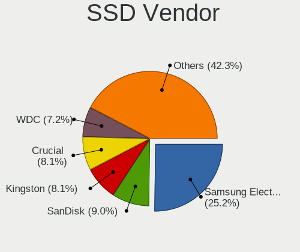
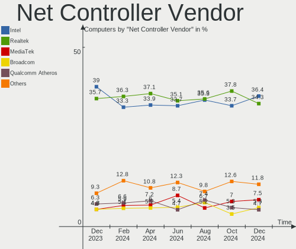
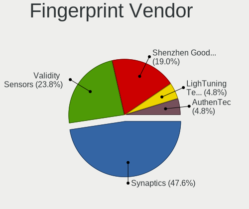

Pop!_OS Hardware Trends
-----------------------

A project to identify most popular hardware characteristics and track their change
over time based on data collected by Pop!_OS users at https://Linux-Hardware.org.

Anyone can contribute to the study by uploading probes of their computers by
the [hw-probe](https://github.com/linuxhw/hw-probe) tool:

    sudo -E hw-probe -all -upload

This is a report for all computer types. See also reports for [desktops](/Dist/Pop!_OS/Desktop/README.md) and [notebooks](/Dist/Pop!_OS/Notebook/README.md).

Full-feature report is available here: https://linux-hardware.org/?view=trends

Period: Dec, 2020.

Contents
--------

- [ OS                       ](#os)
- [ OS Family                ](#os-family)
- [ Kernel                   ](#kernel)
- [ Kernel Family            ](#kernel-family)
- [ Kernel Major Ver.        ](#kernel-major-ver)
- [ Arch                     ](#arch)
- [ DE                       ](#de)
- [ Display Server           ](#display-server)
- [ Display Manager          ](#display-manager)
- [ OS Lang                  ](#os-lang)
- [ Boot Mode                ](#boot-mode)
- [ Filesystem               ](#filesystem)
- [ Part. scheme             ](#part-scheme)
- [ Dual Boot with Linux/BSD ](#dual-boot-with-linux/bsd)
- [ Dual Boot (Win)          ](#dual-boot-win)
- [ Country                  ](#country)
- [ City                     ](#city)
- [ Vendor                   ](#vendor)
- [ Model                    ](#model)
- [ Model Family             ](#model-family)
- [ MFG Year                 ](#mfg-year)
- [ Form Factor              ](#form-factor)
- [ Secure Boot              ](#secure-boot)
- [ Coreboot                 ](#coreboot)
- [ RAM Size                 ](#ram-size)
- [ RAM Used                 ](#ram-used)
- [ Has CD-ROM               ](#has-cd-rom)
- [ Total Drives             ](#total-drives)
- [ Has Ethernet             ](#has-ethernet)
- [ Drive Vendor             ](#drive-vendor)
- [ Drive Model              ](#drive-model)
- [ HDD Vendor               ](#hdd-vendor)
- [ SSD Vendor               ](#ssd-vendor)
- [ Drive Kind               ](#drive-kind)
- [ Drive Connector          ](#drive-connector)
- [ Drive Size               ](#drive-size)
- [ Space Total              ](#space-total)
- [ Space Used               ](#space-used)
- [ Malfunc. Drives          ](#malfunc-drives)
- [ Malfunc. Drive Vendor    ](#malfunc-drive-vendor)
- [ Malfunc. HDD Vendor      ](#malfunc-hdd-vendor)
- [ Malfunc. Drive Kind      ](#malfunc-drive-kind)
- [ Failed Drives            ](#failed-drives)
- [ Failed Drive Vendor      ](#failed-drive-vendor)
- [ Drive Status             ](#drive-status)
- [ Storage Vendor           ](#storage-vendor)
- [ Storage Model            ](#storage-model)
- [ Storage Kind             ](#storage-kind)
- [ CPU Vendor               ](#cpu-vendor)
- [ CPU Model                ](#cpu-model)
- [ CPU Model Family         ](#cpu-model-family)
- [ CPU Cores                ](#cpu-cores)
- [ CPU Sockets              ](#cpu-sockets)
- [ CPU Threads              ](#cpu-threads)
- [ CPU Op-Modes             ](#cpu-op-modes)
- [ CPU Microcode            ](#cpu-microcode)
- [ CPU Microarch            ](#cpu-microarch)
- [ GPU Vendor               ](#gpu-vendor)
- [ GPU Model                ](#gpu-model)
- [ GPU Combo                ](#gpu-combo)
- [ GPU Driver               ](#gpu-driver)
- [ GPU Memory               ](#gpu-memory)
- [ Monitor Vendor           ](#monitor-vendor)
- [ Monitor Model            ](#monitor-model)
- [ Monitor Resolution       ](#monitor-resolution)
- [ Monitor Diagonal         ](#monitor-diagonal)
- [ Monitor Width            ](#monitor-width)
- [ Aspect Ratio             ](#aspect-ratio)
- [ Monitor Area             ](#monitor-area)
- [ Pixel Density            ](#pixel-density)
- [ Multiple Monitors        ](#multiple-monitors)
- [ Net Controller Vendor    ](#net-controller-vendor)
- [ Net Controller Model     ](#net-controller-model)
- [ Wireless Vendor          ](#wireless-vendor)
- [ Wireless Model           ](#wireless-model)
- [ Ethernet Vendor          ](#ethernet-vendor)
- [ Ethernet Model           ](#ethernet-model)
- [ Net Controller Kind      ](#net-controller-kind)
- [ Used Controller          ](#used-controller)
- [ NICs                     ](#nics)
- [ Memory Vendor            ](#memory-vendor)
- [ Memory Model             ](#memory-model)
- [ Memory Kind              ](#memory-kind)
- [ Memory Form Factor       ](#memory-form-factor)
- [ Memory Size              ](#memory-size)
- [ Memory Speed             ](#memory-speed)
- [ Sound Vendor             ](#sound-vendor)
- [ Sound Model              ](#sound-model)
- [ Camera Vendor            ](#camera-vendor)
- [ Camera Model             ](#camera-model)
- [ Fingerprint Vendor       ](#fingerprint-vendor)
- [ Fingerprint Model        ](#fingerprint-model)
- [ Chipcard Vendor          ](#chipcard-vendor)
- [ Chipcard Model           ](#chipcard-model)
- [ Printer Vendor           ](#printer-vendor)
- [ Printer Model            ](#printer-model)
- [ Scanner Vendor           ](#scanner-vendor)
- [ Scanner Model            ](#scanner-model)
- [ Bluetooth Vendor         ](#bluetooth-vendor)
- [ Bluetooth Model          ](#bluetooth-model)
- [ Unsupported Devices      ](#unsupported-devices)
- [ Unsupported Device Types ](#unsupported-device-types)

OS
--

Installed operating systems

| Name          | Computers | Percent |
|---------------|-----------|---------|
| Pop!_OS 20.10 | 233       | 73.5%   |
| Pop!_OS 20.04 | 83        | 26.18%  |
| Pop!_OS 18.04 | 1         | 0.32%   |

OS Family
---------

OS without a version

| Name    | Computers | Percent |
|---------|-----------|---------|
| Pop!_OS | 317       | 100%    |

Kernel
------

Version of the Linux kernel

| Version               | Computers | Percent |
|-----------------------|-----------|---------|
| 5.8.0-7630-generic    | 290       | 91.48%  |
| 5.4.0-7642-generic    | 8         | 2.52%   |
| 5.8.0-7625-generic    | 6         | 1.89%   |
| 5.9.12-xanmod1        | 2         | 0.63%   |
| 5.9.8-xanmod1         | 1         | 0.32%   |
| 5.9.16-050916-generic | 1         | 0.32%   |
| 5.9.14-xanmod1        | 1         | 0.32%   |
| 5.9.13-xanmod2        | 1         | 0.32%   |
| 5.9.10-050910-generic | 1         | 0.32%   |
| 5.8.11-050811-generic | 1         | 0.32%   |
| 5.4.0-7634-generic    | 1         | 0.32%   |
| 5.4.0-7625-generic    | 1         | 0.32%   |
| 5.3.0-7648-generic    | 1         | 0.32%   |
| 5.10.3-051003-generic | 1         | 0.32%   |
| 5.10.0-rc4+           | 1         | 0.32%   |

Kernel Family
-------------

Linux kernel without a distro release

| Version | Computers | Percent |
|---------|-----------|---------|
| 5.8.0   | 296       | 93.38%  |
| 5.4.0   | 10        | 3.15%   |
| 5.9.12  | 2         | 0.63%   |
| 5.9.8   | 1         | 0.32%   |
| 5.9.16  | 1         | 0.32%   |
| 5.9.14  | 1         | 0.32%   |
| 5.9.13  | 1         | 0.32%   |
| 5.9.10  | 1         | 0.32%   |
| 5.8.11  | 1         | 0.32%   |
| 5.3.0   | 1         | 0.32%   |
| 5.10.3  | 1         | 0.32%   |
| 5.10.0  | 1         | 0.32%   |

Kernel Major Ver.
-----------------

Linux kernel major version

| Version | Computers | Percent |
|---------|-----------|---------|
| 5.8     | 297       | 93.69%  |
| 5.4     | 10        | 3.15%   |
| 5.9     | 7         | 2.21%   |
| 5.10    | 2         | 0.63%   |
| 5.3     | 1         | 0.32%   |

Arch
----

OS architecture (x86_64, i586, etc.)

| Name   | Computers | Percent |
|--------|-----------|---------|
| x86_64 | 317       | 100%    |

DE
--

Desktop Environment

| Name  | Computers | Percent |
|-------|-----------|---------|
| GNOME | 311       | 98.11%  |
| KDE   | 4         | 1.26%   |
| MATE  | 2         | 0.63%   |

Display Server
--------------

X11 or Wayland

| Name    | Computers | Percent |
|---------|-----------|---------|
| X11     | 307       | 96.85%  |
| Wayland | 10        | 3.15%   |

Display Manager
---------------

SDDM, LightDM, etc.

| Name    | Computers | Percent |
|---------|-----------|---------|
| Unknown | 271       | 85.49%  |
| GDM     | 46        | 14.51%  |

OS Lang
-------

Language

| Lang  | Computers | Percent |
|-------|-----------|---------|
| en_US | 187       | 58.99%  |
| en_GB | 29        | 9.15%   |
| de_DE | 25        | 7.89%   |
| pt_BR | 21        | 6.62%   |
| C     | 12        | 3.79%   |
| it_IT | 7         | 2.21%   |
| en_CA | 7         | 2.21%   |
| fr_FR | 5         | 1.58%   |
| es_ES | 4         | 1.26%   |
| nl_NL | 3         | 0.95%   |
| en_AU | 3         | 0.95%   |
| sv_SE | 2         | 0.63%   |
| pl_PL | 2         | 0.63%   |
| nb_NO | 2         | 0.63%   |
| hu_HU | 2         | 0.63%   |
| sk_SK | 1         | 0.32%   |
| ru_RU | 1         | 0.32%   |
| pt_PT | 1         | 0.32%   |
| nl_BE | 1         | 0.32%   |
| hr_HR | 1         | 0.32%   |
| fr_CA | 1         | 0.32%   |

Boot Mode
---------

EFI or BIOS

| Mode | Computers | Percent |
|------|-----------|---------|
| BIOS | 272       | 85.8%   |
| EFI  | 45        | 14.2%   |

Filesystem
----------

Type of filesystem

| Type    | Computers | Percent |
|---------|-----------|---------|
| Ext4    | 299       | 94.32%  |
| Btrfs   | 8         | 2.52%   |
| Overlay | 7         | 2.21%   |
| Xfs     | 2         | 0.63%   |
| Zfs     | 1         | 0.32%   |

Part. scheme
------------

Scheme of partitioning

| Type    | Computers | Percent |
|---------|-----------|---------|
| Unknown | 272       | 85.8%   |
| GPT     | 42        | 13.25%  |
| MBR     | 3         | 0.95%   |

Dual Boot with Linux/BSD
------------------------

Hosting more than one Linux/BSD

| Dual boot | Computers | Percent |
|-----------|-----------|---------|
| No        | 309       | 97.48%  |
| Yes       | 8         | 2.52%   |

Dual Boot (Win)
---------------

Hosting Linux and Windows

| Dual boot | Computers | Percent |
|-----------|-----------|---------|
| No        | 299       | 94.32%  |
| Yes       | 18        | 5.68%   |

Country
-------

Geographic location (country)

| Country                | Computers | Percent |
|------------------------|-----------|---------|
| USA                    | 99        | 31.23%  |
| Germany                | 36        | 11.36%  |
| Brazil                 | 29        | 9.15%   |
| UK                     | 22        | 6.94%   |
| Canada                 | 15        | 4.73%   |
| Italy                  | 11        | 3.47%   |
| India                  | 10        | 3.15%   |
| Netherlands            | 9         | 2.84%   |
| Sweden                 | 5         | 1.58%   |
| Spain                  | 5         | 1.58%   |
| Poland                 | 5         | 1.58%   |
| France                 | 5         | 1.58%   |
| Argentina              | 5         | 1.58%   |
| Hungary                | 4         | 1.26%   |
| Austria                | 4         | 1.26%   |
| South Africa           | 3         | 0.95%   |
| Egypt                  | 3         | 0.95%   |
| Australia              | 3         | 0.95%   |
| Singapore              | 2         | 0.63%   |
| Portugal               | 2         | 0.63%   |
| Pakistan               | 2         | 0.63%   |
| Norway                 | 2         | 0.63%   |
| New Zealand            | 2         | 0.63%   |
| Latvia                 | 2         | 0.63%   |
| Japan                  | 2         | 0.63%   |
| Finland                | 2         | 0.63%   |
| Denmark                | 2         | 0.63%   |
| Bosnia and Herzegovina | 2         | 0.63%   |
| Ukraine                | 1         | 0.32%   |
| Thailand               | 1         | 0.32%   |
| Switzerland            | 1         | 0.32%   |
| Slovenia               | 1         | 0.32%   |
| Slovakia               | 1         | 0.32%   |
| Serbia                 | 1         | 0.32%   |
| Russia                 | 1         | 0.32%   |
| Romania                | 1         | 0.32%   |
| Philippines            | 1         | 0.32%   |
| Nepal                  | 1         | 0.32%   |
| Mexico                 | 1         | 0.32%   |
| Malaysia               | 1         | 0.32%   |
| Lithuania              | 1         | 0.32%   |
| Kosovo                 | 1         | 0.32%   |
| Israel                 | 1         | 0.32%   |
| Indonesia              | 1         | 0.32%   |
| Iceland                | 1         | 0.32%   |
| Estonia                | 1         | 0.32%   |
| Dominican Republic     | 1         | 0.32%   |
| Croatia                | 1         | 0.32%   |
| Costa Rica             | 1         | 0.32%   |
| Bulgaria               | 1         | 0.32%   |
| Belgium                | 1         | 0.32%   |
| Algeria                | 1         | 0.32%   |

City
----

Geographic location (city)

| City           | Computers | Percent |
|----------------|-----------|---------|
| Vienna         | 5         | 1.58%   |
| São Paulo     | 4         | 1.26%   |
| Untereisesheim | 3         | 0.95%   |
| New York       | 3         | 0.95%   |
| Fresno         | 3         | 0.95%   |
| Buenos Aires   | 3         | 0.95%   |
| Budapest       | 3         | 0.95%   |
| Tucson         | 2         | 0.63%   |
| Sydney         | 2         | 0.63%   |
| Stroud         | 2         | 0.63%   |
| Sheffield      | 2         | 0.63%   |
| Seattle        | 2         | 0.63%   |
| Rome           | 2         | 0.63%   |
| Riga           | 2         | 0.63%   |
| Palermo        | 2         | 0.63%   |
| New Ipswich    | 2         | 0.63%   |
| Munich         | 2         | 0.63%   |
| Mount Holly    | 2         | 0.63%   |
| Miami          | 2         | 0.63%   |
| Melbourne      | 2         | 0.63%   |
| Madrid         | 2         | 0.63%   |
| London         | 2         | 0.63%   |
| Jundiaí       | 2         | 0.63%   |
| Helsinki       | 2         | 0.63%   |
| Goiânia       | 2         | 0.63%   |
| Egg Harbor     | 2         | 0.63%   |
| Cologne        | 2         | 0.63%   |
| Chicago        | 2         | 0.63%   |
| Chennai        | 2         | 0.63%   |
| Brasília      | 2         | 0.63%   |
| Berlin         | 2         | 0.63%   |
| Bengaluru      | 2         | 0.63%   |
| Austin         | 2         | 0.63%   |
| Amsterdam      | 2         | 0.63%   |
| Almere Stad    | 2         | 0.63%   |
| Zhashkiv       | 1         | 0.32%   |
| Wylie          | 1         | 0.32%   |
| Wrocław       | 1         | 0.32%   |
| Woodridge      | 1         | 0.32%   |
| Woodland       | 1         | 0.32%   |
| Wolverhampton  | 1         | 0.32%   |
| Wilmette       | 1         | 0.32%   |
| Wieszowa       | 1         | 0.32%   |
| Wiesbach       | 1         | 0.32%   |
| Westlake       | 1         | 0.32%   |
| Wellington     | 1         | 0.32%   |
| Warner Robins  | 1         | 0.32%   |
| Vilnius        | 1         | 0.32%   |
| Varginha       | 1         | 0.32%   |
| Varberg        | 1         | 0.32%   |
| Vancouver      | 1         | 0.32%   |
| Valpiana       | 1         | 0.32%   |
| Uberlândia    | 1         | 0.32%   |
| Tønsberg      | 1         | 0.32%   |
| Twin Falls     | 1         | 0.32%   |
| Troy           | 1         | 0.32%   |
| Trowbridge     | 1         | 0.32%   |
| Trani          | 1         | 0.32%   |
| Toronto        | 1         | 0.32%   |
| Titusville     | 1         | 0.32%   |

Vendor
------

Motherboard manufacturer

| Name                | Computers | Percent |
|---------------------|-----------|---------|
| Lenovo              | 47        | 14.83%  |
| Dell                | 46        | 14.51%  |
| ASUSTek Computer    | 46        | 14.51%  |
| MSI                 | 32        | 10.09%  |
| Hewlett-Packard     | 29        | 9.15%   |
| Gigabyte Technology | 28        | 8.83%   |
| Acer                | 15        | 4.73%   |
| ASRock              | 10        | 3.15%   |
| Apple               | 10        | 3.15%   |
| System76            | 7         | 2.21%   |
| Unknown             | 4         | 1.26%   |
| Positivo            | 3         | 0.95%   |
| Notebook            | 3         | 0.95%   |
| Intel               | 3         | 0.95%   |
| Acidanthera         | 3         | 0.95%   |
| Toshiba             | 2         | 0.63%   |
| Sony                | 2         | 0.63%   |
| Samsung Electronics | 2         | 0.63%   |
| Microsoft           | 2         | 0.63%   |
| HUAWEI              | 2         | 0.63%   |
| Fujitsu             | 2         | 0.63%   |
| Biostar             | 2         | 0.63%   |
| Timi                | 1         | 0.32%   |
| Supermicro          | 1         | 0.32%   |
| Quanta              | 1         | 0.32%   |
| Pegatron            | 1         | 0.32%   |
| PCWare              | 1         | 0.32%   |
| PC Specialist       | 1         | 0.32%   |
| Packard Bell        | 1         | 0.32%   |
| Medion              | 1         | 0.32%   |
| LG Electronics      | 1         | 0.32%   |
| HOUTER              | 1         | 0.32%   |
| HASEE Computer      | 1         | 0.32%   |
| GPU Company         | 1         | 0.32%   |
| GMK                 | 1         | 0.32%   |
| Gateway             | 1         | 0.32%   |
| EUROCOM             | 1         | 0.32%   |
| Eluktronics         | 1         | 0.32%   |
| AVITA               | 1         | 0.32%   |

Model
-----

Motherboard model

| Name                                       | Computers | Percent |
|--------------------------------------------|-----------|---------|
| Unknown                                    | 5         | 1.58%   |
| Dell XPS 15 7590                           | 4         | 1.26%   |
| ASUS All Series                            | 4         | 1.26%   |
| MSI MS-7B86                                | 3         | 0.95%   |
| Lenovo ThinkPad T480 20L5CTO1WW            | 3         | 0.95%   |
| Gigabyte B450M DS3H                        | 3         | 0.95%   |
| ASUS TUF GAMING X570-PLUS                  | 3         | 0.95%   |
| Positivo Mobile                            | 2         | 0.63%   |
| MSI MS-7693                                | 2         | 0.63%   |
| Lenovo IdeaPad Slim 1-11AST-05 81VR        | 2         | 0.63%   |
| HP Pavilion Laptop 15-cw1xxx               | 2         | 0.63%   |
| HP Desktop M01-F0xxx                       | 2         | 0.63%   |
| HP Compaq Presario CQ60                    | 2         | 0.63%   |
| Gigabyte H110M-H                           | 2         | 0.63%   |
| Gigabyte GA-78LMT-USB3                     | 2         | 0.63%   |
| Gigabyte A320M-S2H                         | 2         | 0.63%   |
| Dell XPS 17 9700                           | 2         | 0.63%   |
| Dell Vostro 3550                           | 2         | 0.63%   |
| ASRock B450M Steel Legend                  | 2         | 0.63%   |
| ASRock B450M Pro4                          | 2         | 0.63%   |
| Apple MacBookPro8,1                        | 2         | 0.63%   |
| Acidanthera iMacPro1,1                     | 2         | 0.63%   |
| Toshiba Satellite Pro R50-B                | 1         | 0.32%   |
| Toshiba Satellite L50-B                    | 1         | 0.32%   |
| Timi TM1701                                | 1         | 0.32%   |
| System76 Thelio Major                      | 1         | 0.32%   |
| System76 Thelio                            | 1         | 0.32%   |
| System76 Lemur Pro                         | 1         | 0.32%   |
| System76 Lemur                             | 1         | 0.32%   |
| System76 Gazelle                           | 1         | 0.32%   |
| System76 Galago Pro                        | 1         | 0.32%   |
| System76 Darter Pro                        | 1         | 0.32%   |
| Supermicro X10SRA-F                        | 1         | 0.32%   |
| Sony VPCEH32FX                             | 1         | 0.32%   |
| Sony SVD1121Q2EB                           | 1         | 0.32%   |
| Samsung 940Z5L                             | 1         | 0.32%   |
| Samsung 300E4A/300E5A/300E7A/3430EA/3530EA | 1         | 0.32%   |
| Quanta TW8/SW8/DW8                         | 1         | 0.32%   |
| Positivo I3464A                            | 1         | 0.32%   |
| Pegatron p6-2100z                          | 1         | 0.32%   |
| PCWare IPMH61R3                            | 1         | 0.32%   |
| PC Specialist NP50DE_DB                    | 1         | 0.32%   |
| Packard Bell EasyNote TM86                 | 1         | 0.32%   |
| Notebook X170SM                            | 1         | 0.32%   |
| Notebook P95_96_97Ex,Rx                    | 1         | 0.32%   |
| Notebook N9x0TD_TF                         | 1         | 0.32%   |
| MSI WF65 10TH                              | 1         | 0.32%   |
| MSI PS63 Modern 8RC                        | 1         | 0.32%   |
| MSI MS-7C95                                | 1         | 0.32%   |
| MSI MS-7C91                                | 1         | 0.32%   |
| MSI MS-7C84                                | 1         | 0.32%   |
| MSI MS-7C02                                | 1         | 0.32%   |
| MSI MS-7B93                                | 1         | 0.32%   |
| MSI MS-7B85                                | 1         | 0.32%   |
| MSI MS-7B84                                | 1         | 0.32%   |
| MSI MS-7B79                                | 1         | 0.32%   |
| MSI MS-7B23                                | 1         | 0.32%   |
| MSI MS-7B17                                | 1         | 0.32%   |
| MSI MS-7B09                                | 1         | 0.32%   |
| MSI MS-7A71                                | 1         | 0.32%   |

Model Family
------------

Motherboard model prefix

| Name                   | Computers | Percent |
|------------------------|-----------|---------|
| Lenovo ThinkPad        | 21        | 6.62%   |
| Dell Inspiron          | 16        | 5.05%   |
| Lenovo IdeaPad         | 14        | 4.42%   |
| Dell XPS               | 9         | 2.84%   |
| Dell Latitude          | 8         | 2.52%   |
| Acer Aspire            | 8         | 2.52%   |
| ASUS TUF               | 7         | 2.21%   |
| ASUS PRIME             | 7         | 2.21%   |
| HP Compaq              | 5         | 1.58%   |
| Unknown                | 5         | 1.58%   |
| HP EliteBook           | 4         | 1.26%   |
| Dell Precision         | 4         | 1.26%   |
| ASUS ROG               | 4         | 1.26%   |
| ASUS All               | 4         | 1.26%   |
| ASRock B450M           | 4         | 1.26%   |
| MSI MS-7B86            | 3         | 0.95%   |
| Lenovo MIIX            | 3         | 0.95%   |
| HP ProBook             | 3         | 0.95%   |
| HP Pavilion            | 3         | 0.95%   |
| Gigabyte GA-78LMT-USB3 | 3         | 0.95%   |
| Gigabyte B450M         | 3         | 0.95%   |
| Dell Vostro            | 3         | 0.95%   |
| Dell OptiPlex          | 3         | 0.95%   |
| Acer Nitro             | 3         | 0.95%   |
| Toshiba Satellite      | 2         | 0.63%   |
| System76 Thelio        | 2         | 0.63%   |
| System76 Lemur         | 2         | 0.63%   |
| Positivo MOBILE        | 2         | 0.63%   |
| MSI MS-7693            | 2         | 0.63%   |
| MSI GL63               | 2         | 0.63%   |
| Microsoft Surface      | 2         | 0.63%   |
| Lenovo ThinkCentre     | 2         | 0.63%   |
| HP Desktop             | 2         | 0.63%   |
| Gigabyte H110M-H       | 2         | 0.63%   |
| Gigabyte A320M-S2H     | 2         | 0.63%   |
| Fujitsu LIFEBOOK       | 2         | 0.63%   |
| Dell Studio            | 2         | 0.63%   |
| ASUS ZenBook           | 2         | 0.63%   |
| ASUS VivoBook          | 2         | 0.63%   |
| ASUS P8H61-M           | 2         | 0.63%   |
| ASUS H110M-C           | 2         | 0.63%   |
| Apple MacBookPro8      | 2         | 0.63%   |
| Acidanthera iMacPro1   | 2         | 0.63%   |
| Acer Predator          | 2         | 0.63%   |
| Timi TM1701            | 1         | 0.32%   |
| System76 Gazelle       | 1         | 0.32%   |
| System76 Galago        | 1         | 0.32%   |
| System76 Darter        | 1         | 0.32%   |
| Supermicro X10SRA-F    | 1         | 0.32%   |
| Sony VPCEH32FX         | 1         | 0.32%   |
| Sony SVD1121Q2EB       | 1         | 0.32%   |
| Samsung 940Z5L         | 1         | 0.32%   |
| Samsung 300E4A         | 1         | 0.32%   |
| Quanta TW8             | 1         | 0.32%   |
| Positivo I3464A        | 1         | 0.32%   |
| Pegatron p6-2100z      | 1         | 0.32%   |
| PCWare IPMH61R3        | 1         | 0.32%   |
| PC Specialist NP50DE   | 1         | 0.32%   |
| Packard Bell EasyNote  | 1         | 0.32%   |
| Notebook X170SM        | 1         | 0.32%   |

MFG Year
--------

Motherboard manufacture year

| Year | Computers | Percent |
|------|-----------|---------|
| 2020 | 108       | 34.07%  |
| 2019 | 56        | 17.67%  |
| 2018 | 38        | 11.99%  |
| 2013 | 16        | 5.05%   |
| 2014 | 15        | 4.73%   |
| 2011 | 14        | 4.42%   |
| 2017 | 13        | 4.1%    |
| 2015 | 12        | 3.79%   |
| 2012 | 12        | 3.79%   |
| 2010 | 8         | 2.52%   |
| 2008 | 8         | 2.52%   |
| 2016 | 5         | 1.58%   |
| 2009 | 5         | 1.58%   |
| 2007 | 4         | 1.26%   |
| 2006 | 3         | 0.95%   |

Form Factor
-----------

Physical design of the computer

| Name        | Computers | Percent |
|-------------|-----------|---------|
| Notebook    | 165       | 52.05%  |
| Desktop     | 127       | 40.06%  |
| Tablet      | 8         | 2.52%   |
| All in one  | 6         | 1.89%   |
| Convertible | 5         | 1.58%   |
| Mini pc     | 3         | 0.95%   |
| Server      | 2         | 0.63%   |
| Stick pc    | 1         | 0.32%   |

Secure Boot
-----------

Enabled or disabled

| State    | Computers | Percent |
|----------|-----------|---------|
| Disabled | 317       | 100%    |

Coreboot
--------

Have coreboot on board

| Used | Computers | Percent |
|------|-----------|---------|
| No   | 315       | 99.37%  |
| Yes  | 2         | 0.63%   |

RAM Size
--------

Total RAM memory

| Size in GB  | Computers | Percent |
|-------------|-----------|---------|
| 16.01-24.0  | 79        | 24.92%  |
| 8.01-16.0   | 60        | 18.93%  |
| 4.01-8.0    | 52        | 16.4%   |
| 32.01-64.0  | 48        | 15.14%  |
| 3.01-4.0    | 44        | 13.88%  |
| 64.01-256.0 | 19        | 5.99%   |
| 1.01-2.0    | 7         | 2.21%   |
| 24.01-32.0  | 5         | 1.58%   |
| 2.01-3.0    | 3         | 0.95%   |

RAM Used
--------

Used RAM memory

| Used GB    | Computers | Percent |
|------------|-----------|---------|
| 1.01-2.0   | 108       | 34.07%  |
| 2.01-3.0   | 99        | 31.23%  |
| 3.01-4.0   | 50        | 15.77%  |
| 4.01-8.0   | 48        | 15.14%  |
| 8.01-16.0  | 9         | 2.84%   |
| 16.01-24.0 | 2         | 0.63%   |
| 0.51-1.0   | 1         | 0.32%   |

Has CD-ROM
----------

Has CD-ROM on board

| Presented | Computers | Percent |
|-----------|-----------|---------|
| No        | 215       | 67.82%  |
| Yes       | 102       | 32.18%  |

Total Drives
------------

Number of drives on board

| Drives | Computers | Percent |
|--------|-----------|---------|
| 1      | 161       | 50.79%  |
| 2      | 102       | 32.18%  |
| 3      | 26        | 8.2%    |
| 4      | 13        | 4.1%    |
| 5      | 9         | 2.84%   |
| 0      | 2         | 0.63%   |
| 9      | 1         | 0.32%   |
| 8      | 1         | 0.32%   |
| 7      | 1         | 0.32%   |
| 6      | 1         | 0.32%   |

Has Ethernet
------------

Has Ethernet on board

| Presented | Computers | Percent |
|-----------|-----------|---------|
| Yes       | 277       | 87.38%  |
| No        | 40        | 12.62%  |

Drive Vendor
------------

Hard drive vendors

| Vendor                    | Computers | Drives | Percent |
|---------------------------|-----------|--------|---------|
| Samsung Electronics       | 83        | 103    | 16.8%   |
| WDC                       | 76        | 93     | 15.38%  |
| Seagate                   | 62        | 76     | 12.55%  |
| SanDisk                   | 37        | 39     | 7.49%   |
| Kingston                  | 37        | 40     | 7.49%   |
| Toshiba                   | 25        | 26     | 5.06%   |
| Unknown                   | 23        | 26     | 4.66%   |
| Intel                     | 20        | 21     | 4.05%   |
| Crucial                   | 18        | 18     | 3.64%   |
| Phison                    | 13        | 14     | 2.63%   |
| Hitachi                   | 13        | 13     | 2.63%   |
| SK Hynix                  | 10        | 11     | 2.02%   |
| HGST                      | 9         | 10     | 1.82%   |
| Silicon Motion            | 7         | 7      | 1.42%   |
| A-DATA Technology         | 5         | 6      | 1.01%   |
| PNY                       | 4         | 4      | 0.81%   |
| Micron/Crucial Technology | 4         | 5      | 0.81%   |
| XPG                       | 3         | 3      | 0.61%   |
| Union Memory (Shenzhen)   | 3         | 3      | 0.61%   |
| SPCC                      | 3         | 5      | 0.61%   |
| Patriot                   | 3         | 3      | 0.61%   |
| JMicron                   | 3         | 3      | 0.61%   |
| China                     | 3         | 3      | 0.61%   |
| Apple                     | 3         | 4      | 0.61%   |
| Transcend                 | 2         | 2      | 0.4%    |
| Team                      | 2         | 2      | 0.4%    |
| OCZ                       | 2         | 2      | 0.4%    |
| Micron Technology         | 2         | 2      | 0.4%    |
| LITEON                    | 2         | 2      | 0.4%    |
| SWORDBILL                 | 1         | 1      | 0.2%    |
| SATAFIRM                  | 1         | 1      | 0.2%    |
| SABRENT                   | 1         | 1      | 0.2%    |
| Newer_Te                  | 1         | 1      | 0.2%    |
| MAXTOR                    | 1         | 1      | 0.2%    |
| Lexar                     | 1         | 1      | 0.2%    |
| KingSpec                  | 1         | 1      | 0.2%    |
| JASTER                    | 1         | 1      | 0.2%    |
| Intenso                   | 1         | 1      | 0.2%    |
| INTEL SS                  | 1         | 1      | 0.2%    |
| Hoodisk                   | 1         | 1      | 0.2%    |
| Fujitsu                   | 1         | 1      | 0.2%    |
| ExcelStor                 | 1         | 1      | 0.2%    |
| dogfish                   | 1         | 1      | 0.2%    |
| AMD                       | 1         | 2      | 0.2%    |
| AFOX                      | 1         | 1      | 0.2%    |
| ADATA Technology          | 1         | 1      | 0.2%    |

Drive Model
-----------

Hard drive models

| Model                                        | Computers | Percent |
|----------------------------------------------|-----------|---------|
| Samsung NVMe SSD Drive 500GB                 | 11        | 2.07%   |
| Kingston SA400S37240G 240GB SSD              | 11        | 2.07%   |
| Samsung NVMe SSD Drive 512GB                 | 9         | 1.69%   |
| WDC WD10EZEX-08WN4A0 1TB                     | 8         | 1.5%    |
| Samsung SSD 860 EVO 500GB                    | 8         | 1.5%    |
| Samsung SSD 850 EVO 500GB                    | 8         | 1.5%    |
| Samsung NVMe SSD Drive 250GB                 | 7         | 1.32%   |
| Unknown MMC Card  64GB                       | 6         | 1.13%   |
| SK Hynix NVMe SSD Drive 256GB                | 6         | 1.13%   |
| Sandisk NVMe SSD Drive 500GB                 | 6         | 1.13%   |
| Samsung NVMe SSD Drive 256GB                 | 5         | 0.94%   |
| Samsung NVMe SSD Drive 1TB                   | 5         | 0.94%   |
| Intel NVMe SSD Drive 1024GB                  | 5         | 0.94%   |
| Toshiba MQ01ABD100 1TB                       | 4         | 0.75%   |
| Seagate ST1000LM048-2E7172 1TB               | 4         | 0.75%   |
| Seagate ST1000DM010-2EP102 1TB               | 4         | 0.75%   |
| Sandisk NVMe SSD Drive 1TB                   | 4         | 0.75%   |
| Samsung SSD 860 EVO 1TB                      | 4         | 0.75%   |
| Samsung SSD 840 EVO 250GB                    | 4         | 0.75%   |
| Phison NVMe SSD Drive 256GB                  | 4         | 0.75%   |
| Kingston SA400S37480G 480GB SSD              | 4         | 0.75%   |
| Kingston SA400S37120G 120GB SSD              | 4         | 0.75%   |
| Kingston NVMe SSD Drive 512GB                | 4         | 0.75%   |
| Intel NVMe SSD Drive 512GB                   | 4         | 0.75%   |
| WDC WD10SPZX-24Z10 1TB                       | 3         | 0.56%   |
| WDC WD10EZEX-08M2NA0 1TB                     | 3         | 0.56%   |
| WDC WD10EZEX-00BN5A0 1TB                     | 3         | 0.56%   |
| Unknown MMC Card  32GB                       | 3         | 0.56%   |
| Union Memory (Shenzhen) NVMe SSD Drive 256GB | 3         | 0.56%   |
| SPCC Solid State Disk 256GB                  | 3         | 0.56%   |
| Silicon Motion NVMe SSD Drive 1024GB         | 3         | 0.56%   |
| Seagate ST500DM002-1BD142 500GB              | 3         | 0.56%   |
| Seagate ST2000DM008-2FR102 2TB               | 3         | 0.56%   |
| Seagate ST2000DM006-2DM164 2TB               | 3         | 0.56%   |
| Seagate ST1000LM049-2GH172 1TB               | 3         | 0.56%   |
| Sandisk NVMe SSD Drive 512GB                 | 3         | 0.56%   |
| Phison NVMe SSD Drive 1TB                    | 3         | 0.56%   |
| Phison NVMe SSD Drive 1024GB                 | 3         | 0.56%   |
| Micron/Crucial NVMe SSD Drive 1TB            | 3         | 0.56%   |
| Kingston SV300S37A120G 120GB SSD             | 3         | 0.56%   |
| HGST HTS721010A9E630 1TB                     | 3         | 0.56%   |
| Crucial CT250MX500SSD1 250GB                 | 3         | 0.56%   |
| XPG NVMe SSD Drive 1024GB                    | 2         | 0.38%   |
| WDC WDS240G2G0B-00EPW0 240GB SSD             | 2         | 0.38%   |
| WDC WDS240G2G0A-00JH30 240GB SSD             | 2         | 0.38%   |
| WDC WD20EZAZ-00GGJB0 2TB                     | 2         | 0.38%   |
| WDC WD10JPVX-22JC3T0 1TB                     | 2         | 0.38%   |
| Unknown SD/MMC/MS PRO 128GB                  | 2         | 0.38%   |
| Unknown MMC Card  16GB                       | 2         | 0.38%   |
| Unknown MMC Card  128GB                      | 2         | 0.38%   |
| Toshiba NVMe SSD Drive 512GB                 | 2         | 0.38%   |
| Toshiba NVMe SSD Drive 256GB                 | 2         | 0.38%   |
| Toshiba DT01ACA300 3TB                       | 2         | 0.38%   |
| Silicon Motion NVMe SSD Drive 512GB          | 2         | 0.38%   |
| Seagate ST8000DM004-2CX188 8TB               | 2         | 0.38%   |
| Seagate ST500LT012-9WS142 500GB              | 2         | 0.38%   |
| Seagate ST4000DM004-2CV104 4TB               | 2         | 0.38%   |
| Seagate ST1000LM035-1RK172 1TB               | 2         | 0.38%   |
| Seagate ST1000LM024 HN-M101MBB 1TB           | 2         | 0.38%   |
| Seagate BUP Slim SL 1TB                      | 2         | 0.38%   |

HDD Vendor
----------

Hard disk drive vendors

| Vendor              | Computers | Drives | Percent |
|---------------------|-----------|--------|---------|
| WDC                 | 63        | 76     | 37.06%  |
| Seagate             | 56        | 65     | 32.94%  |
| Toshiba             | 15        | 15     | 8.82%   |
| Hitachi             | 13        | 13     | 7.65%   |
| Samsung Electronics | 9         | 9      | 5.29%   |
| HGST                | 9         | 10     | 5.29%   |
| Apple               | 2         | 3      | 1.18%   |
| MAXTOR              | 1         | 1      | 0.59%   |
| Fujitsu             | 1         | 1      | 0.59%   |
| ExcelStor           | 1         | 1      | 0.59%   |

SSD Vendor
----------

Solid state drive vendors

| Vendor              | Computers | Drives | Percent |
|---------------------|-----------|--------|---------|
| Samsung Electronics | 35        | 43     | 22.44%  |
| Kingston            | 29        | 32     | 18.59%  |
| SanDisk             | 20        | 21     | 12.82%  |
| Crucial             | 16        | 16     | 10.26%  |
| WDC                 | 10        | 10     | 6.41%   |
| Intel               | 5         | 5      | 3.21%   |
| Toshiba             | 4         | 4      | 2.56%   |
| PNY                 | 4         | 4      | 2.56%   |
| SPCC                | 3         | 5      | 1.92%   |
| Patriot             | 3         | 3      | 1.92%   |
| China               | 3         | 3      | 1.92%   |
| A-DATA Technology   | 3         | 4      | 1.92%   |
| Transcend           | 2         | 2      | 1.28%   |
| Team                | 2         | 2      | 1.28%   |
| OCZ                 | 2         | 2      | 1.28%   |
| Micron Technology   | 2         | 2      | 1.28%   |
| LITEON              | 2         | 2      | 1.28%   |
| JMicron             | 2         | 2      | 1.28%   |
| Unknown             | 1         | 1      | 0.64%   |
| Seagate             | 1         | 4      | 0.64%   |
| SABRENT             | 1         | 1      | 0.64%   |
| Lexar               | 1         | 1      | 0.64%   |
| INTEL SS            | 1         | 1      | 0.64%   |
| Hoodisk             | 1         | 1      | 0.64%   |
| dogfish             | 1         | 1      | 0.64%   |
| Apple               | 1         | 1      | 0.64%   |
| AFOX                | 1         | 1      | 0.64%   |

Drive Kind
----------

HDD or SSD

| Kind    | Computers | Drives | Percent |
|---------|-----------|--------|---------|
| HDD     | 146       | 194    | 33.26%  |
| SSD     | 133       | 174    | 30.3%   |
| NVMe    | 127       | 157    | 28.93%  |
| Unknown | 19        | 22     | 4.33%   |
| MMC     | 14        | 17     | 3.19%   |

Drive Connector
---------------

SATA, SAS, NVMe, etc.

| Type | Computers | Drives | Percent |
|------|-----------|--------|---------|
| SATA | 232       | 369    | 59.34%  |
| NVMe | 127       | 157    | 32.48%  |
| SAS  | 18        | 21     | 4.6%    |
| MMC  | 14        | 17     | 3.58%   |

Drive Size
----------

Size of hard drive

| Size in TB | Computers | Drives | Percent |
|------------|-----------|--------|---------|
| 0.01-0.5   | 157       | 201    | 52.86%  |
| 0.51-1.0   | 98        | 113    | 33%     |
| 1.01-2.0   | 25        | 30     | 8.42%   |
| 3.01-4.0   | 7         | 9      | 2.36%   |
| 4.01-10.0  | 6         | 10     | 2.02%   |
| 2.01-3.0   | 4         | 5      | 1.35%   |

Space Total
-----------

Amount of disk space available on the file system

| Size in GB     | Computers | Percent |
|----------------|-----------|---------|
| 101-250        | 100       | 31.55%  |
| 251-500        | 63        | 19.87%  |
| 501-1000       | 57        | 17.98%  |
| 1001-2000      | 34        | 10.73%  |
| 51-100         | 18        | 5.68%   |
| More than 3000 | 15        | 4.73%   |
| 21-50          | 11        | 3.47%   |
| 1-20           | 10        | 3.15%   |
| 2001-3000      | 8         | 2.52%   |
| Unknown        | 1         | 0.32%   |

Space Used
----------

Amount of used disk space

| Used GB        | Computers | Percent |
|----------------|-----------|---------|
| 1-20           | 146       | 46.06%  |
| 21-50          | 48        | 15.14%  |
| 101-250        | 42        | 13.25%  |
| 51-100         | 30        | 9.46%   |
| 251-500        | 18        | 5.68%   |
| 501-1000       | 15        | 4.73%   |
| More than 3000 | 6         | 1.89%   |
| 1001-2000      | 6         | 1.89%   |
| 2001-3000      | 5         | 1.58%   |
| Unknown        | 1         | 0.32%   |

Malfunc. Drives
---------------

Drive models with a malfunction

| Model                            | Computers | Drives | Percent |
|----------------------------------|-----------|--------|---------|
| WDC WD6400AAKS-22A7B2 640GB      | 1         | 1      | 20%     |
| Seagate ST500DM002-1BD142 500GB  | 1         | 1      | 20%     |
| Seagate ST1000LM048-2E7172 1TB   | 1         | 1      | 20%     |
| Kingston SV300S37A120G 120GB SSD | 1         | 1      | 20%     |
| Crucial CT1000P1SSD8 1TB         | 1         | 1      | 20%     |

Malfunc. Drive Vendor
---------------------

Vendors of faulty drives

| Vendor   | Computers | Drives | Percent |
|----------|-----------|--------|---------|
| Seagate  | 2         | 2      | 40%     |
| WDC      | 1         | 1      | 20%     |
| Kingston | 1         | 1      | 20%     |
| Crucial  | 1         | 1      | 20%     |

Malfunc. HDD Vendor
-------------------

Vendors of faulty HDD drives

| Vendor  | Computers | Drives | Percent |
|---------|-----------|--------|---------|
| Seagate | 2         | 2      | 66.67%  |
| WDC     | 1         | 1      | 33.33%  |

Malfunc. Drive Kind
-------------------

Kinds of faulty drives

| Kind | Computers | Drives | Percent |
|------|-----------|--------|---------|
| HDD  | 3         | 3      | 60%     |
| NVMe | 1         | 1      | 20%     |
| SSD  | 1         | 1      | 20%     |

Failed Drives
-------------

Failed drive models

Zero info for selected period =(

Failed Drive Vendor
-------------------

Failed drive vendors

Zero info for selected period =(

Drive Status
------------

Number of failed and malfunc. drives

| Status   | Computers | Drives | Percent |
|----------|-----------|--------|---------|
| Detected | 273       | 499    | 84.52%  |
| Works    | 45        | 60     | 13.93%  |
| Malfunc  | 5         | 5      | 1.55%   |

Storage Vendor
--------------

Storage controller vendors

| Vendor                           | Computers | Percent |
|----------------------------------|-----------|---------|
| Intel                            | 202       | 46.54%  |
| AMD                              | 85        | 19.59%  |
| Samsung Electronics              | 43        | 9.91%   |
| Sandisk                          | 21        | 4.84%   |
| Phison Electronics               | 13        | 3%      |
| SK Hynix                         | 10        | 2.3%    |
| Kingston Technology Company      | 8         | 1.84%   |
| ASMedia Technology               | 8         | 1.84%   |
| Silicon Motion                   | 7         | 1.61%   |
| Toshiba America Info Systems     | 6         | 1.38%   |
| Micron/Crucial Technology        | 6         | 1.38%   |
| ADATA Technology                 | 5         | 1.15%   |
| Union Memory (Shenzhen)          | 3         | 0.69%   |
| Nvidia                           | 3         | 0.69%   |
| Marvell Technology Group         | 3         | 0.69%   |
| Broadcom / LSI                   | 2         | 0.46%   |
| VIA Technologies                 | 1         | 0.23%   |
| Solid State Storage Technology   | 1         | 0.23%   |
| Silicon Integrated Systems [SiS] | 1         | 0.23%   |
| Seagate Technology               | 1         | 0.23%   |
| Realtek Semiconductor            | 1         | 0.23%   |
| OCZ Technology Group             | 1         | 0.23%   |
| LSI Logic / Symbios Logic        | 1         | 0.23%   |
| JMicron Technology               | 1         | 0.23%   |
| Hewlett-Packard                  | 1         | 0.23%   |

Storage Model
-------------

Storage controller models

| Model                                                                          | Computers | Percent |
|--------------------------------------------------------------------------------|-----------|---------|
| AMD FCH SATA Controller [AHCI mode]                                            | 66        | 12.94%  |
| Samsung NVMe SSD Controller SM981/PM981/PM983                                  | 30        | 5.88%   |
| AMD 400 Series Chipset SATA Controller                                         | 21        | 4.12%   |
| Intel Cannon Lake Mobile PCH SATA AHCI Controller                              | 17        | 3.33%   |
| Intel Sunrise Point-LP SATA Controller [AHCI mode]                             | 12        | 2.35%   |
| Intel 8 Series/C220 Series Chipset Family 6-port SATA Controller 1 [AHCI mode] | 12        | 2.35%   |
| Intel 7 Series Chipset Family 6-port SATA Controller [AHCI mode]               | 12        | 2.35%   |
| Intel 6 Series/C200 Series Chipset Family 6 port Mobile SATA AHCI Controller   | 12        | 2.35%   |
| Sandisk WD Blue SN550 NVMe SSD                                                 | 9         | 1.76%   |
| Intel Q170/Q150/B150/H170/H110/Z170/CM236 Chipset SATA Controller [AHCI Mode]  | 9         | 1.76%   |
| Intel 8 Series SATA Controller 1 [AHCI mode]                                   | 9         | 1.76%   |
| Intel SATA Controller [RAID mode]                                              | 8         | 1.57%   |
| Intel 82801 Mobile SATA Controller [RAID mode]                                 | 8         | 1.57%   |
| Intel 200 Series PCH SATA controller [AHCI mode]                               | 8         | 1.57%   |
| ASMedia ASM1062 Serial ATA Controller                                          | 8         | 1.57%   |
| Samsung NVMe SSD Controller SM961/PM961/SM963                                  | 7         | 1.37%   |
| Intel SSD 660P Series                                                          | 7         | 1.37%   |
| AMD SB7x0/SB8x0/SB9x0 SATA Controller [AHCI mode]                              | 7         | 1.37%   |
| Samsung Electronics Non-Volatile memory controller                             | 6         | 1.18%   |
| Phison E12 NVMe Controller                                                     | 6         | 1.18%   |
| Intel Cannon Point-LP SATA Controller [AHCI Mode]                              | 6         | 1.18%   |
| Intel Cannon Lake PCH SATA AHCI Controller                                     | 6         | 1.18%   |
| Intel 6 Series/C200 Series Chipset Family 6 port Desktop SATA AHCI Controller  | 6         | 1.18%   |
| Intel 400 Series Chipset Family SATA AHCI Controller                           | 6         | 1.18%   |
| AMD SB7x0/SB8x0/SB9x0 IDE Controller                                           | 6         | 1.18%   |
| AMD SATA controller                                                            | 6         | 1.18%   |
| SK Hynix BC501 NVMe Solid State Drive 512GB                                    | 5         | 0.98%   |
| Silicon Motion SM2263EN/SM2263XT SSD Controller                                | 5         | 0.98%   |
| Intel Wildcat Point-LP SATA Controller [AHCI Mode]                             | 5         | 0.98%   |
| Intel 82801HM/HEM (ICH8M/ICH8M-E) SATA Controller [AHCI mode]                  | 5         | 0.98%   |
| Intel 82801G (ICH7 Family) IDE Controller                                      | 5         | 0.98%   |
| AMD FCH SATA Controller D                                                      | 5         | 0.98%   |
| Sandisk WD Blue SN500 / PC SN520 NVMe SSD                                      | 4         | 0.78%   |
| Kingston Company A2000 NVMe SSD                                                | 4         | 0.78%   |
| Intel Comet Lake SATA AHCI Controller                                          | 4         | 0.78%   |
| Intel 82801IBM/IEM (ICH9M/ICH9M-E) 4 port SATA Controller [AHCI mode]          | 4         | 0.78%   |
| Intel 82801HM/HEM (ICH8M/ICH8M-E) IDE Controller                               | 4         | 0.78%   |
| Intel 5 Series/3400 Series Chipset 6 port SATA AHCI Controller                 | 4         | 0.78%   |
| AMD SB7x0/SB8x0/SB9x0 SATA Controller [IDE mode]                               | 4         | 0.78%   |
| Toshiba America Info Systems BG3 NVMe SSD Controller                           | 3         | 0.59%   |
| SK Hynix Non-Volatile memory controller                                        | 3         | 0.59%   |
| Sandisk WD Black SN750 / PC SN730 NVMe SSD                                     | 3         | 0.59%   |
| Phison PS5013 E13 NVMe Controller                                              | 3         | 0.59%   |
| Micron/Crucial P1 NVMe PCIe SSD                                                | 3         | 0.59%   |
| Micron/Crucial Non-Volatile memory controller                                  | 3         | 0.59%   |
| Intel SSD Pro 7600p/760p/E 6100p Series                                        | 3         | 0.59%   |
| Intel SSD 600P Series                                                          | 3         | 0.59%   |
| Intel NM10/ICH7 Family SATA Controller [IDE mode]                              | 3         | 0.59%   |
| Intel HM170/QM170 Chipset SATA Controller [AHCI Mode]                          | 3         | 0.59%   |
| Intel C610/X99 series chipset sSATA Controller [AHCI mode]                     | 3         | 0.59%   |
| Intel C610/X99 series chipset 6-Port SATA Controller [AHCI mode]               | 3         | 0.59%   |
| Intel C600/X79 series chipset 6-Port SATA AHCI Controller                      | 3         | 0.59%   |
| Intel 7 Series/C210 Series Chipset Family 6-port SATA Controller [AHCI mode]   | 3         | 0.59%   |
| Intel 5 Series/3400 Series Chipset 4 port SATA AHCI Controller                 | 3         | 0.59%   |
| ADATA XPG SX8200 Pro PCIe Gen3x4 M.2 2280 Solid State Drive                    | 3         | 0.59%   |
| Union Memory (Shenzhen) Non-Volatile memory controller                         | 2         | 0.39%   |
| Toshiba America Info Systems XG6 NVMe SSD Controller                           | 2         | 0.39%   |
| Silicon Motion SM2262/SM2262EN SSD Controller                                  | 2         | 0.39%   |
| Sandisk WD Black 2018 / PC SN720 NVMe SSD                                      | 2         | 0.39%   |
| Sandisk PC SN520 NVMe SSD                                                      | 2         | 0.39%   |

Storage Kind
------------

Kind of storage controller (IDE, SATA, NVMe, SAS, ...)

| Kind | Computers | Percent |
|------|-----------|---------|
| SATA | 248       | 57.14%  |
| NVMe | 126       | 29.03%  |
| IDE  | 35        | 8.06%   |
| RAID | 22        | 5.07%   |
| SAS  | 2         | 0.46%   |
| SCSI | 1         | 0.23%   |

CPU Vendor
----------

Processor vendors

| Vendor | Computers | Percent |
|--------|-----------|---------|
| Intel  | 224       | 70.66%  |
| AMD    | 93        | 29.34%  |

CPU Model
---------

Processor models

| Model                                         | Computers | Percent |
|-----------------------------------------------|-----------|---------|
| Intel Core i7-8565U CPU @ 1.80GHz             | 7         | 2.21%   |
| AMD Ryzen 5 3600 6-Core Processor             | 7         | 2.21%   |
| Intel Core i7-9750H CPU @ 2.60GHz             | 6         | 1.89%   |
| Intel Core i7-8750H CPU @ 2.20GHz             | 6         | 1.89%   |
| AMD Ryzen 7 3700X 8-Core Processor            | 5         | 1.58%   |
| AMD Ryzen 5 3500U with Radeon Vega Mobile Gfx | 5         | 1.58%   |
| Intel Core i9-9980HK CPU @ 2.40GHz            | 4         | 1.26%   |
| Intel Core i5-8265U CPU @ 1.60GHz             | 4         | 1.26%   |
| Intel Core i5-2520M CPU @ 2.50GHz             | 4         | 1.26%   |
| Intel Atom x5-Z8350 CPU @ 1.44GHz             | 4         | 1.26%   |
| AMD Ryzen 5 3400G with Radeon Vega Graphics   | 4         | 1.26%   |
| AMD Ryzen 5 2600 Six-Core Processor           | 4         | 1.26%   |
| AMD A6-9220e RADEON R4, 5 COMPUTE CORES 2C+3G | 4         | 1.26%   |
| Intel Core i7-8650U CPU @ 1.90GHz             | 3         | 0.95%   |
| Intel Core i7-7700K CPU @ 4.20GHz             | 3         | 0.95%   |
| Intel Core i7-4790 CPU @ 3.60GHz              | 3         | 0.95%   |
| Intel Core i7-10750H CPU @ 2.60GHz            | 3         | 0.95%   |
| Intel Core i7-10510U CPU @ 1.80GHz            | 3         | 0.95%   |
| Intel Core i5-7200U CPU @ 2.50GHz             | 3         | 0.95%   |
| Intel Core i5-2410M CPU @ 2.30GHz             | 3         | 0.95%   |
| AMD Ryzen 9 3900X 12-Core Processor           | 3         | 0.95%   |
| AMD Ryzen 7 4800H with Radeon Graphics        | 3         | 0.95%   |
| AMD Ryzen 5 4500U with Radeon Graphics        | 3         | 0.95%   |
| AMD Ryzen 5 3600X 6-Core Processor            | 3         | 0.95%   |
| AMD Ryzen 3 3200G with Radeon Vega Graphics   | 3         | 0.95%   |
| Intel Xeon CPU E5-2690 0 @ 2.90GHz            | 2         | 0.63%   |
| Intel Pentium CPU G4560 @ 3.50GHz             | 2         | 0.63%   |
| Intel Core i9-10885H CPU @ 2.40GHz            | 2         | 0.63%   |
| Intel Core i7-8700K CPU @ 3.70GHz             | 2         | 0.63%   |
| Intel Core i7-8550U CPU @ 1.80GHz             | 2         | 0.63%   |
| Intel Core i7-7700 CPU @ 3.60GHz              | 2         | 0.63%   |
| Intel Core i7-7500U CPU @ 2.70GHz             | 2         | 0.63%   |
| Intel Core i7-4770K CPU @ 3.50GHz             | 2         | 0.63%   |
| Intel Core i7-4510U CPU @ 2.00GHz             | 2         | 0.63%   |
| Intel Core i7-3770K CPU @ 3.50GHz             | 2         | 0.63%   |
| Intel Core i7-2600 CPU @ 3.40GHz              | 2         | 0.63%   |
| Intel Core i7 CPU 920 @ 2.67GHz               | 2         | 0.63%   |
| Intel Core i5-9300H CPU @ 2.40GHz             | 2         | 0.63%   |
| Intel Core i5-8300H CPU @ 2.30GHz             | 2         | 0.63%   |
| Intel Core i5-8250U CPU @ 1.60GHz             | 2         | 0.63%   |
| Intel Core i5-6300U CPU @ 2.40GHz             | 2         | 0.63%   |
| Intel Core i5-4590 CPU @ 3.30GHz              | 2         | 0.63%   |
| Intel Core i5-4300U CPU @ 1.90GHz             | 2         | 0.63%   |
| Intel Core i5-3230M CPU @ 2.60GHz             | 2         | 0.63%   |
| Intel Core i5-10210U CPU @ 1.60GHz            | 2         | 0.63%   |
| Intel Core i5 CPU M 520 @ 2.40GHz             | 2         | 0.63%   |
| Intel Core i3-7020U CPU @ 2.30GHz             | 2         | 0.63%   |
| Intel Core i3-4130 CPU @ 3.40GHz              | 2         | 0.63%   |
| Intel Core i3-4005U CPU @ 1.70GHz             | 2         | 0.63%   |
| Intel Core i3-3110M CPU @ 2.40GHz             | 2         | 0.63%   |
| Intel Core i3-2120 CPU @ 3.30GHz              | 2         | 0.63%   |
| Intel Core i3-2100 CPU @ 3.10GHz              | 2         | 0.63%   |
| Intel Core 2 CPU T7200 @ 2.00GHz              | 2         | 0.63%   |
| AMD Ryzen 5 3550H with Radeon Vega Mobile Gfx | 2         | 0.63%   |
| AMD Ryzen 5 2600X Six-Core Processor          | 2         | 0.63%   |
| AMD Ryzen 3 3100 4-Core Processor             | 2         | 0.63%   |
| AMD FX-8350 Eight-Core Processor              | 2         | 0.63%   |
| AMD FX-6300 Six-Core Processor                | 2         | 0.63%   |
| Intel Xeon CPU X5482 @ 3.20GHz                | 1         | 0.32%   |
| Intel Xeon CPU E5-2680 0 @ 2.70GHz            | 1         | 0.32%   |

CPU Model Family
----------------

Processor model prefix

| Model                   | Computers | Percent |
|-------------------------|-----------|---------|
| Intel Core i7           | 79        | 24.92%  |
| Intel Core i5           | 70        | 22.08%  |
| AMD Ryzen 5             | 34        | 10.73%  |
| Intel Core i3           | 22        | 6.94%   |
| AMD Ryzen 7             | 14        | 4.42%   |
| Intel Core i9           | 11        | 3.47%   |
| AMD Ryzen 3             | 9         | 2.84%   |
| Intel Core 2 Duo        | 8         | 2.52%   |
| AMD FX                  | 7         | 2.21%   |
| AMD A6                  | 6         | 1.89%   |
| Intel Xeon              | 5         | 1.58%   |
| Intel Core 2            | 5         | 1.58%   |
| Intel Celeron           | 4         | 1.26%   |
| Intel Atom              | 4         | 1.26%   |
| AMD Ryzen Threadripper  | 4         | 1.26%   |
| AMD Ryzen 9             | 4         | 1.26%   |
| Other                   | 3         | 0.95%   |
| Intel Pentium           | 3         | 0.95%   |
| AMD A4                  | 3         | 0.95%   |
| Intel Pentium Dual-Core | 2         | 0.63%   |
| Intel Pentium Dual      | 2         | 0.63%   |
| Intel Genuine           | 2         | 0.63%   |
| Intel Core 2 Quad       | 2         | 0.63%   |
| AMD A8                  | 2         | 0.63%   |
| Intel Pentium Silver    | 1         | 0.32%   |
| Intel Pentium 4         | 1         | 0.32%   |
| Intel Core m5           | 1         | 0.32%   |
| AMD Turion 64 X2 Mobile | 1         | 0.32%   |
| AMD Ryzen 7 PRO         | 1         | 0.32%   |
| AMD Ryzen 5 PRO         | 1         | 0.32%   |
| AMD Phenom II X4        | 1         | 0.32%   |
| AMD Phenom              | 1         | 0.32%   |
| AMD E1                  | 1         | 0.32%   |
| AMD E                   | 1         | 0.32%   |
| AMD Athlon 64 X2        | 1         | 0.32%   |
| AMD Athlon              | 1         | 0.32%   |

CPU Cores
---------

Number of processor cores

| Number | Computers | Percent |
|--------|-----------|---------|
| 4      | 116       | 36.59%  |
| 2      | 103       | 32.49%  |
| 6      | 50        | 15.77%  |
| 8      | 25        | 7.89%   |
| 12     | 5         | 1.58%   |
| 1      | 4         | 1.26%   |
| 16     | 3         | 0.95%   |
| 3      | 3         | 0.95%   |
| 32     | 2         | 0.63%   |
| 24     | 2         | 0.63%   |
| 14     | 2         | 0.63%   |
| 10     | 2         | 0.63%   |

CPU Sockets
-----------

Number of sockets

| Number | Computers | Percent |
|--------|-----------|---------|
| 1      | 313       | 98.74%  |
| 2      | 4         | 1.26%   |

CPU Threads
-----------

Threads per core (Hyper-Threading)

| Number | Computers | Percent |
|--------|-----------|---------|
| 2      | 241       | 76.03%  |
| 1      | 76        | 23.97%  |

CPU Op-Modes
------------

CPU Operation Modes (32-bit, 64-bit)

| Op mode        | Computers | Percent |
|----------------|-----------|---------|
| 32-bit, 64-bit | 317       | 100%    |

CPU Microcode
-------------

Microcode number

| Number     | Computers | Percent |
|------------|-----------|---------|
| Unknown    | 261       | 82.33%  |
| 0x806e9    | 6         | 1.89%   |
| 0x906ea    | 4         | 1.26%   |
| 0x08108102 | 4         | 1.26%   |
| 0x08701021 | 3         | 0.95%   |
| 0x906e9    | 2         | 0.63%   |
| 0x806ec    | 2         | 0.63%   |
| 0x806eb    | 2         | 0.63%   |
| 0x706e5    | 2         | 0.63%   |
| 0x506e3    | 2         | 0.63%   |
| 0x40651    | 2         | 0.63%   |
| 0x306c3    | 2         | 0.63%   |
| 0x206a7    | 2         | 0.63%   |
| 0x08600106 | 2         | 0.63%   |
| 0x0800820d | 2         | 0.63%   |
| 0x07000110 | 2         | 0.63%   |
| 0x06006705 | 2         | 0.63%   |
| 0xa0652    | 1         | 0.32%   |
| 0x906ed    | 1         | 0.32%   |
| 0x906eb    | 1         | 0.32%   |
| 0x806ea    | 1         | 0.32%   |
| 0x806c1    | 1         | 0.32%   |
| 0x406e3    | 1         | 0.32%   |
| 0x406c4    | 1         | 0.32%   |
| 0x306d4    | 1         | 0.32%   |
| 0x1067a    | 1         | 0.32%   |
| 0x08701013 | 1         | 0.32%   |
| 0x08108109 | 1         | 0.32%   |
| 0x07030104 | 1         | 0.32%   |
| 0x06000852 | 1         | 0.32%   |
| 0x05000119 | 1         | 0.32%   |
| 0x010000c8 | 1         | 0.32%   |

CPU Microarch
-------------

Microarchitecture

| Name            | Computers | Percent |
|-----------------|-----------|---------|
| KabyLake        | 83        | 26.18%  |
| Zen 2           | 33        | 10.41%  |
| Haswell         | 26        | 8.2%    |
| SandyBridge     | 25        | 7.89%   |
| Zen+            | 24        | 7.57%   |
| IvyBridge       | 18        | 5.68%   |
| Core            | 12        | 3.79%   |
| Skylake         | 10        | 3.15%   |
| Penryn          | 10        | 3.15%   |
| CometLake       | 10        | 3.15%   |
| Zen             | 8         | 2.52%   |
| Piledriver      | 8         | 2.52%   |
| Westmere        | 6         | 1.89%   |
| Excavator       | 6         | 1.89%   |
| Broadwell       | 6         | 1.89%   |
| Silvermont      | 5         | 1.58%   |
| Nehalem         | 4         | 1.26%   |
| IceLake         | 3         | 0.95%   |
| TigerLake       | 2         | 0.63%   |
| Puma            | 2         | 0.63%   |
| K8 Hammer       | 2         | 0.63%   |
| K10             | 2         | 0.63%   |
| Jaguar          | 2         | 0.63%   |
| Goldmont plus   | 2         | 0.63%   |
| Bulldozer       | 2         | 0.63%   |
| Unknown         | 2         | 0.63%   |
| NetBurst        | 1         | 0.32%   |
| K8 & K10 hybrid | 1         | 0.32%   |
| Goldmont        | 1         | 0.32%   |
| Bobcat          | 1         | 0.32%   |

GPU Vendor
----------

Vendors of graphics cards

| Vendor                           | Computers | Percent |
|----------------------------------|-----------|---------|
| Intel                            | 152       | 39.79%  |
| Nvidia                           | 139       | 36.39%  |
| AMD                              | 89        | 23.3%   |
| Silicon Integrated Systems [SiS] | 1         | 0.26%   |
| ASPEED Technology                | 1         | 0.26%   |

GPU Model
---------

Graphics card models

| Model                                                                                    | Computers | Percent |
|------------------------------------------------------------------------------------------|-----------|---------|
| Intel UHD Graphics 630 (Mobile)                                                          | 18        | 4.6%    |
| Intel 2nd Generation Core Processor Family Integrated Graphics Controller                | 18        | 4.6%    |
| AMD Picasso                                                                              | 15        | 3.84%   |
| AMD Ellesmere [Radeon RX 470/480/570/570X/580/580X/590]                                  | 13        | 3.32%   |
| Intel UHD Graphics 620 (Whiskey Lake)                                                    | 12        | 3.07%   |
| Intel UHD Graphics                                                                       | 11        | 2.81%   |
| Intel 3rd Gen Core processor Graphics Controller                                         | 11        | 2.81%   |
| AMD Renoir                                                                               | 10        | 2.56%   |
| Intel HD Graphics 620                                                                    | 9         | 2.3%    |
| Intel Haswell-ULT Integrated Graphics Controller                                         | 9         | 2.3%    |
| Nvidia GP107 [GeForce GTX 1050 Ti]                                                       | 8         | 2.05%   |
| Intel UHD Graphics 620                                                                   | 8         | 2.05%   |
| Nvidia TU117M [GeForce GTX 1650 Mobile / Max-Q]                                          | 6         | 1.53%   |
| Nvidia GP108M [GeForce MX150]                                                            | 6         | 1.53%   |
| AMD Stoney [Radeon R2/R3/R4/R5 Graphics]                                                 | 6         | 1.53%   |
| AMD Navi 10 [Radeon RX 5600 OEM/5600 XT / 5700/5700 XT]                                  | 6         | 1.53%   |
| Nvidia TU106M [GeForce RTX 2060 Mobile]                                                  | 5         | 1.28%   |
| Nvidia GP106 [GeForce GTX 1060 6GB]                                                      | 5         | 1.28%   |
| Nvidia GP107M [GeForce GTX 1050 Ti Mobile]                                               | 4         | 1.02%   |
| Nvidia GM107 [GeForce GTX 750 Ti]                                                        | 4         | 1.02%   |
| Intel Xeon E3-1200 v3/4th Gen Core Processor Integrated Graphics Controller              | 4         | 1.02%   |
| Intel UHD Graphics 630 (Desktop)                                                         | 4         | 1.02%   |
| Intel Mobile 4 Series Chipset Integrated Graphics Controller                             | 4         | 1.02%   |
| Intel HD Graphics 630                                                                    | 4         | 1.02%   |
| Intel HD Graphics 5500                                                                   | 4         | 1.02%   |
| Intel Atom/Celeron/Pentium Processor x5-E8000/J3xxx/N3xxx Integrated Graphics Controller | 4         | 1.02%   |
| Nvidia TU116M [GeForce GTX 1660 Ti Mobile]                                               | 3         | 0.77%   |
| Nvidia GP108 [GeForce GT 1030]                                                           | 3         | 0.77%   |
| Nvidia GP107M [GeForce GTX 1050 Mobile]                                                  | 3         | 0.77%   |
| Nvidia GP106 [GeForce GTX 1060 3GB]                                                      | 3         | 0.77%   |
| Nvidia GP104 [GeForce GTX 1070 Ti]                                                       | 3         | 0.77%   |
| Intel Skylake GT2 [HD Graphics 520]                                                      | 3         | 0.77%   |
| Intel Mobile GM965/GL960 Integrated Graphics Controller (secondary)                      | 3         | 0.77%   |
| Intel Mobile GM965/GL960 Integrated Graphics Controller (primary)                        | 3         | 0.77%   |
| Intel Core Processor Integrated Graphics Controller                                      | 3         | 0.77%   |
| AMD Baffin [Radeon RX 460/560D / Pro 450/455/460/555/555X/560/560X]                      | 3         | 0.77%   |
| Nvidia TU117M [GeForce GTX 1650 Ti Mobile]                                               | 2         | 0.51%   |
| Nvidia TU117M                                                                            | 2         | 0.51%   |
| Nvidia TU116 [GeForce GTX 1660 SUPER]                                                    | 2         | 0.51%   |
| Nvidia TU106M [GeForce RTX 2070 Mobile]                                                  | 2         | 0.51%   |
| Nvidia TU106 [GeForce RTX 2060 SUPER]                                                    | 2         | 0.51%   |
| Nvidia TU106 [GeForce RTX 2060 Rev. A]                                                   | 2         | 0.51%   |
| Nvidia TU104 [GeForce RTX 2080 SUPER]                                                    | 2         | 0.51%   |
| Nvidia GP108M [GeForce MX250]                                                            | 2         | 0.51%   |
| Nvidia GP104M [GeForce GTX 1070 Mobile]                                                  | 2         | 0.51%   |
| Nvidia GM206 [GeForce GTX 960]                                                           | 2         | 0.51%   |
| Nvidia GK208B [GeForce GT 730]                                                           | 2         | 0.51%   |
| Nvidia GK104 [GeForce GTX 770]                                                           | 2         | 0.51%   |
| Nvidia GF119 [GeForce GT 620 OEM]                                                        | 2         | 0.51%   |
| Nvidia GA104 [GeForce RTX 3070]                                                          | 2         | 0.51%   |
| Nvidia GA102 [GeForce RTX 3090]                                                          | 2         | 0.51%   |
| Intel UHD Graphics 605                                                                   | 2         | 0.51%   |
| Intel Iris Xe Graphics                                                                   | 2         | 0.51%   |
| Intel Iris Plus Graphics G1 (Ice Lake)                                                   | 2         | 0.51%   |
| Intel HD Graphics 530                                                                    | 2         | 0.51%   |
| Intel 4th Gen Core Processor Integrated Graphics Controller                              | 2         | 0.51%   |
| AMD Turks XT [Radeon HD 6670/7670]                                                       | 2         | 0.51%   |
| AMD Turks PRO [Radeon HD 6570/7570/8550]                                                 | 2         | 0.51%   |
| AMD Topaz XT [Radeon R7 M260/M265 / M340/M360 / M440/M445 / 530/535 / 620/625 Mobile]    | 2         | 0.51%   |
| AMD RV730 PRO [Radeon HD 4650]                                                           | 2         | 0.51%   |

GPU Combo
---------

Combinations of graphics cards

| Name            | Computers | Percent |
|-----------------|-----------|---------|
| 1 x Intel       | 96        | 30.28%  |
| 1 x Nvidia      | 85        | 26.81%  |
| 1 x AMD         | 69        | 21.77%  |
| Intel + Nvidia  | 44        | 13.88%  |
| Intel + AMD     | 8         | 2.52%   |
| AMD + Nvidia    | 7         | 2.21%   |
| 2 x AMD         | 5         | 1.58%   |
| 2 x Nvidia      | 1         | 0.32%   |
| 1 x SiS         | 1         | 0.32%   |
| Nvidia + ASPEED | 1         | 0.32%   |

GPU Driver
----------

Free vs proprietary

| Driver      | Computers | Percent |
|-------------|-----------|---------|
| Free        | 190       | 59.94%  |
| Proprietary | 112       | 35.33%  |
| Unknown     | 15        | 4.73%   |

GPU Memory
----------

Total video memory

| Size in GB | Computers | Percent |
|------------|-----------|---------|
| Unknown    | 202       | 63.72%  |
| 1.01-2.0   | 33        | 10.41%  |
| 3.01-4.0   | 27        | 8.52%   |
| 5.01-6.0   | 18        | 5.68%   |
| 7.01-8.0   | 16        | 5.05%   |
| 0.01-0.5   | 9         | 2.84%   |
| 2.01-3.0   | 4         | 1.26%   |
| 8.01-16.0  | 3         | 0.95%   |
| 0.51-1.0   | 3         | 0.95%   |
| 16.01-24.0 | 2         | 0.63%   |

Monitor Vendor
--------------

Monitor vendors

| Vendor                  | Computers | Percent |
|-------------------------|-----------|---------|
| Samsung Electronics     | 45        | 13.12%  |
| AU Optronics            | 41        | 11.95%  |
| LG Display              | 35        | 10.2%   |
| Goldstar                | 25        | 7.29%   |
| Chimei Innolux          | 23        | 6.71%   |
| Dell                    | 18        | 5.25%   |
| BOE                     | 18        | 5.25%   |
| Hewlett-Packard         | 17        | 4.96%   |
| Acer                    | 13        | 3.79%   |
| BenQ                    | 11        | 3.21%   |
| Philips                 | 8         | 2.33%   |
| Lenovo                  | 8         | 2.33%   |
| Apple                   | 8         | 2.33%   |
| AOC                     | 7         | 2.04%   |
| Sharp                   | 6         | 1.75%   |
| Ancor Communications    | 6         | 1.75%   |
| Sceptre Tech            | 5         | 1.46%   |
| PANDA                   | 5         | 1.46%   |
| Iiyama                  | 4         | 1.17%   |
| ViewSonic               | 3         | 0.87%   |
| LG Philips              | 3         | 0.87%   |
| Chi Mei Optoelectronics | 3         | 0.87%   |
| Vizio                   | 2         | 0.58%   |
| InfoVision              | 2         | 0.58%   |
| Daewoo                  | 2         | 0.58%   |
| ASUSTek Computer        | 2         | 0.58%   |
| Westinghouse            | 1         | 0.29%   |
| Unknown                 | 1         | 0.29%   |
| Toshiba                 | 1         | 0.29%   |
| Sony                    | 1         | 0.29%   |
| SGT                     | 1         | 0.29%   |
| RTK                     | 1         | 0.29%   |
| Plain Tree Systems      | 1         | 0.29%   |
| Panasonic               | 1         | 0.29%   |
| Packard Bell            | 1         | 0.29%   |
| OWC                     | 1         | 0.29%   |
| NTI                     | 1         | 0.29%   |
| Mi                      | 1         | 0.29%   |
| LPL                     | 1         | 0.29%   |
| LG Electronics          | 1         | 0.29%   |
| KJT                     | 1         | 0.29%   |
| JDI                     | 1         | 0.29%   |
| Insignia                | 1         | 0.29%   |
| InnoLux Display         | 1         | 0.29%   |
| HXV                     | 1         | 0.29%   |
| HKC                     | 1         | 0.29%   |
| Gateway                 | 1         | 0.29%   |
| Eizo                    | 1         | 0.29%   |
| CVT                     | 1         | 0.29%   |

Monitor Model
-------------

Monitor models

| Model                                                                     | Computers | Percent |
|---------------------------------------------------------------------------|-----------|---------|
| Goldstar Ultra HD GSM5B09 3840x2160 600x340mm 27.2-inch                   | 5         | 1.42%   |
| Sceptre Tech H32 SPT0CB8 1920x1080 575x323mm 26.0-inch                    | 3         | 0.85%   |
| Samsung Electronics Color LCD SDCA029 2160x1440 252x168mm 11.9-inch       | 3         | 0.85%   |
| AU Optronics LCD Monitor AUO82ED 1920x1080 344x194mm 15.5-inch            | 3         | 0.85%   |
| AU Optronics LCD Monitor AUO21ED 1920x1080 344x194mm 15.5-inch            | 3         | 0.85%   |
| Sharp LCD Monitor SHP14D7 1920x1200 366x229mm 17.0-inch                   | 2         | 0.57%   |
| Sceptre Tech E248W-1920 SPT099D 1920x1080 443x249mm 20.0-inch             | 2         | 0.57%   |
| Samsung Electronics S24D330 SAM0D92 1920x1080 531x299mm 24.0-inch         | 2         | 0.57%   |
| Samsung Electronics C24F390 SAM0D2C 1920x1080 520x290mm 23.4-inch         | 2         | 0.57%   |
| PANDA LCD Monitor NCP004D 1920x1080 344x194mm 15.5-inch                   | 2         | 0.57%   |
| PANDA LCD Monitor NCP0036 1920x1080 344x194mm 15.5-inch                   | 2         | 0.57%   |
| LG Display LCD Monitor LGD05E5 1920x1080 344x194mm 15.5-inch              | 2         | 0.57%   |
| LG Display LCD Monitor LGD02E3 1366x768 344x194mm 15.5-inch               | 2         | 0.57%   |
| LG Display LCD Monitor LGD02DC 1366x768 344x194mm 15.5-inch               | 2         | 0.57%   |
| Lenovo LEN G34w-10 LEN66A1 3440x1440 797x334mm 34.0-inch                  | 2         | 0.57%   |
| Hewlett-Packard w2408 HWP26CF 1920x1200 518x324mm 24.1-inch               | 2         | 0.57%   |
| Goldstar FULL HD GSM5B55 1920x1080 480x270mm 21.7-inch                    | 2         | 0.57%   |
| Dell P2317H DEL40F4 1920x1080 509x286mm 23.0-inch                         | 2         | 0.57%   |
| Chimei Innolux LCD Monitor CMN15F5 1920x1080 344x193mm 15.5-inch          | 2         | 0.57%   |
| Chimei Innolux LCD Monitor CMN15F4 1920x1080 344x193mm 15.5-inch          | 2         | 0.57%   |
| Chimei Innolux LCD Monitor CMN15DB 1366x768 344x193mm 15.5-inch           | 2         | 0.57%   |
| Chimei Innolux LCD Monitor CMN15D5 1920x1080 340x190mm 15.3-inch          | 2         | 0.57%   |
| Chimei Innolux LCD Monitor CMN14D6 1366x768 309x173mm 13.9-inch           | 2         | 0.57%   |
| Chimei Innolux LCD Monitor CMN14C9 1920x1080 309x173mm 13.9-inch          | 2         | 0.57%   |
| Chimei Innolux LCD Monitor CMN1132 1366x768 260x140mm 11.6-inch           | 2         | 0.57%   |
| Chi Mei Optoelectronics LCD Monitor CMO1720 1920x1080 382x215mm 17.3-inch | 2         | 0.57%   |
| AU Optronics LCD Monitor AUO81EC 1366x768 344x193mm 15.5-inch             | 2         | 0.57%   |
| AU Optronics LCD Monitor AUO61ED 1920x1080 340x190mm 15.3-inch            | 2         | 0.57%   |
| AU Optronics LCD Monitor AUO40EC 1366x768 340x190mm 15.3-inch             | 2         | 0.57%   |
| AU Optronics LCD Monitor AUO2E3C 1366x768 309x173mm 13.9-inch             | 2         | 0.57%   |
| AU Optronics LCD Monitor AUO22EC 1366x768 344x193mm 15.5-inch             | 2         | 0.57%   |
| AU Optronics LCD Monitor AUO133D 1920x1080 309x173mm 13.9-inch            | 2         | 0.57%   |
| Westinghouse EU24H1G1 WDT1D42 1366x768 1150x650mm 52.0-inch               | 1         | 0.28%   |
| Vizio VA220E VIZ0021 1920x540 640x360mm 28.9-inch                         | 1         | 0.28%   |
| Vizio D32f-F1 VIZ1027 1920x1080 698x392mm 31.5-inch                       | 1         | 0.28%   |
| ViewSonic XG2700 SERIES VSC0E32 3840x2160 597x336mm 27.0-inch             | 1         | 0.28%   |
| ViewSonic VA2855 SERIES VSCD62F 1920x1080 621x341mm 27.9-inch             | 1         | 0.28%   |
| ViewSonic Q22wb VSCDB1F 1680x1050 474x296mm 22.0-inch                     | 1         | 0.28%   |
| Unknown LCD Monitor TXD HDMI                                              | 1         | 0.28%   |
| Toshiba TV TSB0106 1280x720 1050x590mm 47.4-inch                          | 1         | 0.28%   |
| Sony TV SNY1A02 1920x1080 1600x900mm 72.3-inch                            | 1         | 0.28%   |
| Sharp LQ133M1JW40 SHP10CD 1920x1080 294x165mm 13.3-inch                   | 1         | 0.28%   |
| Sharp LCD Monitor SHP14BA 1920x1080 344x194mm 15.5-inch                   | 1         | 0.28%   |
| Sharp LCD Monitor SHP14B9 3840x2160 344x194mm 15.5-inch                   | 1         | 0.28%   |
| Sharp LCD Monitor SHP148D 3840x2160 344x194mm 15.5-inch                   | 1         | 0.28%   |
| SGT HDMI SGT2271 1920x1080 477x268mm 21.5-inch                            | 1         | 0.28%   |
| Samsung Electronics U28E590 SAM0C4E 3840x2160 608x345mm 27.5-inch         | 1         | 0.28%   |
| Samsung Electronics T27B300 SAM0931 1920x1080 598x336mm 27.0-inch         | 1         | 0.28%   |
| Samsung Electronics T19B300 SAM0928 1366x768 410x230mm 18.5-inch          | 1         | 0.28%   |
| Samsung Electronics SyncMaster SAM0582 1680x1050 480x270mm 21.7-inch      | 1         | 0.28%   |
| Samsung Electronics SyncMaster SAM034F 1440x900 428x255mm 19.6-inch       | 1         | 0.28%   |
| Samsung Electronics SyncMaster SAM010B 1280x1024 338x270mm 17.0-inch      | 1         | 0.28%   |
| Samsung Electronics SMS24A450 SAM083A 1920x1200 518x324mm 24.1-inch       | 1         | 0.28%   |
| Samsung Electronics SMS23A550H SAM07CA 1920x1080 510x290mm 23.1-inch      | 1         | 0.28%   |
| Samsung Electronics SMEX2220 SAM0686 1920x1080 477x268mm 21.5-inch        | 1         | 0.28%   |
| Samsung Electronics SMBX1931N SAM0768 1366x768 410x230mm 18.5-inch        | 1         | 0.28%   |
| Samsung Electronics S24D390 SAM0B65 1920x1080 520x290mm 23.4-inch         | 1         | 0.28%   |
| Samsung Electronics S24D332 SAM0F5E 1920x1080 531x299mm 24.0-inch         | 1         | 0.28%   |
| Samsung Electronics S22D300 SAM0B3F 1920x1080 477x268mm 21.5-inch         | 1         | 0.28%   |
| Samsung Electronics LCD Monitor U28D590                                   | 1         | 0.28%   |

Monitor Resolution
------------------

Monitor screen resolution

| Resolution         | Computers | Percent |
|--------------------|-----------|---------|
| 1920x1080 (FHD)    | 150       | 47.02%  |
| 1366x768 (WXGA)    | 57        | 17.87%  |
| 3840x2160 (4K)     | 33        | 10.34%  |
| 2560x1440 (QHD)    | 17        | 5.33%   |
| 1920x1200 (WUXGA)  | 8         | 2.51%   |
| 3440x1440          | 7         | 2.19%   |
| 1280x800 (WXGA)    | 7         | 2.19%   |
| 1440x900 (WXGA+)   | 6         | 1.88%   |
| 1680x1050 (WSXGA+) | 5         | 1.57%   |
| 1280x1024 (SXGA)   | 5         | 1.57%   |
| 1600x900 (HD+)     | 4         | 1.25%   |
| 1360x768           | 4         | 1.25%   |
| 1920x540           | 3         | 0.94%   |
| 1280x720 (HD)      | 2         | 0.63%   |
| Unknown            | 2         | 0.63%   |
| 8160x4627          | 1         | 0.31%   |
| 3840x1080          | 1         | 0.31%   |
| 3360x1080          | 1         | 0.31%   |
| 3200x1800 (QHD+)   | 1         | 0.31%   |
| 3000x2000          | 1         | 0.31%   |
| 2880x1800          | 1         | 0.31%   |
| 2736x1824          | 1         | 0.31%   |
| 2560x1080          | 1         | 0.31%   |
| 2160x1440          | 1         | 0.31%   |

Monitor Diagonal
----------------

Diagonal size in inches

| Inches  | Computers | Percent |
|---------|-----------|---------|
| 15      | 88        | 25.73%  |
| 27      | 32        | 9.36%   |
| 23      | 28        | 8.19%   |
| 14      | 26        | 7.6%    |
| 24      | 25        | 7.31%   |
| 13      | 24        | 7.02%   |
| 21      | 20        | 5.85%   |
| 31      | 15        | 4.39%   |
| 17      | 13        | 3.8%    |
| 18      | 9         | 2.63%   |
| 84      | 6         | 1.75%   |
| 34      | 6         | 1.75%   |
| 32      | 6         | 1.75%   |
| 12      | 6         | 1.75%   |
| 11      | 6         | 1.75%   |
| Unknown | 6         | 1.75%   |
| 19      | 4         | 1.17%   |
| 22      | 3         | 0.88%   |
| 35      | 2         | 0.58%   |
| 26      | 2         | 0.58%   |
| 20      | 2         | 0.58%   |
| 72      | 1         | 0.29%   |
| 65      | 1         | 0.29%   |
| 54      | 1         | 0.29%   |
| 52      | 1         | 0.29%   |
| 49      | 1         | 0.29%   |
| 47      | 1         | 0.29%   |
| 46      | 1         | 0.29%   |
| 41      | 1         | 0.29%   |
| 40      | 1         | 0.29%   |
| 38      | 1         | 0.29%   |
| 36      | 1         | 0.29%   |
| 25      | 1         | 0.29%   |
| 16      | 1         | 0.29%   |

Monitor Width
-------------

Physical width

| Width in mm | Computers | Percent |
|-------------|-----------|---------|
| 301-350     | 130       | 39.16%  |
| 501-600     | 76        | 22.89%  |
| 401-500     | 33        | 9.94%   |
| 201-300     | 21        | 6.33%   |
| 601-700     | 19        | 5.72%   |
| 351-400     | 17        | 5.12%   |
| 701-800     | 12        | 3.61%   |
| 1501-2000   | 7         | 2.11%   |
| 1001-1500   | 6         | 1.81%   |
| Unknown     | 6         | 1.81%   |
| 801-900     | 4         | 1.2%    |
| 901-1000    | 1         | 0.3%    |

Aspect Ratio
------------

Proportional relationship between the width and the height

| Ratio   | Computers | Percent |
|---------|-----------|---------|
| 16/9    | 245       | 84.48%  |
| 16/10   | 25        | 8.62%   |
| 21/9    | 8         | 2.76%   |
| 5/4     | 4         | 1.38%   |
| Unknown | 4         | 1.38%   |
| 3/2     | 2         | 0.69%   |
| 6/5     | 1         | 0.34%   |
| 32/9    | 1         | 0.34%   |

Monitor Area
------------

Area in inch²

| Area in inch² | Computers | Percent |
|----------------|-----------|---------|
| 101-110        | 86        | 25.83%  |
| 201-250        | 51        | 15.32%  |
| 81-90          | 45        | 13.51%  |
| 301-350        | 32        | 9.61%   |
| 351-500        | 28        | 8.41%   |
| 151-200        | 19        | 5.71%   |
| 121-130        | 12        | 3.6%    |
| More than 1000 | 10        | 3%      |
| 251-300        | 10        | 3%      |
| 141-150        | 7         | 2.1%    |
| 501-1000       | 7         | 2.1%    |
| 61-70          | 6         | 1.8%    |
| 51-60          | 6         | 1.8%    |
| Unknown        | 6         | 1.8%    |
| 71-80          | 5         | 1.5%    |
| 91-100         | 3         | 0.9%    |

Pixel Density
-------------

Pixels per inch

| Density       | Computers | Percent |
|---------------|-----------|---------|
| 51-100        | 101       | 30.61%  |
| 121-160       | 96        | 29.09%  |
| 101-120       | 87        | 26.36%  |
| 161-240       | 19        | 5.76%   |
| More than 240 | 11        | 3.33%   |
| 1-50          | 10        | 3.03%   |
| Unknown       | 6         | 1.82%   |

Multiple Monitors
-----------------

Total monitors connected

| Total | Computers | Percent |
|-------|-----------|---------|
| 1     | 231       | 72.87%  |
| 2     | 63        | 19.87%  |
| 0     | 17        | 5.36%   |
| 3     | 3         | 0.95%   |
| 4     | 2         | 0.63%   |
| 5     | 1         | 0.32%   |

Net Controller Vendor
---------------------

Controller vendors

| Vendor                            | Computers | Percent |
|-----------------------------------|-----------|---------|
| Realtek Semiconductor             | 167       | 34.36%  |
| Intel                             | 158       | 32.51%  |
| Qualcomm Atheros                  | 59        | 12.14%  |
| Broadcom Inc. and subsidiaries    | 26        | 5.35%   |
| TP-Link                           | 7         | 1.44%   |
| Broadcom Limited                  | 6         | 1.23%   |
| Samsung Electronics               | 5         | 1.03%   |
| Ralink Technology                 | 4         | 0.82%   |
| Marvell Technology Group          | 4         | 0.82%   |
| ASIX Electronics                  | 4         | 0.82%   |
| Qualcomm Atheros Communications   | 3         | 0.62%   |
| Nvidia                            | 3         | 0.62%   |
| D-Link                            | 3         | 0.62%   |
| Broadcom                          | 3         | 0.62%   |
| Qualcomm                          | 2         | 0.41%   |
| Ovislink                          | 2         | 0.41%   |
| OnePlus Technology (Shenzhen)     | 2         | 0.41%   |
| Microsoft                         | 2         | 0.41%   |
| Linksys                           | 2         | 0.41%   |
| Lenovo                            | 2         | 0.41%   |
| InterBiometrics                   | 2         | 0.41%   |
| Fibocom                           | 2         | 0.41%   |
| ASUSTek Computer                  | 2         | 0.41%   |
| ZTE WCDMA Technologies MSM        | 1         | 0.21%   |
| VIA Technologies                  | 1         | 0.21%   |
| Silicon Integrated Systems [SiS]  | 1         | 0.21%   |
| Research In Motion                | 1         | 0.21%   |
| Ralink                            | 1         | 0.21%   |
| OPPO Electronics                  | 1         | 0.21%   |
| Motorola PCS                      | 1         | 0.21%   |
| MediaTek                          | 1         | 0.21%   |
| LSI                               | 1         | 0.21%   |
| Huawei Technologies               | 1         | 0.21%   |
| Google                            | 1         | 0.21%   |
| Ericsson Business Mobile Networks | 1         | 0.21%   |
| Emulex                            | 1         | 0.21%   |
| Edimax Technology                 | 1         | 0.21%   |
| Belkin Components                 | 1         | 0.21%   |
| Aquantia                          | 1         | 0.21%   |

Net Controller Model
--------------------

Controller models

| Model                                                                    | Computers | Percent |
|--------------------------------------------------------------------------|-----------|---------|
| Realtek RTL8111/8168/8411 PCI Express Gigabit Ethernet Controller        | 130       | 22.41%  |
| Intel Wi-Fi 6 AX200                                                      | 20        | 3.45%   |
| Realtek RTL810xE PCI Express Fast Ethernet controller                    | 18        | 3.1%    |
| Qualcomm Atheros QCA9377 802.11ac Wireless Network Adapter               | 17        | 2.93%   |
| Intel Wireless 8265 / 8275                                               | 15        | 2.59%   |
| Intel Wireless-AC 9560 [Jefferson Peak]                                  | 13        | 2.24%   |
| Intel I211 Gigabit Network Connection                                    | 13        | 2.24%   |
| Realtek RTL8821CE 802.11ac PCIe Wireless Network Adapter                 | 11        | 1.9%    |
| Intel 82579LM Gigabit Network Connection (Lewisville)                    | 10        | 1.72%   |
| Intel Wireless-AC 9260                                                   | 8         | 1.38%   |
| Intel Cannon Point-LP CNVi [Wireless-AC]                                 | 8         | 1.38%   |
| Realtek RTL8153 Gigabit Ethernet Adapter                                 | 7         | 1.21%   |
| Intel Wireless 7260                                                      | 7         | 1.21%   |
| Intel Ethernet Connection (2) I219-V                                     | 7         | 1.21%   |
| Realtek RTL8188EUS 802.11n Wireless Network Adapter                      | 6         | 1.03%   |
| Qualcomm Atheros QCA9565 / AR9565 Wireless Network Adapter               | 6         | 1.03%   |
| Realtek RTL8822CE 802.11ac PCIe Wireless Network Adapter                 | 5         | 0.86%   |
| Qualcomm Atheros QCA6174 802.11ac Wireless Network Adapter               | 5         | 0.86%   |
| Qualcomm Atheros Killer E220x Gigabit Ethernet Controller                | 5         | 0.86%   |
| Qualcomm Atheros AR9285 Wireless Network Adapter (PCI-Express)           | 5         | 0.86%   |
| Qualcomm Atheros AR8151 v2.0 Gigabit Ethernet                            | 5         | 0.86%   |
| Intel Wireless 8260                                                      | 5         | 0.86%   |
| Intel Wireless 3165                                                      | 5         | 0.86%   |
| Intel Ethernet Connection (4) I219-LM                                    | 5         | 0.86%   |
| Realtek RTL88x2bu [AC1200 Techkey]                                       | 4         | 0.69%   |
| Realtek RTL8125 2.5GbE Controller                                        | 4         | 0.69%   |
| Qualcomm Atheros AR9462 Wireless Network Adapter                         | 4         | 0.69%   |
| Intel Wireless 7265                                                      | 4         | 0.69%   |
| Intel Ethernet Connection I217-LM                                        | 4         | 0.69%   |
| Intel Ethernet Connection (7) I219-V                                     | 4         | 0.69%   |
| Intel Dual Band Wireless-AC 3168NGW [Stone Peak]                         | 4         | 0.69%   |
| Intel Comet Lake PCH-LP CNVi WiFi                                        | 4         | 0.69%   |
| Intel Comet Lake PCH CNVi WiFi                                           | 4         | 0.69%   |
| Intel Centrino Advanced-N 6205 [Taylor Peak]                             | 4         | 0.69%   |
| Samsung GT-I9070 (network tethering, USB debugging enabled)              | 3         | 0.52%   |
| Ralink MT7601U Wireless Adapter                                          | 3         | 0.52%   |
| Qualcomm Atheros Killer E2400 Gigabit Ethernet Controller                | 3         | 0.52%   |
| Qualcomm Atheros AR9485 Wireless Network Adapter                         | 3         | 0.52%   |
| Intel Wireless 3160                                                      | 3         | 0.52%   |
| Intel PRO/Wireless 3945ABG [Golan] Network Connection                    | 3         | 0.52%   |
| Intel Ethernet Connection I218-LM                                        | 3         | 0.52%   |
| Intel Ethernet Connection (4) I219-V                                     | 3         | 0.52%   |
| Intel Centrino Ultimate-N 6300                                           | 3         | 0.52%   |
| Intel 82577LM Gigabit Network Connection                                 | 3         | 0.52%   |
| Broadcom Inc. and subsidiaries NetXtreme BCM57766 Gigabit Ethernet PCIe  | 3         | 0.52%   |
| Broadcom Inc. and subsidiaries NetXtreme BCM57765 Gigabit Ethernet PCIe  | 3         | 0.52%   |
| Broadcom Inc. and subsidiaries NetLink BCM57780 Gigabit Ethernet PCIe    | 3         | 0.52%   |
| Broadcom Inc. and subsidiaries BCM4360 802.11ac Wireless Network Adapter | 3         | 0.52%   |
| Broadcom Inc. and subsidiaries BCM4331 802.11a/b/g/n                     | 3         | 0.52%   |
| ASIX AX88179 Gigabit Ethernet                                            | 3         | 0.52%   |
| TP-Link Archer T3U [Realtek RTL8812BU]                                   | 2         | 0.34%   |
| Samsung Galaxy series, misc. (tethering mode)                            | 2         | 0.34%   |
| Realtek RTL8821AE 802.11ac PCIe Wireless Network Adapter                 | 2         | 0.34%   |
| Realtek RTL8723BE PCIe Wireless Network Adapter                          | 2         | 0.34%   |
| Qualcomm Network controller                                              | 2         | 0.34%   |
| Qualcomm Atheros AR9271 802.11n                                          | 2         | 0.34%   |
| Qualcomm Atheros AR8161 Gigabit Ethernet                                 | 2         | 0.34%   |
| Qualcomm Atheros AR8131 Gigabit Ethernet                                 | 2         | 0.34%   |
| Qualcomm Atheros AR242x / AR542x Wireless Network Adapter (PCI-Express)  | 2         | 0.34%   |
| Ovislink WN-370USB 802.11bgn Wireless Adapter [Realtek RTL8188SU]        | 2         | 0.34%   |

Wireless Vendor
---------------

Wireless vendors

| Vendor                          | Computers | Percent |
|---------------------------------|-----------|---------|
| Intel                           | 127       | 47.39%  |
| Qualcomm Atheros                | 44        | 16.42%  |
| Realtek Semiconductor           | 41        | 15.3%   |
| Broadcom Inc. and subsidiaries  | 17        | 6.34%   |
| TP-Link                         | 6         | 2.24%   |
| Ralink Technology               | 4         | 1.49%   |
| Broadcom Limited                | 4         | 1.49%   |
| Qualcomm Atheros Communications | 3         | 1.12%   |
| D-Link                          | 3         | 1.12%   |
| Qualcomm                        | 2         | 0.75%   |
| Ovislink                        | 2         | 0.75%   |
| Microsoft                       | 2         | 0.75%   |
| Marvell Technology Group        | 2         | 0.75%   |
| Fibocom                         | 2         | 0.75%   |
| Broadcom                        | 2         | 0.75%   |
| ASUSTek Computer                | 2         | 0.75%   |
| Ralink                          | 1         | 0.37%   |
| MediaTek                        | 1         | 0.37%   |
| Linksys                         | 1         | 0.37%   |
| Edimax Technology               | 1         | 0.37%   |
| Belkin Components               | 1         | 0.37%   |

Wireless Model
--------------

Wireless models

| Model                                                                        | Computers | Percent |
|------------------------------------------------------------------------------|-----------|---------|
| Intel Wi-Fi 6 AX200                                                          | 20        | 7.41%   |
| Qualcomm Atheros QCA9377 802.11ac Wireless Network Adapter                   | 17        | 6.3%    |
| Intel Wireless 8265 / 8275                                                   | 15        | 5.56%   |
| Intel Wireless-AC 9560 [Jefferson Peak]                                      | 13        | 4.81%   |
| Realtek RTL8821CE 802.11ac PCIe Wireless Network Adapter                     | 11        | 4.07%   |
| Intel Wireless-AC 9260                                                       | 8         | 2.96%   |
| Intel Cannon Point-LP CNVi [Wireless-AC]                                     | 8         | 2.96%   |
| Intel Wireless 7260                                                          | 7         | 2.59%   |
| Realtek RTL8188EUS 802.11n Wireless Network Adapter                          | 6         | 2.22%   |
| Qualcomm Atheros QCA9565 / AR9565 Wireless Network Adapter                   | 6         | 2.22%   |
| Realtek RTL8822CE 802.11ac PCIe Wireless Network Adapter                     | 5         | 1.85%   |
| Qualcomm Atheros QCA6174 802.11ac Wireless Network Adapter                   | 5         | 1.85%   |
| Qualcomm Atheros AR9285 Wireless Network Adapter (PCI-Express)               | 5         | 1.85%   |
| Intel Wireless 8260                                                          | 5         | 1.85%   |
| Intel Wireless 3165                                                          | 5         | 1.85%   |
| Realtek RTL88x2bu [AC1200 Techkey]                                           | 4         | 1.48%   |
| Qualcomm Atheros AR9462 Wireless Network Adapter                             | 4         | 1.48%   |
| Intel Wireless 7265                                                          | 4         | 1.48%   |
| Intel Dual Band Wireless-AC 3168NGW [Stone Peak]                             | 4         | 1.48%   |
| Intel Comet Lake PCH-LP CNVi WiFi                                            | 4         | 1.48%   |
| Intel Comet Lake PCH CNVi WiFi                                               | 4         | 1.48%   |
| Intel Centrino Advanced-N 6205 [Taylor Peak]                                 | 4         | 1.48%   |
| Ralink MT7601U Wireless Adapter                                              | 3         | 1.11%   |
| Qualcomm Atheros AR9485 Wireless Network Adapter                             | 3         | 1.11%   |
| Intel Wireless 3160                                                          | 3         | 1.11%   |
| Intel PRO/Wireless 3945ABG [Golan] Network Connection                        | 3         | 1.11%   |
| Intel Centrino Ultimate-N 6300                                               | 3         | 1.11%   |
| Broadcom Inc. and subsidiaries BCM4360 802.11ac Wireless Network Adapter     | 3         | 1.11%   |
| Broadcom Inc. and subsidiaries BCM4331 802.11a/b/g/n                         | 3         | 1.11%   |
| TP-Link Archer T3U [Realtek RTL8812BU]                                       | 2         | 0.74%   |
| Realtek RTL8821AE 802.11ac PCIe Wireless Network Adapter                     | 2         | 0.74%   |
| Realtek RTL8723BE PCIe Wireless Network Adapter                              | 2         | 0.74%   |
| Qualcomm Network controller                                                  | 2         | 0.74%   |
| Qualcomm Atheros AR9271 802.11n                                              | 2         | 0.74%   |
| Qualcomm Atheros AR242x / AR542x Wireless Network Adapter (PCI-Express)      | 2         | 0.74%   |
| Ovislink WN-370USB 802.11bgn Wireless Adapter [Realtek RTL8188SU]            | 2         | 0.74%   |
| Microsoft Xbox 360 Wireless Adapter                                          | 2         | 0.74%   |
| Marvell Group 88W8897 [AVASTAR] 802.11ac Wireless                            | 2         | 0.74%   |
| Intel Wi-Fi 6 AX201                                                          | 2         | 0.74%   |
| Intel Killer Wi-Fi 6 AX1650i 160MHz Wireless Network Adapter (201NGW)        | 2         | 0.74%   |
| Intel Centrino Wireless-N 2230                                               | 2         | 0.74%   |
| Intel Centrino Wireless-N 1030 [Rainbow Peak]                                | 2         | 0.74%   |
| Intel Centrino Advanced-N 6200                                               | 2         | 0.74%   |
| D-Link DWA-171                                                               | 2         | 0.74%   |
| Broadcom Limited BCM4360 802.11ac Wireless Network Adapter                   | 2         | 0.74%   |
| Broadcom Inc. and subsidiaries BCM43602 802.11ac Wireless LAN SoC            | 2         | 0.74%   |
| Broadcom Inc. and subsidiaries BCM4322 802.11a/b/g/n Wireless LAN Controller | 2         | 0.74%   |
| Broadcom Inc. and subsidiaries BCM43142 802.11b/g/n                          | 2         | 0.74%   |
| Broadcom Inc. and subsidiaries BCM4312 802.11b/g LP-PHY                      | 2         | 0.74%   |
| TP-Link TL-WN823N v2/v3 [Realtek RTL8192EU]                                  | 1         | 0.37%   |
| TP-Link TL-WN821N Version 5 RTL8192EU                                        | 1         | 0.37%   |
| TP-Link Archer T2U PLUS [RTL8821AU]                                          | 1         | 0.37%   |
| TP-Link AC600 wireless Realtek RTL8811AU [Archer T2U Nano]                   | 1         | 0.37%   |
| Realtek RTL8822BE 802.11a/b/g/n/ac WiFi adapter                              | 1         | 0.37%   |
| Realtek RTL8812AU 802.11a/b/g/n/ac 2T2R DB WLAN Adapter                      | 1         | 0.37%   |
| Realtek RTL8812AE 802.11ac PCIe Wireless Network Adapter                     | 1         | 0.37%   |
| Realtek RTL8811AU 802.11a/b/g/n/ac WLAN Adapter                              | 1         | 0.37%   |
| Realtek RTL8192SE Wireless LAN Controller                                    | 1         | 0.37%   |
| Realtek RTL8192EE PCIe Wireless Network Adapter                              | 1         | 0.37%   |
| Realtek RTL8192CU 802.11n WLAN Adapter                                       | 1         | 0.37%   |

Ethernet Vendor
---------------

Ethernet vendors

| Vendor                           | Computers | Percent |
|----------------------------------|-----------|---------|
| Realtek Semiconductor            | 156       | 52.53%  |
| Intel                            | 75        | 25.25%  |
| Qualcomm Atheros                 | 18        | 6.06%   |
| Broadcom Inc. and subsidiaries   | 15        | 5.05%   |
| Samsung Electronics              | 5         | 1.68%   |
| ASIX Electronics                 | 4         | 1.35%   |
| Nvidia                           | 3         | 1.01%   |
| OnePlus Technology (Shenzhen)    | 2         | 0.67%   |
| Marvell Technology Group         | 2         | 0.67%   |
| Lenovo                           | 2         | 0.67%   |
| Broadcom Limited                 | 2         | 0.67%   |
| ZTE WCDMA Technologies MSM       | 1         | 0.34%   |
| VIA Technologies                 | 1         | 0.34%   |
| TP-Link                          | 1         | 0.34%   |
| Silicon Integrated Systems [SiS] | 1         | 0.34%   |
| Research In Motion               | 1         | 0.34%   |
| OPPO Electronics                 | 1         | 0.34%   |
| Motorola PCS                     | 1         | 0.34%   |
| LSI                              | 1         | 0.34%   |
| Linksys                          | 1         | 0.34%   |
| Huawei Technologies              | 1         | 0.34%   |
| Google                           | 1         | 0.34%   |
| Broadcom                         | 1         | 0.34%   |
| Aquantia                         | 1         | 0.34%   |

Ethernet Model
--------------

Ethernet models

| Model                                                                   | Computers | Percent |
|-------------------------------------------------------------------------|-----------|---------|
| Realtek RTL8111/8168/8411 PCI Express Gigabit Ethernet Controller       | 130       | 42.48%  |
| Realtek RTL810xE PCI Express Fast Ethernet controller                   | 18        | 5.88%   |
| Intel I211 Gigabit Network Connection                                   | 13        | 4.25%   |
| Intel 82579LM Gigabit Network Connection (Lewisville)                   | 10        | 3.27%   |
| Realtek RTL8153 Gigabit Ethernet Adapter                                | 7         | 2.29%   |
| Intel Ethernet Connection (2) I219-V                                    | 7         | 2.29%   |
| Qualcomm Atheros Killer E220x Gigabit Ethernet Controller               | 5         | 1.63%   |
| Qualcomm Atheros AR8151 v2.0 Gigabit Ethernet                           | 5         | 1.63%   |
| Intel Ethernet Connection (4) I219-LM                                   | 5         | 1.63%   |
| Realtek RTL8125 2.5GbE Controller                                       | 4         | 1.31%   |
| Intel Ethernet Connection I217-LM                                       | 4         | 1.31%   |
| Intel Ethernet Connection (7) I219-V                                    | 4         | 1.31%   |
| Samsung GT-I9070 (network tethering, USB debugging enabled)             | 3         | 0.98%   |
| Qualcomm Atheros Killer E2400 Gigabit Ethernet Controller               | 3         | 0.98%   |
| Intel Ethernet Connection I218-LM                                       | 3         | 0.98%   |
| Intel Ethernet Connection (4) I219-V                                    | 3         | 0.98%   |
| Intel 82577LM Gigabit Network Connection                                | 3         | 0.98%   |
| Broadcom Inc. and subsidiaries NetXtreme BCM57766 Gigabit Ethernet PCIe | 3         | 0.98%   |
| Broadcom Inc. and subsidiaries NetXtreme BCM57765 Gigabit Ethernet PCIe | 3         | 0.98%   |
| Broadcom Inc. and subsidiaries NetLink BCM57780 Gigabit Ethernet PCIe   | 3         | 0.98%   |
| ASIX AX88179 Gigabit Ethernet                                           | 3         | 0.98%   |
| Samsung Galaxy series, misc. (tethering mode)                           | 2         | 0.65%   |
| Qualcomm Atheros AR8161 Gigabit Ethernet                                | 2         | 0.65%   |
| Qualcomm Atheros AR8131 Gigabit Ethernet                                | 2         | 0.65%   |
| OnePlus (Shenzhen) AC2001                                               | 2         | 0.65%   |
| Intel I210 Gigabit Network Connection                                   | 2         | 0.65%   |
| Intel Ethernet Connection I219-LM                                       | 2         | 0.65%   |
| Intel Ethernet Connection (7) I219-LM                                   | 2         | 0.65%   |
| Intel Ethernet Connection (2) I219-LM                                   | 2         | 0.65%   |
| Intel Ethernet Connection (2) I218-V                                    | 2         | 0.65%   |
| Intel 82579V Gigabit Network Connection                                 | 2         | 0.65%   |
| Intel 82574L Gigabit Network Connection                                 | 2         | 0.65%   |
| Intel 82566DM-2 Gigabit Network Connection                              | 2         | 0.65%   |
| Broadcom Inc. and subsidiaries NetXtreme BCM57762 Gigabit Ethernet PCIe | 2         | 0.65%   |
| ZTE WCDMA MSM Android                                                   | 1         | 0.33%   |
| VIA VT6102/VT6103 [Rhine-II]                                            | 1         | 0.33%   |
| TP-Link USB 10/100/1000 LAN                                             | 1         | 0.33%   |
| Silicon Integrated Systems [SiS] 191 Gigabit Ethernet Adapter           | 1         | 0.33%   |
| Research In Motion BlackBerry                                           | 1         | 0.33%   |
| Realtek RTL-8100/8101L/8139 PCI Fast Ethernet Adapter                   | 1         | 0.33%   |
| Realtek Killer E3000 2.5GbE Controller                                  | 1         | 0.33%   |
| Qualcomm Atheros Killer E2500 Gigabit Ethernet Controller               | 1         | 0.33%   |
| OPPO SDM712-MTP _SN:DFEBFFF7                                            | 1         | 0.33%   |
| Nvidia MCP79 Ethernet                                                   | 1         | 0.33%   |
| Nvidia MCP77 Ethernet                                                   | 1         | 0.33%   |
| Nvidia MCP65 Ethernet                                                   | 1         | 0.33%   |
| Motorola PCS moto g(8) power                                            | 1         | 0.33%   |
| Marvell Group 88E8071 PCI-E Gigabit Ethernet Controller                 | 1         | 0.33%   |
| Marvell Group 88E8058 PCI-E Gigabit Ethernet Controller                 | 1         | 0.33%   |
| LSI ET-131x PCI-E Ethernet Controller                                   | 1         | 0.33%   |
| Linksys Gigabit Ethernet Adapter                                        | 1         | 0.33%   |
| Lenovo ThinkPad TBT3 LAN                                                | 1         | 0.33%   |
| Lenovo ThinkPad TBT 3 Dock                                              | 1         | 0.33%   |
| Intel NM10/ICH7 Family LAN Controller                                   | 1         | 0.33%   |
| Intel Ethernet Controller 10G X550T                                     | 1         | 0.33%   |
| Intel Ethernet Connection I217-V                                        | 1         | 0.33%   |
| Intel Ethernet Connection (6) I219-V                                    | 1         | 0.33%   |
| Intel Ethernet Connection (6) I219-LM                                   | 1         | 0.33%   |
| Intel Ethernet Connection (3) I218-LM                                   | 1         | 0.33%   |
| Intel Ethernet Connection (11) I219-V                                   | 1         | 0.33%   |

Net Controller Kind
-------------------

Ethernet, WiFi or modem

| Kind     | Computers | Percent |
|----------|-----------|---------|
| Ethernet | 276       | 51.21%  |
| WiFi     | 259       | 48.05%  |
| Modem    | 3         | 0.56%   |
| Unknown  | 1         | 0.19%   |

Used Controller
---------------

Currently used network controller

| Kind     | Computers | Percent |
|----------|-----------|---------|
| Ethernet | 257       | 52.99%  |
| WiFi     | 228       | 47.01%  |

NICs
----

Total network controllers on board

| Total | Computers | Percent |
|-------|-----------|---------|
| 2     | 178       | 56.15%  |
| 1     | 131       | 41.32%  |
| 3     | 5         | 1.58%   |
| 10    | 1         | 0.32%   |
| 4     | 1         | 0.32%   |
| 0     | 1         | 0.32%   |

Memory Vendor
-------------

Memory module vendors

| Vendor              | Computers | Percent |
|---------------------|-----------|---------|
| Samsung Electronics | 12        | 23.08%  |
| SK Hynix            | 10        | 19.23%  |
| Kingston            | 8         | 15.38%  |
| Corsair             | 5         | 9.62%   |
| Micron Technology   | 4         | 7.69%   |
| Crucial             | 4         | 7.69%   |
| Unknown             | 3         | 5.77%   |
| Ramaxel Technology  | 2         | 3.85%   |
| A-DATA Technology   | 2         | 3.85%   |
| SMART Brazil        | 1         | 1.92%   |
| CSX                 | 1         | 1.92%   |

Memory Model
------------

Memory module models

| Model                                                           | Computers | Percent |
|-----------------------------------------------------------------|-----------|---------|
| Samsung RAM M471A2K43CB1-CTD 16GB SODIMM DDR4 2667MT/s          | 2         | 3.7%    |
| Unknown RAM UBE3D4AA-MGCR 8192MB Row Of Chips LPDDR4 4267MT/s   | 1         | 1.85%   |
| Unknown RAM Module 8192MB SODIMM DDR3 1600MT/s                  | 1         | 1.85%   |
| Unknown RAM Module 4096MB DIMM 1333MT/s                         | 1         | 1.85%   |
| SMART Brazil RAM SMS4TDC3C0K0446SCG 4096MB SODIMM DDR4 2667MT/s | 1         | 1.85%   |
| SK Hynix RAM HMT451S6BFR8A-PB 4096MB SODIMM DDR3 1600MT/s       | 1         | 1.85%   |
| SK Hynix RAM HMA851S6JJR6N-VK 4GB SODIMM DDR4 2667MT/s          | 1         | 1.85%   |
| SK Hynix RAM HMA851S6CJR6N-XN 4096MB SODIMM DDR4 3200MT/s       | 1         | 1.85%   |
| SK Hynix RAM HMA82GS6JJR8N-VK 16GB SODIMM DDR4 2667MT/s         | 1         | 1.85%   |
| SK Hynix RAM HMA82GS6DJR8N-XN 16384MB SODIMM DDR4 3200MT/s      | 1         | 1.85%   |
| SK Hynix RAM HMA82GS6AFR8N-UH 16GB SODIMM DDR4 2400MT/s         | 1         | 1.85%   |
| SK Hynix RAM HMA81GS6MFR8N-TF 8192MB SODIMM DDR4 2133MT/s       | 1         | 1.85%   |
| SK Hynix RAM HMA81GS6CJR8N-VK 8192MB SODIMM DDR4 2667MT/s       | 1         | 1.85%   |
| SK Hynix RAM HMA81GS6AFR8N-UH 8GB SODIMM DDR4 2400MT/s          | 1         | 1.85%   |
| SK Hynix RAM HMA41GS6AFR8N-TF 8GB SODIMM DDR4 2133MT/s          | 1         | 1.85%   |
| SK Hynix RAM GKE800SO102408-2400 8192MB SODIMM DDR4 2133MT/s    | 1         | 1.85%   |
| Samsung RAM Module 16384MB SODIMM DDR4 3200MT/s                 | 1         | 1.85%   |
| Samsung RAM M471B5173QH0-YK0 4096MB SODIMM DDR3 1600MT/s        | 1         | 1.85%   |
| Samsung RAM M471A5244CB0-CTD 4096MB SODIMM DDR4 2667MT/s        | 1         | 1.85%   |
| Samsung RAM M471A5244CB0-CTD 4096MB Row Of Chips DDR4 2667MT/s  | 1         | 1.85%   |
| Samsung RAM M471A2K43BB1-CPB 16384MB SODIMM DDR4 2133MT/s       | 1         | 1.85%   |
| Samsung RAM M471A1K43DB1-CTD 8GB SODIMM DDR4 2667MT/s           | 1         | 1.85%   |
| Samsung RAM M471A1K43CB1-CTD 8GB SODIMM DDR4 2667MT/s           | 1         | 1.85%   |
| Samsung RAM M471A1K43BB1-CTD 8192MB SODIMM DDR4 2667MT/s        | 1         | 1.85%   |
| Samsung RAM M471A1K43BB1-CRC 8192MB SODIMM DDR4 2667MT/s        | 1         | 1.85%   |
| Samsung RAM K4E6E304EC-EGCG 4096MB Row Of Chips LPDDR3 2133MT/s | 1         | 1.85%   |
| Ramaxel RAM RMSA3270ME86H9F-2666 4096MB SODIMM DDR4 2667MT/s    | 1         | 1.85%   |
| Ramaxel RAM RMSA3260ME78HAF-2666 8192MB SODIMM DDR4 2667MT/s    | 1         | 1.85%   |
| Micron RAM 4KTF25664HZ-1G6E2 2048MB SODIMM DDR3 1600MT/s        | 1         | 1.85%   |
| Micron RAM 4ATF51264HZ-372J1 4096MB Row Of Chips DDR4 1866MT/s  | 1         | 1.85%   |
| Micron RAM 4ATF51264HZ-2G6E1 4GB SODIMM DDR4 2667MT/s           | 1         | 1.85%   |
| Micron RAM 4ATF51264HZ-2G3B1 4096MB SODIMM DDR4 2400MT/s        | 1         | 1.85%   |
| Kingston RAM KHX3200C16D4/8GX 8192MB DIMM DDR4 3533MT/s         | 1         | 1.85%   |
| Kingston RAM KHX2933C17D4/16G 16384MB DIMM DDR4 2933MT/s        | 1         | 1.85%   |
| Kingston RAM KHX2666C15S4/8G 8192MB SODIMM DDR4 2667MT/s        | 1         | 1.85%   |
| Kingston RAM KHX2400C15D4/4G 4GB DIMM DDR4 2400MT/s             | 1         | 1.85%   |
| Kingston RAM KHX1600C10D3/8GX 8192MB DIMM DDR3 1600MT/s         | 1         | 1.85%   |
| Kingston RAM KHX1600C10D3/8G 8192MB DIMM DDR3 1867MT/s          | 1         | 1.85%   |
| Kingston RAM ACR26D4S9S8ME-8 8192MB SODIMM DDR4 2667MT/s        | 1         | 1.85%   |
| Kingston RAM 99U5428-063.A00LF 8192MB SODIMM DDR3 1600MT/s      | 1         | 1.85%   |
| Kingston RAM 9905474-029.A00LF 2048MB DIMM DDR3 1333MT/s        | 1         | 1.85%   |
| CSX RAM V01D4S88GB1G81G82400 8192MB SODIMM DDR4 2400MT/s        | 1         | 1.85%   |
| Crucial RAM CT8G4DFS824A.M8FE 8192MB DIMM DDR4 2400MT/s         | 1         | 1.85%   |
| Crucial RAM CT16G4SFD8213.C16FBD 16384MB SODIMM DDR4 2133MT/s   | 1         | 1.85%   |
| Crucial RAM CT102464BF160B.M16 8GB SODIMM DDR3 1600MT/s         | 1         | 1.85%   |
| Crucial RAM CB8GS2400.C8ET 8192MB SODIMM DDR4 2667MT/s          | 1         | 1.85%   |
| Corsair RAM CMV8GX4M1L2400C16 8192MB DIMM DDR4 2400MT/s         | 1         | 1.85%   |
| Corsair RAM CMK8GX4M2A2666C16 4096MB DIMM DDR4 2747MT/s         | 1         | 1.85%   |
| Corsair RAM CMK64GX4M2E3200C16 32GB DIMM DDR4 3200MT/s          | 1         | 1.85%   |
| Corsair RAM CMK32GX4M4A2666C16 8192MB DIMM DDR4 2667MT/s        | 1         | 1.85%   |
| Corsair RAM CMK16GX4M2B3200C16 8192MB DIMM DDR4 3266MT/s        | 1         | 1.85%   |
| A-DATA RAM Module 8192MB SODIMM DDR4 2667MT/s                   | 1         | 1.85%   |
| A-DATA RAM DDR4 2400 2OZ 8192MB DIMM DDR4 2666MT/s              | 1         | 1.85%   |

Memory Kind
-----------

Memory module kinds

| Kind    | Computers | Percent |
|---------|-----------|---------|
| DDR4    | 35        | 77.78%  |
| DDR3    | 7         | 15.56%  |
| LPDDR4  | 1         | 2.22%   |
| LPDDR3  | 1         | 2.22%   |
| Unknown | 1         | 2.22%   |

Memory Form Factor
------------------

Physical design of the memory module

| Name         | Computers | Percent |
|--------------|-----------|---------|
| SODIMM       | 29        | 64.44%  |
| DIMM         | 12        | 26.67%  |
| Row Of Chips | 4         | 8.89%   |

Memory Size
-----------

Memory module size

| Size  | Computers | Percent |
|-------|-----------|---------|
| 8192  | 24        | 48%     |
| 4096  | 14        | 28%     |
| 16384 | 9         | 18%     |
| 2048  | 2         | 4%      |
| 32768 | 1         | 2%      |

Memory Speed
------------

Memory module speed

| Speed | Computers | Percent |
|-------|-----------|---------|
| 2667  | 17        | 35.42%  |
| 2400  | 6         | 12.5%   |
| 1600  | 6         | 12.5%   |
| 2133  | 5         | 10.42%  |
| 3200  | 4         | 8.33%   |
| 1333  | 2         | 4.17%   |
| 4267  | 1         | 2.08%   |
| 3533  | 1         | 2.08%   |
| 3266  | 1         | 2.08%   |
| 2933  | 1         | 2.08%   |
| 2747  | 1         | 2.08%   |
| 2666  | 1         | 2.08%   |
| 1867  | 1         | 2.08%   |
| 1866  | 1         | 2.08%   |

Sound Vendor
------------

Sound card vendors

| Vendor                           | Computers | Percent |
|----------------------------------|-----------|---------|
| Intel                            | 216       | 44.44%  |
| Nvidia                           | 110       | 22.63%  |
| AMD                              | 107       | 22.02%  |
| Logitech                         | 6         | 1.23%   |
| JMTek                            | 5         | 1.03%   |
| C-Media Electronics              | 5         | 1.03%   |
| Texas Instruments                | 4         | 0.82%   |
| Creative Labs                    | 4         | 0.82%   |
| SteelSeries ApS                  | 3         | 0.62%   |
| Generalplus Technology           | 3         | 0.62%   |
| Lenovo                           | 2         | 0.41%   |
| Creative Technology              | 2         | 0.41%   |
| Yamaha                           | 1         | 0.21%   |
| VIA Technologies                 | 1         | 0.21%   |
| Turtle Beach                     | 1         | 0.21%   |
| Sony                             | 1         | 0.21%   |
| Silicon Integrated Systems [SiS] | 1         | 0.21%   |
| Sennheiser Communications        | 1         | 0.21%   |
| SAVITECH                         | 1         | 0.21%   |
| Razer USA                        | 1         | 0.21%   |
| Plantronics                      | 1         | 0.21%   |
| Micronas                         | 1         | 0.21%   |
| M-Audio                          | 1         | 0.21%   |
| Kingston Technology              | 1         | 0.21%   |
| Giga-Byte Technology             | 1         | 0.21%   |
| Corsair                          | 1         | 0.21%   |
| Conexant Systems                 | 1         | 0.21%   |
| ASUSTek Computer                 | 1         | 0.21%   |
| Astro Gaming                     | 1         | 0.21%   |
| Afatech                          | 1         | 0.21%   |
| 2Wire                            | 1         | 0.21%   |

Sound Model
-----------

Sound card models

| Model                                                                      | Computers | Percent |
|----------------------------------------------------------------------------|-----------|---------|
| AMD Family 17h (Models 10h-1fh) HD Audio Controller                        | 28        | 4.95%   |
| Intel Cannon Lake PCH cAVS                                                 | 27        | 4.77%   |
| AMD Starship/Matisse HD Audio Controller                                   | 24        | 4.24%   |
| Intel Sunrise Point-LP HD Audio                                            | 23        | 4.06%   |
| Intel 6 Series/C200 Series Chipset Family High Definition Audio Controller | 21        | 3.71%   |
| Intel 7 Series/C216 Chipset Family High Definition Audio Controller        | 17        | 3%      |
| Nvidia TU106 High Definition Audio Controller                              | 16        | 2.83%   |
| AMD Raven/Raven2/Fenghuang HDMI/DP Audio Controller                        | 14        | 2.47%   |
| AMD Family 17h (Models 00h-0fh) HD Audio Controller                        | 14        | 2.47%   |
| Nvidia GP107GL High Definition Audio Controller                            | 13        | 2.3%    |
| Intel 8 Series/C220 Series Chipset High Definition Audio Controller        | 13        | 2.3%    |
| Intel 200 Series PCH HD Audio                                              | 13        | 2.3%    |
| Intel Cannon Point-LP High Definition Audio Controller                     | 12        | 2.12%   |
| AMD Ellesmere HDMI Audio [Radeon RX 470/480 / 570/580/590]                 | 12        | 2.12%   |
| Intel 100 Series/C230 Series Chipset Family HD Audio Controller            | 11        | 1.94%   |
| AMD SBx00 Azalia (Intel HDA)                                               | 10        | 1.77%   |
| Intel 8 Series HD Audio Controller                                         | 9         | 1.59%   |
| Nvidia GP106 High Definition Audio Controller                              | 8         | 1.41%   |
| Nvidia GP104 High Definition Audio Controller                              | 8         | 1.41%   |
| Intel Haswell-ULT HD Audio Controller                                      | 8         | 1.41%   |
| Intel Comet Lake PCH cAVS                                                  | 8         | 1.41%   |
| Intel 5 Series/3400 Series Chipset High Definition Audio                   | 8         | 1.41%   |
| AMD Renoir Radeon High Definition Audio Controller                         | 8         | 1.41%   |
| Nvidia TU116 High Definition Audio Controller                              | 7         | 1.24%   |
| Nvidia TU107 GeForce GTX 1650 High Definition Audio Controller             | 7         | 1.24%   |
| Intel 82801I (ICH9 Family) HD Audio Controller                             | 7         | 1.24%   |
| AMD Navi 10 HDMI Audio                                                     | 7         | 1.24%   |
| AMD FCH Azalia Controller                                                  | 7         | 1.24%   |
| Nvidia GM107 High Definition Audio Controller [GeForce 940MX]              | 6         | 1.06%   |
| Intel Xeon E3-1200 v3/4th Gen Core Processor HD Audio Controller           | 6         | 1.06%   |
| Intel Wildcat Point-LP High Definition Audio Controller                    | 6         | 1.06%   |
| Intel NM10/ICH7 Family High Definition Audio Controller                    | 6         | 1.06%   |
| Intel Broadwell-U Audio Controller                                         | 6         | 1.06%   |
| Intel 82801H (ICH8 Family) HD Audio Controller                             | 6         | 1.06%   |
| AMD High Definition Audio Controller                                       | 6         | 1.06%   |
| AMD Family 15h (Models 60h-6fh) Audio Controller                           | 6         | 1.06%   |
| Nvidia GK104 HDMI Audio Controller                                         | 5         | 0.88%   |
| Intel Comet Lake PCH-LP cAVS                                               | 5         | 0.88%   |
| Nvidia TU104 HD Audio Controller                                           | 4         | 0.71%   |
| Nvidia GF119 HDMI Audio Controller                                         | 4         | 0.71%   |
| Intel C600/X79 series chipset High Definition Audio Controller             | 4         | 0.71%   |
| AMD Turks HDMI Audio [Radeon HD 6500/6600 / 6700M Series]                  | 4         | 0.71%   |
| AMD Kabini HDMI/DP Audio                                                   | 4         | 0.71%   |
| Texas Instruments PCM2902 Audio Codec                                      | 3         | 0.53%   |
| Nvidia GP108 High Definition Audio Controller                              | 3         | 0.53%   |
| Nvidia GK107 HDMI Audio Controller                                         | 3         | 0.53%   |
| Nvidia Audio device                                                        | 3         | 0.53%   |
| JMTek USB PnP Audio Device                                                 | 3         | 0.53%   |
| Intel Ice Lake-LP Smart Sound Technology Audio Controller                  | 3         | 0.53%   |
| Intel C610/X99 series chipset HD Audio Controller                          | 3         | 0.53%   |
| Generalplus Technology USB Audio Device                                    | 3         | 0.53%   |
| AMD RV710/730 HDMI Audio [Radeon HD 4000 series]                           | 3         | 0.53%   |
| AMD Oland/Hainan/Cape Verde/Pitcairn HDMI Audio [Radeon HD 7000 Series]    | 3         | 0.53%   |
| AMD Cedar HDMI Audio [Radeon HD 5400/6300/7300 Series]                     | 3         | 0.53%   |
| AMD Baffin HDMI/DP Audio [Radeon RX 550 640SP / RX 560/560X]               | 3         | 0.53%   |
| Nvidia High Definition Audio Controller                                    | 2         | 0.35%   |
| Nvidia GT216 HDMI Audio Controller                                         | 2         | 0.35%   |
| Nvidia GM206 High Definition Audio Controller                              | 2         | 0.35%   |
| Nvidia GM204 High Definition Audio Controller                              | 2         | 0.35%   |
| Nvidia GK208 HDMI/DP Audio Controller                                      | 2         | 0.35%   |

Camera Vendor
-------------

Camera device vendors

| Vendor                                 | Computers | Percent |
|----------------------------------------|-----------|---------|
| Chicony Electronics                    | 41        | 22.78%  |
| Acer                                   | 22        | 12.22%  |
| Microdia                               | 21        | 11.67%  |
| IMC Networks                           | 15        | 8.33%   |
| Quanta                                 | 10        | 5.56%   |
| Sunplus Innovation Technology          | 9         | 5%      |
| Realtek Semiconductor                  | 9         | 5%      |
| Apple                                  | 9         | 5%      |
| Logitech                               | 7         | 3.89%   |
| Microsoft                              | 5         | 2.78%   |
| Cheng Uei Precision Industry (Foxlink) | 5         | 2.78%   |
| Syntek                                 | 4         | 2.22%   |
| Suyin                                  | 4         | 2.22%   |
| Generalplus Technology                 | 3         | 1.67%   |
| Silicon Motion                         | 2         | 1.11%   |
| Lite-On Technology                     | 2         | 1.11%   |
| KYE Systems (Mouse Systems)            | 2         | 1.11%   |
| Samsung Electronics                    | 1         | 0.56%   |
| Ricoh                                  | 1         | 0.56%   |
| OmniVision Technologies                | 1         | 0.56%   |
| MACROSILICON                           | 1         | 0.56%   |
| Luxvisions Innotech Limited            | 1         | 0.56%   |
| kingcome                               | 1         | 0.56%   |
| Huawei Technologies                    | 1         | 0.56%   |
| Foxconn / Hon Hai                      | 1         | 0.56%   |
| Creative Technology                    | 1         | 0.56%   |
| ALi                                    | 1         | 0.56%   |

Camera Model
------------

Camera device models

| Model                                         | Computers | Percent |
|-----------------------------------------------|-----------|---------|
| Microdia Integrated_Webcam_HD                 | 13        | 7.1%    |
| Chicony integrated camera                     | 7         | 3.83%   |
| Realtek Integrated_Webcam_HD                  | 6         | 3.28%   |
| IMC Networks USB2.0 HD UVC WebCam             | 6         | 3.28%   |
| Chicony USB2.0 Camera                         | 5         | 2.73%   |
| Chicony HD Webcam                             | 5         | 2.73%   |
| Chicony EasyCamera                            | 5         | 2.73%   |
| Acer BisonCam,NB Pro                          | 5         | 2.73%   |
| IMC Networks Integrated Camera                | 4         | 2.19%   |
| Syntek Integrated Camera                      | 3         | 1.64%   |
| Quanta HD User Facing                         | 3         | 1.64%   |
| Logitech HD Pro Webcam C920                   | 3         | 1.64%   |
| Chicony Integrated Camera (1280x720@30)       | 3         | 1.64%   |
| Apple FaceTime HD Camera                      | 3         | 1.64%   |
| Acer SunplusIT Integrated Camera              | 3         | 1.64%   |
| Acer HD Webcam                                | 3         | 1.64%   |
| Acer EasyCamera                               | 3         | 1.64%   |
| Sunplus Laptop_Integrated_Webcam_FHD          | 2         | 1.09%   |
| Sunplus Asus Webcam                           | 2         | 1.09%   |
| Generalplus 808 Camera                        | 2         | 1.09%   |
| Chicony VGA WebCam                            | 2         | 1.09%   |
| Chicony TOSHIBA Web Camera - HD               | 2         | 1.09%   |
| Chicony HP Webcam [2 MP Macro]                | 2         | 1.09%   |
| Cheng Uei Precision Industry (Foxlink) Webcam | 2         | 1.09%   |
| Apple iPhone 5/5C/5S/6/SE                     | 2         | 1.09%   |
| Apple FaceTime HD Camera (Built-in)           | 2         | 1.09%   |
| Acer Lenovo EasyCamera                        | 2         | 1.09%   |
| Acer Integrated Camera                        | 2         | 1.09%   |
| Syntek Lenovo EasyCamera                      | 1         | 0.55%   |
| Suyin WebCam                                  | 1         | 0.55%   |
| Suyin Integrated_Webcam_HD                    | 1         | 0.55%   |
| Suyin HD Video WebCam                         | 1         | 0.55%   |
| Suyin Acer CrystalEye Webcam                  | 1         | 0.55%   |
| Sunplus UHD 4K Camera                         | 1         | 0.55%   |
| Sunplus Integrated_Webcam_FHD                 | 1         | 0.55%   |
| Sunplus Integrated Webcam                     | 1         | 0.55%   |
| Sunplus HD WebCam                             | 1         | 0.55%   |
| Sunplus Dell Integrated Webcam                | 1         | 0.55%   |
| Silicon Motion WebCam SC-0311139N             | 1         | 0.55%   |
| Silicon Motion ATIV Real HD Camera            | 1         | 0.55%   |
| Samsung Galaxy A5 (MTP)                       | 1         | 0.55%   |
| Ricoh Integrated Webcam                       | 1         | 0.55%   |
| Realtek USB Camera                            | 1         | 0.55%   |
| Realtek HD WebCam                             | 1         | 0.55%   |
| Realtek BRI-S90AF                             | 1         | 0.55%   |
| Quanta VGA WebCam                             | 1         | 0.55%   |
| Quanta USB Webcam                             | 1         | 0.55%   |
| Quanta ov9734_techfront_camera                | 1         | 0.55%   |
| Quanta HP Webcam                              | 1         | 0.55%   |
| Quanta HP Truevision HD                       | 1         | 0.55%   |
| Quanta HP HD Camera                           | 1         | 0.55%   |
| Quanta HD Webcam                              | 1         | 0.55%   |
| OmniVision OV2640 Webcam                      | 1         | 0.55%   |
| Microsoft Microsoft LifeCam Studio          | 1         | 0.55%   |
| Microsoft Microsoft LifeCam Show            | 1         | 0.55%   |
| Microsoft LifeCam VX-2000                     | 1         | 0.55%   |
| Microsoft LifeCam Rear                        | 1         | 0.55%   |
| Microsoft LifeCam Front                       | 1         | 0.55%   |
| Microsoft LifeCam Cinema                      | 1         | 0.55%   |
| Microdia Laptop_Integrated_Webcam_HD          | 1         | 0.55%   |

Fingerprint Vendor
------------------

Fingerprint sensor vendors

| Vendor                     | Computers | Percent |
|----------------------------|-----------|---------|
| Synaptics                  | 14        | 35.9%   |
| Validity Sensors           | 9         | 23.08%  |
| Shenzhen Goodix Technology | 6         | 15.38%  |
| AuthenTec                  | 5         | 12.82%  |
| Elan Microelectronics      | 3         | 7.69%   |
| STMicroelectronics         | 1         | 2.56%   |
| LighTuning Technology      | 1         | 2.56%   |

Fingerprint Model
-----------------

Fingerprint sensor models

| Model                                                      | Computers | Percent |
|------------------------------------------------------------|-----------|---------|
| Unknown                                                    | 6         | 15.38%  |
| Synaptics Metallica MIS Touch Fingerprint Reader           | 5         | 12.82%  |
| Shenzhen Goodix  FingerPrint Device                        | 3         | 7.69%   |
| Shenzhen Goodix Fingerprint Reader                         | 3         | 7.69%   |
| Elan ELAN:Fingerprint                                      | 3         | 7.69%   |
| Synaptics Prometheus MIS Touch Fingerprint Reader          | 2         | 5.13%   |
| AuthenTec AES2810                                          | 2         | 5.13%   |
| AuthenTec AES2501 Fingerprint Sensor                       | 2         | 5.13%   |
| Validity Sensors VFS7500 Touch Fingerprint Sensor          | 1         | 2.56%   |
| Validity Sensors VFS5011 Fingerprint Reader                | 1         | 2.56%   |
| Validity Sensors VFS495 Fingerprint Reader                 | 1         | 2.56%   |
| Validity Sensors VFS491                                    | 1         | 2.56%   |
| Validity Sensors VFS471 Fingerprint Reader                 | 1         | 2.56%   |
| Validity Sensors VFS451 Fingerprint Reader                 | 1         | 2.56%   |
| Validity Sensors VFS 5011 fingerprint sensor               | 1         | 2.56%   |
| Validity Sensors Synaptics WBDI                            | 1         | 2.56%   |
| Validity Sensors Swipe Fingerprint Sensor                  | 1         | 2.56%   |
| Synaptics  VFS7552 Touch Fingerprint Sensor with PurePrint | 1         | 2.56%   |
| STMicroelectronics Fingerprint Reader                      | 1         | 2.56%   |
| LighTuning EgisTec Touch Fingerprint Sensor                | 1         | 2.56%   |
| AuthenTec Fingerprint Sensor                               | 1         | 2.56%   |

Chipcard Vendor
---------------

Chipcard module vendors

| Vendor      | Computers | Percent |
|-------------|-----------|---------|
| Broadcom    | 4         | 30.77%  |
| Alcor Micro | 4         | 30.77%  |
| Upek        | 2         | 15.38%  |
| O2 Micro    | 2         | 15.38%  |
| Lenovo      | 1         | 7.69%   |

Chipcard Model
--------------

Chipcard module models

| Model                                                                        | Computers | Percent |
|------------------------------------------------------------------------------|-----------|---------|
| Alcor Micro AU9540 Smartcard Reader                                          | 4         | 30.77%  |
| Upek TouchChip Fingerprint Coprocessor (WBF advanced mode)                   | 2         | 15.38%  |
| Broadcom BCM5880 Secure Applications Processor with fingerprint swipe sensor | 2         | 15.38%  |
| O2 Micro Oz776 SmartCard Reader                                              | 1         | 7.69%   |
| O2 Micro OZ776 CCID Smartcard Reader                                         | 1         | 7.69%   |
| Lenovo Integrated Smart Card Reader                                          | 1         | 7.69%   |
| Broadcom BCM5880 Secure Applications Processor                               | 1         | 7.69%   |
| Broadcom 5880                                                                | 1         | 7.69%   |

Printer Vendor
--------------

Printer device vendors

| Vendor              | Computers | Percent |
|---------------------|-----------|---------|
| Hewlett-Packard     | 6         | 50%     |
| Brother Industries  | 3         | 25%     |
| Samsung Electronics | 2         | 16.67%  |
| Seiko Epson         | 1         | 8.33%   |

Printer Model
-------------

Printer device models

| Model                           | Computers | Percent |
|---------------------------------|-----------|---------|
| HP Deskjet 3050 J610 series     | 2         | 16.67%  |
| Seiko Epson WF-3520 Series      | 1         | 8.33%   |
| Samsung M2020 Series            | 1         | 8.33%   |
| Samsung C43x Series             | 1         | 8.33%   |
| HP OfficeJet Pro 69             | 1         | 8.33%   |
| HP ENVY 4500 series             | 1         | 8.33%   |
| HP DeskJet F4100 Printer series | 1         | 8.33%   |
| HP Deskjet 1000 J110 series     | 1         | 8.33%   |
| Brother MFC-J475DW              | 1         | 8.33%   |
| Brother MFC-8710DW              | 1         | 8.33%   |
| Brother HL-L2320D series        | 1         | 8.33%   |

Scanner Vendor
--------------

Scanner device vendors

Zero info for selected period =(

Scanner Model
-------------

Scanner device models

Zero info for selected period =(

Bluetooth Vendor
----------------

Controller vendors

| Vendor                          | Computers | Percent |
|---------------------------------|-----------|---------|
| Intel                           | 106       | 53%     |
| Qualcomm Atheros Communications | 27        | 13.5%   |
| Realtek Semiconductor           | 11        | 5.5%    |
| Apple                           | 11        | 5.5%    |
| IMC Networks                    | 9         | 4.5%    |
| Cambridge Silicon Radio         | 8         | 4%      |
| ASUSTek Computer                | 8         | 4%      |
| Lite-On Technology              | 5         | 2.5%    |
| Broadcom                        | 4         | 2%      |
| Foxconn / Hon Hai               | 3         | 1.5%    |
| Marvell Semiconductor           | 2         | 1%      |
| Dell                            | 2         | 1%      |
| Realtek                         | 1         | 0.5%    |
| Qcom                            | 1         | 0.5%    |
| Hewlett-Packard                 | 1         | 0.5%    |
| Foxconn International           | 1         | 0.5%    |

Bluetooth Model
---------------

Controller models

| Model                                               | Computers | Percent |
|-----------------------------------------------------|-----------|---------|
| Intel Bluetooth Device                              | 45        | 22.5%   |
| Intel Bluetooth 9460/9560 Jefferson Peak (JfP)      | 23        | 11.5%   |
| Intel Bluetooth wireless interface                  | 20        | 10%     |
| Qualcomm Atheros  Bluetooth Device                  | 16        | 8%      |
| Intel Wireless-AC 9260 Bluetooth Adapter            | 8         | 4%      |
| Cambridge Silicon Radio Bluetooth Dongle (HCI mode) | 8         | 4%      |
| Apple Bluetooth USB Host Controller                 | 8         | 4%      |
| Realtek Bluetooth Radio                             | 6         | 3%      |
| Realtek  Bluetooth 4.2 Adapter                      | 5         | 2.5%    |
| IMC Networks Bluetooth Radio                        | 5         | 2.5%    |
| Qualcomm Atheros AR3011 Bluetooth                   | 4         | 2%      |
| Intel Wireless-AC 3168 Bluetooth                    | 4         | 2%      |
| Intel Centrino Advanced-N 6230 Bluetooth adapter    | 4         | 2%      |
| ASUS Bluetooth Radio                                | 4         | 2%      |
| Qualcomm Atheros QCA61x4 Bluetooth 4.0              | 3         | 1.5%    |
| Lite-On Qualcomm Atheros QCA9377 Bluetooth          | 3         | 1.5%    |
| Qualcomm Atheros AR9462 Bluetooth                   | 2         | 1%      |
| Qualcomm Atheros AR3012 Bluetooth 4.0               | 2         | 1%      |
| Intel Centrino Bluetooth Wireless Transceiver       | 2         | 1%      |
| IMC Networks Bluetooth Device                       | 2         | 1%      |
| IMC Networks Atheros AR3012 Bluetooth 4.0 Adapter   | 2         | 1%      |
| ASUS Broadcom BCM20702A0 Bluetooth                  | 2         | 1%      |
| Realtek Bluetooth Radio                             | 1         | 0.5%    |
| Qcom Broadcom Bluetooth USB                         | 1         | 0.5%    |
| Marvell Bluetooth and Wireless LAN Composite Device | 1         | 0.5%    |
| Marvell Bluetooth and Wireless LAN Composite        | 1         | 0.5%    |
| Lite-On Bluetooth Device                            | 1         | 0.5%    |
| Lite-On Atheros AR3012 Bluetooth                    | 1         | 0.5%    |
| HP Broadcom 2070 Bluetooth Combo                    | 1         | 0.5%    |
| Foxconn International BCM43142A0 Bluetooth module   | 1         | 0.5%    |
| Foxconn / Hon Hai Broadcom Bluetooth 2.1 Device     | 1         | 0.5%    |
| Foxconn / Hon Hai Bluetooth Device                  | 1         | 0.5%    |
| Foxconn / Hon Hai BCM20702A0                        | 1         | 0.5%    |
| Dell DW375 Bluetooth Module                         | 1         | 0.5%    |
| Dell BCM20702A0 Bluetooth Module                    | 1         | 0.5%    |
| Broadcom BCM43142A0 Bluetooth Device                | 1         | 0.5%    |
| Broadcom BCM2045B (BDC-2.1) [Bluetooth Controller]  | 1         | 0.5%    |
| Broadcom BCM2045B (BDC-2.1)                         | 1         | 0.5%    |
| Broadcom BCM2045 Bluetooth                          | 1         | 0.5%    |
| ASUS BT-270 Bluetooth Adapter                       | 1         | 0.5%    |
| ASUS Bluetooth Device                               | 1         | 0.5%    |
| Apple Built-in Bluetooth 2.0+EDR HCI                | 1         | 0.5%    |
| Apple Bluetooth Host Controller                     | 1         | 0.5%    |
| Apple Bluetooth HCI                                 | 1         | 0.5%    |

Unsupported Devices
-------------------

Total unsupported devices on board

| Total | Computers | Percent |
|-------|-----------|---------|
| 0     | 219       | 69.09%  |
| 1     | 73        | 23.03%  |
| 2     | 23        | 7.26%   |
| 4     | 1         | 0.32%   |
| 3     | 1         | 0.32%   |

Unsupported Device Types
------------------------

Types of unsupported devices

| Type                     | Computers | Percent |
|--------------------------|-----------|---------|
| Fingerprint reader       | 35        | 28.93%  |
| Net/wireless             | 27        | 22.31%  |
| Graphics card            | 20        | 16.53%  |
| Multimedia controller    | 15        | 12.4%   |
| Chipcard                 | 12        | 9.92%   |
| Unassigned class         | 3         | 2.48%   |
| Communication controller | 3         | 2.48%   |
| Sound                    | 2         | 1.65%   |
| Storage/ide              | 1         | 0.83%   |
| Storage                  | 1         | 0.83%   |
| Network                  | 1         | 0.83%   |
| Camera                   | 1         | 0.83%   |

