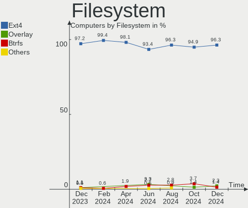
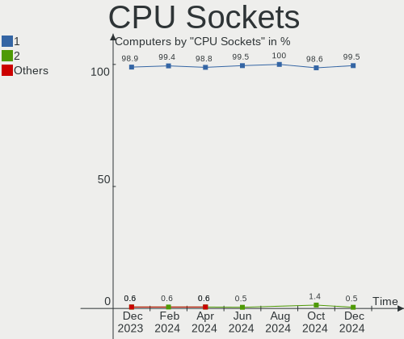
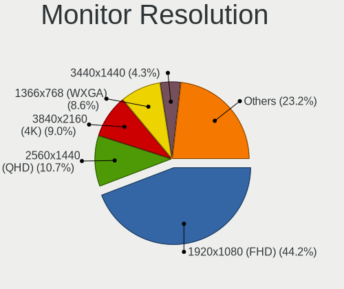
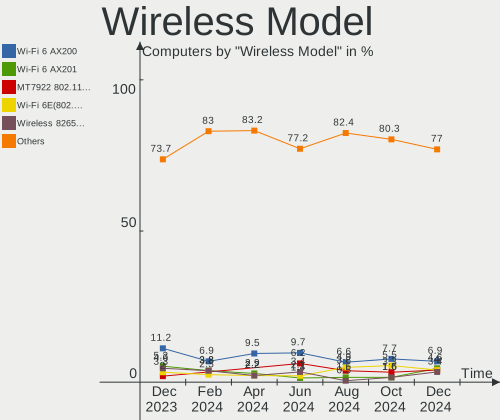

Pop!_OS Hardware Trends
-----------------------

A project to identify most popular hardware characteristics and track their change
over time based on data collected by Pop!_OS users at https://Linux-Hardware.org.

Anyone can contribute to the study by uploading probes of their computers by
the [hw-probe](https://github.com/linuxhw/hw-probe) tool:

    sudo -E hw-probe -all -upload

This is a report for all computer types. See also reports for [desktops](/Dist/Pop!_OS/Desktop/README.md) and [notebooks](/Dist/Pop!_OS/Notebook/README.md).

Full-feature report is available here: https://linux-hardware.org/?view=trends

Period: Sep, 2020.

Contents
--------

- [ OS                       ](#os)
- [ OS Family                ](#os-family)
- [ Kernel                   ](#kernel)
- [ Kernel Family            ](#kernel-family)
- [ Kernel Major Ver.        ](#kernel-major-ver)
- [ Arch                     ](#arch)
- [ DE                       ](#de)
- [ Display Server           ](#display-server)
- [ Display Manager          ](#display-manager)
- [ OS Lang                  ](#os-lang)
- [ Boot Mode                ](#boot-mode)
- [ Filesystem               ](#filesystem)
- [ Part. scheme             ](#part-scheme)
- [ Dual Boot with Linux/BSD ](#dual-boot-with-linux/bsd)
- [ Dual Boot (Win)          ](#dual-boot-win)
- [ Country                  ](#country)
- [ City                     ](#city)
- [ Vendor                   ](#vendor)
- [ Model                    ](#model)
- [ Model Family             ](#model-family)
- [ MFG Year                 ](#mfg-year)
- [ Form Factor              ](#form-factor)
- [ Secure Boot              ](#secure-boot)
- [ Coreboot                 ](#coreboot)
- [ RAM Size                 ](#ram-size)
- [ RAM Used                 ](#ram-used)
- [ Has CD-ROM               ](#has-cd-rom)
- [ Total Drives             ](#total-drives)
- [ Has Ethernet             ](#has-ethernet)
- [ Drive Vendor             ](#drive-vendor)
- [ HDD Vendor               ](#hdd-vendor)
- [ SSD Vendor               ](#ssd-vendor)
- [ Drive Model              ](#drive-model)
- [ Drive Kind               ](#drive-kind)
- [ Drive Connector          ](#drive-connector)
- [ Drive Size               ](#drive-size)
- [ Space Total              ](#space-total)
- [ Space Used               ](#space-used)
- [ Malfunc. Drives          ](#malfunc-drives)
- [ Malfunc. Drive Vendor    ](#malfunc-drive-vendor)
- [ Malfunc. HDD Vendor      ](#malfunc-hdd-vendor)
- [ Malfunc. Drive Kind      ](#malfunc-drive-kind)
- [ Failed Drives            ](#failed-drives)
- [ Failed Drive Vendor      ](#failed-drive-vendor)
- [ Drive Status             ](#drive-status)
- [ Storage Vendor           ](#storage-vendor)
- [ Storage Model            ](#storage-model)
- [ Storage Kind             ](#storage-kind)
- [ CPU Vendor               ](#cpu-vendor)
- [ CPU Model                ](#cpu-model)
- [ CPU Model Family         ](#cpu-model-family)
- [ CPU Cores                ](#cpu-cores)
- [ CPU Sockets              ](#cpu-sockets)
- [ CPU Threads              ](#cpu-threads)
- [ CPU Op-Modes             ](#cpu-op-modes)
- [ CPU Microcode            ](#cpu-microcode)
- [ CPU Microarch            ](#cpu-microarch)
- [ GPU Vendor               ](#gpu-vendor)
- [ GPU Model                ](#gpu-model)
- [ GPU Combo                ](#gpu-combo)
- [ GPU Driver               ](#gpu-driver)
- [ GPU Memory               ](#gpu-memory)
- [ Monitor Vendor           ](#monitor-vendor)
- [ Monitor Model            ](#monitor-model)
- [ Monitor Resolution       ](#monitor-resolution)
- [ Monitor Diagonal         ](#monitor-diagonal)
- [ Monitor Width            ](#monitor-width)
- [ Aspect Ratio             ](#aspect-ratio)
- [ Monitor Area             ](#monitor-area)
- [ Pixel Density            ](#pixel-density)
- [ Multiple Monitors        ](#multiple-monitors)
- [ Net Controller Vendor    ](#net-controller-vendor)
- [ Net Controller Model     ](#net-controller-model)
- [ Wireless Vendor          ](#wireless-vendor)
- [ Wireless Model           ](#wireless-model)
- [ Ethernet Vendor          ](#ethernet-vendor)
- [ Ethernet Model           ](#ethernet-model)
- [ Net Controller Kind      ](#net-controller-kind)
- [ Used Controller          ](#used-controller)
- [ NICs                     ](#nics)
- [ Memory Vendor            ](#memory-vendor)
- [ Memory Model             ](#memory-model)
- [ Memory Kind              ](#memory-kind)
- [ Memory Form Factor       ](#memory-form-factor)
- [ Memory Size              ](#memory-size)
- [ Memory Speed             ](#memory-speed)
- [ Sound Vendor             ](#sound-vendor)
- [ Sound Model              ](#sound-model)
- [ Camera Vendor            ](#camera-vendor)
- [ Camera Model             ](#camera-model)
- [ Fingerprint Vendor       ](#fingerprint-vendor)
- [ Fingerprint Model        ](#fingerprint-model)
- [ Chipcard Vendor          ](#chipcard-vendor)
- [ Chipcard Model           ](#chipcard-model)
- [ Printer Vendor           ](#printer-vendor)
- [ Printer Model            ](#printer-model)
- [ Scanner Vendor           ](#scanner-vendor)
- [ Scanner Model            ](#scanner-model)
- [ Bluetooth Vendor         ](#bluetooth-vendor)
- [ Bluetooth Model          ](#bluetooth-model)
- [ Unsupported Devices      ](#unsupported-devices)
- [ Unsupported Device Types ](#unsupported-device-types)

OS
--

Installed operating systems

| Name          | Computers | Percent |
|---------------|-----------|---------|
| Pop!_OS 20.04 | 264       | 100%    |

OS Family
---------

OS without a version

| Name    | Computers | Percent |
|---------|-----------|---------|
| Pop!_OS | 264       | 100%    |

Kernel
------

Version of the Linux kernel

| Version                   | Computers | Percent |
|---------------------------|-----------|---------|
| 5.4.0-7642-generic        | 219       | 82.95%  |
| 5.4.0-7634-generic        | 11        | 4.17%   |
| 5.4.0-7625-generic        | 4         | 1.52%   |
| 5.8.9-050809-generic      | 3         | 1.14%   |
| 5.8.12-xanmod1            | 3         | 1.14%   |
| 5.8.6-xanmod1             | 2         | 0.76%   |
| 5.8.5-xanmod1             | 2         | 0.76%   |
| 5.8.5-050805-generic      | 2         | 0.76%   |
| 5.7.16-xanmod2            | 2         | 0.76%   |
| 5.7.0-050700-generic      | 2         | 0.76%   |
| 5.8.8-xanmod1             | 1         | 0.38%   |
| 5.8.7-050807-generic      | 1         | 0.38%   |
| 5.8.6-050806-generic      | 1         | 0.38%   |
| 5.8.3-050803-generic      | 1         | 0.38%   |
| 5.8.2-050802-generic      | 1         | 0.38%   |
| 5.8.12-050812-generic     | 1         | 0.38%   |
| 5.8.11-050811-generic     | 1         | 0.38%   |
| 5.8.10-xanmod1            | 1         | 0.38%   |
| 5.8.10-050810-generic     | 1         | 0.38%   |
| 5.8.0-10.1-liquorix-amd64 | 1         | 0.38%   |
| 5.8.0-050800rc6-generic   | 1         | 0.38%   |
| 5.7.15-050715-generic     | 1         | 0.38%   |
| 5.4.61-xanmod1            | 1         | 0.38%   |
| 5.4.0-7626-generic        | 1         | 0.38%   |

Kernel Family
-------------

Linux kernel without a distro release

| Version | Computers | Percent |
|---------|-----------|---------|
| 5.4.0   | 235       | 89.02%  |
| 5.8.5   | 4         | 1.52%   |
| 5.8.12  | 4         | 1.52%   |
| 5.8.9   | 3         | 1.14%   |
| 5.8.6   | 3         | 1.14%   |
| 5.8.10  | 2         | 0.76%   |
| 5.8.0   | 2         | 0.76%   |
| 5.7.16  | 2         | 0.76%   |
| 5.7.0   | 2         | 0.76%   |
| 5.8.8   | 1         | 0.38%   |
| 5.8.7   | 1         | 0.38%   |
| 5.8.3   | 1         | 0.38%   |
| 5.8.2   | 1         | 0.38%   |
| 5.8.11  | 1         | 0.38%   |
| 5.7.15  | 1         | 0.38%   |
| 5.4.61  | 1         | 0.38%   |

Kernel Major Ver.
-----------------

Linux kernel major version

| Version | Computers | Percent |
|---------|-----------|---------|
| 5.4     | 236       | 89.39%  |
| 5.8     | 23        | 8.71%   |
| 5.7     | 5         | 1.89%   |

Arch
----

OS architecture (x86_64, i586, etc.)

| Name   | Computers | Percent |
|--------|-----------|---------|
| x86_64 | 264       | 100%    |

DE
--

Desktop Environment

| Name            | Computers | Percent |
|-----------------|-----------|---------|
| GNOME           | 247       | 93.56%  |
| KDE             | 4         | 1.52%   |
| GNOME Flashback | 3         | 1.14%   |
| KDE5            | 2         | 0.76%   |
| Cinnamon        | 2         | 0.76%   |
| XFCE            | 1         | 0.38%   |
| X-Cinnamon      | 1         | 0.38%   |
| Unity           | 1         | 0.38%   |
| LXQt            | 1         | 0.38%   |
| i3              | 1         | 0.38%   |
| Budgie          | 1         | 0.38%   |

Display Server
--------------

X11 or Wayland

| Name    | Computers | Percent |
|---------|-----------|---------|
| X11     | 258       | 97.73%  |
| Wayland | 5         | 1.89%   |
| Tty     | 1         | 0.38%   |

Display Manager
---------------

SDDM, LightDM, etc.

| Name    | Computers | Percent |
|---------|-----------|---------|
| Unknown | 192       | 72.73%  |
| GDM     | 71        | 26.89%  |
| SDDM    | 1         | 0.38%   |

OS Lang
-------

Language

| Lang  | Computers | Percent |
|-------|-----------|---------|
| en_US | 154       | 58.33%  |
| en_GB | 23        | 8.71%   |
| pt_BR | 12        | 4.55%   |
| de_DE | 12        | 4.55%   |
| es_ES | 10        | 3.79%   |
| en_AU | 9         | 3.41%   |
| it_IT | 7         | 2.65%   |
| en_CA | 7         | 2.65%   |
| ru_RU | 5         | 1.89%   |
| fr_FR | 5         | 1.89%   |
| nl_NL | 4         | 1.52%   |
| C     | 4         | 1.52%   |
| fi_FI | 2         | 0.76%   |
| cs_CZ | 2         | 0.76%   |
| zh_TW | 1         | 0.38%   |
| sv_SE | 1         | 0.38%   |
| ro_RO | 1         | 0.38%   |
| pl_PL | 1         | 0.38%   |
| nb_NO | 1         | 0.38%   |
| ko_KR | 1         | 0.38%   |
| hu_HU | 1         | 0.38%   |
| ca_ES | 1         | 0.38%   |

Boot Mode
---------

EFI or BIOS

| Mode | Computers | Percent |
|------|-----------|---------|
| EFI  | 177       | 67.05%  |
| BIOS | 87        | 32.95%  |

Filesystem
----------

Type of filesystem

| Type    | Computers | Percent |
|---------|-----------|---------|
| Ext4    | 261       | 98.86%  |
| Overlay | 2         | 0.76%   |
| Xfs     | 1         | 0.38%   |

Part. scheme
------------

Scheme of partitioning

| Type    | Computers | Percent |
|---------|-----------|---------|
| Unknown | 192       | 72.73%  |
| GPT     | 63        | 23.86%  |
| MBR     | 9         | 3.41%   |

Dual Boot with Linux/BSD
------------------------

Hosting more than one Linux/BSD

| Dual boot | Computers | Percent |
|-----------|-----------|---------|
| No        | 257       | 97.35%  |
| Yes       | 7         | 2.65%   |

Dual Boot (Win)
---------------

Hosting Linux and Windows

| Dual boot | Computers | Percent |
|-----------|-----------|---------|
| No        | 226       | 85.61%  |
| Yes       | 38        | 14.39%  |

Country
-------

Geographic location (country)

| Country            | Computers | Percent |
|--------------------|-----------|---------|
| USA                | 78        | 29.55%  |
| Brazil             | 18        | 6.82%   |
| UK                 | 14        | 5.3%    |
| Germany            | 9         | 3.41%   |
| Australia          | 9         | 3.41%   |
| Italy              | 8         | 3.03%   |
| Canada             | 8         | 3.03%   |
| Switzerland        | 7         | 2.65%   |
| Netherlands        | 7         | 2.65%   |
| India              | 7         | 2.65%   |
| South Africa       | 6         | 2.27%   |
| Philippines        | 6         | 2.27%   |
| Mexico             | 6         | 2.27%   |
| Spain              | 5         | 1.89%   |
| Russia             | 5         | 1.89%   |
| Finland            | 5         | 1.89%   |
| Argentina          | 5         | 1.89%   |
| Norway             | 4         | 1.52%   |
| France             | 4         | 1.52%   |
| Czech Republic     | 4         | 1.52%   |
| Sweden             | 3         | 1.14%   |
| Poland             | 3         | 1.14%   |
| Mauritius          | 3         | 1.14%   |
| Belgium            | 3         | 1.14%   |
| Vietnam            | 2         | 0.76%   |
| Taiwan             | 2         | 0.76%   |
| Peru               | 2         | 0.76%   |
| New Zealand        | 2         | 0.76%   |
| Croatia            | 2         | 0.76%   |
| Chile              | 2         | 0.76%   |
| Austria            | 2         | 0.76%   |
| Ukraine            | 1         | 0.38%   |
| UAE                | 1         | 0.38%   |
| Thailand           | 1         | 0.38%   |
| Singapore          | 1         | 0.38%   |
| Saudi Arabia       | 1         | 0.38%   |
| Romania            | 1         | 0.38%   |
| Portugal           | 1         | 0.38%   |
| Malaysia           | 1         | 0.38%   |
| Luxembourg         | 1         | 0.38%   |
| Lithuania          | 1         | 0.38%   |
| Korea, Republic of | 1         | 0.38%   |
| Jordan             | 1         | 0.38%   |
| Japan              | 1         | 0.38%   |
| Israel             | 1         | 0.38%   |
| Iran               | 1         | 0.38%   |
| Indonesia          | 1         | 0.38%   |
| Iceland            | 1         | 0.38%   |
| Hungary            | 1         | 0.38%   |
| Guatemala          | 1         | 0.38%   |
| Estonia            | 1         | 0.38%   |
| Egypt              | 1         | 0.38%   |
| Dominican Republic | 1         | 0.38%   |
| China              | 1         | 0.38%   |

City
----

Geographic location (city)

| City                                    | Computers | Percent |
|-----------------------------------------|-----------|---------|
| Seattle                                 | 3         | 1.14%   |
| Mexico City                             | 3         | 1.14%   |
| Helsinki                                | 3         | 1.14%   |
| Zagreb                                  | 2         | 0.76%   |
| Warsaw                                  | 2         | 0.76%   |
| Villa Martelli                          | 2         | 0.76%   |
| Vienna                                  | 2         | 0.76%   |
| Vacoas                                  | 2         | 0.76%   |
| Turin                                   | 2         | 0.76%   |
| Sydney                                  | 2         | 0.76%   |
| Stockholm                               | 2         | 0.76%   |
| Salt Lake City                          | 2         | 0.76%   |
| Rome                                    | 2         | 0.76%   |
| Recife                                  | 2         | 0.76%   |
| Prague                                  | 2         | 0.76%   |
| Pilsen                                  | 2         | 0.76%   |
| Orlando                                 | 2         | 0.76%   |
| New York                                | 2         | 0.76%   |
| Kansas City                             | 2         | 0.76%   |
| Horw                                    | 2         | 0.76%   |
| Hamburg                                 | 2         | 0.76%   |
| Fortaleza                               | 2         | 0.76%   |
| Cebu City                               | 2         | 0.76%   |
| Cape Town                               | 2         | 0.76%   |
| Camarillo                               | 2         | 0.76%   |
| Berlin                                  | 2         | 0.76%   |
| Bengaluru                               | 2         | 0.76%   |
| Belo Horizonte                          | 2         | 0.76%   |
| Atlanta                                 | 2         | 0.76%   |
| Zurich                                  | 1         | 0.38%   |
| Zonhoven                                | 1         | 0.38%   |
| Zandvoort                               | 1         | 0.38%   |
| Yamaguchi                               | 1         | 0.38%   |
| Wrocław                                | 1         | 0.38%   |
| Worcester                               | 1         | 0.38%   |
| Woodbury                                | 1         | 0.38%   |
| Winter Garden                           | 1         | 0.38%   |
| Wierden                                 | 1         | 0.38%   |
| Whitby                                  | 1         | 0.38%   |
| Westlake                                | 1         | 0.38%   |
| West River                              | 1         | 0.38%   |
| Weatherford                             | 1         | 0.38%   |
| Warangal                                | 1         | 0.38%   |
| Vilnius                                 | 1         | 0.38%   |
| Villaviciosa                            | 1         | 0.38%   |
| Vijayawada                              | 1         | 0.38%   |
| Vantaa                                  | 1         | 0.38%   |
| Vanderbijlpark                          | 1         | 0.38%   |
| Useldange                               | 1         | 0.38%   |
| Union de Credito Agricola de Hermosillo | 1         | 0.38%   |
| Truth or Consequences                   | 1         | 0.38%   |
| Trussville                              | 1         | 0.38%   |
| Trujillo                                | 1         | 0.38%   |
| The Hague                               | 1         | 0.38%   |
| Terre Haute                             | 1         | 0.38%   |
| Terrassa                                | 1         | 0.38%   |
| Tepic                                   | 1         | 0.38%   |
| Temuco                                  | 1         | 0.38%   |
| Tel Aviv                                | 1         | 0.38%   |
| Tehran                                  | 1         | 0.38%   |

Vendor
------

Motherboard manufacturer

| Name                | Computers | Percent |
|---------------------|-----------|---------|
| ASUSTek Computer    | 46        | 17.42%  |
| Lenovo              | 42        | 15.91%  |
| Dell                | 33        | 12.5%   |
| MSI                 | 28        | 10.61%  |
| Hewlett-Packard     | 26        | 9.85%   |
| Acer                | 18        | 6.82%   |
| Gigabyte Technology | 13        | 4.92%   |
| ASRock              | 10        | 3.79%   |
| Apple               | 9         | 3.41%   |
| System76            | 7         | 2.65%   |
| Samsung Electronics | 4         | 1.52%   |
| Toshiba             | 3         | 1.14%   |
| Medion              | 3         | 1.14%   |
| Foxconn             | 2         | 0.76%   |
| Clevo               | 2         | 0.76%   |
| Alienware           | 2         | 0.76%   |
| Wortmann AG         | 1         | 0.38%   |
| Timi                | 1         | 0.38%   |
| T-bao               | 1         | 0.38%   |
| Razer               | 1         | 0.38%   |
| Purism              | 1         | 0.38%   |
| Positivo            | 1         | 0.38%   |
| Pegatron            | 1         | 0.38%   |
| Packard Bell        | 1         | 0.38%   |
| Minix               | 1         | 0.38%   |
| Microsoft           | 1         | 0.38%   |
| Intel               | 1         | 0.38%   |
| HASEE Computer      | 1         | 0.38%   |
| ECS                 | 1         | 0.38%   |
| Daten Tecnologia    | 1         | 0.38%   |
| Biostar             | 1         | 0.38%   |
| BANGHO              | 1         | 0.38%   |

Model
-----

Motherboard model

| Name                                     | Computers | Percent |
|------------------------------------------|-----------|---------|
| ASUS All Series                          | 6         | 2.27%   |
| MSI MS-7B86                              | 3         | 1.14%   |
| HP Pavilion 15                           | 3         | 1.14%   |
| System76 Lemur Pro                       | 2         | 0.76%   |
| Samsung Electronics 340XAA/350XAA/550XAA | 2         | 0.76%   |
| MSI MS-7B85                              | 2         | 0.76%   |
| MSI MS-7A34                              | 2         | 0.76%   |
| Lenovo ThinkPad X1 Extreme 20MFCTO1WW    | 2         | 0.76%   |
| HP Pavilion g6                           | 2         | 0.76%   |
| Gigabyte X570 UD                         | 2         | 0.76%   |
| Dell OptiPlex 3010                       | 2         | 0.76%   |
| Dell Latitude E5420                      | 2         | 0.76%   |
| ASUS VivoBook_ASUSLaptop X530FN_S530FN   | 2         | 0.76%   |
| ASUS ROG STRIX B350-F GAMING             | 2         | 0.76%   |
| ASUS PRIME B450M-A                       | 2         | 0.76%   |
| ASUS PRIME B350-PLUS                     | 2         | 0.76%   |
| Acer Aspire A515-43                      | 2         | 0.76%   |
| Wortmann AG 1220634_1470156              | 1         | 0.38%   |
| Toshiba Satellite S55t-B                 | 1         | 0.38%   |
| Toshiba Satellite C55-C                  | 1         | 0.38%   |
| Toshiba Satellite A205                   | 1         | 0.38%   |
| Timi RedmiBook 16                        | 1         | 0.38%   |
| T-bao MINI PC                            | 1         | 0.38%   |
| System76 Thelio                          | 1         | 0.38%   |
| System76 Serval WS                       | 1         | 0.38%   |
| System76 Gazelle                         | 1         | 0.38%   |
| System76 Galago Pro                      | 1         | 0.38%   |
| System76 Darter Pro                      | 1         | 0.38%   |
| Samsung Electronics R530/R730/R540       | 1         | 0.38%   |
| Samsung Electronics 550XCJ/550XCR        | 1         | 0.38%   |
| Razer Blade                              | 1         | 0.38%   |
| Purism Librem 15 v4                      | 1         | 0.38%   |
| Positivo DC8BT11                         | 1         | 0.38%   |
| Pegatron p6-2136                         | 1         | 0.38%   |
| Packard Bell ENNS44HR                    | 1         | 0.38%   |
| MSI PS63 Modern 8RC                      | 1         | 0.38%   |
| MSI Pro 3130 Microtower PC               | 1         | 0.38%   |
| MSI MS-7C10                              | 1         | 0.38%   |
| MSI MS-7C02                              | 1         | 0.38%   |
| MSI MS-7B79                              | 1         | 0.38%   |
| MSI MS-7B78                              | 1         | 0.38%   |
| MSI MS-7B22                              | 1         | 0.38%   |
| MSI MS-7B17                              | 1         | 0.38%   |
| MSI MS-7B07                              | 1         | 0.38%   |
| MSI MS-7A71                              | 1         | 0.38%   |
| MSI MS-7A40                              | 1         | 0.38%   |
| MSI MS-7917                              | 1         | 0.38%   |
| MSI MS-7640                              | 1         | 0.38%   |
| MSI MS-7522                              | 1         | 0.38%   |
| MSI GT63 Titan 8RG                       | 1         | 0.38%   |
| MSI GS65 Stealth 8SF                     | 1         | 0.38%   |
| MSI GP75 Leopard 9SD                     | 1         | 0.38%   |
| MSI GP62 6QF                             | 1         | 0.38%   |
| MSI GP62 2QE                             | 1         | 0.38%   |
| MSI GL65 Leopard 10SDK                   | 1         | 0.38%   |
| MSI GF63 Thin 9RCX                       | 1         | 0.38%   |
| Minix NEO J50C-4                         | 1         | 0.38%   |
| Microsoft Surface Book                   | 1         | 0.38%   |
| Medion P15648                            | 1         | 0.38%   |
| Medion MS-7728                           | 1         | 0.38%   |

Model Family
------------

Motherboard model prefix

| Name                       | Computers | Percent |
|----------------------------|-----------|---------|
| Lenovo ThinkPad            | 25        | 9.47%   |
| Lenovo IdeaPad             | 15        | 5.68%   |
| Acer Aspire                | 13        | 4.92%   |
| Dell Inspiron              | 11        | 4.17%   |
| ASUS ROG                   | 9         | 3.41%   |
| HP Pavilion                | 7         | 2.65%   |
| Dell XPS                   | 6         | 2.27%   |
| Dell Latitude              | 6         | 2.27%   |
| ASUS PRIME                 | 6         | 2.27%   |
| ASUS All                   | 6         | 2.27%   |
| HP ProBook                 | 5         | 1.89%   |
| Gigabyte X570              | 5         | 1.89%   |
| Dell Precision             | 4         | 1.52%   |
| Dell OptiPlex              | 4         | 1.52%   |
| Toshiba Satellite          | 3         | 1.14%   |
| MSI MS-7B86                | 3         | 1.14%   |
| HP EliteBook               | 3         | 1.14%   |
| ASUS VivoBook              | 3         | 1.14%   |
| ASUS TUF                   | 3         | 1.14%   |
| System76 Lemur             | 2         | 0.76%   |
| Samsung Electronics 340XAA | 2         | 0.76%   |
| MSI MS-7B85                | 2         | 0.76%   |
| MSI MS-7A34                | 2         | 0.76%   |
| MSI GP62                   | 2         | 0.76%   |
| HP ZBook                   | 2         | 0.76%   |
| HP Laptop                  | 2         | 0.76%   |
| HP ENVY                    | 2         | 0.76%   |
| ASRock B450M               | 2         | 0.76%   |
| Apple MacBookPro11         | 2         | 0.76%   |
| Wortmann AG 1220634        | 1         | 0.38%   |
| Timi RedmiBook             | 1         | 0.38%   |
| T-bao MINI                 | 1         | 0.38%   |
| System76 Thelio            | 1         | 0.38%   |
| System76 Serval            | 1         | 0.38%   |
| System76 Gazelle           | 1         | 0.38%   |
| System76 Galago            | 1         | 0.38%   |
| System76 Darter            | 1         | 0.38%   |
| Samsung Electronics R530   | 1         | 0.38%   |
| Samsung Electronics 550XCJ | 1         | 0.38%   |
| Razer Blade                | 1         | 0.38%   |
| Purism Librem              | 1         | 0.38%   |
| Positivo DC8BT11           | 1         | 0.38%   |
| Pegatron p6-2136           | 1         | 0.38%   |
| Packard Bell ENNS44HR      | 1         | 0.38%   |
| MSI PS63                   | 1         | 0.38%   |
| MSI Pro                    | 1         | 0.38%   |
| MSI MS-7C10                | 1         | 0.38%   |
| MSI MS-7C02                | 1         | 0.38%   |
| MSI MS-7B79                | 1         | 0.38%   |
| MSI MS-7B78                | 1         | 0.38%   |
| MSI MS-7B22                | 1         | 0.38%   |
| MSI MS-7B17                | 1         | 0.38%   |
| MSI MS-7B07                | 1         | 0.38%   |
| MSI MS-7A71                | 1         | 0.38%   |
| MSI MS-7A40                | 1         | 0.38%   |
| MSI MS-7917                | 1         | 0.38%   |
| MSI MS-7640                | 1         | 0.38%   |
| MSI MS-7522                | 1         | 0.38%   |
| MSI GT63                   | 1         | 0.38%   |
| MSI GS65                   | 1         | 0.38%   |

MFG Year
--------

Motherboard manufacture year

| Year | Computers | Percent |
|------|-----------|---------|
| 2019 | 71        | 26.89%  |
| 2020 | 60        | 22.73%  |
| 2018 | 30        | 11.36%  |
| 2017 | 17        | 6.44%   |
| 2012 | 15        | 5.68%   |
| 2014 | 14        | 5.3%    |
| 2013 | 14        | 5.3%    |
| 2015 | 11        | 4.17%   |
| 2011 | 9         | 3.41%   |
| 2016 | 8         | 3.03%   |
| 2009 | 6         | 2.27%   |
| 2008 | 5         | 1.89%   |
| 2010 | 3         | 1.14%   |
| 2007 | 1         | 0.38%   |

Form Factor
-----------

Physical design of the computer

| Name        | Computers | Percent |
|-------------|-----------|---------|
| Notebook    | 156       | 59.09%  |
| Desktop     | 97        | 36.74%  |
| Convertible | 5         | 1.89%   |
| Tablet      | 3         | 1.14%   |
| All in one  | 3         | 1.14%   |

Secure Boot
-----------

Enabled or disabled

| State    | Computers | Percent |
|----------|-----------|---------|
| Disabled | 264       | 100%    |

Coreboot
--------

Have coreboot on board

| Used | Computers | Percent |
|------|-----------|---------|
| No   | 260       | 98.48%  |
| Yes  | 4         | 1.52%   |

RAM Size
--------

Total RAM memory

| Size in GB  | Computers | Percent |
|-------------|-----------|---------|
| 16.01-24.0  | 72        | 27.27%  |
| 4.01-8.0    | 52        | 19.7%   |
| 8.01-16.0   | 52        | 19.7%   |
| 32.01-64.0  | 36        | 13.64%  |
| 3.01-4.0    | 31        | 11.74%  |
| 24.01-32.0  | 9         | 3.41%   |
| 1.01-2.0    | 7         | 2.65%   |
| 64.01-256.0 | 5         | 1.89%   |

RAM Used
--------

Used RAM memory

| Used GB    | Computers | Percent |
|------------|-----------|---------|
| 2.01-3.0   | 92        | 34.85%  |
| 4.01-8.0   | 61        | 23.11%  |
| 3.01-4.0   | 51        | 19.32%  |
| 1.01-2.0   | 51        | 19.32%  |
| 8.01-16.0  | 7         | 2.65%   |
| 24.01-32.0 | 1         | 0.38%   |
| 16.01-24.0 | 1         | 0.38%   |

Has CD-ROM
----------

Has CD-ROM on board

| Presented | Computers | Percent |
|-----------|-----------|---------|
| No        | 176       | 66.67%  |
| Yes       | 88        | 33.33%  |

Total Drives
------------

Number of drives on board

| Drives | Computers | Percent |
|--------|-----------|---------|
| 1      | 136       | 51.52%  |
| 2      | 71        | 26.89%  |
| 3      | 27        | 10.23%  |
| 4      | 19        | 7.2%    |
| 5      | 6         | 2.27%   |
| 0      | 3         | 1.14%   |
| 6      | 2         | 0.76%   |

Has Ethernet
------------

Has Ethernet on board

| Presented | Computers | Percent |
|-----------|-----------|---------|
| Yes       | 232       | 87.88%  |
| No        | 32        | 12.12%  |

Drive Vendor
------------

Hard drive vendors

| Vendor                    | Computers | Drives  | Percent |
|---------------------------|-----------|---------|---------|
| Samsung Electronics       | 75        | 96      | 17.73%  |
| WDC                       | 65        | 80      | 15.37%  |
| Seagate                   | 56        | 66      | 13.24%  |
| Toshiba                   | 36        | 39      | 8.51%   |
| Kingston                  | 29        | 30      | 6.86%   |
| SanDisk                   | 26        | 28      | 6.15%   |
| Crucial                   | 22        | 24      | 5.2%    |
| Unknown                   | 15        | 15      | 3.55%   |
| Hitachi                   | 10        | 10      | 2.36%   |
| HGST                      | 10        | 11      | 2.36%   |
| SK Hynix                  | 9         | 9       | 2.13%   |
| Phison                    | 8         | 10      | 1.89%   |
| Intel                     | 7         | 7       | 1.65%   |
| A-DATA Technology         | 7         | 7       | 1.65%   |
| Apple                     | 5         | 5       | 1.18%   |
| Silicon Motion            | 3         | 3       | 0.71%   |
| Micron Technology         | 3         | 3       | 0.71%   |
| JMicron                   | 3         | 3       | 0.71%   |
| HL-DT-ST                  | 3         | Unknown | 0.71%   |
| PNY                       | 2         | 2       | 0.47%   |
| Patriot                   | 2         | 2       | 0.47%   |
| OCZ                       | 2         | 2       | 0.47%   |
| LITEONIT                  | 2         | 2       | 0.47%   |
| WDC WDS2                  | 1         | 1       | 0.24%   |
| Union Memory              | 1         | 1       | 0.24%   |
| Transcend                 | 1         | 1       | 0.24%   |
| TO Exter                  | 1         | 1       | 0.24%   |
| Team                      | 1         | 2       | 0.24%   |
| SABRENT                   | 1         | 1       | 0.24%   |
| Phison Electronics        | 1         | 1       | 0.24%   |
| Neo Forza                 | 1         | 1       | 0.24%   |
| MR                        | 1         | 1       | 0.24%   |
| Micron/Crucial Technology | 1         | 1       | 0.24%   |
| LITEON                    | 1         | 1       | 0.24%   |
| LaCie                     | 1         | 1       | 0.24%   |
| Kston                     | 1         | 1       | 0.24%   |
| KIOXIA                    | 1         | 1       | 0.24%   |
| Intenso                   | 1         | 1       | 0.24%   |
| HS-SSD-E100               | 1         | 1       | 0.24%   |
| Hewlett-Packard           | 1         | 1       | 0.24%   |
| GOODRAM                   | 1         | 1       | 0.24%   |
| GAMER                     | 1         | 1       | 0.24%   |
| Fujitsu                   | 1         | 1       | 0.24%   |
| External                  | 1         | 1       | 0.24%   |
| Colorful                  | 1         | 1       | 0.24%   |
| Apacer                    | 1         | 1       | 0.24%   |

HDD Vendor
----------

Hard disk drive vendors

| Vendor              | Computers | Drives | Percent |
|---------------------|-----------|--------|---------|
| Seagate             | 56        | 65     | 35.22%  |
| WDC                 | 50        | 58     | 31.45%  |
| Toshiba             | 29        | 31     | 18.24%  |
| Hitachi             | 10        | 10     | 6.29%   |
| HGST                | 10        | 11     | 6.29%   |
| TO Exter            | 1         | 1      | 0.63%   |
| Samsung Electronics | 1         | 1      | 0.63%   |
| Hewlett-Packard     | 1         | 1      | 0.63%   |
| Fujitsu             | 1         | 1      | 0.63%   |

SSD Vendor
----------

Solid state drive vendors

| Vendor              | Computers | Drives | Percent |
|---------------------|-----------|--------|---------|
| Samsung Electronics | 43        | 49     | 27.39%  |
| Kingston            | 21        | 22     | 13.38%  |
| Crucial             | 21        | 23     | 13.38%  |
| WDC                 | 17        | 18     | 10.83%  |
| SanDisk             | 17        | 18     | 10.83%  |
| A-DATA Technology   | 6         | 6      | 3.82%   |
| Toshiba             | 4         | 4      | 2.55%   |
| Apple               | 4         | 4      | 2.55%   |
| Micron Technology   | 3         | 3      | 1.91%   |
| SK Hynix            | 2         | 2      | 1.27%   |
| PNY                 | 2         | 2      | 1.27%   |
| Patriot             | 2         | 2      | 1.27%   |
| OCZ                 | 2         | 2      | 1.27%   |
| LITEONIT            | 2         | 2      | 1.27%   |
| WDC WDS2            | 1         | 1      | 0.64%   |
| Unknown             | 1         | 1      | 0.64%   |
| Transcend           | 1         | 1      | 0.64%   |
| Team                | 1         | 2      | 0.64%   |
| SABRENT             | 1         | 1      | 0.64%   |
| MR                  | 1         | 1      | 0.64%   |
| LITEON              | 1         | 1      | 0.64%   |
| JMicron             | 1         | 1      | 0.64%   |
| Intenso             | 1         | 1      | 0.64%   |
| GOODRAM             | 1         | 1      | 0.64%   |
| Apacer              | 1         | 1      | 0.64%   |

Drive Model
-----------

Hard drive models

| Model                        | Computers | Percent |
|------------------------------|-----------|---------|
| NVMe SSD Drive 256GB         | 15        | 3.23%   |
| NVMe SSD Drive 1024GB        | 13        | 2.8%    |
| NVMe SSD Drive 512GB         | 12        | 2.59%   |
| NVMe SSD Drive 1TB           | 12        | 2.59%   |
| SSD 860 EVO 1TB              | 7         | 1.51%   |
| WD10SPZX-24Z10 1TB           | 6         | 1.29%   |
| ST1000DM010-2EP102 1TB       | 6         | 1.29%   |
| SA400S37240G 240GB SSD       | 6         | 1.29%   |
| HTS721010A9E630 1TB          | 6         | 1.29%   |
| SSD 850 EVO 500GB            | 5         | 1.08%   |
| SSD 850 EVO 250GB            | 5         | 1.08%   |
| MQ04ABF100 1TB               | 5         | 1.08%   |
| WDS240G2G0B-00EPW0 240GB SSD | 4         | 0.86%   |
| SV300S37A120G 120GB SSD      | 4         | 0.86%   |
| ST1000DM003-1CH162 1TB       | 4         | 0.86%   |
| NVMe SSD Drive 500GB         | 4         | 0.86%   |
| ST9500325AS 500GB            | 3         | 0.65%   |
| SSD 970 EVO Plus 500GB       | 3         | 0.65%   |
| SSD 970 EVO Plus 1TB         | 3         | 0.65%   |
| SSD 860 EVO 500GB            | 3         | 0.65%   |
| SSD 860 EVO 250GB            | 3         | 0.65%   |
| NVMe SSD Drive 2TB           | 3         | 0.65%   |
| MQ01ABF050 500GB             | 3         | 0.65%   |
| MMC Card  64GB               | 3         | 0.65%   |
| DT01ACA100 1TB               | 3         | 0.65%   |
| CT525MX300SSD1 528GB         | 3         | 0.65%   |
| CT1000MX500SSD1 1TB          | 3         | 0.65%   |
| WDS500G2B0A-00SM50 500GB SSD | 2         | 0.43%   |
| WDS120G2G0B-00EPW0 120GB SSD | 2         | 0.43%   |
| WDS120G2G0A-00JH30 120GB SSD | 2         | 0.43%   |
| WD5000LPVX-22V0TT0 500GB     | 2         | 0.43%   |
| WD30EZRX-00SPEB0 3TB         | 2         | 0.43%   |
| WD20EARS-00MVWB0 2TB         | 2         | 0.43%   |
| WD10JPVX-75JC3T0 1TB         | 2         | 0.43%   |
| WD10JPVX-22JC3T0 1TB         | 2         | 0.43%   |
| WD10EZEX-22BN5A0 1TB         | 2         | 0.43%   |
| WD10EZEX-08WN4A0 1TB         | 2         | 0.43%   |
| WD1003FZEX-00MK2A0 1TB       | 2         | 0.43%   |
| WD1003FZEX-00K3CA0 1TB       | 2         | 0.43%   |
| Tech 250GB                   | 2         | 0.43%   |
| ST9500423AS 500GB            | 2         | 0.43%   |
| ST500LM012 HN-M500MBB 500GB  | 2         | 0.43%   |
| ST500DM002-1BD142 500GB      | 2         | 0.43%   |
| ST2000LM015-2E8174 2TB       | 2         | 0.43%   |
| ST2000DM008-2FR102 2TB       | 2         | 0.43%   |
| ST2000DM006-2DM164 2TB       | 2         | 0.43%   |
| ST2000DM001-1ER164 2TB       | 2         | 0.43%   |
| ST1000LM014-1EJ164 1TB       | 2         | 0.43%   |
| SSD 970 EVO 250GB            | 2         | 0.43%   |
| SSD 850 EVO mSATA 1TB        | 2         | 0.43%   |
| SSD 850 EVO 120GB            | 2         | 0.43%   |
| SSD 840 EVO 500GB            | 2         | 0.43%   |
| SD/MMC/MS PRO 128GB          | 2         | 0.43%   |
| SA400S37480G 480GB SSD       | 2         | 0.43%   |
| SA400M8240G 240GB SSD        | 2         | 0.43%   |
| RBUSNS8154P3512GJ 512GB      | 2         | 0.43%   |
| NVMe SSD Drive 250GB         | 2         | 0.43%   |
| NVMe SSD Drive 128GB         | 2         | 0.43%   |
| MZVLB512HAJQ-000L7 512GB     | 2         | 0.43%   |
| MQ01ABD100 1TB               | 2         | 0.43%   |

Drive Kind
----------

HDD or SSD

| Kind    | Computers | Drives | Percent |
|---------|-----------|--------|---------|
| HDD     | 135       | 179    | 35.43%  |
| SSD     | 130       | 169    | 34.12%  |
| NVMe    | 95        | 109    | 24.93%  |
| Unknown | 14        | 13     | 3.67%   |
| MMC     | 7         | 8      | 1.84%   |

Drive Connector
---------------

SATA, SAS, NVMe, etc.

| Type | Computers | Drives | Percent |
|------|-----------|--------|---------|
| SATA | 203       | 341    | 62.85%  |
| NVMe | 95        | 109    | 29.41%  |
| SAS  | 18        | 20     | 5.57%   |
| MMC  | 7         | 8      | 2.17%   |

Drive Size
----------

Size of hard drive

| Size in TB | Computers | Drives | Percent |
|------------|-----------|--------|---------|
| 0.01-0.5   | 183       | 237    | 49.06%  |
| 0.51-1.0   | 126       | 159    | 33.78%  |
| 1.01-2.0   | 45        | 59     | 12.06%  |
| 2.01-3.0   | 8         | 10     | 2.14%   |
| 3.01-4.0   | 7         | 8      | 1.88%   |
| 4.01-10.0  | 4         | 5      | 1.07%   |

Space Total
-----------

Amount of disk space available on the file system

| Size in GB     | Computers | Percent |
|----------------|-----------|---------|
| 101-250        | 84        | 31.82%  |
| 251-500        | 62        | 23.48%  |
| 501-1000       | 52        | 19.7%   |
| 1001-2000      | 20        | 7.58%   |
| More than 3000 | 17        | 6.44%   |
| 2001-3000      | 11        | 4.17%   |
| 51-100         | 11        | 4.17%   |
| 21-50          | 4         | 1.52%   |
| 1-20           | 3         | 1.14%   |

Space Used
----------

Amount of used disk space

| Used GB        | Computers | Percent |
|----------------|-----------|---------|
| 1-20           | 87        | 32.95%  |
| 21-50          | 45        | 17.05%  |
| 51-100         | 38        | 14.39%  |
| 101-250        | 33        | 12.5%   |
| 251-500        | 30        | 11.36%  |
| 501-1000       | 11        | 4.17%   |
| 1001-2000      | 10        | 3.79%   |
| More than 3000 | 7         | 2.65%   |
| 2001-3000      | 3         | 1.14%   |

Malfunc. Drives
---------------

Drive models with a malfunction

| Model                             | Computers | Drives | Percent |
|-----------------------------------|-----------|--------|---------|
| ST500LM012 HN-M500MBB 500GB       | 2         | 2      | 13.33%  |
| WD7500BPVT-60HXZT1 752GB          | 1         | 1      | 6.67%   |
| WD30EZRX-00SPEB0 3TB              | 1         | 1      | 6.67%   |
| WD10JPCX-24UE4T0 1TB              | 1         | 1      | 6.67%   |
| WD10EZRX-00A8LB0 1TB              | 1         | 1      | 6.67%   |
| ST500LT012-9WS142 500GB           | 1         | 1      | 6.67%   |
| ST31000524AS 1TB                  | 1         | 1      | 6.67%   |
| ST2000DM 001-1CH164 2TB           | 1         | 1      | 6.67%   |
| ST1000LX015-1U7172 1TB            | 1         | 1      | 6.67%   |
| ST1000DM003-1CH162 1TB            | 1         | 1      | 6.67%   |
| SA400S37120G 120GB SSD            | 1         | 1      | 6.67%   |
| MTFDDAK512MBF-1AN1ZABHA 512GB SSD | 1         | 1      | 6.67%   |
| MK5061GSY 500GB                   | 1         | 1      | 6.67%   |
| CT525MX300SSD1 528GB              | 1         | 1      | 6.67%   |

Malfunc. Drive Vendor
---------------------

Vendors of faulty drives

| Vendor            | Computers | Drives | Percent |
|-------------------|-----------|--------|---------|
| Seagate           | 7         | 7      | 46.67%  |
| WDC               | 4         | 4      | 26.67%  |
| Toshiba           | 1         | 1      | 6.67%   |
| Micron Technology | 1         | 1      | 6.67%   |
| Kingston          | 1         | 1      | 6.67%   |
| Crucial           | 1         | 1      | 6.67%   |

Malfunc. HDD Vendor
-------------------

Vendors of faulty HDD drives

| Vendor  | Computers | Drives | Percent |
|---------|-----------|--------|---------|
| Seagate | 7         | 7      | 58.33%  |
| WDC     | 4         | 4      | 33.33%  |
| Toshiba | 1         | 1      | 8.33%   |

Malfunc. Drive Kind
-------------------

Kinds of faulty drives

| Kind | Computers | Drives | Percent |
|------|-----------|--------|---------|
| HDD  | 11        | 12     | 78.57%  |
| SSD  | 3         | 3      | 21.43%  |

Failed Drives
-------------

Failed drive models

Zero info for selected period =(

Failed Drive Vendor
-------------------

Failed drive vendors

Zero info for selected period =(

Drive Status
------------

Number of failed and malfunc. drives

| Status   | Computers | Drives | Percent |
|----------|-----------|--------|---------|
| Detected | 195       | 335    | 70.14%  |
| Works    | 69        | 128    | 24.82%  |
| Malfunc  | 14        | 15     | 5.04%   |

Storage Vendor
--------------

Storage controller vendors

| Vendor                           | Computers | Percent |
|----------------------------------|-----------|---------|
| Intel                            | 157       | 45.51%  |
| AMD                              | 73        | 21.16%  |
| Samsung Electronics              | 42        | 12.17%  |
| Sandisk                          | 11        | 3.19%   |
| Phison Electronics               | 9         | 2.61%   |
| Kingston Technology Company      | 8         | 2.32%   |
| SK Hynix                         | 7         | 2.03%   |
| ASMedia Technology               | 7         | 2.03%   |
| Nvidia                           | 6         | 1.74%   |
| Union Memory (Shenzhen)          | 4         | 1.16%   |
| Toshiba America Info Systems     | 4         | 1.16%   |
| Silicon Motion                   | 3         | 0.87%   |
| ADATA Technology                 | 3         | 0.87%   |
| Silicon Integrated Systems [SiS] | 2         | 0.58%   |
| Micron/Crucial Technology        | 2         | 0.58%   |
| Marvell Technology Group         | 2         | 0.58%   |
| KIOXIA                           | 2         | 0.58%   |
| JMicron Technology               | 2         | 0.58%   |
| Apple                            | 1         | 0.29%   |

Storage Model
-------------

Storage controller models

| Model                                                                             | Computers | Percent |
|-----------------------------------------------------------------------------------|-----------|---------|
| FCH SATA Controller [AHCI mode]                                                   | 66        | 16.75%  |
| NVMe SSD Controller SM981/PM981/PM983                                             | 32        | 8.12%   |
| Non-Volatile memory controller                                                    | 25        | 6.35%   |
| Sunrise Point-LP SATA Controller [AHCI mode]                                      | 21        | 5.33%   |
| 400 Series Chipset SATA Controller                                                | 16        | 4.06%   |
| 8 Series/C220 Series Chipset Family 6-port SATA Controller 1 [AHCI mode]          | 15        | 3.81%   |
| Cannon Lake Mobile PCH SATA AHCI Controller                                       | 11        | 2.79%   |
| 7 Series Chipset Family 6-port SATA Controller [AHCI mode]                        | 10        | 2.54%   |
| 82801 Mobile SATA Controller [RAID mode]                                          | 9         | 2.28%   |
| 6 Series/C200 Series Chipset Family 6 port Mobile SATA AHCI Controller            | 9         | 2.28%   |
| 300 Series Chipset SATA Controller                                                | 8         | 2.03%   |
| ASM1062 Serial ATA Controller                                                     | 7         | 1.78%   |
| 8 Series SATA Controller 1 [AHCI mode]                                            | 7         | 1.78%   |
| Cannon Point-LP SATA Controller [AHCI Mode]                                       | 6         | 1.52%   |
| Cannon Lake PCH SATA AHCI Controller                                              | 6         | 1.52%   |
| 6 Series/C200 Series Chipset Family 6 port Desktop SATA AHCI Controller           | 6         | 1.52%   |
| NVMe SSD Controller SM961/PM961                                                   | 5         | 1.27%   |
| HM170/QM170 Chipset SATA Controller [AHCI Mode]                                   | 5         | 1.27%   |
| E12 NVMe Controller                                                               | 5         | 1.27%   |
| 9 Series Chipset Family SATA Controller [AHCI Mode]                               | 5         | 1.27%   |
| Wildcat Point-LP SATA Controller [AHCI Mode]                                      | 4         | 1.02%   |
| SB7x0/SB8x0/SB9x0 SATA Controller [AHCI mode]                                     | 4         | 1.02%   |
| SATA Controller [RAID mode]                                                       | 4         | 1.02%   |
| MCP79 AHCI Controller                                                             | 4         | 1.02%   |
| Comet Lake SATA AHCI Controller                                                   | 4         | 1.02%   |
| 82801HM/HEM (ICH8M/ICH8M-E) SATA Controller [AHCI mode]                           | 4         | 1.02%   |
| 82801HM/HEM (ICH8M/ICH8M-E) IDE Controller                                        | 4         | 1.02%   |
| 200 Series PCH SATA controller [AHCI mode]                                        | 4         | 1.02%   |
| XPG SX8200 Pro PCIe Gen3x4 M.2 2280 Solid State Drive                             | 3         | 0.76%   |
| WD Black 2018/PC SN520 NVMe SSD                                                   | 3         | 0.76%   |
| SSD 660P Series                                                                   | 3         | 0.76%   |
| SATA controller                                                                   | 3         | 0.76%   |
| Q170/Q150/B150/H170/H110/Z170/CM236 Chipset SATA Controller [AHCI Mode]           | 3         | 0.76%   |
| NVMe SSD Controller SM951/PM951                                                   | 3         | 0.76%   |
| FCH SATA Controller D                                                             | 3         | 0.76%   |
| BC501 NVMe Solid State Drive 512GB                                                | 3         | 0.76%   |
| A2000, M.2, 500GB                                                                 | 3         | 0.76%   |
| 5 Series/3400 Series Chipset 4 port SATA AHCI Controller                          | 3         | 0.76%   |
| Toshiba America Info Non-Volatile memory controller                               | 2         | 0.51%   |
| SSD Pro 7600p/760p/E 6100p Series                                                 | 2         | 0.51%   |
| SSD 600P Series                                                                   | 2         | 0.51%   |
| SATA Controller / IDE mode                                                        | 2         | 0.51%   |
| PS5013 E13 NVMe Controller                                                        | 2         | 0.51%   |
| P1 NVMe PCIe SSD                                                                  | 2         | 0.51%   |
| E16 PCIe4 NVMe Controller                                                         | 2         | 0.51%   |
| 82801JI (ICH10 Family) 4 port SATA IDE Controller #1                              | 2         | 0.51%   |
| 82801JI (ICH10 Family) 2 port SATA IDE Controller #2                              | 2         | 0.51%   |
| 7 Series/C210 Series Chipset Family 6-port SATA Controller [AHCI mode]            | 2         | 0.51%   |
| 6 Series/C200 Series Chipset Family Desktop SATA Controller (IDE mode, ports 4-5) | 2         | 0.51%   |
| 6 Series/C200 Series Chipset Family Desktop SATA Controller (IDE mode, ports 0-3) | 2         | 0.51%   |
| 5513 IDE Controller                                                               | 2         | 0.51%   |
| 5 Series/3400 Series Chipset 6 port SATA AHCI Controller                          | 2         | 0.51%   |
| XG4 NVMe SSD Controller                                                           | 1         | 0.25%   |
| X399 Series Chipset SATA Controller                                               | 1         | 0.25%   |
| X370 Series Chipset SATA Controller                                               | 1         | 0.25%   |
| WD Black 2018/PC SN720 NVMe SSD                                                   | 1         | 0.25%   |
| SB7x0/SB8x0/SB9x0 IDE Controller                                                  | 1         | 0.25%   |
| RS690 PCI to PCI Bridge (PCI Express Port 2)                                      | 1         | 0.25%   |
| Mobile PM965/GM965 PT IDER Controller                                             | 1         | 0.25%   |
| MCP89 SATA Controller (AHCI mode)                                                 | 1         | 0.25%   |

Storage Kind
------------

Kind of storage controller (IDE, SATA, NVMe, SAS, ...)

| Kind | Computers | Percent |
|------|-----------|---------|
| SATA | 213       | 62.83%  |
| NVMe | 96        | 28.32%  |
| RAID | 15        | 4.42%   |
| IDE  | 15        | 4.42%   |

CPU Vendor
----------

Processor vendors

| Vendor | Computers | Percent |
|--------|-----------|---------|
| Intel  | 186       | 70.45%  |
| AMD    | 78        | 29.55%  |

CPU Model
---------

Processor models

| Model                                         | Computers | Percent |
|-----------------------------------------------|-----------|---------|
| AMD Ryzen 5 3600 6-Core Processor             | 7         | 2.65%   |
| AMD Ryzen 9 3900X 12-Core Processor           | 6         | 2.27%   |
| Intel Core i7-9750H CPU @ 2.60GHz             | 5         | 1.89%   |
| Intel Core i7-8750H CPU @ 2.20GHz             | 5         | 1.89%   |
| Intel Core i7-8565U CPU @ 1.80GHz             | 5         | 1.89%   |
| Intel Core i7-8550U CPU @ 1.80GHz             | 5         | 1.89%   |
| Intel Core i7-7700HQ CPU @ 2.80GHz            | 5         | 1.89%   |
| Intel Core i5-8265U CPU @ 1.60GHz             | 5         | 1.89%   |
| Intel Core i5-8250U CPU @ 1.60GHz             | 5         | 1.89%   |
| Intel Core i5-7200U CPU @ 2.50GHz             | 5         | 1.89%   |
| Intel Core i5-10210U CPU @ 1.60GHz            | 5         | 1.89%   |
| AMD Ryzen 5 3600X 6-Core Processor            | 5         | 1.89%   |
| AMD Ryzen 5 1600 Six-Core Processor           | 5         | 1.89%   |
| Intel Core i7-6600U CPU @ 2.60GHz             | 4         | 1.52%   |
| Intel Core i7-8850H CPU @ 2.60GHz             | 3         | 1.14%   |
| Intel Core i5-9300H CPU @ 2.40GHz             | 3         | 1.14%   |
| Intel Core i5-6200U CPU @ 2.30GHz             | 3         | 1.14%   |
| Intel Core i5-4200U CPU @ 1.60GHz             | 3         | 1.14%   |
| Intel Core i5-3470 CPU @ 3.20GHz              | 3         | 1.14%   |
| AMD Ryzen 7 4700U with Radeon Graphics        | 3         | 1.14%   |
| AMD Ryzen 7 3700X 8-Core Processor            | 3         | 1.14%   |
| AMD Ryzen 5 2600X Six-Core Processor          | 3         | 1.14%   |
| AMD Ryzen 5 2600 Six-Core Processor           | 3         | 1.14%   |
| AMD Ryzen 3 3200U with Radeon Vega Mobile Gfx | 3         | 1.14%   |
| Intel Core i7-8650U CPU @ 1.90GHz             | 2         | 0.76%   |
| Intel Core i7-6820HQ CPU @ 2.70GHz            | 2         | 0.76%   |
| Intel Core i7-4800MQ CPU @ 2.70GHz            | 2         | 0.76%   |
| Intel Core i7-4790 CPU @ 3.60GHz              | 2         | 0.76%   |
| Intel Core i7-4720HQ CPU @ 2.60GHz            | 2         | 0.76%   |
| Intel Core i7-4710HQ CPU @ 2.50GHz            | 2         | 0.76%   |
| Intel Core i7-3610QM CPU @ 2.30GHz            | 2         | 0.76%   |
| Intel Core i7-10510U CPU @ 1.80GHz            | 2         | 0.76%   |
| Intel Core i5-9400F CPU @ 2.90GHz             | 2         | 0.76%   |
| Intel Core i5-8400 CPU @ 2.80GHz              | 2         | 0.76%   |
| Intel Core i5-6300U CPU @ 2.40GHz             | 2         | 0.76%   |
| Intel Core i5-5200U CPU @ 2.20GHz             | 2         | 0.76%   |
| Intel Core i5-4670K CPU @ 3.40GHz             | 2         | 0.76%   |
| Intel Core i5-2430M CPU @ 2.40GHz             | 2         | 0.76%   |
| Intel Core i3-2350M CPU @ 2.30GHz             | 2         | 0.76%   |
| Intel Core 2 Duo CPU T5550 @ 1.83GHz          | 2         | 0.76%   |
| AMD Ryzen 7 3800X 8-Core Processor            | 2         | 0.76%   |
| AMD Ryzen 5 4500U with Radeon Graphics        | 2         | 0.76%   |
| AMD Ryzen 5 3400G with Radeon Vega Graphics   | 2         | 0.76%   |
| AMD FX-8320 Eight-Core Processor              | 2         | 0.76%   |
| Intel Xeon CPU X5672 @ 3.20GHz                | 1         | 0.38%   |
| Intel Xeon CPU E5-1620 v3 @ 3.50GHz           | 1         | 0.38%   |
| Intel Xeon CPU E3-1231 v3 @ 3.40GHz           | 1         | 0.38%   |
| Intel Pentium Silver J5005 CPU @ 1.50GHz      | 1         | 0.38%   |
| Intel Pentium Dual-Core CPU E5200 @ 2.50GHz   | 1         | 0.38%   |
| Intel Pentium Dual CPU T2390 @ 1.86GHz        | 1         | 0.38%   |
| Intel Pentium Dual CPU E2140 @ 1.60GHz        | 1         | 0.38%   |
| Intel Pentium CPU P6100 @ 2.00GHz             | 1         | 0.38%   |
| Intel Pentium CPU N3700 @ 1.60GHz             | 1         | 0.38%   |
| Intel Pentium CPU G630 @ 2.70GHz              | 1         | 0.38%   |
| Intel Pentium CPU G4560 @ 3.50GHz             | 1         | 0.38%   |
| Intel Core i9-9900K CPU @ 3.60GHz             | 1         | 0.38%   |
| Intel Core i9-9900 CPU @ 3.10GHz              | 1         | 0.38%   |
| Intel Core i7-9700K CPU @ 3.60GHz             | 1         | 0.38%   |
| Intel Core i7-8700K CPU @ 3.70GHz             | 1         | 0.38%   |
| Intel Core i7-8700 CPU @ 3.20GHz              | 1         | 0.38%   |

CPU Model Family
----------------

Processor model prefix

| Model                   | Computers | Percent |
|-------------------------|-----------|---------|
| Intel Core i7           | 77        | 29.17%  |
| Intel Core i5           | 67        | 25.38%  |
| AMD Ryzen 5             | 33        | 12.5%   |
| Intel Core i3           | 16        | 6.06%   |
| AMD Ryzen 7             | 10        | 3.79%   |
| AMD Ryzen 9             | 8         | 3.03%   |
| Intel Core 2 Duo        | 7         | 2.65%   |
| AMD A10                 | 5         | 1.89%   |
| Intel Pentium           | 4         | 1.52%   |
| AMD FX                  | 4         | 1.52%   |
| Intel Xeon              | 3         | 1.14%   |
| AMD Ryzen 3             | 3         | 1.14%   |
| AMD A6                  | 3         | 1.14%   |
| Intel Pentium Dual      | 2         | 0.76%   |
| Intel Core i9           | 2         | 0.76%   |
| Intel Celeron           | 2         | 0.76%   |
| Intel Atom              | 2         | 0.76%   |
| AMD Ryzen 7 PRO         | 2         | 0.76%   |
| AMD A8                  | 2         | 0.76%   |
| AMD A4                  | 2         | 0.76%   |
| Other                   | 1         | 0.38%   |
| Intel Pentium Silver    | 1         | 0.38%   |
| Intel Pentium Dual-Core | 1         | 0.38%   |
| Intel Core 2 Quad       | 1         | 0.38%   |
| Intel Core 2            | 1         | 0.38%   |
| AMD Ryzen Threadripper  | 1         | 0.38%   |
| AMD Ryzen 5 PRO         | 1         | 0.38%   |
| AMD Phenom II X4        | 1         | 0.38%   |
| AMD C-60                | 1         | 0.38%   |
| AMD Athlon X4           | 1         | 0.38%   |

CPU Cores
---------

Number of processor cores

| Number | Computers | Percent |
|--------|-----------|---------|
| 4      | 109       | 41.29%  |
| 2      | 83        | 31.44%  |
| 6      | 46        | 17.42%  |
| 8      | 14        | 5.3%    |
| 12     | 7         | 2.65%   |
| 16     | 2         | 0.76%   |
| 1      | 2         | 0.76%   |
| 3      | 1         | 0.38%   |

CPU Sockets
-----------

Number of sockets

| Number | Computers | Percent |
|--------|-----------|---------|
| 1      | 263       | 99.62%  |
| 2      | 1         | 0.38%   |

CPU Threads
-----------

Threads per core (Hyper-Threading)

| Number | Computers | Percent |
|--------|-----------|---------|
| 2      | 210       | 79.55%  |
| 1      | 54        | 20.45%  |

CPU Op-Modes
------------

CPU Operation Modes (32-bit, 64-bit)

| Op mode        | Computers | Percent |
|----------------|-----------|---------|
| 32-bit, 64-bit | 264       | 100%    |

CPU Microcode
-------------

Microcode number

| Number     | Computers | Percent |
|------------|-----------|---------|
| 0x906ea    | 23        | 8.71%   |
| 0x306c3    | 18        | 6.82%   |
| Unknown    | 18        | 6.82%   |
| 0x206a7    | 16        | 6.06%   |
| 0x08701021 | 14        | 5.3%    |
| 0x306a9    | 13        | 4.92%   |
| 0x806ea    | 12        | 4.55%   |
| 0x406e3    | 11        | 4.17%   |
| 0x806ec    | 10        | 3.79%   |
| 0x08701013 | 10        | 3.79%   |
| 0x40651    | 9         | 3.41%   |
| 0x906e9    | 7         | 2.65%   |
| 0x806eb    | 7         | 2.65%   |
| 0x806e9    | 6         | 2.27%   |
| 0x0800820d | 6         | 2.27%   |
| 0x506e3    | 5         | 1.89%   |
| 0x08001138 | 5         | 1.89%   |
| 0x6fd      | 4         | 1.52%   |
| 0x306d4    | 4         | 1.52%   |
| 0x1067a    | 4         | 1.52%   |
| 0x20655    | 3         | 1.14%   |
| 0x10676    | 3         | 1.14%   |
| 0x08600102 | 3         | 1.14%   |
| 0x08108109 | 3         | 1.14%   |
| 0x08108102 | 3         | 1.14%   |
| 0x08001137 | 3         | 1.14%   |
| 0x06003106 | 3         | 1.14%   |
| 0x06001119 | 3         | 1.14%   |
| 0x06000852 | 3         | 1.14%   |
| 0x906ec    | 2         | 0.76%   |
| 0x30678    | 2         | 0.76%   |
| 0x08600103 | 2         | 0.76%   |
| 0x06006705 | 2         | 0.76%   |
| 0x06003109 | 2         | 0.76%   |
| 0x03000027 | 2         | 0.76%   |
| 0xa0660    | 1         | 0.38%   |
| 0xa0652    | 1         | 0.38%   |
| 0x706e5    | 1         | 0.38%   |
| 0x706a1    | 1         | 0.38%   |
| 0x6fb      | 1         | 0.38%   |
| 0x6f6      | 1         | 0.38%   |
| 0x406c4    | 1         | 0.38%   |
| 0x406c3    | 1         | 0.38%   |
| 0x40671    | 1         | 0.38%   |
| 0x40661    | 1         | 0.38%   |
| 0x306f2    | 1         | 0.38%   |
| 0x206c2    | 1         | 0.38%   |
| 0x20652    | 1         | 0.38%   |
| 0x106e5    | 1         | 0.38%   |
| 0x106a5    | 1         | 0.38%   |
| 0x0810100b | 1         | 0.38%   |
| 0x08101007 | 1         | 0.38%   |
| 0x08001122 | 1         | 0.38%   |
| 0x0800110e | 1         | 0.38%   |
| 0x07030106 | 1         | 0.38%   |
| 0x0700010f | 1         | 0.38%   |
| 0x0600063e | 1         | 0.38%   |
| 0x05000119 | 1         | 0.38%   |

CPU Microarch
-------------

Microarchitecture

| Name          | Computers | Percent |
|---------------|-----------|---------|
| Skylake       | 80        | 30.3%   |
| Haswell       | 33        | 12.5%   |
| Zen 2         | 32        | 12.12%  |
| SandyBridge   | 16        | 6.06%   |
| Zen+          | 14        | 5.3%    |
| IvyBridge     | 13        | 4.92%   |
| Core          | 13        | 4.92%   |
| Zen           | 12        | 4.55%   |
| KabyLake      | 12        | 4.55%   |
| Piledriver    | 6         | 2.27%   |
| Westmere      | 5         | 1.89%   |
| Steamroller   | 5         | 1.89%   |
| Broadwell     | 5         | 1.89%   |
| Silvermont    | 4         | 1.52%   |
| Nehalem       | 2         | 0.76%   |
| K10 Llano     | 2         | 0.76%   |
| IceLake       | 2         | 0.76%   |
| Excavator     | 2         | 0.76%   |
| Puma          | 1         | 0.38%   |
| K10           | 1         | 0.38%   |
| Jaguar        | 1         | 0.38%   |
| Goldmont plus | 1         | 0.38%   |
| Bulldozer     | 1         | 0.38%   |
| Bobcat        | 1         | 0.38%   |

GPU Vendor
----------

Vendors of graphics cards

| Vendor                           | Computers | Percent |
|----------------------------------|-----------|---------|
| Intel                            | 140       | 43.61%  |
| Nvidia                           | 105       | 32.71%  |
| AMD                              | 74        | 23.05%  |
| Silicon Integrated Systems [SiS] | 2         | 0.62%   |

GPU Model
---------

Graphics card models

| Model                                                                              | Computers | Percent |
|------------------------------------------------------------------------------------|-----------|---------|
| UHD Graphics 630 (Mobile)                                                          | 17        | 5.14%   |
| 2nd Generation Core Processor Family Integrated Graphics Controller                | 15        | 4.53%   |
| UHD Graphics 620                                                                   | 13        | 3.93%   |
| Skylake GT2 [HD Graphics 520]                                                      | 11        | 3.32%   |
| Navi 10 [Radeon RX 5600 OEM/5600 XT / 5700/5700 XT]                                | 11        | 3.32%   |
| UHD Graphics 620 (Whiskey Lake)                                                    | 10        | 3.02%   |
| Haswell-ULT Integrated Graphics Controller                                         | 10        | 3.02%   |
| Ellesmere [Radeon RX 470/480/570/570X/580/580X/590]                                | 10        | 3.02%   |
| UHD Graphics                                                                       | 9         | 2.72%   |
| Picasso                                                                            | 8         | 2.42%   |
| Renoir                                                                             | 6         | 1.81%   |
| HD Graphics 620                                                                    | 6         | 1.81%   |
| GP107 [GeForce GTX 1050 Ti]                                                        | 6         | 1.81%   |
| 4th Gen Core Processor Integrated Graphics Controller                              | 6         | 1.81%   |
| HD Graphics 630                                                                    | 5         | 1.51%   |
| 3rd Gen Core processor Graphics Controller                                         | 5         | 1.51%   |
| Xeon E3-1200 v3/4th Gen Core Processor Integrated Graphics Controller              | 4         | 1.21%   |
| Xeon E3-1200 v2/3rd Gen Core processor Graphics Controller                         | 4         | 1.21%   |
| TU116M [GeForce GTX 1660 Ti Mobile]                                                | 4         | 1.21%   |
| HD Graphics 5500                                                                   | 4         | 1.21%   |
| HD Graphics 530                                                                    | 4         | 1.21%   |
| GP108M [GeForce MX150]                                                             | 4         | 1.21%   |
| GP107M [GeForce GTX 1050 Ti Mobile]                                                | 4         | 1.21%   |
| GP107M [GeForce GTX 1050 Mobile]                                                   | 4         | 1.21%   |
| Vega 10 XL/XT [Radeon RX Vega 56/64]                                               | 3         | 0.91%   |
| TU117M [GeForce GTX 1650 Mobile / Max-Q]                                           | 3         | 0.91%   |
| TU104 [GeForce RTX 2070 SUPER]                                                     | 3         | 0.91%   |
| Thames [Radeon HD 7500M/7600M Series]                                              | 3         | 0.91%   |
| Sun XT [Radeon HD 8670A/8670M/8690M / R5 M330 / M430 / Radeon 520 Mobile]          | 3         | 0.91%   |
| Mobile GM965/GL960 Integrated Graphics Controller (secondary)                      | 3         | 0.91%   |
| Mobile GM965/GL960 Integrated Graphics Controller (primary)                        | 3         | 0.91%   |
| Core Processor Integrated Graphics Controller                                      | 3         | 0.91%   |
| C79 [GeForce 9400M]                                                                | 3         | 0.91%   |
| TU116 [GeForce GTX 1660 Ti]                                                        | 2         | 0.6%    |
| TU106 [GeForce RTX 2070]                                                           | 2         | 0.6%    |
| Topaz XT [Radeon R7 M260/M265 / M340/M360 / M440/M445 / 530/535 / 620/625 Mobile]  | 2         | 0.6%    |
| Tonga PRO [Radeon R9 285/380]                                                      | 2         | 0.6%    |
| Stoney [Radeon R2/R3/R4/R5 Graphics]                                               | 2         | 0.6%    |
| Raven Ridge [Radeon Vega Series / Radeon Vega Mobile Series]                       | 2         | 0.6%    |
| GP108M [GeForce MX250]                                                             | 2         | 0.6%    |
| GP107GLM [Quadro P1000 Mobile]                                                     | 2         | 0.6%    |
| GP106 [GeForce GTX 1060 6GB]                                                       | 2         | 0.6%    |
| GP106 [GeForce GTX 1060 3GB]                                                       | 2         | 0.6%    |
| GP104BM [GeForce GTX 1070 Mobile]                                                  | 2         | 0.6%    |
| GP102 [GeForce GTX 1080 Ti]                                                        | 2         | 0.6%    |
| GM204M [GeForce GTX 970M]                                                          | 2         | 0.6%    |
| GM204 [GeForce GTX 970]                                                            | 2         | 0.6%    |
| GM108M [GeForce MX110]                                                             | 2         | 0.6%    |
| GM108M [GeForce 940MX]                                                             | 2         | 0.6%    |
| GK110B [GeForce GTX 780 Ti]                                                        | 2         | 0.6%    |
| Curacao XT / Trinidad XT [Radeon R7 370 / R9 270X/370X]                            | 2         | 0.6%    |
| Baffin [Radeon RX 550 640SP / RX 560/560X]                                         | 2         | 0.6%    |
| Atom/Celeron/Pentium Processor x5-E8000/J3xxx/N3xxx Integrated Graphics Controller | 2         | 0.6%    |
| Atom Processor Z36xxx/Z37xxx Series Graphics & Display                             | 2         | 0.6%    |
| 771/671 PCIE VGA Display Adapter                                                   | 2         | 0.6%    |
| Wrestler [Radeon HD 6290]                                                          | 1         | 0.3%    |
| Whistler [Radeon HD 6730M/6770M/7690M XT]                                          | 1         | 0.3%    |
| Venus XT [Radeon HD 8870M / R9 M270X/M370X]                                        | 1         | 0.3%    |
| Vega 20 [Radeon VII]                                                               | 1         | 0.3%    |
| UHD Graphics 630 (Desktop)                                                         | 1         | 0.3%    |

GPU Combo
---------

Combinations of graphics cards

| Name           | Computers | Percent |
|----------------|-----------|---------|
| 1 x Intel      | 84        | 31.82%  |
| 1 x AMD        | 61        | 23.11%  |
| 1 x Nvidia     | 57        | 21.59%  |
| Intel + Nvidia | 46        | 17.42%  |
| 2 x AMD        | 6         | 2.27%   |
| Intel + AMD    | 6         | 2.27%   |
| 1 x SiS        | 2         | 0.76%   |
| 2 x Nvidia     | 1         | 0.38%   |
| AMD + Nvidia   | 1         | 0.38%   |

GPU Driver
----------

Free vs proprietary

| Driver      | Computers | Percent |
|-------------|-----------|---------|
| Free        | 164       | 62.12%  |
| Proprietary | 90        | 34.09%  |
| Unknown     | 10        | 3.79%   |

GPU Memory
----------

Total video memory

| Size in GB | Computers | Percent |
|------------|-----------|---------|
| Unknown    | 117       | 44.32%  |
| 3.01-4.0   | 33        | 12.5%   |
| 7.01-8.0   | 32        | 12.12%  |
| 1.01-2.0   | 32        | 12.12%  |
| 0.51-1.0   | 14        | 5.3%    |
| 0.01-0.5   | 13        | 4.92%   |
| 5.01-6.0   | 12        | 4.55%   |
| 2.01-3.0   | 8         | 3.03%   |
| 8.01-16.0  | 3         | 1.14%   |

Monitor Vendor
--------------

Monitor vendors

| Vendor                  | Computers | Percent |
|-------------------------|-----------|---------|
| AU Optronics            | 45        | 14.61%  |
| Samsung Electronics     | 31        | 10.06%  |
| LG Display              | 29        | 9.42%   |
| Chimei Innolux          | 28        | 9.09%   |
| Goldstar                | 22        | 7.14%   |
| Dell                    | 17        | 5.52%   |
| BOE                     | 17        | 5.52%   |
| Hewlett-Packard         | 13        | 4.22%   |
| Acer                    | 12        | 3.9%    |
| Lenovo                  | 8         | 2.6%    |
| Apple                   | 8         | 2.6%    |
| SHARP                   | 7         | 2.27%   |
| Philips                 | 6         | 1.95%   |
| BenQ                    | 6         | 1.95%   |
| AOC                     | 6         | 1.95%   |
| ASUSTek Computer        | 5         | 1.62%   |
| Ancor Communications    | 5         | 1.62%   |
| Panasonic               | 4         | 1.3%    |
| LG Electronics          | 4         | 1.3%    |
| Sony                    | 3         | 0.97%   |
| ViewSonic               | 2         | 0.65%   |
| RTK                     | 2         | 0.65%   |
| MSI                     | 2         | 0.65%   |
| HannStar                | 2         | 0.65%   |
| Chi Mei Optoelectronics | 2         | 0.65%   |
| WAN                     | 1         | 0.32%   |
| WAM                     | 1         | 0.32%   |
| VIZ                     | 1         | 0.32%   |
| Vestel Elektronik       | 1         | 0.32%   |
| Unknown                 | 1         | 0.32%   |
| Toshiba                 | 1         | 0.32%   |
| Tech Concepts           | 1         | 0.32%   |
| Sceptre Tech            | 1         | 0.32%   |
| Sanyo                   | 1         | 0.32%   |
| PANDA                   | 1         | 0.32%   |
| OEM                     | 1         | 0.32%   |
| MStar                   | 1         | 0.32%   |
| Mitac                   | 1         | 0.32%   |
| Medion                  | 1         | 0.32%   |
| LGD                     | 1         | 0.32%   |
| InnoLux Display         | 1         | 0.32%   |
| Impression              | 1         | 0.32%   |
| HKC                     | 1         | 0.32%   |
| Fujitsu Siemens         | 1         | 0.32%   |
| Eizo                    | 1         | 0.32%   |
| CVT                     | 1         | 0.32%   |
| AGO                     | 1         | 0.32%   |

Monitor Model
-------------

Monitor models

| Model                                               | Computers | Percent |
|-----------------------------------------------------|-----------|---------|
| LCD Monitor AUO38ED 1920x1080 340x190mm 15.3-inch   | 6         | 1.9%    |
| VVX13F009G00 MEI96A2 1920x1080 290x170mm 13.2-inch  | 4         | 1.27%   |
| LG ULTRAWIDE GSM59F1 1920x1080 580x240mm 24.7-inch  | 4         | 1.27%   |
| LCD Monitor LGD05E5 1920x1080 344x194mm 15.5-inch   | 3         | 0.95%   |
| LCD Monitor LGD02DA 1920x1080 380x220mm 17.3-inch   | 3         | 0.95%   |
| LCD Monitor CMN15E8 1920x1080 344x193mm 15.5-inch   | 3         | 0.95%   |
| LCD Monitor CMN14D5 1920x1080 309x173mm 13.9-inch   | 3         | 0.95%   |
| LCD Monitor BOE0792 1920x1080 344x194mm 15.5-inch   | 3         | 0.95%   |
| S2716DG DELA0D1 2560x1440 598x336mm 27.0-inch       | 2         | 0.63%   |
| LEN P27h-10 LEN61AF 2560x1440 597x336mm 27.0-inch   | 2         | 0.63%   |
| LCD Monitor SEC314C 1920x1080 344x194mm 15.5-inch   | 2         | 0.63%   |
| LCD Monitor LGD0563 1920x1080 344x194mm 15.5-inch   | 2         | 0.63%   |
| LCD Monitor LGD045C 1366x768 350x190mm 15.7-inch    | 2         | 0.63%   |
| LCD Monitor CMN15E7 1920x1080 344x193mm 15.5-inch   | 2         | 0.63%   |
| LCD Monitor CMN15D2 1920x1080 340x190mm 15.3-inch   | 2         | 0.63%   |
| LCD Monitor CMN15BF 1366x768 344x193mm 15.5-inch    | 2         | 0.63%   |
| LCD Monitor AUO61ED 1920x1080 340x190mm 15.3-inch   | 2         | 0.63%   |
| LCD Monitor AUO403D 1920x1080 309x173mm 13.9-inch   | 2         | 0.63%   |
| LCD Monitor AUO2336 2560x1440 309x174mm 14.0-inch   | 2         | 0.63%   |
| LCD Monitor AUO22EC 1366x768 344x193mm 15.5-inch    | 2         | 0.63%   |
| LCD Monitor AUO183C 1366x768 309x173mm 13.9-inch    | 2         | 0.63%   |
| L2251p Wide LEN0A0C 1680x1050 474x296mm 22.0-inch   | 2         | 0.63%   |
| HDR 4K GSM7707 3840x2160 600x340mm 27.2-inch        | 2         | 0.63%   |
| GW2470 BNQ78D9 1920x1080 530x300mm 24.0-inch        | 2         | 0.63%   |
| FULL HD GSM5B55 1920x1080 480x270mm 21.7-inch       | 2         | 0.63%   |
| C34H89x SAM0E25 3440x1440 797x333mm 34.0-inch       | 2         | 0.63%   |
| 2460 AOC2460 1920x1080 531x299mm 24.0-inch          | 2         | 0.63%   |
| ZOWIE XL LCD BNQ7F31 1920x1080 531x298mm 24.0-inch  | 1         | 0.32%   |
| Z23i HWP3090 1920x1080 509x286mm 23.0-inch          | 1         | 0.32%   |
| XZ242Q ACR0735 1920x1080 521x293mm 23.5-inch        | 1         | 0.32%   |
| XR342CK ACR0519 3440x1440 800x335mm 34.1-inch       | 1         | 0.32%   |
| XG43V AUS4390 3840x1200 1052x329mm 43.4-inch        | 1         | 0.32%   |
| XG32V AUS32B1 2560x1440 697x393mm 31.5-inch         | 1         | 0.32%   |
| XB241H ACR050E 1920x1080 531x299mm 24.0-inch        | 1         | 0.32%   |
| X233H ACR0093 1920x1080 510x287mm 23.0-inch         | 1         | 0.32%   |
| w2408 HWP26CE 1920x1200 518x324mm 24.1-inch         | 1         | 0.32%   |
| W2353 GSM56F0 1920x1080 510x290mm 23.1-inch         | 1         | 0.32%   |
| W2253 GSM56DC 1920x1080 477x268mm 21.5-inch         | 1         | 0.32%   |
| w1907 HWP26A3 1440x900 410x260mm 19.1-inch          | 1         | 0.32%   |
| w1858 HWP2835 1366x768 413x234mm 18.7-inch          | 1         | 0.32%   |
| VZ249 AUS24CC 1920x1080 527x296mm 23.8-inch         | 1         | 0.32%   |
| VX2209 SERIES VSC662E 1920x1080 477x268mm 21.5-inch | 1         | 0.32%   |
| VG249 AUS2421 1920x1080 527x296mm 23.8-inch         | 1         | 0.32%   |
| VG245 AUS24A1 1920x1080 531x299mm 24.0-inch         | 1         | 0.32%   |
| VE248 ACI2494 1920x1080 531x299mm 24.0-inch         | 1         | 0.32%   |
| VA2037 SERIES VSCCC2C 1600x900 432x240mm 19.5-inch  | 1         | 0.32%   |
| V193HQL ACR0127 1366x768 410x230mm 18.5-inch        | 1         | 0.32%   |
| ULTRAWIDE GSM76F9 2560x1080 531x298mm 24.0-inch     | 1         | 0.32%   |
| ULTRAWIDE GSM5AE2 3440x1440 800x335mm 34.1-inch     | 1         | 0.32%   |
| U3818DW DELA0F4 3840x1600 880x367mm 37.5-inch       | 1         | 0.32%   |
| U2412M DELA07A 1920x1200 518x324mm 24.1-inch        | 1         | 0.32%   |
| TV TSB0108 1920x1080 890x500mm 40.2-inch            | 1         | 0.32%   |
| TV SNYE903 1920x1080 1600x900mm 72.3-inch           | 1         | 0.32%   |
| TV SNY4B03 1920x1080 1110x620mm 50.1-inch           | 1         | 0.32%   |
| TV SNY3102 1920x1080 886x498mm 40.0-inch            | 1         | 0.32%   |
| TV MTCEE01 1920x1080 1600x900mm 72.3-inch           | 1         | 0.32%   |
| T22B300 SAM092D 1920x1080 477x268mm 21.5-inch       | 1         | 0.32%   |
| SyncMaster SAM05C5 1920x1080                        | 1         | 0.32%   |
| SyncMaster SAM0585 2048x1152 510x290mm 23.1-inch    | 1         | 0.32%   |
| SyncMaster SAM030D 1680x1050 474x296mm 22.0-inch    | 1         | 0.32%   |

Monitor Resolution
------------------

Monitor screen resolution

| Resolution         | Computers | Percent |
|--------------------|-----------|---------|
| 1920x1080 (FHD)    | 148       | 53.62%  |
| 1366x768 (WXGA)    | 43        | 15.58%  |
| 2560x1440 (QHD)    | 18        | 6.52%   |
| 1600x900 (HD+)     | 11        | 3.99%   |
| 3840x2160 (4K)     | 10        | 3.62%   |
| 2560x1080          | 6         | 2.17%   |
| 1440x900 (WXGA+)   | 6         | 2.17%   |
| 3440x1440          | 4         | 1.45%   |
| 1920x1200 (WUXGA)  | 4         | 1.45%   |
| 1280x800 (WXGA)    | 4         | 1.45%   |
| 1680x1050 (WSXGA+) | 3         | 1.09%   |
| 1280x1024 (SXGA)   | 3         | 1.09%   |
| Unknown            | 3         | 1.09%   |
| 3840x1600          | 2         | 0.72%   |
| 3840x1080          | 2         | 0.72%   |
| 2560x1600          | 2         | 0.72%   |
| 9840x3840          | 1         | 0.36%   |
| 8320x2160          | 1         | 0.36%   |
| 3840x1200          | 1         | 0.36%   |
| 2880x1800          | 1         | 0.36%   |
| 2048x1152          | 1         | 0.36%   |
| 1920x540           | 1         | 0.36%   |
| 1360x768           | 1         | 0.36%   |

Monitor Diagonal
----------------

Diagonal size in inches

| Inches  | Computers | Percent |
|---------|-----------|---------|
| 15      | 85        | 27.6%   |
| 13      | 33        | 10.71%  |
| 23      | 30        | 9.74%   |
| 27      | 29        | 9.42%   |
| 24      | 20        | 6.49%   |
| 14      | 19        | 6.17%   |
| 21      | 17        | 5.52%   |
| Unknown | 14        | 4.55%   |
| 17      | 13        | 4.22%   |
| 18      | 7         | 2.27%   |
| 19      | 5         | 1.62%   |
| 34      | 4         | 1.3%    |
| 31      | 4         | 1.3%    |
| 29      | 4         | 1.3%    |
| 72      | 3         | 0.97%   |
| 22      | 3         | 0.97%   |
| 12      | 3         | 0.97%   |
| 46      | 2         | 0.65%   |
| 32      | 2         | 0.65%   |
| 20      | 2         | 0.65%   |
| 65      | 1         | 0.32%   |
| 48      | 1         | 0.32%   |
| 43      | 1         | 0.32%   |
| 40      | 1         | 0.32%   |
| 37      | 1         | 0.32%   |
| 26      | 1         | 0.32%   |
| 16      | 1         | 0.32%   |
| 11      | 1         | 0.32%   |
| 10      | 1         | 0.32%   |

Monitor Width
-------------

Physical width

| Width in mm | Computers | Percent |
|-------------|-----------|---------|
| 301-350     | 127       | 42.19%  |
| 501-600     | 72        | 23.92%  |
| 401-500     | 32        | 10.63%  |
| 201-300     | 16        | 5.32%   |
| 351-400     | 15        | 4.98%   |
| Unknown     | 14        | 4.65%   |
| 601-700     | 9         | 2.99%   |
| 701-800     | 6         | 1.99%   |
| 1001-1500   | 5         | 1.66%   |
| 1501-2000   | 3         | 1%      |
| 801-900     | 2         | 0.66%   |

Aspect Ratio
------------

Proportional relationship between the width and the height

| Ratio   | Computers | Percent |
|---------|-----------|---------|
| 16/9    | 218       | 82.26%  |
| 16/10   | 20        | 7.55%   |
| Unknown | 11        | 4.15%   |
| 21/9    | 9         | 3.4%    |
| 5/4     | 2         | 0.75%   |
| 4/3     | 2         | 0.75%   |
| 32/9    | 2         | 0.75%   |
| 3.20    | 1         | 0.38%   |

Monitor Area
------------

Area in inch²

| Area in inch² | Computers | Percent |
|----------------|-----------|---------|
| 101-110        | 84        | 27.54%  |
| 201-250        | 48        | 15.74%  |
| 81-90          | 42        | 13.77%  |
| 301-350        | 33        | 10.82%  |
| 151-200        | 21        | 6.89%   |
| Unknown        | 14        | 4.59%   |
| 121-130        | 13        | 4.26%   |
| 71-80          | 11        | 3.61%   |
| 351-500        | 10        | 3.28%   |
| 251-300        | 8         | 2.62%   |
| 501-1000       | 6         | 1.97%   |
| 141-150        | 5         | 1.64%   |
| More than 1000 | 4         | 1.31%   |
| 61-70          | 2         | 0.66%   |
| 51-60          | 1         | 0.33%   |
| 41-50          | 1         | 0.33%   |
| 131-140        | 1         | 0.33%   |
| 91-100         | 1         | 0.33%   |

Pixel Density
-------------

Pixels per inch

| Density       | Computers | Percent |
|---------------|-----------|---------|
| 121-160       | 92        | 31.19%  |
| 51-100        | 85        | 28.81%  |
| 101-120       | 74        | 25.08%  |
| 161-240       | 21        | 7.12%   |
| Unknown       | 14        | 4.75%   |
| 1-50          | 6         | 2.03%   |
| More than 240 | 3         | 1.02%   |

Multiple Monitors
-----------------

Total monitors connected

| Total | Computers | Percent |
|-------|-----------|---------|
| 1     | 193       | 73.11%  |
| 2     | 58        | 21.97%  |
| 0     | 9         | 3.41%   |
| 3     | 4         | 1.52%   |

Net Controller Vendor
---------------------

Controller vendors

| Vendor                            | Computers | Percent |
|-----------------------------------|-----------|---------|
| Realtek Semiconductor             | 142       | 34.13%  |
| Intel                             | 142       | 34.13%  |
| Qualcomm Atheros                  | 50        | 12.02%  |
| Broadcom Inc. and subsidiaries    | 28        | 6.73%   |
| Broadcom Limited                  | 9         | 2.16%   |
| Ralink                            | 4         | 0.96%   |
| Microsoft                         | 4         | 0.96%   |
| Marvell Technology Group          | 4         | 0.96%   |
| ASIX Electronics                  | 4         | 0.96%   |
| TP-Link                           | 3         | 0.72%   |
| Ralink Technology                 | 3         | 0.72%   |
| Nvidia                            | 3         | 0.72%   |
| DisplayLink                       | 3         | 0.72%   |
| Silicon Integrated Systems [SiS]  | 2         | 0.48%   |
| Samsung Electronics               | 2         | 0.48%   |
| Lenovo                            | 2         | 0.48%   |
| Huawei Technologies               | 2         | 0.48%   |
| Aquantia                          | 2         | 0.48%   |
| Unknown                           | 1         | 0.24%   |
| OnePlus                           | 1         | 0.24%   |
| NetGear                           | 1         | 0.24%   |
| IMC Networks                      | 1         | 0.24%   |
| Ericsson Business Mobile Networks | 1         | 0.24%   |
| D-Link System                     | 1         | 0.24%   |
| ASUSTek Computer                  | 1         | 0.24%   |

Net Controller Model
--------------------

Controller models

| Model                                                     | Computers | Percent |
|-----------------------------------------------------------|-----------|---------|
| RTL8111/8168/8411 PCI Express Gigabit Ethernet Controller | 109       | 22.2%   |
| Wi-Fi 6 AX200                                             | 21        | 4.28%   |
| I211 Gigabit Network Connection                           | 19        | 3.87%   |
| Wireless-AC 9560 [Jefferson Peak]                         | 14        | 2.85%   |
| RTL810xE PCI Express Fast Ethernet controller             | 14        | 2.85%   |
| Wireless 8265 / 8275                                      | 9         | 1.83%   |
| QCA9377 802.11ac Wireless Network Adapter                 | 9         | 1.83%   |
| Ethernet Connection (7) I219-V                            | 9         | 1.83%   |
| Wireless 7260                                             | 8         | 1.63%   |
| Wireless 3165                                             | 8         | 1.63%   |
| Wireless-AC 9260                                          | 7         | 1.43%   |
| RTL8821CE 802.11ac PCIe Wireless Network Adapter          | 7         | 1.43%   |
| RTL8153 Gigabit Ethernet Adapter                          | 7         | 1.43%   |
| QCA9565 / AR9565 Wireless Network Adapter                 | 7         | 1.43%   |
| Comet Lake PCH-LP CNVi WiFi                               | 7         | 1.43%   |
| Cannon Point-LP CNVi [Wireless-AC]                        | 7         | 1.43%   |
| 82579LM Gigabit Network Connection (Lewisville)           | 7         | 1.43%   |
| Wireless 8260                                             | 6         | 1.22%   |
| Wireless 3160                                             | 6         | 1.22%   |
| Wireless 7265                                             | 5         | 1.02%   |
| QCA6174 802.11ac Wireless Network Adapter                 | 5         | 1.02%   |
| Centrino Advanced-N 6205 [Taylor Peak]                    | 5         | 1.02%   |
| BCM4360 802.11ac Wireless Network Adapter                 | 5         | 1.02%   |
| BCM4352 802.11ac Wireless Network Adapter                 | 5         | 1.02%   |
| AR9485 Wireless Network Adapter                           | 5         | 1.02%   |
| RTL8125 2.5GbE Controller                                 | 4         | 0.81%   |
| Ethernet Connection I219-LM                               | 4         | 0.81%   |
| Ethernet Connection (4) I219-LM                           | 4         | 0.81%   |
| Dual Band Wireless-AC 3168NGW [Stone Peak]                | 4         | 0.81%   |
| AR93xx Wireless Network Adapter                           | 4         | 0.81%   |
| AR9285 Wireless Network Adapter (PCI-Express)             | 4         | 0.81%   |
| RTL8723BE PCIe Wireless Network Adapter                   | 3         | 0.61%   |
| Killer E2400 Gigabit Ethernet Controller                  | 3         | 0.61%   |
| Killer E220x Gigabit Ethernet Controller                  | 3         | 0.61%   |
| Ethernet Connection I217-V                                | 3         | 0.61%   |
| Ethernet Connection I217-LM                               | 3         | 0.61%   |
| Ethernet Connection (7) I219-LM                           | 3         | 0.61%   |
| Ethernet Connection (2) I219-LM                           | 3         | 0.61%   |
| Ethernet Connection (2) I218-V                            | 3         | 0.61%   |
| Centrino Ultimate-N 6300                                  | 3         | 0.61%   |
| BCM4322 802.11a/b/g/n Wireless LAN Controller             | 3         | 0.61%   |
| BCM4313 802.11bgn Wireless Network Adapter                | 3         | 0.61%   |
| BCM4312 802.11b/g LP-PHY                                  | 3         | 0.61%   |
| AX88179 Gigabit Ethernet                                  | 3         | 0.61%   |
| AR9462 Wireless Network Adapter                           | 3         | 0.61%   |
| AR8161 Gigabit Ethernet                                   | 3         | 0.61%   |
| 88E8040 PCI-E Fast Ethernet Controller                    | 3         | 0.61%   |
| Xbox 360 Wireless Adapter                                 | 2         | 0.41%   |
| USB3.0 802.11ac 1200M Adapter                             | 2         | 0.41%   |
| USB-C Dock Ethernet                                       | 2         | 0.41%   |
| TL WN823N RTL8192EU                                       | 2         | 0.41%   |
| RTL8822CE 802.11ac PCIe Wireless Network Adapter          | 2         | 0.41%   |
| RTL8821AE 802.11ac PCIe Wireless Network Adapter          | 2         | 0.41%   |
| RTL8188EUS 802.11n Wireless Network Adapter               | 2         | 0.41%   |
| RT5390 Wireless 802.11n 1T/1R PCIe                        | 2         | 0.41%   |
| PRO/Wireless 4965 AG or AGN [Kedron] Network Connection   | 2         | 0.41%   |
| NetXtreme BCM5761 Gigabit Ethernet PCIe                   | 2         | 0.41%   |
| Network controller                                        | 2         | 0.41%   |
| NetLink BCM57785 Gigabit Ethernet PCIe                    | 2         | 0.41%   |
| MCP79 Ethernet                                            | 2         | 0.41%   |

Wireless Vendor
---------------

Wireless vendors

| Vendor                         | Computers | Percent |
|--------------------------------|-----------|---------|
| Intel                          | 118       | 51.75%  |
| Qualcomm Atheros               | 39        | 17.11%  |
| Realtek Semiconductor          | 26        | 11.4%   |
| Broadcom Inc. and subsidiaries | 21        | 9.21%   |
| Broadcom Limited               | 7         | 3.07%   |
| Ralink                         | 4         | 1.75%   |
| TP-Link                        | 3         | 1.32%   |
| Ralink Technology              | 3         | 1.32%   |
| Microsoft                      | 3         | 1.32%   |
| NetGear                        | 1         | 0.44%   |
| Marvell Technology Group       | 1         | 0.44%   |
| IMC Networks                   | 1         | 0.44%   |
| D-Link System                  | 1         | 0.44%   |

Wireless Model
--------------

Wireless models

| Model                                                           | Computers | Percent |
|-----------------------------------------------------------------|-----------|---------|
| Wi-Fi 6 AX200                                                   | 21        | 9.05%   |
| Wireless-AC 9560 [Jefferson Peak]                               | 14        | 6.03%   |
| Wireless 8265 / 8275                                            | 9         | 3.88%   |
| QCA9377 802.11ac Wireless Network Adapter                       | 9         | 3.88%   |
| Wireless 7260                                                   | 8         | 3.45%   |
| Wireless 3165                                                   | 8         | 3.45%   |
| Wireless-AC 9260                                                | 7         | 3.02%   |
| RTL8821CE 802.11ac PCIe Wireless Network Adapter                | 7         | 3.02%   |
| QCA9565 / AR9565 Wireless Network Adapter                       | 7         | 3.02%   |
| Comet Lake PCH-LP CNVi WiFi                                     | 7         | 3.02%   |
| Cannon Point-LP CNVi [Wireless-AC]                              | 7         | 3.02%   |
| Wireless 8260                                                   | 6         | 2.59%   |
| Wireless 3160                                                   | 6         | 2.59%   |
| Wireless 7265                                                   | 5         | 2.16%   |
| QCA6174 802.11ac Wireless Network Adapter                       | 5         | 2.16%   |
| Centrino Advanced-N 6205 [Taylor Peak]                          | 5         | 2.16%   |
| BCM4360 802.11ac Wireless Network Adapter                       | 5         | 2.16%   |
| BCM4352 802.11ac Wireless Network Adapter                       | 5         | 2.16%   |
| AR9485 Wireless Network Adapter                                 | 5         | 2.16%   |
| Dual Band Wireless-AC 3168NGW [Stone Peak]                      | 4         | 1.72%   |
| AR93xx Wireless Network Adapter                                 | 4         | 1.72%   |
| AR9285 Wireless Network Adapter (PCI-Express)                   | 4         | 1.72%   |
| RTL8723BE PCIe Wireless Network Adapter                         | 3         | 1.29%   |
| Centrino Ultimate-N 6300                                        | 3         | 1.29%   |
| BCM4322 802.11a/b/g/n Wireless LAN Controller                   | 3         | 1.29%   |
| BCM4313 802.11bgn Wireless Network Adapter                      | 3         | 1.29%   |
| BCM4312 802.11b/g LP-PHY                                        | 3         | 1.29%   |
| AR9462 Wireless Network Adapter                                 | 3         | 1.29%   |
| Xbox 360 Wireless Adapter                                       | 2         | 0.86%   |
| USB3.0 802.11ac 1200M Adapter                                   | 2         | 0.86%   |
| TL WN823N RTL8192EU                                             | 2         | 0.86%   |
| RTL8822CE 802.11ac PCIe Wireless Network Adapter                | 2         | 0.86%   |
| RTL8821AE 802.11ac PCIe Wireless Network Adapter                | 2         | 0.86%   |
| RTL8188EUS 802.11n Wireless Network Adapter                     | 2         | 0.86%   |
| RT5390 Wireless 802.11n 1T/1R PCIe                              | 2         | 0.86%   |
| PRO/Wireless 4965 AG or AGN [Kedron] Network Connection         | 2         | 0.86%   |
| Dual Band Wireless-AC 3165 Plus Bluetooth                       | 2         | 0.86%   |
| BCM43142 802.11b/g/n                                            | 2         | 0.86%   |
| 802.11ac WLAN Adapter                                           | 2         | 0.86%   |
| XBOX ACC                                                        | 1         | 0.43%   |
| WNDA3100v2 802.11abgn [Broadcom BCM4323]                        | 1         | 0.43%   |
| Wireless Gigabit 17265 Device                                   | 1         | 0.43%   |
| RTL8822BE 802.11a/b/g/n/ac WiFi adapter                         | 1         | 0.43%   |
| RTL8723DE Wireless Network Adapter                              | 1         | 0.43%   |
| RTL8723BU 802.11b/g/n WLAN Adapter                              | 1         | 0.43%   |
| RTL8192EE PCIe Wireless Network Adapter                         | 1         | 0.43%   |
| RTL8192CU 802.11n WLAN Adapter                                  | 1         | 0.43%   |
| RTL8188EE Wireless Network Adapter                              | 1         | 0.43%   |
| RTL8188CUS 802.11n WLAN Adapter                                 | 1         | 0.43%   |
| RTL8187B Wireless 802.11g 54Mbps Network Adapter                | 1         | 0.43%   |
| RT5390R 802.11bgn PCIe Wireless Network Adapter                 | 1         | 0.43%   |
| RT5390 [802.11 b/g/n 1T1R G-band PCI Express Single Chip]       | 1         | 0.43%   |
| RT2870/RT3070 Wireless Adapter                                  | 1         | 0.43%   |
| RT2501/RT2573 Wireless Adapter                                  | 1         | 0.43%   |
| PRO/Wireless 3945ABG [Golan] Network Connection                 | 1         | 0.43%   |
| Network controller                                              | 1         | 0.43%   |
| MT7601U Wireless Adapter                                        | 1         | 0.43%   |
| Mediao 802.11n WLAN [Realtek RTL8191SU]                         | 1         | 0.43%   |
| Killer Wi-Fi 6 AX1650i 160MHz Wireless Network Adapter (201NGW) | 1         | 0.43%   |
| DWA-140 RangeBooster N Adapter(rev.B2) [Ralink RT3072]          | 1         | 0.43%   |

Ethernet Vendor
---------------

Ethernet vendors

| Vendor                           | Computers | Percent |
|----------------------------------|-----------|---------|
| Realtek Semiconductor            | 132       | 52.38%  |
| Intel                            | 69        | 27.38%  |
| Qualcomm Atheros                 | 15        | 5.95%   |
| Broadcom Inc. and subsidiaries   | 8         | 3.17%   |
| ASIX Electronics                 | 4         | 1.59%   |
| Nvidia                           | 3         | 1.19%   |
| Marvell Technology Group         | 3         | 1.19%   |
| DisplayLink                      | 3         | 1.19%   |
| Silicon Integrated Systems [SiS] | 2         | 0.79%   |
| Samsung Electronics              | 2         | 0.79%   |
| Lenovo                           | 2         | 0.79%   |
| Huawei Technologies              | 2         | 0.79%   |
| Broadcom Limited                 | 2         | 0.79%   |
| Aquantia                         | 2         | 0.79%   |
| OnePlus                          | 1         | 0.4%    |
| Microsoft                        | 1         | 0.4%    |
| ASUSTek Computer                 | 1         | 0.4%    |

Ethernet Model
--------------

Ethernet models

| Model                                                     | Computers | Percent |
|-----------------------------------------------------------|-----------|---------|
| RTL8111/8168/8411 PCI Express Gigabit Ethernet Controller | 109       | 42.58%  |
| I211 Gigabit Network Connection                           | 19        | 7.42%   |
| RTL810xE PCI Express Fast Ethernet controller             | 14        | 5.47%   |
| Ethernet Connection (7) I219-V                            | 9         | 3.52%   |
| RTL8153 Gigabit Ethernet Adapter                          | 7         | 2.73%   |
| 82579LM Gigabit Network Connection (Lewisville)           | 7         | 2.73%   |
| RTL8125 2.5GbE Controller                                 | 4         | 1.56%   |
| Ethernet Connection I219-LM                               | 4         | 1.56%   |
| Ethernet Connection (4) I219-LM                           | 4         | 1.56%   |
| Killer E2400 Gigabit Ethernet Controller                  | 3         | 1.17%   |
| Killer E220x Gigabit Ethernet Controller                  | 3         | 1.17%   |
| Ethernet Connection I217-V                                | 3         | 1.17%   |
| Ethernet Connection I217-LM                               | 3         | 1.17%   |
| Ethernet Connection (7) I219-LM                           | 3         | 1.17%   |
| Ethernet Connection (2) I219-LM                           | 3         | 1.17%   |
| Ethernet Connection (2) I218-V                            | 3         | 1.17%   |
| AX88179 Gigabit Ethernet                                  | 3         | 1.17%   |
| AR8161 Gigabit Ethernet                                   | 3         | 1.17%   |
| 88E8040 PCI-E Fast Ethernet Controller                    | 3         | 1.17%   |
| USB-C Dock Ethernet                                       | 2         | 0.78%   |
| NetXtreme BCM5761 Gigabit Ethernet PCIe                   | 2         | 0.78%   |
| NetLink BCM57785 Gigabit Ethernet PCIe                    | 2         | 0.78%   |
| MCP79 Ethernet                                            | 2         | 0.78%   |
| Killer E2500 Gigabit Ethernet Controller                  | 2         | 0.78%   |
| GT-I9070 (network tethering, USB debugging enabled)       | 2         | 0.78%   |
| Ethernet Connection I218-LM                               | 2         | 0.78%   |
| AR8151 v2.0 Gigabit Ethernet                              | 2         | 0.78%   |
| 191 Gigabit Ethernet Adapter                              | 2         | 0.78%   |
| Zenfone GO (ZB500KL) (Debug, RNDIS mode)                  | 1         | 0.39%   |
| USB3.0 Dual Video Dock                                    | 1         | 0.39%   |
| USB3.0 5K Graphic Docking                                 | 1         | 0.39%   |
| RTL8153 GigE [Surface Dock Ethernet]                      | 1         | 0.39%   |
| OnePlus                                                   | 1         | 0.39%   |
| NetXtreme BCM57786 Gigabit Ethernet PCIe                  | 1         | 0.39%   |
| NetXtreme BCM57765 Gigabit Ethernet PCIe                  | 1         | 0.39%   |
| NetXtreme BCM5762 Gigabit Ethernet PCIe                   | 1         | 0.39%   |
| NetXtreme BCM5752 Gigabit Ethernet PCI Express            | 1         | 0.39%   |
| NetLink BCM5906M Fast Ethernet PCI Express                | 1         | 0.39%   |
| NetLink BCM57780 Gigabit Ethernet PCIe                    | 1         | 0.39%   |
| MCP61 Ethernet                                            | 1         | 0.39%   |
| I210 Gigabit Network Connection                           | 1         | 0.39%   |
| FIG-LX1                                                   | 1         | 0.39%   |
| Ethernet Controller I225-V                                | 1         | 0.39%   |
| Ethernet Connection (6) I219-V                            | 1         | 0.39%   |
| Ethernet Connection (4) I219-V                            | 1         | 0.39%   |
| Ethernet Connection (2) I219-V                            | 1         | 0.39%   |
| Ethernet Connection (2) I218-LM                           | 1         | 0.39%   |
| E353/E3131                                                | 1         | 0.39%   |
| Dell USB3.0 Dock                                          | 1         | 0.39%   |
| AX88772                                                   | 1         | 0.39%   |
| AR8162 Fast Ethernet                                      | 1         | 0.39%   |
| AR8152 v1.1 Fast Ethernet                                 | 1         | 0.39%   |
| AQC111 NBase-T/IEEE 802.3bz Ethernet Controller [AQtion]  | 1         | 0.39%   |
| AQC107 NBase-T/IEEE 802.3bz Ethernet Controller [AQtion]  | 1         | 0.39%   |
| 82599ES 10-Gigabit SFI/SFP+ Network Connection            | 1         | 0.39%   |
| 82579V Gigabit Network Connection                         | 1         | 0.39%   |
| 82574L Gigabit Network Connection                         | 1         | 0.39%   |
| 82566MM Gigabit Network Connection                        | 1         | 0.39%   |
| 82566DM-2 Gigabit Network Connection                      | 1         | 0.39%   |

Net Controller Kind
-------------------

Ethernet, WiFi or modem

| Kind     | Computers | Percent |
|----------|-----------|---------|
| Ethernet | 232       | 51.1%   |
| WiFi     | 219       | 48.24%  |
| Modem    | 2         | 0.44%   |
| Unknown  | 1         | 0.22%   |

Used Controller
---------------

Currently used network controller

| Kind     | Computers | Percent |
|----------|-----------|---------|
| Ethernet | 204       | 50.75%  |
| WiFi     | 198       | 49.25%  |

NICs
----

Total network controllers on board

| Total | Computers | Percent |
|-------|-----------|---------|
| 2     | 163       | 61.74%  |
| 1     | 90        | 34.09%  |
| 3     | 8         | 3.03%   |
| 4     | 2         | 0.76%   |
| 0     | 1         | 0.38%   |

Memory Vendor
-------------

Memory module vendors

| Vendor              | Computers | Percent |
|---------------------|-----------|---------|
| Samsung Electronics | 22        | 26.83%  |
| SK Hynix            | 13        | 15.85%  |
| Kingston            | 13        | 15.85%  |
| Unknown             | 6         | 7.32%   |
| Crucial             | 6         | 7.32%   |
| G.Skill             | 5         | 6.1%    |
| Corsair             | 4         | 4.88%   |
| A-DATA Technology   | 4         | 4.88%   |
| Micron Technology   | 3         | 3.66%   |
| Unknown (898F)      | 1         | 1.22%   |
| Team                | 1         | 1.22%   |
| Patriot             | 1         | 1.22%   |
| OLOY                | 1         | 1.22%   |
| Elpida              | 1         | 1.22%   |
| ASint Technology    | 1         | 1.22%   |

Memory Model
------------

Memory module models

| Model                                                 | Computers | Percent |
|-------------------------------------------------------|-----------|---------|
| RAM M471A5244CB0-CTD 4096MB SODIMM DDR4 2667MT/s      | 5         | 5.68%   |
| RAM HMT451S6BFR8A-PB 4096MB SODIMM DDR3 1600MT/s      | 3         | 3.41%   |
| RAM Module 4096MB DIMM DDR3 1600MT/s                  | 2         | 2.27%   |
| RAM M471A2K43CB1-CTD 16GB SODIMM DDR4 2667MT/s        | 2         | 2.27%   |
| RAM KHX1600C10D3/8G 4096MB DIMM DDR3 1867MT/s         | 2         | 2.27%   |
| RAM K4AAG165WA-BCTD 8192MB SODIMM DDR4 2667MT/s       | 2         | 2.27%   |
| RAM HMA81GS6AFR8N-UH 8192MB SODIMM DDR4 2667MT/s      | 2         | 2.27%   |
| RAM CT16G4SFD8266.M16FE 16384MB SODIMM DDR4 2667MT/s  | 2         | 2.27%   |
| RAM TEAMGROUP-UD4-3000 8GB DIMM DDR4 3000MT/s         | 1         | 1.14%   |
| RAM MSI16D3LS1MNG/8G 8192MB SODIMM DDR3 1600MT/s      | 1         | 1.14%   |
| RAM Module 8192MB SODIMM DDR4 2667MT/s                | 1         | 1.14%   |
| RAM Module 8192MB SODIMM DDR4 2400MT/s                | 1         | 1.14%   |
| RAM Module 4096MB SODIMM DDR4 2400MT/s                | 1         | 1.14%   |
| RAM Module 4096MB SODIMM DDR3 1333MT/s                | 1         | 1.14%   |
| RAM MAGNUMTECH 4096MB SODIMM DDR3 1600MT/s            | 1         | 1.14%   |
| RAM M471B5173DB0-YK0 4096MB SODIMM DDR3 1600MT/s      | 1         | 1.14%   |
| RAM M471B1G73QH0-YK0 8192MB SODIMM DDR3 1600MT/s      | 1         | 1.14%   |
| RAM M471B1G73EB0-YK0 8192MB SODIMM DDR3 1600MT/s      | 1         | 1.14%   |
| RAM M471B1G73DB0-YK0 8192MB SODIMM DDR3 1600MT/s      | 1         | 1.14%   |
| RAM M471A5244CB0-CRC 4096MB SODIMM DDR4 2667MT/s      | 1         | 1.14%   |
| RAM M471A5143SB1-CRC 4096MB SODIMM DDR4 2400MT/s      | 1         | 1.14%   |
| RAM M471A2K43DB1-CTD 16384MB SODIMM DDR4 2667MT/s     | 1         | 1.14%   |
| RAM M471A1K43DB1-CTD 8192MB SODIMM DDR4 2667MT/s      | 1         | 1.14%   |
| RAM M471A1K43CB1-CTD 8192MB SODIMM DDR4 2667MT/s      | 1         | 1.14%   |
| RAM M471A1G44AB0-CWE 8192MB SODIMM DDR4 3200MT/s      | 1         | 1.14%   |
| RAM M393A1G40DB0-CPB 8192MB DIMM DDR4 2133MT/s        | 1         | 1.14%   |
| RAM M378B5173EB0-CK0 4096MB DIMM 1600MT/s             | 1         | 1.14%   |
| RAM M378A1K43BB2-CRC 4096MB DIMM DDR4 2400MT/s        | 1         | 1.14%   |
| RAM KNWMX1-ETB 4096MB SODIMM DDR3 1600MT/s            | 1         | 1.14%   |
| RAM KHX3333C16D4/8GX 8192MB DIMM DDR4 3333MT/s        | 1         | 1.14%   |
| RAM KHX3200C16D4/16GX 16384MB DIMM DDR4 3200MT/s      | 1         | 1.14%   |
| RAM KHX2666C15S4/16G 16384MB SODIMM DDR4 2667MT/s     | 1         | 1.14%   |
| RAM KHX2400C15/8G 8192MB DIMM DDR4 2933MT/s           | 1         | 1.14%   |
| RAM KHX1600C9S3L/8G 8192MB SODIMM DDR3 1600MT/s       | 1         | 1.14%   |
| RAM KHX1600C10D3/8GX 8192MB DIMM DDR3 1600MT/s        | 1         | 1.14%   |
| RAM KHX1600C10D3/4G 4096MB DIMM DDR3 1866MT/s         | 1         | 1.14%   |
| RAM K4AAG165WA-BCWE 8192MB Row Of Chips DDR4 3200MT/s | 1         | 1.14%   |
| RAM HP16D3LS1KFG/4G 4096MB SODIMM DDR3 1600MT/s       | 1         | 1.14%   |
| RAM HMT425S6AFR6A-PB 2048MB SODIMM DDR3 1600MT/s      | 1         | 1.14%   |
| RAM HMT325U6BFR8C-H9 2048MB DIMM 1333MT/s             | 1         | 1.14%   |
| RAM HMAA1GS6CMR6N-XN 8192MB SODIMM DDR4 3200MT/s      | 1         | 1.14%   |
| RAM HMA851S6JJR6N-VK 4GB SODIMM DDR4 2667MT/s         | 1         | 1.14%   |
| RAM HMA851S6CJR6N-VK 4096MB SODIMM DDR4 2667MT/s      | 1         | 1.14%   |
| RAM HMA82GS6MFR8N-TF 16GB SODIMM DDR4 2133MT/s        | 1         | 1.14%   |
| RAM HMA81GS6CJR8N-XN 8192MB SODIMM DDR4 3200MT/s      | 1         | 1.14%   |
| RAM F4-3600C18-8GTZRX 8192MB DIMM DDR4 3600MT/s       | 1         | 1.14%   |
| RAM F4-3600C16-8GVKC 8192MB DIMM DDR4 3600MT/s        | 1         | 1.14%   |
| RAM F4-3466C16-16GTZ 16384MB DIMM DDR4 3200MT/s       | 1         | 1.14%   |
| RAM F4-3200C16-8GVKB 8192MB DIMM DDR4 3200MT/s        | 1         | 1.14%   |
| RAM F4-3200C14-16GTZR 16384MB DIMM DDR4 3533MT/s      | 1         | 1.14%   |
| RAM EBJ81UG8EFU0-GN-F 8192MB SODIMM DDR3 1600MT/s     | 1         | 1.14%   |
| RAM DDR4 3000 2OZ 16384MB DIMM DDR4 3000MT/s          | 1         | 1.14%   |
| RAM DDR4 2400 2OZ 8192MB DIMM DDR4 2400MT/s           | 1         | 1.14%   |
| RAM DATEN 16G4N26 16384MB SODIMM DDR4 2667MT/s        | 1         | 1.14%   |
| RAM CT51264BA160B.C16F 4096MB DIMM DDR3 1600MT/s      | 1         | 1.14%   |
| RAM CT16G4SFRA266.M16FJ 16384MB SODIMM DDR4 2667MT/s  | 1         | 1.14%   |
| RAM CMZ16GX3M2A1866C9 8192MB DIMM DDR3 1867MT/s       | 1         | 1.14%   |
| RAM CMW32GX4M2D3600C18 16384MB DIMM DDR4 3600MT/s     | 1         | 1.14%   |
| RAM CMV8GX4M1L2400C16 8192MB DIMM DDR4 2400MT/s       | 1         | 1.14%   |
| RAM CMK16GX4M1B3000C15 16384MB DIMM DDR4 3400MT/s     | 1         | 1.14%   |

Memory Kind
-----------

Memory module kinds

| Kind | Computers | Percent |
|------|-----------|---------|
| DDR4 | 52        | 71.23%  |
| DDR3 | 21        | 28.77%  |

Memory Form Factor
------------------

Physical design of the memory module

| Name         | Computers | Percent |
|--------------|-----------|---------|
| SODIMM       | 45        | 61.64%  |
| DIMM         | 27        | 36.99%  |
| Row Of Chips | 1         | 1.37%   |

Memory Size
-----------

Memory module size

| Size  | Computers | Percent |
|-------|-----------|---------|
| 8192  | 35        | 42.68%  |
| 4096  | 24        | 29.27%  |
| 16384 | 14        | 17.07%  |
| 16000 | 4         | 4.88%   |
| 4000  | 2         | 2.44%   |
| 2048  | 2         | 2.44%   |
| 8000  | 1         | 1.22%   |

Memory Speed
------------

Memory module speed

| Speed | Computers | Percent |
|-------|-----------|---------|
| 2667  | 20        | 25.97%  |
| 1600  | 16        | 20.78%  |
| 2400  | 14        | 18.18%  |
| 3200  | 8         | 10.39%  |
| 2133  | 4         | 5.19%   |
| 1333  | 4         | 5.19%   |
| 3600  | 3         | 3.9%    |
| 4266  | 1         | 1.3%    |
| 3533  | 1         | 1.3%    |
| 3400  | 1         | 1.3%    |
| 3333  | 1         | 1.3%    |
| 3000  | 1         | 1.3%    |
| 1867  | 1         | 1.3%    |
| 1200  | 1         | 1.3%    |
| 800   | 1         | 1.3%    |

Sound Vendor
------------

Sound card vendors

| Vendor                           | Computers | Percent |
|----------------------------------|-----------|---------|
| Intel                            | 175       | 43.64%  |
| AMD                              | 90        | 22.44%  |
| Nvidia                           | 81        | 20.2%   |
| Logitech                         | 7         | 1.75%   |
| Corsair                          | 5         | 1.25%   |
| C-Media Electronics              | 5         | 1.25%   |
| Texas Instruments                | 3         | 0.75%   |
| SteelSeries ApS                  | 2         | 0.5%    |
| Silicon Integrated Systems [SiS] | 2         | 0.5%    |
| Realtek Semiconductor            | 2         | 0.5%    |
| Razer USA                        | 2         | 0.5%    |
| Lenovo                           | 2         | 0.5%    |
| Kingston Technology              | 2         | 0.5%    |
| GYROCOM C&C                      | 2         | 0.5%    |
| Creative Technology              | 2         | 0.5%    |
| Creative Labs                    | 2         | 0.5%    |
| XMOS                             | 1         | 0.25%   |
| Valve Software                   | 1         | 0.25%   |
| Turtle Beach                     | 1         | 0.25%   |
| Tenx Technology                  | 1         | 0.25%   |
| Sony                             | 1         | 0.25%   |
| Sennheiser Communications        | 1         | 0.25%   |
| SCUF Gaming                      | 1         | 0.25%   |
| Samson Technologies              | 1         | 0.25%   |
| Other World Computing            | 1         | 0.25%   |
| miniDSP                          | 1         | 0.25%   |
| JMTek                            | 1         | 0.25%   |
| Hewlett-Packard                  | 1         | 0.25%   |
| Harman                           | 1         | 0.25%   |
| GuangZhou FiiO Electronics       | 1         | 0.25%   |
| Griffin Technology               | 1         | 0.25%   |
| Blue Microphones                 | 1         | 0.25%   |
| Apple                            | 1         | 0.25%   |

Sound Model
-----------

Sound card models

| Model                                                                | Computers | Percent |
|----------------------------------------------------------------------|-----------|---------|
| Sunrise Point-LP HD Audio                                            | 30        | 6.2%    |
| Starship/Matisse HD Audio Controller                                 | 26        | 5.37%   |
| Cannon Lake PCH cAVS                                                 | 23        | 4.75%   |
| 8 Series/C220 Series Chipset High Definition Audio Controller        | 18        | 3.72%   |
| 6 Series/C200 Series Chipset Family High Definition Audio Controller | 17        | 3.51%   |
| GP107GL High Definition Audio Controller                             | 16        | 3.31%   |
| Family 17h (Models 10h-1fh) HD Audio Controller                      | 16        | 3.31%   |
| Family 17h (Models 00h-0fh) HD Audio Controller                      | 16        | 3.31%   |
| FCH Azalia Controller                                                | 13        | 2.69%   |
| 7 Series/C216 Chipset Family High Definition Audio Controller        | 12        | 2.48%   |
| Navi 10 HDMI Audio                                                   | 11        | 2.27%   |
| Cannon Point-LP High Definition Audio Controller                     | 11        | 2.27%   |
| Xeon E3-1200 v3/4th Gen Core Processor HD Audio Controller           | 10        | 2.07%   |
| Raven/Raven2/Fenghuang HDMI/DP Audio Controller                      | 10        | 2.07%   |
| Haswell-ULT HD Audio Controller                                      | 10        | 2.07%   |
| Ellesmere HDMI Audio [Radeon RX 470/480 / 570/580/590]               | 10        | 2.07%   |
| 8 Series HD Audio Controller                                         | 10        | 2.07%   |
| TU116 High Definition Audio Controller                               | 8         | 1.65%   |
| Comet Lake PCH-LP cAVS                                               | 8         | 1.65%   |
| GP104 High Definition Audio Controller                               | 7         | 1.45%   |
| TU106 High Definition Audio Controller                               | 6         | 1.24%   |
| Renoir Radeon High Definition Audio Controller                       | 6         | 1.24%   |
| CM238 HD Audio Controller                                            | 6         | 1.24%   |
| 100 Series/C230 Series Chipset Family HD Audio Controller            | 6         | 1.24%   |
| Oland/Hainan/Cape Verde/Pitcairn HDMI Audio [Radeon HD 7000 Series]  | 5         | 1.03%   |
| GF108 High Definition Audio Controller                               | 5         | 1.03%   |
| Broadwell-U Audio Controller                                         | 5         | 1.03%   |
| 9 Series Chipset Family HD Audio Controller                          | 5         | 1.03%   |
| 5 Series/3400 Series Chipset High Definition Audio                   | 5         | 1.03%   |
| 200 Series PCH HD Audio                                              | 5         | 1.03%   |
| Wildcat Point-LP High Definition Audio Controller                    | 4         | 0.83%   |
| SBx00 Azalia (Intel HDA)                                             | 4         | 0.83%   |
| MCP79 High Definition Audio                                          | 4         | 0.83%   |
| Kaveri HDMI/DP Audio Controller                                      | 4         | 0.83%   |
| GP106 High Definition Audio Controller                               | 4         | 0.83%   |
| GM204 High Definition Audio Controller                               | 4         | 0.83%   |
| GM107 High Definition Audio Controller [GeForce 940MX]               | 4         | 0.83%   |
| GK104 HDMI Audio Controller                                          | 4         | 0.83%   |
| 82801H (ICH8 Family) HD Audio Controller                             | 4         | 0.83%   |
| Vega 10 HDMI Audio [Radeon Vega 56/64]                               | 3         | 0.62%   |
| USB Audio                                                            | 3         | 0.62%   |
| TU107 GeForce GTX 1650 High Definition Audio Controller              | 3         | 0.62%   |
| TU104 HD Audio Controller                                            | 3         | 0.62%   |
| Trinity HDMI Audio Controller                                        | 3         | 0.62%   |
| Redwood HDMI Audio [Radeon HD 5000 Series]                           | 3         | 0.62%   |
| Baffin HDMI/DP Audio [Radeon RX 550 640SP / RX 560/560X]             | 3         | 0.62%   |
| VOID ELITE Wireless Gaming Dongle                                    | 2         | 0.41%   |
| Tonga HDMI Audio [Radeon R9 285/380]                                 | 2         | 0.41%   |
| Smart Sound Technology Audio Controller                              | 2         | 0.41%   |
| Razer Kraken Tournament Edition                                      | 2         | 0.41%   |
| PCM2902 Audio Codec                                                  | 2         | 0.41%   |
| Kabini HDMI/DP Audio                                                 | 2         | 0.41%   |
| HyperX 7.1 Audio                                                     | 2         | 0.41%   |
| High Definition Audio Controller                                     | 2         | 0.41%   |
| GP102 HDMI Audio Controller                                          | 2         | 0.41%   |
| GK208 HDMI/DP Audio Controller                                       | 2         | 0.41%   |
| GK110 High Definition Audio Controller                               | 2         | 0.41%   |
| GK107 HDMI Audio Controller                                          | 2         | 0.41%   |
| Family 15h (Models 60h-6fh) Audio Controller                         | 2         | 0.41%   |
| Blue Snowball                                                        | 2         | 0.41%   |

Camera Vendor
-------------

Camera device vendors

| Vendor                                 | Computers | Percent |
|----------------------------------------|-----------|---------|
| Chicony Electronics                    | 40        | 25.16%  |
| Logitech                               | 16        | 10.06%  |
| Acer                                   | 16        | 10.06%  |
| Realtek Semiconductor                  | 13        | 8.18%   |
| Sunplus Innovation Technology          | 11        | 6.92%   |
| Microdia                               | 10        | 6.29%   |
| Quanta                                 | 8         | 5.03%   |
| IMC Networks                           | 8         | 5.03%   |
| Cheng Uei Precision Industry (Foxlink) | 6         | 3.77%   |
| Apple                                  | 6         | 3.77%   |
| Lite-On Technology                     | 5         | 3.14%   |
| Suyin                                  | 4         | 2.52%   |
| Syntek                                 | 3         | 1.89%   |
| Silicon Motion                         | 3         | 1.89%   |
| Microsoft                              | 3         | 1.89%   |
| Valve Software                         | 1         | 0.63%   |
| Samsung Electronics                    | 1         | 0.63%   |
| Ricoh                                  | 1         | 0.63%   |
| OmniVision Technologies                | 1         | 0.63%   |
| Intel                                  | 1         | 0.63%   |
| DigiTech                               | 1         | 0.63%   |
| Alcor Micro                            | 1         | 0.63%   |

Camera Model
------------

Camera device models

| Model                              | Computers | Percent |
|------------------------------------|-----------|---------|
| Integrated Camera                  | 25        | 15.53%  |
| HD WebCam                          | 19        | 11.8%   |
| Integrated_Webcam_HD               | 11        | 6.83%   |
| USB2.0 HD UVC WebCam               | 5         | 3.11%   |
| Integrated Camera (1280x720@30)    | 5         | 3.11%   |
| HP Truevision HD camera            | 5         | 3.11%   |
| EasyCamera                         | 5         | 3.11%   |
| Webcam C270                        | 4         | 2.48%   |
| HD Pro Webcam C920                 | 4         | 2.48%   |
| BisonCam,NB Pro                    | 4         | 2.48%   |
| ASUS USB2.0 Webcam                 | 4         | 2.48%   |
| Web Camera                         | 3         | 1.86%   |
| USB2.0 VGA UVC WebCam              | 3         | 1.86%   |
| Lenovo EasyCamera                  | 3         | 1.86%   |
| HP HD Webcam                       | 3         | 1.86%   |
| HP HD Camera                       | 3         | 1.86%   |
| Built-in iSight                    | 3         | 1.86%   |
| USB2.0 Camera                      | 2         | 1.24%   |
| USB 2.0 Camera                     | 2         | 1.24%   |
| Integrated Webcam HD               | 2         | 1.24%   |
| Integrated Webcam                  | 2         | 1.24%   |
| Integrated IR Camera               | 2         | 1.24%   |
| HP Wide Vision HD Camera           | 2         | 1.24%   |
| HD Webcam C510                     | 2         | 1.24%   |
| BisonCam, NB Pro                   | 2         | 1.24%   |
| 1.3M HD WebCam                     | 2         | 1.24%   |
| Webcam C930e                       | 1         | 0.62%   |
| Webcam C250                        | 1         | 0.62%   |
| Webcam                             | 1         | 0.62%   |
| VGA WebCam                         | 1         | 0.62%   |
| VGA UVC WebCam                     | 1         | 0.62%   |
| USB2.0 FHD UVC WebCam              | 1         | 0.62%   |
| USB2.0 0.3M UVC WebCam             | 1         | 0.62%   |
| USB Live camera                    | 1         | 0.62%   |
| USB 2.0 PC Camera                  | 1         | 0.62%   |
| RealSense 3D Camera (Front F200)   | 1         | 0.62%   |
| OV2640 Webcam                      | 1         | 0.62%   |
| OEM Camera                         | 1         | 0.62%   |
| Microsoft LifeCam HD-5001        | 1         | 0.62%   |
| Logitech Webcam C160               | 1         | 0.62%   |
| LifeCam Studio                     | 1         | 0.62%   |
| LifeCam HD-3000                    | 1         | 0.62%   |
| Laptop_Integrated_Webcam_1.3M      | 1         | 0.62%   |
| Laptop Integrated Webcam FHD       | 1         | 0.62%   |
| iPhone5/5C/5S/6                    | 1         | 0.62%   |
| Integrated HP HD Webcam            | 1         | 0.62%   |
| HP Wide Vision HD                  | 1         | 0.62%   |
| HP Webcam-50                       | 1         | 0.62%   |
| HP Webcam                          | 1         | 0.62%   |
| HP TrueVision HD Integrated Webcam | 1         | 0.62%   |
| HP HD Webcam [Fixed]               | 1         | 0.62%   |
| Galaxy series, misc. (MTP mode)    | 1         | 0.62%   |
| FaceTime HD Camera (Built-in)      | 1         | 0.62%   |
| FaceTime Camera                    | 1         | 0.62%   |
| Dell Integrated HD Webcam          | 1         | 0.62%   |
| C930c                              | 1         | 0.62%   |
| C922 Pro Stream Webcam             | 1         | 0.62%   |
| Acer 640 x 480 laptop camera       | 1         | 0.62%   |
| 3D Camera                          | 1         | 0.62%   |
| 1.3 MPixel Integrated Webcam       | 1         | 0.62%   |

Fingerprint Vendor
------------------

Fingerprint sensor vendors

| Vendor                     | Computers | Percent |
|----------------------------|-----------|---------|
| Synaptics                  | 21        | 45.65%  |
| Validity Sensors           | 13        | 28.26%  |
| Shenzhen Goodix Technology | 3         | 6.52%   |
| LighTuning Technology      | 3         | 6.52%   |
| Upek                       | 2         | 4.35%   |
| STMicroelectronics         | 2         | 4.35%   |
| Elan Microelectronics      | 1         | 2.17%   |
| AuthenTec                  | 1         | 2.17%   |

Fingerprint Model
-----------------

Fingerprint sensor models

| Model                                                     | Computers | Percent |
|-----------------------------------------------------------|-----------|---------|
| Metallica MIS Touch Fingerprint Reader                    | 9         | 19.57%  |
| VFS495 Fingerprint Reader                                 | 5         | 10.87%  |
| Fingerprint Reader                                        | 5         | 10.87%  |
| Unknown                                                   | 5         | 10.87%  |
| Prometheus MIS Touch Fingerprint Reader                   | 4         | 8.7%    |
| VFS7500 Touch Fingerprint Sensor                          | 2         | 4.35%   |
| VFS471 Fingerprint Reader                                 | 2         | 4.35%   |
| EgisTec_ES603                                             | 2         | 4.35%   |
| Biometric Touchchip/Touchstrip Fingerprint Sensor         | 2         | 4.35%   |
| VFS7552 Touch Fingerprint Sensor                          | 1         | 2.17%   |
| VFS5011 Fingerprint Reader                                | 1         | 2.17%   |
| VFS 5011 fingerprint sensor                               | 1         | 2.17%   |
| Synaptics WBDI Fingerprint Reader - USB 052               | 1         | 2.17%   |
| Synaptics WBDI                                            | 1         | 2.17%   |
| Synaptics VFS7552 Touch Fingerprint Sensor with PurePrint | 1         | 2.17%   |
| Synaptics VFS7552 Touch Fingerprint Sensor                | 1         | 2.17%   |
| Fingerprint Sensor                                        | 1         | 2.17%   |
| ELAN:Fingerprint                                          | 1         | 2.17%   |
| EgisTec Touch Fingerprint Sensor                          | 1         | 2.17%   |

Chipcard Vendor
---------------

Chipcard module vendors

| Vendor           | Computers | Percent |
|------------------|-----------|---------|
| Alcor Micro      | 5         | 35.71%  |
| O2 Micro         | 3         | 21.43%  |
| Upek             | 2         | 14.29%  |
| Broadcom         | 2         | 14.29%  |
| SCM Microsystems | 1         | 7.14%   |
| Lenovo           | 1         | 7.14%   |

Chipcard Model
--------------

Chipcard module models

| Model                                                 | Computers | Percent |
|-------------------------------------------------------|-----------|---------|
| AU9540 Smartcard Reader                               | 5         | 35.71%  |
| TouchChip Fingerprint Coprocessor (WBF advanced mode) | 2         | 14.29%  |
| OZ776 CCID Smartcard Reader                           | 2         | 14.29%  |
| SCR331 SmartCard Reader                               | 1         | 7.14%   |
| Oz776 SmartCard Reader                                | 1         | 7.14%   |
| Integrated Smart Card Reader                          | 1         | 7.14%   |
| BCM5880 Secure Applications Processor                 | 1         | 7.14%   |
| 5880                                                  | 1         | 7.14%   |

Printer Vendor
--------------

Printer device vendors

| Vendor              | Computers | Percent |
|---------------------|-----------|---------|
| Brother Industries  | 3         | 50%     |
| Samsung Electronics | 2         | 33.33%  |
| MIIIW               | 1         | 16.67%  |

Printer Model
-------------

Printer device models

| Model                        | Computers | Percent |
|------------------------------|-----------|---------|
| QL-800 P-touch Label Printer | 1         | 16.67%  |
| QL-570 P-touch Label Printer | 1         | 16.67%  |
| MW Keyboard Air Mini         | 1         | 16.67%  |
| ML-2540 Series Laser Printer | 1         | 16.67%  |
| ML-1660 Series               | 1         | 16.67%  |
| DCP-L2560DW                  | 1         | 16.67%  |

Scanner Vendor
--------------

Scanner device vendors

| Vendor | Computers | Percent |
|--------|-----------|---------|
| Canon  | 1         | 100%    |

Scanner Model
-------------

Scanner device models

| Model                   | Computers | Percent |
|-------------------------|-----------|---------|
| CanoScan N1240U/LiDE 30 | 1         | 100%    |

Bluetooth Vendor
----------------

Controller vendors

| Vendor                          | Computers | Percent |
|---------------------------------|-----------|---------|
| Intel                           | 97        | 53.3%   |
| Realtek Semiconductor           | 12        | 6.59%   |
| Lite-On Technology              | 11        | 6.04%   |
| Cambridge Silicon Radio         | 11        | 6.04%   |
| Qualcomm Atheros Communications | 10        | 5.49%   |
| Apple                           | 9         | 4.95%   |
| IMC Networks                    | 8         | 4.4%    |
| Broadcom                        | 8         | 4.4%    |
| Foxconn / Hon Hai               | 6         | 3.3%    |
| Dell                            | 3         | 1.65%   |
| ASUSTek Computer                | 2         | 1.1%    |
| Realtek                         | 1         | 0.55%   |
| Ralink Technology               | 1         | 0.55%   |
| Marvell Semiconductor           | 1         | 0.55%   |
| Hewlett-Packard                 | 1         | 0.55%   |
| Conwise Technology              | 1         | 0.55%   |

Bluetooth Model
---------------

Controller models

| Model                                       | Computers | Percent |
|---------------------------------------------|-----------|---------|
| Bluetooth Device                            | 102       | 56.04%  |
| Bluetooth Radio                             | 16        | 8.79%   |
| Bluetooth Dongle (HCI mode)                 | 11        | 6.04%   |
| Qualcomm Atheros Bluetooth Device           | 9         | 4.95%   |
| Bluetooth USB Host Controller               | 7         | 3.85%   |
| Wireless-AC 3168 Bluetooth                  | 4         | 2.2%    |
| Atheros AR3012 Bluetooth                    | 4         | 2.2%    |
| Bluetooth Host Controller                   | 3         | 1.65%   |
| BCM20702A0                                  | 3         | 1.65%   |
| Qualcomm Atheros Bluetooth                  | 2         | 1.1%    |
| BCM20702A0 Bluetooth 4.0                    | 2         | 1.1%    |
| Wireless 365 Bluetooth                      | 1         | 0.55%   |
| Wireless 350 Bluetooth                      | 1         | 0.55%   |
| HP Portable SoftSailing                     | 1         | 0.55%   |
| HP Portable Bumble Bee                      | 1         | 0.55%   |
| CW6622                                      | 1         | 0.55%   |
| CSR BS8510                                  | 1         | 0.55%   |
| Built-in Bluetooth 2.0+EDR HCI              | 1         | 0.55%   |
| Broadcom Bluetooth 2.1 Device               | 1         | 0.55%   |
| Broadcom BCM20702A0 Bluetooth               | 1         | 0.55%   |
| Broadcom 2070 Bluetooth Combo               | 1         | 0.55%   |
| Bluetooth and Wireless LAN Composite Device | 1         | 0.55%   |
| BCM43142A0 Bluetooth Device                 | 1         | 0.55%   |
| BCM43142A0                                  | 1         | 0.55%   |
| BCM20702 Bluetooth 4.0 [ThinkPad]           | 1         | 0.55%   |
| BCM2070 Bluetooth 2.1 + EDR                 | 1         | 0.55%   |
| BCM2045B (BDC-2) [Bluetooth Controller]     | 1         | 0.55%   |
| Atheros Bluetooth                           | 1         | 0.55%   |
| Atheros AR3012 Bluetooth 4.0 Adapter        | 1         | 0.55%   |
| 802.11n WLAN Adapter                        | 1         | 0.55%   |

Unsupported Devices
-------------------

Total unsupported devices on board

| Total | Computers | Percent |
|-------|-----------|---------|
| 0     | 182       | 68.94%  |
| 1     | 64        | 24.24%  |
| 2     | 17        | 6.44%   |
| 3     | 1         | 0.38%   |

Unsupported Device Types
------------------------

Types of unsupported devices

| Type                     | Computers | Percent |
|--------------------------|-----------|---------|
| Fingerprint reader       | 46        | 46%     |
| Graphics card            | 14        | 14%     |
| Chipcard                 | 14        | 14%     |
| Net/wireless             | 12        | 12%     |
| Unassigned class         | 2         | 2%      |
| Storage                  | 2         | 2%      |
| Network                  | 2         | 2%      |
| Multimedia controller    | 2         | 2%      |
| Storage/raid             | 1         | 1%      |
| Storage/ide              | 1         | 1%      |
| Sound                    | 1         | 1%      |
| Net/ethernet             | 1         | 1%      |
| Communication controller | 1         | 1%      |
| Card reader              | 1         | 1%      |

