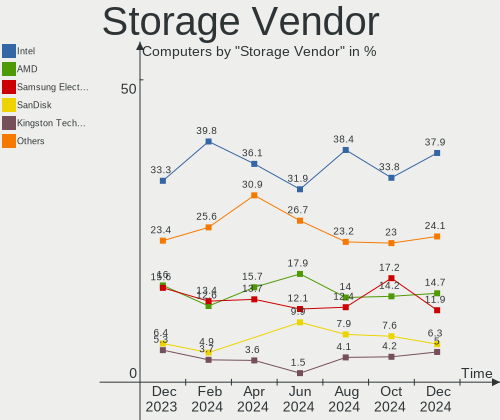
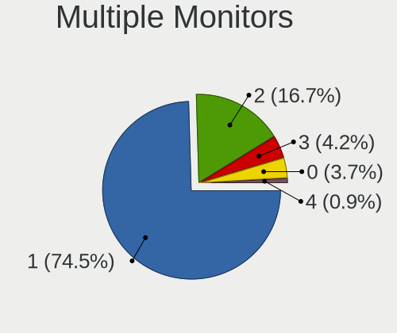
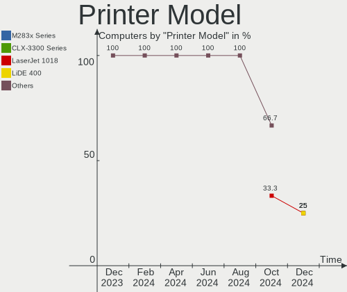

Pop!_OS Hardware Trends
-----------------------

A project to identify most popular hardware characteristics and track their change
over time based on data collected by Pop!_OS users at https://Linux-Hardware.org.

Anyone can contribute to this report by the [hw-probe](https://github.com/linuxhw/hw-probe) tool:

    sudo -E hw-probe -all -upload

This is a report for all computer types. See also reports for [desktops](/Dist/Pop!_OS/Desktop/README.md) and [notebooks](/Dist/Pop!_OS/Notebook/README.md).

Full-feature report is available here: https://linux-hardware.org/?view=trends

Period: Dec, 2021.

Contents
--------

* [ System ](#system)
  - [ OS                       ](#os)
  - [ OS Family                ](#os-family)
  - [ Kernel                   ](#kernel)
  - [ Kernel Family            ](#kernel-family)
  - [ Kernel Major Ver.        ](#kernel-major-ver)
  - [ Arch                     ](#arch)
  - [ DE                       ](#de)
  - [ Display Server           ](#display-server)
  - [ Display Manager          ](#display-manager)
  - [ OS Lang                  ](#os-lang)
  - [ Boot Mode                ](#boot-mode)
  - [ Filesystem               ](#filesystem)
  - [ Part. scheme             ](#part-scheme)
  - [ Dual Boot with Linux/BSD ](#dual-boot-with-linuxbsd)
  - [ Dual Boot (Win)          ](#dual-boot-win)

* [ Board ](#board)
  - [ Vendor                   ](#vendor)
  - [ Model                    ](#model)
  - [ Model Family             ](#model-family)
  - [ MFG Year                 ](#mfg-year)
  - [ Form Factor              ](#form-factor)
  - [ Secure Boot              ](#secure-boot)
  - [ Coreboot                 ](#coreboot)
  - [ RAM Size                 ](#ram-size)
  - [ RAM Used                 ](#ram-used)
  - [ Total Drives             ](#total-drives)
  - [ Has CD-ROM               ](#has-cd-rom)
  - [ Has Ethernet             ](#has-ethernet)
  - [ Has WiFi                 ](#has-wifi)
  - [ Has Bluetooth            ](#has-bluetooth)

* [ Location ](#location)
  - [ Country                  ](#country)
  - [ City                     ](#city)

* [ Drives ](#drives)
  - [ Drive Vendor             ](#drive-vendor)
  - [ Drive Model              ](#drive-model)
  - [ HDD Vendor               ](#hdd-vendor)
  - [ SSD Vendor               ](#ssd-vendor)
  - [ Drive Kind               ](#drive-kind)
  - [ Drive Connector          ](#drive-connector)
  - [ Drive Size               ](#drive-size)
  - [ Space Total              ](#space-total)
  - [ Space Used               ](#space-used)
  - [ Malfunc. Drives          ](#malfunc-drives)
  - [ Malfunc. Drive Vendor    ](#malfunc-drive-vendor)
  - [ Malfunc. HDD Vendor      ](#malfunc-hdd-vendor)
  - [ Malfunc. Drive Kind      ](#malfunc-drive-kind)
  - [ Failed Drives            ](#failed-drives)
  - [ Failed Drive Vendor      ](#failed-drive-vendor)
  - [ Drive Status             ](#drive-status)

* [ Storage controller ](#storage-controller)
  - [ Storage Vendor           ](#storage-vendor)
  - [ Storage Model            ](#storage-model)
  - [ Storage Kind             ](#storage-kind)

* [ Processor ](#processor)
  - [ CPU Vendor               ](#cpu-vendor)
  - [ CPU Model                ](#cpu-model)
  - [ CPU Model Family         ](#cpu-model-family)
  - [ CPU Cores                ](#cpu-cores)
  - [ CPU Sockets              ](#cpu-sockets)
  - [ CPU Threads              ](#cpu-threads)
  - [ CPU Op-Modes             ](#cpu-op-modes)
  - [ CPU Microcode            ](#cpu-microcode)
  - [ CPU Microarch            ](#cpu-microarch)

* [ Graphics ](#graphics)
  - [ GPU Vendor               ](#gpu-vendor)
  - [ GPU Model                ](#gpu-model)
  - [ GPU Combo                ](#gpu-combo)
  - [ GPU Driver               ](#gpu-driver)
  - [ GPU Memory               ](#gpu-memory)

* [ Monitor ](#monitor)
  - [ Monitor Vendor           ](#monitor-vendor)
  - [ Monitor Model            ](#monitor-model)
  - [ Monitor Resolution       ](#monitor-resolution)
  - [ Monitor Diagonal         ](#monitor-diagonal)
  - [ Monitor Width            ](#monitor-width)
  - [ Aspect Ratio             ](#aspect-ratio)
  - [ Monitor Area             ](#monitor-area)
  - [ Pixel Density            ](#pixel-density)
  - [ Multiple Monitors        ](#multiple-monitors)

* [ Network ](#network)
  - [ Net Controller Vendor    ](#net-controller-vendor)
  - [ Net Controller Model     ](#net-controller-model)
  - [ Wireless Vendor          ](#wireless-vendor)
  - [ Wireless Model           ](#wireless-model)
  - [ Ethernet Vendor          ](#ethernet-vendor)
  - [ Ethernet Model           ](#ethernet-model)
  - [ Net Controller Kind      ](#net-controller-kind)
  - [ Used Controller          ](#used-controller)
  - [ NICs                     ](#nics)
  - [ IPv6                     ](#ipv6)

* [ Bluetooth ](#bluetooth)
  - [ Bluetooth Vendor         ](#bluetooth-vendor)
  - [ Bluetooth Model          ](#bluetooth-model)

* [ Sound ](#sound)
  - [ Sound Vendor             ](#sound-vendor)
  - [ Sound Model              ](#sound-model)

* [ Memory ](#memory)
  - [ Memory Vendor            ](#memory-vendor)
  - [ Memory Model             ](#memory-model)
  - [ Memory Kind              ](#memory-kind)
  - [ Memory Form Factor       ](#memory-form-factor)
  - [ Memory Size              ](#memory-size)
  - [ Memory Speed             ](#memory-speed)

* [ Printers & scanners ](#printers--scanners)
  - [ Printer Vendor           ](#printer-vendor)
  - [ Printer Model            ](#printer-model)
  - [ Scanner Vendor           ](#scanner-vendor)
  - [ Scanner Model            ](#scanner-model)

* [ Camera ](#camera)
  - [ Camera Vendor            ](#camera-vendor)
  - [ Camera Model             ](#camera-model)

* [ Security ](#security)
  - [ Fingerprint Vendor       ](#fingerprint-vendor)
  - [ Fingerprint Model        ](#fingerprint-model)
  - [ Chipcard Vendor          ](#chipcard-vendor)
  - [ Chipcard Model           ](#chipcard-model)

* [ Unsupported ](#unsupported)
  - [ Unsupported Devices      ](#unsupported-devices)
  - [ Unsupported Device Types ](#unsupported-device-types)

System
------

OS
--

Installed operating systems

| Name          | Computers | Percent |
|---------------|-----------|---------|
| Pop!_OS 21.10 | 161       | 47.49%  |
| Pop!_OS 21.04 | 137       | 40.41%  |
| Pop!_OS 20.04 | 37        | 10.91%  |
| Pop!_OS 20.10 | 4         | 1.18%   |

OS Family
---------

OS without a version

| Name    | Computers | Percent |
|---------|-----------|---------|
| Pop!_OS | 339       | 100%    |

Kernel
------

Version of the Linux kernel

| Version                   | Computers | Percent |
|---------------------------|-----------|---------|
| 5.15.5-76051505-generic   | 185       | 54.57%  |
| 5.15.8-76051508-generic   | 78        | 23.01%  |
| 5.13.0-7620-generic       | 42        | 12.39%  |
| 5.13.0-7614-generic       | 7         | 2.06%   |
| 5.11.0-7620-generic       | 6         | 1.77%   |
| 5.13.0-1011-raspi         | 5         | 1.47%   |
| 5.15.7-xanmod1            | 3         | 0.88%   |
| 5.8.0-7642-generic        | 1         | 0.29%   |
| 5.8.0-7630-generic        | 1         | 0.29%   |
| 5.4.0-7642-generic        | 1         | 0.29%   |
| 5.4.0-7634-generic        | 1         | 0.29%   |
| 5.15.6-tkg-pds            | 1         | 0.29%   |
| 5.15.0-76051500-generic   | 1         | 0.29%   |
| 5.15.0-5.3-liquorix-amd64 | 1         | 0.29%   |
| 5.13.12-051312-generic    | 1         | 0.29%   |
| 5.13.0-1012-raspi         | 1         | 0.29%   |
| 5.11.22charles            | 1         | 0.29%   |
| 5.11.0-7633-generic       | 1         | 0.29%   |
| 5.11.0-7612-generic       | 1         | 0.29%   |
| 5.10.0-9-amd64            | 1         | 0.29%   |

Kernel Family
-------------

Linux kernel without a distro release

| Version | Computers | Percent |
|---------|-----------|---------|
| 5.15.5  | 185       | 54.57%  |
| 5.15.8  | 78        | 23.01%  |
| 5.13.0  | 55        | 16.22%  |
| 5.11.0  | 8         | 2.36%   |
| 5.15.7  | 3         | 0.88%   |
| 5.8.0   | 2         | 0.59%   |
| 5.4.0   | 2         | 0.59%   |
| 5.15.0  | 2         | 0.59%   |
| 5.15.6  | 1         | 0.29%   |
| 5.13.12 | 1         | 0.29%   |
| 5.11.22 | 1         | 0.29%   |
| 5.10.0  | 1         | 0.29%   |

Kernel Major Ver.
-----------------

Linux kernel major version

| Version | Computers | Percent |
|---------|-----------|---------|
| 5.15    | 269       | 79.35%  |
| 5.13    | 56        | 16.52%  |
| 5.11    | 9         | 2.65%   |
| 5.8     | 2         | 0.59%   |
| 5.4     | 2         | 0.59%   |
| 5.10    | 1         | 0.29%   |

Arch
----

OS architecture (x86_64, i586, etc.)

| Name    | Computers | Percent |
|---------|-----------|---------|
| x86_64  | 333       | 98.23%  |
| aarch64 | 6         | 1.77%   |

DE
--

Desktop Environment

| Name       | Computers | Percent |
|------------|-----------|---------|
| GNOME      | 333       | 98.23%  |
| Unknown    | 2         | 0.59%   |
| XFCE       | 1         | 0.29%   |
| X-Cinnamon | 1         | 0.29%   |
| LXQt       | 1         | 0.29%   |
| KDE5       | 1         | 0.29%   |

Display Server
--------------

X11 or Wayland

| Name    | Computers | Percent |
|---------|-----------|---------|
| X11     | 330       | 97.35%  |
| Wayland | 9         | 2.65%   |

Display Manager
---------------

SDDM, LightDM, etc.

| Name    | Computers | Percent |
|---------|-----------|---------|
| Unknown | 284       | 83.78%  |
| GDM     | 53        | 15.63%  |
| LightDM | 1         | 0.29%   |
| GDM3    | 1         | 0.29%   |

OS Lang
-------

Language

| Lang    | Computers | Percent |
|---------|-----------|---------|
| en_US   | 178       | 52.51%  |
| pt_BR   | 27        | 7.96%   |
| en_GB   | 25        | 7.37%   |
| de_DE   | 19        | 5.6%    |
| C       | 11        | 3.24%   |
| fr_FR   | 10        | 2.95%   |
| en_AU   | 10        | 2.95%   |
| en_CA   | 7         | 2.06%   |
| it_IT   | 5         | 1.47%   |
| sv_SE   | 4         | 1.18%   |
| ru_RU   | 4         | 1.18%   |
| pl_PL   | 4         | 1.18%   |
| en_IN   | 4         | 1.18%   |
| nb_NO   | 3         | 0.88%   |
| es_AR   | 3         | 0.88%   |
| Unknown | 3         | 0.88%   |
| nl_NL   | 2         | 0.59%   |
| fr_CA   | 2         | 0.59%   |
| es_MX   | 2         | 0.59%   |
| en_NZ   | 2         | 0.59%   |
| de_CH   | 2         | 0.59%   |
| zh_CN   | 1         | 0.29%   |
| sk_SK   | 1         | 0.29%   |
| pt_PT   | 1         | 0.29%   |
| nl_BE   | 1         | 0.29%   |
| ja_JP   | 1         | 0.29%   |
| hu_HU   | 1         | 0.29%   |
| hr_HR   | 1         | 0.29%   |
| fi_FI   | 1         | 0.29%   |
| es_ES   | 1         | 0.29%   |
| en_SG   | 1         | 0.29%   |
| cs_CZ   | 1         | 0.29%   |
| ar_SA   | 1         | 0.29%   |

Boot Mode
---------

EFI or BIOS

| Mode | Computers | Percent |
|------|-----------|---------|
| BIOS | 283       | 83.48%  |
| EFI  | 56        | 16.52%  |

Filesystem
----------

Type of filesystem

| Type    | Computers | Percent |
|---------|-----------|---------|
| Ext4    | 327       | 96.46%  |
| Btrfs   | 7         | 2.06%   |
| Overlay | 5         | 1.47%   |

Part. scheme
------------

Scheme of partitioning

| Type    | Computers | Percent |
|---------|-----------|---------|
| Unknown | 282       | 83.19%  |
| GPT     | 54        | 15.93%  |
| MBR     | 3         | 0.88%   |

Dual Boot with Linux/BSD
------------------------

Hosting more than one Linux/BSD

| Dual boot | Computers | Percent |
|-----------|-----------|---------|
| No        | 335       | 98.82%  |
| Yes       | 4         | 1.18%   |

Dual Boot (Win)
---------------

Hosting Linux and Windows

| Dual boot | Computers | Percent |
|-----------|-----------|---------|
| No        | 315       | 92.92%  |
| Yes       | 24        | 7.08%   |

Board
-----

Vendor
------

Motherboard manufacturer

| Name                    | Computers | Percent |
|-------------------------|-----------|---------|
| ASUSTek Computer        | 54        | 15.93%  |
| Lenovo                  | 48        | 14.16%  |
| Dell                    | 47        | 13.86%  |
| Hewlett-Packard         | 39        | 11.5%   |
| Gigabyte Technology     | 30        | 8.85%   |
| MSI                     | 16        | 4.72%   |
| Acer                    | 15        | 4.42%   |
| Apple                   | 11        | 3.24%   |
| System76                | 10        | 2.95%   |
| ASRock                  | 10        | 2.95%   |
| Raspberry Pi Foundation | 6         | 1.77%   |
| Toshiba                 | 5         | 1.47%   |
| Positivo                | 4         | 1.18%   |
| Google                  | 4         | 1.18%   |
| Sony                    | 3         | 0.88%   |
| Samsung Electronics     | 3         | 0.88%   |
| Intel                   | 3         | 0.88%   |
| HUAWEI                  | 3         | 0.88%   |
| Schenker                | 2         | 0.59%   |
| Razer                   | 2         | 0.59%   |
| Pegatron                | 2         | 0.59%   |
| Fujitsu                 | 2         | 0.59%   |
| Chuwi                   | 2         | 0.59%   |
| SLIMBOOK                | 1         | 0.29%   |
| PC Specialist           | 1         | 0.29%   |
| Packard Bell            | 1         | 0.29%   |
| OEM                     | 1         | 0.29%   |
| OBSIDIAN-PC             | 1         | 0.29%   |
| Microsoft               | 1         | 0.29%   |
| Medion                  | 1         | 0.29%   |
| LG Electronics          | 1         | 0.29%   |
| GPU Company             | 1         | 0.29%   |
| Gateway                 | 1         | 0.29%   |
| Framework               | 1         | 0.29%   |
| Foxconn                 | 1         | 0.29%   |
| Exo                     | 1         | 0.29%   |
| EVOO                    | 1         | 0.29%   |
| ECS                     | 1         | 0.29%   |
| Colorful Technology     | 1         | 0.29%   |
| Avell High Performance  | 1         | 0.29%   |
| 16216-BM-27268          | 1         | 0.29%   |

Model
-----

Motherboard model

| Name                           | Computers | Percent |
|--------------------------------|-----------|---------|
| RPi Raspberry Pi               | 6         | 1.77%   |
| System76 Lemur Pro             | 3         | 0.88%   |
| Lenovo Yoga 6 13ALC6 82ND      | 3         | 0.88%   |
| Dell Latitude E6420            | 3         | 0.88%   |
| System76 Gazelle               | 2         | 0.59%   |
| HP Compaq 8200 Elite SFF PC    | 2         | 0.59%   |
| Gigabyte B75M-D3H              | 2         | 0.59%   |
| Gigabyte B450 I AORUS PRO WIFI | 2         | 0.59%   |
| Dell XPS 15 9500               | 2         | 0.59%   |
| Dell OptiPlex 7010             | 2         | 0.59%   |
| Dell OptiPlex 3020             | 2         | 0.59%   |
| Dell Inspiron 5547             | 2         | 0.59%   |
| Dell G5 5505                   | 2         | 0.59%   |
| ASUS TUF GAMING B550M-PLUS     | 2         | 0.59%   |
| Toshiba Satellite L775D        | 1         | 0.29%   |
| Toshiba Satellite L55D-B       | 1         | 0.29%   |
| Toshiba Satellite L500         | 1         | 0.29%   |
| Toshiba Satellite C660         | 1         | 0.29%   |
| Toshiba Satellite C50t-B       | 1         | 0.29%   |
| System76 Thelio Major          | 1         | 0.29%   |
| System76 Thelio                | 1         | 0.29%   |
| System76 Serval                | 1         | 0.29%   |
| System76 Oryx Pro              | 1         | 0.29%   |
| System76 Darter Pro            | 1         | 0.29%   |
| Sony VGN-AW21M_H               | 1         | 0.29%   |
| Sony SVP1121M1EBI              | 1         | 0.29%   |
| Sony SVF1531GSFB               | 1         | 0.29%   |
| SLIMBOOK PROX15-AMD            | 1         | 0.29%   |
| Schenker XMG PRO (Late 2021)   | 1         | 0.29%   |
| Schenker XMG CORE (CZN/E21)    | 1         | 0.29%   |
| Samsung 950QCG                 | 1         | 0.29%   |
| Samsung 930QDB                 | 1         | 0.29%   |
| Samsung 550XDA                 | 1         | 0.29%   |
| Razer Blade 14 - RZ09-0370     | 1         | 0.29%   |
| Razer Blade                    | 1         | 0.29%   |
| Positivo POS-PARS760GCD        | 1         | 0.29%   |
| Positivo POS-EINM70CS          | 1         | 0.29%   |
| Positivo NB50TH                | 1         | 0.29%   |
| Positivo C14CR21TV             | 1         | 0.29%   |
| Pegatron AY691AA-ABA p6367c    | 1         | 0.29%   |
| Pegatron 20-b014               | 1         | 0.29%   |
| PC Specialist NH5x_7xDCx_DDx   | 1         | 0.29%   |
| Packard Bell IXTREME M5850     | 1         | 0.29%   |
| OEM I38II                      | 1         | 0.29%   |
| OBSIDIAN-PC P65xHP             | 1         | 0.29%   |
| MSI MS-7C84                    | 1         | 0.29%   |
| MSI MS-7C37                    | 1         | 0.29%   |
| MSI MS-7C02                    | 1         | 0.29%   |
| MSI MS-7B92                    | 1         | 0.29%   |
| MSI MS-7B09                    | 1         | 0.29%   |
| MSI MS-7A34                    | 1         | 0.29%   |
| MSI MS-7A33                    | 1         | 0.29%   |
| MSI MS-7A32                    | 1         | 0.29%   |
| MSI MS-7919                    | 1         | 0.29%   |
| MSI MS-7851                    | 1         | 0.29%   |
| MSI MS-7817                    | 1         | 0.29%   |
| MSI MS-7529                    | 1         | 0.29%   |
| MSI Modern 14 B10MW            | 1         | 0.29%   |
| MSI GL63 9RCX                  | 1         | 0.29%   |
| MSI GL62 6QC                   | 1         | 0.29%   |

Model Family
------------

Motherboard model prefix

| Name                    | Computers | Percent |
|-------------------------|-----------|---------|
| Lenovo ThinkPad         | 19        | 5.6%    |
| Dell Inspiron           | 12        | 3.54%   |
| Lenovo IdeaPad          | 10        | 2.95%   |
| Acer Aspire             | 10        | 2.95%   |
| Dell Latitude           | 9         | 2.65%   |
| Dell XPS                | 8         | 2.36%   |
| ASUS ROG                | 8         | 2.36%   |
| Lenovo Yoga             | 7         | 2.06%   |
| Dell OptiPlex           | 7         | 2.06%   |
| RPi Raspberry           | 6         | 1.77%   |
| HP Compaq               | 6         | 1.77%   |
| ASUS PRIME              | 6         | 1.77%   |
| Toshiba Satellite       | 5         | 1.47%   |
| Lenovo ThinkCentre      | 5         | 1.47%   |
| HP EliteBook            | 5         | 1.47%   |
| HP ProBook              | 4         | 1.18%   |
| HP Pavilion             | 4         | 1.18%   |
| HP ENVY                 | 4         | 1.18%   |
| ASUS VivoBook           | 4         | 1.18%   |
| ASUS TUF                | 4         | 1.18%   |
| System76 Lemur          | 3         | 0.88%   |
| Lenovo Legion           | 3         | 0.88%   |
| HP OMEN                 | 3         | 0.88%   |
| Gigabyte X570           | 3         | 0.88%   |
| Gigabyte B450           | 3         | 0.88%   |
| Dell G5                 | 3         | 0.88%   |
| System76 Thelio         | 2         | 0.59%   |
| System76 Gazelle        | 2         | 0.59%   |
| Schenker XMG            | 2         | 0.59%   |
| Razer Blade             | 2         | 0.59%   |
| Lenovo MIIX             | 2         | 0.59%   |
| HP ZBook                | 2         | 0.59%   |
| HP Laptop               | 2         | 0.59%   |
| HP 15                   | 2         | 0.59%   |
| Gigabyte B75M-D3H       | 2         | 0.59%   |
| Dell Precision          | 2         | 0.59%   |
| ASUS ZenBook            | 2         | 0.59%   |
| ASUS Rampage            | 2         | 0.59%   |
| ASRock Z87              | 2         | 0.59%   |
| Acer Nitro              | 2         | 0.59%   |
| System76 Serval         | 1         | 0.29%   |
| System76 Oryx           | 1         | 0.29%   |
| System76 Darter         | 1         | 0.29%   |
| Sony VGN-AW21M          | 1         | 0.29%   |
| Sony SVP1121M1EBI       | 1         | 0.29%   |
| Sony SVF1531GSFB        | 1         | 0.29%   |
| SLIMBOOK PROX15-AMD     | 1         | 0.29%   |
| Samsung 950QCG          | 1         | 0.29%   |
| Samsung 930QDB          | 1         | 0.29%   |
| Samsung 550XDA          | 1         | 0.29%   |
| Positivo POS-PARS760GCD | 1         | 0.29%   |
| Positivo POS-EINM70CS   | 1         | 0.29%   |
| Positivo NB50TH         | 1         | 0.29%   |
| Positivo C14CR21TV      | 1         | 0.29%   |
| Pegatron AY691AA-ABA    | 1         | 0.29%   |
| Pegatron 20-b014        | 1         | 0.29%   |
| PC Specialist NH5x      | 1         | 0.29%   |
| Packard Bell IXTREME    | 1         | 0.29%   |
| OEM I38II               | 1         | 0.29%   |
| OBSIDIAN-PC P65xHP      | 1         | 0.29%   |

MFG Year
--------

Motherboard manufacture year

| Year    | Computers | Percent |
|---------|-----------|---------|
| 2021    | 115       | 33.92%  |
| 2020    | 40        | 11.8%   |
| 2019    | 33        | 9.73%   |
| 2018    | 24        | 7.08%   |
| 2013    | 20        | 5.9%    |
| 2011    | 18        | 5.31%   |
| 2015    | 17        | 5.01%   |
| 2014    | 15        | 4.42%   |
| 2016    | 11        | 3.24%   |
| 2009    | 10        | 2.95%   |
| 2012    | 9         | 2.65%   |
| 2008    | 9         | 2.65%   |
| Unknown | 6         | 1.77%   |
| 2017    | 5         | 1.47%   |
| 2010    | 4         | 1.18%   |
| 2007    | 3         | 0.88%   |

Form Factor
-----------

Physical design of the computer

| Name           | Computers | Percent |
|----------------|-----------|---------|
| Notebook       | 182       | 53.69%  |
| Desktop        | 128       | 37.76%  |
| Convertible    | 12        | 3.54%   |
| System on chip | 6         | 1.77%   |
| Tablet         | 4         | 1.18%   |
| All in one     | 4         | 1.18%   |
| Mini pc        | 3         | 0.88%   |

Secure Boot
-----------

Enabled or disabled

| State    | Computers | Percent |
|----------|-----------|---------|
| Disabled | 339       | 100%    |

Coreboot
--------

Have coreboot on board

| Used | Computers | Percent |
|------|-----------|---------|
| No   | 329       | 97.05%  |
| Yes  | 10        | 2.95%   |

RAM Size
--------

Total RAM memory

| Size in GB  | Computers | Percent |
|-------------|-----------|---------|
| 16.01-24.0  | 90        | 26.55%  |
| 4.01-8.0    | 81        | 23.89%  |
| 8.01-16.0   | 53        | 15.63%  |
| 3.01-4.0    | 46        | 13.57%  |
| 32.01-64.0  | 45        | 13.27%  |
| 64.01-256.0 | 9         | 2.65%   |
| 24.01-32.0  | 5         | 1.47%   |
| 1.01-2.0    | 5         | 1.47%   |
| 2.01-3.0    | 4         | 1.18%   |
| 0.51-1.0    | 1         | 0.29%   |

RAM Used
--------

Used RAM memory

| Used GB    | Computers | Percent |
|------------|-----------|---------|
| 2.01-3.0   | 115       | 33.92%  |
| 1.01-2.0   | 95        | 28.02%  |
| 3.01-4.0   | 67        | 19.76%  |
| 4.01-8.0   | 48        | 14.16%  |
| 8.01-16.0  | 10        | 2.95%   |
| 0.51-1.0   | 3         | 0.88%   |
| 16.01-24.0 | 1         | 0.29%   |

Total Drives
------------

Number of drives on board

| Drives | Computers | Percent |
|--------|-----------|---------|
| 1      | 195       | 57.52%  |
| 2      | 89        | 26.25%  |
| 3      | 26        | 7.67%   |
| 4      | 13        | 3.83%   |
| 5      | 8         | 2.36%   |
| 6      | 5         | 1.47%   |
| 0      | 3         | 0.88%   |

Has CD-ROM
----------

Has CD-ROM on board

| Presented | Computers | Percent |
|-----------|-----------|---------|
| No        | 244       | 71.98%  |
| Yes       | 95        | 28.02%  |

Has Ethernet
------------

Has Ethernet on board

| Presented | Computers | Percent |
|-----------|-----------|---------|
| Yes       | 285       | 84.07%  |
| No        | 54        | 15.93%  |

Has WiFi
--------

Has WiFi module

| Presented | Computers | Percent |
|-----------|-----------|---------|
| Yes       | 272       | 80.24%  |
| No        | 67        | 19.76%  |

Has Bluetooth
-------------

Has Bluetooth module

| Presented | Computers | Percent |
|-----------|-----------|---------|
| Yes       | 228       | 67.26%  |
| No        | 111       | 32.74%  |

Location
--------

Country
-------

Geographic location (country)

| Country             | Computers | Percent |
|---------------------|-----------|---------|
| USA                 | 94        | 27.73%  |
| Brazil              | 30        | 8.85%   |
| Germany             | 22        | 6.49%   |
| Canada              | 16        | 4.72%   |
| UK                  | 15        | 4.42%   |
| India               | 14        | 4.13%   |
| Netherlands         | 12        | 3.54%   |
| Australia           | 11        | 3.24%   |
| France              | 9         | 2.65%   |
| Sweden              | 8         | 2.36%   |
| Russia              | 7         | 2.06%   |
| Argentina           | 7         | 2.06%   |
| Italy               | 6         | 1.77%   |
| Switzerland         | 5         | 1.47%   |
| Poland              | 5         | 1.47%   |
| Norway              | 5         | 1.47%   |
| Saudi Arabia        | 4         | 1.18%   |
| Romania             | 4         | 1.18%   |
| Slovakia            | 3         | 0.88%   |
| New Zealand         | 3         | 0.88%   |
| Mexico              | 3         | 0.88%   |
| Spain               | 2         | 0.59%   |
| South Africa        | 2         | 0.59%   |
| Singapore           | 2         | 0.59%   |
| Portugal            | 2         | 0.59%   |
| Japan               | 2         | 0.59%   |
| Ireland             | 2         | 0.59%   |
| Hungary             | 2         | 0.59%   |
| Greece              | 2         | 0.59%   |
| Finland             | 2         | 0.59%   |
| Czechia             | 2         | 0.59%   |
| Croatia             | 2         | 0.59%   |
| Bulgaria            | 2         | 0.59%   |
| Austria             | 2         | 0.59%   |
| Algeria             | 2         | 0.59%   |
| Vietnam             | 1         | 0.29%   |
| UAE                 | 1         | 0.29%   |
| Trinidad and Tobago | 1         | 0.29%   |
| South Korea         | 1         | 0.29%   |
| Sierra Leone        | 1         | 0.29%   |
| Puerto Rico         | 1         | 0.29%   |
| Philippines         | 1         | 0.29%   |
| Palestine           | 1         | 0.29%   |
| North Macedonia     | 1         | 0.29%   |
| Nigeria             | 1         | 0.29%   |
| Montenegro          | 1         | 0.29%   |
| Malaysia            | 1         | 0.29%   |
| Lithuania           | 1         | 0.29%   |
| Lebanon             | 1         | 0.29%   |
| Jordan              | 1         | 0.29%   |
| Indonesia           | 1         | 0.29%   |
| Honduras            | 1         | 0.29%   |
| Estonia             | 1         | 0.29%   |
| El Salvador         | 1         | 0.29%   |
| Egypt               | 1         | 0.29%   |
| Ecuador             | 1         | 0.29%   |
| Cyprus              | 1         | 0.29%   |
| Colombia            | 1         | 0.29%   |
| China               | 1         | 0.29%   |
| Cambodia            | 1         | 0.29%   |

City
----

Geographic location (city)

| City                  | Computers | Percent |
|-----------------------|-----------|---------|
| S??o Paulo            | 6         | 1.77%   |
| The Hague             | 3         | 0.88%   |
| Sydney                | 3         | 0.88%   |
| Rome                  | 3         | 0.88%   |
| Moscow                | 3         | 0.88%   |
| Vienna                | 2         | 0.59%   |
| Utrecht               | 2         | 0.59%   |
| Ume??                 | 2         | 0.59%   |
| Singapore             | 2         | 0.59%   |
| Sao Goncalo           | 2         | 0.59%   |
| San Jose              | 2         | 0.59%   |
| Riyadh                | 2         | 0.59%   |
| Pune                  | 2         | 0.59%   |
| Plano                 | 2         | 0.59%   |
| Phoenix               | 2         | 0.59%   |
| Oslo                  | 2         | 0.59%   |
| Montreal              | 2         | 0.59%   |
| Miami                 | 2         | 0.59%   |
| Melbourne             | 2         | 0.59%   |
| Mar del Plata         | 2         | 0.59%   |
| Londrina              | 2         | 0.59%   |
| Lisbon                | 2         | 0.59%   |
| Levis                 | 2         | 0.59%   |
| Las Vegas             | 2         | 0.59%   |
| Junagadh              | 2         | 0.59%   |
| Johannesburg          | 2         | 0.59%   |
| Jeddah                | 2         | 0.59%   |
| Jacksonville          | 2         | 0.59%   |
| Hanover               | 2         | 0.59%   |
| Constan?›a            | 2         | 0.59%   |
| Buenos Aires          | 2         | 0.59%   |
| Brisbane              | 2         | 0.59%   |
| Atlanta               | 2         | 0.59%   |
| Adelaide CBD          | 2         | 0.59%   |
| Zagreb                | 1         | 0.29%   |
| Youngstown            | 1         | 0.29%   |
| Yekaterinburg         | 1         | 0.29%   |
| Witten                | 1         | 0.29%   |
| Windsor               | 1         | 0.29%   |
| Willoughby            | 1         | 0.29%   |
| Williamsburg          | 1         | 0.29%   |
| Wichita               | 1         | 0.29%   |
| West Palm Beach       | 1         | 0.29%   |
| West Orange           | 1         | 0.29%   |
| Wellington            | 1         | 0.29%   |
| Weatherford           | 1         | 0.29%   |
| Wasilla               | 1         | 0.29%   |
| Vilnius               | 1         | 0.29%   |
| Vaxholm               | 1         | 0.29%   |
| Varberg               | 1         | 0.29%   |
| Valencia              | 1         | 0.29%   |
| Vaellingby            | 1         | 0.29%   |
| Tukwila               | 1         | 0.29%   |
| Trondheim             | 1         | 0.29%   |
| Trezzano sul Naviglio | 1         | 0.29%   |
| Toledo                | 1         | 0.29%   |
| Tokyo                 | 1         | 0.29%   |
| Thousand Oaks         | 1         | 0.29%   |
| Thessaloniki          | 1         | 0.29%   |
| The Colony            | 1         | 0.29%   |

Drives
------

Drive Vendor
------------

Hard drive vendors

| Vendor                    | Computers | Drives | Percent |
|---------------------------|-----------|--------|---------|
| Samsung Electronics       | 102       | 136    | 19.84%  |
| Seagate                   | 85        | 95     | 16.54%  |
| WDC                       | 66        | 78     | 12.84%  |
| SanDisk                   | 34        | 36     | 6.61%   |
| Kingston                  | 32        | 33     | 6.23%   |
| Unknown                   | 23        | 24     | 4.47%   |
| Toshiba                   | 21        | 25     | 4.09%   |
| SK Hynix                  | 19        | 19     | 3.7%    |
| Crucial                   | 19        | 19     | 3.7%    |
| Intel                     | 12        | 12     | 2.33%   |
| Phison                    | 8         | 8      | 1.56%   |
| Hitachi                   | 7         | 7      | 1.36%   |
| Micron Technology         | 6         | 7      | 1.17%   |
| A-DATA Technology         | 6         | 6      | 1.17%   |
| PNY                       | 5         | 7      | 0.97%   |
| Micron/Crucial Technology | 5         | 5      | 0.97%   |
| KIOXIA                    | 5         | 5      | 0.97%   |
| Apple                     | 5         | 5      | 0.97%   |
| XPG                       | 4         | 4      | 0.78%   |
| Silicon Motion            | 4         | 4      | 0.78%   |
| LITEON                    | 4         | 4      | 0.78%   |
| China                     | 4         | 4      | 0.78%   |
| OCZ                       | 3         | 4      | 0.58%   |
| ADATA Technology          | 3         | 3      | 0.58%   |
| Transcend                 | 2         | 2      | 0.39%   |
| TO Exter                  | 2         | 2      | 0.39%   |
| Patriot                   | 2         | 3      | 0.39%   |
| HGST                      | 2         | 2      | 0.39%   |
| Corsair                   | 2         | 3      | 0.39%   |
| Unknown                   | 2         | 2      | 0.39%   |
| Union Memory (Shenzhen)   | 1         | 1      | 0.19%   |
| UMIS                      | 1         | 1      | 0.19%   |
| Team                      | 1         | 1      | 0.19%   |
| SPCC                      | 1         | 1      | 0.19%   |
| SABRENT                   | 1         | 1      | 0.19%   |
| ROG                       | 1         | 1      | 0.19%   |
| Realtek                   | 1         | 2      | 0.19%   |
| Netac                     | 1         | 1      | 0.19%   |
| KLLISRE                   | 1         | 1      | 0.19%   |
| KIOXIA-EXCERIA            | 1         | 1      | 0.19%   |
| KingSpec                  | 1         | 1      | 0.19%   |
| KingDian                  | 1         | 1      | 0.19%   |
| KINGBANK                  | 1         | 1      | 0.19%   |
| Intenso                   | 1         | 1      | 0.19%   |
| Integral                  | 1         | 1      | 0.19%   |
| HGST HTS                  | 1         | 1      | 0.19%   |
| Hewlett-Packard           | 1         | 1      | 0.19%   |
| Gigabyte Technology       | 1         | 1      | 0.19%   |
| FORESEE                   | 1         | 1      | 0.19%   |
| External                  | 1         | 1      | 0.19%   |

Drive Model
-----------

Hard drive models

| Model                                  | Computers | Percent |
|----------------------------------------|-----------|---------|
| Samsung NVMe SSD Drive 1TB             | 21        | 3.74%   |
| Samsung SSD 850 EVO 250GB              | 9         | 1.6%    |
| Unknown MMC Card  64GB                 | 8         | 1.42%   |
| Kingston SA400S37240G 240GB SSD        | 8         | 1.42%   |
| Seagate ST1000LM035-1RK172 1TB         | 6         | 1.07%   |
| Kingston SA400S37120G 120GB SSD        | 6         | 1.07%   |
| Unknown MMC Card  128GB                | 5         | 0.89%   |
| Sandisk NVMe SSD Drive 512GB           | 5         | 0.89%   |
| Samsung NVMe SSD Drive 512GB           | 5         | 0.89%   |
| Samsung NVMe SSD Drive 500GB           | 5         | 0.89%   |
| WDC WDS240G2G0B-00EPW0 240GB SSD       | 4         | 0.71%   |
| SK Hynix NVMe SSD Drive 512GB          | 4         | 0.71%   |
| Seagate ST9500325AS 500GB              | 4         | 0.71%   |
| Seagate ST1000DM010-2EP102 1TB         | 4         | 0.71%   |
| Sandisk NVMe SSD Drive 500GB           | 4         | 0.71%   |
| Sandisk NVMe SSD Drive 1TB             | 4         | 0.71%   |
| Samsung SSD 850 EVO 500GB              | 4         | 0.71%   |
| Samsung NVMe SSD Drive 2TB             | 4         | 0.71%   |
| Samsung NVMe SSD Drive 250GB           | 4         | 0.71%   |
| Samsung NVMe SSD Drive 1024GB          | 4         | 0.71%   |
| XPG NVMe SSD Drive 512GB               | 3         | 0.53%   |
| WDC WD10SPZX-08Z10 1TB                 | 3         | 0.53%   |
| Toshiba DT01ACA100 1TB                 | 3         | 0.53%   |
| SK Hynix NVMe SSD Drive 256GB          | 3         | 0.53%   |
| Seagate ST1000DM003-1SB102 1TB         | 3         | 0.53%   |
| Sandisk NVMe SSD Drive 1024GB          | 3         | 0.53%   |
| Samsung SSD 870 QVO 1TB                | 3         | 0.53%   |
| Samsung SSD 860 EVO 500GB              | 3         | 0.53%   |
| Samsung SSD 860 EVO 1TB                | 3         | 0.53%   |
| Samsung SM963 2.5" NVMe PCIe SSD 128GB | 3         | 0.53%   |
| Samsung NVMe SSD Drive 256GB           | 3         | 0.53%   |
| Phison NVMe SSD Drive 1TB              | 3         | 0.53%   |
| Micron/Crucial NVMe SSD Drive 500GB    | 3         | 0.53%   |
| Micron NVMe SSD Drive 512GB            | 3         | 0.53%   |
| Kingston SA400S37480G 480GB SSD        | 3         | 0.53%   |
| Crucial CT500MX500SSD1 500GB           | 3         | 0.53%   |
| Crucial CT480BX500SSD1 480GB           | 3         | 0.53%   |
| Crucial CT240BX500SSD1 240GB           | 3         | 0.53%   |
| WDC WD2003FZEX-00SRLA0 2TB             | 2         | 0.36%   |
| WDC WD10SPZX-24Z10 1TB                 | 2         | 0.36%   |
| Unknown MMC Card  32GB                 | 2         | 0.36%   |
| Toshiba NVMe SSD Drive 512GB           | 2         | 0.36%   |
| Toshiba MQ04ABF100 1TB                 | 2         | 0.36%   |
| Toshiba MQ01ABD100 1TB                 | 2         | 0.36%   |
| TO Exter nal USB 3.0 250GB             | 2         | 0.36%   |
| SK Hynix SHGS31-500GS-2 500GB SSD      | 2         | 0.36%   |
| Seagate ST500LT012-9WS142 500GB        | 2         | 0.36%   |
| Seagate ST500LT012-1DG142 500GB        | 2         | 0.36%   |
| Seagate ST500LM012 HN-M500MBB 500GB    | 2         | 0.36%   |
| Seagate ST500DM002-1BD142 500GB        | 2         | 0.36%   |
| Seagate ST4000DM000-1F2168 4TB         | 2         | 0.36%   |
| Seagate ST3250318AS 250GB              | 2         | 0.36%   |
| Seagate ST2000DM008-2FR102 2TB         | 2         | 0.36%   |
| Seagate ST2000DM001-1ER164 2TB         | 2         | 0.36%   |
| Seagate ST2000DM001-1CH164 2TB         | 2         | 0.36%   |
| Seagate ST1000LX015-1U7172 1TB         | 2         | 0.36%   |
| Seagate ST1000LM024 HN-M101MBB 1TB     | 2         | 0.36%   |
| Seagate NVMe SSD Drive 1TB             | 2         | 0.36%   |
| SanDisk SSD PLUS 240GB                 | 2         | 0.36%   |
| SanDisk SSD PLUS 120 GB                | 2         | 0.36%   |

HDD Vendor
----------

Hard disk drive vendors

| Vendor              | Computers | Drives | Percent |
|---------------------|-----------|--------|---------|
| Seagate             | 79        | 88     | 47.31%  |
| WDC                 | 53        | 62     | 31.74%  |
| Toshiba             | 16        | 20     | 9.58%   |
| Hitachi             | 7         | 7      | 4.19%   |
| Samsung Electronics | 3         | 3      | 1.8%    |
| TO Exter            | 2         | 2      | 1.2%    |
| HGST                | 2         | 2      | 1.2%    |
| Apple               | 2         | 2      | 1.2%    |
| Unknown             | 1         | 1      | 0.6%    |
| SABRENT             | 1         | 1      | 0.6%    |
| External            | 1         | 1      | 0.6%    |

SSD Vendor
----------

Solid state drive vendors

| Vendor              | Computers | Drives | Percent |
|---------------------|-----------|--------|---------|
| Samsung Electronics | 47        | 56     | 27.98%  |
| Kingston            | 23        | 24     | 13.69%  |
| Crucial             | 19        | 19     | 11.31%  |
| SanDisk             | 16        | 16     | 9.52%   |
| WDC                 | 7         | 7      | 4.17%   |
| A-DATA Technology   | 6         | 6      | 3.57%   |
| SK Hynix            | 5         | 5      | 2.98%   |
| PNY                 | 5         | 7      | 2.98%   |
| Intel               | 5         | 5      | 2.98%   |
| China               | 4         | 4      | 2.38%   |
| OCZ                 | 3         | 4      | 1.79%   |
| LITEON              | 3         | 3      | 1.79%   |
| Apple               | 3         | 3      | 1.79%   |
| Transcend           | 2         | 2      | 1.19%   |
| Patriot             | 2         | 3      | 1.19%   |
| Micron Technology   | 2         | 2      | 1.19%   |
| Corsair             | 2         | 3      | 1.19%   |
| Toshiba             | 1         | 1      | 0.6%    |
| Team                | 1         | 1      | 0.6%    |
| SPCC                | 1         | 1      | 0.6%    |
| Seagate             | 1         | 1      | 0.6%    |
| Netac               | 1         | 1      | 0.6%    |
| KIOXIA-EXCERIA      | 1         | 1      | 0.6%    |
| KingSpec            | 1         | 1      | 0.6%    |
| KingDian            | 1         | 1      | 0.6%    |
| Intenso             | 1         | 1      | 0.6%    |
| Integral            | 1         | 1      | 0.6%    |
| Hewlett-Packard     | 1         | 1      | 0.6%    |
| Gigabyte Technology | 1         | 1      | 0.6%    |
| FORESEE             | 1         | 1      | 0.6%    |
| Unknown             | 1         | 1      | 0.6%    |

Drive Kind
----------

HDD or SSD

| Kind    | Computers | Drives | Percent |
|---------|-----------|--------|---------|
| NVMe    | 149       | 183    | 31.7%   |
| SSD     | 147       | 183    | 31.28%  |
| HDD     | 146       | 189    | 31.06%  |
| MMC     | 21        | 23     | 4.47%   |
| Unknown | 7         | 7      | 1.49%   |

Drive Connector
---------------

SATA, SAS, NVMe, etc.

| Type | Computers | Drives | Percent |
|------|-----------|--------|---------|
| SATA | 236       | 360    | 55.4%   |
| NVMe | 149       | 181    | 34.98%  |
| MMC  | 21        | 23     | 4.93%   |
| SAS  | 20        | 21     | 4.69%   |

Drive Size
----------

Size of hard drive

| Size in TB | Computers | Drives | Percent |
|------------|-----------|--------|---------|
| 0.01-0.5   | 174       | 224    | 58.19%  |
| 0.51-1.0   | 83        | 92     | 27.76%  |
| 1.01-2.0   | 23        | 28     | 7.69%   |
| 3.01-4.0   | 11        | 17     | 3.68%   |
| 4.01-10.0  | 5         | 7      | 1.67%   |
| 2.01-3.0   | 2         | 3      | 0.67%   |
| 10.01-20.0 | 1         | 1      | 0.33%   |

Space Total
-----------

Amount of disk space available on the file system

| Size in GB     | Computers | Percent |
|----------------|-----------|---------|
| 101-250        | 99        | 29.2%   |
| 251-500        | 97        | 28.61%  |
| 501-1000       | 67        | 19.76%  |
| 1001-2000      | 21        | 6.19%   |
| More than 3000 | 17        | 5.01%   |
| 51-100         | 11        | 3.24%   |
| 1-20           | 9         | 2.65%   |
| 2001-3000      | 8         | 2.36%   |
| 21-50          | 6         | 1.77%   |
| Unknown        | 4         | 1.18%   |

Space Used
----------

Amount of used disk space

| Used GB        | Computers | Percent |
|----------------|-----------|---------|
| 1-20           | 114       | 33.63%  |
| 21-50          | 66        | 19.47%  |
| 101-250        | 46        | 13.57%  |
| 51-100         | 46        | 13.57%  |
| 251-500        | 28        | 8.26%   |
| 1001-2000      | 14        | 4.13%   |
| 501-1000       | 10        | 2.95%   |
| More than 3000 | 7         | 2.06%   |
| 2001-3000      | 4         | 1.18%   |
| Unknown        | 4         | 1.18%   |

Malfunc. Drives
---------------

Drive models with a malfunction

| Model                          | Computers | Drives | Percent |
|--------------------------------|-----------|--------|---------|
| WDC WD5000AAKX-753CA1 500GB    | 1         | 1      | 14.29%  |
| WDC WD2500BEVT-22A23T0 250GB   | 1         | 1      | 14.29%  |
| WDC WD10JPCX-24UE4T0 1TB       | 1         | 1      | 14.29%  |
| Seagate ST1000LM035-1RK172 1TB | 1         | 1      | 14.29%  |
| Intel SSDSCKKF256G8H 256GB     | 1         | 1      | 14.29%  |
| Hitachi HDT725032VLA360 320GB  | 1         | 1      | 14.29%  |
| HGST HTS721010A9E630 1TB       | 1         | 1      | 14.29%  |

Malfunc. Drive Vendor
---------------------

Vendors of faulty drives

| Vendor  | Computers | Drives | Percent |
|---------|-----------|--------|---------|
| WDC     | 3         | 3      | 42.86%  |
| Seagate | 1         | 1      | 14.29%  |
| Intel   | 1         | 1      | 14.29%  |
| Hitachi | 1         | 1      | 14.29%  |
| HGST    | 1         | 1      | 14.29%  |

Malfunc. HDD Vendor
-------------------

Vendors of faulty HDD drives

| Vendor  | Computers | Drives | Percent |
|---------|-----------|--------|---------|
| WDC     | 3         | 3      | 50%     |
| Seagate | 1         | 1      | 16.67%  |
| Hitachi | 1         | 1      | 16.67%  |
| HGST    | 1         | 1      | 16.67%  |

Malfunc. Drive Kind
-------------------

Kinds of faulty drives

| Kind | Computers | Drives | Percent |
|------|-----------|--------|---------|
| HDD  | 6         | 6      | 85.71%  |
| SSD  | 1         | 1      | 14.29%  |

Failed Drives
-------------

Failed drive models

Zero info for selected period =(

Failed Drive Vendor
-------------------

Failed drive vendors

Zero info for selected period =(

Drive Status
------------

Number of failed and malfunc. drives

| Status   | Computers | Drives | Percent |
|----------|-----------|--------|---------|
| Detected | 287       | 496    | 81.53%  |
| Works    | 58        | 82     | 16.48%  |
| Malfunc  | 7         | 7      | 1.99%   |

Storage controller
------------------

Storage Vendor
--------------

Storage controller vendors

| Vendor                       | Computers | Percent |
|------------------------------|-----------|---------|
| Intel                        | 201       | 43.23%  |
| AMD                          | 85        | 18.28%  |
| Samsung Electronics          | 66        | 14.19%  |
| Sandisk                      | 27        | 5.81%   |
| SK Hynix                     | 14        | 3.01%   |
| Kingston Technology Company  | 10        | 2.15%   |
| Phison Electronics           | 8         | 1.72%   |
| ASMedia Technology           | 8         | 1.72%   |
| ADATA Technology             | 7         | 1.51%   |
| Toshiba America Info Systems | 6         | 1.29%   |
| Micron/Crucial Technology    | 5         | 1.08%   |
| Micron Technology            | 5         | 1.08%   |
| Silicon Motion               | 4         | 0.86%   |
| Seagate Technology           | 4         | 0.86%   |
| KIOXIA                       | 4         | 0.86%   |
| JMicron Technology           | 4         | 0.86%   |
| Union Memory (Shenzhen)      | 2         | 0.43%   |
| Nvidia                       | 2         | 0.43%   |
| Marvell Technology Group     | 2         | 0.43%   |
| Lite-On Technology           | 1         | 0.22%   |

Storage Model
-------------

Storage controller models

| Model                                                                          | Computers | Percent |
|--------------------------------------------------------------------------------|-----------|---------|
| AMD FCH SATA Controller [AHCI mode]                                            | 60        | 11.79%  |
| Samsung NVMe SSD Controller SM981/PM981/PM983                                  | 34        | 6.68%   |
| Intel 8 Series/C220 Series Chipset Family 6-port SATA Controller 1 [AHCI mode] | 18        | 3.54%   |
| Intel Sunrise Point-LP SATA Controller [AHCI mode]                             | 14        | 2.75%   |
| Intel 7 Series Chipset Family 6-port SATA Controller [AHCI mode]               | 14        | 2.75%   |
| AMD 400 Series Chipset SATA Controller                                         | 13        | 2.55%   |
| Samsung NVMe SSD Controller SM961/PM961/SM963                                  | 12        | 2.36%   |
| Intel 8 Series SATA Controller 1 [AHCI mode]                                   | 11        | 2.16%   |
| Samsung NVMe SSD Controller 980                                                | 10        | 1.96%   |
| Intel 82801 Mobile SATA Controller [RAID mode]                                 | 10        | 1.96%   |
| Sandisk WD Blue SN550 NVMe SSD                                                 | 8         | 1.57%   |
| Sandisk WD Black SN750 / PC SN730 NVMe SSD                                     | 8         | 1.57%   |
| Samsung NVMe SSD Controller PM9A1/PM9A3/980PRO                                 | 8         | 1.57%   |
| Intel Q170/Q150/B150/H170/H110/Z170/CM236 Chipset SATA Controller [AHCI Mode]  | 8         | 1.57%   |
| Intel 400 Series Chipset Family SATA AHCI Controller                           | 8         | 1.57%   |
| Intel 200 Series PCH SATA controller [AHCI mode]                               | 8         | 1.57%   |
| ASMedia ASM1062 Serial ATA Controller                                          | 8         | 1.57%   |
| Intel Volume Management Device NVMe RAID Controller                            | 7         | 1.38%   |
| Intel 6 Series/C200 Series Chipset Family 6 port Desktop SATA AHCI Controller  | 7         | 1.38%   |
| SK Hynix Gold P31 SSD                                                          | 6         | 1.18%   |
| Sandisk Non-Volatile memory controller                                         | 6         | 1.18%   |
| Intel HM170/QM170 Chipset SATA Controller [AHCI Mode]                          | 6         | 1.18%   |
| Intel Cannon Point-LP SATA Controller [AHCI Mode]                              | 6         | 1.18%   |
| Intel Cannon Lake PCH SATA AHCI Controller                                     | 6         | 1.18%   |
| Intel 82801IBM/IEM (ICH9M/ICH9M-E) 4 port SATA Controller [AHCI mode]          | 6         | 1.18%   |
| Intel 82801HM/HEM (ICH8M/ICH8M-E) SATA Controller [AHCI mode]                  | 6         | 1.18%   |
| Intel 82801HM/HEM (ICH8M/ICH8M-E) IDE Controller                               | 6         | 1.18%   |
| Intel 6 Series/C200 Series Chipset Family 6 port Mobile SATA AHCI Controller   | 6         | 1.18%   |
| AMD Starship/Matisse Chipset SATA Controller [AHCI mode]                       | 6         | 1.18%   |
| SK Hynix BC501 NVMe Solid State Drive                                          | 5         | 0.98%   |
| Phison E12 NVMe Controller                                                     | 5         | 0.98%   |
| Micron Non-Volatile memory controller                                          | 5         | 0.98%   |
| Intel SSD 660P Series                                                          | 5         | 0.98%   |
| Intel 5 Series/3400 Series Chipset 4 port SATA AHCI Controller                 | 5         | 0.98%   |
| AMD SB7x0/SB8x0/SB9x0 SATA Controller [IDE mode]                               | 5         | 0.98%   |
| AMD SB7x0/SB8x0/SB9x0 SATA Controller [AHCI mode]                              | 5         | 0.98%   |
| AMD SB7x0/SB8x0/SB9x0 IDE Controller                                           | 5         | 0.98%   |
| Micron/Crucial P2 NVMe PCIe SSD                                                | 4         | 0.79%   |
| KIOXIA Non-Volatile memory controller                                          | 4         | 0.79%   |
| Intel Wildcat Point-LP SATA Controller [AHCI Mode]                             | 4         | 0.79%   |
| Intel SATA Controller [RAID mode]                                              | 4         | 0.79%   |
| Intel Cannon Lake Mobile PCH SATA AHCI Controller                              | 4         | 0.79%   |
| Intel 7 Series/C210 Series Chipset Family 6-port SATA Controller [AHCI mode]   | 4         | 0.79%   |
| ADATA XPG SX8200 Pro PCIe Gen3x4 M.2 2280 Solid State Drive                    | 4         | 0.79%   |
| Toshiba America Info Systems XG6 NVMe SSD Controller                           | 3         | 0.59%   |
| Sandisk WD Black 2018/SN750 / PC SN720 NVMe SSD                                | 3         | 0.59%   |
| Kingston Company A2000 NVMe SSD                                                | 3         | 0.59%   |
| Intel NM10/ICH7 Family SATA Controller [IDE mode]                              | 3         | 0.59%   |
| Intel 500 Series Chipset Family SATA AHCI Controller                           | 3         | 0.59%   |
| AMD X370 Series Chipset SATA Controller                                        | 3         | 0.59%   |
| AMD 300 Series Chipset SATA Controller                                         | 3         | 0.59%   |
| ADATA Non-Volatile memory controller                                           | 3         | 0.59%   |
| Union Memory (Shenzhen) Non-Volatile memory controller                         | 2         | 0.39%   |
| SK Hynix BC511                                                                 | 2         | 0.39%   |
| Silicon Motion SM2263EN/SM2263XT SSD Controller                                | 2         | 0.39%   |
| Seagate Non-Volatile memory controller                                         | 2         | 0.39%   |
| Samsung NVMe SSD Controller SM951/PM951                                        | 2         | 0.39%   |
| Kingston Company Company Non-Volatile memory controller                        | 2         | 0.39%   |
| JMicron JMB363 SATA/IDE Controller                                             | 2         | 0.39%   |
| Intel Tiger Lake-LP SATA Controller [AHCI mode]                                | 2         | 0.39%   |

Storage Kind
------------

Kind of storage controller (IDE, SATA, NVMe, SAS, ...)

| Kind | Computers | Percent |
|------|-----------|---------|
| SATA | 252       | 56%     |
| NVMe | 148       | 32.89%  |
| IDE  | 28        | 6.22%   |
| RAID | 22        | 4.89%   |

Processor
---------

CPU Vendor
----------

Processor vendors

| Vendor | Computers | Percent |
|--------|-----------|---------|
| Intel  | 233       | 68.73%  |
| AMD    | 100       | 29.5%   |
| ARM    | 6         | 1.77%   |

CPU Model
---------

Processor models

| Model                                         | Computers | Percent |
|-----------------------------------------------|-----------|---------|
| Intel Core i7-10750H CPU @ 2.60GHz            | 8         | 2.36%   |
| Intel 11th Gen Core i7-1165G7 @ 2.80GHz       | 8         | 2.36%   |
| Intel 11th Gen Core i5-1135G7 @ 2.40GHz       | 6         | 1.77%   |
| ARM Processor                                 | 6         | 1.77%   |
| AMD Ryzen 5 5600X 6-Core Processor            | 6         | 1.77%   |
| AMD Ryzen 5 5500U with Radeon Graphics        | 6         | 1.77%   |
| AMD Ryzen 7 5800H with Radeon Graphics        | 5         | 1.47%   |
| AMD Ryzen 5 3500U with Radeon Vega Mobile Gfx | 5         | 1.47%   |
| Intel Core i5-7200U CPU @ 2.50GHz             | 4         | 1.18%   |
| Intel Core i5-4570 CPU @ 3.20GHz              | 4         | 1.18%   |
| Intel Core i5-3320M CPU @ 2.60GHz             | 4         | 1.18%   |
| Intel Core i5-2520M CPU @ 2.50GHz             | 4         | 1.18%   |
| Intel Core i5-2400 CPU @ 3.10GHz              | 4         | 1.18%   |
| AMD Ryzen 7 5700U with Radeon Graphics        | 4         | 1.18%   |
| AMD Ryzen 7 3700X 8-Core Processor            | 4         | 1.18%   |
| Intel Core i7-8750H CPU @ 2.20GHz             | 3         | 0.88%   |
| Intel Core i7-8565U CPU @ 1.80GHz             | 3         | 0.88%   |
| Intel Core i7-4790 CPU @ 3.60GHz              | 3         | 0.88%   |
| Intel Core i7-4500U CPU @ 1.80GHz             | 3         | 0.88%   |
| Intel Core i5-6500T CPU @ 2.50GHz             | 3         | 0.88%   |
| Intel Core i5-6500 CPU @ 3.20GHz              | 3         | 0.88%   |
| Intel Core i5-6300U CPU @ 2.40GHz             | 3         | 0.88%   |
| Intel Core i5-6200U CPU @ 2.30GHz             | 3         | 0.88%   |
| Intel Core i5-4210U CPU @ 1.70GHz             | 3         | 0.88%   |
| Intel Core i5-3210M CPU @ 2.50GHz             | 3         | 0.88%   |
| Intel 11th Gen Core i7-11800H @ 2.30GHz       | 3         | 0.88%   |
| AMD Ryzen 9 5950X 16-Core Processor           | 3         | 0.88%   |
| AMD Ryzen 7 4800H with Radeon Graphics        | 3         | 0.88%   |
| AMD Ryzen 5 4600H with Radeon Graphics        | 3         | 0.88%   |
| AMD Ryzen 5 2600 Six-Core Processor           | 3         | 0.88%   |
| AMD FX-8350 Eight-Core Processor              | 3         | 0.88%   |
| Intel Core i7-9750H CPU @ 2.60GHz             | 2         | 0.59%   |
| Intel Core i7-8700K CPU @ 3.70GHz             | 2         | 0.59%   |
| Intel Core i7-8650U CPU @ 1.90GHz             | 2         | 0.59%   |
| Intel Core i7-7700HQ CPU @ 2.80GHz            | 2         | 0.59%   |
| Intel Core i7-3720QM CPU @ 2.60GHz            | 2         | 0.59%   |
| Intel Core i7-3632QM CPU @ 2.20GHz            | 2         | 0.59%   |
| Intel Core i7-10510U CPU @ 1.80GHz            | 2         | 0.59%   |
| Intel Core i5-9600K CPU @ 3.70GHz             | 2         | 0.59%   |
| Intel Core i5-9300H CPU @ 2.40GHz             | 2         | 0.59%   |
| Intel Core i5-8265U CPU @ 1.60GHz             | 2         | 0.59%   |
| Intel Core i5-7300HQ CPU @ 2.50GHz            | 2         | 0.59%   |
| Intel Core i5-6300HQ CPU @ 2.30GHz            | 2         | 0.59%   |
| Intel Core i5-4670K CPU @ 3.40GHz             | 2         | 0.59%   |
| Intel Core i5-3470 CPU @ 3.20GHz              | 2         | 0.59%   |
| Intel Core i5-10210U CPU @ 1.60GHz            | 2         | 0.59%   |
| Intel Core i3-5005U CPU @ 2.00GHz             | 2         | 0.59%   |
| Intel Core 2 Duo CPU P8600 @ 2.40GHz          | 2         | 0.59%   |
| Intel Atom x5-Z8350 CPU @ 1.44GHz             | 2         | 0.59%   |
| Intel 11th Gen Core i7-1185G7 @ 3.00GHz       | 2         | 0.59%   |
| AMD Ryzen 9 3900X 12-Core Processor           | 2         | 0.59%   |
| AMD Ryzen 7 5800X 8-Core Processor            | 2         | 0.59%   |
| AMD Ryzen 7 3800X 8-Core Processor            | 2         | 0.59%   |
| AMD Ryzen 7 1700 Eight-Core Processor         | 2         | 0.59%   |
| AMD Ryzen 5 5600H with Radeon Graphics        | 2         | 0.59%   |
| AMD Ryzen 5 4500U with Radeon Graphics        | 2         | 0.59%   |
| AMD Ryzen 5 2500U with Radeon Vega Mobile Gfx | 2         | 0.59%   |
| AMD Ryzen 3 3300U with Radeon Vega Mobile Gfx | 2         | 0.59%   |
| AMD Phenom II X4 965 Processor                | 2         | 0.59%   |
| AMD Athlon 5350 APU with Radeon R3            | 2         | 0.59%   |

CPU Model Family
----------------

Processor model prefix

| Model                   | Computers | Percent |
|-------------------------|-----------|---------|
| Intel Core i5           | 79        | 23.3%   |
| Intel Core i7           | 67        | 19.76%  |
| AMD Ryzen 5             | 35        | 10.32%  |
| Other                   | 28        | 8.26%   |
| AMD Ryzen 7             | 28        | 8.26%   |
| Intel Core i3           | 24        | 7.08%   |
| Intel Core 2 Duo        | 12        | 3.54%   |
| Intel Celeron           | 9         | 2.65%   |
| AMD Ryzen 9             | 8         | 2.36%   |
| AMD FX                  | 5         | 1.47%   |
| Intel Pentium           | 4         | 1.18%   |
| AMD Ryzen 3             | 4         | 1.18%   |
| Intel Xeon              | 3         | 0.88%   |
| Intel Pentium Dual-Core | 3         | 0.88%   |
| AMD Ryzen Threadripper  | 3         | 0.88%   |
| Intel Core 2 Quad       | 2         | 0.59%   |
| Intel Atom              | 2         | 0.59%   |
| AMD Phenom II X4        | 2         | 0.59%   |
| AMD E1                  | 2         | 0.59%   |
| AMD Athlon              | 2         | 0.59%   |
| AMD A8                  | 2         | 0.59%   |
| Intel Pentium Dual      | 1         | 0.29%   |
| Intel Core m3           | 1         | 0.29%   |
| Intel Core i9           | 1         | 0.29%   |
| Intel Core 2 Extreme    | 1         | 0.29%   |
| Intel Core 2            | 1         | 0.29%   |
| Intel Celeron Dual-Core | 1         | 0.29%   |
| AMD PRO A10             | 1         | 0.29%   |
| AMD E2                  | 1         | 0.29%   |
| AMD C-50                | 1         | 0.29%   |
| AMD Athlon X2           | 1         | 0.29%   |
| AMD Athlon II X2        | 1         | 0.29%   |
| AMD Athlon 64 X2        | 1         | 0.29%   |
| AMD A6                  | 1         | 0.29%   |
| AMD A4                  | 1         | 0.29%   |
| AMD A10                 | 1         | 0.29%   |

CPU Cores
---------

Number of processor cores

| Number | Computers | Percent |
|--------|-----------|---------|
| 4      | 133       | 39.23%  |
| 2      | 103       | 30.38%  |
| 6      | 54        | 15.93%  |
| 8      | 35        | 10.32%  |
| 12     | 5         | 1.47%   |
| 16     | 4         | 1.18%   |
| 1      | 2         | 0.59%   |
| 32     | 1         | 0.29%   |
| 10     | 1         | 0.29%   |
| 3      | 1         | 0.29%   |

CPU Sockets
-----------

Number of sockets

| Number | Computers | Percent |
|--------|-----------|---------|
| 1      | 339       | 100%    |

CPU Threads
-----------

Threads per core (Hyper-Threading)

| Number | Computers | Percent |
|--------|-----------|---------|
| 2      | 238       | 70.21%  |
| 1      | 101       | 29.79%  |

CPU Op-Modes
------------

CPU Operation Modes (32-bit, 64-bit)

| Op mode        | Computers | Percent |
|----------------|-----------|---------|
| 32-bit, 64-bit | 334       | 98.53%  |
| 64-bit         | 5         | 1.47%   |

CPU Microcode
-------------

Microcode number

| Number     | Computers | Percent |
|------------|-----------|---------|
| Unknown    | 278       | 82.01%  |
| 0x806c1    | 9         | 2.65%   |
| 0xa0652    | 5         | 1.47%   |
| 0x906ea    | 4         | 1.18%   |
| 0x0a50000c | 4         | 1.18%   |
| 0x08608103 | 3         | 0.88%   |
| 0x806e9    | 2         | 0.59%   |
| 0x40661    | 2         | 0.59%   |
| 0x306c3    | 2         | 0.59%   |
| 0x206a7    | 2         | 0.59%   |
| 0x0a201016 | 2         | 0.59%   |
| 0x08701021 | 2         | 0.59%   |
| 0x0810100b | 2         | 0.59%   |
| 0x0800820d | 2         | 0.59%   |
| 0x08001137 | 2         | 0.59%   |
| 0xa0660    | 1         | 0.29%   |
| 0xa0653    | 1         | 0.29%   |
| 0x806ec    | 1         | 0.29%   |
| 0x806eb    | 1         | 0.29%   |
| 0x806d1    | 1         | 0.29%   |
| 0x6fa      | 1         | 0.29%   |
| 0x506e3    | 1         | 0.29%   |
| 0x406e3    | 1         | 0.29%   |
| 0x406c4    | 1         | 0.29%   |
| 0x306a9    | 1         | 0.29%   |
| 0x106a5    | 1         | 0.29%   |
| 0x1067a    | 1         | 0.29%   |
| 0x10676    | 1         | 0.29%   |
| 0x0a201009 | 1         | 0.29%   |
| 0x08301039 | 1         | 0.29%   |
| 0x08108109 | 1         | 0.29%   |
| 0x08101016 | 1         | 0.29%   |
| 0x0600611a | 1         | 0.29%   |

CPU Microarch
-------------

Microarchitecture

| Name            | Computers | Percent |
|-----------------|-----------|---------|
| KabyLake        | 50        | 14.75%  |
| Haswell         | 36        | 10.62%  |
| Zen 3           | 23        | 6.78%   |
| SandyBridge     | 22        | 6.49%   |
| Zen 2           | 21        | 6.19%   |
| Skylake         | 21        | 6.19%   |
| IvyBridge       | 21        | 6.19%   |
| Unknown         | 21        | 6.19%   |
| TigerLake       | 18        | 5.31%   |
| Penryn          | 16        | 4.72%   |
| Zen+            | 14        | 4.13%   |
| CometLake       | 13        | 3.83%   |
| Zen             | 10        | 2.95%   |
| Westmere        | 6         | 1.77%   |
| Core            | 6         | 1.77%   |
| Piledriver      | 5         | 1.47%   |
| Broadwell       | 5         | 1.47%   |
| Silvermont      | 4         | 1.18%   |
| IceLake         | 4         | 1.18%   |
| Nehalem         | 3         | 0.88%   |
| K10             | 3         | 0.88%   |
| Jaguar          | 3         | 0.88%   |
| Excavator       | 3         | 0.88%   |
| K10 Llano       | 2         | 0.59%   |
| Goldmont plus   | 2         | 0.59%   |
| Bobcat          | 2         | 0.59%   |
| Steamroller     | 1         | 0.29%   |
| Puma            | 1         | 0.29%   |
| K8 Hammer       | 1         | 0.29%   |
| K8 & K10 hybrid | 1         | 0.29%   |
| Goldmont        | 1         | 0.29%   |

Graphics
--------

GPU Vendor
----------

Vendors of graphics cards

| Vendor | Computers | Percent |
|--------|-----------|---------|
| Intel  | 175       | 43.53%  |
| Nvidia | 121       | 30.1%   |
| AMD    | 106       | 26.37%  |

GPU Model
---------

Graphics card models

| Model                                                                                    | Computers | Percent |
|------------------------------------------------------------------------------------------|-----------|---------|
| Intel TigerLake-LP GT2 [Iris Xe Graphics]                                                | 16        | 3.91%   |
| Intel 2nd Generation Core Processor Family Integrated Graphics Controller                | 15        | 3.67%   |
| Intel 3rd Gen Core processor Graphics Controller                                         | 14        | 3.42%   |
| Intel Haswell-ULT Integrated Graphics Controller                                         | 11        | 2.69%   |
| AMD Lucienne                                                                             | 10        | 2.44%   |
| AMD Cezanne                                                                              | 10        | 2.44%   |
| Intel HD Graphics 530                                                                    | 9         | 2.2%    |
| Intel CometLake-H GT2 [UHD Graphics]                                                     | 9         | 2.2%    |
| AMD Picasso/Raven 2 [Radeon Vega Series / Radeon Vega Mobile Series]                     | 9         | 2.2%    |
| Intel Skylake GT2 [HD Graphics 520]                                                      | 8         | 1.96%   |
| AMD Renoir                                                                               | 8         | 1.96%   |
| Nvidia GA106M [GeForce RTX 3060 Mobile / Max-Q]                                          | 7         | 1.71%   |
| AMD Navi 10 [Radeon RX 5600 OEM/5600 XT / 5700/5700 XT]                                  | 7         | 1.71%   |
| Intel Xeon E3-1200 v3/4th Gen Core Processor Integrated Graphics Controller              | 6         | 1.47%   |
| Intel WhiskeyLake-U GT2 [UHD Graphics 620]                                               | 6         | 1.47%   |
| Intel CometLake-U GT2 [UHD Graphics]                                                     | 6         | 1.47%   |
| Intel CoffeeLake-H GT2 [UHD Graphics 630]                                                | 6         | 1.47%   |
| Nvidia GM204 [GeForce GTX 970]                                                           | 5         | 1.22%   |
| Intel UHD Graphics 620                                                                   | 5         | 1.22%   |
| Intel Mobile 4 Series Chipset Integrated Graphics Controller                             | 5         | 1.22%   |
| Intel HD Graphics 620                                                                    | 5         | 1.22%   |
| Intel HD Graphics 5500                                                                   | 5         | 1.22%   |
| Intel Core Processor Integrated Graphics Controller                                      | 5         | 1.22%   |
| Intel CoffeeLake-S GT2 [UHD Graphics 630]                                                | 5         | 1.22%   |
| AMD Ellesmere [Radeon RX 470/480/570/570X/580/580X/590]                                  | 5         | 1.22%   |
| Nvidia GP107M [GeForce GTX 1050 Mobile]                                                  | 4         | 0.98%   |
| Nvidia GP107 [GeForce GTX 1050 Ti]                                                       | 4         | 0.98%   |
| Nvidia GP104 [GeForce GTX 1080]                                                          | 4         | 0.98%   |
| Intel Xeon E3-1200 v2/3rd Gen Core processor Graphics Controller                         | 4         | 0.98%   |
| Intel TigerLake-H GT1 [UHD Graphics]                                                     | 4         | 0.98%   |
| AMD Navi 22 [Radeon RX 6700/6700 XT / 6800M]                                             | 4         | 0.98%   |
| AMD Baffin [Radeon RX 550 640SP / RX 560/560X]                                           | 4         | 0.98%   |
| Nvidia TU117M [GeForce GTX 1650 Ti Mobile]                                               | 3         | 0.73%   |
| Nvidia TU106M [GeForce RTX 2060 Mobile]                                                  | 3         | 0.73%   |
| Nvidia GP108M [GeForce MX150]                                                            | 3         | 0.73%   |
| Nvidia GP108 [GeForce GT 1030]                                                           | 3         | 0.73%   |
| Nvidia GM108M [GeForce 940MX]                                                            | 3         | 0.73%   |
| Nvidia GK208B [GeForce GT 710]                                                           | 3         | 0.73%   |
| Nvidia G84M [GeForce 8600M GT]                                                           | 3         | 0.73%   |
| Intel HD Graphics 630                                                                    | 3         | 0.73%   |
| Intel Atom/Celeron/Pentium Processor x5-E8000/J3xxx/N3xxx Integrated Graphics Controller | 3         | 0.73%   |
| AMD Raven Ridge [Radeon Vega Series / Radeon Vega Mobile Series]                         | 3         | 0.73%   |
| AMD Navi 21 [Radeon RX 6800/6800 XT / 6900 XT]                                           | 3         | 0.73%   |
| AMD Cedar [Radeon HD 5000/6000/7350/8350 Series]                                         | 3         | 0.73%   |
| Nvidia TU117M                                                                            | 2         | 0.49%   |
| Nvidia TU117 [GeForce GTX 1650]                                                          | 2         | 0.49%   |
| Nvidia TU116M [GeForce GTX 1660 Ti Mobile]                                               | 2         | 0.49%   |
| Nvidia TU116 [GeForce GTX 1660 SUPER]                                                    | 2         | 0.49%   |
| Nvidia TU104 [GeForce RTX 2070 SUPER]                                                    | 2         | 0.49%   |
| Nvidia GT218 [GeForce 210]                                                               | 2         | 0.49%   |
| Nvidia GP108M [GeForce MX250]                                                            | 2         | 0.49%   |
| Nvidia GP106BM [GeForce GTX 1060 Mobile 6GB]                                             | 2         | 0.49%   |
| Nvidia GM107 [GeForce GTX 750 Ti]                                                        | 2         | 0.49%   |
| Nvidia GK208M [GeForce GT 740M]                                                          | 2         | 0.49%   |
| Nvidia GK208BM [GeForce 920M]                                                            | 2         | 0.49%   |
| Nvidia GF108GLM [NVS 5200M]                                                              | 2         | 0.49%   |
| Nvidia GA107M [GeForce RTX 3050 Mobile]                                                  | 2         | 0.49%   |
| Nvidia GA104M [GeForce RTX 3070 Mobile / Max-Q]                                          | 2         | 0.49%   |
| Nvidia GA104 [GeForce RTX 3070]                                                          | 2         | 0.49%   |
| Intel Tiger Lake UHD Graphics                                                            | 2         | 0.49%   |

GPU Combo
---------

Combinations of graphics cards

| Name           | Computers | Percent |
|----------------|-----------|---------|
| 1 x Intel      | 121       | 35.69%  |
| 1 x AMD        | 77        | 22.71%  |
| 1 x Nvidia     | 65        | 19.17%  |
| Intel + Nvidia | 38        | 11.21%  |
| AMD + Nvidia   | 13        | 3.83%   |
| Intel + AMD    | 11        | 3.24%   |
| Other          | 6         | 1.77%   |
| 2 x AMD        | 5         | 1.47%   |
| 2 x Nvidia     | 2         | 0.59%   |
| 4 x Nvidia     | 1         | 0.29%   |

GPU Driver
----------

Free vs proprietary

| Driver      | Computers | Percent |
|-------------|-----------|---------|
| Free        | 230       | 67.85%  |
| Proprietary | 90        | 26.55%  |
| Unknown     | 19        | 5.6%    |

GPU Memory
----------

Total video memory

| Size in GB | Computers | Percent |
|------------|-----------|---------|
| Unknown    | 247       | 72.86%  |
| 3.01-4.0   | 19        | 5.6%    |
| 1.01-2.0   | 19        | 5.6%    |
| 7.01-8.0   | 17        | 5.01%   |
| 5.01-6.0   | 17        | 5.01%   |
| 0.01-0.5   | 7         | 2.06%   |
| 8.01-16.0  | 5         | 1.47%   |
| 0.51-1.0   | 5         | 1.47%   |
| 2.01-3.0   | 3         | 0.88%   |

Monitor
-------

Monitor Vendor
--------------

Monitor vendors

| Vendor                  | Computers | Percent |
|-------------------------|-----------|---------|
| Samsung Electronics     | 42        | 11.76%  |
| AU Optronics            | 38        | 10.64%  |
| BOE                     | 36        | 10.08%  |
| Chimei Innolux          | 35        | 9.8%    |
| LG Display              | 34        | 9.52%   |
| Dell                    | 21        | 5.88%   |
| Acer                    | 17        | 4.76%   |
| Goldstar                | 16        | 4.48%   |
| Hewlett-Packard         | 9         | 2.52%   |
| BenQ                    | 9         | 2.52%   |
| AOC                     | 9         | 2.52%   |
| Apple                   | 8         | 2.24%   |
| Sharp                   | 7         | 1.96%   |
| PANDA                   | 7         | 1.96%   |
| Ancor Communications    | 7         | 1.96%   |
| ViewSonic               | 5         | 1.4%    |
| Sony                    | 4         | 1.12%   |
| Lenovo                  | 4         | 1.12%   |
| ASUSTek Computer        | 4         | 1.12%   |
| Philips                 | 3         | 0.84%   |
| Panasonic               | 3         | 0.84%   |
| MSI                     | 3         | 0.84%   |
| Iiyama                  | 3         | 0.84%   |
| Chi Mei Optoelectronics | 3         | 0.84%   |
| Vizio                   | 2         | 0.56%   |
| Unknown (XXX)           | 2         | 0.56%   |
| NEC Computers           | 2         | 0.56%   |
| MStar                   | 2         | 0.56%   |
| LG Philips              | 2         | 0.56%   |
| InfoVision              | 2         | 0.56%   |
| HB@                     | 2         | 0.56%   |
| Fujitsu Siemens         | 2         | 0.56%   |
| Xiaomi                  | 1         | 0.28%   |
| Wacom                   | 1         | 0.28%   |
| Viotek                  | 1         | 0.28%   |
| Videoseven              | 1         | 0.28%   |
| Unknown                 | 1         | 0.28%   |
| TMX                     | 1         | 0.28%   |
| Seiki                   | 1         | 0.28%   |
| MiTAC                   | 1         | 0.28%   |
| MAT                     | 1         | 0.28%   |
| HKC                     | 1         | 0.28%   |
| HannStar                | 1         | 0.28%   |
| Gigabyte Technology     | 1         | 0.28%   |
| DENON                   | 1         | 0.28%   |
| CKL                     | 1         | 0.28%   |

Monitor Model
-------------

Monitor models

| Model                                                                  | Computers | Percent |
|------------------------------------------------------------------------|-----------|---------|
| Chimei Innolux LCD Monitor CMN15F5 1920x1080 344x193mm 15.5-inch       | 3         | 0.82%   |
| Chimei Innolux LCD Monitor CMN15E6 1366x768 344x193mm 15.5-inch        | 3         | 0.82%   |
| Chimei Innolux LCD Monitor CMN14D5 1920x1080 309x173mm 13.9-inch       | 3         | 0.82%   |
| ViewSonic VX3276-QHD VSCE635 2560x1440 698x393mm 31.5-inch             | 2         | 0.55%   |
| Samsung Electronics U28E590 SAM0C4D 3840x2160 607x345mm 27.5-inch      | 2         | 0.55%   |
| Samsung Electronics LCD Monitor SEC5448 1920x1080 344x194mm 15.5-inch  | 2         | 0.55%   |
| Samsung Electronics LCD Monitor SDC4C48 1920x1080 409x230mm 18.5-inch  | 2         | 0.55%   |
| Samsung Electronics LCD Monitor SAM0902 1920x1080 1020x570mm 46.0-inch | 2         | 0.55%   |
| MStar TV_MONITOR MST0030 1440x900 1150x650mm 52.0-inch                 | 2         | 0.55%   |
| MSI Optix MAG27CQ MSI1462 2560x1440 597x336mm 27.0-inch                | 2         | 0.55%   |
| LG Display LCD Monitor LGD046C 1920x1080 380x210mm 17.1-inch           | 2         | 0.55%   |
| LG Display LCD Monitor LGD03DF 1366x768 344x194mm 15.5-inch            | 2         | 0.55%   |
| HB@ HBTV-32D03HD HB@0B01 1920x540 708x398mm 32.0-inch                  | 2         | 0.55%   |
| Goldstar Ultra HD GSM5B09 3840x2160 600x340mm 27.2-inch                | 2         | 0.55%   |
| Goldstar HDR WFHD GSM7714 2560x1080 798x334mm 34.1-inch                | 2         | 0.55%   |
| Goldstar HDR 4K GSM7706 3840x2160 600x340mm 27.2-inch                  | 2         | 0.55%   |
| Chimei Innolux LCD Monitor CMN15E7 1920x1080 344x193mm 15.5-inch       | 2         | 0.55%   |
| Chimei Innolux LCD Monitor CMN15D2 1920x1080 340x190mm 15.3-inch       | 2         | 0.55%   |
| Chimei Innolux LCD Monitor CMN1521 1920x1080 344x193mm 15.5-inch       | 2         | 0.55%   |
| Chimei Innolux LCD Monitor CMN14D4 1920x1080 309x173mm 13.9-inch       | 2         | 0.55%   |
| BOE LCD Monitor BOE08A8 1920x1080 344x194mm 15.5-inch                  | 2         | 0.55%   |
| BOE LCD Monitor BOE0819 1920x1080 344x194mm 15.5-inch                  | 2         | 0.55%   |
| BOE LCD Monitor BOE0812 1920x1080 344x194mm 15.5-inch                  | 2         | 0.55%   |
| BenQ ZOWIE XL LCD BNQ7F33 1920x1080 531x298mm 24.0-inch                | 2         | 0.55%   |
| AU Optronics LCD Monitor AUO5F2D 1920x1080 293x165mm 13.2-inch         | 2         | 0.55%   |
| AU Optronics LCD Monitor AUO323D 1920x1080 309x174mm 14.0-inch         | 2         | 0.55%   |
| Acer V243H ACR00DC 1920x1080 531x299mm 24.0-inch                       | 2         | 0.55%   |
| Xiaomi Mi TV XMD004A 1440x900 708x398mm 32.0-inch                      | 1         | 0.27%   |
| Wacom Cintiq 16 WAC1071 1920x1080 344x193mm 15.5-inch                  | 1         | 0.27%   |
| Vizio D55-D2 VIZ1004 1920x1080 477x268mm 21.5-inch                     | 1         | 0.27%   |
| Vizio D32h-D1 VIZ1002 1360x768 697x392mm 31.5-inch                     | 1         | 0.27%   |
| Viotek VIOTEKNB32C VTK3200 1920x1080 698x393mm 31.5-inch               | 1         | 0.27%   |
| ViewSonic XG270Q VSC3C3A 2560x1440 597x336mm 27.0-inch                 | 1         | 0.27%   |
| ViewSonic XG2703-GS VSCBA32 2560x1440 598x336mm 27.0-inch              | 1         | 0.27%   |
| ViewSonic VP3268-4K VSC8C34 3840x2160 697x392mm 31.5-inch              | 1         | 0.27%   |
| Videoseven D19W12C IGM19C1 1440x900 408x255mm 18.9-inch                | 1         | 0.27%   |
| Unknown SMART TV 6488 3840x2160 1209x680mm 54.6-inch                   | 1         | 0.27%   |
| Unknown (XXX) Union TV XXX2841 1920x1080 1209x680mm 54.6-inch          | 1         | 0.27%   |
| Unknown (XXX) Beyond TV XXX2851 3840x2160 1209x680mm 54.6-inch         | 1         | 0.27%   |
| TMX TL140BDXP01-0 TMX1400 2560x1440 310x174mm 14.0-inch                | 1         | 0.27%   |
| Sony TV XV SNY8300 1920x1080 1600x900mm 72.3-inch                      | 1         | 0.27%   |
| Sony TV SNY9C01 1920x1080 1600x900mm 72.3-inch                         | 1         | 0.27%   |
| Sony TV *02 SNY9403 1920x1080 1218x685mm 55.0-inch                     | 1         | 0.27%   |
| Sony TV *00 SNY4904 3840x2160 1600x900mm 72.3-inch                     | 1         | 0.27%   |
| Sharp LQ156M1JW01 SHP14C3 1920x1080 344x194mm 15.5-inch                | 1         | 0.27%   |
| Sharp LCD Monitor SHP1517 3840x2400 366x229mm 17.0-inch                | 1         | 0.27%   |
| Sharp LCD Monitor SHP14F9 1920x1200 288x180mm 13.4-inch                | 1         | 0.27%   |
| Sharp LCD Monitor SHP14D1 1920x1200 336x210mm 15.6-inch                | 1         | 0.27%   |
| Sharp LCD Monitor SHP14D0 3840x2400 336x210mm 15.6-inch                | 1         | 0.27%   |
| Sharp LCD Monitor SHP14AE 1920x1080 294x165mm 13.3-inch                | 1         | 0.27%   |
| Sharp LCD Monitor SHP1449 1920x1080 294x165mm 13.3-inch                | 1         | 0.27%   |
| Seiki SE50UY04 SEK0101 1920x1080 1600x900mm 72.3-inch                  | 1         | 0.27%   |
| Samsung Electronics U28D590 SAM0B80 3840x2160 607x345mm 27.5-inch      | 1         | 0.27%   |
| Samsung Electronics SyncMaster SAM0428 1680x1050 459x296mm 21.5-inch   | 1         | 0.27%   |
| Samsung Electronics SyncMaster SAM010B 1280x1024 338x270mm 17.0-inch   | 1         | 0.27%   |
| Samsung Electronics SMB2220N SAM06A2 1920x1080 477x268mm 21.5-inch     | 1         | 0.27%   |
| Samsung Electronics S34J55x SAM0F71 3440x1440 797x333mm 34.0-inch      | 1         | 0.27%   |
| Samsung Electronics S27C750 SAM0A5F 1920x1080 598x336mm 27.0-inch      | 1         | 0.27%   |
| Samsung Electronics S24E650 SAM0CBE 1920x1200 520x320mm 24.0-inch      | 1         | 0.27%   |
| Samsung Electronics S24E650 SAM0C86 1920x1200 518x324mm 24.1-inch      | 1         | 0.27%   |

Monitor Resolution
------------------

Monitor screen resolution

| Resolution         | Computers | Percent |
|--------------------|-----------|---------|
| 1920x1080 (FHD)    | 164       | 47.26%  |
| 1366x768 (WXGA)    | 53        | 15.27%  |
| 3840x2160 (4K)     | 33        | 9.51%   |
| 2560x1440 (QHD)    | 23        | 6.63%   |
| 3440x1440          | 9         | 2.59%   |
| 1920x1200 (WUXGA)  | 9         | 2.59%   |
| 1680x1050 (WSXGA+) | 7         | 2.02%   |
| 1600x900 (HD+)     | 7         | 2.02%   |
| 1280x1024 (SXGA)   | 7         | 2.02%   |
| 2560x1080          | 6         | 1.73%   |
| 1440x900 (WXGA+)   | 5         | 1.44%   |
| 2880x1800          | 4         | 1.15%   |
| 1280x800 (WXGA)    | 4         | 1.15%   |
| 3840x1080          | 3         | 0.86%   |
| 2160x1440          | 3         | 0.86%   |
| 1920x540           | 3         | 0.86%   |
| 3840x2400          | 2         | 0.58%   |
| 1280x720 (HD)      | 2         | 0.58%   |
| 2560x1600          | 1         | 0.29%   |
| 2256x1504          | 1         | 0.29%   |
| 1920x515           | 1         | 0.29%   |

Monitor Diagonal
----------------

Diagonal size in inches

| Inches  | Computers | Percent |
|---------|-----------|---------|
| 15      | 104       | 29.13%  |
| 27      | 45        | 12.61%  |
| 13      | 32        | 8.96%   |
| 14      | 24        | 6.72%   |
| 17      | 21        | 5.88%   |
| 24      | 17        | 4.76%   |
| 21      | 16        | 4.48%   |
| 34      | 12        | 3.36%   |
| 23      | 9         | 2.52%   |
| 31      | 8         | 2.24%   |
| 54      | 6         | 1.68%   |
| Unknown | 6         | 1.68%   |
| 72      | 5         | 1.4%    |
| 25      | 5         | 1.4%    |
| 22      | 5         | 1.4%    |
| 18      | 5         | 1.4%    |
| 12      | 5         | 1.4%    |
| 11      | 5         | 1.4%    |
| 19      | 4         | 1.12%   |
| 32      | 3         | 0.84%   |
| 28      | 3         | 0.84%   |
| 84      | 2         | 0.56%   |
| 52      | 2         | 0.56%   |
| 49      | 2         | 0.56%   |
| 48      | 2         | 0.56%   |
| 20      | 2         | 0.56%   |
| 16      | 2         | 0.56%   |
| 65      | 1         | 0.28%   |
| 55      | 1         | 0.28%   |
| 46      | 1         | 0.28%   |
| 38      | 1         | 0.28%   |
| 26      | 1         | 0.28%   |

Monitor Width
-------------

Physical width

| Width in mm | Computers | Percent |
|-------------|-----------|---------|
| 301-350     | 149       | 42.09%  |
| 501-600     | 67        | 18.93%  |
| 401-500     | 29        | 8.19%   |
| 201-300     | 25        | 7.06%   |
| 351-400     | 21        | 5.93%   |
| 601-700     | 19        | 5.37%   |
| 701-800     | 15        | 4.24%   |
| 1001-1500   | 15        | 4.24%   |
| 1501-2000   | 7         | 1.98%   |
| Unknown     | 6         | 1.69%   |
| 801-900     | 1         | 0.28%   |

Aspect Ratio
------------

Proportional relationship between the width and the height

| Ratio   | Computers | Percent |
|---------|-----------|---------|
| 16/9    | 263       | 80.18%  |
| 16/10   | 31        | 9.45%   |
| 21/9    | 14        | 4.27%   |
| 5/4     | 8         | 2.44%   |
| 32/9    | 4         | 1.22%   |
| 3/2     | 4         | 1.22%   |
| Unknown | 3         | 0.91%   |
| 3.73    | 1         | 0.3%    |

Monitor Area
------------

Area in inch²

| Area in inch² | Computers | Percent |
|----------------|-----------|---------|
| 101-110        | 104       | 29.13%  |
| 301-350        | 46        | 12.89%  |
| 81-90          | 44        | 12.32%  |
| 201-250        | 38        | 10.64%  |
| 351-500        | 24        | 6.72%   |
| More than 1000 | 18        | 5.04%   |
| 121-130        | 15        | 4.2%    |
| 71-80          | 12        | 3.36%   |
| 151-200        | 12        | 3.36%   |
| 251-300        | 11        | 3.08%   |
| 141-150        | 9         | 2.52%   |
| Unknown        | 6         | 1.68%   |
| 61-70          | 5         | 1.4%    |
| 51-60          | 5         | 1.4%    |
| 501-1000       | 5         | 1.4%    |
| 131-140        | 1         | 0.28%   |
| 111-120        | 1         | 0.28%   |
| 91-100         | 1         | 0.28%   |

Pixel Density
-------------

Pixels per inch

| Density       | Computers | Percent |
|---------------|-----------|---------|
| 121-160       | 116       | 33.24%  |
| 51-100        | 91        | 26.07%  |
| 101-120       | 85        | 24.36%  |
| 161-240       | 27        | 7.74%   |
| 1-50          | 16        | 4.58%   |
| More than 240 | 8         | 2.29%   |
| Unknown       | 6         | 1.72%   |

Multiple Monitors
-----------------

Total monitors connected

| Total | Computers | Percent |
|-------|-----------|---------|
| 1     | 262       | 77.29%  |
| 2     | 51        | 15.04%  |
| 0     | 24        | 7.08%   |
| 3     | 2         | 0.59%   |

Network
-------

Net Controller Vendor
---------------------

Controller vendors

| Vendor                            | Computers | Percent |
|-----------------------------------|-----------|---------|
| Intel                             | 188       | 36.36%  |
| Realtek Semiconductor             | 185       | 35.78%  |
| Qualcomm Atheros                  | 37        | 7.16%   |
| Broadcom                          | 30        | 5.8%    |
| Marvell Technology Group          | 11        | 2.13%   |
| TP-Link                           | 7         | 1.35%   |
| Ralink Technology                 | 6         | 1.16%   |
| Ralink                            | 6         | 1.16%   |
| Microsoft                         | 6         | 1.16%   |
| MediaTek                          | 5         | 0.97%   |
| JMicron Technology                | 3         | 0.58%   |
| ASIX Electronics                  | 3         | 0.58%   |
| Nvidia                            | 2         | 0.39%   |
| NetGear                           | 2         | 0.39%   |
| InterBiometrics                   | 2         | 0.39%   |
| Ericsson Business Mobile Networks | 2         | 0.39%   |
| Edimax Technology                 | 2         | 0.39%   |
| DisplayLink                       | 2         | 0.39%   |
| Dell                              | 2         | 0.39%   |
| Broadcom Limited                  | 2         | 0.39%   |
| Xiaomi                            | 1         | 0.19%   |
| Samsung Electronics               | 1         | 0.19%   |
| Qualcomm                          | 1         | 0.19%   |
| Microchip Technology              | 1         | 0.19%   |
| Mercucys                          | 1         | 0.19%   |
| Linksys                           | 1         | 0.19%   |
| Lenovo                            | 1         | 0.19%   |
| HMD Global                        | 1         | 0.19%   |
| Hangzhou Silan Microelectronics   | 1         | 0.19%   |
| Fibocom                           | 1         | 0.19%   |
| D-Link                            | 1         | 0.19%   |
| Bluegiga Technologies             | 1         | 0.19%   |
| ASUSTek Computer                  | 1         | 0.19%   |
| 3Com                              | 1         | 0.19%   |

Net Controller Model
--------------------

Controller models

| Model                                                             | Computers | Percent |
|-------------------------------------------------------------------|-----------|---------|
| Realtek RTL8111/8168/8411 PCI Express Gigabit Ethernet Controller | 115       | 19.04%  |
| Intel Wi-Fi 6 AX200                                               | 25        | 4.14%   |
| Realtek RTL810xE PCI Express Fast Ethernet controller             | 24        | 3.97%   |
| Intel 82579LM Gigabit Network Connection (Lewisville)             | 21        | 3.48%   |
| Intel I211 Gigabit Network Connection                             | 18        | 2.98%   |
| Realtek RTL8153 Gigabit Ethernet Adapter                          | 14        | 2.32%   |
| Intel Wi-Fi 6 AX201                                               | 13        | 2.15%   |
| Intel Wireless 7265                                               | 12        | 1.99%   |
| Qualcomm Atheros QCA9377 802.11ac Wireless Network Adapter        | 11        | 1.82%   |
| Intel Wireless 8265 / 8275                                        | 11        | 1.82%   |
| Realtek RTL8852AE 802.11ax PCIe Wireless Network Adapter          | 10        | 1.66%   |
| Intel Comet Lake PCH CNVi WiFi                                    | 9         | 1.49%   |
| Intel Cannon Lake PCH CNVi WiFi                                   | 9         | 1.49%   |
| Realtek RTL8125 2.5GbE Controller                                 | 8         | 1.32%   |
| Realtek RTL8821CE 802.11ac PCIe Wireless Network Adapter          | 7         | 1.16%   |
| Qualcomm Atheros QCA9565 / AR9565 Wireless Network Adapter        | 7         | 1.16%   |
| Intel Wireless 8260                                               | 7         | 1.16%   |
| Intel Ethernet Connection I217-LM                                 | 7         | 1.16%   |
| Intel Wireless-AC 9260                                            | 6         | 0.99%   |
| Intel Ethernet Connection (2) I219-V                              | 6         | 0.99%   |
| Intel Comet Lake PCH-LP CNVi WiFi                                 | 6         | 0.99%   |
| Intel Centrino Advanced-N 6205 [Taylor Peak]                      | 6         | 0.99%   |
| Intel Wireless 7260                                               | 5         | 0.83%   |
| Intel Wi-Fi 6 AX210/AX211/AX411 160MHz                            | 5         | 0.83%   |
| Intel Ethernet Controller I225-V                                  | 5         | 0.83%   |
| Realtek RTL8188EE Wireless Network Adapter                        | 4         | 0.66%   |
| Qualcomm Atheros QCA6174 802.11ac Wireless Network Adapter        | 4         | 0.66%   |
| Qualcomm Atheros AR9485 Wireless Network Adapter                  | 4         | 0.66%   |
| MEDIATEK Network controller                                       | 4         | 0.66%   |
| Marvell Group 88E8058 PCI-E Gigabit Ethernet Controller           | 4         | 0.66%   |
| Intel Tiger Lake PCH CNVi WiFi                                    | 4         | 0.66%   |
| Intel Ethernet Connection I219-LM                                 | 4         | 0.66%   |
| Intel Ethernet Connection I217-V                                  | 4         | 0.66%   |
| Intel Ethernet Connection (7) I219-V                              | 4         | 0.66%   |
| Intel Ethernet Connection (2) I219-LM                             | 4         | 0.66%   |
| Intel Dual Band Wireless-AC 3168NGW [Stone Peak]                  | 4         | 0.66%   |
| Broadcom BCM43142 802.11b/g/n                                     | 4         | 0.66%   |
| Broadcom BCM4313 802.11bgn Wireless Network Adapter               | 4         | 0.66%   |
| Realtek RTL88x2bu [AC1200 Techkey]                                | 3         | 0.5%    |
| Realtek RTL8822CE 802.11ac PCIe Wireless Network Adapter          | 3         | 0.5%    |
| Realtek RTL8188CE 802.11b/g/n WiFi Adapter                        | 3         | 0.5%    |
| Realtek Killer E2500 Gigabit Ethernet Controller                  | 3         | 0.5%    |
| Realtek 802.11ac NIC                                              | 3         | 0.5%    |
| Ralink MT7601U Wireless Adapter                                   | 3         | 0.5%    |
| Microsoft Xbox 360 Wireless Adapter                               | 3         | 0.5%    |
| JMicron JMC250 PCI Express Gigabit Ethernet Controller            | 3         | 0.5%    |
| Intel Ethernet Connection (6) I219-V                              | 3         | 0.5%    |
| Intel Centrino Ultimate-N 6300                                    | 3         | 0.5%    |
| Intel Cannon Point-LP CNVi [Wireless-AC]                          | 3         | 0.5%    |
| Broadcom BCM4321 802.11a/b/g/n                                    | 3         | 0.5%    |
| TP-Link Archer T3U [Realtek RTL8812BU]                            | 2         | 0.33%   |
| Realtek RTL8822BE 802.11a/b/g/n/ac WiFi adapter                   | 2         | 0.33%   |
| Realtek RTL8821AE 802.11ac PCIe Wireless Network Adapter          | 2         | 0.33%   |
| Realtek RTL8188EUS 802.11n Wireless Network Adapter               | 2         | 0.33%   |
| Realtek Killer E2600 Gigabit Ethernet Controller                  | 2         | 0.33%   |
| Ralink RT5370 Wireless Adapter                                    | 2         | 0.33%   |
| Ralink RT3290 Wireless 802.11n 1T/1R PCIe                         | 2         | 0.33%   |
| Qualcomm Atheros QCA8171 Gigabit Ethernet                         | 2         | 0.33%   |
| Qualcomm Atheros Killer E220x Gigabit Ethernet Controller         | 2         | 0.33%   |
| Qualcomm Atheros AR9285 Wireless Network Adapter (PCI-Express)    | 2         | 0.33%   |

Wireless Vendor
---------------

Wireless vendors

| Vendor                   | Computers | Percent |
|--------------------------|-----------|---------|
| Intel                    | 144       | 49.48%  |
| Realtek Semiconductor    | 48        | 16.49%  |
| Qualcomm Atheros         | 32        | 11%     |
| Broadcom                 | 24        | 8.25%   |
| TP-Link                  | 7         | 2.41%   |
| Ralink Technology        | 6         | 2.06%   |
| Ralink                   | 6         | 2.06%   |
| Microsoft                | 6         | 2.06%   |
| MEDIATEK                 | 4         | 1.37%   |
| NetGear                  | 2         | 0.69%   |
| Edimax Technology        | 2         | 0.69%   |
| Dell                     | 2         | 0.69%   |
| Broadcom Limited         | 2         | 0.69%   |
| Mercucys                 | 1         | 0.34%   |
| Marvell Technology Group | 1         | 0.34%   |
| Linksys                  | 1         | 0.34%   |
| Fibocom                  | 1         | 0.34%   |
| D-Link                   | 1         | 0.34%   |
| ASUSTek Computer         | 1         | 0.34%   |

Wireless Model
--------------

Wireless models

| Model                                                          | Computers | Percent |
|----------------------------------------------------------------|-----------|---------|
| Intel Wi-Fi 6 AX200                                            | 25        | 8.56%   |
| Intel Wi-Fi 6 AX201                                            | 13        | 4.45%   |
| Intel Wireless 7265                                            | 12        | 4.11%   |
| Qualcomm Atheros QCA9377 802.11ac Wireless Network Adapter     | 11        | 3.77%   |
| Intel Wireless 8265 / 8275                                     | 11        | 3.77%   |
| Realtek RTL8852AE 802.11ax PCIe Wireless Network Adapter       | 10        | 3.42%   |
| Intel Comet Lake PCH CNVi WiFi                                 | 9         | 3.08%   |
| Intel Cannon Lake PCH CNVi WiFi                                | 9         | 3.08%   |
| Realtek RTL8821CE 802.11ac PCIe Wireless Network Adapter       | 7         | 2.4%    |
| Qualcomm Atheros QCA9565 / AR9565 Wireless Network Adapter     | 7         | 2.4%    |
| Intel Wireless 8260                                            | 7         | 2.4%    |
| Intel Wireless-AC 9260                                         | 6         | 2.05%   |
| Intel Comet Lake PCH-LP CNVi WiFi                              | 6         | 2.05%   |
| Intel Centrino Advanced-N 6205 [Taylor Peak]                   | 6         | 2.05%   |
| Intel Wireless 7260                                            | 5         | 1.71%   |
| Intel Wi-Fi 6 AX210/AX211/AX411 160MHz                         | 5         | 1.71%   |
| Realtek RTL8188EE Wireless Network Adapter                     | 4         | 1.37%   |
| Qualcomm Atheros QCA6174 802.11ac Wireless Network Adapter     | 4         | 1.37%   |
| Qualcomm Atheros AR9485 Wireless Network Adapter               | 4         | 1.37%   |
| MEDIATEK Network controller                                    | 4         | 1.37%   |
| Intel Tiger Lake PCH CNVi WiFi                                 | 4         | 1.37%   |
| Intel Dual Band Wireless-AC 3168NGW [Stone Peak]               | 4         | 1.37%   |
| Broadcom BCM43142 802.11b/g/n                                  | 4         | 1.37%   |
| Broadcom BCM4313 802.11bgn Wireless Network Adapter            | 4         | 1.37%   |
| Realtek RTL88x2bu [AC1200 Techkey]                             | 3         | 1.03%   |
| Realtek RTL8822CE 802.11ac PCIe Wireless Network Adapter       | 3         | 1.03%   |
| Realtek RTL8188CE 802.11b/g/n WiFi Adapter                     | 3         | 1.03%   |
| Realtek 802.11ac NIC                                           | 3         | 1.03%   |
| Ralink MT7601U Wireless Adapter                                | 3         | 1.03%   |
| Microsoft Xbox 360 Wireless Adapter                            | 3         | 1.03%   |
| Intel Centrino Ultimate-N 6300                                 | 3         | 1.03%   |
| Intel Cannon Point-LP CNVi [Wireless-AC]                       | 3         | 1.03%   |
| Broadcom BCM4321 802.11a/b/g/n                                 | 3         | 1.03%   |
| TP-Link Archer T3U [Realtek RTL8812BU]                         | 2         | 0.68%   |
| Realtek RTL8822BE 802.11a/b/g/n/ac WiFi adapter                | 2         | 0.68%   |
| Realtek RTL8821AE 802.11ac PCIe Wireless Network Adapter       | 2         | 0.68%   |
| Realtek RTL8188EUS 802.11n Wireless Network Adapter            | 2         | 0.68%   |
| Ralink RT5370 Wireless Adapter                                 | 2         | 0.68%   |
| Ralink RT3290 Wireless 802.11n 1T/1R PCIe                      | 2         | 0.68%   |
| Qualcomm Atheros AR9285 Wireless Network Adapter (PCI-Express) | 2         | 0.68%   |
| Microsoft XBOX ACC                                             | 2         | 0.68%   |
| Intel Wireless 3160                                            | 2         | 0.68%   |
| Intel WiFi Link 5100                                           | 2         | 0.68%   |
| Intel Ice Lake-LP PCH CNVi WiFi                                | 2         | 0.68%   |
| Intel Dual Band Wireless-AC 3165 Plus Bluetooth                | 2         | 0.68%   |
| Broadcom BCM43602 802.11ac Wireless LAN SoC                    | 2         | 0.68%   |
| Broadcom BCM4360 802.11ac Wireless Network Adapter             | 2         | 0.68%   |
| Broadcom BCM4352 802.11ac Wireless Network Adapter             | 2         | 0.68%   |
| Broadcom BCM4322 802.11a/b/g/n Wireless LAN Controller         | 2         | 0.68%   |
| Broadcom BCM4312 802.11b/g LP-PHY                              | 2         | 0.68%   |
| TP-Link TL-WN821N v5/v6 [RTL8192EU]                            | 1         | 0.34%   |
| TP-Link Archer T9UH v1 [Realtek RTL8814AU]                     | 1         | 0.34%   |
| TP-Link Archer T2U PLUS [RTL8821AU]                            | 1         | 0.34%   |
| TP-Link AC600 wireless Realtek RTL8811AU [Archer T2U Nano]     | 1         | 0.34%   |
| TP-Link 802.11ac WLAN Adapter                                  | 1         | 0.34%   |
| Realtek RTL8723BE PCIe Wireless Network Adapter                | 1         | 0.34%   |
| Realtek RTL8192EE PCIe Wireless Network Adapter                | 1         | 0.34%   |
| Realtek RTL8192CU 802.11n WLAN Adapter                         | 1         | 0.34%   |
| Realtek RTL8191SEvB Wireless LAN Controller                    | 1         | 0.34%   |
| Realtek RTL8191SEvA Wireless LAN Controller                    | 1         | 0.34%   |

Ethernet Vendor
---------------

Ethernet vendors

| Vendor                          | Computers | Percent |
|---------------------------------|-----------|---------|
| Realtek Semiconductor           | 167       | 55.3%   |
| Intel                           | 91        | 30.13%  |
| Marvell Technology Group        | 10        | 3.31%   |
| Qualcomm Atheros                | 8         | 2.65%   |
| Broadcom                        | 8         | 2.65%   |
| JMicron Technology              | 3         | 0.99%   |
| ASIX Electronics                | 3         | 0.99%   |
| Nvidia                          | 2         | 0.66%   |
| DisplayLink                     | 2         | 0.66%   |
| Xiaomi                          | 1         | 0.33%   |
| Samsung Electronics             | 1         | 0.33%   |
| Qualcomm                        | 1         | 0.33%   |
| MediaTek                        | 1         | 0.33%   |
| Lenovo                          | 1         | 0.33%   |
| HMD Global                      | 1         | 0.33%   |
| Hangzhou Silan Microelectronics | 1         | 0.33%   |
| 3Com                            | 1         | 0.33%   |

Ethernet Model
--------------

Ethernet models

| Model                                                               | Computers | Percent |
|---------------------------------------------------------------------|-----------|---------|
| Realtek RTL8111/8168/8411 PCI Express Gigabit Ethernet Controller   | 115       | 37.58%  |
| Realtek RTL810xE PCI Express Fast Ethernet controller               | 24        | 7.84%   |
| Intel 82579LM Gigabit Network Connection (Lewisville)               | 21        | 6.86%   |
| Intel I211 Gigabit Network Connection                               | 18        | 5.88%   |
| Realtek RTL8153 Gigabit Ethernet Adapter                            | 14        | 4.58%   |
| Realtek RTL8125 2.5GbE Controller                                   | 8         | 2.61%   |
| Intel Ethernet Connection I217-LM                                   | 7         | 2.29%   |
| Intel Ethernet Connection (2) I219-V                                | 6         | 1.96%   |
| Intel Ethernet Controller I225-V                                    | 5         | 1.63%   |
| Marvell Group 88E8058 PCI-E Gigabit Ethernet Controller             | 4         | 1.31%   |
| Intel Ethernet Connection I219-LM                                   | 4         | 1.31%   |
| Intel Ethernet Connection I217-V                                    | 4         | 1.31%   |
| Intel Ethernet Connection (7) I219-V                                | 4         | 1.31%   |
| Intel Ethernet Connection (2) I219-LM                               | 4         | 1.31%   |
| Realtek Killer E2500 Gigabit Ethernet Controller                    | 3         | 0.98%   |
| JMicron JMC250 PCI Express Gigabit Ethernet Controller              | 3         | 0.98%   |
| Intel Ethernet Connection (6) I219-V                                | 3         | 0.98%   |
| Realtek Killer E2600 Gigabit Ethernet Controller                    | 2         | 0.65%   |
| Qualcomm Atheros QCA8171 Gigabit Ethernet                           | 2         | 0.65%   |
| Qualcomm Atheros Killer E220x Gigabit Ethernet Controller           | 2         | 0.65%   |
| Marvell Group 88E8040 PCI-E Fast Ethernet Controller                | 2         | 0.65%   |
| Intel Ethernet Connection (4) I219-LM                               | 2         | 0.65%   |
| Intel Ethernet Connection (3) I218-LM                               | 2         | 0.65%   |
| Intel Ethernet Connection (13) I219-V                               | 2         | 0.65%   |
| Intel 82579V Gigabit Network Connection                             | 2         | 0.65%   |
| Intel 82567LM Gigabit Network Connection                            | 2         | 0.65%   |
| Broadcom NetXtreme BCM57786 Gigabit Ethernet PCIe                   | 2         | 0.65%   |
| ASIX AX88179 Gigabit Ethernet                                       | 2         | 0.65%   |
| Xiaomi Mi/Redmi series (RNDIS)                                      | 1         | 0.33%   |
| Samsung Galaxy series, misc. (tethering mode)                       | 1         | 0.33%   |
| Realtek RTL8169 PCI Gigabit Ethernet Controller                     | 1         | 0.33%   |
| Realtek Killer E3000 2.5GbE Controller                              | 1         | 0.33%   |
| Qualcomm Mobile Router                                              | 1         | 0.33%   |
| Qualcomm Atheros Killer E2500 Gigabit Ethernet Controller           | 1         | 0.33%   |
| Qualcomm Atheros Attansic L1 Gigabit Ethernet                       | 1         | 0.33%   |
| Qualcomm Atheros AR8131 Gigabit Ethernet                            | 1         | 0.33%   |
| Qualcomm Atheros AR8121/AR8113/AR8114 Gigabit or Fast Ethernet      | 1         | 0.33%   |
| Nvidia MCP79 Ethernet                                               | 1         | 0.33%   |
| Nvidia MCP61 Ethernet                                               | 1         | 0.33%   |
| MediaTek WP5 Pro                                                    | 1         | 0.33%   |
| Marvell Group 88E8071 PCI-E Gigabit Ethernet Controller             | 1         | 0.33%   |
| Marvell Group 88E8056 PCI-E Gigabit Ethernet Controller             | 1         | 0.33%   |
| Marvell Group 88E8055 PCI-E Gigabit Ethernet Controller             | 1         | 0.33%   |
| Marvell Group 88E8042 PCI-E Fast Ethernet Controller                | 1         | 0.33%   |
| Lenovo ThinkPad Lan                                                 | 1         | 0.33%   |
| Intel I210 Gigabit Network Connection                               | 1         | 0.33%   |
| Intel Ethernet Connection I219-V                                    | 1         | 0.33%   |
| Intel Ethernet Connection (2) I218-V                                | 1         | 0.33%   |
| Intel 82578DC Gigabit Network Connection                            | 1         | 0.33%   |
| Intel 82574L Gigabit Network Connection                             | 1         | 0.33%   |
| Intel 82567V-2 Gigabit Network Connection                           | 1         | 0.33%   |
| Intel 82562V 10/100 Network Connection                              | 1         | 0.33%   |
| HMD Global Android                                                  | 1         | 0.33%   |
| Hangzhou Silan RTL8139D [Realtek] PCI 10/100BaseTX ethernet adaptor | 1         | 0.33%   |
| DisplayLink LAPDOCK                                                 | 1         | 0.33%   |
| DisplayLink Dell Universal Dock D6000                               | 1         | 0.33%   |
| Broadcom NetXtreme BCM57766 Gigabit Ethernet PCIe                   | 1         | 0.33%   |
| Broadcom NetXtreme BCM57765 Gigabit Ethernet PCIe                   | 1         | 0.33%   |
| Broadcom NetXtreme BCM57762 Gigabit Ethernet PCIe                   | 1         | 0.33%   |
| Broadcom NetXtreme BCM5764M Gigabit Ethernet PCIe                   | 1         | 0.33%   |

Net Controller Kind
-------------------

Ethernet, WiFi or modem

| Kind     | Computers | Percent |
|----------|-----------|---------|
| Ethernet | 285       | 50.53%  |
| WiFi     | 273       | 48.4%   |
| Modem    | 6         | 1.06%   |

Used Controller
---------------

Currently used network controller

| Kind     | Computers | Percent |
|----------|-----------|---------|
| Ethernet | 259       | 50.78%  |
| WiFi     | 250       | 49.02%  |
| Modem    | 1         | 0.2%    |

NICs
----

Total network controllers on board

| Total | Computers | Percent |
|-------|-----------|---------|
| 2     | 189       | 55.75%  |
| 1     | 132       | 38.94%  |
| 0     | 10        | 2.95%   |
| 3     | 7         | 2.06%   |
| 4     | 1         | 0.29%   |

IPv6
----

IPv6 vs IPv4

| Used | Computers | Percent |
|------|-----------|---------|
| No   | 259       | 76.4%   |
| Yes  | 80        | 23.6%   |

Bluetooth
---------

Bluetooth Vendor
----------------

Controller vendors

| Vendor                          | Computers | Percent |
|---------------------------------|-----------|---------|
| Intel                           | 123       | 53.25%  |
| Realtek Semiconductor           | 24        | 10.39%  |
| Broadcom                        | 12        | 5.19%   |
| Qualcomm Atheros Communications | 11        | 4.76%   |
| Lite-On Technology              | 10        | 4.33%   |
| Apple                           | 10        | 4.33%   |
| Cambridge Silicon Radio         | 8         | 3.46%   |
| Dell                            | 7         | 3.03%   |
| Foxconn / Hon Hai               | 6         | 2.6%    |
| ASUSTek Computer                | 6         | 2.6%    |
| IMC Networks                    | 5         | 2.16%   |
| Toshiba                         | 4         | 1.73%   |
| Ralink                          | 2         | 0.87%   |
| Marvell Semiconductor           | 1         | 0.43%   |
| HTC (High Tech Computer)        | 1         | 0.43%   |
| Alps Electric                   | 1         | 0.43%   |

Bluetooth Model
---------------

Controller models

| Model                                                                | Computers | Percent |
|----------------------------------------------------------------------|-----------|---------|
| Intel Bluetooth Device                                               | 67        | 29%     |
| Intel AX200 Bluetooth                                                | 23        | 9.96%   |
| Intel Bluetooth wireless interface                                   | 21        | 9.09%   |
| Realtek Bluetooth Radio                                              | 19        | 8.23%   |
| Qualcomm Atheros  Bluetooth Device                                   | 9         | 3.9%    |
| Cambridge Silicon Radio Bluetooth Dongle (HCI mode)                  | 8         | 3.46%   |
| Intel Wireless-AC 9260 Bluetooth Adapter                             | 6         | 2.6%    |
| Broadcom BCM20702A0 Bluetooth 4.0                                    | 6         | 2.6%    |
| Realtek  Bluetooth 4.2 Adapter                                       | 5         | 2.16%   |
| Lite-On Qualcomm Atheros QCA9377 Bluetooth                           | 5         | 2.16%   |
| Intel Wireless-AC 3168 Bluetooth                                     | 4         | 1.73%   |
| Apple Bluetooth HCI                                                  | 4         | 1.73%   |
| Dell DW375 Bluetooth Module                                          | 3         | 1.3%    |
| ASUS Broadcom BCM20702A0 Bluetooth                                   | 3         | 1.3%    |
| Apple Bluetooth USB Host Controller                                  | 3         | 1.3%    |
| Ralink RT3290 Bluetooth                                              | 2         | 0.87%   |
| Lite-On Bluetooth Radio                                              | 2         | 0.87%   |
| IMC Networks Bluetooth Radio                                         | 2         | 0.87%   |
| Foxconn / Hon Hai Wireless_Device                                    | 2         | 0.87%   |
| Foxconn / Hon Hai Bluetooth Device                                   | 2         | 0.87%   |
| Dell BCM20702A0 Bluetooth Module                                     | 2         | 0.87%   |
| Broadcom BCM43142 Bluetooth 4.0                                      | 2         | 0.87%   |
| Broadcom BCM20702 Bluetooth 4.0 [ThinkPad]                           | 2         | 0.87%   |
| Broadcom BCM2045B (BDC-2.1)                                          | 2         | 0.87%   |
| Apple Bluetooth Host Controller                                      | 2         | 0.87%   |
| Toshiba Bluetooth Device                                             | 1         | 0.43%   |
| Toshiba BCM43142A0                                                   | 1         | 0.43%   |
| Toshiba Askey for                                                    | 1         | 0.43%   |
| Toshiba Askey Bluetooth Module                                       | 1         | 0.43%   |
| Qualcomm Atheros Bluetooth USB Host Controller                       | 1         | 0.43%   |
| Qualcomm Atheros AR9462 Bluetooth                                    | 1         | 0.43%   |
| Marvell Bluetooth and Wireless LAN Composite Device                  | 1         | 0.43%   |
| Lite-On Wireless_Device                                              | 1         | 0.43%   |
| Lite-On Bluetooth Device                                             | 1         | 0.43%   |
| Lite-On Atheros AR3012 Bluetooth                                     | 1         | 0.43%   |
| Intel Centrino Bluetooth Wireless Transceiver                        | 1         | 0.43%   |
| Intel Centrino Advanced-N 6230 Bluetooth adapter                     | 1         | 0.43%   |
| IMC Networks Wireless_Device                                         | 1         | 0.43%   |
| IMC Networks Bluetooth Device                                        | 1         | 0.43%   |
| IMC Networks BCM20702A0                                              | 1         | 0.43%   |
| HTC (High Tech Computer) Vive Hub Bluetooth 4.1 (Broadcom BCM920703) | 1         | 0.43%   |
| Foxconn / Hon Hai BCM43142A0                                         | 1         | 0.43%   |
| Foxconn / Hon Hai BCM20702A0                                         | 1         | 0.43%   |
| Dell Wireless 365 Bluetooth                                          | 1         | 0.43%   |
| Dell Wireless 355 Bluetooth                                          | 1         | 0.43%   |
| ASUS BT-253 Bluetooth Adapter                                        | 1         | 0.43%   |
| ASUS Bluetooth Radio                                                 | 1         | 0.43%   |
| ASUS BCM20702A0                                                      | 1         | 0.43%   |
| Apple Built-in Bluetooth 2.0+EDR HCI                                 | 1         | 0.43%   |
| Alps Electric BCM2046 Bluetooth Device                               | 1         | 0.43%   |

Sound
-----

Sound Vendor
------------

Sound card vendors

| Vendor                                          | Computers | Percent |
|-------------------------------------------------|-----------|---------|
| Intel                                           | 226       | 46.12%  |
| AMD                                             | 115       | 23.47%  |
| Nvidia                                          | 95        | 19.39%  |
| C-Media Electronics                             | 14        | 2.86%   |
| Kingston Technology                             | 4         | 0.82%   |
| Sennheiser Communications                       | 3         | 0.61%   |
| Creative Technology                             | 3         | 0.61%   |
| Samson Technologies                             | 2         | 0.41%   |
| Realtek Semiconductor                           | 2         | 0.41%   |
| Razer USA                                       | 2         | 0.41%   |
| PreSonus Audio Electronics                      | 2         | 0.41%   |
| Licensed by Sony Computer Entertainment America | 2         | 0.41%   |
| JMTek                                           | 2         | 0.41%   |
| GN Netcom                                       | 2         | 0.41%   |
| Generalplus Technology                          | 2         | 0.41%   |
| VIA Technologies                                | 1         | 0.2%    |
| Texas Instruments                               | 1         | 0.2%    |
| Sony                                            | 1         | 0.2%    |
| Schiit Audio                                    | 1         | 0.2%    |
| Lynx                                            | 1         | 0.2%    |
| Google                                          | 1         | 0.2%    |
| Giga-Byte Technology                            | 1         | 0.2%    |
| Dell                                            | 1         | 0.2%    |
| Creative Labs                                   | 1         | 0.2%    |
| Corsair                                         | 1         | 0.2%    |
| Blue Microphones                                | 1         | 0.2%    |
| Audio-Technica                                  | 1         | 0.2%    |
| ASUSTek Computer                                | 1         | 0.2%    |
| Apple                                           | 1         | 0.2%    |

Sound Model
-----------

Sound card models

| Model                                                                      | Computers | Percent |
|----------------------------------------------------------------------------|-----------|---------|
| AMD Family 17h (Models 10h-1fh) HD Audio Controller                        | 41        | 6.97%   |
| AMD Starship/Matisse HD Audio Controller                                   | 24        | 4.08%   |
| Intel 7 Series/C216 Chipset Family High Definition Audio Controller        | 22        | 3.74%   |
| AMD Renoir Radeon High Definition Audio Controller                         | 20        | 3.4%    |
| Intel Sunrise Point-LP HD Audio                                            | 19        | 3.23%   |
| Intel 8 Series/C220 Series Chipset High Definition Audio Controller        | 19        | 3.23%   |
| Intel 6 Series/C200 Series Chipset Family High Definition Audio Controller | 19        | 3.23%   |
| Intel Tiger Lake-LP Smart Sound Technology Audio Controller                | 18        | 3.06%   |
| Intel Cannon Lake PCH cAVS                                                 | 13        | 2.21%   |
| Intel Haswell-ULT HD Audio Controller                                      | 12        | 2.04%   |
| Intel 8 Series HD Audio Controller                                         | 12        | 2.04%   |
| Intel 100 Series/C230 Series Chipset Family HD Audio Controller            | 12        | 2.04%   |
| AMD Raven/Raven2/Fenghuang HDMI/DP Audio Controller                        | 12        | 2.04%   |
| Intel Comet Lake PCH cAVS                                                  | 10        | 1.7%    |
| Intel 82801I (ICH9 Family) HD Audio Controller                             | 10        | 1.7%    |
| Nvidia Audio device                                                        | 9         | 1.53%   |
| AMD SBx00 Azalia (Intel HDA)                                               | 9         | 1.53%   |
| AMD Navi 10 HDMI Audio                                                     | 9         | 1.53%   |
| AMD Family 17h (Models 00h-0fh) HD Audio Controller                        | 9         | 1.53%   |
| Nvidia GM204 High Definition Audio Controller                              | 8         | 1.36%   |
| Intel Xeon E3-1200 v3/4th Gen Core Processor HD Audio Controller           | 8         | 1.36%   |
| Intel Cannon Point-LP High Definition Audio Controller                     | 8         | 1.36%   |
| AMD FCH Azalia Controller                                                  | 8         | 1.36%   |
| Nvidia TU107 GeForce GTX 1650 High Definition Audio Controller             | 7         | 1.19%   |
| Nvidia GA104 High Definition Audio Controller                              | 7         | 1.19%   |
| Intel Comet Lake PCH-LP cAVS                                               | 7         | 1.19%   |
| Intel 82801H (ICH8 Family) HD Audio Controller                             | 7         | 1.19%   |
| Intel 5 Series/3400 Series Chipset High Definition Audio                   | 7         | 1.19%   |
| Intel 200 Series PCH HD Audio                                              | 7         | 1.19%   |
| AMD Oland/Hainan/Cape Verde/Pitcairn HDMI Audio [Radeon HD 7000 Series]    | 7         | 1.19%   |
| AMD Navi 21 HDMI Audio [Radeon RX 6800/6800 XT / 6900 XT]                  | 7         | 1.19%   |
| AMD Baffin HDMI/DP Audio [Radeon RX 550 640SP / RX 560/560X]               | 7         | 1.19%   |
| Nvidia TU106 High Definition Audio Controller                              | 6         | 1.02%   |
| Nvidia GP107GL High Definition Audio Controller                            | 6         | 1.02%   |
| Nvidia GK208 HDMI/DP Audio Controller                                      | 6         | 1.02%   |
| Nvidia TU116 High Definition Audio Controller                              | 5         | 0.85%   |
| Nvidia GP104 High Definition Audio Controller                              | 5         | 0.85%   |
| Intel Wildcat Point-LP High Definition Audio Controller                    | 5         | 0.85%   |
| Intel Tiger Lake-H HD Audio Controller                                     | 5         | 0.85%   |
| Intel Broadwell-U Audio Controller                                         | 5         | 0.85%   |
| AMD Ellesmere HDMI Audio [Radeon RX 470/480 / 570/580/590]                 | 5         | 0.85%   |
| Nvidia TU104 HD Audio Controller                                           | 4         | 0.68%   |
| Nvidia High Definition Audio Controller                                    | 4         | 0.68%   |
| Nvidia GF108 High Definition Audio Controller                              | 4         | 0.68%   |
| Intel CM238 HD Audio Controller                                            | 4         | 0.68%   |
| AMD Kabini HDMI/DP Audio                                                   | 4         | 0.68%   |
| Nvidia GP108 High Definition Audio Controller                              | 3         | 0.51%   |
| Nvidia GP106 High Definition Audio Controller                              | 3         | 0.51%   |
| Intel NM10/ICH7 Family High Definition Audio Controller                    | 3         | 0.51%   |
| Intel Ice Lake-LP Smart Sound Technology Audio Controller                  | 3         | 0.51%   |
| Intel 82801JI (ICH10 Family) HD Audio Controller                           | 3         | 0.51%   |
| C-Media Electronics Blue Snowball                                          | 3         | 0.51%   |
| C-Media Electronics Audio Adapter (Unitek Y-247A)                          | 3         | 0.51%   |
| AMD Family 15h (Models 60h-6fh) Audio Controller                           | 3         | 0.51%   |
| Realtek Semiconductor USB Audio                                            | 2         | 0.34%   |
| Nvidia GM200 High Definition Audio                                         | 2         | 0.34%   |
| Nvidia GM107 High Definition Audio Controller [GeForce 940MX]              | 2         | 0.34%   |
| Nvidia GF119 HDMI Audio Controller                                         | 2         | 0.34%   |
| Nvidia GF116 High Definition Audio Controller                              | 2         | 0.34%   |
| Licensed by Sony Computer Entertainment America Rocksmith Guitar Adapter   | 2         | 0.34%   |

Memory
------

Memory Vendor
-------------

Memory module vendors

| Vendor              | Computers | Percent |
|---------------------|-----------|---------|
| Samsung Electronics | 17        | 22.97%  |
| SK Hynix            | 16        | 21.62%  |
| Micron Technology   | 8         | 10.81%  |
| Corsair             | 8         | 10.81%  |
| Unknown             | 6         | 8.11%   |
| Crucial             | 5         | 6.76%   |
| Kingston            | 4         | 5.41%   |
| Silicon Power       | 1         | 1.35%   |
| Ramaxel Technology  | 1         | 1.35%   |
| Patriot             | 1         | 1.35%   |
| OLOy                | 1         | 1.35%   |
| Neo Forza           | 1         | 1.35%   |
| Goldkey             | 1         | 1.35%   |
| G.Skill             | 1         | 1.35%   |
| ChangXin Memory     | 1         | 1.35%   |
| AMD                 | 1         | 1.35%   |
| A-DATA Technology   | 1         | 1.35%   |

Memory Model
------------

Memory module models

| Model                                                        | Computers | Percent |
|--------------------------------------------------------------|-----------|---------|
| Samsung RAM M471A5244CB0-CTD 4GB SODIMM DDR4 3266MT/s        | 3         | 3.9%    |
| Samsung RAM M471A1G44AB0-CWE 8GB SODIMM DDR4 3200MT/s        | 3         | 3.9%    |
| Unknown RAM Module 4096MB SODIMM DDR4 2667MT/s               | 2         | 2.6%    |
| SK Hynix RAM HMAA2GS6CJR8N-XN 16384MB SODIMM DDR4 3200MT/s   | 2         | 2.6%    |
| SK Hynix RAM HMA81GS6CJR8N-VK 8GB SODIMM DDR4 2667MT/s       | 2         | 2.6%    |
| SK Hynix RAM HMA81GS6AFR8N-UH 8GB SODIMM DDR4 2667MT/s       | 2         | 2.6%    |
| Samsung RAM M471A1K43CB1-CTD 8192MB SODIMM DDR4 2667MT/s     | 2         | 2.6%    |
| Unknown RAM Module 4GB DIMM 1333MT/s                         | 1         | 1.3%    |
| Unknown RAM Module 2GB Row Of Chips LPDDR4 4267MT/s          | 1         | 1.3%    |
| Unknown RAM Module 2GB DIMM 800MT/s                          | 1         | 1.3%    |
| Unknown RAM Module 1GB DIMM 667MT/s                          | 1         | 1.3%    |
| Unknown RAM MEM-DOWN 8192MB SODIMM DDR4 2400MT/s             | 1         | 1.3%    |
| SK Hynix RAM Module 8GB SODIMM DDR3 1600MT/s                 | 1         | 1.3%    |
| SK Hynix RAM Module 2GB Row Of Chips LPDDR4 4267MT/s         | 1         | 1.3%    |
| SK Hynix RAM HMT451S6BFR8A-PB 4GB SODIMM DDR3 1600MT/s       | 1         | 1.3%    |
| SK Hynix RAM HMT325U6CFR8C-PB 2048MB DIMM DDR3 1600MT/s      | 1         | 1.3%    |
| SK Hynix RAM HMAB2GS6AMR6N-XN 16GB SODIMM DDR4 3200MT/s      | 1         | 1.3%    |
| SK Hynix RAM HMAA1GS6CJR6N-XN 8GB SODIMM DDR4 3200MT/s       | 1         | 1.3%    |
| SK Hynix RAM HMAA1GS6CJR6N-XN 8192MB SODIMM DDR4 3200MT/s    | 1         | 1.3%    |
| SK Hynix RAM HMA851S6JJR6N-VK 4096MB SODIMM DDR4 2667MT/s    | 1         | 1.3%    |
| SK Hynix RAM HMA851S6CJR6N-VK 4096MB SODIMM DDR4 2667MT/s    | 1         | 1.3%    |
| SK Hynix RAM HMA82GS6DJR8N-XN 16GB SODIMM DDR4 3200MT/s      | 1         | 1.3%    |
| SK Hynix RAM HMA41GS6AFR8N-TF 8GB SODIMM DDR4 2667MT/s       | 1         | 1.3%    |
| Silicon Power RAM SP016GBSFU266B02 16GB SODIMM DDR4 2667MT/s | 1         | 1.3%    |
| Samsung RAM UBE3D4AA-MGCR 2GB Row Of Chips LPDDR4 4267MT/s   | 1         | 1.3%    |
| Samsung RAM U7H704AM-JGCR 2GB Row Of Chips LPDDR4 4267MT/s   | 1         | 1.3%    |
| Samsung RAM Module 16GB SODIMM DDR4 3200MT/s                 | 1         | 1.3%    |
| Samsung RAM M471B1G73EB0-YK0 8GB SODIMM DDR3 1600MT/s        | 1         | 1.3%    |
| Samsung RAM M471A5244CB0-CWE 4GB SODIMM DDR4 3200MT/s        | 1         | 1.3%    |
| Samsung RAM M471A1K43EB1-CWE 8GB SODIMM DDR4 3200MT/s        | 1         | 1.3%    |
| Samsung RAM M471A1G44AB0-CWE 8GB Row Of Chips DDR4 3200MT/s  | 1         | 1.3%    |
| Samsung RAM M378B5773DH0-CK0 2GB DIMM DDR3 1600MT/s          | 1         | 1.3%    |
| Samsung RAM K4EBE304EC-EGCG 8GB Row Of Chips LPDDR3 2133MT/s | 1         | 1.3%    |
| Ramaxel RAM RMR1810EC58E8F1333 2048MB DIMM DDR3 1333MT/s     | 1         | 1.3%    |
| Patriot RAM 3200 C16 Series 8GB DIMM DDR4 3200MT/s           | 1         | 1.3%    |
| OLOy RAM CL16-18-18 D4-3200 16GB DIMM DDR4 3200MT/s          | 1         | 1.3%    |
| Neo Forza RAM NMSO432F82-3200E 32GB SODIMM DDR4 3200MT/s     | 1         | 1.3%    |
| Micron RAM Module 8GB SODIMM DDR3 1866MT/s                   | 1         | 1.3%    |
| Micron RAM Module 8GB SODIMM DDR3 1600MT/s                   | 1         | 1.3%    |
| Micron RAM Module 4GB DIMM DDR3 1600MT/s                     | 1         | 1.3%    |
| Micron RAM Module 2048MB SODIMM DDR2 667MT/s                 | 1         | 1.3%    |
| Micron RAM 8ATF2G64HZ-3G2E1 8GB Row Of Chips DDR4 3200MT/s   | 1         | 1.3%    |
| Micron RAM 8ATF1G64HZ-2G6E1 8GB SODIMM DDR4 2667MT/s         | 1         | 1.3%    |
| Micron RAM 8ATF1G64HZ-2G3B1 8192MB SODIMM DDR4 2400MT/s      | 1         | 1.3%    |
| Micron RAM 4ATF51264HZ-2G3AZ 4GB SODIMM DDR4 2133MT/s        | 1         | 1.3%    |
| Micron RAM 4ATF1G64HZ-3G2E1 8GB SODIMM DDR4 3200MT/s         | 1         | 1.3%    |
| Kingston RAM LV32D4S2S8HD-8 8GB SODIMM DDR4 3200MT/s         | 1         | 1.3%    |
| Kingston RAM KF3200C16D4/8GX 8GB DIMM DDR4 3200MT/s          | 1         | 1.3%    |
| Kingston RAM ASU16D3LS1KBG/4G 4096MB SODIMM DDR3 1600MT/s    | 1         | 1.3%    |
| Kingston RAM 9965745-020.A00G 32GB DIMM DDR4 3600MT/s        | 1         | 1.3%    |
| Goldkey RAM GKE800SO102408-2933A 8192MB SODIMM DDR4 2933MT/s | 1         | 1.3%    |
| G.Skill RAM F4-3600C16-16GTZNC 16384MB DIMM DDR4 3600MT/s    | 1         | 1.3%    |
| Crucial RAM Module 4096MB SODIMM DDR2 667MT/s                | 1         | 1.3%    |
| Crucial RAM Module 2GB SODIMM DDR2 667MT/s                   | 1         | 1.3%    |
| Crucial RAM CT4G4SFS8266.C8FG 4096MB SODIMM DDR4 2667MT/s    | 1         | 1.3%    |
| Crucial RAM CT102464BF160B.M16 8GB SODIMM DDR3 1600MT/s      | 1         | 1.3%    |
| Crucial RAM BL8G36C16U4BL.M8FE1 8192MB DIMM DDR4 3600MT/s    | 1         | 1.3%    |
| Corsair RAM CMZ16GX3M2A1866C9 8GB DIMM DDR3 1867MT/s         | 1         | 1.3%    |
| Corsair RAM CMY16GX3M2A1866C9 8GB DIMM DDR3 2400MT/s         | 1         | 1.3%    |
| Corsair RAM CMV8GX4M1A2666C18 8192MB DIMM DDR4 2667MT/s      | 1         | 1.3%    |

Memory Kind
-----------

Memory module kinds

| Kind    | Computers | Percent |
|---------|-----------|---------|
| DDR4    | 45        | 70.31%  |
| DDR3    | 8         | 12.5%   |
| LPDDR4  | 5         | 7.81%   |
| DDR2    | 2         | 3.13%   |
| Unknown | 2         | 3.13%   |
| SDRAM   | 1         | 1.56%   |
| LPDDR3  | 1         | 1.56%   |

Memory Form Factor
------------------

Physical design of the memory module

| Name         | Computers | Percent |
|--------------|-----------|---------|
| SODIMM       | 38        | 60.32%  |
| DIMM         | 17        | 26.98%  |
| Row Of Chips | 8         | 12.7%   |

Memory Size
-----------

Memory module size

| Size  | Computers | Percent |
|-------|-----------|---------|
| 8192  | 34        | 50%     |
| 4096  | 12        | 17.65%  |
| 16384 | 10        | 14.71%  |
| 2048  | 7         | 10.29%  |
| 32768 | 3         | 4.41%   |
| 1024  | 2         | 2.94%   |

Memory Speed
------------

Memory module speed

| Speed | Computers | Percent |
|-------|-----------|---------|
| 3200  | 19        | 27.14%  |
| 2667  | 15        | 21.43%  |
| 2400  | 6         | 8.57%   |
| 1600  | 6         | 8.57%   |
| 4267  | 4         | 5.71%   |
| 3600  | 4         | 5.71%   |
| 3266  | 3         | 4.29%   |
| 667   | 3         | 4.29%   |
| 2133  | 2         | 2.86%   |
| 1333  | 2         | 2.86%   |
| 3733  | 1         | 1.43%   |
| 3400  | 1         | 1.43%   |
| 2933  | 1         | 1.43%   |
| 1867  | 1         | 1.43%   |
| 1866  | 1         | 1.43%   |
| 800   | 1         | 1.43%   |

Printers & scanners
-------------------

Printer Vendor
--------------

Printer device vendors

| Vendor              | Computers | Percent |
|---------------------|-----------|---------|
| Samsung Electronics | 2         | 40%     |
| Hewlett-Packard     | 1         | 20%     |
| Fuji Xerox          | 1         | 20%     |
| Canon               | 1         | 20%     |

Printer Model
-------------

Printer device models

| Model                                | Computers | Percent |
|--------------------------------------|-----------|---------|
| Samsung SCX-4200 series              | 1         | 20%     |
| Samsung ML-1640 Series Laser Printer | 1         | 20%     |
| HP ENVY 4500 series                  | 1         | 20%     |
| Fuji Xerox DocuPrint CM315/318 z     | 1         | 20%     |
| Canon G4010 series                   | 1         | 20%     |

Scanner Vendor
--------------

Scanner device vendors

Zero info for selected period =(

Scanner Model
-------------

Scanner device models

Zero info for selected period =(

Camera
------

Camera Vendor
-------------

Camera device vendors

| Vendor                                 | Computers | Percent |
|----------------------------------------|-----------|---------|
| Chicony Electronics                    | 49        | 24.62%  |
| IMC Networks                           | 23        | 11.56%  |
| Acer                                   | 20        | 10.05%  |
| Microdia                               | 18        | 9.05%   |
| Logitech                               | 17        | 8.54%   |
| Realtek Semiconductor                  | 12        | 6.03%   |
| Apple                                  | 9         | 4.52%   |
| Quanta                                 | 8         | 4.02%   |
| Sunplus Innovation Technology          | 7         | 3.52%   |
| Syntek                                 | 6         | 3.02%   |
| Cheng Uei Precision Industry (Foxlink) | 5         | 2.51%   |
| Luxvisions Innotech Limited            | 4         | 2.01%   |
| Lite-On Technology                     | 3         | 1.51%   |
| Unknown                                | 2         | 1.01%   |
| Ricoh                                  | 2         | 1.01%   |
| Microsoft                              | 2         | 1.01%   |
| Xiongmai                               | 1         | 0.5%    |
| Suyin                                  | 1         | 0.5%    |
| Silicon Motion                         | 1         | 0.5%    |
| Razer USA                              | 1         | 0.5%    |
| Primax Electronics                     | 1         | 0.5%    |
| Lenovo                                 | 1         | 0.5%    |
| Jieli Technology                       | 1         | 0.5%    |
| Generalplus Technology                 | 1         | 0.5%    |
| e-con Systems                          | 1         | 0.5%    |
| DLEQNA1G4FA2WJ                         | 1         | 0.5%    |
| Cubeternet                             | 1         | 0.5%    |
| Alpha Imaging Technology               | 1         | 0.5%    |

Camera Model
------------

Camera device models

| Model                                                | Computers | Percent |
|------------------------------------------------------|-----------|---------|
| Microdia Integrated_Webcam_HD                        | 10        | 4.98%   |
| IMC Networks Integrated Camera                       | 10        | 4.98%   |
| Chicony HD WebCam                                    | 8         | 3.98%   |
| Chicony Integrated Camera                            | 7         | 3.48%   |
| Syntek Integrated Camera                             | 6         | 2.99%   |
| Realtek Integrated_Webcam_HD                         | 5         | 2.49%   |
| Chicony USB2.0 Camera                                | 5         | 2.49%   |
| Apple Built-in iSight                                | 5         | 2.49%   |
| Sunplus Integrated_Webcam_HD                         | 4         | 1.99%   |
| Acer Integrated Camera                               | 4         | 1.99%   |
| Acer HD Webcam                                       | 4         | 1.99%   |
| Acer BisonCam,NB Pro                                 | 4         | 1.99%   |
| Luxvisions Innotech Limited HP Wide Vision HD Camera | 3         | 1.49%   |
| Logitech HD Pro Webcam C920                          | 3         | 1.49%   |
| IMC Networks USB2.0 VGA UVC WebCam                   | 3         | 1.49%   |
| IMC Networks USB2.0 HD UVC WebCam                    | 3         | 1.49%   |
| Chicony VGA WebCam                                   | 3         | 1.49%   |
| Acer BisonCam, NB Pro                                | 3         | 1.49%   |
| Unknown 720p HD Camera                               | 2         | 1%      |
| Ricoh Laptop_Integrated_Webcam_FHD                   | 2         | 1%      |
| Realtek EasyCamera                                   | 2         | 1%      |
| Quanta USB2.0 HD UVC WebCam                          | 2         | 1%      |
| Quanta HD User Facing                                | 2         | 1%      |
| Logitech Webcam C930e                                | 2         | 1%      |
| Logitech HD Webcam C525                              | 2         | 1%      |
| Logitech C922 Pro Stream Webcam                      | 2         | 1%      |
| Lite-On HP HD Webcam                                 | 2         | 1%      |
| IMC Networks USB2.0 HD IR UVC WebCam                 | 2         | 1%      |
| Chicony Integrated Camera [ThinkPad]                 | 2         | 1%      |
| Chicony HP HD Camera                                 | 2         | 1%      |
| Chicony CNF9055 Toshiba Webcam                       | 2         | 1%      |
| Cheng Uei Precision Industry (Foxlink) HP HD Camera  | 2         | 1%      |
| Apple FaceTime HD Camera (Built-in)                  | 2         | 1%      |
| Acer ThinkPad P50 Integrated Camera                  | 2         | 1%      |
| Xiongmai web camera                                  | 1         | 0.5%    |
| Suyin Integrated_Webcam_HD                           | 1         | 0.5%    |
| Sunplus USB Camera                                   | 1         | 0.5%    |
| Sunplus HD WebCam                                    | 1         | 0.5%    |
| Sunplus Dell HD Webcam                               | 1         | 0.5%    |
| Silicon Motion HP Webcam-101 Integrated Camera       | 1         | 0.5%    |
| Realtek USB2.0 VGA UVC WebCam                        | 1         | 0.5%    |
| Realtek USB2.0 HD UVC WebCam                         | 1         | 0.5%    |
| Realtek USB Webcam                                   | 1         | 0.5%    |
| Realtek USB Camera                                   | 1         | 0.5%    |
| Realtek Integrated Webcam                            | 1         | 0.5%    |
| Razer USA Gaming Webcam [Kiyo]                       | 1         | 0.5%    |
| Quanta HP Wide Vision HD Camera                      | 1         | 0.5%    |
| Quanta HP HD Camera                                  | 1         | 0.5%    |
| Quanta HD Webcam                                     | 1         | 0.5%    |
| Quanta HD Camera                                     | 1         | 0.5%    |
| Primax HP Webcam-101                                 | 1         | 0.5%    |
| Microsoft LifeCam Rear                               | 1         | 0.5%    |
| Microsoft LifeCam HD-3000                            | 1         | 0.5%    |
| Microsoft LifeCam Front                              | 1         | 0.5%    |
| Microdia USB 2.0 Camera                              | 1         | 0.5%    |
| Microdia Sonix USB 2.0 Camera                        | 1         | 0.5%    |
| Microdia Laptop_Integrated_Webcam_HD                 | 1         | 0.5%    |
| Microdia Integrated Webcam HD                        | 1         | 0.5%    |
| Microdia HP Webcam                                   | 1         | 0.5%    |
| Microdia Dell Laptop Integrated Webcam HD            | 1         | 0.5%    |

Security
--------

Fingerprint Vendor
------------------

Fingerprint sensor vendors

| Vendor                     | Computers | Percent |
|----------------------------|-----------|---------|
| Shenzhen Goodix Technology | 12        | 30.77%  |
| Synaptics                  | 9         | 23.08%  |
| Validity Sensors           | 7         | 17.95%  |
| Elan Microelectronics      | 4         | 10.26%  |
| Upek                       | 2         | 5.13%   |
| AuthenTec                  | 2         | 5.13%   |
| STMicroelectronics         | 1         | 2.56%   |
| Samsung Electronics        | 1         | 2.56%   |
| LighTuning Technology      | 1         | 2.56%   |

Fingerprint Model
-----------------

Fingerprint sensor models

| Model                                                                      | Computers | Percent |
|----------------------------------------------------------------------------|-----------|---------|
| Shenzhen Goodix  FingerPrint Device                                        | 5         | 12.82%  |
| Shenzhen Goodix Fingerprint Reader                                         | 4         | 10.26%  |
| Elan ELAN:Fingerprint                                                      | 4         | 10.26%  |
| Unknown                                                                    | 4         | 10.26%  |
| Shenzhen Goodix FingerPrint                                                | 3         | 7.69%   |
| Synaptics Prometheus MIS Touch Fingerprint Reader                          | 2         | 5.13%   |
| Validity Sensors VFS5011 Fingerprint Reader                                | 1         | 2.56%   |
| Validity Sensors VFS495 Fingerprint Reader                                 | 1         | 2.56%   |
| Validity Sensors VFS491                                                    | 1         | 2.56%   |
| Validity Sensors VFS471 Fingerprint Reader                                 | 1         | 2.56%   |
| Validity Sensors VFS 5011 fingerprint sensor                               | 1         | 2.56%   |
| Validity Sensors Synaptics WBDI                                            | 1         | 2.56%   |
| Validity Sensors Synaptics VFS7552 Touch Fingerprint Sensor with PurePrint | 1         | 2.56%   |
| Upek TCS5B Fingerprint sensor                                              | 1         | 2.56%   |
| Upek Biometric Touchchip/Touchstrip Fingerprint Sensor                     | 1         | 2.56%   |
| Synaptics WBDI Device                                                      | 1         | 2.56%   |
| Synaptics  VFS7552 Touch Fingerprint Sensor with PurePrint                 | 1         | 2.56%   |
| Synaptics  FS7604 Touch Fingerprint Sensor with PurePrint                  | 1         | 2.56%   |
| STMicroelectronics Fingerprint Reader                                      | 1         | 2.56%   |
| Samsung Fingerprint Sensor Device - 730B                                   | 1         | 2.56%   |
| LighTuning ES603 Swipe Fingerprint Sensor                                  | 1         | 2.56%   |
| AuthenTec Fingerprint Sensor                                               | 1         | 2.56%   |
| AuthenTec AES2810                                                          | 1         | 2.56%   |

Chipcard Vendor
---------------

Chipcard module vendors

| Vendor                    | Computers | Percent |
|---------------------------|-----------|---------|
| Broadcom                  | 8         | 42.11%  |
| Alcor Micro               | 4         | 21.05%  |
| Upek                      | 3         | 15.79%  |
| Lenovo                    | 2         | 10.53%  |
| SCM Microsystems          | 1         | 5.26%   |
| Aladdin Knowledge Systems | 1         | 5.26%   |

Chipcard Model
--------------

Chipcard module models

| Model                                                                        | Computers | Percent |
|------------------------------------------------------------------------------|-----------|---------|
| Alcor Micro AU9540 Smartcard Reader                                          | 4         | 21.05%  |
| Upek TouchChip Fingerprint Coprocessor (WBF advanced mode)                   | 3         | 15.79%  |
| Broadcom BCM5880 Secure Applications Processor with fingerprint swipe sensor | 3         | 15.79%  |
| Broadcom BCM5880 Secure Applications Processor                               | 3         | 15.79%  |
| Lenovo Integrated Smart Card Reader                                          | 2         | 10.53%  |
| Broadcom 5880                                                                | 2         | 10.53%  |
| SCM Microsystems SCR3500 A Contact Reader                                    | 1         | 5.26%   |
| Aladdin Knowledge Systems Token JC                                           | 1         | 5.26%   |

Unsupported
-----------

Unsupported Devices
-------------------

Total unsupported devices on board

| Total | Computers | Percent |
|-------|-----------|---------|
| 0     | 230       | 67.85%  |
| 1     | 91        | 26.84%  |
| 2     | 14        | 4.13%   |
| 3     | 3         | 0.88%   |
| 4     | 1         | 0.29%   |

Unsupported Device Types
------------------------

Types of unsupported devices

| Type                     | Computers | Percent |
|--------------------------|-----------|---------|
| Fingerprint reader       | 38        | 29.46%  |
| Net/wireless             | 27        | 20.93%  |
| Chipcard                 | 18        | 13.95%  |
| Multimedia controller    | 15        | 11.63%  |
| Graphics card            | 15        | 11.63%  |
| Storage                  | 5         | 3.88%   |
| Unassigned class         | 2         | 1.55%   |
| Sound                    | 2         | 1.55%   |
| Card reader              | 2         | 1.55%   |
| Bluetooth                | 2         | 1.55%   |
| Net/ethernet             | 1         | 0.78%   |
| Communication controller | 1         | 0.78%   |
| Camera                   | 1         | 0.78%   |

