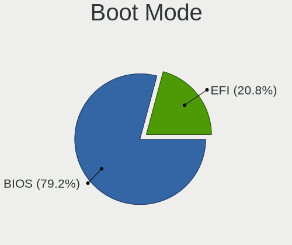
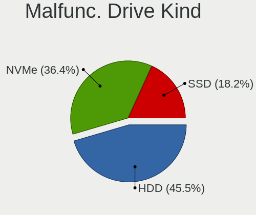
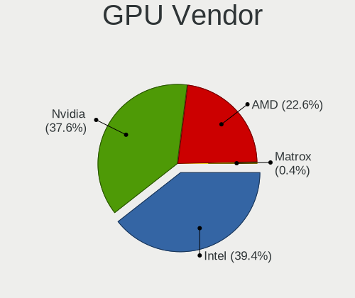

Pop!_OS - Hardware Trends
-------------------------

A project to identify most popular hardware characteristics and track their change
over time based on data collected by Linux users at https://Linux-Hardware.org.

Anyone can contribute to this report by the [hw-probe](https://github.com/linuxhw/hw-probe) tool:

    sudo -E hw-probe -all -upload

This is a report for all computer types. See also reports for [desktops](/Dist/Pop!_OS/Desktop/README.md) and [notebooks](/Dist/Pop!_OS/Notebook/README.md).

This report is for one last month. Overall report since the beginning of time: [TestDays](https://github.com/linuxhw/TestDays)

Period: Dec, 2023.

Contents
--------

* [ System ](#system)
  - [ OS                       ](#os)
  - [ OS Family                ](#os-family)
  - [ Kernel                   ](#kernel)
  - [ Kernel Family            ](#kernel-family)
  - [ Kernel Major Ver.        ](#kernel-major-ver)
  - [ Arch                     ](#arch)
  - [ DE                       ](#de)
  - [ Display Server           ](#display-server)
  - [ Display Manager          ](#display-manager)
  - [ OS Lang                  ](#os-lang)
  - [ Boot Mode                ](#boot-mode)
  - [ Filesystem               ](#filesystem)
  - [ Part. scheme             ](#part-scheme)
  - [ Dual Boot with Linux/BSD ](#dual-boot-with-linuxbsd)
  - [ Dual Boot (Win)          ](#dual-boot-win)

* [ Board ](#board)
  - [ Vendor                   ](#vendor)
  - [ Model                    ](#model)
  - [ Model Family             ](#model-family)
  - [ MFG Year                 ](#mfg-year)
  - [ Form Factor              ](#form-factor)
  - [ Secure Boot              ](#secure-boot)
  - [ Coreboot                 ](#coreboot)
  - [ RAM Size                 ](#ram-size)
  - [ RAM Used                 ](#ram-used)
  - [ Total Drives             ](#total-drives)
  - [ Has CD-ROM               ](#has-cd-rom)
  - [ Has Ethernet             ](#has-ethernet)
  - [ Has WiFi                 ](#has-wifi)
  - [ Has Bluetooth            ](#has-bluetooth)

* [ Location ](#location)
  - [ Country                  ](#country)
  - [ City                     ](#city)

* [ Drives ](#drives)
  - [ Drive Vendor             ](#drive-vendor)
  - [ Drive Model              ](#drive-model)
  - [ HDD Vendor               ](#hdd-vendor)
  - [ SSD Vendor               ](#ssd-vendor)
  - [ Drive Kind               ](#drive-kind)
  - [ Drive Connector          ](#drive-connector)
  - [ Drive Size               ](#drive-size)
  - [ Space Total              ](#space-total)
  - [ Space Used               ](#space-used)
  - [ Malfunc. Drives          ](#malfunc-drives)
  - [ Malfunc. Drive Vendor    ](#malfunc-drive-vendor)
  - [ Malfunc. HDD Vendor      ](#malfunc-hdd-vendor)
  - [ Malfunc. Drive Kind      ](#malfunc-drive-kind)
  - [ Failed Drives            ](#failed-drives)
  - [ Failed Drive Vendor      ](#failed-drive-vendor)
  - [ Drive Status             ](#drive-status)

* [ Storage controller ](#storage-controller)
  - [ Storage Vendor           ](#storage-vendor)
  - [ Storage Model            ](#storage-model)
  - [ Storage Kind             ](#storage-kind)

* [ Processor ](#processor)
  - [ CPU Vendor               ](#cpu-vendor)
  - [ CPU Model                ](#cpu-model)
  - [ CPU Model Family         ](#cpu-model-family)
  - [ CPU Cores                ](#cpu-cores)
  - [ CPU Sockets              ](#cpu-sockets)
  - [ CPU Threads              ](#cpu-threads)
  - [ CPU Op-Modes             ](#cpu-op-modes)
  - [ CPU Microcode            ](#cpu-microcode)
  - [ CPU Microarch            ](#cpu-microarch)

* [ Graphics ](#graphics)
  - [ GPU Vendor               ](#gpu-vendor)
  - [ GPU Model                ](#gpu-model)
  - [ GPU Combo                ](#gpu-combo)
  - [ GPU Driver               ](#gpu-driver)
  - [ GPU Memory               ](#gpu-memory)

* [ Monitor ](#monitor)
  - [ Monitor Vendor           ](#monitor-vendor)
  - [ Monitor Model            ](#monitor-model)
  - [ Monitor Resolution       ](#monitor-resolution)
  - [ Monitor Diagonal         ](#monitor-diagonal)
  - [ Monitor Width            ](#monitor-width)
  - [ Aspect Ratio             ](#aspect-ratio)
  - [ Monitor Area             ](#monitor-area)
  - [ Pixel Density            ](#pixel-density)
  - [ Multiple Monitors        ](#multiple-monitors)

* [ Network ](#network)
  - [ Net Controller Vendor    ](#net-controller-vendor)
  - [ Net Controller Model     ](#net-controller-model)
  - [ Wireless Vendor          ](#wireless-vendor)
  - [ Wireless Model           ](#wireless-model)
  - [ Ethernet Vendor          ](#ethernet-vendor)
  - [ Ethernet Model           ](#ethernet-model)
  - [ Net Controller Kind      ](#net-controller-kind)
  - [ Used Controller          ](#used-controller)
  - [ NICs                     ](#nics)
  - [ IPv6                     ](#ipv6)

* [ Bluetooth ](#bluetooth)
  - [ Bluetooth Vendor         ](#bluetooth-vendor)
  - [ Bluetooth Model          ](#bluetooth-model)

* [ Sound ](#sound)
  - [ Sound Vendor             ](#sound-vendor)
  - [ Sound Model              ](#sound-model)

* [ Memory ](#memory)
  - [ Memory Vendor            ](#memory-vendor)
  - [ Memory Model             ](#memory-model)
  - [ Memory Kind              ](#memory-kind)
  - [ Memory Form Factor       ](#memory-form-factor)
  - [ Memory Size              ](#memory-size)
  - [ Memory Speed             ](#memory-speed)

* [ Printers & scanners ](#printers--scanners)
  - [ Printer Vendor           ](#printer-vendor)
  - [ Printer Model            ](#printer-model)
  - [ Scanner Vendor           ](#scanner-vendor)
  - [ Scanner Model            ](#scanner-model)

* [ Camera ](#camera)
  - [ Camera Vendor            ](#camera-vendor)
  - [ Camera Model             ](#camera-model)

* [ Security ](#security)
  - [ Fingerprint Vendor       ](#fingerprint-vendor)
  - [ Fingerprint Model        ](#fingerprint-model)
  - [ Chipcard Vendor          ](#chipcard-vendor)
  - [ Chipcard Model           ](#chipcard-model)

* [ Unsupported ](#unsupported)
  - [ Unsupported Devices      ](#unsupported-devices)
  - [ Unsupported Device Types ](#unsupported-device-types)

System
------

OS
--

Installed operating systems

| Name          | Computers | Percent |
|---------------|-----------|---------|
| Pop!_OS 22.04 | 176       | 98.32%  |
| Pop!_OS 20.04 | 3         | 1.68%   |

OS Family
---------

OS without a version

| Name    | Computers | Percent |
|---------|-----------|---------|
| Pop!_OS | 179       | 100%    |

Kernel
------

Version of the Linux kernel

| Version                 | Computers | Percent |
|-------------------------|-----------|---------|
| 6.5.6-76060506-generic  | 91        | 50.84%  |
| 6.6.6-76060606-generic  | 76        | 42.46%  |
| 6.5.4-76060504-generic  | 6         | 3.35%   |
| 6.0.12-76060012-generic | 2         | 1.12%   |
| 6.5.7-060507-generic    | 1         | 0.56%   |
| 6.1.11-76060111-generic | 1         | 0.56%   |
| 5.4.0-7634-generic      | 1         | 0.56%   |
| 5.15.0-1044-raspi       | 1         | 0.56%   |

Kernel Family
-------------

Linux kernel without a distro release

| Version | Computers | Percent |
|---------|-----------|---------|
| 6.5.6   | 91        | 50.84%  |
| 6.6.6   | 76        | 42.46%  |
| 6.5.4   | 6         | 3.35%   |
| 6.0.12  | 2         | 1.12%   |
| 6.5.7   | 1         | 0.56%   |
| 6.1.11  | 1         | 0.56%   |
| 5.4.0   | 1         | 0.56%   |
| 5.15.0  | 1         | 0.56%   |

Kernel Major Ver.
-----------------

Linux kernel major version

| Version | Computers | Percent |
|---------|-----------|---------|
| 6.5     | 98        | 54.75%  |
| 6.6     | 76        | 42.46%  |
| 6.0     | 2         | 1.12%   |
| 6.1     | 1         | 0.56%   |
| 5.4     | 1         | 0.56%   |
| 5.15    | 1         | 0.56%   |

Arch
----

OS architecture (x86_64, i586, etc.)

| Name    | Computers | Percent |
|---------|-----------|---------|
| x86_64  | 178       | 99.44%  |
| aarch64 | 1         | 0.56%   |

DE
--

Desktop Environment

| Name       | Computers | Percent |
|------------|-----------|---------|
| GNOME      | 169       | 94.41%  |
| KDE5       | 5         | 2.79%   |
| X-Cinnamon | 3         | 1.68%   |
| Unity      | 1         | 0.56%   |
| Unknown    | 1         | 0.56%   |

Display Server
--------------

X11 or Wayland

| Name    | Computers | Percent |
|---------|-----------|---------|
| X11     | 169       | 94.41%  |
| Wayland | 9         | 5.03%   |
| Unknown | 1         | 0.56%   |

Display Manager
---------------

SDDM, LightDM, etc.

| Name    | Computers | Percent |
|---------|-----------|---------|
| Unknown | 124       | 69.27%  |
| GDM3    | 55        | 30.73%  |

OS Lang
-------

Language

| Lang    | Computers | Percent |
|---------|-----------|---------|
| en_US   | 106       | 59.22%  |
| de_DE   | 15        | 8.38%   |
| en_GB   | 9         | 5.03%   |
| fr_FR   | 7         | 3.91%   |
| C       | 7         | 3.91%   |
| en_AU   | 5         | 2.79%   |
| ru_RU   | 4         | 2.23%   |
| pt_BR   | 4         | 2.23%   |
| en_CA   | 4         | 2.23%   |
| en_IN   | 3         | 1.68%   |
| zh_HK   | 1         | 0.56%   |
| zh_CN   | 1         | 0.56%   |
| tr_TR   | 1         | 0.56%   |
| sv_SE   | 1         | 0.56%   |
| pt_PT   | 1         | 0.56%   |
| nb_NO   | 1         | 0.56%   |
| it_IT   | 1         | 0.56%   |
| hu_HU   | 1         | 0.56%   |
| fi_FI   | 1         | 0.56%   |
| es_ES   | 1         | 0.56%   |
| es_CL   | 1         | 0.56%   |
| en_ZA   | 1         | 0.56%   |
| en_FI   | 1         | 0.56%   |
| de_CH   | 1         | 0.56%   |
| Unknown | 1         | 0.56%   |

Boot Mode
---------

EFI or BIOS

| Mode | Computers | Percent |
|------|-----------|---------|
| BIOS | 125       | 69.83%  |
| EFI  | 54        | 30.17%  |

Filesystem
----------

Type of filesystem

| Type    | Computers | Percent |
|---------|-----------|---------|
| Ext4    | 173       | 96.65%  |
| Overlay | 3         | 1.68%   |
| Btrfs   | 2         | 1.12%   |
| Xfs     | 1         | 0.56%   |

Part. scheme
------------

Scheme of partitioning

| Type    | Computers | Percent |
|---------|-----------|---------|
| Unknown | 123       | 68.72%  |
| GPT     | 54        | 30.17%  |
| MBR     | 2         | 1.12%   |

Dual Boot with Linux/BSD
------------------------

Hosting more than one Linux/BSD

| Dual boot | Computers | Percent |
|-----------|-----------|---------|
| No        | 171       | 95.53%  |
| Yes       | 8         | 4.47%   |

Dual Boot (Win)
---------------

Hosting Linux and Windows

| Dual boot | Computers | Percent |
|-----------|-----------|---------|
| No        | 150       | 83.8%   |
| Yes       | 29        | 16.2%   |

Board
-----

Vendor
------

Motherboard manufacturer

| Name                    | Computers | Percent |
|-------------------------|-----------|---------|
| ASUSTek Computer        | 41        | 22.91%  |
| Lenovo                  | 28        | 15.64%  |
| MSI                     | 16        | 8.94%   |
| Gigabyte Technology     | 16        | 8.94%   |
| Dell                    | 15        | 8.38%   |
| Hewlett-Packard         | 14        | 7.82%   |
| ASRock                  | 9         | 5.03%   |
| Apple                   | 8         | 4.47%   |
| Acer                    | 7         | 3.91%   |
| System76                | 5         | 2.79%   |
| PC Specialist           | 2         | 1.12%   |
| Notebook                | 2         | 1.12%   |
| Toshiba                 | 1         | 0.56%   |
| SZMZ                    | 1         | 0.56%   |
| Samsung Electronics     | 1         | 0.56%   |
| realme                  | 1         | 0.56%   |
| Razer                   | 1         | 0.56%   |
| Raspberry Pi Foundation | 1         | 0.56%   |
| MicroByte               | 1         | 0.56%   |
| Metabox                 | 1         | 0.56%   |
| Intel                   | 1         | 0.56%   |
| HUAWEI                  | 1         | 0.56%   |
| Google                  | 1         | 0.56%   |
| Framework               | 1         | 0.56%   |
| DEXP                    | 1         | 0.56%   |
| Biostar                 | 1         | 0.56%   |
| AZW                     | 1         | 0.56%   |
| Alienware               | 1         | 0.56%   |

Model
-----

Motherboard model

| Name                                     | Computers | Percent |
|------------------------------------------|-----------|---------|
| MSI MS-7C84                              | 2         | 1.12%   |
| Lenovo Legion Pro 5 16ARX8 82WM          | 2         | 1.12%   |
| HP Dev One Notebook PC                   | 2         | 1.12%   |
| ASUS TUF Gaming X570-PLUS                | 2         | 1.12%   |
| Toshiba TECRA Z50-A                      | 1         | 0.56%   |
| SZMZ X99-S3                              | 1         | 0.56%   |
| System76 Thelio                          | 1         | 0.56%   |
| System76 Serval WS                       | 1         | 0.56%   |
| System76 Pangolin                        | 1         | 0.56%   |
| System76 Lemur Pro                       | 1         | 0.56%   |
| System76 Gazelle                         | 1         | 0.56%   |
| Samsung 300E5E/300E4E/300E5V/300E4V      | 1         | 0.56%   |
| realme RMNBXXXX                          | 1         | 0.56%   |
| Razer Blade                              | 1         | 0.56%   |
| RPi Raspberry Pi 4 Model B Rev 1.5       | 1         | 0.56%   |
| PC Specialist N150CU                     | 1         | 0.56%   |
| PC Specialist GK7NP5R                    | 1         | 0.56%   |
| Notebook NL40_50CU                       | 1         | 0.56%   |
| Notebook NJ50_70CU                       | 1         | 0.56%   |
| MSI MS-7E25                              | 1         | 0.56%   |
| MSI MS-7D54                              | 1         | 0.56%   |
| MSI MS-7D50                              | 1         | 0.56%   |
| MSI MS-7D46                              | 1         | 0.56%   |
| MSI MS-7C95                              | 1         | 0.56%   |
| MSI MS-7C35                              | 1         | 0.56%   |
| MSI MS-7B93                              | 1         | 0.56%   |
| MSI MS-7A62                              | 1         | 0.56%   |
| MSI MS-7A39                              | 1         | 0.56%   |
| MSI MS-7920                              | 1         | 0.56%   |
| MSI MS-7752                              | 1         | 0.56%   |
| MSI Modern 14 B4MW                       | 1         | 0.56%   |
| MSI GT72VR 6RD                           | 1         | 0.56%   |
| MSI GP66 Leopard 11UG                    | 1         | 0.56%   |
| MicroByte ezbook                         | 1         | 0.56%   |
| Metabox Alpha-X NH58HP                   | 1         | 0.56%   |
| Lenovo Yoga C940-14IIL 81Q9              | 1         | 0.56%   |
| Lenovo Yoga 7 16ARP8 83BS                | 1         | 0.56%   |
| Lenovo Y50-70 20378                      | 1         | 0.56%   |
| Lenovo ThinkPad X1 Yoga Gen 8 21HQCTO1WW | 1         | 0.56%   |
| Lenovo ThinkPad X1 Yoga 4th 20QF000TUS   | 1         | 0.56%   |

Model Family
------------

Motherboard model prefix

| Name                  | Computers | Percent |
|-----------------------|-----------|---------|
| Lenovo ThinkPad       | 11        | 6.15%   |
| ASUS ROG              | 10        | 5.59%   |
| Dell Latitude         | 8         | 4.47%   |
| ASUS PRIME            | 8         | 4.47%   |
| Lenovo IdeaPad        | 7         | 3.91%   |
| ASUS TUF              | 4         | 2.23%   |
| HP EliteBook          | 3         | 1.68%   |
| ASUS ASUS             | 3         | 1.68%   |
| ASRock B450M          | 3         | 1.68%   |
| Acer Aspire           | 3         | 1.68%   |
| MSI MS-7C84           | 2         | 1.12%   |
| Lenovo Yoga           | 2         | 1.12%   |
| Lenovo Legion         | 2         | 1.12%   |
| HP ZBook              | 2         | 1.12%   |
| HP ProBook            | 2         | 1.12%   |
| HP Dev                | 2         | 1.12%   |
| Dell XPS              | 2         | 1.12%   |
| Dell Inspiron         | 2         | 1.12%   |
| Apple iMac18          | 2         | 1.12%   |
| Toshiba TECRA         | 1         | 0.56%   |
| SZMZ X99-S3           | 1         | 0.56%   |
| System76 Thelio       | 1         | 0.56%   |
| System76 Serval       | 1         | 0.56%   |
| System76 Pangolin     | 1         | 0.56%   |
| System76 Lemur        | 1         | 0.56%   |
| System76 Gazelle      | 1         | 0.56%   |
| Samsung 300E5E        | 1         | 0.56%   |
| realme RMNBXXXX       | 1         | 0.56%   |
| Razer Blade           | 1         | 0.56%   |
| RPi Raspberry         | 1         | 0.56%   |
| PC Specialist N150CU  | 1         | 0.56%   |
| PC Specialist GK7NP5R | 1         | 0.56%   |
| Notebook NL40         | 1         | 0.56%   |
| Notebook NJ50         | 1         | 0.56%   |
| MSI MS-7E25           | 1         | 0.56%   |
| MSI MS-7D54           | 1         | 0.56%   |
| MSI MS-7D50           | 1         | 0.56%   |
| MSI MS-7D46           | 1         | 0.56%   |
| MSI MS-7C95           | 1         | 0.56%   |
| MSI MS-7C35           | 1         | 0.56%   |

MFG Year
--------

Motherboard manufacture year

| Year    | Computers | Percent |
|---------|-----------|---------|
| 2022    | 25        | 13.97%  |
| 2021    | 21        | 11.73%  |
| 2020    | 21        | 11.73%  |
| 2023    | 20        | 11.17%  |
| 2019    | 19        | 10.61%  |
| 2018    | 15        | 8.38%   |
| 2017    | 9         | 5.03%   |
| 2014    | 9         | 5.03%   |
| 2013    | 7         | 3.91%   |
| 2011    | 7         | 3.91%   |
| 2015    | 6         | 3.35%   |
| 2016    | 5         | 2.79%   |
| 2012    | 5         | 2.79%   |
| 2009    | 3         | 1.68%   |
| 2010    | 2         | 1.12%   |
| 2008    | 2         | 1.12%   |
| 2007    | 2         | 1.12%   |
| Unknown | 1         | 0.56%   |

Form Factor
-----------

Physical design of the computer

| Name           | Computers | Percent |
|----------------|-----------|---------|
| Notebook       | 90        | 50.28%  |
| Desktop        | 72        | 40.22%  |
| Convertible    | 7         | 3.91%   |
| Mini pc        | 4         | 2.23%   |
| All in one     | 3         | 1.68%   |
| Server         | 2         | 1.12%   |
| System on chip | 1         | 0.56%   |

Secure Boot
-----------

Enabled or disabled

| State    | Computers | Percent |
|----------|-----------|---------|
| Disabled | 178       | 99.44%  |
| Enabled  | 1         | 0.56%   |

Coreboot
--------

Have coreboot on board

| Used | Computers | Percent |
|------|-----------|---------|
| No   | 175       | 97.77%  |
| Yes  | 4         | 2.23%   |

RAM Size
--------

Total RAM memory

| Size in GB  | Computers | Percent |
|-------------|-----------|---------|
| 32.01-64.0  | 42        | 23.46%  |
| 16.01-24.0  | 39        | 21.79%  |
| 8.01-16.0   | 36        | 20.11%  |
| 4.01-8.0    | 28        | 15.64%  |
| 64.01-256.0 | 18        | 10.06%  |
| 3.01-4.0    | 8         | 4.47%   |
| 24.01-32.0  | 8         | 4.47%   |

RAM Used
--------

Used RAM memory

| Used GB    | Computers | Percent |
|------------|-----------|---------|
| 4.01-8.0   | 87        | 48.6%   |
| 8.01-16.0  | 35        | 19.55%  |
| 3.01-4.0   | 28        | 15.64%  |
| 2.01-3.0   | 15        | 8.38%   |
| 1.01-2.0   | 7         | 3.91%   |
| 16.01-24.0 | 5         | 2.79%   |
| 32.01-64.0 | 1         | 0.56%   |
| 24.01-32.0 | 1         | 0.56%   |

Total Drives
------------

Number of drives on board

| Drives | Computers | Percent |
|--------|-----------|---------|
| 1      | 87        | 48.6%   |
| 2      | 53        | 29.61%  |
| 3      | 19        | 10.61%  |
| 4      | 10        | 5.59%   |
| 6      | 4         | 2.23%   |
| 5      | 3         | 1.68%   |
| 0      | 2         | 1.12%   |
| 9      | 1         | 0.56%   |

Has CD-ROM
----------

Has CD-ROM on board

| Presented | Computers | Percent |
|-----------|-----------|---------|
| No        | 151       | 84.36%  |
| Yes       | 28        | 15.64%  |

Has Ethernet
------------

Has Ethernet on board

| Presented | Computers | Percent |
|-----------|-----------|---------|
| Yes       | 150       | 83.8%   |
| No        | 29        | 16.2%   |

Has WiFi
--------

Has WiFi module

| Presented | Computers | Percent |
|-----------|-----------|---------|
| Yes       | 152       | 84.92%  |
| No        | 27        | 15.08%  |

Has Bluetooth
-------------

Has Bluetooth module

| Presented | Computers | Percent |
|-----------|-----------|---------|
| Yes       | 134       | 74.86%  |
| No        | 45        | 25.14%  |

Location
--------

Country
-------

Geographic location (country)

| Country      | Computers | Percent |
|--------------|-----------|---------|
| USA          | 53        | 29.61%  |
| Germany      | 21        | 11.73%  |
| Canada       | 9         | 5.03%   |
| UK           | 7         | 3.91%   |
| Russia       | 7         | 3.91%   |
| France       | 7         | 3.91%   |
| Sweden       | 6         | 3.35%   |
| Brazil       | 6         | 3.35%   |
| Australia    | 6         | 3.35%   |
| Norway       | 5         | 2.79%   |
| India        | 5         | 2.79%   |
| Indonesia    | 4         | 2.23%   |
| Hungary      | 4         | 2.23%   |
| Czechia      | 4         | 2.23%   |
| Thailand     | 3         | 1.68%   |
| Switzerland  | 2         | 1.12%   |
| Spain        | 2         | 1.12%   |
| South Africa | 2         | 1.12%   |
| Finland      | 2         | 1.12%   |
| Austria      | 2         | 1.12%   |
| Uzbekistan   | 1         | 0.56%   |
| Ukraine      | 1         | 0.56%   |
| Turkey       | 1         | 0.56%   |
| Taiwan       | 1         | 0.56%   |
| Slovakia     | 1         | 0.56%   |
| Réunion     | 1         | 0.56%   |
| Portugal     | 1         | 0.56%   |
| Philippines  | 1         | 0.56%   |
| Palestine    | 1         | 0.56%   |
| Netherlands  | 1         | 0.56%   |
| Mexico       | 1         | 0.56%   |
| Japan        | 1         | 0.56%   |
| Italy        | 1         | 0.56%   |
| Hong Kong    | 1         | 0.56%   |
| Greece       | 1         | 0.56%   |
| Georgia      | 1         | 0.56%   |
| Egypt        | 1         | 0.56%   |
| China        | 1         | 0.56%   |
| Chile        | 1         | 0.56%   |
| Bulgaria     | 1         | 0.56%   |

City
----

Geographic location (city)

| City          | Computers | Percent |
|---------------|-----------|---------|
| Prague        | 3         | 1.68%   |
| Chicago       | 3         | 1.68%   |
| Washington    | 2         | 1.12%   |
| Surgut        | 2         | 1.12%   |
| Stockholm     | 2         | 1.12%   |
| Saskatoon     | 2         | 1.12%   |
| Perth         | 2         | 1.12%   |
| Hamburg       | 2         | 1.12%   |
| Gothenburg    | 2         | 1.12%   |
| Budapest      | 2         | 1.12%   |
| Bangkok       | 2         | 1.12%   |
| Anderson      | 2         | 1.12%   |
| Yucaipa       | 1         | 0.56%   |
| Yogyakarta    | 1         | 0.56%   |
| Yachiyo       | 1         | 0.56%   |
| Wilhelmshaven | 1         | 0.56%   |
| Wenonah       | 1         | 0.56%   |
| Weiden        | 1         | 0.56%   |
| Vienna        | 1         | 0.56%   |
| Victoria      | 1         | 0.56%   |
| Umeå         | 1         | 0.56%   |
| Tubas         | 1         | 0.56%   |
| Trondheim     | 1         | 0.56%   |
| Toronto       | 1         | 0.56%   |
| Topeka        | 1         | 0.56%   |
| Timnath       | 1         | 0.56%   |
| Therwil       | 1         | 0.56%   |
| Tampa         | 1         | 0.56%   |
| Taichung      | 1         | 0.56%   |
| Szabadszallas | 1         | 0.56%   |
| Surrey        | 1         | 0.56%   |
| Staten Island | 1         | 0.56%   |
| State College | 1         | 0.56%   |
| St. Gallen    | 1         | 0.56%   |
| St Austell    | 1         | 0.56%   |
| Sofia         | 1         | 0.56%   |
| Sheboygan     | 1         | 0.56%   |
| Severnyy      | 1         | 0.56%   |
| Seattle       | 1         | 0.56%   |
| Schutterwald  | 1         | 0.56%   |

Drives
------

Drive Vendor
------------

Hard drive vendors

| Vendor                       | Computers | Drives | Percent |
|------------------------------|-----------|--------|---------|
| Samsung Electronics          | 59        | 81     | 20%     |
| WDC                          | 32        | 35     | 10.85%  |
| Seagate                      | 27        | 35     | 9.15%   |
| Sandisk                      | 19        | 21     | 6.44%   |
| Kingston                     | 17        | 18     | 5.76%   |
| Toshiba                      | 13        | 14     | 4.41%   |
| Crucial                      | 13        | 14     | 4.41%   |
| Micron Technology            | 8         | 8      | 2.71%   |
| Intel                        | 8         | 10     | 2.71%   |
| Kingston Technology Company  | 7         | 7      | 2.37%   |
| SK hynix                     | 6         | 6      | 2.03%   |
| Micron/Crucial Technology    | 6         | 6      | 2.03%   |
| Unknown                      | 5         | 7      | 1.69%   |
| Phison Electronics           | 5         | 6      | 1.69%   |
| Phison                       | 4         | 5      | 1.36%   |
| Team                         | 3         | 3      | 1.02%   |
| SPCC                         | 3         | 3      | 1.02%   |
| JMicron Technology           | 3         | 3      | 1.02%   |
| Fanxiang                     | 3         | 3      | 1.02%   |
| Silicon Motion               | 2         | 2      | 0.68%   |
| Realtek Semiconductor        | 2         | 2      | 0.68%   |
| Patriot                      | 2         | 2      | 0.68%   |
| Lexar                        | 2         | 3      | 0.68%   |
| KIOXIA-EXCERIA               | 2         | 2      | 0.68%   |
| KIOXIA                       | 2         | 2      | 0.68%   |
| KingDian                     | 2         | 2      | 0.68%   |
| Intenso                      | 2         | 2      | 0.68%   |
| China                        | 2         | 2      | 0.68%   |
| Apple                        | 2         | 2      | 0.68%   |
| AMD                          | 2         | 2      | 0.68%   |
| A-DATA Technology            | 2         | 2      | 0.68%   |
| XSTAR                        | 1         | 1      | 0.34%   |
| WD MediaMax                  | 1         | 1      | 0.34%   |
| Vaseky                       | 1         | 1      | 0.34%   |
| USB                          | 1         | 1      | 0.34%   |
| Union Memory (Shenzhen)      | 1         | 1      | 0.34%   |
| Union Memory                 | 1         | 1      | 0.34%   |
| Timetec                      | 1         | 1      | 0.34%   |
| Tech                         | 1         | 4      | 0.34%   |
| Shenzhen Longsys Electronics | 1         | 1      | 0.34%   |

Drive Model
-----------

Hard drive models

| Model                                               | Computers | Percent |
|-----------------------------------------------------|-----------|---------|
| Samsung NVMe SSD Controller SM981/PM981/PM983 512GB | 10        | 3.03%   |
| Samsung NVMe SSD Controller PM9A1/PM9A3/980PRO 2TB  | 10        | 3.03%   |
| Sandisk WD Blue SN550 NVMe SSD 1TB                  | 5         | 1.52%   |
| Samsung SSD 980 1TB                                 | 4         | 1.21%   |
| Micron/Crucial P2 NVMe PCIe SSD 4TB                 | 4         | 1.21%   |
| Kingston Company SNV2S1000G 1TB                     | 4         | 1.21%   |
| Intel SSD 660P Series 1TB                           | 4         | 1.21%   |
| Samsung SSD 870 EVO 1TB                             | 3         | 0.91%   |
| Samsung SSD 860 EVO 500GB                           | 3         | 0.91%   |
| Samsung SSD 850 EVO 500GB                           | 3         | 0.91%   |
| Samsung NVMe SSD Controller SM961/PM961/SM963 250GB | 3         | 0.91%   |
| Phison E12 NVMe Controller 1TB                      | 3         | 0.91%   |
| Kingston SA400S37480G 480GB SSD                     | 3         | 0.91%   |
| WDC WDS500G2B0A-00SM50 500GB SSD                    | 2         | 0.61%   |
| WDC WDS100T2B0A-00SM50 1TB SSD                      | 2         | 0.61%   |
| WDC WD40EZAZ-00SF3B0 4TB                            | 2         | 0.61%   |
| Toshiba MQ01ACF050 500GB                            | 2         | 0.61%   |
| Toshiba DT01ACA200 2TB                              | 2         | 0.61%   |
| Toshiba DT01ACA100 1TB                              | 2         | 0.61%   |
| Seagate ST9500325AS 500GB                           | 2         | 0.61%   |
| Seagate ST500DM002-1BD142 500GB                     | 2         | 0.61%   |
| Seagate ST4000DM004-2CV104 4TB                      | 2         | 0.61%   |
| Seagate ST2000DM001-1CH164 2TB                      | 2         | 0.61%   |
| Seagate One Touch w/PW 5TB                          | 2         | 0.61%   |
| Seagate Expansion 2TB                               | 2         | 0.61%   |
| SanDisk NVMe SSD Drive 1TB                          | 2         | 0.61%   |
| Samsung SSD 980 PRO 500GB                           | 2         | 0.61%   |
| Samsung SSD 980 PRO 2TB                             | 2         | 0.61%   |
| Samsung SSD 870 QVO 1TB                             | 2         | 0.61%   |
| Samsung SSD 860 EVO 1TB                             | 2         | 0.61%   |
| Phison PS5013 E13 NVMe Controller 512GB             | 2         | 0.61%   |
| Micron 2450_MTFDKBA512TFK 512GB                     | 2         | 0.61%   |
| Kingston SV300S37A240G 240GB SSD                    | 2         | 0.61%   |
| Kingston SNVS250G 250GB                             | 2         | 0.61%   |
| Kingston SNV2S500G 500GB                            | 2         | 0.61%   |
| JMicron Generic 2TB                                 | 2         | 0.61%   |
| Crucial CT525MX300SSD1 528GB                        | 2         | 0.61%   |
| Crucial CT1000MX500SSD1 1TB                         | 2         | 0.61%   |
| XSTAR SSD 256GB                                     | 1         | 0.3%    |
| WDC WDS500G2B0C-00PXH0 500GB                        | 1         | 0.3%    |

HDD Vendor
----------

Hard disk drive vendors

| Vendor              | Computers | Drives | Percent |
|---------------------|-----------|--------|---------|
| Seagate             | 25        | 32     | 37.88%  |
| WDC                 | 24        | 26     | 36.36%  |
| Toshiba             | 9         | 10     | 13.64%  |
| Samsung Electronics | 2         | 2      | 3.03%   |
| WD MediaMax         | 1         | 1      | 1.52%   |
| MaxDigital          | 1         | 1      | 1.52%   |
| JMicron Technology  | 1         | 1      | 1.52%   |
| Intenso             | 1         | 1      | 1.52%   |
| HGST                | 1         | 1      | 1.52%   |
| ASMT                | 1         | 1      | 1.52%   |

SSD Vendor
----------

Solid state drive vendors

| Vendor              | Computers | Drives | Percent |
|---------------------|-----------|--------|---------|
| Samsung Electronics | 23        | 27     | 24.73%  |
| Kingston            | 9         | 9      | 9.68%   |
| Crucial             | 9         | 9      | 9.68%   |
| WDC                 | 6         | 6      | 6.45%   |
| SanDisk             | 5         | 5      | 5.38%   |
| Toshiba             | 3         | 3      | 3.23%   |
| Intel               | 3         | 4      | 3.23%   |
| Team                | 2         | 2      | 2.15%   |
| SPCC                | 2         | 2      | 2.15%   |
| Patriot             | 2         | 2      | 2.15%   |
| KingDian            | 2         | 2      | 2.15%   |
| JMicron Technology  | 2         | 2      | 2.15%   |
| China               | 2         | 2      | 2.15%   |
| Apple               | 2         | 2      | 2.15%   |
| A-DATA Technology   | 2         | 2      | 2.15%   |
| XSTAR               | 1         | 1      | 1.08%   |
| Vaseky              | 1         | 1      | 1.08%   |
| Timetec             | 1         | 1      | 1.08%   |
| SK hynix            | 1         | 1      | 1.08%   |
| PNY                 | 1         | 1      | 1.08%   |
| OCZ                 | 1         | 1      | 1.08%   |
| Netac               | 1         | 1      | 1.08%   |
| Mushkin             | 1         | 1      | 1.08%   |
| LITEONIT            | 1         | 1      | 1.08%   |
| Lexar               | 1         | 2      | 1.08%   |
| LDLC                | 1         | 1      | 1.08%   |
| KIOXIA-EXCERIA      | 1         | 1      | 1.08%   |
| KingSpec            | 1         | 1      | 1.08%   |
| Intenso             | 1         | 1      | 1.08%   |
| Hewlett-Packard     | 1         | 1      | 1.08%   |
| Flashwar            | 1         | 1      | 1.08%   |
| Dogfish             | 1         | 1      | 1.08%   |
| Corsair             | 1         | 1      | 1.08%   |
| AMD                 | 1         | 1      | 1.08%   |

Drive Kind
----------

HDD or SSD

| Kind    | Computers | Drives | Percent |
|---------|-----------|--------|---------|
| NVMe    | 121       | 152    | 46.01%  |
| SSD     | 75        | 99     | 28.52%  |
| HDD     | 56        | 76     | 21.29%  |
| Unknown | 6         | 11     | 2.28%   |
| MMC     | 5         | 5      | 1.9%    |

Drive Connector
---------------

SATA, SAS, NVMe, etc.

| Type | Computers | Drives | Percent |
|------|-----------|--------|---------|
| NVMe | 121       | 151    | 51.27%  |
| SATA | 95        | 164    | 40.25%  |
| SAS  | 15        | 23     | 6.36%   |
| MMC  | 5         | 5      | 2.12%   |

Drive Size
----------

Size of hard drive

| Size in TB | Computers | Drives | Percent |
|------------|-----------|--------|---------|
| 0.01-0.5   | 66        | 91     | 48.53%  |
| 0.51-1.0   | 36        | 45     | 26.47%  |
| 1.01-2.0   | 19        | 23     | 13.97%  |
| 3.01-4.0   | 11        | 12     | 8.09%   |
| 2.01-3.0   | 2         | 2      | 1.47%   |
| 10.01-20.0 | 1         | 1      | 0.74%   |
| 4.01-10.0  | 1         | 1      | 0.74%   |

Space Total
-----------

Amount of disk space available on the file system

| Size in GB     | Computers | Percent |
|----------------|-----------|---------|
| 251-500        | 47        | 26.26%  |
| 501-1000       | 40        | 22.35%  |
| 101-250        | 28        | 15.64%  |
| 1001-2000      | 24        | 13.41%  |
| More than 3000 | 16        | 8.94%   |
| 2001-3000      | 9         | 5.03%   |
| 51-100         | 7         | 3.91%   |
| 1-20           | 4         | 2.23%   |
| 21-50          | 3         | 1.68%   |
| Unknown        | 1         | 0.56%   |

Space Used
----------

Amount of used disk space

| Used GB        | Computers | Percent |
|----------------|-----------|---------|
| 21-50          | 38        | 21.23%  |
| 1-20           | 34        | 18.99%  |
| 101-250        | 25        | 13.97%  |
| 251-500        | 23        | 12.85%  |
| 51-100         | 19        | 10.61%  |
| 501-1000       | 18        | 10.06%  |
| 1001-2000      | 11        | 6.15%   |
| More than 3000 | 7         | 3.91%   |
| 2001-3000      | 3         | 1.68%   |
| Unknown        | 1         | 0.56%   |

Malfunc. Drives
---------------

Drive models with a malfunction

| Model                               | Computers | Drives | Percent |
|-------------------------------------|-----------|--------|---------|
| WDC WD20EFRX-68EUZN0 2TB            | 1         | 1      | 14.29%  |
| WDC WD20EFRX-68AX9N0 2TB            | 1         | 1      | 14.29%  |
| WDC WD10SPZX-16Z10T0 1TB            | 1         | 1      | 14.29%  |
| Silicon Motion 1TB PCS PCIe M.2 SSD | 1         | 1      | 14.29%  |
| Seagate ST500DM002-1BD142 500GB     | 1         | 1      | 14.29%  |
| Flashwar SSD S500 Pro 512GB         | 1         | 1      | 14.29%  |
| Crucial CT525MX300SSD1 528GB        | 1         | 1      | 14.29%  |

Malfunc. Drive Vendor
---------------------

Vendors of faulty drives

| Vendor         | Computers | Drives | Percent |
|----------------|-----------|--------|---------|
| WDC            | 3         | 3      | 42.86%  |
| Silicon Motion | 1         | 1      | 14.29%  |
| Seagate        | 1         | 1      | 14.29%  |
| Flashwar       | 1         | 1      | 14.29%  |
| Crucial        | 1         | 1      | 14.29%  |

Malfunc. HDD Vendor
-------------------

Vendors of faulty HDD drives

| Vendor  | Computers | Drives | Percent |
|---------|-----------|--------|---------|
| WDC     | 3         | 3      | 75%     |
| Seagate | 1         | 1      | 25%     |

Malfunc. Drive Kind
-------------------

Kinds of faulty drives

| Kind | Computers | Drives | Percent |
|------|-----------|--------|---------|
| HDD  | 4         | 4      | 57.14%  |
| SSD  | 2         | 2      | 28.57%  |
| NVMe | 1         | 1      | 14.29%  |

Failed Drives
-------------

Failed drive models

Zero info for selected period =(

Failed Drive Vendor
-------------------

Failed drive vendors

Zero info for selected period =(

Drive Status
------------

Number of failed and malfunc. drives

| Status   | Computers | Drives | Percent |
|----------|-----------|--------|---------|
| Detected | 134       | 252    | 69.07%  |
| Works    | 53        | 84     | 27.32%  |
| Malfunc  | 7         | 7      | 3.61%   |

Storage controller
------------------

Storage Vendor
--------------

Storage controller vendors

| Vendor                       | Computers | Percent |
|------------------------------|-----------|---------|
| Intel                        | 94        | 33.33%  |
| AMD                          | 45        | 15.96%  |
| Samsung Electronics          | 44        | 15.6%   |
| SanDisk                      | 18        | 6.38%   |
| Kingston Technology Company  | 15        | 5.32%   |
| Micron/Crucial Technology    | 11        | 3.9%    |
| Phison Electronics           | 10        | 3.55%   |
| Micron Technology            | 8         | 2.84%   |
| SK hynix                     | 5         | 1.77%   |
| ASMedia Technology           | 5         | 1.77%   |
| Marvell Technology Group     | 4         | 1.42%   |
| MAXIO Technology (Hangzhou)  | 3         | 1.06%   |
| KIOXIA                       | 3         | 1.06%   |
| Union Memory (Shenzhen)      | 2         | 0.71%   |
| Silicon Motion               | 2         | 0.71%   |
| Shenzhen Longsys Electronics | 2         | 0.71%   |
| Realtek Semiconductor        | 2         | 0.71%   |
| JMicron Technology           | 2         | 0.71%   |
| Toshiba America Info Systems | 1         | 0.35%   |
| Solidigm                     | 1         | 0.35%   |
| Seagate Technology           | 1         | 0.35%   |
| Nvidia                       | 1         | 0.35%   |
| INNOGRIT                     | 1         | 0.35%   |
| Hosin Global Electronics     | 1         | 0.35%   |
| Broadcom / LSI               | 1         | 0.35%   |

Storage Model
-------------

Storage controller models

| Model                                                                          | Computers | Percent |
|--------------------------------------------------------------------------------|-----------|---------|
| AMD FCH SATA Controller [AHCI mode]                                            | 29        | 9.27%   |
| Samsung NVMe SSD Controller PM9A1/PM9A3/980PRO                                 | 18        | 5.75%   |
| Samsung NVMe SSD Controller SM981/PM981/PM983                                  | 13        | 4.15%   |
| Samsung NVMe SSD Controller 980 (DRAM-less)                                    | 10        | 3.19%   |
| Intel Volume Management Device NVMe RAID Controller                            | 10        | 3.19%   |
| Intel 8 Series/C220 Series Chipset Family 6-port SATA Controller 1 [AHCI mode] | 10        | 3.19%   |
| AMD 400 Series Chipset SATA Controller                                         | 10        | 3.19%   |
| AMD 500 Series Chipset SATA Controller                                         | 8         | 2.56%   |
| SanDisk Ultra 3D / WD Blue SN550 NVMe SSD                                      | 6         | 1.92%   |
| Phison E12 NVMe Controller                                                     | 6         | 1.92%   |
| Micron/Crucial P2 [Nick P2] / P3 / P3 Plus NVMe PCIe SSD (DRAM-less)           | 6         | 1.92%   |
| Kingston Company NV2 NVMe SSD SM2267XT                                         | 6         | 1.92%   |
| Intel 7 Series Chipset Family 6-port SATA Controller [AHCI mode]               | 6         | 1.92%   |
| Samsung NVMe SSD Controller SM961/PM961/SM963                                  | 5         | 1.6%    |
| Intel Q170/Q150/B150/H170/H110/Z170/CM236 Chipset SATA Controller [AHCI Mode]  | 5         | 1.6%    |
| Intel Alder Lake-S PCH SATA Controller [AHCI Mode]                             | 5         | 1.6%    |
| Intel 82801 Mobile SATA Controller [RAID mode]                                 | 5         | 1.6%    |
| ASMedia ASM1062 Serial ATA Controller                                          | 5         | 1.6%    |
| Intel Sunrise Point-LP SATA Controller [AHCI mode]                             | 4         | 1.28%   |
| Intel SSD 660P Series                                                          | 4         | 1.28%   |
| Intel Comet Lake SATA AHCI Controller                                          | 4         | 1.28%   |
| Intel Alder Lake-P SATA AHCI Controller                                        | 4         | 1.28%   |
| Intel 700 Series Chipset Family SATA AHCI Controller                           | 4         | 1.28%   |
| Intel 200 Series PCH SATA controller [AHCI mode]                               | 4         | 1.28%   |
| SanDisk WD Black SN770 / PC SN740 256GB / PC SN560 (DRAM-less) NVMe SSD        | 3         | 0.96%   |
| SanDisk Extreme Pro / WD Black SN750 / PC SN730 / Red SN700 NVMe SSD           | 3         | 0.96%   |
| Phison PS5013-E13 PCIe3 NVMe Controller (DRAM-less)                            | 3         | 0.96%   |
| Micron/Crucial P5 Plus NVMe PCIe SSD                                           | 3         | 0.96%   |
| Micron 2450 NVMe SSD [HendrixV] (DRAM-less)                                    | 3         | 0.96%   |
| Kingston Company KC3000/FURY Renegade NVMe SSD E18                             | 3         | 0.96%   |
| Intel Volume Management Device NVMe RAID Controller Intel Corporation          | 3         | 0.96%   |
| Intel SATA Controller [RAID mode]                                              | 3         | 0.96%   |
| Intel 6 Series/C200 Series Chipset Family 6 port Mobile SATA AHCI Controller   | 3         | 0.96%   |
| Intel 6 Series/C200 Series Chipset Family 6 port Desktop SATA AHCI Controller  | 3         | 0.96%   |
| Intel 500 Series Chipset Family SATA AHCI Controller                           | 3         | 0.96%   |
| SK hynix Gold P31/BC711/PC711 NVMe Solid State Drive                           | 2         | 0.64%   |
| SK hynix BC511 NVMe SSD                                                        | 2         | 0.64%   |
| Silicon Motion SM2263EN/SM2263XT (DRAM-less) NVMe SSD Controllers              | 2         | 0.64%   |
| Realtek RTS5765DL NVMe SSD Controller (DRAM-less)                              | 2         | 0.64%   |
| Micron/Crucial P1 NVMe PCIe SSD[Frampton]                                      | 2         | 0.64%   |

Storage Kind
------------

Kind of storage controller (IDE, SATA, NVMe, SAS, ...)

| Kind | Computers | Percent |
|------|-----------|---------|
| SATA | 122       | 44.69%  |
| NVMe | 121       | 44.32%  |
| RAID | 23        | 8.42%   |
| IDE  | 7         | 2.56%   |

Processor
---------

CPU Vendor
----------

Processor vendors

| Vendor | Computers | Percent |
|--------|-----------|---------|
| Intel  | 116       | 64.8%   |
| AMD    | 62        | 34.64%  |
| ARM    | 1         | 0.56%   |

CPU Model
---------

Processor models

| Model                                         | Computers | Percent |
|-----------------------------------------------|-----------|---------|
| AMD Ryzen 5 4500U with Radeon Graphics        | 5         | 2.79%   |
| Intel 11th Gen Core i7-1165G7 @ 2.80GHz       | 4         | 2.23%   |
| AMD Ryzen 9 5900X 12-Core Processor           | 4         | 2.23%   |
| AMD Ryzen 7 5800X 8-Core Processor            | 4         | 2.23%   |
| AMD Ryzen 5 5600G with Radeon Graphics        | 4         | 2.23%   |
| Intel Core i7-8650U CPU @ 1.90GHz             | 3         | 1.68%   |
| Intel Core i7-7700K CPU @ 4.20GHz             | 3         | 1.68%   |
| AMD Ryzen 7 PRO 5850U with Radeon Graphics    | 3         | 1.68%   |
| AMD Ryzen 7 7700X 8-Core Processor            | 3         | 1.68%   |
| AMD Ryzen 7 3700X 8-Core Processor            | 3         | 1.68%   |
| AMD Ryzen 5 3600 6-Core Processor             | 3         | 1.68%   |
| AMD Ryzen 5 3500U with Radeon Vega Mobile Gfx | 3         | 1.68%   |
| Intel Core i7-8565U CPU @ 1.80GHz             | 2         | 1.12%   |
| Intel Core i7-4720HQ CPU @ 2.60GHz            | 2         | 1.12%   |
| Intel Core i7-1065G7 CPU @ 1.30GHz            | 2         | 1.12%   |
| Intel Core i5-9400F CPU @ 2.90GHz             | 2         | 1.12%   |
| Intel Core i5-8365U CPU @ 1.60GHz             | 2         | 1.12%   |
| Intel Core i5-4300U CPU @ 1.90GHz             | 2         | 1.12%   |
| Intel Core i5-3210M CPU @ 2.50GHz             | 2         | 1.12%   |
| Intel 13th Gen Core i9-13900H                 | 2         | 1.12%   |
| Intel 12th Gen Core i5-12500H                 | 2         | 1.12%   |
| Intel 12th Gen Core i5-1235U                  | 2         | 1.12%   |
| Intel 11th Gen Core i7-11800H @ 2.30GHz       | 2         | 1.12%   |
| Intel 11th Gen Core i5-1135G7 @ 2.40GHz       | 2         | 1.12%   |
| AMD Ryzen 7 7745HX with Radeon Graphics       | 2         | 1.12%   |
| Intel Xeon Gold 6148 CPU @ 2.40GHz            | 1         | 0.56%   |
| Intel Xeon CPU E5-2670 v3 @ 2.30GHz           | 1         | 0.56%   |
| Intel Xeon CPU E3-1505M v5 @ 2.80GHz          | 1         | 0.56%   |
| Intel Pentium Dual CPU T2370 @ 1.73GHz        | 1         | 0.56%   |
| Intel Pentium CPU G3250 @ 3.20GHz             | 1         | 0.56%   |
| Intel Genuine CPU $0000%@                     | 1         | 0.56%   |
| Intel Core i9-9900K CPU @ 3.60GHz             | 1         | 0.56%   |
| Intel Core i9-14900KF                         | 1         | 0.56%   |
| Intel Core i9-14900K                          | 1         | 0.56%   |
| Intel Core i7-8750H CPU @ 2.20GHz             | 1         | 0.56%   |
| Intel Core i7-8550U CPU @ 1.80GHz             | 1         | 0.56%   |
| Intel Core i7-7700HQ CPU @ 2.80GHz            | 1         | 0.56%   |
| Intel Core i7-7600U CPU @ 2.80GHz             | 1         | 0.56%   |
| Intel Core i7-6700K CPU @ 4.00GHz             | 1         | 0.56%   |
| Intel Core i7-6700HQ CPU @ 2.60GHz            | 1         | 0.56%   |

CPU Model Family
----------------

Processor model prefix

| Model              | Computers | Percent |
|--------------------|-----------|---------|
| Other              | 36        | 20.11%  |
| Intel Core i7      | 33        | 18.44%  |
| Intel Core i5      | 29        | 16.2%   |
| AMD Ryzen 5        | 26        | 14.53%  |
| AMD Ryzen 7        | 19        | 10.61%  |
| AMD Ryzen 9        | 7         | 3.91%   |
| Intel Core i3      | 5         | 2.79%   |
| AMD Ryzen 7 PRO    | 5         | 2.79%   |
| Intel Core i9      | 3         | 1.68%   |
| Intel Celeron      | 3         | 1.68%   |
| Intel Xeon         | 2         | 1.12%   |
| Intel Xeon Gold    | 1         | 0.56%   |
| Intel Pentium Dual | 1         | 0.56%   |
| Intel Pentium      | 1         | 0.56%   |
| Intel Genuine      | 1         | 0.56%   |
| Intel Core 2 Quad  | 1         | 0.56%   |
| Intel Core 2 Duo   | 1         | 0.56%   |
| AMD Phenom II X6   | 1         | 0.56%   |
| AMD Phenom II X4   | 1         | 0.56%   |
| AMD Phenom II X3   | 1         | 0.56%   |
| AMD Athlon         | 1         | 0.56%   |
| AMD A6             | 1         | 0.56%   |

CPU Cores
---------

Number of processor cores

| Number  | Computers | Percent |
|---------|-----------|---------|
| 4       | 55        | 30.73%  |
| 6       | 36        | 20.11%  |
| 8       | 29        | 16.2%   |
| 2       | 26        | 14.53%  |
| 12      | 8         | 4.47%   |
| 14      | 7         | 3.91%   |
| 16      | 6         | 3.35%   |
| 10      | 5         | 2.79%   |
| 24      | 3         | 1.68%   |
| 40      | 1         | 0.56%   |
| 36      | 1         | 0.56%   |
| 3       | 1         | 0.56%   |
| Unknown | 1         | 0.56%   |

CPU Sockets
-----------

Number of sockets

| Number  | Computers | Percent |
|---------|-----------|---------|
| 1       | 177       | 98.88%  |
| 2       | 1         | 0.56%   |
| Unknown | 1         | 0.56%   |

CPU Threads
-----------

Threads per core (Hyper-Threading)

| Number  | Computers | Percent |
|---------|-----------|---------|
| 2       | 149       | 83.24%  |
| 1       | 29        | 16.2%   |
| Unknown | 1         | 0.56%   |

CPU Op-Modes
------------

CPU Operation Modes (32-bit, 64-bit)

| Op mode        | Computers | Percent |
|----------------|-----------|---------|
| 32-bit, 64-bit | 179       | 100%    |

CPU Microcode
-------------

Microcode number

| Number     | Computers | Percent |
|------------|-----------|---------|
| Unknown    | 159       | 88.83%  |
| 0x0a601203 | 3         | 1.68%   |
| 0x0a50000d | 3         | 1.68%   |
| 0x0a404102 | 2         | 1.12%   |
| 0x0a20120a | 2         | 1.12%   |
| 0x08701021 | 2         | 1.12%   |
| 0x08600106 | 2         | 1.12%   |
| 0x0a704103 | 1         | 0.56%   |
| 0x0a601201 | 1         | 0.56%   |
| 0x0a201204 | 1         | 0.56%   |
| 0x0a20102b | 1         | 0.56%   |
| 0x0a201009 | 1         | 0.56%   |
| 0x08108102 | 1         | 0.56%   |

CPU Microarch
-------------

Microarchitecture

| Name             | Computers | Percent |
|------------------|-----------|---------|
| Unknown          | 31        | 17.32%  |
| KabyLake         | 25        | 13.97%  |
| Zen 3            | 22        | 12.29%  |
| Zen 2            | 17        | 9.5%    |
| Haswell          | 15        | 8.38%   |
| Alderlake Hybrid | 12        | 6.7%    |
| TigerLake        | 8         | 4.47%   |
| SandyBridge      | 8         | 4.47%   |
| Skylake          | 7         | 3.91%   |
| IvyBridge        | 7         | 3.91%   |
| CometLake        | 5         | 2.79%   |
| Zen+             | 4         | 2.23%   |
| IceLake          | 4         | 2.23%   |
| K10              | 3         | 1.68%   |
| Nehalem          | 2         | 1.12%   |
| Core             | 2         | 1.12%   |
| Broadwell        | 2         | 1.12%   |
| Zen              | 1         | 0.56%   |
| Silvermont       | 1         | 0.56%   |
| Penryn           | 1         | 0.56%   |
| K10 Llano        | 1         | 0.56%   |
| Goldmont         | 1         | 0.56%   |

Graphics
--------

GPU Vendor
----------

Vendors of graphics cards

| Vendor            | Computers | Percent |
|-------------------|-----------|---------|
| Intel             | 80        | 37.04%  |
| Nvidia            | 71        | 32.87%  |
| AMD               | 63        | 29.17%  |
| ASPEED Technology | 2         | 0.93%   |

GPU Model
---------

Graphics card models

| Model                                                                       | Computers | Percent |
|-----------------------------------------------------------------------------|-----------|---------|
| AMD Renoir [Radeon RX Vega 6 (Ryzen 4000/5000 Mobile Series)]               | 8         | 3.57%   |
| AMD Cezanne [Radeon Vega Series / Radeon Vega Mobile Series]                | 8         | 3.57%   |
| Intel TigerLake-LP GT2 [Iris Xe Graphics]                                   | 7         | 3.13%   |
| AMD Ellesmere [Radeon RX 470/480/570/570X/580/580X/590]                     | 7         | 3.13%   |
| AMD Rembrandt [Radeon 680M]                                                 | 6         | 2.68%   |
| Intel UHD Graphics 620                                                      | 5         | 2.23%   |
| Intel 3rd Gen Core processor Graphics Controller                            | 5         | 2.23%   |
| AMD Navi 21 [Radeon RX 6800/6800 XT / 6900 XT]                              | 5         | 2.23%   |
| Nvidia TU117M [GeForce GTX 1650 Mobile / Max-Q]                             | 4         | 1.79%   |
| Nvidia AD106M [GeForce RTX 4070 Max-Q / Mobile]                             | 4         | 1.79%   |
| Intel WhiskeyLake-U GT2 [UHD Graphics 620]                                  | 4         | 1.79%   |
| Intel Raptor Lake-P [Iris Xe Graphics]                                      | 4         | 1.79%   |
| Intel CometLake-U GT2 [UHD Graphics]                                        | 4         | 1.79%   |
| Intel Alder Lake-P GT2 [Iris Xe Graphics]                                   | 4         | 1.79%   |
| Intel 4th Gen Core Processor Integrated Graphics Controller                 | 4         | 1.79%   |
| Intel 2nd Generation Core Processor Family Integrated Graphics Controller   | 4         | 1.79%   |
| AMD Raphael                                                                 | 4         | 1.79%   |
| AMD Picasso/Raven 2 [Radeon Vega Series / Radeon Vega Mobile Series]        | 4         | 1.79%   |
| Nvidia GA107M [GeForce RTX 3050 Mobile]                                     | 3         | 1.34%   |
| Intel Haswell-ULT Integrated Graphics Controller                            | 3         | 1.34%   |
| AMD Navi 22 [Radeon RX 6700/6700 XT/6750 XT / 6800M/6850M XT]               | 3         | 1.34%   |
| Nvidia TU117GLM [Quadro T500 Mobile]                                        | 2         | 0.89%   |
| Nvidia TU116 [GeForce GTX 1660 Ti]                                          | 2         | 0.89%   |
| Nvidia GT218 [GeForce 210]                                                  | 2         | 0.89%   |
| Nvidia GM107M [GeForce GTX 860M]                                            | 2         | 0.89%   |
| Nvidia GM107 [GeForce GTX 750 Ti]                                           | 2         | 0.89%   |
| Nvidia GA106 [GeForce RTX 3060 Lite Hash Rate]                              | 2         | 0.89%   |
| Nvidia GA104M [GeForce RTX 3070 Mobile / Max-Q]                             | 2         | 0.89%   |
| Nvidia GA104 [GeForce RTX 3070]                                             | 2         | 0.89%   |
| Nvidia GA102 [GeForce RTX 3080 Lite Hash Rate]                              | 2         | 0.89%   |
| Nvidia AD107M [GeForce RTX 4050 Max-Q / Mobile]                             | 2         | 0.89%   |
| Nvidia AD104 [GeForce RTX 4070 Ti]                                          | 2         | 0.89%   |
| Intel Xeon E3-1200 v3/4th Gen Core Processor Integrated Graphics Controller | 2         | 0.89%   |
| Intel TigerLake-H GT1 [UHD Graphics]                                        | 2         | 0.89%   |
| Intel Skylake GT2 [HD Graphics 520]                                         | 2         | 0.89%   |
| Intel Iris Plus Graphics G7                                                 | 2         | 0.89%   |
| Intel HD Graphics 620                                                       | 2         | 0.89%   |
| Intel CometLake-H GT2 [UHD Graphics]                                        | 2         | 0.89%   |
| Intel Alder Lake-UP3 GT2 [Iris Xe Graphics]                                 | 2         | 0.89%   |
| Intel Alder Lake-P GT1 [UHD Graphics]                                       | 2         | 0.89%   |

GPU Combo
---------

Combinations of graphics cards

| Name           | Computers | Percent |
|----------------|-----------|---------|
| 1 x Intel      | 50        | 27.93%  |
| 1 x AMD        | 47        | 26.26%  |
| 1 x Nvidia     | 39        | 21.79%  |
| Intel + Nvidia | 27        | 15.08%  |
| 2 x AMD        | 7         | 3.91%   |
| AMD + Nvidia   | 5         | 2.79%   |
| AMD + ASPEED   | 2         | 1.12%   |
| Other          | 1         | 0.56%   |
| Intel + AMD    | 1         | 0.56%   |

GPU Driver
----------

Free vs proprietary

| Driver      | Computers | Percent |
|-------------|-----------|---------|
| Free        | 118       | 65.92%  |
| Proprietary | 56        | 31.28%  |
| Unknown     | 5         | 2.79%   |

GPU Memory
----------

Total video memory

| Size in GB | Computers | Percent |
|------------|-----------|---------|
| Unknown    | 147       | 82.12%  |
| 7.01-8.0   | 7         | 3.91%   |
| 8.01-16.0  | 7         | 3.91%   |
| 1.01-2.0   | 5         | 2.79%   |
| 0.01-0.5   | 4         | 2.23%   |
| 5.01-6.0   | 3         | 1.68%   |
| 3.01-4.0   | 3         | 1.68%   |
| 16.01-24.0 | 2         | 1.12%   |
| 0.51-1.0   | 1         | 0.56%   |

Monitor
-------

Monitor Vendor
--------------

Monitor vendors

| Vendor                  | Computers | Percent |
|-------------------------|-----------|---------|
| Samsung Electronics     | 30        | 14.22%  |
| BOE                     | 23        | 10.9%   |
| LG Display              | 17        | 8.06%   |
| AU Optronics            | 17        | 8.06%   |
| Goldstar                | 15        | 7.11%   |
| Chimei Innolux          | 12        | 5.69%   |
| Dell                    | 9         | 4.27%   |
| Hewlett-Packard         | 8         | 3.79%   |
| Acer                    | 8         | 3.79%   |
| Apple                   | 7         | 3.32%   |
| AOC                     | 7         | 3.32%   |
| Philips                 | 5         | 2.37%   |
| BenQ                    | 5         | 2.37%   |
| Ancor Communications    | 5         | 2.37%   |
| MSI                     | 4         | 1.9%    |
| ViewSonic               | 3         | 1.42%   |
| Sharp                   | 3         | 1.42%   |
| PANDA                   | 3         | 1.42%   |
| InfoVision              | 3         | 1.42%   |
| Iiyama                  | 3         | 1.42%   |
| Unknown (XXX)           | 2         | 0.95%   |
| Eizo                    | 2         | 0.95%   |
| CSO                     | 2         | 0.95%   |
| Chi Mei Optoelectronics | 2         | 0.95%   |
| Vizio                   | 1         | 0.47%   |
| Valve                   | 1         | 0.47%   |
| UGD                     | 1         | 0.47%   |
| STD                     | 1         | 0.47%   |
| Sceptre Tech            | 1         | 0.47%   |
| SANSUI                  | 1         | 0.47%   |
| NEC Computers           | 1         | 0.47%   |
| Mi                      | 1         | 0.47%   |
| Lenovo                  | 1         | 0.47%   |
| HUAWEI                  | 1         | 0.47%   |
| Gigabyte Technology     | 1         | 0.47%   |
| GDH                     | 1         | 0.47%   |
| Fujitsu Siemens         | 1         | 0.47%   |
| CS_                     | 1         | 0.47%   |
| Compal                  | 1         | 0.47%   |
| ASUSTek Computer        | 1         | 0.47%   |

Monitor Model
-------------

Monitor models

| Model                                                                 | Computers | Percent |
|-----------------------------------------------------------------------|-----------|---------|
| Unknown (XXX) Beyond TV XXX2851 1920x1080 1209x680mm 54.6-inch        | 2         | 0.93%   |
| Samsung Electronics LC34G55T SAM711A 3440x1440 798x334mm 34.1-inch    | 2         | 0.93%   |
| InfoVision LCD Monitor IVO8C78 1920x1080 309x174mm 14.0-inch          | 2         | 0.93%   |
| Chimei Innolux LCD Monitor CMN14D4 1920x1080 309x173mm 13.9-inch      | 2         | 0.93%   |
| BOE LCD Monitor BOE0812 1920x1080 344x194mm 15.5-inch                 | 2         | 0.93%   |
| AU Optronics LCD Monitor AUO193C 1366x768 309x173mm 13.9-inch         | 2         | 0.93%   |
| AOC 24B1W AOC2401 1920x1080 521x293mm 23.5-inch                       | 2         | 0.93%   |
| AOC 2250W AOC2250 1920x1080 477x268mm 21.5-inch                       | 2         | 0.93%   |
| Vizio M220VA VIZ0070 1920x1080 476x268mm 21.5-inch                    | 1         | 0.47%   |
| ViewSonic VX3276-FHD VSCE735 1920x1080 698x393mm 31.5-inch            | 1         | 0.47%   |
| ViewSonic VA2231 Series VSCBB25 1920x1080 477x268mm 21.5-inch         | 1         | 0.47%   |
| ViewSonic VA1655-FHD VSC313C 1920x1080 344x194mm 15.5-inch            | 1         | 0.47%   |
| Valve Index HMD VLV91A8                                               | 1         | 0.47%   |
| UGD Artist13.3pro UGD1302 1920x1080 294x165mm 13.3-inch               | 1         | 0.47%   |
| STD HDMI TV STD00C7 1440x900 698x392mm 31.5-inch                      | 1         | 0.47%   |
| Sharp LQ156M1JW03 SHP155D 1920x1080 344x194mm 15.5-inch               | 1         | 0.47%   |
| Sharp LCD Monitor SHP1479 1920x1280 259x173mm 12.3-inch               | 1         | 0.47%   |
| Sharp LCD Monitor SHP1476 3840x2160 346x194mm 15.6-inch               | 1         | 0.47%   |
| Sceptre Tech U435CV-UMC SPT1109 3840x2160 575x323mm 26.0-inch         | 1         | 0.47%   |
| SANSUI ES-24X3 XEC2315 1920x1080 527x296mm 23.8-inch                  | 1         | 0.47%   |
| Samsung Electronics U32R59x SAM0F95 3840x2160 697x392mm 31.5-inch     | 1         | 0.47%   |
| Samsung Electronics U28E590 SAM0C4E 3840x2160 608x345mm 27.5-inch     | 1         | 0.47%   |
| Samsung Electronics U28E590 SAM0C4D 3840x2160 610x350mm 27.7-inch     | 1         | 0.47%   |
| Samsung Electronics SyncMaster SAM05FC 1920x1080                      | 1         | 0.47%   |
| Samsung Electronics SyncMaster SAM04D5 1920x540                       | 1         | 0.47%   |
| Samsung Electronics SyncMaster SAM0498 1600x900 443x249mm 20.0-inch   | 1         | 0.47%   |
| Samsung Electronics SyncMaster SAM02B6 1920x1200 518x324mm 24.1-inch  | 1         | 0.47%   |
| Samsung Electronics S24D300 SAM0B43 1920x1080 531x299mm 24.0-inch     | 1         | 0.47%   |
| Samsung Electronics S24B300 SAM08CC 1920x1080 521x293mm 23.5-inch     | 1         | 0.47%   |
| Samsung Electronics LS49AG95 SAM71AC 3840x1080 1193x336mm 48.8-inch   | 1         | 0.47%   |
| Samsung Electronics LF24T35 SAM707D 1920x1080 528x297mm 23.9-inch     | 1         | 0.47%   |
| Samsung Electronics LCD Monitor SEC5448 1920x1080 344x194mm 15.5-inch | 1         | 0.47%   |
| Samsung Electronics LCD Monitor SEC5441 1366x768 344x194mm 15.5-inch  | 1         | 0.47%   |
| Samsung Electronics LCD Monitor SEC3358 1280x800 331x207mm 15.4-inch  | 1         | 0.47%   |
| Samsung Electronics LCD Monitor SDC4180 2880x1620 344x194mm 15.5-inch | 1         | 0.47%   |
| Samsung Electronics LCD Monitor SDC4171 2880x1800 302x189mm 14.0-inch | 1         | 0.47%   |
| Samsung Electronics LCD Monitor SDC4164 3840x2400 344x215mm 16.0-inch | 1         | 0.47%   |
| Samsung Electronics LCD Monitor SDC415A 3200x1800 293x165mm 13.2-inch | 1         | 0.47%   |
| Samsung Electronics LCD Monitor SDC414D 3456x2160 336x210mm 15.6-inch | 1         | 0.47%   |
| Samsung Electronics LCD Monitor SAM7241 3840x2160 700x390mm 31.5-inch | 1         | 0.47%   |

Monitor Resolution
------------------

Monitor screen resolution

| Resolution         | Computers | Percent |
|--------------------|-----------|---------|
| 1920x1080 (FHD)    | 99        | 48.77%  |
| 3840x2160 (4K)     | 23        | 11.33%  |
| 2560x1440 (QHD)    | 20        | 9.85%   |
| 1366x768 (WXGA)    | 11        | 5.42%   |
| 1920x1200 (WUXGA)  | 10        | 4.93%   |
| 3440x1440          | 8         | 3.94%   |
| 1600x900 (HD+)     | 6         | 2.96%   |
| 2560x1600          | 4         | 1.97%   |
| 3840x2400          | 2         | 0.99%   |
| 3840x1080          | 2         | 0.99%   |
| 2560x1080          | 2         | 0.99%   |
| 2160x1440          | 2         | 0.99%   |
| 1680x1050 (WSXGA+) | 2         | 0.99%   |
| 1280x800 (WXGA)    | 2         | 0.99%   |
| 3840x1600          | 1         | 0.49%   |
| 3456x2160          | 1         | 0.49%   |
| 2880x1800          | 1         | 0.49%   |
| 2880x1620          | 1         | 0.49%   |
| 2560x2880          | 1         | 0.49%   |
| 2256x1504          | 1         | 0.49%   |
| 1920x540           | 1         | 0.49%   |
| 1920x1280          | 1         | 0.49%   |
| 1440x900 (WXGA+)   | 1         | 0.49%   |
| Unknown            | 1         | 0.49%   |

Monitor Diagonal
----------------

Diagonal size in inches

| Inches  | Computers | Percent |
|---------|-----------|---------|
| 15      | 42        | 19.81%  |
| 27      | 30        | 14.15%  |
| 24      | 19        | 8.96%   |
| 14      | 19        | 8.96%   |
| 23      | 15        | 7.08%   |
| 13      | 15        | 7.08%   |
| 31      | 10        | 4.72%   |
| 34      | 8         | 3.77%   |
| 16      | 8         | 3.77%   |
| 21      | 7         | 3.3%    |
| 17      | 7         | 3.3%    |
| 12      | 4         | 1.89%   |
| Unknown | 4         | 1.89%   |
| 20      | 3         | 1.42%   |
| 84      | 2         | 0.94%   |
| 54      | 2         | 0.94%   |
| 40      | 2         | 0.94%   |
| 35      | 2         | 0.94%   |
| 22      | 2         | 0.94%   |
| 18      | 2         | 0.94%   |
| 52      | 1         | 0.47%   |
| 49      | 1         | 0.47%   |
| 48      | 1         | 0.47%   |
| 42      | 1         | 0.47%   |
| 37      | 1         | 0.47%   |
| 36      | 1         | 0.47%   |
| 32      | 1         | 0.47%   |
| 25      | 1         | 0.47%   |
| 19      | 1         | 0.47%   |

Monitor Width
-------------

Physical width

| Width in mm | Computers | Percent |
|-------------|-----------|---------|
| 301-350     | 75        | 36.59%  |
| 501-600     | 54        | 26.34%  |
| 401-500     | 15        | 7.32%   |
| 601-700     | 14        | 6.83%   |
| 201-300     | 13        | 6.34%   |
| 701-800     | 8         | 3.9%    |
| 801-900     | 7         | 3.41%   |
| 351-400     | 7         | 3.41%   |
| 1001-1500   | 5         | 2.44%   |
| Unknown     | 4         | 1.95%   |
| 1501-2000   | 2         | 0.98%   |
| 901-1000    | 1         | 0.49%   |

Aspect Ratio
------------

Proportional relationship between the width and the height

| Ratio   | Computers | Percent |
|---------|-----------|---------|
| 16/9    | 140       | 74.87%  |
| 16/10   | 27        | 14.44%  |
| 21/9    | 11        | 5.88%   |
| 3/2     | 4         | 2.14%   |
| 32/9    | 3         | 1.6%    |
| 0.89    | 1         | 0.53%   |
| Unknown | 1         | 0.53%   |

Monitor Area
------------

Area in inch²

| Area in inch² | Computers | Percent |
|----------------|-----------|---------|
| 101-110        | 42        | 20.1%   |
| 201-250        | 32        | 15.31%  |
| 81-90          | 30        | 14.35%  |
| 301-350        | 30        | 14.35%  |
| 351-500        | 21        | 10.05%  |
| 251-300        | 8         | 3.83%   |
| 111-120        | 8         | 3.83%   |
| 501-1000       | 7         | 3.35%   |
| 151-200        | 6         | 2.87%   |
| 121-130        | 6         | 2.87%   |
| More than 1000 | 5         | 2.39%   |
| 71-80          | 4         | 1.91%   |
| 61-70          | 4         | 1.91%   |
| Unknown        | 4         | 1.91%   |
| 141-150        | 2         | 0.96%   |

Pixel Density
-------------

Pixels per inch

| Density       | Computers | Percent |
|---------------|-----------|---------|
| 51-100        | 70        | 34.65%  |
| 121-160       | 63        | 31.19%  |
| 101-120       | 34        | 16.83%  |
| 161-240       | 21        | 10.4%   |
| More than 240 | 8         | 3.96%   |
| Unknown       | 4         | 1.98%   |
| 1-50          | 2         | 0.99%   |

Multiple Monitors
-----------------

Total monitors connected

| Total | Computers | Percent |
|-------|-----------|---------|
| 1     | 135       | 75.42%  |
| 2     | 34        | 18.99%  |
| 3     | 5         | 2.79%   |
| 0     | 5         | 2.79%   |

Network
-------

Net Controller Vendor
---------------------

Controller vendors

| Vendor                   | Computers | Percent |
|--------------------------|-----------|---------|
| Intel                    | 105       | 39.03%  |
| Realtek Semiconductor    | 96        | 35.69%  |
| Qualcomm Atheros         | 17        | 6.32%   |
| MediaTek                 | 13        | 4.83%   |
| Broadcom                 | 13        | 4.83%   |
| Microsoft                | 3         | 1.12%   |
| Samsung Electronics      | 2         | 0.74%   |
| Ralink Technology        | 2         | 0.74%   |
| Marvell Technology Group | 2         | 0.74%   |
| Dell                     | 2         | 0.74%   |
| Broadcom Limited         | 2         | 0.74%   |
| ASIX Electronics         | 2         | 0.74%   |
| TP-Link                  | 1         | 0.37%   |
| Sierra Wireless          | 1         | 0.37%   |
| Qualcomm Technologies    | 1         | 0.37%   |
| Qualcomm                 | 1         | 0.37%   |
| OPPO Electronics         | 1         | 0.37%   |
| Nvidia                   | 1         | 0.37%   |
| Linksys                  | 1         | 0.37%   |
| Lenovo                   | 1         | 0.37%   |
| InterBiometrics          | 1         | 0.37%   |
| DisplayLink              | 1         | 0.37%   |

Net Controller Model
--------------------

Controller models

| Model                                                             | Computers | Percent |
|-------------------------------------------------------------------|-----------|---------|
| Realtek RTL8111/8168/8411 PCI Express Gigabit Ethernet Controller | 61        | 18.89%  |
| Realtek RTL8125 2.5GbE Controller                                 | 20        | 6.19%   |
| Intel Wi-Fi 6 AX200                                               | 17        | 5.26%   |
| MediaTek MT7922 802.11ax PCI Express Wireless Network Adapter     | 9         | 2.79%   |
| Intel Wi-Fi 6 AX201                                               | 8         | 2.48%   |
| Intel Alder Lake-P PCH CNVi WiFi                                  | 8         | 2.48%   |
| Intel Wireless 8265 / 8275                                        | 7         | 2.17%   |
| Intel Ethernet Controller I225-V                                  | 7         | 2.17%   |
| Intel Wireless 7260                                               | 5         | 1.55%   |
| Intel Wi-Fi 6 AX210/AX211/AX411 160MHz                            | 5         | 1.55%   |
| Intel I211 Gigabit Network Connection                             | 5         | 1.55%   |
| Realtek RTL8822CE 802.11ac PCIe Wireless Network Adapter          | 4         | 1.24%   |
| Intel Raptor Lake PCH CNVi WiFi                                   | 4         | 1.24%   |
| Intel Dual Band Wireless-AC 3168NGW [Stone Peak]                  | 4         | 1.24%   |
| Intel 82579LM Gigabit Network Connection (Lewisville)             | 4         | 1.24%   |
| Realtek RTL8821CE 802.11ac PCIe Wireless Network Adapter          | 3         | 0.93%   |
| Realtek RTL8153 Gigabit Ethernet Adapter                          | 3         | 0.93%   |
| Qualcomm Atheros QCA9377 802.11ac Wireless Network Adapter        | 3         | 0.93%   |
| Qualcomm Atheros QCA6174 802.11ac Wireless Network Adapter        | 3         | 0.93%   |
| Intel Wireless-AC 9260                                            | 3         | 0.93%   |
| Intel Wireless 8260                                               | 3         | 0.93%   |
| Intel I210 Gigabit Network Connection                             | 3         | 0.93%   |
| Intel Ethernet Connection (4) I219-LM                             | 3         | 0.93%   |
| Intel Ethernet Connection (2) I219-V                              | 3         | 0.93%   |
| Intel Comet Lake PCH CNVi WiFi                                    | 3         | 0.93%   |
| Intel Alder Lake-S PCH CNVi WiFi                                  | 3         | 0.93%   |
| Intel 700 Series Chipset Family Wi-Fi                             | 3         | 0.93%   |
| Broadcom NetXtreme BCM57766 Gigabit Ethernet PCIe                 | 3         | 0.93%   |
| Broadcom BCM4360 802.11ac Dual Band Wireless Network Adapter      | 3         | 0.93%   |
| Broadcom BCM4331 802.11a/b/g/n                                    | 3         | 0.93%   |
| Realtek USB 10/100/1G/2.5G LAN                                    | 2         | 0.62%   |
| Realtek RTL8852BE PCIe 802.11ax Wireless Network Controller       | 2         | 0.62%   |
| Realtek RTL8852AE 802.11ax PCIe Wireless Network Adapter          | 2         | 0.62%   |
| Realtek RTL810xE PCI Express Fast Ethernet controller             | 2         | 0.62%   |
| Realtek Realtek WLAN controller                                   | 2         | 0.62%   |
| Realtek Killer E2600 Gigabit Ethernet Controller                  | 2         | 0.62%   |
| Realtek 802.11ac NIC                                              | 2         | 0.62%   |
| Qualcomm Atheros AR9485 Wireless Network Adapter                  | 2         | 0.62%   |
| Qualcomm Atheros AR9285 Wireless Network Adapter (PCI-Express)    | 2         | 0.62%   |
| Microsoft Xbox 360 Wireless Adapter                               | 2         | 0.62%   |

Wireless Vendor
---------------

Wireless vendors

| Vendor                | Computers | Percent |
|-----------------------|-----------|---------|
| Intel                 | 87        | 54.72%  |
| Realtek Semiconductor | 20        | 12.58%  |
| Qualcomm Atheros      | 13        | 8.18%   |
| MediaTek              | 13        | 8.18%   |
| Broadcom              | 13        | 8.18%   |
| Microsoft             | 3         | 1.89%   |
| Ralink Technology     | 2         | 1.26%   |
| Dell                  | 2         | 1.26%   |
| Broadcom Limited      | 2         | 1.26%   |
| TP-Link               | 1         | 0.63%   |
| Sierra Wireless       | 1         | 0.63%   |
| Qualcomm              | 1         | 0.63%   |
| Linksys               | 1         | 0.63%   |

Wireless Model
--------------

Wireless models

| Model                                                                | Computers | Percent |
|----------------------------------------------------------------------|-----------|---------|
| Intel Wi-Fi 6 AX200                                                  | 17        | 10.69%  |
| MediaTek MT7922 802.11ax PCI Express Wireless Network Adapter        | 9         | 5.66%   |
| Intel Wi-Fi 6 AX201                                                  | 8         | 5.03%   |
| Intel Alder Lake-P PCH CNVi WiFi                                     | 8         | 5.03%   |
| Intel Wireless 8265 / 8275                                           | 7         | 4.4%    |
| Intel Wireless 7260                                                  | 5         | 3.14%   |
| Intel Wi-Fi 6 AX210/AX211/AX411 160MHz                               | 5         | 3.14%   |
| Realtek RTL8822CE 802.11ac PCIe Wireless Network Adapter             | 4         | 2.52%   |
| Intel Raptor Lake PCH CNVi WiFi                                      | 4         | 2.52%   |
| Intel Dual Band Wireless-AC 3168NGW [Stone Peak]                     | 4         | 2.52%   |
| Realtek RTL8821CE 802.11ac PCIe Wireless Network Adapter             | 3         | 1.89%   |
| Qualcomm Atheros QCA9377 802.11ac Wireless Network Adapter           | 3         | 1.89%   |
| Qualcomm Atheros QCA6174 802.11ac Wireless Network Adapter           | 3         | 1.89%   |
| Intel Wireless-AC 9260                                               | 3         | 1.89%   |
| Intel Wireless 8260                                                  | 3         | 1.89%   |
| Intel Comet Lake PCH CNVi WiFi                                       | 3         | 1.89%   |
| Intel Alder Lake-S PCH CNVi WiFi                                     | 3         | 1.89%   |
| Intel 700 Series Chipset Family Wi-Fi                                | 3         | 1.89%   |
| Broadcom BCM4360 802.11ac Dual Band Wireless Network Adapter         | 3         | 1.89%   |
| Broadcom BCM4331 802.11a/b/g/n                                       | 3         | 1.89%   |
| Realtek RTL8852BE PCIe 802.11ax Wireless Network Controller          | 2         | 1.26%   |
| Realtek RTL8852AE 802.11ax PCIe Wireless Network Adapter             | 2         | 1.26%   |
| Realtek Realtek WLAN controller                                      | 2         | 1.26%   |
| Realtek 802.11ac NIC                                                 | 2         | 1.26%   |
| Qualcomm Atheros AR9485 Wireless Network Adapter                     | 2         | 1.26%   |
| Qualcomm Atheros AR9285 Wireless Network Adapter (PCI-Express)       | 2         | 1.26%   |
| Microsoft Xbox 360 Wireless Adapter                                  | 2         | 1.26%   |
| MediaTek MT7921 802.11ax PCI Express Wireless Network Adapter        | 2         | 1.26%   |
| Intel Ice Lake-LP PCH CNVi WiFi                                      | 2         | 1.26%   |
| Intel Comet Lake PCH-LP CNVi WiFi                                    | 2         | 1.26%   |
| Intel Centrino Advanced-N 6205 [Taylor Peak]                         | 2         | 1.26%   |
| Intel Cannon Point-LP CNVi [Wireless-AC]                             | 2         | 1.26%   |
| Dell DW5811e Snapdragon™ X7 LTE                                 | 2         | 1.26%   |
| Broadcom Limited BCM4360 802.11ac Dual Band Wireless Network Adapter | 2         | 1.26%   |
| Broadcom BCM43602 802.11ac Wireless LAN SoC                          | 2         | 1.26%   |
| Broadcom BCM43142 802.11b/g/n                                        | 2         | 1.26%   |
| TP-Link TL-WN722N v2/v3 [Realtek RTL8188EUS]                         | 1         | 0.63%   |
| Sierra Wireless EM7455 Qualcomm Snapdragon X7 LTE-A                  | 1         | 0.63%   |
| Realtek RTL8822BE 802.11a/b/g/n/ac WiFi adapter                      | 1         | 0.63%   |
| Realtek RTL8192EU 802.11b/g/n WLAN Adapter                           | 1         | 0.63%   |

Ethernet Vendor
---------------

Ethernet vendors

| Vendor                   | Computers | Percent |
|--------------------------|-----------|---------|
| Realtek Semiconductor    | 89        | 57.05%  |
| Intel                    | 47        | 30.13%  |
| Qualcomm Atheros         | 6         | 3.85%   |
| Broadcom                 | 5         | 3.21%   |
| Marvell Technology Group | 2         | 1.28%   |
| ASIX Electronics         | 2         | 1.28%   |
| Samsung Electronics      | 1         | 0.64%   |
| OPPO Electronics         | 1         | 0.64%   |
| Nvidia                   | 1         | 0.64%   |
| Lenovo                   | 1         | 0.64%   |
| DisplayLink              | 1         | 0.64%   |

Ethernet Model
--------------

Ethernet models

| Model                                                             | Computers | Percent |
|-------------------------------------------------------------------|-----------|---------|
| Realtek RTL8111/8168/8411 PCI Express Gigabit Ethernet Controller | 61        | 37.89%  |
| Realtek RTL8125 2.5GbE Controller                                 | 20        | 12.42%  |
| Intel Ethernet Controller I225-V                                  | 7         | 4.35%   |
| Intel I211 Gigabit Network Connection                             | 5         | 3.11%   |
| Intel 82579LM Gigabit Network Connection (Lewisville)             | 4         | 2.48%   |
| Realtek RTL8153 Gigabit Ethernet Adapter                          | 3         | 1.86%   |
| Intel I210 Gigabit Network Connection                             | 3         | 1.86%   |
| Intel Ethernet Connection (4) I219-LM                             | 3         | 1.86%   |
| Intel Ethernet Connection (2) I219-V                              | 3         | 1.86%   |
| Broadcom NetXtreme BCM57766 Gigabit Ethernet PCIe                 | 3         | 1.86%   |
| Realtek USB 10/100/1G/2.5G LAN                                    | 2         | 1.24%   |
| Realtek RTL810xE PCI Express Fast Ethernet controller             | 2         | 1.24%   |
| Realtek Killer E2600 Gigabit Ethernet Controller                  | 2         | 1.24%   |
| Intel Ethernet Connection I219-LM                                 | 2         | 1.24%   |
| Intel Ethernet Connection I217-LM                                 | 2         | 1.24%   |
| Intel Ethernet Connection (6) I219-LM                             | 2         | 1.24%   |
| Intel Ethernet Connection (2) I219-LM                             | 2         | 1.24%   |
| Intel Ethernet Connection (17) I219-V                             | 2         | 1.24%   |
| Intel Ethernet Connection (13) I219-V                             | 2         | 1.24%   |
| Samsung Galaxy series, misc. (tethering mode)                     | 1         | 0.62%   |
| Realtek PCIe GbE Family Controller                                | 1         | 0.62%   |
| Qualcomm Atheros QCA8172 Fast Ethernet                            | 1         | 0.62%   |
| Qualcomm Atheros Killer E2500 Gigabit Ethernet Controller         | 1         | 0.62%   |
| Qualcomm Atheros Killer E2400 Gigabit Ethernet Controller         | 1         | 0.62%   |
| Qualcomm Atheros Killer E220x Gigabit Ethernet Controller         | 1         | 0.62%   |
| Qualcomm Atheros AR8131 Gigabit Ethernet                          | 1         | 0.62%   |
| Qualcomm Atheros AR8121/AR8113/AR8114 Gigabit or Fast Ethernet    | 1         | 0.62%   |
| OPPO SM8350-IDP _SN:27BAACC8                                      | 1         | 0.62%   |
| Nvidia MCP77 Ethernet                                             | 1         | 0.62%   |
| Marvell Group 88E8058 PCI-E Gigabit Ethernet Controller           | 1         | 0.62%   |
| Marvell Group 88E8040 PCI-E Fast Ethernet Controller              | 1         | 0.62%   |
| Lenovo ThinkPad Lan                                               | 1         | 0.62%   |
| Intel Ethernet Controller X710 for 10GBASE-T                      | 1         | 0.62%   |
| Intel Ethernet Controller I226-V                                  | 1         | 0.62%   |
| Intel Ethernet Connection I218-LM                                 | 1         | 0.62%   |
| Intel Ethernet Connection (7) I219-V                              | 1         | 0.62%   |
| Intel Ethernet Connection (6) I219-V                              | 1         | 0.62%   |
| Intel Ethernet Connection (3) I218-LM                             | 1         | 0.62%   |
| Intel Ethernet Connection (2) I218-V                              | 1         | 0.62%   |
| Intel Ethernet Connection (16) I219-V                             | 1         | 0.62%   |

Net Controller Kind
-------------------

Ethernet, WiFi or modem

| Kind     | Computers | Percent |
|----------|-----------|---------|
| WiFi     | 152       | 49.84%  |
| Ethernet | 150       | 49.18%  |
| Modem    | 2         | 0.66%   |
| Unknown  | 1         | 0.33%   |

Used Controller
---------------

Currently used network controller

| Kind     | Computers | Percent |
|----------|-----------|---------|
| WiFi     | 112       | 57.73%  |
| Ethernet | 82        | 42.27%  |

NICs
----

Total network controllers on board

| Total | Computers | Percent |
|-------|-----------|---------|
| 2     | 110       | 61.45%  |
| 1     | 61        | 34.08%  |
| 3     | 5         | 2.79%   |
| 0     | 2         | 1.12%   |
| 4     | 1         | 0.56%   |

IPv6
----

IPv6 vs IPv4

| Used | Computers | Percent |
|------|-----------|---------|
| No   | 116       | 64.8%   |
| Yes  | 63        | 35.2%   |

Bluetooth
---------

Bluetooth Vendor
----------------

Controller vendors

| Vendor                          | Computers | Percent |
|---------------------------------|-----------|---------|
| Intel                           | 78        | 56.12%  |
| Realtek Semiconductor           | 14        | 10.07%  |
| Foxconn / Hon Hai               | 10        | 7.19%   |
| Apple                           | 8         | 5.76%   |
| IMC Networks                    | 6         | 4.32%   |
| Cambridge Silicon Radio         | 6         | 4.32%   |
| Qualcomm Atheros Communications | 5         | 3.6%    |
| MediaTek                        | 4         | 2.88%   |
| Dell                            | 2         | 1.44%   |
| ASUSTek Computer                | 2         | 1.44%   |
| TP-Link                         | 1         | 0.72%   |
| Lite-On Technology              | 1         | 0.72%   |
| Foxconn International           | 1         | 0.72%   |
| Actions                         | 1         | 0.72%   |

Bluetooth Model
---------------

Controller models

| Model                                                 | Computers | Percent |
|-------------------------------------------------------|-----------|---------|
| Intel Bluetooth Device                                | 30        | 21.58%  |
| Intel AX200 Bluetooth                                 | 17        | 12.23%  |
| Intel Bluetooth wireless interface                    | 13        | 9.35%   |
| Realtek Bluetooth Radio                               | 11        | 7.91%   |
| Intel Bluetooth 9460/9560 Jefferson Peak (JfP)        | 6         | 4.32%   |
| Cambridge Silicon Radio Bluetooth Dongle (HCI mode)   | 6         | 4.32%   |
| Intel AX210 Bluetooth                                 | 5         | 3.6%    |
| MediaTek Wireless_Device                              | 4         | 2.88%   |
| Intel Wireless-AC 3168 Bluetooth                      | 4         | 2.88%   |
| Foxconn / Hon Hai Wireless_Device                     | 4         | 2.88%   |
| Apple Bluetooth USB Host Controller                   | 4         | 2.88%   |
| Qualcomm Atheros  Bluetooth Device                    | 3         | 2.16%   |
| IMC Networks Wireless_Device                          | 3         | 2.16%   |
| Foxconn / Hon Hai Bluetooth Device                    | 3         | 2.16%   |
| Apple Bluetooth Host Controller                       | 3         | 2.16%   |
| Intel Wireless-AC 9260 Bluetooth Adapter              | 2         | 1.44%   |
| IMC Networks Bluetooth Radio                          | 2         | 1.44%   |
| Foxconn / Hon Hai Bluetooth Adapter                   | 2         | 1.44%   |
| Dell DW375 Bluetooth Module                           | 2         | 1.44%   |
| TP-Link UB500 Adapter                                 | 1         | 0.72%   |
| Realtek RTL8723B Bluetooth                            | 1         | 0.72%   |
| Realtek  Bluetooth 4.2 Adapter                        | 1         | 0.72%   |
| Realtek Bluetooth 5.1 Radio                           | 1         | 0.72%   |
| Qualcomm Atheros QCA61x4 Bluetooth 4.0                | 1         | 0.72%   |
| Qualcomm Atheros AR3011 Bluetooth                     | 1         | 0.72%   |
| Lite-On Broadcom BCM43142A0 Bluetooth Device          | 1         | 0.72%   |
| Intel Centrino Bluetooth Wireless Transceiver         | 1         | 0.72%   |
| IMC Networks Bluetooth Device                         | 1         | 0.72%   |
| Foxconn International BCM43142A0 Bluetooth module     | 1         | 0.72%   |
| Foxconn / Hon Hai MediaTek MT7921 Bluetooth           | 1         | 0.72%   |
| ASUS Broadcom BCM20702 Single-Chip Bluetooth 4.0 + LE | 1         | 0.72%   |
| ASUS Bluetooth Radio                                  | 1         | 0.72%   |
| Apple Bluetooth HCI                                   | 1         | 0.72%   |
| Actions general adapter                               | 1         | 0.72%   |

Sound
-----

Sound Vendor
------------

Sound card vendors

| Vendor                            | Computers | Percent |
|-----------------------------------|-----------|---------|
| Intel                             | 114       | 38.38%  |
| AMD                               | 73        | 24.58%  |
| Nvidia                            | 59        | 19.87%  |
| C-Media Electronics               | 5         | 1.68%   |
| Micro Star International          | 4         | 1.35%   |
| Kingston Technology               | 4         | 1.35%   |
| Corsair                           | 3         | 1.01%   |
| ASUSTek Computer                  | 3         | 1.01%   |
| TerraTec Electronic               | 2         | 0.67%   |
| Realtek Semiconductor             | 2         | 0.67%   |
| Razer USA                         | 2         | 0.67%   |
| Plantronics                       | 2         | 0.67%   |
| JMTek                             | 2         | 0.67%   |
| Focusrite-Novation                | 2         | 0.67%   |
| Dell                              | 2         | 0.67%   |
| Creative Labs                     | 2         | 0.67%   |
| Yamaha                            | 1         | 0.34%   |
| Van Ooijen Technische Informatica | 1         | 0.34%   |
| Valve Software                    | 1         | 0.34%   |
| SteelSeries ApS                   | 1         | 0.34%   |
| Sony                              | 1         | 0.34%   |
| Sennheiser Communications         | 1         | 0.34%   |
| Microsoft                         | 1         | 0.34%   |
| Logitech                          | 1         | 0.34%   |
| Lenovo                            | 1         | 0.34%   |
| Jieli Technology                  | 1         | 0.34%   |
| Giga-Byte Technology              | 1         | 0.34%   |
| Generalplus Technology            | 1         | 0.34%   |
| DCMT Technology                   | 1         | 0.34%   |
| Blue Microphones                  | 1         | 0.34%   |
| AKAI                              | 1         | 0.34%   |
| Unknown                           | 1         | 0.34%   |

Sound Model
-----------

Sound card models

| Model                                                                      | Computers | Percent |
|----------------------------------------------------------------------------|-----------|---------|
| AMD Family 17h/19h HD Audio Controller                                     | 34        | 9.47%   |
| AMD Starship/Matisse HD Audio Controller                                   | 21        | 5.85%   |
| AMD Renoir Radeon High Definition Audio Controller                         | 17        | 4.74%   |
| Nvidia Audio device                                                        | 13        | 3.62%   |
| Intel Alder Lake PCH-P High Definition Audio Controller                    | 10        | 2.79%   |
| Intel 8 Series/C220 Series Chipset High Definition Audio Controller        | 10        | 2.79%   |
| AMD Rembrandt Radeon High Definition Audio Controller                      | 10        | 2.79%   |
| Intel Sunrise Point-LP HD Audio                                            | 9         | 2.51%   |
| AMD Navi 21/23 HDMI/DP Audio Controller                                    | 9         | 2.51%   |
| AMD Ellesmere HDMI Audio [Radeon RX 470/480 / 570/580/590]                 | 9         | 2.51%   |
| Nvidia GA104 High Definition Audio Controller                              | 8         | 2.23%   |
| Intel Tiger Lake-LP Smart Sound Technology Audio Controller                | 8         | 2.23%   |
| Intel 7 Series/C216 Chipset Family High Definition Audio Controller        | 8         | 2.23%   |
| Intel Alder Lake-S HD Audio Controller                                     | 6         | 1.67%   |
| Intel 6 Series/C200 Series Chipset Family High Definition Audio Controller | 6         | 1.67%   |
| Intel 100 Series/C230 Series Chipset Family HD Audio Controller            | 6         | 1.67%   |
| Nvidia TU107 GeForce GTX 1650 High Definition Audio Controller             | 5         | 1.39%   |
| Intel Xeon E3-1200 v3/4th Gen Core Processor HD Audio Controller           | 5         | 1.39%   |
| Intel 700 Series Chipset Family Precise Touch and Stylus Port #1           | 5         | 1.39%   |
| AMD Navi 31 HDMI/DP Audio                                                  | 5         | 1.39%   |
| Nvidia GM107 High Definition Audio Controller [GeForce 940MX]              | 4         | 1.11%   |
| Nvidia GA106 High Definition Audio Controller                              | 4         | 1.11%   |
| Nvidia GA102 High Definition Audio Controller                              | 4         | 1.11%   |
| Micro Star International USB Audio                                         | 4         | 1.11%   |
| Intel Raptor Lake-P/U/H cAVS                                               | 4         | 1.11%   |
| Intel Comet Lake PCH-LP cAVS                                               | 4         | 1.11%   |
| Intel Cannon Point-LP High Definition Audio Controller                     | 4         | 1.11%   |
| Intel 200 Series PCH HD Audio                                              | 4         | 1.11%   |
| AMD Raven/Raven2/Fenghuang HDMI/DP Audio Controller                        | 4         | 1.11%   |
| Nvidia TU116 High Definition Audio Controller                              | 3         | 0.84%   |
| Nvidia TU106 High Definition Audio Controller                              | 3         | 0.84%   |
| Intel Tiger Lake-H HD Audio Controller                                     | 3         | 0.84%   |
| Intel Haswell-ULT HD Audio Controller                                      | 3         | 0.84%   |
| Intel Comet Lake PCH cAVS                                                  | 3         | 0.84%   |
| Intel Cannon Lake PCH cAVS                                                 | 3         | 0.84%   |
| Intel 8 Series HD Audio Controller                                         | 3         | 0.84%   |
| ASUSTek Computer USB Audio                                                 | 3         | 0.84%   |
| AMD Navi 10 HDMI Audio                                                     | 3         | 0.84%   |
| AMD Baffin HDMI/DP Audio [Radeon RX 550 640SP / RX 560/560X]               | 3         | 0.84%   |
| Nvidia High Definition Audio Controller                                    | 2         | 0.56%   |

Memory
------

Memory Vendor
-------------

Memory module vendors

| Vendor              | Computers | Percent |
|---------------------|-----------|---------|
| Samsung Electronics | 15        | 22.73%  |
| Micron Technology   | 8         | 12.12%  |
| SK hynix            | 7         | 10.61%  |
| Kingston            | 6         | 9.09%   |
| Corsair             | 6         | 9.09%   |
| G.Skill             | 5         | 7.58%   |
| Unknown             | 4         | 6.06%   |
| Team                | 3         | 4.55%   |
| Unknown             | 2         | 3.03%   |
| Crucial             | 2         | 3.03%   |
| Unknown (0x0CAB)    | 1         | 1.52%   |
| Transcend           | 1         | 1.52%   |
| Timetec             | 1         | 1.52%   |
| Smart               | 1         | 1.52%   |
| Ramaxel Technology  | 1         | 1.52%   |
| Goldkey             | 1         | 1.52%   |
| Colorful            | 1         | 1.52%   |
| A-DATA Technology   | 1         | 1.52%   |

Memory Model
------------

Memory module models

| Model                                                            | Computers | Percent |
|------------------------------------------------------------------|-----------|---------|
| Unknown                                                          | 4         | 5.8%    |
| Unknown RAM Module 8GB SODIMM DDR3 1333MT/s                      | 1         | 1.45%   |
| Unknown RAM Module 8GB Row Of Chips LPDDR3 2133MT/s              | 1         | 1.45%   |
| Unknown (0x0CAB) RAM B4AS8G33222B 8GB SODIMM DDR4 3200MT/s       | 1         | 1.45%   |
| Transcend RAM JM4800ASG-8G 8GB SODIMM DDR5 4800MT/s              | 1         | 1.45%   |
| Timetec RAM S8G-1600 8GB SODIMM DDR3 1600MT/s                    | 1         | 1.45%   |
| Team RAM TEAMGROUP-UD4-3600 8GB DIMM DDR4 3733MT/s               | 1         | 1.45%   |
| Team RAM TEAMGROUP-UD4-3200 8GB DIMM DDR4 3733MT/s               | 1         | 1.45%   |
| Team RAM TEAMGROUP-SD4-3200 16GB SODIMM DDR4 3200MT/s            | 1         | 1.45%   |
| Smart RAM SG564568FG8NWKFSQR 2GB SODIMM DDR2 800MT/s             | 1         | 1.45%   |
| SK hynix RAM Module 8GB Row Of Chips LPDDR3 2133MT/s             | 1         | 1.45%   |
| SK hynix RAM HMT451S6AFR8A-PB 4096MB SODIMM DDR3 1600MT/s        | 1         | 1.45%   |
| SK hynix RAM HMCG78AGBSA095N 16GB SODIMM DDR5 5600MT/s           | 1         | 1.45%   |
| SK hynix RAM HMCG78AEBSA095N 16384MB SODIMM 4800MT/s             | 1         | 1.45%   |
| SK hynix RAM HMAA1GS6CJR6N-XN 8GB SODIMM DDR4 3200MT/s           | 1         | 1.45%   |
| SK hynix RAM HMA82GS6MFR8N-TF 16GB SODIMM DDR4 2133MT/s          | 1         | 1.45%   |
| SK hynix RAM H9JCNNNFA5MLYR-N6E 8GB SODIMM LPDDR5 6400MT/s       | 1         | 1.45%   |
| Samsung RAM U6E3S4AA-MGCR 1GB Row Of Chips LPDDR4 4267MT/s       | 1         | 1.45%   |
| Samsung RAM Module 8GB DIMM DDR4 2133MT/s                        | 1         | 1.45%   |
| Samsung RAM Module 4GB Row Of Chips LPDDR3 1867MT/s              | 1         | 1.45%   |
| Samsung RAM Module 16GB SODIMM DDR4 3200MT/s                     | 1         | 1.45%   |
| Samsung RAM M471A2G44BM0-CWE 16GB SODIMM DDR4 3200MT/s           | 1         | 1.45%   |
| Samsung RAM M471A2G43AB2-CWE 16GB SODIMM DDR4 3200MT/s           | 1         | 1.45%   |
| Samsung RAM M471A1K43EB1-CWE 8GB SODIMM DDR4 3200MT/s            | 1         | 1.45%   |
| Samsung RAM M471A1K43CB1-CTD 8192MB SODIMM DDR4 2667MT/s         | 1         | 1.45%   |
| Samsung RAM M471A1G44BB0-CWE 8GB SODIMM DDR4 3200MT/s            | 1         | 1.45%   |
| Samsung RAM M471A1G44AB0-CWE 8GB Row Of Chips DDR4 3200MT/s      | 1         | 1.45%   |
| Samsung RAM M425R1GB4BB0-CQKOL 8GB SODIMM DDR5 4800MT/s          | 1         | 1.45%   |
| Samsung RAM M4 70T5663QZ3-CF7 2GB SODIMM DDR2 2048MT/s           | 1         | 1.45%   |
| Samsung RAM M393A2K40BB2-CTD6Q 8GB DIMM DDR4 2667MT/s            | 1         | 1.45%   |
| Samsung RAM M378B5173QH0-CK0 4GB DIMM DDR3 1600MT/s              | 1         | 1.45%   |
| Samsung RAM M378B5173EB0-CK0 4GB DIMM DDR3 1600MT/s              | 1         | 1.45%   |
| Samsung RAM K4UBE3D4AA-MGCL 8GB Row Of Chips LPDDR4 4267MT/s     | 1         | 1.45%   |
| Ramaxel RAM RMSA3270ME86H9F-2666 4GB SODIMM DDR4 2667MT/s        | 1         | 1.45%   |
| Micron RAM MT62F512M32D2DR-031 2GB Row Of Chips LPDDR5 6400MT/s  | 1         | 1.45%   |
| Micron RAM MT62F4G32D8DV-026 WT 8GB Row Of Chips LPDDR5 6400MT/s | 1         | 1.45%   |
| Micron RAM MT40A1G16RC-062E:B 8GB SODIMM DDR4 3200MT/s           | 1         | 1.45%   |
| Micron RAM ATF2G64AZ-3G2F1 16GB SODIMM DDR4 3200MT/s             | 1         | 1.45%   |
| Micron RAM 8ATF2G64HZ-3G2E1 8GB Row Of Chips DDR4 3200MT/s       | 1         | 1.45%   |
| Micron RAM 8ATF1G64HZ-2G3H1 8192MB SODIMM DDR4 2400MT/s          | 1         | 1.45%   |

Memory Kind
-----------

Memory module kinds

| Kind   | Computers | Percent |
|--------|-----------|---------|
| DDR4   | 36        | 60%     |
| DDR5   | 9         | 15%     |
| LPDDR5 | 4         | 6.67%   |
| DDR3   | 4         | 6.67%   |
| LPDDR3 | 3         | 5%      |
| LPDDR4 | 2         | 3.33%   |
| SDRAM  | 1         | 1.67%   |
| DDR2   | 1         | 1.67%   |

Memory Form Factor
------------------

Physical design of the memory module

| Name         | Computers | Percent |
|--------------|-----------|---------|
| SODIMM       | 29        | 49.15%  |
| DIMM         | 20        | 33.9%   |
| Row Of Chips | 10        | 16.95%  |

Memory Size
-----------

Memory module size

| Size  | Computers | Percent |
|-------|-----------|---------|
| 8192  | 23        | 37.7%   |
| 16384 | 22        | 36.07%  |
| 32768 | 8         | 13.11%  |
| 4096  | 7         | 11.48%  |
| 2048  | 1         | 1.64%   |

Memory Speed
------------

Memory module speed

| Speed | Computers | Percent |
|-------|-----------|---------|
| 3200  | 15        | 24.19%  |
| 2667  | 6         | 9.68%   |
| 5600  | 5         | 8.06%   |
| 2400  | 5         | 8.06%   |
| 2133  | 5         | 8.06%   |
| 6400  | 4         | 6.45%   |
| 3733  | 3         | 4.84%   |
| 3600  | 3         | 4.84%   |
| 1600  | 3         | 4.84%   |
| 4800  | 2         | 3.23%   |
| 4267  | 2         | 3.23%   |
| 6000  | 1         | 1.61%   |
| 5200  | 1         | 1.61%   |
| 4000  | 1         | 1.61%   |
| 3534  | 1         | 1.61%   |
| 2048  | 1         | 1.61%   |
| 1867  | 1         | 1.61%   |
| 1866  | 1         | 1.61%   |
| 1333  | 1         | 1.61%   |
| 800   | 1         | 1.61%   |

Printers & scanners
-------------------

Printer Vendor
--------------

Printer device vendors

| Vendor          | Computers | Percent |
|-----------------|-----------|---------|
| Hewlett-Packard | 3         | 75%     |
| Seiko Epson     | 1         | 25%     |

Printer Model
-------------

Printer device models

| Model                     | Computers | Percent |
|---------------------------|-----------|---------|
| Seiko Epson L382 Series   | 1         | 25%     |
| HP LaserJet Pro M118-M119 | 1         | 25%     |
| HP Deskjet F2280 series   | 1         | 25%     |
| HP Deskjet 3520 series    | 1         | 25%     |

Scanner Vendor
--------------

Scanner device vendors

Zero info for selected period =(

Scanner Model
-------------

Scanner device models

Zero info for selected period =(

Camera
------

Camera Vendor
-------------

Camera device vendors

| Vendor                                 | Computers | Percent |
|----------------------------------------|-----------|---------|
| Chicony Electronics                    | 15        | 13.39%  |
| Microdia                               | 10        | 8.93%   |
| Quanta                                 | 9         | 8.04%   |
| Logitech                               | 9         | 8.04%   |
| IMC Networks                           | 9         | 8.04%   |
| Bison Electronics                      | 9         | 8.04%   |
| Luxvisions Innotech Limited            | 6         | 5.36%   |
| Apple                                  | 6         | 5.36%   |
| Syntek                                 | 5         | 4.46%   |
| Realtek Semiconductor                  | 5         | 4.46%   |
| Acer                                   | 5         | 4.46%   |
| Sunplus Innovation Technology          | 4         | 3.57%   |
| Shinetech                              | 2         | 1.79%   |
| Microsoft                              | 2         | 1.79%   |
| Lite-On Technology                     | 2         | 1.79%   |
| Cheng Uei Precision Industry (Foxlink) | 2         | 1.79%   |
| Z-Star Microelectronics                | 1         | 0.89%   |
| YGTek                                  | 1         | 0.89%   |
| Valve Software                         | 1         | 0.89%   |
| SunplusIT                              | 1         | 0.89%   |
| Silicon Motion                         | 1         | 0.89%   |
| OmniVision Technologies                | 1         | 0.89%   |
| MacroSilicon                           | 1         | 0.89%   |
| Jieli Technology                       | 1         | 0.89%   |
| Generalplus Technology                 | 1         | 0.89%   |
| eMeet                                  | 1         | 0.89%   |
| AVerMedia Technologies                 | 1         | 0.89%   |
| ARC International                      | 1         | 0.89%   |

Camera Model
------------

Camera device models

| Model                                               | Computers | Percent |
|-----------------------------------------------------|-----------|---------|
| Syntek Integrated Camera                            | 4         | 3.54%   |
| Microdia Integrated_Webcam_HD                       | 4         | 3.54%   |
| IMC Networks Integrated Camera                      | 4         | 3.54%   |
| Chicony Integrated Camera                           | 4         | 3.54%   |
| Bison Integrated Camera                             | 4         | 3.54%   |
| Acer BisonCam,NB Pro                                | 4         | 3.54%   |
| Quanta HP HD Camera                                 | 3         | 2.65%   |
| Quanta ACER HD User Facing                          | 3         | 2.65%   |
| Luxvisions Innotech Limited Integrated Camera       | 3         | 2.65%   |
| Chicony USB2.0 Camera                               | 3         | 2.65%   |
| Chicony HD Webcam                                   | 3         | 2.65%   |
| Apple FaceTime HD Camera (Built-in)                 | 3         | 2.65%   |
| Realtek USB camera                                  | 2         | 1.77%   |
| Quanta USB2.0 HD UVC WebCam                         | 2         | 1.77%   |
| Microdia USB Camera                                 | 2         | 1.77%   |
| Luxvisions Innotech Limited HP TrueVision HD Camera | 2         | 1.77%   |
| Logitech HD Webcam C615                             | 2         | 1.77%   |
| Logitech C920 PRO HD Webcam                         | 2         | 1.77%   |
| Lite-On Integrated Camera                           | 2         | 1.77%   |
| IMC Networks USB2.0 HD UVC WebCam                   | 2         | 1.77%   |
| Chicony HP HD Camera                                | 2         | 1.77%   |
| Bison HD Webcam                                     | 2         | 1.77%   |
| Z-Star Vimicro USB Camera(358boot)                  | 1         | 0.88%   |
| YGTek webcam                                        | 1         | 0.88%   |
| Valve Software 3D Camera                            | 1         | 0.88%   |
| Syntek Lenovo EasyCamera                            | 1         | 0.88%   |
| SunplusIT 720p HD Camera                            | 1         | 0.88%   |
| Sunplus USB Camera                                  | 1         | 0.88%   |
| Sunplus Laptop_Integrated_Webcam_FHD                | 1         | 0.88%   |
| Sunplus HP Universal Camera                         | 1         | 0.88%   |
| Sunplus ASUS Webcam                                 | 1         | 0.88%   |
| Silicon Motion WebCam SC-10HDD12636N                | 1         | 0.88%   |
| ShineTech USB2.0 HD UVC WebCam                      | 1         | 0.88%   |
| Shinetech USB2.0 FHD UVC WebCam                     | 1         | 0.88%   |
| Realtek Laptop Camera                               | 1         | 0.88%   |
| Realtek Integrated_Webcam_HD                        | 1         | 0.88%   |
| Realtek Bluetooth Radio                             | 1         | 0.88%   |
| Quanta HD User Facing                               | 1         | 0.88%   |
| OmniVision OV2640 Webcam                            | 1         | 0.88%   |
| Microsoft Xbox NUI Camera                           | 1         | 0.88%   |

Security
--------

Fingerprint Vendor
------------------

Fingerprint sensor vendors

| Vendor                     | Computers | Percent |
|----------------------------|-----------|---------|
| Synaptics                  | 11        | 55%     |
| Shenzhen Goodix Technology | 4         | 20%     |
| Validity Sensors           | 3         | 15%     |
| Upek                       | 1         | 5%      |
| LighTuning Technology      | 1         | 5%      |

Fingerprint Model
-----------------

Fingerprint sensor models

| Model                                                    | Computers | Percent |
|----------------------------------------------------------|-----------|---------|
| Synaptics Prometheus MIS Touch Fingerprint Reader        | 4         | 20%     |
| Synaptics FS7604 Touch Fingerprint Sensor with PurePrint | 3         | 15%     |
| Synaptics WBDI                                           | 2         | 10%     |
| Shenzhen Goodix  Fingerprint Device                      | 2         | 10%     |
| Shenzhen Goodix Fingerprint Reader                       | 2         | 10%     |
| Validity Sensors VFS7552 Touch Fingerprint Sensor        | 1         | 5%      |
| Validity Sensors VFS7500 Touch Fingerprint Sensor        | 1         | 5%      |
| Validity Sensors VFS Fingerprint sensor                  | 1         | 5%      |
| Upek Biometric Touchchip/Touchstrip Fingerprint Sensor   | 1         | 5%      |
| Synaptics Metallica MIS Touch Fingerprint Reader         | 1         | 5%      |
| LighTuning EgisTec Touch Fingerprint Sensor              | 1         | 5%      |
| Unknown                                                  | 1         | 5%      |

Chipcard Vendor
---------------

Chipcard module vendors

| Vendor      | Computers | Percent |
|-------------|-----------|---------|
| Broadcom    | 5         | 62.5%   |
| Alcor Micro | 2         | 25%     |
| O2 Micro    | 1         | 12.5%   |

Chipcard Model
--------------

Chipcard module models

| Model                                                                        | Computers | Percent |
|------------------------------------------------------------------------------|-----------|---------|
| Broadcom BCM5880 Secure Applications Processor with fingerprint swipe sensor | 2         | 25%     |
| Broadcom 5880                                                                | 2         | 25%     |
| Alcor Micro AU9540 Smartcard Reader                                          | 2         | 25%     |
| O2 Micro OZ776 CCID Smartcard Reader                                         | 1         | 12.5%   |
| Broadcom BCM5880 Secure Applications Processor                               | 1         | 12.5%   |

Unsupported
-----------

Unsupported Devices
-------------------

Total unsupported devices on board

| Total | Computers | Percent |
|-------|-----------|---------|
| 0     | 115       | 64.25%  |
| 1     | 51        | 28.49%  |
| 2     | 9         | 5.03%   |
| 4     | 3         | 1.68%   |
| 3     | 1         | 0.56%   |

Unsupported Device Types
------------------------

Types of unsupported devices

| Type                     | Computers | Percent |
|--------------------------|-----------|---------|
| Fingerprint reader       | 19        | 23.17%  |
| Multimedia controller    | 14        | 17.07%  |
| Graphics card            | 11        | 13.41%  |
| Net/wireless             | 8         | 9.76%   |
| Chipcard                 | 8         | 9.76%   |
| Camera                   | 5         | 6.1%    |
| Bluetooth                | 4         | 4.88%   |
| Unassigned class         | 3         | 3.66%   |
| Storage/raid             | 2         | 2.44%   |
| Storage                  | 2         | 2.44%   |
| Net/ethernet             | 2         | 2.44%   |
| Communication controller | 2         | 2.44%   |
| Card reader              | 2         | 2.44%   |

