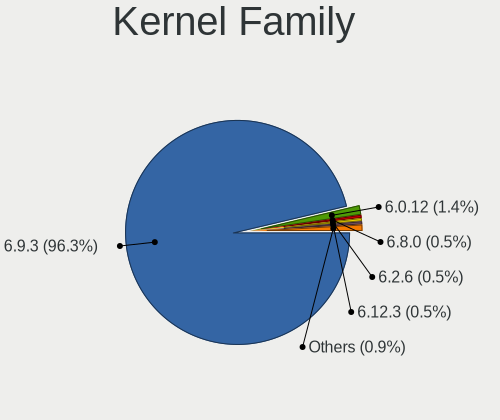
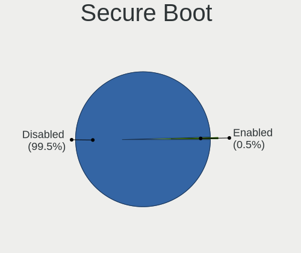
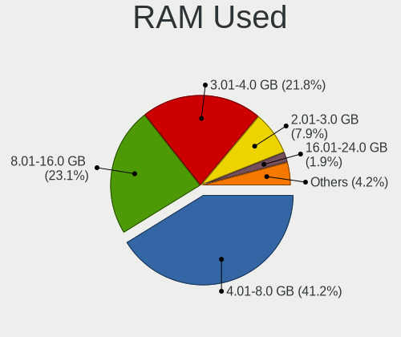
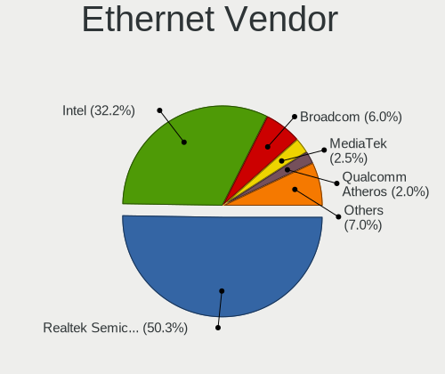
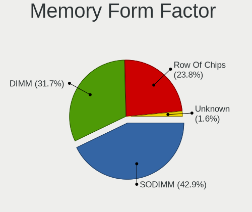

Pop!_OS - Hardware Trends
-------------------------

A project to identify most popular hardware characteristics and track their change
over time based on data collected by Linux users at https://Linux-Hardware.org.

Anyone can contribute to this report by the [hw-probe](https://github.com/linuxhw/hw-probe) tool:

    sudo -E hw-probe -all -upload

This is a report for all computer types. See also reports for [desktops](/Dist/Pop!_OS/Desktop/README.md) and [notebooks](/Dist/Pop!_OS/Notebook/README.md).

This report is for one last month. Overall report since the beginning of time: [TestCoverage](https://github.com/linuxhw/TestCoverage)

Period: Jul, 2022.

Contents
--------

* [ System ](#system)
  - [ OS                       ](#os)
  - [ OS Family                ](#os-family)
  - [ Kernel                   ](#kernel)
  - [ Kernel Family            ](#kernel-family)
  - [ Kernel Major Ver.        ](#kernel-major-ver)
  - [ Arch                     ](#arch)
  - [ DE                       ](#de)
  - [ Display Server           ](#display-server)
  - [ Display Manager          ](#display-manager)
  - [ OS Lang                  ](#os-lang)
  - [ Boot Mode                ](#boot-mode)
  - [ Filesystem               ](#filesystem)
  - [ Part. scheme             ](#part-scheme)
  - [ Dual Boot with Linux/BSD ](#dual-boot-with-linuxbsd)
  - [ Dual Boot (Win)          ](#dual-boot-win)

* [ Board ](#board)
  - [ Vendor                   ](#vendor)
  - [ Model                    ](#model)
  - [ Model Family             ](#model-family)
  - [ MFG Year                 ](#mfg-year)
  - [ Form Factor              ](#form-factor)
  - [ Secure Boot              ](#secure-boot)
  - [ Coreboot                 ](#coreboot)
  - [ RAM Size                 ](#ram-size)
  - [ RAM Used                 ](#ram-used)
  - [ Total Drives             ](#total-drives)
  - [ Has CD-ROM               ](#has-cd-rom)
  - [ Has Ethernet             ](#has-ethernet)
  - [ Has WiFi                 ](#has-wifi)
  - [ Has Bluetooth            ](#has-bluetooth)

* [ Location ](#location)
  - [ Country                  ](#country)
  - [ City                     ](#city)

* [ Drives ](#drives)
  - [ Drive Vendor             ](#drive-vendor)
  - [ Drive Model              ](#drive-model)
  - [ HDD Vendor               ](#hdd-vendor)
  - [ SSD Vendor               ](#ssd-vendor)
  - [ Drive Kind               ](#drive-kind)
  - [ Drive Connector          ](#drive-connector)
  - [ Drive Size               ](#drive-size)
  - [ Space Total              ](#space-total)
  - [ Space Used               ](#space-used)
  - [ Malfunc. Drives          ](#malfunc-drives)
  - [ Malfunc. Drive Vendor    ](#malfunc-drive-vendor)
  - [ Malfunc. HDD Vendor      ](#malfunc-hdd-vendor)
  - [ Malfunc. Drive Kind      ](#malfunc-drive-kind)
  - [ Failed Drives            ](#failed-drives)
  - [ Failed Drive Vendor      ](#failed-drive-vendor)
  - [ Drive Status             ](#drive-status)

* [ Storage controller ](#storage-controller)
  - [ Storage Vendor           ](#storage-vendor)
  - [ Storage Model            ](#storage-model)
  - [ Storage Kind             ](#storage-kind)

* [ Processor ](#processor)
  - [ CPU Vendor               ](#cpu-vendor)
  - [ CPU Model                ](#cpu-model)
  - [ CPU Model Family         ](#cpu-model-family)
  - [ CPU Cores                ](#cpu-cores)
  - [ CPU Sockets              ](#cpu-sockets)
  - [ CPU Threads              ](#cpu-threads)
  - [ CPU Op-Modes             ](#cpu-op-modes)
  - [ CPU Microcode            ](#cpu-microcode)
  - [ CPU Microarch            ](#cpu-microarch)

* [ Graphics ](#graphics)
  - [ GPU Vendor               ](#gpu-vendor)
  - [ GPU Model                ](#gpu-model)
  - [ GPU Combo                ](#gpu-combo)
  - [ GPU Driver               ](#gpu-driver)
  - [ GPU Memory               ](#gpu-memory)

* [ Monitor ](#monitor)
  - [ Monitor Vendor           ](#monitor-vendor)
  - [ Monitor Model            ](#monitor-model)
  - [ Monitor Resolution       ](#monitor-resolution)
  - [ Monitor Diagonal         ](#monitor-diagonal)
  - [ Monitor Width            ](#monitor-width)
  - [ Aspect Ratio             ](#aspect-ratio)
  - [ Monitor Area             ](#monitor-area)
  - [ Pixel Density            ](#pixel-density)
  - [ Multiple Monitors        ](#multiple-monitors)

* [ Network ](#network)
  - [ Net Controller Vendor    ](#net-controller-vendor)
  - [ Net Controller Model     ](#net-controller-model)
  - [ Wireless Vendor          ](#wireless-vendor)
  - [ Wireless Model           ](#wireless-model)
  - [ Ethernet Vendor          ](#ethernet-vendor)
  - [ Ethernet Model           ](#ethernet-model)
  - [ Net Controller Kind      ](#net-controller-kind)
  - [ Used Controller          ](#used-controller)
  - [ NICs                     ](#nics)
  - [ IPv6                     ](#ipv6)

* [ Bluetooth ](#bluetooth)
  - [ Bluetooth Vendor         ](#bluetooth-vendor)
  - [ Bluetooth Model          ](#bluetooth-model)

* [ Sound ](#sound)
  - [ Sound Vendor             ](#sound-vendor)
  - [ Sound Model              ](#sound-model)

* [ Memory ](#memory)
  - [ Memory Vendor            ](#memory-vendor)
  - [ Memory Model             ](#memory-model)
  - [ Memory Kind              ](#memory-kind)
  - [ Memory Form Factor       ](#memory-form-factor)
  - [ Memory Size              ](#memory-size)
  - [ Memory Speed             ](#memory-speed)

* [ Printers & scanners ](#printers--scanners)
  - [ Printer Vendor           ](#printer-vendor)
  - [ Printer Model            ](#printer-model)
  - [ Scanner Vendor           ](#scanner-vendor)
  - [ Scanner Model            ](#scanner-model)

* [ Camera ](#camera)
  - [ Camera Vendor            ](#camera-vendor)
  - [ Camera Model             ](#camera-model)

* [ Security ](#security)
  - [ Fingerprint Vendor       ](#fingerprint-vendor)
  - [ Fingerprint Model        ](#fingerprint-model)
  - [ Chipcard Vendor          ](#chipcard-vendor)
  - [ Chipcard Model           ](#chipcard-model)

* [ Unsupported ](#unsupported)
  - [ Unsupported Devices      ](#unsupported-devices)
  - [ Unsupported Device Types ](#unsupported-device-types)

System
------

OS
--

Installed operating systems

| Name          | Computers | Percent |
|---------------|-----------|---------|
| Pop!_OS 22.04 | 232       | 92.8%   |
| Pop!_OS 20.04 | 8         | 3.2%    |
| Pop!_OS 21.10 | 5         | 2%      |
| Pop!_OS 21.04 | 3         | 1.2%    |
| Pop!_OS 20.10 | 2         | 0.8%    |

OS Family
---------

OS without a version

| Name    | Computers | Percent |
|---------|-----------|---------|
| Pop!_OS | 250       | 100%    |

Kernel
------

Version of the Linux kernel

| Version                   | Computers | Percent |
|---------------------------|-----------|---------|
| 5.17.15-76051715-generic  | 162       | 64.8%   |
| 5.18.10-76051810-generic  | 55        | 22%     |
| 5.17.5-76051705-generic   | 19        | 7.6%    |
| 5.16.11-76051611-generic  | 2         | 0.8%    |
| 5.19.0-rc1+               | 1         | 0.4%    |
| 5.18.6-xanmod1            | 1         | 0.4%    |
| 5.18.11-steamvr-generic   | 1         | 0.4%    |
| 5.18.11-051811-generic    | 1         | 0.4%    |
| 5.18.0-9.1-liquorix-amd64 | 1         | 0.4%    |
| 5.16.19-76051619-generic  | 1         | 0.4%    |
| 5.15.15-76051515-generic  | 1         | 0.4%    |
| 5.15.11-76051511-generic  | 1         | 0.4%    |
| 5.13.0-7614-generic       | 1         | 0.4%    |
| 5.11.0-7633-generic       | 1         | 0.4%    |
| 5.11.0-7614-generic       | 1         | 0.4%    |
| 5.11.0-7612-generic       | 1         | 0.4%    |

Kernel Family
-------------

Linux kernel without a distro release

| Version | Computers | Percent |
|---------|-----------|---------|
| 5.17.15 | 162       | 64.8%   |
| 5.18.10 | 55        | 22%     |
| 5.17.5  | 19        | 7.6%    |
| 5.11.0  | 3         | 1.2%    |
| 5.18.11 | 2         | 0.8%    |
| 5.16.11 | 2         | 0.8%    |
| 5.19.0  | 1         | 0.4%    |
| 5.18.6  | 1         | 0.4%    |
| 5.18.0  | 1         | 0.4%    |
| 5.16.19 | 1         | 0.4%    |
| 5.15.15 | 1         | 0.4%    |
| 5.15.11 | 1         | 0.4%    |
| 5.13.0  | 1         | 0.4%    |

Kernel Major Ver.
-----------------

Linux kernel major version

| Version | Computers | Percent |
|---------|-----------|---------|
| 5.17    | 181       | 72.4%   |
| 5.18    | 59        | 23.6%   |
| 5.16    | 3         | 1.2%    |
| 5.11    | 3         | 1.2%    |
| 5.15    | 2         | 0.8%    |
| 5.19    | 1         | 0.4%    |
| 5.13    | 1         | 0.4%    |

Arch
----

OS architecture (x86_64, i586, etc.)

| Name   | Computers | Percent |
|--------|-----------|---------|
| x86_64 | 250       | 100%    |

DE
--

Desktop Environment

| Name       | Computers | Percent |
|------------|-----------|---------|
| GNOME      | 234       | 93.6%   |
| KDE5       | 10        | 4%      |
| Unknown    | 2         | 0.8%    |
| XFCE       | 1         | 0.4%    |
| X-Cinnamon | 1         | 0.4%    |
| Cinnamon   | 1         | 0.4%    |
| Budgie     | 1         | 0.4%    |

Display Server
--------------

X11 or Wayland

| Name    | Computers | Percent |
|---------|-----------|---------|
| X11     | 239       | 95.6%   |
| Wayland | 9         | 3.6%    |
| Unknown | 2         | 0.8%    |

Display Manager
---------------

SDDM, LightDM, etc.

| Name    | Computers | Percent |
|---------|-----------|---------|
| Unknown | 207       | 82.8%   |
| GDM3    | 39        | 15.6%   |
| SDDM    | 2         | 0.8%    |
| GDM     | 2         | 0.8%    |

OS Lang
-------

Language

| Lang    | Computers | Percent |
|---------|-----------|---------|
| en_US   | 149       | 59.6%   |
| pt_BR   | 13        | 5.2%    |
| de_DE   | 12        | 4.8%    |
| en_GB   | 11        | 4.4%    |
| en_CA   | 8         | 3.2%    |
| en_AU   | 7         | 2.8%    |
| C       | 6         | 2.4%    |
| sv_SE   | 5         | 2%      |
| it_IT   | 5         | 2%      |
| ru_RU   | 4         | 1.6%    |
| pl_PL   | 3         | 1.2%    |
| fr_FR   | 3         | 1.2%    |
| es_ES   | 3         | 1.2%    |
| nl_NL   | 2         | 0.8%    |
| nb_NO   | 2         | 0.8%    |
| en_IN   | 2         | 0.8%    |
| de_AT   | 2         | 0.8%    |
| Unknown | 2         | 0.8%    |
| ro_RO   | 1         | 0.4%    |
| hr_HR   | 1         | 0.4%    |
| fr_CA   | 1         | 0.4%    |
| fi_FI   | 1         | 0.4%    |
| es_UY   | 1         | 0.4%    |
| es_DO   | 1         | 0.4%    |
| es_CO   | 1         | 0.4%    |
| es_CL   | 1         | 0.4%    |
| es_AR   | 1         | 0.4%    |
| en_NZ   | 1         | 0.4%    |
| en_DK   | 1         | 0.4%    |

Boot Mode
---------

EFI or BIOS

| Mode | Computers | Percent |
|------|-----------|---------|
| BIOS | 210       | 84%     |
| EFI  | 40        | 16%     |

Filesystem
----------

Type of filesystem

| Type    | Computers | Percent |
|---------|-----------|---------|
| Ext4    | 241       | 96.4%   |
| Btrfs   | 5         | 2%      |
| Overlay | 4         | 1.6%    |

Part. scheme
------------

Scheme of partitioning

| Type    | Computers | Percent |
|---------|-----------|---------|
| Unknown | 205       | 82%     |
| GPT     | 43        | 17.2%   |
| MBR     | 2         | 0.8%    |

Dual Boot with Linux/BSD
------------------------

Hosting more than one Linux/BSD

| Dual boot | Computers | Percent |
|-----------|-----------|---------|
| No        | 245       | 98%     |
| Yes       | 5         | 2%      |

Dual Boot (Win)
---------------

Hosting Linux and Windows

| Dual boot | Computers | Percent |
|-----------|-----------|---------|
| No        | 229       | 91.6%   |
| Yes       | 21        | 8.4%    |

Board
-----

Vendor
------

Motherboard manufacturer

| Name                 | Computers | Percent |
|----------------------|-----------|---------|
| ASUSTek Computer     | 41        | 16.4%   |
| Lenovo               | 33        | 13.2%   |
| Hewlett-Packard      | 31        | 12.4%   |
| MSI                  | 27        | 10.8%   |
| Dell                 | 26        | 10.4%   |
| Gigabyte Technology  | 22        | 8.8%    |
| Acer                 | 12        | 4.8%    |
| Apple                | 10        | 4%      |
| ASRock               | 7         | 2.8%    |
| Toshiba              | 4         | 1.6%    |
| Intel                | 4         | 1.6%    |
| GPU Company          | 4         | 1.6%    |
| System76             | 3         | 1.2%    |
| Samsung Electronics  | 3         | 1.2%    |
| Sony                 | 2         | 0.8%    |
| Notebook             | 2         | 0.8%    |
| MACHINIST            | 2         | 0.8%    |
| Intel Client Systems | 2         | 0.8%    |
| HUAWEI               | 2         | 0.8%    |
| Alienware            | 2         | 0.8%    |
| Timi                 | 1         | 0.4%    |
| Soyo                 | 1         | 0.4%    |
| Positivo             | 1         | 0.4%    |
| Pegatron             | 1         | 0.4%    |
| PC Specialist        | 1         | 0.4%    |
| Panasonic            | 1         | 0.4%    |
| Microsoft            | 1         | 0.4%    |
| Medion               | 1         | 0.4%    |
| Fujitsu              | 1         | 0.4%    |
| EVGA                 | 1         | 0.4%    |
| Dynabook             | 1         | 0.4%    |

Model
-----

Motherboard model

| Name                                     | Computers | Percent |
|------------------------------------------|-----------|---------|
| HP ENVY x360 2-in-1 Laptop 15-ey0xxx     | 3         | 1.2%    |
| ASUS ROG STRIX B450-F GAMING             | 3         | 1.2%    |
| System76 Lemur Pro                       | 2         | 0.8%    |
| MSI Katana GF76 11UD                     | 2         | 0.8%    |
| MSI GF63 Thin 11UD                       | 2         | 0.8%    |
| Lenovo IdeaPad S145-15API 81V7           | 2         | 0.8%    |
| Intel Client Systems LAPKC71F            | 2         | 0.8%    |
| HP Pavilion 15                           | 2         | 0.8%    |
| GPU Company GWTN141-10                   | 2         | 0.8%    |
| GPU Company GWTC116-2                    | 2         | 0.8%    |
| Gigabyte X570 I AORUS PRO WIFI           | 2         | 0.8%    |
| Gigabyte B450M DS3H                      | 2         | 0.8%    |
| Dell Vostro 5470                         | 2         | 0.8%    |
| ASUS VivoBook_ASUSLaptop TP420UA_TM420UA | 2         | 0.8%    |
| ASUS TUF Gaming X570-PLUS                | 2         | 0.8%    |
| ASUS TUF Gaming B550-PLUS                | 2         | 0.8%    |
| ASUS ROG Flow X13 GV301RE_GV301RE        | 2         | 0.8%    |
| ASUS PRIME Z390-A                        | 2         | 0.8%    |
| Apple MacBookPro9,2                      | 2         | 0.8%    |
| Apple MacBookAir7,2                      | 2         | 0.8%    |
| Toshiba Satellite L650                   | 1         | 0.4%    |
| Toshiba Satellite C75D-C                 | 1         | 0.4%    |
| Toshiba Satellite C650D                  | 1         | 0.4%    |
| Toshiba BLB                              | 1         | 0.4%    |
| Timi Redmi Book Pro 15 2022              | 1         | 0.4%    |
| System76 Pangolin                        | 1         | 0.4%    |
| Soyo SY-A68M FS V2.0                     | 1         | 0.4%    |
| Sony VPCF11M1E                           | 1         | 0.4%    |
| Sony VPCEG27FM                           | 1         | 0.4%    |
| Samsung 950XED                           | 1         | 0.4%    |
| Samsung 930XED                           | 1         | 0.4%    |
| Samsung 760XDA                           | 1         | 0.4%    |
| Positivo POS-PIQ77CL                     | 1         | 0.4%    |
| Pegatron H36FF                           | 1         | 0.4%    |
| PC Specialist NS50MU                     | 1         | 0.4%    |
| Panasonic CF-C2AQAZXLM                   | 1         | 0.4%    |
| Notebook P65xHP                          | 1         | 0.4%    |
| Notebook NV4XMB,ME,MZ                    | 1         | 0.4%    |
| MSI Prestige 15 A10SC                    | 1         | 0.4%    |
| MSI MS-7D28                              | 1         | 0.4%    |
| MSI MS-7D25                              | 1         | 0.4%    |
| MSI MS-7D09                              | 1         | 0.4%    |
| MSI MS-7C90                              | 1         | 0.4%    |
| MSI MS-7C75                              | 1         | 0.4%    |
| MSI MS-7C37                              | 1         | 0.4%    |
| MSI MS-7C35                              | 1         | 0.4%    |
| MSI MS-7C02                              | 1         | 0.4%    |
| MSI MS-7B89                              | 1         | 0.4%    |
| MSI MS-7B85                              | 1         | 0.4%    |
| MSI MS-7B22                              | 1         | 0.4%    |
| MSI MS-7A74                              | 1         | 0.4%    |
| MSI MS-7A33                              | 1         | 0.4%    |
| MSI MS-7A11                              | 1         | 0.4%    |
| MSI MS-7977                              | 1         | 0.4%    |
| MSI MS-7673                              | 1         | 0.4%    |
| MSI MS-16G4                              | 1         | 0.4%    |
| MSI MPG B460 Trident A (MS-B926)         | 1         | 0.4%    |
| MSI Modern 15 A5M                        | 1         | 0.4%    |
| MSI Katana GF76 11UG                     | 1         | 0.4%    |
| MSI GS75 Stealth 9SG                     | 1         | 0.4%    |

Model Family
------------

Motherboard model prefix

| Name                          | Computers | Percent |
|-------------------------------|-----------|---------|
| Lenovo ThinkPad               | 11        | 4.4%    |
| ASUS ROG                      | 9         | 3.6%    |
| Lenovo IdeaPad                | 7         | 2.8%    |
| HP Pavilion                   | 7         | 2.8%    |
| Dell Precision                | 7         | 2.8%    |
| Dell Latitude                 | 7         | 2.8%    |
| ASUS TUF                      | 7         | 2.8%    |
| Acer Aspire                   | 6         | 2.4%    |
| HP ENVY                       | 5         | 2%      |
| Lenovo ThinkCentre            | 4         | 1.6%    |
| Lenovo Legion                 | 4         | 1.6%    |
| HP ProBook                    | 4         | 1.6%    |
| Gigabyte X570                 | 4         | 1.6%    |
| Dell Vostro                   | 4         | 1.6%    |
| Dell Inspiron                 | 4         | 1.6%    |
| ASUS VivoBook                 | 4         | 1.6%    |
| Toshiba Satellite             | 3         | 1.2%    |
| MSI Katana                    | 3         | 1.2%    |
| HP Laptop                     | 3         | 1.2%    |
| HP EliteBook                  | 3         | 1.2%    |
| Dell OptiPlex                 | 3         | 1.2%    |
| ASUS PRIME                    | 3         | 1.2%    |
| ASUS ASUS                     | 3         | 1.2%    |
| Acer Nitro                    | 3         | 1.2%    |
| System76 Lemur                | 2         | 0.8%    |
| MSI GF63                      | 2         | 0.8%    |
| Lenovo Yoga                   | 2         | 0.8%    |
| Intel Client Systems LAPKC71F | 2         | 0.8%    |
| HP OMEN                       | 2         | 0.8%    |
| HP Compaq                     | 2         | 0.8%    |
| GPU Company GWTN141-10        | 2         | 0.8%    |
| GPU Company GWTC116-2         | 2         | 0.8%    |
| Gigabyte B450M                | 2         | 0.8%    |
| Gigabyte B450                 | 2         | 0.8%    |
| ASRock B550                   | 2         | 0.8%    |
| ASRock B450                   | 2         | 0.8%    |
| Apple MacBookPro9             | 2         | 0.8%    |
| Apple MacBookAir7             | 2         | 0.8%    |
| Acer Swift                    | 2         | 0.8%    |
| Toshiba BLB                   | 1         | 0.4%    |
| Timi Redmi                    | 1         | 0.4%    |
| System76 Pangolin             | 1         | 0.4%    |
| Soyo SY-A68M                  | 1         | 0.4%    |
| Sony VPCF11M1E                | 1         | 0.4%    |
| Sony VPCEG27FM                | 1         | 0.4%    |
| Samsung 950XED                | 1         | 0.4%    |
| Samsung 930XED                | 1         | 0.4%    |
| Samsung 760XDA                | 1         | 0.4%    |
| Positivo POS-PIQ77CL          | 1         | 0.4%    |
| Pegatron H36FF                | 1         | 0.4%    |
| PC Specialist NS50MU          | 1         | 0.4%    |
| Panasonic CF-C2AQAZXLM        | 1         | 0.4%    |
| Notebook P65xHP               | 1         | 0.4%    |
| Notebook NV4XMB               | 1         | 0.4%    |
| MSI Prestige                  | 1         | 0.4%    |
| MSI MS-7D28                   | 1         | 0.4%    |
| MSI MS-7D25                   | 1         | 0.4%    |
| MSI MS-7D09                   | 1         | 0.4%    |
| MSI MS-7C90                   | 1         | 0.4%    |
| MSI MS-7C75                   | 1         | 0.4%    |

MFG Year
--------

Motherboard manufacture year

| Year | Computers | Percent |
|------|-----------|---------|
| 2021 | 42        | 16.8%   |
| 2018 | 35        | 14%     |
| 2020 | 23        | 9.2%    |
| 2019 | 23        | 9.2%    |
| 2022 | 17        | 6.8%    |
| 2015 | 16        | 6.4%    |
| 2012 | 16        | 6.4%    |
| 2013 | 14        | 5.6%    |
| 2014 | 12        | 4.8%    |
| 2017 | 11        | 4.4%    |
| 2010 | 11        | 4.4%    |
| 2016 | 10        | 4%      |
| 2011 | 8         | 3.2%    |
| 2009 | 5         | 2%      |
| 2008 | 4         | 1.6%    |
| 2007 | 3         | 1.2%    |

Form Factor
-----------

Physical design of the computer

| Name        | Computers | Percent |
|-------------|-----------|---------|
| Notebook    | 143       | 57.2%   |
| Desktop     | 88        | 35.2%   |
| Convertible | 13        | 5.2%    |
| Mini pc     | 4         | 1.6%    |
| Tablet      | 1         | 0.4%    |
| Server      | 1         | 0.4%    |

Secure Boot
-----------

Enabled or disabled

| State    | Computers | Percent |
|----------|-----------|---------|
| Disabled | 249       | 99.6%   |
| Enabled  | 1         | 0.4%    |

Coreboot
--------

Have coreboot on board

| Used | Computers | Percent |
|------|-----------|---------|
| No   | 248       | 99.2%   |
| Yes  | 2         | 0.8%    |

RAM Size
--------

Total RAM memory

| Size in GB  | Computers | Percent |
|-------------|-----------|---------|
| 16.01-24.0  | 73        | 29.2%   |
| 4.01-8.0    | 57        | 22.8%   |
| 8.01-16.0   | 55        | 22%     |
| 32.01-64.0  | 26        | 10.4%   |
| 3.01-4.0    | 19        | 7.6%    |
| 64.01-256.0 | 17        | 6.8%    |
| 24.01-32.0  | 2         | 0.8%    |
| 1.01-2.0    | 1         | 0.4%    |

RAM Used
--------

Used RAM memory

| Used GB    | Computers | Percent |
|------------|-----------|---------|
| 2.01-3.0   | 84        | 33.6%   |
| 3.01-4.0   | 64        | 25.6%   |
| 4.01-8.0   | 51        | 20.4%   |
| 1.01-2.0   | 36        | 14.4%   |
| 8.01-16.0  | 11        | 4.4%    |
| 32.01-64.0 | 3         | 1.2%    |
| 16.01-24.0 | 1         | 0.4%    |

Total Drives
------------

Number of drives on board

| Drives | Computers | Percent |
|--------|-----------|---------|
| 1      | 145       | 58%     |
| 2      | 63        | 25.2%   |
| 3      | 22        | 8.8%    |
| 4      | 12        | 4.8%    |
| 7      | 3         | 1.2%    |
| 6      | 3         | 1.2%    |
| 5      | 2         | 0.8%    |

Has CD-ROM
----------

Has CD-ROM on board

| Presented | Computers | Percent |
|-----------|-----------|---------|
| No        | 184       | 73.6%   |
| Yes       | 66        | 26.4%   |

Has Ethernet
------------

Has Ethernet on board

| Presented | Computers | Percent |
|-----------|-----------|---------|
| Yes       | 214       | 85.6%   |
| No        | 36        | 14.4%   |

Has WiFi
--------

Has WiFi module

| Presented | Computers | Percent |
|-----------|-----------|---------|
| Yes       | 205       | 82%     |
| No        | 45        | 18%     |

Has Bluetooth
-------------

Has Bluetooth module

| Presented | Computers | Percent |
|-----------|-----------|---------|
| Yes       | 171       | 68.4%   |
| No        | 79        | 31.6%   |

Location
--------

Country
-------

Geographic location (country)

| Country            | Computers | Percent |
|--------------------|-----------|---------|
| USA                | 89        | 35.6%   |
| Germany            | 20        | 8%      |
| Brazil             | 18        | 7.2%    |
| Canada             | 15        | 6%      |
| Italy              | 10        | 4%      |
| India              | 9         | 3.6%    |
| UK                 | 8         | 3.2%    |
| Norway             | 6         | 2.4%    |
| Australia          | 6         | 2.4%    |
| Sweden             | 5         | 2%      |
| Russia             | 5         | 2%      |
| France             | 5         | 2%      |
| Mexico             | 4         | 1.6%    |
| Austria            | 4         | 1.6%    |
| Poland             | 3         | 1.2%    |
| New Zealand        | 3         | 1.2%    |
| Netherlands        | 3         | 1.2%    |
| Finland            | 3         | 1.2%    |
| Colombia           | 3         | 1.2%    |
| Turkey             | 2         | 0.8%    |
| Romania            | 2         | 0.8%    |
| Greece             | 2         | 0.8%    |
| Chile              | 2         | 0.8%    |
| Argentina          | 2         | 0.8%    |
| Venezuela          | 1         | 0.4%    |
| Uruguay            | 1         | 0.4%    |
| Switzerland        | 1         | 0.4%    |
| Spain              | 1         | 0.4%    |
| Portugal           | 1         | 0.4%    |
| Philippines        | 1         | 0.4%    |
| Peru               | 1         | 0.4%    |
| Pakistan           | 1         | 0.4%    |
| Morocco            | 1         | 0.4%    |
| Ireland            | 1         | 0.4%    |
| Iraq               | 1         | 0.4%    |
| Iran               | 1         | 0.4%    |
| Hong Kong          | 1         | 0.4%    |
| Egypt              | 1         | 0.4%    |
| Dominican Republic | 1         | 0.4%    |
| Denmark            | 1         | 0.4%    |
| Croatia            | 1         | 0.4%    |
| China              | 1         | 0.4%    |
| Belgium            | 1         | 0.4%    |
| Bangladesh         | 1         | 0.4%    |
| Azerbaijan         | 1         | 0.4%    |

City
----

Geographic location (city)

| City                   | Computers | Percent |
|------------------------|-----------|---------|
| Oslo                   | 4         | 1.6%    |
| Milan                  | 4         | 1.6%    |
| Portland               | 3         | 1.2%    |
| Munich                 | 3         | 1.2%    |
| Brisbane               | 3         | 1.2%    |
| Auckland               | 3         | 1.2%    |
| Sydney                 | 2         | 0.8%    |
| Stockholm              | 2         | 0.8%    |
| Seattle                | 2         | 0.8%    |
| Sarasota               | 2         | 0.8%    |
| Ottawa                 | 2         | 0.8%    |
| Mumbai                 | 2         | 0.8%    |
| Miami                  | 2         | 0.8%    |
| Manaus                 | 2         | 0.8%    |
| Lansing                | 2         | 0.8%    |
| Kelowna                | 2         | 0.8%    |
| Helsinki               | 2         | 0.8%    |
| Broomfield             | 2         | 0.8%    |
| Bogotá                | 2         | 0.8%    |
| Birmingham             | 2         | 0.8%    |
| Berlin                 | 2         | 0.8%    |
| Wilmslow               | 1         | 0.4%    |
| Wilmington             | 1         | 0.4%    |
| Wesley Chapel          | 1         | 0.4%    |
| Waxhaw                 | 1         | 0.4%    |
| Wasilla                | 1         | 0.4%    |
| Warsaw                 | 1         | 0.4%    |
| Virginia Beach         | 1         | 0.4%    |
| Vienna                 | 1         | 0.4%    |
| Vedevag                | 1         | 0.4%    |
| Västerås             | 1         | 0.4%    |
| Varel                  | 1         | 0.4%    |
| Vancouver              | 1         | 0.4%    |
| Vallenar               | 1         | 0.4%    |
| Valenciennes           | 1         | 0.4%    |
| Utrecht                | 1         | 0.4%    |
| Tustin                 | 1         | 0.4%    |
| Turin                  | 1         | 0.4%    |
| Trujillo               | 1         | 0.4%    |
| Trollhättan           | 1         | 0.4%    |
| Toronto                | 1         | 0.4%    |
| Thebes                 | 1         | 0.4%    |
| Telford                | 1         | 0.4%    |
| Tehran                 | 1         | 0.4%    |
| Surrey                 | 1         | 0.4%    |
| Strawberry Plains      | 1         | 0.4%    |
| Stephenville           | 1         | 0.4%    |
| St Petersburg          | 1         | 0.4%    |
| Springfield            | 1         | 0.4%    |
| Southfield             | 1         | 0.4%    |
| South Bend             | 1         | 0.4%    |
| Sisli                  | 1         | 0.4%    |
| Scarborough            | 1         | 0.4%    |
| Sao Paulo              | 1         | 0.4%    |
| Sao Luís              | 1         | 0.4%    |
| Santa Clara            | 1         | 0.4%    |
| San Vicente de Chucuri | 1         | 0.4%    |
| San José del Cabo     | 1         | 0.4%    |
| San Jose               | 1         | 0.4%    |
| Salt Lake City         | 1         | 0.4%    |

Drives
------

Drive Vendor
------------

Hard drive vendors

| Vendor                         | Computers | Drives | Percent |
|--------------------------------|-----------|--------|---------|
| Samsung Electronics            | 67        | 80     | 17.22%  |
| WDC                            | 45        | 55     | 11.57%  |
| Seagate                        | 41        | 54     | 10.54%  |
| SanDisk                        | 40        | 42     | 10.28%  |
| Kingston                       | 26        | 28     | 6.68%   |
| Toshiba                        | 23        | 23     | 5.91%   |
| Crucial                        | 15        | 19     | 3.86%   |
| SK hynix                       | 12        | 12     | 3.08%   |
| Phison                         | 8         | 9      | 2.06%   |
| Intel                          | 8         | 8      | 2.06%   |
| China                          | 8         | 8      | 2.06%   |
| Apple                          | 7         | 7      | 1.8%    |
| A-DATA Technology              | 7         | 7      | 1.8%    |
| SPCC                           | 6         | 6      | 1.54%   |
| HGST                           | 6         | 6      | 1.54%   |
| Unknown                        | 5         | 5      | 1.29%   |
| Hitachi                        | 5         | 6      | 1.29%   |
| Micron Technology              | 4         | 4      | 1.03%   |
| XPG                            | 3         | 3      | 0.77%   |
| Silicon Motion                 | 3         | 3      | 0.77%   |
| PNY                            | 3         | 3      | 0.77%   |
| Micron/Crucial Technology      | 3         | 3      | 0.77%   |
| W800S                          | 2         | 3      | 0.51%   |
| T-FORCE                        | 2         | 2      | 0.51%   |
| Realtek Semiconductor          | 2         | 2      | 0.51%   |
| OCZ                            | 2         | 2      | 0.51%   |
| Maxtor                         | 2         | 2      | 0.51%   |
| Lexar                          | 2         | 2      | 0.51%   |
| JMicron Technology             | 2         | 2      | 0.51%   |
| Intenso                        | 2         | 2      | 0.51%   |
| Hewlett-Packard                | 2         | 2      | 0.51%   |
| Apacer                         | 2         | 3      | 0.51%   |
| WALRAM                         | 1         | 1      | 0.26%   |
| Union Memory (Shenzhen)        | 1         | 1      | 0.26%   |
| SSSTC                          | 1         | 1      | 0.26%   |
| Solid State Storage Technology | 1         | 1      | 0.26%   |
| Shenzhen Longsys Electronics   | 1         | 1      | 0.26%   |
| SATAFIRM                       | 1         | 1      | 0.26%   |
| ROG                            | 1         | 1      | 0.26%   |
| Radeon                         | 1         | 1      | 0.26%   |
| Qunion                         | 1         | 1      | 0.26%   |
| Pioneer                        | 1         | 1      | 0.26%   |
| Patriot                        | 1         | 1      | 0.26%   |
| Netac                          | 1         | 1      | 0.26%   |
| Mushkin                        | 1         | 1      | 0.26%   |
| LITEON                         | 1         | 1      | 0.26%   |
| Lite-On                        | 1         | 1      | 0.26%   |
| Leven                          | 1         | 1      | 0.26%   |
| KIOXIA                         | 1         | 1      | 0.26%   |
| Inland                         | 1         | 1      | 0.26%   |
| Indilinx                       | 1         | 1      | 0.26%   |
| HS-SSD-E100N                   | 1         | 1      | 0.26%   |
| GALAX                          | 1         | 1      | 0.26%   |
| Corsair                        | 1         | 1      | 0.26%   |
| BHT                            | 1         | 1      | 0.26%   |
| Unknown                        | 1         | 1      | 0.26%   |

Drive Model
-----------

Hard drive models

| Model                               | Computers | Percent |
|-------------------------------------|-----------|---------|
| SanDisk NVMe SSD Drive 1TB          | 9         | 2.12%   |
| Samsung NVMe SSD Drive 1TB          | 9         | 2.12%   |
| SanDisk NVMe SSD Drive 512GB        | 7         | 1.65%   |
| Kingston SA400S37240G 240GB SSD     | 7         | 1.65%   |
| Samsung NVMe SSD Drive 512GB        | 5         | 1.18%   |
| Kingston SA400S37120G 120GB SSD     | 5         | 1.18%   |
| Kingston NVMe SSD Drive 512GB       | 5         | 1.18%   |
| Seagate ST2000DM008-2FR102 2TB      | 4         | 0.94%   |
| Seagate ST1000LM024 HN-M101MBB 1TB  | 4         | 0.94%   |
| SanDisk NVMe SSD Drive 500GB        | 4         | 0.94%   |
| SanDisk NVMe SSD Drive 256GB        | 4         | 0.94%   |
| Samsung SSD 850 EVO 500GB           | 4         | 0.94%   |
| Samsung NVMe SSD Drive 500GB        | 4         | 0.94%   |
| HGST HTS721010A9E630 1TB            | 4         | 0.94%   |
| SK hynix NVMe SSD Drive 256GB       | 3         | 0.71%   |
| Seagate ST1000LM035-1RK172 1TB      | 3         | 0.71%   |
| Samsung SSD 860 EVO 1TB             | 3         | 0.71%   |
| Samsung NVMe SSD Drive 2TB          | 3         | 0.71%   |
| Samsung NVMe SSD Drive 250GB        | 3         | 0.71%   |
| Samsung NVMe SSD Drive 1024GB       | 3         | 0.71%   |
| Phison NVMe SSD Drive 1TB           | 3         | 0.71%   |
| Crucial CT500MX500SSD1 500GB        | 3         | 0.71%   |
| Crucial CT1000MX500SSD1 1TB         | 3         | 0.71%   |
| WDC WDS100T3X0C-00SJG0 1TB          | 2         | 0.47%   |
| WDC WDS100T2B0A-00SM50 1TB SSD      | 2         | 0.47%   |
| WDC WD20EZAZ-00GGJB0 2TB            | 2         | 0.47%   |
| WDC WD20EARS-00MVWB0 2TB            | 2         | 0.47%   |
| WDC WD10SPZX-21Z10T0 1TB            | 2         | 0.47%   |
| WDC WD10EZEX-08WN4A0 1TB            | 2         | 0.47%   |
| W800S 512GB                         | 2         | 0.47%   |
| Unknown MMC Card  64GB              | 2         | 0.47%   |
| Toshiba NVMe SSD Drive 512GB        | 2         | 0.47%   |
| Toshiba MQ01ACF050 500GB            | 2         | 0.47%   |
| Toshiba MQ01ABD075 752GB            | 2         | 0.47%   |
| SPCC Solid State Disk 512GB         | 2         | 0.47%   |
| SPCC Solid State Disk 256GB         | 2         | 0.47%   |
| Silicon Motion NVMe SSD Drive 480GB | 2         | 0.47%   |
| Seagate ST8000DM004-2CX188 8TB      | 2         | 0.47%   |
| Seagate ST5000LM000-2AN170 5TB      | 2         | 0.47%   |
| Seagate ST4000DM004-2CV104 4TB      | 2         | 0.47%   |
| Seagate ST4000DM000-1F2168 4TB      | 2         | 0.47%   |
| Seagate ST2000LM007-1R8174 2TB      | 2         | 0.47%   |
| Seagate ST1000DM010-2EP102 1TB      | 2         | 0.47%   |
| Seagate ST1000DM003-1SB10C 1TB      | 2         | 0.47%   |
| Seagate ST1000DM003-1ER162 1TB      | 2         | 0.47%   |
| Seagate Expansion 1TB               | 2         | 0.47%   |
| SanDisk SD6SB1M-128G-1006 128GB SSD | 2         | 0.47%   |
| SanDisk NVMe SSD Drive 1024GB       | 2         | 0.47%   |
| Samsung SSD 860 QVO 1TB             | 2         | 0.47%   |
| Samsung SSD 850 EVO 250GB           | 2         | 0.47%   |
| Samsung SSD 840 EVO 250GB           | 2         | 0.47%   |
| Kingston SV300S37A240G 240GB SSD    | 2         | 0.47%   |
| Kingston SV300S37A120G 120GB SSD    | 2         | 0.47%   |
| Kingston SA400S37480G 480GB SSD     | 2         | 0.47%   |
| Kingston OM8PCP3512F-AI1 512GB      | 2         | 0.47%   |
| Kingston NVMe SSD Drive 256GB       | 2         | 0.47%   |
| Intel NVMe SSD Drive 512GB          | 2         | 0.47%   |
| Intel NVMe SSD Drive 1024GB         | 2         | 0.47%   |
| Hitachi HTS547575A9E384 752GB       | 2         | 0.47%   |
| Crucial CT2000MX500SSD1 2TB         | 2         | 0.47%   |

HDD Vendor
----------

Hard disk drive vendors

| Vendor              | Computers | Drives | Percent |
|---------------------|-----------|--------|---------|
| Seagate             | 40        | 53     | 36.7%   |
| WDC                 | 34        | 41     | 31.19%  |
| Toshiba             | 16        | 16     | 14.68%  |
| HGST                | 6         | 6      | 5.5%    |
| Samsung Electronics | 5         | 5      | 4.59%   |
| Hitachi             | 5         | 6      | 4.59%   |
| Apple               | 2         | 2      | 1.83%   |
| SATAFIRM            | 1         | 1      | 0.92%   |

SSD Vendor
----------

Solid state drive vendors

| Vendor              | Computers | Drives | Percent |
|---------------------|-----------|--------|---------|
| Samsung Electronics | 27        | 29     | 20.3%   |
| Kingston            | 19        | 19     | 14.29%  |
| SanDisk             | 13        | 13     | 9.77%   |
| Crucial             | 12        | 16     | 9.02%   |
| WDC                 | 8         | 8      | 6.02%   |
| China               | 8         | 8      | 6.02%   |
| A-DATA Technology   | 6         | 6      | 4.51%   |
| SPCC                | 5         | 5      | 3.76%   |
| Apple               | 5         | 5      | 3.76%   |
| SK hynix            | 3         | 3      | 2.26%   |
| PNY                 | 3         | 3      | 2.26%   |
| OCZ                 | 2         | 2      | 1.5%    |
| Maxtor              | 2         | 2      | 1.5%    |
| Intenso             | 2         | 2      | 1.5%    |
| Apacer              | 2         | 3      | 1.5%    |
| W800S               | 1         | 1      | 0.75%   |
| Toshiba             | 1         | 1      | 0.75%   |
| Radeon              | 1         | 1      | 0.75%   |
| Pioneer             | 1         | 1      | 0.75%   |
| Phison              | 1         | 1      | 0.75%   |
| Patriot             | 1         | 1      | 0.75%   |
| Mushkin             | 1         | 1      | 0.75%   |
| LITEON              | 1         | 1      | 0.75%   |
| Lexar               | 1         | 1      | 0.75%   |
| Leven               | 1         | 1      | 0.75%   |
| Intel               | 1         | 1      | 0.75%   |
| Inland              | 1         | 1      | 0.75%   |
| HS-SSD-E100N        | 1         | 1      | 0.75%   |
| Hewlett-Packard     | 1         | 1      | 0.75%   |
| Corsair             | 1         | 1      | 0.75%   |
| BHT                 | 1         | 1      | 0.75%   |

Drive Kind
----------

HDD or SSD

| Kind    | Computers | Drives | Percent |
|---------|-----------|--------|---------|
| SSD     | 119       | 140    | 34.2%   |
| NVMe    | 118       | 149    | 33.91%  |
| HDD     | 94        | 130    | 27.01%  |
| Unknown | 12        | 13     | 3.45%   |
| MMC     | 5         | 5      | 1.44%   |

Drive Connector
---------------

SATA, SAS, NVMe, etc.

| Type | Computers | Drives | Percent |
|------|-----------|--------|---------|
| SATA | 173       | 269    | 55.63%  |
| NVMe | 118       | 148    | 37.94%  |
| SAS  | 15        | 15     | 4.82%   |
| MMC  | 5         | 5      | 1.61%   |

Drive Size
----------

Size of hard drive

| Size in TB | Computers | Drives | Percent |
|------------|-----------|--------|---------|
| 0.01-0.5   | 118       | 142    | 52.68%  |
| 0.51-1.0   | 66        | 83     | 29.46%  |
| 1.01-2.0   | 26        | 28     | 11.61%  |
| 3.01-4.0   | 5         | 5      | 2.23%   |
| 2.01-3.0   | 4         | 5      | 1.79%   |
| 4.01-10.0  | 4         | 4      | 1.79%   |
| 10.01-20.0 | 1         | 3      | 0.45%   |

Space Total
-----------

Amount of disk space available on the file system

| Size in GB     | Computers | Percent |
|----------------|-----------|---------|
| 101-250        | 70        | 28%     |
| 251-500        | 59        | 23.6%   |
| 501-1000       | 47        | 18.8%   |
| 1001-2000      | 30        | 12%     |
| More than 3000 | 10        | 4%      |
| 21-50          | 10        | 4%      |
| 2001-3000      | 8         | 3.2%    |
| 51-100         | 8         | 3.2%    |
| 1-20           | 6         | 2.4%    |
| Unknown        | 2         | 0.8%    |

Space Used
----------

Amount of used disk space

| Used GB        | Computers | Percent |
|----------------|-----------|---------|
| 1-20           | 75        | 30%     |
| 21-50          | 49        | 19.6%   |
| 101-250        | 38        | 15.2%   |
| 51-100         | 34        | 13.6%   |
| 251-500        | 25        | 10%     |
| 501-1000       | 17        | 6.8%    |
| More than 3000 | 6         | 2.4%    |
| 2001-3000      | 2         | 0.8%    |
| 1001-2000      | 2         | 0.8%    |
| Unknown        | 2         | 0.8%    |

Malfunc. Drives
---------------

Drive models with a malfunction

| Model                             | Computers | Drives | Percent |
|-----------------------------------|-----------|--------|---------|
| WDC WD5001AALS-00J7B1 500GB       | 1         | 1      | 10%     |
| WDC WD5000AADS-00S9B0 500GB       | 1         | 1      | 10%     |
| WDC WD20EFRX-68AX9N0 2TB          | 1         | 1      | 10%     |
| Seagate ST5000LM000-2AN170 5TB    | 1         | 1      | 10%     |
| Lexar 1TB SSD                     | 1         | 1      | 10%     |
| Leven JAJS600M256C 256GB SSD      | 1         | 1      | 10%     |
| Hitachi HTS545050A7E380 500GB     | 1         | 1      | 10%     |
| HGST HTS721010A9E630 1TB          | 1         | 1      | 10%     |
| Crucial CT525MX300SSD1 528GB      | 1         | 1      | 10%     |
| A-DATA Technology SU800 512GB SSD | 1         | 1      | 10%     |

Malfunc. Drive Vendor
---------------------

Vendors of faulty drives

| Vendor            | Computers | Drives | Percent |
|-------------------|-----------|--------|---------|
| WDC               | 3         | 3      | 30%     |
| Seagate           | 1         | 1      | 10%     |
| Lexar             | 1         | 1      | 10%     |
| Leven             | 1         | 1      | 10%     |
| Hitachi           | 1         | 1      | 10%     |
| HGST              | 1         | 1      | 10%     |
| Crucial           | 1         | 1      | 10%     |
| A-DATA Technology | 1         | 1      | 10%     |

Malfunc. HDD Vendor
-------------------

Vendors of faulty HDD drives

| Vendor  | Computers | Drives | Percent |
|---------|-----------|--------|---------|
| WDC     | 3         | 3      | 50%     |
| Seagate | 1         | 1      | 16.67%  |
| Hitachi | 1         | 1      | 16.67%  |
| HGST    | 1         | 1      | 16.67%  |

Malfunc. Drive Kind
-------------------

Kinds of faulty drives

| Kind | Computers | Drives | Percent |
|------|-----------|--------|---------|
| HDD  | 6         | 6      | 60%     |
| SSD  | 3         | 3      | 30%     |
| NVMe | 1         | 1      | 10%     |

Failed Drives
-------------

Failed drive models

Zero info for selected period =(

Failed Drive Vendor
-------------------

Failed drive vendors

Zero info for selected period =(

Drive Status
------------

Number of failed and malfunc. drives

| Status   | Computers | Drives | Percent |
|----------|-----------|--------|---------|
| Detected | 209       | 360    | 78.57%  |
| Works    | 48        | 67     | 18.05%  |
| Malfunc  | 9         | 10     | 3.38%   |

Storage controller
------------------

Storage Vendor
--------------

Storage controller vendors

| Vendor                         | Computers | Percent |
|--------------------------------|-----------|---------|
| Intel                          | 135       | 38.68%  |
| AMD                            | 72        | 20.63%  |
| Samsung Electronics            | 44        | 12.61%  |
| SanDisk                        | 32        | 9.17%   |
| SK hynix                       | 9         | 2.58%   |
| Phison Electronics             | 8         | 2.29%   |
| Kingston Technology Company    | 7         | 2.01%   |
| Toshiba America Info Systems   | 6         | 1.72%   |
| Micron/Crucial Technology      | 6         | 1.72%   |
| Silicon Motion                 | 4         | 1.15%   |
| Micron Technology              | 4         | 1.15%   |
| Realtek Semiconductor          | 3         | 0.86%   |
| Nvidia                         | 3         | 0.86%   |
| ASMedia Technology             | 3         | 0.86%   |
| ADATA Technology               | 3         | 0.86%   |
| Solid State Storage Technology | 2         | 0.57%   |
| Shenzhen Longsys Electronics   | 2         | 0.57%   |
| Marvell Technology Group       | 2         | 0.57%   |
| Union Memory (Shenzhen)        | 1         | 0.29%   |
| Lite-On Technology             | 1         | 0.29%   |
| KIOXIA                         | 1         | 0.29%   |
| Hewlett-Packard                | 1         | 0.29%   |

Storage Model
-------------

Storage controller models

| Model                                                                          | Computers | Percent |
|--------------------------------------------------------------------------------|-----------|---------|
| AMD FCH SATA Controller [AHCI mode]                                            | 51        | 13.18%  |
| AMD 400 Series Chipset SATA Controller                                         | 14        | 3.62%   |
| Samsung NVMe SSD Controller 980                                                | 13        | 3.36%   |
| Samsung NVMe SSD Controller SM981/PM981/PM983                                  | 12        | 3.1%    |
| SanDisk WD Black SN750 / PC SN730 NVMe SSD                                     | 11        | 2.84%   |
| Samsung NVMe SSD Controller PM9A1/PM9A3/980PRO                                 | 11        | 2.84%   |
| SanDisk WD Blue SN550 NVMe SSD                                                 | 10        | 2.58%   |
| AMD 500 Series Chipset SATA Controller                                         | 10        | 2.58%   |
| Intel 7 Series Chipset Family 6-port SATA Controller [AHCI mode]               | 9         | 2.33%   |
| Intel 8 Series SATA Controller 1 [AHCI mode]                                   | 8         | 2.07%   |
| Intel 6 Series/C200 Series Chipset Family 6 port Mobile SATA AHCI Controller   | 8         | 2.07%   |
| Intel 500 Series Chipset Family SATA AHCI Controller                           | 8         | 2.07%   |
| Intel Sunrise Point-LP SATA Controller [AHCI mode]                             | 7         | 1.81%   |
| Intel Q170/Q150/B150/H170/H110/Z170/CM236 Chipset SATA Controller [AHCI Mode]  | 7         | 1.81%   |
| Intel 8 Series/C220 Series Chipset Family 6-port SATA Controller 1 [AHCI mode] | 7         | 1.81%   |
| SanDisk Non-Volatile memory controller                                         | 6         | 1.55%   |
| Intel Cannon Lake Mobile PCH SATA AHCI Controller                              | 6         | 1.55%   |
| Intel 82801 Mobile SATA Controller [RAID mode]                                 | 6         | 1.55%   |
| Intel 200 Series PCH SATA controller [AHCI mode]                               | 6         | 1.55%   |
| Intel Volume Management Device NVMe RAID Controller                            | 5         | 1.29%   |
| Intel HM170/QM170 Chipset SATA Controller [AHCI Mode]                          | 5         | 1.29%   |
| Intel 7 Series/C210 Series Chipset Family 6-port SATA Controller [AHCI mode]   | 5         | 1.29%   |
| AMD SB7x0/SB8x0/SB9x0 SATA Controller [AHCI mode]                              | 5         | 1.29%   |
| Toshiba America Info Systems BG3 NVMe SSD Controller                           | 4         | 1.03%   |
| SK hynix Gold P31 SSD                                                          | 4         | 1.03%   |
| Samsung NVMe SSD Controller SM961/PM961/SM963                                  | 4         | 1.03%   |
| Micron Non-Volatile memory controller                                          | 4         | 1.03%   |
| Kingston Company Company Non-Volatile memory controller                        | 4         | 1.03%   |
| Intel Cannon Point-LP SATA Controller [AHCI Mode]                              | 4         | 1.03%   |
| Intel Cannon Lake PCH SATA AHCI Controller                                     | 4         | 1.03%   |
| AMD SB7x0/SB8x0/SB9x0 IDE Controller                                           | 4         | 1.03%   |
| Silicon Motion SM2262/SM2262EN SSD Controller                                  | 3         | 0.78%   |
| Samsung Electronics SATA controller                                            | 3         | 0.78%   |
| Realtek RTS5763DL NVMe SSD Controller                                          | 3         | 0.78%   |
| Phison E16 PCIe4 NVMe Controller                                               | 3         | 0.78%   |
| Phison E12 NVMe Controller                                                     | 3         | 0.78%   |
| Micron/Crucial P2 NVMe PCIe SSD                                                | 3         | 0.78%   |
| Intel Wildcat Point-LP SATA Controller [AHCI Mode]                             | 3         | 0.78%   |
| Intel SSD 660P Series                                                          | 3         | 0.78%   |
| Intel SATA Controller [RAID mode]                                              | 3         | 0.78%   |
| ASMedia ASM1062 Serial ATA Controller                                          | 3         | 0.78%   |
| AMD FCH IDE Controller                                                         | 3         | 0.78%   |
| AMD 300 Series Chipset SATA Controller                                         | 3         | 0.78%   |
| ADATA XPG SX8200 Pro PCIe Gen3x4 M.2 2280 Solid State Drive                    | 3         | 0.78%   |
| Solid State Storage Non-Volatile memory controller                             | 2         | 0.52%   |
| SK hynix Non-Volatile memory controller                                        | 2         | 0.52%   |
| SK hynix BC501 NVMe Solid State Drive                                          | 2         | 0.52%   |
| Shenzhen Longsys Electronics Non-Volatile memory controller                    | 2         | 0.52%   |
| SanDisk WD PC SN810 / Black SN850 NVMe SSD                                     | 2         | 0.52%   |
| Micron/Crucial P1 NVMe PCIe SSD                                                | 2         | 0.52%   |
| Kingston Company OM3PDP3 NVMe SSD                                              | 2         | 0.52%   |
| Intel Tiger Lake-LP SATA Controller                                            | 2         | 0.52%   |
| Intel Non-Volatile memory controller                                           | 2         | 0.52%   |
| Intel Celeron/Pentium Silver Processor SATA Controller                         | 2         | 0.52%   |
| Intel Alder Lake-S PCH SATA Controller [AHCI Mode]                             | 2         | 0.52%   |
| Intel 9 Series Chipset Family SATA Controller [AHCI Mode]                      | 2         | 0.52%   |
| Intel 82801IR/IO/IH (ICH9R/DO/DH) 4 port SATA Controller [IDE mode]            | 2         | 0.52%   |
| Intel 82801I (ICH9 Family) 2 port SATA Controller [IDE mode]                   | 2         | 0.52%   |
| Intel 7 Series/C210 Series Chipset Family 4-port SATA Controller [IDE mode]    | 2         | 0.52%   |
| Intel 7 Series/C210 Series Chipset Family 2-port SATA Controller [IDE mode]    | 2         | 0.52%   |

Storage Kind
------------

Kind of storage controller (IDE, SATA, NVMe, SAS, ...)

| Kind | Computers | Percent |
|------|-----------|---------|
| SATA | 189       | 55.43%  |
| NVMe | 118       | 34.6%   |
| IDE  | 19        | 5.57%   |
| RAID | 15        | 4.4%    |

Processor
---------

CPU Vendor
----------

Processor vendors

| Vendor | Computers | Percent |
|--------|-----------|---------|
| Intel  | 156       | 62.4%   |
| AMD    | 94        | 37.6%   |

CPU Model
---------

Processor models

| Model                                         | Computers | Percent |
|-----------------------------------------------|-----------|---------|
| AMD Ryzen 5 3600 6-Core Processor             | 8         | 3.2%    |
| Intel 11th Gen Core i7-11800H @ 2.30GHz       | 6         | 2.4%    |
| Intel 11th Gen Core i5-1135G7 @ 2.40GHz       | 5         | 2%      |
| AMD Ryzen 9 5900X 12-Core Processor           | 5         | 2%      |
| AMD Ryzen 7 5800H with Radeon Graphics        | 4         | 1.6%    |
| AMD Ryzen 5 5600X 6-Core Processor            | 4         | 1.6%    |
| AMD Ryzen 5 5500U with Radeon Graphics        | 4         | 1.6%    |
| Intel Core i7-8700K CPU @ 3.70GHz             | 3         | 1.2%    |
| Intel Core i7-7700HQ CPU @ 2.80GHz            | 3         | 1.2%    |
| Intel Core i5-8250U CPU @ 1.60GHz             | 3         | 1.2%    |
| Intel Core i5-2520M CPU @ 2.50GHz             | 3         | 1.2%    |
| Intel 11th Gen Core i5-11400H @ 2.70GHz       | 3         | 1.2%    |
| AMD Ryzen 7 5825U with Radeon Graphics        | 3         | 1.2%    |
| AMD Ryzen 7 5700U with Radeon Graphics        | 3         | 1.2%    |
| AMD Ryzen 5 5600G with Radeon Graphics        | 3         | 1.2%    |
| Intel Core i7-8850H CPU @ 2.60GHz             | 2         | 0.8%    |
| Intel Core i7-8550U CPU @ 1.80GHz             | 2         | 0.8%    |
| Intel Core i7-6700K CPU @ 4.00GHz             | 2         | 0.8%    |
| Intel Core i7-4720HQ CPU @ 2.60GHz            | 2         | 0.8%    |
| Intel Core i7-3740QM CPU @ 2.70GHz            | 2         | 0.8%    |
| Intel Core i7-10750H CPU @ 2.60GHz            | 2         | 0.8%    |
| Intel Core i5-8300H CPU @ 2.30GHz             | 2         | 0.8%    |
| Intel Core i5-6400 CPU @ 2.70GHz              | 2         | 0.8%    |
| Intel Core i5-6300U CPU @ 2.40GHz             | 2         | 0.8%    |
| Intel Core i5-4570 CPU @ 3.20GHz              | 2         | 0.8%    |
| Intel Core i5-4210U CPU @ 1.70GHz             | 2         | 0.8%    |
| Intel Core i5-4200U CPU @ 1.60GHz             | 2         | 0.8%    |
| Intel Core i5-3570K CPU @ 3.40GHz             | 2         | 0.8%    |
| Intel Core i5-3470 CPU @ 3.20GHz              | 2         | 0.8%    |
| Intel Core i5-3427U CPU @ 1.80GHz             | 2         | 0.8%    |
| Intel Core i5-3210M CPU @ 2.50GHz             | 2         | 0.8%    |
| Intel Core i5-2430M CPU @ 2.40GHz             | 2         | 0.8%    |
| Intel Core i5-10400F CPU @ 2.90GHz            | 2         | 0.8%    |
| Intel Core i5 CPU M 480 @ 2.67GHz             | 2         | 0.8%    |
| Intel Core i3-4005U CPU @ 1.70GHz             | 2         | 0.8%    |
| Intel Celeron N4020 CPU @ 1.10GHz             | 2         | 0.8%    |
| Intel 12th Gen Core i7-1260P                  | 2         | 0.8%    |
| Intel 11th Gen Core i7-1165G7 @ 2.80GHz       | 2         | 0.8%    |
| AMD Ryzen 9 6900HS with Radeon Graphics       | 2         | 0.8%    |
| AMD Ryzen 9 3950X 16-Core Processor           | 2         | 0.8%    |
| AMD Ryzen 7 5700G with Radeon Graphics        | 2         | 0.8%    |
| AMD Ryzen 7 4800H with Radeon Graphics        | 2         | 0.8%    |
| AMD Ryzen 7 3700X 8-Core Processor            | 2         | 0.8%    |
| AMD Ryzen 7 3700U with Radeon Vega Mobile Gfx | 2         | 0.8%    |
| AMD Ryzen 5 5625U with Radeon Graphics        | 2         | 0.8%    |
| AMD Ryzen 5 5600U with Radeon Graphics        | 2         | 0.8%    |
| AMD Ryzen 5 3500U with Radeon Vega Mobile Gfx | 2         | 0.8%    |
| AMD Ryzen 3 2200U with Radeon Vega Mobile Gfx | 2         | 0.8%    |
| AMD Athlon Silver 3050U with Radeon Graphics  | 2         | 0.8%    |
| Intel Xeon CPU X5675 @ 3.07GHz                | 1         | 0.4%    |
| Intel Xeon CPU E5462 @ 2.80GHz                | 1         | 0.4%    |
| Intel Xeon CPU E5-2650 v3 @ 2.30GHz           | 1         | 0.4%    |
| Intel Xeon CPU E5-2630 v2 @ 2.60GHz           | 1         | 0.4%    |
| Intel Pentium Gold G6405 CPU @ 4.10GHz        | 1         | 0.4%    |
| Intel Pentium Dual-Core CPU T4400 @ 2.20GHz   | 1         | 0.4%    |
| Intel Pentium Dual-Core CPU E5200 @ 2.50GHz   | 1         | 0.4%    |
| Intel Core i9-9900K CPU @ 3.60GHz             | 1         | 0.4%    |
| Intel Core i9-9880H CPU @ 2.30GHz             | 1         | 0.4%    |
| Intel Core i7-9850H CPU @ 2.60GHz             | 1         | 0.4%    |
| Intel Core i7-9750H CPU @ 2.60GHz             | 1         | 0.4%    |

CPU Model Family
----------------

Processor model prefix

| Model                   | Computers | Percent |
|-------------------------|-----------|---------|
| Intel Core i5           | 59        | 23.6%   |
| Intel Core i7           | 46        | 18.4%   |
| AMD Ryzen 5             | 33        | 13.2%   |
| Other                   | 24        | 9.6%    |
| AMD Ryzen 7             | 23        | 9.2%    |
| AMD Ryzen 9             | 11        | 4.4%    |
| Intel Core i3           | 10        | 4%      |
| Intel Xeon              | 4         | 1.6%    |
| Intel Core 2 Duo        | 4         | 1.6%    |
| AMD A6                  | 4         | 1.6%    |
| AMD A10                 | 4         | 1.6%    |
| Intel Celeron           | 3         | 1.2%    |
| AMD Ryzen 3             | 3         | 1.2%    |
| AMD A8                  | 3         | 1.2%    |
| Intel Pentium Dual-Core | 2         | 0.8%    |
| Intel Core i9           | 2         | 0.8%    |
| Intel Core 2 Quad       | 2         | 0.8%    |
| AMD Athlon              | 2         | 0.8%    |
| Intel Pentium Gold      | 1         | 0.4%    |
| AMD Turion 64 X2 Mobile | 1         | 0.4%    |
| AMD Ryzen 5 PRO         | 1         | 0.4%    |
| AMD Phenom II X4        | 1         | 0.4%    |
| AMD Phenom II           | 1         | 0.4%    |
| AMD Phenom              | 1         | 0.4%    |
| AMD FX                  | 1         | 0.4%    |
| AMD E2                  | 1         | 0.4%    |
| AMD E                   | 1         | 0.4%    |
| AMD Athlon X2           | 1         | 0.4%    |
| AMD Athlon II X2        | 1         | 0.4%    |

CPU Cores
---------

Number of processor cores

| Number | Computers | Percent |
|--------|-----------|---------|
| 4      | 74        | 29.6%   |
| 2      | 73        | 29.2%   |
| 6      | 50        | 20%     |
| 8      | 34        | 13.6%   |
| 12     | 9         | 3.6%    |
| 16     | 4         | 1.6%    |
| 3      | 2         | 0.8%    |
| 1      | 2         | 0.8%    |
| 14     | 1         | 0.4%    |
| 10     | 1         | 0.4%    |

CPU Sockets
-----------

Number of sockets

| Number | Computers | Percent |
|--------|-----------|---------|
| 1      | 248       | 99.2%   |
| 2      | 2         | 0.8%    |

CPU Threads
-----------

Threads per core (Hyper-Threading)

| Number | Computers | Percent |
|--------|-----------|---------|
| 2      | 199       | 79.6%   |
| 1      | 51        | 20.4%   |

CPU Op-Modes
------------

CPU Operation Modes (32-bit, 64-bit)

| Op mode        | Computers | Percent |
|----------------|-----------|---------|
| 32-bit, 64-bit | 250       | 100%    |

CPU Microcode
-------------

Microcode number

| Number     | Computers | Percent |
|------------|-----------|---------|
| Unknown    | 200       | 80%     |
| 0x0a50000c | 7         | 2.8%    |
| 0x806d1    | 5         | 2%      |
| 0x08701021 | 4         | 1.6%    |
| 0x806c1    | 3         | 1.2%    |
| 0x08108109 | 3         | 1.2%    |
| 0x506e3    | 2         | 0.8%    |
| 0x306a9    | 2         | 0.8%    |
| 0x0a404101 | 2         | 0.8%    |
| 0x08608103 | 2         | 0.8%    |
| 0x0810100b | 2         | 0.8%    |
| 0xa0660    | 1         | 0.4%    |
| 0xa0653    | 1         | 0.4%    |
| 0x906ec    | 1         | 0.4%    |
| 0x906ea    | 1         | 0.4%    |
| 0x906e9    | 1         | 0.4%    |
| 0x806e9    | 1         | 0.4%    |
| 0x306d4    | 1         | 0.4%    |
| 0x306c3    | 1         | 0.4%    |
| 0x30678    | 1         | 0.4%    |
| 0x206a7    | 1         | 0.4%    |
| 0x0a201006 | 1         | 0.4%    |
| 0x08600106 | 1         | 0.4%    |
| 0x0800820d | 1         | 0.4%    |
| 0x08001137 | 1         | 0.4%    |
| 0x07030105 | 1         | 0.4%    |
| 0x06006705 | 1         | 0.4%    |
| 0x06003106 | 1         | 0.4%    |
| 0x06000852 | 1         | 0.4%    |

CPU Microarch
-------------

Microarchitecture

| Name          | Computers | Percent |
|---------------|-----------|---------|
| KabyLake      | 37        | 14.8%   |
| Zen 3         | 30        | 12%     |
| Haswell       | 22        | 8.8%    |
| Unknown       | 21        | 8.4%    |
| Zen 2         | 17        | 6.8%    |
| IvyBridge     | 17        | 6.8%    |
| Skylake       | 14        | 5.6%    |
| SandyBridge   | 12        | 4.8%    |
| Zen+          | 10        | 4%      |
| TigerLake     | 8         | 3.2%    |
| Penryn        | 7         | 2.8%    |
| Broadwell     | 7         | 2.8%    |
| Zen           | 6         | 2.4%    |
| CometLake     | 6         | 2.4%    |
| Westmere      | 5         | 2%      |
| Icelake       | 5         | 2%      |
| Excavator     | 5         | 2%      |
| Piledriver    | 4         | 1.6%    |
| K10           | 4         | 1.6%    |
| Steamroller   | 3         | 1.2%    |
| K8 Hammer     | 2         | 0.8%    |
| Goldmont plus | 2         | 0.8%    |
| Core          | 2         | 0.8%    |
| Silvermont    | 1         | 0.4%    |
| Puma          | 1         | 0.4%    |
| K10 Llano     | 1         | 0.4%    |
| Bobcat        | 1         | 0.4%    |

Graphics
--------

GPU Vendor
----------

Vendors of graphics cards

| Vendor | Computers | Percent |
|--------|-----------|---------|
| Intel  | 111       | 36.04%  |
| Nvidia | 104       | 33.77%  |
| AMD    | 93        | 30.19%  |

GPU Model
---------

Graphics card models

| Model                                                                                 | Computers | Percent |
|---------------------------------------------------------------------------------------|-----------|---------|
| AMD Cezanne                                                                           | 13        | 4.11%   |
| Intel TigerLake-H GT1 [UHD Graphics]                                                  | 10        | 3.16%   |
| Intel Haswell-ULT Integrated Graphics Controller                                      | 9         | 2.85%   |
| Intel 2nd Generation Core Processor Family Integrated Graphics Controller             | 9         | 2.85%   |
| Nvidia GA107M [GeForce RTX 3050 Ti Mobile]                                            | 8         | 2.53%   |
| Intel TigerLake-LP GT2 [Iris Xe Graphics]                                             | 8         | 2.53%   |
| Intel 3rd Gen Core processor Graphics Controller                                      | 8         | 2.53%   |
| AMD Picasso/Raven 2 [Radeon Vega Series / Radeon Vega Mobile Series]                  | 8         | 2.53%   |
| AMD Lucienne                                                                          | 7         | 2.22%   |
| Intel UHD Graphics 620                                                                | 6         | 1.9%    |
| Nvidia GA106M [GeForce RTX 3060 Mobile / Max-Q]                                       | 5         | 1.58%   |
| Intel CoffeeLake-H GT2 [UHD Graphics 630]                                             | 5         | 1.58%   |
| AMD Barcelo                                                                           | 5         | 1.58%   |
| Intel Xeon E3-1200 v3/4th Gen Core Processor Integrated Graphics Controller           | 4         | 1.27%   |
| Intel Skylake GT2 [HD Graphics 520]                                                   | 4         | 1.27%   |
| Intel 4th Gen Core Processor Integrated Graphics Controller                           | 4         | 1.27%   |
| AMD Navi 10 [Radeon RX 5600 OEM/5600 XT / 5700/5700 XT]                               | 4         | 1.27%   |
| Nvidia TU116 [GeForce GTX 1660]                                                       | 3         | 0.95%   |
| Nvidia TU116 [GeForce GTX 1660 Ti]                                                    | 3         | 0.95%   |
| Nvidia TU104 [GeForce RTX 2070 SUPER]                                                 | 3         | 0.95%   |
| Nvidia GA104M [GeForce RTX 3070 Mobile / Max-Q]                                       | 3         | 0.95%   |
| Intel Xeon E3-1200 v2/3rd Gen Core processor Graphics Controller                      | 3         | 0.95%   |
| Intel WhiskeyLake-U GT2 [UHD Graphics 620]                                            | 3         | 0.95%   |
| Intel HD Graphics 620                                                                 | 3         | 0.95%   |
| Intel HD Graphics 5500                                                                | 3         | 0.95%   |
| Intel HD Graphics 530                                                                 | 3         | 0.95%   |
| Intel CoffeeLake-S GT2 [UHD Graphics 630]                                             | 3         | 0.95%   |
| Intel Alder Lake-P Integrated Graphics Controller                                     | 3         | 0.95%   |
| AMD Topaz XT [Radeon R7 M260/M265 / M340/M360 / M440/M445 / 530/535 / 620/625 Mobile] | 3         | 0.95%   |
| AMD Stoney [Radeon R2/R3/R4/R5 Graphics]                                              | 3         | 0.95%   |
| AMD Renoir                                                                            | 3         | 0.95%   |
| AMD Rembrandt [Radeon 680M]                                                           | 3         | 0.95%   |
| AMD Raven Ridge [Radeon Vega Series / Radeon Vega Mobile Series]                      | 3         | 0.95%   |
| AMD Navi 23 [Radeon RX 6600/6600 XT/6600M]                                            | 3         | 0.95%   |
| AMD Navi 22 [Radeon RX 6700/6700 XT/6750 XT / 6800M]                                  | 3         | 0.95%   |
| AMD Lexa PRO [Radeon 540/540X/550/550X / RX 540X/550/550X]                            | 3         | 0.95%   |
| AMD Ellesmere [Radeon RX 470/480/570/570X/580/580X/590]                               | 3         | 0.95%   |
| Nvidia TU117M [GeForce GTX 1650 Mobile / Max-Q]                                       | 2         | 0.63%   |
| Nvidia TU117GLM [Quadro T1000 Mobile]                                                 | 2         | 0.63%   |
| Nvidia TU116M [GeForce GTX 1660 Ti Mobile]                                            | 2         | 0.63%   |
| Nvidia TU106 [GeForce RTX 2060 Rev. A]                                                | 2         | 0.63%   |
| Nvidia GT216M [GeForce GT 320M]                                                       | 2         | 0.63%   |
| Nvidia GP108M [GeForce MX150]                                                         | 2         | 0.63%   |
| Nvidia GP107M [GeForce GTX 1050 Mobile]                                               | 2         | 0.63%   |
| Nvidia GP107 [GeForce GTX 1050 Ti]                                                    | 2         | 0.63%   |
| Nvidia GP104 [GeForce GTX 1070 Ti]                                                    | 2         | 0.63%   |
| Nvidia GM206 [GeForce GTX 960]                                                        | 2         | 0.63%   |
| Nvidia GM204M [GeForce GTX 970M]                                                      | 2         | 0.63%   |
| Nvidia GM107M [GeForce GTX 950M]                                                      | 2         | 0.63%   |
| Nvidia GM107 [GeForce GTX 750 Ti]                                                     | 2         | 0.63%   |
| Nvidia GK208M [GeForce GT 740M]                                                       | 2         | 0.63%   |
| Nvidia GK208B [GeForce GT 710]                                                        | 2         | 0.63%   |
| Nvidia GA104 [GeForce RTX 3070]                                                       | 2         | 0.63%   |
| Intel Iris Graphics 6100                                                              | 2         | 0.63%   |
| Intel HD Graphics 630                                                                 | 2         | 0.63%   |
| Intel HD Graphics 6000                                                                | 2         | 0.63%   |
| Intel GeminiLake [UHD Graphics 600]                                                   | 2         | 0.63%   |
| Intel Core Processor Integrated Graphics Controller                                   | 2         | 0.63%   |
| Intel CometLake-H GT2 [UHD Graphics]                                                  | 2         | 0.63%   |
| Intel CoffeeLake-U GT3e [Iris Plus Graphics 655]                                      | 2         | 0.63%   |

GPU Combo
---------

Combinations of graphics cards

| Name           | Computers | Percent |
|----------------|-----------|---------|
| 1 x AMD        | 72        | 28.8%   |
| 1 x Intel      | 65        | 26%     |
| 1 x Nvidia     | 52        | 20.8%   |
| Intel + Nvidia | 39        | 15.6%   |
| AMD + Nvidia   | 12        | 4.8%    |
| 2 x AMD        | 6         | 2.4%    |
| Intel + AMD    | 3         | 1.2%    |
| 2 x Nvidia     | 1         | 0.4%    |

GPU Driver
----------

Free vs proprietary

| Driver      | Computers | Percent |
|-------------|-----------|---------|
| Free        | 161       | 64.4%   |
| Proprietary | 83        | 33.2%   |
| Unknown     | 6         | 2.4%    |

GPU Memory
----------

Total video memory

| Size in GB | Computers | Percent |
|------------|-----------|---------|
| Unknown    | 186       | 74.4%   |
| 7.01-8.0   | 14        | 5.6%    |
| 1.01-2.0   | 12        | 4.8%    |
| 0.01-0.5   | 11        | 4.4%    |
| 3.01-4.0   | 10        | 4%      |
| 5.01-6.0   | 8         | 3.2%    |
| 8.01-16.0  | 4         | 1.6%    |
| 2.01-3.0   | 2         | 0.8%    |
| 0.51-1.0   | 2         | 0.8%    |
| 16.01-24.0 | 1         | 0.4%    |

Monitor
-------

Monitor Vendor
--------------

Monitor vendors

| Vendor                  | Computers | Percent |
|-------------------------|-----------|---------|
| AU Optronics            | 41        | 14.49%  |
| Samsung Electronics     | 33        | 11.66%  |
| BOE                     | 29        | 10.25%  |
| Chimei Innolux          | 28        | 9.89%   |
| LG Display              | 22        | 7.77%   |
| Goldstar                | 19        | 6.71%   |
| Dell                    | 17        | 6.01%   |
| Apple                   | 9         | 3.18%   |
| AOC                     | 9         | 3.18%   |
| Hewlett-Packard         | 8         | 2.83%   |
| BenQ                    | 7         | 2.47%   |
| Ancor Communications    | 6         | 2.12%   |
| Acer                    | 6         | 2.12%   |
| Sharp                   | 5         | 1.77%   |
| Sceptre Tech            | 3         | 1.06%   |
| PANDA                   | 3         | 1.06%   |
| Iiyama                  | 3         | 1.06%   |
| Gigabyte Technology     | 3         | 1.06%   |
| Chi Mei Optoelectronics | 3         | 1.06%   |
| Toshiba                 | 2         | 0.71%   |
| Lenovo                  | 2         | 0.71%   |
| ASUSTek Computer        | 2         | 0.71%   |
| ViewSonic               | 1         | 0.35%   |
| Unknown (XXX)           | 1         | 0.35%   |
| TMX                     | 1         | 0.35%   |
| STD                     | 1         | 0.35%   |
| Sony                    | 1         | 0.35%   |
| Plain Tree Systems      | 1         | 0.35%   |
| Pixio                   | 1         | 0.35%   |
| Philips                 | 1         | 0.35%   |
| Panasonic               | 1         | 0.35%   |
| ONN                     | 1         | 0.35%   |
| NTE                     | 1         | 0.35%   |
| NEC Computers           | 1         | 0.35%   |
| MSI                     | 1         | 0.35%   |
| MiTAC                   | 1         | 0.35%   |
| Mi                      | 1         | 0.35%   |
| LG Electronics          | 1         | 0.35%   |
| JXC                     | 1         | 0.35%   |
| JDI                     | 1         | 0.35%   |
| ITE                     | 1         | 0.35%   |
| Hitachi                 | 1         | 0.35%   |
| G-Story                 | 1         | 0.35%   |
| Eizo                    | 1         | 0.35%   |
| CSO                     | 1         | 0.35%   |

Monitor Model
-------------

Monitor models

| Model                                                                   | Computers | Percent |
|-------------------------------------------------------------------------|-----------|---------|
| Chimei Innolux LCD Monitor CMN14D4 1920x1080 309x173mm 13.9-inch        | 3         | 1.04%   |
| BOE LCD Monitor BOE08A8 1920x1080 344x194mm 15.5-inch                   | 3         | 1.04%   |
| AU Optronics LCD Monitor AUO978F 1920x1080 382x215mm 17.3-inch          | 3         | 1.04%   |
| AU Optronics LCD Monitor AUO22EC 1366x768 344x193mm 15.5-inch           | 3         | 1.04%   |
| Sharp LQ134N1JW55 SHP1558 1920x1200 288x180mm 13.4-inch                 | 2         | 0.69%   |
| Sceptre Tech Sceptre E20 SPT080D 1600x900 410x280mm 19.5-inch           | 2         | 0.69%   |
| Samsung Electronics U28E590 SAM0C4D 3840x2160 607x345mm 27.5-inch       | 2         | 0.69%   |
| Goldstar HDR 4K GSM7707 3840x2160 600x340mm 27.2-inch                   | 2         | 0.69%   |
| Goldstar FULL HD GSM5B55 1920x1080 480x270mm 21.7-inch                  | 2         | 0.69%   |
| Gigabyte Technology M27Q GBT270D 2560x1440 596x335mm 26.9-inch          | 2         | 0.69%   |
| Chimei Innolux LCD Monitor CMN1521 1920x1080 344x193mm 15.5-inch        | 2         | 0.69%   |
| Chimei Innolux LCD Monitor CMN14E5 1920x1080 309x173mm 13.9-inch        | 2         | 0.69%   |
| Chimei Innolux LCD Monitor CMN1408 1920x1080 309x173mm 13.9-inch        | 2         | 0.69%   |
| BOE LCD Monitor BOE0974 2560x1440 344x194mm 15.5-inch                   | 2         | 0.69%   |
| AU Optronics LCD Monitor AUO80ED 1920x1080 344x193mm 15.5-inch          | 2         | 0.69%   |
| AU Optronics LCD Monitor AUO61ED 1920x1080 344x193mm 15.5-inch          | 2         | 0.69%   |
| Apple LCD Monitor APP9CC5 1280x800 286x179mm 13.3-inch                  | 2         | 0.69%   |
| AOC 2369M AOC2369 1920x1080 509x286mm 23.0-inch                         | 2         | 0.69%   |
| Ancor Communications VG248 ACI24A5 1920x1080 531x299mm 24.0-inch        | 2         | 0.69%   |
| ViewSonic XG2401 SERIES VSCBB31 1920x1080 531x299mm 24.0-inch           | 1         | 0.35%   |
| Unknown (XXX) Beyond TV XXX2851 3840x2160 1209x680mm 54.6-inch          | 1         | 0.35%   |
| Toshiba TV TSB0108 1920x1080 1594x900mm 72.1-inch                       | 1         | 0.35%   |
| Toshiba LCD Monitor LCD3706 1280x800 261x163mm 12.1-inch                | 1         | 0.35%   |
| TMX TL156MDMP11-0 TMX1560 3200x2000 336x210mm 15.6-inch                 | 1         | 0.35%   |
| STD LED STD0110 1366x768 410x230mm 18.5-inch                            | 1         | 0.35%   |
| Sony TV SNY5703 1920x1080                                               | 1         | 0.35%   |
| Sharp LCD Monitor SHP1516 3840x2400 336x210mm 15.6-inch                 | 1         | 0.35%   |
| Sharp LCD Monitor SHP14D1 1920x1200 336x210mm 15.6-inch                 | 1         | 0.35%   |
| Sharp LCD Monitor SHP149A 1920x1080 344x194mm 15.5-inch                 | 1         | 0.35%   |
| Sceptre Tech E32 SPT0CB8 1366x768 575x323mm 26.0-inch                   | 1         | 0.35%   |
| Samsung Electronics U28D590 SAM0B81 3840x2160 608x345mm 27.5-inch       | 1         | 0.35%   |
| Samsung Electronics SyncMaster SAM05CD 1920x1080                        | 1         | 0.35%   |
| Samsung Electronics SyncMaster SAM0498 1600x900 443x249mm 20.0-inch     | 1         | 0.35%   |
| Samsung Electronics SyncMaster SAM03F1 1680x1050                        | 1         | 0.35%   |
| Samsung Electronics SyncMaster SAM011E 1280x1024 338x270mm 17.0-inch    | 1         | 0.35%   |
| Samsung Electronics SMT27A550 SAM07B7 1920x1080 598x336mm 27.0-inch     | 1         | 0.35%   |
| Samsung Electronics S24F350 SAM0D21 1920x1080 521x293mm 23.5-inch       | 1         | 0.35%   |
| Samsung Electronics S24D590 SAM0B47 1920x1080 520x290mm 23.4-inch       | 1         | 0.35%   |
| Samsung Electronics S22F350 SAM0D1B 1920x1080 477x268mm 21.5-inch       | 1         | 0.35%   |
| Samsung Electronics S22C200 SAM09B7 1920x1080 477x268mm 21.5-inch       | 1         | 0.35%   |
| Samsung Electronics LCD Monitor SEC544B 1600x900 310x174mm 14.0-inch    | 1         | 0.35%   |
| Samsung Electronics LCD Monitor SEC4141 1366x768 344x193mm 15.5-inch    | 1         | 0.35%   |
| Samsung Electronics LCD Monitor SEC334A 1366x768 344x194mm 15.5-inch    | 1         | 0.35%   |
| Samsung Electronics LCD Monitor SEC3150 1366x768 344x193mm 15.5-inch    | 1         | 0.35%   |
| Samsung Electronics LCD Monitor SDC544B 1600x900 309x174mm 14.0-inch    | 1         | 0.35%   |
| Samsung Electronics LCD Monitor SDC4C48 1920x1080 309x174mm 14.0-inch   | 1         | 0.35%   |
| Samsung Electronics LCD Monitor SDC4852 1366x768 344x194mm 15.5-inch    | 1         | 0.35%   |
| Samsung Electronics LCD Monitor SDC484E 1600x900 309x174mm 14.0-inch    | 1         | 0.35%   |
| Samsung Electronics LCD Monitor SDC4159 1920x1080 344x194mm 15.5-inch   | 1         | 0.35%   |
| Samsung Electronics LCD Monitor SDC4156 1920x1080 294x165mm 13.3-inch   | 1         | 0.35%   |
| Samsung Electronics LCD Monitor SAM7016 3840x2160 1872x1053mm 84.6-inch | 1         | 0.35%   |
| Samsung Electronics LCD Monitor SAM0F3D 1366x768 522x293mm 23.6-inch    | 1         | 0.35%   |
| Samsung Electronics LCD Monitor SAM0DF6 3840x2160 1020x570mm 46.0-inch  | 1         | 0.35%   |
| Samsung Electronics LCD Monitor SAM0C3C 1366x768 609x347mm 27.6-inch    | 1         | 0.35%   |
| Samsung Electronics LCD Monitor SAM0B91 3840x2160 1872x1053mm 84.6-inch | 1         | 0.35%   |
| Samsung Electronics LCD Monitor SAM0A7A 1920x1080 890x500mm 40.2-inch   | 1         | 0.35%   |
| Samsung Electronics LCD Monitor SAM0509 1920x1080                       | 1         | 0.35%   |
| Samsung Electronics LC49G95T SAM7053 3840x1080 1193x336mm 48.8-inch     | 1         | 0.35%   |
| Samsung Electronics LC32G7xT SAM7058 2560x1440 698x393mm 31.5-inch      | 1         | 0.35%   |
| Samsung Electronics C27FG7x SAM0E41 1920x1080 598x337mm 27.0-inch       | 1         | 0.35%   |

Monitor Resolution
------------------

Monitor screen resolution

| Resolution         | Computers | Percent |
|--------------------|-----------|---------|
| 1920x1080 (FHD)    | 131       | 48.16%  |
| 1366x768 (WXGA)    | 41        | 15.07%  |
| 3840x2160 (4K)     | 24        | 8.82%   |
| 2560x1440 (QHD)    | 13        | 4.78%   |
| 1600x900 (HD+)     | 13        | 4.78%   |
| 1920x1200 (WUXGA)  | 7         | 2.57%   |
| 3440x1440          | 6         | 2.21%   |
| 1280x800 (WXGA)    | 6         | 2.21%   |
| 1280x1024 (SXGA)   | 5         | 1.84%   |
| 2560x1600          | 4         | 1.47%   |
| 2560x1080          | 4         | 1.47%   |
| 1440x900 (WXGA+)   | 4         | 1.47%   |
| 1680x1050 (WSXGA+) | 3         | 1.1%    |
| 1360x768           | 2         | 0.74%   |
| 3840x2400          | 1         | 0.37%   |
| 3840x1100          | 1         | 0.37%   |
| 3840x1080          | 1         | 0.37%   |
| 3200x2000          | 1         | 0.37%   |
| 3000x2000          | 1         | 0.37%   |
| 2880x1800          | 1         | 0.37%   |
| 1920x540           | 1         | 0.37%   |
| 1280x720 (HD)      | 1         | 0.37%   |
| 1024x768 (XGA)     | 1         | 0.37%   |

Monitor Diagonal
----------------

Diagonal size in inches

| Inches  | Computers | Percent |
|---------|-----------|---------|
| 15      | 77        | 27.3%   |
| 13      | 34        | 12.06%  |
| 27      | 19        | 6.74%   |
| 17      | 18        | 6.38%   |
| 24      | 17        | 6.03%   |
| 23      | 16        | 5.67%   |
| 14      | 16        | 5.67%   |
| 31      | 14        | 4.96%   |
| 21      | 14        | 4.96%   |
| 34      | 8         | 2.84%   |
| 32      | 5         | 1.77%   |
| 18      | 5         | 1.77%   |
| 12      | 5         | 1.77%   |
| 84      | 4         | 1.42%   |
| 16      | 4         | 1.42%   |
| 11      | 4         | 1.42%   |
| Unknown | 4         | 1.42%   |
| 72      | 3         | 1.06%   |
| 22      | 3         | 1.06%   |
| 19      | 3         | 1.06%   |
| 48      | 2         | 0.71%   |
| 20      | 2         | 0.71%   |
| 54      | 1         | 0.35%   |
| 35      | 1         | 0.35%   |
| 29      | 1         | 0.35%   |
| 26      | 1         | 0.35%   |
| 25      | 1         | 0.35%   |

Monitor Width
-------------

Physical width

| Width in mm | Computers | Percent |
|-------------|-----------|---------|
| 301-350     | 117       | 42.09%  |
| 501-600     | 48        | 17.27%  |
| 401-500     | 25        | 8.99%   |
| 201-300     | 22        | 7.91%   |
| 601-700     | 19        | 6.83%   |
| 351-400     | 19        | 6.83%   |
| 701-800     | 13        | 4.68%   |
| 1501-2000   | 7         | 2.52%   |
| Unknown     | 4         | 1.44%   |
| 1001-1500   | 3         | 1.08%   |
| 801-900     | 1         | 0.36%   |

Aspect Ratio
------------

Proportional relationship between the width and the height

| Ratio   | Computers | Percent |
|---------|-----------|---------|
| 16/9    | 203       | 80.56%  |
| 16/10   | 28        | 11.11%  |
| 21/9    | 10        | 3.97%   |
| 5/4     | 5         | 1.98%   |
| 4/3     | 2         | 0.79%   |
| 32/9    | 1         | 0.4%    |
| 3/2     | 1         | 0.4%    |
| 3.40    | 1         | 0.4%    |
| Unknown | 1         | 0.4%    |

Monitor Area
------------

Area in inch²

| Area in inch² | Computers | Percent |
|----------------|-----------|---------|
| 101-110        | 78        | 28.16%  |
| 81-90          | 43        | 15.52%  |
| 201-250        | 37        | 13.36%  |
| 351-500        | 26        | 9.39%   |
| 301-350        | 21        | 7.58%   |
| 121-130        | 16        | 5.78%   |
| 151-200        | 13        | 4.69%   |
| More than 1000 | 9         | 3.25%   |
| 71-80          | 7         | 2.53%   |
| 141-150        | 6         | 2.17%   |
| 51-60          | 5         | 1.81%   |
| 251-300        | 5         | 1.81%   |
| 61-70          | 4         | 1.44%   |
| Unknown        | 4         | 1.44%   |
| 111-120        | 2         | 0.72%   |
| 501-1000       | 1         | 0.36%   |

Pixel Density
-------------

Pixels per inch

| Density       | Computers | Percent |
|---------------|-----------|---------|
| 121-160       | 96        | 35.16%  |
| 51-100        | 81        | 29.67%  |
| 101-120       | 62        | 22.71%  |
| 161-240       | 16        | 5.86%   |
| More than 240 | 7         | 2.56%   |
| 1-50          | 7         | 2.56%   |
| Unknown       | 4         | 1.47%   |

Multiple Monitors
-----------------

Total monitors connected

| Total | Computers | Percent |
|-------|-----------|---------|
| 1     | 196       | 78.4%   |
| 2     | 41        | 16.4%   |
| 0     | 8         | 3.2%    |
| 3     | 5         | 2%      |

Network
-------

Net Controller Vendor
---------------------

Controller vendors

| Vendor                                | Computers | Percent |
|---------------------------------------|-----------|---------|
| Realtek Semiconductor                 | 129       | 34.4%   |
| Intel                                 | 129       | 34.4%   |
| Qualcomm Atheros                      | 42        | 11.2%   |
| Broadcom                              | 15        | 4%      |
| MediaTek                              | 13        | 3.47%   |
| Broadcom Limited                      | 8         | 2.13%   |
| Xiaomi                                | 4         | 1.07%   |
| Samsung Electronics                   | 3         | 0.8%    |
| Marvell Technology Group              | 3         | 0.8%    |
| Huawei Technologies                   | 3         | 0.8%    |
| Ralink Technology                     | 2         | 0.53%   |
| Ralink                                | 2         | 0.53%   |
| Qualcomm Atheros Communications       | 2         | 0.53%   |
| DisplayLink                           | 2         | 0.53%   |
| VIA Technologies                      | 1         | 0.27%   |
| TP-Link                               | 1         | 0.27%   |
| STMicroelectronics                    | 1         | 0.27%   |
| OPPO Electronics                      | 1         | 0.27%   |
| Nvidia                                | 1         | 0.27%   |
| Motorola PCS                          | 1         | 0.27%   |
| Microsoft                             | 1         | 0.27%   |
| Micro Star International              | 1         | 0.27%   |
| JMicron Technology                    | 1         | 0.27%   |
| Hyperkin                              | 1         | 0.27%   |
| Fibocom                               | 1         | 0.27%   |
| Ericsson Business Mobile Networks     | 1         | 0.27%   |
| Dell                                  | 1         | 0.27%   |
| Belkin Components                     | 1         | 0.27%   |
| AVM                                   | 1         | 0.27%   |
| ASUSTek Computer                      | 1         | 0.27%   |
| ASIX Electronics                      | 1         | 0.27%   |
| 802.11g Adapter [Linksys WUSB54GC v3] | 1         | 0.27%   |

Net Controller Model
--------------------

Controller models

| Model                                                             | Computers | Percent |
|-------------------------------------------------------------------|-----------|---------|
| Realtek RTL8111/8168/8411 PCI Express Gigabit Ethernet Controller | 85        | 18.93%  |
| Intel Wi-Fi 6 AX200                                               | 19        | 4.23%   |
| Intel 82579LM Gigabit Network Connection (Lewisville)             | 12        | 2.67%   |
| Realtek RTL8125 2.5GbE Controller                                 | 10        | 2.23%   |
| Realtek RTL810xE PCI Express Fast Ethernet controller             | 10        | 2.23%   |
| Intel I211 Gigabit Network Connection                             | 10        | 2.23%   |
| Intel Tiger Lake PCH CNVi WiFi                                    | 9         | 2%      |
| Realtek RTL8822CE 802.11ac PCIe Wireless Network Adapter          | 7         | 1.56%   |
| MediaTek MT7921 802.11ax PCI Express Wireless Network Adapter     | 7         | 1.56%   |
| Intel Wireless 8265 / 8275                                        | 7         | 1.56%   |
| Intel Ethernet Controller I225-V                                  | 7         | 1.56%   |
| Intel Ethernet Connection (2) I219-V                              | 7         | 1.56%   |
| Realtek RTL8821CE 802.11ac PCIe Wireless Network Adapter          | 6         | 1.34%   |
| Qualcomm Atheros QCA9377 802.11ac Wireless Network Adapter        | 6         | 1.34%   |
| Qualcomm Atheros QCA6174 802.11ac Wireless Network Adapter        | 6         | 1.34%   |
| Intel Wireless 7260                                               | 6         | 1.34%   |
| Intel Dual Band Wireless-AC 3168NGW [Stone Peak]                  | 6         | 1.34%   |
| Intel Cannon Lake PCH CNVi WiFi                                   | 6         | 1.34%   |
| Realtek RTL8153 Gigabit Ethernet Adapter                          | 5         | 1.11%   |
| Qualcomm Atheros AR9285 Wireless Network Adapter (PCI-Express)    | 5         | 1.11%   |
| Intel Wi-Fi 6 AX201                                               | 5         | 1.11%   |
| Intel Ethernet Connection I217-LM                                 | 5         | 1.11%   |
| Realtek RTL8852AE 802.11ax PCIe Wireless Network Adapter          | 4         | 0.89%   |
| Realtek RTL8188EUS 802.11n Wireless Network Adapter               | 4         | 0.89%   |
| Intel Ethernet Connection (7) I219-V                              | 4         | 0.89%   |
| Intel Centrino Advanced-N 6205 [Taylor Peak]                      | 4         | 0.89%   |
| Intel Cannon Point-LP CNVi [Wireless-AC]                          | 4         | 0.89%   |
| Broadcom BCM4331 802.11a/b/g/n                                    | 4         | 0.89%   |
| Xiaomi Mi/Redmi series (RNDIS)                                    | 3         | 0.67%   |
| Realtek RTL88x2bu [AC1200 Techkey]                                | 3         | 0.67%   |
| Realtek RTL8188CE 802.11b/g/n WiFi Adapter                        | 3         | 0.67%   |
| Qualcomm Atheros QCA9565 / AR9565 Wireless Network Adapter        | 3         | 0.67%   |
| Qualcomm Atheros Killer E220x Gigabit Ethernet Controller         | 3         | 0.67%   |
| Qualcomm Atheros AR9485 Wireless Network Adapter                  | 3         | 0.67%   |
| Qualcomm Atheros AR8152 v2.0 Fast Ethernet                        | 3         | 0.67%   |
| Intel Wireless-AC 9260                                            | 3         | 0.67%   |
| Intel Wireless 7265                                               | 3         | 0.67%   |
| Intel Ethernet Connection (7) I219-LM                             | 3         | 0.67%   |
| Intel Alder Lake-P PCH CNVi WiFi                                  | 3         | 0.67%   |
| Huawei LYA-L09                                                    | 3         | 0.67%   |
| Broadcom NetXtreme BCM57765 Gigabit Ethernet PCIe                 | 3         | 0.67%   |
| Broadcom Limited BCM4352 802.11ac Wireless Network Adapter        | 3         | 0.67%   |
| Samsung Galaxy series, misc. (tethering mode)                     | 2         | 0.45%   |
| Realtek RTL8192EU 802.11b/g/n WLAN Adapter                        | 2         | 0.45%   |
| Realtek RTL8188EE Wireless Network Adapter                        | 2         | 0.45%   |
| Realtek Realtek Network controller                                | 2         | 0.45%   |
| Realtek 802.11n WLAN Adapter                                      | 2         | 0.45%   |
| Realtek 802.11ac NIC                                              | 2         | 0.45%   |
| Qualcomm Atheros Killer E2500 Gigabit Ethernet Controller         | 2         | 0.45%   |
| Qualcomm Atheros Killer E2400 Gigabit Ethernet Controller         | 2         | 0.45%   |
| Qualcomm Atheros AR9271 802.11n                                   | 2         | 0.45%   |
| Qualcomm Atheros AR9462 Wireless Network Adapter                  | 2         | 0.45%   |
| Qualcomm Atheros AR93xx Wireless Network Adapter                  | 2         | 0.45%   |
| Qualcomm Atheros AR8161 Gigabit Ethernet                          | 2         | 0.45%   |
| Qualcomm Atheros AR8151 v2.0 Gigabit Ethernet                     | 2         | 0.45%   |
| Qualcomm Atheros AR8131 Gigabit Ethernet                          | 2         | 0.45%   |
| MediaTek WLAN controller                                          | 2         | 0.45%   |
| MediaTek MT7922 802.11ax PCI Express Wireless Network Adapter     | 2         | 0.45%   |
| Intel Wireless 8260                                               | 2         | 0.45%   |
| Intel Wireless 3160                                               | 2         | 0.45%   |

Wireless Vendor
---------------

Wireless vendors

| Vendor                                | Computers | Percent |
|---------------------------------------|-----------|---------|
| Intel                                 | 96        | 44.86%  |
| Realtek Semiconductor                 | 44        | 20.56%  |
| Qualcomm Atheros                      | 31        | 14.49%  |
| MediaTek                              | 12        | 5.61%   |
| Broadcom                              | 9         | 4.21%   |
| Broadcom Limited                      | 8         | 3.74%   |
| Ralink Technology                     | 2         | 0.93%   |
| Ralink                                | 2         | 0.93%   |
| Qualcomm Atheros Communications       | 2         | 0.93%   |
| TP-Link                               | 1         | 0.47%   |
| Microsoft                             | 1         | 0.47%   |
| Micro Star International              | 1         | 0.47%   |
| Marvell Technology Group              | 1         | 0.47%   |
| Dell                                  | 1         | 0.47%   |
| Belkin Components                     | 1         | 0.47%   |
| AVM                                   | 1         | 0.47%   |
| 802.11g Adapter [Linksys WUSB54GC v3] | 1         | 0.47%   |

Wireless Model
--------------

Wireless models

| Model                                                                                 | Computers | Percent |
|---------------------------------------------------------------------------------------|-----------|---------|
| Intel Wi-Fi 6 AX200                                                                   | 19        | 8.8%    |
| Intel Tiger Lake PCH CNVi WiFi                                                        | 9         | 4.17%   |
| Realtek RTL8822CE 802.11ac PCIe Wireless Network Adapter                              | 7         | 3.24%   |
| MediaTek MT7921 802.11ax PCI Express Wireless Network Adapter                         | 7         | 3.24%   |
| Intel Wireless 8265 / 8275                                                            | 7         | 3.24%   |
| Realtek RTL8821CE 802.11ac PCIe Wireless Network Adapter                              | 6         | 2.78%   |
| Qualcomm Atheros QCA9377 802.11ac Wireless Network Adapter                            | 6         | 2.78%   |
| Qualcomm Atheros QCA6174 802.11ac Wireless Network Adapter                            | 6         | 2.78%   |
| Intel Wireless 7260                                                                   | 6         | 2.78%   |
| Intel Dual Band Wireless-AC 3168NGW [Stone Peak]                                      | 6         | 2.78%   |
| Intel Cannon Lake PCH CNVi WiFi                                                       | 6         | 2.78%   |
| Qualcomm Atheros AR9285 Wireless Network Adapter (PCI-Express)                        | 5         | 2.31%   |
| Intel Wi-Fi 6 AX201                                                                   | 5         | 2.31%   |
| Realtek RTL8852AE 802.11ax PCIe Wireless Network Adapter                              | 4         | 1.85%   |
| Realtek RTL8188EUS 802.11n Wireless Network Adapter                                   | 4         | 1.85%   |
| Intel Centrino Advanced-N 6205 [Taylor Peak]                                          | 4         | 1.85%   |
| Intel Cannon Point-LP CNVi [Wireless-AC]                                              | 4         | 1.85%   |
| Broadcom BCM4331 802.11a/b/g/n                                                        | 4         | 1.85%   |
| Realtek RTL88x2bu [AC1200 Techkey]                                                    | 3         | 1.39%   |
| Realtek RTL8188CE 802.11b/g/n WiFi Adapter                                            | 3         | 1.39%   |
| Qualcomm Atheros QCA9565 / AR9565 Wireless Network Adapter                            | 3         | 1.39%   |
| Qualcomm Atheros AR9485 Wireless Network Adapter                                      | 3         | 1.39%   |
| Intel Wireless-AC 9260                                                                | 3         | 1.39%   |
| Intel Wireless 7265                                                                   | 3         | 1.39%   |
| Intel Alder Lake-P PCH CNVi WiFi                                                      | 3         | 1.39%   |
| Broadcom Limited BCM4352 802.11ac Wireless Network Adapter                            | 3         | 1.39%   |
| Realtek RTL8192EU 802.11b/g/n WLAN Adapter                                            | 2         | 0.93%   |
| Realtek RTL8188EE Wireless Network Adapter                                            | 2         | 0.93%   |
| Realtek Realtek Network controller                                                    | 2         | 0.93%   |
| Realtek 802.11n WLAN Adapter                                                          | 2         | 0.93%   |
| Realtek 802.11ac NIC                                                                  | 2         | 0.93%   |
| Qualcomm Atheros AR9271 802.11n                                                       | 2         | 0.93%   |
| Qualcomm Atheros AR9462 Wireless Network Adapter                                      | 2         | 0.93%   |
| Qualcomm Atheros AR93xx Wireless Network Adapter                                      | 2         | 0.93%   |
| MediaTek WLAN controller                                                              | 2         | 0.93%   |
| MediaTek MT7922 802.11ax PCI Express Wireless Network Adapter                         | 2         | 0.93%   |
| Intel Wireless 8260                                                                   | 2         | 0.93%   |
| Intel Wireless 3160                                                                   | 2         | 0.93%   |
| Intel Wi-Fi 6 AX210/AX211/AX411 160MHz                                                | 2         | 0.93%   |
| Intel Comet Lake PCH-LP CNVi WiFi                                                     | 2         | 0.93%   |
| Intel Comet Lake PCH CNVi WiFi                                                        | 2         | 0.93%   |
| Intel Centrino Wireless-N 1000 [Condor Peak]                                          | 2         | 0.93%   |
| Intel Centrino Ultimate-N 6300                                                        | 2         | 0.93%   |
| Broadcom Limited BCM4360 802.11ac Wireless Network Adapter                            | 2         | 0.93%   |
| TP-Link TL-WN722N v2/v3 [Realtek RTL8188EUS]                                          | 1         | 0.46%   |
| Realtek RTL8822BE 802.11a/b/g/n/ac WiFi adapter                                       | 1         | 0.46%   |
| Realtek RTL8821AE 802.11ac PCIe Wireless Network Adapter                              | 1         | 0.46%   |
| Realtek RTL8814AU 802.11a/b/g/n/ac Wireless Adapter                                   | 1         | 0.46%   |
| Realtek RTL8723DE Wireless Network Adapter                                            | 1         | 0.46%   |
| Realtek RTL8723BU 802.11b/g/n WLAN Adapter                                            | 1         | 0.46%   |
| Realtek RTL8723BE PCIe Wireless Network Adapter                                       | 1         | 0.46%   |
| Realtek RTL8192EE PCIe Wireless Network Adapter                                       | 1         | 0.46%   |
| Realtek RTL8192CU 802.11n WLAN Adapter                                                | 1         | 0.46%   |
| Ralink RT5572 Wireless Adapter                                                        | 1         | 0.46%   |
| Ralink MT7601U Wireless Adapter                                                       | 1         | 0.46%   |
| Ralink RT5592 PCIe Wireless Network Adapter                                           | 1         | 0.46%   |
| Ralink RT3290 Wireless 802.11n 1T/1R PCIe                                             | 1         | 0.46%   |
| Qualcomm Atheros AR928X Wireless Network Adapter (PCI-Express)                        | 1         | 0.46%   |
| Qualcomm Atheros AR922x Wireless Network Adapter                                      | 1         | 0.46%   |
| Qualcomm Atheros AR5418 Wireless Network Adapter [AR5008E 802.11(a)bgn] (PCI-Express) | 1         | 0.46%   |

Ethernet Vendor
---------------

Ethernet vendors

| Vendor                   | Computers | Percent |
|--------------------------|-----------|---------|
| Realtek Semiconductor    | 111       | 48.68%  |
| Intel                    | 66        | 28.95%  |
| Qualcomm Atheros         | 17        | 7.46%   |
| Broadcom                 | 12        | 5.26%   |
| Xiaomi                   | 4         | 1.75%   |
| Samsung Electronics      | 3         | 1.32%   |
| Huawei Technologies      | 3         | 1.32%   |
| Marvell Technology Group | 2         | 0.88%   |
| DisplayLink              | 2         | 0.88%   |
| VIA Technologies         | 1         | 0.44%   |
| OPPO Electronics         | 1         | 0.44%   |
| Nvidia                   | 1         | 0.44%   |
| Motorola PCS             | 1         | 0.44%   |
| JMicron Technology       | 1         | 0.44%   |
| Fibocom                  | 1         | 0.44%   |
| ASUSTek Computer         | 1         | 0.44%   |
| ASIX Electronics         | 1         | 0.44%   |

Ethernet Model
--------------

Ethernet models

| Model                                                             | Computers | Percent |
|-------------------------------------------------------------------|-----------|---------|
| Realtek RTL8111/8168/8411 PCI Express Gigabit Ethernet Controller | 85        | 37.12%  |
| Intel 82579LM Gigabit Network Connection (Lewisville)             | 12        | 5.24%   |
| Realtek RTL8125 2.5GbE Controller                                 | 10        | 4.37%   |
| Realtek RTL810xE PCI Express Fast Ethernet controller             | 10        | 4.37%   |
| Intel I211 Gigabit Network Connection                             | 10        | 4.37%   |
| Intel Ethernet Controller I225-V                                  | 7         | 3.06%   |
| Intel Ethernet Connection (2) I219-V                              | 7         | 3.06%   |
| Realtek RTL8153 Gigabit Ethernet Adapter                          | 5         | 2.18%   |
| Intel Ethernet Connection I217-LM                                 | 5         | 2.18%   |
| Intel Ethernet Connection (7) I219-V                              | 4         | 1.75%   |
| Xiaomi Mi/Redmi series (RNDIS)                                    | 3         | 1.31%   |
| Qualcomm Atheros Killer E220x Gigabit Ethernet Controller         | 3         | 1.31%   |
| Qualcomm Atheros AR8152 v2.0 Fast Ethernet                        | 3         | 1.31%   |
| Intel Ethernet Connection (7) I219-LM                             | 3         | 1.31%   |
| Huawei LYA-L09                                                    | 3         | 1.31%   |
| Broadcom NetXtreme BCM57765 Gigabit Ethernet PCIe                 | 3         | 1.31%   |
| Samsung Galaxy series, misc. (tethering mode)                     | 2         | 0.87%   |
| Qualcomm Atheros Killer E2500 Gigabit Ethernet Controller         | 2         | 0.87%   |
| Qualcomm Atheros Killer E2400 Gigabit Ethernet Controller         | 2         | 0.87%   |
| Qualcomm Atheros AR8161 Gigabit Ethernet                          | 2         | 0.87%   |
| Qualcomm Atheros AR8151 v2.0 Gigabit Ethernet                     | 2         | 0.87%   |
| Qualcomm Atheros AR8131 Gigabit Ethernet                          | 2         | 0.87%   |
| Intel Ethernet Connection I217-V                                  | 2         | 0.87%   |
| Intel Ethernet Connection (6) I219-V                              | 2         | 0.87%   |
| Intel Ethernet Connection (4) I219-LM                             | 2         | 0.87%   |
| Intel Ethernet Connection (2) I219-LM                             | 2         | 0.87%   |
| Broadcom NetXtreme BCM57786 Gigabit Ethernet PCIe                 | 2         | 0.87%   |
| Broadcom NetXtreme BCM57762 Gigabit Ethernet PCIe                 | 2         | 0.87%   |
| Xiaomi Mi/Redmi series (RNDIS + ADB)                              | 1         | 0.44%   |
| VIA VT6120/VT6121/VT6122 Gigabit Ethernet Adapter                 | 1         | 0.44%   |
| Samsung GT-I9070 (network tethering, USB debugging enabled)       | 1         | 0.44%   |
| Realtek RTL8152 Fast Ethernet Adapter                             | 1         | 0.44%   |
| Realtek Killer E2600 Gigabit Ethernet Controller                  | 1         | 0.44%   |
| Qualcomm Atheros AR8121/AR8113/AR8114 Gigabit or Fast Ethernet    | 1         | 0.44%   |
| OPPO SDM720G-IDP _SN:B922E265                                     | 1         | 0.44%   |
| Nvidia MCP67 Ethernet                                             | 1         | 0.44%   |
| Motorola PCS moto g(9) play                                       | 1         | 0.44%   |
| Marvell Group 88E8057 PCI-E Gigabit Ethernet Controller           | 1         | 0.44%   |
| Marvell Group 88E8040 PCI-E Fast Ethernet Controller              | 1         | 0.44%   |
| JMicron JMC250 PCI Express Gigabit Ethernet Controller            | 1         | 0.44%   |
| Intel Ethernet Connection I219-LM                                 | 1         | 0.44%   |
| Intel Ethernet Connection I218-LM                                 | 1         | 0.44%   |
| Intel Ethernet Connection (4) I219-V                              | 1         | 0.44%   |
| Intel Ethernet Connection (3) I218-V                              | 1         | 0.44%   |
| Intel Ethernet Connection (3) I218-LM                             | 1         | 0.44%   |
| Intel 82579V Gigabit Network Connection                           | 1         | 0.44%   |
| Intel 82578DM Gigabit Network Connection                          | 1         | 0.44%   |
| Intel 82567LM-3 Gigabit Network Connection                        | 1         | 0.44%   |
| Intel 82566DM-2 Gigabit Network Connection                        | 1         | 0.44%   |
| Intel 80003ES2LAN Gigabit Ethernet Controller (Copper)            | 1         | 0.44%   |
| Fibocom L831-EAU-00                                               | 1         | 0.44%   |
| DisplayLink Targus USB-C Quad 4K Dock with PD100W                 | 1         | 0.44%   |
| DisplayLink Dell Universal Dock D6000                             | 1         | 0.44%   |
| Broadcom NetXtreme II BCM5709 Gigabit Ethernet                    | 1         | 0.44%   |
| Broadcom NetXtreme BCM5764M Gigabit Ethernet PCIe                 | 1         | 0.44%   |
| Broadcom NetXtreme BCM5762 Gigabit Ethernet PCIe                  | 1         | 0.44%   |
| Broadcom NetXtreme BCM5754 Gigabit Ethernet PCI Express           | 1         | 0.44%   |
| Broadcom NetXtreme BCM5752 Gigabit Ethernet PCI Express           | 1         | 0.44%   |
| ASUS USB 10/100/1G/2.5G LAN                                       | 1         | 0.44%   |
| ASIX AX88772                                                      | 1         | 0.44%   |

Net Controller Kind
-------------------

Ethernet, WiFi or modem

| Kind     | Computers | Percent |
|----------|-----------|---------|
| Ethernet | 214       | 50.47%  |
| WiFi     | 206       | 48.58%  |
| Modem    | 3         | 0.71%   |
| Unknown  | 1         | 0.24%   |

Used Controller
---------------

Currently used network controller

| Kind     | Computers | Percent |
|----------|-----------|---------|
| WiFi     | 155       | 59.62%  |
| Ethernet | 105       | 40.38%  |

NICs
----

Total network controllers on board

| Total | Computers | Percent |
|-------|-----------|---------|
| 2     | 138       | 55.2%   |
| 1     | 105       | 42%     |
| 3     | 4         | 1.6%    |
| 0     | 2         | 0.8%    |
| 4     | 1         | 0.4%    |

IPv6
----

IPv6 vs IPv4

| Used | Computers | Percent |
|------|-----------|---------|
| No   | 166       | 66.4%   |
| Yes  | 84        | 33.6%   |

Bluetooth
---------

Bluetooth Vendor
----------------

Controller vendors

| Vendor                          | Computers | Percent |
|---------------------------------|-----------|---------|
| Intel                           | 81        | 46.55%  |
| Realtek Semiconductor           | 17        | 9.77%   |
| IMC Networks                    | 12        | 6.9%    |
| Broadcom                        | 10        | 5.75%   |
| Apple                           | 10        | 5.75%   |
| Qualcomm Atheros Communications | 9         | 5.17%   |
| Lite-On Technology              | 8         | 4.6%    |
| Cambridge Silicon Radio         | 8         | 4.6%    |
| Foxconn / Hon Hai               | 7         | 4.02%   |
| Dell                            | 3         | 1.72%   |
| ASUSTek Computer                | 3         | 1.72%   |
| TP-Link                         | 1         | 0.57%   |
| Realtek                         | 1         | 0.57%   |
| Ralink                          | 1         | 0.57%   |
| Opticis                         | 1         | 0.57%   |
| Micro Star International        | 1         | 0.57%   |
| Marvell Semiconductor           | 1         | 0.57%   |

Bluetooth Model
---------------

Controller models

| Model                                                                               | Computers | Percent |
|-------------------------------------------------------------------------------------|-----------|---------|
| Intel Bluetooth wireless interface                                                  | 22        | 12.64%  |
| Intel AX200 Bluetooth                                                               | 17        | 9.77%   |
| Intel AX201 Bluetooth                                                               | 16        | 9.2%    |
| Realtek Bluetooth Radio                                                             | 12        | 6.9%    |
| Intel Bluetooth 9460/9560 Jefferson Peak (JfP)                                      | 12        | 6.9%    |
| Cambridge Silicon Radio Bluetooth Dongle (HCI mode)                                 | 8         | 4.6%    |
| Qualcomm Atheros  Bluetooth Device                                                  | 7         | 4.02%   |
| IMC Networks Wireless_Device                                                        | 7         | 4.02%   |
| Intel Bluetooth Device                                                              | 6         | 3.45%   |
| Intel Wireless-AC 3168 Bluetooth                                                    | 5         | 2.87%   |
| Apple Bluetooth Host Controller                                                     | 5         | 2.87%   |
| Realtek  Bluetooth 4.2 Adapter                                                      | 4         | 2.3%    |
| Apple Bluetooth USB Host Controller                                                 | 4         | 2.3%    |
| IMC Networks Bluetooth Radio                                                        | 3         | 1.72%   |
| Foxconn / Hon Hai Wireless_Device                                                   | 3         | 1.72%   |
| Foxconn / Hon Hai Bluetooth Device                                                  | 3         | 1.72%   |
| Broadcom BCM20702A0 Bluetooth 4.0                                                   | 3         | 1.72%   |
| Lite-On Bluetooth Device                                                            | 2         | 1.15%   |
| Lite-On Atheros AR3012 Bluetooth                                                    | 2         | 1.15%   |
| Intel AX210 Bluetooth                                                               | 2         | 1.15%   |
| IMC Networks Atheros AR3012 Bluetooth 4.0 Adapter                                   | 2         | 1.15%   |
| Dell DW375 Bluetooth Module                                                         | 2         | 1.15%   |
| TP-Link TP-hink UB500 Adapter                                                       | 1         | 0.57%   |
| Realtek RTL8822BE Bluetooth 4.2 Adapter                                             | 1         | 0.57%   |
| Realtek Bluetooth Radio                                                             | 1         | 0.57%   |
| Ralink RT3290 Bluetooth                                                             | 1         | 0.57%   |
| Qualcomm Atheros AR9462 Bluetooth                                                   | 1         | 0.57%   |
| Qualcomm Atheros AR3011 Bluetooth                                                   | 1         | 0.57%   |
| Opticis Bluetooth Radio                                                             | 1         | 0.57%   |
| Micro Star International Bluetooth Device                                           | 1         | 0.57%   |
| Marvell Bluetooth and Wireless LAN Composite                                        | 1         | 0.57%   |
| Lite-On Wireless_Device                                                             | 1         | 0.57%   |
| Lite-On Broadcom BCM43142A0 Bluetooth Device                                        | 1         | 0.57%   |
| Lite-On Bluetooth Radio                                                             | 1         | 0.57%   |
| Lite-On Atheros Bluetooth                                                           | 1         | 0.57%   |
| Intel Centrino Bluetooth Wireless Transceiver                                       | 1         | 0.57%   |
| Foxconn / Hon Hai Foxconn T77H114 BCM2070 [Single-Chip Bluetooth 2.1 + EDR Adapter] | 1         | 0.57%   |
| Dell Wireless 365 Bluetooth                                                         | 1         | 0.57%   |
| Broadcom HP Portable SoftSailing                                                    | 1         | 0.57%   |
| Broadcom BCM43142A0 Bluetooth Device                                                | 1         | 0.57%   |
| Broadcom BCM20702A0 Bluetooth                                                       | 1         | 0.57%   |
| Broadcom BCM20702A0                                                                 | 1         | 0.57%   |
| Broadcom BCM20702 Bluetooth 4.0 [ThinkPad]                                          | 1         | 0.57%   |
| Broadcom BCM2045B (BDC-2.1)                                                         | 1         | 0.57%   |
| Broadcom BCM2035 Bluetooth dongle                                                   | 1         | 0.57%   |
| ASUS Qualcomm Bluetooth 4.1                                                         | 1         | 0.57%   |
| ASUS BT-270 Bluetooth Adapter                                                       | 1         | 0.57%   |
| ASUS ASUS USB-BT500                                                                 | 1         | 0.57%   |
| Apple Bluetooth HCI                                                                 | 1         | 0.57%   |

Sound
-----

Sound Vendor
------------

Sound card vendors

| Vendor                    | Computers | Percent |
|---------------------------|-----------|---------|
| Intel                     | 152       | 40.86%  |
| AMD                       | 105       | 28.23%  |
| Nvidia                    | 78        | 20.97%  |
| C-Media Electronics       | 4         | 1.08%   |
| Logitech                  | 3         | 0.81%   |
| Kingston Technology       | 3         | 0.81%   |
| JMTek                     | 3         | 0.81%   |
| Creative Labs             | 3         | 0.81%   |
| Realtek Semiconductor     | 2         | 0.54%   |
| Yamaha                    | 1         | 0.27%   |
| TerraTec Electronic       | 1         | 0.27%   |
| Tenx Technology           | 1         | 0.27%   |
| SteelSeries ApS           | 1         | 0.27%   |
| Sony                      | 1         | 0.27%   |
| Solid State System        | 1         | 0.27%   |
| Shure                     | 1         | 0.27%   |
| Sennheiser Communications | 1         | 0.27%   |
| Razer USA                 | 1         | 0.27%   |
| Micronas                  | 1         | 0.27%   |
| Micro Star International  | 1         | 0.27%   |
| Mackie Designs            | 1         | 0.27%   |
| Jieli Technology          | 1         | 0.27%   |
| GYROCOM C&C               | 1         | 0.27%   |
| DCMT Technology           | 1         | 0.27%   |
| Barco Display Systems     | 1         | 0.27%   |
| AudioQuest                | 1         | 0.27%   |
| Audio-Technica            | 1         | 0.27%   |
| Audient                   | 1         | 0.27%   |

Sound Model
-----------

Sound card models

| Model                                                                      | Computers | Percent |
|----------------------------------------------------------------------------|-----------|---------|
| AMD Family 17h/19h HD Audio Controller                                     | 44        | 9.36%   |
| AMD Renoir Radeon High Definition Audio Controller                         | 25        | 5.32%   |
| AMD Starship/Matisse HD Audio Controller                                   | 24        | 5.11%   |
| Intel 7 Series/C216 Chipset Family High Definition Audio Controller        | 17        | 3.62%   |
| Intel Sunrise Point-LP HD Audio                                            | 13        | 2.77%   |
| Intel Cannon Lake PCH cAVS                                                 | 12        | 2.55%   |
| Intel 8 Series/C220 Series Chipset High Definition Audio Controller        | 11        | 2.34%   |
| Intel 6 Series/C200 Series Chipset Family High Definition Audio Controller | 11        | 2.34%   |
| Intel Tiger Lake-H HD Audio Controller                                     | 10        | 2.13%   |
| Intel 100 Series/C230 Series Chipset Family HD Audio Controller            | 10        | 2.13%   |
| AMD Raven/Raven2/Fenghuang HDMI/DP Audio Controller                        | 10        | 2.13%   |
| Nvidia TU116 High Definition Audio Controller                              | 9         | 1.91%   |
| Intel Haswell-ULT HD Audio Controller                                      | 9         | 1.91%   |
| Intel 8 Series HD Audio Controller                                         | 9         | 1.91%   |
| Intel Xeon E3-1200 v3/4th Gen Core Processor HD Audio Controller           | 8         | 1.7%    |
| Intel Tiger Lake-LP Smart Sound Technology Audio Controller                | 8         | 1.7%    |
| AMD Navi 21/23 HDMI/DP Audio Controller                                    | 8         | 1.7%    |
| AMD FCH Azalia Controller                                                  | 8         | 1.7%    |
| Nvidia GP107GL High Definition Audio Controller                            | 7         | 1.49%   |
| Nvidia GA106 High Definition Audio Controller                              | 7         | 1.49%   |
| Nvidia GA104 High Definition Audio Controller                              | 7         | 1.49%   |
| Intel Wildcat Point-LP High Definition Audio Controller                    | 7         | 1.49%   |
| Intel Broadwell-U Audio Controller                                         | 7         | 1.49%   |
| Intel 200 Series PCH HD Audio                                              | 7         | 1.49%   |
| AMD SBx00 Azalia (Intel HDA)                                               | 7         | 1.49%   |
| Nvidia TU106 High Definition Audio Controller                              | 5         | 1.06%   |
| Nvidia TU104 HD Audio Controller                                           | 5         | 1.06%   |
| Intel Cannon Point-LP High Definition Audio Controller                     | 5         | 1.06%   |
| AMD Navi 10 HDMI Audio                                                     | 5         | 1.06%   |
| AMD Family 17h (Models 00h-0fh) HD Audio Controller                        | 5         | 1.06%   |
| AMD Family 15h (Models 60h-6fh) Audio Controller                           | 5         | 1.06%   |
| Nvidia GP104 High Definition Audio Controller                              | 4         | 0.85%   |
| Intel 5 Series/3400 Series Chipset High Definition Audio                   | 4         | 0.85%   |
| AMD Oland/Hainan/Cape Verde/Pitcairn HDMI Audio [Radeon HD 7000 Series]    | 4         | 0.85%   |
| Nvidia TU107 GeForce GTX 1650 High Definition Audio Controller             | 3         | 0.64%   |
| Nvidia GT216 HDMI Audio Controller                                         | 3         | 0.64%   |
| Nvidia GP106 High Definition Audio Controller                              | 3         | 0.64%   |
| Nvidia GM107 High Definition Audio Controller [GeForce 940MX]              | 3         | 0.64%   |
| Nvidia GA102 High Definition Audio Controller                              | 3         | 0.64%   |
| Intel Comet Lake PCH cAVS                                                  | 3         | 0.64%   |
| Intel CM238 HD Audio Controller                                            | 3         | 0.64%   |
| Intel Alder Lake PCH-P High Definition Audio Controller                    | 3         | 0.64%   |
| AMD Trinity HDMI Audio Controller                                          | 3         | 0.64%   |
| AMD Rembrandt Radeon High Definition Audio Controller                      | 3         | 0.64%   |
| AMD Kaveri HDMI/DP Audio Controller                                        | 3         | 0.64%   |
| AMD Kabini HDMI/DP Audio                                                   | 3         | 0.64%   |
| AMD High Definition Audio Controller                                       | 3         | 0.64%   |
| AMD Ellesmere HDMI Audio [Radeon RX 470/480 / 570/580/590]                 | 3         | 0.64%   |
| AMD Baffin HDMI/DP Audio [Radeon RX 550 640SP / RX 560/560X]               | 3         | 0.64%   |
| Realtek Semiconductor USB Audio                                            | 2         | 0.43%   |
| Nvidia GM206 High Definition Audio Controller                              | 2         | 0.43%   |
| Nvidia GM204 High Definition Audio Controller                              | 2         | 0.43%   |
| Nvidia GK208 HDMI/DP Audio Controller                                      | 2         | 0.43%   |
| Nvidia GK107 HDMI Audio Controller                                         | 2         | 0.43%   |
| Intel Comet Lake PCH-LP cAVS                                               | 2         | 0.43%   |
| Intel Celeron/Pentium Silver Processor High Definition Audio               | 2         | 0.43%   |
| Intel Alder Lake-S HD Audio Controller                                     | 2         | 0.43%   |
| Intel 9 Series Chipset Family HD Audio Controller                          | 2         | 0.43%   |
| Intel 82801I (ICH9 Family) HD Audio Controller                             | 2         | 0.43%   |
| C-Media Electronics Blue Snowball                                          | 2         | 0.43%   |

Memory
------

Memory Vendor
-------------

Memory module vendors

| Vendor              | Computers | Percent |
|---------------------|-----------|---------|
| Samsung Electronics | 17        | 26.98%  |
| SK hynix            | 12        | 19.05%  |
| Micron Technology   | 7         | 11.11%  |
| G.Skill             | 4         | 6.35%   |
| Kingston            | 3         | 4.76%   |
| Crucial             | 3         | 4.76%   |
| Unknown             | 3         | 4.76%   |
| Unknown             | 2         | 3.17%   |
| Team                | 2         | 3.17%   |
| Corsair             | 2         | 3.17%   |
| Smart Brazil        | 1         | 1.59%   |
| Smart               | 1         | 1.59%   |
| Ramaxel Technology  | 1         | 1.59%   |
| PNY                 | 1         | 1.59%   |
| Neo Forza           | 1         | 1.59%   |
| Lenovo              | 1         | 1.59%   |
| Elpida              | 1         | 1.59%   |
| A-DATA Technology   | 1         | 1.59%   |

Memory Model
------------

Memory module models

| Model                                                          | Computers | Percent |
|----------------------------------------------------------------|-----------|---------|
| Unknown                                                        | 3         | 4.62%   |
| SK hynix RAM HMAA1GS6CJR6N-XN 8GB SODIMM DDR4 3200MT/s         | 2         | 3.08%   |
| Samsung RAM M471A5244CB0-CWE 4GB SODIMM DDR4 3200MT/s          | 2         | 3.08%   |
| Samsung RAM M471A1K43EB1-CWE 8192MB SODIMM DDR4 3200MT/s       | 2         | 3.08%   |
| Samsung RAM M471A1G44AB0-CWE 8192MB SODIMM DDR4 3200MT/s       | 2         | 3.08%   |
| Samsung RAM M378B5173DB0-CK0 4GB DIMM DDR3 1600MT/s            | 2         | 3.08%   |
| Corsair RAM CMK16GX4M2B3200C16 8GB DIMM DDR4 3600MT/s          | 2         | 3.08%   |
| Unknown RAM Module 4GB DIMM 1600MT/s                           | 1         | 1.54%   |
| Unknown RAM 3600 C17 Series 8GB DIMM DDR4 3200MT/s             | 1         | 1.54%   |
| Team RAM TEAMGROUP-UD4-3200 16GB DIMM DDR4 3200MT/s            | 1         | 1.54%   |
| Team RAM TEAMGROUP-SD4-3200 16GB SODIMM DDR4 3200MT/s          | 1         | 1.54%   |
| Smart RAM SH5641G8FJ8NWRNSQG 8GB SODIMM DDR3 1600MT/s          | 1         | 1.54%   |
| Smart Brazil RAM SMS4WEC3C0K0446SCG 4GB SODIMM DDR4 3200MT/s   | 1         | 1.54%   |
| Smart Brazil RAM Module 4GB Row Of Chips DDR4 3200MT/s         | 1         | 1.54%   |
| SK hynix RAM HMT451S6BFR8A-PB 4GB SODIMM DDR3 1600MT/s         | 1         | 1.54%   |
| SK hynix RAM HMT351S6CFR8C-PB 4GB SODIMM DDR3 1600MT/s         | 1         | 1.54%   |
| SK hynix RAM HMAB2GS6AMR6N-XN 16GB SODIMM DDR4 3200MT/s        | 1         | 1.54%   |
| SK hynix RAM HMA851S6CJR6N-VK 4GB Row Of Chips DDR4 2667MT/s   | 1         | 1.54%   |
| SK hynix RAM HMA81GS6DJR8N-XN 8GB SODIMM DDR4 3200MT/s         | 1         | 1.54%   |
| SK hynix RAM HMA81GS6CJR8N-XN 8GB SODIMM DDR4 3200MT/s         | 1         | 1.54%   |
| SK hynix RAM HMA81GS6AFR8N-UH 8GB SODIMM DDR4 2667MT/s         | 1         | 1.54%   |
| SK hynix RAM HMA81GS6AFR8N-UH 8192MB SODIMM DDR4 2400MT/s      | 1         | 1.54%   |
| SK hynix RAM HMA41GS6AFR8N-TF 8192MB SODIMM DDR4 2667MT/s      | 1         | 1.54%   |
| SK hynix RAM HCNNNCPMMLXR-NEE 2GB Row Of Chips LPDDR4 4267MT/s | 1         | 1.54%   |
| Samsung RAM M471B5674BH0-YH9 2GB Chip DDR3 1333MT/s            | 1         | 1.54%   |
| Samsung RAM M471B5173DB0-YK0 4GB SODIMM DDR3 1600MT/s          | 1         | 1.54%   |
| Samsung RAM M471B1G73QH0-YK0 8GB SODIMM DDR3 1600MT/s          | 1         | 1.54%   |
| Samsung RAM M471A5244CB0-CTD 4096MB SODIMM DDR4 3266MT/s       | 1         | 1.54%   |
| Samsung RAM M471A4G43MB1-CTD 32GB SODIMM DDR4 2667MT/s         | 1         | 1.54%   |
| Samsung RAM M471A2K43CB1-CTD 16GB SODIMM DDR4 8400MT/s         | 1         | 1.54%   |
| Samsung RAM M471A2G43AB2-CWE 16GB SODIMM DDR4 3200MT/s         | 1         | 1.54%   |
| Samsung RAM M471A1G44AB0-CWE 8GB Row Of Chips DDR4 3200MT/s    | 1         | 1.54%   |
| Samsung RAM M378B5173QH0-CK0 4GB DIMM DDR3 1866MT/s            | 1         | 1.54%   |
| Samsung RAM M378A1K43CB2-CTD 8GB DIMM DDR4 3200MT/s            | 1         | 1.54%   |
| Ramaxel RAM RMSA3260MF68H9F-2666 4GB SODIMM DDR4 2400MT/s      | 1         | 1.54%   |
| PNY RAM 8GBU1X08QJLL42-12-K 8GB SODIMM DDR4 3200MT/s           | 1         | 1.54%   |
| Neo Forza RAM NMSO416E82-3200E 16GB SODIMM DDR4 3200MT/s       | 1         | 1.54%   |
| Micron RAM Module 16GB SODIMM DDR4 3200MT/s                    | 1         | 1.54%   |
| Micron RAM M378A1K43BB2G3A141 8GB DIMM DDR4 2400MT/s           | 1         | 1.54%   |
| Micron RAM 8KTF51264HZ-1G9P1 4GB SODIMM DDR3 1866MT/s          | 1         | 1.54%   |
| Micron RAM 8JTF51264AZ-1G6E1 4096MB DIMM DDR3 1600MT/s         | 1         | 1.54%   |
| Micron RAM 4ATF51264HZ-3G2J1 4GB SODIMM DDR4 3200MT/s          | 1         | 1.54%   |
| Micron RAM 4ATF1G64HZ-3G2E2 8GB SODIMM DDR4 3200MT/s           | 1         | 1.54%   |
| Micron RAM 4ATF1G64HZ-3G2E1 8GB SODIMM DDR4 3200MT/s           | 1         | 1.54%   |
| Lenovo RAM Module 32GB SODIMM DDR4 3200MT/s                    | 1         | 1.54%   |
| Kingston RAM CL16-18-18 D4-3000 8GB DIMM DDR4 3000MT/s         | 1         | 1.54%   |
| Kingston RAM 99U5471-033.A00LF 4GB DIMM DDR3 1333MT/s          | 1         | 1.54%   |
| Kingston RAM 99P5471-033.A00LF 8GB DIMM DDR3 1600MT/s          | 1         | 1.54%   |
| G.Skill RAM F4-3600C18-32GTZN 32GB DIMM DDR4 3600MT/s          | 1         | 1.54%   |
| G.Skill RAM F4-3600C16-8GVKC 8GB DIMM DDR4 3600MT/s            | 1         | 1.54%   |
| G.Skill RAM F4-3200C16-8GVKB 8GB DIMM DDR4 3200MT/s            | 1         | 1.54%   |
| G.Skill RAM F4-2400C15-8GVR 8GB DIMM DDR4 3200MT/s             | 1         | 1.54%   |
| Elpida RAM Module 4GB SODIMM DDR3 1867MT/s                     | 1         | 1.54%   |
| Crucial RAM CT51264BA1339.M16F 4GB DIMM DDR3 1333MT/s          | 1         | 1.54%   |
| Crucial RAM CT16G4SFS832A.C8FB 16384MB SODIMM DDR4 3200MT/s    | 1         | 1.54%   |
| Crucial RAM BLS8G4D30AESEK.M8FE 8GB DIMM DDR4 3600MT/s         | 1         | 1.54%   |
| A-DATA RAM AO1P32NCSV1-BEWS 16GB SODIMM DDR4 3200MT/s          | 1         | 1.54%   |

Memory Kind
-----------

Memory module kinds

| Kind    | Computers | Percent |
|---------|-----------|---------|
| DDR4    | 37        | 72.55%  |
| DDR3    | 9         | 17.65%  |
| LPDDR4  | 2         | 3.92%   |
| Unknown | 2         | 3.92%   |
| LPDDR5  | 1         | 1.96%   |

Memory Form Factor
------------------

Physical design of the memory module

| Name         | Computers | Percent |
|--------------|-----------|---------|
| SODIMM       | 30        | 56.6%   |
| DIMM         | 16        | 30.19%  |
| Row Of Chips | 6         | 11.32%  |
| Chip         | 1         | 1.89%   |

Memory Size
-----------

Memory module size

| Size  | Computers | Percent |
|-------|-----------|---------|
| 8192  | 26        | 47.27%  |
| 4096  | 15        | 27.27%  |
| 16384 | 7         | 12.73%  |
| 32768 | 5         | 9.09%   |
| 2048  | 2         | 3.64%   |

Memory Speed
------------

Memory module speed

| Speed | Computers | Percent |
|-------|-----------|---------|
| 3200  | 21        | 38.18%  |
| 1600  | 8         | 14.55%  |
| 3600  | 6         | 10.91%  |
| 2667  | 5         | 9.09%   |
| 2400  | 3         | 5.45%   |
| 6400  | 2         | 3.64%   |
| 1867  | 2         | 3.64%   |
| 1333  | 2         | 3.64%   |
| 8400  | 1         | 1.82%   |
| 4267  | 1         | 1.82%   |
| 3466  | 1         | 1.82%   |
| 3266  | 1         | 1.82%   |
| 3000  | 1         | 1.82%   |
| 1866  | 1         | 1.82%   |

Printers & scanners
-------------------

Printer Vendor
--------------

Printer device vendors

| Vendor              | Computers | Percent |
|---------------------|-----------|---------|
| Seiko Epson         | 1         | 33.33%  |
| QinHeng Electronics | 1         | 33.33%  |
| Hewlett-Packard     | 1         | 33.33%  |

Printer Model
-------------

Printer device models

| Model                           | Computers | Percent |
|---------------------------------|-----------|---------|
| Seiko Epson WF-4830 Series      | 1         | 33.33%  |
| QinHeng CH340S                  | 1         | 33.33%  |
| HP Ink Tank Wireless 410 series | 1         | 33.33%  |

Scanner Vendor
--------------

Scanner device vendors

Zero info for selected period =(

Scanner Model
-------------

Scanner device models

Zero info for selected period =(

Camera
------

Camera Vendor
-------------

Camera device vendors

| Vendor                                 | Computers | Percent |
|----------------------------------------|-----------|---------|
| Chicony Electronics                    | 37        | 22.56%  |
| Acer                                   | 18        | 10.98%  |
| IMC Networks                           | 15        | 9.15%   |
| Realtek Semiconductor                  | 13        | 7.93%   |
| Microdia                               | 13        | 7.93%   |
| Logitech                               | 10        | 6.1%    |
| Apple                                  | 8         | 4.88%   |
| Suyin                                  | 7         | 4.27%   |
| Sunplus Innovation Technology          | 6         | 3.66%   |
| Quanta                                 | 6         | 3.66%   |
| Cheng Uei Precision Industry (Foxlink) | 6         | 3.66%   |
| SunplusIT                              | 5         | 3.05%   |
| Samsung Electronics                    | 4         | 2.44%   |
| Luxvisions Innotech Limited            | 3         | 1.83%   |
| Syntek                                 | 2         | 1.22%   |
| Sonix Technology                       | 2         | 1.22%   |
| Microsoft                              | 2         | 1.22%   |
| XHT-210518                             | 1         | 0.61%   |
| Ricoh                                  | 1         | 0.61%   |
| Lite-On Technology                     | 1         | 0.61%   |
| Jieli Technology                       | 1         | 0.61%   |
| Importek                               | 1         | 0.61%   |
| eMeet                                  | 1         | 0.61%   |
| ARC International                      | 1         | 0.61%   |

Camera Model
------------

Camera device models

| Model                                                          | Computers | Percent |
|----------------------------------------------------------------|-----------|---------|
| IMC Networks USB2.0 HD UVC WebCam                              | 8         | 4.85%   |
| Chicony Integrated Camera                                      | 7         | 4.24%   |
| Acer HD Webcam                                                 | 6         | 3.64%   |
| Samsung Galaxy A5 (MTP)                                        | 4         | 2.42%   |
| Microdia Integrated_Webcam_HD                                  | 4         | 2.42%   |
| Logitech Webcam C270                                           | 4         | 2.42%   |
| Chicony USB2.0 Camera                                          | 4         | 2.42%   |
| Chicony HD WebCam                                              | 4         | 2.42%   |
| Acer Integrated Camera                                         | 4         | 2.42%   |
| Suyin HP Truevision HD                                         | 3         | 1.82%   |
| Sunplus Integrated_Webcam_HD                                   | 3         | 1.82%   |
| Realtek Integrated_Webcam_HD                                   | 3         | 1.82%   |
| Microdia HDP Webcam USB                                        | 3         | 1.82%   |
| Chicony Integrated Camera (1280x720@30)                        | 3         | 1.82%   |
| Apple iPhone 5/5C/5S/6/SE                                      | 3         | 1.82%   |
| Apple FaceTime HD Camera                                       | 3         | 1.82%   |
| Syntek Integrated Camera                                       | 2         | 1.21%   |
| SunplusIT 1080p FHD Camera                                     | 2         | 1.21%   |
| Sunplus Laptop_Integrated_Webcam_FHD                           | 2         | 1.21%   |
| Sonix USB2.0 HD UVC WebCam                                     | 2         | 1.21%   |
| Realtek MTD camera                                             | 2         | 1.21%   |
| Quanta HP HD Camera                                            | 2         | 1.21%   |
| Quanta HD Webcam                                               | 2         | 1.21%   |
| Microsoft LifeCam Cinema                                       | 2         | 1.21%   |
| Microdia Laptop_Integrated_Webcam_HD                           | 2         | 1.21%   |
| Luxvisions Innotech Limited HP Wide Vision HD Camera           | 2         | 1.21%   |
| Logitech Webcam C930e                                          | 2         | 1.21%   |
| IMC Networks Integrated Camera                                 | 2         | 1.21%   |
| Chicony USB2.0 VGA UVC WebCam                                  | 2         | 1.21%   |
| Chicony EasyCamera                                             | 2         | 1.21%   |
| Cheng Uei Precision Industry (Foxlink) HP TrueVision HD Camera | 2         | 1.21%   |
| Acer USB HD Webcam                                             | 2         | 1.21%   |
| XHT-210518 EC500X                                              | 1         | 0.61%   |
| Suyin Sony Visual Communication Camera                         | 1         | 0.61%   |
| Suyin Integrated_Webcam_HD                                     | 1         | 0.61%   |
| Suyin Acer/Lenovo Webcam [CN0316]                              | 1         | 0.61%   |
| Suyin 1.3M HD WebCam                                           | 1         | 0.61%   |
| SunplusIT XiaoMi USB 2.0 Webcam                                | 1         | 0.61%   |
| SunplusIT MTD camera                                           | 1         | 0.61%   |
| SunplusIT 720p HD Camera                                       | 1         | 0.61%   |
| Sunplus USB Camera                                             | 1         | 0.61%   |
| Ricoh Integrated_Webcam_1.3M                                   | 1         | 0.61%   |
| Realtek USB Camera                                             | 1         | 0.61%   |
| Realtek HP Wide Vision HD Camera                               | 1         | 0.61%   |
| Realtek HP Webcam-101                                          | 1         | 0.61%   |
| Realtek HP Truevision HD                                       | 1         | 0.61%   |
| Realtek HP "Truevision HD" laptop camera                       | 1         | 0.61%   |
| Realtek HD WebCam                                              | 1         | 0.61%   |
| Realtek FULL HD 1080P Webcam                                   | 1         | 0.61%   |
| Realtek Built-In Video Camera                                  | 1         | 0.61%   |
| Quanta HP True Vision 5MP Camera                               | 1         | 0.61%   |
| Quanta HD User Facing                                          | 1         | 0.61%   |
| Microdia Sony Visual Communication Camera                      | 1         | 0.61%   |
| Microdia Integrated_Webcam_FHD                                 | 1         | 0.61%   |
| Microdia Dell Integrated HD Webcam                             | 1         | 0.61%   |
| Microdia Amcrest AWC2198 USB Webcam                            | 1         | 0.61%   |
| Luxvisions Innotech Limited HP HD Camera                       | 1         | 0.61%   |
| Logitech HD Webcam C615                                        | 1         | 0.61%   |
| Logitech HD Pro Webcam C920                                    | 1         | 0.61%   |
| Logitech C922 Pro Stream Webcam                                | 1         | 0.61%   |

Security
--------

Fingerprint Vendor
------------------

Fingerprint sensor vendors

| Vendor                     | Computers | Percent |
|----------------------------|-----------|---------|
| Validity Sensors           | 9         | 37.5%   |
| Synaptics                  | 7         | 29.17%  |
| Shenzhen Goodix Technology | 4         | 16.67%  |
| LighTuning Technology      | 2         | 8.33%   |
| HOLTEK                     | 1         | 4.17%   |
| DigitalPersona             | 1         | 4.17%   |

Fingerprint Model
-----------------

Fingerprint sensor models

| Model                                                     | Computers | Percent |
|-----------------------------------------------------------|-----------|---------|
| Validity Sensors VFS495 Fingerprint Reader                | 3         | 12.5%   |
| Shenzhen Goodix  FingerPrint Device                       | 3         | 12.5%   |
| Validity Sensors VFS5011 Fingerprint Reader               | 2         | 8.33%   |
| Validity Sensors Synaptics WBDI                           | 2         | 8.33%   |
| Synaptics  FS7604 Touch Fingerprint Sensor with PurePrint | 2         | 8.33%   |
| Synaptics Metallica MIS Touch Fingerprint Reader          | 2         | 8.33%   |
| Validity Sensors VFS491                                   | 1         | 4.17%   |
| Validity Sensors Fingerprint scanner                      | 1         | 4.17%   |
| Synaptics  WBDI                                           | 1         | 4.17%   |
| Synaptics Prometheus MIS Touch Fingerprint Reader         | 1         | 4.17%   |
| Shenzhen Goodix FingerPrint                               | 1         | 4.17%   |
| LighTuning ES603 Swipe Fingerprint Sensor                 | 1         | 4.17%   |
| LighTuning EgisTec Touch Fingerprint Sensor               | 1         | 4.17%   |
| HOLTEK FocalTech Fingerprint Device                       | 1         | 4.17%   |
| DigitalPersona Fingerprint Reader                         | 1         | 4.17%   |
| Unknown                                                   | 1         | 4.17%   |

Chipcard Vendor
---------------

Chipcard module vendors

| Vendor      | Computers | Percent |
|-------------|-----------|---------|
| Broadcom    | 6         | 60%     |
| O2 Micro    | 2         | 20%     |
| Upek        | 1         | 10%     |
| Alcor Micro | 1         | 10%     |

Chipcard Model
--------------

Chipcard module models

| Model                                                                        | Computers | Percent |
|------------------------------------------------------------------------------|-----------|---------|
| Broadcom BCM5880 Secure Applications Processor                               | 3         | 30%     |
| Upek TouchChip Fingerprint Coprocessor (WBF advanced mode)                   | 1         | 10%     |
| O2 Micro Oz776 SmartCard Reader                                              | 1         | 10%     |
| O2 Micro OZ776 CCID Smartcard Reader                                         | 1         | 10%     |
| Broadcom BCM5880 Secure Applications Processor with fingerprint swipe sensor | 1         | 10%     |
| Broadcom 5880                                                                | 1         | 10%     |
| Broadcom 58200                                                               | 1         | 10%     |
| Alcor Micro AU9540 Smartcard Reader                                          | 1         | 10%     |

Unsupported
-----------

Unsupported Devices
-------------------

Total unsupported devices on board

| Total | Computers | Percent |
|-------|-----------|---------|
| 0     | 180       | 72%     |
| 1     | 62        | 24.8%   |
| 2     | 7         | 2.8%    |
| 3     | 1         | 0.4%    |

Unsupported Device Types
------------------------

Types of unsupported devices

| Type                  | Computers | Percent |
|-----------------------|-----------|---------|
| Fingerprint reader    | 23        | 29.11%  |
| Net/wireless          | 14        | 17.72%  |
| Multimedia controller | 12        | 15.19%  |
| Graphics card         | 11        | 13.92%  |
| Chipcard              | 10        | 12.66%  |
| Storage               | 2         | 2.53%   |
| Network               | 2         | 2.53%   |
| Net/ethernet          | 2         | 2.53%   |
| Card reader           | 1         | 1.27%   |
| Camera                | 1         | 1.27%   |
| Bluetooth             | 1         | 1.27%   |

