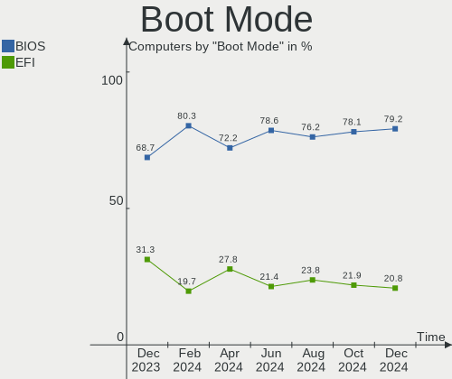
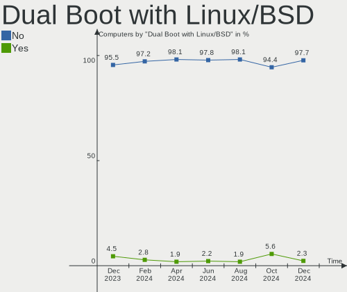
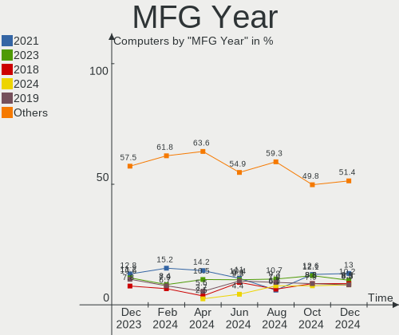
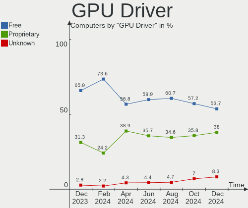
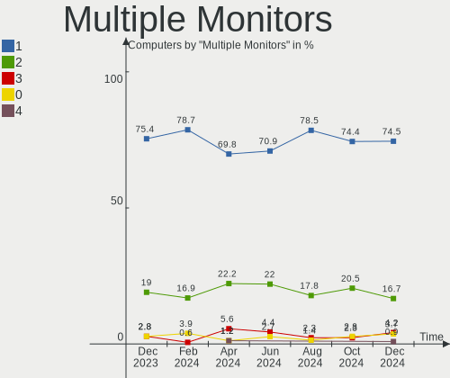
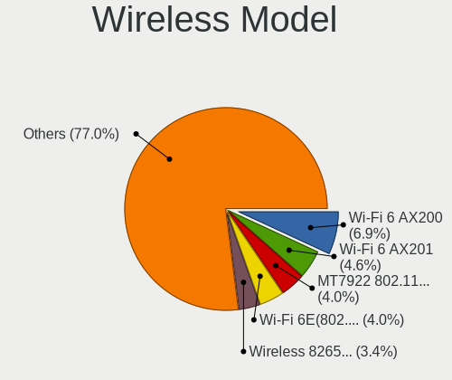
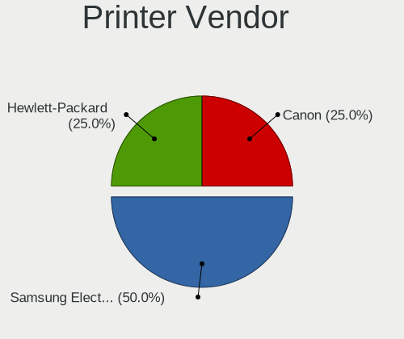

Pop!_OS Hardware Trends
-----------------------

A project to identify most popular hardware characteristics and track their change
over time based on data collected by Pop!_OS users at https://Linux-Hardware.org.

Anyone can contribute to the study by uploading probes of their computers by
the [hw-probe](https://github.com/linuxhw/hw-probe) tool:

    sudo -E hw-probe -all -upload

This is a report for all computer types. See also reports for [desktops](/Dist/Pop!_OS/Desktop/README.md) and [notebooks](/Dist/Pop!_OS/Notebook/README.md).

Full-feature report is available here: https://linux-hardware.org/?view=trends

Period: Oct, 2020.

Contents
--------

- [ OS                       ](#os)
- [ OS Family                ](#os-family)
- [ Kernel                   ](#kernel)
- [ Kernel Family            ](#kernel-family)
- [ Kernel Major Ver.        ](#kernel-major-ver)
- [ Arch                     ](#arch)
- [ DE                       ](#de)
- [ Display Server           ](#display-server)
- [ Display Manager          ](#display-manager)
- [ OS Lang                  ](#os-lang)
- [ Boot Mode                ](#boot-mode)
- [ Filesystem               ](#filesystem)
- [ Part. scheme             ](#part-scheme)
- [ Dual Boot with Linux/BSD ](#dual-boot-with-linux/bsd)
- [ Dual Boot (Win)          ](#dual-boot-win)
- [ Country                  ](#country)
- [ City                     ](#city)
- [ Vendor                   ](#vendor)
- [ Model                    ](#model)
- [ Model Family             ](#model-family)
- [ MFG Year                 ](#mfg-year)
- [ Form Factor              ](#form-factor)
- [ Secure Boot              ](#secure-boot)
- [ Coreboot                 ](#coreboot)
- [ RAM Size                 ](#ram-size)
- [ RAM Used                 ](#ram-used)
- [ Has CD-ROM               ](#has-cd-rom)
- [ Total Drives             ](#total-drives)
- [ Has Ethernet             ](#has-ethernet)
- [ Drive Vendor             ](#drive-vendor)
- [ HDD Vendor               ](#hdd-vendor)
- [ SSD Vendor               ](#ssd-vendor)
- [ Drive Model              ](#drive-model)
- [ Drive Kind               ](#drive-kind)
- [ Drive Connector          ](#drive-connector)
- [ Drive Size               ](#drive-size)
- [ Space Total              ](#space-total)
- [ Space Used               ](#space-used)
- [ Malfunc. Drives          ](#malfunc-drives)
- [ Malfunc. Drive Vendor    ](#malfunc-drive-vendor)
- [ Malfunc. HDD Vendor      ](#malfunc-hdd-vendor)
- [ Malfunc. Drive Kind      ](#malfunc-drive-kind)
- [ Failed Drives            ](#failed-drives)
- [ Failed Drive Vendor      ](#failed-drive-vendor)
- [ Drive Status             ](#drive-status)
- [ Storage Vendor           ](#storage-vendor)
- [ Storage Model            ](#storage-model)
- [ Storage Kind             ](#storage-kind)
- [ CPU Vendor               ](#cpu-vendor)
- [ CPU Model                ](#cpu-model)
- [ CPU Model Family         ](#cpu-model-family)
- [ CPU Cores                ](#cpu-cores)
- [ CPU Sockets              ](#cpu-sockets)
- [ CPU Threads              ](#cpu-threads)
- [ CPU Op-Modes             ](#cpu-op-modes)
- [ CPU Microcode            ](#cpu-microcode)
- [ CPU Microarch            ](#cpu-microarch)
- [ GPU Vendor               ](#gpu-vendor)
- [ GPU Model                ](#gpu-model)
- [ GPU Combo                ](#gpu-combo)
- [ GPU Driver               ](#gpu-driver)
- [ GPU Memory               ](#gpu-memory)
- [ Monitor Vendor           ](#monitor-vendor)
- [ Monitor Model            ](#monitor-model)
- [ Monitor Resolution       ](#monitor-resolution)
- [ Monitor Diagonal         ](#monitor-diagonal)
- [ Monitor Width            ](#monitor-width)
- [ Aspect Ratio             ](#aspect-ratio)
- [ Monitor Area             ](#monitor-area)
- [ Pixel Density            ](#pixel-density)
- [ Multiple Monitors        ](#multiple-monitors)
- [ Net Controller Vendor    ](#net-controller-vendor)
- [ Net Controller Model     ](#net-controller-model)
- [ Wireless Vendor          ](#wireless-vendor)
- [ Wireless Model           ](#wireless-model)
- [ Ethernet Vendor          ](#ethernet-vendor)
- [ Ethernet Model           ](#ethernet-model)
- [ Net Controller Kind      ](#net-controller-kind)
- [ Used Controller          ](#used-controller)
- [ NICs                     ](#nics)
- [ Memory Vendor            ](#memory-vendor)
- [ Memory Model             ](#memory-model)
- [ Memory Kind              ](#memory-kind)
- [ Memory Form Factor       ](#memory-form-factor)
- [ Memory Size              ](#memory-size)
- [ Memory Speed             ](#memory-speed)
- [ Sound Vendor             ](#sound-vendor)
- [ Sound Model              ](#sound-model)
- [ Camera Vendor            ](#camera-vendor)
- [ Camera Model             ](#camera-model)
- [ Fingerprint Vendor       ](#fingerprint-vendor)
- [ Fingerprint Model        ](#fingerprint-model)
- [ Chipcard Vendor          ](#chipcard-vendor)
- [ Chipcard Model           ](#chipcard-model)
- [ Printer Vendor           ](#printer-vendor)
- [ Printer Model            ](#printer-model)
- [ Scanner Vendor           ](#scanner-vendor)
- [ Scanner Model            ](#scanner-model)
- [ Bluetooth Vendor         ](#bluetooth-vendor)
- [ Bluetooth Model          ](#bluetooth-model)
- [ Unsupported Devices      ](#unsupported-devices)
- [ Unsupported Device Types ](#unsupported-device-types)

OS
--

Installed operating systems

| Name          | Computers | Percent |
|---------------|-----------|---------|
| Pop!_OS 20.04 | 211       | 75.09%  |
| Pop!_OS 20.10 | 70        | 24.91%  |

OS Family
---------

OS without a version

| Name    | Computers | Percent |
|---------|-----------|---------|
| Pop!_OS | 281       | 100%    |

Kernel
------

Version of the Linux kernel

| Version               | Computers | Percent |
|-----------------------|-----------|---------|
| 5.4.0-7642-generic    | 181       | 64.41%  |
| 5.8.0-7625-generic    | 80        | 28.47%  |
| 5.4.0-7634-generic    | 5         | 1.78%   |
| 5.8.6-050806-generic  | 2         | 0.71%   |
| 5.4.0-7626-generic    | 2         | 0.71%   |
| 5.9.1-xanmod1         | 1         | 0.36%   |
| 5.9.1-050901-generic  | 1         | 0.36%   |
| 5.8.16-050816-generic | 1         | 0.36%   |
| 5.8.14-050814-generic | 1         | 0.36%   |
| 5.8.13-050813-generic | 1         | 0.36%   |
| 5.8.12-xanmod1        | 1         | 0.36%   |
| 5.8.12-arch1-1        | 1         | 0.36%   |
| 5.8.11-xanmod1        | 1         | 0.36%   |
| 5.6.5-050605-generic  | 1         | 0.36%   |
| 5.6.0-1008-oem        | 1         | 0.36%   |
| 5.4.0-7625-generic    | 1         | 0.36%   |

Kernel Family
-------------

Linux kernel without a distro release

| Version | Computers | Percent |
|---------|-----------|---------|
| 5.4.0   | 189       | 67.26%  |
| 5.8.0   | 80        | 28.47%  |
| 5.9.1   | 2         | 0.71%   |
| 5.8.6   | 2         | 0.71%   |
| 5.8.12  | 2         | 0.71%   |
| 5.8.16  | 1         | 0.36%   |
| 5.8.14  | 1         | 0.36%   |
| 5.8.13  | 1         | 0.36%   |
| 5.8.11  | 1         | 0.36%   |
| 5.6.5   | 1         | 0.36%   |
| 5.6.0   | 1         | 0.36%   |

Kernel Major Ver.
-----------------

Linux kernel major version

| Version | Computers | Percent |
|---------|-----------|---------|
| 5.4     | 189       | 67.26%  |
| 5.8     | 88        | 31.32%  |
| 5.9     | 2         | 0.71%   |
| 5.6     | 2         | 0.71%   |

Arch
----

OS architecture (x86_64, i586, etc.)

| Name   | Computers | Percent |
|--------|-----------|---------|
| x86_64 | 281       | 100%    |

DE
--

Desktop Environment

| Name            | Computers | Percent |
|-----------------|-----------|---------|
| GNOME           | 269       | 95.73%  |
| KDE             | 5         | 1.78%   |
| X-Cinnamon      | 3         | 1.07%   |
| LXQt            | 1         | 0.36%   |
| GNOME Flashback | 1         | 0.36%   |
| Cinnamon        | 1         | 0.36%   |
| Unknown         | 1         | 0.36%   |

Display Server
--------------

X11 or Wayland

| Name    | Computers | Percent |
|---------|-----------|---------|
| X11     | 278       | 98.93%  |
| Wayland | 2         | 0.71%   |
| Tty     | 1         | 0.36%   |

Display Manager
---------------

SDDM, LightDM, etc.

| Name    | Computers | Percent |
|---------|-----------|---------|
| Unknown | 234       | 83.27%  |
| GDM     | 47        | 16.73%  |

OS Lang
-------

Language

| Lang    | Computers | Percent |
|---------|-----------|---------|
| en_US   | 163       | 58.01%  |
| en_GB   | 23        | 8.19%   |
| pt_BR   | 18        | 6.41%   |
| fr_FR   | 9         | 3.2%    |
| es_ES   | 9         | 3.2%    |
| en_CA   | 9         | 3.2%    |
| C       | 9         | 3.2%    |
| de_DE   | 7         | 2.49%   |
| it_IT   | 6         | 2.14%   |
| en_AU   | 6         | 2.14%   |
| ru_RU   | 5         | 1.78%   |
| nl_NL   | 4         | 1.42%   |
| pl_PL   | 3         | 1.07%   |
| zh_TW   | 1         | 0.36%   |
| uk_UA   | 1         | 0.36%   |
| sk_SK   | 1         | 0.36%   |
| pt_PT   | 1         | 0.36%   |
| nl_BE   | 1         | 0.36%   |
| ko_KR   | 1         | 0.36%   |
| fi_FI   | 1         | 0.36%   |
| es_AR   | 1         | 0.36%   |
| cs_CZ   | 1         | 0.36%   |
| Unknown | 1         | 0.36%   |

Boot Mode
---------

EFI or BIOS

| Mode | Computers | Percent |
|------|-----------|---------|
| BIOS | 148       | 52.67%  |
| EFI  | 133       | 47.33%  |

Filesystem
----------

Type of filesystem

| Type    | Computers | Percent |
|---------|-----------|---------|
| Ext4    | 268       | 95.37%  |
| Btrfs   | 8         | 2.85%   |
| Overlay | 4         | 1.42%   |
| Zfs     | 1         | 0.36%   |

Part. scheme
------------

Scheme of partitioning

| Type    | Computers | Percent |
|---------|-----------|---------|
| Unknown | 233       | 82.92%  |
| GPT     | 42        | 14.95%  |
| MBR     | 6         | 2.14%   |

Dual Boot with Linux/BSD
------------------------

Hosting more than one Linux/BSD

| Dual boot | Computers | Percent |
|-----------|-----------|---------|
| No        | 273       | 97.15%  |
| Yes       | 8         | 2.85%   |

Dual Boot (Win)
---------------

Hosting Linux and Windows

| Dual boot | Computers | Percent |
|-----------|-----------|---------|
| No        | 262       | 93.24%  |
| Yes       | 19        | 6.76%   |

Country
-------

Geographic location (country)

| Country            | Computers | Percent |
|--------------------|-----------|---------|
| USA                | 81        | 28.83%  |
| Brazil             | 27        | 9.61%   |
| UK                 | 14        | 4.98%   |
| Germany            | 11        | 3.91%   |
| Netherlands        | 10        | 3.56%   |
| Canada             | 10        | 3.56%   |
| India              | 9         | 3.2%    |
| Spain              | 8         | 2.85%   |
| France             | 7         | 2.49%   |
| Australia          | 7         | 2.49%   |
| New Zealand        | 6         | 2.14%   |
| Italy              | 6         | 2.14%   |
| Ukraine            | 4         | 1.42%   |
| Switzerland        | 4         | 1.42%   |
| Sweden             | 4         | 1.42%   |
| Russia             | 4         | 1.42%   |
| Portugal           | 4         | 1.42%   |
| Poland             | 4         | 1.42%   |
| Mexico             | 4         | 1.42%   |
| Argentina          | 4         | 1.42%   |
| Indonesia          | 3         | 1.07%   |
| Czech Republic     | 3         | 1.07%   |
| Chile              | 3         | 1.07%   |
| Belgium            | 3         | 1.07%   |
| Turkey             | 2         | 0.71%   |
| Slovakia           | 2         | 0.71%   |
| Malta              | 2         | 0.71%   |
| Israel             | 2         | 0.71%   |
| Greece             | 2         | 0.71%   |
| Finland            | 2         | 0.71%   |
| Denmark            | 2         | 0.71%   |
| Croatia            | 2         | 0.71%   |
| Austria            | 2         | 0.71%   |
| Vietnam            | 1         | 0.36%   |
| UAE                | 1         | 0.36%   |
| Taiwan             | 1         | 0.36%   |
| South Africa       | 1         | 0.36%   |
| Slovenia           | 1         | 0.36%   |
| Singapore          | 1         | 0.36%   |
| Serbia             | 1         | 0.36%   |
| Philippines        | 1         | 0.36%   |
| Pakistan           | 1         | 0.36%   |
| Myanmar            | 1         | 0.36%   |
| Macedonia          | 1         | 0.36%   |
| Latvia             | 1         | 0.36%   |
| Korea, Republic of | 1         | 0.36%   |
| Kenya              | 1         | 0.36%   |
| Japan              | 1         | 0.36%   |
| Ireland            | 1         | 0.36%   |
| Iceland            | 1         | 0.36%   |
| Hungary            | 1         | 0.36%   |
| Czechia            | 1         | 0.36%   |
| Bulgaria           | 1         | 0.36%   |
| Belize             | 1         | 0.36%   |
| Belarus            | 1         | 0.36%   |
| Algeria            | 1         | 0.36%   |

City
----

Geographic location (city)

| City                | Computers | Percent |
|---------------------|-----------|---------|
| Rome                | 3         | 1.07%   |
| Rio de Janeiro      | 3         | 1.07%   |
| Lisbon              | 3         | 1.07%   |
| Auckland            | 3         | 1.07%   |
| Zurich              | 2         | 0.71%   |
| Zagreb              | 2         | 0.71%   |
| Warsaw              | 2         | 0.71%   |
| Utrecht             | 2         | 0.71%   |
| São Paulo          | 2         | 0.71%   |
| Sydney              | 2         | 0.71%   |
| Prague              | 2         | 0.71%   |
| Porto Alegre        | 2         | 0.71%   |
| Pittsburgh          | 2         | 0.71%   |
| Phoenix             | 2         | 0.71%   |
| Paris               | 2         | 0.71%   |
| Mexico City         | 2         | 0.71%   |
| Melbourne           | 2         | 0.71%   |
| Mainz               | 2         | 0.71%   |
| Jakarta             | 2         | 0.71%   |
| Istanbul            | 2         | 0.71%   |
| Hyderabad           | 2         | 0.71%   |
| Hamilton            | 2         | 0.71%   |
| Fort Worth          | 2         | 0.71%   |
| Florianópolis      | 2         | 0.71%   |
| Estepona            | 2         | 0.71%   |
| Eastleigh           | 2         | 0.71%   |
| Denver              | 2         | 0.71%   |
| Chicago             | 2         | 0.71%   |
| Buenos Aires        | 2         | 0.71%   |
| Bridgeport          | 2         | 0.71%   |
| Athens              | 2         | 0.71%   |
| České Budějovice | 1         | 0.36%   |
| Zoetermeer          | 1         | 0.36%   |
| Zaporizhia          | 1         | 0.36%   |
| Zajecar             | 1         | 0.36%   |
| York                | 1         | 0.36%   |
| Yangon              | 1         | 0.36%   |
| Westlake            | 1         | 0.36%   |
| West Mifflin        | 1         | 0.36%   |
| West Bromwich       | 1         | 0.36%   |
| Wellington          | 1         | 0.36%   |
| Weatherford         | 1         | 0.36%   |
| Washington          | 1         | 0.36%   |
| Waddinxveen         | 1         | 0.36%   |
| Viña del Mar       | 1         | 0.36%   |
| Villa Alemana       | 1         | 0.36%   |
| Verona              | 1         | 0.36%   |
| Vantaa              | 1         | 0.36%   |
| Valencia            | 1         | 0.36%   |
| Urupa               | 1         | 0.36%   |
| Uncasville          | 1         | 0.36%   |
| Tulsa               | 1         | 0.36%   |
| Tula                | 1         | 0.36%   |
| Trenton             | 1         | 0.36%   |
| Toronto             | 1         | 0.36%   |
| Tijuana             | 1         | 0.36%   |
| Thrissur            | 1         | 0.36%   |
| Tel Aviv            | 1         | 0.36%   |
| São Luís          | 1         | 0.36%   |
| Székesfehérvár   | 1         | 0.36%   |

Vendor
------

Motherboard manufacturer

| Name                | Computers | Percent |
|---------------------|-----------|---------|
| ASUSTek Computer    | 47        | 16.73%  |
| Dell                | 34        | 12.1%   |
| Gigabyte Technology | 33        | 11.74%  |
| Lenovo              | 31        | 11.03%  |
| MSI                 | 25        | 8.9%    |
| Hewlett-Packard     | 23        | 8.19%   |
| ASRock              | 17        | 6.05%   |
| Acer                | 15        | 5.34%   |
| System76            | 11        | 3.91%   |
| Apple               | 11        | 3.91%   |
| Intel               | 4         | 1.42%   |
| Toshiba             | 3         | 1.07%   |
| Sony                | 3         | 1.07%   |
| Positivo            | 3         | 1.07%   |
| HUAWEI              | 3         | 1.07%   |
| Medion              | 2         | 0.71%   |
| Alienware           | 2         | 0.71%   |
| TYAN Computer       | 1         | 0.36%   |
| Supermicro          | 1         | 0.36%   |
| Shuttle             | 1         | 0.36%   |
| Samsung Electronics | 1         | 0.36%   |
| Quanta              | 1         | 0.36%   |
| PC Specialist       | 1         | 0.36%   |
| Microsoft           | 1         | 0.36%   |
| ISYNC               | 1         | 0.36%   |
| HARDKERNEL          | 1         | 0.36%   |
| Fujitsu Siemens     | 1         | 0.36%   |
| ECS                 | 1         | 0.36%   |
| Biostar             | 1         | 0.36%   |
| AMI                 | 1         | 0.36%   |
| AMD                 | 1         | 0.36%   |

Model
-----

Motherboard model

| Name                                            | Computers | Percent |
|-------------------------------------------------|-----------|---------|
| System76 Oryx Pro                               | 4         | 1.42%   |
| MSI MS-7C37                                     | 3         | 1.07%   |
| HUAWEI NBLK-WAX9X                               | 3         | 1.07%   |
| ASRock B450M Pro4                               | 3         | 1.07%   |
| System76 Thelio                                 | 2         | 0.71%   |
| System76 Darter Pro                             | 2         | 0.71%   |
| HP Pavilion Notebook                            | 2         | 0.71%   |
| HP Notebook                                     | 2         | 0.71%   |
| Gigabyte B550M DS3H                             | 2         | 0.71%   |
| Gigabyte B550 AORUS MASTER                      | 2         | 0.71%   |
| Dell OptiPlex 790                               | 2         | 0.71%   |
| Dell OptiPlex 7010                              | 2         | 0.71%   |
| Dell Latitude 7490                              | 2         | 0.71%   |
| ASUS TUF GAMING X570-PLUS                       | 2         | 0.71%   |
| ASUS ROG STRIX B450-F GAMING                    | 2         | 0.71%   |
| ASUS ROG STRIX B350-F GAMING                    | 2         | 0.71%   |
| ASUS PRIME X470-PRO                             | 2         | 0.71%   |
| ASUS All Series                                 | 2         | 0.71%   |
| ASRock B450M Steel Legend                       | 2         | 0.71%   |
| Apple MacBookPro5,5                             | 2         | 0.71%   |
| Apple MacBook5,1                                | 2         | 0.71%   |
| TYAN Computer S5517                             | 1         | 0.36%   |
| Toshiba Satellite P50-C                         | 1         | 0.36%   |
| Toshiba Satellite C55-C                         | 1         | 0.36%   |
| Toshiba Satellite C45-A                         | 1         | 0.36%   |
| System76 Lemur Pro                              | 1         | 0.36%   |
| System76 Gazelle                                | 1         | 0.36%   |
| System76 Bonobo Extreme                         | 1         | 0.36%   |
| Supermicro H8DG6/H8DGi                          | 1         | 0.36%   |
| Sony VPCF23L1E                                  | 1         | 0.36%   |
| Sony VGN-SZ71VN_X                               | 1         | 0.36%   |
| Sony VGN-SZ71MN_B                               | 1         | 0.36%   |
| Shuttle DS81D                                   | 1         | 0.36%   |
| Samsung Electronics 905S3G/906S3G/915S3G/9305SG | 1         | 0.36%   |
| Quanta TWS                                      | 1         | 0.36%   |
| Positivo POS-EIH61CR                            | 1         | 0.36%   |
| Positivo H14BT58                                | 1         | 0.36%   |
| Positivo C14CU51                                | 1         | 0.36%   |
| PC Specialist NP50DE_DB                         | 1         | 0.36%   |
| MSI Pro 3130 Microtower PC                      | 1         | 0.36%   |
| MSI Prestige 15 A10SC                           | 1         | 0.36%   |
| MSI MS-7C84                                     | 1         | 0.36%   |
| MSI MS-7C02                                     | 1         | 0.36%   |
| MSI MS-7B98                                     | 1         | 0.36%   |
| MSI MS-7B87                                     | 1         | 0.36%   |
| MSI MS-7B86                                     | 1         | 0.36%   |
| MSI MS-7B51                                     | 1         | 0.36%   |
| MSI MS-7A38                                     | 1         | 0.36%   |
| MSI MS-7A34                                     | 1         | 0.36%   |
| MSI MS-7850                                     | 1         | 0.36%   |
| MSI MS-7845                                     | 1         | 0.36%   |
| MSI MS-7808                                     | 1         | 0.36%   |
| MSI MS-7693                                     | 1         | 0.36%   |
| MSI MS-7640                                     | 1         | 0.36%   |
| MSI MS-7592                                     | 1         | 0.36%   |
| MSI MS-7522                                     | 1         | 0.36%   |
| MSI MS-7376                                     | 1         | 0.36%   |
| MSI MS-16F1                                     | 1         | 0.36%   |
| MSI GP60 2PE                                    | 1         | 0.36%   |
| MSI GL62M 7RDX                                  | 1         | 0.36%   |

Model Family
------------

Motherboard model prefix

| Name                       | Computers | Percent |
|----------------------------|-----------|---------|
| Lenovo ThinkPad            | 14        | 4.98%   |
| Acer Aspire                | 12        | 4.27%   |
| ASUS PRIME                 | 11        | 3.91%   |
| Lenovo IdeaPad             | 9         | 3.2%    |
| Dell Latitude              | 8         | 2.85%   |
| Dell XPS                   | 7         | 2.49%   |
| Dell Inspiron              | 7         | 2.49%   |
| HP Pavilion                | 6         | 2.14%   |
| ASRock B450M               | 6         | 2.14%   |
| Dell OptiPlex              | 5         | 1.78%   |
| ASUS ROG                   | 5         | 1.78%   |
| System76 Oryx              | 4         | 1.42%   |
| ASUS VivoBook              | 4         | 1.42%   |
| Toshiba Satellite          | 3         | 1.07%   |
| MSI MS-7C37                | 3         | 1.07%   |
| Lenovo Legion              | 3         | 1.07%   |
| HUAWEI NBLK-WAX9X          | 3         | 1.07%   |
| HP EliteBook               | 3         | 1.07%   |
| Gigabyte B550M             | 3         | 1.07%   |
| Gigabyte B450              | 3         | 1.07%   |
| Dell Precision             | 3         | 1.07%   |
| ASUS TUF                   | 3         | 1.07%   |
| ASUS M5A97                 | 3         | 1.07%   |
| System76 Thelio            | 2         | 0.71%   |
| System76 Darter            | 2         | 0.71%   |
| Lenovo Yoga                | 2         | 0.71%   |
| Lenovo ThinkCentre         | 2         | 0.71%   |
| HP Notebook                | 2         | 0.71%   |
| HP Laptop                  | 2         | 0.71%   |
| Gigabyte X570              | 2         | 0.71%   |
| Gigabyte B550              | 2         | 0.71%   |
| Gigabyte B450M             | 2         | 0.71%   |
| ASUS All                   | 2         | 0.71%   |
| ASRock B450                | 2         | 0.71%   |
| Apple MacBookPro5          | 2         | 0.71%   |
| Apple MacBookPro11         | 2         | 0.71%   |
| Apple MacBook5             | 2         | 0.71%   |
| TYAN Computer S5517        | 1         | 0.36%   |
| System76 Lemur             | 1         | 0.36%   |
| System76 Gazelle           | 1         | 0.36%   |
| System76 Bonobo            | 1         | 0.36%   |
| Supermicro H8DG6           | 1         | 0.36%   |
| Sony VPCF23L1E             | 1         | 0.36%   |
| Sony VGN-SZ71VN            | 1         | 0.36%   |
| Sony VGN-SZ71MN            | 1         | 0.36%   |
| Shuttle DS81D              | 1         | 0.36%   |
| Samsung Electronics 905S3G | 1         | 0.36%   |
| Quanta TWS                 | 1         | 0.36%   |
| Positivo POS-EIH61CR       | 1         | 0.36%   |
| Positivo H14BT58           | 1         | 0.36%   |
| Positivo C14CU51           | 1         | 0.36%   |
| PC Specialist NP50DE       | 1         | 0.36%   |
| MSI Pro                    | 1         | 0.36%   |
| MSI Prestige               | 1         | 0.36%   |
| MSI MS-7C84                | 1         | 0.36%   |
| MSI MS-7C02                | 1         | 0.36%   |
| MSI MS-7B98                | 1         | 0.36%   |
| MSI MS-7B87                | 1         | 0.36%   |
| MSI MS-7B86                | 1         | 0.36%   |
| MSI MS-7B51                | 1         | 0.36%   |

MFG Year
--------

Motherboard manufacture year

| Year | Computers | Percent |
|------|-----------|---------|
| 2020 | 76        | 27.05%  |
| 2019 | 63        | 22.42%  |
| 2018 | 21        | 7.47%   |
| 2013 | 21        | 7.47%   |
| 2016 | 16        | 5.69%   |
| 2014 | 14        | 4.98%   |
| 2012 | 14        | 4.98%   |
| 2011 | 12        | 4.27%   |
| 2017 | 10        | 3.56%   |
| 2015 | 9         | 3.2%    |
| 2009 | 9         | 3.2%    |
| 2010 | 6         | 2.14%   |
| 2008 | 6         | 2.14%   |
| 2007 | 4         | 1.42%   |

Form Factor
-----------

Physical design of the computer

| Name        | Computers | Percent |
|-------------|-----------|---------|
| Desktop     | 136       | 48.4%   |
| Notebook    | 133       | 47.33%  |
| Convertible | 5         | 1.78%   |
| Mini pc     | 4         | 1.42%   |
| Tablet      | 1         | 0.36%   |
| All in one  | 1         | 0.36%   |
| Server      | 1         | 0.36%   |

Secure Boot
-----------

Enabled or disabled

| State    | Computers | Percent |
|----------|-----------|---------|
| Disabled | 281       | 100%    |

Coreboot
--------

Have coreboot on board

| Used | Computers | Percent |
|------|-----------|---------|
| No   | 277       | 98.58%  |
| Yes  | 4         | 1.42%   |

RAM Size
--------

Total RAM memory

| Size in GB  | Computers | Percent |
|-------------|-----------|---------|
| 16.01-24.0  | 88        | 31.32%  |
| 4.01-8.0    | 53        | 18.86%  |
| 8.01-16.0   | 49        | 17.44%  |
| 3.01-4.0    | 37        | 13.17%  |
| 32.01-64.0  | 32        | 11.39%  |
| 24.01-32.0  | 8         | 2.85%   |
| 64.01-256.0 | 7         | 2.49%   |
| 1.01-2.0    | 5         | 1.78%   |
| 2.01-3.0    | 2         | 0.71%   |

RAM Used
--------

Used RAM memory

| Used GB    | Computers | Percent |
|------------|-----------|---------|
| 1.01-2.0   | 97        | 34.52%  |
| 2.01-3.0   | 71        | 25.27%  |
| 4.01-8.0   | 56        | 19.93%  |
| 3.01-4.0   | 46        | 16.37%  |
| 8.01-16.0  | 8         | 2.85%   |
| 32.01-64.0 | 1         | 0.36%   |
| 16.01-24.0 | 1         | 0.36%   |
| 0.01-1.0   | 1         | 0.36%   |

Has CD-ROM
----------

Has CD-ROM on board

| Presented | Computers | Percent |
|-----------|-----------|---------|
| No        | 192       | 68.33%  |
| Yes       | 89        | 31.67%  |

Total Drives
------------

Number of drives on board

| Drives | Computers | Percent |
|--------|-----------|---------|
| 1      | 149       | 53.02%  |
| 2      | 79        | 28.11%  |
| 3      | 28        | 9.96%   |
| 4      | 16        | 5.69%   |
| 5      | 6         | 2.14%   |
| 6      | 2         | 0.71%   |
| 0      | 1         | 0.36%   |

Has Ethernet
------------

Has Ethernet on board

| Presented | Computers | Percent |
|-----------|-----------|---------|
| Yes       | 255       | 90.75%  |
| No        | 26        | 9.25%   |

Drive Vendor
------------

Hard drive vendors

| Vendor                    | Computers | Drives | Percent |
|---------------------------|-----------|--------|---------|
| Samsung Electronics       | 79        | 98     | 17.95%  |
| Seagate                   | 69        | 84     | 15.68%  |
| WDC                       | 65        | 82     | 14.77%  |
| Sandisk                   | 34        | 34     | 7.73%   |
| Kingston                  | 28        | 30     | 6.36%   |
| Crucial                   | 20        | 20     | 4.55%   |
| Toshiba                   | 16        | 16     | 3.64%   |
| Hitachi                   | 15        | 15     | 3.41%   |
| Intel                     | 13        | 14     | 2.95%   |
| Unknown                   | 12        | 12     | 2.73%   |
| SK Hynix                  | 8         | 8      | 1.82%   |
| OCZ                       | 6         | 7      | 1.36%   |
| Micron/Crucial Technology | 6         | 6      | 1.36%   |
| HGST                      | 6         | 6      | 1.36%   |
| Phison                    | 5         | 6      | 1.14%   |
| A-DATA Technology         | 5         | 5      | 1.14%   |
| PNY                       | 4         | 4      | 0.91%   |
| China                     | 4         | 4      | 0.91%   |
| XPG                       | 3         | 3      | 0.68%   |
| Realtek Semiconductor     | 3         | 4      | 0.68%   |
| Micron Technology         | 3         | 3      | 0.68%   |
| Apple                     | 3         | 3      | 0.68%   |
| Team                      | 2         | 2      | 0.45%   |
| Silicon Motion            | 2         | 2      | 0.45%   |
| PLEXTOR                   | 2         | 2      | 0.45%   |
| Patriot                   | 2         | 2      | 0.45%   |
| Maxtor                    | 2         | 2      | 0.45%   |
| LITEONIT                  | 2         | 2      | 0.45%   |
| JMicron                   | 2         | 2      | 0.45%   |
| Zheino                    | 1         | 1      | 0.23%   |
| Union Memory              | 1         | 1      | 0.23%   |
| Transcend                 | 1         | 1      | 0.23%   |
| TO Exter                  | 1         | 1      | 0.23%   |
| SPCC                      | 1         | 1      | 0.23%   |
| RECADATA                  | 1         | 1      | 0.23%   |
| Realtek                   | 1         | 1      | 0.23%   |
| OEM                       | 1         | 1      | 0.23%   |
| MKNSSDPL                  | 1         | 1      | 0.23%   |
| LITEON                    | 1         | 1      | 0.23%   |
| Lexar                     | 1         | 1      | 0.23%   |
| LaCie                     | 1         | 1      | 0.23%   |
| HS-SSD-E100               | 1         | 1      | 0.23%   |
| HP SSD S                  | 1         | 1      | 0.23%   |
| Hewlett-Packard           | 1         | 1      | 0.23%   |
| Fujitsu                   | 1         | 1      | 0.23%   |
| DOGFISH                   | 1         | 1      | 0.23%   |
| Corsair                   | 1         | 1      | 0.23%   |
| Apacer                    | 1         | 1      | 0.23%   |

HDD Vendor
----------

Hard disk drive vendors

| Vendor              | Computers | Drives | Percent |
|---------------------|-----------|--------|---------|
| Seagate             | 68        | 81     | 41.72%  |
| WDC                 | 53        | 64     | 32.52%  |
| Hitachi             | 15        | 15     | 9.2%    |
| Toshiba             | 11        | 11     | 6.75%   |
| HGST                | 6         | 6      | 3.68%   |
| Samsung Electronics | 3         | 4      | 1.84%   |
| Maxtor              | 2         | 2      | 1.23%   |
| TO Exter            | 1         | 1      | 0.61%   |
| OEM                 | 1         | 1      | 0.61%   |
| Hewlett-Packard     | 1         | 1      | 0.61%   |
| Fujitsu             | 1         | 1      | 0.61%   |
| Apple               | 1         | 1      | 0.61%   |

SSD Vendor
----------

Solid state drive vendors

| Vendor              | Computers | Drives | Percent |
|---------------------|-----------|--------|---------|
| Samsung Electronics | 45        | 52     | 26.95%  |
| Kingston            | 23        | 24     | 13.77%  |
| Crucial             | 19        | 19     | 11.38%  |
| SanDisk             | 18        | 18     | 10.78%  |
| WDC                 | 14        | 14     | 8.38%   |
| OCZ                 | 6         | 7      | 3.59%   |
| Intel               | 5         | 5      | 2.99%   |
| PNY                 | 4         | 4      | 2.4%    |
| China               | 4         | 4      | 2.4%    |
| SK Hynix            | 3         | 3      | 1.8%    |
| A-DATA Technology   | 3         | 3      | 1.8%    |
| Toshiba             | 2         | 2      | 1.2%    |
| Team                | 2         | 2      | 1.2%    |
| PLEXTOR             | 2         | 2      | 1.2%    |
| Patriot             | 2         | 2      | 1.2%    |
| Micron Technology   | 2         | 2      | 1.2%    |
| LITEONIT            | 2         | 2      | 1.2%    |
| Zheino              | 1         | 1      | 0.6%    |
| Unknown             | 1         | 1      | 0.6%    |
| Transcend           | 1         | 1      | 0.6%    |
| SPCC                | 1         | 1      | 0.6%    |
| Seagate             | 1         | 1      | 0.6%    |
| LITEON              | 1         | 1      | 0.6%    |
| Lexar               | 1         | 1      | 0.6%    |
| DOGFISH             | 1         | 1      | 0.6%    |
| Corsair             | 1         | 1      | 0.6%    |
| Apple               | 1         | 1      | 0.6%    |
| Apacer              | 1         | 1      | 0.6%    |

Drive Model
-----------

Hard drive models

| Model                        | Computers | Percent |
|------------------------------|-----------|---------|
| NVMe SSD Drive 1TB           | 18        | 3.73%   |
| NVMe SSD Drive 500GB         | 16        | 3.32%   |
| NVMe SSD Drive 512GB         | 14        | 2.9%    |
| NVMe SSD Drive 256GB         | 11        | 2.28%   |
| NVMe SSD Drive 1024GB        | 9         | 1.87%   |
| SSD 860 EVO 500GB            | 8         | 1.66%   |
| SSD 860 QVO 1TB              | 7         | 1.45%   |
| SSD 840 EVO 250GB            | 7         | 1.45%   |
| SV300S37A120G 120GB SSD      | 6         | 1.24%   |
| Expansion 4TB                | 6         | 1.24%   |
| ST1000LM035-1RK172 1TB       | 5         | 1.04%   |
| SSD 850 EVO 250GB            | 5         | 1.04%   |
| NVMe SSD Drive 2TB           | 5         | 1.04%   |
| NVMe SSD Drive 250GB         | 5         | 1.04%   |
| MMC Card  64GB               | 5         | 1.04%   |
| WDS500G2B0B-00YS70 500GB SSD | 4         | 0.83%   |
| ST500DM002-1BD142 500GB      | 4         | 0.83%   |
| ST2000DM008-2FR102 2TB       | 4         | 0.83%   |
| ST1000DM010-2EP102 1TB       | 4         | 0.83%   |
| ST1000DM003-1CH162 1TB       | 4         | 0.83%   |
| SSD 860 EVO 250GB            | 4         | 0.83%   |
| SSD 850 EVO 500GB            | 4         | 0.83%   |
| SA400S37480G 480GB SSD       | 4         | 0.83%   |
| SA400S37240G 240GB SSD       | 4         | 0.83%   |
| NVMe SSD Drive 128GB         | 4         | 0.83%   |
| CT240BX500SSD1 240GB         | 4         | 0.83%   |
| ST500LT012-1DG142 500GB      | 3         | 0.62%   |
| ST1000LM024 HN-M101MBB 1TB   | 3         | 0.62%   |
| SSD 970 EVO Plus 1TB         | 3         | 0.62%   |
| SSD 860 EVO 1TB              | 3         | 0.62%   |
| CT240M500SSD1 240GB          | 3         | 0.62%   |
| CS900 240GB SSD              | 3         | 0.62%   |
| WDS250G2B0A-00SM50 250GB SSD | 2         | 0.41%   |
| WD3200AAKS-75L9A0 320GB      | 2         | 0.41%   |
| WD10SPZX-21Z10T0 1TB         | 2         | 0.41%   |
| WD10EZEX-00BN5A0 1TB         | 2         | 0.41%   |
| Tech 250GB                   | 2         | 0.41%   |
| SV300S37A60G 64GB SSD        | 2         | 0.41%   |
| SV300S37A240G 240GB SSD      | 2         | 0.41%   |
| ST500LT012-9WS142 500GB      | 2         | 0.41%   |
| ST5000LM000-2AN170 5TB       | 2         | 0.41%   |
| ST3500418AS 500GB            | 2         | 0.41%   |
| ST31000528AS 1TB             | 2         | 0.41%   |
| ST31000524AS 1TB             | 2         | 0.41%   |
| ST1000LX015-1U7172 1TB       | 2         | 0.41%   |
| ST1000LM048-2E7172 1TB       | 2         | 0.41%   |
| ST1000DM003-1SB102 1TB       | 2         | 0.41%   |
| SSD PLUS 120 GB              | 2         | 0.41%   |
| SSD 240GB                    | 2         | 0.41%   |
| SDSSDA240G 240GB             | 2         | 0.41%   |
| SDSSDA120G 120GB             | 2         | 0.41%   |
| PM981a NVMe 1024GB           | 2         | 0.41%   |
| MQ01ABD100 1TB               | 2         | 0.41%   |
| HTS721010A9E630 1TB          | 2         | 0.41%   |
| HDT721010SLA360 1TB          | 2         | 0.41%   |
| HDS721050CLA362 500GB        | 2         | 0.41%   |
| Expansion Desk 3TB           | 2         | 0.41%   |
| DT01ACA100 1TB               | 2         | 0.41%   |
| CT500MX500SSD1 500GB         | 2         | 0.41%   |
| CT256MX100SSD1 256GB         | 2         | 0.41%   |

Drive Kind
----------

HDD or SSD

| Kind    | Computers | Drives | Percent |
|---------|-----------|--------|---------|
| SSD     | 145       | 176    | 36.62%  |
| HDD     | 137       | 188    | 34.6%   |
| NVMe    | 94        | 110    | 23.74%  |
| Unknown | 11        | 13     | 2.78%   |
| MMC     | 9         | 10     | 2.27%   |

Drive Connector
---------------

SATA, SAS, NVMe, etc.

| Type | Computers | Drives | Percent |
|------|-----------|--------|---------|
| SATA | 219       | 357    | 64.41%  |
| NVMe | 94        | 110    | 27.65%  |
| SAS  | 18        | 20     | 5.29%   |
| MMC  | 9         | 10     | 2.65%   |

Drive Size
----------

Size of hard drive

| Size in TB | Computers | Drives | Percent |
|------------|-----------|--------|---------|
| 0.01-0.5   | 165       | 215    | 56.51%  |
| 0.51-1.0   | 89        | 106    | 30.48%  |
| 1.01-2.0   | 18        | 23     | 6.16%   |
| 3.01-4.0   | 9         | 9      | 3.08%   |
| 4.01-10.0  | 6         | 6      | 2.05%   |
| 2.01-3.0   | 5         | 5      | 1.71%   |

Space Total
-----------

Amount of disk space available on the file system

| Size in GB     | Computers | Percent |
|----------------|-----------|---------|
| 101-250        | 89        | 31.67%  |
| 251-500        | 59        | 21%     |
| 501-1000       | 48        | 17.08%  |
| 1001-2000      | 26        | 9.25%   |
| 51-100         | 17        | 6.05%   |
| More than 3000 | 16        | 5.69%   |
| 2001-3000      | 10        | 3.56%   |
| 21-50          | 9         | 3.2%    |
| 1-20           | 4         | 1.42%   |
| Unknown        | 3         | 1.07%   |

Space Used
----------

Amount of used disk space

| Used GB        | Computers | Percent |
|----------------|-----------|---------|
| 1-20           | 100       | 35.59%  |
| 21-50          | 52        | 18.51%  |
| 51-100         | 35        | 12.46%  |
| 101-250        | 33        | 11.74%  |
| 251-500        | 19        | 6.76%   |
| 501-1000       | 16        | 5.69%   |
| 1001-2000      | 14        | 4.98%   |
| More than 3000 | 7         | 2.49%   |
| Unknown        | 3         | 1.07%   |
| 2001-3000      | 2         | 0.71%   |

Malfunc. Drives
---------------

Drive models with a malfunction

| Model                      | Computers | Drives | Percent |
|----------------------------|-----------|--------|---------|
| WD5000BPVT-22HXZT3 500GB   | 1         | 1      | 5.56%   |
| WD5000AVVS-63H0B1 500GB    | 1         | 1      | 5.56%   |
| WD5000AAKS-41YGA1 500GB    | 1         | 1      | 5.56%   |
| WD10SPCX-24HWST1 1TB       | 1         | 1      | 5.56%   |
| WD10JPVX-75JC3T0 1TB       | 1         | 1      | 5.56%   |
| WD1003FZEX-00MK2A0 1TB     | 1         | 1      | 5.56%   |
| SX8200PNP 256GB            | 1         | 1      | 5.56%   |
| SV300S37A120G 120GB SSD    | 1         | 1      | 5.56%   |
| ST3500418AS 500GB          | 1         | 1      | 5.56%   |
| ST31500341AS 1TB           | 1         | 2      | 5.56%   |
| ST1000LM024 HN-M101MBB 1TB | 1         | 1      | 5.56%   |
| SA400S37480G 480GB SSD     | 1         | 1      | 5.56%   |
| HTS721010A9E630 1TB        | 1         | 1      | 5.56%   |
| HTS547550A9E384 500GB      | 1         | 1      | 5.56%   |
| HTS545050A7E380 500GB      | 1         | 1      | 5.56%   |
| HTS541010A9E680 1TB        | 1         | 1      | 5.56%   |
| HDWD110 1TB                | 1         | 1      | 5.56%   |
| 6L080L0 82GB               | 1         | 1      | 5.56%   |

Malfunc. Drive Vendor
---------------------

Vendors of faulty drives

| Vendor            | Computers | Drives | Percent |
|-------------------|-----------|--------|---------|
| WDC               | 6         | 6      | 33.33%  |
| Seagate           | 3         | 4      | 16.67%  |
| Kingston          | 2         | 2      | 11.11%  |
| Hitachi           | 2         | 2      | 11.11%  |
| HGST              | 2         | 2      | 11.11%  |
| Toshiba           | 1         | 1      | 5.56%   |
| Maxtor            | 1         | 1      | 5.56%   |
| A-DATA Technology | 1         | 1      | 5.56%   |

Malfunc. HDD Vendor
-------------------

Vendors of faulty HDD drives

| Vendor  | Computers | Drives | Percent |
|---------|-----------|--------|---------|
| WDC     | 6         | 6      | 40%     |
| Seagate | 3         | 4      | 20%     |
| Hitachi | 2         | 2      | 13.33%  |
| HGST    | 2         | 2      | 13.33%  |
| Toshiba | 1         | 1      | 6.67%   |
| Maxtor  | 1         | 1      | 6.67%   |

Malfunc. Drive Kind
-------------------

Kinds of faulty drives

| Kind | Computers | Drives | Percent |
|------|-----------|--------|---------|
| HDD  | 13        | 16     | 81.25%  |
| SSD  | 2         | 2      | 12.5%   |
| NVMe | 1         | 1      | 6.25%   |

Failed Drives
-------------

Failed drive models

Zero info for selected period =(

Failed Drive Vendor
-------------------

Failed drive vendors

Zero info for selected period =(

Drive Status
------------

Number of failed and malfunc. drives

| Status   | Computers | Drives | Percent |
|----------|-----------|--------|---------|
| Detected | 234       | 405    | 79.59%  |
| Works    | 45        | 73     | 15.31%  |
| Malfunc  | 15        | 19     | 5.1%    |

Storage Vendor
--------------

Storage controller vendors

| Vendor                        | Computers | Percent |
|-------------------------------|-----------|---------|
| Intel                         | 166       | 43.8%   |
| AMD                           | 87        | 22.96%  |
| Samsung Electronics           | 37        | 9.76%   |
| Sandisk                       | 18        | 4.75%   |
| Nvidia                        | 9         | 2.37%   |
| ASMedia Technology            | 8         | 2.11%   |
| Micron/Crucial Technology     | 7         | 1.85%   |
| JMicron Technology            | 6         | 1.58%   |
| SK Hynix                      | 5         | 1.32%   |
| Phison Electronics            | 5         | 1.32%   |
| Kingston Technology Company   | 5         | 1.32%   |
| ADATA Technology              | 5         | 1.32%   |
| Marvell Technology Group      | 4         | 1.06%   |
| Toshiba America Info Systems  | 3         | 0.79%   |
| Realtek Semiconductor         | 3         | 0.79%   |
| Union Memory (Shenzhen)       | 2         | 0.53%   |
| Silicon Motion                | 2         | 0.53%   |
| VIA Technologies              | 1         | 0.26%   |
| Seagate Technology            | 1         | 0.26%   |
| Micron Technology             | 1         | 0.26%   |
| LSI Logic / Symbios Logic     | 1         | 0.26%   |
| Integrated Technology Express | 1         | 0.26%   |
| Hewlett-Packard               | 1         | 0.26%   |
| Apple                         | 1         | 0.26%   |

Storage Model
-------------

Storage controller models

| Model                                                                             | Computers | Percent |
|-----------------------------------------------------------------------------------|-----------|---------|
| FCH SATA Controller [AHCI mode]                                                   | 62        | 13.81%  |
| NVMe SSD Controller SM981/PM981/PM983                                             | 28        | 6.24%   |
| 400 Series Chipset SATA Controller                                                | 25        | 5.57%   |
| Sunrise Point-LP SATA Controller [AHCI mode]                                      | 16        | 3.56%   |
| Non-Volatile memory controller                                                    | 14        | 3.12%   |
| SATA controller                                                                   | 12        | 2.67%   |
| 7 Series Chipset Family 6-port SATA Controller [AHCI mode]                        | 12        | 2.67%   |
| 8 Series/C220 Series Chipset Family 6-port SATA Controller 1 [AHCI mode]          | 11        | 2.45%   |
| SB7x0/SB8x0/SB9x0 SATA Controller [AHCI mode]                                     | 10        | 2.23%   |
| SB7x0/SB8x0/SB9x0 IDE Controller                                                  | 9         | 2%      |
| 6 Series/C200 Series Chipset Family 6 port Desktop SATA AHCI Controller           | 9         | 2%      |
| ASM1062 Serial ATA Controller                                                     | 8         | 1.78%   |
| 82801 Mobile SATA Controller [RAID mode]                                          | 8         | 1.78%   |
| 6 Series/C200 Series Chipset Family 6 port Mobile SATA AHCI Controller            | 8         | 1.78%   |
| WD Blue SN550 NVMe SSD                                                            | 7         | 1.56%   |
| SATA Controller [RAID mode]                                                       | 7         | 1.56%   |
| HM170/QM170 Chipset SATA Controller [AHCI Mode]                                   | 7         | 1.56%   |
| Cannon Lake Mobile PCH SATA AHCI Controller                                       | 7         | 1.56%   |
| SB7x0/SB8x0/SB9x0 SATA Controller [IDE mode]                                      | 6         | 1.34%   |
| P1 NVMe PCIe SSD                                                                  | 6         | 1.34%   |
| 400 Series Chipset Family SATA AHCI Controller                                    | 6         | 1.34%   |
| XPG SX8200 Pro PCIe Gen3x4 M.2 2280 Solid State Drive                             | 5         | 1.11%   |
| Wildcat Point-LP SATA Controller [AHCI Mode]                                      | 5         | 1.11%   |
| WD Black 2019/PC SN750 NVMe SSD                                                   | 5         | 1.11%   |
| SSD 660P Series                                                                   | 5         | 1.11%   |
| NVMe SSD Controller SM961/PM961                                                   | 5         | 1.11%   |
| MCP79 AHCI Controller                                                             | 5         | 1.11%   |
| 8 Series SATA Controller 1 [AHCI mode]                                            | 5         | 1.11%   |
| 7 Series/C210 Series Chipset Family 6-port SATA Controller [AHCI mode]            | 5         | 1.11%   |
| 300 Series Chipset SATA Controller                                                | 5         | 1.11%   |
| 200 Series PCH SATA controller [AHCI mode]                                        | 5         | 1.11%   |
| Q170/Q150/B150/H170/H110/Z170/CM236 Chipset SATA Controller [AHCI Mode]           | 4         | 0.89%   |
| JMB363 SATA/IDE Controller                                                        | 4         | 0.89%   |
| E12 NVMe Controller                                                               | 4         | 0.89%   |
| Cannon Point-LP SATA Controller [AHCI Mode]                                       | 4         | 0.89%   |
| Cannon Lake PCH SATA AHCI Controller                                              | 4         | 0.89%   |
| 82801JI (ICH10 Family) 2 port SATA IDE Controller #2                              | 4         | 0.89%   |
| 82801HM/HEM (ICH8M/ICH8M-E) IDE Controller                                        | 4         | 0.89%   |
| 82801G (ICH7 Family) IDE Controller                                               | 4         | 0.89%   |
| 5 Series/3400 Series Chipset 6 port SATA AHCI Controller                          | 4         | 0.89%   |
| WD Black 2018 / PC SN520 NVMe SSD                                                 | 3         | 0.67%   |
| Realtek Non-Volatile memory controller                                            | 3         | 0.67%   |
| A2000, M.2, 500GB                                                                 | 3         | 0.67%   |
| 82801JI (ICH10 Family) 4 port SATA IDE Controller #1                              | 3         | 0.67%   |
| X399 Series Chipset SATA Controller                                               | 2         | 0.45%   |
| NVMe SSD Controller SM951/PM951                                                   | 2         | 0.45%   |
| NM10/ICH7 Family SATA Controller [IDE mode]                                       | 2         | 0.45%   |
| Electronics Non-Volatile memory controller                                        | 2         | 0.45%   |
| Comet Lake SATA AHCI Controller                                                   | 2         | 0.45%   |
| C600/X79 series chipset 6-Port SATA AHCI Controller                               | 2         | 0.45%   |
| Atom Processor E3800 Series SATA AHCI Controller                                  | 2         | 0.45%   |
| 9 Series Chipset Family SATA Controller [AHCI Mode]                               | 2         | 0.45%   |
| 88SE9128 PCIe SATA 6 Gb/s RAID controller with HyperDuo                           | 2         | 0.45%   |
| 82801HM/HEM (ICH8M/ICH8M-E) SATA Controller [IDE mode]                            | 2         | 0.45%   |
| 82801HM/HEM (ICH8M/ICH8M-E) SATA Controller [AHCI mode]                           | 2         | 0.45%   |
| 6 Series/C200 Series Chipset Family Desktop SATA Controller (IDE mode, ports 4-5) | 2         | 0.45%   |
| 6 Series/C200 Series Chipset Family Desktop SATA Controller (IDE mode, ports 0-3) | 2         | 0.45%   |
| XG4 NVMe SSD Controller                                                           | 1         | 0.22%   |
| X370 Series Chipset SATA Controller                                               | 1         | 0.22%   |
| WD Black 2018 / PC SN720 NVMe SSD                                                 | 1         | 0.22%   |

Storage Kind
------------

Kind of storage controller (IDE, SATA, NVMe, SAS, ...)

| Kind | Computers | Percent |
|------|-----------|---------|
| SATA | 229       | 60.74%  |
| NVMe | 94        | 24.93%  |
| IDE  | 34        | 9.02%   |
| RAID | 18        | 4.77%   |
| SAS  | 1         | 0.27%   |
| SCSI | 1         | 0.27%   |

CPU Vendor
----------

Processor vendors

| Vendor | Computers | Percent |
|--------|-----------|---------|
| Intel  | 186       | 66.19%  |
| AMD    | 95        | 33.81%  |

CPU Model
---------

Processor models

| Model                                           | Computers | Percent |
|-------------------------------------------------|-----------|---------|
| AMD Ryzen 5 3600 6-Core Processor               | 13        | 4.63%   |
| AMD Ryzen 7 3700X 8-Core Processor              | 7         | 2.49%   |
| AMD Ryzen 5 3400G with Radeon Vega Graphics     | 6         | 2.14%   |
| Intel Core i7-10875H CPU @ 2.30GHz              | 5         | 1.78%   |
| Intel Core i5-7200U CPU @ 2.50GHz               | 4         | 1.42%   |
| AMD Ryzen 7 2700X Eight-Core Processor          | 4         | 1.42%   |
| AMD Ryzen 5 3500U with Radeon Vega Mobile Gfx   | 4         | 1.42%   |
| Intel Core i7-8750H CPU @ 2.20GHz               | 3         | 1.07%   |
| Intel Core i7-7700HQ CPU @ 2.80GHz              | 3         | 1.07%   |
| Intel Core i7-10710U CPU @ 1.10GHz              | 3         | 1.07%   |
| Intel Core i5-9300H CPU @ 2.40GHz               | 3         | 1.07%   |
| Intel Core i5-6200U CPU @ 2.30GHz               | 3         | 1.07%   |
| Intel Core i5-5200U CPU @ 2.20GHz               | 3         | 1.07%   |
| AMD Ryzen 9 3900XT 12-Core Processor            | 3         | 1.07%   |
| AMD Ryzen 5 3600X 6-Core Processor              | 3         | 1.07%   |
| AMD Ryzen 5 1600 Six-Core Processor             | 3         | 1.07%   |
| AMD FX-8350 Eight-Core Processor                | 3         | 1.07%   |
| Intel Core i7-9750H CPU @ 2.60GHz               | 2         | 0.71%   |
| Intel Core i7-8650U CPU @ 1.90GHz               | 2         | 0.71%   |
| Intel Core i7-8565U CPU @ 1.80GHz               | 2         | 0.71%   |
| Intel Core i7-7500U CPU @ 2.70GHz               | 2         | 0.71%   |
| Intel Core i7-6700K CPU @ 4.00GHz               | 2         | 0.71%   |
| Intel Core i7-6700HQ CPU @ 2.60GHz              | 2         | 0.71%   |
| Intel Core i7-4770K CPU @ 3.50GHz               | 2         | 0.71%   |
| Intel Core i7-4600U CPU @ 2.10GHz               | 2         | 0.71%   |
| Intel Core i7-3960X CPU @ 3.30GHz               | 2         | 0.71%   |
| Intel Core i7-3770 CPU @ 3.40GHz                | 2         | 0.71%   |
| Intel Core i7-10750H CPU @ 2.60GHz              | 2         | 0.71%   |
| Intel Core i7 CPU 960 @ 3.20GHz                 | 2         | 0.71%   |
| Intel Core i5-9400F CPU @ 2.90GHz               | 2         | 0.71%   |
| Intel Core i5-8350U CPU @ 1.70GHz               | 2         | 0.71%   |
| Intel Core i5-4440 CPU @ 3.10GHz                | 2         | 0.71%   |
| Intel Core i5-4200U CPU @ 1.60GHz               | 2         | 0.71%   |
| Intel Core i5-3570K CPU @ 3.40GHz               | 2         | 0.71%   |
| Intel Core i5-3320M CPU @ 2.60GHz               | 2         | 0.71%   |
| Intel Core i5-2400 CPU @ 3.10GHz                | 2         | 0.71%   |
| Intel Core i3-3220 CPU @ 3.30GHz                | 2         | 0.71%   |
| Intel Core i3-3217U CPU @ 1.80GHz               | 2         | 0.71%   |
| Intel Core i3-2100 CPU @ 3.10GHz                | 2         | 0.71%   |
| Intel Core 2 Duo CPU T9300 @ 2.50GHz            | 2         | 0.71%   |
| Intel Core 2 Duo CPU P8600 @ 2.40GHz            | 2         | 0.71%   |
| Intel Core 2 Duo CPU P7550 @ 2.26GHz            | 2         | 0.71%   |
| Intel Core 2 Duo CPU E8400 @ 3.00GHz            | 2         | 0.71%   |
| Intel Celeron N4000 CPU @ 1.10GHz               | 2         | 0.71%   |
| AMD Ryzen 7 3700U with Radeon Vega Mobile Gfx   | 2         | 0.71%   |
| AMD Ryzen 7 1700X Eight-Core Processor          | 2         | 0.71%   |
| AMD Ryzen 5 2600 Six-Core Processor             | 2         | 0.71%   |
| AMD Ryzen 3 3200U with Radeon Vega Mobile Gfx   | 2         | 0.71%   |
| AMD Ryzen 3 3200G with Radeon Vega Graphics     | 2         | 0.71%   |
| AMD A10-9600P RADEON R5, 10 COMPUTE CORES 4C+6G | 2         | 0.71%   |
| Intel Xeon CPU X5687 @ 3.60GHz                  | 1         | 0.36%   |
| Intel Xeon CPU X5675 @ 3.07GHz                  | 1         | 0.36%   |
| Intel Xeon CPU E5520 @ 2.27GHz                  | 1         | 0.36%   |
| Intel Xeon CPU E5506 @ 2.13GHz                  | 1         | 0.36%   |
| Intel Xeon CPU E5-1620 0 @ 3.60GHz              | 1         | 0.36%   |
| Intel Pentium Silver N5000 CPU @ 1.10GHz        | 1         | 0.36%   |
| Intel Pentium D CPU 3.00GHz                     | 1         | 0.36%   |
| Intel Pentium CPU N3710 @ 1.60GHz               | 1         | 0.36%   |
| Intel Pentium CPU G850 @ 2.90GHz                | 1         | 0.36%   |
| Intel Core i7-9850H CPU @ 2.60GHz               | 1         | 0.36%   |

CPU Model Family
----------------

Processor model prefix

| Model                  | Computers | Percent |
|------------------------|-----------|---------|
| Intel Core i7          | 76        | 27.05%  |
| Intel Core i5          | 54        | 19.22%  |
| AMD Ryzen 5            | 34        | 12.1%   |
| Intel Core i3          | 20        | 7.12%   |
| AMD Ryzen 7            | 20        | 7.12%   |
| Intel Core 2 Duo       | 14        | 4.98%   |
| AMD FX                 | 9         | 3.2%    |
| Intel Celeron          | 6         | 2.14%   |
| AMD Ryzen 3            | 6         | 2.14%   |
| Intel Xeon             | 5         | 1.78%   |
| Intel Core 2           | 5         | 1.78%   |
| AMD Ryzen Threadripper | 3         | 1.07%   |
| AMD Ryzen 9            | 3         | 1.07%   |
| AMD Athlon II X2       | 3         | 1.07%   |
| AMD A10                | 3         | 1.07%   |
| Intel Pentium          | 2         | 0.71%   |
| AMD Phenom II X4       | 2         | 0.71%   |
| AMD Athlon II X4       | 2         | 0.71%   |
| AMD A6                 | 2         | 0.71%   |
| Intel Pentium Silver   | 1         | 0.36%   |
| Intel Pentium D        | 1         | 0.36%   |
| Intel Core 2 Quad      | 1         | 0.36%   |
| Intel Atom             | 1         | 0.36%   |
| AMD Ryzen 7 PRO        | 1         | 0.36%   |
| AMD Quad-Core          | 1         | 0.36%   |
| AMD Phenom II X6       | 1         | 0.36%   |
| AMD Opteron            | 1         | 0.36%   |
| AMD E2                 | 1         | 0.36%   |
| AMD A8                 | 1         | 0.36%   |
| AMD A4                 | 1         | 0.36%   |
| AMD A12                | 1         | 0.36%   |

CPU Cores
---------

Number of processor cores

| Number | Computers | Percent |
|--------|-----------|---------|
| 4      | 104       | 37.01%  |
| 2      | 97        | 34.52%  |
| 6      | 42        | 14.95%  |
| 8      | 27        | 9.61%   |
| 12     | 4         | 1.42%   |
| 16     | 2         | 0.71%   |
| 3      | 2         | 0.71%   |
| 32     | 1         | 0.36%   |
| 24     | 1         | 0.36%   |
| 1      | 1         | 0.36%   |

CPU Sockets
-----------

Number of sockets

| Number | Computers | Percent |
|--------|-----------|---------|
| 1      | 278       | 98.93%  |
| 2      | 3         | 1.07%   |

CPU Threads
-----------

Threads per core (Hyper-Threading)

| Number | Computers | Percent |
|--------|-----------|---------|
| 2      | 208       | 74.02%  |
| 1      | 73        | 25.98%  |

CPU Op-Modes
------------

CPU Operation Modes (32-bit, 64-bit)

| Op mode        | Computers | Percent |
|----------------|-----------|---------|
| 32-bit, 64-bit | 281       | 100%    |

CPU Microcode
-------------

Microcode number

| Number     | Computers | Percent |
|------------|-----------|---------|
| Unknown    | 75        | 26.69%  |
| 0x306a9    | 14        | 4.98%   |
| 0x206a7    | 13        | 4.63%   |
| 0x906ea    | 11        | 3.91%   |
| 0x08701021 | 11        | 3.91%   |
| 0x08108109 | 11        | 3.91%   |
| 0x306c3    | 10        | 3.56%   |
| 0xa0652    | 8         | 2.85%   |
| 0x0800820d | 8         | 2.85%   |
| 0x906e9    | 6         | 2.14%   |
| 0x806e9    | 6         | 2.14%   |
| 0x40651    | 6         | 2.14%   |
| 0x1067a    | 6         | 2.14%   |
| 0x08701013 | 6         | 2.14%   |
| 0x806ea    | 5         | 1.78%   |
| 0x506e3    | 5         | 1.78%   |
| 0x806eb    | 4         | 1.42%   |
| 0x406e3    | 4         | 1.42%   |
| 0x306d4    | 4         | 1.42%   |
| 0x06000852 | 4         | 1.42%   |
| 0x906ed    | 3         | 1.07%   |
| 0x706a1    | 3         | 1.07%   |
| 0x6f6      | 3         | 1.07%   |
| 0x10676    | 3         | 1.07%   |
| 0xa0660    | 2         | 0.71%   |
| 0x806ec    | 2         | 0.71%   |
| 0x406c4    | 2         | 0.71%   |
| 0x20655    | 2         | 0.71%   |
| 0x20652    | 2         | 0.71%   |
| 0x106a5    | 2         | 0.71%   |
| 0x08600104 | 2         | 0.71%   |
| 0x08108102 | 2         | 0.71%   |
| 0x08001138 | 2         | 0.71%   |
| 0x0700010f | 2         | 0.71%   |
| 0x0600611a | 2         | 0.71%   |
| 0x06001119 | 2         | 0.71%   |
| 0x0600063e | 2         | 0.71%   |
| 0x010000c8 | 2         | 0.71%   |
| 0x010000c7 | 2         | 0.71%   |
| 0xf62      | 1         | 0.36%   |
| 0xa0655    | 1         | 0.36%   |
| 0x906eb    | 1         | 0.36%   |
| 0x706e5    | 1         | 0.36%   |
| 0x6fd      | 1         | 0.36%   |
| 0x6fb      | 1         | 0.36%   |
| 0x6f2      | 1         | 0.36%   |
| 0x40661    | 1         | 0.36%   |
| 0x30678    | 1         | 0.36%   |
| 0x206d7    | 1         | 0.36%   |
| 0x206d6    | 1         | 0.36%   |
| 0x206c2    | 1         | 0.36%   |
| 0x08301039 | 1         | 0.36%   |
| 0x08101016 | 1         | 0.36%   |
| 0x0810100b | 1         | 0.36%   |
| 0x08101007 | 1         | 0.36%   |
| 0x08001137 | 1         | 0.36%   |
| 0x06006705 | 1         | 0.36%   |
| 0x06006118 | 1         | 0.36%   |
| 0x06003106 | 1         | 0.36%   |
| 0x05000119 | 1         | 0.36%   |

CPU Microarch
-------------

Microarchitecture

| Name          | Computers | Percent |
|---------------|-----------|---------|
| KabyLake      | 47        | 16.73%  |
| Zen 2         | 32        | 11.39%  |
| Zen+          | 26        | 9.25%   |
| Haswell       | 24        | 8.54%   |
| SandyBridge   | 22        | 7.83%   |
| IvyBridge     | 18        | 6.41%   |
| Skylake       | 15        | 5.34%   |
| CometLake     | 12        | 4.27%   |
| Penryn        | 10        | 3.56%   |
| Core          | 10        | 3.56%   |
| Zen           | 9         | 3.2%    |
| Piledriver    | 9         | 3.2%    |
| K10           | 8         | 2.85%   |
| Westmere      | 7         | 2.49%   |
| Nehalem       | 5         | 1.78%   |
| Broadwell     | 5         | 1.78%   |
| Silvermont    | 4         | 1.42%   |
| Goldmont plus | 4         | 1.42%   |
| Excavator     | 4         | 1.42%   |
| Bulldozer     | 3         | 1.07%   |
| Jaguar        | 2         | 0.71%   |
| IceLake       | 2         | 0.71%   |
| Steamroller   | 1         | 0.36%   |
| NetBurst      | 1         | 0.36%   |
| Bobcat        | 1         | 0.36%   |

GPU Vendor
----------

Vendors of graphics cards

| Vendor                     | Computers | Percent |
|----------------------------|-----------|---------|
| Intel                      | 131       | 38.99%  |
| Nvidia                     | 124       | 36.9%   |
| AMD                        | 80        | 23.81%  |
| Matrox Electronics Systems | 1         | 0.3%    |

GPU Model
---------

Graphics card models

| Model                                                                              | Computers | Percent |
|------------------------------------------------------------------------------------|-----------|---------|
| UHD Graphics                                                                       | 14        | 4.06%   |
| Picasso                                                                            | 14        | 4.06%   |
| Ellesmere [Radeon RX 470/480/570/570X/580/580X/590]                                | 11        | 3.19%   |
| 2nd Generation Core Processor Family Integrated Graphics Controller                | 11        | 3.19%   |
| UHD Graphics 630 (Mobile)                                                          | 10        | 2.9%    |
| Navi 10 [Radeon RX 5600 OEM/5600 XT / 5700/5700 XT]                                | 10        | 2.9%    |
| HD Graphics 620                                                                    | 9         | 2.61%   |
| 3rd Gen Core processor Graphics Controller                                         | 9         | 2.61%   |
| Xeon E3-1200 v3/4th Gen Core Processor Integrated Graphics Controller              | 7         | 2.03%   |
| UHD Graphics 620                                                                   | 7         | 2.03%   |
| Haswell-ULT Integrated Graphics Controller                                         | 7         | 2.03%   |
| Skylake GT2 [HD Graphics 520]                                                      | 6         | 1.74%   |
| GK208B [GeForce GT 710]                                                            | 6         | 1.74%   |
| Xeon E3-1200 v2/3rd Gen Core processor Graphics Controller                         | 5         | 1.45%   |
| UHD Graphics 620 (Whiskey Lake)                                                    | 5         | 1.45%   |
| HD Graphics 5500                                                                   | 5         | 1.45%   |
| HD Graphics 530                                                                    | 5         | 1.45%   |
| GP106 [GeForce GTX 1060 6GB]                                                       | 5         | 1.45%   |
| UHD Graphics 605                                                                   | 4         | 1.16%   |
| TU117M [GeForce GTX 1650 Mobile / Max-Q]                                           | 4         | 1.16%   |
| TU116 [GeForce GTX 1660 SUPER]                                                     | 4         | 1.16%   |
| Topaz XT [Radeon R7 M260/M265 / M340/M360 / M440/M445 / 530/535 / 620/625 Mobile]  | 4         | 1.16%   |
| HD Graphics 630                                                                    | 4         | 1.16%   |
| GP107 [GeForce GTX 1050 Ti]                                                        | 4         | 1.16%   |
| GP104 [GeForce GTX 1070]                                                           | 4         | 1.16%   |
| GM108M [GeForce 940MX]                                                             | 4         | 1.16%   |
| C79 [GeForce 9400M]                                                                | 4         | 1.16%   |
| 4th Gen Core Processor Integrated Graphics Controller                              | 4         | 1.16%   |
| Wani [Radeon R5/R6/R7 Graphics]                                                    | 3         | 0.87%   |
| TU117 [GeForce GTX 1650]                                                           | 3         | 0.87%   |
| TU106 [GeForce RTX 2060 SUPER]                                                     | 3         | 0.87%   |
| TU104 [GeForce RTX 2070 SUPER]                                                     | 3         | 0.87%   |
| Raven Ridge [Radeon Vega Series / Radeon Vega Mobile Series]                       | 3         | 0.87%   |
| GP104 [GeForce GTX 1080]                                                           | 3         | 0.87%   |
| GM107 [GeForce GTX 750 Ti]                                                         | 3         | 0.87%   |
| Core Processor Integrated Graphics Controller                                      | 3         | 0.87%   |
| Cedar [Radeon HD 5000/6000/7350/8350 Series]                                       | 3         | 0.87%   |
| TU117M                                                                             | 2         | 0.58%   |
| TU116 [GeForce GTX 1660 Ti]                                                        | 2         | 0.58%   |
| TU106M [GeForce RTX 2070 Mobile / Max-Q Refresh]                                   | 2         | 0.58%   |
| Sun XT [Radeon HD 8670A/8670M/8690M / R5 M330 / M430 / Radeon 520 Mobile]          | 2         | 0.58%   |
| RS780L [Radeon 3000]                                                               | 2         | 0.58%   |
| Renoir                                                                             | 2         | 0.58%   |
| Navi 14 [Radeon RX 5500/5500M / Pro 5500M]                                         | 2         | 0.58%   |
| GT218 [GeForce 210]                                                                | 2         | 0.58%   |
| GP107M [GeForce GTX 1050 Ti Mobile]                                                | 2         | 0.58%   |
| GP107M [GeForce GTX 1050 Mobile]                                                   | 2         | 0.58%   |
| GM204M [GeForce GTX 970M]                                                          | 2         | 0.58%   |
| GM108M [GeForce 840M]                                                              | 2         | 0.58%   |
| Barts PRO [Radeon HD 6850]                                                         | 2         | 0.58%   |
| Baffin [Radeon RX 460/560D / Pro 450/455/460/555/555X/560/560X]                    | 2         | 0.58%   |
| Atom/Celeron/Pentium Processor x5-E8000/J3xxx/N3xxx Integrated Graphics Controller | 2         | 0.58%   |
| Atom Processor Z36xxx/Z37xxx Series Graphics & Display                             | 2         | 0.58%   |
| Wrestler [Radeon HD 7340]                                                          | 1         | 0.29%   |
| Whistler [Radeon HD 6630M/6650M/6750M/7670M/7690M]                                 | 1         | 0.29%   |
| Venus XT [Radeon HD 8870M / R9 M270X/M370X]                                        | 1         | 0.29%   |
| Vega 20 [Radeon VII]                                                               | 1         | 0.29%   |
| Vega 10 XL/XT [Radeon RX Vega 56/64]                                               | 1         | 0.29%   |
| UHD Graphics 630 (Desktop)                                                         | 1         | 0.29%   |
| Turks PRO [Radeon HD 6570/7570/8550]                                               | 1         | 0.29%   |

GPU Combo
---------

Combinations of graphics cards

| Name            | Computers | Percent |
|-----------------|-----------|---------|
| 1 x Nvidia      | 80        | 28.47%  |
| 1 x Intel       | 78        | 27.76%  |
| 1 x AMD         | 68        | 24.2%   |
| Intel + Nvidia  | 41        | 14.59%  |
| 2 x AMD         | 6         | 2.14%   |
| Intel + AMD     | 5         | 1.78%   |
| 2 x Nvidia      | 1         | 0.36%   |
| Nvidia + Matrox | 1         | 0.36%   |
| AMD + Nvidia    | 1         | 0.36%   |

GPU Driver
----------

Free vs proprietary

| Driver      | Computers | Percent |
|-------------|-----------|---------|
| Free        | 168       | 59.79%  |
| Proprietary | 99        | 35.23%  |
| Unknown     | 14        | 4.98%   |

GPU Memory
----------

Total video memory

| Size in GB | Computers | Percent |
|------------|-----------|---------|
| Unknown    | 128       | 45.55%  |
| 1.01-2.0   | 33        | 11.74%  |
| 7.01-8.0   | 30        | 10.68%  |
| 3.01-4.0   | 23        | 8.19%   |
| 0.01-0.5   | 23        | 8.19%   |
| 0.51-1.0   | 20        | 7.12%   |
| 5.01-6.0   | 16        | 5.69%   |
| 2.01-3.0   | 5         | 1.78%   |
| 8.01-16.0  | 3         | 1.07%   |

Monitor Vendor
--------------

Monitor vendors

| Vendor                  | Computers | Percent |
|-------------------------|-----------|---------|
| Samsung Electronics     | 46        | 14.79%  |
| AU Optronics            | 30        | 9.65%   |
| Chimei Innolux          | 27        | 8.68%   |
| Goldstar                | 25        | 8.04%   |
| LG Display              | 20        | 6.43%   |
| Dell                    | 18        | 5.79%   |
| BOE                     | 17        | 5.47%   |
| Acer                    | 13        | 4.18%   |
| Hewlett-Packard         | 11        | 3.54%   |
| Ancor Communications    | 11        | 3.54%   |
| AOC                     | 10        | 3.22%   |
| BenQ                    | 9         | 2.89%   |
| Apple                   | 8         | 2.57%   |
| Philips                 | 6         | 1.93%   |
| Lenovo                  | 6         | 1.93%   |
| Chi Mei Optoelectronics | 5         | 1.61%   |
| ViewSonic               | 4         | 1.29%   |
| Sharp                   | 4         | 1.29%   |
| ASUSTek Computer        | 4         | 1.29%   |
| Toshiba                 | 3         | 0.96%   |
| Iiyama                  | 3         | 0.96%   |
| Sony                    | 2         | 0.64%   |
| PANDA                   | 2         | 0.64%   |
| Medion                  | 2         | 0.64%   |
| Hitachi                 | 2         | 0.64%   |
| Fujitsu Siemens         | 2         | 0.64%   |
| Xiaomi                  | 1         | 0.32%   |
| Westinghouse            | 1         | 0.32%   |
| Vizio                   | 1         | 0.32%   |
| Unknown                 | 1         | 0.32%   |
| SHI                     | 1         | 0.32%   |
| Seiki                   | 1         | 0.32%   |
| Sceptre Tech            | 1         | 0.32%   |
| RKU                     | 1         | 0.32%   |
| Nvidia                  | 1         | 0.32%   |
| NEC Computers           | 1         | 0.32%   |
| MSI                     | 1         | 0.32%   |
| LG Electronics          | 1         | 0.32%   |
| JRY                     | 1         | 0.32%   |
| Insignia                | 1         | 0.32%   |
| INS                     | 1         | 0.32%   |
| InfoVision              | 1         | 0.32%   |
| HXS                     | 1         | 0.32%   |
| HannStar                | 1         | 0.32%   |
| CPT                     | 1         | 0.32%   |
| Compal                  | 1         | 0.32%   |
| ATN                     | 1         | 0.32%   |

Monitor Model
-------------

Monitor models

| Model                                               | Computers | Percent |
|-----------------------------------------------------|-----------|---------|
| FULL HD GSM5B55 1920x1080 480x270mm 21.7-inch       | 4         | 1.25%   |
| LCD Monitor 1920x1080                               | 3         | 0.94%   |
| XG43V AUS4390 3840x1200 1052x329mm 43.4-inch        | 2         | 0.63%   |
| ULTRAWIDE GSM5AFB 2560x1080 798x334mm 34.1-inch     | 2         | 0.63%   |
| U3219Q DELA124 3840x2160 697x392mm 31.5-inch        | 2         | 0.63%   |
| S27C650 SAM09E1 1920x1080 600x340mm 27.2-inch       | 2         | 0.63%   |
| LCD Monitor LGD05E5 1920x1080 344x194mm 15.5-inch   | 2         | 0.63%   |
| LCD Monitor LGD0525 1366x768 344x194mm 15.5-inch    | 2         | 0.63%   |
| LCD Monitor LGD0362 1600x900 309x174mm 14.0-inch    | 2         | 0.63%   |
| LCD Monitor LEN40B1 1600x900 344x194mm 15.5-inch    | 2         | 0.63%   |
| LCD Monitor CMO15A7 1366x768 350x190mm 15.7-inch    | 2         | 0.63%   |
| LCD Monitor CMN1738 1920x1080 381x214mm 17.2-inch   | 2         | 0.63%   |
| LCD Monitor CMN14D5 1920x1080 309x173mm 13.9-inch   | 2         | 0.63%   |
| LCD Monitor CMN14D3 1920x1080 309x173mm 13.9-inch   | 2         | 0.63%   |
| LCD Monitor CMN14C9 1920x1080 309x173mm 13.9-inch   | 2         | 0.63%   |
| LCD Monitor CMN1404 1920x1080 309x173mm 13.9-inch   | 2         | 0.63%   |
| LCD Monitor BOE0675 1366x768 344x194mm 15.5-inch    | 2         | 0.63%   |
| LCD Monitor AUO38ED 1920x1080 340x190mm 15.3-inch   | 2         | 0.63%   |
| KG251Q ACR0591 1920x1080 544x303mm 24.5-inch        | 2         | 0.63%   |
| HDR WFHD GSM7714 2560x1080 798x334mm 34.1-inch      | 2         | 0.63%   |
| Color LCD SDCA029 2160x1440 252x168mm 11.9-inch     | 2         | 0.63%   |
| C27F390 SAM0D32 1920x1080 600x340mm 27.2-inch       | 2         | 0.63%   |
| C24F390 SAM0D2C 1920x1080 520x290mm 23.4-inch       | 2         | 0.63%   |
| 22MP55 GSM5A26 1920x1080 477x268mm 21.5-inch        | 2         | 0.63%   |
| ZR2240w HWP2952 1920x1080 475x267mm 21.5-inch       | 1         | 0.31%   |
| ZOWIE XL LCD BNQ7F3F 1920x1080 530x300mm 24.0-inch  | 1         | 0.31%   |
| Z24i HWP309E 1920x1200 518x324mm 24.1-inch          | 1         | 0.31%   |
| XV273 X ACR072D 1920x1080 598x336mm 27.0-inch       | 1         | 0.31%   |
| XL2720Z BNQ7F29 1920x1080 597x336mm 27.0-inch       | 1         | 0.31%   |
| X233H ACR00A8 1920x1080 510x287mm 23.0-inch         | 1         | 0.31%   |
| W2253 GSM56DC 1920x1080 477x268mm 21.5-inch         | 1         | 0.31%   |
| W2241 GSM56B3 1680x1050 474x296mm 22.0-inch         | 1         | 0.31%   |
| W1953 GSM4BA6 1360x768 406x229mm 18.4-inch          | 1         | 0.31%   |
| w1907 HWP26A2 1440x900 408x255mm 18.9-inch          | 1         | 0.31%   |
| VZ249 AUS24CC 1920x1080 527x296mm 23.8-inch         | 1         | 0.31%   |
| VX2778 Series VSC8432 2560x1440 597x336mm 27.0-inch | 1         | 0.31%   |
| VX229 ACI22E5 1920x1080 476x268mm 21.5-inch         | 1         | 0.31%   |
| VG930m-3 VSC991E 1280x1024 376x301mm 19.0-inch      | 1         | 0.31%   |
| VG248 AUS24AB 1920x1080 531x299mm 24.0-inch         | 1         | 0.31%   |
| VE248 ACI2494 1920x1080 531x299mm 24.0-inch         | 1         | 0.31%   |
| V226HQL ACR03F3 1920x1080 480x270mm 21.7-inch       | 1         | 0.31%   |
| V222 HWP3260 1920x1080 520x290mm 23.4-inch          | 1         | 0.31%   |
| V196HQL ACR033D 1366x768 410x230mm 18.5-inch        | 1         | 0.31%   |
| ULTRAWIDE GSM76E4 3440x1440 800x335mm 34.1-inch     | 1         | 0.31%   |
| Ultra HD GSM5B09 3840x2160 600x340mm 27.2-inch      | 1         | 0.31%   |
| U28E590 SAM0C4D 3840x2160 607x345mm 27.5-inch       | 1         | 0.31%   |
| U2879G6 AOC2879 3840x2160 621x341mm 27.9-inch       | 1         | 0.31%   |
| U2718Q DELA0EC 3840x2160 609x349mm 27.6-inch        | 1         | 0.31%   |
| U2717D DEL40EA 2560x1440 600x340mm 27.2-inch        | 1         | 0.31%   |
| U2713HM DEL4080 2560x1440 597x336mm 27.0-inch       | 1         | 0.31%   |
| U2417H DEL40E7 1920x1080 527x296mm 23.8-inch        | 1         | 0.31%   |
| U2415 DELA0BA 1920x1080 518x324mm 24.1-inch         | 1         | 0.31%   |
| U2410 DELF016 1920x1080 520x320mm 24.0-inch         | 1         | 0.31%   |
| TV TSB2017 3840x2160                                | 1         | 0.31%   |
| TV TSB0205 1360x768 930x523mm 42.0-inch             | 1         | 0.31%   |
| TV TSB0106 1280x720 1050x590mm 47.4-inch            | 1         | 0.31%   |
| TV SNY3102 1920x1080 886x498mm 40.0-inch            | 1         | 0.31%   |
| TV SNY2801 1920x1080 1600x900mm 72.3-inch           | 1         | 0.31%   |
| TERRA 2446W WOR2446 1920x1080 527x296mm 23.8-inch   | 1         | 0.31%   |
| SyncMaster SAM0585 2048x1152 510x290mm 23.1-inch    | 1         | 0.31%   |

Monitor Resolution
------------------

Monitor screen resolution

| Resolution         | Computers | Percent |
|--------------------|-----------|---------|
| 1920x1080 (FHD)    | 139       | 46.96%  |
| 1366x768 (WXGA)    | 49        | 16.55%  |
| 3840x2160 (4K)     | 20        | 6.76%   |
| 2560x1440 (QHD)    | 14        | 4.73%   |
| 1600x900 (HD+)     | 13        | 4.39%   |
| 1280x1024 (SXGA)   | 9         | 3.04%   |
| 1920x1200 (WUXGA)  | 6         | 2.03%   |
| 1280x800 (WXGA)    | 6         | 2.03%   |
| 1680x1050 (WSXGA+) | 5         | 1.69%   |
| 1440x900 (WXGA+)   | 5         | 1.69%   |
| 2560x1080          | 4         | 1.35%   |
| 3440x1440          | 3         | 1.01%   |
| 1360x768           | 3         | 1.01%   |
| Unknown            | 3         | 1.01%   |
| 3840x1200          | 2         | 0.68%   |
| 3200x1800 (QHD+)   | 2         | 0.68%   |
| 2880x1800          | 2         | 0.68%   |
| 2560x1600          | 2         | 0.68%   |
| 1920x540           | 2         | 0.68%   |
| 7680x2160          | 1         | 0.34%   |
| 6400x1440          | 1         | 0.34%   |
| 3840x2400          | 1         | 0.34%   |
| 3840x1080          | 1         | 0.34%   |
| 2736x1824          | 1         | 0.34%   |
| 2048x1152          | 1         | 0.34%   |
| 1024x768 (XGA)     | 1         | 0.34%   |

Monitor Diagonal
----------------

Diagonal size in inches

| Inches  | Computers | Percent |
|---------|-----------|---------|
| 15      | 64        | 20.92%  |
| 13      | 31        | 10.13%  |
| 27      | 29        | 9.48%   |
| 23      | 29        | 9.48%   |
| 24      | 28        | 9.15%   |
| 21      | 21        | 6.86%   |
| Unknown | 16        | 5.23%   |
| 14      | 15        | 4.9%    |
| 17      | 14        | 4.58%   |
| 18      | 10        | 3.27%   |
| 19      | 8         | 2.61%   |
| 34      | 7         | 2.29%   |
| 20      | 6         | 1.96%   |
| 31      | 5         | 1.63%   |
| 11      | 4         | 1.31%   |
| 84      | 3         | 0.98%   |
| 72      | 3         | 0.98%   |
| 52      | 2         | 0.65%   |
| 43      | 2         | 0.65%   |
| 36      | 2         | 0.65%   |
| 54      | 1         | 0.33%   |
| 47      | 1         | 0.33%   |
| 46      | 1         | 0.33%   |
| 40      | 1         | 0.33%   |
| 22      | 1         | 0.33%   |
| 16      | 1         | 0.33%   |
| 12      | 1         | 0.33%   |

Monitor Width
-------------

Physical width

| Width in mm | Computers | Percent |
|-------------|-----------|---------|
| 301-350     | 98        | 32.56%  |
| 501-600     | 74        | 24.58%  |
| 401-500     | 42        | 13.95%  |
| 351-400     | 19        | 6.31%   |
| 201-300     | 19        | 6.31%   |
| Unknown     | 16        | 5.32%   |
| 601-700     | 10        | 3.32%   |
| 701-800     | 9         | 2.99%   |
| 1001-1500   | 7         | 2.33%   |
| 1501-2000   | 6         | 1.99%   |
| 801-900     | 1         | 0.33%   |

Aspect Ratio
------------

Proportional relationship between the width and the height

| Ratio   | Computers | Percent |
|---------|-----------|---------|
| 16/9    | 212       | 77.94%  |
| 16/10   | 25        | 9.19%   |
| Unknown | 12        | 4.41%   |
| 5/4     | 8         | 2.94%   |
| 21/9    | 7         | 2.57%   |
| 3/2     | 3         | 1.1%    |
| 4/3     | 2         | 0.74%   |
| 3.20    | 2         | 0.74%   |
| 32/9    | 1         | 0.37%   |

Monitor Area
------------

Area in inch²

| Area in inch² | Computers | Percent |
|----------------|-----------|---------|
| 101-110        | 63        | 20.86%  |
| 201-250        | 53        | 17.55%  |
| 81-90          | 35        | 11.59%  |
| 301-350        | 29        | 9.6%    |
| 151-200        | 24        | 7.95%   |
| Unknown        | 16        | 5.3%    |
| 251-300        | 13        | 4.3%    |
| 351-500        | 12        | 3.97%   |
| 141-150        | 12        | 3.97%   |
| 71-80          | 10        | 3.31%   |
| 121-130        | 10        | 3.31%   |
| More than 1000 | 9         | 2.98%   |
| 501-1000       | 7         | 2.32%   |
| 51-60          | 4         | 1.32%   |
| 111-120        | 2         | 0.66%   |
| 61-70          | 1         | 0.33%   |
| 131-140        | 1         | 0.33%   |
| 91-100         | 1         | 0.33%   |

Pixel Density
-------------

Pixels per inch

| Density       | Computers | Percent |
|---------------|-----------|---------|
| 51-100        | 102       | 35.05%  |
| 121-160       | 73        | 25.09%  |
| 101-120       | 73        | 25.09%  |
| Unknown       | 16        | 5.5%    |
| 161-240       | 12        | 4.12%   |
| 1-50          | 8         | 2.75%   |
| More than 240 | 7         | 2.41%   |

Multiple Monitors
-----------------

Total monitors connected

| Total | Computers | Percent |
|-------|-----------|---------|
| 1     | 211       | 75.09%  |
| 2     | 51        | 18.15%  |
| 0     | 14        | 4.98%   |
| 3     | 5         | 1.78%   |

Net Controller Vendor
---------------------

Controller vendors

| Vendor                            | Computers | Percent |
|-----------------------------------|-----------|---------|
| Realtek Semiconductor             | 155       | 35.96%  |
| Intel                             | 141       | 32.71%  |
| Qualcomm Atheros                  | 48        | 11.14%  |
| Broadcom Inc. and subsidiaries    | 25        | 5.8%    |
| Nvidia                            | 8         | 1.86%   |
| Marvell Technology Group          | 7         | 1.62%   |
| Ralink Technology                 | 6         | 1.39%   |
| Samsung Electronics               | 3         | 0.7%    |
| Ralink                            | 3         | 0.7%    |
| NetGear                           | 3         | 0.7%    |
| Belkin Components                 | 3         | 0.7%    |
| Xiaomi                            | 2         | 0.46%   |
| TP-Link                           | 2         | 0.46%   |
| Qualcomm Atheros Communications   | 2         | 0.46%   |
| InterBiometrics                   | 2         | 0.46%   |
| Huawei Technologies               | 2         | 0.46%   |
| Google                            | 2         | 0.46%   |
| Ericsson Business Mobile Networks | 2         | 0.46%   |
| ASUSTek Computer                  | 2         | 0.46%   |
| UltiMachine (ultimachine.com)     | 1         | 0.23%   |
| OPPO Electronics                  | 1         | 0.23%   |
| Microsoft                         | 1         | 0.23%   |
| Microchip Technology              | 1         | 0.23%   |
| Lenovo                            | 1         | 0.23%   |
| DisplayLink                       | 1         | 0.23%   |
| Dell                              | 1         | 0.23%   |
| D-Link                            | 1         | 0.23%   |
| Broadcom Limited                  | 1         | 0.23%   |
| Broadcom                          | 1         | 0.23%   |
| AVM                               | 1         | 0.23%   |
| Aquantia                          | 1         | 0.23%   |
| 3Com                              | 1         | 0.23%   |

Net Controller Model
--------------------

Controller models

| Model                                                     | Computers | Percent |
|-----------------------------------------------------------|-----------|---------|
| RTL8111/8168/8411 PCI Express Gigabit Ethernet Controller | 118       | 23.79%  |
| Wi-Fi 6 AX200                                             | 22        | 4.44%   |
| I211 Gigabit Network Connection                           | 19        | 3.83%   |
| RTL810xE PCI Express Fast Ethernet controller             | 15        | 3.02%   |
| 82579LM Gigabit Network Connection (Lewisville)           | 13        | 2.62%   |
| Wireless 8265 / 8275                                      | 9         | 1.81%   |
| QCA9377 802.11ac Wireless Network Adapter                 | 9         | 1.81%   |
| RTL8125 2.5GbE Controller                                 | 7         | 1.41%   |
| QCA9565 / AR9565 Wireless Network Adapter                 | 7         | 1.41%   |
| Wireless 7260                                             | 6         | 1.21%   |
| RTL8821CE 802.11ac PCIe Wireless Network Adapter          | 6         | 1.21%   |
| RTL8153 Gigabit Ethernet Adapter                          | 6         | 1.21%   |
| MCP79 Ethernet                                            | 6         | 1.21%   |
| Killer E220x Gigabit Ethernet Controller                  | 6         | 1.21%   |
| Ethernet Connection (4) I219-LM                           | 6         | 1.21%   |
| Dual Band Wireless-AC 3168NGW [Stone Peak]                | 6         | 1.21%   |
| Comet Lake PCH CNVi WiFi                                  | 6         | 1.21%   |
| Wireless-AC 9560 [Jefferson Peak]                         | 5         | 1.01%   |
| Wireless-AC 9260                                          | 5         | 1.01%   |
| Wireless 8260                                             | 5         | 1.01%   |
| Centrino Advanced-N 6205 [Taylor Peak]                    | 5         | 1.01%   |
| Cannon Point-LP CNVi [Wireless-AC]                        | 5         | 1.01%   |
| BCM4360 802.11ac Wireless Network Adapter                 | 5         | 1.01%   |
| AR9462 Wireless Network Adapter                           | 5         | 1.01%   |
| Wireless 7265                                             | 4         | 0.81%   |
| Wireless 3165                                             | 4         | 0.81%   |
| Ethernet Connection (2) I219-V                            | 4         | 0.81%   |
| Comet Lake PCH-LP CNVi WiFi                               | 4         | 0.81%   |
| BCM4322 802.11a/b/g/n Wireless LAN Controller             | 4         | 0.81%   |
| AR8151 v2.0 Gigabit Ethernet                              | 4         | 0.81%   |
| RTL8822CE 802.11ac PCIe Wireless Network Adapter          | 3         | 0.6%    |
| RTL8821AE 802.11ac PCIe Wireless Network Adapter          | 3         | 0.6%    |
| RTL8723BE PCIe Wireless Network Adapter                   | 3         | 0.6%    |
| RTL8188EE Wireless Network Adapter                        | 3         | 0.6%    |
| RT5370 Wireless Adapter                                   | 3         | 0.6%    |
| QCA6174 802.11ac Wireless Network Adapter                 | 3         | 0.6%    |
| NetXtreme BCM5764M Gigabit Ethernet PCIe                  | 3         | 0.6%    |
| Ethernet Connection I218-LM                               | 3         | 0.6%    |
| Ethernet Connection (7) I219-V                            | 3         | 0.6%    |
| Centrino Advanced-N 6235                                  | 3         | 0.6%    |
| 802.11ac NIC                                              | 3         | 0.6%    |
| Wireless 3160                                             | 2         | 0.4%    |
| VNS-L21                                                   | 2         | 0.4%    |
| RTL8192CU 802.11n WLAN Adapter                            | 2         | 0.4%    |
| PRO/Wireless 4965 AG or AGN [Kedron] Network Connection   | 2         | 0.4%    |
| PRO/Wireless 3945ABG [Golan] Network Connection           | 2         | 0.4%    |
| Nexus 4 (tether)                                          | 2         | 0.4%    |
| NetXtreme BCM57786 Gigabit Ethernet PCIe                  | 2         | 0.4%    |
| NetXtreme BCM5761 Gigabit Ethernet PCIe                   | 2         | 0.4%    |
| MT7601U Wireless Adapter                                  | 2         | 0.4%    |
| Killer E2400 Gigabit Ethernet Controller                  | 2         | 0.4%    |
| Io                                                        | 2         | 0.4%    |
| Galaxy series, misc. (tethering mode)                     | 2         | 0.4%    |
| F7D1101 v1 Basic Wireless Adapter [Realtek RTL8188SU]     | 2         | 0.4%    |
| Ethernet Connection (7) I219-LM                           | 2         | 0.4%    |
| Ethernet Connection (2) I218-V                            | 2         | 0.4%    |
| Dual Band Wireless-AC 3165 Plus Bluetooth                 | 2         | 0.4%    |
| Centrino Advanced-N 6200                                  | 2         | 0.4%    |
| BCM4331 802.11a/b/g/n                                     | 2         | 0.4%    |
| AR928X Wireless Network Adapter (PCI-Express)             | 2         | 0.4%    |

Wireless Vendor
---------------

Wireless vendors

| Vendor                          | Computers | Percent |
|---------------------------------|-----------|---------|
| Intel                           | 106       | 50%     |
| Qualcomm Atheros                | 34        | 16.04%  |
| Realtek Semiconductor           | 31        | 14.62%  |
| Broadcom Inc. and subsidiaries  | 15        | 7.08%   |
| Ralink Technology               | 6         | 2.83%   |
| Ralink                          | 3         | 1.42%   |
| NetGear                         | 3         | 1.42%   |
| Belkin Components               | 3         | 1.42%   |
| TP-Link                         | 2         | 0.94%   |
| Qualcomm Atheros Communications | 2         | 0.94%   |
| ASUSTek Computer                | 2         | 0.94%   |
| Marvell Technology Group        | 1         | 0.47%   |
| Dell                            | 1         | 0.47%   |
| D-Link                          | 1         | 0.47%   |
| Broadcom Limited                | 1         | 0.47%   |
| AVM                             | 1         | 0.47%   |

Wireless Model
--------------

Wireless models

| Model                                                               | Computers | Percent |
|---------------------------------------------------------------------|-----------|---------|
| Wi-Fi 6 AX200                                                       | 22        | 10.38%  |
| Wireless 8265 / 8275                                                | 9         | 4.25%   |
| QCA9377 802.11ac Wireless Network Adapter                           | 9         | 4.25%   |
| QCA9565 / AR9565 Wireless Network Adapter                           | 7         | 3.3%    |
| Wireless 7260                                                       | 6         | 2.83%   |
| RTL8821CE 802.11ac PCIe Wireless Network Adapter                    | 6         | 2.83%   |
| Dual Band Wireless-AC 3168NGW [Stone Peak]                          | 6         | 2.83%   |
| Comet Lake PCH CNVi WiFi                                            | 6         | 2.83%   |
| Wireless-AC 9560 [Jefferson Peak]                                   | 5         | 2.36%   |
| Wireless-AC 9260                                                    | 5         | 2.36%   |
| Wireless 8260                                                       | 5         | 2.36%   |
| Centrino Advanced-N 6205 [Taylor Peak]                              | 5         | 2.36%   |
| Cannon Point-LP CNVi [Wireless-AC]                                  | 5         | 2.36%   |
| BCM4360 802.11ac Wireless Network Adapter                           | 5         | 2.36%   |
| AR9462 Wireless Network Adapter                                     | 5         | 2.36%   |
| Wireless 7265                                                       | 4         | 1.89%   |
| Wireless 3165                                                       | 4         | 1.89%   |
| Comet Lake PCH-LP CNVi WiFi                                         | 4         | 1.89%   |
| BCM4322 802.11a/b/g/n Wireless LAN Controller                       | 4         | 1.89%   |
| RTL8822CE 802.11ac PCIe Wireless Network Adapter                    | 3         | 1.42%   |
| RTL8821AE 802.11ac PCIe Wireless Network Adapter                    | 3         | 1.42%   |
| RTL8723BE PCIe Wireless Network Adapter                             | 3         | 1.42%   |
| RTL8188EE Wireless Network Adapter                                  | 3         | 1.42%   |
| RT5370 Wireless Adapter                                             | 3         | 1.42%   |
| QCA6174 802.11ac Wireless Network Adapter                           | 3         | 1.42%   |
| Centrino Advanced-N 6235                                            | 3         | 1.42%   |
| 802.11ac NIC                                                        | 3         | 1.42%   |
| Wireless 3160                                                       | 2         | 0.94%   |
| RTL8192CU 802.11n WLAN Adapter                                      | 2         | 0.94%   |
| PRO/Wireless 4965 AG or AGN [Kedron] Network Connection             | 2         | 0.94%   |
| PRO/Wireless 3945ABG [Golan] Network Connection                     | 2         | 0.94%   |
| MT7601U Wireless Adapter                                            | 2         | 0.94%   |
| F7D1101 v1 Basic Wireless Adapter [Realtek RTL8188SU]               | 2         | 0.94%   |
| Dual Band Wireless-AC 3165 Plus Bluetooth                           | 2         | 0.94%   |
| Centrino Advanced-N 6200                                            | 2         | 0.94%   |
| BCM4331 802.11a/b/g/n                                               | 2         | 0.94%   |
| AR928X Wireless Network Adapter (PCI-Express)                       | 2         | 0.94%   |
| AR9285 Wireless Network Adapter (PCI-Express)                       | 2         | 0.94%   |
| AC 1550i Wireless                                                   | 2         | 0.94%   |
| A6100 AC600 DB Wireless Adapter [Realtek RTL8811AU]                 | 2         | 0.94%   |
| WNA3100(v1) Wireless-N 300 [Broadcom BCM43231]                      | 1         | 0.47%   |
| USB-N10 802.11n Network Adapter [Realtek RTL8188SU]                 | 1         | 0.47%   |
| Ubiquiti WiFiStationEXT 802.11n [Atheros AR9271]                    | 1         | 0.47%   |
| TL-WN722N v2/v3 [Realtek RTL8188EUS]                                | 1         | 0.47%   |
| RTL8822BE 802.11a/b/g/n/ac WiFi adapter                             | 1         | 0.47%   |
| RTL8812AU 802.11a/b/g/n/ac 2T2R DB WLAN Adapter                     | 1         | 0.47%   |
| RTL8723DE Wireless Network Adapter                                  | 1         | 0.47%   |
| RTL8192EU 802.11b/g/n WLAN Adapter                                  | 1         | 0.47%   |
| RTL8192CE PCIe Wireless Network Adapter                             | 1         | 0.47%   |
| RTL8191SEvA Wireless LAN Controller                                 | 1         | 0.47%   |
| RTL8188EUS 802.11n Wireless Network Adapter                         | 1         | 0.47%   |
| RTL8188CE 802.11b/g/n WiFi Adapter                                  | 1         | 0.47%   |
| RT5390 Wireless 802.11n 1T/1R PCIe                                  | 1         | 0.47%   |
| RT3060 Wireless 802.11n 1T/1R                                       | 1         | 0.47%   |
| RT2870/RT3070 Wireless Adapter                                      | 1         | 0.47%   |
| RT2600 802.11 MIMO                                                  | 1         | 0.47%   |
| Killer Wi-Fi 6 AX1650i 160MHz Wireless Network Adapter (201NGW)     | 1         | 0.47%   |
| FRITZ WLAN N v2 [RT5572/rt2870.bin]                                 | 1         | 0.47%   |
| F7D1102 N150/Surf Micro Wireless Adapter v1000 [Realtek RTL8188CUS] | 1         | 0.47%   |
| DWA-171                                                             | 1         | 0.47%   |

Ethernet Vendor
---------------

Ethernet vendors

| Vendor                         | Computers | Percent |
|--------------------------------|-----------|---------|
| Realtek Semiconductor          | 144       | 52.75%  |
| Intel                          | 69        | 25.27%  |
| Qualcomm Atheros               | 18        | 6.59%   |
| Broadcom Inc. and subsidiaries | 12        | 4.4%    |
| Nvidia                         | 8         | 2.93%   |
| Marvell Technology Group       | 6         | 2.2%    |
| Samsung Electronics            | 3         | 1.1%    |
| Xiaomi                         | 2         | 0.73%   |
| Huawei Technologies            | 2         | 0.73%   |
| Google                         | 2         | 0.73%   |
| OPPO Electronics               | 1         | 0.37%   |
| Microsoft                      | 1         | 0.37%   |
| Lenovo                         | 1         | 0.37%   |
| DisplayLink                    | 1         | 0.37%   |
| Broadcom                       | 1         | 0.37%   |
| Aquantia                       | 1         | 0.37%   |
| 3Com                           | 1         | 0.37%   |

Ethernet Model
--------------

Ethernet models

| Model                                                     | Computers | Percent |
|-----------------------------------------------------------|-----------|---------|
| RTL8111/8168/8411 PCI Express Gigabit Ethernet Controller | 118       | 42.6%   |
| I211 Gigabit Network Connection                           | 19        | 6.86%   |
| RTL810xE PCI Express Fast Ethernet controller             | 15        | 5.42%   |
| 82579LM Gigabit Network Connection (Lewisville)           | 13        | 4.69%   |
| RTL8125 2.5GbE Controller                                 | 7         | 2.53%   |
| RTL8153 Gigabit Ethernet Adapter                          | 6         | 2.17%   |
| MCP79 Ethernet                                            | 6         | 2.17%   |
| Killer E220x Gigabit Ethernet Controller                  | 6         | 2.17%   |
| Ethernet Connection (4) I219-LM                           | 6         | 2.17%   |
| Ethernet Connection (2) I219-V                            | 4         | 1.44%   |
| AR8151 v2.0 Gigabit Ethernet                              | 4         | 1.44%   |
| NetXtreme BCM5764M Gigabit Ethernet PCIe                  | 3         | 1.08%   |
| Ethernet Connection I218-LM                               | 3         | 1.08%   |
| Ethernet Connection (7) I219-V                            | 3         | 1.08%   |
| VNS-L21                                                   | 2         | 0.72%   |
| Nexus 4 (tether)                                          | 2         | 0.72%   |
| NetXtreme BCM57786 Gigabit Ethernet PCIe                  | 2         | 0.72%   |
| NetXtreme BCM5761 Gigabit Ethernet PCIe                   | 2         | 0.72%   |
| Killer E2400 Gigabit Ethernet Controller                  | 2         | 0.72%   |
| Galaxy series, misc. (tethering mode)                     | 2         | 0.72%   |
| Ethernet Connection (7) I219-LM                           | 2         | 0.72%   |
| Ethernet Connection (2) I218-V                            | 2         | 0.72%   |
| AR8131 Gigabit Ethernet                                   | 2         | 0.72%   |
| 88E8055 PCI-E Gigabit Ethernet Controller                 | 2         | 0.72%   |
| 88E8053 PCI-E Gigabit Ethernet Controller                 | 2         | 0.72%   |
| 82579V Gigabit Network Connection                         | 2         | 0.72%   |
| 82577LM Gigabit Network Connection                        | 2         | 0.72%   |
| ThinkPad TBT3 LAN                                         | 1         | 0.36%   |
| RTL8153 GigE [Surface Dock Ethernet]                      | 1         | 0.36%   |
| RMX1825                                                   | 1         | 0.36%   |
| QCA8171 Gigabit Ethernet                                  | 1         | 0.36%   |
| NM10/ICH7 Family LAN Controller                           | 1         | 0.36%   |
| NetXtreme BCM57765 Gigabit Ethernet PCIe                  | 1         | 0.36%   |
| NetXtreme BCM5754 Gigabit Ethernet PCI Express            | 1         | 0.36%   |
| NetXtreme BCM5715 Gigabit Ethernet                        | 1         | 0.36%   |
| NetLink BCM57788 Gigabit Ethernet PCIe                    | 1         | 0.36%   |
| NetLink BCM57785 Gigabit Ethernet PCIe                    | 1         | 0.36%   |
| NetLink BCM57781 Gigabit Ethernet PCIe                    | 1         | 0.36%   |
| Mi/Redmi series (RNDIS)                                   | 1         | 0.36%   |
| Mi/Redmi series (RNDIS + ADB)                             | 1         | 0.36%   |
| MCP77 Ethernet                                            | 1         | 0.36%   |
| MCP61 Ethernet                                            | 1         | 0.36%   |
| Killer E2600 Gigabit Ethernet Controller                  | 1         | 0.36%   |
| Killer E2500 Gigabit Ethernet Controller                  | 1         | 0.36%   |
| GT-I9070 (network tethering, USB debugging enabled)       | 1         | 0.36%   |
| Ethernet Connection I217-V                                | 1         | 0.36%   |
| Ethernet Connection (6) I219-V                            | 1         | 0.36%   |
| Ethernet Connection (6) I219-LM                           | 1         | 0.36%   |
| Ethernet Connection (5) I219-LM                           | 1         | 0.36%   |
| Ethernet Connection (4) I219-V                            | 1         | 0.36%   |
| Ethernet Connection (3) I218-LM                           | 1         | 0.36%   |
| Ethernet Connection (2) I219-LM                           | 1         | 0.36%   |
| Ethernet Connection (10) I219-V                           | 1         | 0.36%   |
| Dell Universal Dock D6000                                 | 1         | 0.36%   |
| AR8162 Fast Ethernet                                      | 1         | 0.36%   |
| AR8121/AR8113/AR8114 Gigabit or Fast Ethernet             | 1         | 0.36%   |
| AQC107 NBase-T/IEEE 802.3bz Ethernet Controller [AQtion]  | 1         | 0.36%   |
| 88E8058 PCI-E Gigabit Ethernet Controller                 | 1         | 0.36%   |
| 88E8001 Gigabit Ethernet Controller                       | 1         | 0.36%   |
| 82583V Gigabit Network Connection                         | 1         | 0.36%   |

Net Controller Kind
-------------------

Ethernet, WiFi or modem

| Kind     | Computers | Percent |
|----------|-----------|---------|
| Ethernet | 254       | 54.62%  |
| WiFi     | 204       | 43.87%  |
| Modem    | 6         | 1.29%   |
| Unknown  | 1         | 0.22%   |

Used Controller
---------------

Currently used network controller

| Kind     | Computers | Percent |
|----------|-----------|---------|
| Ethernet | 227       | 54.57%  |
| WiFi     | 188       | 45.19%  |
| Modem    | 1         | 0.24%   |

NICs
----

Total network controllers on board

| Total | Computers | Percent |
|-------|-----------|---------|
| 2     | 156       | 55.52%  |
| 1     | 118       | 41.99%  |
| 3     | 6         | 2.14%   |
| 4     | 1         | 0.36%   |

Memory Vendor
-------------

Memory module vendors

| Vendor              | Computers | Percent |
|---------------------|-----------|---------|
| SK Hynix            | 13        | 22.41%  |
| Samsung Electronics | 9         | 15.52%  |
| Kingston            | 8         | 13.79%  |
| Micron Technology   | 6         | 10.34%  |
| G.Skill             | 6         | 10.34%  |
| Corsair             | 5         | 8.62%   |
| Unknown             | 3         | 5.17%   |
| Smart               | 2         | 3.45%   |
| Crucial             | 2         | 3.45%   |
| Apacer              | 2         | 3.45%   |
| A-DATA Technology   | 2         | 3.45%   |

Memory Model
------------

Memory module models

| Model                                                   | Computers | Percent |
|---------------------------------------------------------|-----------|---------|
| RAM Module 4096MB DIMM 1333MT/s                         | 3         | 4.92%   |
| RAM HMA851S6CJR6N-VK 4096MB Row Of Chips DDR4 2667MT/s  | 2         | 3.28%   |
| RAM SH564128FJ8NWRNSQR 4096MB SODIMM DDR3 1600MT/s      | 1         | 1.64%   |
| RAM SH564128FH8NZQNSCG 4096MB SODIMM DDR3 1600MT/s      | 1         | 1.64%   |
| RAM Module 8192MB SODIMM DDR4 2667MT/s                  | 1         | 1.64%   |
| RAM Module 8192MB SODIMM DDR3 1600MT/s                  | 1         | 1.64%   |
| RAM Module 4096MB SODIMM DDR4 2400MT/s                  | 1         | 1.64%   |
| RAM Module 4096MB DIMM DDR3 1600MT/s                    | 1         | 1.64%   |
| RAM Module 2048MB SODIMM DDR3 1333MT/s                  | 1         | 1.64%   |
| RAM Module 2048MB DIMM 1333MT/s                         | 1         | 1.64%   |
| RAM M471B5273CH0-CH9 4096MB SODIMM DDR3 1334MT/s        | 1         | 1.64%   |
| RAM M471B1G73EB0-YK0 8GB SODIMM DDR3 1600MT/s           | 1         | 1.64%   |
| RAM M471A5244CB0-CTD 4096MB SODIMM DDR4 2667MT/s        | 1         | 1.64%   |
| RAM M471A5244CB0-CRC 4GB SODIMM DDR4 2667MT/s           | 1         | 1.64%   |
| RAM M471A2K43CB1-CRC 16384MB SODIMM DDR4 2667MT/s       | 1         | 1.64%   |
| RAM M471A1K43CB1-CRC 8GB SODIMM DDR4 2667MT/s           | 1         | 1.64%   |
| RAM M471A1G43DB0-CPB 8192MB SODIMM DDR4 2133MT/s        | 1         | 1.64%   |
| RAM M378A1K43CB2-CRC 8192MB SODIMM DDR4 2400MT/s        | 1         | 1.64%   |
| RAM KHYXPX-MIE 8192MB SODIMM DDR4 2667MT/s              | 1         | 1.64%   |
| RAM KHX3200C18D4/16G 16384MB DIMM DDR4 3200MT/s         | 1         | 1.64%   |
| RAM KHX3200C16D4/8GX 8192MB DIMM DDR4 3333MT/s          | 1         | 1.64%   |
| RAM KHX2666C15S4/16G 16384MB SODIMM DDR4 2667MT/s       | 1         | 1.64%   |
| RAM K4EBE304EC-EGCG 8192MB Row Of Chips LPDDR3 2133MT/s | 1         | 1.64%   |
| RAM HMT851S6CMR6A-PB 4096MB SODIMM DDR3 1600MT/s        | 1         | 1.64%   |
| RAM HMT41GU6AFR8C-PB 8192MB DIMM DDR3 1600MT/s          | 1         | 1.64%   |
| RAM HMT41GS6BFR8A-PB 8192MB SODIMM DDR3 1600MT/s        | 1         | 1.64%   |
| RAM HMT41GS6AFR8A-PB 8192MB SODIMM DDR3 1600MT/s        | 1         | 1.64%   |
| RAM HMA851S6JJR6N-VK 4GB SODIMM DDR4 2667MT/s           | 1         | 1.64%   |
| RAM HMA82GS6DJR8N-XN 16384MB SODIMM DDR4 3200MT/s       | 1         | 1.64%   |
| RAM HMA81GS6JJR8N-VK 8192MB SODIMM DDR4 2667MT/s        | 1         | 1.64%   |
| RAM HMA81GS6AFR8N-UH 8GB SODIMM DDR4 2667MT/s           | 1         | 1.64%   |
| RAM F4-3600C16-8GTZNC 8192MB DIMM DDR4 3800MT/s         | 1         | 1.64%   |
| RAM F4-3200C16-8GVKB 8192MB DIMM DDR4 3200MT/s          | 1         | 1.64%   |
| RAM F4-3200C16-16GVK 16384MB DIMM DDR4 3600MT/s         | 1         | 1.64%   |
| RAM F4-3200C14-8GVK 8192MB DIMM DDR4 3200MT/s           | 1         | 1.64%   |
| RAM F4-2400C16-16GRS 16384MB SODIMM DDR4 2400MT/s       | 1         | 1.64%   |
| RAM F3-1600C9-8GXM 8192MB DIMM DDR3 1600MT/s            | 1         | 1.64%   |
| RAM EBJ40UG8EFU0-GN-F 4096MB SODIMM DDR3 1066MT/s       | 1         | 1.64%   |
| RAM DDR4 2666 8192MB SODIMM DDR4 2667MT/s               | 1         | 1.64%   |
| RAM CT8G4DFS8266.M8FJ 8192MB DIMM DDR4 2667MT/s         | 1         | 1.64%   |
| RAM CT4G4DFS824A.C8FBD2 4096MB DIMM DDR4 2733MT/s       | 1         | 1.64%   |
| RAM CMSX8GX3M1A1600C10 8192MB SODIMM DDR3 1600MT/s      | 1         | 1.64%   |
| RAM CMSX16GX4M1A2400C16 16384MB SODIMM DDR4 2400MT/s    | 1         | 1.64%   |
| RAM CMK16GX4M2E3200C16 8GB DIMM DDR4 3200MT/s           | 1         | 1.64%   |
| RAM CMK16GX4M2B3200C16 8192MB DIMM DDR4 3266MT/s        | 1         | 1.64%   |
| RAM CMK16GX4M1D3000C16 16GB DIMM DDR4 3000MT/s          | 1         | 1.64%   |
| RAM CL16-20-20 D4-3200 32GB DIMM DDR4 2133MT/s          | 1         | 1.64%   |
| RAM BLT4G3D1608DT1TX0. 4096MB DIMM DDR3 1600MT/s        | 1         | 1.64%   |
| RAM 99U5624-001.A00G 8192MB SODIMM DDR4 2400MT/s        | 1         | 1.64%   |
| RAM 99U5469-054.A00LF 4096MB SODIMM DDR3 1333MT/s       | 1         | 1.64%   |
| RAM 9905712-034.A00G 16384MB SODIMM DDR4 2400MT/s       | 1         | 1.64%   |
| RAM 8ATF1G64HZ-2G6E1 8GB SODIMM DDR4 2667MT/s           | 1         | 1.64%   |
| RAM 8ATF1G64HZ-2G3B1 8GB SODIMM DDR4 2400MT/s           | 1         | 1.64%   |
| RAM 78.B2GFR.4000B 4096MB SODIMM DDR4 2400MT/s          | 1         | 1.64%   |
| RAM 78.B2GCJ.AU30C 4096MB SODIMM DDR3 1067MT/s          | 1         | 1.64%   |
| RAM 4ATF51264HZ-372J1 4096MB Row Of Chips DDR4 1866MT/s | 1         | 1.64%   |
| RAM 18JSF51272AZ-1G6M 4096MB DIMM DDR3 1600MT/s         | 1         | 1.64%   |
| RAM 16ATF2G64HZ-3G2J1 16384MB SODIMM DDR4 3200MT/s      | 1         | 1.64%   |

Memory Kind
-----------

Memory module kinds

| Kind    | Computers | Percent |
|---------|-----------|---------|
| DDR4    | 31        | 62%     |
| DDR3    | 15        | 30%     |
| Unknown | 3         | 6%      |
| LPDDR3  | 1         | 2%      |

Memory Form Factor
------------------

Physical design of the memory module

| Name         | Computers | Percent |
|--------------|-----------|---------|
| SODIMM       | 27        | 54%     |
| DIMM         | 19        | 38%     |
| Row Of Chips | 4         | 8%      |

Memory Size
-----------

Memory module size

| Size  | Computers | Percent |
|-------|-----------|---------|
| 8192  | 22        | 41.51%  |
| 4096  | 18        | 33.96%  |
| 16384 | 10        | 18.87%  |
| 2048  | 2         | 3.77%   |
| 32768 | 1         | 1.89%   |

Memory Speed
------------

Memory module speed

| Speed | Computers | Percent |
|-------|-----------|---------|
| 2667  | 13        | 23.21%  |
| 1600  | 12        | 21.43%  |
| 2400  | 7         | 12.5%   |
| 3200  | 6         | 10.71%  |
| 1333  | 5         | 8.93%   |
| 2133  | 3         | 5.36%   |
| 3800  | 1         | 1.79%   |
| 3600  | 1         | 1.79%   |
| 3333  | 1         | 1.79%   |
| 3266  | 1         | 1.79%   |
| 3000  | 1         | 1.79%   |
| 2733  | 1         | 1.79%   |
| 1866  | 1         | 1.79%   |
| 1334  | 1         | 1.79%   |
| 1067  | 1         | 1.79%   |
| 1066  | 1         | 1.79%   |

Sound Vendor
------------

Sound card vendors

| Vendor                               | Computers | Percent |
|--------------------------------------|-----------|---------|
| Intel                                | 172       | 41.85%  |
| AMD                                  | 101       | 24.57%  |
| Nvidia                               | 96        | 23.36%  |
| C-Media Electronics                  | 9         | 2.19%   |
| Corsair                              | 3         | 0.73%   |
| SteelSeries ApS                      | 2         | 0.49%   |
| JMTek                                | 2         | 0.49%   |
| Creative Technology                  | 2         | 0.49%   |
| VIA Technologies                     | 1         | 0.24%   |
| Turtle Beach                         | 1         | 0.24%   |
| Trust                                | 1         | 0.24%   |
| Thesycon Systemsoftware & Consulting | 1         | 0.24%   |
| Textech International                | 1         | 0.24%   |
| Samson Technologies                  | 1         | 0.24%   |
| Razer USA                            | 1         | 0.24%   |
| M-Audio                              | 1         | 0.24%   |
| Logitech                             | 1         | 0.24%   |
| Lenovo                               | 1         | 0.24%   |
| Kingston Technology                  | 1         | 0.24%   |
| JBL                                  | 1         | 0.24%   |
| Hewlett-Packard                      | 1         | 0.24%   |
| Griffin Technology                   | 1         | 0.24%   |
| GN Netcom                            | 1         | 0.24%   |
| Generalplus Technology               | 1         | 0.24%   |
| Focusrite-Novation                   | 1         | 0.24%   |
| Dell                                 | 1         | 0.24%   |
| Conexant Systems                     | 1         | 0.24%   |
| Bose                                 | 1         | 0.24%   |
| ASUSTek Computer                     | 1         | 0.24%   |
| Astro Gaming                         | 1         | 0.24%   |
| Arturia                              | 1         | 0.24%   |
| Apple                                | 1         | 0.24%   |

Sound Model
-----------

Sound card models

| Model                                                                | Computers | Percent |
|----------------------------------------------------------------------|-----------|---------|
| Starship/Matisse HD Audio Controller                                 | 29        | 5.79%   |
| Sunrise Point-LP HD Audio                                            | 23        | 4.59%   |
| Family 17h (Models 10h-1fh) HD Audio Controller                      | 23        | 4.59%   |
| 7 Series/C216 Chipset Family High Definition Audio Controller        | 18        | 3.59%   |
| Raven/Raven2/Fenghuang HDMI/DP Audio Controller                      | 17        | 3.39%   |
| 6 Series/C200 Series Chipset Family High Definition Audio Controller | 17        | 3.39%   |
| SBx00 Azalia (Intel HDA)                                             | 16        | 3.19%   |
| 8 Series/C220 Series Chipset High Definition Audio Controller        | 15        | 2.99%   |
| Family 17h (Models 00h-0fh) HD Audio Controller                      | 14        | 2.79%   |
| Cannon Lake PCH cAVS                                                 | 14        | 2.79%   |
| Navi 10 HDMI Audio                                                   | 12        | 2.4%    |
| Xeon E3-1200 v3/4th Gen Core Processor HD Audio Controller           | 11        | 2.2%    |
| Ellesmere HDMI Audio [Radeon RX 470/480 / 570/580/590]               | 11        | 2.2%    |
| TU116 High Definition Audio Controller                               | 9         | 1.8%    |
| TU106 High Definition Audio Controller                               | 9         | 1.8%    |
| GP104 High Definition Audio Controller                               | 9         | 1.8%    |
| GK208 HDMI/DP Audio Controller                                       | 8         | 1.6%    |
| Comet Lake PCH cAVS                                                  | 8         | 1.6%    |
| Haswell-ULT HD Audio Controller                                      | 7         | 1.4%    |
| GP107GL High Definition Audio Controller                             | 7         | 1.4%    |
| 8 Series HD Audio Controller                                         | 7         | 1.4%    |
| 100 Series/C230 Series Chipset Family HD Audio Controller            | 7         | 1.4%    |
| TU107 GeForce GTX 1650 High Definition Audio Controller              | 6         | 1.2%    |
| TU104 HD Audio Controller                                            | 6         | 1.2%    |
| MCP79 High Definition Audio                                          | 6         | 1.2%    |
| GP106 High Definition Audio Controller                               | 6         | 1.2%    |
| 82801H (ICH8 Family) HD Audio Controller                             | 6         | 1.2%    |
| 5 Series/3400 Series Chipset High Definition Audio                   | 6         | 1.2%    |
| Wildcat Point-LP High Definition Audio Controller                    | 5         | 1%      |
| NM10/ICH7 Family High Definition Audio Controller                    | 5         | 1%      |
| Kabini HDMI/DP Audio                                                 | 5         | 1%      |
| High Definition Audio Controller                                     | 5         | 1%      |
| FCH Azalia Controller                                                | 5         | 1%      |
| Comet Lake PCH-LP cAVS                                               | 5         | 1%      |
| CM238 HD Audio Controller                                            | 5         | 1%      |
| Cannon Point-LP High Definition Audio Controller                     | 5         | 1%      |
| Broadwell-U Audio Controller                                         | 5         | 1%      |
| 82801JI (ICH10 Family) HD Audio Controller                           | 5         | 1%      |
| GM107 High Definition Audio Controller [GeForce 940MX]               | 4         | 0.8%    |
| GF108 High Definition Audio Controller                               | 4         | 0.8%    |
| Family 15h (Models 60h-6fh) Audio Controller                         | 4         | 0.8%    |
| Celeron/Pentium Silver Processor High Definition Audio               | 4         | 0.8%    |
| 200 Series PCH HD Audio                                              | 4         | 0.8%    |
| USB Audio Device                                                     | 3         | 0.6%    |
| Oland/Hainan/Cape Verde/Pitcairn HDMI Audio [Radeon HD 7000 Series]  | 3         | 0.6%    |
| GM204 High Definition Audio Controller                               | 3         | 0.6%    |
| GF116 High Definition Audio Controller                               | 3         | 0.6%    |
| Cedar HDMI Audio [Radeon HD 5400/6300/7300 Series]                   | 3         | 0.6%    |
| C600/X79 series chipset High Definition Audio Controller             | 3         | 0.6%    |
| Baffin HDMI/DP Audio [Radeon RX 550 640SP / RX 560/560X]             | 3         | 0.6%    |
| Audio Adapter (Unitek Y-247A)                                        | 3         | 0.6%    |
| USB Audio                                                            | 2         | 0.4%    |
| Turks HDMI Audio [Radeon HD 6500/6600 / 6700M Series]                | 2         | 0.4%    |
| Trinity HDMI Audio Controller                                        | 2         | 0.4%    |
| SteelSeries Arctis 7                                                 | 2         | 0.4%    |
| Renoir Radeon High Definition Audio Controller                       | 2         | 0.4%    |
| GK104 HDMI Audio Controller                                          | 2         | 0.4%    |
| GF100 High Definition Audio Controller                               | 2         | 0.4%    |
| CM108 Audio Controller                                               | 2         | 0.4%    |
| Barts HDMI Audio [Radeon HD 6790/6850/6870 / 7720 OEM]               | 2         | 0.4%    |

Camera Vendor
-------------

Camera device vendors

| Vendor                                 | Computers | Percent |
|----------------------------------------|-----------|---------|
| Chicony Electronics                    | 36        | 25.71%  |
| Realtek Semiconductor                  | 10        | 7.14%   |
| Apple                                  | 10        | 7.14%   |
| Sunplus Innovation Technology          | 9         | 6.43%   |
| Microdia                               | 9         | 6.43%   |
| Logitech                               | 9         | 6.43%   |
| Acer                                   | 9         | 6.43%   |
| IMC Networks                           | 7         | 5%      |
| Syntek                                 | 5         | 3.57%   |
| Quanta                                 | 5         | 3.57%   |
| Cheng Uei Precision Industry (Foxlink) | 5         | 3.57%   |
| Suyin                                  | 4         | 2.86%   |
| Ricoh                                  | 4         | 2.86%   |
| Lite-On Technology                     | 4         | 2.86%   |
| Z-Star Microelectronics                | 2         | 1.43%   |
| Sunplus Technology                     | 1         | 0.71%   |
| Silicon Motion                         | 1         | 0.71%   |
| Samsung Electronics                    | 1         | 0.71%   |
| Microsoft                              | 1         | 0.71%   |
| Linux Foundation                       | 1         | 0.71%   |
| Intel                                  | 1         | 0.71%   |
| Importek                               | 1         | 0.71%   |
| Huawei Technologies                    | 1         | 0.71%   |
| Hewlett-Packard                        | 1         | 0.71%   |
| DJKCVA1G4DRJFS                         | 1         | 0.71%   |
| Arkmicro Technologies                  | 1         | 0.71%   |
| Alcor Micro                            | 1         | 0.71%   |

Camera Model
------------

Camera device models

| Model                                         | Computers | Percent |
|-----------------------------------------------|-----------|---------|
| Integrated_Webcam_HD                          | 14        | 9.93%   |
| Integrated Camera                             | 12        | 8.51%   |
| HD WebCam                                     | 11        | 7.8%    |
| EasyCamera                                    | 8         | 5.67%   |
| Built-in iSight                               | 6         | 4.26%   |
| USB2.0 Camera                                 | 5         | 3.55%   |
| USB2.0 VGA UVC WebCam                         | 4         | 2.84%   |
| USB2.0 HD UVC WebCam                          | 3         | 2.13%   |
| ov9734_azurewave_camera                       | 3         | 2.13%   |
| Integrated Webcam HD                          | 3         | 2.13%   |
| HP TrueVision HD Camera                       | 3         | 2.13%   |
| BisonCam,NB Pro                               | 3         | 2.13%   |
| Visual Communication Camera VGP-VCC7 [R5U870] | 2         | 1.42%   |
| VGA WebCam                                    | 2         | 1.42%   |
| thinkpad t430s camera                         | 2         | 1.42%   |
| SunplusIT Integrated Camera                   | 2         | 1.42%   |
| iPhone 5/5C/5S/6/SE                           | 2         | 1.42%   |
| HP Wide Vision HD integrated webcam           | 2         | 1.42%   |
| HP Wide Vision HD Camera                      | 2         | 1.42%   |
| HP HD Camera                                  | 2         | 1.42%   |
| HD Webcam C615                                | 2         | 1.42%   |
| HD Pro Webcam C920                            | 2         | 1.42%   |
| C922 Pro Stream Webcam                        | 2         | 1.42%   |
| BisonCam, NB Pro                              | 2         | 1.42%   |
| Webcam Vitade AF                              | 1         | 0.71%   |
| WebCam SC-10HDD13335N                         | 1         | 0.71%   |
| Webcam Pro 9000                               | 1         | 0.71%   |
| Webcam Carrefour                              | 1         | 0.71%   |
| Webcam C310                                   | 1         | 0.71%   |
| Webcam 3100                                   | 1         | 0.71%   |
| Venus USB2.0 Camera                           | 1         | 0.71%   |
| UVC Camera                                    | 1         | 0.71%   |
| USB2.0 1.3M UVC WebCam                        | 1         | 0.71%   |
| USB Webcam gadget                             | 1         | 0.71%   |
| USB Web-CAM                                   | 1         | 0.71%   |
| USB HD Webcam                                 | 1         | 0.71%   |
| USB 2.0 Camera                                | 1         | 0.71%   |
| TOSHIBA Web Camera - HD                       | 1         | 0.71%   |
| RealSense 3D Camera (Front F200)              | 1         | 0.71%   |
| Logitech Webcam C160                          | 1         | 0.71%   |
| LifeCam Cinema                                | 1         | 0.71%   |
| Lenovo EasyCamera                             | 1         | 0.71%   |
| Laptop_Integrated_Webcam_HD                   | 1         | 0.71%   |
| Laptop Integrated Webcam FHD                  | 1         | 0.71%   |
| Integrated Webcam                             | 1         | 0.71%   |
| Integrated IR Camera                          | 1         | 0.71%   |
| Integrated Camera [ThinkPad]                  | 1         | 0.71%   |
| Integrated Camera (1280x720@30)               | 1         | 0.71%   |
| HP Wide Vision HD                             | 1         | 0.71%   |
| HP Wide Vision FHD Camera                     | 1         | 0.71%   |
| HP Webcam-101                                 | 1         | 0.71%   |
| HP Webcam                                     | 1         | 0.71%   |
| HP Truevision HD Integrated Webcam            | 1         | 0.71%   |
| HP TrueVision HD                              | 1         | 0.71%   |
| HP High Definition 1MP Webcam                 | 1         | 0.71%   |
| HP HD Webcam [Fixed]                          | 1         | 0.71%   |
| HP HD Webcam                                  | 1         | 0.71%   |
| HD WebCam (Asus N-series)                     | 1         | 0.71%   |
| HD User Facing                                | 1         | 0.71%   |
| Galaxy series, misc. (MTP mode)               | 1         | 0.71%   |

Fingerprint Vendor
------------------

Fingerprint sensor vendors

| Vendor                     | Computers | Percent |
|----------------------------|-----------|---------|
| Synaptics                  | 8         | 30.77%  |
| Upek                       | 6         | 23.08%  |
| Validity Sensors           | 5         | 19.23%  |
| Shenzhen Goodix Technology | 3         | 11.54%  |
| LighTuning Technology      | 2         | 7.69%   |
| Elan Microelectronics      | 2         | 7.69%   |

Fingerprint Model
-----------------

Fingerprint sensor models

| Model                                             | Computers | Percent |
|---------------------------------------------------|-----------|---------|
| Biometric Touchchip/Touchstrip Fingerprint Sensor | 6         | 23.08%  |
| Unknown                                           | 4         | 15.38%  |
| Goodix Fingerprint Device                         | 3         | 11.54%  |
| VFS 5011 fingerprint sensor                       | 2         | 7.69%   |
| Prometheus MIS Touch Fingerprint Reader           | 2         | 7.69%   |
| Metallica MIS Touch Fingerprint Reader            | 2         | 7.69%   |
| ELAN:Fingerprint                                  | 2         | 7.69%   |
| VFS491                                            | 1         | 3.85%   |
| Synaptics WBDI                                    | 1         | 3.85%   |
| Fingerprint scanner                               | 1         | 3.85%   |
| ES603 Swipe Fingerprint Sensor                    | 1         | 3.85%   |
| EgisTec Touch Fingerprint Sensor                  | 1         | 3.85%   |

Chipcard Vendor
---------------

Chipcard module vendors

| Vendor              | Computers | Percent |
|---------------------|-----------|---------|
| Broadcom            | 3         | 30%     |
| Upek                | 2         | 20%     |
| Alcor Micro         | 2         | 20%     |
| SCM Microsystems    | 1         | 10%     |
| O2 Micro            | 1         | 10%     |
| Chicony Electronics | 1         | 10%     |

Chipcard Model
--------------

Chipcard module models

| Model                                                 | Computers | Percent |
|-------------------------------------------------------|-----------|---------|
| TouchChip Fingerprint Coprocessor (WBF advanced mode) | 2         | 20%     |
| AU9540 Smartcard Reader                               | 2         | 20%     |
| 5880                                                  | 2         | 20%     |
| SCR331 SmartCard Reader                               | 1         | 10%     |
| OZ776 CCID Smartcard Reader                           | 1         | 10%     |
| HP Skylab USB Smartcard Keyboard                      | 1         | 10%     |
| BCM5880 Secure Applications Processor                 | 1         | 10%     |

Printer Vendor
--------------

Printer device vendors

| Vendor              | Computers | Percent |
|---------------------|-----------|---------|
| Seiko Epson         | 1         | 20%     |
| Samsung Electronics | 1         | 20%     |
| Hewlett-Packard     | 1         | 20%     |
| Canon               | 1         | 20%     |
| Brother Industries  | 1         | 20%     |

Printer Model
-------------

Printer device models

| Model            | Computers | Percent |
|------------------|-----------|---------|
| Printer          | 1         | 20%     |
| L365 Series      | 1         | 20%     |
| G2010 series     | 1         | 20%     |
| ENVY 4520 series | 1         | 20%     |
| Composite Device | 1         | 20%     |

Scanner Vendor
--------------

Scanner device vendors

| Vendor          | Computers | Percent |
|-----------------|-----------|---------|
| Hewlett-Packard | 1         | 50%     |
| Canon           | 1         | 50%     |

Scanner Model
-------------

Scanner device models

| Model             | Computers | Percent |
|-------------------|-----------|---------|
| Scanjet 300       | 1         | 50%     |
| CanoScan LiDE 210 | 1         | 50%     |

Bluetooth Vendor
----------------

Controller vendors

| Vendor                          | Computers | Percent |
|---------------------------------|-----------|---------|
| Intel                           | 91        | 54.17%  |
| Realtek Semiconductor           | 12        | 7.14%   |
| Qualcomm Atheros Communications | 12        | 7.14%   |
| Cambridge Silicon Radio         | 12        | 7.14%   |
| Apple                           | 11        | 6.55%   |
| Broadcom                        | 7         | 4.17%   |
| Lite-On Technology              | 6         | 3.57%   |
| IMC Networks                    | 5         | 2.98%   |
| Realtek                         | 3         | 1.79%   |
| ASUSTek Computer                | 3         | 1.79%   |
| Alps Electric                   | 2         | 1.19%   |
| Toshiba                         | 1         | 0.6%    |
| Primax Electronics              | 1         | 0.6%    |
| Marvell Semiconductor           | 1         | 0.6%    |
| Foxconn / Hon Hai               | 1         | 0.6%    |

Bluetooth Model
---------------

Controller models

| Model                                      | Computers | Percent |
|--------------------------------------------|-----------|---------|
| Bluetooth wireless interface               | 32        | 19.05%  |
| Bluetooth Device                           | 21        | 12.5%   |
| AX200 Bluetooth                            | 21        | 12.5%   |
| Bluetooth Radio                            | 13        | 7.74%   |
| Bluetooth Dongle (HCI mode)                | 12        | 7.14%   |
| Bluetooth 9460/9560 Jefferson Peak (JfP)   | 12        | 7.14%   |
| Qualcomm Atheros Bluetooth Device          | 10        | 5.95%   |
| Bluetooth Host Controller                  | 8         | 4.76%   |
| Wireless-AC 3168 Bluetooth                 | 6         | 3.57%   |
| Realtek Bluetooth 4.2 Adapter              | 4         | 2.38%   |
| Centrino Bluetooth Wireless Transceiver    | 3         | 1.79%   |
| BCM20702A0 Bluetooth 4.0                   | 3         | 1.79%   |
| RTL8821A Bluetooth                         | 2         | 1.19%   |
| Qualcomm Atheros QCA9377 Bluetooth         | 2         | 1.19%   |
| Bluetooth HCI                              | 2         | 1.19%   |
| BCM2046 Bluetooth Device                   | 2         | 1.19%   |
| Atheros AR3012 Bluetooth                   | 2         | 1.19%   |
| AR3012 Bluetooth 4.0                       | 2         | 1.19%   |
| Rocketfish RF-FLBTAD Bluetooth Adapter     | 1         | 0.6%    |
| Centrino Advanced-N 6230 Bluetooth adapter | 1         | 0.6%    |
| BT-270 Bluetooth Adapter                   | 1         | 0.6%    |
| BT-253 Bluetooth Adapter                   | 1         | 0.6%    |
| Broadcom BCM20702A0 Bluetooth              | 1         | 0.6%    |
| Bluetooth USB Host Controller              | 1         | 0.6%    |
| Bluetooth and Wireless LAN Composite       | 1         | 0.6%    |
| BCM43142A0 Bluetooth Device                | 1         | 0.6%    |
| BCM43142A0 Bluetooth 4.0                   | 1         | 0.6%    |
| BCM20702 Bluetooth 4.0 [ThinkPad]          | 1         | 0.6%    |
| BCM2045B (BDC-2.1)                         | 1         | 0.6%    |

Unsupported Devices
-------------------

Total unsupported devices on board

| Total | Computers | Percent |
|-------|-----------|---------|
| 0     | 216       | 76.87%  |
| 1     | 52        | 18.51%  |
| 2     | 11        | 3.91%   |
| 4     | 1         | 0.36%   |
| 3     | 1         | 0.36%   |

Unsupported Device Types
------------------------

Types of unsupported devices

| Type                     | Computers | Percent |
|--------------------------|-----------|---------|
| Fingerprint reader       | 26        | 33.33%  |
| Graphics card            | 15        | 19.23%  |
| Net/wireless             | 12        | 15.38%  |
| Chipcard                 | 8         | 10.26%  |
| Multimedia controller    | 4         | 5.13%   |
| Communication controller | 4         | 5.13%   |
| Camera                   | 3         | 3.85%   |
| Sound                    | 2         | 2.56%   |
| Network                  | 2         | 2.56%   |
| Storage                  | 1         | 1.28%   |
| Card reader              | 1         | 1.28%   |

