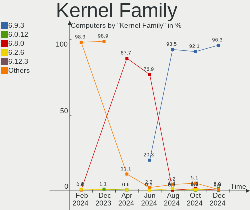
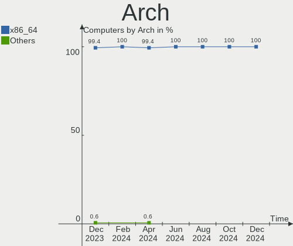
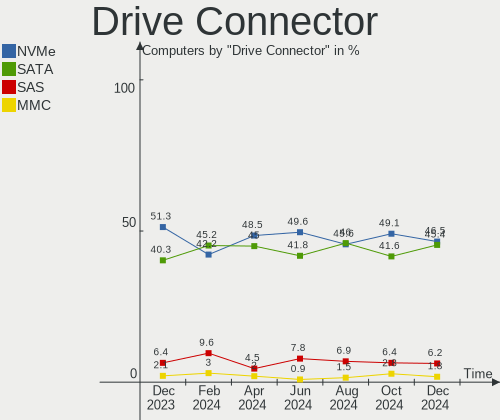
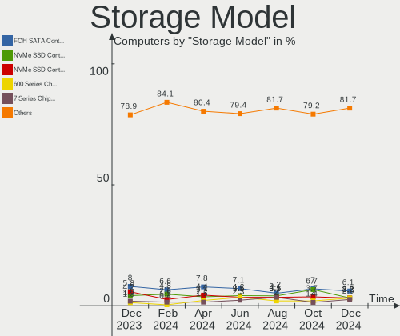
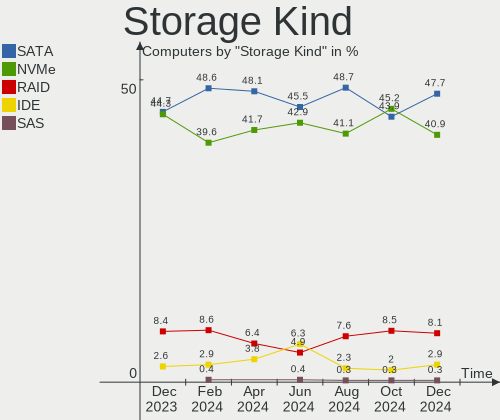
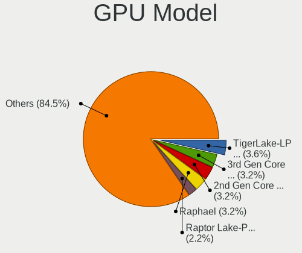
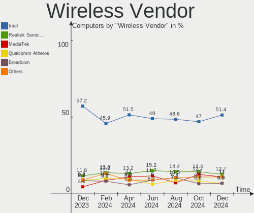
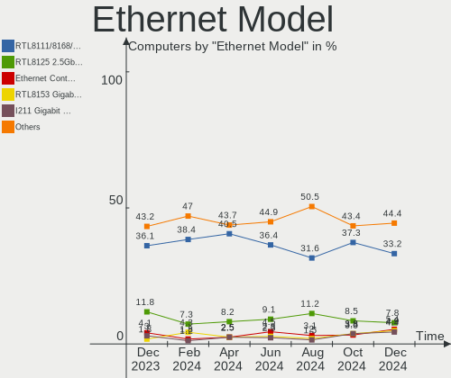

Pop!_OS - Hardware Trends
-------------------------

A project to identify most popular hardware characteristics and track their change
over time based on data collected by Linux users at https://Linux-Hardware.org.

Anyone can contribute to this report by the [hw-probe](https://github.com/linuxhw/hw-probe) tool:

    sudo -E hw-probe -all -upload

This is a report for all computer types. See also reports for [desktops](/Dist/Pop!_OS/Desktop/README.md) and [notebooks](/Dist/Pop!_OS/Notebook/README.md).

This report is for one last month. Overall report since the beginning of time: [TestDays](https://github.com/linuxhw/TestDays)

Period: Sep, 2023.

Contents
--------

* [ System ](#system)
  - [ OS                       ](#os)
  - [ OS Family                ](#os-family)
  - [ Kernel                   ](#kernel)
  - [ Kernel Family            ](#kernel-family)
  - [ Kernel Major Ver.        ](#kernel-major-ver)
  - [ Arch                     ](#arch)
  - [ DE                       ](#de)
  - [ Display Server           ](#display-server)
  - [ Display Manager          ](#display-manager)
  - [ OS Lang                  ](#os-lang)
  - [ Boot Mode                ](#boot-mode)
  - [ Filesystem               ](#filesystem)
  - [ Part. scheme             ](#part-scheme)
  - [ Dual Boot with Linux/BSD ](#dual-boot-with-linuxbsd)
  - [ Dual Boot (Win)          ](#dual-boot-win)

* [ Board ](#board)
  - [ Vendor                   ](#vendor)
  - [ Model                    ](#model)
  - [ Model Family             ](#model-family)
  - [ MFG Year                 ](#mfg-year)
  - [ Form Factor              ](#form-factor)
  - [ Secure Boot              ](#secure-boot)
  - [ Coreboot                 ](#coreboot)
  - [ RAM Size                 ](#ram-size)
  - [ RAM Used                 ](#ram-used)
  - [ Total Drives             ](#total-drives)
  - [ Has CD-ROM               ](#has-cd-rom)
  - [ Has Ethernet             ](#has-ethernet)
  - [ Has WiFi                 ](#has-wifi)
  - [ Has Bluetooth            ](#has-bluetooth)

* [ Location ](#location)
  - [ Country                  ](#country)
  - [ City                     ](#city)

* [ Drives ](#drives)
  - [ Drive Vendor             ](#drive-vendor)
  - [ Drive Model              ](#drive-model)
  - [ HDD Vendor               ](#hdd-vendor)
  - [ SSD Vendor               ](#ssd-vendor)
  - [ Drive Kind               ](#drive-kind)
  - [ Drive Connector          ](#drive-connector)
  - [ Drive Size               ](#drive-size)
  - [ Space Total              ](#space-total)
  - [ Space Used               ](#space-used)
  - [ Malfunc. Drives          ](#malfunc-drives)
  - [ Malfunc. Drive Vendor    ](#malfunc-drive-vendor)
  - [ Malfunc. HDD Vendor      ](#malfunc-hdd-vendor)
  - [ Malfunc. Drive Kind      ](#malfunc-drive-kind)
  - [ Failed Drives            ](#failed-drives)
  - [ Failed Drive Vendor      ](#failed-drive-vendor)
  - [ Drive Status             ](#drive-status)

* [ Storage controller ](#storage-controller)
  - [ Storage Vendor           ](#storage-vendor)
  - [ Storage Model            ](#storage-model)
  - [ Storage Kind             ](#storage-kind)

* [ Processor ](#processor)
  - [ CPU Vendor               ](#cpu-vendor)
  - [ CPU Model                ](#cpu-model)
  - [ CPU Model Family         ](#cpu-model-family)
  - [ CPU Cores                ](#cpu-cores)
  - [ CPU Sockets              ](#cpu-sockets)
  - [ CPU Threads              ](#cpu-threads)
  - [ CPU Op-Modes             ](#cpu-op-modes)
  - [ CPU Microcode            ](#cpu-microcode)
  - [ CPU Microarch            ](#cpu-microarch)

* [ Graphics ](#graphics)
  - [ GPU Vendor               ](#gpu-vendor)
  - [ GPU Model                ](#gpu-model)
  - [ GPU Combo                ](#gpu-combo)
  - [ GPU Driver               ](#gpu-driver)
  - [ GPU Memory               ](#gpu-memory)

* [ Monitor ](#monitor)
  - [ Monitor Vendor           ](#monitor-vendor)
  - [ Monitor Model            ](#monitor-model)
  - [ Monitor Resolution       ](#monitor-resolution)
  - [ Monitor Diagonal         ](#monitor-diagonal)
  - [ Monitor Width            ](#monitor-width)
  - [ Aspect Ratio             ](#aspect-ratio)
  - [ Monitor Area             ](#monitor-area)
  - [ Pixel Density            ](#pixel-density)
  - [ Multiple Monitors        ](#multiple-monitors)

* [ Network ](#network)
  - [ Net Controller Vendor    ](#net-controller-vendor)
  - [ Net Controller Model     ](#net-controller-model)
  - [ Wireless Vendor          ](#wireless-vendor)
  - [ Wireless Model           ](#wireless-model)
  - [ Ethernet Vendor          ](#ethernet-vendor)
  - [ Ethernet Model           ](#ethernet-model)
  - [ Net Controller Kind      ](#net-controller-kind)
  - [ Used Controller          ](#used-controller)
  - [ NICs                     ](#nics)
  - [ IPv6                     ](#ipv6)

* [ Bluetooth ](#bluetooth)
  - [ Bluetooth Vendor         ](#bluetooth-vendor)
  - [ Bluetooth Model          ](#bluetooth-model)

* [ Sound ](#sound)
  - [ Sound Vendor             ](#sound-vendor)
  - [ Sound Model              ](#sound-model)

* [ Memory ](#memory)
  - [ Memory Vendor            ](#memory-vendor)
  - [ Memory Model             ](#memory-model)
  - [ Memory Kind              ](#memory-kind)
  - [ Memory Form Factor       ](#memory-form-factor)
  - [ Memory Size              ](#memory-size)
  - [ Memory Speed             ](#memory-speed)

* [ Printers & scanners ](#printers--scanners)
  - [ Printer Vendor           ](#printer-vendor)
  - [ Printer Model            ](#printer-model)
  - [ Scanner Vendor           ](#scanner-vendor)
  - [ Scanner Model            ](#scanner-model)

* [ Camera ](#camera)
  - [ Camera Vendor            ](#camera-vendor)
  - [ Camera Model             ](#camera-model)

* [ Security ](#security)
  - [ Fingerprint Vendor       ](#fingerprint-vendor)
  - [ Fingerprint Model        ](#fingerprint-model)
  - [ Chipcard Vendor          ](#chipcard-vendor)
  - [ Chipcard Model           ](#chipcard-model)

* [ Unsupported ](#unsupported)
  - [ Unsupported Devices      ](#unsupported-devices)
  - [ Unsupported Device Types ](#unsupported-device-types)

System
------

OS
--

Installed operating systems

| Name          | Computers | Percent |
|---------------|-----------|---------|
| Pop!_OS 22.04 | 164       | 98.8%   |
| Pop!_OS 20.04 | 2         | 1.2%    |

OS Family
---------

OS without a version

| Name    | Computers | Percent |
|---------|-----------|---------|
| Pop!_OS | 166       | 100%    |

Kernel
------

Version of the Linux kernel

| Version                  | Computers | Percent |
|--------------------------|-----------|---------|
| 6.4.6-76060406-generic   | 137       | 82.53%  |
| 6.2.6-76060206-generic   | 20        | 12.05%  |
| 6.0.2-76060002-generic   | 2         | 1.2%    |
| 6.0.12-76060012-generic  | 2         | 1.2%    |
| 6.5.5-x64v3-xanmod1      | 1         | 0.6%    |
| 6.4.12-2-liquorix-amd64  | 1         | 0.6%    |
| 6.0.3-76060003-generic   | 1         | 0.6%    |
| 5.19.0-76051900-generic  | 1         | 0.6%    |
| 5.16.19-76051619-generic | 1         | 0.6%    |

Kernel Family
-------------

Linux kernel without a distro release

| Version | Computers | Percent |
|---------|-----------|---------|
| 6.4.6   | 137       | 82.53%  |
| 6.2.6   | 20        | 12.05%  |
| 6.0.2   | 2         | 1.2%    |
| 6.0.12  | 2         | 1.2%    |
| 6.5.5   | 1         | 0.6%    |
| 6.4.12  | 1         | 0.6%    |
| 6.0.3   | 1         | 0.6%    |
| 5.19.0  | 1         | 0.6%    |
| 5.16.19 | 1         | 0.6%    |

Kernel Major Ver.
-----------------

Linux kernel major version

| Version | Computers | Percent |
|---------|-----------|---------|
| 6.4     | 138       | 83.13%  |
| 6.2     | 20        | 12.05%  |
| 6.0     | 5         | 3.01%   |
| 6.5     | 1         | 0.6%    |
| 5.19    | 1         | 0.6%    |
| 5.16    | 1         | 0.6%    |

Arch
----

OS architecture (x86_64, i586, etc.)

| Name   | Computers | Percent |
|--------|-----------|---------|
| x86_64 | 166       | 100%    |

DE
--

Desktop Environment

| Name            | Computers | Percent |
|-----------------|-----------|---------|
| GNOME           | 154       | 92.77%  |
| GNOME Flashback | 3         | 1.81%   |
| Unknown         | 3         | 1.81%   |
| X-Cinnamon      | 2         | 1.2%    |
| Unity           | 1         | 0.6%    |
| UKUI            | 1         | 0.6%    |
| KDE5            | 1         | 0.6%    |
| awesome         | 1         | 0.6%    |

Display Server
--------------

X11 or Wayland

| Name    | Computers | Percent |
|---------|-----------|---------|
| X11     | 152       | 91.57%  |
| Wayland | 12        | 7.23%   |
| Unknown | 2         | 1.2%    |

Display Manager
---------------

SDDM, LightDM, etc.

| Name    | Computers | Percent |
|---------|-----------|---------|
| Unknown | 108       | 65.06%  |
| GDM3    | 57        | 34.34%  |
| GDM     | 1         | 0.6%    |

OS Lang
-------

Language

| Lang    | Computers | Percent |
|---------|-----------|---------|
| en_US   | 94        | 56.63%  |
| en_GB   | 13        | 7.83%   |
| de_DE   | 9         | 5.42%   |
| pt_BR   | 8         | 4.82%   |
| fr_FR   | 5         | 3.01%   |
| en_AU   | 5         | 3.01%   |
| C       | 4         | 2.41%   |
| en_CA   | 3         | 1.81%   |
| ru_RU   | 2         | 1.2%    |
| nb_NO   | 2         | 1.2%    |
| en_IN   | 2         | 1.2%    |
| Unknown | 2         | 1.2%    |
| tr_TR   | 1         | 0.6%    |
| sv_SE   | 1         | 0.6%    |
| pt_PT   | 1         | 0.6%    |
| pl_PL   | 1         | 0.6%    |
| nl_NL   | 1         | 0.6%    |
| lv_LV   | 1         | 0.6%    |
| ja_JP   | 1         | 0.6%    |
| it_IT   | 1         | 0.6%    |
| fr_CA   | 1         | 0.6%    |
| fi_FI   | 1         | 0.6%    |
| es_PE   | 1         | 0.6%    |
| es_ES   | 1         | 0.6%    |
| es_CL   | 1         | 0.6%    |
| en_NZ   | 1         | 0.6%    |
| en_IL   | 1         | 0.6%    |
| en_DK   | 1         | 0.6%    |
| de_AT   | 1         | 0.6%    |

Boot Mode
---------

EFI or BIOS

| Mode | Computers | Percent |
|------|-----------|---------|
| BIOS | 111       | 66.87%  |
| EFI  | 55        | 33.13%  |

Filesystem
----------

Type of filesystem

| Type    | Computers | Percent |
|---------|-----------|---------|
| Ext4    | 161       | 96.99%  |
| Btrfs   | 3         | 1.81%   |
| Overlay | 2         | 1.2%    |

Part. scheme
------------

Scheme of partitioning

| Type    | Computers | Percent |
|---------|-----------|---------|
| Unknown | 107       | 64.46%  |
| GPT     | 54        | 32.53%  |
| MBR     | 5         | 3.01%   |

Dual Boot with Linux/BSD
------------------------

Hosting more than one Linux/BSD

| Dual boot | Computers | Percent |
|-----------|-----------|---------|
| No        | 160       | 96.39%  |
| Yes       | 6         | 3.61%   |

Dual Boot (Win)
---------------

Hosting Linux and Windows

| Dual boot | Computers | Percent |
|-----------|-----------|---------|
| No        | 145       | 87.35%  |
| Yes       | 21        | 12.65%  |

Board
-----

Vendor
------

Motherboard manufacturer

| Name                                 | Computers | Percent |
|--------------------------------------|-----------|---------|
| ASUSTek Computer                     | 34        | 20.48%  |
| Lenovo                               | 21        | 12.65%  |
| Hewlett-Packard                      | 19        | 11.45%  |
| Dell                                 | 18        | 10.84%  |
| MSI                                  | 13        | 7.83%   |
| Apple                                | 13        | 7.83%   |
| Gigabyte Technology                  | 10        | 6.02%   |
| System76                             | 7         | 4.22%   |
| Toshiba                              | 3         | 1.81%   |
| Acer                                 | 3         | 1.81%   |
| Schenker                             | 2         | 1.2%    |
| Notebook                             | 2         | 1.2%    |
| HUAWEI                               | 2         | 1.2%    |
| HONOR                                | 2         | 1.2%    |
| Fujitsu                              | 2         | 1.2%    |
| ASRock                               | 2         | 1.2%    |
| Unknown                              | 2         | 1.2%    |
| ZOTAC                                | 1         | 0.6%    |
| Shenzhen Meigao Electronic Equipment | 1         | 0.6%    |
| realme                               | 1         | 0.6%    |
| Positivo                             | 1         | 0.6%    |
| Hardkernel                           | 1         | 0.6%    |
| Framework                            | 1         | 0.6%    |
| Digibras                             | 1         | 0.6%    |
| Biostar                              | 1         | 0.6%    |
| AZW                                  | 1         | 0.6%    |
| ASRockRack                           | 1         | 0.6%    |
| Alienware                            | 1         | 0.6%    |

Model
-----

Motherboard model

| Name                                       | Computers | Percent |
|--------------------------------------------|-----------|---------|
| System76 Darter Pro                        | 2         | 1.2%    |
| HP 250 G4                                  | 2         | 1.2%    |
| ASUS All Series                            | 2         | 1.2%    |
| Apple MacBookAir6,2                        | 2         | 1.2%    |
| Unknown                                    | 2         | 1.2%    |
| ZOTAC ZBOX-ECM73070C/53060C                | 1         | 0.6%    |
| Toshiba TECRA X40-E                        | 1         | 0.6%    |
| Toshiba Satellite P775                     | 1         | 0.6%    |
| Toshiba Satellite L735                     | 1         | 0.6%    |
| System76 Thelio                            | 1         | 0.6%    |
| System76 Pangolin                          | 1         | 0.6%    |
| System76 Oryx Pro                          | 1         | 0.6%    |
| System76 Lemur Pro                         | 1         | 0.6%    |
| System76 Gazelle                           | 1         | 0.6%    |
| Shenzhen Meigao Electronic Equipment UM450 | 1         | 0.6%    |
| Schenker XMG NEO (TGL/M21)                 | 1         | 0.6%    |
| Schenker VIA 15 Pro                        | 1         | 0.6%    |
| realme RMNBXXXX                            | 1         | 0.6%    |
| Positivo C14CR01                           | 1         | 0.6%    |
| Notebook NV4XMB,ME,MZ                      | 1         | 0.6%    |
| Notebook NH50_70RH                         | 1         | 0.6%    |
| MSI Summit E13FlipEvo A12MT                | 1         | 0.6%    |
| MSI Stealth 15M B12UE                      | 1         | 0.6%    |
| MSI P65 Creator 8RD                        | 1         | 0.6%    |
| MSI MS-7D75                                | 1         | 0.6%    |
| MSI MS-7D25                                | 1         | 0.6%    |
| MSI MS-7D18                                | 1         | 0.6%    |
| MSI MS-7C52                                | 1         | 0.6%    |
| MSI MS-7C13                                | 1         | 0.6%    |
| MSI MS-7B09                                | 1         | 0.6%    |
| MSI MS-7A34                                | 1         | 0.6%    |
| MSI Mr. Office V R4                        | 1         | 0.6%    |
| MSI Cyborg 15 A12VF                        | 1         | 0.6%    |
| MSI Alpha 15 A3DDK                         | 1         | 0.6%    |
| Lenovo Yoga Pro 7 14ARP8 83AU              | 1         | 0.6%    |
| Lenovo Yoga C740-14IML 81TC                | 1         | 0.6%    |
| Lenovo Yoga 710-14IKB 80V4                 | 1         | 0.6%    |
| Lenovo Yoga 7 15ITL5 82BJ                  | 1         | 0.6%    |
| Lenovo V720-14 80Y1                        | 1         | 0.6%    |
| Lenovo ThinkPad X13 Gen 2a 20XHCTO1WW      | 1         | 0.6%    |

Model Family
------------

Motherboard model prefix

| Name                                       | Computers | Percent |
|--------------------------------------------|-----------|---------|
| ASUS VivoBook                              | 9         | 5.42%   |
| Lenovo IdeaPad                             | 6         | 3.61%   |
| Dell Latitude                              | 6         | 3.61%   |
| ASUS ROG                                   | 6         | 3.61%   |
| Lenovo Yoga                                | 4         | 2.41%   |
| Lenovo Legion                              | 4         | 2.41%   |
| Lenovo ThinkPad                            | 3         | 1.81%   |
| HP Laptop                                  | 3         | 1.81%   |
| HP EliteBook                               | 3         | 1.81%   |
| Dell Inspiron                              | 3         | 1.81%   |
| Toshiba Satellite                          | 2         | 1.2%    |
| System76 Darter                            | 2         | 1.2%    |
| HP Pavilion                                | 2         | 1.2%    |
| HP OMEN                                    | 2         | 1.2%    |
| HP 250                                     | 2         | 1.2%    |
| Dell XPS                                   | 2         | 1.2%    |
| Dell Vostro                                | 2         | 1.2%    |
| Dell Precision                             | 2         | 1.2%    |
| Dell OptiPlex                              | 2         | 1.2%    |
| ASUS TUF                                   | 2         | 1.2%    |
| ASUS ASUS                                  | 2         | 1.2%    |
| ASUS All                                   | 2         | 1.2%    |
| Apple MacBookAir6                          | 2         | 1.2%    |
| Acer Aspire                                | 2         | 1.2%    |
| Unknown                                    | 2         | 1.2%    |
| ZOTAC ZBOX-ECM73070C                       | 1         | 0.6%    |
| Toshiba TECRA                              | 1         | 0.6%    |
| System76 Thelio                            | 1         | 0.6%    |
| System76 Pangolin                          | 1         | 0.6%    |
| System76 Oryx                              | 1         | 0.6%    |
| System76 Lemur                             | 1         | 0.6%    |
| System76 Gazelle                           | 1         | 0.6%    |
| Shenzhen Meigao Electronic Equipment UM450 | 1         | 0.6%    |
| Schenker XMG                               | 1         | 0.6%    |
| Schenker VIA                               | 1         | 0.6%    |
| realme RMNBXXXX                            | 1         | 0.6%    |
| Positivo C14CR01                           | 1         | 0.6%    |
| Notebook NV4XMB                            | 1         | 0.6%    |
| Notebook NH50                              | 1         | 0.6%    |
| MSI Summit                                 | 1         | 0.6%    |

MFG Year
--------

Motherboard manufacture year

| Year | Computers | Percent |
|------|-----------|---------|
| 2021 | 23        | 13.86%  |
| 2022 | 22        | 13.25%  |
| 2023 | 16        | 9.64%   |
| 2019 | 15        | 9.04%   |
| 2015 | 13        | 7.83%   |
| 2020 | 12        | 7.23%   |
| 2011 | 12        | 7.23%   |
| 2018 | 11        | 6.63%   |
| 2017 | 9         | 5.42%   |
| 2016 | 8         | 4.82%   |
| 2013 | 8         | 4.82%   |
| 2014 | 7         | 4.22%   |
| 2012 | 6         | 3.61%   |
| 2009 | 3         | 1.81%   |
| 2010 | 1         | 0.6%    |

Form Factor
-----------

Physical design of the computer

| Name        | Computers | Percent |
|-------------|-----------|---------|
| Notebook    | 102       | 61.45%  |
| Desktop     | 53        | 31.93%  |
| All in one  | 5         | 3.01%   |
| Convertible | 3         | 1.81%   |
| Mini pc     | 2         | 1.2%    |
| Tablet      | 1         | 0.6%    |

Secure Boot
-----------

Enabled or disabled

| State    | Computers | Percent |
|----------|-----------|---------|
| Disabled | 166       | 100%    |

Coreboot
--------

Have coreboot on board

| Used | Computers | Percent |
|------|-----------|---------|
| No   | 162       | 97.59%  |
| Yes  | 4         | 2.41%   |

RAM Size
--------

Total RAM memory

| Size in GB  | Computers | Percent |
|-------------|-----------|---------|
| 16.01-24.0  | 35        | 21.08%  |
| 8.01-16.0   | 35        | 21.08%  |
| 4.01-8.0    | 31        | 18.67%  |
| 32.01-64.0  | 29        | 17.47%  |
| 3.01-4.0    | 16        | 9.64%   |
| 64.01-256.0 | 14        | 8.43%   |
| 24.01-32.0  | 6         | 3.61%   |

RAM Used
--------

Used RAM memory

| Used GB    | Computers | Percent |
|------------|-----------|---------|
| 4.01-8.0   | 72        | 43.37%  |
| 3.01-4.0   | 33        | 19.88%  |
| 8.01-16.0  | 27        | 16.27%  |
| 2.01-3.0   | 25        | 15.06%  |
| 1.01-2.0   | 6         | 3.61%   |
| 16.01-24.0 | 2         | 1.2%    |
| 24.01-32.0 | 1         | 0.6%    |

Total Drives
------------

Number of drives on board

| Drives | Computers | Percent |
|--------|-----------|---------|
| 1      | 106       | 63.86%  |
| 2      | 40        | 24.1%   |
| 3      | 12        | 7.23%   |
| 7      | 3         | 1.81%   |
| 4      | 2         | 1.2%    |
| 8      | 1         | 0.6%    |
| 6      | 1         | 0.6%    |
| 0      | 1         | 0.6%    |

Has CD-ROM
----------

Has CD-ROM on board

| Presented | Computers | Percent |
|-----------|-----------|---------|
| No        | 129       | 77.71%  |
| Yes       | 37        | 22.29%  |

Has Ethernet
------------

Has Ethernet on board

| Presented | Computers | Percent |
|-----------|-----------|---------|
| Yes       | 133       | 80.12%  |
| No        | 33        | 19.88%  |

Has WiFi
--------

Has WiFi module

| Presented | Computers | Percent |
|-----------|-----------|---------|
| Yes       | 143       | 86.14%  |
| No        | 23        | 13.86%  |

Has Bluetooth
-------------

Has Bluetooth module

| Presented | Computers | Percent |
|-----------|-----------|---------|
| Yes       | 130       | 78.31%  |
| No        | 36        | 21.69%  |

Location
--------

Country
-------

Geographic location (country)

| Country          | Computers | Percent |
|------------------|-----------|---------|
| USA              | 42        | 25.3%   |
| Germany          | 15        | 9.04%   |
| Brazil           | 12        | 7.23%   |
| UK               | 7         | 4.22%   |
| Australia        | 7         | 4.22%   |
| Italy            | 6         | 3.61%   |
| India            | 6         | 3.61%   |
| Turkey           | 5         | 3.01%   |
| Netherlands      | 5         | 3.01%   |
| Canada           | 5         | 3.01%   |
| Serbia           | 4         | 2.41%   |
| France           | 4         | 2.41%   |
| Sweden           | 3         | 1.81%   |
| Singapore        | 3         | 1.81%   |
| Indonesia        | 3         | 1.81%   |
| Denmark          | 3         | 1.81%   |
| Austria          | 3         | 1.81%   |
| Uzbekistan       | 2         | 1.2%    |
| Russia           | 2         | 1.2%    |
| Poland           | 2         | 1.2%    |
| Norway           | 2         | 1.2%    |
| Mexico           | 2         | 1.2%    |
| Finland          | 2         | 1.2%    |
| Ukraine          | 1         | 0.6%    |
| Spain            | 1         | 0.6%    |
| Romania          | 1         | 0.6%    |
| Puerto Rico      | 1         | 0.6%    |
| Portugal         | 1         | 0.6%    |
| Peru             | 1         | 0.6%    |
| Papua New Guinea | 1         | 0.6%    |
| North Macedonia  | 1         | 0.6%    |
| New Zealand      | 1         | 0.6%    |
| Morocco          | 1         | 0.6%    |
| Malaysia         | 1         | 0.6%    |
| Latvia           | 1         | 0.6%    |
| Kazakhstan       | 1         | 0.6%    |
| Japan            | 1         | 0.6%    |
| Israel           | 1         | 0.6%    |
| Iceland          | 1         | 0.6%    |
| Czechia          | 1         | 0.6%    |

City
----

Geographic location (city)

| City             | Computers | Percent |
|------------------|-----------|---------|
| Singapore        | 3         | 1.81%   |
| Melbourne        | 3         | 1.81%   |
| Bengaluru        | 3         | 1.81%   |
| Tashkent         | 2         | 1.2%    |
| Sydney           | 2         | 1.2%    |
| Stuttgart        | 2         | 1.2%    |
| Paris            | 2         | 1.2%    |
| Oslo             | 2         | 1.2%    |
| Madison          | 2         | 1.2%    |
| Leipzig          | 2         | 1.2%    |
| Izmir            | 2         | 1.2%    |
| Edmonton         | 2         | 1.2%    |
| Denver           | 2         | 1.2%    |
| Clinton Township | 2         | 1.2%    |
| Belgrade         | 2         | 1.2%    |
| Ankara           | 2         | 1.2%    |
| Ypsilanti        | 1         | 0.6%    |
| Yokohama         | 1         | 0.6%    |
| Wuppertal        | 1         | 0.6%    |
| Waukegan         | 1         | 0.6%    |
| Wappingers Falls | 1         | 0.6%    |
| Vienna           | 1         | 0.6%    |
| Viareggio        | 1         | 0.6%    |
| Vancouver        | 1         | 0.6%    |
| Ust-Kamenogorsk  | 1         | 0.6%    |
| Umeå            | 1         | 0.6%    |
| Ulyanovsk        | 1         | 0.6%    |
| Tuckerton        | 1         | 0.6%    |
| Trento           | 1         | 0.6%    |
| Tirunelveli      | 1         | 0.6%    |
| Thrissur         | 1         | 0.6%    |
| The Bronx        | 1         | 0.6%    |
| Stary Sacz       | 1         | 0.6%    |
| Springfield      | 1         | 0.6%    |
| Spartanburg      | 1         | 0.6%    |
| Skopje           | 1         | 0.6%    |
| Simcoe           | 1         | 0.6%    |
| Seattle          | 1         | 0.6%    |
| Sao Paulo        | 1         | 0.6%    |
| San Leandro      | 1         | 0.6%    |

Drives
------

Drive Vendor
------------

Hard drive vendors

| Vendor                      | Computers | Drives | Percent |
|-----------------------------|-----------|--------|---------|
| Samsung Electronics         | 47        | 60     | 20.26%  |
| WDC                         | 23        | 31     | 9.91%   |
| SanDisk                     | 18        | 20     | 7.76%   |
| Seagate                     | 17        | 18     | 7.33%   |
| Kingston                    | 14        | 15     | 6.03%   |
| Micron Technology           | 12        | 13     | 5.17%   |
| Toshiba                     | 11        | 12     | 4.74%   |
| Crucial                     | 11        | 13     | 4.74%   |
| SK hynix                    | 10        | 10     | 4.31%   |
| Apple                       | 9         | 9      | 3.88%   |
| Unknown                     | 6         | 6      | 2.59%   |
| KIOXIA                      | 5         | 5      | 2.16%   |
| PNY                         | 4         | 4      | 1.72%   |
| Phison Electronics          | 4         | 5      | 1.72%   |
| SPCC                        | 3         | 3      | 1.29%   |
| Intel                       | 3         | 3      | 1.29%   |
| China                       | 3         | 3      | 1.29%   |
| A-DATA Technology           | 3         | 3      | 1.29%   |
| Silicon Motion              | 2         | 2      | 0.86%   |
| Micron/Crucial Technology   | 2         | 2      | 0.86%   |
| HGST                        | 2         | 2      | 0.86%   |
| Gigabyte Technology         | 2         | 2      | 0.86%   |
| Unknown                     | 2         | 2      | 0.86%   |
| VISIPRO                     | 1         | 1      | 0.43%   |
| Transcend                   | 1         | 1      | 0.43%   |
| StoreJet                    | 1         | 2      | 0.43%   |
| RSH-338H                    | 1         | 1      | 0.43%   |
| Phison                      | 1         | 1      | 0.43%   |
| Netac                       | 1         | 1      | 0.43%   |
| MSI                         | 1         | 1      | 0.43%   |
| MAXIO Technology (Hangzhou) | 1         | 1      | 0.43%   |
| Kingston Technology Company | 1         | 1      | 0.43%   |
| JMicron Technology          | 1         | 1      | 0.43%   |
| Intenso                     | 1         | 1      | 0.43%   |
| Integral                    | 1         | 1      | 0.43%   |
| Hitachi                     | 1         | 1      | 0.43%   |
| Fujitsu                     | 1         | 1      | 0.43%   |
| FIKWOT                      | 1         | 4      | 0.43%   |
| Fanxiang                    | 1         | 1      | 0.43%   |
| Corsair                     | 1         | 1      | 0.43%   |

Drive Model
-----------

Hard drive models

| Model                                                 | Computers | Percent |
|-------------------------------------------------------|-----------|---------|
| Samsung NVMe SSD Controller SM981/PM981/PM983 256GB   | 8         | 3.19%   |
| Samsung NVMe SSD Controller PM9A1/PM9A3/980PRO 1TB    | 5         | 1.99%   |
| Samsung SSD 870 QVO 2TB                               | 4         | 1.59%   |
| Samsung SSD 850 EVO 250GB                             | 4         | 1.59%   |
| Samsung SSD 980 1TB                                   | 3         | 1.2%    |
| Samsung SSD 870 QVO 1TB                               | 3         | 1.2%    |
| Samsung SSD 860 EVO 500GB                             | 3         | 1.2%    |
| Phison PS5013 E13 NVMe Controller 512GB               | 3         | 1.2%    |
| Kingston SA400S37480G 480GB SSD                       | 3         | 1.2%    |
| Crucial CT1000MX500SSD1 1TB                           | 3         | 1.2%    |
| WDC WD5000KS-00MNB0 500GB                             | 2         | 0.8%    |
| WDC WD1003FZEX-00MK2A0 1TB                            | 2         | 0.8%    |
| WDC WD Blue SA510 2.5 500GB                           | 2         | 0.8%    |
| Unknown MMC Card  64GB                                | 2         | 0.8%    |
| Toshiba DT01ACA100 1TB                                | 2         | 0.8%    |
| SK hynix SKHynix_HFS001TEJ9X115N 1TB                  | 2         | 0.8%    |
| SK hynix PC300 NVMe Solid State Drive 256GB           | 2         | 0.8%    |
| Silicon Motion SM2263EN/SM2263XT SSD Controller 512GB | 2         | 0.8%    |
| Seagate ST4000DM004-2CV104 4TB                        | 2         | 0.8%    |
| Seagate ST3500414CS 500GB                             | 2         | 0.8%    |
| Seagate ST1000DM003-1ER162 1TB                        | 2         | 0.8%    |
| Sandisk WD Blue SN500 / PC SN520 NVMe SSD 256GB       | 2         | 0.8%    |
| Sandisk WD Black SN750 / PC SN730 NVMe SSD 512GB      | 2         | 0.8%    |
| SanDisk SDSSDHP256G 256GB                             | 2         | 0.8%    |
| Samsung SSD 970 EVO Plus 1TB                          | 2         | 0.8%    |
| Samsung SSD 870 EVO 500GB                             | 2         | 0.8%    |
| Samsung SSD 860 EVO 1TB                               | 2         | 0.8%    |
| Micron 2450_MTFDKBA1T0TFK 1024GB                      | 2         | 0.8%    |
| Micron 2400_MTFDKBA1T0QFM 1024GB                      | 2         | 0.8%    |
| Crucial CT2000MX500SSD1 2TB                           | 2         | 0.8%    |
| Unknown                                               | 2         | 0.8%    |
| WDC WDS500G2B0C-00PXH0 500GB                          | 1         | 0.4%    |
| WDC WDS480G2G0B-00EPW0 480GB SSD                      | 1         | 0.4%    |
| WDC WDS240G2G0C-00AJM0 240GB                          | 1         | 0.4%    |
| WDC WDS100T2B0B-00YS70 1TB SSD                        | 1         | 0.4%    |
| WDC WDS100T2B0A-00SM50 1TB SSD                        | 1         | 0.4%    |
| WDC WD80EFZZ-68BTXN0 8TB                              | 1         | 0.4%    |
| WDC WD6400AACS-00G8B1 640GB                           | 1         | 0.4%    |
| WDC WD60EFRX-68L0BN1 6TB                              | 1         | 0.4%    |
| WDC WD5000AACS-00G8B1 500GB                           | 1         | 0.4%    |

HDD Vendor
----------

Hard disk drive vendors

| Vendor              | Computers | Drives | Percent |
|---------------------|-----------|--------|---------|
| Seagate             | 17        | 18     | 36.96%  |
| WDC                 | 13        | 20     | 28.26%  |
| Toshiba             | 8         | 9      | 17.39%  |
| HGST                | 2         | 2      | 4.35%   |
| Apple               | 2         | 2      | 4.35%   |
| Unknown             | 1         | 1      | 2.17%   |
| Samsung Electronics | 1         | 1      | 2.17%   |
| Hitachi             | 1         | 1      | 2.17%   |
| Fujitsu             | 1         | 1      | 2.17%   |

SSD Vendor
----------

Solid state drive vendors

| Vendor              | Computers | Drives | Percent |
|---------------------|-----------|--------|---------|
| Samsung Electronics | 21        | 26     | 25.3%   |
| Crucial             | 10        | 11     | 12.05%  |
| Kingston            | 9         | 9      | 10.84%  |
| SanDisk             | 7         | 7      | 8.43%   |
| WDC                 | 6         | 6      | 7.23%   |
| Apple               | 6         | 6      | 7.23%   |
| PNY                 | 3         | 3      | 3.61%   |
| China               | 3         | 3      | 3.61%   |
| A-DATA Technology   | 3         | 3      | 3.61%   |
| SPCC                | 2         | 2      | 2.41%   |
| Micron Technology   | 2         | 2      | 2.41%   |
| Transcend           | 1         | 1      | 1.2%    |
| StoreJet            | 1         | 1      | 1.2%    |
| Netac               | 1         | 1      | 1.2%    |
| MSI                 | 1         | 1      | 1.2%    |
| JMicron Technology  | 1         | 1      | 1.2%    |
| Integral            | 1         | 1      | 1.2%    |
| Gigabyte Technology | 1         | 1      | 1.2%    |
| FIKWOT              | 1         | 4      | 1.2%    |
| Fanxiang            | 1         | 1      | 1.2%    |
| Corsair             | 1         | 1      | 1.2%    |
| Apacer              | 1         | 1      | 1.2%    |

Drive Kind
----------

HDD or SSD

| Kind    | Computers | Drives | Percent |
|---------|-----------|--------|---------|
| NVMe    | 88        | 108    | 42.11%  |
| SSD     | 70        | 92     | 33.49%  |
| HDD     | 41        | 55     | 19.62%  |
| MMC     | 6         | 7      | 2.87%   |
| Unknown | 4         | 4      | 1.91%   |

Drive Connector
---------------

SATA, SAS, NVMe, etc.

| Type | Computers | Drives | Percent |
|------|-----------|--------|---------|
| NVMe | 88        | 108    | 47.57%  |
| SATA | 87        | 144    | 47.03%  |
| MMC  | 6         | 7      | 3.24%   |
| SAS  | 4         | 7      | 2.16%   |

Drive Size
----------

Size of hard drive

| Size in TB | Computers | Drives | Percent |
|------------|-----------|--------|---------|
| 0.01-0.5   | 61        | 71     | 52.59%  |
| 0.51-1.0   | 39        | 50     | 33.62%  |
| 1.01-2.0   | 9         | 13     | 7.76%   |
| 3.01-4.0   | 5         | 10     | 4.31%   |
| 4.01-10.0  | 2         | 3      | 1.72%   |

Space Total
-----------

Amount of disk space available on the file system

| Size in GB     | Computers | Percent |
|----------------|-----------|---------|
| 101-250        | 49        | 29.52%  |
| 251-500        | 45        | 27.11%  |
| 501-1000       | 33        | 19.88%  |
| 1001-2000      | 15        | 9.04%   |
| 51-100         | 9         | 5.42%   |
| More than 3000 | 5         | 3.01%   |
| 1-20           | 4         | 2.41%   |
| 2001-3000      | 3         | 1.81%   |
| Unknown        | 2         | 1.2%    |
| 21-50          | 1         | 0.6%    |

Space Used
----------

Amount of used disk space

| Used GB        | Computers | Percent |
|----------------|-----------|---------|
| 1-20           | 49        | 29.52%  |
| 21-50          | 37        | 22.29%  |
| 101-250        | 29        | 17.47%  |
| 51-100         | 20        | 12.05%  |
| 251-500        | 12        | 7.23%   |
| 501-1000       | 9         | 5.42%   |
| More than 3000 | 4         | 2.41%   |
| 1001-2000      | 4         | 2.41%   |
| Unknown        | 2         | 1.2%    |

Malfunc. Drives
---------------

Drive models with a malfunction

| Model                            | Computers | Drives | Percent |
|----------------------------------|-----------|--------|---------|
| WDC WDS480G2G0B-00EPW0 480GB SSD | 1         | 1      | 20%     |
| WDC WD3200BEKX-75B7WT0 320GB     | 1         | 1      | 20%     |
| WDC WD20EFRX-68AX9N0 2TB         | 1         | 1      | 20%     |
| Toshiba MK7559GSXP 752GB         | 1         | 1      | 20%     |
| Seagate ST3250310AS 250GB        | 1         | 1      | 20%     |

Malfunc. Drive Vendor
---------------------

Vendors of faulty drives

| Vendor  | Computers | Drives | Percent |
|---------|-----------|--------|---------|
| WDC     | 3         | 3      | 60%     |
| Toshiba | 1         | 1      | 20%     |
| Seagate | 1         | 1      | 20%     |

Malfunc. HDD Vendor
-------------------

Vendors of faulty HDD drives

| Vendor  | Computers | Drives | Percent |
|---------|-----------|--------|---------|
| WDC     | 2         | 2      | 50%     |
| Toshiba | 1         | 1      | 25%     |
| Seagate | 1         | 1      | 25%     |

Malfunc. Drive Kind
-------------------

Kinds of faulty drives

| Kind | Computers | Drives | Percent |
|------|-----------|--------|---------|
| HDD  | 4         | 4      | 80%     |
| SSD  | 1         | 1      | 20%     |

Failed Drives
-------------

Failed drive models

| Model               | Computers | Drives | Percent |
|---------------------|-----------|--------|---------|
| Intenso JAJP600M1TB | 1         | 1      | 100%    |

Failed Drive Vendor
-------------------

Failed drive vendors

| Vendor  | Computers | Drives | Percent |
|---------|-----------|--------|---------|
| Intenso | 1         | 1      | 100%    |

Drive Status
------------

Number of failed and malfunc. drives

| Status   | Computers | Drives | Percent |
|----------|-----------|--------|---------|
| Detected | 111       | 184    | 64.53%  |
| Works    | 55        | 76     | 31.98%  |
| Malfunc  | 5         | 5      | 2.91%   |
| Failed   | 1         | 1      | 0.58%   |

Storage controller
------------------

Storage Vendor
--------------

Storage controller vendors

| Vendor                       | Computers | Percent |
|------------------------------|-----------|---------|
| Intel                        | 90        | 38.3%   |
| AMD                          | 35        | 14.89%  |
| Samsung Electronics          | 34        | 14.47%  |
| SanDisk                      | 16        | 6.81%   |
| SK hynix                     | 10        | 4.26%   |
| Micron Technology            | 10        | 4.26%   |
| Phison Electronics           | 8         | 3.4%    |
| KIOXIA                       | 6         | 2.55%   |
| Kingston Technology Company  | 6         | 2.55%   |
| ASMedia Technology           | 6         | 2.55%   |
| Micron/Crucial Technology    | 4         | 1.7%    |
| Silicon Motion               | 3         | 1.28%   |
| Toshiba America Info Systems | 2         | 0.85%   |
| Nvidia                       | 2         | 0.85%   |
| MAXIO Technology (Hangzhou)  | 1         | 0.43%   |
| Marvell Technology Group     | 1         | 0.43%   |
| JMicron Technology           | 1         | 0.43%   |

Storage Model
-------------

Storage controller models

| Model                                                                                   | Computers | Percent |
|-----------------------------------------------------------------------------------------|-----------|---------|
| AMD FCH SATA Controller [AHCI mode]                                                     | 22        | 8.56%   |
| Samsung NVMe SSD Controller SM981/PM981/PM983                                           | 14        | 5.45%   |
| Samsung NVMe SSD Controller PM9A1/PM9A3/980PRO                                          | 8         | 3.11%   |
| Intel Volume Management Device NVMe RAID Controller                                     | 7         | 2.72%   |
| Intel Sunrise Point-LP SATA Controller [AHCI mode]                                      | 6         | 2.33%   |
| Intel Q170/Q150/B150/H170/H110/Z170/CM236 Chipset SATA Controller [AHCI Mode]           | 6         | 2.33%   |
| Intel Comet Lake SATA AHCI Controller                                                   | 6         | 2.33%   |
| Intel 6 Series/C200 Series Chipset Family 6 port Mobile SATA AHCI Controller            | 6         | 2.33%   |
| Samsung NVMe SSD Controller SM961/PM961/SM963                                           | 5         | 1.95%   |
| Intel 82801 Mobile SATA Controller [RAID mode]                                          | 5         | 1.95%   |
| Intel 7 Series Chipset Family 6-port SATA Controller [AHCI mode]                        | 5         | 1.95%   |
| ASMedia ASM1062 Serial ATA Controller                                                   | 5         | 1.95%   |
| AMD SB7x0/SB8x0/SB9x0 IDE Controller                                                    | 5         | 1.95%   |
| Phison PS5013 E13 NVMe Controller                                                       | 4         | 1.56%   |
| Micron 2450 NVMe SSD [HendrixV] (DRAM-less)                                             | 4         | 1.56%   |
| KIOXIA NVMe SSD Controller BG4 (DRAM-less)                                              | 4         | 1.56%   |
| Intel Wildcat Point-LP SATA Controller [AHCI Mode]                                      | 4         | 1.56%   |
| Intel Volume Management Device NVMe RAID Controller Intel Corporation                   | 4         | 1.56%   |
| Intel 8 Series/C220 Series Chipset Family 6-port SATA Controller 1 [AHCI mode]          | 4         | 1.56%   |
| Intel 200 Series PCH SATA controller [AHCI mode]                                        | 4         | 1.56%   |
| AMD SB7x0/SB8x0/SB9x0 SATA Controller [IDE mode]                                        | 4         | 1.56%   |
| AMD 500 Series Chipset SATA Controller                                                  | 4         | 1.56%   |
| SK hynix Platinum P41/PC801 NVMe Solid State Drive                                      | 3         | 1.17%   |
| Silicon Motion SM2263EN/SM2263XT (DRAM-less) NVMe SSD Controllers                       | 3         | 1.17%   |
| SanDisk WD Blue SN550 NVMe SSD                                                          | 3         | 1.17%   |
| SanDisk WD Black SN770 / PC SN740 256GB / PC SN560 (DRAM-less) NVMe SSD                 | 3         | 1.17%   |
| Samsung NVMe SSD Controller 980                                                         | 3         | 1.17%   |
| Phison E12 NVMe Controller                                                              | 3         | 1.17%   |
| Kingston Company KC3000/Renegade NVMe SSD                                               | 3         | 1.17%   |
| Intel Alder Lake-S PCH SATA Controller [AHCI Mode]                                      | 3         | 1.17%   |
| Intel 8 Series SATA Controller 1 [AHCI mode]                                            | 3         | 1.17%   |
| Intel 6 Series/C200 Series Chipset Family Desktop SATA Controller (IDE mode, ports 0-3) | 3         | 1.17%   |
| Intel 400 Series Chipset Family SATA AHCI Controller                                    | 3         | 1.17%   |
| AMD 400 Series Chipset SATA Controller                                                  | 3         | 1.17%   |
| Toshiba America Info Systems XG6 NVMe SSD Controller                                    | 2         | 0.78%   |
| SK hynix PC300 NVMe Solid State Drive 256GB                                             | 2         | 0.78%   |
| SK hynix Gold P31/BC711/PC711 NVMe Solid State Drive                                    | 2         | 0.78%   |
| SanDisk WD PC SN810 / Black SN850 NVMe SSD                                              | 2         | 0.78%   |
| SanDisk WD Green SN350 NVMe SSD 240GB (DRAM-less)                                       | 2         | 0.78%   |
| SanDisk WD Blue SN500 / PC SN520 NVMe SSD                                               | 2         | 0.78%   |

Storage Kind
------------

Kind of storage controller (IDE, SATA, NVMe, SAS, ...)

| Kind | Computers | Percent |
|------|-----------|---------|
| SATA | 111       | 48.68%  |
| NVMe | 88        | 38.6%   |
| RAID | 18        | 7.89%   |
| IDE  | 11        | 4.82%   |

Processor
---------

CPU Vendor
----------

Processor vendors

| Vendor | Computers | Percent |
|--------|-----------|---------|
| Intel  | 115       | 69.28%  |
| AMD    | 51        | 30.72%  |

CPU Model
---------

Processor models

| Model                                         | Computers | Percent |
|-----------------------------------------------|-----------|---------|
| Intel Core i5-7200U CPU @ 2.50GHz             | 4         | 2.41%   |
| Intel 11th Gen Core i7-1165G7 @ 2.80GHz       | 4         | 2.41%   |
| Intel Core i5-10210U CPU @ 1.60GHz            | 3         | 1.81%   |
| Intel 11th Gen Core i5-1135G7 @ 2.40GHz       | 3         | 1.81%   |
| Intel Core i7-8565U CPU @ 1.80GHz             | 2         | 1.2%    |
| Intel Core i7-6700K CPU @ 4.00GHz             | 2         | 1.2%    |
| Intel Core i7-10870H CPU @ 2.20GHz            | 2         | 1.2%    |
| Intel Core i5-6500 CPU @ 3.20GHz              | 2         | 1.2%    |
| Intel Core i5-4250U CPU @ 1.30GHz             | 2         | 1.2%    |
| Intel Core i3-6006U CPU @ 2.00GHz             | 2         | 1.2%    |
| Intel Core i3-5005U CPU @ 2.00GHz             | 2         | 1.2%    |
| Intel 13th Gen Core i9-13980HX                | 2         | 1.2%    |
| Intel 13th Gen Core i7-13700K                 | 2         | 1.2%    |
| Intel 12th Gen Core i9-12900H                 | 2         | 1.2%    |
| Intel 12th Gen Core i7-1280P                  | 2         | 1.2%    |
| Intel 12th Gen Core i7-12700H                 | 2         | 1.2%    |
| Intel 11th Gen Core i7-11800H @ 2.30GHz       | 2         | 1.2%    |
| AMD Ryzen 7 PRO 5850U with Radeon Graphics    | 2         | 1.2%    |
| AMD Ryzen 7 7735HS with Radeon Graphics       | 2         | 1.2%    |
| AMD Ryzen 7 5800U with Radeon Graphics        | 2         | 1.2%    |
| AMD Ryzen 7 5800H with Radeon Graphics        | 2         | 1.2%    |
| AMD Ryzen 7 5700G with Radeon Graphics        | 2         | 1.2%    |
| AMD Ryzen 5 3600 6-Core Processor             | 2         | 1.2%    |
| AMD Ryzen 3 3200U with Radeon Vega Mobile Gfx | 2         | 1.2%    |
| Intel Xeon CPU E5-2630 v3 @ 2.40GHz           | 1         | 0.6%    |
| Intel Xeon CPU E5-2620 0 @ 2.00GHz            | 1         | 0.6%    |
| Intel Xeon CPU E3-1241 v3 @ 3.50GHz           | 1         | 0.6%    |
| Intel Pentium Silver N6005 @ 2.00GHz          | 1         | 0.6%    |
| Intel Pentium Gold G6400 CPU @ 4.00GHz        | 1         | 0.6%    |
| Intel Core i9-10900F CPU @ 2.80GHz            | 1         | 0.6%    |
| Intel Core i9-10900 CPU @ 2.80GHz             | 1         | 0.6%    |
| Intel Core i9-10885H CPU @ 2.40GHz            | 1         | 0.6%    |
| Intel Core i9-10850K CPU @ 3.60GHz            | 1         | 0.6%    |
| Intel Core i7-8750H CPU @ 2.20GHz             | 1         | 0.6%    |
| Intel Core i7-8700K CPU @ 3.70GHz             | 1         | 0.6%    |
| Intel Core i7-8700 CPU @ 3.20GHz              | 1         | 0.6%    |
| Intel Core i7-8550U CPU @ 1.80GHz             | 1         | 0.6%    |
| Intel Core i7-7700K CPU @ 4.20GHz             | 1         | 0.6%    |
| Intel Core i7-7700HQ CPU @ 2.80GHz            | 1         | 0.6%    |
| Intel Core i7-7500U CPU @ 2.70GHz             | 1         | 0.6%    |

CPU Model Family
----------------

Processor model prefix

| Model                  | Computers | Percent |
|------------------------|-----------|---------|
| Intel Core i5          | 32        | 19.28%  |
| Other                  | 28        | 16.87%  |
| Intel Core i7          | 27        | 16.27%  |
| AMD Ryzen 7            | 18        | 10.84%  |
| AMD Ryzen 5            | 12        | 7.23%   |
| Intel Core i3          | 9         | 5.42%   |
| Intel Celeron          | 5         | 3.01%   |
| Intel Core i9          | 4         | 2.41%   |
| Intel Xeon             | 3         | 1.81%   |
| Intel Core 2 Duo       | 3         | 1.81%   |
| AMD Ryzen 9            | 3         | 1.81%   |
| AMD Ryzen 7 PRO        | 3         | 1.81%   |
| AMD Ryzen 3            | 3         | 1.81%   |
| AMD FX                 | 3         | 1.81%   |
| Intel Atom             | 2         | 1.2%    |
| AMD A4                 | 2         | 1.2%    |
| Intel Pentium Silver   | 1         | 0.6%    |
| Intel Pentium Gold     | 1         | 0.6%    |
| AMD Ryzen Threadripper | 1         | 0.6%    |
| AMD PRO A10            | 1         | 0.6%    |
| AMD Phenom II X6       | 1         | 0.6%    |
| AMD Phenom II X4       | 1         | 0.6%    |
| AMD E2                 | 1         | 0.6%    |
| AMD Athlon II X2       | 1         | 0.6%    |
| AMD A10                | 1         | 0.6%    |

CPU Cores
---------

Number of processor cores

| Number | Computers | Percent |
|--------|-----------|---------|
| 4      | 54        | 32.53%  |
| 2      | 42        | 25.3%   |
| 8      | 27        | 16.27%  |
| 6      | 15        | 9.04%   |
| 14     | 7         | 4.22%   |
| 10     | 7         | 4.22%   |
| 16     | 6         | 3.61%   |
| 24     | 2         | 1.2%    |
| 12     | 2         | 1.2%    |
| 3      | 2         | 1.2%    |
| 1      | 2         | 1.2%    |

CPU Sockets
-----------

Number of sockets

| Number | Computers | Percent |
|--------|-----------|---------|
| 1      | 164       | 98.8%   |
| 2      | 2         | 1.2%    |

CPU Threads
-----------

Threads per core (Hyper-Threading)

| Number | Computers | Percent |
|--------|-----------|---------|
| 2      | 143       | 86.14%  |
| 1      | 23        | 13.86%  |

CPU Op-Modes
------------

CPU Operation Modes (32-bit, 64-bit)

| Op mode        | Computers | Percent |
|----------------|-----------|---------|
| 32-bit, 64-bit | 166       | 100%    |

CPU Microcode
-------------

Microcode number

| Number     | Computers | Percent |
|------------|-----------|---------|
| Unknown    | 150       | 90.36%  |
| 0x0a50000d | 3         | 1.81%   |
| 0x0a404102 | 2         | 1.2%    |
| 0x806c1    | 1         | 0.6%    |
| 0x0a704103 | 1         | 0.6%    |
| 0x0a704101 | 1         | 0.6%    |
| 0x0a50000c | 1         | 0.6%    |
| 0x0a20120a | 1         | 0.6%    |
| 0x08a00008 | 1         | 0.6%    |
| 0x08701021 | 1         | 0.6%    |
| 0x08608103 | 1         | 0.6%    |
| 0x08600103 | 1         | 0.6%    |
| 0x08101016 | 1         | 0.6%    |
| 0x08001137 | 1         | 0.6%    |

CPU Microarch
-------------

Microarchitecture

| Name             | Computers | Percent |
|------------------|-----------|---------|
| KabyLake         | 23        | 13.86%  |
| Unknown          | 23        | 13.86%  |
| Haswell          | 13        | 7.83%   |
| Zen 3            | 11        | 6.63%   |
| SandyBridge      | 11        | 6.63%   |
| Alderlake Hybrid | 10        | 6.02%   |
| TigerLake        | 8         | 4.82%   |
| Skylake          | 8         | 4.82%   |
| CometLake        | 8         | 4.82%   |
| Broadwell        | 7         | 4.22%   |
| Zen 2            | 6         | 3.61%   |
| IvyBridge        | 6         | 3.61%   |
| Zen+             | 5         | 3.01%   |
| Piledriver       | 5         | 3.01%   |
| Zen              | 4         | 2.41%   |
| Silvermont       | 3         | 1.81%   |
| Penryn           | 3         | 1.81%   |
| K10              | 3         | 1.81%   |
| Icelake          | 2         | 1.2%    |
| Goldmont plus    | 2         | 1.2%    |
| Excavator        | 2         | 1.2%    |
| Tremont          | 1         | 0.6%    |
| Puma             | 1         | 0.6%    |
| Goldmont         | 1         | 0.6%    |

Graphics
--------

GPU Vendor
----------

Vendors of graphics cards

| Vendor | Computers | Percent |
|--------|-----------|---------|
| Intel  | 91        | 42.52%  |
| Nvidia | 75        | 35.05%  |
| AMD    | 48        | 22.43%  |

GPU Model
---------

Graphics card models

| Model                                                                                    | Computers | Percent |
|------------------------------------------------------------------------------------------|-----------|---------|
| Intel TigerLake-LP GT2 [Iris Xe Graphics]                                                | 8         | 3.7%    |
| Intel Alder Lake-P Integrated Graphics Controller                                        | 7         | 3.24%   |
| Intel 2nd Generation Core Processor Family Integrated Graphics Controller                | 7         | 3.24%   |
| AMD Cezanne [Radeon Vega Series / Radeon Vega Mobile Series]                             | 7         | 3.24%   |
| Nvidia GA107M [GeForce RTX 3050 Ti Mobile]                                               | 5         | 2.31%   |
| Nvidia GA106 [GeForce RTX 3060 Lite Hash Rate]                                           | 5         | 2.31%   |
| Intel HD Graphics 620                                                                    | 5         | 2.31%   |
| Intel HD Graphics 5500                                                                   | 5         | 2.31%   |
| Intel Haswell-ULT Integrated Graphics Controller                                         | 5         | 2.31%   |
| Intel CometLake-U GT2 [UHD Graphics]                                                     | 5         | 2.31%   |
| AMD Rembrandt [Radeon 680M]                                                              | 5         | 2.31%   |
| Intel 3rd Gen Core processor Graphics Controller                                         | 4         | 1.85%   |
| AMD Picasso/Raven 2 [Radeon Vega Series / Radeon Vega Mobile Series]                     | 4         | 1.85%   |
| Nvidia GP106 [GeForce GTX 1060 6GB]                                                      | 3         | 1.39%   |
| Nvidia GP104 [GeForce GTX 1070]                                                          | 3         | 1.39%   |
| Nvidia GM107 [GeForce GTX 750 Ti]                                                        | 3         | 1.39%   |
| Nvidia GA106M [GeForce RTX 3060 Mobile / Max-Q]                                          | 3         | 1.39%   |
| Nvidia AD107M [GeForce RTX 4060 Max-Q / Mobile]                                          | 3         | 1.39%   |
| Intel WhiskeyLake-U GT2 [UHD Graphics 620]                                               | 3         | 1.39%   |
| Intel HD Graphics 530                                                                    | 3         | 1.39%   |
| Intel CometLake-H GT2 [UHD Graphics]                                                     | 3         | 1.39%   |
| Intel Atom/Celeron/Pentium Processor x5-E8000/J3xxx/N3xxx Integrated Graphics Controller | 3         | 1.39%   |
| AMD Phoenix1                                                                             | 3         | 1.39%   |
| AMD Navi 10 [Radeon RX 5600 OEM/5600 XT / 5700/5700 XT]                                  | 3         | 1.39%   |
| Nvidia TU117M [GeForce GTX 1650 Ti Mobile]                                               | 2         | 0.93%   |
| Nvidia GT218 [GeForce 210]                                                               | 2         | 0.93%   |
| Nvidia GM108M [GeForce MX130]                                                            | 2         | 0.93%   |
| Nvidia GM108M [GeForce 940MX]                                                            | 2         | 0.93%   |
| Nvidia GM108M [GeForce 930MX]                                                            | 2         | 0.93%   |
| Nvidia GK107M [GeForce GT 650M Mac Edition]                                              | 2         | 0.93%   |
| Nvidia GF108M [GeForce GT 540M]                                                          | 2         | 0.93%   |
| Nvidia GA104M [GeForce RTX 3080 Mobile / Max-Q 8GB/16GB]                                 | 2         | 0.93%   |
| Nvidia GA102 [GeForce RTX 3090]                                                          | 2         | 0.93%   |
| Nvidia AD106M [GeForce RTX 4070 Max-Q / Mobile]                                          | 2         | 0.93%   |
| Intel Xeon E3-1200 v3/4th Gen Core Processor Integrated Graphics Controller              | 2         | 0.93%   |
| Intel UHD Graphics 620                                                                   | 2         | 0.93%   |
| Intel TigerLake-H GT1 [UHD Graphics]                                                     | 2         | 0.93%   |
| Intel Raptor Lake-S UHD Graphics                                                         | 2         | 0.93%   |
| Intel Raptor Lake-P [Iris Xe Graphics]                                                   | 2         | 0.93%   |
| Intel HD Graphics 630                                                                    | 2         | 0.93%   |

GPU Combo
---------

Combinations of graphics cards

| Name           | Computers | Percent |
|----------------|-----------|---------|
| 1 x Intel      | 54        | 32.53%  |
| 1 x AMD        | 36        | 21.69%  |
| 1 x Nvidia     | 34        | 20.48%  |
| Intel + Nvidia | 30        | 18.07%  |
| AMD + Nvidia   | 10        | 6.02%   |
| 2 x AMD        | 2         | 1.2%    |

GPU Driver
----------

Free vs proprietary

| Driver      | Computers | Percent |
|-------------|-----------|---------|
| Free        | 101       | 60.84%  |
| Proprietary | 61        | 36.75%  |
| Unknown     | 4         | 2.41%   |

GPU Memory
----------

Total video memory

| Size in GB | Computers | Percent |
|------------|-----------|---------|
| Unknown    | 141       | 84.94%  |
| 1.01-2.0   | 6         | 3.61%   |
| 0.01-0.5   | 6         | 3.61%   |
| 7.01-8.0   | 5         | 3.01%   |
| 3.01-4.0   | 3         | 1.81%   |
| 8.01-16.0  | 2         | 1.2%    |
| 0.51-1.0   | 2         | 1.2%    |
| 16.01-24.0 | 1         | 0.6%    |

Monitor
-------

Monitor Vendor
--------------

Monitor vendors

| Vendor                  | Computers | Percent |
|-------------------------|-----------|---------|
| Samsung Electronics     | 22        | 11.28%  |
| BOE                     | 22        | 11.28%  |
| Chimei Innolux          | 20        | 10.26%  |
| AU Optronics            | 18        | 9.23%   |
| LG Display              | 15        | 7.69%   |
| Goldstar                | 9         | 4.62%   |
| Apple                   | 9         | 4.62%   |
| Dell                    | 8         | 4.1%    |
| Hewlett-Packard         | 7         | 3.59%   |
| BenQ                    | 6         | 3.08%   |
| Acer                    | 6         | 3.08%   |
| ASUSTek Computer        | 5         | 2.56%   |
| Sharp                   | 4         | 2.05%   |
| Lenovo                  | 4         | 2.05%   |
| AOC                     | 4         | 2.05%   |
| PANDA                   | 3         | 1.54%   |
| NEC Computers           | 3         | 1.54%   |
| Ancor Communications    | 3         | 1.54%   |
| ViewSonic               | 2         | 1.03%   |
| Philips                 | 2         | 1.03%   |
| InfoVision              | 2         | 1.03%   |
| HUAWEI                  | 2         | 1.03%   |
| ___                     | 1         | 0.51%   |
| Xiaomi                  | 1         | 0.51%   |
| Westinghouse            | 1         | 0.51%   |
| Wacom                   | 1         | 0.51%   |
| Vestel Elektronik       | 1         | 0.51%   |
| Unknown                 | 1         | 0.51%   |
| TopView                 | 1         | 0.51%   |
| Sunplus                 | 1         | 0.51%   |
| Sony                    | 1         | 0.51%   |
| RTK                     | 1         | 0.51%   |
| Roku                    | 1         | 0.51%   |
| Pixio                   | 1         | 0.51%   |
| Panasonic               | 1         | 0.51%   |
| MStar                   | 1         | 0.51%   |
| Iiyama                  | 1         | 0.51%   |
| Gigabyte Technology     | 1         | 0.51%   |
| CSO                     | 1         | 0.51%   |
| Chi Mei Optoelectronics | 1         | 0.51%   |

Monitor Model
-------------

Monitor models

| Model                                                                   | Computers | Percent |
|-------------------------------------------------------------------------|-----------|---------|
| Goldstar FULL HD GSM5B55 1920x1080 480x270mm 21.7-inch                  | 3         | 1.5%    |
| ViewSonic VA2012wSERIES VSC6A1C 1680x1050 433x271mm 20.1-inch           | 2         | 1%      |
| Samsung Electronics SMB2430H SAM064E 1920x1080                          | 2         | 1%      |
| LG Display LCD Monitor LGD05E5 1920x1080 344x194mm 15.5-inch            | 2         | 1%      |
| BOE LCD Monitor BOE0877 1920x1080 309x173mm 13.9-inch                   | 2         | 1%      |
| BenQ GL2460 BNQ78CE 1920x1080 531x299mm 24.0-inch                       | 2         | 1%      |
| Apple Color LCD APP9CF0 1440x900 290x180mm 13.4-inch                    | 2         | 1%      |
| Acer H274HL ACR0264 1920x1080 598x336mm 27.0-inch                       | 2         | 1%      |
| ___ LCDTV16 ___9000 1360x768                                            | 1         | 0.5%    |
| Xiaomi Mi TV XMD009A 3440x1440 480x270mm 21.7-inch                      | 1         | 0.5%    |
| Westinghouse WD40FX1170 WET00D2 1920x1080 890x490mm 40.0-inch           | 1         | 0.5%    |
| Wacom One 13 WAC1070 1920x1080 294x166mm 13.3-inch                      | 1         | 0.5%    |
| Vestel Elektronik 32W_LCD_TV VES3700 1920x1080 710x400mm 32.1-inch      | 1         | 0.5%    |
| Unknown LCDTV16 9000 1360x768 1600x900mm 72.3-inch                      | 1         | 0.5%    |
| TopView HDMI TOP0814 1600x900 430x270mm 20.0-inch                       | 1         | 0.5%    |
| Sunplus Monitor TV SPVFFFF 1360x768 708x398mm 32.0-inch                 | 1         | 0.5%    |
| Sony TV SNY3001 1920x1080                                               | 1         | 0.5%    |
| Sharp LQ156T1JW05 SHP1574 2560x1440 344x194mm 15.5-inch                 | 1         | 0.5%    |
| Sharp LQ134N1JW53 SHP1521 1920x1200 288x180mm 13.4-inch                 | 1         | 0.5%    |
| Sharp LCD Monitor SHP1515 1920x1200 336x210mm 15.6-inch                 | 1         | 0.5%    |
| Sharp LCD Monitor SHP14D6 3840x2400 366x229mm 17.0-inch                 | 1         | 0.5%    |
| Samsung Electronics U32R59x SAM0F95 3840x2160 697x392mm 31.5-inch       | 1         | 0.5%    |
| Samsung Electronics U28E850 SAM0CCE 3840x2160 608x345mm 27.5-inch       | 1         | 0.5%    |
| Samsung Electronics U28E590 SAM0C4E 3840x2160 608x345mm 27.5-inch       | 1         | 0.5%    |
| Samsung Electronics SyncMaster SAM010E 1280x1024 376x301mm 19.0-inch    | 1         | 0.5%    |
| Samsung Electronics SE790C SAM0C63 2560x1080 700x310mm 30.1-inch        | 1         | 0.5%    |
| Samsung Electronics S22A33x SAM7122 1920x1080 479x260mm 21.5-inch       | 1         | 0.5%    |
| Samsung Electronics LS28AG700N SAM7177 3840x2160 632x360mm 28.6-inch    | 1         | 0.5%    |
| Samsung Electronics LF24T35 SAM707D 1920x1080 528x297mm 23.9-inch       | 1         | 0.5%    |
| Samsung Electronics LCD Monitor SEC3254 1366x768 293x165mm 13.2-inch    | 1         | 0.5%    |
| Samsung Electronics LCD Monitor SDC4178 3200x2000 344x215mm 16.0-inch   | 1         | 0.5%    |
| Samsung Electronics LCD Monitor SDC4177 3840x2400 344x215mm 16.0-inch   | 1         | 0.5%    |
| Samsung Electronics LCD Monitor SDC4171 2880x1800 302x189mm 14.0-inch   | 1         | 0.5%    |
| Samsung Electronics LCD Monitor SDC324C 1920x1080 344x194mm 15.5-inch   | 1         | 0.5%    |
| Samsung Electronics LCD Monitor SAM0E9B 1366x768 609x347mm 27.6-inch    | 1         | 0.5%    |
| Samsung Electronics LCD Monitor SAM0D3B 3840x2160 1872x1053mm 84.6-inch | 1         | 0.5%    |
| Samsung Electronics LCD Monitor SAM0A7A 1920x1080 1060x626mm 48.5-inch  | 1         | 0.5%    |
| Samsung Electronics LC24RG50 SAM0F90 1920x1080 532x304mm 24.1-inch      | 1         | 0.5%    |
| Samsung Electronics C32F391 SAM0D34 1920x1080 698x393mm 31.5-inch       | 1         | 0.5%    |
| Samsung Electronics C27F390 SAM0D32 1920x1080 598x336mm 27.0-inch       | 1         | 0.5%    |

Monitor Resolution
------------------

Monitor screen resolution

| Resolution         | Computers | Percent |
|--------------------|-----------|---------|
| 1920x1080 (FHD)    | 90        | 49.18%  |
| 1366x768 (WXGA)    | 22        | 12.02%  |
| 3840x2160 (4K)     | 16        | 8.74%   |
| 2560x1440 (QHD)    | 11        | 6.01%   |
| 1920x1200 (WUXGA)  | 6         | 3.28%   |
| 1600x900 (HD+)     | 5         | 2.73%   |
| 1440x900 (WXGA+)   | 5         | 2.73%   |
| 3440x1440          | 3         | 1.64%   |
| 2560x1600          | 3         | 1.64%   |
| 2560x1080          | 3         | 1.64%   |
| 1680x1050 (WSXGA+) | 3         | 1.64%   |
| 3840x2400          | 2         | 1.09%   |
| 3072x1920          | 2         | 1.09%   |
| 2880x1800          | 2         | 1.09%   |
| 1360x768           | 2         | 1.09%   |
| 1280x800 (WXGA)    | 2         | 1.09%   |
| 1280x1024 (SXGA)   | 2         | 1.09%   |
| 3200x2000          | 1         | 0.55%   |
| 2240x1400          | 1         | 0.55%   |
| 2160x1440          | 1         | 0.55%   |
| 1280x720 (HD)      | 1         | 0.55%   |

Monitor Diagonal
----------------

Diagonal size in inches

| Inches  | Computers | Percent |
|---------|-----------|---------|
| 15      | 42        | 21.54%  |
| 13      | 23        | 11.79%  |
| 14      | 21        | 10.77%  |
| 27      | 19        | 9.74%   |
| 24      | 16        | 8.21%   |
| 21      | 11        | 5.64%   |
| 31      | 9         | 4.62%   |
| 17      | 8         | 4.1%    |
| 16      | 7         | 3.59%   |
| Unknown | 5         | 2.56%   |
| 34      | 4         | 2.05%   |
| 23      | 4         | 2.05%   |
| 20      | 4         | 2.05%   |
| 19      | 4         | 2.05%   |
| 40      | 3         | 1.54%   |
| 84      | 2         | 1.03%   |
| 18      | 2         | 1.03%   |
| 12      | 2         | 1.03%   |
| 72      | 1         | 0.51%   |
| 52      | 1         | 0.51%   |
| 48      | 1         | 0.51%   |
| 32      | 1         | 0.51%   |
| 30      | 1         | 0.51%   |
| 29      | 1         | 0.51%   |
| 28      | 1         | 0.51%   |
| 26      | 1         | 0.51%   |
| 22      | 1         | 0.51%   |

Monitor Width
-------------

Physical width

| Width in mm | Computers | Percent |
|-------------|-----------|---------|
| 301-350     | 81        | 41.97%  |
| 501-600     | 37        | 19.17%  |
| 401-500     | 19        | 9.84%   |
| 601-700     | 15        | 7.77%   |
| 351-400     | 12        | 6.22%   |
| 201-300     | 11        | 5.7%    |
| 701-800     | 5         | 2.59%   |
| Unknown     | 5         | 2.59%   |
| 801-900     | 3         | 1.55%   |
| 1501-2000   | 3         | 1.55%   |
| 1001-1500   | 2         | 1.04%   |

Aspect Ratio
------------

Proportional relationship between the width and the height

| Ratio   | Computers | Percent |
|---------|-----------|---------|
| 16/9    | 133       | 77.33%  |
| 16/10   | 29        | 16.86%  |
| 21/9    | 5         | 2.91%   |
| 5/4     | 2         | 1.16%   |
| 3/2     | 2         | 1.16%   |
| Unknown | 1         | 0.58%   |

Monitor Area
------------

Area in inch²

| Area in inch² | Computers | Percent |
|----------------|-----------|---------|
| 101-110        | 43        | 22.05%  |
| 81-90          | 38        | 19.49%  |
| 201-250        | 25        | 12.82%  |
| 301-350        | 21        | 10.77%  |
| 351-500        | 16        | 8.21%   |
| 151-200        | 12        | 6.15%   |
| 111-120        | 6         | 3.08%   |
| More than 1000 | 5         | 2.56%   |
| 121-130        | 5         | 2.56%   |
| Unknown        | 5         | 2.56%   |
| 71-80          | 4         | 2.05%   |
| 251-300        | 3         | 1.54%   |
| 141-150        | 3         | 1.54%   |
| 501-1000       | 3         | 1.54%   |
| 61-70          | 2         | 1.03%   |
| 131-140        | 2         | 1.03%   |
| 91-100         | 2         | 1.03%   |

Pixel Density
-------------

Pixels per inch

| Density       | Computers | Percent |
|---------------|-----------|---------|
| 121-160       | 65        | 33.85%  |
| 51-100        | 51        | 26.56%  |
| 101-120       | 43        | 22.4%   |
| 161-240       | 19        | 9.9%    |
| More than 240 | 5         | 2.6%    |
| Unknown       | 5         | 2.6%    |
| 1-50          | 4         | 2.08%   |

Multiple Monitors
-----------------

Total monitors connected

| Total | Computers | Percent |
|-------|-----------|---------|
| 1     | 125       | 75.3%   |
| 2     | 28        | 16.87%  |
| 3     | 7         | 4.22%   |
| 0     | 6         | 3.61%   |

Network
-------

Net Controller Vendor
---------------------

Controller vendors

| Vendor                   | Computers | Percent |
|--------------------------|-----------|---------|
| Realtek Semiconductor    | 87        | 32.58%  |
| Intel                    | 85        | 31.84%  |
| Qualcomm Atheros         | 22        | 8.24%   |
| Broadcom                 | 17        | 6.37%   |
| MediaTek                 | 15        | 5.62%   |
| Broadcom Limited         | 5         | 1.87%   |
| TP-Link                  | 4         | 1.5%    |
| Ralink Technology        | 4         | 1.5%    |
| ASIX Electronics         | 3         | 1.12%   |
| Samsung Electronics      | 2         | 0.75%   |
| Ralink                   | 2         | 0.75%   |
| Qualcomm                 | 2         | 0.75%   |
| Linksys                  | 2         | 0.75%   |
| ICS Advent               | 2         | 0.75%   |
| Dell                     | 2         | 0.75%   |
| Sierra Wireless          | 1         | 0.37%   |
| Prolific Technology      | 1         | 0.37%   |
| Nvidia                   | 1         | 0.37%   |
| Microsoft                | 1         | 0.37%   |
| Mellanox Technologies    | 1         | 0.37%   |
| Marvell Technology Group | 1         | 0.37%   |
| JMicron Technology       | 1         | 0.37%   |
| InterBiometrics          | 1         | 0.37%   |
| Hewlett-Packard          | 1         | 0.37%   |
| Fibocom                  | 1         | 0.37%   |
| Edimax Technology        | 1         | 0.37%   |
| DisplayLink              | 1         | 0.37%   |
| Aquantia                 | 1         | 0.37%   |

Net Controller Model
--------------------

Controller models

| Model                                                             | Computers | Percent |
|-------------------------------------------------------------------|-----------|---------|
| Realtek RTL8111/8168/8411 PCI Express Gigabit Ethernet Controller | 55        | 17.74%  |
| Intel Wi-Fi 6 AX200                                               | 13        | 4.19%   |
| Realtek RTL8125 2.5GbE Controller                                 | 11        | 3.55%   |
| Intel Alder Lake-P PCH CNVi WiFi                                  | 9         | 2.9%    |
| Intel Wireless 8265 / 8275                                        | 8         | 2.58%   |
| MediaTek MT7921 802.11ax PCI Express Wireless Network Adapter     | 7         | 2.26%   |
| Intel Ethernet Controller I225-V                                  | 7         | 2.26%   |
| Realtek RTL8821CE 802.11ac PCIe Wireless Network Adapter          | 6         | 1.94%   |
| Realtek RTL8153 Gigabit Ethernet Adapter                          | 6         | 1.94%   |
| Qualcomm Atheros QCA9377 802.11ac Wireless Network Adapter        | 5         | 1.61%   |
| Intel Wireless 7265                                               | 5         | 1.61%   |
| Intel I211 Gigabit Network Connection                             | 5         | 1.61%   |
| Intel Ethernet Connection (2) I219-V                              | 5         | 1.61%   |
| Realtek RTL810xE PCI Express Fast Ethernet controller             | 4         | 1.29%   |
| Qualcomm Atheros QCA6174 802.11ac Wireless Network Adapter        | 4         | 1.29%   |
| Qualcomm Atheros AR9285 Wireless Network Adapter (PCI-Express)    | 4         | 1.29%   |
| MediaTek MT7922 802.11ax PCI Express Wireless Network Adapter     | 4         | 1.29%   |
| Intel Wi-Fi 6 AX201                                               | 4         | 1.29%   |
| Intel 82579LM Gigabit Network Connection (Lewisville)             | 4         | 1.29%   |
| Broadcom BCM4360 802.11ac Wireless Network Adapter                | 4         | 1.29%   |
| Realtek RTL8822CE 802.11ac PCIe Wireless Network Adapter          | 3         | 0.97%   |
| Realtek 802.11ac NIC                                              | 3         | 0.97%   |
| Intel Ethernet Connection I217-LM                                 | 3         | 0.97%   |
| Intel Comet Lake PCH-LP CNVi WiFi                                 | 3         | 0.97%   |
| Intel Cannon Point-LP CNVi [Wireless-AC]                          | 3         | 0.97%   |
| Intel Alder Lake-S PCH CNVi WiFi                                  | 3         | 0.97%   |
| Broadcom NetXtreme BCM57766 Gigabit Ethernet PCIe                 | 3         | 0.97%   |
| Broadcom NetXtreme BCM57765 Gigabit Ethernet PCIe                 | 3         | 0.97%   |
| Broadcom Limited BCM4360 802.11ac Wireless Network Adapter        | 3         | 0.97%   |
| TP-Link 802.11ac NIC                                              | 2         | 0.65%   |
| Samsung Galaxy series, misc. (tethering mode)                     | 2         | 0.65%   |
| Realtek RTL8852AE 802.11ax PCIe Wireless Network Adapter          | 2         | 0.65%   |
| Realtek Killer E3000 2.5GbE Controller                            | 2         | 0.65%   |
| Ralink MT7601U Wireless Adapter                                   | 2         | 0.65%   |
| Ralink RT3290 Wireless 802.11n 1T/1R PCIe                         | 2         | 0.65%   |
| Qualcomm Atheros QCA9565 / AR9565 Wireless Network Adapter        | 2         | 0.65%   |
| MediaTek Wi-Fi 6E MT7902 Wireless Network Adapter                 | 2         | 0.65%   |
| MediaTek MT7921K (RZ608) Wi-Fi 6E 80MHz                           | 2         | 0.65%   |
| Linksys WUSB54GC v1 802.11g Adapter [Ralink RT73]                 | 2         | 0.65%   |
| Intel Wi-Fi 6 AX210/AX211/AX411 160MHz                            | 2         | 0.65%   |

Wireless Vendor
---------------

Wireless vendors

| Vendor                | Computers | Percent |
|-----------------------|-----------|---------|
| Intel                 | 67        | 42.95%  |
| Realtek Semiconductor | 22        | 14.1%   |
| Qualcomm Atheros      | 19        | 12.18%  |
| MediaTek              | 15        | 9.62%   |
| Broadcom              | 10        | 6.41%   |
| Broadcom Limited      | 5         | 3.21%   |
| Ralink Technology     | 4         | 2.56%   |
| TP-Link               | 3         | 1.92%   |
| Ralink                | 2         | 1.28%   |
| Linksys               | 2         | 1.28%   |
| Sierra Wireless       | 1         | 0.64%   |
| Qualcomm              | 1         | 0.64%   |
| Microsoft             | 1         | 0.64%   |
| Hewlett-Packard       | 1         | 0.64%   |
| Fibocom               | 1         | 0.64%   |
| Edimax Technology     | 1         | 0.64%   |
| Dell                  | 1         | 0.64%   |

Wireless Model
--------------

Wireless models

| Model                                                          | Computers | Percent |
|----------------------------------------------------------------|-----------|---------|
| Intel Wi-Fi 6 AX200                                            | 13        | 8.28%   |
| Intel Alder Lake-P PCH CNVi WiFi                               | 9         | 5.73%   |
| Intel Wireless 8265 / 8275                                     | 8         | 5.1%    |
| MediaTek MT7921 802.11ax PCI Express Wireless Network Adapter  | 7         | 4.46%   |
| Realtek RTL8821CE 802.11ac PCIe Wireless Network Adapter       | 6         | 3.82%   |
| Qualcomm Atheros QCA9377 802.11ac Wireless Network Adapter     | 5         | 3.18%   |
| Intel Wireless 7265                                            | 5         | 3.18%   |
| Qualcomm Atheros QCA6174 802.11ac Wireless Network Adapter     | 4         | 2.55%   |
| Qualcomm Atheros AR9285 Wireless Network Adapter (PCI-Express) | 4         | 2.55%   |
| MediaTek MT7922 802.11ax PCI Express Wireless Network Adapter  | 4         | 2.55%   |
| Intel Wi-Fi 6 AX201                                            | 4         | 2.55%   |
| Broadcom BCM4360 802.11ac Wireless Network Adapter             | 4         | 2.55%   |
| Realtek RTL8822CE 802.11ac PCIe Wireless Network Adapter       | 3         | 1.91%   |
| Realtek 802.11ac NIC                                           | 3         | 1.91%   |
| Intel Comet Lake PCH-LP CNVi WiFi                              | 3         | 1.91%   |
| Intel Cannon Point-LP CNVi [Wireless-AC]                       | 3         | 1.91%   |
| Intel Alder Lake-S PCH CNVi WiFi                               | 3         | 1.91%   |
| Broadcom Limited BCM4360 802.11ac Wireless Network Adapter     | 3         | 1.91%   |
| TP-Link 802.11ac NIC                                           | 2         | 1.27%   |
| Realtek RTL8852AE 802.11ax PCIe Wireless Network Adapter       | 2         | 1.27%   |
| Ralink MT7601U Wireless Adapter                                | 2         | 1.27%   |
| Ralink RT3290 Wireless 802.11n 1T/1R PCIe                      | 2         | 1.27%   |
| Qualcomm Atheros QCA9565 / AR9565 Wireless Network Adapter     | 2         | 1.27%   |
| MediaTek Wi-Fi 6E MT7902 Wireless Network Adapter              | 2         | 1.27%   |
| MediaTek MT7921K (RZ608) Wi-Fi 6E 80MHz                        | 2         | 1.27%   |
| Linksys WUSB54GC v1 802.11g Adapter [Ralink RT73]              | 2         | 1.27%   |
| Intel Wi-Fi 6 AX210/AX211/AX411 160MHz                         | 2         | 1.27%   |
| Intel Tiger Lake PCH CNVi WiFi                                 | 2         | 1.27%   |
| Intel Raptor Lake PCH CNVi WiFi                                | 2         | 1.27%   |
| Intel Centrino Advanced-N 6205 [Taylor Peak]                   | 2         | 1.27%   |
| Intel 700 Series Chipset Family Wi-Fi                          | 2         | 1.27%   |
| Broadcom Limited BCM4331 802.11a/b/g/n                         | 2         | 1.27%   |
| Broadcom BCM43602 802.11ac Wireless LAN SoC                    | 2         | 1.27%   |
| Broadcom BCM43142 802.11b/g/n                                  | 2         | 1.27%   |
| TP-Link Archer T4U ver.3                                       | 1         | 0.64%   |
| Sierra Wireless EM7345 4G LTE                                  | 1         | 0.64%   |
| Realtek RTL88x2bu [AC1200 Techkey]                             | 1         | 0.64%   |
| Realtek RTL8852BE PCIe 802.11ax Wireless Network Controller    | 1         | 0.64%   |
| Realtek RTL8723DE Wireless Network Adapter                     | 1         | 0.64%   |
| Realtek RTL8723BE PCIe Wireless Network Adapter                | 1         | 0.64%   |

Ethernet Vendor
---------------

Ethernet vendors

| Vendor                   | Computers | Percent |
|--------------------------|-----------|---------|
| Realtek Semiconductor    | 76        | 53.9%   |
| Intel                    | 36        | 25.53%  |
| Broadcom                 | 10        | 7.09%   |
| Qualcomm Atheros         | 5         | 3.55%   |
| ASIX Electronics         | 3         | 2.13%   |
| Samsung Electronics      | 2         | 1.42%   |
| ICS Advent               | 2         | 1.42%   |
| TP-Link                  | 1         | 0.71%   |
| Qualcomm                 | 1         | 0.71%   |
| Nvidia                   | 1         | 0.71%   |
| Marvell Technology Group | 1         | 0.71%   |
| JMicron Technology       | 1         | 0.71%   |
| DisplayLink              | 1         | 0.71%   |
| Aquantia                 | 1         | 0.71%   |

Ethernet Model
--------------

Ethernet models

| Model                                                                          | Computers | Percent |
|--------------------------------------------------------------------------------|-----------|---------|
| Realtek RTL8111/8168/8411 PCI Express Gigabit Ethernet Controller              | 55        | 36.91%  |
| Realtek RTL8125 2.5GbE Controller                                              | 11        | 7.38%   |
| Intel Ethernet Controller I225-V                                               | 7         | 4.7%    |
| Realtek RTL8153 Gigabit Ethernet Adapter                                       | 6         | 4.03%   |
| Intel I211 Gigabit Network Connection                                          | 5         | 3.36%   |
| Intel Ethernet Connection (2) I219-V                                           | 5         | 3.36%   |
| Realtek RTL810xE PCI Express Fast Ethernet controller                          | 4         | 2.68%   |
| Intel 82579LM Gigabit Network Connection (Lewisville)                          | 4         | 2.68%   |
| Intel Ethernet Connection I217-LM                                              | 3         | 2.01%   |
| Broadcom NetXtreme BCM57766 Gigabit Ethernet PCIe                              | 3         | 2.01%   |
| Broadcom NetXtreme BCM57765 Gigabit Ethernet PCIe                              | 3         | 2.01%   |
| Samsung Galaxy series, misc. (tethering mode)                                  | 2         | 1.34%   |
| Realtek Killer E3000 2.5GbE Controller                                         | 2         | 1.34%   |
| Intel I210 Gigabit Network Connection                                          | 2         | 1.34%   |
| Intel Ethernet Connection (3) I218-LM                                          | 2         | 1.34%   |
| Intel Ethernet Connection (2) I218-V                                           | 2         | 1.34%   |
| ASIX AX88179 Gigabit Ethernet                                                  | 2         | 1.34%   |
| TP-Link UE300 10/100/1000 LAN (ethernet mode) [Realtek RTL8153]                | 1         | 0.67%   |
| Realtek RTL8169 PCI Gigabit Ethernet Controller                                | 1         | 0.67%   |
| Realtek Killer E2600 Gigabit Ethernet Controller                               | 1         | 0.67%   |
| Qualcomm MDM9207-MTP _SN:F0A6D599                                              | 1         | 0.67%   |
| Qualcomm Atheros Killer E2500 Gigabit Ethernet Controller                      | 1         | 0.67%   |
| Qualcomm Atheros Killer E2400 Gigabit Ethernet Controller                      | 1         | 0.67%   |
| Qualcomm Atheros AR8152 v2.0 Fast Ethernet                                     | 1         | 0.67%   |
| Qualcomm Atheros AR8151 v2.0 Gigabit Ethernet                                  | 1         | 0.67%   |
| Qualcomm Atheros AR8121/AR8113/AR8114 Gigabit or Fast Ethernet                 | 1         | 0.67%   |
| Nvidia MCP79 Ethernet                                                          | 1         | 0.67%   |
| Marvell Group Yukon Optima 88E8059 [PCIe Gigabit Ethernet Controller with AVB] | 1         | 0.67%   |
| JMicron JMC250 PCI Express Gigabit Ethernet Controller                         | 1         | 0.67%   |
| Intel Ethernet Controller X710 for 10GBASE-T                                   | 1         | 0.67%   |
| Intel Ethernet Controller I226-V                                               | 1         | 0.67%   |
| Intel Ethernet Connection I219-LM                                              | 1         | 0.67%   |
| Intel Ethernet Connection I218-LM                                              | 1         | 0.67%   |
| Intel Ethernet Connection I217-V                                               | 1         | 0.67%   |
| Intel Ethernet Connection (5) I219-LM                                          | 1         | 0.67%   |
| Intel Ethernet Connection (2) I219-LM                                          | 1         | 0.67%   |
| Intel Ethernet Connection (12) I219-V                                          | 1         | 0.67%   |
| Intel Ethernet Connection (10) I219-LM                                         | 1         | 0.67%   |
| Intel 82540EM Gigabit Ethernet Controller                                      | 1         | 0.67%   |
| ICS Advent DM9601 Fast Ethernet Adapter                                        | 1         | 0.67%   |

Net Controller Kind
-------------------

Ethernet, WiFi or modem

| Kind     | Computers | Percent |
|----------|-----------|---------|
| WiFi     | 143       | 51.07%  |
| Ethernet | 133       | 47.5%   |
| Modem    | 3         | 1.07%   |
| Unknown  | 1         | 0.36%   |

Used Controller
---------------

Currently used network controller

| Kind     | Computers | Percent |
|----------|-----------|---------|
| WiFi     | 122       | 67.78%  |
| Ethernet | 58        | 32.22%  |

NICs
----

Total network controllers on board

| Total | Computers | Percent |
|-------|-----------|---------|
| 2     | 95        | 57.23%  |
| 1     | 64        | 38.55%  |
| 3     | 5         | 3.01%   |
| 4     | 1         | 0.6%    |
| 0     | 1         | 0.6%    |

IPv6
----

IPv6 vs IPv4

| Used | Computers | Percent |
|------|-----------|---------|
| No   | 124       | 74.7%   |
| Yes  | 42        | 25.3%   |

Bluetooth
---------

Bluetooth Vendor
----------------

Controller vendors

| Vendor                          | Computers | Percent |
|---------------------------------|-----------|---------|
| Intel                           | 62        | 47.69%  |
| Apple                           | 14        | 10.77%  |
| Realtek Semiconductor           | 12        | 9.23%   |
| IMC Networks                    | 12        | 9.23%   |
| Qualcomm Atheros Communications | 8         | 6.15%   |
| Foxconn / Hon Hai               | 6         | 4.62%   |
| MediaTek                        | 4         | 3.08%   |
| Ralink                          | 2         | 1.54%   |
| Lite-On Technology              | 2         | 1.54%   |
| Cambridge Silicon Radio         | 2         | 1.54%   |
| Broadcom                        | 2         | 1.54%   |
| Toshiba                         | 1         | 0.77%   |
| Realtek                         | 1         | 0.77%   |
| Dell                            | 1         | 0.77%   |
| ASUSTek Computer                | 1         | 0.77%   |

Bluetooth Model
---------------

Controller models

| Model                                               | Computers | Percent |
|-----------------------------------------------------|-----------|---------|
| Intel Bluetooth wireless interface                  | 15        | 11.54%  |
| Intel Bluetooth Device                              | 12        | 9.23%   |
| Intel AX201 Bluetooth                               | 12        | 9.23%   |
| Intel AX200 Bluetooth                               | 12        | 9.23%   |
| Realtek Bluetooth Radio                             | 8         | 6.15%   |
| Apple Bluetooth USB Host Controller                 | 8         | 6.15%   |
| Intel Bluetooth 9460/9560 Jefferson Peak (JfP)      | 6         | 4.62%   |
| IMC Networks Wireless_Device                        | 6         | 4.62%   |
| Qualcomm Atheros  Bluetooth Device                  | 5         | 3.85%   |
| MediaTek Wireless_Device                            | 4         | 3.08%   |
| Apple Bluetooth Host Controller                     | 4         | 3.08%   |
| Realtek  Bluetooth 4.2 Adapter                      | 3         | 2.31%   |
| IMC Networks Bluetooth Radio                        | 3         | 2.31%   |
| IMC Networks Bluetooth Device                       | 3         | 2.31%   |
| Foxconn / Hon Hai Wireless_Device                   | 3         | 2.31%   |
| Ralink RT3290 Bluetooth                             | 2         | 1.54%   |
| Intel AX210 Bluetooth                               | 2         | 1.54%   |
| Foxconn / Hon Hai MediaTek Bluetooth Adapter        | 2         | 1.54%   |
| Cambridge Silicon Radio Bluetooth Dongle (HCI mode) | 2         | 1.54%   |
| Broadcom BCM43142A0 Bluetooth 4.0                   | 2         | 1.54%   |
| Apple Built-in Bluetooth 2.0+EDR HCI                | 2         | 1.54%   |
| Toshiba Bluetooth Device                            | 1         | 0.77%   |
| Realtek RTL8723B Bluetooth                          | 1         | 0.77%   |
| Realtek Bluetooth Radio                             | 1         | 0.77%   |
| Qualcomm Atheros QCA61x4 Bluetooth 4.0              | 1         | 0.77%   |
| Qualcomm Atheros AR3012 Bluetooth 4.0               | 1         | 0.77%   |
| Qualcomm Atheros AR3011 Bluetooth                   | 1         | 0.77%   |
| Lite-On Wireless_Device                             | 1         | 0.77%   |
| Lite-On Qualcomm Atheros QCA9377 Bluetooth          | 1         | 0.77%   |
| Intel Wireless-AC 3168 Bluetooth                    | 1         | 0.77%   |
| Intel Centrino Bluetooth Wireless Transceiver       | 1         | 0.77%   |
| Intel Centrino Advanced-N 6230 Bluetooth adapter    | 1         | 0.77%   |
| Foxconn / Hon Hai Bluetooth Device                  | 1         | 0.77%   |
| Dell BCM20702A0 Bluetooth Module                    | 1         | 0.77%   |
| ASUS Broadcom BCM20702A0 Bluetooth                  | 1         | 0.77%   |

Sound
-----

Sound Vendor
------------

Sound card vendors

| Vendor                   | Computers | Percent |
|--------------------------|-----------|---------|
| Intel                    | 109       | 41.92%  |
| Nvidia                   | 61        | 23.46%  |
| AMD                      | 59        | 22.69%  |
| Logitech                 | 7         | 2.69%   |
| Kingston Technology      | 4         | 1.54%   |
| C-Media Electronics      | 3         | 1.15%   |
| Micro Star International | 2         | 0.77%   |
| Lenovo                   | 2         | 0.77%   |
| ASUSTek Computer         | 2         | 0.77%   |
| Trust                    | 1         | 0.38%   |
| Texas Instruments        | 1         | 0.38%   |
| Solid State Logic        | 1         | 0.38%   |
| Schiit Audio             | 1         | 0.38%   |
| Realtek Semiconductor    | 1         | 0.38%   |
| NZXT                     | 1         | 0.38%   |
| GN Netcom                | 1         | 0.38%   |
| Generalplus Technology   | 1         | 0.38%   |
| DCMT Technology          | 1         | 0.38%   |
| Creative Labs            | 1         | 0.38%   |
| Corsair                  | 1         | 0.38%   |

Sound Model
-----------

Sound card models

| Model                                                                      | Computers | Percent |
|----------------------------------------------------------------------------|-----------|---------|
| AMD Family 17h/19h HD Audio Controller                                     | 32        | 10.06%  |
| AMD Renoir Radeon High Definition Audio Controller                         | 13        | 4.09%   |
| AMD Rembrandt Radeon High Definition Audio Controller                      | 11        | 3.46%   |
| Nvidia Audio device                                                        | 10        | 3.14%   |
| Intel Sunrise Point-LP HD Audio                                            | 10        | 3.14%   |
| Intel Alder Lake PCH-P High Definition Audio Controller                    | 9         | 2.83%   |
| Intel 6 Series/C200 Series Chipset Family High Definition Audio Controller | 9         | 2.83%   |
| Nvidia GA106 High Definition Audio Controller                              | 8         | 2.52%   |
| Intel Tiger Lake-LP Smart Sound Technology Audio Controller                | 8         | 2.52%   |
| Intel 7 Series/C216 Chipset Family High Definition Audio Controller        | 7         | 2.2%    |
| Intel Wildcat Point-LP High Definition Audio Controller                    | 6         | 1.89%   |
| Intel Broadwell-U Audio Controller                                         | 6         | 1.89%   |
| AMD SBx00 Azalia (Intel HDA)                                               | 6         | 1.89%   |
| Nvidia GA104 High Definition Audio Controller                              | 5         | 1.57%   |
| Intel Haswell-ULT HD Audio Controller                                      | 5         | 1.57%   |
| Intel Comet Lake PCH-LP cAVS                                               | 5         | 1.57%   |
| Intel Comet Lake PCH cAVS                                                  | 5         | 1.57%   |
| Intel 8 Series/C220 Series Chipset High Definition Audio Controller        | 5         | 1.57%   |
| Intel 8 Series HD Audio Controller                                         | 5         | 1.57%   |
| Intel 100 Series/C230 Series Chipset Family HD Audio Controller            | 5         | 1.57%   |
| AMD Starship/Matisse HD Audio Controller                                   | 5         | 1.57%   |
| AMD Raven/Raven2/Fenghuang HDMI/DP Audio Controller                        | 5         | 1.57%   |
| Nvidia GP107GL High Definition Audio Controller                            | 4         | 1.26%   |
| Nvidia GP106 High Definition Audio Controller                              | 4         | 1.26%   |
| Nvidia GP104 High Definition Audio Controller                              | 4         | 1.26%   |
| Nvidia GM107 High Definition Audio Controller [GeForce 940MX]              | 4         | 1.26%   |
| Nvidia GA102 High Definition Audio Controller                              | 4         | 1.26%   |
| Intel Xeon E3-1200 v3/4th Gen Core Processor HD Audio Controller           | 4         | 1.26%   |
| Intel 200 Series PCH HD Audio                                              | 4         | 1.26%   |
| AMD Navi 10 HDMI Audio                                                     | 4         | 1.26%   |
| Nvidia High Definition Audio Controller                                    | 3         | 0.94%   |
| Nvidia GK107 HDMI Audio Controller                                         | 3         | 0.94%   |
| Intel Tiger Lake-H HD Audio Controller                                     | 3         | 0.94%   |
| Intel Cannon Point-LP High Definition Audio Controller                     | 3         | 0.94%   |
| Intel Alder Lake-S HD Audio Controller                                     | 3         | 0.94%   |
| Intel 700 Series Chipset Family Precise Touch and Stylus Port #1           | 3         | 0.94%   |
| AMD FCH Azalia Controller                                                  | 3         | 0.94%   |
| AMD Family 17h (Models 00h-0fh) HD Audio Controller                        | 3         | 0.94%   |
| AMD Ellesmere HDMI Audio [Radeon RX 470/480 / 570/580/590]                 | 3         | 0.94%   |
| AMD Baffin HDMI/DP Audio [Radeon RX 550 640SP / RX 560/560X]               | 3         | 0.94%   |

Memory
------

Memory Vendor
-------------

Memory module vendors

| Vendor                                  | Computers | Percent |
|-----------------------------------------|-----------|---------|
| SK hynix                                | 13        | 20.31%  |
| Samsung Electronics                     | 12        | 18.75%  |
| Micron Technology                       | 12        | 18.75%  |
| Kingston                                | 5         | 7.81%   |
| Corsair                                 | 4         | 6.25%   |
| Ramaxel Technology                      | 2         | 3.13%   |
| G.Skill                                 | 2         | 3.13%   |
| Crucial                                 | 2         | 3.13%   |
| Unknown (ABCD)                          | 1         | 1.56%   |
| Unknown                                 | 1         | 1.56%   |
| Teikon                                  | 1         | 1.56%   |
| Silicon Power Computer & Communications | 1         | 1.56%   |
| Patriot                                 | 1         | 1.56%   |
| Neo Forza                               | 1         | 1.56%   |
| Nanya Technology                        | 1         | 1.56%   |
| Goldkey                                 | 1         | 1.56%   |
| Elpida                                  | 1         | 1.56%   |
| ChangXin Memory                         | 1         | 1.56%   |
| A-DATA Technology                       | 1         | 1.56%   |
| Unknown                                 | 1         | 1.56%   |

Memory Model
------------

Memory module models

| Model                                                            | Computers | Percent |
|------------------------------------------------------------------|-----------|---------|
| SK hynix RAM HMA81GS6AFR8N-UH 8GB SODIMM DDR4 2667MT/s           | 3         | 4.62%   |
| SK hynix RAM HMCG78MEBSA095N 16GB SODIMM DDR5 4800MT/s           | 2         | 3.08%   |
| Samsung RAM M471A1G44AB0-CWE 8GB SODIMM DDR4 3200MT/s            | 2         | 3.08%   |
| Samsung RAM M425R2GA3BB0-CQKOL 16GB SODIMM DDR5 4800MT/s         | 2         | 3.08%   |
| Micron RAM 8ATF1G64HZ-3G2R1 8GB SODIMM DDR4 3200MT/s             | 2         | 3.08%   |
| Micron RAM 4ATF1G64HZ-3G2E1 8GB Row Of Chips DDR4 3200MT/s       | 2         | 3.08%   |
| Corsair RAM CMK16GX4M2B3200C16 8GB DIMM DDR4 3600MT/s            | 2         | 3.08%   |
| Unknown RAM Module 2GB DIMM DDR2 800MT/s                         | 1         | 1.54%   |
| Unknown (ABCD) RAM 123456789012345678 1GB SODIMM LPDDR4 2400MT/s | 1         | 1.54%   |
| Teikon RAM TMT451S6BFR8A-PBHC 4GB SODIMM DDR3 1600MT/s           | 1         | 1.54%   |
| SK hynix RAM Module 32GB SODIMM DDR4 3200MT/s                    | 1         | 1.54%   |
| SK hynix RAM Module 2GB SODIMM DDR3 1600MT/s                     | 1         | 1.54%   |
| SK hynix RAM HMCG66MEBSA095N 8GB SODIMM DDR5 4800MT/s            | 1         | 1.54%   |
| SK hynix RAM HMCG66AGBSA095N 8GB SODIMM DDR5 5600MT/s            | 1         | 1.54%   |
| SK hynix RAM HMAA1GS6CJR6N-XN 8GB SODIMM DDR4 3200MT/s           | 1         | 1.54%   |
| SK hynix RAM HMA851S6CJR6N-VK 4096MB SODIMM DDR4 2667MT/s        | 1         | 1.54%   |
| SK hynix RAM HMA81GS6JJR8N-VK 8GB SODIMM DDR4 2667MT/s           | 1         | 1.54%   |
| SK hynix RAM H9JCNNNFA5MLYR-N6E 8GB SODIMM LPDDR5 6400MT/s       | 1         | 1.54%   |
| Silicon Power & RAM Module 32GB SODIMM DDR5 4800MT/s             | 1         | 1.54%   |
| Samsung RAM U6E3S4AA-MGCR 1GB Row Of Chips LPDDR4 4267MT/s       | 1         | 1.54%   |
| Samsung RAM Module 8GB SODIMM DDR3 1600MT/s                      | 1         | 1.54%   |
| Samsung RAM M471B5173QH0-YK0 4GB SODIMM DDR3 1600MT/s            | 1         | 1.54%   |
| Samsung RAM M471A5244BB0-CWE 4GB SODIMM DDR4 3200MT/s            | 1         | 1.54%   |
| Samsung RAM M471A1K43EB1-CWE 8GB SODIMM DDR4 3200MT/s            | 1         | 1.54%   |
| Samsung RAM M471A1G44BB0-CWE 8GB SODIMM DDR4 3200MT/s            | 1         | 1.54%   |
| Samsung RAM M425R2GA3BB0-CQKOD 16GB SODIMM DDR5 4800MT/s         | 1         | 1.54%   |
| Samsung RAM M378A1K43EB2-CWE 8GB DIMM DDR4 3200MT/s              | 1         | 1.54%   |
| Samsung RAM M378A1G44AB0-CWE 8GB DIMM DDR4 3200MT/s              | 1         | 1.54%   |
| Ramaxel RAM RMT3020EC58E9F1333 4GB SODIMM DDR3 4199MT/s          | 1         | 1.54%   |
| Ramaxel RAM RMSA3260MB78HAF2400 8GB SODIMM DDR4 2400MT/s         | 1         | 1.54%   |
| Patriot RAM 3200 C16 Series 16GB DIMM DDR4 3266MT/s              | 1         | 1.54%   |
| Neo Forza RAM NMSO432F82-3200E 32GB SODIMM DDR4 3200MT/s         | 1         | 1.54%   |
| Nanya RAM Module 4GB SODIMM DDR3 1067MT/s                        | 1         | 1.54%   |
| Micron RAM MTC8C1084S1SC48BA1 16GB SODIMM DDR5 4800MT/s          | 1         | 1.54%   |
| Micron RAM MT62F2G32D8DR-031 WT 8GB SODIMM LPDDR5 6400MT/s       | 1         | 1.54%   |
| Micron RAM MT62F2G32D4DS-026 WT 4GB Row Of Chips LPDDR5 6400MT/s | 1         | 1.54%   |
| Micron RAM MT52L512M32D2PF-09 4GB Row Of Chips LPDDR3 2133MT/s   | 1         | 1.54%   |
| Micron RAM Module 8GB SODIMM DDR4 2400MT/s                       | 1         | 1.54%   |
| Micron RAM 8KTF51264HZ-1G9P1 4GB SODIMM DDR3 1866MT/s            | 1         | 1.54%   |
| Micron RAM 4ATF1G64HZ-3G2E2 8GB SODIMM DDR4 3200MT/s             | 1         | 1.54%   |

Memory Kind
-----------

Memory module kinds

| Kind   | Computers | Percent |
|--------|-----------|---------|
| DDR4   | 31        | 53.45%  |
| DDR5   | 10        | 17.24%  |
| DDR3   | 7         | 12.07%  |
| LPDDR5 | 4         | 6.9%    |
| LPDDR4 | 3         | 5.17%   |
| SDRAM  | 1         | 1.72%   |
| LPDDR3 | 1         | 1.72%   |
| DDR2   | 1         | 1.72%   |

Memory Form Factor
------------------

Physical design of the memory module

| Name         | Computers | Percent |
|--------------|-----------|---------|
| SODIMM       | 40        | 68.97%  |
| DIMM         | 10        | 17.24%  |
| Row Of Chips | 7         | 12.07%  |
| Chip         | 1         | 1.72%   |

Memory Size
-----------

Memory module size

| Size  | Computers | Percent |
|-------|-----------|---------|
| 8192  | 28        | 46.67%  |
| 16384 | 11        | 18.33%  |
| 4096  | 10        | 16.67%  |
| 32768 | 8         | 13.33%  |
| 2048  | 3         | 5%      |

Memory Speed
------------

Memory module speed

| Speed | Computers | Percent |
|-------|-----------|---------|
| 3200  | 17        | 27.87%  |
| 4800  | 8         | 13.11%  |
| 2667  | 7         | 11.48%  |
| 3600  | 5         | 8.2%    |
| 1600  | 5         | 8.2%    |
| 6400  | 4         | 6.56%   |
| 2400  | 3         | 4.92%   |
| 5600  | 2         | 3.28%   |
| 3266  | 2         | 3.28%   |
| 4267  | 1         | 1.64%   |
| 4199  | 1         | 1.64%   |
| 3800  | 1         | 1.64%   |
| 3733  | 1         | 1.64%   |
| 2133  | 1         | 1.64%   |
| 1867  | 1         | 1.64%   |
| 1067  | 1         | 1.64%   |
| 800   | 1         | 1.64%   |

Printers & scanners
-------------------

Printer Vendor
--------------

Printer device vendors

| Vendor              | Computers | Percent |
|---------------------|-----------|---------|
| Samsung Electronics | 1         | 50%     |
| Hewlett-Packard     | 1         | 50%     |

Printer Model
-------------

Printer device models

| Model                 | Computers | Percent |
|-----------------------|-----------|---------|
| Samsung C460 Series   | 1         | 50%     |
| HP LaserJet M203-M206 | 1         | 50%     |

Scanner Vendor
--------------

Scanner device vendors

Zero info for selected period =(

Scanner Model
-------------

Scanner device models

Zero info for selected period =(

Camera
------

Camera Vendor
-------------

Camera device vendors

| Vendor                                 | Computers | Percent |
|----------------------------------------|-----------|---------|
| Chicony Electronics                    | 21        | 18.58%  |
| IMC Networks                           | 14        | 12.39%  |
| Apple                                  | 9         | 7.96%   |
| Microdia                               | 7         | 6.19%   |
| Quanta                                 | 6         | 5.31%   |
| Luxvisions Innotech Limited            | 6         | 5.31%   |
| Logitech                               | 6         | 5.31%   |
| Sonix Technology                       | 5         | 4.42%   |
| Acer                                   | 5         | 4.42%   |
| Sunplus Innovation Technology          | 4         | 3.54%   |
| Realtek Semiconductor                  | 4         | 3.54%   |
| Cheng Uei Precision Industry (Foxlink) | 4         | 3.54%   |
| Bison Electronics                      | 3         | 2.65%   |
| Syntek                                 | 2         | 1.77%   |
| Microsoft                              | 2         | 1.77%   |
| Alcor Micro                            | 2         | 1.77%   |
| Unknown                                | 1         | 0.88%   |
| Suyin                                  | 1         | 0.88%   |
| SunplusIT                              | 1         | 0.88%   |
| SN0002                                 | 1         | 0.88%   |
| Silicon Motion                         | 1         | 0.88%   |
| Razer USA                              | 1         | 0.88%   |
| OmniVision Technologies                | 1         | 0.88%   |
| Lite-On Technology                     | 1         | 0.88%   |
| Hewlett-Packard                        | 1         | 0.88%   |
| Genesys Logic                          | 1         | 0.88%   |
| Colorado                               | 1         | 0.88%   |
| ARC International                      | 1         | 0.88%   |
| Anker                                  | 1         | 0.88%   |

Camera Model
------------

Camera device models

| Model                                                          | Computers | Percent |
|----------------------------------------------------------------|-----------|---------|
| Apple FaceTime HD Camera (Built-in)                            | 5         | 4.42%   |
| Microdia Integrated_Webcam_HD                                  | 4         | 3.54%   |
| Logitech HD Pro Webcam C920                                    | 4         | 3.54%   |
| IMC Networks USB2.0 VGA UVC WebCam                             | 4         | 3.54%   |
| Chicony Integrated Camera                                      | 4         | 3.54%   |
| Chicony HD WebCam                                              | 4         | 3.54%   |
| Sonix USB2.0 HD UVC WebCam                                     | 3         | 2.65%   |
| Luxvisions Innotech Limited HP Wide Vision HD Camera           | 3         | 2.65%   |
| IMC Networks USB2.0 HD UVC WebCam                              | 3         | 2.65%   |
| Chicony USB2.0 Camera                                          | 3         | 2.65%   |
| Acer BisonCam,NB Pro                                           | 3         | 2.65%   |
| Syntek Integrated Camera                                       | 2         | 1.77%   |
| Sonix USB2.0 FHD UVC WebCam                                    | 2         | 1.77%   |
| Realtek Integrated_Webcam_HD                                   | 2         | 1.77%   |
| Luxvisions Innotech Limited Integrated Camera                  | 2         | 1.77%   |
| Chicony Integrated IR Camera                                   | 2         | 1.77%   |
| Chicony HP Webcam                                              | 2         | 1.77%   |
| Chicony EasyCamera                                             | 2         | 1.77%   |
| Cheng Uei Precision Industry (Foxlink) HP TrueVision HD Camera | 2         | 1.77%   |
| Bison HD Webcam                                                | 2         | 1.77%   |
| Apple FaceTime HD Camera                                       | 2         | 1.77%   |
| Alcor Micro USB 2.0 Camera                                     | 2         | 1.77%   |
| Unknown HD camera                                              | 1         | 0.88%   |
| Suyin Integrated_Webcam_HD                                     | 1         | 0.88%   |
| SunplusIT 720p HD Camera                                       | 1         | 0.88%   |
| Sunplus SPCA2085 PC Camera                                     | 1         | 0.88%   |
| Sunplus Laptop Integrated Webcam HD                            | 1         | 0.88%   |
| Sunplus Integrated_Webcam_HD                                   | 1         | 0.88%   |
| Sunplus Dell Integrated Webcam                                 | 1         | 0.88%   |
| SN0002 1080P Web Camera                                        | 1         | 0.88%   |
| Silicon Motion Silicon Motion Camera                           | 1         | 0.88%   |
| Realtek Integrated Webcam HD                                   | 1         | 0.88%   |
| Realtek Integrated Webcam                                      | 1         | 0.88%   |
| Razer USA Razer Kiyo Pro                                       | 1         | 0.88%   |
| Quanta Laptop_Integrated_Webcam_2HDM                           | 1         | 0.88%   |
| Quanta HP TrueVision HD Camera                                 | 1         | 0.88%   |
| Quanta HP HD Camera                                            | 1         | 0.88%   |
| Quanta hm1091_techfront                                        | 1         | 0.88%   |
| Quanta HD User Facing                                          | 1         | 0.88%   |
| Quanta HD Camera                                               | 1         | 0.88%   |

Security
--------

Fingerprint Vendor
------------------

Fingerprint sensor vendors

| Vendor                             | Computers | Percent |
|------------------------------------|-----------|---------|
| Shenzhen Goodix Technology         | 4         | 28.57%  |
| Validity Sensors                   | 3         | 21.43%  |
| Synaptics                          | 3         | 21.43%  |
| Realtek USB2.0 Finger Print Bridge | 2         | 14.29%  |
| Elan Microelectronics              | 2         | 14.29%  |

Fingerprint Model
-----------------

Fingerprint sensor models

| Model                                                           | Computers | Percent |
|-----------------------------------------------------------------|-----------|---------|
| Synaptics WBDI                                                  | 2         | 14.29%  |
| Shenzhen Goodix Fingerprint Reader                              | 2         | 14.29%  |
| Realtek USB2.0 Finger Print Bridge FocalTech Fingerprint Device | 2         | 14.29%  |
| Elan ELAN:Fingerprint                                           | 2         | 14.29%  |
| Validity Sensors VFS495 Fingerprint Reader                      | 1         | 7.14%   |
| Validity Sensors VFS471 Fingerprint Reader                      | 1         | 7.14%   |
| Validity Sensors VFS 5011 fingerprint sensor                    | 1         | 7.14%   |
| Synaptics  WBDI                                                 | 1         | 7.14%   |
| Shenzhen Goodix  Fingerprint Device                             | 1         | 7.14%   |
| Shenzhen Goodix FingerPrint                                     | 1         | 7.14%   |

Chipcard Vendor
---------------

Chipcard module vendors

| Vendor      | Computers | Percent |
|-------------|-----------|---------|
| Broadcom    | 3         | 60%     |
| O2 Micro    | 1         | 20%     |
| Alcor Micro | 1         | 20%     |

Chipcard Model
--------------

Chipcard module models

| Model                                                                        | Computers | Percent |
|------------------------------------------------------------------------------|-----------|---------|
| O2 Micro OZ776 CCID Smartcard Reader                                         | 1         | 20%     |
| Broadcom BCM5880 Secure Applications Processor with fingerprint swipe sensor | 1         | 20%     |
| Broadcom 5880                                                                | 1         | 20%     |
| Broadcom 58200                                                               | 1         | 20%     |
| Alcor Micro AU9540 Smartcard Reader                                          | 1         | 20%     |

Unsupported
-----------

Unsupported Devices
-------------------

Total unsupported devices on board

| Total | Computers | Percent |
|-------|-----------|---------|
| 0     | 114       | 68.67%  |
| 1     | 39        | 23.49%  |
| 2     | 11        | 6.63%   |
| 3     | 2         | 1.2%    |

Unsupported Device Types
------------------------

Types of unsupported devices

| Type                  | Computers | Percent |
|-----------------------|-----------|---------|
| Fingerprint reader    | 14        | 20.59%  |
| Bluetooth             | 13        | 19.12%  |
| Multimedia controller | 11        | 16.18%  |
| Graphics card         | 10        | 14.71%  |
| Net/wireless          | 6         | 8.82%   |
| Chipcard              | 5         | 7.35%   |
| Camera                | 4         | 5.88%   |
| Unassigned class      | 3         | 4.41%   |
| Net/ethernet          | 2         | 2.94%   |

