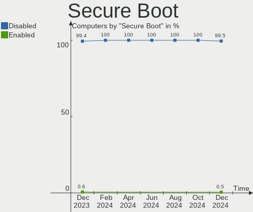
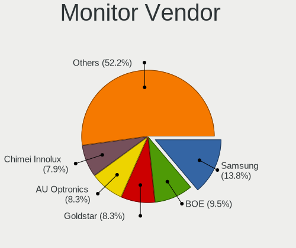
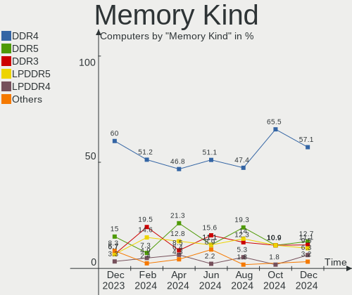

Pop!_OS Hardware Trends
-----------------------

A project to identify most popular hardware characteristics and track their change
over time based on data collected by Pop!_OS users at https://Linux-Hardware.org.

Anyone can contribute to this report by the [hw-probe](https://github.com/linuxhw/hw-probe) tool:

    sudo -E hw-probe -all -upload

This is a report for all computer types. See also reports for [desktops](/Dist/Pop!_OS/Desktop/README.md) and [notebooks](/Dist/Pop!_OS/Notebook/README.md).

Full-feature report is available here: https://linux-hardware.org/?view=trends

Period: Nov, 2021.

Contents
--------

* [ System ](#system)
  - [ OS                       ](#os)
  - [ OS Family                ](#os-family)
  - [ Kernel                   ](#kernel)
  - [ Kernel Family            ](#kernel-family)
  - [ Kernel Major Ver.        ](#kernel-major-ver)
  - [ Arch                     ](#arch)
  - [ DE                       ](#de)
  - [ Display Server           ](#display-server)
  - [ Display Manager          ](#display-manager)
  - [ OS Lang                  ](#os-lang)
  - [ Boot Mode                ](#boot-mode)
  - [ Filesystem               ](#filesystem)
  - [ Part. scheme             ](#part-scheme)
  - [ Dual Boot with Linux/BSD ](#dual-boot-with-linuxbsd)
  - [ Dual Boot (Win)          ](#dual-boot-win)

* [ Board ](#board)
  - [ Vendor                   ](#vendor)
  - [ Model                    ](#model)
  - [ Model Family             ](#model-family)
  - [ MFG Year                 ](#mfg-year)
  - [ Form Factor              ](#form-factor)
  - [ Secure Boot              ](#secure-boot)
  - [ Coreboot                 ](#coreboot)
  - [ RAM Size                 ](#ram-size)
  - [ RAM Used                 ](#ram-used)
  - [ Total Drives             ](#total-drives)
  - [ Has CD-ROM               ](#has-cd-rom)
  - [ Has Ethernet             ](#has-ethernet)
  - [ Has WiFi                 ](#has-wifi)
  - [ Has Bluetooth            ](#has-bluetooth)

* [ Location ](#location)
  - [ Country                  ](#country)
  - [ City                     ](#city)

* [ Drives ](#drives)
  - [ Drive Vendor             ](#drive-vendor)
  - [ Drive Model              ](#drive-model)
  - [ HDD Vendor               ](#hdd-vendor)
  - [ SSD Vendor               ](#ssd-vendor)
  - [ Drive Kind               ](#drive-kind)
  - [ Drive Connector          ](#drive-connector)
  - [ Drive Size               ](#drive-size)
  - [ Space Total              ](#space-total)
  - [ Space Used               ](#space-used)
  - [ Malfunc. Drives          ](#malfunc-drives)
  - [ Malfunc. Drive Vendor    ](#malfunc-drive-vendor)
  - [ Malfunc. HDD Vendor      ](#malfunc-hdd-vendor)
  - [ Malfunc. Drive Kind      ](#malfunc-drive-kind)
  - [ Failed Drives            ](#failed-drives)
  - [ Failed Drive Vendor      ](#failed-drive-vendor)
  - [ Drive Status             ](#drive-status)

* [ Storage controller ](#storage-controller)
  - [ Storage Vendor           ](#storage-vendor)
  - [ Storage Model            ](#storage-model)
  - [ Storage Kind             ](#storage-kind)

* [ Processor ](#processor)
  - [ CPU Vendor               ](#cpu-vendor)
  - [ CPU Model                ](#cpu-model)
  - [ CPU Model Family         ](#cpu-model-family)
  - [ CPU Cores                ](#cpu-cores)
  - [ CPU Sockets              ](#cpu-sockets)
  - [ CPU Threads              ](#cpu-threads)
  - [ CPU Op-Modes             ](#cpu-op-modes)
  - [ CPU Microcode            ](#cpu-microcode)
  - [ CPU Microarch            ](#cpu-microarch)

* [ Graphics ](#graphics)
  - [ GPU Vendor               ](#gpu-vendor)
  - [ GPU Model                ](#gpu-model)
  - [ GPU Combo                ](#gpu-combo)
  - [ GPU Driver               ](#gpu-driver)
  - [ GPU Memory               ](#gpu-memory)

* [ Monitor ](#monitor)
  - [ Monitor Vendor           ](#monitor-vendor)
  - [ Monitor Model            ](#monitor-model)
  - [ Monitor Resolution       ](#monitor-resolution)
  - [ Monitor Diagonal         ](#monitor-diagonal)
  - [ Monitor Width            ](#monitor-width)
  - [ Aspect Ratio             ](#aspect-ratio)
  - [ Monitor Area             ](#monitor-area)
  - [ Pixel Density            ](#pixel-density)
  - [ Multiple Monitors        ](#multiple-monitors)

* [ Network ](#network)
  - [ Net Controller Vendor    ](#net-controller-vendor)
  - [ Net Controller Model     ](#net-controller-model)
  - [ Wireless Vendor          ](#wireless-vendor)
  - [ Wireless Model           ](#wireless-model)
  - [ Ethernet Vendor          ](#ethernet-vendor)
  - [ Ethernet Model           ](#ethernet-model)
  - [ Net Controller Kind      ](#net-controller-kind)
  - [ Used Controller          ](#used-controller)
  - [ NICs                     ](#nics)
  - [ IPv6                     ](#ipv6)

* [ Bluetooth ](#bluetooth)
  - [ Bluetooth Vendor         ](#bluetooth-vendor)
  - [ Bluetooth Model          ](#bluetooth-model)

* [ Sound ](#sound)
  - [ Sound Vendor             ](#sound-vendor)
  - [ Sound Model              ](#sound-model)

* [ Memory ](#memory)
  - [ Memory Vendor            ](#memory-vendor)
  - [ Memory Model             ](#memory-model)
  - [ Memory Kind              ](#memory-kind)
  - [ Memory Form Factor       ](#memory-form-factor)
  - [ Memory Size              ](#memory-size)
  - [ Memory Speed             ](#memory-speed)

* [ Printers & scanners ](#printers--scanners)
  - [ Printer Vendor           ](#printer-vendor)
  - [ Printer Model            ](#printer-model)
  - [ Scanner Vendor           ](#scanner-vendor)
  - [ Scanner Model            ](#scanner-model)

* [ Camera ](#camera)
  - [ Camera Vendor            ](#camera-vendor)
  - [ Camera Model             ](#camera-model)

* [ Security ](#security)
  - [ Fingerprint Vendor       ](#fingerprint-vendor)
  - [ Fingerprint Model        ](#fingerprint-model)
  - [ Chipcard Vendor          ](#chipcard-vendor)
  - [ Chipcard Model           ](#chipcard-model)

* [ Unsupported ](#unsupported)
  - [ Unsupported Devices      ](#unsupported-devices)
  - [ Unsupported Device Types ](#unsupported-device-types)

System
------

OS
--

Installed operating systems

| Name          | Computers | Percent |
|---------------|-----------|---------|
| Pop!_OS 21.04 | 368       | 87.41%  |
| Pop!_OS 20.04 | 43        | 10.21%  |
| Pop!_OS 21.10 | 6         | 1.43%   |
| Pop!_OS 20.10 | 4         | 0.95%   |

OS Family
---------

OS without a version

| Name    | Computers | Percent |
|---------|-----------|---------|
| Pop!_OS | 421       | 100%    |

Kernel
------

Version of the Linux kernel

| Version                    | Computers | Percent |
|----------------------------|-----------|---------|
| 5.13.0-7620-generic        | 356       | 84.56%  |
| 5.13.0-7614-generic        | 33        | 7.84%   |
| 5.11.0-7620-generic        | 12        | 2.85%   |
| 5.11.0-7633-generic        | 6         | 1.43%   |
| 5.15.2-76051502-generic    | 3         | 0.71%   |
| 5.15.0-76051500-generic    | 2         | 0.48%   |
| 5.15.4-xanmod1             | 1         | 0.24%   |
| 5.15.4-76051504-generic    | 1         | 0.24%   |
| 5.15.3-051503-generic      | 1         | 0.24%   |
| 5.14.20-xanmod1            | 1         | 0.24%   |
| 5.14.18-xanmod1            | 1         | 0.24%   |
| 5.14.15-xanmod1            | 1         | 0.24%   |
| 5.14.0-17.1-liquorix-amd64 | 1         | 0.24%   |
| 5.11.0-7614-generic        | 1         | 0.24%   |
| 5.11.0-7612-generic        | 1         | 0.24%   |

Kernel Family
-------------

Linux kernel without a distro release

| Version | Computers | Percent |
|---------|-----------|---------|
| 5.13.0  | 389       | 92.4%   |
| 5.11.0  | 20        | 4.75%   |
| 5.15.2  | 3         | 0.71%   |
| 5.15.4  | 2         | 0.48%   |
| 5.15.0  | 2         | 0.48%   |
| 5.15.3  | 1         | 0.24%   |
| 5.14.20 | 1         | 0.24%   |
| 5.14.18 | 1         | 0.24%   |
| 5.14.15 | 1         | 0.24%   |
| 5.14.0  | 1         | 0.24%   |

Kernel Major Ver.
-----------------

Linux kernel major version

| Version | Computers | Percent |
|---------|-----------|---------|
| 5.13    | 389       | 92.4%   |
| 5.11    | 20        | 4.75%   |
| 5.15    | 8         | 1.9%    |
| 5.14    | 4         | 0.95%   |

Arch
----

OS architecture (x86_64, i586, etc.)

| Name   | Computers | Percent |
|--------|-----------|---------|
| x86_64 | 421       | 100%    |

DE
--

Desktop Environment

| Name       | Computers | Percent |
|------------|-----------|---------|
| GNOME      | 411       | 97.62%  |
| KDE5       | 4         | 0.95%   |
| Unknown    | 3         | 0.71%   |
| X-Cinnamon | 2         | 0.48%   |
| KDE        | 1         | 0.24%   |

Display Server
--------------

X11 or Wayland

| Name    | Computers | Percent |
|---------|-----------|---------|
| X11     | 413       | 98.1%   |
| Wayland | 8         | 1.9%    |

Display Manager
---------------

SDDM, LightDM, etc.

| Name    | Computers | Percent |
|---------|-----------|---------|
| Unknown | 358       | 85.04%  |
| GDM     | 61        | 14.49%  |
| GDM3    | 2         | 0.48%   |

OS Lang
-------

Language

| Lang    | Computers | Percent |
|---------|-----------|---------|
| en_US   | 237       | 56.29%  |
| en_GB   | 28        | 6.65%   |
| pt_BR   | 27        | 6.41%   |
| en_CA   | 16        | 3.8%    |
| de_DE   | 16        | 3.8%    |
| en_AU   | 15        | 3.56%   |
| C       | 11        | 2.61%   |
| fr_FR   | 8         | 1.9%    |
| es_ES   | 5         | 1.19%   |
| pt_PT   | 4         | 0.95%   |
| nl_NL   | 4         | 0.95%   |
| it_IT   | 4         | 0.95%   |
| fi_FI   | 4         | 0.95%   |
| ru_RU   | 3         | 0.71%   |
| en_ZA   | 3         | 0.71%   |
| en_IN   | 3         | 0.71%   |
| sv_SE   | 2         | 0.48%   |
| nb_NO   | 2         | 0.48%   |
| fr_CH   | 2         | 0.48%   |
| es_AR   | 2         | 0.48%   |
| en_IL   | 2         | 0.48%   |
| de_AT   | 2         | 0.48%   |
| Unknown | 2         | 0.48%   |
| zh_CN   | 1         | 0.24%   |
| sv_FI   | 1         | 0.24%   |
| pl_PL   | 1         | 0.24%   |
| lv_LV   | 1         | 0.24%   |
| ks_IN   | 1         | 0.24%   |
| jv_ID   | 1         | 0.24%   |
| ja_JP   | 1         | 0.24%   |
| hu_HU   | 1         | 0.24%   |
| he_IL   | 1         | 0.24%   |
| fr_LU   | 1         | 0.24%   |
| fr_BE   | 1         | 0.24%   |
| es_CR   | 1         | 0.24%   |
| es_CO   | 1         | 0.24%   |
| es_CL   | 1         | 0.24%   |
| en_NZ   | 1         | 0.24%   |
| en_DK   | 1         | 0.24%   |
| de_CH   | 1         | 0.24%   |
| cs_CZ   | 1         | 0.24%   |
| ar_EG   | 1         | 0.24%   |

Boot Mode
---------

EFI or BIOS

| Mode | Computers | Percent |
|------|-----------|---------|
| BIOS | 357       | 84.8%   |
| EFI  | 64        | 15.2%   |

Filesystem
----------

Type of filesystem

| Type    | Computers | Percent |
|---------|-----------|---------|
| Ext4    | 404       | 95.96%  |
| Btrfs   | 9         | 2.14%   |
| Overlay | 6         | 1.43%   |
| Xfs     | 2         | 0.48%   |

Part. scheme
------------

Scheme of partitioning

| Type    | Computers | Percent |
|---------|-----------|---------|
| Unknown | 355       | 84.32%  |
| GPT     | 63        | 14.96%  |
| MBR     | 3         | 0.71%   |

Dual Boot with Linux/BSD
------------------------

Hosting more than one Linux/BSD

| Dual boot | Computers | Percent |
|-----------|-----------|---------|
| No        | 413       | 98.1%   |
| Yes       | 8         | 1.9%    |

Dual Boot (Win)
---------------

Hosting Linux and Windows

| Dual boot | Computers | Percent |
|-----------|-----------|---------|
| No        | 394       | 93.59%  |
| Yes       | 27        | 6.41%   |

Board
-----

Vendor
------

Motherboard manufacturer

| Name                | Computers | Percent |
|---------------------|-----------|---------|
| ASUSTek Computer    | 71        | 16.86%  |
| Dell                | 62        | 14.73%  |
| Lenovo              | 53        | 12.59%  |
| Hewlett-Packard     | 44        | 10.45%  |
| MSI                 | 38        | 9.03%   |
| Gigabyte Technology | 35        | 8.31%   |
| Acer                | 20        | 4.75%   |
| ASRock              | 15        | 3.56%   |
| Apple               | 15        | 3.56%   |
| System76            | 8         | 1.9%    |
| Intel               | 7         | 1.66%   |
| Samsung Electronics | 5         | 1.19%   |
| Microsoft           | 5         | 1.19%   |
| Toshiba             | 4         | 0.95%   |
| Sony                | 4         | 0.95%   |
| OEM                 | 3         | 0.71%   |
| Fujitsu             | 3         | 0.71%   |
| Supermicro          | 2         | 0.48%   |
| HUAWEI              | 2         | 0.48%   |
| Google              | 2         | 0.48%   |
| ECS                 | 2         | 0.48%   |
| YJKC                | 1         | 0.24%   |
| TUXEDO              | 1         | 0.24%   |
| Teclast             | 1         | 0.24%   |
| Shuttle             | 1         | 0.24%   |
| Pegatron            | 1         | 0.24%   |
| PC Specialist       | 1         | 0.24%   |
| Notebook            | 1         | 0.24%   |
| Minix               | 1         | 0.24%   |
| Megaware            | 1         | 0.24%   |
| LG Electronics      | 1         | 0.24%   |
| Jumper              | 1         | 0.24%   |
| HOUTER              | 1         | 0.24%   |
| GPU Company         | 1         | 0.24%   |
| Framework           | 1         | 0.24%   |
| ENTITY              | 1         | 0.24%   |
| Clevo               | 1         | 0.24%   |
| Biostar             | 1         | 0.24%   |
| AWOW                | 1         | 0.24%   |
| Alienware           | 1         | 0.24%   |
| AFTERSHOCK PC       | 1         | 0.24%   |
| Unknown             | 1         | 0.24%   |

Model
-----

Motherboard model

| Name                                   | Computers | Percent |
|----------------------------------------|-----------|---------|
| Gigabyte B450M DS3H                    | 4         | 0.95%   |
| ASUS All Series                        | 4         | 0.95%   |
| System76 Darter Pro                    | 3         | 0.71%   |
| HP Pavilion dv6                        | 3         | 0.71%   |
| Dell XPS 13 9310                       | 3         | 0.71%   |
| Dell OptiPlex 9020                     | 3         | 0.71%   |
| ASUS PRIME Z390-A                      | 3         | 0.71%   |
| System76 Thelio                        | 2         | 0.48%   |
| System76 Lemur Pro                     | 2         | 0.48%   |
| MSI MS-7C02                            | 2         | 0.48%   |
| MSI MS-7B79                            | 2         | 0.48%   |
| MSI MS-7B22                            | 2         | 0.48%   |
| Microsoft Surface Pro 3                | 2         | 0.48%   |
| Lenovo Yoga 7 14ITL5 82BH              | 2         | 0.48%   |
| Lenovo IdeaPad 330-15IKB 81FE          | 2         | 0.48%   |
| Intel H61                              | 2         | 0.48%   |
| HP Compaq 8200 Elite SFF PC            | 2         | 0.48%   |
| Gigabyte TRX40 AORUS PRO WIFI          | 2         | 0.48%   |
| Gigabyte B450 I AORUS PRO WIFI         | 2         | 0.48%   |
| Dell OptiPlex 390                      | 2         | 0.48%   |
| Dell G5 5590                           | 2         | 0.48%   |
| ASUS VivoBook_ASUSLaptop X509DA_D509DA | 2         | 0.48%   |
| ASUS TUF GAMING Z490-PLUS              | 2         | 0.48%   |
| ASUS ROG STRIX X570-F GAMING           | 2         | 0.48%   |
| ASUS ROG STRIX X570-E GAMING           | 2         | 0.48%   |
| ASUS ROG STRIX B550-F GAMING           | 2         | 0.48%   |
| ASUS ROG STRIX B450-F GAMING           | 2         | 0.48%   |
| ASRock Z170 Gaming K4                  | 2         | 0.48%   |
| ASRock B450M Steel Legend              | 2         | 0.48%   |
| ASRock A320M-HDV R4.0                  | 2         | 0.48%   |
| Apple MacBookPro9,2                    | 2         | 0.48%   |
| Unknown                                | 2         | 0.48%   |
| YJKC vBook                             | 1         | 0.24%   |
| TUXEDO InfinityBook S 14 v5            | 1         | 0.24%   |
| Toshiba Satellite P50-C                | 1         | 0.24%   |
| Toshiba Satellite L775D                | 1         | 0.24%   |
| Toshiba Satellite C660                 | 1         | 0.24%   |
| Toshiba Satellite A355                 | 1         | 0.24%   |
| Teclast F6 Plus                        | 1         | 0.24%   |
| System76 Galago Pro                    | 1         | 0.24%   |
| Supermicro X9DRi-LN4+/X9DR3-LN4+       | 1         | 0.24%   |
| Supermicro X10DAi                      | 1         | 0.24%   |
| Sony VPCZ12V9R                         | 1         | 0.24%   |
| Sony VPCF24C5E                         | 1         | 0.24%   |
| Sony VPCEJ2L1E                         | 1         | 0.24%   |
| Sony VPCEJ2J1E                         | 1         | 0.24%   |
| Shuttle SG41                           | 1         | 0.24%   |
| Samsung RF511/RF411/RF711              | 1         | 0.24%   |
| Samsung Q430/Q530                      | 1         | 0.24%   |
| Samsung 550XDA                         | 1         | 0.24%   |
| Samsung 370E4K                         | 1         | 0.24%   |
| Samsung 270E5J/2570EJ                  | 1         | 0.24%   |
| Pegatron 320-1030                      | 1         | 0.24%   |
| PC Specialist X170SM                   | 1         | 0.24%   |
| OEM Intel H81                          | 1         | 0.24%   |
| OEM I38II                              | 1         | 0.24%   |
| OEM G41 775 ICH7 8712                  | 1         | 0.24%   |
| Notebook PA70ES                        | 1         | 0.24%   |
| MSI Pro 3000/3080                      | 1         | 0.24%   |
| MSI MS-7C95                            | 1         | 0.24%   |

Model Family
------------

Motherboard model prefix

| Name                  | Computers | Percent |
|-----------------------|-----------|---------|
| Lenovo ThinkPad       | 18        | 4.28%   |
| ASUS ROG              | 18        | 4.28%   |
| Acer Aspire           | 15        | 3.56%   |
| Dell XPS              | 13        | 3.09%   |
| Dell OptiPlex         | 12        | 2.85%   |
| Dell Inspiron         | 11        | 2.61%   |
| Lenovo IdeaPad        | 10        | 2.38%   |
| Dell Latitude         | 10        | 2.38%   |
| ASUS PRIME            | 10        | 2.38%   |
| HP Pavilion           | 9         | 2.14%   |
| HP ProBook            | 7         | 1.66%   |
| HP Compaq             | 6         | 1.43%   |
| Gigabyte B450M        | 6         | 1.43%   |
| Microsoft Surface     | 5         | 1.19%   |
| HP EliteBook          | 5         | 1.19%   |
| Dell Precision        | 5         | 1.19%   |
| ASUS TUF              | 5         | 1.19%   |
| Toshiba Satellite     | 4         | 0.95%   |
| Lenovo Yoga           | 4         | 0.95%   |
| Lenovo Legion         | 4         | 0.95%   |
| Lenovo IdeaCentre     | 4         | 0.95%   |
| HP Laptop             | 4         | 0.95%   |
| ASUS VivoBook         | 4         | 0.95%   |
| ASUS All              | 4         | 0.95%   |
| System76 Darter       | 3         | 0.71%   |
| Lenovo ThinkCentre    | 3         | 0.71%   |
| HP ZBook              | 3         | 0.71%   |
| Gigabyte Z390         | 3         | 0.71%   |
| Dell Vostro           | 3         | 0.71%   |
| Dell G5               | 3         | 0.71%   |
| ASUS ASUS             | 3         | 0.71%   |
| ASRock B450M          | 3         | 0.71%   |
| Apple MacBookPro9     | 3         | 0.71%   |
| System76 Thelio       | 2         | 0.48%   |
| System76 Lemur        | 2         | 0.48%   |
| MSI MS-7C02           | 2         | 0.48%   |
| MSI MS-7B79           | 2         | 0.48%   |
| MSI MS-7B22           | 2         | 0.48%   |
| MSI GF63              | 2         | 0.48%   |
| Lenovo ThinkBook      | 2         | 0.48%   |
| Intel H61             | 2         | 0.48%   |
| HP OMEN               | 2         | 0.48%   |
| HP ENVY               | 2         | 0.48%   |
| Gigabyte TRX40        | 2         | 0.48%   |
| Gigabyte B450         | 2         | 0.48%   |
| Gigabyte AB350-Gaming | 2         | 0.48%   |
| Fujitsu LIFEBOOK      | 2         | 0.48%   |
| ASRock Z170           | 2         | 0.48%   |
| ASRock B450           | 2         | 0.48%   |
| ASRock A320M-HDV      | 2         | 0.48%   |
| Apple MacBookPro11    | 2         | 0.48%   |
| Apple iMac16          | 2         | 0.48%   |
| Unknown               | 2         | 0.48%   |
| YJKC vBook            | 1         | 0.24%   |
| TUXEDO InfinityBook   | 1         | 0.24%   |
| Teclast F6            | 1         | 0.24%   |
| System76 Galago       | 1         | 0.24%   |
| Supermicro X9DRi-LN4+ | 1         | 0.24%   |
| Supermicro X10DAi     | 1         | 0.24%   |
| Sony VPCZ12V9R        | 1         | 0.24%   |

MFG Year
--------

Motherboard manufacture year

| Year | Computers | Percent |
|------|-----------|---------|
| 2021 | 115       | 27.32%  |
| 2020 | 58        | 13.78%  |
| 2019 | 45        | 10.69%  |
| 2018 | 35        | 8.31%   |
| 2013 | 32        | 7.6%    |
| 2012 | 24        | 5.7%    |
| 2015 | 21        | 4.99%   |
| 2011 | 21        | 4.99%   |
| 2017 | 19        | 4.51%   |
| 2014 | 17        | 4.04%   |
| 2016 | 13        | 3.09%   |
| 2010 | 7         | 1.66%   |
| 2009 | 7         | 1.66%   |
| 2008 | 6         | 1.43%   |
| 2007 | 1         | 0.24%   |

Form Factor
-----------

Physical design of the computer

| Name        | Computers | Percent |
|-------------|-----------|---------|
| Notebook    | 215       | 51.07%  |
| Desktop     | 179       | 42.52%  |
| All in one  | 8         | 1.9%    |
| Convertible | 7         | 1.66%   |
| Tablet      | 5         | 1.19%   |
| Mini pc     | 5         | 1.19%   |
| Server      | 2         | 0.48%   |

Secure Boot
-----------

Enabled or disabled

| State    | Computers | Percent |
|----------|-----------|---------|
| Disabled | 421       | 100%    |

Coreboot
--------

Have coreboot on board

| Used | Computers | Percent |
|------|-----------|---------|
| No   | 413       | 98.1%   |
| Yes  | 8         | 1.9%    |

RAM Size
--------

Total RAM memory

| Size in GB  | Computers | Percent |
|-------------|-----------|---------|
| 16.01-24.0  | 117       | 27.79%  |
| 4.01-8.0    | 88        | 20.9%   |
| 8.01-16.0   | 76        | 18.05%  |
| 32.01-64.0  | 61        | 14.49%  |
| 3.01-4.0    | 51        | 12.11%  |
| 64.01-256.0 | 11        | 2.61%   |
| 24.01-32.0  | 10        | 2.38%   |
| 1.01-2.0    | 5         | 1.19%   |
| 2.01-3.0    | 2         | 0.48%   |

RAM Used
--------

Used RAM memory

| Used GB    | Computers | Percent |
|------------|-----------|---------|
| 2.01-3.0   | 140       | 33.25%  |
| 1.01-2.0   | 135       | 32.07%  |
| 4.01-8.0   | 66        | 15.68%  |
| 3.01-4.0   | 56        | 13.3%   |
| 8.01-16.0  | 22        | 5.23%   |
| 16.01-24.0 | 1         | 0.24%   |
| 0.51-1.0   | 1         | 0.24%   |

Total Drives
------------

Number of drives on board

| Drives | Computers | Percent |
|--------|-----------|---------|
| 1      | 234       | 55.58%  |
| 2      | 95        | 22.57%  |
| 3      | 48        | 11.4%   |
| 4      | 19        | 4.51%   |
| 5      | 15        | 3.56%   |
| 6      | 3         | 0.71%   |
| 0      | 3         | 0.71%   |
| 11     | 1         | 0.24%   |
| 9      | 1         | 0.24%   |
| 8      | 1         | 0.24%   |
| 7      | 1         | 0.24%   |

Has CD-ROM
----------

Has CD-ROM on board

| Presented | Computers | Percent |
|-----------|-----------|---------|
| No        | 283       | 67.22%  |
| Yes       | 138       | 32.78%  |

Has Ethernet
------------

Has Ethernet on board

| Presented | Computers | Percent |
|-----------|-----------|---------|
| Yes       | 372       | 88.36%  |
| No        | 49        | 11.64%  |

Has WiFi
--------

Has WiFi module

| Presented | Computers | Percent |
|-----------|-----------|---------|
| Yes       | 334       | 79.33%  |
| No        | 87        | 20.67%  |

Has Bluetooth
-------------

Has Bluetooth module

| Presented | Computers | Percent |
|-----------|-----------|---------|
| Yes       | 279       | 66.27%  |
| No        | 142       | 33.73%  |

Location
--------

Country
-------

Geographic location (country)

| Country                | Computers | Percent |
|------------------------|-----------|---------|
| USA                    | 132       | 31.35%  |
| Brazil                 | 40        | 9.5%    |
| Germany                | 24        | 5.7%    |
| Canada                 | 24        | 5.7%    |
| Australia              | 18        | 4.28%   |
| UK                     | 15        | 3.56%   |
| France                 | 14        | 3.33%   |
| India                  | 11        | 2.61%   |
| Finland                | 9         | 2.14%   |
| Sweden                 | 8         | 1.9%    |
| Netherlands            | 8         | 1.9%    |
| Italy                  | 8         | 1.9%    |
| Norway                 | 6         | 1.43%   |
| Switzerland            | 5         | 1.19%   |
| Russia                 | 5         | 1.19%   |
| Romania                | 5         | 1.19%   |
| Spain                  | 4         | 0.95%   |
| South Africa           | 4         | 0.95%   |
| Portugal               | 4         | 0.95%   |
| New Zealand            | 4         | 0.95%   |
| Israel                 | 4         | 0.95%   |
| Greece                 | 4         | 0.95%   |
| Czechia                | 4         | 0.95%   |
| Austria                | 4         | 0.95%   |
| Argentina              | 4         | 0.95%   |
| Poland                 | 3         | 0.71%   |
| Indonesia              | 3         | 0.71%   |
| Denmark                | 3         | 0.71%   |
| Colombia               | 3         | 0.71%   |
| Philippines            | 2         | 0.48%   |
| Mexico                 | 2         | 0.48%   |
| Lithuania              | 2         | 0.48%   |
| Latvia                 | 2         | 0.48%   |
| Japan                  | 2         | 0.48%   |
| Hungary                | 2         | 0.48%   |
| Egypt                  | 2         | 0.48%   |
| Croatia                | 2         | 0.48%   |
| Bulgaria               | 2         | 0.48%   |
| Bosnia and Herzegovina | 2         | 0.48%   |
| Belgium                | 2         | 0.48%   |
| Thailand               | 1         | 0.24%   |
| Slovenia               | 1         | 0.24%   |
| Pakistan               | 1         | 0.24%   |
| Morocco                | 1         | 0.24%   |
| Malaysia               | 1         | 0.24%   |
| Luxembourg             | 1         | 0.24%   |
| Lebanon                | 1         | 0.24%   |
| Jordan                 | 1         | 0.24%   |
| Jersey                 | 1         | 0.24%   |
| Iceland                | 1         | 0.24%   |
| Hong Kong              | 1         | 0.24%   |
| Ghana                  | 1         | 0.24%   |
| Czech Republic         | 1         | 0.24%   |
| Costa Rica             | 1         | 0.24%   |
| China                  | 1         | 0.24%   |
| Chile                  | 1         | 0.24%   |
| Cape Verde             | 1         | 0.24%   |
| Bolivia                | 1         | 0.24%   |
| Bangladesh             | 1         | 0.24%   |

City
----

Geographic location (city)

| City            | Computers | Percent |
|-----------------|-----------|---------|
| S??o Paulo      | 7         | 1.66%   |
| New York        | 5         | 1.19%   |
| Warsaw          | 4         | 0.95%   |
| Oslo            | 4         | 0.95%   |
| Montreal        | 4         | 0.95%   |
| Melbourne       | 4         | 0.95%   |
| Adelaide CBD    | 4         | 0.95%   |
| Zurich          | 3         | 0.71%   |
| Sydney          | 3         | 0.71%   |
| St. Petersburg  | 3         | 0.71%   |
| London          | 3         | 0.71%   |
| Jakarta         | 3         | 0.71%   |
| Helsinki        | 3         | 0.71%   |
| Athens          | 3         | 0.71%   |
| Zagreb          | 2         | 0.48%   |
| Worcester       | 2         | 0.48%   |
| Waiuku          | 2         | 0.48%   |
| Virginia Beach  | 2         | 0.48%   |
| Vantaa          | 2         | 0.48%   |
| Vancouver       | 2         | 0.48%   |
| Tel Aviv        | 2         | 0.48%   |
| St Louis        | 2         | 0.48%   |
| Sandy           | 2         | 0.48%   |
| Rostock         | 2         | 0.48%   |
| Riga            | 2         | 0.48%   |
| Prague          | 2         | 0.48%   |
| Perth           | 2         | 0.48%   |
| Parker          | 2         | 0.48%   |
| Paris           | 2         | 0.48%   |
| Orlando         | 2         | 0.48%   |
| Moscow          | 2         | 0.48%   |
| Malmo           | 2         | 0.48%   |
| Madison         | 2         | 0.48%   |
| Edmonton        | 2         | 0.48%   |
| Denver          | 2         | 0.48%   |
| Caruaru         | 2         | 0.48%   |
| Buenos Aires    | 2         | 0.48%   |
| Budapest        | 2         | 0.48%   |
| Brisbane        | 2         | 0.48%   |
| Berlin          | 2         | 0.48%   |
| Belo Horizonte  | 2         | 0.48%   |
| Banja Luka      | 2         | 0.48%   |
| Baden           | 2         | 0.48%   |
| Yorktown        | 1         | 0.24%   |
| Yel'tsovka      | 1         | 0.24%   |
| Yekaterinburg   | 1         | 0.24%   |
| Wuhan           | 1         | 0.24%   |
| Winterswijk     | 1         | 0.24%   |
| Winnipeg        | 1         | 0.24%   |
| Wilmington      | 1         | 0.24%   |
| Wichita         | 1         | 0.24%   |
| Westwood        | 1         | 0.24%   |
| Westmont        | 1         | 0.24%   |
| West Palm Beach | 1         | 0.24%   |
| West Jordan     | 1         | 0.24%   |
| West Cowes      | 1         | 0.24%   |
| Wenonah         | 1         | 0.24%   |
| Wels            | 1         | 0.24%   |
| Weatherford     | 1         | 0.24%   |
| Waterford       | 1         | 0.24%   |

Drives
------

Drive Vendor
------------

Hard drive vendors

| Vendor                         | Computers | Drives | Percent |
|--------------------------------|-----------|--------|---------|
| Samsung Electronics            | 116       | 151    | 17.58%  |
| Seagate                        | 98        | 121    | 14.85%  |
| WDC                            | 91        | 111    | 13.79%  |
| SanDisk                        | 49        | 50     | 7.42%   |
| Toshiba                        | 31        | 32     | 4.7%    |
| Kingston                       | 30        | 31     | 4.55%   |
| Intel                          | 30        | 32     | 4.55%   |
| SK Hynix                       | 22        | 25     | 3.33%   |
| Unknown                        | 16        | 18     | 2.42%   |
| Phison                         | 15        | 18     | 2.27%   |
| Hitachi                        | 15        | 16     | 2.27%   |
| Crucial                        | 14        | 16     | 2.12%   |
| HGST                           | 13        | 13     | 1.97%   |
| PNY                            | 11        | 13     | 1.67%   |
| China                          | 11        | 12     | 1.67%   |
| A-DATA Technology              | 11        | 12     | 1.67%   |
| Apple                          | 10        | 10     | 1.52%   |
| Silicon Motion                 | 6         | 7      | 0.91%   |
| Micron/Crucial Technology      | 6         | 7      | 0.91%   |
| SPCC                           | 4         | 4      | 0.61%   |
| Lexar                          | 4         | 4      | 0.61%   |
| KingSpec                       | 4         | 4      | 0.61%   |
| XPG                            | 3         | 3      | 0.45%   |
| Patriot                        | 3         | 4      | 0.45%   |
| LITEON                         | 3         | 3      | 0.45%   |
| ADATA Technology               | 3         | 3      | 0.45%   |
| Shenzhen Longsys Electronics   | 2         | 2      | 0.3%    |
| Micron Technology              | 2         | 2      | 0.3%    |
| Hewlett-Packard                | 2         | 2      | 0.3%    |
| Gigabyte Technology            | 2         | 2      | 0.3%    |
| Fujitsu                        | 2         | 2      | 0.3%    |
| FORESEE                        | 2         | 2      | 0.3%    |
| Corsair                        | 2         | 2      | 0.3%    |
| Zheino                         | 1         | 1      | 0.15%   |
| ZEPLIN                         | 1         | 1      | 0.15%   |
| USB                            | 1         | 1      | 0.15%   |
| UMIS                           | 1         | 1      | 0.15%   |
| Transcend                      | 1         | 1      | 0.15%   |
| TO Exter                       | 1         | 1      | 0.15%   |
| Teclast                        | 1         | 1      | 0.15%   |
| Team                           | 1         | 1      | 0.15%   |
| T-FORCE                        | 1         | 1      | 0.15%   |
| SSSTC                          | 1         | 1      | 0.15%   |
| Solid State Storage Technology | 1         | 1      | 0.15%   |
| Realtek Semiconductor          | 1         | 1      | 0.15%   |
| Realtek                        | 1         | 1      | 0.15%   |
| OWC                            | 1         | 1      | 0.15%   |
| Netac                          | 1         | 1      | 0.15%   |
| LITEONIT                       | 1         | 1      | 0.15%   |
| KIOXIA                         | 1         | 1      | 0.15%   |
| KingDian                       | 1         | 1      | 0.15%   |
| Intenso                        | 1         | 1      | 0.15%   |
| Indilinx                       | 1         | 1      | 0.15%   |
| Hoodisk                        | 1         | 1      | 0.15%   |
| GOODRAM                        | 1         | 1      | 0.15%   |
| ExcelStor                      | 1         | 1      | 0.15%   |
| Enmotus                        | 1         | 1      | 0.15%   |
| EDGE                           | 1         | 1      | 0.15%   |
| ASMT                           | 1         | 4      | 0.15%   |
| Unknown                        | 1         | 2      | 0.15%   |

Drive Model
-----------

Hard drive models

| Model                                  | Computers | Percent |
|----------------------------------------|-----------|---------|
| Kingston SA400S37240G 240GB SSD        | 11        | 1.51%   |
| Samsung NVMe SSD Drive 1TB             | 9         | 1.23%   |
| Sandisk NVMe SSD Drive 500GB           | 8         | 1.1%    |
| Samsung SSD 850 EVO 250GB              | 7         | 0.96%   |
| Samsung SM963 2.5" NVMe PCIe SSD 250GB | 7         | 0.96%   |
| Samsung NVMe SSD Drive 500GB           | 7         | 0.96%   |
| Intel NVMe SSD Drive 512GB             | 7         | 0.96%   |
| SK Hynix NVMe SSD Drive 512GB          | 6         | 0.82%   |
| Seagate ST1000LM024 HN-M101MBB 1TB     | 6         | 0.82%   |
| Sandisk NVMe SSD Drive 256GB           | 6         | 0.82%   |
| Samsung SSD 850 EVO 500GB              | 6         | 0.82%   |
| PNY CS900 120GB SSD                    | 6         | 0.82%   |
| Kingston SUV400S37120G 120GB SSD       | 6         | 0.82%   |
| Intel NVMe SSD Drive 1024GB            | 6         | 0.82%   |
| Unknown MMC Card  64GB                 | 5         | 0.68%   |
| Toshiba MQ01ABD100 1TB                 | 5         | 0.68%   |
| Toshiba DT01ACA100 1TB                 | 5         | 0.68%   |
| Seagate ST4000DM004-2CV104 4TB         | 5         | 0.68%   |
| Seagate ST2000DM008-2FR102 2TB         | 5         | 0.68%   |
| Sandisk NVMe SSD Drive 1TB             | 5         | 0.68%   |
| Samsung NVMe SSD Drive 2TB             | 5         | 0.68%   |
| HGST HTS721010A9E630 1TB               | 5         | 0.68%   |
| Unknown MMC Card  128GB                | 4         | 0.55%   |
| Seagate ST500DM002-1BD142 500GB        | 4         | 0.55%   |
| Seagate ST1000LM035-1RK172 1TB         | 4         | 0.55%   |
| Seagate ST1000DM010-2EP102 1TB         | 4         | 0.55%   |
| SanDisk SSD PLUS 240GB                 | 4         | 0.55%   |
| Samsung NVMe SSD Drive 512GB           | 4         | 0.55%   |
| Phison NVMe SSD Drive 500GB            | 4         | 0.55%   |
| Micron/Crucial NVMe SSD Drive 500GB    | 4         | 0.55%   |
| Crucial CT500MX500SSD1 500GB           | 4         | 0.55%   |
| WDC WD5000AAKX-08U6AA0 500GB           | 3         | 0.41%   |
| WDC WD10EZEX-08WN4A0 1TB               | 3         | 0.41%   |
| Silicon Motion NVMe SSD Drive 512GB    | 3         | 0.41%   |
| Seagate ST9500325AS 500GB              | 3         | 0.41%   |
| Seagate ST500LT012-1DG142 500GB        | 3         | 0.41%   |
| Seagate ST2000DM006-2DM164 2TB         | 3         | 0.41%   |
| Seagate ST1000DM003-1ER162 1TB         | 3         | 0.41%   |
| Seagate Expansion 1TB                  | 3         | 0.41%   |
| SanDisk SSD PLUS 120GB                 | 3         | 0.41%   |
| Sandisk NVMe SSD Drive 512GB           | 3         | 0.41%   |
| Samsung SSD 870 QVO 1TB                | 3         | 0.41%   |
| Samsung SSD 860 EVO 500GB              | 3         | 0.41%   |
| Samsung SSD 860 EVO 1TB                | 3         | 0.41%   |
| Samsung SSD 850 PRO 256GB              | 3         | 0.41%   |
| Samsung NVMe SSD Drive 1024GB          | 3         | 0.41%   |
| Samsung HD502HI 500GB                  | 3         | 0.41%   |
| PNY CS900 480GB SSD                    | 3         | 0.41%   |
| Phison NVMe SSD Drive 1TB              | 3         | 0.41%   |
| Kingston SA400S37480G 480GB SSD        | 3         | 0.41%   |
| Intel NVMe SSD Drive 256GB             | 3         | 0.41%   |
| HGST HTS545050A7E680 500GB             | 3         | 0.41%   |
| Crucial CT1000BX500SSD1 1TB            | 3         | 0.41%   |
| WDC WDS500G2B0A-00SM50 500GB SSD       | 2         | 0.27%   |
| WDC WDS240G2G0B-00EPW0 240GB SSD       | 2         | 0.27%   |
| WDC WDBNCE5000PNC 500GB SSD            | 2         | 0.27%   |
| WDC WD5000LPVX-75V0TT0 500GB           | 2         | 0.27%   |
| WDC WD40EZRZ-22GXCB0 4TB               | 2         | 0.27%   |
| WDC WD40EZRZ-00GXCB0 4TB               | 2         | 0.27%   |
| WDC WD3200AAJS-00L7A0 320GB            | 2         | 0.27%   |

HDD Vendor
----------

Hard disk drive vendors

| Vendor              | Computers | Drives | Percent |
|---------------------|-----------|--------|---------|
| Seagate             | 92        | 111    | 38.02%  |
| WDC                 | 74        | 90     | 30.58%  |
| Toshiba             | 25        | 25     | 10.33%  |
| Hitachi             | 15        | 16     | 6.2%    |
| HGST                | 13        | 13     | 5.37%   |
| Samsung Electronics | 9         | 9      | 3.72%   |
| Apple               | 5         | 5      | 2.07%   |
| Unknown             | 2         | 2      | 0.83%   |
| Fujitsu             | 2         | 2      | 0.83%   |
| USB                 | 1         | 1      | 0.41%   |
| TO Exter            | 1         | 1      | 0.41%   |
| Hewlett-Packard     | 1         | 1      | 0.41%   |
| ExcelStor           | 1         | 1      | 0.41%   |
| ASMT                | 1         | 4      | 0.41%   |

SSD Vendor
----------

Solid state drive vendors

| Vendor              | Computers | Drives | Percent |
|---------------------|-----------|--------|---------|
| Samsung Electronics | 65        | 80     | 27.43%  |
| SanDisk             | 24        | 24     | 10.13%  |
| Kingston            | 24        | 25     | 10.13%  |
| WDC                 | 16        | 16     | 6.75%   |
| Crucial             | 14        | 16     | 5.91%   |
| Intel               | 12        | 12     | 5.06%   |
| PNY                 | 11        | 13     | 4.64%   |
| China               | 10        | 11     | 4.22%   |
| A-DATA Technology   | 9         | 10     | 3.8%    |
| Seagate             | 7         | 7      | 2.95%   |
| SK Hynix            | 6         | 6      | 2.53%   |
| SPCC                | 4         | 4      | 1.69%   |
| Lexar               | 4         | 4      | 1.69%   |
| KingSpec            | 4         | 4      | 1.69%   |
| Patriot             | 3         | 4      | 1.27%   |
| LITEON              | 3         | 3      | 1.27%   |
| Apple               | 3         | 3      | 1.27%   |
| FORESEE             | 2         | 2      | 0.84%   |
| Zheino              | 1         | 1      | 0.42%   |
| UMIS                | 1         | 1      | 0.42%   |
| Transcend           | 1         | 1      | 0.42%   |
| Teclast             | 1         | 1      | 0.42%   |
| Team                | 1         | 1      | 0.42%   |
| OWC                 | 1         | 1      | 0.42%   |
| Micron Technology   | 1         | 1      | 0.42%   |
| LITEONIT            | 1         | 1      | 0.42%   |
| KingDian            | 1         | 1      | 0.42%   |
| Intenso             | 1         | 1      | 0.42%   |
| Hoodisk             | 1         | 1      | 0.42%   |
| Hewlett-Packard     | 1         | 1      | 0.42%   |
| GOODRAM             | 1         | 1      | 0.42%   |
| Gigabyte Technology | 1         | 1      | 0.42%   |
| EDGE                | 1         | 1      | 0.42%   |
| Corsair             | 1         | 1      | 0.42%   |

Drive Kind
----------

HDD or SSD

| Kind    | Computers | Drives | Percent |
|---------|-----------|--------|---------|
| SSD     | 205       | 260    | 34.57%  |
| HDD     | 205       | 281    | 34.57%  |
| NVMe    | 162       | 200    | 27.32%  |
| MMC     | 12        | 12     | 2.02%   |
| Unknown | 9         | 12     | 1.52%   |

Drive Connector
---------------

SATA, SAS, NVMe, etc.

| Type | Computers | Drives | Percent |
|------|-----------|--------|---------|
| SATA | 321       | 520    | 61.49%  |
| NVMe | 162       | 199    | 31.03%  |
| SAS  | 27        | 34     | 5.17%   |
| MMC  | 12        | 12     | 2.3%    |

Drive Size
----------

Size of hard drive

| Size in TB | Computers | Drives | Percent |
|------------|-----------|--------|---------|
| 0.01-0.5   | 241       | 312    | 56.97%  |
| 0.51-1.0   | 125       | 155    | 29.55%  |
| 1.01-2.0   | 30        | 35     | 7.09%   |
| 3.01-4.0   | 16        | 24     | 3.78%   |
| 2.01-3.0   | 6         | 6      | 1.42%   |
| 4.01-10.0  | 5         | 9      | 1.18%   |

Space Total
-----------

Amount of disk space available on the file system

| Size in GB     | Computers | Percent |
|----------------|-----------|---------|
| 101-250        | 124       | 29.45%  |
| 251-500        | 105       | 24.94%  |
| 501-1000       | 77        | 18.29%  |
| 1001-2000      | 38        | 9.03%   |
| 51-100         | 21        | 4.99%   |
| More than 3000 | 20        | 4.75%   |
| 2001-3000      | 16        | 3.8%    |
| 1-20           | 9         | 2.14%   |
| 21-50          | 7         | 1.66%   |
| Unknown        | 4         | 0.95%   |

Space Used
----------

Amount of used disk space

| Used GB        | Computers | Percent |
|----------------|-----------|---------|
| 1-20           | 140       | 33.25%  |
| 21-50          | 88        | 20.9%   |
| 101-250        | 61        | 14.49%  |
| 51-100         | 50        | 11.88%  |
| 251-500        | 28        | 6.65%   |
| 501-1000       | 23        | 5.46%   |
| 1001-2000      | 14        | 3.33%   |
| More than 3000 | 8         | 1.9%    |
| 2001-3000      | 5         | 1.19%   |
| Unknown        | 4         | 0.95%   |

Malfunc. Drives
---------------

Drive models with a malfunction

| Model                                 | Computers | Drives | Percent |
|---------------------------------------|-----------|--------|---------|
| WDC WD3200AAJS-56M0A0 320GB           | 1         | 1      | 11.11%  |
| SK Hynix HFS256G3AMNB-2200A 256GB SSD | 1         | 1      | 11.11%  |
| Seagate ST2000DM001-1CH164 2TB        | 1         | 1      | 11.11%  |
| Seagate ST1500DL003-9VT16L 1TB        | 1         | 1      | 11.11%  |
| Samsung Electronics HD502HI 500GB     | 1         | 1      | 11.11%  |
| Crucial CT525MX300SSD4 528GB          | 1         | 1      | 11.11%  |
| Crucial CT256M550SSD1 256GB           | 1         | 1      | 11.11%  |
| Apple HDD HTS541010A9E662 1TB         | 1         | 1      | 11.11%  |
| A-DATA Technology SP900NS38 256GB SSD | 1         | 1      | 11.11%  |

Malfunc. Drive Vendor
---------------------

Vendors of faulty drives

| Vendor              | Computers | Drives | Percent |
|---------------------|-----------|--------|---------|
| Crucial             | 2         | 2      | 25%     |
| WDC                 | 1         | 1      | 12.5%   |
| SK Hynix            | 1         | 1      | 12.5%   |
| Seagate             | 1         | 2      | 12.5%   |
| Samsung Electronics | 1         | 1      | 12.5%   |
| Apple               | 1         | 1      | 12.5%   |
| A-DATA Technology   | 1         | 1      | 12.5%   |

Malfunc. HDD Vendor
-------------------

Vendors of faulty HDD drives

| Vendor              | Computers | Drives | Percent |
|---------------------|-----------|--------|---------|
| WDC                 | 1         | 1      | 25%     |
| Seagate             | 1         | 2      | 25%     |
| Samsung Electronics | 1         | 1      | 25%     |
| Apple               | 1         | 1      | 25%     |

Malfunc. Drive Kind
-------------------

Kinds of faulty drives

| Kind | Computers | Drives | Percent |
|------|-----------|--------|---------|
| SSD  | 4         | 4      | 57.14%  |
| HDD  | 3         | 5      | 42.86%  |

Failed Drives
-------------

Failed drive models

Zero info for selected period =(

Failed Drive Vendor
-------------------

Failed drive vendors

Zero info for selected period =(

Drive Status
------------

Number of failed and malfunc. drives

| Status   | Computers | Drives | Percent |
|----------|-----------|--------|---------|
| Detected | 359       | 662    | 83.1%   |
| Works    | 66        | 94     | 15.28%  |
| Malfunc  | 7         | 9      | 1.62%   |

Storage controller
------------------

Storage Vendor
--------------

Storage controller vendors

| Vendor                           | Computers | Percent |
|----------------------------------|-----------|---------|
| Intel                            | 294       | 50.78%  |
| AMD                              | 98        | 16.93%  |
| Samsung Electronics              | 59        | 10.19%  |
| Sandisk                          | 30        | 5.18%   |
| Phison Electronics               | 17        | 2.94%   |
| SK Hynix                         | 16        | 2.76%   |
| ASMedia Technology               | 8         | 1.38%   |
| Toshiba America Info Systems     | 7         | 1.21%   |
| Silicon Motion                   | 7         | 1.21%   |
| Micron/Crucial Technology        | 6         | 1.04%   |
| Kingston Technology Company      | 6         | 1.04%   |
| ADATA Technology                 | 6         | 1.04%   |
| Nvidia                           | 4         | 0.69%   |
| JMicron Technology               | 3         | 0.52%   |
| Solid State Storage Technology   | 2         | 0.35%   |
| Shenzhen Longsys Electronics     | 2         | 0.35%   |
| Realtek Semiconductor            | 2         | 0.35%   |
| Marvell Technology Group         | 2         | 0.35%   |
| Broadcom / LSI                   | 2         | 0.35%   |
| Apple                            | 2         | 0.35%   |
| VIA Technologies                 | 1         | 0.17%   |
| Silicon Integrated Systems [SiS] | 1         | 0.17%   |
| Seagate Technology               | 1         | 0.17%   |
| Micron Technology                | 1         | 0.17%   |
| Lite-On Technology               | 1         | 0.17%   |
| Enmotus                          | 1         | 0.17%   |

Storage Model
-------------

Storage controller models

| Model                                                                                   | Computers | Percent |
|-----------------------------------------------------------------------------------------|-----------|---------|
| AMD FCH SATA Controller [AHCI mode]                                                     | 74        | 11.35%  |
| Samsung NVMe SSD Controller SM981/PM981/PM983                                           | 32        | 4.91%   |
| AMD 400 Series Chipset SATA Controller                                                  | 29        | 4.45%   |
| Intel 8 Series/C220 Series Chipset Family 6-port SATA Controller 1 [AHCI mode]          | 22        | 3.37%   |
| Intel 82801 Mobile SATA Controller [RAID mode]                                          | 18        | 2.76%   |
| Intel 7 Series Chipset Family 6-port SATA Controller [AHCI mode]                        | 17        | 2.61%   |
| Intel Volume Management Device NVMe RAID Controller                                     | 16        | 2.45%   |
| Intel 6 Series/C200 Series Chipset Family 6 port Mobile SATA AHCI Controller            | 16        | 2.45%   |
| Intel 8 Series SATA Controller 1 [AHCI mode]                                            | 15        | 2.3%    |
| Intel Sunrise Point-LP SATA Controller [AHCI mode]                                      | 14        | 2.15%   |
| Sandisk WD Blue SN550 NVMe SSD                                                          | 13        | 1.99%   |
| Intel Cannon Lake Mobile PCH SATA AHCI Controller                                       | 13        | 1.99%   |
| Intel SSD 660P Series                                                                   | 12        | 1.84%   |
| Phison E12 NVMe Controller                                                              | 11        | 1.69%   |
| Intel Cannon Lake PCH SATA AHCI Controller                                              | 11        | 1.69%   |
| Intel 6 Series/C200 Series Chipset Family 6 port Desktop SATA AHCI Controller           | 11        | 1.69%   |
| SK Hynix Gold P31 SSD                                                                   | 10        | 1.53%   |
| Samsung NVMe SSD Controller SM961/PM961/SM963                                           | 10        | 1.53%   |
| Intel SATA Controller [RAID mode]                                                       | 10        | 1.53%   |
| Intel Comet Lake SATA AHCI Controller                                                   | 9         | 1.38%   |
| Samsung NVMe SSD Controller PM9A1/PM9A3/980PRO                                          | 8         | 1.23%   |
| Intel 82801IBM/IEM (ICH9M/ICH9M-E) 4 port SATA Controller [AHCI mode]                   | 8         | 1.23%   |
| Intel 7 Series/C210 Series Chipset Family 6-port SATA Controller [AHCI mode]            | 8         | 1.23%   |
| ASMedia ASM1062 Serial ATA Controller                                                   | 8         | 1.23%   |
| Intel Q170/Q150/B150/H170/H110/Z170/CM236 Chipset SATA Controller [AHCI Mode]           | 7         | 1.07%   |
| Intel 5 Series/3400 Series Chipset 4 port SATA AHCI Controller                          | 7         | 1.07%   |
| Intel 400 Series Chipset Family SATA AHCI Controller                                    | 7         | 1.07%   |
| Intel 200 Series PCH SATA controller [AHCI mode]                                        | 7         | 1.07%   |
| Sandisk WD Black SN750 / PC SN730 NVMe SSD                                              | 6         | 0.92%   |
| Samsung NVMe SSD Controller 980                                                         | 6         | 0.92%   |
| AMD Starship/Matisse Chipset SATA Controller [AHCI mode]                                | 6         | 0.92%   |
| Silicon Motion SM2263EN/SM2263XT SSD Controller                                         | 5         | 0.77%   |
| Phison E16 PCIe4 NVMe Controller                                                        | 5         | 0.77%   |
| Intel Wildcat Point-LP SATA Controller [AHCI Mode]                                      | 5         | 0.77%   |
| Intel HM170/QM170 Chipset SATA Controller [AHCI Mode]                                   | 5         | 0.77%   |
| Intel Celeron N3350/Pentium N4200/Atom E3900 Series SATA AHCI Controller                | 5         | 0.77%   |
| Intel 82801G (ICH7 Family) IDE Controller                                               | 5         | 0.77%   |
| Intel 6 Series/C200 Series Chipset Family Desktop SATA Controller (IDE mode, ports 4-5) | 5         | 0.77%   |
| Intel 6 Series/C200 Series Chipset Family Desktop SATA Controller (IDE mode, ports 0-3) | 5         | 0.77%   |
| AMD 300 Series Chipset SATA Controller                                                  | 5         | 0.77%   |
| Toshiba America Info Systems XG6 NVMe SSD Controller                                    | 4         | 0.61%   |
| Intel Tiger Lake-LP SATA Controller [AHCI mode]                                         | 4         | 0.61%   |
| Intel SSD Pro 7600p/760p/E 6100p Series                                                 | 4         | 0.61%   |
| Intel NM10/ICH7 Family SATA Controller [IDE mode]                                       | 4         | 0.61%   |
| Intel Cannon Point-LP SATA Controller [AHCI Mode]                                       | 4         | 0.61%   |
| Intel 9 Series Chipset Family SATA Controller [AHCI Mode]                               | 4         | 0.61%   |
| Toshiba America Info Systems Toshiba America Info Non-Volatile memory controller        | 3         | 0.46%   |
| Sandisk WD Blue SN500 / PC SN520 NVMe SSD                                               | 3         | 0.46%   |
| Sandisk Non-Volatile memory controller                                                  | 3         | 0.46%   |
| Micron/Crucial P2 NVMe PCIe SSD                                                         | 3         | 0.46%   |
| Intel Celeron/Pentium Silver Processor SATA Controller                                  | 3         | 0.46%   |
| Intel 82801JI (ICH10 Family) SATA AHCI Controller                                       | 3         | 0.46%   |
| AMD SB7x0/SB8x0/SB9x0 SATA Controller [IDE mode]                                        | 3         | 0.46%   |
| AMD SB7x0/SB8x0/SB9x0 IDE Controller                                                    | 3         | 0.46%   |
| AMD FCH SATA Controller D                                                               | 3         | 0.46%   |
| ADATA Non-Volatile memory controller                                                    | 3         | 0.46%   |
| Solid State Storage Non-Volatile memory controller                                      | 2         | 0.31%   |
| SK Hynix Non-Volatile memory controller                                                 | 2         | 0.31%   |
| SK Hynix BC511                                                                          | 2         | 0.31%   |
| Silicon Motion SM2262/SM2262EN SSD Controller                                           | 2         | 0.31%   |

Storage Kind
------------

Kind of storage controller (IDE, SATA, NVMe, SAS, ...)

| Kind | Computers | Percent |
|------|-----------|---------|
| SATA | 326       | 57.09%  |
| NVMe | 162       | 28.37%  |
| RAID | 47        | 8.23%   |
| IDE  | 33        | 5.78%   |
| SAS  | 3         | 0.53%   |

Processor
---------

CPU Vendor
----------

Processor vendors

| Vendor | Computers | Percent |
|--------|-----------|---------|
| Intel  | 308       | 73.16%  |
| AMD    | 113       | 26.84%  |

CPU Model
---------

Processor models

| Model                                       | Computers | Percent |
|---------------------------------------------|-----------|---------|
| Intel Core i7-9750H CPU @ 2.60GHz           | 8         | 1.9%    |
| Intel 11th Gen Core i7-1165G7 @ 2.80GHz     | 8         | 1.9%    |
| AMD Ryzen 5 3600 6-Core Processor           | 8         | 1.9%    |
| Intel Core i7-8750H CPU @ 2.20GHz           | 7         | 1.66%   |
| AMD Ryzen 7 3700X 8-Core Processor          | 7         | 1.66%   |
| Intel Core i7-9700K CPU @ 3.60GHz           | 6         | 1.43%   |
| Intel Core i5-6200U CPU @ 2.30GHz           | 6         | 1.43%   |
| Intel 11th Gen Core i5-1135G7 @ 2.40GHz     | 6         | 1.43%   |
| Intel Core i7-6700HQ CPU @ 2.60GHz          | 5         | 1.19%   |
| Intel Core i7-4510U CPU @ 2.00GHz           | 5         | 1.19%   |
| Intel Core i7-3770 CPU @ 3.40GHz            | 5         | 1.19%   |
| AMD Ryzen 7 4800H with Radeon Graphics      | 5         | 1.19%   |
| AMD Ryzen 5 5600X 6-Core Processor          | 5         | 1.19%   |
| Intel Core i7-10510U CPU @ 1.80GHz          | 4         | 0.95%   |
| Intel Core i5-8265U CPU @ 1.60GHz           | 4         | 0.95%   |
| Intel Core i5-7200U CPU @ 2.50GHz           | 4         | 0.95%   |
| Intel Core i5-6600K CPU @ 3.50GHz           | 4         | 0.95%   |
| Intel Core 2 Duo CPU E8400 @ 3.00GHz        | 4         | 0.95%   |
| Intel 11th Gen Core i7-1185G7 @ 3.00GHz     | 4         | 0.95%   |
| AMD Ryzen 5 5500U with Radeon Graphics      | 4         | 0.95%   |
| AMD Ryzen 5 3400G with Radeon Vega Graphics | 4         | 0.95%   |
| Intel Core i7-4770K CPU @ 3.50GHz           | 3         | 0.71%   |
| Intel Core i7-10750H CPU @ 2.60GHz          | 3         | 0.71%   |
| Intel Core i5-8250U CPU @ 1.60GHz           | 3         | 0.71%   |
| Intel Core i5-4200U CPU @ 1.60GHz           | 3         | 0.71%   |
| Intel Core i5-2520M CPU @ 2.50GHz           | 3         | 0.71%   |
| Intel Core i5-10210U CPU @ 1.60GHz          | 3         | 0.71%   |
| Intel Core i3-2120 CPU @ 3.30GHz            | 3         | 0.71%   |
| AMD Ryzen 9 5950X 16-Core Processor         | 3         | 0.71%   |
| AMD Ryzen 9 5900X 12-Core Processor         | 3         | 0.71%   |
| AMD Ryzen 9 3900X 12-Core Processor         | 3         | 0.71%   |
| AMD Ryzen 7 2700X Eight-Core Processor      | 3         | 0.71%   |
| AMD Ryzen 5 3600X 6-Core Processor          | 3         | 0.71%   |
| AMD Ryzen 5 2600 Six-Core Processor         | 3         | 0.71%   |
| Intel Pentium Dual-Core CPU T4300 @ 2.10GHz | 2         | 0.48%   |
| Intel Pentium CPU G630 @ 2.70GHz            | 2         | 0.48%   |
| Intel Pentium CPU B950 @ 2.10GHz            | 2         | 0.48%   |
| Intel Core i9-9900K CPU @ 3.60GHz           | 2         | 0.48%   |
| Intel Core i7-8550U CPU @ 1.80GHz           | 2         | 0.48%   |
| Intel Core i7-7700HQ CPU @ 2.80GHz          | 2         | 0.48%   |
| Intel Core i7-5500U CPU @ 2.40GHz           | 2         | 0.48%   |
| Intel Core i7-4790 CPU @ 3.60GHz            | 2         | 0.48%   |
| Intel Core i7-4770 CPU @ 3.40GHz            | 2         | 0.48%   |
| Intel Core i7-2640M CPU @ 2.80GHz           | 2         | 0.48%   |
| Intel Core i7-2630QM CPU @ 2.00GHz          | 2         | 0.48%   |
| Intel Core i7 CPU 860 @ 2.80GHz             | 2         | 0.48%   |
| Intel Core i5-7300U CPU @ 2.60GHz           | 2         | 0.48%   |
| Intel Core i5-6300U CPU @ 2.40GHz           | 2         | 0.48%   |
| Intel Core i5-4690 CPU @ 3.50GHz            | 2         | 0.48%   |
| Intel Core i5-4590 CPU @ 3.30GHz            | 2         | 0.48%   |
| Intel Core i5-4570 CPU @ 3.20GHz            | 2         | 0.48%   |
| Intel Core i5-4460 CPU @ 3.20GHz            | 2         | 0.48%   |
| Intel Core i5-3470 CPU @ 3.20GHz            | 2         | 0.48%   |
| Intel Core i5-3210M CPU @ 2.50GHz           | 2         | 0.48%   |
| Intel Core i5-2400 CPU @ 3.10GHz            | 2         | 0.48%   |
| Intel Core i5-1035G1 CPU @ 1.00GHz          | 2         | 0.48%   |
| Intel Core i5 CPU M 460 @ 2.53GHz           | 2         | 0.48%   |
| Intel Core i3-4030U CPU @ 1.90GHz           | 2         | 0.48%   |
| Intel Core i3-3240 CPU @ 3.40GHz            | 2         | 0.48%   |
| Intel Core i3-3120M CPU @ 2.50GHz           | 2         | 0.48%   |

CPU Model Family
----------------

Processor model prefix

| Model                   | Computers | Percent |
|-------------------------|-----------|---------|
| Intel Core i7           | 99        | 23.52%  |
| Intel Core i5           | 83        | 19.71%  |
| AMD Ryzen 5             | 45        | 10.69%  |
| Intel Core i3           | 30        | 7.13%   |
| Other                   | 28        | 6.65%   |
| AMD Ryzen 7             | 23        | 5.46%   |
| Intel Core 2 Duo        | 16        | 3.8%    |
| Intel Xeon              | 13        | 3.09%   |
| Intel Pentium           | 12        | 2.85%   |
| Intel Celeron           | 10        | 2.38%   |
| AMD Ryzen 9             | 10        | 2.38%   |
| AMD Ryzen 3             | 6         | 1.43%   |
| Intel Core i9           | 5         | 1.19%   |
| AMD A4                  | 5         | 1.19%   |
| Intel Core 2 Quad       | 4         | 0.95%   |
| AMD Ryzen Threadripper  | 4         | 0.95%   |
| Intel Pentium Dual      | 3         | 0.71%   |
| AMD FX                  | 3         | 0.71%   |
| AMD A6                  | 3         | 0.71%   |
| AMD A10                 | 3         | 0.71%   |
| Intel Pentium Dual-Core | 2         | 0.48%   |
| Intel Atom              | 2         | 0.48%   |
| AMD E1                  | 2         | 0.48%   |
| AMD Athlon II X4        | 2         | 0.48%   |
| AMD A8                  | 2         | 0.48%   |
| Intel Core m7           | 1         | 0.24%   |
| Intel Core 2            | 1         | 0.24%   |
| AMD Ryzen 7 PRO         | 1         | 0.24%   |
| AMD E                   | 1         | 0.24%   |
| AMD Athlon II X2        | 1         | 0.24%   |
| AMD Athlon              | 1         | 0.24%   |

CPU Cores
---------

Number of processor cores

| Number | Computers | Percent |
|--------|-----------|---------|
| 4      | 153       | 36.34%  |
| 2      | 138       | 32.78%  |
| 6      | 65        | 15.44%  |
| 8      | 41        | 9.74%   |
| 12     | 9         | 2.14%   |
| 16     | 4         | 0.95%   |
| 1      | 3         | 0.71%   |
| 32     | 2         | 0.48%   |
| 10     | 2         | 0.48%   |
| 3      | 2         | 0.48%   |
| 64     | 1         | 0.24%   |
| 24     | 1         | 0.24%   |

CPU Sockets
-----------

Number of sockets

| Number | Computers | Percent |
|--------|-----------|---------|
| 1      | 416       | 98.81%  |
| 2      | 5         | 1.19%   |

CPU Threads
-----------

Threads per core (Hyper-Threading)

| Number | Computers | Percent |
|--------|-----------|---------|
| 2      | 314       | 74.58%  |
| 1      | 107       | 25.42%  |

CPU Op-Modes
------------

CPU Operation Modes (32-bit, 64-bit)

| Op mode        | Computers | Percent |
|----------------|-----------|---------|
| 32-bit, 64-bit | 421       | 100%    |

CPU Microcode
-------------

Microcode number

| Number     | Computers | Percent |
|------------|-----------|---------|
| Unknown    | 347       | 82.42%  |
| 0x806c1    | 10        | 2.38%   |
| 0x806ec    | 8         | 1.9%    |
| 0x08701021 | 6         | 1.43%   |
| 0x906ea    | 4         | 0.95%   |
| 0x406e3    | 3         | 0.71%   |
| 0x08301039 | 3         | 0.71%   |
| 0xa0652    | 2         | 0.48%   |
| 0x806e9    | 2         | 0.48%   |
| 0x806d1    | 2         | 0.48%   |
| 0x40651    | 2         | 0.48%   |
| 0x306c3    | 2         | 0.48%   |
| 0x306a9    | 2         | 0.48%   |
| 0x206a7    | 2         | 0.48%   |
| 0x0a50000c | 2         | 0.48%   |
| 0x08608103 | 2         | 0.48%   |
| 0x08600106 | 2         | 0.48%   |
| 0x08001138 | 2         | 0.48%   |
| 0xa0655    | 1         | 0.24%   |
| 0x906ec    | 1         | 0.24%   |
| 0x806ea    | 1         | 0.24%   |
| 0x806c2    | 1         | 0.24%   |
| 0x706a1    | 1         | 0.24%   |
| 0x406c4    | 1         | 0.24%   |
| 0x40671    | 1         | 0.24%   |
| 0x40661    | 1         | 0.24%   |
| 0x306d4    | 1         | 0.24%   |
| 0x206d7    | 1         | 0.24%   |
| 0x106ca    | 1         | 0.24%   |
| 0x0a50000b | 1         | 0.24%   |
| 0x0a201016 | 1         | 0.24%   |
| 0x08608102 | 1         | 0.24%   |
| 0x08108109 | 1         | 0.24%   |
| 0x08101007 | 1         | 0.24%   |
| 0x08001129 | 1         | 0.24%   |
| 0x010000c8 | 1         | 0.24%   |

CPU Microarch
-------------

Microarchitecture

| Name          | Computers | Percent |
|---------------|-----------|---------|
| KabyLake      | 70        | 16.63%  |
| Haswell       | 47        | 11.16%  |
| SandyBridge   | 37        | 8.79%   |
| Zen 2         | 34        | 8.08%   |
| IvyBridge     | 30        | 7.13%   |
| Skylake       | 22        | 5.23%   |
| Zen 3         | 21        | 4.99%   |
| TigerLake     | 21        | 4.99%   |
| Zen+          | 20        | 4.75%   |
| Penryn        | 18        | 4.28%   |
| Westmere      | 12        | 2.85%   |
| CometLake     | 12        | 2.85%   |
| Zen           | 10        | 2.38%   |
| Unknown       | 9         | 2.14%   |
| Core          | 8         | 1.9%    |
| Piledriver    | 6         | 1.43%   |
| Broadwell     | 6         | 1.43%   |
| Goldmont      | 5         | 1.19%   |
| Steamroller   | 4         | 0.95%   |
| Silvermont    | 4         | 0.95%   |
| IceLake       | 4         | 0.95%   |
| Nehalem       | 3         | 0.71%   |
| K10 Llano     | 3         | 0.71%   |
| K10           | 3         | 0.71%   |
| Goldmont plus | 3         | 0.71%   |
| Excavator     | 3         | 0.71%   |
| Bobcat        | 2         | 0.48%   |
| Puma          | 1         | 0.24%   |
| NetBurst      | 1         | 0.24%   |
| Jaguar        | 1         | 0.24%   |
| Bonnell       | 1         | 0.24%   |

Graphics
--------

GPU Vendor
----------

Vendors of graphics cards

| Vendor | Computers | Percent |
|--------|-----------|---------|
| Intel  | 218       | 43.43%  |
| Nvidia | 163       | 32.47%  |
| AMD    | 121       | 24.1%   |

GPU Model
---------

Graphics card models

| Model                                                                                 | Computers | Percent |
|---------------------------------------------------------------------------------------|-----------|---------|
| Intel 2nd Generation Core Processor Family Integrated Graphics Controller             | 23        | 4.5%    |
| Intel TigerLake-LP GT2 [Iris Xe Graphics]                                             | 21        | 4.11%   |
| Intel 3rd Gen Core processor Graphics Controller                                      | 16        | 3.13%   |
| Intel Haswell-ULT Integrated Graphics Controller                                      | 15        | 2.94%   |
| Intel CoffeeLake-H GT2 [UHD Graphics 630]                                             | 14        | 2.74%   |
| AMD Ellesmere [Radeon RX 470/480/570/570X/580/580X/590]                               | 14        | 2.74%   |
| AMD Navi 10 [Radeon RX 5600 OEM/5600 XT / 5700/5700 XT]                               | 11        | 2.15%   |
| Intel Xeon E3-1200 v3/4th Gen Core Processor Integrated Graphics Controller           | 10        | 1.96%   |
| Intel Skylake GT2 [HD Graphics 520]                                                   | 9         | 1.76%   |
| Intel CometLake-U GT2 [UHD Graphics]                                                  | 9         | 1.76%   |
| AMD Picasso/Raven 2 [Radeon Vega Series / Radeon Vega Mobile Series]                  | 9         | 1.76%   |
| Intel Core Processor Integrated Graphics Controller                                   | 8         | 1.57%   |
| Intel HD Graphics 620                                                                 | 7         | 1.37%   |
| AMD Renoir                                                                            | 7         | 1.37%   |
| AMD Cezanne                                                                           | 7         | 1.37%   |
| Nvidia GP107 [GeForce GTX 1050 Ti]                                                    | 6         | 1.17%   |
| Nvidia GA106M [GeForce RTX 3060 Mobile / Max-Q]                                       | 6         | 1.17%   |
| Intel UHD Graphics 620                                                                | 6         | 1.17%   |
| Intel CometLake-H GT2 [UHD Graphics]                                                  | 6         | 1.17%   |
| Nvidia TU106M [GeForce RTX 2060 Mobile]                                               | 5         | 0.98%   |
| Nvidia GP104 [GeForce GTX 1070]                                                       | 5         | 0.98%   |
| Intel WhiskeyLake-U GT2 [UHD Graphics 620]                                            | 5         | 0.98%   |
| Intel Mobile 4 Series Chipset Integrated Graphics Controller                          | 5         | 0.98%   |
| Intel HD Graphics 530                                                                 | 5         | 0.98%   |
| Intel CoffeeLake-S GT2 [UHD Graphics 630]                                             | 5         | 0.98%   |
| AMD Lucienne                                                                          | 5         | 0.98%   |
| Nvidia TU117M                                                                         | 4         | 0.78%   |
| Nvidia TU106 [GeForce RTX 2060 Rev. A]                                                | 4         | 0.78%   |
| Nvidia GP108 [GeForce GT 1030]                                                        | 4         | 0.78%   |
| Nvidia GP104 [GeForce GTX 1080]                                                       | 4         | 0.78%   |
| Nvidia GK208B [GeForce GT 710]                                                        | 4         | 0.78%   |
| Intel Xeon E3-1200 v2/3rd Gen Core processor Graphics Controller                      | 4         | 0.78%   |
| Intel TigerLake-H GT1 [UHD Graphics]                                                  | 4         | 0.78%   |
| Intel HD Graphics 630                                                                 | 4         | 0.78%   |
| Intel HD Graphics 5500                                                                | 4         | 0.78%   |
| Intel HD Graphics 500                                                                 | 4         | 0.78%   |
| Intel 4th Gen Core Processor Integrated Graphics Controller                           | 4         | 0.78%   |
| AMD Raven Ridge [Radeon Vega Series / Radeon Vega Mobile Series]                      | 4         | 0.78%   |
| AMD Lexa PRO [Radeon 540/540X/550/550X / RX 540X/550/550X]                            | 4         | 0.78%   |
| AMD Cedar [Radeon HD 5000/6000/7350/8350 Series]                                      | 4         | 0.78%   |
| Nvidia TU117M [GeForce GTX 1650 Mobile / Max-Q]                                       | 3         | 0.59%   |
| Nvidia TU116 [GeForce GTX 1660]                                                       | 3         | 0.59%   |
| Nvidia TU104 [GeForce RTX 2070 SUPER]                                                 | 3         | 0.59%   |
| Nvidia GP106M [GeForce GTX 1060 Mobile]                                               | 3         | 0.59%   |
| Nvidia GP104 [GeForce GTX 1070 Ti]                                                    | 3         | 0.59%   |
| Nvidia GA104 [GeForce RTX 3060 Ti Lite Hash Rate]                                     | 3         | 0.59%   |
| Intel GeminiLake [UHD Graphics 600]                                                   | 3         | 0.59%   |
| AMD Topaz XT [Radeon R7 M260/M265 / M340/M360 / M440/M445 / 530/535 / 620/625 Mobile] | 3         | 0.59%   |
| AMD Oland XT [Radeon HD 8670 / R5 340X OEM / R7 250/350/350X OEM]                     | 3         | 0.59%   |
| AMD Navi 21 [Radeon RX 6800/6800 XT / 6900 XT]                                        | 3         | 0.59%   |
| Nvidia TU117M [GeForce GTX 1650 Ti Mobile]                                            | 2         | 0.39%   |
| Nvidia TU116 [GeForce GTX 1650 SUPER]                                                 | 2         | 0.39%   |
| Nvidia TU106M [GeForce RTX 2070 Mobile]                                               | 2         | 0.39%   |
| Nvidia TU106 [GeForce RTX 2070]                                                       | 2         | 0.39%   |
| Nvidia TU106 [GeForce RTX 2070 Rev. A]                                                | 2         | 0.39%   |
| Nvidia TU106 [GeForce RTX 2060 SUPER]                                                 | 2         | 0.39%   |
| Nvidia GP107M [GeForce GTX 1050 Mobile]                                               | 2         | 0.39%   |
| Nvidia GM206 [GeForce GTX 960]                                                        | 2         | 0.39%   |
| Nvidia GM108M [GeForce 840M]                                                          | 2         | 0.39%   |
| Nvidia GM107M [GeForce GTX 960M]                                                      | 2         | 0.39%   |

GPU Combo
---------

Combinations of graphics cards

| Name           | Computers | Percent |
|----------------|-----------|---------|
| 1 x Intel      | 149       | 35.39%  |
| 1 x Nvidia     | 102       | 24.23%  |
| 1 x AMD        | 89        | 21.14%  |
| Intel + Nvidia | 50        | 11.88%  |
| Intel + AMD    | 14        | 3.33%   |
| AMD + Nvidia   | 10        | 2.38%   |
| 2 x AMD        | 6         | 1.43%   |
| 2 x Nvidia     | 1         | 0.24%   |

GPU Driver
----------

Free vs proprietary

| Driver      | Computers | Percent |
|-------------|-----------|---------|
| Free        | 268       | 63.66%  |
| Proprietary | 137       | 32.54%  |
| Unknown     | 16        | 3.8%    |

GPU Memory
----------

Total video memory

| Size in GB | Computers | Percent |
|------------|-----------|---------|
| Unknown    | 280       | 66.51%  |
| 7.01-8.0   | 37        | 8.79%   |
| 1.01-2.0   | 32        | 7.6%    |
| 3.01-4.0   | 27        | 6.41%   |
| 5.01-6.0   | 25        | 5.94%   |
| 8.01-16.0  | 6         | 1.43%   |
| 0.51-1.0   | 6         | 1.43%   |
| 2.01-3.0   | 3         | 0.71%   |
| 0.01-0.5   | 3         | 0.71%   |
| 16.01-24.0 | 2         | 0.48%   |

Monitor
-------

Monitor Vendor
--------------

Monitor vendors

| Vendor                  | Computers | Percent |
|-------------------------|-----------|---------|
| Samsung Electronics     | 66        | 13.72%  |
| Chimei Innolux          | 49        | 10.19%  |
| Goldstar                | 36        | 7.48%   |
| LG Display              | 35        | 7.28%   |
| AU Optronics            | 33        | 6.86%   |
| Dell                    | 29        | 6.03%   |
| BOE                     | 28        | 5.82%   |
| Hewlett-Packard         | 20        | 4.16%   |
| AOC                     | 20        | 4.16%   |
| Acer                    | 20        | 4.16%   |
| Ancor Communications    | 15        | 3.12%   |
| BenQ                    | 13        | 2.7%    |
| Apple                   | 12        | 2.49%   |
| Sharp                   | 11        | 2.29%   |
| ViewSonic               | 8         | 1.66%   |
| Sony                    | 7         | 1.46%   |
| PANDA                   | 7         | 1.46%   |
| Lenovo                  | 7         | 1.46%   |
| Philips                 | 6         | 1.25%   |
| Toshiba                 | 4         | 0.83%   |
| InfoVision              | 4         | 0.83%   |
| Chi Mei Optoelectronics | 4         | 0.83%   |
| Sceptre Tech            | 3         | 0.62%   |
| Panasonic               | 3         | 0.62%   |
| CSO                     | 3         | 0.62%   |
| ASUSTek Computer        | 3         | 0.62%   |
| Westinghouse            | 2         | 0.42%   |
| Vizio                   | 2         | 0.42%   |
| Valve                   | 2         | 0.42%   |
| MSI                     | 2         | 0.42%   |
| Mi                      | 2         | 0.42%   |
| ___                     | 1         | 0.21%   |
| VST                     | 1         | 0.21%   |
| Viotek                  | 1         | 0.21%   |
| Videoseven              | 1         | 0.21%   |
| Unknown                 | 1         | 0.21%   |
| UGD                     | 1         | 0.21%   |
| SKY                     | 1         | 0.21%   |
| SGT                     | 1         | 0.21%   |
| Seiki                   | 1         | 0.21%   |
| PRI                     | 1         | 0.21%   |
| ONN                     | 1         | 0.21%   |
| MStar                   | 1         | 0.21%   |
| MiTAC                   | 1         | 0.21%   |
| LG Electronics          | 1         | 0.21%   |
| KON                     | 1         | 0.21%   |
| HKC                     | 1         | 0.21%   |
| Hitachi                 | 1         | 0.21%   |
| Haier                   | 1         | 0.21%   |
| Grundig                 | 1         | 0.21%   |
| Gigabyte Technology     | 1         | 0.21%   |
| Fujitsu Siemens         | 1         | 0.21%   |
| eMachines               | 1         | 0.21%   |
| Eizo                    | 1         | 0.21%   |
| CHR                     | 1         | 0.21%   |
| CHD                     | 1         | 0.21%   |

Monitor Model
-------------

Monitor models

| Model                                                                 | Computers | Percent |
|-----------------------------------------------------------------------|-----------|---------|
| Chimei Innolux LCD Monitor CMN15F5 1920x1080 344x193mm 15.5-inch      | 5         | 1.02%   |
| Samsung Electronics LCD Monitor SEC5441 1366x768 344x194mm 15.5-inch  | 4         | 0.82%   |
| Toshiba TV TSB0206 1920x1080 886x498mm 40.0-inch                      | 3         | 0.61%   |
| Sharp LCD Monitor SHP14F9 1920x1200 288x180mm 13.4-inch               | 3         | 0.61%   |
| Hewlett-Packard w2207 HWP26A9 1680x1050 473x296mm 22.0-inch           | 3         | 0.61%   |
| Goldstar LG ULTRAWIDE GSM59F1 1920x1080 580x240mm 24.7-inch           | 3         | 0.61%   |
| Goldstar FULL HD GSM5B55 1920x1080 480x270mm 21.7-inch                | 3         | 0.61%   |
| Chimei Innolux LCD Monitor CMN15C3 1920x1080 340x190mm 15.3-inch      | 3         | 0.61%   |
| Chimei Innolux LCD Monitor CMN14D4 1920x1080 309x173mm 13.9-inch      | 3         | 0.61%   |
| Ancor Communications ASUS VS228 ACI22FD 1920x1080 476x268mm 21.5-inch | 3         | 0.61%   |
| Valve Index HMD VLV91A8                                               | 2         | 0.41%   |
| Samsung Electronics LCD Monitor SEC4542 1280x800 303x190mm 14.1-inch  | 2         | 0.41%   |
| Samsung Electronics LCD Monitor SEC4251 1366x768 344x194mm 15.5-inch  | 2         | 0.41%   |
| Samsung Electronics LCD Monitor SEC3542 2160x1440 250x170mm 11.9-inch | 2         | 0.41%   |
| Samsung Electronics LCD Monitor SAM0C3C 1920x1080 700x390mm 31.5-inch | 2         | 0.41%   |
| Samsung Electronics C27F390 SAM0D32 1920x1080 600x340mm 27.2-inch     | 2         | 0.41%   |
| Samsung Electronics C24F390 SAM0D2C 1920x1080 520x290mm 23.4-inch     | 2         | 0.41%   |
| PANDA LCD Monitor NCP004D 1920x1080 344x194mm 15.5-inch               | 2         | 0.41%   |
| LG Display LCD Monitor LGD05E5 1920x1080 344x194mm 15.5-inch          | 2         | 0.41%   |
| LG Display LCD Monitor LGD046F 1920x1080 344x194mm 15.5-inch          | 2         | 0.41%   |
| InfoVision LCD Monitor IVO8C41 1920x1080 309x174mm 14.0-inch          | 2         | 0.41%   |
| Dell P2416D DELA0C3 1920x1080 530x300mm 24.0-inch                     | 2         | 0.41%   |
| Chimei Innolux LCD Monitor CMN1735 1920x1080 382x215mm 17.3-inch      | 2         | 0.41%   |
| Chimei Innolux LCD Monitor CMN15E6 1366x768 344x193mm 15.5-inch       | 2         | 0.41%   |
| Chimei Innolux LCD Monitor CMN15D2 1920x1080 340x190mm 15.3-inch      | 2         | 0.41%   |
| Chimei Innolux LCD Monitor CMN15A9 1366x768 344x193mm 15.5-inch       | 2         | 0.41%   |
| Chimei Innolux LCD Monitor CMN1521 1920x1080 344x193mm 15.5-inch      | 2         | 0.41%   |
| BenQ GW2270 BNQ78DB 1920x1080 476x268mm 21.5-inch                     | 2         | 0.41%   |
| BenQ GL2580 BNQ78E5 1920x1080 544x303mm 24.5-inch                     | 2         | 0.41%   |
| AU Optronics LCD Monitor AUO38ED 1920x1080 340x190mm 15.3-inch        | 2         | 0.41%   |
| AU Optronics LCD Monitor AUO21ED 1920x1080 344x194mm 15.5-inch        | 2         | 0.41%   |
| Apple LCD Monitor APP9C5F 1280x800 286x179mm 13.3-inch                | 2         | 0.41%   |
| AOC 2790 AOC2790 1920x1080 598x336mm 27.0-inch                        | 2         | 0.41%   |
| AOC 2770 AOC2770 1920x1080 598x336mm 27.0-inch                        | 2         | 0.41%   |
| AOC 24V2W1G5 AOC2402 1920x1080 527x296mm 23.8-inch                    | 2         | 0.41%   |
| Acer EI272UR ACR072E 2560x1440 597x336mm 27.0-inch                    | 2         | 0.41%   |
| ___ LCDTV16 ___0101 1600x1200 1600x900mm 72.3-inch                    | 1         | 0.2%    |
| Westinghouse WA43UFX1001 WET037A 3840x2160 708x398mm 32.0-inch        | 1         | 0.2%    |
| Westinghouse L1975NW WDE5150 1440x900 408x255mm 18.9-inch             | 1         | 0.2%    |
| VST HDMI VST6611 1366x768 576x324mm 26.0-inch                         | 1         | 0.2%    |
| Vizio V405-H9 VIZ1039 3840x2160 870x480mm 39.1-inch                   | 1         | 0.2%    |
| Vizio E470VL VIZ0057 1920x1080 1040x580mm 46.9-inch                   | 1         | 0.2%    |
| Viotek VIOTEKNB32C VTK3200 1920x1080 698x393mm 31.5-inch              | 1         | 0.2%    |
| ViewSonic VX2776 Series VSC3E32 1920x1080 598x336mm 27.0-inch         | 1         | 0.2%    |
| ViewSonic VX2370 SERIES VSC342C 1920x1080 509x286mm 23.0-inch         | 1         | 0.2%    |
| ViewSonic VP2771 VSCCC32 2560x1440 597x336mm 27.0-inch                | 1         | 0.2%    |
| ViewSonic VA903 SERIES VSC111E 1280x1024 376x301mm 19.0-inch          | 1         | 0.2%    |
| ViewSonic VA721 VSC6E19 1280x1024 340x270mm 17.1-inch                 | 1         | 0.2%    |
| ViewSonic VA2719-2K VSC6B34 2560x1440 597x336mm 27.0-inch             | 1         | 0.2%    |
| ViewSonic VA2465 SERIES VSCB730 1920x1080 521x293mm 23.5-inch         | 1         | 0.2%    |
| ViewSonic PJ VSC2D36 3840x2160                                        | 1         | 0.2%    |
| Videoseven D19W12C IGM19C1 1440x900 408x255mm 18.9-inch               | 1         | 0.2%    |
| Unknown LCDTV16 0101 1920x1080 1600x900mm 72.3-inch                   | 1         | 0.2%    |
| UGD Artist 12 UGD1106 1920x1080 256x144mm 11.6-inch                   | 1         | 0.2%    |
| Toshiba TV TSB0205 1360x768 930x523mm 42.0-inch                       | 1         | 0.2%    |
| Toshiba LCD Monitor LCD3706 1280x800 261x163mm 12.1-inch              | 1         | 0.2%    |
| Sony TV SNYEE01 1920x1080 1600x900mm 72.3-inch                        | 1         | 0.2%    |
| Sony TV SNYDC02 1920x1080 930x520mm 41.9-inch                         | 1         | 0.2%    |
| Sony TV SNY7402 1920x1080 890x500mm 40.2-inch                         | 1         | 0.2%    |
| Sony TV SNY7201 1920x1080 1600x900mm 72.3-inch                        | 1         | 0.2%    |

Monitor Resolution
------------------

Monitor screen resolution

| Resolution         | Computers | Percent |
|--------------------|-----------|---------|
| 1920x1080 (FHD)    | 202       | 45.5%   |
| 1366x768 (WXGA)    | 71        | 15.99%  |
| 3840x2160 (4K)     | 36        | 8.11%   |
| 2560x1440 (QHD)    | 34        | 7.66%   |
| 1600x900 (HD+)     | 14        | 3.15%   |
| 1280x1024 (SXGA)   | 12        | 2.7%    |
| 1680x1050 (WSXGA+) | 11        | 2.48%   |
| 1280x800 (WXGA)    | 10        | 2.25%   |
| 3440x1440          | 9         | 2.03%   |
| 2560x1080          | 7         | 1.58%   |
| 1920x1200 (WUXGA)  | 7         | 1.58%   |
| 1440x900 (WXGA+)   | 5         | 1.13%   |
| 2160x1440          | 4         | 0.9%    |
| 2880x1800          | 3         | 0.68%   |
| 2560x1600          | 3         | 0.68%   |
| 1360x768           | 3         | 0.68%   |
| Unknown            | 3         | 0.68%   |
| 2256x1504          | 2         | 0.45%   |
| 5120x1440          | 1         | 0.23%   |
| 3840x2400          | 1         | 0.23%   |
| 3840x1600          | 1         | 0.23%   |
| 3200x1800 (QHD+)   | 1         | 0.23%   |
| 3072x1920          | 1         | 0.23%   |
| 2736x1824          | 1         | 0.23%   |
| 1280x720 (HD)      | 1         | 0.23%   |
| 1024x600           | 1         | 0.23%   |

Monitor Diagonal
----------------

Diagonal size in inches

| Inches  | Computers | Percent |
|---------|-----------|---------|
| 15      | 109       | 22.95%  |
| 27      | 56        | 11.79%  |
| 13      | 39        | 8.21%   |
| 23      | 36        | 7.58%   |
| 14      | 32        | 6.74%   |
| 21      | 31        | 6.53%   |
| 24      | 30        | 6.32%   |
| 17      | 26        | 5.47%   |
| 31      | 14        | 2.95%   |
| 34      | 12        | 2.53%   |
| 18      | 11        | 2.32%   |
| 19      | 9         | 1.89%   |
| 22      | 8         | 1.68%   |
| 72      | 6         | 1.26%   |
| 20      | 6         | 1.26%   |
| 11      | 6         | 1.26%   |
| 12      | 5         | 1.05%   |
| Unknown | 5         | 1.05%   |
| 26      | 4         | 0.84%   |
| 16      | 4         | 0.84%   |
| 84      | 3         | 0.63%   |
| 74      | 3         | 0.63%   |
| 32      | 3         | 0.63%   |
| 54      | 2         | 0.42%   |
| 46      | 2         | 0.42%   |
| 40      | 2         | 0.42%   |
| 10      | 2         | 0.42%   |
| 65      | 1         | 0.21%   |
| 64      | 1         | 0.21%   |
| 63      | 1         | 0.21%   |
| 55      | 1         | 0.21%   |
| 49      | 1         | 0.21%   |
| 37      | 1         | 0.21%   |
| 35      | 1         | 0.21%   |
| 29      | 1         | 0.21%   |
| 28      | 1         | 0.21%   |

Monitor Width
-------------

Physical width

| Width in mm | Computers | Percent |
|-------------|-----------|---------|
| 301-350     | 160       | 34.63%  |
| 501-600     | 105       | 22.73%  |
| 401-500     | 61        | 13.2%   |
| 201-300     | 35        | 7.58%   |
| 351-400     | 33        | 7.14%   |
| 601-700     | 24        | 5.19%   |
| 701-800     | 15        | 3.25%   |
| 1501-2000   | 11        | 2.38%   |
| 1001-1500   | 9         | 1.95%   |
| Unknown     | 5         | 1.08%   |
| 801-900     | 4         | 0.87%   |

Aspect Ratio
------------

Proportional relationship between the width and the height

| Ratio   | Computers | Percent |
|---------|-----------|---------|
| 16/9    | 327       | 79.56%  |
| 16/10   | 46        | 11.19%  |
| 21/9    | 15        | 3.65%   |
| 5/4     | 10        | 2.43%   |
| 3/2     | 7         | 1.7%    |
| Unknown | 4         | 0.97%   |
| 6/5     | 1         | 0.24%   |
| 4/3     | 1         | 0.24%   |

Monitor Area
------------

Area in inch

| Area in inch | Computers | Percent |
|----------------|-----------|---------|
| 101-110        | 109       | 23.14%  |
| 201-250        | 87        | 18.47%  |
| 301-350        | 58        | 12.31%  |
| 81-90          | 57        | 12.1%   |
| 351-500        | 32        | 6.79%   |
| 151-200        | 25        | 5.31%   |
| 121-130        | 19        | 4.03%   |
| More than 1000 | 18        | 3.82%   |
| 141-150        | 16        | 3.4%    |
| 71-80          | 14        | 2.97%   |
| 251-300        | 9         | 1.91%   |
| 51-60          | 6         | 1.27%   |
| 61-70          | 5         | 1.06%   |
| Unknown        | 5         | 1.06%   |
| 111-120        | 4         | 0.85%   |
| 501-1000       | 4         | 0.85%   |
| 41-50          | 2         | 0.42%   |
| 131-140        | 1         | 0.21%   |

Pixel Density
-------------

Pixels per inch

| Density       | Computers | Percent |
|---------------|-----------|---------|
| 51-100        | 156       | 34.36%  |
| 101-120       | 123       | 27.09%  |
| 121-160       | 118       | 25.99%  |
| 161-240       | 28        | 6.17%   |
| 1-50          | 15        | 3.3%    |
| More than 240 | 9         | 1.98%   |
| Unknown       | 5         | 1.1%    |

Multiple Monitors
-----------------

Total monitors connected

| Total | Computers | Percent |
|-------|-----------|---------|
| 1     | 310       | 73.63%  |
| 2     | 79        | 18.76%  |
| 0     | 19        | 4.51%   |
| 3     | 13        | 3.09%   |

Network
-------

Net Controller Vendor
---------------------

Controller vendors

| Vendor                                | Computers | Percent |
|---------------------------------------|-----------|---------|
| Realtek Semiconductor                 | 240       | 37.5%   |
| Intel                                 | 210       | 32.81%  |
| Qualcomm Atheros                      | 71        | 11.09%  |
| Broadcom                              | 38        | 5.94%   |
| TP-Link                               | 11        | 1.72%   |
| Broadcom Limited                      | 9         | 1.41%   |
| MEDIATEK                              | 8         | 1.25%   |
| Marvell Technology Group              | 8         | 1.25%   |
| Microsoft                             | 6         | 0.94%   |
| Ralink                                | 4         | 0.63%   |
| InterBiometrics                       | 4         | 0.63%   |
| Ralink Technology                     | 3         | 0.47%   |
| Nvidia                                | 3         | 0.47%   |
| NetGear                               | 3         | 0.47%   |
| Samsung Electronics                   | 2         | 0.31%   |
| Ericsson Business Mobile Networks     | 2         | 0.31%   |
| Silicon Integrated Systems [SiS]      | 1         | 0.16%   |
| Sierra Wireless                       | 1         | 0.16%   |
| Qualcomm Atheros Communications       | 1         | 0.16%   |
| Qualcomm                              | 1         | 0.16%   |
| OPPO Electronics                      | 1         | 0.16%   |
| OnePlus Technology (Shenzhen)         | 1         | 0.16%   |
| Netchip Technology                    | 1         | 0.16%   |
| JMicron Technology                    | 1         | 0.16%   |
| ICS Advent                            | 1         | 0.16%   |
| Google                                | 1         | 0.16%   |
| Foxconn / Hon Hai                     | 1         | 0.16%   |
| DisplayLink                           | 1         | 0.16%   |
| Dell                                  | 1         | 0.16%   |
| ASUSTek Computer                      | 1         | 0.16%   |
| ASIX Electronics                      | 1         | 0.16%   |
| Aquantia                              | 1         | 0.16%   |
| 802.11g Adapter [Linksys WUSB54GC v3] | 1         | 0.16%   |
| 3Com                                  | 1         | 0.16%   |

Net Controller Model
--------------------

Controller models

| Model                                                             | Computers | Percent |
|-------------------------------------------------------------------|-----------|---------|
| Realtek RTL8111/8168/8411 PCI Express Gigabit Ethernet Controller | 163       | 21.56%  |
| Intel Wi-Fi 6 AX200                                               | 32        | 4.23%   |
| Realtek RTL810xE PCI Express Fast Ethernet controller             | 24        | 3.17%   |
| Intel I211 Gigabit Network Connection                             | 23        | 3.04%   |
| Intel Wi-Fi 6 AX201                                               | 17        | 2.25%   |
| Realtek RTL8153 Gigabit Ethernet Adapter                          | 16        | 2.12%   |
| Intel Cannon Lake PCH CNVi WiFi                                   | 16        | 2.12%   |
| Intel 82579LM Gigabit Network Connection (Lewisville)             | 15        | 1.98%   |
| Qualcomm Atheros AR9485 Wireless Network Adapter                  | 13        | 1.72%   |
| Intel Ethernet Connection (7) I219-V                              | 11        | 1.46%   |
| Realtek RTL8125 2.5GbE Controller                                 | 9         | 1.19%   |
| Intel Wireless 8265 / 8275                                        | 9         | 1.19%   |
| Intel Ethernet Connection I217-LM                                 | 9         | 1.19%   |
| Realtek RTL8822CE 802.11ac PCIe Wireless Network Adapter          | 8         | 1.06%   |
| Qualcomm Atheros QCA9377 802.11ac Wireless Network Adapter        | 8         | 1.06%   |
| Qualcomm Atheros AR9285 Wireless Network Adapter (PCI-Express)    | 8         | 1.06%   |
| Intel Wireless 8260                                               | 8         | 1.06%   |
| Intel Comet Lake PCH-LP CNVi WiFi                                 | 8         | 1.06%   |
| Realtek RTL8821CE 802.11ac PCIe Wireless Network Adapter          | 7         | 0.93%   |
| Qualcomm Atheros QCA9565 / AR9565 Wireless Network Adapter        | 7         | 0.93%   |
| Qualcomm Atheros QCA6174 802.11ac Wireless Network Adapter        | 7         | 0.93%   |
| Qualcomm Atheros AR8151 v2.0 Gigabit Ethernet                     | 7         | 0.93%   |
| Intel Comet Lake PCH CNVi WiFi                                    | 7         | 0.93%   |
| Realtek RTL8822BE 802.11a/b/g/n/ac WiFi adapter                   | 6         | 0.79%   |
| MEDIATEK Network controller                                       | 6         | 0.79%   |
| Intel Wireless-AC 9260                                            | 6         | 0.79%   |
| Intel Wireless 7260                                               | 6         | 0.79%   |
| Intel Wireless 3165                                               | 6         | 0.79%   |
| Realtek RTL8188CUS 802.11n WLAN Adapter                           | 5         | 0.66%   |
| Qualcomm Atheros Killer E2400 Gigabit Ethernet Controller         | 5         | 0.66%   |
| Intel Ethernet Connection (2) I219-V                              | 5         | 0.66%   |
| Broadcom NetXtreme BCM57765 Gigabit Ethernet PCIe                 | 5         | 0.66%   |
| Broadcom BCM4360 802.11ac Wireless Network Adapter                | 5         | 0.66%   |
| Broadcom BCM4331 802.11a/b/g/n                                    | 5         | 0.66%   |
| TP-Link 802.11ac WLAN Adapter                                     | 4         | 0.53%   |
| Realtek RTL88x2bu [AC1200 Techkey]                                | 4         | 0.53%   |
| Realtek RTL8188CE 802.11b/g/n WiFi Adapter                        | 4         | 0.53%   |
| Realtek 802.11ac NIC                                              | 4         | 0.53%   |
| Qualcomm Atheros Killer E220x Gigabit Ethernet Controller         | 4         | 0.53%   |
| Qualcomm Atheros AR9462 Wireless Network Adapter                  | 4         | 0.53%   |
| Qualcomm Atheros AR8161 Gigabit Ethernet                          | 4         | 0.53%   |
| Marvell Group 88W8897 [AVASTAR] 802.11ac Wireless                 | 4         | 0.53%   |
| InterBiometrics Io                                                | 4         | 0.53%   |
| Intel Wireless 7265                                               | 4         | 0.53%   |
| Intel Wireless 3160                                               | 4         | 0.53%   |
| Intel Ethernet Connection I217-V                                  | 4         | 0.53%   |
| Intel Dual Band Wireless-AC 3168NGW [Stone Peak]                  | 4         | 0.53%   |
| Intel Centrino Ultimate-N 6300                                    | 4         | 0.53%   |
| Intel Cannon Point-LP CNVi [Wireless-AC]                          | 4         | 0.53%   |
| Broadcom BCM43228 802.11a/b/g/n                                   | 4         | 0.53%   |
| Broadcom BCM43142 802.11b/g/n                                     | 4         | 0.53%   |
| Realtek RTL8852AE 802.11ax PCIe Wireless Network Adapter          | 3         | 0.4%    |
| Realtek RTL8821AE 802.11ac PCIe Wireless Network Adapter          | 3         | 0.4%    |
| Realtek RTL8723BE PCIe Wireless Network Adapter                   | 3         | 0.4%    |
| Realtek RTL8188FTV 802.11b/g/n 1T1R 2.4G WLAN Adapter             | 3         | 0.4%    |
| Qualcomm Atheros Killer E2500 Gigabit Ethernet Controller         | 3         | 0.4%    |
| Intel I210 Gigabit Network Connection                             | 3         | 0.4%    |
| Intel Ethernet Controller I225-V                                  | 3         | 0.4%    |
| Intel Ethernet Connection I219-LM                                 | 3         | 0.4%    |
| Intel Ethernet Connection (4) I219-LM                             | 3         | 0.4%    |

Wireless Vendor
---------------

Wireless vendors

| Vendor                                | Computers | Percent |
|---------------------------------------|-----------|---------|
| Intel                                 | 156       | 45.35%  |
| Realtek Semiconductor                 | 59        | 17.15%  |
| Qualcomm Atheros                      | 51        | 14.83%  |
| Broadcom                              | 31        | 9.01%   |
| TP-Link                               | 11        | 3.2%    |
| MEDIATEK                              | 7         | 2.03%   |
| Microsoft                             | 5         | 1.45%   |
| Broadcom Limited                      | 5         | 1.45%   |
| Ralink                                | 4         | 1.16%   |
| Marvell Technology Group              | 4         | 1.16%   |
| Ralink Technology                     | 3         | 0.87%   |
| NetGear                               | 3         | 0.87%   |
| Sierra Wireless                       | 1         | 0.29%   |
| Qualcomm Atheros Communications       | 1         | 0.29%   |
| Dell                                  | 1         | 0.29%   |
| ASUSTek Computer                      | 1         | 0.29%   |
| 802.11g Adapter [Linksys WUSB54GC v3] | 1         | 0.29%   |

Wireless Model
--------------

Wireless models

| Model                                                          | Computers | Percent |
|----------------------------------------------------------------|-----------|---------|
| Intel Wi-Fi 6 AX200                                            | 32        | 9.2%    |
| Intel Wi-Fi 6 AX201                                            | 17        | 4.89%   |
| Intel Cannon Lake PCH CNVi WiFi                                | 16        | 4.6%    |
| Qualcomm Atheros AR9485 Wireless Network Adapter               | 13        | 3.74%   |
| Intel Wireless 8265 / 8275                                     | 9         | 2.59%   |
| Realtek RTL8822CE 802.11ac PCIe Wireless Network Adapter       | 8         | 2.3%    |
| Qualcomm Atheros QCA9377 802.11ac Wireless Network Adapter     | 8         | 2.3%    |
| Qualcomm Atheros AR9285 Wireless Network Adapter (PCI-Express) | 8         | 2.3%    |
| Intel Wireless 8260                                            | 8         | 2.3%    |
| Intel Comet Lake PCH-LP CNVi WiFi                              | 8         | 2.3%    |
| Realtek RTL8821CE 802.11ac PCIe Wireless Network Adapter       | 7         | 2.01%   |
| Qualcomm Atheros QCA9565 / AR9565 Wireless Network Adapter     | 7         | 2.01%   |
| Qualcomm Atheros QCA6174 802.11ac Wireless Network Adapter     | 7         | 2.01%   |
| Intel Comet Lake PCH CNVi WiFi                                 | 7         | 2.01%   |
| Realtek RTL8822BE 802.11a/b/g/n/ac WiFi adapter                | 6         | 1.72%   |
| MEDIATEK Network controller                                    | 6         | 1.72%   |
| Intel Wireless-AC 9260                                         | 6         | 1.72%   |
| Intel Wireless 7260                                            | 6         | 1.72%   |
| Intel Wireless 3165                                            | 6         | 1.72%   |
| Realtek RTL8188CUS 802.11n WLAN Adapter                        | 5         | 1.44%   |
| Broadcom BCM4360 802.11ac Wireless Network Adapter             | 5         | 1.44%   |
| Broadcom BCM4331 802.11a/b/g/n                                 | 5         | 1.44%   |
| TP-Link 802.11ac WLAN Adapter                                  | 4         | 1.15%   |
| Realtek RTL88x2bu [AC1200 Techkey]                             | 4         | 1.15%   |
| Realtek RTL8188CE 802.11b/g/n WiFi Adapter                     | 4         | 1.15%   |
| Realtek 802.11ac NIC                                           | 4         | 1.15%   |
| Qualcomm Atheros AR9462 Wireless Network Adapter               | 4         | 1.15%   |
| Marvell Group 88W8897 [AVASTAR] 802.11ac Wireless              | 4         | 1.15%   |
| Intel Wireless 7265                                            | 4         | 1.15%   |
| Intel Wireless 3160                                            | 4         | 1.15%   |
| Intel Dual Band Wireless-AC 3168NGW [Stone Peak]               | 4         | 1.15%   |
| Intel Centrino Ultimate-N 6300                                 | 4         | 1.15%   |
| Intel Cannon Point-LP CNVi [Wireless-AC]                       | 4         | 1.15%   |
| Broadcom BCM43228 802.11a/b/g/n                                | 4         | 1.15%   |
| Broadcom BCM43142 802.11b/g/n                                  | 4         | 1.15%   |
| Realtek RTL8852AE 802.11ax PCIe Wireless Network Adapter       | 3         | 0.86%   |
| Realtek RTL8821AE 802.11ac PCIe Wireless Network Adapter       | 3         | 0.86%   |
| Realtek RTL8723BE PCIe Wireless Network Adapter                | 3         | 0.86%   |
| Realtek RTL8188FTV 802.11b/g/n 1T1R 2.4G WLAN Adapter          | 3         | 0.86%   |
| Intel Centrino Advanced-N 6205 [Taylor Peak]                   | 3         | 0.86%   |
| Broadcom BCM4322 802.11a/b/g/n Wireless LAN Controller         | 3         | 0.86%   |
| Broadcom BCM4313 802.11bgn Wireless Network Adapter            | 3         | 0.86%   |
| TP-Link Archer T2U PLUS [RTL8821AU]                            | 2         | 0.57%   |
| Realtek RTL8723BU 802.11b/g/n WLAN Adapter                     | 2         | 0.57%   |
| Realtek RTL8192CU 802.11n WLAN Adapter                         | 2         | 0.57%   |
| Realtek RTL8191SEvB Wireless LAN Controller                    | 2         | 0.57%   |
| Realtek RTL8188EUS 802.11n Wireless Network Adapter            | 2         | 0.57%   |
| Ralink RT5392 PCIe Wireless Network Adapter                    | 2         | 0.57%   |
| Qualcomm Atheros AR93xx Wireless Network Adapter               | 2         | 0.57%   |
| Qualcomm Atheros AR9287 Wireless Network Adapter (PCI-Express) | 2         | 0.57%   |
| Microsoft XBOX ACC                                             | 2         | 0.57%   |
| Microsoft Wireless XBox Controller Dongle                      | 2         | 0.57%   |
| Intel Wi-Fi 6 AX210/AX211/AX411 160MHz                         | 2         | 0.57%   |
| Intel Tiger Lake PCH CNVi WiFi                                 | 2         | 0.57%   |
| Intel PRO/Wireless 5100 AGN [Shiloh] Network Connection        | 2         | 0.57%   |
| Intel Dual Band Wireless-AC 3165 Plus Bluetooth                | 2         | 0.57%   |
| Intel Centrino Wireless-N 2230                                 | 2         | 0.57%   |
| Intel Centrino Advanced-N 6235                                 | 2         | 0.57%   |
| Broadcom Limited BCM4312 802.11b/g LP-PHY                      | 2         | 0.57%   |
| Broadcom BCM4364 802.11ac Wireless Network Adapter             | 2         | 0.57%   |

Ethernet Vendor
---------------

Ethernet vendors

| Vendor                           | Computers | Percent |
|----------------------------------|-----------|---------|
| Realtek Semiconductor            | 216       | 54.96%  |
| Intel                            | 106       | 26.97%  |
| Qualcomm Atheros                 | 27        | 6.87%   |
| Broadcom                         | 16        | 4.07%   |
| Marvell Technology Group         | 4         | 1.02%   |
| Broadcom Limited                 | 4         | 1.02%   |
| Nvidia                           | 3         | 0.76%   |
| Samsung Electronics              | 2         | 0.51%   |
| Silicon Integrated Systems [SiS] | 1         | 0.25%   |
| Qualcomm                         | 1         | 0.25%   |
| OPPO Electronics                 | 1         | 0.25%   |
| OnePlus Technology (Shenzhen)    | 1         | 0.25%   |
| Netchip Technology               | 1         | 0.25%   |
| Microsoft                        | 1         | 0.25%   |
| MediaTek                         | 1         | 0.25%   |
| JMicron Technology               | 1         | 0.25%   |
| ICS Advent                       | 1         | 0.25%   |
| Google                           | 1         | 0.25%   |
| Foxconn / Hon Hai                | 1         | 0.25%   |
| DisplayLink                      | 1         | 0.25%   |
| ASIX Electronics                 | 1         | 0.25%   |
| Aquantia                         | 1         | 0.25%   |
| 3Com                             | 1         | 0.25%   |

Ethernet Model
--------------

Ethernet models

| Model                                                                          | Computers | Percent |
|--------------------------------------------------------------------------------|-----------|---------|
| Realtek RTL8111/8168/8411 PCI Express Gigabit Ethernet Controller              | 163       | 40.55%  |
| Realtek RTL810xE PCI Express Fast Ethernet controller                          | 24        | 5.97%   |
| Intel I211 Gigabit Network Connection                                          | 23        | 5.72%   |
| Realtek RTL8153 Gigabit Ethernet Adapter                                       | 16        | 3.98%   |
| Intel 82579LM Gigabit Network Connection (Lewisville)                          | 15        | 3.73%   |
| Intel Ethernet Connection (7) I219-V                                           | 11        | 2.74%   |
| Realtek RTL8125 2.5GbE Controller                                              | 9         | 2.24%   |
| Intel Ethernet Connection I217-LM                                              | 9         | 2.24%   |
| Qualcomm Atheros AR8151 v2.0 Gigabit Ethernet                                  | 7         | 1.74%   |
| Qualcomm Atheros Killer E2400 Gigabit Ethernet Controller                      | 5         | 1.24%   |
| Intel Ethernet Connection (2) I219-V                                           | 5         | 1.24%   |
| Broadcom NetXtreme BCM57765 Gigabit Ethernet PCIe                              | 5         | 1.24%   |
| Qualcomm Atheros Killer E220x Gigabit Ethernet Controller                      | 4         | 1%      |
| Qualcomm Atheros AR8161 Gigabit Ethernet                                       | 4         | 1%      |
| Intel Ethernet Connection I217-V                                               | 4         | 1%      |
| Qualcomm Atheros Killer E2500 Gigabit Ethernet Controller                      | 3         | 0.75%   |
| Intel I210 Gigabit Network Connection                                          | 3         | 0.75%   |
| Intel Ethernet Controller I225-V                                               | 3         | 0.75%   |
| Intel Ethernet Connection I219-LM                                              | 3         | 0.75%   |
| Intel Ethernet Connection (4) I219-LM                                          | 3         | 0.75%   |
| Intel Ethernet Connection (11) I219-V                                          | 3         | 0.75%   |
| Realtek Realtek Ethernet controller                                            | 2         | 0.5%    |
| Realtek Killer E3000 2.5GbE Controller                                         | 2         | 0.5%    |
| Realtek Killer E2500 Gigabit Ethernet Controller                               | 2         | 0.5%    |
| Qualcomm Atheros QCA8172 Fast Ethernet                                         | 2         | 0.5%    |
| Nvidia MCP61 Ethernet                                                          | 2         | 0.5%    |
| Marvell Group 88E8058 PCI-E Gigabit Ethernet Controller                        | 2         | 0.5%    |
| Intel I350 Gigabit Network Connection                                          | 2         | 0.5%    |
| Intel Ethernet Connection I219-V                                               | 2         | 0.5%    |
| Intel Ethernet Connection (12) I219-V                                          | 2         | 0.5%    |
| Intel 82567LM Gigabit Network Connection                                       | 2         | 0.5%    |
| Broadcom NetXtreme BCM57766 Gigabit Ethernet PCIe                              | 2         | 0.5%    |
| Broadcom NetXtreme BCM5764M Gigabit Ethernet PCIe                              | 2         | 0.5%    |
| Broadcom NetXtreme BCM5761 Gigabit Ethernet PCIe                               | 2         | 0.5%    |
| Silicon Integrated Systems [SiS] 191 Gigabit Ethernet Adapter                  | 1         | 0.25%   |
| Samsung GT-I9070 (network tethering, USB debugging enabled)                    | 1         | 0.25%   |
| Samsung Galaxy series, misc. (tethering mode)                                  | 1         | 0.25%   |
| Realtek RTL8152 Fast Ethernet Adapter                                          | 1         | 0.25%   |
| Realtek Killer E2600 Gigabit Ethernet Controller                               | 1         | 0.25%   |
| Qualcomm BOLT!-JUNO                                                            | 1         | 0.25%   |
| Qualcomm Atheros QCA8171 Gigabit Ethernet                                      | 1         | 0.25%   |
| Qualcomm Atheros AR8151 v1.0 Gigabit Ethernet                                  | 1         | 0.25%   |
| OPPO RMX2027                                                                   | 1         | 0.25%   |
| OnePlus (Shenzhen) OnePlus                                                     | 1         | 0.25%   |
| Nvidia MCP79 Ethernet                                                          | 1         | 0.25%   |
| Netchip Linux-USB Ethernet/RNDIS Gadget                                        | 1         | 0.25%   |
| Microsoft Ethernet Adapter                                                     | 1         | 0.25%   |
| MediaTek REVVL V+ 5G                                                           | 1         | 0.25%   |
| Marvell Group Yukon Optima 88E8059 [PCIe Gigabit Ethernet Controller with AVB] | 1         | 0.25%   |
| Marvell Group 88E8057 PCI-E Gigabit Ethernet Controller                        | 1         | 0.25%   |
| JMicron JMC260 PCI Express Fast Ethernet Controller                            | 1         | 0.25%   |
| Intel WiMAX Connection 2400m                                                   | 1         | 0.25%   |
| Intel Ethernet controller                                                      | 1         | 0.25%   |
| Intel Ethernet Connection (6) I219-V                                           | 1         | 0.25%   |
| Intel Ethernet Connection (5) I219-LM                                          | 1         | 0.25%   |
| Intel Ethernet Connection (4) I219-V                                           | 1         | 0.25%   |
| Intel Ethernet Connection (3) I218-LM                                          | 1         | 0.25%   |
| Intel Ethernet Connection (2) I219-LM                                          | 1         | 0.25%   |
| Intel Ethernet Connection (2) I218-V                                           | 1         | 0.25%   |
| Intel Ethernet Connection (13) I219-V                                          | 1         | 0.25%   |

Net Controller Kind
-------------------

Ethernet, WiFi or modem

| Kind     | Computers | Percent |
|----------|-----------|---------|
| Ethernet | 371       | 52.11%  |
| WiFi     | 335       | 47.05%  |
| Modem    | 6         | 0.84%   |

Used Controller
---------------

Currently used network controller

| Kind     | Computers | Percent |
|----------|-----------|---------|
| Ethernet | 343       | 53.34%  |
| WiFi     | 300       | 46.66%  |

NICs
----

Total network controllers on board

| Total | Computers | Percent |
|-------|-----------|---------|
| 2     | 234       | 55.58%  |
| 1     | 168       | 39.9%   |
| 3     | 10        | 2.38%   |
| 0     | 6         | 1.43%   |
| 4     | 2         | 0.48%   |
| 5     | 1         | 0.24%   |

IPv6
----

IPv6 vs IPv4

| Used | Computers | Percent |
|------|-----------|---------|
| No   | 309       | 73.4%   |
| Yes  | 112       | 26.6%   |

Bluetooth
---------

Bluetooth Vendor
----------------

Controller vendors

| Vendor                          | Computers | Percent |
|---------------------------------|-----------|---------|
| Intel                           | 136       | 47.72%  |
| Realtek Semiconductor           | 24        | 8.42%   |
| Cambridge Silicon Radio         | 23        | 8.07%   |
| Qualcomm Atheros Communications | 19        | 6.67%   |
| Apple                           | 15        | 5.26%   |
| Broadcom                        | 14        | 4.91%   |
| IMC Networks                    | 13        | 4.56%   |
| Lite-On Technology              | 10        | 3.51%   |
| Foxconn / Hon Hai               | 9         | 3.16%   |
| ASUSTek Computer                | 7         | 2.46%   |
| Marvell Semiconductor           | 5         | 1.75%   |
| Hewlett-Packard                 | 3         | 1.05%   |
| Dell                            | 2         | 0.7%    |
| SINO WEALTH                     | 1         | 0.35%   |
| Realtek                         | 1         | 0.35%   |
| Ralink                          | 1         | 0.35%   |
| Dynex                           | 1         | 0.35%   |
| Belkin Components               | 1         | 0.35%   |

Bluetooth Model
---------------

Controller models

| Model                                                    | Computers | Percent |
|----------------------------------------------------------|-----------|---------|
| Intel Bluetooth wireless interface                       | 35        | 12.28%  |
| Intel Bluetooth Device                                   | 32        | 11.23%  |
| Intel AX200 Bluetooth                                    | 31        | 10.88%  |
| Intel Bluetooth 9460/9560 Jefferson Peak (JfP)           | 25        | 8.77%   |
| Cambridge Silicon Radio Bluetooth Dongle (HCI mode)      | 23        | 8.07%   |
| Realtek Bluetooth Radio                                  | 18        | 6.32%   |
| IMC Networks Bluetooth Radio                             | 9         | 3.16%   |
| Qualcomm Atheros  Bluetooth Device                       | 8         | 2.81%   |
| Apple Bluetooth USB Host Controller                      | 8         | 2.81%   |
| Intel Wireless-AC 9260 Bluetooth Adapter                 | 6         | 2.11%   |
| Marvell Bluetooth and Wireless LAN Composite Device      | 5         | 1.75%   |
| Broadcom BCM20702A0 Bluetooth 4.0                        | 5         | 1.75%   |
| Apple Bluetooth Host Controller                          | 5         | 1.75%   |
| Qualcomm Atheros AR3011 Bluetooth                        | 4         | 1.4%    |
| Intel Wireless-AC 3168 Bluetooth                         | 4         | 1.4%    |
| Realtek  Bluetooth 4.2 Adapter                           | 3         | 1.05%   |
| Qualcomm Atheros AR3012 Bluetooth 4.0                    | 3         | 1.05%   |
| Lite-On Qualcomm Atheros QCA9377 Bluetooth               | 3         | 1.05%   |
| HP Broadcom 2070 Bluetooth Combo                         | 3         | 1.05%   |
| Foxconn / Hon Hai Wireless_Device                        | 3         | 1.05%   |
| Foxconn / Hon Hai Bluetooth Device                       | 3         | 1.05%   |
| ASUS Broadcom BCM20702A0 Bluetooth                       | 3         | 1.05%   |
| ASUS Bluetooth Radio                                     | 3         | 1.05%   |
| Realtek RTL8723B Bluetooth                               | 2         | 0.7%    |
| Qualcomm Atheros QCA61x4 Bluetooth 4.0                   | 2         | 0.7%    |
| Lite-On Bluetooth Device                                 | 2         | 0.7%    |
| Lite-On Atheros Bluetooth                                | 2         | 0.7%    |
| Intel AX210 Bluetooth                                    | 2         | 0.7%    |
| IMC Networks Wireless_Device                             | 2         | 0.7%    |
| Broadcom HP Portable Bumble Bee                          | 2         | 0.7%    |
| Broadcom BCM2045B (BDC-2.1)                              | 2         | 0.7%    |
| Apple Bluetooth HCI                                      | 2         | 0.7%    |
| SINO WEALTH RK Bluetooth Keyboar                         | 1         | 0.35%   |
| Realtek RTL8822BE Bluetooth 4.2 Adapter                  | 1         | 0.35%   |
| Realtek Bluetooth Radio                                  | 1         | 0.35%   |
| Ralink RT3290 Bluetooth                                  | 1         | 0.35%   |
| Qualcomm Atheros Bluetooth USB Host Controller           | 1         | 0.35%   |
| Qualcomm Atheros AR9462 Bluetooth                        | 1         | 0.35%   |
| Lite-On Wireless_Device                                  | 1         | 0.35%   |
| Lite-On BCM43142A0                                       | 1         | 0.35%   |
| Lite-On Atheros AR3012 Bluetooth                         | 1         | 0.35%   |
| Intel Centrino Advanced-N 6230 Bluetooth adapter         | 1         | 0.35%   |
| IMC Networks Bluetooth Device                            | 1         | 0.35%   |
| IMC Networks Atheros AR3012 Bluetooth 4.0 Adapter        | 1         | 0.35%   |
| Foxconn / Hon Hai Bluetooth USB Host Controller          | 1         | 0.35%   |
| Foxconn / Hon Hai BCM43142A0 broadcom bluetooth          | 1         | 0.35%   |
| Foxconn / Hon Hai BCM20702A0                             | 1         | 0.35%   |
| Dynex Bluetooth 4.0 Adapter [Broadcom, 1.12, BCM20702A0] | 1         | 0.35%   |
| Dell DW375 Bluetooth Module                              | 1         | 0.35%   |
| Dell BCM20702A0                                          | 1         | 0.35%   |
| Broadcom HP Portable SoftSailing                         | 1         | 0.35%   |
| Broadcom BCM43142A0 Bluetooth Device                     | 1         | 0.35%   |
| Broadcom BCM43142 Bluetooth 4.0                          | 1         | 0.35%   |
| Broadcom BCM2070 Bluetooth Device                        | 1         | 0.35%   |
| Broadcom BCM2035 Bluetooth dongle                        | 1         | 0.35%   |
| Belkin Components Bluetooth Mini Dongle                  | 1         | 0.35%   |
| ASUS ASUS USB-BT500                                      | 1         | 0.35%   |

Sound
-----

Sound Vendor
------------

Sound card vendors

| Vendor                                          | Computers | Percent |
|-------------------------------------------------|-----------|---------|
| Intel                                           | 297       | 45.27%  |
| AMD                                             | 145       | 22.1%   |
| Nvidia                                          | 134       | 20.43%  |
| C-Media Electronics                             | 15        | 2.29%   |
| Logitech                                        | 5         | 0.76%   |
| Creative Labs                                   | 5         | 0.76%   |
| JMTek                                           | 4         | 0.61%   |
| Corsair                                         | 4         | 0.61%   |
| Turtle Beach                                    | 3         | 0.46%   |
| Creative Technology                             | 3         | 0.46%   |
| Valve Software                                  | 2         | 0.3%    |
| Sony                                            | 2         | 0.3%    |
| SAVITECH                                        | 2         | 0.3%    |
| Realtek Semiconductor                           | 2         | 0.3%    |
| Plantronics                                     | 2         | 0.3%    |
| M-Audio                                         | 2         | 0.3%    |
| Giga-Byte Technology                            | 2         | 0.3%    |
| Apple                                           | 2         | 0.3%    |
| Yamaha                                          | 1         | 0.15%   |
| XMOS                                            | 1         | 0.15%   |
| Unknown                                         | 1         | 0.15%   |
| Thesycon Systemsoftware & Consulting            | 1         | 0.15%   |
| Texas Instruments                               | 1         | 0.15%   |
| SteelSeries ApS                                 | 1         | 0.15%   |
| Silicon Integrated Systems [SiS]                | 1         | 0.15%   |
| Shure                                           | 1         | 0.15%   |
| Sennheiser Communications                       | 1         | 0.15%   |
| Schiit Audio                                    | 1         | 0.15%   |
| ROCCAT                                          | 1         | 0.15%   |
| Razer USA                                       | 1         | 0.15%   |
| Licensed by Sony Computer Entertainment America | 1         | 0.15%   |
| Kingston Technology                             | 1         | 0.15%   |
| GYROCOM C&C                                     | 1         | 0.15%   |
| GN Netcom                                       | 1         | 0.15%   |
| Generalplus Technology                          | 1         | 0.15%   |
| Focusrite-Novation                              | 1         | 0.15%   |
| Ensoniq                                         | 1         | 0.15%   |
| Cyber                                           | 1         | 0.15%   |
| Cooler Master                                   | 1         | 0.15%   |
| Conexant Systems                                | 1         | 0.15%   |
| Bose                                            | 1         | 0.15%   |
| Blue Microphones                                | 1         | 0.15%   |
| BEHRINGER International                         | 1         | 0.15%   |

Sound Model
-----------

Sound card models

| Model                                                                      | Computers | Percent |
|----------------------------------------------------------------------------|-----------|---------|
| AMD Starship/Matisse HD Audio Controller                                   | 36        | 4.74%   |
| AMD Family 17h (Models 10h-1fh) HD Audio Controller                        | 35        | 4.61%   |
| Intel 6 Series/C200 Series Chipset Family High Definition Audio Controller | 33        | 4.35%   |
| Intel 7 Series/C216 Chipset Family High Definition Audio Controller        | 31        | 4.08%   |
| Intel Cannon Lake PCH cAVS                                                 | 29        | 3.82%   |
| Intel 8 Series/C220 Series Chipset High Definition Audio Controller        | 25        | 3.29%   |
| Intel Sunrise Point-LP HD Audio                                            | 23        | 3.03%   |
| Intel Tiger Lake-LP Smart Sound Technology Audio Controller                | 21        | 2.77%   |
| Nvidia TU106 High Definition Audio Controller                              | 18        | 2.37%   |
| Intel Haswell-ULT HD Audio Controller                                      | 15        | 1.98%   |
| Intel 8 Series HD Audio Controller                                         | 15        | 1.98%   |
| AMD Renoir Radeon High Definition Audio Controller                         | 15        | 1.98%   |
| Intel Xeon E3-1200 v3/4th Gen Core Processor HD Audio Controller           | 14        | 1.84%   |
| AMD FCH Azalia Controller                                                  | 14        | 1.84%   |
| AMD Family 17h (Models 00h-0fh) HD Audio Controller                        | 14        | 1.84%   |
| AMD Ellesmere HDMI Audio [Radeon RX 470/480 / 570/580/590]                 | 14        | 1.84%   |
| Nvidia GP104 High Definition Audio Controller                              | 13        | 1.71%   |
| AMD Navi 10 HDMI Audio                                                     | 13        | 1.71%   |
| AMD Raven/Raven2/Fenghuang HDMI/DP Audio Controller                        | 12        | 1.58%   |
| Intel 100 Series/C230 Series Chipset Family HD Audio Controller            | 11        | 1.45%   |
| Nvidia Audio device                                                        | 10        | 1.32%   |
| Intel 82801I (ICH9 Family) HD Audio Controller                             | 10        | 1.32%   |
| Intel 5 Series/3400 Series Chipset High Definition Audio                   | 10        | 1.32%   |
| Intel Comet Lake PCH-LP cAVS                                               | 9         | 1.19%   |
| Intel Comet Lake PCH cAVS                                                  | 9         | 1.19%   |
| Intel 200 Series PCH HD Audio                                              | 8         | 1.05%   |
| AMD Oland/Hainan/Cape Verde/Pitcairn HDMI Audio [Radeon HD 7000 Series]    | 8         | 1.05%   |
| Nvidia TU116 High Definition Audio Controller                              | 7         | 0.92%   |
| Nvidia TU107 GeForce GTX 1650 High Definition Audio Controller             | 7         | 0.92%   |
| Nvidia GP107GL High Definition Audio Controller                            | 7         | 0.92%   |
| Nvidia GM107 High Definition Audio Controller [GeForce 940MX]              | 7         | 0.92%   |
| Nvidia GA104 High Definition Audio Controller                              | 7         | 0.92%   |
| Intel NM10/ICH7 Family High Definition Audio Controller                    | 7         | 0.92%   |
| Intel Cannon Point-LP High Definition Audio Controller                     | 7         | 0.92%   |
| Nvidia TU104 HD Audio Controller                                           | 6         | 0.79%   |
| Nvidia GK208 HDMI/DP Audio Controller                                      | 6         | 0.79%   |
| Intel Tiger Lake-H HD Audio Controller                                     | 6         | 0.79%   |
| Intel Broadwell-U Audio Controller                                         | 6         | 0.79%   |
| Intel 82801JI (ICH10 Family) HD Audio Controller                           | 6         | 0.79%   |
| Nvidia GP106 High Definition Audio Controller                              | 5         | 0.66%   |
| Intel Wildcat Point-LP High Definition Audio Controller                    | 5         | 0.66%   |
| Intel Celeron N3350/Pentium N4200/Atom E3900 Series Audio Cluster          | 5         | 0.66%   |
| Intel 9 Series Chipset Family HD Audio Controller                          | 5         | 0.66%   |
| C-Media Electronics TONOR TC30 Audio Device                                | 5         | 0.66%   |
| AMD SBx00 Azalia (Intel HDA)                                               | 5         | 0.66%   |
| Nvidia GP108 High Definition Audio Controller                              | 4         | 0.53%   |
| JMTek USB PnP Audio Device                                                 | 4         | 0.53%   |
| Intel 82801H (ICH8 Family) HD Audio Controller                             | 4         | 0.53%   |
| C-Media Electronics XIBERIA                                                | 4         | 0.53%   |
| AMD Cedar HDMI Audio [Radeon HD 5400/6300/7300 Series]                     | 4         | 0.53%   |
| AMD Baffin HDMI/DP Audio [Radeon RX 550 640SP / RX 560/560X]               | 4         | 0.53%   |
| Nvidia GM204 High Definition Audio Controller                              | 3         | 0.4%    |
| Nvidia GK106 HDMI Audio Controller                                         | 3         | 0.4%    |
| Nvidia GK104 HDMI Audio Controller                                         | 3         | 0.4%    |
| Nvidia GF114 HDMI Audio Controller                                         | 3         | 0.4%    |
| Nvidia GF108 High Definition Audio Controller                              | 3         | 0.4%    |
| Nvidia GA102 High Definition Audio Controller                              | 3         | 0.4%    |
| Intel Comet Lake PCH-V cAVS                                                | 3         | 0.4%    |
| Intel CM238 HD Audio Controller                                            | 3         | 0.4%    |
| Intel Celeron/Pentium Silver Processor High Definition Audio               | 3         | 0.4%    |

Memory
------

Memory Vendor
-------------

Memory module vendors

| Vendor              | Computers | Percent |
|---------------------|-----------|---------|
| Samsung Electronics | 22        | 25.58%  |
| SK Hynix            | 18        | 20.93%  |
| Micron Technology   | 10        | 11.63%  |
| Unknown             | 8         | 9.3%    |
| Kingston            | 7         | 8.14%   |
| Crucial             | 6         | 6.98%   |
| G.Skill             | 4         | 4.65%   |
| Corsair             | 3         | 3.49%   |
| Smart               | 2         | 2.33%   |
| Ramaxel Technology  | 2         | 2.33%   |
| Unknown (ABCD)      | 1         | 1.16%   |
| Team                | 1         | 1.16%   |
| Neo Forza           | 1         | 1.16%   |
| A-DATA Technology   | 1         | 1.16%   |

Memory Model
------------

Memory module models

| Model                                                          | Computers | Percent |
|----------------------------------------------------------------|-----------|---------|
| Samsung RAM M471A1G44AB0-CWE 8192MB SODIMM DDR4 3200MT/s       | 6         | 6.45%   |
| Samsung RAM M471A1G44AB0-CWE 8192MB Row Of Chips DDR4 3200MT/s | 3         | 3.23%   |
| Micron RAM 4ATF1G64HZ-3G2E1 8GB SODIMM DDR4 3200MT/s           | 3         | 3.23%   |
| Unknown RAM Module 4GB SODIMM DDR4 2667MT/s                    | 2         | 2.15%   |
| Unknown RAM Module 2GB Row Of Chips LPDDR4 4267MT/s            | 2         | 2.15%   |
| SK Hynix RAM HMAA1GS6CMR6N-XN 8GB Row Of Chips DDR4 3200MT/s   | 2         | 2.15%   |
| SK Hynix RAM HMA81GS6AFR8N-UH 8192MB SODIMM DDR4 2667MT/s      | 2         | 2.15%   |
| Samsung RAM M471A2K43CB1-CTD 16384MB SODIMM DDR4 2667MT/s      | 2         | 2.15%   |
| Crucial RAM BLS8G4D26BFSEK.8FD 8GB DIMM DDR4 3000MT/s          | 2         | 2.15%   |
| Unknown RAM Module 8GB SODIMM DDR4 2667MT/s                    | 1         | 1.08%   |
| Unknown RAM Module 4GB SODIMM                                  | 1         | 1.08%   |
| Unknown RAM Module 4096MB SODIMM DDR4 2667MT/s                 | 1         | 1.08%   |
| Unknown RAM Module 2GB SODIMM DDR3 667MT/s                     | 1         | 1.08%   |
| Unknown RAM 3000 C16 Series 8192MB DIMM DDR4 2133MT/s          | 1         | 1.08%   |
| Unknown (ABCD) RAM 123456789012345678 2GB SODIMM DDR4 2400MT/s | 1         | 1.08%   |
| Team RAM TEAMGROUP-UD4-3200 8192MB DIMM DDR4 3200MT/s          | 1         | 1.08%   |
| Smart RAM SH564568FH8NZPHSCR 2GB SODIMM DDR3 1333MT/s          | 1         | 1.08%   |
| Smart RAM SH564128FH8NZPHSCR 4GB SODIMM DDR3 1333MT/s          | 1         | 1.08%   |
| Smart RAM SF4642G8CK8IEHLSBG 16GB SODIMM DDR4 2667MT/s         | 1         | 1.08%   |
| SK Hynix RAM Module 8GB SODIMM DDR3 1600MT/s                   | 1         | 1.08%   |
| SK Hynix RAM Module 4GB SODIMM DDR3 1867MT/s                   | 1         | 1.08%   |
| SK Hynix RAM Module 4GB SODIMM DDR3 1600MT/s                   | 1         | 1.08%   |
| SK Hynix RAM Module 32GB SODIMM DDR4 3200MT/s                  | 1         | 1.08%   |
| SK Hynix RAM HMT41GR7AFR4C-RD 8GB DIMM DDR3 1866MT/s           | 1         | 1.08%   |
| SK Hynix RAM HMAB2GS6AMR6N-XN 16384MB SODIMM DDR4 3200MT/s     | 1         | 1.08%   |
| SK Hynix RAM HMAA4GS6CJR8N-XN 32GB SODIMM DDR4 3200MT/s        | 1         | 1.08%   |
| SK Hynix RAM HMAA2GS6AJR8N-XN 16GB SODIMM DDR4 3200MT/s        | 1         | 1.08%   |
| SK Hynix RAM HMAA1GS6CJR6N-XN 8GB SODIMM DDR4 3200MT/s         | 1         | 1.08%   |
| SK Hynix RAM HMAA1GS6CJR6N-XN 8GB Row Of Chips DDR4 3200MT/s   | 1         | 1.08%   |
| SK Hynix RAM HMA82GS6CJR8N-VK 16GB SODIMM DDR4 2667MT/s        | 1         | 1.08%   |
| SK Hynix RAM HMA81GU6CJR8N-VK 8GB DIMM DDR4 2667MT/s           | 1         | 1.08%   |
| SK Hynix RAM HMA81GU6AFR8N-UH 8GB DIMM DDR4 2400MT/s           | 1         | 1.08%   |
| SK Hynix RAM DMT351E6CFR8C-H9 4096MB DIMM 1333MT/s             | 1         | 1.08%   |
| Samsung RAM Module 8GB SODIMM DDR4 2667MT/s                    | 1         | 1.08%   |
| Samsung RAM Module 4GB SODIMM DDR3 1867MT/s                    | 1         | 1.08%   |
| Samsung RAM M471B5174BM0-YH9 4GB Chip DDR3 1333MT/s            | 1         | 1.08%   |
| Samsung RAM M471B1G73QH0-YK0 8192MB SODIMM DDR3 2667MT/s       | 1         | 1.08%   |
| Samsung RAM M471A5244CB0-CWE 4GB SODIMM DDR4 3200MT/s          | 1         | 1.08%   |
| Samsung RAM M471A5244CB0-CTD 4GB SODIMM DDR4 3266MT/s          | 1         | 1.08%   |
| Samsung RAM M471A4G43MB1-CTD 32GB SODIMM DDR4 2667MT/s         | 1         | 1.08%   |
| Samsung RAM M471A2K43EB1-CWE 16GB SODIMM DDR4 3200MT/s         | 1         | 1.08%   |
| Samsung RAM M471A1K43DB1-CWE 8GB SODIMM DDR4 3200MT/s          | 1         | 1.08%   |
| Samsung RAM M471A1K43BB1-CRC 8GB SODIMM DDR4 2667MT/s          | 1         | 1.08%   |
| Samsung RAM M471A1G44AB0-CTD 8GB SODIMM DDR4 2667MT/s          | 1         | 1.08%   |
| Samsung RAM M391A2K43BB1-CTD 16GB DIMM DDR4 2667MT/s           | 1         | 1.08%   |
| Samsung RAM M378A2G43MX3-CTD 16GB DIMM DDR4 2666MT/s           | 1         | 1.08%   |
| Samsung RAM K4E6E304EE-EGCF 4GB SODIMM LPDDR3 1867MT/s         | 1         | 1.08%   |
| Ramaxel RAM RMSA3270ME86H9F-2666 4GB SODIMM DDR4 2667MT/s      | 1         | 1.08%   |
| Ramaxel RAM RMR5030MM58E8F1600 2GB DIMM DDR3 1600MT/s          | 1         | 1.08%   |
| Neo Forza RAM NMSO432F82-3200E 32GB SODIMM DDR4 3200MT/s       | 1         | 1.08%   |
| Micron RAM MTA4ATF51264HZ-2G3B2 4GB Row Of Chips DDR4 2400MT/s | 1         | 1.08%   |
| Micron RAM MT53E1G32D2NP-046 8GB SODIMM LPDDR4 4266MT/s        | 1         | 1.08%   |
| Micron RAM Module 8GB SODIMM DDR4 2133MT/s                     | 1         | 1.08%   |
| Micron RAM Module 4GB SODIMM DDR4 2133MT/s                     | 1         | 1.08%   |
| Micron RAM Module 4GB DIMM DDR3 1600MT/s                       | 1         | 1.08%   |
| Micron RAM 4ATS2G64HZ-3G2B1 16GB SODIMM DDR4 3200MT/s          | 1         | 1.08%   |
| Micron RAM 16KTF1G64HZ-1G6E1 8192MB SODIMM DDR3 1600MT/s       | 1         | 1.08%   |
| Kingston RAM MSI16D3LS1MNG/8G 8GB SODIMM DDR3 1600MT/s         | 1         | 1.08%   |
| Kingston RAM LV32D4S2S8HD-8 8192MB SODIMM DDR4 3200MT/s        | 1         | 1.08%   |
| Kingston RAM HP26D4U9D8ME-16X 16GB DIMM DDR4 2666MT/s          | 1         | 1.08%   |

Memory Kind
-----------

Memory module kinds

| Kind    | Computers | Percent |
|---------|-----------|---------|
| DDR4    | 53        | 72.6%   |
| DDR3    | 13        | 17.81%  |
| LPDDR4  | 4         | 5.48%   |
| Unknown | 2         | 2.74%   |
| LPDDR3  | 1         | 1.37%   |

Memory Form Factor
------------------

Physical design of the memory module

| Name         | Computers | Percent |
|--------------|-----------|---------|
| SODIMM       | 44        | 59.46%  |
| DIMM         | 20        | 27.03%  |
| Row Of Chips | 9         | 12.16%  |
| Chip         | 1         | 1.35%   |

Memory Size
-----------

Memory module size

| Size  | Computers | Percent |
|-------|-----------|---------|
| 8192  | 37        | 48.05%  |
| 4096  | 16        | 20.78%  |
| 16384 | 12        | 15.58%  |
| 32768 | 7         | 9.09%   |
| 2048  | 5         | 6.49%   |

Memory Speed
------------

Memory module speed

| Speed   | Computers | Percent |
|---------|-----------|---------|
| 3200    | 24        | 30.77%  |
| 2667    | 19        | 24.36%  |
| 1600    | 6         | 7.69%   |
| 2400    | 5         | 6.41%   |
| 1867    | 3         | 3.85%   |
| 4267    | 2         | 2.56%   |
| 3600    | 2         | 2.56%   |
| 3000    | 2         | 2.56%   |
| 2666    | 2         | 2.56%   |
| 2133    | 2         | 2.56%   |
| 1333    | 2         | 2.56%   |
| 4266    | 1         | 1.28%   |
| 3800    | 1         | 1.28%   |
| 3666    | 1         | 1.28%   |
| 3466    | 1         | 1.28%   |
| 3266    | 1         | 1.28%   |
| 1866    | 1         | 1.28%   |
| 1334    | 1         | 1.28%   |
| 667     | 1         | 1.28%   |
| Unknown | 1         | 1.28%   |

Printers & scanners
-------------------

Printer Vendor
--------------

Printer device vendors

| Vendor              | Computers | Percent |
|---------------------|-----------|---------|
| Canon               | 3         | 60%     |
| QinHeng Electronics | 1         | 20%     |
| Brother Industries  | 1         | 20%     |

Printer Model
-------------

Printer device models

| Model                    | Computers | Percent |
|--------------------------|-----------|---------|
| QinHeng CH340S           | 1         | 20%     |
| Canon PIXMA MX920 Series | 1         | 20%     |
| Canon I-SENSYS MF4550d   | 1         | 20%     |
| Canon G4010 series       | 1         | 20%     |
| Brother HL-2130 series   | 1         | 20%     |

Scanner Vendor
--------------

Scanner device vendors

Zero info for selected period =(

Scanner Model
-------------

Scanner device models

Zero info for selected period =(

Camera
------

Camera Vendor
-------------

Camera device vendors

| Vendor                                 | Computers | Percent |
|----------------------------------------|-----------|---------|
| Chicony Electronics                    | 42        | 17.87%  |
| IMC Networks                           | 27        | 11.49%  |
| Microdia                               | 26        | 11.06%  |
| Realtek Semiconductor                  | 21        | 8.94%   |
| Acer                                   | 19        | 8.09%   |
| Logitech                               | 16        | 6.81%   |
| Apple                                  | 12        | 5.11%   |
| Sunplus Innovation Technology          | 10        | 4.26%   |
| Syntek                                 | 8         | 3.4%    |
| Suyin                                  | 6         | 2.55%   |
| Lite-On Technology                     | 6         | 2.55%   |
| Cheng Uei Precision Industry (Foxlink) | 6         | 2.55%   |
| Quanta                                 | 4         | 1.7%    |
| Microsoft                              | 3         | 1.28%   |
| Luxvisions Innotech Limited            | 3         | 1.28%   |
| Generalplus Technology                 | 3         | 1.28%   |
| Alcor Micro                            | 3         | 1.28%   |
| Valve Software                         | 2         | 0.85%   |
| Silicon Motion                         | 2         | 0.85%   |
| Ricoh                                  | 2         | 0.85%   |
| Razer USA                              | 2         | 0.85%   |
| DLEQNA14PF8SVW                         | 2         | 0.85%   |
| Sonix Technology                       | 1         | 0.43%   |
| Samsung Electronics                    | 1         | 0.43%   |
| Mustek Systems                         | 1         | 0.43%   |
| Lenovo                                 | 1         | 0.43%   |
| GEMBIRD                                | 1         | 0.43%   |
| DLUPCA1UIFLF5U                         | 1         | 0.43%   |
| DigiTech                               | 1         | 0.43%   |
| Creative Technology                    | 1         | 0.43%   |
| ARC International                      | 1         | 0.43%   |
| ALi                                    | 1         | 0.43%   |

Camera Model
------------

Camera device models

| Model                                    | Computers | Percent |
|------------------------------------------|-----------|---------|
| Microdia Integrated_Webcam_HD            | 12        | 5.02%   |
| IMC Networks Integrated Camera           | 9         | 3.77%   |
| Acer Integrated Camera                   | 8         | 3.35%   |
| Realtek Integrated_Webcam_HD             | 7         | 2.93%   |
| Logitech HD Pro Webcam C920              | 6         | 2.51%   |
| IMC Networks USB2.0 HD UVC WebCam        | 6         | 2.51%   |
| Chicony USB2.0 Camera                    | 6         | 2.51%   |
| Chicony Integrated Camera                | 6         | 2.51%   |
| Syntek Integrated Camera                 | 5         | 2.09%   |
| IMC Networks USB2.0 VGA UVC WebCam       | 5         | 2.09%   |
| Realtek USB Camera                       | 4         | 1.67%   |
| Chicony HD WebCam                        | 4         | 1.67%   |
| Apple iPhone 5/5C/5S/6/SE                | 4         | 1.67%   |
| Apple FaceTime HD Camera                 | 4         | 1.67%   |
| Acer HD Webcam                           | 4         | 1.67%   |
| Sunplus Integrated_Webcam_HD             | 3         | 1.26%   |
| Sunplus HD WebCam                        | 3         | 1.26%   |
| Quanta HD User Facing                    | 3         | 1.26%   |
| Lite-On HP HD Webcam                     | 3         | 1.26%   |
| Generalplus GENERAL WEBCAM               | 3         | 1.26%   |
| Chicony USB 2.0 Camera                   | 3         | 1.26%   |
| Chicony FJ Camera                        | 3         | 1.26%   |
| Valve Software 3D Camera                 | 2         | 0.84%   |
| Syntek EasyCamera                        | 2         | 0.84%   |
| Suyin HD WebCam                          | 2         | 0.84%   |
| Realtek Lenovo EasyCamera                | 2         | 0.84%   |
| Microsoft LifeCam Rear                   | 2         | 0.84%   |
| Microsoft LifeCam Front                  | 2         | 0.84%   |
| Microdia Webcam Vitade AF                | 2         | 0.84%   |
| Microdia Integrated Webcam               | 2         | 0.84%   |
| Logitech Webcam C925e                    | 2         | 0.84%   |
| Logitech Webcam C270                     | 2         | 0.84%   |
| Logitech QuickCam Pro 9000               | 2         | 0.84%   |
| Logitech BRIO Ultra HD Webcam            | 2         | 0.84%   |
| Lite-On HP HD Camera                     | 2         | 0.84%   |
| DLEQNA14PF8SVW HP TrueVision HD Camera   | 2         | 0.84%   |
| Chicony UVC 1.00 device HD UVC WebCam    | 2         | 0.84%   |
| Chicony HP HD Camera                     | 2         | 0.84%   |
| Chicony CNF9055 Toshiba Webcam           | 2         | 0.84%   |
| Apple FaceTime HD Camera (Built-in)      | 2         | 0.84%   |
| Apple Built-in iSight                    | 2         | 0.84%   |
| Alcor Micro USB 2.0 Camera               | 2         | 0.84%   |
| Acer BisonCam,NB Pro                     | 2         | 0.84%   |
| Syntek Lenovo EasyCamera                 | 1         | 0.42%   |
| Suyin WebCam                             | 1         | 0.42%   |
| Suyin Sony Visual Communication Camera   | 1         | 0.42%   |
| Suyin HP TrueVision HD Integrated Webcam | 1         | 0.42%   |
| Suyin HP Truevision HD                   | 1         | 0.42%   |
| Sunplus Lenovo EasyCamera                | 1         | 0.42%   |
| Sunplus Laptop_Integrated_Webcam_FHD     | 1         | 0.42%   |
| Sunplus Integrated_Webcam_FHD            | 1         | 0.42%   |
| Sunplus HP Universal Camera              | 1         | 0.42%   |
| Sonix USB2.0 HD UVC WebCam               | 1         | 0.42%   |
| Silicon Motion WebCam SCB-1100N          | 1         | 0.42%   |
| Silicon Motion ATIV VGA Camera           | 1         | 0.42%   |
| Samsung Galaxy A5 (MTP)                  | 1         | 0.42%   |
| Ricoh USB2.0 Camera                      | 1         | 0.42%   |
| Ricoh Sony Visual Communication Camera   | 1         | 0.42%   |
| Realtek USB2.0 HD UVC WebCam             | 1         | 0.42%   |
| Realtek Laptop Camera                    | 1         | 0.42%   |

Security
--------

Fingerprint Vendor
------------------

Fingerprint sensor vendors

| Vendor                     | Computers | Percent |
|----------------------------|-----------|---------|
| Validity Sensors           | 15        | 38.46%  |
| Synaptics                  | 11        | 28.21%  |
| Shenzhen Goodix Technology | 10        | 25.64%  |
| Upek                       | 2         | 5.13%   |
| AuthenTec                  | 1         | 2.56%   |

Fingerprint Model
-----------------

Fingerprint sensor models

| Model                                                                      | Computers | Percent |
|----------------------------------------------------------------------------|-----------|---------|
| Validity Sensors VFS495 Fingerprint Reader                                 | 5         | 12.82%  |
| Unknown                                                                    | 5         | 12.82%  |
| Shenzhen Goodix  Fingerprint Device                                        | 4         | 10.26%  |
| Shenzhen Goodix FingerPrint                                                | 4         | 10.26%  |
| Validity Sensors VFS471 Fingerprint Reader                                 | 3         | 7.69%   |
| Synaptics Prometheus MIS Touch Fingerprint Reader                          | 3         | 7.69%   |
| Validity Sensors Synaptics WBDI                                            | 2         | 5.13%   |
| Upek TCS5B Fingerprint sensor                                              | 2         | 5.13%   |
| Shenzhen Goodix Fingerprint Reader                                         | 2         | 5.13%   |
| Validity Sensors VFS7500 Touch Fingerprint Sensor                          | 1         | 2.56%   |
| Validity Sensors VFS5011 Fingerprint Reader                                | 1         | 2.56%   |
| Validity Sensors VFS 5011 fingerprint sensor                               | 1         | 2.56%   |
| Validity Sensors Synaptics VFS7552 Touch Fingerprint Sensor with PurePrint | 1         | 2.56%   |
| Validity Sensors Fingerprint scanner                                       | 1         | 2.56%   |
| Synaptics WBDI Device                                                      | 1         | 2.56%   |
| Synaptics  FS7604 Touch Fingerprint Sensor with PurePrint                  | 1         | 2.56%   |
| Synaptics Metallica MOH Touch Fingerprint Reader                           | 1         | 2.56%   |
| AuthenTec Fingerprint Sensor                                               | 1         | 2.56%   |

Chipcard Vendor
---------------

Chipcard module vendors

| Vendor              | Computers | Percent |
|---------------------|-----------|---------|
| Alcor Micro         | 7         | 41.18%  |
| Broadcom            | 5         | 29.41%  |
| Upek                | 1         | 5.88%   |
| SCM Microsystems    | 1         | 5.88%   |
| OmniKey             | 1         | 5.88%   |
| O2 Micro            | 1         | 5.88%   |
| Giesecke & Devrient | 1         | 5.88%   |

Chipcard Model
--------------

Chipcard module models

| Model                                                                        | Computers | Percent |
|------------------------------------------------------------------------------|-----------|---------|
| Alcor Micro AU9540 Smartcard Reader                                          | 6         | 35.29%  |
| Broadcom BCM5880 Secure Applications Processor with fingerprint swipe sensor | 2         | 11.76%  |
| Broadcom BCM5880 Secure Applications Processor                               | 2         | 11.76%  |
| Upek TouchChip Fingerprint Coprocessor (WBF advanced mode)                   | 1         | 5.88%   |
| SCM Microsystems SCR331-LC1 / SCR3310 SmartCard Reader                       | 1         | 5.88%   |
| OmniKey CardMan 3021 / 3121                                                  | 1         | 5.88%   |
| O2 Micro Oz776 SmartCard Reader                                              | 1         | 5.88%   |
| Giesecke & Devrient StarSign CUT                                             | 1         | 5.88%   |
| Broadcom 5880                                                                | 1         | 5.88%   |
| Alcor Micro Watchdata W 1981                                                 | 1         | 5.88%   |

Unsupported
-----------

Unsupported Devices
-------------------

Total unsupported devices on board

| Total | Computers | Percent |
|-------|-----------|---------|
| 0     | 311       | 73.87%  |
| 1     | 94        | 22.33%  |
| 2     | 15        | 3.56%   |
| 3     | 1         | 0.24%   |

Unsupported Device Types
------------------------

Types of unsupported devices

| Type                     | Computers | Percent |
|--------------------------|-----------|---------|
| Fingerprint reader       | 37        | 29.6%   |
| Net/wireless             | 29        | 23.2%   |
| Graphics card            | 16        | 12.8%   |
| Chipcard                 | 15        | 12%     |
| Multimedia controller    | 9         | 7.2%    |
| Unassigned class         | 3         | 2.4%    |
| Net/ethernet             | 3         | 2.4%    |
| Communication controller | 3         | 2.4%    |
| Storage/ide              | 2         | 1.6%    |
| Sound                    | 2         | 1.6%    |
| Firewire controller      | 2         | 1.6%    |
| Bluetooth                | 2         | 1.6%    |
| Storage                  | 1         | 0.8%    |
| Flash memory             | 1         | 0.8%    |

