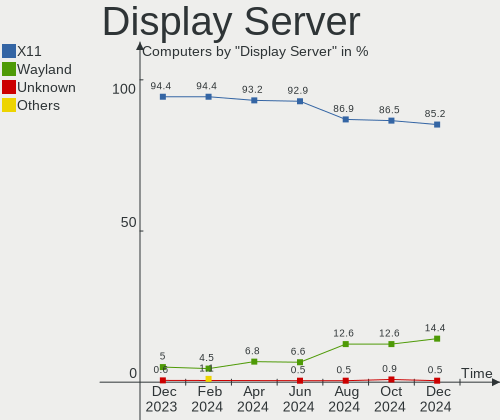
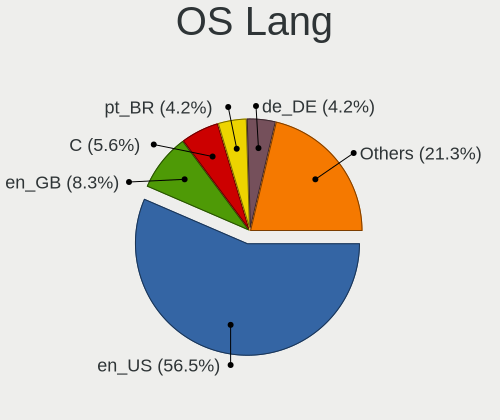
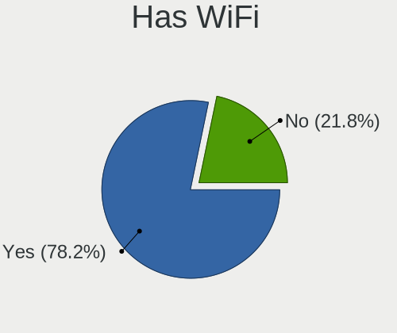
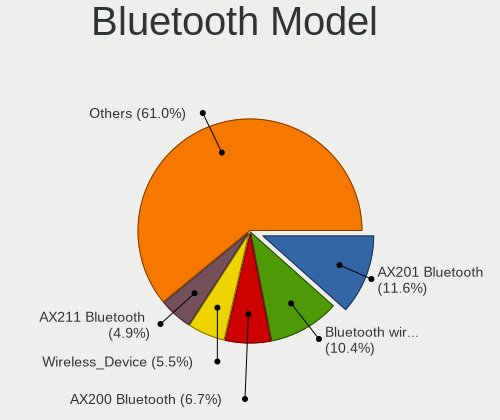

Pop!_OS - Hardware Trends
-------------------------

A project to identify most popular hardware characteristics and track their change
over time based on data collected by Linux users at https://Linux-Hardware.org.

Anyone can contribute to this report by the [hw-probe](https://github.com/linuxhw/hw-probe) tool:

    sudo -E hw-probe -all -upload

This is a report for all computer types. See also reports for [desktops](/Dist/Pop!_OS/Desktop/README.md) and [notebooks](/Dist/Pop!_OS/Notebook/README.md).

This report is for one last month. Overall report since the beginning of time: [TestCoverage](https://github.com/linuxhw/TestCoverage)

Period: Dec, 2022.

Contents
--------

* [ System ](#system)
  - [ OS                       ](#os)
  - [ OS Family                ](#os-family)
  - [ Kernel                   ](#kernel)
  - [ Kernel Family            ](#kernel-family)
  - [ Kernel Major Ver.        ](#kernel-major-ver)
  - [ Arch                     ](#arch)
  - [ DE                       ](#de)
  - [ Display Server           ](#display-server)
  - [ Display Manager          ](#display-manager)
  - [ OS Lang                  ](#os-lang)
  - [ Boot Mode                ](#boot-mode)
  - [ Filesystem               ](#filesystem)
  - [ Part. scheme             ](#part-scheme)
  - [ Dual Boot with Linux/BSD ](#dual-boot-with-linuxbsd)
  - [ Dual Boot (Win)          ](#dual-boot-win)

* [ Board ](#board)
  - [ Vendor                   ](#vendor)
  - [ Model                    ](#model)
  - [ Model Family             ](#model-family)
  - [ MFG Year                 ](#mfg-year)
  - [ Form Factor              ](#form-factor)
  - [ Secure Boot              ](#secure-boot)
  - [ Coreboot                 ](#coreboot)
  - [ RAM Size                 ](#ram-size)
  - [ RAM Used                 ](#ram-used)
  - [ Total Drives             ](#total-drives)
  - [ Has CD-ROM               ](#has-cd-rom)
  - [ Has Ethernet             ](#has-ethernet)
  - [ Has WiFi                 ](#has-wifi)
  - [ Has Bluetooth            ](#has-bluetooth)

* [ Location ](#location)
  - [ Country                  ](#country)
  - [ City                     ](#city)

* [ Drives ](#drives)
  - [ Drive Vendor             ](#drive-vendor)
  - [ Drive Model              ](#drive-model)
  - [ HDD Vendor               ](#hdd-vendor)
  - [ SSD Vendor               ](#ssd-vendor)
  - [ Drive Kind               ](#drive-kind)
  - [ Drive Connector          ](#drive-connector)
  - [ Drive Size               ](#drive-size)
  - [ Space Total              ](#space-total)
  - [ Space Used               ](#space-used)
  - [ Malfunc. Drives          ](#malfunc-drives)
  - [ Malfunc. Drive Vendor    ](#malfunc-drive-vendor)
  - [ Malfunc. HDD Vendor      ](#malfunc-hdd-vendor)
  - [ Malfunc. Drive Kind      ](#malfunc-drive-kind)
  - [ Failed Drives            ](#failed-drives)
  - [ Failed Drive Vendor      ](#failed-drive-vendor)
  - [ Drive Status             ](#drive-status)

* [ Storage controller ](#storage-controller)
  - [ Storage Vendor           ](#storage-vendor)
  - [ Storage Model            ](#storage-model)
  - [ Storage Kind             ](#storage-kind)

* [ Processor ](#processor)
  - [ CPU Vendor               ](#cpu-vendor)
  - [ CPU Model                ](#cpu-model)
  - [ CPU Model Family         ](#cpu-model-family)
  - [ CPU Cores                ](#cpu-cores)
  - [ CPU Sockets              ](#cpu-sockets)
  - [ CPU Threads              ](#cpu-threads)
  - [ CPU Op-Modes             ](#cpu-op-modes)
  - [ CPU Microcode            ](#cpu-microcode)
  - [ CPU Microarch            ](#cpu-microarch)

* [ Graphics ](#graphics)
  - [ GPU Vendor               ](#gpu-vendor)
  - [ GPU Model                ](#gpu-model)
  - [ GPU Combo                ](#gpu-combo)
  - [ GPU Driver               ](#gpu-driver)
  - [ GPU Memory               ](#gpu-memory)

* [ Monitor ](#monitor)
  - [ Monitor Vendor           ](#monitor-vendor)
  - [ Monitor Model            ](#monitor-model)
  - [ Monitor Resolution       ](#monitor-resolution)
  - [ Monitor Diagonal         ](#monitor-diagonal)
  - [ Monitor Width            ](#monitor-width)
  - [ Aspect Ratio             ](#aspect-ratio)
  - [ Monitor Area             ](#monitor-area)
  - [ Pixel Density            ](#pixel-density)
  - [ Multiple Monitors        ](#multiple-monitors)

* [ Network ](#network)
  - [ Net Controller Vendor    ](#net-controller-vendor)
  - [ Net Controller Model     ](#net-controller-model)
  - [ Wireless Vendor          ](#wireless-vendor)
  - [ Wireless Model           ](#wireless-model)
  - [ Ethernet Vendor          ](#ethernet-vendor)
  - [ Ethernet Model           ](#ethernet-model)
  - [ Net Controller Kind      ](#net-controller-kind)
  - [ Used Controller          ](#used-controller)
  - [ NICs                     ](#nics)
  - [ IPv6                     ](#ipv6)

* [ Bluetooth ](#bluetooth)
  - [ Bluetooth Vendor         ](#bluetooth-vendor)
  - [ Bluetooth Model          ](#bluetooth-model)

* [ Sound ](#sound)
  - [ Sound Vendor             ](#sound-vendor)
  - [ Sound Model              ](#sound-model)

* [ Memory ](#memory)
  - [ Memory Vendor            ](#memory-vendor)
  - [ Memory Model             ](#memory-model)
  - [ Memory Kind              ](#memory-kind)
  - [ Memory Form Factor       ](#memory-form-factor)
  - [ Memory Size              ](#memory-size)
  - [ Memory Speed             ](#memory-speed)

* [ Printers & scanners ](#printers--scanners)
  - [ Printer Vendor           ](#printer-vendor)
  - [ Printer Model            ](#printer-model)
  - [ Scanner Vendor           ](#scanner-vendor)
  - [ Scanner Model            ](#scanner-model)

* [ Camera ](#camera)
  - [ Camera Vendor            ](#camera-vendor)
  - [ Camera Model             ](#camera-model)

* [ Security ](#security)
  - [ Fingerprint Vendor       ](#fingerprint-vendor)
  - [ Fingerprint Model        ](#fingerprint-model)
  - [ Chipcard Vendor          ](#chipcard-vendor)
  - [ Chipcard Model           ](#chipcard-model)

* [ Unsupported ](#unsupported)
  - [ Unsupported Devices      ](#unsupported-devices)
  - [ Unsupported Device Types ](#unsupported-device-types)

System
------

OS
--

Installed operating systems

| Name          | Computers | Percent |
|---------------|-----------|---------|
| Pop!_OS 22.04 | 253       | 97.31%  |
| Pop!_OS 20.04 | 3         | 1.15%   |
| Pop!_OS 21.10 | 2         | 0.77%   |
| Pop!_OS 21.04 | 1         | 0.38%   |
| Pop!_OS 20.10 | 1         | 0.38%   |

OS Family
---------

OS without a version

| Name    | Computers | Percent |
|---------|-----------|---------|
| Pop!_OS | 260       | 100%    |

Kernel
------

Version of the Linux kernel

| Version                  | Computers | Percent |
|--------------------------|-----------|---------|
| 6.0.6-76060006-generic   | 170       | 65.38%  |
| 6.0.12-76060006-generic  | 64        | 24.62%  |
| 5.19.0-76051900-generic  | 5         | 1.92%   |
| 6.0.2-76060002-generic   | 4         | 1.54%   |
| 5.17.5-76051705-generic  | 4         | 1.54%   |
| 6.1.0-x64v1-xanmod1      | 2         | 0.77%   |
| 5.18.10-76051810-generic | 2         | 0.77%   |
| 6.1.0-060100rc5-generic  | 1         | 0.38%   |
| 6.0.12-x64v1-xanmod1     | 1         | 0.38%   |
| 6.0.10-x64v1-xanmod1     | 1         | 0.38%   |
| 5.8.0-7642-generic       | 1         | 0.38%   |
| 5.19.16-76051916-generic | 1         | 0.38%   |
| 5.17.15-76051715-generic | 1         | 0.38%   |
| 5.16.19-76051619-generic | 1         | 0.38%   |
| 5.15.11-76051511-generic | 1         | 0.38%   |
| 5.15.0-1021-raspi        | 1         | 0.38%   |

Kernel Family
-------------

Linux kernel without a distro release

| Version | Computers | Percent |
|---------|-----------|---------|
| 6.0.6   | 170       | 65.38%  |
| 6.0.12  | 65        | 25%     |
| 5.19.0  | 5         | 1.92%   |
| 6.0.2   | 4         | 1.54%   |
| 5.17.5  | 4         | 1.54%   |
| 6.1.0   | 3         | 1.15%   |
| 5.18.10 | 2         | 0.77%   |
| 6.0.10  | 1         | 0.38%   |
| 5.8.0   | 1         | 0.38%   |
| 5.19.16 | 1         | 0.38%   |
| 5.17.15 | 1         | 0.38%   |
| 5.16.19 | 1         | 0.38%   |
| 5.15.11 | 1         | 0.38%   |
| 5.15.0  | 1         | 0.38%   |

Kernel Major Ver.
-----------------

Linux kernel major version

| Version | Computers | Percent |
|---------|-----------|---------|
| 6.0     | 240       | 92.31%  |
| 5.19    | 6         | 2.31%   |
| 5.17    | 5         | 1.92%   |
| 6.1     | 3         | 1.15%   |
| 5.18    | 2         | 0.77%   |
| 5.15    | 2         | 0.77%   |
| 5.8     | 1         | 0.38%   |
| 5.16    | 1         | 0.38%   |

Arch
----

OS architecture (x86_64, i586, etc.)

| Name    | Computers | Percent |
|---------|-----------|---------|
| x86_64  | 259       | 99.62%  |
| aarch64 | 1         | 0.38%   |

DE
--

Desktop Environment

| Name       | Computers | Percent |
|------------|-----------|---------|
| GNOME      | 254       | 97.69%  |
| KDE5       | 4         | 1.54%   |
| X-Cinnamon | 2         | 0.77%   |

Display Server
--------------

X11 or Wayland

| Name    | Computers | Percent |
|---------|-----------|---------|
| X11     | 249       | 95.77%  |
| Wayland | 11        | 4.23%   |

Display Manager
---------------

SDDM, LightDM, etc.

| Name    | Computers | Percent |
|---------|-----------|---------|
| Unknown | 196       | 75.38%  |
| GDM3    | 63        | 24.23%  |
| SDDM    | 1         | 0.38%   |

OS Lang
-------

Language

| Lang  | Computers | Percent |
|-------|-----------|---------|
| en_US | 146       | 56.15%  |
| en_GB | 25        | 9.62%   |
| pt_BR | 18        | 6.92%   |
| C     | 15        | 5.77%   |
| de_DE | 10        | 3.85%   |
| it_IT | 7         | 2.69%   |
| es_ES | 4         | 1.54%   |
| en_CA | 4         | 1.54%   |
| ru_RU | 3         | 1.15%   |
| pl_PL | 3         | 1.15%   |
| nl_NL | 3         | 1.15%   |
| en_AU | 3         | 1.15%   |
| nb_NO | 2         | 0.77%   |
| fr_CA | 2         | 0.77%   |
| es_AR | 2         | 0.77%   |
| sv_SE | 1         | 0.38%   |
| pt_PT | 1         | 0.38%   |
| ja_JP | 1         | 0.38%   |
| hu_HU | 1         | 0.38%   |
| fi_FI | 1         | 0.38%   |
| es_MX | 1         | 0.38%   |
| en_ZA | 1         | 0.38%   |
| en_IN | 1         | 0.38%   |
| en_IL | 1         | 0.38%   |
| en_IE | 1         | 0.38%   |
| de_CH | 1         | 0.38%   |
| da_DK | 1         | 0.38%   |
| bg_BG | 1         | 0.38%   |

Boot Mode
---------

EFI or BIOS

| Mode | Computers | Percent |
|------|-----------|---------|
| BIOS | 199       | 76.54%  |
| EFI  | 61        | 23.46%  |

Filesystem
----------

Type of filesystem

| Type    | Computers | Percent |
|---------|-----------|---------|
| Ext4    | 241       | 92.69%  |
| Overlay | 10        | 3.85%   |
| Btrfs   | 7         | 2.69%   |
| Zfs     | 1         | 0.38%   |
| Xfs     | 1         | 0.38%   |

Part. scheme
------------

Scheme of partitioning

| Type    | Computers | Percent |
|---------|-----------|---------|
| Unknown | 196       | 75.38%  |
| GPT     | 59        | 22.69%  |
| MBR     | 5         | 1.92%   |

Dual Boot with Linux/BSD
------------------------

Hosting more than one Linux/BSD

| Dual boot | Computers | Percent |
|-----------|-----------|---------|
| No        | 255       | 98.08%  |
| Yes       | 5         | 1.92%   |

Dual Boot (Win)
---------------

Hosting Linux and Windows

| Dual boot | Computers | Percent |
|-----------|-----------|---------|
| No        | 235       | 90.38%  |
| Yes       | 25        | 9.62%   |

Board
-----

Vendor
------

Motherboard manufacturer

| Name                    | Computers | Percent |
|-------------------------|-----------|---------|
| ASUSTek Computer        | 52        | 20%     |
| Lenovo                  | 42        | 16.15%  |
| Dell                    | 27        | 10.38%  |
| Hewlett-Packard         | 23        | 8.85%   |
| MSI                     | 20        | 7.69%   |
| Apple                   | 14        | 5.38%   |
| Gigabyte Technology     | 13        | 5%      |
| Acer                    | 13        | 5%      |
| System76                | 9         | 3.46%   |
| ASRock                  | 9         | 3.46%   |
| Intel                   | 5         | 1.92%   |
| Supermicro              | 3         | 1.15%   |
| Samsung Electronics     | 3         | 1.15%   |
| Avell High Performance  | 3         | 1.15%   |
| Unknown                 | 3         | 1.15%   |
| Toshiba                 | 2         | 0.77%   |
| Sony                    | 2         | 0.77%   |
| HUAWEI                  | 2         | 0.77%   |
| GPU Company             | 2         | 0.77%   |
| Fujitsu                 | 2         | 0.77%   |
| Timi                    | 1         | 0.38%   |
| Raspberry Pi Foundation | 1         | 0.38%   |
| Microsoft               | 1         | 0.38%   |
| Medion                  | 1         | 0.38%   |
| LG Electronics          | 1         | 0.38%   |
| GPD                     | 1         | 0.38%   |
| Framework               | 1         | 0.38%   |
| BESSTAR Tech            | 1         | 0.38%   |
| ALLDOCUBE               | 1         | 0.38%   |
| Alienware               | 1         | 0.38%   |
| Acidanthera             | 1         | 0.38%   |

Model
-----

Motherboard model

| Name                                       | Computers | Percent |
|--------------------------------------------|-----------|---------|
| System76 Gazelle                           | 4         | 1.54%   |
| ASUS All Series                            | 3         | 1.15%   |
| Unknown                                    | 3         | 1.15%   |
| System76 Thelio                            | 2         | 0.77%   |
| System76 Lemur Pro                         | 2         | 0.77%   |
| MSI MS-7D54                                | 2         | 0.77%   |
| MSI MS-7A34                                | 2         | 0.77%   |
| Lenovo Y520-15IKBN 80WK                    | 2         | 0.77%   |
| HP Notebook                                | 2         | 0.77%   |
| GPU Company GWNR71517                      | 2         | 0.77%   |
| Dell Latitude E7240                        | 2         | 0.77%   |
| ASUS TUF Gaming B550-PLUS                  | 2         | 0.77%   |
| ASUS ROG STRIX B550-F GAMING               | 2         | 0.77%   |
| ASUS ROG STRIX B550-E GAMING               | 2         | 0.77%   |
| ASUS ROG CROSSHAIR VIII HERO               | 2         | 0.77%   |
| ASUS PRIME B550M-A                         | 2         | 0.77%   |
| Toshiba Satellite Pro C50-A-1MX            | 1         | 0.38%   |
| Toshiba Satellite C55-C                    | 1         | 0.38%   |
| Timi TM1703                                | 1         | 0.38%   |
| System76 Pangolin                          | 1         | 0.38%   |
| Supermicro X9DR3-F                         | 1         | 0.38%   |
| Supermicro X8DT3                           | 1         | 0.38%   |
| Supermicro C7Q67                           | 1         | 0.38%   |
| Sony VGN-FW21E                             | 1         | 0.38%   |
| Sony SVF15213CBB                           | 1         | 0.38%   |
| Samsung 730QED                             | 1         | 0.38%   |
| Samsung 350V5C/351V5C/3540VC/3440VC        | 1         | 0.38%   |
| Samsung 300E4A/300E5A/300E7A/3430EA/3530EA | 1         | 0.38%   |
| RPi Raspberry Pi 4 Model B Rev 1.2         | 1         | 0.38%   |
| MSI Summit E16Flip A12UCT                  | 1         | 0.38%   |
| MSI MS-7E07                                | 1         | 0.38%   |
| MSI MS-7D76                                | 1         | 0.38%   |
| MSI MS-7C95                                | 1         | 0.38%   |
| MSI MS-7C84                                | 1         | 0.38%   |
| MSI MS-7C56                                | 1         | 0.38%   |
| MSI MS-7B84                                | 1         | 0.38%   |
| MSI MS-7B17                                | 1         | 0.38%   |
| MSI MS-7A33                                | 1         | 0.38%   |
| MSI MS-7972                                | 1         | 0.38%   |
| MSI MS-7817                                | 1         | 0.38%   |

Model Family
------------

Motherboard model prefix

| Name                  | Computers | Percent |
|-----------------------|-----------|---------|
| ASUS ROG              | 15        | 5.77%   |
| Lenovo ThinkPad       | 12        | 4.62%   |
| Lenovo IdeaPad        | 10        | 3.85%   |
| ASUS PRIME            | 9         | 3.46%   |
| Dell Inspiron         | 8         | 3.08%   |
| Acer Aspire           | 8         | 3.08%   |
| HP Pavilion           | 6         | 2.31%   |
| ASUS VivoBook         | 6         | 2.31%   |
| Dell XPS              | 5         | 1.92%   |
| System76 Gazelle      | 4         | 1.54%   |
| Lenovo Legion         | 4         | 1.54%   |
| HP ENVY               | 4         | 1.54%   |
| Gigabyte B450         | 4         | 1.54%   |
| Dell Latitude         | 4         | 1.54%   |
| ASUS TUF              | 4         | 1.54%   |
| Lenovo Yoga           | 3         | 1.15%   |
| Dell Precision        | 3         | 1.15%   |
| ASUS ASUS             | 3         | 1.15%   |
| ASUS All              | 3         | 1.15%   |
| Unknown               | 3         | 1.15%   |
| Toshiba Satellite     | 2         | 0.77%   |
| System76 Thelio       | 2         | 0.77%   |
| System76 Lemur        | 2         | 0.77%   |
| MSI MS-7D54           | 2         | 0.77%   |
| MSI MS-7A34           | 2         | 0.77%   |
| Lenovo Y520-15IKBN    | 2         | 0.77%   |
| Lenovo ThinkCentre    | 2         | 0.77%   |
| HP ProBook            | 2         | 0.77%   |
| HP Notebook           | 2         | 0.77%   |
| HP Laptop             | 2         | 0.77%   |
| HP EliteBook          | 2         | 0.77%   |
| GPU Company GWNR71517 | 2         | 0.77%   |
| Gigabyte B550         | 2         | 0.77%   |
| Dell Vostro           | 2         | 0.77%   |
| Apple iMac12          | 2         | 0.77%   |
| Acer Swift            | 2         | 0.77%   |
| Timi TM1703           | 1         | 0.38%   |
| System76 Pangolin     | 1         | 0.38%   |
| Supermicro X9DR3-F    | 1         | 0.38%   |
| Supermicro X8DT3      | 1         | 0.38%   |

MFG Year
--------

Motherboard manufacture year

| Year    | Computers | Percent |
|---------|-----------|---------|
| 2021    | 46        | 17.69%  |
| 2020    | 45        | 17.31%  |
| 2022    | 28        | 10.77%  |
| 2018    | 23        | 8.85%   |
| 2013    | 22        | 8.46%   |
| 2019    | 19        | 7.31%   |
| 2017    | 12        | 4.62%   |
| 2015    | 11        | 4.23%   |
| 2011    | 10        | 3.85%   |
| 2010    | 10        | 3.85%   |
| 2014    | 9         | 3.46%   |
| 2012    | 9         | 3.46%   |
| 2016    | 7         | 2.69%   |
| 2009    | 4         | 1.54%   |
| 2008    | 2         | 0.77%   |
| 2007    | 2         | 0.77%   |
| Unknown | 1         | 0.38%   |

Form Factor
-----------

Physical design of the computer

| Name           | Computers | Percent |
|----------------|-----------|---------|
| Notebook       | 136       | 52.31%  |
| Desktop        | 98        | 37.69%  |
| Convertible    | 8         | 3.08%   |
| All in one     | 7         | 2.69%   |
| Mini pc        | 5         | 1.92%   |
| Server         | 3         | 1.15%   |
| Tablet         | 2         | 0.77%   |
| System on chip | 1         | 0.38%   |

Secure Boot
-----------

Enabled or disabled

| State    | Computers | Percent |
|----------|-----------|---------|
| Disabled | 260       | 100%    |

Coreboot
--------

Have coreboot on board

| Used | Computers | Percent |
|------|-----------|---------|
| No   | 257       | 98.85%  |
| Yes  | 3         | 1.15%   |

RAM Size
--------

Total RAM memory

| Size in GB  | Computers | Percent |
|-------------|-----------|---------|
| 16.01-24.0  | 76        | 29.23%  |
| 8.01-16.0   | 52        | 20%     |
| 4.01-8.0    | 44        | 16.92%  |
| 32.01-64.0  | 39        | 15%     |
| 3.01-4.0    | 22        | 8.46%   |
| 64.01-256.0 | 18        | 6.92%   |
| 24.01-32.0  | 9         | 3.46%   |

RAM Used
--------

Used RAM memory

| Used GB    | Computers | Percent |
|------------|-----------|---------|
| 2.01-3.0   | 87        | 33.46%  |
| 4.01-8.0   | 73        | 28.08%  |
| 3.01-4.0   | 62        | 23.85%  |
| 8.01-16.0  | 19        | 7.31%   |
| 1.01-2.0   | 17        | 6.54%   |
| 24.01-32.0 | 1         | 0.38%   |
| 16.01-24.0 | 1         | 0.38%   |

Total Drives
------------

Number of drives on board

| Drives | Computers | Percent |
|--------|-----------|---------|
| 1      | 147       | 56.54%  |
| 2      | 70        | 26.92%  |
| 3      | 19        | 7.31%   |
| 4      | 12        | 4.62%   |
| 5      | 4         | 1.54%   |
| 6      | 3         | 1.15%   |
| 7      | 2         | 0.77%   |
| 0      | 2         | 0.77%   |
| 10     | 1         | 0.38%   |

Has CD-ROM
----------

Has CD-ROM on board

| Presented | Computers | Percent |
|-----------|-----------|---------|
| No        | 203       | 78.08%  |
| Yes       | 57        | 21.92%  |

Has Ethernet
------------

Has Ethernet on board

| Presented | Computers | Percent |
|-----------|-----------|---------|
| Yes       | 216       | 83.08%  |
| No        | 44        | 16.92%  |

Has WiFi
--------

Has WiFi module

| Presented | Computers | Percent |
|-----------|-----------|---------|
| Yes       | 212       | 81.54%  |
| No        | 48        | 18.46%  |

Has Bluetooth
-------------

Has Bluetooth module

| Presented | Computers | Percent |
|-----------|-----------|---------|
| Yes       | 185       | 71.15%  |
| No        | 75        | 28.85%  |

Location
--------

Country
-------

Geographic location (country)

| Country         | Computers | Percent |
|-----------------|-----------|---------|
| USA             | 62        | 23.85%  |
| Brazil          | 20        | 7.69%   |
| Canada          | 19        | 7.31%   |
| UK              | 18        | 6.92%   |
| Germany         | 17        | 6.54%   |
| Italy           | 12        | 4.62%   |
| Russia          | 7         | 2.69%   |
| Netherlands     | 7         | 2.69%   |
| India           | 7         | 2.69%   |
| Norway          | 6         | 2.31%   |
| Spain           | 5         | 1.92%   |
| Poland          | 5         | 1.92%   |
| Greece          | 5         | 1.92%   |
| Thailand        | 4         | 1.54%   |
| France          | 4         | 1.54%   |
| Australia       | 4         | 1.54%   |
| Romania         | 3         | 1.15%   |
| Portugal        | 3         | 1.15%   |
| Philippines     | 3         | 1.15%   |
| Ireland         | 3         | 1.15%   |
| Indonesia       | 3         | 1.15%   |
| Finland         | 3         | 1.15%   |
| Bulgaria        | 3         | 1.15%   |
| Austria         | 3         | 1.15%   |
| Argentina       | 3         | 1.15%   |
| Turkey          | 2         | 0.77%   |
| Switzerland     | 2         | 0.77%   |
| Sweden          | 2         | 0.77%   |
| Hungary         | 2         | 0.77%   |
| Denmark         | 2         | 0.77%   |
| Costa Rica      | 2         | 0.77%   |
| Belgium         | 2         | 0.77%   |
| Bangladesh      | 2         | 0.77%   |
| UAE             | 1         | 0.38%   |
| South Africa    | 1         | 0.38%   |
| Serbia          | 1         | 0.38%   |
| Réunion        | 1         | 0.38%   |
| North Macedonia | 1         | 0.38%   |
| New Zealand     | 1         | 0.38%   |
| Mexico          | 1         | 0.38%   |

City
----

Geographic location (city)

| City           | Computers | Percent |
|----------------|-----------|---------|
| San Antonio    | 3         | 1.15%   |
| Cambridge      | 3         | 1.15%   |
| Calgary        | 3         | 1.15%   |
| Vienna         | 2         | 0.77%   |
| The Hague      | 2         | 0.77%   |
| Tarlac City    | 2         | 0.77%   |
| Sofia          | 2         | 0.77%   |
| Sao Paulo      | 2         | 0.77%   |
| San José      | 2         | 0.77%   |
| Rio de Janeiro | 2         | 0.77%   |
| Piraeus        | 2         | 0.77%   |
| Oslo           | 2         | 0.77%   |
| Notodden       | 2         | 0.77%   |
| Moscow         | 2         | 0.77%   |
| Minneapolis    | 2         | 0.77%   |
| Milan          | 2         | 0.77%   |
| Martinez       | 2         | 0.77%   |
| London         | 2         | 0.77%   |
| Lisbon         | 2         | 0.77%   |
| Kingston       | 2         | 0.77%   |
| Istanbul       | 2         | 0.77%   |
| Helsinki       | 2         | 0.77%   |
| Edmonton       | 2         | 0.77%   |
| Dublin         | 2         | 0.77%   |
| Chicago        | 2         | 0.77%   |
| Charlevoix     | 2         | 0.77%   |
| Brisbane       | 2         | 0.77%   |
| Bologna        | 2         | 0.77%   |
| Beaverton      | 2         | 0.77%   |
| Zurich         | 1         | 0.38%   |
| Zdunska Wola   | 1         | 0.38%   |
| York           | 1         | 0.38%   |
| Yopal          | 1         | 0.38%   |
| Yeovil         | 1         | 0.38%   |
| Yekaterinburg  | 1         | 0.38%   |
| Xalapa         | 1         | 0.38%   |
| Wuppertal      | 1         | 0.38%   |
| Worcester      | 1         | 0.38%   |
| Wolverhampton  | 1         | 0.38%   |
| Wheaton        | 1         | 0.38%   |

Drives
------

Drive Vendor
------------

Hard drive vendors

| Vendor                      | Computers | Drives | Percent |
|-----------------------------|-----------|--------|---------|
| Samsung Electronics         | 92        | 120    | 23.17%  |
| Seagate                     | 50        | 64     | 12.59%  |
| WDC                         | 42        | 47     | 10.58%  |
| Crucial                     | 27        | 29     | 6.8%    |
| Sandisk                     | 25        | 25     | 6.3%    |
| Kingston                    | 14        | 15     | 3.53%   |
| Toshiba                     | 13        | 13     | 3.27%   |
| Unknown                     | 11        | 12     | 2.77%   |
| SK hynix                    | 11        | 11     | 2.77%   |
| Micron Technology           | 10        | 11     | 2.52%   |
| KIOXIA                      | 10        | 10     | 2.52%   |
| Intel                       | 9         | 11     | 2.27%   |
| Hitachi                     | 6         | 6      | 1.51%   |
| Phison Electronics          | 5         | 5      | 1.26%   |
| Apple                       | 5         | 5      | 1.26%   |
| A-DATA Technology           | 5         | 5      | 1.26%   |
| Micron/Crucial Technology   | 4         | 4      | 1.01%   |
| HGST                        | 4         | 4      | 1.01%   |
| Silicon Motion              | 3         | 4      | 0.76%   |
| PNY                         | 3         | 3      | 0.76%   |
| LaCie                       | 3         | 3      | 0.76%   |
| Kingston Technology Company | 3         | 4      | 0.76%   |
| Intenso                     | 3         | 3      | 0.76%   |
| Unknown                     | 3         | 3      | 0.76%   |
| Union Memory (Shenzhen)     | 2         | 2      | 0.5%    |
| Realtek Semiconductor       | 2         | 2      | 0.5%    |
| Phison                      | 2         | 2      | 0.5%    |
| Patriot                     | 2         | 2      | 0.5%    |
| Netac                       | 2         | 2      | 0.5%    |
| Lexar                       | 2         | 2      | 0.5%    |
| GOODRAM                     | 2         | 2      | 0.5%    |
| XPG                         | 1         | 2      | 0.25%   |
| WD MediaMax                 | 1         | 1      | 0.25%   |
| Verbatim                    | 1         | 1      | 0.25%   |
| TrekStor                    | 1         | 1      | 0.25%   |
| Transcend                   | 1         | 1      | 0.25%   |
| TO Exter                    | 1         | 1      | 0.25%   |
| SYMWAVE                     | 1         | 1      | 0.25%   |
| SPCC                        | 1         | 1      | 0.25%   |
| Solid State Storage         | 1         | 1      | 0.25%   |

Drive Model
-----------

Hard drive models

| Model                                                  | Computers | Percent |
|--------------------------------------------------------|-----------|---------|
| Samsung NVMe SSD Controller SM981/PM981/PM983 500GB    | 20        | 4.51%   |
| Samsung NVMe SSD Controller PM9A1/PM9A3/980PRO 2TB     | 10        | 2.26%   |
| Samsung NVMe SSD Controller SM961/PM961/SM963 256GB    | 7         | 1.58%   |
| Seagate ST1000DM010-2EP102 1TB                         | 5         | 1.13%   |
| Sandisk WD Blue SN550 NVMe SSD 500GB                   | 5         | 1.13%   |
| Samsung SSD 860 EVO 1TB                                | 5         | 1.13%   |
| Kingston SA400S37480G 480GB SSD                        | 5         | 1.13%   |
| Crucial CT500MX500SSD1 500GB                           | 5         | 1.13%   |
| Crucial CT240BX500SSD1 240GB                           | 5         | 1.13%   |
| WDC WDS500G2B0A-00SM50 500GB SSD                       | 4         | 0.9%    |
| Seagate ST1000LM035-1RK172 1TB                         | 4         | 0.9%    |
| Samsung SSD 870 QVO 1TB                                | 4         | 0.9%    |
| Samsung SSD 870 EVO 500GB                              | 4         | 0.9%    |
| Samsung SSD 850 EVO 250GB                              | 4         | 0.9%    |
| Micron/Crucial P2 NVMe PCIe SSD 500GB                  | 4         | 0.9%    |
| Kingston SA400S37240G 240GB SSD                        | 4         | 0.9%    |
| Unknown MMC Card  64GB                                 | 3         | 0.68%   |
| SK hynix HFM001TD3JX013N 1TB                           | 3         | 0.68%   |
| Seagate ST2000DM008-2FR102 2TB                         | 3         | 0.68%   |
| Seagate Expansion 4TB                                  | 3         | 0.68%   |
| Samsung SSD 980 500GB                                  | 3         | 0.68%   |
| Samsung SSD 970 EVO Plus 500GB                         | 3         | 0.68%   |
| Samsung SSD 870 EVO 2TB                                | 3         | 0.68%   |
| Samsung SSD 860 EVO 500GB                              | 3         | 0.68%   |
| Phison E16 PCIe4 NVMe Controller 512GB                 | 3         | 0.68%   |
| Micron 2210_MTFDHBA1T0QFD 1024GB                       | 3         | 0.68%   |
| Unknown                                                | 3         | 0.68%   |
| WDC WDS500G3X0C-00SJG0 500GB                           | 2         | 0.45%   |
| WDC WD30EFRX-68EUZN0 3TB                               | 2         | 0.45%   |
| WDC WD Blue SA510 2.5 500GB                            | 2         | 0.45%   |
| Unknown SD/MMC/MS PRO 64GB                             | 2         | 0.45%   |
| Toshiba DT01ACA200 2TB                                 | 2         | 0.45%   |
| SK hynix BC501 NVMe Solid State Drive 512GB            | 2         | 0.45%   |
| Silicon Motion SM2263EN/SM2263XT SSD Controller 1024GB | 2         | 0.45%   |
| Seagate ST4000DM004-2CV104 4TB                         | 2         | 0.45%   |
| Seagate ST2000LM007-1R8174 2TB                         | 2         | 0.45%   |
| Seagate ST2000DM006-2DM164 2TB                         | 2         | 0.45%   |
| Seagate ST2000DM001-1ER164 2TB                         | 2         | 0.45%   |
| Seagate ST1000DM003-1ER162 1TB                         | 2         | 0.45%   |
| Seagate ST1000DM003-1CH162 1TB                         | 2         | 0.45%   |

HDD Vendor
----------

Hard disk drive vendors

| Vendor              | Computers | Drives | Percent |
|---------------------|-----------|--------|---------|
| Seagate             | 49        | 63     | 47.57%  |
| WDC                 | 26        | 30     | 25.24%  |
| Toshiba             | 9         | 9      | 8.74%   |
| Hitachi             | 6         | 6      | 5.83%   |
| HGST                | 4         | 4      | 3.88%   |
| Samsung Electronics | 3         | 3      | 2.91%   |
| Apple               | 3         | 3      | 2.91%   |
| Unknown             | 2         | 2      | 1.94%   |
| RSH-339             | 1         | 1      | 0.97%   |

SSD Vendor
----------

Solid state drive vendors

| Vendor              | Computers | Drives | Percent |
|---------------------|-----------|--------|---------|
| Samsung Electronics | 38        | 51     | 29.69%  |
| Crucial             | 24        | 26     | 18.75%  |
| Kingston            | 12        | 13     | 9.38%   |
| SanDisk             | 11        | 11     | 8.59%   |
| WDC                 | 10        | 10     | 7.81%   |
| PNY                 | 3         | 3      | 2.34%   |
| SK hynix            | 2         | 2      | 1.56%   |
| Patriot             | 2         | 2      | 1.56%   |
| Netac               | 2         | 2      | 1.56%   |
| Lexar               | 2         | 2      | 1.56%   |
| Intenso             | 2         | 2      | 1.56%   |
| GOODRAM             | 2         | 2      | 1.56%   |
| Apple               | 2         | 2      | 1.56%   |
| Verbatim            | 1         | 1      | 0.78%   |
| TrekStor            | 1         | 1      | 0.78%   |
| Transcend           | 1         | 1      | 0.78%   |
| Toshiba             | 1         | 1      | 0.78%   |
| TO Exter            | 1         | 1      | 0.78%   |
| RZX                 | 1         | 1      | 0.78%   |
| Qumo                | 1         | 1      | 0.78%   |
| OCZ                 | 1         | 1      | 0.78%   |
| LITEON              | 1         | 1      | 0.78%   |
| LaCie               | 1         | 1      | 0.78%   |
| KingSpec            | 1         | 1      | 0.78%   |
| INTEL SS            | 1         | 1      | 0.78%   |
| Intel               | 1         | 1      | 0.78%   |
| China               | 1         | 1      | 0.78%   |
| A-DATA Technology   | 1         | 1      | 0.78%   |
| Unknown             | 1         | 1      | 0.78%   |

Drive Kind
----------

HDD or SSD

| Kind    | Computers | Drives | Percent |
|---------|-----------|--------|---------|
| NVMe    | 138       | 168    | 38.87%  |
| SSD     | 111       | 144    | 31.27%  |
| HDD     | 86        | 121    | 24.23%  |
| Unknown | 11        | 13     | 3.1%    |
| MMC     | 9         | 9      | 2.54%   |

Drive Connector
---------------

SATA, SAS, NVMe, etc.

| Type | Computers | Drives | Percent |
|------|-----------|--------|---------|
| SATA | 162       | 253    | 48.8%   |
| NVMe | 138       | 168    | 41.57%  |
| SAS  | 23        | 25     | 6.93%   |
| MMC  | 9         | 9      | 2.71%   |

Drive Size
----------

Size of hard drive

| Size in TB | Computers | Drives | Percent |
|------------|-----------|--------|---------|
| 0.01-0.5   | 102       | 128    | 47.89%  |
| 0.51-1.0   | 66        | 74     | 30.99%  |
| 1.01-2.0   | 26        | 31     | 12.21%  |
| 3.01-4.0   | 8         | 15     | 3.76%   |
| 4.01-10.0  | 6         | 9      | 2.82%   |
| 2.01-3.0   | 5         | 8      | 2.35%   |

Space Total
-----------

Amount of disk space available on the file system

| Size in GB     | Computers | Percent |
|----------------|-----------|---------|
| 251-500        | 73        | 28.08%  |
| 501-1000       | 58        | 22.31%  |
| 101-250        | 55        | 21.15%  |
| 1001-2000      | 23        | 8.85%   |
| More than 3000 | 15        | 5.77%   |
| 2001-3000      | 13        | 5%      |
| 1-20           | 12        | 4.62%   |
| 51-100         | 11        | 4.23%   |

Space Used
----------

Amount of used disk space

| Used GB        | Computers | Percent |
|----------------|-----------|---------|
| 1-20           | 68        | 26.15%  |
| 21-50          | 55        | 21.15%  |
| 101-250        | 41        | 15.77%  |
| 51-100         | 39        | 15%     |
| 251-500        | 25        | 9.62%   |
| 501-1000       | 14        | 5.38%   |
| 1001-2000      | 7         | 2.69%   |
| More than 3000 | 6         | 2.31%   |
| 2001-3000      | 5         | 1.92%   |

Malfunc. Drives
---------------

Drive models with a malfunction

| Model                                        | Computers | Drives | Percent |
|----------------------------------------------|-----------|--------|---------|
| WDC WD20EFRX-68AX9N0 2TB                     | 1         | 1      | 14.29%  |
| WDC WD10SPZX-22Z10T0 1TB                     | 1         | 1      | 14.29%  |
| Samsung Electronics SSD 870 EVO 500GB        | 1         | 1      | 14.29%  |
| Samsung Electronics MZVKW512HMJP-00000 512GB | 1         | 1      | 14.29%  |
| Micron Technology 9200_MTFDHAL1T9TCT 1.9TB   | 1         | 1      | 14.29%  |
| Crucial CT500MX500SSD1 500GB                 | 1         | 1      | 14.29%  |
| A-DATA Technology IM2P33F3 NVMe 512GB        | 1         | 1      | 14.29%  |

Malfunc. Drive Vendor
---------------------

Vendors of faulty drives

| Vendor              | Computers | Drives | Percent |
|---------------------|-----------|--------|---------|
| WDC                 | 2         | 2      | 28.57%  |
| Samsung Electronics | 2         | 2      | 28.57%  |
| Micron Technology   | 1         | 1      | 14.29%  |
| Crucial             | 1         | 1      | 14.29%  |
| A-DATA Technology   | 1         | 1      | 14.29%  |

Malfunc. HDD Vendor
-------------------

Vendors of faulty HDD drives

| Vendor | Computers | Drives | Percent |
|--------|-----------|--------|---------|
| WDC    | 2         | 2      | 100%    |

Malfunc. Drive Kind
-------------------

Kinds of faulty drives

| Kind | Computers | Drives | Percent |
|------|-----------|--------|---------|
| NVMe | 3         | 3      | 42.86%  |
| SSD  | 2         | 2      | 28.57%  |
| HDD  | 2         | 2      | 28.57%  |

Failed Drives
-------------

Failed drive models

Zero info for selected period =(

Failed Drive Vendor
-------------------

Failed drive vendors

Zero info for selected period =(

Drive Status
------------

Number of failed and malfunc. drives

| Status   | Computers | Drives | Percent |
|----------|-----------|--------|---------|
| Detected | 210       | 369    | 76.64%  |
| Works    | 57        | 79     | 20.8%   |
| Malfunc  | 7         | 7      | 2.55%   |

Storage controller
------------------

Storage Vendor
--------------

Storage controller vendors

| Vendor                         | Computers | Percent |
|--------------------------------|-----------|---------|
| Intel                          | 141       | 37.11%  |
| AMD                            | 76        | 20%     |
| Samsung Electronics            | 65        | 17.11%  |
| Sandisk                        | 20        | 5.26%   |
| KIOXIA                         | 11        | 2.89%   |
| Micron Technology              | 10        | 2.63%   |
| SK hynix                       | 9         | 2.37%   |
| Phison Electronics             | 9         | 2.37%   |
| Micron/Crucial Technology      | 7         | 1.84%   |
| ADATA Technology               | 5         | 1.32%   |
| Kingston Technology Company    | 4         | 1.05%   |
| ASMedia Technology             | 4         | 1.05%   |
| Toshiba America Info Systems   | 3         | 0.79%   |
| Silicon Motion                 | 3         | 0.79%   |
| Union Memory (Shenzhen)        | 2         | 0.53%   |
| Realtek Semiconductor          | 2         | 0.53%   |
| Nvidia                         | 2         | 0.53%   |
| Marvell Technology Group       | 2         | 0.53%   |
| JMicron Technology             | 2         | 0.53%   |
| Broadcom / LSI                 | 2         | 0.53%   |
| Solid State Storage Technology | 1         | 0.26%   |

Storage Model
-------------

Storage controller models

| Model                                                                          | Computers | Percent |
|--------------------------------------------------------------------------------|-----------|---------|
| AMD FCH SATA Controller [AHCI mode]                                            | 55        | 13.06%  |
| Samsung NVMe SSD Controller SM981/PM981/PM983                                  | 27        | 6.41%   |
| Samsung NVMe SSD Controller PM9A1/PM9A3/980PRO                                 | 16        | 3.8%    |
| AMD 500 Series Chipset SATA Controller                                         | 16        | 3.8%    |
| Intel 8 Series/C220 Series Chipset Family 6-port SATA Controller 1 [AHCI mode] | 14        | 3.33%   |
| Samsung NVMe SSD Controller 980                                                | 12        | 2.85%   |
| Intel Volume Management Device NVMe RAID Controller                            | 11        | 2.61%   |
| Micron Non-Volatile memory controller                                          | 9         | 2.14%   |
| Intel Sunrise Point-LP SATA Controller [AHCI mode]                             | 9         | 2.14%   |
| Intel 7 Series Chipset Family 6-port SATA Controller [AHCI mode]               | 9         | 2.14%   |
| AMD 400 Series Chipset SATA Controller                                         | 9         | 2.14%   |
| Samsung NVMe SSD Controller SM961/PM961/SM963                                  | 8         | 1.9%    |
| SanDisk WD Blue SN550 NVMe SSD                                                 | 6         | 1.43%   |
| KIOXIA NVMe SSD Controller BG4                                                 | 6         | 1.43%   |
| Intel 6 Series/C200 Series Chipset Family 6 port Mobile SATA AHCI Controller   | 6         | 1.43%   |
| Intel 6 Series/C200 Series Chipset Family 6 port Desktop SATA AHCI Controller  | 6         | 1.43%   |
| SanDisk WD Black SN750 / PC SN730 NVMe SSD                                     | 5         | 1.19%   |
| Phison E16 PCIe4 NVMe Controller                                               | 5         | 1.19%   |
| Micron/Crucial P2 NVMe PCIe SSD                                                | 5         | 1.19%   |
| Intel Q170/Q150/B150/H170/H110/Z170/CM236 Chipset SATA Controller [AHCI Mode]  | 5         | 1.19%   |
| Intel Non-Volatile memory controller                                           | 5         | 1.19%   |
| Intel 400 Series Chipset Family SATA AHCI Controller                           | 5         | 1.19%   |
| Intel 200 Series PCH SATA controller [AHCI mode]                               | 5         | 1.19%   |
| SK hynix Gold P31/PC711 NVMe Solid State Drive                                 | 4         | 0.95%   |
| SanDisk Non-Volatile memory controller                                         | 4         | 0.95%   |
| KIOXIA Non-Volatile memory controller                                          | 4         | 0.95%   |
| Intel SATA Controller [RAID mode]                                              | 4         | 0.95%   |
| Intel Cannon Lake PCH SATA AHCI Controller                                     | 4         | 0.95%   |
| Intel Cannon Lake Mobile PCH SATA AHCI Controller                              | 4         | 0.95%   |
| Intel 9 Series Chipset Family SATA Controller [AHCI Mode]                      | 4         | 0.95%   |
| Intel 82801 Mobile SATA Controller [RAID mode]                                 | 4         | 0.95%   |
| Intel 5 Series/3400 Series Chipset 6 port SATA AHCI Controller                 | 4         | 0.95%   |
| ASMedia ASM1062 Serial ATA Controller                                          | 4         | 0.95%   |
| AMD 300 Series Chipset SATA Controller                                         | 4         | 0.95%   |
| Phison E12 NVMe Controller                                                     | 3         | 0.71%   |
| Kingston Company Company Non-Volatile memory controller                        | 3         | 0.71%   |
| Intel Wildcat Point-LP SATA Controller [AHCI Mode]                             | 3         | 0.71%   |
| Intel Tiger Lake-LP SATA Controller                                            | 3         | 0.71%   |
| Intel SATA controller                                                          | 3         | 0.71%   |
| Intel Comet Lake SATA AHCI Controller                                          | 3         | 0.71%   |

Storage Kind
------------

Kind of storage controller (IDE, SATA, NVMe, SAS, ...)

| Kind | Computers | Percent |
|------|-----------|---------|
| SATA | 196       | 53.12%  |
| NVMe | 138       | 37.4%   |
| RAID | 22        | 5.96%   |
| IDE  | 11        | 2.98%   |
| SAS  | 2         | 0.54%   |

Processor
---------

CPU Vendor
----------

Processor vendors

| Vendor | Computers | Percent |
|--------|-----------|---------|
| Intel  | 162       | 62.31%  |
| AMD    | 97        | 37.31%  |
| ARM    | 1         | 0.38%   |

CPU Model
---------

Processor models

| Model                                         | Computers | Percent |
|-----------------------------------------------|-----------|---------|
| AMD Ryzen 5 5600X 6-Core Processor            | 6         | 2.31%   |
| AMD Ryzen 5 3600 6-Core Processor             | 6         | 2.31%   |
| Intel Core i7-10750H CPU @ 2.60GHz            | 5         | 1.92%   |
| AMD Ryzen 7 4700U with Radeon Graphics        | 5         | 1.92%   |
| Intel 11th Gen Core i7-1165G7 @ 2.80GHz       | 4         | 1.54%   |
| Intel 11th Gen Core i5-1135G7 @ 2.40GHz       | 4         | 1.54%   |
| AMD Ryzen 7 5700U with Radeon Graphics        | 4         | 1.54%   |
| AMD Ryzen 5 2600 Six-Core Processor           | 4         | 1.54%   |
| Intel Core i7-4790K CPU @ 4.00GHz             | 3         | 1.15%   |
| Intel Core i5-9400 CPU @ 2.90GHz              | 3         | 1.15%   |
| Intel Core i5-8250U CPU @ 1.60GHz             | 3         | 1.15%   |
| Intel Core i5-10210U CPU @ 1.60GHz            | 3         | 1.15%   |
| Intel 12th Gen Core i7-1255U                  | 3         | 1.15%   |
| Intel 11th Gen Core i7-11800H @ 2.30GHz       | 3         | 1.15%   |
| AMD Ryzen 9 5950X 16-Core Processor           | 3         | 1.15%   |
| AMD Ryzen 7 5800H with Radeon Graphics        | 3         | 1.15%   |
| AMD Ryzen 7 4800H with Radeon Graphics        | 3         | 1.15%   |
| AMD Ryzen 7 3700U with Radeon Vega Mobile Gfx | 3         | 1.15%   |
| Intel Core i7-9750H CPU @ 2.60GHz             | 2         | 0.77%   |
| Intel Core i7-7700HQ CPU @ 2.80GHz            | 2         | 0.77%   |
| Intel Core i7-4790 CPU @ 3.60GHz              | 2         | 0.77%   |
| Intel Core i7-2670QM CPU @ 2.20GHz            | 2         | 0.77%   |
| Intel Core i7-10510U CPU @ 1.80GHz            | 2         | 0.77%   |
| Intel Core i5-9300H CPU @ 2.40GHz             | 2         | 0.77%   |
| Intel Core i5-7200U CPU @ 2.50GHz             | 2         | 0.77%   |
| Intel Core i5-6500 CPU @ 3.20GHz              | 2         | 0.77%   |
| Intel Core i5-6200U CPU @ 2.30GHz             | 2         | 0.77%   |
| Intel Core i5-4200U CPU @ 1.60GHz             | 2         | 0.77%   |
| Intel Core i3-5005U CPU @ 2.00GHz             | 2         | 0.77%   |
| Intel Core i3-2100 CPU @ 3.10GHz              | 2         | 0.77%   |
| Intel Celeron CPU J1900 @ 1.99GHz             | 2         | 0.77%   |
| Intel 13th Gen Core i7-13700K                 | 2         | 0.77%   |
| Intel 12th Gen Core i7-12700H                 | 2         | 0.77%   |
| Intel 12th Gen Core i5-1235U                  | 2         | 0.77%   |
| Intel 11th Gen Core i7-1195G7 @ 2.90GHz       | 2         | 0.77%   |
| AMD Ryzen 9 7950X 16-Core Processor           | 2         | 0.77%   |
| AMD Ryzen 9 5900X 12-Core Processor           | 2         | 0.77%   |
| AMD Ryzen 9 5900HS with Radeon Graphics       | 2         | 0.77%   |
| AMD Ryzen 9 3900X 12-Core Processor           | 2         | 0.77%   |
| AMD Ryzen 7 5800X 8-Core Processor            | 2         | 0.77%   |

CPU Model Family
----------------

Processor model prefix

| Model                | Computers | Percent |
|----------------------|-----------|---------|
| Intel Core i7        | 51        | 19.62%  |
| Intel Core i5        | 45        | 17.31%  |
| AMD Ryzen 7          | 33        | 12.69%  |
| AMD Ryzen 5          | 32        | 12.31%  |
| Other                | 31        | 11.92%  |
| AMD Ryzen 9          | 14        | 5.38%   |
| Intel Core i3        | 13        | 5%      |
| Intel Xeon           | 8         | 3.08%   |
| Intel Core 2 Duo     | 6         | 2.31%   |
| Intel Celeron        | 6         | 2.31%   |
| AMD Ryzen 5 PRO      | 4         | 1.54%   |
| AMD A10              | 3         | 1.15%   |
| AMD Ryzen 7 PRO      | 2         | 0.77%   |
| AMD Ryzen 3          | 2         | 0.77%   |
| AMD FX               | 2         | 0.77%   |
| Intel Xeon Gold      | 1         | 0.38%   |
| Intel Pentium Silver | 1         | 0.38%   |
| Intel Genuine        | 1         | 0.38%   |
| AMD E1               | 1         | 0.38%   |
| AMD Athlon II X3     | 1         | 0.38%   |
| AMD Athlon           | 1         | 0.38%   |
| AMD A6               | 1         | 0.38%   |
| AMD A4               | 1         | 0.38%   |

CPU Cores
---------

Number of processor cores

| Number  | Computers | Percent |
|---------|-----------|---------|
| 4       | 84        | 32.31%  |
| 2       | 50        | 19.23%  |
| 6       | 49        | 18.85%  |
| 8       | 41        | 15.77%  |
| 12      | 10        | 3.85%   |
| 16      | 9         | 3.46%   |
| 10      | 6         | 2.31%   |
| 14      | 4         | 1.54%   |
| 3       | 2         | 0.77%   |
| 1       | 2         | 0.77%   |
| 40      | 1         | 0.38%   |
| 24      | 1         | 0.38%   |
| Unknown | 1         | 0.38%   |

CPU Sockets
-----------

Number of sockets

| Number  | Computers | Percent |
|---------|-----------|---------|
| 1       | 254       | 97.69%  |
| 2       | 5         | 1.92%   |
| Unknown | 1         | 0.38%   |

CPU Threads
-----------

Threads per core (Hyper-Threading)

| Number  | Computers | Percent |
|---------|-----------|---------|
| 2       | 212       | 81.54%  |
| 1       | 47        | 18.08%  |
| Unknown | 1         | 0.38%   |

CPU Op-Modes
------------

CPU Operation Modes (32-bit, 64-bit)

| Op mode        | Computers | Percent |
|----------------|-----------|---------|
| 32-bit, 64-bit | 260       | 100%    |

CPU Microcode
-------------

Microcode number

| Number     | Computers | Percent |
|------------|-----------|---------|
| Unknown    | 198       | 76.15%  |
| 0x08600106 | 6         | 2.31%   |
| 0x0a50000c | 4         | 1.54%   |
| 0x0800820d | 4         | 1.54%   |
| 0xa0652    | 3         | 1.15%   |
| 0x906a4    | 3         | 1.15%   |
| 0x806ec    | 3         | 1.15%   |
| 0x306c3    | 3         | 1.15%   |
| 0x906ea    | 2         | 0.77%   |
| 0x806c1    | 2         | 0.77%   |
| 0x506e3    | 2         | 0.77%   |
| 0x206a7    | 2         | 0.77%   |
| 0x0a404102 | 2         | 0.77%   |
| 0x0a201016 | 2         | 0.77%   |
| 0x08701021 | 2         | 0.77%   |
| 0x08608103 | 2         | 0.77%   |
| 0x08108109 | 2         | 0.77%   |
| 0xb0671    | 1         | 0.38%   |
| 0x906ec    | 1         | 0.38%   |
| 0x906e9    | 1         | 0.38%   |
| 0x906a3    | 1         | 0.38%   |
| 0x806ea    | 1         | 0.38%   |
| 0x806d1    | 1         | 0.38%   |
| 0x806c2    | 1         | 0.38%   |
| 0x706a1    | 1         | 0.38%   |
| 0x50657    | 1         | 0.38%   |
| 0x40651    | 1         | 0.38%   |
| 0x306e4    | 1         | 0.38%   |
| 0x306a9    | 1         | 0.38%   |
| 0x20655    | 1         | 0.38%   |
| 0x1067a    | 1         | 0.38%   |
| 0x0a601203 | 1         | 0.38%   |
| 0x0a50000d | 1         | 0.38%   |
| 0x0a201205 | 1         | 0.38%   |
| 0x08108102 | 1         | 0.38%   |

CPU Microarch
-------------

Microarchitecture

| Name             | Computers | Percent |
|------------------|-----------|---------|
| KabyLake         | 38        | 14.62%  |
| Unknown          | 30        | 11.54%  |
| Zen 3            | 29        | 11.15%  |
| Zen 2            | 24        | 9.23%   |
| Haswell          | 23        | 8.85%   |
| SandyBridge      | 16        | 6.15%   |
| Zen+             | 15        | 5.77%   |
| Skylake          | 11        | 4.23%   |
| TigerLake        | 10        | 3.85%   |
| IvyBridge        | 9         | 3.46%   |
| Zen              | 7         | 2.69%   |
| Westmere         | 7         | 2.69%   |
| Penryn           | 6         | 2.31%   |
| CometLake        | 6         | 2.31%   |
| Piledriver       | 5         | 1.92%   |
| Alderlake Hybrid | 5         | 1.92%   |
| Nehalem          | 4         | 1.54%   |
| Broadwell        | 4         | 1.54%   |
| Silvermont       | 2         | 0.77%   |
| Goldmont plus    | 2         | 0.77%   |
| Steamroller      | 1         | 0.38%   |
| Puma             | 1         | 0.38%   |
| K10              | 1         | 0.38%   |
| Jaguar           | 1         | 0.38%   |
| Icelake          | 1         | 0.38%   |
| Goldmont         | 1         | 0.38%   |
| Core             | 1         | 0.38%   |

Graphics
--------

GPU Vendor
----------

Vendors of graphics cards

| Vendor                     | Computers | Percent |
|----------------------------|-----------|---------|
| Intel                      | 119       | 37.66%  |
| AMD                        | 107       | 33.86%  |
| Nvidia                     | 89        | 28.16%  |
| Matrox Electronics Systems | 1         | 0.32%   |

GPU Model
---------

Graphics card models

| Model                                                                                 | Computers | Percent |
|---------------------------------------------------------------------------------------|-----------|---------|
| AMD Cezanne [Radeon Vega Series / Radeon Vega Mobile Series]                          | 13        | 4%      |
| Intel 2nd Generation Core Processor Family Integrated Graphics Controller             | 12        | 3.69%   |
| AMD Renoir                                                                            | 12        | 3.69%   |
| Intel TigerLake-LP GT2 [Iris Xe Graphics]                                             | 10        | 3.08%   |
| Intel 3rd Gen Core processor Graphics Controller                                      | 8         | 2.46%   |
| AMD Picasso/Raven 2 [Radeon Vega Series / Radeon Vega Mobile Series]                  | 8         | 2.46%   |
| AMD Ellesmere [Radeon RX 470/480/570/570X/580/580X/590]                               | 8         | 2.46%   |
| AMD Lucienne                                                                          | 7         | 2.15%   |
| Intel CometLake-U GT2 [UHD Graphics]                                                  | 6         | 1.85%   |
| Intel CometLake-H GT2 [UHD Graphics]                                                  | 6         | 1.85%   |
| Intel 4th Gen Core Processor Integrated Graphics Controller                           | 6         | 1.85%   |
| AMD Navi 23 [Radeon RX 6600/6600 XT/6600M]                                            | 6         | 1.85%   |
| Intel UHD Graphics 620                                                                | 5         | 1.54%   |
| Intel Skylake GT2 [HD Graphics 520]                                                   | 5         | 1.54%   |
| Intel CoffeeLake-S GT2 [UHD Graphics 630]                                             | 5         | 1.54%   |
| Intel CoffeeLake-H GT2 [UHD Graphics 630]                                             | 5         | 1.54%   |
| Intel Alder Lake-UP3 GT2 [Iris Xe Graphics]                                           | 5         | 1.54%   |
| Intel Alder Lake-P Integrated Graphics Controller                                     | 5         | 1.54%   |
| AMD Navi 10 [Radeon RX 5600 OEM/5600 XT / 5700/5700 XT]                               | 5         | 1.54%   |
| Nvidia GA107M [GeForce RTX 3050 Mobile]                                               | 4         | 1.23%   |
| Intel TigerLake-H GT1 [UHD Graphics]                                                  | 4         | 1.23%   |
| Intel HD Graphics 630                                                                 | 4         | 1.23%   |
| Intel Haswell-ULT Integrated Graphics Controller                                      | 4         | 1.23%   |
| Intel Core Processor Integrated Graphics Controller                                   | 4         | 1.23%   |
| AMD Navi 22 [Radeon RX 6700/6700 XT/6750 XT / 6800M]                                  | 4         | 1.23%   |
| Nvidia TU117M [GeForce GTX 1650 Mobile / Max-Q]                                       | 3         | 0.92%   |
| Nvidia TU106M [GeForce RTX 2060 Mobile]                                               | 3         | 0.92%   |
| Nvidia GP107M [GeForce GTX 1050 Ti Mobile]                                            | 3         | 0.92%   |
| Nvidia GP104 [GeForce GTX 1080]                                                       | 3         | 0.92%   |
| Nvidia GP104 [GeForce GTX 1070]                                                       | 3         | 0.92%   |
| Nvidia GA106 [GeForce RTX 3060 Lite Hash Rate]                                        | 3         | 0.92%   |
| Intel HD Graphics 620                                                                 | 3         | 0.92%   |
| Intel HD Graphics 5500                                                                | 3         | 0.92%   |
| AMD Vega 10 XL/XT [Radeon RX Vega 56/64]                                              | 3         | 0.92%   |
| AMD Topaz XT [Radeon R7 M260/M265 / M340/M360 / M440/M445 / 530/535 / 620/625 Mobile] | 3         | 0.92%   |
| AMD Rembrandt [Radeon 680M]                                                           | 3         | 0.92%   |
| AMD Raphael                                                                           | 3         | 0.92%   |
| AMD Lexa PRO [Radeon 540/540X/550/550X / RX 540X/550/550X]                            | 3         | 0.92%   |
| Nvidia TU117M                                                                         | 2         | 0.62%   |
| Nvidia TU117 [GeForce GTX 1650]                                                       | 2         | 0.62%   |

GPU Combo
---------

Combinations of graphics cards

| Name           | Computers | Percent |
|----------------|-----------|---------|
| 1 x AMD        | 82        | 31.54%  |
| 1 x Intel      | 74        | 28.46%  |
| 1 x Nvidia     | 43        | 16.54%  |
| Intel + Nvidia | 34        | 13.08%  |
| AMD + Nvidia   | 10        | 3.85%   |
| 2 x AMD        | 7         | 2.69%   |
| Intel + AMD    | 7         | 2.69%   |
| Other          | 1         | 0.38%   |
| 2 x Nvidia     | 1         | 0.38%   |
| 1 x Matrox     | 1         | 0.38%   |

GPU Driver
----------

Free vs proprietary

| Driver      | Computers | Percent |
|-------------|-----------|---------|
| Free        | 180       | 69.23%  |
| Proprietary | 74        | 28.46%  |
| Unknown     | 6         | 2.31%   |

GPU Memory
----------

Total video memory

| Size in GB | Computers | Percent |
|------------|-----------|---------|
| Unknown    | 211       | 81.15%  |
| 0.01-0.5   | 16        | 6.15%   |
| 7.01-8.0   | 11        | 4.23%   |
| 1.01-2.0   | 7         | 2.69%   |
| 5.01-6.0   | 4         | 1.54%   |
| 3.01-4.0   | 4         | 1.54%   |
| 8.01-16.0  | 3         | 1.15%   |
| 0.51-1.0   | 3         | 1.15%   |
| 2.01-3.0   | 1         | 0.38%   |

Monitor
-------

Monitor Vendor
--------------

Monitor vendors

| Vendor               | Computers | Percent |
|----------------------|-----------|---------|
| BOE                  | 31        | 10.23%  |
| Samsung Electronics  | 30        | 9.9%    |
| Chimei Innolux       | 27        | 8.91%   |
| AU Optronics         | 25        | 8.25%   |
| Dell                 | 22        | 7.26%   |
| LG Display           | 20        | 6.6%    |
| Goldstar             | 18        | 5.94%   |
| Acer                 | 12        | 3.96%   |
| Apple                | 11        | 3.63%   |
| AOC                  | 10        | 3.3%    |
| Ancor Communications | 10        | 3.3%    |
| ASUSTek Computer     | 9         | 2.97%   |
| PANDA                | 8         | 2.64%   |
| Hewlett-Packard      | 8         | 2.64%   |
| BenQ                 | 8         | 2.64%   |
| Sharp                | 6         | 1.98%   |
| Lenovo               | 5         | 1.65%   |
| Philips              | 4         | 1.32%   |
| InfoVision           | 3         | 0.99%   |
| Sceptre Tech         | 2         | 0.66%   |
| NCS                  | 2         | 0.66%   |
| MSI                  | 2         | 0.66%   |
| Iiyama               | 2         | 0.66%   |
| Eizo                 | 2         | 0.66%   |
| ViewSonic            | 1         | 0.33%   |
| Unknown              | 1         | 0.33%   |
| Toshiba              | 1         | 0.33%   |
| TMX                  | 1         | 0.33%   |
| Targa Visionary      | 1         | 0.33%   |
| Sony                 | 1         | 0.33%   |
| SKY                  | 1         | 0.33%   |
| SGT                  | 1         | 0.33%   |
| RTK                  | 1         | 0.33%   |
| PRISM+               | 1         | 0.33%   |
| Plain Tree Systems   | 1         | 0.33%   |
| Pioneer              | 1         | 0.33%   |
| Panasonic            | 1         | 0.33%   |
| Nixeus               | 1         | 0.33%   |
| NEC Computers        | 1         | 0.33%   |
| MYS                  | 1         | 0.33%   |

Monitor Model
-------------

Monitor models

| Model                                                                 | Computers | Percent |
|-----------------------------------------------------------------------|-----------|---------|
| PANDA LCD Monitor NCP004D 1920x1080 344x194mm 15.5-inch               | 3         | 0.96%   |
| Goldstar ULTRAWIDE GSM59F1 2560x1080 798x334mm 34.1-inch              | 3         | 0.96%   |
| Chimei Innolux LCD Monitor CMN14D5 1920x1080 309x173mm 13.9-inch      | 3         | 0.96%   |
| PANDA LCD Monitor NCP0036 1920x1080 344x194mm 15.5-inch               | 2         | 0.64%   |
| NCS LCD Monitor NCS2275 1920x1080 256x192mm 12.6-inch                 | 2         | 0.64%   |
| LG Display LCD Monitor LGD02DC 1366x768 344x194mm 15.5-inch           | 2         | 0.64%   |
| Lenovo LCD Monitor LEN40B1 1600x900 344x193mm 15.5-inch               | 2         | 0.64%   |
| Hewlett-Packard E231 HWP3063 1920x1080 509x286mm 23.0-inch            | 2         | 0.64%   |
| Goldstar IPS FULLHD GSM5AB8 1920x1080 480x270mm 21.7-inch             | 2         | 0.64%   |
| Dell U2412M DELA07B 1920x1200 518x324mm 24.1-inch                     | 2         | 0.64%   |
| Chimei Innolux LCD Monitor CMN15E6 1366x768 344x193mm 15.5-inch       | 2         | 0.64%   |
| AU Optronics LCD Monitor AUO45EC 1366x768 344x193mm 15.5-inch         | 2         | 0.64%   |
| Ancor Communications ASUS VN247 ACI24C3 1920x1080 521x293mm 23.5-inch | 2         | 0.64%   |
| ViewSonic VX3276-QHD VSCE635 2560x1440 698x393mm 31.5-inch            | 1         | 0.32%   |
| Unknown LCD Monitor SAMSUNG 1920x1080                                 | 1         | 0.32%   |
| Toshiba TV TSB010B 1920x1080 706x398mm 31.9-inch                      | 1         | 0.32%   |
| TMX TL140BDXP01-0 TMX1400 2560x1440 310x174mm 14.0-inch               | 1         | 0.32%   |
| Targa Visionary LCD 24-1 Wide TARA240 1920x1080 521x293mm 23.5-inch   | 1         | 0.32%   |
| Sony TV SNYDC02 1920x1080 930x523mm 42.0-inch                         | 1         | 0.32%   |
| SKY SKYWORTH SKY0001 1920x1080 885x498mm 40.0-inch                    | 1         | 0.32%   |
| Sharp PN-K321 SHP21DC 3840x2160 698x393mm 31.5-inch                   | 1         | 0.32%   |
| Sharp LQ134R1JW51 SHP151B 3840x2400 288x180mm 13.4-inch               | 1         | 0.32%   |
| Sharp LCD Monitor SHP14F9 1920x1200 288x180mm 13.4-inch               | 1         | 0.32%   |
| Sharp LCD Monitor SHP14D1 1920x1200 336x210mm 15.6-inch               | 1         | 0.32%   |
| Sharp LCD Monitor SHP14D0 3840x2400 336x210mm 15.6-inch               | 1         | 0.32%   |
| Sharp LCD Monitor SHP144A 3200x1800 294x165mm 13.3-inch               | 1         | 0.32%   |
| SGT HS156PC SGT9156 1920x1080 345x194mm 15.6-inch                     | 1         | 0.32%   |
| Sceptre Tech X246W-1080p SPT2303 1920x1080 521x293mm 23.5-inch        | 1         | 0.32%   |
| Sceptre Tech Sceptre C27 SPT0AD7 1920x1080 598x336mm 27.0-inch        | 1         | 0.32%   |
| Samsung Electronics U28E590 SAM0C4E 3840x2160 608x345mm 27.5-inch     | 1         | 0.32%   |
| Samsung Electronics SyncMaster SAM030C 1680x1050 474x296mm 22.0-inch  | 1         | 0.32%   |
| Samsung Electronics SyncMaster SAM0253 1280x1024 376x301mm 19.0-inch  | 1         | 0.32%   |
| Samsung Electronics SyncMaster SAM01D0 1600x1200 432x324mm 21.3-inch  | 1         | 0.32%   |
| Samsung Electronics SMS24A450 SAM0839 1920x1200 518x324mm 24.1-inch   | 1         | 0.32%   |
| Samsung Electronics S27E590 SAM0C5D 1920x1080 598x336mm 27.0-inch     | 1         | 0.32%   |
| Samsung Electronics S24F350 SAM0D20 1920x1080 520x290mm 23.4-inch     | 1         | 0.32%   |
| Samsung Electronics S24E650 SAM0CB8 1920x1080 521x293mm 23.5-inch     | 1         | 0.32%   |
| Samsung Electronics S22C570 SAM0A55 1920x1080 477x268mm 21.5-inch     | 1         | 0.32%   |
| Samsung Electronics S22B300 SAM08AC 1920x1080 477x268mm 21.5-inch     | 1         | 0.32%   |
| Samsung Electronics Q90A SAM713C 3840x2160 1872x1053mm 84.6-inch      | 1         | 0.32%   |

Monitor Resolution
------------------

Monitor screen resolution

| Resolution         | Computers | Percent |
|--------------------|-----------|---------|
| 1920x1080 (FHD)    | 134       | 45.42%  |
| 1366x768 (WXGA)    | 36        | 12.2%   |
| 3840x2160 (4K)     | 27        | 9.15%   |
| 2560x1440 (QHD)    | 23        | 7.8%    |
| 1920x1200 (WUXGA)  | 14        | 4.75%   |
| 3440x1440          | 8         | 2.71%   |
| 1680x1050 (WSXGA+) | 7         | 2.37%   |
| 2560x1600          | 6         | 2.03%   |
| 2560x1080          | 6         | 2.03%   |
| 1600x900 (HD+)     | 5         | 1.69%   |
| 1280x1024 (SXGA)   | 5         | 1.69%   |
| 2880x1800          | 4         | 1.36%   |
| 1440x900 (WXGA+)   | 4         | 1.36%   |
| 3840x2400          | 3         | 1.02%   |
| 3840x1080          | 3         | 1.02%   |
| 1600x1200          | 3         | 1.02%   |
| 1280x800 (WXGA)    | 2         | 0.68%   |
| 3200x1800 (QHD+)   | 1         | 0.34%   |
| 2256x1504          | 1         | 0.34%   |
| 2160x1440          | 1         | 0.34%   |
| 1920x540           | 1         | 0.34%   |
| 1820x1023          | 1         | 0.34%   |

Monitor Diagonal
----------------

Diagonal size in inches

| Inches  | Computers | Percent |
|---------|-----------|---------|
| 15      | 81        | 26.21%  |
| 27      | 37        | 11.97%  |
| 23      | 25        | 8.09%   |
| 13      | 24        | 7.77%   |
| 24      | 18        | 5.83%   |
| 14      | 17        | 5.5%    |
| 34      | 14        | 4.53%   |
| 17      | 14        | 4.53%   |
| 21      | 13        | 4.21%   |
| 31      | 9         | 2.91%   |
| 16      | 7         | 2.27%   |
| 19      | 6         | 1.94%   |
| 22      | 5         | 1.62%   |
| Unknown | 5         | 1.62%   |
| 12      | 4         | 1.29%   |
| 84      | 3         | 0.97%   |
| 32      | 3         | 0.97%   |
| 20      | 3         | 0.97%   |
| 72      | 2         | 0.65%   |
| 57      | 2         | 0.65%   |
| 48      | 2         | 0.65%   |
| 28      | 2         | 0.65%   |
| 26      | 2         | 0.65%   |
| 25      | 2         | 0.65%   |
| 18      | 2         | 0.65%   |
| 49      | 1         | 0.32%   |
| 46      | 1         | 0.32%   |
| 40      | 1         | 0.32%   |
| 35      | 1         | 0.32%   |
| 33      | 1         | 0.32%   |
| 29      | 1         | 0.32%   |
| 11      | 1         | 0.32%   |

Monitor Width
-------------

Physical width

| Width in mm | Computers | Percent |
|-------------|-----------|---------|
| 301-350     | 115       | 38.33%  |
| 501-600     | 75        | 25%     |
| 401-500     | 26        | 8.67%   |
| 201-300     | 21        | 7%      |
| 701-800     | 18        | 6%      |
| 351-400     | 15        | 5%      |
| 601-700     | 13        | 4.33%   |
| 1501-2000   | 5         | 1.67%   |
| 1001-1500   | 5         | 1.67%   |
| Unknown     | 5         | 1.67%   |
| 801-900     | 2         | 0.67%   |

Aspect Ratio
------------

Proportional relationship between the width and the height

| Ratio   | Computers | Percent |
|---------|-----------|---------|
| 16/9    | 199       | 72.63%  |
| 16/10   | 39        | 14.23%  |
| 21/9    | 14        | 5.11%   |
| 5/4     | 7         | 2.55%   |
| 4/3     | 4         | 1.46%   |
| 32/9    | 4         | 1.46%   |
| 3/2     | 3         | 1.09%   |
| Unknown | 3         | 1.09%   |
| 0.56    | 1         | 0.36%   |

Monitor Area
------------

Area in inch²

| Area in inch² | Computers | Percent |
|----------------|-----------|---------|
| 101-110        | 81        | 26.47%  |
| 201-250        | 45        | 14.71%  |
| 301-350        | 38        | 12.42%  |
| 81-90          | 30        | 9.8%    |
| 351-500        | 28        | 9.15%   |
| 251-300        | 15        | 4.9%    |
| 71-80          | 13        | 4.25%   |
| 151-200        | 12        | 3.92%   |
| 121-130        | 9         | 2.94%   |
| More than 1000 | 7         | 2.29%   |
| 111-120        | 7         | 2.29%   |
| 141-150        | 6         | 1.96%   |
| 501-1000       | 6         | 1.96%   |
| Unknown        | 5         | 1.63%   |
| 61-70          | 2         | 0.65%   |
| 51-60          | 1         | 0.33%   |
| 131-140        | 1         | 0.33%   |

Pixel Density
-------------

Pixels per inch

| Density       | Computers | Percent |
|---------------|-----------|---------|
| 51-100        | 96        | 32.54%  |
| 121-160       | 80        | 27.12%  |
| 101-120       | 71        | 24.07%  |
| 161-240       | 28        | 9.49%   |
| More than 240 | 10        | 3.39%   |
| 1-50          | 5         | 1.69%   |
| Unknown       | 5         | 1.69%   |

Multiple Monitors
-----------------

Total monitors connected

| Total | Computers | Percent |
|-------|-----------|---------|
| 1     | 193       | 74.23%  |
| 2     | 52        | 20%     |
| 3     | 7         | 2.69%   |
| 0     | 7         | 2.69%   |
| 4     | 1         | 0.38%   |

Network
-------

Net Controller Vendor
---------------------

Controller vendors

| Vendor                     | Computers | Percent |
|----------------------------|-----------|---------|
| Realtek Semiconductor      | 148       | 38.24%  |
| Intel                      | 131       | 33.85%  |
| Qualcomm Atheros           | 35        | 9.04%   |
| Broadcom                   | 23        | 5.94%   |
| MediaTek                   | 11        | 2.84%   |
| Broadcom Limited           | 6         | 1.55%   |
| Marvell Technology Group   | 5         | 1.29%   |
| Xiaomi                     | 3         | 0.78%   |
| Ralink                     | 3         | 0.78%   |
| Microsoft                  | 3         | 0.78%   |
| ASIX Electronics           | 3         | 0.78%   |
| Samsung Electronics        | 2         | 0.52%   |
| Ralink Technology          | 2         | 0.52%   |
| InterBiometrics            | 2         | 0.52%   |
| TP-Link                    | 1         | 0.26%   |
| Shenzhen Goodix Technology | 1         | 0.26%   |
| Qualcomm                   | 1         | 0.26%   |
| Nvidia                     | 1         | 0.26%   |
| NetGear                    | 1         | 0.26%   |
| Motorola PCS               | 1         | 0.26%   |
| Lenovo                     | 1         | 0.26%   |
| Edimax Technology          | 1         | 0.26%   |
| Dell                       | 1         | 0.26%   |
| D-Link                     | 1         | 0.26%   |

Net Controller Model
--------------------

Controller models

| Model                                                             | Computers | Percent |
|-------------------------------------------------------------------|-----------|---------|
| Realtek RTL8111/8168/8411 PCI Express Gigabit Ethernet Controller | 106       | 22.84%  |
| Intel Wi-Fi 6 AX200                                               | 35        | 7.54%   |
| Realtek RTL8125 2.5GbE Controller                                 | 16        | 3.45%   |
| Intel Ethernet Controller I225-V                                  | 12        | 2.59%   |
| Intel I211 Gigabit Network Connection                             | 11        | 2.37%   |
| Realtek RTL8821CE 802.11ac PCIe Wireless Network Adapter          | 8         | 1.72%   |
| Realtek RTL8153 Gigabit Ethernet Adapter                          | 8         | 1.72%   |
| Intel Wi-Fi 6 AX201                                               | 8         | 1.72%   |
| Realtek RTL810xE PCI Express Fast Ethernet controller             | 7         | 1.51%   |
| Qualcomm Atheros AR9485 Wireless Network Adapter                  | 6         | 1.29%   |
| MediaTek MT7921 802.11ax PCI Express Wireless Network Adapter     | 6         | 1.29%   |
| Intel Wi-Fi 6 AX210/AX211/AX411 160MHz                            | 6         | 1.29%   |
| Intel Comet Lake PCH-LP CNVi WiFi                                 | 6         | 1.29%   |
| Realtek RTL8852AE 802.11ax PCIe Wireless Network Adapter          | 5         | 1.08%   |
| Realtek Realtek Network controller                                | 5         | 1.08%   |
| Qualcomm Atheros AR93xx Wireless Network Adapter                  | 5         | 1.08%   |
| Intel Wireless 8265 / 8275                                        | 5         | 1.08%   |
| Intel Dual Band Wireless-AC 3168NGW [Stone Peak]                  | 5         | 1.08%   |
| Intel Comet Lake PCH CNVi WiFi                                    | 5         | 1.08%   |
| Intel Alder Lake-P PCH CNVi WiFi                                  | 5         | 1.08%   |
| Broadcom NetXtreme BCM57765 Gigabit Ethernet PCIe                 | 5         | 1.08%   |
| Broadcom BCM4360 802.11ac Wireless Network Adapter                | 5         | 1.08%   |
| Realtek RTL8822CE 802.11ac PCIe Wireless Network Adapter          | 4         | 0.86%   |
| Realtek 802.11ac NIC                                              | 4         | 0.86%   |
| Qualcomm Atheros QCA9565 / AR9565 Wireless Network Adapter        | 4         | 0.86%   |
| Qualcomm Atheros QCA9377 802.11ac Wireless Network Adapter        | 4         | 0.86%   |
| Qualcomm Atheros QCA6174 802.11ac Wireless Network Adapter        | 4         | 0.86%   |
| MediaTek MT7922 802.11ax PCI Express Wireless Network Adapter     | 4         | 0.86%   |
| Intel Ethernet Connection (7) I219-V                              | 4         | 0.86%   |
| Intel 82579LM Gigabit Network Connection (Lewisville)             | 4         | 0.86%   |
| Broadcom BCM43142 802.11b/g/n                                     | 4         | 0.86%   |
| Xiaomi Mi/Redmi series (RNDIS)                                    | 3         | 0.65%   |
| Qualcomm Atheros AR9462 Wireless Network Adapter                  | 3         | 0.65%   |
| Qualcomm Atheros AR928X Wireless Network Adapter (PCI-Express)    | 3         | 0.65%   |
| Intel Wireless 7260                                               | 3         | 0.65%   |
| Intel Tiger Lake PCH CNVi WiFi                                    | 3         | 0.65%   |
| Intel Ethernet Connection (2) I219-V                              | 3         | 0.65%   |
| Intel Ethernet Connection (2) I218-V                              | 3         | 0.65%   |
| Intel Dual Band Wireless-AC 3165 Plus Bluetooth                   | 3         | 0.65%   |
| Intel Cannon Lake PCH CNVi WiFi                                   | 3         | 0.65%   |

Wireless Vendor
---------------

Wireless vendors

| Vendor                   | Computers | Percent |
|--------------------------|-----------|---------|
| Intel                    | 102       | 46.79%  |
| Realtek Semiconductor    | 35        | 16.06%  |
| Qualcomm Atheros         | 32        | 14.68%  |
| Broadcom                 | 18        | 8.26%   |
| MediaTek                 | 11        | 5.05%   |
| Broadcom Limited         | 5         | 2.29%   |
| Ralink                   | 3         | 1.38%   |
| Microsoft                | 3         | 1.38%   |
| Ralink Technology        | 2         | 0.92%   |
| TP-Link                  | 1         | 0.46%   |
| Qualcomm                 | 1         | 0.46%   |
| NetGear                  | 1         | 0.46%   |
| Marvell Technology Group | 1         | 0.46%   |
| Edimax Technology        | 1         | 0.46%   |
| Dell                     | 1         | 0.46%   |
| D-Link                   | 1         | 0.46%   |

Wireless Model
--------------

Wireless models

| Model                                                          | Computers | Percent |
|----------------------------------------------------------------|-----------|---------|
| Intel Wi-Fi 6 AX200                                            | 35        | 15.77%  |
| Realtek RTL8821CE 802.11ac PCIe Wireless Network Adapter       | 8         | 3.6%    |
| Intel Wi-Fi 6 AX201                                            | 8         | 3.6%    |
| Qualcomm Atheros AR9485 Wireless Network Adapter               | 6         | 2.7%    |
| MediaTek MT7921 802.11ax PCI Express Wireless Network Adapter  | 6         | 2.7%    |
| Intel Wi-Fi 6 AX210/AX211/AX411 160MHz                         | 6         | 2.7%    |
| Intel Comet Lake PCH-LP CNVi WiFi                              | 6         | 2.7%    |
| Realtek RTL8852AE 802.11ax PCIe Wireless Network Adapter       | 5         | 2.25%   |
| Qualcomm Atheros AR93xx Wireless Network Adapter               | 5         | 2.25%   |
| Intel Wireless 8265 / 8275                                     | 5         | 2.25%   |
| Intel Dual Band Wireless-AC 3168NGW [Stone Peak]               | 5         | 2.25%   |
| Intel Comet Lake PCH CNVi WiFi                                 | 5         | 2.25%   |
| Intel Alder Lake-P PCH CNVi WiFi                               | 5         | 2.25%   |
| Broadcom BCM4360 802.11ac Wireless Network Adapter             | 5         | 2.25%   |
| Realtek RTL8822CE 802.11ac PCIe Wireless Network Adapter       | 4         | 1.8%    |
| Realtek Realtek Network controller                             | 4         | 1.8%    |
| Realtek 802.11ac NIC                                           | 4         | 1.8%    |
| Qualcomm Atheros QCA9565 / AR9565 Wireless Network Adapter     | 4         | 1.8%    |
| Qualcomm Atheros QCA9377 802.11ac Wireless Network Adapter     | 4         | 1.8%    |
| Qualcomm Atheros QCA6174 802.11ac Wireless Network Adapter     | 4         | 1.8%    |
| MediaTek MT7922 802.11ax PCI Express Wireless Network Adapter  | 4         | 1.8%    |
| Broadcom BCM43142 802.11b/g/n                                  | 4         | 1.8%    |
| Qualcomm Atheros AR9462 Wireless Network Adapter               | 3         | 1.35%   |
| Qualcomm Atheros AR928X Wireless Network Adapter (PCI-Express) | 3         | 1.35%   |
| Intel Wireless 7260                                            | 3         | 1.35%   |
| Intel Tiger Lake PCH CNVi WiFi                                 | 3         | 1.35%   |
| Intel Dual Band Wireless-AC 3165 Plus Bluetooth                | 3         | 1.35%   |
| Intel Cannon Lake PCH CNVi WiFi                                | 3         | 1.35%   |
| Realtek RTL88x2bu [AC1200 Techkey]                             | 2         | 0.9%    |
| Realtek RTL8723BE PCIe Wireless Network Adapter                | 2         | 0.9%    |
| Ralink MT7601U Wireless Adapter                                | 2         | 0.9%    |
| Qualcomm Atheros AR9285 Wireless Network Adapter (PCI-Express) | 2         | 0.9%    |
| Microsoft XBOX ACC                                             | 2         | 0.9%    |
| Intel WLAN controller                                          | 2         | 0.9%    |
| Intel Wireless 8260                                            | 2         | 0.9%    |
| Intel Centrino Wireless-N 1000 [Condor Peak]                   | 2         | 0.9%    |
| Intel Centrino Ultimate-N 6300                                 | 2         | 0.9%    |
| Intel Centrino Advanced-N 6235                                 | 2         | 0.9%    |
| Broadcom Limited BCM4352 802.11ac Wireless Network Adapter     | 2         | 0.9%    |
| Broadcom Limited BCM4331 802.11a/b/g/n                         | 2         | 0.9%    |

Ethernet Vendor
---------------

Ethernet vendors

| Vendor                   | Computers | Percent |
|--------------------------|-----------|---------|
| Realtek Semiconductor    | 137       | 59.83%  |
| Intel                    | 60        | 26.2%   |
| Broadcom                 | 9         | 3.93%   |
| Qualcomm Atheros         | 7         | 3.06%   |
| Marvell Technology Group | 4         | 1.75%   |
| Xiaomi                   | 3         | 1.31%   |
| ASIX Electronics         | 3         | 1.31%   |
| Samsung Electronics      | 2         | 0.87%   |
| Nvidia                   | 1         | 0.44%   |
| Motorola PCS             | 1         | 0.44%   |
| Lenovo                   | 1         | 0.44%   |
| Broadcom Limited         | 1         | 0.44%   |

Ethernet Model
--------------

Ethernet models

| Model                                                             | Computers | Percent |
|-------------------------------------------------------------------|-----------|---------|
| Realtek RTL8111/8168/8411 PCI Express Gigabit Ethernet Controller | 106       | 44.54%  |
| Realtek RTL8125 2.5GbE Controller                                 | 16        | 6.72%   |
| Intel Ethernet Controller I225-V                                  | 12        | 5.04%   |
| Intel I211 Gigabit Network Connection                             | 11        | 4.62%   |
| Realtek RTL8153 Gigabit Ethernet Adapter                          | 8         | 3.36%   |
| Realtek RTL810xE PCI Express Fast Ethernet controller             | 7         | 2.94%   |
| Broadcom NetXtreme BCM57765 Gigabit Ethernet PCIe                 | 5         | 2.1%    |
| Intel Ethernet Connection (7) I219-V                              | 4         | 1.68%   |
| Intel 82579LM Gigabit Network Connection (Lewisville)             | 4         | 1.68%   |
| Xiaomi Mi/Redmi series (RNDIS)                                    | 3         | 1.26%   |
| Intel Ethernet Connection (2) I219-V                              | 3         | 1.26%   |
| Intel Ethernet Connection (2) I218-V                              | 3         | 1.26%   |
| ASIX AX88179 Gigabit Ethernet                                     | 3         | 1.26%   |
| Marvell Group 88E8055 PCI-E Gigabit Ethernet Controller           | 2         | 0.84%   |
| Intel I210 Gigabit Network Connection                             | 2         | 0.84%   |
| Intel Ethernet Connection I218-LM                                 | 2         | 0.84%   |
| Intel Ethernet Connection I217-LM                                 | 2         | 0.84%   |
| Intel 82577LM Gigabit Network Connection                          | 2         | 0.84%   |
| Intel 82574L Gigabit Network Connection                           | 2         | 0.84%   |
| Samsung GT-I9070 (network tethering, USB debugging enabled)       | 1         | 0.42%   |
| Samsung Galaxy series, misc. (tethering mode)                     | 1         | 0.42%   |
| Realtek RTL-8110SC/8169SC Gigabit Ethernet                        | 1         | 0.42%   |
| Realtek Killer E3000 2.5GbE Controller                            | 1         | 0.42%   |
| Realtek Killer E2500 Gigabit Ethernet Controller                  | 1         | 0.42%   |
| Qualcomm Atheros QCA8172 Fast Ethernet                            | 1         | 0.42%   |
| Qualcomm Atheros QCA8171 Gigabit Ethernet                         | 1         | 0.42%   |
| Qualcomm Atheros Killer E2400 Gigabit Ethernet Controller         | 1         | 0.42%   |
| Qualcomm Atheros Killer E220x Gigabit Ethernet Controller         | 1         | 0.42%   |
| Qualcomm Atheros AR8152 v2.0 Fast Ethernet                        | 1         | 0.42%   |
| Qualcomm Atheros AR8132 Fast Ethernet                             | 1         | 0.42%   |
| Qualcomm Atheros AR8131 Gigabit Ethernet                          | 1         | 0.42%   |
| Nvidia MCP79 Ethernet                                             | 1         | 0.42%   |
| Motorola PCS moto g(9) play                                       | 1         | 0.42%   |
| Marvell Group 88E8058 PCI-E Gigabit Ethernet Controller           | 1         | 0.42%   |
| Marvell Group 88E8040 PCI-E Fast Ethernet Controller              | 1         | 0.42%   |
| Lenovo ThinkPad TBT3 LAN                                          | 1         | 0.42%   |
| Intel I350 Gigabit Network Connection                             | 1         | 0.42%   |
| Intel Ethernet Controller I226-V                                  | 1         | 0.42%   |
| Intel Ethernet Controller 10-Gigabit X540-AT2                     | 1         | 0.42%   |
| Intel Ethernet controller                                         | 1         | 0.42%   |

Net Controller Kind
-------------------

Ethernet, WiFi or modem

| Kind     | Computers | Percent |
|----------|-----------|---------|
| Ethernet | 216       | 50%     |
| WiFi     | 212       | 49.07%  |
| Modem    | 2         | 0.46%   |
| Unknown  | 2         | 0.46%   |

Used Controller
---------------

Currently used network controller

| Kind     | Computers | Percent |
|----------|-----------|---------|
| WiFi     | 171       | 61.96%  |
| Ethernet | 105       | 38.04%  |

NICs
----

Total network controllers on board

| Total | Computers | Percent |
|-------|-----------|---------|
| 2     | 146       | 56.15%  |
| 1     | 98        | 37.69%  |
| 3     | 12        | 4.62%   |
| 0     | 3         | 1.15%   |
| 4     | 1         | 0.38%   |

IPv6
----

IPv6 vs IPv4

| Used | Computers | Percent |
|------|-----------|---------|
| No   | 182       | 70%     |
| Yes  | 78        | 30%     |

Bluetooth
---------

Bluetooth Vendor
----------------

Controller vendors

| Vendor                          | Computers | Percent |
|---------------------------------|-----------|---------|
| Intel                           | 92        | 49.46%  |
| Realtek Semiconductor           | 25        | 13.44%  |
| Apple                           | 14        | 7.53%   |
| Qualcomm Atheros Communications | 12        | 6.45%   |
| Foxconn / Hon Hai               | 8         | 4.3%    |
| Cambridge Silicon Radio         | 8         | 4.3%    |
| IMC Networks                    | 7         | 3.76%   |
| Broadcom                        | 4         | 2.15%   |
| Lite-On Technology              | 3         | 1.61%   |
| Toshiba                         | 2         | 1.08%   |
| ASUSTek Computer                | 2         | 1.08%   |
| Unknown                         | 1         | 0.54%   |
| SINO WEALTH                     | 1         | 0.54%   |
| Realtek                         | 1         | 0.54%   |
| Ralink                          | 1         | 0.54%   |
| MediaTek                        | 1         | 0.54%   |
| Marvell Semiconductor           | 1         | 0.54%   |
| Foxconn International           | 1         | 0.54%   |
| Dynex                           | 1         | 0.54%   |
| Actions                         | 1         | 0.54%   |

Bluetooth Model
---------------

Controller models

| Model                                               | Computers | Percent |
|-----------------------------------------------------|-----------|---------|
| Intel AX200 Bluetooth                               | 34        | 18.18%  |
| Realtek Bluetooth Radio                             | 21        | 11.23%  |
| Intel AX201 Bluetooth                               | 18        | 9.63%   |
| Intel Bluetooth wireless interface                  | 12        | 6.42%   |
| Intel Bluetooth 9460/9560 Jefferson Peak (JfP)      | 9         | 4.81%   |
| Cambridge Silicon Radio Bluetooth Dongle (HCI mode) | 8         | 4.28%   |
| Qualcomm Atheros  Bluetooth Device                  | 7         | 3.74%   |
| Intel Bluetooth Device                              | 6         | 3.21%   |
| Apple Bluetooth Host Controller                     | 6         | 3.21%   |
| Intel Wireless-AC 3168 Bluetooth                    | 5         | 2.67%   |
| Intel AX210 Bluetooth                               | 5         | 2.67%   |
| Foxconn / Hon Hai Wireless_Device                   | 5         | 2.67%   |
| Realtek  Bluetooth 4.2 Adapter                      | 4         | 2.14%   |
| Apple Built-in Bluetooth 2.0+EDR HCI                | 4         | 2.14%   |
| IMC Networks Wireless_Device                        | 3         | 1.6%    |
| Apple Bluetooth USB Host Controller                 | 3         | 1.6%    |
| Qualcomm Atheros AR3012 Bluetooth 4.0               | 2         | 1.07%   |
| Intel Centrino Bluetooth Wireless Transceiver       | 2         | 1.07%   |
| IMC Networks Bluetooth Radio                        | 2         | 1.07%   |
| Foxconn / Hon Hai BCM20702A0                        | 2         | 1.07%   |
| Unknown Bluetooth Device                            | 1         | 0.53%   |
| Toshiba BCM43142A0                                  | 1         | 0.53%   |
| Toshiba Atheros AR3012 Bluetooth                    | 1         | 0.53%   |
| SINO WEALTH RK Bluetooth Keyboar                    | 1         | 0.53%   |
| Realtek Bluetooth Radio                             | 1         | 0.53%   |
| Ralink RT3290 Bluetooth                             | 1         | 0.53%   |
| Qualcomm Atheros QCA61x4 Bluetooth 4.0              | 1         | 0.53%   |
| Qualcomm Atheros Bluetooth USB Host Controller      | 1         | 0.53%   |
| Qualcomm Atheros AR3011 Bluetooth                   | 1         | 0.53%   |
| MediaTek Wireless_Device                            | 1         | 0.53%   |
| Marvell Bluetooth and Wireless LAN Composite        | 1         | 0.53%   |
| Lite-On Wireless_Device                             | 1         | 0.53%   |
| Lite-On Qualcomm Atheros QCA9377 Bluetooth          | 1         | 0.53%   |
| Lite-On Bluetooth Device                            | 1         | 0.53%   |
| Intel Wireless-AC 9260 Bluetooth Adapter            | 1         | 0.53%   |
| Intel Centrino Advanced-N 6230 Bluetooth adapter    | 1         | 0.53%   |
| IMC Networks Bluetooth USB Host Controller          | 1         | 0.53%   |
| IMC Networks Bluetooth                              | 1         | 0.53%   |
| Foxconn International BCM43142A0 Bluetooth module   | 1         | 0.53%   |
| Foxconn / Hon Hai Bluetooth Device                  | 1         | 0.53%   |

Sound
-----

Sound Vendor
------------

Sound card vendors

| Vendor                      | Computers | Percent |
|-----------------------------|-----------|---------|
| Intel                       | 155       | 37.71%  |
| AMD                         | 123       | 29.93%  |
| Nvidia                      | 72        | 17.52%  |
| C-Media Electronics         | 9         | 2.19%   |
| Micro Star International    | 4         | 0.97%   |
| Focusrite-Novation          | 4         | 0.97%   |
| ASUSTek Computer            | 4         | 0.97%   |
| Razer USA                   | 3         | 0.73%   |
| Kingston Technology         | 3         | 0.73%   |
| Tenx Technology             | 2         | 0.49%   |
| SteelSeries ApS             | 2         | 0.49%   |
| Sony                        | 2         | 0.49%   |
| Realtek Semiconductor       | 2         | 0.49%   |
| Logitech                    | 2         | 0.49%   |
| JMTek                       | 2         | 0.49%   |
| Generalplus Technology      | 2         | 0.49%   |
| Yamaha                      | 1         | 0.24%   |
| Nordic Semiconductor ASA    | 1         | 0.24%   |
| Native Instruments          | 1         | 0.24%   |
| Mackie Designs              | 1         | 0.24%   |
| Lenovo                      | 1         | 0.24%   |
| KTMicro                     | 1         | 0.24%   |
| FiiO Electronics Technology | 1         | 0.24%   |
| Elgato Systems              | 1         | 0.24%   |
| DSEA A/S                    | 1         | 0.24%   |
| Darfon Electronics          | 1         | 0.24%   |
| Corsair                     | 1         | 0.24%   |
| CMX Systems                 | 1         | 0.24%   |
| BR25                        | 1         | 0.24%   |
| Bose                        | 1         | 0.24%   |
| Barco Display Systems       | 1         | 0.24%   |
| B & W Group                 | 1         | 0.24%   |
| Astro Gaming                | 1         | 0.24%   |
| Arturia                     | 1         | 0.24%   |
| Apple                       | 1         | 0.24%   |
| AKG C44-USB Microphone      | 1         | 0.24%   |

Sound Model
-----------

Sound card models

| Model                                                                      | Computers | Percent |
|----------------------------------------------------------------------------|-----------|---------|
| AMD Family 17h/19h HD Audio Controller                                     | 47        | 9.31%   |
| AMD Renoir Radeon High Definition Audio Controller                         | 31        | 6.14%   |
| AMD Starship/Matisse HD Audio Controller                                   | 26        | 5.15%   |
| Intel Sunrise Point-LP HD Audio                                            | 15        | 2.97%   |
| Intel 8 Series/C220 Series Chipset High Definition Audio Controller        | 15        | 2.97%   |
| Intel 6 Series/C200 Series Chipset Family High Definition Audio Controller | 13        | 2.57%   |
| AMD Navi 21/23 HDMI/DP Audio Controller                                    | 13        | 2.57%   |
| AMD Family 17h (Models 00h-0fh) HD Audio Controller                        | 12        | 2.38%   |
| Intel Tiger Lake-LP Smart Sound Technology Audio Controller                | 10        | 1.98%   |
| Intel Cannon Lake PCH cAVS                                                 | 10        | 1.98%   |
| Intel Alder Lake PCH-P High Definition Audio Controller                    | 10        | 1.98%   |
| AMD Raven/Raven2/Fenghuang HDMI/DP Audio Controller                        | 10        | 1.98%   |
| Intel Xeon E3-1200 v3/4th Gen Core Processor HD Audio Controller           | 9         | 1.78%   |
| Intel 7 Series/C216 Chipset Family High Definition Audio Controller        | 9         | 1.78%   |
| Nvidia GA104 High Definition Audio Controller                              | 8         | 1.58%   |
| Intel 5 Series/3400 Series Chipset High Definition Audio                   | 8         | 1.58%   |
| AMD Ellesmere HDMI Audio [Radeon RX 470/480 / 570/580/590]                 | 8         | 1.58%   |
| Nvidia TU107 GeForce GTX 1650 High Definition Audio Controller             | 7         | 1.39%   |
| Nvidia GP104 High Definition Audio Controller                              | 7         | 1.39%   |
| Nvidia TU106 High Definition Audio Controller                              | 6         | 1.19%   |
| Nvidia GA106 High Definition Audio Controller                              | 6         | 1.19%   |
| Intel Comet Lake PCH-LP cAVS                                               | 6         | 1.19%   |
| Intel Comet Lake PCH cAVS                                                  | 6         | 1.19%   |
| Intel 200 Series PCH HD Audio                                              | 6         | 1.19%   |
| AMD Rembrandt Radeon High Definition Audio Controller                      | 6         | 1.19%   |
| AMD Navi 10 HDMI Audio                                                     | 6         | 1.19%   |
| AMD FCH Azalia Controller                                                  | 6         | 1.19%   |
| Nvidia Audio device                                                        | 5         | 0.99%   |
| Intel Tiger Lake-H HD Audio Controller                                     | 5         | 0.99%   |
| Intel 100 Series/C230 Series Chipset Family HD Audio Controller            | 5         | 0.99%   |
| AMD Baffin HDMI/DP Audio [Radeon RX 550 640SP / RX 560/560X]               | 5         | 0.99%   |
| Nvidia GK107 HDMI Audio Controller                                         | 4         | 0.79%   |
| Nvidia GA102 High Definition Audio Controller                              | 4         | 0.79%   |
| Micro Star International USB Audio                                         | 4         | 0.79%   |
| Intel Wildcat Point-LP High Definition Audio Controller                    | 4         | 0.79%   |
| Intel Haswell-ULT HD Audio Controller                                      | 4         | 0.79%   |
| Intel CM238 HD Audio Controller                                            | 4         | 0.79%   |
| Intel Broadwell-U Audio Controller                                         | 4         | 0.79%   |
| Intel 9 Series Chipset Family HD Audio Controller                          | 4         | 0.79%   |
| Intel 8 Series HD Audio Controller                                         | 4         | 0.79%   |

Memory
------

Memory Vendor
-------------

Memory module vendors

| Vendor              | Computers | Percent |
|---------------------|-----------|---------|
| SK hynix            | 19        | 24.36%  |
| Samsung Electronics | 14        | 17.95%  |
| Kingston            | 12        | 15.38%  |
| Micron Technology   | 10        | 12.82%  |
| Corsair             | 6         | 7.69%   |
| Goldkey             | 3         | 3.85%   |
| G.Skill             | 3         | 3.85%   |
| Unknown             | 2         | 2.56%   |
| Team                | 2         | 2.56%   |
| Crucial             | 2         | 2.56%   |
| Unknown (ABCD)      | 1         | 1.28%   |
| Transcend           | 1         | 1.28%   |
| Nanya Technology    | 1         | 1.28%   |
| Elpida              | 1         | 1.28%   |
| Unknown             | 1         | 1.28%   |

Memory Model
------------

Memory module models

| Model                                                            | Computers | Percent |
|------------------------------------------------------------------|-----------|---------|
| Samsung RAM M471A1G44BB0-CWE 8GB SODIMM DDR4 3200MT/s            | 3         | 3.8%    |
| SK hynix RAM HMT451S6AFR8A-PB 4GB SODIMM DDR3 1600MT/s           | 2         | 2.53%   |
| SK hynix RAM HMAA1GS6CJR6N-XN 8GB SODIMM DDR4 3200MT/s           | 2         | 2.53%   |
| SK hynix RAM HMA81GS6DJR8N-XN 8GB SODIMM DDR4 3200MT/s           | 2         | 2.53%   |
| Samsung RAM M471A5244CB0-CWE 4GB SODIMM DDR4 3200MT/s            | 2         | 2.53%   |
| Micron RAM 8ATF1G64HZ-3G2R1 8GB SODIMM DDR4 3200MT/s             | 2         | 2.53%   |
| Corsair RAM CMK16GX4M2B3200C16 8GB DIMM DDR4 3600MT/s            | 2         | 2.53%   |
| Unknown RAM Module 2GB Row Of Chips LPDDR4 4267MT/s              | 1         | 1.27%   |
| Unknown RAM Module 16GB SODIMM DDR4 2400MT/s                     | 1         | 1.27%   |
| Unknown (ABCD) RAM 123456789012345678 2GB SODIMM LPDDR4 2400MT/s | 1         | 1.27%   |
| Transcend RAM Module 2GB SODIMM DDR3 1067MT/s                    | 1         | 1.27%   |
| Team RAM TimetecSODIMM NP22 8GB SODIMM DDR3 1333MT/s             | 1         | 1.27%   |
| Team RAM TEAMGROUP-UD4-3200 16GB DIMM DDR4 3733MT/s              | 1         | 1.27%   |
| SK hynix RAM Module 8GB SODIMM DDR4 2133MT/s                     | 1         | 1.27%   |
| SK hynix RAM Module 4GB SODIMM DDR4 2400MT/s                     | 1         | 1.27%   |
| SK hynix RAM Module 16GB SODIMM DDR5 4800MT/s                    | 1         | 1.27%   |
| SK hynix RAM HMT42GR7AFR4A 16GB DIMM DDR3 1600MT/s               | 1         | 1.27%   |
| SK hynix RAM HMT351S6CFR8C-H9 4GB SODIMM DDR3 1334MT/s           | 1         | 1.27%   |
| SK hynix RAM HMCG66MEBSA092N 8GB SODIMM DDR5 4800MT/s            | 1         | 1.27%   |
| SK hynix RAM HMAA1GS6CMR6N-XN 8GB Row Of Chips DDR4 3200MT/s     | 1         | 1.27%   |
| SK hynix RAM HMA82GR7CJR8N-XN 16GB DIMM DDR4 3200MT/s            | 1         | 1.27%   |
| SK hynix RAM HMA81GS6JJR8N-VK 8GB SODIMM DDR4 2667MT/s           | 1         | 1.27%   |
| SK hynix RAM HMA81GS6CJR8N-XN 8192MB SODIMM DDR4 3200MT/s        | 1         | 1.27%   |
| SK hynix RAM H9HCNNNBKMMLXR-NEE 1GB Row Of Chips LPDDR4 4267MT/s | 1         | 1.27%   |
| SK hynix RAM H5ANAG6NCJR-XNC 8GB Row Of Chips DDR4 3200MT/s      | 1         | 1.27%   |
| SK hynix RAM H54G56CYRBX247N 2GB Row Of Chips LPDDR4 4267MT/s    | 1         | 1.27%   |
| Samsung RAM Module 2GB SODIMM DDR3 1067MT/s                      | 1         | 1.27%   |
| Samsung RAM M471B5273CH0-CH9 4GB SODIMM DDR3 1334MT/s            | 1         | 1.27%   |
| Samsung RAM M471A5244BB0-CWE 4GB SODIMM DDR4 3200MT/s            | 1         | 1.27%   |
| Samsung RAM M471A1K43DB1-CWE 8GB SODIMM DDR4 3200MT/s            | 1         | 1.27%   |
| Samsung RAM M471A1K43CB1-CTD 8GB SODIMM DDR4 2667MT/s            | 1         | 1.27%   |
| Samsung RAM M471A1G44AB0-CWE 8GB SODIMM DDR4 3200MT/s            | 1         | 1.27%   |
| Samsung RAM M471A1G44AB0-CWE 8GB Row Of Chips DDR4 3200MT/s      | 1         | 1.27%   |
| Samsung RAM M425R1GB4BB0-CQKOD 8GB Row Of Chips DDR5 4800MT/s    | 1         | 1.27%   |
| Samsung RAM M378B5173QH0-CK0 4GB DIMM DDR3 1600MT/s              | 1         | 1.27%   |
| Samsung RAM K4AAG165WA-BCTD 8GB SODIMM DDR4 2667MT/s             | 1         | 1.27%   |
| Nanya RAM NT4GC64B8HG0NS-CG 4096MB SODIMM DDR3 1334MT/s          | 1         | 1.27%   |
| Micron RAM MT53E2G32D4NQ-046 16GB SODIMM LPDDR4 4266MT/s         | 1         | 1.27%   |
| Micron RAM 8JTF51264AZ-1G6E1 4GB DIMM DDR3 1600MT/s              | 1         | 1.27%   |
| Micron RAM 8ATF1G64HZ-2G6E1 8GB SODIMM DDR4 2667MT/s             | 1         | 1.27%   |

Memory Kind
-----------

Memory module kinds

| Kind   | Computers | Percent |
|--------|-----------|---------|
| DDR4   | 49        | 72.06%  |
| DDR3   | 10        | 14.71%  |
| LPDDR4 | 5         | 7.35%   |
| DDR5   | 4         | 5.88%   |

Memory Form Factor
------------------

Physical design of the memory module

| Name         | Computers | Percent |
|--------------|-----------|---------|
| SODIMM       | 41        | 59.42%  |
| DIMM         | 21        | 30.43%  |
| Row Of Chips | 7         | 10.14%  |

Memory Size
-----------

Memory module size

| Size  | Computers | Percent |
|-------|-----------|---------|
| 8192  | 38        | 54.29%  |
| 16384 | 13        | 18.57%  |
| 4096  | 10        | 14.29%  |
| 32768 | 4         | 5.71%   |
| 2048  | 4         | 5.71%   |
| 1024  | 1         | 1.43%   |

Memory Speed
------------

Memory module speed

| Speed | Computers | Percent |
|-------|-----------|---------|
| 3200  | 26        | 36.62%  |
| 2667  | 7         | 9.86%   |
| 3600  | 5         | 7.04%   |
| 2400  | 5         | 7.04%   |
| 1600  | 5         | 7.04%   |
| 4800  | 3         | 4.23%   |
| 4267  | 3         | 4.23%   |
| 3466  | 2         | 2.82%   |
| 2933  | 2         | 2.82%   |
| 1334  | 2         | 2.82%   |
| 1333  | 2         | 2.82%   |
| 6400  | 1         | 1.41%   |
| 4266  | 1         | 1.41%   |
| 3866  | 1         | 1.41%   |
| 3733  | 1         | 1.41%   |
| 3400  | 1         | 1.41%   |
| 3066  | 1         | 1.41%   |
| 2133  | 1         | 1.41%   |
| 1866  | 1         | 1.41%   |
| 1067  | 1         | 1.41%   |

Printers & scanners
-------------------

Printer Vendor
--------------

Printer device vendors

| Vendor          | Computers | Percent |
|-----------------|-----------|---------|
| Hewlett-Packard | 2         | 100%    |

Printer Model
-------------

Printer device models

| Model                           | Computers | Percent |
|---------------------------------|-----------|---------|
| HP LaserJet Professional P1102w | 1         | 50%     |
| HP Color LaserJet CP2025dn      | 1         | 50%     |

Scanner Vendor
--------------

Scanner device vendors

| Vendor         | Computers | Percent |
|----------------|-----------|---------|
| Mustek Systems | 1         | 100%    |

Scanner Model
-------------

Scanner device models

| Model                              | Computers | Percent |
|------------------------------------|-----------|---------|
| Mustek Systems ScanExpress 1200 UB | 1         | 100%    |

Camera
------

Camera Vendor
-------------

Camera device vendors

| Vendor                                 | Computers | Percent |
|----------------------------------------|-----------|---------|
| Chicony Electronics                    | 21        | 13.29%  |
| Acer                                   | 18        | 11.39%  |
| Realtek Semiconductor                  | 16        | 10.13%  |
| Logitech                               | 13        | 8.23%   |
| IMC Networks                           | 13        | 8.23%   |
| Apple                                  | 12        | 7.59%   |
| Microdia                               | 11        | 6.96%   |
| Quanta                                 | 7         | 4.43%   |
| Syntek                                 | 6         | 3.8%    |
| Cheng Uei Precision Industry (Foxlink) | 6         | 3.8%    |
| Sunplus Innovation Technology          | 4         | 2.53%   |
| Sonix Technology                       | 4         | 2.53%   |
| Luxvisions Innotech Limited            | 4         | 2.53%   |
| Suyin                                  | 3         | 1.9%    |
| Microsoft                              | 3         | 1.9%    |
| Silicon Motion                         | 2         | 1.27%   |
| Lite-On Technology                     | 2         | 1.27%   |
| HRY                                    | 2         | 1.27%   |
| Xiaomi                                 | 1         | 0.63%   |
| USB Camera                             | 1         | 0.63%   |
| SunplusIT                              | 1         | 0.63%   |
| Ricoh                                  | 1         | 0.63%   |
| Primax Electronics                     | 1         | 0.63%   |
| Lenovo                                 | 1         | 0.63%   |
| Intel                                  | 1         | 0.63%   |
| Cubeternet                             | 1         | 0.63%   |
| ARC International                      | 1         | 0.63%   |
| Anker PowerConf C200                   | 1         | 0.63%   |
| Alcor Micro                            | 1         | 0.63%   |

Camera Model
------------

Camera device models

| Model                                                   | Computers | Percent |
|---------------------------------------------------------|-----------|---------|
| Realtek Integrated_Webcam_HD                            | 6         | 3.75%   |
| Microdia Integrated_Webcam_HD                           | 5         | 3.13%   |
| Acer Integrated Camera                                  | 5         | 3.13%   |
| IMC Networks USB2.0 HD UVC WebCam                       | 4         | 2.5%    |
| Chicony USB2.0 Camera                                   | 4         | 2.5%    |
| Chicony Integrated Camera                               | 4         | 2.5%    |
| Apple FaceTime HD Camera (Built-in)                     | 4         | 2.5%    |
| Sonix USB2.0 HD UVC WebCam                              | 3         | 1.88%   |
| Quanta HD User Facing                                   | 3         | 1.88%   |
| Logitech Webcam C270                                    | 3         | 1.88%   |
| Logitech C922 Pro Stream Webcam                         | 3         | 1.88%   |
| IMC Networks Integrated Camera                          | 3         | 1.88%   |
| Apple iPhone5/5C/5S/6                                   | 3         | 1.88%   |
| Apple Built-in iSight                                   | 3         | 1.88%   |
| Acer BisonCam,NB Pro                                    | 3         | 1.88%   |
| Syntek Integrated Camera                                | 2         | 1.25%   |
| Syntek EasyCamera                                       | 2         | 1.25%   |
| Sunplus SPCA2650 AV Camera                              | 2         | 1.25%   |
| Realtek Integrated Webcam                               | 2         | 1.25%   |
| Realtek HP "Truevision HD" laptop camera                | 2         | 1.25%   |
| Microdia Integrated Webcam                              | 2         | 1.25%   |
| Luxvisions Innotech Limited Integrated RGB Camera       | 2         | 1.25%   |
| Logitech HD Pro Webcam C920                             | 2         | 1.25%   |
| HRY USB Camera                                          | 2         | 1.25%   |
| Chicony TOSHIBA Web Camera - HD                         | 2         | 1.25%   |
| Chicony HP TrueVision HD Camera                         | 2         | 1.25%   |
| Chicony HD User Facing                                  | 2         | 1.25%   |
| Cheng Uei Precision Industry (Foxlink) HP Truevision HD | 2         | 1.25%   |
| Cheng Uei Precision Industry (Foxlink) HD Camera        | 2         | 1.25%   |
| Apple FaceTime HD Camera                                | 2         | 1.25%   |
| Acer Lenovo EasyCamera                                  | 2         | 1.25%   |
| Acer HD Webcam                                          | 2         | 1.25%   |
| Xiaomi POCO X3 Pro                                      | 1         | 0.63%   |
| USB Camera USB Camera                                   | 1         | 0.63%   |
| Syntek LENOVO LBG 720P CAM                              | 1         | 0.63%   |
| Syntek Lenovo EasyCamera                                | 1         | 0.63%   |
| Suyin Lenovo EasyCamera Integrated Webcam               | 1         | 0.63%   |
| Suyin Laptop_Integrated_Webcam_1.3M                     | 1         | 0.63%   |
| Suyin HP webcam [dv6-1190en]                            | 1         | 0.63%   |
| SunplusIT 720p HD Camera                                | 1         | 0.63%   |

Security
--------

Fingerprint Vendor
------------------

Fingerprint sensor vendors

| Vendor                     | Computers | Percent |
|----------------------------|-----------|---------|
| Synaptics                  | 7         | 25.93%  |
| Validity Sensors           | 6         | 22.22%  |
| Shenzhen Goodix Technology | 6         | 22.22%  |
| Upek                       | 3         | 11.11%  |
| Focal-systems.Corp         | 3         | 11.11%  |
| Elan Microelectronics      | 2         | 7.41%   |

Fingerprint Model
-----------------

Fingerprint sensor models

| Model                                                  | Computers | Percent |
|--------------------------------------------------------|-----------|---------|
| Synaptics Prometheus MIS Touch Fingerprint Reader      | 4         | 14.81%  |
| Upek Biometric Touchchip/Touchstrip Fingerprint Sensor | 3         | 11.11%  |
| Shenzhen Goodix FingerPrint                            | 3         | 11.11%  |
| Focal-systems.Corp FT9201Fingerprint.                  | 3         | 11.11%  |
| Validity Sensors VFS451 Fingerprint Reader             | 2         | 7.41%   |
| Shenzhen Goodix Fingerprint Reader                     | 2         | 7.41%   |
| Unknown                                                | 2         | 7.41%   |
| Validity Sensors VFS Fingerprint sensor                | 1         | 3.7%    |
| Validity Sensors VFS 5011 fingerprint sensor           | 1         | 3.7%    |
| Validity Sensors Swipe Fingerprint Sensor              | 1         | 3.7%    |
| Validity Sensors Fingerprint scanner                   | 1         | 3.7%    |
| Synaptics Metallica MIS Touch Fingerprint Reader       | 1         | 3.7%    |
| Shenzhen Goodix  Fingerprint Device                    | 1         | 3.7%    |
| Elan ELAN:Fingerprint                                  | 1         | 3.7%    |
| Elan ELAN:ARM-M4                                       | 1         | 3.7%    |

Chipcard Vendor
---------------

Chipcard module vendors

| Vendor      | Computers | Percent |
|-------------|-----------|---------|
| Alcor Micro | 3         | 33.33%  |
| Lenovo      | 2         | 22.22%  |
| Broadcom    | 2         | 22.22%  |
| Upek        | 1         | 11.11%  |
| OmniKey     | 1         | 11.11%  |

Chipcard Model
--------------

Chipcard module models

| Model                                                                        | Computers | Percent |
|------------------------------------------------------------------------------|-----------|---------|
| Alcor Micro AU9540 Smartcard Reader                                          | 3         | 33.33%  |
| Lenovo Integrated Smart Card Reader                                          | 2         | 22.22%  |
| Upek TouchChip Fingerprint Coprocessor (WBF advanced mode)                   | 1         | 11.11%  |
| OmniKey 3x21 Smart Card Reader                                               | 1         | 11.11%  |
| Broadcom BCM5880 Secure Applications Processor with fingerprint swipe sensor | 1         | 11.11%  |
| Broadcom 5880                                                                | 1         | 11.11%  |

Unsupported
-----------

Unsupported Devices
-------------------

Total unsupported devices on board

| Total | Computers | Percent |
|-------|-----------|---------|
| 0     | 183       | 70.38%  |
| 1     | 59        | 22.69%  |
| 2     | 17        | 6.54%   |
| 4     | 1         | 0.38%   |

Unsupported Device Types
------------------------

Types of unsupported devices

| Type                     | Computers | Percent |
|--------------------------|-----------|---------|
| Fingerprint reader       | 27        | 28.72%  |
| Multimedia controller    | 19        | 20.21%  |
| Net/wireless             | 15        | 15.96%  |
| Graphics card            | 8         | 8.51%   |
| Chipcard                 | 8         | 8.51%   |
| Camera                   | 5         | 5.32%   |
| Communication controller | 3         | 3.19%   |
| Bluetooth                | 3         | 3.19%   |
| Unassigned class         | 2         | 2.13%   |
| Network                  | 2         | 2.13%   |
| Storage/ide              | 1         | 1.06%   |
| Net/ethernet             | 1         | 1.06%   |

