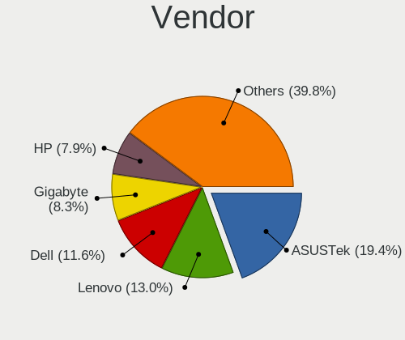
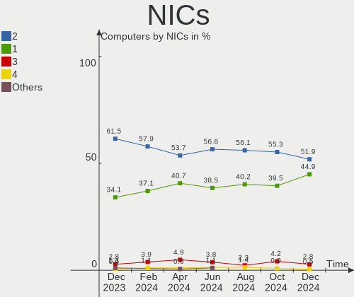

Pop!_OS - Hardware Trends
-------------------------

A project to identify most popular hardware characteristics and track their change
over time based on data collected by Linux users at https://Linux-Hardware.org.

Anyone can contribute to this report by the [hw-probe](https://github.com/linuxhw/hw-probe) tool:

    sudo -E hw-probe -all -upload

This is a report for all computer types. See also reports for [desktops](/Dist/Pop!_OS/Desktop/README.md) and [notebooks](/Dist/Pop!_OS/Notebook/README.md).

This report is for one last month. Overall report since the beginning of time: [TestDays](https://github.com/linuxhw/TestDays)

Period: Jun, 2023.

Contents
--------

* [ System ](#system)
  - [ OS                       ](#os)
  - [ OS Family                ](#os-family)
  - [ Kernel                   ](#kernel)
  - [ Kernel Family            ](#kernel-family)
  - [ Kernel Major Ver.        ](#kernel-major-ver)
  - [ Arch                     ](#arch)
  - [ DE                       ](#de)
  - [ Display Server           ](#display-server)
  - [ Display Manager          ](#display-manager)
  - [ OS Lang                  ](#os-lang)
  - [ Boot Mode                ](#boot-mode)
  - [ Filesystem               ](#filesystem)
  - [ Part. scheme             ](#part-scheme)
  - [ Dual Boot with Linux/BSD ](#dual-boot-with-linuxbsd)
  - [ Dual Boot (Win)          ](#dual-boot-win)

* [ Board ](#board)
  - [ Vendor                   ](#vendor)
  - [ Model                    ](#model)
  - [ Model Family             ](#model-family)
  - [ MFG Year                 ](#mfg-year)
  - [ Form Factor              ](#form-factor)
  - [ Secure Boot              ](#secure-boot)
  - [ Coreboot                 ](#coreboot)
  - [ RAM Size                 ](#ram-size)
  - [ RAM Used                 ](#ram-used)
  - [ Total Drives             ](#total-drives)
  - [ Has CD-ROM               ](#has-cd-rom)
  - [ Has Ethernet             ](#has-ethernet)
  - [ Has WiFi                 ](#has-wifi)
  - [ Has Bluetooth            ](#has-bluetooth)

* [ Location ](#location)
  - [ Country                  ](#country)
  - [ City                     ](#city)

* [ Drives ](#drives)
  - [ Drive Vendor             ](#drive-vendor)
  - [ Drive Model              ](#drive-model)
  - [ HDD Vendor               ](#hdd-vendor)
  - [ SSD Vendor               ](#ssd-vendor)
  - [ Drive Kind               ](#drive-kind)
  - [ Drive Connector          ](#drive-connector)
  - [ Drive Size               ](#drive-size)
  - [ Space Total              ](#space-total)
  - [ Space Used               ](#space-used)
  - [ Malfunc. Drives          ](#malfunc-drives)
  - [ Malfunc. Drive Vendor    ](#malfunc-drive-vendor)
  - [ Malfunc. HDD Vendor      ](#malfunc-hdd-vendor)
  - [ Malfunc. Drive Kind      ](#malfunc-drive-kind)
  - [ Failed Drives            ](#failed-drives)
  - [ Failed Drive Vendor      ](#failed-drive-vendor)
  - [ Drive Status             ](#drive-status)

* [ Storage controller ](#storage-controller)
  - [ Storage Vendor           ](#storage-vendor)
  - [ Storage Model            ](#storage-model)
  - [ Storage Kind             ](#storage-kind)

* [ Processor ](#processor)
  - [ CPU Vendor               ](#cpu-vendor)
  - [ CPU Model                ](#cpu-model)
  - [ CPU Model Family         ](#cpu-model-family)
  - [ CPU Cores                ](#cpu-cores)
  - [ CPU Sockets              ](#cpu-sockets)
  - [ CPU Threads              ](#cpu-threads)
  - [ CPU Op-Modes             ](#cpu-op-modes)
  - [ CPU Microcode            ](#cpu-microcode)
  - [ CPU Microarch            ](#cpu-microarch)

* [ Graphics ](#graphics)
  - [ GPU Vendor               ](#gpu-vendor)
  - [ GPU Model                ](#gpu-model)
  - [ GPU Combo                ](#gpu-combo)
  - [ GPU Driver               ](#gpu-driver)
  - [ GPU Memory               ](#gpu-memory)

* [ Monitor ](#monitor)
  - [ Monitor Vendor           ](#monitor-vendor)
  - [ Monitor Model            ](#monitor-model)
  - [ Monitor Resolution       ](#monitor-resolution)
  - [ Monitor Diagonal         ](#monitor-diagonal)
  - [ Monitor Width            ](#monitor-width)
  - [ Aspect Ratio             ](#aspect-ratio)
  - [ Monitor Area             ](#monitor-area)
  - [ Pixel Density            ](#pixel-density)
  - [ Multiple Monitors        ](#multiple-monitors)

* [ Network ](#network)
  - [ Net Controller Vendor    ](#net-controller-vendor)
  - [ Net Controller Model     ](#net-controller-model)
  - [ Wireless Vendor          ](#wireless-vendor)
  - [ Wireless Model           ](#wireless-model)
  - [ Ethernet Vendor          ](#ethernet-vendor)
  - [ Ethernet Model           ](#ethernet-model)
  - [ Net Controller Kind      ](#net-controller-kind)
  - [ Used Controller          ](#used-controller)
  - [ NICs                     ](#nics)
  - [ IPv6                     ](#ipv6)

* [ Bluetooth ](#bluetooth)
  - [ Bluetooth Vendor         ](#bluetooth-vendor)
  - [ Bluetooth Model          ](#bluetooth-model)

* [ Sound ](#sound)
  - [ Sound Vendor             ](#sound-vendor)
  - [ Sound Model              ](#sound-model)

* [ Memory ](#memory)
  - [ Memory Vendor            ](#memory-vendor)
  - [ Memory Model             ](#memory-model)
  - [ Memory Kind              ](#memory-kind)
  - [ Memory Form Factor       ](#memory-form-factor)
  - [ Memory Size              ](#memory-size)
  - [ Memory Speed             ](#memory-speed)

* [ Printers & scanners ](#printers--scanners)
  - [ Printer Vendor           ](#printer-vendor)
  - [ Printer Model            ](#printer-model)
  - [ Scanner Vendor           ](#scanner-vendor)
  - [ Scanner Model            ](#scanner-model)

* [ Camera ](#camera)
  - [ Camera Vendor            ](#camera-vendor)
  - [ Camera Model             ](#camera-model)

* [ Security ](#security)
  - [ Fingerprint Vendor       ](#fingerprint-vendor)
  - [ Fingerprint Model        ](#fingerprint-model)
  - [ Chipcard Vendor          ](#chipcard-vendor)
  - [ Chipcard Model           ](#chipcard-model)

* [ Unsupported ](#unsupported)
  - [ Unsupported Devices      ](#unsupported-devices)
  - [ Unsupported Device Types ](#unsupported-device-types)

System
------

OS
--

Installed operating systems

| Name          | Computers | Percent |
|---------------|-----------|---------|
| Pop!_OS 22.04 | 180       | 97.83%  |
| Pop!_OS 21.04 | 2         | 1.09%   |
| Pop!_OS 20.10 | 1         | 0.54%   |
| Pop!_OS 20.04 | 1         | 0.54%   |

OS Family
---------

OS without a version

| Name    | Computers | Percent |
|---------|-----------|---------|
| Pop!_OS | 184       | 100%    |

Kernel
------

Version of the Linux kernel

| Version                 | Computers | Percent |
|-------------------------|-----------|---------|
| 6.2.6-76060206-generic  | 162       | 88.04%  |
| 6.0.12-76060006-generic | 3         | 1.63%   |
| 6.3.7-060307-generic    | 2         | 1.09%   |
| 6.3.4-060304-generic    | 2         | 1.09%   |
| 6.0.2-76060002-generic  | 2         | 1.09%   |
| 5.19.0-76051900-generic | 2         | 1.09%   |
| 6.3.9-x64v3-xanmod1     | 1         | 0.54%   |
| 6.3.8-1-liquorix-amd64  | 1         | 0.54%   |
| 6.3.5-x64v1-xanmod1     | 1         | 0.54%   |
| 6.3.0-060300-generic    | 1         | 0.54%   |
| 6.2.0-76060200-generic  | 1         | 0.54%   |
| 6.1.11-76060111-generic | 1         | 0.54%   |
| 6.0.6-76060006-generic  | 1         | 0.54%   |
| 6.0.12-76060012-generic | 1         | 0.54%   |
| 5.8.0-7642-generic      | 1         | 0.54%   |
| 5.11.0-7620-generic     | 1         | 0.54%   |
| 5.11.0-7612-generic     | 1         | 0.54%   |

Kernel Family
-------------

Linux kernel without a distro release

| Version | Computers | Percent |
|---------|-----------|---------|
| 6.2.6   | 162       | 88.04%  |
| 6.0.12  | 4         | 2.17%   |
| 6.3.7   | 2         | 1.09%   |
| 6.3.4   | 2         | 1.09%   |
| 6.0.2   | 2         | 1.09%   |
| 5.19.0  | 2         | 1.09%   |
| 5.11.0  | 2         | 1.09%   |
| 6.3.9   | 1         | 0.54%   |
| 6.3.8   | 1         | 0.54%   |
| 6.3.5   | 1         | 0.54%   |
| 6.3.0   | 1         | 0.54%   |
| 6.2.0   | 1         | 0.54%   |
| 6.1.11  | 1         | 0.54%   |
| 6.0.6   | 1         | 0.54%   |
| 5.8.0   | 1         | 0.54%   |

Kernel Major Ver.
-----------------

Linux kernel major version

| Version | Computers | Percent |
|---------|-----------|---------|
| 6.2     | 163       | 88.59%  |
| 6.3     | 8         | 4.35%   |
| 6.0     | 7         | 3.8%    |
| 5.19    | 2         | 1.09%   |
| 5.11    | 2         | 1.09%   |
| 6.1     | 1         | 0.54%   |
| 5.8     | 1         | 0.54%   |

Arch
----

OS architecture (x86_64, i586, etc.)

| Name   | Computers | Percent |
|--------|-----------|---------|
| x86_64 | 184       | 100%    |

DE
--

Desktop Environment

| Name    | Computers | Percent |
|---------|-----------|---------|
| GNOME   | 179       | 97.28%  |
| Unknown | 2         | 1.09%   |
| MATE    | 1         | 0.54%   |
| KDE5    | 1         | 0.54%   |
| i3      | 1         | 0.54%   |

Display Server
--------------

X11 or Wayland

| Name    | Computers | Percent |
|---------|-----------|---------|
| X11     | 177       | 96.2%   |
| Wayland | 7         | 3.8%    |

Display Manager
---------------

SDDM, LightDM, etc.

| Name    | Computers | Percent |
|---------|-----------|---------|
| Unknown | 133       | 72.28%  |
| GDM3    | 49        | 26.63%  |
| SDDM    | 1         | 0.54%   |
| GDM     | 1         | 0.54%   |

OS Lang
-------

Language

| Lang    | Computers | Percent |
|---------|-----------|---------|
| en_US   | 105       | 57.07%  |
| de_DE   | 15        | 8.15%   |
| en_GB   | 12        | 6.52%   |
| pt_BR   | 11        | 5.98%   |
| es_ES   | 6         | 3.26%   |
| en_AU   | 6         | 3.26%   |
| C       | 6         | 3.26%   |
| fr_FR   | 3         | 1.63%   |
| tr_TR   | 2         | 1.09%   |
| es_AR   | 2         | 1.09%   |
| de_AT   | 2         | 1.09%   |
| Unknown | 2         | 1.09%   |
| sv_SE   | 1         | 0.54%   |
| ru_RU   | 1         | 0.54%   |
| pt_PT   | 1         | 0.54%   |
| pl_PL   | 1         | 0.54%   |
| nl_NL   | 1         | 0.54%   |
| nb_NO   | 1         | 0.54%   |
| it_IT   | 1         | 0.54%   |
| fr_CH   | 1         | 0.54%   |
| fi_FI   | 1         | 0.54%   |
| en_PH   | 1         | 0.54%   |
| en_IN   | 1         | 0.54%   |
| en_CA   | 1         | 0.54%   |

Boot Mode
---------

EFI or BIOS

| Mode | Computers | Percent |
|------|-----------|---------|
| BIOS | 136       | 73.91%  |
| EFI  | 48        | 26.09%  |

Filesystem
----------

Type of filesystem

| Type    | Computers | Percent |
|---------|-----------|---------|
| Ext4    | 173       | 94.02%  |
| Btrfs   | 6         | 3.26%   |
| Overlay | 4         | 2.17%   |
| Xfs     | 1         | 0.54%   |

Part. scheme
------------

Scheme of partitioning

| Type    | Computers | Percent |
|---------|-----------|---------|
| Unknown | 131       | 71.2%   |
| GPT     | 50        | 27.17%  |
| MBR     | 3         | 1.63%   |

Dual Boot with Linux/BSD
------------------------

Hosting more than one Linux/BSD

| Dual boot | Computers | Percent |
|-----------|-----------|---------|
| No        | 174       | 94.57%  |
| Yes       | 10        | 5.43%   |

Dual Boot (Win)
---------------

Hosting Linux and Windows

| Dual boot | Computers | Percent |
|-----------|-----------|---------|
| No        | 163       | 88.59%  |
| Yes       | 21        | 11.41%  |

Board
-----

Vendor
------

Motherboard manufacturer

| Name                                 | Computers | Percent |
|--------------------------------------|-----------|---------|
| ASUSTek Computer                     | 33        | 17.93%  |
| Dell                                 | 29        | 15.76%  |
| MSI                                  | 24        | 13.04%  |
| Lenovo                               | 18        | 9.78%   |
| Hewlett-Packard                      | 16        | 8.7%    |
| Gigabyte Technology                  | 11        | 5.98%   |
| Acer                                 | 11        | 5.98%   |
| System76                             | 6         | 3.26%   |
| Apple                                | 5         | 2.72%   |
| Samsung Electronics                  | 3         | 1.63%   |
| BESSTAR Tech                         | 3         | 1.63%   |
| ASRock                               | 3         | 1.63%   |
| Positivo                             | 2         | 1.09%   |
| HUAWEI                               | 2         | 1.09%   |
| Biostar                              | 2         | 1.09%   |
| AZW                                  | 2         | 1.09%   |
| ZOTAC                                | 1         | 0.54%   |
| TUXEDO                               | 1         | 0.54%   |
| Toshiba                              | 1         | 0.54%   |
| Teclast                              | 1         | 0.54%   |
| Sony                                 | 1         | 0.54%   |
| Shenzhen Meigao Electronic Equipment | 1         | 0.54%   |
| Pegatron                             | 1         | 0.54%   |
| Machcreator                          | 1         | 0.54%   |
| Intel                                | 1         | 0.54%   |
| HONOR                                | 1         | 0.54%   |
| Fujitsu                              | 1         | 0.54%   |
| Foxconn                              | 1         | 0.54%   |
| ATOPNUC                              | 1         | 0.54%   |
| Acidanthera                          | 1         | 0.54%   |

Model
-----

Motherboard model

| Name                                       | Computers | Percent |
|--------------------------------------------|-----------|---------|
| System76 Oryx Pro                          | 2         | 1.09%   |
| System76 Gazelle                           | 2         | 1.09%   |
| MSI MS-7A38                                | 2         | 1.09%   |
| BESSTAR Tech B550                          | 2         | 1.09%   |
| ASUS ROG STRIX B550-F GAMING               | 2         | 1.09%   |
| ASUS ROG STRIX B450-F GAMING               | 2         | 1.09%   |
| ZOTAC ZBOX-AD04                            | 1         | 0.54%   |
| Toshiba Satellite P55t-B                   | 1         | 0.54%   |
| Teclast F7 Plus                            | 1         | 0.54%   |
| System76 Thelio Mira                       | 1         | 0.54%   |
| System76 Lemur Pro                         | 1         | 0.54%   |
| Sony VPCEA23FB                             | 1         | 0.54%   |
| Shenzhen Meigao Electronic Equipment UM560 | 1         | 0.54%   |
| Samsung DeskTop System                     | 1         | 0.54%   |
| Samsung 550XCJ/550XCR                      | 1         | 0.54%   |
| Samsung 340XAA/350XAA/550XAA               | 1         | 0.54%   |
| Positivo Mobile                            | 1         | 0.54%   |
| Positivo H14CU02                           | 1         | 0.54%   |
| Pegatron BQ467AA-ABA s5510y                | 1         | 0.54%   |
| MSI Vector GP76 12UH                       | 1         | 0.54%   |
| MSI Raider GE66 12UGS                      | 1         | 0.54%   |
| MSI Prestige 16 A12UD                      | 1         | 0.54%   |
| MSI MS-7D75                                | 1         | 0.54%   |
| MSI MS-7C95                                | 1         | 0.54%   |
| MSI MS-7C94                                | 1         | 0.54%   |
| MSI MS-7C79                                | 1         | 0.54%   |
| MSI MS-7C37                                | 1         | 0.54%   |
| MSI MS-7C35                                | 1         | 0.54%   |
| MSI MS-7C02                                | 1         | 0.54%   |
| MSI MS-7B89                                | 1         | 0.54%   |
| MSI MS-7A32                                | 1         | 0.54%   |
| MSI MS-7972                                | 1         | 0.54%   |
| MSI MS-7883                                | 1         | 0.54%   |
| MSI MS-7756                                | 1         | 0.54%   |
| MSI MS-7721                                | 1         | 0.54%   |
| MSI MS-7680                                | 1         | 0.54%   |
| MSI GS65 Stealth 9SD                       | 1         | 0.54%   |
| MSI GE70 2PL                               | 1         | 0.54%   |
| MSI Cyborg 15 A12VF                        | 1         | 0.54%   |
| MSI Bravo 15 B5DD                          | 1         | 0.54%   |

Model Family
------------

Motherboard model prefix

| Name                                       | Computers | Percent |
|--------------------------------------------|-----------|---------|
| Lenovo ThinkPad                            | 10        | 5.43%   |
| ASUS ROG                                   | 10        | 5.43%   |
| Acer Aspire                                | 7         | 3.8%    |
| Dell OptiPlex                              | 6         | 3.26%   |
| Dell Inspiron                              | 6         | 3.26%   |
| Dell XPS                                   | 5         | 2.72%   |
| Dell Latitude                              | 5         | 2.72%   |
| HP Laptop                                  | 4         | 2.17%   |
| ASUS PRIME                                 | 4         | 2.17%   |
| Dell Vostro                                | 3         | 1.63%   |
| System76 Oryx                              | 2         | 1.09%   |
| System76 Gazelle                           | 2         | 1.09%   |
| MSI MS-7A38                                | 2         | 1.09%   |
| Lenovo Yoga                                | 2         | 1.09%   |
| Lenovo ThinkCentre                         | 2         | 1.09%   |
| Lenovo IdeaPad                             | 2         | 1.09%   |
| HP Pavilion                                | 2         | 1.09%   |
| Dell Precision                             | 2         | 1.09%   |
| BESSTAR Tech B550                          | 2         | 1.09%   |
| ASUS Zenbook                               | 2         | 1.09%   |
| ASUS TUF                                   | 2         | 1.09%   |
| Acer Swift                                 | 2         | 1.09%   |
| ZOTAC ZBOX-AD04                            | 1         | 0.54%   |
| Toshiba Satellite                          | 1         | 0.54%   |
| Teclast F7                                 | 1         | 0.54%   |
| System76 Thelio                            | 1         | 0.54%   |
| System76 Lemur                             | 1         | 0.54%   |
| Sony VPCEA23FB                             | 1         | 0.54%   |
| Shenzhen Meigao Electronic Equipment UM560 | 1         | 0.54%   |
| Samsung DeskTop                            | 1         | 0.54%   |
| Samsung 550XCJ                             | 1         | 0.54%   |
| Samsung 340XAA                             | 1         | 0.54%   |
| Positivo Mobile                            | 1         | 0.54%   |
| Positivo H14CU02                           | 1         | 0.54%   |
| Pegatron BQ467AA-ABA                       | 1         | 0.54%   |
| MSI Vector                                 | 1         | 0.54%   |
| MSI Raider                                 | 1         | 0.54%   |
| MSI Prestige                               | 1         | 0.54%   |
| MSI MS-7D75                                | 1         | 0.54%   |
| MSI MS-7C95                                | 1         | 0.54%   |

MFG Year
--------

Motherboard manufacture year

| Year | Computers | Percent |
|------|-----------|---------|
| 2022 | 36        | 19.57%  |
| 2018 | 19        | 10.33%  |
| 2021 | 18        | 9.78%   |
| 2019 | 18        | 9.78%   |
| 2020 | 15        | 8.15%   |
| 2013 | 14        | 7.61%   |
| 2015 | 11        | 5.98%   |
| 2014 | 10        | 5.43%   |
| 2011 | 9         | 4.89%   |
| 2017 | 8         | 4.35%   |
| 2012 | 6         | 3.26%   |
| 2023 | 5         | 2.72%   |
| 2010 | 5         | 2.72%   |
| 2009 | 5         | 2.72%   |
| 2016 | 3         | 1.63%   |
| 2008 | 2         | 1.09%   |

Form Factor
-----------

Physical design of the computer

| Name        | Computers | Percent |
|-------------|-----------|---------|
| Notebook    | 93        | 50.54%  |
| Desktop     | 75        | 40.76%  |
| Convertible | 9         | 4.89%   |
| Mini pc     | 4         | 2.17%   |
| All in one  | 2         | 1.09%   |
| Tablet      | 1         | 0.54%   |

Secure Boot
-----------

Enabled or disabled

| State    | Computers | Percent |
|----------|-----------|---------|
| Disabled | 184       | 100%    |

Coreboot
--------

Have coreboot on board

| Used | Computers | Percent |
|------|-----------|---------|
| No   | 181       | 98.37%  |
| Yes  | 3         | 1.63%   |

RAM Size
--------

Total RAM memory

| Size in GB  | Computers | Percent |
|-------------|-----------|---------|
| 16.01-24.0  | 50        | 27.17%  |
| 32.01-64.0  | 35        | 19.02%  |
| 8.01-16.0   | 35        | 19.02%  |
| 4.01-8.0    | 31        | 16.85%  |
| 3.01-4.0    | 18        | 9.78%   |
| 64.01-256.0 | 9         | 4.89%   |
| 24.01-32.0  | 5         | 2.72%   |
| 1.01-2.0    | 1         | 0.54%   |

RAM Used
--------

Used RAM memory

| Used GB    | Computers | Percent |
|------------|-----------|---------|
| 4.01-8.0   | 88        | 47.83%  |
| 2.01-3.0   | 28        | 15.22%  |
| 3.01-4.0   | 27        | 14.67%  |
| 8.01-16.0  | 27        | 14.67%  |
| 1.01-2.0   | 10        | 5.43%   |
| 16.01-24.0 | 3         | 1.63%   |
| 32.01-64.0 | 1         | 0.54%   |

Total Drives
------------

Number of drives on board

| Drives | Computers | Percent |
|--------|-----------|---------|
| 1      | 100       | 54.35%  |
| 2      | 47        | 25.54%  |
| 3      | 26        | 14.13%  |
| 4      | 4         | 2.17%   |
| 5      | 3         | 1.63%   |
| 7      | 2         | 1.09%   |
| 6      | 2         | 1.09%   |

Has CD-ROM
----------

Has CD-ROM on board

| Presented | Computers | Percent |
|-----------|-----------|---------|
| No        | 137       | 74.46%  |
| Yes       | 47        | 25.54%  |

Has Ethernet
------------

Has Ethernet on board

| Presented | Computers | Percent |
|-----------|-----------|---------|
| Yes       | 156       | 84.78%  |
| No        | 28        | 15.22%  |

Has WiFi
--------

Has WiFi module

| Presented | Computers | Percent |
|-----------|-----------|---------|
| Yes       | 151       | 82.07%  |
| No        | 33        | 17.93%  |

Has Bluetooth
-------------

Has Bluetooth module

| Presented | Computers | Percent |
|-----------|-----------|---------|
| Yes       | 127       | 69.02%  |
| No        | 57        | 30.98%  |

Location
--------

Country
-------

Geographic location (country)

| Country      | Computers | Percent |
|--------------|-----------|---------|
| USA          | 61        | 33.15%  |
| Brazil       | 17        | 9.24%   |
| Germany      | 15        | 8.15%   |
| UK           | 9         | 4.89%   |
| Spain        | 9         | 4.89%   |
| Australia    | 8         | 4.35%   |
| India        | 5         | 2.72%   |
| Russia       | 4         | 2.17%   |
| Sweden       | 3         | 1.63%   |
| Poland       | 3         | 1.63%   |
| Netherlands  | 3         | 1.63%   |
| Mexico       | 3         | 1.63%   |
| Italy        | 3         | 1.63%   |
| France       | 3         | 1.63%   |
| Canada       | 3         | 1.63%   |
| Austria      | 3         | 1.63%   |
| Argentina    | 3         | 1.63%   |
| Turkey       | 2         | 1.09%   |
| South Africa | 2         | 1.09%   |
| Portugal     | 2         | 1.09%   |
| Philippines  | 2         | 1.09%   |
| Norway       | 2         | 1.09%   |
| Finland      | 2         | 1.09%   |
| Vietnam      | 1         | 0.54%   |
| UAE          | 1         | 0.54%   |
| Thailand     | 1         | 0.54%   |
| Taiwan       | 1         | 0.54%   |
| Switzerland  | 1         | 0.54%   |
| Sri Lanka    | 1         | 0.54%   |
| Slovenia     | 1         | 0.54%   |
| Slovakia     | 1         | 0.54%   |
| Sierra Leone | 1         | 0.54%   |
| Romania      | 1         | 0.54%   |
| Morocco      | 1         | 0.54%   |
| Kyrgyzstan   | 1         | 0.54%   |
| Japan        | 1         | 0.54%   |
| Iraq         | 1         | 0.54%   |
| Indonesia    | 1         | 0.54%   |
| Denmark      | 1         | 0.54%   |
| Czechia      | 1         | 0.54%   |

City
----

Geographic location (city)

| City                | Computers | Percent |
|---------------------|-----------|---------|
| Sydney              | 4         | 2.17%   |
| Melbourne           | 3         | 1.63%   |
| Vienna              | 2         | 1.09%   |
| Toronto             | 2         | 1.09%   |
| Stockholm           | 2         | 1.09%   |
| Porto Alegre        | 2         | 1.09%   |
| Portland            | 2         | 1.09%   |
| Moscow              | 2         | 1.09%   |
| Madrid              | 2         | 1.09%   |
| La Grande           | 2         | 1.09%   |
| Johannesburg        | 2         | 1.09%   |
| Hamburg             | 2         | 1.09%   |
| Flushing            | 2         | 1.09%   |
| Barcelona           | 2         | 1.09%   |
| Austin              | 2         | 1.09%   |
| Williamsburg        | 1         | 0.54%   |
| Warwick             | 1         | 0.54%   |
| Voronezh            | 1         | 0.54%   |
| Vitória            | 1         | 0.54%   |
| Villa Martelli      | 1         | 0.54%   |
| Venlo               | 1         | 0.54%   |
| Varsta              | 1         | 0.54%   |
| Trondheim           | 1         | 0.54%   |
| Torquay             | 1         | 0.54%   |
| Tokyo               | 1         | 0.54%   |
| Tempe               | 1         | 0.54%   |
| Surat               | 1         | 0.54%   |
| Stuttgart           | 1         | 0.54%   |
| Stockton            | 1         | 0.54%   |
| Stockse             | 1         | 0.54%   |
| State College       | 1         | 0.54%   |
| Springfield         | 1         | 0.54%   |
| South San Francisco | 1         | 0.54%   |
| South Bend          | 1         | 0.54%   |
| Skive               | 1         | 0.54%   |
| Signal Mountain     | 1         | 0.54%   |
| Shipley             | 1         | 0.54%   |
| Sefrou              | 1         | 0.54%   |
| Sao Paulo           | 1         | 0.54%   |
| Sao Joao Nepomuceno | 1         | 0.54%   |

Drives
------

Drive Vendor
------------

Hard drive vendors

| Vendor                         | Computers | Drives | Percent |
|--------------------------------|-----------|--------|---------|
| Samsung Electronics            | 50        | 62     | 16.61%  |
| Seagate                        | 41        | 48     | 13.62%  |
| SanDisk                        | 27        | 29     | 8.97%   |
| WDC                            | 24        | 26     | 7.97%   |
| Kingston                       | 16        | 16     | 5.32%   |
| Crucial                        | 16        | 17     | 5.32%   |
| Unknown                        | 8         | 9      | 2.66%   |
| Toshiba                        | 8         | 9      | 2.66%   |
| Intel                          | 8         | 9      | 2.66%   |
| SK hynix                       | 7         | 8      | 2.33%   |
| Phison Electronics             | 7         | 8      | 2.33%   |
| HGST                           | 6         | 6      | 1.99%   |
| Micron Technology              | 5         | 5      | 1.66%   |
| Kingston Technology Company    | 5         | 5      | 1.66%   |
| Hitachi                        | 5         | 5      | 1.66%   |
| China                          | 5         | 5      | 1.66%   |
| Silicon Motion                 | 4         | 4      | 1.33%   |
| Micron/Crucial Technology      | 4         | 4      | 1.33%   |
| PNY                            | 3         | 3      | 1%      |
| KIOXIA                         | 3         | 3      | 1%      |
| Intenso                        | 3         | 3      | 1%      |
| A-DATA Technology              | 3         | 3      | 1%      |
| Team                           | 2         | 3      | 0.66%   |
| Solid State Storage            | 2         | 2      | 0.66%   |
| OCZ                            | 2         | 3      | 0.66%   |
| KingFast                       | 2         | 2      | 0.66%   |
| Apple                          | 2         | 2      | 0.66%   |
| Apacer                         | 2         | 2      | 0.66%   |
| Unknown                        | 2         | 2      | 0.66%   |
| Union Memory                   | 1         | 1      | 0.33%   |
| Teclast                        | 1         | 1      | 0.33%   |
| TECH                           | 1         | 1      | 0.33%   |
| T-FORCE                        | 1         | 1      | 0.33%   |
| SSSTC                          | 1         | 1      | 0.33%   |
| SPCC                           | 1         | 1      | 0.33%   |
| Solid State Storage Technology | 1         | 1      | 0.33%   |
| SCY                            | 1         | 1      | 0.33%   |
| SABRENT                        | 1         | 2      | 0.33%   |
| Realtek Semiconductor          | 1         | 1      | 0.33%   |
| Phison                         | 1         | 1      | 0.33%   |

Drive Model
-----------

Hard drive models

| Model                                                 | Computers | Percent |
|-------------------------------------------------------|-----------|---------|
| Samsung NVMe SSD Controller PM9A1/PM9A3/980PRO 2TB    | 9         | 2.81%   |
| Samsung NVMe SSD Controller SM981/PM981/PM983 250GB   | 7         | 2.19%   |
| Silicon Motion SM2263EN/SM2263XT SSD Controller 256GB | 3         | 0.94%   |
| Seagate ST500LT012-1DG142 500GB                       | 3         | 0.94%   |
| Seagate ST4000DM004-2CV104 4TB                        | 3         | 0.94%   |
| Seagate ST1000DM010-2EP102 1TB                        | 3         | 0.94%   |
| Phison E12 NVMe Controller 1TB                        | 3         | 0.94%   |
| Micron/Crucial P2 NVMe PCIe SSD 4TB                   | 3         | 0.94%   |
| Kingston SA400S37240G 240GB SSD                       | 3         | 0.94%   |
| Kingston SA400S37120G 120GB SSD                       | 3         | 0.94%   |
| China SSD 512GB                                       | 3         | 0.94%   |
| Unknown MMC Card  512GB                               | 2         | 0.63%   |
| Unknown MMC Card  32GB                                | 2         | 0.63%   |
| Seagate ST500LT012-9WS142 500GB                       | 2         | 0.63%   |
| Seagate ST500DM002-1BD142 500GB                       | 2         | 0.63%   |
| Seagate ST2000DM001-1ER164 2TB                        | 2         | 0.63%   |
| Seagate ST1000LM035-1RK172 1TB                        | 2         | 0.63%   |
| Seagate OneTouch HDD 2TB                              | 2         | 0.63%   |
| Sandisk WD Black SN750 / PC SN730 NVMe SSD 500GB      | 2         | 0.63%   |
| SanDisk SSD PLUS 240GB                                | 2         | 0.63%   |
| SanDisk NVMe SSD Drive 1TB                            | 2         | 0.63%   |
| Samsung SSD 980 1TB                                   | 2         | 0.63%   |
| Samsung SSD 970 EVO Plus 500GB                        | 2         | 0.63%   |
| Samsung SSD 870 QVO 1TB                               | 2         | 0.63%   |
| Samsung SSD 860 EVO M.2 500GB                         | 2         | 0.63%   |
| Samsung NVMe SSD Controller SM961/PM961/SM963 256GB   | 2         | 0.63%   |
| Samsung MZVLQ512HBLU-00B00 512GB                      | 2         | 0.63%   |
| Samsung MZVL4512HBLU-00BTW 512GB                      | 2         | 0.63%   |
| Samsung HD154UI 1TB                                   | 2         | 0.63%   |
| OCZ TRION100 240GB SSD                                | 2         | 0.63%   |
| Kingston Company A2000 NVMe SSD 250GB                 | 2         | 0.63%   |
| Kingston SV300S37A240G 240GB SSD                      | 2         | 0.63%   |
| Kingston SA400S37960G 960GB SSD                       | 2         | 0.63%   |
| KingFast 512GB                                        | 2         | 0.63%   |
| Intenso SSD 120GB                                     | 2         | 0.63%   |
| HGST HUS726060ALA640 6TB                              | 2         | 0.63%   |
| Crucial CT500MX500SSD1 500GB                          | 2         | 0.63%   |
| Crucial CT480BX500SSD1 480GB                          | 2         | 0.63%   |
| Crucial CT2000MX500SSD1 2TB                           | 2         | 0.63%   |
| Crucial CT2000BX500SSD1 2TB                           | 2         | 0.63%   |

HDD Vendor
----------

Hard disk drive vendors

| Vendor              | Computers | Drives | Percent |
|---------------------|-----------|--------|---------|
| Seagate             | 41        | 46     | 50.62%  |
| WDC                 | 15        | 17     | 18.52%  |
| HGST                | 6         | 6      | 7.41%   |
| Toshiba             | 5         | 5      | 6.17%   |
| Hitachi             | 5         | 5      | 6.17%   |
| Samsung Electronics | 4         | 4      | 4.94%   |
| SABRENT             | 1         | 2      | 1.23%   |
| LaCie               | 1         | 1      | 1.23%   |
| Intenso             | 1         | 1      | 1.23%   |
| ASMedia             | 1         | 1      | 1.23%   |
| Apple               | 1         | 1      | 1.23%   |

SSD Vendor
----------

Solid state drive vendors

| Vendor              | Computers | Drives | Percent |
|---------------------|-----------|--------|---------|
| SanDisk             | 14        | 15     | 14.89%  |
| Kingston            | 14        | 14     | 14.89%  |
| Crucial             | 13        | 14     | 13.83%  |
| Samsung Electronics | 11        | 12     | 11.7%   |
| China               | 5         | 5      | 5.32%   |
| WDC                 | 3         | 3      | 3.19%   |
| PNY                 | 3         | 3      | 3.19%   |
| Team                | 2         | 3      | 2.13%   |
| SK hynix            | 2         | 2      | 2.13%   |
| OCZ                 | 2         | 3      | 2.13%   |
| Micron Technology   | 2         | 2      | 2.13%   |
| Intenso             | 2         | 2      | 2.13%   |
| Intel               | 2         | 2      | 2.13%   |
| Apacer              | 2         | 2      | 2.13%   |
| A-DATA Technology   | 2         | 2      | 2.13%   |
| Toshiba             | 1         | 1      | 1.06%   |
| Teclast             | 1         | 1      | 1.06%   |
| T-FORCE             | 1         | 1      | 1.06%   |
| SPCC                | 1         | 1      | 1.06%   |
| Seagate             | 1         | 1      | 1.06%   |
| SCY                 | 1         | 1      | 1.06%   |
| MicroFrom           | 1         | 1      | 1.06%   |
| LITEONIT            | 1         | 1      | 1.06%   |
| Lexar               | 1         | 1      | 1.06%   |
| KingSpec            | 1         | 1      | 1.06%   |
| KingDian            | 1         | 1      | 1.06%   |
| Inland              | 1         | 1      | 1.06%   |
| Gost                | 1         | 1      | 1.06%   |
| Corsair             | 1         | 1      | 1.06%   |
| Apple               | 1         | 1      | 1.06%   |

Drive Kind
----------

HDD or SSD

| Kind    | Computers | Drives | Percent |
|---------|-----------|--------|---------|
| NVMe    | 100       | 126    | 37.88%  |
| SSD     | 79        | 99     | 29.92%  |
| HDD     | 68        | 89     | 25.76%  |
| Unknown | 11        | 13     | 4.17%   |
| MMC     | 6         | 7      | 2.27%   |

Drive Connector
---------------

SATA, SAS, NVMe, etc.

| Type | Computers | Drives | Percent |
|------|-----------|--------|---------|
| SATA | 113       | 178    | 47.68%  |
| NVMe | 100       | 125    | 42.19%  |
| SAS  | 18        | 24     | 7.59%   |
| MMC  | 6         | 7      | 2.53%   |

Drive Size
----------

Size of hard drive

| Size in TB | Computers | Drives | Percent |
|------------|-----------|--------|---------|
| 0.01-0.5   | 74        | 94     | 48.05%  |
| 0.51-1.0   | 45        | 53     | 29.22%  |
| 1.01-2.0   | 21        | 25     | 13.64%  |
| 4.01-10.0  | 8         | 8      | 5.19%   |
| 3.01-4.0   | 4         | 5      | 2.6%    |
| 2.01-3.0   | 1         | 1      | 0.65%   |
| 10.01-20.0 | 1         | 2      | 0.65%   |

Space Total
-----------

Amount of disk space available on the file system

| Size in GB     | Computers | Percent |
|----------------|-----------|---------|
| 101-250        | 46        | 25%     |
| 251-500        | 45        | 24.46%  |
| 501-1000       | 37        | 20.11%  |
| More than 3000 | 19        | 10.33%  |
| 1001-2000      | 18        | 9.78%   |
| 2001-3000      | 9         | 4.89%   |
| 1-20           | 4         | 2.17%   |
| 21-50          | 2         | 1.09%   |
| 51-100         | 2         | 1.09%   |
| Unknown        | 2         | 1.09%   |

Space Used
----------

Amount of used disk space

| Used GB        | Computers | Percent |
|----------------|-----------|---------|
| 21-50          | 44        | 23.91%  |
| 1-20           | 43        | 23.37%  |
| 101-250        | 24        | 13.04%  |
| 51-100         | 21        | 11.41%  |
| 251-500        | 18        | 9.78%   |
| 501-1000       | 14        | 7.61%   |
| More than 3000 | 9         | 4.89%   |
| 1001-2000      | 6         | 3.26%   |
| 2001-3000      | 3         | 1.63%   |
| Unknown        | 2         | 1.09%   |

Malfunc. Drives
---------------

Drive models with a malfunction

| Model                               | Computers | Drives | Percent |
|-------------------------------------|-----------|--------|---------|
| Team T253X1120G 120GB SSD           | 1         | 1      | 20%     |
| Seagate ST3250310AS 250GB           | 1         | 1      | 20%     |
| SanDisk SD8TB8U-256G-1006 256GB SSD | 1         | 1      | 20%     |
| Kingston SUV400S37240G 240GB SSD    | 1         | 1      | 20%     |
| HGST HUS726060ALA640 6TB            | 1         | 1      | 20%     |

Malfunc. Drive Vendor
---------------------

Vendors of faulty drives

| Vendor   | Computers | Drives | Percent |
|----------|-----------|--------|---------|
| Team     | 1         | 1      | 20%     |
| Seagate  | 1         | 1      | 20%     |
| SanDisk  | 1         | 1      | 20%     |
| Kingston | 1         | 1      | 20%     |
| HGST     | 1         | 1      | 20%     |

Malfunc. HDD Vendor
-------------------

Vendors of faulty HDD drives

| Vendor  | Computers | Drives | Percent |
|---------|-----------|--------|---------|
| Seagate | 1         | 1      | 50%     |
| HGST    | 1         | 1      | 50%     |

Malfunc. Drive Kind
-------------------

Kinds of faulty drives

| Kind | Computers | Drives | Percent |
|------|-----------|--------|---------|
| SSD  | 3         | 3      | 60%     |
| HDD  | 2         | 2      | 40%     |

Failed Drives
-------------

Failed drive models

Zero info for selected period =(

Failed Drive Vendor
-------------------

Failed drive vendors

Zero info for selected period =(

Drive Status
------------

Number of failed and malfunc. drives

| Status   | Computers | Drives | Percent |
|----------|-----------|--------|---------|
| Detected | 140       | 247    | 70%     |
| Works    | 55        | 82     | 27.5%   |
| Malfunc  | 5         | 5      | 2.5%    |

Storage controller
------------------

Storage Vendor
--------------

Storage controller vendors

| Vendor                         | Computers | Percent |
|--------------------------------|-----------|---------|
| Intel                          | 98        | 36.98%  |
| AMD                            | 49        | 18.49%  |
| Samsung Electronics            | 38        | 14.34%  |
| SanDisk                        | 18        | 6.79%   |
| Phison Electronics             | 8         | 3.02%   |
| Micron/Crucial Technology      | 7         | 2.64%   |
| Kingston Technology Company    | 7         | 2.64%   |
| SK hynix                       | 6         | 2.26%   |
| ASMedia Technology             | 5         | 1.89%   |
| Solid State Storage Technology | 4         | 1.51%   |
| Silicon Motion                 | 4         | 1.51%   |
| Nvidia                         | 4         | 1.51%   |
| KIOXIA                         | 4         | 1.51%   |
| Micron Technology              | 3         | 1.13%   |
| Toshiba America Info Systems   | 2         | 0.75%   |
| ADATA Technology               | 2         | 0.75%   |
| Union Memory (Shenzhen)        | 1         | 0.38%   |
| Realtek Semiconductor          | 1         | 0.38%   |
| Marvell Technology Group       | 1         | 0.38%   |
| LSI Logic / Symbios Logic      | 1         | 0.38%   |
| INNOGRIT                       | 1         | 0.38%   |
| Broadcom / LSI                 | 1         | 0.38%   |

Storage Model
-------------

Storage controller models

| Model                                                                          | Computers | Percent |
|--------------------------------------------------------------------------------|-----------|---------|
| AMD FCH SATA Controller [AHCI mode]                                            | 30        | 10.17%  |
| Samsung NVMe SSD Controller SM981/PM981/PM983                                  | 15        | 5.08%   |
| Samsung NVMe SSD Controller PM9A1/PM9A3/980PRO                                 | 12        | 4.07%   |
| Intel 8 Series/C220 Series Chipset Family 6-port SATA Controller 1 [AHCI mode] | 11        | 3.73%   |
| AMD 500 Series Chipset SATA Controller                                         | 10        | 3.39%   |
| AMD 400 Series Chipset SATA Controller                                         | 10        | 3.39%   |
| Intel Volume Management Device NVMe RAID Controller                            | 8         | 2.71%   |
| Samsung NVMe SSD Controller 980                                                | 7         | 2.37%   |
| Intel 82801 Mobile SATA Controller [RAID mode]                                 | 7         | 2.37%   |
| Intel 6 Series/C200 Series Chipset Family 6 port Mobile SATA AHCI Controller   | 7         | 2.37%   |
| Intel Sunrise Point-LP SATA Controller [AHCI mode]                             | 6         | 2.03%   |
| Intel 8 Series SATA Controller 1 [AHCI mode]                                   | 6         | 2.03%   |
| Micron/Crucial P2 NVMe PCIe SSD                                                | 5         | 1.69%   |
| AMD SB7x0/SB8x0/SB9x0 IDE Controller                                           | 5         | 1.69%   |
| SK hynix Gold P31/BC711/PC711 NVMe Solid State Drive                           | 4         | 1.36%   |
| SanDisk Non-Volatile memory controller                                         | 4         | 1.36%   |
| Phison E12 NVMe Controller                                                     | 4         | 1.36%   |
| Intel Q170/Q150/B150/H170/H110/Z170/CM236 Chipset SATA Controller [AHCI Mode]  | 4         | 1.36%   |
| Intel Comet Lake SATA AHCI Controller                                          | 4         | 1.36%   |
| Intel Cannon Lake Mobile PCH SATA AHCI Controller                              | 4         | 1.36%   |
| Intel 7 Series/C210 Series Chipset Family 6-port SATA Controller [AHCI mode]   | 4         | 1.36%   |
| Intel 200 Series PCH SATA controller [AHCI mode]                               | 4         | 1.36%   |
| ASMedia ASM1062 Serial ATA Controller                                          | 4         | 1.36%   |
| AMD SB7x0/SB8x0/SB9x0 SATA Controller [IDE mode]                               | 4         | 1.36%   |
| Solid State Storage CL1-3D256-Q11 NVMe SSD M.2                                 | 3         | 1.02%   |
| Silicon Motion SM2263EN/SM2263XT SSD Controller                                | 3         | 1.02%   |
| Sandisk Western Digital WD Black SN850X NVMe SSD                               | 3         | 1.02%   |
| SanDisk WD PC SN810 / Black SN850 NVMe SSD                                     | 3         | 1.02%   |
| KIOXIA Non-Volatile memory controller                                          | 3         | 1.02%   |
| Intel Cannon Point-LP SATA Controller [AHCI Mode]                              | 3         | 1.02%   |
| Intel 7 Series Chipset Family 6-port SATA Controller [AHCI mode]               | 3         | 1.02%   |
| SanDisk WD Blue SN570 NVMe SSD 1TB                                             | 2         | 0.68%   |
| SanDisk WD Black SN750 / PC SN730 NVMe SSD                                     | 2         | 0.68%   |
| Samsung NVMe SSD Controller SM961/PM961/SM963                                  | 2         | 0.68%   |
| Samsung NVMe SSD Controller PM9B1                                              | 2         | 0.68%   |
| Phison PS5013 E13 NVMe Controller                                              | 2         | 0.68%   |
| Nvidia MCP61 SATA Controller                                                   | 2         | 0.68%   |
| Micron 2450 NVMe SSD (DRAM-less)                                               | 2         | 0.68%   |
| Kingston Company Company Non-Volatile memory controller                        | 2         | 0.68%   |
| Kingston Company A2000 NVMe SSD                                                | 2         | 0.68%   |

Storage Kind
------------

Kind of storage controller (IDE, SATA, NVMe, SAS, ...)

| Kind | Computers | Percent |
|------|-----------|---------|
| SATA | 120       | 47.24%  |
| NVMe | 99        | 38.98%  |
| RAID | 19        | 7.48%   |
| IDE  | 15        | 5.91%   |
| SAS  | 1         | 0.39%   |

Processor
---------

CPU Vendor
----------

Processor vendors

| Vendor | Computers | Percent |
|--------|-----------|---------|
| Intel  | 121       | 65.76%  |
| AMD    | 63        | 34.24%  |

CPU Model
---------

Processor models

| Model                                       | Computers | Percent |
|---------------------------------------------|-----------|---------|
| Intel Core i7-9750H CPU @ 2.60GHz           | 5         | 2.72%   |
| Intel 12th Gen Core i7-12700H               | 5         | 2.72%   |
| AMD Ryzen 5 5600G with Radeon Graphics      | 4         | 2.17%   |
| AMD Ryzen 5 5500U with Radeon Graphics      | 4         | 2.17%   |
| Intel Core i5-8250U CPU @ 1.60GHz           | 3         | 1.63%   |
| Intel 12th Gen Core i5-12450H               | 3         | 1.63%   |
| Intel 11th Gen Core i7-1165G7 @ 2.80GHz     | 3         | 1.63%   |
| AMD Ryzen 7 5700G with Radeon Graphics      | 3         | 1.63%   |
| AMD Ryzen 5 5600H with Radeon Graphics      | 3         | 1.63%   |
| AMD Ryzen 5 2600 Six-Core Processor         | 3         | 1.63%   |
| Intel Core i7-8750H CPU @ 2.20GHz           | 2         | 1.09%   |
| Intel Core i7-8550U CPU @ 1.80GHz           | 2         | 1.09%   |
| Intel Core i7-4810MQ CPU @ 2.80GHz          | 2         | 1.09%   |
| Intel Core i7-4790 CPU @ 3.60GHz            | 2         | 1.09%   |
| Intel Core i7-4720HQ CPU @ 2.60GHz          | 2         | 1.09%   |
| Intel Core i7-3770 CPU @ 3.40GHz            | 2         | 1.09%   |
| Intel Core i7-2720QM CPU @ 2.20GHz          | 2         | 1.09%   |
| Intel Core i5-6500 CPU @ 3.20GHz            | 2         | 1.09%   |
| Intel Core i5-2450M CPU @ 2.50GHz           | 2         | 1.09%   |
| Intel Core i5-1035G1 CPU @ 1.00GHz          | 2         | 1.09%   |
| Intel Core i3-4030U CPU @ 1.90GHz           | 2         | 1.09%   |
| Intel Celeron CPU N2840 @ 2.16GHz           | 2         | 1.09%   |
| Intel 12th Gen Core i7-1260P                | 2         | 1.09%   |
| Intel 11th Gen Core i7-11800H @ 2.30GHz     | 2         | 1.09%   |
| AMD Ryzen 7 5800X3D 8-Core Processor        | 2         | 1.09%   |
| AMD Ryzen 7 5800X 8-Core Processor          | 2         | 1.09%   |
| AMD Ryzen 5 5600X 6-Core Processor          | 2         | 1.09%   |
| Intel Xeon CPU E5-2680 v3 @ 2.50GHz         | 1         | 0.54%   |
| Intel Pentium Dual-Core CPU T4500 @ 2.30GHz | 1         | 0.54%   |
| Intel Core i9-10850K CPU @ 3.60GHz          | 1         | 0.54%   |
| Intel Core i7-8650U CPU @ 1.90GHz           | 1         | 0.54%   |
| Intel Core i7-8565U CPU @ 1.80GHz           | 1         | 0.54%   |
| Intel Core i7-7500U CPU @ 2.70GHz           | 1         | 0.54%   |
| Intel Core i7-6700K CPU @ 4.00GHz           | 1         | 0.54%   |
| Intel Core i7-6600U CPU @ 2.60GHz           | 1         | 0.54%   |
| Intel Core i7-6500U CPU @ 2.50GHz           | 1         | 0.54%   |
| Intel Core i7-5930K CPU @ 3.50GHz           | 1         | 0.54%   |
| Intel Core i7-4770 CPU @ 3.40GHz            | 1         | 0.54%   |
| Intel Core i7-4710HQ CPU @ 2.50GHz          | 1         | 0.54%   |
| Intel Core i7-4510U CPU @ 2.00GHz           | 1         | 0.54%   |

CPU Model Family
----------------

Processor model prefix

| Model                   | Computers | Percent |
|-------------------------|-----------|---------|
| Intel Core i7           | 38        | 20.65%  |
| Intel Core i5           | 33        | 17.93%  |
| Other                   | 28        | 15.22%  |
| AMD Ryzen 5             | 20        | 10.87%  |
| AMD Ryzen 7             | 17        | 9.24%   |
| Intel Core i3           | 13        | 7.07%   |
| AMD Ryzen 9             | 9         | 4.89%   |
| Intel Celeron           | 6         | 3.26%   |
| AMD Ryzen 3             | 3         | 1.63%   |
| Intel Core 2 Duo        | 2         | 1.09%   |
| AMD Ryzen 7 PRO         | 2         | 1.09%   |
| AMD FX                  | 2         | 1.09%   |
| AMD Athlon II X4        | 2         | 1.09%   |
| AMD Athlon II X2        | 2         | 1.09%   |
| AMD A6                  | 2         | 1.09%   |
| Intel Xeon              | 1         | 0.54%   |
| Intel Pentium Dual-Core | 1         | 0.54%   |
| Intel Core i9           | 1         | 0.54%   |
| AMD Phenom II X6        | 1         | 0.54%   |
| AMD E                   | 1         | 0.54%   |

CPU Cores
---------

Number of processor cores

| Number | Computers | Percent |
|--------|-----------|---------|
| 4      | 59        | 32.07%  |
| 2      | 41        | 22.28%  |
| 6      | 32        | 17.39%  |
| 8      | 28        | 15.22%  |
| 16     | 6         | 3.26%   |
| 14     | 6         | 3.26%   |
| 12     | 5         | 2.72%   |
| 10     | 3         | 1.63%   |
| 1      | 2         | 1.09%   |
| 24     | 1         | 0.54%   |
| 3      | 1         | 0.54%   |

CPU Sockets
-----------

Number of sockets

| Number | Computers | Percent |
|--------|-----------|---------|
| 1      | 183       | 99.46%  |
| 2      | 1         | 0.54%   |

CPU Threads
-----------

Threads per core (Hyper-Threading)

| Number | Computers | Percent |
|--------|-----------|---------|
| 2      | 151       | 82.07%  |
| 1      | 33        | 17.93%  |

CPU Op-Modes
------------

CPU Operation Modes (32-bit, 64-bit)

| Op mode        | Computers | Percent |
|----------------|-----------|---------|
| 32-bit, 64-bit | 184       | 100%    |

CPU Microcode
-------------

Microcode number

| Number     | Computers | Percent |
|------------|-----------|---------|
| Unknown    | 159       | 86.41%  |
| 0x0a601203 | 3         | 1.63%   |
| 0x0a50000d | 3         | 1.63%   |
| 0x0a50000c | 3         | 1.63%   |
| 0x0a20120a | 3         | 1.63%   |
| 0x08701021 | 3         | 1.63%   |
| 0x0a404102 | 2         | 1.09%   |
| 0x08600106 | 2         | 1.09%   |
| 0x906ea    | 1         | 0.54%   |
| 0x306a9    | 1         | 0.54%   |
| 0x206a7    | 1         | 0.54%   |
| 0x0a201009 | 1         | 0.54%   |
| 0x08608103 | 1         | 0.54%   |
| 0x08108109 | 1         | 0.54%   |

CPU Microarch
-------------

Microarchitecture

| Name             | Computers | Percent |
|------------------|-----------|---------|
| KabyLake         | 26        | 14.13%  |
| Zen 3            | 23        | 12.5%   |
| Haswell          | 23        | 12.5%   |
| Unknown          | 21        | 11.41%  |
| Zen 2            | 10        | 5.43%   |
| SandyBridge      | 10        | 5.43%   |
| Skylake          | 8         | 4.35%   |
| IvyBridge        | 8         | 4.35%   |
| Alderlake Hybrid | 7         | 3.8%    |
| Zen+             | 6         | 3.26%   |
| TigerLake        | 6         | 3.26%   |
| K10              | 5         | 2.72%   |
| IceLake          | 5         | 2.72%   |
| CometLake        | 5         | 2.72%   |
| Piledriver       | 3         | 1.63%   |
| Penryn           | 3         | 1.63%   |
| Goldmont plus    | 3         | 1.63%   |
| Zen              | 2         | 1.09%   |
| Westmere         | 2         | 1.09%   |
| Silvermont       | 2         | 1.09%   |
| Nehalem          | 2         | 1.09%   |
| Excavator        | 2         | 1.09%   |
| Jaguar           | 1         | 0.54%   |
| Bobcat           | 1         | 0.54%   |

Graphics
--------

GPU Vendor
----------

Vendors of graphics cards

| Vendor | Computers | Percent |
|--------|-----------|---------|
| Intel  | 94        | 41.23%  |
| Nvidia | 82        | 35.96%  |
| AMD    | 52        | 22.81%  |

GPU Model
---------

Graphics card models

| Model                                                                       | Computers | Percent |
|-----------------------------------------------------------------------------|-----------|---------|
| Intel 2nd Generation Core Processor Family Integrated Graphics Controller   | 9         | 3.85%   |
| AMD Cezanne [Radeon Vega Series / Radeon Vega Mobile Series]                | 8         | 3.42%   |
| Intel UHD Graphics 620                                                      | 7         | 2.99%   |
| Intel Haswell-ULT Integrated Graphics Controller                            | 7         | 2.99%   |
| Intel Alder Lake-P Integrated Graphics Controller                           | 7         | 2.99%   |
| Intel TigerLake-LP GT2 [Iris Xe Graphics]                                   | 6         | 2.56%   |
| Intel CoffeeLake-H GT2 [UHD Graphics 630]                                   | 5         | 2.14%   |
| Intel 4th Gen Core Processor Integrated Graphics Controller                 | 5         | 2.14%   |
| AMD Navi 22 [Radeon RX 6700/6700 XT/6750 XT / 6800M/6850M XT]               | 5         | 2.14%   |
| Nvidia GM204 [GeForce GTX 970]                                              | 4         | 1.71%   |
| Intel WhiskeyLake-U GT2 [UHD Graphics 620]                                  | 4         | 1.71%   |
| AMD Renoir                                                                  | 4         | 1.71%   |
| AMD Lucienne                                                                | 4         | 1.71%   |
| Nvidia TU117M [GeForce GTX 1650 Mobile / Max-Q]                             | 3         | 1.28%   |
| Nvidia GP107 [GeForce GTX 1050 Ti]                                          | 3         | 1.28%   |
| Nvidia GA107M [GeForce RTX 3050 Ti Mobile]                                  | 3         | 1.28%   |
| Nvidia GA107M [GeForce RTX 3050 Mobile]                                     | 3         | 1.28%   |
| Nvidia GA104 [GeForce RTX 3070 Ti]                                          | 3         | 1.28%   |
| Intel Xeon E3-1200 v3/4th Gen Core Processor Integrated Graphics Controller | 3         | 1.28%   |
| Intel Skylake GT2 [HD Graphics 520]                                         | 3         | 1.28%   |
| Intel HD Graphics 620                                                       | 3         | 1.28%   |
| Intel HD Graphics 530                                                       | 3         | 1.28%   |
| Intel GeminiLake [UHD Graphics 600]                                         | 3         | 1.28%   |
| Intel Alder Lake-P GT1 [UHD Graphics]                                       | 3         | 1.28%   |
| Intel 3rd Gen Core processor Graphics Controller                            | 3         | 1.28%   |
| AMD Ellesmere [Radeon RX 470/480/570/570X/580/580X/590]                     | 3         | 1.28%   |
| Nvidia TU116M [GeForce GTX 1660 Ti Mobile]                                  | 2         | 0.85%   |
| Nvidia TU116 [GeForce GTX 1660 Ti]                                          | 2         | 0.85%   |
| Nvidia TU106 [GeForce RTX 2060 SUPER]                                       | 2         | 0.85%   |
| Nvidia TU104 [GeForce RTX 2080 SUPER]                                       | 2         | 0.85%   |
| Nvidia TU104 [GeForce RTX 2070 SUPER]                                       | 2         | 0.85%   |
| Nvidia GT218 [GeForce 210]                                                  | 2         | 0.85%   |
| Nvidia GP108M [GeForce MX150]                                               | 2         | 0.85%   |
| Nvidia GF108 [GeForce GT 730]                                               | 2         | 0.85%   |
| Nvidia GA104 [GeForce RTX 3060 Ti]                                          | 2         | 0.85%   |
| Nvidia GA102 [GeForce RTX 3090]                                             | 2         | 0.85%   |
| Intel TigerLake-H GT1 [UHD Graphics]                                        | 2         | 0.85%   |
| Intel Iris Plus Graphics G1 (Ice Lake)                                      | 2         | 0.85%   |
| Intel Core Processor Integrated Graphics Controller                         | 2         | 0.85%   |
| Intel Atom Processor Z36xxx/Z37xxx Series Graphics & Display                | 2         | 0.85%   |

GPU Combo
---------

Combinations of graphics cards

| Name           | Computers | Percent |
|----------------|-----------|---------|
| 1 x Intel      | 57        | 30.98%  |
| 1 x Nvidia     | 47        | 25.54%  |
| 1 x AMD        | 34        | 18.48%  |
| Intel + Nvidia | 29        | 15.76%  |
| Intel + AMD    | 6         | 3.26%   |
| AMD + Nvidia   | 6         | 3.26%   |
| 2 x AMD        | 5         | 2.72%   |

GPU Driver
----------

Free vs proprietary

| Driver      | Computers | Percent |
|-------------|-----------|---------|
| Free        | 113       | 61.41%  |
| Proprietary | 68        | 36.96%  |
| Unknown     | 3         | 1.63%   |

GPU Memory
----------

Total video memory

| Size in GB | Computers | Percent |
|------------|-----------|---------|
| Unknown    | 143       | 77.72%  |
| 3.01-4.0   | 10        | 5.43%   |
| 0.01-0.5   | 9         | 4.89%   |
| 7.01-8.0   | 8         | 4.35%   |
| 5.01-6.0   | 5         | 2.72%   |
| 1.01-2.0   | 3         | 1.63%   |
| 8.01-16.0  | 2         | 1.09%   |
| 0.51-1.0   | 2         | 1.09%   |
| 2.01-3.0   | 1         | 0.54%   |
| 16.01-24.0 | 1         | 0.54%   |

Monitor
-------

Monitor Vendor
--------------

Monitor vendors

| Vendor                  | Computers | Percent |
|-------------------------|-----------|---------|
| AU Optronics            | 28        | 13.02%  |
| BOE                     | 22        | 10.23%  |
| LG Display              | 17        | 7.91%   |
| Samsung Electronics     | 16        | 7.44%   |
| Goldstar                | 15        | 6.98%   |
| Chimei Innolux          | 15        | 6.98%   |
| Dell                    | 14        | 6.51%   |
| Ancor Communications    | 10        | 4.65%   |
| Hewlett-Packard         | 9         | 4.19%   |
| Acer                    | 8         | 3.72%   |
| Sharp                   | 6         | 2.79%   |
| Philips                 | 5         | 2.33%   |
| ASUSTek Computer        | 5         | 2.33%   |
| AOC                     | 5         | 2.33%   |
| BenQ                    | 4         | 1.86%   |
| Apple                   | 4         | 1.86%   |
| Sceptre Tech            | 2         | 0.93%   |
| Panasonic               | 2         | 0.93%   |
| MSI                     | 2         | 0.93%   |
| Iiyama                  | 2         | 0.93%   |
| Chi Mei Optoelectronics | 2         | 0.93%   |
| Xiaomi                  | 1         | 0.47%   |
| Wacom                   | 1         | 0.47%   |
| Vizio                   | 1         | 0.47%   |
| ViewSonic               | 1         | 0.47%   |
| Toshiba                 | 1         | 0.47%   |
| Skyworth                | 1         | 0.47%   |
| Pioneer                 | 1         | 0.47%   |
| Philco                  | 1         | 0.47%   |
| OOO                     | 1         | 0.47%   |
| NEC Computers           | 1         | 0.47%   |
| MStar                   | 1         | 0.47%   |
| Mi                      | 1         | 0.47%   |
| Lenovo                  | 1         | 0.47%   |
| JRY                     | 1         | 0.47%   |
| InfoVision              | 1         | 0.47%   |
| IND                     | 1         | 0.47%   |
| HKC                     | 1         | 0.47%   |
| GDH                     | 1         | 0.47%   |
| eMachines               | 1         | 0.47%   |

Monitor Model
-------------

Monitor models

| Model                                                                   | Computers | Percent |
|-------------------------------------------------------------------------|-----------|---------|
| Samsung Electronics C24F390 SAM0D2C 1920x1080 521x293mm 23.5-inch       | 2         | 0.89%   |
| Philips PHL 242V8 PHLC219 1920x1080 527x296mm 23.8-inch                 | 2         | 0.89%   |
| MSI MAG241C MSI3EA2 1920x1080 521x293mm 23.5-inch                       | 2         | 0.89%   |
| LG Display LCD Monitor LGD02E9 1366x768 309x174mm 14.0-inch             | 2         | 0.89%   |
| Goldstar ULTRAGEAR GSM5B7F 2560x1440 597x336mm 27.0-inch                | 2         | 0.89%   |
| Goldstar HDR 4K GSM7707 3840x2160 600x340mm 27.2-inch                   | 2         | 0.89%   |
| Chimei Innolux LCD Monitor CMN1521 1920x1080 344x193mm 15.5-inch        | 2         | 0.89%   |
| BOE LCD Monitor BOE0A95 1920x1080 309x174mm 14.0-inch                   | 2         | 0.89%   |
| AU Optronics LCD Monitor AUO80ED 1920x1080 344x193mm 15.5-inch          | 2         | 0.89%   |
| AU Optronics LCD Monitor AUO203C 1366x768 309x173mm 13.9-inch           | 2         | 0.89%   |
| Ancor Communications ASUS VP278 ACI27C8 1920x1080 598x336mm 27.0-inch   | 2         | 0.89%   |
| Ancor Communications ASUS VP247 ACI24C7 1920x1080 521x293mm 23.5-inch   | 2         | 0.89%   |
| Xiaomi Mi TV XMD00E2 3840x2160 800x450mm 36.1-inch                      | 1         | 0.45%   |
| Xiaomi Mi TV XMD00E1 3840x2160 950x540mm 43.0-inch                      | 1         | 0.45%   |
| Wacom One 13 WAC1070 1920x1080 294x166mm 13.3-inch                      | 1         | 0.45%   |
| Vizio D32hn-E0 VIZ1007 1366x768 697x392mm 31.5-inch                     | 1         | 0.45%   |
| ViewSonic VA2855 SERIES VSCD62F 1920x1080 621x341mm 27.9-inch           | 1         | 0.45%   |
| Toshiba TV TSB2019 3840x2160                                            | 1         | 0.45%   |
| Skyworth MATRIX6*2 SII9575 1920x1080 708x398mm 32.0-inch                | 1         | 0.45%   |
| Sharp LQ173M1JW08 SHP1544 1920x1080 382x215mm 17.3-inch                 | 1         | 0.45%   |
| Sharp LQ156D1JX01 SHP1414 3840x2160 346x194mm 15.6-inch                 | 1         | 0.45%   |
| Sharp LCD Monitor SHP1517 3840x2400 366x229mm 17.0-inch                 | 1         | 0.45%   |
| Sharp LCD Monitor SHP14D1 1920x1200 336x210mm 15.6-inch                 | 1         | 0.45%   |
| Sharp LCD Monitor SHP14A3 1920x1280 259x173mm 12.3-inch                 | 1         | 0.45%   |
| Sharp HDMI SHP0FE9 1360x768 820x460mm 37.0-inch                         | 1         | 0.45%   |
| Sceptre Tech Sceptre M27 SPT6C05 1920x1080 520x320mm 24.0-inch          | 1         | 0.45%   |
| Sceptre Tech Sceptre B34 SPT0D52 2560x1080 797x334mm 34.0-inch          | 1         | 0.45%   |
| Samsung Electronics U32R59x SAM0F94 3840x2160 697x392mm 31.5-inch       | 1         | 0.45%   |
| Samsung Electronics T24C550 SAM0AA1 1920x1080 521x293mm 23.5-inch       | 1         | 0.45%   |
| Samsung Electronics SyncMaster SAM010B 1280x1024 338x270mm 17.0-inch    | 1         | 0.45%   |
| Samsung Electronics SMB2030N SAM0634 1600x900 440x250mm 19.9-inch       | 1         | 0.45%   |
| Samsung Electronics LCD Monitor SEC544B 1600x900 382x215mm 17.3-inch    | 1         | 0.45%   |
| Samsung Electronics LCD Monitor SDC8B4F 1920x1080 344x194mm 15.5-inch   | 1         | 0.45%   |
| Samsung Electronics LCD Monitor SDC4E51 1366x768 344x194mm 15.5-inch    | 1         | 0.45%   |
| Samsung Electronics LCD Monitor SDC416E 2880x1620 344x194mm 15.5-inch   | 1         | 0.45%   |
| Samsung Electronics LCD Monitor SDC4154 2880x1800 302x189mm 14.0-inch   | 1         | 0.45%   |
| Samsung Electronics LCD Monitor SDC3854 1920x1080 382x215mm 17.3-inch   | 1         | 0.45%   |
| Samsung Electronics LCD Monitor SDC3452 1366x768 344x194mm 15.5-inch    | 1         | 0.45%   |
| Samsung Electronics LCD Monitor SAM0DF7 3840x2160 1872x1053mm 84.6-inch | 1         | 0.45%   |
| Samsung Electronics LCD Monitor SAM0C39 1920x1080 885x498mm 40.0-inch   | 1         | 0.45%   |

Monitor Resolution
------------------

Monitor screen resolution

| Resolution         | Computers | Percent |
|--------------------|-----------|---------|
| 1920x1080 (FHD)    | 89        | 43.2%   |
| 1366x768 (WXGA)    | 31        | 15.05%  |
| 3840x2160 (4K)     | 22        | 10.68%  |
| 2560x1440 (QHD)    | 14        | 6.8%    |
| 3440x1440          | 8         | 3.88%   |
| 1600x900 (HD+)     | 8         | 3.88%   |
| 1920x1200 (WUXGA)  | 7         | 3.4%    |
| 1280x1024 (SXGA)   | 3         | 1.46%   |
| 2560x1600          | 2         | 0.97%   |
| 2560x1080          | 2         | 0.97%   |
| 1920x540           | 2         | 0.97%   |
| 1920x1280          | 2         | 0.97%   |
| 1440x900 (WXGA+)   | 2         | 0.97%   |
| 1280x800 (WXGA)    | 2         | 0.97%   |
| 1024x768 (XGA)     | 2         | 0.97%   |
| 3840x2400          | 1         | 0.49%   |
| 3840x1600          | 1         | 0.49%   |
| 3840x1100          | 1         | 0.49%   |
| 2880x1800          | 1         | 0.49%   |
| 2880x1620          | 1         | 0.49%   |
| 2520x1680          | 1         | 0.49%   |
| 2240x1400          | 1         | 0.49%   |
| 2160x1440          | 1         | 0.49%   |
| 1680x1050 (WSXGA+) | 1         | 0.49%   |
| 1360x768           | 1         | 0.49%   |

Monitor Diagonal
----------------

Diagonal size in inches

| Inches  | Computers | Percent |
|---------|-----------|---------|
| 15      | 42        | 19%     |
| 24      | 24        | 10.86%  |
| 27      | 22        | 9.95%   |
| 13      | 20        | 9.05%   |
| 14      | 19        | 8.6%    |
| 23      | 18        | 8.14%   |
| 17      | 17        | 7.69%   |
| 34      | 10        | 4.52%   |
| 16      | 7         | 3.17%   |
| 31      | 5         | 2.26%   |
| 21      | 5         | 2.26%   |
| 20      | 5         | 2.26%   |
| 32      | 3         | 1.36%   |
| 12      | 3         | 1.36%   |
| 84      | 2         | 0.9%    |
| 52      | 2         | 0.9%    |
| 37      | 2         | 0.9%    |
| 22      | 2         | 0.9%    |
| 11      | 2         | 0.9%    |
| 72      | 1         | 0.45%   |
| 65      | 1         | 0.45%   |
| 57      | 1         | 0.45%   |
| 47      | 1         | 0.45%   |
| 44      | 1         | 0.45%   |
| 40      | 1         | 0.45%   |
| 38      | 1         | 0.45%   |
| 36      | 1         | 0.45%   |
| 19      | 1         | 0.45%   |
| 18      | 1         | 0.45%   |
| Unknown | 1         | 0.45%   |

Monitor Width
-------------

Physical width

| Width in mm | Computers | Percent |
|-------------|-----------|---------|
| 301-350     | 77        | 36.49%  |
| 501-600     | 55        | 26.07%  |
| 201-300     | 17        | 8.06%   |
| 351-400     | 15        | 7.11%   |
| 401-500     | 13        | 6.16%   |
| 701-800     | 12        | 5.69%   |
| 601-700     | 7         | 3.32%   |
| 1001-1500   | 6         | 2.84%   |
| 801-900     | 5         | 2.37%   |
| 1501-2000   | 3         | 1.42%   |
| Unknown     | 1         | 0.47%   |

Aspect Ratio
------------

Proportional relationship between the width and the height

| Ratio | Computers | Percent |
|-------|-----------|---------|
| 16/9  | 146       | 76.44%  |
| 16/10 | 22        | 11.52%  |
| 21/9  | 12        | 6.28%   |
| 3/2   | 4         | 2.09%   |
| 5/4   | 3         | 1.57%   |
| 4/3   | 3         | 1.57%   |
| 3.40  | 1         | 0.52%   |

Monitor Area
------------

Area in inch²

| Area in inch² | Computers | Percent |
|----------------|-----------|---------|
| 101-110        | 40        | 18.35%  |
| 201-250        | 35        | 16.06%  |
| 81-90          | 30        | 13.76%  |
| 301-350        | 22        | 10.09%  |
| 351-500        | 17        | 7.8%    |
| 121-130        | 12        | 5.5%    |
| 251-300        | 10        | 4.59%   |
| 71-80          | 9         | 4.13%   |
| 111-120        | 9         | 4.13%   |
| 151-200        | 8         | 3.67%   |
| More than 1000 | 7         | 3.21%   |
| 501-1000       | 7         | 3.21%   |
| 141-150        | 4         | 1.83%   |
| 51-60          | 3         | 1.38%   |
| 61-70          | 2         | 0.92%   |
| 131-140        | 2         | 0.92%   |
| Unknown        | 1         | 0.46%   |

Pixel Density
-------------

Pixels per inch

| Density       | Computers | Percent |
|---------------|-----------|---------|
| 51-100        | 74        | 35.24%  |
| 121-160       | 53        | 25.24%  |
| 101-120       | 49        | 23.33%  |
| 161-240       | 21        | 10%     |
| More than 240 | 7         | 3.33%   |
| 1-50          | 5         | 2.38%   |
| Unknown       | 1         | 0.48%   |

Multiple Monitors
-----------------

Total monitors connected

| Total | Computers | Percent |
|-------|-----------|---------|
| 1     | 137       | 74.46%  |
| 2     | 35        | 19.02%  |
| 3     | 8         | 4.35%   |
| 0     | 4         | 2.17%   |

Network
-------

Net Controller Vendor
---------------------

Controller vendors

| Vendor                          | Computers | Percent |
|---------------------------------|-----------|---------|
| Realtek Semiconductor           | 107       | 37.02%  |
| Intel                           | 94        | 32.53%  |
| Qualcomm Atheros                | 23        | 7.96%   |
| MediaTek                        | 14        | 4.84%   |
| Broadcom                        | 14        | 4.84%   |
| Ralink Technology               | 5         | 1.73%   |
| Nvidia                          | 4         | 1.38%   |
| ASIX Electronics                | 3         | 1.04%   |
| Ralink                          | 2         | 0.69%   |
| Marvell Technology Group        | 2         | 0.69%   |
| Lenovo                          | 2         | 0.69%   |
| Broadcom Limited                | 2         | 0.69%   |
| ASUSTek Computer                | 2         | 0.69%   |
| Xiaomi                          | 1         | 0.35%   |
| TP-Link                         | 1         | 0.35%   |
| Sierra Wireless                 | 1         | 0.35%   |
| Samsung Electronics             | 1         | 0.35%   |
| Qualcomm Atheros Communications | 1         | 0.35%   |
| OPPO Electronics                | 1         | 0.35%   |
| NetGear                         | 1         | 0.35%   |
| JMicron Technology              | 1         | 0.35%   |
| InterBiometrics                 | 1         | 0.35%   |
| Google                          | 1         | 0.35%   |
| Edimax Technology               | 1         | 0.35%   |
| DisplayLink                     | 1         | 0.35%   |
| D-Link                          | 1         | 0.35%   |
| Aquantia                        | 1         | 0.35%   |
| Apple                           | 1         | 0.35%   |

Net Controller Model
--------------------

Controller models

| Model                                                             | Computers | Percent |
|-------------------------------------------------------------------|-----------|---------|
| Realtek RTL8111/8168/8411 PCI Express Gigabit Ethernet Controller | 66        | 19.53%  |
| Intel Wi-Fi 6 AX200                                               | 13        | 3.85%   |
| Intel Alder Lake-P PCH CNVi WiFi                                  | 11        | 3.25%   |
| Realtek RTL810xE PCI Express Fast Ethernet controller             | 10        | 2.96%   |
| Intel Ethernet Controller I225-V                                  | 10        | 2.96%   |
| Realtek RTL8125 2.5GbE Controller                                 | 9         | 2.66%   |
| Intel Wireless 8265 / 8275                                        | 9         | 2.66%   |
| Realtek RTL8153 Gigabit Ethernet Adapter                          | 8         | 2.37%   |
| Intel I211 Gigabit Network Connection                             | 8         | 2.37%   |
| Realtek RTL8822CE 802.11ac PCIe Wireless Network Adapter          | 6         | 1.78%   |
| MediaTek MT7921K (RZ608) Wi-Fi 6E 80MHz                           | 6         | 1.78%   |
| Intel Wi-Fi 6 AX201                                               | 5         | 1.48%   |
| Intel Ethernet Connection I217-LM                                 | 5         | 1.48%   |
| Realtek RTL8852BE PCIe 802.11ax Wireless Network Controller       | 4         | 1.18%   |
| Qualcomm Atheros QCA9377 802.11ac Wireless Network Adapter        | 4         | 1.18%   |
| MediaTek MT7922 802.11ax PCI Express Wireless Network Adapter     | 4         | 1.18%   |
| MediaTek MT7921 802.11ax PCI Express Wireless Network Adapter     | 4         | 1.18%   |
| Intel Wireless 7260                                               | 4         | 1.18%   |
| Intel Wireless 3165                                               | 4         | 1.18%   |
| Realtek RTL8821CE 802.11ac PCIe Wireless Network Adapter          | 3         | 0.89%   |
| Realtek RTL8188EE Wireless Network Adapter                        | 3         | 0.89%   |
| Realtek Killer E2600 Gigabit Ethernet Controller                  | 3         | 0.89%   |
| Realtek 802.11ac NIC                                              | 3         | 0.89%   |
| Ralink MT7601U Wireless Adapter                                   | 3         | 0.89%   |
| Qualcomm Atheros QCA6174 802.11ac Wireless Network Adapter        | 3         | 0.89%   |
| Intel Wi-Fi 6 AX210/AX211/AX411 160MHz                            | 3         | 0.89%   |
| Intel Ice Lake-LP PCH CNVi WiFi                                   | 3         | 0.89%   |
| Intel Ethernet Connection (4) I219-LM                             | 3         | 0.89%   |
| Intel Comet Lake PCH CNVi WiFi                                    | 3         | 0.89%   |
| Intel Cannon Point-LP CNVi [Wireless-AC]                          | 3         | 0.89%   |
| Intel 82579LM Gigabit Network Connection (Lewisville)             | 3         | 0.89%   |
| Broadcom NetLink BCM57785 Gigabit Ethernet PCIe                   | 3         | 0.89%   |
| Ralink RT5390 Wireless 802.11n 1T/1R PCIe                         | 2         | 0.59%   |
| Qualcomm Atheros QCA9565 / AR9565 Wireless Network Adapter        | 2         | 0.59%   |
| Qualcomm Atheros Killer E2500 Gigabit Ethernet Controller         | 2         | 0.59%   |
| Qualcomm Atheros Killer E2400 Gigabit Ethernet Controller         | 2         | 0.59%   |
| Qualcomm Atheros AR9485 Wireless Network Adapter                  | 2         | 0.59%   |
| Qualcomm Atheros AR9462 Wireless Network Adapter                  | 2         | 0.59%   |
| Nvidia MCP61 Ethernet                                             | 2         | 0.59%   |
| Intel Tiger Lake PCH CNVi WiFi                                    | 2         | 0.59%   |

Wireless Vendor
---------------

Wireless vendors

| Vendor                          | Computers | Percent |
|---------------------------------|-----------|---------|
| Intel                           | 74        | 45.68%  |
| Realtek Semiconductor           | 29        | 17.9%   |
| Qualcomm Atheros                | 17        | 10.49%  |
| MediaTek                        | 14        | 8.64%   |
| Broadcom                        | 11        | 6.79%   |
| Ralink Technology               | 5         | 3.09%   |
| Ralink                          | 2         | 1.23%   |
| Broadcom Limited                | 2         | 1.23%   |
| ASUSTek Computer                | 2         | 1.23%   |
| TP-Link                         | 1         | 0.62%   |
| Sierra Wireless                 | 1         | 0.62%   |
| Qualcomm Atheros Communications | 1         | 0.62%   |
| NetGear                         | 1         | 0.62%   |
| Edimax Technology               | 1         | 0.62%   |
| D-Link                          | 1         | 0.62%   |

Wireless Model
--------------

Wireless models

| Model                                                         | Computers | Percent |
|---------------------------------------------------------------|-----------|---------|
| Intel Wi-Fi 6 AX200                                           | 13        | 7.93%   |
| Intel Alder Lake-P PCH CNVi WiFi                              | 11        | 6.71%   |
| Intel Wireless 8265 / 8275                                    | 9         | 5.49%   |
| Realtek RTL8822CE 802.11ac PCIe Wireless Network Adapter      | 6         | 3.66%   |
| MediaTek MT7921K (RZ608) Wi-Fi 6E 80MHz                       | 6         | 3.66%   |
| Intel Wi-Fi 6 AX201                                           | 5         | 3.05%   |
| Realtek RTL8852BE PCIe 802.11ax Wireless Network Controller   | 4         | 2.44%   |
| Qualcomm Atheros QCA9377 802.11ac Wireless Network Adapter    | 4         | 2.44%   |
| MediaTek MT7922 802.11ax PCI Express Wireless Network Adapter | 4         | 2.44%   |
| MediaTek MT7921 802.11ax PCI Express Wireless Network Adapter | 4         | 2.44%   |
| Intel Wireless 7260                                           | 4         | 2.44%   |
| Intel Wireless 3165                                           | 4         | 2.44%   |
| Realtek RTL8821CE 802.11ac PCIe Wireless Network Adapter      | 3         | 1.83%   |
| Realtek RTL8188EE Wireless Network Adapter                    | 3         | 1.83%   |
| Realtek 802.11ac NIC                                          | 3         | 1.83%   |
| Ralink MT7601U Wireless Adapter                               | 3         | 1.83%   |
| Qualcomm Atheros QCA6174 802.11ac Wireless Network Adapter    | 3         | 1.83%   |
| Intel Wi-Fi 6 AX210/AX211/AX411 160MHz                        | 3         | 1.83%   |
| Intel Ice Lake-LP PCH CNVi WiFi                               | 3         | 1.83%   |
| Intel Comet Lake PCH CNVi WiFi                                | 3         | 1.83%   |
| Intel Cannon Point-LP CNVi [Wireless-AC]                      | 3         | 1.83%   |
| Ralink RT5390 Wireless 802.11n 1T/1R PCIe                     | 2         | 1.22%   |
| Qualcomm Atheros QCA9565 / AR9565 Wireless Network Adapter    | 2         | 1.22%   |
| Qualcomm Atheros AR9485 Wireless Network Adapter              | 2         | 1.22%   |
| Qualcomm Atheros AR9462 Wireless Network Adapter              | 2         | 1.22%   |
| Intel Tiger Lake PCH CNVi WiFi                                | 2         | 1.22%   |
| Intel Dual Band Wireless-AC 3168NGW [Stone Peak]              | 2         | 1.22%   |
| Intel Comet Lake PCH-LP CNVi WiFi                             | 2         | 1.22%   |
| Intel Cannon Lake PCH CNVi WiFi                               | 2         | 1.22%   |
| Broadcom BCM4360 802.11ac Wireless Network Adapter            | 2         | 1.22%   |
| Broadcom BCM43227 802.11b/g/n                                 | 2         | 1.22%   |
| ASUS 802.11ac NIC                                             | 2         | 1.22%   |
| TP-Link Archer T9UH v1 [Realtek RTL8814AU]                    | 1         | 0.61%   |
| Sierra Wireless EM7455                                        | 1         | 0.61%   |
| Realtek RTL88x2bu [AC1200 Techkey]                            | 1         | 0.61%   |
| Realtek RTL8852AE 802.11ax PCIe Wireless Network Adapter      | 1         | 0.61%   |
| Realtek RTL8822BE 802.11a/b/g/n/ac WiFi adapter               | 1         | 0.61%   |
| Realtek RTL8814AU 802.11a/b/g/n/ac Wireless Adapter           | 1         | 0.61%   |
| Realtek RTL8723DE Wireless Network Adapter                    | 1         | 0.61%   |
| Realtek RTL8723BE PCIe Wireless Network Adapter               | 1         | 0.61%   |

Ethernet Vendor
---------------

Ethernet vendors

| Vendor                   | Computers | Percent |
|--------------------------|-----------|---------|
| Realtek Semiconductor    | 95        | 56.55%  |
| Intel                    | 42        | 25%     |
| Qualcomm Atheros         | 7         | 4.17%   |
| Broadcom                 | 6         | 3.57%   |
| Nvidia                   | 4         | 2.38%   |
| ASIX Electronics         | 3         | 1.79%   |
| Marvell Technology Group | 2         | 1.19%   |
| Lenovo                   | 2         | 1.19%   |
| Xiaomi                   | 1         | 0.6%    |
| Samsung Electronics      | 1         | 0.6%    |
| OPPO Electronics         | 1         | 0.6%    |
| JMicron Technology       | 1         | 0.6%    |
| Google                   | 1         | 0.6%    |
| DisplayLink              | 1         | 0.6%    |
| Aquantia                 | 1         | 0.6%    |

Ethernet Model
--------------

Ethernet models

| Model                                                                          | Computers | Percent |
|--------------------------------------------------------------------------------|-----------|---------|
| Realtek RTL8111/8168/8411 PCI Express Gigabit Ethernet Controller              | 66        | 38.37%  |
| Realtek RTL810xE PCI Express Fast Ethernet controller                          | 10        | 5.81%   |
| Intel Ethernet Controller I225-V                                               | 10        | 5.81%   |
| Realtek RTL8125 2.5GbE Controller                                              | 9         | 5.23%   |
| Realtek RTL8153 Gigabit Ethernet Adapter                                       | 8         | 4.65%   |
| Intel I211 Gigabit Network Connection                                          | 8         | 4.65%   |
| Intel Ethernet Connection I217-LM                                              | 5         | 2.91%   |
| Realtek Killer E2600 Gigabit Ethernet Controller                               | 3         | 1.74%   |
| Intel Ethernet Connection (4) I219-LM                                          | 3         | 1.74%   |
| Intel 82579LM Gigabit Network Connection (Lewisville)                          | 3         | 1.74%   |
| Broadcom NetLink BCM57785 Gigabit Ethernet PCIe                                | 3         | 1.74%   |
| Qualcomm Atheros Killer E2500 Gigabit Ethernet Controller                      | 2         | 1.16%   |
| Qualcomm Atheros Killer E2400 Gigabit Ethernet Controller                      | 2         | 1.16%   |
| Nvidia MCP61 Ethernet                                                          | 2         | 1.16%   |
| Intel Ethernet Connection (7) I219-V                                           | 2         | 1.16%   |
| Intel Ethernet Connection (2) I219-V                                           | 2         | 1.16%   |
| ASIX AX88179 Gigabit Ethernet                                                  | 2         | 1.16%   |
| Xiaomi Mi/Redmi series (RNDIS)                                                 | 1         | 0.58%   |
| Samsung Galaxy series, misc. (tethering mode)                                  | 1         | 0.58%   |
| Realtek RTL8169 PCI Gigabit Ethernet Controller                                | 1         | 0.58%   |
| Realtek RTL8152 Fast Ethernet Adapter                                          | 1         | 0.58%   |
| Realtek Killer E3000 2.5GbE Controller                                         | 1         | 0.58%   |
| Qualcomm Atheros Killer E220x Gigabit Ethernet Controller                      | 1         | 0.58%   |
| Qualcomm Atheros AR8151 v2.0 Gigabit Ethernet                                  | 1         | 0.58%   |
| Qualcomm Atheros AR8121/AR8113/AR8114 Gigabit or Fast Ethernet                 | 1         | 0.58%   |
| OPPO CPH2411                                                                   | 1         | 0.58%   |
| Nvidia MCP79 Ethernet                                                          | 1         | 0.58%   |
| Nvidia MCP77 Ethernet                                                          | 1         | 0.58%   |
| Marvell Group Yukon Optima 88E8059 [PCIe Gigabit Ethernet Controller with AVB] | 1         | 0.58%   |
| Marvell Group 88E8056 PCI-E Gigabit Ethernet Controller                        | 1         | 0.58%   |
| Lenovo USB-C Dock Ethernet                                                     | 1         | 0.58%   |
| Lenovo ThinkPad Dock Ethernet [Realtek RTL8153B]                               | 1         | 0.58%   |
| JMicron JMC260 PCI Express Fast Ethernet Controller                            | 1         | 0.58%   |
| Intel Ethernet Connection I219-LM                                              | 1         | 0.58%   |
| Intel Ethernet Connection I217-V                                               | 1         | 0.58%   |
| Intel Ethernet Connection (5) I219-LM                                          | 1         | 0.58%   |
| Intel Ethernet Connection (4) I219-V                                           | 1         | 0.58%   |
| Intel Ethernet Connection (2) I218-LM                                          | 1         | 0.58%   |
| Intel Ethernet Connection (17) I219-V                                          | 1         | 0.58%   |
| Intel Ethernet Connection (13) I219-LM                                         | 1         | 0.58%   |

Net Controller Kind
-------------------

Ethernet, WiFi or modem

| Kind     | Computers | Percent |
|----------|-----------|---------|
| Ethernet | 155       | 50%     |
| WiFi     | 153       | 49.35%  |
| Modem    | 1         | 0.32%   |
| Unknown  | 1         | 0.32%   |

Used Controller
---------------

Currently used network controller

| Kind     | Computers | Percent |
|----------|-----------|---------|
| WiFi     | 120       | 60.61%  |
| Ethernet | 78        | 39.39%  |

NICs
----

Total network controllers on board

| Total | Computers | Percent |
|-------|-----------|---------|
| 2     | 102       | 55.43%  |
| 1     | 73        | 39.67%  |
| 3     | 7         | 3.8%    |
| 0     | 2         | 1.09%   |

IPv6
----

IPv6 vs IPv4

| Used | Computers | Percent |
|------|-----------|---------|
| No   | 127       | 69.02%  |
| Yes  | 57        | 30.98%  |

Bluetooth
---------

Bluetooth Vendor
----------------

Controller vendors

| Vendor                          | Computers | Percent |
|---------------------------------|-----------|---------|
| Intel                           | 67        | 51.54%  |
| Realtek Semiconductor           | 12        | 9.23%   |
| Qualcomm Atheros Communications | 8         | 6.15%   |
| IMC Networks                    | 8         | 6.15%   |
| Cambridge Silicon Radio         | 7         | 5.38%   |
| MediaTek                        | 6         | 4.62%   |
| Foxconn / Hon Hai               | 5         | 3.85%   |
| Apple                           | 5         | 3.85%   |
| Lite-On Technology              | 3         | 2.31%   |
| Realtek                         | 2         | 1.54%   |
| Actions                         | 2         | 1.54%   |
| Logitech                        | 1         | 0.77%   |
| Integrated System Solution      | 1         | 0.77%   |
| Fujitsu                         | 1         | 0.77%   |
| Dynex                           | 1         | 0.77%   |
| Dell                            | 1         | 0.77%   |

Bluetooth Model
---------------

Controller models

| Model                                                    | Computers | Percent |
|----------------------------------------------------------|-----------|---------|
| Intel Bluetooth wireless interface                       | 17        | 13.08%  |
| Intel AX200 Bluetooth                                    | 13        | 10%     |
| Intel AX201 Bluetooth                                    | 12        | 9.23%   |
| Intel Bluetooth Device                                   | 11        | 8.46%   |
| Intel Bluetooth 9460/9560 Jefferson Peak (JfP)           | 9         | 6.92%   |
| Realtek Bluetooth Radio                                  | 7         | 5.38%   |
| Cambridge Silicon Radio Bluetooth Dongle (HCI mode)      | 7         | 5.38%   |
| MediaTek Wireless_Device                                 | 6         | 4.62%   |
| Realtek  Bluetooth 4.2 Adapter                           | 4         | 3.08%   |
| Qualcomm Atheros  Bluetooth Device                       | 4         | 3.08%   |
| IMC Networks Wireless_Device                             | 4         | 3.08%   |
| IMC Networks Bluetooth Radio                             | 3         | 2.31%   |
| Apple Bluetooth USB Host Controller                      | 3         | 2.31%   |
| Realtek Bluetooth Radio                                  | 2         | 1.54%   |
| Intel Wireless-AC 3168 Bluetooth                         | 2         | 1.54%   |
| Intel AX210 Bluetooth                                    | 2         | 1.54%   |
| Foxconn / Hon Hai Wireless_Device                        | 2         | 1.54%   |
| Actions general adapter                                  | 2         | 1.54%   |
| Realtek RTL8723B Bluetooth                               | 1         | 0.77%   |
| Qualcomm Atheros QCA61x4 Bluetooth 4.0                   | 1         | 0.77%   |
| Qualcomm Atheros AR9462 Bluetooth                        | 1         | 0.77%   |
| Qualcomm Atheros AR3012 Bluetooth 4.0                    | 1         | 0.77%   |
| Qualcomm Atheros AR3011 Bluetooth                        | 1         | 0.77%   |
| Logitech BT Mini-Receiver (HCI mode)                     | 1         | 0.77%   |
| Lite-On Wireless_Device                                  | 1         | 0.77%   |
| Lite-On Qualcomm Atheros QCA9377 Bluetooth               | 1         | 0.77%   |
| Lite-On Broadcom BCM43142A0 Bluetooth Device             | 1         | 0.77%   |
| Intel Wireless-AC 9260 Bluetooth Adapter                 | 1         | 0.77%   |
| Integrated System Solution KY-BT100 Bluetooth Adapter    | 1         | 0.77%   |
| IMC Networks Bluetooth Device                            | 1         | 0.77%   |
| Fujitsu Bluetooth Radio                                  | 1         | 0.77%   |
| Foxconn / Hon Hai Bluetooth USB Host Controller          | 1         | 0.77%   |
| Foxconn / Hon Hai Bluetooth Device                       | 1         | 0.77%   |
| Foxconn / Hon Hai Acer Module                            | 1         | 0.77%   |
| Dynex Bluetooth 4.0 Adapter [Broadcom, 1.12, BCM20702A0] | 1         | 0.77%   |
| Dell Broadcom BCM20702A0 Bluetooth                       | 1         | 0.77%   |
| Apple Built-in Bluetooth 2.0+EDR HCI                     | 1         | 0.77%   |
| Apple Bluetooth Host Controller                          | 1         | 0.77%   |

Sound
-----

Sound Vendor
------------

Sound card vendors

| Vendor                               | Computers | Percent |
|--------------------------------------|-----------|---------|
| Intel                                | 120       | 39.22%  |
| Nvidia                               | 68        | 22.22%  |
| AMD                                  | 66        | 21.57%  |
| C-Media Electronics                  | 10        | 3.27%   |
| Logitech                             | 7         | 2.29%   |
| Lenovo                               | 3         | 0.98%   |
| Kingston Technology                  | 3         | 0.98%   |
| Focusrite-Novation                   | 3         | 0.98%   |
| Creative Labs                        | 3         | 0.98%   |
| JMTek                                | 2         | 0.65%   |
| Generalplus Technology               | 2         | 0.65%   |
| Thesycon Systemsoftware & Consulting | 1         | 0.33%   |
| Texas Instruments                    | 1         | 0.33%   |
| TerraTec Electronic                  | 1         | 0.33%   |
| SteelSeries ApS                      | 1         | 0.33%   |
| SAVITECH                             | 1         | 0.33%   |
| RODE Microphones                     | 1         | 0.33%   |
| ROCCAT                               | 1         | 0.33%   |
| Realtek Semiconductor                | 1         | 0.33%   |
| Razer USA                            | 1         | 0.33%   |
| Micro Star International             | 1         | 0.33%   |
| M-Audio                              | 1         | 0.33%   |
| KTMicro                              | 1         | 0.33%   |
| GN Netcom                            | 1         | 0.33%   |
| Giga-Byte Technology                 | 1         | 0.33%   |
| DCMT Technology                      | 1         | 0.33%   |
| Creative Technology                  | 1         | 0.33%   |
| Cambridge Silicon Radio              | 1         | 0.33%   |
| AudioQuest                           | 1         | 0.33%   |
| Astro Gaming                         | 1         | 0.33%   |

Sound Model
-----------

Sound card models

| Model                                                                      | Computers | Percent |
|----------------------------------------------------------------------------|-----------|---------|
| AMD Family 17h/19h HD Audio Controller                                     | 29        | 7.99%   |
| AMD Renoir Radeon High Definition Audio Controller                         | 20        | 5.51%   |
| Intel 8 Series/C220 Series Chipset High Definition Audio Controller        | 14        | 3.86%   |
| AMD Starship/Matisse HD Audio Controller                                   | 14        | 3.86%   |
| Intel Sunrise Point-LP HD Audio                                            | 13        | 3.58%   |
| Intel Alder Lake PCH-P High Definition Audio Controller                    | 13        | 3.58%   |
| Intel 6 Series/C200 Series Chipset Family High Definition Audio Controller | 11        | 3.03%   |
| Nvidia GA104 High Definition Audio Controller                              | 9         | 2.48%   |
| Intel Xeon E3-1200 v3/4th Gen Core Processor HD Audio Controller           | 7         | 1.93%   |
| Intel Haswell-ULT HD Audio Controller                                      | 7         | 1.93%   |
| Intel Cannon Lake PCH cAVS                                                 | 7         | 1.93%   |
| Intel 8 Series HD Audio Controller                                         | 7         | 1.93%   |
| Intel 7 Series/C216 Chipset Family High Definition Audio Controller        | 7         | 1.93%   |
| Nvidia TU116 High Definition Audio Controller                              | 6         | 1.65%   |
| Nvidia TU104 HD Audio Controller                                           | 6         | 1.65%   |
| Nvidia Audio device                                                        | 6         | 1.65%   |
| Intel Tiger Lake-LP Smart Sound Technology Audio Controller                | 6         | 1.65%   |
| AMD Navi 21/23 HDMI/DP Audio Controller                                    | 6         | 1.65%   |
| Nvidia TU107 GeForce GTX 1650 High Definition Audio Controller             | 5         | 1.38%   |
| Intel Cannon Point-LP High Definition Audio Controller                     | 5         | 1.38%   |
| C-Media Electronics Audio Adapter (Unitek Y-247A)                          | 5         | 1.38%   |
| AMD SBx00 Azalia (Intel HDA)                                               | 5         | 1.38%   |
| Nvidia GM204 High Definition Audio Controller                              | 4         | 1.1%    |
| Nvidia GA102 High Definition Audio Controller                              | 4         | 1.1%    |
| Intel Comet Lake PCH cAVS                                                  | 4         | 1.1%    |
| Intel 200 Series PCH HD Audio                                              | 4         | 1.1%    |
| Intel 100 Series/C230 Series Chipset Family HD Audio Controller            | 4         | 1.1%    |
| C-Media Electronics Blue Snowball                                          | 4         | 1.1%    |
| AMD Family 17h (Models 00h-0fh) HD Audio Controller                        | 4         | 1.1%    |
| AMD Ellesmere HDMI Audio [Radeon RX 470/480 / 570/580/590]                 | 4         | 1.1%    |
| Nvidia TU106 High Definition Audio Controller                              | 3         | 0.83%   |
| Nvidia GP107GL High Definition Audio Controller                            | 3         | 0.83%   |
| Nvidia GP104 High Definition Audio Controller                              | 3         | 0.83%   |
| Nvidia GF108 High Definition Audio Controller                              | 3         | 0.83%   |
| Intel Ice Lake-LP Smart Sound Technology Audio Controller                  | 3         | 0.83%   |
| Intel Celeron/Pentium Silver Processor High Definition Audio               | 3         | 0.83%   |
| Intel Alder Lake-S HD Audio Controller                                     | 3         | 0.83%   |
| Intel 5 Series/3400 Series Chipset High Definition Audio                   | 3         | 0.83%   |
| AMD Rembrandt Radeon High Definition Audio Controller                      | 3         | 0.83%   |
| AMD Navi 10 HDMI Audio                                                     | 3         | 0.83%   |

Memory
------

Memory Vendor
-------------

Memory module vendors

| Vendor              | Computers | Percent |
|---------------------|-----------|---------|
| Samsung Electronics | 12        | 18.46%  |
| Micron Technology   | 12        | 18.46%  |
| SK hynix            | 10        | 15.38%  |
| Kingston            | 7         | 10.77%  |
| Corsair             | 6         | 9.23%   |
| Crucial             | 5         | 7.69%   |
| Smart               | 4         | 6.15%   |
| Team                | 3         | 4.62%   |
| G.Skill             | 3         | 4.62%   |
| Unknown             | 1         | 1.54%   |
| Elpida              | 1         | 1.54%   |
| Apacer              | 1         | 1.54%   |

Memory Model
------------

Memory module models

| Model                                                            | Computers | Percent |
|------------------------------------------------------------------|-----------|---------|
| Micron RAM 8ATF1G64HZ-3G2R1 8GB SODIMM DDR4 3200MT/s             | 3         | 4.35%   |
| Samsung RAM M471A2G43AB2-CWE 16GB SODIMM DDR4 3200MT/s           | 2         | 2.9%    |
| Samsung RAM M471A1G44AB0-CWE 8GB SODIMM DDR4 3200MT/s            | 2         | 2.9%    |
| Samsung RAM M425R1GB4BB0-CQKOL 8GB SODIMM DDR5 4800MT/s          | 2         | 2.9%    |
| Corsair RAM CMK32GX4M2E3200C16 16GB DIMM DDR4 3534MT/s           | 2         | 2.9%    |
| Unknown RAM Module 2GB DIMM DDR2 800MT/s                         | 1         | 1.45%   |
| Team RAM TEAMGROUP-UD4-3600 8GB DIMM DDR4 3733MT/s               | 1         | 1.45%   |
| Team RAM TEAMGROUP-UD4-3200 8GB DIMM DDR4 3800MT/s               | 1         | 1.45%   |
| Team RAM TEAMGROUP-UD4-3200 8GB DIMM DDR4 3733MT/s               | 1         | 1.45%   |
| Smart RAM SMS4TDC3C0K0446SCG 4GB DDR4 2667MT/s                   | 1         | 1.45%   |
| Smart RAM SH5641G8FJ8NWRNSQG 8GB SODIMM DDR3 1600MT/s            | 1         | 1.45%   |
| Smart RAM SH564128FH8NZQNSCG 4GB SODIMM DDR3 1600MT/s            | 1         | 1.45%   |
| Smart RAM SH564128FH8NZPHSCG 4GB SODIMM DDR3 1334MT/s            | 1         | 1.45%   |
| Smart RAM SG564568FG8NWKFSQR 2GB SODIMM DDR2 800MT/s             | 1         | 1.45%   |
| SK hynix RAM Module 16GB SODIMM DDR4 3200MT/s                    | 1         | 1.45%   |
| SK hynix RAM HMCG78MEBSA095N 16GB SODIMM DDR5 4800MT/s           | 1         | 1.45%   |
| SK hynix RAM HMCG78MEBSA092N 16GB SODIMM DDR5 4800MT/s           | 1         | 1.45%   |
| SK hynix RAM HMAB2GS6AMR6N-XN 16GB SODIMM DDR4 3200MT/s          | 1         | 1.45%   |
| SK hynix RAM HMA82GS6AFR8N-UH 16GB SODIMM DDR4 2667MT/s          | 1         | 1.45%   |
| SK hynix RAM HMA81GS6CJR8N-XN 8GB SODIMM DDR4 3200MT/s           | 1         | 1.45%   |
| SK hynix RAM HMA81GS6AFR8N-UH 8GB SODIMM DDR4 2667MT/s           | 1         | 1.45%   |
| SK hynix RAM H9JCNNNFA5MLYR-N6E 4GB Row Of Chips LPDDR5 6400MT/s | 1         | 1.45%   |
| SK hynix RAM H9JCNNNCP3MLYR-N6E 2GB Row Of Chips LPDDR5 6400MT/s | 1         | 1.45%   |
| SK hynix RAM H9HCNNNCPMMLXR-NEE 2GB Row Of Chips LPDDR4 4267MT/s | 1         | 1.45%   |
| Samsung RAM M471A5244CB0-CWE 4GB SODIMM DDR4 3200MT/s            | 1         | 1.45%   |
| Samsung RAM M471A2K43DB1-CTD 16GB SODIMM DDR4 2667MT/s           | 1         | 1.45%   |
| Samsung RAM M471A2G44AM0-CWE 16GB SODIMM DDR4 3200MT/s           | 1         | 1.45%   |
| Samsung RAM M471A1K43CB1-CTD 8GB SODIMM DDR4 2667MT/s            | 1         | 1.45%   |
| Samsung RAM M471A1K43BB1-CRC 8GB SODIMM DDR4 2667MT/s            | 1         | 1.45%   |
| Samsung RAM M4 70T5663QZ3-CF7 2GB SODIMM DDR2 2048MT/s           | 1         | 1.45%   |
| Micron RAM MT62F1G32D4DR-031 WT 4GB SODIMM LPDDR5 6400MT/s       | 1         | 1.45%   |
| Micron RAM MT53E1G32D4NQ-046:E 8GB Row Of Chips LPDDR4 4267MT/s  | 1         | 1.45%   |
| Micron RAM MT53E1G32D2NP-046 W 2GB Row Of Chips LPDDR4 4267MT/s  | 1         | 1.45%   |
| Micron RAM 8ATF2G64HZ-3G2B2 16GB SODIMM DDR4 3200MT/s            | 1         | 1.45%   |
| Micron RAM 4ATS2G64HZ-3G2B1 16GB SODIMM DDR4 3200MT/s            | 1         | 1.45%   |
| Micron RAM 4ATF1G64HZ-3G2F1 8GB SODIMM DDR4 3200MT/s             | 1         | 1.45%   |
| Micron RAM 4ATF1G64HZ-3G2E1 8GB Row Of Chips DDR4 3200MT/s       | 1         | 1.45%   |
| Micron RAM 4ATF1G64AZ-3G2E1 8GB DIMM DDR4 3200MT/s               | 1         | 1.45%   |
| Micron RAM 16JSF51264HZ-1G4D1 4096MB SODIMM DDR3 1334MT/s        | 1         | 1.45%   |
| Micron RAM 16ATF2G64AZ-3G2J1 16384MB DIMM DDR4 3200MT/s          | 1         | 1.45%   |

Memory Kind
-----------

Memory module kinds

| Kind   | Computers | Percent |
|--------|-----------|---------|
| DDR4   | 37        | 63.79%  |
| DDR5   | 7         | 12.07%  |
| DDR3   | 5         | 8.62%   |
| LPDDR5 | 3         | 5.17%   |
| LPDDR4 | 3         | 5.17%   |
| DDR2   | 2         | 3.45%   |
| SDRAM  | 1         | 1.72%   |

Memory Form Factor
------------------

Physical design of the memory module

| Name         | Computers | Percent |
|--------------|-----------|---------|
| SODIMM       | 31        | 54.39%  |
| DIMM         | 19        | 33.33%  |
| Row Of Chips | 6         | 10.53%  |
| Unknown      | 1         | 1.75%   |

Memory Size
-----------

Memory module size

| Size  | Computers | Percent |
|-------|-----------|---------|
| 8192  | 25        | 41.67%  |
| 16384 | 20        | 33.33%  |
| 4096  | 7         | 11.67%  |
| 32768 | 5         | 8.33%   |
| 2048  | 3         | 5%      |

Memory Speed
------------

Memory module speed

| Speed | Computers | Percent |
|-------|-----------|---------|
| 3200  | 20        | 31.75%  |
| 2667  | 6         | 9.52%   |
| 4800  | 5         | 7.94%   |
| 1600  | 4         | 6.35%   |
| 6400  | 3         | 4.76%   |
| 4267  | 3         | 4.76%   |
| 3733  | 3         | 4.76%   |
| 3600  | 3         | 4.76%   |
| 2133  | 3         | 4.76%   |
| 3534  | 2         | 3.17%   |
| 1334  | 2         | 3.17%   |
| 800   | 2         | 3.17%   |
| 6000  | 1         | 1.59%   |
| 5600  | 1         | 1.59%   |
| 3800  | 1         | 1.59%   |
| 3466  | 1         | 1.59%   |
| 2400  | 1         | 1.59%   |
| 2187  | 1         | 1.59%   |
| 2048  | 1         | 1.59%   |

Printers & scanners
-------------------

Printer Vendor
--------------

Printer device vendors

| Vendor              | Computers | Percent |
|---------------------|-----------|---------|
| Samsung Electronics | 1         | 100%    |

Printer Model
-------------

Printer device models

| Model                                | Computers | Percent |
|--------------------------------------|-----------|---------|
| Samsung ML-216x Series Laser Printer | 1         | 100%    |

Scanner Vendor
--------------

Scanner device vendors

| Vendor      | Computers | Percent |
|-------------|-----------|---------|
| Seiko Epson | 2         | 100%    |

Scanner Model
-------------

Scanner device models

| Model                                                   | Computers | Percent |
|---------------------------------------------------------|-----------|---------|
| Seiko Epson GT-X800 [Perfection 4990 PHOTO]             | 1         | 50%     |
| Seiko Epson GT-F720 [GT-S620/Perfection V30/V300 Photo] | 1         | 50%     |

Camera
------

Camera Vendor
-------------

Camera device vendors

| Vendor                                 | Computers | Percent |
|----------------------------------------|-----------|---------|
| Chicony Electronics                    | 20        | 17.86%  |
| Microdia                               | 13        | 11.61%  |
| Realtek Semiconductor                  | 9         | 8.04%   |
| Logitech                               | 9         | 8.04%   |
| IMC Networks                           | 8         | 7.14%   |
| Bison Electronics                      | 8         | 7.14%   |
| Apple                                  | 6         | 5.36%   |
| Sunplus Innovation Technology          | 5         | 4.46%   |
| Acer                                   | 5         | 4.46%   |
| Quanta                                 | 4         | 3.57%   |
| Luxvisions Innotech Limited            | 4         | 3.57%   |
| Cheng Uei Precision Industry (Foxlink) | 3         | 2.68%   |
| Alcor Micro                            | 3         | 2.68%   |
| Silicon Motion                         | 2         | 1.79%   |
| Microsoft                              | 2         | 1.79%   |
| Syntek                                 | 1         | 0.89%   |
| Suyin                                  | 1         | 0.89%   |
| Sonix Technology                       | 1         | 0.89%   |
| ShineOptics                            | 1         | 0.89%   |
| Ricoh                                  | 1         | 0.89%   |
| Polycom                                | 1         | 0.89%   |
| Huawei Technologies                    | 1         | 0.89%   |
| Generalplus Technology                 | 1         | 0.89%   |
| eMeet                                  | 1         | 0.89%   |
| Creative Technology                    | 1         | 0.89%   |
| Asuscom Network                        | 1         | 0.89%   |

Camera Model
------------

Camera device models

| Model                                | Computers | Percent |
|--------------------------------------|-----------|---------|
| Microdia Integrated_Webcam_HD        | 7         | 6.14%   |
| IMC Networks USB2.0 HD UVC WebCam    | 5         | 4.39%   |
| Realtek Integrated_Webcam_HD         | 4         | 3.51%   |
| Acer HD Webcam                       | 4         | 3.51%   |
| Chicony Integrated Camera            | 3         | 2.63%   |
| Chicony HD Webcam                    | 3         | 2.63%   |
| Silicon Motion Web Camera            | 2         | 1.75%   |
| Realtek USB Camera                   | 2         | 1.75%   |
| Quanta HP TrueVision HD Camera       | 2         | 1.75%   |
| Microdia Webcam Vitade AF            | 2         | 1.75%   |
| Logitech Webcam C270                 | 2         | 1.75%   |
| Chicony USB2.0 Camera                | 2         | 1.75%   |
| Chicony HP Webcam                    | 2         | 1.75%   |
| Chicony HD User Facing               | 2         | 1.75%   |
| Bison SunplusIT Integrated Camera    | 2         | 1.75%   |
| Bison Integrated Camera              | 2         | 1.75%   |
| Bison BisonCam,NB Pro                | 2         | 1.75%   |
| Apple iPhone 5/5C/5S/6/SE/7/8/X      | 2         | 1.75%   |
| Syntek Integrated Camera             | 1         | 0.88%   |
| Suyin HP Webcam                      | 1         | 0.88%   |
| Sunplus Laptop_Integrated_Webcam_HD  | 1         | 0.88%   |
| Sunplus Integrated_Webcam_HD         | 1         | 0.88%   |
| Sunplus Integrated Camera            | 1         | 0.88%   |
| Sunplus HD WebCam                    | 1         | 0.88%   |
| Sunplus 1.3M HD WebCam               | 1         | 0.88%   |
| Sonix USB2.0 HD UVC WebCam           | 1         | 0.88%   |
| ShineOptics HD Camera                | 1         | 0.88%   |
| Ricoh Laptop_Integrated_Webcam_FHD   | 1         | 0.88%   |
| Realtek VGA WebCam                   | 1         | 0.88%   |
| Realtek Integrated_Webcam_8M         | 1         | 0.88%   |
| Realtek Integrated_Webcam_5M         | 1         | 0.88%   |
| Realtek Integrated Webcam HD         | 1         | 0.88%   |
| Realtek Integrated Webcam            | 1         | 0.88%   |
| Quanta USB2.0 HD UVC WebCam          | 1         | 0.88%   |
| Quanta HD Webcam                     | 1         | 0.88%   |
| Polycom Poly Studio P5 webcam        | 1         | 0.88%   |
| Microsoft Microsoft LifeCam Studio | 1         | 0.88%   |
| Microsoft LifeCam VX-2000            | 1         | 0.88%   |
| Microdia Webcam                      | 1         | 0.88%   |
| Microdia Laptop_Integrated_Webcam_HD | 1         | 0.88%   |

Security
--------

Fingerprint Vendor
------------------

Fingerprint sensor vendors

| Vendor                     | Computers | Percent |
|----------------------------|-----------|---------|
| Synaptics                  | 9         | 45%     |
| Shenzhen Goodix Technology | 4         | 20%     |
| Validity Sensors           | 3         | 15%     |
| Upek                       | 2         | 10%     |
| Elan Microelectronics      | 2         | 10%     |

Fingerprint Model
-----------------

Fingerprint sensor models

| Model                                                    | Computers | Percent |
|----------------------------------------------------------|-----------|---------|
| Synaptics Prometheus MIS Touch Fingerprint Reader        | 3         | 15%     |
| Upek Biometric Touchchip/Touchstrip Fingerprint Sensor   | 2         | 10%     |
| Shenzhen Goodix  Fingerprint Device                      | 2         | 10%     |
| Validity Sensors VFS5011 Fingerprint Reader              | 1         | 5%      |
| Validity Sensors Synaptics WBDI                          | 1         | 5%      |
| Validity Sensors Fingerprint scanner                     | 1         | 5%      |
| Synaptics WBDI Device                                    | 1         | 5%      |
| Synaptics WBDI                                           | 1         | 5%      |
| Synaptics UWP WBDI                                       | 1         | 5%      |
| Synaptics  WBDI                                          | 1         | 5%      |
| Synaptics Metallica MIS Touch Fingerprint Reader         | 1         | 5%      |
| Synaptics FS7604 Touch Fingerprint Sensor with PurePrint | 1         | 5%      |
| Shenzhen Goodix Fingerprint Reader                       | 1         | 5%      |
| Shenzhen Goodix FingerPrint                              | 1         | 5%      |
| Elan ELAN:Fingerprint                                    | 1         | 5%      |
| Elan ELAN:ARM-M4                                         | 1         | 5%      |

Chipcard Vendor
---------------

Chipcard module vendors

| Vendor      | Computers | Percent |
|-------------|-----------|---------|
| Broadcom    | 4         | 50%     |
| Alcor Micro | 4         | 50%     |

Chipcard Model
--------------

Chipcard module models

| Model                                                                        | Computers | Percent |
|------------------------------------------------------------------------------|-----------|---------|
| Alcor Micro AU9540 Smartcard Reader                                          | 4         | 50%     |
| Broadcom BCM5880 Secure Applications Processor                               | 2         | 25%     |
| Broadcom BCM5880 Secure Applications Processor with fingerprint swipe sensor | 1         | 12.5%   |
| Broadcom 5880                                                                | 1         | 12.5%   |

Unsupported
-----------

Unsupported Devices
-------------------

Total unsupported devices on board

| Total | Computers | Percent |
|-------|-----------|---------|
| 0     | 137       | 74.46%  |
| 1     | 34        | 18.48%  |
| 2     | 12        | 6.52%   |
| 3     | 1         | 0.54%   |

Unsupported Device Types
------------------------

Types of unsupported devices

| Type                  | Computers | Percent |
|-----------------------|-----------|---------|
| Fingerprint reader    | 18        | 28.57%  |
| Net/wireless          | 10        | 15.87%  |
| Multimedia controller | 9         | 14.29%  |
| Chipcard              | 8         | 12.7%   |
| Graphics card         | 7         | 11.11%  |
| Camera                | 3         | 4.76%   |
| Unassigned class      | 2         | 3.17%   |
| Storage/raid          | 1         | 1.59%   |
| Storage               | 1         | 1.59%   |
| Sound                 | 1         | 1.59%   |
| Network               | 1         | 1.59%   |
| Card reader           | 1         | 1.59%   |
| Bluetooth             | 1         | 1.59%   |

