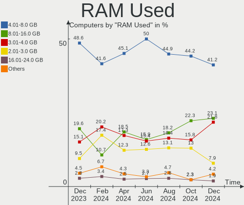
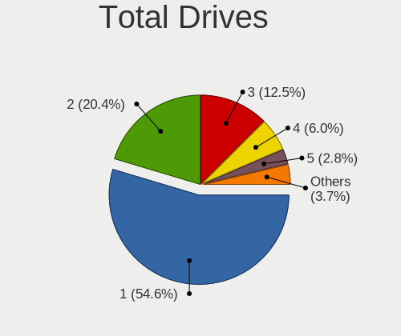

Pop!_OS - Hardware Trends
-------------------------

A project to identify most popular hardware characteristics and track their change
over time based on data collected by Linux users at https://Linux-Hardware.org.

Anyone can contribute to this report by the [hw-probe](https://github.com/linuxhw/hw-probe) tool:

    sudo -E hw-probe -all -upload

This is a report for all computer types. See also reports for [desktops](/Dist/Pop!_OS/Desktop/README.md) and [notebooks](/Dist/Pop!_OS/Notebook/README.md).

This report is for one last month. Overall report since the beginning of time: [TestCoverage](https://github.com/linuxhw/TestCoverage)

Period: Jun, 2022.

Contents
--------

* [ System ](#system)
  - [ OS                       ](#os)
  - [ OS Family                ](#os-family)
  - [ Kernel                   ](#kernel)
  - [ Kernel Family            ](#kernel-family)
  - [ Kernel Major Ver.        ](#kernel-major-ver)
  - [ Arch                     ](#arch)
  - [ DE                       ](#de)
  - [ Display Server           ](#display-server)
  - [ Display Manager          ](#display-manager)
  - [ OS Lang                  ](#os-lang)
  - [ Boot Mode                ](#boot-mode)
  - [ Filesystem               ](#filesystem)
  - [ Part. scheme             ](#part-scheme)
  - [ Dual Boot with Linux/BSD ](#dual-boot-with-linuxbsd)
  - [ Dual Boot (Win)          ](#dual-boot-win)

* [ Board ](#board)
  - [ Vendor                   ](#vendor)
  - [ Model                    ](#model)
  - [ Model Family             ](#model-family)
  - [ MFG Year                 ](#mfg-year)
  - [ Form Factor              ](#form-factor)
  - [ Secure Boot              ](#secure-boot)
  - [ Coreboot                 ](#coreboot)
  - [ RAM Size                 ](#ram-size)
  - [ RAM Used                 ](#ram-used)
  - [ Total Drives             ](#total-drives)
  - [ Has CD-ROM               ](#has-cd-rom)
  - [ Has Ethernet             ](#has-ethernet)
  - [ Has WiFi                 ](#has-wifi)
  - [ Has Bluetooth            ](#has-bluetooth)

* [ Location ](#location)
  - [ Country                  ](#country)
  - [ City                     ](#city)

* [ Drives ](#drives)
  - [ Drive Vendor             ](#drive-vendor)
  - [ Drive Model              ](#drive-model)
  - [ HDD Vendor               ](#hdd-vendor)
  - [ SSD Vendor               ](#ssd-vendor)
  - [ Drive Kind               ](#drive-kind)
  - [ Drive Connector          ](#drive-connector)
  - [ Drive Size               ](#drive-size)
  - [ Space Total              ](#space-total)
  - [ Space Used               ](#space-used)
  - [ Malfunc. Drives          ](#malfunc-drives)
  - [ Malfunc. Drive Vendor    ](#malfunc-drive-vendor)
  - [ Malfunc. HDD Vendor      ](#malfunc-hdd-vendor)
  - [ Malfunc. Drive Kind      ](#malfunc-drive-kind)
  - [ Failed Drives            ](#failed-drives)
  - [ Failed Drive Vendor      ](#failed-drive-vendor)
  - [ Drive Status             ](#drive-status)

* [ Storage controller ](#storage-controller)
  - [ Storage Vendor           ](#storage-vendor)
  - [ Storage Model            ](#storage-model)
  - [ Storage Kind             ](#storage-kind)

* [ Processor ](#processor)
  - [ CPU Vendor               ](#cpu-vendor)
  - [ CPU Model                ](#cpu-model)
  - [ CPU Model Family         ](#cpu-model-family)
  - [ CPU Cores                ](#cpu-cores)
  - [ CPU Sockets              ](#cpu-sockets)
  - [ CPU Threads              ](#cpu-threads)
  - [ CPU Op-Modes             ](#cpu-op-modes)
  - [ CPU Microcode            ](#cpu-microcode)
  - [ CPU Microarch            ](#cpu-microarch)

* [ Graphics ](#graphics)
  - [ GPU Vendor               ](#gpu-vendor)
  - [ GPU Model                ](#gpu-model)
  - [ GPU Combo                ](#gpu-combo)
  - [ GPU Driver               ](#gpu-driver)
  - [ GPU Memory               ](#gpu-memory)

* [ Monitor ](#monitor)
  - [ Monitor Vendor           ](#monitor-vendor)
  - [ Monitor Model            ](#monitor-model)
  - [ Monitor Resolution       ](#monitor-resolution)
  - [ Monitor Diagonal         ](#monitor-diagonal)
  - [ Monitor Width            ](#monitor-width)
  - [ Aspect Ratio             ](#aspect-ratio)
  - [ Monitor Area             ](#monitor-area)
  - [ Pixel Density            ](#pixel-density)
  - [ Multiple Monitors        ](#multiple-monitors)

* [ Network ](#network)
  - [ Net Controller Vendor    ](#net-controller-vendor)
  - [ Net Controller Model     ](#net-controller-model)
  - [ Wireless Vendor          ](#wireless-vendor)
  - [ Wireless Model           ](#wireless-model)
  - [ Ethernet Vendor          ](#ethernet-vendor)
  - [ Ethernet Model           ](#ethernet-model)
  - [ Net Controller Kind      ](#net-controller-kind)
  - [ Used Controller          ](#used-controller)
  - [ NICs                     ](#nics)
  - [ IPv6                     ](#ipv6)

* [ Bluetooth ](#bluetooth)
  - [ Bluetooth Vendor         ](#bluetooth-vendor)
  - [ Bluetooth Model          ](#bluetooth-model)

* [ Sound ](#sound)
  - [ Sound Vendor             ](#sound-vendor)
  - [ Sound Model              ](#sound-model)

* [ Memory ](#memory)
  - [ Memory Vendor            ](#memory-vendor)
  - [ Memory Model             ](#memory-model)
  - [ Memory Kind              ](#memory-kind)
  - [ Memory Form Factor       ](#memory-form-factor)
  - [ Memory Size              ](#memory-size)
  - [ Memory Speed             ](#memory-speed)

* [ Printers & scanners ](#printers--scanners)
  - [ Printer Vendor           ](#printer-vendor)
  - [ Printer Model            ](#printer-model)
  - [ Scanner Vendor           ](#scanner-vendor)
  - [ Scanner Model            ](#scanner-model)

* [ Camera ](#camera)
  - [ Camera Vendor            ](#camera-vendor)
  - [ Camera Model             ](#camera-model)

* [ Security ](#security)
  - [ Fingerprint Vendor       ](#fingerprint-vendor)
  - [ Fingerprint Model        ](#fingerprint-model)
  - [ Chipcard Vendor          ](#chipcard-vendor)
  - [ Chipcard Model           ](#chipcard-model)

* [ Unsupported ](#unsupported)
  - [ Unsupported Devices      ](#unsupported-devices)
  - [ Unsupported Device Types ](#unsupported-device-types)

System
------

OS
--

Installed operating systems

| Name          | Computers | Percent |
|---------------|-----------|---------|
| Pop!_OS 22.04 | 219       | 94.4%   |
| Pop!_OS 21.10 | 9         | 3.88%   |
| Pop!_OS 21.04 | 2         | 0.86%   |
| Pop!_OS 20.04 | 2         | 0.86%   |

OS Family
---------

OS without a version

| Name    | Computers | Percent |
|---------|-----------|---------|
| Pop!_OS | 232       | 100%    |

Kernel
------

Version of the Linux kernel

| Version                  | Computers | Percent |
|--------------------------|-----------|---------|
| 5.17.5-76051705-generic  | 208       | 89.66%  |
| 5.17.15-76051715-generic | 17        | 7.33%   |
| 5.18.4-xanmod1           | 1         | 0.43%   |
| 5.17.5-tkg-bmq           | 1         | 0.43%   |
| 5.16.19-76051619-generic | 1         | 0.43%   |
| 5.16.11-76051611-generic | 1         | 0.43%   |
| 5.15.11-76051511-generic | 1         | 0.43%   |
| 5.13.0-1029-raspi        | 1         | 0.43%   |
| 5.11.0-7620-generic      | 1         | 0.43%   |

Kernel Family
-------------

Linux kernel without a distro release

| Version | Computers | Percent |
|---------|-----------|---------|
| 5.17.5  | 209       | 90.09%  |
| 5.17.15 | 17        | 7.33%   |
| 5.18.4  | 1         | 0.43%   |
| 5.16.19 | 1         | 0.43%   |
| 5.16.11 | 1         | 0.43%   |
| 5.15.11 | 1         | 0.43%   |
| 5.13.0  | 1         | 0.43%   |
| 5.11.0  | 1         | 0.43%   |

Kernel Major Ver.
-----------------

Linux kernel major version

| Version | Computers | Percent |
|---------|-----------|---------|
| 5.17    | 226       | 97.41%  |
| 5.16    | 2         | 0.86%   |
| 5.18    | 1         | 0.43%   |
| 5.15    | 1         | 0.43%   |
| 5.13    | 1         | 0.43%   |
| 5.11    | 1         | 0.43%   |

Arch
----

OS architecture (x86_64, i586, etc.)

| Name    | Computers | Percent |
|---------|-----------|---------|
| x86_64  | 231       | 99.57%  |
| aarch64 | 1         | 0.43%   |

DE
--

Desktop Environment

| Name    | Computers | Percent |
|---------|-----------|---------|
| GNOME   | 226       | 97.41%  |
| KDE5    | 4         | 1.72%   |
| pop     | 1         | 0.43%   |
| Unknown | 1         | 0.43%   |

Display Server
--------------

X11 or Wayland

| Name    | Computers | Percent |
|---------|-----------|---------|
| X11     | 225       | 96.98%  |
| Wayland | 6         | 2.59%   |
| Tty     | 1         | 0.43%   |

Display Manager
---------------

SDDM, LightDM, etc.

| Name    | Computers | Percent |
|---------|-----------|---------|
| Unknown | 183       | 78.88%  |
| GDM3    | 43        | 18.53%  |
| GDM     | 6         | 2.59%   |

OS Lang
-------

Language

| Lang  | Computers | Percent |
|-------|-----------|---------|
| en_US | 128       | 55.17%  |
| pt_BR | 15        | 6.47%   |
| en_GB | 13        | 5.6%    |
| C     | 12        | 5.17%   |
| en_CA | 9         | 3.88%   |
| en_AU | 9         | 3.88%   |
| de_DE | 6         | 2.59%   |
| es_ES | 5         | 2.16%   |
| it_IT | 4         | 1.72%   |
| ru_RU | 3         | 1.29%   |
| pl_PL | 3         | 1.29%   |
| fr_FR | 3         | 1.29%   |
| es_CL | 3         | 1.29%   |
| sv_SE | 2         | 0.86%   |
| ja_JP | 2         | 0.86%   |
| es_MX | 2         | 0.86%   |
| en_ZA | 2         | 0.86%   |
| ro_RO | 1         | 0.43%   |
| nl_NL | 1         | 0.43%   |
| nl_BE | 1         | 0.43%   |
| fr_CA | 1         | 0.43%   |
| fi_FI | 1         | 0.43%   |
| es_UY | 1         | 0.43%   |
| es_CO | 1         | 0.43%   |
| en_SG | 1         | 0.43%   |
| en_IN | 1         | 0.43%   |
| en_DK | 1         | 0.43%   |
| de_AT | 1         | 0.43%   |

Boot Mode
---------

EFI or BIOS

| Mode | Computers | Percent |
|------|-----------|---------|
| BIOS | 187       | 80.6%   |
| EFI  | 45        | 19.4%   |

Filesystem
----------

Type of filesystem

| Type    | Computers | Percent |
|---------|-----------|---------|
| Ext4    | 220       | 94.83%  |
| Btrfs   | 6         | 2.59%   |
| Overlay | 5         | 2.16%   |
| Xfs     | 1         | 0.43%   |

Part. scheme
------------

Scheme of partitioning

| Type    | Computers | Percent |
|---------|-----------|---------|
| Unknown | 182       | 78.45%  |
| GPT     | 46        | 19.83%  |
| MBR     | 4         | 1.72%   |

Dual Boot with Linux/BSD
------------------------

Hosting more than one Linux/BSD

| Dual boot | Computers | Percent |
|-----------|-----------|---------|
| No        | 224       | 96.55%  |
| Yes       | 8         | 3.45%   |

Dual Boot (Win)
---------------

Hosting Linux and Windows

| Dual boot | Computers | Percent |
|-----------|-----------|---------|
| No        | 211       | 90.95%  |
| Yes       | 21        | 9.05%   |

Board
-----

Vendor
------

Motherboard manufacturer

| Name                    | Computers | Percent |
|-------------------------|-----------|---------|
| ASUSTek Computer        | 48        | 20.69%  |
| Dell                    | 40        | 17.24%  |
| Lenovo                  | 25        | 10.78%  |
| Hewlett-Packard         | 24        | 10.34%  |
| MSI                     | 17        | 7.33%   |
| Gigabyte Technology     | 17        | 7.33%   |
| Apple                   | 12        | 5.17%   |
| Acer                    | 9         | 3.88%   |
| System76                | 7         | 3.02%   |
| ASRock                  | 6         | 2.59%   |
| Intel                   | 4         | 1.72%   |
| Toshiba                 | 2         | 0.86%   |
| Samsung Electronics     | 2         | 0.86%   |
| Notebook                | 2         | 0.86%   |
| Alienware               | 2         | 0.86%   |
| Timi                    | 1         | 0.43%   |
| Sony                    | 1         | 0.43%   |
| Schenker                | 1         | 0.43%   |
| Raspberry Pi Foundation | 1         | 0.43%   |
| Quanta                  | 1         | 0.43%   |
| PCWare                  | 1         | 0.43%   |
| Microsoft               | 1         | 0.43%   |
| Medion                  | 1         | 0.43%   |
| HUAWEI                  | 1         | 0.43%   |
| Framework               | 1         | 0.43%   |
| Foxconn                 | 1         | 0.43%   |
| Eluktronics             | 1         | 0.43%   |
| Biostar                 | 1         | 0.43%   |
| BESSTAR Tech            | 1         | 0.43%   |
| Unknown                 | 1         | 0.43%   |

Model
-----

Motherboard model

| Name                                         | Computers | Percent |
|----------------------------------------------|-----------|---------|
| Dell Latitude E7240                          | 3         | 1.29%   |
| ASUS All Series                              | 3         | 1.29%   |
| Unknown                                      | 3         | 1.29%   |
| System76 Oryx Pro                            | 2         | 0.86%   |
| System76 Lemur Pro                           | 2         | 0.86%   |
| Gigabyte X570 AORUS ELITE                    | 2         | 0.86%   |
| Dell Precision M4800                         | 2         | 0.86%   |
| Dell OptiPlex 3020                           | 2         | 0.86%   |
| Dell Latitude E7470                          | 2         | 0.86%   |
| Dell Latitude E6540                          | 2         | 0.86%   |
| ASUS P6X58D PREMIUM                          | 2         | 0.86%   |
| Apple MacBookPro11,1                         | 2         | 0.86%   |
| Apple MacBookAir7,2                          | 2         | 0.86%   |
| Toshiba Satellite S50-A                      | 1         | 0.43%   |
| Toshiba Satellite L850-1D5                   | 1         | 0.43%   |
| Timi RedmiBook Pro 14S                       | 1         | 0.43%   |
| System76 Thelio                              | 1         | 0.43%   |
| System76 Galago Pro                          | 1         | 0.43%   |
| System76 Darter Pro                          | 1         | 0.43%   |
| Sony SVF15A1M2ES                             | 1         | 0.43%   |
| Schenker VIA 15 Pro                          | 1         | 0.43%   |
| Samsung 900X3C/900X3D/900X3E/900X4C/900X4D   | 1         | 0.43%   |
| Samsung 760XDA                               | 1         | 0.43%   |
| RPi Raspberry Pi 4 Model B Rev 1.2           | 1         | 0.43%   |
| Quanta TWC                                   | 1         | 0.43%   |
| PCWare IPX4105G Pro                          | 1         | 0.43%   |
| Notebook P7xxDM3(-G)                         | 1         | 0.43%   |
| Notebook P65_P67SE                           | 1         | 0.43%   |
| MSI Pulse GL66 12UEK                         | 1         | 0.43%   |
| MSI MS-7D54                                  | 1         | 0.43%   |
| MSI MS-7D32                                  | 1         | 0.43%   |
| MSI MS-7C96                                  | 1         | 0.43%   |
| MSI MS-7C75                                  | 1         | 0.43%   |
| MSI MS-7C56                                  | 1         | 0.43%   |
| MSI MS-7C37                                  | 1         | 0.43%   |
| MSI MS-7C35                                  | 1         | 0.43%   |
| MSI MS-7C02                                  | 1         | 0.43%   |
| MSI MS-7B17                                  | 1         | 0.43%   |
| MSI MS-7A74                                  | 1         | 0.43%   |
| MSI MS-7A38                                  | 1         | 0.43%   |
| MSI MS-7A34                                  | 1         | 0.43%   |
| MSI MS-7918                                  | 1         | 0.43%   |
| MSI MPG B460 Trident A (MS-B926)             | 1         | 0.43%   |
| MSI GS75 Stealth 9SF                         | 1         | 0.43%   |
| MSI Alpha 17 A4DEK                           | 1         | 0.43%   |
| Microsoft Surface with Windows 8 Pro         | 1         | 0.43%   |
| Medion MS-7728                               | 1         | 0.43%   |
| Lenovo ZHENGJIUZHE REN9000K-34IMZ 90Q90022CP | 1         | 0.43%   |
| Lenovo Yoga Slim 7 Pro 14ACH5 D 82NJ         | 1         | 0.43%   |
| Lenovo V14-IIL 82C4                          | 1         | 0.43%   |
| Lenovo ThinkStation S30 43516Y7              | 1         | 0.43%   |
| Lenovo ThinkPad X240 20AMS75900              | 1         | 0.43%   |
| Lenovo ThinkPad X230 23331R5                 | 1         | 0.43%   |
| Lenovo ThinkPad T450 20BVA02TCD              | 1         | 0.43%   |
| Lenovo ThinkPad T450 20BUS1110E              | 1         | 0.43%   |
| Lenovo ThinkPad T410 2537HN3                 | 1         | 0.43%   |
| Lenovo ThinkPad P17 Gen 1 20SQS01Y00         | 1         | 0.43%   |
| Lenovo ThinkPad L13 Yoga Gen 2a 21AES01A00   | 1         | 0.43%   |
| Lenovo ThinkPad Edge E531 6885CTO            | 1         | 0.43%   |
| Lenovo ThinkCentre M93p 10A6S0RN00           | 1         | 0.43%   |

Model Family
------------

Motherboard model prefix

| Name                 | Computers | Percent |
|----------------------|-----------|---------|
| Dell Latitude        | 10        | 4.31%   |
| Dell Inspiron        | 10        | 4.31%   |
| Dell Precision       | 9         | 3.88%   |
| ASUS ROG             | 9         | 3.88%   |
| Lenovo ThinkPad      | 8         | 3.45%   |
| Acer Aspire          | 7         | 3.02%   |
| ASUS PRIME           | 6         | 2.59%   |
| HP ProBook           | 4         | 1.72%   |
| HP Pavilion          | 4         | 1.72%   |
| Dell OptiPlex        | 4         | 1.72%   |
| ASUS TUF             | 4         | 1.72%   |
| Lenovo ThinkBook     | 3         | 1.29%   |
| Lenovo Legion        | 3         | 1.29%   |
| Lenovo IdeaPad       | 3         | 1.29%   |
| HP EliteBook         | 3         | 1.29%   |
| Gigabyte X570        | 3         | 1.29%   |
| Dell Vostro          | 3         | 1.29%   |
| ASUS ZenBook         | 3         | 1.29%   |
| ASUS All             | 3         | 1.29%   |
| Apple MacBookPro11   | 3         | 1.29%   |
| Unknown              | 3         | 1.29%   |
| Toshiba Satellite    | 2         | 0.86%   |
| System76 Oryx        | 2         | 0.86%   |
| System76 Lemur       | 2         | 0.86%   |
| HP Spectre           | 2         | 0.86%   |
| HP ENVY              | 2         | 0.86%   |
| Dell XPS             | 2         | 0.86%   |
| ASUS VivoBook        | 2         | 0.86%   |
| ASUS P6X58D          | 2         | 0.86%   |
| ASRock B450          | 2         | 0.86%   |
| Apple MacBookAir7    | 2         | 0.86%   |
| Timi RedmiBook       | 1         | 0.43%   |
| System76 Thelio      | 1         | 0.43%   |
| System76 Galago      | 1         | 0.43%   |
| System76 Darter      | 1         | 0.43%   |
| Sony SVF15A1M2ES     | 1         | 0.43%   |
| Schenker VIA         | 1         | 0.43%   |
| Samsung 900X3C       | 1         | 0.43%   |
| Samsung 760XDA       | 1         | 0.43%   |
| RPi Raspberry        | 1         | 0.43%   |
| Quanta TWC           | 1         | 0.43%   |
| PCWare IPX4105G      | 1         | 0.43%   |
| Notebook P7xxDM3(-G) | 1         | 0.43%   |
| Notebook P65         | 1         | 0.43%   |
| MSI Pulse            | 1         | 0.43%   |
| MSI MS-7D54          | 1         | 0.43%   |
| MSI MS-7D32          | 1         | 0.43%   |
| MSI MS-7C96          | 1         | 0.43%   |
| MSI MS-7C75          | 1         | 0.43%   |
| MSI MS-7C56          | 1         | 0.43%   |
| MSI MS-7C37          | 1         | 0.43%   |
| MSI MS-7C35          | 1         | 0.43%   |
| MSI MS-7C02          | 1         | 0.43%   |
| MSI MS-7B17          | 1         | 0.43%   |
| MSI MS-7A74          | 1         | 0.43%   |
| MSI MS-7A38          | 1         | 0.43%   |
| MSI MS-7A34          | 1         | 0.43%   |
| MSI MS-7918          | 1         | 0.43%   |
| MSI MPG              | 1         | 0.43%   |
| MSI GS75             | 1         | 0.43%   |

MFG Year
--------

Motherboard manufacture year

| Year    | Computers | Percent |
|---------|-----------|---------|
| 2019    | 34        | 14.66%  |
| 2021    | 29        | 12.5%   |
| 2020    | 26        | 11.21%  |
| 2013    | 26        | 11.21%  |
| 2016    | 21        | 9.05%   |
| 2014    | 14        | 6.03%   |
| 2018    | 13        | 5.6%    |
| 2015    | 13        | 5.6%    |
| 2017    | 11        | 4.74%   |
| 2012    | 11        | 4.74%   |
| 2011    | 10        | 4.31%   |
| 2022    | 8         | 3.45%   |
| 2010    | 7         | 3.02%   |
| 2009    | 7         | 3.02%   |
| 2006    | 1         | 0.43%   |
| Unknown | 1         | 0.43%   |

Form Factor
-----------

Physical design of the computer

| Name           | Computers | Percent |
|----------------|-----------|---------|
| Notebook       | 123       | 53.02%  |
| Desktop        | 93        | 40.09%  |
| Convertible    | 6         | 2.59%   |
| Mini pc        | 4         | 1.72%   |
| All in one     | 4         | 1.72%   |
| System on chip | 1         | 0.43%   |
| Tablet         | 1         | 0.43%   |

Secure Boot
-----------

Enabled or disabled

| State    | Computers | Percent |
|----------|-----------|---------|
| Disabled | 232       | 100%    |

Coreboot
--------

Have coreboot on board

| Used | Computers | Percent |
|------|-----------|---------|
| No   | 227       | 97.84%  |
| Yes  | 5         | 2.16%   |

RAM Size
--------

Total RAM memory

| Size in GB      | Computers | Percent |
|-----------------|-----------|---------|
| 16.01-24.0      | 71        | 30.6%   |
| 4.01-8.0        | 42        | 18.1%   |
| 32.01-64.0      | 41        | 17.67%  |
| 8.01-16.0       | 38        | 16.38%  |
| 3.01-4.0        | 26        | 11.21%  |
| 64.01-256.0     | 11        | 4.74%   |
| More than 256.0 | 1         | 0.43%   |
| 24.01-32.0      | 1         | 0.43%   |
| 1.01-2.0        | 1         | 0.43%   |

RAM Used
--------

Used RAM memory

| Used GB    | Computers | Percent |
|------------|-----------|---------|
| 2.01-3.0   | 80        | 34.48%  |
| 4.01-8.0   | 58        | 25%     |
| 3.01-4.0   | 46        | 19.83%  |
| 1.01-2.0   | 29        | 12.5%   |
| 8.01-16.0  | 14        | 6.03%   |
| 16.01-24.0 | 4         | 1.72%   |
| 24.01-32.0 | 1         | 0.43%   |

Total Drives
------------

Number of drives on board

| Drives | Computers | Percent |
|--------|-----------|---------|
| 1      | 125       | 53.88%  |
| 2      | 59        | 25.43%  |
| 3      | 28        | 12.07%  |
| 4      | 8         | 3.45%   |
| 6      | 5         | 2.16%   |
| 5      | 3         | 1.29%   |
| 7      | 2         | 0.86%   |
| 8      | 1         | 0.43%   |
| 0      | 1         | 0.43%   |

Has CD-ROM
----------

Has CD-ROM on board

| Presented | Computers | Percent |
|-----------|-----------|---------|
| No        | 163       | 70.26%  |
| Yes       | 69        | 29.74%  |

Has Ethernet
------------

Has Ethernet on board

| Presented | Computers | Percent |
|-----------|-----------|---------|
| Yes       | 195       | 84.05%  |
| No        | 37        | 15.95%  |

Has WiFi
--------

Has WiFi module

| Presented | Computers | Percent |
|-----------|-----------|---------|
| Yes       | 185       | 79.74%  |
| No        | 47        | 20.26%  |

Has Bluetooth
-------------

Has Bluetooth module

| Presented | Computers | Percent |
|-----------|-----------|---------|
| Yes       | 160       | 68.97%  |
| No        | 72        | 31.03%  |

Location
--------

Country
-------

Geographic location (country)

| Country       | Computers | Percent |
|---------------|-----------|---------|
| USA           | 70        | 30.17%  |
| Brazil        | 20        | 8.62%   |
| Canada        | 14        | 6.03%   |
| Australia     | 11        | 4.74%   |
| Germany       | 9         | 3.88%   |
| Netherlands   | 8         | 3.45%   |
| UK            | 7         | 3.02%   |
| Italy         | 7         | 3.02%   |
| France        | 6         | 2.59%   |
| India         | 5         | 2.16%   |
| Spain         | 4         | 1.72%   |
| Japan         | 4         | 1.72%   |
| Thailand      | 3         | 1.29%   |
| Switzerland   | 3         | 1.29%   |
| Russia        | 3         | 1.29%   |
| Poland        | 3         | 1.29%   |
| Mexico        | 3         | 1.29%   |
| Chile         | 3         | 1.29%   |
| Belgium       | 3         | 1.29%   |
| Austria       | 3         | 1.29%   |
| Uruguay       | 2         | 0.86%   |
| Tunisia       | 2         | 0.86%   |
| Sweden        | 2         | 0.86%   |
| South Africa  | 2         | 0.86%   |
| Singapore     | 2         | 0.86%   |
| Romania       | 2         | 0.86%   |
| Norway        | 2         | 0.86%   |
| Hong Kong     | 2         | 0.86%   |
| Greece        | 2         | 0.86%   |
| Georgia       | 2         | 0.86%   |
| Egypt         | 2         | 0.86%   |
| Colombia      | 2         | 0.86%   |
| Bulgaria      | 2         | 0.86%   |
| Argentina     | 2         | 0.86%   |
| Uzbekistan    | 1         | 0.43%   |
| Slovenia      | 1         | 0.43%   |
| Peru          | 1         | 0.43%   |
| New Zealand   | 1         | 0.43%   |
| Morocco       | 1         | 0.43%   |
| Maldives      | 1         | 0.43%   |
| Latvia        | 1         | 0.43%   |
| Kosovo        | 1         | 0.43%   |
| Ireland       | 1         | 0.43%   |
| Hungary       | 1         | 0.43%   |
| Finland       | 1         | 0.43%   |
| Denmark       | 1         | 0.43%   |
| Czechia       | 1         | 0.43%   |
| Azerbaijan    | 1         | 0.43%   |
| Aland Islands | 1         | 0.43%   |

City
----

Geographic location (city)

| City                  | Computers | Percent |
|-----------------------|-----------|---------|
| Melbourne             | 4         | 1.72%   |
| Vienna                | 3         | 1.29%   |
| Toronto               | 3         | 1.29%   |
| Zurich                | 2         | 0.86%   |
| Tunis                 | 2         | 0.86%   |
| Sofia                 | 2         | 0.86%   |
| Singapore             | 2         | 0.86%   |
| San Antonio           | 2         | 0.86%   |
| Rome                  | 2         | 0.86%   |
| Ogden                 | 2         | 0.86%   |
| Nelson                | 2         | 0.86%   |
| Mannheim              | 2         | 0.86%   |
| Manaus                | 2         | 0.86%   |
| Denver                | 2         | 0.86%   |
| Danville              | 2         | 0.86%   |
| Columbus              | 2         | 0.86%   |
| Cleveland             | 2         | 0.86%   |
| Bucharest             | 2         | 0.86%   |
| Brooklyn              | 2         | 0.86%   |
| Bedford               | 2         | 0.86%   |
| Bangkok               | 2         | 0.86%   |
| Zagazig               | 1         | 0.43%   |
| Yekaterinburg         | 1         | 0.43%   |
| Wuppertal             | 1         | 0.43%   |
| Winter Garden         | 1         | 0.43%   |
| Windsor               | 1         | 0.43%   |
| Westland              | 1         | 0.43%   |
| Warsaw                | 1         | 0.43%   |
| Vitória              | 1         | 0.43%   |
| Virginia Beach        | 1         | 0.43%   |
| Viña del Mar         | 1         | 0.43%   |
| Vicksburg             | 1         | 0.43%   |
| Vanderbijlpark        | 1         | 0.43%   |
| Utrecht               | 1         | 0.43%   |
| Tung Chung            | 1         | 0.43%   |
| Tuen Mun              | 1         | 0.43%   |
| Tucson                | 1         | 0.43%   |
| Trujillo              | 1         | 0.43%   |
| Trondheim             | 1         | 0.43%   |
| Toulouse              | 1         | 0.43%   |
| Torrance              | 1         | 0.43%   |
| Tempe                 | 1         | 0.43%   |
| Tashkent              | 1         | 0.43%   |
| Sydney                | 1         | 0.43%   |
| Swannanoa             | 1         | 0.43%   |
| Sunnyside             | 1         | 0.43%   |
| Strzegom              | 1         | 0.43%   |
| Stevensville          | 1         | 0.43%   |
| Springfield           | 1         | 0.43%   |
| Snellville            | 1         | 0.43%   |
| Sidrolandia           | 1         | 0.43%   |
| Shinjuku              | 1         | 0.43%   |
| Saskatoon             | 1         | 0.43%   |
| Sarcelles             | 1         | 0.43%   |
| Sapporo               | 1         | 0.43%   |
| Sao Luís             | 1         | 0.43%   |
| Sao Jose do Rio Preto | 1         | 0.43%   |
| Santiago              | 1         | 0.43%   |
| Sandton               | 1         | 0.43%   |
| San Jose de Mayo      | 1         | 0.43%   |

Drives
------

Drive Vendor
------------

Hard drive vendors

| Vendor                         | Computers | Drives | Percent |
|--------------------------------|-----------|--------|---------|
| Samsung Electronics            | 71        | 95     | 19.29%  |
| Seagate                        | 53        | 60     | 14.4%   |
| WDC                            | 38        | 47     | 10.33%  |
| SanDisk                        | 24        | 25     | 6.52%   |
| Crucial                        | 23        | 28     | 6.25%   |
| Kingston                       | 22        | 24     | 5.98%   |
| Toshiba                        | 19        | 21     | 5.16%   |
| SK hynix                       | 11        | 12     | 2.99%   |
| Phison                         | 8         | 11     | 2.17%   |
| Hitachi                        | 8         | 11     | 2.17%   |
| Micron Technology              | 7         | 8      | 1.9%    |
| HGST                           | 6         | 6      | 1.63%   |
| Micron/Crucial Technology      | 5         | 6      | 1.36%   |
| Intel                          | 5         | 6      | 1.36%   |
| Apple                          | 5         | 5      | 1.36%   |
| A-DATA Technology              | 5         | 6      | 1.36%   |
| LITEONIT                       | 4         | 4      | 1.09%   |
| Unknown                        | 3         | 3      | 0.82%   |
| LITEON                         | 3         | 3      | 0.82%   |
| KIOXIA                         | 3         | 3      | 0.82%   |
| KingFast                       | 3         | 4      | 0.82%   |
| Intenso                        | 3         | 3      | 0.82%   |
| China                          | 3         | 3      | 0.82%   |
| T-FORCE                        | 2         | 2      | 0.54%   |
| PNY                            | 2         | 2      | 0.54%   |
| Lexar                          | 2         | 2      | 0.54%   |
| Fujitsu                        | 2         | 3      | 0.54%   |
| Corsair                        | 2         | 2      | 0.54%   |
| Union Memory (Shenzhen)        | 1         | 1      | 0.27%   |
| TwinMOS                        | 1         | 1      | 0.27%   |
| Team                           | 1         | 1      | 0.27%   |
| SSSTC                          | 1         | 1      | 0.27%   |
| SPCC                           | 1         | 1      | 0.27%   |
| Solid State Storage Technology | 1         | 1      | 0.27%   |
| Silicon Motion                 | 1         | 1      | 0.27%   |
| SABRENT                        | 1         | 1      | 0.27%   |
| Qunion                         | 1         | 1      | 0.27%   |
| PUSKILL                        | 1         | 1      | 0.27%   |
| OWC                            | 1         | 1      | 0.27%   |
| OEM                            | 1         | 1      | 0.27%   |
| Mushkin                        | 1         | 2      | 0.27%   |
| MAXIO Technology (Hangzhou)    | 1         | 1      | 0.27%   |
| MaxDigital                     | 1         | 1      | 0.27%   |
| KIOXIA-EXCERIA                 | 1         | 1      | 0.27%   |
| KingSpec                       | 1         | 1      | 0.27%   |
| KingDian                       | 1         | 1      | 0.27%   |
| HS-SSD-C100                    | 1         | 1      | 0.27%   |
| HGST HDN                       | 1         | 1      | 0.27%   |
| Hewlett-Packard                | 1         | 1      | 0.27%   |
| FORESEE                        | 1         | 1      | 0.27%   |
| ASMT                           | 1         | 1      | 0.27%   |
| Apacer                         | 1         | 1      | 0.27%   |
| AFOX                           | 1         | 1      | 0.27%   |
| Unknown                        | 1         | 1      | 0.27%   |

Drive Model
-----------

Hard drive models

| Model                                  | Computers | Percent |
|----------------------------------------|-----------|---------|
| Kingston SA400S37240G 240GB SSD        | 9         | 2.17%   |
| Samsung SM963 2.5" NVMe PCIe SSD 500GB | 8         | 1.93%   |
| Seagate ST2000DM008-2FR102 2TB         | 7         | 1.69%   |
| SanDisk NVMe SSD Drive 1TB             | 6         | 1.45%   |
| Samsung SSD 850 EVO 250GB              | 6         | 1.45%   |
| Seagate ST1000DM003-1CH162 1TB         | 5         | 1.21%   |
| Samsung NVMe SSD Drive 2TB             | 4         | 0.97%   |
| Phison NVMe SSD Drive 1TB              | 4         | 0.97%   |
| Kingston SA400S37120G 120GB SSD        | 4         | 0.97%   |
| Crucial CT2000MX500SSD1 2TB            | 4         | 0.97%   |
| Crucial CT1000MX500SSD1 1TB            | 4         | 0.97%   |
| WDC WD30EFRX-68EUZN0 3TB               | 3         | 0.72%   |
| WDC WD10EZEX-08WN4A0 1TB               | 3         | 0.72%   |
| SK hynix NVMe SSD Drive 1024GB         | 3         | 0.72%   |
| Seagate ST500DM002-1BD142 500GB        | 3         | 0.72%   |
| Seagate Expansion 1TB                  | 3         | 0.72%   |
| Samsung SSD 970 EVO Plus 1TB           | 3         | 0.72%   |
| Samsung SSD 970 EVO 500GB              | 3         | 0.72%   |
| Samsung SSD 860 EVO 500GB              | 3         | 0.72%   |
| Samsung NVMe SSD Drive 512GB           | 3         | 0.72%   |
| Samsung NVMe SSD Drive 1TB             | 3         | 0.72%   |
| Intel NVMe SSD Drive 512GB             | 3         | 0.72%   |
| Crucial CT240BX500SSD1 240GB           | 3         | 0.72%   |
| WDC WDS240G2G0A-00JH30 240GB SSD       | 2         | 0.48%   |
| WDC WDS100T2B0A-00SM50 1TB SSD         | 2         | 0.48%   |
| WDC WD10SPZX-75Z10T3 1TB               | 2         | 0.48%   |
| Toshiba MQ04ABF100 1TB                 | 2         | 0.48%   |
| Toshiba MQ01ABD075 752GB               | 2         | 0.48%   |
| Toshiba DT01ACA200 2TB                 | 2         | 0.48%   |
| Toshiba DT01ACA100 1TB                 | 2         | 0.48%   |
| SK hynix NVMe SSD Drive 1TB            | 2         | 0.48%   |
| SK hynix NVMe SSD Drive 128GB          | 2         | 0.48%   |
| Seagate ST3500418AS 500GB              | 2         | 0.48%   |
| Seagate ST3320620AS 320GB              | 2         | 0.48%   |
| Seagate ST31000528AS 1TB               | 2         | 0.48%   |
| Seagate ST2000DM001-1CH164 2TB         | 2         | 0.48%   |
| Seagate ST1000DM010-2EP102 1TB         | 2         | 0.48%   |
| SanDisk NVMe SSD Drive 512GB           | 2         | 0.48%   |
| SanDisk NVMe SSD Drive 500GB           | 2         | 0.48%   |
| SanDisk NVMe SSD Drive 256GB           | 2         | 0.48%   |
| Samsung SSD 980 1TB                    | 2         | 0.48%   |
| Samsung SSD 870 EVO 500GB              | 2         | 0.48%   |
| Samsung SSD 860 QVO 1TB                | 2         | 0.48%   |
| Samsung SSD 860 EVO M.2 500GB          | 2         | 0.48%   |
| Samsung SSD 860 EVO 250GB              | 2         | 0.48%   |
| Samsung SSD 850 EVO 500GB              | 2         | 0.48%   |
| Samsung NVMe SSD Drive 256GB           | 2         | 0.48%   |
| Samsung NVMe SSD Drive 250GB           | 2         | 0.48%   |
| Samsung NVMe SSD Drive 1024GB          | 2         | 0.48%   |
| Samsung MZMPC032HBCD-000D1 32GB SSD    | 2         | 0.48%   |
| Phison NVMe SSD Drive 2TB              | 2         | 0.48%   |
| Phison NVMe SSD Drive 1024GB           | 2         | 0.48%   |
| Micron/Crucial NVMe SSD Drive 250GB    | 2         | 0.48%   |
| Micron/Crucial NVMe SSD Drive 1TB      | 2         | 0.48%   |
| Lexar 256GB SSD                        | 2         | 0.48%   |
| KIOXIA NVMe SSD Drive 256GB            | 2         | 0.48%   |
| Kingston SV300S37A120G 120GB SSD       | 2         | 0.48%   |
| Kingston NVMe SSD Drive 512GB          | 2         | 0.48%   |
| Hitachi HTS547575A9E384 752GB          | 2         | 0.48%   |
| HGST HTS725050A7E630 500GB             | 2         | 0.48%   |

HDD Vendor
----------

Hard disk drive vendors

| Vendor              | Computers | Drives | Percent |
|---------------------|-----------|--------|---------|
| Seagate             | 52        | 58     | 40.63%  |
| WDC                 | 31        | 36     | 24.22%  |
| Toshiba             | 17        | 18     | 13.28%  |
| Hitachi             | 8         | 11     | 6.25%   |
| Samsung Electronics | 6         | 9      | 4.69%   |
| HGST                | 6         | 6      | 4.69%   |
| Fujitsu             | 2         | 3      | 1.56%   |
| Apple               | 2         | 2      | 1.56%   |
| Unknown             | 1         | 1      | 0.78%   |
| Intenso             | 1         | 1      | 0.78%   |
| HGST HDN            | 1         | 1      | 0.78%   |
| ASMT                | 1         | 1      | 0.78%   |

SSD Vendor
----------

Solid state drive vendors

| Vendor              | Computers | Drives | Percent |
|---------------------|-----------|--------|---------|
| Samsung Electronics | 32        | 40     | 24.43%  |
| Crucial             | 21        | 26     | 16.03%  |
| Kingston            | 19        | 20     | 14.5%   |
| SanDisk             | 10        | 11     | 7.63%   |
| WDC                 | 6         | 7      | 4.58%   |
| LITEONIT            | 4         | 4      | 3.05%   |
| Micron Technology   | 3         | 3      | 2.29%   |
| LITEON              | 3         | 3      | 2.29%   |
| China               | 3         | 3      | 2.29%   |
| Apple               | 3         | 3      | 2.29%   |
| A-DATA Technology   | 3         | 4      | 2.29%   |
| SK hynix            | 2         | 2      | 1.53%   |
| PNY                 | 2         | 2      | 1.53%   |
| Lexar               | 2         | 2      | 1.53%   |
| KingFast            | 2         | 2      | 1.53%   |
| TwinMOS             | 1         | 1      | 0.76%   |
| SPCC                | 1         | 1      | 0.76%   |
| Seagate             | 1         | 1      | 0.76%   |
| PUSKILL             | 1         | 1      | 0.76%   |
| OWC                 | 1         | 1      | 0.76%   |
| Mushkin             | 1         | 2      | 0.76%   |
| KingSpec            | 1         | 1      | 0.76%   |
| KingDian            | 1         | 1      | 0.76%   |
| Intenso             | 1         | 1      | 0.76%   |
| Intel               | 1         | 1      | 0.76%   |
| Hewlett-Packard     | 1         | 1      | 0.76%   |
| FORESEE             | 1         | 1      | 0.76%   |
| Corsair             | 1         | 1      | 0.76%   |
| Apacer              | 1         | 1      | 0.76%   |
| AFOX                | 1         | 1      | 0.76%   |
| Unknown             | 1         | 1      | 0.76%   |

Drive Kind
----------

HDD or SSD

| Kind    | Computers | Drives | Percent |
|---------|-----------|--------|---------|
| SSD     | 107       | 149    | 33.02%  |
| HDD     | 107       | 147    | 33.02%  |
| NVMe    | 101       | 127    | 31.17%  |
| Unknown | 7         | 7      | 2.16%   |
| MMC     | 2         | 2      | 0.62%   |

Drive Connector
---------------

SATA, SAS, NVMe, etc.

| Type | Computers | Drives | Percent |
|------|-----------|--------|---------|
| SATA | 169       | 289    | 59.09%  |
| NVMe | 101       | 126    | 35.31%  |
| SAS  | 14        | 15     | 4.9%    |
| MMC  | 2         | 2      | 0.7%    |

Drive Size
----------

Size of hard drive

| Size in TB | Computers | Drives | Percent |
|------------|-----------|--------|---------|
| 0.01-0.5   | 113       | 153    | 48.09%  |
| 0.51-1.0   | 75        | 92     | 31.91%  |
| 1.01-2.0   | 32        | 34     | 13.62%  |
| 2.01-3.0   | 7         | 8      | 2.98%   |
| 4.01-10.0  | 5         | 6      | 2.13%   |
| 3.01-4.0   | 3         | 3      | 1.28%   |

Space Total
-----------

Amount of disk space available on the file system

| Size in GB     | Computers | Percent |
|----------------|-----------|---------|
| 101-250        | 64        | 27.59%  |
| 251-500        | 61        | 26.29%  |
| 501-1000       | 48        | 20.69%  |
| More than 3000 | 18        | 7.76%   |
| 1001-2000      | 15        | 6.47%   |
| 1-20           | 9         | 3.88%   |
| 2001-3000      | 8         | 3.45%   |
| 51-100         | 7         | 3.02%   |
| 21-50          | 1         | 0.43%   |
| Unknown        | 1         | 0.43%   |

Space Used
----------

Amount of used disk space

| Used GB        | Computers | Percent |
|----------------|-----------|---------|
| 1-20           | 67        | 28.88%  |
| 21-50          | 60        | 25.86%  |
| 101-250        | 37        | 15.95%  |
| 51-100         | 22        | 9.48%   |
| 251-500        | 17        | 7.33%   |
| 501-1000       | 11        | 4.74%   |
| More than 3000 | 8         | 3.45%   |
| 1001-2000      | 8         | 3.45%   |
| 2001-3000      | 1         | 0.43%   |
| Unknown        | 1         | 0.43%   |

Malfunc. Drives
---------------

Drive models with a malfunction

| Model                                               | Computers | Drives | Percent |
|-----------------------------------------------------|-----------|--------|---------|
| WDC WD1001FALS-00E8B0 1TB                           | 1         | 1      | 11.11%  |
| SK hynix PC711 HFS001TDE9X073N 1TB                  | 1         | 1      | 11.11%  |
| Seagate ST2000DM008-2FR102 2TB                      | 1         | 1      | 11.11%  |
| Seagate ST1500DL003-9VT16L 1TB                      | 1         | 1      | 11.11%  |
| Seagate ST1000LX015-1U7172 1TB                      | 1         | 1      | 11.11%  |
| Micron Technology MTFDDAK512TBN-1AR1ZABHA 512GB SSD | 1         | 1      | 11.11%  |
| Hitachi HTS545050A7E380 500GB                       | 1         | 1      | 11.11%  |
| HGST HTS725050A7E630 500GB                          | 1         | 1      | 11.11%  |
| China SSD 240GB                                     | 1         | 1      | 11.11%  |

Malfunc. Drive Vendor
---------------------

Vendors of faulty drives

| Vendor            | Computers | Drives | Percent |
|-------------------|-----------|--------|---------|
| Seagate           | 3         | 3      | 33.33%  |
| WDC               | 1         | 1      | 11.11%  |
| SK hynix          | 1         | 1      | 11.11%  |
| Micron Technology | 1         | 1      | 11.11%  |
| Hitachi           | 1         | 1      | 11.11%  |
| HGST              | 1         | 1      | 11.11%  |
| China             | 1         | 1      | 11.11%  |

Malfunc. HDD Vendor
-------------------

Vendors of faulty HDD drives

| Vendor  | Computers | Drives | Percent |
|---------|-----------|--------|---------|
| Seagate | 3         | 3      | 50%     |
| WDC     | 1         | 1      | 16.67%  |
| Hitachi | 1         | 1      | 16.67%  |
| HGST    | 1         | 1      | 16.67%  |

Malfunc. Drive Kind
-------------------

Kinds of faulty drives

| Kind | Computers | Drives | Percent |
|------|-----------|--------|---------|
| HDD  | 6         | 6      | 66.67%  |
| SSD  | 2         | 2      | 22.22%  |
| NVMe | 1         | 1      | 11.11%  |

Failed Drives
-------------

Failed drive models

Zero info for selected period =(

Failed Drive Vendor
-------------------

Failed drive vendors

Zero info for selected period =(

Drive Status
------------

Number of failed and malfunc. drives

| Status   | Computers | Drives | Percent |
|----------|-----------|--------|---------|
| Detected | 184       | 336    | 74.49%  |
| Works    | 54        | 87     | 21.86%  |
| Malfunc  | 9         | 9      | 3.64%   |

Storage controller
------------------

Storage Vendor
--------------

Storage controller vendors

| Vendor                         | Computers | Percent |
|--------------------------------|-----------|---------|
| Intel                          | 153       | 47.08%  |
| AMD                            | 53        | 16.31%  |
| Samsung Electronics            | 43        | 13.23%  |
| SanDisk                        | 16        | 4.92%   |
| Phison Electronics             | 10        | 3.08%   |
| SK hynix                       | 9         | 2.77%   |
| Micron/Crucial Technology      | 7         | 2.15%   |
| Toshiba America Info Systems   | 4         | 1.23%   |
| Nvidia                         | 4         | 1.23%   |
| Micron Technology              | 4         | 1.23%   |
| Kingston Technology Company    | 4         | 1.23%   |
| Marvell Technology Group       | 3         | 0.92%   |
| KIOXIA                         | 3         | 0.92%   |
| Solid State Storage Technology | 2         | 0.62%   |
| ASMedia Technology             | 2         | 0.62%   |
| ADATA Technology               | 2         | 0.62%   |
| VIA Technologies               | 1         | 0.31%   |
| Union Memory (Shenzhen)        | 1         | 0.31%   |
| Silicon Motion                 | 1         | 0.31%   |
| Shenzhen Longsys Electronics   | 1         | 0.31%   |
| MAXIO Technology (Hangzhou)    | 1         | 0.31%   |
| Broadcom / LSI                 | 1         | 0.31%   |

Storage Model
-------------

Storage controller models

| Model                                                                                   | Computers | Percent |
|-----------------------------------------------------------------------------------------|-----------|---------|
| AMD FCH SATA Controller [AHCI mode]                                                     | 43        | 11.88%  |
| Samsung NVMe SSD Controller SM981/PM981/PM983                                           | 26        | 7.18%   |
| Intel Sunrise Point-LP SATA Controller [AHCI mode]                                      | 12        | 3.31%   |
| Intel 82801 Mobile SATA Controller [RAID mode]                                          | 12        | 3.31%   |
| Intel 8 Series/C220 Series Chipset Family 6-port SATA Controller 1 [AHCI mode]          | 12        | 3.31%   |
| Intel 7 Series Chipset Family 6-port SATA Controller [AHCI mode]                        | 10        | 2.76%   |
| Samsung NVMe SSD Controller 980                                                         | 8         | 2.21%   |
| Intel 8 Series SATA Controller 1 [AHCI mode]                                            | 8         | 2.21%   |
| AMD 400 Series Chipset SATA Controller                                                  | 8         | 2.21%   |
| SK hynix Gold P31 SSD                                                                   | 6         | 1.66%   |
| Intel Wildcat Point-LP SATA Controller [AHCI Mode]                                      | 6         | 1.66%   |
| Intel Q170/Q150/B150/H170/H110/Z170/CM236 Chipset SATA Controller [AHCI Mode]           | 6         | 1.66%   |
| Intel 6 Series/C200 Series Chipset Family 6 port Mobile SATA AHCI Controller            | 6         | 1.66%   |
| AMD 500 Series Chipset SATA Controller                                                  | 6         | 1.66%   |
| SanDisk WD Blue SN550 NVMe SSD                                                          | 5         | 1.38%   |
| Samsung NVMe SSD Controller PM9A1/PM9A3/980PRO                                          | 5         | 1.38%   |
| Phison E12 NVMe Controller                                                              | 5         | 1.38%   |
| Intel Volume Management Device NVMe RAID Controller                                     | 5         | 1.38%   |
| Intel SATA Controller [RAID mode]                                                       | 5         | 1.38%   |
| Intel Comet Lake SATA AHCI Controller                                                   | 5         | 1.38%   |
| Intel 500 Series Chipset Family SATA AHCI Controller                                    | 5         | 1.38%   |
| Intel 200 Series PCH SATA controller [AHCI mode]                                        | 5         | 1.38%   |
| SanDisk Non-Volatile memory controller                                                  | 4         | 1.1%    |
| Micron Non-Volatile memory controller                                                   | 4         | 1.1%    |
| Intel Cannon Point-LP SATA Controller [AHCI Mode]                                       | 4         | 1.1%    |
| Intel Cannon Lake Mobile PCH SATA AHCI Controller                                       | 4         | 1.1%    |
| Intel 7 Series/C210 Series Chipset Family 6-port SATA Controller [AHCI mode]            | 4         | 1.1%    |
| SanDisk WD PC SN810 / Black SN850 NVMe SSD                                              | 3         | 0.83%   |
| Samsung Electronics SATA controller                                                     | 3         | 0.83%   |
| Phison PS5013 E13 NVMe Controller                                                       | 3         | 0.83%   |
| Micron/Crucial P2 NVMe PCIe SSD                                                         | 3         | 0.83%   |
| KIOXIA Non-Volatile memory controller                                                   | 3         | 0.83%   |
| Intel SSD 660P Series                                                                   | 3         | 0.83%   |
| Intel Cannon Lake PCH SATA AHCI Controller                                              | 3         | 0.83%   |
| Intel 6 Series/C200 Series Chipset Family 6 port Desktop SATA AHCI Controller           | 3         | 0.83%   |
| Intel 400 Series Chipset Family SATA AHCI Controller                                    | 3         | 0.83%   |
| AMD SB7x0/SB8x0/SB9x0 SATA Controller [AHCI mode]                                       | 3         | 0.83%   |
| Solid State Storage Non-Volatile memory controller                                      | 2         | 0.55%   |
| SK hynix Non-Volatile memory controller                                                 | 2         | 0.55%   |
| SanDisk WD Blue SN570 NVMe SSD                                                          | 2         | 0.55%   |
| SanDisk WD Black SN750 / PC SN730 NVMe SSD                                              | 2         | 0.55%   |
| Samsung NVMe SSD Controller SM961/PM961/SM963                                           | 2         | 0.55%   |
| Phison E16 PCIe4 NVMe Controller                                                        | 2         | 0.55%   |
| Nvidia MCP61 SATA Controller                                                            | 2         | 0.55%   |
| Nvidia MCP61 IDE                                                                        | 2         | 0.55%   |
| Micron/Crucial NVMe Controller                                                          | 2         | 0.55%   |
| Marvell Group 88SE9123 PCIe SATA 6.0 Gb/s controller                                    | 2         | 0.55%   |
| Kingston Company Company Non-Volatile memory controller                                 | 2         | 0.55%   |
| Intel Tiger Lake-LP SATA Controller [AHCI mode]                                         | 2         | 0.55%   |
| Intel NM10/ICH7 Family SATA Controller [IDE mode]                                       | 2         | 0.55%   |
| Intel HM170/QM170 Chipset SATA Controller [AHCI Mode]                                   | 2         | 0.55%   |
| Intel Celeron/Pentium Silver Processor SATA Controller                                  | 2         | 0.55%   |
| Intel C610/X99 series chipset sSATA Controller [AHCI mode]                              | 2         | 0.55%   |
| Intel C602 chipset 4-Port SATA Storage Control Unit                                     | 2         | 0.55%   |
| Intel C600/X79 series chipset SATA RAID Controller                                      | 2         | 0.55%   |
| Intel Alder Lake-S PCH SATA Controller [AHCI Mode]                                      | 2         | 0.55%   |
| Intel 9 Series Chipset Family SATA Controller [AHCI Mode]                               | 2         | 0.55%   |
| Intel 82801JI (ICH10 Family) SATA AHCI Controller                                       | 2         | 0.55%   |
| Intel 6 Series/C200 Series Chipset Family Desktop SATA Controller (IDE mode, ports 4-5) | 2         | 0.55%   |
| Intel 6 Series/C200 Series Chipset Family Desktop SATA Controller (IDE mode, ports 0-3) | 2         | 0.55%   |

Storage Kind
------------

Kind of storage controller (IDE, SATA, NVMe, SAS, ...)

| Kind | Computers | Percent |
|------|-----------|---------|
| SATA | 178       | 55.11%  |
| NVMe | 101       | 31.27%  |
| RAID | 26        | 8.05%   |
| IDE  | 16        | 4.95%   |
| SAS  | 2         | 0.62%   |

Processor
---------

CPU Vendor
----------

Processor vendors

| Vendor | Computers | Percent |
|--------|-----------|---------|
| Intel  | 170       | 73.28%  |
| AMD    | 61        | 26.29%  |
| ARM    | 1         | 0.43%   |

CPU Model
---------

Processor models

| Model                                       | Computers | Percent |
|---------------------------------------------|-----------|---------|
| AMD Ryzen 5 5600X 6-Core Processor          | 5         | 2.16%   |
| AMD Ryzen 5 3600 6-Core Processor           | 5         | 2.16%   |
| Intel Core i7-10510U CPU @ 1.80GHz          | 4         | 1.72%   |
| Intel Core i5-7200U CPU @ 2.50GHz           | 4         | 1.72%   |
| Intel Core i5-4200U CPU @ 1.60GHz           | 4         | 1.72%   |
| Intel 11th Gen Core i5-1135G7 @ 2.40GHz     | 4         | 1.72%   |
| Intel Core i7-9750H CPU @ 2.60GHz           | 3         | 1.29%   |
| Intel Core i7-10750H CPU @ 2.60GHz          | 3         | 1.29%   |
| Intel Core i5-8265U CPU @ 1.60GHz           | 3         | 1.29%   |
| Intel Core i5-6300U CPU @ 2.40GHz           | 3         | 1.29%   |
| Intel Core i5-5250U CPU @ 1.60GHz           | 3         | 1.29%   |
| AMD Ryzen 9 5900X 12-Core Processor         | 3         | 1.29%   |
| AMD Ryzen 7 5800X 8-Core Processor          | 3         | 1.29%   |
| AMD Ryzen 7 5700U with Radeon Graphics      | 3         | 1.29%   |
| AMD Ryzen 7 3700X 8-Core Processor          | 3         | 1.29%   |
| AMD FX-8350 Eight-Core Processor            | 3         | 1.29%   |
| Intel Core i7-9700K CPU @ 3.60GHz           | 2         | 0.86%   |
| Intel Core i7-7500U CPU @ 2.70GHz           | 2         | 0.86%   |
| Intel Core i7-6820HQ CPU @ 2.70GHz          | 2         | 0.86%   |
| Intel Core i7-6700HQ CPU @ 2.60GHz          | 2         | 0.86%   |
| Intel Core i7-5500U CPU @ 2.40GHz           | 2         | 0.86%   |
| Intel Core i7-3770 CPU @ 3.40GHz            | 2         | 0.86%   |
| Intel Core i7-3632QM CPU @ 2.20GHz          | 2         | 0.86%   |
| Intel Core i7-10870H CPU @ 2.20GHz          | 2         | 0.86%   |
| Intel Core i7 CPU 950 @ 3.07GHz             | 2         | 0.86%   |
| Intel Core i5-9600K CPU @ 3.70GHz           | 2         | 0.86%   |
| Intel Core i5-6600K CPU @ 3.50GHz           | 2         | 0.86%   |
| Intel Core i5-5200U CPU @ 2.20GHz           | 2         | 0.86%   |
| Intel Core i5-4570 CPU @ 3.20GHz            | 2         | 0.86%   |
| Intel Core i5-4310U CPU @ 2.00GHz           | 2         | 0.86%   |
| Intel Core i5-4300U CPU @ 1.90GHz           | 2         | 0.86%   |
| Intel Core i5-3317U CPU @ 1.70GHz           | 2         | 0.86%   |
| Intel Core i3-4150 CPU @ 3.50GHz            | 2         | 0.86%   |
| Intel 11th Gen Core i7-1165G7 @ 2.80GHz     | 2         | 0.86%   |
| AMD Ryzen 9 5950X 16-Core Processor         | 2         | 0.86%   |
| AMD Ryzen 7 PRO 5850U with Radeon Graphics  | 2         | 0.86%   |
| AMD Ryzen 7 5800H with Radeon Graphics      | 2         | 0.86%   |
| AMD Ryzen 7 4800H with Radeon Graphics      | 2         | 0.86%   |
| AMD Ryzen 5 5600H with Radeon Graphics      | 2         | 0.86%   |
| AMD Ryzen 5 5600G with Radeon Graphics      | 2         | 0.86%   |
| AMD Ryzen 5 5500U with Radeon Graphics      | 2         | 0.86%   |
| Intel Xeon W-10855M CPU @ 2.80GHz           | 1         | 0.43%   |
| Intel Xeon E-2146G CPU @ 3.50GHz            | 1         | 0.43%   |
| Intel Xeon CPU E5-2687W 0 @ 3.10GHz         | 1         | 0.43%   |
| Intel Xeon CPU E5-1680 v2 @ 3.00GHz         | 1         | 0.43%   |
| Intel Xeon CPU E5-1630 v4 @ 3.70GHz         | 1         | 0.43%   |
| Intel Pentium Gold 7505 @ 2.00GHz           | 1         | 0.43%   |
| Intel Pentium Dual-Core CPU T4300 @ 2.10GHz | 1         | 0.43%   |
| Intel Pentium D CPU 2.80GHz                 | 1         | 0.43%   |
| Intel Pentium CPU N3540 @ 2.16GHz           | 1         | 0.43%   |
| Intel Pentium CPU G4560 @ 3.50GHz           | 1         | 0.43%   |
| Intel Pentium CPU G3240 @ 3.10GHz           | 1         | 0.43%   |
| Intel Pentium CPU B960 @ 2.20GHz            | 1         | 0.43%   |
| Intel Pentium CPU B950 @ 2.10GHz            | 1         | 0.43%   |
| Intel Core m3-6Y30 CPU @ 0.90GHz            | 1         | 0.43%   |
| Intel Core i9-9980HK CPU @ 2.40GHz          | 1         | 0.43%   |
| Intel Core i9-9900K CPU @ 3.60GHz           | 1         | 0.43%   |
| Intel Core i9-8950HK CPU @ 2.90GHz          | 1         | 0.43%   |
| Intel Core i9-7940X CPU @ 3.10GHz           | 1         | 0.43%   |
| Intel Core i9-10900K CPU @ 3.70GHz          | 1         | 0.43%   |

CPU Model Family
----------------

Processor model prefix

| Model                   | Computers | Percent |
|-------------------------|-----------|---------|
| Intel Core i7           | 61        | 26.29%  |
| Intel Core i5           | 54        | 23.28%  |
| AMD Ryzen 7             | 19        | 8.19%   |
| AMD Ryzen 5             | 19        | 8.19%   |
| Other                   | 17        | 7.33%   |
| Intel Core i3           | 11        | 4.74%   |
| AMD Ryzen 9             | 8         | 3.45%   |
| Intel Xeon              | 5         | 2.16%   |
| Intel Pentium           | 5         | 2.16%   |
| Intel Core i9           | 5         | 2.16%   |
| Intel Celeron           | 4         | 1.72%   |
| AMD FX                  | 4         | 1.72%   |
| Intel Core 2 Duo        | 3         | 1.29%   |
| AMD Ryzen 7 PRO         | 2         | 0.86%   |
| AMD A8                  | 2         | 0.86%   |
| Intel Pentium Gold      | 1         | 0.43%   |
| Intel Pentium Dual-Core | 1         | 0.43%   |
| Intel Pentium D         | 1         | 0.43%   |
| Intel Core m3           | 1         | 0.43%   |
| Intel Core 2 Quad       | 1         | 0.43%   |
| Intel Core 2            | 1         | 0.43%   |
| AMD Ryzen Threadripper  | 1         | 0.43%   |
| AMD Ryzen 5 PRO         | 1         | 0.43%   |
| AMD Ryzen 3             | 1         | 0.43%   |
| AMD Phenom II X2        | 1         | 0.43%   |
| AMD Athlon II X4        | 1         | 0.43%   |
| AMD A6                  | 1         | 0.43%   |
| AMD A10                 | 1         | 0.43%   |

CPU Cores
---------

Number of processor cores

| Number | Computers | Percent |
|--------|-----------|---------|
| 4      | 75        | 32.33%  |
| 2      | 71        | 30.6%   |
| 6      | 36        | 15.52%  |
| 8      | 34        | 14.66%  |
| 16     | 6         | 2.59%   |
| 12     | 5         | 2.16%   |
| 14     | 2         | 0.86%   |
| 32     | 1         | 0.43%   |
| 10     | 1         | 0.43%   |
| 1      | 1         | 0.43%   |

CPU Sockets
-----------

Number of sockets

| Number | Computers | Percent |
|--------|-----------|---------|
| 1      | 231       | 99.57%  |
| 2      | 1         | 0.43%   |

CPU Threads
-----------

Threads per core (Hyper-Threading)

| Number | Computers | Percent |
|--------|-----------|---------|
| 2      | 195       | 84.05%  |
| 1      | 37        | 15.95%  |

CPU Op-Modes
------------

CPU Operation Modes (32-bit, 64-bit)

| Op mode        | Computers | Percent |
|----------------|-----------|---------|
| 32-bit, 64-bit | 232       | 100%    |

CPU Microcode
-------------

Microcode number

| Number     | Computers | Percent |
|------------|-----------|---------|
| Unknown    | 181       | 78.02%  |
| 0x806c1    | 6         | 2.59%   |
| 0x306c3    | 5         | 2.16%   |
| 0x0a50000c | 4         | 1.72%   |
| 0x906ea    | 3         | 1.29%   |
| 0x306a9    | 3         | 1.29%   |
| 0x806ec    | 2         | 0.86%   |
| 0x406e3    | 2         | 0.86%   |
| 0x306d4    | 2         | 0.86%   |
| 0x0a201016 | 2         | 0.86%   |
| 0x08701021 | 2         | 0.86%   |
| 0x08608103 | 2         | 0.86%   |
| 0xa0655    | 1         | 0.43%   |
| 0xa0653    | 1         | 0.43%   |
| 0xa0652    | 1         | 0.43%   |
| 0x906ec    | 1         | 0.43%   |
| 0x906e9    | 1         | 0.43%   |
| 0x906a3    | 1         | 0.43%   |
| 0x806eb    | 1         | 0.43%   |
| 0x806ea    | 1         | 0.43%   |
| 0x806e9    | 1         | 0.43%   |
| 0x806c2    | 1         | 0.43%   |
| 0x506e3    | 1         | 0.43%   |
| 0x40651    | 1         | 0.43%   |
| 0x206a7    | 1         | 0.43%   |
| 0x08701013 | 1         | 0.43%   |
| 0x08600104 | 1         | 0.43%   |
| 0x08600103 | 1         | 0.43%   |
| 0x0800820d | 1         | 0.43%   |
| 0x08001138 | 1         | 0.43%   |

CPU Microarch
-------------

Microarchitecture

| Name          | Computers | Percent |
|---------------|-----------|---------|
| KabyLake      | 35        | 15.09%  |
| Haswell       | 33        | 14.22%  |
| Zen 3         | 24        | 10.34%  |
| SandyBridge   | 16        | 6.9%    |
| IvyBridge     | 15        | 6.47%   |
| Unknown       | 15        | 6.47%   |
| Skylake       | 14        | 6.03%   |
| Zen 2         | 13        | 5.6%    |
| CometLake     | 13        | 5.6%    |
| Broadwell     | 10        | 4.31%   |
| TigerLake     | 8         | 3.45%   |
| Zen+          | 6         | 2.59%   |
| Piledriver    | 5         | 2.16%   |
| Penryn        | 5         | 2.16%   |
| Zen           | 3         | 1.29%   |
| Westmere      | 3         | 1.29%   |
| Nehalem       | 3         | 1.29%   |
| K10           | 2         | 0.86%   |
| Goldmont plus | 2         | 0.86%   |
| Steamroller   | 1         | 0.43%   |
| Silvermont    | 1         | 0.43%   |
| Puma          | 1         | 0.43%   |
| NetBurst      | 1         | 0.43%   |
| IceLake       | 1         | 0.43%   |
| Excavator     | 1         | 0.43%   |
| Core          | 1         | 0.43%   |

Graphics
--------

GPU Vendor
----------

Vendors of graphics cards

| Vendor | Computers | Percent |
|--------|-----------|---------|
| Intel  | 130       | 45.61%  |
| Nvidia | 98        | 34.39%  |
| AMD    | 57        | 20%     |

GPU Model
---------

Graphics card models

| Model                                                                       | Computers | Percent |
|-----------------------------------------------------------------------------|-----------|---------|
| Intel Haswell-ULT Integrated Graphics Controller                            | 12        | 4.11%   |
| Intel 2nd Generation Core Processor Family Integrated Graphics Controller   | 11        | 3.77%   |
| Intel 3rd Gen Core processor Graphics Controller                            | 10        | 3.42%   |
| AMD Cezanne                                                                 | 9         | 3.08%   |
| Intel 4th Gen Core Processor Integrated Graphics Controller                 | 8         | 2.74%   |
| Intel TigerLake-LP GT2 [Iris Xe Graphics]                                   | 7         | 2.4%    |
| Intel Skylake GT2 [HD Graphics 520]                                         | 6         | 2.05%   |
| Intel HD Graphics 620                                                       | 6         | 2.05%   |
| AMD Ellesmere [Radeon RX 470/480/570/570X/580/580X/590]                     | 6         | 2.05%   |
| Intel HD Graphics 5500                                                      | 5         | 1.71%   |
| Intel HD Graphics 530                                                       | 5         | 1.71%   |
| Intel CometLake-U GT2 [UHD Graphics]                                        | 5         | 1.71%   |
| Intel CometLake-H GT2 [UHD Graphics]                                        | 5         | 1.71%   |
| Intel CoffeeLake-H GT2 [UHD Graphics 630]                                   | 5         | 1.71%   |
| AMD Lucienne                                                                | 5         | 1.71%   |
| Nvidia GP107 [GeForce GTX 1050 Ti]                                          | 4         | 1.37%   |
| Intel WhiskeyLake-U GT2 [UHD Graphics 620]                                  | 4         | 1.37%   |
| Nvidia GP106 [GeForce GTX 1060 6GB]                                         | 3         | 1.03%   |
| Nvidia GP106 [GeForce GTX 1060 3GB]                                         | 3         | 1.03%   |
| Nvidia GM108M [GeForce 940MX]                                               | 3         | 1.03%   |
| Nvidia GA106M [GeForce RTX 3060 Mobile / Max-Q]                             | 3         | 1.03%   |
| Intel HD Graphics 6000                                                      | 3         | 1.03%   |
| Intel Core Processor Integrated Graphics Controller                         | 3         | 1.03%   |
| Intel CoffeeLake-S GT2 [UHD Graphics 630]                                   | 3         | 1.03%   |
| AMD Renoir                                                                  | 3         | 1.03%   |
| AMD Picasso/Raven 2 [Radeon Vega Series / Radeon Vega Mobile Series]        | 3         | 1.03%   |
| AMD Navi 22 [Radeon RX 6700/6700 XT/6750 XT / 6800M]                        | 3         | 1.03%   |
| Nvidia TU116 [GeForce GTX 1660]                                             | 2         | 0.68%   |
| Nvidia TU104 [GeForce RTX 2080 Rev. A]                                      | 2         | 0.68%   |
| Nvidia TU102 [GeForce RTX 2080 Ti]                                          | 2         | 0.68%   |
| Nvidia GP104 [GeForce GTX 1080]                                             | 2         | 0.68%   |
| Nvidia GM108M [GeForce 940M]                                                | 2         | 0.68%   |
| Nvidia GM107M [GeForce GTX 960M]                                            | 2         | 0.68%   |
| Nvidia GK208M [GeForce GT 740M]                                             | 2         | 0.68%   |
| Nvidia GK208B [GeForce GT 710]                                              | 2         | 0.68%   |
| Nvidia GF108 [GeForce GT 730]                                               | 2         | 0.68%   |
| Nvidia GA106 [GeForce RTX 3060 Lite Hash Rate]                              | 2         | 0.68%   |
| Nvidia GA104M [GeForce RTX 3070 Mobile / Max-Q]                             | 2         | 0.68%   |
| Nvidia GA104 [GeForce RTX 3060 Ti Lite Hash Rate]                           | 2         | 0.68%   |
| Intel Xeon E3-1200 v3/4th Gen Core Processor Integrated Graphics Controller | 2         | 0.68%   |
| Intel UHD Graphics 620                                                      | 2         | 0.68%   |
| Intel TigerLake-H GT1 [UHD Graphics]                                        | 2         | 0.68%   |
| Intel RocketLake-S GT1 [UHD Graphics 750]                                   | 2         | 0.68%   |
| Intel Mobile 4 Series Chipset Integrated Graphics Controller                | 2         | 0.68%   |
| Intel GeminiLake [UHD Graphics 600]                                         | 2         | 0.68%   |
| Intel AlderLake-S GT1                                                       | 2         | 0.68%   |
| Intel Alder Lake-P Integrated Graphics Controller                           | 2         | 0.68%   |
| Intel 4th Generation Core Processor Family Integrated Graphics Controller   | 2         | 0.68%   |
| AMD Turks XT [Radeon HD 6670/7670]                                          | 2         | 0.68%   |
| AMD Tonga PRO [Radeon R9 285/380]                                           | 2         | 0.68%   |
| AMD Navi 23 [Radeon RX 6600/6600 XT/6600M]                                  | 2         | 0.68%   |
| AMD Lexa PRO [Radeon 540/540X/550/550X / RX 540X/550/550X]                  | 2         | 0.68%   |
| AMD Cypress XT [Radeon HD 5870]                                             | 2         | 0.68%   |
| Nvidia TU117M [GeForce MX450]                                               | 1         | 0.34%   |
| Nvidia TU117M                                                               | 1         | 0.34%   |
| Nvidia TU117GLM [Quadro T2000 Mobile / Max-Q]                               | 1         | 0.34%   |
| Nvidia TU117GLM [Quadro T1000 Mobile]                                       | 1         | 0.34%   |
| Nvidia TU116M [GeForce GTX 1660 Ti Mobile]                                  | 1         | 0.34%   |
| Nvidia TU116 [GeForce GTX 1660 SUPER]                                       | 1         | 0.34%   |
| Nvidia TU116 [GeForce GTX 1650]                                             | 1         | 0.34%   |

GPU Combo
---------

Combinations of graphics cards

| Name                 | Computers | Percent |
|----------------------|-----------|---------|
| 1 x Intel            | 82        | 35.34%  |
| 1 x Nvidia           | 55        | 23.71%  |
| 1 x AMD              | 39        | 16.81%  |
| Intel + Nvidia       | 35        | 15.09%  |
| Intel + AMD          | 7         | 3.02%   |
| AMD + Nvidia         | 5         | 2.16%   |
| 2 x AMD              | 4         | 1.72%   |
| Other                | 2         | 0.86%   |
| 2 x Nvidia           | 2         | 0.86%   |
| 2 x AMD + 1 x Nvidia | 1         | 0.43%   |

GPU Driver
----------

Free vs proprietary

| Driver      | Computers | Percent |
|-------------|-----------|---------|
| Free        | 142       | 61.21%  |
| Proprietary | 85        | 36.64%  |
| Unknown     | 5         | 2.16%   |

GPU Memory
----------

Total video memory

| Size in GB | Computers | Percent |
|------------|-----------|---------|
| Unknown    | 168       | 72.41%  |
| 7.01-8.0   | 13        | 5.6%    |
| 1.01-2.0   | 12        | 5.17%   |
| 3.01-4.0   | 11        | 4.74%   |
| 5.01-6.0   | 10        | 4.31%   |
| 8.01-16.0  | 9         | 3.88%   |
| 2.01-3.0   | 3         | 1.29%   |
| 0.01-0.5   | 3         | 1.29%   |
| 0.51-1.0   | 2         | 0.86%   |
| 16.01-24.0 | 1         | 0.43%   |

Monitor
-------

Monitor Vendor
--------------

Monitor vendors

| Vendor               | Computers | Percent |
|----------------------|-----------|---------|
| Samsung Electronics  | 35        | 13.06%  |
| LG Display           | 27        | 10.07%  |
| BOE                  | 25        | 9.33%   |
| Dell                 | 24        | 8.96%   |
| AU Optronics         | 23        | 8.58%   |
| Chimei Innolux       | 19        | 7.09%   |
| Goldstar             | 14        | 5.22%   |
| Apple                | 10        | 3.73%   |
| Acer                 | 9         | 3.36%   |
| Hewlett-Packard      | 8         | 2.99%   |
| BenQ                 | 8         | 2.99%   |
| AOC                  | 8         | 2.99%   |
| Ancor Communications | 7         | 2.61%   |
| Sharp                | 6         | 2.24%   |
| ASUSTek Computer     | 6         | 2.24%   |
| Unknown              | 3         | 1.12%   |
| PANDA                | 3         | 1.12%   |
| Lenovo               | 3         | 1.12%   |
| Sony                 | 2         | 0.75%   |
| MSI                  | 2         | 0.75%   |
| Hitachi              | 2         | 0.75%   |
| CSO                  | 2         | 0.75%   |
| Viotek               | 1         | 0.37%   |
| ViewSonic            | 1         | 0.37%   |
| Vestel Elektronik    | 1         | 0.37%   |
| Valve                | 1         | 0.37%   |
| SKY                  | 1         | 0.37%   |
| Sceptre Tech         | 1         | 0.37%   |
| RTK                  | 1         | 0.37%   |
| Philips              | 1         | 0.37%   |
| Orion                | 1         | 0.37%   |
| ONN                  | 1         | 0.37%   |
| OEM                  | 1         | 0.37%   |
| NEC Computers        | 1         | 0.37%   |
| Medion Akoya         | 1         | 0.37%   |
| JDI                  | 1         | 0.37%   |
| ITE                  | 1         | 0.37%   |
| InfoVision           | 1         | 0.37%   |
| Impression           | 1         | 0.37%   |
| GVE                  | 1         | 0.37%   |
| GDH                  | 1         | 0.37%   |
| Fujitsu Siemens      | 1         | 0.37%   |
| Eizo                 | 1         | 0.37%   |
| Denver               | 1         | 0.37%   |

Monitor Model
-------------

Monitor models

| Model                                                                   | Computers | Percent |
|-------------------------------------------------------------------------|-----------|---------|
| LG Display LCD Monitor LGD046F 1920x1080 344x194mm 15.5-inch            | 3         | 1.08%   |
| Goldstar HDR WFHD GSM7714 2560x1080 798x334mm 34.1-inch                 | 3         | 1.08%   |
| Samsung Electronics LC49G95T SAM7053 3840x1080 1193x336mm 48.8-inch     | 2         | 0.72%   |
| Chimei Innolux LCD Monitor CMN14D4 1920x1080 309x173mm 13.9-inch        | 2         | 0.72%   |
| Chimei Innolux LCD Monitor CMN1408 1920x1080 309x173mm 13.9-inch        | 2         | 0.72%   |
| BOE LCD Monitor BOE0998 1920x1080 344x194mm 15.5-inch                   | 2         | 0.72%   |
| BOE LCD Monitor BOE0900 1920x1080 344x194mm 15.5-inch                   | 2         | 0.72%   |
| BOE LCD Monitor BOE08DF 1920x1080 344x194mm 15.5-inch                   | 2         | 0.72%   |
| BOE LCD Monitor BOE0852 1920x1080 344x194mm 15.5-inch                   | 2         | 0.72%   |
| BenQ G2420HD BNQ7840 1920x1080 531x299mm 24.0-inch                      | 2         | 0.72%   |
| ASUSTek Computer VG279 AUS2782 1920x1080 598x336mm 27.0-inch            | 2         | 0.72%   |
| Apple Color LCD APP9CF0 1440x900 290x180mm 13.4-inch                    | 2         | 0.72%   |
| Viotek SUW49DA VTK0490 2560x1440 1194x336mm 48.8-inch                   | 1         | 0.36%   |
| ViewSonic VA2465 SERIES VSCB730 1920x1080 521x293mm 23.5-inch           | 1         | 0.36%   |
| Vestel Elektronik 28W_LCD_TV VES3700 1920x540                           | 1         | 0.36%   |
| Valve Index HMD VLV91A8                                                 | 1         | 0.36%   |
| Unknown SMART TV 0563 1920x1080 1209x680mm 54.6-inch                    | 1         | 0.36%   |
| Unknown LCD Monitor SAMSUNG 1920x1080                                   | 1         | 0.36%   |
| Unknown LCD Monitor MEC MD20491 1920x1080                               | 1         | 0.36%   |
| Sony TV SNY9C01 1920x1080                                               | 1         | 0.36%   |
| Sony TV *02 SNYC403 1920x1080 1085x610mm 49.0-inch                      | 1         | 0.36%   |
| SKY M16U1 SKY0156 3840x2160 345x194mm 15.6-inch                         | 1         | 0.36%   |
| Sharp LQ133M1JW40 SHP10CD 1920x1080 294x165mm 13.3-inch                 | 1         | 0.36%   |
| Sharp LCD Monitor SHP14D1 1920x1200 336x210mm 15.6-inch                 | 1         | 0.36%   |
| Sharp LCD Monitor SHP14B9 3840x2160 344x194mm 15.5-inch                 | 1         | 0.36%   |
| Sharp LCD Monitor SHP148D 3840x2160 344x194mm 15.5-inch                 | 1         | 0.36%   |
| Sharp LCD Monitor SHP1476 3840x2160 346x194mm 15.6-inch                 | 1         | 0.36%   |
| Sharp HDMI SHP0FEC 1920x1080 820x460mm 37.0-inch                        | 1         | 0.36%   |
| Sceptre Tech F27 SPT0ABF 1920x1080 409x230mm 18.5-inch                  | 1         | 0.36%   |
| Samsung Electronics U32R59x SAM0F94 3840x2160 697x392mm 31.5-inch       | 1         | 0.36%   |
| Samsung Electronics U32J59x SAM0F34 3840x2160 697x392mm 31.5-inch       | 1         | 0.36%   |
| Samsung Electronics U28E590 SAM0C4E 3840x2160 608x345mm 27.5-inch       | 1         | 0.36%   |
| Samsung Electronics U28E590 SAM0C4D 3840x2160 607x345mm 27.5-inch       | 1         | 0.36%   |
| Samsung Electronics SyncMaster SAM044C 1680x1050 474x296mm 22.0-inch    | 1         | 0.36%   |
| Samsung Electronics SyncMaster SAM030E 1680x1050 474x296mm 22.0-inch    | 1         | 0.36%   |
| Samsung Electronics SMBX2431 SAM0771 1920x1080 531x299mm 24.0-inch      | 1         | 0.36%   |
| Samsung Electronics SMB2220N SAM06A2 1920x1080 480x270mm 21.7-inch      | 1         | 0.36%   |
| Samsung Electronics SA300/SA350 SAM0793 1920x1080 531x299mm 24.0-inch   | 1         | 0.36%   |
| Samsung Electronics S34J55x SAM0F72 3440x1440 797x333mm 34.0-inch       | 1         | 0.36%   |
| Samsung Electronics S24D590 SAM0B47 1920x1080 521x293mm 23.5-inch       | 1         | 0.36%   |
| Samsung Electronics LU28R55 SAM1017 3840x2160 632x360mm 28.6-inch       | 1         | 0.36%   |
| Samsung Electronics LU28R55 SAM1015 3840x2160 632x360mm 28.6-inch       | 1         | 0.36%   |
| Samsung Electronics LS27A70 SAM71A0 3840x2160 597x336mm 27.0-inch       | 1         | 0.36%   |
| Samsung Electronics LCD Monitor SyncMaster 3040x900                     | 1         | 0.36%   |
| Samsung Electronics LCD Monitor SyncMaster                              | 1         | 0.36%   |
| Samsung Electronics LCD Monitor SEC544B 1600x900 310x174mm 14.0-inch    | 1         | 0.36%   |
| Samsung Electronics LCD Monitor SEC3546 1600x900 293x165mm 13.2-inch    | 1         | 0.36%   |
| Samsung Electronics LCD Monitor SEC334A 1366x768 344x194mm 15.5-inch    | 1         | 0.36%   |
| Samsung Electronics LCD Monitor SEC3242 1920x1080 235x132mm 10.6-inch   | 1         | 0.36%   |
| Samsung Electronics LCD Monitor SEC3150 1366x768 340x190mm 15.3-inch    | 1         | 0.36%   |
| Samsung Electronics LCD Monitor SEC314C 1920x1080 344x194mm 15.5-inch   | 1         | 0.36%   |
| Samsung Electronics LCD Monitor SEC3050 1366x768 309x174mm 14.0-inch    | 1         | 0.36%   |
| Samsung Electronics LCD Monitor SDC8648 1920x1080 276x155mm 12.5-inch   | 1         | 0.36%   |
| Samsung Electronics LCD Monitor SDC4E51 1366x768 344x194mm 15.5-inch    | 1         | 0.36%   |
| Samsung Electronics LCD Monitor SDC4A42 1366x768 309x174mm 14.0-inch    | 1         | 0.36%   |
| Samsung Electronics LCD Monitor SDC4154 2880x1800 302x189mm 14.0-inch   | 1         | 0.36%   |
| Samsung Electronics LCD Monitor SDC4147 1366x768 344x194mm 15.5-inch    | 1         | 0.36%   |
| Samsung Electronics LCD Monitor SAM0FEE 3840x2160 1872x1053mm 84.6-inch | 1         | 0.36%   |
| Samsung Electronics LCD Monitor SAM0F14 3840x2160 950x540mm 43.0-inch   | 1         | 0.36%   |
| Samsung Electronics LCD Monitor SAM0F13 3840x2160 1872x1053mm 84.6-inch | 1         | 0.36%   |

Monitor Resolution
------------------

Monitor screen resolution

| Resolution         | Computers | Percent |
|--------------------|-----------|---------|
| 1920x1080 (FHD)    | 117       | 45.88%  |
| 1366x768 (WXGA)    | 38        | 14.9%   |
| 3840x2160 (4K)     | 24        | 9.41%   |
| 2560x1440 (QHD)    | 14        | 5.49%   |
| 1920x1200 (WUXGA)  | 8         | 3.14%   |
| 3440x1440          | 7         | 2.75%   |
| 1680x1050 (WSXGA+) | 7         | 2.75%   |
| 1600x900 (HD+)     | 7         | 2.75%   |
| 1440x900 (WXGA+)   | 6         | 2.35%   |
| 2560x1600          | 5         | 1.96%   |
| 2560x1080          | 4         | 1.57%   |
| 2880x1800          | 3         | 1.18%   |
| 1280x1024 (SXGA)   | 3         | 1.18%   |
| 3840x1080          | 2         | 0.78%   |
| 1920x540           | 2         | 0.78%   |
| 1280x800 (WXGA)    | 2         | 0.78%   |
| Unknown            | 2         | 0.78%   |
| 3040x900           | 1         | 0.39%   |
| 3000x2000          | 1         | 0.39%   |
| 2256x1504          | 1         | 0.39%   |
| 1920x1280          | 1         | 0.39%   |

Monitor Diagonal
----------------

Diagonal size in inches

| Inches  | Computers | Percent |
|---------|-----------|---------|
| 15      | 55        | 20.75%  |
| 13      | 30        | 11.32%  |
| 27      | 24        | 9.06%   |
| 14      | 22        | 8.3%    |
| 23      | 20        | 7.55%   |
| 24      | 17        | 6.42%   |
| 21      | 14        | 5.28%   |
| 17      | 13        | 4.91%   |
| 34      | 10        | 3.77%   |
| 12      | 8         | 3.02%   |
| 31      | 7         | 2.64%   |
| Unknown | 6         | 2.26%   |
| 84      | 5         | 1.89%   |
| 22      | 5         | 1.89%   |
| 19      | 4         | 1.51%   |
| 48      | 3         | 1.13%   |
| 32      | 3         | 1.13%   |
| 25      | 3         | 1.13%   |
| 72      | 2         | 0.75%   |
| 46      | 2         | 0.75%   |
| 20      | 2         | 0.75%   |
| 55      | 1         | 0.38%   |
| 54      | 1         | 0.38%   |
| 52      | 1         | 0.38%   |
| 37      | 1         | 0.38%   |
| 30      | 1         | 0.38%   |
| 29      | 1         | 0.38%   |
| 28      | 1         | 0.38%   |
| 18      | 1         | 0.38%   |
| 16      | 1         | 0.38%   |
| 10      | 1         | 0.38%   |

Monitor Width
-------------

Physical width

| Width in mm | Computers | Percent |
|-------------|-----------|---------|
| 301-350     | 93        | 35.77%  |
| 501-600     | 56        | 21.54%  |
| 401-500     | 24        | 9.23%   |
| 201-300     | 24        | 9.23%   |
| 351-400     | 15        | 5.77%   |
| 601-700     | 13        | 5%      |
| 701-800     | 12        | 4.62%   |
| 1001-1500   | 8         | 3.08%   |
| 1501-2000   | 7         | 2.69%   |
| Unknown     | 6         | 2.31%   |
| 801-900     | 2         | 0.77%   |

Aspect Ratio
------------

Proportional relationship between the width and the height

| Ratio   | Computers | Percent |
|---------|-----------|---------|
| 16/9    | 182       | 75.83%  |
| 16/10   | 32        | 13.33%  |
| 21/9    | 11        | 4.58%   |
| Unknown | 6         | 2.5%    |
| 5/4     | 3         | 1.25%   |
| 32/9    | 3         | 1.25%   |
| 3/2     | 3         | 1.25%   |

Monitor Area
------------

Area in inch²

| Area in inch² | Computers | Percent |
|----------------|-----------|---------|
| 101-110        | 55        | 21.07%  |
| 201-250        | 42        | 16.09%  |
| 81-90          | 40        | 15.33%  |
| 301-350        | 25        | 9.58%   |
| 351-500        | 22        | 8.43%   |
| 121-130        | 12        | 4.6%    |
| 71-80          | 11        | 4.21%   |
| 251-300        | 11        | 4.21%   |
| More than 1000 | 10        | 3.83%   |
| 151-200        | 9         | 3.45%   |
| 61-70          | 8         | 3.07%   |
| 501-1000       | 6         | 2.3%    |
| Unknown        | 6         | 2.3%    |
| 41-50          | 1         | 0.38%   |
| 141-150        | 1         | 0.38%   |
| 111-120        | 1         | 0.38%   |
| 91-100         | 1         | 0.38%   |

Pixel Density
-------------

Pixels per inch

| Density       | Computers | Percent |
|---------------|-----------|---------|
| 51-100        | 77        | 30.56%  |
| 121-160       | 71        | 28.17%  |
| 101-120       | 65        | 25.79%  |
| 161-240       | 17        | 6.75%   |
| More than 240 | 9         | 3.57%   |
| 1-50          | 7         | 2.78%   |
| Unknown       | 6         | 2.38%   |

Multiple Monitors
-----------------

Total monitors connected

| Total | Computers | Percent |
|-------|-----------|---------|
| 1     | 177       | 76.29%  |
| 2     | 43        | 18.53%  |
| 3     | 6         | 2.59%   |
| 0     | 5         | 2.16%   |
| 6     | 1         | 0.43%   |

Network
-------

Net Controller Vendor
---------------------

Controller vendors

| Vendor                          | Computers | Percent |
|---------------------------------|-----------|---------|
| Intel                           | 128       | 36.36%  |
| Realtek Semiconductor           | 123       | 34.94%  |
| Qualcomm Atheros                | 40        | 11.36%  |
| Broadcom                        | 17        | 4.83%   |
| Broadcom Limited                | 7         | 1.99%   |
| MediaTek                        | 5         | 1.42%   |
| Ralink Technology               | 3         | 0.85%   |
| Nvidia                          | 3         | 0.85%   |
| Dell                            | 3         | 0.85%   |
| TP-Link                         | 2         | 0.57%   |
| Samsung Electronics             | 2         | 0.57%   |
| Ralink                          | 2         | 0.57%   |
| NetGear                         | 2         | 0.57%   |
| Microsoft                       | 2         | 0.57%   |
| Xiaomi                          | 1         | 0.28%   |
| Qualcomm Atheros Communications | 1         | 0.28%   |
| Prolific Technology             | 1         | 0.28%   |
| OPPO Electronics                | 1         | 0.28%   |
| InterBiometrics                 | 1         | 0.28%   |
| IMC Networks                    | 1         | 0.28%   |
| Hewlett-Packard                 | 1         | 0.28%   |
| DisplayLink                     | 1         | 0.28%   |
| D-Link System                   | 1         | 0.28%   |
| D-Link                          | 1         | 0.28%   |
| ASUSTek Computer                | 1         | 0.28%   |
| ASIX Electronics                | 1         | 0.28%   |
| Aquantia                        | 1         | 0.28%   |

Net Controller Model
--------------------

Controller models

| Model                                                             | Computers | Percent |
|-------------------------------------------------------------------|-----------|---------|
| Realtek RTL8111/8168/8411 PCI Express Gigabit Ethernet Controller | 83        | 20.1%   |
| Intel Wi-Fi 6 AX200                                               | 19        | 4.6%    |
| Intel I211 Gigabit Network Connection                             | 15        | 3.63%   |
| Realtek RTL8125 2.5GbE Controller                                 | 12        | 2.91%   |
| Intel Wireless 7265                                               | 10        | 2.42%   |
| Intel Ethernet Connection I217-LM                                 | 9         | 2.18%   |
| Intel Comet Lake PCH CNVi WiFi                                    | 9         | 2.18%   |
| Realtek RTL8153 Gigabit Ethernet Adapter                          | 8         | 1.94%   |
| Intel Wireless 7260                                               | 8         | 1.94%   |
| Realtek RTL810xE PCI Express Fast Ethernet controller             | 7         | 1.69%   |
| Qualcomm Atheros QCA9565 / AR9565 Wireless Network Adapter        | 7         | 1.69%   |
| Qualcomm Atheros QCA6174 802.11ac Wireless Network Adapter        | 7         | 1.69%   |
| Intel Wireless 8260                                               | 7         | 1.69%   |
| Intel Ethernet Controller I225-V                                  | 7         | 1.69%   |
| Qualcomm Atheros AR9485 Wireless Network Adapter                  | 6         | 1.45%   |
| Intel Wi-Fi 6 AX201                                               | 6         | 1.45%   |
| Qualcomm Atheros QCA9377 802.11ac Wireless Network Adapter        | 5         | 1.21%   |
| Intel Wi-Fi 6 AX210/AX211/AX411 160MHz                            | 5         | 1.21%   |
| Intel Cannon Point-LP CNVi [Wireless-AC]                          | 5         | 1.21%   |
| Intel 82579LM Gigabit Network Connection (Lewisville)             | 5         | 1.21%   |
| Realtek RTL8852AE 802.11ax PCIe Wireless Network Adapter          | 4         | 0.97%   |
| Realtek 802.11ac NIC                                              | 4         | 0.97%   |
| MediaTek MT7921 802.11ax PCI Express Wireless Network Adapter     | 4         | 0.97%   |
| Intel Tiger Lake PCH CNVi WiFi                                    | 4         | 0.97%   |
| Intel Ethernet Connection I219-LM                                 | 4         | 0.97%   |
| Intel Ethernet Connection I218-LM                                 | 4         | 0.97%   |
| Intel Ethernet Connection (2) I219-V                              | 4         | 0.97%   |
| Intel Dual Band Wireless-AC 3168NGW [Stone Peak]                  | 4         | 0.97%   |
| Intel Comet Lake PCH-LP CNVi WiFi                                 | 4         | 0.97%   |
| Broadcom Limited BCM4360 802.11ac Wireless Network Adapter        | 4         | 0.97%   |
| Intel Wireless-AC 9260                                            | 3         | 0.73%   |
| Intel Centrino Advanced-N 6235                                    | 3         | 0.73%   |
| Intel Cannon Lake PCH CNVi WiFi                                   | 3         | 0.73%   |
| Broadcom NetXtreme BCM57766 Gigabit Ethernet PCIe                 | 3         | 0.73%   |
| Broadcom BCM4360 802.11ac Wireless Network Adapter                | 3         | 0.73%   |
| Broadcom BCM43142 802.11b/g/n                                     | 3         | 0.73%   |
| Samsung GT-I9070 (network tethering, USB debugging enabled)       | 2         | 0.48%   |
| Realtek RTL8822CE 802.11ac PCIe Wireless Network Adapter          | 2         | 0.48%   |
| Realtek RTL8188EE Wireless Network Adapter                        | 2         | 0.48%   |
| Qualcomm Atheros Killer E2500 Gigabit Ethernet Controller         | 2         | 0.48%   |
| Qualcomm Atheros Killer E2400 Gigabit Ethernet Controller         | 2         | 0.48%   |
| Qualcomm Atheros Killer E220x Gigabit Ethernet Controller         | 2         | 0.48%   |
| Qualcomm Atheros AR9285 Wireless Network Adapter (PCI-Express)    | 2         | 0.48%   |
| Qualcomm Atheros AR8161 Gigabit Ethernet                          | 2         | 0.48%   |
| Qualcomm Atheros AR8152 v2.0 Fast Ethernet                        | 2         | 0.48%   |
| Nvidia MCP61 Ethernet                                             | 2         | 0.48%   |
| NetGear A6210                                                     | 2         | 0.48%   |
| Intel Ethernet Connection (7) I219-V                              | 2         | 0.48%   |
| Intel Ethernet Connection (3) I218-V                              | 2         | 0.48%   |
| Intel Ethernet Connection (3) I218-LM                             | 2         | 0.48%   |
| Dell Hub of E-Port Replicator                                     | 2         | 0.48%   |
| Broadcom NetXtreme BCM57765 Gigabit Ethernet PCIe                 | 2         | 0.48%   |
| Broadcom BCM4331 802.11a/b/g/n                                    | 2         | 0.48%   |
| Broadcom BCM4322 802.11a/b/g/n Wireless LAN Controller            | 2         | 0.48%   |
| Xiaomi Mi/Redmi series (RNDIS + ADB)                              | 1         | 0.24%   |
| TP-Link UE300 10/100/1000 LAN (ethernet mode) [Realtek RTL8153]   | 1         | 0.24%   |
| TP-Link AC600 wireless Realtek RTL8811AU [Archer T2U Nano]        | 1         | 0.24%   |
| Realtek RTL88x2bu [AC1200 Techkey]                                | 1         | 0.24%   |
| Realtek RTL8822BE 802.11a/b/g/n/ac WiFi adapter                   | 1         | 0.24%   |
| Realtek RTL8821AE 802.11ac PCIe Wireless Network Adapter          | 1         | 0.24%   |

Wireless Vendor
---------------

Wireless vendors

| Vendor                          | Computers | Percent |
|---------------------------------|-----------|---------|
| Intel                           | 100       | 51.55%  |
| Qualcomm Atheros                | 31        | 15.98%  |
| Realtek Semiconductor           | 20        | 10.31%  |
| Broadcom                        | 14        | 7.22%   |
| Broadcom Limited                | 6         | 3.09%   |
| MediaTek                        | 5         | 2.58%   |
| Ralink Technology               | 3         | 1.55%   |
| Dell                            | 3         | 1.55%   |
| Ralink                          | 2         | 1.03%   |
| NetGear                         | 2         | 1.03%   |
| Microsoft                       | 2         | 1.03%   |
| TP-Link                         | 1         | 0.52%   |
| Qualcomm Atheros Communications | 1         | 0.52%   |
| IMC Networks                    | 1         | 0.52%   |
| D-Link System                   | 1         | 0.52%   |
| D-Link                          | 1         | 0.52%   |
| ASUSTek Computer                | 1         | 0.52%   |

Wireless Model
--------------

Wireless models

| Model                                                          | Computers | Percent |
|----------------------------------------------------------------|-----------|---------|
| Intel Wi-Fi 6 AX200                                            | 19        | 9.74%   |
| Intel Wireless 7265                                            | 10        | 5.13%   |
| Intel Comet Lake PCH CNVi WiFi                                 | 9         | 4.62%   |
| Intel Wireless 7260                                            | 8         | 4.1%    |
| Qualcomm Atheros QCA9565 / AR9565 Wireless Network Adapter     | 7         | 3.59%   |
| Qualcomm Atheros QCA6174 802.11ac Wireless Network Adapter     | 7         | 3.59%   |
| Intel Wireless 8260                                            | 7         | 3.59%   |
| Qualcomm Atheros AR9485 Wireless Network Adapter               | 6         | 3.08%   |
| Intel Wi-Fi 6 AX201                                            | 6         | 3.08%   |
| Qualcomm Atheros QCA9377 802.11ac Wireless Network Adapter     | 5         | 2.56%   |
| Intel Wi-Fi 6 AX210/AX211/AX411 160MHz                         | 5         | 2.56%   |
| Intel Cannon Point-LP CNVi [Wireless-AC]                       | 5         | 2.56%   |
| Realtek RTL8852AE 802.11ax PCIe Wireless Network Adapter       | 4         | 2.05%   |
| Realtek 802.11ac NIC                                           | 4         | 2.05%   |
| MediaTek MT7921 802.11ax PCI Express Wireless Network Adapter  | 4         | 2.05%   |
| Intel Tiger Lake PCH CNVi WiFi                                 | 4         | 2.05%   |
| Intel Dual Band Wireless-AC 3168NGW [Stone Peak]               | 4         | 2.05%   |
| Intel Comet Lake PCH-LP CNVi WiFi                              | 4         | 2.05%   |
| Broadcom Limited BCM4360 802.11ac Wireless Network Adapter     | 4         | 2.05%   |
| Intel Wireless-AC 9260                                         | 3         | 1.54%   |
| Intel Centrino Advanced-N 6235                                 | 3         | 1.54%   |
| Intel Cannon Lake PCH CNVi WiFi                                | 3         | 1.54%   |
| Broadcom BCM4360 802.11ac Wireless Network Adapter             | 3         | 1.54%   |
| Broadcom BCM43142 802.11b/g/n                                  | 3         | 1.54%   |
| Realtek RTL8822CE 802.11ac PCIe Wireless Network Adapter       | 2         | 1.03%   |
| Realtek RTL8188EE Wireless Network Adapter                     | 2         | 1.03%   |
| Qualcomm Atheros AR9285 Wireless Network Adapter (PCI-Express) | 2         | 1.03%   |
| NetGear A6210                                                  | 2         | 1.03%   |
| Dell Hub of E-Port Replicator                                  | 2         | 1.03%   |
| Broadcom BCM4331 802.11a/b/g/n                                 | 2         | 1.03%   |
| Broadcom BCM4322 802.11a/b/g/n Wireless LAN Controller         | 2         | 1.03%   |
| TP-Link AC600 wireless Realtek RTL8811AU [Archer T2U Nano]     | 1         | 0.51%   |
| Realtek RTL88x2bu [AC1200 Techkey]                             | 1         | 0.51%   |
| Realtek RTL8822BE 802.11a/b/g/n/ac WiFi adapter                | 1         | 0.51%   |
| Realtek RTL8821AE 802.11ac PCIe Wireless Network Adapter       | 1         | 0.51%   |
| Realtek RTL8811AU 802.11a/b/g/n/ac WLAN Adapter                | 1         | 0.51%   |
| Realtek RTL8192EE PCIe Wireless Network Adapter                | 1         | 0.51%   |
| Realtek RTL8191SU 802.11n WLAN Adapter                         | 1         | 0.51%   |
| Realtek RTL8188EUS 802.11n Wireless Network Adapter            | 1         | 0.51%   |
| Realtek RTL8188CE 802.11b/g/n WiFi Adapter                     | 1         | 0.51%   |
| Ralink RT3572 Wireless Adapter                                 | 1         | 0.51%   |
| Ralink RT2870/RT3070 Wireless Adapter                          | 1         | 0.51%   |
| Ralink MT7601U Wireless Adapter                                | 1         | 0.51%   |
| Ralink RT3592 Wireless 802.11abgn 2T/2R PCIe                   | 1         | 0.51%   |
| Ralink RT3290 Wireless 802.11n 1T/1R PCIe                      | 1         | 0.51%   |
| Qualcomm Atheros AR9271 802.11n                                | 1         | 0.51%   |
| Qualcomm Atheros AR9462 Wireless Network Adapter               | 1         | 0.51%   |
| Qualcomm Atheros AR93xx Wireless Network Adapter               | 1         | 0.51%   |
| Qualcomm Atheros AR928X Wireless Network Adapter (PCI-Express) | 1         | 0.51%   |
| Qualcomm Atheros AR9227 Wireless Network Adapter               | 1         | 0.51%   |
| Microsoft XBOX ACC                                             | 1         | 0.51%   |
| Microsoft Xbox 360 Wireless Adapter                            | 1         | 0.51%   |
| MediaTek WLAN controller                                       | 1         | 0.51%   |
| Intel Wireless Gigabit 17265                                   | 1         | 0.51%   |
| Intel Wireless 8265 / 8275                                     | 1         | 0.51%   |
| Intel Ice Lake-LP PCH CNVi WiFi                                | 1         | 0.51%   |
| Intel Gemini Lake PCH CNVi WiFi                                | 1         | 0.51%   |
| Intel Dual Band Wireless-AC 3165 Plus Bluetooth                | 1         | 0.51%   |
| Intel Centrino Wireless-N 1000 [Condor Peak]                   | 1         | 0.51%   |
| Intel Centrino Ultimate-N 6300                                 | 1         | 0.51%   |

Ethernet Vendor
---------------

Ethernet vendors

| Vendor                | Computers | Percent |
|-----------------------|-----------|---------|
| Realtek Semiconductor | 110       | 52.38%  |
| Intel                 | 67        | 31.9%   |
| Qualcomm Atheros      | 13        | 6.19%   |
| Broadcom              | 7         | 3.33%   |
| Nvidia                | 3         | 1.43%   |
| Samsung Electronics   | 2         | 0.95%   |
| Xiaomi                | 1         | 0.48%   |
| TP-Link               | 1         | 0.48%   |
| OPPO Electronics      | 1         | 0.48%   |
| Hewlett-Packard       | 1         | 0.48%   |
| DisplayLink           | 1         | 0.48%   |
| Broadcom Limited      | 1         | 0.48%   |
| ASIX Electronics      | 1         | 0.48%   |
| Aquantia              | 1         | 0.48%   |

Ethernet Model
--------------

Ethernet models

| Model                                                             | Computers | Percent |
|-------------------------------------------------------------------|-----------|---------|
| Realtek RTL8111/8168/8411 PCI Express Gigabit Ethernet Controller | 83        | 38.6%   |
| Intel I211 Gigabit Network Connection                             | 15        | 6.98%   |
| Realtek RTL8125 2.5GbE Controller                                 | 12        | 5.58%   |
| Intel Ethernet Connection I217-LM                                 | 9         | 4.19%   |
| Realtek RTL8153 Gigabit Ethernet Adapter                          | 8         | 3.72%   |
| Realtek RTL810xE PCI Express Fast Ethernet controller             | 7         | 3.26%   |
| Intel Ethernet Controller I225-V                                  | 7         | 3.26%   |
| Intel 82579LM Gigabit Network Connection (Lewisville)             | 5         | 2.33%   |
| Intel Ethernet Connection I219-LM                                 | 4         | 1.86%   |
| Intel Ethernet Connection I218-LM                                 | 4         | 1.86%   |
| Intel Ethernet Connection (2) I219-V                              | 4         | 1.86%   |
| Broadcom NetXtreme BCM57766 Gigabit Ethernet PCIe                 | 3         | 1.4%    |
| Samsung GT-I9070 (network tethering, USB debugging enabled)       | 2         | 0.93%   |
| Qualcomm Atheros Killer E2500 Gigabit Ethernet Controller         | 2         | 0.93%   |
| Qualcomm Atheros Killer E2400 Gigabit Ethernet Controller         | 2         | 0.93%   |
| Qualcomm Atheros Killer E220x Gigabit Ethernet Controller         | 2         | 0.93%   |
| Qualcomm Atheros AR8161 Gigabit Ethernet                          | 2         | 0.93%   |
| Qualcomm Atheros AR8152 v2.0 Fast Ethernet                        | 2         | 0.93%   |
| Nvidia MCP61 Ethernet                                             | 2         | 0.93%   |
| Intel Ethernet Connection (7) I219-V                              | 2         | 0.93%   |
| Intel Ethernet Connection (3) I218-V                              | 2         | 0.93%   |
| Intel Ethernet Connection (3) I218-LM                             | 2         | 0.93%   |
| Broadcom NetXtreme BCM57765 Gigabit Ethernet PCIe                 | 2         | 0.93%   |
| Xiaomi Mi/Redmi series (RNDIS + ADB)                              | 1         | 0.47%   |
| TP-Link UE300 10/100/1000 LAN (ethernet mode) [Realtek RTL8153]   | 1         | 0.47%   |
| Realtek RTL8152 Fast Ethernet Adapter                             | 1         | 0.47%   |
| Realtek Killer E2500 Gigabit Ethernet Controller                  | 1         | 0.47%   |
| Qualcomm Atheros QCA8171 Gigabit Ethernet                         | 1         | 0.47%   |
| Qualcomm Atheros AR8151 v2.0 Gigabit Ethernet                     | 1         | 0.47%   |
| Qualcomm Atheros AR8121/AR8113/AR8114 Gigabit or Fast Ethernet    | 1         | 0.47%   |
| OPPO Find X2 Lite                                                 | 1         | 0.47%   |
| Nvidia MCP79 Ethernet                                             | 1         | 0.47%   |
| Intel Ethernet Controller I225-LM                                 | 1         | 0.47%   |
| Intel Ethernet Connection I217-V                                  | 1         | 0.47%   |
| Intel Ethernet Connection (7) I219-LM                             | 1         | 0.47%   |
| Intel Ethernet Connection (6) I219-V                              | 1         | 0.47%   |
| Intel Ethernet Connection (5) I219-LM                             | 1         | 0.47%   |
| Intel Ethernet Connection (4) I219-LM                             | 1         | 0.47%   |
| Intel Ethernet Connection (2) I219-LM                             | 1         | 0.47%   |
| Intel Ethernet Connection (2) I218-V                              | 1         | 0.47%   |
| Intel Ethernet Connection (14) I219-V                             | 1         | 0.47%   |
| Intel Ethernet Connection (11) I219-V                             | 1         | 0.47%   |
| Intel Ethernet Connection (11) I219-LM                            | 1         | 0.47%   |
| Intel 82599ES 10-Gigabit SFI/SFP+ Network Connection              | 1         | 0.47%   |
| Intel 82579V Gigabit Network Connection                           | 1         | 0.47%   |
| Intel 82577LM Gigabit Network Connection                          | 1         | 0.47%   |
| Intel 82574L Gigabit Network Connection                           | 1         | 0.47%   |
| Intel 82567LM-3 Gigabit Network Connection                        | 1         | 0.47%   |
| HP lt4120 Snapdragon X5 LTE                                       | 1         | 0.47%   |
| DisplayLink USB3.0 Dual Video Dock                                | 1         | 0.47%   |
| Broadcom NetXtreme BCM5764M Gigabit Ethernet PCIe                 | 1         | 0.47%   |
| Broadcom NetLink BCM57780 Gigabit Ethernet PCIe                   | 1         | 0.47%   |
| Broadcom Limited NetXtreme BCM5722 Gigabit Ethernet PCI Express   | 1         | 0.47%   |
| ASIX AX88179 Gigabit Ethernet                                     | 1         | 0.47%   |
| Aquantia Ethernet controller                                      | 1         | 0.47%   |

Net Controller Kind
-------------------

Ethernet, WiFi or modem

| Kind     | Computers | Percent |
|----------|-----------|---------|
| Ethernet | 195       | 50.91%  |
| WiFi     | 185       | 48.3%   |
| Modem    | 2         | 0.52%   |
| Unknown  | 1         | 0.26%   |

Used Controller
---------------

Currently used network controller

| Kind     | Computers | Percent |
|----------|-----------|---------|
| WiFi     | 143       | 58.61%  |
| Ethernet | 101       | 41.39%  |

NICs
----

Total network controllers on board

| Total | Computers | Percent |
|-------|-----------|---------|
| 2     | 129       | 55.6%   |
| 1     | 89        | 38.36%  |
| 3     | 8         | 3.45%   |
| 0     | 6         | 2.59%   |

IPv6
----

IPv6 vs IPv4

| Used | Computers | Percent |
|------|-----------|---------|
| No   | 159       | 68.53%  |
| Yes  | 73        | 31.47%  |

Bluetooth
---------

Bluetooth Vendor
----------------

Controller vendors

| Vendor                          | Computers | Percent |
|---------------------------------|-----------|---------|
| Intel                           | 87        | 53.37%  |
| Qualcomm Atheros Communications | 17        | 10.43%  |
| Apple                           | 13        | 7.98%   |
| Realtek Semiconductor           | 9         | 5.52%   |
| Cambridge Silicon Radio         | 9         | 5.52%   |
| IMC Networks                    | 7         | 4.29%   |
| Foxconn / Hon Hai               | 4         | 2.45%   |
| Broadcom                        | 4         | 2.45%   |
| ASUSTek Computer                | 3         | 1.84%   |
| Lite-On Technology              | 2         | 1.23%   |
| Toshiba                         | 1         | 0.61%   |
| SINO WEALTH                     | 1         | 0.61%   |
| Ralink Technology               | 1         | 0.61%   |
| Ralink                          | 1         | 0.61%   |
| Opticis                         | 1         | 0.61%   |
| MediaTek                        | 1         | 0.61%   |
| Marvell Semiconductor           | 1         | 0.61%   |
| Hewlett-Packard                 | 1         | 0.61%   |

Bluetooth Model
---------------

Controller models

| Model                                                 | Computers | Percent |
|-------------------------------------------------------|-----------|---------|
| Intel Bluetooth wireless interface                    | 23        | 14.11%  |
| Intel Bluetooth Device                                | 23        | 14.11%  |
| Intel AX200 Bluetooth                                 | 16        | 9.82%   |
| Intel Bluetooth 9460/9560 Jefferson Peak (JfP)        | 12        | 7.36%   |
| Cambridge Silicon Radio Bluetooth Dongle (HCI mode)   | 9         | 5.52%   |
| Realtek Bluetooth Radio                               | 8         | 4.91%   |
| Qualcomm Atheros  Bluetooth Device                    | 8         | 4.91%   |
| Apple Bluetooth USB Host Controller                   | 6         | 3.68%   |
| Apple Bluetooth Host Controller                       | 6         | 3.68%   |
| Intel Wireless-AC 3168 Bluetooth                      | 4         | 2.45%   |
| Intel Wireless-AC 9260 Bluetooth Adapter              | 3         | 1.84%   |
| Intel AX210 Bluetooth                                 | 3         | 1.84%   |
| IMC Networks Bluetooth Device                         | 3         | 1.84%   |
| Qualcomm Atheros Bluetooth USB Host Controller        | 2         | 1.23%   |
| Qualcomm Atheros AR9462 Bluetooth                     | 2         | 1.23%   |
| Qualcomm Atheros AR3012 Bluetooth 4.0                 | 2         | 1.23%   |
| Intel Centrino Bluetooth Wireless Transceiver         | 2         | 1.23%   |
| IMC Networks Wireless_Device                          | 2         | 1.23%   |
| Foxconn / Hon Hai Wireless_Device                     | 2         | 1.23%   |
| Broadcom BCM43142A0 Bluetooth 4.0                     | 2         | 1.23%   |
| Toshiba Bluetooth USB Host Controller                 | 1         | 0.61%   |
| SINO WEALTH RK Bluetooth Keyboar                      | 1         | 0.61%   |
| Realtek  Bluetooth 4.2 Adapter                        | 1         | 0.61%   |
| Ralink CSR BS8510                                     | 1         | 0.61%   |
| Ralink RT3290 Bluetooth                               | 1         | 0.61%   |
| Qualcomm Atheros QCA61x4 Bluetooth 4.0                | 1         | 0.61%   |
| Qualcomm Atheros AR3012 Bluetooth                     | 1         | 0.61%   |
| Qualcomm Atheros AR3011 Bluetooth                     | 1         | 0.61%   |
| Opticis Bluetooth Radio                               | 1         | 0.61%   |
| MediaTek Wireless_Device                              | 1         | 0.61%   |
| Marvell Bluetooth and Wireless LAN Composite Device   | 1         | 0.61%   |
| Lite-On Qualcomm Atheros QCA9377 Bluetooth            | 1         | 0.61%   |
| Lite-On Qualcomm Atheros Bluetooth                    | 1         | 0.61%   |
| Intel Centrino Advanced-N 6230 Bluetooth adapter      | 1         | 0.61%   |
| IMC Networks Bluetooth USB Host Controller            | 1         | 0.61%   |
| IMC Networks Atheros AR3012 Bluetooth 4.0 Adapter     | 1         | 0.61%   |
| HP Broadcom 2070 Bluetooth Combo                      | 1         | 0.61%   |
| Foxconn / Hon Hai Bluetooth Device                    | 1         | 0.61%   |
| Foxconn / Hon Hai BCM43142A0                          | 1         | 0.61%   |
| Broadcom HP Portable Bumble Bee                       | 1         | 0.61%   |
| Broadcom BCM20702A0                                   | 1         | 0.61%   |
| ASUS Broadcom BCM20702A0 Bluetooth                    | 1         | 0.61%   |
| ASUS Broadcom BCM20702 Single-Chip Bluetooth 4.0 + LE | 1         | 0.61%   |
| ASUS Bluetooth Radio                                  | 1         | 0.61%   |
| Apple Built-in Bluetooth 2.0+EDR HCI                  | 1         | 0.61%   |

Sound
-----

Sound Vendor
------------

Sound card vendors

| Vendor                               | Computers | Percent |
|--------------------------------------|-----------|---------|
| Intel                                | 165       | 43.77%  |
| Nvidia                               | 77        | 20.42%  |
| AMD                                  | 75        | 19.89%  |
| C-Media Electronics                  | 10        | 2.65%   |
| Logitech                             | 7         | 1.86%   |
| Kingston Technology                  | 5         | 1.33%   |
| Texas Instruments                    | 3         | 0.8%    |
| SteelSeries ApS                      | 3         | 0.8%    |
| Thesycon Systemsoftware & Consulting | 2         | 0.53%   |
| Micro Star International             | 2         | 0.53%   |
| JMTek                                | 2         | 0.53%   |
| GN Netcom                            | 2         | 0.53%   |
| Generalplus Technology               | 2         | 0.53%   |
| Focusrite-Novation                   | 2         | 0.53%   |
| Creative Labs                        | 2         | 0.53%   |
| Valve Software                       | 1         | 0.27%   |
| Sony                                 | 1         | 0.27%   |
| Sennheiser Communications            | 1         | 0.27%   |
| Samson Technologies                  | 1         | 0.27%   |
| Razer USA                            | 1         | 0.27%   |
| Plantronics                          | 1         | 0.27%   |
| Lenovo                               | 1         | 0.27%   |
| iConnectivity                        | 1         | 0.27%   |
| Google                               | 1         | 0.27%   |
| GEMBIRD                              | 1         | 0.27%   |
| FiiO Electronics Technology          | 1         | 0.27%   |
| fifinemicrophone.com                 | 1         | 0.27%   |
| FIFINE Microphones                   | 1         | 0.27%   |
| DCMT Technology                      | 1         | 0.27%   |
| Creative Technology                  | 1         | 0.27%   |
| Blue Microphones                     | 1         | 0.27%   |
| ASUSTek Computer                     | 1         | 0.27%   |
| Antlion Audio                        | 1         | 0.27%   |

Sound Model
-----------

Sound card models

| Model                                                                      | Computers | Percent |
|----------------------------------------------------------------------------|-----------|---------|
| AMD Starship/Matisse HD Audio Controller                                   | 22        | 4.93%   |
| AMD Family 17h/19h HD Audio Controller                                     | 22        | 4.93%   |
| Intel 8 Series/C220 Series Chipset High Definition Audio Controller        | 19        | 4.26%   |
| Intel 7 Series/C216 Chipset Family High Definition Audio Controller        | 17        | 3.81%   |
| Intel Sunrise Point-LP HD Audio                                            | 15        | 3.36%   |
| AMD Renoir Radeon High Definition Audio Controller                         | 15        | 3.36%   |
| Intel Xeon E3-1200 v3/4th Gen Core Processor HD Audio Controller           | 12        | 2.69%   |
| Intel Haswell-ULT HD Audio Controller                                      | 12        | 2.69%   |
| Intel 6 Series/C200 Series Chipset Family High Definition Audio Controller | 12        | 2.69%   |
| Intel 8 Series HD Audio Controller                                         | 11        | 2.47%   |
| Intel Comet Lake PCH cAVS                                                  | 10        | 2.24%   |
| Intel Cannon Lake PCH cAVS                                                 | 9         | 2.02%   |
| Nvidia Audio device                                                        | 8         | 1.79%   |
| Intel Tiger Lake-LP Smart Sound Technology Audio Controller                | 8         | 1.79%   |
| Intel Broadwell-U Audio Controller                                         | 8         | 1.79%   |
| Nvidia TU106 High Definition Audio Controller                              | 7         | 1.57%   |
| Nvidia GP106 High Definition Audio Controller                              | 7         | 1.57%   |
| Intel Wildcat Point-LP High Definition Audio Controller                    | 7         | 1.57%   |
| AMD Navi 21/23 HDMI/DP Audio Controller                                    | 7         | 1.57%   |
| Intel 200 Series PCH HD Audio                                              | 6         | 1.35%   |
| Intel 100 Series/C230 Series Chipset Family HD Audio Controller            | 6         | 1.35%   |
| AMD Family 17h (Models 00h-0fh) HD Audio Controller                        | 6         | 1.35%   |
| AMD Ellesmere HDMI Audio [Radeon RX 470/480 / 570/580/590]                 | 6         | 1.35%   |
| Nvidia TU116 High Definition Audio Controller                              | 5         | 1.12%   |
| Nvidia TU104 HD Audio Controller                                           | 5         | 1.12%   |
| Nvidia GP107GL High Definition Audio Controller                            | 5         | 1.12%   |
| Nvidia GA104 High Definition Audio Controller                              | 5         | 1.12%   |
| Intel Tiger Lake-H HD Audio Controller                                     | 5         | 1.12%   |
| Intel Comet Lake PCH-LP cAVS                                               | 5         | 1.12%   |
| Intel Cannon Point-LP High Definition Audio Controller                     | 5         | 1.12%   |
| Nvidia GF108 High Definition Audio Controller                              | 4         | 0.9%    |
| Intel 5 Series/3400 Series Chipset High Definition Audio                   | 4         | 0.9%    |
| AMD SBx00 Azalia (Intel HDA)                                               | 4         | 0.9%    |
| Nvidia GP104 High Definition Audio Controller                              | 3         | 0.67%   |
| Nvidia GK104 HDMI Audio Controller                                         | 3         | 0.67%   |
| Kingston Technology HyperX Quadcast                                        | 3         | 0.67%   |
| AMD Turks HDMI Audio [Radeon HD 6500/6600 / 6700M Series]                  | 3         | 0.67%   |
| AMD Raven/Raven2/Fenghuang HDMI/DP Audio Controller                        | 3         | 0.67%   |
| AMD FCH Azalia Controller                                                  | 3         | 0.67%   |
| AMD Baffin HDMI/DP Audio [Radeon RX 550 640SP / RX 560/560X]               | 3         | 0.67%   |
| Texas Instruments PCM2900C Audio CODEC                                     | 2         | 0.45%   |
| SteelSeries ApS SteelSeries Arctis 7                                       | 2         | 0.45%   |
| Nvidia TU102 High Definition Audio Controller                              | 2         | 0.45%   |
| Nvidia MCP61 High Definition Audio                                         | 2         | 0.45%   |
| Nvidia GM206 High Definition Audio Controller                              | 2         | 0.45%   |
| Nvidia GM107 High Definition Audio Controller [GeForce 940MX]              | 2         | 0.45%   |
| Nvidia GK208 HDMI/DP Audio Controller                                      | 2         | 0.45%   |
| Nvidia GK106 HDMI Audio Controller                                         | 2         | 0.45%   |
| Nvidia GF116 High Definition Audio Controller                              | 2         | 0.45%   |
| Nvidia GA102 High Definition Audio Controller                              | 2         | 0.45%   |
| Micro Star International USB Audio                                         | 2         | 0.45%   |
| Logitech PRO X Wireless Gaming Headset                                     | 2         | 0.45%   |
| Kingston Technology HyperX 7.1 Audio                                       | 2         | 0.45%   |
| Intel CM238 HD Audio Controller                                            | 2         | 0.45%   |
| Intel Celeron/Pentium Silver Processor High Definition Audio               | 2         | 0.45%   |
| Intel C610/X99 series chipset HD Audio Controller                          | 2         | 0.45%   |
| Intel Audio device                                                         | 2         | 0.45%   |
| Intel Alder Lake-S HD Audio Controller                                     | 2         | 0.45%   |
| Intel Alder Lake PCH-P High Definition Audio Controller                    | 2         | 0.45%   |
| Intel 9 Series Chipset Family HD Audio Controller                          | 2         | 0.45%   |

Memory
------

Memory Vendor
-------------

Memory module vendors

| Vendor              | Computers | Percent |
|---------------------|-----------|---------|
| SK hynix            | 19        | 29.69%  |
| Samsung Electronics | 13        | 20.31%  |
| Micron Technology   | 6         | 9.38%   |
| Kingston            | 6         | 9.38%   |
| G.Skill             | 4         | 6.25%   |
| Corsair             | 3         | 4.69%   |
| Crucial             | 2         | 3.13%   |
| Unknown             | 1         | 1.56%   |
| Teikon              | 1         | 1.56%   |
| Team                | 1         | 1.56%   |
| PNY                 | 1         | 1.56%   |
| Neo Forza           | 1         | 1.56%   |
| GSkill              | 1         | 1.56%   |
| Goldkey             | 1         | 1.56%   |
| Gold Key            | 1         | 1.56%   |
| Elpida              | 1         | 1.56%   |
| A-DATA Technology   | 1         | 1.56%   |
| Unknown             | 1         | 1.56%   |

Memory Model
------------

Memory module models

| Model                                                            | Computers | Percent |
|------------------------------------------------------------------|-----------|---------|
| SK hynix RAM HMT41GS6AFR8A-PB 8192MB SODIMM DDR3 1600MT/s        | 2         | 3.08%   |
| SK hynix RAM HMT351S6CFR8C-PB 4GB SODIMM DDR3 1600MT/s           | 2         | 3.08%   |
| SK hynix RAM HMA81GS6AFR8N-UH 8GB SODIMM DDR4 2667MT/s           | 2         | 3.08%   |
| SK hynix RAM HMA41GS6AFR8N-TF 8GB SODIMM DDR4 2667MT/s           | 2         | 3.08%   |
| Samsung RAM M471A1K43EB1-CWE 8GB SODIMM DDR4 3200MT/s            | 2         | 3.08%   |
| Samsung RAM M471A1K43CB1-CTD 8GB SODIMM DDR4 2667MT/s            | 2         | 3.08%   |
| Samsung RAM M471A1G44AB0-CWE 8192MB SODIMM DDR4 3200MT/s         | 2         | 3.08%   |
| G.Skill RAM F4-3600C18-8GTZRX 8GB DIMM DDR4 3600MT/s             | 2         | 3.08%   |
| Corsair RAM CMK16GX4M2B3000C15 8192MB DIMM DDR4 3000MT/s         | 2         | 3.08%   |
| Unknown RAM Module 16GB Row Of Chips LPDDR4 4267MT/s             | 1         | 1.54%   |
| Teikon RAM TMT251S6CFR8C-PBHC 4GB SODIMM DDR3 1600MT/s           | 1         | 1.54%   |
| Team RAM TEAMGROUP-UD4-3000 8GB DIMM DDR4 3067MT/s               | 1         | 1.54%   |
| SK hynix RAM HMT451S6BFR8A-PB 4096MB SODIMM DDR3 1600MT/s        | 1         | 1.54%   |
| SK hynix RAM HMT41GS6BFR8A-PB 8GB SODIMM DDR3 1600MT/s           | 1         | 1.54%   |
| SK hynix RAM HMT351U6CFR8C-PBA 4GB DIMM DDR3 1600MT/s            | 1         | 1.54%   |
| SK hynix RAM HMAA1GS6CJR6N-XN 8GB Row Of Chips DDR4 3200MT/s     | 1         | 1.54%   |
| SK hynix RAM HMAA1GS6CJR6N-XN 8192MB SODIMM DDR4 3200MT/s        | 1         | 1.54%   |
| SK hynix RAM HMAA1GS6CJR6N-XN 8192MB Row Of Chips DDR4 3200MT/s  | 1         | 1.54%   |
| SK hynix RAM HMA851S6JJR6N-VK 4GB SODIMM DDR4 2667MT/s           | 1         | 1.54%   |
| SK hynix RAM HMA851S6CJR6N-VK 4GB SODIMM DDR4 2667MT/s           | 1         | 1.54%   |
| SK hynix RAM HMA81GS6DJR8N-XN 8192MB SODIMM DDR4 3200MT/s        | 1         | 1.54%   |
| SK hynix RAM HMA81GS6CJR8N-XN 8GB SODIMM DDR4 3200MT/s           | 1         | 1.54%   |
| SK hynix RAM H9HCNNNCPMMLXR-NEE 8GB Row Of Chips LPDDR4 4266MT/s | 1         | 1.54%   |
| SK hynix RAM H9CCNNNBLTALAR-NTD 4GB Row Of Chips LPDDR3 1600MT/s | 1         | 1.54%   |
| Samsung RAM Module 16GB SODIMM DDR4 3200MT/s                     | 1         | 1.54%   |
| Samsung RAM M471B1G73QH0-YK0 8GB SODIMM DDR3 1600MT/s            | 1         | 1.54%   |
| Samsung RAM M471A4G43MB1-CTD 32GB SODIMM DDR4 2667MT/s           | 1         | 1.54%   |
| Samsung RAM M471A1K43CB1-CRC 8192MB SODIMM DDR4 2667MT/s         | 1         | 1.54%   |
| Samsung RAM M471A1G43DB0-CPB 8GB SODIMM DDR4 2400MT/s            | 1         | 1.54%   |
| Samsung RAM M378A1K43CB2-CTD 8192MB DIMM DDR4 3200MT/s           | 1         | 1.54%   |
| Samsung RAM K4E6E304EC-EGCG 4GB Row Of Chips LPDDR3 2133MT/s     | 1         | 1.54%   |
| PNY RAM 8GBU1X08JGGG39-12-K 8GB SODIMM DDR4 2400MT/s             | 1         | 1.54%   |
| Neo Forza RAM NMSO432F82-3200E 32GB SODIMM DDR4 3200MT/s         | 1         | 1.54%   |
| Micron RAM MT53E1G32D4NQ-046 8GB Row Of Chips LPDDR4 4267MT/s    | 1         | 1.54%   |
| Micron RAM M378A1K43BB2G3A141 8GB DIMM DDR4 2400MT/s             | 1         | 1.54%   |
| Micron RAM 8ATF1G64HZ-3G2J1 8GB SODIMM DDR4 3200MT/s             | 1         | 1.54%   |
| Micron RAM 4ATF51264HZ-2G6E1 4GB SODIMM DDR4 2667MT/s            | 1         | 1.54%   |
| Micron RAM 16KTF1G64HZ-1G6P1 8GB SODIMM DDR3 1600MT/s            | 1         | 1.54%   |
| Micron RAM 16ATF2G64HZ-2G6E1 16GB SODIMM DDR4 2667MT/s           | 1         | 1.54%   |
| Kingston RAM KVT8FP-HYC 4GB DIMM DDR3 1600MT/s                   | 1         | 1.54%   |
| Kingston RAM KHX3600C18D4/16GX 16GB DIMM DDR4 3600MT/s           | 1         | 1.54%   |
| Kingston RAM KHX3000C15D4/8GX 8GB DIMM DDR4 3400MT/s             | 1         | 1.54%   |
| Kingston RAM KHX1600C10D3/8G 8GB DIMM DDR3 1600MT/s              | 1         | 1.54%   |
| Kingston RAM 99U5428-018.A00LF 8GB SODIMM DDR3 1600MT/s          | 1         | 1.54%   |
| Kingston RAM 9905700-025.A00G 8GB SODIMM DDR4 2667MT/s           | 1         | 1.54%   |
| GSkill RAM F4-3200C22-32GRS 32GB SODIMM DDR4 3200MT/s            | 1         | 1.54%   |
| Goldkey RAM GKE800SO102408-2666A 8GB SODIMM DDR4 2667MT/s        | 1         | 1.54%   |
| Gold Key RAM GKE160SO102408-2666 16GB SODIMM DDR4 2667MT/s       | 1         | 1.54%   |
| G.Skill RAM F4-4000C18-16GTZN 16GB DIMM DDR4 4000MT/s            | 1         | 1.54%   |
| G.Skill RAM F4-3200C16-16GVK 16GB DIMM DDR4 3600MT/s             | 1         | 1.54%   |
| Elpida RAM EBJ81UG8EFU0-GN-F 8192MB SODIMM DDR3 1600MT/s         | 1         | 1.54%   |
| Crucial RAM CT8G4SFRA32A.C8FP 8GB SODIMM DDR4 3200MT/s           | 1         | 1.54%   |
| Crucial RAM CT16G4SFS832A.C8FE 16GB SODIMM DDR4 3200MT/s         | 1         | 1.54%   |
| Corsair RAM CMT32GX4M2C3200C16 16GB DIMM DDR4 3200MT/s           | 1         | 1.54%   |
| A-DATA RAM Module 32GB SODIMM DDR4 3200MT/s                      | 1         | 1.54%   |
| Unknown                                                          | 1         | 1.54%   |

Memory Kind
-----------

Memory module kinds

| Kind   | Computers | Percent |
|--------|-----------|---------|
| DDR4   | 39        | 70.91%  |
| DDR3   | 11        | 20%     |
| LPDDR4 | 3         | 5.45%   |
| LPDDR3 | 2         | 3.64%   |

Memory Form Factor
------------------

Physical design of the memory module

| Name         | Computers | Percent |
|--------------|-----------|---------|
| SODIMM       | 34        | 60.71%  |
| DIMM         | 15        | 26.79%  |
| Row Of Chips | 7         | 12.5%   |

Memory Size
-----------

Memory module size

| Size  | Computers | Percent |
|-------|-----------|---------|
| 8192  | 36        | 61.02%  |
| 16384 | 10        | 16.95%  |
| 4096  | 9         | 15.25%  |
| 32768 | 4         | 6.78%   |

Memory Speed
------------

Memory module speed

| Speed | Computers | Percent |
|-------|-----------|---------|
| 3200  | 17        | 29.82%  |
| 2667  | 12        | 21.05%  |
| 1600  | 11        | 19.3%   |
| 3600  | 4         | 7.02%   |
| 2400  | 3         | 5.26%   |
| 4267  | 2         | 3.51%   |
| 3466  | 2         | 3.51%   |
| 4266  | 1         | 1.75%   |
| 4000  | 1         | 1.75%   |
| 3400  | 1         | 1.75%   |
| 3067  | 1         | 1.75%   |
| 2133  | 1         | 1.75%   |
| 1867  | 1         | 1.75%   |

Printers & scanners
-------------------

Printer Vendor
--------------

Printer device vendors

| Vendor              | Computers | Percent |
|---------------------|-----------|---------|
| Brother Industries  | 2         | 33.33%  |
| Seiko Epson         | 1         | 16.67%  |
| Samsung Electronics | 1         | 16.67%  |
| Dymo-CoStar         | 1         | 16.67%  |
| Canon               | 1         | 16.67%  |

Printer Model
-------------

Printer device models

| Model                                  | Computers | Percent |
|----------------------------------------|-----------|---------|
| Seiko Epson WF-4830 Series             | 1         | 14.29%  |
| Samsung ML-191x/ML-252x Laser Printer  | 1         | 14.29%  |
| Dymo-CoStar DYMO LabelWriter 4XL       | 1         | 14.29%  |
| Dymo-CoStar DYMO LabelWriter 450 Turbo | 1         | 14.29%  |
| Canon Pro9000II series                 | 1         | 14.29%  |
| Brother MFC-L2700DW                    | 1         | 14.29%  |
| Brother HL-2130 series                 | 1         | 14.29%  |

Scanner Vendor
--------------

Scanner device vendors

Zero info for selected period =(

Scanner Model
-------------

Scanner device models

Zero info for selected period =(

Camera
------

Camera Vendor
-------------

Camera device vendors

| Vendor                                 | Computers | Percent |
|----------------------------------------|-----------|---------|
| Chicony Electronics                    | 27        | 18.12%  |
| Microdia                               | 20        | 13.42%  |
| Acer                                   | 19        | 12.75%  |
| Realtek Semiconductor                  | 14        | 9.4%    |
| Logitech                               | 10        | 6.71%   |
| Sunplus Innovation Technology          | 9         | 6.04%   |
| IMC Networks                           | 9         | 6.04%   |
| Apple                                  | 8         | 5.37%   |
| Quanta                                 | 6         | 4.03%   |
| Lite-On Technology                     | 4         | 2.68%   |
| Cheng Uei Precision Industry (Foxlink) | 4         | 2.68%   |
| Suyin                                  | 2         | 1.34%   |
| Microsoft                              | 2         | 1.34%   |
| Generalplus Technology                 | 2         | 1.34%   |
| XHT-210518                             | 1         | 0.67%   |
| WaveRider Communications               | 1         | 0.67%   |
| Valve Software                         | 1         | 0.67%   |
| Syntek                                 | 1         | 0.67%   |
| SunplusIT                              | 1         | 0.67%   |
| Silicon Motion                         | 1         | 0.67%   |
| Samsung Electronics                    | 1         | 0.67%   |
| Primax Electronics                     | 1         | 0.67%   |
| Luxvisions Innotech Limited            | 1         | 0.67%   |
| LG Electronics                         | 1         | 0.67%   |
| icSpring                               | 1         | 0.67%   |
| Hewlett-Packard                        | 1         | 0.67%   |
| Cubeternet                             | 1         | 0.67%   |

Camera Model
------------

Camera device models

| Model                                                       | Computers | Percent |
|-------------------------------------------------------------|-----------|---------|
| Realtek Integrated_Webcam_HD                                | 7         | 4.61%   |
| Microdia Integrated_Webcam_HD                               | 6         | 3.95%   |
| Acer Integrated Camera                                      | 6         | 3.95%   |
| Microdia Integrated Webcam                                  | 5         | 3.29%   |
| Chicony Integrated Camera                                   | 5         | 3.29%   |
| IMC Networks USB2.0 HD UVC WebCam                           | 4         | 2.63%   |
| Chicony HP HD Webcam                                        | 3         | 1.97%   |
| Chicony HD Webcam                                           | 3         | 1.97%   |
| Apple iPhone 5/5C/5S/6/SE                                   | 3         | 1.97%   |
| Apple FaceTime HD Camera (Built-in)                         | 3         | 1.97%   |
| Acer HD Webcam                                              | 3         | 1.97%   |
| Acer BisonCam,NB Pro                                        | 3         | 1.97%   |
| Realtek Integrated Webcam                                   | 2         | 1.32%   |
| Quanta HP HD Camera                                         | 2         | 1.32%   |
| Logitech HD Webcam C525                                     | 2         | 1.32%   |
| Logitech HD Pro Webcam C920                                 | 2         | 1.32%   |
| Lite-On Integrated Camera                                   | 2         | 1.32%   |
| IMC Networks USB2.0 UVC HD Webcam                           | 2         | 1.32%   |
| Chicony USB2.0 Camera                                       | 2         | 1.32%   |
| Chicony 2.0M UVC Webcam / CNF7129                           | 2         | 1.32%   |
| Cheng Uei Precision Industry (Foxlink) HP HD Camera         | 2         | 1.32%   |
| Apple Built-in iSight                                       | 2         | 1.32%   |
| XHT-210518 EC500X                                           | 1         | 0.66%   |
| WaveRider USB 2.0 Camera                                    | 1         | 0.66%   |
| Valve Software 3D Camera                                    | 1         | 0.66%   |
| Syntek Integrated Camera                                    | 1         | 0.66%   |
| Suyin Integrated_Webcam_HD                                  | 1         | 0.66%   |
| Suyin 1.3M WebCam (notebook emachines E730, Acer sub-brand) | 1         | 0.66%   |
| SunplusIT 720p HD Camera                                    | 1         | 0.66%   |
| Sunplus XiaoMi USB 2.0 Webcam                               | 1         | 0.66%   |
| Sunplus Laptop Integrated Webcam HD                         | 1         | 0.66%   |
| Sunplus Laptop Integrated Webcam FHD                        | 1         | 0.66%   |
| Sunplus Integrated_Webcam_HD                                | 1         | 0.66%   |
| Sunplus Integrated_Webcam_FHD                               | 1         | 0.66%   |
| Sunplus HP Truevision Full HD                               | 1         | 0.66%   |
| Sunplus HD WebCam                                           | 1         | 0.66%   |
| Sunplus Full HD webcam                                      | 1         | 0.66%   |
| Sunplus Dell E5570 integrated webcam                        | 1         | 0.66%   |
| Silicon Motion Webcam SC-13HDL11624N [Namuga Co., Ltd.]     | 1         | 0.66%   |
| Samsung Galaxy series, misc. (MTP mode)                     | 1         | 0.66%   |
| Realtek WEB CAMERA M9 Pro                                   | 1         | 0.66%   |
| Realtek USB2.0 HD UVC WebCam                                | 1         | 0.66%   |
| Realtek Thronmax StreamGo Webcam                            | 1         | 0.66%   |
| Realtek HP "Truevision HD" laptop camera                    | 1         | 0.66%   |
| Realtek HD WebCam                                           | 1         | 0.66%   |
| Quanta USB2.0 VGA UVC WebCam                                | 1         | 0.66%   |
| Quanta Laptop_Integrated_Webcam_2HDM                        | 1         | 0.66%   |
| Quanta HP Wide Vision HD Camera                             | 1         | 0.66%   |
| Quanta HD User Facing                                       | 1         | 0.66%   |
| Primax HP HD Webcam [Fixed]                                 | 1         | 0.66%   |
| Microsoft Rear LifeCam                                      | 1         | 0.66%   |
| Microsoft LifeCam Cinema                                    | 1         | 0.66%   |
| Microsoft Front LifeCam                                     | 1         | 0.66%   |
| Microdia Rapoo camera                                       | 1         | 0.66%   |
| Microdia Laptop_Integrated_Webcam_HD                        | 1         | 0.66%   |
| Microdia KODAK NUSCAN Q800                                  | 1         | 0.66%   |
| Microdia JOYACCESS JA-Webcam                                | 1         | 0.66%   |
| Microdia Integrated HD Webcam                               | 1         | 0.66%   |
| Microdia HP Webcam                                          | 1         | 0.66%   |
| Microdia Dell Laptop Integrated Webcam HD                   | 1         | 0.66%   |

Security
--------

Fingerprint Vendor
------------------

Fingerprint sensor vendors

| Vendor                     | Computers | Percent |
|----------------------------|-----------|---------|
| Validity Sensors           | 7         | 33.33%  |
| Synaptics                  | 6         | 28.57%  |
| Shenzhen Goodix Technology | 3         | 14.29%  |
| LighTuning Technology      | 2         | 9.52%   |
| Elan Microelectronics      | 2         | 9.52%   |
| HOLTEK                     | 1         | 4.76%   |

Fingerprint Model
-----------------

Fingerprint sensor models

| Model                                             | Computers | Percent |
|---------------------------------------------------|-----------|---------|
| Validity Sensors VFS495 Fingerprint Reader        | 3         | 14.29%  |
| Unknown                                           | 3         | 14.29%  |
| Validity Sensors VFS5011 Fingerprint Reader       | 2         | 9.52%   |
| Synaptics Prometheus MIS Touch Fingerprint Reader | 2         | 9.52%   |
| Validity Sensors VFS471 Fingerprint Reader        | 1         | 4.76%   |
| Validity Sensors VFS 5011 fingerprint sensor      | 1         | 4.76%   |
| Synaptics WBDI Device                             | 1         | 4.76%   |
| Shenzhen Goodix  FingerPrint Device               | 1         | 4.76%   |
| Shenzhen Goodix Fingerprint Reader                | 1         | 4.76%   |
| Shenzhen Goodix FingerPrint                       | 1         | 4.76%   |
| LighTuning ES603 Swipe Fingerprint Sensor         | 1         | 4.76%   |
| LighTuning EgisTec Touch Fingerprint Sensor       | 1         | 4.76%   |
| HOLTEK FocalTech Fingerprint Device               | 1         | 4.76%   |
| Elan ELAN:Fingerprint                             | 1         | 4.76%   |
| Elan ELAN:ARM-M4                                  | 1         | 4.76%   |

Chipcard Vendor
---------------

Chipcard module vendors

| Vendor      | Computers | Percent |
|-------------|-----------|---------|
| Broadcom    | 10        | 90.91%  |
| Alcor Micro | 1         | 9.09%   |

Chipcard Model
--------------

Chipcard module models

| Model                                                                        | Computers | Percent |
|------------------------------------------------------------------------------|-----------|---------|
| Broadcom 5880                                                                | 5         | 45.45%  |
| Broadcom BCM5880 Secure Applications Processor                               | 3         | 27.27%  |
| Broadcom BCM5880 Secure Applications Processor with fingerprint swipe sensor | 2         | 18.18%  |
| Alcor Micro AU9540 Smartcard Reader                                          | 1         | 9.09%   |

Unsupported
-----------

Unsupported Devices
-------------------

Total unsupported devices on board

| Total | Computers | Percent |
|-------|-----------|---------|
| 0     | 163       | 70.26%  |
| 1     | 60        | 25.86%  |
| 2     | 9         | 3.88%   |

Unsupported Device Types
------------------------

Types of unsupported devices

| Type                     | Computers | Percent |
|--------------------------|-----------|---------|
| Fingerprint reader       | 20        | 25.64%  |
| Multimedia controller    | 15        | 19.23%  |
| Chipcard                 | 11        | 14.1%   |
| Net/wireless             | 10        | 12.82%  |
| Graphics card            | 8         | 10.26%  |
| Bluetooth                | 8         | 10.26%  |
| Unassigned class         | 2         | 2.56%   |
| Network                  | 1         | 1.28%   |
| Net/ethernet             | 1         | 1.28%   |
| Modem                    | 1         | 1.28%   |
| Communication controller | 1         | 1.28%   |

