Pop!_OS - Hardware Trends (Desktops)
------------------------------------

A project to identify most popular hardware characteristics and track their change
over time based on data collected by Linux users at https://Linux-Hardware.org.

Anyone can contribute to this report by the [hw-probe](https://github.com/linuxhw/hw-probe) tool:

    sudo -E hw-probe -all -upload

This report is for one last month. Overall report since the beginning of time: [TestDays](https://github.com/linuxhw/TestDays)

Period: Dec, 2025.

Contents
--------

* [ System ](#system)
  - [ OS                       ](#os)
  - [ OS Family                ](#os-family)
  - [ Kernel                   ](#kernel)
  - [ Kernel Family            ](#kernel-family)
  - [ Kernel Major Ver.        ](#kernel-major-ver)
  - [ Arch                     ](#arch)
  - [ DE                       ](#de)
  - [ Display Server           ](#display-server)
  - [ Display Manager          ](#display-manager)
  - [ OS Lang                  ](#os-lang)
  - [ Boot Mode                ](#boot-mode)
  - [ Filesystem               ](#filesystem)
  - [ Part. scheme             ](#part-scheme)
  - [ Dual Boot with Linux/BSD ](#dual-boot-with-linuxbsd)
  - [ Dual Boot (Win)          ](#dual-boot-win)

* [ Board ](#board)
  - [ Vendor                   ](#vendor)
  - [ Model                    ](#model)
  - [ Model Family             ](#model-family)
  - [ MFG Year                 ](#mfg-year)
  - [ Form Factor              ](#form-factor)
  - [ Secure Boot              ](#secure-boot)
  - [ Coreboot                 ](#coreboot)
  - [ RAM Size                 ](#ram-size)
  - [ RAM Used                 ](#ram-used)
  - [ Total Drives             ](#total-drives)
  - [ Has CD-ROM               ](#has-cd-rom)
  - [ Has Ethernet             ](#has-ethernet)
  - [ Has WiFi                 ](#has-wifi)
  - [ Has Bluetooth            ](#has-bluetooth)

* [ Location ](#location)
  - [ Country                  ](#country)
  - [ City                     ](#city)

* [ Drives ](#drives)
  - [ Drive Vendor             ](#drive-vendor)
  - [ Drive Model              ](#drive-model)
  - [ HDD Vendor               ](#hdd-vendor)
  - [ SSD Vendor               ](#ssd-vendor)
  - [ Drive Kind               ](#drive-kind)
  - [ Drive Connector          ](#drive-connector)
  - [ Drive Size               ](#drive-size)
  - [ Space Total              ](#space-total)
  - [ Space Used               ](#space-used)
  - [ Malfunc. Drives          ](#malfunc-drives)
  - [ Malfunc. Drive Vendor    ](#malfunc-drive-vendor)
  - [ Malfunc. HDD Vendor      ](#malfunc-hdd-vendor)
  - [ Malfunc. Drive Kind      ](#malfunc-drive-kind)
  - [ Failed Drives            ](#failed-drives)
  - [ Failed Drive Vendor      ](#failed-drive-vendor)
  - [ Drive Status             ](#drive-status)

* [ Storage controller ](#storage-controller)
  - [ Storage Vendor           ](#storage-vendor)
  - [ Storage Model            ](#storage-model)
  - [ Storage Kind             ](#storage-kind)

* [ Processor ](#processor)
  - [ CPU Vendor               ](#cpu-vendor)
  - [ CPU Model                ](#cpu-model)
  - [ CPU Model Family         ](#cpu-model-family)
  - [ CPU Cores                ](#cpu-cores)
  - [ CPU Sockets              ](#cpu-sockets)
  - [ CPU Threads              ](#cpu-threads)
  - [ CPU Op-Modes             ](#cpu-op-modes)
  - [ CPU Microcode            ](#cpu-microcode)
  - [ CPU Microarch            ](#cpu-microarch)

* [ Graphics ](#graphics)
  - [ GPU Vendor               ](#gpu-vendor)
  - [ GPU Model                ](#gpu-model)
  - [ GPU Combo                ](#gpu-combo)
  - [ GPU Driver               ](#gpu-driver)
  - [ GPU Memory               ](#gpu-memory)

* [ Monitor ](#monitor)
  - [ Monitor Vendor           ](#monitor-vendor)
  - [ Monitor Model            ](#monitor-model)
  - [ Monitor Resolution       ](#monitor-resolution)
  - [ Monitor Diagonal         ](#monitor-diagonal)
  - [ Monitor Width            ](#monitor-width)
  - [ Aspect Ratio             ](#aspect-ratio)
  - [ Monitor Area             ](#monitor-area)
  - [ Pixel Density            ](#pixel-density)
  - [ Multiple Monitors        ](#multiple-monitors)

* [ Network ](#network)
  - [ Net Controller Vendor    ](#net-controller-vendor)
  - [ Net Controller Model     ](#net-controller-model)
  - [ Wireless Vendor          ](#wireless-vendor)
  - [ Wireless Model           ](#wireless-model)
  - [ Ethernet Vendor          ](#ethernet-vendor)
  - [ Ethernet Model           ](#ethernet-model)
  - [ Net Controller Kind      ](#net-controller-kind)
  - [ Used Controller          ](#used-controller)
  - [ NICs                     ](#nics)
  - [ IPv6                     ](#ipv6)

* [ Bluetooth ](#bluetooth)
  - [ Bluetooth Vendor         ](#bluetooth-vendor)
  - [ Bluetooth Model          ](#bluetooth-model)

* [ Sound ](#sound)
  - [ Sound Vendor             ](#sound-vendor)
  - [ Sound Model              ](#sound-model)

* [ Memory ](#memory)
  - [ Memory Vendor            ](#memory-vendor)
  - [ Memory Model             ](#memory-model)
  - [ Memory Kind              ](#memory-kind)
  - [ Memory Form Factor       ](#memory-form-factor)
  - [ Memory Size              ](#memory-size)
  - [ Memory Speed             ](#memory-speed)

* [ Printers & scanners ](#printers--scanners)
  - [ Printer Vendor           ](#printer-vendor)
  - [ Printer Model            ](#printer-model)
  - [ Scanner Vendor           ](#scanner-vendor)
  - [ Scanner Model            ](#scanner-model)

* [ Camera ](#camera)
  - [ Camera Vendor            ](#camera-vendor)
  - [ Camera Model             ](#camera-model)

* [ Security ](#security)
  - [ Fingerprint Vendor       ](#fingerprint-vendor)
  - [ Fingerprint Model        ](#fingerprint-model)
  - [ Chipcard Vendor          ](#chipcard-vendor)
  - [ Chipcard Model           ](#chipcard-model)

* [ Unsupported ](#unsupported)
  - [ Unsupported Devices      ](#unsupported-devices)
  - [ Unsupported Device Types ](#unsupported-device-types)

System
------

OS
--

Installed operating systems

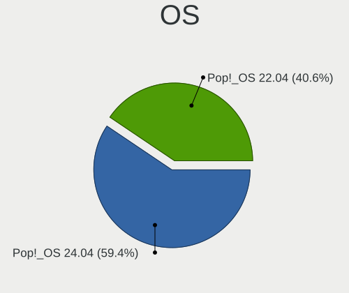

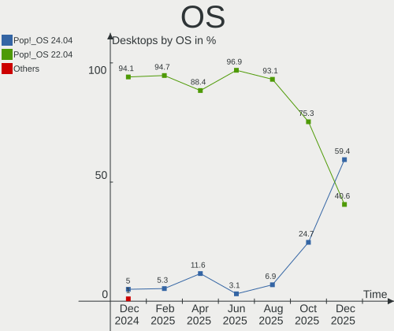

| Name          | Desktops | Percent |
|---------------|----------|---------|
| Pop!_OS 24.04 | 85       | 59.44%  |
| Pop!_OS 22.04 | 58       | 40.56%  |

OS Family
---------

OS without a version

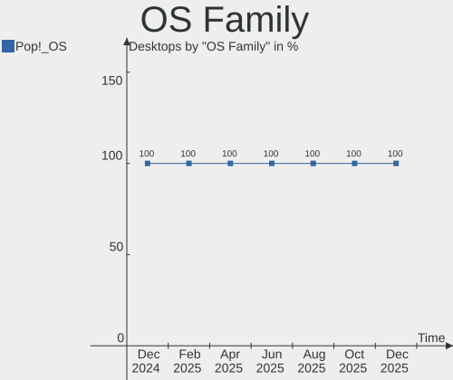

| Name    | Desktops | Percent |
|---------|----------|---------|
| Pop!_OS | 143      | 100%    |

Kernel
------

Version of the Linux kernel

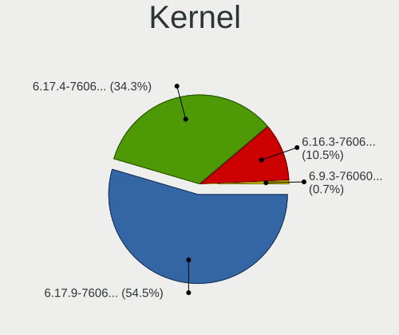

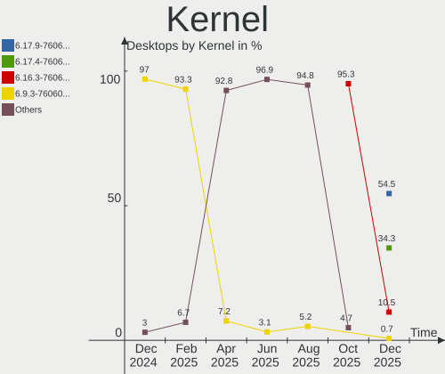

| Version                 | Desktops | Percent |
|-------------------------|----------|---------|
| 6.17.9-76061709-generic | 78       | 54.55%  |
| 6.17.4-76061704-generic | 49       | 34.27%  |
| 6.16.3-76061603-generic | 15       | 10.49%  |
| 6.9.3-76060903-generic  | 1        | 0.7%    |

Kernel Family
-------------

Linux kernel without a distro release

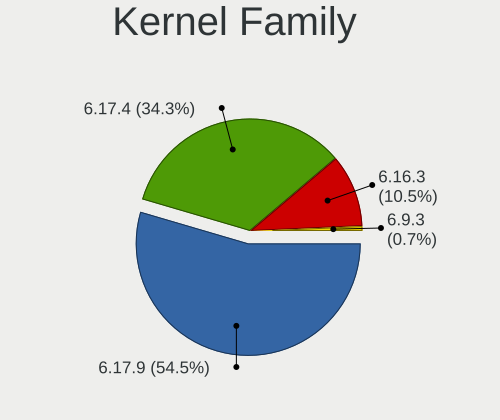

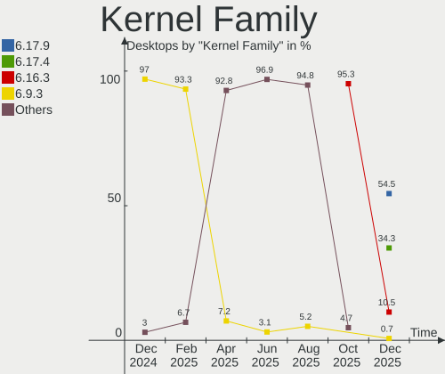

| Version | Desktops | Percent |
|---------|----------|---------|
| 6.17.9  | 78       | 54.55%  |
| 6.17.4  | 49       | 34.27%  |
| 6.16.3  | 15       | 10.49%  |
| 6.9.3   | 1        | 0.7%    |

Kernel Major Ver.
-----------------

Linux kernel major version

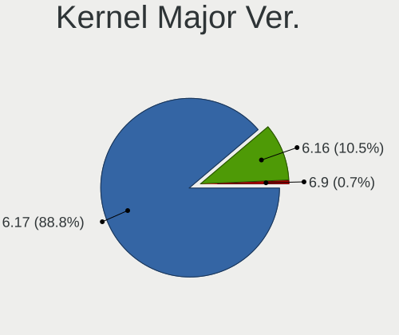

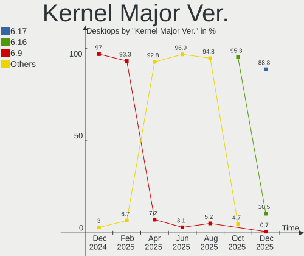

| Version | Desktops | Percent |
|---------|----------|---------|
| 6.17    | 127      | 88.81%  |
| 6.16    | 15       | 10.49%  |
| 6.9     | 1        | 0.7%    |

Arch
----

OS architecture (x86_64, i586, etc.)

| Name   | Desktops | Percent |
|--------|----------|---------|
| x86_64 | 143      | 100%    |

DE
--

Desktop Environment

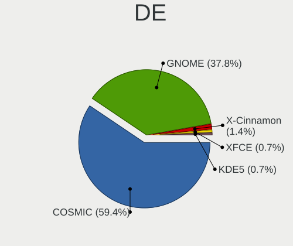

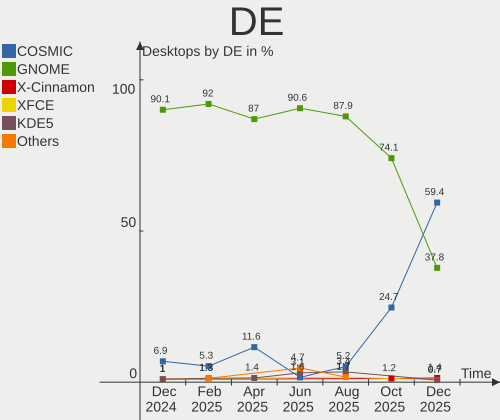

| Name       | Desktops | Percent |
|------------|----------|---------|
| COSMIC     | 85       | 59.44%  |
| GNOME      | 54       | 37.76%  |
| X-Cinnamon | 2        | 1.4%    |
| XFCE       | 1        | 0.7%    |
| KDE5       | 1        | 0.7%    |

Display Server
--------------

X11 or Wayland

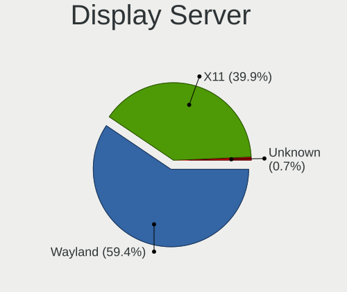

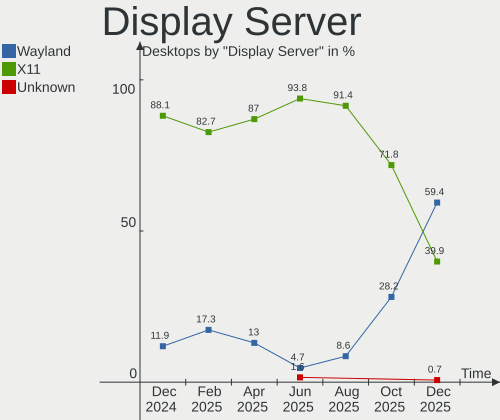

| Name    | Desktops | Percent |
|---------|----------|---------|
| Wayland | 85       | 59.44%  |
| X11     | 57       | 39.86%  |
| Unknown | 1        | 0.7%    |

Display Manager
---------------

SDDM, LightDM, etc.

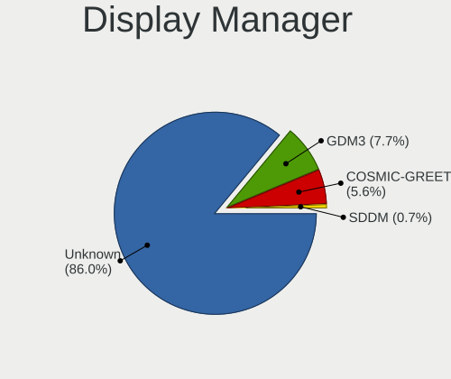

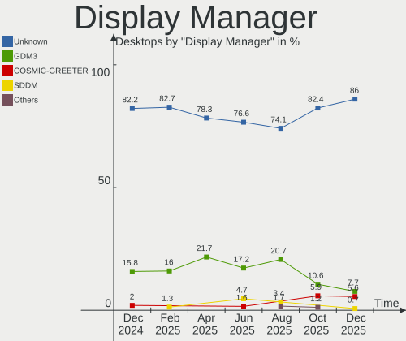

| Name           | Desktops | Percent |
|----------------|----------|---------|
| Unknown        | 123      | 86.01%  |
| GDM3           | 11       | 7.69%   |
| COSMIC-GREETER | 8        | 5.59%   |
| SDDM           | 1        | 0.7%    |

OS Lang
-------

Language

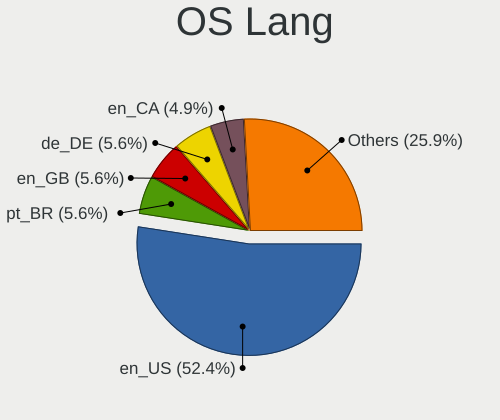

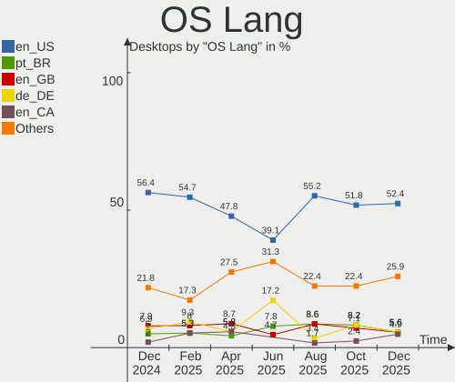

| Lang  | Desktops | Percent |
|-------|----------|---------|
| en_US | 75       | 52.45%  |
| pt_BR | 8        | 5.59%   |
| en_GB | 8        | 5.59%   |
| de_DE | 8        | 5.59%   |
| en_CA | 7        | 4.9%    |
| C     | 5        | 3.5%    |
| en_AU | 4        | 2.8%    |
| it_IT | 3        | 2.1%    |
| fr_FR | 3        | 2.1%    |
| sk_SK | 2        | 1.4%    |
| ru_RU | 2        | 1.4%    |
| pl_PL | 2        | 1.4%    |
| cs_CZ | 2        | 1.4%    |
| sv_SE | 1        | 0.7%    |
| hu_HU | 1        | 0.7%    |
| es_MX | 1        | 0.7%    |
| es_GT | 1        | 0.7%    |
| es_ES | 1        | 0.7%    |
| es_CR | 1        | 0.7%    |
| es_CO | 1        | 0.7%    |
| es_AR | 1        | 0.7%    |
| en_ZA | 1        | 0.7%    |
| en_IL | 1        | 0.7%    |
| en_DK | 1        | 0.7%    |
| de_CH | 1        | 0.7%    |
| da_DK | 1        | 0.7%    |
| ar_EG | 1        | 0.7%    |

Boot Mode
---------

EFI or BIOS

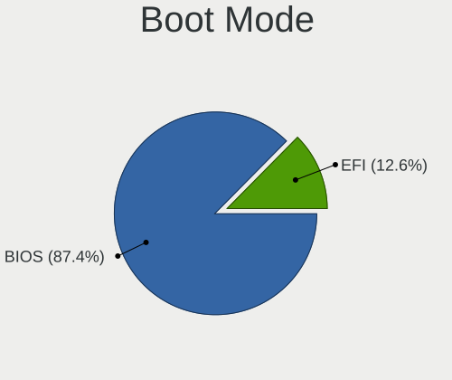

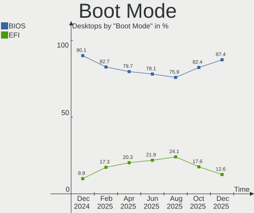

| Mode | Desktops | Percent |
|------|----------|---------|
| BIOS | 125      | 87.41%  |
| EFI  | 18       | 12.59%  |

Filesystem
----------

Type of filesystem

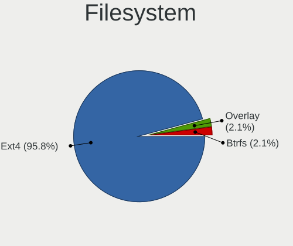

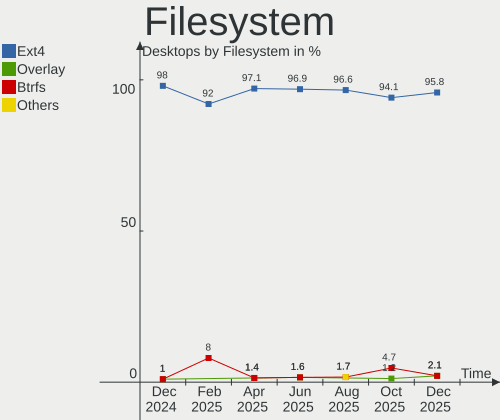

| Type    | Desktops | Percent |
|---------|----------|---------|
| Ext4    | 137      | 95.8%   |
| Overlay | 3        | 2.1%    |
| Btrfs   | 3        | 2.1%    |

Part. scheme
------------

Scheme of partitioning

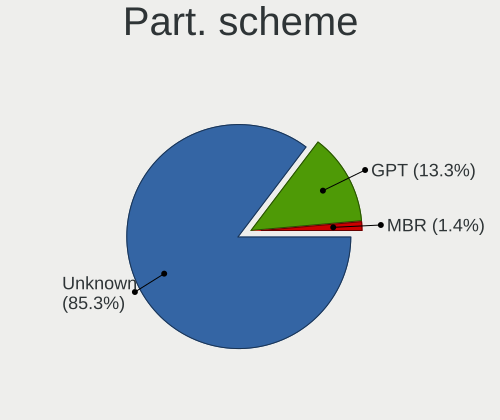

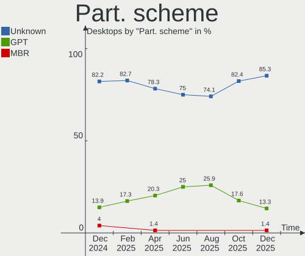

| Type    | Desktops | Percent |
|---------|----------|---------|
| Unknown | 122      | 85.31%  |
| GPT     | 19       | 13.29%  |
| MBR     | 2        | 1.4%    |

Dual Boot with Linux/BSD
------------------------

Hosting more than one Linux/BSD

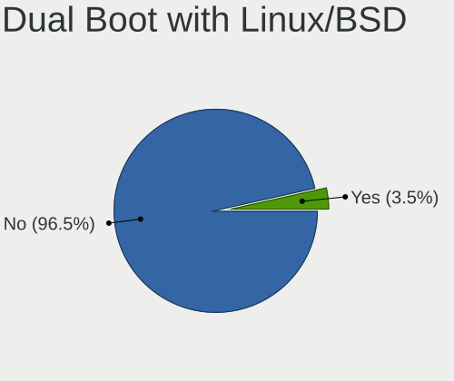

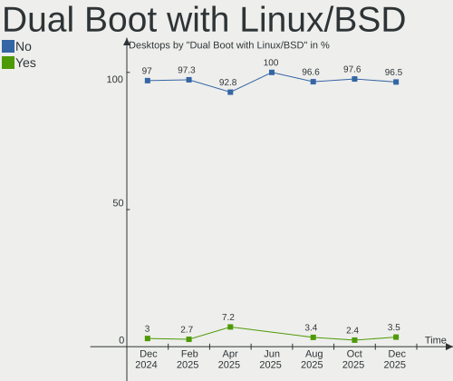

| Dual boot | Desktops | Percent |
|-----------|----------|---------|
| No        | 138      | 96.5%   |
| Yes       | 5        | 3.5%    |

Dual Boot (Win)
---------------

Hosting Linux and Windows

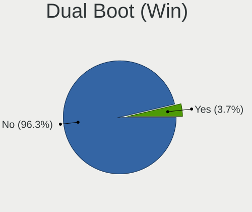

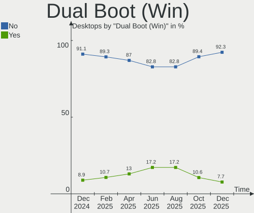

| Dual boot | Desktops | Percent |
|-----------|----------|---------|
| No        | 132      | 92.31%  |
| Yes       | 11       | 7.69%   |

Board
-----

Vendor
------

Motherboard manufacturer

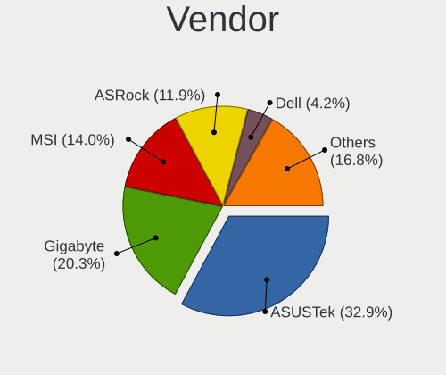

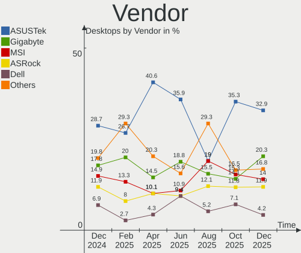

| Name                      | Desktops | Percent |
|---------------------------|----------|---------|
| ASUSTek Computer          | 47       | 32.87%  |
| Gigabyte Technology       | 29       | 20.28%  |
| MSI                       | 20       | 13.99%  |
| ASRock                    | 17       | 11.89%  |
| Dell                      | 6        | 4.2%    |
| Hewlett-Packard           | 5        | 3.5%    |
| Intel                     | 4        | 2.8%    |
| System76                  | 2        | 1.4%    |
| Fujitsu Siemens           | 2        | 1.4%    |
| Biostar                   | 2        | 1.4%    |
| Unknown                   | 2        | 1.4%    |
| Unknown (150311131614538) | 1        | 0.7%    |
| Tianbei                   | 1        | 0.7%    |
| SZQFTX                    | 1        | 0.7%    |
| MARIUS                    | 1        | 0.7%    |
| Huanan                    | 1        | 0.7%    |
| Fujitsu                   | 1        | 0.7%    |
| Acer                      | 1        | 0.7%    |

Model
-----

Motherboard model

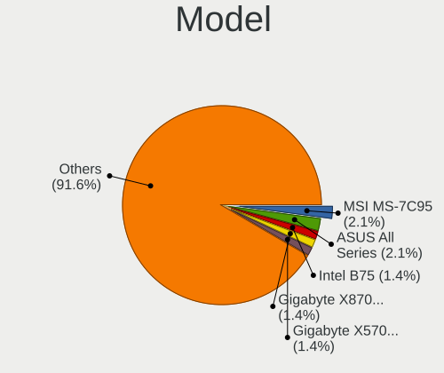

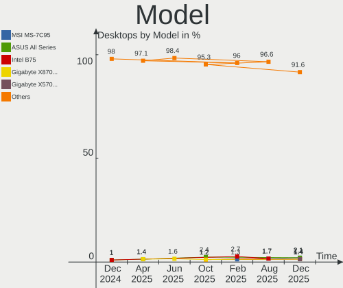

| Name                                      | Desktops | Percent |
|-------------------------------------------|----------|---------|
| MSI MS-7C95                               | 3        | 2.1%    |
| ASUS All Series                           | 3        | 2.1%    |
| Intel B75                                 | 2        | 1.4%    |
| Gigabyte X870I AORUS PRO ICE              | 2        | 1.4%    |
| Gigabyte X570 AORUS ELITE                 | 2        | 1.4%    |
| Gigabyte A520M K V2                       | 2        | 1.4%    |
| ASUS TUF Gaming X570-PLUS                 | 2        | 1.4%    |
| ASUS SABERTOOTH 990FX R2.0                | 2        | 1.4%    |
| ASUS ROG STRIX Z790-E GAMING WIFI         | 2        | 1.4%    |
| ASUS ROG CROSSHAIR X870E HERO             | 2        | 1.4%    |
| ASRock X870 Pro RS WiFi                   | 2        | 1.4%    |
| Unknown                                   | 2        | 1.4%    |
| Unknown (150311131614538) MS-7C94         | 1        | 0.7%    |
| Tianbei GEM12                             | 1        | 0.7%    |
| SZQFTX MN56                               | 1        | 0.7%    |
| System76 Thelio Mira                      | 1        | 0.7%    |
| System76 Thelio                           | 1        | 0.7%    |
| MSI US Desktop Aegis Z2                   | 1        | 0.7%    |
| MSI US Desktop Aegis R                    | 1        | 0.7%    |
| MSI PC                                    | 1        | 0.7%    |
| MSI MS-7E59                               | 1        | 0.7%    |
| MSI MS-7E05                               | 1        | 0.7%    |
| MSI MS-7D75                               | 1        | 0.7%    |
| MSI MS-7D54                               | 1        | 0.7%    |
| MSI MS-7D22                               | 1        | 0.7%    |
| MSI MS-7C91                               | 1        | 0.7%    |
| MSI MS-7C84                               | 1        | 0.7%    |
| MSI MS-7C71                               | 1        | 0.7%    |
| MSI MS-7C56                               | 1        | 0.7%    |
| MSI MS-7C02                               | 1        | 0.7%    |
| MSI MS-7B51                               | 1        | 0.7%    |
| MSI MS-7A38                               | 1        | 0.7%    |
| MSI MS-7A34                               | 1        | 0.7%    |
| MSI AMD                                   | 1        | 0.7%    |
| MARIUS 2016 Mainframe 4000MHz 120 STJ     | 1        | 0.7%    |
| Intel X99-D4-V5 BSF Ver:1.00              | 1        | 0.7%    |
| Intel MS-0C77F                            | 1        | 0.7%    |
| Huanan X99-F8 GAMING V5.0                 | 1        | 0.7%    |
| HP Z400 Workstation                       | 1        | 0.7%    |
| HP Victus by 15L Gaming Desktop TG02-0xxx | 1        | 0.7%    |

Model Family
------------

Motherboard model prefix

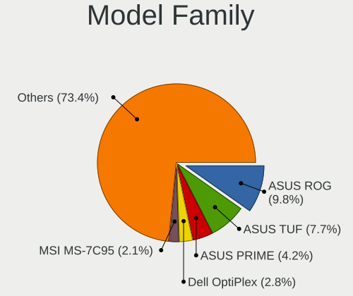

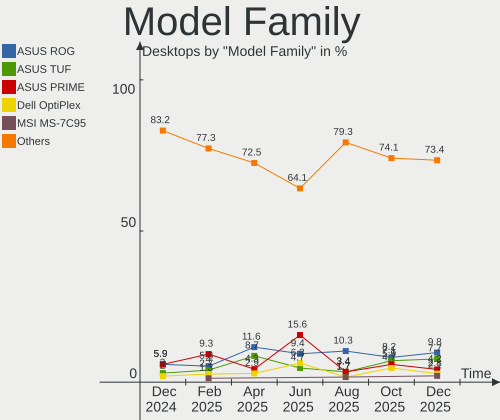

| Name                              | Desktops | Percent |
|-----------------------------------|----------|---------|
| ASUS ROG                          | 14       | 9.79%   |
| ASUS TUF                          | 11       | 7.69%   |
| ASUS PRIME                        | 6        | 4.2%    |
| Dell OptiPlex                     | 4        | 2.8%    |
| MSI MS-7C95                       | 3        | 2.1%    |
| Gigabyte B550M                    | 3        | 2.1%    |
| ASUS All                          | 3        | 2.1%    |
| System76 Thelio                   | 2        | 1.4%    |
| MSI US                            | 2        | 1.4%    |
| Intel B75                         | 2        | 1.4%    |
| HP Compaq                         | 2        | 1.4%    |
| Gigabyte X870I                    | 2        | 1.4%    |
| Gigabyte X570                     | 2        | 1.4%    |
| Gigabyte B450M                    | 2        | 1.4%    |
| Gigabyte A520M                    | 2        | 1.4%    |
| Dell XPS                          | 2        | 1.4%    |
| ASUS SABERTOOTH                   | 2        | 1.4%    |
| ASUS M5A78L-M                     | 2        | 1.4%    |
| ASRock X870                       | 2        | 1.4%    |
| ASRock B550M                      | 2        | 1.4%    |
| Unknown                           | 2        | 1.4%    |
| Unknown (150311131614538) MS-7C94 | 1        | 0.7%    |
| Tianbei GEM12                     | 1        | 0.7%    |
| SZQFTX MN56                       | 1        | 0.7%    |
| MSI PC                            | 1        | 0.7%    |
| MSI MS-7E59                       | 1        | 0.7%    |
| MSI MS-7E05                       | 1        | 0.7%    |
| MSI MS-7D75                       | 1        | 0.7%    |
| MSI MS-7D54                       | 1        | 0.7%    |
| MSI MS-7D22                       | 1        | 0.7%    |
| MSI MS-7C91                       | 1        | 0.7%    |
| MSI MS-7C84                       | 1        | 0.7%    |
| MSI MS-7C71                       | 1        | 0.7%    |
| MSI MS-7C56                       | 1        | 0.7%    |
| MSI MS-7C02                       | 1        | 0.7%    |
| MSI MS-7B51                       | 1        | 0.7%    |
| MSI MS-7A38                       | 1        | 0.7%    |
| MSI MS-7A34                       | 1        | 0.7%    |
| MSI AMD                           | 1        | 0.7%    |
| MARIUS 2016                       | 1        | 0.7%    |

MFG Year
--------

Motherboard manufacture year

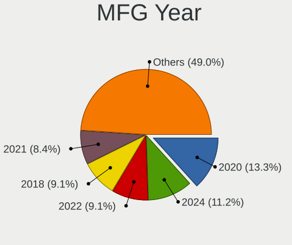

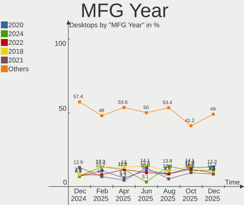

| Year | Desktops | Percent |
|------|----------|---------|
| 2020 | 19       | 13.29%  |
| 2024 | 16       | 11.19%  |
| 2022 | 13       | 9.09%   |
| 2018 | 13       | 9.09%   |
| 2021 | 12       | 8.39%   |
| 2019 | 11       | 7.69%   |
| 2025 | 10       | 6.99%   |
| 2023 | 8        | 5.59%   |
| 2016 | 8        | 5.59%   |
| 2012 | 7        | 4.9%    |
| 2017 | 6        | 4.2%    |
| 2013 | 6        | 4.2%    |
| 2015 | 4        | 2.8%    |
| 2014 | 3        | 2.1%    |
| 2011 | 2        | 1.4%    |
| 2008 | 2        | 1.4%    |
| 2010 | 1        | 0.7%    |
| 2009 | 1        | 0.7%    |
| 2007 | 1        | 0.7%    |

Form Factor
-----------

Physical design of the computer

| Name    | Desktops | Percent |
|---------|----------|---------|
| Desktop | 143      | 100%    |

Secure Boot
-----------

Enabled or disabled

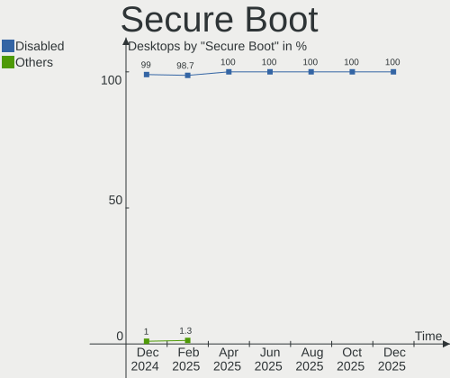

| State    | Desktops | Percent |
|----------|----------|---------|
| Disabled | 143      | 100%    |

Coreboot
--------

Have coreboot on board

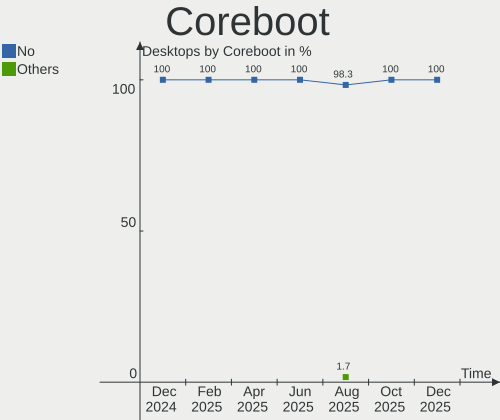

| Used | Desktops | Percent |
|------|----------|---------|
| No   | 143      | 100%    |

RAM Size
--------

Total RAM memory

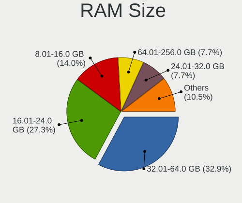

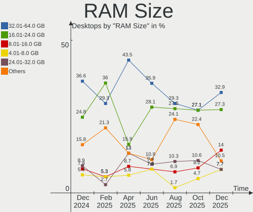

| Size in GB      | Desktops | Percent |
|-----------------|----------|---------|
| 32.01-64.0      | 47       | 32.87%  |
| 16.01-24.0      | 39       | 27.27%  |
| 8.01-16.0       | 20       | 13.99%  |
| 4.01-8.0        | 11       | 7.69%   |
| 24.01-32.0      | 11       | 7.69%   |
| 64.01-256.0     | 11       | 7.69%   |
| 3.01-4.0        | 3        | 2.1%    |
| More than 256.0 | 1        | 0.7%    |

RAM Used
--------

Used RAM memory

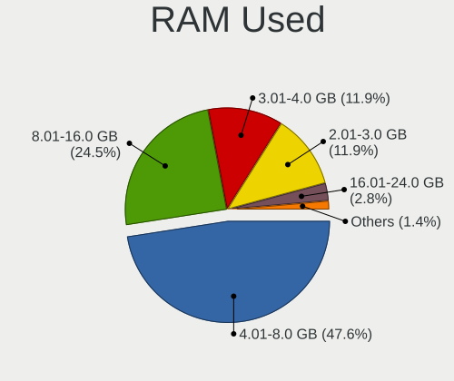

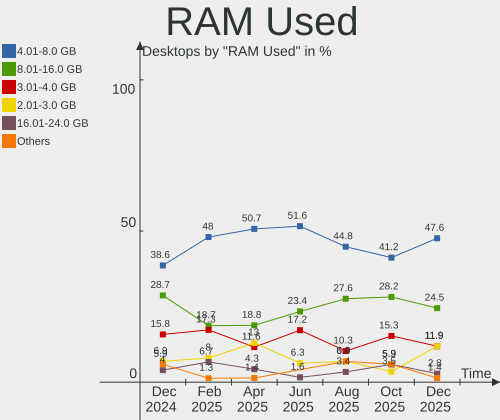

| Used GB    | Desktops | Percent |
|------------|----------|---------|
| 4.01-8.0   | 68       | 47.55%  |
| 8.01-16.0  | 35       | 24.48%  |
| 3.01-4.0   | 17       | 11.89%  |
| 2.01-3.0   | 17       | 11.89%  |
| 16.01-24.0 | 4        | 2.8%    |
| 32.01-64.0 | 1        | 0.7%    |
| 1.01-2.0   | 1        | 0.7%    |

Total Drives
------------

Number of drives on board

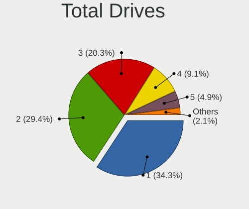

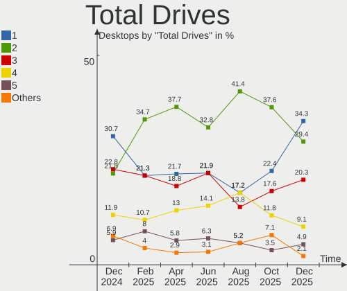

| Drives | Desktops | Percent |
|--------|----------|---------|
| 1      | 49       | 34.27%  |
| 2      | 42       | 29.37%  |
| 3      | 29       | 20.28%  |
| 4      | 13       | 9.09%   |
| 5      | 7        | 4.9%    |
| 8      | 1        | 0.7%    |
| 7      | 1        | 0.7%    |
| 6      | 1        | 0.7%    |

Has CD-ROM
----------

Has CD-ROM on board

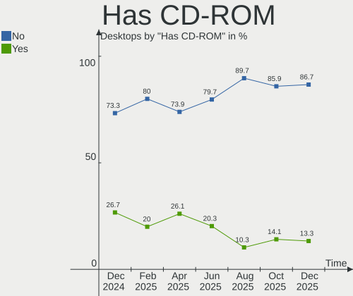

| Presented | Desktops | Percent |
|-----------|----------|---------|
| No        | 124      | 86.71%  |
| Yes       | 19       | 13.29%  |

Has Ethernet
------------

Has Ethernet on board

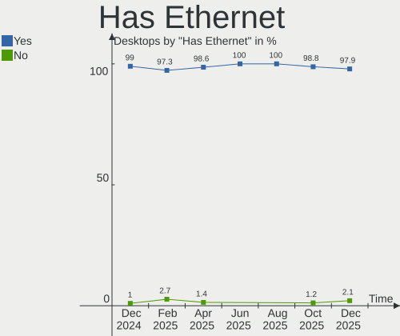

| Presented | Desktops | Percent |
|-----------|----------|---------|
| Yes       | 140      | 97.9%   |
| No        | 3        | 2.1%    |

Has WiFi
--------

Has WiFi module

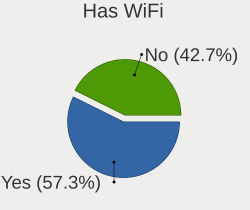

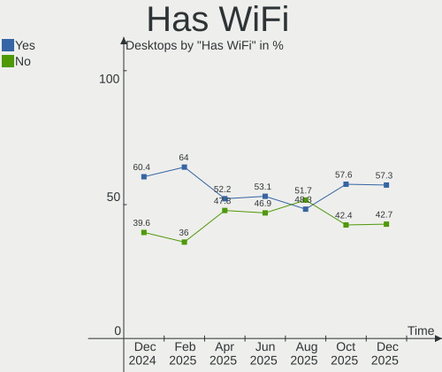

| Presented | Desktops | Percent |
|-----------|----------|---------|
| Yes       | 82       | 57.34%  |
| No        | 61       | 42.66%  |

Has Bluetooth
-------------

Has Bluetooth module

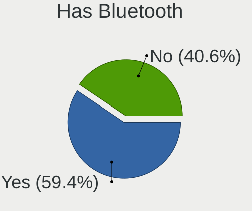

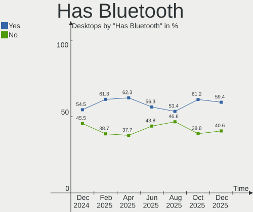

| Presented | Desktops | Percent |
|-----------|----------|---------|
| Yes       | 85       | 59.44%  |
| No        | 58       | 40.56%  |

Location
--------

Country
-------

Geographic location (country)

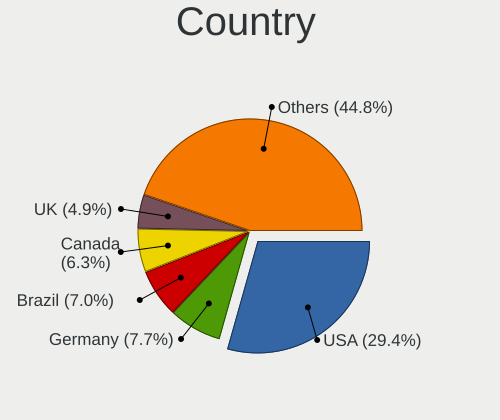

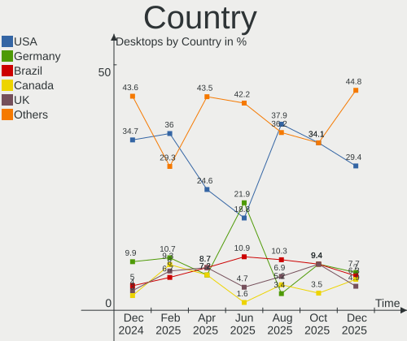

| Country      | Desktops | Percent |
|--------------|----------|---------|
| USA          | 42       | 29.37%  |
| Germany      | 11       | 7.69%   |
| Brazil       | 10       | 6.99%   |
| Canada       | 9        | 6.29%   |
| UK           | 7        | 4.9%    |
| Italy        | 6        | 4.2%    |
| Sweden       | 5        | 3.5%    |
| France       | 4        | 2.8%    |
| Denmark      | 4        | 2.8%    |
| Australia    | 4        | 2.8%    |
| Poland       | 3        | 2.1%    |
| Colombia     | 3        | 2.1%    |
| Switzerland  | 2        | 1.4%    |
| South Africa | 2        | 1.4%    |
| Slovakia     | 2        | 1.4%    |
| Romania      | 2        | 1.4%    |
| Norway       | 2        | 1.4%    |
| Czechia      | 2        | 1.4%    |
| Bulgaria     | 2        | 1.4%    |
| Vietnam      | 1        | 0.7%    |
| Venezuela    | 1        | 0.7%    |
| Spain        | 1        | 0.7%    |
| New Zealand  | 1        | 0.7%    |
| Netherlands  | 1        | 0.7%    |
| Nepal        | 1        | 0.7%    |
| Mexico       | 1        | 0.7%    |
| Latvia       | 1        | 0.7%    |
| Kazakhstan   | 1        | 0.7%    |
| Israel       | 1        | 0.7%    |
| Ireland      | 1        | 0.7%    |
| Indonesia    | 1        | 0.7%    |
| India        | 1        | 0.7%    |
| Hungary      | 1        | 0.7%    |
| Guatemala    | 1        | 0.7%    |
| Finland      | 1        | 0.7%    |
| Egypt        | 1        | 0.7%    |
| Costa Rica   | 1        | 0.7%    |
| China        | 1        | 0.7%    |
| Belgium      | 1        | 0.7%    |
| Argentina    | 1        | 0.7%    |

City
----

Geographic location (city)

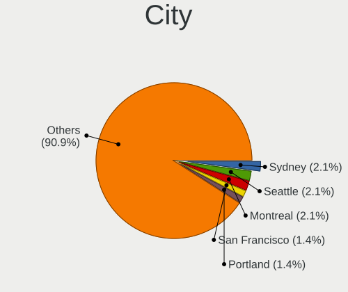

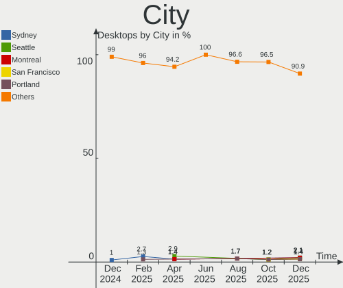

| City                      | Desktops | Percent |
|---------------------------|----------|---------|
| Sydney                    | 3        | 2.1%    |
| Seattle                   | 3        | 2.1%    |
| Montreal                  | 3        | 2.1%    |
| San Francisco             | 2        | 1.4%    |
| Portland                  | 2        | 1.4%    |
| Los Angeles               | 2        | 1.4%    |
| Denver                    | 2        | 1.4%    |
| Bogotá                   | 2        | 1.4%    |
| Żyrardów                | 1        | 0.7%    |
| Zurich                    | 1        | 0.7%    |
| Zibo                      | 1        | 0.7%    |
| Zanesville                | 1        | 0.7%    |
| Witpoortjie               | 1        | 0.7%    |
| Whittier                  | 1        | 0.7%    |
| Wenatchee                 | 1        | 0.7%    |
| Viedma                    | 1        | 0.7%    |
| Vesoul                    | 1        | 0.7%    |
| Vcelna                    | 1        | 0.7%    |
| The Bronx                 | 1        | 0.7%    |
| Teresina                  | 1        | 0.7%    |
| Tamworth                  | 1        | 0.7%    |
| Stockholm                 | 1        | 0.7%    |
| Spring                    | 1        | 0.7%    |
| Sofia                     | 1        | 0.7%    |
| Sierpc                    | 1        | 0.7%    |
| Sereilhac                 | 1        | 0.7%    |
| Sarasota                  | 1        | 0.7%    |
| San Jose                  | 1        | 0.7%    |
| San Giovanni in Persiceto | 1        | 0.7%    |
| Salem                     | 1        | 0.7%    |
| Rome                      | 1        | 0.7%    |
| Rolling Meadows           | 1        | 0.7%    |
| Roesrath                  | 1        | 0.7%    |
| Rochdale                  | 1        | 0.7%    |
| Rishon LeTsiyyon          | 1        | 0.7%    |
| Rio de Janeiro            | 1        | 0.7%    |
| Riga                      | 1        | 0.7%    |
| Ribeirao Preto            | 1        | 0.7%    |
| Regensburg                | 1        | 0.7%    |
| Radauti                   | 1        | 0.7%    |

Drives
------

Drive Vendor
------------

Hard drive vendors

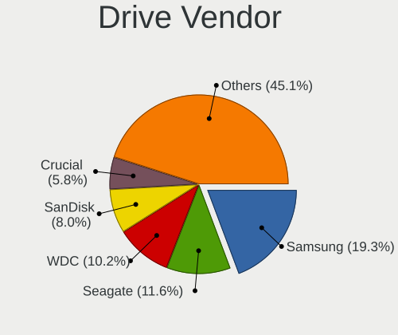

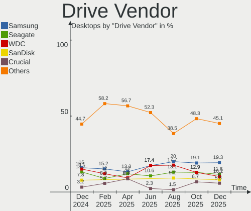

| Vendor                         | Desktops | Drives | Percent |
|--------------------------------|----------|--------|---------|
| Samsung Electronics            | 53       | 78     | 19.27%  |
| Seagate                        | 32       | 37     | 11.64%  |
| WDC                            | 28       | 33     | 10.18%  |
| SanDisk                        | 22       | 28     | 8%      |
| Crucial                        | 16       | 16     | 5.82%   |
| Kingston                       | 9        | 11     | 3.27%   |
| Intel                          | 9        | 14     | 3.27%   |
| Micron/Crucial Technology      | 8        | 8      | 2.91%   |
| Kingston Technology Company    | 8        | 9      | 2.91%   |
| Toshiba                        | 7        | 7      | 2.55%   |
| MAXIO Technology (Hangzhou)    | 7        | 7      | 2.55%   |
| T-FORCE                        | 4        | 6      | 1.45%   |
| Silicon Motion                 | 4        | 5      | 1.45%   |
| Phison Electronics             | 4        | 4      | 1.45%   |
| Micron Technology              | 4        | 4      | 1.45%   |
| ADATA Technology               | 4        | 4      | 1.45%   |
| PNY                            | 3        | 4      | 1.09%   |
| GOODRAM                        | 3        | 3      | 1.09%   |
| China                          | 3        | 3      | 1.09%   |
| Unknown                        | 2        | 4      | 0.73%   |
| SPCC                           | 2        | 2      | 0.73%   |
| SK hynix                       | 2        | 2      | 0.73%   |
| Shenzhen Longsys Electronics   | 2        | 2      | 0.73%   |
| Realtek Semiconductor          | 2        | 2      | 0.73%   |
| Patriot                        | 2        | 2      | 0.73%   |
| OCZ                            | 2        | 2      | 0.73%   |
| Hitachi                        | 2        | 2      | 0.73%   |
| HGST                           | 2        | 2      | 0.73%   |
| AMD                            | 2        | 4      | 0.73%   |
| A-DATA Technology              | 2        | 2      | 0.73%   |
| Unknown                        | 2        | 2      | 0.73%   |
| Verbatim                       | 1        | 1      | 0.36%   |
| USB                            | 1        | 1      | 0.36%   |
| Team                           | 1        | 1      | 0.36%   |
| Solid State Storage Technology | 1        | 1      | 0.36%   |
| smi                            | 1        | 1      | 0.36%   |
| S930P                          | 1        | 1      | 0.36%   |
| Plextor                        | 1        | 1      | 0.36%   |
| Nextorage                      | 1        | 1      | 0.36%   |
| MSI                            | 1        | 1      | 0.36%   |

Drive Model
-----------

Hard drive models

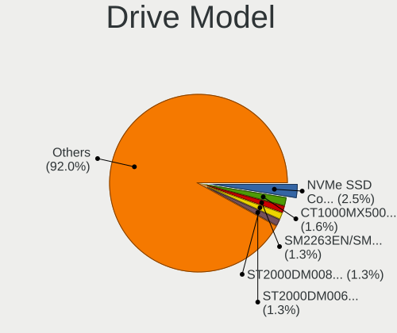

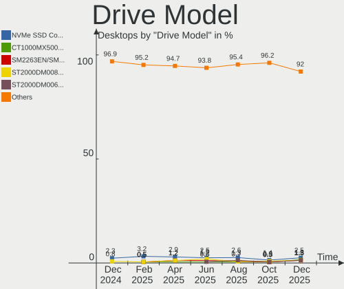

| Model                                                 | Desktops | Percent |
|-------------------------------------------------------|----------|---------|
| Samsung NVMe SSD Controller SM981/PM981/PM983 1TB     | 8        | 2.55%   |
| Crucial CT1000MX500SSD1 1TB                           | 5        | 1.59%   |
| Silicon Motion SM2263EN/SM2263XT SSD Controller 512GB | 4        | 1.27%   |
| Seagate ST2000DM008-2FR102 2TB                        | 4        | 1.27%   |
| Seagate ST2000DM006-2DM164 2TB                        | 4        | 1.27%   |
| Samsung NVMe SSD Controller PM9A1/PM9A3/980PRO 1TB    | 4        | 1.27%   |
| Micron/Crucial P2 NVMe PCIe SSD 2TB                   | 4        | 1.27%   |
| Crucial CT500MX500SSD1 500GB                          | 4        | 1.27%   |
| T-FORCE 1TB                                           | 3        | 0.96%   |
| Seagate ST4000DM004-2CV104 4TB                        | 3        | 0.96%   |
| Samsung SSD 990 PRO 4TB                               | 3        | 0.96%   |
| Samsung SSD 990 PRO 2TB                               | 3        | 0.96%   |
| Samsung SSD 850 EVO 250GB                             | 3        | 0.96%   |
| Phison E12 NVMe Controller 1TB                        | 3        | 0.96%   |
| MAXIO (Hangzhou) NVMe SSD Controller MAP1202 2TB      | 3        | 0.96%   |
| Kingston Company SNV3S1000G 1TB                       | 3        | 0.96%   |
| WDC WD5000LPVX-22V0TT0 500GB                          | 2        | 0.64%   |
| WDC WD10EZEX-08WN4A0 1TB                              | 2        | 0.64%   |
| Toshiba HDWD110 1TB                                   | 2        | 0.64%   |
| Toshiba DT01ACA050 500GB                              | 2        | 0.64%   |
| Seagate ST8000DM004-2CX188 8TB                        | 2        | 0.64%   |
| Seagate ST500DM002-1BD142 500GB                       | 2        | 0.64%   |
| Seagate ST1000DM010-2EP102 1TB                        | 2        | 0.64%   |
| Seagate ST1000DM003-1CH162 1TB                        | 2        | 0.64%   |
| Sandisk WD Blue SN550 NVMe SSD 1024GB                 | 2        | 0.64%   |
| Sandisk WD Blue SN500 / PC SN520 NVMe SSD 128GB       | 2        | 0.64%   |
| SanDisk SDSSDA240G 240GB                              | 2        | 0.64%   |
| SanDisk NVMe SSD Drive 1TB                            | 2        | 0.64%   |
| Samsung SSD 980 1TB                                   | 2        | 0.64%   |
| Samsung SSD 870 EVO 500GB                             | 2        | 0.64%   |
| Samsung SSD 870 EVO 4TB                               | 2        | 0.64%   |
| Samsung SSD 870 EVO 1TB                               | 2        | 0.64%   |
| Samsung SSD 860 EVO 500GB                             | 2        | 0.64%   |
| Samsung SSD 850 EVO 500GB                             | 2        | 0.64%   |
| Samsung SSD 840 Series 250GB                          | 2        | 0.64%   |
| Samsung SSD 840 Series 120GB                          | 2        | 0.64%   |
| Samsung HD103SJ 1TB                                   | 2        | 0.64%   |
| PNY CS900 240GB SSD                                   | 2        | 0.64%   |
| Micron/Crucial P1 NVMe PCIe SSD 1TB                   | 2        | 0.64%   |
| Kingston Company SNV2S1000G 1TB                       | 2        | 0.64%   |

HDD Vendor
----------

Hard disk drive vendors

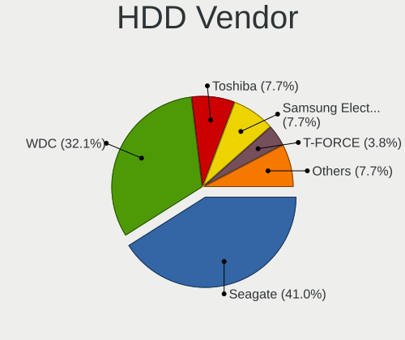

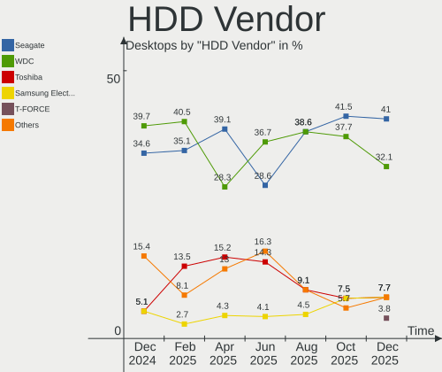

| Vendor              | Desktops | Drives | Percent |
|---------------------|----------|--------|---------|
| Seagate             | 32       | 37     | 41.03%  |
| WDC                 | 25       | 30     | 32.05%  |
| Toshiba             | 6        | 6      | 7.69%   |
| Samsung Electronics | 6        | 7      | 7.69%   |
| T-FORCE             | 3        | 3      | 3.85%   |
| Hitachi             | 2        | 2      | 2.56%   |
| HGST                | 2        | 2      | 2.56%   |
| Maxtor              | 1        | 1      | 1.28%   |
| ASMedia             | 1        | 1      | 1.28%   |

SSD Vendor
----------

Solid state drive vendors

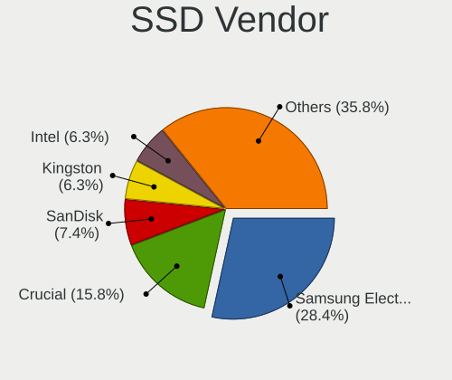

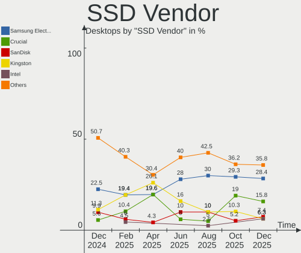

| Vendor              | Desktops | Drives | Percent |
|---------------------|----------|--------|---------|
| Samsung Electronics | 27       | 31     | 28.42%  |
| Crucial             | 15       | 15     | 15.79%  |
| SanDisk             | 7        | 7      | 7.37%   |
| Kingston            | 6        | 7      | 6.32%   |
| Intel               | 6        | 9      | 6.32%   |
| PNY                 | 3        | 4      | 3.16%   |
| GOODRAM             | 3        | 3      | 3.16%   |
| China               | 3        | 3      | 3.16%   |
| WDC                 | 2        | 2      | 2.11%   |
| T-FORCE             | 2        | 2      | 2.11%   |
| SPCC                | 2        | 2      | 2.11%   |
| Patriot             | 2        | 2      | 2.11%   |
| OCZ                 | 2        | 2      | 2.11%   |
| A-DATA Technology   | 2        | 2      | 2.11%   |
| Verbatim            | 1        | 1      | 1.05%   |
| Toshiba             | 1        | 1      | 1.05%   |
| Team                | 1        | 1      | 1.05%   |
| SK hynix            | 1        | 1      | 1.05%   |
| S930P               | 1        | 1      | 1.05%   |
| Plextor             | 1        | 1      | 1.05%   |
| Micron Technology   | 1        | 1      | 1.05%   |
| LITEONIT            | 1        | 1      | 1.05%   |
| KingSpec            | 1        | 1      | 1.05%   |
| Intenso             | 1        | 1      | 1.05%   |
| HPE                 | 1        | 1      | 1.05%   |
| Hewlett-Packard     | 1        | 1      | 1.05%   |
| Dahua               | 1        | 1      | 1.05%   |

Drive Kind
----------

HDD or SSD

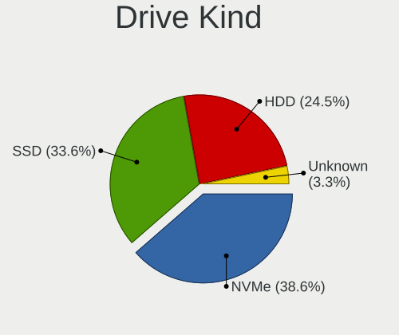

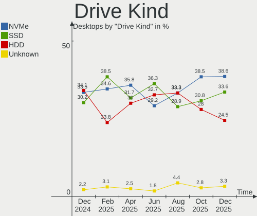

| Kind    | Desktops | Drives | Percent |
|---------|----------|--------|---------|
| NVMe    | 93       | 129    | 38.59%  |
| SSD     | 81       | 104    | 33.61%  |
| HDD     | 59       | 89     | 24.48%  |
| Unknown | 8        | 10     | 3.32%   |

Drive Connector
---------------

SATA, SAS, NVMe, etc.

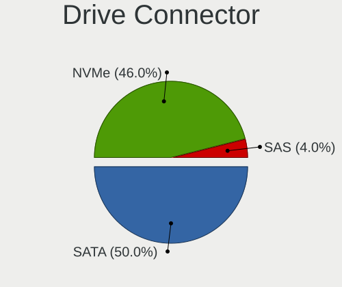

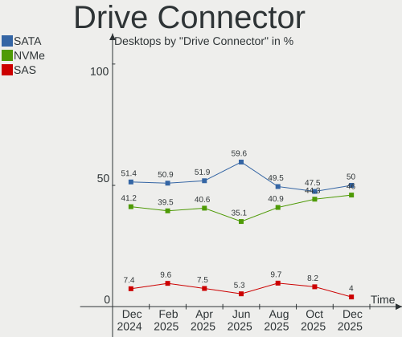

| Type | Desktops | Drives | Percent |
|------|----------|--------|---------|
| SATA | 101      | 193    | 50%     |
| NVMe | 93       | 128    | 46.04%  |
| SAS  | 8        | 11     | 3.96%   |

Drive Size
----------

Size of hard drive

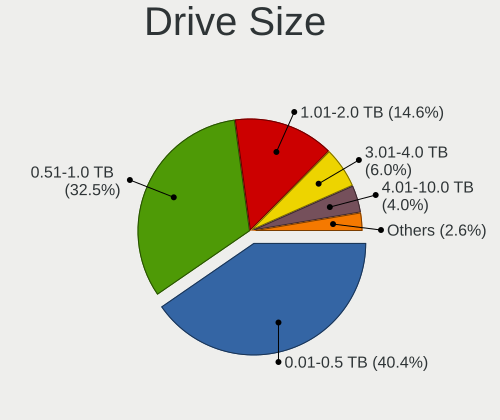

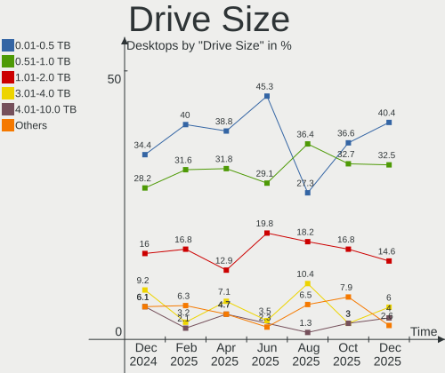

| Size in TB | Desktops | Drives | Percent |
|------------|----------|--------|---------|
| 0.01-0.5   | 61       | 88     | 40.4%   |
| 0.51-1.0   | 49       | 56     | 32.45%  |
| 1.01-2.0   | 22       | 26     | 14.57%  |
| 3.01-4.0   | 9        | 11     | 5.96%   |
| 4.01-10.0  | 6        | 6      | 3.97%   |
| 2.01-3.0   | 3        | 3      | 1.99%   |
| 10.01-20.0 | 1        | 3      | 0.66%   |

Space Total
-----------

Amount of disk space available on the file system

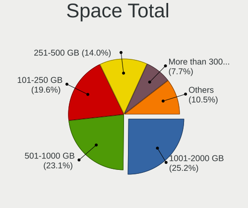

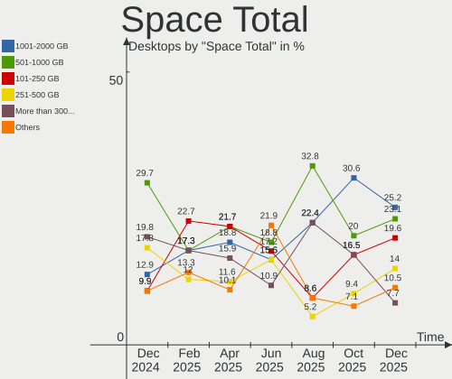

| Size in GB     | Desktops | Percent |
|----------------|----------|---------|
| 1001-2000      | 36       | 25.17%  |
| 501-1000       | 33       | 23.08%  |
| 101-250        | 28       | 19.58%  |
| 251-500        | 20       | 13.99%  |
| More than 3000 | 11       | 7.69%   |
| 2001-3000      | 7        | 4.9%    |
| 21-50          | 4        | 2.8%    |
| 1-20           | 3        | 2.1%    |
| 51-100         | 1        | 0.7%    |

Space Used
----------

Amount of used disk space

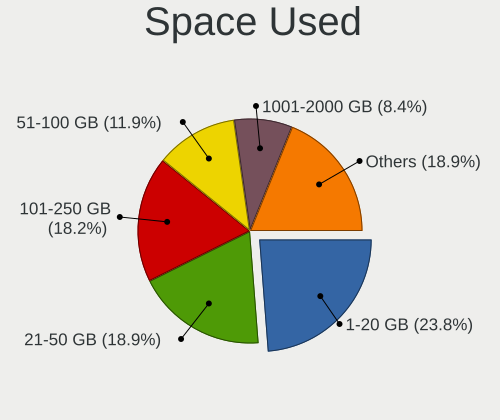

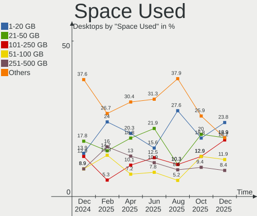

| Used GB        | Desktops | Percent |
|----------------|----------|---------|
| 1-20           | 34       | 23.78%  |
| 21-50          | 27       | 18.88%  |
| 101-250        | 26       | 18.18%  |
| 51-100         | 17       | 11.89%  |
| 251-500        | 12       | 8.39%   |
| 1001-2000      | 12       | 8.39%   |
| 501-1000       | 10       | 6.99%   |
| 2001-3000      | 3        | 2.1%    |
| More than 3000 | 2        | 1.4%    |

Malfunc. Drives
---------------

Drive models with a malfunction

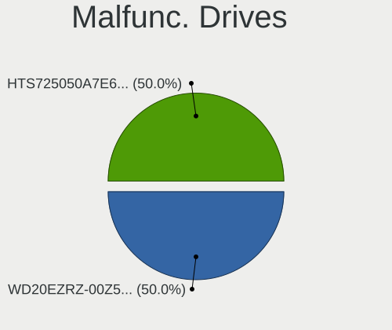

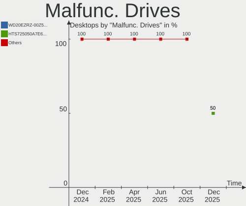

| Model                      | Desktops | Drives | Percent |
|----------------------------|----------|--------|---------|
| WDC WD20EZRZ-00Z5HB0 2TB   | 1        | 1      | 50%     |
| HGST HTS725050A7E630 500GB | 1        | 1      | 50%     |

Malfunc. Drive Vendor
---------------------

Vendors of faulty drives

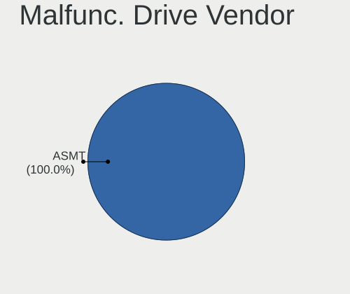

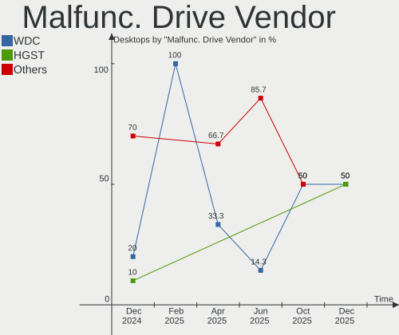

| Vendor | Desktops | Drives | Percent |
|--------|----------|--------|---------|
| WDC    | 1        | 1      | 50%     |
| HGST   | 1        | 1      | 50%     |

Malfunc. HDD Vendor
-------------------

Vendors of faulty HDD drives

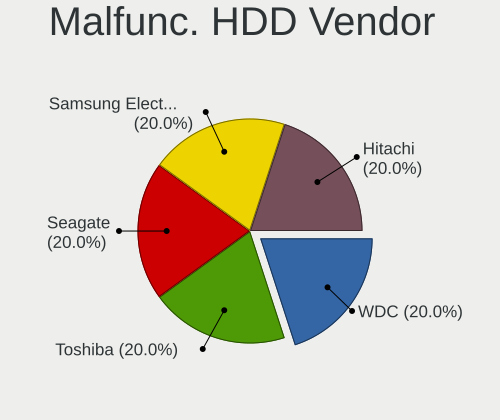

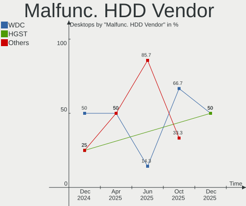

| Vendor | Desktops | Drives | Percent |
|--------|----------|--------|---------|
| WDC    | 1        | 1      | 50%     |
| HGST   | 1        | 1      | 50%     |

Malfunc. Drive Kind
-------------------

Kinds of faulty drives

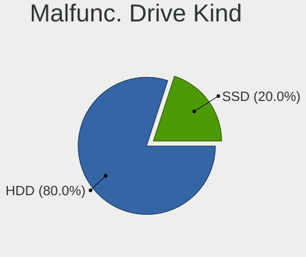

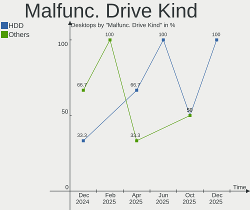

| Kind | Desktops | Drives | Percent |
|------|----------|--------|---------|
| HDD  | 2        | 2      | 100%    |

Failed Drives
-------------

Failed drive models

Zero info for selected period =(

Failed Drive Vendor
-------------------

Failed drive vendors

Zero info for selected period =(

Drive Status
------------

Number of failed and malfunc. drives

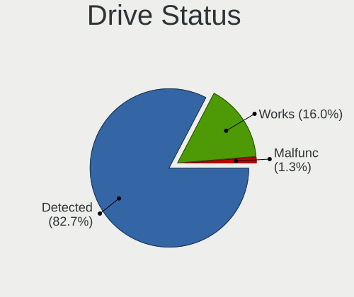

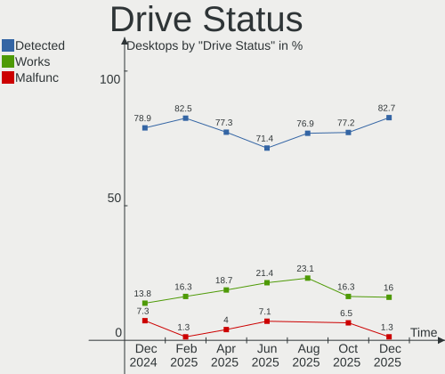

| Status   | Desktops | Drives | Percent |
|----------|----------|--------|---------|
| Detected | 124      | 287    | 82.67%  |
| Works    | 24       | 43     | 16%     |
| Malfunc  | 2        | 2      | 1.33%   |

Storage controller
------------------

Storage Vendor
--------------

Storage controller vendors

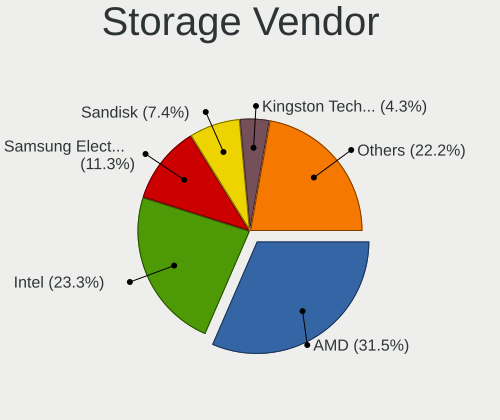

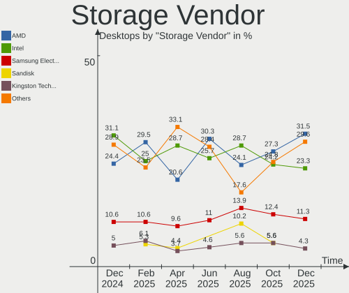

| Vendor                         | Desktops | Percent |
|--------------------------------|----------|---------|
| AMD                            | 81       | 31.52%  |
| Intel                          | 60       | 23.35%  |
| Samsung Electronics            | 29       | 11.28%  |
| Sandisk                        | 19       | 7.39%   |
| Kingston Technology Company    | 11       | 4.28%   |
| ASMedia Technology             | 11       | 4.28%   |
| Micron/Crucial Technology      | 8        | 3.11%   |
| MAXIO Technology (Hangzhou)    | 7        | 2.72%   |
| Silicon Motion                 | 5        | 1.95%   |
| Phison Electronics             | 5        | 1.95%   |
| ADATA Technology               | 4        | 1.56%   |
| Micron Technology              | 3        | 1.17%   |
| Shenzhen Longsys Electronics   | 2        | 0.78%   |
| Realtek Semiconductor          | 2        | 0.78%   |
| INNOGRIT                       | 2        | 0.78%   |
| Solid State Storage Technology | 1        | 0.39%   |
| SK hynix                       | 1        | 0.39%   |
| OCZ Technology Group           | 1        | 0.39%   |
| Nvidia                         | 1        | 0.39%   |
| Nextorage                      | 1        | 0.39%   |
| Marvell Technology Group       | 1        | 0.39%   |
| Lite-On Technology             | 1        | 0.39%   |
| Biwin Storage Technology       | 1        | 0.39%   |

Storage Model
-------------

Storage controller models

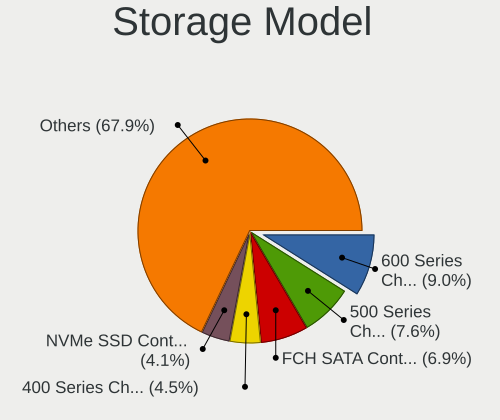

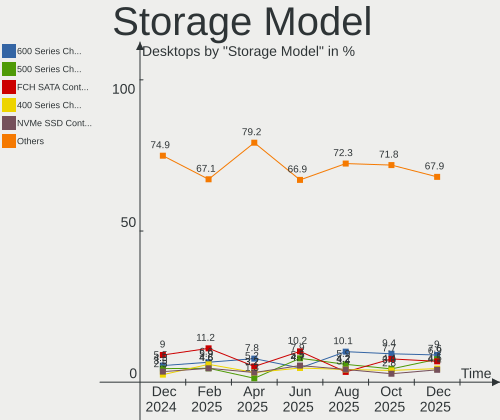

| Model                                                                          | Desktops | Percent |
|--------------------------------------------------------------------------------|----------|---------|
| AMD 600 Series Chipset SATA Controller                                         | 26       | 8.97%   |
| AMD 500 Series Chipset SATA Controller                                         | 22       | 7.59%   |
| AMD FCH SATA Controller [AHCI mode]                                            | 20       | 6.9%    |
| AMD 400 Series Chipset SATA Controller                                         | 13       | 4.48%   |
| Samsung NVMe SSD Controller SM981/PM981/PM983                                  | 12       | 4.14%   |
| ASMedia ASM1061/ASM1062 Serial ATA Controller                                  | 10       | 3.45%   |
| Samsung NVMe SSD Controller S4LV008[Pascal]                                    | 8        | 2.76%   |
| Intel Q170/Q150/B150/H170/H110/Z170/CM236 Chipset SATA Controller [AHCI Mode]  | 7        | 2.41%   |
| Intel SATA Controller [RAID mode]                                              | 6        | 2.07%   |
| Silicon Motion SM2263EN/SM2263XT (DRAM-less) NVMe SSD Controllers              | 5        | 1.72%   |
| Intel Cannon Lake PCH SATA AHCI Controller                                     | 5        | 1.72%   |
| Intel 8 Series/C220 Series Chipset Family 6-port SATA Controller 1 [AHCI mode] | 5        | 1.72%   |
| Intel 7 Series/C210 Series Chipset Family 6-port SATA Controller [AHCI mode]   | 5        | 1.72%   |
| Intel 200 Series PCH SATA controller [AHCI mode]                               | 5        | 1.72%   |
| Samsung NVMe SSD Controller PM9A1/PM9A3/980PRO                                 | 4        | 1.38%   |
| Micron/Crucial P2 [Nick P2] / P3 / P3 Plus NVMe PCIe SSD (DRAM-less)           | 4        | 1.38%   |
| MAXIO (Hangzhou) NVMe SSD Controller MAP1602 (DRAM-less)                       | 4        | 1.38%   |
| Intel Raptor Lake SATA AHCI Controller                                         | 4        | 1.38%   |
| Intel Comet Lake SATA AHCI Controller                                          | 4        | 1.38%   |
| AMD SB7x0/SB8x0/SB9x0 SATA Controller [AHCI mode]                              | 4        | 1.38%   |
| AMD FCH RAID Controller                                                        | 4        | 1.38%   |
| Samsung NVMe SSD Controller 980 (DRAM-less)                                    | 3        | 1.03%   |
| Phison E12 NVMe Controller                                                     | 3        | 1.03%   |
| MAXIO (Hangzhou) NVMe SSD Controller MAP1202 (DRAM-less)                       | 3        | 1.03%   |
| Kingston Company NV3 NVMe SSD [SM2268XT2] (DRAM-less)                          | 3        | 1.03%   |
| Intel RST Volume Management Device Controller                                  | 3        | 1.03%   |
| Intel C610/X99 series chipset sSATA Controller [AHCI mode]                     | 3        | 1.03%   |
| Intel 6 Series/C200 Series Chipset Family 6 port Desktop SATA AHCI Controller  | 3        | 1.03%   |
| Intel 500 Series Chipset Family SATA AHCI Controller                           | 3        | 1.03%   |
| AMD SB7x0/SB8x0/SB9x0 IDE Controller                                           | 3        | 1.03%   |
| AMD RAID Bottom Device                                                         | 3        | 1.03%   |
| SanDisk WD SN560/SN740/SN770/SN5000 NVMe SSD                                   | 2        | 0.69%   |
| SanDisk WD PC SN540 / Green SN350 NVMe SSD 1 TB (DRAM-less)                    | 2        | 0.69%   |
| SanDisk WD Green SN350 240GB (DRAM-less) / SN560E NVMe SSD                     | 2        | 0.69%   |
| SanDisk WD Blue SN500 / PC SN520 x2 M.2 2280 NVMe SSD                          | 2        | 0.69%   |
| Sandisk WD Black SN850X NVMe SSD                                               | 2        | 0.69%   |
| SanDisk Ultra 3D / WD PC SN530, IX SN530, Blue SN550 NVMe SSD (DRAM-less)      | 2        | 0.69%   |
| SanDisk Ultra 3D / WD Blue SN570 NVMe SSD (DRAM-less)                          | 2        | 0.69%   |
| Samsung NVMe SSD Controller PM9C1a (DRAM-less)                                 | 2        | 0.69%   |
| Micron/Crucial P1 NVMe PCIe SSD[Frampton]                                      | 2        | 0.69%   |

Storage Kind
------------

Kind of storage controller (IDE, SATA, NVMe, SAS, ...)

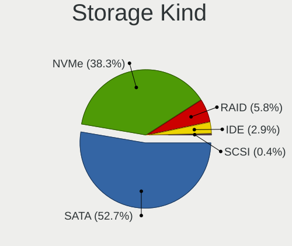

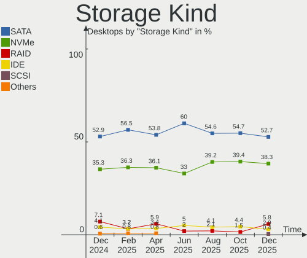

| Kind | Desktops | Percent |
|------|----------|---------|
| SATA | 128      | 52.67%  |
| NVMe | 93       | 38.27%  |
| RAID | 14       | 5.76%   |
| IDE  | 7        | 2.88%   |
| SCSI | 1        | 0.41%   |

Processor
---------

CPU Vendor
----------

Processor vendors

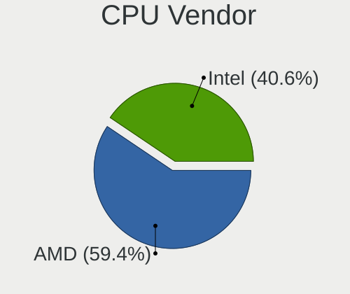

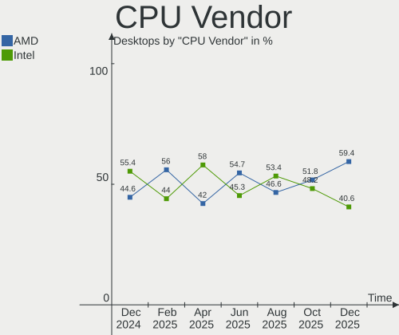

| Vendor | Desktops | Percent |
|--------|----------|---------|
| AMD    | 85       | 59.44%  |
| Intel  | 58       | 40.56%  |

CPU Model
---------

Processor models

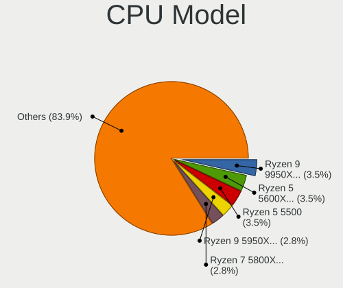

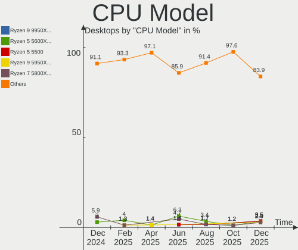

| Model                                       | Desktops | Percent |
|---------------------------------------------|----------|---------|
| AMD Ryzen 9 9950X3D 16-Core Processor       | 5        | 3.5%    |
| AMD Ryzen 5 5600X 6-Core Processor          | 5        | 3.5%    |
| AMD Ryzen 5 5500                            | 5        | 3.5%    |
| AMD Ryzen 9 5950X 16-Core Processor         | 4        | 2.8%    |
| AMD Ryzen 7 5800X 8-Core Processor          | 4        | 2.8%    |
| Intel Core i5-4590 CPU @ 3.30GHz            | 3        | 2.1%    |
| AMD Ryzen 7 9800X3D 8-Core Processor        | 3        | 2.1%    |
| AMD Ryzen 7 8700F 8-Core Processor          | 3        | 2.1%    |
| AMD Ryzen 7 7800X3D 8-Core Processor        | 3        | 2.1%    |
| AMD Ryzen 5 7600 6-Core Processor           | 3        | 2.1%    |
| AMD Ryzen 5 5600GT with Radeon Graphics     | 3        | 2.1%    |
| Intel Xeon CPU E5-2680 v4 @ 2.40GHz         | 2        | 1.4%    |
| Intel Core i7-8700K CPU @ 3.70GHz           | 2        | 1.4%    |
| Intel Core i7-4770K CPU @ 3.50GHz           | 2        | 1.4%    |
| Intel Core i7-10700F CPU @ 2.90GHz          | 2        | 1.4%    |
| Intel Core i5-6600K CPU @ 3.50GHz           | 2        | 1.4%    |
| Intel Core i5-6500 CPU @ 3.20GHz            | 2        | 1.4%    |
| Intel Core i5-6400 CPU @ 2.70GHz            | 2        | 1.4%    |
| Intel Core i5-3470 CPU @ 3.20GHz            | 2        | 1.4%    |
| Intel Core i5-2400S CPU @ 2.50GHz           | 2        | 1.4%    |
| Intel 13th Gen Core i9-13900K               | 2        | 1.4%    |
| Intel 11th Gen Core i5-11400F @ 2.60GHz     | 2        | 1.4%    |
| AMD Ryzen 9 5900X 12-Core Processor         | 2        | 1.4%    |
| AMD Ryzen 7 5800X3D 8-Core Processor        | 2        | 1.4%    |
| AMD Ryzen 7 5700X 8-Core Processor          | 2        | 1.4%    |
| AMD Ryzen 7 5700G with Radeon Graphics      | 2        | 1.4%    |
| AMD Ryzen 7 3700X 8-Core Processor          | 2        | 1.4%    |
| AMD Ryzen 7 2700X Eight-Core Processor      | 2        | 1.4%    |
| AMD Ryzen 5 5600G with Radeon Graphics      | 2        | 1.4%    |
| AMD Ryzen 5 3600 6-Core Processor           | 2        | 1.4%    |
| AMD FX-9590 Eight-Core Processor            | 2        | 1.4%    |
| AMD FX-6300 Six-Core Processor              | 2        | 1.4%    |
| Intel Xeon CPU W3550 @ 3.07GHz              | 1        | 0.7%    |
| Intel Xeon CPU E3-1230 v5 @ 3.40GHz         | 1        | 0.7%    |
| Intel Pentium Dual-Core CPU E5300 @ 2.60GHz | 1        | 0.7%    |
| Intel Pentium CPU G3220 @ 3.00GHz           | 1        | 0.7%    |
| Intel Core i9-9900K CPU @ 3.60GHz           | 1        | 0.7%    |
| Intel Core i7-8700 CPU @ 3.20GHz            | 1        | 0.7%    |
| Intel Core i7-7700K CPU @ 4.20GHz           | 1        | 0.7%    |
| Intel Core i7-6950X CPU @ 3.00GHz           | 1        | 0.7%    |

CPU Model Family
----------------

Processor model prefix

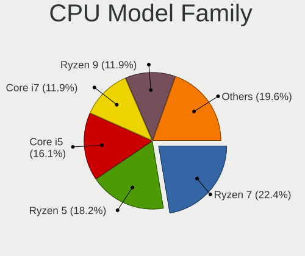

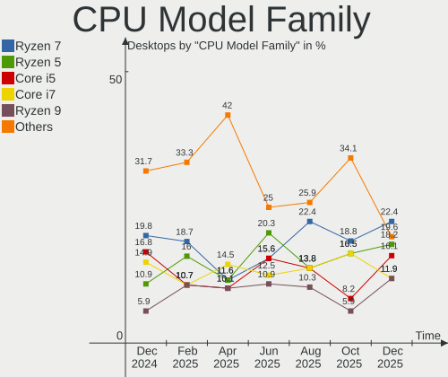

| Model                   | Desktops | Percent |
|-------------------------|----------|---------|
| AMD Ryzen 7             | 32       | 22.38%  |
| AMD Ryzen 5             | 26       | 18.18%  |
| Intel Core i5           | 23       | 16.08%  |
| Intel Core i7           | 17       | 11.89%  |
| AMD Ryzen 9             | 17       | 11.89%  |
| Other                   | 6        | 4.2%    |
| AMD FX                  | 5        | 3.5%    |
| Intel Xeon              | 4        | 2.8%    |
| Intel Core i3           | 3        | 2.1%    |
| AMD Ryzen 3             | 3        | 2.1%    |
| Intel Pentium Dual-Core | 1        | 0.7%    |
| Intel Pentium           | 1        | 0.7%    |
| Intel Core i9           | 1        | 0.7%    |
| Intel Core 2 Quad       | 1        | 0.7%    |
| Intel Core 2 Duo        | 1        | 0.7%    |
| AMD E                   | 1        | 0.7%    |
| AMD Athlon 64 X2        | 1        | 0.7%    |

CPU Cores
---------

Number of processor cores

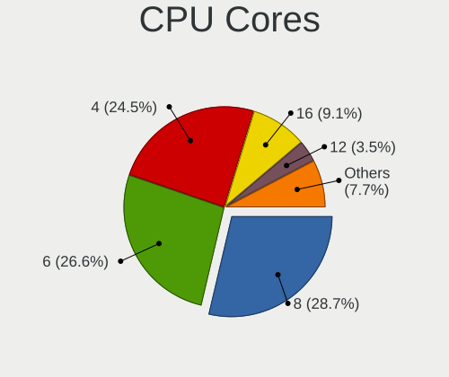

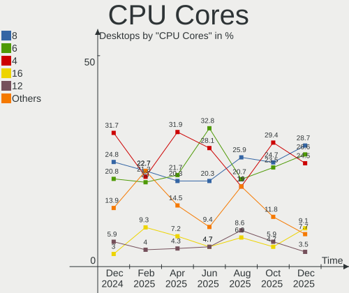

| Number | Desktops | Percent |
|--------|----------|---------|
| 8      | 41       | 28.67%  |
| 6      | 38       | 26.57%  |
| 4      | 35       | 24.48%  |
| 16     | 13       | 9.09%   |
| 12     | 5        | 3.5%    |
| 2      | 5        | 3.5%    |
| 24     | 2        | 1.4%    |
| 14     | 2        | 1.4%    |
| 20     | 1        | 0.7%    |
| 10     | 1        | 0.7%    |

CPU Sockets
-----------

Number of sockets

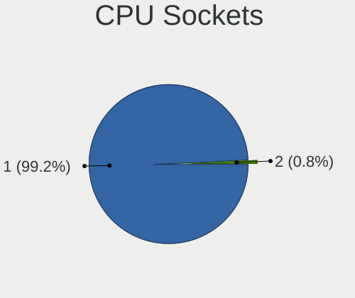

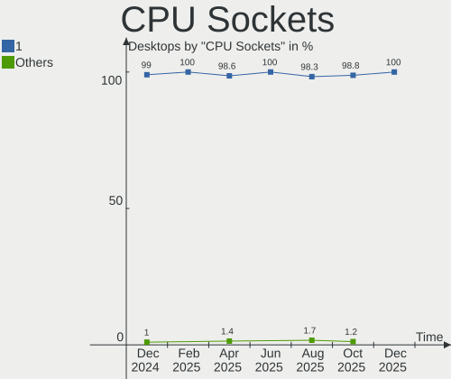

| Number | Desktops | Percent |
|--------|----------|---------|
| 1      | 143      | 100%    |

CPU Threads
-----------

Threads per core (Hyper-Threading)

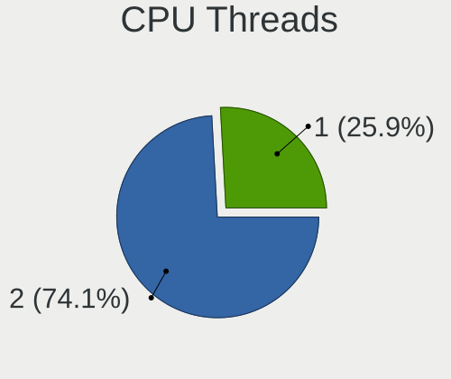

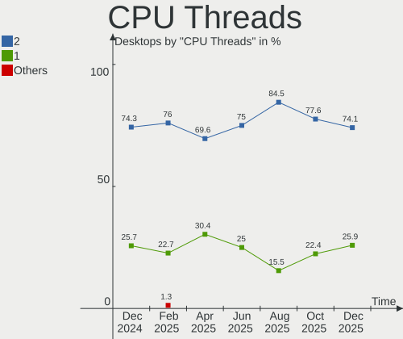

| Number | Desktops | Percent |
|--------|----------|---------|
| 2      | 106      | 74.13%  |
| 1      | 37       | 25.87%  |

CPU Op-Modes
------------

CPU Operation Modes (32-bit, 64-bit)

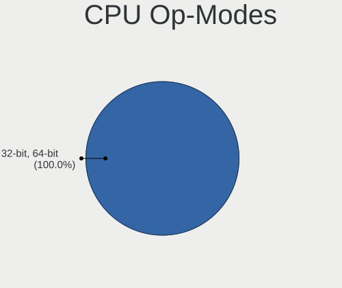

| Op mode        | Desktops | Percent |
|----------------|----------|---------|
| 32-bit, 64-bit | 143      | 100%    |

CPU Microcode
-------------

Microcode number

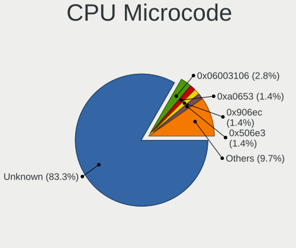

| Number  | Desktops | Percent |
|---------|----------|---------|
| Unknown | 143      | 100%    |

CPU Microarch
-------------

Microarchitecture

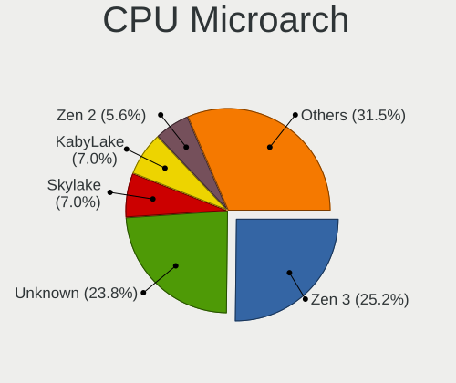

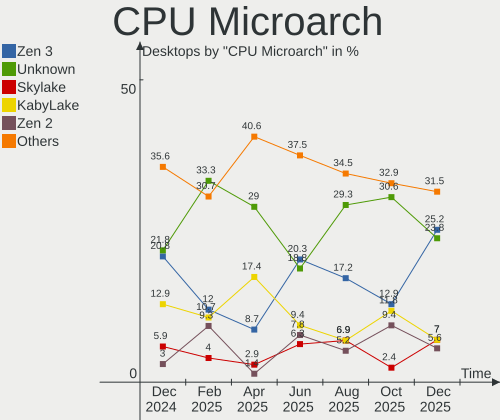

| Name             | Desktops | Percent |
|------------------|----------|---------|
| Zen 3            | 36       | 25.17%  |
| Unknown          | 34       | 23.78%  |
| Skylake          | 10       | 6.99%   |
| KabyLake         | 10       | 6.99%   |
| Zen 2            | 8        | 5.59%   |
| Haswell          | 8        | 5.59%   |
| CometLake        | 7        | 4.9%    |
| SandyBridge      | 5        | 3.5%    |
| Piledriver       | 5        | 3.5%    |
| IvyBridge        | 4        | 2.8%    |
| Zen+             | 3        | 2.1%    |
| Zen              | 3        | 2.1%    |
| Penryn           | 3        | 2.1%    |
| Broadwell        | 3        | 2.1%    |
| Alderlake Hybrid | 2        | 1.4%    |
| Nehalem          | 1        | 0.7%    |
| K8 Hammer        | 1        | 0.7%    |

Graphics
--------

GPU Vendor
----------

Vendors of graphics cards

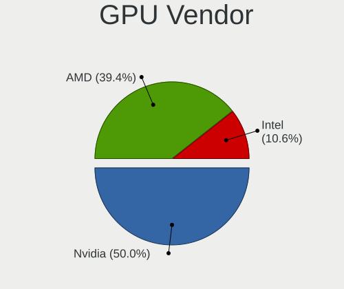

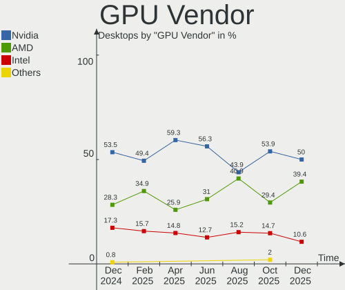

| Vendor | Desktops | Percent |
|--------|----------|---------|
| Nvidia | 80       | 50%     |
| AMD    | 63       | 39.38%  |
| Intel  | 17       | 10.63%  |

GPU Model
---------

Graphics card models

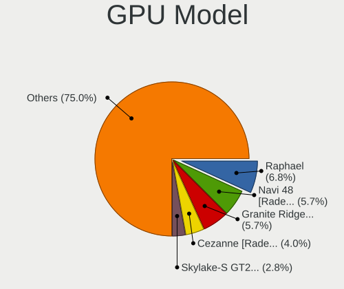

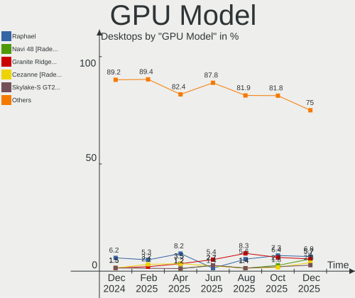

| Model                                                                       | Desktops | Percent |
|-----------------------------------------------------------------------------|----------|---------|
| AMD Raphael                                                                 | 12       | 6.82%   |
| AMD Navi 48 [Radeon RX 9070/9070 XT/9070 GRE]                               | 10       | 5.68%   |
| AMD Granite Ridge [Radeon Graphics]                                         | 10       | 5.68%   |
| AMD Cezanne [Radeon Vega Series / Radeon Vega Mobile Series]                | 7        | 3.98%   |
| Intel Skylake-S GT2 [HD Graphics 530]                                       | 5        | 2.84%   |
| AMD Navi 23 [Radeon RX 6600/6600 XT/6600M]                                  | 5        | 2.84%   |
| AMD Ellesmere [Radeon RX 470/480/570/570X/580/580X/590]                     | 5        | 2.84%   |
| Nvidia GB202 [GeForce RTX 5090]                                             | 4        | 2.27%   |
| AMD Navi 44 [Radeon RX 9060 XT]                                             | 4        | 2.27%   |
| AMD Navi 33 [Radeon RX 7600/7600 XT/7600M XT/7600S/7700S / PRO W7600]       | 4        | 2.27%   |
| AMD Navi 22 [Radeon RX 6700/6700 XT/6750 XT / 6800M/6850M XT]               | 4        | 2.27%   |
| Nvidia GP107 [GeForce GTX 1050 Ti]                                          | 3        | 1.7%    |
| Intel Xeon E3-1200 v3/4th Gen Core Processor Integrated Graphics Controller | 3        | 1.7%    |
| Nvidia TU117 [GeForce GTX 1650]                                             | 2        | 1.14%   |
| Nvidia TU116 [GeForce GTX 1650]                                             | 2        | 1.14%   |
| Nvidia TU106 [GeForce RTX 2070]                                             | 2        | 1.14%   |
| Nvidia TU104 [GeForce RTX 2070 SUPER]                                       | 2        | 1.14%   |
| Nvidia TU102 [GeForce RTX 2080 Ti Rev. A]                                   | 2        | 1.14%   |
| Nvidia GP106 [GeForce GTX 1060 6GB]                                         | 2        | 1.14%   |
| Nvidia GP104 [GeForce GTX 1080]                                             | 2        | 1.14%   |
| Nvidia GP102 [GeForce GTX 1080 Ti]                                          | 2        | 1.14%   |
| Nvidia GM204 [GeForce GTX 970]                                              | 2        | 1.14%   |
| Nvidia GK208B [GeForce GT 710]                                              | 2        | 1.14%   |
| Nvidia GK104 [GeForce GTX 770]                                              | 2        | 1.14%   |
| Nvidia GB206 [GeForce RTX 5060]                                             | 2        | 1.14%   |
| Nvidia GB206 [GeForce RTX 5060 Ti]                                          | 2        | 1.14%   |
| Nvidia GB203 [GeForce RTX 5080]                                             | 2        | 1.14%   |
| Nvidia GA107 [GeForce RTX 3050 6GB]                                         | 2        | 1.14%   |
| Nvidia GA104 [GeForce RTX 3070 Ti]                                          | 2        | 1.14%   |
| Nvidia AD106 [GeForce RTX 4060 Ti]                                          | 2        | 1.14%   |
| Nvidia AD104 [GeForce RTX 4070 SUPER]                                       | 2        | 1.14%   |
| Nvidia AD102 [GeForce RTX 4090]                                             | 2        | 1.14%   |
| Intel CometLake-S GT2 [UHD Graphics 630]                                    | 2        | 1.14%   |
| Intel 2nd Generation Core Processor Family Integrated Graphics Controller   | 2        | 1.14%   |
| AMD Polaris 20 XL [Radeon RX 580 2048SP]                                    | 2        | 1.14%   |
| AMD Navi 32 [Radeon RX 7700 XT / 7800 XT]                                   | 2        | 1.14%   |
| AMD Navi 24 [Radeon RX 6400/6500 XT/6500M]                                  | 2        | 1.14%   |
| AMD Navi 10 [Radeon RX 5600 OEM/5600 XT / 5700/5700 XT]                     | 2        | 1.14%   |
| AMD HawkPoint1                                                              | 2        | 1.14%   |
| Nvidia TU116 [GeForce GTX 1660 Ti]                                          | 1        | 0.57%   |

GPU Combo
---------

Combinations of graphics cards

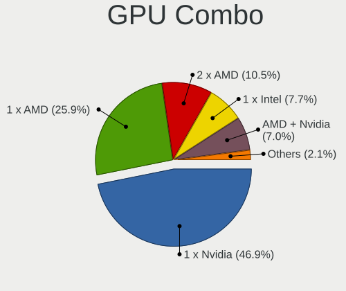

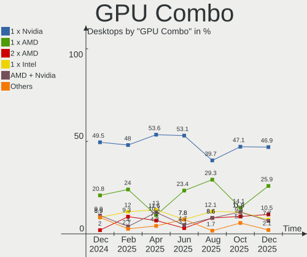

| Name             | Desktops | Percent |
|------------------|----------|---------|
| 1 x Nvidia       | 67       | 46.85%  |
| 1 x AMD          | 37       | 25.87%  |
| 2 x AMD          | 15       | 10.49%  |
| 1 x Intel        | 11       | 7.69%   |
| AMD + Nvidia     | 10       | 6.99%   |
| Intel + Nvidia   | 2        | 1.4%    |
| AMD + 2 x Nvidia | 1        | 0.7%    |

GPU Driver
----------

Free vs proprietary

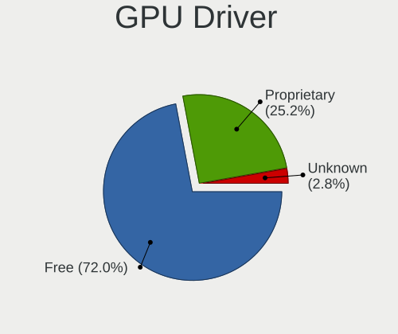

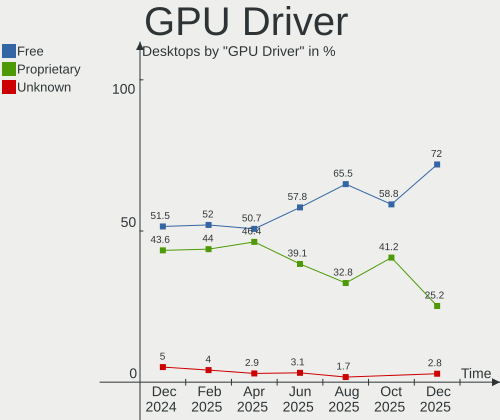

| Driver      | Desktops | Percent |
|-------------|----------|---------|
| Free        | 103      | 72.03%  |
| Proprietary | 36       | 25.17%  |
| Unknown     | 4        | 2.8%    |

GPU Memory
----------

Total video memory

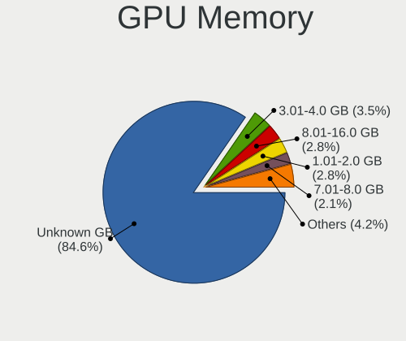

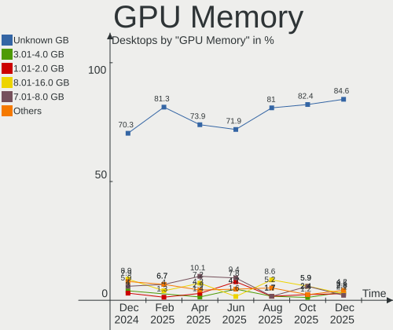

| Size in GB | Desktops | Percent |
|------------|----------|---------|
| Unknown    | 121      | 84.62%  |
| 3.01-4.0   | 5        | 3.5%    |
| 1.01-2.0   | 4        | 2.8%    |
| 8.01-16.0  | 4        | 2.8%    |
| 7.01-8.0   | 3        | 2.1%    |
| 5.01-6.0   | 2        | 1.4%    |
| 0.01-0.5   | 2        | 1.4%    |
| 24.01-32.0 | 1        | 0.7%    |
| 16.01-24.0 | 1        | 0.7%    |

Monitor
-------

Monitor Vendor
--------------

Monitor vendors

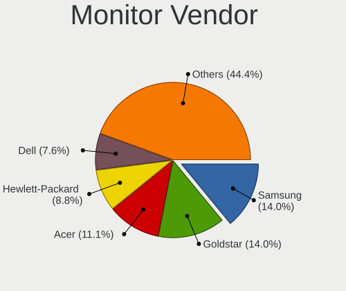

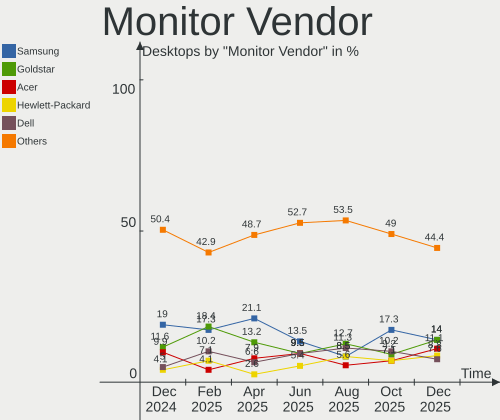

| Vendor               | Desktops | Percent |
|----------------------|----------|---------|
| Samsung Electronics  | 24       | 14.04%  |
| Goldstar             | 24       | 14.04%  |
| Acer                 | 19       | 11.11%  |
| Hewlett-Packard      | 15       | 8.77%   |
| Dell                 | 13       | 7.6%    |
| AOC                  | 13       | 7.6%    |
| ASUSTek Computer     | 9        | 5.26%   |
| MSI                  | 6        | 3.51%   |
| BenQ                 | 5        | 2.92%   |
| Unknown (XXX)        | 3        | 1.75%   |
| Toshiba              | 3        | 1.75%   |
| Lenovo               | 3        | 1.75%   |
| Ancor Communications | 3        | 1.75%   |
| Wacom                | 2        | 1.17%   |
| Vizio                | 2        | 1.17%   |
| VIE                  | 2        | 1.17%   |
| RTK                  | 2        | 1.17%   |
| NEC Computers        | 2        | 1.17%   |
| Iiyama               | 2        | 1.17%   |
| Gigabyte Technology  | 2        | 1.17%   |
| CHD                  | 2        | 1.17%   |
| ViewSonic            | 1        | 0.58%   |
| TCL                  | 1        | 0.58%   |
| SKK                  | 1        | 0.58%   |
| SKG                  | 1        | 0.58%   |
| Sceptre Tech         | 1        | 0.58%   |
| SANYO                | 1        | 0.58%   |
| Philips              | 1        | 0.58%   |
| Mi                   | 1        | 0.58%   |
| ITE                  | 1        | 0.58%   |
| iQual                | 1        | 0.58%   |
| Huion                | 1        | 0.58%   |
| HKC                  | 1        | 0.58%   |
| HannStar             | 1        | 0.58%   |
| Compal               | 1        | 0.58%   |
| APT                  | 1        | 0.58%   |

Monitor Model
-------------

Monitor models

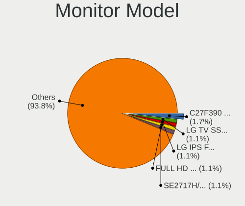

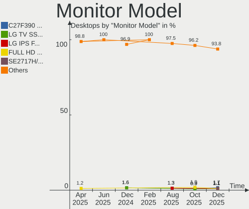

| Model                                                                   | Desktops | Percent |
|-------------------------------------------------------------------------|----------|---------|
| Samsung Electronics C27F390 SAM0D32 1920x1080 598x336mm 27.0-inch       | 3        | 1.69%   |
| Goldstar LG TV SSCR2 GSMC0C8 3840x2160                                  | 2        | 1.13%   |
| Goldstar LG IPS FULLHD GSM5AB8 1920x1080 480x270mm 21.7-inch            | 2        | 1.13%   |
| Goldstar FULL HD GSM5B55 1920x1080 480x270mm 21.7-inch                  | 2        | 1.13%   |
| Dell SE2717H/HX DELD0A1 1920x1080 598x336mm 27.0-inch                   | 2        | 1.13%   |
| ASUSTek Computer VG248 AUS24AC 1920x1080 531x299mm 24.0-inch            | 2        | 1.13%   |
| Ancor Communications VX238 ACI23C1 1920x1080 510x290mm 23.1-inch        | 2        | 1.13%   |
| Wacom One 13 WAC1070 1920x1080 294x166mm 13.3-inch                      | 1        | 0.56%   |
| Wacom Cintiq 22 WAC1065 1920x1080 476x268mm 21.5-inch                   | 1        | 0.56%   |
| Vizio V405-G9 VIZ1033 3840x2160 1096x616mm 49.5-inch                    | 1        | 0.56%   |
| Vizio E280i-B1 VIZ1002 1360x768 607x345mm 27.5-inch                     | 1        | 0.56%   |
| ViewSonic VX2718 series VSCE439 1920x1080 609x348mm 27.6-inch           | 1        | 0.56%   |
| VIE VALAK Z180H VIE2380 1920x1080 527x296mm 23.8-inch                   | 1        | 0.56%   |
| VIE J2475FFHD VIE1919 1920x1080 520x310mm 23.8-inch                     | 1        | 0.56%   |
| Unknown (XXX) HDMI XXX2400 1920x1080 520x320mm 24.0-inch                | 1        | 0.56%   |
| Unknown (XXX) Beyond TV XXX9221 1920x1080 1209x680mm 54.6-inch          | 1        | 0.56%   |
| Unknown (XXX) Beyond TV XXX2851 3840x2160 1209x680mm 54.6-inch          | 1        | 0.56%   |
| Toshiba TV TSB1011 1920x1080 930x523mm 42.0-inch                        | 1        | 0.56%   |
| Toshiba TSB-TV TSB0208 1920x1080 708x398mm 32.0-inch                    | 1        | 0.56%   |
| Toshiba HisenseUS-TV TSB0030 1920x1080 800x450mm 36.1-inch              | 1        | 0.56%   |
| TCL 34R83Q TCL3401 3440x1440 797x333mm 34.0-inch                        | 1        | 0.56%   |
| SKK SKK181 SKK3130 1680x1050 708x398mm 32.0-inch                        | 1        | 0.56%   |
| SKG Android TV SKG4000 1920x1080 708x398mm 32.0-inch                    | 1        | 0.56%   |
| Sceptre Tech Sceptre F24 SPT09AB 1920x1080 530x290mm 23.8-inch          | 1        | 0.56%   |
| SANYO 19CE350LED SAN1900 1360x768 708x398mm 32.0-inch                   | 1        | 0.56%   |
| Samsung Electronics U32J59x SAM0F33 3840x2160 697x392mm 31.5-inch       | 1        | 0.56%   |
| Samsung Electronics U28H75x SAM0E00 3840x2160 607x345mm 27.5-inch       | 1        | 0.56%   |
| Samsung Electronics U28E590 SAM0C4D 3840x2160 607x345mm 27.5-inch       | 1        | 0.56%   |
| Samsung Electronics SMS27A550H SAM07CC 1920x1080 598x336mm 27.0-inch    | 1        | 0.56%   |
| Samsung Electronics S27C31x SAM7312 1920x1080 597x336mm 27.0-inch       | 1        | 0.56%   |
| Samsung Electronics S24E650 SAM0CB8 1920x1080 521x293mm 23.5-inch       | 1        | 0.56%   |
| Samsung Electronics S24D330 SAM0D92 1920x1080 531x299mm 24.0-inch       | 1        | 0.56%   |
| Samsung Electronics S23B300 SAM08AF 1920x1080 510x287mm 23.0-inch       | 1        | 0.56%   |
| Samsung Electronics S22A33x SAM7122 1920x1080 479x260mm 21.5-inch       | 1        | 0.56%   |
| Samsung Electronics Odyssey G81SF SAM7753 3840x2160 697x392mm 31.5-inch | 1        | 0.56%   |
| Samsung Electronics Odyssey G40B SAM727D 1920x1080 597x336mm 27.0-inch  | 1        | 0.56%   |
| Samsung Electronics LS49AG95 SAM71AC 3840x1080 1190x340mm 48.7-inch     | 1        | 0.56%   |
| Samsung Electronics LS32CG51x SAM72FE 2560x1440 697x392mm 31.5-inch     | 1        | 0.56%   |
| Samsung Electronics LS27DG30X SAM76E3 1920x1080 597x336mm 27.0-inch     | 1        | 0.56%   |
| Samsung Electronics LF27T450F SAM7099 1920x1080 597x336mm 27.0-inch     | 1        | 0.56%   |

Monitor Resolution
------------------

Monitor screen resolution

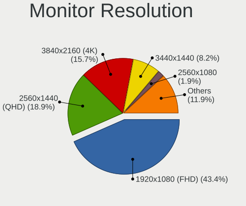

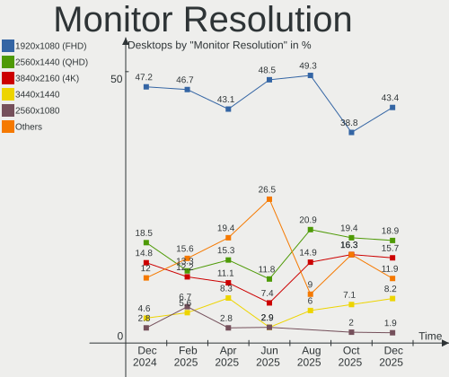

| Resolution        | Desktops | Percent |
|-------------------|----------|---------|
| 1920x1080 (FHD)   | 69       | 43.4%   |
| 2560x1440 (QHD)   | 30       | 18.87%  |
| 3840x2160 (4K)    | 25       | 15.72%  |
| 3440x1440         | 13       | 8.18%   |
| 2560x1080         | 3        | 1.89%   |
| 1366x768 (WXGA)   | 3        | 1.89%   |
| 3840x1600         | 2        | 1.26%   |
| 3840x1080         | 2        | 1.26%   |
| 1920x1200 (WUXGA) | 2        | 1.26%   |
| 1440x900 (WXGA+)  | 2        | 1.26%   |
| 1280x1024 (SXGA)  | 2        | 1.26%   |
| 2560x682          | 1        | 0.63%   |
| 2560x1600         | 1        | 0.63%   |
| 2160x1440         | 1        | 0.63%   |
| 1600x900 (HD+)    | 1        | 0.63%   |
| 1360x768          | 1        | 0.63%   |
| 1280x720 (HD)     | 1        | 0.63%   |

Monitor Diagonal
----------------

Diagonal size in inches

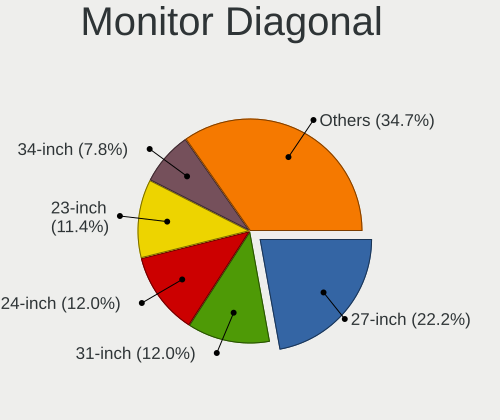

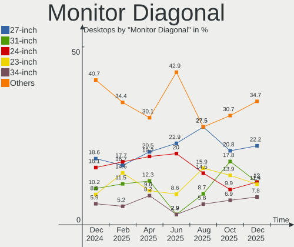

| Inches  | Desktops | Percent |
|---------|----------|---------|
| 27      | 37       | 22.16%  |
| 31      | 20       | 11.98%  |
| 24      | 20       | 11.98%  |
| 23      | 19       | 11.38%  |
| 34      | 13       | 7.78%   |
| 21      | 7        | 4.19%   |
| 32      | 6        | 3.59%   |
| 40      | 5        | 2.99%   |
| 19      | 5        | 2.99%   |
| 84      | 3        | 1.8%    |
| 72      | 3        | 1.8%    |
| 48      | 3        | 1.8%    |
| 35      | 3        | 1.8%    |
| 63      | 2        | 1.2%    |
| 37      | 2        | 1.2%    |
| 22      | 2        | 1.2%    |
| Unknown | 2        | 1.2%    |
| 74      | 1        | 0.6%    |
| 65      | 1        | 0.6%    |
| 54      | 1        | 0.6%    |
| 47      | 1        | 0.6%    |
| 42      | 1        | 0.6%    |
| 38      | 1        | 0.6%    |
| 29      | 1        | 0.6%    |
| 26      | 1        | 0.6%    |
| 25      | 1        | 0.6%    |
| 20      | 1        | 0.6%    |
| 18      | 1        | 0.6%    |
| 17      | 1        | 0.6%    |
| 15      | 1        | 0.6%    |
| 13      | 1        | 0.6%    |
| 11      | 1        | 0.6%    |

Monitor Width
-------------

Physical width

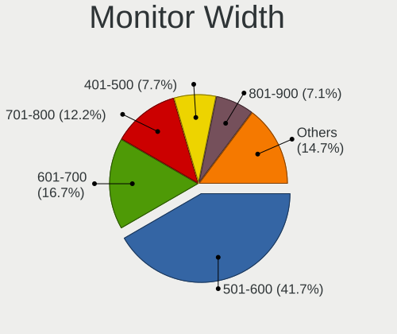

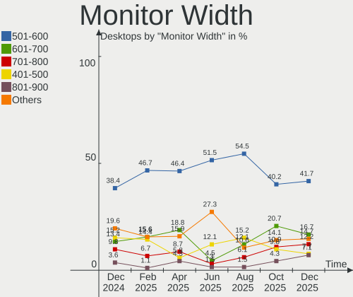

| Width in mm | Desktops | Percent |
|-------------|----------|---------|
| 501-600     | 65       | 41.67%  |
| 601-700     | 26       | 16.67%  |
| 701-800     | 19       | 12.18%  |
| 401-500     | 12       | 7.69%   |
| 801-900     | 11       | 7.05%   |
| 1501-2000   | 7        | 4.49%   |
| 1001-1500   | 7        | 4.49%   |
| 351-400     | 2        | 1.28%   |
| 301-350     | 2        | 1.28%   |
| 201-300     | 2        | 1.28%   |
| Unknown     | 2        | 1.28%   |
| 901-1000    | 1        | 0.64%   |

Aspect Ratio
------------

Proportional relationship between the width and the height

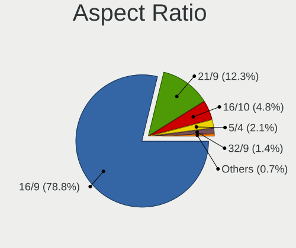

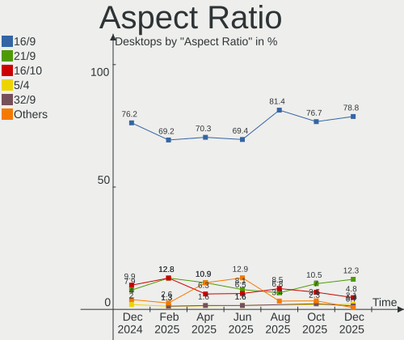

| Ratio | Desktops | Percent |
|-------|----------|---------|
| 16/9  | 115      | 78.77%  |
| 21/9  | 18       | 12.33%  |
| 16/10 | 7        | 4.79%   |
| 5/4   | 3        | 2.05%   |
| 32/9  | 2        | 1.37%   |
| 3.75  | 1        | 0.68%   |

Monitor Area
------------

Area in inch²

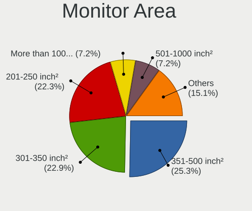

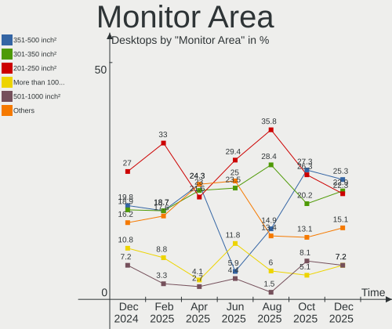

| Area in inch² | Desktops | Percent |
|----------------|----------|---------|
| 351-500        | 42       | 25.3%   |
| 301-350        | 38       | 22.89%  |
| 201-250        | 37       | 22.29%  |
| More than 1000 | 12       | 7.23%   |
| 501-1000       | 12       | 7.23%   |
| 251-300        | 11       | 6.63%   |
| 151-200        | 7        | 4.22%   |
| 141-150        | 2        | 1.2%    |
| Unknown        | 2        | 1.2%    |
| 71-80          | 1        | 0.6%    |
| 51-60          | 1        | 0.6%    |
| 101-110        | 1        | 0.6%    |

Pixel Density
-------------

Pixels per inch

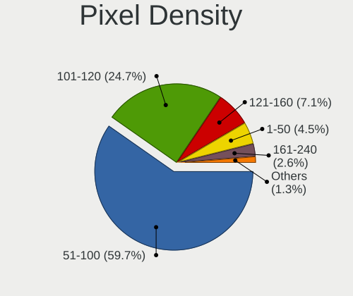

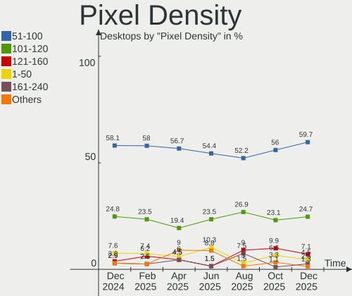

| Density | Desktops | Percent |
|---------|----------|---------|
| 51-100  | 92       | 59.74%  |
| 101-120 | 38       | 24.68%  |
| 121-160 | 11       | 7.14%   |
| 1-50    | 7        | 4.55%   |
| 161-240 | 4        | 2.6%    |
| Unknown | 2        | 1.3%    |

Multiple Monitors
-----------------

Total monitors connected

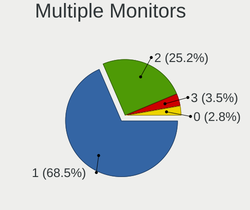

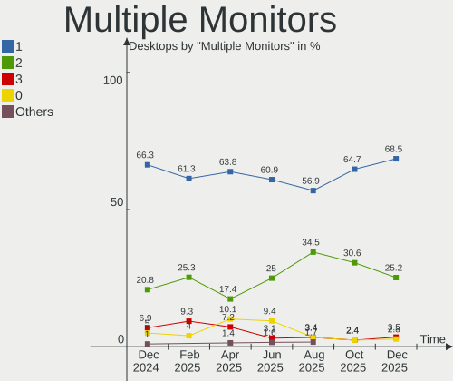

| Total | Desktops | Percent |
|-------|----------|---------|
| 1     | 98       | 68.53%  |
| 2     | 36       | 25.17%  |
| 3     | 5        | 3.5%    |
| 0     | 4        | 2.8%    |

Network
-------

Net Controller Vendor
---------------------

Controller vendors

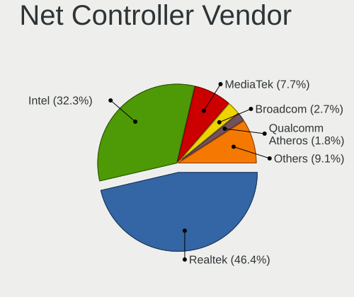

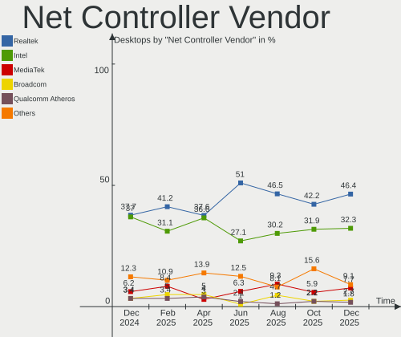

| Vendor                | Desktops | Percent |
|-----------------------|----------|---------|
| Realtek Semiconductor | 102      | 46.36%  |
| Intel                 | 71       | 32.27%  |
| MediaTek              | 17       | 7.73%   |
| Broadcom              | 6        | 2.73%   |
| Qualcomm Atheros      | 4        | 1.82%   |
| TP-Link               | 3        | 1.36%   |
| Qualcomm Technologies | 3        | 1.36%   |
| Realtek               | 2        | 0.91%   |
| InterBiometrics       | 2        | 0.91%   |
| Aquantia              | 2        | 0.91%   |
| Samsung Electronics   | 1        | 0.45%   |
| QinHeng Electronics   | 1        | 0.45%   |
| Nvidia                | 1        | 0.45%   |
| Mercucys              | 1        | 0.45%   |
| Lenovo                | 1        | 0.45%   |
| HYTE                  | 1        | 0.45%   |
| D-Link                | 1        | 0.45%   |
| aicsemi               | 1        | 0.45%   |

Net Controller Model
--------------------

Controller models

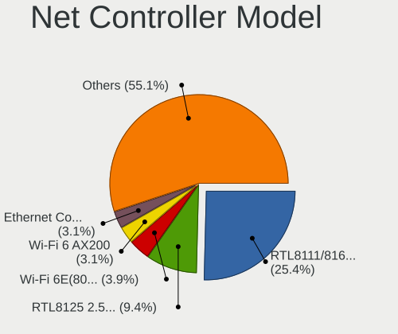

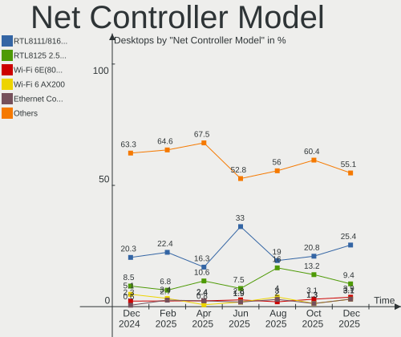

| Model                                                                           | Desktops | Percent |
|---------------------------------------------------------------------------------|----------|---------|
| Realtek RTL8111/8168/8211/8411 PCI Express Gigabit Ethernet Controller          | 65       | 25.39%  |
| Realtek RTL8125 2.5GbE Controller                                               | 24       | 9.38%   |
| Intel Wi-Fi 6E(802.11ax) AX210/AX1675* 2x2 [Typhoon Peak]                       | 10       | 3.91%   |
| Intel Wi-Fi 6 AX200                                                             | 8        | 3.13%   |
| Intel Ethernet Controller I226-V                                                | 8        | 3.13%   |
| Intel Ethernet Connection (2) I219-V                                            | 8        | 3.13%   |
| MediaTek MT7922 802.11ax PCI Express Wireless Network Adapter                   | 7        | 2.73%   |
| Intel I211 Gigabit Network Connection                                           | 7        | 2.73%   |
| Realtek RTL8852BE PCIe 802.11ax Wireless Network Controller                     | 6        | 2.34%   |
| Intel Ethernet Controller I225-V                                                | 6        | 2.34%   |
| Realtek RTL8126 5GbE Controller                                                 | 5        | 1.95%   |
| Realtek 802.11ac NIC                                                            | 5        | 1.95%   |
| MediaTek MT7927 802.11be 320MHz 2x2 PCIe Wireless Network Adapter [Filogic 380] | 4        | 1.56%   |
| Intel Ethernet Connection (7) I219-V                                            | 4        | 1.56%   |
| Intel Dual Band Wireless-AC 3168NGW [Stone Peak]                                | 4        | 1.56%   |
| Broadcom BCM4360 802.11ac Dual Band Wireless Network Adapter                    | 4        | 1.56%   |
| Realtek RTL8922AE 802.11be PCIe Wireless Network Adapter                        | 3        | 1.17%   |
| Qualcomm WCN785x Wi-Fi 7(802.11be) 320MHz 2x2 [FastConnect 7800]                | 3        | 1.17%   |
| Intel Wi-Fi 5(802.11ac) Wireless-AC 9x6x [Thunder Peak]                         | 3        | 1.17%   |
| Intel Ethernet Connection I217-V                                                | 3        | 1.17%   |
| Realtek RTL8851BE PCIe 802.11ax Wireless Network Controller                     | 2        | 0.78%   |
| MediaTek MT7925 (RZ717) Wi-Fi 7 160MHz                                          | 2        | 0.78%   |
| InterBiometrics Io                                                              | 2        | 0.78%   |
| Intel Comet Lake PCH CNVi WiFi                                                  | 2        | 0.78%   |
| Intel Cannon Lake PCH CNVi WiFi                                                 | 2        | 0.78%   |
| Intel 82579LM Gigabit Network Connection (Lewisville)                           | 2        | 0.78%   |
| TP-Link TL-WN823N v2/v3 [Realtek RTL8192EU]                                     | 1        | 0.39%   |
| TP-Link Archer T2U PLUS [RTL8821AU]                                             | 1        | 0.39%   |
| TP-Link AC600 wireless Realtek RTL8811AU [Archer T2U Nano]                      | 1        | 0.39%   |
| Samsung Galaxy series, misc. (tethering mode)                                   | 1        | 0.39%   |
| Realtek RTL88x2bu [AC1200 Techkey]                                              | 1        | 0.39%   |
| Realtek RTL8852AE 802.11ax PCIe Wireless Network Adapter                        | 1        | 0.39%   |
| Realtek RTL8822BE 802.11a/b/g/n/ac WiFi adapter                                 | 1        | 0.39%   |
| Realtek RTL8821CE PCIe 802.11ac Wireless Network Controller                     | 1        | 0.39%   |
| Realtek RTL8821CE 802.11ac PCIe Wireless Network Adapter                        | 1        | 0.39%   |
| Realtek RTL8821AE 802.11ac PCIe Wireless Network Adapter                        | 1        | 0.39%   |
| Realtek RTL8812AU 802.11a/b/g/n/ac 2T2R DB WLAN Adapter                         | 1        | 0.39%   |
| Realtek RTL8723BE PCIe Wireless Network Adapter                                 | 1        | 0.39%   |
| Realtek RTL8192EU 802.11b/g/n WLAN Adapter                                      | 1        | 0.39%   |
| Realtek RTL8192EE PCIe Wireless Network Adapter                                 | 1        | 0.39%   |

Wireless Vendor
---------------

Wireless vendors

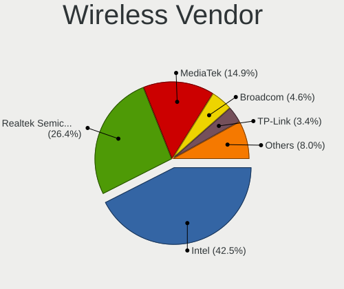

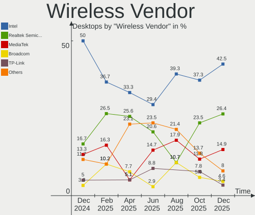

| Vendor                | Desktops | Percent |
|-----------------------|----------|---------|
| Intel                 | 37       | 42.53%  |
| Realtek Semiconductor | 23       | 26.44%  |
| MediaTek              | 13       | 14.94%  |
| Broadcom              | 4        | 4.6%    |
| TP-Link               | 3        | 3.45%   |
| Realtek               | 2        | 2.3%    |
| Qualcomm Atheros      | 2        | 2.3%    |
| Qualcomm Technologies | 1        | 1.15%   |
| Mercucys              | 1        | 1.15%   |
| D-Link                | 1        | 1.15%   |

Wireless Model
--------------

Wireless models

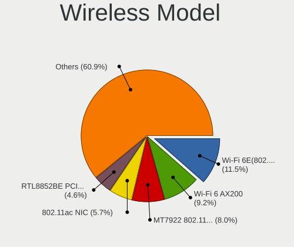

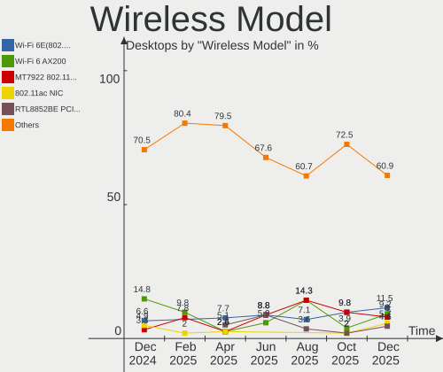

| Model                                                                           | Desktops | Percent |
|---------------------------------------------------------------------------------|----------|---------|
| Intel Wi-Fi 6E(802.11ax) AX210/AX1675* 2x2 [Typhoon Peak]                       | 10       | 11.49%  |
| Intel Wi-Fi 6 AX200                                                             | 8        | 9.2%    |
| MediaTek MT7922 802.11ax PCI Express Wireless Network Adapter                   | 7        | 8.05%   |
| Realtek 802.11ac NIC                                                            | 5        | 5.75%   |
| Realtek RTL8852BE PCIe 802.11ax Wireless Network Controller                     | 4        | 4.6%    |
| Intel Dual Band Wireless-AC 3168NGW [Stone Peak]                                | 4        | 4.6%    |
| Broadcom BCM4360 802.11ac Dual Band Wireless Network Adapter                    | 4        | 4.6%    |
| Intel Wi-Fi 5(802.11ac) Wireless-AC 9x6x [Thunder Peak]                         | 3        | 3.45%   |
| Realtek RTL8851BE PCIe 802.11ax Wireless Network Controller                     | 2        | 2.3%    |
| MediaTek MT7927 802.11be 320MHz 2x2 PCIe Wireless Network Adapter [Filogic 380] | 2        | 2.3%    |
| MediaTek MT7925 (RZ717) Wi-Fi 7 160MHz                                          | 2        | 2.3%    |
| Intel Comet Lake PCH CNVi WiFi                                                  | 2        | 2.3%    |
| Intel Cannon Lake PCH CNVi WiFi                                                 | 2        | 2.3%    |
| TP-Link TL-WN823N v2/v3 [Realtek RTL8192EU]                                     | 1        | 1.15%   |
| TP-Link Archer T2U PLUS [RTL8821AU]                                             | 1        | 1.15%   |
| TP-Link AC600 wireless Realtek RTL8811AU [Archer T2U Nano]                      | 1        | 1.15%   |
| Realtek RTL88x2bu [AC1200 Techkey]                                              | 1        | 1.15%   |
| Realtek RTL8852AE 802.11ax PCIe Wireless Network Adapter                        | 1        | 1.15%   |
| Realtek RTL8822BE 802.11a/b/g/n/ac WiFi adapter                                 | 1        | 1.15%   |
| Realtek RTL8821CE PCIe 802.11ac Wireless Network Controller                     | 1        | 1.15%   |
| Realtek RTL8821CE 802.11ac PCIe Wireless Network Adapter                        | 1        | 1.15%   |
| Realtek RTL8821AE 802.11ac PCIe Wireless Network Adapter                        | 1        | 1.15%   |
| Realtek RTL8812AU 802.11a/b/g/n/ac 2T2R DB WLAN Adapter                         | 1        | 1.15%   |
| Realtek RTL8723BE PCIe Wireless Network Adapter                                 | 1        | 1.15%   |
| Realtek RTL8192EU 802.11b/g/n WLAN Adapter                                      | 1        | 1.15%   |
| Realtek RTL8192EE PCIe Wireless Network Adapter                                 | 1        | 1.15%   |
| Realtek RTL8188EUS 802.11n Wireless Network Adapter                             | 1        | 1.15%   |
| Realtek RTL8188ETV Wireless LAN 802.11n Network Adapter                         | 1        | 1.15%   |
| Realtek 802.11be WLAN Adapter                                                   | 1        | 1.15%   |
| Realtek 802.11ac WLAN Adapter                                                   | 1        | 1.15%   |
| Qualcomm WCN785x Wi-Fi 7(802.11be) 320MHz 2x2 [FastConnect 7800]                | 1        | 1.15%   |
| Qualcomm Atheros QCA9377 802.11ac Wireless Network Adapter                      | 1        | 1.15%   |
| Qualcomm Atheros AR9462 Wireless Network Adapter                                | 1        | 1.15%   |
| Mercucys 802.11n NIC                                                            | 1        | 1.15%   |
| MediaTek MT7921K (RZ608) Wi-Fi 6E 80MHz                                         | 1        | 1.15%   |
| MediaTek MT7921 802.11ax PCIe Wireless Network Adapter [Filogic 330]            | 1        | 1.15%   |
| Intel Wireless 8265 / 8275                                                      | 1        | 1.15%   |
| Intel Wireless 8260                                                             | 1        | 1.15%   |
| Intel Wireless 7265                                                             | 1        | 1.15%   |
| Intel Wireless 3165                                                             | 1        | 1.15%   |

Ethernet Vendor
---------------

Ethernet vendors

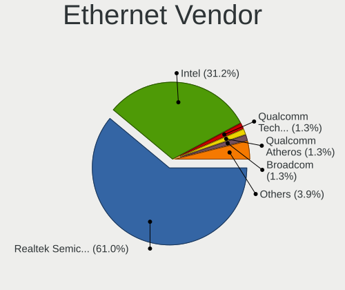

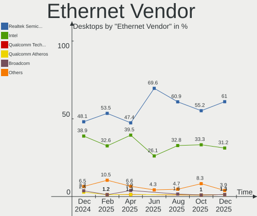

| Vendor                | Desktops | Percent |
|-----------------------|----------|---------|
| Realtek Semiconductor | 94       | 61.04%  |
| Intel                 | 48       | 31.17%  |
| Qualcomm Technologies | 2        | 1.3%    |
| Qualcomm Atheros      | 2        | 1.3%    |
| Broadcom              | 2        | 1.3%    |
| Aquantia              | 2        | 1.3%    |
| Samsung Electronics   | 1        | 0.65%   |
| Nvidia                | 1        | 0.65%   |
| MediaTek              | 1        | 0.65%   |
| Lenovo                | 1        | 0.65%   |

Ethernet Model
--------------

Ethernet models

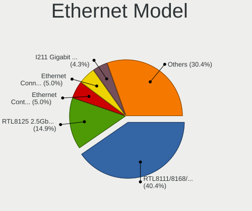

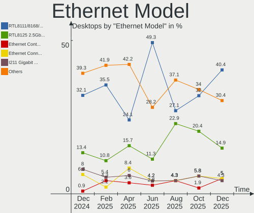

| Model                                                                             | Desktops | Percent |
|-----------------------------------------------------------------------------------|----------|---------|
| Realtek RTL8111/8168/8211/8411 PCI Express Gigabit Ethernet Controller            | 65       | 40.37%  |
| Realtek RTL8125 2.5GbE Controller                                                 | 24       | 14.91%  |
| Intel Ethernet Controller I226-V                                                  | 8        | 4.97%   |
| Intel Ethernet Connection (2) I219-V                                              | 8        | 4.97%   |
| Intel I211 Gigabit Network Connection                                             | 7        | 4.35%   |
| Intel Ethernet Controller I225-V                                                  | 6        | 3.73%   |
| Realtek RTL8126 5GbE Controller                                                   | 5        | 3.11%   |
| Intel Ethernet Connection (7) I219-V                                              | 4        | 2.48%   |
| Realtek RTL8922AE 802.11be PCIe Wireless Network Adapter                          | 3        | 1.86%   |
| Intel Ethernet Connection I217-V                                                  | 3        | 1.86%   |
| Realtek RTL8852BE PCIe 802.11ax Wireless Network Controller                       | 2        | 1.24%   |
| Qualcomm WCN785x Wi-Fi 7(802.11be) 320MHz 2x2 [FastConnect 7800]                  | 2        | 1.24%   |
| Intel 82579LM Gigabit Network Connection (Lewisville)                             | 2        | 1.24%   |
| Samsung Galaxy series, misc. (tethering mode)                                     | 1        | 0.62%   |
| Realtek RTL8152 Fast Ethernet Adapter                                             | 1        | 0.62%   |
| Realtek RTL810xE PCI Express Fast Ethernet controller                             | 1        | 0.62%   |
| Qualcomm Atheros QCA8171 Gigabit Ethernet                                         | 1        | 0.62%   |
| Qualcomm Atheros Killer E2500 Gigabit Ethernet Controller                         | 1        | 0.62%   |
| Nvidia MCP61 Ethernet                                                             | 1        | 0.62%   |
| MediaTek MT7925 802.11be 160MHz 2x2 PCIe Wireless Network Adapter [Filogic 360]   | 1        | 0.62%   |
| Lenovo ThinkPad Lan                                                               | 1        | 0.62%   |
| Intel Ethernet Connection I217-LM                                                 | 1        | 0.62%   |
| Intel Ethernet Connection (5) I219-LM                                             | 1        | 0.62%   |
| Intel Ethernet Connection (2) I219-LM                                             | 1        | 0.62%   |
| Intel Ethernet Connection (2) I218-V                                              | 1        | 0.62%   |
| Intel Ethernet Connection (12) I219-V                                             | 1        | 0.62%   |
| Intel Ethernet Connection (10) I219-V                                             | 1        | 0.62%   |
| Intel 82574L Gigabit Network Connection                                           | 1        | 0.62%   |
| Intel 82567LM-3 Gigabit Network Connection                                        | 1        | 0.62%   |
| Intel 82567LF-3 Gigabit Network Connection                                        | 1        | 0.62%   |
| Intel 82566DM-2 Gigabit Network Connection                                        | 1        | 0.62%   |
| Broadcom NetXtreme BCM5764M Gigabit Ethernet PCIe                                 | 1        | 0.62%   |
| Broadcom NetLink BCM5787 Gigabit Ethernet PCI Express                             | 1        | 0.62%   |
| Aquantia AQtion AQC113CS NBase-T/IEEE 802.3an Ethernet Controller [Antigua 10G]   | 1        | 0.62%   |
| Aquantia AQC113C NBase-T/IEEE 802.3an Ethernet Controller [Marvell Scalable mGig] | 1        | 0.62%   |

Net Controller Kind
-------------------

Ethernet, WiFi or modem

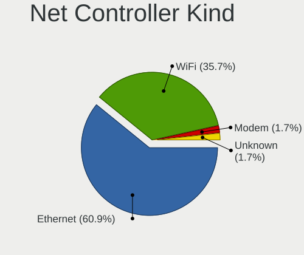

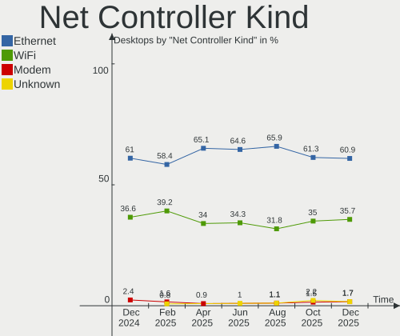

| Kind     | Desktops | Percent |
|----------|----------|---------|
| Ethernet | 140      | 60.87%  |
| WiFi     | 82       | 35.65%  |
| Modem    | 4        | 1.74%   |
| Unknown  | 4        | 1.74%   |

Used Controller
---------------

Currently used network controller

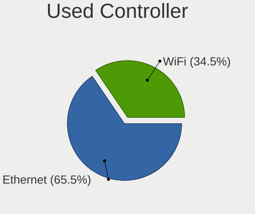

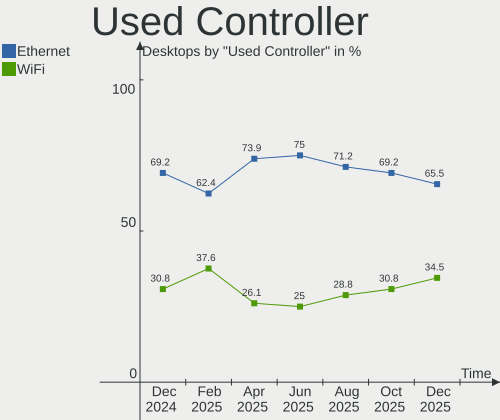

| Kind     | Desktops | Percent |
|----------|----------|---------|
| Ethernet | 95       | 65.52%  |
| WiFi     | 50       | 34.48%  |

NICs
----

Total network controllers on board

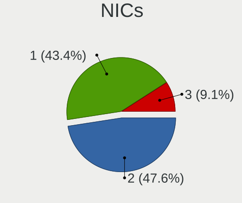

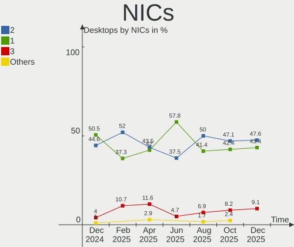

| Total | Desktops | Percent |
|-------|----------|---------|
| 2     | 68       | 47.55%  |
| 1     | 62       | 43.36%  |
| 3     | 13       | 9.09%   |

IPv6
----

IPv6 vs IPv4

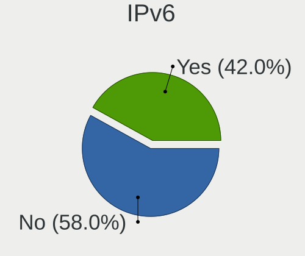

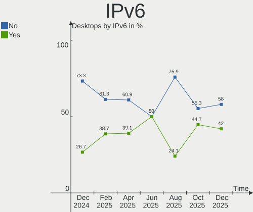

| Used | Desktops | Percent |
|------|----------|---------|
| No   | 83       | 58.04%  |
| Yes  | 60       | 41.96%  |

Bluetooth
---------

Bluetooth Vendor
----------------

Controller vendors

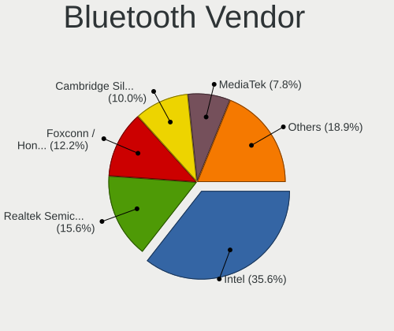

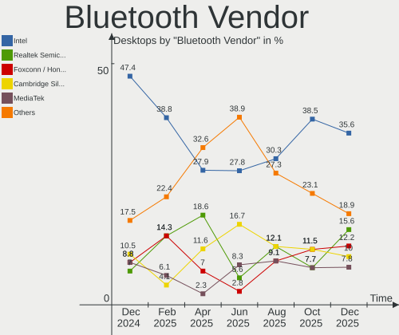

| Vendor                  | Desktops | Percent |
|-------------------------|----------|---------|
| Intel                   | 32       | 35.56%  |
| Realtek Semiconductor   | 14       | 15.56%  |
| Foxconn / Hon Hai       | 11       | 12.22%  |
| Cambridge Silicon Radio | 9        | 10%     |
| MediaTek                | 7        | 7.78%   |
| IMC Networks            | 7        | 7.78%   |
| TP-Link                 | 5        | 5.56%   |
| Unknown                 | 2        | 2.22%   |
| TDK                     | 1        | 1.11%   |
| Lite-On Technology      | 1        | 1.11%   |
| ASUSTek Computer        | 1        | 1.11%   |

Bluetooth Model
---------------

Controller models

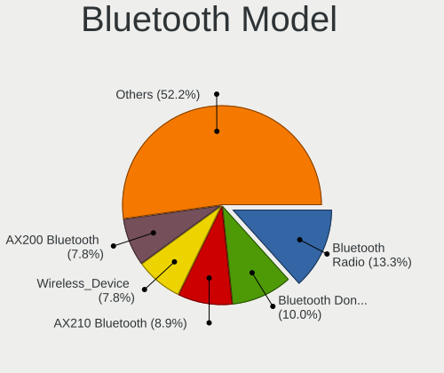

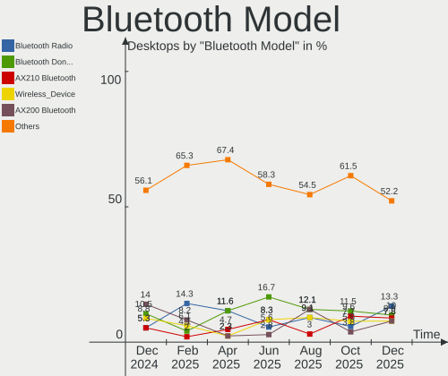

| Model                                               | Desktops | Percent |
|-----------------------------------------------------|----------|---------|
| Realtek Bluetooth Radio                             | 12       | 13.33%  |
| Cambridge Silicon Radio Bluetooth Dongle (HCI mode) | 9        | 10%     |
| Intel AX210 Bluetooth                               | 8        | 8.89%   |
| MediaTek Wireless_Device                            | 7        | 7.78%   |
| Intel AX200 Bluetooth                               | 7        | 7.78%   |
| Foxconn / Hon Hai Wireless_Device                   | 7        | 7.78%   |
| TP-Link TP-T@- UB500 Adapter                        | 5        | 5.56%   |
| Intel Wireless-AC 3168 Bluetooth                    | 4        | 4.44%   |
| Intel Bluetooth wireless interface                  | 4        | 4.44%   |
| Intel AX201 Bluetooth                               | 4        | 4.44%   |
| IMC Networks Bluetooth Radio                        | 4        | 4.44%   |
| Foxconn / Hon Hai Bluetooth Device                  | 4        | 4.44%   |
| IMC Networks Wireless_Device                        | 3        | 3.33%   |
| Realtek Bluetooth 5.4 Radio                         | 2        | 2.22%   |
| Intel Wireless-AC 9260 Bluetooth Adapter            | 2        | 2.22%   |
| Intel Bluetooth 9460/9560 Jefferson Peak (JfP)      | 2        | 2.22%   |
| Unknown                                             | 2        | 2.22%   |
| TDK Bluetooth Adapter                               | 1        | 1.11%   |
| Lite-On Qualcomm Atheros QCA9377 Bluetooth          | 1        | 1.11%   |
| Intel Centrino Bluetooth Wireless Transceiver       | 1        | 1.11%   |
| ASUS Bluetooth Radio                                | 1        | 1.11%   |

Sound
-----

Sound Vendor
------------

Sound card vendors

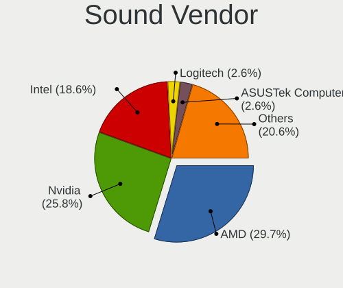

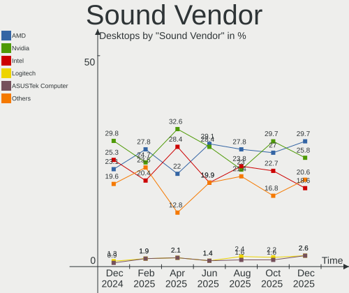

| Vendor                                       | Desktops | Percent |
|----------------------------------------------|----------|---------|
| AMD                                          | 91       | 29.74%  |
| Nvidia                                       | 79       | 25.82%  |
| Intel                                        | 57       | 18.63%  |
| Logitech                                     | 8        | 2.61%   |
| ASUSTek Computer                             | 8        | 2.61%   |
| Kingston Technology                          | 7        | 2.29%   |
| Texas Instruments                            | 6        | 1.96%   |
| Razer USA                                    | 5        | 1.63%   |
| Micro Star International                     | 3        | 0.98%   |
| Hewlett-Packard                              | 3        | 0.98%   |
| C-Media Electronics                          | 3        | 0.98%   |
| Realtek Semiconductor                        | 2        | 0.65%   |
| Mackie Designs                               | 2        | 0.65%   |
| Huawei Technologies                          | 2        | 0.65%   |
| GN Netcom                                    | 2        | 0.65%   |
| Giga-Byte Technology                         | 2        | 0.65%   |
| Focusrite-Novation                           | 2        | 0.65%   |
| Creative Labs                                | 2        | 0.65%   |
| Blue Microphones                             | 2        | 0.65%   |
| Zoran Co. Personal Media Division (Nogatech) | 1        | 0.33%   |
| Weltrend Semiconductor                       | 1        | 0.33%   |
| Walmart                                      | 1        | 0.33%   |
| Valve Software                               | 1        | 0.33%   |
| USB AUDIO DEVICE                             | 1        | 0.33%   |
| Universal Audio                              | 1        | 0.33%   |
| Turtle Beach                                 | 1        | 0.33%   |
| Thesycon Systemsoftware & Consulting         | 1        | 0.33%   |
| SteelSeries ApS                              | 1        | 0.33%   |
| Shure                                        | 1        | 0.33%   |
| Neat Microphones                             | 1        | 0.33%   |
| Maono                                        | 1        | 0.33%   |
| M-Audio                                      | 1        | 0.33%   |
| Lenovo                                       | 1        | 0.33%   |
| Generalplus Technology                       | 1        | 0.33%   |
| Elgato Systems                               | 1        | 0.33%   |
| Creative Technology                          | 1        | 0.33%   |
| Behringer.......                             | 1        | 0.33%   |
| Audio-Technica                               | 1        | 0.33%   |
| AOKEO                                        | 1        | 0.33%   |

Sound Model
-----------

Sound card models

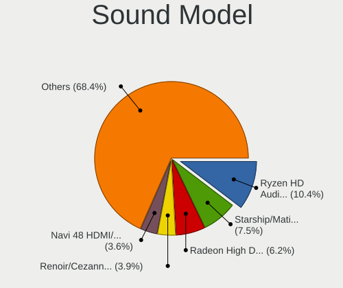

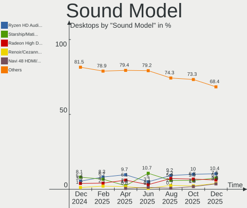

| Model                                                                      | Desktops | Percent |
|----------------------------------------------------------------------------|----------|---------|
| AMD Ryzen HD Audio Controller                                              | 40       | 10.36%  |
| AMD Starship/Matisse HD Audio Controller                                   | 29       | 7.51%   |
| AMD Radeon High Definition Audio Controller                                | 24       | 6.22%   |
| AMD Renoir/Cezanne HDMI/DP Audio Controller                                | 15       | 3.89%   |
| AMD Navi 48 HDMI/DP Audio Controller                                       | 14       | 3.63%   |
| AMD Navi 21/23 HDMI/DP Audio Controller                                    | 12       | 3.11%   |
| Intel 100 Series/C230 Series Chipset Family HD Audio Controller            | 9        | 2.33%   |
| ASUSTek Computer USB Audio                                                 | 8        | 2.07%   |
| Nvidia TU106 High Definition Audio Controller                              | 7        | 1.81%   |
| AMD Navi 31 HDMI/DP Audio                                                  | 7        | 1.81%   |
| AMD Ellesmere HDMI Audio [Radeon RX 470/480 / 570/580/590]                 | 7        | 1.81%   |
| Intel 8 Series/C220 Series Chipset High Definition Audio Controller        | 6        | 1.55%   |
| Nvidia GA104 High Definition Audio Controller                              | 5        | 1.3%    |
| Intel Cannon Lake PCH cAVS                                                 | 5        | 1.3%    |
| Intel 7 Series/C216 Chipset Family High Definition Audio Controller        | 5        | 1.3%    |
| Intel 200 Series PCH HD Audio                                              | 5        | 1.3%    |
| AMD SBx00 Azalia (Intel HDA)                                               | 5        | 1.3%    |
| AMD Family 17h (Models 00h-0fh) HD Audio Controller                        | 5        | 1.3%    |
| Nvidia TU116 High Definition Audio Controller                              | 4        | 1.04%   |
| Nvidia GP107GL High Definition Audio Controller                            | 4        | 1.04%   |
| Nvidia GP104 High Definition Audio Controller                              | 4        | 1.04%   |
| Nvidia GB206 High Definition Audio Controller                              | 4        | 1.04%   |
| Nvidia GB202 High Definition Audio Controller                              | 4        | 1.04%   |
| Kingston Technology HyperX 7.1 Audio                                       | 4        | 1.04%   |
| Intel Raptor Lake High Definition Audio Controller                         | 4        | 1.04%   |
| Texas Instruments PCM2902 Audio Codec                                      | 3        | 0.78%   |
| Nvidia GP106 High Definition Audio Controller                              | 3        | 0.78%   |
| Nvidia GM107 High Definition Audio Controller [GeForce 940MX]              | 3        | 0.78%   |
| Nvidia GK208 HDMI/DP Audio Controller                                      | 3        | 0.78%   |
| Nvidia GK104 HDMI Audio Controller                                         | 3        | 0.78%   |
| Nvidia GA106 High Definition Audio Controller                              | 3        | 0.78%   |
| Nvidia GA102 High Definition Audio Controller                              | 3        | 0.78%   |
| Nvidia AD104 High Definition Audio Controller                              | 3        | 0.78%   |
| Micro Star International USB Audio                                         | 3        | 0.78%   |
| Logitech G733 Gaming Headset                                               | 3        | 0.78%   |
| Intel Xeon E3-1200 v3/4th Gen Core Processor HD Audio Controller           | 3        | 0.78%   |
| Intel Comet Lake PCH cAVS                                                  | 3        | 0.78%   |
| Intel C610/X99 series chipset HD Audio Controller                          | 3        | 0.78%   |
| Intel 6 Series/C200 Series Chipset Family High Definition Audio Controller | 3        | 0.78%   |
| Texas Instruments PCM2900C Audio CODEC                                     | 2        | 0.52%   |

Memory
------

Memory Vendor
-------------

Memory module vendors

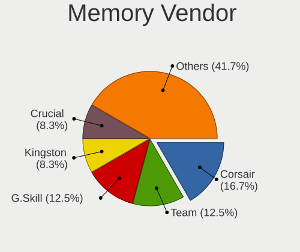

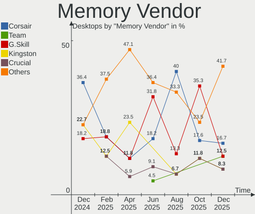

| Vendor              | Desktops | Percent |
|---------------------|----------|---------|
| Corsair             | 4        | 16.67%  |
| Team                | 3        | 12.5%   |
| G.Skill             | 3        | 12.5%   |
| Kingston            | 2        | 8.33%   |
| Crucial             | 2        | 8.33%   |
| Unknown             | 2        | 8.33%   |
| Thermaltake         | 1        | 4.17%   |
| TeamGroup           | 1        | 4.17%   |
| SK hynix            | 1        | 4.17%   |
| Silicon Power       | 1        | 4.17%   |
| Samsung Electronics | 1        | 4.17%   |
| Ramaxel Technology  | 1        | 4.17%   |
| Patriot             | 1        | 4.17%   |
| Micron Technology   | 1        | 4.17%   |

Memory Model
------------

Memory module models

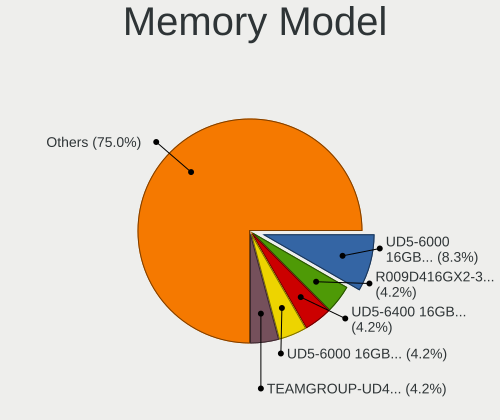

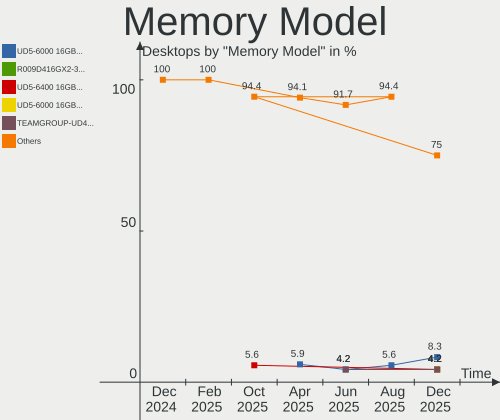

| Model                                                        | Desktops | Percent |
|--------------------------------------------------------------|----------|---------|
| Unknown                                                      | 2        | 8.33%   |
| Thermaltake RAM R009D416GX2-3600C18A 16GB DIMM DDR4 2666MT/s | 1        | 4.17%   |
| TeamGroup RAM UD5-6400 16GB DIMM DDR5 6400MT/s               | 1        | 4.17%   |
| Team RAM UD5-6000 16GB DIMM DDR5 6000MT/s                    | 1        | 4.17%   |
| Team RAM TEAMGROUP-UD4-3600 16GB DIMM DDR4 3600MT/s          | 1        | 4.17%   |
| Team RAM TEAMGROUP-UD4-3200 8GB DIMM DDR4 3733MT/s           | 1        | 4.17%   |
| SK hynix RAM HMT351U6CFR8C-PB 4GB DIMM DDR3 1800MT/s         | 1        | 4.17%   |
| Silicon Power RAM Module 32GB DIMM DDR5 4800MT/s             | 1        | 4.17%   |
| Samsung RAM M471A1K43CB1-CWE 16GB SODIMM DDR4 3200MT/s       | 1        | 4.17%   |
| Ramaxel RAM RMR1870EC58E9F1333 4GB DIMM DDR3 1333MT/s        | 1        | 4.17%   |
| Patriot RAM 6000 C42 Series 24GB DIMM DDR5 6000MT/s          | 1        | 4.17%   |
| Micron RAM CT16G56C46S5.M8D1 16GB SODIMM DDR5 5600MT/s       | 1        | 4.17%   |
| Kingston RAM KF560C36-32 32GB DIMM DDR5 6200MT/s             | 1        | 4.17%   |
| Kingston RAM KF556C40-16 16GB DIMM DDR5 6800MT/s             | 1        | 4.17%   |
| G.Skill RAM F5-6800J3445G16G 16GB DIMM DDR5 4800MT/s         | 1        | 4.17%   |
| G.Skill RAM F5-6000J3036F48G 48GB DIMM DDR5 6000MT/s         | 1        | 4.17%   |
| G.Skill RAM F3-12800CL7-4GBXM 4GB DIMM DDR3 1600MT/s         | 1        | 4.17%   |
| Crucial RAM BLE8G4D36BEEAK.M8FE3 8GB DIMM DDR4 3600MT/s      | 1        | 4.17%   |
| Crucial RAM BL8G32C16U4R.M8FE1 8GB DIMM DDR4 3400MT/s        | 1        | 4.17%   |
| Corsair RAM CMK64GX5M2B5600C40 32GB DIMM DDR5 5600MT/s       | 1        | 4.17%   |
| Corsair RAM CMK64GX4M2D3600C18 32GB DIMM DDR4 3600MT/s       | 1        | 4.17%   |
| Corsair RAM CMK16GX4M2D3600C18 8GB DIMM DDR4 4000MT/s        | 1        | 4.17%   |
| Corsair RAM CMD16GX4M2B3200C16 8GB DIMM DDR4 3200MT/s        | 1        | 4.17%   |

Memory Kind
-----------

Memory module kinds

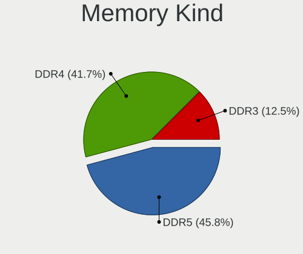

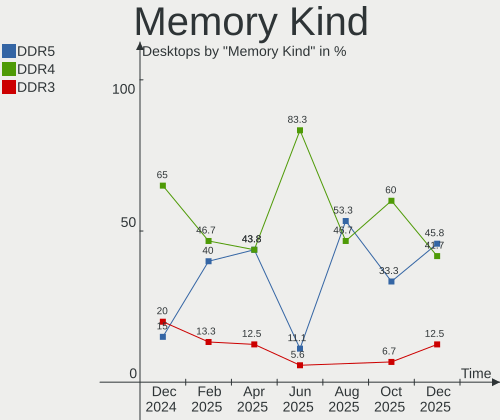

| Kind | Desktops | Percent |
|------|----------|---------|
| DDR5 | 11       | 45.83%  |
| DDR4 | 10       | 41.67%  |
| DDR3 | 3        | 12.5%   |

Memory Form Factor
------------------

Physical design of the memory module

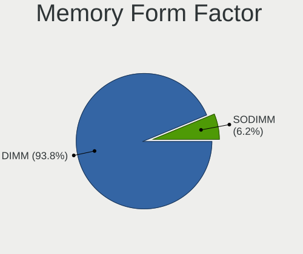

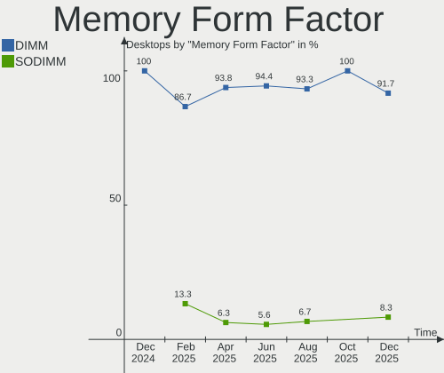

| Name   | Desktops | Percent |
|--------|----------|---------|
| DIMM   | 22       | 91.67%  |
| SODIMM | 2        | 8.33%   |

Memory Size
-----------

Memory module size

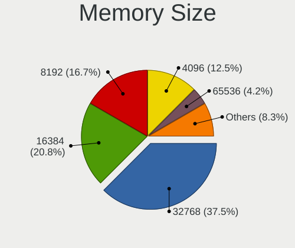

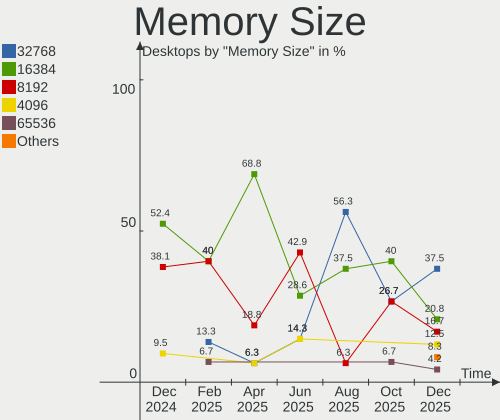

| Size  | Desktops | Percent |
|-------|----------|---------|
| 32768 | 9        | 37.5%   |
| 16384 | 5        | 20.83%  |
| 8192  | 4        | 16.67%  |
| 4096  | 3        | 12.5%   |
| 65536 | 1        | 4.17%   |
| 49152 | 1        | 4.17%   |
| 24576 | 1        | 4.17%   |

Memory Speed
------------

Memory module speed

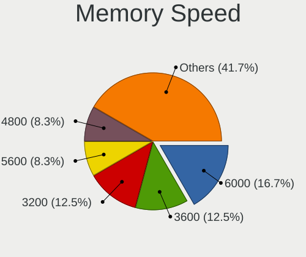

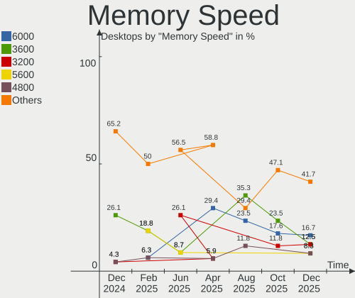

| Speed | Desktops | Percent |
|-------|----------|---------|
| 6000  | 4        | 16.67%  |
| 3600  | 3        | 12.5%   |
| 3200  | 3        | 12.5%   |
| 5600  | 2        | 8.33%   |
| 4800  | 2        | 8.33%   |
| 6800  | 1        | 4.17%   |
| 6400  | 1        | 4.17%   |
| 6200  | 1        | 4.17%   |
| 4000  | 1        | 4.17%   |
| 3733  | 1        | 4.17%   |
| 3400  | 1        | 4.17%   |
| 2666  | 1        | 4.17%   |
| 1800  | 1        | 4.17%   |
| 1600  | 1        | 4.17%   |
| 1333  | 1        | 4.17%   |

Printers & scanners
-------------------

Printer Vendor
--------------

Printer device vendors

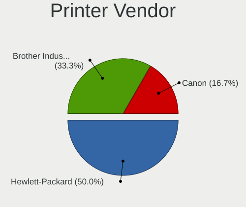

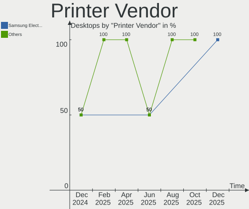

| Vendor              | Desktops | Percent |
|---------------------|----------|---------|
| Samsung Electronics | 1        | 100%    |

Printer Model
-------------

Printer device models

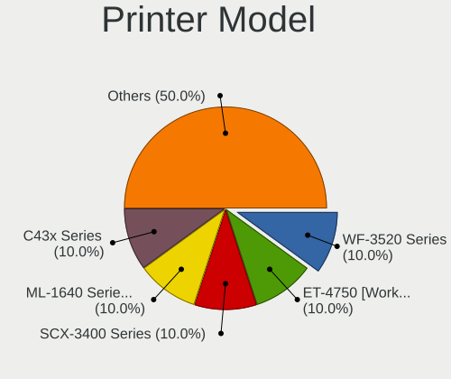

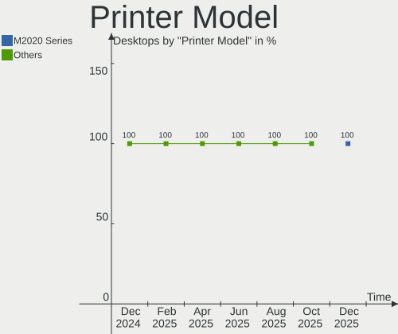

| Model                | Desktops | Percent |
|----------------------|----------|---------|
| Samsung M2020 Series | 1        | 100%    |

Scanner Vendor
--------------

Scanner device vendors

Zero info for selected period =(

Scanner Model
-------------

Scanner device models

Zero info for selected period =(

Camera
------

Camera Vendor
-------------

Camera device vendors

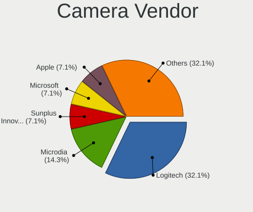

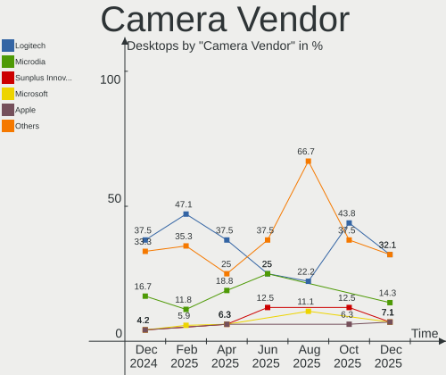

| Vendor                        | Desktops | Percent |
|-------------------------------|----------|---------|
| Logitech                      | 9        | 32.14%  |
| Microdia                      | 4        | 14.29%  |
| Sunplus Innovation Technology | 2        | 7.14%   |
| Microsoft                     | 2        | 7.14%   |
| Apple                         | 2        | 7.14%   |
| Valve Software                | 1        | 3.57%   |
| SunplusIT                     | 1        | 3.57%   |
| Sunplus IT                    | 1        | 3.57%   |
| Realtek Semiconductor         | 1        | 3.57%   |
| Razer USA                     | 1        | 3.57%   |
| MacroSilicon                  | 1        | 3.57%   |
| Generalplus Technology        | 1        | 3.57%   |
| eMeet                         | 1        | 3.57%   |
| Creative Technology           | 1        | 3.57%   |

Camera Model
------------

Camera device models

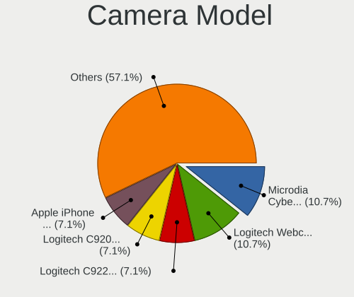

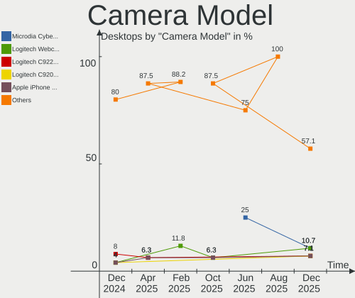

| Model                           | Desktops | Percent |
|---------------------------------|----------|---------|
| Microdia CyberTrack H7          | 3        | 10.71%  |
| Logitech Webcam C270            | 3        | 10.71%  |
| Logitech C922 Pro Stream Webcam | 2        | 7.14%   |
| Logitech C920 PRO HD Webcam     | 2        | 7.14%   |
| Apple iPhone 5/5C/5S/6/SE/7/8/X | 2        | 7.14%   |
| Valve Software 3D Camera        | 1        | 3.57%   |
| SunplusIT USB 2.0 Camera        | 1        | 3.57%   |
| Sunplus IT PC Camera            | 1        | 3.57%   |
| Sunplus UHD Capture             | 1        | 3.57%   |
| Sunplus FULL HD webcam          | 1        | 3.57%   |
| Realtek USB Camera              | 1        | 3.57%   |
| Razer USA Gaming Webcam [Kiyo]  | 1        | 3.57%   |
| Microsoft LifeCam VX-2000       | 1        | 3.57%   |
| Microsoft LifeCam Studio        | 1        | 3.57%   |
| Microdia Webcam Vitade AF       | 1        | 3.57%   |
| MacroSilicon USB Video          | 1        | 3.57%   |
| Logitech HD Webcam C525         | 1        | 3.57%   |
| Logitech HD Pro Webcam C920     | 1        | 3.57%   |
| Generalplus MMIC                | 1        | 3.57%   |
| eMeet HD Webcam C950            | 1        | 3.57%   |
| Creative Live! Cam Sync 1080p   | 1        | 3.57%   |

Security
--------

Fingerprint Vendor
------------------

Fingerprint sensor vendors

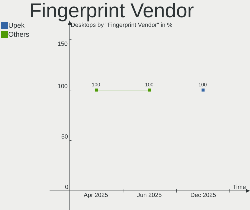

| Vendor | Desktops | Percent |
|--------|----------|---------|
| Upek   | 1        | 100%    |

Fingerprint Model
-----------------

Fingerprint sensor models

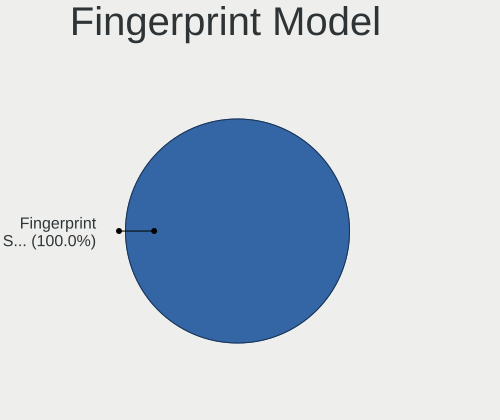

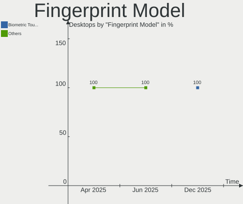

| Model                                                  | Desktops | Percent |
|--------------------------------------------------------|----------|---------|
| Upek Biometric Touchchip/Touchstrip Fingerprint Sensor | 1        | 100%    |

Chipcard Vendor
---------------

Chipcard module vendors

Zero info for selected period =(

Chipcard Model
--------------

Chipcard module models

Zero info for selected period =(

Unsupported
-----------

Unsupported Devices
-------------------

Total unsupported devices on board

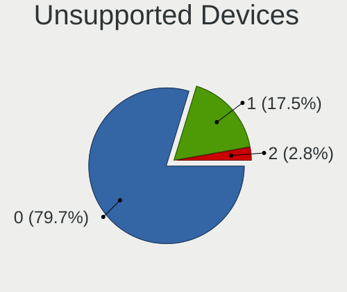

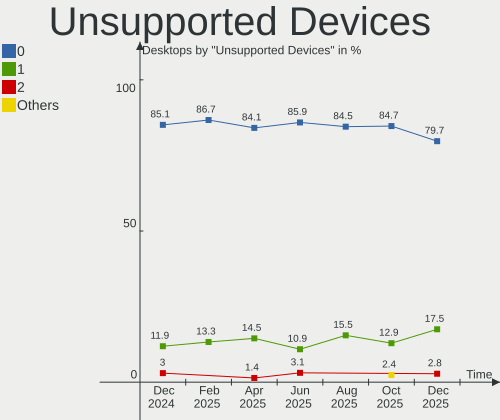

| Total | Desktops | Percent |
|-------|----------|---------|
| 0     | 114      | 79.72%  |
| 1     | 25       | 17.48%  |
| 2     | 4        | 2.8%    |

Unsupported Device Types
------------------------

Types of unsupported devices

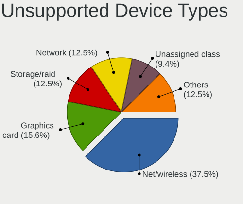

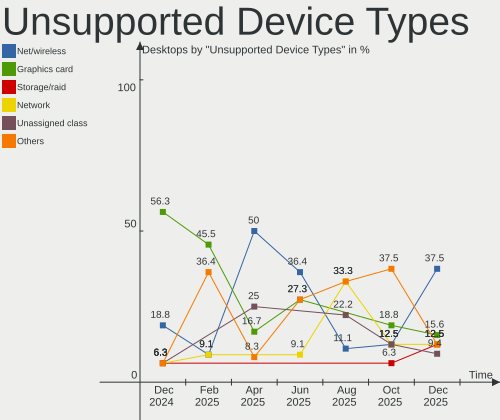

| Type                     | Desktops | Percent |
|--------------------------|----------|---------|
| Net/wireless             | 12       | 37.5%   |
| Graphics card            | 5        | 15.63%  |
| Storage/raid             | 4        | 12.5%   |
| Network                  | 4        | 12.5%   |
| Unassigned class         | 3        | 9.38%   |
| Fingerprint reader       | 1        | 3.13%   |
| Communication controller | 1        | 3.13%   |
| Card reader              | 1        | 3.13%   |
| Camera                   | 1        | 3.13%   |

