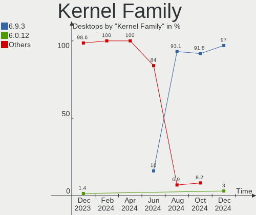
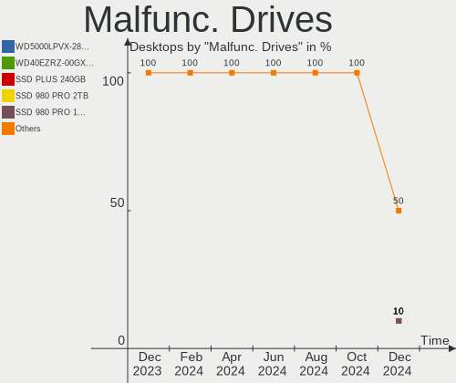
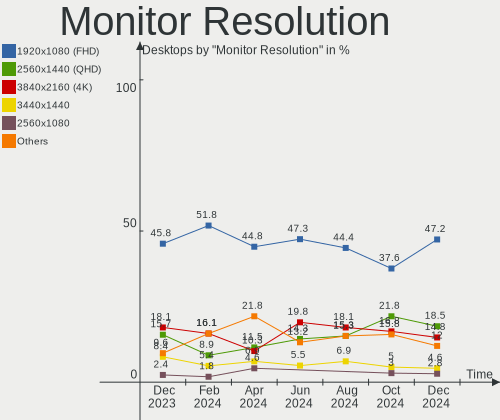

Pop!_OS - Hardware Trends (Desktops)
------------------------------------

A project to identify most popular hardware characteristics and track their change
over time based on data collected by Linux users at https://Linux-Hardware.org.

Anyone can contribute to this report by the [hw-probe](https://github.com/linuxhw/hw-probe) tool:

    sudo -E hw-probe -all -upload

This report is for one last month. Overall report since the beginning of time: [TestCoverage](https://github.com/linuxhw/TestCoverage)

Period: Jul, 2022.

Contents
--------

* [ System ](#system)
  - [ OS                       ](#os)
  - [ OS Family                ](#os-family)
  - [ Kernel                   ](#kernel)
  - [ Kernel Family            ](#kernel-family)
  - [ Kernel Major Ver.        ](#kernel-major-ver)
  - [ Arch                     ](#arch)
  - [ DE                       ](#de)
  - [ Display Server           ](#display-server)
  - [ Display Manager          ](#display-manager)
  - [ OS Lang                  ](#os-lang)
  - [ Boot Mode                ](#boot-mode)
  - [ Filesystem               ](#filesystem)
  - [ Part. scheme             ](#part-scheme)
  - [ Dual Boot with Linux/BSD ](#dual-boot-with-linuxbsd)
  - [ Dual Boot (Win)          ](#dual-boot-win)

* [ Board ](#board)
  - [ Vendor                   ](#vendor)
  - [ Model                    ](#model)
  - [ Model Family             ](#model-family)
  - [ MFG Year                 ](#mfg-year)
  - [ Form Factor              ](#form-factor)
  - [ Secure Boot              ](#secure-boot)
  - [ Coreboot                 ](#coreboot)
  - [ RAM Size                 ](#ram-size)
  - [ RAM Used                 ](#ram-used)
  - [ Total Drives             ](#total-drives)
  - [ Has CD-ROM               ](#has-cd-rom)
  - [ Has Ethernet             ](#has-ethernet)
  - [ Has WiFi                 ](#has-wifi)
  - [ Has Bluetooth            ](#has-bluetooth)

* [ Location ](#location)
  - [ Country                  ](#country)
  - [ City                     ](#city)

* [ Drives ](#drives)
  - [ Drive Vendor             ](#drive-vendor)
  - [ Drive Model              ](#drive-model)
  - [ HDD Vendor               ](#hdd-vendor)
  - [ SSD Vendor               ](#ssd-vendor)
  - [ Drive Kind               ](#drive-kind)
  - [ Drive Connector          ](#drive-connector)
  - [ Drive Size               ](#drive-size)
  - [ Space Total              ](#space-total)
  - [ Space Used               ](#space-used)
  - [ Malfunc. Drives          ](#malfunc-drives)
  - [ Malfunc. Drive Vendor    ](#malfunc-drive-vendor)
  - [ Malfunc. HDD Vendor      ](#malfunc-hdd-vendor)
  - [ Malfunc. Drive Kind      ](#malfunc-drive-kind)
  - [ Failed Drives            ](#failed-drives)
  - [ Failed Drive Vendor      ](#failed-drive-vendor)
  - [ Drive Status             ](#drive-status)

* [ Storage controller ](#storage-controller)
  - [ Storage Vendor           ](#storage-vendor)
  - [ Storage Model            ](#storage-model)
  - [ Storage Kind             ](#storage-kind)

* [ Processor ](#processor)
  - [ CPU Vendor               ](#cpu-vendor)
  - [ CPU Model                ](#cpu-model)
  - [ CPU Model Family         ](#cpu-model-family)
  - [ CPU Cores                ](#cpu-cores)
  - [ CPU Sockets              ](#cpu-sockets)
  - [ CPU Threads              ](#cpu-threads)
  - [ CPU Op-Modes             ](#cpu-op-modes)
  - [ CPU Microcode            ](#cpu-microcode)
  - [ CPU Microarch            ](#cpu-microarch)

* [ Graphics ](#graphics)
  - [ GPU Vendor               ](#gpu-vendor)
  - [ GPU Model                ](#gpu-model)
  - [ GPU Combo                ](#gpu-combo)
  - [ GPU Driver               ](#gpu-driver)
  - [ GPU Memory               ](#gpu-memory)

* [ Monitor ](#monitor)
  - [ Monitor Vendor           ](#monitor-vendor)
  - [ Monitor Model            ](#monitor-model)
  - [ Monitor Resolution       ](#monitor-resolution)
  - [ Monitor Diagonal         ](#monitor-diagonal)
  - [ Monitor Width            ](#monitor-width)
  - [ Aspect Ratio             ](#aspect-ratio)
  - [ Monitor Area             ](#monitor-area)
  - [ Pixel Density            ](#pixel-density)
  - [ Multiple Monitors        ](#multiple-monitors)

* [ Network ](#network)
  - [ Net Controller Vendor    ](#net-controller-vendor)
  - [ Net Controller Model     ](#net-controller-model)
  - [ Wireless Vendor          ](#wireless-vendor)
  - [ Wireless Model           ](#wireless-model)
  - [ Ethernet Vendor          ](#ethernet-vendor)
  - [ Ethernet Model           ](#ethernet-model)
  - [ Net Controller Kind      ](#net-controller-kind)
  - [ Used Controller          ](#used-controller)
  - [ NICs                     ](#nics)
  - [ IPv6                     ](#ipv6)

* [ Bluetooth ](#bluetooth)
  - [ Bluetooth Vendor         ](#bluetooth-vendor)
  - [ Bluetooth Model          ](#bluetooth-model)

* [ Sound ](#sound)
  - [ Sound Vendor             ](#sound-vendor)
  - [ Sound Model              ](#sound-model)

* [ Memory ](#memory)
  - [ Memory Vendor            ](#memory-vendor)
  - [ Memory Model             ](#memory-model)
  - [ Memory Kind              ](#memory-kind)
  - [ Memory Form Factor       ](#memory-form-factor)
  - [ Memory Size              ](#memory-size)
  - [ Memory Speed             ](#memory-speed)

* [ Printers & scanners ](#printers--scanners)
  - [ Printer Vendor           ](#printer-vendor)
  - [ Printer Model            ](#printer-model)
  - [ Scanner Vendor           ](#scanner-vendor)
  - [ Scanner Model            ](#scanner-model)

* [ Camera ](#camera)
  - [ Camera Vendor            ](#camera-vendor)
  - [ Camera Model             ](#camera-model)

* [ Security ](#security)
  - [ Fingerprint Vendor       ](#fingerprint-vendor)
  - [ Fingerprint Model        ](#fingerprint-model)
  - [ Chipcard Vendor          ](#chipcard-vendor)
  - [ Chipcard Model           ](#chipcard-model)

* [ Unsupported ](#unsupported)
  - [ Unsupported Devices      ](#unsupported-devices)
  - [ Unsupported Device Types ](#unsupported-device-types)

System
------

OS
--

Installed operating systems

| Name          | Desktops | Percent |
|---------------|----------|---------|
| Pop!_OS 22.04 | 79       | 89.77%  |
| Pop!_OS 20.04 | 4        | 4.55%   |
| Pop!_OS 21.10 | 2        | 2.27%   |
| Pop!_OS 21.04 | 2        | 2.27%   |
| Pop!_OS 20.10 | 1        | 1.14%   |

OS Family
---------

OS without a version

| Name    | Desktops | Percent |
|---------|----------|---------|
| Pop!_OS | 88       | 100%    |

Kernel
------

Version of the Linux kernel

| Version                   | Desktops | Percent |
|---------------------------|----------|---------|
| 5.17.15-76051715-generic  | 55       | 62.5%   |
| 5.18.10-76051810-generic  | 21       | 23.86%  |
| 5.17.5-76051705-generic   | 6        | 6.82%   |
| 5.18.11-steamvr-generic   | 1        | 1.14%   |
| 5.18.0-9.1-liquorix-amd64 | 1        | 1.14%   |
| 5.16.11-76051611-generic  | 1        | 1.14%   |
| 5.13.0-7614-generic       | 1        | 1.14%   |
| 5.11.0-7633-generic       | 1        | 1.14%   |
| 5.11.0-7614-generic       | 1        | 1.14%   |

Kernel Family
-------------

Linux kernel without a distro release

| Version | Desktops | Percent |
|---------|----------|---------|
| 5.17.15 | 55       | 62.5%   |
| 5.18.10 | 21       | 23.86%  |
| 5.17.5  | 6        | 6.82%   |
| 5.11.0  | 2        | 2.27%   |
| 5.18.11 | 1        | 1.14%   |
| 5.18.0  | 1        | 1.14%   |
| 5.16.11 | 1        | 1.14%   |
| 5.13.0  | 1        | 1.14%   |

Kernel Major Ver.
-----------------

Linux kernel major version

| Version | Desktops | Percent |
|---------|----------|---------|
| 5.17    | 61       | 69.32%  |
| 5.18    | 23       | 26.14%  |
| 5.11    | 2        | 2.27%   |
| 5.16    | 1        | 1.14%   |
| 5.13    | 1        | 1.14%   |

Arch
----

OS architecture (x86_64, i586, etc.)

| Name   | Desktops | Percent |
|--------|----------|---------|
| x86_64 | 88       | 100%    |

DE
--

Desktop Environment

| Name     | Desktops | Percent |
|----------|----------|---------|
| GNOME    | 82       | 93.18%  |
| KDE5     | 4        | 4.55%   |
| Cinnamon | 1        | 1.14%   |
| Unknown  | 1        | 1.14%   |

Display Server
--------------

X11 or Wayland

| Name    | Desktops | Percent |
|---------|----------|---------|
| X11     | 85       | 96.59%  |
| Wayland | 2        | 2.27%   |
| Unknown | 1        | 1.14%   |

Display Manager
---------------

SDDM, LightDM, etc.

| Name    | Desktops | Percent |
|---------|----------|---------|
| Unknown | 74       | 84.09%  |
| GDM3    | 12       | 13.64%  |
| SDDM    | 2        | 2.27%   |

OS Lang
-------

Language

| Lang    | Desktops | Percent |
|---------|----------|---------|
| en_US   | 50       | 56.82%  |
| pt_BR   | 7        | 7.95%   |
| en_CA   | 5        | 5.68%   |
| en_GB   | 4        | 4.55%   |
| de_DE   | 3        | 3.41%   |
| sv_SE   | 2        | 2.27%   |
| it_IT   | 2        | 2.27%   |
| fr_FR   | 2        | 2.27%   |
| en_AU   | 2        | 2.27%   |
| C       | 2        | 2.27%   |
| ru_RU   | 1        | 1.14%   |
| ro_RO   | 1        | 1.14%   |
| nl_NL   | 1        | 1.14%   |
| es_UY   | 1        | 1.14%   |
| es_DO   | 1        | 1.14%   |
| es_CL   | 1        | 1.14%   |
| en_IN   | 1        | 1.14%   |
| en_DK   | 1        | 1.14%   |
| Unknown | 1        | 1.14%   |

Boot Mode
---------

EFI or BIOS

| Mode | Desktops | Percent |
|------|----------|---------|
| BIOS | 76       | 86.36%  |
| EFI  | 12       | 13.64%  |

Filesystem
----------

Type of filesystem

| Type    | Desktops | Percent |
|---------|----------|---------|
| Ext4    | 85       | 96.59%  |
| Btrfs   | 2        | 2.27%   |
| Overlay | 1        | 1.14%   |

Part. scheme
------------

Scheme of partitioning

| Type    | Desktops | Percent |
|---------|----------|---------|
| Unknown | 73       | 82.95%  |
| GPT     | 14       | 15.91%  |
| MBR     | 1        | 1.14%   |

Dual Boot with Linux/BSD
------------------------

Hosting more than one Linux/BSD

| Dual boot | Desktops | Percent |
|-----------|----------|---------|
| No        | 86       | 97.73%  |
| Yes       | 2        | 2.27%   |

Dual Boot (Win)
---------------

Hosting Linux and Windows

| Dual boot | Desktops | Percent |
|-----------|----------|---------|
| No        | 79       | 89.77%  |
| Yes       | 9        | 10.23%  |

Board
-----

Vendor
------

Motherboard manufacturer

| Name                | Desktops | Percent |
|---------------------|----------|---------|
| Gigabyte Technology | 21       | 23.86%  |
| ASUSTek Computer    | 21       | 23.86%  |
| MSI                 | 16       | 18.18%  |
| ASRock              | 7        | 7.95%   |
| Hewlett-Packard     | 5        | 5.68%   |
| Dell                | 5        | 5.68%   |
| Lenovo              | 4        | 4.55%   |
| MACHINIST           | 2        | 2.27%   |
| Soyo                | 1        | 1.14%   |
| Positivo            | 1        | 1.14%   |
| Intel               | 1        | 1.14%   |
| Fujitsu             | 1        | 1.14%   |
| EVGA                | 1        | 1.14%   |
| Apple               | 1        | 1.14%   |
| Alienware           | 1        | 1.14%   |

Model
-----

Motherboard model

| Name                                   | Desktops | Percent |
|----------------------------------------|----------|---------|
| ASUS ROG STRIX B450-F GAMING           | 3        | 3.41%   |
| Gigabyte X570 I AORUS PRO WIFI         | 2        | 2.27%   |
| Gigabyte B450M DS3H                    | 2        | 2.27%   |
| ASUS TUF Gaming X570-PLUS              | 2        | 2.27%   |
| ASUS TUF Gaming B550-PLUS              | 2        | 2.27%   |
| ASUS PRIME Z390-A                      | 2        | 2.27%   |
| Soyo SY-A68M FS V2.0                   | 1        | 1.14%   |
| Positivo POS-PIQ77CL                   | 1        | 1.14%   |
| MSI MS-7D28                            | 1        | 1.14%   |
| MSI MS-7D25                            | 1        | 1.14%   |
| MSI MS-7D09                            | 1        | 1.14%   |
| MSI MS-7C75                            | 1        | 1.14%   |
| MSI MS-7C37                            | 1        | 1.14%   |
| MSI MS-7C35                            | 1        | 1.14%   |
| MSI MS-7C02                            | 1        | 1.14%   |
| MSI MS-7B89                            | 1        | 1.14%   |
| MSI MS-7B85                            | 1        | 1.14%   |
| MSI MS-7B22                            | 1        | 1.14%   |
| MSI MS-7A74                            | 1        | 1.14%   |
| MSI MS-7A33                            | 1        | 1.14%   |
| MSI MS-7A11                            | 1        | 1.14%   |
| MSI MS-7977                            | 1        | 1.14%   |
| MSI MS-7673                            | 1        | 1.14%   |
| MSI MPG B460 Trident A (MS-B926)       | 1        | 1.14%   |
| MACHINIST X99-RS9 V2.0                 | 1        | 1.14%   |
| MACHINIST X79 V2.82H                   | 1        | 1.14%   |
| Lenovo ThinkCentre M93p 10A8000WUS     | 1        | 1.14%   |
| Lenovo ThinkCentre M92p 3209E4U        | 1        | 1.14%   |
| Lenovo ThinkCentre M90p 5864A1U        | 1        | 1.14%   |
| Lenovo ThinkCentre M800 10FY001BUS     | 1        | 1.14%   |
| Intel DQ35JO AAD82085-801              | 1        | 1.14%   |
| HP ProDesk 600 G1 SFF                  | 1        | 1.14%   |
| HP Pavilion 690-0067c Desktop Rfrbd PC | 1        | 1.14%   |
| HP EliteDesk 705 G1 SFF                | 1        | 1.14%   |
| HP Compaq Elite 8300 USDT              | 1        | 1.14%   |
| HP Compaq 8200 Elite SFF PC            | 1        | 1.14%   |
| Gigabyte Z97X-UD3H-BK                  | 1        | 1.14%   |
| Gigabyte Z170X-Gaming 3                | 1        | 1.14%   |
| Gigabyte X570 AORUS MASTER             | 1        | 1.14%   |
| Gigabyte X570 AORUS ELITE              | 1        | 1.14%   |
| Gigabyte H97M-Gaming 3                 | 1        | 1.14%   |
| Gigabyte H310M S2 2.0                  | 1        | 1.14%   |
| Gigabyte H110M-S2H-CF                  | 1        | 1.14%   |
| Gigabyte GB-BRR7H-4800                 | 1        | 1.14%   |
| Gigabyte GA-78LMT-S2P                  | 1        | 1.14%   |
| Gigabyte G1.Sniper M3-CF               | 1        | 1.14%   |
| Gigabyte B75M-D3H                      | 1        | 1.14%   |
| Gigabyte B550 AORUS PRO AX             | 1        | 1.14%   |
| Gigabyte B450 AORUS M                  | 1        | 1.14%   |
| Gigabyte B450 AORUS ELITE              | 1        | 1.14%   |
| Gigabyte AB350-Gaming 3                | 1        | 1.14%   |
| Gigabyte A520I AC                      | 1        | 1.14%   |
| Gigabyte A320M-S2H V2                  | 1        | 1.14%   |
| Fujitsu ESPRIMO P910                   | 1        | 1.14%   |
| EVGA 134-KS-E377                       | 1        | 1.14%   |
| Dell Precision WorkStation T3400       | 1        | 1.14%   |
| Dell OptiPlex 780                      | 1        | 1.14%   |
| Dell OptiPlex 7020                     | 1        | 1.14%   |
| Dell OptiPlex 3010                     | 1        | 1.14%   |
| Dell Inspiron 546                      | 1        | 1.14%   |

Model Family
------------

Motherboard model prefix

| Name                   | Desktops | Percent |
|------------------------|----------|---------|
| ASUS TUF               | 6        | 6.82%   |
| ASUS ROG               | 6        | 6.82%   |
| Lenovo ThinkCentre     | 4        | 4.55%   |
| Gigabyte X570          | 4        | 4.55%   |
| Dell OptiPlex          | 3        | 3.41%   |
| ASUS PRIME             | 3        | 3.41%   |
| HP Compaq              | 2        | 2.27%   |
| Gigabyte B450M         | 2        | 2.27%   |
| Gigabyte B450          | 2        | 2.27%   |
| ASRock B550            | 2        | 2.27%   |
| ASRock B450            | 2        | 2.27%   |
| Soyo SY-A68M           | 1        | 1.14%   |
| Positivo POS-PIQ77CL   | 1        | 1.14%   |
| MSI MS-7D28            | 1        | 1.14%   |
| MSI MS-7D25            | 1        | 1.14%   |
| MSI MS-7D09            | 1        | 1.14%   |
| MSI MS-7C75            | 1        | 1.14%   |
| MSI MS-7C37            | 1        | 1.14%   |
| MSI MS-7C35            | 1        | 1.14%   |
| MSI MS-7C02            | 1        | 1.14%   |
| MSI MS-7B89            | 1        | 1.14%   |
| MSI MS-7B85            | 1        | 1.14%   |
| MSI MS-7B22            | 1        | 1.14%   |
| MSI MS-7A74            | 1        | 1.14%   |
| MSI MS-7A33            | 1        | 1.14%   |
| MSI MS-7A11            | 1        | 1.14%   |
| MSI MS-7977            | 1        | 1.14%   |
| MSI MS-7673            | 1        | 1.14%   |
| MSI MPG                | 1        | 1.14%   |
| MACHINIST X99-RS9      | 1        | 1.14%   |
| MACHINIST X79          | 1        | 1.14%   |
| Intel DQ35JO           | 1        | 1.14%   |
| HP ProDesk             | 1        | 1.14%   |
| HP Pavilion            | 1        | 1.14%   |
| HP EliteDesk           | 1        | 1.14%   |
| Gigabyte Z97X-UD3H-BK  | 1        | 1.14%   |
| Gigabyte Z170X-Gaming  | 1        | 1.14%   |
| Gigabyte H97M-Gaming   | 1        | 1.14%   |
| Gigabyte H310M         | 1        | 1.14%   |
| Gigabyte H110M-S2H-CF  | 1        | 1.14%   |
| Gigabyte GB-BRR7H-4800 | 1        | 1.14%   |
| Gigabyte GA-78LMT-S2P  | 1        | 1.14%   |
| Gigabyte G1.Sniper     | 1        | 1.14%   |
| Gigabyte B75M-D3H      | 1        | 1.14%   |
| Gigabyte B550          | 1        | 1.14%   |
| Gigabyte AB350-Gaming  | 1        | 1.14%   |
| Gigabyte A520I         | 1        | 1.14%   |
| Gigabyte A320M-S2H     | 1        | 1.14%   |
| Fujitsu ESPRIMO        | 1        | 1.14%   |
| EVGA 134-KS-E377       | 1        | 1.14%   |
| Dell Precision         | 1        | 1.14%   |
| Dell Inspiron          | 1        | 1.14%   |
| ASUS Z170M-PLUS        | 1        | 1.14%   |
| ASUS Z170-A            | 1        | 1.14%   |
| ASUS P5Q-PRO           | 1        | 1.14%   |
| ASUS Maximus           | 1        | 1.14%   |
| ASUS M5A78L-M          | 1        | 1.14%   |
| ASUS M4A79XTD          | 1        | 1.14%   |
| ASRock Z77             | 1        | 1.14%   |
| ASRock One             | 1        | 1.14%   |

MFG Year
--------

Motherboard manufacture year

| Year | Desktops | Percent |
|------|----------|---------|
| 2018 | 17       | 19.32%  |
| 2019 | 12       | 13.64%  |
| 2020 | 11       | 12.5%   |
| 2021 | 8        | 9.09%   |
| 2015 | 6        | 6.82%   |
| 2017 | 5        | 5.68%   |
| 2012 | 5        | 5.68%   |
| 2013 | 4        | 4.55%   |
| 2011 | 4        | 4.55%   |
| 2016 | 3        | 3.41%   |
| 2014 | 3        | 3.41%   |
| 2008 | 3        | 3.41%   |
| 2022 | 2        | 2.27%   |
| 2010 | 2        | 2.27%   |
| 2009 | 2        | 2.27%   |
| 2007 | 1        | 1.14%   |

Form Factor
-----------

Physical design of the computer

| Name    | Desktops | Percent |
|---------|----------|---------|
| Desktop | 88       | 100%    |

Secure Boot
-----------

Enabled or disabled

| State    | Desktops | Percent |
|----------|----------|---------|
| Disabled | 87       | 98.86%  |
| Enabled  | 1        | 1.14%   |

Coreboot
--------

Have coreboot on board

| Used | Desktops | Percent |
|------|----------|---------|
| No   | 88       | 100%    |

RAM Size
--------

Total RAM memory

| Size in GB  | Desktops | Percent |
|-------------|----------|---------|
| 16.01-24.0  | 39       | 44.32%  |
| 64.01-256.0 | 13       | 14.77%  |
| 4.01-8.0    | 11       | 12.5%   |
| 32.01-64.0  | 11       | 12.5%   |
| 8.01-16.0   | 10       | 11.36%  |
| 3.01-4.0    | 3        | 3.41%   |
| 24.01-32.0  | 1        | 1.14%   |

RAM Used
--------

Used RAM memory

| Used GB    | Desktops | Percent |
|------------|----------|---------|
| 3.01-4.0   | 23       | 26.14%  |
| 2.01-3.0   | 23       | 26.14%  |
| 4.01-8.0   | 20       | 22.73%  |
| 1.01-2.0   | 13       | 14.77%  |
| 8.01-16.0  | 5        | 5.68%   |
| 32.01-64.0 | 3        | 3.41%   |
| 16.01-24.0 | 1        | 1.14%   |

Total Drives
------------

Number of drives on board

| Drives | Desktops | Percent |
|--------|----------|---------|
| 2      | 29       | 32.95%  |
| 1      | 25       | 28.41%  |
| 3      | 15       | 17.05%  |
| 4      | 12       | 13.64%  |
| 6      | 3        | 3.41%   |
| 7      | 2        | 2.27%   |
| 5      | 2        | 2.27%   |

Has CD-ROM
----------

Has CD-ROM on board

| Presented | Desktops | Percent |
|-----------|----------|---------|
| No        | 61       | 69.32%  |
| Yes       | 27       | 30.68%  |

Has Ethernet
------------

Has Ethernet on board

| Presented | Desktops | Percent |
|-----------|----------|---------|
| Yes       | 88       | 100%    |

Has WiFi
--------

Has WiFi module

| Presented | Desktops | Percent |
|-----------|----------|---------|
| No        | 45       | 51.14%  |
| Yes       | 43       | 48.86%  |

Has Bluetooth
-------------

Has Bluetooth module

| Presented | Desktops | Percent |
|-----------|----------|---------|
| No        | 55       | 62.5%   |
| Yes       | 33       | 37.5%   |

Location
--------

Country
-------

Geographic location (country)

| Country            | Desktops | Percent |
|--------------------|----------|---------|
| USA                | 34       | 38.64%  |
| Canada             | 8        | 9.09%   |
| Brazil             | 8        | 9.09%   |
| Germany            | 5        | 5.68%   |
| Italy              | 4        | 4.55%   |
| UK                 | 3        | 3.41%   |
| France             | 3        | 3.41%   |
| Sweden             | 2        | 2.27%   |
| Netherlands        | 2        | 2.27%   |
| India              | 2        | 2.27%   |
| Austria            | 2        | 2.27%   |
| Uruguay            | 1        | 1.14%   |
| Russia             | 1        | 1.14%   |
| Romania            | 1        | 1.14%   |
| Portugal           | 1        | 1.14%   |
| Norway             | 1        | 1.14%   |
| Mexico             | 1        | 1.14%   |
| Ireland            | 1        | 1.14%   |
| Hong Kong          | 1        | 1.14%   |
| Dominican Republic | 1        | 1.14%   |
| Denmark            | 1        | 1.14%   |
| Colombia           | 1        | 1.14%   |
| Chile              | 1        | 1.14%   |
| Belgium            | 1        | 1.14%   |
| Azerbaijan         | 1        | 1.14%   |
| Australia          | 1        | 1.14%   |

City
----

Geographic location (city)

| City           | Desktops | Percent |
|----------------|----------|---------|
| Seattle        | 2        | 2.27%   |
| Milan          | 2        | 2.27%   |
| Broomfield     | 2        | 2.27%   |
| Wilmslow       | 1        | 1.14%   |
| Wasilla        | 1        | 1.14%   |
| Vedevag        | 1        | 1.14%   |
| Västerås     | 1        | 1.14%   |
| Varel          | 1        | 1.14%   |
| Vallenar       | 1        | 1.14%   |
| Valenciennes   | 1        | 1.14%   |
| Utrecht        | 1        | 1.14%   |
| Telford        | 1        | 1.14%   |
| Surrey         | 1        | 1.14%   |
| Springfield    | 1        | 1.14%   |
| Scarborough    | 1        | 1.14%   |
| Sarasota       | 1        | 1.14%   |
| Sao Paulo      | 1        | 1.14%   |
| Sao Luís      | 1        | 1.14%   |
| Santa Clara    | 1        | 1.14%   |
| Rome           | 1        | 1.14%   |
| Rensselaer     | 1        | 1.14%   |
| Portland       | 1        | 1.14%   |
| Port Orchard   | 1        | 1.14%   |
| Perth-Andover  | 1        | 1.14%   |
| Patna          | 1        | 1.14%   |
| Park City      | 1        | 1.14%   |
| Ottawa         | 1        | 1.14%   |
| Niterói       | 1        | 1.14%   |
| Nexo           | 1        | 1.14%   |
| New York       | 1        | 1.14%   |
| New Orleans    | 1        | 1.14%   |
| Naperville     | 1        | 1.14%   |
| Nacional       | 1        | 1.14%   |
| Morelia        | 1        | 1.14%   |
| Morehead City  | 1        | 1.14%   |
| Montreal       | 1        | 1.14%   |
| Montevideo     | 1        | 1.14%   |
| Miramas        | 1        | 1.14%   |
| Miercurea-Ciuc | 1        | 1.14%   |
| Miami          | 1        | 1.14%   |
| Melton Mowbray | 1        | 1.14%   |
| Medford        | 1        | 1.14%   |
| Magdeburg      | 1        | 1.14%   |
| Luni           | 1        | 1.14%   |
| Lumberton      | 1        | 1.14%   |
| Ludwigsburg    | 1        | 1.14%   |
| Los Alamos     | 1        | 1.14%   |
| Lethbridge     | 1        | 1.14%   |
| Langenfeld     | 1        | 1.14%   |
| Kritzmow       | 1        | 1.14%   |
| Kolkata        | 1        | 1.14%   |
| Kelowna        | 1        | 1.14%   |
| Kazan’       | 1        | 1.14%   |
| Joao Pessoa    | 1        | 1.14%   |
| Jessheim       | 1        | 1.14%   |
| Jensen Beach   | 1        | 1.14%   |
| Innsbruck      | 1        | 1.14%   |
| Grovedale      | 1        | 1.14%   |
| Graz           | 1        | 1.14%   |
| Goiânia       | 1        | 1.14%   |

Drives
------

Drive Vendor
------------

Hard drive vendors

| Vendor                    | Desktops | Drives | Percent |
|---------------------------|----------|--------|---------|
| WDC                       | 33       | 43     | 17.93%  |
| Seagate                   | 29       | 42     | 15.76%  |
| Samsung Electronics       | 29       | 36     | 15.76%  |
| SanDisk                   | 11       | 11     | 5.98%   |
| Crucial                   | 10       | 14     | 5.43%   |
| Toshiba                   | 7        | 7      | 3.8%    |
| Kingston                  | 6        | 6      | 3.26%   |
| A-DATA Technology         | 6        | 6      | 3.26%   |
| China                     | 5        | 5      | 2.72%   |
| XPG                       | 3        | 3      | 1.63%   |
| SPCC                      | 3        | 3      | 1.63%   |
| Silicon Motion            | 3        | 3      | 1.63%   |
| Phison                    | 3        | 4      | 1.63%   |
| Micron/Crucial Technology | 3        | 3      | 1.63%   |
| Intel                     | 3        | 3      | 1.63%   |
| SK hynix                  | 2        | 2      | 1.09%   |
| Realtek Semiconductor     | 2        | 2      | 1.09%   |
| OCZ                       | 2        | 2      | 1.09%   |
| Maxtor                    | 2        | 2      | 1.09%   |
| JMicron Technology        | 2        | 2      | 1.09%   |
| Hitachi                   | 2        | 3      | 1.09%   |
| Hewlett-Packard           | 2        | 2      | 1.09%   |
| Apple                     | 2        | 2      | 1.09%   |
| WALRAM                    | 1        | 1      | 0.54%   |
| T-FORCE                   | 1        | 1      | 0.54%   |
| Qunion                    | 1        | 1      | 0.54%   |
| PNY                       | 1        | 1      | 0.54%   |
| Pioneer                   | 1        | 1      | 0.54%   |
| Mushkin                   | 1        | 1      | 0.54%   |
| Lexar                     | 1        | 1      | 0.54%   |
| Intenso                   | 1        | 1      | 0.54%   |
| Indilinx                  | 1        | 1      | 0.54%   |
| HS-SSD-E100N              | 1        | 1      | 0.54%   |
| GALAX                     | 1        | 1      | 0.54%   |
| Corsair                   | 1        | 1      | 0.54%   |
| Apacer                    | 1        | 1      | 0.54%   |
| Unknown                   | 1        | 1      | 0.54%   |

Drive Model
-----------

Hard drive models

| Model                               | Desktops | Percent |
|-------------------------------------|----------|---------|
| Samsung NVMe SSD Drive 1TB          | 8        | 3.76%   |
| SanDisk NVMe SSD Drive 1TB          | 6        | 2.82%   |
| Seagate ST2000DM008-2FR102 2TB      | 4        | 1.88%   |
| Samsung SSD 860 EVO 1TB             | 3        | 1.41%   |
| Samsung SSD 850 EVO 500GB           | 3        | 1.41%   |
| WDC WDS100T3X0C-00SJG0 1TB          | 2        | 0.94%   |
| WDC WDS100T2B0A-00SM50 1TB SSD      | 2        | 0.94%   |
| WDC WD20EZAZ-00GGJB0 2TB            | 2        | 0.94%   |
| WDC WD20EARS-00MVWB0 2TB            | 2        | 0.94%   |
| WDC WD10EZEX-08WN4A0 1TB            | 2        | 0.94%   |
| Silicon Motion NVMe SSD Drive 480GB | 2        | 0.94%   |
| Seagate ST8000DM004-2CX188 8TB      | 2        | 0.94%   |
| Seagate ST5000LM000-2AN170 5TB      | 2        | 0.94%   |
| Seagate ST4000DM004-2CV104 4TB      | 2        | 0.94%   |
| Seagate ST4000DM000-1F2168 4TB      | 2        | 0.94%   |
| Seagate ST1000LM024 HN-M101MBB 1TB  | 2        | 0.94%   |
| Seagate ST1000DM010-2EP102 1TB      | 2        | 0.94%   |
| Seagate ST1000DM003-1SB10C 1TB      | 2        | 0.94%   |
| Seagate ST1000DM003-1ER162 1TB      | 2        | 0.94%   |
| Samsung NVMe SSD Drive 2TB          | 2        | 0.94%   |
| Samsung NVMe SSD Drive 250GB        | 2        | 0.94%   |
| Phison NVMe SSD Drive 1TB           | 2        | 0.94%   |
| Kingston SV300S37A120G 120GB SSD    | 2        | 0.94%   |
| Kingston SA400S37120G 120GB SSD     | 2        | 0.94%   |
| Crucial CT500MX500SSD1 500GB        | 2        | 0.94%   |
| Crucial CT2000MX500SSD1 2TB         | 2        | 0.94%   |
| Crucial CT1000MX500SSD1 1TB         | 2        | 0.94%   |
| China SATA SSD 240GB                | 2        | 0.94%   |
| A-DATA SU630 240GB SSD              | 2        | 0.94%   |
| XPG NVMe SSD Drive 256GB            | 1        | 0.47%   |
| XPG NVMe SSD Drive 1024GB           | 1        | 0.47%   |
| XPG GAMMIX S11 Pro 256GB            | 1        | 0.47%   |
| WDC WDS500G2B0A-00SM50 500GB SSD    | 1        | 0.47%   |
| WDC WDS240G2G0B-00EPW0 240GB SSD    | 1        | 0.47%   |
| WDC WDS240G2G0A-00JH30 240GB SSD    | 1        | 0.47%   |
| WDC WDBNCE5000PNC 500GB SSD         | 1        | 0.47%   |
| WDC WD6401AALS-00J7B1 640GB         | 1        | 0.47%   |
| WDC WD5001AALS-00J7B1 500GB         | 1        | 0.47%   |
| WDC WD5000LPVX-22V0TT0 500GB        | 1        | 0.47%   |
| WDC WD5000AVCS-632DY1 500GB         | 1        | 0.47%   |
| WDC WD5000AAKX-603CA0 500GB         | 1        | 0.47%   |
| WDC WD5000AAKX-08ERMA0 500GB        | 1        | 0.47%   |
| WDC WD5000AAKX-07U6AA0 500GB        | 1        | 0.47%   |
| WDC WD5000AADS-00S9B0 500GB         | 1        | 0.47%   |
| WDC WD3200AAKS-00L9A0 320GB         | 1        | 0.47%   |
| WDC WD30EZRZ-00GXCB0 3TB            | 1        | 0.47%   |
| WDC WD30EFRX-68EUZN0 3TB            | 1        | 0.47%   |
| WDC WD2502ABYS-02B7A0 256GB         | 1        | 0.47%   |
| WDC WD2500JS-41MVB1 250GB           | 1        | 0.47%   |
| WDC WD20SPZX-75UA7T0 2TB            | 1        | 0.47%   |
| WDC WD20EZBX-00AYRA0 2TB            | 1        | 0.47%   |
| WDC WD20EFRX-68AX9N0 2TB            | 1        | 0.47%   |
| WDC WD1600AAJS-00PSA0 160GB         | 1        | 0.47%   |
| WDC WD10SPZX-35Z10T0 1TB            | 1        | 0.47%   |
| WDC WD10EZRX-00D8PB0 1TB            | 1        | 0.47%   |
| WDC WD10EZEX-75WN4A1 1TB            | 1        | 0.47%   |
| WDC WD10EZEX-22BN5A0 1TB            | 1        | 0.47%   |
| WDC WD10EZEX-00WN4A0 1TB            | 1        | 0.47%   |
| WDC WD10EARS-00Y5B1 1TB             | 1        | 0.47%   |
| WDC WD10EALX-009BA0 1TB             | 1        | 0.47%   |

HDD Vendor
----------

Hard disk drive vendors

| Vendor              | Desktops | Drives | Percent |
|---------------------|----------|--------|---------|
| Seagate             | 28       | 41     | 41.18%  |
| WDC                 | 25       | 32     | 36.76%  |
| Toshiba             | 6        | 6      | 8.82%   |
| Samsung Electronics | 5        | 5      | 7.35%   |
| Hitachi             | 2        | 3      | 2.94%   |
| Apple               | 2        | 2      | 2.94%   |

SSD Vendor
----------

Solid state drive vendors

| Vendor              | Desktops | Drives | Percent |
|---------------------|----------|--------|---------|
| Samsung Electronics | 12       | 14     | 18.75%  |
| Crucial             | 9        | 13     | 14.06%  |
| WDC                 | 7        | 7      | 10.94%  |
| Kingston            | 6        | 6      | 9.38%   |
| China               | 5        | 5      | 7.81%   |
| A-DATA Technology   | 5        | 5      | 7.81%   |
| SanDisk             | 3        | 3      | 4.69%   |
| SPCC                | 2        | 2      | 3.13%   |
| OCZ                 | 2        | 2      | 3.13%   |
| Maxtor              | 2        | 2      | 3.13%   |
| SK hynix            | 1        | 1      | 1.56%   |
| PNY                 | 1        | 1      | 1.56%   |
| Pioneer             | 1        | 1      | 1.56%   |
| Mushkin             | 1        | 1      | 1.56%   |
| Lexar               | 1        | 1      | 1.56%   |
| Intenso             | 1        | 1      | 1.56%   |
| Intel               | 1        | 1      | 1.56%   |
| HS-SSD-E100N        | 1        | 1      | 1.56%   |
| Hewlett-Packard     | 1        | 1      | 1.56%   |
| Corsair             | 1        | 1      | 1.56%   |
| Apacer              | 1        | 1      | 1.56%   |

Drive Kind
----------

HDD or SSD

| Kind    | Desktops | Drives | Percent |
|---------|----------|--------|---------|
| HDD     | 56       | 89     | 35.9%   |
| SSD     | 55       | 70     | 35.26%  |
| NVMe    | 37       | 53     | 23.72%  |
| Unknown | 8        | 8      | 5.13%   |

Drive Connector
---------------

SATA, SAS, NVMe, etc.

| Type | Desktops | Drives | Percent |
|------|----------|--------|---------|
| SATA | 79       | 160    | 63.71%  |
| NVMe | 37       | 52     | 29.84%  |
| SAS  | 8        | 8      | 6.45%   |

Drive Size
----------

Size of hard drive

| Size in TB | Desktops | Drives | Percent |
|------------|----------|--------|---------|
| 0.01-0.5   | 51       | 71     | 42.15%  |
| 0.51-1.0   | 35       | 48     | 28.93%  |
| 1.01-2.0   | 21       | 23     | 17.36%  |
| 3.01-4.0   | 5        | 5      | 4.13%   |
| 2.01-3.0   | 4        | 5      | 3.31%   |
| 4.01-10.0  | 4        | 4      | 3.31%   |
| 10.01-20.0 | 1        | 3      | 0.83%   |

Space Total
-----------

Amount of disk space available on the file system

| Size in GB     | Desktops | Percent |
|----------------|----------|---------|
| 1001-2000      | 20       | 22.73%  |
| 501-1000       | 19       | 21.59%  |
| 251-500        | 15       | 17.05%  |
| 101-250        | 15       | 17.05%  |
| More than 3000 | 10       | 11.36%  |
| 2001-3000      | 5        | 5.68%   |
| 21-50          | 1        | 1.14%   |
| 1-20           | 1        | 1.14%   |
| 51-100         | 1        | 1.14%   |
| Unknown        | 1        | 1.14%   |

Space Used
----------

Amount of used disk space

| Used GB        | Desktops | Percent |
|----------------|----------|---------|
| 1-20           | 18       | 20.45%  |
| 101-250        | 16       | 18.18%  |
| 251-500        | 14       | 15.91%  |
| 51-100         | 13       | 14.77%  |
| 21-50          | 9        | 10.23%  |
| 501-1000       | 8        | 9.09%   |
| More than 3000 | 6        | 6.82%   |
| 2001-3000      | 2        | 2.27%   |
| 1001-2000      | 1        | 1.14%   |
| Unknown        | 1        | 1.14%   |

Malfunc. Drives
---------------

Drive models with a malfunction

| Model                             | Desktops | Drives | Percent |
|-----------------------------------|----------|--------|---------|
| WDC WD5001AALS-00J7B1 500GB       | 1        | 1      | 16.67%  |
| WDC WD5000AADS-00S9B0 500GB       | 1        | 1      | 16.67%  |
| WDC WD20EFRX-68AX9N0 2TB          | 1        | 1      | 16.67%  |
| Seagate ST5000LM000-2AN170 5TB    | 1        | 1      | 16.67%  |
| Crucial CT525MX300SSD1 528GB      | 1        | 1      | 16.67%  |
| A-DATA Technology SU800 512GB SSD | 1        | 1      | 16.67%  |

Malfunc. Drive Vendor
---------------------

Vendors of faulty drives

| Vendor            | Desktops | Drives | Percent |
|-------------------|----------|--------|---------|
| WDC               | 3        | 3      | 50%     |
| Seagate           | 1        | 1      | 16.67%  |
| Crucial           | 1        | 1      | 16.67%  |
| A-DATA Technology | 1        | 1      | 16.67%  |

Malfunc. HDD Vendor
-------------------

Vendors of faulty HDD drives

| Vendor  | Desktops | Drives | Percent |
|---------|----------|--------|---------|
| WDC     | 3        | 3      | 75%     |
| Seagate | 1        | 1      | 25%     |

Malfunc. Drive Kind
-------------------

Kinds of faulty drives

| Kind | Desktops | Drives | Percent |
|------|----------|--------|---------|
| HDD  | 4        | 4      | 66.67%  |
| SSD  | 2        | 2      | 33.33%  |

Failed Drives
-------------

Failed drive models

Zero info for selected period =(

Failed Drive Vendor
-------------------

Failed drive vendors

Zero info for selected period =(

Drive Status
------------

Number of failed and malfunc. drives

| Status   | Desktops | Drives | Percent |
|----------|----------|--------|---------|
| Detected | 75       | 184    | 78.13%  |
| Works    | 16       | 30     | 16.67%  |
| Malfunc  | 5        | 6      | 5.21%   |

Storage controller
------------------

Storage Vendor
--------------

Storage controller vendors

| Vendor                       | Desktops | Percent |
|------------------------------|----------|---------|
| Intel                        | 48       | 34.04%  |
| AMD                          | 42       | 29.79%  |
| Samsung Electronics          | 16       | 11.35%  |
| SanDisk                      | 10       | 7.09%   |
| Silicon Motion               | 4        | 2.84%   |
| Phison Electronics           | 4        | 2.84%   |
| Micron/Crucial Technology    | 4        | 2.84%   |
| Realtek Semiconductor        | 3        | 2.13%   |
| ASMedia Technology           | 3        | 2.13%   |
| ADATA Technology             | 3        | 2.13%   |
| Marvell Technology Group     | 2        | 1.42%   |
| Toshiba America Info Systems | 1        | 0.71%   |
| SK hynix                     | 1        | 0.71%   |

Storage Model
-------------

Storage controller models

| Model                                                                                   | Desktops | Percent |
|-----------------------------------------------------------------------------------------|----------|---------|
| AMD FCH SATA Controller [AHCI mode]                                                     | 25       | 14.88%  |
| AMD 400 Series Chipset SATA Controller                                                  | 14       | 8.33%   |
| AMD 500 Series Chipset SATA Controller                                                  | 9        | 5.36%   |
| Samsung NVMe SSD Controller SM981/PM981/PM983                                           | 7        | 4.17%   |
| Intel Q170/Q150/B150/H170/H110/Z170/CM236 Chipset SATA Controller [AHCI Mode]           | 7        | 4.17%   |
| Intel 200 Series PCH SATA controller [AHCI mode]                                        | 6        | 3.57%   |
| Samsung NVMe SSD Controller PM9A1/PM9A3/980PRO                                          | 5        | 2.98%   |
| Intel 7 Series/C210 Series Chipset Family 6-port SATA Controller [AHCI mode]            | 5        | 2.98%   |
| SanDisk WD Blue SN550 NVMe SSD                                                          | 4        | 2.38%   |
| Intel 8 Series/C220 Series Chipset Family 6-port SATA Controller 1 [AHCI mode]          | 4        | 2.38%   |
| AMD SB7x0/SB8x0/SB9x0 IDE Controller                                                    | 4        | 2.38%   |
| Silicon Motion SM2262/SM2262EN SSD Controller                                           | 3        | 1.79%   |
| SanDisk Non-Volatile memory controller                                                  | 3        | 1.79%   |
| Samsung NVMe SSD Controller 980                                                         | 3        | 1.79%   |
| Realtek RTS5763DL NVMe SSD Controller                                                   | 3        | 1.79%   |
| Intel Cannon Lake PCH SATA AHCI Controller                                              | 3        | 1.79%   |
| ASMedia ASM1062 Serial ATA Controller                                                   | 3        | 1.79%   |
| AMD 300 Series Chipset SATA Controller                                                  | 3        | 1.79%   |
| ADATA XPG SX8200 Pro PCIe Gen3x4 M.2 2280 Solid State Drive                             | 3        | 1.79%   |
| SanDisk WD Black SN750 / PC SN730 NVMe SSD                                              | 2        | 1.19%   |
| Phison E16 PCIe4 NVMe Controller                                                        | 2        | 1.19%   |
| Micron/Crucial P2 NVMe PCIe SSD                                                         | 2        | 1.19%   |
| Micron/Crucial P1 NVMe PCIe SSD                                                         | 2        | 1.19%   |
| Intel SATA Controller [RAID mode]                                                       | 2        | 1.19%   |
| Intel Alder Lake-S PCH SATA Controller [AHCI Mode]                                      | 2        | 1.19%   |
| Intel 9 Series Chipset Family SATA Controller [AHCI Mode]                               | 2        | 1.19%   |
| Intel 82801IR/IO/IH (ICH9R/DO/DH) 4 port SATA Controller [IDE mode]                     | 2        | 1.19%   |
| Intel 82801I (ICH9 Family) 2 port SATA Controller [IDE mode]                            | 2        | 1.19%   |
| Intel 7 Series/C210 Series Chipset Family 4-port SATA Controller [IDE mode]             | 2        | 1.19%   |
| Intel 7 Series/C210 Series Chipset Family 2-port SATA Controller [IDE mode]             | 2        | 1.19%   |
| Intel 6 Series/C200 Series Chipset Family 6 port Desktop SATA AHCI Controller           | 2        | 1.19%   |
| AMD SB7x0/SB8x0/SB9x0 SATA Controller [IDE mode]                                        | 2        | 1.19%   |
| AMD SB7x0/SB8x0/SB9x0 SATA Controller [AHCI mode]                                       | 2        | 1.19%   |
| Toshiba America Info Systems NVMe Controller                                            | 1        | 0.6%    |
| SK hynix PC401 NVMe Solid State Drive 256GB                                             | 1        | 0.6%    |
| Silicon Motion SM2263EN/SM2263XT SSD Controller                                         | 1        | 0.6%    |
| SanDisk WD PC SN810 / Black SN850 NVMe SSD                                              | 1        | 0.6%    |
| Samsung NVMe SSD Controller SM961/PM961/SM963                                           | 1        | 0.6%    |
| Phison PS5013 E13 NVMe Controller                                                       | 1        | 0.6%    |
| Phison E18 PCIe4 NVMe Controller                                                        | 1        | 0.6%    |
| Phison E12 NVMe Controller                                                              | 1        | 0.6%    |
| Marvell Group 88SE6111/6121 SATA II / PATA Controller                                   | 1        | 0.6%    |
| Marvell Group 88SE6101/6102 single-port PATA133 interface                               | 1        | 0.6%    |
| Intel SSD 660P Series                                                                   | 1        | 0.6%    |
| Intel Non-Volatile memory controller                                                    | 1        | 0.6%    |
| Intel Comet Lake SATA AHCI Controller                                                   | 1        | 0.6%    |
| Intel C600/X79 series chipset 6-Port SATA AHCI Controller                               | 1        | 0.6%    |
| Intel 82801JI (ICH10 Family) SATA AHCI Controller                                       | 1        | 0.6%    |
| Intel 82801JD/DO (ICH10 Family) SATA AHCI Controller                                    | 1        | 0.6%    |
| Intel 631xESB/632xESB SATA AHCI Controller                                              | 1        | 0.6%    |
| Intel 631xESB/632xESB IDE Controller                                                    | 1        | 0.6%    |
| Intel 6 Series/C200 Series Chipset Family Desktop SATA Controller (IDE mode, ports 4-5) | 1        | 0.6%    |
| Intel 6 Series/C200 Series Chipset Family Desktop SATA Controller (IDE mode, ports 0-3) | 1        | 0.6%    |
| Intel 500 Series Chipset Family SATA AHCI Controller                                    | 1        | 0.6%    |
| Intel 5 Series/3400 Series Chipset 6 port SATA AHCI Controller                          | 1        | 0.6%    |
| Intel 400 Series Chipset Family SATA AHCI Controller                                    | 1        | 0.6%    |
| Intel 4 Series Chipset PT IDER Controller                                               | 1        | 0.6%    |
| AMD X370 Series Chipset SATA Controller                                                 | 1        | 0.6%    |
| AMD FCH IDE Controller                                                                  | 1        | 0.6%    |

Storage Kind
------------

Kind of storage controller (IDE, SATA, NVMe, SAS, ...)

| Kind | Desktops | Percent |
|------|----------|---------|
| SATA | 81       | 60.9%   |
| NVMe | 37       | 27.82%  |
| IDE  | 13       | 9.77%   |
| RAID | 2        | 1.5%    |

Processor
---------

CPU Vendor
----------

Processor vendors

| Vendor | Desktops | Percent |
|--------|----------|---------|
| Intel  | 46       | 52.27%  |
| AMD    | 42       | 47.73%  |

CPU Model
---------

Processor models

| Model                                         | Desktops | Percent |
|-----------------------------------------------|----------|---------|
| AMD Ryzen 5 3600 6-Core Processor             | 8        | 9.09%   |
| AMD Ryzen 9 5900X 12-Core Processor           | 5        | 5.68%   |
| Intel Core i7-8700K CPU @ 3.70GHz             | 3        | 3.41%   |
| AMD Ryzen 5 5600X 6-Core Processor            | 3        | 3.41%   |
| AMD Ryzen 5 5600G with Radeon Graphics        | 3        | 3.41%   |
| Intel Core i7-6700K CPU @ 4.00GHz             | 2        | 2.27%   |
| Intel Core i5-6400 CPU @ 2.70GHz              | 2        | 2.27%   |
| Intel Core i5-4570 CPU @ 3.20GHz              | 2        | 2.27%   |
| Intel Core i5-3570K CPU @ 3.40GHz             | 2        | 2.27%   |
| Intel Core i5-3470 CPU @ 3.20GHz              | 2        | 2.27%   |
| Intel Core i5-10400F CPU @ 2.90GHz            | 2        | 2.27%   |
| AMD Ryzen 9 3950X 16-Core Processor           | 2        | 2.27%   |
| AMD Ryzen 7 5700G with Radeon Graphics        | 2        | 2.27%   |
| AMD Ryzen 7 3700X 8-Core Processor            | 2        | 2.27%   |
| Intel Xeon CPU E5462 @ 2.80GHz                | 1        | 1.14%   |
| Intel Xeon CPU E5-2650 v3 @ 2.30GHz           | 1        | 1.14%   |
| Intel Xeon CPU E5-2630 v2 @ 2.60GHz           | 1        | 1.14%   |
| Intel Pentium Gold G6405 CPU @ 4.10GHz        | 1        | 1.14%   |
| Intel Pentium Dual-Core CPU E5200 @ 2.50GHz   | 1        | 1.14%   |
| Intel Core i9-9900K CPU @ 3.60GHz             | 1        | 1.14%   |
| Intel Core i7-9700K CPU @ 3.60GHz             | 1        | 1.14%   |
| Intel Core i7-7700K CPU @ 4.20GHz             | 1        | 1.14%   |
| Intel Core i7-7700 CPU @ 3.60GHz              | 1        | 1.14%   |
| Intel Core i7-6700 CPU @ 3.40GHz              | 1        | 1.14%   |
| Intel Core i7-4790 CPU @ 3.60GHz              | 1        | 1.14%   |
| Intel Core i7-2600K CPU @ 3.40GHz             | 1        | 1.14%   |
| Intel Core i5-9600K CPU @ 3.70GHz             | 1        | 1.14%   |
| Intel Core i5-9400F CPU @ 2.90GHz             | 1        | 1.14%   |
| Intel Core i5-9400 CPU @ 2.90GHz              | 1        | 1.14%   |
| Intel Core i5-6600K CPU @ 3.50GHz             | 1        | 1.14%   |
| Intel Core i5-6500 CPU @ 3.20GHz              | 1        | 1.14%   |
| Intel Core i5-4590 CPU @ 3.30GHz              | 1        | 1.14%   |
| Intel Core i5-3470S CPU @ 2.90GHz             | 1        | 1.14%   |
| Intel Core i5-3330 CPU @ 3.00GHz              | 1        | 1.14%   |
| Intel Core i5-2400S CPU @ 2.50GHz             | 1        | 1.14%   |
| Intel Core i5-2400 CPU @ 3.10GHz              | 1        | 1.14%   |
| Intel Core i5 CPU 650 @ 3.20GHz               | 1        | 1.14%   |
| Intel Core i3-9100F CPU @ 3.60GHz             | 1        | 1.14%   |
| Intel Core i3-4360 CPU @ 3.70GHz              | 1        | 1.14%   |
| Intel Core i3-3220 CPU @ 3.30GHz              | 1        | 1.14%   |
| Intel Core 2 Quad CPU Q9400 @ 2.66GHz         | 1        | 1.14%   |
| Intel Core 2 Quad CPU Q6700 @ 2.66GHz         | 1        | 1.14%   |
| Intel Core 2 Duo CPU E8500 @ 3.16GHz          | 1        | 1.14%   |
| Intel 12th Gen Core i9-12900K                 | 1        | 1.14%   |
| Intel 12th Gen Core i7-12700K                 | 1        | 1.14%   |
| AMD Ryzen 9 5950X 16-Core Processor           | 1        | 1.14%   |
| AMD Ryzen 7 4800U with Radeon Graphics        | 1        | 1.14%   |
| AMD Ryzen 7 2700X Eight-Core Processor        | 1        | 1.14%   |
| AMD Ryzen 7 1800X Eight-Core Processor        | 1        | 1.14%   |
| AMD Ryzen 7 1700 Eight-Core Processor         | 1        | 1.14%   |
| AMD Ryzen 5 3600X 6-Core Processor            | 1        | 1.14%   |
| AMD Ryzen 5 3500 6-Core Processor             | 1        | 1.14%   |
| AMD Ryzen 5 3400G with Radeon Vega Graphics   | 1        | 1.14%   |
| AMD Ryzen 5 2600 Six-Core Processor           | 1        | 1.14%   |
| AMD Ryzen 5 1600X Six-Core Processor          | 1        | 1.14%   |
| AMD Phenom II X4 925 Processor                | 1        | 1.14%   |
| AMD Phenom 8450e Triple-Core Processor        | 1        | 1.14%   |
| AMD FX-6300 Six-Core Processor                | 1        | 1.14%   |
| AMD Athlon II X2 270 Processor                | 1        | 1.14%   |
| AMD A8-9600 RADEON R7, 10 COMPUTE CORES 4C+6G | 1        | 1.14%   |

CPU Model Family
----------------

Processor model prefix

| Model                   | Desktops | Percent |
|-------------------------|----------|---------|
| Intel Core i5           | 21       | 23.86%  |
| AMD Ryzen 5             | 19       | 21.59%  |
| Intel Core i7           | 11       | 12.5%   |
| AMD Ryzen 9             | 8        | 9.09%   |
| AMD Ryzen 7             | 8        | 9.09%   |
| Intel Xeon              | 3        | 3.41%   |
| Intel Core i3           | 3        | 3.41%   |
| Other                   | 2        | 2.27%   |
| Intel Core 2 Quad       | 2        | 2.27%   |
| AMD A8                  | 2        | 2.27%   |
| Intel Pentium Gold      | 1        | 1.14%   |
| Intel Pentium Dual-Core | 1        | 1.14%   |
| Intel Core i9           | 1        | 1.14%   |
| Intel Core 2 Duo        | 1        | 1.14%   |
| AMD Phenom II X4        | 1        | 1.14%   |
| AMD Phenom              | 1        | 1.14%   |
| AMD FX                  | 1        | 1.14%   |
| AMD Athlon II X2        | 1        | 1.14%   |
| AMD A6                  | 1        | 1.14%   |

CPU Cores
---------

Number of processor cores

| Number | Desktops | Percent |
|--------|----------|---------|
| 6      | 27       | 30.68%  |
| 4      | 27       | 30.68%  |
| 8      | 11       | 12.5%   |
| 2      | 9        | 10.23%  |
| 12     | 6        | 6.82%   |
| 16     | 4        | 4.55%   |
| 3      | 2        | 2.27%   |
| 10     | 1        | 1.14%   |
| 1      | 1        | 1.14%   |

CPU Sockets
-----------

Number of sockets

| Number | Desktops | Percent |
|--------|----------|---------|
| 1      | 87       | 98.86%  |
| 2      | 1        | 1.14%   |

CPU Threads
-----------

Threads per core (Hyper-Threading)

| Number | Desktops | Percent |
|--------|----------|---------|
| 2      | 58       | 65.91%  |
| 1      | 30       | 34.09%  |

CPU Op-Modes
------------

CPU Operation Modes (32-bit, 64-bit)

| Op mode        | Desktops | Percent |
|----------------|----------|---------|
| 32-bit, 64-bit | 88       | 100%    |

CPU Microcode
-------------

Microcode number

| Number     | Desktops | Percent |
|------------|----------|---------|
| Unknown    | 72       | 81.82%  |
| 0x08701021 | 4        | 4.55%   |
| 0xa0653    | 1        | 1.14%   |
| 0x906ec    | 1        | 1.14%   |
| 0x906e9    | 1        | 1.14%   |
| 0x506e3    | 1        | 1.14%   |
| 0x306c3    | 1        | 1.14%   |
| 0x206a7    | 1        | 1.14%   |
| 0x0a201006 | 1        | 1.14%   |
| 0x08108109 | 1        | 1.14%   |
| 0x0800820d | 1        | 1.14%   |
| 0x08001137 | 1        | 1.14%   |
| 0x06003106 | 1        | 1.14%   |
| 0x06000852 | 1        | 1.14%   |

CPU Microarch
-------------

Microarchitecture

| Name        | Desktops | Percent |
|-------------|----------|---------|
| Zen 2       | 15       | 17.05%  |
| Zen 3       | 14       | 15.91%  |
| KabyLake    | 11       | 12.5%   |
| IvyBridge   | 8        | 9.09%   |
| Skylake     | 7        | 7.95%   |
| Haswell     | 6        | 6.82%   |
| Penryn      | 4        | 4.55%   |
| Zen+        | 3        | 3.41%   |
| Zen         | 3        | 3.41%   |
| SandyBridge | 3        | 3.41%   |
| K10         | 3        | 3.41%   |
| CometLake   | 3        | 3.41%   |
| Steamroller | 2        | 2.27%   |
| Unknown     | 2        | 2.27%   |
| Westmere    | 1        | 1.14%   |
| Piledriver  | 1        | 1.14%   |
| Excavator   | 1        | 1.14%   |
| Core        | 1        | 1.14%   |

Graphics
--------

GPU Vendor
----------

Vendors of graphics cards

| Vendor | Desktops | Percent |
|--------|----------|---------|
| Nvidia | 46       | 47.42%  |
| AMD    | 38       | 39.18%  |
| Intel  | 13       | 13.4%   |

GPU Model
---------

Graphics card models

| Model                                                                       | Desktops | Percent |
|-----------------------------------------------------------------------------|----------|---------|
| Intel Xeon E3-1200 v3/4th Gen Core Processor Integrated Graphics Controller | 4        | 4.04%   |
| AMD Navi 10 [Radeon RX 5600 OEM/5600 XT / 5700/5700 XT]                     | 4        | 4.04%   |
| Nvidia TU116 [GeForce GTX 1660]                                             | 3        | 3.03%   |
| Nvidia TU116 [GeForce GTX 1660 Ti]                                          | 3        | 3.03%   |
| Nvidia TU104 [GeForce RTX 2070 SUPER]                                       | 3        | 3.03%   |
| Intel Xeon E3-1200 v2/3rd Gen Core processor Graphics Controller            | 3        | 3.03%   |
| AMD Navi 23 [Radeon RX 6600/6600 XT/6600M]                                  | 3        | 3.03%   |
| AMD Navi 22 [Radeon RX 6700/6700 XT/6750 XT / 6800M]                        | 3        | 3.03%   |
| AMD Lexa PRO [Radeon 540/540X/550/550X / RX 540X/550/550X]                  | 3        | 3.03%   |
| AMD Ellesmere [Radeon RX 470/480/570/570X/580/580X/590]                     | 3        | 3.03%   |
| AMD Cezanne                                                                 | 3        | 3.03%   |
| Nvidia TU106 [GeForce RTX 2060 Rev. A]                                      | 2        | 2.02%   |
| Nvidia GP107 [GeForce GTX 1050 Ti]                                          | 2        | 2.02%   |
| Nvidia GP104 [GeForce GTX 1070 Ti]                                          | 2        | 2.02%   |
| Nvidia GM206 [GeForce GTX 960]                                              | 2        | 2.02%   |
| Nvidia GM107 [GeForce GTX 750 Ti]                                           | 2        | 2.02%   |
| Nvidia GK208B [GeForce GT 710]                                              | 2        | 2.02%   |
| Intel CoffeeLake-S GT2 [UHD Graphics 630]                                   | 2        | 2.02%   |
| AMD Pitcairn PRO [Radeon HD 7850 / R7 265 / R9 270 1024SP]                  | 2        | 2.02%   |
| AMD Navi 21 [Radeon RX 6800/6800 XT / 6900 XT]                              | 2        | 2.02%   |
| AMD Curacao XT / Trinidad XT [Radeon R7 370 / R9 270X/370X]                 | 2        | 2.02%   |
| Nvidia TU117 [GeForce GTX 1650]                                             | 1        | 1.01%   |
| Nvidia TU116 [GeForce GTX 1650 SUPER]                                       | 1        | 1.01%   |
| Nvidia TU106 [GeForce RTX 2070]                                             | 1        | 1.01%   |
| Nvidia TU104 [GeForce RTX 2080 Rev. A]                                      | 1        | 1.01%   |
| Nvidia TU102 [GeForce RTX 2080 Ti]                                          | 1        | 1.01%   |
| Nvidia GT200b [GeForce GTX 285]                                             | 1        | 1.01%   |
| Nvidia GP108 [GeForce GT 1030]                                              | 1        | 1.01%   |
| Nvidia GP107 [GeForce GTX 1050]                                             | 1        | 1.01%   |
| Nvidia GP106 [GeForce GTX 1060 5GB]                                         | 1        | 1.01%   |
| Nvidia GP104 [GeForce GTX 1070]                                             | 1        | 1.01%   |
| Nvidia GP102 [GeForce GTX 1080 Ti]                                          | 1        | 1.01%   |
| Nvidia GM200 [GeForce GTX 980 Ti]                                           | 1        | 1.01%   |
| Nvidia GK106 [GeForce GTX 650 Ti]                                           | 1        | 1.01%   |
| Nvidia GF116 [GeForce GTX 550 Ti]                                           | 1        | 1.01%   |
| Nvidia GF108 [GeForce GT 430]                                               | 1        | 1.01%   |
| Nvidia GF104 [GeForce GTX 460]                                              | 1        | 1.01%   |
| Nvidia GA106 [GeForce RTX 3060 Lite Hash Rate]                              | 1        | 1.01%   |
| Nvidia GA106 [Geforce RTX 3050]                                             | 1        | 1.01%   |
| Nvidia GA104 [GeForce RTX 3070]                                             | 1        | 1.01%   |
| Nvidia GA104 [GeForce RTX 3070 Lite Hash Rate]                              | 1        | 1.01%   |
| Nvidia GA102 [GeForce RTX 3090]                                             | 1        | 1.01%   |
| Nvidia GA102 [GeForce RTX 3080]                                             | 1        | 1.01%   |
| Nvidia GA102 [GeForce RTX 3080 Lite Hash Rate]                              | 1        | 1.01%   |
| Nvidia G98 [GeForce 8400 GS Rev. 2]                                         | 1        | 1.01%   |
| Nvidia G96C [GeForce 9400 GT]                                               | 1        | 1.01%   |
| Nvidia G92 [GeForce 9800 GT]                                                | 1        | 1.01%   |
| Intel CometLake-S GT1 [UHD Graphics 610]                                    | 1        | 1.01%   |
| Intel AlderLake-S GT1                                                       | 1        | 1.01%   |
| Intel 4 Series Chipset Integrated Graphics Controller                       | 1        | 1.01%   |
| Intel 2nd Generation Core Processor Family Integrated Graphics Controller   | 1        | 1.01%   |
| AMD Wani [Radeon R5/R6/R7 Graphics]                                         | 1        | 1.01%   |
| AMD Vega 20 [Radeon VII]                                                    | 1        | 1.01%   |
| AMD RV630 XT [Radeon HD 2600 XT]                                            | 1        | 1.01%   |
| AMD RS780L [Radeon 3000]                                                    | 1        | 1.01%   |
| AMD RS780 [Radeon HD 3200]                                                  | 1        | 1.01%   |
| AMD Renoir                                                                  | 1        | 1.01%   |
| AMD Picasso/Raven 2 [Radeon Vega Series / Radeon Vega Mobile Series]        | 1        | 1.01%   |
| AMD Oland PRO [Radeon R7 240/340 / Radeon 520]                              | 1        | 1.01%   |
| AMD Navi 14 [Radeon RX 5500/5500M / Pro 5500M]                              | 1        | 1.01%   |

GPU Combo
---------

Combinations of graphics cards

| Name           | Desktops | Percent |
|----------------|----------|---------|
| 1 x Nvidia     | 40       | 45.45%  |
| 1 x AMD        | 35       | 39.77%  |
| 1 x Intel      | 6        | 6.82%   |
| Intel + Nvidia | 3        | 3.41%   |
| AMD + Nvidia   | 2        | 2.27%   |
| 2 x Nvidia     | 1        | 1.14%   |
| 2 x AMD        | 1        | 1.14%   |

GPU Driver
----------

Free vs proprietary

| Driver      | Desktops | Percent |
|-------------|----------|---------|
| Free        | 47       | 53.41%  |
| Proprietary | 36       | 40.91%  |
| Unknown     | 5        | 5.68%   |

GPU Memory
----------

Total video memory

| Size in GB | Desktops | Percent |
|------------|----------|---------|
| Unknown    | 53       | 60.23%  |
| 7.01-8.0   | 11       | 12.5%   |
| 1.01-2.0   | 8        | 9.09%   |
| 5.01-6.0   | 6        | 6.82%   |
| 3.01-4.0   | 4        | 4.55%   |
| 8.01-16.0  | 3        | 3.41%   |
| 16.01-24.0 | 1        | 1.14%   |
| 0.51-1.0   | 1        | 1.14%   |
| 0.01-0.5   | 1        | 1.14%   |

Monitor
-------

Monitor Vendor
--------------

Monitor vendors

| Vendor               | Desktops | Percent |
|----------------------|----------|---------|
| Samsung Electronics  | 20       | 19.8%   |
| Goldstar             | 13       | 12.87%  |
| Dell                 | 11       | 10.89%  |
| AOC                  | 8        | 7.92%   |
| Hewlett-Packard      | 7        | 6.93%   |
| BenQ                 | 7        | 6.93%   |
| Ancor Communications | 6        | 5.94%   |
| Acer                 | 5        | 4.95%   |
| Gigabyte Technology  | 3        | 2.97%   |
| Sceptre Tech         | 2        | 1.98%   |
| Iiyama               | 2        | 1.98%   |
| ViewSonic            | 1        | 0.99%   |
| Unknown (XXX)        | 1        | 0.99%   |
| Toshiba              | 1        | 0.99%   |
| STD                  | 1        | 0.99%   |
| Plain Tree Systems   | 1        | 0.99%   |
| Pixio                | 1        | 0.99%   |
| NEC Computers        | 1        | 0.99%   |
| MSI                  | 1        | 0.99%   |
| MiTAC                | 1        | 0.99%   |
| Mi                   | 1        | 0.99%   |
| LG Electronics       | 1        | 0.99%   |
| Lenovo               | 1        | 0.99%   |
| ITE                  | 1        | 0.99%   |
| Hitachi              | 1        | 0.99%   |
| G-Story              | 1        | 0.99%   |
| AU Optronics         | 1        | 0.99%   |
| ASUSTek Computer     | 1        | 0.99%   |

Monitor Model
-------------

Monitor models

| Model                                                                   | Desktops | Percent |
|-------------------------------------------------------------------------|----------|---------|
| Samsung Electronics U28E590 SAM0C4D 3840x2160 607x345mm 27.5-inch       | 2        | 1.9%    |
| Goldstar HDR 4K GSM7707 3840x2160 600x340mm 27.2-inch                   | 2        | 1.9%    |
| Goldstar FULL HD GSM5B55 1920x1080 480x270mm 21.7-inch                  | 2        | 1.9%    |
| Gigabyte Technology M27Q GBT270D 2560x1440 596x335mm 26.9-inch          | 2        | 1.9%    |
| AOC 2369M AOC2369 1920x1080 509x286mm 23.0-inch                         | 2        | 1.9%    |
| Ancor Communications VG248 ACI24A5 1920x1080 531x299mm 24.0-inch        | 2        | 1.9%    |
| ViewSonic XG2401 SERIES VSCBB31 1920x1080 531x299mm 24.0-inch           | 1        | 0.95%   |
| Unknown (XXX) Beyond TV XXX2851 3840x2160 1209x680mm 54.6-inch          | 1        | 0.95%   |
| Toshiba TV TSB0108 1920x1080 1594x900mm 72.1-inch                       | 1        | 0.95%   |
| STD LED STD0110 1366x768 410x230mm 18.5-inch                            | 1        | 0.95%   |
| Sceptre Tech Sceptre E20 SPT080D 1600x900 410x280mm 19.5-inch           | 1        | 0.95%   |
| Sceptre Tech E32 SPT0CB8 1366x768 575x323mm 26.0-inch                   | 1        | 0.95%   |
| Samsung Electronics SyncMaster SAM05CD 1920x1080                        | 1        | 0.95%   |
| Samsung Electronics SyncMaster SAM0498 1600x900 443x249mm 20.0-inch     | 1        | 0.95%   |
| Samsung Electronics SyncMaster SAM03F1 1680x1050                        | 1        | 0.95%   |
| Samsung Electronics SyncMaster SAM011E 1280x1024 338x270mm 17.0-inch    | 1        | 0.95%   |
| Samsung Electronics SMT27A550 SAM07B7 1920x1080 598x336mm 27.0-inch     | 1        | 0.95%   |
| Samsung Electronics S24D590 SAM0B47 1920x1080 520x290mm 23.4-inch       | 1        | 0.95%   |
| Samsung Electronics S22F350 SAM0D1B 1920x1080 477x268mm 21.5-inch       | 1        | 0.95%   |
| Samsung Electronics S22C200 SAM09B7 1920x1080 477x268mm 21.5-inch       | 1        | 0.95%   |
| Samsung Electronics LCD Monitor SAM7016 3840x2160 1872x1053mm 84.6-inch | 1        | 0.95%   |
| Samsung Electronics LCD Monitor SAM0F3D 1366x768 522x293mm 23.6-inch    | 1        | 0.95%   |
| Samsung Electronics LCD Monitor SAM0DF6 3840x2160 1020x570mm 46.0-inch  | 1        | 0.95%   |
| Samsung Electronics LCD Monitor SAM0C3C 1366x768 609x347mm 27.6-inch    | 1        | 0.95%   |
| Samsung Electronics LCD Monitor SAM0509 1920x1080                       | 1        | 0.95%   |
| Samsung Electronics LC49G95T SAM7053 3840x1080 1193x336mm 48.8-inch     | 1        | 0.95%   |
| Samsung Electronics LC32G7xT SAM7058 2560x1440 698x393mm 31.5-inch      | 1        | 0.95%   |
| Samsung Electronics C27FG7x SAM0E41 1920x1080 598x337mm 27.0-inch       | 1        | 0.95%   |
| Samsung Electronics C27F398 SAM0D45 1920x1080 598x336mm 27.0-inch       | 1        | 0.95%   |
| Samsung Electronics C27F390 SAM0D32 1920x1080 598x336mm 27.0-inch       | 1        | 0.95%   |
| Samsung Electronics C24FG7x SAM0E43 1920x1080 532x304mm 24.1-inch       | 1        | 0.95%   |
| Plain Tree Systems Monitor PTS05DD 1024x768 304x228mm 15.0-inch         | 1        | 0.95%   |
| Pixio PX248PS PNS0248 1920x1080 698x393mm 31.5-inch                     | 1        | 0.95%   |
| NEC Computers E241N NEC2C85 1920x1080 530x300mm 24.0-inch               | 1        | 0.95%   |
| MSI MPG321UR-QD MSI3DC0 3840x2160 708x399mm 32.0-inch                   | 1        | 0.95%   |
| MiTAC Smart TV SZM0030 1920x1080 708x398mm 32.0-inch                    | 1        | 0.95%   |
| Mi Monitor XMI3444 3440x1440 797x334mm 34.0-inch                        | 1        | 0.95%   |
| LG Electronics LCD Monitor LG FULL HD 1920x1080                         | 1        | 0.95%   |
| Lenovo LEN S24e-03 LEN61F9 1920x1080 527x296mm 23.8-inch                | 1        | 0.95%   |
| ITE FHD ITE6662 1920x1080 621x341mm 27.9-inch                           | 1        | 0.95%   |
| Iiyama PL3461WQ IVM7614 3440x1440 800x335mm 34.1-inch                   | 1        | 0.95%   |
| Iiyama PL2473HD IVM6107 1920x1080 521x293mm 23.5-inch                   | 1        | 0.95%   |
| Hitachi HISENSE HEC002F 3840x2160 1872x1053mm 84.6-inch                 | 1        | 0.95%   |
| Hewlett-Packard x23LED HWP2911 1920x1080 509x286mm 23.0-inch            | 1        | 0.95%   |
| Hewlett-Packard w2207 HWP26A9 1680x1050 473x296mm 22.0-inch             | 1        | 0.95%   |
| Hewlett-Packard V244h HPN3358 1920x1080 531x299mm 24.0-inch             | 1        | 0.95%   |
| Hewlett-Packard V241a HWP311F 1920x1080 476x268mm 21.5-inch             | 1        | 0.95%   |
| Hewlett-Packard V24 HPN36B5 1920x1080 531x299mm 24.0-inch               | 1        | 0.95%   |
| Hewlett-Packard LA2306 HWP294B 1920x1080 509x286mm 23.0-inch            | 1        | 0.95%   |
| Hewlett-Packard 24yh HPN3505 1920x1080 530x300mm 24.0-inch              | 1        | 0.95%   |
| Goldstar ULTRAWIDE GSM76F9 2560x1080 531x298mm 24.0-inch                | 1        | 0.95%   |
| Goldstar ULTRAWIDE GSM59F1 2560x1080 673x284mm 28.8-inch                | 1        | 0.95%   |
| Goldstar ULTRAGEAR GSM7766 2560x1440 697x392mm 31.5-inch                | 1        | 0.95%   |
| Goldstar ULTRAGEAR GSM5B7F 2560x1440 597x336mm 27.0-inch                | 1        | 0.95%   |
| Goldstar TV SSCR2 GSMC0C8 3840x2160                                     | 1        | 0.95%   |
| Goldstar L1715S GSM436F 1280x1024 338x270mm 17.0-inch                   | 1        | 0.95%   |
| Goldstar FHD GSM5BE5 1920x1080 480x270mm 21.7-inch                      | 1        | 0.95%   |
| Goldstar FHD GSM5BE4 1920x1080 480x270mm 21.7-inch                      | 1        | 0.95%   |
| Goldstar 29EA93 GSM5975 2560x1080 677x290mm 29.0-inch                   | 1        | 0.95%   |
| Goldstar 27GN950 GSM5B9A 3840x2160 600x340mm 27.2-inch                  | 1        | 0.95%   |

Monitor Resolution
------------------

Monitor screen resolution

| Resolution         | Desktops | Percent |
|--------------------|----------|---------|
| 1920x1080 (FHD)    | 47       | 49.47%  |
| 3840x2160 (4K)     | 17       | 17.89%  |
| 2560x1440 (QHD)    | 7        | 7.37%   |
| 3440x1440          | 4        | 4.21%   |
| 2560x1080          | 3        | 3.16%   |
| 1680x1050 (WSXGA+) | 3        | 3.16%   |
| 1600x900 (HD+)     | 3        | 3.16%   |
| 1280x1024 (SXGA)   | 3        | 3.16%   |
| 1366x768 (WXGA)    | 2        | 2.11%   |
| 3840x1080          | 1        | 1.05%   |
| 1920x540           | 1        | 1.05%   |
| 1440x900 (WXGA+)   | 1        | 1.05%   |
| 1360x768           | 1        | 1.05%   |
| 1280x800 (WXGA)    | 1        | 1.05%   |
| 1024x768 (XGA)     | 1        | 1.05%   |

Monitor Diagonal
----------------

Diagonal size in inches

| Inches  | Desktops | Percent |
|---------|----------|---------|
| 27      | 16       | 16.33%  |
| 24      | 15       | 15.31%  |
| 23      | 12       | 12.24%  |
| 21      | 11       | 11.22%  |
| 31      | 10       | 10.2%   |
| 34      | 6        | 6.12%   |
| 32      | 4        | 4.08%   |
| Unknown | 4        | 4.08%   |
| 84      | 3        | 3.06%   |
| 72      | 2        | 2.04%   |
| 22      | 2        | 2.04%   |
| 19      | 2        | 2.04%   |
| 18      | 2        | 2.04%   |
| 17      | 2        | 2.04%   |
| 15      | 2        | 2.04%   |
| 54      | 1        | 1.02%   |
| 48      | 1        | 1.02%   |
| 29      | 1        | 1.02%   |
| 26      | 1        | 1.02%   |
| 20      | 1        | 1.02%   |

Monitor Width
-------------

Physical width

| Width in mm | Desktops | Percent |
|-------------|----------|---------|
| 501-600     | 39       | 40.63%  |
| 401-500     | 17       | 17.71%  |
| 601-700     | 14       | 14.58%  |
| 701-800     | 10       | 10.42%  |
| 1501-2000   | 5        | 5.21%   |
| 301-350     | 4        | 4.17%   |
| Unknown     | 4        | 4.17%   |
| 1001-1500   | 2        | 2.08%   |
| 351-400     | 1        | 1.04%   |

Aspect Ratio
------------

Proportional relationship between the width and the height

| Ratio   | Desktops | Percent |
|---------|----------|---------|
| 16/9    | 65       | 76.47%  |
| 21/9    | 7        | 8.24%   |
| 16/10   | 6        | 7.06%   |
| 5/4     | 3        | 3.53%   |
| 4/3     | 2        | 2.35%   |
| 32/9    | 1        | 1.18%   |
| Unknown | 1        | 1.18%   |

Monitor Area
------------

Area in inch²

| Area in inch² | Desktops | Percent |
|----------------|----------|---------|
| 201-250        | 30       | 32.26%  |
| 351-500        | 18       | 19.35%  |
| 301-350        | 18       | 19.35%  |
| 151-200        | 9        | 9.68%   |
| More than 1000 | 6        | 6.45%   |
| Unknown        | 4        | 4.3%    |
| 141-150        | 3        | 3.23%   |
| 251-300        | 2        | 2.15%   |
| 101-110        | 2        | 2.15%   |
| 501-1000       | 1        | 1.08%   |

Pixel Density
-------------

Pixels per inch

| Density | Desktops | Percent |
|---------|----------|---------|
| 51-100  | 56       | 61.54%  |
| 101-120 | 17       | 18.68%  |
| 121-160 | 7        | 7.69%   |
| 1-50    | 4        | 4.4%    |
| Unknown | 4        | 4.4%    |
| 161-240 | 3        | 3.3%    |

Multiple Monitors
-----------------

Total monitors connected

| Total | Desktops | Percent |
|-------|----------|---------|
| 1     | 62       | 70.45%  |
| 2     | 17       | 19.32%  |
| 0     | 5        | 5.68%   |
| 3     | 4        | 4.55%   |

Network
-------

Net Controller Vendor
---------------------

Controller vendors

| Vendor                          | Desktops | Percent |
|---------------------------------|----------|---------|
| Intel                           | 49       | 37.69%  |
| Realtek Semiconductor           | 47       | 36.15%  |
| Qualcomm Atheros                | 12       | 9.23%   |
| Xiaomi                          | 3        | 2.31%   |
| Samsung Electronics             | 2        | 1.54%   |
| Ralink Technology               | 2        | 1.54%   |
| Qualcomm Atheros Communications | 2        | 1.54%   |
| Huawei Technologies             | 2        | 1.54%   |
| Broadcom                        | 2        | 1.54%   |
| VIA Technologies                | 1        | 0.77%   |
| STMicroelectronics              | 1        | 0.77%   |
| Ralink                          | 1        | 0.77%   |
| OPPO Electronics                | 1        | 0.77%   |
| Microsoft                       | 1        | 0.77%   |
| Micro Star International        | 1        | 0.77%   |
| Hyperkin                        | 1        | 0.77%   |
| Belkin Components               | 1        | 0.77%   |
| AVM                             | 1        | 0.77%   |

Net Controller Model
--------------------

Controller models

| Model                                                                                 | Desktops | Percent |
|---------------------------------------------------------------------------------------|----------|---------|
| Realtek RTL8111/8168/8411 PCI Express Gigabit Ethernet Controller                     | 30       | 20.41%  |
| Intel Wi-Fi 6 AX200                                                                   | 11       | 7.48%   |
| Intel I211 Gigabit Network Connection                                                 | 10       | 6.8%    |
| Realtek RTL8125 2.5GbE Controller                                                     | 9        | 6.12%   |
| Intel Ethernet Connection (2) I219-V                                                  | 7        | 4.76%   |
| Intel Ethernet Controller I225-V                                                      | 5        | 3.4%    |
| Intel Dual Band Wireless-AC 3168NGW [Stone Peak]                                      | 5        | 3.4%    |
| Intel 82579LM Gigabit Network Connection (Lewisville)                                 | 5        | 3.4%    |
| Intel Ethernet Connection (7) I219-V                                                  | 4        | 2.72%   |
| Realtek RTL88x2bu [AC1200 Techkey]                                                    | 3        | 2.04%   |
| Intel Ethernet Connection I217-LM                                                     | 3        | 2.04%   |
| Xiaomi Mi/Redmi series (RNDIS)                                                        | 2        | 1.36%   |
| Samsung Galaxy series, misc. (tethering mode)                                         | 2        | 1.36%   |
| Realtek RTL8188EUS 802.11n Wireless Network Adapter                                   | 2        | 1.36%   |
| Realtek RTL810xE PCI Express Fast Ethernet controller                                 | 2        | 1.36%   |
| Realtek 802.11ac NIC                                                                  | 2        | 1.36%   |
| Qualcomm Atheros Killer E220x Gigabit Ethernet Controller                             | 2        | 1.36%   |
| Qualcomm Atheros AR9271 802.11n                                                       | 2        | 1.36%   |
| Qualcomm Atheros AR93xx Wireless Network Adapter                                      | 2        | 1.36%   |
| Intel Wireless-AC 9260                                                                | 2        | 1.36%   |
| Huawei LYA-L09                                                                        | 2        | 1.36%   |
| Xiaomi Mi/Redmi series (RNDIS + ADB)                                                  | 1        | 0.68%   |
| VIA VT6120/VT6121/VT6122 Gigabit Ethernet Adapter                                     | 1        | 0.68%   |
| STMicroelectronics Virtual COM Port                                                   | 1        | 0.68%   |
| Realtek RTL8821CE 802.11ac PCIe Wireless Network Adapter                              | 1        | 0.68%   |
| Realtek RTL8723BU 802.11b/g/n WLAN Adapter                                            | 1        | 0.68%   |
| Realtek RTL8192EU 802.11b/g/n WLAN Adapter                                            | 1        | 0.68%   |
| Realtek RTL8192EE PCIe Wireless Network Adapter                                       | 1        | 0.68%   |
| Ralink RT5572 Wireless Adapter                                                        | 1        | 0.68%   |
| Ralink MT7601U Wireless Adapter                                                       | 1        | 0.68%   |
| Ralink RT5592 PCIe Wireless Network Adapter                                           | 1        | 0.68%   |
| Qualcomm Atheros QCA6174 802.11ac Wireless Network Adapter                            | 1        | 0.68%   |
| Qualcomm Atheros Killer E2500 Gigabit Ethernet Controller                             | 1        | 0.68%   |
| Qualcomm Atheros Killer E2400 Gigabit Ethernet Controller                             | 1        | 0.68%   |
| Qualcomm Atheros AR9462 Wireless Network Adapter                                      | 1        | 0.68%   |
| Qualcomm Atheros AR922x Wireless Network Adapter                                      | 1        | 0.68%   |
| Qualcomm Atheros AR8161 Gigabit Ethernet                                              | 1        | 0.68%   |
| Qualcomm Atheros AR8121/AR8113/AR8114 Gigabit or Fast Ethernet                        | 1        | 0.68%   |
| Qualcomm Atheros AR5418 Wireless Network Adapter [AR5008E 802.11(a)bgn] (PCI-Express) | 1        | 0.68%   |
| OPPO SDM720G-IDP _SN:B922E265                                                         | 1        | 0.68%   |
| Microsoft Xbox 360 Wireless Adapter                                                   | 1        | 0.68%   |
| Micro Star International MS-3871 802.11bgn Wireless Module [Ralink RT8070]            | 1        | 0.68%   |
| Intel Ethernet Connection I217-V                                                      | 1        | 0.68%   |
| Intel Ethernet Connection (2) I219-LM                                                 | 1        | 0.68%   |
| Intel Cannon Lake PCH CNVi WiFi                                                       | 1        | 0.68%   |
| Intel Alder Lake-S PCH CNVi WiFi                                                      | 1        | 0.68%   |
| Intel 82579V Gigabit Network Connection                                               | 1        | 0.68%   |
| Intel 82578DM Gigabit Network Connection                                              | 1        | 0.68%   |
| Intel 82567LM-3 Gigabit Network Connection                                            | 1        | 0.68%   |
| Intel 82566DM-2 Gigabit Network Connection                                            | 1        | 0.68%   |
| Intel 80003ES2LAN Gigabit Ethernet Controller (Copper)                                | 1        | 0.68%   |
| Hyperkin OSA Express Network card                                                     | 1        | 0.68%   |
| Broadcom NetXtreme BCM5762 Gigabit Ethernet PCIe                                      | 1        | 0.68%   |
| Broadcom NetXtreme BCM5754 Gigabit Ethernet PCI Express                               | 1        | 0.68%   |
| Belkin Components F5D7050 Wireless G Adapter v4000 [Zydas ZD1211B]                    | 1        | 0.68%   |
| AVM FRITZ!WLAN AC 860                                                                 | 1        | 0.68%   |

Wireless Vendor
---------------

Wireless vendors

| Vendor                          | Desktops | Percent |
|---------------------------------|----------|---------|
| Intel                           | 20       | 43.48%  |
| Realtek Semiconductor           | 11       | 23.91%  |
| Qualcomm Atheros                | 6        | 13.04%  |
| Ralink Technology               | 2        | 4.35%   |
| Qualcomm Atheros Communications | 2        | 4.35%   |
| Ralink                          | 1        | 2.17%   |
| Microsoft                       | 1        | 2.17%   |
| Micro Star International        | 1        | 2.17%   |
| Belkin Components               | 1        | 2.17%   |
| AVM                             | 1        | 2.17%   |

Wireless Model
--------------

Wireless models

| Model                                                                                 | Desktops | Percent |
|---------------------------------------------------------------------------------------|----------|---------|
| Intel Wi-Fi 6 AX200                                                                   | 11       | 23.91%  |
| Intel Dual Band Wireless-AC 3168NGW [Stone Peak]                                      | 5        | 10.87%  |
| Realtek RTL88x2bu [AC1200 Techkey]                                                    | 3        | 6.52%   |
| Realtek RTL8188EUS 802.11n Wireless Network Adapter                                   | 2        | 4.35%   |
| Realtek 802.11ac NIC                                                                  | 2        | 4.35%   |
| Qualcomm Atheros AR9271 802.11n                                                       | 2        | 4.35%   |
| Qualcomm Atheros AR93xx Wireless Network Adapter                                      | 2        | 4.35%   |
| Intel Wireless-AC 9260                                                                | 2        | 4.35%   |
| Realtek RTL8821CE 802.11ac PCIe Wireless Network Adapter                              | 1        | 2.17%   |
| Realtek RTL8723BU 802.11b/g/n WLAN Adapter                                            | 1        | 2.17%   |
| Realtek RTL8192EU 802.11b/g/n WLAN Adapter                                            | 1        | 2.17%   |
| Realtek RTL8192EE PCIe Wireless Network Adapter                                       | 1        | 2.17%   |
| Ralink RT5572 Wireless Adapter                                                        | 1        | 2.17%   |
| Ralink MT7601U Wireless Adapter                                                       | 1        | 2.17%   |
| Ralink RT5592 PCIe Wireless Network Adapter                                           | 1        | 2.17%   |
| Qualcomm Atheros QCA6174 802.11ac Wireless Network Adapter                            | 1        | 2.17%   |
| Qualcomm Atheros AR9462 Wireless Network Adapter                                      | 1        | 2.17%   |
| Qualcomm Atheros AR922x Wireless Network Adapter                                      | 1        | 2.17%   |
| Qualcomm Atheros AR5418 Wireless Network Adapter [AR5008E 802.11(a)bgn] (PCI-Express) | 1        | 2.17%   |
| Microsoft Xbox 360 Wireless Adapter                                                   | 1        | 2.17%   |
| Micro Star International MS-3871 802.11bgn Wireless Module [Ralink RT8070]            | 1        | 2.17%   |
| Intel Cannon Lake PCH CNVi WiFi                                                       | 1        | 2.17%   |
| Intel Alder Lake-S PCH CNVi WiFi                                                      | 1        | 2.17%   |
| Belkin Components F5D7050 Wireless G Adapter v4000 [Zydas ZD1211B]                    | 1        | 2.17%   |
| AVM FRITZ!WLAN AC 860                                                                 | 1        | 2.17%   |

Ethernet Vendor
---------------

Ethernet vendors

| Vendor                | Desktops | Percent |
|-----------------------|----------|---------|
| Realtek Semiconductor | 41       | 41.41%  |
| Intel                 | 41       | 41.41%  |
| Qualcomm Atheros      | 6        | 6.06%   |
| Xiaomi                | 3        | 3.03%   |
| Samsung Electronics   | 2        | 2.02%   |
| Huawei Technologies   | 2        | 2.02%   |
| Broadcom              | 2        | 2.02%   |
| VIA Technologies      | 1        | 1.01%   |
| OPPO Electronics      | 1        | 1.01%   |

Ethernet Model
--------------

Ethernet models

| Model                                                             | Desktops | Percent |
|-------------------------------------------------------------------|----------|---------|
| Realtek RTL8111/8168/8411 PCI Express Gigabit Ethernet Controller | 30       | 30.3%   |
| Intel I211 Gigabit Network Connection                             | 10       | 10.1%   |
| Realtek RTL8125 2.5GbE Controller                                 | 9        | 9.09%   |
| Intel Ethernet Connection (2) I219-V                              | 7        | 7.07%   |
| Intel Ethernet Controller I225-V                                  | 5        | 5.05%   |
| Intel 82579LM Gigabit Network Connection (Lewisville)             | 5        | 5.05%   |
| Intel Ethernet Connection (7) I219-V                              | 4        | 4.04%   |
| Intel Ethernet Connection I217-LM                                 | 3        | 3.03%   |
| Xiaomi Mi/Redmi series (RNDIS)                                    | 2        | 2.02%   |
| Samsung Galaxy series, misc. (tethering mode)                     | 2        | 2.02%   |
| Realtek RTL810xE PCI Express Fast Ethernet controller             | 2        | 2.02%   |
| Qualcomm Atheros Killer E220x Gigabit Ethernet Controller         | 2        | 2.02%   |
| Huawei LYA-L09                                                    | 2        | 2.02%   |
| Xiaomi Mi/Redmi series (RNDIS + ADB)                              | 1        | 1.01%   |
| VIA VT6120/VT6121/VT6122 Gigabit Ethernet Adapter                 | 1        | 1.01%   |
| Qualcomm Atheros Killer E2500 Gigabit Ethernet Controller         | 1        | 1.01%   |
| Qualcomm Atheros Killer E2400 Gigabit Ethernet Controller         | 1        | 1.01%   |
| Qualcomm Atheros AR8161 Gigabit Ethernet                          | 1        | 1.01%   |
| Qualcomm Atheros AR8121/AR8113/AR8114 Gigabit or Fast Ethernet    | 1        | 1.01%   |
| OPPO SDM720G-IDP _SN:B922E265                                     | 1        | 1.01%   |
| Intel Ethernet Connection I217-V                                  | 1        | 1.01%   |
| Intel Ethernet Connection (2) I219-LM                             | 1        | 1.01%   |
| Intel 82579V Gigabit Network Connection                           | 1        | 1.01%   |
| Intel 82578DM Gigabit Network Connection                          | 1        | 1.01%   |
| Intel 82567LM-3 Gigabit Network Connection                        | 1        | 1.01%   |
| Intel 82566DM-2 Gigabit Network Connection                        | 1        | 1.01%   |
| Intel 80003ES2LAN Gigabit Ethernet Controller (Copper)            | 1        | 1.01%   |
| Broadcom NetXtreme BCM5762 Gigabit Ethernet PCIe                  | 1        | 1.01%   |
| Broadcom NetXtreme BCM5754 Gigabit Ethernet PCI Express           | 1        | 1.01%   |

Net Controller Kind
-------------------

Ethernet, WiFi or modem

| Kind     | Desktops | Percent |
|----------|----------|---------|
| Ethernet | 88       | 66.17%  |
| WiFi     | 43       | 32.33%  |
| Modem    | 1        | 0.75%   |
| Unknown  | 1        | 0.75%   |

Used Controller
---------------

Currently used network controller

| Kind     | Desktops | Percent |
|----------|----------|---------|
| Ethernet | 69       | 76.67%  |
| WiFi     | 21       | 23.33%  |

NICs
----

Total network controllers on board

| Total | Desktops | Percent |
|-------|----------|---------|
| 1     | 59       | 67.05%  |
| 2     | 25       | 28.41%  |
| 3     | 4        | 4.55%   |

IPv6
----

IPv6 vs IPv4

| Used | Desktops | Percent |
|------|----------|---------|
| No   | 59       | 67.05%  |
| Yes  | 29       | 32.95%  |

Bluetooth
---------

Bluetooth Vendor
----------------

Controller vendors

| Vendor                   | Desktops | Percent |
|--------------------------|----------|---------|
| Intel                    | 18       | 51.43%  |
| Cambridge Silicon Radio  | 8        | 22.86%  |
| Broadcom                 | 2        | 5.71%   |
| ASUSTek Computer         | 2        | 5.71%   |
| TP-Link                  | 1        | 2.86%   |
| Realtek Semiconductor    | 1        | 2.86%   |
| Micro Star International | 1        | 2.86%   |
| Foxconn / Hon Hai        | 1        | 2.86%   |
| Apple                    | 1        | 2.86%   |

Bluetooth Model
---------------

Controller models

| Model                                               | Desktops | Percent |
|-----------------------------------------------------|----------|---------|
| Intel AX200 Bluetooth                               | 10       | 28.57%  |
| Cambridge Silicon Radio Bluetooth Dongle (HCI mode) | 8        | 22.86%  |
| Intel Wireless-AC 3168 Bluetooth                    | 4        | 11.43%  |
| Intel Bluetooth Device                              | 3        | 8.57%   |
| TP-Link TP-hink UB500 Adapter                       | 1        | 2.86%   |
| Realtek  Bluetooth 4.2 Adapter                      | 1        | 2.86%   |
| Micro Star International Bluetooth Device           | 1        | 2.86%   |
| Intel Bluetooth 9460/9560 Jefferson Peak (JfP)      | 1        | 2.86%   |
| Foxconn / Hon Hai Bluetooth Device                  | 1        | 2.86%   |
| Broadcom BCM20702A0 Bluetooth 4.0                   | 1        | 2.86%   |
| Broadcom BCM2035 Bluetooth dongle                   | 1        | 2.86%   |
| ASUS Qualcomm Bluetooth 4.1                         | 1        | 2.86%   |
| ASUS ASUS USB-BT500                                 | 1        | 2.86%   |
| Apple Bluetooth HCI                                 | 1        | 2.86%   |

Sound
-----

Sound Vendor
------------

Sound card vendors

| Vendor                   | Desktops | Percent |
|--------------------------|----------|---------|
| AMD                      | 52       | 31.14%  |
| Intel                    | 45       | 26.95%  |
| Nvidia                   | 42       | 25.15%  |
| Kingston Technology      | 3        | 1.8%    |
| JMTek                    | 3        | 1.8%    |
| Creative Labs            | 3        | 1.8%    |
| C-Media Electronics      | 3        | 1.8%    |
| Logitech                 | 2        | 1.2%    |
| Yamaha                   | 1        | 0.6%    |
| Tenx Technology          | 1        | 0.6%    |
| Solid State System       | 1        | 0.6%    |
| Shure                    | 1        | 0.6%    |
| Realtek Semiconductor    | 1        | 0.6%    |
| Micronas                 | 1        | 0.6%    |
| Micro Star International | 1        | 0.6%    |
| Mackie Designs           | 1        | 0.6%    |
| GYROCOM C&C              | 1        | 0.6%    |
| DCMT Technology          | 1        | 0.6%    |
| Barco Display Systems    | 1        | 0.6%    |
| AudioQuest               | 1        | 0.6%    |
| Audio-Technica           | 1        | 0.6%    |
| Audient                  | 1        | 0.6%    |

Sound Model
-----------

Sound card models

| Model                                                                      | Desktops | Percent |
|----------------------------------------------------------------------------|----------|---------|
| AMD Starship/Matisse HD Audio Controller                                   | 23       | 11.39%  |
| AMD Navi 21/23 HDMI/DP Audio Controller                                    | 8        | 3.96%   |
| Nvidia TU116 High Definition Audio Controller                              | 7        | 3.47%   |
| Intel 7 Series/C216 Chipset Family High Definition Audio Controller        | 7        | 3.47%   |
| Intel 200 Series PCH HD Audio                                              | 7        | 3.47%   |
| Intel 100 Series/C230 Series Chipset Family HD Audio Controller            | 7        | 3.47%   |
| AMD Family 17h/19h HD Audio Controller                                     | 7        | 3.47%   |
| AMD Renoir Radeon High Definition Audio Controller                         | 6        | 2.97%   |
| AMD Navi 10 HDMI Audio                                                     | 5        | 2.48%   |
| AMD Family 17h (Models 00h-0fh) HD Audio Controller                        | 5        | 2.48%   |
| Nvidia TU104 HD Audio Controller                                           | 4        | 1.98%   |
| Intel Xeon E3-1200 v3/4th Gen Core Processor HD Audio Controller           | 4        | 1.98%   |
| Intel Cannon Lake PCH cAVS                                                 | 4        | 1.98%   |
| Intel 8 Series/C220 Series Chipset High Definition Audio Controller        | 4        | 1.98%   |
| AMD SBx00 Azalia (Intel HDA)                                               | 4        | 1.98%   |
| AMD Oland/Hainan/Cape Verde/Pitcairn HDMI Audio [Radeon HD 7000 Series]    | 4        | 1.98%   |
| Nvidia TU106 High Definition Audio Controller                              | 3        | 1.49%   |
| Nvidia GP107GL High Definition Audio Controller                            | 3        | 1.49%   |
| Nvidia GP104 High Definition Audio Controller                              | 3        | 1.49%   |
| Nvidia GA102 High Definition Audio Controller                              | 3        | 1.49%   |
| Intel 6 Series/C200 Series Chipset Family High Definition Audio Controller | 3        | 1.49%   |
| AMD Ellesmere HDMI Audio [Radeon RX 470/480 / 570/580/590]                 | 3        | 1.49%   |
| AMD Baffin HDMI/DP Audio [Radeon RX 550 640SP / RX 560/560X]               | 3        | 1.49%   |
| Nvidia GM206 High Definition Audio Controller                              | 2        | 0.99%   |
| Nvidia GM107 High Definition Audio Controller [GeForce 940MX]              | 2        | 0.99%   |
| Nvidia GK208 HDMI/DP Audio Controller                                      | 2        | 0.99%   |
| Nvidia GA106 High Definition Audio Controller                              | 2        | 0.99%   |
| Nvidia GA104 High Definition Audio Controller                              | 2        | 0.99%   |
| Intel Alder Lake-S HD Audio Controller                                     | 2        | 0.99%   |
| Intel 9 Series Chipset Family HD Audio Controller                          | 2        | 0.99%   |
| C-Media Electronics Blue Snowball                                          | 2        | 0.99%   |
| AMD RS780 HDMI Audio [Radeon 3000/3100 / HD 3200/3300]                     | 2        | 0.99%   |
| AMD Kaveri HDMI/DP Audio Controller                                        | 2        | 0.99%   |
| AMD FCH Azalia Controller                                                  | 2        | 0.99%   |
| Yamaha Steinberg UR12                                                      | 1        | 0.5%    |
| Tenx Technology USB AUDIO                                                  | 1        | 0.5%    |
| Solid State System MMX 150                                                 | 1        | 0.5%    |
| Shure MV7                                                                  | 1        | 0.5%    |
| Realtek Semiconductor USB Audio                                            | 1        | 0.5%    |
| Nvidia TU107 GeForce GTX 1650 High Definition Audio Controller             | 1        | 0.5%    |
| Nvidia TU102 High Definition Audio Controller                              | 1        | 0.5%    |
| Nvidia GP108 High Definition Audio Controller                              | 1        | 0.5%    |
| Nvidia GP106 High Definition Audio Controller                              | 1        | 0.5%    |
| Nvidia GP102 HDMI Audio Controller                                         | 1        | 0.5%    |
| Nvidia GM200 High Definition Audio                                         | 1        | 0.5%    |
| Nvidia GK106 HDMI Audio Controller                                         | 1        | 0.5%    |
| Nvidia GF116 High Definition Audio Controller                              | 1        | 0.5%    |
| Nvidia GF108 High Definition Audio Controller                              | 1        | 0.5%    |
| Nvidia GF104 High Definition Audio Controller                              | 1        | 0.5%    |
| Micronas Blue Snowflake                                                    | 1        | 0.5%    |
| Micro Star International USB Audio                                         | 1        | 0.5%    |
| Mackie Designs BIG KNOB STUDIO                                             | 1        | 0.5%    |
| Logitech PRO                                                               | 1        | 0.5%    |
| Logitech Headset H340                                                      | 1        | 0.5%    |
| Logitech G560 Gaming Speaker                                               | 1        | 0.5%    |
| Kingston Technology HyperX Cloud Stinger Core Wireless DTS                 | 1        | 0.5%    |
| Kingston Technology HyperX Cloud Revolver S                                | 1        | 0.5%    |
| Kingston Technology HyperX 7.1 Audio                                       | 1        | 0.5%    |
| JMTek USB PnP Audio Device                                                 | 1        | 0.5%    |
| JMTek USB Audio Device                                                     | 1        | 0.5%    |

Memory
------

Memory Vendor
-------------

Memory module vendors

| Vendor              | Desktops | Percent |
|---------------------|----------|---------|
| G.Skill             | 4        | 21.05%  |
| Samsung Electronics | 3        | 15.79%  |
| Kingston            | 3        | 15.79%  |
| Unknown             | 2        | 10.53%  |
| Micron Technology   | 2        | 10.53%  |
| Crucial             | 2        | 10.53%  |
| Corsair             | 2        | 10.53%  |
| Team                | 1        | 5.26%   |

Memory Model
------------

Memory module models

| Model                                                  | Desktops | Percent |
|--------------------------------------------------------|----------|---------|
| Samsung RAM M378B5173DB0-CK0 4GB DIMM DDR3 1600MT/s    | 2        | 10%     |
| Corsair RAM CMK16GX4M2B3200C16 8GB DIMM DDR4 3600MT/s  | 2        | 10%     |
| Unknown RAM Module 4GB DIMM 1600MT/s                   | 1        | 5%      |
| Unknown RAM 3600 C17 Series 8GB DIMM DDR4 3200MT/s     | 1        | 5%      |
| Team RAM TEAMGROUP-UD4-3200 16GB DIMM DDR4 3200MT/s    | 1        | 5%      |
| Samsung RAM M378B5173QH0-CK0 4GB DIMM DDR3 1866MT/s    | 1        | 5%      |
| Samsung RAM M378A1K43CB2-CTD 8GB DIMM DDR4 3200MT/s    | 1        | 5%      |
| Micron RAM M378A1K43BB2G3A141 8GB DIMM DDR4 2400MT/s   | 1        | 5%      |
| Micron RAM 8JTF51264AZ-1G6E1 4096MB DIMM DDR3 1600MT/s | 1        | 5%      |
| Kingston RAM CL16-18-18 D4-3000 8GB DIMM DDR4 3000MT/s | 1        | 5%      |
| Kingston RAM 99U5471-033.A00LF 4GB DIMM DDR3 1333MT/s  | 1        | 5%      |
| Kingston RAM 99P5471-033.A00LF 8GB DIMM DDR3 1600MT/s  | 1        | 5%      |
| G.Skill RAM F4-3600C18-32GTZN 32GB DIMM DDR4 3600MT/s  | 1        | 5%      |
| G.Skill RAM F4-3600C16-8GVKC 8GB DIMM DDR4 3600MT/s    | 1        | 5%      |
| G.Skill RAM F4-3200C16-8GVKB 8GB DIMM DDR4 3200MT/s    | 1        | 5%      |
| G.Skill RAM F4-2400C15-8GVR 8GB DIMM DDR4 3200MT/s     | 1        | 5%      |
| Crucial RAM CT51264BA1339.M16F 4GB DIMM DDR3 1333MT/s  | 1        | 5%      |
| Crucial RAM BLS8G4D30AESEK.M8FE 8GB DIMM DDR4 3600MT/s | 1        | 5%      |

Memory Kind
-----------

Memory module kinds

| Kind    | Desktops | Percent |
|---------|----------|---------|
| DDR4    | 12       | 75%     |
| DDR3    | 3        | 18.75%  |
| Unknown | 1        | 6.25%   |

Memory Form Factor
------------------

Physical design of the memory module

| Name | Desktops | Percent |
|------|----------|---------|
| DIMM | 16       | 100%    |

Memory Size
-----------

Memory module size

| Size  | Desktops | Percent |
|-------|----------|---------|
| 8192  | 10       | 62.5%   |
| 4096  | 3        | 18.75%  |
| 32768 | 2        | 12.5%   |
| 16384 | 1        | 6.25%   |

Memory Speed
------------

Memory module speed

| Speed | Desktops | Percent |
|-------|----------|---------|
| 3600  | 6        | 33.33%  |
| 1600  | 4        | 22.22%  |
| 3200  | 3        | 16.67%  |
| 3466  | 1        | 5.56%   |
| 3000  | 1        | 5.56%   |
| 2400  | 1        | 5.56%   |
| 1866  | 1        | 5.56%   |
| 1333  | 1        | 5.56%   |

Printers & scanners
-------------------

Printer Vendor
--------------

Printer device vendors

| Vendor              | Desktops | Percent |
|---------------------|----------|---------|
| Seiko Epson         | 1        | 50%     |
| QinHeng Electronics | 1        | 50%     |

Printer Model
-------------

Printer device models

| Model                      | Desktops | Percent |
|----------------------------|----------|---------|
| Seiko Epson WF-4830 Series | 1        | 50%     |
| QinHeng CH340S             | 1        | 50%     |

Scanner Vendor
--------------

Scanner device vendors

Zero info for selected period =(

Scanner Model
-------------

Scanner device models

Zero info for selected period =(

Camera
------

Camera Vendor
-------------

Camera device vendors

| Vendor                | Desktops | Percent |
|-----------------------|----------|---------|
| Logitech              | 10       | 50%     |
| Samsung Electronics   | 2        | 10%     |
| XHT-210518            | 1        | 5%      |
| Realtek Semiconductor | 1        | 5%      |
| Microsoft             | 1        | 5%      |
| Microdia              | 1        | 5%      |
| Jieli Technology      | 1        | 5%      |
| eMeet                 | 1        | 5%      |
| ARC International     | 1        | 5%      |
| Apple                 | 1        | 5%      |

Camera Model
------------

Camera device models

| Model                           | Desktops | Percent |
|---------------------------------|----------|---------|
| Logitech Webcam C270            | 4        | 20%     |
| Samsung Galaxy A5 (MTP)         | 2        | 10%     |
| Logitech Webcam C930e           | 2        | 10%     |
| XHT-210518 EC500X               | 1        | 5%      |
| Realtek FULL HD 1080P Webcam    | 1        | 5%      |
| Microsoft LifeCam Cinema        | 1        | 5%      |
| Microdia HDP Webcam USB         | 1        | 5%      |
| Logitech HD Webcam C615         | 1        | 5%      |
| Logitech HD Pro Webcam C920     | 1        | 5%      |
| Logitech C922 Pro Stream Webcam | 1        | 5%      |
| Logitech BRIO Ultra HD Webcam   | 1        | 5%      |
| Jieli USB PHY 2.0               | 1        | 5%      |
| eMeet HD Webcam C960            | 1        | 5%      |
| ARC International Camera        | 1        | 5%      |
| Apple iPhone 5/5C/5S/6/SE       | 1        | 5%      |

Security
--------

Fingerprint Vendor
------------------

Fingerprint sensor vendors

| Vendor         | Desktops | Percent |
|----------------|----------|---------|
| DigitalPersona | 1        | 100%    |

Fingerprint Model
-----------------

Fingerprint sensor models

| Model                             | Desktops | Percent |
|-----------------------------------|----------|---------|
| DigitalPersona Fingerprint Reader | 1        | 100%    |

Chipcard Vendor
---------------

Chipcard module vendors

Zero info for selected period =(

Chipcard Model
--------------

Chipcard module models

Zero info for selected period =(

Unsupported
-----------

Unsupported Devices
-------------------

Total unsupported devices on board

| Total | Desktops | Percent |
|-------|----------|---------|
| 0     | 74       | 84.09%  |
| 1     | 14       | 15.91%  |

Unsupported Device Types
------------------------

Types of unsupported devices

| Type               | Desktops | Percent |
|--------------------|----------|---------|
| Net/wireless       | 6        | 42.86%  |
| Graphics card      | 6        | 42.86%  |
| Network            | 1        | 7.14%   |
| Fingerprint reader | 1        | 7.14%   |

