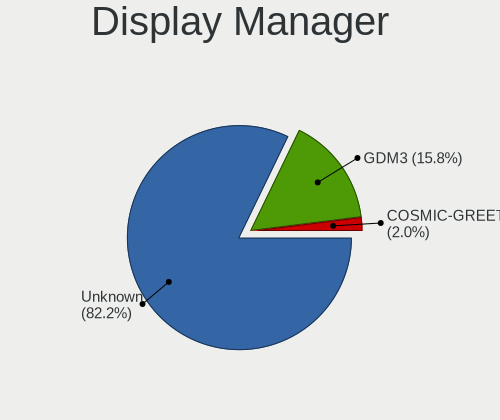
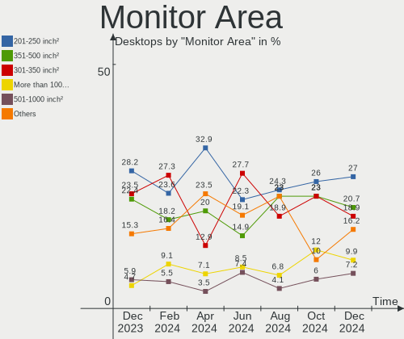

Pop!_OS - Hardware Trends (Desktops)
------------------------------------

A project to identify most popular hardware characteristics and track their change
over time based on data collected by Linux users at https://Linux-Hardware.org.

Anyone can contribute to this report by the [hw-probe](https://github.com/linuxhw/hw-probe) tool:

    sudo -E hw-probe -all -upload

This report is for one last month. Overall report since the beginning of time: [TestCoverage](https://github.com/linuxhw/TestCoverage)

Period: Aug, 2022.

Contents
--------

* [ System ](#system)
  - [ OS                       ](#os)
  - [ OS Family                ](#os-family)
  - [ Kernel                   ](#kernel)
  - [ Kernel Family            ](#kernel-family)
  - [ Kernel Major Ver.        ](#kernel-major-ver)
  - [ Arch                     ](#arch)
  - [ DE                       ](#de)
  - [ Display Server           ](#display-server)
  - [ Display Manager          ](#display-manager)
  - [ OS Lang                  ](#os-lang)
  - [ Boot Mode                ](#boot-mode)
  - [ Filesystem               ](#filesystem)
  - [ Part. scheme             ](#part-scheme)
  - [ Dual Boot with Linux/BSD ](#dual-boot-with-linuxbsd)
  - [ Dual Boot (Win)          ](#dual-boot-win)

* [ Board ](#board)
  - [ Vendor                   ](#vendor)
  - [ Model                    ](#model)
  - [ Model Family             ](#model-family)
  - [ MFG Year                 ](#mfg-year)
  - [ Form Factor              ](#form-factor)
  - [ Secure Boot              ](#secure-boot)
  - [ Coreboot                 ](#coreboot)
  - [ RAM Size                 ](#ram-size)
  - [ RAM Used                 ](#ram-used)
  - [ Total Drives             ](#total-drives)
  - [ Has CD-ROM               ](#has-cd-rom)
  - [ Has Ethernet             ](#has-ethernet)
  - [ Has WiFi                 ](#has-wifi)
  - [ Has Bluetooth            ](#has-bluetooth)

* [ Location ](#location)
  - [ Country                  ](#country)
  - [ City                     ](#city)

* [ Drives ](#drives)
  - [ Drive Vendor             ](#drive-vendor)
  - [ Drive Model              ](#drive-model)
  - [ HDD Vendor               ](#hdd-vendor)
  - [ SSD Vendor               ](#ssd-vendor)
  - [ Drive Kind               ](#drive-kind)
  - [ Drive Connector          ](#drive-connector)
  - [ Drive Size               ](#drive-size)
  - [ Space Total              ](#space-total)
  - [ Space Used               ](#space-used)
  - [ Malfunc. Drives          ](#malfunc-drives)
  - [ Malfunc. Drive Vendor    ](#malfunc-drive-vendor)
  - [ Malfunc. HDD Vendor      ](#malfunc-hdd-vendor)
  - [ Malfunc. Drive Kind      ](#malfunc-drive-kind)
  - [ Failed Drives            ](#failed-drives)
  - [ Failed Drive Vendor      ](#failed-drive-vendor)
  - [ Drive Status             ](#drive-status)

* [ Storage controller ](#storage-controller)
  - [ Storage Vendor           ](#storage-vendor)
  - [ Storage Model            ](#storage-model)
  - [ Storage Kind             ](#storage-kind)

* [ Processor ](#processor)
  - [ CPU Vendor               ](#cpu-vendor)
  - [ CPU Model                ](#cpu-model)
  - [ CPU Model Family         ](#cpu-model-family)
  - [ CPU Cores                ](#cpu-cores)
  - [ CPU Sockets              ](#cpu-sockets)
  - [ CPU Threads              ](#cpu-threads)
  - [ CPU Op-Modes             ](#cpu-op-modes)
  - [ CPU Microcode            ](#cpu-microcode)
  - [ CPU Microarch            ](#cpu-microarch)

* [ Graphics ](#graphics)
  - [ GPU Vendor               ](#gpu-vendor)
  - [ GPU Model                ](#gpu-model)
  - [ GPU Combo                ](#gpu-combo)
  - [ GPU Driver               ](#gpu-driver)
  - [ GPU Memory               ](#gpu-memory)

* [ Monitor ](#monitor)
  - [ Monitor Vendor           ](#monitor-vendor)
  - [ Monitor Model            ](#monitor-model)
  - [ Monitor Resolution       ](#monitor-resolution)
  - [ Monitor Diagonal         ](#monitor-diagonal)
  - [ Monitor Width            ](#monitor-width)
  - [ Aspect Ratio             ](#aspect-ratio)
  - [ Monitor Area             ](#monitor-area)
  - [ Pixel Density            ](#pixel-density)
  - [ Multiple Monitors        ](#multiple-monitors)

* [ Network ](#network)
  - [ Net Controller Vendor    ](#net-controller-vendor)
  - [ Net Controller Model     ](#net-controller-model)
  - [ Wireless Vendor          ](#wireless-vendor)
  - [ Wireless Model           ](#wireless-model)
  - [ Ethernet Vendor          ](#ethernet-vendor)
  - [ Ethernet Model           ](#ethernet-model)
  - [ Net Controller Kind      ](#net-controller-kind)
  - [ Used Controller          ](#used-controller)
  - [ NICs                     ](#nics)
  - [ IPv6                     ](#ipv6)

* [ Bluetooth ](#bluetooth)
  - [ Bluetooth Vendor         ](#bluetooth-vendor)
  - [ Bluetooth Model          ](#bluetooth-model)

* [ Sound ](#sound)
  - [ Sound Vendor             ](#sound-vendor)
  - [ Sound Model              ](#sound-model)

* [ Memory ](#memory)
  - [ Memory Vendor            ](#memory-vendor)
  - [ Memory Model             ](#memory-model)
  - [ Memory Kind              ](#memory-kind)
  - [ Memory Form Factor       ](#memory-form-factor)
  - [ Memory Size              ](#memory-size)
  - [ Memory Speed             ](#memory-speed)

* [ Printers & scanners ](#printers--scanners)
  - [ Printer Vendor           ](#printer-vendor)
  - [ Printer Model            ](#printer-model)
  - [ Scanner Vendor           ](#scanner-vendor)
  - [ Scanner Model            ](#scanner-model)

* [ Camera ](#camera)
  - [ Camera Vendor            ](#camera-vendor)
  - [ Camera Model             ](#camera-model)

* [ Security ](#security)
  - [ Fingerprint Vendor       ](#fingerprint-vendor)
  - [ Fingerprint Model        ](#fingerprint-model)
  - [ Chipcard Vendor          ](#chipcard-vendor)
  - [ Chipcard Model           ](#chipcard-model)

* [ Unsupported ](#unsupported)
  - [ Unsupported Devices      ](#unsupported-devices)
  - [ Unsupported Device Types ](#unsupported-device-types)

System
------

OS
--

Installed operating systems

| Name          | Desktops | Percent |
|---------------|----------|---------|
| Pop!_OS 22.04 | 69       | 95.83%  |
| Pop!_OS 21.10 | 2        | 2.78%   |
| Pop!_OS 20.04 | 1        | 1.39%   |

OS Family
---------

OS without a version

| Name    | Desktops | Percent |
|---------|----------|---------|
| Pop!_OS | 72       | 100%    |

Kernel
------

Version of the Linux kernel

| Version                  | Desktops | Percent |
|--------------------------|----------|---------|
| 5.18.10-76051810-generic | 45       | 62.5%   |
| 5.19.0-76051900-generic  | 22       | 30.56%  |
| 5.17.15-76051715-generic | 3        | 4.17%   |
| 5.17.5-76051705-generic  | 2        | 2.78%   |

Kernel Family
-------------

Linux kernel without a distro release

| Version | Desktops | Percent |
|---------|----------|---------|
| 5.18.10 | 45       | 62.5%   |
| 5.19.0  | 22       | 30.56%  |
| 5.17.15 | 3        | 4.17%   |
| 5.17.5  | 2        | 2.78%   |

Kernel Major Ver.
-----------------

Linux kernel major version

| Version | Desktops | Percent |
|---------|----------|---------|
| 5.18    | 45       | 62.5%   |
| 5.19    | 22       | 30.56%  |
| 5.17    | 5        | 6.94%   |

Arch
----

OS architecture (x86_64, i586, etc.)

| Name   | Desktops | Percent |
|--------|----------|---------|
| x86_64 | 72       | 100%    |

DE
--

Desktop Environment

| Name       | Desktops | Percent |
|------------|----------|---------|
| GNOME      | 65       | 90.28%  |
| KDE5       | 5        | 6.94%   |
| X-Cinnamon | 1        | 1.39%   |
| Cinnamon   | 1        | 1.39%   |

Display Server
--------------

X11 or Wayland

| Name    | Desktops | Percent |
|---------|----------|---------|
| X11     | 71       | 98.61%  |
| Wayland | 1        | 1.39%   |

Display Manager
---------------

SDDM, LightDM, etc.

| Name    | Desktops | Percent |
|---------|----------|---------|
| Unknown | 63       | 87.5%   |
| GDM3    | 8        | 11.11%  |
| SDDM    | 1        | 1.39%   |

OS Lang
-------

Language

| Lang  | Desktops | Percent |
|-------|----------|---------|
| en_US | 45       | 62.5%   |
| de_DE | 5        | 6.94%   |
| C     | 4        | 5.56%   |
| en_AU | 3        | 4.17%   |
| pt_BR | 2        | 2.78%   |
| fr_FR | 2        | 2.78%   |
| es_ES | 2        | 2.78%   |
| en_GB | 2        | 2.78%   |
| pl_PL | 1        | 1.39%   |
| nb_NO | 1        | 1.39%   |
| ja_JP | 1        | 1.39%   |
| es_CL | 1        | 1.39%   |
| en_IN | 1        | 1.39%   |
| en_FI | 1        | 1.39%   |
| en_CA | 1        | 1.39%   |

Boot Mode
---------

EFI or BIOS

| Mode | Desktops | Percent |
|------|----------|---------|
| BIOS | 66       | 91.67%  |
| EFI  | 6        | 8.33%   |

Filesystem
----------

Type of filesystem

| Type    | Desktops | Percent |
|---------|----------|---------|
| Ext4    | 68       | 94.44%  |
| Overlay | 3        | 4.17%   |
| Btrfs   | 1        | 1.39%   |

Part. scheme
------------

Scheme of partitioning

| Type    | Desktops | Percent |
|---------|----------|---------|
| Unknown | 63       | 87.5%   |
| GPT     | 6        | 8.33%   |
| MBR     | 3        | 4.17%   |

Dual Boot with Linux/BSD
------------------------

Hosting more than one Linux/BSD

| Dual boot | Desktops | Percent |
|-----------|----------|---------|
| No        | 71       | 98.61%  |
| Yes       | 1        | 1.39%   |

Dual Boot (Win)
---------------

Hosting Linux and Windows

| Dual boot | Desktops | Percent |
|-----------|----------|---------|
| No        | 67       | 93.06%  |
| Yes       | 5        | 6.94%   |

Board
-----

Vendor
------

Motherboard manufacturer

| Name                | Desktops | Percent |
|---------------------|----------|---------|
| ASUSTek Computer    | 18       | 25%     |
| Gigabyte Technology | 14       | 19.44%  |
| MSI                 | 13       | 18.06%  |
| Hewlett-Packard     | 7        | 9.72%   |
| ASRock              | 6        | 8.33%   |
| Lenovo              | 3        | 4.17%   |
| Intel               | 3        | 4.17%   |
| BESSTAR Tech        | 2        | 2.78%   |
| Acer                | 2        | 2.78%   |
| System76            | 1        | 1.39%   |
| Dell                | 1        | 1.39%   |
| Acidanthera         | 1        | 1.39%   |
| Unknown             | 1        | 1.39%   |

Model
-----

Motherboard model

| Name                                    | Desktops | Percent |
|-----------------------------------------|----------|---------|
| BESSTAR Tech UM700                      | 2        | 2.78%   |
| ASUS TUF Gaming B550-PLUS               | 2        | 2.78%   |
| ASUS ROG STRIX B550-F GAMING            | 2        | 2.78%   |
| ASUS All Series                         | 2        | 2.78%   |
| System76 Thelio                         | 1        | 1.39%   |
| MSI MS-7D54                             | 1        | 1.39%   |
| MSI MS-7D25                             | 1        | 1.39%   |
| MSI MS-7C91                             | 1        | 1.39%   |
| MSI MS-7C02                             | 1        | 1.39%   |
| MSI MS-7B89                             | 1        | 1.39%   |
| MSI MS-7B86                             | 1        | 1.39%   |
| MSI MS-7B22                             | 1        | 1.39%   |
| MSI MS-7A32                             | 1        | 1.39%   |
| MSI MS-7A15                             | 1        | 1.39%   |
| MSI MS-7971                             | 1        | 1.39%   |
| MSI MS-7821                             | 1        | 1.39%   |
| MSI MS-7721                             | 1        | 1.39%   |
| MSI MS-7693                             | 1        | 1.39%   |
| Lenovo ThinkCentre M82 2756BH7          | 1        | 1.39%   |
| Lenovo IdeaCentre G5 14IMB05 90N9000AMW | 1        | 1.39%   |
| Lenovo Erazer X315 90B00002US           | 1        | 1.39%   |
| Intel DQ35JO AAD82085-801               | 1        | 1.39%   |
| Intel DP55WB AAE64798-208               | 1        | 1.39%   |
| Intel D955XBK AAC96732-501              | 1        | 1.39%   |
| HP EliteDesk 800 G2 SFF                 | 1        | 1.39%   |
| HP EliteDesk 800 G1 SFF                 | 1        | 1.39%   |
| HP EliteDesk 705 G1 SFF                 | 1        | 1.39%   |
| HP Compaq Pro 6305 SFF                  | 1        | 1.39%   |
| HP Compaq Elite 8300 SFF                | 1        | 1.39%   |
| HP Compaq 8000 Elite CMT PC             | 1        | 1.39%   |
| HP Compaq 6200 Pro SFF PC               | 1        | 1.39%   |
| Gigabyte Z77X-UD5H                      | 1        | 1.39%   |
| Gigabyte X299 AORUS MASTER              | 1        | 1.39%   |
| Gigabyte M68MT-S2P                      | 1        | 1.39%   |
| Gigabyte H97N-WIFI                      | 1        | 1.39%   |
| Gigabyte H67A-USB3-B3                   | 1        | 1.39%   |
| Gigabyte GA-MA770T-UD3P                 | 1        | 1.39%   |
| Gigabyte GA-A55M-DS2                    | 1        | 1.39%   |
| Gigabyte B550M DS3H                     | 1        | 1.39%   |
| Gigabyte B450M DS3H WIFI                | 1        | 1.39%   |
| Gigabyte B450M DS3H                     | 1        | 1.39%   |
| Gigabyte B450 I AORUS PRO WIFI          | 1        | 1.39%   |
| Gigabyte B450 AORUS ELITE               | 1        | 1.39%   |
| Gigabyte B360 AORUS GAMING 3 WIFI       | 1        | 1.39%   |
| Gigabyte AX370-Gaming K7                | 1        | 1.39%   |
| Dell XPS 8700                           | 1        | 1.39%   |
| ASUS TUF B450M-PLUS GAMING              | 1        | 1.39%   |
| ASUS ROG STRIX Z690-A GAMING WIFI D4    | 1        | 1.39%   |
| ASUS ROG STRIX X299-E GAMING            | 1        | 1.39%   |
| ASUS ROG STRIX B550-I GAMING            | 1        | 1.39%   |
| ASUS ROG STRIX B550-A GAMING            | 1        | 1.39%   |
| ASUS PRIME B550M-A                      | 1        | 1.39%   |
| ASUS PRIME B450M-A                      | 1        | 1.39%   |
| ASUS P8Z77-V LK                         | 1        | 1.39%   |
| ASUS P6X58D PREMIUM                     | 1        | 1.39%   |
| ASUS M5A78L-M/USB3                      | 1        | 1.39%   |
| ASUS Leopard Extreme                    | 1        | 1.39%   |
| ASUS B150M-C/BR                         | 1        | 1.39%   |
| ASRock X570 Creator                     | 1        | 1.39%   |
| ASRock X470 Taichi                      | 1        | 1.39%   |

Model Family
------------

Motherboard model prefix

| Name                    | Desktops | Percent |
|-------------------------|----------|---------|
| ASUS ROG                | 6        | 8.33%   |
| HP Compaq               | 4        | 5.56%   |
| HP EliteDesk            | 3        | 4.17%   |
| ASUS TUF                | 3        | 4.17%   |
| Gigabyte B450M          | 2        | 2.78%   |
| Gigabyte B450           | 2        | 2.78%   |
| BESSTAR Tech UM700      | 2        | 2.78%   |
| ASUS PRIME              | 2        | 2.78%   |
| ASUS All                | 2        | 2.78%   |
| System76 Thelio         | 1        | 1.39%   |
| MSI MS-7D54             | 1        | 1.39%   |
| MSI MS-7D25             | 1        | 1.39%   |
| MSI MS-7C91             | 1        | 1.39%   |
| MSI MS-7C02             | 1        | 1.39%   |
| MSI MS-7B89             | 1        | 1.39%   |
| MSI MS-7B86             | 1        | 1.39%   |
| MSI MS-7B22             | 1        | 1.39%   |
| MSI MS-7A32             | 1        | 1.39%   |
| MSI MS-7A15             | 1        | 1.39%   |
| MSI MS-7971             | 1        | 1.39%   |
| MSI MS-7821             | 1        | 1.39%   |
| MSI MS-7721             | 1        | 1.39%   |
| MSI MS-7693             | 1        | 1.39%   |
| Lenovo ThinkCentre      | 1        | 1.39%   |
| Lenovo IdeaCentre       | 1        | 1.39%   |
| Lenovo Erazer           | 1        | 1.39%   |
| Intel DQ35JO            | 1        | 1.39%   |
| Intel DP55WB            | 1        | 1.39%   |
| Intel D955XBK           | 1        | 1.39%   |
| Gigabyte Z77X-UD5H      | 1        | 1.39%   |
| Gigabyte X299           | 1        | 1.39%   |
| Gigabyte M68MT-S2P      | 1        | 1.39%   |
| Gigabyte H97N-WIFI      | 1        | 1.39%   |
| Gigabyte H67A-USB3-B3   | 1        | 1.39%   |
| Gigabyte GA-MA770T-UD3P | 1        | 1.39%   |
| Gigabyte GA-A55M-DS2    | 1        | 1.39%   |
| Gigabyte B550M          | 1        | 1.39%   |
| Gigabyte B360           | 1        | 1.39%   |
| Gigabyte AX370-Gaming   | 1        | 1.39%   |
| Dell XPS                | 1        | 1.39%   |
| ASUS P8Z77-V            | 1        | 1.39%   |
| ASUS P6X58D             | 1        | 1.39%   |
| ASUS M5A78L-M           | 1        | 1.39%   |
| ASUS Leopard            | 1        | 1.39%   |
| ASUS B150M-C            | 1        | 1.39%   |
| ASRock X570             | 1        | 1.39%   |
| ASRock X470             | 1        | 1.39%   |
| ASRock X370             | 1        | 1.39%   |
| ASRock B660-ITX         | 1        | 1.39%   |
| ASRock B450M            | 1        | 1.39%   |
| ASRock A320M            | 1        | 1.39%   |
| Acidanthera MacPro6     | 1        | 1.39%   |
| Acer Predator           | 1        | 1.39%   |
| Acer Aspire             | 1        | 1.39%   |
| Unknown                 | 1        | 1.39%   |

MFG Year
--------

Motherboard manufacture year

| Year | Desktops | Percent |
|------|----------|---------|
| 2020 | 14       | 19.44%  |
| 2018 | 11       | 15.28%  |
| 2012 | 7        | 9.72%   |
| 2021 | 6        | 8.33%   |
| 2014 | 5        | 6.94%   |
| 2013 | 5        | 6.94%   |
| 2017 | 4        | 5.56%   |
| 2011 | 4        | 5.56%   |
| 2019 | 3        | 4.17%   |
| 2010 | 3        | 4.17%   |
| 2022 | 2        | 2.78%   |
| 2016 | 2        | 2.78%   |
| 2015 | 2        | 2.78%   |
| 2009 | 2        | 2.78%   |
| 2007 | 2        | 2.78%   |

Form Factor
-----------

Physical design of the computer

| Name    | Desktops | Percent |
|---------|----------|---------|
| Desktop | 72       | 100%    |

Secure Boot
-----------

Enabled or disabled

| State    | Desktops | Percent |
|----------|----------|---------|
| Disabled | 72       | 100%    |

Coreboot
--------

Have coreboot on board

| Used | Desktops | Percent |
|------|----------|---------|
| No   | 72       | 100%    |

RAM Size
--------

Total RAM memory

| Size in GB  | Desktops | Percent |
|-------------|----------|---------|
| 16.01-24.0  | 30       | 41.67%  |
| 8.01-16.0   | 19       | 26.39%  |
| 32.01-64.0  | 12       | 16.67%  |
| 4.01-8.0    | 5        | 6.94%   |
| 64.01-256.0 | 4        | 5.56%   |
| 3.01-4.0    | 1        | 1.39%   |
| 2.01-3.0    | 1        | 1.39%   |

RAM Used
--------

Used RAM memory

| Used GB   | Desktops | Percent |
|-----------|----------|---------|
| 2.01-3.0  | 19       | 26.39%  |
| 3.01-4.0  | 18       | 25%     |
| 4.01-8.0  | 16       | 22.22%  |
| 1.01-2.0  | 12       | 16.67%  |
| 8.01-16.0 | 7        | 9.72%   |

Total Drives
------------

Number of drives on board

| Drives | Desktops | Percent |
|--------|----------|---------|
| 2      | 23       | 31.94%  |
| 1      | 21       | 29.17%  |
| 3      | 15       | 20.83%  |
| 4      | 5        | 6.94%   |
| 5      | 4        | 5.56%   |
| 7      | 2        | 2.78%   |
| 6      | 2        | 2.78%   |

Has CD-ROM
----------

Has CD-ROM on board

| Presented | Desktops | Percent |
|-----------|----------|---------|
| No        | 50       | 69.44%  |
| Yes       | 22       | 30.56%  |

Has Ethernet
------------

Has Ethernet on board

| Presented | Desktops | Percent |
|-----------|----------|---------|
| Yes       | 72       | 100%    |

Has WiFi
--------

Has WiFi module

| Presented | Desktops | Percent |
|-----------|----------|---------|
| Yes       | 44       | 61.11%  |
| No        | 28       | 38.89%  |

Has Bluetooth
-------------

Has Bluetooth module

| Presented | Desktops | Percent |
|-----------|----------|---------|
| No        | 43       | 59.72%  |
| Yes       | 29       | 40.28%  |

Location
--------

Country
-------

Geographic location (country)

| Country     | Desktops | Percent |
|-------------|----------|---------|
| USA         | 32       | 44.44%  |
| Germany     | 7        | 9.72%   |
| Brazil      | 4        | 5.56%   |
| UK          | 3        | 4.17%   |
| Norway      | 3        | 4.17%   |
| Australia   | 3        | 4.17%   |
| Spain       | 2        | 2.78%   |
| Romania     | 2        | 2.78%   |
| Netherlands | 2        | 2.78%   |
| France      | 2        | 2.78%   |
| Canada      | 2        | 2.78%   |
| Slovenia    | 1        | 1.39%   |
| Poland      | 1        | 1.39%   |
| Philippines | 1        | 1.39%   |
| Japan       | 1        | 1.39%   |
| Indonesia   | 1        | 1.39%   |
| India       | 1        | 1.39%   |
| Finland     | 1        | 1.39%   |
| Chile       | 1        | 1.39%   |
| Belgium     | 1        | 1.39%   |
| Austria     | 1        | 1.39%   |

City
----

Geographic location (city)

| City                | Desktops | Percent |
|---------------------|----------|---------|
| Seattle             | 2        | 2.78%   |
| Berlin              | 2        | 2.78%   |
| Weimar              | 1        | 1.39%   |
| Valparaiso de Goias | 1        | 1.39%   |
| Trondheim           | 1        | 1.39%   |
| Tasikmalaya         | 1        | 1.39%   |
| Tanza               | 1        | 1.39%   |
| Tacoma              | 1        | 1.39%   |
| Sydney              | 1        | 1.39%   |
| Spring              | 1        | 1.39%   |
| Speyer              | 1        | 1.39%   |
| Sostanj             | 1        | 1.39%   |
| Santiago            | 1        | 1.39%   |
| San Gabriel         | 1        | 1.39%   |
| San Francisco       | 1        | 1.39%   |
| Riverside           | 1        | 1.39%   |
| Rio de Janeiro      | 1        | 1.39%   |
| Rattelsdorf         | 1        | 1.39%   |
| Queens              | 1        | 1.39%   |
| Porto Alegre        | 1        | 1.39%   |
| Portland            | 1        | 1.39%   |
| Pleasant Hill       | 1        | 1.39%   |
| Pine Grove          | 1        | 1.39%   |
| Peterlee            | 1        | 1.39%   |
| Perth               | 1        | 1.39%   |
| Peabody             | 1        | 1.39%   |
| Palowice            | 1        | 1.39%   |
| Palo Alto           | 1        | 1.39%   |
| Niort               | 1        | 1.39%   |
| Newport             | 1        | 1.39%   |
| New Braunfels       | 1        | 1.39%   |
| Minneapolis         | 1        | 1.39%   |
| Minato-ku           | 1        | 1.39%   |
| Michigan City       | 1        | 1.39%   |
| Melbourne           | 1        | 1.39%   |
| Madrid              | 1        | 1.39%   |
| Ludwigsburg         | 1        | 1.39%   |
| Long Beach          | 1        | 1.39%   |
| London              | 1        | 1.39%   |
| Lommel              | 1        | 1.39%   |
| Liverpool           | 1        | 1.39%   |
| Liévin             | 1        | 1.39%   |
| Kolkata             | 1        | 1.39%   |
| Helsinki            | 1        | 1.39%   |
| Heimdal             | 1        | 1.39%   |
| Heide               | 1        | 1.39%   |
| Hazerswoude-Dorp    | 1        | 1.39%   |
| Halifax             | 1        | 1.39%   |
| Great Neck          | 1        | 1.39%   |
| Graz                | 1        | 1.39%   |
| Grand Junction      | 1        | 1.39%   |
| Giroc               | 1        | 1.39%   |
| Fresno              | 1        | 1.39%   |
| Frankfurt am Main   | 1        | 1.39%   |
| Everson             | 1        | 1.39%   |
| Everett             | 1        | 1.39%   |
| Erlanger            | 1        | 1.39%   |
| Danville            | 1        | 1.39%   |
| Craiova             | 1        | 1.39%   |
| Collingswood        | 1        | 1.39%   |

Drives
------

Drive Vendor
------------

Hard drive vendors

| Vendor                    | Desktops | Drives | Percent |
|---------------------------|----------|--------|---------|
| Samsung Electronics       | 29       | 43     | 20.42%  |
| WDC                       | 28       | 36     | 19.72%  |
| Seagate                   | 19       | 26     | 13.38%  |
| Crucial                   | 12       | 14     | 8.45%   |
| SanDisk                   | 8        | 9      | 5.63%   |
| Toshiba                   | 7        | 8      | 4.93%   |
| Kingston                  | 6        | 7      | 4.23%   |
| PNY                       | 5        | 6      | 3.52%   |
| China                     | 4        | 4      | 2.82%   |
| Phison                    | 3        | 3      | 2.11%   |
| OCZ                       | 2        | 2      | 1.41%   |
| Micron/Crucial Technology | 2        | 2      | 1.41%   |
| Intel                     | 2        | 2      | 1.41%   |
| Hitachi                   | 2        | 2      | 1.41%   |
| A-DATA Technology         | 2        | 2      | 1.41%   |
| WALRAM                    | 1        | 1      | 0.7%    |
| Unknown                   | 1        | 2      | 0.7%    |
| SPCC                      | 1        | 1      | 0.7%    |
| Silicon Motion            | 1        | 1      | 0.7%    |
| Plextor                   | 1        | 1      | 0.7%    |
| Patriot                   | 1        | 1      | 0.7%    |
| Maxtor                    | 1        | 1      | 0.7%    |
| LITEON                    | 1        | 1      | 0.7%    |
| KXG60ZNV                  | 1        | 1      | 0.7%    |
| KingFast                  | 1        | 1      | 0.7%    |
| HGST                      | 1        | 1      | 0.7%    |

Drive Model
-----------

Hard drive models

| Model                             | Desktops | Percent |
|-----------------------------------|----------|---------|
| Samsung NVMe SSD Drive 1TB        | 6        | 3.51%   |
| Seagate ST1000DM003-1ER162 1TB    | 3        | 1.75%   |
| Samsung SSD 860 EVO 1TB           | 3        | 1.75%   |
| Samsung SSD 850 EVO 500GB         | 3        | 1.75%   |
| Samsung NVMe SSD Drive 2TB        | 3        | 1.75%   |
| PNY CS900 500GB SSD               | 3        | 1.75%   |
| Crucial CT1000BX500SSD1 1TB       | 3        | 1.75%   |
| WDC WDS500G2B0A-00SM50 500GB SSD  | 2        | 1.17%   |
| Toshiba DT01ACA050 500GB          | 2        | 1.17%   |
| Seagate ST2000DM008-2FR102 2TB    | 2        | 1.17%   |
| Seagate ST1000DM010-2EP102 1TB    | 2        | 1.17%   |
| Seagate ST1000DM003-1CH162 1TB    | 2        | 1.17%   |
| SanDisk NVMe SSD Drive 500GB      | 2        | 1.17%   |
| Samsung SSD 870 EVO 250GB         | 2        | 1.17%   |
| Samsung SSD 860 EVO 500GB         | 2        | 1.17%   |
| Micron/Crucial NVMe SSD Drive 1TB | 2        | 1.17%   |
| Kingston SA400S37240G 240GB SSD   | 2        | 1.17%   |
| Kingston SA400S37120G 120GB SSD   | 2        | 1.17%   |
| Kingston NVMe SSD Drive 512GB     | 2        | 1.17%   |
| WDC WDS250G2B0B-00YS70 250GB SSD  | 1        | 0.58%   |
| WDC WDS120G2G0A-00JH30 120GB SSD  | 1        | 0.58%   |
| WDC WDBNCE5000PNC 500GB SSD       | 1        | 0.58%   |
| WDC WD80EDAZ-11TA3A0 8TB          | 1        | 0.58%   |
| WDC WD8003FRYZ-01JPDB1 8TB        | 1        | 0.58%   |
| WDC WD7500AALX-009BA0 752GB       | 1        | 0.58%   |
| WDC WD5003ABYX-01WERA0 500GB      | 1        | 0.58%   |
| WDC WD5000BEVT-22ZAT0 500GB       | 1        | 0.58%   |
| WDC WD5000AAKX-753CA1 500GB       | 1        | 0.58%   |
| WDC WD5000AAKX-08U6AA0 500GB      | 1        | 0.58%   |
| WDC WD5000AAKX-00ERMA0 500GB      | 1        | 0.58%   |
| WDC WD5000AAKS-41H2B0 500GB       | 1        | 0.58%   |
| WDC WD4005FZBX-00K5WB0 4TB        | 1        | 0.58%   |
| WDC WD4000FYYZ-01UL1B0 4TB        | 1        | 0.58%   |
| WDC WD3200BEVT-60A23T0 320GB      | 1        | 0.58%   |
| WDC WD3200BEVT-11ZCT0 320GB       | 1        | 0.58%   |
| WDC WD3200AAKS-75VYA0 320GB       | 1        | 0.58%   |
| WDC WD20EZRZ-00Z5HB0 2TB          | 1        | 0.58%   |
| WDC WD20EZAZ-22L9GB0 2TB          | 1        | 0.58%   |
| WDC WD20EZAZ-00GGJB0 2TB          | 1        | 0.58%   |
| WDC WD20EFRX-68AX9N0 2TB          | 1        | 0.58%   |
| WDC WD2003FYYS-02W0B0 2TB         | 1        | 0.58%   |
| WDC WD15EARS-22MVWB0 1TB          | 1        | 0.58%   |
| WDC WD10EZRX-00L4HB0 1TB          | 1        | 0.58%   |
| WDC WD10EZEX-08WN4A0 1TB          | 1        | 0.58%   |
| WDC WD10EZEX-08M2NA0 1TB          | 1        | 0.58%   |
| WDC WD10EZEX-00WN4A0 1TB          | 1        | 0.58%   |
| WDC WD10EZEX-00RKKA0 1TB          | 1        | 0.58%   |
| WDC WD10EZEX-00M2NA0 1TB          | 1        | 0.58%   |
| WDC WD10EZEX-00BN5A0 1TB          | 1        | 0.58%   |
| WDC WD10EARS-22Y5B1 1TB           | 1        | 0.58%   |
| WDC WD10EADS-00L5B1 1TB           | 1        | 0.58%   |
| WDC WD1000FYPS-01ZKB0 1TB         | 1        | 0.58%   |
| WALRAM 128G                       | 1        | 0.58%   |
| Unknown SD/MMC 16GB               | 1        | 0.58%   |
| Unknown M.S./M.S.Pro/HG 16GB      | 1        | 0.58%   |
| Toshiba THNSNF128GCSS 128GB SSD   | 1        | 0.58%   |
| Toshiba MQ01ABD100 1TB            | 1        | 0.58%   |
| Toshiba MK6459GSXP 640GB          | 1        | 0.58%   |
| Toshiba MK3263GSX 320GB           | 1        | 0.58%   |
| Toshiba HDWD110 1TB               | 1        | 0.58%   |

HDD Vendor
----------

Hard disk drive vendors

| Vendor              | Desktops | Drives | Percent |
|---------------------|----------|--------|---------|
| WDC                 | 26       | 31     | 46.43%  |
| Seagate             | 17       | 23     | 30.36%  |
| Toshiba             | 6        | 7      | 10.71%  |
| Samsung Electronics | 3        | 4      | 5.36%   |
| Hitachi             | 2        | 2      | 3.57%   |
| Maxtor              | 1        | 1      | 1.79%   |
| HGST                | 1        | 1      | 1.79%   |

SSD Vendor
----------

Solid state drive vendors

| Vendor              | Desktops | Drives | Percent |
|---------------------|----------|--------|---------|
| Samsung Electronics | 17       | 23     | 28.81%  |
| Crucial             | 11       | 13     | 18.64%  |
| WDC                 | 5        | 5      | 8.47%   |
| PNY                 | 5        | 6      | 8.47%   |
| Kingston            | 5        | 5      | 8.47%   |
| SanDisk             | 3        | 3      | 5.08%   |
| China               | 3        | 3      | 5.08%   |
| OCZ                 | 2        | 2      | 3.39%   |
| Intel               | 2        | 2      | 3.39%   |
| A-DATA Technology   | 2        | 2      | 3.39%   |
| Toshiba             | 1        | 1      | 1.69%   |
| Plextor             | 1        | 1      | 1.69%   |
| Patriot             | 1        | 1      | 1.69%   |
| LITEON              | 1        | 1      | 1.69%   |

Drive Kind
----------

HDD or SSD

| Kind    | Desktops | Drives | Percent |
|---------|----------|--------|---------|
| SSD     | 49       | 68     | 38.89%  |
| HDD     | 45       | 69     | 35.71%  |
| NVMe    | 26       | 33     | 20.63%  |
| Unknown | 6        | 8      | 4.76%   |

Drive Connector
---------------

SATA, SAS, NVMe, etc.

| Type | Desktops | Drives | Percent |
|------|----------|--------|---------|
| SATA | 67       | 137    | 68.37%  |
| NVMe | 26       | 33     | 26.53%  |
| SAS  | 5        | 8      | 5.1%    |

Drive Size
----------

Size of hard drive

| Size in TB | Desktops | Drives | Percent |
|------------|----------|--------|---------|
| 0.01-0.5   | 48       | 71     | 47.06%  |
| 0.51-1.0   | 31       | 40     | 30.39%  |
| 1.01-2.0   | 13       | 13     | 12.75%  |
| 3.01-4.0   | 7        | 9      | 6.86%   |
| 4.01-10.0  | 3        | 4      | 2.94%   |

Space Total
-----------

Amount of disk space available on the file system

| Size in GB     | Desktops | Percent |
|----------------|----------|---------|
| 501-1000       | 20       | 27.78%  |
| 101-250        | 13       | 18.06%  |
| 251-500        | 11       | 15.28%  |
| 1001-2000      | 11       | 15.28%  |
| More than 3000 | 7        | 9.72%   |
| 2001-3000      | 7        | 9.72%   |
| 51-100         | 2        | 2.78%   |
| 1-20           | 1        | 1.39%   |

Space Used
----------

Amount of used disk space

| Used GB        | Desktops | Percent |
|----------------|----------|---------|
| 1-20           | 17       | 23.61%  |
| 21-50          | 11       | 15.28%  |
| 101-250        | 11       | 15.28%  |
| 51-100         | 9        | 12.5%   |
| 501-1000       | 8        | 11.11%  |
| 251-500        | 7        | 9.72%   |
| 1001-2000      | 5        | 6.94%   |
| More than 3000 | 3        | 4.17%   |
| 2001-3000      | 1        | 1.39%   |

Malfunc. Drives
---------------

Drive models with a malfunction

| Model                                        | Desktops | Drives | Percent |
|----------------------------------------------|----------|--------|---------|
| WDC WD20EFRX-68AX9N0 2TB                     | 1        | 1      | 16.67%  |
| Seagate ST320LM001 HN-M320MBB 320GB          | 1        | 1      | 16.67%  |
| Seagate ST2000DM006-2DM164 2TB               | 1        | 1      | 16.67%  |
| Samsung Electronics SSD 840 PRO Series 512GB | 1        | 1      | 16.67%  |
| Samsung Electronics HD103SI 1TB              | 1        | 1      | 16.67%  |
| Plextor PX-128M6M 128GB SSD                  | 1        | 1      | 16.67%  |

Malfunc. Drive Vendor
---------------------

Vendors of faulty drives

| Vendor              | Desktops | Drives | Percent |
|---------------------|----------|--------|---------|
| Samsung Electronics | 2        | 2      | 40%     |
| WDC                 | 1        | 1      | 20%     |
| Seagate             | 1        | 2      | 20%     |
| Plextor             | 1        | 1      | 20%     |

Malfunc. HDD Vendor
-------------------

Vendors of faulty HDD drives

| Vendor              | Desktops | Drives | Percent |
|---------------------|----------|--------|---------|
| WDC                 | 1        | 1      | 33.33%  |
| Seagate             | 1        | 2      | 33.33%  |
| Samsung Electronics | 1        | 1      | 33.33%  |

Malfunc. Drive Kind
-------------------

Kinds of faulty drives

| Kind | Desktops | Drives | Percent |
|------|----------|--------|---------|
| HDD  | 3        | 4      | 60%     |
| SSD  | 2        | 2      | 40%     |

Failed Drives
-------------

Failed drive models

Zero info for selected period =(

Failed Drive Vendor
-------------------

Failed drive vendors

Zero info for selected period =(

Drive Status
------------

Number of failed and malfunc. drives

| Status   | Desktops | Drives | Percent |
|----------|----------|--------|---------|
| Detected | 66       | 152    | 82.5%   |
| Works    | 10       | 20     | 12.5%   |
| Malfunc  | 4        | 6      | 5%      |

Storage controller
------------------

Storage Vendor
--------------

Storage controller vendors

| Vendor                      | Desktops | Percent |
|-----------------------------|----------|---------|
| AMD                         | 37       | 33.33%  |
| Intel                       | 33       | 29.73%  |
| Samsung Electronics         | 15       | 13.51%  |
| SanDisk                     | 5        | 4.5%    |
| Phison Electronics          | 4        | 3.6%    |
| ASMedia Technology          | 4        | 3.6%    |
| Micron/Crucial Technology   | 3        | 2.7%    |
| Marvell Technology Group    | 3        | 2.7%    |
| Nvidia                      | 2        | 1.8%    |
| Kingston Technology Company | 2        | 1.8%    |
| Silicon Motion              | 1        | 0.9%    |
| Silicon Image               | 1        | 0.9%    |
| Seagate Technology          | 1        | 0.9%    |

Storage Model
-------------

Storage controller models

| Model                                                                                   | Desktops | Percent |
|-----------------------------------------------------------------------------------------|----------|---------|
| AMD FCH SATA Controller [AHCI mode]                                                     | 21       | 15.56%  |
| AMD 400 Series Chipset SATA Controller                                                  | 11       | 8.15%   |
| AMD 500 Series Chipset SATA Controller                                                  | 9        | 6.67%   |
| Samsung NVMe SSD Controller SM981/PM981/PM983                                           | 8        | 5.93%   |
| Samsung NVMe SSD Controller PM9A1/PM9A3/980PRO                                          | 5        | 3.7%    |
| SanDisk WD Blue SN550 NVMe SSD                                                          | 4        | 2.96%   |
| Intel Q170/Q150/B150/H170/H110/Z170/CM236 Chipset SATA Controller [AHCI Mode]           | 4        | 2.96%   |
| Intel 8 Series/C220 Series Chipset Family 6-port SATA Controller 1 [AHCI mode]          | 4        | 2.96%   |
| Intel 7 Series/C210 Series Chipset Family 6-port SATA Controller [AHCI mode]            | 4        | 2.96%   |
| ASMedia ASM1062 Serial ATA Controller                                                   | 4        | 2.96%   |
| Intel Alder Lake-S PCH SATA Controller [AHCI Mode]                                      | 3        | 2.22%   |
| AMD X370 Series Chipset SATA Controller                                                 | 3        | 2.22%   |
| AMD SB7x0/SB8x0/SB9x0 SATA Controller [AHCI mode]                                       | 3        | 2.22%   |
| Samsung NVMe SSD Controller 980                                                         | 2        | 1.48%   |
| Phison E12 NVMe Controller                                                              | 2        | 1.48%   |
| Micron/Crucial P2 NVMe PCIe SSD                                                         | 2        | 1.48%   |
| Kingston Company OM3PDP3 NVMe SSD                                                       | 2        | 1.48%   |
| Intel SATA Controller [RAID mode]                                                       | 2        | 1.48%   |
| Intel Cannon Lake PCH SATA AHCI Controller                                              | 2        | 1.48%   |
| Intel 9 Series Chipset Family SATA Controller [AHCI Mode]                               | 2        | 1.48%   |
| Intel 6 Series/C200 Series Chipset Family 6 port Desktop SATA AHCI Controller           | 2        | 1.48%   |
| Intel 200 Series PCH SATA controller [AHCI mode]                                        | 2        | 1.48%   |
| AMD SB7x0/SB8x0/SB9x0 IDE Controller                                                    | 2        | 1.48%   |
| Silicon Motion SM2263EN/SM2263XT SSD Controller                                         | 1        | 0.74%   |
| Silicon Image SiI 3114 [SATALink/SATARaid] Serial ATA Controller                        | 1        | 0.74%   |
| Seagate FireCuda 530 SSD                                                                | 1        | 0.74%   |
| SanDisk WD Black 2018/SN750 / PC SN720 NVMe SSD                                         | 1        | 0.74%   |
| Samsung NVMe SSD Controller SM961/PM961/SM963                                           | 1        | 0.74%   |
| Phison PS5013 E13 NVMe Controller                                                       | 1        | 0.74%   |
| Phison E16 PCIe4 NVMe Controller                                                        | 1        | 0.74%   |
| Nvidia MCP78S [GeForce 8200] IDE                                                        | 1        | 0.74%   |
| Nvidia MCP78S [GeForce 8200] AHCI Controller                                            | 1        | 0.74%   |
| Nvidia MCP61 SATA Controller                                                            | 1        | 0.74%   |
| Nvidia MCP61 IDE                                                                        | 1        | 0.74%   |
| Micron/Crucial P1 NVMe PCIe SSD                                                         | 1        | 0.74%   |
| Marvell Group 88SE9215 PCIe 2.0 x1 4-port SATA 6 Gb/s Controller                        | 1        | 0.74%   |
| Marvell Group 88SE9172 SATA 6Gb/s Controller                                            | 1        | 0.74%   |
| Marvell Group 88SE6101/6102 single-port PATA133 interface                               | 1        | 0.74%   |
| Intel Volume Management Device NVMe RAID Controller                                     | 1        | 0.74%   |
| Intel NM10/ICH7 Family SATA Controller [AHCI mode]                                      | 1        | 0.74%   |
| Intel C600/X79 series chipset 6-Port SATA AHCI Controller                               | 1        | 0.74%   |
| Intel 82801JI (ICH10 Family) SATA AHCI Controller                                       | 1        | 0.74%   |
| Intel 82801JD/DO (ICH10 Family) SATA AHCI Controller                                    | 1        | 0.74%   |
| Intel 82801IR/IO/IH (ICH9R/DO/DH) 4 port SATA Controller [IDE mode]                     | 1        | 0.74%   |
| Intel 82801I (ICH9 Family) 2 port SATA Controller [IDE mode]                            | 1        | 0.74%   |
| Intel 82801G (ICH7 Family) IDE Controller                                               | 1        | 0.74%   |
| Intel 6 Series/C200 Series Chipset Family IDE-r Controller                              | 1        | 0.74%   |
| Intel 6 Series/C200 Series Chipset Family Desktop SATA Controller (IDE mode, ports 4-5) | 1        | 0.74%   |
| Intel 6 Series/C200 Series Chipset Family Desktop SATA Controller (IDE mode, ports 0-3) | 1        | 0.74%   |
| Intel 5 Series/3400 Series Chipset 6 port SATA AHCI Controller                          | 1        | 0.74%   |
| Intel 400 Series Chipset Family SATA AHCI Controller                                    | 1        | 0.74%   |
| Intel 4 Series Chipset PT IDER Controller                                               | 1        | 0.74%   |
| AMD FCH SATA Controller [IDE mode]                                                      | 1        | 0.74%   |
| AMD FCH SATA Controller D                                                               | 1        | 0.74%   |
| AMD FCH IDE Controller                                                                  | 1        | 0.74%   |

Storage Kind
------------

Kind of storage controller (IDE, SATA, NVMe, SAS, ...)

| Kind | Desktops | Percent |
|------|----------|---------|
| SATA | 67       | 62.62%  |
| NVMe | 26       | 24.3%   |
| IDE  | 10       | 9.35%   |
| RAID | 4        | 3.74%   |

Processor
---------

CPU Vendor
----------

Processor vendors

| Vendor | Desktops | Percent |
|--------|----------|---------|
| AMD    | 39       | 54.17%  |
| Intel  | 33       | 45.83%  |

CPU Model
---------

Processor models

| Model                                         | Desktops | Percent |
|-----------------------------------------------|----------|---------|
| AMD Ryzen 5 5600X 6-Core Processor            | 5        | 6.94%   |
| AMD Ryzen 5 3600 6-Core Processor             | 3        | 4.17%   |
| Intel Core i5-6600 CPU @ 3.30GHz              | 2        | 2.78%   |
| Intel Core i5-2400 CPU @ 3.10GHz              | 2        | 2.78%   |
| AMD Ryzen 9 5950X 16-Core Processor           | 2        | 2.78%   |
| AMD Ryzen 9 3900X 12-Core Processor           | 2        | 2.78%   |
| AMD Ryzen 7 3750H with Radeon Vega Mobile Gfx | 2        | 2.78%   |
| AMD Ryzen 7 3700X 8-Core Processor            | 2        | 2.78%   |
| AMD Ryzen 5 5600G with Radeon Graphics        | 2        | 2.78%   |
| Intel Pentium Gold G7400                      | 1        | 1.39%   |
| Intel Pentium Dual-Core CPU E5200 @ 2.50GHz   | 1        | 1.39%   |
| Intel Pentium D CPU 3.20GHz                   | 1        | 1.39%   |
| Intel Core i9-10980XE CPU @ 3.00GHz           | 1        | 1.39%   |
| Intel Core i7-9700 CPU @ 3.00GHz              | 1        | 1.39%   |
| Intel Core i7-7820X CPU @ 3.60GHz             | 1        | 1.39%   |
| Intel Core i7-6700 CPU @ 3.40GHz              | 1        | 1.39%   |
| Intel Core i7-4930K CPU @ 3.40GHz             | 1        | 1.39%   |
| Intel Core i7-4790K CPU @ 4.00GHz             | 1        | 1.39%   |
| Intel Core i7-4790 CPU @ 3.60GHz              | 1        | 1.39%   |
| Intel Core i7-3770K CPU @ 3.50GHz             | 1        | 1.39%   |
| Intel Core i7-3770 CPU @ 3.40GHz              | 1        | 1.39%   |
| Intel Core i7 CPU 950 @ 3.07GHz               | 1        | 1.39%   |
| Intel Core i7 CPU 860 @ 2.80GHz               | 1        | 1.39%   |
| Intel Core i5-9600K CPU @ 3.70GHz             | 1        | 1.39%   |
| Intel Core i5-9400F CPU @ 2.90GHz             | 1        | 1.39%   |
| Intel Core i5-4670K CPU @ 3.40GHz             | 1        | 1.39%   |
| Intel Core i5-4570 CPU @ 3.20GHz              | 1        | 1.39%   |
| Intel Core i5-4460 CPU @ 3.20GHz              | 1        | 1.39%   |
| Intel Core i5-3570K CPU @ 3.40GHz             | 1        | 1.39%   |
| Intel Core i5-3550 CPU @ 3.30GHz              | 1        | 1.39%   |
| Intel Core i5-2500K CPU @ 3.30GHz             | 1        | 1.39%   |
| Intel Core i5-10400F CPU @ 2.90GHz            | 1        | 1.39%   |
| Intel Core i5 CPU 650 @ 3.20GHz               | 1        | 1.39%   |
| Intel Core i3-6098P CPU @ 3.60GHz             | 1        | 1.39%   |
| Intel Core i3-4350 CPU @ 3.60GHz              | 1        | 1.39%   |
| Intel Core 2 Quad CPU Q9500 @ 2.83GHz         | 1        | 1.39%   |
| Intel 12th Gen Core i9-12900K                 | 1        | 1.39%   |
| Intel 12th Gen Core i7-12700K                 | 1        | 1.39%   |
| AMD Ryzen 7 5800X 8-Core Processor            | 1        | 1.39%   |
| AMD Ryzen 7 5700X 8-Core Processor            | 1        | 1.39%   |
| AMD Ryzen 7 5700G with Radeon Graphics        | 1        | 1.39%   |
| AMD Ryzen 7 2700X Eight-Core Processor        | 1        | 1.39%   |
| AMD Ryzen 7 1800X Eight-Core Processor        | 1        | 1.39%   |
| AMD Ryzen 7 1700 Eight-Core Processor         | 1        | 1.39%   |
| AMD Ryzen 5 3400G with Radeon Vega Graphics   | 1        | 1.39%   |
| AMD Ryzen 5 2600X Six-Core Processor          | 1        | 1.39%   |
| AMD Ryzen 5 2600 Six-Core Processor           | 1        | 1.39%   |
| AMD Ryzen 5 1600 Six-Core Processor           | 1        | 1.39%   |
| AMD Phenom II X4 965 Processor                | 1        | 1.39%   |
| AMD FX-8300 Eight-Core Processor              | 1        | 1.39%   |
| AMD FX-770K Quad Core Processor               | 1        | 1.39%   |
| AMD FX-6300 Six-Core Processor                | 1        | 1.39%   |
| AMD Athlon II X4 640 Processor                | 1        | 1.39%   |
| AMD Athlon II X2 250 Processor                | 1        | 1.39%   |
| AMD Athlon 200GE with Radeon Vega Graphics    | 1        | 1.39%   |
| AMD A8-5600K APU with Radeon HD Graphics      | 1        | 1.39%   |
| AMD A8 PRO-7600B R7, 10 Compute Cores 4C+6G   | 1        | 1.39%   |
| AMD A4-5300B APU with Radeon HD Graphics      | 1        | 1.39%   |
| AMD A4-3300 APU with Radeon HD Graphics       | 1        | 1.39%   |

CPU Model Family
----------------

Processor model prefix

| Model                   | Desktops | Percent |
|-------------------------|----------|---------|
| Intel Core i5           | 14       | 19.44%  |
| AMD Ryzen 5             | 14       | 19.44%  |
| Intel Core i7           | 10       | 13.89%  |
| AMD Ryzen 7             | 10       | 13.89%  |
| AMD Ryzen 9             | 4        | 5.56%   |
| AMD FX                  | 3        | 4.17%   |
| Other                   | 2        | 2.78%   |
| Intel Core i3           | 2        | 2.78%   |
| AMD A8                  | 2        | 2.78%   |
| AMD A4                  | 2        | 2.78%   |
| Intel Pentium Gold      | 1        | 1.39%   |
| Intel Pentium Dual-Core | 1        | 1.39%   |
| Intel Pentium D         | 1        | 1.39%   |
| Intel Core i9           | 1        | 1.39%   |
| Intel Core 2 Quad       | 1        | 1.39%   |
| AMD Phenom II X4        | 1        | 1.39%   |
| AMD Athlon II X4        | 1        | 1.39%   |
| AMD Athlon II X2        | 1        | 1.39%   |
| AMD Athlon              | 1        | 1.39%   |

CPU Cores
---------

Number of processor cores

| Number | Desktops | Percent |
|--------|----------|---------|
| 4      | 24       | 33.33%  |
| 6      | 17       | 23.61%  |
| 2      | 12       | 16.67%  |
| 8      | 10       | 13.89%  |
| 16     | 3        | 4.17%   |
| 12     | 3        | 4.17%   |
| 18     | 1        | 1.39%   |
| 3      | 1        | 1.39%   |
| 1      | 1        | 1.39%   |

CPU Sockets
-----------

Number of sockets

| Number | Desktops | Percent |
|--------|----------|---------|
| 1      | 72       | 100%    |

CPU Threads
-----------

Threads per core (Hyper-Threading)

| Number | Desktops | Percent |
|--------|----------|---------|
| 2      | 52       | 72.22%  |
| 1      | 20       | 27.78%  |

CPU Op-Modes
------------

CPU Operation Modes (32-bit, 64-bit)

| Op mode        | Desktops | Percent |
|----------------|----------|---------|
| 32-bit, 64-bit | 72       | 100%    |

CPU Microcode
-------------

Microcode number

| Number     | Desktops | Percent |
|------------|----------|---------|
| Unknown    | 60       | 83.33%  |
| 0x06003106 | 2        | 2.78%   |
| 0xa0653    | 1        | 1.39%   |
| 0x906ec    | 1        | 1.39%   |
| 0x506e3    | 1        | 1.39%   |
| 0x50657    | 1        | 1.39%   |
| 0x306c3    | 1        | 1.39%   |
| 0x206a7    | 1        | 1.39%   |
| 0x0a201016 | 1        | 1.39%   |
| 0x08701021 | 1        | 1.39%   |
| 0x08701013 | 1        | 1.39%   |
| 0x08001129 | 1        | 1.39%   |

CPU Microarch
-------------

Microarchitecture

| Name        | Desktops | Percent |
|-------------|----------|---------|
| Zen 3       | 12       | 16.67%  |
| Zen+        | 7        | 9.72%   |
| Zen 2       | 7        | 9.72%   |
| Skylake     | 6        | 8.33%   |
| Haswell     | 6        | 8.33%   |
| IvyBridge   | 5        | 6.94%   |
| Piledriver  | 4        | 5.56%   |
| Zen         | 3        | 4.17%   |
| SandyBridge | 3        | 4.17%   |
| KabyLake    | 3        | 4.17%   |
| K10         | 3        | 4.17%   |
| Unknown     | 3        | 4.17%   |
| Steamroller | 2        | 2.78%   |
| Penryn      | 2        | 2.78%   |
| Nehalem     | 2        | 2.78%   |
| Westmere    | 1        | 1.39%   |
| NetBurst    | 1        | 1.39%   |
| K10 Llano   | 1        | 1.39%   |
| CometLake   | 1        | 1.39%   |

Graphics
--------

GPU Vendor
----------

Vendors of graphics cards

| Vendor | Desktops | Percent |
|--------|----------|---------|
| AMD    | 38       | 49.35%  |
| Nvidia | 30       | 38.96%  |
| Intel  | 9        | 11.69%  |

GPU Model
---------

Graphics card models

| Model                                                                       | Desktops | Percent |
|-----------------------------------------------------------------------------|----------|---------|
| AMD Navi 10 [Radeon RX 5600 OEM/5600 XT / 5700/5700 XT]                     | 5        | 6.17%   |
| Nvidia GP107 [GeForce GTX 1050 Ti]                                          | 4        | 4.94%   |
| AMD Cezanne                                                                 | 4        | 4.94%   |
| AMD Picasso/Raven 2 [Radeon Vega Series / Radeon Vega Mobile Series]        | 3        | 3.7%    |
| AMD Navi 23 [Radeon RX 6600/6600 XT/6600M]                                  | 3        | 3.7%    |
| AMD Navi 22 [Radeon RX 6700/6700 XT/6750 XT / 6800M]                        | 3        | 3.7%    |
| AMD Ellesmere [Radeon RX 470/480/570/570X/580/580X/590]                     | 3        | 3.7%    |
| Nvidia GT218 [GeForce 210]                                                  | 2        | 2.47%   |
| Nvidia GK104 [GeForce GTX 770]                                              | 2        | 2.47%   |
| Intel IvyBridge GT2 [HD Graphics 4000]                                      | 2        | 2.47%   |
| Intel AlderLake-S GT1                                                       | 2        | 2.47%   |
| Intel 2nd Generation Core Processor Family Integrated Graphics Controller   | 2        | 2.47%   |
| AMD Navi 21 [Radeon RX 6800/6800 XT / 6900 XT]                              | 2        | 2.47%   |
| Nvidia TU116 [GeForce GTX 1660]                                             | 1        | 1.23%   |
| Nvidia TU116 [GeForce GTX 1660 Ti]                                          | 1        | 1.23%   |
| Nvidia TU116 [GeForce GTX 1660 SUPER]                                       | 1        | 1.23%   |
| Nvidia TU116 [GeForce GTX 1650 SUPER]                                       | 1        | 1.23%   |
| Nvidia TU104 [GeForce RTX 2080 Rev. A]                                      | 1        | 1.23%   |
| Nvidia TU104 [GeForce RTX 2070 SUPER]                                       | 1        | 1.23%   |
| Nvidia TU104 [GeForce RTX 2060]                                             | 1        | 1.23%   |
| Nvidia GP108 [GeForce GT 1030]                                              | 1        | 1.23%   |
| Nvidia GP106 [GeForce GTX 1060 3GB]                                         | 1        | 1.23%   |
| Nvidia GP104GL [Quadro P4000]                                               | 1        | 1.23%   |
| Nvidia GP104 [GeForce GTX 1070]                                             | 1        | 1.23%   |
| Nvidia GP104 [GeForce GTX 1070 Ti]                                          | 1        | 1.23%   |
| Nvidia GM204 [GeForce GTX 970]                                              | 1        | 1.23%   |
| Nvidia GM107 [GeForce GTX 750 Ti]                                           | 1        | 1.23%   |
| Nvidia GK208B [GeForce GT 730]                                              | 1        | 1.23%   |
| Nvidia GK107 [GeForce GT 740]                                               | 1        | 1.23%   |
| Nvidia GK107 [GeForce GT 640]                                               | 1        | 1.23%   |
| Nvidia GK104 [GeForce GTX 760]                                              | 1        | 1.23%   |
| Nvidia GA106 [GeForce RTX 3060]                                             | 1        | 1.23%   |
| Nvidia GA106 [GeForce RTX 3060 Lite Hash Rate]                              | 1        | 1.23%   |
| Nvidia GA102 [GeForce RTX 3080 Ti]                                          | 1        | 1.23%   |
| Nvidia G98 [GeForce 8400 GS Rev. 2]                                         | 1        | 1.23%   |
| Intel Xeon E3-1200 v3/4th Gen Core Processor Integrated Graphics Controller | 1        | 1.23%   |
| Intel HD Graphics 530                                                       | 1        | 1.23%   |
| Intel 4 Series Chipset Integrated Graphics Controller                       | 1        | 1.23%   |
| AMD Trinity 2 [Radeon HD 7480D]                                             | 1        | 1.23%   |
| AMD Tonga PRO [Radeon R9 285/380]                                           | 1        | 1.23%   |
| AMD Tobago PRO [Radeon R7 360 / R9 360 OEM]                                 | 1        | 1.23%   |
| AMD Tahiti XT [Radeon HD 7970/8970 OEM / R9 280X]                           | 1        | 1.23%   |
| AMD Tahiti PRO [Radeon HD 7950/8950 OEM / R9 280]                           | 1        | 1.23%   |
| AMD SuperSumo [Radeon HD 6410D]                                             | 1        | 1.23%   |
| AMD RV710 [Radeon HD 4350/4550]                                             | 1        | 1.23%   |
| AMD Raven Ridge [Radeon Vega Series / Radeon Vega Mobile Series]            | 1        | 1.23%   |
| AMD Oland [Radeon HD 8570 / R5 430 OEM / R7 240/340 / Radeon 520 OEM]       | 1        | 1.23%   |
| AMD Navi 24 [Radeon RX 6400 / 6500 XT]                                      | 1        | 1.23%   |
| AMD Navi 21 [Radeon RX 6900 XT]                                             | 1        | 1.23%   |
| AMD Lexa [Radeon 540X/550X/630 / RX 640 / E9171 MCM]                        | 1        | 1.23%   |
| AMD Lexa PRO [Radeon 540/540X/550/550X / RX 540X/550/550X]                  | 1        | 1.23%   |
| AMD Kaveri [Radeon R7 Graphics]                                             | 1        | 1.23%   |
| AMD Cypress XT [Radeon HD 5870]                                             | 1        | 1.23%   |
| AMD Cedar [Radeon HD 5000/6000/7350/8350 Series]                            | 1        | 1.23%   |
| AMD Cape Verde XT [Radeon HD 7770/8760 / R7 250X]                           | 1        | 1.23%   |
| AMD Caicos [Radeon HD 6450/7450/8450 / R5 230 OEM]                          | 1        | 1.23%   |
| AMD Baffin [Radeon RX 460/560D / Pro 450/455/460/555/555X/560/560X]         | 1        | 1.23%   |

GPU Combo
---------

Combinations of graphics cards

| Name           | Desktops | Percent |
|----------------|----------|---------|
| 1 x AMD        | 34       | 47.22%  |
| 1 x Nvidia     | 28       | 38.89%  |
| 1 x Intel      | 5        | 6.94%   |
| 2 x AMD        | 3        | 4.17%   |
| Intel + Nvidia | 1        | 1.39%   |
| AMD + Nvidia   | 1        | 1.39%   |

GPU Driver
----------

Free vs proprietary

| Driver      | Desktops | Percent |
|-------------|----------|---------|
| Free        | 46       | 63.89%  |
| Proprietary | 23       | 31.94%  |
| Unknown     | 3        | 4.17%   |

GPU Memory
----------

Total video memory

| Size in GB | Desktops | Percent |
|------------|----------|---------|
| Unknown    | 56       | 77.78%  |
| 1.01-2.0   | 5        | 6.94%   |
| 7.01-8.0   | 4        | 5.56%   |
| 3.01-4.0   | 3        | 4.17%   |
| 5.01-6.0   | 2        | 2.78%   |
| 8.01-16.0  | 1        | 1.39%   |
| 0.51-1.0   | 1        | 1.39%   |

Monitor
-------

Monitor Vendor
--------------

Monitor vendors

| Vendor               | Desktops | Percent |
|----------------------|----------|---------|
| Samsung Electronics  | 11       | 15.94%  |
| Dell                 | 11       | 15.94%  |
| Hewlett-Packard      | 8        | 11.59%  |
| Goldstar             | 8        | 11.59%  |
| Ancor Communications | 5        | 7.25%   |
| BenQ                 | 4        | 5.8%    |
| Philips              | 3        | 4.35%   |
| Lenovo               | 3        | 4.35%   |
| ASUSTek Computer     | 3        | 4.35%   |
| MSI                  | 2        | 2.9%    |
| Vizio                | 1        | 1.45%   |
| Sharp                | 1        | 1.45%   |
| LLL                  | 1        | 1.45%   |
| KON                  | 1        | 1.45%   |
| Kogan                | 1        | 1.45%   |
| Iiyama               | 1        | 1.45%   |
| HUAWEI               | 1        | 1.45%   |
| Compal               | 1        | 1.45%   |
| Arnos Instruments    | 1        | 1.45%   |
| AOC                  | 1        | 1.45%   |
| Acer                 | 1        | 1.45%   |

Monitor Model
-------------

Monitor models

| Model                                                                   | Desktops | Percent |
|-------------------------------------------------------------------------|----------|---------|
| Ancor Communications ASUS VH242H ACI24F3 1920x1080 521x293mm 23.5-inch  | 2        | 2.63%   |
| Vizio D32hn-E0 VIZ1031 1366x768 698x392mm 31.5-inch                     | 1        | 1.32%   |
| Sharp LL-153A-B SHP2163 1024x768 304x228mm 15.0-inch                    | 1        | 1.32%   |
| Samsung Electronics SyncMaster SAM026F 1280x1024 376x301mm 19.0-inch    | 1        | 1.32%   |
| Samsung Electronics S19F350 SAM0D46 1366x768 410x230mm 18.5-inch        | 1        | 1.32%   |
| Samsung Electronics LF27T35 SAM707F 1920x1080 598x337mm 27.0-inch       | 1        | 1.32%   |
| Samsung Electronics LCD Monitor SAM0F14 3840x2160 1872x1053mm 84.6-inch | 1        | 1.32%   |
| Samsung Electronics LCD Monitor SAM07BA 1920x1080 480x270mm 21.7-inch   | 1        | 1.32%   |
| Samsung Electronics LCD Monitor SAM0667 1920x1080                       | 1        | 1.32%   |
| Samsung Electronics LCD Monitor SAM032A 1920x540                        | 1        | 1.32%   |
| Samsung Electronics LC32G7xT SAM7058 2560x1440 698x393mm 31.5-inch      | 1        | 1.32%   |
| Samsung Electronics LC24RG50 SAM0F90 1920x1080 532x304mm 24.1-inch      | 1        | 1.32%   |
| Samsung Electronics C32F39M SAM100B 1920x1080 698x393mm 31.5-inch       | 1        | 1.32%   |
| Samsung Electronics C27FG7x SAM0E41 1920x1080 598x337mm 27.0-inch       | 1        | 1.32%   |
| Samsung Electronics C24F390 SAM0D2C 1920x1080 520x290mm 23.4-inch       | 1        | 1.32%   |
| Philips PHL 276E9Q PHLC17B 1920x1080 598x336mm 27.0-inch                | 1        | 1.32%   |
| Philips PHL 246V5 PHLC0C5 1920x1080 531x299mm 24.0-inch                 | 1        | 1.32%   |
| Philips 249CQH PHLC0A5 1920x1080 531x299mm 24.0-inch                    | 1        | 1.32%   |
| MSI Optix G241VC MSI1462 1920x1080 521x294mm 23.6-inch                  | 1        | 1.32%   |
| MSI G24C4 MSI3BA0 1920x1080 521x293mm 23.5-inch                         | 1        | 1.32%   |
| LLL LRK32G30RQ LLL4200 1920x1080 983x576mm 44.9-inch                    | 1        | 1.32%   |
| Lenovo S24e-20 LEN62AE 1920x1080 527x296mm 23.8-inch                    | 1        | 1.32%   |
| Lenovo P24h-10 LEN61AE 2560x1440 527x296mm 23.8-inch                    | 1        | 1.32%   |
| Lenovo LEN T2364tA LEN60E9 1920x1080 509x286mm 23.0-inch                | 1        | 1.32%   |
| Lenovo LEN P27h-10 LEN61AF 2560x1440 597x336mm 27.0-inch                | 1        | 1.32%   |
| KON TV_MONITOR KON0030 1920x1080 708x398mm 32.0-inch                    | 1        | 1.32%   |
| Kogan HDMI1 KGN3400 3440x1440 796x334mm 34.0-inch                       | 1        | 1.32%   |
| Iiyama PLE2001WSV IVM5398 1680x1050 433x271mm 20.1-inch                 | 1        | 1.32%   |
| HUAWEI AD80HW HWV2402 1920x1080 527x296mm 23.8-inch                     | 1        | 1.32%   |
| Hewlett-Packard Z32 HPN3435 3840x2160 697x392mm 31.5-inch               | 1        | 1.32%   |
| Hewlett-Packard M24fw FHD HPN3708 1920x1080 527x296mm 23.8-inch         | 1        | 1.32%   |
| Hewlett-Packard LA2306 HWP294A 1920x1080 510x287mm 23.0-inch            | 1        | 1.32%   |
| Hewlett-Packard LA2206 HWP2947 1920x1080 477x268mm 21.5-inch            | 1        | 1.32%   |
| Hewlett-Packard L1908w HWP26F0 1440x900 410x256mm 19.0-inch             | 1        | 1.32%   |
| Hewlett-Packard 27f HPN354A 1920x1080 598x336mm 27.0-inch               | 1        | 1.32%   |
| Hewlett-Packard 27er HWP3326 1920x1080 598x336mm 27.0-inch              | 1        | 1.32%   |
| Hewlett-Packard 2310 HWP288F 1920x1080 510x287mm 23.0-inch              | 1        | 1.32%   |
| Hewlett-Packard 2009 HWP2828 1600x900 443x250mm 20.0-inch               | 1        | 1.32%   |
| Goldstar ULTRAWIDE GSM7770 2560x1080 798x334mm 34.1-inch                | 1        | 1.32%   |
| Goldstar ULTRAGEAR GSM5BB3 2560x1440 597x336mm 27.0-inch                | 1        | 1.32%   |
| Goldstar TV SSCR2 GSM8080 3840x2160                                     | 1        | 1.32%   |
| Goldstar HDR WFHD GSM7757 2560x1080 798x334mm 34.1-inch                 | 1        | 1.32%   |
| Goldstar HD GSM5ACB 1366x768 410x230mm 18.5-inch                        | 1        | 1.32%   |
| Goldstar E2241 GSM581A 1920x1080 477x268mm 21.5-inch                    | 1        | 1.32%   |
| Goldstar 34GL750 GSM773B 2560x1080 798x334mm 34.1-inch                  | 1        | 1.32%   |
| Goldstar 23MB35 GSM5A3E 1920x1080 510x290mm 23.1-inch                   | 1        | 1.32%   |
| Dell UP3216Q DEL40C1 3840x2160 698x393mm 31.5-inch                      | 1        | 1.32%   |
| Dell U2412M DELA07B 1920x1200 518x324mm 24.1-inch                       | 1        | 1.32%   |
| Dell SE2722H DELD116 1920x1080 596x335mm 26.9-inch                      | 1        | 1.32%   |
| Dell S2740L DELA08E 1920x1080 598x336mm 27.0-inch                       | 1        | 1.32%   |
| Dell S2721DS DELA19E 2560x1440 597x336mm 27.0-inch                      | 1        | 1.32%   |
| Dell S2340M DELD05A 1920x1080 509x286mm 23.0-inch                       | 1        | 1.32%   |
| Dell S2319NX DELD0DB 1920x1080 509x286mm 23.0-inch                      | 1        | 1.32%   |
| Dell P2412H DELA07D 1920x1080 531x299mm 24.0-inch                       | 1        | 1.32%   |
| Dell P2219H DELA115 1920x1080 476x267mm 21.5-inch                       | 1        | 1.32%   |
| Dell P2219H DELA114 1920x1080 476x267mm 21.5-inch                       | 1        | 1.32%   |
| Dell P2217H DELA0D8 1920x1080 476x267mm 21.5-inch                       | 1        | 1.32%   |
| Dell P2213 DELF042 1680x1050 473x296mm 22.0-inch                        | 1        | 1.32%   |
| Dell P1913S DELA084 1280x1024 376x301mm 19.0-inch                       | 1        | 1.32%   |
| Compal TERRA 2450W WOR2450 1920x1080 341x256mm 16.8-inch                | 1        | 1.32%   |

Monitor Resolution
------------------

Monitor screen resolution

| Resolution         | Desktops | Percent |
|--------------------|----------|---------|
| 1920x1080 (FHD)    | 34       | 50%     |
| 3840x2160 (4K)     | 7        | 10.29%  |
| 2560x1440 (QHD)    | 7        | 10.29%  |
| 3440x1440          | 3        | 4.41%   |
| 2560x1080          | 3        | 4.41%   |
| 1366x768 (WXGA)    | 3        | 4.41%   |
| 1280x1024 (SXGA)   | 3        | 4.41%   |
| 1920x1200 (WUXGA)  | 2        | 2.94%   |
| 1680x1050 (WSXGA+) | 2        | 2.94%   |
| 1920x540           | 1        | 1.47%   |
| 1600x900 (HD+)     | 1        | 1.47%   |
| 1440x900 (WXGA+)   | 1        | 1.47%   |
| 1024x768 (XGA)     | 1        | 1.47%   |

Monitor Diagonal
----------------

Diagonal size in inches

| Inches  | Desktops | Percent |
|---------|----------|---------|
| 23      | 14       | 19.18%  |
| 27      | 11       | 15.07%  |
| 24      | 11       | 15.07%  |
| 31      | 8        | 10.96%  |
| 34      | 5        | 6.85%   |
| 21      | 4        | 5.48%   |
| 19      | 3        | 4.11%   |
| 18      | 3        | 4.11%   |
| 20      | 2        | 2.74%   |
| Unknown | 2        | 2.74%   |
| 84      | 1        | 1.37%   |
| 72      | 1        | 1.37%   |
| 46      | 1        | 1.37%   |
| 44      | 1        | 1.37%   |
| 35      | 1        | 1.37%   |
| 32      | 1        | 1.37%   |
| 26      | 1        | 1.37%   |
| 25      | 1        | 1.37%   |
| 22      | 1        | 1.37%   |
| 15      | 1        | 1.37%   |

Monitor Width
-------------

Physical width

| Width in mm | Desktops | Percent |
|-------------|----------|---------|
| 501-600     | 32       | 47.06%  |
| 401-500     | 10       | 14.71%  |
| 601-700     | 9        | 13.24%  |
| 701-800     | 6        | 8.82%   |
| 351-400     | 3        | 4.41%   |
| 1501-2000   | 2        | 2.94%   |
| Unknown     | 2        | 2.94%   |
| 801-900     | 1        | 1.47%   |
| 301-350     | 1        | 1.47%   |
| 1001-1500   | 1        | 1.47%   |
| 901-1000    | 1        | 1.47%   |

Aspect Ratio
------------

Proportional relationship between the width and the height

| Ratio | Desktops | Percent |
|-------|----------|---------|
| 16/9  | 51       | 76.12%  |
| 21/9  | 6        | 8.96%   |
| 16/10 | 5        | 7.46%   |
| 5/4   | 3        | 4.48%   |
| 4/3   | 1        | 1.49%   |
| 32/9  | 1        | 1.49%   |

Monitor Area
------------

Area in inch²

| Area in inch² | Desktops | Percent |
|----------------|----------|---------|
| 201-250        | 24       | 34.78%  |
| 351-500        | 14       | 20.29%  |
| 301-350        | 12       | 17.39%  |
| 151-200        | 6        | 8.7%    |
| 251-300        | 4        | 5.8%    |
| More than 1000 | 2        | 2.9%    |
| 141-150        | 2        | 2.9%    |
| 501-1000       | 2        | 2.9%    |
| Unknown        | 2        | 2.9%    |
| 101-110        | 1        | 1.45%   |

Pixel Density
-------------

Pixels per inch

| Density | Desktops | Percent |
|---------|----------|---------|
| 51-100  | 45       | 69.23%  |
| 101-120 | 10       | 15.38%  |
| 121-160 | 5        | 7.69%   |
| 1-50    | 3        | 4.62%   |
| Unknown | 2        | 3.08%   |

Multiple Monitors
-----------------

Total monitors connected

| Total | Desktops | Percent |
|-------|----------|---------|
| 1     | 57       | 79.17%  |
| 2     | 11       | 15.28%  |
| 0     | 3        | 4.17%   |
| 4     | 1        | 1.39%   |

Network
-------

Net Controller Vendor
---------------------

Controller vendors

| Vendor                   | Desktops | Percent |
|--------------------------|----------|---------|
| Realtek Semiconductor    | 43       | 39.45%  |
| Intel                    | 38       | 34.86%  |
| Qualcomm Atheros         | 6        | 5.5%    |
| Broadcom                 | 5        | 4.59%   |
| TP-Link                  | 4        | 3.67%   |
| Ralink Technology        | 2        | 1.83%   |
| Nvidia                   | 2        | 1.83%   |
| Microsoft                | 2        | 1.83%   |
| NetGear                  | 1        | 0.92%   |
| Mellanox Technologies    | 1        | 0.92%   |
| Marvell Technology Group | 1        | 0.92%   |
| Manta                    | 1        | 0.92%   |
| InterBiometrics          | 1        | 0.92%   |
| Broadcom Limited         | 1        | 0.92%   |
| Aquantia                 | 1        | 0.92%   |

Net Controller Model
--------------------

Controller models

| Model                                                                                         | Desktops | Percent |
|-----------------------------------------------------------------------------------------------|----------|---------|
| Realtek RTL8111/8168/8411 PCI Express Gigabit Ethernet Controller                             | 30       | 23.44%  |
| Intel Wi-Fi 6 AX200                                                                           | 8        | 6.25%   |
| Intel Ethernet Controller I225-V                                                              | 7        | 5.47%   |
| Intel I211 Gigabit Network Connection                                                         | 6        | 4.69%   |
| Realtek RTL8125 2.5GbE Controller                                                             | 5        | 3.91%   |
| Intel Wireless-AC 9260                                                                        | 3        | 2.34%   |
| Intel 82579LM Gigabit Network Connection (Lewisville)                                         | 3        | 2.34%   |
| TP-Link TL-WN722N v2                                                                          | 2        | 1.56%   |
| Realtek RTL8153 Gigabit Ethernet Adapter                                                      | 2        | 1.56%   |
| Realtek Realtek 8812AU/8821AU 802.11ac WLAN Adapter [USB Wireless Dual-Band Adapter 2.4/5Ghz] | 2        | 1.56%   |
| Realtek 802.11ac NIC                                                                          | 2        | 1.56%   |
| Qualcomm Atheros Killer E2500 Gigabit Ethernet Controller                                     | 2        | 1.56%   |
| Intel Wireless 8265 / 8275                                                                    | 2        | 1.56%   |
| Intel Wireless 7265                                                                           | 2        | 1.56%   |
| Intel Wireless 7260                                                                           | 2        | 1.56%   |
| Intel Ethernet Connection (7) I219-V                                                          | 2        | 1.56%   |
| Intel Ethernet Connection (2) I219-V                                                          | 2        | 1.56%   |
| Intel Cannon Lake PCH CNVi WiFi                                                               | 2        | 1.56%   |
| TP-Link Archer T4UH wireless Realtek 8812AU                                                   | 1        | 0.78%   |
| TP-Link AC600 wireless Realtek RTL8811AU [Archer T2U Nano]                                    | 1        | 0.78%   |
| Realtek RTL8822CE 802.11ac PCIe Wireless Network Adapter                                      | 1        | 0.78%   |
| Realtek RTL8822BE 802.11a/b/g/n/ac WiFi adapter                                               | 1        | 0.78%   |
| Realtek RTL8821AE 802.11ac PCIe Wireless Network Adapter                                      | 1        | 0.78%   |
| Realtek RTL8723BU 802.11b/g/n WLAN Adapter                                                    | 1        | 0.78%   |
| Realtek RTL8192EU 802.11b/g/n WLAN Adapter                                                    | 1        | 0.78%   |
| Realtek RTL8192EE PCIe Wireless Network Adapter                                               | 1        | 0.78%   |
| Realtek RTL8188EUS 802.11n Wireless Network Adapter                                           | 1        | 0.78%   |
| Realtek RTL8188CUS 802.11n WLAN Adapter                                                       | 1        | 0.78%   |
| Realtek RTL810xE PCI Express Fast Ethernet controller                                         | 1        | 0.78%   |
| Ralink RT2501/RT2573 Wireless Adapter                                                         | 1        | 0.78%   |
| Ralink MT7601U Wireless Adapter                                                               | 1        | 0.78%   |
| Qualcomm Atheros Killer E220x Gigabit Ethernet Controller                                     | 1        | 0.78%   |
| Qualcomm Atheros AR93xx Wireless Network Adapter                                              | 1        | 0.78%   |
| Qualcomm Atheros AR8161 Gigabit Ethernet                                                      | 1        | 0.78%   |
| Qualcomm Atheros AR8151 v2.0 Gigabit Ethernet                                                 | 1        | 0.78%   |
| Nvidia MCP77 Ethernet                                                                         | 1        | 0.78%   |
| Nvidia MCP61 Ethernet                                                                         | 1        | 0.78%   |
| NetGear A6210                                                                                 | 1        | 0.78%   |
| Microsoft XBOX ACC                                                                            | 1        | 0.78%   |
| Microsoft Xbox 360 Wireless Adapter                                                           | 1        | 0.78%   |
| Mellanox MT27500 Family [ConnectX-3]                                                          | 1        | 0.78%   |
| Marvell Group 88E8056 PCI-E Gigabit Ethernet Controller                                       | 1        | 0.78%   |
| Manta MM812                                                                                   | 1        | 0.78%   |
| InterBiometrics Io                                                                            | 1        | 0.78%   |
| Intel Ethernet Connection I217-V                                                              | 1        | 0.78%   |
| Intel Ethernet Connection I217-LM                                                             | 1        | 0.78%   |
| Intel Ethernet Connection (2) I219-LM                                                         | 1        | 0.78%   |
| Intel Ethernet Connection (17) I219-V                                                         | 1        | 0.78%   |
| Intel Dual Band Wireless-AC 3168NGW [Stone Peak]                                              | 1        | 0.78%   |
| Intel Alder Lake-S PCH CNVi WiFi                                                              | 1        | 0.78%   |
| Intel 82579V Gigabit Network Connection                                                       | 1        | 0.78%   |
| Intel 82578DC Gigabit Network Connection                                                      | 1        | 0.78%   |
| Intel 82573L Gigabit Ethernet Controller                                                      | 1        | 0.78%   |
| Intel 82567LM-3 Gigabit Network Connection                                                    | 1        | 0.78%   |
| Intel 82566DM-2 Gigabit Network Connection                                                    | 1        | 0.78%   |
| Broadcom NetXtreme BCM5762 Gigabit Ethernet PCIe                                              | 1        | 0.78%   |
| Broadcom NetLink BCM5787 Gigabit Ethernet PCI Express                                         | 1        | 0.78%   |
| Broadcom Limited NetXtreme BCM5761 Gigabit Ethernet PCIe                                      | 1        | 0.78%   |
| Broadcom BCM4360 802.11ac Wireless Network Adapter                                            | 1        | 0.78%   |
| Broadcom BCM4352 802.11ac Wireless Network Adapter                                            | 1        | 0.78%   |

Wireless Vendor
---------------

Wireless vendors

| Vendor                | Desktops | Percent |
|-----------------------|----------|---------|
| Intel                 | 21       | 45.65%  |
| Realtek Semiconductor | 12       | 26.09%  |
| TP-Link               | 4        | 8.7%    |
| Broadcom              | 3        | 6.52%   |
| Ralink Technology     | 2        | 4.35%   |
| Microsoft             | 2        | 4.35%   |
| Qualcomm Atheros      | 1        | 2.17%   |
| NetGear               | 1        | 2.17%   |

Wireless Model
--------------

Wireless models

| Model                                                                                         | Desktops | Percent |
|-----------------------------------------------------------------------------------------------|----------|---------|
| Intel Wi-Fi 6 AX200                                                                           | 8        | 17.39%  |
| Intel Wireless-AC 9260                                                                        | 3        | 6.52%   |
| TP-Link TL-WN722N v2                                                                          | 2        | 4.35%   |
| Realtek Realtek 8812AU/8821AU 802.11ac WLAN Adapter [USB Wireless Dual-Band Adapter 2.4/5Ghz] | 2        | 4.35%   |
| Realtek 802.11ac NIC                                                                          | 2        | 4.35%   |
| Intel Wireless 8265 / 8275                                                                    | 2        | 4.35%   |
| Intel Wireless 7265                                                                           | 2        | 4.35%   |
| Intel Wireless 7260                                                                           | 2        | 4.35%   |
| Intel Cannon Lake PCH CNVi WiFi                                                               | 2        | 4.35%   |
| TP-Link Archer T4UH wireless Realtek 8812AU                                                   | 1        | 2.17%   |
| TP-Link AC600 wireless Realtek RTL8811AU [Archer T2U Nano]                                    | 1        | 2.17%   |
| Realtek RTL8822CE 802.11ac PCIe Wireless Network Adapter                                      | 1        | 2.17%   |
| Realtek RTL8822BE 802.11a/b/g/n/ac WiFi adapter                                               | 1        | 2.17%   |
| Realtek RTL8821AE 802.11ac PCIe Wireless Network Adapter                                      | 1        | 2.17%   |
| Realtek RTL8723BU 802.11b/g/n WLAN Adapter                                                    | 1        | 2.17%   |
| Realtek RTL8192EU 802.11b/g/n WLAN Adapter                                                    | 1        | 2.17%   |
| Realtek RTL8192EE PCIe Wireless Network Adapter                                               | 1        | 2.17%   |
| Realtek RTL8188EUS 802.11n Wireless Network Adapter                                           | 1        | 2.17%   |
| Realtek RTL8188CUS 802.11n WLAN Adapter                                                       | 1        | 2.17%   |
| Ralink RT2501/RT2573 Wireless Adapter                                                         | 1        | 2.17%   |
| Ralink MT7601U Wireless Adapter                                                               | 1        | 2.17%   |
| Qualcomm Atheros AR93xx Wireless Network Adapter                                              | 1        | 2.17%   |
| NetGear A6210                                                                                 | 1        | 2.17%   |
| Microsoft XBOX ACC                                                                            | 1        | 2.17%   |
| Microsoft Xbox 360 Wireless Adapter                                                           | 1        | 2.17%   |
| Intel Dual Band Wireless-AC 3168NGW [Stone Peak]                                              | 1        | 2.17%   |
| Intel Alder Lake-S PCH CNVi WiFi                                                              | 1        | 2.17%   |
| Broadcom BCM4360 802.11ac Wireless Network Adapter                                            | 1        | 2.17%   |
| Broadcom BCM4352 802.11ac Wireless Network Adapter                                            | 1        | 2.17%   |
| Broadcom BCM43142 802.11b/g/n                                                                 | 1        | 2.17%   |

Ethernet Vendor
---------------

Ethernet vendors

| Vendor                   | Desktops | Percent |
|--------------------------|----------|---------|
| Realtek Semiconductor    | 36       | 46.15%  |
| Intel                    | 29       | 37.18%  |
| Qualcomm Atheros         | 5        | 6.41%   |
| Nvidia                   | 2        | 2.56%   |
| Broadcom                 | 2        | 2.56%   |
| Mellanox Technologies    | 1        | 1.28%   |
| Marvell Technology Group | 1        | 1.28%   |
| Broadcom Limited         | 1        | 1.28%   |
| Aquantia                 | 1        | 1.28%   |

Ethernet Model
--------------

Ethernet models

| Model                                                             | Desktops | Percent |
|-------------------------------------------------------------------|----------|---------|
| Realtek RTL8111/8168/8411 PCI Express Gigabit Ethernet Controller | 30       | 37.5%   |
| Intel Ethernet Controller I225-V                                  | 7        | 8.75%   |
| Intel I211 Gigabit Network Connection                             | 6        | 7.5%    |
| Realtek RTL8125 2.5GbE Controller                                 | 5        | 6.25%   |
| Intel 82579LM Gigabit Network Connection (Lewisville)             | 3        | 3.75%   |
| Realtek RTL8153 Gigabit Ethernet Adapter                          | 2        | 2.5%    |
| Qualcomm Atheros Killer E2500 Gigabit Ethernet Controller         | 2        | 2.5%    |
| Intel Ethernet Connection (7) I219-V                              | 2        | 2.5%    |
| Intel Ethernet Connection (2) I219-V                              | 2        | 2.5%    |
| Realtek RTL810xE PCI Express Fast Ethernet controller             | 1        | 1.25%   |
| Qualcomm Atheros Killer E220x Gigabit Ethernet Controller         | 1        | 1.25%   |
| Qualcomm Atheros AR8161 Gigabit Ethernet                          | 1        | 1.25%   |
| Qualcomm Atheros AR8151 v2.0 Gigabit Ethernet                     | 1        | 1.25%   |
| Nvidia MCP77 Ethernet                                             | 1        | 1.25%   |
| Nvidia MCP61 Ethernet                                             | 1        | 1.25%   |
| Mellanox MT27500 Family [ConnectX-3]                              | 1        | 1.25%   |
| Marvell Group 88E8056 PCI-E Gigabit Ethernet Controller           | 1        | 1.25%   |
| Intel Ethernet Connection I217-V                                  | 1        | 1.25%   |
| Intel Ethernet Connection I217-LM                                 | 1        | 1.25%   |
| Intel Ethernet Connection (2) I219-LM                             | 1        | 1.25%   |
| Intel Ethernet Connection (17) I219-V                             | 1        | 1.25%   |
| Intel 82579V Gigabit Network Connection                           | 1        | 1.25%   |
| Intel 82578DC Gigabit Network Connection                          | 1        | 1.25%   |
| Intel 82573L Gigabit Ethernet Controller                          | 1        | 1.25%   |
| Intel 82567LM-3 Gigabit Network Connection                        | 1        | 1.25%   |
| Intel 82566DM-2 Gigabit Network Connection                        | 1        | 1.25%   |
| Broadcom NetXtreme BCM5762 Gigabit Ethernet PCIe                  | 1        | 1.25%   |
| Broadcom NetLink BCM5787 Gigabit Ethernet PCI Express             | 1        | 1.25%   |
| Broadcom Limited NetXtreme BCM5761 Gigabit Ethernet PCIe          | 1        | 1.25%   |
| Aquantia AQC107 NBase-T/IEEE 802.3bz Ethernet Controller [AQtion] | 1        | 1.25%   |

Net Controller Kind
-------------------

Ethernet, WiFi or modem

| Kind     | Desktops | Percent |
|----------|----------|---------|
| Ethernet | 72       | 61.02%  |
| WiFi     | 44       | 37.29%  |
| Modem    | 1        | 0.85%   |
| Unknown  | 1        | 0.85%   |

Used Controller
---------------

Currently used network controller

| Kind     | Desktops | Percent |
|----------|----------|---------|
| Ethernet | 53       | 68.83%  |
| WiFi     | 24       | 31.17%  |

NICs
----

Total network controllers on board

| Total | Desktops | Percent |
|-------|----------|---------|
| 1     | 37       | 51.39%  |
| 2     | 31       | 43.06%  |
| 3     | 3        | 4.17%   |
| 0     | 1        | 1.39%   |

IPv6
----

IPv6 vs IPv4

| Used | Desktops | Percent |
|------|----------|---------|
| No   | 54       | 75%     |
| Yes  | 18       | 25%     |

Bluetooth
---------

Bluetooth Vendor
----------------

Controller vendors

| Vendor                  | Desktops | Percent |
|-------------------------|----------|---------|
| Intel                   | 19       | 63.33%  |
| Cambridge Silicon Radio | 5        | 16.67%  |
| Realtek Semiconductor   | 2        | 6.67%   |
| Broadcom                | 2        | 6.67%   |
| Edimax Technology       | 1        | 3.33%   |
| ASUSTek Computer        | 1        | 3.33%   |

Bluetooth Model
---------------

Controller models

| Model                                               | Desktops | Percent |
|-----------------------------------------------------|----------|---------|
| Intel AX200 Bluetooth                               | 7        | 23.33%  |
| Intel Bluetooth wireless interface                  | 6        | 20%     |
| Cambridge Silicon Radio Bluetooth Dongle (HCI mode) | 5        | 16.67%  |
| Intel Wireless-AC 9260 Bluetooth Adapter            | 2        | 6.67%   |
| Intel Bluetooth 9460/9560 Jefferson Peak (JfP)      | 2        | 6.67%   |
| Realtek RTL8821A Bluetooth                          | 1        | 3.33%   |
| Realtek Bluetooth Radio                             | 1        | 3.33%   |
| Intel Wireless-AC 3168 Bluetooth                    | 1        | 3.33%   |
| Intel AX201 Bluetooth                               | 1        | 3.33%   |
| Edimax Bluetooth Adapter                            | 1        | 3.33%   |
| Broadcom BCM43142 Bluetooth 4.0                     | 1        | 3.33%   |
| Broadcom BCM20702A0 Bluetooth 4.0                   | 1        | 3.33%   |
| ASUS Bluetooth Radio                                | 1        | 3.33%   |

Sound
-----

Sound Vendor
------------

Sound card vendors

| Vendor                               | Desktops | Percent |
|--------------------------------------|----------|---------|
| AMD                                  | 45       | 34.88%  |
| Intel                                | 34       | 26.36%  |
| Nvidia                               | 30       | 23.26%  |
| C-Media Electronics                  | 6        | 4.65%   |
| Trust                                | 1        | 0.78%   |
| Thesycon Systemsoftware & Consulting | 1        | 0.78%   |
| Sennheiser Communications            | 1        | 0.78%   |
| Razer USA                            | 1        | 0.78%   |
| Plantronics                          | 1        | 0.78%   |
| Kingston Technology                  | 1        | 0.78%   |
| JMTek                                | 1        | 0.78%   |
| GN Netcom                            | 1        | 0.78%   |
| Focusrite-Novation                   | 1        | 0.78%   |
| Creative Labs                        | 1        | 0.78%   |
| Corsair                              | 1        | 0.78%   |
| BEHRINGER International              | 1        | 0.78%   |
| ASUSTek Computer                     | 1        | 0.78%   |
| Ableton                              | 1        | 0.78%   |

Sound Model
-----------

Sound card models

| Model                                                                      | Desktops | Percent |
|----------------------------------------------------------------------------|----------|---------|
| AMD Starship/Matisse HD Audio Controller                                   | 14       | 8.64%   |
| AMD Navi 21/23 HDMI/DP Audio Controller                                    | 10       | 6.17%   |
| AMD Family 17h/19h HD Audio Controller                                     | 8        | 4.94%   |
| AMD Family 17h (Models 00h-0fh) HD Audio Controller                        | 6        | 3.7%    |
| AMD Navi 10 HDMI Audio                                                     | 5        | 3.09%   |
| AMD FCH Azalia Controller                                                  | 5        | 3.09%   |
| Nvidia TU116 High Definition Audio Controller                              | 4        | 2.47%   |
| Nvidia GP107GL High Definition Audio Controller                            | 4        | 2.47%   |
| Intel 8 Series/C220 Series Chipset High Definition Audio Controller        | 4        | 2.47%   |
| Intel 7 Series/C216 Chipset Family High Definition Audio Controller        | 4        | 2.47%   |
| Intel 100 Series/C230 Series Chipset Family HD Audio Controller            | 4        | 2.47%   |
| AMD Renoir Radeon High Definition Audio Controller                         | 4        | 2.47%   |
| AMD Raven/Raven2/Fenghuang HDMI/DP Audio Controller                        | 4        | 2.47%   |
| Nvidia TU104 HD Audio Controller                                           | 3        | 1.85%   |
| Nvidia GP104 High Definition Audio Controller                              | 3        | 1.85%   |
| Nvidia GK104 HDMI Audio Controller                                         | 3        | 1.85%   |
| Intel Cannon Lake PCH cAVS                                                 | 3        | 1.85%   |
| Intel Alder Lake-S HD Audio Controller                                     | 3        | 1.85%   |
| Intel 6 Series/C200 Series Chipset Family High Definition Audio Controller | 3        | 1.85%   |
| C-Media Electronics Audio Adapter (Unitek Y-247A)                          | 3        | 1.85%   |
| AMD Ellesmere HDMI Audio [Radeon RX 470/480 / 570/580/590]                 | 3        | 1.85%   |
| AMD Baffin HDMI/DP Audio [Radeon RX 550 640SP / RX 560/560X]               | 3        | 1.85%   |
| Nvidia High Definition Audio Controller                                    | 2        | 1.23%   |
| Nvidia GK107 HDMI Audio Controller                                         | 2        | 1.23%   |
| Nvidia GA106 High Definition Audio Controller                              | 2        | 1.23%   |
| Intel 9 Series Chipset Family HD Audio Controller                          | 2        | 1.23%   |
| Intel 5 Series/3400 Series Chipset High Definition Audio                   | 2        | 1.23%   |
| Intel 200 Series PCH HD Audio                                              | 2        | 1.23%   |
| AMD Tahiti HDMI Audio [Radeon HD 7870 XT / 7950/7970]                      | 2        | 1.23%   |
| AMD SBx00 Azalia (Intel HDA)                                               | 2        | 1.23%   |
| AMD Oland/Hainan/Cape Verde/Pitcairn HDMI Audio [Radeon HD 7000 Series]    | 2        | 1.23%   |
| Trust Microphone                                                           | 1        | 0.62%   |
| Thesycon Systemsoftware & Consulting U90                                   | 1        | 0.62%   |
| Sennheiser Communications Sennheiser DECT                                  | 1        | 0.62%   |
| Razer USA Razer Barracuda X                                                | 1        | 0.62%   |
| Plantronics BT600                                                          | 1        | 0.62%   |
| Nvidia MCP72XE/MCP72P/MCP78U/MCP78S High Definition Audio                  | 1        | 0.62%   |
| Nvidia MCP61 High Definition Audio                                         | 1        | 0.62%   |
| Nvidia GP108 High Definition Audio Controller                              | 1        | 0.62%   |
| Nvidia GP106 High Definition Audio Controller                              | 1        | 0.62%   |
| Nvidia GM204 High Definition Audio Controller                              | 1        | 0.62%   |
| Nvidia GM107 High Definition Audio Controller [GeForce 940MX]              | 1        | 0.62%   |
| Nvidia GK208 HDMI/DP Audio Controller                                      | 1        | 0.62%   |
| Nvidia GA102 High Definition Audio Controller                              | 1        | 0.62%   |
| Kingston Technology HyperX 7.1 Audio                                       | 1        | 0.62%   |
| JMTek USB PnP Audio Device                                                 | 1        | 0.62%   |
| Intel Xeon E3-1200 v3/4th Gen Core Processor HD Audio Controller           | 1        | 0.62%   |
| Intel USB PnP Sound Device                                                 | 1        | 0.62%   |
| Intel NM10/ICH7 Family High Definition Audio Controller                    | 1        | 0.62%   |
| Intel Comet Lake PCH-V cAVS                                                | 1        | 0.62%   |
| Intel C600/X79 series chipset High Definition Audio Controller             | 1        | 0.62%   |
| Intel 82801JI (ICH10 Family) HD Audio Controller                           | 1        | 0.62%   |
| Intel 82801JD/DO (ICH10 Family) HD Audio Controller                        | 1        | 0.62%   |
| Intel 82801I (ICH9 Family) HD Audio Controller                             | 1        | 0.62%   |
| GN Netcom Jabra EVOLVE LINK                                                | 1        | 0.62%   |
| Focusrite-Novation Scarlett 2i2 Camera                                     | 1        | 0.62%   |
| Creative Labs Sound Core3D [Sound Blaster Recon3D / Z-Series]              | 1        | 0.62%   |
| Corsair Corsair VOID PRO USB Gaming Headset                                | 1        | 0.62%   |
| C-Media Electronics Q9-1                                                   | 1        | 0.62%   |
| C-Media Electronics Blue Snowball                                          | 1        | 0.62%   |

Memory
------

Memory Vendor
-------------

Memory module vendors

| Vendor              | Desktops | Percent |
|---------------------|----------|---------|
| Corsair             | 5        | 38.46%  |
| Kingston            | 3        | 23.08%  |
| Unknown             | 1        | 7.69%   |
| Teikon              | 1        | 7.69%   |
| SK hynix            | 1        | 7.69%   |
| Samsung Electronics | 1        | 7.69%   |
| Crucial             | 1        | 7.69%   |

Memory Model
------------

Memory module models

| Model                                                   | Desktops | Percent |
|---------------------------------------------------------|----------|---------|
| Corsair RAM CMK16GX4M2B3200C16 8GB DIMM DDR4 3600MT/s   | 2        | 13.33%  |
| Unknown RAM Module 4GB DIMM 1333MT/s                    | 1        | 6.67%   |
| Unknown RAM Module 2GB DIMM 1333MT/s                    | 1        | 6.67%   |
| Teikon RAM TMT451U6BFR8C-PBHJ 4GB DIMM DDR3 1600MT/s    | 1        | 6.67%   |
| SK hynix RAM HMA82GU6DJR8N-WM 16GB DIMM DDR4 2933MT/s   | 1        | 6.67%   |
| Samsung RAM M378B5173EB0-CK0 4GB DIMM DDR3 1600MT/s     | 1        | 6.67%   |
| Kingston RAM Module 16GB DIMM DDR4 2666MT/s             | 1        | 6.67%   |
| Kingston RAM KHX2133C14D4/4G 4GB DIMM DDR4 2933MT/s     | 1        | 6.67%   |
| Kingston RAM 9905702-136.A00G 8GB DIMM DDR4 2667MT/s    | 1        | 6.67%   |
| Crucial RAM CT51264BA160B.C16F 4GB DIMM DDR3 1600MT/s   | 1        | 6.67%   |
| Corsair RAM CMV8GX4M1A2133C15 8192MB DIMM DDR4 2733MT/s | 1        | 6.67%   |
| Corsair RAM CMK32GX4M2E3200C16 16GB DIMM DDR4 3200MT/s  | 1        | 6.67%   |
| Corsair RAM CMK16GX4M2D3600C18 8GB DIMM DDR4 3600MT/s   | 1        | 6.67%   |
| Corsair RAM CMK16GX4M2B3000C15 8GB DIMM DDR4 3000MT/s   | 1        | 6.67%   |

Memory Kind
-----------

Memory module kinds

| Kind    | Desktops | Percent |
|---------|----------|---------|
| DDR4    | 8        | 66.67%  |
| DDR3    | 3        | 25%     |
| Unknown | 1        | 8.33%   |

Memory Form Factor
------------------

Physical design of the memory module

| Name | Desktops | Percent |
|------|----------|---------|
| DIMM | 12       | 100%    |

Memory Size
-----------

Memory module size

| Size  | Desktops | Percent |
|-------|----------|---------|
| 8192  | 6        | 40%     |
| 4096  | 5        | 33.33%  |
| 16384 | 3        | 20%     |
| 2048  | 1        | 6.67%   |

Memory Speed
------------

Memory module speed

| Speed | Desktops | Percent |
|-------|----------|---------|
| 3600  | 3        | 21.43%  |
| 1600  | 3        | 21.43%  |
| 2933  | 2        | 14.29%  |
| 3466  | 1        | 7.14%   |
| 3200  | 1        | 7.14%   |
| 2733  | 1        | 7.14%   |
| 2667  | 1        | 7.14%   |
| 2666  | 1        | 7.14%   |
| 1333  | 1        | 7.14%   |

Printers & scanners
-------------------

Printer Vendor
--------------

Printer device vendors

| Vendor              | Desktops | Percent |
|---------------------|----------|---------|
| Seiko Epson         | 1        | 33.33%  |
| Prolific Technology | 1        | 33.33%  |
| Canon               | 1        | 33.33%  |

Printer Model
-------------

Printer device models

| Model                         | Desktops | Percent |
|-------------------------------|----------|---------|
| Seiko Epson ET-2800 Series    | 1        | 33.33%  |
| Prolific PL2305 Parallel Port | 1        | 33.33%  |
| Canon TR8500 series           | 1        | 33.33%  |

Scanner Vendor
--------------

Scanner device vendors

| Vendor | Desktops | Percent |
|--------|----------|---------|
| Canon  | 1        | 100%    |

Scanner Model
-------------

Scanner device models

| Model                      | Desktops | Percent |
|----------------------------|----------|---------|
| Canon CanoScan N650U/N656U | 1        | 100%    |

Camera
------

Camera Vendor
-------------

Camera device vendors

| Vendor                        | Desktops | Percent |
|-------------------------------|----------|---------|
| Logitech                      | 5        | 26.32%  |
| Microsoft                     | 2        | 10.53%  |
| Jieli Technology              | 2        | 10.53%  |
| Z-Star Microelectronics       | 1        | 5.26%   |
| Sunplus Innovation Technology | 1        | 5.26%   |
| SN0002                        | 1        | 5.26%   |
| Samsung Electronics           | 1        | 5.26%   |
| Microdia                      | 1        | 5.26%   |
| MacroSilicon                  | 1        | 5.26%   |
| KYE Systems (Mouse Systems)   | 1        | 5.26%   |
| Creative Technology           | 1        | 5.26%   |
| AVerMedia Technologies        | 1        | 5.26%   |
| Apple                         | 1        | 5.26%   |

Camera Model
------------

Camera device models

| Model                                      | Desktops | Percent |
|--------------------------------------------|----------|---------|
| Logitech HD Pro Webcam C920                | 2        | 10.53%  |
| Jieli USB PHY 2.0                          | 2        | 10.53%  |
| Z-Star A4 TECH USB2.0 PC Camera E          | 1        | 5.26%   |
| Sunplus HD 720P webcam                     | 1        | 5.26%   |
| SN0002 1080P Web Camera                    | 1        | 5.26%   |
| Samsung Galaxy series, misc. (MTP mode)    | 1        | 5.26%   |
| Microsoft Microsoft LifeCam Studio       | 1        | 5.26%   |
| Microsoft LifeCam Cinema                   | 1        | 5.26%   |
| Microdia USB 2.0 Camera                    | 1        | 5.26%   |
| MacroSilicon USB Video                     | 1        | 5.26%   |
| Logitech Webcam C925e                      | 1        | 5.26%   |
| Logitech Webcam C270                       | 1        | 5.26%   |
| Logitech Logitech Webcam C160              | 1        | 5.26%   |
| KYE Systems (Mouse Systems) PC-LM1E Camera | 1        | 5.26%   |
| Creative Live! Cam Optia                   | 1        | 5.26%   |
| AVerMedia Live Streamer CAM 313            | 1        | 5.26%   |
| Apple iPhone 5/5C/5S/6/SE                  | 1        | 5.26%   |

Security
--------

Fingerprint Vendor
------------------

Fingerprint sensor vendors

Zero info for selected period =(

Fingerprint Model
-----------------

Fingerprint sensor models

Zero info for selected period =(

Chipcard Vendor
---------------

Chipcard module vendors

Zero info for selected period =(

Chipcard Model
--------------

Chipcard module models

Zero info for selected period =(

Unsupported
-----------

Unsupported Devices
-------------------

Total unsupported devices on board

| Total | Desktops | Percent |
|-------|----------|---------|
| 0     | 61       | 84.72%  |
| 1     | 11       | 15.28%  |

Unsupported Device Types
------------------------

Types of unsupported devices

| Type          | Desktops | Percent |
|---------------|----------|---------|
| Net/wireless  | 6        | 54.55%  |
| Graphics card | 4        | 36.36%  |
| Net/ethernet  | 1        | 9.09%   |

