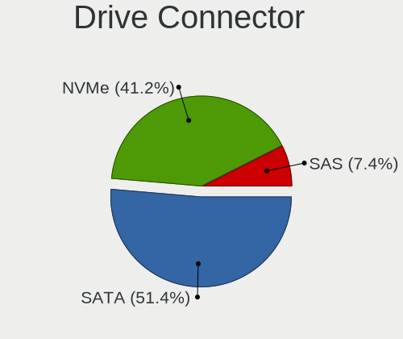
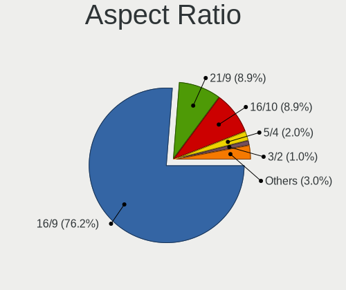

Pop!_OS Hardware Trends (Desktop)
---------------------------------

A project to identify most popular hardware characteristics and track their change
over time based on data collected by Pop!_OS users at https://Linux-Hardware.org.

Anyone can contribute to the study by uploading probes of their computers by
the [hw-probe](https://github.com/linuxhw/hw-probe) tool:

    sudo -E hw-probe -all -upload

Full-feature report is available here: https://linux-hardware.org/?view=trends&formfactor=desktop

Period: Jan, 2021.

Contents
--------

- [ OS                       ](#os)
- [ OS Family                ](#os-family)
- [ Kernel                   ](#kernel)
- [ Kernel Family            ](#kernel-family)
- [ Kernel Major Ver.        ](#kernel-major-ver)
- [ Arch                     ](#arch)
- [ DE                       ](#de)
- [ Display Server           ](#display-server)
- [ Display Manager          ](#display-manager)
- [ OS Lang                  ](#os-lang)
- [ Boot Mode                ](#boot-mode)
- [ Filesystem               ](#filesystem)
- [ Part. scheme             ](#part-scheme)
- [ Dual Boot with Linux/BSD ](#dual-boot-with-linux/bsd)
- [ Dual Boot (Win)          ](#dual-boot-win)
- [ Country                  ](#country)
- [ City                     ](#city)
- [ Vendor                   ](#vendor)
- [ Model                    ](#model)
- [ Model Family             ](#model-family)
- [ MFG Year                 ](#mfg-year)
- [ Form Factor              ](#form-factor)
- [ Secure Boot              ](#secure-boot)
- [ Coreboot                 ](#coreboot)
- [ RAM Size                 ](#ram-size)
- [ RAM Used                 ](#ram-used)
- [ Has CD-ROM               ](#has-cd-rom)
- [ Total Drives             ](#total-drives)
- [ Has Ethernet             ](#has-ethernet)
- [ Drive Vendor             ](#drive-vendor)
- [ Drive Model              ](#drive-model)
- [ HDD Vendor               ](#hdd-vendor)
- [ SSD Vendor               ](#ssd-vendor)
- [ Drive Kind               ](#drive-kind)
- [ Drive Connector          ](#drive-connector)
- [ Drive Size               ](#drive-size)
- [ Space Total              ](#space-total)
- [ Space Used               ](#space-used)
- [ Malfunc. Drives          ](#malfunc-drives)
- [ Malfunc. Drive Vendor    ](#malfunc-drive-vendor)
- [ Malfunc. HDD Vendor      ](#malfunc-hdd-vendor)
- [ Malfunc. Drive Kind      ](#malfunc-drive-kind)
- [ Failed Drives            ](#failed-drives)
- [ Failed Drive Vendor      ](#failed-drive-vendor)
- [ Drive Status             ](#drive-status)
- [ Storage Vendor           ](#storage-vendor)
- [ Storage Model            ](#storage-model)
- [ Storage Kind             ](#storage-kind)
- [ CPU Vendor               ](#cpu-vendor)
- [ CPU Model                ](#cpu-model)
- [ CPU Model Family         ](#cpu-model-family)
- [ CPU Cores                ](#cpu-cores)
- [ CPU Sockets              ](#cpu-sockets)
- [ CPU Threads              ](#cpu-threads)
- [ CPU Op-Modes             ](#cpu-op-modes)
- [ CPU Microcode            ](#cpu-microcode)
- [ CPU Microarch            ](#cpu-microarch)
- [ GPU Vendor               ](#gpu-vendor)
- [ GPU Model                ](#gpu-model)
- [ GPU Combo                ](#gpu-combo)
- [ GPU Driver               ](#gpu-driver)
- [ GPU Memory               ](#gpu-memory)
- [ Monitor Vendor           ](#monitor-vendor)
- [ Monitor Model            ](#monitor-model)
- [ Monitor Resolution       ](#monitor-resolution)
- [ Monitor Diagonal         ](#monitor-diagonal)
- [ Monitor Width            ](#monitor-width)
- [ Aspect Ratio             ](#aspect-ratio)
- [ Monitor Area             ](#monitor-area)
- [ Pixel Density            ](#pixel-density)
- [ Multiple Monitors        ](#multiple-monitors)
- [ Net Controller Vendor    ](#net-controller-vendor)
- [ Net Controller Model     ](#net-controller-model)
- [ Wireless Vendor          ](#wireless-vendor)
- [ Wireless Model           ](#wireless-model)
- [ Ethernet Vendor          ](#ethernet-vendor)
- [ Ethernet Model           ](#ethernet-model)
- [ Net Controller Kind      ](#net-controller-kind)
- [ Used Controller          ](#used-controller)
- [ NICs                     ](#nics)
- [ Memory Vendor            ](#memory-vendor)
- [ Memory Model             ](#memory-model)
- [ Memory Kind              ](#memory-kind)
- [ Memory Form Factor       ](#memory-form-factor)
- [ Memory Size              ](#memory-size)
- [ Memory Speed             ](#memory-speed)
- [ Sound Vendor             ](#sound-vendor)
- [ Sound Model              ](#sound-model)
- [ Camera Vendor            ](#camera-vendor)
- [ Camera Model             ](#camera-model)
- [ Fingerprint Vendor       ](#fingerprint-vendor)
- [ Fingerprint Model        ](#fingerprint-model)
- [ Chipcard Vendor          ](#chipcard-vendor)
- [ Chipcard Model           ](#chipcard-model)
- [ Printer Vendor           ](#printer-vendor)
- [ Printer Model            ](#printer-model)
- [ Scanner Vendor           ](#scanner-vendor)
- [ Scanner Model            ](#scanner-model)
- [ Bluetooth Vendor         ](#bluetooth-vendor)
- [ Bluetooth Model          ](#bluetooth-model)
- [ Unsupported Devices      ](#unsupported-devices)
- [ Unsupported Device Types ](#unsupported-device-types)

OS
--

Installed operating systems

| Name          | Desktops | Percent |
|---------------|----------|---------|
| Pop!_OS 20.10 | 116      | 80.56%  |
| Pop!_OS 20.04 | 28       | 19.44%  |

OS Family
---------

OS without a version

| Name    | Desktops | Percent |
|---------|----------|---------|
| Pop!_OS | 144      | 100%    |

Kernel
------

Version of the Linux kernel

| Version                 | Desktops | Percent |
|-------------------------|----------|---------|
| 5.8.0-7630-generic      | 138      | 95.83%  |
| 5.9.1-050901-lowlatency | 1        | 0.69%   |
| 5.4.0-7642-generic      | 1        | 0.69%   |
| 5.4.0-7634-generic      | 1        | 0.69%   |
| 5.4.0-7626-generic      | 1        | 0.69%   |
| 5.10.7-051007-generic   | 1        | 0.69%   |
| 5.10.6-051006-generic   | 1        | 0.69%   |

Kernel Family
-------------

Linux kernel without a distro release

| Version | Desktops | Percent |
|---------|----------|---------|
| 5.8.0   | 138      | 95.83%  |
| 5.4.0   | 3        | 2.08%   |
| 5.9.1   | 1        | 0.69%   |
| 5.10.7  | 1        | 0.69%   |
| 5.10.6  | 1        | 0.69%   |

Kernel Major Ver.
-----------------

Linux kernel major version

| Version | Desktops | Percent |
|---------|----------|---------|
| 5.8     | 138      | 95.83%  |
| 5.4     | 3        | 2.08%   |
| 5.10    | 2        | 1.39%   |
| 5.9     | 1        | 0.69%   |

Arch
----

OS architecture (x86_64, i586, etc.)

| Name   | Desktops | Percent |
|--------|----------|---------|
| x86_64 | 144      | 100%    |

DE
--

Desktop Environment

| Name       | Desktops | Percent |
|------------|----------|---------|
| GNOME      | 138      | 95.83%  |
| X-Cinnamon | 2        | 1.39%   |
| KDE        | 2        | 1.39%   |
| XFCE       | 1        | 0.69%   |
| KDE5       | 1        | 0.69%   |

Display Server
--------------

X11 or Wayland

| Name | Desktops | Percent |
|------|----------|---------|
| X11  | 144      | 100%    |

Display Manager
---------------

SDDM, LightDM, etc.

| Name    | Desktops | Percent |
|---------|----------|---------|
| Unknown | 133      | 92.36%  |
| GDM     | 10       | 6.94%   |
| TDM     | 1        | 0.69%   |

OS Lang
-------

Language

| Lang  | Desktops | Percent |
|-------|----------|---------|
| en_US | 74       | 51.39%  |
| en_GB | 14       | 9.72%   |
| de_DE | 11       | 7.64%   |
| pt_BR | 9        | 6.25%   |
| en_CA | 7        | 4.86%   |
| fr_FR | 5        | 3.47%   |
| en_AU | 5        | 3.47%   |
| C     | 5        | 3.47%   |
| ru_RU | 2        | 1.39%   |
| nl_NL | 2        | 1.39%   |
| es_ES | 2        | 1.39%   |
| zh_TW | 1        | 0.69%   |
| uk_UA | 1        | 0.69%   |
| sv_SE | 1        | 0.69%   |
| sk_SK | 1        | 0.69%   |
| it_IT | 1        | 0.69%   |
| hu_HU | 1        | 0.69%   |
| fr_CA | 1        | 0.69%   |
| fi_FI | 1        | 0.69%   |

Boot Mode
---------

EFI or BIOS

| Mode | Desktops | Percent |
|------|----------|---------|
| BIOS | 137      | 95.14%  |
| EFI  | 7        | 4.86%   |

Filesystem
----------

Type of filesystem

| Type    | Desktops | Percent |
|---------|----------|---------|
| Ext4    | 136      | 94.44%  |
| Btrfs   | 5        | 3.47%   |
| Overlay | 3        | 2.08%   |

Part. scheme
------------

Scheme of partitioning

| Type    | Desktops | Percent |
|---------|----------|---------|
| Unknown | 134      | 93.06%  |
| GPT     | 6        | 4.17%   |
| MBR     | 4        | 2.78%   |

Dual Boot with Linux/BSD
------------------------

Hosting more than one Linux/BSD

| Dual boot | Desktops | Percent |
|-----------|----------|---------|
| No        | 141      | 97.92%  |
| Yes       | 3        | 2.08%   |

Dual Boot (Win)
---------------

Hosting Linux and Windows

| Dual boot | Desktops | Percent |
|-----------|----------|---------|
| No        | 137      | 95.14%  |
| Yes       | 7        | 4.86%   |

Country
-------

Geographic location (country)

| Country        | Desktops | Percent |
|----------------|----------|---------|
| USA            | 44       | 30.56%  |
| Germany        | 15       | 10.42%  |
| Brazil         | 11       | 7.64%   |
| UK             | 9        | 6.25%   |
| Canada         | 8        | 5.56%   |
| Australia      | 5        | 3.47%   |
| France         | 4        | 2.78%   |
| Austria        | 4        | 2.78%   |
| Romania        | 3        | 2.08%   |
| Philippines    | 3        | 2.08%   |
| Netherlands    | 3        | 2.08%   |
| Italy          | 3        | 2.08%   |
| Ireland        | 3        | 2.08%   |
| Ukraine        | 2        | 1.39%   |
| Spain          | 2        | 1.39%   |
| South Africa   | 2        | 1.39%   |
| Russia         | 2        | 1.39%   |
| Hungary        | 2        | 1.39%   |
| Finland        | 2        | 1.39%   |
| Belgium        | 2        | 1.39%   |
| Argentina      | 2        | 1.39%   |
| Taiwan         | 1        | 0.69%   |
| Switzerland    | 1        | 0.69%   |
| Sweden         | 1        | 0.69%   |
| Slovakia       | 1        | 0.69%   |
| Portugal       | 1        | 0.69%   |
| Norway         | 1        | 0.69%   |
| Malaysia       | 1        | 0.69%   |
| Israel         | 1        | 0.69%   |
| India          | 1        | 0.69%   |
| Iceland        | 1        | 0.69%   |
| Hong Kong      | 1        | 0.69%   |
| Czech Republic | 1        | 0.69%   |
| Chile          | 1        | 0.69%   |

City
----

Geographic location (city)

| City                  | Desktops | Percent |
|-----------------------|----------|---------|
| São Paulo            | 3        | 2.08%   |
| Washington            | 2        | 1.39%   |
| Sydney                | 2        | 1.39%   |
| Rio de Janeiro        | 2        | 1.39%   |
| Quezon City           | 2        | 1.39%   |
| Phoenix               | 2        | 1.39%   |
| Milan                 | 2        | 1.39%   |
| Johannesburg          | 2        | 1.39%   |
| Dublin                | 2        | 1.39%   |
| Chandler              | 2        | 1.39%   |
| Brasília             | 2        | 1.39%   |
| Berlin                | 2        | 1.39%   |
| Zottegem              | 1        | 0.69%   |
| Zonnemaire            | 1        | 0.69%   |
| Woodstock             | 1        | 0.69%   |
| Winnetka              | 1        | 0.69%   |
| Virginia Beach        | 1        | 0.69%   |
| Villemomble           | 1        | 0.69%   |
| Vienna                | 1        | 0.69%   |
| Valence               | 1        | 0.69%   |
| Ulyanovsk             | 1        | 0.69%   |
| Uberlândia           | 1        | 0.69%   |
| Trostberg an der Alz  | 1        | 0.69%   |
| São José dos Campos | 1        | 0.69%   |
| São Caetano do Sul   | 1        | 0.69%   |
| Suwanee               | 1        | 0.69%   |
| Subang Jaya           | 1        | 0.69%   |
| Stockport             | 1        | 0.69%   |
| Stockholm             | 1        | 0.69%   |
| Stettlen              | 1        | 0.69%   |
| St Louis              | 1        | 0.69%   |
| Seattle               | 1        | 0.69%   |
| Scarborough           | 1        | 0.69%   |
| San Francisco         | 1        | 0.69%   |
| San Fernando          | 1        | 0.69%   |
| Runkel                | 1        | 0.69%   |
| Rostov-on-Don         | 1        | 0.69%   |
| Rostock               | 1        | 0.69%   |
| Roosdaal              | 1        | 0.69%   |
| Ridgway               | 1        | 0.69%   |
| Reykjavik             | 1        | 0.69%   |
| Redhill               | 1        | 0.69%   |
| Ramat HaSharon        | 1        | 0.69%   |
| Prague                | 1        | 0.69%   |
| Poulsbo               | 1        | 0.69%   |
| Portsmouth            | 1        | 0.69%   |
| Pinoso                | 1        | 0.69%   |
| Pinkafeld             | 1        | 0.69%   |
| Perth                 | 1        | 0.69%   |
| Paris                 | 1        | 0.69%   |
| Papa                  | 1        | 0.69%   |
| Oslo                  | 1        | 0.69%   |
| Orlando               | 1        | 0.69%   |
| Oneonta               | 1        | 0.69%   |
| Oberhausen            | 1        | 0.69%   |
| Oberasbach            | 1        | 0.69%   |
| Nottingham            | 1        | 0.69%   |
| Northampton           | 1        | 0.69%   |
| North Vancouver       | 1        | 0.69%   |
| North Fort Myers      | 1        | 0.69%   |

Vendor
------

Motherboard manufacturer

| Name                | Desktops | Percent |
|---------------------|----------|---------|
| ASUSTek Computer    | 39       | 27.08%  |
| Gigabyte Technology | 25       | 17.36%  |
| MSI                 | 24       | 16.67%  |
| Dell                | 14       | 9.72%   |
| ASRock              | 12       | 8.33%   |
| Hewlett-Packard     | 11       | 7.64%   |
| Intel               | 6        | 4.17%   |
| Lenovo              | 3        | 2.08%   |
| T-bao               | 1        | 0.69%   |
| System76            | 1        | 0.69%   |
| QTQD                | 1        | 0.69%   |
| Minix               | 1        | 0.69%   |
| Medion              | 1        | 0.69%   |
| Fujitsu             | 1        | 0.69%   |
| Foxconn             | 1        | 0.69%   |
| Biostar             | 1        | 0.69%   |
| Acer                | 1        | 0.69%   |
| Unknown             | 1        | 0.69%   |

Model
-----

Motherboard model

| Name                                | Desktops | Percent |
|-------------------------------------|----------|---------|
| Intel B75                           | 4        | 2.78%   |
| ASUS All Series                     | 4        | 2.78%   |
| Gigabyte B450M DS3H                 | 3        | 2.08%   |
| Dell OptiPlex 7010                  | 3        | 2.08%   |
| MSI MS-7B79                         | 2        | 1.39%   |
| HP Z440 Workstation                 | 2        | 1.39%   |
| HP Z420 Workstation                 | 2        | 1.39%   |
| Dell Precision T3600                | 2        | 1.39%   |
| ASUS ROG STRIX B450-I GAMING        | 2        | 1.39%   |
| ASUS PRIME B450M-A                  | 2        | 1.39%   |
| ASRock X470 Taichi                  | 2        | 1.39%   |
| T-bao MINI PC                       | 1        | 0.69%   |
| System76 Thelio                     | 1        | 0.69%   |
| QTQD Board                          | 1        | 0.69%   |
| MSI MS-7C94                         | 1        | 0.69%   |
| MSI MS-7C91                         | 1        | 0.69%   |
| MSI MS-7C84                         | 1        | 0.69%   |
| MSI MS-7C59                         | 1        | 0.69%   |
| MSI MS-7C56                         | 1        | 0.69%   |
| MSI MS-7C37                         | 1        | 0.69%   |
| MSI MS-7C02                         | 1        | 0.69%   |
| MSI MS-7B98                         | 1        | 0.69%   |
| MSI MS-7B93                         | 1        | 0.69%   |
| MSI MS-7B51                         | 1        | 0.69%   |
| MSI MS-7B22                         | 1        | 0.69%   |
| MSI MS-7B05                         | 1        | 0.69%   |
| MSI MS-7A70                         | 1        | 0.69%   |
| MSI MS-7A33                         | 1        | 0.69%   |
| MSI MS-7A32                         | 1        | 0.69%   |
| MSI MS-7A15                         | 1        | 0.69%   |
| MSI MS-7977                         | 1        | 0.69%   |
| MSI MS-7885                         | 1        | 0.69%   |
| MSI MS-7845                         | 1        | 0.69%   |
| MSI MS-7756                         | 1        | 0.69%   |
| MSI MS-7346                         | 1        | 0.69%   |
| MSI FQ563AA-ABA a6750f              | 1        | 0.69%   |
| Minix Z83-4                         | 1        | 0.69%   |
| Medion MD34214/C752                 | 1        | 0.69%   |
| Lenovo ThinkCentre M93p 10AAS0WT00  | 1        | 0.69%   |
| Lenovo ThinkCentre M92p 3209C54     | 1        | 0.69%   |
| Lenovo H50-55 90BF0023GE            | 1        | 0.69%   |
| Intel DQ77MK                        | 1        | 0.69%   |
| Intel DH67GD AAG10206-205           | 1        | 0.69%   |
| HP Z800 Workstation                 | 1        | 0.69%   |
| HP ProDesk 600 G2 SFF               | 1        | 0.69%   |
| HP Compaq dc7800p Small Form Factor | 1        | 0.69%   |
| HP Compaq 6000 Pro SFF PC           | 1        | 0.69%   |
| HP 550-227c                         | 1        | 0.69%   |
| HP 290 G2 MT Business PC            | 1        | 0.69%   |
| HP 110-335t                         | 1        | 0.69%   |
| Gigabyte Z97X-UD3H-BK               | 1        | 0.69%   |
| Gigabyte Z490 AORUS ELITE AC        | 1        | 0.69%   |
| Gigabyte Z370M D3H                  | 1        | 0.69%   |
| Gigabyte Z370 AORUS Gaming K3       | 1        | 0.69%   |
| Gigabyte X570 UD                    | 1        | 0.69%   |
| Gigabyte X570 I AORUS PRO WIFI      | 1        | 0.69%   |
| Gigabyte X570 AORUS ULTRA           | 1        | 0.69%   |
| Gigabyte X570 AORUS PRO WIFI        | 1        | 0.69%   |
| Gigabyte X570 AORUS ELITE           | 1        | 0.69%   |
| Gigabyte X470 AORUS ULTRA GAMING    | 1        | 0.69%   |

Model Family
------------

Motherboard model prefix

| Name                  | Desktops | Percent |
|-----------------------|----------|---------|
| ASUS ROG              | 7        | 4.86%   |
| Dell Precision        | 6        | 4.17%   |
| Dell OptiPlex         | 6        | 4.17%   |
| Gigabyte X570         | 5        | 3.47%   |
| Intel B75             | 4        | 2.78%   |
| ASUS TUF              | 4        | 2.78%   |
| ASUS PRIME            | 4        | 2.78%   |
| ASUS All              | 4        | 2.78%   |
| Gigabyte B450M        | 3        | 2.08%   |
| MSI MS-7B79           | 2        | 1.39%   |
| Lenovo ThinkCentre    | 2        | 1.39%   |
| HP Z440               | 2        | 1.39%   |
| HP Z420               | 2        | 1.39%   |
| HP Compaq             | 2        | 1.39%   |
| Dell Inspiron         | 2        | 1.39%   |
| ASRock X470           | 2        | 1.39%   |
| T-bao MINI            | 1        | 0.69%   |
| System76 Thelio       | 1        | 0.69%   |
| QTQD Board            | 1        | 0.69%   |
| MSI MS-7C94           | 1        | 0.69%   |
| MSI MS-7C91           | 1        | 0.69%   |
| MSI MS-7C84           | 1        | 0.69%   |
| MSI MS-7C59           | 1        | 0.69%   |
| MSI MS-7C56           | 1        | 0.69%   |
| MSI MS-7C37           | 1        | 0.69%   |
| MSI MS-7C02           | 1        | 0.69%   |
| MSI MS-7B98           | 1        | 0.69%   |
| MSI MS-7B93           | 1        | 0.69%   |
| MSI MS-7B51           | 1        | 0.69%   |
| MSI MS-7B22           | 1        | 0.69%   |
| MSI MS-7B05           | 1        | 0.69%   |
| MSI MS-7A70           | 1        | 0.69%   |
| MSI MS-7A33           | 1        | 0.69%   |
| MSI MS-7A32           | 1        | 0.69%   |
| MSI MS-7A15           | 1        | 0.69%   |
| MSI MS-7977           | 1        | 0.69%   |
| MSI MS-7885           | 1        | 0.69%   |
| MSI MS-7845           | 1        | 0.69%   |
| MSI MS-7756           | 1        | 0.69%   |
| MSI MS-7346           | 1        | 0.69%   |
| MSI FQ563AA-ABA       | 1        | 0.69%   |
| Minix Z83-4           | 1        | 0.69%   |
| Medion MD34214        | 1        | 0.69%   |
| Lenovo H50-55         | 1        | 0.69%   |
| Intel DQ77MK          | 1        | 0.69%   |
| Intel DH67GD          | 1        | 0.69%   |
| HP Z800               | 1        | 0.69%   |
| HP ProDesk            | 1        | 0.69%   |
| HP 550-227c           | 1        | 0.69%   |
| HP 290                | 1        | 0.69%   |
| HP 110-335t           | 1        | 0.69%   |
| Gigabyte Z97X-UD3H-BK | 1        | 0.69%   |
| Gigabyte Z490         | 1        | 0.69%   |
| Gigabyte Z370M        | 1        | 0.69%   |
| Gigabyte Z370         | 1        | 0.69%   |
| Gigabyte X470         | 1        | 0.69%   |
| Gigabyte TRX40        | 1        | 0.69%   |
| Gigabyte P55-UD5      | 1        | 0.69%   |
| Gigabyte P31-DS3L     | 1        | 0.69%   |
| Gigabyte H81M-S1      | 1        | 0.69%   |

MFG Year
--------

Motherboard manufacture year

| Year | Desktops | Percent |
|------|----------|---------|
| 2020 | 47       | 32.64%  |
| 2019 | 18       | 12.5%   |
| 2013 | 17       | 11.81%  |
| 2018 | 11       | 7.64%   |
| 2015 | 10       | 6.94%   |
| 2016 | 8        | 5.56%   |
| 2014 | 7        | 4.86%   |
| 2010 | 6        | 4.17%   |
| 2008 | 5        | 3.47%   |
| 2017 | 4        | 2.78%   |
| 2012 | 4        | 2.78%   |
| 2009 | 3        | 2.08%   |
| 2011 | 2        | 1.39%   |
| 2007 | 2        | 1.39%   |

Form Factor
-----------

Physical design of the computer

| Name    | Desktops | Percent |
|---------|----------|---------|
| Desktop | 144      | 100%    |

Secure Boot
-----------

Enabled or disabled

| State    | Desktops | Percent |
|----------|----------|---------|
| Disabled | 144      | 100%    |

Coreboot
--------

Have coreboot on board

| Used | Desktops | Percent |
|------|----------|---------|
| No   | 144      | 100%    |

RAM Size
--------

Total RAM memory

| Size in GB      | Desktops | Percent |
|-----------------|----------|---------|
| 16.01-24.0      | 50       | 34.72%  |
| 32.01-64.0      | 27       | 18.75%  |
| 8.01-16.0       | 25       | 17.36%  |
| 4.01-8.0        | 14       | 9.72%   |
| 3.01-4.0        | 10       | 6.94%   |
| 64.01-256.0     | 10       | 6.94%   |
| 1.01-2.0        | 3        | 2.08%   |
| More than 256.0 | 2        | 1.39%   |
| 24.01-32.0      | 2        | 1.39%   |
| 2.01-3.0        | 1        | 0.69%   |

RAM Used
--------

Used RAM memory

| Used GB    | Desktops | Percent |
|------------|----------|---------|
| 1.01-2.0   | 53       | 36.81%  |
| 2.01-3.0   | 29       | 20.14%  |
| 3.01-4.0   | 28       | 19.44%  |
| 4.01-8.0   | 26       | 18.06%  |
| 8.01-16.0  | 7        | 4.86%   |
| 32.01-64.0 | 1        | 0.69%   |

Has CD-ROM
----------

Has CD-ROM on board

| Presented | Desktops | Percent |
|-----------|----------|---------|
| No        | 88       | 61.11%  |
| Yes       | 56       | 38.89%  |

Total Drives
------------

Number of drives on board

| Drives | Desktops | Percent |
|--------|----------|---------|
| 1      | 46       | 31.94%  |
| 2      | 43       | 29.86%  |
| 3      | 26       | 18.06%  |
| 4      | 17       | 11.81%  |
| 7      | 4        | 2.78%   |
| 5      | 4        | 2.78%   |
| 13     | 1        | 0.69%   |
| 11     | 1        | 0.69%   |
| 6      | 1        | 0.69%   |
| 0      | 1        | 0.69%   |

Has Ethernet
------------

Has Ethernet on board

| Presented | Desktops | Percent |
|-----------|----------|---------|
| Yes       | 140      | 97.22%  |
| No        | 4        | 2.78%   |

Drive Vendor
------------

Hard drive vendors

| Vendor                    | Desktops | Drives | Percent |
|---------------------------|----------|--------|---------|
| Seagate                   | 52       | 68     | 17.99%  |
| Samsung Electronics       | 49       | 70     | 16.96%  |
| WDC                       | 47       | 59     | 16.26%  |
| Kingston                  | 22       | 27     | 7.61%   |
| SanDisk                   | 19       | 19     | 6.57%   |
| Toshiba                   | 13       | 15     | 4.5%    |
| Phison                    | 11       | 15     | 3.81%   |
| Intel                     | 7        | 7      | 2.42%   |
| Crucial                   | 7        | 8      | 2.42%   |
| Unknown                   | 4        | 5      | 1.38%   |
| Hitachi                   | 4        | 4      | 1.38%   |
| HGST                      | 4        | 4      | 1.38%   |
| Silicon Motion            | 3        | 3      | 1.04%   |
| OCZ                       | 3        | 3      | 1.04%   |
| Micron/Crucial Technology | 3        | 3      | 1.04%   |
| A-DATA Technology         | 3        | 3      | 1.04%   |
| XPG                       | 2        | 3      | 0.69%   |
| Transcend                 | 2        | 2      | 0.69%   |
| Team                      | 2        | 2      | 0.69%   |
| SK Hynix                  | 2        | 8      | 0.69%   |
| Realtek Semiconductor     | 2        | 2      | 0.69%   |
| PNY                       | 2        | 2      | 0.69%   |
| Maxtor                    | 2        | 2      | 0.69%   |
| Intenso                   | 2        | 2      | 0.69%   |
| Corsair                   | 2        | 2      | 0.69%   |
| China                     | 2        | 2      | 0.69%   |
| Voyager                   | 1        | 1      | 0.35%   |
| USB                       | 1        | 1      | 0.35%   |
| T-FORCE                   | 1        | 1      | 0.35%   |
| SPCC                      | 1        | 1      | 0.35%   |
| Patriot                   | 1        | 2      | 0.35%   |
| Mushkin                   | 1        | 1      | 0.35%   |
| MATSHITA                  | 1        | 1      | 0.35%   |
| Lite-On                   | 1        | 1      | 0.35%   |
| KingSpec                  | 1        | 1      | 0.35%   |
| JMicron                   | 1        | 1      | 0.35%   |
| Integral                  | 1        | 1      | 0.35%   |
| Gigabyte Technology       | 1        | 1      | 0.35%   |
| FORESEE                   | 1        | 1      | 0.35%   |
| DATARAM                   | 1        | 1      | 0.35%   |
| CT480BX5                  | 1        | 1      | 0.35%   |
| AS25                      | 1        | 1      | 0.35%   |
| AMD                       | 1        | 2      | 0.35%   |
| ADATA Technology          | 1        | 1      | 0.35%   |

Drive Model
-----------

Hard drive models

| Model                               | Desktops | Percent |
|-------------------------------------|----------|---------|
| Samsung SSD 850 EVO 250GB           | 9        | 2.69%   |
| Samsung NVMe SSD Drive 500GB        | 8        | 2.39%   |
| Seagate ST2000DM008-2FR102 2TB      | 6        | 1.79%   |
| Seagate ST1000DM010-2EP102 1TB      | 6        | 1.79%   |
| Kingston SA400S37120G 120GB SSD     | 6        | 1.79%   |
| Seagate ST500DM002-1BD142 500GB     | 5        | 1.49%   |
| Sandisk NVMe SSD Drive 500GB        | 5        | 1.49%   |
| Samsung SSD 850 EVO 500GB           | 5        | 1.49%   |
| Samsung NVMe SSD Drive 1TB          | 5        | 1.49%   |
| Phison NVMe SSD Drive 1TB           | 5        | 1.49%   |
| Kingston SV300S37A120G 120GB SSD    | 5        | 1.49%   |
| Samsung SSD 860 EVO 1TB             | 4        | 1.19%   |
| Kingston SA400S37240G 240GB SSD     | 4        | 1.19%   |
| Seagate ST8000DM004-2CX188 8TB      | 3        | 0.9%    |
| Seagate ST3500312CS 500GB           | 3        | 0.9%    |
| SanDisk Extreme SSD 1TB             | 3        | 0.9%    |
| Samsung SSD 870 QVO 1TB             | 3        | 0.9%    |
| Samsung SSD 860 EVO 500GB           | 3        | 0.9%    |
| Samsung SSD 860 EVO 250GB           | 3        | 0.9%    |
| Samsung SSD 840 EVO 250GB           | 3        | 0.9%    |
| Kingston SUV400S37120G 120GB SSD    | 3        | 0.9%    |
| WDC WD5000AAKS-00A7B0 500GB         | 2        | 0.6%    |
| WDC WD3200AAJS-60Z0A0 320GB         | 2        | 0.6%    |
| WDC WD20EZRZ-00Z5HB0 2TB            | 2        | 0.6%    |
| WDC WD20EARX-00PASB0 2TB            | 2        | 0.6%    |
| WDC WD10EZEX-08WN4A0 1TB            | 2        | 0.6%    |
| Unknown SD/MMC/MS PRO 32GB          | 2        | 0.6%    |
| Toshiba MQ01ABD100 1TB              | 2        | 0.6%    |
| Silicon Motion NVMe SSD Drive 512GB | 2        | 0.6%    |
| Seagate ST2000DM001-1ER164 2TB      | 2        | 0.6%    |
| Seagate ST1000DM003-9YN162 1TB      | 2        | 0.6%    |
| Seagate ST1000DM003-1ER162 1TB      | 2        | 0.6%    |
| Seagate Expansion 1TB               | 2        | 0.6%    |
| Samsung SSD 970 EVO Plus 1TB        | 2        | 0.6%    |
| Samsung SSD 860 QVO 1TB             | 2        | 0.6%    |
| Samsung SSD 840 EVO 120GB           | 2        | 0.6%    |
| Phison NVMe SSD Drive 2TB           | 2        | 0.6%    |
| Phison NVMe SSD Drive 256GB         | 2        | 0.6%    |
| Phison NVMe SSD Drive 1024GB        | 2        | 0.6%    |
| Micron/Crucial NVMe SSD Drive 500GB | 2        | 0.6%    |
| Kingston SA400S37480G 480GB SSD     | 2        | 0.6%    |
| Crucial CT250MX500SSD1 250GB        | 2        | 0.6%    |
| Crucial CT1000MX500SSD1 1TB         | 2        | 0.6%    |
| A-DATA SU630 240GB SSD              | 2        | 0.6%    |
| XPG NVMe SSD Drive 512GB            | 1        | 0.3%    |
| XPG NVMe SSD Drive 256GB            | 1        | 0.3%    |
| XPG NVMe SSD Drive 1024GB           | 1        | 0.3%    |
| WDC WDS500G3X0C-00SJG0 500GB        | 1        | 0.3%    |
| WDC WDS480G2G0A-00JH30 480GB SSD    | 1        | 0.3%    |
| WDC WDS200T2B0A-00SM50 2TB SSD      | 1        | 0.3%    |
| WDC WDS120G2G0A-00JH30 120GB SSD    | 1        | 0.3%    |
| WDC WD8000AARS-00Y5B1 800GB         | 1        | 0.3%    |
| WDC WD6400BPVT-22HXZT3 640GB        | 1        | 0.3%    |
| WDC WD6400AAKS-65A7B2 640GB         | 1        | 0.3%    |
| WDC WD6003FZBX-00K5WB0 6TB          | 1        | 0.3%    |
| WDC WD5001AALS-00L3B2 500GB         | 1        | 0.3%    |
| WDC WD5000LPVT-75G33T0 500GB        | 1        | 0.3%    |
| WDC WD5000LPCX-24C6HT0 500GB        | 1        | 0.3%    |
| WDC WD5000BPVT-22HXZT3 500GB        | 1        | 0.3%    |
| WDC WD5000BEVT-75ZAT0 500GB         | 1        | 0.3%    |

HDD Vendor
----------

Hard disk drive vendors

| Vendor              | Desktops | Drives | Percent |
|---------------------|----------|--------|---------|
| Seagate             | 51       | 66     | 42.86%  |
| WDC                 | 43       | 55     | 36.13%  |
| Toshiba             | 12       | 14     | 10.08%  |
| Hitachi             | 4        | 4      | 3.36%   |
| HGST                | 4        | 4      | 3.36%   |
| Samsung Electronics | 3        | 3      | 2.52%   |
| MAXTOR              | 2        | 2      | 1.68%   |

SSD Vendor
----------

Solid state drive vendors

| Vendor              | Desktops | Drives | Percent |
|---------------------|----------|--------|---------|
| Samsung Electronics | 33       | 41     | 30.28%  |
| Kingston            | 20       | 24     | 18.35%  |
| SanDisk             | 13       | 13     | 11.93%  |
| Crucial             | 7        | 8      | 6.42%   |
| Intel               | 5        | 5      | 4.59%   |
| WDC                 | 3        | 3      | 2.75%   |
| OCZ                 | 3        | 3      | 2.75%   |
| A-DATA Technology   | 3        | 3      | 2.75%   |
| Transcend           | 2        | 2      | 1.83%   |
| Team                | 2        | 2      | 1.83%   |
| SK Hynix            | 2        | 8      | 1.83%   |
| PNY                 | 2        | 2      | 1.83%   |
| Corsair             | 2        | 2      | 1.83%   |
| China               | 2        | 2      | 1.83%   |
| SPCC                | 1        | 1      | 0.92%   |
| Seagate             | 1        | 1      | 0.92%   |
| Patriot             | 1        | 2      | 0.92%   |
| Mushkin             | 1        | 1      | 0.92%   |
| KingSpec            | 1        | 1      | 0.92%   |
| Integral            | 1        | 1      | 0.92%   |
| Gigabyte Technology | 1        | 1      | 0.92%   |
| FORESEE             | 1        | 1      | 0.92%   |
| DATARAM             | 1        | 1      | 0.92%   |
| CT480BX5            | 1        | 1      | 0.92%   |

Drive Kind
----------

HDD or SSD

| Kind    | Desktops | Drives | Percent |
|---------|----------|--------|---------|
| HDD     | 94       | 148    | 38.68%  |
| SSD     | 87       | 129    | 35.8%   |
| NVMe    | 48       | 68     | 19.75%  |
| Unknown | 12       | 12     | 4.94%   |
| MMC     | 2        | 3      | 0.82%   |

Drive Connector
---------------

SATA, SAS, NVMe, etc.

| Type | Desktops | Drives | Percent |
|------|----------|--------|---------|
| SATA | 127      | 270    | 66.49%  |
| NVMe | 48       | 68     | 25.13%  |
| SAS  | 14       | 19     | 7.33%   |
| MMC  | 2        | 3      | 1.05%   |

Drive Size
----------

Size of hard drive

| Size in TB | Desktops | Drives | Percent |
|------------|----------|--------|---------|
| 0.01-0.5   | 96       | 149    | 48.98%  |
| 0.51-1.0   | 53       | 70     | 27.04%  |
| 1.01-2.0   | 27       | 32     | 13.78%  |
| 4.01-10.0  | 8        | 8      | 4.08%   |
| 3.01-4.0   | 7        | 12     | 3.57%   |
| 2.01-3.0   | 5        | 6      | 2.55%   |

Space Total
-----------

Amount of disk space available on the file system

| Size in GB     | Desktops | Percent |
|----------------|----------|---------|
| 101-250        | 41       | 28.47%  |
| 1001-2000      | 24       | 16.67%  |
| 251-500        | 23       | 15.97%  |
| 501-1000       | 21       | 14.58%  |
| More than 3000 | 16       | 11.11%  |
| 2001-3000      | 8        | 5.56%   |
| 21-50          | 4        | 2.78%   |
| 51-100         | 4        | 2.78%   |
| 1-20           | 3        | 2.08%   |

Space Used
----------

Amount of used disk space

| Used GB        | Desktops | Percent |
|----------------|----------|---------|
| 1-20           | 55       | 38.19%  |
| 101-250        | 19       | 13.19%  |
| 21-50          | 18       | 12.5%   |
| 51-100         | 14       | 9.72%   |
| 251-500        | 11       | 7.64%   |
| 1001-2000      | 11       | 7.64%   |
| 501-1000       | 10       | 6.94%   |
| More than 3000 | 4        | 2.78%   |
| 2001-3000      | 2        | 1.39%   |

Malfunc. Drives
---------------

Drive models with a malfunction

| Model                            | Desktops | Drives | Percent |
|----------------------------------|----------|--------|---------|
| Kingston SV300S37A120G 120GB SSD | 1        | 1      | 100%    |

Malfunc. Drive Vendor
---------------------

Vendors of faulty drives

| Vendor   | Desktops | Drives | Percent |
|----------|----------|--------|---------|
| Kingston | 1        | 1      | 100%    |

Malfunc. HDD Vendor
-------------------

Vendors of faulty HDD drives

Zero info for selected period =(

Malfunc. Drive Kind
-------------------

Kinds of faulty drives

| Kind | Desktops | Drives | Percent |
|------|----------|--------|---------|
| SSD  | 1        | 1      | 100%    |

Failed Drives
-------------

Failed drive models

Zero info for selected period =(

Failed Drive Vendor
-------------------

Failed drive vendors

Zero info for selected period =(

Drive Status
------------

Number of failed and malfunc. drives

| Status   | Desktops | Drives | Percent |
|----------|----------|--------|---------|
| Detected | 133      | 332    | 91.1%   |
| Works    | 12       | 27     | 8.22%   |
| Malfunc  | 1        | 1      | 0.68%   |

Storage Vendor
--------------

Storage controller vendors

| Vendor                       | Desktops | Percent |
|------------------------------|----------|---------|
| Intel                        | 84       | 38.01%  |
| AMD                          | 58       | 26.24%  |
| Samsung Electronics          | 19       | 8.6%    |
| ASMedia Technology           | 12       | 5.43%   |
| Phison Electronics           | 10       | 4.52%   |
| Sandisk                      | 7        | 3.17%   |
| Marvell Technology Group     | 5        | 2.26%   |
| JMicron Technology           | 5        | 2.26%   |
| Silicon Motion               | 3        | 1.36%   |
| Micron/Crucial Technology    | 3        | 1.36%   |
| ADATA Technology             | 3        | 1.36%   |
| Realtek Semiconductor        | 2        | 0.9%    |
| Nvidia                       | 2        | 0.9%    |
| LSI Logic / Symbios Logic    | 2        | 0.9%    |
| Kingston Technology Company  | 2        | 0.9%    |
| Broadcom / LSI               | 2        | 0.9%    |
| Toshiba America Info Systems | 1        | 0.45%   |
| Lite-On Technology           | 1        | 0.45%   |

Storage Model
-------------

Storage controller models

| Model                                                                                   | Desktops | Percent |
|-----------------------------------------------------------------------------------------|----------|---------|
| AMD FCH SATA Controller [AHCI mode]                                                     | 37       | 13.7%   |
| Samsung NVMe SSD Controller SM981/PM981/PM983                                           | 18       | 6.67%   |
| AMD 400 Series Chipset SATA Controller                                                  | 17       | 6.3%    |
| ASMedia ASM1062 Serial ATA Controller                                                   | 12       | 4.44%   |
| Intel 7 Series/C210 Series Chipset Family 6-port SATA Controller [AHCI mode]            | 10       | 3.7%    |
| Intel 8 Series/C220 Series Chipset Family 6-port SATA Controller 1 [AHCI mode]          | 9        | 3.33%   |
| AMD SATA controller                                                                     | 9        | 3.33%   |
| Intel Q170/Q150/B150/H170/H110/Z170/CM236 Chipset SATA Controller [AHCI Mode]           | 8        | 2.96%   |
| Intel 200 Series PCH SATA controller [AHCI mode]                                        | 7        | 2.59%   |
| Intel Cannon Lake PCH SATA AHCI Controller                                              | 5        | 1.85%   |
| AMD SB7x0/SB8x0/SB9x0 SATA Controller [AHCI mode]                                       | 5        | 1.85%   |
| Phison E16 PCIe4 NVMe Controller                                                        | 4        | 1.48%   |
| Phison E12 NVMe Controller                                                              | 4        | 1.48%   |
| Intel SATA Controller [RAID mode]                                                       | 4        | 1.48%   |
| Intel NM10/ICH7 Family SATA Controller [IDE mode]                                       | 4        | 1.48%   |
| Intel C600/X79 series chipset 6-Port SATA AHCI Controller                               | 4        | 1.48%   |
| Intel 6 Series/C200 Series Chipset Family 6 port Desktop SATA AHCI Controller           | 4        | 1.48%   |
| Silicon Motion SM2263EN/SM2263XT SSD Controller                                         | 3        | 1.11%   |
| Sandisk WD Black SN750 / PC SN730 NVMe SSD                                              | 3        | 1.11%   |
| JMicron JMB363 SATA/IDE Controller                                                      | 3        | 1.11%   |
| Intel C602 chipset 4-Port SATA Storage Control Unit                                     | 3        | 1.11%   |
| Intel 6 Series/C200 Series Chipset Family Desktop SATA Controller (IDE mode, ports 4-5) | 3        | 1.11%   |
| Intel 6 Series/C200 Series Chipset Family Desktop SATA Controller (IDE mode, ports 0-3) | 3        | 1.11%   |
| Intel 400 Series Chipset Family SATA AHCI Controller                                    | 3        | 1.11%   |
| AMD SB7x0/SB8x0/SB9x0 IDE Controller                                                    | 3        | 1.11%   |
| Samsung NVMe SSD Controller SM951/PM951                                                 | 2        | 0.74%   |
| Micron/Crucial Non-Volatile memory controller                                           | 2        | 0.74%   |
| Kingston Company A2000 NVMe SSD                                                         | 2        | 0.74%   |
| Intel C610/X99 series chipset 6-Port SATA Controller [AHCI mode]                        | 2        | 0.74%   |
| Intel C600/X79 series chipset SATA RAID Controller                                      | 2        | 0.74%   |
| Intel C600/X79 series chipset IDE-r Controller                                          | 2        | 0.74%   |
| Intel 9 Series Chipset Family SATA Controller [AHCI Mode]                               | 2        | 0.74%   |
| Intel 82801JD/DO (ICH10 Family) SATA AHCI Controller                                    | 2        | 0.74%   |
| Intel 82801IR/IO/IH (ICH9R/DO/DH) 4 port SATA Controller [IDE mode]                     | 2        | 0.74%   |
| Intel 82801I (ICH9 Family) 2 port SATA Controller [IDE mode]                            | 2        | 0.74%   |
| Intel 631xESB/632xESB IDE Controller                                                    | 2        | 0.74%   |
| Intel 5 Series/3400 Series Chipset 6 port SATA AHCI Controller                          | 2        | 0.74%   |
| AMD X370 Series Chipset SATA Controller                                                 | 2        | 0.74%   |
| AMD SB7x0/SB8x0/SB9x0 SATA Controller [IDE mode]                                        | 2        | 0.74%   |
| AMD FCH SATA Controller D                                                               | 2        | 0.74%   |
| AMD FCH IDE Controller                                                                  | 2        | 0.74%   |
| ADATA XPG SX8200 Pro PCIe Gen3x4 M.2 2280 Solid State Drive                             | 2        | 0.74%   |
| Toshiba America Info Systems BG3 NVMe SSD Controller                                    | 1        | 0.37%   |
| Sandisk WD Blue SN550 NVMe SSD                                                          | 1        | 0.37%   |
| Sandisk WD Blue SN500 / PC SN520 NVMe SSD                                               | 1        | 0.37%   |
| Sandisk WD Black NVMe SSD                                                               | 1        | 0.37%   |
| Sandisk WD Black 2018 / PC SN720 NVMe SSD                                               | 1        | 0.37%   |
| Realtek RTS5763DL NVMe SSD Controller                                                   | 1        | 0.37%   |
| Realtek Realtek Non-Volatile memory controller                                          | 1        | 0.37%   |
| Phison PS5013 E13 NVMe Controller                                                       | 1        | 0.37%   |
| Phison Electronics Non-Volatile memory controller                                       | 1        | 0.37%   |
| Nvidia MCP61 SATA Controller                                                            | 1        | 0.37%   |
| Nvidia MCP61 IDE                                                                        | 1        | 0.37%   |
| Nvidia MCP51 Serial ATA Controller                                                      | 1        | 0.37%   |
| Nvidia MCP51 IDE                                                                        | 1        | 0.37%   |
| Micron/Crucial P1 NVMe PCIe SSD                                                         | 1        | 0.37%   |
| Marvell Group 88SE9215 PCIe 2.0 x1 4-port SATA 6 Gb/s Controller                        | 1        | 0.37%   |
| Marvell Group 88SE9182 SATA 6G Controller                                               | 1        | 0.37%   |
| Marvell Group 88SE912x SATA 6Gb/s Controller [IDE mode]                                 | 1        | 0.37%   |
| Marvell Group 88SE9123 PCIe SATA 6.0 Gb/s controller                                    | 1        | 0.37%   |

Storage Kind
------------

Kind of storage controller (IDE, SATA, NVMe, SAS, ...)

| Kind | Desktops | Percent |
|------|----------|---------|
| SATA | 120      | 56.87%  |
| NVMe | 48       | 22.75%  |
| IDE  | 26       | 12.32%  |
| RAID | 12       | 5.69%   |
| SAS  | 4        | 1.9%    |
| SCSI | 1        | 0.47%   |

CPU Vendor
----------

Processor vendors

| Vendor | Desktops | Percent |
|--------|----------|---------|
| Intel  | 85       | 59.03%  |
| AMD    | 59       | 40.97%  |

CPU Model
---------

Processor models

| Model                                  | Desktops | Percent |
|----------------------------------------|----------|---------|
| AMD Ryzen 7 3700X 8-Core Processor     | 7        | 4.86%   |
| AMD Ryzen 5 3600 6-Core Processor      | 7        | 4.86%   |
| Intel Core i5-3470 CPU @ 3.20GHz       | 6        | 4.17%   |
| AMD Ryzen 9 3900X 12-Core Processor    | 4        | 2.78%   |
| AMD Ryzen 7 2700X Eight-Core Processor | 4        | 2.78%   |
| Intel Xeon CPU E5-1620 0 @ 3.60GHz     | 3        | 2.08%   |
| Intel Core i7-6700K CPU @ 4.00GHz      | 3        | 2.08%   |
| Intel Core i7-3770 CPU @ 3.40GHz       | 3        | 2.08%   |
| AMD Ryzen 5 3600X 6-Core Processor     | 3        | 2.08%   |
| Intel Core i9-10850K CPU @ 3.60GHz     | 2        | 1.39%   |
| Intel Core i7-4790 CPU @ 3.60GHz       | 2        | 1.39%   |
| Intel Core i7-3770K CPU @ 3.50GHz      | 2        | 1.39%   |
| Intel Core i5-9400 CPU @ 2.90GHz       | 2        | 1.39%   |
| Intel Core i5-8400 CPU @ 2.80GHz       | 2        | 1.39%   |
| Intel Core i5-6500 CPU @ 3.20GHz       | 2        | 1.39%   |
| Intel Core i5-2500 CPU @ 3.30GHz       | 2        | 1.39%   |
| Intel Core i3-8100 CPU @ 3.60GHz       | 2        | 1.39%   |
| Intel Core i3-7100 CPU @ 3.90GHz       | 2        | 1.39%   |
| Intel Core i3-4130 CPU @ 3.40GHz       | 2        | 1.39%   |
| Intel Core 2 Quad CPU Q6600 @ 2.40GHz  | 2        | 1.39%   |
| Intel Core 2 Duo CPU E8400 @ 3.00GHz   | 2        | 1.39%   |
| AMD Ryzen 7 3800X 8-Core Processor     | 2        | 1.39%   |
| AMD Ryzen 5 1600 Six-Core Processor    | 2        | 1.39%   |
| AMD FX-8350 Eight-Core Processor       | 2        | 1.39%   |
| AMD FX-6300 Six-Core Processor         | 2        | 1.39%   |
| Intel Xeon W-2245 CPU @ 3.90GHz        | 1        | 0.69%   |
| Intel Xeon CPU X5650 @ 2.67GHz         | 1        | 0.69%   |
| Intel Xeon CPU W3530 @ 2.80GHz         | 1        | 0.69%   |
| Intel Xeon CPU E5420 @ 2.50GHz         | 1        | 0.69%   |
| Intel Xeon CPU E5345 @ 2.33GHz         | 1        | 0.69%   |
| Intel Xeon CPU E5-1650 v3 @ 3.50GHz    | 1        | 0.69%   |
| Intel Xeon CPU E5-1620 v3 @ 3.50GHz    | 1        | 0.69%   |
| Intel Xeon CPU E5-1607 0 @ 3.00GHz     | 1        | 0.69%   |
| Intel Pentium Dual CPU E2160 @ 1.80GHz | 1        | 0.69%   |
| Intel Pentium CPU G2020T @ 2.50GHz     | 1        | 0.69%   |
| Intel Core i7-9700K CPU @ 3.60GHz      | 1        | 0.69%   |
| Intel Core i7-9700F CPU @ 3.00GHz      | 1        | 0.69%   |
| Intel Core i7-7800X CPU @ 3.50GHz      | 1        | 0.69%   |
| Intel Core i7-6700T CPU @ 2.80GHz      | 1        | 0.69%   |
| Intel Core i7-5930K CPU @ 3.50GHz      | 1        | 0.69%   |
| Intel Core i7-4790K CPU @ 4.00GHz      | 1        | 0.69%   |
| Intel Core i7-4770K CPU @ 3.50GHz      | 1        | 0.69%   |
| Intel Core i7-4770 CPU @ 3.40GHz       | 1        | 0.69%   |
| Intel Core i7-3930K CPU @ 3.20GHz      | 1        | 0.69%   |
| Intel Core i7-2600 CPU @ 3.40GHz       | 1        | 0.69%   |
| Intel Core i7 CPU 950 @ 3.07GHz        | 1        | 0.69%   |
| Intel Core i7 CPU 860 @ 2.80GHz        | 1        | 0.69%   |
| Intel Core i5-9600KF CPU @ 3.70GHz     | 1        | 0.69%   |
| Intel Core i5-9400F CPU @ 2.90GHz      | 1        | 0.69%   |
| Intel Core i5-7500 CPU @ 3.40GHz       | 1        | 0.69%   |
| Intel Core i5-6600 CPU @ 3.30GHz       | 1        | 0.69%   |
| Intel Core i5-4590 CPU @ 3.30GHz       | 1        | 0.69%   |
| Intel Core i5-4570T CPU @ 2.90GHz      | 1        | 0.69%   |
| Intel Core i5-4570 CPU @ 3.20GHz       | 1        | 0.69%   |
| Intel Core i5-4440 CPU @ 3.10GHz       | 1        | 0.69%   |
| Intel Core i5-3570 CPU @ 3.40GHz       | 1        | 0.69%   |
| Intel Core i5-3450 CPU @ 3.10GHz       | 1        | 0.69%   |
| Intel Core i5-10400 CPU @ 2.90GHz      | 1        | 0.69%   |
| Intel Core i3-3217U CPU @ 1.80GHz      | 1        | 0.69%   |
| Intel Core i3-2100T CPU @ 2.50GHz      | 1        | 0.69%   |

CPU Model Family
----------------

Processor model prefix

| Model                  | Desktops | Percent |
|------------------------|----------|---------|
| Intel Core i5          | 25       | 17.36%  |
| Intel Core i7          | 22       | 15.28%  |
| AMD Ryzen 5            | 18       | 12.5%   |
| AMD Ryzen 7            | 17       | 11.81%  |
| Intel Xeon             | 11       | 7.64%   |
| Intel Core i3          | 10       | 6.94%   |
| AMD Ryzen 9            | 6        | 4.17%   |
| Intel Core 2 Quad      | 5        | 3.47%   |
| Intel Core 2 Duo       | 4        | 2.78%   |
| AMD FX                 | 4        | 2.78%   |
| AMD Ryzen Threadripper | 3        | 2.08%   |
| AMD A10                | 3        | 2.08%   |
| Intel Core i9          | 2        | 1.39%   |
| Intel Celeron          | 2        | 1.39%   |
| AMD Phenom II X4       | 2        | 1.39%   |
| Intel Pentium Dual     | 1        | 0.69%   |
| Intel Pentium          | 1        | 0.69%   |
| Intel Core 2 Extreme   | 1        | 0.69%   |
| Intel Atom             | 1        | 0.69%   |
| AMD Ryzen 3            | 1        | 0.69%   |
| AMD Phenom             | 1        | 0.69%   |
| AMD Athlon II X2       | 1        | 0.69%   |
| AMD Athlon 64          | 1        | 0.69%   |
| AMD A6                 | 1        | 0.69%   |
| AMD A4                 | 1        | 0.69%   |

CPU Cores
---------

Number of processor cores

| Number | Desktops | Percent |
|--------|----------|---------|
| 4      | 61       | 42.36%  |
| 6      | 26       | 18.06%  |
| 8      | 22       | 15.28%  |
| 2      | 19       | 13.19%  |
| 12     | 5        | 3.47%   |
| 16     | 2        | 1.39%   |
| 10     | 2        | 1.39%   |
| 3      | 2        | 1.39%   |
| 1      | 2        | 1.39%   |
| 64     | 1        | 0.69%   |
| 32     | 1        | 0.69%   |
| 24     | 1        | 0.69%   |

CPU Sockets
-----------

Number of sockets

| Number | Desktops | Percent |
|--------|----------|---------|
| 1      | 141      | 97.92%  |
| 2      | 3        | 2.08%   |

CPU Threads
-----------

Threads per core (Hyper-Threading)

| Number | Desktops | Percent |
|--------|----------|---------|
| 2      | 91       | 63.19%  |
| 1      | 53       | 36.81%  |

CPU Op-Modes
------------

CPU Operation Modes (32-bit, 64-bit)

| Op mode        | Desktops | Percent |
|----------------|----------|---------|
| 32-bit, 64-bit | 144      | 100%    |

CPU Microcode
-------------

Microcode number

| Number     | Desktops | Percent |
|------------|----------|---------|
| Unknown    | 128      | 88.89%  |
| 0x306c3    | 2        | 1.39%   |
| 0x08701021 | 2        | 1.39%   |
| 0x906ed    | 1        | 0.69%   |
| 0x906e9    | 1        | 0.69%   |
| 0x6fb      | 1        | 0.69%   |
| 0x6f7      | 1        | 0.69%   |
| 0x506e3    | 1        | 0.69%   |
| 0x306a9    | 1        | 0.69%   |
| 0x206d7    | 1        | 0.69%   |
| 0x1067a    | 1        | 0.69%   |
| 0x0a201009 | 1        | 0.69%   |
| 0x08701013 | 1        | 0.69%   |
| 0x08301039 | 1        | 0.69%   |
| 0x06000852 | 1        | 0.69%   |

CPU Microarch
-------------

Microarchitecture

| Name        | Desktops | Percent |
|-------------|----------|---------|
| Zen 2       | 28       | 19.44%  |
| IvyBridge   | 15       | 10.42%  |
| Haswell     | 14       | 9.72%   |
| KabyLake    | 13       | 9.03%   |
| Skylake     | 9        | 6.25%   |
| SandyBridge | 9        | 6.25%   |
| Zen+        | 7        | 4.86%   |
| Zen         | 7        | 4.86%   |
| Penryn      | 7        | 4.86%   |
| Piledriver  | 6        | 4.17%   |
| Core        | 6        | 4.17%   |
| K10         | 4        | 2.78%   |
| CometLake   | 4        | 2.78%   |
| Nehalem     | 3        | 2.08%   |
| Unknown     | 3        | 2.08%   |
| Westmere    | 2        | 1.39%   |
| Steamroller | 2        | 1.39%   |
| Silvermont  | 2        | 1.39%   |
| K8 Hammer   | 1        | 0.69%   |
| K10 Llano   | 1        | 0.69%   |
| Goldmont    | 1        | 0.69%   |

GPU Vendor
----------

Vendors of graphics cards

| Vendor | Desktops | Percent |
|--------|----------|---------|
| Nvidia | 78       | 52%     |
| AMD    | 48       | 32%     |
| Intel  | 24       | 16%     |

GPU Model
---------

Graphics card models

| Model                                                                                    | Desktops | Percent |
|------------------------------------------------------------------------------------------|----------|---------|
| AMD Ellesmere [Radeon RX 470/480/570/570X/580/580X/590]                                  | 12       | 7.84%   |
| AMD Navi 10 [Radeon RX 5600 OEM/5600 XT / 5700/5700 XT]                                  | 10       | 6.54%   |
| Nvidia GP106 [GeForce GTX 1060 3GB]                                                      | 6        | 3.92%   |
| Nvidia GP107 [GeForce GTX 1050 Ti]                                                       | 4        | 2.61%   |
| Nvidia GP104 [GeForce GTX 1070]                                                          | 4        | 2.61%   |
| Nvidia GK208B [GeForce GT 710]                                                           | 4        | 2.61%   |
| Intel Xeon E3-1200 v2/3rd Gen Core processor Graphics Controller                         | 4        | 2.61%   |
| Nvidia TU117 [GeForce GTX 1650]                                                          | 3        | 1.96%   |
| Nvidia TU116 [GeForce GTX 1660 Ti]                                                       | 3        | 1.96%   |
| Nvidia TU106 [GeForce RTX 2060 SUPER]                                                    | 3        | 1.96%   |
| Nvidia TU106 [GeForce RTX 2060 Rev. A]                                                   | 3        | 1.96%   |
| Nvidia GP106 [GeForce GTX 1060 6GB]                                                      | 3        | 1.96%   |
| Nvidia GP102 [GeForce GTX 1080 Ti]                                                       | 3        | 1.96%   |
| Intel Xeon E3-1200 v3/4th Gen Core Processor Integrated Graphics Controller              | 3        | 1.96%   |
| AMD Hawaii PRO [Radeon R9 290/390]                                                       | 3        | 1.96%   |
| Nvidia TU116 [GeForce GTX 1660 SUPER]                                                    | 2        | 1.31%   |
| Nvidia TU104 [GeForce RTX 2080 Rev. A]                                                   | 2        | 1.31%   |
| Nvidia GP108 [GeForce GT 1030]                                                           | 2        | 1.31%   |
| Nvidia GP107 [GeForce GTX 1050]                                                          | 2        | 1.31%   |
| Nvidia GP104 [GeForce GTX 1080]                                                          | 2        | 1.31%   |
| Nvidia GM206 [GeForce GTX 960]                                                           | 2        | 1.31%   |
| Nvidia GM204 [GeForce GTX 980]                                                           | 2        | 1.31%   |
| Nvidia GM200 [GeForce GTX 980 Ti]                                                        | 2        | 1.31%   |
| Nvidia GF108 [GeForce GT 630]                                                            | 2        | 1.31%   |
| Nvidia GA102 [GeForce RTX 3090]                                                          | 2        | 1.31%   |
| Intel HD Graphics 530                                                                    | 2        | 1.31%   |
| Intel CometLake-S GT2 [UHD Graphics 630]                                                 | 2        | 1.31%   |
| Intel 4 Series Chipset Integrated Graphics Controller                                    | 2        | 1.31%   |
| Intel 2nd Generation Core Processor Family Integrated Graphics Controller                | 2        | 1.31%   |
| AMD Raven Ridge [Radeon Vega Series / Radeon Vega Mobile Series]                         | 2        | 1.31%   |
| AMD Navi 14 [Radeon RX 5500/5500M / Pro 5500M]                                           | 2        | 1.31%   |
| AMD Kaveri [Radeon R7 Graphics]                                                          | 2        | 1.31%   |
| Nvidia TU116 [GeForce GTX 1650]                                                          | 1        | 0.65%   |
| Nvidia TU104 [GeForce RTX 2080 SUPER]                                                    | 1        | 0.65%   |
| Nvidia TU104 [GeForce RTX 2070 SUPER]                                                    | 1        | 0.65%   |
| Nvidia GT218 [GeForce 8400 GS Rev. 3]                                                    | 1        | 0.65%   |
| Nvidia GT218 [GeForce 210]                                                               | 1        | 0.65%   |
| Nvidia GT200b [GeForce GTX 285]                                                          | 1        | 0.65%   |
| Nvidia GP104 [GeForce GTX 1070 Ti]                                                       | 1        | 0.65%   |
| Nvidia GM206 [GeForce GTX 950]                                                           | 1        | 0.65%   |
| Nvidia GM204 [GeForce GTX 970]                                                           | 1        | 0.65%   |
| Nvidia GK107GL [Quadro K600]                                                             | 1        | 0.65%   |
| Nvidia GK107GL [Quadro K2000]                                                            | 1        | 0.65%   |
| Nvidia GK107 [GeForce GTX 650]                                                           | 1        | 0.65%   |
| Nvidia GK106 [GeForce GTX 660]                                                           | 1        | 0.65%   |
| Nvidia GF116 [GeForce GTX 550 Ti]                                                        | 1        | 0.65%   |
| Nvidia GF110 [GeForce GTX 580]                                                           | 1        | 0.65%   |
| Nvidia GF108 [GeForce GT 420]                                                            | 1        | 0.65%   |
| Nvidia GF106GL [Quadro 2000]                                                             | 1        | 0.65%   |
| Nvidia GA102 [GeForce RTX 3080]                                                          | 1        | 0.65%   |
| Nvidia G98 [GeForce 8400 GS Rev. 2]                                                      | 1        | 0.65%   |
| Nvidia G94GL [Quadro FX 1800]                                                            | 1        | 0.65%   |
| Nvidia G92 [GeForce GTS 250]                                                             | 1        | 0.65%   |
| Nvidia G86 [Quadro NVS 290]                                                              | 1        | 0.65%   |
| Nvidia C61 [GeForce 7025 / nForce 630a]                                                  | 1        | 0.65%   |
| Intel UHD Graphics 630 (Desktop)                                                         | 1        | 0.65%   |
| Intel UHD Graphics 630                                                                   | 1        | 0.65%   |
| Intel HD Graphics 630                                                                    | 1        | 0.65%   |
| Intel HD Graphics 500                                                                    | 1        | 0.65%   |
| Intel Atom/Celeron/Pentium Processor x5-E8000/J3xxx/N3xxx Integrated Graphics Controller | 1        | 0.65%   |

GPU Combo
---------

Combinations of graphics cards

| Name           | Desktops | Percent |
|----------------|----------|---------|
| 1 x Nvidia     | 73       | 50.69%  |
| 1 x AMD        | 44       | 30.56%  |
| 1 x Intel      | 21       | 14.58%  |
| AMD + Nvidia   | 2        | 1.39%   |
| 2 x Nvidia     | 1        | 0.69%   |
| 2 x AMD        | 1        | 0.69%   |
| Intel + Nvidia | 1        | 0.69%   |
| Intel + AMD    | 1        | 0.69%   |

GPU Driver
----------

Free vs proprietary

| Driver      | Desktops | Percent |
|-------------|----------|---------|
| Free        | 74       | 51.39%  |
| Proprietary | 61       | 42.36%  |
| Unknown     | 9        | 6.25%   |

GPU Memory
----------

Total video memory

| Size in GB | Desktops | Percent |
|------------|----------|---------|
| Unknown    | 84       | 58.33%  |
| 5.01-6.0   | 13       | 9.03%   |
| 7.01-8.0   | 12       | 8.33%   |
| 3.01-4.0   | 11       | 7.64%   |
| 1.01-2.0   | 8        | 5.56%   |
| 2.01-3.0   | 7        | 4.86%   |
| 8.01-16.0  | 3        | 2.08%   |
| 0.51-1.0   | 3        | 2.08%   |
| 16.01-24.0 | 2        | 1.39%   |
| 0.01-0.5   | 1        | 0.69%   |

Monitor Vendor
--------------

Monitor vendors

| Vendor               | Desktops | Percent |
|----------------------|----------|---------|
| Samsung Electronics  | 24       | 15%     |
| Dell                 | 23       | 14.38%  |
| Goldstar             | 16       | 10%     |
| Acer                 | 14       | 8.75%   |
| BenQ                 | 9        | 5.63%   |
| Ancor Communications | 8        | 5%      |
| ASUSTek Computer     | 7        | 4.38%   |
| Hewlett-Packard      | 6        | 3.75%   |
| AOC                  | 6        | 3.75%   |
| ViewSonic            | 4        | 2.5%    |
| Philips              | 4        | 2.5%    |
| Iiyama               | 4        | 2.5%    |
| Toshiba              | 3        | 1.88%   |
| Apple                | 3        | 1.88%   |
| Sony                 | 2        | 1.25%   |
| MStar                | 2        | 1.25%   |
| LG Electronics       | 2        | 1.25%   |
| Lenovo               | 2        | 1.25%   |
| Hitachi              | 2        | 1.25%   |
| HannStar             | 2        | 1.25%   |
| Unknown              | 1        | 0.63%   |
| STD                  | 1        | 0.63%   |
| RTK                  | 1        | 0.63%   |
| ONN                  | 1        | 0.63%   |
| NEC Computers        | 1        | 0.63%   |
| MSI                  | 1        | 0.63%   |
| Medion Akoya         | 1        | 0.63%   |
| INS                  | 1        | 0.63%   |
| IBM                  | 1        | 0.63%   |
| HON                  | 1        | 0.63%   |
| Gigabyte Technology  | 1        | 0.63%   |
| Fujitsu Siemens      | 1        | 0.63%   |
| Eizo                 | 1        | 0.63%   |
| Daewoo               | 1        | 0.63%   |
| CVT                  | 1        | 0.63%   |
| Belinea              | 1        | 0.63%   |
| BDS                  | 1        | 0.63%   |

Monitor Model
-------------

Monitor models

| Model                                                                   | Desktops | Percent |
|-------------------------------------------------------------------------|----------|---------|
| Samsung Electronics C27F390 SAM0D32 1920x1080 600x340mm 27.2-inch       | 3        | 1.73%   |
| Samsung Electronics U28E590 SAM0C4D 3840x2160 607x345mm 27.5-inch       | 2        | 1.16%   |
| Samsung Electronics C24F390 SAM0D2C 1920x1080 520x290mm 23.4-inch       | 2        | 1.16%   |
| MStar TV_MONITOR MST0030 1440x900 1150x650mm 52.0-inch                  | 2        | 1.16%   |
| Goldstar LG ULTRAWIDE GSM59F1 1920x1080 580x240mm 24.7-inch             | 2        | 1.16%   |
| AOC 2036 AOC2036 1600x900 443x249mm 20.0-inch                           | 2        | 1.16%   |
| Ancor Communications ASUS VS247 ACI249A 1920x1080 521x293mm 23.5-inch   | 2        | 1.16%   |
| ViewSonic VX2458 Series VSC36AF 1920x1080 521x293mm 23.5-inch           | 1        | 0.58%   |
| ViewSonic VX2450 SERIES VSCE226 1920x1080 525x297mm 23.7-inch           | 1        | 0.58%   |
| ViewSonic VA2419 Series VSC7B32 1920x1080 527x296mm 23.8-inch           | 1        | 0.58%   |
| ViewSonic LCD Monitor VA1903 Series 1366x768                            | 1        | 0.58%   |
| Unknown LCD Monitor XXX RCA                                             | 1        | 0.58%   |
| Toshiba TV TSB0206 1920x1080 886x498mm 40.0-inch                        | 1        | 0.58%   |
| Toshiba TV TSB0205 1360x768 930x523mm 42.0-inch                         | 1        | 0.58%   |
| Toshiba 49FHD_LCD_TV TSB3700 1920x1080 1360x768mm 61.5-inch             | 1        | 0.58%   |
| STD HDMI STD1850 1366x768 344x194mm 15.5-inch                           | 1        | 0.58%   |
| Sony TV SNYE903 1920x1080 1600x900mm 72.3-inch                          | 1        | 0.58%   |
| Sony TV SNY5A01 1280x720 1600x900mm 72.3-inch                           | 1        | 0.58%   |
| Samsung Electronics U32J59x SAM0F35 3840x2160 697x392mm 31.5-inch       | 1        | 0.58%   |
| Samsung Electronics SyncMaster SAM0350 1440x900 428x255mm 19.6-inch     | 1        | 0.58%   |
| Samsung Electronics SyncMaster SAM030D 1680x1050 474x296mm 22.0-inch    | 1        | 0.58%   |
| Samsung Electronics SMS27A650 SAM082D 1920x1080 598x336mm 27.0-inch     | 1        | 0.58%   |
| Samsung Electronics SMB2330H SAM064A 1920x1080 509x286mm 23.0-inch      | 1        | 0.58%   |
| Samsung Electronics SMB2240W SAM0699 1680x1050 459x296mm 21.5-inch      | 1        | 0.58%   |
| Samsung Electronics SMB1630N SAM0630 1366x768 344x194mm 15.5-inch       | 1        | 0.58%   |
| Samsung Electronics S34J55x SAM0F72 3440x1440 797x333mm 34.0-inch       | 1        | 0.58%   |
| Samsung Electronics S34J55x SAM0F70 3440x1440 797x333mm 34.0-inch       | 1        | 0.58%   |
| Samsung Electronics S24F350 SAM0D20 1920x1080 521x293mm 23.5-inch       | 1        | 0.58%   |
| Samsung Electronics S23B350 SAM08D6 1920x1080 510x287mm 23.0-inch       | 1        | 0.58%   |
| Samsung Electronics S22F350 SAM0D1B 1920x1080 477x268mm 21.5-inch       | 1        | 0.58%   |
| Samsung Electronics S22F350 SAM0D1A 1920x1080 480x270mm 21.7-inch       | 1        | 0.58%   |
| Samsung Electronics LCD Monitor U28D590                                 | 1        | 0.58%   |
| Samsung Electronics LCD Monitor SAM7017 3840x2160 1872x1053mm 84.6-inch | 1        | 0.58%   |
| Samsung Electronics LCD Monitor SAM0FF1 3840x2160 1872x1053mm 84.6-inch | 1        | 0.58%   |
| Samsung Electronics LCD Monitor SAM0E90 1366x768 609x347mm 27.6-inch    | 1        | 0.58%   |
| Samsung Electronics LCD Monitor SAM0C3C 1920x1080 700x390mm 31.5-inch   | 1        | 0.58%   |
| Samsung Electronics LCD Monitor SAM0992 1920x1080 1020x570mm 46.0-inch  | 1        | 0.58%   |
| Samsung Electronics LCD Monitor SAM0669 1920x1080                       | 1        | 0.58%   |
| Samsung Electronics CF791 SAM0DC4 3440x1440 797x333mm 34.0-inch         | 1        | 0.58%   |
| Samsung Electronics C49J89x SAM0F21 3840x1080 1196x336mm 48.9-inch      | 1        | 0.58%   |
| Samsung Electronics C34J79x SAM0F1C 3440x1440 797x333mm 34.0-inch       | 1        | 0.58%   |
| RTK LCD Monitor RTK1D1A 1920x1080 1020x570mm 46.0-inch                  | 1        | 0.58%   |
| Philips PHL 243V7 PHLC155 1920x1080 530x300mm 24.0-inch                 | 1        | 0.58%   |
| Philips PhilipsTV (5) PHL14CA 1360x768 708x398mm 32.0-inch              | 1        | 0.58%   |
| Philips FTV PHL01EA 1920x1080 1440x810mm 65.0-inch                      | 1        | 0.58%   |
| Philips 109E5 PHL000E 1920x1440 360x270mm 17.7-inch                     | 1        | 0.58%   |
| ONN ONA18HO015 ONN0101 1920x1080 698x393mm 31.5-inch                    | 1        | 0.58%   |
| NEC Computers E242N NEC2ED7 1920x1080 527x296mm 23.8-inch               | 1        | 0.58%   |
| MSI G27C5 MSI3CA9 1920x1080 598x336mm 27.0-inch                         | 1        | 0.58%   |
| Medion Akoya MD20491 MEC5201 1920x1080 521x293mm 23.5-inch              | 1        | 0.58%   |
| LG Electronics LCD Monitor LG TV 5200x2160                              | 1        | 0.58%   |
| LG Electronics LCD Monitor 27GN950 8160x4627                            | 1        | 0.58%   |
| Lenovo LEN L24q-30 LEN65FB 2560x1440 527x296mm 23.8-inch                | 1        | 0.58%   |
| Lenovo E24-10 LEN61B7 1920x1080 476x267mm 21.5-inch                     | 1        | 0.58%   |
| INS NS39DF510NA19 INS3983 1920x1080 853x480mm 38.5-inch                 | 1        | 0.58%   |
| Iiyama PLE2483H IVM6113 1920x1080 531x299mm 24.0-inch                   | 1        | 0.58%   |
| Iiyama PL2730H IVM663B 1920x1080 598x336mm 27.0-inch                    | 1        | 0.58%   |
| Iiyama PL2730H IVM663A 1920x1080 598x336mm 27.0-inch                    | 1        | 0.58%   |
| Iiyama PL2560H IVM613E 1920x1080 544x303mm 24.5-inch                    | 1        | 0.58%   |
| IBM L171 IBM24C9 1280x1024 340x270mm 17.1-inch                          | 1        | 0.58%   |

Monitor Resolution
------------------

Monitor screen resolution

| Resolution         | Desktops | Percent |
|--------------------|----------|---------|
| 1920x1080 (FHD)    | 74       | 48.68%  |
| 3840x2160 (4K)     | 13       | 8.55%   |
| 2560x1440 (QHD)    | 11       | 7.24%   |
| 1280x1024 (SXGA)   | 7        | 4.61%   |
| 2560x1080          | 6        | 3.95%   |
| 1680x1050 (WSXGA+) | 6        | 3.95%   |
| 3440x1440          | 5        | 3.29%   |
| 1366x768 (WXGA)    | 5        | 3.29%   |
| 3840x1080          | 4        | 2.63%   |
| 1920x1200 (WUXGA)  | 3        | 1.97%   |
| 1600x900 (HD+)     | 3        | 1.97%   |
| 1440x900 (WXGA+)   | 3        | 1.97%   |
| 1600x1200          | 2        | 1.32%   |
| 1360x768           | 2        | 1.32%   |
| Unknown            | 2        | 1.32%   |
| 8160x4627          | 1        | 0.66%   |
| 5200x2160          | 1        | 0.66%   |
| 3280x2048          | 1        | 0.66%   |
| 2560x1600          | 1        | 0.66%   |
| 1920x1440          | 1        | 0.66%   |
| 1280x720 (HD)      | 1        | 0.66%   |

Monitor Diagonal
----------------

Diagonal size in inches

| Inches  | Desktops | Percent |
|---------|----------|---------|
| 27      | 25       | 16.03%  |
| 23      | 22       | 14.1%   |
| 24      | 18       | 11.54%  |
| 21      | 12       | 7.69%   |
| 34      | 10       | 6.41%   |
| 31      | 10       | 6.41%   |
| 19      | 9        | 5.77%   |
| 22      | 5        | 3.21%   |
| 84      | 4        | 2.56%   |
| 72      | 4        | 2.56%   |
| 20      | 4        | 2.56%   |
| 15      | 4        | 2.56%   |
| Unknown | 4        | 2.56%   |
| 52      | 3        | 1.92%   |
| 49      | 2        | 1.28%   |
| 48      | 2        | 1.28%   |
| 46      | 2        | 1.28%   |
| 32      | 2        | 1.28%   |
| 26      | 2        | 1.28%   |
| 18      | 2        | 1.28%   |
| 17      | 2        | 1.28%   |
| 74      | 1        | 0.64%   |
| 65      | 1        | 0.64%   |
| 38      | 1        | 0.64%   |
| 33      | 1        | 0.64%   |
| 30      | 1        | 0.64%   |
| 29      | 1        | 0.64%   |
| 28      | 1        | 0.64%   |
| 25      | 1        | 0.64%   |

Monitor Width
-------------

Physical width

| Width in mm | Desktops | Percent |
|-------------|----------|---------|
| 501-600     | 62       | 40.52%  |
| 401-500     | 25       | 16.34%  |
| 601-700     | 16       | 10.46%  |
| 701-800     | 12       | 7.84%   |
| 1001-1500   | 10       | 6.54%   |
| 1501-2000   | 9        | 5.88%   |
| 351-400     | 7        | 4.58%   |
| 301-350     | 6        | 3.92%   |
| Unknown     | 4        | 2.61%   |
| 801-900     | 2        | 1.31%   |

Aspect Ratio
------------

Proportional relationship between the width and the height

| Ratio   | Desktops | Percent |
|---------|----------|---------|
| 16/9    | 98       | 69.5%   |
| 16/10   | 14       | 9.93%   |
| 21/9    | 11       | 7.8%    |
| 5/4     | 6        | 4.26%   |
| 32/9    | 4        | 2.84%   |
| 4/3     | 3        | 2.13%   |
| Unknown | 3        | 2.13%   |
| 6/5     | 2        | 1.42%   |

Monitor Area
------------

Area in inch²

| Area in inch² | Desktops | Percent |
|----------------|----------|---------|
| 201-250        | 47       | 30.52%  |
| 301-350        | 27       | 17.53%  |
| 351-500        | 24       | 15.58%  |
| 151-200        | 20       | 12.99%  |
| More than 1000 | 13       | 8.44%   |
| 501-1000       | 7        | 4.55%   |
| 251-300        | 5        | 3.25%   |
| Unknown        | 4        | 2.6%    |
| 141-150        | 3        | 1.95%   |
| 101-110        | 3        | 1.95%   |
| 91-100         | 1        | 0.65%   |

Pixel Density
-------------

Pixels per inch

| Density | Desktops | Percent |
|---------|----------|---------|
| 51-100  | 87       | 60%     |
| 101-120 | 29       | 20%     |
| 1-50    | 13       | 8.97%   |
| 121-160 | 11       | 7.59%   |
| Unknown | 4        | 2.76%   |
| 161-240 | 1        | 0.69%   |

Multiple Monitors
-----------------

Total monitors connected

| Total | Desktops | Percent |
|-------|----------|---------|
| 1     | 102      | 70.83%  |
| 2     | 28       | 19.44%  |
| 0     | 9        | 6.25%   |
| 3     | 4        | 2.78%   |
| 4     | 1        | 0.69%   |

Net Controller Vendor
---------------------

Controller vendors

| Vendor                          | Desktops | Percent |
|---------------------------------|----------|---------|
| Realtek Semiconductor           | 85       | 40.09%  |
| Intel                           | 73       | 34.43%  |
| Qualcomm Atheros                | 11       | 5.19%   |
| Broadcom Inc. and subsidiaries  | 7        | 3.3%    |
| TP-Link                         | 5        | 2.36%   |
| Ralink Technology               | 5        | 2.36%   |
| Sitecom Europe                  | 2        | 0.94%   |
| Ralink                          | 2        | 0.94%   |
| Qualcomm Atheros Communications | 2        | 0.94%   |
| Microsoft                       | 2        | 0.94%   |
| Marvell Technology Group        | 2        | 0.94%   |
| Edimax Technology               | 2        | 0.94%   |
| Aquantia                        | 2        | 0.94%   |
| Provo Craft & Novelty           | 1        | 0.47%   |
| Primax Electronics              | 1        | 0.47%   |
| Nvidia                          | 1        | 0.47%   |
| Linksys                         | 1        | 0.47%   |
| InterBiometrics                 | 1        | 0.47%   |
| Gemtek                          | 1        | 0.47%   |
| D-Link System                   | 1        | 0.47%   |
| D-Link                          | 1        | 0.47%   |
| Broadcom                        | 1        | 0.47%   |
| AVM                             | 1        | 0.47%   |
| ASIX Electronics                | 1        | 0.47%   |
| 3Com                            | 1        | 0.47%   |

Net Controller Model
--------------------

Controller models

| Model                                                                         | Desktops | Percent |
|-------------------------------------------------------------------------------|----------|---------|
| Realtek RTL8111/8168/8411 PCI Express Gigabit Ethernet Controller             | 62       | 25.31%  |
| Intel Wi-Fi 6 AX200                                                           | 20       | 8.16%   |
| Intel I211 Gigabit Network Connection                                         | 15       | 6.12%   |
| Intel 82579LM Gigabit Network Connection (Lewisville)                         | 9        | 3.67%   |
| Realtek RTL88x2bu [AC1200 Techkey]                                            | 8        | 3.27%   |
| Realtek RTL8125 2.5GbE Controller                                             | 7        | 2.86%   |
| Intel Ethernet Connection (2) I219-V                                          | 7        | 2.86%   |
| Realtek RTL8153 Gigabit Ethernet Adapter                                      | 4        | 1.63%   |
| Realtek RTL810xE PCI Express Fast Ethernet controller                         | 4        | 1.63%   |
| Intel Wireless 8260                                                           | 4        | 1.63%   |
| Intel Ethernet Controller I225-V                                              | 4        | 1.63%   |
| Intel Ethernet Connection (7) I219-V                                          | 4        | 1.63%   |
| Intel 82579V Gigabit Network Connection                                       | 3        | 1.22%   |
| Realtek RTL8821AE 802.11ac PCIe Wireless Network Adapter                      | 2        | 0.82%   |
| Ralink RT5370 Wireless Adapter                                                | 2        | 0.82%   |
| Ralink MT7601U Wireless Adapter                                               | 2        | 0.82%   |
| Qualcomm Atheros Killer E220x Gigabit Ethernet Controller                     | 2        | 0.82%   |
| Qualcomm Atheros AR9271 802.11n                                               | 2        | 0.82%   |
| Marvell Group 88E8056 PCI-E Gigabit Ethernet Controller                       | 2        | 0.82%   |
| Intel Wireless-AC 9260                                                        | 2        | 0.82%   |
| Intel Wireless 7265                                                           | 2        | 0.82%   |
| Intel Ethernet Connection I217-LM                                             | 2        | 0.82%   |
| Intel Ethernet Connection (2) I219-LM                                         | 2        | 0.82%   |
| Intel Ethernet Connection (2) I218-LM                                         | 2        | 0.82%   |
| Intel Ethernet Connection (11) I219-V                                         | 2        | 0.82%   |
| Intel Dual Band Wireless-AC 3168NGW [Stone Peak]                              | 2        | 0.82%   |
| Intel Comet Lake PCH CNVi WiFi                                                | 2        | 0.82%   |
| Intel 82583V Gigabit Network Connection                                       | 2        | 0.82%   |
| Intel 82567LM-3 Gigabit Network Connection                                    | 2        | 0.82%   |
| Broadcom Inc. and subsidiaries NetXtreme BCM5754 Gigabit Ethernet PCI Express | 2        | 0.82%   |
| Aquantia AQC107 NBase-T/IEEE 802.3bz Ethernet Controller [AQtion]             | 2        | 0.82%   |
| TP-Link TL-WN821N Version 5 RTL8192EU                                         | 1        | 0.41%   |
| TP-Link TL-WN722N v2                                                          | 1        | 0.41%   |
| TP-Link Archer T4U ver.3                                                      | 1        | 0.41%   |
| TP-Link AC600 wireless Realtek RTL8811AU [Archer T2U Nano]                    | 1        | 0.41%   |
| TP-Link 802.11ac NIC                                                          | 1        | 0.41%   |
| Sitecom Europe WL-608 Wireless USB Adapter 54g                                | 1        | 0.41%   |
| Sitecom Europe WL-345 Wireless USB adapter 300N X3                            | 1        | 0.41%   |
| Realtek RTL8822BE 802.11a/b/g/n/ac WiFi adapter                               | 1        | 0.41%   |
| Realtek RTL8821CE 802.11ac PCIe Wireless Network Adapter                      | 1        | 0.41%   |
| Realtek RTL8723BU 802.11b/g/n WLAN Adapter                                    | 1        | 0.41%   |
| Realtek RTL8192CU 802.11n WLAN Adapter                                        | 1        | 0.41%   |
| Realtek RTL8192CE PCIe Wireless Network Adapter                               | 1        | 0.41%   |
| Realtek RTL8188CUS 802.11n WLAN Adapter                                       | 1        | 0.41%   |
| Realtek RTL8187 Wireless Adapter                                              | 1        | 0.41%   |
| Realtek RTL-8110SC/8169SC Gigabit Ethernet                                    | 1        | 0.41%   |
| Ralink MT7610U ("Archer T2U" 2.4G+5G WLAN Adapter                             | 1        | 0.41%   |
| Ralink RT5592 PCIe Wireless Network Adapter                                   | 1        | 0.41%   |
| Ralink RT3290 Wireless 802.11n 1T/1R PCIe                                     | 1        | 0.41%   |
| Qualcomm Atheros QCA9565 / AR9565 Wireless Network Adapter                    | 1        | 0.41%   |
| Qualcomm Atheros QCA9377 802.11ac Wireless Network Adapter                    | 1        | 0.41%   |
| Qualcomm Atheros QCA8171 Gigabit Ethernet                                     | 1        | 0.41%   |
| Qualcomm Atheros Killer E2400 Gigabit Ethernet Controller                     | 1        | 0.41%   |
| Qualcomm Atheros AR9485 Wireless Network Adapter                              | 1        | 0.41%   |
| Qualcomm Atheros AR93xx Wireless Network Adapter                              | 1        | 0.41%   |
| Qualcomm Atheros AR9227 Wireless Network Adapter                              | 1        | 0.41%   |
| Qualcomm Atheros AR8151 v1.0 Gigabit Ethernet                                 | 1        | 0.41%   |
| Qualcomm Atheros AR5416 Wireless Network Adapter [AR5008 802.11(a)bgn]        | 1        | 0.41%   |
| Provo Craft & Novelty Cricut Maker.                                           | 1        | 0.41%   |
| Primax USB_Focus                                                              | 1        | 0.41%   |

Wireless Vendor
---------------

Wireless vendors

| Vendor                          | Desktops | Percent |
|---------------------------------|----------|---------|
| Intel                           | 35       | 42.17%  |
| Realtek Semiconductor           | 16       | 19.28%  |
| Qualcomm Atheros                | 6        | 7.23%   |
| TP-Link                         | 5        | 6.02%   |
| Ralink Technology               | 5        | 6.02%   |
| Sitecom Europe                  | 2        | 2.41%   |
| Ralink                          | 2        | 2.41%   |
| Qualcomm Atheros Communications | 2        | 2.41%   |
| Microsoft                       | 2        | 2.41%   |
| Edimax Technology               | 2        | 2.41%   |
| Broadcom Inc. and subsidiaries  | 2        | 2.41%   |
| Linksys                         | 1        | 1.2%    |
| Gemtek                          | 1        | 1.2%    |
| D-Link                          | 1        | 1.2%    |
| AVM                             | 1        | 1.2%    |

Wireless Model
--------------

Wireless models

| Model                                                                                     | Desktops | Percent |
|-------------------------------------------------------------------------------------------|----------|---------|
| Intel Wi-Fi 6 AX200                                                                       | 20       | 23.81%  |
| Realtek RTL88x2bu [AC1200 Techkey]                                                        | 8        | 9.52%   |
| Intel Wireless 8260                                                                       | 4        | 4.76%   |
| Realtek RTL8821AE 802.11ac PCIe Wireless Network Adapter                                  | 2        | 2.38%   |
| Ralink RT5370 Wireless Adapter                                                            | 2        | 2.38%   |
| Ralink MT7601U Wireless Adapter                                                           | 2        | 2.38%   |
| Qualcomm Atheros AR9271 802.11n                                                           | 2        | 2.38%   |
| Intel Wireless-AC 9260                                                                    | 2        | 2.38%   |
| Intel Wireless 7265                                                                       | 2        | 2.38%   |
| Intel Dual Band Wireless-AC 3168NGW [Stone Peak]                                          | 2        | 2.38%   |
| Intel Comet Lake PCH CNVi WiFi                                                            | 2        | 2.38%   |
| TP-Link TL-WN821N Version 5 RTL8192EU                                                     | 1        | 1.19%   |
| TP-Link TL-WN722N v2                                                                      | 1        | 1.19%   |
| TP-Link Archer T4U ver.3                                                                  | 1        | 1.19%   |
| TP-Link AC600 wireless Realtek RTL8811AU [Archer T2U Nano]                                | 1        | 1.19%   |
| TP-Link 802.11ac NIC                                                                      | 1        | 1.19%   |
| Sitecom Europe WL-608 Wireless USB Adapter 54g                                            | 1        | 1.19%   |
| Sitecom Europe WL-345 Wireless USB adapter 300N X3                                        | 1        | 1.19%   |
| Realtek RTL8822BE 802.11a/b/g/n/ac WiFi adapter                                           | 1        | 1.19%   |
| Realtek RTL8821CE 802.11ac PCIe Wireless Network Adapter                                  | 1        | 1.19%   |
| Realtek RTL8723BU 802.11b/g/n WLAN Adapter                                                | 1        | 1.19%   |
| Realtek RTL8192CU 802.11n WLAN Adapter                                                    | 1        | 1.19%   |
| Realtek RTL8192CE PCIe Wireless Network Adapter                                           | 1        | 1.19%   |
| Realtek RTL8188CUS 802.11n WLAN Adapter                                                   | 1        | 1.19%   |
| Realtek RTL8187 Wireless Adapter                                                          | 1        | 1.19%   |
| Ralink MT7610U ("Archer T2U" 2.4G+5G WLAN Adapter                                         | 1        | 1.19%   |
| Ralink RT5592 PCIe Wireless Network Adapter                                               | 1        | 1.19%   |
| Ralink RT3290 Wireless 802.11n 1T/1R PCIe                                                 | 1        | 1.19%   |
| Qualcomm Atheros QCA9565 / AR9565 Wireless Network Adapter                                | 1        | 1.19%   |
| Qualcomm Atheros QCA9377 802.11ac Wireless Network Adapter                                | 1        | 1.19%   |
| Qualcomm Atheros AR9485 Wireless Network Adapter                                          | 1        | 1.19%   |
| Qualcomm Atheros AR93xx Wireless Network Adapter                                          | 1        | 1.19%   |
| Qualcomm Atheros AR9227 Wireless Network Adapter                                          | 1        | 1.19%   |
| Qualcomm Atheros AR5416 Wireless Network Adapter [AR5008 802.11(a)bgn]                    | 1        | 1.19%   |
| Microsoft XBOX ACC                                                                        | 1        | 1.19%   |
| Microsoft Xbox 360 Wireless Adapter                                                       | 1        | 1.19%   |
| Linksys WUSB6100M 802.11a/b/g/n/ac Wireless Adapter                                       | 1        | 1.19%   |
| Intel Wireless-AC 9560 [Jefferson Peak]                                                   | 1        | 1.19%   |
| Intel Wireless 8265 / 8275                                                                | 1        | 1.19%   |
| Intel Wireless 7260                                                                       | 1        | 1.19%   |
| Gemtek WUBR-177G [Ralink RT2571W]                                                         | 1        | 1.19%   |
| Edimax EW-7811Un 802.11n Wireless Adapter [Realtek RTL8188CUS]                            | 1        | 1.19%   |
| Edimax AC600 USB                                                                          | 1        | 1.19%   |
| D-Link DWA-171                                                                            | 1        | 1.19%   |
| Broadcom Inc. and subsidiaries BCM4360 802.11ac Wireless Network Adapter                  | 1        | 1.19%   |
| Broadcom Inc. and subsidiaries BCM4318 [AirForce One 54g] 802.11g Wireless LAN Controller | 1        | 1.19%   |
| AVM FRITZ WLAN N v2 [RT5572/rt2870.bin]                                                   | 1        | 1.19%   |

Ethernet Vendor
---------------

Ethernet vendors

| Vendor                         | Desktops | Percent |
|--------------------------------|----------|---------|
| Realtek Semiconductor          | 74       | 49.33%  |
| Intel                          | 57       | 38%     |
| Qualcomm Atheros               | 5        | 3.33%   |
| Broadcom Inc. and subsidiaries | 5        | 3.33%   |
| Marvell Technology Group       | 2        | 1.33%   |
| Aquantia                       | 2        | 1.33%   |
| Nvidia                         | 1        | 0.67%   |
| D-Link System                  | 1        | 0.67%   |
| Broadcom                       | 1        | 0.67%   |
| ASIX Electronics               | 1        | 0.67%   |
| 3Com                           | 1        | 0.67%   |

Ethernet Model
--------------

Ethernet models

| Model                                                                         | Desktops | Percent |
|-------------------------------------------------------------------------------|----------|---------|
| Realtek RTL8111/8168/8411 PCI Express Gigabit Ethernet Controller             | 62       | 39.24%  |
| Intel I211 Gigabit Network Connection                                         | 15       | 9.49%   |
| Intel 82579LM Gigabit Network Connection (Lewisville)                         | 9        | 5.7%    |
| Realtek RTL8125 2.5GbE Controller                                             | 7        | 4.43%   |
| Intel Ethernet Connection (2) I219-V                                          | 7        | 4.43%   |
| Realtek RTL8153 Gigabit Ethernet Adapter                                      | 4        | 2.53%   |
| Realtek RTL810xE PCI Express Fast Ethernet controller                         | 4        | 2.53%   |
| Intel Ethernet Controller I225-V                                              | 4        | 2.53%   |
| Intel Ethernet Connection (7) I219-V                                          | 4        | 2.53%   |
| Intel 82579V Gigabit Network Connection                                       | 3        | 1.9%    |
| Qualcomm Atheros Killer E220x Gigabit Ethernet Controller                     | 2        | 1.27%   |
| Marvell Group 88E8056 PCI-E Gigabit Ethernet Controller                       | 2        | 1.27%   |
| Intel Ethernet Connection I217-LM                                             | 2        | 1.27%   |
| Intel Ethernet Connection (2) I219-LM                                         | 2        | 1.27%   |
| Intel Ethernet Connection (2) I218-LM                                         | 2        | 1.27%   |
| Intel Ethernet Connection (11) I219-V                                         | 2        | 1.27%   |
| Intel 82583V Gigabit Network Connection                                       | 2        | 1.27%   |
| Intel 82567LM-3 Gigabit Network Connection                                    | 2        | 1.27%   |
| Broadcom Inc. and subsidiaries NetXtreme BCM5754 Gigabit Ethernet PCI Express | 2        | 1.27%   |
| Aquantia AQC107 NBase-T/IEEE 802.3bz Ethernet Controller [AQtion]             | 2        | 1.27%   |
| Realtek RTL-8110SC/8169SC Gigabit Ethernet                                    | 1        | 0.63%   |
| Qualcomm Atheros QCA8171 Gigabit Ethernet                                     | 1        | 0.63%   |
| Qualcomm Atheros Killer E2400 Gigabit Ethernet Controller                     | 1        | 0.63%   |
| Qualcomm Atheros AR8151 v1.0 Gigabit Ethernet                                 | 1        | 0.63%   |
| Nvidia MCP51 Ethernet Controller                                              | 1        | 0.63%   |
| Intel I210 Gigabit Network Connection                                         | 1        | 0.63%   |
| Intel Ethernet Controller 10G X550T                                           | 1        | 0.63%   |
| Intel Ethernet Connection I217-V                                              | 1        | 0.63%   |
| Intel Ethernet Connection (2) I218-V                                          | 1        | 0.63%   |
| Intel Ethernet Connection (12) I219-V                                         | 1        | 0.63%   |
| Intel 82574L Gigabit Network Connection                                       | 1        | 0.63%   |
| Intel 82566DM-2 Gigabit Network Connection                                    | 1        | 0.63%   |
| D-Link System DGE-528T Gigabit Ethernet Adapter                               | 1        | 0.63%   |
| Broadcom NetXtreme BCM5752 Gigabit Ethernet PCI Express                       | 1        | 0.63%   |
| Broadcom Inc. and subsidiaries NetXtreme II BCM5709 Gigabit Ethernet          | 1        | 0.63%   |
| Broadcom Inc. and subsidiaries NetXtreme BCM5764M Gigabit Ethernet PCIe       | 1        | 0.63%   |
| Broadcom Inc. and subsidiaries NetXtreme BCM5761 Gigabit Ethernet PCIe        | 1        | 0.63%   |
| ASIX AX88179 Gigabit Ethernet                                                 | 1        | 0.63%   |
| 3Com 3c905C-TX/TX-M [Tornado]                                                 | 1        | 0.63%   |

Net Controller Kind
-------------------

Ethernet, WiFi or modem

| Kind     | Desktops | Percent |
|----------|----------|---------|
| Ethernet | 140      | 64.22%  |
| WiFi     | 75       | 34.4%   |
| Modem    | 3        | 1.38%   |

Used Controller
---------------

Currently used network controller

| Kind     | Desktops | Percent |
|----------|----------|---------|
| Ethernet | 140      | 68.63%  |
| WiFi     | 64       | 31.37%  |

NICs
----

Total network controllers on board

| Total | Desktops | Percent |
|-------|----------|---------|
| 1     | 87       | 60.42%  |
| 2     | 46       | 31.94%  |
| 3     | 8        | 5.56%   |
| 0     | 2        | 1.39%   |
| 4     | 1        | 0.69%   |

Memory Vendor
-------------

Memory module vendors

| Vendor            | Desktops | Percent |
|-------------------|----------|---------|
| Corsair           | 5        | 31.25%  |
| Unknown           | 3        | 18.75%  |
| Kingston          | 3        | 18.75%  |
| SK Hynix          | 2        | 12.5%   |
| Micron Technology | 1        | 6.25%   |
| G.Skill           | 1        | 6.25%   |
| Crucial           | 1        | 6.25%   |

Memory Model
------------

Memory module models

| Model                                                     | Desktops | Percent |
|-----------------------------------------------------------|----------|---------|
| Unknown RAM Module 512MB DIMM DDR2 667MT/s                | 1        | 5.88%   |
| Unknown RAM Module 1024MB DIMM DDR2 800MT/s               | 1        | 5.88%   |
| Unknown RAM HMDS308GU728D1CBC 8192MB DIMM DDR3 1600MT/s   | 1        | 5.88%   |
| SK Hynix RAM Module 4096MB DIMM DDR3 1600MT/s             | 1        | 5.88%   |
| SK Hynix RAM HYMP125U64CP8-S6 2048MB DIMM DDR2 49926MT/s  | 1        | 5.88%   |
| Micron RAM 16JTF51264AZ-1G6M1 4096MB DIMM DDR3 1600MT/s   | 1        | 5.88%   |
| Kingston RAM KHX2666C16/8G 8192MB DIMM DDR4 2800MT/s      | 1        | 5.88%   |
| Kingston RAM KHX2400C15/8G 8192MB DIMM DDR4 2933MT/s      | 1        | 5.88%   |
| Kingston RAM KHX1600C9D3/4GX 4GB DIMM DDR3 2400MT/s       | 1        | 5.88%   |
| Kingston RAM 9905665-014.A00G 4096MB DIMM DDR4 2400MT/s   | 1        | 5.88%   |
| G.Skill RAM F4-3600C16-16GVKC 16384MB DIMM DDR4 3600MT/s  | 1        | 5.88%   |
| Crucial RAM Module 4096MB DIMM DDR3 1360MT/s              | 1        | 5.88%   |
| Corsair RAM CMW64GX4M2D3600C18 32GB DIMM DDR4 3600MT/s    | 1        | 5.88%   |
| Corsair RAM CMW32GX4M2C3200C16 16GB DIMM DDR4 3200MT/s    | 1        | 5.88%   |
| Corsair RAM CML8GX3M2A186 4096MB DIMM DDR3 667MT/s        | 1        | 5.88%   |
| Corsair RAM CMK32GX4M2D3600C18 16384MB DIMM DDR4 3600MT/s | 1        | 5.88%   |
| Corsair RAM CMK16GX4M2B3200C16 8GB DIMM DDR4 3266MT/s     | 1        | 5.88%   |

Memory Kind
-----------

Memory module kinds

| Kind | Desktops | Percent |
|------|----------|---------|
| DDR4 | 7        | 50%     |
| DDR3 | 5        | 35.71%  |
| DDR2 | 2        | 14.29%  |

Memory Form Factor
------------------

Physical design of the memory module

| Name | Desktops | Percent |
|------|----------|---------|
| DIMM | 14       | 100%    |

Memory Size
-----------

Memory module size

| Size  | Desktops | Percent |
|-------|----------|---------|
| 4096  | 5        | 31.25%  |
| 8192  | 4        | 25%     |
| 16384 | 3        | 18.75%  |
| 32768 | 1        | 6.25%   |
| 2048  | 1        | 6.25%   |
| 1024  | 1        | 6.25%   |
| 512   | 1        | 6.25%   |

Memory Speed
------------

Memory module speed

| Speed | Desktops | Percent |
|-------|----------|---------|
| 3600  | 3        | 17.65%  |
| 1600  | 3        | 17.65%  |
| 2400  | 2        | 11.76%  |
| 667   | 2        | 11.76%  |
| 49926 | 1        | 5.88%   |
| 3266  | 1        | 5.88%   |
| 3200  | 1        | 5.88%   |
| 2933  | 1        | 5.88%   |
| 2800  | 1        | 5.88%   |
| 1360  | 1        | 5.88%   |
| 800   | 1        | 5.88%   |

Sound Vendor
------------

Sound card vendors

| Vendor                    | Desktops | Percent |
|---------------------------|----------|---------|
| Intel                     | 81       | 29.45%  |
| Nvidia                    | 74       | 26.91%  |
| AMD                       | 73       | 26.55%  |
| C-Media Electronics       | 12       | 4.36%   |
| Creative Labs             | 3        | 1.09%   |
| Sony                      | 2        | 0.73%   |
| Logitech                  | 2        | 0.73%   |
| Kingston Technology       | 2        | 0.73%   |
| JMTek                     | 2        | 0.73%   |
| Audio-Technica            | 2        | 0.73%   |
| Unknown                   | 1        | 0.36%   |
| Texas Instruments         | 1        | 0.36%   |
| TEAC                      | 1        | 0.36%   |
| SteelSeries ApS           | 1        | 0.36%   |
| Solid State Logic         | 1        | 0.36%   |
| Sennheiser Communications | 1        | 0.36%   |
| SAVITECH                  | 1        | 0.36%   |
| ROCCAT                    | 1        | 0.36%   |
| Razer USA                 | 1        | 0.36%   |
| Micro Star International  | 1        | 0.36%   |
| GYROCOM C&C               | 1        | 0.36%   |
| GN Netcom                 | 1        | 0.36%   |
| Giga-Byte Technology      | 1        | 0.36%   |
| Generalplus Technology    | 1        | 0.36%   |
| Focusrite-Novation        | 1        | 0.36%   |
| Dell                      | 1        | 0.36%   |
| Corsair                   | 1        | 0.36%   |
| Conexant Systems          | 1        | 0.36%   |
| Cambridge Audio           | 1        | 0.36%   |
| Audioengine               | 1        | 0.36%   |
| Astro Gaming              | 1        | 0.36%   |
| Asahi Kasei Microsystems  | 1        | 0.36%   |

Sound Model
-----------

Sound card models

| Model                                                                             | Desktops | Percent |
|-----------------------------------------------------------------------------------|----------|---------|
| AMD Starship/Matisse HD Audio Controller                                          | 31       | 9.94%   |
| AMD Ellesmere HDMI Audio [Radeon RX 470/480 / 570/580/590]                        | 13       | 4.17%   |
| Intel 7 Series/C216 Chipset Family High Definition Audio Controller               | 12       | 3.85%   |
| AMD Navi 10 HDMI Audio                                                            | 12       | 3.85%   |
| AMD Family 17h (Models 00h-0fh) HD Audio Controller                               | 10       | 3.21%   |
| Nvidia GP106 High Definition Audio Controller                                     | 9        | 2.88%   |
| Intel 8 Series/C220 Series Chipset High Definition Audio Controller               | 8        | 2.56%   |
| Intel 200 Series PCH HD Audio                                                     | 8        | 2.56%   |
| Intel 100 Series/C230 Series Chipset Family HD Audio Controller                   | 8        | 2.56%   |
| AMD SBx00 Azalia (Intel HDA)                                                      | 8        | 2.56%   |
| Nvidia GP104 High Definition Audio Controller                                     | 7        | 2.24%   |
| Nvidia TU116 High Definition Audio Controller                                     | 6        | 1.92%   |
| Nvidia TU106 High Definition Audio Controller                                     | 6        | 1.92%   |
| Intel Cannon Lake PCH cAVS                                                        | 6        | 1.92%   |
| Intel 6 Series/C200 Series Chipset Family High Definition Audio Controller        | 6        | 1.92%   |
| Nvidia GP107GL High Definition Audio Controller                                   | 5        | 1.6%    |
| Intel C600/X79 series chipset High Definition Audio Controller                    | 5        | 1.6%    |
| AMD FCH Azalia Controller                                                         | 5        | 1.6%    |
| Nvidia TU104 HD Audio Controller                                                  | 4        | 1.28%   |
| Nvidia GK208 HDMI/DP Audio Controller                                             | 4        | 1.28%   |
| Intel Xeon E3-1200 v3/4th Gen Core Processor HD Audio Controller                  | 4        | 1.28%   |
| Intel NM10/ICH7 Family High Definition Audio Controller                           | 4        | 1.28%   |
| Intel 82801JI (ICH10 Family) HD Audio Controller                                  | 4        | 1.28%   |
| C-Media Electronics Audio Adapter (Unitek Y-247A)                                 | 4        | 1.28%   |
| Nvidia TU107 GeForce GTX 1650 High Definition Audio Controller                    | 3        | 0.96%   |
| Nvidia GP102 HDMI Audio Controller                                                | 3        | 0.96%   |
| Nvidia GM206 High Definition Audio Controller                                     | 3        | 0.96%   |
| Nvidia GM204 High Definition Audio Controller                                     | 3        | 0.96%   |
| Nvidia GK107 HDMI Audio Controller                                                | 3        | 0.96%   |
| Nvidia GF108 High Definition Audio Controller                                     | 3        | 0.96%   |
| Nvidia GA102 High Definition Audio Controller                                     | 3        | 0.96%   |
| Intel Comet Lake PCH cAVS                                                         | 3        | 0.96%   |
| Intel C610/X99 series chipset HD Audio Controller                                 | 3        | 0.96%   |
| Intel 82801I (ICH9 Family) HD Audio Controller                                    | 3        | 0.96%   |
| AMD Raven/Raven2/Fenghuang HDMI/DP Audio Controller                               | 3        | 0.96%   |
| AMD Hawaii HDMI Audio [Radeon R9 290/290X / 390/390X]                             | 3        | 0.96%   |
| AMD Family 17h (Models 10h-1fh) HD Audio Controller                               | 3        | 0.96%   |
| AMD Baffin HDMI/DP Audio [Radeon RX 550 640SP / RX 560/560X]                      | 3        | 0.96%   |
| Nvidia High Definition Audio Controller                                           | 2        | 0.64%   |
| Nvidia GP108 High Definition Audio Controller                                     | 2        | 0.64%   |
| Nvidia GM200 High Definition Audio                                                | 2        | 0.64%   |
| Nvidia GF116 High Definition Audio Controller                                     | 2        | 0.64%   |
| Kingston Technology HyperX Cloud Alpha S                                          | 2        | 0.64%   |
| JMTek USB PnP Audio Device                                                        | 2        | 0.64%   |
| Intel 9 Series Chipset Family HD Audio Controller                                 | 2        | 0.64%   |
| Intel 82801JD/DO (ICH10 Family) HD Audio Controller                               | 2        | 0.64%   |
| Intel 631xESB/632xESB High Definition Audio Controller                            | 2        | 0.64%   |
| Intel 5 Series/3400 Series Chipset High Definition Audio                          | 2        | 0.64%   |
| Creative Labs Sound Core3D [Sound Blaster Recon3D / Z-Series]                     | 2        | 0.64%   |
| C-Media Electronics USB Audio Device                                              | 2        | 0.64%   |
| C-Media Electronics Blue Snowball                                                 | 2        | 0.64%   |
| AMD RV670/680 HDMI Audio [Radeon HD 3690/3800 Series]                             | 2        | 0.64%   |
| AMD Kaveri HDMI/DP Audio Controller                                               | 2        | 0.64%   |
| AMD Caicos HDMI Audio [Radeon HD 6450 / 7450/8450/8490 OEM / R5 230/235/235X OEM] | 2        | 0.64%   |
| Unknown USB Audio                                                                 | 1        | 0.32%   |
| Texas Instruments PCM2901 Audio Codec                                             | 1        | 0.32%   |
| TEAC US-16x08                                                                     | 1        | 0.32%   |
| SteelSeries ApS SteelSeries Arctis 7                                              | 1        | 0.32%   |
| Sony DualShock 4 [CUH-ZCT2x]                                                      | 1        | 0.32%   |
| Sony BMZ Audio System                                                             | 1        | 0.32%   |

Camera Vendor
-------------

Camera device vendors

| Vendor                        | Desktops | Percent |
|-------------------------------|----------|---------|
| Logitech                      | 10       | 45.45%  |
| Sunplus Innovation Technology | 2        | 9.09%   |
| Microsoft                     | 2        | 9.09%   |
| Aveo Technology               | 2        | 9.09%   |
| Realtek Semiconductor         | 1        | 4.55%   |
| Microdia                      | 1        | 4.55%   |
| KYE Systems (Mouse Systems)   | 1        | 4.55%   |
| Generalplus Technology        | 1        | 4.55%   |
| GEMBIRD                       | 1        | 4.55%   |
| A4Tech                        | 1        | 4.55%   |

Camera Model
------------

Camera device models

| Model                                     | Desktops | Percent |
|-------------------------------------------|----------|---------|
| Logitech C922 Pro Stream Webcam           | 3        | 13.64%  |
| Logitech Webcam C270                      | 2        | 9.09%   |
| Sunplus UHD 4K Camera                     | 1        | 4.55%   |
| Sunplus Aukey-PC-LM1E Camera              | 1        | 4.55%   |
| Realtek Front Camera                      | 1        | 4.55%   |
| Microsoft LifeCam HD-5000                 | 1        | 4.55%   |
| Microsoft LifeCam HD-3000                 | 1        | 4.55%   |
| Microdia Webcam Vitade AF                 | 1        | 4.55%   |
| Logitech Webcam C930e                     | 1        | 4.55%   |
| Logitech Webcam C310                      | 1        | 4.55%   |
| Logitech Webcam C110                      | 1        | 4.55%   |
| Logitech Webcam B500                      | 1        | 4.55%   |
| Logitech StreamCam                        | 1        | 4.55%   |
| KYE Systems (Mouse Systems) Genius Webcam | 1        | 4.55%   |
| Generalplus WEB CAM                       | 1        | 4.55%   |
| GEMBIRD USB2.0 PC CAMERA                  | 1        | 4.55%   |
| Aveo UVC camera (Bresser microscope)      | 1        | 4.55%   |
| Aveo Camera                               | 1        | 4.55%   |
| A4Tech USB Live camera                    | 1        | 4.55%   |

Fingerprint Vendor
------------------

Fingerprint sensor vendors

Zero info for selected period =(

Fingerprint Model
-----------------

Fingerprint sensor models

Zero info for selected period =(

Chipcard Vendor
---------------

Chipcard module vendors

Zero info for selected period =(

Chipcard Model
--------------

Chipcard module models

Zero info for selected period =(

Printer Vendor
--------------

Printer device vendors

| Vendor              | Desktops | Percent |
|---------------------|----------|---------|
| Samsung Electronics | 3        | 30%     |
| Seiko Epson         | 2        | 20%     |
| Hewlett-Packard     | 2        | 20%     |
| Canon               | 2        | 20%     |
| Brother Industries  | 1        | 10%     |

Printer Model
-------------

Printer device models

| Model                                                      | Desktops | Percent |
|------------------------------------------------------------|----------|---------|
| Seiko Epson WF-3520 Series                                 | 1        | 10%     |
| Seiko Epson ET-4750 [WorkForce ET-4750 EcoTank All-in-One] | 1        | 10%     |
| Samsung SCX-3400 Series                                    | 1        | 10%     |
| Samsung ML-1640 Series Laser Printer                       | 1        | 10%     |
| Samsung C43x Series                                        | 1        | 10%     |
| HP LaserJet Pro M148-M149                                  | 1        | 10%     |
| HP Deskjet F2280 series                                    | 1        | 10%     |
| Canon LBP6000                                              | 1        | 10%     |
| Canon G3010 series                                         | 1        | 10%     |
| Brother Printer                                            | 1        | 10%     |

Scanner Vendor
--------------

Scanner device vendors

| Vendor | Desktops | Percent |
|--------|----------|---------|
| Canon  | 1        | 100%    |

Scanner Model
-------------

Scanner device models

| Model                   | Desktops | Percent |
|-------------------------|----------|---------|
| Canon CanoScan LiDE 210 | 1        | 100%    |

Bluetooth Vendor
----------------

Controller vendors

| Vendor                          | Desktops | Percent |
|---------------------------------|----------|---------|
| Intel                           | 30       | 52.63%  |
| Cambridge Silicon Radio         | 10       | 17.54%  |
| Broadcom                        | 4        | 7.02%   |
| ASUSTek Computer                | 4        | 7.02%   |
| Realtek Semiconductor           | 3        | 5.26%   |
| Qualcomm Atheros Communications | 2        | 3.51%   |
| IMC Networks                    | 2        | 3.51%   |
| Ralink                          | 1        | 1.75%   |
| Dynex                           | 1        | 1.75%   |

Bluetooth Model
---------------

Controller models

| Model                                                    | Desktops | Percent |
|----------------------------------------------------------|----------|---------|
| Intel AX200 Bluetooth                                    | 15       | 26.32%  |
| Cambridge Silicon Radio Bluetooth Dongle (HCI mode)      | 10       | 17.54%  |
| Intel Bluetooth wireless interface                       | 8        | 14.04%  |
| Realtek Bluetooth Radio                                  | 3        | 5.26%   |
| Qualcomm Atheros  Bluetooth Device                       | 2        | 3.51%   |
| Intel Wireless-AC 9260 Bluetooth Adapter                 | 2        | 3.51%   |
| Intel Wireless-AC 3168 Bluetooth                         | 2        | 3.51%   |
| Intel Bluetooth 9460/9560 Jefferson Peak (JfP)           | 2        | 3.51%   |
| IMC Networks Bluetooth Radio                             | 2        | 3.51%   |
| Broadcom BCM20702A0 Bluetooth 4.0                        | 2        | 3.51%   |
| Ralink RT3290 Bluetooth                                  | 1        | 1.75%   |
| Intel Bluetooth Device                                   | 1        | 1.75%   |
| Dynex Bluetooth 4.0 Adapter [Broadcom, 1.12, BCM20702A0] | 1        | 1.75%   |
| Broadcom Bluetooth Controller                            | 1        | 1.75%   |
| Broadcom BCM2035 Bluetooth dongle                        | 1        | 1.75%   |
| ASUS Broadcom BCM20702A0 Bluetooth                       | 1        | 1.75%   |
| ASUS Broadcom BCM20702 Single-Chip Bluetooth 4.0 + LE    | 1        | 1.75%   |
| ASUS Bluetooth Radio                                     | 1        | 1.75%   |
| ASUS Bluetooth Adapter                                   | 1        | 1.75%   |

Unsupported Devices
-------------------

Total unsupported devices on board

| Total | Desktops | Percent |
|-------|----------|---------|
| 0     | 114      | 79.17%  |
| 1     | 28       | 19.44%  |
| 2     | 2        | 1.39%   |

Unsupported Device Types
------------------------

Types of unsupported devices

| Type                  | Desktops | Percent |
|-----------------------|----------|---------|
| Net/wireless          | 12       | 41.38%  |
| Graphics card         | 11       | 37.93%  |
| Unassigned class      | 3        | 10.34%  |
| Multimedia controller | 2        | 6.9%    |
| Bluetooth             | 1        | 3.45%   |

