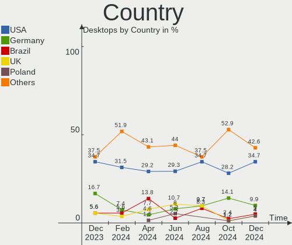
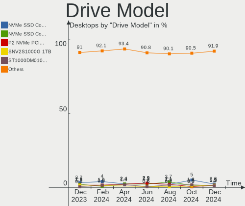
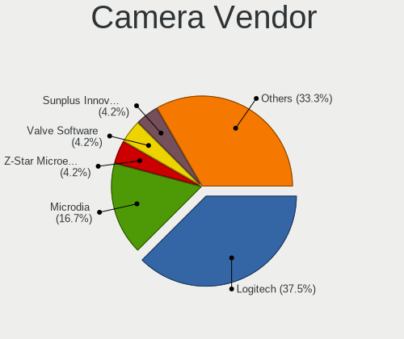
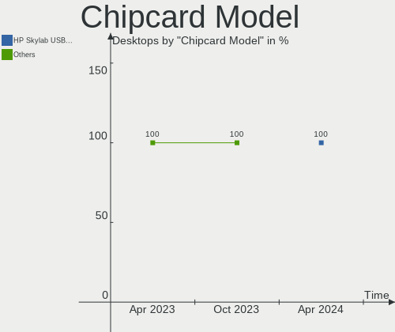
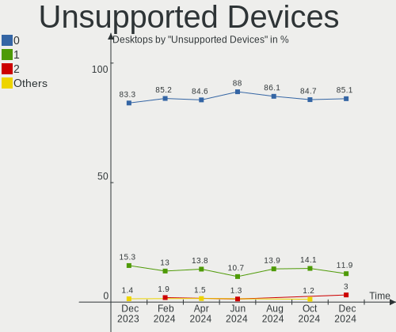

Pop!_OS Hardware Trends (Desktops)
----------------------------------

A project to identify most popular hardware characteristics and track their change
over time based on data collected by Pop!_OS users at https://Linux-Hardware.org.

Anyone can contribute to this report by the [hw-probe](https://github.com/linuxhw/hw-probe) tool:

    sudo -E hw-probe -all -upload

Full-feature report is available here: https://linux-hardware.org/?view=trends

Period: Dec, 2021.

Contents
--------

* [ System ](#system)
  - [ OS                       ](#os)
  - [ OS Family                ](#os-family)
  - [ Kernel                   ](#kernel)
  - [ Kernel Family            ](#kernel-family)
  - [ Kernel Major Ver.        ](#kernel-major-ver)
  - [ Arch                     ](#arch)
  - [ DE                       ](#de)
  - [ Display Server           ](#display-server)
  - [ Display Manager          ](#display-manager)
  - [ OS Lang                  ](#os-lang)
  - [ Boot Mode                ](#boot-mode)
  - [ Filesystem               ](#filesystem)
  - [ Part. scheme             ](#part-scheme)
  - [ Dual Boot with Linux/BSD ](#dual-boot-with-linuxbsd)
  - [ Dual Boot (Win)          ](#dual-boot-win)

* [ Board ](#board)
  - [ Vendor                   ](#vendor)
  - [ Model                    ](#model)
  - [ Model Family             ](#model-family)
  - [ MFG Year                 ](#mfg-year)
  - [ Form Factor              ](#form-factor)
  - [ Secure Boot              ](#secure-boot)
  - [ Coreboot                 ](#coreboot)
  - [ RAM Size                 ](#ram-size)
  - [ RAM Used                 ](#ram-used)
  - [ Total Drives             ](#total-drives)
  - [ Has CD-ROM               ](#has-cd-rom)
  - [ Has Ethernet             ](#has-ethernet)
  - [ Has WiFi                 ](#has-wifi)
  - [ Has Bluetooth            ](#has-bluetooth)

* [ Location ](#location)
  - [ Country                  ](#country)
  - [ City                     ](#city)

* [ Drives ](#drives)
  - [ Drive Vendor             ](#drive-vendor)
  - [ Drive Model              ](#drive-model)
  - [ HDD Vendor               ](#hdd-vendor)
  - [ SSD Vendor               ](#ssd-vendor)
  - [ Drive Kind               ](#drive-kind)
  - [ Drive Connector          ](#drive-connector)
  - [ Drive Size               ](#drive-size)
  - [ Space Total              ](#space-total)
  - [ Space Used               ](#space-used)
  - [ Malfunc. Drives          ](#malfunc-drives)
  - [ Malfunc. Drive Vendor    ](#malfunc-drive-vendor)
  - [ Malfunc. HDD Vendor      ](#malfunc-hdd-vendor)
  - [ Malfunc. Drive Kind      ](#malfunc-drive-kind)
  - [ Failed Drives            ](#failed-drives)
  - [ Failed Drive Vendor      ](#failed-drive-vendor)
  - [ Drive Status             ](#drive-status)

* [ Storage controller ](#storage-controller)
  - [ Storage Vendor           ](#storage-vendor)
  - [ Storage Model            ](#storage-model)
  - [ Storage Kind             ](#storage-kind)

* [ Processor ](#processor)
  - [ CPU Vendor               ](#cpu-vendor)
  - [ CPU Model                ](#cpu-model)
  - [ CPU Model Family         ](#cpu-model-family)
  - [ CPU Cores                ](#cpu-cores)
  - [ CPU Sockets              ](#cpu-sockets)
  - [ CPU Threads              ](#cpu-threads)
  - [ CPU Op-Modes             ](#cpu-op-modes)
  - [ CPU Microcode            ](#cpu-microcode)
  - [ CPU Microarch            ](#cpu-microarch)

* [ Graphics ](#graphics)
  - [ GPU Vendor               ](#gpu-vendor)
  - [ GPU Model                ](#gpu-model)
  - [ GPU Combo                ](#gpu-combo)
  - [ GPU Driver               ](#gpu-driver)
  - [ GPU Memory               ](#gpu-memory)

* [ Monitor ](#monitor)
  - [ Monitor Vendor           ](#monitor-vendor)
  - [ Monitor Model            ](#monitor-model)
  - [ Monitor Resolution       ](#monitor-resolution)
  - [ Monitor Diagonal         ](#monitor-diagonal)
  - [ Monitor Width            ](#monitor-width)
  - [ Aspect Ratio             ](#aspect-ratio)
  - [ Monitor Area             ](#monitor-area)
  - [ Pixel Density            ](#pixel-density)
  - [ Multiple Monitors        ](#multiple-monitors)

* [ Network ](#network)
  - [ Net Controller Vendor    ](#net-controller-vendor)
  - [ Net Controller Model     ](#net-controller-model)
  - [ Wireless Vendor          ](#wireless-vendor)
  - [ Wireless Model           ](#wireless-model)
  - [ Ethernet Vendor          ](#ethernet-vendor)
  - [ Ethernet Model           ](#ethernet-model)
  - [ Net Controller Kind      ](#net-controller-kind)
  - [ Used Controller          ](#used-controller)
  - [ NICs                     ](#nics)
  - [ IPv6                     ](#ipv6)

* [ Bluetooth ](#bluetooth)
  - [ Bluetooth Vendor         ](#bluetooth-vendor)
  - [ Bluetooth Model          ](#bluetooth-model)

* [ Sound ](#sound)
  - [ Sound Vendor             ](#sound-vendor)
  - [ Sound Model              ](#sound-model)

* [ Memory ](#memory)
  - [ Memory Vendor            ](#memory-vendor)
  - [ Memory Model             ](#memory-model)
  - [ Memory Kind              ](#memory-kind)
  - [ Memory Form Factor       ](#memory-form-factor)
  - [ Memory Size              ](#memory-size)
  - [ Memory Speed             ](#memory-speed)

* [ Printers & scanners ](#printers--scanners)
  - [ Printer Vendor           ](#printer-vendor)
  - [ Printer Model            ](#printer-model)
  - [ Scanner Vendor           ](#scanner-vendor)
  - [ Scanner Model            ](#scanner-model)

* [ Camera ](#camera)
  - [ Camera Vendor            ](#camera-vendor)
  - [ Camera Model             ](#camera-model)

* [ Security ](#security)
  - [ Fingerprint Vendor       ](#fingerprint-vendor)
  - [ Fingerprint Model        ](#fingerprint-model)
  - [ Chipcard Vendor          ](#chipcard-vendor)
  - [ Chipcard Model           ](#chipcard-model)

* [ Unsupported ](#unsupported)
  - [ Unsupported Devices      ](#unsupported-devices)
  - [ Unsupported Device Types ](#unsupported-device-types)

System
------

OS
--

Installed operating systems

| Name          | Desktops | Percent |
|---------------|----------|---------|
| Pop!_OS 21.10 | 66       | 51.56%  |
| Pop!_OS 21.04 | 50       | 39.06%  |
| Pop!_OS 20.04 | 12       | 9.38%   |

OS Family
---------

OS without a version

| Name    | Desktops | Percent |
|---------|----------|---------|
| Pop!_OS | 128      | 100%    |

Kernel
------

Version of the Linux kernel

| Version                 | Desktops | Percent |
|-------------------------|----------|---------|
| 5.15.5-76051505-generic | 77       | 60.16%  |
| 5.15.8-76051508-generic | 31       | 24.22%  |
| 5.13.0-7620-generic     | 10       | 7.81%   |
| 5.15.7-xanmod1          | 2        | 1.56%   |
| 5.13.0-7614-generic     | 2        | 1.56%   |
| 5.11.0-7620-generic     | 2        | 1.56%   |
| 5.15.6-tkg-pds          | 1        | 0.78%   |
| 5.13.12-051312-generic  | 1        | 0.78%   |
| 5.11.0-7633-generic     | 1        | 0.78%   |
| 5.10.0-9-amd64          | 1        | 0.78%   |

Kernel Family
-------------

Linux kernel without a distro release

| Version | Desktops | Percent |
|---------|----------|---------|
| 5.15.5  | 77       | 60.16%  |
| 5.15.8  | 31       | 24.22%  |
| 5.13.0  | 12       | 9.38%   |
| 5.11.0  | 3        | 2.34%   |
| 5.15.7  | 2        | 1.56%   |
| 5.15.6  | 1        | 0.78%   |
| 5.13.12 | 1        | 0.78%   |
| 5.10.0  | 1        | 0.78%   |

Kernel Major Ver.
-----------------

Linux kernel major version

| Version | Desktops | Percent |
|---------|----------|---------|
| 5.15    | 111      | 86.72%  |
| 5.13    | 13       | 10.16%  |
| 5.11    | 3        | 2.34%   |
| 5.10    | 1        | 0.78%   |

Arch
----

OS architecture (x86_64, i586, etc.)

| Name   | Desktops | Percent |
|--------|----------|---------|
| x86_64 | 128      | 100%    |

DE
--

Desktop Environment

| Name       | Desktops | Percent |
|------------|----------|---------|
| GNOME      | 126      | 98.44%  |
| XFCE       | 1        | 0.78%   |
| X-Cinnamon | 1        | 0.78%   |

Display Server
--------------

X11 or Wayland

| Name    | Desktops | Percent |
|---------|----------|---------|
| X11     | 127      | 99.22%  |
| Wayland | 1        | 0.78%   |

Display Manager
---------------

SDDM, LightDM, etc.

| Name    | Desktops | Percent |
|---------|----------|---------|
| Unknown | 115      | 89.84%  |
| GDM     | 11       | 8.59%   |
| LightDM | 1        | 0.78%   |
| GDM3    | 1        | 0.78%   |

OS Lang
-------

Language

| Lang  | Desktops | Percent |
|-------|----------|---------|
| en_US | 66       | 51.56%  |
| pt_BR | 11       | 8.59%   |
| de_DE | 9        | 7.03%   |
| en_AU | 8        | 6.25%   |
| en_GB | 7        | 5.47%   |
| C     | 6        | 4.69%   |
| en_CA | 4        | 3.13%   |
| ru_RU | 2        | 1.56%   |
| pl_PL | 2        | 1.56%   |
| es_AR | 2        | 1.56%   |
| sv_SE | 1        | 0.78%   |
| sk_SK | 1        | 0.78%   |
| pt_PT | 1        | 0.78%   |
| nl_NL | 1        | 0.78%   |
| fr_FR | 1        | 0.78%   |
| fi_FI | 1        | 0.78%   |
| es_ES | 1        | 0.78%   |
| en_SG | 1        | 0.78%   |
| en_NZ | 1        | 0.78%   |
| cs_CZ | 1        | 0.78%   |
| ar_SA | 1        | 0.78%   |

Boot Mode
---------

EFI or BIOS

| Mode | Desktops | Percent |
|------|----------|---------|
| BIOS | 118      | 92.19%  |
| EFI  | 10       | 7.81%   |

Filesystem
----------

Type of filesystem

| Type    | Desktops | Percent |
|---------|----------|---------|
| Ext4    | 122      | 95.31%  |
| Overlay | 3        | 2.34%   |
| Btrfs   | 3        | 2.34%   |

Part. scheme
------------

Scheme of partitioning

| Type    | Desktops | Percent |
|---------|----------|---------|
| Unknown | 115      | 89.84%  |
| GPT     | 11       | 8.59%   |
| MBR     | 2        | 1.56%   |

Dual Boot with Linux/BSD
------------------------

Hosting more than one Linux/BSD

| Dual boot | Desktops | Percent |
|-----------|----------|---------|
| No        | 127      | 99.22%  |
| Yes       | 1        | 0.78%   |

Dual Boot (Win)
---------------

Hosting Linux and Windows

| Dual boot | Desktops | Percent |
|-----------|----------|---------|
| No        | 120      | 93.75%  |
| Yes       | 8        | 6.25%   |

Board
-----

Vendor
------

Motherboard manufacturer

| Name                | Desktops | Percent |
|---------------------|----------|---------|
| ASUSTek Computer    | 37       | 28.91%  |
| Gigabyte Technology | 30       | 23.44%  |
| MSI                 | 12       | 9.38%   |
| Hewlett-Packard     | 10       | 7.81%   |
| Dell                | 10       | 7.81%   |
| ASRock              | 10       | 7.81%   |
| Lenovo              | 4        | 3.13%   |
| System76            | 2        | 1.56%   |
| Positivo            | 2        | 1.56%   |
| Pegatron            | 2        | 1.56%   |
| Intel               | 2        | 1.56%   |
| Packard Bell        | 1        | 0.78%   |
| Google              | 1        | 0.78%   |
| Fujitsu             | 1        | 0.78%   |
| Foxconn             | 1        | 0.78%   |
| ECS                 | 1        | 0.78%   |
| Colorful Technology | 1        | 0.78%   |
| 16216-BM-27268      | 1        | 0.78%   |

Model
-----

Motherboard model

| Name                                                   | Desktops | Percent |
|--------------------------------------------------------|----------|---------|
| HP Compaq 8200 Elite SFF PC                            | 2        | 1.56%   |
| Gigabyte B75M-D3H                                      | 2        | 1.56%   |
| Gigabyte B450 I AORUS PRO WIFI                         | 2        | 1.56%   |
| Dell OptiPlex 7010                                     | 2        | 1.56%   |
| Dell OptiPlex 3020                                     | 2        | 1.56%   |
| ASUS TUF GAMING B550M-PLUS                             | 2        | 1.56%   |
| System76 Thelio Major                                  | 1        | 0.78%   |
| System76 Thelio                                        | 1        | 0.78%   |
| Positivo POS-PARS760GCD                                | 1        | 0.78%   |
| Positivo POS-EINM70CS                                  | 1        | 0.78%   |
| Pegatron AY691AA-ABA p6367c                            | 1        | 0.78%   |
| Pegatron 20-b014                                       | 1        | 0.78%   |
| Packard Bell IXTREME M5850                             | 1        | 0.78%   |
| MSI MS-7C84                                            | 1        | 0.78%   |
| MSI MS-7C37                                            | 1        | 0.78%   |
| MSI MS-7C02                                            | 1        | 0.78%   |
| MSI MS-7B92                                            | 1        | 0.78%   |
| MSI MS-7B09                                            | 1        | 0.78%   |
| MSI MS-7A34                                            | 1        | 0.78%   |
| MSI MS-7A33                                            | 1        | 0.78%   |
| MSI MS-7A32                                            | 1        | 0.78%   |
| MSI MS-7919                                            | 1        | 0.78%   |
| MSI MS-7851                                            | 1        | 0.78%   |
| MSI MS-7817                                            | 1        | 0.78%   |
| MSI MS-7529                                            | 1        | 0.78%   |
| Lenovo ThinkCentre M93p 10AAS3JG00                     | 1        | 0.78%   |
| Lenovo ThinkCentre M93p 10A8S3C100                     | 1        | 0.78%   |
| Lenovo ThinkCentre M900 10FLS0A000                     | 1        | 0.78%   |
| Lenovo ThinkCentre M73 10B4S1DD00                      | 1        | 0.78%   |
| Intel Ordi PolyMtl                                     | 1        | 0.78%   |
| Intel DH61BF AAG81311-101                              | 1        | 0.78%   |
| HP Z400 Workstation                                    | 1        | 0.78%   |
| HP Pavilion 690-0067c Desktop Rfrbd PC                 | 1        | 0.78%   |
| HP OMEN 25L Desktop GT12-0xxx                          | 1        | 0.78%   |
| HP MP9 G2 Retail System                                | 1        | 0.78%   |
| HP EliteDesk 800 G1 SFF                                | 1        | 0.78%   |
| HP Compaq Elite 8300 SFF                               | 1        | 0.78%   |
| HP Compaq 6200 Pro SFF PC                              | 1        | 0.78%   |
| HP 500-223w                                            | 1        | 0.78%   |
| Google Sion                                            | 1        | 0.78%   |
| Gigabyte Z87X-D3H                                      | 1        | 0.78%   |
| Gigabyte Z68AP-D3                                      | 1        | 0.78%   |
| Gigabyte Z370N WIFI                                    | 1        | 0.78%   |
| Gigabyte X570 AORUS ULTRA                              | 1        | 0.78%   |
| Gigabyte X570 AORUS ELITE WIFI                         | 1        | 0.78%   |
| Gigabyte X570 AORUS ELITE                              | 1        | 0.78%   |
| Gigabyte Wild Dog Pro                                  | 1        | 0.78%   |
| Gigabyte H87M-HD3                                      | 1        | 0.78%   |
| Gigabyte H510M H                                       | 1        | 0.78%   |
| Gigabyte H410M H                                       | 1        | 0.78%   |
| Gigabyte H370AORUSGAMING3WIFI                          | 1        | 0.78%   |
| Gigabyte H310M H 2.0                                   | 1        | 0.78%   |
| Gigabyte H110M-S2PH                                    | 1        | 0.78%   |
| Gigabyte GA-MA78LMT-S2                                 | 1        | 0.78%   |
| Gigabyte GA-MA770T-UD3P                                | 1        | 0.78%   |
| Gigabyte GA-78LMT-USB3 6.0                             | 1        | 0.78%   |
| Gigabyte G31M-ES2C                                     | 1        | 0.78%   |
| Gigabyte F2A88XM-D3HP                                  | 1        | 0.78%   |
| Gigabyte Customised AMD Zen Bundles Motherboard Bundle | 1        | 0.78%   |
| Gigabyte B85M-DS3H-A                                   | 1        | 0.78%   |

Model Family
------------

Motherboard model prefix

| Name                          | Desktops | Percent |
|-------------------------------|----------|---------|
| ASUS ROG                      | 8        | 6.25%   |
| Dell OptiPlex                 | 7        | 5.47%   |
| ASUS PRIME                    | 6        | 4.69%   |
| Lenovo ThinkCentre            | 4        | 3.13%   |
| HP Compaq                     | 4        | 3.13%   |
| ASUS TUF                      | 4        | 3.13%   |
| Gigabyte X570                 | 3        | 2.34%   |
| Gigabyte B450                 | 3        | 2.34%   |
| System76 Thelio               | 2        | 1.56%   |
| Gigabyte B75M-D3H             | 2        | 1.56%   |
| ASUS Rampage                  | 2        | 1.56%   |
| ASRock Z87                    | 2        | 1.56%   |
| Positivo POS-PARS760GCD       | 1        | 0.78%   |
| Positivo POS-EINM70CS         | 1        | 0.78%   |
| Pegatron AY691AA-ABA          | 1        | 0.78%   |
| Pegatron 20-b014              | 1        | 0.78%   |
| Packard Bell IXTREME          | 1        | 0.78%   |
| MSI MS-7C84                   | 1        | 0.78%   |
| MSI MS-7C37                   | 1        | 0.78%   |
| MSI MS-7C02                   | 1        | 0.78%   |
| MSI MS-7B92                   | 1        | 0.78%   |
| MSI MS-7B09                   | 1        | 0.78%   |
| MSI MS-7A34                   | 1        | 0.78%   |
| MSI MS-7A33                   | 1        | 0.78%   |
| MSI MS-7A32                   | 1        | 0.78%   |
| MSI MS-7919                   | 1        | 0.78%   |
| MSI MS-7851                   | 1        | 0.78%   |
| MSI MS-7817                   | 1        | 0.78%   |
| MSI MS-7529                   | 1        | 0.78%   |
| Intel Ordi                    | 1        | 0.78%   |
| Intel DH61BF                  | 1        | 0.78%   |
| HP Z400                       | 1        | 0.78%   |
| HP Pavilion                   | 1        | 0.78%   |
| HP OMEN                       | 1        | 0.78%   |
| HP MP9                        | 1        | 0.78%   |
| HP EliteDesk                  | 1        | 0.78%   |
| HP 500-223w                   | 1        | 0.78%   |
| Google Sion                   | 1        | 0.78%   |
| Gigabyte Z87X-D3H             | 1        | 0.78%   |
| Gigabyte Z68AP-D3             | 1        | 0.78%   |
| Gigabyte Z370N                | 1        | 0.78%   |
| Gigabyte Wild                 | 1        | 0.78%   |
| Gigabyte H87M-HD3             | 1        | 0.78%   |
| Gigabyte H510M                | 1        | 0.78%   |
| Gigabyte H410M                | 1        | 0.78%   |
| Gigabyte H370AORUSGAMING3WIFI | 1        | 0.78%   |
| Gigabyte H310M                | 1        | 0.78%   |
| Gigabyte H110M-S2PH           | 1        | 0.78%   |
| Gigabyte GA-MA78LMT-S2        | 1        | 0.78%   |
| Gigabyte GA-MA770T-UD3P       | 1        | 0.78%   |
| Gigabyte GA-78LMT-USB3        | 1        | 0.78%   |
| Gigabyte G31M-ES2C            | 1        | 0.78%   |
| Gigabyte F2A88XM-D3HP         | 1        | 0.78%   |
| Gigabyte Customised           | 1        | 0.78%   |
| Gigabyte B85M-DS3H-A          | 1        | 0.78%   |
| Gigabyte B550                 | 1        | 0.78%   |
| Gigabyte B450M                | 1        | 0.78%   |
| Gigabyte B360M                | 1        | 0.78%   |
| Gigabyte AM1M-S2H             | 1        | 0.78%   |
| Gigabyte A320M-H              | 1        | 0.78%   |

MFG Year
--------

Motherboard manufacture year

| Year | Desktops | Percent |
|------|----------|---------|
| 2021 | 35       | 27.34%  |
| 2018 | 14       | 10.94%  |
| 2015 | 12       | 9.38%   |
| 2020 | 11       | 8.59%   |
| 2013 | 11       | 8.59%   |
| 2014 | 10       | 7.81%   |
| 2011 | 9        | 7.03%   |
| 2019 | 8        | 6.25%   |
| 2012 | 4        | 3.13%   |
| 2009 | 3        | 2.34%   |
| 2008 | 3        | 2.34%   |
| 2017 | 2        | 1.56%   |
| 2016 | 2        | 1.56%   |
| 2010 | 2        | 1.56%   |
| 2007 | 2        | 1.56%   |

Form Factor
-----------

Physical design of the computer

| Name    | Desktops | Percent |
|---------|----------|---------|
| Desktop | 128      | 100%    |

Secure Boot
-----------

Enabled or disabled

| State    | Desktops | Percent |
|----------|----------|---------|
| Disabled | 128      | 100%    |

Coreboot
--------

Have coreboot on board

| Used | Desktops | Percent |
|------|----------|---------|
| No   | 127      | 99.22%  |
| Yes  | 1        | 0.78%   |

RAM Size
--------

Total RAM memory

| Size in GB  | Desktops | Percent |
|-------------|----------|---------|
| 16.01-24.0  | 44       | 34.38%  |
| 32.01-64.0  | 27       | 21.09%  |
| 8.01-16.0   | 20       | 15.63%  |
| 4.01-8.0    | 18       | 14.06%  |
| 64.01-256.0 | 6        | 4.69%   |
| 3.01-4.0    | 5        | 3.91%   |
| 24.01-32.0  | 3        | 2.34%   |
| 2.01-3.0    | 2        | 1.56%   |
| 1.01-2.0    | 2        | 1.56%   |
| 0.51-1.0    | 1        | 0.78%   |

RAM Used
--------

Used RAM memory

| Used GB    | Desktops | Percent |
|------------|----------|---------|
| 2.01-3.0   | 40       | 31.25%  |
| 1.01-2.0   | 33       | 25.78%  |
| 3.01-4.0   | 28       | 21.88%  |
| 4.01-8.0   | 18       | 14.06%  |
| 8.01-16.0  | 6        | 4.69%   |
| 0.51-1.0   | 2        | 1.56%   |
| 16.01-24.0 | 1        | 0.78%   |

Total Drives
------------

Number of drives on board

| Drives | Desktops | Percent |
|--------|----------|---------|
| 1      | 46       | 35.94%  |
| 2      | 36       | 28.13%  |
| 3      | 20       | 15.63%  |
| 4      | 12       | 9.38%   |
| 5      | 8        | 6.25%   |
| 6      | 5        | 3.91%   |
| 0      | 1        | 0.78%   |

Has CD-ROM
----------

Has CD-ROM on board

| Presented | Desktops | Percent |
|-----------|----------|---------|
| No        | 85       | 66.41%  |
| Yes       | 43       | 33.59%  |

Has Ethernet
------------

Has Ethernet on board

| Presented | Desktops | Percent |
|-----------|----------|---------|
| Yes       | 127      | 99.22%  |
| No        | 1        | 0.78%   |

Has WiFi
--------

Has WiFi module

| Presented | Desktops | Percent |
|-----------|----------|---------|
| Yes       | 70       | 54.69%  |
| No        | 58       | 45.31%  |

Has Bluetooth
-------------

Has Bluetooth module

| Presented | Desktops | Percent |
|-----------|----------|---------|
| No        | 76       | 59.38%  |
| Yes       | 52       | 40.63%  |

Location
--------

Country
-------

Geographic location (country)

| Country      | Desktops | Percent |
|--------------|----------|---------|
| USA          | 41       | 32.03%  |
| Brazil       | 12       | 9.38%   |
| Germany      | 10       | 7.81%   |
| Australia    | 9        | 7.03%   |
| Netherlands  | 7        | 5.47%   |
| Canada       | 7        | 5.47%   |
| UK           | 5        | 3.91%   |
| Russia       | 4        | 3.13%   |
| Saudi Arabia | 3        | 2.34%   |
| Poland       | 3        | 2.34%   |
| Argentina    | 3        | 2.34%   |
| Sweden       | 2        | 1.56%   |
| New Zealand  | 2        | 1.56%   |
| Finland      | 2        | 1.56%   |
| Slovakia     | 1        | 0.78%   |
| Singapore    | 1        | 0.78%   |
| Romania      | 1        | 0.78%   |
| Puerto Rico  | 1        | 0.78%   |
| Portugal     | 1        | 0.78%   |
| Palestine    | 1        | 0.78%   |
| Montenegro   | 1        | 0.78%   |
| Mexico       | 1        | 0.78%   |
| Malaysia     | 1        | 0.78%   |
| Lithuania    | 1        | 0.78%   |
| Japan        | 1        | 0.78%   |
| Italy        | 1        | 0.78%   |
| India        | 1        | 0.78%   |
| Hungary      | 1        | 0.78%   |
| Czechia      | 1        | 0.78%   |
| Cyprus       | 1        | 0.78%   |
| Bulgaria     | 1        | 0.78%   |
| Austria      | 1        | 0.78%   |

City
----

Geographic location (city)

| City             | Desktops | Percent |
|------------------|----------|---------|
| S??o Paulo       | 4        | 3.13%   |
| Utrecht          | 2        | 1.56%   |
| The Hague        | 2        | 1.56%   |
| Sydney           | 2        | 1.56%   |
| Riyadh           | 2        | 1.56%   |
| Melbourne        | 2        | 1.56%   |
| Jacksonville     | 2        | 1.56%   |
| Brisbane         | 2        | 1.56%   |
| Adelaide CBD     | 2        | 1.56%   |
| Yekaterinburg    | 1        | 0.78%   |
| Willoughby       | 1        | 0.78%   |
| Wichita          | 1        | 0.78%   |
| West Palm Beach  | 1        | 0.78%   |
| West Orange      | 1        | 0.78%   |
| Vilnius          | 1        | 0.78%   |
| Vienna           | 1        | 0.78%   |
| Ume??            | 1        | 0.78%   |
| Tukwila          | 1        | 0.78%   |
| Tokyo            | 1        | 0.78%   |
| The Colony       | 1        | 0.78%   |
| Texarkana        | 1        | 0.78%   |
| Tampa            | 1        | 0.78%   |
| Taby             | 1        | 0.78%   |
| Szczecin         | 1        | 0.78%   |
| Sungai Buloh     | 1        | 0.78%   |
| St. Albert       | 1        | 0.78%   |
| Spartanburg      | 1        | 0.78%   |
| Solingen         | 1        | 0.78%   |
| Singapore        | 1        | 0.78%   |
| Seattle          | 1        | 0.78%   |
| Sapucaia do Sul  | 1        | 0.78%   |
| San Jose         | 1        | 0.78%   |
| Sacramento       | 1        | 0.78%   |
| Rostock          | 1        | 0.78%   |
| Rome             | 1        | 0.78%   |
| Reutlingen       | 1        | 0.78%   |
| Ramallah         | 1        | 0.78%   |
| Puyallup         | 1        | 0.78%   |
| Portland         | 1        | 0.78%   |
| Plymouth         | 1        | 0.78%   |
| Pindamonhangaba  | 1        | 0.78%   |
| Phoenix          | 1        | 0.78%   |
| Palmerston North | 1        | 0.78%   |
| Oulu             | 1        | 0.78%   |
| Ottawa           | 1        | 0.78%   |
| Odintsovo        | 1        | 0.78%   |
| Norcross         | 1        | 0.78%   |
| Nienhagen        | 1        | 0.78%   |
| Nicosia          | 1        | 0.78%   |
| Moscow           | 1        | 0.78%   |
| Monrovia         | 1        | 0.78%   |
| Mission          | 1        | 0.78%   |
| Minneapolis      | 1        | 0.78%   |
| Miami            | 1        | 0.78%   |
| Markham          | 1        | 0.78%   |
| Marco Island     | 1        | 0.78%   |
| Mar del Plata    | 1        | 0.78%   |
| Machados         | 1        | 0.78%   |
| Ludanice         | 1        | 0.78%   |
| Lublin           | 1        | 0.78%   |

Drives
------

Drive Vendor
------------

Hard drive vendors

| Vendor                    | Desktops | Drives | Percent |
|---------------------------|----------|--------|---------|
| Seagate                   | 52       | 62     | 21.94%  |
| Samsung Electronics       | 43       | 74     | 18.14%  |
| WDC                       | 35       | 46     | 14.77%  |
| Kingston                  | 21       | 22     | 8.86%   |
| SanDisk                   | 16       | 18     | 6.75%   |
| Crucial                   | 14       | 14     | 5.91%   |
| Toshiba                   | 10       | 14     | 4.22%   |
| Intel                     | 4        | 4      | 1.69%   |
| Hitachi                   | 4        | 4      | 1.69%   |
| Silicon Motion            | 3        | 3      | 1.27%   |
| Phison                    | 3        | 3      | 1.27%   |
| OCZ                       | 3        | 4      | 1.27%   |
| Micron/Crucial Technology | 3        | 3      | 1.27%   |
| A-DATA Technology         | 3        | 3      | 1.27%   |
| XPG                       | 2        | 2      | 0.84%   |
| SK Hynix                  | 2        | 2      | 0.84%   |
| PNY                       | 2        | 4      | 0.84%   |
| Patriot                   | 2        | 3      | 0.84%   |
| China                     | 2        | 2      | 0.84%   |
| TO Exter                  | 1        | 1      | 0.42%   |
| Team                      | 1        | 1      | 0.42%   |
| SPCC                      | 1        | 1      | 0.42%   |
| Micron Technology         | 1        | 2      | 0.42%   |
| LITEON                    | 1        | 1      | 0.42%   |
| Intenso                   | 1        | 1      | 0.42%   |
| Integral                  | 1        | 1      | 0.42%   |
| HGST HTS                  | 1        | 1      | 0.42%   |
| Hewlett-Packard           | 1        | 1      | 0.42%   |
| Gigabyte Technology       | 1        | 1      | 0.42%   |
| External                  | 1        | 1      | 0.42%   |
| Corsair                   | 1        | 2      | 0.42%   |
| Unknown                   | 1        | 1      | 0.42%   |

Drive Model
-----------

Hard drive models

| Model                               | Desktops | Percent |
|-------------------------------------|----------|---------|
| Samsung NVMe SSD Drive 1TB          | 12       | 4.3%    |
| Samsung SSD 850 EVO 250GB           | 6        | 2.15%   |
| Kingston SA400S37240G 240GB SSD     | 5        | 1.79%   |
| Seagate ST1000DM010-2EP102 1TB      | 4        | 1.43%   |
| Sandisk NVMe SSD Drive 500GB        | 4        | 1.43%   |
| Kingston SA400S37120G 120GB SSD     | 4        | 1.43%   |
| WDC WDS240G2G0B-00EPW0 240GB SSD    | 3        | 1.08%   |
| Toshiba DT01ACA100 1TB              | 3        | 1.08%   |
| Seagate ST1000DM003-1SB102 1TB      | 3        | 1.08%   |
| Sandisk NVMe SSD Drive 1TB          | 3        | 1.08%   |
| Samsung SSD 870 QVO 1TB             | 3        | 1.08%   |
| Samsung NVMe SSD Drive 500GB        | 3        | 1.08%   |
| Samsung NVMe SSD Drive 250GB        | 3        | 1.08%   |
| Crucial CT480BX500SSD1 480GB        | 3        | 1.08%   |
| Crucial CT240BX500SSD1 240GB        | 3        | 1.08%   |
| XPG NVMe SSD Drive 512GB            | 2        | 0.72%   |
| WDC WD2003FZEX-00SRLA0 2TB          | 2        | 0.72%   |
| SK Hynix SHGS31-500GS-2 500GB SSD   | 2        | 0.72%   |
| Seagate ST500DM002-1BD142 500GB     | 2        | 0.72%   |
| Seagate ST4000DM000-1F2168 4TB      | 2        | 0.72%   |
| Seagate ST3250318AS 250GB           | 2        | 0.72%   |
| Seagate ST2000DM008-2FR102 2TB      | 2        | 0.72%   |
| Seagate ST2000DM001-1ER164 2TB      | 2        | 0.72%   |
| Seagate ST2000DM001-1CH164 2TB      | 2        | 0.72%   |
| Samsung SSD 980 PRO 1TB             | 2        | 0.72%   |
| Samsung SSD 970 EVO 1TB             | 2        | 0.72%   |
| Samsung SSD 870 EVO 1TB             | 2        | 0.72%   |
| Samsung SSD 860 EVO 500GB           | 2        | 0.72%   |
| Samsung SSD 860 EVO 250GB           | 2        | 0.72%   |
| Samsung SSD 860 EVO 1TB             | 2        | 0.72%   |
| Samsung SSD 850 EVO 500GB           | 2        | 0.72%   |
| Samsung SSD 840 EVO 250GB           | 2        | 0.72%   |
| Samsung SSD 840 EVO 120GB           | 2        | 0.72%   |
| Samsung NVMe SSD Drive 512GB        | 2        | 0.72%   |
| Phison NVMe SSD Drive 1TB           | 2        | 0.72%   |
| OCZ AGILITY3 120GB SSD              | 2        | 0.72%   |
| Micron/Crucial NVMe SSD Drive 500GB | 2        | 0.72%   |
| Kingston SV300S37A240G 240GB SSD    | 2        | 0.72%   |
| Kingston SA400S37480G 480GB SSD     | 2        | 0.72%   |
| Kingston NVMe SSD Drive 500GB       | 2        | 0.72%   |
| WDC WDS500G2B0A-00SM50 500GB SSD    | 1        | 0.36%   |
| WDC WDS400T2B0A-00SM50 4TB SSD      | 1        | 0.36%   |
| WDC WDS100T3X0C-00SJG0 1TB          | 1        | 0.36%   |
| WDC WDS100T2B0B 1TB SSD             | 1        | 0.36%   |
| WDC WD800JD-75MSA1 80GB             | 1        | 0.36%   |
| WDC WD800JD-75LSA0 80GB             | 1        | 0.36%   |
| WDC WD7500LPCX-80HWST0 752GB        | 1        | 0.36%   |
| WDC WD60EFRX-68L0BN1 6TB            | 1        | 0.36%   |
| WDC WD6003FFBX-68MU3N0 6TB          | 1        | 0.36%   |
| WDC WD5000LPVX-22V0TT0 500GB        | 1        | 0.36%   |
| WDC WD5000AZDX-00SC2B0 500GB        | 1        | 0.36%   |
| WDC WD5000AAKX-753CA1 500GB         | 1        | 0.36%   |
| WDC WD40EZAZ-00SF3B0 4TB            | 1        | 0.36%   |
| WDC WD40EMRX-82UZ0N0 4TB            | 1        | 0.36%   |
| WDC WD3200AAKS-00VYA0 320GB         | 1        | 0.36%   |
| WDC WD30PURX-64P6ZY0 3TB            | 1        | 0.36%   |
| WDC WD3000GLFS-01F8U0 304GB         | 1        | 0.36%   |
| WDC WD2500AAKX-60U6AA0 250GB        | 1        | 0.36%   |
| WDC WD20EZRX-00DC0B0 2TB            | 1        | 0.36%   |
| WDC WD20EFRX-68EUZN0 2TB            | 1        | 0.36%   |

HDD Vendor
----------

Hard disk drive vendors

| Vendor              | Desktops | Drives | Percent |
|---------------------|----------|--------|---------|
| Seagate             | 48       | 57     | 50.53%  |
| WDC                 | 30       | 39     | 31.58%  |
| Toshiba             | 8        | 12     | 8.42%   |
| Hitachi             | 4        | 4      | 4.21%   |
| Samsung Electronics | 3        | 3      | 3.16%   |
| TO Exter            | 1        | 1      | 1.05%   |
| External            | 1        | 1      | 1.05%   |

SSD Vendor
----------

Solid state drive vendors

| Vendor              | Desktops | Drives | Percent |
|---------------------|----------|--------|---------|
| Samsung Electronics | 27       | 36     | 27.55%  |
| Kingston            | 16       | 17     | 16.33%  |
| Crucial             | 14       | 14     | 14.29%  |
| SanDisk             | 8        | 8      | 8.16%   |
| WDC                 | 6        | 6      | 6.12%   |
| OCZ                 | 3        | 4      | 3.06%   |
| A-DATA Technology   | 3        | 3      | 3.06%   |
| SK Hynix            | 2        | 2      | 2.04%   |
| PNY                 | 2        | 4      | 2.04%   |
| Patriot             | 2        | 3      | 2.04%   |
| Intel               | 2        | 2      | 2.04%   |
| China               | 2        | 2      | 2.04%   |
| Toshiba             | 1        | 1      | 1.02%   |
| Team                | 1        | 1      | 1.02%   |
| SPCC                | 1        | 1      | 1.02%   |
| Seagate             | 1        | 1      | 1.02%   |
| Micron Technology   | 1        | 1      | 1.02%   |
| Intenso             | 1        | 1      | 1.02%   |
| Integral            | 1        | 1      | 1.02%   |
| Hewlett-Packard     | 1        | 1      | 1.02%   |
| Gigabyte Technology | 1        | 1      | 1.02%   |
| Corsair             | 1        | 2      | 1.02%   |
| Unknown             | 1        | 1      | 1.02%   |

Drive Kind
----------

HDD or SSD

| Kind    | Desktops | Drives | Percent |
|---------|----------|--------|---------|
| SSD     | 79       | 113    | 38.54%  |
| HDD     | 75       | 117    | 36.59%  |
| NVMe    | 48       | 69     | 23.41%  |
| Unknown | 3        | 3      | 1.46%   |

Drive Connector
---------------

SATA, SAS, NVMe, etc.

| Type | Desktops | Drives | Percent |
|------|----------|--------|---------|
| SATA | 116      | 223    | 66.67%  |
| NVMe | 48       | 69     | 27.59%  |
| SAS  | 10       | 10     | 5.75%   |

Drive Size
----------

Size of hard drive

| Size in TB | Desktops | Drives | Percent |
|------------|----------|--------|---------|
| 0.01-0.5   | 84       | 125    | 50.3%   |
| 0.51-1.0   | 45       | 53     | 26.95%  |
| 1.01-2.0   | 19       | 24     | 11.38%  |
| 3.01-4.0   | 11       | 17     | 6.59%   |
| 4.01-10.0  | 5        | 7      | 2.99%   |
| 2.01-3.0   | 2        | 3      | 1.2%    |
| 10.01-20.0 | 1        | 1      | 0.6%    |

Space Total
-----------

Amount of disk space available on the file system

| Size in GB     | Desktops | Percent |
|----------------|----------|---------|
| 101-250        | 35       | 27.34%  |
| 501-1000       | 27       | 21.09%  |
| 251-500        | 25       | 19.53%  |
| More than 3000 | 14       | 10.94%  |
| 1001-2000      | 10       | 7.81%   |
| 2001-3000      | 7        | 5.47%   |
| 1-20           | 5        | 3.91%   |
| 51-100         | 3        | 2.34%   |
| Unknown        | 2        | 1.56%   |

Space Used
----------

Amount of used disk space

| Used GB        | Desktops | Percent |
|----------------|----------|---------|
| 1-20           | 35       | 27.34%  |
| 21-50          | 20       | 15.63%  |
| 51-100         | 17       | 13.28%  |
| 251-500        | 16       | 12.5%   |
| 101-250        | 16       | 12.5%   |
| 1001-2000      | 9        | 7.03%   |
| 501-1000       | 5        | 3.91%   |
| More than 3000 | 4        | 3.13%   |
| 2001-3000      | 4        | 3.13%   |
| Unknown        | 2        | 1.56%   |

Malfunc. Drives
---------------

Drive models with a malfunction

| Model                       | Desktops | Drives | Percent |
|-----------------------------|----------|--------|---------|
| WDC WD5000AAKX-753CA1 500GB | 1        | 1      | 100%    |

Malfunc. Drive Vendor
---------------------

Vendors of faulty drives

| Vendor | Desktops | Drives | Percent |
|--------|----------|--------|---------|
| WDC    | 1        | 1      | 100%    |

Malfunc. HDD Vendor
-------------------

Vendors of faulty HDD drives

| Vendor | Desktops | Drives | Percent |
|--------|----------|--------|---------|
| WDC    | 1        | 1      | 100%    |

Malfunc. Drive Kind
-------------------

Kinds of faulty drives

| Kind | Desktops | Drives | Percent |
|------|----------|--------|---------|
| HDD  | 1        | 1      | 100%    |

Failed Drives
-------------

Failed drive models

Zero info for selected period =(

Failed Drive Vendor
-------------------

Failed drive vendors

Zero info for selected period =(

Drive Status
------------

Number of failed and malfunc. drives

| Status   | Desktops | Drives | Percent |
|----------|----------|--------|---------|
| Detected | 116      | 268    | 87.22%  |
| Works    | 16       | 33     | 12.03%  |
| Malfunc  | 1        | 1      | 0.75%   |

Storage controller
------------------

Storage Vendor
--------------

Storage controller vendors

| Vendor                       | Desktops | Percent |
|------------------------------|----------|---------|
| Intel                        | 76       | 38%     |
| AMD                          | 52       | 26%     |
| Samsung Electronics          | 25       | 12.5%   |
| Sandisk                      | 10       | 5%      |
| ASMedia Technology           | 8        | 4%      |
| Kingston Technology Company  | 6        | 3%      |
| JMicron Technology           | 4        | 2%      |
| Silicon Motion               | 3        | 1.5%    |
| Phison Electronics           | 3        | 1.5%    |
| Micron/Crucial Technology    | 3        | 1.5%    |
| Seagate Technology           | 2        | 1%      |
| Marvell Technology Group     | 2        | 1%      |
| ADATA Technology             | 2        | 1%      |
| Toshiba America Info Systems | 1        | 0.5%    |
| Nvidia                       | 1        | 0.5%    |
| Micron Technology            | 1        | 0.5%    |
| Lite-On Technology           | 1        | 0.5%    |

Storage Model
-------------

Storage controller models

| Model                                                                            | Desktops | Percent |
|----------------------------------------------------------------------------------|----------|---------|
| AMD FCH SATA Controller [AHCI mode]                                              | 29       | 12.45%  |
| Intel 8 Series/C220 Series Chipset Family 6-port SATA Controller 1 [AHCI mode]   | 16       | 6.87%   |
| AMD 400 Series Chipset SATA Controller                                           | 13       | 5.58%   |
| Samsung NVMe SSD Controller SM981/PM981/PM983                                    | 12       | 5.15%   |
| ASMedia ASM1062 Serial ATA Controller                                            | 8        | 3.43%   |
| Intel Q170/Q150/B150/H170/H110/Z170/CM236 Chipset SATA Controller [AHCI Mode]    | 7        | 3%      |
| Intel 6 Series/C200 Series Chipset Family 6 port Desktop SATA AHCI Controller    | 7        | 3%      |
| Intel 200 Series PCH SATA controller [AHCI mode]                                 | 6        | 2.58%   |
| AMD Starship/Matisse Chipset SATA Controller [AHCI mode]                         | 6        | 2.58%   |
| Samsung NVMe SSD Controller PM9A1/PM9A3/980PRO                                   | 5        | 2.15%   |
| Samsung NVMe SSD Controller SM961/PM961/SM963                                    | 4        | 1.72%   |
| Intel SATA Controller [RAID mode]                                                | 4        | 1.72%   |
| Intel Cannon Lake PCH SATA AHCI Controller                                       | 4        | 1.72%   |
| Intel 7 Series/C210 Series Chipset Family 6-port SATA Controller [AHCI mode]     | 4        | 1.72%   |
| AMD SB7x0/SB8x0/SB9x0 SATA Controller [IDE mode]                                 | 4        | 1.72%   |
| AMD SB7x0/SB8x0/SB9x0 SATA Controller [AHCI mode]                                | 4        | 1.72%   |
| AMD SB7x0/SB8x0/SB9x0 IDE Controller                                             | 4        | 1.72%   |
| Sandisk WD Blue SN550 NVMe SSD                                                   | 3        | 1.29%   |
| Sandisk WD Black SN750 / PC SN730 NVMe SSD                                       | 3        | 1.29%   |
| Samsung NVMe SSD Controller 980                                                  | 3        | 1.29%   |
| Kingston Company A2000 NVMe SSD                                                  | 3        | 1.29%   |
| Intel NM10/ICH7 Family SATA Controller [IDE mode]                                | 3        | 1.29%   |
| AMD X370 Series Chipset SATA Controller                                          | 3        | 1.29%   |
| AMD 300 Series Chipset SATA Controller                                           | 3        | 1.29%   |
| Silicon Motion SM2263EN/SM2263XT SSD Controller                                  | 2        | 0.86%   |
| Seagate Non-Volatile memory controller                                           | 2        | 0.86%   |
| Sandisk Non-Volatile memory controller                                           | 2        | 0.86%   |
| Samsung NVMe SSD Controller SM951/PM951                                          | 2        | 0.86%   |
| Phison E12 NVMe Controller                                                       | 2        | 0.86%   |
| Micron/Crucial P2 NVMe PCIe SSD                                                  | 2        | 0.86%   |
| JMicron JMB363 SATA/IDE Controller                                               | 2        | 0.86%   |
| Intel C600/X79 series chipset 6-Port SATA AHCI Controller                        | 2        | 0.86%   |
| Intel 9 Series Chipset Family SATA Controller [AHCI Mode]                        | 2        | 0.86%   |
| Intel 82801I (ICH9 Family) 2 port SATA Controller [IDE mode]                     | 2        | 0.86%   |
| Intel 82801G (ICH7 Family) IDE Controller                                        | 2        | 0.86%   |
| Intel 500 Series Chipset Family SATA AHCI Controller                             | 2        | 0.86%   |
| AMD X399 Series Chipset SATA Controller                                          | 2        | 0.86%   |
| ADATA XPG SX8200 Pro PCIe Gen3x4 M.2 2280 Solid State Drive                      | 2        | 0.86%   |
| Toshiba America Info Systems Toshiba America Info Non-Volatile memory controller | 1        | 0.43%   |
| Silicon Motion SM2262/SM2262EN SSD Controller                                    | 1        | 0.43%   |
| Sandisk WD PC SN810 / Black SN850 NVMe SSD                                       | 1        | 0.43%   |
| Sandisk WD Black 2018/SN750 / PC SN720 NVMe SSD                                  | 1        | 0.43%   |
| Phison E16 PCIe4 NVMe Controller                                                 | 1        | 0.43%   |
| Nvidia MCP61 SATA Controller                                                     | 1        | 0.43%   |
| Nvidia MCP61 IDE                                                                 | 1        | 0.43%   |
| Micron/Crucial NVMe Controller                                                   | 1        | 0.43%   |
| Micron Non-Volatile memory controller                                            | 1        | 0.43%   |
| Marvell Group 88SE9230 PCIe 2.0 x2 4-port SATA 6 Gb/s RAID Controller            | 1        | 0.43%   |
| Marvell Group 88SE9123 PCIe SATA 6.0 Gb/s controller                             | 1        | 0.43%   |
| Lite-On Non-Volatile memory controller                                           | 1        | 0.43%   |
| Kingston Company SNVS2000G [NV1 NVMe PCIe SSD 2TB]                               | 1        | 0.43%   |
| Kingston Company KC2000 NVMe SSD                                                 | 1        | 0.43%   |
| Kingston Company HyperX Predator PCIe AHCI SSD                                   | 1        | 0.43%   |
| JMicron JMB368 IDE controller                                                    | 1        | 0.43%   |
| JMicron JMB362 SATA Controller                                                   | 1        | 0.43%   |
| Intel Sunrise Point-LP SATA Controller [AHCI mode]                               | 1        | 0.43%   |
| Intel SSD 660P Series                                                            | 1        | 0.43%   |
| Intel NVMe Datacenter SSD [3DNAND, Beta Rock Controller]                         | 1        | 0.43%   |
| Intel Comet Lake SATA AHCI Controller                                            | 1        | 0.43%   |
| Intel C610/X99 series chipset 6-Port SATA Controller [AHCI mode]                 | 1        | 0.43%   |

Storage Kind
------------

Kind of storage controller (IDE, SATA, NVMe, SAS, ...)

| Kind | Desktops | Percent |
|------|----------|---------|
| SATA | 111      | 60.33%  |
| NVMe | 48       | 26.09%  |
| IDE  | 20       | 10.87%  |
| RAID | 5        | 2.72%   |

Processor
---------

CPU Vendor
----------

Processor vendors

| Vendor | Desktops | Percent |
|--------|----------|---------|
| Intel  | 75       | 58.59%  |
| AMD    | 53       | 41.41%  |

CPU Model
---------

Processor models

| Model                                       | Desktops | Percent |
|---------------------------------------------|----------|---------|
| AMD Ryzen 5 5600X 6-Core Processor          | 6        | 4.69%   |
| Intel Core i5-4570 CPU @ 3.20GHz            | 4        | 3.13%   |
| Intel Core i5-2400 CPU @ 3.10GHz            | 4        | 3.13%   |
| AMD Ryzen 7 3700X 8-Core Processor          | 4        | 3.13%   |
| Intel Core i7-4790 CPU @ 3.60GHz            | 3        | 2.34%   |
| Intel Core i5-6500 CPU @ 3.20GHz            | 3        | 2.34%   |
| AMD Ryzen 9 5950X 16-Core Processor         | 3        | 2.34%   |
| AMD Ryzen 5 2600 Six-Core Processor         | 3        | 2.34%   |
| AMD FX-8350 Eight-Core Processor            | 3        | 2.34%   |
| Intel Core i7-8700K CPU @ 3.70GHz           | 2        | 1.56%   |
| Intel Core i5-6500T CPU @ 2.50GHz           | 2        | 1.56%   |
| Intel Core i5-4670K CPU @ 3.40GHz           | 2        | 1.56%   |
| Intel Core i5-3470 CPU @ 3.20GHz            | 2        | 1.56%   |
| AMD Ryzen 9 3900X 12-Core Processor         | 2        | 1.56%   |
| AMD Ryzen 7 5800X 8-Core Processor          | 2        | 1.56%   |
| AMD Ryzen 7 3800X 8-Core Processor          | 2        | 1.56%   |
| AMD Ryzen 7 1700 Eight-Core Processor       | 2        | 1.56%   |
| AMD Phenom II X4 965 Processor              | 2        | 1.56%   |
| AMD Athlon 5350 APU with Radeon R3          | 2        | 1.56%   |
| Intel Xeon CPU W3580 @ 3.33GHz              | 1        | 0.78%   |
| Intel Xeon CPU E5-2690 v2 @ 3.00GHz         | 1        | 0.78%   |
| Intel Xeon CPU E3-1241 v3 @ 3.50GHz         | 1        | 0.78%   |
| Intel Pentium Dual-Core CPU E6700 @ 3.20GHz | 1        | 0.78%   |
| Intel Pentium Dual-Core CPU E5400 @ 2.70GHz | 1        | 0.78%   |
| Intel Pentium Dual-Core CPU E5200 @ 2.50GHz | 1        | 0.78%   |
| Intel Pentium CPU G3258 @ 3.20GHz           | 1        | 0.78%   |
| Intel Pentium CPU G2030 @ 3.00GHz           | 1        | 0.78%   |
| Intel Pentium CPU G2020 @ 2.90GHz           | 1        | 0.78%   |
| Intel Core i9-9900K CPU @ 3.60GHz           | 1        | 0.78%   |
| Intel Core i7-7820X CPU @ 3.60GHz           | 1        | 0.78%   |
| Intel Core i7-6700 CPU @ 3.40GHz            | 1        | 0.78%   |
| Intel Core i7-5930K CPU @ 3.50GHz           | 1        | 0.78%   |
| Intel Core i7-4790S CPU @ 3.20GHz           | 1        | 0.78%   |
| Intel Core i7-4790K CPU @ 4.00GHz           | 1        | 0.78%   |
| Intel Core i7-4785T CPU @ 2.20GHz           | 1        | 0.78%   |
| Intel Core i7-4500U CPU @ 1.80GHz           | 1        | 0.78%   |
| Intel Core i7-3930K CPU @ 3.20GHz           | 1        | 0.78%   |
| Intel Core i7-3770 CPU @ 3.40GHz            | 1        | 0.78%   |
| Intel Core i7-2600K CPU @ 3.40GHz           | 1        | 0.78%   |
| Intel Core i7-2600 CPU @ 3.40GHz            | 1        | 0.78%   |
| Intel Core i7 CPU X 000 @ 3.33GHz           | 1        | 0.78%   |
| Intel Core i7 CPU 870 @ 2.93GHz             | 1        | 0.78%   |
| Intel Core i5-9600K CPU @ 3.70GHz           | 1        | 0.78%   |
| Intel Core i5-9400F CPU @ 2.90GHz           | 1        | 0.78%   |
| Intel Core i5-9400 CPU @ 2.90GHz            | 1        | 0.78%   |
| Intel Core i5-7500 CPU @ 3.40GHz            | 1        | 0.78%   |
| Intel Core i5-6600K CPU @ 3.50GHz           | 1        | 0.78%   |
| Intel Core i5-4690K CPU @ 3.50GHz           | 1        | 0.78%   |
| Intel Core i5-4690 CPU @ 3.50GHz            | 1        | 0.78%   |
| Intel Core i5-4590 CPU @ 3.30GHz            | 1        | 0.78%   |
| Intel Core i5-4460 CPU @ 3.20GHz            | 1        | 0.78%   |
| Intel Core i5-2550K CPU @ 3.40GHz           | 1        | 0.78%   |
| Intel Core i5-2400S CPU @ 2.50GHz           | 1        | 0.78%   |
| Intel Core i5-2300 CPU @ 2.80GHz            | 1        | 0.78%   |
| Intel Core i5-10600K CPU @ 4.10GHz          | 1        | 0.78%   |
| Intel Core i5-10400F CPU @ 2.90GHz          | 1        | 0.78%   |
| Intel Core i3-9100F CPU @ 3.60GHz           | 1        | 0.78%   |
| Intel Core i3-8130U CPU @ 2.20GHz           | 1        | 0.78%   |
| Intel Core i3-8100 CPU @ 3.60GHz            | 1        | 0.78%   |
| Intel Core i3-4160 CPU @ 3.60GHz            | 1        | 0.78%   |

CPU Model Family
----------------

Processor model prefix

| Model                   | Desktops | Percent |
|-------------------------|----------|---------|
| Intel Core i5           | 31       | 24.22%  |
| Intel Core i7           | 18       | 14.06%  |
| AMD Ryzen 7             | 14       | 10.94%  |
| AMD Ryzen 5             | 13       | 10.16%  |
| Intel Core i3           | 8        | 6.25%   |
| AMD Ryzen 9             | 7        | 5.47%   |
| AMD FX                  | 5        | 3.91%   |
| Intel Xeon              | 3        | 2.34%   |
| Intel Pentium Dual-Core | 3        | 2.34%   |
| Intel Pentium           | 3        | 2.34%   |
| AMD Ryzen Threadripper  | 3        | 2.34%   |
| Intel Core 2 Quad       | 2        | 1.56%   |
| Intel Core 2 Duo        | 2        | 1.56%   |
| Intel Celeron           | 2        | 1.56%   |
| AMD Phenom II X4        | 2        | 1.56%   |
| AMD Athlon              | 2        | 1.56%   |
| Other                   | 1        | 0.78%   |
| Intel Core i9           | 1        | 0.78%   |
| Intel Core 2            | 1        | 0.78%   |
| AMD Ryzen 3             | 1        | 0.78%   |
| AMD E1                  | 1        | 0.78%   |
| AMD Athlon II X2        | 1        | 0.78%   |
| AMD Athlon 64 X2        | 1        | 0.78%   |
| AMD A8                  | 1        | 0.78%   |
| AMD A6                  | 1        | 0.78%   |
| AMD A10                 | 1        | 0.78%   |

CPU Cores
---------

Number of processor cores

| Number | Desktops | Percent |
|--------|----------|---------|
| 4      | 54       | 42.19%  |
| 6      | 23       | 17.97%  |
| 2      | 21       | 16.41%  |
| 8      | 17       | 13.28%  |
| 12     | 5        | 3.91%   |
| 16     | 4        | 3.13%   |
| 32     | 1        | 0.78%   |
| 10     | 1        | 0.78%   |
| 3      | 1        | 0.78%   |
| 1      | 1        | 0.78%   |

CPU Sockets
-----------

Number of sockets

| Number | Desktops | Percent |
|--------|----------|---------|
| 1      | 128      | 100%    |

CPU Threads
-----------

Threads per core (Hyper-Threading)

| Number | Desktops | Percent |
|--------|----------|---------|
| 2      | 74       | 57.81%  |
| 1      | 54       | 42.19%  |

CPU Op-Modes
------------

CPU Operation Modes (32-bit, 64-bit)

| Op mode        | Desktops | Percent |
|----------------|----------|---------|
| 32-bit, 64-bit | 128      | 100%    |

CPU Microcode
-------------

Microcode number

| Number     | Desktops | Percent |
|------------|----------|---------|
| Unknown    | 111      | 86.72%  |
| 0x306c3    | 2        | 1.56%   |
| 0x0a201016 | 2        | 1.56%   |
| 0x08701021 | 2        | 1.56%   |
| 0x0800820d | 2        | 1.56%   |
| 0x08001137 | 2        | 1.56%   |
| 0xa0653    | 1        | 0.78%   |
| 0x406c4    | 1        | 0.78%   |
| 0x206a7    | 1        | 0.78%   |
| 0x106a5    | 1        | 0.78%   |
| 0x1067a    | 1        | 0.78%   |
| 0x0a201009 | 1        | 0.78%   |
| 0x08301039 | 1        | 0.78%   |

CPU Microarch
-------------

Microarchitecture

| Name        | Desktops | Percent |
|-------------|----------|---------|
| Haswell     | 22       | 17.19%  |
| Zen 3       | 13       | 10.16%  |
| Zen 2       | 13       | 10.16%  |
| SandyBridge | 12       | 9.38%   |
| KabyLake    | 10       | 7.81%   |
| Skylake     | 8        | 6.25%   |
| Zen         | 7        | 5.47%   |
| IvyBridge   | 7        | 5.47%   |
| Penryn      | 6        | 4.69%   |
| Zen+        | 5        | 3.91%   |
| Piledriver  | 5        | 3.91%   |
| K10         | 3        | 2.34%   |
| CometLake   | 3        | 2.34%   |
| Nehalem     | 2        | 1.56%   |
| Jaguar      | 2        | 1.56%   |
| Core        | 2        | 1.56%   |
| Westmere    | 1        | 0.78%   |
| Steamroller | 1        | 0.78%   |
| Silvermont  | 1        | 0.78%   |
| K8 Hammer   | 1        | 0.78%   |
| K10 Llano   | 1        | 0.78%   |
| Excavator   | 1        | 0.78%   |
| Bobcat      | 1        | 0.78%   |
| Unknown     | 1        | 0.78%   |

Graphics
--------

GPU Vendor
----------

Vendors of graphics cards

| Vendor | Desktops | Percent |
|--------|----------|---------|
| Nvidia | 58       | 42.34%  |
| AMD    | 44       | 32.12%  |
| Intel  | 35       | 25.55%  |

GPU Model
---------

Graphics card models

| Model                                                                                    | Desktops | Percent |
|------------------------------------------------------------------------------------------|----------|---------|
| Intel Xeon E3-1200 v3/4th Gen Core Processor Integrated Graphics Controller              | 6        | 4.29%   |
| Intel 2nd Generation Core Processor Family Integrated Graphics Controller                | 6        | 4.29%   |
| Nvidia GM204 [GeForce GTX 970]                                                           | 5        | 3.57%   |
| AMD Navi 10 [Radeon RX 5600 OEM/5600 XT / 5700/5700 XT]                                  | 5        | 3.57%   |
| Nvidia GP107 [GeForce GTX 1050 Ti]                                                       | 4        | 2.86%   |
| Nvidia GP104 [GeForce GTX 1080]                                                          | 4        | 2.86%   |
| Intel Xeon E3-1200 v2/3rd Gen Core processor Graphics Controller                         | 4        | 2.86%   |
| Intel HD Graphics 530                                                                    | 4        | 2.86%   |
| Intel CoffeeLake-S GT2 [UHD Graphics 630]                                                | 4        | 2.86%   |
| AMD Navi 22 [Radeon RX 6700/6700 XT / 6800M]                                             | 4        | 2.86%   |
| AMD Ellesmere [Radeon RX 470/480/570/570X/580/580X/590]                                  | 4        | 2.86%   |
| AMD Baffin [Radeon RX 550 640SP / RX 560/560X]                                           | 4        | 2.86%   |
| Nvidia GP108 [GeForce GT 1030]                                                           | 3        | 2.14%   |
| Nvidia GK208B [GeForce GT 710]                                                           | 3        | 2.14%   |
| AMD Navi 21 [Radeon RX 6800/6800 XT / 6900 XT]                                           | 3        | 2.14%   |
| AMD Cedar [Radeon HD 5000/6000/7350/8350 Series]                                         | 3        | 2.14%   |
| Nvidia TU117 [GeForce GTX 1650]                                                          | 2        | 1.43%   |
| Nvidia TU116 [GeForce GTX 1660 SUPER]                                                    | 2        | 1.43%   |
| Nvidia TU104 [GeForce RTX 2070 SUPER]                                                    | 2        | 1.43%   |
| Nvidia GT218 [GeForce 210]                                                               | 2        | 1.43%   |
| Nvidia GM107 [GeForce GTX 750 Ti]                                                        | 2        | 1.43%   |
| Nvidia GA104 [GeForce RTX 3070]                                                          | 2        | 1.43%   |
| Intel CometLake-S GT2 [UHD Graphics 630]                                                 | 2        | 1.43%   |
| Intel 82G33/G31 Express Integrated Graphics Controller                                   | 2        | 1.43%   |
| Intel 4th Generation Core Processor Family Integrated Graphics Controller                | 2        | 1.43%   |
| AMD Cape Verde PRO [Radeon HD 7750/8740 / R7 250E]                                       | 2        | 1.43%   |
| Nvidia TU116 [GeForce GTX 1660]                                                          | 1        | 0.71%   |
| Nvidia TU106 [GeForce RTX 2070 Rev. A]                                                   | 1        | 0.71%   |
| Nvidia TU106 [GeForce RTX 2060 SUPER]                                                    | 1        | 0.71%   |
| Nvidia TU104 [GeForce RTX 2060]                                                          | 1        | 0.71%   |
| Nvidia TU102 [GeForce RTX 2080 Ti]                                                       | 1        | 0.71%   |
| Nvidia GT218 [GeForce 8400 GS Rev. 3]                                                    | 1        | 0.71%   |
| Nvidia GT200GL [Quadro FX 4800]                                                          | 1        | 0.71%   |
| Nvidia GP104 [GeForce GTX 1070]                                                          | 1        | 0.71%   |
| Nvidia GP102 [GeForce GTX 1080 Ti]                                                       | 1        | 0.71%   |
| Nvidia GM206 [GeForce GTX 960]                                                           | 1        | 0.71%   |
| Nvidia GM206 [GeForce GTX 950]                                                           | 1        | 0.71%   |
| Nvidia GM204 [GeForce GTX 980]                                                           | 1        | 0.71%   |
| Nvidia GM200 [GeForce GTX TITAN X]                                                       | 1        | 0.71%   |
| Nvidia GM200 [GeForce GTX 980 Ti]                                                        | 1        | 0.71%   |
| Nvidia GK210GL [Tesla K80]                                                               | 1        | 0.71%   |
| Nvidia GK208M [GeForce GT 740M]                                                          | 1        | 0.71%   |
| Nvidia GK208B [GeForce GT 730]                                                           | 1        | 0.71%   |
| Nvidia GK110B [GeForce GTX 780 Ti]                                                       | 1        | 0.71%   |
| Nvidia GK106 [GeForce GTX 660]                                                           | 1        | 0.71%   |
| Nvidia GF119 [GeForce GT 610]                                                            | 1        | 0.71%   |
| Nvidia GF116 [GeForce GTX 550 Ti]                                                        | 1        | 0.71%   |
| Nvidia GF110 [GeForce GTX 570]                                                           | 1        | 0.71%   |
| Nvidia GF108 [GeForce GT 530]                                                            | 1        | 0.71%   |
| Nvidia GF104 [GeForce GTX 460 SE]                                                        | 1        | 0.71%   |
| Nvidia GA104 [GeForce RTX 3060]                                                          | 1        | 0.71%   |
| Nvidia GA104 [GeForce RTX 3060 Ti Lite Hash Rate]                                        | 1        | 0.71%   |
| Nvidia GA102 [GeForce RTX 3080 Lite Hash Rate]                                           | 1        | 0.71%   |
| Nvidia G96C [GeForce 9500 GT]                                                            | 1        | 0.71%   |
| Nvidia G86 [Quadro NVS 290]                                                              | 1        | 0.71%   |
| Intel UHD Graphics 620                                                                   | 1        | 0.71%   |
| Intel IvyBridge GT2 [HD Graphics 4000]                                                   | 1        | 0.71%   |
| Intel Haswell-ULT Integrated Graphics Controller                                         | 1        | 0.71%   |
| Intel Atom/Celeron/Pentium Processor x5-E8000/J3xxx/N3xxx Integrated Graphics Controller | 1        | 0.71%   |
| Intel 82G965 Integrated Graphics Controller                                              | 1        | 0.71%   |

GPU Combo
---------

Combinations of graphics cards

| Name           | Desktops | Percent |
|----------------|----------|---------|
| 1 x Nvidia     | 52       | 40.63%  |
| 1 x AMD        | 39       | 30.47%  |
| 1 x Intel      | 27       | 21.09%  |
| 2 x Nvidia     | 2        | 1.56%   |
| 2 x AMD        | 2        | 1.56%   |
| Intel + Nvidia | 2        | 1.56%   |
| Intel + AMD    | 2        | 1.56%   |
| 4 x Nvidia     | 1        | 0.78%   |
| AMD + Nvidia   | 1        | 0.78%   |

GPU Driver
----------

Free vs proprietary

| Driver      | Desktops | Percent |
|-------------|----------|---------|
| Free        | 77       | 60.16%  |
| Proprietary | 44       | 34.38%  |
| Unknown     | 7        | 5.47%   |

GPU Memory
----------

Total video memory

| Size in GB | Desktops | Percent |
|------------|----------|---------|
| Unknown    | 81       | 63.28%  |
| 7.01-8.0   | 14       | 10.94%  |
| 1.01-2.0   | 11       | 8.59%   |
| 3.01-4.0   | 9        | 7.03%   |
| 5.01-6.0   | 5        | 3.91%   |
| 8.01-16.0  | 5        | 3.91%   |
| 0.51-1.0   | 2        | 1.56%   |
| 2.01-3.0   | 1        | 0.78%   |

Monitor
-------

Monitor Vendor
--------------

Monitor vendors

| Vendor               | Desktops | Percent |
|----------------------|----------|---------|
| Samsung Electronics  | 22       | 17.89%  |
| Dell                 | 16       | 13.01%  |
| Acer                 | 12       | 9.76%   |
| Goldstar             | 11       | 8.94%   |
| Hewlett-Packard      | 7        | 5.69%   |
| BenQ                 | 7        | 5.69%   |
| AOC                  | 6        | 4.88%   |
| Ancor Communications | 5        | 4.07%   |
| Sony                 | 4        | 3.25%   |
| MSI                  | 3        | 2.44%   |
| ASUSTek Computer     | 3        | 2.44%   |
| Vizio                | 2        | 1.63%   |
| ViewSonic            | 2        | 1.63%   |
| Philips              | 2        | 1.63%   |
| Panasonic            | 2        | 1.63%   |
| Lenovo               | 2        | 1.63%   |
| Iiyama               | 2        | 1.63%   |
| Fujitsu Siemens      | 2        | 1.63%   |
| Xiaomi               | 1        | 0.81%   |
| Wacom                | 1        | 0.81%   |
| Videoseven           | 1        | 0.81%   |
| Unknown (XXX)        | 1        | 0.81%   |
| Seiki                | 1        | 0.81%   |
| NEC Computers        | 1        | 0.81%   |
| MiTAC                | 1        | 0.81%   |
| HKC                  | 1        | 0.81%   |
| HB@                  | 1        | 0.81%   |
| HannStar             | 1        | 0.81%   |
| Gigabyte Technology  | 1        | 0.81%   |
| DENON                | 1        | 0.81%   |
| CKL                  | 1        | 0.81%   |

Monitor Model
-------------

Monitor models

| Model                                                                  | Desktops | Percent |
|------------------------------------------------------------------------|----------|---------|
| Samsung Electronics U28E590 SAM0C4D 3840x2160 607x345mm 27.5-inch      | 2        | 1.55%   |
| MSI Optix MAG27CQ MSI1462 2560x1440 597x336mm 27.0-inch                | 2        | 1.55%   |
| Goldstar HDR 4K GSM7706 3840x2160 600x340mm 27.2-inch                  | 2        | 1.55%   |
| BenQ ZOWIE XL LCD BNQ7F33 1920x1080 531x298mm 24.0-inch                | 2        | 1.55%   |
| Xiaomi Mi TV XMD004A 1440x900 708x398mm 32.0-inch                      | 1        | 0.78%   |
| Wacom Cintiq 16 WAC1071 1920x1080 344x193mm 15.5-inch                  | 1        | 0.78%   |
| Vizio D55-D2 VIZ1004 1920x1080 477x268mm 21.5-inch                     | 1        | 0.78%   |
| Vizio D32h-D1 VIZ1002 1360x768 697x392mm 31.5-inch                     | 1        | 0.78%   |
| ViewSonic XG270Q VSC3C3A 2560x1440 597x336mm 27.0-inch                 | 1        | 0.78%   |
| ViewSonic XG2703-GS VSCBA32 2560x1440 598x336mm 27.0-inch              | 1        | 0.78%   |
| Videoseven D19W12C IGM19C1 1440x900 408x255mm 18.9-inch                | 1        | 0.78%   |
| Unknown (XXX) Beyond TV XXX2851 3840x2160 1209x680mm 54.6-inch         | 1        | 0.78%   |
| Sony TV XV SNY8300 1920x1080 1600x900mm 72.3-inch                      | 1        | 0.78%   |
| Sony TV SNY9C01 1920x1080 1600x900mm 72.3-inch                         | 1        | 0.78%   |
| Sony TV *02 SNY9403 1920x1080 1218x685mm 55.0-inch                     | 1        | 0.78%   |
| Sony TV *00 SNY4904 3840x2160 1600x900mm 72.3-inch                     | 1        | 0.78%   |
| Seiki SE50UY04 SEK0101 1920x1080 1600x900mm 72.3-inch                  | 1        | 0.78%   |
| Samsung Electronics U28D590 SAM0B80 3840x2160 607x345mm 27.5-inch      | 1        | 0.78%   |
| Samsung Electronics SyncMaster SAM0428 1680x1050 459x296mm 21.5-inch   | 1        | 0.78%   |
| Samsung Electronics SyncMaster SAM010B 1280x1024 338x270mm 17.0-inch   | 1        | 0.78%   |
| Samsung Electronics SMB2220N SAM06A2 1920x1080 477x268mm 21.5-inch     | 1        | 0.78%   |
| Samsung Electronics S34J55x SAM0F71 3440x1440 797x333mm 34.0-inch      | 1        | 0.78%   |
| Samsung Electronics S27C750 SAM0A5F 1920x1080 598x336mm 27.0-inch      | 1        | 0.78%   |
| Samsung Electronics S24E650 SAM0CBE 1920x1200 520x320mm 24.0-inch      | 1        | 0.78%   |
| Samsung Electronics S24E650 SAM0C86 1920x1200 518x324mm 24.1-inch      | 1        | 0.78%   |
| Samsung Electronics S24D390 SAM0B65 1920x1080 520x290mm 23.4-inch      | 1        | 0.78%   |
| Samsung Electronics S24D300 SAM0B43 1920x1080 531x299mm 24.0-inch      | 1        | 0.78%   |
| Samsung Electronics S22B300 SAM08AC 1680x1050 480x270mm 21.7-inch      | 1        | 0.78%   |
| Samsung Electronics LU28R55 SAM1015 3840x2160 632x360mm 28.6-inch      | 1        | 0.78%   |
| Samsung Electronics LCD Monitor SAM0E9B 1366x768 609x347mm 27.6-inch   | 1        | 0.78%   |
| Samsung Electronics LCD Monitor SAM0E33 1920x1080 1210x680mm 54.6-inch | 1        | 0.78%   |
| Samsung Electronics LCD Monitor SAM0BC9 1920x1080 600x340mm 27.2-inch  | 1        | 0.78%   |
| Samsung Electronics LCD Monitor SAM0902 1920x1080 1020x570mm 46.0-inch | 1        | 0.78%   |
| Samsung Electronics LCD Monitor SAM0667 1920x1080                      | 1        | 0.78%   |
| Samsung Electronics LCD Monitor C32HG7x 2560x1440                      | 1        | 0.78%   |
| Samsung Electronics LC49G95T SAM7053 3840x1080 1193x336mm 48.8-inch    | 1        | 0.78%   |
| Samsung Electronics C49HG9x SAM0E5E 3840x1080 1196x336mm 48.9-inch     | 1        | 0.78%   |
| Samsung Electronics C27R50x SAM0F9E 1920x1080 598x336mm 27.0-inch      | 1        | 0.78%   |
| Samsung Electronics C27F398 SAM0D44 1920x1080 598x336mm 27.0-inch      | 1        | 0.78%   |
| Philips PHL 223V5 PHLC0CF 1920x1080 480x270mm 21.7-inch                | 1        | 0.78%   |
| Philips 298X4 PHLC0BD 2560x1080 673x284mm 28.8-inch                    | 1        | 0.78%   |
| Panasonic TV MEIA296 1920x1080 1280x720mm 57.8-inch                    | 1        | 0.78%   |
| Panasonic TV MEIA081 1280x720 698x392mm 31.5-inch                      | 1        | 0.78%   |
| NEC Computers EA221WM NEC673D 1680x1050 474x296mm 22.0-inch            | 1        | 0.78%   |
| MSI G271 MSI3CB5 1920x1080 598x336mm 27.0-inch                         | 1        | 0.78%   |
| MiTAC MStar Demo SZM0030 3840x2160 708x398mm 32.0-inch                 | 1        | 0.78%   |
| Lenovo P27h-20 LEN61E9 2560x1440 600x340mm 27.2-inch                   | 1        | 0.78%   |
| Lenovo LEN G34w-10 LEN66A1 3440x1440 797x334mm 34.0-inch               | 1        | 0.78%   |
| Iiyama PLX2783H IVM6611 1920x1080 598x336mm 27.0-inch                  | 1        | 0.78%   |
| Iiyama PL2790 IVM6616 1920x1080 598x336mm 27.0-inch                    | 1        | 0.78%   |
| HKC LCD Monitor HKC1900 1440x900 410x256mm 19.0-inch                   | 1        | 0.78%   |
| Hewlett-Packard V244h HPN3357 1920x1080 531x299mm 24.0-inch            | 1        | 0.78%   |
| Hewlett-Packard LP1965 HWP2692 1280x1024 380x300mm 19.1-inch           | 1        | 0.78%   |
| Hewlett-Packard LA1951 HWP285A 1280x1024 380x300mm 19.1-inch           | 1        | 0.78%   |
| Hewlett-Packard L1710 HWP26EB 1280x1024 340x270mm 17.1-inch            | 1        | 0.78%   |
| Hewlett-Packard E223 HPN345C 1920x1080 476x268mm 21.5-inch             | 1        | 0.78%   |
| Hewlett-Packard E223 HPN345B 1920x1080 476x268mm 21.5-inch             | 1        | 0.78%   |
| Hewlett-Packard All-in-One HWP4218 1600x900 443x249mm 20.0-inch        | 1        | 0.78%   |
| Hewlett-Packard 27fw HPN354A 1920x1080 598x336mm 27.0-inch             | 1        | 0.78%   |
| HB@ HBTV-32D03HD HB@0B01 1920x540 708x398mm 32.0-inch                  | 1        | 0.78%   |

Monitor Resolution
------------------

Monitor screen resolution

| Resolution         | Desktops | Percent |
|--------------------|----------|---------|
| 1920x1080 (FHD)    | 49       | 40.16%  |
| 3840x2160 (4K)     | 19       | 15.57%  |
| 2560x1440 (QHD)    | 14       | 11.48%  |
| 3440x1440          | 8        | 6.56%   |
| 1680x1050 (WSXGA+) | 6        | 4.92%   |
| 1280x1024 (SXGA)   | 6        | 4.92%   |
| 2560x1080          | 4        | 3.28%   |
| 3840x1080          | 3        | 2.46%   |
| 1920x1200 (WUXGA)  | 3        | 2.46%   |
| 1440x900 (WXGA+)   | 3        | 2.46%   |
| 1920x540           | 2        | 1.64%   |
| 1366x768 (WXGA)    | 2        | 1.64%   |
| 1280x720 (HD)      | 2        | 1.64%   |
| 1600x900 (HD+)     | 1        | 0.82%   |

Monitor Diagonal
----------------

Diagonal size in inches

| Inches  | Desktops | Percent |
|---------|----------|---------|
| 27      | 37       | 29.84%  |
| 21      | 14       | 11.29%  |
| 34      | 10       | 8.06%   |
| 24      | 9        | 7.26%   |
| 23      | 6        | 4.84%   |
| 72      | 5        | 4.03%   |
| 22      | 5        | 4.03%   |
| Unknown | 5        | 4.03%   |
| 31      | 4        | 3.23%   |
| 19      | 4        | 3.23%   |
| 17      | 4        | 3.23%   |
| 54      | 3        | 2.42%   |
| 49      | 2        | 1.61%   |
| 48      | 2        | 1.61%   |
| 32      | 2        | 1.61%   |
| 28      | 2        | 1.61%   |
| 15      | 2        | 1.61%   |
| 84      | 1        | 0.81%   |
| 65      | 1        | 0.81%   |
| 55      | 1        | 0.81%   |
| 38      | 1        | 0.81%   |
| 26      | 1        | 0.81%   |
| 25      | 1        | 0.81%   |
| 20      | 1        | 0.81%   |
| 18      | 1        | 0.81%   |

Monitor Width
-------------

Physical width

| Width in mm | Desktops | Percent |
|-------------|----------|---------|
| 501-600     | 44       | 36.07%  |
| 401-500     | 22       | 18.03%  |
| 601-700     | 14       | 11.48%  |
| 701-800     | 12       | 9.84%   |
| 1001-1500   | 9        | 7.38%   |
| 301-350     | 6        | 4.92%   |
| 1501-2000   | 6        | 4.92%   |
| Unknown     | 5        | 4.1%    |
| 351-400     | 3        | 2.46%   |
| 801-900     | 1        | 0.82%   |

Aspect Ratio
------------

Proportional relationship between the width and the height

| Ratio   | Desktops | Percent |
|---------|----------|---------|
| 16/9    | 82       | 69.49%  |
| 21/9    | 11       | 9.32%   |
| 16/10   | 10       | 8.47%   |
| 5/4     | 7        | 5.93%   |
| 32/9    | 4        | 3.39%   |
| Unknown | 3        | 2.54%   |
| 3/2     | 1        | 0.85%   |

Monitor Area
------------

Area in inch

| Area in inch | Desktops | Percent |
|----------------|----------|---------|
| 301-350        | 38       | 30.65%  |
| 201-250        | 27       | 21.77%  |
| 351-500        | 17       | 13.71%  |
| More than 1000 | 12       | 9.68%   |
| 151-200        | 11       | 8.87%   |
| Unknown        | 5        | 4.03%   |
| 251-300        | 4        | 3.23%   |
| 141-150        | 4        | 3.23%   |
| 501-1000       | 4        | 3.23%   |
| 101-110        | 1        | 0.81%   |
| 91-100         | 1        | 0.81%   |

Pixel Density
-------------

Pixels per inch

| Density | Desktops | Percent |
|---------|----------|---------|
| 51-100  | 59       | 49.58%  |
| 101-120 | 30       | 25.21%  |
| 1-50    | 11       | 9.24%   |
| 121-160 | 10       | 8.4%    |
| Unknown | 5        | 4.2%    |
| 161-240 | 4        | 3.36%   |

Multiple Monitors
-----------------

Total monitors connected

| Total | Desktops | Percent |
|-------|----------|---------|
| 1     | 95       | 74.22%  |
| 2     | 18       | 14.06%  |
| 0     | 14       | 10.94%  |
| 3     | 1        | 0.78%   |

Network
-------

Net Controller Vendor
---------------------

Controller vendors

| Vendor                          | Desktops | Percent |
|---------------------------------|----------|---------|
| Realtek Semiconductor           | 76       | 38.97%  |
| Intel                           | 67       | 34.36%  |
| Qualcomm Atheros                | 9        | 4.62%   |
| Broadcom                        | 7        | 3.59%   |
| Microsoft                       | 6        | 3.08%   |
| TP-Link                         | 5        | 2.56%   |
| Ralink                          | 4        | 2.05%   |
| Ralink Technology               | 3        | 1.54%   |
| InterBiometrics                 | 2        | 1.03%   |
| Edimax Technology               | 2        | 1.03%   |
| Xiaomi                          | 1        | 0.51%   |
| Samsung Electronics             | 1        | 0.51%   |
| Nvidia                          | 1        | 0.51%   |
| NetGear                         | 1        | 0.51%   |
| Microchip Technology            | 1        | 0.51%   |
| Mercucys                        | 1        | 0.51%   |
| MediaTek                        | 1        | 0.51%   |
| Marvell Technology Group        | 1        | 0.51%   |
| Linksys                         | 1        | 0.51%   |
| HMD Global                      | 1        | 0.51%   |
| Hangzhou Silan Microelectronics | 1        | 0.51%   |
| D-Link                          | 1        | 0.51%   |
| Bluegiga Technologies           | 1        | 0.51%   |
| 3Com                            | 1        | 0.51%   |

Net Controller Model
--------------------

Controller models

| Model                                                             | Desktops | Percent |
|-------------------------------------------------------------------|----------|---------|
| Realtek RTL8111/8168/8411 PCI Express Gigabit Ethernet Controller | 56       | 24.89%  |
| Intel I211 Gigabit Network Connection                             | 18       | 8%      |
| Intel Wi-Fi 6 AX200                                               | 11       | 4.89%   |
| Intel 82579LM Gigabit Network Connection (Lewisville)             | 7        | 3.11%   |
| Intel Ethernet Connection I217-LM                                 | 6        | 2.67%   |
| Intel Ethernet Connection (2) I219-V                              | 6        | 2.67%   |
| Realtek RTL8125 2.5GbE Controller                                 | 5        | 2.22%   |
| Intel Wireless-AC 9260                                            | 5        | 2.22%   |
| Intel Ethernet Controller I225-V                                  | 5        | 2.22%   |
| Realtek RTL8153 Gigabit Ethernet Adapter                          | 4        | 1.78%   |
| Intel Ethernet Connection I217-V                                  | 4        | 1.78%   |
| Intel Ethernet Connection (7) I219-V                              | 4        | 1.78%   |
| Realtek RTL810xE PCI Express Fast Ethernet controller             | 3        | 1.33%   |
| Ralink MT7601U Wireless Adapter                                   | 3        | 1.33%   |
| Microsoft Xbox 360 Wireless Adapter                               | 3        | 1.33%   |
| Intel Dual Band Wireless-AC 3168NGW [Stone Peak]                  | 3        | 1.33%   |
| Realtek RTL88x2bu [AC1200 Techkey]                                | 2        | 0.89%   |
| Realtek RTL8188EUS 802.11n Wireless Network Adapter               | 2        | 0.89%   |
| Realtek 802.11ac NIC                                              | 2        | 0.89%   |
| Qualcomm Atheros QCA9565 / AR9565 Wireless Network Adapter        | 2        | 0.89%   |
| Qualcomm Atheros Killer E220x Gigabit Ethernet Controller         | 2        | 0.89%   |
| Qualcomm Atheros AR9485 Wireless Network Adapter                  | 2        | 0.89%   |
| Microsoft XBOX ACC                                                | 2        | 0.89%   |
| InterBiometrics Io                                                | 2        | 0.89%   |
| Intel Wireless 7265                                               | 2        | 0.89%   |
| Intel Wireless 7260                                               | 2        | 0.89%   |
| Intel Ethernet Connection (2) I219-LM                             | 2        | 0.89%   |
| Intel Cannon Lake PCH CNVi WiFi                                   | 2        | 0.89%   |
| Intel 82579V Gigabit Network Connection                           | 2        | 0.89%   |
| Broadcom BCM4360 802.11ac Wireless Network Adapter                | 2        | 0.89%   |
| Broadcom BCM4352 802.11ac Wireless Network Adapter                | 2        | 0.89%   |
| Xiaomi Mi/Redmi series (RNDIS)                                    | 1        | 0.44%   |
| TP-Link TL-WN821N v5/v6 [RTL8192EU]                               | 1        | 0.44%   |
| TP-Link Archer T9UH v1 [Realtek RTL8814AU]                        | 1        | 0.44%   |
| TP-Link Archer T2U PLUS [RTL8821AU]                               | 1        | 0.44%   |
| TP-Link AC600 wireless Realtek RTL8811AU [Archer T2U Nano]        | 1        | 0.44%   |
| TP-Link 802.11ac WLAN Adapter                                     | 1        | 0.44%   |
| Samsung Galaxy series, misc. (tethering mode)                     | 1        | 0.44%   |
| Realtek RTL8822BE 802.11a/b/g/n/ac WiFi adapter                   | 1        | 0.44%   |
| Realtek RTL8821CE 802.11ac PCIe Wireless Network Adapter          | 1        | 0.44%   |
| Realtek RTL8821AE 802.11ac PCIe Wireless Network Adapter          | 1        | 0.44%   |
| Realtek RTL8192EE PCIe Wireless Network Adapter                   | 1        | 0.44%   |
| Realtek RTL8192CU 802.11n WLAN Adapter                            | 1        | 0.44%   |
| Realtek RTL8188SU 802.11n WLAN Adapter                            | 1        | 0.44%   |
| Realtek RTL8188FTV 802.11b/g/n 1T1R 2.4G WLAN Adapter             | 1        | 0.44%   |
| Realtek RTL8188EE Wireless Network Adapter                        | 1        | 0.44%   |
| Realtek RTL8169 PCI Gigabit Ethernet Controller                   | 1        | 0.44%   |
| Ralink RT5390R 802.11bgn PCIe Wireless Network Adapter            | 1        | 0.44%   |
| Ralink RT5390 Wireless 802.11n 1T/1R PCIe                         | 1        | 0.44%   |
| Ralink RT5360 Wireless 802.11n 1T/1R                              | 1        | 0.44%   |
| Ralink RT3090 Wireless 802.11n 1T/1R PCIe                         | 1        | 0.44%   |
| Qualcomm Atheros Attansic L1 Gigabit Ethernet                     | 1        | 0.44%   |
| Qualcomm Atheros AR93xx Wireless Network Adapter                  | 1        | 0.44%   |
| Qualcomm Atheros AR9227 Wireless Network Adapter                  | 1        | 0.44%   |
| Qualcomm Atheros AR8121/AR8113/AR8114 Gigabit or Fast Ethernet    | 1        | 0.44%   |
| Nvidia MCP61 Ethernet                                             | 1        | 0.44%   |
| NetGear A6150                                                     | 1        | 0.44%   |
| Microsoft Wireless XBox Controller Dongle                         | 1        | 0.44%   |
| Microchip HTC Hub Controller                                      | 1        | 0.44%   |
| Mercucys MW300UM RTL8192EU wifi                                   | 1        | 0.44%   |

Wireless Vendor
---------------

Wireless vendors

| Vendor                | Desktops | Percent |
|-----------------------|----------|---------|
| Intel                 | 29       | 37.66%  |
| Realtek Semiconductor | 13       | 16.88%  |
| Qualcomm Atheros      | 6        | 7.79%   |
| Microsoft             | 6        | 7.79%   |
| TP-Link               | 5        | 6.49%   |
| Broadcom              | 5        | 6.49%   |
| Ralink                | 4        | 5.19%   |
| Ralink Technology     | 3        | 3.9%    |
| Edimax Technology     | 2        | 2.6%    |
| NetGear               | 1        | 1.3%    |
| Mercucys              | 1        | 1.3%    |
| Linksys               | 1        | 1.3%    |
| D-Link                | 1        | 1.3%    |

Wireless Model
--------------

Wireless models

| Model                                                                | Desktops | Percent |
|----------------------------------------------------------------------|----------|---------|
| Intel Wi-Fi 6 AX200                                                  | 11       | 14.1%   |
| Intel Wireless-AC 9260                                               | 5        | 6.41%   |
| Ralink MT7601U Wireless Adapter                                      | 3        | 3.85%   |
| Microsoft Xbox 360 Wireless Adapter                                  | 3        | 3.85%   |
| Intel Dual Band Wireless-AC 3168NGW [Stone Peak]                     | 3        | 3.85%   |
| Realtek RTL88x2bu [AC1200 Techkey]                                   | 2        | 2.56%   |
| Realtek RTL8188EUS 802.11n Wireless Network Adapter                  | 2        | 2.56%   |
| Realtek 802.11ac NIC                                                 | 2        | 2.56%   |
| Qualcomm Atheros QCA9565 / AR9565 Wireless Network Adapter           | 2        | 2.56%   |
| Qualcomm Atheros AR9485 Wireless Network Adapter                     | 2        | 2.56%   |
| Microsoft XBOX ACC                                                   | 2        | 2.56%   |
| Intel Wireless 7265                                                  | 2        | 2.56%   |
| Intel Wireless 7260                                                  | 2        | 2.56%   |
| Intel Cannon Lake PCH CNVi WiFi                                      | 2        | 2.56%   |
| Broadcom BCM4360 802.11ac Wireless Network Adapter                   | 2        | 2.56%   |
| Broadcom BCM4352 802.11ac Wireless Network Adapter                   | 2        | 2.56%   |
| TP-Link TL-WN821N v5/v6 [RTL8192EU]                                  | 1        | 1.28%   |
| TP-Link Archer T9UH v1 [Realtek RTL8814AU]                           | 1        | 1.28%   |
| TP-Link Archer T2U PLUS [RTL8821AU]                                  | 1        | 1.28%   |
| TP-Link AC600 wireless Realtek RTL8811AU [Archer T2U Nano]           | 1        | 1.28%   |
| TP-Link 802.11ac WLAN Adapter                                        | 1        | 1.28%   |
| Realtek RTL8822BE 802.11a/b/g/n/ac WiFi adapter                      | 1        | 1.28%   |
| Realtek RTL8821CE 802.11ac PCIe Wireless Network Adapter             | 1        | 1.28%   |
| Realtek RTL8821AE 802.11ac PCIe Wireless Network Adapter             | 1        | 1.28%   |
| Realtek RTL8192EE PCIe Wireless Network Adapter                      | 1        | 1.28%   |
| Realtek RTL8192CU 802.11n WLAN Adapter                               | 1        | 1.28%   |
| Realtek RTL8188SU 802.11n WLAN Adapter                               | 1        | 1.28%   |
| Realtek RTL8188FTV 802.11b/g/n 1T1R 2.4G WLAN Adapter                | 1        | 1.28%   |
| Realtek RTL8188EE Wireless Network Adapter                           | 1        | 1.28%   |
| Ralink RT5390R 802.11bgn PCIe Wireless Network Adapter               | 1        | 1.28%   |
| Ralink RT5390 Wireless 802.11n 1T/1R PCIe                            | 1        | 1.28%   |
| Ralink RT5360 Wireless 802.11n 1T/1R                                 | 1        | 1.28%   |
| Ralink RT3090 Wireless 802.11n 1T/1R PCIe                            | 1        | 1.28%   |
| Qualcomm Atheros AR93xx Wireless Network Adapter                     | 1        | 1.28%   |
| Qualcomm Atheros AR9227 Wireless Network Adapter                     | 1        | 1.28%   |
| NetGear A6150                                                        | 1        | 1.28%   |
| Microsoft Wireless XBox Controller Dongle                            | 1        | 1.28%   |
| Mercucys MW300UM RTL8192EU wifi                                      | 1        | 1.28%   |
| Linksys AE3000 802.11abgn (3x3) Wireless Adapter [Ralink RT3573]     | 1        | 1.28%   |
| Intel Wireless 8265 / 8275                                           | 1        | 1.28%   |
| Intel Wireless 8260                                                  | 1        | 1.28%   |
| Intel Wi-Fi 6 AX210/AX211/AX411 160MHz                               | 1        | 1.28%   |
| Intel Comet Lake PCH CNVi WiFi                                       | 1        | 1.28%   |
| Edimax RTL8192S WLAN Adapter                                         | 1        | 1.28%   |
| Edimax AC1750 USB                                                    | 1        | 1.28%   |
| D-Link DWA-131 Wireless N Nano Adapter (Rev. E1) [Realtek RTL8192EU] | 1        | 1.28%   |
| Broadcom BCM43228 802.11a/b/g/n                                      | 1        | 1.28%   |

Ethernet Vendor
---------------

Ethernet vendors

| Vendor                          | Desktops | Percent |
|---------------------------------|----------|---------|
| Realtek Semiconductor           | 69       | 48.94%  |
| Intel                           | 58       | 41.13%  |
| Qualcomm Atheros                | 4        | 2.84%   |
| Broadcom                        | 2        | 1.42%   |
| Xiaomi                          | 1        | 0.71%   |
| Samsung Electronics             | 1        | 0.71%   |
| Nvidia                          | 1        | 0.71%   |
| MediaTek                        | 1        | 0.71%   |
| Marvell Technology Group        | 1        | 0.71%   |
| HMD Global                      | 1        | 0.71%   |
| Hangzhou Silan Microelectronics | 1        | 0.71%   |
| 3Com                            | 1        | 0.71%   |

Ethernet Model
--------------

Ethernet models

| Model                                                               | Desktops | Percent |
|---------------------------------------------------------------------|----------|---------|
| Realtek RTL8111/8168/8411 PCI Express Gigabit Ethernet Controller   | 56       | 39.16%  |
| Intel I211 Gigabit Network Connection                               | 18       | 12.59%  |
| Intel 82579LM Gigabit Network Connection (Lewisville)               | 7        | 4.9%    |
| Intel Ethernet Connection I217-LM                                   | 6        | 4.2%    |
| Intel Ethernet Connection (2) I219-V                                | 6        | 4.2%    |
| Realtek RTL8125 2.5GbE Controller                                   | 5        | 3.5%    |
| Intel Ethernet Controller I225-V                                    | 5        | 3.5%    |
| Realtek RTL8153 Gigabit Ethernet Adapter                            | 4        | 2.8%    |
| Intel Ethernet Connection I217-V                                    | 4        | 2.8%    |
| Intel Ethernet Connection (7) I219-V                                | 4        | 2.8%    |
| Realtek RTL810xE PCI Express Fast Ethernet controller               | 3        | 2.1%    |
| Qualcomm Atheros Killer E220x Gigabit Ethernet Controller           | 2        | 1.4%    |
| Intel Ethernet Connection (2) I219-LM                               | 2        | 1.4%    |
| Intel 82579V Gigabit Network Connection                             | 2        | 1.4%    |
| Xiaomi Mi/Redmi series (RNDIS)                                      | 1        | 0.7%    |
| Samsung Galaxy series, misc. (tethering mode)                       | 1        | 0.7%    |
| Realtek RTL8169 PCI Gigabit Ethernet Controller                     | 1        | 0.7%    |
| Qualcomm Atheros Attansic L1 Gigabit Ethernet                       | 1        | 0.7%    |
| Qualcomm Atheros AR8121/AR8113/AR8114 Gigabit or Fast Ethernet      | 1        | 0.7%    |
| Nvidia MCP61 Ethernet                                               | 1        | 0.7%    |
| MediaTek WP5 Pro                                                    | 1        | 0.7%    |
| Marvell Group 88E8056 PCI-E Gigabit Ethernet Controller             | 1        | 0.7%    |
| Intel I210 Gigabit Network Connection                               | 1        | 0.7%    |
| Intel Ethernet Connection (2) I218-V                                | 1        | 0.7%    |
| Intel 82578DC Gigabit Network Connection                            | 1        | 0.7%    |
| Intel 82574L Gigabit Network Connection                             | 1        | 0.7%    |
| Intel 82567V-2 Gigabit Network Connection                           | 1        | 0.7%    |
| Intel 82562V 10/100 Network Connection                              | 1        | 0.7%    |
| HMD Global Android                                                  | 1        | 0.7%    |
| Hangzhou Silan RTL8139D [Realtek] PCI 10/100BaseTX ethernet adaptor | 1        | 0.7%    |
| Broadcom NetXtreme BCM5764M Gigabit Ethernet PCIe                   | 1        | 0.7%    |
| Broadcom NetXtreme BCM5754 Gigabit Ethernet PCI Express             | 1        | 0.7%    |
| 3Com 3c905C-TX/TX-M [Tornado]                                       | 1        | 0.7%    |

Net Controller Kind
-------------------

Ethernet, WiFi or modem

| Kind     | Desktops | Percent |
|----------|----------|---------|
| Ethernet | 127      | 63.18%  |
| WiFi     | 70       | 34.83%  |
| Modem    | 4        | 1.99%   |

Used Controller
---------------

Currently used network controller

| Kind     | Desktops | Percent |
|----------|----------|---------|
| Ethernet | 124      | 68.13%  |
| WiFi     | 58       | 31.87%  |

NICs
----

Total network controllers on board

| Total | Desktops | Percent |
|-------|----------|---------|
| 1     | 72       | 56.25%  |
| 2     | 48       | 37.5%   |
| 3     | 6        | 4.69%   |
| 4     | 1        | 0.78%   |
| 0     | 1        | 0.78%   |

IPv6
----

IPv6 vs IPv4

| Used | Desktops | Percent |
|------|----------|---------|
| No   | 89       | 69.53%  |
| Yes  | 39       | 30.47%  |

Bluetooth
---------

Bluetooth Vendor
----------------

Controller vendors

| Vendor                          | Desktops | Percent |
|---------------------------------|----------|---------|
| Intel                           | 26       | 49.06%  |
| Cambridge Silicon Radio         | 7        | 13.21%  |
| Broadcom                        | 6        | 11.32%  |
| Realtek Semiconductor           | 5        | 9.43%   |
| ASUSTek Computer                | 4        | 7.55%   |
| IMC Networks                    | 2        | 3.77%   |
| Qualcomm Atheros Communications | 1        | 1.89%   |
| HTC (High Tech Computer)        | 1        | 1.89%   |
| Apple                           | 1        | 1.89%   |

Bluetooth Model
---------------

Controller models

| Model                                                                | Desktops | Percent |
|----------------------------------------------------------------------|----------|---------|
| Intel AX200 Bluetooth                                                | 9        | 16.98%  |
| Cambridge Silicon Radio Bluetooth Dongle (HCI mode)                  | 7        | 13.21%  |
| Intel Bluetooth Device                                               | 6        | 11.32%  |
| Broadcom BCM20702A0 Bluetooth 4.0                                    | 6        | 11.32%  |
| Intel Wireless-AC 9260 Bluetooth Adapter                             | 5        | 9.43%   |
| Realtek Bluetooth Radio                                              | 4        | 7.55%   |
| Intel Wireless-AC 3168 Bluetooth                                     | 3        | 5.66%   |
| Intel Bluetooth wireless interface                                   | 3        | 5.66%   |
| ASUS Broadcom BCM20702A0 Bluetooth                                   | 2        | 3.77%   |
| Realtek  Bluetooth 4.2 Adapter                                       | 1        | 1.89%   |
| Qualcomm Atheros  Bluetooth Device                                   | 1        | 1.89%   |
| IMC Networks Bluetooth Radio                                         | 1        | 1.89%   |
| IMC Networks BCM20702A0                                              | 1        | 1.89%   |
| HTC (High Tech Computer) Vive Hub Bluetooth 4.1 (Broadcom BCM920703) | 1        | 1.89%   |
| ASUS Bluetooth Radio                                                 | 1        | 1.89%   |
| ASUS BCM20702A0                                                      | 1        | 1.89%   |
| Apple Bluetooth USB Host Controller                                  | 1        | 1.89%   |

Sound
-----

Sound Vendor
------------

Sound card vendors

| Vendor                                          | Desktops | Percent |
|-------------------------------------------------|----------|---------|
| Intel                                           | 71       | 30.6%   |
| AMD                                             | 63       | 27.16%  |
| Nvidia                                          | 54       | 23.28%  |
| C-Media Electronics                             | 10       | 4.31%   |
| Kingston Technology                             | 3        | 1.29%   |
| Sennheiser Communications                       | 2        | 0.86%   |
| Samson Technologies                             | 2        | 0.86%   |
| Realtek Semiconductor                           | 2        | 0.86%   |
| PreSonus Audio Electronics                      | 2        | 0.86%   |
| Licensed by Sony Computer Entertainment America | 2        | 0.86%   |
| JMTek                                           | 2        | 0.86%   |
| GN Netcom                                       | 2        | 0.86%   |
| Generalplus Technology                          | 2        | 0.86%   |
| Creative Technology                             | 2        | 0.86%   |
| VIA Technologies                                | 1        | 0.43%   |
| Texas Instruments                               | 1        | 0.43%   |
| Sony                                            | 1        | 0.43%   |
| Schiit Audio                                    | 1        | 0.43%   |
| Razer USA                                       | 1        | 0.43%   |
| Google                                          | 1        | 0.43%   |
| Giga-Byte Technology                            | 1        | 0.43%   |
| Dell                                            | 1        | 0.43%   |
| Creative Labs                                   | 1        | 0.43%   |
| Corsair                                         | 1        | 0.43%   |
| Blue Microphones                                | 1        | 0.43%   |
| Audio-Technica                                  | 1        | 0.43%   |
| ASUSTek Computer                                | 1        | 0.43%   |

Sound Model
-----------

Sound card models

| Model                                                                      | Desktops | Percent |
|----------------------------------------------------------------------------|----------|---------|
| AMD Starship/Matisse HD Audio Controller                                   | 24       | 8.82%   |
| Intel 8 Series/C220 Series Chipset High Definition Audio Controller        | 16       | 5.88%   |
| Intel 6 Series/C200 Series Chipset Family High Definition Audio Controller | 11       | 4.04%   |
| AMD Family 17h (Models 00h-0fh) HD Audio Controller                        | 9        | 3.31%   |
| Intel Xeon E3-1200 v3/4th Gen Core Processor HD Audio Controller           | 7        | 2.57%   |
| Intel 100 Series/C230 Series Chipset Family HD Audio Controller            | 7        | 2.57%   |
| AMD SBx00 Azalia (Intel HDA)                                               | 7        | 2.57%   |
| AMD Navi 21 HDMI Audio [Radeon RX 6800/6800 XT / 6900 XT]                  | 7        | 2.57%   |
| AMD Navi 10 HDMI Audio                                                     | 7        | 2.57%   |
| Nvidia GM204 High Definition Audio Controller                              | 6        | 2.21%   |
| Intel 7 Series/C216 Chipset Family High Definition Audio Controller        | 6        | 2.21%   |
| AMD Baffin HDMI/DP Audio [Radeon RX 550 640SP / RX 560/560X]               | 6        | 2.21%   |
| Nvidia GP104 High Definition Audio Controller                              | 5        | 1.84%   |
| Intel 200 Series PCH HD Audio                                              | 5        | 1.84%   |
| AMD Oland/Hainan/Cape Verde/Pitcairn HDMI Audio [Radeon HD 7000 Series]    | 5        | 1.84%   |
| AMD FCH Azalia Controller                                                  | 5        | 1.84%   |
| Nvidia GP107GL High Definition Audio Controller                            | 4        | 1.47%   |
| Nvidia GK208 HDMI/DP Audio Controller                                      | 4        | 1.47%   |
| Nvidia GA104 High Definition Audio Controller                              | 4        | 1.47%   |
| AMD Ellesmere HDMI Audio [Radeon RX 470/480 / 570/580/590]                 | 4        | 1.47%   |
| Nvidia TU116 High Definition Audio Controller                              | 3        | 1.1%    |
| Nvidia TU104 HD Audio Controller                                           | 3        | 1.1%    |
| Nvidia High Definition Audio Controller                                    | 3        | 1.1%    |
| Nvidia GP108 High Definition Audio Controller                              | 3        | 1.1%    |
| Intel NM10/ICH7 Family High Definition Audio Controller                    | 3        | 1.1%    |
| Intel Cannon Lake PCH cAVS                                                 | 3        | 1.1%    |
| Intel 82801JI (ICH10 Family) HD Audio Controller                           | 3        | 1.1%    |
| Intel 82801I (ICH9 Family) HD Audio Controller                             | 3        | 1.1%    |
| Realtek Semiconductor USB Audio                                            | 2        | 0.74%   |
| Nvidia TU107 GeForce GTX 1650 High Definition Audio Controller             | 2        | 0.74%   |
| Nvidia TU106 High Definition Audio Controller                              | 2        | 0.74%   |
| Nvidia GM200 High Definition Audio                                         | 2        | 0.74%   |
| Nvidia GM107 High Definition Audio Controller [GeForce 940MX]              | 2        | 0.74%   |
| Nvidia GF116 High Definition Audio Controller                              | 2        | 0.74%   |
| Licensed by Sony Computer Entertainment America Rocksmith Guitar Adapter   | 2        | 0.74%   |
| JMTek USB PnP Audio Device                                                 | 2        | 0.74%   |
| Intel C600/X79 series chipset High Definition Audio Controller             | 2        | 0.74%   |
| Intel 9 Series Chipset Family HD Audio Controller                          | 2        | 0.74%   |
| Generalplus Technology USB Audio Device                                    | 2        | 0.74%   |
| C-Media Electronics Blue Snowball                                          | 2        | 0.74%   |
| C-Media Electronics Audio Adapter (Unitek Y-247A)                          | 2        | 0.74%   |
| AMD Hawaii HDMI Audio [Radeon R9 290/290X / 390/390X]                      | 2        | 0.74%   |
| AMD Cedar HDMI Audio [Radeon HD 5400/6300/7300 Series]                     | 2        | 0.74%   |
| VIA Technologies ICE1712 [Envy24] PCI Multi-Channel I/O Controller         | 1        | 0.37%   |
| Texas Instruments PCM2902 Audio Codec                                      | 1        | 0.37%   |
| Sony DualShock 4 [CUH-ZCT2x]                                               | 1        | 0.37%   |
| Sennheiser Communications GSX 1000 Main Audio                              | 1        | 0.37%   |
| Sennheiser Communications EPOS GSX 300                                     | 1        | 0.37%   |
| Schiit Audio Schiit Modi 3+                                                | 1        | 0.37%   |
| Samson Technologies Meteor condenser microphone                            | 1        | 0.37%   |
| Samson Technologies C01U Pro condenser microphone                          | 1        | 0.37%   |
| Razer USA Razer USB Sound Card                                             | 1        | 0.37%   |
| PreSonus Audio Electronics PreSonus AudioBox iTwo                          | 1        | 0.37%   |
| PreSonus Audio Electronics AudioBox                                        | 1        | 0.37%   |
| Nvidia TU102 High Definition Audio Controller                              | 1        | 0.37%   |
| Nvidia MCP61 High Definition Audio                                         | 1        | 0.37%   |
| Nvidia GP102 HDMI Audio Controller                                         | 1        | 0.37%   |
| Nvidia GM206 High Definition Audio Controller                              | 1        | 0.37%   |
| Nvidia GK110 High Definition Audio Controller                              | 1        | 0.37%   |
| Nvidia GK106 HDMI Audio Controller                                         | 1        | 0.37%   |

Memory
------

Memory Vendor
-------------

Memory module vendors

| Vendor              | Desktops | Percent |
|---------------------|----------|---------|
| Corsair             | 6        | 31.58%  |
| Unknown             | 2        | 10.53%  |
| Kingston            | 2        | 10.53%  |
| SK Hynix            | 1        | 5.26%   |
| Samsung Electronics | 1        | 5.26%   |
| Ramaxel Technology  | 1        | 5.26%   |
| Patriot             | 1        | 5.26%   |
| OLOy                | 1        | 5.26%   |
| Micron Technology   | 1        | 5.26%   |
| G.Skill             | 1        | 5.26%   |
| Crucial             | 1        | 5.26%   |
| AMD                 | 1        | 5.26%   |

Memory Model
------------

Memory module models

| Model                                                     | Desktops | Percent |
|-----------------------------------------------------------|----------|---------|
| Unknown RAM Module 4GB DIMM 1333MT/s                      | 1        | 5%      |
| Unknown RAM Module 2GB DIMM 800MT/s                       | 1        | 5%      |
| Unknown RAM Module 1GB DIMM 667MT/s                       | 1        | 5%      |
| SK Hynix RAM HMT325U6CFR8C-PB 2048MB DIMM DDR3 1600MT/s   | 1        | 5%      |
| Samsung RAM M378B5773DH0-CK0 2GB DIMM DDR3 1600MT/s       | 1        | 5%      |
| Ramaxel RAM RMR1810EC58E8F1333 2048MB DIMM DDR3 1333MT/s  | 1        | 5%      |
| Patriot RAM 3200 C16 Series 8GB DIMM DDR4 3200MT/s        | 1        | 5%      |
| OLOy RAM CL16-18-18 D4-3200 16GB DIMM DDR4 3200MT/s       | 1        | 5%      |
| Micron RAM Module 4GB DIMM DDR3 1600MT/s                  | 1        | 5%      |
| Kingston RAM KF3200C16D4/8GX 8GB DIMM DDR4 3200MT/s       | 1        | 5%      |
| Kingston RAM 9965745-020.A00G 32GB DIMM DDR4 3600MT/s     | 1        | 5%      |
| G.Skill RAM F4-3600C16-16GTZNC 16384MB DIMM DDR4 3600MT/s | 1        | 5%      |
| Crucial RAM BL8G36C16U4BL.M8FE1 8192MB DIMM DDR4 3600MT/s | 1        | 5%      |
| Corsair RAM CMZ16GX3M2A1866C9 8GB DIMM DDR3 1867MT/s      | 1        | 5%      |
| Corsair RAM CMY16GX3M2A1866C9 8GB DIMM DDR3 2400MT/s      | 1        | 5%      |
| Corsair RAM CMV8GX4M1A2666C18 8192MB DIMM DDR4 2667MT/s   | 1        | 5%      |
| Corsair RAM CMK32GX4M2B3200C16 16GB DIMM DDR4 3400MT/s    | 1        | 5%      |
| Corsair RAM CMK16GX4M2Z2400C16 8192MB DIMM DDR4 2400MT/s  | 1        | 5%      |
| Corsair RAM CMK16GX4M2B3200C16 8GB DIMM DDR4 3600MT/s     | 1        | 5%      |
| AMD RAM R748G2606U2S 8GB DIMM DDR4 3200MT/s               | 1        | 5%      |

Memory Kind
-----------

Memory module kinds

| Kind    | Desktops | Percent |
|---------|----------|---------|
| DDR4    | 11       | 61.11%  |
| DDR3    | 4        | 22.22%  |
| Unknown | 2        | 11.11%  |
| SDRAM   | 1        | 5.56%   |

Memory Form Factor
------------------

Physical design of the memory module

| Name | Desktops | Percent |
|------|----------|---------|
| DIMM | 17       | 100%    |

Memory Size
-----------

Memory module size

| Size  | Desktops | Percent |
|-------|----------|---------|
| 8192  | 8        | 44.44%  |
| 16384 | 3        | 16.67%  |
| 32768 | 2        | 11.11%  |
| 4096  | 2        | 11.11%  |
| 2048  | 2        | 11.11%  |
| 1024  | 1        | 5.56%   |

Memory Speed
------------

Memory module speed

| Speed | Desktops | Percent |
|-------|----------|---------|
| 3600  | 4        | 21.05%  |
| 3200  | 4        | 21.05%  |
| 2400  | 2        | 10.53%  |
| 1600  | 2        | 10.53%  |
| 1333  | 2        | 10.53%  |
| 3400  | 1        | 5.26%   |
| 2667  | 1        | 5.26%   |
| 1867  | 1        | 5.26%   |
| 800   | 1        | 5.26%   |
| 667   | 1        | 5.26%   |

Printers & scanners
-------------------

Printer Vendor
--------------

Printer device vendors

| Vendor              | Desktops | Percent |
|---------------------|----------|---------|
| Samsung Electronics | 2        | 50%     |
| Hewlett-Packard     | 1        | 25%     |
| Fuji Xerox          | 1        | 25%     |

Printer Model
-------------

Printer device models

| Model                                | Desktops | Percent |
|--------------------------------------|----------|---------|
| Samsung SCX-4200 series              | 1        | 25%     |
| Samsung ML-1640 Series Laser Printer | 1        | 25%     |
| HP ENVY 4500 series                  | 1        | 25%     |
| Fuji Xerox DocuPrint CM315/318 z     | 1        | 25%     |

Scanner Vendor
--------------

Scanner device vendors

Zero info for selected period =(

Scanner Model
-------------

Scanner device models

Zero info for selected period =(

Camera
------

Camera Vendor
-------------

Camera device vendors

| Vendor                 | Desktops | Percent |
|------------------------|----------|---------|
| Logitech               | 13       | 61.9%   |
| Razer USA              | 1        | 4.76%   |
| Microsoft              | 1        | 4.76%   |
| Microdia               | 1        | 4.76%   |
| Jieli Technology       | 1        | 4.76%   |
| Generalplus Technology | 1        | 4.76%   |
| e-con Systems          | 1        | 4.76%   |
| Cubeternet             | 1        | 4.76%   |
| Chicony Electronics    | 1        | 4.76%   |

Camera Model
------------

Camera device models

| Model                                                               | Desktops | Percent |
|---------------------------------------------------------------------|----------|---------|
| Logitech HD Pro Webcam C920                                         | 3        | 14.29%  |
| Razer USA Gaming Webcam [Kiyo]                                      | 1        | 4.76%   |
| Microsoft LifeCam HD-3000                                           | 1        | 4.76%   |
| Microdia USB 2.0 Camera                                             | 1        | 4.76%   |
| Logitech Webcam C930e                                               | 1        | 4.76%   |
| Logitech Webcam C925e                                               | 1        | 4.76%   |
| Logitech Webcam C270                                                | 1        | 4.76%   |
| Logitech Mic (Fusion)                                               | 1        | 4.76%   |
| Logitech HD Webcam C910                                             | 1        | 4.76%   |
| Logitech HD Webcam C525                                             | 1        | 4.76%   |
| Logitech HD Webcam B910                                             | 1        | 4.76%   |
| Logitech CrystalCam                                                 | 1        | 4.76%   |
| Logitech C930c                                                      | 1        | 4.76%   |
| Logitech BRIO                                                       | 1        | 4.76%   |
| Jieli USB PHY 2.0                                                   | 1        | 4.76%   |
| Generalplus GENERAL WEBCAM                                          | 1        | 4.76%   |
| e-con Systems See3CAM_CU135                                         | 1        | 4.76%   |
| Cubeternet EtronTech CMOS based eSP570 WebCam [Onyx Titanium TC101] | 1        | 4.76%   |
| Chicony HP High Definition 1MP Webcam                               | 1        | 4.76%   |

Security
--------

Fingerprint Vendor
------------------

Fingerprint sensor vendors

Zero info for selected period =(

Fingerprint Model
-----------------

Fingerprint sensor models

Zero info for selected period =(

Chipcard Vendor
---------------

Chipcard module vendors

| Vendor           | Desktops | Percent |
|------------------|----------|---------|
| SCM Microsystems | 1        | 100%    |

Chipcard Model
--------------

Chipcard module models

| Model                                     | Desktops | Percent |
|-------------------------------------------|----------|---------|
| SCM Microsystems SCR3500 A Contact Reader | 1        | 100%    |

Unsupported
-----------

Unsupported Devices
-------------------

Total unsupported devices on board

| Total | Desktops | Percent |
|-------|----------|---------|
| 0     | 102      | 79.69%  |
| 1     | 25       | 19.53%  |
| 4     | 1        | 0.78%   |

Unsupported Device Types
------------------------

Types of unsupported devices

| Type                     | Desktops | Percent |
|--------------------------|----------|---------|
| Net/wireless             | 12       | 46.15%  |
| Graphics card            | 8        | 30.77%  |
| Unassigned class         | 2        | 7.69%   |
| Sound                    | 1        | 3.85%   |
| Communication controller | 1        | 3.85%   |
| Chipcard                 | 1        | 3.85%   |
| Card reader              | 1        | 3.85%   |

