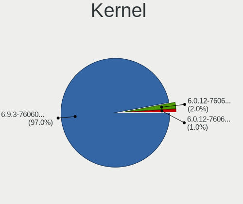
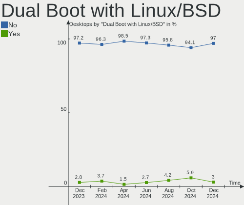
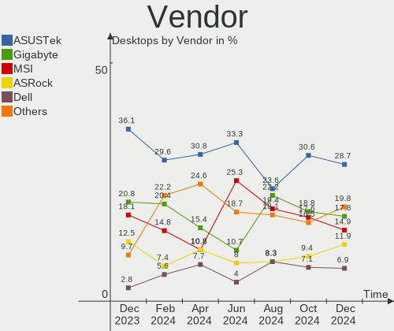
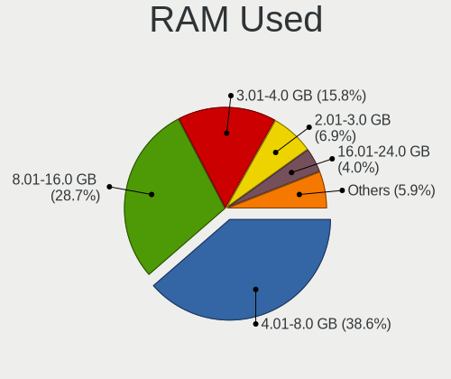
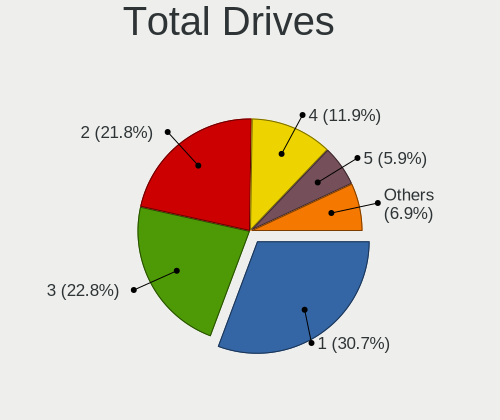
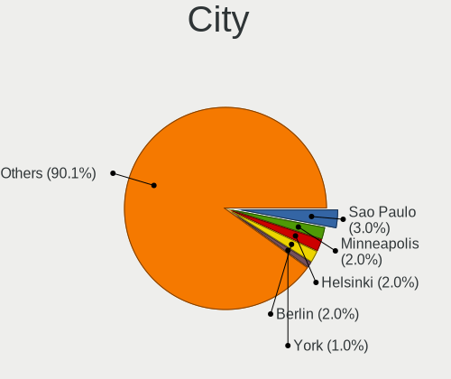
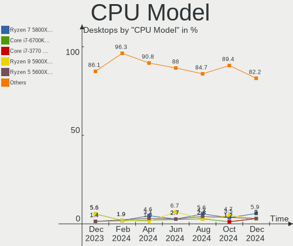
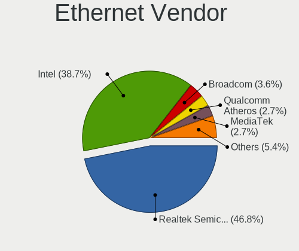
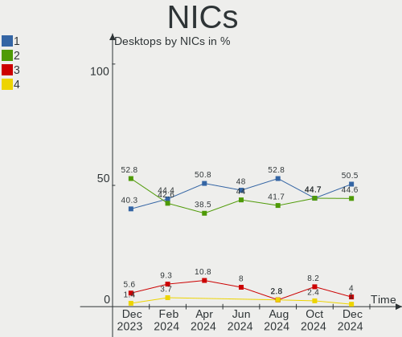

Pop!_OS - Hardware Trends (Desktops)
------------------------------------

A project to identify most popular hardware characteristics and track their change
over time based on data collected by Linux users at https://Linux-Hardware.org.

Anyone can contribute to this report by the [hw-probe](https://github.com/linuxhw/hw-probe) tool:

    sudo -E hw-probe -all -upload

This report is for one last month. Overall report since the beginning of time: [TestDays](https://github.com/linuxhw/TestDays)

Period: May, 2023.

Contents
--------

* [ System ](#system)
  - [ OS                       ](#os)
  - [ OS Family                ](#os-family)
  - [ Kernel                   ](#kernel)
  - [ Kernel Family            ](#kernel-family)
  - [ Kernel Major Ver.        ](#kernel-major-ver)
  - [ Arch                     ](#arch)
  - [ DE                       ](#de)
  - [ Display Server           ](#display-server)
  - [ Display Manager          ](#display-manager)
  - [ OS Lang                  ](#os-lang)
  - [ Boot Mode                ](#boot-mode)
  - [ Filesystem               ](#filesystem)
  - [ Part. scheme             ](#part-scheme)
  - [ Dual Boot with Linux/BSD ](#dual-boot-with-linuxbsd)
  - [ Dual Boot (Win)          ](#dual-boot-win)

* [ Board ](#board)
  - [ Vendor                   ](#vendor)
  - [ Model                    ](#model)
  - [ Model Family             ](#model-family)
  - [ MFG Year                 ](#mfg-year)
  - [ Form Factor              ](#form-factor)
  - [ Secure Boot              ](#secure-boot)
  - [ Coreboot                 ](#coreboot)
  - [ RAM Size                 ](#ram-size)
  - [ RAM Used                 ](#ram-used)
  - [ Total Drives             ](#total-drives)
  - [ Has CD-ROM               ](#has-cd-rom)
  - [ Has Ethernet             ](#has-ethernet)
  - [ Has WiFi                 ](#has-wifi)
  - [ Has Bluetooth            ](#has-bluetooth)

* [ Location ](#location)
  - [ Country                  ](#country)
  - [ City                     ](#city)

* [ Drives ](#drives)
  - [ Drive Vendor             ](#drive-vendor)
  - [ Drive Model              ](#drive-model)
  - [ HDD Vendor               ](#hdd-vendor)
  - [ SSD Vendor               ](#ssd-vendor)
  - [ Drive Kind               ](#drive-kind)
  - [ Drive Connector          ](#drive-connector)
  - [ Drive Size               ](#drive-size)
  - [ Space Total              ](#space-total)
  - [ Space Used               ](#space-used)
  - [ Malfunc. Drives          ](#malfunc-drives)
  - [ Malfunc. Drive Vendor    ](#malfunc-drive-vendor)
  - [ Malfunc. HDD Vendor      ](#malfunc-hdd-vendor)
  - [ Malfunc. Drive Kind      ](#malfunc-drive-kind)
  - [ Failed Drives            ](#failed-drives)
  - [ Failed Drive Vendor      ](#failed-drive-vendor)
  - [ Drive Status             ](#drive-status)

* [ Storage controller ](#storage-controller)
  - [ Storage Vendor           ](#storage-vendor)
  - [ Storage Model            ](#storage-model)
  - [ Storage Kind             ](#storage-kind)

* [ Processor ](#processor)
  - [ CPU Vendor               ](#cpu-vendor)
  - [ CPU Model                ](#cpu-model)
  - [ CPU Model Family         ](#cpu-model-family)
  - [ CPU Cores                ](#cpu-cores)
  - [ CPU Sockets              ](#cpu-sockets)
  - [ CPU Threads              ](#cpu-threads)
  - [ CPU Op-Modes             ](#cpu-op-modes)
  - [ CPU Microcode            ](#cpu-microcode)
  - [ CPU Microarch            ](#cpu-microarch)

* [ Graphics ](#graphics)
  - [ GPU Vendor               ](#gpu-vendor)
  - [ GPU Model                ](#gpu-model)
  - [ GPU Combo                ](#gpu-combo)
  - [ GPU Driver               ](#gpu-driver)
  - [ GPU Memory               ](#gpu-memory)

* [ Monitor ](#monitor)
  - [ Monitor Vendor           ](#monitor-vendor)
  - [ Monitor Model            ](#monitor-model)
  - [ Monitor Resolution       ](#monitor-resolution)
  - [ Monitor Diagonal         ](#monitor-diagonal)
  - [ Monitor Width            ](#monitor-width)
  - [ Aspect Ratio             ](#aspect-ratio)
  - [ Monitor Area             ](#monitor-area)
  - [ Pixel Density            ](#pixel-density)
  - [ Multiple Monitors        ](#multiple-monitors)

* [ Network ](#network)
  - [ Net Controller Vendor    ](#net-controller-vendor)
  - [ Net Controller Model     ](#net-controller-model)
  - [ Wireless Vendor          ](#wireless-vendor)
  - [ Wireless Model           ](#wireless-model)
  - [ Ethernet Vendor          ](#ethernet-vendor)
  - [ Ethernet Model           ](#ethernet-model)
  - [ Net Controller Kind      ](#net-controller-kind)
  - [ Used Controller          ](#used-controller)
  - [ NICs                     ](#nics)
  - [ IPv6                     ](#ipv6)

* [ Bluetooth ](#bluetooth)
  - [ Bluetooth Vendor         ](#bluetooth-vendor)
  - [ Bluetooth Model          ](#bluetooth-model)

* [ Sound ](#sound)
  - [ Sound Vendor             ](#sound-vendor)
  - [ Sound Model              ](#sound-model)

* [ Memory ](#memory)
  - [ Memory Vendor            ](#memory-vendor)
  - [ Memory Model             ](#memory-model)
  - [ Memory Kind              ](#memory-kind)
  - [ Memory Form Factor       ](#memory-form-factor)
  - [ Memory Size              ](#memory-size)
  - [ Memory Speed             ](#memory-speed)

* [ Printers & scanners ](#printers--scanners)
  - [ Printer Vendor           ](#printer-vendor)
  - [ Printer Model            ](#printer-model)
  - [ Scanner Vendor           ](#scanner-vendor)
  - [ Scanner Model            ](#scanner-model)

* [ Camera ](#camera)
  - [ Camera Vendor            ](#camera-vendor)
  - [ Camera Model             ](#camera-model)

* [ Security ](#security)
  - [ Fingerprint Vendor       ](#fingerprint-vendor)
  - [ Fingerprint Model        ](#fingerprint-model)
  - [ Chipcard Vendor          ](#chipcard-vendor)
  - [ Chipcard Model           ](#chipcard-model)

* [ Unsupported ](#unsupported)
  - [ Unsupported Devices      ](#unsupported-devices)
  - [ Unsupported Device Types ](#unsupported-device-types)

System
------

OS
--

Installed operating systems

| Name          | Desktops | Percent |
|---------------|----------|---------|
| Pop!_OS 22.04 | 85       | 98.84%  |
| Pop!_OS 21.10 | 1        | 1.16%   |

OS Family
---------

OS without a version

| Name    | Desktops | Percent |
|---------|----------|---------|
| Pop!_OS | 86       | 100%    |

Kernel
------

Version of the Linux kernel

| Version                  | Desktops | Percent |
|--------------------------|----------|---------|
| 6.2.6-76060206-generic   | 76       | 88.37%  |
| 6.0.2-76060002-generic   | 3        | 3.49%   |
| 6.0.12-76060006-generic  | 2        | 2.33%   |
| 6.3.4-x64v1-xanmod1      | 1        | 1.16%   |
| 6.3.1-x64v1-xanmod1      | 1        | 1.16%   |
| 6.2.0-76060200-generic   | 1        | 1.16%   |
| 5.17.5-76051705-generic  | 1        | 1.16%   |
| 5.16.11-76051611-generic | 1        | 1.16%   |

Kernel Family
-------------

Linux kernel without a distro release

| Version | Desktops | Percent |
|---------|----------|---------|
| 6.2.6   | 76       | 88.37%  |
| 6.0.2   | 3        | 3.49%   |
| 6.0.12  | 2        | 2.33%   |
| 6.3.4   | 1        | 1.16%   |
| 6.3.1   | 1        | 1.16%   |
| 6.2.0   | 1        | 1.16%   |
| 5.17.5  | 1        | 1.16%   |
| 5.16.11 | 1        | 1.16%   |

Kernel Major Ver.
-----------------

Linux kernel major version

| Version | Desktops | Percent |
|---------|----------|---------|
| 6.2     | 77       | 89.53%  |
| 6.0     | 5        | 5.81%   |
| 6.3     | 2        | 2.33%   |
| 5.17    | 1        | 1.16%   |
| 5.16    | 1        | 1.16%   |

Arch
----

OS architecture (x86_64, i586, etc.)

| Name   | Desktops | Percent |
|--------|----------|---------|
| x86_64 | 86       | 100%    |

DE
--

Desktop Environment

| Name            | Desktops | Percent |
|-----------------|----------|---------|
| GNOME           | 83       | 96.51%  |
| XFCE            | 1        | 1.16%   |
| KDE5            | 1        | 1.16%   |
| GNOME Flashback | 1        | 1.16%   |

Display Server
--------------

X11 or Wayland

| Name    | Desktops | Percent |
|---------|----------|---------|
| X11     | 83       | 96.51%  |
| Wayland | 3        | 3.49%   |

Display Manager
---------------

SDDM, LightDM, etc.

| Name    | Desktops | Percent |
|---------|----------|---------|
| Unknown | 68       | 79.07%  |
| GDM3    | 17       | 19.77%  |
| SDDM    | 1        | 1.16%   |

OS Lang
-------

Language

| Lang    | Desktops | Percent |
|---------|----------|---------|
| en_US   | 50       | 58.14%  |
| en_GB   | 6        | 6.98%   |
| C       | 6        | 6.98%   |
| ru_RU   | 5        | 5.81%   |
| pt_BR   | 3        | 3.49%   |
| en_CA   | 2        | 2.33%   |
| de_DE   | 2        | 2.33%   |
| nb_NO   | 1        | 1.16%   |
| ja_JP   | 1        | 1.16%   |
| it_IT   | 1        | 1.16%   |
| fr_FR   | 1        | 1.16%   |
| fr_CA   | 1        | 1.16%   |
| fr_BE   | 1        | 1.16%   |
| en_ZW   | 1        | 1.16%   |
| en_DK   | 1        | 1.16%   |
| en_AU   | 1        | 1.16%   |
| de_AT   | 1        | 1.16%   |
| da_DK   | 1        | 1.16%   |
| Unknown | 1        | 1.16%   |

Boot Mode
---------

EFI or BIOS

| Mode | Desktops | Percent |
|------|----------|---------|
| BIOS | 73       | 84.88%  |
| EFI  | 13       | 15.12%  |

Filesystem
----------

Type of filesystem

| Type    | Desktops | Percent |
|---------|----------|---------|
| Ext4    | 80       | 93.02%  |
| Overlay | 4        | 4.65%   |
| Zfs     | 1        | 1.16%   |
| Btrfs   | 1        | 1.16%   |

Part. scheme
------------

Scheme of partitioning

| Type    | Desktops | Percent |
|---------|----------|---------|
| Unknown | 68       | 79.07%  |
| GPT     | 16       | 18.6%   |
| MBR     | 2        | 2.33%   |

Dual Boot with Linux/BSD
------------------------

Hosting more than one Linux/BSD

| Dual boot | Desktops | Percent |
|-----------|----------|---------|
| No        | 81       | 94.19%  |
| Yes       | 5        | 5.81%   |

Dual Boot (Win)
---------------

Hosting Linux and Windows

| Dual boot | Desktops | Percent |
|-----------|----------|---------|
| No        | 75       | 87.21%  |
| Yes       | 11       | 12.79%  |

Board
-----

Vendor
------

Motherboard manufacturer

| Name                | Desktops | Percent |
|---------------------|----------|---------|
| ASUSTek Computer    | 29       | 33.72%  |
| Gigabyte Technology | 14       | 16.28%  |
| MSI                 | 13       | 15.12%  |
| Dell                | 7        | 8.14%   |
| ASRock              | 7        | 8.14%   |
| Hewlett-Packard     | 4        | 4.65%   |
| Lenovo              | 3        | 3.49%   |
| Fujitsu             | 2        | 2.33%   |
| Samsung Electronics | 1        | 1.16%   |
| PS                  | 1        | 1.16%   |
| EVGA                | 1        | 1.16%   |
| BESSTAR Tech        | 1        | 1.16%   |
| AZW                 | 1        | 1.16%   |
| Apple               | 1        | 1.16%   |
| Acer                | 1        | 1.16%   |

Model
-----

Motherboard model

| Name                                 | Desktops | Percent |
|--------------------------------------|----------|---------|
| MSI MS-7C84                          | 2        | 2.33%   |
| MSI MS-7B86                          | 2        | 2.33%   |
| Gigabyte Z170X-Gaming 7              | 2        | 2.33%   |
| Dell OptiPlex 3060                   | 2        | 2.33%   |
| ASUS PRIME A320M-K/BR                | 2        | 2.33%   |
| Samsung DeskTop System               | 1        | 1.16%   |
| PS G706                              | 1        | 1.16%   |
| MSI MS-7C91                          | 1        | 1.16%   |
| MSI MS-7C37                          | 1        | 1.16%   |
| MSI MS-7B89                          | 1        | 1.16%   |
| MSI MS-7B38                          | 1        | 1.16%   |
| MSI MS-7A38                          | 1        | 1.16%   |
| MSI MS-7995                          | 1        | 1.16%   |
| MSI MS-7972                          | 1        | 1.16%   |
| MSI MS-7693                          | 1        | 1.16%   |
| MSI MS-7680                          | 1        | 1.16%   |
| Lenovo ThinkCentre M93p 10AAS1CB01   | 1        | 1.16%   |
| Lenovo ThinkCentre M710q 10MR0004US  | 1        | 1.16%   |
| Lenovo ThinkCentre E73 10AU00GUBP    | 1        | 1.16%   |
| HP Z640 Workstation                  | 1        | 1.16%   |
| HP Z620 Workstation                  | 1        | 1.16%   |
| HP Compaq Elite 8300 USDT            | 1        | 1.16%   |
| HP Compaq dc7800p Ultra-slim Desktop | 1        | 1.16%   |
| Gigabyte Z390 AORUS MASTER           | 1        | 1.16%   |
| Gigabyte X670 AORUS ELITE AX         | 1        | 1.16%   |
| Gigabyte X570 AORUS ELITE WIFI       | 1        | 1.16%   |
| Gigabyte H97N-WIFI                   | 1        | 1.16%   |
| Gigabyte H61M-S2PV                   | 1        | 1.16%   |
| Gigabyte H410M S2 V2                 | 1        | 1.16%   |
| Gigabyte H410M H                     | 1        | 1.16%   |
| Gigabyte H310M H 2.0                 | 1        | 1.16%   |
| Gigabyte GA-78LMT-USB3 6.0           | 1        | 1.16%   |
| Gigabyte B660M AORUS PRO DDR4        | 1        | 1.16%   |
| Gigabyte B550 AORUS ELITE AX V2      | 1        | 1.16%   |
| Gigabyte B450M H                     | 1        | 1.16%   |
| Fujitsu ESPRIMO Q520                 | 1        | 1.16%   |
| Fujitsu ESPRIMO E9900                | 1        | 1.16%   |
| EVGA 151-HE-E999                     | 1        | 1.16%   |
| Dell XPS 8930                        | 1        | 1.16%   |
| Dell XPS 8700                        | 1        | 1.16%   |

Model Family
------------

Motherboard model prefix

| Name                   | Desktops | Percent |
|------------------------|----------|---------|
| ASUS ROG               | 7        | 8.14%   |
| ASUS TUF               | 5        | 5.81%   |
| ASUS PRIME             | 4        | 4.65%   |
| Lenovo ThinkCentre     | 3        | 3.49%   |
| Dell OptiPlex          | 3        | 3.49%   |
| MSI MS-7C84            | 2        | 2.33%   |
| MSI MS-7B86            | 2        | 2.33%   |
| HP Compaq              | 2        | 2.33%   |
| Gigabyte Z170X-Gaming  | 2        | 2.33%   |
| Gigabyte H410M         | 2        | 2.33%   |
| Fujitsu ESPRIMO        | 2        | 2.33%   |
| Dell XPS               | 2        | 2.33%   |
| ASRock X570            | 2        | 2.33%   |
| Samsung DeskTop        | 1        | 1.16%   |
| PS G706                | 1        | 1.16%   |
| MSI MS-7C91            | 1        | 1.16%   |
| MSI MS-7C37            | 1        | 1.16%   |
| MSI MS-7B89            | 1        | 1.16%   |
| MSI MS-7B38            | 1        | 1.16%   |
| MSI MS-7A38            | 1        | 1.16%   |
| MSI MS-7995            | 1        | 1.16%   |
| MSI MS-7972            | 1        | 1.16%   |
| MSI MS-7693            | 1        | 1.16%   |
| MSI MS-7680            | 1        | 1.16%   |
| HP Z640                | 1        | 1.16%   |
| HP Z620                | 1        | 1.16%   |
| Gigabyte Z390          | 1        | 1.16%   |
| Gigabyte X670          | 1        | 1.16%   |
| Gigabyte X570          | 1        | 1.16%   |
| Gigabyte H97N-WIFI     | 1        | 1.16%   |
| Gigabyte H61M-S2PV     | 1        | 1.16%   |
| Gigabyte H310M         | 1        | 1.16%   |
| Gigabyte GA-78LMT-USB3 | 1        | 1.16%   |
| Gigabyte B660M         | 1        | 1.16%   |
| Gigabyte B550          | 1        | 1.16%   |
| Gigabyte B450M         | 1        | 1.16%   |
| EVGA 151-HE-E999       | 1        | 1.16%   |
| Dell Precision         | 1        | 1.16%   |
| Dell Inspiron          | 1        | 1.16%   |
| BESSTAR Tech HM90      | 1        | 1.16%   |

MFG Year
--------

Motherboard manufacture year

| Year | Desktops | Percent |
|------|----------|---------|
| 2019 | 14       | 16.28%  |
| 2018 | 10       | 11.63%  |
| 2020 | 9        | 10.47%  |
| 2015 | 7        | 8.14%   |
| 2012 | 7        | 8.14%   |
| 2022 | 6        | 6.98%   |
| 2021 | 5        | 5.81%   |
| 2017 | 5        | 5.81%   |
| 2014 | 5        | 5.81%   |
| 2011 | 5        | 5.81%   |
| 2010 | 5        | 5.81%   |
| 2023 | 3        | 3.49%   |
| 2016 | 2        | 2.33%   |
| 2013 | 1        | 1.16%   |
| 2008 | 1        | 1.16%   |
| 2007 | 1        | 1.16%   |

Form Factor
-----------

Physical design of the computer

| Name    | Desktops | Percent |
|---------|----------|---------|
| Desktop | 86       | 100%    |

Secure Boot
-----------

Enabled or disabled

| State    | Desktops | Percent |
|----------|----------|---------|
| Disabled | 86       | 100%    |

Coreboot
--------

Have coreboot on board

| Used | Desktops | Percent |
|------|----------|---------|
| No   | 86       | 100%    |

RAM Size
--------

Total RAM memory

| Size in GB  | Desktops | Percent |
|-------------|----------|---------|
| 16.01-24.0  | 33       | 38.37%  |
| 32.01-64.0  | 26       | 30.23%  |
| 8.01-16.0   | 9        | 10.47%  |
| 64.01-256.0 | 7        | 8.14%   |
| 4.01-8.0    | 6        | 6.98%   |
| 24.01-32.0  | 3        | 3.49%   |
| 3.01-4.0    | 1        | 1.16%   |
| 2.01-3.0    | 1        | 1.16%   |

RAM Used
--------

Used RAM memory

| Used GB    | Desktops | Percent |
|------------|----------|---------|
| 4.01-8.0   | 38       | 44.19%  |
| 8.01-16.0  | 18       | 20.93%  |
| 3.01-4.0   | 17       | 19.77%  |
| 2.01-3.0   | 7        | 8.14%   |
| 1.01-2.0   | 5        | 5.81%   |
| 24.01-32.0 | 1        | 1.16%   |

Total Drives
------------

Number of drives on board

| Drives | Desktops | Percent |
|--------|----------|---------|
| 1      | 27       | 31.4%   |
| 2      | 26       | 30.23%  |
| 3      | 14       | 16.28%  |
| 4      | 9        | 10.47%  |
| 5      | 5        | 5.81%   |
| 6      | 3        | 3.49%   |
| 8      | 1        | 1.16%   |
| 7      | 1        | 1.16%   |

Has CD-ROM
----------

Has CD-ROM on board

| Presented | Desktops | Percent |
|-----------|----------|---------|
| No        | 60       | 69.77%  |
| Yes       | 26       | 30.23%  |

Has Ethernet
------------

Has Ethernet on board

| Presented | Desktops | Percent |
|-----------|----------|---------|
| Yes       | 85       | 98.84%  |
| No        | 1        | 1.16%   |

Has WiFi
--------

Has WiFi module

| Presented | Desktops | Percent |
|-----------|----------|---------|
| Yes       | 51       | 59.3%   |
| No        | 35       | 40.7%   |

Has Bluetooth
-------------

Has Bluetooth module

| Presented | Desktops | Percent |
|-----------|----------|---------|
| No        | 48       | 55.81%  |
| Yes       | 38       | 44.19%  |

Location
--------

Country
-------

Geographic location (country)

| Country     | Desktops | Percent |
|-------------|----------|---------|
| USA         | 33       | 38.37%  |
| Canada      | 7        | 8.14%   |
| Brazil      | 7        | 8.14%   |
| UK          | 6        | 6.98%   |
| Germany     | 6        | 6.98%   |
| Sweden      | 3        | 3.49%   |
| Russia      | 3        | 3.49%   |
| Poland      | 2        | 2.33%   |
| Mexico      | 2        | 2.33%   |
| France      | 2        | 2.33%   |
| Austria     | 2        | 2.33%   |
| Australia   | 2        | 2.33%   |
| Norway      | 1        | 1.16%   |
| New Zealand | 1        | 1.16%   |
| Malaysia    | 1        | 1.16%   |
| Lithuania   | 1        | 1.16%   |
| Japan       | 1        | 1.16%   |
| Italy       | 1        | 1.16%   |
| Israel      | 1        | 1.16%   |
| India       | 1        | 1.16%   |
| Hungary     | 1        | 1.16%   |
| Denmark     | 1        | 1.16%   |
| Belgium     | 1        | 1.16%   |

City
----

Geographic location (city)

| City                | Desktops | Percent |
|---------------------|----------|---------|
| La Grande           | 2        | 2.33%   |
| Karlsruhe           | 2        | 2.33%   |
| Gothenburg          | 2        | 2.33%   |
| Zephyrhills         | 1        | 1.16%   |
| Zeeland             | 1        | 1.16%   |
| Zapotlan el Grande  | 1        | 1.16%   |
| Wroclaw             | 1        | 1.16%   |
| Whitley Bay         | 1        | 1.16%   |
| Warrington          | 1        | 1.16%   |
| Waltham             | 1        | 1.16%   |
| Wake Forest         | 1        | 1.16%   |
| Vladimir            | 1        | 1.16%   |
| Vista               | 1        | 1.16%   |
| Vilnius             | 1        | 1.16%   |
| Vancouver           | 1        | 1.16%   |
| Tokyo               | 1        | 1.16%   |
| Timelkam            | 1        | 1.16%   |
| Terry               | 1        | 1.16%   |
| Temecula            | 1        | 1.16%   |
| Sydney              | 1        | 1.16%   |
| Sunnyvale           | 1        | 1.16%   |
| Stockton            | 1        | 1.16%   |
| Southwark           | 1        | 1.16%   |
| Singen              | 1        | 1.16%   |
| Sao Paulo           | 1        | 1.16%   |
| San Pablo           | 1        | 1.16%   |
| San Antonio         | 1        | 1.16%   |
| Rockville           | 1        | 1.16%   |
| Rensselaer          | 1        | 1.16%   |
| Presidente Prudente | 1        | 1.16%   |
| Pittsburg           | 1        | 1.16%   |
| Piqua               | 1        | 1.16%   |
| Petaling Jaya       | 1        | 1.16%   |
| Ottawa              | 1        | 1.16%   |
| Orlando             | 1        | 1.16%   |
| Ocean City          | 1        | 1.16%   |
| Oakley              | 1        | 1.16%   |
| Novogal'tsovka      | 1        | 1.16%   |
| Nossebro            | 1        | 1.16%   |
| Norcross            | 1        | 1.16%   |

Drives
------

Drive Vendor
------------

Hard drive vendors

| Vendor                      | Desktops | Drives | Percent |
|-----------------------------|----------|--------|---------|
| Samsung Electronics         | 28       | 42     | 16.37%  |
| WDC                         | 24       | 39     | 14.04%  |
| Seagate                     | 23       | 27     | 13.45%  |
| Kingston                    | 12       | 13     | 7.02%   |
| Toshiba                     | 9        | 11     | 5.26%   |
| Sandisk                     | 9        | 11     | 5.26%   |
| Crucial                     | 9        | 11     | 5.26%   |
| China                       | 6        | 6      | 3.51%   |
| Phison Electronics          | 5        | 6      | 2.92%   |
| A-DATA Technology           | 5        | 5      | 2.92%   |
| Unknown                     | 3        | 4      | 1.75%   |
| Micron/Crucial Technology   | 3        | 3      | 1.75%   |
| Kingston Technology Company | 3        | 3      | 1.75%   |
| Hitachi                     | 3        | 3      | 1.75%   |
| Realtek Semiconductor       | 2        | 2      | 1.17%   |
| Intel                       | 2        | 2      | 1.17%   |
| HGST                        | 2        | 2      | 1.17%   |
| Gigabyte Technology         | 2        | 2      | 1.17%   |
| Transcend                   | 1        | 1      | 0.58%   |
| TO Exter                    | 1        | 1      | 0.58%   |
| Team                        | 1        | 1      | 0.58%   |
| SPCC                        | 1        | 2      | 0.58%   |
| SK hynix                    | 1        | 1      | 0.58%   |
| Silicon Motion              | 1        | 1      | 0.58%   |
| PNY                         | 1        | 1      | 0.58%   |
| Phison                      | 1        | 1      | 0.58%   |
| OWC                         | 1        | 1      | 0.58%   |
| OCZ                         | 1        | 1      | 0.58%   |
| Netac                       | 1        | 1      | 0.58%   |
| MAXIO Technology (Hangzhou) | 1        | 1      | 0.58%   |
| LITEONIT                    | 1        | 1      | 0.58%   |
| Lite-On Technology          | 1        | 1      | 0.58%   |
| Lexar                       | 1        | 1      | 0.58%   |
| KingSpec                    | 1        | 1      | 0.58%   |
| Inateck                     | 1        | 1      | 0.58%   |
| Fujitsu                     | 1        | 1      | 0.58%   |
| Corsair                     | 1        | 1      | 0.58%   |
| Biwin Storage Technology    | 1        | 1      | 0.58%   |
| Apacer                      | 1        | 1      | 0.58%   |

Drive Model
-----------

Hard drive models

| Model                                               | Desktops | Percent |
|-----------------------------------------------------|----------|---------|
| Samsung NVMe SSD Controller SM981/PM981/PM983 256GB | 7        | 3.55%   |
| Samsung SSD 860 EVO 500GB                           | 4        | 2.03%   |
| Samsung SSD 850 EVO 250GB                           | 4        | 2.03%   |
| Kingston SA400S37240G 240GB SSD                     | 4        | 2.03%   |
| Phison E16 PCIe4 NVMe Controller 1TB                | 3        | 1.52%   |
| Kingston SA400S37480G 480GB SSD                     | 3        | 1.52%   |
| Seagate ST500DM002-1BD142 500GB                     | 2        | 1.02%   |
| Seagate ST4000DX001-1CE168 4TB                      | 2        | 1.02%   |
| Seagate ST4000DM004-2CV104 4TB                      | 2        | 1.02%   |
| Seagate ST1000DM010-2EP102 1TB                      | 2        | 1.02%   |
| Seagate ST1000DM003-1SB102 1TB                      | 2        | 1.02%   |
| Seagate Expansion 1TB                               | 2        | 1.02%   |
| Sandisk WD Blue SN550 NVMe SSD 512GB                | 2        | 1.02%   |
| Samsung SSD 980 PRO 1TB                             | 2        | 1.02%   |
| Samsung SSD 870 QVO 1TB                             | 2        | 1.02%   |
| Samsung SSD 870 EVO 1TB                             | 2        | 1.02%   |
| Samsung SSD 860 EVO 1TB                             | 2        | 1.02%   |
| Phison PCIe SSD 512GB                               | 2        | 1.02%   |
| Micron/Crucial P2 NVMe PCIe SSD 1TB                 | 2        | 1.02%   |
| Crucial CT240BX500SSD1 240GB                        | 2        | 1.02%   |
| Crucial CT1000MX500SSD1 1TB                         | 2        | 1.02%   |
| WDC WDS500G2B0A-00SM50 500GB SSD                    | 1        | 0.51%   |
| WDC WDS240G2G0B-00EPW0 240GB SSD                    | 1        | 0.51%   |
| WDC WD60EFZX-68B3FN0 6TB                            | 1        | 0.51%   |
| WDC WD60EFRX-68L0BN1 6TB                            | 1        | 0.51%   |
| WDC WD5003ABYX-01WERA0 500GB                        | 1        | 0.51%   |
| WDC WD5000AAKX-753CA1 500GB                         | 1        | 0.51%   |
| WDC WD5000AAKX-60U6AA0 500GB                        | 1        | 0.51%   |
| WDC WD5000AAKS-22A7B0 500GB                         | 1        | 0.51%   |
| WDC WD40EFRX-68WT0N0 4TB                            | 1        | 0.51%   |
| WDC WD40EFRX-68N32N0 4TB                            | 1        | 0.51%   |
| WDC WD4000FYYZ-01UL1B2 4TB                          | 1        | 0.51%   |
| WDC WD3200BEKT-00F3T0 320GB                         | 1        | 0.51%   |
| WDC WD30EFRX-68AX9N0 3TB                            | 1        | 0.51%   |
| WDC WD20EZAZ-00L9GB0 2TB                            | 1        | 0.51%   |
| WDC WD20EFRX-68EUZN0 2TB                            | 1        | 0.51%   |
| WDC WD20EFRX-68AX9N0 2TB                            | 1        | 0.51%   |
| WDC WD20EADS-00R6B0 2TB                             | 1        | 0.51%   |
| WDC WD2003FZEX-00SRLA0 2TB                          | 1        | 0.51%   |
| WDC WD1500HLFS-01G6U0 150GB                         | 1        | 0.51%   |

HDD Vendor
----------

Hard disk drive vendors

| Vendor  | Desktops | Drives | Percent |
|---------|----------|--------|---------|
| Seagate | 23       | 27     | 37.7%   |
| WDC     | 22       | 37     | 36.07%  |
| Toshiba | 9        | 11     | 14.75%  |
| Hitachi | 3        | 3      | 4.92%   |
| HGST    | 2        | 2      | 3.28%   |
| Unknown | 1        | 1      | 1.64%   |
| Fujitsu | 1        | 1      | 1.64%   |

SSD Vendor
----------

Solid state drive vendors

| Vendor              | Desktops | Drives | Percent |
|---------------------|----------|--------|---------|
| Samsung Electronics | 15       | 27     | 23.08%  |
| Kingston            | 12       | 13     | 18.46%  |
| Crucial             | 7        | 9      | 10.77%  |
| China               | 6        | 6      | 9.23%   |
| SanDisk             | 5        | 5      | 7.69%   |
| A-DATA Technology   | 3        | 3      | 4.62%   |
| WDC                 | 2        | 2      | 3.08%   |
| Gigabyte Technology | 2        | 2      | 3.08%   |
| Transcend           | 1        | 1      | 1.54%   |
| TO Exter            | 1        | 1      | 1.54%   |
| SPCC                | 1        | 2      | 1.54%   |
| PNY                 | 1        | 1      | 1.54%   |
| OWC                 | 1        | 1      | 1.54%   |
| OCZ                 | 1        | 1      | 1.54%   |
| Netac               | 1        | 1      | 1.54%   |
| LITEONIT            | 1        | 1      | 1.54%   |
| Lexar               | 1        | 1      | 1.54%   |
| KingSpec            | 1        | 1      | 1.54%   |
| Intel               | 1        | 1      | 1.54%   |
| Corsair             | 1        | 1      | 1.54%   |
| Apacer              | 1        | 1      | 1.54%   |

Drive Kind
----------

HDD or SSD

| Kind    | Desktops | Drives | Percent |
|---------|----------|--------|---------|
| SSD     | 54       | 81     | 38.57%  |
| HDD     | 48       | 82     | 34.29%  |
| NVMe    | 37       | 49     | 26.43%  |
| Unknown | 1        | 2      | 0.71%   |

Drive Connector
---------------

SATA, SAS, NVMe, etc.

| Type | Desktops | Drives | Percent |
|------|----------|--------|---------|
| SATA | 73       | 152    | 60.83%  |
| NVMe | 36       | 48     | 30%     |
| SAS  | 11       | 14     | 9.17%   |

Drive Size
----------

Size of hard drive

| Size in TB | Desktops | Drives | Percent |
|------------|----------|--------|---------|
| 0.01-0.5   | 53       | 79     | 44.17%  |
| 0.51-1.0   | 30       | 40     | 25%     |
| 1.01-2.0   | 15       | 18     | 12.5%   |
| 3.01-4.0   | 11       | 14     | 9.17%   |
| 4.01-10.0  | 8        | 9      | 6.67%   |
| 2.01-3.0   | 2        | 2      | 1.67%   |
| 10.01-20.0 | 1        | 1      | 0.83%   |

Space Total
-----------

Amount of disk space available on the file system

| Size in GB     | Desktops | Percent |
|----------------|----------|---------|
| 501-1000       | 21       | 24.42%  |
| More than 3000 | 17       | 19.77%  |
| 251-500        | 14       | 16.28%  |
| 101-250        | 14       | 16.28%  |
| 1001-2000      | 11       | 12.79%  |
| 1-20           | 3        | 3.49%   |
| 21-50          | 2        | 2.33%   |
| 2001-3000      | 2        | 2.33%   |
| 51-100         | 2        | 2.33%   |

Space Used
----------

Amount of used disk space

| Used GB        | Desktops | Percent |
|----------------|----------|---------|
| 1-20           | 19       | 22.09%  |
| 51-100         | 14       | 16.28%  |
| 21-50          | 13       | 15.12%  |
| 251-500        | 11       | 12.79%  |
| 101-250        | 8        | 9.3%    |
| 1001-2000      | 8        | 9.3%    |
| More than 3000 | 7        | 8.14%   |
| 501-1000       | 4        | 4.65%   |
| 2001-3000      | 2        | 2.33%   |

Malfunc. Drives
---------------

Drive models with a malfunction

| Model                                           | Desktops | Drives | Percent |
|-------------------------------------------------|----------|--------|---------|
| Seagate ST2000DL004 HD204UI 2TB                 | 1        | 1      | 20%     |
| Samsung Electronics SSD 870 EVO 1TB             | 1        | 1      | 20%     |
| Samsung Electronics SSD 850 EVO 250GB           | 1        | 1      | 20%     |
| Kingston Technology Company KC2000 NVMe SSD 1TB | 1        | 1      | 20%     |
| China SSD 240GB                                 | 1        | 1      | 20%     |

Malfunc. Drive Vendor
---------------------

Vendors of faulty drives

| Vendor                      | Desktops | Drives | Percent |
|-----------------------------|----------|--------|---------|
| Seagate                     | 1        | 1      | 25%     |
| Samsung Electronics         | 1        | 2      | 25%     |
| Kingston Technology Company | 1        | 1      | 25%     |
| China                       | 1        | 1      | 25%     |

Malfunc. HDD Vendor
-------------------

Vendors of faulty HDD drives

| Vendor  | Desktops | Drives | Percent |
|---------|----------|--------|---------|
| Seagate | 1        | 1      | 100%    |

Malfunc. Drive Kind
-------------------

Kinds of faulty drives

| Kind | Desktops | Drives | Percent |
|------|----------|--------|---------|
| SSD  | 2        | 3      | 50%     |
| NVMe | 1        | 1      | 25%     |
| HDD  | 1        | 1      | 25%     |

Failed Drives
-------------

Failed drive models

Zero info for selected period =(

Failed Drive Vendor
-------------------

Failed drive vendors

Zero info for selected period =(

Drive Status
------------

Number of failed and malfunc. drives

| Status   | Desktops | Drives | Percent |
|----------|----------|--------|---------|
| Detected | 70       | 166    | 76.09%  |
| Works    | 18       | 43     | 19.57%  |
| Malfunc  | 4        | 5      | 4.35%   |

Storage controller
------------------

Storage Vendor
--------------

Storage controller vendors

| Vendor                      | Desktops | Percent |
|-----------------------------|----------|---------|
| Intel                       | 47       | 33.81%  |
| AMD                         | 38       | 27.34%  |
| Samsung Electronics         | 14       | 10.07%  |
| Phison Electronics          | 6        | 4.32%   |
| SanDisk                     | 5        | 3.6%    |
| Micron/Crucial Technology   | 5        | 3.6%    |
| ASMedia Technology          | 4        | 2.88%   |
| Realtek Semiconductor       | 3        | 2.16%   |
| Kingston Technology Company | 3        | 2.16%   |
| JMicron Technology          | 3        | 2.16%   |
| VIA Technologies            | 2        | 1.44%   |
| ADATA Technology            | 2        | 1.44%   |
| SK hynix                    | 1        | 0.72%   |
| Silicon Motion              | 1        | 0.72%   |
| Nvidia                      | 1        | 0.72%   |
| MAXIO Technology (Hangzhou) | 1        | 0.72%   |
| Marvell Technology Group    | 1        | 0.72%   |
| Lite-On Technology          | 1        | 0.72%   |
| Biwin Storage Technology    | 1        | 0.72%   |

Storage Model
-------------

Storage controller models

| Model                                                                                   | Desktops | Percent |
|-----------------------------------------------------------------------------------------|----------|---------|
| AMD FCH SATA Controller [AHCI mode]                                                     | 25       | 15.06%  |
| Samsung NVMe SSD Controller SM981/PM981/PM983                                           | 9        | 5.42%   |
| Intel Q170/Q150/B150/H170/H110/Z170/CM236 Chipset SATA Controller [AHCI Mode]           | 7        | 4.22%   |
| Intel SATA Controller [RAID mode]                                                       | 6        | 3.61%   |
| AMD 400 Series Chipset SATA Controller                                                  | 6        | 3.61%   |
| Intel 8 Series/C220 Series Chipset Family 6-port SATA Controller 1 [AHCI mode]          | 5        | 3.01%   |
| Intel 200 Series PCH SATA controller [AHCI mode]                                        | 5        | 3.01%   |
| AMD 500 Series Chipset SATA Controller                                                  | 5        | 3.01%   |
| Phison E16 PCIe4 NVMe Controller                                                        | 4        | 2.41%   |
| ASMedia ASM1062 Serial ATA Controller                                                   | 4        | 2.41%   |
| Samsung NVMe SSD Controller PM9A1/PM9A3/980PRO                                          | 3        | 1.81%   |
| Intel Alder Lake-S PCH SATA Controller [AHCI Mode]                                      | 3        | 1.81%   |
| AMD SB7x0/SB8x0/SB9x0 SATA Controller [IDE mode]                                        | 3        | 1.81%   |
| AMD SB7x0/SB8x0/SB9x0 SATA Controller [AHCI mode]                                       | 3        | 1.81%   |
| AMD SB7x0/SB8x0/SB9x0 IDE Controller                                                    | 3        | 1.81%   |
| VIA VT6415 PATA IDE Host Controller                                                     | 2        | 1.2%    |
| SanDisk WD Blue SN550 NVMe SSD                                                          | 2        | 1.2%    |
| Realtek RTS5763DL NVMe SSD Controller                                                   | 2        | 1.2%    |
| Micron/Crucial P5 Plus NVMe PCIe SSD                                                    | 2        | 1.2%    |
| Micron/Crucial P2 NVMe PCIe SSD                                                         | 2        | 1.2%    |
| JMicron JMB361 AHCI/IDE                                                                 | 2        | 1.2%    |
| Intel Volume Management Device NVMe RAID Controller                                     | 2        | 1.2%    |
| Intel 9 Series Chipset Family SATA Controller [AHCI Mode]                               | 2        | 1.2%    |
| Intel 7 Series/C210 Series Chipset Family 6-port SATA Controller [AHCI mode]            | 2        | 1.2%    |
| Intel 6 Series/C200 Series Chipset Family Desktop SATA Controller (IDE mode, ports 4-5) | 2        | 1.2%    |
| Intel 6 Series/C200 Series Chipset Family Desktop SATA Controller (IDE mode, ports 0-3) | 2        | 1.2%    |
| Intel 6 Series/C200 Series Chipset Family 6 port Desktop SATA AHCI Controller           | 2        | 1.2%    |
| Intel 400 Series Chipset Family SATA AHCI Controller                                    | 2        | 1.2%    |
| AMD FCH SATA Controller D                                                               | 2        | 1.2%    |
| AMD 300 Series Chipset SATA Controller                                                  | 2        | 1.2%    |
| SK hynix Gold P31/PC711 NVMe Solid State Drive                                          | 1        | 0.6%    |
| Silicon Motion SM2262/SM2262EN SSD Controller                                           | 1        | 0.6%    |
| SanDisk WD Blue SN570 NVMe SSD 1TB                                                      | 1        | 0.6%    |
| SanDisk WD Black SN770 NVMe SSD                                                         | 1        | 0.6%    |
| SanDisk WD Black 2018/SN750 / PC SN720 NVMe SSD                                         | 1        | 0.6%    |
| SanDisk Non-Volatile memory controller                                                  | 1        | 0.6%    |
| Samsung NVMe SSD Controller 980                                                         | 1        | 0.6%    |
| Samsung Electronics Non-Volatile memory controller                                      | 1        | 0.6%    |
| Realtek NVMe Controller                                                                 | 1        | 0.6%    |
| Phison Electronics Non-Volatile memory controller                                       | 1        | 0.6%    |

Storage Kind
------------

Kind of storage controller (IDE, SATA, NVMe, SAS, ...)

| Kind | Desktops | Percent |
|------|----------|---------|
| SATA | 75       | 56.39%  |
| NVMe | 36       | 27.07%  |
| IDE  | 11       | 8.27%   |
| RAID | 10       | 7.52%   |
| SAS  | 1        | 0.75%   |

Processor
---------

CPU Vendor
----------

Processor vendors

| Vendor | Desktops | Percent |
|--------|----------|---------|
| Intel  | 47       | 54.65%  |
| AMD    | 39       | 45.35%  |

CPU Model
---------

Processor models

| Model                                       | Desktops | Percent |
|---------------------------------------------|----------|---------|
| AMD Ryzen 5 1600 Six-Core Processor         | 5        | 5.81%   |
| Intel Core i7-6700K CPU @ 4.00GHz           | 3        | 3.49%   |
| Intel Core i7-4790 CPU @ 3.60GHz            | 3        | 3.49%   |
| AMD Ryzen 7 3700X 8-Core Processor          | 3        | 3.49%   |
| AMD FX-8350 Eight-Core Processor            | 3        | 3.49%   |
| Intel Core i5-6500 CPU @ 3.20GHz            | 2        | 2.33%   |
| AMD Ryzen 9 7900X 12-Core Processor         | 2        | 2.33%   |
| AMD Ryzen 9 5950X 16-Core Processor         | 2        | 2.33%   |
| AMD Ryzen 9 5900X 12-Core Processor         | 2        | 2.33%   |
| AMD Ryzen 5 3600 6-Core Processor           | 2        | 2.33%   |
| Intel Xeon CPU E5620 @ 2.40GHz              | 1        | 1.16%   |
| Intel Xeon CPU E5-2680 v3 @ 2.50GHz         | 1        | 1.16%   |
| Intel Xeon CPU E5-2670 0 @ 2.60GHz          | 1        | 1.16%   |
| Intel Pentium Dual-Core CPU T4400 @ 2.20GHz | 1        | 1.16%   |
| Intel Pentium CPU G4560 @ 3.50GHz           | 1        | 1.16%   |
| Intel N100                                  | 1        | 1.16%   |
| Intel Core i7-9700KF CPU @ 3.60GHz          | 1        | 1.16%   |
| Intel Core i7-9700 CPU @ 3.00GHz            | 1        | 1.16%   |
| Intel Core i7-8700K CPU @ 3.70GHz           | 1        | 1.16%   |
| Intel Core i7-7820X CPU @ 3.60GHz           | 1        | 1.16%   |
| Intel Core i7-6900K CPU @ 3.20GHz           | 1        | 1.16%   |
| Intel Core i7-4790S CPU @ 3.20GHz           | 1        | 1.16%   |
| Intel Core i7-4770S CPU @ 3.10GHz           | 1        | 1.16%   |
| Intel Core i7-3770K CPU @ 3.50GHz           | 1        | 1.16%   |
| Intel Core i5-9400F CPU @ 2.90GHz           | 1        | 1.16%   |
| Intel Core i5-9400 CPU @ 2.90GHz            | 1        | 1.16%   |
| Intel Core i5-8500T CPU @ 2.10GHz           | 1        | 1.16%   |
| Intel Core i5-8500 CPU @ 3.00GHz            | 1        | 1.16%   |
| Intel Core i5-6600K CPU @ 3.50GHz           | 1        | 1.16%   |
| Intel Core i5-6400 CPU @ 2.70GHz            | 1        | 1.16%   |
| Intel Core i5-4570T CPU @ 2.90GHz           | 1        | 1.16%   |
| Intel Core i5-4460S CPU @ 2.90GHz           | 1        | 1.16%   |
| Intel Core i5-3570K CPU @ 3.40GHz           | 1        | 1.16%   |
| Intel Core i5-3470S CPU @ 2.90GHz           | 1        | 1.16%   |
| Intel Core i5-3450 CPU @ 3.10GHz            | 1        | 1.16%   |
| Intel Core i5-2500K CPU @ 3.30GHz           | 1        | 1.16%   |
| Intel Core i5-2400 CPU @ 3.10GHz            | 1        | 1.16%   |
| Intel Core i5-10400F CPU @ 2.90GHz          | 1        | 1.16%   |
| Intel Core i5 CPU 650 @ 3.20GHz             | 1        | 1.16%   |
| Intel Core i3-8100 CPU @ 3.60GHz            | 1        | 1.16%   |

CPU Model Family
----------------

Processor model prefix

| Model                   | Desktops | Percent |
|-------------------------|----------|---------|
| Intel Core i5           | 17       | 19.77%  |
| Intel Core i7           | 14       | 16.28%  |
| AMD Ryzen 5             | 13       | 15.12%  |
| AMD Ryzen 9             | 9        | 10.47%  |
| AMD Ryzen 7             | 7        | 8.14%   |
| Other                   | 5        | 5.81%   |
| Intel Core i3           | 5        | 5.81%   |
| AMD FX                  | 4        | 4.65%   |
| Intel Xeon              | 3        | 3.49%   |
| AMD Phenom II X4        | 2        | 2.33%   |
| Intel Pentium Dual-Core | 1        | 1.16%   |
| Intel Pentium           | 1        | 1.16%   |
| Intel Core 2 Duo        | 1        | 1.16%   |
| AMD Ryzen Threadripper  | 1        | 1.16%   |
| AMD Ryzen 5 PRO         | 1        | 1.16%   |
| AMD Phenom II X6        | 1        | 1.16%   |
| AMD A8                  | 1        | 1.16%   |

CPU Cores
---------

Number of processor cores

| Number | Desktops | Percent |
|--------|----------|---------|
| 4      | 29       | 33.72%  |
| 6      | 20       | 23.26%  |
| 8      | 13       | 15.12%  |
| 2      | 8        | 9.3%    |
| 12     | 6        | 6.98%   |
| 16     | 4        | 4.65%   |
| 24     | 2        | 2.33%   |
| 10     | 2        | 2.33%   |
| 14     | 1        | 1.16%   |
| 3      | 1        | 1.16%   |

CPU Sockets
-----------

Number of sockets

| Number | Desktops | Percent |
|--------|----------|---------|
| 1      | 83       | 96.51%  |
| 2      | 3        | 3.49%   |

CPU Threads
-----------

Threads per core (Hyper-Threading)

| Number | Desktops | Percent |
|--------|----------|---------|
| 2      | 63       | 73.26%  |
| 1      | 23       | 26.74%  |

CPU Op-Modes
------------

CPU Operation Modes (32-bit, 64-bit)

| Op mode        | Desktops | Percent |
|----------------|----------|---------|
| 32-bit, 64-bit | 86       | 100%    |

CPU Microcode
-------------

Microcode number

| Number     | Desktops | Percent |
|------------|----------|---------|
| Unknown    | 76       | 88.37%  |
| 0x0a601203 | 2        | 2.33%   |
| 0x0800820d | 2        | 2.33%   |
| 0x306c3    | 1        | 1.16%   |
| 0x0a201025 | 1        | 1.16%   |
| 0x08701021 | 1        | 1.16%   |
| 0x08600103 | 1        | 1.16%   |
| 0x08301039 | 1        | 1.16%   |
| 0x08001138 | 1        | 1.16%   |

CPU Microarch
-------------

Microarchitecture

| Name             | Desktops | Percent |
|------------------|----------|---------|
| Zen 3            | 10       | 11.63%  |
| Zen 2            | 10       | 11.63%  |
| KabyLake         | 9        | 10.47%  |
| Haswell          | 9        | 10.47%  |
| Skylake          | 8        | 9.3%    |
| Unknown          | 5        | 5.81%   |
| Zen+             | 4        | 4.65%   |
| Zen              | 4        | 4.65%   |
| SandyBridge      | 4        | 4.65%   |
| Piledriver       | 4        | 4.65%   |
| IvyBridge        | 4        | 4.65%   |
| K10              | 3        | 3.49%   |
| CometLake        | 3        | 3.49%   |
| Alderlake Hybrid | 3        | 3.49%   |
| Westmere         | 2        | 2.33%   |
| Penryn           | 1        | 1.16%   |
| Core             | 1        | 1.16%   |
| Bulldozer        | 1        | 1.16%   |
| Broadwell        | 1        | 1.16%   |

Graphics
--------

GPU Vendor
----------

Vendors of graphics cards

| Vendor | Desktops | Percent |
|--------|----------|---------|
| Nvidia | 47       | 51.09%  |
| AMD    | 26       | 28.26%  |
| Intel  | 19       | 20.65%  |

GPU Model
---------

Graphics card models

| Model                                                                       | Desktops | Percent |
|-----------------------------------------------------------------------------|----------|---------|
| AMD Ellesmere [Radeon RX 470/480/570/570X/580/580X/590]                     | 7        | 7.29%   |
| Nvidia GP106 [GeForce GTX 1060 6GB]                                         | 6        | 6.25%   |
| Intel Xeon E3-1200 v3/4th Gen Core Processor Integrated Graphics Controller | 6        | 6.25%   |
| Nvidia GP107 [GeForce GTX 1050 Ti]                                          | 4        | 4.17%   |
| Intel CoffeeLake-S GT2 [UHD Graphics 630]                                   | 4        | 4.17%   |
| AMD Raphael                                                                 | 3        | 3.13%   |
| AMD Navi 23 [Radeon RX 6600/6600 XT/6600M]                                  | 3        | 3.13%   |
| Nvidia TU117 [GeForce GTX 1650]                                             | 2        | 2.08%   |
| Nvidia TU116 [GeForce GTX 1660 Ti]                                          | 2        | 2.08%   |
| Nvidia TU104 [GeForce RTX 2070 SUPER]                                       | 2        | 2.08%   |
| Nvidia GP106 [GeForce GTX 1060 3GB]                                         | 2        | 2.08%   |
| Nvidia GK107 [GeForce GT 640]                                               | 2        | 2.08%   |
| Nvidia GF114 [GeForce GTX 560 Ti]                                           | 2        | 2.08%   |
| Intel HD Graphics 530                                                       | 2        | 2.08%   |
| Intel DG2 [Arc A750]                                                        | 2        | 2.08%   |
| AMD Renoir                                                                  | 2        | 2.08%   |
| AMD Navi 24 [Radeon RX 6400/6500 XT/6500M]                                  | 2        | 2.08%   |
| AMD Navi 21 [Radeon RX 6800/6800 XT / 6900 XT]                              | 2        | 2.08%   |
| AMD Navi 10 [Radeon RX 5600 OEM/5600 XT / 5700/5700 XT]                     | 2        | 2.08%   |
| AMD Baffin [Radeon RX 550 640SP / RX 560/560X]                              | 2        | 2.08%   |
| Nvidia TU116 [GeForce GTX 1650 SUPER]                                       | 1        | 1.04%   |
| Nvidia TU104 [GeForce RTX 2080 SUPER]                                       | 1        | 1.04%   |
| Nvidia TU104 [GeForce RTX 2060]                                             | 1        | 1.04%   |
| Nvidia GT218M [GeForce 310M]                                                | 1        | 1.04%   |
| Nvidia GP106 [GeForce GTX 1060 6GB Rev. 2]                                  | 1        | 1.04%   |
| Nvidia GP104 [GeForce GTX 1070]                                             | 1        | 1.04%   |
| Nvidia GP104 [GeForce GTX 1070 Ti]                                          | 1        | 1.04%   |
| Nvidia GP104 [GeForce GTX 1060 6GB]                                         | 1        | 1.04%   |
| Nvidia GP102 [GeForce GTX 1080 Ti]                                          | 1        | 1.04%   |
| Nvidia GM204 [GeForce GTX 980]                                              | 1        | 1.04%   |
| Nvidia GM107GL [Quadro K620]                                                | 1        | 1.04%   |
| Nvidia GM107GL [Quadro K2200]                                               | 1        | 1.04%   |
| Nvidia GK208 [GeForce GT 630 Rev. 2]                                        | 1        | 1.04%   |
| Nvidia GK106 [GeForce GTX 650 Ti]                                           | 1        | 1.04%   |
| Nvidia GF119 [NVS 315]                                                      | 1        | 1.04%   |
| Nvidia GF108GL [Quadro 600]                                                 | 1        | 1.04%   |
| Nvidia GF108 [GeForce GT 730]                                               | 1        | 1.04%   |
| Nvidia GA104 [GeForce RTX 3070]                                             | 1        | 1.04%   |
| Nvidia GA104 [GeForce RTX 3070 Ti]                                          | 1        | 1.04%   |
| Nvidia GA104 [GeForce RTX 3060]                                             | 1        | 1.04%   |

GPU Combo
---------

Combinations of graphics cards

| Name           | Desktops | Percent |
|----------------|----------|---------|
| 1 x Nvidia     | 44       | 51.16%  |
| 1 x AMD        | 22       | 25.58%  |
| 1 x Intel      | 14       | 16.28%  |
| 2 x AMD        | 3        | 3.49%   |
| 2 x Nvidia     | 1        | 1.16%   |
| Intel + Nvidia | 1        | 1.16%   |
| AMD + Nvidia   | 1        | 1.16%   |

GPU Driver
----------

Free vs proprietary

| Driver      | Desktops | Percent |
|-------------|----------|---------|
| Free        | 43       | 50%     |
| Proprietary | 38       | 44.19%  |
| Unknown     | 5        | 5.81%   |

GPU Memory
----------

Total video memory

| Size in GB | Desktops | Percent |
|------------|----------|---------|
| Unknown    | 60       | 69.77%  |
| 3.01-4.0   | 6        | 6.98%   |
| 8.01-16.0  | 6        | 6.98%   |
| 7.01-8.0   | 5        | 5.81%   |
| 5.01-6.0   | 4        | 4.65%   |
| 1.01-2.0   | 3        | 3.49%   |
| 16.01-24.0 | 1        | 1.16%   |
| 0.51-1.0   | 1        | 1.16%   |

Monitor
-------

Monitor Vendor
--------------

Monitor vendors

| Vendor               | Desktops | Percent |
|----------------------|----------|---------|
| Acer                 | 13       | 13.27%  |
| Goldstar             | 12       | 12.24%  |
| Dell                 | 12       | 12.24%  |
| Samsung Electronics  | 9        | 9.18%   |
| Hewlett-Packard      | 7        | 7.14%   |
| AOC                  | 7        | 7.14%   |
| ASUSTek Computer     | 5        | 5.1%    |
| Sony                 | 3        | 3.06%   |
| Philips              | 3        | 3.06%   |
| Gigabyte Technology  | 3        | 3.06%   |
| Vizio                | 2        | 2.04%   |
| Unknown (XXX)        | 2        | 2.04%   |
| Toshiba              | 2        | 2.04%   |
| Panasonic            | 2        | 2.04%   |
| Iiyama               | 2        | 2.04%   |
| ___                  | 1        | 1.02%   |
| ViewSonic            | 1        | 1.02%   |
| Unknown              | 1        | 1.02%   |
| Positivo             | 1        | 1.02%   |
| NECCI                | 1        | 1.02%   |
| MSI                  | 1        | 1.02%   |
| Monoprice            | 1        | 1.02%   |
| Lenovo               | 1        | 1.02%   |
| HKC                  | 1        | 1.02%   |
| GDH                  | 1        | 1.02%   |
| Fujitsu Siemens      | 1        | 1.02%   |
| Eizo                 | 1        | 1.02%   |
| Denver               | 1        | 1.02%   |
| Ancor Communications | 1        | 1.02%   |

Monitor Model
-------------

Monitor models

| Model                                                                   | Desktops | Percent |
|-------------------------------------------------------------------------|----------|---------|
| Goldstar Ultra HD GSM5B09 3840x2160 600x340mm 27.2-inch                 | 3        | 2.88%   |
| Hewlett-Packard 27h HPN3929 1920x1080 597x336mm 27.0-inch               | 2        | 1.92%   |
| Acer KG251Q ACR0591 1920x1080 544x303mm 24.5-inch                       | 2        | 1.92%   |
| ___ LCDTV16 ___9000 1360x768                                            | 1        | 0.96%   |
| Vizio V655-G9 VIZ1033 3840x2160 1096x616mm 49.5-inch                    | 1        | 0.96%   |
| Vizio D32h-G9 VIZ1028 1366x768 521x293mm 23.5-inch                      | 1        | 0.96%   |
| ViewSonic VA2855 SERIES VSCD62F 1920x1080 621x341mm 27.9-inch           | 1        | 0.96%   |
| Unknown LCDTV16 9000 1360x768 1600x900mm 72.3-inch                      | 1        | 0.96%   |
| Unknown (XXX) Beyond TV XXX9615 3840x2160 1210x680mm 54.6-inch          | 1        | 0.96%   |
| Unknown (XXX) Beyond TV XXX2851 3840x2160 1209x680mm 54.6-inch          | 1        | 0.96%   |
| Toshiba TV TSB0206 1920x1080 1600x1000mm 74.3-inch                      | 1        | 0.96%   |
| Toshiba TV TSB0030 3840x2160                                            | 1        | 0.96%   |
| Sony TV SNYF701 1920x1080 1440x810mm 65.0-inch                          | 1        | 0.96%   |
| Sony TV SNYEA01 1920x1080                                               | 1        | 0.96%   |
| Sony TV SNY4502 1920x1080                                               | 1        | 0.96%   |
| Samsung Electronics SyncMaster SAM05D5 1360x768                         | 1        | 0.96%   |
| Samsung Electronics SyncMaster SAM0352 1680x1050 459x296mm 21.5-inch    | 1        | 0.96%   |
| Samsung Electronics S24E650 SAM0C86 1920x1200 518x324mm 24.1-inch       | 1        | 0.96%   |
| Samsung Electronics S22B300 SAM08AC 1920x1080 477x268mm 21.5-inch       | 1        | 0.96%   |
| Samsung Electronics LS27A800U SAM71A4 3840x2160 597x336mm 27.0-inch     | 1        | 0.96%   |
| Samsung Electronics LF27T35 SAM707F 1920x1080 598x337mm 27.0-inch       | 1        | 0.96%   |
| Samsung Electronics LCD Monitor SAM71FF 3840x2160 1872x1053mm 84.6-inch | 1        | 0.96%   |
| Samsung Electronics LCD Monitor SAM0F3B 1366x768 522x293mm 23.6-inch    | 1        | 0.96%   |
| Samsung Electronics LCD Monitor SAM0A7A 1920x1080 1060x626mm 48.5-inch  | 1        | 0.96%   |
| Samsung Electronics C24F390 SAM0D2C 1920x1080 521x293mm 23.5-inch       | 1        | 0.96%   |
| Positivo FIT85X NON1801 1360x768 344x194mm 15.5-inch                    | 1        | 0.96%   |
| Philips PHL 328P6VU PHL0927 3840x2160 698x393mm 31.5-inch               | 1        | 0.96%   |
| Philips PHL 327E8QJ PHLC21B 1920x1080 698x393mm 31.5-inch               | 1        | 0.96%   |
| Philips PHL 273V5 PHLC0D2 1920x1080 598x336mm 27.0-inch                 | 1        | 0.96%   |
| Panasonic TV MEIA296 3840x2160 708x398mm 32.0-inch                      | 1        | 0.96%   |
| Panasonic TV MEIA0A9 1280x720 698x392mm 31.5-inch                       | 1        | 0.96%   |
| NECCI NEC CI FT700 NCI5022 1280x1024 337x270mm 17.0-inch                | 1        | 0.96%   |
| MSI G32C4 MSI3DA6 1920x1080 698x393mm 31.5-inch                         | 1        | 0.96%   |
| Monoprice MP-28UHDSS MP_2800 3840x2160 650x370mm 29.4-inch              | 1        | 0.96%   |
| Lenovo LEN L22e-20 LEN65DE 1920x1080 476x268mm 21.5-inch                | 1        | 0.96%   |
| Iiyama PLE2483H IVM6113 1920x1080 531x299mm 24.0-inch                   | 1        | 0.96%   |
| Iiyama PL2480H IVM610B 1920x1080 521x293mm 23.5-inch                    | 1        | 0.96%   |
| HKC 24N1A HKC2413 1920x1080 527x296mm 23.8-inch                         | 1        | 0.96%   |
| Hewlett-Packard w1907 HWP26A3 1440x900 408x255mm 18.9-inch              | 1        | 0.96%   |
| Hewlett-Packard L2245w HWP26FB 1680x1050 473x296mm 22.0-inch            | 1        | 0.96%   |

Monitor Resolution
------------------

Monitor screen resolution

| Resolution         | Desktops | Percent |
|--------------------|----------|---------|
| 1920x1080 (FHD)    | 40       | 40.4%   |
| 3840x2160 (4K)     | 18       | 18.18%  |
| 2560x1440 (QHD)    | 7        | 7.07%   |
| 3440x1440          | 6        | 6.06%   |
| 1680x1050 (WSXGA+) | 5        | 5.05%   |
| 2560x1080          | 4        | 4.04%   |
| 1920x1200 (WUXGA)  | 4        | 4.04%   |
| 1366x768 (WXGA)    | 3        | 3.03%   |
| 1360x768           | 3        | 3.03%   |
| 3840x1600          | 2        | 2.02%   |
| 1440x900 (WXGA+)   | 2        | 2.02%   |
| 1280x1024 (SXGA)   | 2        | 2.02%   |
| 3840x1080          | 1        | 1.01%   |
| 1600x900 (HD+)     | 1        | 1.01%   |
| 1280x720 (HD)      | 1        | 1.01%   |

Monitor Diagonal
----------------

Diagonal size in inches

| Inches  | Desktops | Percent |
|---------|----------|---------|
| 27      | 17       | 17%     |
| 24      | 15       | 15%     |
| 23      | 12       | 12%     |
| 31      | 9        | 9%      |
| 21      | 8        | 8%      |
| 34      | 7        | 7%      |
| 22      | 4        | 4%      |
| 72      | 3        | 3%      |
| 84      | 2        | 2%      |
| 54      | 2        | 2%      |
| 52      | 2        | 2%      |
| 48      | 2        | 2%      |
| 37      | 2        | 2%      |
| 29      | 2        | 2%      |
| 28      | 2        | 2%      |
| 18      | 2        | 2%      |
| 17      | 2        | 2%      |
| Unknown | 2        | 2%      |
| 74      | 1        | 1%      |
| 69      | 1        | 1%      |
| 65      | 1        | 1%      |
| 32      | 1        | 1%      |
| 19      | 1        | 1%      |

Monitor Width
-------------

Physical width

| Width in mm | Desktops | Percent |
|-------------|----------|---------|
| 501-600     | 39       | 41.49%  |
| 401-500     | 14       | 14.89%  |
| 601-700     | 13       | 13.83%  |
| 701-800     | 8        | 8.51%   |
| 1501-2000   | 7        | 7.45%   |
| 1001-1500   | 7        | 7.45%   |
| 801-900     | 2        | 2.13%   |
| 301-350     | 2        | 2.13%   |
| Unknown     | 2        | 2.13%   |

Aspect Ratio
------------

Proportional relationship between the width and the height

| Ratio | Desktops | Percent |
|-------|----------|---------|
| 16/9  | 59       | 66.29%  |
| 16/10 | 15       | 16.85%  |
| 21/9  | 12       | 13.48%  |
| 5/4   | 2        | 2.25%   |
| 32/9  | 1        | 1.12%   |

Monitor Area
------------

Area in inch

| Area in inch | Desktops | Percent |
|----------------|----------|---------|
| 201-250        | 28       | 28.28%  |
| 351-500        | 19       | 19.19%  |
| 301-350        | 18       | 18.18%  |
| More than 1000 | 13       | 13.13%  |
| 251-300        | 10       | 10.1%   |
| 141-150        | 4        | 4.04%   |
| 151-200        | 3        | 3.03%   |
| 501-1000       | 2        | 2.02%   |
| Unknown        | 2        | 2.02%   |

Pixel Density
-------------

Pixels per inch

| Density | Desktops | Percent |
|---------|----------|---------|
| 51-100  | 56       | 62.22%  |
| 101-120 | 18       | 20%     |
| 1-50    | 9        | 10%     |
| 121-160 | 3        | 3.33%   |
| 161-240 | 2        | 2.22%   |
| Unknown | 2        | 2.22%   |

Multiple Monitors
-----------------

Total monitors connected

| Total | Desktops | Percent |
|-------|----------|---------|
| 1     | 56       | 65.12%  |
| 2     | 21       | 24.42%  |
| 0     | 6        | 6.98%   |
| 3     | 3        | 3.49%   |

Network
-------

Net Controller Vendor
---------------------

Controller vendors

| Vendor                   | Desktops | Percent |
|--------------------------|----------|---------|
| Realtek Semiconductor    | 50       | 37.88%  |
| Intel                    | 48       | 36.36%  |
| Qualcomm Atheros         | 10       | 7.58%   |
| MediaTek                 | 6        | 4.55%   |
| Broadcom                 | 5        | 3.79%   |
| TP-Link                  | 2        | 1.52%   |
| Marvell Technology Group | 2        | 1.52%   |
| ASIX Electronics         | 2        | 1.52%   |
| Wacom                    | 1        | 0.76%   |
| Ralink                   | 1        | 0.76%   |
| NetGear                  | 1        | 0.76%   |
| Microsoft                | 1        | 0.76%   |
| Linksys                  | 1        | 0.76%   |
| Google                   | 1        | 0.76%   |
| Aquantia                 | 1        | 0.76%   |

Net Controller Model
--------------------

Controller models

| Model                                                                          | Desktops | Percent |
|--------------------------------------------------------------------------------|----------|---------|
| Realtek RTL8111/8168/8411 PCI Express Gigabit Ethernet Controller              | 36       | 23.23%  |
| Realtek RTL8125 2.5GbE Controller                                              | 9        | 5.81%   |
| Intel I211 Gigabit Network Connection                                          | 8        | 5.16%   |
| Intel Ethernet Controller I225-V                                               | 8        | 5.16%   |
| Intel Wi-Fi 6 AX200                                                            | 7        | 4.52%   |
| Intel Ethernet Connection (2) I219-V                                           | 6        | 3.87%   |
| MediaTek MT7921K (RZ608) Wi-Fi 6E 80MHz                                        | 4        | 2.58%   |
| Intel Ethernet Connection I217-LM                                              | 4        | 2.58%   |
| Qualcomm Atheros Killer E2400 Gigabit Ethernet Controller                      | 3        | 1.94%   |
| Intel Wi-Fi 6 AX210/AX211/AX411 160MHz                                         | 3        | 1.94%   |
| Realtek RTL8188EUS 802.11n Wireless Network Adapter                            | 2        | 1.29%   |
| Realtek 802.11ac NIC                                                           | 2        | 1.29%   |
| MediaTek MT7922 802.11ax PCI Express Wireless Network Adapter                  | 2        | 1.29%   |
| Marvell Group Yukon Optima 88E8059 [PCIe Gigabit Ethernet Controller with AVB] | 2        | 1.29%   |
| Intel I210 Gigabit Network Connection                                          | 2        | 1.29%   |
| Intel Ethernet Connection I217-V                                               | 2        | 1.29%   |
| Intel Cannon Lake PCH CNVi WiFi                                                | 2        | 1.29%   |
| Intel Alder Lake-S PCH CNVi WiFi                                               | 2        | 1.29%   |
| Intel 82579V Gigabit Network Connection                                        | 2        | 1.29%   |
| Intel 82579LM Gigabit Network Connection (Lewisville)                          | 2        | 1.29%   |
| Intel 82574L Gigabit Network Connection                                        | 2        | 1.29%   |
| ASIX AX88179 Gigabit Ethernet                                                  | 2        | 1.29%   |
| Wacom ACK-40401 [Wireless Accessory Kit]                                       | 1        | 0.65%   |
| TP-Link TL-WN823N v2/v3 [Realtek RTL8192EU]                                    | 1        | 0.65%   |
| TP-Link 802.11ac WLAN Adapter                                                  | 1        | 0.65%   |
| Realtek RTL88x2bu [AC1200 Techkey]                                             | 1        | 0.65%   |
| Realtek RTL8822BE 802.11a/b/g/n/ac WiFi adapter                                | 1        | 0.65%   |
| Realtek RTL8821CE 802.11ac PCIe Wireless Network Adapter                       | 1        | 0.65%   |
| Realtek RTL8192EE PCIe Wireless Network Adapter                                | 1        | 0.65%   |
| Realtek RTL8153 Gigabit Ethernet Adapter                                       | 1        | 0.65%   |
| Realtek 802.11ac WLAN Adapter                                                  | 1        | 0.65%   |
| Ralink RT5392 PCIe Wireless Network Adapter                                    | 1        | 0.65%   |
| Qualcomm Atheros QCA9565 / AR9565 Wireless Network Adapter                     | 1        | 0.65%   |
| Qualcomm Atheros QCA9377 802.11ac Wireless Network Adapter                     | 1        | 0.65%   |
| Qualcomm Atheros QCA6174 802.11ac Wireless Network Adapter                     | 1        | 0.65%   |
| Qualcomm Atheros AR9462 Wireless Network Adapter                               | 1        | 0.65%   |
| Qualcomm Atheros AR93xx Wireless Network Adapter                               | 1        | 0.65%   |
| Qualcomm Atheros AR9227 Wireless Network Adapter                               | 1        | 0.65%   |
| Qualcomm Atheros AR8161 Gigabit Ethernet                                       | 1        | 0.65%   |
| Qualcomm Atheros AR8151 v2.0 Gigabit Ethernet                                  | 1        | 0.65%   |

Wireless Vendor
---------------

Wireless vendors

| Vendor                | Desktops | Percent |
|-----------------------|----------|---------|
| Intel                 | 21       | 39.62%  |
| Realtek Semiconductor | 8        | 15.09%  |
| Qualcomm Atheros      | 6        | 11.32%  |
| MediaTek              | 6        | 11.32%  |
| Broadcom              | 5        | 9.43%   |
| TP-Link               | 2        | 3.77%   |
| Wacom                 | 1        | 1.89%   |
| Ralink                | 1        | 1.89%   |
| NetGear               | 1        | 1.89%   |
| Microsoft             | 1        | 1.89%   |
| Linksys               | 1        | 1.89%   |

Wireless Model
--------------

Wireless models

| Model                                                            | Desktops | Percent |
|------------------------------------------------------------------|----------|---------|
| Intel Wi-Fi 6 AX200                                              | 7        | 12.96%  |
| MediaTek MT7921K (RZ608) Wi-Fi 6E 80MHz                          | 4        | 7.41%   |
| Intel Wi-Fi 6 AX210/AX211/AX411 160MHz                           | 3        | 5.56%   |
| Realtek RTL8188EUS 802.11n Wireless Network Adapter              | 2        | 3.7%    |
| Realtek 802.11ac NIC                                             | 2        | 3.7%    |
| MediaTek MT7922 802.11ax PCI Express Wireless Network Adapter    | 2        | 3.7%    |
| Intel Cannon Lake PCH CNVi WiFi                                  | 2        | 3.7%    |
| Intel Alder Lake-S PCH CNVi WiFi                                 | 2        | 3.7%    |
| Wacom ACK-40401 [Wireless Accessory Kit]                         | 1        | 1.85%   |
| TP-Link TL-WN823N v2/v3 [Realtek RTL8192EU]                      | 1        | 1.85%   |
| TP-Link 802.11ac WLAN Adapter                                    | 1        | 1.85%   |
| Realtek RTL88x2bu [AC1200 Techkey]                               | 1        | 1.85%   |
| Realtek RTL8822BE 802.11a/b/g/n/ac WiFi adapter                  | 1        | 1.85%   |
| Realtek RTL8821CE 802.11ac PCIe Wireless Network Adapter         | 1        | 1.85%   |
| Realtek RTL8192EE PCIe Wireless Network Adapter                  | 1        | 1.85%   |
| Realtek 802.11ac WLAN Adapter                                    | 1        | 1.85%   |
| Ralink RT5392 PCIe Wireless Network Adapter                      | 1        | 1.85%   |
| Qualcomm Atheros QCA9565 / AR9565 Wireless Network Adapter       | 1        | 1.85%   |
| Qualcomm Atheros QCA9377 802.11ac Wireless Network Adapter       | 1        | 1.85%   |
| Qualcomm Atheros QCA6174 802.11ac Wireless Network Adapter       | 1        | 1.85%   |
| Qualcomm Atheros AR9462 Wireless Network Adapter                 | 1        | 1.85%   |
| Qualcomm Atheros AR93xx Wireless Network Adapter                 | 1        | 1.85%   |
| Qualcomm Atheros AR9227 Wireless Network Adapter                 | 1        | 1.85%   |
| NetGear A6100 AC600 DB Wireless Adapter [Realtek RTL8811AU]      | 1        | 1.85%   |
| Microsoft Xbox 360 Wireless Adapter                              | 1        | 1.85%   |
| Linksys AE3000 802.11abgn (3x3) Wireless Adapter [Ralink RT3573] | 1        | 1.85%   |
| Intel Wireless 8265 / 8275                                       | 1        | 1.85%   |
| Intel Wireless 7265                                              | 1        | 1.85%   |
| Intel Wireless 7260                                              | 1        | 1.85%   |
| Intel Dual Band Wireless-AC 3168NGW [Stone Peak]                 | 1        | 1.85%   |
| Intel Centrino Wireless-N 2230                                   | 1        | 1.85%   |
| Intel Alder Lake-N Wireless-AC                                   | 1        | 1.85%   |
| Intel 700 Series Chipset Family Wi-Fi                            | 1        | 1.85%   |
| Broadcom BCM4360 802.11ac Wireless Network Adapter               | 1        | 1.85%   |
| Broadcom BCM43228 802.11a/b/g/n                                  | 1        | 1.85%   |
| Broadcom BCM43224 802.11a/b/g/n                                  | 1        | 1.85%   |
| Broadcom BCM4322 802.11a/b/g/n Wireless LAN Controller           | 1        | 1.85%   |
| Broadcom BCM43142 802.11b/g/n                                    | 1        | 1.85%   |

Ethernet Vendor
---------------

Ethernet vendors

| Vendor                   | Desktops | Percent |
|--------------------------|----------|---------|
| Realtek Semiconductor    | 45       | 46.39%  |
| Intel                    | 41       | 42.27%  |
| Qualcomm Atheros         | 5        | 5.15%   |
| Marvell Technology Group | 2        | 2.06%   |
| ASIX Electronics         | 2        | 2.06%   |
| Google                   | 1        | 1.03%   |
| Aquantia                 | 1        | 1.03%   |

Ethernet Model
--------------

Ethernet models

| Model                                                                          | Desktops | Percent |
|--------------------------------------------------------------------------------|----------|---------|
| Realtek RTL8111/8168/8411 PCI Express Gigabit Ethernet Controller              | 36       | 35.64%  |
| Realtek RTL8125 2.5GbE Controller                                              | 9        | 8.91%   |
| Intel I211 Gigabit Network Connection                                          | 8        | 7.92%   |
| Intel Ethernet Controller I225-V                                               | 8        | 7.92%   |
| Intel Ethernet Connection (2) I219-V                                           | 6        | 5.94%   |
| Intel Ethernet Connection I217-LM                                              | 4        | 3.96%   |
| Qualcomm Atheros Killer E2400 Gigabit Ethernet Controller                      | 3        | 2.97%   |
| Marvell Group Yukon Optima 88E8059 [PCIe Gigabit Ethernet Controller with AVB] | 2        | 1.98%   |
| Intel I210 Gigabit Network Connection                                          | 2        | 1.98%   |
| Intel Ethernet Connection I217-V                                               | 2        | 1.98%   |
| Intel 82579V Gigabit Network Connection                                        | 2        | 1.98%   |
| Intel 82579LM Gigabit Network Connection (Lewisville)                          | 2        | 1.98%   |
| Intel 82574L Gigabit Network Connection                                        | 2        | 1.98%   |
| ASIX AX88179 Gigabit Ethernet                                                  | 2        | 1.98%   |
| Realtek RTL8153 Gigabit Ethernet Adapter                                       | 1        | 0.99%   |
| Qualcomm Atheros AR8161 Gigabit Ethernet                                       | 1        | 0.99%   |
| Qualcomm Atheros AR8151 v2.0 Gigabit Ethernet                                  | 1        | 0.99%   |
| Intel I350 Gigabit Network Connection                                          | 1        | 0.99%   |
| Intel Ethernet Controller I226-V                                               | 1        | 0.99%   |
| Intel Ethernet Connection (7) I219-V                                           | 1        | 0.99%   |
| Intel Ethernet Connection (2) I218-V                                           | 1        | 0.99%   |
| Intel Ethernet Connection (2) I218-LM                                          | 1        | 0.99%   |
| Intel Ethernet Connection (11) I219-V                                          | 1        | 0.99%   |
| Intel 82578DM Gigabit Network Connection                                       | 1        | 0.99%   |
| Intel 82566DM-2 Gigabit Network Connection                                     | 1        | 0.99%   |
| Google Pixel 6a                                                                | 1        | 0.99%   |
| Aquantia AQC100 10G Ethernet MAC controller [AQtion]                           | 1        | 0.99%   |

Net Controller Kind
-------------------

Ethernet, WiFi or modem

| Kind     | Desktops | Percent |
|----------|----------|---------|
| Ethernet | 85       | 62.5%   |
| WiFi     | 51       | 37.5%   |

Used Controller
---------------

Currently used network controller

| Kind     | Desktops | Percent |
|----------|----------|---------|
| Ethernet | 63       | 69.23%  |
| WiFi     | 28       | 30.77%  |

NICs
----

Total network controllers on board

| Total | Desktops | Percent |
|-------|----------|---------|
| 1     | 40       | 46.51%  |
| 2     | 36       | 41.86%  |
| 3     | 9        | 10.47%  |
| 5     | 1        | 1.16%   |

IPv6
----

IPv6 vs IPv4

| Used | Desktops | Percent |
|------|----------|---------|
| No   | 53       | 61.63%  |
| Yes  | 33       | 38.37%  |

Bluetooth
---------

Bluetooth Vendor
----------------

Controller vendors

| Vendor                          | Desktops | Percent |
|---------------------------------|----------|---------|
| Intel                           | 19       | 50%     |
| MediaTek                        | 5        | 13.16%  |
| ASUSTek Computer                | 4        | 10.53%  |
| Cambridge Silicon Radio         | 3        | 7.89%   |
| Realtek Semiconductor           | 2        | 5.26%   |
| Qualcomm Atheros Communications | 2        | 5.26%   |
| Dynex                           | 1        | 2.63%   |
| Broadcom                        | 1        | 2.63%   |
| Apple                           | 1        | 2.63%   |

Bluetooth Model
---------------

Controller models

| Model                                                    | Desktops | Percent |
|----------------------------------------------------------|----------|---------|
| Intel AX200 Bluetooth                                    | 6        | 15.38%  |
| MediaTek Wireless_Device                                 | 5        | 12.82%  |
| Intel AX201 Bluetooth                                    | 4        | 10.26%  |
| Intel AX210 Bluetooth                                    | 3        | 7.69%   |
| Cambridge Silicon Radio Bluetooth Dongle (HCI mode)      | 3        | 7.69%   |
| Realtek Bluetooth Radio                                  | 2        | 5.13%   |
| Qualcomm Atheros  Bluetooth Device                       | 2        | 5.13%   |
| Intel Bluetooth wireless interface                       | 2        | 5.13%   |
| Intel Bluetooth 9460/9560 Jefferson Peak (JfP)           | 2        | 5.13%   |
| ASUS Broadcom BCM20702A0 Bluetooth                       | 2        | 5.13%   |
| ASUS Bluetooth Radio                                     | 2        | 5.13%   |
| Intel Wireless-AC 3168 Bluetooth                         | 1        | 2.56%   |
| Intel Centrino Bluetooth Wireless Transceiver            | 1        | 2.56%   |
| Dynex Bluetooth 4.0 Adapter [Broadcom, 1.12, BCM20702A0] | 1        | 2.56%   |
| Broadcom BCM43142 Bluetooth 4.0                          | 1        | 2.56%   |
| ASUS BCM20702A0                                          | 1        | 2.56%   |
| Apple Built-in Bluetooth 2.0+EDR HCI                     | 1        | 2.56%   |

Sound
-----

Sound Vendor
------------

Sound card vendors

| Vendor                               | Desktops | Percent |
|--------------------------------------|----------|---------|
| Intel                                | 50       | 29.41%  |
| Nvidia                               | 47       | 27.65%  |
| AMD                                  | 43       | 25.29%  |
| C-Media Electronics                  | 6        | 3.53%   |
| SteelSeries ApS                      | 4        | 2.35%   |
| Logitech                             | 2        | 1.18%   |
| Focusrite-Novation                   | 2        | 1.18%   |
| Creative Technology                  | 2        | 1.18%   |
| ASUSTek Computer                     | 2        | 1.18%   |
| ZOOM                                 | 1        | 0.59%   |
| Thesycon Systemsoftware & Consulting | 1        | 0.59%   |
| Medeli Electronics                   | 1        | 0.59%   |
| Jieli Technology                     | 1        | 0.59%   |
| GN Netcom                            | 1        | 0.59%   |
| Generalplus Technology               | 1        | 0.59%   |
| DCMT Technology                      | 1        | 0.59%   |
| Creative Labs                        | 1        | 0.59%   |
| CMTECK                               | 1        | 0.59%   |
| Cambridge Silicon Radio              | 1        | 0.59%   |
| Blue Microphones                     | 1        | 0.59%   |
| Unknown                              | 1        | 0.59%   |

Sound Model
-----------

Sound card models

| Model                                                                      | Desktops | Percent |
|----------------------------------------------------------------------------|----------|---------|
| AMD Starship/Matisse HD Audio Controller                                   | 15       | 7.54%   |
| Nvidia GP106 High Definition Audio Controller                              | 9        | 4.52%   |
| AMD Navi 21/23 HDMI/DP Audio Controller                                    | 8        | 4.02%   |
| AMD Ellesmere HDMI Audio [Radeon RX 470/480 / 570/580/590]                 | 8        | 4.02%   |
| Intel Xeon E3-1200 v3/4th Gen Core Processor HD Audio Controller           | 7        | 3.52%   |
| Intel 100 Series/C230 Series Chipset Family HD Audio Controller            | 7        | 3.52%   |
| AMD Family 17h/19h HD Audio Controller                                     | 7        | 3.52%   |
| Intel 8 Series/C220 Series Chipset High Definition Audio Controller        | 6        | 3.02%   |
| Intel 200 Series PCH HD Audio                                              | 6        | 3.02%   |
| AMD SBx00 Azalia (Intel HDA)                                               | 6        | 3.02%   |
| SteelSeries ApS SteelSeries Arctis 7                                       | 4        | 2.01%   |
| Nvidia TU104 HD Audio Controller                                           | 4        | 2.01%   |
| Nvidia GP107GL High Definition Audio Controller                            | 4        | 2.01%   |
| Nvidia GA104 High Definition Audio Controller                              | 4        | 2.01%   |
| Intel Cannon Lake PCH cAVS                                                 | 4        | 2.01%   |
| Intel 6 Series/C200 Series Chipset Family High Definition Audio Controller | 4        | 2.01%   |
| AMD Renoir Radeon High Definition Audio Controller                         | 4        | 2.01%   |
| AMD Family 17h (Models 00h-0fh) HD Audio Controller                        | 4        | 2.01%   |
| Nvidia TU116 High Definition Audio Controller                              | 3        | 1.51%   |
| Nvidia GP104 High Definition Audio Controller                              | 3        | 1.51%   |
| Nvidia GA102 High Definition Audio Controller                              | 3        | 1.51%   |
| Intel DG2 Audio Controller                                                 | 3        | 1.51%   |
| Intel Alder Lake-S HD Audio Controller                                     | 3        | 1.51%   |
| Intel 7 Series/C216 Chipset Family High Definition Audio Controller        | 3        | 1.51%   |
| C-Media Electronics Audio Adapter (Unitek Y-247A)                          | 3        | 1.51%   |
| AMD Rembrandt Radeon High Definition Audio Controller                      | 3        | 1.51%   |
| Nvidia TU107 GeForce GTX 1650 High Definition Audio Controller             | 2        | 1.01%   |
| Nvidia GM107 High Definition Audio Controller [GeForce 940MX]              | 2        | 1.01%   |
| Nvidia GK107 HDMI Audio Controller                                         | 2        | 1.01%   |
| Nvidia GF114 HDMI Audio Controller                                         | 2        | 1.01%   |
| Nvidia GF108 High Definition Audio Controller                              | 2        | 1.01%   |
| Nvidia Audio device                                                        | 2        | 1.01%   |
| Intel Comet Lake PCH-V cAVS                                                | 2        | 1.01%   |
| Intel C610/X99 series chipset HD Audio Controller                          | 2        | 1.01%   |
| Intel 9 Series Chipset Family HD Audio Controller                          | 2        | 1.01%   |
| Intel 82801I (ICH9 Family) HD Audio Controller                             | 2        | 1.01%   |
| ASUSTek Computer USB Audio                                                 | 2        | 1.01%   |
| AMD Navi 10 HDMI Audio                                                     | 2        | 1.01%   |
| AMD Baffin HDMI/DP Audio [Radeon RX 550 640SP / RX 560/560X]               | 2        | 1.01%   |
| ZOOM UAC-2                                                                 | 1        | 0.5%    |

Memory
------

Memory Vendor
-------------

Memory module vendors

| Vendor              | Desktops | Percent |
|---------------------|----------|---------|
| Corsair             | 5        | 25%     |
| SK hynix            | 3        | 15%     |
| Kingston            | 3        | 15%     |
| Crucial             | 3        | 15%     |
| Team                | 2        | 10%     |
| A-DATA Technology   | 2        | 10%     |
| Samsung Electronics | 1        | 5%      |
| G.Skill             | 1        | 5%      |

Memory Model
------------

Memory module models

| Model                                                    | Desktops | Percent |
|----------------------------------------------------------|----------|---------|
| Team RAM TEAMGROUP-UD4-3200 16GB DIMM DDR4 3733MT/s      | 1        | 4.55%   |
| Team RAM TEAMGROUP-UD4-2666 16384MB DIMM DDR4 2933MT/s   | 1        | 4.55%   |
| SK hynix RAM HMT451S6AFR8A-PB 4GB SODIMM DDR3 1600MT/s   | 1        | 4.55%   |
| SK hynix RAM HMT41GU6BFR8C-PB 8GB DIMM DDR3 1600MT/s     | 1        | 4.55%   |
| SK hynix RAM HMA81GU6JJR8N-VK 8GB DIMM DDR4 2667MT/s     | 1        | 4.55%   |
| Samsung RAM M471B5173QH0-YK0 4GB SODIMM DDR3 1600MT/s    | 1        | 4.55%   |
| Samsung RAM M471B1G73DB0-YK0 8GB SODIMM DDR3 1600MT/s    | 1        | 4.55%   |
| Kingston RAM KHX3200C16D4/16GX 16GB DIMM DDR4 3600MT/s   | 1        | 4.55%   |
| Kingston RAM KF560C36-16 16GB DIMM 6000MT/s              | 1        | 4.55%   |
| Kingston RAM HX426C16FB2/8 8GB DIMM DDR4 2667MT/s        | 1        | 4.55%   |
| G.Skill RAM F5-6000J3238F16G 16GB DIMM DDR5 6000MT/s     | 1        | 4.55%   |
| Crucial RAM CT16G4SFR266.C16FB 16GB SODIMM DDR4 2667MT/s | 1        | 4.55%   |
| Crucial RAM CT16G48C40S5.M8A1 16GB SODIMM DDR5 4800MT/s  | 1        | 4.55%   |
| Crucial RAM BLS8G4D240FSB.16FARG 8GB DIMM DDR4 2600MT/s  | 1        | 4.55%   |
| Corsair RAM CMW16GX4M2C3200C16 8GB DIMM DDR4 3733MT/s    | 1        | 4.55%   |
| Corsair RAM CMK64GX4M2E3200C16 32GB DIMM DDR4 3200MT/s   | 1        | 4.55%   |
| Corsair RAM CMK32GX4M2B3000C15 16GB DIMM DDR4 3000MT/s   | 1        | 4.55%   |
| Corsair RAM CMK16GX4M2B3200C16 8GB DIMM DDR4 3600MT/s    | 1        | 4.55%   |
| Corsair RAM CMK16GX4M2B3000C15 8GB DIMM DDR4 3533MT/s    | 1        | 4.55%   |
| Corsair RAM CMK16GX4M1A2666C16 16GB DIMM DDR4 2800MT/s   | 1        | 4.55%   |
| A-DATA RAM AX5U5600C3616G-B 16GB DIMM DDR5 4800MT/s      | 1        | 4.55%   |
| A-DATA RAM AD4U3200J4G22-B 4GB DIMM DDR4 3200MT/s        | 1        | 4.55%   |

Memory Kind
-----------

Memory module kinds

| Kind | Desktops | Percent |
|------|----------|---------|
| DDR4 | 13       | 65%     |
| DDR5 | 4        | 20%     |
| DDR3 | 3        | 15%     |

Memory Form Factor
------------------

Physical design of the memory module

| Name   | Desktops | Percent |
|--------|----------|---------|
| DIMM   | 16       | 80%     |
| SODIMM | 4        | 20%     |

Memory Size
-----------

Memory module size

| Size  | Desktops | Percent |
|-------|----------|---------|
| 16384 | 9        | 40.91%  |
| 8192  | 8        | 36.36%  |
| 4096  | 3        | 13.64%  |
| 32768 | 2        | 9.09%   |

Memory Speed
------------

Memory module speed

| Speed | Desktops | Percent |
|-------|----------|---------|
| 2667  | 3        | 14.29%  |
| 1600  | 3        | 14.29%  |
| 6000  | 2        | 9.52%   |
| 4800  | 2        | 9.52%   |
| 3733  | 2        | 9.52%   |
| 3600  | 2        | 9.52%   |
| 3200  | 2        | 9.52%   |
| 3533  | 1        | 4.76%   |
| 3000  | 1        | 4.76%   |
| 2933  | 1        | 4.76%   |
| 2800  | 1        | 4.76%   |
| 2600  | 1        | 4.76%   |

Printers & scanners
-------------------

Printer Vendor
--------------

Printer device vendors

| Vendor              | Desktops | Percent |
|---------------------|----------|---------|
| Hewlett-Packard     | 2        | 50%     |
| Seiko Epson         | 1        | 25%     |
| Samsung Electronics | 1        | 25%     |

Printer Model
-------------

Printer device models

| Model                            | Desktops | Percent |
|----------------------------------|----------|---------|
| Seiko Epson WF-4830 Series       | 1        | 25%     |
| Samsung SCX-4500 Laser Printer   | 1        | 25%     |
| HP LaserJet Professional P 1102w | 1        | 25%     |
| HP ENVY Pro 6400 series          | 1        | 25%     |

Scanner Vendor
--------------

Scanner device vendors

Zero info for selected period =(

Scanner Model
-------------

Scanner device models

Zero info for selected period =(

Camera
------

Camera Vendor
-------------

Camera device vendors

| Vendor                  | Desktops | Percent |
|-------------------------|----------|---------|
| Logitech                | 8        | 42.11%  |
| Microdia                | 5        | 26.32%  |
| Z-Star Microelectronics | 1        | 5.26%   |
| Trust                   | 1        | 5.26%   |
| OmniVision Technologies | 1        | 5.26%   |
| Microsoft               | 1        | 5.26%   |
| Jieli Technology        | 1        | 5.26%   |
| Elgato Systems          | 1        | 5.26%   |

Camera Model
------------

Camera device models

| Model                              | Desktops | Percent |
|------------------------------------|----------|---------|
| Microdia Webcam Vitade AF          | 2        | 9.52%   |
| Logitech HD Pro Webcam C920        | 2        | 9.52%   |
| Logitech BRIO Ultra HD Webcam      | 2        | 9.52%   |
| Z-Star WebCam SCB-1900N            | 1        | 4.76%   |
| Trust USB Camera                   | 1        | 4.76%   |
| OmniVision OV511+ Webcam           | 1        | 4.76%   |
| Microsoft LifeCam VX-500 [1357]    | 1        | 4.76%   |
| Microdia USB 2.0 Camera            | 1        | 4.76%   |
| Microdia Integrated Camera         | 1        | 4.76%   |
| Microdia Camera                    | 1        | 4.76%   |
| Logitech Webcam C270               | 1        | 4.76%   |
| Logitech HD Webcam C525            | 1        | 4.76%   |
| Logitech C930c                     | 1        | 4.76%   |
| Logitech BRIO 4K Stream Edition    | 1        | 4.76%   |
| Logitech B525 HD Webcam            | 1        | 4.76%   |
| Jieli USB PHY 2.0                  | 1        | 4.76%   |
| Elgato Systems Game Capture HD60 X | 1        | 4.76%   |
| Elgato Systems Elgato Facecam      | 1        | 4.76%   |

Security
--------

Fingerprint Vendor
------------------

Fingerprint sensor vendors

Zero info for selected period =(

Fingerprint Model
-----------------

Fingerprint sensor models

Zero info for selected period =(

Chipcard Vendor
---------------

Chipcard module vendors

Zero info for selected period =(

Chipcard Model
--------------

Chipcard module models

Zero info for selected period =(

Unsupported
-----------

Unsupported Devices
-------------------

Total unsupported devices on board

| Total | Desktops | Percent |
|-------|----------|---------|
| 0     | 73       | 84.88%  |
| 1     | 13       | 15.12%  |

Unsupported Device Types
------------------------

Types of unsupported devices

| Type                  | Desktops | Percent |
|-----------------------|----------|---------|
| Graphics card         | 6        | 46.15%  |
| Net/wireless          | 4        | 30.77%  |
| Unassigned class      | 2        | 15.38%  |
| Multimedia controller | 1        | 7.69%   |

