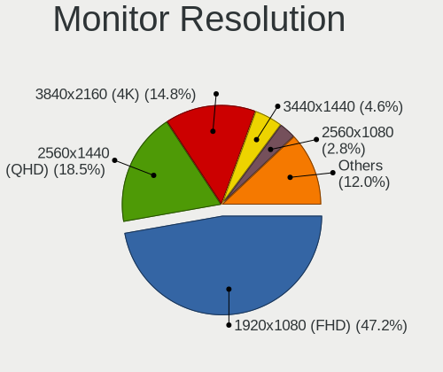
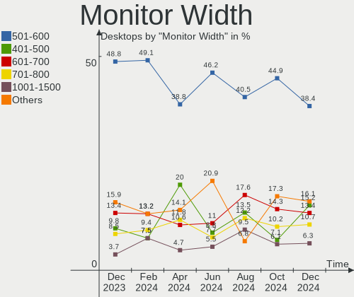
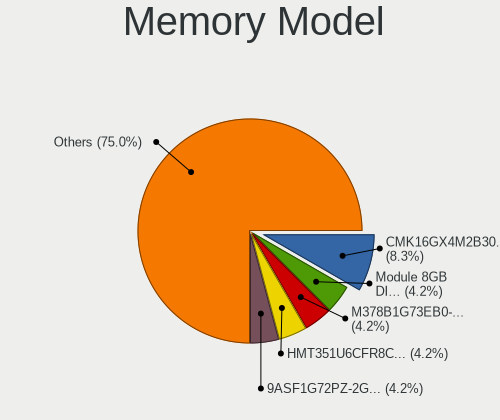
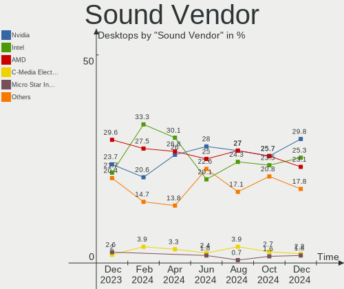

Pop!_OS Hardware Trends (Desktop)
---------------------------------

A project to identify most popular hardware characteristics and track their change
over time based on data collected by Pop!_OS users at https://Linux-Hardware.org.

Anyone can contribute to the study by uploading probes of their computers by
the [hw-probe](https://github.com/linuxhw/hw-probe) tool:

    sudo -E hw-probe -all -upload

Full-feature report is available here: https://linux-hardware.org/?view=trends&formfactor=desktop

Period: Apr, 2021.

Contents
--------

- [ OS                       ](#os)
- [ OS Family                ](#os-family)
- [ Kernel                   ](#kernel)
- [ Kernel Family            ](#kernel-family)
- [ Kernel Major Ver.        ](#kernel-major-ver)
- [ Arch                     ](#arch)
- [ DE                       ](#de)
- [ Display Server           ](#display-server)
- [ Display Manager          ](#display-manager)
- [ OS Lang                  ](#os-lang)
- [ Boot Mode                ](#boot-mode)
- [ Filesystem               ](#filesystem)
- [ Part. scheme             ](#part-scheme)
- [ Dual Boot with Linux/BSD ](#dual-boot-with-linux/bsd)
- [ Dual Boot (Win)          ](#dual-boot-win)
- [ Country                  ](#country)
- [ City                     ](#city)
- [ Vendor                   ](#vendor)
- [ Model                    ](#model)
- [ Model Family             ](#model-family)
- [ MFG Year                 ](#mfg-year)
- [ Form Factor              ](#form-factor)
- [ Secure Boot              ](#secure-boot)
- [ Coreboot                 ](#coreboot)
- [ RAM Size                 ](#ram-size)
- [ RAM Used                 ](#ram-used)
- [ Has CD-ROM               ](#has-cd-rom)
- [ Total Drives             ](#total-drives)
- [ Has Ethernet             ](#has-ethernet)
- [ Has WiFi                 ](#has-wifi)
- [ Has Bluetooth            ](#has-bluetooth)
- [ Drive Vendor             ](#drive-vendor)
- [ Drive Model              ](#drive-model)
- [ HDD Vendor               ](#hdd-vendor)
- [ SSD Vendor               ](#ssd-vendor)
- [ Drive Kind               ](#drive-kind)
- [ Drive Connector          ](#drive-connector)
- [ Drive Size               ](#drive-size)
- [ Space Total              ](#space-total)
- [ Space Used               ](#space-used)
- [ Malfunc. Drives          ](#malfunc-drives)
- [ Malfunc. Drive Vendor    ](#malfunc-drive-vendor)
- [ Malfunc. HDD Vendor      ](#malfunc-hdd-vendor)
- [ Malfunc. Drive Kind      ](#malfunc-drive-kind)
- [ Failed Drives            ](#failed-drives)
- [ Failed Drive Vendor      ](#failed-drive-vendor)
- [ Drive Status             ](#drive-status)
- [ Storage Vendor           ](#storage-vendor)
- [ Storage Model            ](#storage-model)
- [ Storage Kind             ](#storage-kind)
- [ CPU Vendor               ](#cpu-vendor)
- [ CPU Model                ](#cpu-model)
- [ CPU Model Family         ](#cpu-model-family)
- [ CPU Cores                ](#cpu-cores)
- [ CPU Sockets              ](#cpu-sockets)
- [ CPU Threads              ](#cpu-threads)
- [ CPU Op-Modes             ](#cpu-op-modes)
- [ CPU Microcode            ](#cpu-microcode)
- [ CPU Microarch            ](#cpu-microarch)
- [ GPU Vendor               ](#gpu-vendor)
- [ GPU Model                ](#gpu-model)
- [ GPU Combo                ](#gpu-combo)
- [ GPU Driver               ](#gpu-driver)
- [ GPU Memory               ](#gpu-memory)
- [ Monitor Vendor           ](#monitor-vendor)
- [ Monitor Model            ](#monitor-model)
- [ Monitor Resolution       ](#monitor-resolution)
- [ Monitor Diagonal         ](#monitor-diagonal)
- [ Monitor Width            ](#monitor-width)
- [ Aspect Ratio             ](#aspect-ratio)
- [ Monitor Area             ](#monitor-area)
- [ Pixel Density            ](#pixel-density)
- [ Multiple Monitors        ](#multiple-monitors)
- [ Net Controller Vendor    ](#net-controller-vendor)
- [ Net Controller Model     ](#net-controller-model)
- [ Wireless Vendor          ](#wireless-vendor)
- [ Wireless Model           ](#wireless-model)
- [ Ethernet Vendor          ](#ethernet-vendor)
- [ Ethernet Model           ](#ethernet-model)
- [ Net Controller Kind      ](#net-controller-kind)
- [ Used Controller          ](#used-controller)
- [ NICs                     ](#nics)
- [ IPv6                     ](#ipv6)
- [ Memory Vendor            ](#memory-vendor)
- [ Memory Model             ](#memory-model)
- [ Memory Kind              ](#memory-kind)
- [ Memory Form Factor       ](#memory-form-factor)
- [ Memory Size              ](#memory-size)
- [ Memory Speed             ](#memory-speed)
- [ Sound Vendor             ](#sound-vendor)
- [ Sound Model              ](#sound-model)
- [ Camera Vendor            ](#camera-vendor)
- [ Camera Model             ](#camera-model)
- [ Fingerprint Vendor       ](#fingerprint-vendor)
- [ Fingerprint Model        ](#fingerprint-model)
- [ Chipcard Vendor          ](#chipcard-vendor)
- [ Chipcard Model           ](#chipcard-model)
- [ Printer Vendor           ](#printer-vendor)
- [ Printer Model            ](#printer-model)
- [ Scanner Vendor           ](#scanner-vendor)
- [ Scanner Model            ](#scanner-model)
- [ Bluetooth Vendor         ](#bluetooth-vendor)
- [ Bluetooth Model          ](#bluetooth-model)
- [ Unsupported Devices      ](#unsupported-devices)
- [ Unsupported Device Types ](#unsupported-device-types)

OS
--

Installed operating systems

| Name          | Desktops | Percent |
|---------------|----------|---------|
| Pop!_OS 20.10 | 77       | 77.78%  |
| Pop!_OS 20.04 | 20       | 20.2%   |
| Pop!_OS 18.04 | 2        | 2.02%   |

OS Family
---------

OS without a version

| Name    | Desktops | Percent |
|---------|----------|---------|
| Pop!_OS | 99       | 100%    |

Kernel
------

Version of the Linux kernel

| Version               | Desktops | Percent |
|-----------------------|----------|---------|
| 5.11.0-7612-generic   | 64       | 64.65%  |
| 5.11.0-7614-generic   | 16       | 16.16%  |
| 5.8.0-7642-generic    | 10       | 10.1%   |
| 5.3.0-7648-generic    | 2        | 2.02%   |
| 5.8.0-7630-generic    | 1        | 1.01%   |
| 5.4.0-7642-generic    | 1        | 1.01%   |
| 5.4.0-7634-generic    | 1        | 1.01%   |
| 5.4.0-7625-generic    | 1        | 1.01%   |
| 5.11.8-051108-generic | 1        | 1.01%   |
| 5.10.25-xanmod1       | 1        | 1.01%   |
| 5.10.23-xanmod1       | 1        | 1.01%   |

Kernel Family
-------------

Linux kernel without a distro release

| Version | Desktops | Percent |
|---------|----------|---------|
| 5.11.0  | 80       | 80.81%  |
| 5.8.0   | 11       | 11.11%  |
| 5.4.0   | 3        | 3.03%   |
| 5.3.0   | 2        | 2.02%   |
| 5.11.8  | 1        | 1.01%   |
| 5.10.25 | 1        | 1.01%   |
| 5.10.23 | 1        | 1.01%   |

Kernel Major Ver.
-----------------

Linux kernel major version

| Version | Desktops | Percent |
|---------|----------|---------|
| 5.11    | 81       | 81.82%  |
| 5.8     | 11       | 11.11%  |
| 5.4     | 3        | 3.03%   |
| 5.3     | 2        | 2.02%   |
| 5.10    | 2        | 2.02%   |

Arch
----

OS architecture (x86_64, i586, etc.)

| Name   | Desktops | Percent |
|--------|----------|---------|
| x86_64 | 99       | 100%    |

DE
--

Desktop Environment

| Name       | Desktops | Percent |
|------------|----------|---------|
| GNOME      | 92       | 92.93%  |
| KDE        | 3        | 3.03%   |
| XFCE       | 1        | 1.01%   |
| X-Cinnamon | 1        | 1.01%   |
| Pantheon   | 1        | 1.01%   |
| i3         | 1        | 1.01%   |

Display Server
--------------

X11 or Wayland

| Name | Desktops | Percent |
|------|----------|---------|
| X11  | 99       | 100%    |

Display Manager
---------------

SDDM, LightDM, etc.

| Name    | Desktops | Percent |
|---------|----------|---------|
| Unknown | 92       | 92.93%  |
| GDM     | 7        | 7.07%   |

OS Lang
-------

Language

| Lang  | Desktops | Percent |
|-------|----------|---------|
| en_US | 49       | 49.49%  |
| pt_BR | 11       | 11.11%  |
| en_GB | 8        | 8.08%   |
| en_AU | 7        | 7.07%   |
| de_DE | 6        | 6.06%   |
| fr_FR | 4        | 4.04%   |
| ru_RU | 3        | 3.03%   |
| it_IT | 2        | 2.02%   |
| en_CA | 2        | 2.02%   |
| pt_PT | 1        | 1.01%   |
| pl_PL | 1        | 1.01%   |
| nl_NL | 1        | 1.01%   |
| nl_BE | 1        | 1.01%   |
| fr_CA | 1        | 1.01%   |
| da_DK | 1        | 1.01%   |
| C     | 1        | 1.01%   |

Boot Mode
---------

EFI or BIOS

| Mode | Desktops | Percent |
|------|----------|---------|
| BIOS | 92       | 92.93%  |
| EFI  | 7        | 7.07%   |

Filesystem
----------

Type of filesystem

| Type  | Desktops | Percent |
|-------|----------|---------|
| Ext4  | 96       | 96.97%  |
| Btrfs | 2        | 2.02%   |
| Xfs   | 1        | 1.01%   |

Part. scheme
------------

Scheme of partitioning

| Type    | Desktops | Percent |
|---------|----------|---------|
| Unknown | 92       | 92.93%  |
| GPT     | 7        | 7.07%   |

Dual Boot with Linux/BSD
------------------------

Hosting more than one Linux/BSD

| Dual boot | Desktops | Percent |
|-----------|----------|---------|
| No        | 98       | 98.99%  |
| Yes       | 1        | 1.01%   |

Dual Boot (Win)
---------------

Hosting Linux and Windows

| Dual boot | Desktops | Percent |
|-----------|----------|---------|
| No        | 93       | 93.94%  |
| Yes       | 6        | 6.06%   |

Country
-------

Geographic location (country)

| Country     | Desktops | Percent |
|-------------|----------|---------|
| USA         | 31       | 31.31%  |
| Brazil      | 12       | 12.12%  |
| Australia   | 9        | 9.09%   |
| Germany     | 8        | 8.08%   |
| UK          | 6        | 6.06%   |
| Canada      | 5        | 5.05%   |
| France      | 4        | 4.04%   |
| Russia      | 3        | 3.03%   |
| New Zealand | 3        | 3.03%   |
| Denmark     | 3        | 3.03%   |
| Sweden      | 2        | 2.02%   |
| Poland      | 2        | 2.02%   |
| Italy       | 2        | 2.02%   |
| India       | 2        | 2.02%   |
| Uruguay     | 1        | 1.01%   |
| Spain       | 1        | 1.01%   |
| Netherlands | 1        | 1.01%   |
| Malta       | 1        | 1.01%   |
| Greece      | 1        | 1.01%   |
| Croatia     | 1        | 1.01%   |
| Belgium     | 1        | 1.01%   |

City
----

Geographic location (city)

| City               | Desktops | Percent |
|--------------------|----------|---------|
| São Paulo         | 3        | 3.03%   |
| Brisbane           | 3        | 3.03%   |
| Paris              | 2        | 2.02%   |
| Miami              | 2        | 2.02%   |
| Hays               | 2        | 2.02%   |
| Gdansk             | 2        | 2.02%   |
| Duque de Caxias    | 2        | 2.02%   |
| Cincinnati         | 2        | 2.02%   |
| Ashburton          | 2        | 2.02%   |
| Zierikzee          | 1        | 1.01%   |
| Yeovil             | 1        | 1.01%   |
| Vigo               | 1        | 1.01%   |
| Varaždin          | 1        | 1.01%   |
| Vancouver          | 1        | 1.01%   |
| Ukiah              | 1        | 1.01%   |
| Turramurra         | 1        | 1.01%   |
| Toronto            | 1        | 1.01%   |
| Thornlands         | 1        | 1.01%   |
| Taubate            | 1        | 1.01%   |
| Sydney             | 1        | 1.01%   |
| St Petersburg      | 1        | 1.01%   |
| Seal Beach         | 1        | 1.01%   |
| Santa Rosa         | 1        | 1.01%   |
| San Diego          | 1        | 1.01%   |
| Sabara             | 1        | 1.01%   |
| Richmond           | 1        | 1.01%   |
| Redhill            | 1        | 1.01%   |
| Raymond Terrace    | 1        | 1.01%   |
| Rajkot             | 1        | 1.01%   |
| Poços de Caldas   | 1        | 1.01%   |
| Portland           | 1        | 1.01%   |
| Port Charlotte     | 1        | 1.01%   |
| Pindamonhangaba    | 1        | 1.01%   |
| Perth              | 1        | 1.01%   |
| Perris             | 1        | 1.01%   |
| Palmerston North   | 1        | 1.01%   |
| Norresundby        | 1        | 1.01%   |
| Noaillan           | 1        | 1.01%   |
| Moscow             | 1        | 1.01%   |
| Montreal           | 1        | 1.01%   |
| Montevideo         | 1        | 1.01%   |
| Monrovia           | 1        | 1.01%   |
| Milan              | 1        | 1.01%   |
| Meulan-en-Yvelines | 1        | 1.01%   |
| Metairie           | 1        | 1.01%   |
| Melbourne          | 1        | 1.01%   |
| Manchester         | 1        | 1.01%   |
| Manaus             | 1        | 1.01%   |
| Lincoln            | 1        | 1.01%   |
| Langdorp           | 1        | 1.01%   |
| Lahr               | 1        | 1.01%   |
| Kolding            | 1        | 1.01%   |
| Karlsruhe          | 1        | 1.01%   |
| Kanata             | 1        | 1.01%   |
| Izhevsk            | 1        | 1.01%   |
| Issaquah           | 1        | 1.01%   |
| Irvine             | 1        | 1.01%   |
| Hudson             | 1        | 1.01%   |
| Hobe Sound         | 1        | 1.01%   |
| Heilbronn          | 1        | 1.01%   |

Vendor
------

Motherboard manufacturer

| Name                | Desktops | Percent |
|---------------------|----------|---------|
| ASUSTek Computer    | 27       | 27.27%  |
| Gigabyte Technology | 18       | 18.18%  |
| ASRock              | 13       | 13.13%  |
| MSI                 | 11       | 11.11%  |
| Dell                | 7        | 7.07%   |
| Lenovo              | 4        | 4.04%   |
| Acer                | 3        | 3.03%   |
| System76            | 2        | 2.02%   |
| Medion              | 2        | 2.02%   |
| Intel               | 2        | 2.02%   |
| Hewlett-Packard     | 2        | 2.02%   |
| Foxconn             | 2        | 2.02%   |
| Unknown             | 2        | 2.02%   |
| Pegatron            | 1        | 1.01%   |
| Gateway             | 1        | 1.01%   |
| BESSTAR Tech        | 1        | 1.01%   |
| Alienware           | 1        | 1.01%   |

Model
-----

Motherboard model

| Name                                   | Desktops | Percent |
|----------------------------------------|----------|---------|
| ASUS All Series                        | 3        | 3.03%   |
| ASUS P8B WS                            | 2        | 2.02%   |
| ASUS CROSSHAIR VI HERO                 | 2        | 2.02%   |
| Unknown                                | 2        | 2.02%   |
| System76 Thelio Major                  | 1        | 1.01%   |
| System76 Thelio                        | 1        | 1.01%   |
| Pegatron p6-2100z                      | 1        | 1.01%   |
| MSI MS-7D09                            | 1        | 1.01%   |
| MSI MS-7C91                            | 1        | 1.01%   |
| MSI MS-7C84                            | 1        | 1.01%   |
| MSI MS-7C02                            | 1        | 1.01%   |
| MSI MS-7B86                            | 1        | 1.01%   |
| MSI MS-7B29                            | 1        | 1.01%   |
| MSI MS-7B22                            | 1        | 1.01%   |
| MSI MS-7B17                            | 1        | 1.01%   |
| MSI MS-7A38                            | 1        | 1.01%   |
| MSI MS-7817                            | 1        | 1.01%   |
| MSI A320M-HDV R4.0                     | 1        | 1.01%   |
| Medion Akoya P5306 I/C016              | 1        | 1.01%   |
| Medion Akoya P5286 E/B549              | 1        | 1.01%   |
| Lenovo ThinkStation P300 30AGS0EL00    | 1        | 1.01%   |
| Lenovo IdeaCentre 510-15IKL 90G80099MW | 1        | 1.01%   |
| Lenovo H530 10130                      | 1        | 1.01%   |
| Lenovo H50-50 90B60068IX               | 1        | 1.01%   |
| Intel DH55PJ AAE93812-302              | 1        | 1.01%   |
| Intel D33217GKE G76540-204             | 1        | 1.01%   |
| HP Z200 Workstation                    | 1        | 1.01%   |
| HP Elite Slice                         | 1        | 1.01%   |
| Gigabyte Z87M-D3H                      | 1        | 1.01%   |
| Gigabyte Z77X-D3H                      | 1        | 1.01%   |
| Gigabyte Z490 UD AC                    | 1        | 1.01%   |
| Gigabyte X570 AORUS XTREME             | 1        | 1.01%   |
| Gigabyte X570 AORUS PRO WIFI           | 1        | 1.01%   |
| Gigabyte X570 AORUS MASTER             | 1        | 1.01%   |
| Gigabyte H77M-D3H                      | 1        | 1.01%   |
| Gigabyte GA-A75-UD4H                   | 1        | 1.01%   |
| Gigabyte B75M-D3H                      | 1        | 1.01%   |
| Gigabyte B550 AORUS PRO                | 1        | 1.01%   |
| Gigabyte B550 AORUS MASTER             | 1        | 1.01%   |
| Gigabyte B550 AORUS ELITE AX V2        | 1        | 1.01%   |
| Gigabyte B450M DS3H                    | 1        | 1.01%   |
| Gigabyte B450 AORUS PRO                | 1        | 1.01%   |
| Gigabyte B360M GAMING HD               | 1        | 1.01%   |
| Gigabyte Atlas H217                    | 1        | 1.01%   |
| Gigabyte 9876-2474A                    | 1        | 1.01%   |
| Gigabyte 970A-DS3P                     | 1        | 1.01%   |
| Gateway SX2865                         | 1        | 1.01%   |
| Foxconn p6-2210ef                      | 1        | 1.01%   |
| Foxconn 2A92                           | 1        | 1.01%   |
| Dell Vostro 270                        | 1        | 1.01%   |
| Dell Vostro 260                        | 1        | 1.01%   |
| Dell OptiPlex 9010                     | 1        | 1.01%   |
| Dell OptiPlex 760                      | 1        | 1.01%   |
| Dell OptiPlex 330                      | 1        | 1.01%   |
| Dell OptiPlex 320                      | 1        | 1.01%   |
| Dell Inspiron 3881                     | 1        | 1.01%   |
| BESSTAR Tech DMAF5                     | 1        | 1.01%   |
| ASUS ROG STRIX X570-E GAMING           | 1        | 1.01%   |
| ASUS ROG STRIX B450-I GAMING           | 1        | 1.01%   |
| ASUS ROG STRIX B450-F GAMING           | 1        | 1.01%   |

Model Family
------------

Motherboard model prefix

| Name                 | Desktops | Percent |
|----------------------|----------|---------|
| ASUS ROG             | 5        | 5.05%   |
| Dell OptiPlex        | 4        | 4.04%   |
| ASUS PRIME           | 4        | 4.04%   |
| Gigabyte X570        | 3        | 3.03%   |
| Gigabyte B550        | 3        | 3.03%   |
| ASUS M5A78L-M        | 3        | 3.03%   |
| ASUS All             | 3        | 3.03%   |
| System76 Thelio      | 2        | 2.02%   |
| Medion Akoya         | 2        | 2.02%   |
| Dell Vostro          | 2        | 2.02%   |
| ASUS P8B             | 2        | 2.02%   |
| ASUS CROSSHAIR       | 2        | 2.02%   |
| ASRock X570          | 2        | 2.02%   |
| Acer Aspire          | 2        | 2.02%   |
| Unknown              | 2        | 2.02%   |
| Pegatron p6-2100z    | 1        | 1.01%   |
| MSI MS-7D09          | 1        | 1.01%   |
| MSI MS-7C91          | 1        | 1.01%   |
| MSI MS-7C84          | 1        | 1.01%   |
| MSI MS-7C02          | 1        | 1.01%   |
| MSI MS-7B86          | 1        | 1.01%   |
| MSI MS-7B29          | 1        | 1.01%   |
| MSI MS-7B22          | 1        | 1.01%   |
| MSI MS-7B17          | 1        | 1.01%   |
| MSI MS-7A38          | 1        | 1.01%   |
| MSI MS-7817          | 1        | 1.01%   |
| MSI A320M-HDV        | 1        | 1.01%   |
| Lenovo ThinkStation  | 1        | 1.01%   |
| Lenovo IdeaCentre    | 1        | 1.01%   |
| Lenovo H530          | 1        | 1.01%   |
| Lenovo H50-50        | 1        | 1.01%   |
| Intel DH55PJ         | 1        | 1.01%   |
| Intel D33217GKE      | 1        | 1.01%   |
| HP Z200              | 1        | 1.01%   |
| HP Elite             | 1        | 1.01%   |
| Gigabyte Z87M-D3H    | 1        | 1.01%   |
| Gigabyte Z77X-D3H    | 1        | 1.01%   |
| Gigabyte Z490        | 1        | 1.01%   |
| Gigabyte H77M-D3H    | 1        | 1.01%   |
| Gigabyte GA-A75-UD4H | 1        | 1.01%   |
| Gigabyte B75M-D3H    | 1        | 1.01%   |
| Gigabyte B450M       | 1        | 1.01%   |
| Gigabyte B450        | 1        | 1.01%   |
| Gigabyte B360M       | 1        | 1.01%   |
| Gigabyte Atlas       | 1        | 1.01%   |
| Gigabyte 9876-2474A  | 1        | 1.01%   |
| Gigabyte 970A-DS3P   | 1        | 1.01%   |
| Gateway SX2865       | 1        | 1.01%   |
| Foxconn p6-2210ef    | 1        | 1.01%   |
| Foxconn 2A92         | 1        | 1.01%   |
| Dell Inspiron        | 1        | 1.01%   |
| BESSTAR Tech DMAF5   | 1        | 1.01%   |
| ASUS P9X79           | 1        | 1.01%   |
| ASUS P8P67           | 1        | 1.01%   |
| ASUS P8H77-V         | 1        | 1.01%   |
| ASUS P5K-VM          | 1        | 1.01%   |
| ASUS M5A99FX         | 1        | 1.01%   |
| ASUS M5A78L          | 1        | 1.01%   |
| ASUS M4N68T-M        | 1        | 1.01%   |
| ASUS M2N32-SLI       | 1        | 1.01%   |

MFG Year
--------

Motherboard manufacture year

| Year | Desktops | Percent |
|------|----------|---------|
| 2020 | 23       | 23.23%  |
| 2019 | 13       | 13.13%  |
| 2021 | 10       | 10.1%   |
| 2014 | 8        | 8.08%   |
| 2011 | 8        | 8.08%   |
| 2013 | 7        | 7.07%   |
| 2016 | 6        | 6.06%   |
| 2018 | 5        | 5.05%   |
| 2015 | 5        | 5.05%   |
| 2012 | 4        | 4.04%   |
| 2010 | 3        | 3.03%   |
| 2009 | 3        | 3.03%   |
| 2017 | 2        | 2.02%   |
| 2008 | 1        | 1.01%   |
| 2006 | 1        | 1.01%   |

Form Factor
-----------

Physical design of the computer

| Name    | Desktops | Percent |
|---------|----------|---------|
| Desktop | 99       | 100%    |

Secure Boot
-----------

Enabled or disabled

| State    | Desktops | Percent |
|----------|----------|---------|
| Disabled | 99       | 100%    |

Coreboot
--------

Have coreboot on board

| Used | Desktops | Percent |
|------|----------|---------|
| No   | 99       | 100%    |

RAM Size
--------

Total RAM memory

| Size in GB  | Desktops | Percent |
|-------------|----------|---------|
| 16.01-24.0  | 25       | 25.25%  |
| 8.01-16.0   | 25       | 25.25%  |
| 32.01-64.0  | 14       | 14.14%  |
| 3.01-4.0    | 13       | 13.13%  |
| 4.01-8.0    | 12       | 12.12%  |
| 64.01-256.0 | 7        | 7.07%   |
| 24.01-32.0  | 2        | 2.02%   |
| 2.01-3.0    | 1        | 1.01%   |

RAM Used
--------

Used RAM memory

| Used GB    | Desktops | Percent |
|------------|----------|---------|
| 1.01-2.0   | 38       | 38.38%  |
| 2.01-3.0   | 24       | 24.24%  |
| 3.01-4.0   | 16       | 16.16%  |
| 4.01-8.0   | 13       | 13.13%  |
| 8.01-16.0  | 4        | 4.04%   |
| 32.01-64.0 | 1        | 1.01%   |
| 24.01-32.0 | 1        | 1.01%   |
| 16.01-24.0 | 1        | 1.01%   |
| 0.51-1.0   | 1        | 1.01%   |

Has CD-ROM
----------

Has CD-ROM on board

| Presented | Desktops | Percent |
|-----------|----------|---------|
| No        | 60       | 60.61%  |
| Yes       | 39       | 39.39%  |

Total Drives
------------

Number of drives on board

| Drives | Desktops | Percent |
|--------|----------|---------|
| 1      | 30       | 30.3%   |
| 2      | 29       | 29.29%  |
| 3      | 17       | 17.17%  |
| 4      | 13       | 13.13%  |
| 5      | 5        | 5.05%   |
| 6      | 3        | 3.03%   |
| 23     | 1        | 1.01%   |
| 12     | 1        | 1.01%   |

Has Ethernet
------------

Has Ethernet on board

| Presented | Desktops | Percent |
|-----------|----------|---------|
| Yes       | 98       | 98.99%  |
| No        | 1        | 1.01%   |

Has WiFi
--------

Has WiFi module

| Presented | Desktops | Percent |
|-----------|----------|---------|
| Yes       | 57       | 57.58%  |
| No        | 42       | 42.42%  |

Has Bluetooth
-------------

Has Bluetooth module

| Presented | Desktops | Percent |
|-----------|----------|---------|
| No        | 64       | 64.65%  |
| Yes       | 35       | 35.35%  |

Drive Vendor
------------

Hard drive vendors

| Vendor                    | Desktops | Drives | Percent |
|---------------------------|----------|--------|---------|
| WDC                       | 40       | 66     | 21.28%  |
| Seagate                   | 36       | 50     | 19.15%  |
| Samsung Electronics       | 34       | 50     | 18.09%  |
| Toshiba                   | 10       | 12     | 5.32%   |
| Kingston                  | 10       | 12     | 5.32%   |
| SanDisk                   | 8        | 11     | 4.26%   |
| Phison                    | 8        | 12     | 4.26%   |
| Crucial                   | 8        | 10     | 4.26%   |
| PNY                       | 7        | 7      | 3.72%   |
| Hitachi                   | 4        | 4      | 2.13%   |
| Silicon Motion            | 2        | 10     | 1.06%   |
| Patriot                   | 2        | 2      | 1.06%   |
| OCZ                       | 2        | 2      | 1.06%   |
| Micron/Crucial Technology | 2        | 3      | 1.06%   |
| Apacer                    | 2        | 2      | 1.06%   |
| A-DATA Technology         | 2        | 2      | 1.06%   |
| XrayDisk                  | 1        | 1      | 0.53%   |
| SPCC                      | 1        | 1      | 0.53%   |
| QNAP                      | 1        | 2      | 0.53%   |
| OWC                       | 1        | 1      | 0.53%   |
| Maxtor                    | 1        | 1      | 0.53%   |
| Lexar                     | 1        | 1      | 0.53%   |
| JMicron                   | 1        | 1      | 0.53%   |
| Intenso                   | 1        | 1      | 0.53%   |
| Intel                     | 1        | 2      | 0.53%   |
| DREVO                     | 1        | 1      | 0.53%   |
| China                     | 1        | 1      | 0.53%   |

Drive Model
-----------

Hard drive models

| Model                               | Desktops | Percent |
|-------------------------------------|----------|---------|
| Samsung NVMe SSD Drive 1TB          | 7        | 3.02%   |
| Seagate ST500DM002-1BD142 500GB     | 4        | 1.72%   |
| Samsung NVMe SSD Drive 500GB        | 4        | 1.72%   |
| Kingston SA400S37120G 120GB SSD     | 4        | 1.72%   |
| WDC WD10EZEX-08WN4A0 1TB            | 3        | 1.29%   |
| Seagate ST1000DM010-2EP102 1TB      | 3        | 1.29%   |
| Sandisk NVMe SSD Drive 500GB        | 3        | 1.29%   |
| Samsung SSD 870 EVO 1TB             | 3        | 1.29%   |
| WDC WDS500G2B0B-00YS70 500GB SSD    | 2        | 0.86%   |
| WDC WDS120G2G0A-00JH30 120GB SSD    | 2        | 0.86%   |
| WDC WD10EZEX-00BN5A0 1TB            | 2        | 0.86%   |
| WDC WD1002FAEX-00Y9A0 1TB           | 2        | 0.86%   |
| Toshiba MK3261GSYN 320GB            | 2        | 0.86%   |
| Toshiba HDWD110 1TB                 | 2        | 0.86%   |
| Toshiba DT01ACA300 3TB              | 2        | 0.86%   |
| Seagate ST3500413AS 500GB           | 2        | 0.86%   |
| Seagate ST31000524AS 1TB            | 2        | 0.86%   |
| Seagate ST250DM000-1BD141 250GB     | 2        | 0.86%   |
| Seagate ST2000DM001-1ER164 2TB      | 2        | 0.86%   |
| Seagate ST2000DM001-1CH164 2TB      | 2        | 0.86%   |
| Seagate ST1000LM024 HN-M101MBB 1TB  | 2        | 0.86%   |
| Seagate ST1000DM003-1SB102 1TB      | 2        | 0.86%   |
| Seagate ST1000DM003-1CH162 1TB      | 2        | 0.86%   |
| Samsung SSD 860 QVO 1TB             | 2        | 0.86%   |
| Samsung SSD 860 EVO 500GB           | 2        | 0.86%   |
| Samsung SSD 860 EVO 1TB             | 2        | 0.86%   |
| Samsung SSD 850 EVO 500GB           | 2        | 0.86%   |
| Samsung HD502IJ 500GB               | 2        | 0.86%   |
| PNY CS900 500GB SSD                 | 2        | 0.86%   |
| PNY CS900 120GB SSD                 | 2        | 0.86%   |
| Phison NVMe SSD Drive 512GB         | 2        | 0.86%   |
| Phison NVMe SSD Drive 500GB         | 2        | 0.86%   |
| Phison NVMe SSD Drive 2TB           | 2        | 0.86%   |
| OCZ ARC100 240GB SSD                | 2        | 0.86%   |
| Micron/Crucial NVMe SSD Drive 500GB | 2        | 0.86%   |
| Kingston SA400S37480G 480GB SSD     | 2        | 0.86%   |
| Kingston SA400S37240G 240GB SSD     | 2        | 0.86%   |
| Hitachi HTS541680J9SA00 80GB        | 2        | 0.86%   |
| Hitachi HDS721010CLA332 1TB         | 2        | 0.86%   |
| Crucial CT525MX300SSD1 528GB        | 2        | 0.86%   |
| Crucial CT240BX500SSD1 240GB        | 2        | 0.86%   |
| Crucial CT1000MX500SSD1 1TB         | 2        | 0.86%   |
| XrayDisk 128GB                      | 1        | 0.43%   |
| WDC WDS400T2B0A-00SM50 4TB SSD      | 1        | 0.43%   |
| WDC WDS400T1R0A-68A4W0 4TB SSD      | 1        | 0.43%   |
| WDC WDS240G2G0A-00JH30 240GB SSD    | 1        | 0.43%   |
| WDC WDS120G2G0B-00EPW0 120GB SSD    | 1        | 0.43%   |
| WDC WDS100T1R0A-68A4W0 1TB SSD      | 1        | 0.43%   |
| WDC WDBNCE5000PNC 500GB SSD         | 1        | 0.43%   |
| WDC WD80EFZX-68UW8N0 8TB            | 1        | 0.43%   |
| WDC WD800BD-22MRA1 80GB             | 1        | 0.43%   |
| WDC WD6400BPVT-22HXZT3 640GB        | 1        | 0.43%   |
| WDC WD60EZAZ-00ZGHB0 6TB            | 1        | 0.43%   |
| WDC WD5003AZEX-00K1GA0 500GB        | 1        | 0.43%   |
| WDC WD5000LPVX-80V0TT0 500GB        | 1        | 0.43%   |
| WDC WD5000LPVX-75V0TT0 500GB        | 1        | 0.43%   |
| WDC WD5000LPVX-22V0TT0 500GB        | 1        | 0.43%   |
| WDC WD5000BPVT-22HXZT3 500GB        | 1        | 0.43%   |
| WDC WD5000AAKX-60U6AA0 500GB        | 1        | 0.43%   |
| WDC WD5000AAKS-75V0A0 500GB         | 1        | 0.43%   |

HDD Vendor
----------

Hard disk drive vendors

| Vendor              | Desktops | Drives | Percent |
|---------------------|----------|--------|---------|
| Seagate             | 36       | 47     | 39.56%  |
| WDC                 | 34       | 53     | 37.36%  |
| Toshiba             | 10       | 11     | 10.99%  |
| Samsung Electronics | 6        | 6      | 6.59%   |
| Hitachi             | 4        | 4      | 4.4%    |
| Maxtor              | 1        | 1      | 1.1%    |

SSD Vendor
----------

Solid state drive vendors

| Vendor              | Desktops | Drives | Percent |
|---------------------|----------|--------|---------|
| Samsung Electronics | 17       | 24     | 23.94%  |
| WDC                 | 9        | 12     | 12.68%  |
| Kingston            | 9        | 11     | 12.68%  |
| Crucial             | 8        | 10     | 11.27%  |
| PNY                 | 7        | 7      | 9.86%   |
| SanDisk             | 6        | 8      | 8.45%   |
| Patriot             | 2        | 2      | 2.82%   |
| OCZ                 | 2        | 2      | 2.82%   |
| Apacer              | 2        | 2      | 2.82%   |
| A-DATA Technology   | 2        | 2      | 2.82%   |
| Toshiba             | 1        | 1      | 1.41%   |
| SPCC                | 1        | 1      | 1.41%   |
| OWC                 | 1        | 1      | 1.41%   |
| Lexar               | 1        | 1      | 1.41%   |
| Intenso             | 1        | 1      | 1.41%   |
| DREVO               | 1        | 1      | 1.41%   |
| China               | 1        | 1      | 1.41%   |

Drive Kind
----------

HDD or SSD

| Kind    | Desktops | Drives | Percent |
|---------|----------|--------|---------|
| HDD     | 67       | 122    | 40.85%  |
| SSD     | 59       | 87     | 35.98%  |
| NVMe    | 32       | 51     | 19.51%  |
| Unknown | 6        | 8      | 3.66%   |

Drive Connector
---------------

SATA, SAS, NVMe, etc.

| Type | Desktops | Drives | Percent |
|------|----------|--------|---------|
| SATA | 94       | 208    | 70.68%  |
| NVMe | 32       | 51     | 24.06%  |
| SAS  | 7        | 9      | 5.26%   |

Drive Size
----------

Size of hard drive

| Size in TB | Desktops | Drives | Percent |
|------------|----------|--------|---------|
| 0.01-0.5   | 67       | 99     | 46.21%  |
| 0.51-1.0   | 51       | 63     | 35.17%  |
| 1.01-2.0   | 11       | 11     | 7.59%   |
| 2.01-3.0   | 6        | 6      | 4.14%   |
| 3.01-4.0   | 4        | 7      | 2.76%   |
| 4.01-10.0  | 4        | 8      | 2.76%   |
| 10.01-20.0 | 2        | 15     | 1.38%   |

Space Total
-----------

Amount of disk space available on the file system

| Size in GB     | Desktops | Percent |
|----------------|----------|---------|
| 101-250        | 25       | 25.25%  |
| 251-500        | 21       | 21.21%  |
| 501-1000       | 17       | 17.17%  |
| 1001-2000      | 15       | 15.15%  |
| More than 3000 | 10       | 10.1%   |
| 2001-3000      | 7        | 7.07%   |
| 21-50          | 2        | 2.02%   |
| 51-100         | 2        | 2.02%   |

Space Used
----------

Amount of used disk space

| Used GB        | Desktops | Percent |
|----------------|----------|---------|
| 1-20           | 31       | 31.31%  |
| 21-50          | 18       | 18.18%  |
| 51-100         | 14       | 14.14%  |
| 101-250        | 9        | 9.09%   |
| 1001-2000      | 9        | 9.09%   |
| 251-500        | 8        | 8.08%   |
| 501-1000       | 5        | 5.05%   |
| More than 3000 | 3        | 3.03%   |
| 2001-3000      | 2        | 2.02%   |

Malfunc. Drives
---------------

Drive models with a malfunction

Zero info for selected period =(

Malfunc. Drive Vendor
---------------------

Vendors of faulty drives

Zero info for selected period =(

Malfunc. HDD Vendor
-------------------

Vendors of faulty HDD drives

Zero info for selected period =(

Malfunc. Drive Kind
-------------------

Kinds of faulty drives

Zero info for selected period =(

Failed Drives
-------------

Failed drive models

Zero info for selected period =(

Failed Drive Vendor
-------------------

Failed drive vendors

Zero info for selected period =(

Drive Status
------------

Number of failed and malfunc. drives

| Status   | Desktops | Drives | Percent |
|----------|----------|--------|---------|
| Detected | 93       | 252    | 93%     |
| Works    | 7        | 16     | 7%      |

Storage Vendor
--------------

Storage controller vendors

| Vendor                      | Desktops | Percent |
|-----------------------------|----------|---------|
| Intel                       | 50       | 34.72%  |
| AMD                         | 44       | 30.56%  |
| Samsung Electronics         | 17       | 11.81%  |
| Phison Electronics          | 8        | 5.56%   |
| Nvidia                      | 5        | 3.47%   |
| Marvell Technology Group    | 4        | 2.78%   |
| Sandisk                     | 3        | 2.08%   |
| JMicron Technology          | 3        | 2.08%   |
| ASMedia Technology          | 3        | 2.08%   |
| Silicon Motion              | 2        | 1.39%   |
| Micron/Crucial Technology   | 2        | 1.39%   |
| Silicon Image               | 1        | 0.69%   |
| Kingston Technology Company | 1        | 0.69%   |
| Broadcom / LSI              | 1        | 0.69%   |

Storage Model
-------------

Storage controller models

| Model                                                                                   | Desktops | Percent |
|-----------------------------------------------------------------------------------------|----------|---------|
| AMD FCH SATA Controller [AHCI mode]                                                     | 28       | 15.22%  |
| Samsung NVMe SSD Controller SM981/PM981/PM983                                           | 11       | 5.98%   |
| AMD 400 Series Chipset SATA Controller                                                  | 10       | 5.43%   |
| Intel 8 Series/C220 Series Chipset Family 6-port SATA Controller 1 [AHCI mode]          | 9        | 4.89%   |
| AMD Starship/Matisse Chipset SATA Controller [AHCI mode]                                | 5        | 2.72%   |
| AMD SB7x0/SB8x0/SB9x0 SATA Controller [AHCI mode]                                       | 5        | 2.72%   |
| AMD SB7x0/SB8x0/SB9x0 IDE Controller                                                    | 5        | 2.72%   |
| Phison E16 PCIe4 NVMe Controller                                                        | 4        | 2.17%   |
| Nvidia MCP61 SATA Controller                                                            | 4        | 2.17%   |
| Nvidia MCP61 IDE                                                                        | 4        | 2.17%   |
| Intel SATA Controller [RAID mode]                                                       | 4        | 2.17%   |
| Intel Cannon Lake PCH SATA AHCI Controller                                              | 4        | 2.17%   |
| Intel 200 Series PCH SATA controller [AHCI mode]                                        | 4        | 2.17%   |
| AMD SB7x0/SB8x0/SB9x0 SATA Controller [IDE mode]                                        | 4        | 2.17%   |
| Samsung NVMe SSD Controller SM961/PM961/SM963                                           | 3        | 1.63%   |
| Samsung NVMe SSD Controller PM9A1/980PRO                                                | 3        | 1.63%   |
| Intel Q170/Q150/B150/H170/H110/Z170/CM236 Chipset SATA Controller [AHCI Mode]           | 3        | 1.63%   |
| Intel 7 Series/C210 Series Chipset Family 6-port SATA Controller [AHCI mode]            | 3        | 1.63%   |
| Intel 6 Series/C200 Series Chipset Family Desktop SATA Controller (IDE mode, ports 4-5) | 3        | 1.63%   |
| Intel 6 Series/C200 Series Chipset Family Desktop SATA Controller (IDE mode, ports 0-3) | 3        | 1.63%   |
| Intel 6 Series/C200 Series Chipset Family 6 port Desktop SATA AHCI Controller           | 3        | 1.63%   |
| ASMedia ASM1062 Serial ATA Controller                                                   | 3        | 1.63%   |
| AMD X370 Series Chipset SATA Controller                                                 | 3        | 1.63%   |
| Sandisk WD Black 2018/SN750 / PC SN720 NVMe SSD                                         | 2        | 1.09%   |
| Phison E12 NVMe Controller                                                              | 2        | 1.09%   |
| Micron/Crucial Non-Volatile memory controller                                           | 2        | 1.09%   |
| Marvell Group 88SE9172 SATA 6Gb/s Controller                                            | 2        | 1.09%   |
| JMicron JMB362 SATA Controller                                                          | 2        | 1.09%   |
| Intel 82801G (ICH7 Family) IDE Controller                                               | 2        | 1.09%   |
| Intel 7 Series/C210 Series Chipset Family 4-port SATA Controller [IDE mode]             | 2        | 1.09%   |
| Intel 7 Series/C210 Series Chipset Family 2-port SATA Controller [IDE mode]             | 2        | 1.09%   |
| Silicon Motion SM2263EN/SM2263XT SSD Controller                                         | 1        | 0.54%   |
| Silicon Motion SM2262/SM2262EN SSD Controller                                           | 1        | 0.54%   |
| Silicon Image SiI 3132 Serial ATA Raid II Controller                                    | 1        | 0.54%   |
| Sandisk WD Black SN750 / PC SN730 NVMe SSD                                              | 1        | 0.54%   |
| Samsung NVMe SSD Controller SM951/PM951                                                 | 1        | 0.54%   |
| Phison PS5013 E13 NVMe Controller                                                       | 1        | 0.54%   |
| Phison E7 NVMe Controller                                                               | 1        | 0.54%   |
| Nvidia MCP55 SATA Controller                                                            | 1        | 0.54%   |
| Nvidia MCP55 IDE                                                                        | 1        | 0.54%   |
| Marvell Group 88SE9215 PCIe 2.0 x1 4-port SATA 6 Gb/s Controller                        | 1        | 0.54%   |
| Marvell Group 88SE9128 PCIe SATA 6 Gb/s RAID controller with HyperDuo                   | 1        | 0.54%   |
| Kingston Company OM3PDP3 NVMe SSD                                                       | 1        | 0.54%   |
| JMicron JMB368 IDE controller                                                           | 1        | 0.54%   |
| Intel Sunrise Point-LP SATA Controller [AHCI mode]                                      | 1        | 0.54%   |
| Intel Non-Volatile memory controller                                                    | 1        | 0.54%   |
| Intel NM10/ICH7 Family SATA Controller [IDE mode]                                       | 1        | 0.54%   |
| Intel NM10/ICH7 Family SATA Controller [AHCI mode]                                      | 1        | 0.54%   |
| Intel Comet Lake SATA AHCI Controller                                                   | 1        | 0.54%   |
| Intel 82801JI (ICH10 Family) 4 port SATA IDE Controller #1                              | 1        | 0.54%   |
| Intel 82801JI (ICH10 Family) 2 port SATA IDE Controller #2                              | 1        | 0.54%   |
| Intel 82801JD/DO (ICH10 Family) SATA AHCI Controller                                    | 1        | 0.54%   |
| Intel 82801IB (ICH9) 2 port SATA Controller [IDE mode]                                  | 1        | 0.54%   |
| Intel 82801I (ICH9 Family) 2 port SATA Controller [IDE mode]                            | 1        | 0.54%   |
| Intel 8 Series/C220 Series Chipset Family 4-port SATA Controller 1 [IDE mode]           | 1        | 0.54%   |
| Intel 8 Series/C220 Series Chipset Family 2-port SATA Controller 2 [IDE mode]           | 1        | 0.54%   |
| Intel 8 Series SATA Controller 1 [AHCI mode]                                            | 1        | 0.54%   |
| Intel 7 Series Chipset Family 6-port SATA Controller [AHCI mode]                        | 1        | 0.54%   |
| Intel 500 Series Chipset Family SATA AHCI Controller                                    | 1        | 0.54%   |
| Intel 5 Series/3400 Series Chipset PT IDER Controller                                   | 1        | 0.54%   |

Storage Kind
------------

Kind of storage controller (IDE, SATA, NVMe, SAS, ...)

| Kind | Desktops | Percent |
|------|----------|---------|
| SATA | 81       | 55.86%  |
| NVMe | 32       | 22.07%  |
| IDE  | 23       | 15.86%  |
| RAID | 8        | 5.52%   |
| SAS  | 1        | 0.69%   |

CPU Vendor
----------

Processor vendors

| Vendor | Desktops | Percent |
|--------|----------|---------|
| Intel  | 51       | 51.52%  |
| AMD    | 48       | 48.48%  |

CPU Model
---------

Processor models

| Model                                          | Desktops | Percent |
|------------------------------------------------|----------|---------|
| Intel Core i7-4770 CPU @ 3.40GHz               | 4        | 4.04%   |
| Intel Core i5-10400 CPU @ 2.90GHz              | 3        | 3.03%   |
| AMD Ryzen 9 3900X 12-Core Processor            | 3        | 3.03%   |
| AMD Ryzen 7 3700X 8-Core Processor             | 3        | 3.03%   |
| AMD Ryzen 5 3600 6-Core Processor              | 3        | 3.03%   |
| Intel Core i7-3770 CPU @ 3.40GHz               | 2        | 2.02%   |
| Intel Core i5-4460 CPU @ 3.20GHz               | 2        | 2.02%   |
| Intel Core i5-3550 CPU @ 3.30GHz               | 2        | 2.02%   |
| Intel Core 2 Duo CPU E8400 @ 3.00GHz           | 2        | 2.02%   |
| AMD Ryzen 9 5950X 16-Core Processor            | 2        | 2.02%   |
| AMD Ryzen 9 3950X 16-Core Processor            | 2        | 2.02%   |
| AMD Ryzen 7 2700X Eight-Core Processor         | 2        | 2.02%   |
| AMD Ryzen 5 5600X 6-Core Processor             | 2        | 2.02%   |
| AMD Ryzen 5 3400G with Radeon Vega Graphics    | 2        | 2.02%   |
| AMD Ryzen 5 1600 Six-Core Processor            | 2        | 2.02%   |
| AMD Ryzen 3 3200G with Radeon Vega Graphics    | 2        | 2.02%   |
| Intel Xeon CPU X3470 @ 2.93GHz                 | 1        | 1.01%   |
| Intel Pentium Dual-Core CPU E5800 @ 3.20GHz    | 1        | 1.01%   |
| Intel Pentium Dual CPU E2140 @ 1.60GHz         | 1        | 1.01%   |
| Intel Pentium CPU G640 @ 2.80GHz               | 1        | 1.01%   |
| Intel Pentium CPU G630 @ 2.70GHz               | 1        | 1.01%   |
| Intel Core i9-10850K CPU @ 3.60GHz             | 1        | 1.01%   |
| Intel Core i7-9700K CPU @ 3.60GHz              | 1        | 1.01%   |
| Intel Core i7-8550U CPU @ 1.80GHz              | 1        | 1.01%   |
| Intel Core i7-8086K CPU @ 4.00GHz              | 1        | 1.01%   |
| Intel Core i7-6700 CPU @ 3.40GHz               | 1        | 1.01%   |
| Intel Core i7-4790 CPU @ 3.60GHz               | 1        | 1.01%   |
| Intel Core i7-4770K CPU @ 3.50GHz              | 1        | 1.01%   |
| Intel Core i7-3960X CPU @ 3.30GHz              | 1        | 1.01%   |
| Intel Core i7-2600K CPU @ 3.40GHz              | 1        | 1.01%   |
| Intel Core i7-10700K CPU @ 3.80GHz             | 1        | 1.01%   |
| Intel Core i5-9600KF CPU @ 3.70GHz             | 1        | 1.01%   |
| Intel Core i5-9400F CPU @ 2.90GHz              | 1        | 1.01%   |
| Intel Core i5-8600K CPU @ 3.60GHz              | 1        | 1.01%   |
| Intel Core i5-7400 CPU @ 3.00GHz               | 1        | 1.01%   |
| Intel Core i5-6500T CPU @ 2.50GHz              | 1        | 1.01%   |
| Intel Core i5-6400 CPU @ 2.70GHz               | 1        | 1.01%   |
| Intel Core i5-4250U CPU @ 1.30GHz              | 1        | 1.01%   |
| Intel Core i5-3570 CPU @ 3.40GHz               | 1        | 1.01%   |
| Intel Core i5-3470 CPU @ 3.20GHz               | 1        | 1.01%   |
| Intel Core i5-3350P CPU @ 3.10GHz              | 1        | 1.01%   |
| Intel Core i5-3330 CPU @ 3.00GHz               | 1        | 1.01%   |
| Intel Core i5-2500K CPU @ 3.30GHz              | 1        | 1.01%   |
| Intel Core i5-2400 CPU @ 3.10GHz               | 1        | 1.01%   |
| Intel Core i5 CPU 650 @ 3.20GHz                | 1        | 1.01%   |
| Intel Core i3-9100F CPU @ 3.60GHz              | 1        | 1.01%   |
| Intel Core i3-8100 CPU @ 3.60GHz               | 1        | 1.01%   |
| Intel Core i3-4150 CPU @ 3.50GHz               | 1        | 1.01%   |
| Intel Core i3-4130 CPU @ 3.40GHz               | 1        | 1.01%   |
| Intel Core i3-3217U CPU @ 1.80GHz              | 1        | 1.01%   |
| Intel Core 2 Duo CPU E7500 @ 2.93GHz           | 1        | 1.01%   |
| Intel Core 2 CPU 4400 @ 2.00GHz                | 1        | 1.01%   |
| AMD Ryzen Threadripper 3960X 24-Core Processor | 1        | 1.01%   |
| AMD Ryzen 7 5800X 8-Core Processor             | 1        | 1.01%   |
| AMD Ryzen 7 1700 Eight-Core Processor          | 1        | 1.01%   |
| AMD Ryzen 5 3600XT 6-Core Processor            | 1        | 1.01%   |
| AMD Ryzen 5 3600X 6-Core Processor             | 1        | 1.01%   |
| AMD Ryzen 5 3550H with Radeon Vega Mobile Gfx  | 1        | 1.01%   |
| AMD Ryzen 5 2600X Six-Core Processor           | 1        | 1.01%   |
| AMD Ryzen 5 2400G with Radeon Vega Graphics    | 1        | 1.01%   |

CPU Model Family
----------------

Processor model prefix

| Model                   | Desktops | Percent |
|-------------------------|----------|---------|
| Intel Core i5           | 21       | 21.21%  |
| Intel Core i7           | 15       | 15.15%  |
| AMD Ryzen 5             | 14       | 14.14%  |
| AMD Ryzen 9             | 7        | 7.07%   |
| AMD Ryzen 7             | 7        | 7.07%   |
| AMD FX                  | 7        | 7.07%   |
| Intel Core i3           | 5        | 5.05%   |
| Intel Core 2 Duo        | 3        | 3.03%   |
| AMD Phenom II X4        | 3        | 3.03%   |
| Intel Pentium           | 2        | 2.02%   |
| AMD Ryzen 3             | 2        | 2.02%   |
| Intel Xeon              | 1        | 1.01%   |
| Intel Pentium Dual-Core | 1        | 1.01%   |
| Intel Pentium Dual      | 1        | 1.01%   |
| Intel Core i9           | 1        | 1.01%   |
| Intel Core 2            | 1        | 1.01%   |
| AMD Ryzen Threadripper  | 1        | 1.01%   |
| AMD E                   | 1        | 1.01%   |
| AMD Athlon II X4        | 1        | 1.01%   |
| AMD Athlon II X3        | 1        | 1.01%   |
| AMD Athlon 64 X2        | 1        | 1.01%   |
| AMD Athlon 64           | 1        | 1.01%   |
| AMD A8                  | 1        | 1.01%   |
| AMD A6                  | 1        | 1.01%   |

CPU Cores
---------

Number of processor cores

| Number | Desktops | Percent |
|--------|----------|---------|
| 4      | 42       | 42.42%  |
| 6      | 18       | 18.18%  |
| 2      | 18       | 18.18%  |
| 8      | 9        | 9.09%   |
| 16     | 4        | 4.04%   |
| 12     | 3        | 3.03%   |
| 3      | 2        | 2.02%   |
| 24     | 1        | 1.01%   |
| 10     | 1        | 1.01%   |
| 1      | 1        | 1.01%   |

CPU Sockets
-----------

Number of sockets

| Number | Desktops | Percent |
|--------|----------|---------|
| 1      | 99       | 100%    |

CPU Threads
-----------

Threads per core (Hyper-Threading)

| Number | Desktops | Percent |
|--------|----------|---------|
| 2      | 61       | 61.62%  |
| 1      | 38       | 38.38%  |

CPU Op-Modes
------------

CPU Operation Modes (32-bit, 64-bit)

| Op mode        | Desktops | Percent |
|----------------|----------|---------|
| 32-bit, 64-bit | 99       | 100%    |

CPU Microcode
-------------

Microcode number

| Number     | Desktops | Percent |
|------------|----------|---------|
| Unknown    | 84       | 84.85%  |
| 0x306c3    | 3        | 3.03%   |
| 0x906ea    | 2        | 2.02%   |
| 0x06000852 | 2        | 2.02%   |
| 0x906ed    | 1        | 1.01%   |
| 0x506e3    | 1        | 1.01%   |
| 0x206a7    | 1        | 1.01%   |
| 0x0a201009 | 1        | 1.01%   |
| 0x08701013 | 1        | 1.01%   |
| 0x08108102 | 1        | 1.01%   |
| 0x06003106 | 1        | 1.01%   |
| 0x05000119 | 1        | 1.01%   |

CPU Microarch
-------------

Microarchitecture

| Name        | Desktops | Percent |
|-------------|----------|---------|
| Zen 2       | 14       | 14.14%  |
| Haswell     | 11       | 11.11%  |
| KabyLake    | 9        | 9.09%   |
| IvyBridge   | 9        | 9.09%   |
| Zen+        | 8        | 8.08%   |
| SandyBridge | 6        | 6.06%   |
| Piledriver  | 6        | 6.06%   |
| Zen 3       | 5        | 5.05%   |
| CometLake   | 5        | 5.05%   |
| Zen         | 4        | 4.04%   |
| Penryn      | 4        | 4.04%   |
| K10         | 4        | 4.04%   |
| Skylake     | 3        | 3.03%   |
| K8 Hammer   | 2        | 2.02%   |
| K10 Llano   | 2        | 2.02%   |
| Core        | 2        | 2.02%   |
| Westmere    | 1        | 1.01%   |
| Steamroller | 1        | 1.01%   |
| Nehalem     | 1        | 1.01%   |
| Bulldozer   | 1        | 1.01%   |
| Bobcat      | 1        | 1.01%   |

GPU Vendor
----------

Vendors of graphics cards

| Vendor | Desktops | Percent |
|--------|----------|---------|
| Nvidia | 46       | 45.1%   |
| AMD    | 36       | 35.29%  |
| Intel  | 20       | 19.61%  |

GPU Model
---------

Graphics card models

| Model                                                                       | Desktops | Percent |
|-----------------------------------------------------------------------------|----------|---------|
| Intel Xeon E3-1200 v2/3rd Gen Core processor Graphics Controller            | 4        | 3.81%   |
| AMD Navi 21 [Radeon RX 6800/6800 XT / 6900 XT]                              | 4        | 3.81%   |
| AMD Ellesmere [Radeon RX 470/480/570/570X/580/580X/590]                     | 4        | 3.81%   |
| Nvidia GP107 [GeForce GTX 1050 Ti]                                          | 3        | 2.86%   |
| Intel CometLake-S GT2 [UHD Graphics 630]                                    | 3        | 2.86%   |
| Intel 2nd Generation Core Processor Family Integrated Graphics Controller   | 3        | 2.86%   |
| AMD Navi 10 [Radeon RX 5600 OEM/5600 XT / 5700/5700 XT]                     | 3        | 2.86%   |
| Nvidia TU106 [GeForce RTX 2060 SUPER]                                       | 2        | 1.9%    |
| Nvidia TU102 [GeForce RTX 2080 Ti Rev. A]                                   | 2        | 1.9%    |
| Nvidia GP106 [GeForce GTX 1060 6GB]                                         | 2        | 1.9%    |
| Nvidia GM204 [GeForce GTX 970]                                              | 2        | 1.9%    |
| Nvidia GM107 [GeForce GTX 750]                                              | 2        | 1.9%    |
| Nvidia GK208B [GeForce GT 710]                                              | 2        | 1.9%    |
| Nvidia GA102 [GeForce RTX 3090]                                             | 2        | 1.9%    |
| Intel Xeon E3-1200 v3/4th Gen Core Processor Integrated Graphics Controller | 2        | 1.9%    |
| Intel 4th Generation Core Processor Family Integrated Graphics Controller   | 2        | 1.9%    |
| AMD Vega 10 XL/XT [Radeon RX Vega 56/64]                                    | 2        | 1.9%    |
| AMD Turks PRO [Radeon HD 6570/7570/8550 / R5 230]                           | 2        | 1.9%    |
| AMD Navi 22 [Radeon RX 6700/6700 XT / 6800M]                                | 2        | 1.9%    |
| AMD Lexa PRO [Radeon 540/540X/550/550X / RX 540X/550/550X]                  | 2        | 1.9%    |
| AMD Cedar [Radeon HD 5000/6000/7350/8350 Series]                            | 2        | 1.9%    |
| AMD Baffin [Radeon RX 550 640SP / RX 560/560X]                              | 2        | 1.9%    |
| Nvidia TU117 [GeForce GTX 1650]                                             | 1        | 0.95%   |
| Nvidia TU116 [GeForce GTX 1660 Ti]                                          | 1        | 0.95%   |
| Nvidia TU116 [GeForce GTX 1660 SUPER]                                       | 1        | 0.95%   |
| Nvidia TU116 [GeForce GTX 1650 SUPER]                                       | 1        | 0.95%   |
| Nvidia TU106 [GeForce RTX 2070 Rev. A]                                      | 1        | 0.95%   |
| Nvidia TU106 [GeForce GTX 1650]                                             | 1        | 0.95%   |
| Nvidia TU104 [GeForce RTX 2060]                                             | 1        | 0.95%   |
| Nvidia GT218 [GeForce 405]                                                  | 1        | 0.95%   |
| Nvidia GT218 [GeForce 210]                                                  | 1        | 0.95%   |
| Nvidia GP107 [GeForce GTX 1050]                                             | 1        | 0.95%   |
| Nvidia GP104 [GeForce GTX 1070 Ti]                                          | 1        | 0.95%   |
| Nvidia GP104 [GeForce GTX 1060 6GB]                                         | 1        | 0.95%   |
| Nvidia GM206 [GeForce GTX 960]                                              | 1        | 0.95%   |
| Nvidia GM206 [GeForce GTX 950]                                              | 1        | 0.95%   |
| Nvidia GM204 [GeForce GTX 980]                                              | 1        | 0.95%   |
| Nvidia GM107 [GeForce GTX 750 Ti]                                           | 1        | 0.95%   |
| Nvidia GM107 [GeForce GTX 745]                                              | 1        | 0.95%   |
| Nvidia GK208B [GeForce GT 730]                                              | 1        | 0.95%   |
| Nvidia GK107 [GeForce GTX 650]                                              | 1        | 0.95%   |
| Nvidia GK106 [GeForce GTX 650 Ti]                                           | 1        | 0.95%   |
| Nvidia GF119 [GeForce GT 520]                                               | 1        | 0.95%   |
| Nvidia GF116 [GeForce GTX 550 Ti]                                           | 1        | 0.95%   |
| Nvidia GF114 [GeForce GTX 560 Ti]                                           | 1        | 0.95%   |
| Nvidia GF108 [GeForce GT 430]                                               | 1        | 0.95%   |
| Nvidia GF104 [GeForce GTX 460]                                              | 1        | 0.95%   |
| Nvidia GF100 [GeForce GTX 470]                                              | 1        | 0.95%   |
| Nvidia GA104 [GeForce RTX 3070]                                             | 1        | 0.95%   |
| Nvidia G96CGL [Quadro FX 580]                                               | 1        | 0.95%   |
| Nvidia G92 [GeForce 9800 GT]                                                | 1        | 0.95%   |
| Nvidia G92 [GeForce 9600 GSO]                                               | 1        | 0.95%   |
| Intel UHD Graphics 620                                                      | 1        | 0.95%   |
| Intel HD Graphics 630                                                       | 1        | 0.95%   |
| Intel HD Graphics 530                                                       | 1        | 0.95%   |
| Intel Haswell-ULT Integrated Graphics Controller                            | 1        | 0.95%   |
| Intel Core Processor Integrated Graphics Controller                         | 1        | 0.95%   |
| Intel CoffeeLake-S GT2 [UHD Graphics 630]                                   | 1        | 0.95%   |
| Intel 3rd Gen Core processor Graphics Controller                            | 1        | 0.95%   |
| AMD Wrestler [Radeon HD 6320]                                               | 1        | 0.95%   |

GPU Combo
---------

Combinations of graphics cards

| Name           | Desktops | Percent |
|----------------|----------|---------|
| 1 x Nvidia     | 45       | 45.45%  |
| 1 x AMD        | 35       | 35.35%  |
| 1 x Intel      | 17       | 17.17%  |
| 2 x AMD        | 1        | 1.01%   |
| Intel + Nvidia | 1        | 1.01%   |

GPU Driver
----------

Free vs proprietary

| Driver      | Desktops | Percent |
|-------------|----------|---------|
| Free        | 57       | 57.58%  |
| Proprietary | 35       | 35.35%  |
| Unknown     | 7        | 7.07%   |

GPU Memory
----------

Total video memory

| Size in GB | Desktops | Percent |
|------------|----------|---------|
| Unknown    | 64       | 64.65%  |
| 1.01-2.0   | 7        | 7.07%   |
| 5.01-6.0   | 6        | 6.06%   |
| 3.01-4.0   | 6        | 6.06%   |
| 7.01-8.0   | 5        | 5.05%   |
| 0.51-1.0   | 4        | 4.04%   |
| 0.01-0.5   | 3        | 3.03%   |
| 16.01-24.0 | 2        | 2.02%   |
| 8.01-16.0  | 2        | 2.02%   |

Monitor Vendor
--------------

Monitor vendors

| Vendor               | Desktops | Percent |
|----------------------|----------|---------|
| Samsung Electronics  | 28       | 26.17%  |
| Goldstar             | 16       | 14.95%  |
| Dell                 | 11       | 10.28%  |
| AOC                  | 6        | 5.61%   |
| Philips              | 4        | 3.74%   |
| Acer                 | 4        | 3.74%   |
| MSI                  | 3        | 2.8%    |
| Hewlett-Packard      | 3        | 2.8%    |
| BenQ                 | 3        | 2.8%    |
| ASUSTek Computer     | 3        | 2.8%    |
| Ancor Communications | 3        | 2.8%    |
| ViewSonic            | 2        | 1.87%   |
| Sony                 | 2        | 1.87%   |
| Sceptre Tech         | 2        | 1.87%   |
| RCA                  | 2        | 1.87%   |
| Insignia             | 2        | 1.87%   |
| Iiyama               | 2        | 1.87%   |
| AU Optronics         | 2        | 1.87%   |
| Unknown              | 1        | 0.93%   |
| Toshiba              | 1        | 0.93%   |
| Sharp                | 1        | 0.93%   |
| Panasonic            | 1        | 0.93%   |
| Packard Bell         | 1        | 0.93%   |
| OEM                  | 1        | 0.93%   |
| MStar                | 1        | 0.93%   |
| Medion               | 1        | 0.93%   |
| KON                  | 1        | 0.93%   |

Monitor Model
-------------

Monitor models

| Model                                                                   | Desktops | Percent |
|-------------------------------------------------------------------------|----------|---------|
| Sceptre Tech Sceptre C24 SPT09AB 1920x1080 530x300mm 24.0-inch          | 2        | 1.77%   |
| Samsung Electronics U28E590 SAM0C4D 3840x2160 607x345mm 27.5-inch       | 2        | 1.77%   |
| Samsung Electronics S34J55x SAM0F71 3440x1440 797x333mm 34.0-inch       | 2        | 1.77%   |
| Samsung Electronics C27F591 SAM0D38 1920x1080 598x336mm 27.0-inch       | 2        | 1.77%   |
| Samsung Electronics C24F390 SAM0D2C 1920x1080 520x290mm 23.4-inch       | 2        | 1.77%   |
| RCA ONA19AV902 RCA0026 1920x1080 708x398mm 32.0-inch                    | 2        | 1.77%   |
| Philips PHL 275E1 PHLC20C 2560x1440 597x336mm 27.0-inch                 | 2        | 1.77%   |
| Goldstar IPS FULLHD GSM5AB8 1920x1080 480x270mm 21.7-inch               | 2        | 1.77%   |
| Goldstar HDR 4K GSM7707 3840x2160 600x340mm 27.2-inch                   | 2        | 1.77%   |
| AU Optronics LCD Monitor AUO23EC 1366x768 344x193mm 15.5-inch           | 2        | 1.77%   |
| ASUSTek Computer VG245 AUS24A1 1920x1080 531x299mm 24.0-inch            | 2        | 1.77%   |
| ViewSonic VG2428wm VSCA426 1920x1080 520x290mm 23.4-inch                | 1        | 0.88%   |
| ViewSonic VG2228 SERIES VSCEE29 1920x1080 477x268mm 21.5-inch           | 1        | 0.88%   |
| Unknown LCD Monitor SAMSUNG 1920x1080                                   | 1        | 0.88%   |
| Toshiba TV TSB0206 1920x1080 886x498mm 40.0-inch                        | 1        | 0.88%   |
| Sony TV *00 SNY4B04 3840x2160 1600x900mm 72.3-inch                      | 1        | 0.88%   |
| Sony SDM-HS95P SNY2600 1280x960 380x300mm 19.1-inch                     | 1        | 0.88%   |
| Sharp LL-193A-B SHP2141 1280x1024 376x301mm 19.0-inch                   | 1        | 0.88%   |
| Samsung Electronics U28E590 SAM0C4E 3840x2160 608x345mm 27.5-inch       | 1        | 0.88%   |
| Samsung Electronics T27B300 SAM0933 1920x1080 598x336mm 27.0-inch       | 1        | 0.88%   |
| Samsung Electronics SyncMaster SAM037C 1680x1050 474x296mm 22.0-inch    | 1        | 0.88%   |
| Samsung Electronics SyncMaster SAM036F 1440x900 428x255mm 19.6-inch     | 1        | 0.88%   |
| Samsung Electronics SMEX2220 SAM0686 1920x1080 477x268mm 21.5-inch      | 1        | 0.88%   |
| Samsung Electronics SMB2440L SAM069F 1920x1080 521x293mm 23.5-inch      | 1        | 0.88%   |
| Samsung Electronics SA300/SA350 SAM078F 1920x1080 477x268mm 21.5-inch   | 1        | 0.88%   |
| Samsung Electronics SA300/SA350 SAM078C 1600x900 443x249mm 20.0-inch    | 1        | 0.88%   |
| Samsung Electronics S34J55x SAM0F70 3440x1440 797x333mm 34.0-inch       | 1        | 0.88%   |
| Samsung Electronics S27B350 SAM08DC 1920x1080 598x336mm 27.0-inch       | 1        | 0.88%   |
| Samsung Electronics S24F350 SAM0D20 1920x1080 521x293mm 23.5-inch       | 1        | 0.88%   |
| Samsung Electronics S24E310 SAM0C2F 1920x1080 521x293mm 23.5-inch       | 1        | 0.88%   |
| Samsung Electronics S24D390 SAM0B65 1920x1080 520x290mm 23.4-inch       | 1        | 0.88%   |
| Samsung Electronics S24C570 SAM0A59 1920x1080 521x293mm 23.5-inch       | 1        | 0.88%   |
| Samsung Electronics S22B350 SAM08D4 1920x1080 480x270mm 21.7-inch       | 1        | 0.88%   |
| Samsung Electronics LCD Monitor SAM0F09 3840x2160 1872x1053mm 84.6-inch | 1        | 0.88%   |
| Samsung Electronics LCD Monitor SAM0E9B 1366x768 609x347mm 27.6-inch    | 1        | 0.88%   |
| Samsung Electronics LCD Monitor SAM0B5C 1920x1080 1212x682mm 54.8-inch  | 1        | 0.88%   |
| Samsung Electronics LCD Monitor SAM04FD 1920x1080                       | 1        | 0.88%   |
| Samsung Electronics C27FG7x SAM0E42 1920x1080 598x337mm 27.0-inch       | 1        | 0.88%   |
| Samsung Electronics C27F390 SAM0D32 1920x1080 600x340mm 27.2-inch       | 1        | 0.88%   |
| Philips 42PFL3604H PHLD06A 1920x1080 640x360mm 28.9-inch                | 1        | 0.88%   |
| Philips 236V4 PHLC0B3 1920x1080 510x287mm 23.0-inch                     | 1        | 0.88%   |
| Panasonic TV MEIA296 1920x1080 1280x720mm 57.8-inch                     | 1        | 0.88%   |
| Packard Bell PKB VIS190WS PKB5060 1440x900 410x257mm 19.1-inch          | 1        | 0.88%   |
| OEM 32W_LCD_TV OEM3700 1920x1080                                        | 1        | 0.88%   |
| MStar TV_MONITOR MST0030 1440x900 1150x650mm 52.0-inch                  | 1        | 0.88%   |
| MSI Optix MAG27CQ MSI1462 2560x1440 597x336mm 27.0-inch                 | 1        | 0.88%   |
| MSI MAG271C MSI3FA6 1920x1080 598x336mm 27.0-inch                       | 1        | 0.88%   |
| MSI G27C5 MSI3CA9 1920x1080 598x336mm 27.0-inch                         | 1        | 0.88%   |
| Medion MD20421 MED36F1 1920x1080 476x268mm 21.5-inch                    | 1        | 0.88%   |
| KON TV_MONITOR KON0030 1920x1080 708x398mm 32.0-inch                    | 1        | 0.88%   |
| Insignia NS39DR510NA17 BBY3963 1920x1080 853x480mm 38.5-inch            | 1        | 0.88%   |
| Insignia NS-19E320A13 BBY0032 1680x1050 640x384mm 29.4-inch             | 1        | 0.88%   |
| Iiyama PL2530H IVM6133 1920x1080 540x300mm 24.3-inch                    | 1        | 0.88%   |
| Iiyama PL2201W IVM5602 1680x1050 490x320mm 23.0-inch                    | 1        | 0.88%   |
| Hewlett-Packard w2207 HWP26A9 1680x1050 473x296mm 22.0-inch             | 1        | 0.88%   |
| Hewlett-Packard S2031 HWP2903 1600x900 443x249mm 20.0-inch              | 1        | 0.88%   |
| Hewlett-Packard LA2206 HWP2946 1920x1080 476x268mm 21.5-inch            | 1        | 0.88%   |
| Hewlett-Packard E271i HWP3107 1920x1080 600x340mm 27.2-inch             | 1        | 0.88%   |
| Goldstar ULTRAWIDE GSM76FE 2560x1080 798x334mm 34.1-inch                | 1        | 0.88%   |
| Goldstar Ultra HD GSM5B08 3840x2160 600x340mm 27.2-inch                 | 1        | 0.88%   |

Monitor Resolution
------------------

Monitor screen resolution

| Resolution         | Desktops | Percent |
|--------------------|----------|---------|
| 1920x1080 (FHD)    | 48       | 48%     |
| 3840x2160 (4K)     | 16       | 16%     |
| 2560x1440 (QHD)    | 5        | 5%      |
| 1680x1050 (WSXGA+) | 5        | 5%      |
| 1366x768 (WXGA)    | 5        | 5%      |
| 3440x1440          | 4        | 4%      |
| 1600x900 (HD+)     | 4        | 4%      |
| 1280x1024 (SXGA)   | 4        | 4%      |
| 2560x1080          | 3        | 3%      |
| 1920x540           | 2        | 2%      |
| 1440x900 (WXGA+)   | 2        | 2%      |
| 3840x1080          | 1        | 1%      |
| 1360x768           | 1        | 1%      |

Monitor Diagonal
----------------

Diagonal size in inches

| Inches  | Desktops | Percent |
|---------|----------|---------|
| 27      | 27       | 25%     |
| 21      | 14       | 12.96%  |
| 23      | 13       | 12.04%  |
| 24      | 10       | 9.26%   |
| 34      | 7        | 6.48%   |
| 20      | 5        | 4.63%   |
| 19      | 5        | 4.63%   |
| 32      | 3        | 2.78%   |
| 22      | 3        | 2.78%   |
| Unknown | 3        | 2.78%   |
| 84      | 2        | 1.85%   |
| 31      | 2        | 1.85%   |
| 18      | 2        | 1.85%   |
| 15      | 2        | 1.85%   |
| 74      | 1        | 0.93%   |
| 72      | 1        | 0.93%   |
| 54      | 1        | 0.93%   |
| 52      | 1        | 0.93%   |
| 49      | 1        | 0.93%   |
| 48      | 1        | 0.93%   |
| 38      | 1        | 0.93%   |
| 28      | 1        | 0.93%   |
| 25      | 1        | 0.93%   |
| 17      | 1        | 0.93%   |

Monitor Width
-------------

Physical width

| Width in mm | Desktops | Percent |
|-------------|----------|---------|
| 501-600     | 42       | 40%     |
| 401-500     | 26       | 24.76%  |
| 701-800     | 10       | 9.52%   |
| 601-700     | 9        | 8.57%   |
| 1501-2000   | 4        | 3.81%   |
| 1001-1500   | 4        | 3.81%   |
| 351-400     | 3        | 2.86%   |
| 301-350     | 3        | 2.86%   |
| Unknown     | 3        | 2.86%   |
| 801-900     | 1        | 0.95%   |

Aspect Ratio
------------

Proportional relationship between the width and the height

| Ratio   | Desktops | Percent |
|---------|----------|---------|
| 16/9    | 71       | 75.53%  |
| 21/9    | 7        | 7.45%   |
| 16/10   | 7        | 7.45%   |
| 5/4     | 3        | 3.19%   |
| 32/9    | 2        | 2.13%   |
| 6/5     | 1        | 1.06%   |
| 3/2     | 1        | 1.06%   |
| 1.96    | 1        | 1.06%   |
| Unknown | 1        | 1.06%   |

Monitor Area
------------

Area in inch²

| Area in inch² | Desktops | Percent |
|----------------|----------|---------|
| 201-250        | 28       | 27.45%  |
| 301-350        | 27       | 26.47%  |
| 151-200        | 14       | 13.73%  |
| 351-500        | 12       | 11.76%  |
| More than 1000 | 6        | 5.88%   |
| 251-300        | 4        | 3.92%   |
| 141-150        | 3        | 2.94%   |
| 501-1000       | 3        | 2.94%   |
| Unknown        | 3        | 2.94%   |
| 101-110        | 2        | 1.96%   |

Pixel Density
-------------

Pixels per inch

| Density | Desktops | Percent |
|---------|----------|---------|
| 51-100  | 60       | 59.41%  |
| 101-120 | 24       | 23.76%  |
| 161-240 | 5        | 4.95%   |
| 121-160 | 5        | 4.95%   |
| 1-50    | 4        | 3.96%   |
| Unknown | 3        | 2.97%   |

Multiple Monitors
-----------------

Total monitors connected

| Total | Desktops | Percent |
|-------|----------|---------|
| 1     | 69       | 69.7%   |
| 2     | 20       | 20.2%   |
| 0     | 7        | 7.07%   |
| 3     | 3        | 3.03%   |

Net Controller Vendor
---------------------

Controller vendors

| Vendor                          | Desktops | Percent |
|---------------------------------|----------|---------|
| Realtek Semiconductor           | 60       | 40.27%  |
| Intel                           | 43       | 28.86%  |
| Qualcomm Atheros                | 8        | 5.37%   |
| Ralink Technology               | 6        | 4.03%   |
| Samsung Electronics             | 4        | 2.68%   |
| Nvidia                          | 4        | 2.68%   |
| Broadcom                        | 3        | 2.01%   |
| Ralink                          | 2        | 1.34%   |
| Motorola PCS                    | 2        | 1.34%   |
| Microsoft                       | 2        | 1.34%   |
| InterBiometrics                 | 2        | 1.34%   |
| Broadcom Limited                | 2        | 1.34%   |
| Xiaomi                          | 1        | 0.67%   |
| TP-Link                         | 1        | 0.67%   |
| Qualcomm Atheros Communications | 1        | 0.67%   |
| OnePlus Technology (Shenzhen)   | 1        | 0.67%   |
| NetGear                         | 1        | 0.67%   |
| MediaTek                        | 1        | 0.67%   |
| Marvell Technology Group        | 1        | 0.67%   |
| D-Link                          | 1        | 0.67%   |
| AVM                             | 1        | 0.67%   |
| ASUSTek Computer                | 1        | 0.67%   |
| Aquantia                        | 1        | 0.67%   |

Net Controller Model
--------------------

Controller models

| Model                                                             | Desktops | Percent |
|-------------------------------------------------------------------|----------|---------|
| Realtek RTL8111/8168/8411 PCI Express Gigabit Ethernet Controller | 47       | 26.26%  |
| Intel Wi-Fi 6 AX200                                               | 19       | 10.61%  |
| Intel I211 Gigabit Network Connection                             | 15       | 8.38%   |
| Realtek RTL8125 2.5GbE Controller                                 | 7        | 3.91%   |
| Samsung Galaxy series, misc. (tethering mode)                     | 4        | 2.23%   |
| Intel 82579V Gigabit Network Connection                           | 4        | 2.23%   |
| Nvidia MCP61 Ethernet                                             | 3        | 1.68%   |
| Realtek RTL88x2bu [AC1200 Techkey]                                | 2        | 1.12%   |
| Realtek RTL8822BE 802.11a/b/g/n/ac WiFi adapter                   | 2        | 1.12%   |
| Realtek RTL8188EUS 802.11n Wireless Network Adapter               | 2        | 1.12%   |
| Ralink MT7610U ("Archer T2U" 2.4G+5G WLAN Adapter                 | 2        | 1.12%   |
| Ralink MT7601U Wireless Adapter                                   | 2        | 1.12%   |
| Qualcomm Atheros AR9485 Wireless Network Adapter                  | 2        | 1.12%   |
| Qualcomm Atheros AR8161 Gigabit Ethernet                          | 2        | 1.12%   |
| Motorola PCS moto g power (2021)                                  | 2        | 1.12%   |
| InterBiometrics Io                                                | 2        | 1.12%   |
| Intel Ethernet Connection (7) I219-V                              | 2        | 1.12%   |
| Intel Ethernet Connection (2) I219-V                              | 2        | 1.12%   |
| Intel 82574L Gigabit Network Connection                           | 2        | 1.12%   |
| Broadcom BCM4360 802.11ac Wireless Network Adapter                | 2        | 1.12%   |
| Xiaomi Mi/Redmi series (RNDIS + ADB)                              | 1        | 0.56%   |
| TP-Link Archer T4U ver.3                                          | 1        | 0.56%   |
| Realtek RTL8812AU 802.11a/b/g/n/ac 2T2R DB WLAN Adapter           | 1        | 0.56%   |
| Realtek RTL8811AU 802.11a/b/g/n/ac WLAN Adapter                   | 1        | 0.56%   |
| Realtek RTL8192EU 802.11b/g/n WLAN Adapter                        | 1        | 0.56%   |
| Realtek RTL8188EE Wireless Network Adapter                        | 1        | 0.56%   |
| Realtek RTL8187B Wireless 802.11g 54Mbps Network Adapter          | 1        | 0.56%   |
| Realtek RTL8187 Wireless Adapter                                  | 1        | 0.56%   |
| Realtek RTL8153 Gigabit Ethernet Adapter                          | 1        | 0.56%   |
| Realtek RTL810xE PCI Express Fast Ethernet controller             | 1        | 0.56%   |
| Realtek RTL-8185 IEEE 802.11a/b/g Wireless LAN Controller         | 1        | 0.56%   |
| Realtek 802.11ac NIC                                              | 1        | 0.56%   |
| Ralink RT5372 Wireless Adapter                                    | 1        | 0.56%   |
| Ralink RT5370 Wireless Adapter                                    | 1        | 0.56%   |
| Ralink RT3090 Wireless 802.11n 1T/1R PCIe                         | 1        | 0.56%   |
| Ralink RT3062 Wireless 802.11n 2T/2R                              | 1        | 0.56%   |
| Qualcomm Atheros QCA9377 802.11ac Wireless Network Adapter        | 1        | 0.56%   |
| Qualcomm Atheros QCA8171 Gigabit Ethernet                         | 1        | 0.56%   |
| Qualcomm Atheros AR9271 802.11n                                   | 1        | 0.56%   |
| Qualcomm Atheros AR9287 Wireless Network Adapter (PCI-Express)    | 1        | 0.56%   |
| Qualcomm Atheros AR9285 Wireless Network Adapter (PCI-Express)    | 1        | 0.56%   |
| Qualcomm Atheros AR8151 v2.0 Gigabit Ethernet                     | 1        | 0.56%   |
| OnePlus (Shenzhen) OnePlus                                        | 1        | 0.56%   |
| Nvidia MCP55 Ethernet                                             | 1        | 0.56%   |
| NetGear A6210                                                     | 1        | 0.56%   |
| Microsoft XBOX ACC                                                | 1        | 0.56%   |
| Microsoft Xbox 360 Wireless Adapter                               | 1        | 0.56%   |
| MediaTek WiFi                                                     | 1        | 0.56%   |
| Marvell Group 88E8056 PCI-E Gigabit Ethernet Controller           | 1        | 0.56%   |
| Intel Wireless-AC 9560 [Jefferson Peak]                           | 1        | 0.56%   |
| Intel Wireless-AC 9260                                            | 1        | 0.56%   |
| Intel Wireless 8260                                               | 1        | 0.56%   |
| Intel Wi-Fi 6 AX210/AX211/AX411 160MHz                            | 1        | 0.56%   |
| Intel Ethernet Controller I225-V                                  | 1        | 0.56%   |
| Intel Ethernet Controller 10-Gigabit X540-AT2                     | 1        | 0.56%   |
| Intel Ethernet Connection I217-LM                                 | 1        | 0.56%   |
| Intel Ethernet Connection (2) I219-LM                             | 1        | 0.56%   |
| Intel Ethernet Connection (12) I219-V                             | 1        | 0.56%   |
| Intel Ethernet Connection (11) I219-V                             | 1        | 0.56%   |
| Intel Dual Band Wireless-AC 3165 Plus Bluetooth                   | 1        | 0.56%   |

Wireless Vendor
---------------

Wireless vendors

| Vendor                          | Desktops | Percent |
|---------------------------------|----------|---------|
| Intel                           | 25       | 39.68%  |
| Realtek Semiconductor           | 14       | 22.22%  |
| Ralink Technology               | 6        | 9.52%   |
| Qualcomm Atheros                | 5        | 7.94%   |
| Ralink                          | 2        | 3.17%   |
| Microsoft                       | 2        | 3.17%   |
| Broadcom                        | 2        | 3.17%   |
| TP-Link                         | 1        | 1.59%   |
| Qualcomm Atheros Communications | 1        | 1.59%   |
| NetGear                         | 1        | 1.59%   |
| MediaTek                        | 1        | 1.59%   |
| D-Link                          | 1        | 1.59%   |
| AVM                             | 1        | 1.59%   |
| ASUSTek Computer                | 1        | 1.59%   |

Wireless Model
--------------

Wireless models

| Model                                                              | Desktops | Percent |
|--------------------------------------------------------------------|----------|---------|
| Intel Wi-Fi 6 AX200                                                | 19       | 29.69%  |
| Realtek RTL88x2bu [AC1200 Techkey]                                 | 2        | 3.13%   |
| Realtek RTL8822BE 802.11a/b/g/n/ac WiFi adapter                    | 2        | 3.13%   |
| Realtek RTL8188EUS 802.11n Wireless Network Adapter                | 2        | 3.13%   |
| Ralink MT7610U ("Archer T2U" 2.4G+5G WLAN Adapter                  | 2        | 3.13%   |
| Ralink MT7601U Wireless Adapter                                    | 2        | 3.13%   |
| Qualcomm Atheros AR9485 Wireless Network Adapter                   | 2        | 3.13%   |
| Broadcom BCM4360 802.11ac Wireless Network Adapter                 | 2        | 3.13%   |
| TP-Link Archer T4U ver.3                                           | 1        | 1.56%   |
| Realtek RTL8812AU 802.11a/b/g/n/ac 2T2R DB WLAN Adapter            | 1        | 1.56%   |
| Realtek RTL8811AU 802.11a/b/g/n/ac WLAN Adapter                    | 1        | 1.56%   |
| Realtek RTL8192EU 802.11b/g/n WLAN Adapter                         | 1        | 1.56%   |
| Realtek RTL8188EE Wireless Network Adapter                         | 1        | 1.56%   |
| Realtek RTL8187B Wireless 802.11g 54Mbps Network Adapter           | 1        | 1.56%   |
| Realtek RTL8187 Wireless Adapter                                   | 1        | 1.56%   |
| Realtek RTL-8185 IEEE 802.11a/b/g Wireless LAN Controller          | 1        | 1.56%   |
| Realtek 802.11ac NIC                                               | 1        | 1.56%   |
| Ralink RT5372 Wireless Adapter                                     | 1        | 1.56%   |
| Ralink RT5370 Wireless Adapter                                     | 1        | 1.56%   |
| Ralink RT3090 Wireless 802.11n 1T/1R PCIe                          | 1        | 1.56%   |
| Ralink RT3062 Wireless 802.11n 2T/2R                               | 1        | 1.56%   |
| Qualcomm Atheros QCA9377 802.11ac Wireless Network Adapter         | 1        | 1.56%   |
| Qualcomm Atheros AR9271 802.11n                                    | 1        | 1.56%   |
| Qualcomm Atheros AR9287 Wireless Network Adapter (PCI-Express)     | 1        | 1.56%   |
| Qualcomm Atheros AR9285 Wireless Network Adapter (PCI-Express)     | 1        | 1.56%   |
| NetGear A6210                                                      | 1        | 1.56%   |
| Microsoft XBOX ACC                                                 | 1        | 1.56%   |
| Microsoft Xbox 360 Wireless Adapter                                | 1        | 1.56%   |
| MediaTek WiFi                                                      | 1        | 1.56%   |
| Intel Wireless-AC 9560 [Jefferson Peak]                            | 1        | 1.56%   |
| Intel Wireless-AC 9260                                             | 1        | 1.56%   |
| Intel Wireless 8260                                                | 1        | 1.56%   |
| Intel Wi-Fi 6 AX210/AX211/AX411 160MHz                             | 1        | 1.56%   |
| Intel Dual Band Wireless-AC 3165 Plus Bluetooth                    | 1        | 1.56%   |
| Intel Comet Lake PCH CNVi WiFi                                     | 1        | 1.56%   |
| Intel Centrino Wireless-N 1030 [Rainbow Peak]                      | 1        | 1.56%   |
| D-Link DWA-171                                                     | 1        | 1.56%   |
| AVM FRITZ!WLAN AC 430                                              | 1        | 1.56%   |
| ASUS USB-AC55 802.11a/b/g/n/ac Wireless Adapter [MediaTek MT7612U] | 1        | 1.56%   |

Ethernet Vendor
---------------

Ethernet vendors

| Vendor                        | Desktops | Percent |
|-------------------------------|----------|---------|
| Realtek Semiconductor         | 55       | 50.46%  |
| Intel                         | 34       | 31.19%  |
| Samsung Electronics           | 4        | 3.67%   |
| Qualcomm Atheros              | 4        | 3.67%   |
| Nvidia                        | 4        | 3.67%   |
| Broadcom Limited              | 2        | 1.83%   |
| Broadcom                      | 2        | 1.83%   |
| Xiaomi                        | 1        | 0.92%   |
| OnePlus Technology (Shenzhen) | 1        | 0.92%   |
| Marvell Technology Group      | 1        | 0.92%   |
| Aquantia                      | 1        | 0.92%   |

Ethernet Model
--------------

Ethernet models

| Model                                                             | Desktops | Percent |
|-------------------------------------------------------------------|----------|---------|
| Realtek RTL8111/8168/8411 PCI Express Gigabit Ethernet Controller | 47       | 42.34%  |
| Intel I211 Gigabit Network Connection                             | 15       | 13.51%  |
| Realtek RTL8125 2.5GbE Controller                                 | 7        | 6.31%   |
| Samsung Galaxy series, misc. (tethering mode)                     | 4        | 3.6%    |
| Intel 82579V Gigabit Network Connection                           | 4        | 3.6%    |
| Nvidia MCP61 Ethernet                                             | 3        | 2.7%    |
| Qualcomm Atheros AR8161 Gigabit Ethernet                          | 2        | 1.8%    |
| Intel Ethernet Connection (7) I219-V                              | 2        | 1.8%    |
| Intel Ethernet Connection (2) I219-V                              | 2        | 1.8%    |
| Intel 82574L Gigabit Network Connection                           | 2        | 1.8%    |
| Xiaomi Mi/Redmi series (RNDIS + ADB)                              | 1        | 0.9%    |
| Realtek RTL8153 Gigabit Ethernet Adapter                          | 1        | 0.9%    |
| Realtek RTL810xE PCI Express Fast Ethernet controller             | 1        | 0.9%    |
| Qualcomm Atheros QCA8171 Gigabit Ethernet                         | 1        | 0.9%    |
| Qualcomm Atheros AR8151 v2.0 Gigabit Ethernet                     | 1        | 0.9%    |
| OnePlus (Shenzhen) OnePlus                                        | 1        | 0.9%    |
| Nvidia MCP55 Ethernet                                             | 1        | 0.9%    |
| Marvell Group 88E8056 PCI-E Gigabit Ethernet Controller           | 1        | 0.9%    |
| Intel Ethernet Controller I225-V                                  | 1        | 0.9%    |
| Intel Ethernet Controller 10-Gigabit X540-AT2                     | 1        | 0.9%    |
| Intel Ethernet Connection I217-LM                                 | 1        | 0.9%    |
| Intel Ethernet Connection (2) I219-LM                             | 1        | 0.9%    |
| Intel Ethernet Connection (12) I219-V                             | 1        | 0.9%    |
| Intel Ethernet Connection (11) I219-V                             | 1        | 0.9%    |
| Intel 82579LM Gigabit Network Connection (Lewisville)             | 1        | 0.9%    |
| Intel 82578DM Gigabit Network Connection                          | 1        | 0.9%    |
| Intel 82578DC Gigabit Network Connection                          | 1        | 0.9%    |
| Intel 82567LM-3 Gigabit Network Connection                        | 1        | 0.9%    |
| Broadcom NetXtreme BCM57760 Gigabit Ethernet PCIe                 | 1        | 0.9%    |
| Broadcom NetLink BCM57781 Gigabit Ethernet PCIe                   | 1        | 0.9%    |
| Broadcom Limited NetLink BCM5787 Gigabit Ethernet PCI Express     | 1        | 0.9%    |
| Broadcom Limited BCM4401-B0 100Base-TX                            | 1        | 0.9%    |
| Aquantia AQC107 NBase-T/IEEE 802.3bz Ethernet Controller [AQtion] | 1        | 0.9%    |

Net Controller Kind
-------------------

Ethernet, WiFi or modem

| Kind     | Desktops | Percent |
|----------|----------|---------|
| Ethernet | 98       | 61.25%  |
| WiFi     | 58       | 36.25%  |
| Modem    | 2        | 1.25%   |
| Unknown  | 2        | 1.25%   |

Used Controller
---------------

Currently used network controller

| Kind     | Desktops | Percent |
|----------|----------|---------|
| Ethernet | 96       | 65.75%  |
| WiFi     | 50       | 34.25%  |

NICs
----

Total network controllers on board

| Total | Desktops | Percent |
|-------|----------|---------|
| 1     | 57       | 57.58%  |
| 2     | 34       | 34.34%  |
| 3     | 6        | 6.06%   |
| 4     | 1        | 1.01%   |
| 0     | 1        | 1.01%   |

IPv6
----

IPv6 vs IPv4

| Used | Desktops | Percent |
|------|----------|---------|
| No   | 70       | 70.71%  |
| Yes  | 29       | 29.29%  |

Memory Vendor
-------------

Memory module vendors

| Vendor              | Desktops | Percent |
|---------------------|----------|---------|
| Samsung Electronics | 2        | 20%     |
| G.Skill             | 2        | 20%     |
| Corsair             | 2        | 20%     |
| Unknown             | 1        | 10%     |
| Kingston            | 1        | 10%     |
| GOODRAM             | 1        | 10%     |
| Crucial             | 1        | 10%     |

Memory Model
------------

Memory module models

| Model                                                     | Desktops | Percent |
|-----------------------------------------------------------|----------|---------|
| Unknown RAM Module 8192MB DIMM DDR3 1333MT/s              | 1        | 9.09%   |
| Samsung RAM M378B1G73QH0-CK0 8GB DIMM DDR3 1600MT/s       | 1        | 9.09%   |
| Samsung RAM M378A2K43BB1-CPB 16384MB DIMM DDR4 2400MT/s   | 1        | 9.09%   |
| Kingston RAM CBD24D4S7S8K1A-8 8192MB SODIMM DDR4 2400MT/s | 1        | 9.09%   |
| GOODRAM RAM IR2400D464L15S/8G 8192MB DIMM DDR4 3000MT/s   | 1        | 9.09%   |
| GOODRAM RAM IR2133D464L15S/8G 8192MB DIMM DDR4 2400MT/s   | 1        | 9.09%   |
| G.Skill RAM F4-3600C18-8GTRS 8192MB DIMM DDR4 2133MT/s    | 1        | 9.09%   |
| G.Skill RAM F4-3200C14-8GVR 8192MB DIMM DDR4 3200MT/s     | 1        | 9.09%   |
| Crucial RAM CT8G4DFS8266.M8FD 8192MB DIMM DDR4 2667MT/s   | 1        | 9.09%   |
| Corsair RAM CMK8GX4M1A2400C16 8192MB DIMM DDR4 2800MT/s   | 1        | 9.09%   |
| Corsair RAM CMK32GX4M2A2666C16 16GB DIMM DDR4 3100MT/s    | 1        | 9.09%   |

Memory Kind
-----------

Memory module kinds

| Kind | Desktops | Percent |
|------|----------|---------|
| DDR4 | 7        | 77.78%  |
| DDR3 | 2        | 22.22%  |

Memory Form Factor
------------------

Physical design of the memory module

| Name   | Desktops | Percent |
|--------|----------|---------|
| DIMM   | 8        | 88.89%  |
| SODIMM | 1        | 11.11%  |

Memory Size
-----------

Memory module size

| Size  | Desktops | Percent |
|-------|----------|---------|
| 8192  | 8        | 80%     |
| 16384 | 2        | 20%     |

Memory Speed
------------

Memory module speed

| Speed | Desktops | Percent |
|-------|----------|---------|
| 2400  | 2        | 20%     |
| 3200  | 1        | 10%     |
| 3100  | 1        | 10%     |
| 3000  | 1        | 10%     |
| 2800  | 1        | 10%     |
| 2667  | 1        | 10%     |
| 2133  | 1        | 10%     |
| 1600  | 1        | 10%     |
| 1333  | 1        | 10%     |

Sound Vendor
------------

Sound card vendors

| Vendor                                          | Desktops | Percent |
|-------------------------------------------------|----------|---------|
| AMD                                             | 54       | 30.51%  |
| Intel                                           | 48       | 27.12%  |
| Nvidia                                          | 46       | 25.99%  |
| Logitech                                        | 5        | 2.82%   |
| C-Media Electronics                             | 5        | 2.82%   |
| Texas Instruments                               | 3        | 1.69%   |
| Razer USA                                       | 3        | 1.69%   |
| Turtle Beach                                    | 1        | 0.56%   |
| Tenx Technology                                 | 1        | 0.56%   |
| SteelSeries ApS                                 | 1        | 0.56%   |
| SAVITECH                                        | 1        | 0.56%   |
| PreSonus Audio Electronics                      | 1        | 0.56%   |
| Licensed by Sony Computer Entertainment America | 1        | 0.56%   |
| JMTek                                           | 1        | 0.56%   |
| GN Netcom                                       | 1        | 0.56%   |
| Giga-Byte Technology                            | 1        | 0.56%   |
| Creative Labs                                   | 1        | 0.56%   |
| ClearOne Communications                         | 1        | 0.56%   |
| ASUSTek Computer                                | 1        | 0.56%   |
| Allen and Heath                                 | 1        | 0.56%   |

Sound Model
-----------

Sound card models

| Model                                                                      | Desktops | Percent |
|----------------------------------------------------------------------------|----------|---------|
| AMD Starship/Matisse HD Audio Controller                                   | 19       | 9.13%   |
| AMD SBx00 Azalia (Intel HDA)                                               | 10       | 4.81%   |
| Intel 8 Series/C220 Series Chipset High Definition Audio Controller        | 9        | 4.33%   |
| Intel 7 Series/C216 Chipset Family High Definition Audio Controller        | 7        | 3.37%   |
| Intel 6 Series/C200 Series Chipset Family High Definition Audio Controller | 7        | 3.37%   |
| AMD Navi 21 HDMI Audio [Radeon RX 6800/6800 XT / 6900 XT]                  | 6        | 2.88%   |
| AMD Family 17h (Models 10h-1fh) HD Audio Controller                        | 6        | 2.88%   |
| AMD Baffin HDMI/DP Audio [Radeon RX 550 640SP / RX 560/560X]               | 5        | 2.4%    |
| Nvidia TU106 High Definition Audio Controller                              | 4        | 1.92%   |
| Nvidia MCP61 High Definition Audio                                         | 4        | 1.92%   |
| Nvidia GP107GL High Definition Audio Controller                            | 4        | 1.92%   |
| Nvidia GM107 High Definition Audio Controller [GeForce 940MX]              | 4        | 1.92%   |
| Intel Cannon Lake PCH cAVS                                                 | 4        | 1.92%   |
| AMD Family 17h (Models 00h-0fh) HD Audio Controller                        | 4        | 1.92%   |
| AMD Ellesmere HDMI Audio [Radeon RX 470/480 / 570/580/590]                 | 4        | 1.92%   |
| Nvidia TU116 High Definition Audio Controller                              | 3        | 1.44%   |
| Nvidia GM204 High Definition Audio Controller                              | 3        | 1.44%   |
| Nvidia GK208 HDMI/DP Audio Controller                                      | 3        | 1.44%   |
| Logitech G733 Gaming Headset                                               | 3        | 1.44%   |
| Intel Xeon E3-1200 v3/4th Gen Core Processor HD Audio Controller           | 3        | 1.44%   |
| Intel 200 Series PCH HD Audio                                              | 3        | 1.44%   |
| Intel 100 Series/C230 Series Chipset Family HD Audio Controller            | 3        | 1.44%   |
| AMD Oland/Hainan/Cape Verde/Pitcairn HDMI Audio [Radeon HD 7000 Series]    | 3        | 1.44%   |
| AMD Navi 10 HDMI Audio                                                     | 3        | 1.44%   |
| AMD FCH Azalia Controller                                                  | 3        | 1.44%   |
| Texas Instruments PCM2902 Audio Codec                                      | 2        | 0.96%   |
| Nvidia TU102 High Definition Audio Controller                              | 2        | 0.96%   |
| Nvidia High Definition Audio Controller                                    | 2        | 0.96%   |
| Nvidia GP106 High Definition Audio Controller                              | 2        | 0.96%   |
| Nvidia GP104 High Definition Audio Controller                              | 2        | 0.96%   |
| Nvidia GM206 High Definition Audio Controller                              | 2        | 0.96%   |
| Nvidia GA102 High Definition Audio Controller                              | 2        | 0.96%   |
| Intel NM10/ICH7 Family High Definition Audio Controller                    | 2        | 0.96%   |
| Intel Comet Lake PCH-V Smart Sound Technology Audio Controller             | 2        | 0.96%   |
| Intel Comet Lake PCH cAVS                                                  | 2        | 0.96%   |
| Intel 5 Series/3400 Series Chipset High Definition Audio                   | 2        | 0.96%   |
| C-Media Electronics USB Audio Device                                       | 2        | 0.96%   |
| AMD Vega 10 HDMI Audio [Radeon Vega 56/64]                                 | 2        | 0.96%   |
| AMD Turks HDMI Audio [Radeon HD 6500/6600 / 6700M Series]                  | 2        | 0.96%   |
| AMD Raven/Raven2/Fenghuang HDMI/DP Audio Controller                        | 2        | 0.96%   |
| AMD Cedar HDMI Audio [Radeon HD 5400/6300/7300 Series]                     | 2        | 0.96%   |
| Turtle Beach Ear Force P11 Headset                                         | 1        | 0.48%   |
| Texas Instruments PCM2900 Audio Codec                                      | 1        | 0.48%   |
| Tenx Technology USB AUDIO                                                  | 1        | 0.48%   |
| SteelSeries ApS SteelSeries Siberia Elite                                  | 1        | 0.48%   |
| SAVITECH ODAC-revB                                                         | 1        | 0.48%   |
| Razer USA RZ19-0229 Gaming Microphone                                      | 1        | 0.48%   |
| Razer USA RZ04-0318 Gaming Headset [Kraken Ultimate]                       | 1        | 0.48%   |
| Razer USA Razer USB Sound Card                                             | 1        | 0.48%   |
| Razer USA Kraken Tournament Edition                                        | 1        | 0.48%   |
| PreSonus Audio Electronics PreSonus AudioBox iTwo                          | 1        | 0.48%   |
| Nvidia TU107 GeForce GTX 1650 High Definition Audio Controller             | 1        | 0.48%   |
| Nvidia TU104 HD Audio Controller                                           | 1        | 0.48%   |
| Nvidia MCP55 High Definition Audio                                         | 1        | 0.48%   |
| Nvidia GK107 HDMI Audio Controller                                         | 1        | 0.48%   |
| Nvidia GK106 HDMI Audio Controller                                         | 1        | 0.48%   |
| Nvidia GF119 HDMI Audio Controller                                         | 1        | 0.48%   |
| Nvidia GF116 High Definition Audio Controller                              | 1        | 0.48%   |
| Nvidia GF114 HDMI Audio Controller                                         | 1        | 0.48%   |
| Nvidia GF108 High Definition Audio Controller                              | 1        | 0.48%   |

Camera Vendor
-------------

Camera device vendors

| Vendor                 | Desktops | Percent |
|------------------------|----------|---------|
| Logitech               | 10       | 43.48%  |
| Samsung Electronics    | 3        | 13.04%  |
| Generalplus Technology | 3        | 13.04%  |
| Microdia               | 2        | 8.7%    |
| Huawei Technologies    | 2        | 8.7%    |
| Razer USA              | 1        | 4.35%   |
| Microsoft              | 1        | 4.35%   |
| Aveo Technology        | 1        | 4.35%   |

Camera Model
------------

Camera device models

| Model                                | Desktops | Percent |
|--------------------------------------|----------|---------|
| Logitech HD Pro Webcam C920          | 6        | 26.09%  |
| Samsung Galaxy A5 (MTP)              | 3        | 13.04%  |
| Generalplus GENERAL WEBCAM           | 3        | 13.04%  |
| Huawei HiCamera                      | 2        | 8.7%    |
| Razer USA Gaming Webcam [Kiyo]       | 1        | 4.35%   |
| Microsoft LifeCam VX-2000            | 1        | 4.35%   |
| Microdia Webcam Vitade AF            | 1        | 4.35%   |
| Microdia USB Camera                  | 1        | 4.35%   |
| Logitech Webcam Pro 9000             | 1        | 4.35%   |
| Logitech Webcam C270                 | 1        | 4.35%   |
| Logitech QuickCam Pro 9000           | 1        | 4.35%   |
| Logitech HD Webcam C615              | 1        | 4.35%   |
| Aveo UVC camera (Bresser microscope) | 1        | 4.35%   |

Fingerprint Vendor
------------------

Fingerprint sensor vendors

| Vendor           | Desktops | Percent |
|------------------|----------|---------|
| Validity Sensors | 1        | 100%    |

Fingerprint Model
-----------------

Fingerprint sensor models

| Model                                                       | Desktops | Percent |
|-------------------------------------------------------------|----------|---------|
| Validity Sensors Synaptics VFS7552 Touch Fingerprint Sensor | 1        | 100%    |

Chipcard Vendor
---------------

Chipcard module vendors

Zero info for selected period =(

Chipcard Model
--------------

Chipcard module models

Zero info for selected period =(

Printer Vendor
--------------

Printer device vendors

| Vendor              | Desktops | Percent |
|---------------------|----------|---------|
| Xerox               | 1        | 20%     |
| Seiko Epson         | 1        | 20%     |
| Samsung Electronics | 1        | 20%     |
| Hewlett-Packard     | 1        | 20%     |
| Canon               | 1        | 20%     |

Printer Model
-------------

Printer device models

| Model                   | Desktops | Percent |
|-------------------------|----------|---------|
| Xerox Phaser 6000B      | 1        | 20%     |
| Seiko Epson L355 Series | 1        | 20%     |
| Samsung C43x Series     | 1        | 20%     |
| HP ENVY 4500 series     | 1        | 20%     |
| Canon MF4700 Series     | 1        | 20%     |

Scanner Vendor
--------------

Scanner device vendors

Zero info for selected period =(

Scanner Model
-------------

Scanner device models

Zero info for selected period =(

Bluetooth Vendor
----------------

Controller vendors

| Vendor                          | Desktops | Percent |
|---------------------------------|----------|---------|
| Intel                           | 24       | 68.57%  |
| Cambridge Silicon Radio         | 5        | 14.29%  |
| Qualcomm Atheros Communications | 2        | 5.71%   |
| Broadcom                        | 2        | 5.71%   |
| Realtek Semiconductor           | 1        | 2.86%   |
| ASUSTek Computer                | 1        | 2.86%   |

Bluetooth Model
---------------

Controller models

| Model                                               | Desktops | Percent |
|-----------------------------------------------------|----------|---------|
| Intel Bluetooth Device                              | 20       | 55.56%  |
| Cambridge Silicon Radio Bluetooth Dongle (HCI mode) | 5        | 13.89%  |
| Intel Bluetooth 9460/9560 Jefferson Peak (JfP)      | 2        | 5.56%   |
| Broadcom BCM20702A0 Bluetooth 4.0                   | 2        | 5.56%   |
| Realtek Bluetooth Radio                             | 1        | 2.78%   |
| Qualcomm Atheros  Bluetooth Device                  | 1        | 2.78%   |
| Qualcomm Atheros AR3011 Bluetooth                   | 1        | 2.78%   |
| Intel Wireless-AC 9260 Bluetooth Adapter            | 1        | 2.78%   |
| Intel Centrino Advanced-N 6230 Bluetooth adapter    | 1        | 2.78%   |
| Intel Bluetooth wireless interface                  | 1        | 2.78%   |
| ASUS Bluetooth Radio                                | 1        | 2.78%   |

Unsupported Devices
-------------------

Total unsupported devices on board

| Total | Desktops | Percent |
|-------|----------|---------|
| 0     | 83       | 83.84%  |
| 1     | 15       | 15.15%  |
| 2     | 1        | 1.01%   |

Unsupported Device Types
------------------------

Types of unsupported devices

| Type               | Desktops | Percent |
|--------------------|----------|---------|
| Graphics card      | 11       | 57.89%  |
| Net/wireless       | 5        | 26.32%  |
| Storage/raid       | 1        | 5.26%   |
| Fingerprint reader | 1        | 5.26%   |
| Bluetooth          | 1        | 5.26%   |

