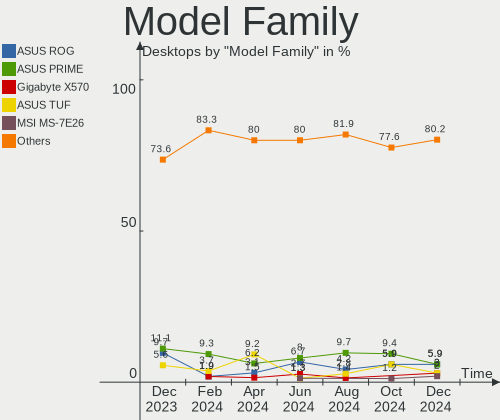
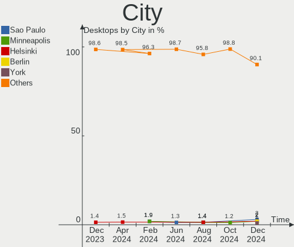
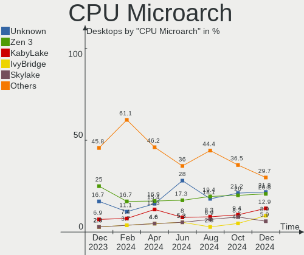
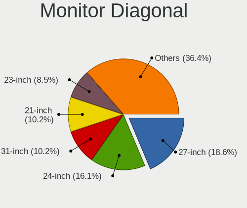

Pop!_OS Hardware Trends (Desktops)
----------------------------------

A project to identify most popular hardware characteristics and track their change
over time based on data collected by Pop!_OS users at https://Linux-Hardware.org.

Anyone can contribute to this report by the [hw-probe](https://github.com/linuxhw/hw-probe) tool:

    sudo -E hw-probe -all -upload

Full-feature report is available here: https://linux-hardware.org/?view=trends

Period: Nov, 2021.

Contents
--------

* [ System ](#system)
  - [ OS                       ](#os)
  - [ OS Family                ](#os-family)
  - [ Kernel                   ](#kernel)
  - [ Kernel Family            ](#kernel-family)
  - [ Kernel Major Ver.        ](#kernel-major-ver)
  - [ Arch                     ](#arch)
  - [ DE                       ](#de)
  - [ Display Server           ](#display-server)
  - [ Display Manager          ](#display-manager)
  - [ OS Lang                  ](#os-lang)
  - [ Boot Mode                ](#boot-mode)
  - [ Filesystem               ](#filesystem)
  - [ Part. scheme             ](#part-scheme)
  - [ Dual Boot with Linux/BSD ](#dual-boot-with-linuxbsd)
  - [ Dual Boot (Win)          ](#dual-boot-win)

* [ Board ](#board)
  - [ Vendor                   ](#vendor)
  - [ Model                    ](#model)
  - [ Model Family             ](#model-family)
  - [ MFG Year                 ](#mfg-year)
  - [ Form Factor              ](#form-factor)
  - [ Secure Boot              ](#secure-boot)
  - [ Coreboot                 ](#coreboot)
  - [ RAM Size                 ](#ram-size)
  - [ RAM Used                 ](#ram-used)
  - [ Total Drives             ](#total-drives)
  - [ Has CD-ROM               ](#has-cd-rom)
  - [ Has Ethernet             ](#has-ethernet)
  - [ Has WiFi                 ](#has-wifi)
  - [ Has Bluetooth            ](#has-bluetooth)

* [ Location ](#location)
  - [ Country                  ](#country)
  - [ City                     ](#city)

* [ Drives ](#drives)
  - [ Drive Vendor             ](#drive-vendor)
  - [ Drive Model              ](#drive-model)
  - [ HDD Vendor               ](#hdd-vendor)
  - [ SSD Vendor               ](#ssd-vendor)
  - [ Drive Kind               ](#drive-kind)
  - [ Drive Connector          ](#drive-connector)
  - [ Drive Size               ](#drive-size)
  - [ Space Total              ](#space-total)
  - [ Space Used               ](#space-used)
  - [ Malfunc. Drives          ](#malfunc-drives)
  - [ Malfunc. Drive Vendor    ](#malfunc-drive-vendor)
  - [ Malfunc. HDD Vendor      ](#malfunc-hdd-vendor)
  - [ Malfunc. Drive Kind      ](#malfunc-drive-kind)
  - [ Failed Drives            ](#failed-drives)
  - [ Failed Drive Vendor      ](#failed-drive-vendor)
  - [ Drive Status             ](#drive-status)

* [ Storage controller ](#storage-controller)
  - [ Storage Vendor           ](#storage-vendor)
  - [ Storage Model            ](#storage-model)
  - [ Storage Kind             ](#storage-kind)

* [ Processor ](#processor)
  - [ CPU Vendor               ](#cpu-vendor)
  - [ CPU Model                ](#cpu-model)
  - [ CPU Model Family         ](#cpu-model-family)
  - [ CPU Cores                ](#cpu-cores)
  - [ CPU Sockets              ](#cpu-sockets)
  - [ CPU Threads              ](#cpu-threads)
  - [ CPU Op-Modes             ](#cpu-op-modes)
  - [ CPU Microcode            ](#cpu-microcode)
  - [ CPU Microarch            ](#cpu-microarch)

* [ Graphics ](#graphics)
  - [ GPU Vendor               ](#gpu-vendor)
  - [ GPU Model                ](#gpu-model)
  - [ GPU Combo                ](#gpu-combo)
  - [ GPU Driver               ](#gpu-driver)
  - [ GPU Memory               ](#gpu-memory)

* [ Monitor ](#monitor)
  - [ Monitor Vendor           ](#monitor-vendor)
  - [ Monitor Model            ](#monitor-model)
  - [ Monitor Resolution       ](#monitor-resolution)
  - [ Monitor Diagonal         ](#monitor-diagonal)
  - [ Monitor Width            ](#monitor-width)
  - [ Aspect Ratio             ](#aspect-ratio)
  - [ Monitor Area             ](#monitor-area)
  - [ Pixel Density            ](#pixel-density)
  - [ Multiple Monitors        ](#multiple-monitors)

* [ Network ](#network)
  - [ Net Controller Vendor    ](#net-controller-vendor)
  - [ Net Controller Model     ](#net-controller-model)
  - [ Wireless Vendor          ](#wireless-vendor)
  - [ Wireless Model           ](#wireless-model)
  - [ Ethernet Vendor          ](#ethernet-vendor)
  - [ Ethernet Model           ](#ethernet-model)
  - [ Net Controller Kind      ](#net-controller-kind)
  - [ Used Controller          ](#used-controller)
  - [ NICs                     ](#nics)
  - [ IPv6                     ](#ipv6)

* [ Bluetooth ](#bluetooth)
  - [ Bluetooth Vendor         ](#bluetooth-vendor)
  - [ Bluetooth Model          ](#bluetooth-model)

* [ Sound ](#sound)
  - [ Sound Vendor             ](#sound-vendor)
  - [ Sound Model              ](#sound-model)

* [ Memory ](#memory)
  - [ Memory Vendor            ](#memory-vendor)
  - [ Memory Model             ](#memory-model)
  - [ Memory Kind              ](#memory-kind)
  - [ Memory Form Factor       ](#memory-form-factor)
  - [ Memory Size              ](#memory-size)
  - [ Memory Speed             ](#memory-speed)

* [ Printers & scanners ](#printers--scanners)
  - [ Printer Vendor           ](#printer-vendor)
  - [ Printer Model            ](#printer-model)
  - [ Scanner Vendor           ](#scanner-vendor)
  - [ Scanner Model            ](#scanner-model)

* [ Camera ](#camera)
  - [ Camera Vendor            ](#camera-vendor)
  - [ Camera Model             ](#camera-model)

* [ Security ](#security)
  - [ Fingerprint Vendor       ](#fingerprint-vendor)
  - [ Fingerprint Model        ](#fingerprint-model)
  - [ Chipcard Vendor          ](#chipcard-vendor)
  - [ Chipcard Model           ](#chipcard-model)

* [ Unsupported ](#unsupported)
  - [ Unsupported Devices      ](#unsupported-devices)
  - [ Unsupported Device Types ](#unsupported-device-types)

System
------

OS
--

Installed operating systems

| Name          | Desktops | Percent |
|---------------|----------|---------|
| Pop!_OS 21.04 | 162      | 90.5%   |
| Pop!_OS 20.04 | 14       | 7.82%   |
| Pop!_OS 20.10 | 2        | 1.12%   |
| Pop!_OS 21.10 | 1        | 0.56%   |

OS Family
---------

OS without a version

| Name    | Desktops | Percent |
|---------|----------|---------|
| Pop!_OS | 179      | 100%    |

Kernel
------

Version of the Linux kernel

| Version                    | Desktops | Percent |
|----------------------------|----------|---------|
| 5.13.0-7620-generic        | 155      | 86.59%  |
| 5.13.0-7614-generic        | 13       | 7.26%   |
| 5.11.0-7633-generic        | 3        | 1.68%   |
| 5.11.0-7620-generic        | 3        | 1.68%   |
| 5.15.0-76051500-generic    | 1        | 0.56%   |
| 5.14.20-xanmod1            | 1        | 0.56%   |
| 5.14.0-17.1-liquorix-amd64 | 1        | 0.56%   |
| 5.11.0-7614-generic        | 1        | 0.56%   |
| 5.11.0-7612-generic        | 1        | 0.56%   |

Kernel Family
-------------

Linux kernel without a distro release

| Version | Desktops | Percent |
|---------|----------|---------|
| 5.13.0  | 168      | 93.85%  |
| 5.11.0  | 8        | 4.47%   |
| 5.15.0  | 1        | 0.56%   |
| 5.14.20 | 1        | 0.56%   |
| 5.14.0  | 1        | 0.56%   |

Kernel Major Ver.
-----------------

Linux kernel major version

| Version | Desktops | Percent |
|---------|----------|---------|
| 5.13    | 168      | 93.85%  |
| 5.11    | 8        | 4.47%   |
| 5.14    | 2        | 1.12%   |
| 5.15    | 1        | 0.56%   |

Arch
----

OS architecture (x86_64, i586, etc.)

| Name   | Desktops | Percent |
|--------|----------|---------|
| x86_64 | 179      | 100%    |

DE
--

Desktop Environment

| Name       | Desktops | Percent |
|------------|----------|---------|
| GNOME      | 176      | 98.32%  |
| X-Cinnamon | 2        | 1.12%   |
| KDE5       | 1        | 0.56%   |

Display Server
--------------

X11 or Wayland

| Name    | Desktops | Percent |
|---------|----------|---------|
| X11     | 176      | 98.32%  |
| Wayland | 3        | 1.68%   |

Display Manager
---------------

SDDM, LightDM, etc.

| Name    | Desktops | Percent |
|---------|----------|---------|
| Unknown | 164      | 91.62%  |
| GDM     | 14       | 7.82%   |
| GDM3    | 1        | 0.56%   |

OS Lang
-------

Language

| Lang  | Desktops | Percent |
|-------|----------|---------|
| en_US | 110      | 61.45%  |
| en_GB | 12       | 6.7%    |
| en_AU | 9        | 5.03%   |
| pt_BR | 8        | 4.47%   |
| de_DE | 7        | 3.91%   |
| en_CA | 6        | 3.35%   |
| fr_FR | 4        | 2.23%   |
| nl_NL | 3        | 1.68%   |
| ru_RU | 2        | 1.12%   |
| fr_CH | 2        | 1.12%   |
| fi_FI | 2        | 1.12%   |
| es_AR | 2        | 1.12%   |
| C     | 2        | 1.12%   |
| zh_CN | 1        | 0.56%   |
| he_IL | 1        | 0.56%   |
| es_ES | 1        | 0.56%   |
| es_CR | 1        | 0.56%   |
| es_CL | 1        | 0.56%   |
| en_ZA | 1        | 0.56%   |
| en_IN | 1        | 0.56%   |
| en_IL | 1        | 0.56%   |
| en_DK | 1        | 0.56%   |
| de_CH | 1        | 0.56%   |

Boot Mode
---------

EFI or BIOS

| Mode | Desktops | Percent |
|------|----------|---------|
| BIOS | 164      | 91.62%  |
| EFI  | 15       | 8.38%   |

Filesystem
----------

Type of filesystem

| Type    | Desktops | Percent |
|---------|----------|---------|
| Ext4    | 173      | 96.65%  |
| Btrfs   | 4        | 2.23%   |
| Xfs     | 1        | 0.56%   |
| Overlay | 1        | 0.56%   |

Part. scheme
------------

Scheme of partitioning

| Type    | Desktops | Percent |
|---------|----------|---------|
| Unknown | 164      | 91.62%  |
| GPT     | 14       | 7.82%   |
| MBR     | 1        | 0.56%   |

Dual Boot with Linux/BSD
------------------------

Hosting more than one Linux/BSD

| Dual boot | Desktops | Percent |
|-----------|----------|---------|
| No        | 177      | 98.88%  |
| Yes       | 2        | 1.12%   |

Dual Boot (Win)
---------------

Hosting Linux and Windows

| Dual boot | Desktops | Percent |
|-----------|----------|---------|
| No        | 169      | 94.41%  |
| Yes       | 10       | 5.59%   |

Board
-----

Vendor
------

Motherboard manufacturer

| Name                | Desktops | Percent |
|---------------------|----------|---------|
| ASUSTek Computer    | 46       | 25.7%   |
| Gigabyte Technology | 34       | 18.99%  |
| MSI                 | 26       | 14.53%  |
| Dell                | 22       | 12.29%  |
| ASRock              | 15       | 8.38%   |
| Hewlett-Packard     | 9        | 5.03%   |
| Lenovo              | 8        | 4.47%   |
| Intel               | 4        | 2.23%   |
| System76            | 2        | 1.12%   |
| OEM                 | 2        | 1.12%   |
| ECS                 | 2        | 1.12%   |
| Acer                | 2        | 1.12%   |
| Supermicro          | 1        | 0.56%   |
| Shuttle             | 1        | 0.56%   |
| Pegatron            | 1        | 0.56%   |
| Minix               | 1        | 0.56%   |
| Megaware            | 1        | 0.56%   |
| HOUTER              | 1        | 0.56%   |
| Biostar             | 1        | 0.56%   |

Model
-----

Motherboard model

| Name                                         | Desktops | Percent |
|----------------------------------------------|----------|---------|
| Gigabyte B450M DS3H                          | 4        | 2.23%   |
| ASUS All Series                              | 4        | 2.23%   |
| Dell OptiPlex 9020                           | 3        | 1.68%   |
| ASUS PRIME Z390-A                            | 3        | 1.68%   |
| System76 Thelio                              | 2        | 1.12%   |
| MSI MS-7C02                                  | 2        | 1.12%   |
| MSI MS-7B79                                  | 2        | 1.12%   |
| MSI MS-7B22                                  | 2        | 1.12%   |
| Intel H61                                    | 2        | 1.12%   |
| HP Compaq 8200 Elite SFF PC                  | 2        | 1.12%   |
| Gigabyte TRX40 AORUS PRO WIFI                | 2        | 1.12%   |
| Gigabyte B450 I AORUS PRO WIFI               | 2        | 1.12%   |
| Dell OptiPlex 390                            | 2        | 1.12%   |
| ASUS TUF GAMING Z490-PLUS                    | 2        | 1.12%   |
| ASUS ROG STRIX X570-F GAMING                 | 2        | 1.12%   |
| ASUS ROG STRIX X570-E GAMING                 | 2        | 1.12%   |
| ASUS ROG STRIX B550-F GAMING                 | 2        | 1.12%   |
| ASUS ROG STRIX B450-F GAMING                 | 2        | 1.12%   |
| ASRock Z170 Gaming K4                        | 2        | 1.12%   |
| ASRock B450M Steel Legend                    | 2        | 1.12%   |
| ASRock A320M-HDV R4.0                        | 2        | 1.12%   |
| Supermicro X10DAi                            | 1        | 0.56%   |
| Shuttle SG41                                 | 1        | 0.56%   |
| Pegatron 320-1030                            | 1        | 0.56%   |
| OEM Intel H81                                | 1        | 0.56%   |
| OEM G41 775 ICH7 8712                        | 1        | 0.56%   |
| MSI Pro 3000/3080                            | 1        | 0.56%   |
| MSI MS-7C95                                  | 1        | 0.56%   |
| MSI MS-7C90                                  | 1        | 0.56%   |
| MSI MS-7C81                                  | 1        | 0.56%   |
| MSI MS-7C37                                  | 1        | 0.56%   |
| MSI MS-7C35                                  | 1        | 0.56%   |
| MSI MS-7B85                                  | 1        | 0.56%   |
| MSI MS-7B48                                  | 1        | 0.56%   |
| MSI MS-7B16                                  | 1        | 0.56%   |
| MSI MS-7A38                                  | 1        | 0.56%   |
| MSI MS-7A34                                  | 1        | 0.56%   |
| MSI MS-7A33                                  | 1        | 0.56%   |
| MSI MS-7A15                                  | 1        | 0.56%   |
| MSI MS-7893                                  | 1        | 0.56%   |
| MSI MS-7821                                  | 1        | 0.56%   |
| MSI MS-7817                                  | 1        | 0.56%   |
| MSI MS-7816                                  | 1        | 0.56%   |
| MSI MS-7758                                  | 1        | 0.56%   |
| MSI MS-7641                                  | 1        | 0.56%   |
| MSI 500-207eg                                | 1        | 0.56%   |
| Minix Z83-4 Pro                              | 1        | 0.56%   |
| Megaware MW-H61H2-M2                         | 1        | 0.56%   |
| Lenovo ThinkCentre M82 27562P5               | 1        | 0.56%   |
| Lenovo ThinkCentre M72e 3267B69              | 1        | 0.56%   |
| Lenovo ThinkCentre M55p 8808CM8              | 1        | 0.56%   |
| Lenovo IdeaCentre Y710 Cube-15ISH 90FL005YGE | 1        | 0.56%   |
| Lenovo IdeaCentre K410 10089                 | 1        | 0.56%   |
| Lenovo IdeaCentre 720-18ASU 90H10003US       | 1        | 0.56%   |
| Lenovo IdeaCentre 310S-08ASR 90G900A9HA      | 1        | 0.56%   |
| Lenovo H515s 10126                           | 1        | 0.56%   |
| Intel DX58SO2 AAG10925-205                   | 1        | 0.56%   |
| Intel DP55WB AAE64798-204                    | 1        | 0.56%   |
| HOUTER IPMH61R1                              | 1        | 0.56%   |
| HP Z400 Workstation                          | 1        | 0.56%   |

Model Family
------------

Motherboard model prefix

| Name                  | Desktops | Percent |
|-----------------------|----------|---------|
| ASUS ROG              | 16       | 8.94%   |
| Dell OptiPlex         | 11       | 6.15%   |
| ASUS PRIME            | 10       | 5.59%   |
| Gigabyte B450M        | 6        | 3.35%   |
| HP Compaq             | 5        | 2.79%   |
| Dell Precision        | 5        | 2.79%   |
| Lenovo IdeaCentre     | 4        | 2.23%   |
| ASUS TUF              | 4        | 2.23%   |
| ASUS All              | 4        | 2.23%   |
| Lenovo ThinkCentre    | 3        | 1.68%   |
| Gigabyte Z390         | 3        | 1.68%   |
| ASRock B450M          | 3        | 1.68%   |
| System76 Thelio       | 2        | 1.12%   |
| MSI MS-7C02           | 2        | 1.12%   |
| MSI MS-7B79           | 2        | 1.12%   |
| MSI MS-7B22           | 2        | 1.12%   |
| Intel H61             | 2        | 1.12%   |
| Gigabyte TRX40        | 2        | 1.12%   |
| Gigabyte B450         | 2        | 1.12%   |
| Gigabyte AB350-Gaming | 2        | 1.12%   |
| Dell XPS              | 2        | 1.12%   |
| ASRock Z170           | 2        | 1.12%   |
| ASRock B450           | 2        | 1.12%   |
| ASRock A320M-HDV      | 2        | 1.12%   |
| Acer Aspire           | 2        | 1.12%   |
| Supermicro X10DAi     | 1        | 0.56%   |
| Shuttle SG41          | 1        | 0.56%   |
| Pegatron 320-1030     | 1        | 0.56%   |
| OEM Intel             | 1        | 0.56%   |
| OEM G41               | 1        | 0.56%   |
| MSI Pro               | 1        | 0.56%   |
| MSI MS-7C95           | 1        | 0.56%   |
| MSI MS-7C90           | 1        | 0.56%   |
| MSI MS-7C81           | 1        | 0.56%   |
| MSI MS-7C37           | 1        | 0.56%   |
| MSI MS-7C35           | 1        | 0.56%   |
| MSI MS-7B85           | 1        | 0.56%   |
| MSI MS-7B48           | 1        | 0.56%   |
| MSI MS-7B16           | 1        | 0.56%   |
| MSI MS-7A38           | 1        | 0.56%   |
| MSI MS-7A34           | 1        | 0.56%   |
| MSI MS-7A33           | 1        | 0.56%   |
| MSI MS-7A15           | 1        | 0.56%   |
| MSI MS-7893           | 1        | 0.56%   |
| MSI MS-7821           | 1        | 0.56%   |
| MSI MS-7817           | 1        | 0.56%   |
| MSI MS-7816           | 1        | 0.56%   |
| MSI MS-7758           | 1        | 0.56%   |
| MSI MS-7641           | 1        | 0.56%   |
| MSI 500-207eg         | 1        | 0.56%   |
| Minix Z83-4           | 1        | 0.56%   |
| Megaware MW-H61H2-M2  | 1        | 0.56%   |
| Lenovo H515s          | 1        | 0.56%   |
| Intel DX58SO2         | 1        | 0.56%   |
| Intel DP55WB          | 1        | 0.56%   |
| HOUTER IPMH61R1       | 1        | 0.56%   |
| HP Z400               | 1        | 0.56%   |
| HP OMEN               | 1        | 0.56%   |
| HP EliteDesk          | 1        | 0.56%   |
| HP 500-314            | 1        | 0.56%   |

MFG Year
--------

Motherboard manufacture year

| Year | Desktops | Percent |
|------|----------|---------|
| 2021 | 35       | 19.55%  |
| 2020 | 32       | 17.88%  |
| 2019 | 19       | 10.61%  |
| 2018 | 19       | 10.61%  |
| 2013 | 18       | 10.06%  |
| 2015 | 10       | 5.59%   |
| 2011 | 10       | 5.59%   |
| 2017 | 9        | 5.03%   |
| 2012 | 9        | 5.03%   |
| 2014 | 7        | 3.91%   |
| 2008 | 4        | 2.23%   |
| 2016 | 2        | 1.12%   |
| 2010 | 2        | 1.12%   |
| 2009 | 2        | 1.12%   |
| 2007 | 1        | 0.56%   |

Form Factor
-----------

Physical design of the computer

| Name    | Desktops | Percent |
|---------|----------|---------|
| Desktop | 179      | 100%    |

Secure Boot
-----------

Enabled or disabled

| State    | Desktops | Percent |
|----------|----------|---------|
| Disabled | 179      | 100%    |

Coreboot
--------

Have coreboot on board

| Used | Desktops | Percent |
|------|----------|---------|
| No   | 179      | 100%    |

RAM Size
--------

Total RAM memory

| Size in GB  | Desktops | Percent |
|-------------|----------|---------|
| 16.01-24.0  | 62       | 34.64%  |
| 32.01-64.0  | 35       | 19.55%  |
| 8.01-16.0   | 34       | 18.99%  |
| 4.01-8.0    | 16       | 8.94%   |
| 3.01-4.0    | 16       | 8.94%   |
| 64.01-256.0 | 8        | 4.47%   |
| 24.01-32.0  | 6        | 3.35%   |
| 2.01-3.0    | 1        | 0.56%   |
| 1.01-2.0    | 1        | 0.56%   |

RAM Used
--------

Used RAM memory

| Used GB    | Desktops | Percent |
|------------|----------|---------|
| 1.01-2.0   | 58       | 32.4%   |
| 2.01-3.0   | 57       | 31.84%  |
| 4.01-8.0   | 32       | 17.88%  |
| 3.01-4.0   | 20       | 11.17%  |
| 8.01-16.0  | 11       | 6.15%   |
| 16.01-24.0 | 1        | 0.56%   |

Total Drives
------------

Number of drives on board

| Drives | Desktops | Percent |
|--------|----------|---------|
| 1      | 59       | 32.96%  |
| 2      | 43       | 24.02%  |
| 3      | 40       | 22.35%  |
| 4      | 17       | 9.5%    |
| 5      | 13       | 7.26%   |
| 6      | 3        | 1.68%   |
| 11     | 1        | 0.56%   |
| 9      | 1        | 0.56%   |
| 8      | 1        | 0.56%   |
| 7      | 1        | 0.56%   |

Has CD-ROM
----------

Has CD-ROM on board

| Presented | Desktops | Percent |
|-----------|----------|---------|
| No        | 116      | 64.8%   |
| Yes       | 63       | 35.2%   |

Has Ethernet
------------

Has Ethernet on board

| Presented | Desktops | Percent |
|-----------|----------|---------|
| Yes       | 177      | 98.88%  |
| No        | 2        | 1.12%   |

Has WiFi
--------

Has WiFi module

| Presented | Desktops | Percent |
|-----------|----------|---------|
| Yes       | 95       | 53.07%  |
| No        | 84       | 46.93%  |

Has Bluetooth
-------------

Has Bluetooth module

| Presented | Desktops | Percent |
|-----------|----------|---------|
| No        | 103      | 57.54%  |
| Yes       | 76       | 42.46%  |

Location
--------

Country
-------

Geographic location (country)

| Country      | Desktops | Percent |
|--------------|----------|---------|
| USA          | 64       | 35.75%  |
| Brazil       | 13       | 7.26%   |
| Germany      | 11       | 6.15%   |
| Australia    | 11       | 6.15%   |
| Canada       | 10       | 5.59%   |
| UK           | 6        | 3.35%   |
| France       | 5        | 2.79%   |
| Finland      | 5        | 2.79%   |
| Russia       | 4        | 2.23%   |
| Netherlands  | 4        | 2.23%   |
| Argentina    | 4        | 2.23%   |
| Switzerland  | 3        | 1.68%   |
| Sweden       | 3        | 1.68%   |
| India        | 3        | 1.68%   |
| Greece       | 3        | 1.68%   |
| Czechia      | 3        | 1.68%   |
| South Africa | 2        | 1.12%   |
| Philippines  | 2        | 1.12%   |
| Norway       | 2        | 1.12%   |
| New Zealand  | 2        | 1.12%   |
| Israel       | 2        | 1.12%   |
| Denmark      | 2        | 1.12%   |
| Spain        | 1        | 0.56%   |
| Romania      | 1        | 0.56%   |
| Poland       | 1        | 0.56%   |
| Morocco      | 1        | 0.56%   |
| Malaysia     | 1        | 0.56%   |
| Lithuania    | 1        | 0.56%   |
| Jordan       | 1        | 0.56%   |
| Italy        | 1        | 0.56%   |
| Hong Kong    | 1        | 0.56%   |
| Egypt        | 1        | 0.56%   |
| Costa Rica   | 1        | 0.56%   |
| Colombia     | 1        | 0.56%   |
| China        | 1        | 0.56%   |
| Chile        | 1        | 0.56%   |
| Bangladesh   | 1        | 0.56%   |

City
----

Geographic location (city)

| City                     | Desktops | Percent |
|--------------------------|----------|---------|
| S??o Paulo               | 3        | 1.68%   |
| Athens                   | 3        | 1.68%   |
| Adelaide CBD             | 3        | 1.68%   |
| Warsaw                   | 2        | 1.12%   |
| Sydney                   | 2        | 1.12%   |
| St Louis                 | 2        | 1.12%   |
| Perth                    | 2        | 1.12%   |
| Parker                   | 2        | 1.12%   |
| New York                 | 2        | 1.12%   |
| Moscow                   | 2        | 1.12%   |
| Melbourne                | 2        | 1.12%   |
| Madison                  | 2        | 1.12%   |
| London                   | 2        | 1.12%   |
| Denver                   | 2        | 1.12%   |
| Caruaru                  | 2        | 1.12%   |
| Buenos Aires             | 2        | 1.12%   |
| Baden                    | 2        | 1.12%   |
| Zurich                   | 1        | 0.56%   |
| Yorktown                 | 1        | 0.56%   |
| Yel'tsovka               | 1        | 0.56%   |
| Yekaterinburg            | 1        | 0.56%   |
| Wuhan                    | 1        | 0.56%   |
| Worcester                | 1        | 0.56%   |
| Winterswijk              | 1        | 0.56%   |
| Winnipeg                 | 1        | 0.56%   |
| West Palm Beach          | 1        | 0.56%   |
| Wenonah                  | 1        | 0.56%   |
| Weatherford              | 1        | 0.56%   |
| Waterford                | 1        | 0.56%   |
| Waiuku                   | 1        | 0.56%   |
| Vsetin                   | 1        | 0.56%   |
| Virginia Beach           | 1        | 0.56%   |
| Vilnius                  | 1        | 0.56%   |
| Vennesla                 | 1        | 0.56%   |
| V?¤ster??s               | 1        | 0.56%   |
| Vantaa                   | 1        | 0.56%   |
| Vancouver                | 1        | 0.56%   |
| Uba                      | 1        | 0.56%   |
| Trondheim                | 1        | 0.56%   |
| Trois-Rivi??res          | 1        | 0.56%   |
| Toulouse                 | 1        | 0.56%   |
| Texarkana                | 1        | 0.56%   |
| Teresina                 | 1        | 0.56%   |
| Tel Aviv                 | 1        | 0.56%   |
| Tallmadge                | 1        | 0.56%   |
| Stellenbosch             | 1        | 0.56%   |
| St. Gallen               | 1        | 0.56%   |
| St. Cloud                | 1        | 0.56%   |
| Soest                    | 1        | 0.56%   |
| Simi Valley              | 1        | 0.56%   |
| Seri Kembangan           | 1        | 0.56%   |
| Scarborough              | 1        | 0.56%   |
| Santana Do Araguaia      | 1        | 0.56%   |
| Sandy                    | 1        | 0.56%   |
| San Miguel               | 1        | 0.56%   |
| Sal?©                    | 1        | 0.56%   |
| Saint-Julien-en-Genevois | 1        | 0.56%   |
| Roswell                  | 1        | 0.56%   |
| Rostock                  | 1        | 0.56%   |
| Rome                     | 1        | 0.56%   |

Drives
------

Drive Vendor
------------

Hard drive vendors

| Vendor                       | Desktops | Drives | Percent |
|------------------------------|----------|--------|---------|
| WDC                          | 63       | 82     | 17.4%   |
| Seagate                      | 63       | 81     | 17.4%   |
| Samsung Electronics          | 58       | 85     | 16.02%  |
| SanDisk                      | 21       | 21     | 5.8%    |
| Kingston                     | 19       | 20     | 5.25%   |
| Toshiba                      | 16       | 17     | 4.42%   |
| Intel                        | 14       | 16     | 3.87%   |
| Hitachi                      | 11       | 12     | 3.04%   |
| Phison                       | 9        | 11     | 2.49%   |
| PNY                          | 8        | 10     | 2.21%   |
| Crucial                      | 7        | 9      | 1.93%   |
| A-DATA Technology            | 7        | 8      | 1.93%   |
| China                        | 6        | 7      | 1.66%   |
| Silicon Motion               | 5        | 6      | 1.38%   |
| SPCC                         | 4        | 4      | 1.1%    |
| Micron/Crucial Technology    | 4        | 4      | 1.1%    |
| Lexar                        | 4        | 4      | 1.1%    |
| HGST                         | 4        | 4      | 1.1%    |
| XPG                          | 3        | 3      | 0.83%   |
| Unknown                      | 3        | 5      | 0.83%   |
| SK Hynix                     | 3        | 3      | 0.83%   |
| KingSpec                     | 3        | 3      | 0.83%   |
| Patriot                      | 2        | 3      | 0.55%   |
| Hewlett-Packard              | 2        | 2      | 0.55%   |
| Corsair                      | 2        | 2      | 0.55%   |
| Zheino                       | 1        | 1      | 0.28%   |
| USB                          | 1        | 1      | 0.28%   |
| TO Exter                     | 1        | 1      | 0.28%   |
| Team                         | 1        | 1      | 0.28%   |
| T-FORCE                      | 1        | 1      | 0.28%   |
| Shenzhen Longsys Electronics | 1        | 1      | 0.28%   |
| Realtek Semiconductor        | 1        | 1      | 0.28%   |
| Realtek                      | 1        | 1      | 0.28%   |
| OWC                          | 1        | 1      | 0.28%   |
| Netac                        | 1        | 1      | 0.28%   |
| Intenso                      | 1        | 1      | 0.28%   |
| Indilinx                     | 1        | 1      | 0.28%   |
| Hoodisk                      | 1        | 1      | 0.28%   |
| Gigabyte Technology          | 1        | 1      | 0.28%   |
| Fujitsu                      | 1        | 1      | 0.28%   |
| ExcelStor                    | 1        | 1      | 0.28%   |
| EDGE                         | 1        | 1      | 0.28%   |
| ASMT                         | 1        | 4      | 0.28%   |
| Apple                        | 1        | 1      | 0.28%   |
| ADATA Technology             | 1        | 1      | 0.28%   |
| Unknown                      | 1        | 2      | 0.28%   |

Drive Model
-----------

Hard drive models

| Model                                  | Desktops | Percent |
|----------------------------------------|----------|---------|
| Kingston SA400S37240G 240GB SSD        | 9        | 2.14%   |
| Samsung NVMe SSD Drive 500GB           | 6        | 1.43%   |
| Samsung NVMe SSD Drive 1TB             | 6        | 1.43%   |
| Toshiba DT01ACA100 1TB                 | 5        | 1.19%   |
| Seagate ST4000DM004-2CV104 4TB         | 5        | 1.19%   |
| Seagate ST2000DM008-2FR102 2TB         | 5        | 1.19%   |
| Sandisk NVMe SSD Drive 500GB           | 5        | 1.19%   |
| Samsung SSD 850 EVO 250GB              | 5        | 1.19%   |
| Samsung SM963 2.5" NVMe PCIe SSD 250GB | 5        | 1.19%   |
| Samsung NVMe SSD Drive 2TB             | 5        | 1.19%   |
| PNY CS900 120GB SSD                    | 5        | 1.19%   |
| Intel NVMe SSD Drive 1024GB            | 5        | 1.19%   |
| Seagate ST500DM002-1BD142 500GB        | 4        | 0.95%   |
| Seagate ST1000DM010-2EP102 1TB         | 4        | 0.95%   |
| Samsung SSD 850 EVO 500GB              | 4        | 0.95%   |
| WDC WD5000AAKX-08U6AA0 500GB           | 3        | 0.71%   |
| WDC WD10EZEX-08WN4A0 1TB               | 3        | 0.71%   |
| Silicon Motion NVMe SSD Drive 512GB    | 3        | 0.71%   |
| Seagate ST2000DM006-2DM164 2TB         | 3        | 0.71%   |
| Seagate ST1000DM003-1ER162 1TB         | 3        | 0.71%   |
| Samsung SSD 850 PRO 256GB              | 3        | 0.71%   |
| Samsung HD502HI 500GB                  | 3        | 0.71%   |
| Micron/Crucial NVMe SSD Drive 500GB    | 3        | 0.71%   |
| Kingston SUV400S37120G 120GB SSD       | 3        | 0.71%   |
| Intel NVMe SSD Drive 512GB             | 3        | 0.71%   |
| Crucial CT500MX500SSD1 500GB           | 3        | 0.71%   |
| WDC WD40EZRZ-22GXCB0 4TB               | 2        | 0.48%   |
| WDC WD40EZRZ-00GXCB0 4TB               | 2        | 0.48%   |
| WDC WD3200AAJS-00L7A0 320GB            | 2        | 0.48%   |
| WDC WD1500HLHX-01JJPV0 150GB           | 2        | 0.48%   |
| WDC WD10EZEX-60WN4A0 1TB               | 2        | 0.48%   |
| WDC WD10EZEX-00WN4A0 1TB               | 2        | 0.48%   |
| WDC WD1002FAEX-00Z3A0 1TB              | 2        | 0.48%   |
| WDC WD easystore 240GB                 | 2        | 0.48%   |
| Unknown SD/MMC 16GB                    | 2        | 0.48%   |
| Unknown M.S./M.S.Pro/HG 16GB           | 2        | 0.48%   |
| Toshiba NVMe SSD Drive 256GB           | 2        | 0.48%   |
| Seagate ST500LT012-1DG142 500GB        | 2        | 0.48%   |
| Seagate ST5000LM000-2AN170 5TB         | 2        | 0.48%   |
| Seagate ST4000DM005-2DP166 4TB         | 2        | 0.48%   |
| Seagate ST3500414CS 500GB              | 2        | 0.48%   |
| Seagate ST31000528AS 1TB               | 2        | 0.48%   |
| Seagate ST31000524AS 1TB               | 2        | 0.48%   |
| Seagate ST2000DM001-1CH164 2TB         | 2        | 0.48%   |
| Seagate ST1000LM024 HN-M101MBB 1TB     | 2        | 0.48%   |
| Seagate ST1000DM003-1SB102 1TB         | 2        | 0.48%   |
| Seagate ST1000DM003-1CH162 1TB         | 2        | 0.48%   |
| SanDisk SSD PLUS 120GB                 | 2        | 0.48%   |
| Sandisk NVMe SSD Drive 1TB             | 2        | 0.48%   |
| Samsung SSD SM841 2.5 7mm 128GB        | 2        | 0.48%   |
| Samsung SSD 870 QVO 1TB                | 2        | 0.48%   |
| Samsung SSD 860 EVO 1TB                | 2        | 0.48%   |
| Samsung SSD 840 EVO 250GB              | 2        | 0.48%   |
| Samsung HD103SJ 1TB                    | 2        | 0.48%   |
| PNY CS900 480GB SSD                    | 2        | 0.48%   |
| Phison NVMe SSD Drive 960GB            | 2        | 0.48%   |
| Phison NVMe SSD Drive 500GB            | 2        | 0.48%   |
| Phison NVMe SSD Drive 2TB              | 2        | 0.48%   |
| Phison NVMe SSD Drive 1TB              | 2        | 0.48%   |
| Lexar 128GB SSD                        | 2        | 0.48%   |

HDD Vendor
----------

Hard disk drive vendors

| Vendor              | Desktops | Drives | Percent |
|---------------------|----------|--------|---------|
| Seagate             | 59       | 74     | 37.34%  |
| WDC                 | 55       | 71     | 34.81%  |
| Toshiba             | 14       | 14     | 8.86%   |
| Hitachi             | 11       | 12     | 6.96%   |
| Samsung Electronics | 8        | 8      | 5.06%   |
| HGST                | 4        | 4      | 2.53%   |
| USB                 | 1        | 1      | 0.63%   |
| TO Exter            | 1        | 1      | 0.63%   |
| Hewlett-Packard     | 1        | 1      | 0.63%   |
| Fujitsu             | 1        | 1      | 0.63%   |
| ExcelStor           | 1        | 1      | 0.63%   |
| ASMT                | 1        | 4      | 0.63%   |
| Apple               | 1        | 1      | 0.63%   |

SSD Vendor
----------

Solid state drive vendors

| Vendor              | Desktops | Drives | Percent |
|---------------------|----------|--------|---------|
| Samsung Electronics | 33       | 44     | 24.63%  |
| Kingston            | 16       | 17     | 11.94%  |
| SanDisk             | 13       | 13     | 9.7%    |
| WDC                 | 9        | 9      | 6.72%   |
| PNY                 | 8        | 10     | 5.97%   |
| Intel               | 8        | 8      | 5.97%   |
| Crucial             | 7        | 9      | 5.22%   |
| A-DATA Technology   | 7        | 8      | 5.22%   |
| China               | 6        | 7      | 4.48%   |
| SPCC                | 4        | 4      | 2.99%   |
| Seagate             | 4        | 4      | 2.99%   |
| Lexar               | 4        | 4      | 2.99%   |
| KingSpec            | 3        | 3      | 2.24%   |
| SK Hynix            | 2        | 2      | 1.49%   |
| Patriot             | 2        | 3      | 1.49%   |
| Zheino              | 1        | 1      | 0.75%   |
| Team                | 1        | 1      | 0.75%   |
| OWC                 | 1        | 1      | 0.75%   |
| Intenso             | 1        | 1      | 0.75%   |
| Hoodisk             | 1        | 1      | 0.75%   |
| Hewlett-Packard     | 1        | 1      | 0.75%   |
| EDGE                | 1        | 1      | 0.75%   |
| Corsair             | 1        | 1      | 0.75%   |

Drive Kind
----------

HDD or SSD

| Kind    | Desktops | Drives | Percent |
|---------|----------|--------|---------|
| HDD     | 121      | 193    | 39.93%  |
| SSD     | 107      | 153    | 35.31%  |
| NVMe    | 67       | 90     | 22.11%  |
| Unknown | 7        | 10     | 2.31%   |
| MMC     | 1        | 1      | 0.33%   |

Drive Connector
---------------

SATA, SAS, NVMe, etc.

| Type | Desktops | Drives | Percent |
|------|----------|--------|---------|
| SATA | 163      | 337    | 66.53%  |
| NVMe | 67       | 89     | 27.35%  |
| SAS  | 14       | 20     | 5.71%   |
| MMC  | 1        | 1      | 0.41%   |

Drive Size
----------

Size of hard drive

| Size in TB | Desktops | Drives | Percent |
|------------|----------|--------|---------|
| 0.01-0.5   | 128      | 186    | 51.82%  |
| 0.51-1.0   | 70       | 95     | 28.34%  |
| 1.01-2.0   | 24       | 29     | 9.72%   |
| 3.01-4.0   | 15       | 23     | 6.07%   |
| 2.01-3.0   | 6        | 6      | 2.43%   |
| 4.01-10.0  | 4        | 7      | 1.62%   |

Space Total
-----------

Amount of disk space available on the file system

| Size in GB     | Desktops | Percent |
|----------------|----------|---------|
| 101-250        | 47       | 26.26%  |
| 251-500        | 43       | 24.02%  |
| 501-1000       | 26       | 14.53%  |
| 1001-2000      | 24       | 13.41%  |
| More than 3000 | 19       | 10.61%  |
| 2001-3000      | 11       | 6.15%   |
| 51-100         | 6        | 3.35%   |
| 21-50          | 1        | 0.56%   |
| 1-20           | 1        | 0.56%   |
| Unknown        | 1        | 0.56%   |

Space Used
----------

Amount of used disk space

| Used GB        | Desktops | Percent |
|----------------|----------|---------|
| 1-20           | 50       | 27.93%  |
| 21-50          | 35       | 19.55%  |
| 101-250        | 26       | 14.53%  |
| 51-100         | 19       | 10.61%  |
| 501-1000       | 15       | 8.38%   |
| 251-500        | 11       | 6.15%   |
| 1001-2000      | 10       | 5.59%   |
| More than 3000 | 7        | 3.91%   |
| 2001-3000      | 5        | 2.79%   |
| Unknown        | 1        | 0.56%   |

Malfunc. Drives
---------------

Drive models with a malfunction

| Model                             | Desktops | Drives | Percent |
|-----------------------------------|----------|--------|---------|
| WDC WD3200AAJS-56M0A0 320GB       | 1        | 1      | 25%     |
| Seagate ST2000DM001-1CH164 2TB    | 1        | 1      | 25%     |
| Seagate ST1500DL003-9VT16L 1TB    | 1        | 1      | 25%     |
| Samsung Electronics HD502HI 500GB | 1        | 1      | 25%     |

Malfunc. Drive Vendor
---------------------

Vendors of faulty drives

| Vendor              | Desktops | Drives | Percent |
|---------------------|----------|--------|---------|
| WDC                 | 1        | 1      | 33.33%  |
| Seagate             | 1        | 2      | 33.33%  |
| Samsung Electronics | 1        | 1      | 33.33%  |

Malfunc. HDD Vendor
-------------------

Vendors of faulty HDD drives

| Vendor              | Desktops | Drives | Percent |
|---------------------|----------|--------|---------|
| WDC                 | 1        | 1      | 33.33%  |
| Seagate             | 1        | 2      | 33.33%  |
| Samsung Electronics | 1        | 1      | 33.33%  |

Malfunc. Drive Kind
-------------------

Kinds of faulty drives

| Kind | Desktops | Drives | Percent |
|------|----------|--------|---------|
| HDD  | 2        | 4      | 100%    |

Failed Drives
-------------

Failed drive models

Zero info for selected period =(

Failed Drive Vendor
-------------------

Failed drive vendors

Zero info for selected period =(

Drive Status
------------

Number of failed and malfunc. drives

| Status   | Desktops | Drives | Percent |
|----------|----------|--------|---------|
| Detected | 166      | 410    | 90.22%  |
| Works    | 16       | 33     | 8.7%    |
| Malfunc  | 2        | 4      | 1.09%   |

Storage controller
------------------

Storage Vendor
--------------

Storage controller vendors

| Vendor                       | Desktops | Percent |
|------------------------------|----------|---------|
| Intel                        | 106      | 38.97%  |
| AMD                          | 76       | 27.94%  |
| Samsung Electronics          | 29       | 10.66%  |
| Phison Electronics           | 11       | 4.04%   |
| Sandisk                      | 10       | 3.68%   |
| ASMedia Technology           | 8        | 2.94%   |
| Silicon Motion               | 6        | 2.21%   |
| Micron/Crucial Technology    | 4        | 1.47%   |
| Kingston Technology Company  | 3        | 1.1%    |
| JMicron Technology           | 3        | 1.1%    |
| ADATA Technology             | 3        | 1.1%    |
| Toshiba America Info Systems | 2        | 0.74%   |
| Realtek Semiconductor        | 2        | 0.74%   |
| Nvidia                       | 2        | 0.74%   |
| Marvell Technology Group     | 2        | 0.74%   |
| VIA Technologies             | 1        | 0.37%   |
| SK Hynix                     | 1        | 0.37%   |
| Shenzhen Longsys Electronics | 1        | 0.37%   |
| Seagate Technology           | 1        | 0.37%   |
| Broadcom / LSI               | 1        | 0.37%   |

Storage Model
-------------

Storage controller models

| Model                                                                                   | Desktops | Percent |
|-----------------------------------------------------------------------------------------|----------|---------|
| AMD FCH SATA Controller [AHCI mode]                                                     | 52       | 15.81%  |
| AMD 400 Series Chipset SATA Controller                                                  | 29       | 8.81%   |
| Samsung NVMe SSD Controller SM981/PM981/PM983                                           | 17       | 5.17%   |
| Intel 8 Series/C220 Series Chipset Family 6-port SATA Controller 1 [AHCI mode]          | 14       | 4.26%   |
| Intel Cannon Lake PCH SATA AHCI Controller                                              | 11       | 3.34%   |
| Intel 6 Series/C200 Series Chipset Family 6 port Desktop SATA AHCI Controller           | 10       | 3.04%   |
| Samsung NVMe SSD Controller SM961/PM961/SM963                                           | 9        | 2.74%   |
| Intel SATA Controller [RAID mode]                                                       | 9        | 2.74%   |
| Intel 7 Series/C210 Series Chipset Family 6-port SATA Controller [AHCI mode]            | 8        | 2.43%   |
| ASMedia ASM1062 Serial ATA Controller                                                   | 8        | 2.43%   |
| Intel SSD 660P Series                                                                   | 7        | 2.13%   |
| Intel 200 Series PCH SATA controller [AHCI mode]                                        | 7        | 2.13%   |
| Sandisk WD Blue SN550 NVMe SSD                                                          | 6        | 1.82%   |
| Phison E12 NVMe Controller                                                              | 6        | 1.82%   |
| Intel Q170/Q150/B150/H170/H110/Z170/CM236 Chipset SATA Controller [AHCI Mode]           | 6        | 1.82%   |
| AMD Starship/Matisse Chipset SATA Controller [AHCI mode]                                | 6        | 1.82%   |
| Silicon Motion SM2263EN/SM2263XT SSD Controller                                         | 5        | 1.52%   |
| Phison E16 PCIe4 NVMe Controller                                                        | 5        | 1.52%   |
| Intel 6 Series/C200 Series Chipset Family Desktop SATA Controller (IDE mode, ports 4-5) | 5        | 1.52%   |
| Intel 6 Series/C200 Series Chipset Family Desktop SATA Controller (IDE mode, ports 0-3) | 5        | 1.52%   |
| AMD 300 Series Chipset SATA Controller                                                  | 5        | 1.52%   |
| Intel NM10/ICH7 Family SATA Controller [IDE mode]                                       | 4        | 1.22%   |
| Intel 9 Series Chipset Family SATA Controller [AHCI Mode]                               | 4        | 1.22%   |
| Intel 82801G (ICH7 Family) IDE Controller                                               | 4        | 1.22%   |
| Samsung NVMe SSD Controller PM9A1/PM9A3/980PRO                                          | 3        | 0.91%   |
| Intel 82801JI (ICH10 Family) SATA AHCI Controller                                       | 3        | 0.91%   |
| Intel 400 Series Chipset Family SATA AHCI Controller                                    | 3        | 0.91%   |
| AMD SB7x0/SB8x0/SB9x0 SATA Controller [IDE mode]                                        | 3        | 0.91%   |
| AMD SB7x0/SB8x0/SB9x0 IDE Controller                                                    | 3        | 0.91%   |
| AMD FCH SATA Controller D                                                               | 3        | 0.91%   |
| Toshiba America Info Systems Toshiba America Info Non-Volatile memory controller        | 2        | 0.61%   |
| Realtek Realtek Non-Volatile memory controller                                          | 2        | 0.61%   |
| Nvidia MCP61 SATA Controller                                                            | 2        | 0.61%   |
| Micron/Crucial P2 NVMe PCIe SSD                                                         | 2        | 0.61%   |
| Micron/Crucial NVMe Controller                                                          | 2        | 0.61%   |
| Kingston Company A2000 NVMe SSD                                                         | 2        | 0.61%   |
| JMicron JMB363 SATA/IDE Controller                                                      | 2        | 0.61%   |
| Intel Comet Lake SATA AHCI Controller                                                   | 2        | 0.61%   |
| Intel C610/X99 series chipset 6-Port SATA Controller [AHCI mode]                        | 2        | 0.61%   |
| Intel 7 Series/C210 Series Chipset Family 4-port SATA Controller [IDE mode]             | 2        | 0.61%   |
| Intel 7 Series/C210 Series Chipset Family 2-port SATA Controller [IDE mode]             | 2        | 0.61%   |
| Intel 500 Series Chipset Family SATA AHCI Controller                                    | 2        | 0.61%   |
| AMD X370 Series Chipset SATA Controller                                                 | 2        | 0.61%   |
| AMD SB7x0/SB8x0/SB9x0 SATA Controller [AHCI mode]                                       | 2        | 0.61%   |
| ADATA XPG SX8200 Pro PCIe Gen3x4 M.2 2280 Solid State Drive                             | 2        | 0.61%   |
| VIA VT6415 PATA IDE Host Controller                                                     | 1        | 0.3%    |
| SK Hynix Gold P31 SSD                                                                   | 1        | 0.3%    |
| Silicon Motion SM2262/SM2262EN SSD Controller                                           | 1        | 0.3%    |
| Shenzhen Longsys Electronics Non-Volatile memory controller                             | 1        | 0.3%    |
| Seagate FireCuda 510 SSD                                                                | 1        | 0.3%    |
| Sandisk WD PC SN810 / Black SN850 NVMe SSD                                              | 1        | 0.3%    |
| Sandisk WD Blue SN500 / PC SN520 NVMe SSD                                               | 1        | 0.3%    |
| Sandisk WD Black SN750 / PC SN730 NVMe SSD                                              | 1        | 0.3%    |
| Sandisk WD Black 2018/SN750 / PC SN720 NVMe SSD                                         | 1        | 0.3%    |
| Samsung NVMe SSD Controller SM951/PM951                                                 | 1        | 0.3%    |
| Phison NVMe Storage Controller                                                          | 1        | 0.3%    |
| Marvell Group 88SE912x IDE Controller                                                   | 1        | 0.3%    |
| Marvell Group 88SE9128 PCIe SATA 6 Gb/s RAID controller with HyperDuo                   | 1        | 0.3%    |
| Marvell Group 88SE9123 PCIe SATA 6.0 Gb/s controller                                    | 1        | 0.3%    |
| Marvell Group 88SE6111/6121 SATA II / PATA Controller                                   | 1        | 0.3%    |

Storage Kind
------------

Kind of storage controller (IDE, SATA, NVMe, SAS, ...)

| Kind | Desktops | Percent |
|------|----------|---------|
| SATA | 153      | 59.3%   |
| NVMe | 67       | 25.97%  |
| IDE  | 26       | 10.08%  |
| RAID | 11       | 4.26%   |
| SAS  | 1        | 0.39%   |

Processor
---------

CPU Vendor
----------

Processor vendors

| Vendor | Desktops | Percent |
|--------|----------|---------|
| Intel  | 101      | 56.42%  |
| AMD    | 78       | 43.58%  |

CPU Model
---------

Processor models

| Model                                       | Desktops | Percent |
|---------------------------------------------|----------|---------|
| AMD Ryzen 5 3600 6-Core Processor           | 8        | 4.47%   |
| AMD Ryzen 7 3700X 8-Core Processor          | 7        | 3.91%   |
| Intel Core i7-9700K CPU @ 3.60GHz           | 6        | 3.35%   |
| Intel Core i7-3770 CPU @ 3.40GHz            | 5        | 2.79%   |
| AMD Ryzen 5 5600X 6-Core Processor          | 5        | 2.79%   |
| Intel Core i5-6600K CPU @ 3.50GHz           | 4        | 2.23%   |
| Intel Core 2 Duo CPU E8400 @ 3.00GHz        | 4        | 2.23%   |
| AMD Ryzen 5 3400G with Radeon Vega Graphics | 4        | 2.23%   |
| Intel Core i3-2120 CPU @ 3.30GHz            | 3        | 1.68%   |
| AMD Ryzen 9 5950X 16-Core Processor         | 3        | 1.68%   |
| AMD Ryzen 9 5900X 12-Core Processor         | 3        | 1.68%   |
| AMD Ryzen 9 3900X 12-Core Processor         | 3        | 1.68%   |
| AMD Ryzen 7 2700X Eight-Core Processor      | 3        | 1.68%   |
| AMD Ryzen 5 3600X 6-Core Processor          | 3        | 1.68%   |
| AMD Ryzen 5 2600 Six-Core Processor         | 3        | 1.68%   |
| Intel Core i9-9900K CPU @ 3.60GHz           | 2        | 1.12%   |
| Intel Core i7-4790 CPU @ 3.60GHz            | 2        | 1.12%   |
| Intel Core i7-4770K CPU @ 3.50GHz           | 2        | 1.12%   |
| Intel Core i7-4770 CPU @ 3.40GHz            | 2        | 1.12%   |
| Intel Core i7 CPU 860 @ 2.80GHz             | 2        | 1.12%   |
| Intel Core i5-4690 CPU @ 3.50GHz            | 2        | 1.12%   |
| Intel Core i5-4590 CPU @ 3.30GHz            | 2        | 1.12%   |
| Intel Core i5-4570 CPU @ 3.20GHz            | 2        | 1.12%   |
| Intel Core i5-4460 CPU @ 3.20GHz            | 2        | 1.12%   |
| Intel Core i5-3470 CPU @ 3.20GHz            | 2        | 1.12%   |
| Intel Core i5-2400 CPU @ 3.10GHz            | 2        | 1.12%   |
| Intel Core i3-3240 CPU @ 3.40GHz            | 2        | 1.12%   |
| Intel Core 2 Quad CPU Q6600 @ 2.40GHz       | 2        | 1.12%   |
| AMD Ryzen 7 5800X 8-Core Processor          | 2        | 1.12%   |
| AMD Ryzen 5 1600 Six-Core Processor         | 2        | 1.12%   |
| AMD FX-6300 Six-Core Processor              | 2        | 1.12%   |
| Intel Xeon CPU W3690 @ 3.47GHz              | 1        | 0.56%   |
| Intel Xeon CPU W3565 @ 3.20GHz              | 1        | 0.56%   |
| Intel Xeon CPU L5630 @ 2.13GHz              | 1        | 0.56%   |
| Intel Xeon CPU E5-2680 v3 @ 2.50GHz         | 1        | 0.56%   |
| Intel Xeon CPU E5-2603 v3 @ 1.60GHz         | 1        | 0.56%   |
| Intel Xeon CPU E31220 @ 3.10GHz             | 1        | 0.56%   |
| Intel Xeon CPU E3-1270 V2 @ 3.50GHz         | 1        | 0.56%   |
| Intel Xeon CPU E3-1240 v3 @ 3.40GHz         | 1        | 0.56%   |
| Intel Xeon CPU E3-1225 v5 @ 3.30GHz         | 1        | 0.56%   |
| Intel Xeon CPU 3.20GHz                      | 1        | 0.56%   |
| Intel Pentium Dual CPU E2180 @ 2.00GHz      | 1        | 0.56%   |
| Intel Pentium CPU G630 @ 2.70GHz            | 1        | 0.56%   |
| Intel Pentium CPU G3450 @ 3.40GHz           | 1        | 0.56%   |
| Intel Pentium CPU G3260 @ 3.30GHz           | 1        | 0.56%   |
| Intel Pentium CPU G2020 @ 2.90GHz           | 1        | 0.56%   |
| Intel Core i9-10850K CPU @ 3.60GHz          | 1        | 0.56%   |
| Intel Core i7-8700K CPU @ 3.70GHz           | 1        | 0.56%   |
| Intel Core i7-8700 CPU @ 3.20GHz            | 1        | 0.56%   |
| Intel Core i7-7700K CPU @ 4.20GHz           | 1        | 0.56%   |
| Intel Core i7-7700 CPU @ 3.60GHz            | 1        | 0.56%   |
| Intel Core i7-6700K CPU @ 4.00GHz           | 1        | 0.56%   |
| Intel Core i7-4790K CPU @ 4.00GHz           | 1        | 0.56%   |
| Intel Core i7-2600K CPU @ 3.40GHz           | 1        | 0.56%   |
| Intel Core i7-2600 CPU @ 3.40GHz            | 1        | 0.56%   |
| Intel Core i7-10700 CPU @ 2.90GHz           | 1        | 0.56%   |
| Intel Core i7 CPU X 980 @ 3.33GHz           | 1        | 0.56%   |
| Intel Core i5-9600KF CPU @ 3.70GHz          | 1        | 0.56%   |
| Intel Core i5-9600K CPU @ 3.70GHz           | 1        | 0.56%   |
| Intel Core i5-9400F CPU @ 2.90GHz           | 1        | 0.56%   |

CPU Model Family
----------------

Processor model prefix

| Model                  | Desktops | Percent |
|------------------------|----------|---------|
| AMD Ryzen 5            | 31       | 17.32%  |
| Intel Core i7          | 29       | 16.2%   |
| Intel Core i5          | 28       | 15.64%  |
| AMD Ryzen 7            | 15       | 8.38%   |
| Intel Core i3          | 11       | 6.15%   |
| Intel Xeon             | 10       | 5.59%   |
| AMD Ryzen 9            | 9        | 5.03%   |
| Intel Core 2 Duo       | 6        | 3.35%   |
| Intel Pentium          | 4        | 2.23%   |
| Intel Core 2 Quad      | 4        | 2.23%   |
| AMD Ryzen Threadripper | 4        | 2.23%   |
| Intel Core i9          | 3        | 1.68%   |
| AMD FX                 | 3        | 1.68%   |
| AMD A4                 | 3        | 1.68%   |
| Other                  | 2        | 1.12%   |
| AMD Ryzen 3            | 2        | 1.12%   |
| AMD Athlon II X4       | 2        | 1.12%   |
| AMD A6                 | 2        | 1.12%   |
| AMD A10                | 2        | 1.12%   |
| Intel Pentium Dual     | 1        | 0.56%   |
| Intel Core 2           | 1        | 0.56%   |
| Intel Celeron          | 1        | 0.56%   |
| Intel Atom             | 1        | 0.56%   |
| AMD E1                 | 1        | 0.56%   |
| AMD E                  | 1        | 0.56%   |
| AMD Athlon II X2       | 1        | 0.56%   |
| AMD Athlon             | 1        | 0.56%   |
| AMD A8                 | 1        | 0.56%   |

CPU Cores
---------

Number of processor cores

| Number | Desktops | Percent |
|--------|----------|---------|
| 4      | 67       | 37.43%  |
| 6      | 36       | 20.11%  |
| 2      | 30       | 16.76%  |
| 8      | 25       | 13.97%  |
| 12     | 8        | 4.47%   |
| 16     | 3        | 1.68%   |
| 1      | 3        | 1.68%   |
| 32     | 2        | 1.12%   |
| 3      | 2        | 1.12%   |
| 64     | 1        | 0.56%   |
| 24     | 1        | 0.56%   |
| 10     | 1        | 0.56%   |

CPU Sockets
-----------

Number of sockets

| Number | Desktops | Percent |
|--------|----------|---------|
| 1      | 176      | 98.32%  |
| 2      | 3        | 1.68%   |

CPU Threads
-----------

Threads per core (Hyper-Threading)

| Number | Desktops | Percent |
|--------|----------|---------|
| 2      | 112      | 62.57%  |
| 1      | 67       | 37.43%  |

CPU Op-Modes
------------

CPU Operation Modes (32-bit, 64-bit)

| Op mode        | Desktops | Percent |
|----------------|----------|---------|
| 32-bit, 64-bit | 179      | 100%    |

CPU Microcode
-------------

Microcode number

| Number     | Desktops | Percent |
|------------|----------|---------|
| Unknown    | 159      | 88.83%  |
| 0x08701021 | 6        | 3.35%   |
| 0x08301039 | 3        | 1.68%   |
| 0x906ea    | 2        | 1.12%   |
| 0x08001138 | 2        | 1.12%   |
| 0x906ec    | 1        | 0.56%   |
| 0x406c4    | 1        | 0.56%   |
| 0x306a9    | 1        | 0.56%   |
| 0x206a7    | 1        | 0.56%   |
| 0x0a201016 | 1        | 0.56%   |
| 0x08001129 | 1        | 0.56%   |
| 0x010000c8 | 1        | 0.56%   |

CPU Microarch
-------------

Microarchitecture

| Name        | Desktops | Percent |
|-------------|----------|---------|
| Zen 2       | 26       | 14.53%  |
| Haswell     | 21       | 11.73%  |
| KabyLake    | 20       | 11.17%  |
| Zen 3       | 15       | 8.38%   |
| Zen+        | 13       | 7.26%   |
| IvyBridge   | 13       | 7.26%   |
| SandyBridge | 12       | 6.7%    |
| Zen         | 8        | 4.47%   |
| Penryn      | 8        | 4.47%   |
| Skylake     | 7        | 3.91%   |
| Piledriver  | 6        | 3.35%   |
| CometLake   | 5        | 2.79%   |
| Core        | 4        | 2.23%   |
| Westmere    | 3        | 1.68%   |
| Nehalem     | 3        | 1.68%   |
| K10         | 3        | 1.68%   |
| Steamroller | 2        | 1.12%   |
| Silvermont  | 2        | 1.12%   |
| Excavator   | 2        | 1.12%   |
| Unknown     | 2        | 1.12%   |
| NetBurst    | 1        | 0.56%   |
| K10 Llano   | 1        | 0.56%   |
| Jaguar      | 1        | 0.56%   |
| Bobcat      | 1        | 0.56%   |

Graphics
--------

GPU Vendor
----------

Vendors of graphics cards

| Vendor | Desktops | Percent |
|--------|----------|---------|
| Nvidia | 88       | 46.56%  |
| AMD    | 68       | 35.98%  |
| Intel  | 33       | 17.46%  |

GPU Model
---------

Graphics card models

| Model                                                                                    | Desktops | Percent |
|------------------------------------------------------------------------------------------|----------|---------|
| AMD Ellesmere [Radeon RX 470/480/570/570X/580/580X/590]                                  | 14       | 7.37%   |
| AMD Navi 10 [Radeon RX 5600 OEM/5600 XT / 5700/5700 XT]                                  | 10       | 5.26%   |
| Intel Xeon E3-1200 v3/4th Gen Core Processor Integrated Graphics Controller              | 7        | 3.68%   |
| Nvidia GP107 [GeForce GTX 1050 Ti]                                                       | 6        | 3.16%   |
| Nvidia GP104 [GeForce GTX 1070]                                                          | 5        | 2.63%   |
| Intel CoffeeLake-S GT2 [UHD Graphics 630]                                                | 5        | 2.63%   |
| Intel 2nd Generation Core Processor Family Integrated Graphics Controller                | 5        | 2.63%   |
| Nvidia TU106 [GeForce RTX 2060 Rev. A]                                                   | 4        | 2.11%   |
| Nvidia GP108 [GeForce GT 1030]                                                           | 4        | 2.11%   |
| Nvidia GP104 [GeForce GTX 1080]                                                          | 4        | 2.11%   |
| Nvidia GK208B [GeForce GT 710]                                                           | 4        | 2.11%   |
| Intel Xeon E3-1200 v2/3rd Gen Core processor Graphics Controller                         | 4        | 2.11%   |
| AMD Cedar [Radeon HD 5000/6000/7350/8350 Series]                                         | 4        | 2.11%   |
| Nvidia TU116 [GeForce GTX 1660]                                                          | 3        | 1.58%   |
| Nvidia TU104 [GeForce RTX 2070 SUPER]                                                    | 3        | 1.58%   |
| Nvidia GP104 [GeForce GTX 1070 Ti]                                                       | 3        | 1.58%   |
| Nvidia GA104 [GeForce RTX 3060 Ti Lite Hash Rate]                                        | 3        | 1.58%   |
| AMD Oland XT [Radeon HD 8670 / R5 340X OEM / R7 250/350/350X OEM]                        | 3        | 1.58%   |
| AMD Navi 21 [Radeon RX 6800/6800 XT / 6900 XT]                                           | 3        | 1.58%   |
| AMD Lexa PRO [Radeon 540/540X/550/550X / RX 540X/550/550X]                               | 3        | 1.58%   |
| Nvidia TU116 [GeForce GTX 1650 SUPER]                                                    | 2        | 1.05%   |
| Nvidia TU106 [GeForce RTX 2070]                                                          | 2        | 1.05%   |
| Nvidia TU106 [GeForce RTX 2070 Rev. A]                                                   | 2        | 1.05%   |
| Nvidia TU106 [GeForce RTX 2060 SUPER]                                                    | 2        | 1.05%   |
| Nvidia GM206 [GeForce GTX 960]                                                           | 2        | 1.05%   |
| Nvidia GM107 [GeForce GTX 750 Ti]                                                        | 2        | 1.05%   |
| Nvidia GF116 [GeForce GTX 550 Ti]                                                        | 2        | 1.05%   |
| Nvidia GF114 [GeForce GTX 560 Ti]                                                        | 2        | 1.05%   |
| Nvidia GA106 [GeForce RTX 3060]                                                          | 2        | 1.05%   |
| Nvidia GA102 [GeForce RTX 3090]                                                          | 2        | 1.05%   |
| Intel Atom/Celeron/Pentium Processor x5-E8000/J3xxx/N3xxx Integrated Graphics Controller | 2        | 1.05%   |
| Intel 4 Series Chipset Integrated Graphics Controller                                    | 2        | 1.05%   |
| AMD Vega 10 XL/XT [Radeon RX Vega 56/64]                                                 | 2        | 1.05%   |
| AMD Tonga PRO [Radeon R9 285/380]                                                        | 2        | 1.05%   |
| AMD Raven Ridge [Radeon Vega Series / Radeon Vega Mobile Series]                         | 2        | 1.05%   |
| AMD Picasso/Raven 2 [Radeon Vega Series / Radeon Vega Mobile Series]                     | 2        | 1.05%   |
| AMD Oland [Radeon HD 8570 / R5 430 OEM / R7 240/340 / Radeon 520 OEM]                    | 2        | 1.05%   |
| AMD Juniper XT [Radeon HD 5770]                                                          | 2        | 1.05%   |
| AMD Curacao XT / Trinidad XT [Radeon R7 370 / R9 270X/370X]                              | 2        | 1.05%   |
| Nvidia TU117 [GeForce GTX 1650]                                                          | 1        | 0.53%   |
| Nvidia TU116 [GeForce GTX 1660 SUPER]                                                    | 1        | 0.53%   |
| Nvidia TU104 [GeForce RTX 2080 SUPER]                                                    | 1        | 0.53%   |
| Nvidia TU104 [GeForce RTX 2080 Rev. A]                                                   | 1        | 0.53%   |
| Nvidia GT216 [GeForce GT 220]                                                            | 1        | 0.53%   |
| Nvidia GT200GL [Quadro FX 3800]                                                          | 1        | 0.53%   |
| Nvidia GP106 [GeForce GTX 1060 6GB]                                                      | 1        | 0.53%   |
| Nvidia GM204 [GeForce GTX 970]                                                           | 1        | 0.53%   |
| Nvidia GM200 [GeForce GTX TITAN X]                                                       | 1        | 0.53%   |
| Nvidia GM200 [GeForce GTX 980 Ti]                                                        | 1        | 0.53%   |
| Nvidia GM107GL [Quadro K620]                                                             | 1        | 0.53%   |
| Nvidia GM107 [GeForce GTX 750]                                                           | 1        | 0.53%   |
| Nvidia GK110B [GeForce GTX TITAN Z]                                                      | 1        | 0.53%   |
| Nvidia GK106 [GeForce GTX 660]                                                           | 1        | 0.53%   |
| Nvidia GK104 [GeForce GTX 680]                                                           | 1        | 0.53%   |
| Nvidia GK104 [GeForce GTX 670]                                                           | 1        | 0.53%   |
| Nvidia GK104 [GeForce GTX 660 Ti]                                                        | 1        | 0.53%   |
| Nvidia GF114 [GeForce GTX 555]                                                           | 1        | 0.53%   |
| Nvidia GF110 [GeForce GTX 580]                                                           | 1        | 0.53%   |
| Nvidia GF100GL [Quadro 4000]                                                             | 1        | 0.53%   |
| Nvidia GA106 [GeForce RTX 3060 Lite Hash Rate]                                           | 1        | 0.53%   |

GPU Combo
---------

Combinations of graphics cards

| Name           | Desktops | Percent |
|----------------|----------|---------|
| 1 x Nvidia     | 84       | 46.93%  |
| 1 x AMD        | 61       | 34.08%  |
| 1 x Intel      | 27       | 15.08%  |
| 2 x AMD        | 2        | 1.12%   |
| Intel + Nvidia | 2        | 1.12%   |
| AMD + Nvidia   | 2        | 1.12%   |
| Intel + AMD    | 1        | 0.56%   |

GPU Driver
----------

Free vs proprietary

| Driver      | Desktops | Percent |
|-------------|----------|---------|
| Free        | 97       | 54.19%  |
| Proprietary | 72       | 40.22%  |
| Unknown     | 10       | 5.59%   |

GPU Memory
----------

Total video memory

| Size in GB | Desktops | Percent |
|------------|----------|---------|
| Unknown    | 102      | 56.98%  |
| 7.01-8.0   | 32       | 17.88%  |
| 1.01-2.0   | 13       | 7.26%   |
| 5.01-6.0   | 11       | 6.15%   |
| 3.01-4.0   | 10       | 5.59%   |
| 8.01-16.0  | 5        | 2.79%   |
| 0.51-1.0   | 3        | 1.68%   |
| 16.01-24.0 | 2        | 1.12%   |
| 0.01-0.5   | 1        | 0.56%   |

Monitor
-------

Monitor Vendor
--------------

Monitor vendors

| Vendor               | Desktops | Percent |
|----------------------|----------|---------|
| Samsung Electronics  | 33       | 16.84%  |
| Goldstar             | 28       | 14.29%  |
| Dell                 | 19       | 9.69%   |
| Hewlett-Packard      | 17       | 8.67%   |
| AOC                  | 16       | 8.16%   |
| Acer                 | 15       | 7.65%   |
| Ancor Communications | 10       | 5.1%    |
| BenQ                 | 7        | 3.57%   |
| ViewSonic            | 5        | 2.55%   |
| Philips              | 5        | 2.55%   |
| Toshiba              | 3        | 1.53%   |
| Sceptre Tech         | 3        | 1.53%   |
| Valve                | 2        | 1.02%   |
| Sony                 | 2        | 1.02%   |
| Panasonic            | 2        | 1.02%   |
| MSI                  | 2        | 1.02%   |
| Mi                   | 2        | 1.02%   |
| ASUSTek Computer     | 2        | 1.02%   |
| ___                  | 1        | 0.51%   |
| Westinghouse         | 1        | 0.51%   |
| Vizio                | 1        | 0.51%   |
| Videoseven           | 1        | 0.51%   |
| Unknown              | 1        | 0.51%   |
| UGD                  | 1        | 0.51%   |
| SKY                  | 1        | 0.51%   |
| SGT                  | 1        | 0.51%   |
| Seiki                | 1        | 0.51%   |
| ONN                  | 1        | 0.51%   |
| MStar                | 1        | 0.51%   |
| LG Electronics       | 1        | 0.51%   |
| Lenovo               | 1        | 0.51%   |
| KON                  | 1        | 0.51%   |
| HKC                  | 1        | 0.51%   |
| Hitachi              | 1        | 0.51%   |
| Haier                | 1        | 0.51%   |
| Grundig              | 1        | 0.51%   |
| Gigabyte Technology  | 1        | 0.51%   |
| Fujitsu Siemens      | 1        | 0.51%   |
| eMachines            | 1        | 0.51%   |
| Eizo                 | 1        | 0.51%   |
| CHD                  | 1        | 0.51%   |

Monitor Model
-------------

Monitor models

| Model                                                                   | Desktops | Percent |
|-------------------------------------------------------------------------|----------|---------|
| Toshiba TV TSB0206 1920x1080 886x498mm 40.0-inch                        | 3        | 1.49%   |
| Hewlett-Packard w2207 HWP26A9 1680x1050 473x296mm 22.0-inch             | 3        | 1.49%   |
| Goldstar FULL HD GSM5B55 1920x1080 480x270mm 21.7-inch                  | 3        | 1.49%   |
| Valve Index HMD VLV91A8                                                 | 2        | 1%      |
| Samsung Electronics C24F390 SAM0D2C 1920x1080 520x290mm 23.4-inch       | 2        | 1%      |
| Goldstar LG ULTRAWIDE GSM59F1 1920x1080 580x240mm 24.7-inch             | 2        | 1%      |
| AOC 2790 AOC2790 1920x1080 598x336mm 27.0-inch                          | 2        | 1%      |
| AOC 2770 AOC2770 1920x1080 598x336mm 27.0-inch                          | 2        | 1%      |
| Ancor Communications ASUS VS228 ACI22FD 1920x1080 476x268mm 21.5-inch   | 2        | 1%      |
| Acer EI272UR ACR072E 2560x1440 597x336mm 27.0-inch                      | 2        | 1%      |
| ___ LCDTV16 ___0101 1600x1200 1600x900mm 72.3-inch                      | 1        | 0.5%    |
| Westinghouse L1975NW WDE5150 1440x900 408x255mm 18.9-inch               | 1        | 0.5%    |
| Vizio E470VL VIZ0057 1920x1080 1040x580mm 46.9-inch                     | 1        | 0.5%    |
| ViewSonic VP2771 VSCCC32 2560x1440 597x336mm 27.0-inch                  | 1        | 0.5%    |
| ViewSonic VA903 SERIES VSC111E 1280x1024 376x301mm 19.0-inch            | 1        | 0.5%    |
| ViewSonic VA721 VSC6E19 1280x1024 340x270mm 17.1-inch                   | 1        | 0.5%    |
| ViewSonic VA2719-2K VSC6B34 2560x1440 597x336mm 27.0-inch               | 1        | 0.5%    |
| ViewSonic PJ VSC2D36 3840x2160                                          | 1        | 0.5%    |
| Videoseven D19W12C IGM19C1 1440x900 408x255mm 18.9-inch                 | 1        | 0.5%    |
| Unknown LCDTV16 0101 1920x1080 1600x900mm 72.3-inch                     | 1        | 0.5%    |
| UGD Artist 12 UGD1106 1920x1080 256x144mm 11.6-inch                     | 1        | 0.5%    |
| Toshiba TV TSB0205 1360x768 930x523mm 42.0-inch                         | 1        | 0.5%    |
| Sony TV *00 SNY7E04 3840x2160 1218x685mm 55.0-inch                      | 1        | 0.5%    |
| Sony TV  *00 SNY2905 3840x2160                                          | 1        | 0.5%    |
| SKY TV Monitor SKY1502 3840x2160 1430x800mm 64.5-inch                   | 1        | 0.5%    |
| SGT Monitor SGT2360 1920x1080 521x299mm 23.6-inch                       | 1        | 0.5%    |
| Seiki SM27FCCCA SEK0027 1920x1080 410x230mm 18.5-inch                   | 1        | 0.5%    |
| Sceptre Tech Sceptre M27 SPT0ACD 1920x1080 598x336mm 27.0-inch          | 1        | 0.5%    |
| Sceptre Tech Sceptre C35 SPT0DB7 3440x1440 820x350mm 35.1-inch          | 1        | 0.5%    |
| Sceptre Tech E205W-1600 SPT080D 1600x900 477x268mm 21.5-inch            | 1        | 0.5%    |
| Samsung Electronics U28E590 SAM0C4D 3840x2160 607x345mm 27.5-inch       | 1        | 0.5%    |
| Samsung Electronics U28E590 SAM0C4C 3840x2160 608x345mm 27.5-inch       | 1        | 0.5%    |
| Samsung Electronics U28D590 SAM0B80 3840x2160 607x345mm 27.5-inch       | 1        | 0.5%    |
| Samsung Electronics T24C300 SAM0A9B 1920x1080 531x299mm 24.0-inch       | 1        | 0.5%    |
| Samsung Electronics SyncMaster SAM0471 1360x768 344x194mm 15.5-inch     | 1        | 0.5%    |
| Samsung Electronics SyncMaster SAM010F 1280x1024 376x301mm 19.0-inch    | 1        | 0.5%    |
| Samsung Electronics SMT27A550 SAM07B8 1920x1080 598x336mm 27.0-inch     | 1        | 0.5%    |
| Samsung Electronics SMBX2450L SAM0720 1920x1080 521x293mm 23.5-inch     | 1        | 0.5%    |
| Samsung Electronics SMB1930N SAM0632 1366x768 410x230mm 18.5-inch       | 1        | 0.5%    |
| Samsung Electronics SA300/SA350 SAM0789 1366x768 410x230mm 18.5-inch    | 1        | 0.5%    |
| Samsung Electronics S24R35x SAM100E 1920x1080 530x300mm 24.0-inch       | 1        | 0.5%    |
| Samsung Electronics S24F350 SAM0D20 1920x1080 521x293mm 23.5-inch       | 1        | 0.5%    |
| Samsung Electronics S24D300 SAM0B43 1920x1080 531x299mm 24.0-inch       | 1        | 0.5%    |
| Samsung Electronics S24B240 SAM08E8 1920x1080 521x293mm 23.5-inch       | 1        | 0.5%    |
| Samsung Electronics S24B150 SAM0982 1920x1080 521x293mm 23.5-inch       | 1        | 0.5%    |
| Samsung Electronics S19B150 SAM08A2 1366x768 410x230mm 18.5-inch        | 1        | 0.5%    |
| Samsung Electronics LS27R75 SAM0F97 2560x1440 598x336mm 27.0-inch       | 1        | 0.5%    |
| Samsung Electronics LCD Monitor SyncMaster 1680x1050                    | 1        | 0.5%    |
| Samsung Electronics LCD Monitor SAM0FA1 3840x2160 1872x1053mm 84.6-inch | 1        | 0.5%    |
| Samsung Electronics LCD Monitor SAM0E33 1920x1080 1210x680mm 54.6-inch  | 1        | 0.5%    |
| Samsung Electronics LCD Monitor SAM0C3C 1920x1080 700x390mm 31.5-inch   | 1        | 0.5%    |
| Samsung Electronics LCD Monitor SAM0B54 1366x768 609x347mm 27.6-inch    | 1        | 0.5%    |
| Samsung Electronics LCD Monitor SAM0658 1920x1080 886x498mm 40.0-inch   | 1        | 0.5%    |
| Samsung Electronics LC34G55T SAM711A 3440x1440 798x334mm 34.1-inch      | 1        | 0.5%    |
| Samsung Electronics LC27T55 SAM701E 1920x1080 609x349mm 27.6-inch       | 1        | 0.5%    |
| Samsung Electronics C32JG5x SAM0F54 2560x1440 697x392mm 31.5-inch       | 1        | 0.5%    |
| Samsung Electronics C32F391 SAM0D34 1920x1080 698x393mm 31.5-inch       | 1        | 0.5%    |
| Samsung Electronics C27JG5x SAM0FDB 2560x1440 597x336mm 27.0-inch       | 1        | 0.5%    |
| Samsung Electronics C27HG7x SAM0E16 2560x1440 598x336mm 27.0-inch       | 1        | 0.5%    |
| Samsung Electronics C27HG7x SAM0E15 2560x1440 598x336mm 27.0-inch       | 1        | 0.5%    |

Monitor Resolution
------------------

Monitor screen resolution

| Resolution         | Desktops | Percent |
|--------------------|----------|---------|
| 1920x1080 (FHD)    | 77       | 41.85%  |
| 2560x1440 (QHD)    | 26       | 14.13%  |
| 3840x2160 (4K)     | 23       | 12.5%   |
| 1280x1024 (SXGA)   | 12       | 6.52%   |
| 1680x1050 (WSXGA+) | 9        | 4.89%   |
| 3440x1440          | 8        | 4.35%   |
| 1366x768 (WXGA)    | 7        | 3.8%    |
| 2560x1080          | 5        | 2.72%   |
| 1440x900 (WXGA+)   | 4        | 2.17%   |
| 1600x900 (HD+)     | 3        | 1.63%   |
| Unknown            | 3        | 1.63%   |
| 1360x768           | 2        | 1.09%   |
| 5120x1440          | 1        | 0.54%   |
| 3840x1600          | 1        | 0.54%   |
| 2560x1600          | 1        | 0.54%   |
| 1920x1200 (WUXGA)  | 1        | 0.54%   |
| 1280x720 (HD)      | 1        | 0.54%   |

Monitor Diagonal
----------------

Diagonal size in inches

| Inches  | Desktops | Percent |
|---------|----------|---------|
| 27      | 40       | 21.16%  |
| 23      | 23       | 12.17%  |
| 21      | 22       | 11.64%  |
| 24      | 20       | 10.58%  |
| 31      | 11       | 5.82%   |
| 34      | 10       | 5.29%   |
| 19      | 8        | 4.23%   |
| 18      | 8        | 4.23%   |
| 17      | 6        | 3.17%   |
| 22      | 5        | 2.65%   |
| Unknown | 5        | 2.65%   |
| 72      | 4        | 2.12%   |
| 20      | 4        | 2.12%   |
| 84      | 3        | 1.59%   |
| 74      | 3        | 1.59%   |
| 54      | 2        | 1.06%   |
| 40      | 2        | 1.06%   |
| 65      | 1        | 0.53%   |
| 64      | 1        | 0.53%   |
| 63      | 1        | 0.53%   |
| 55      | 1        | 0.53%   |
| 37      | 1        | 0.53%   |
| 35      | 1        | 0.53%   |
| 32      | 1        | 0.53%   |
| 29      | 1        | 0.53%   |
| 28      | 1        | 0.53%   |
| 26      | 1        | 0.53%   |
| 16      | 1        | 0.53%   |
| 15      | 1        | 0.53%   |
| 11      | 1        | 0.53%   |

Monitor Width
-------------

Physical width

| Width in mm | Desktops | Percent |
|-------------|----------|---------|
| 501-600     | 69       | 38.12%  |
| 401-500     | 43       | 23.76%  |
| 601-700     | 20       | 11.05%  |
| 701-800     | 11       | 6.08%   |
| 1501-2000   | 9        | 4.97%   |
| 301-350     | 7        | 3.87%   |
| 351-400     | 6        | 3.31%   |
| 1001-1500   | 6        | 3.31%   |
| Unknown     | 5        | 2.76%   |
| 801-900     | 4        | 2.21%   |
| 201-300     | 1        | 0.55%   |

Aspect Ratio
------------

Proportional relationship between the width and the height

| Ratio   | Desktops | Percent |
|---------|----------|---------|
| 16/9    | 124      | 72.51%  |
| 16/10   | 17       | 9.94%   |
| 21/9    | 13       | 7.6%    |
| 5/4     | 10       | 5.85%   |
| Unknown | 4        | 2.34%   |
| 3/2     | 2        | 1.17%   |
| 6/5     | 1        | 0.58%   |

Monitor Area
------------

Area in inch²

| Area in inch² | Desktops | Percent |
|----------------|----------|---------|
| 201-250        | 59       | 31.55%  |
| 301-350        | 40       | 21.39%  |
| 351-500        | 25       | 13.37%  |
| 151-200        | 19       | 10.16%  |
| More than 1000 | 15       | 8.02%   |
| 141-150        | 13       | 6.95%   |
| 251-300        | 6        | 3.21%   |
| Unknown        | 5        | 2.67%   |
| 501-1000       | 2        | 1.07%   |
| 51-60          | 1        | 0.53%   |
| 111-120        | 1        | 0.53%   |
| 101-110        | 1        | 0.53%   |

Pixel Density
-------------

Pixels per inch

| Density | Desktops | Percent |
|---------|----------|---------|
| 51-100  | 106      | 58.89%  |
| 101-120 | 47       | 26.11%  |
| 1-50    | 10       | 5.56%   |
| 121-160 | 9        | 5%      |
| Unknown | 5        | 2.78%   |
| 161-240 | 3        | 1.67%   |

Multiple Monitors
-----------------

Total monitors connected

| Total | Desktops | Percent |
|-------|----------|---------|
| 1     | 128      | 71.51%  |
| 2     | 34       | 18.99%  |
| 0     | 11       | 6.15%   |
| 3     | 6        | 3.35%   |

Network
-------

Net Controller Vendor
---------------------

Controller vendors

| Vendor                                | Desktops | Percent |
|---------------------------------------|----------|---------|
| Realtek Semiconductor                 | 102      | 39.38%  |
| Intel                                 | 81       | 31.27%  |
| Qualcomm Atheros                      | 22       | 8.49%   |
| Broadcom                              | 8        | 3.09%   |
| TP-Link                               | 7        | 2.7%    |
| Microsoft                             | 5        | 1.93%   |
| InterBiometrics                       | 4        | 1.54%   |
| Broadcom Limited                      | 4        | 1.54%   |
| Ralink                                | 3        | 1.16%   |
| NetGear                               | 3        | 1.16%   |
| Samsung Electronics                   | 2        | 0.77%   |
| Ralink Technology                     | 2        | 0.77%   |
| Nvidia                                | 2        | 0.77%   |
| Qualcomm Atheros Communications       | 1        | 0.39%   |
| Qualcomm                              | 1        | 0.39%   |
| OPPO Electronics                      | 1        | 0.39%   |
| OnePlus Technology (Shenzhen)         | 1        | 0.39%   |
| Netchip Technology                    | 1        | 0.39%   |
| MediaTek                              | 1        | 0.39%   |
| Marvell Technology Group              | 1        | 0.39%   |
| JMicron Technology                    | 1        | 0.39%   |
| ICS Advent                            | 1        | 0.39%   |
| Google                                | 1        | 0.39%   |
| ASUSTek Computer                      | 1        | 0.39%   |
| Aquantia                              | 1        | 0.39%   |
| 802.11g Adapter [Linksys WUSB54GC v3] | 1        | 0.39%   |
| 3Com                                  | 1        | 0.39%   |

Net Controller Model
--------------------

Controller models

| Model                                                             | Desktops | Percent |
|-------------------------------------------------------------------|----------|---------|
| Realtek RTL8111/8168/8411 PCI Express Gigabit Ethernet Controller | 77       | 25.5%   |
| Intel I211 Gigabit Network Connection                             | 23       | 7.62%   |
| Intel Wi-Fi 6 AX200                                               | 19       | 6.29%   |
| Intel Ethernet Connection (7) I219-V                              | 11       | 3.64%   |
| Realtek RTL8125 2.5GbE Controller                                 | 8        | 2.65%   |
| Intel 82579LM Gigabit Network Connection (Lewisville)             | 6        | 1.99%   |
| Intel Ethernet Connection I217-LM                                 | 5        | 1.66%   |
| Realtek RTL8822BE 802.11a/b/g/n/ac WiFi adapter                   | 4        | 1.32%   |
| Realtek RTL810xE PCI Express Fast Ethernet controller             | 4        | 1.32%   |
| Qualcomm Atheros AR9485 Wireless Network Adapter                  | 4        | 1.32%   |
| InterBiometrics Io                                                | 4        | 1.32%   |
| Intel Wireless-AC 9260                                            | 4        | 1.32%   |
| Intel Ethernet Connection I217-V                                  | 4        | 1.32%   |
| Intel Ethernet Connection (2) I219-V                              | 4        | 1.32%   |
| Realtek RTL88x2bu [AC1200 Techkey]                                | 3        | 0.99%   |
| Realtek RTL8188FTV 802.11b/g/n 1T1R 2.4G WLAN Adapter             | 3        | 0.99%   |
| Realtek RTL8188CUS 802.11n WLAN Adapter                           | 3        | 0.99%   |
| Realtek 802.11ac NIC                                              | 3        | 0.99%   |
| Qualcomm Atheros Killer E2400 Gigabit Ethernet Controller         | 3        | 0.99%   |
| Qualcomm Atheros Killer E220x Gigabit Ethernet Controller         | 3        | 0.99%   |
| Qualcomm Atheros AR8151 v2.0 Gigabit Ethernet                     | 3        | 0.99%   |
| Intel I210 Gigabit Network Connection                             | 3        | 0.99%   |
| Intel Ethernet Controller I225-V                                  | 3        | 0.99%   |
| Intel Ethernet Connection (11) I219-V                             | 3        | 0.99%   |
| Intel Cannon Lake PCH CNVi WiFi                                   | 3        | 0.99%   |
| Broadcom BCM4360 802.11ac Wireless Network Adapter                | 3        | 0.99%   |
| TP-Link Archer T2U PLUS [RTL8821AU]                               | 2        | 0.66%   |
| TP-Link 802.11ac WLAN Adapter                                     | 2        | 0.66%   |
| Realtek RTL8192CU 802.11n WLAN Adapter                            | 2        | 0.66%   |
| Ralink RT5392 PCIe Wireless Network Adapter                       | 2        | 0.66%   |
| Qualcomm Atheros QCA9377 802.11ac Wireless Network Adapter        | 2        | 0.66%   |
| Qualcomm Atheros AR93xx Wireless Network Adapter                  | 2        | 0.66%   |
| Qualcomm Atheros AR9287 Wireless Network Adapter (PCI-Express)    | 2        | 0.66%   |
| Qualcomm Atheros AR8161 Gigabit Ethernet                          | 2        | 0.66%   |
| Nvidia MCP61 Ethernet                                             | 2        | 0.66%   |
| Microsoft XBOX ACC                                                | 2        | 0.66%   |
| Microsoft Wireless XBox Controller Dongle                         | 2        | 0.66%   |
| Intel Ethernet Connection (12) I219-V                             | 2        | 0.66%   |
| Intel Comet Lake PCH CNVi WiFi                                    | 2        | 0.66%   |
| Broadcom NetXtreme BCM5761 Gigabit Ethernet PCIe                  | 2        | 0.66%   |
| TP-Link RTL8812AU Archer T4U 802.11ac                             | 1        | 0.33%   |
| TP-Link AC600 wireless Realtek RTL8811AU [Archer T2U Nano]        | 1        | 0.33%   |
| TP-Link 802.11n NIC                                               | 1        | 0.33%   |
| Samsung GT-I9070 (network tethering, USB debugging enabled)       | 1        | 0.33%   |
| Samsung Galaxy series, misc. (tethering mode)                     | 1        | 0.33%   |
| Realtek RTL8822CE 802.11ac PCIe Wireless Network Adapter          | 1        | 0.33%   |
| Realtek RTL8821AE 802.11ac PCIe Wireless Network Adapter          | 1        | 0.33%   |
| Realtek RTL8723BU 802.11b/g/n WLAN Adapter                        | 1        | 0.33%   |
| Realtek RTL8192EU 802.11b/g/n WLAN Adapter                        | 1        | 0.33%   |
| Realtek RTL8192EE PCIe Wireless Network Adapter                   | 1        | 0.33%   |
| Realtek RTL8188GU 802.11n WLAN Adapter (After Modeswitch)         | 1        | 0.33%   |
| Realtek RTL8188EUS 802.11n Wireless Network Adapter               | 1        | 0.33%   |
| Realtek RTL8153 Gigabit Ethernet Adapter                          | 1        | 0.33%   |
| Ralink RT2501/RT2573 Wireless Adapter                             | 1        | 0.33%   |
| Ralink MT7601U Wireless Adapter                                   | 1        | 0.33%   |
| Ralink RT5390 Wireless 802.11n 1T/1R PCIe                         | 1        | 0.33%   |
| Qualcomm BOLT!-JUNO                                               | 1        | 0.33%   |
| Qualcomm Atheros QCA6174 802.11ac Wireless Network Adapter        | 1        | 0.33%   |
| Qualcomm Atheros Killer E2500 Gigabit Ethernet Controller         | 1        | 0.33%   |
| Qualcomm Atheros AR9271 802.11n                                   | 1        | 0.33%   |

Wireless Vendor
---------------

Wireless vendors

| Vendor                                | Desktops | Percent |
|---------------------------------------|----------|---------|
| Intel                                 | 33       | 34.02%  |
| Realtek Semiconductor                 | 24       | 24.74%  |
| Qualcomm Atheros                      | 12       | 12.37%  |
| TP-Link                               | 7        | 7.22%   |
| Microsoft                             | 5        | 5.15%   |
| Broadcom                              | 4        | 4.12%   |
| Ralink                                | 3        | 3.09%   |
| NetGear                               | 3        | 3.09%   |
| Ralink Technology                     | 2        | 2.06%   |
| Qualcomm Atheros Communications       | 1        | 1.03%   |
| Broadcom Limited                      | 1        | 1.03%   |
| ASUSTek Computer                      | 1        | 1.03%   |
| 802.11g Adapter [Linksys WUSB54GC v3] | 1        | 1.03%   |

Wireless Model
--------------

Wireless models

| Model                                                                               | Desktops | Percent |
|-------------------------------------------------------------------------------------|----------|---------|
| Intel Wi-Fi 6 AX200                                                                 | 19       | 19.39%  |
| Realtek RTL8822BE 802.11a/b/g/n/ac WiFi adapter                                     | 4        | 4.08%   |
| Qualcomm Atheros AR9485 Wireless Network Adapter                                    | 4        | 4.08%   |
| Intel Wireless-AC 9260                                                              | 4        | 4.08%   |
| Realtek RTL88x2bu [AC1200 Techkey]                                                  | 3        | 3.06%   |
| Realtek RTL8188FTV 802.11b/g/n 1T1R 2.4G WLAN Adapter                               | 3        | 3.06%   |
| Realtek RTL8188CUS 802.11n WLAN Adapter                                             | 3        | 3.06%   |
| Realtek 802.11ac NIC                                                                | 3        | 3.06%   |
| Intel Cannon Lake PCH CNVi WiFi                                                     | 3        | 3.06%   |
| Broadcom BCM4360 802.11ac Wireless Network Adapter                                  | 3        | 3.06%   |
| TP-Link Archer T2U PLUS [RTL8821AU]                                                 | 2        | 2.04%   |
| TP-Link 802.11ac WLAN Adapter                                                       | 2        | 2.04%   |
| Realtek RTL8192CU 802.11n WLAN Adapter                                              | 2        | 2.04%   |
| Ralink RT5392 PCIe Wireless Network Adapter                                         | 2        | 2.04%   |
| Qualcomm Atheros QCA9377 802.11ac Wireless Network Adapter                          | 2        | 2.04%   |
| Qualcomm Atheros AR93xx Wireless Network Adapter                                    | 2        | 2.04%   |
| Qualcomm Atheros AR9287 Wireless Network Adapter (PCI-Express)                      | 2        | 2.04%   |
| Microsoft XBOX ACC                                                                  | 2        | 2.04%   |
| Microsoft Wireless XBox Controller Dongle                                           | 2        | 2.04%   |
| Intel Comet Lake PCH CNVi WiFi                                                      | 2        | 2.04%   |
| TP-Link RTL8812AU Archer T4U 802.11ac                                               | 1        | 1.02%   |
| TP-Link AC600 wireless Realtek RTL8811AU [Archer T2U Nano]                          | 1        | 1.02%   |
| TP-Link 802.11n NIC                                                                 | 1        | 1.02%   |
| Realtek RTL8822CE 802.11ac PCIe Wireless Network Adapter                            | 1        | 1.02%   |
| Realtek RTL8821AE 802.11ac PCIe Wireless Network Adapter                            | 1        | 1.02%   |
| Realtek RTL8723BU 802.11b/g/n WLAN Adapter                                          | 1        | 1.02%   |
| Realtek RTL8192EU 802.11b/g/n WLAN Adapter                                          | 1        | 1.02%   |
| Realtek RTL8192EE PCIe Wireless Network Adapter                                     | 1        | 1.02%   |
| Realtek RTL8188GU 802.11n WLAN Adapter (After Modeswitch)                           | 1        | 1.02%   |
| Realtek RTL8188EUS 802.11n Wireless Network Adapter                                 | 1        | 1.02%   |
| Ralink RT2501/RT2573 Wireless Adapter                                               | 1        | 1.02%   |
| Ralink MT7601U Wireless Adapter                                                     | 1        | 1.02%   |
| Ralink RT5390 Wireless 802.11n 1T/1R PCIe                                           | 1        | 1.02%   |
| Qualcomm Atheros QCA6174 802.11ac Wireless Network Adapter                          | 1        | 1.02%   |
| Qualcomm Atheros AR9271 802.11n                                                     | 1        | 1.02%   |
| Qualcomm Atheros AR9462 Wireless Network Adapter                                    | 1        | 1.02%   |
| NetGear WNA3100(v1) Wireless-N 300 [Broadcom BCM43231]                              | 1        | 1.02%   |
| NetGear Nighthawk A7000 802.11ac Wireless Adapter AC1900 [Realtek 8814AU]           | 1        | 1.02%   |
| NetGear A6210                                                                       | 1        | 1.02%   |
| Microsoft Xbox 360 Wireless Adapter                                                 | 1        | 1.02%   |
| Intel Wireless 8265 / 8275                                                          | 1        | 1.02%   |
| Intel Wireless 8260                                                                 | 1        | 1.02%   |
| Intel Wireless 7265                                                                 | 1        | 1.02%   |
| Intel Wireless 7260                                                                 | 1        | 1.02%   |
| Intel Dual Band Wireless-AC 3168NGW [Stone Peak]                                    | 1        | 1.02%   |
| Broadcom Limited BCM4360 802.11ac Wireless Network Adapter                          | 1        | 1.02%   |
| Broadcom BCM43142 802.11b/g/n                                                       | 1        | 1.02%   |
| ASUS 802.11ac NIC                                                                   | 1        | 1.02%   |
| 802.11g Adapter [Linksys WUSB54GC v3] WUSB54GSC v2 802.11g Adapter [Broadcom 4326U] | 1        | 1.02%   |

Ethernet Vendor
---------------

Ethernet vendors

| Vendor                        | Desktops | Percent |
|-------------------------------|----------|---------|
| Realtek Semiconductor         | 89       | 45.64%  |
| Intel                         | 72       | 36.92%  |
| Qualcomm Atheros              | 12       | 6.15%   |
| Broadcom                      | 4        | 2.05%   |
| Broadcom Limited              | 3        | 1.54%   |
| Samsung Electronics           | 2        | 1.03%   |
| Nvidia                        | 2        | 1.03%   |
| Qualcomm                      | 1        | 0.51%   |
| OPPO Electronics              | 1        | 0.51%   |
| OnePlus Technology (Shenzhen) | 1        | 0.51%   |
| Netchip Technology            | 1        | 0.51%   |
| MediaTek                      | 1        | 0.51%   |
| Marvell Technology Group      | 1        | 0.51%   |
| JMicron Technology            | 1        | 0.51%   |
| ICS Advent                    | 1        | 0.51%   |
| Google                        | 1        | 0.51%   |
| Aquantia                      | 1        | 0.51%   |
| 3Com                          | 1        | 0.51%   |

Ethernet Model
--------------

Ethernet models

| Model                                                             | Desktops | Percent |
|-------------------------------------------------------------------|----------|---------|
| Realtek RTL8111/8168/8411 PCI Express Gigabit Ethernet Controller | 77       | 38.5%   |
| Intel I211 Gigabit Network Connection                             | 23       | 11.5%   |
| Intel Ethernet Connection (7) I219-V                              | 11       | 5.5%    |
| Realtek RTL8125 2.5GbE Controller                                 | 8        | 4%      |
| Intel 82579LM Gigabit Network Connection (Lewisville)             | 6        | 3%      |
| Intel Ethernet Connection I217-LM                                 | 5        | 2.5%    |
| Realtek RTL810xE PCI Express Fast Ethernet controller             | 4        | 2%      |
| Intel Ethernet Connection I217-V                                  | 4        | 2%      |
| Intel Ethernet Connection (2) I219-V                              | 4        | 2%      |
| Qualcomm Atheros Killer E2400 Gigabit Ethernet Controller         | 3        | 1.5%    |
| Qualcomm Atheros Killer E220x Gigabit Ethernet Controller         | 3        | 1.5%    |
| Qualcomm Atheros AR8151 v2.0 Gigabit Ethernet                     | 3        | 1.5%    |
| Intel I210 Gigabit Network Connection                             | 3        | 1.5%    |
| Intel Ethernet Controller I225-V                                  | 3        | 1.5%    |
| Intel Ethernet Connection (11) I219-V                             | 3        | 1.5%    |
| Qualcomm Atheros AR8161 Gigabit Ethernet                          | 2        | 1%      |
| Nvidia MCP61 Ethernet                                             | 2        | 1%      |
| Intel Ethernet Connection (12) I219-V                             | 2        | 1%      |
| Broadcom NetXtreme BCM5761 Gigabit Ethernet PCIe                  | 2        | 1%      |
| Samsung GT-I9070 (network tethering, USB debugging enabled)       | 1        | 0.5%    |
| Samsung Galaxy series, misc. (tethering mode)                     | 1        | 0.5%    |
| Realtek RTL8153 Gigabit Ethernet Adapter                          | 1        | 0.5%    |
| Qualcomm BOLT!-JUNO                                               | 1        | 0.5%    |
| Qualcomm Atheros Killer E2500 Gigabit Ethernet Controller         | 1        | 0.5%    |
| OPPO RMX2027                                                      | 1        | 0.5%    |
| OnePlus (Shenzhen) OnePlus                                        | 1        | 0.5%    |
| Netchip Linux-USB Ethernet/RNDIS Gadget                           | 1        | 0.5%    |
| MediaTek REVVL V+ 5G                                              | 1        | 0.5%    |
| Marvell Group 88E8057 PCI-E Gigabit Ethernet Controller           | 1        | 0.5%    |
| JMicron JMC260 PCI Express Fast Ethernet Controller               | 1        | 0.5%    |
| Intel Ethernet Connection (2) I219-LM                             | 1        | 0.5%    |
| Intel Ethernet Connection (2) I218-V                              | 1        | 0.5%    |
| Intel 82579V Gigabit Network Connection                           | 1        | 0.5%    |
| Intel 82578DM Gigabit Network Connection                          | 1        | 0.5%    |
| Intel 82578DC Gigabit Network Connection                          | 1        | 0.5%    |
| Intel 82574L Gigabit Network Connection                           | 1        | 0.5%    |
| Intel 82567LM-3 Gigabit Network Connection                        | 1        | 0.5%    |
| Intel 82567LF-2 Gigabit Network Connection                        | 1        | 0.5%    |
| Intel 82566DM Gigabit Network Connection                          | 1        | 0.5%    |
| Intel 82566DC-2 Gigabit Network Connection                        | 1        | 0.5%    |
| Intel 82566DC Gigabit Network Connection                          | 1        | 0.5%    |
| Intel 82541PI Gigabit Ethernet Controller                         | 1        | 0.5%    |
| ICS Advent 10/100M LAN                                            | 1        | 0.5%    |
| Google Nexus 4/5/7/10 (tether)                                    | 1        | 0.5%    |
| Broadcom NetXtreme BCM5764M Gigabit Ethernet PCIe                 | 1        | 0.5%    |
| Broadcom NetXtreme BCM5754 Gigabit Ethernet PCI Express           | 1        | 0.5%    |
| Broadcom Limited NetXtreme BCM5761 Gigabit Ethernet PCIe          | 1        | 0.5%    |
| Broadcom Limited NetXtreme BCM5722 Gigabit Ethernet PCI Express   | 1        | 0.5%    |
| Broadcom Limited NetLink BCM5787 Gigabit Ethernet PCI Express     | 1        | 0.5%    |
| Aquantia AQC107 NBase-T/IEEE 802.3bz Ethernet Controller [AQtion] | 1        | 0.5%    |
| 3Com 3c905C-TX/TX-M [Tornado]                                     | 1        | 0.5%    |

Net Controller Kind
-------------------

Ethernet, WiFi or modem

| Kind     | Desktops | Percent |
|----------|----------|---------|
| Ethernet | 177      | 63.9%   |
| WiFi     | 96       | 34.66%  |
| Modem    | 4        | 1.44%   |

Used Controller
---------------

Currently used network controller

| Kind     | Desktops | Percent |
|----------|----------|---------|
| Ethernet | 171      | 70.37%  |
| WiFi     | 72       | 29.63%  |

NICs
----

Total network controllers on board

| Total | Desktops | Percent |
|-------|----------|---------|
| 1     | 105      | 58.66%  |
| 2     | 60       | 33.52%  |
| 3     | 9        | 5.03%   |
| 0     | 4        | 2.23%   |
| 4     | 1        | 0.56%   |

IPv6
----

IPv6 vs IPv4

| Used | Desktops | Percent |
|------|----------|---------|
| No   | 130      | 72.63%  |
| Yes  | 49       | 27.37%  |

Bluetooth
---------

Bluetooth Vendor
----------------

Controller vendors

| Vendor                          | Desktops | Percent |
|---------------------------------|----------|---------|
| Intel                           | 32       | 41.03%  |
| Cambridge Silicon Radio         | 18       | 23.08%  |
| Realtek Semiconductor           | 6        | 7.69%   |
| Broadcom                        | 6        | 7.69%   |
| ASUSTek Computer                | 6        | 7.69%   |
| Qualcomm Atheros Communications | 4        | 5.13%   |
| IMC Networks                    | 2        | 2.56%   |
| Apple                           | 2        | 2.56%   |
| SINO WEALTH                     | 1        | 1.28%   |
| Belkin Components               | 1        | 1.28%   |

Bluetooth Model
---------------

Controller models

| Model                                               | Desktops | Percent |
|-----------------------------------------------------|----------|---------|
| Intel AX200 Bluetooth                               | 18       | 23.08%  |
| Cambridge Silicon Radio Bluetooth Dongle (HCI mode) | 18       | 23.08%  |
| Realtek Bluetooth Radio                             | 5        | 6.41%   |
| Intel Wireless-AC 9260 Bluetooth Adapter            | 4        | 5.13%   |
| Intel Bluetooth wireless interface                  | 4        | 5.13%   |
| Broadcom BCM20702A0 Bluetooth 4.0                   | 4        | 5.13%   |
| Intel Bluetooth 9460/9560 Jefferson Peak (JfP)      | 3        | 3.85%   |
| ASUS Bluetooth Radio                                | 3        | 3.85%   |
| Qualcomm Atheros  Bluetooth Device                  | 2        | 2.56%   |
| Intel Bluetooth Device                              | 2        | 2.56%   |
| IMC Networks Bluetooth Radio                        | 2        | 2.56%   |
| ASUS Broadcom BCM20702A0 Bluetooth                  | 2        | 2.56%   |
| Apple Bluetooth USB Host Controller                 | 2        | 2.56%   |
| SINO WEALTH RK Bluetooth Keyboar                    | 1        | 1.28%   |
| Realtek  Bluetooth 4.2 Adapter                      | 1        | 1.28%   |
| Qualcomm Atheros QCA61x4 Bluetooth 4.0              | 1        | 1.28%   |
| Qualcomm Atheros AR3011 Bluetooth                   | 1        | 1.28%   |
| Intel Wireless-AC 3168 Bluetooth                    | 1        | 1.28%   |
| Broadcom BCM43142 Bluetooth 4.0                     | 1        | 1.28%   |
| Broadcom BCM2035 Bluetooth dongle                   | 1        | 1.28%   |
| Belkin Components Bluetooth Mini Dongle             | 1        | 1.28%   |
| ASUS ASUS USB-BT500                                 | 1        | 1.28%   |

Sound
-----

Sound Vendor
------------

Sound card vendors

| Vendor                                          | Desktops | Percent |
|-------------------------------------------------|----------|---------|
| AMD                                             | 103      | 29.86%  |
| Intel                                           | 96       | 27.83%  |
| Nvidia                                          | 83       | 24.06%  |
| C-Media Electronics                             | 13       | 3.77%   |
| Creative Labs                                   | 5        | 1.45%   |
| Logitech                                        | 4        | 1.16%   |
| Corsair                                         | 4        | 1.16%   |
| Turtle Beach                                    | 3        | 0.87%   |
| Valve Software                                  | 2        | 0.58%   |
| SAVITECH                                        | 2        | 0.58%   |
| M-Audio                                         | 2        | 0.58%   |
| Giga-Byte Technology                            | 2        | 0.58%   |
| Creative Technology                             | 2        | 0.58%   |
| Yamaha                                          | 1        | 0.29%   |
| XMOS                                            | 1        | 0.29%   |
| Unknown                                         | 1        | 0.29%   |
| Thesycon Systemsoftware & Consulting            | 1        | 0.29%   |
| Texas Instruments                               | 1        | 0.29%   |
| SteelSeries ApS                                 | 1        | 0.29%   |
| Sony                                            | 1        | 0.29%   |
| Shure                                           | 1        | 0.29%   |
| Sennheiser Communications                       | 1        | 0.29%   |
| Schiit Audio                                    | 1        | 0.29%   |
| ROCCAT                                          | 1        | 0.29%   |
| Razer USA                                       | 1        | 0.29%   |
| Licensed by Sony Computer Entertainment America | 1        | 0.29%   |
| Kingston Technology                             | 1        | 0.29%   |
| JMTek                                           | 1        | 0.29%   |
| GYROCOM C&C                                     | 1        | 0.29%   |
| GN Netcom                                       | 1        | 0.29%   |
| Generalplus Technology                          | 1        | 0.29%   |
| Focusrite-Novation                              | 1        | 0.29%   |
| Ensoniq                                         | 1        | 0.29%   |
| Cyber                                           | 1        | 0.29%   |
| Cooler Master                                   | 1        | 0.29%   |
| Bose                                            | 1        | 0.29%   |
| BEHRINGER International                         | 1        | 0.29%   |

Sound Model
-----------

Sound card models

| Model                                                                      | Desktops | Percent |
|----------------------------------------------------------------------------|----------|---------|
| AMD Starship/Matisse HD Audio Controller                                   | 36       | 9.21%   |
| Intel 8 Series/C220 Series Chipset High Definition Audio Controller        | 14       | 3.58%   |
| Intel 6 Series/C200 Series Chipset Family High Definition Audio Controller | 14       | 3.58%   |
| AMD Family 17h (Models 00h-0fh) HD Audio Controller                        | 14       | 3.58%   |
| AMD Ellesmere HDMI Audio [Radeon RX 470/480 / 570/580/590]                 | 14       | 3.58%   |
| Nvidia GP104 High Definition Audio Controller                              | 12       | 3.07%   |
| Intel Cannon Lake PCH cAVS                                                 | 12       | 3.07%   |
| AMD Navi 10 HDMI Audio                                                     | 11       | 2.81%   |
| Nvidia TU106 High Definition Audio Controller                              | 10       | 2.56%   |
| Intel 7 Series/C216 Chipset Family High Definition Audio Controller        | 10       | 2.56%   |
| Intel 200 Series PCH HD Audio                                              | 8        | 2.05%   |
| AMD Oland/Hainan/Cape Verde/Pitcairn HDMI Audio [Radeon HD 7000 Series]    | 8        | 2.05%   |
| AMD FCH Azalia Controller                                                  | 8        | 2.05%   |
| AMD Family 17h (Models 10h-1fh) HD Audio Controller                        | 8        | 2.05%   |
| Intel Xeon E3-1200 v3/4th Gen Core Processor HD Audio Controller           | 7        | 1.79%   |
| Nvidia TU116 High Definition Audio Controller                              | 6        | 1.53%   |
| Nvidia GP107GL High Definition Audio Controller                            | 6        | 1.53%   |
| Intel 82801JI (ICH10 Family) HD Audio Controller                           | 6        | 1.53%   |
| Intel 100 Series/C230 Series Chipset Family HD Audio Controller            | 6        | 1.53%   |
| Nvidia TU104 HD Audio Controller                                           | 5        | 1.28%   |
| Nvidia GA104 High Definition Audio Controller                              | 5        | 1.28%   |
| Intel NM10/ICH7 Family High Definition Audio Controller                    | 5        | 1.28%   |
| C-Media Electronics TONOR TC30 Audio Device                                | 5        | 1.28%   |
| AMD SBx00 Azalia (Intel HDA)                                               | 5        | 1.28%   |
| Nvidia GP108 High Definition Audio Controller                              | 4        | 1.02%   |
| Nvidia GM107 High Definition Audio Controller [GeForce 940MX]              | 4        | 1.02%   |
| Nvidia GK208 HDMI/DP Audio Controller                                      | 4        | 1.02%   |
| Intel 9 Series Chipset Family HD Audio Controller                          | 4        | 1.02%   |
| AMD Raven/Raven2/Fenghuang HDMI/DP Audio Controller                        | 4        | 1.02%   |
| Nvidia GK104 HDMI Audio Controller                                         | 3        | 0.77%   |
| Nvidia GF114 HDMI Audio Controller                                         | 3        | 0.77%   |
| Nvidia GA102 High Definition Audio Controller                              | 3        | 0.77%   |
| Nvidia Audio device                                                        | 3        | 0.77%   |
| Intel Comet Lake PCH-V cAVS                                                | 3        | 0.77%   |
| C-Media Electronics XIBERIA                                                | 3        | 0.77%   |
| C-Media Electronics Audio Adapter (Unitek Y-247A)                          | 3        | 0.77%   |
| AMD Navi 21 HDMI Audio [Radeon RX 6800/6800 XT / 6900 XT]                  | 3        | 0.77%   |
| AMD Cedar HDMI Audio [Radeon HD 5400/6300/7300 Series]                     | 3        | 0.77%   |
| AMD Baffin HDMI/DP Audio [Radeon RX 550 640SP / RX 560/560X]               | 3        | 0.77%   |
| Valve Software Valve VR Radio & HMD Mic                                    | 2        | 0.51%   |
| Turtle Beach PX22                                                          | 2        | 0.51%   |
| Nvidia MCP61 High Definition Audio                                         | 2        | 0.51%   |
| Nvidia GM206 High Definition Audio Controller                              | 2        | 0.51%   |
| Nvidia GM200 High Definition Audio                                         | 2        | 0.51%   |
| Nvidia GF116 High Definition Audio Controller                              | 2        | 0.51%   |
| Intel Tiger Lake-H HD Audio Controller                                     | 2        | 0.51%   |
| Intel Comet Lake PCH cAVS                                                  | 2        | 0.51%   |
| Intel C610/X99 series chipset HD Audio Controller                          | 2        | 0.51%   |
| Intel 82801I (ICH9 Family) HD Audio Controller                             | 2        | 0.51%   |
| Intel 82801H (ICH8 Family) HD Audio Controller                             | 2        | 0.51%   |
| Giga-Byte Technology USB Audio                                             | 2        | 0.51%   |
| Creative Labs Sound Core3D [Sound Blaster Recon3D / Z-Series]              | 2        | 0.51%   |
| Creative Labs EMU10k2/CA0100/CA0102/CA10200 [Sound Blaster Audigy Series]  | 2        | 0.51%   |
| Corsair HS70 Wireless Gaming Headset                                       | 2        | 0.51%   |
| AMD Vega 10 HDMI Audio [Radeon Vega 56/64]                                 | 2        | 0.51%   |
| AMD Tonga HDMI Audio [Radeon R9 285/380]                                   | 2        | 0.51%   |
| AMD Renoir Radeon High Definition Audio Controller                         | 2        | 0.51%   |
| AMD Juniper HDMI Audio [Radeon HD 5700 Series]                             | 2        | 0.51%   |
| AMD Hawaii HDMI Audio [Radeon R9 290/290X / 390/390X]                      | 2        | 0.51%   |
| Yamaha MG-XU                                                               | 1        | 0.26%   |

Memory
------

Memory Vendor
-------------

Memory module vendors

| Vendor              | Desktops | Percent |
|---------------------|----------|---------|
| G.Skill             | 4        | 17.39%  |
| Crucial             | 4        | 17.39%  |
| SK Hynix            | 3        | 13.04%  |
| Corsair             | 3        | 13.04%  |
| Samsung Electronics | 2        | 8.7%    |
| Kingston            | 2        | 8.7%    |
| Unknown             | 1        | 4.35%   |
| Team                | 1        | 4.35%   |
| Ramaxel Technology  | 1        | 4.35%   |
| Micron Technology   | 1        | 4.35%   |
| A-DATA Technology   | 1        | 4.35%   |

Memory Model
------------

Memory module models

| Model                                                 | Desktops | Percent |
|-------------------------------------------------------|----------|---------|
| Crucial RAM BLS8G4D26BFSEK.8FD 8GB DIMM DDR4 3000MT/s | 2        | 8.33%   |
| Unknown RAM 3000 C16 Series 8192MB DIMM DDR4 2133MT/s | 1        | 4.17%   |
| Team RAM TEAMGROUP-UD4-3200 8192MB DIMM DDR4 3200MT/s | 1        | 4.17%   |
| SK Hynix RAM HMA81GU6CJR8N-VK 8GB DIMM DDR4 2667MT/s  | 1        | 4.17%   |
| SK Hynix RAM HMA81GU6AFR8N-UH 8GB DIMM DDR4 2400MT/s  | 1        | 4.17%   |
| SK Hynix RAM DMT351E6CFR8C-H9 4096MB DIMM 1333MT/s    | 1        | 4.17%   |
| Samsung RAM M391A2K43BB1-CTD 16GB DIMM DDR4 2667MT/s  | 1        | 4.17%   |
| Samsung RAM M378A2G43MX3-CTD 16GB DIMM DDR4 2666MT/s  | 1        | 4.17%   |
| Ramaxel RAM RMR5030MM58E8F1600 2GB DIMM DDR3 1600MT/s | 1        | 4.17%   |
| Micron RAM Module 4GB DIMM DDR3 1600MT/s              | 1        | 4.17%   |
| Kingston RAM HP26D4U9D8ME-16X 16GB DIMM DDR4 2666MT/s | 1        | 4.17%   |
| Kingston RAM 9965745-020.A00G 32GB DIMM DDR4 3600MT/s | 1        | 4.17%   |
| G.Skill RAM F4-3600C17-16GTZR 16GB DIMM DDR4 3666MT/s | 1        | 4.17%   |
| G.Skill RAM F4-3600C16-8GTZNC 8GB DIMM DDR4 3800MT/s  | 1        | 4.17%   |
| G.Skill RAM F4-3200C16-8GTZR 8GB DIMM DDR4 3200MT/s   | 1        | 4.17%   |
| G.Skill RAM F4-3200C14-8GTZR 8GB DIMM DDR4 3200MT/s   | 1        | 4.17%   |
| Crucial RAM ST51264BA1339.16FM 4096MB DIMM 1333MT/s   | 1        | 4.17%   |
| Crucial RAM CT8G4DFS8266.C8FE 8GB DIMM DDR4 2667MT/s  | 1        | 4.17%   |
| Crucial RAM CT8G4DFS824A.M8FH 8GB DIMM DDR4 2400MT/s  | 1        | 4.17%   |
| Corsair RAM CMW16GX4M2C3000C15 8GB DIMM DDR4 3200MT/s | 1        | 4.17%   |
| Corsair RAM CMK16GX4M2E3200C16 8GB DIMM DDR4 3200MT/s | 1        | 4.17%   |
| Corsair RAM CMK16GX4M2B3000C15 8GB DIMM DDR4 3466MT/s | 1        | 4.17%   |
| A-DATA RAM Module 8GB DIMM DDR3 1600MT/s              | 1        | 4.17%   |

Memory Kind
-----------

Memory module kinds

| Kind    | Desktops | Percent |
|---------|----------|---------|
| DDR4    | 16       | 80%     |
| DDR3    | 3        | 15%     |
| Unknown | 1        | 5%      |

Memory Form Factor
------------------

Physical design of the memory module

| Name | Desktops | Percent |
|------|----------|---------|
| DIMM | 19       | 100%    |

Memory Size
-----------

Memory module size

| Size  | Desktops | Percent |
|-------|----------|---------|
| 8192  | 11       | 52.38%  |
| 16384 | 4        | 19.05%  |
| 32768 | 3        | 14.29%  |
| 4096  | 2        | 9.52%   |
| 2048  | 1        | 4.76%   |

Memory Speed
------------

Memory module speed

| Speed | Desktops | Percent |
|-------|----------|---------|
| 3200  | 5        | 23.81%  |
| 3600  | 2        | 9.52%   |
| 3000  | 2        | 9.52%   |
| 2667  | 2        | 9.52%   |
| 2666  | 2        | 9.52%   |
| 2400  | 2        | 9.52%   |
| 1600  | 2        | 9.52%   |
| 3800  | 1        | 4.76%   |
| 3666  | 1        | 4.76%   |
| 3466  | 1        | 4.76%   |
| 1333  | 1        | 4.76%   |

Printers & scanners
-------------------

Printer Vendor
--------------

Printer device vendors

| Vendor              | Desktops | Percent |
|---------------------|----------|---------|
| Canon               | 2        | 50%     |
| QinHeng Electronics | 1        | 25%     |
| Brother Industries  | 1        | 25%     |

Printer Model
-------------

Printer device models

| Model                    | Desktops | Percent |
|--------------------------|----------|---------|
| QinHeng CH340S           | 1        | 25%     |
| Canon PIXMA MX920 Series | 1        | 25%     |
| Canon I-SENSYS MF4550d   | 1        | 25%     |
| Brother HL-2130 series   | 1        | 25%     |

Scanner Vendor
--------------

Scanner device vendors

Zero info for selected period =(

Scanner Model
-------------

Scanner device models

Zero info for selected period =(

Camera
------

Camera Vendor
-------------

Camera device vendors

| Vendor                 | Desktops | Percent |
|------------------------|----------|---------|
| Logitech               | 14       | 50%     |
| Microdia               | 3        | 10.71%  |
| Generalplus Technology | 3        | 10.71%  |
| Valve Software         | 2        | 7.14%   |
| Razer USA              | 2        | 7.14%   |
| GEMBIRD                | 1        | 3.57%   |
| Creative Technology    | 1        | 3.57%   |
| Chicony Electronics    | 1        | 3.57%   |
| ARC International      | 1        | 3.57%   |

Camera Model
------------

Camera device models

| Model                                             | Desktops | Percent |
|---------------------------------------------------|----------|---------|
| Logitech HD Pro Webcam C920                       | 5        | 17.86%  |
| Generalplus GENERAL WEBCAM                        | 3        | 10.71%  |
| Valve Software 3D Camera                          | 2        | 7.14%   |
| Microdia Webcam Vitade AF                         | 2        | 7.14%   |
| Logitech Webcam C925e                             | 2        | 7.14%   |
| Logitech Webcam C270                              | 2        | 7.14%   |
| Logitech BRIO Ultra HD Webcam                     | 2        | 7.14%   |
| Razer USA Razer Ripsaw HD - Game Capture Card     | 1        | 3.57%   |
| Razer USA Gaming Webcam [Kiyo]                    | 1        | 3.57%   |
| Microdia Camera                                   | 1        | 3.57%   |
| Logitech Webcam C200                              | 1        | 3.57%   |
| Logitech QuickCam Pro 9000                        | 1        | 3.57%   |
| Logitech HD Webcam C525                           | 1        | 3.57%   |
| GEMBIRD Generic UVC 1.00 camera [AppoTech AX2311] | 1        | 3.57%   |
| Creative Live! Cam Chat HD [VF0700]               | 1        | 3.57%   |
| Chicony HP High Definition 1MP Webcam             | 1        | 3.57%   |
| ARC International Camera                          | 1        | 3.57%   |

Security
--------

Fingerprint Vendor
------------------

Fingerprint sensor vendors

Zero info for selected period =(

Fingerprint Model
-----------------

Fingerprint sensor models

Zero info for selected period =(

Chipcard Vendor
---------------

Chipcard module vendors

| Vendor           | Desktops | Percent |
|------------------|----------|---------|
| SCM Microsystems | 1        | 33.33%  |
| OmniKey          | 1        | 33.33%  |
| Alcor Micro      | 1        | 33.33%  |

Chipcard Model
--------------

Chipcard module models

| Model                                                  | Desktops | Percent |
|--------------------------------------------------------|----------|---------|
| SCM Microsystems SCR331-LC1 / SCR3310 SmartCard Reader | 1        | 33.33%  |
| OmniKey CardMan 3021 / 3121                            | 1        | 33.33%  |
| Alcor Micro Watchdata W 1981                           | 1        | 33.33%  |

Unsupported
-----------

Unsupported Devices
-------------------

Total unsupported devices on board

| Total | Desktops | Percent |
|-------|----------|---------|
| 0     | 144      | 80.45%  |
| 1     | 35       | 19.55%  |

Unsupported Device Types
------------------------

Types of unsupported devices

| Type             | Desktops | Percent |
|------------------|----------|---------|
| Net/wireless     | 18       | 50%     |
| Graphics card    | 10       | 27.78%  |
| Unassigned class | 3        | 8.33%   |
| Chipcard         | 2        | 5.56%   |
| Storage/ide      | 1        | 2.78%   |
| Net/ethernet     | 1        | 2.78%   |
| Bluetooth        | 1        | 2.78%   |

