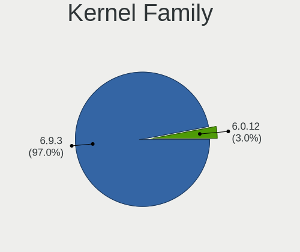
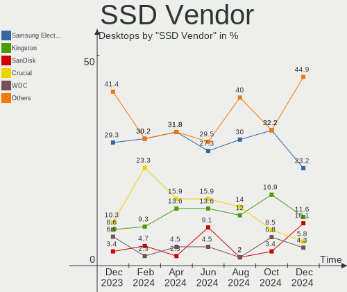
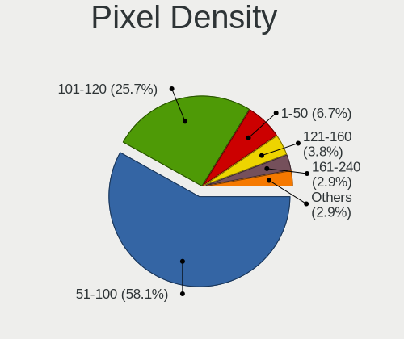

Pop!_OS Hardware Trends (Desktops)
----------------------------------

A project to identify most popular hardware characteristics and track their change
over time based on data collected by Pop!_OS users at https://Linux-Hardware.org.

Anyone can contribute to this report by the [hw-probe](https://github.com/linuxhw/hw-probe) tool:

    sudo -E hw-probe -all -upload

This report is for one last month. Overall report since the beginning of time: [TestCoverage](https://github.com/linuxhw/TestCoverage)

Period: Apr, 2022.

Contents
--------

* [ System ](#system)
  - [ OS                       ](#os)
  - [ OS Family                ](#os-family)
  - [ Kernel                   ](#kernel)
  - [ Kernel Family            ](#kernel-family)
  - [ Kernel Major Ver.        ](#kernel-major-ver)
  - [ Arch                     ](#arch)
  - [ DE                       ](#de)
  - [ Display Server           ](#display-server)
  - [ Display Manager          ](#display-manager)
  - [ OS Lang                  ](#os-lang)
  - [ Boot Mode                ](#boot-mode)
  - [ Filesystem               ](#filesystem)
  - [ Part. scheme             ](#part-scheme)
  - [ Dual Boot with Linux/BSD ](#dual-boot-with-linuxbsd)
  - [ Dual Boot (Win)          ](#dual-boot-win)

* [ Board ](#board)
  - [ Vendor                   ](#vendor)
  - [ Model                    ](#model)
  - [ Model Family             ](#model-family)
  - [ MFG Year                 ](#mfg-year)
  - [ Form Factor              ](#form-factor)
  - [ Secure Boot              ](#secure-boot)
  - [ Coreboot                 ](#coreboot)
  - [ RAM Size                 ](#ram-size)
  - [ RAM Used                 ](#ram-used)
  - [ Total Drives             ](#total-drives)
  - [ Has CD-ROM               ](#has-cd-rom)
  - [ Has Ethernet             ](#has-ethernet)
  - [ Has WiFi                 ](#has-wifi)
  - [ Has Bluetooth            ](#has-bluetooth)

* [ Location ](#location)
  - [ Country                  ](#country)
  - [ City                     ](#city)

* [ Drives ](#drives)
  - [ Drive Vendor             ](#drive-vendor)
  - [ Drive Model              ](#drive-model)
  - [ HDD Vendor               ](#hdd-vendor)
  - [ SSD Vendor               ](#ssd-vendor)
  - [ Drive Kind               ](#drive-kind)
  - [ Drive Connector          ](#drive-connector)
  - [ Drive Size               ](#drive-size)
  - [ Space Total              ](#space-total)
  - [ Space Used               ](#space-used)
  - [ Malfunc. Drives          ](#malfunc-drives)
  - [ Malfunc. Drive Vendor    ](#malfunc-drive-vendor)
  - [ Malfunc. HDD Vendor      ](#malfunc-hdd-vendor)
  - [ Malfunc. Drive Kind      ](#malfunc-drive-kind)
  - [ Failed Drives            ](#failed-drives)
  - [ Failed Drive Vendor      ](#failed-drive-vendor)
  - [ Drive Status             ](#drive-status)

* [ Storage controller ](#storage-controller)
  - [ Storage Vendor           ](#storage-vendor)
  - [ Storage Model            ](#storage-model)
  - [ Storage Kind             ](#storage-kind)

* [ Processor ](#processor)
  - [ CPU Vendor               ](#cpu-vendor)
  - [ CPU Model                ](#cpu-model)
  - [ CPU Model Family         ](#cpu-model-family)
  - [ CPU Cores                ](#cpu-cores)
  - [ CPU Sockets              ](#cpu-sockets)
  - [ CPU Threads              ](#cpu-threads)
  - [ CPU Op-Modes             ](#cpu-op-modes)
  - [ CPU Microcode            ](#cpu-microcode)
  - [ CPU Microarch            ](#cpu-microarch)

* [ Graphics ](#graphics)
  - [ GPU Vendor               ](#gpu-vendor)
  - [ GPU Model                ](#gpu-model)
  - [ GPU Combo                ](#gpu-combo)
  - [ GPU Driver               ](#gpu-driver)
  - [ GPU Memory               ](#gpu-memory)

* [ Monitor ](#monitor)
  - [ Monitor Vendor           ](#monitor-vendor)
  - [ Monitor Model            ](#monitor-model)
  - [ Monitor Resolution       ](#monitor-resolution)
  - [ Monitor Diagonal         ](#monitor-diagonal)
  - [ Monitor Width            ](#monitor-width)
  - [ Aspect Ratio             ](#aspect-ratio)
  - [ Monitor Area             ](#monitor-area)
  - [ Pixel Density            ](#pixel-density)
  - [ Multiple Monitors        ](#multiple-monitors)

* [ Network ](#network)
  - [ Net Controller Vendor    ](#net-controller-vendor)
  - [ Net Controller Model     ](#net-controller-model)
  - [ Wireless Vendor          ](#wireless-vendor)
  - [ Wireless Model           ](#wireless-model)
  - [ Ethernet Vendor          ](#ethernet-vendor)
  - [ Ethernet Model           ](#ethernet-model)
  - [ Net Controller Kind      ](#net-controller-kind)
  - [ Used Controller          ](#used-controller)
  - [ NICs                     ](#nics)
  - [ IPv6                     ](#ipv6)

* [ Bluetooth ](#bluetooth)
  - [ Bluetooth Vendor         ](#bluetooth-vendor)
  - [ Bluetooth Model          ](#bluetooth-model)

* [ Sound ](#sound)
  - [ Sound Vendor             ](#sound-vendor)
  - [ Sound Model              ](#sound-model)

* [ Memory ](#memory)
  - [ Memory Vendor            ](#memory-vendor)
  - [ Memory Model             ](#memory-model)
  - [ Memory Kind              ](#memory-kind)
  - [ Memory Form Factor       ](#memory-form-factor)
  - [ Memory Size              ](#memory-size)
  - [ Memory Speed             ](#memory-speed)

* [ Printers & scanners ](#printers--scanners)
  - [ Printer Vendor           ](#printer-vendor)
  - [ Printer Model            ](#printer-model)
  - [ Scanner Vendor           ](#scanner-vendor)
  - [ Scanner Model            ](#scanner-model)

* [ Camera ](#camera)
  - [ Camera Vendor            ](#camera-vendor)
  - [ Camera Model             ](#camera-model)

* [ Security ](#security)
  - [ Fingerprint Vendor       ](#fingerprint-vendor)
  - [ Fingerprint Model        ](#fingerprint-model)
  - [ Chipcard Vendor          ](#chipcard-vendor)
  - [ Chipcard Model           ](#chipcard-model)

* [ Unsupported ](#unsupported)
  - [ Unsupported Devices      ](#unsupported-devices)
  - [ Unsupported Device Types ](#unsupported-device-types)

System
------

OS
--

Installed operating systems

| Name          | Desktops | Percent |
|---------------|----------|---------|
| Pop!_OS 21.10 | 93       | 72.66%  |
| Pop!_OS 22.04 | 23       | 17.97%  |
| Pop!_OS 20.04 | 7        | 5.47%   |
| Pop!_OS 21.04 | 5        | 3.91%   |

OS Family
---------

OS without a version

| Name    | Desktops | Percent |
|---------|----------|---------|
| Pop!_OS | 128      | 100%    |

Kernel
------

Version of the Linux kernel

| Version                  | Desktops | Percent |
|--------------------------|----------|---------|
| 5.16.15-76051615-generic | 52       | 40.63%  |
| 5.16.19-76051619-generic | 43       | 33.59%  |
| 5.16.11-76051611-generic | 15       | 11.72%  |
| 5.15.15-76051515-generic | 4        | 3.13%   |
| 5.15.23-76051523-generic | 3        | 2.34%   |
| 5.15.11-76051511-generic | 3        | 2.34%   |
| 5.15.8-76051508-generic  | 2        | 1.56%   |
| 5.17.2-xanmod1           | 1        | 0.78%   |
| 5.17.1-xanmod1           | 1        | 0.78%   |
| 5.15.31-xanmod1-tt       | 1        | 0.78%   |
| 5.13.0-7620-generic      | 1        | 0.78%   |
| 5.11.0-7633-generic      | 1        | 0.78%   |
| 5.11.0-7620-generic      | 1        | 0.78%   |

Kernel Family
-------------

Linux kernel without a distro release

| Version | Desktops | Percent |
|---------|----------|---------|
| 5.16.15 | 52       | 40.63%  |
| 5.16.19 | 43       | 33.59%  |
| 5.16.11 | 15       | 11.72%  |
| 5.15.15 | 4        | 3.13%   |
| 5.15.23 | 3        | 2.34%   |
| 5.15.11 | 3        | 2.34%   |
| 5.15.8  | 2        | 1.56%   |
| 5.11.0  | 2        | 1.56%   |
| 5.17.2  | 1        | 0.78%   |
| 5.17.1  | 1        | 0.78%   |
| 5.15.31 | 1        | 0.78%   |
| 5.13.0  | 1        | 0.78%   |

Kernel Major Ver.
-----------------

Linux kernel major version

| Version | Desktops | Percent |
|---------|----------|---------|
| 5.16    | 110      | 85.94%  |
| 5.15    | 13       | 10.16%  |
| 5.17    | 2        | 1.56%   |
| 5.11    | 2        | 1.56%   |
| 5.13    | 1        | 0.78%   |

Arch
----

OS architecture (x86_64, i586, etc.)

| Name   | Desktops | Percent |
|--------|----------|---------|
| x86_64 | 128      | 100%    |

DE
--

Desktop Environment

| Name     | Desktops | Percent |
|----------|----------|---------|
| GNOME    | 119      | 92.97%  |
| KDE5     | 4        | 3.13%   |
| Unknown  | 3        | 2.34%   |
| Unity    | 1        | 0.78%   |
| Cinnamon | 1        | 0.78%   |

Display Server
--------------

X11 or Wayland

| Name    | Desktops | Percent |
|---------|----------|---------|
| X11     | 123      | 96.09%  |
| Wayland | 4        | 3.13%   |
| Unknown | 1        | 0.78%   |

Display Manager
---------------

SDDM, LightDM, etc.

| Name    | Desktops | Percent |
|---------|----------|---------|
| Unknown | 103      | 80.47%  |
| GDM     | 24       | 18.75%  |
| GDM3    | 1        | 0.78%   |

OS Lang
-------

Language

| Lang    | Desktops | Percent |
|---------|----------|---------|
| en_US   | 80       | 62.5%   |
| de_DE   | 9        | 7.03%   |
| en_GB   | 8        | 6.25%   |
| en_CA   | 7        | 5.47%   |
| pt_BR   | 4        | 3.13%   |
| Unknown | 3        | 2.34%   |
| sv_SE   | 2        | 1.56%   |
| ru_RU   | 2        | 1.56%   |
| fr_FR   | 2        | 1.56%   |
| en_AU   | 2        | 1.56%   |
| sk_SK   | 1        | 0.78%   |
| pt_PT   | 1        | 0.78%   |
| pl_PL   | 1        | 0.78%   |
| hr_HR   | 1        | 0.78%   |
| es_NI   | 1        | 0.78%   |
| es_CL   | 1        | 0.78%   |
| en_NZ   | 1        | 0.78%   |
| en_IE   | 1        | 0.78%   |
| en_DK   | 1        | 0.78%   |

Boot Mode
---------

EFI or BIOS

| Mode | Desktops | Percent |
|------|----------|---------|
| BIOS | 105      | 82.03%  |
| EFI  | 23       | 17.97%  |

Filesystem
----------

Type of filesystem

| Type  | Desktops | Percent |
|-------|----------|---------|
| Ext4  | 124      | 96.88%  |
| Btrfs | 3        | 2.34%   |
| Xfs   | 1        | 0.78%   |

Part. scheme
------------

Scheme of partitioning

| Type    | Desktops | Percent |
|---------|----------|---------|
| Unknown | 100      | 78.13%  |
| GPT     | 26       | 20.31%  |
| MBR     | 2        | 1.56%   |

Dual Boot with Linux/BSD
------------------------

Hosting more than one Linux/BSD

| Dual boot | Desktops | Percent |
|-----------|----------|---------|
| No        | 126      | 98.44%  |
| Yes       | 2        | 1.56%   |

Dual Boot (Win)
---------------

Hosting Linux and Windows

| Dual boot | Desktops | Percent |
|-----------|----------|---------|
| No        | 111      | 86.72%  |
| Yes       | 17       | 13.28%  |

Board
-----

Vendor
------

Motherboard manufacturer

| Name                | Desktops | Percent |
|---------------------|----------|---------|
| ASUSTek Computer    | 44       | 34.38%  |
| Gigabyte Technology | 33       | 25.78%  |
| MSI                 | 20       | 15.63%  |
| Dell                | 8        | 6.25%   |
| ASRock              | 6        | 4.69%   |
| Lenovo              | 3        | 2.34%   |
| System76            | 2        | 1.56%   |
| Unknown             | 2        | 1.56%   |
| Pegatron            | 1        | 0.78%   |
| NZXT                | 1        | 0.78%   |
| Intel               | 1        | 0.78%   |
| Hewlett-Packard     | 1        | 0.78%   |
| Fujitsu             | 1        | 0.78%   |
| Foxconn             | 1        | 0.78%   |
| EVGA                | 1        | 0.78%   |
| eMachines           | 1        | 0.78%   |
| ECS                 | 1        | 0.78%   |
| Apple               | 1        | 0.78%   |

Model
-----

Motherboard model

| Name                               | Desktops | Percent |
|------------------------------------|----------|---------|
| Gigabyte X570 AORUS ELITE          | 3        | 2.34%   |
| ASUS ROG STRIX B450-F GAMING       | 3        | 2.34%   |
| ASUS All Series                    | 3        | 2.34%   |
| MSI MS-7D09                        | 2        | 1.56%   |
| MSI MS-7C02                        | 2        | 1.56%   |
| Gigabyte B450M DS3H                | 2        | 1.56%   |
| Gigabyte AB350-Gaming 3            | 2        | 1.56%   |
| ASUS TUF Gaming X570-PLUS          | 2        | 1.56%   |
| ASUS ROG STRIX X570-E GAMING       | 2        | 1.56%   |
| ASUS PRIME B450M-GAMING/BR         | 2        | 1.56%   |
| ASUS PRIME B450M-A                 | 2        | 1.56%   |
| Unknown                            | 2        | 1.56%   |
| System76 Thelio Major              | 1        | 0.78%   |
| System76 Thelio                    | 1        | 0.78%   |
| Pegatron p7-1110                   | 1        | 0.78%   |
| NZXT N7 B550                       | 1        | 0.78%   |
| MSI MS-7D43                        | 1        | 0.78%   |
| MSI MS-7D32                        | 1        | 0.78%   |
| MSI MS-7C91                        | 1        | 0.78%   |
| MSI MS-7C56                        | 1        | 0.78%   |
| MSI MS-7C37                        | 1        | 0.78%   |
| MSI MS-7B89                        | 1        | 0.78%   |
| MSI MS-7B87                        | 1        | 0.78%   |
| MSI MS-7B86                        | 1        | 0.78%   |
| MSI MS-7B48                        | 1        | 0.78%   |
| MSI MS-7B22                        | 1        | 0.78%   |
| MSI MS-7B17                        | 1        | 0.78%   |
| MSI MS-7A74                        | 1        | 0.78%   |
| MSI MS-7A70                        | 1        | 0.78%   |
| MSI MS-7A15                        | 1        | 0.78%   |
| MSI MS-7636                        | 1        | 0.78%   |
| MSI MS-7529                        | 1        | 0.78%   |
| Lenovo ThinkCentre M92p 3209DB2    | 1        | 0.78%   |
| Lenovo Legion T5 26IOB6 90RT00TVKS | 1        | 0.78%   |
| Lenovo K450e 10181                 | 1        | 0.78%   |
| Intel DG41WV AAE90316-101          | 1        | 0.78%   |
| HP OMEN 25L Desktop GT12-0xxx      | 1        | 0.78%   |
| Gigabyte Z97X-UD3H-BK              | 1        | 0.78%   |
| Gigabyte Z77-DS3H                  | 1        | 0.78%   |
| Gigabyte Z68MA-D2H-B3              | 1        | 0.78%   |
| Gigabyte Z490I AORUS ULTRA         | 1        | 0.78%   |
| Gigabyte Z170XP-SLI                | 1        | 0.78%   |
| Gigabyte X570 GAMING X             | 1        | 0.78%   |
| Gigabyte X570 AORUS PRO            | 1        | 0.78%   |
| Gigabyte H87M-HD3                  | 1        | 0.78%   |
| Gigabyte H410M H V3                | 1        | 0.78%   |
| Gigabyte H110M-H                   | 1        | 0.78%   |
| Gigabyte GA-990FX-GAMING           | 1        | 0.78%   |
| Gigabyte GA-78LMT-USB3             | 1        | 0.78%   |
| Gigabyte GA-78LMT-S2               | 1        | 0.78%   |
| Gigabyte F2A88XM-D3H               | 1        | 0.78%   |
| Gigabyte F2A68HM-DS2               | 1        | 0.78%   |
| Gigabyte B560M AORUS PRO AX        | 1        | 0.78%   |
| Gigabyte B550 AORUS ELITE AX V2    | 1        | 0.78%   |
| Gigabyte B450 I AORUS PRO WIFI     | 1        | 0.78%   |
| Gigabyte B450 AORUS PRO WIFI       | 1        | 0.78%   |
| Gigabyte B450 AORUS M              | 1        | 0.78%   |
| Gigabyte B450 AORUS ELITE          | 1        | 0.78%   |
| Gigabyte B360 AORUS GAMING 3 WIFI  | 1        | 0.78%   |
| Gigabyte B150M-D3H-CF              | 1        | 0.78%   |

Model Family
------------

Motherboard model prefix

| Name                     | Desktops | Percent |
|--------------------------|----------|---------|
| ASUS PRIME               | 14       | 10.94%  |
| ASUS ROG                 | 12       | 9.38%   |
| Gigabyte X570            | 5        | 3.91%   |
| Gigabyte B450            | 4        | 3.13%   |
| ASUS TUF                 | 4        | 3.13%   |
| Gigabyte AB350-Gaming    | 3        | 2.34%   |
| Dell OptiPlex            | 3        | 2.34%   |
| ASUS All                 | 3        | 2.34%   |
| System76 Thelio          | 2        | 1.56%   |
| MSI MS-7D09              | 2        | 1.56%   |
| MSI MS-7C02              | 2        | 1.56%   |
| Gigabyte B450M           | 2        | 1.56%   |
| Dell Precision           | 2        | 1.56%   |
| Dell Inspiron            | 2        | 1.56%   |
| ASUS M5A97               | 2        | 1.56%   |
| ASRock X570              | 2        | 1.56%   |
| Unknown                  | 2        | 1.56%   |
| Pegatron p7-1110         | 1        | 0.78%   |
| NZXT N7                  | 1        | 0.78%   |
| MSI MS-7D43              | 1        | 0.78%   |
| MSI MS-7D32              | 1        | 0.78%   |
| MSI MS-7C91              | 1        | 0.78%   |
| MSI MS-7C56              | 1        | 0.78%   |
| MSI MS-7C37              | 1        | 0.78%   |
| MSI MS-7B89              | 1        | 0.78%   |
| MSI MS-7B87              | 1        | 0.78%   |
| MSI MS-7B86              | 1        | 0.78%   |
| MSI MS-7B48              | 1        | 0.78%   |
| MSI MS-7B22              | 1        | 0.78%   |
| MSI MS-7B17              | 1        | 0.78%   |
| MSI MS-7A74              | 1        | 0.78%   |
| MSI MS-7A70              | 1        | 0.78%   |
| MSI MS-7A15              | 1        | 0.78%   |
| MSI MS-7636              | 1        | 0.78%   |
| MSI MS-7529              | 1        | 0.78%   |
| Lenovo ThinkCentre       | 1        | 0.78%   |
| Lenovo Legion            | 1        | 0.78%   |
| Lenovo K450e             | 1        | 0.78%   |
| Intel DG41WV             | 1        | 0.78%   |
| HP OMEN                  | 1        | 0.78%   |
| Gigabyte Z97X-UD3H-BK    | 1        | 0.78%   |
| Gigabyte Z77-DS3H        | 1        | 0.78%   |
| Gigabyte Z68MA-D2H-B3    | 1        | 0.78%   |
| Gigabyte Z490I           | 1        | 0.78%   |
| Gigabyte Z170XP-SLI      | 1        | 0.78%   |
| Gigabyte H87M-HD3        | 1        | 0.78%   |
| Gigabyte H410M           | 1        | 0.78%   |
| Gigabyte H110M-H         | 1        | 0.78%   |
| Gigabyte GA-990FX-GAMING | 1        | 0.78%   |
| Gigabyte GA-78LMT-USB3   | 1        | 0.78%   |
| Gigabyte GA-78LMT-S2     | 1        | 0.78%   |
| Gigabyte F2A88XM-D3H     | 1        | 0.78%   |
| Gigabyte F2A68HM-DS2     | 1        | 0.78%   |
| Gigabyte B560M           | 1        | 0.78%   |
| Gigabyte B550            | 1        | 0.78%   |
| Gigabyte B360            | 1        | 0.78%   |
| Gigabyte B150M-D3H-CF    | 1        | 0.78%   |
| Gigabyte AB350M-Gaming   | 1        | 0.78%   |
| Gigabyte 1001281         | 1        | 0.78%   |
| Fujitsu ESPRIMO          | 1        | 0.78%   |

MFG Year
--------

Motherboard manufacture year

| Year | Desktops | Percent |
|------|----------|---------|
| 2018 | 26       | 20.31%  |
| 2019 | 17       | 13.28%  |
| 2020 | 16       | 12.5%   |
| 2021 | 14       | 10.94%  |
| 2016 | 8        | 6.25%   |
| 2012 | 8        | 6.25%   |
| 2014 | 7        | 5.47%   |
| 2013 | 7        | 5.47%   |
| 2017 | 6        | 4.69%   |
| 2011 | 6        | 4.69%   |
| 2010 | 6        | 4.69%   |
| 2015 | 2        | 1.56%   |
| 2009 | 2        | 1.56%   |
| 2008 | 2        | 1.56%   |
| 2022 | 1        | 0.78%   |

Form Factor
-----------

Physical design of the computer

| Name    | Desktops | Percent |
|---------|----------|---------|
| Desktop | 128      | 100%    |

Secure Boot
-----------

Enabled or disabled

| State    | Desktops | Percent |
|----------|----------|---------|
| Disabled | 128      | 100%    |

Coreboot
--------

Have coreboot on board

| Used | Desktops | Percent |
|------|----------|---------|
| No   | 128      | 100%    |

RAM Size
--------

Total RAM memory

| Size in GB      | Desktops | Percent |
|-----------------|----------|---------|
| 16.01-24.0      | 50       | 39.06%  |
| 32.01-64.0      | 31       | 24.22%  |
| 8.01-16.0       | 22       | 17.19%  |
| 64.01-256.0     | 9        | 7.03%   |
| 3.01-4.0        | 6        | 4.69%   |
| 4.01-8.0        | 5        | 3.91%   |
| 24.01-32.0      | 3        | 2.34%   |
| More than 256.0 | 1        | 0.78%   |
| 1.01-2.0        | 1        | 0.78%   |

RAM Used
--------

Used RAM memory

| Used GB    | Desktops | Percent |
|------------|----------|---------|
| 2.01-3.0   | 38       | 29.69%  |
| 4.01-8.0   | 32       | 25%     |
| 1.01-2.0   | 23       | 17.97%  |
| 3.01-4.0   | 21       | 16.41%  |
| 8.01-16.0  | 10       | 7.81%   |
| 24.01-32.0 | 2        | 1.56%   |
| 32.01-64.0 | 1        | 0.78%   |
| 16.01-24.0 | 1        | 0.78%   |

Total Drives
------------

Number of drives on board

| Drives | Desktops | Percent |
|--------|----------|---------|
| 2      | 40       | 31.25%  |
| 1      | 32       | 25%     |
| 3      | 30       | 23.44%  |
| 4      | 14       | 10.94%  |
| 5      | 6        | 4.69%   |
| 11     | 3        | 2.34%   |
| 6      | 2        | 1.56%   |
| 7      | 1        | 0.78%   |

Has CD-ROM
----------

Has CD-ROM on board

| Presented | Desktops | Percent |
|-----------|----------|---------|
| No        | 84       | 65.63%  |
| Yes       | 44       | 34.38%  |

Has Ethernet
------------

Has Ethernet on board

| Presented | Desktops | Percent |
|-----------|----------|---------|
| Yes       | 127      | 99.22%  |
| No        | 1        | 0.78%   |

Has WiFi
--------

Has WiFi module

| Presented | Desktops | Percent |
|-----------|----------|---------|
| Yes       | 71       | 55.47%  |
| No        | 57       | 44.53%  |

Has Bluetooth
-------------

Has Bluetooth module

| Presented | Desktops | Percent |
|-----------|----------|---------|
| No        | 70       | 54.69%  |
| Yes       | 58       | 45.31%  |

Location
--------

Country
-------

Geographic location (country)

| Country      | Desktops | Percent |
|--------------|----------|---------|
| USA          | 51       | 39.84%  |
| Germany      | 11       | 8.59%   |
| Canada       | 8        | 6.25%   |
| Netherlands  | 7        | 5.47%   |
| Brazil       | 7        | 5.47%   |
| Ireland      | 4        | 3.13%   |
| Australia    | 3        | 2.34%   |
| UK           | 2        | 1.56%   |
| Sweden       | 2        | 1.56%   |
| Slovenia     | 2        | 1.56%   |
| Slovakia     | 2        | 1.56%   |
| New Zealand  | 2        | 1.56%   |
| Mexico       | 2        | 1.56%   |
| Israel       | 2        | 1.56%   |
| France       | 2        | 1.56%   |
| Turkey       | 1        | 0.78%   |
| Spain        | 1        | 0.78%   |
| South Africa | 1        | 0.78%   |
| Saudi Arabia | 1        | 0.78%   |
| Russia       | 1        | 0.78%   |
| Romania      | 1        | 0.78%   |
| Poland       | 1        | 0.78%   |
| Nicaragua    | 1        | 0.78%   |
| Malaysia     | 1        | 0.78%   |
| Lithuania    | 1        | 0.78%   |
| Japan        | 1        | 0.78%   |
| Italy        | 1        | 0.78%   |
| Hungary      | 1        | 0.78%   |
| Greece       | 1        | 0.78%   |
| Denmark      | 1        | 0.78%   |
| Croatia      | 1        | 0.78%   |
| Chile        | 1        | 0.78%   |
| Bulgaria     | 1        | 0.78%   |
| Belarus      | 1        | 0.78%   |
| Azerbaijan   | 1        | 0.78%   |
| Austria      | 1        | 0.78%   |

City
----

Geographic location (city)

| City                | Desktops | Percent |
|---------------------|----------|---------|
| Dillenburg          | 3        | 2.34%   |
| Halifax             | 2        | 1.56%   |
| Edmonton            | 2        | 1.56%   |
| Dublin              | 2        | 1.56%   |
| Berlin              | 2        | 1.56%   |
| Zutphen             | 1        | 0.78%   |
| Woodway             | 1        | 0.78%   |
| Woodstock           | 1        | 0.78%   |
| Winnipeg            | 1        | 0.78%   |
| Whanganui           | 1        | 0.78%   |
| West Valley City    | 1        | 0.78%   |
| Wellington          | 1        | 0.78%   |
| Well                | 1        | 0.78%   |
| Weare               | 1        | 0.78%   |
| Waynesville         | 1        | 0.78%   |
| Wausau              | 1        | 0.78%   |
| Waukegan            | 1        | 0.78%   |
| Wasilla             | 1        | 0.78%   |
| Venice              | 1        | 0.78%   |
| Tuam                | 1        | 0.78%   |
| Toronto             | 1        | 0.78%   |
| The Hague           | 1        | 0.78%   |
| Tahlequah           | 1        | 0.78%   |
| Szabadszallas       | 1        | 0.78%   |
| Surprise            | 1        | 0.78%   |
| Solleftea           | 1        | 0.78%   |
| Sofia               | 1        | 0.78%   |
| Sisak               | 1        | 0.78%   |
| Šiauliai           | 1        | 0.78%   |
| Seattle             | 1        | 0.78%   |
| Sarasota            | 1        | 0.78%   |
| Sapporo             | 1        | 0.78%   |
| Sao Paulo           | 1        | 0.78%   |
| Santa Maria         | 1        | 0.78%   |
| San Pedro de la Paz | 1        | 0.78%   |
| San Jose            | 1        | 0.78%   |
| Salt Lake City      | 1        | 0.78%   |
| Saint Paul          | 1        | 0.78%   |
| Saint John          | 1        | 0.78%   |
| Saint Charles       | 1        | 0.78%   |
| Riyadh              | 1        | 0.78%   |
| Richmond            | 1        | 0.78%   |
| Regenstauf          | 1        | 0.78%   |
| Ponta Grossa        | 1        | 0.78%   |
| Pine Grove          | 1        | 0.78%   |
| Perth               | 1        | 0.78%   |
| Paris               | 1        | 0.78%   |
| Oberhausen          | 1        | 0.78%   |
| North Shields       | 1        | 0.78%   |
| Naucalpan           | 1        | 0.78%   |
| Naperville          | 1        | 0.78%   |
| Nahariya            | 1        | 0.78%   |
| Nackawic            | 1        | 0.78%   |
| Monterrey           | 1        | 0.78%   |
| Mogilev             | 1        | 0.78%   |
| Marrero             | 1        | 0.78%   |
| Mannheim            | 1        | 0.78%   |
| Manassas            | 1        | 0.78%   |
| Managua             | 1        | 0.78%   |
| Madrid              | 1        | 0.78%   |

Drives
------

Drive Vendor
------------

Hard drive vendors

| Vendor                    | Desktops | Drives | Percent |
|---------------------------|----------|--------|---------|
| Seagate                   | 54       | 70     | 20.45%  |
| Samsung Electronics       | 54       | 81     | 20.45%  |
| WDC                       | 47       | 67     | 17.8%   |
| Kingston                  | 16       | 16     | 6.06%   |
| SanDisk                   | 13       | 15     | 4.92%   |
| Crucial                   | 12       | 12     | 4.55%   |
| Toshiba                   | 10       | 11     | 3.79%   |
| Intel                     | 9        | 9      | 3.41%   |
| Hitachi                   | 6        | 7      | 2.27%   |
| Phison                    | 5        | 5      | 1.89%   |
| Micron/Crucial Technology | 4        | 5      | 1.52%   |
| China                     | 4        | 5      | 1.52%   |
| A-DATA Technology         | 4        | 5      | 1.52%   |
| PNY                       | 3        | 3      | 1.14%   |
| HGST                      | 3        | 5      | 1.14%   |
| Unknown                   | 2        | 3      | 0.76%   |
| Patriot                   | 2        | 2      | 0.76%   |
| ZADAK                     | 1        | 1      | 0.38%   |
| XPG                       | 1        | 1      | 0.38%   |
| USB                       | 1        | 1      | 0.38%   |
| Transcend                 | 1        | 2      | 0.38%   |
| STEC                      | 1        | 1      | 0.38%   |
| SPCC                      | 1        | 1      | 0.38%   |
| SK Hynix                  | 1        | 1      | 0.38%   |
| Silicon Motion            | 1        | 1      | 0.38%   |
| OCZ                       | 1        | 1      | 0.38%   |
| Mushkin                   | 1        | 1      | 0.38%   |
| MAXTOR                    | 1        | 1      | 0.38%   |
| Lexar                     | 1        | 1      | 0.38%   |
| Intenso                   | 1        | 1      | 0.38%   |
| GOODRAM                   | 1        | 1      | 0.38%   |
| Corsair                   | 1        | 1      | 0.38%   |
| Apacer                    | 1        | 1      | 0.38%   |

Drive Model
-----------

Hard drive models

| Model                               | Desktops | Percent |
|-------------------------------------|----------|---------|
| Samsung NVMe SSD Drive 500GB        | 8        | 2.51%   |
| Samsung NVMe SSD Drive 1TB          | 8        | 2.51%   |
| Samsung SSD 850 EVO 500GB           | 7        | 2.19%   |
| Seagate ST2000DM008-2FR102 2TB      | 6        | 1.88%   |
| Samsung SSD 860 EVO 1TB             | 6        | 1.88%   |
| WDC WD10EZEX-08WN4A0 1TB            | 5        | 1.57%   |
| Samsung SSD 850 EVO 250GB           | 5        | 1.57%   |
| Seagate ST3500413AS 500GB           | 4        | 1.25%   |
| Samsung SSD 860 EVO 500GB           | 4        | 1.25%   |
| Kingston SA400S37120G 120GB SSD     | 4        | 1.25%   |
| WDC WD20EZRZ-00Z5HB0 2TB            | 3        | 0.94%   |
| Seagate ST31000528AS 1TB            | 3        | 0.94%   |
| Seagate ST1000DM003-1ER162 1TB      | 3        | 0.94%   |
| Seagate Expansion+ 2TB              | 3        | 0.94%   |
| Sandisk NVMe SSD Drive 500GB        | 3        | 0.94%   |
| Sandisk NVMe SSD Drive 1TB          | 3        | 0.94%   |
| WDC WD30EZRX-00DC0B0 3TB            | 2        | 0.63%   |
| WDC WD30EFRX-68EUZN0 3TB            | 2        | 0.63%   |
| WDC WD20EZAZ-00GGJB0 2TB            | 2        | 0.63%   |
| Toshiba DT01ACA200 2TB              | 2        | 0.63%   |
| Toshiba DT01ACA100 1TB              | 2        | 0.63%   |
| Seagate ST500DM002-1BD142 500GB     | 2        | 0.63%   |
| Seagate ST4000DM004-2CV104 4TB      | 2        | 0.63%   |
| Seagate ST4000DM000-1F2168 4TB      | 2        | 0.63%   |
| Seagate ST2000DX002-2DV164 2TB      | 2        | 0.63%   |
| Seagate ST2000DM006-2DM164 2TB      | 2        | 0.63%   |
| Seagate ST2000DM001-1ER164 2TB      | 2        | 0.63%   |
| Seagate ST2000DM001-1CH164 2TB      | 2        | 0.63%   |
| Seagate ST1000LM035-1RK172 1TB      | 2        | 0.63%   |
| Seagate ST1000LM024 HN-M101MBB 1TB  | 2        | 0.63%   |
| Seagate ST1000DM010-2EP102 1TB      | 2        | 0.63%   |
| Seagate Backup+ Desk 5TB            | 2        | 0.63%   |
| SanDisk SSD PLUS 240GB              | 2        | 0.63%   |
| Sandisk NVMe SSD Drive 256GB        | 2        | 0.63%   |
| Samsung SSD 970 EVO Plus 500GB      | 2        | 0.63%   |
| Samsung SSD 870 QVO 4TB             | 2        | 0.63%   |
| Samsung SSD 860 QVO 1TB             | 2        | 0.63%   |
| Samsung SSD 850 PRO 512GB           | 2        | 0.63%   |
| Samsung NVMe SSD Drive 2TB          | 2        | 0.63%   |
| Micron/Crucial NVMe SSD Drive 500GB | 2        | 0.63%   |
| Kingston SH103S3120G 120GB SSD      | 2        | 0.63%   |
| Kingston SA400S37480G 480GB SSD     | 2        | 0.63%   |
| Kingston NVMe SSD Drive 1TB         | 2        | 0.63%   |
| Intel NVMe SSD Drive 1024GB         | 2        | 0.63%   |
| Crucial CT2000MX500SSD1 2TB         | 2        | 0.63%   |
| Crucial CT1000P1SSD8 1TB            | 2        | 0.63%   |
| Crucial CT1000MX500SSD1 1TB         | 2        | 0.63%   |
| China SATA SSD 120GB                | 2        | 0.63%   |
| A-DATA SX8200PNP 512GB              | 2        | 0.63%   |
| A-DATA SU630 240GB SSD              | 2        | 0.63%   |
| ZADAK TWSS3 512GB                   | 1        | 0.31%   |
| XPG GAMMIX S11 Pro 512GB            | 1        | 0.31%   |
| WDC WDS500G2B0A-00SM50 500GB SSD    | 1        | 0.31%   |
| WDC WDS480G2G0A-00JH30 480GB SSD    | 1        | 0.31%   |
| WDC WDS250G2B0B-00YS70 250GB SSD    | 1        | 0.31%   |
| WDC WDS240G2G0B-00EPW0 240GB SSD    | 1        | 0.31%   |
| WDC WDS240G2G0A-00JH30 240GB SSD    | 1        | 0.31%   |
| WDC WDS100T2G0A-00JH30 1TB SSD      | 1        | 0.31%   |
| WDC WD80EDAZ-11TA3A0 8TB            | 1        | 0.31%   |
| WDC WD800BD-22MRA1 80GB             | 1        | 0.31%   |

HDD Vendor
----------

Hard disk drive vendors

| Vendor              | Desktops | Drives | Percent |
|---------------------|----------|--------|---------|
| Seagate             | 52       | 67     | 44.83%  |
| WDC                 | 43       | 60     | 37.07%  |
| Toshiba             | 9        | 10     | 7.76%   |
| Hitachi             | 6        | 7      | 5.17%   |
| HGST                | 3        | 5      | 2.59%   |
| USB                 | 1        | 1      | 0.86%   |
| Samsung Electronics | 1        | 1      | 0.86%   |
| MAXTOR              | 1        | 1      | 0.86%   |

SSD Vendor
----------

Solid state drive vendors

| Vendor              | Desktops | Drives | Percent |
|---------------------|----------|--------|---------|
| Samsung Electronics | 37       | 48     | 39.36%  |
| Kingston            | 13       | 13     | 13.83%  |
| Crucial             | 9        | 9      | 9.57%   |
| SanDisk             | 6        | 6      | 6.38%   |
| WDC                 | 5        | 6      | 5.32%   |
| Intel               | 4        | 4      | 4.26%   |
| China               | 4        | 5      | 4.26%   |
| PNY                 | 3        | 3      | 3.19%   |
| A-DATA Technology   | 3        | 3      | 3.19%   |
| Patriot             | 2        | 2      | 2.13%   |
| Transcend           | 1        | 2      | 1.06%   |
| Toshiba             | 1        | 1      | 1.06%   |
| OCZ                 | 1        | 1      | 1.06%   |
| Mushkin             | 1        | 1      | 1.06%   |
| Lexar               | 1        | 1      | 1.06%   |
| GOODRAM             | 1        | 1      | 1.06%   |
| Corsair             | 1        | 1      | 1.06%   |
| Apacer              | 1        | 1      | 1.06%   |

Drive Kind
----------

HDD or SSD

| Kind    | Desktops | Drives | Percent |
|---------|----------|--------|---------|
| HDD     | 89       | 152    | 38.86%  |
| SSD     | 81       | 108    | 35.37%  |
| NVMe    | 52       | 70     | 22.71%  |
| Unknown | 7        | 8      | 3.06%   |

Drive Connector
---------------

SATA, SAS, NVMe, etc.

| Type | Desktops | Drives | Percent |
|------|----------|--------|---------|
| SATA | 116      | 259    | 65.91%  |
| NVMe | 52       | 70     | 29.55%  |
| SAS  | 8        | 9      | 4.55%   |

Drive Size
----------

Size of hard drive

| Size in TB | Desktops | Drives | Percent |
|------------|----------|--------|---------|
| 0.01-0.5   | 79       | 113    | 43.41%  |
| 0.51-1.0   | 49       | 70     | 26.92%  |
| 1.01-2.0   | 34       | 45     | 18.68%  |
| 3.01-4.0   | 10       | 14     | 5.49%   |
| 2.01-3.0   | 6        | 8      | 3.3%    |
| 4.01-10.0  | 3        | 8      | 1.65%   |
| 10.01-20.0 | 1        | 2      | 0.55%   |

Space Total
-----------

Amount of disk space available on the file system

| Size in GB     | Desktops | Percent |
|----------------|----------|---------|
| 101-250        | 27       | 21.09%  |
| 501-1000       | 27       | 21.09%  |
| 251-500        | 23       | 17.97%  |
| More than 3000 | 20       | 15.63%  |
| 1001-2000      | 13       | 10.16%  |
| 2001-3000      | 10       | 7.81%   |
| 51-100         | 4        | 3.13%   |
| Unknown        | 3        | 2.34%   |
| 21-50          | 1        | 0.78%   |

Space Used
----------

Amount of used disk space

| Used GB        | Desktops | Percent |
|----------------|----------|---------|
| 1-20           | 24       | 18.75%  |
| 21-50          | 21       | 16.41%  |
| 251-500        | 18       | 14.06%  |
| 101-250        | 15       | 11.72%  |
| 501-1000       | 14       | 10.94%  |
| 51-100         | 14       | 10.94%  |
| 1001-2000      | 8        | 6.25%   |
| More than 3000 | 7        | 5.47%   |
| 2001-3000      | 4        | 3.13%   |
| Unknown        | 3        | 2.34%   |

Malfunc. Drives
---------------

Drive models with a malfunction

| Model                                 | Desktops | Drives | Percent |
|---------------------------------------|----------|--------|---------|
| WDC WD5000LPLX-00ZNTT0 500GB          | 1        | 2      | 8.33%   |
| WDC WD20EFRX-68AX9N0 2TB              | 1        | 1      | 8.33%   |
| WDC WD2003FYYS-05T9B0 2TB             | 1        | 1      | 8.33%   |
| WDC WD15EVDS-73V9B0 1TB               | 1        | 1      | 8.33%   |
| Seagate ST8000DM004-2CX188 8TB        | 1        | 1      | 8.33%   |
| Seagate ST3320620AS 320GB             | 1        | 1      | 8.33%   |
| Seagate ST2000DM008-2FR102 2TB        | 1        | 1      | 8.33%   |
| Seagate ST1000LM024 HN-M101MBB 1TB    | 1        | 1      | 8.33%   |
| Samsung Electronics SSD 980 1TB       | 1        | 1      | 8.33%   |
| Samsung Electronics SSD 850 EVO 500GB | 1        | 1      | 8.33%   |
| Intel SSDSC2BW480H6 480GB             | 1        | 1      | 8.33%   |
| HGST HTS541010A7E630 1TB              | 1        | 1      | 8.33%   |

Malfunc. Drive Vendor
---------------------

Vendors of faulty drives

| Vendor              | Desktops | Drives | Percent |
|---------------------|----------|--------|---------|
| WDC                 | 4        | 5      | 33.33%  |
| Seagate             | 4        | 4      | 33.33%  |
| Samsung Electronics | 2        | 2      | 16.67%  |
| Intel               | 1        | 1      | 8.33%   |
| HGST                | 1        | 1      | 8.33%   |

Malfunc. HDD Vendor
-------------------

Vendors of faulty HDD drives

| Vendor  | Desktops | Drives | Percent |
|---------|----------|--------|---------|
| WDC     | 4        | 5      | 44.44%  |
| Seagate | 4        | 4      | 44.44%  |
| HGST    | 1        | 1      | 11.11%  |

Malfunc. Drive Kind
-------------------

Kinds of faulty drives

| Kind | Desktops | Drives | Percent |
|------|----------|--------|---------|
| HDD  | 7        | 10     | 70%     |
| SSD  | 2        | 2      | 20%     |
| NVMe | 1        | 1      | 10%     |

Failed Drives
-------------

Failed drive models

| Model                  | Desktops | Drives | Percent |
|------------------------|----------|--------|---------|
| Patriot Pyro SSD 120GB | 1        | 1      | 100%    |

Failed Drive Vendor
-------------------

Failed drive vendors

| Vendor  | Desktops | Drives | Percent |
|---------|----------|--------|---------|
| Patriot | 1        | 1      | 100%    |

Drive Status
------------

Number of failed and malfunc. drives

| Status   | Desktops | Drives | Percent |
|----------|----------|--------|---------|
| Detected | 105      | 250    | 72.92%  |
| Works    | 29       | 74     | 20.14%  |
| Malfunc  | 9        | 13     | 6.25%   |
| Failed   | 1        | 1      | 0.69%   |

Storage controller
------------------

Storage Vendor
--------------

Storage controller vendors

| Vendor                           | Desktops | Percent |
|----------------------------------|----------|---------|
| Intel                            | 71       | 35.86%  |
| AMD                              | 59       | 29.8%   |
| Samsung Electronics              | 26       | 13.13%  |
| Sandisk                          | 8        | 4.04%   |
| Micron/Crucial Technology        | 7        | 3.54%   |
| Phison Electronics               | 6        | 3.03%   |
| ASMedia Technology               | 6        | 3.03%   |
| Kingston Technology Company      | 3        | 1.52%   |
| ADATA Technology                 | 3        | 1.52%   |
| VIA Technologies                 | 1        | 0.51%   |
| Unknown                          | 1        | 0.51%   |
| SK Hynix                         | 1        | 0.51%   |
| Silicon Motion                   | 1        | 0.51%   |
| Silicon Integrated Systems [SiS] | 1        | 0.51%   |
| Silicon Image                    | 1        | 0.51%   |
| Nvidia                           | 1        | 0.51%   |
| Marvell Technology Group         | 1        | 0.51%   |
| JMicron Technology               | 1        | 0.51%   |

Storage Model
-------------

Storage controller models

| Model                                                                                   | Desktops | Percent |
|-----------------------------------------------------------------------------------------|----------|---------|
| AMD FCH SATA Controller [AHCI mode]                                                     | 38       | 15.7%   |
| AMD 400 Series Chipset SATA Controller                                                  | 22       | 9.09%   |
| Samsung NVMe SSD Controller SM981/PM981/PM983                                           | 13       | 5.37%   |
| Samsung NVMe SSD Controller PM9A1/PM9A3/980PRO                                          | 10       | 4.13%   |
| Intel 200 Series PCH SATA controller [AHCI mode]                                        | 10       | 4.13%   |
| Intel 500 Series Chipset Family SATA AHCI Controller                                    | 7        | 2.89%   |
| AMD 500 Series Chipset SATA Controller                                                  | 7        | 2.89%   |
| ASMedia ASM1062 Serial ATA Controller                                                   | 6        | 2.48%   |
| Phison E12 NVMe Controller                                                              | 5        | 2.07%   |
| Micron/Crucial P1 NVMe PCIe SSD                                                         | 5        | 2.07%   |
| Intel SATA Controller [RAID mode]                                                       | 5        | 2.07%   |
| Intel Q170/Q150/B150/H170/H110/Z170/CM236 Chipset SATA Controller [AHCI Mode]           | 5        | 2.07%   |
| Intel 8 Series/C220 Series Chipset Family 6-port SATA Controller 1 [AHCI mode]          | 5        | 2.07%   |
| AMD 300 Series Chipset SATA Controller                                                  | 5        | 2.07%   |
| Intel SSD 660P Series                                                                   | 4        | 1.65%   |
| Intel NM10/ICH7 Family SATA Controller [IDE mode]                                       | 4        | 1.65%   |
| Intel Cannon Lake PCH SATA AHCI Controller                                              | 4        | 1.65%   |
| Intel 6 Series/C200 Series Chipset Family Desktop SATA Controller (IDE mode, ports 4-5) | 4        | 1.65%   |
| Intel 6 Series/C200 Series Chipset Family Desktop SATA Controller (IDE mode, ports 0-3) | 4        | 1.65%   |
| AMD SB7x0/SB8x0/SB9x0 SATA Controller [AHCI mode]                                       | 4        | 1.65%   |
| Sandisk WD Black SN750 / PC SN730 NVMe SSD                                              | 3        | 1.24%   |
| Intel Alder Lake-S PCH SATA Controller [AHCI Mode]                                      | 3        | 1.24%   |
| Intel 82801G (ICH7 Family) IDE Controller                                               | 3        | 1.24%   |
| Intel 7 Series/C210 Series Chipset Family 6-port SATA Controller [AHCI mode]            | 3        | 1.24%   |
| AMD SB7x0/SB8x0/SB9x0 IDE Controller                                                    | 3        | 1.24%   |
| ADATA XPG SX8200 Pro PCIe Gen3x4 M.2 2280 Solid State Drive                             | 3        | 1.24%   |
| Sandisk WD Blue SN500 / PC SN520 NVMe SSD                                               | 2        | 0.83%   |
| Sandisk Non-Volatile memory controller                                                  | 2        | 0.83%   |
| Samsung NVMe SSD Controller 980                                                         | 2        | 0.83%   |
| Micron/Crucial P2 NVMe PCIe SSD                                                         | 2        | 0.83%   |
| Intel C610/X99 series chipset sSATA Controller [AHCI mode]                              | 2        | 0.83%   |
| Intel 82801JI (ICH10 Family) SATA AHCI Controller                                       | 2        | 0.83%   |
| Intel 8 Series/C220 Series Chipset Family 4-port SATA Controller 1 [IDE mode]           | 2        | 0.83%   |
| Intel 8 Series/C220 Series Chipset Family 2-port SATA Controller 2 [IDE mode]           | 2        | 0.83%   |
| Intel 6 Series/C200 Series Chipset Family 6 port Desktop SATA AHCI Controller           | 2        | 0.83%   |
| AMD SB7x0/SB8x0/SB9x0 SATA Controller [IDE mode]                                        | 2        | 0.83%   |
| VIA VT6415 PATA IDE Host Controller                                                     | 1        | 0.41%   |
| Unknown Non-Volatile memory controller                                                  | 1        | 0.41%   |
| SK Hynix BC501 NVMe Solid State Drive                                                   | 1        | 0.41%   |
| Silicon Motion SM2262/SM2262EN SSD Controller                                           | 1        | 0.41%   |
| Silicon Integrated Systems [SiS] AHCI IDE Controller (0106)                             | 1        | 0.41%   |
| Silicon Image SiI 3132 Serial ATA Raid II Controller                                    | 1        | 0.41%   |
| Sandisk WD Blue SN570 NVMe SSD                                                          | 1        | 0.41%   |
| Sandisk WD Blue SN550 NVMe SSD                                                          | 1        | 0.41%   |
| Sandisk WD Black 2018/SN750 / PC SN720 NVMe SSD                                         | 1        | 0.41%   |
| Samsung NVMe SSD Controller SM961/PM961/SM963                                           | 1        | 0.41%   |
| Phison PS5013 E13 NVMe Controller                                                       | 1        | 0.41%   |
| Nvidia MCP61 SATA Controller                                                            | 1        | 0.41%   |
| Nvidia MCP61 IDE                                                                        | 1        | 0.41%   |
| Marvell Group 88SE9215 PCIe 2.0 x1 4-port SATA 6 Gb/s Controller                        | 1        | 0.41%   |
| Kingston Company U-SNS8154P3 NVMe SSD                                                   | 1        | 0.41%   |
| Kingston Company Company Non-Volatile memory controller                                 | 1        | 0.41%   |
| Kingston Company A2000 NVMe SSD                                                         | 1        | 0.41%   |
| JMicron JMB363 SATA/IDE Controller                                                      | 1        | 0.41%   |
| Intel Volume Management Device NVMe RAID Controller                                     | 1        | 0.41%   |
| Intel Non-Volatile memory controller                                                    | 1        | 0.41%   |
| Intel Comet Lake SATA AHCI Controller                                                   | 1        | 0.41%   |
| Intel C610/X99 series chipset IDE-r Controller                                          | 1        | 0.41%   |
| Intel C610/X99 series chipset 6-Port SATA Controller [AHCI mode]                        | 1        | 0.41%   |
| Intel C600/X79 series chipset SATA RAID Controller                                      | 1        | 0.41%   |

Storage Kind
------------

Kind of storage controller (IDE, SATA, NVMe, SAS, ...)

| Kind | Desktops | Percent |
|------|----------|---------|
| SATA | 109      | 57.07%  |
| NVMe | 52       | 27.23%  |
| IDE  | 19       | 9.95%   |
| RAID | 11       | 5.76%   |

Processor
---------

CPU Vendor
----------

Processor vendors

| Vendor | Desktops | Percent |
|--------|----------|---------|
| Intel  | 68       | 53.13%  |
| AMD    | 60       | 46.88%  |

CPU Model
---------

Processor models

| Model                                       | Desktops | Percent |
|---------------------------------------------|----------|---------|
| AMD Ryzen 5 3600 6-Core Processor           | 9        | 7.03%   |
| Intel Core i7-4790 CPU @ 3.60GHz            | 5        | 3.91%   |
| Intel Core i5-10400 CPU @ 2.90GHz           | 5        | 3.91%   |
| AMD Ryzen 7 3700X 8-Core Processor          | 5        | 3.91%   |
| AMD Ryzen 9 3900X 12-Core Processor         | 3        | 2.34%   |
| AMD Ryzen 7 5800X 8-Core Processor          | 3        | 2.34%   |
| AMD Ryzen 5 5600X 6-Core Processor          | 3        | 2.34%   |
| AMD Ryzen 3 3200G with Radeon Vega Graphics | 3        | 2.34%   |
| Intel Core i9-10900X CPU @ 3.70GHz          | 2        | 1.56%   |
| Intel Core i7-9700K CPU @ 3.60GHz           | 2        | 1.56%   |
| Intel Core i7-8700K CPU @ 3.70GHz           | 2        | 1.56%   |
| Intel Core i7-7700 CPU @ 3.60GHz            | 2        | 1.56%   |
| Intel Core i5-2500K CPU @ 3.30GHz           | 2        | 1.56%   |
| Intel 12th Gen Core i5-12600K               | 2        | 1.56%   |
| AMD Ryzen 7 3800X 8-Core Processor          | 2        | 1.56%   |
| AMD Ryzen 7 2700X Eight-Core Processor      | 2        | 1.56%   |
| AMD Ryzen 5 3600X 6-Core Processor          | 2        | 1.56%   |
| AMD Ryzen 5 2600X Six-Core Processor        | 2        | 1.56%   |
| AMD Ryzen 5 2400G with Radeon Vega Graphics | 2        | 1.56%   |
| AMD FX-8350 Eight-Core Processor            | 2        | 1.56%   |
| Intel Xeon CPU W3530 @ 2.80GHz              | 1        | 0.78%   |
| Intel Xeon CPU E5462 @ 2.80GHz              | 1        | 0.78%   |
| Intel Xeon CPU E5-1650 v3 @ 3.50GHz         | 1        | 0.78%   |
| Intel Core i9-10900K CPU @ 3.70GHz          | 1        | 0.78%   |
| Intel Core i7-9700F CPU @ 3.00GHz           | 1        | 0.78%   |
| Intel Core i7-8709G CPU @ 3.10GHz           | 1        | 0.78%   |
| Intel Core i7-7700K CPU @ 4.20GHz           | 1        | 0.78%   |
| Intel Core i7-6700K CPU @ 4.00GHz           | 1        | 0.78%   |
| Intel Core i7-6700 CPU @ 3.40GHz            | 1        | 0.78%   |
| Intel Core i7-5820K CPU @ 3.30GHz           | 1        | 0.78%   |
| Intel Core i7-4930K CPU @ 3.40GHz           | 1        | 0.78%   |
| Intel Core i7-4770 CPU @ 3.40GHz            | 1        | 0.78%   |
| Intel Core i7-3770 CPU @ 3.40GHz            | 1        | 0.78%   |
| Intel Core i7 CPU 965 @ 3.20GHz             | 1        | 0.78%   |
| Intel Core i5-9600K CPU @ 3.70GHz           | 1        | 0.78%   |
| Intel Core i5-9400F CPU @ 2.90GHz           | 1        | 0.78%   |
| Intel Core i5-9400 CPU @ 2.90GHz            | 1        | 0.78%   |
| Intel Core i5-8400 CPU @ 2.80GHz            | 1        | 0.78%   |
| Intel Core i5-7600K CPU @ 3.80GHz           | 1        | 0.78%   |
| Intel Core i5-7500 CPU @ 3.40GHz            | 1        | 0.78%   |
| Intel Core i5-6500T CPU @ 2.50GHz           | 1        | 0.78%   |
| Intel Core i5-6500 CPU @ 3.20GHz            | 1        | 0.78%   |
| Intel Core i5-4670K CPU @ 3.40GHz           | 1        | 0.78%   |
| Intel Core i5-4590 CPU @ 3.30GHz            | 1        | 0.78%   |
| Intel Core i5-4570 CPU @ 3.20GHz            | 1        | 0.78%   |
| Intel Core i5-3570 CPU @ 3.40GHz            | 1        | 0.78%   |
| Intel Core i5-3470 CPU @ 3.20GHz            | 1        | 0.78%   |
| Intel Core i5-3450 CPU @ 3.10GHz            | 1        | 0.78%   |
| Intel Core i5-2500 CPU @ 3.30GHz            | 1        | 0.78%   |
| Intel Core i5-2400 CPU @ 3.10GHz            | 1        | 0.78%   |
| Intel Core i5-2300 CPU @ 2.80GHz            | 1        | 0.78%   |
| Intel Core i5 CPU 760 @ 2.80GHz             | 1        | 0.78%   |
| Intel Core i3-7100 CPU @ 3.90GHz            | 1        | 0.78%   |
| Intel Core i3-2120 CPU @ 3.30GHz            | 1        | 0.78%   |
| Intel Core i3-10105 CPU @ 3.70GHz           | 1        | 0.78%   |
| Intel Core i3-10100F CPU @ 3.60GHz          | 1        | 0.78%   |
| Intel Core i3-10100 CPU @ 3.60GHz           | 1        | 0.78%   |
| Intel Core 2 Quad CPU Q9400 @ 2.66GHz       | 1        | 0.78%   |
| Intel Core 2 Quad CPU Q6600 @ 2.40GHz       | 1        | 0.78%   |
| Intel Core 2 Duo CPU E4500 @ 2.20GHz        | 1        | 0.78%   |

CPU Model Family
----------------

Processor model prefix

| Model                  | Desktops | Percent |
|------------------------|----------|---------|
| Intel Core i5          | 25       | 19.53%  |
| AMD Ryzen 5            | 23       | 17.97%  |
| Intel Core i7          | 21       | 16.41%  |
| AMD Ryzen 7            | 16       | 12.5%   |
| AMD Ryzen 9            | 6        | 4.69%   |
| Other                  | 5        | 3.91%   |
| Intel Core i3          | 5        | 3.91%   |
| AMD FX                 | 5        | 3.91%   |
| AMD Ryzen 3            | 4        | 3.13%   |
| Intel Xeon             | 3        | 2.34%   |
| Intel Core i9          | 3        | 2.34%   |
| Intel Core 2 Quad      | 2        | 1.56%   |
| Intel Celeron          | 2        | 1.56%   |
| AMD A10                | 2        | 1.56%   |
| Intel Core 2 Duo       | 1        | 0.78%   |
| Intel Atom             | 1        | 0.78%   |
| AMD Ryzen Threadripper | 1        | 0.78%   |
| AMD Phenom II X4       | 1        | 0.78%   |
| AMD Athlon 64 X2       | 1        | 0.78%   |
| AMD A6                 | 1        | 0.78%   |

CPU Cores
---------

Number of processor cores

| Number | Desktops | Percent |
|--------|----------|---------|
| 4      | 50       | 39.06%  |
| 6      | 33       | 25.78%  |
| 8      | 22       | 17.19%  |
| 2      | 8        | 6.25%   |
| 12     | 5        | 3.91%   |
| 10     | 5        | 3.91%   |
| 3      | 2        | 1.56%   |
| 32     | 1        | 0.78%   |
| 16     | 1        | 0.78%   |
| 1      | 1        | 0.78%   |

CPU Sockets
-----------

Number of sockets

| Number | Desktops | Percent |
|--------|----------|---------|
| 1      | 127      | 99.22%  |
| 2      | 1        | 0.78%   |

CPU Threads
-----------

Threads per core (Hyper-Threading)

| Number | Desktops | Percent |
|--------|----------|---------|
| 2      | 92       | 71.88%  |
| 1      | 36       | 28.13%  |

CPU Op-Modes
------------

CPU Operation Modes (32-bit, 64-bit)

| Op mode        | Desktops | Percent |
|----------------|----------|---------|
| 32-bit, 64-bit | 128      | 100%    |

CPU Microcode
-------------

Microcode number

| Number     | Desktops | Percent |
|------------|----------|---------|
| Unknown    | 100      | 78.13%  |
| 0x08701021 | 8        | 6.25%   |
| 0x306c3    | 3        | 2.34%   |
| 0xa0653    | 2        | 1.56%   |
| 0x0a201016 | 2        | 1.56%   |
| 0xa0671    | 1        | 0.78%   |
| 0x906ea    | 1        | 0.78%   |
| 0x906e9    | 1        | 0.78%   |
| 0x6fd      | 1        | 0.78%   |
| 0x6fb      | 1        | 0.78%   |
| 0x506e3    | 1        | 0.78%   |
| 0x306f2    | 1        | 0.78%   |
| 0x206a7    | 1        | 0.78%   |
| 0x0a50000c | 1        | 0.78%   |
| 0x0a201009 | 1        | 0.78%   |
| 0x08108109 | 1        | 0.78%   |
| 0x0800820d | 1        | 0.78%   |
| 0x08001138 | 1        | 0.78%   |

CPU Microarch
-------------

Microarchitecture

| Name        | Desktops | Percent |
|-------------|----------|---------|
| Zen 2       | 24       | 18.75%  |
| KabyLake    | 16       | 12.5%   |
| Haswell     | 11       | 8.59%   |
| Zen 3       | 10       | 7.81%   |
| Zen+        | 9        | 7.03%   |
| CometLake   | 9        | 7.03%   |
| Zen         | 7        | 5.47%   |
| Skylake     | 6        | 4.69%   |
| SandyBridge | 6        | 4.69%   |
| Piledriver  | 5        | 3.91%   |
| IvyBridge   | 5        | 3.91%   |
| Unknown     | 4        | 3.13%   |
| Penryn      | 3        | 2.34%   |
| Nehalem     | 3        | 2.34%   |
| Core        | 2        | 1.56%   |
| Steamroller | 1        | 0.78%   |
| Silvermont  | 1        | 0.78%   |
| K8 Hammer   | 1        | 0.78%   |
| K10         | 1        | 0.78%   |
| Icelake     | 1        | 0.78%   |
| Excavator   | 1        | 0.78%   |
| Bulldozer   | 1        | 0.78%   |
| Bonnell     | 1        | 0.78%   |

Graphics
--------

GPU Vendor
----------

Vendors of graphics cards

| Vendor                           | Desktops | Percent |
|----------------------------------|----------|---------|
| Nvidia                           | 69       | 51.11%  |
| AMD                              | 49       | 36.3%   |
| Intel                            | 16       | 11.85%  |
| Silicon Integrated Systems [SiS] | 1        | 0.74%   |

GPU Model
---------

Graphics card models

| Model                                                                                    | Desktops | Percent |
|------------------------------------------------------------------------------------------|----------|---------|
| AMD Ellesmere [Radeon RX 470/480/570/570X/580/580X/590]                                  | 11       | 7.8%    |
| AMD Navi 10 [Radeon RX 5600 OEM/5600 XT / 5700/5700 XT]                                  | 10       | 7.09%   |
| Nvidia GP106 [GeForce GTX 1060 6GB]                                                      | 6        | 4.26%   |
| Nvidia GP104 [GeForce GTX 1080]                                                          | 6        | 4.26%   |
| AMD Picasso/Raven 2 [Radeon Vega Series / Radeon Vega Mobile Series]                     | 4        | 2.84%   |
| Nvidia TU116 [GeForce GTX 1660 SUPER]                                                    | 3        | 2.13%   |
| Nvidia GP102 [GeForce GTX 1080 Ti]                                                       | 3        | 2.13%   |
| Nvidia GM204 [GeForce GTX 970]                                                           | 3        | 2.13%   |
| Intel Xeon E3-1200 v3/4th Gen Core Processor Integrated Graphics Controller              | 3        | 2.13%   |
| Intel 2nd Generation Core Processor Family Integrated Graphics Controller                | 3        | 2.13%   |
| Nvidia TU116 [GeForce GTX 1660]                                                          | 2        | 1.42%   |
| Nvidia TU116 [GeForce GTX 1650 SUPER]                                                    | 2        | 1.42%   |
| Nvidia TU106 [GeForce RTX 2060 Rev. A]                                                   | 2        | 1.42%   |
| Nvidia TU104 [GeForce RTX 2080 Rev. A]                                                   | 2        | 1.42%   |
| Nvidia GP108 [GeForce GT 1030]                                                           | 2        | 1.42%   |
| Nvidia GP104 [GeForce GTX 1070]                                                          | 2        | 1.42%   |
| Nvidia GM200 [GeForce GTX 980 Ti]                                                        | 2        | 1.42%   |
| Nvidia GK104 [GeForce GTX 770]                                                           | 2        | 1.42%   |
| Nvidia GK104 [GeForce GTX 760]                                                           | 2        | 1.42%   |
| Nvidia GA104 [GeForce RTX 3070 Ti]                                                       | 2        | 1.42%   |
| Nvidia GA102 [GeForce RTX 3080 Ti]                                                       | 2        | 1.42%   |
| Intel CometLake-S GT2 [UHD Graphics 630]                                                 | 2        | 1.42%   |
| Intel 4 Series Chipset Integrated Graphics Controller                                    | 2        | 1.42%   |
| AMD Raven Ridge [Radeon Vega Series / Radeon Vega Mobile Series]                         | 2        | 1.42%   |
| AMD Navi 21 [Radeon RX 6800/6800 XT / 6900 XT]                                           | 2        | 1.42%   |
| AMD Lexa PRO [Radeon 540/540X/550/550X / RX 540X/550/550X]                               | 2        | 1.42%   |
| AMD Cezanne                                                                              | 2        | 1.42%   |
| AMD Baffin [Radeon RX 550 640SP / RX 560/560X]                                           | 2        | 1.42%   |
| Silicon Integrated Systems [SiS] 771/671 PCIE VGA Display Adapter                        | 1        | 0.71%   |
| Nvidia TU117 [GeForce GTX 1650]                                                          | 1        | 0.71%   |
| Nvidia TU116 [GeForce GTX 1660 Ti]                                                       | 1        | 0.71%   |
| Nvidia TU104 [GeForce RTX 2070 SUPER]                                                    | 1        | 0.71%   |
| Nvidia TU104 [GeForce RTX 2060]                                                          | 1        | 0.71%   |
| Nvidia TU102 [GeForce RTX 2080 Ti Rev. A]                                                | 1        | 0.71%   |
| Nvidia NV41 [GeForce 6800 GS]                                                            | 1        | 0.71%   |
| Nvidia GP107GL [Quadro P400]                                                             | 1        | 0.71%   |
| Nvidia GP107 [GeForce GTX 1050]                                                          | 1        | 0.71%   |
| Nvidia GP107 [GeForce GTX 1050 Ti]                                                       | 1        | 0.71%   |
| Nvidia GP106 [GeForce GTX 1060 3GB]                                                      | 1        | 0.71%   |
| Nvidia GM206 [GeForce GTX 960]                                                           | 1        | 0.71%   |
| Nvidia GM206 [GeForce GTX 950]                                                           | 1        | 0.71%   |
| Nvidia GM107 [GeForce GTX 750]                                                           | 1        | 0.71%   |
| Nvidia GK208B [GeForce GT 730]                                                           | 1        | 0.71%   |
| Nvidia GK208B [GeForce GT 710]                                                           | 1        | 0.71%   |
| Nvidia GK110 [GeForce GTX 780]                                                           | 1        | 0.71%   |
| Nvidia GK107 [GeForce GT 640]                                                            | 1        | 0.71%   |
| Nvidia GK106 [GeForce GTX 660]                                                           | 1        | 0.71%   |
| Nvidia GK104GL [Quadro K4200]                                                            | 1        | 0.71%   |
| Nvidia GF110GL [Tesla C2050 / C2075]                                                     | 1        | 0.71%   |
| Nvidia GF108 [GeForce GT 730]                                                            | 1        | 0.71%   |
| Nvidia GA106 [GeForce RTX 3060]                                                          | 1        | 0.71%   |
| Nvidia GA106 [GeForce RTX 3060 Lite Hash Rate]                                           | 1        | 0.71%   |
| Nvidia GA104 [GeForce RTX 3060 Ti Lite Hash Rate]                                        | 1        | 0.71%   |
| Nvidia GA102 [GeForce RTX 3080 Lite Hash Rate]                                           | 1        | 0.71%   |
| Nvidia G73 [GeForce 7600 GS]                                                             | 1        | 0.71%   |
| Nvidia C61 [GeForce 6150SE nForce 430]                                                   | 1        | 0.71%   |
| Intel Xeon E3-1200 v2/3rd Gen Core processor Graphics Controller                         | 1        | 0.71%   |
| Intel VGA compatible controller                                                          | 1        | 0.71%   |
| Intel HD Graphics 530                                                                    | 1        | 0.71%   |
| Intel Atom/Celeron/Pentium Processor x5-E8000/J3xxx/N3xxx Integrated Graphics Controller | 1        | 0.71%   |

GPU Combo
---------

Combinations of graphics cards

| Name           | Desktops | Percent |
|----------------|----------|---------|
| 1 x Nvidia     | 66       | 51.56%  |
| 1 x AMD        | 44       | 34.38%  |
| 1 x Intel      | 10       | 7.81%   |
| 2 x AMD        | 4        | 3.13%   |
| 2 x Nvidia     | 1        | 0.78%   |
| 1 x SiS        | 1        | 0.78%   |
| Intel + Nvidia | 1        | 0.78%   |
| AMD + Nvidia   | 1        | 0.78%   |

GPU Driver
----------

Free vs proprietary

| Driver      | Desktops | Percent |
|-------------|----------|---------|
| Free        | 64       | 50%     |
| Proprietary | 59       | 46.09%  |
| Unknown     | 5        | 3.91%   |

GPU Memory
----------

Total video memory

| Size in GB | Desktops | Percent |
|------------|----------|---------|
| Unknown    | 62       | 48.44%  |
| 7.01-8.0   | 18       | 14.06%  |
| 5.01-6.0   | 16       | 12.5%   |
| 1.01-2.0   | 11       | 8.59%   |
| 3.01-4.0   | 9        | 7.03%   |
| 8.01-16.0  | 9        | 7.03%   |
| 2.01-3.0   | 2        | 1.56%   |
| 0.01-0.5   | 1        | 0.78%   |

Monitor
-------

Monitor Vendor
--------------

Monitor vendors

| Vendor               | Desktops | Percent |
|----------------------|----------|---------|
| Samsung Electronics  | 31       | 20.13%  |
| Dell                 | 23       | 14.94%  |
| Goldstar             | 16       | 10.39%  |
| Acer                 | 12       | 7.79%   |
| Hewlett-Packard      | 8        | 5.19%   |
| BenQ                 | 8        | 5.19%   |
| Ancor Communications | 8        | 5.19%   |
| AOC                  | 7        | 4.55%   |
| ViewSonic            | 4        | 2.6%    |
| ASUSTek Computer     | 4        | 2.6%    |
| Iiyama               | 3        | 1.95%   |
| Vestel Elektronik    | 2        | 1.3%    |
| Valve                | 2        | 1.3%    |
| Philips              | 2        | 1.3%    |
| MSI                  | 2        | 1.3%    |
| Insignia             | 2        | 1.3%    |
| Vizio                | 1        | 0.65%   |
| Unknown              | 1        | 0.65%   |
| Toshiba              | 1        | 0.65%   |
| Targa                | 1        | 0.65%   |
| Sony                 | 1        | 0.65%   |
| Sharp                | 1        | 0.65%   |
| Sceptre Tech         | 1        | 0.65%   |
| Positivo             | 1        | 0.65%   |
| Pixio                | 1        | 0.65%   |
| Philco               | 1        | 0.65%   |
| Panasonic            | 1        | 0.65%   |
| NEC Computers        | 1        | 0.65%   |
| Lenovo               | 1        | 0.65%   |
| Fujitsu Siemens      | 1        | 0.65%   |
| DENON                | 1        | 0.65%   |
| CVT                  | 1        | 0.65%   |
| Compal               | 1        | 0.65%   |
| CHD                  | 1        | 0.65%   |
| Belinea              | 1        | 0.65%   |
| AGO                  | 1        | 0.65%   |

Monitor Model
-------------

Monitor models

| Model                                                                   | Desktops | Percent |
|-------------------------------------------------------------------------|----------|---------|
| Vestel Elektronik 40UHD_LCD_TV VES3700 3840x2160 890x500mm 40.2-inch    | 2        | 1.22%   |
| Valve Index HMD VLV91A8                                                 | 2        | 1.22%   |
| Samsung Electronics S24F350 SAM0D20 1920x1080 520x290mm 23.4-inch       | 2        | 1.22%   |
| Hewlett-Packard 23vx HWP3297 1920x1080 509x286mm 23.0-inch              | 2        | 1.22%   |
| Goldstar ULTRAWIDE GSM59F2 2560x1080 798x334mm 34.1-inch                | 2        | 1.22%   |
| Goldstar ULTRAWIDE GSM59F1 2560x1080 677x290mm 29.0-inch                | 2        | 1.22%   |
| Goldstar FULL HD GSM5B55 1920x1080 480x270mm 21.7-inch                  | 2        | 1.22%   |
| Dell U2414H DELA0A2 1920x1080 527x296mm 23.8-inch                       | 2        | 1.22%   |
| Ancor Communications VE247 ACI2493 1920x1080 531x299mm 24.0-inch        | 2        | 1.22%   |
| Vizio E420VO VIZ0070 1920x1080 930x523mm 42.0-inch                      | 1        | 0.61%   |
| ViewSonic XG270QG VSCF838 2560x1440 608x355mm 27.7-inch                 | 1        | 0.61%   |
| ViewSonic XG270 VSCF638 1920x1080 598x336mm 27.0-inch                   | 1        | 0.61%   |
| ViewSonic VX3276-FHD VSCE735 1920x1080 698x393mm 31.5-inch              | 1        | 0.61%   |
| ViewSonic VX2450 SERIES VSCE226 1920x1080 525x297mm 23.7-inch           | 1        | 0.61%   |
| Unknown LCD Monitor FFFF 2288x1287 2550x2550mm 142.0-inch               | 1        | 0.61%   |
| Toshiba Crystal View LCD0001 1920x1080 408x255mm 18.9-inch              | 1        | 0.61%   |
| Targa LCD Monitor LCDTV16 1360x768                                      | 1        | 0.61%   |
| Sony TV SNY9C01 1920x1080                                               | 1        | 0.61%   |
| Sharp LC-32LB150U SHP3233 1920x1080 698x392mm 31.5-inch                 | 1        | 0.61%   |
| Sceptre Tech Sceptre W50 SPT13C5 3840x2160 575x323mm 26.0-inch          | 1        | 0.61%   |
| Samsung Electronics U28E590 SAM0C4E 3840x2160 608x345mm 27.5-inch       | 1        | 0.61%   |
| Samsung Electronics U28E590 SAM0C4D 3840x2160 610x350mm 27.7-inch       | 1        | 0.61%   |
| Samsung Electronics SyncMaster SAM0613 1920x1080                        | 1        | 0.61%   |
| Samsung Electronics SyncMaster SAM0595 2048x1152 510x287mm 23.0-inch    | 1        | 0.61%   |
| Samsung Electronics SyncMaster SAM0376 1680x1050 494x320mm 23.2-inch    | 1        | 0.61%   |
| Samsung Electronics SyncMaster SAM0272 1280x1024 340x270mm 17.1-inch    | 1        | 0.61%   |
| Samsung Electronics SyncMaster SAM0194 1280x1024 376x301mm 19.0-inch    | 1        | 0.61%   |
| Samsung Electronics SMB2440 SAM06B0 1920x1080 477x268mm 21.5-inch       | 1        | 0.61%   |
| Samsung Electronics SMB2220N SAM06A2 1920x1080 477x268mm 21.5-inch      | 1        | 0.61%   |
| Samsung Electronics SMB1940W SAM0694 1440x900 408x255mm 18.9-inch       | 1        | 0.61%   |
| Samsung Electronics SA300/SA350 SAM078E 1920x1080 477x268mm 21.5-inch   | 1        | 0.61%   |
| Samsung Electronics S27H85x SAM0E0E 2560x1440 597x336mm 27.0-inch       | 1        | 0.61%   |
| Samsung Electronics S27F350 SAM0D22 1920x1080 598x336mm 27.0-inch       | 1        | 0.61%   |
| Samsung Electronics S27C750 SAM0A60 1920x1080 598x336mm 27.0-inch       | 1        | 0.61%   |
| Samsung Electronics S27C650 SAM09E1 1920x1080 598x336mm 27.0-inch       | 1        | 0.61%   |
| Samsung Electronics S24B240 SAM08E9 1920x1080 521x293mm 23.5-inch       | 1        | 0.61%   |
| Samsung Electronics LCD Monitor SAM7109 1920x800 1210x680mm 54.6-inch   | 1        | 0.61%   |
| Samsung Electronics LCD Monitor SAM7002 3840x2160 1872x1053mm 84.6-inch | 1        | 0.61%   |
| Samsung Electronics LCD Monitor SAM0F0B 3840x2160 1872x1053mm 84.6-inch | 1        | 0.61%   |
| Samsung Electronics LCD Monitor SAM0DF6 3840x2160 1020x570mm 46.0-inch  | 1        | 0.61%   |
| Samsung Electronics LCD Monitor SAM0D3B 3840x2160 890x500mm 40.2-inch   | 1        | 0.61%   |
| Samsung Electronics LCD Monitor SAM0C26 1920x1080 1209x680mm 54.6-inch  | 1        | 0.61%   |
| Samsung Electronics LCD Monitor SAM0A7E 1920x1080 1060x626mm 48.5-inch  | 1        | 0.61%   |
| Samsung Electronics LCD Monitor SAM08FC 1366x768                        | 1        | 0.61%   |
| Samsung Electronics LCD Monitor SAM066B 1360x768                        | 1        | 0.61%   |
| Samsung Electronics LCD Monitor SAM0180 1280x720 885x498mm 40.0-inch    | 1        | 0.61%   |
| Samsung Electronics LCD Monitor LF24T35 1920x1080                       | 1        | 0.61%   |
| Samsung Electronics C27HG7x SAM0E16 2560x1440 598x336mm 27.0-inch       | 1        | 0.61%   |
| Samsung Electronics C24F390 SAM0D2C 1920x1080 521x293mm 23.5-inch       | 1        | 0.61%   |
| Positivo PIO3211-144 NON0315 2560x1440 697x392mm 31.5-inch              | 1        | 0.61%   |
| Pixio PX248PS PNS0248 1920x1080 698x393mm 31.5-inch                     | 1        | 0.61%   |
| Philips PHL 221V8 PHLC211 1920x1080 477x268mm 21.5-inch                 | 1        | 0.61%   |
| Philips 226V4 PHLC0B1 1920x1080 477x268mm 21.5-inch                     | 1        | 0.61%   |
| Philco TV PLC0003 1920x540 708x398mm 32.0-inch                          | 1        | 0.61%   |
| Panasonic TV MEIC13A 1920x540                                           | 1        | 0.61%   |
| NEC Computers EA241WM NEC674F 1920x1200 518x324mm 24.1-inch             | 1        | 0.61%   |
| MSI MPG341CQR MSI3DA0 3440x1440 797x334mm 34.0-inch                     | 1        | 0.61%   |
| MSI G27CQ4 MSI3CB0 3840x2160 597x336mm 27.0-inch                        | 1        | 0.61%   |
| Lenovo LEN L1900pA LEN114F 1280x1024 376x301mm 19.0-inch                | 1        | 0.61%   |
| Insignia NS43DR620NA18 BBY4373 3840x2160 800x450mm 36.1-inch            | 1        | 0.61%   |

Monitor Resolution
------------------

Monitor screen resolution

| Resolution         | Desktops | Percent |
|--------------------|----------|---------|
| 1920x1080 (FHD)    | 67       | 45.58%  |
| 2560x1440 (QHD)    | 20       | 13.61%  |
| 3840x2160 (4K)     | 18       | 12.24%  |
| 1280x1024 (SXGA)   | 7        | 4.76%   |
| 2560x1080          | 6        | 4.08%   |
| 3440x1440          | 5        | 3.4%    |
| 1920x540           | 3        | 2.04%   |
| 1680x1050 (WSXGA+) | 3        | 2.04%   |
| 1440x900 (WXGA+)   | 3        | 2.04%   |
| 1360x768           | 3        | 2.04%   |
| 1920x1200 (WUXGA)  | 2        | 1.36%   |
| 1366x768 (WXGA)    | 2        | 1.36%   |
| 1024x768 (XGA)     | 2        | 1.36%   |
| Unknown            | 2        | 1.36%   |
| 2288x1287          | 1        | 0.68%   |
| 2048x1152          | 1        | 0.68%   |
| 1920x800           | 1        | 0.68%   |
| 1600x900 (HD+)     | 1        | 0.68%   |

Monitor Diagonal
----------------

Diagonal size in inches

| Inches  | Desktops | Percent |
|---------|----------|---------|
| 27      | 28       | 18.18%  |
| 24      | 22       | 14.29%  |
| 23      | 18       | 11.69%  |
| 21      | 16       | 10.39%  |
| 31      | 10       | 6.49%   |
| 34      | 9        | 5.84%   |
| Unknown | 8        | 5.19%   |
| 84      | 7        | 4.55%   |
| 19      | 6        | 3.9%    |
| 18      | 4        | 2.6%    |
| 20      | 3        | 1.95%   |
| 54      | 2        | 1.3%    |
| 35      | 2        | 1.3%    |
| 26      | 2        | 1.3%    |
| 22      | 2        | 1.3%    |
| 17      | 2        | 1.3%    |
| 15      | 2        | 1.3%    |
| 142     | 1        | 0.65%   |
| 72      | 1        | 0.65%   |
| 60      | 1        | 0.65%   |
| 48      | 1        | 0.65%   |
| 43      | 1        | 0.65%   |
| 42      | 1        | 0.65%   |
| 40      | 1        | 0.65%   |
| 33      | 1        | 0.65%   |
| 32      | 1        | 0.65%   |
| 25      | 1        | 0.65%   |
| 12      | 1        | 0.65%   |

Monitor Width
-------------

Physical width

| Width in mm    | Desktops | Percent |
|----------------|----------|---------|
| 501-600        | 58       | 40%     |
| 401-500        | 25       | 17.24%  |
| 601-700        | 14       | 9.66%   |
| 701-800        | 11       | 7.59%   |
| 1501-2000      | 8        | 5.52%   |
| Unknown        | 8        | 5.52%   |
| 351-400        | 6        | 4.14%   |
| 301-350        | 4        | 2.76%   |
| 1001-1500      | 4        | 2.76%   |
| 801-900        | 3        | 2.07%   |
| 901-1000       | 2        | 1.38%   |
| More than 2000 | 1        | 0.69%   |
| 201-300        | 1        | 0.69%   |

Aspect Ratio
------------

Proportional relationship between the width and the height

| Ratio   | Desktops | Percent |
|---------|----------|---------|
| 16/9    | 97       | 70.8%   |
| 21/9    | 11       | 8.03%   |
| 16/10   | 10       | 7.3%    |
| 5/4     | 7        | 5.11%   |
| 4/3     | 4        | 2.92%   |
| Unknown | 4        | 2.92%   |
| 32/9    | 1        | 0.73%   |
| 3/2     | 1        | 0.73%   |
| 1.96    | 1        | 0.73%   |
| 1.00    | 1        | 0.73%   |

Monitor Area
------------

Area in inch²

| Area in inch² | Desktops | Percent |
|----------------|----------|---------|
| 201-250        | 45       | 30.2%   |
| 301-350        | 28       | 18.79%  |
| 351-500        | 23       | 15.44%  |
| 151-200        | 16       | 10.74%  |
| More than 1000 | 12       | 8.05%   |
| Unknown        | 8        | 5.37%   |
| 251-300        | 7        | 4.7%    |
| 501-1000       | 4        | 2.68%   |
| 141-150        | 3        | 2.01%   |
| 101-110        | 2        | 1.34%   |
| 71-80          | 1        | 0.67%   |

Pixel Density
-------------

Pixels per inch

| Density | Desktops | Percent |
|---------|----------|---------|
| 51-100  | 79       | 55.24%  |
| 101-120 | 40       | 27.97%  |
| 1-50    | 8        | 5.59%   |
| Unknown | 8        | 5.59%   |
| 121-160 | 5        | 3.5%    |
| 161-240 | 3        | 2.1%    |

Multiple Monitors
-----------------

Total monitors connected

| Total | Desktops | Percent |
|-------|----------|---------|
| 1     | 81       | 63.28%  |
| 2     | 40       | 31.25%  |
| 0     | 4        | 3.13%   |
| 3     | 3        | 2.34%   |

Network
-------

Net Controller Vendor
---------------------

Controller vendors

| Vendor                   | Desktops | Percent |
|--------------------------|----------|---------|
| Realtek Semiconductor    | 85       | 46.2%   |
| Intel                    | 66       | 35.87%  |
| Qualcomm Atheros         | 10       | 5.43%   |
| Broadcom                 | 5        | 2.72%   |
| TP-Link                  | 4        | 2.17%   |
| Microsoft                | 4        | 2.17%   |
| Ralink Technology        | 2        | 1.09%   |
| InterBiometrics          | 2        | 1.09%   |
| Nvidia                   | 1        | 0.54%   |
| Micro Star International | 1        | 0.54%   |
| MEDIATEK                 | 1        | 0.54%   |
| Huawei Technologies      | 1        | 0.54%   |
| DisplayLink              | 1        | 0.54%   |
| ASIX Electronics         | 1        | 0.54%   |

Net Controller Model
--------------------

Controller models

| Model                                                                                 | Desktops | Percent |
|---------------------------------------------------------------------------------------|----------|---------|
| Realtek RTL8111/8168/8411 PCI Express Gigabit Ethernet Controller                     | 67       | 31.46%  |
| Intel I211 Gigabit Network Connection                                                 | 16       | 7.51%   |
| Intel Wi-Fi 6 AX200                                                                   | 13       | 6.1%    |
| Realtek RTL8125 2.5GbE Controller                                                     | 10       | 4.69%   |
| Intel Ethernet Connection (2) I219-V                                                  | 8        | 3.76%   |
| Intel Ethernet Controller I225-V                                                      | 6        | 2.82%   |
| Realtek RTL8188EUS 802.11n Wireless Network Adapter                                   | 5        | 2.35%   |
| Intel Ethernet Connection (7) I219-V                                                  | 5        | 2.35%   |
| Intel Wireless-AC 9260                                                                | 4        | 1.88%   |
| Intel Cannon Lake PCH CNVi WiFi                                                       | 4        | 1.88%   |
| Intel Wireless 3165                                                                   | 3        | 1.41%   |
| Intel Wi-Fi 6 AX210/AX211/AX411 160MHz                                                | 3        | 1.41%   |
| Intel Alder Lake-S PCH CNVi WiFi                                                      | 3        | 1.41%   |
| TP-Link TL-WN722N v2/v3 [Realtek RTL8188EUS]                                          | 2        | 0.94%   |
| Realtek RTL8822CE 802.11ac PCIe Wireless Network Adapter                              | 2        | 0.94%   |
| Qualcomm Atheros QCA9565 / AR9565 Wireless Network Adapter                            | 2        | 0.94%   |
| Qualcomm Atheros AR8151 v2.0 Gigabit Ethernet                                         | 2        | 0.94%   |
| Microsoft XBOX ACC                                                                    | 2        | 0.94%   |
| InterBiometrics Io                                                                    | 2        | 0.94%   |
| Intel Wireless 7265                                                                   | 2        | 0.94%   |
| Intel Wireless 7260                                                                   | 2        | 0.94%   |
| Intel Tiger Lake PCH CNVi WiFi                                                        | 2        | 0.94%   |
| Intel Ethernet Connection I217-V                                                      | 2        | 0.94%   |
| Intel Ethernet Connection I217-LM                                                     | 2        | 0.94%   |
| Intel Ethernet Connection (2) I218-V                                                  | 2        | 0.94%   |
| Intel Dual Band Wireless-AC 3168NGW [Stone Peak]                                      | 2        | 0.94%   |
| Intel 82579LM Gigabit Network Connection (Lewisville)                                 | 2        | 0.94%   |
| TP-Link USB 10/100/1000 LAN                                                           | 1        | 0.47%   |
| TP-Link AC600 wireless Realtek RTL8811AU [Archer T2U Nano]                            | 1        | 0.47%   |
| Realtek RTL8822BE 802.11a/b/g/n/ac WiFi adapter                                       | 1        | 0.47%   |
| Realtek RTL8821AE 802.11ac PCIe Wireless Network Adapter                              | 1        | 0.47%   |
| Realtek RTL8812AE 802.11ac PCIe Wireless Network Adapter                              | 1        | 0.47%   |
| Realtek RTL8811AU 802.11a/b/g/n/ac WLAN Adapter                                       | 1        | 0.47%   |
| Realtek RTL8723BU 802.11b/g/n WLAN Adapter                                            | 1        | 0.47%   |
| Realtek RTL8192EE PCIe Wireless Network Adapter                                       | 1        | 0.47%   |
| Realtek RTL8188EE Wireless Network Adapter                                            | 1        | 0.47%   |
| Realtek RTL8169 PCI Gigabit Ethernet Controller                                       | 1        | 0.47%   |
| Realtek RTL8153 Gigabit Ethernet Adapter                                              | 1        | 0.47%   |
| Ralink RT5372 Wireless Adapter                                                        | 1        | 0.47%   |
| Ralink MT7601U Wireless Adapter                                                       | 1        | 0.47%   |
| Qualcomm Atheros QCA6174 802.11ac Wireless Network Adapter                            | 1        | 0.47%   |
| Qualcomm Atheros Killer E2400 Gigabit Ethernet Controller                             | 1        | 0.47%   |
| Qualcomm Atheros AR9485 Wireless Network Adapter                                      | 1        | 0.47%   |
| Qualcomm Atheros AR93xx Wireless Network Adapter                                      | 1        | 0.47%   |
| Qualcomm Atheros AR8121/AR8113/AR8114 Gigabit or Fast Ethernet                        | 1        | 0.47%   |
| Qualcomm Atheros AR5418 Wireless Network Adapter [AR5008E 802.11(a)bgn] (PCI-Express) | 1        | 0.47%   |
| Nvidia MCP61 Ethernet                                                                 | 1        | 0.47%   |
| Microsoft Xbox 360 Wireless Adapter                                                   | 1        | 0.47%   |
| Microsoft Wireless XBox Controller Dongle                                             | 1        | 0.47%   |
| Micro Star International MS-3871 802.11bgn Wireless Module [Ralink RT8070]            | 1        | 0.47%   |
| MEDIATEK RZ608 Wi-Fi 6E 80MHz                                                         | 1        | 0.47%   |
| Intel Wireless 8265 / 8275                                                            | 1        | 0.47%   |
| Intel I210 Gigabit Network Connection                                                 | 1        | 0.47%   |
| Intel Ethernet Connection (14) I219-V                                                 | 1        | 0.47%   |
| Intel Comet Lake PCH CNVi WiFi                                                        | 1        | 0.47%   |
| Intel Centrino Wireless-N 1030 [Rainbow Peak]                                         | 1        | 0.47%   |
| Intel 80003ES2LAN Gigabit Ethernet Controller (Copper)                                | 1        | 0.47%   |
| Huawei JNY-LX1                                                                        | 1        | 0.47%   |
| DisplayLink Dell Universal Dock D6000                                                 | 1        | 0.47%   |
| Broadcom NetXtreme BCM5764M Gigabit Ethernet PCIe                                     | 1        | 0.47%   |

Wireless Vendor
---------------

Wireless vendors

| Vendor                   | Desktops | Percent |
|--------------------------|----------|---------|
| Intel                    | 41       | 55.41%  |
| Realtek Semiconductor    | 14       | 18.92%  |
| Qualcomm Atheros         | 6        | 8.11%   |
| Microsoft                | 4        | 5.41%   |
| TP-Link                  | 3        | 4.05%   |
| Ralink Technology        | 2        | 2.7%    |
| Broadcom                 | 2        | 2.7%    |
| Micro Star International | 1        | 1.35%   |
| MEDIATEK                 | 1        | 1.35%   |

Wireless Model
--------------

Wireless models

| Model                                                                                 | Desktops | Percent |
|---------------------------------------------------------------------------------------|----------|---------|
| Intel Wi-Fi 6 AX200                                                                   | 13       | 17.57%  |
| Realtek RTL8188EUS 802.11n Wireless Network Adapter                                   | 5        | 6.76%   |
| Intel Wireless-AC 9260                                                                | 4        | 5.41%   |
| Intel Cannon Lake PCH CNVi WiFi                                                       | 4        | 5.41%   |
| Intel Wireless 3165                                                                   | 3        | 4.05%   |
| Intel Wi-Fi 6 AX210/AX211/AX411 160MHz                                                | 3        | 4.05%   |
| Intel Alder Lake-S PCH CNVi WiFi                                                      | 3        | 4.05%   |
| TP-Link TL-WN722N v2/v3 [Realtek RTL8188EUS]                                          | 2        | 2.7%    |
| Realtek RTL8822CE 802.11ac PCIe Wireless Network Adapter                              | 2        | 2.7%    |
| Qualcomm Atheros QCA9565 / AR9565 Wireless Network Adapter                            | 2        | 2.7%    |
| Microsoft XBOX ACC                                                                    | 2        | 2.7%    |
| Intel Wireless 7265                                                                   | 2        | 2.7%    |
| Intel Wireless 7260                                                                   | 2        | 2.7%    |
| Intel Tiger Lake PCH CNVi WiFi                                                        | 2        | 2.7%    |
| Intel Dual Band Wireless-AC 3168NGW [Stone Peak]                                      | 2        | 2.7%    |
| TP-Link AC600 wireless Realtek RTL8811AU [Archer T2U Nano]                            | 1        | 1.35%   |
| Realtek RTL8822BE 802.11a/b/g/n/ac WiFi adapter                                       | 1        | 1.35%   |
| Realtek RTL8821AE 802.11ac PCIe Wireless Network Adapter                              | 1        | 1.35%   |
| Realtek RTL8812AE 802.11ac PCIe Wireless Network Adapter                              | 1        | 1.35%   |
| Realtek RTL8811AU 802.11a/b/g/n/ac WLAN Adapter                                       | 1        | 1.35%   |
| Realtek RTL8723BU 802.11b/g/n WLAN Adapter                                            | 1        | 1.35%   |
| Realtek RTL8192EE PCIe Wireless Network Adapter                                       | 1        | 1.35%   |
| Realtek RTL8188EE Wireless Network Adapter                                            | 1        | 1.35%   |
| Ralink RT5372 Wireless Adapter                                                        | 1        | 1.35%   |
| Ralink MT7601U Wireless Adapter                                                       | 1        | 1.35%   |
| Qualcomm Atheros QCA6174 802.11ac Wireless Network Adapter                            | 1        | 1.35%   |
| Qualcomm Atheros AR9485 Wireless Network Adapter                                      | 1        | 1.35%   |
| Qualcomm Atheros AR93xx Wireless Network Adapter                                      | 1        | 1.35%   |
| Qualcomm Atheros AR5418 Wireless Network Adapter [AR5008E 802.11(a)bgn] (PCI-Express) | 1        | 1.35%   |
| Microsoft Xbox 360 Wireless Adapter                                                   | 1        | 1.35%   |
| Microsoft Wireless XBox Controller Dongle                                             | 1        | 1.35%   |
| Micro Star International MS-3871 802.11bgn Wireless Module [Ralink RT8070]            | 1        | 1.35%   |
| MEDIATEK RZ608 Wi-Fi 6E 80MHz                                                         | 1        | 1.35%   |
| Intel Wireless 8265 / 8275                                                            | 1        | 1.35%   |
| Intel Comet Lake PCH CNVi WiFi                                                        | 1        | 1.35%   |
| Intel Centrino Wireless-N 1030 [Rainbow Peak]                                         | 1        | 1.35%   |
| Broadcom BCM4360 802.11ac Wireless Network Adapter                                    | 1        | 1.35%   |
| Broadcom BCM4352 802.11ac Wireless Network Adapter                                    | 1        | 1.35%   |

Ethernet Vendor
---------------

Ethernet vendors

| Vendor                | Desktops | Percent |
|-----------------------|----------|---------|
| Realtek Semiconductor | 78       | 57.78%  |
| Intel                 | 45       | 33.33%  |
| Qualcomm Atheros      | 4        | 2.96%   |
| Broadcom              | 3        | 2.22%   |
| TP-Link               | 1        | 0.74%   |
| Nvidia                | 1        | 0.74%   |
| Huawei Technologies   | 1        | 0.74%   |
| DisplayLink           | 1        | 0.74%   |
| ASIX Electronics      | 1        | 0.74%   |

Ethernet Model
--------------

Ethernet models

| Model                                                             | Desktops | Percent |
|-------------------------------------------------------------------|----------|---------|
| Realtek RTL8111/8168/8411 PCI Express Gigabit Ethernet Controller | 67       | 48.91%  |
| Intel I211 Gigabit Network Connection                             | 16       | 11.68%  |
| Realtek RTL8125 2.5GbE Controller                                 | 10       | 7.3%    |
| Intel Ethernet Connection (2) I219-V                              | 8        | 5.84%   |
| Intel Ethernet Controller I225-V                                  | 6        | 4.38%   |
| Intel Ethernet Connection (7) I219-V                              | 5        | 3.65%   |
| Qualcomm Atheros AR8151 v2.0 Gigabit Ethernet                     | 2        | 1.46%   |
| Intel Ethernet Connection I217-V                                  | 2        | 1.46%   |
| Intel Ethernet Connection I217-LM                                 | 2        | 1.46%   |
| Intel Ethernet Connection (2) I218-V                              | 2        | 1.46%   |
| Intel 82579LM Gigabit Network Connection (Lewisville)             | 2        | 1.46%   |
| TP-Link USB 10/100/1000 LAN                                       | 1        | 0.73%   |
| Realtek RTL8169 PCI Gigabit Ethernet Controller                   | 1        | 0.73%   |
| Realtek RTL8153 Gigabit Ethernet Adapter                          | 1        | 0.73%   |
| Qualcomm Atheros Killer E2400 Gigabit Ethernet Controller         | 1        | 0.73%   |
| Qualcomm Atheros AR8121/AR8113/AR8114 Gigabit or Fast Ethernet    | 1        | 0.73%   |
| Nvidia MCP61 Ethernet                                             | 1        | 0.73%   |
| Intel I210 Gigabit Network Connection                             | 1        | 0.73%   |
| Intel Ethernet Connection (14) I219-V                             | 1        | 0.73%   |
| Intel 80003ES2LAN Gigabit Ethernet Controller (Copper)            | 1        | 0.73%   |
| Huawei JNY-LX1                                                    | 1        | 0.73%   |
| DisplayLink Dell Universal Dock D6000                             | 1        | 0.73%   |
| Broadcom NetXtreme BCM5764M Gigabit Ethernet PCIe                 | 1        | 0.73%   |
| Broadcom NetXtreme BCM5761 Gigabit Ethernet PCIe                  | 1        | 0.73%   |
| Broadcom NetLink BCM5787 Gigabit Ethernet PCI Express             | 1        | 0.73%   |
| ASIX AX88179 Gigabit Ethernet                                     | 1        | 0.73%   |

Net Controller Kind
-------------------

Ethernet, WiFi or modem

| Kind     | Desktops | Percent |
|----------|----------|---------|
| Ethernet | 127      | 63.5%   |
| WiFi     | 71       | 35.5%   |
| Modem    | 2        | 1%      |

Used Controller
---------------

Currently used network controller

| Kind     | Desktops | Percent |
|----------|----------|---------|
| Ethernet | 99       | 75%     |
| WiFi     | 33       | 25%     |

NICs
----

Total network controllers on board

| Total | Desktops | Percent |
|-------|----------|---------|
| 1     | 68       | 53.13%  |
| 2     | 54       | 42.19%  |
| 3     | 5        | 3.91%   |
| 0     | 1        | 0.78%   |

IPv6
----

IPv6 vs IPv4

| Used | Desktops | Percent |
|------|----------|---------|
| No   | 85       | 66.41%  |
| Yes  | 43       | 33.59%  |

Bluetooth
---------

Bluetooth Vendor
----------------

Controller vendors

| Vendor                          | Desktops | Percent |
|---------------------------------|----------|---------|
| Intel                           | 39       | 66.1%   |
| Realtek Semiconductor           | 4        | 6.78%   |
| Cambridge Silicon Radio         | 4        | 6.78%   |
| Qualcomm Atheros Communications | 3        | 5.08%   |
| IMC Networks                    | 2        | 3.39%   |
| ASUSTek Computer                | 2        | 3.39%   |
| TP-Link                         | 1        | 1.69%   |
| Micro Star International        | 1        | 1.69%   |
| Integrated System Solution      | 1        | 1.69%   |
| Broadcom                        | 1        | 1.69%   |
| Apple                           | 1        | 1.69%   |

Bluetooth Model
---------------

Controller models

| Model                                               | Desktops | Percent |
|-----------------------------------------------------|----------|---------|
| Intel AX200 Bluetooth                               | 12       | 20.34%  |
| Intel Bluetooth wireless interface                  | 6        | 10.17%  |
| Intel Bluetooth Device                              | 6        | 10.17%  |
| Intel Wireless-AC 9260 Bluetooth Adapter            | 5        | 8.47%   |
| Realtek Bluetooth Radio                             | 4        | 6.78%   |
| Intel Bluetooth 9460/9560 Jefferson Peak (JfP)      | 4        | 6.78%   |
| Cambridge Silicon Radio Bluetooth Dongle (HCI mode) | 4        | 6.78%   |
| Intel AX210 Bluetooth                               | 3        | 5.08%   |
| Intel Wireless-AC 3168 Bluetooth                    | 2        | 3.39%   |
| IMC Networks Bluetooth Radio                        | 2        | 3.39%   |
| TP-Link UB500 Adapter                               | 1        | 1.69%   |
| Qualcomm Atheros  Bluetooth Device                  | 1        | 1.69%   |
| Qualcomm Atheros Bluetooth USB Host Controller      | 1        | 1.69%   |
| Qualcomm Atheros AR9462 Bluetooth                   | 1        | 1.69%   |
| Micro Star International Bluetooth Device           | 1        | 1.69%   |
| Intel Centrino Advanced-N 6230 Bluetooth adapter    | 1        | 1.69%   |
| Integrated System Solution Bluetooth Device         | 1        | 1.69%   |
| Broadcom BCM20702A0 Bluetooth 4.0                   | 1        | 1.69%   |
| ASUS Qualcomm Bluetooth 4.1                         | 1        | 1.69%   |
| ASUS Bluetooth Radio                                | 1        | 1.69%   |
| Apple Bluetooth HCI                                 | 1        | 1.69%   |

Sound
-----

Sound Vendor
------------

Sound card vendors

| Vendor                                          | Desktops | Percent |
|-------------------------------------------------|----------|---------|
| AMD                                             | 73       | 27.86%  |
| Nvidia                                          | 67       | 25.57%  |
| Intel                                           | 66       | 25.19%  |
| Logitech                                        | 6        | 2.29%   |
| C-Media Electronics                             | 5        | 1.91%   |
| Focusrite-Novation                              | 4        | 1.53%   |
| Creative Labs                                   | 4        | 1.53%   |
| Creative Technology                             | 3        | 1.15%   |
| Corsair                                         | 3        | 1.15%   |
| Valve Software                                  | 2        | 0.76%   |
| Texas Instruments                               | 2        | 0.76%   |
| Sony                                            | 2        | 0.76%   |
| Sennheiser Communications                       | 2        | 0.76%   |
| Plantronics                                     | 2        | 0.76%   |
| Kingston Technology                             | 2        | 0.76%   |
| FiiO Electronics Technology                     | 2        | 0.76%   |
| Zoran Co. Personal Media Division (Nogatech)    | 1        | 0.38%   |
| Yamaha                                          | 1        | 0.38%   |
| USB MIDI                                        | 1        | 0.38%   |
| Trust                                           | 1        | 0.38%   |
| Silicon Integrated Systems [SiS]                | 1        | 0.38%   |
| SAVITECH                                        | 1        | 0.38%   |
| Roland                                          | 1        | 0.38%   |
| Realtek Semiconductor                           | 1        | 0.38%   |
| Razer USA                                       | 1        | 0.38%   |
| Panasonic (Matsushita)                          | 1        | 0.38%   |
| Orbbec 3D Technology International              | 1        | 0.38%   |
| Microsoft                                       | 1        | 0.38%   |
| Micro Star International                        | 1        | 0.38%   |
| Medeli Electronics                              | 1        | 0.38%   |
| M-Audio                                         | 1        | 0.38%   |
| Licensed by Sony Computer Entertainment America | 1        | 0.38%   |
| Audio-Technica                                  | 1        | 0.38%   |

Sound Model
-----------

Sound card models

| Model                                                                      | Desktops | Percent |
|----------------------------------------------------------------------------|----------|---------|
| AMD Starship/Matisse HD Audio Controller                                   | 30       | 10.03%  |
| Intel 200 Series PCH HD Audio                                              | 11       | 3.68%   |
| AMD Ellesmere HDMI Audio [Radeon RX 470/480 / 570/580/590]                 | 11       | 3.68%   |
| AMD Navi 10 HDMI Audio                                                     | 10       | 3.34%   |
| AMD Family 17h/19h HD Audio Controller                                     | 9        | 3.01%   |
| AMD Family 17h (Models 00h-0fh) HD Audio Controller                        | 9        | 3.01%   |
| Nvidia TU116 High Definition Audio Controller                              | 8        | 2.68%   |
| Nvidia GP104 High Definition Audio Controller                              | 8        | 2.68%   |
| Nvidia GP106 High Definition Audio Controller                              | 7        | 2.34%   |
| Intel Cannon Lake PCH cAVS                                                 | 6        | 2.01%   |
| Intel Audio device                                                         | 6        | 2.01%   |
| Intel 8 Series/C220 Series Chipset High Definition Audio Controller        | 6        | 2.01%   |
| Intel 6 Series/C200 Series Chipset Family High Definition Audio Controller | 6        | 2.01%   |
| AMD Raven/Raven2/Fenghuang HDMI/DP Audio Controller                        | 6        | 2.01%   |
| Nvidia GK104 HDMI Audio Controller                                         | 5        | 1.67%   |
| AMD SBx00 Azalia (Intel HDA)                                               | 5        | 1.67%   |
| Nvidia TU104 HD Audio Controller                                           | 4        | 1.34%   |
| Intel NM10/ICH7 Family High Definition Audio Controller                    | 4        | 1.34%   |
| Intel 7 Series/C216 Chipset Family High Definition Audio Controller        | 4        | 1.34%   |
| Intel 100 Series/C230 Series Chipset Family HD Audio Controller            | 4        | 1.34%   |
| AMD Oland/Hainan/Cape Verde/Pitcairn HDMI Audio [Radeon HD 7000 Series]    | 4        | 1.34%   |
| AMD Baffin HDMI/DP Audio [Radeon RX 550 640SP / RX 560/560X]               | 4        | 1.34%   |
| Nvidia GP107GL High Definition Audio Controller                            | 3        | 1%      |
| Nvidia GP102 HDMI Audio Controller                                         | 3        | 1%      |
| Nvidia GM204 High Definition Audio Controller                              | 3        | 1%      |
| Nvidia GA104 High Definition Audio Controller                              | 3        | 1%      |
| Nvidia GA102 High Definition Audio Controller                              | 3        | 1%      |
| Intel Xeon E3-1200 v3/4th Gen Core Processor HD Audio Controller           | 3        | 1%      |
| Intel Alder Lake-S HD Audio Controller                                     | 3        | 1%      |
| Focusrite-Novation Scarlett 2i2 Camera                                     | 3        | 1%      |
| Creative Labs Sound Core3D [Sound Blaster Recon3D / Z-Series]              | 3        | 1%      |
| AMD Navi 21/23 HDMI/DP Audio Controller                                    | 3        | 1%      |
| Valve Software Valve VR Radio & HMD Mic                                    | 2        | 0.67%   |
| Nvidia TU106 High Definition Audio Controller                              | 2        | 0.67%   |
| Nvidia GP108 High Definition Audio Controller                              | 2        | 0.67%   |
| Nvidia GM206 High Definition Audio Controller                              | 2        | 0.67%   |
| Nvidia GM200 High Definition Audio                                         | 2        | 0.67%   |
| Nvidia GK208 HDMI/DP Audio Controller                                      | 2        | 0.67%   |
| Nvidia Audio device                                                        | 2        | 0.67%   |
| Logitech G933 Wireless Headset Dongle                                      | 2        | 0.67%   |
| Kingston Technology HyperX 7.1 Audio                                       | 2        | 0.67%   |
| Intel Tiger Lake-H HD Audio Controller                                     | 2        | 0.67%   |
| Intel Comet Lake PCH cAVS                                                  | 2        | 0.67%   |
| Intel C610/X99 series chipset HD Audio Controller                          | 2        | 0.67%   |
| Intel 9 Series Chipset Family HD Audio Controller                          | 2        | 0.67%   |
| Intel 82801JI (ICH10 Family) HD Audio Controller                           | 2        | 0.67%   |
| AMD Renoir Radeon High Definition Audio Controller                         | 2        | 0.67%   |
| AMD Juniper HDMI Audio [Radeon HD 5700 Series]                             | 2        | 0.67%   |
| AMD FCH Azalia Controller                                                  | 2        | 0.67%   |
| Zoran Co. Personal Media Division (Nogatech) USB Audio and HID             | 1        | 0.33%   |
| Yamaha Steinberg UR242                                                     | 1        | 0.33%   |
| USB MIDI Simmons EDrum                                                     | 1        | 0.33%   |
| Trust GXT 393 Headset                                                      | 1        | 0.33%   |
| Texas Instruments PCM2902 Audio Codec                                      | 1        | 0.33%   |
| Texas Instruments PCM2704 16-bit stereo audio DAC                          | 1        | 0.33%   |
| Sony Wireless Headset                                                      | 1        | 0.33%   |
| Sony Wireless Controller                                                   | 1        | 0.33%   |
| Silicon Integrated Systems [SiS] Azalia Audio Controller                   | 1        | 0.33%   |
| Sennheiser Communications USB Headset                                      | 1        | 0.33%   |
| Sennheiser Communications Sennheiser DECT                                  | 1        | 0.33%   |

Memory
------

Memory Vendor
-------------

Memory module vendors

| Vendor              | Desktops | Percent |
|---------------------|----------|---------|
| Corsair             | 9        | 27.27%  |
| Kingston            | 5        | 15.15%  |
| G.Skill             | 4        | 12.12%  |
| Crucial             | 4        | 12.12%  |
| Unknown             | 3        | 9.09%   |
| Samsung Electronics | 2        | 6.06%   |
| Micron Technology   | 2        | 6.06%   |
| A-DATA Technology   | 2        | 6.06%   |
| Team                | 1        | 3.03%   |
| SK Hynix            | 1        | 3.03%   |

Memory Model
------------

Memory module models

| Model                                                      | Desktops | Percent |
|------------------------------------------------------------|----------|---------|
| Corsair RAM CMK16GX4M2B3200C16 8GB DIMM DDR4 3600MT/s      | 2        | 5.56%   |
| Unknown RAM V02D4LF8GB5285282400 8192MB DIMM DDR4 2400MT/s | 1        | 2.78%   |
| Unknown RAM Module 4096MB DIMM 1600MT/s                    | 1        | 2.78%   |
| Unknown RAM Module 2GB DIMM SDRAM                          | 1        | 2.78%   |
| Team RAM TEAMGROUP-UD4-2666 8GB DIMM DDR4 2667MT/s         | 1        | 2.78%   |
| SK Hynix RAM HMT41GU6BFR8A-PB 8GB DIMM DDR3 2000MT/s       | 1        | 2.78%   |
| SK Hynix RAM HMT351U6EFR8C-PB 4096MB DIMM DDR3 1800MT/s    | 1        | 2.78%   |
| Samsung RAM M471B1G73DB0-YK0 8GB SODIMM DDR3 1600MT/s      | 1        | 2.78%   |
| Samsung RAM M378B1G73QH0-CK0 8GB DIMM DDR3 1600MT/s        | 1        | 2.78%   |
| Micron RAM M378A1K43BB2G3A141 8GB DIMM DDR4 2400MT/s       | 1        | 2.78%   |
| Micron RAM 18ASF1G72PDZ-2G1A1 8192MB RIMM DDR4 2133MT/s    | 1        | 2.78%   |
| Kingston RAM Module 8GB DIMM DDR4 2666MT/s                 | 1        | 2.78%   |
| Kingston RAM Module 16GB DIMM DDR4 2400MT/s                | 1        | 2.78%   |
| Kingston RAM KHX3600C18D4/32GX 32GB DIMM DDR4 3600MT/s     | 1        | 2.78%   |
| Kingston RAM KHX3200C16D4/16GX 16GB DIMM DDR4 3600MT/s     | 1        | 2.78%   |
| Kingston RAM 99U5471-054.A00LF 8GB DIMM DDR3 1600MT/s      | 1        | 2.78%   |
| G.Skill RAM F4-3600C16-8GTZRC 8GB DIMM DDR4 3600MT/s       | 1        | 2.78%   |
| G.Skill RAM F4-3600C16-16GTZRC 16GB DIMM DDR4 4400MT/s     | 1        | 2.78%   |
| G.Skill RAM F4-3200C16-8GVKB 8192MB DIMM DDR4 3200MT/s     | 1        | 2.78%   |
| G.Skill RAM F4-3200C16-8GIS 8GB DIMM DDR4 3200MT/s         | 1        | 2.78%   |
| Crucial RAM CT8G4DFS8266.M8FJ 8GB DIMM DDR4 2667MT/s       | 1        | 2.78%   |
| Crucial RAM CT4G4DFS824A.M8FF 4GB DIMM DDR4 2400MT/s       | 1        | 2.78%   |
| Crucial RAM CT16G4DFD824A.C16FDD 16GB DIMM DDR4 2400MT/s   | 1        | 2.78%   |
| Crucial RAM BLS8G4D32AESCK.M8FE 8GB DIMM DDR4 3200MT/s     | 1        | 2.78%   |
| Crucial RAM BLS4G4D240FSB.8FARG 4GB DIMM DDR4 2133MT/s     | 1        | 2.78%   |
| Corsair RAM CMW32GX4M2C3200C16 16384MB DIMM DDR4 3200MT/s  | 1        | 2.78%   |
| Corsair RAM CML16GX3M2A1600C11 8GB DIMM DDR3 1600MT/s      | 1        | 2.78%   |
| Corsair RAM CML16GX3M2A1600C10 8GB DIMM DDR3 1600MT/s      | 1        | 2.78%   |
| Corsair RAM CMK8GX4M1D3000C16 8GB DIMM DDR4 3200MT/s       | 1        | 2.78%   |
| Corsair RAM CMK32GX4M2E3200C16 16384MB DIMM DDR4 3200MT/s  | 1        | 2.78%   |
| Corsair RAM CMK32GX4M2B3200C16 16GB DIMM DDR4 3400MT/s     | 1        | 2.78%   |
| Corsair RAM CMK32GX4M1D3000C16 32GB DIMM DDR4 3000MT/s     | 1        | 2.78%   |
| Corsair RAM CMK16GX4M1A2400C16 16GB DIMM DDR4 2400MT/s     | 1        | 2.78%   |
| A-DATA RAM DDR4 3200 16GB DIMM DDR4 3200MT/s               | 1        | 2.78%   |
| A-DATA RAM DDR4 2666 2OZ 16GB DIMM DDR4 3200MT/s           | 1        | 2.78%   |

Memory Kind
-----------

Memory module kinds

| Kind    | Desktops | Percent |
|---------|----------|---------|
| DDR4    | 26       | 81.25%  |
| DDR3    | 4        | 12.5%   |
| SDRAM   | 1        | 3.13%   |
| Unknown | 1        | 3.13%   |

Memory Form Factor
------------------

Physical design of the memory module

| Name   | Desktops | Percent |
|--------|----------|---------|
| DIMM   | 30       | 93.75%  |
| SODIMM | 1        | 3.13%   |
| RIMM   | 1        | 3.13%   |

Memory Size
-----------

Memory module size

| Size  | Desktops | Percent |
|-------|----------|---------|
| 8192  | 16       | 48.48%  |
| 16384 | 10       | 30.3%   |
| 32768 | 3        | 9.09%   |
| 4096  | 3        | 9.09%   |
| 2048  | 1        | 3.03%   |

Memory Speed
------------

Memory module speed

| Speed   | Desktops | Percent |
|---------|----------|---------|
| 3200    | 7        | 20%     |
| 2400    | 6        | 17.14%  |
| 3600    | 5        | 14.29%  |
| 1600    | 5        | 14.29%  |
| 2667    | 2        | 5.71%   |
| 2133    | 2        | 5.71%   |
| 4400    | 1        | 2.86%   |
| 3466    | 1        | 2.86%   |
| 3400    | 1        | 2.86%   |
| 3000    | 1        | 2.86%   |
| 2666    | 1        | 2.86%   |
| 2000    | 1        | 2.86%   |
| 1800    | 1        | 2.86%   |
| Unknown | 1        | 2.86%   |

Printers & scanners
-------------------

Printer Vendor
--------------

Printer device vendors

| Vendor              | Desktops | Percent |
|---------------------|----------|---------|
| Hewlett-Packard     | 3        | 50%     |
| Samsung Electronics | 1        | 16.67%  |
| Dymo-CoStar         | 1        | 16.67%  |
| Brother Industries  | 1        | 16.67%  |

Printer Model
-------------

Printer device models

| Model                                  | Desktops | Percent |
|----------------------------------------|----------|---------|
| Samsung M2020 Series                   | 1        | 16.67%  |
| HP PSC-1315/PSC-1317                   | 1        | 16.67%  |
| HP DeskJet 2700 series                 | 1        | 16.67%  |
| HP Color LaserJet 2605dn               | 1        | 16.67%  |
| Dymo-CoStar DYMO LabelWriter 450 Turbo | 1        | 16.67%  |
| Brother MFC-5440CN                     | 1        | 16.67%  |

Scanner Vendor
--------------

Scanner device vendors

| Vendor | Desktops | Percent |
|--------|----------|---------|
| Canon  | 1        | 100%    |

Scanner Model
-------------

Scanner device models

| Model                   | Desktops | Percent |
|-------------------------|----------|---------|
| Canon CanoScan LiDE 220 | 1        | 100%    |

Camera
------

Camera Vendor
-------------

Camera device vendors

| Vendor                             | Desktops | Percent |
|------------------------------------|----------|---------|
| Logitech                           | 18       | 56.25%  |
| Valve Software                     | 2        | 6.25%   |
| Razer USA                          | 2        | 6.25%   |
| YGTek                              | 1        | 3.13%   |
| Orbbec 3D Technology International | 1        | 3.13%   |
| Microsoft                          | 1        | 3.13%   |
| Microdia                           | 1        | 3.13%   |
| MacroSilicon                       | 1        | 3.13%   |
| Hewlett-Packard                    | 1        | 3.13%   |
| Generalplus Technology             | 1        | 3.13%   |
| ARC International                  | 1        | 3.13%   |
| Alcor Micro                        | 1        | 3.13%   |
| Acer                               | 1        | 3.13%   |

Camera Model
------------

Camera device models

| Model                                        | Desktops | Percent |
|----------------------------------------------|----------|---------|
| Logitech Webcam C270                         | 5        | 15.15%  |
| Logitech HD Pro Webcam C920                  | 4        | 12.12%  |
| Valve Software 3D Camera                     | 2        | 6.06%   |
| Razer USA Gaming Webcam [Kiyo]               | 2        | 6.06%   |
| Logitech HD Webcam C615                      | 2        | 6.06%   |
| Logitech BRIO Ultra HD Webcam                | 2        | 6.06%   |
| YGTek Webcam                                 | 1        | 3.03%   |
| Orbbec 3D International Astra Pro FHD Camera | 1        | 3.03%   |
| Microsoft LifeCam HD-3000                    | 1        | 3.03%   |
| Microdia Laptop_Integrated_Webcam_FHD        | 1        | 3.03%   |
| MacroSilicon USB Video                       | 1        | 3.03%   |
| Logitech Webcam Pro 9000                     | 1        | 3.03%   |
| Logitech Webcam C310                         | 1        | 3.03%   |
| Logitech Webcam C170                         | 1        | 3.03%   |
| Logitech StreamCam                           | 1        | 3.03%   |
| Logitech HD Webcam C510                      | 1        | 3.03%   |
| Logitech C920 PRO HD Webcam                  | 1        | 3.03%   |
| HP Webcam 3100                               | 1        | 3.03%   |
| Generalplus USB WEBCAM                       | 1        | 3.03%   |
| ARC International Camera                     | 1        | 3.03%   |
| Alcor Micro USB 2.0 Web Camera               | 1        | 3.03%   |
| Acer HD Webcam                               | 1        | 3.03%   |

Security
--------

Fingerprint Vendor
------------------

Fingerprint sensor vendors

Zero info for selected period =(

Fingerprint Model
-----------------

Fingerprint sensor models

Zero info for selected period =(

Chipcard Vendor
---------------

Chipcard module vendors

Zero info for selected period =(

Chipcard Model
--------------

Chipcard module models

Zero info for selected period =(

Unsupported
-----------

Unsupported Devices
-------------------

Total unsupported devices on board

| Total | Desktops | Percent |
|-------|----------|---------|
| 0     | 112      | 87.5%   |
| 1     | 16       | 12.5%   |

Unsupported Device Types
------------------------

Types of unsupported devices

| Type             | Desktops | Percent |
|------------------|----------|---------|
| Graphics card    | 7        | 43.75%  |
| Bluetooth        | 3        | 18.75%  |
| Unassigned class | 2        | 12.5%   |
| Net/wireless     | 2        | 12.5%   |
| Storage/raid     | 1        | 6.25%   |
| Sound            | 1        | 6.25%   |

