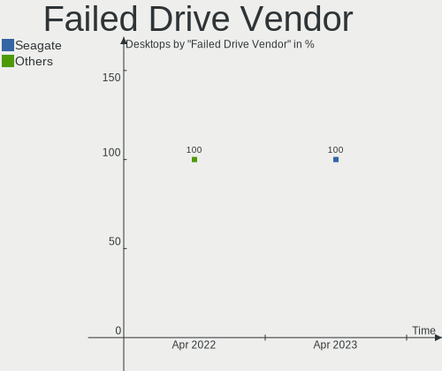
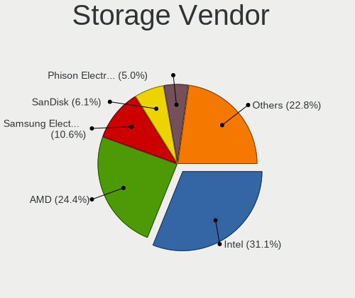
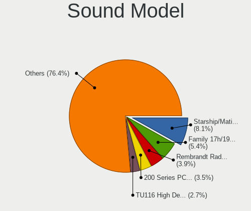

Pop!_OS Hardware Trends (Desktops)
----------------------------------

A project to identify most popular hardware characteristics and track their change
over time based on data collected by Pop!_OS users at https://Linux-Hardware.org.

Anyone can contribute to this report by the [hw-probe](https://github.com/linuxhw/hw-probe) tool:

    sudo -E hw-probe -all -upload

Full-feature report is available here: https://linux-hardware.org/?view=trends

Period: Mar, 2022.

Contents
--------

* [ System ](#system)
  - [ OS                       ](#os)
  - [ OS Family                ](#os-family)
  - [ Kernel                   ](#kernel)
  - [ Kernel Family            ](#kernel-family)
  - [ Kernel Major Ver.        ](#kernel-major-ver)
  - [ Arch                     ](#arch)
  - [ DE                       ](#de)
  - [ Display Server           ](#display-server)
  - [ Display Manager          ](#display-manager)
  - [ OS Lang                  ](#os-lang)
  - [ Boot Mode                ](#boot-mode)
  - [ Filesystem               ](#filesystem)
  - [ Part. scheme             ](#part-scheme)
  - [ Dual Boot with Linux/BSD ](#dual-boot-with-linuxbsd)
  - [ Dual Boot (Win)          ](#dual-boot-win)

* [ Board ](#board)
  - [ Vendor                   ](#vendor)
  - [ Model                    ](#model)
  - [ Model Family             ](#model-family)
  - [ MFG Year                 ](#mfg-year)
  - [ Form Factor              ](#form-factor)
  - [ Secure Boot              ](#secure-boot)
  - [ Coreboot                 ](#coreboot)
  - [ RAM Size                 ](#ram-size)
  - [ RAM Used                 ](#ram-used)
  - [ Total Drives             ](#total-drives)
  - [ Has CD-ROM               ](#has-cd-rom)
  - [ Has Ethernet             ](#has-ethernet)
  - [ Has WiFi                 ](#has-wifi)
  - [ Has Bluetooth            ](#has-bluetooth)

* [ Location ](#location)
  - [ Country                  ](#country)
  - [ City                     ](#city)

* [ Drives ](#drives)
  - [ Drive Vendor             ](#drive-vendor)
  - [ Drive Model              ](#drive-model)
  - [ HDD Vendor               ](#hdd-vendor)
  - [ SSD Vendor               ](#ssd-vendor)
  - [ Drive Kind               ](#drive-kind)
  - [ Drive Connector          ](#drive-connector)
  - [ Drive Size               ](#drive-size)
  - [ Space Total              ](#space-total)
  - [ Space Used               ](#space-used)
  - [ Malfunc. Drives          ](#malfunc-drives)
  - [ Malfunc. Drive Vendor    ](#malfunc-drive-vendor)
  - [ Malfunc. HDD Vendor      ](#malfunc-hdd-vendor)
  - [ Malfunc. Drive Kind      ](#malfunc-drive-kind)
  - [ Failed Drives            ](#failed-drives)
  - [ Failed Drive Vendor      ](#failed-drive-vendor)
  - [ Drive Status             ](#drive-status)

* [ Storage controller ](#storage-controller)
  - [ Storage Vendor           ](#storage-vendor)
  - [ Storage Model            ](#storage-model)
  - [ Storage Kind             ](#storage-kind)

* [ Processor ](#processor)
  - [ CPU Vendor               ](#cpu-vendor)
  - [ CPU Model                ](#cpu-model)
  - [ CPU Model Family         ](#cpu-model-family)
  - [ CPU Cores                ](#cpu-cores)
  - [ CPU Sockets              ](#cpu-sockets)
  - [ CPU Threads              ](#cpu-threads)
  - [ CPU Op-Modes             ](#cpu-op-modes)
  - [ CPU Microcode            ](#cpu-microcode)
  - [ CPU Microarch            ](#cpu-microarch)

* [ Graphics ](#graphics)
  - [ GPU Vendor               ](#gpu-vendor)
  - [ GPU Model                ](#gpu-model)
  - [ GPU Combo                ](#gpu-combo)
  - [ GPU Driver               ](#gpu-driver)
  - [ GPU Memory               ](#gpu-memory)

* [ Monitor ](#monitor)
  - [ Monitor Vendor           ](#monitor-vendor)
  - [ Monitor Model            ](#monitor-model)
  - [ Monitor Resolution       ](#monitor-resolution)
  - [ Monitor Diagonal         ](#monitor-diagonal)
  - [ Monitor Width            ](#monitor-width)
  - [ Aspect Ratio             ](#aspect-ratio)
  - [ Monitor Area             ](#monitor-area)
  - [ Pixel Density            ](#pixel-density)
  - [ Multiple Monitors        ](#multiple-monitors)

* [ Network ](#network)
  - [ Net Controller Vendor    ](#net-controller-vendor)
  - [ Net Controller Model     ](#net-controller-model)
  - [ Wireless Vendor          ](#wireless-vendor)
  - [ Wireless Model           ](#wireless-model)
  - [ Ethernet Vendor          ](#ethernet-vendor)
  - [ Ethernet Model           ](#ethernet-model)
  - [ Net Controller Kind      ](#net-controller-kind)
  - [ Used Controller          ](#used-controller)
  - [ NICs                     ](#nics)
  - [ IPv6                     ](#ipv6)

* [ Bluetooth ](#bluetooth)
  - [ Bluetooth Vendor         ](#bluetooth-vendor)
  - [ Bluetooth Model          ](#bluetooth-model)

* [ Sound ](#sound)
  - [ Sound Vendor             ](#sound-vendor)
  - [ Sound Model              ](#sound-model)

* [ Memory ](#memory)
  - [ Memory Vendor            ](#memory-vendor)
  - [ Memory Model             ](#memory-model)
  - [ Memory Kind              ](#memory-kind)
  - [ Memory Form Factor       ](#memory-form-factor)
  - [ Memory Size              ](#memory-size)
  - [ Memory Speed             ](#memory-speed)

* [ Printers & scanners ](#printers--scanners)
  - [ Printer Vendor           ](#printer-vendor)
  - [ Printer Model            ](#printer-model)
  - [ Scanner Vendor           ](#scanner-vendor)
  - [ Scanner Model            ](#scanner-model)

* [ Camera ](#camera)
  - [ Camera Vendor            ](#camera-vendor)
  - [ Camera Model             ](#camera-model)

* [ Security ](#security)
  - [ Fingerprint Vendor       ](#fingerprint-vendor)
  - [ Fingerprint Model        ](#fingerprint-model)
  - [ Chipcard Vendor          ](#chipcard-vendor)
  - [ Chipcard Model           ](#chipcard-model)

* [ Unsupported ](#unsupported)
  - [ Unsupported Devices      ](#unsupported-devices)
  - [ Unsupported Device Types ](#unsupported-device-types)

System
------

OS
--

Installed operating systems

| Name          | Desktops | Percent |
|---------------|----------|---------|
| Pop!_OS 21.10 | 100      | 80%     |
| Pop!_OS 20.04 | 18       | 14.4%   |
| Pop!_OS 21.04 | 7        | 5.6%    |

OS Family
---------

OS without a version

| Name    | Desktops | Percent |
|---------|----------|---------|
| Pop!_OS | 125      | 100%    |

Kernel
------

Version of the Linux kernel

| Version                  | Desktops | Percent |
|--------------------------|----------|---------|
| 5.16.11-76051611-generic | 94       | 75.2%   |
| 5.15.15-76051515-generic | 12       | 9.6%    |
| 5.15.23-76051523-generic | 6        | 4.8%    |
| 5.15.11-76051511-generic | 6        | 4.8%    |
| 5.11.0-7620-generic      | 2        | 1.6%    |
| 5.16.15-76051615-generic | 1        | 0.8%    |
| 5.15.8-76051508-generic  | 1        | 0.8%    |
| 5.15.0-76051500-generic  | 1        | 0.8%    |
| 5.13.0-7620-generic      | 1        | 0.8%    |
| 5.13.0-7614-generic      | 1        | 0.8%    |

Kernel Family
-------------

Linux kernel without a distro release

| Version | Desktops | Percent |
|---------|----------|---------|
| 5.16.11 | 94       | 75.2%   |
| 5.15.15 | 12       | 9.6%    |
| 5.15.23 | 6        | 4.8%    |
| 5.15.11 | 6        | 4.8%    |
| 5.13.0  | 2        | 1.6%    |
| 5.11.0  | 2        | 1.6%    |
| 5.16.15 | 1        | 0.8%    |
| 5.15.8  | 1        | 0.8%    |
| 5.15.0  | 1        | 0.8%    |

Kernel Major Ver.
-----------------

Linux kernel major version

| Version | Desktops | Percent |
|---------|----------|---------|
| 5.16    | 95       | 76%     |
| 5.15    | 26       | 20.8%   |
| 5.13    | 2        | 1.6%    |
| 5.11    | 2        | 1.6%    |

Arch
----

OS architecture (x86_64, i586, etc.)

| Name   | Desktops | Percent |
|--------|----------|---------|
| x86_64 | 125      | 100%    |

DE
--

Desktop Environment

| Name  | Desktops | Percent |
|-------|----------|---------|
| GNOME | 121      | 96.8%   |
| KDE5  | 4        | 3.2%    |

Display Server
--------------

X11 or Wayland

| Name    | Desktops | Percent |
|---------|----------|---------|
| X11     | 121      | 96.8%   |
| Wayland | 4        | 3.2%    |

Display Manager
---------------

SDDM, LightDM, etc.

| Name    | Desktops | Percent |
|---------|----------|---------|
| Unknown | 111      | 88.8%   |
| GDM     | 14       | 11.2%   |

OS Lang
-------

Language

| Lang  | Desktops | Percent |
|-------|----------|---------|
| en_US | 67       | 53.6%   |
| en_GB | 10       | 8%      |
| pt_BR | 9        | 7.2%    |
| en_AU | 5        | 4%      |
| de_DE | 5        | 4%      |
| en_CA | 4        | 3.2%    |
| C     | 4        | 3.2%    |
| it_IT | 3        | 2.4%    |
| fr_FR | 3        | 2.4%    |
| en_IE | 2        | 1.6%    |
| ru_RU | 1        | 0.8%    |
| pt_PT | 1        | 0.8%    |
| pl_PL | 1        | 0.8%    |
| nb_NO | 1        | 0.8%    |
| hr_HR | 1        | 0.8%    |
| fr_CA | 1        | 0.8%    |
| es_MX | 1        | 0.8%    |
| es_ES | 1        | 0.8%    |
| en_ZA | 1        | 0.8%    |
| en_SG | 1        | 0.8%    |
| en_IN | 1        | 0.8%    |
| en_DK | 1        | 0.8%    |
| cs_CZ | 1        | 0.8%    |

Boot Mode
---------

EFI or BIOS

| Mode | Desktops | Percent |
|------|----------|---------|
| BIOS | 114      | 91.2%   |
| EFI  | 11       | 8.8%    |

Filesystem
----------

Type of filesystem

| Type    | Desktops | Percent |
|---------|----------|---------|
| Ext4    | 123      | 98.4%   |
| Overlay | 1        | 0.8%    |
| Btrfs   | 1        | 0.8%    |

Part. scheme
------------

Scheme of partitioning

| Type    | Desktops | Percent |
|---------|----------|---------|
| Unknown | 111      | 88.8%   |
| GPT     | 11       | 8.8%    |
| MBR     | 3        | 2.4%    |

Dual Boot with Linux/BSD
------------------------

Hosting more than one Linux/BSD

| Dual boot | Desktops | Percent |
|-----------|----------|---------|
| No        | 123      | 98.4%   |
| Yes       | 2        | 1.6%    |

Dual Boot (Win)
---------------

Hosting Linux and Windows

| Dual boot | Desktops | Percent |
|-----------|----------|---------|
| No        | 118      | 94.4%   |
| Yes       | 7        | 5.6%    |

Board
-----

Vendor
------

Motherboard manufacturer

| Name                | Desktops | Percent |
|---------------------|----------|---------|
| ASUSTek Computer    | 40       | 32%     |
| MSI                 | 20       | 16%     |
| Gigabyte Technology | 17       | 13.6%   |
| ASRock              | 11       | 8.8%    |
| Dell                | 8        | 6.4%    |
| Hewlett-Packard     | 7        | 5.6%    |
| Intel               | 3        | 2.4%    |
| Pegatron            | 2        | 1.6%    |
| Medion              | 2        | 1.6%    |
| Lenovo              | 2        | 1.6%    |
| Foxconn             | 2        | 1.6%    |
| ECS                 | 2        | 1.6%    |
| System76            | 1        | 0.8%    |
| Positivo            | 1        | 0.8%    |
| Minix               | 1        | 0.8%    |
| Itautec             | 1        | 0.8%    |
| Biostar             | 1        | 0.8%    |
| Apple               | 1        | 0.8%    |
| Alienware           | 1        | 0.8%    |
| Acer                | 1        | 0.8%    |
| Unknown             | 1        | 0.8%    |

Model
-----

Motherboard model

| Name                                 | Desktops | Percent |
|--------------------------------------|----------|---------|
| ASUS All Series                      | 5        | 4%      |
| MSI MS-7C02                          | 2        | 1.6%    |
| MSI MS-7B84                          | 2        | 1.6%    |
| Intel H61                            | 2        | 1.6%    |
| ASUS TUF GAMING X570-PLUS            | 2        | 1.6%    |
| System76 Thelio                      | 1        | 0.8%    |
| Positivo POS-EIH61CR                 | 1        | 0.8%    |
| Pegatron h8-1380t                    | 1        | 0.8%    |
| Pegatron 520-1108el                  | 1        | 0.8%    |
| MSI WL377AA-ABZ HPE-192it            | 1        | 0.8%    |
| MSI MS-7D09                          | 1        | 0.8%    |
| MSI MS-7C89                          | 1        | 0.8%    |
| MSI MS-7C84                          | 1        | 0.8%    |
| MSI MS-7C09                          | 1        | 0.8%    |
| MSI MS-7B86                          | 1        | 0.8%    |
| MSI MS-7B22                          | 1        | 0.8%    |
| MSI MS-7A74                          | 1        | 0.8%    |
| MSI MS-7A33                          | 1        | 0.8%    |
| MSI MS-7A32                          | 1        | 0.8%    |
| MSI MS-7971                          | 1        | 0.8%    |
| MSI MS-7923                          | 1        | 0.8%    |
| MSI MS-7917                          | 1        | 0.8%    |
| MSI MS-7677                          | 1        | 0.8%    |
| MSI MS-7673                          | 1        | 0.8%    |
| MSI MS-7529                          | 1        | 0.8%    |
| Minix Z83-4                          | 1        | 0.8%    |
| Medion H81H3-EM2                     | 1        | 0.8%    |
| Medion Akoya P2038 D/C335            | 1        | 0.8%    |
| Lenovo Legion Y520T-25IKL 90H7000YUK | 1        | 0.8%    |
| Lenovo Legion T5 26IOB6 90RT00TVKS   | 1        | 0.8%    |
| Itautec Infoway ST-4271              | 1        | 0.8%    |
| Intel DQ77MK                         | 1        | 0.8%    |
| HP Z240 Tower Workstation            | 1        | 0.8%    |
| HP EliteDesk 800 G2 SFF              | 1        | 0.8%    |
| HP EliteDesk 800 G2 DM 65W           | 1        | 0.8%    |
| HP EliteDesk 705 G3 Desktop Mini     | 1        | 0.8%    |
| HP Compaq Elite 8300 CMT             | 1        | 0.8%    |
| HP Compaq 8200 Elite SFF PC          | 1        | 0.8%    |
| HP 870-120                           | 1        | 0.8%    |
| Gigabyte Z77X-UD3H                   | 1        | 0.8%    |
| Gigabyte Z77P-D3                     | 1        | 0.8%    |
| Gigabyte X570 AORUS PRO              | 1        | 0.8%    |
| Gigabyte X570 AORUS ELITE            | 1        | 0.8%    |
| Gigabyte H77N-WIFI                   | 1        | 0.8%    |
| Gigabyte H61M-S1                     | 1        | 0.8%    |
| Gigabyte GA-MA770T-UD3P              | 1        | 0.8%    |
| Gigabyte GA-970A-DS3                 | 1        | 0.8%    |
| Gigabyte EX58-UD4P                   | 1        | 0.8%    |
| Gigabyte B75M-D3H                    | 1        | 0.8%    |
| Gigabyte B660M AORUS PRO AX DDR4     | 1        | 0.8%    |
| Gigabyte B550 GAMING X V2            | 1        | 0.8%    |
| Gigabyte B550 AORUS PRO AC           | 1        | 0.8%    |
| Gigabyte B450M S2H                   | 1        | 0.8%    |
| Gigabyte B450 AORUS M                | 1        | 0.8%    |
| Gigabyte B360 AORUS GAMING 3 WIFI    | 1        | 0.8%    |
| Gigabyte AB350-Gaming 3              | 1        | 0.8%    |
| Foxconn Pro 3500 Series              | 1        | 0.8%    |
| Foxconn H61MXE/-S/-V/-K              | 1        | 0.8%    |
| ECS FZ076AA-ABZ a6670it              | 1        | 0.8%    |
| ECS A55F-M4                          | 1        | 0.8%    |

Model Family
------------

Motherboard model prefix

| Name                    | Desktops | Percent |
|-------------------------|----------|---------|
| ASUS PRIME              | 8        | 6.4%    |
| Dell OptiPlex           | 7        | 5.6%    |
| ASUS ROG                | 7        | 5.6%    |
| ASUS TUF                | 5        | 4%      |
| ASUS All                | 5        | 4%      |
| HP EliteDesk            | 3        | 2.4%    |
| MSI MS-7C02             | 2        | 1.6%    |
| MSI MS-7B84             | 2        | 1.6%    |
| Lenovo Legion           | 2        | 1.6%    |
| Intel H61               | 2        | 1.6%    |
| HP Compaq               | 2        | 1.6%    |
| Gigabyte X570           | 2        | 1.6%    |
| Gigabyte B550           | 2        | 1.6%    |
| ASUS Maximus            | 2        | 1.6%    |
| ASRock X570             | 2        | 1.6%    |
| System76 Thelio         | 1        | 0.8%    |
| Positivo POS-EIH61CR    | 1        | 0.8%    |
| Pegatron h8-1380t       | 1        | 0.8%    |
| Pegatron 520-1108el     | 1        | 0.8%    |
| MSI WL377AA-ABZ         | 1        | 0.8%    |
| MSI MS-7D09             | 1        | 0.8%    |
| MSI MS-7C89             | 1        | 0.8%    |
| MSI MS-7C84             | 1        | 0.8%    |
| MSI MS-7C09             | 1        | 0.8%    |
| MSI MS-7B86             | 1        | 0.8%    |
| MSI MS-7B22             | 1        | 0.8%    |
| MSI MS-7A74             | 1        | 0.8%    |
| MSI MS-7A33             | 1        | 0.8%    |
| MSI MS-7A32             | 1        | 0.8%    |
| MSI MS-7971             | 1        | 0.8%    |
| MSI MS-7923             | 1        | 0.8%    |
| MSI MS-7917             | 1        | 0.8%    |
| MSI MS-7677             | 1        | 0.8%    |
| MSI MS-7673             | 1        | 0.8%    |
| MSI MS-7529             | 1        | 0.8%    |
| Minix Z83-4             | 1        | 0.8%    |
| Medion H81H3-EM2        | 1        | 0.8%    |
| Medion Akoya            | 1        | 0.8%    |
| Itautec Infoway         | 1        | 0.8%    |
| Intel DQ77MK            | 1        | 0.8%    |
| HP Z240                 | 1        | 0.8%    |
| HP 870-120              | 1        | 0.8%    |
| Gigabyte Z77X-UD3H      | 1        | 0.8%    |
| Gigabyte Z77P-D3        | 1        | 0.8%    |
| Gigabyte H77N-WIFI      | 1        | 0.8%    |
| Gigabyte H61M-S1        | 1        | 0.8%    |
| Gigabyte GA-MA770T-UD3P | 1        | 0.8%    |
| Gigabyte GA-970A-DS3    | 1        | 0.8%    |
| Gigabyte EX58-UD4P      | 1        | 0.8%    |
| Gigabyte B75M-D3H       | 1        | 0.8%    |
| Gigabyte B660M          | 1        | 0.8%    |
| Gigabyte B450M          | 1        | 0.8%    |
| Gigabyte B450           | 1        | 0.8%    |
| Gigabyte B360           | 1        | 0.8%    |
| Gigabyte AB350-Gaming   | 1        | 0.8%    |
| Foxconn Pro             | 1        | 0.8%    |
| Foxconn H61MXE          | 1        | 0.8%    |
| ECS FZ076AA-ABZ         | 1        | 0.8%    |
| ECS A55F-M4             | 1        | 0.8%    |
| Dell Precision          | 1        | 0.8%    |

MFG Year
--------

Motherboard manufacture year

| Year | Desktops | Percent |
|------|----------|---------|
| 2018 | 17       | 13.6%   |
| 2012 | 16       | 12.8%   |
| 2019 | 12       | 9.6%    |
| 2020 | 11       | 8.8%    |
| 2011 | 11       | 8.8%    |
| 2021 | 9        | 7.2%    |
| 2017 | 9        | 7.2%    |
| 2013 | 8        | 6.4%    |
| 2015 | 7        | 5.6%    |
| 2014 | 7        | 5.6%    |
| 2010 | 6        | 4.8%    |
| 2016 | 5        | 4%      |
| 2009 | 3        | 2.4%    |
| 2008 | 2        | 1.6%    |
| 2022 | 1        | 0.8%    |
| 2007 | 1        | 0.8%    |

Form Factor
-----------

Physical design of the computer

| Name    | Desktops | Percent |
|---------|----------|---------|
| Desktop | 125      | 100%    |

Secure Boot
-----------

Enabled or disabled

| State    | Desktops | Percent |
|----------|----------|---------|
| Disabled | 124      | 99.2%   |
| Enabled  | 1        | 0.8%    |

Coreboot
--------

Have coreboot on board

| Used | Desktops | Percent |
|------|----------|---------|
| No   | 125      | 100%    |

RAM Size
--------

Total RAM memory

| Size in GB      | Desktops | Percent |
|-----------------|----------|---------|
| 16.01-24.0      | 34       | 27.2%   |
| 32.01-64.0      | 30       | 24%     |
| 8.01-16.0       | 29       | 23.2%   |
| 4.01-8.0        | 15       | 12%     |
| 3.01-4.0        | 10       | 8%      |
| 64.01-256.0     | 5        | 4%      |
| More than 256.0 | 1        | 0.8%    |
| 24.01-32.0      | 1        | 0.8%    |

RAM Used
--------

Used RAM memory

| Used GB    | Desktops | Percent |
|------------|----------|---------|
| 2.01-3.0   | 36       | 28.8%   |
| 4.01-8.0   | 28       | 22.4%   |
| 1.01-2.0   | 26       | 20.8%   |
| 3.01-4.0   | 24       | 19.2%   |
| 8.01-16.0  | 8        | 6.4%    |
| 16.01-24.0 | 2        | 1.6%    |
| 24.01-32.0 | 1        | 0.8%    |

Total Drives
------------

Number of drives on board

| Drives | Desktops | Percent |
|--------|----------|---------|
| 2      | 39       | 31.2%   |
| 1      | 39       | 31.2%   |
| 3      | 32       | 25.6%   |
| 4      | 8        | 6.4%    |
| 5      | 5        | 4%      |
| 6      | 2        | 1.6%    |

Has CD-ROM
----------

Has CD-ROM on board

| Presented | Desktops | Percent |
|-----------|----------|---------|
| No        | 81       | 64.8%   |
| Yes       | 44       | 35.2%   |

Has Ethernet
------------

Has Ethernet on board

| Presented | Desktops | Percent |
|-----------|----------|---------|
| Yes       | 122      | 97.6%   |
| No        | 3        | 2.4%    |

Has WiFi
--------

Has WiFi module

| Presented | Desktops | Percent |
|-----------|----------|---------|
| Yes       | 77       | 61.6%   |
| No        | 48       | 38.4%   |

Has Bluetooth
-------------

Has Bluetooth module

| Presented | Desktops | Percent |
|-----------|----------|---------|
| No        | 81       | 64.8%   |
| Yes       | 44       | 35.2%   |

Location
--------

Country
-------

Geographic location (country)

| Country      | Desktops | Percent |
|--------------|----------|---------|
| USA          | 42       | 33.6%   |
| Brazil       | 10       | 8%      |
| Australia    | 8        | 6.4%    |
| UK           | 7        | 5.6%    |
| Germany      | 7        | 5.6%    |
| Canada       | 7        | 5.6%    |
| Netherlands  | 5        | 4%      |
| Italy        | 4        | 3.2%    |
| Russia       | 3        | 2.4%    |
| France       | 3        | 2.4%    |
| Switzerland  | 2        | 1.6%    |
| Portugal     | 2        | 1.6%    |
| Poland       | 2        | 1.6%    |
| Ireland      | 2        | 1.6%    |
| India        | 2        | 1.6%    |
| Thailand     | 1        | 0.8%    |
| Spain        | 1        | 0.8%    |
| South Africa | 1        | 0.8%    |
| Slovakia     | 1        | 0.8%    |
| Singapore    | 1        | 0.8%    |
| Saudi Arabia | 1        | 0.8%    |
| Romania      | 1        | 0.8%    |
| Norway       | 1        | 0.8%    |
| Mexico       | 1        | 0.8%    |
| Malaysia     | 1        | 0.8%    |
| Lithuania    | 1        | 0.8%    |
| Israel       | 1        | 0.8%    |
| Greece       | 1        | 0.8%    |
| Denmark      | 1        | 0.8%    |
| Czechia      | 1        | 0.8%    |
| Croatia      | 1        | 0.8%    |
| Bulgaria     | 1        | 0.8%    |
| Belgium      | 1        | 0.8%    |
| Bangladesh   | 1        | 0.8%    |

City
----

Geographic location (city)

| City                           | Desktops | Percent |
|--------------------------------|----------|---------|
| Rome                           | 3        | 2.4%    |
| Tuam                           | 2        | 1.6%    |
| Sydney                         | 2        | 1.6%    |
| Reading                        | 2        | 1.6%    |
| Manaus                         | 2        | 1.6%    |
| Houston                        | 2        | 1.6%    |
| Brooklyn                       | 2        | 1.6%    |
| Bozeman                        | 2        | 1.6%    |
| Zoetermeer                     | 1        | 0.8%    |
| Žilina                        | 1        | 0.8%    |
| Yaroslavl                      | 1        | 0.8%    |
| Wylie                          | 1        | 0.8%    |
| Woodstock                      | 1        | 0.8%    |
| Well                           | 1        | 0.8%    |
| Warsaw                         | 1        | 0.8%    |
| Walterboro                     | 1        | 0.8%    |
| Vilnius                        | 1        | 0.8%    |
| Villingen-Schwenningen         | 1        | 0.8%    |
| Versfelde                      | 1        | 0.8%    |
| Ulm                            | 1        | 0.8%    |
| Tucson                         | 1        | 0.8%    |
| The Hague                      | 1        | 0.8%    |
| Tallahassee                    | 1        | 0.8%    |
| Sunnyside                      | 1        | 0.8%    |
| Springdale                     | 1        | 0.8%    |
| Spokane                        | 1        | 0.8%    |
| Sioux Falls                    | 1        | 0.8%    |
| Singapore                      | 1        | 0.8%    |
| Seattle                        | 1        | 0.8%    |
| Sarasota                       | 1        | 0.8%    |
| San Ramon                      | 1        | 0.8%    |
| Saint-Georges-les-Baillargeaux | 1        | 0.8%    |
| Riyadh                         | 1        | 0.8%    |
| Rindge                         | 1        | 0.8%    |
| Riehen                         | 1        | 0.8%    |
| Registro                       | 1        | 0.8%    |
| Recife                         | 1        | 0.8%    |
| Prague                         | 1        | 0.8%    |
| Port Alberni                   | 1        | 0.8%    |
| Poitiers                       | 1        | 0.8%    |
| Piccarello                     | 1        | 0.8%    |
| Parkersburg                    | 1        | 0.8%    |
| Ogden                          | 1        | 0.8%    |
| Novi Marof                     | 1        | 0.8%    |
| Norwalk                        | 1        | 0.8%    |
| North Shields                  | 1        | 0.8%    |
| Noisy-le-Roi                   | 1        | 0.8%    |
| New York                       | 1        | 0.8%    |
| Muncie                         | 1        | 0.8%    |
| Morgan Hill                    | 1        | 0.8%    |
| Montreal                       | 1        | 0.8%    |
| Monterrey                      | 1        | 0.8%    |
| Mississauga                    | 1        | 0.8%    |
| Miami                          | 1        | 0.8%    |
| Melbourne                      | 1        | 0.8%    |
| Manchester                     | 1        | 0.8%    |
| Manassas                       | 1        | 0.8%    |
| Macapa                         | 1        | 0.8%    |
| Lousã                         | 1        | 0.8%    |
| Louisville                     | 1        | 0.8%    |

Drives
------

Drive Vendor
------------

Hard drive vendors

| Vendor                    | Desktops | Drives | Percent |
|---------------------------|----------|--------|---------|
| WDC                       | 46       | 58     | 19.09%  |
| Seagate                   | 44       | 50     | 18.26%  |
| Samsung Electronics       | 43       | 57     | 17.84%  |
| Sandisk                   | 19       | 21     | 7.88%   |
| Kingston                  | 11       | 12     | 4.56%   |
| Hitachi                   | 8        | 10     | 3.32%   |
| Crucial                   | 8        | 9      | 3.32%   |
| Intel                     | 6        | 7      | 2.49%   |
| Toshiba                   | 5        | 5      | 2.07%   |
| Micron/Crucial Technology | 4        | 4      | 1.66%   |
| A-DATA Technology         | 4        | 4      | 1.66%   |
| Unknown                   | 3        | 3      | 1.24%   |
| SK Hynix                  | 3        | 3      | 1.24%   |
| Silicon Motion            | 3        | 3      | 1.24%   |
| Micron Technology         | 3        | 4      | 1.24%   |
| XPG                       | 2        | 2      | 0.83%   |
| Team                      | 2        | 2      | 0.83%   |
| SPCC                      | 2        | 2      | 0.83%   |
| SABRENT                   | 2        | 2      | 0.83%   |
| Patriot                   | 2        | 2      | 0.83%   |
| Lexar                     | 2        | 2      | 0.83%   |
| China                     | 2        | 2      | 0.83%   |
| Transcend                 | 1        | 1      | 0.41%   |
| Teutons                   | 1        | 1      | 0.41%   |
| PNY                       | 1        | 1      | 0.41%   |
| Phison                    | 1        | 1      | 0.41%   |
| oyunkey                   | 1        | 1      | 0.41%   |
| OCZ                       | 1        | 1      | 0.41%   |
| KingSpec                  | 1        | 2      | 0.41%   |
| Kingchuxing               | 1        | 1      | 0.41%   |
| JetDrive                  | 1        | 1      | 0.41%   |
| Intenso                   | 1        | 1      | 0.41%   |
| Hewlett-Packard           | 1        | 1      | 0.41%   |
| Gigabyte Technology       | 1        | 1      | 0.41%   |
| DOGFISH                   | 1        | 1      | 0.41%   |
| Corsair                   | 1        | 1      | 0.41%   |
| Colorful                  | 1        | 1      | 0.41%   |
| AMD                       | 1        | 1      | 0.41%   |
| Unknown                   | 1        | 1      | 0.41%   |

Drive Model
-----------

Hard drive models

| Model                             | Desktops | Percent |
|-----------------------------------|----------|---------|
| Samsung NVMe SSD Drive 1TB        | 9        | 3.32%   |
| Sandisk NVMe SSD Drive 1TB        | 8        | 2.95%   |
| Samsung SSD 850 EVO 250GB         | 5        | 1.85%   |
| Samsung NVMe SSD Drive 500GB      | 5        | 1.85%   |
| WDC WD10EZEX-08WN4A0 1TB          | 4        | 1.48%   |
| Samsung SSD 850 EVO 500GB         | 4        | 1.48%   |
| Seagate ST1000DM010-2EP102 1TB    | 3        | 1.11%   |
| Sandisk NVMe SSD Drive 500GB      | 3        | 1.11%   |
| Samsung SSD 870 QVO 1TB           | 3        | 1.11%   |
| WDC WDS100T2B0A-00SM50 1TB SSD    | 2        | 0.74%   |
| WDC WD5000AAKX-75U6AA0 500GB      | 2        | 0.74%   |
| WDC WD3200AAJS-60Z0A0 320GB       | 2        | 0.74%   |
| WDC WD20EZRZ-00Z5HB0 2TB          | 2        | 0.74%   |
| WDC WD20EZAZ-00GGJB0 2TB          | 2        | 0.74%   |
| WDC WD10EZEX-60WN4A0 1TB          | 2        | 0.74%   |
| WDC WD10EZEX-60M2NA0 1TB          | 2        | 0.74%   |
| Seagate ST500DM002-1BD142 500GB   | 2        | 0.74%   |
| Seagate ST3500413AS 500GB         | 2        | 0.74%   |
| Seagate ST3500312CS 500GB         | 2        | 0.74%   |
| Seagate ST2000DM008-2FR102 2TB    | 2        | 0.74%   |
| Seagate ST2000DM006-2DM164 2TB    | 2        | 0.74%   |
| Seagate ST1000DM003-1CH162 1TB    | 2        | 0.74%   |
| SanDisk SSD PLUS 120GB            | 2        | 0.74%   |
| Samsung SSD 860 EVO 500GB         | 2        | 0.74%   |
| Samsung SSD 860 EVO 1TB           | 2        | 0.74%   |
| Samsung SSD 840 EVO 120GB         | 2        | 0.74%   |
| Samsung NVMe SSD Drive 512GB      | 2        | 0.74%   |
| SABRENT Disk 1TB                  | 2        | 0.74%   |
| Micron/Crucial NVMe SSD Drive 1TB | 2        | 0.74%   |
| Lexar 240GB SSD                   | 2        | 0.74%   |
| Kingston SA400S37480G 480GB SSD   | 2        | 0.74%   |
| Kingston SA400S37120G 120GB SSD   | 2        | 0.74%   |
| Hitachi HDT721064SLA360 640GB     | 2        | 0.74%   |
| Hitachi HDS721032CLA362 320GB     | 2        | 0.74%   |
| Crucial CT500MX500SSD1 500GB      | 2        | 0.74%   |
| Crucial CT1000BX500SSD1 1TB       | 2        | 0.74%   |
| XPG NVMe SSD Drive 512GB          | 1        | 0.37%   |
| XPG NVMe SSD Drive 2TB            | 1        | 0.37%   |
| WDC WDS500G2B0A-00SM50 500GB SSD  | 1        | 0.37%   |
| WDC WDS500G1B0B-00AS40 500GB SSD  | 1        | 0.37%   |
| WDC WDS250G2B0B-00YS70 250GB SSD  | 1        | 0.37%   |
| WDC WDS240G2G0A-00JH30 240GB SSD  | 1        | 0.37%   |
| WDC WDS120G2G0B-00EPW0 120GB SSD  | 1        | 0.37%   |
| WDC WDBNCE5000PNC 500GB SSD       | 1        | 0.37%   |
| WDC WD7502ABYS-02A6B0 752GB       | 1        | 0.37%   |
| WDC WD5000BPVT-22HXZT3 500GB      | 1        | 0.37%   |
| WDC WD5000BEVT-22ZAT0 500GB       | 1        | 0.37%   |
| WDC WD5000AVDS-63U7B1 500GB       | 1        | 0.37%   |
| WDC WD5000AAKX-08ERMA0 500GB      | 1        | 0.37%   |
| WDC WD5000AAKS-00YGA0 500GB       | 1        | 0.37%   |
| WDC WD5000AAKS-00V1A0 500GB       | 1        | 0.37%   |
| WDC WD3200AAJS-65B4A0 320GB       | 1        | 0.37%   |
| WDC WD30EZRX-00D8PB0 3TB          | 1        | 0.37%   |
| WDC WD3000F9YZ-09N20L0 3TB        | 1        | 0.37%   |
| WDC WD2500JD-98H 250GB            | 1        | 0.37%   |
| WDC WD2500BJKT-75F4T0 250GB       | 1        | 0.37%   |
| WDC WD2500AAJS-00L7A0 250GB       | 1        | 0.37%   |
| WDC WD20EZBX-00AYRA0 2TB          | 1        | 0.37%   |
| WDC WD20EARS-60MVWB0 2TB          | 1        | 0.37%   |
| WDC WD15EARS-22MVWB0 1TB          | 1        | 0.37%   |

HDD Vendor
----------

Hard disk drive vendors

| Vendor              | Desktops | Drives | Percent |
|---------------------|----------|--------|---------|
| Seagate             | 42       | 48     | 41.18%  |
| WDC                 | 41       | 50     | 40.2%   |
| Hitachi             | 8        | 10     | 7.84%   |
| Toshiba             | 5        | 5      | 4.9%    |
| Samsung Electronics | 3        | 4      | 2.94%   |
| SABRENT             | 2        | 2      | 1.96%   |
| Unknown             | 1        | 1      | 0.98%   |

SSD Vendor
----------

Solid state drive vendors

| Vendor              | Desktops | Drives | Percent |
|---------------------|----------|--------|---------|
| Samsung Electronics | 27       | 34     | 30.68%  |
| WDC                 | 8        | 8      | 9.09%   |
| Kingston            | 8        | 9      | 9.09%   |
| Crucial             | 8        | 9      | 9.09%   |
| SanDisk             | 7        | 7      | 7.95%   |
| A-DATA Technology   | 3        | 3      | 3.41%   |
| Team                | 2        | 2      | 2.27%   |
| SPCC                | 2        | 2      | 2.27%   |
| Patriot             | 2        | 2      | 2.27%   |
| Micron Technology   | 2        | 2      | 2.27%   |
| Lexar               | 2        | 2      | 2.27%   |
| Intel               | 2        | 3      | 2.27%   |
| China               | 2        | 2      | 2.27%   |
| Transcend           | 1        | 1      | 1.14%   |
| Teutons             | 1        | 1      | 1.14%   |
| SK Hynix            | 1        | 1      | 1.14%   |
| Seagate             | 1        | 1      | 1.14%   |
| PNY                 | 1        | 1      | 1.14%   |
| OCZ                 | 1        | 1      | 1.14%   |
| KingSpec            | 1        | 2      | 1.14%   |
| Intenso             | 1        | 1      | 1.14%   |
| Hewlett-Packard     | 1        | 1      | 1.14%   |
| DOGFISH             | 1        | 1      | 1.14%   |
| Corsair             | 1        | 1      | 1.14%   |
| Colorful            | 1        | 1      | 1.14%   |
| AMD                 | 1        | 1      | 1.14%   |

Drive Kind
----------

HDD or SSD

| Kind    | Desktops | Drives | Percent |
|---------|----------|--------|---------|
| HDD     | 83       | 120    | 41.29%  |
| SSD     | 70       | 99     | 34.83%  |
| NVMe    | 42       | 57     | 20.9%   |
| Unknown | 5        | 5      | 2.49%   |
| MMC     | 1        | 1      | 0.5%    |

Drive Connector
---------------

SATA, SAS, NVMe, etc.

| Type | Desktops | Drives | Percent |
|------|----------|--------|---------|
| SATA | 112      | 212    | 67.88%  |
| NVMe | 42       | 57     | 25.45%  |
| SAS  | 10       | 12     | 6.06%   |
| MMC  | 1        | 1      | 0.61%   |

Drive Size
----------

Size of hard drive

| Size in TB | Desktops | Drives | Percent |
|------------|----------|--------|---------|
| 0.01-0.5   | 81       | 121    | 51.92%  |
| 0.51-1.0   | 51       | 66     | 32.69%  |
| 1.01-2.0   | 14       | 19     | 8.97%   |
| 3.01-4.0   | 4        | 7      | 2.56%   |
| 2.01-3.0   | 3        | 3      | 1.92%   |
| 4.01-10.0  | 3        | 3      | 1.92%   |

Space Total
-----------

Amount of disk space available on the file system

| Size in GB     | Desktops | Percent |
|----------------|----------|---------|
| 101-250        | 35       | 28%     |
| 501-1000       | 25       | 20%     |
| 251-500        | 21       | 16.8%   |
| 1001-2000      | 16       | 12.8%   |
| More than 3000 | 13       | 10.4%   |
| 2001-3000      | 7        | 5.6%    |
| 21-50          | 4        | 3.2%    |
| 1-20           | 2        | 1.6%    |
| 51-100         | 2        | 1.6%    |

Space Used
----------

Amount of used disk space

| Used GB        | Desktops | Percent |
|----------------|----------|---------|
| 1-20           | 33       | 26.4%   |
| 21-50          | 22       | 17.6%   |
| 51-100         | 19       | 15.2%   |
| 101-250        | 17       | 13.6%   |
| 251-500        | 11       | 8.8%    |
| 501-1000       | 11       | 8.8%    |
| 1001-2000      | 8        | 6.4%    |
| More than 3000 | 3        | 2.4%    |
| 2001-3000      | 1        | 0.8%    |

Malfunc. Drives
---------------

Drive models with a malfunction

| Model                         | Desktops | Drives | Percent |
|-------------------------------|----------|--------|---------|
| WDC WD10EZEX-60M2NA0 1TB      | 1        | 1      | 20%     |
| Toshiba MQ01ABD100 1TB        | 1        | 1      | 20%     |
| Toshiba HDWD110 1TB           | 1        | 1      | 20%     |
| SPCC Solid State Disk 256GB   | 1        | 1      | 20%     |
| Hitachi HDP725050GLA360 500GB | 1        | 1      | 20%     |

Malfunc. Drive Vendor
---------------------

Vendors of faulty drives

| Vendor  | Desktops | Drives | Percent |
|---------|----------|--------|---------|
| Toshiba | 2        | 2      | 40%     |
| WDC     | 1        | 1      | 20%     |
| SPCC    | 1        | 1      | 20%     |
| Hitachi | 1        | 1      | 20%     |

Malfunc. HDD Vendor
-------------------

Vendors of faulty HDD drives

| Vendor  | Desktops | Drives | Percent |
|---------|----------|--------|---------|
| Toshiba | 2        | 2      | 50%     |
| WDC     | 1        | 1      | 25%     |
| Hitachi | 1        | 1      | 25%     |

Malfunc. Drive Kind
-------------------

Kinds of faulty drives

| Kind | Desktops | Drives | Percent |
|------|----------|--------|---------|
| HDD  | 4        | 4      | 80%     |
| SSD  | 1        | 1      | 20%     |

Failed Drives
-------------

Failed drive models

| Model                  | Desktops | Drives | Percent |
|------------------------|----------|--------|---------|
| Patriot Pyro SSD 120GB | 1        | 1      | 100%    |

Failed Drive Vendor
-------------------

Failed drive vendors

| Vendor  | Desktops | Drives | Percent |
|---------|----------|--------|---------|
| Patriot | 1        | 1      | 100%    |

Drive Status
------------

Number of failed and malfunc. drives

| Status   | Desktops | Drives | Percent |
|----------|----------|--------|---------|
| Detected | 111      | 254    | 86.72%  |
| Works    | 11       | 22     | 8.59%   |
| Malfunc  | 5        | 5      | 3.91%   |
| Failed   | 1        | 1      | 0.78%   |

Storage controller
------------------

Storage Vendor
--------------

Storage controller vendors

| Vendor                      | Desktops | Percent |
|-----------------------------|----------|---------|
| Intel                       | 86       | 44.56%  |
| AMD                         | 40       | 20.73%  |
| Samsung Electronics         | 19       | 9.84%   |
| Sandisk                     | 12       | 6.22%   |
| JMicron Technology          | 7        | 3.63%   |
| ASMedia Technology          | 5        | 2.59%   |
| Micron/Crucial Technology   | 4        | 2.07%   |
| Silicon Motion              | 3        | 1.55%   |
| Marvell Technology Group    | 3        | 1.55%   |
| Kingston Technology Company | 3        | 1.55%   |
| SK Hynix                    | 2        | 1.04%   |
| Phison Electronics          | 2        | 1.04%   |
| Nvidia                      | 2        | 1.04%   |
| ADATA Technology            | 2        | 1.04%   |
| Unknown                     | 1        | 0.52%   |
| Realtek Semiconductor       | 1        | 0.52%   |
| Micron Technology           | 1        | 0.52%   |

Storage Model
-------------

Storage controller models

| Model                                                                                   | Desktops | Percent |
|-----------------------------------------------------------------------------------------|----------|---------|
| AMD FCH SATA Controller [AHCI mode]                                                     | 26       | 11.21%  |
| Intel 6 Series/C200 Series Chipset Family 6 port Desktop SATA AHCI Controller           | 13       | 5.6%    |
| AMD 400 Series Chipset SATA Controller                                                  | 10       | 4.31%   |
| Samsung NVMe SSD Controller SM981/PM981/PM983                                           | 9        | 3.88%   |
| Intel Q170/Q150/B150/H170/H110/Z170/CM236 Chipset SATA Controller [AHCI Mode]           | 8        | 3.45%   |
| Intel 8 Series/C220 Series Chipset Family 6-port SATA Controller 1 [AHCI mode]          | 7        | 3.02%   |
| Intel SATA Controller [RAID mode]                                                       | 6        | 2.59%   |
| Intel Cannon Lake PCH SATA AHCI Controller                                              | 6        | 2.59%   |
| Intel 7 Series/C210 Series Chipset Family 6-port SATA Controller [AHCI mode]            | 6        | 2.59%   |
| Intel 6 Series/C200 Series Chipset Family Desktop SATA Controller (IDE mode, ports 4-5) | 6        | 2.59%   |
| Intel 6 Series/C200 Series Chipset Family Desktop SATA Controller (IDE mode, ports 0-3) | 6        | 2.59%   |
| AMD 500 Series Chipset SATA Controller                                                  | 6        | 2.59%   |
| Intel 9 Series Chipset Family SATA Controller [AHCI Mode]                               | 5        | 2.16%   |
| Intel 500 Series Chipset Family SATA AHCI Controller                                    | 5        | 2.16%   |
| Samsung NVMe SSD Controller PM9A1/PM9A3/980PRO                                          | 4        | 1.72%   |
| Intel 200 Series PCH SATA controller [AHCI mode]                                        | 4        | 1.72%   |
| ASMedia ASM1062 Serial ATA Controller                                                   | 4        | 1.72%   |
| Silicon Motion SM2263EN/SM2263XT SSD Controller                                         | 3        | 1.29%   |
| Sandisk WD Black 2018/SN750 / PC SN720 NVMe SSD                                         | 3        | 1.29%   |
| Sandisk Non-Volatile memory controller                                                  | 3        | 1.29%   |
| Samsung NVMe SSD Controller 980                                                         | 3        | 1.29%   |
| JMicron JMB362 SATA Controller                                                          | 3        | 1.29%   |
| AMD SB7x0/SB8x0/SB9x0 SATA Controller [AHCI mode]                                       | 3        | 1.29%   |
| Sandisk WD Blue SN570 NVMe SSD                                                          | 2        | 0.86%   |
| Sandisk WD Blue SN550 NVMe SSD                                                          | 2        | 0.86%   |
| Sandisk WD Blue SN500 / PC SN520 NVMe SSD                                               | 2        | 0.86%   |
| Samsung NVMe SSD Controller SM951/PM951                                                 | 2        | 0.86%   |
| Micron/Crucial P1 NVMe PCIe SSD                                                         | 2        | 0.86%   |
| Micron/Crucial NVMe Controller                                                          | 2        | 0.86%   |
| Kingston Company Company Non-Volatile memory controller                                 | 2        | 0.86%   |
| JMicron JMB368 IDE controller                                                           | 2        | 0.86%   |
| JMicron JMB363 SATA/IDE Controller                                                      | 2        | 0.86%   |
| Intel Non-Volatile memory controller                                                    | 2        | 0.86%   |
| Intel Alder Lake-S PCH SATA Controller [AHCI Mode]                                      | 2        | 0.86%   |
| Intel 82801JI (ICH10 Family) 4 port SATA IDE Controller #1                              | 2        | 0.86%   |
| Intel 82801JI (ICH10 Family) 2 port SATA IDE Controller #2                              | 2        | 0.86%   |
| Intel 5 Series/3400 Series Chipset 4 port SATA IDE Controller                           | 2        | 0.86%   |
| Intel 5 Series/3400 Series Chipset 2 port SATA IDE Controller                           | 2        | 0.86%   |
| Intel 400 Series Chipset Family SATA AHCI Controller                                    | 2        | 0.86%   |
| AMD X370 Series Chipset SATA Controller                                                 | 2        | 0.86%   |
| AMD SB7x0/SB8x0/SB9x0 IDE Controller                                                    | 2        | 0.86%   |
| AMD FCH SATA Controller [IDE mode]                                                      | 2        | 0.86%   |
| AMD FCH IDE Controller                                                                  | 2        | 0.86%   |
| AMD 300 Series Chipset SATA Controller                                                  | 2        | 0.86%   |
| ADATA XPG SX8200 Pro PCIe Gen3x4 M.2 2280 Solid State Drive                             | 2        | 0.86%   |
| Unknown Non-Volatile memory controller                                                  | 1        | 0.43%   |
| SK Hynix Non-Volatile memory controller                                                 | 1        | 0.43%   |
| SK Hynix BC501 NVMe Solid State Drive                                                   | 1        | 0.43%   |
| Sandisk WD PC SN810 / Black SN850 NVMe SSD                                              | 1        | 0.43%   |
| Sandisk WD Black SN750 / PC SN730 NVMe SSD                                              | 1        | 0.43%   |
| Samsung NVMe SSD Controller SM961/PM961/SM963                                           | 1        | 0.43%   |
| Realtek Realtek Non-Volatile memory controller                                          | 1        | 0.43%   |
| Phison PS5013 E13 NVMe Controller                                                       | 1        | 0.43%   |
| Phison E12 NVMe Controller                                                              | 1        | 0.43%   |
| Nvidia MCP78S [GeForce 8200] IDE                                                        | 1        | 0.43%   |
| Nvidia MCP78S [GeForce 8200] AHCI Controller                                            | 1        | 0.43%   |
| Nvidia MCP61 SATA Controller                                                            | 1        | 0.43%   |
| Nvidia MCP61 IDE                                                                        | 1        | 0.43%   |
| Micron Non-Volatile memory controller                                                   | 1        | 0.43%   |
| Marvell Group 88SE91A3 SATA-600 Controller                                              | 1        | 0.43%   |

Storage Kind
------------

Kind of storage controller (IDE, SATA, NVMe, SAS, ...)

| Kind | Desktops | Percent |
|------|----------|---------|
| SATA | 105      | 59.32%  |
| NVMe | 42       | 23.73%  |
| IDE  | 22       | 12.43%  |
| RAID | 8        | 4.52%   |

Processor
---------

CPU Vendor
----------

Processor vendors

| Vendor | Desktops | Percent |
|--------|----------|---------|
| Intel  | 83       | 66.4%   |
| AMD    | 42       | 33.6%   |

CPU Model
---------

Processor models

| Model                                       | Desktops | Percent |
|---------------------------------------------|----------|---------|
| AMD Ryzen 7 3700X 8-Core Processor          | 4        | 3.2%    |
| AMD Ryzen 5 3600 6-Core Processor           | 4        | 3.2%    |
| Intel Core i7-4790K CPU @ 4.00GHz           | 3        | 2.4%    |
| Intel Core i7-2600K CPU @ 3.40GHz           | 3        | 2.4%    |
| Intel Core i5-6500 CPU @ 3.20GHz            | 3        | 2.4%    |
| Intel Core i5-3470 CPU @ 3.20GHz            | 3        | 2.4%    |
| Intel Core i5-2500K CPU @ 3.30GHz           | 3        | 2.4%    |
| Intel Core i5-2400 CPU @ 3.10GHz            | 3        | 2.4%    |
| Intel Core i3-3240 CPU @ 3.40GHz            | 3        | 2.4%    |
| Intel Core i9-9900K CPU @ 3.60GHz           | 2        | 1.6%    |
| Intel Core i7-4790 CPU @ 3.60GHz            | 2        | 1.6%    |
| Intel Core i7-4770 CPU @ 3.40GHz            | 2        | 1.6%    |
| Intel Core i5-7400 CPU @ 3.00GHz            | 2        | 1.6%    |
| Intel Core i5-3570K CPU @ 3.40GHz           | 2        | 1.6%    |
| Intel Core i3-8100 CPU @ 3.60GHz            | 2        | 1.6%    |
| AMD Ryzen 7 5700G with Radeon Graphics      | 2        | 1.6%    |
| AMD Ryzen 7 2700X Eight-Core Processor      | 2        | 1.6%    |
| AMD Ryzen 7 1700X Eight-Core Processor      | 2        | 1.6%    |
| AMD Ryzen 5 5600X 6-Core Processor          | 2        | 1.6%    |
| AMD Ryzen 5 2600 Six-Core Processor         | 2        | 1.6%    |
| AMD A8-3850 APU with Radeon HD Graphics     | 2        | 1.6%    |
| Intel Xeon CPU X3470 @ 2.93GHz              | 1        | 0.8%    |
| Intel Xeon CPU W3680 @ 3.33GHz              | 1        | 0.8%    |
| Intel Xeon CPU E5462 @ 2.80GHz              | 1        | 0.8%    |
| Intel Xeon CPU E5-1620 v3 @ 3.50GHz         | 1        | 0.8%    |
| Intel Pentium Dual-Core CPU E5300 @ 2.60GHz | 1        | 0.8%    |
| Intel Pentium CPU G4560 @ 3.50GHz           | 1        | 0.8%    |
| Intel Pentium CPU G2010 @ 2.80GHz           | 1        | 0.8%    |
| Intel Core i9-10920X CPU @ 3.50GHz          | 1        | 0.8%    |
| Intel Core i7-9700F CPU @ 3.00GHz           | 1        | 0.8%    |
| Intel Core i7-8709G CPU @ 3.10GHz           | 1        | 0.8%    |
| Intel Core i7-7700 CPU @ 3.60GHz            | 1        | 0.8%    |
| Intel Core i7-6700K CPU @ 4.00GHz           | 1        | 0.8%    |
| Intel Core i7-6700 CPU @ 3.40GHz            | 1        | 0.8%    |
| Intel Core i7-4820K CPU @ 3.70GHz           | 1        | 0.8%    |
| Intel Core i7-3820 CPU @ 3.60GHz            | 1        | 0.8%    |
| Intel Core i7-3770K CPU @ 3.50GHz           | 1        | 0.8%    |
| Intel Core i7-2600 CPU @ 3.40GHz            | 1        | 0.8%    |
| Intel Core i7-10700K CPU @ 3.80GHz          | 1        | 0.8%    |
| Intel Core i7-10700F CPU @ 2.90GHz          | 1        | 0.8%    |
| Intel Core i7 CPU 960 @ 3.20GHz             | 1        | 0.8%    |
| Intel Core i7 CPU 860 @ 2.80GHz             | 1        | 0.8%    |
| Intel Core i5-9600K CPU @ 3.70GHz           | 1        | 0.8%    |
| Intel Core i5-9400F CPU @ 2.90GHz           | 1        | 0.8%    |
| Intel Core i5-8500T CPU @ 2.10GHz           | 1        | 0.8%    |
| Intel Core i5-8400 CPU @ 2.80GHz            | 1        | 0.8%    |
| Intel Core i5-6400 CPU @ 2.70GHz            | 1        | 0.8%    |
| Intel Core i5-4690K CPU @ 3.50GHz           | 1        | 0.8%    |
| Intel Core i5-4670K CPU @ 3.40GHz           | 1        | 0.8%    |
| Intel Core i5-4590 CPU @ 3.30GHz            | 1        | 0.8%    |
| Intel Core i5-3570 CPU @ 3.40GHz            | 1        | 0.8%    |
| Intel Core i5-2390T CPU @ 2.70GHz           | 1        | 0.8%    |
| Intel Core i5-2300 CPU @ 2.80GHz            | 1        | 0.8%    |
| Intel Core i5-10600K CPU @ 4.10GHz          | 1        | 0.8%    |
| Intel Core i5 CPU 660 @ 3.33GHz             | 1        | 0.8%    |
| Intel Core i3-6100 CPU @ 3.70GHz            | 1        | 0.8%    |
| Intel Core i3-4170 CPU @ 3.70GHz            | 1        | 0.8%    |
| Intel Core i3-3220 CPU @ 3.30GHz            | 1        | 0.8%    |
| Intel Core i3-2120 CPU @ 3.30GHz            | 1        | 0.8%    |
| Intel Core i3-2100 CPU @ 3.10GHz            | 1        | 0.8%    |

CPU Model Family
----------------

Processor model prefix

| Model                   | Desktops | Percent |
|-------------------------|----------|---------|
| Intel Core i5           | 29       | 23.2%   |
| Intel Core i7           | 23       | 18.4%   |
| AMD Ryzen 5             | 14       | 11.2%   |
| Intel Core i3           | 12       | 9.6%    |
| AMD Ryzen 7             | 11       | 8.8%    |
| Other                   | 5        | 4%      |
| Intel Xeon              | 4        | 3.2%    |
| Intel Core i9           | 3        | 2.4%    |
| AMD Ryzen 9             | 3        | 2.4%    |
| AMD A8                  | 3        | 2.4%    |
| Intel Pentium           | 2        | 1.6%    |
| AMD FX                  | 2        | 1.6%    |
| Intel Pentium Dual-Core | 1        | 0.8%    |
| Intel Core 2 Quad       | 1        | 0.8%    |
| Intel Core 2 Duo        | 1        | 0.8%    |
| Intel Celeron           | 1        | 0.8%    |
| Intel Atom              | 1        | 0.8%    |
| AMD Ryzen Threadripper  | 1        | 0.8%    |
| AMD Ryzen Embedded      | 1        | 0.8%    |
| AMD Ryzen 7 PRO         | 1        | 0.8%    |
| AMD PRO A10             | 1        | 0.8%    |
| AMD Phenom II X6        | 1        | 0.8%    |
| AMD Phenom II X4        | 1        | 0.8%    |
| AMD Phenom              | 1        | 0.8%    |
| AMD Athlon II X4        | 1        | 0.8%    |
| AMD Athlon              | 1        | 0.8%    |

CPU Cores
---------

Number of processor cores

| Number | Desktops | Percent |
|--------|----------|---------|
| 4      | 56       | 44.8%   |
| 8      | 21       | 16.8%   |
| 6      | 20       | 16%     |
| 2      | 19       | 15.2%   |
| 16     | 3        | 2.4%    |
| 12     | 2        | 1.6%    |
| 3      | 2        | 1.6%    |
| 32     | 1        | 0.8%    |
| 10     | 1        | 0.8%    |

CPU Sockets
-----------

Number of sockets

| Number | Desktops | Percent |
|--------|----------|---------|
| 1      | 124      | 99.2%   |
| 2      | 1        | 0.8%    |

CPU Threads
-----------

Threads per core (Hyper-Threading)

| Number | Desktops | Percent |
|--------|----------|---------|
| 2      | 80       | 64%     |
| 1      | 45       | 36%     |

CPU Op-Modes
------------

CPU Operation Modes (32-bit, 64-bit)

| Op mode        | Desktops | Percent |
|----------------|----------|---------|
| 32-bit, 64-bit | 125      | 100%    |

CPU Microcode
-------------

Microcode number

| Number     | Desktops | Percent |
|------------|----------|---------|
| Unknown    | 109      | 87.2%   |
| 0x306c3    | 2        | 1.6%    |
| 0x0a50000c | 2        | 1.6%    |
| 0x906ec    | 1        | 0.8%    |
| 0x906eb    | 1        | 0.8%    |
| 0x906ea    | 1        | 0.8%    |
| 0x506e3    | 1        | 0.8%    |
| 0x306a9    | 1        | 0.8%    |
| 0x206a7    | 1        | 0.8%    |
| 0x1067a    | 1        | 0.8%    |
| 0x08701021 | 1        | 0.8%    |
| 0x08701013 | 1        | 0.8%    |
| 0x0800820d | 1        | 0.8%    |
| 0x08001138 | 1        | 0.8%    |
| 0x0600611a | 1        | 0.8%    |

CPU Microarch
-------------

Microarchitecture

| Name        | Desktops | Percent |
|-------------|----------|---------|
| SandyBridge | 15       | 12%     |
| KabyLake    | 14       | 11.2%   |
| Zen 2       | 13       | 10.4%   |
| IvyBridge   | 13       | 10.4%   |
| Haswell     | 13       | 10.4%   |
| Zen 3       | 8        | 6.4%    |
| Skylake     | 8        | 6.4%    |
| Zen         | 6        | 4.8%    |
| Zen+        | 5        | 4%      |
| Unknown     | 5        | 4%      |
| K10         | 4        | 3.2%    |
| CometLake   | 4        | 3.2%    |
| Westmere    | 3        | 2.4%    |
| Penryn      | 3        | 2.4%    |
| Nehalem     | 3        | 2.4%    |
| Piledriver  | 2        | 1.6%    |
| K10 Llano   | 2        | 1.6%    |
| Silvermont  | 1        | 0.8%    |
| Excavator   | 1        | 0.8%    |
| Core        | 1        | 0.8%    |
| Bulldozer   | 1        | 0.8%    |

Graphics
--------

GPU Vendor
----------

Vendors of graphics cards

| Vendor | Desktops | Percent |
|--------|----------|---------|
| Nvidia | 65       | 46.43%  |
| AMD    | 43       | 30.71%  |
| Intel  | 32       | 22.86%  |

GPU Model
---------

Graphics card models

| Model                                                                                    | Desktops | Percent |
|------------------------------------------------------------------------------------------|----------|---------|
| AMD Ellesmere [Radeon RX 470/480/570/570X/580/580X/590]                                  | 7        | 4.93%   |
| Intel Xeon E3-1200 v2/3rd Gen Core processor Graphics Controller                         | 5        | 3.52%   |
| Intel CoffeeLake-S GT2 [UHD Graphics 630]                                                | 5        | 3.52%   |
| Intel 2nd Generation Core Processor Family Integrated Graphics Controller                | 5        | 3.52%   |
| Nvidia TU116 [GeForce GTX 1660 SUPER]                                                    | 4        | 2.82%   |
| Nvidia GP107 [GeForce GTX 1050 Ti]                                                       | 4        | 2.82%   |
| Nvidia GP106 [GeForce GTX 1060 6GB]                                                      | 4        | 2.82%   |
| Nvidia GA106 [GeForce RTX 3060 Lite Hash Rate]                                           | 4        | 2.82%   |
| Nvidia GT218 [GeForce 210]                                                               | 3        | 2.11%   |
| Nvidia GP106 [GeForce GTX 1060 3GB]                                                      | 3        | 2.11%   |
| Nvidia GK208B [GeForce GT 710]                                                           | 3        | 2.11%   |
| Nvidia GA106 [GeForce RTX 3060]                                                          | 3        | 2.11%   |
| Intel Xeon E3-1200 v3/4th Gen Core Processor Integrated Graphics Controller              | 3        | 2.11%   |
| Intel HD Graphics 530                                                                    | 3        | 2.11%   |
| AMD Vega 10 XL/XT [Radeon RX Vega 56/64]                                                 | 3        | 2.11%   |
| AMD Oland [Radeon HD 8570 / R5 430 OEM / R7 240/340 / Radeon 520 OEM]                    | 3        | 2.11%   |
| AMD Cezanne                                                                              | 3        | 2.11%   |
| Nvidia TU106 [GeForce RTX 2070 Rev. A]                                                   | 2        | 1.41%   |
| Nvidia TU106 [GeForce RTX 2060 Rev. A]                                                   | 2        | 1.41%   |
| Nvidia TU104 [GeForce RTX 2080 SUPER]                                                    | 2        | 1.41%   |
| Nvidia GP104 [GeForce GTX 1070]                                                          | 2        | 1.41%   |
| Nvidia GP102 [GeForce GTX 1080 Ti]                                                       | 2        | 1.41%   |
| Nvidia GM206 [GeForce GTX 950]                                                           | 2        | 1.41%   |
| Nvidia GM204 [GeForce GTX 970]                                                           | 2        | 1.41%   |
| Nvidia GM107 [GeForce GTX 750 Ti]                                                        | 2        | 1.41%   |
| Nvidia GA102 [GeForce RTX 3090]                                                          | 2        | 1.41%   |
| Nvidia GA102 [GeForce RTX 3080]                                                          | 2        | 1.41%   |
| Intel Core Processor Integrated Graphics Controller                                      | 2        | 1.41%   |
| Intel AlderLake-S GT1                                                                    | 2        | 1.41%   |
| AMD Sumo [Radeon HD 6550D]                                                               | 2        | 1.41%   |
| AMD Raven Ridge [Radeon Vega Series / Radeon Vega Mobile Series]                         | 2        | 1.41%   |
| AMD Navi 10 [Radeon RX 5600 OEM/5600 XT / 5700/5700 XT]                                  | 2        | 1.41%   |
| AMD Cedar [Radeon HD 5000/6000/7350/8350 Series]                                         | 2        | 1.41%   |
| AMD Caicos [Radeon HD 6450/7450/8450 / R5 230 OEM]                                       | 2        | 1.41%   |
| Nvidia TU106 [GeForce RTX 2070]                                                          | 1        | 0.7%    |
| Nvidia TU102 [GeForce RTX 2080 Ti Rev. A]                                                | 1        | 0.7%    |
| Nvidia NV41 [GeForce 6800 GS]                                                            | 1        | 0.7%    |
| Nvidia GP107 [GeForce GTX 1050]                                                          | 1        | 0.7%    |
| Nvidia GM206GL [Quadro M2000]                                                            | 1        | 0.7%    |
| Nvidia GM204 [GeForce GTX 980]                                                           | 1        | 0.7%    |
| Nvidia GM107GL [Quadro K2200]                                                            | 1        | 0.7%    |
| Nvidia GM107 [GeForce GTX 750]                                                           | 1        | 0.7%    |
| Nvidia GK110B [GeForce GTX 780 Ti]                                                       | 1        | 0.7%    |
| Nvidia GK107 [GeForce GT 640]                                                            | 1        | 0.7%    |
| Nvidia GK106 [GeForce GTX 660]                                                           | 1        | 0.7%    |
| Nvidia GK106 [GeForce GTX 645 OEM]                                                       | 1        | 0.7%    |
| Nvidia GK104 [GeForce GTX 760]                                                           | 1        | 0.7%    |
| Nvidia GF108 [GeForce GT 730]                                                            | 1        | 0.7%    |
| Nvidia GA104 [GeForce RTX 3060 Ti Lite Hash Rate]                                        | 1        | 0.7%    |
| Nvidia GA102 [GeForce RTX 3080 Ti]                                                       | 1        | 0.7%    |
| Nvidia GA102 [GeForce RTX 3080 Lite Hash Rate]                                           | 1        | 0.7%    |
| Nvidia G92 [GeForce GT 230 OEM]                                                          | 1        | 0.7%    |
| Intel RocketLake-S GT1 [UHD Graphics 750]                                                | 1        | 0.7%    |
| Intel IvyBridge GT2 [HD Graphics 4000]                                                   | 1        | 0.7%    |
| Intel HD Graphics 630                                                                    | 1        | 0.7%    |
| Intel CometLake-S GT2 [UHD Graphics 630]                                                 | 1        | 0.7%    |
| Intel Atom/Celeron/Pentium Processor x5-E8000/J3xxx/N3xxx Integrated Graphics Controller | 1        | 0.7%    |
| Intel 82G33/G31 Express Integrated Graphics Controller                                   | 1        | 0.7%    |
| Intel 4th Generation Core Processor Family Integrated Graphics Controller                | 1        | 0.7%    |
| AMD Wani [Radeon R5/R6/R7 Graphics]                                                      | 1        | 0.7%    |

GPU Combo
---------

Combinations of graphics cards

| Name           | Desktops | Percent |
|----------------|----------|---------|
| 1 x Nvidia     | 59       | 47.2%   |
| 1 x AMD        | 38       | 30.4%   |
| 1 x Intel      | 21       | 16.8%   |
| AMD + Nvidia   | 3        | 2.4%    |
| 2 x Nvidia     | 1        | 0.8%    |
| 2 x AMD        | 1        | 0.8%    |
| Intel + Nvidia | 1        | 0.8%    |
| Intel + AMD    | 1        | 0.8%    |

GPU Driver
----------

Free vs proprietary

| Driver      | Desktops | Percent |
|-------------|----------|---------|
| Free        | 72       | 57.6%   |
| Proprietary | 51       | 40.8%   |
| Unknown     | 2        | 1.6%    |

GPU Memory
----------

Total video memory

| Size in GB | Desktops | Percent |
|------------|----------|---------|
| Unknown    | 69       | 55.2%   |
| 7.01-8.0   | 11       | 8.8%    |
| 8.01-16.0  | 11       | 8.8%    |
| 3.01-4.0   | 9        | 7.2%    |
| 5.01-6.0   | 7        | 5.6%    |
| 1.01-2.0   | 6        | 4.8%    |
| 2.01-3.0   | 4        | 3.2%    |
| 0.01-0.5   | 4        | 3.2%    |
| 16.01-24.0 | 2        | 1.6%    |
| 0.51-1.0   | 2        | 1.6%    |

Monitor
-------

Monitor Vendor
--------------

Monitor vendors

| Vendor               | Desktops | Percent |
|----------------------|----------|---------|
| Samsung Electronics  | 28       | 19.44%  |
| Dell                 | 25       | 17.36%  |
| BenQ                 | 13       | 9.03%   |
| Goldstar             | 12       | 8.33%   |
| Acer                 | 12       | 8.33%   |
| AOC                  | 7        | 4.86%   |
| Hewlett-Packard      | 6        | 4.17%   |
| Ancor Communications | 6        | 4.17%   |
| ASUSTek Computer     | 4        | 2.78%   |
| Philips              | 3        | 2.08%   |
| MSI                  | 3        | 2.08%   |
| Lenovo               | 3        | 2.08%   |
| Vizio                | 2        | 1.39%   |
| Sceptre Tech         | 2        | 1.39%   |
| ONN                  | 2        | 1.39%   |
| HUAWEI               | 2        | 1.39%   |
| Wacom                | 1        | 0.69%   |
| Viotek               | 1        | 0.69%   |
| Videoseven           | 1        | 0.69%   |
| Sony                 | 1        | 0.69%   |
| RTK                  | 1        | 0.69%   |
| Pixio                | 1        | 0.69%   |
| MStar                | 1        | 0.69%   |
| KTC                  | 1        | 0.69%   |
| Iiyama               | 1        | 0.69%   |
| Hyundai ImageQuest   | 1        | 0.69%   |
| Fujitsu Siemens      | 1        | 0.69%   |
| Element              | 1        | 0.69%   |
| Daewoo               | 1        | 0.69%   |
| CVT                  | 1        | 0.69%   |

Monitor Model
-------------

Monitor models

| Model                                                                          | Desktops | Percent |
|--------------------------------------------------------------------------------|----------|---------|
| MSI Optix MAG27C MSI1462 1920x1080 598x336mm 27.0-inch                         | 3        | 2.03%   |
| Samsung Electronics T22C310 SAM0AE9 1920x1080 477x268mm 21.5-inch              | 2        | 1.35%   |
| Samsung Electronics S24E390 SAM0C1A 1920x1080 521x293mm 23.5-inch              | 2        | 1.35%   |
| Samsung Electronics LCD Monitor SAM094E 1920x1080 890x500mm 40.2-inch          | 2        | 1.35%   |
| Samsung Electronics LCD Monitor SAM0900 1366x768 700x390mm 31.5-inch           | 2        | 1.35%   |
| Samsung Electronics C24F390 SAM0D2C 1920x1080 521x293mm 23.5-inch              | 2        | 1.35%   |
| ONN ONA18HO015 ONN0101 1920x1080 698x393mm 31.5-inch                           | 2        | 1.35%   |
| HUAWEI AD80HW HWV2402 1920x1080 527x296mm 23.8-inch                            | 2        | 1.35%   |
| BenQ G2420HD BNQ7840 1920x1080 531x299mm 24.0-inch                             | 2        | 1.35%   |
| AOC Q27G2WG4 AOC2702 2560x1440 597x336mm 27.0-inch                             | 2        | 1.35%   |
| Wacom Cintiq 16 WAC1064 1920x1080 344x193mm 15.5-inch                          | 1        | 0.68%   |
| Vizio E220VA VIZ0070 1920x1080 476x268mm 21.5-inch                             | 1        | 0.68%   |
| Vizio D55u-D1 VIZ1011 3840x2160 1209x680mm 54.6-inch                           | 1        | 0.68%   |
| Viotek GNV34CB VTK0034 2560x1080 797x334mm 34.0-inch                           | 1        | 0.68%   |
| Videoseven D19W12C IGM19C1 1440x900 408x255mm 18.9-inch                        | 1        | 0.68%   |
| Sony TV SNY9C01 1920x1080                                                      | 1        | 0.68%   |
| Sceptre Tech E24 SPT09B4 1920x1080 575x323mm 26.0-inch                         | 1        | 0.68%   |
| Sceptre Tech E24 SPT099D 1920x1080 521x293mm 23.5-inch                         | 1        | 0.68%   |
| Sceptre Tech E22 SPT08D5 1920x1080 409x230mm 18.5-inch                         | 1        | 0.68%   |
| Samsung Electronics U32J59x SAM0F35 3840x2160 700x390mm 31.5-inch              | 1        | 0.68%   |
| Samsung Electronics SyncMaster SAM0604 1920x1080                               | 1        | 0.68%   |
| Samsung Electronics SyncMaster SAM0595 2048x1152 510x287mm 23.0-inch           | 1        | 0.68%   |
| Samsung Electronics SyncMaster SAM03F1 1680x1050                               | 1        | 0.68%   |
| Samsung Electronics SMBX2331 SAM076F 1920x1080 509x286mm 23.0-inch             | 1        | 0.68%   |
| Samsung Electronics SMB2230 SAM063F 1920x1080 477x268mm 21.5-inch              | 1        | 0.68%   |
| Samsung Electronics S27E590 SAM0C5D 1920x1080 598x336mm 27.0-inch              | 1        | 0.68%   |
| Samsung Electronics S24D590 SAM0B47 1920x1080 521x293mm 23.5-inch              | 1        | 0.68%   |
| Samsung Electronics S24D300 SAM0B42 1920x1080 531x299mm 24.0-inch              | 1        | 0.68%   |
| Samsung Electronics S24B370 SAM08DE 1920x1080 531x299mm 24.0-inch              | 1        | 0.68%   |
| Samsung Electronics S19D300 SAM0B34 1366x768 410x230mm 18.5-inch               | 1        | 0.68%   |
| Samsung Electronics LCD Monitor SAM7109 1920x800 1210x680mm 54.6-inch          | 1        | 0.68%   |
| Samsung Electronics LCD Monitor SAM0F0B 3840x2160 1872x1053mm 84.6-inch        | 1        | 0.68%   |
| Samsung Electronics LCD Monitor SAM0D3B 3840x2160 890x500mm 40.2-inch          | 1        | 0.68%   |
| Samsung Electronics LCD Monitor SAM0B32 1366x768 607x345mm 27.5-inch           | 1        | 0.68%   |
| Samsung Electronics LCD Monitor SAM0B30 1920x1080 1210x680mm 54.6-inch         | 1        | 0.68%   |
| Samsung Electronics LCD Monitor SAM0667 1920x1080                              | 1        | 0.68%   |
| Samsung Electronics C49RG9x SAM0F9C 3840x1080 1193x336mm 48.8-inch             | 1        | 0.68%   |
| RTK LCD Monitor RTK1D1A 1920x1080 1020x570mm 46.0-inch                         | 1        | 0.68%   |
| Pixio PX248PS PNS0248 1920x1080 698x393mm 31.5-inch                            | 1        | 0.68%   |
| Philips PHL 243V7 PHLC155 1920x1080 527x296mm 23.8-inch                        | 1        | 0.68%   |
| Philips PHL 233V5 PHLC0D0 1920x1080 509x286mm 23.0-inch                        | 1        | 0.68%   |
| Philips 26PFL3404 EU PHLD05F 1360x768 575x323mm 26.0-inch                      | 1        | 0.68%   |
| MStar Demo MST0030 1920x540 1150x650mm 52.0-inch                               | 1        | 0.68%   |
| Lenovo T23d-10 LEN61C3 1920x1200 518x324mm 24.1-inch                           | 1        | 0.68%   |
| Lenovo LEN T2454pA LEN60C9 1920x1200 518x324mm 24.1-inch                       | 1        | 0.68%   |
| Lenovo LEN LS1921wA LEN1149 1366x768 409x230mm 18.5-inch                       | 1        | 0.68%   |
| KTC 42 TV KTC4200 1920x1080 983x576mm 44.9-inch                                | 1        | 0.68%   |
| Iiyama PL3493WQ IVM7612 3440x1440 800x345mm 34.3-inch                          | 1        | 0.68%   |
| Hyundai ImageQuest B90A HIQ5005 1280x1024 376x301mm 19.0-inch                  | 1        | 0.68%   |
| Hewlett-Packard W2371d HWP3028 1920x1080 510x287mm 23.0-inch                   | 1        | 0.68%   |
| Hewlett-Packard w1907 HWP26A2 1440x900 408x255mm 18.9-inch                     | 1        | 0.68%   |
| Hewlett-Packard TouchSmart HP_touchsmart HWP4211 1920x1080 509x286mm 23.0-inch | 1        | 0.68%   |
| Hewlett-Packard E221 HWP3060 1920x1080 496x292mm 22.7-inch                     | 1        | 0.68%   |
| Hewlett-Packard 27fw HPN354B 1920x1080 598x336mm 27.0-inch                     | 1        | 0.68%   |
| Hewlett-Packard 2311 HWP2939 1920x1080 509x286mm 23.0-inch                     | 1        | 0.68%   |
| Goldstar W2253 GSM56DB 1920x1080 474x296mm 22.0-inch                           | 1        | 0.68%   |
| Goldstar W1943 GSM4BAD 1360x768 406x229mm 18.4-inch                            | 1        | 0.68%   |
| Goldstar ULTRAWIDE GSM59F1 2560x1080 673x284mm 28.8-inch                       | 1        | 0.68%   |
| Goldstar ULTRAGEAR GSM776E 2560x1440 697x392mm 31.5-inch                       | 1        | 0.68%   |
| Goldstar ULTRAGEAR GSM5B70 1920x1080 531x298mm 24.0-inch                       | 1        | 0.68%   |

Monitor Resolution
------------------

Monitor screen resolution

| Resolution         | Desktops | Percent |
|--------------------|----------|---------|
| 1920x1080 (FHD)    | 71       | 53.79%  |
| 2560x1440 (QHD)    | 13       | 9.85%   |
| 3840x2160 (4K)     | 12       | 9.09%   |
| 1920x1200 (WUXGA)  | 6        | 4.55%   |
| 1366x768 (WXGA)    | 6        | 4.55%   |
| 3440x1440          | 5        | 3.79%   |
| 1440x900 (WXGA+)   | 4        | 3.03%   |
| 2560x1080          | 3        | 2.27%   |
| 1680x1050 (WSXGA+) | 3        | 2.27%   |
| 1360x768           | 3        | 2.27%   |
| 1280x1024 (SXGA)   | 2        | 1.52%   |
| 3840x1080          | 1        | 0.76%   |
| 2048x1152          | 1        | 0.76%   |
| 1920x800           | 1        | 0.76%   |
| 1600x900 (HD+)     | 1        | 0.76%   |

Monitor Diagonal
----------------

Diagonal size in inches

| Inches  | Desktops | Percent |
|---------|----------|---------|
| 24      | 30       | 20.69%  |
| 27      | 19       | 13.1%   |
| 23      | 17       | 11.72%  |
| 21      | 14       | 9.66%   |
| 31      | 11       | 7.59%   |
| 34      | 8        | 5.52%   |
| 18      | 6        | 4.14%   |
| 19      | 5        | 3.45%   |
| 26      | 4        | 2.76%   |
| 22      | 4        | 2.76%   |
| 72      | 3        | 2.07%   |
| 54      | 3        | 2.07%   |
| 46      | 3        | 2.07%   |
| Unknown | 3        | 2.07%   |
| 84      | 2        | 1.38%   |
| 42      | 2        | 1.38%   |
| 25      | 2        | 1.38%   |
| 15      | 2        | 1.38%   |
| 52      | 1        | 0.69%   |
| 48      | 1        | 0.69%   |
| 44      | 1        | 0.69%   |
| 40      | 1        | 0.69%   |
| 39      | 1        | 0.69%   |
| 32      | 1        | 0.69%   |
| 17      | 1        | 0.69%   |

Monitor Width
-------------

Physical width

| Width in mm | Desktops | Percent |
|-------------|----------|---------|
| 501-600     | 63       | 45.65%  |
| 401-500     | 28       | 20.29%  |
| 601-700     | 13       | 9.42%   |
| 701-800     | 9        | 6.52%   |
| 1001-1500   | 8        | 5.8%    |
| 1501-2000   | 5        | 3.62%   |
| 301-350     | 3        | 2.17%   |
| 901-1000    | 3        | 2.17%   |
| Unknown     | 3        | 2.17%   |
| 801-900     | 2        | 1.45%   |
| 351-400     | 1        | 0.72%   |

Aspect Ratio
------------

Proportional relationship between the width and the height

| Ratio | Desktops | Percent |
|-------|----------|---------|
| 16/9  | 99       | 78.57%  |
| 16/10 | 16       | 12.7%   |
| 21/9  | 8        | 6.35%   |
| 5/4   | 2        | 1.59%   |
| 32/9  | 1        | 0.79%   |

Monitor Area
------------

Area in inch²

| Area in inch² | Desktops | Percent |
|----------------|----------|---------|
| 201-250        | 51       | 36.17%  |
| 301-350        | 21       | 14.89%  |
| 351-500        | 20       | 14.18%  |
| 251-300        | 13       | 9.22%   |
| More than 1000 | 9        | 6.38%   |
| 501-1000       | 9        | 6.38%   |
| 151-200        | 7        | 4.96%   |
| 141-150        | 6        | 4.26%   |
| Unknown        | 3        | 2.13%   |
| 101-110        | 1        | 0.71%   |
| 91-100         | 1        | 0.71%   |

Pixel Density
-------------

Pixels per inch

| Density | Desktops | Percent |
|---------|----------|---------|
| 51-100  | 82       | 61.19%  |
| 101-120 | 28       | 20.9%   |
| 1-50    | 13       | 9.7%    |
| 121-160 | 7        | 5.22%   |
| Unknown | 3        | 2.24%   |
| 161-240 | 1        | 0.75%   |

Multiple Monitors
-----------------

Total monitors connected

| Total | Desktops | Percent |
|-------|----------|---------|
| 1     | 91       | 72.8%   |
| 2     | 28       | 22.4%   |
| 3     | 3        | 2.4%    |
| 0     | 3        | 2.4%    |

Network
-------

Net Controller Vendor
---------------------

Controller vendors

| Vendor                        | Desktops | Percent |
|-------------------------------|----------|---------|
| Realtek Semiconductor         | 82       | 42.93%  |
| Intel                         | 62       | 32.46%  |
| Qualcomm Atheros              | 10       | 5.24%   |
| Microsoft                     | 6        | 3.14%   |
| TP-Link                       | 5        | 2.62%   |
| Broadcom                      | 5        | 2.62%   |
| Ralink                        | 3        | 1.57%   |
| Xiaomi                        | 2        | 1.05%   |
| Samsung Electronics           | 2        | 1.05%   |
| Nvidia                        | 2        | 1.05%   |
| Mercucys                      | 2        | 1.05%   |
| Huawei Technologies           | 2        | 1.05%   |
| Google                        | 2        | 1.05%   |
| Ralink Technology             | 1        | 0.52%   |
| OnePlus Technology (Shenzhen) | 1        | 0.52%   |
| MEDIATEK                      | 1        | 0.52%   |
| InterBiometrics               | 1        | 0.52%   |
| Belkin Components             | 1        | 0.52%   |
| Aquantia                      | 1        | 0.52%   |

Net Controller Model
--------------------

Controller models

| Model                                                                                 | Desktops | Percent |
|---------------------------------------------------------------------------------------|----------|---------|
| Realtek RTL8111/8168/8411 PCI Express Gigabit Ethernet Controller                     | 65       | 29.41%  |
| Intel I211 Gigabit Network Connection                                                 | 12       | 5.43%   |
| Intel Wi-Fi 6 AX200                                                                   | 8        | 3.62%   |
| Realtek RTL8125 2.5GbE Controller                                                     | 5        | 2.26%   |
| Microsoft XBOX ACC                                                                    | 5        | 2.26%   |
| Intel Ethernet Connection (7) I219-V                                                  | 5        | 2.26%   |
| Intel Ethernet Connection (2) I219-V                                                  | 5        | 2.26%   |
| Intel Dual Band Wireless-AC 3168NGW [Stone Peak]                                      | 5        | 2.26%   |
| Realtek RTL88x2bu [AC1200 Techkey]                                                    | 4        | 1.81%   |
| Intel Wireless-AC 9260                                                                | 4        | 1.81%   |
| Intel 82579LM Gigabit Network Connection (Lewisville)                                 | 4        | 1.81%   |
| Realtek 802.11ac NIC                                                                  | 3        | 1.36%   |
| Intel Wireless 7265                                                                   | 3        | 1.36%   |
| Intel Ethernet Controller I225-V                                                      | 3        | 1.36%   |
| Intel Ethernet Connection I217-LM                                                     | 3        | 1.36%   |
| Intel Ethernet Connection (2) I219-LM                                                 | 3        | 1.36%   |
| Intel Ethernet Connection (2) I218-V                                                  | 3        | 1.36%   |
| Intel Cannon Lake PCH CNVi WiFi                                                       | 3        | 1.36%   |
| Xiaomi Mi/Redmi series (RNDIS)                                                        | 2        | 0.9%    |
| TP-Link TL-WN823N v2/v3 [Realtek RTL8192EU]                                           | 2        | 0.9%    |
| Realtek RTL8812AE 802.11ac PCIe Wireless Network Adapter                              | 2        | 0.9%    |
| Realtek RTL8188CUS 802.11n WLAN Adapter                                               | 2        | 0.9%    |
| Realtek RTL810xE PCI Express Fast Ethernet controller                                 | 2        | 0.9%    |
| Ralink RT5390 Wireless 802.11n 1T/1R PCIe                                             | 2        | 0.9%    |
| Qualcomm Atheros QCA9377 802.11ac Wireless Network Adapter                            | 2        | 0.9%    |
| Qualcomm Atheros AR8151 v2.0 Gigabit Ethernet                                         | 2        | 0.9%    |
| Intel Wireless Gigabit 17265                                                          | 2        | 0.9%    |
| Intel Wi-Fi 6 AX210/AX211/AX411 160MHz                                                | 2        | 0.9%    |
| Intel Ethernet Connection (14) I219-V                                                 | 2        | 0.9%    |
| Intel Alder Lake-S PCH CNVi WiFi                                                      | 2        | 0.9%    |
| Intel 82579V Gigabit Network Connection                                               | 2        | 0.9%    |
| Intel 82578DM Gigabit Network Connection                                              | 2        | 0.9%    |
| Intel 82574L Gigabit Network Connection                                               | 2        | 0.9%    |
| Google Nexus/Pixel Device (tether)                                                    | 2        | 0.9%    |
| Broadcom BCM4352 802.11ac Wireless Network Adapter                                    | 2        | 0.9%    |
| TP-Link TL-WN722N v2/v3 [Realtek RTL8188EUS]                                          | 1        | 0.45%   |
| TP-Link Archer T9UH v1 [Realtek RTL8814AU]                                            | 1        | 0.45%   |
| TP-Link Archer T3U [Realtek RTL8812BU]                                                | 1        | 0.45%   |
| Samsung GT-I9070 (network tethering, USB debugging enabled)                           | 1        | 0.45%   |
| Samsung Galaxy series, misc. (tethering mode)                                         | 1        | 0.45%   |
| Realtek RTL8822BE 802.11a/b/g/n/ac WiFi adapter                                       | 1        | 0.45%   |
| Realtek RTL8811AU 802.11a/b/g/n/ac WLAN Adapter                                       | 1        | 0.45%   |
| Realtek RTL8723BU 802.11b/g/n WLAN Adapter                                            | 1        | 0.45%   |
| Realtek RTL8192EE PCIe Wireless Network Adapter                                       | 1        | 0.45%   |
| Realtek RTL8188EUS 802.11n Wireless Network Adapter                                   | 1        | 0.45%   |
| Realtek RTL-8110SC/8169SC Gigabit Ethernet                                            | 1        | 0.45%   |
| Realtek 8821CE Wireless LAN 802.11ac PCIe NIC                                         | 1        | 0.45%   |
| Realtek 802.11n                                                                       | 1        | 0.45%   |
| Ralink RT5370 Wireless Adapter                                                        | 1        | 0.45%   |
| Ralink RT3092 Wireless 802.11n 2T/2R PCIe                                             | 1        | 0.45%   |
| Qualcomm Atheros QCA6174 802.11ac Wireless Network Adapter                            | 1        | 0.45%   |
| Qualcomm Atheros Killer E220x Gigabit Ethernet Controller                             | 1        | 0.45%   |
| Qualcomm Atheros AR9287 Wireless Network Adapter (PCI-Express)                        | 1        | 0.45%   |
| Qualcomm Atheros AR9285 Wireless Network Adapter (PCI-Express)                        | 1        | 0.45%   |
| Qualcomm Atheros AR8161 Gigabit Ethernet                                              | 1        | 0.45%   |
| Qualcomm Atheros AR5418 Wireless Network Adapter [AR5008E 802.11(a)bgn] (PCI-Express) | 1        | 0.45%   |
| OnePlus (Shenzhen) AC2001                                                             | 1        | 0.45%   |
| Nvidia MCP77 Ethernet                                                                 | 1        | 0.45%   |
| Nvidia MCP61 Ethernet                                                                 | 1        | 0.45%   |
| Microsoft Xbox 360 Wireless Adapter                                                   | 1        | 0.45%   |

Wireless Vendor
---------------

Wireless vendors

| Vendor                | Desktops | Percent |
|-----------------------|----------|---------|
| Intel                 | 32       | 40.51%  |
| Realtek Semiconductor | 18       | 22.78%  |
| Qualcomm Atheros      | 6        | 7.59%   |
| Microsoft             | 6        | 7.59%   |
| TP-Link               | 5        | 6.33%   |
| Broadcom              | 4        | 5.06%   |
| Ralink                | 3        | 3.8%    |
| Mercucys              | 2        | 2.53%   |
| Ralink Technology     | 1        | 1.27%   |
| MEDIATEK              | 1        | 1.27%   |
| Belkin Components     | 1        | 1.27%   |

Wireless Model
--------------

Wireless models

| Model                                                                                 | Desktops | Percent |
|---------------------------------------------------------------------------------------|----------|---------|
| Intel Wi-Fi 6 AX200                                                                   | 8        | 10.13%  |
| Microsoft XBOX ACC                                                                    | 5        | 6.33%   |
| Intel Dual Band Wireless-AC 3168NGW [Stone Peak]                                      | 5        | 6.33%   |
| Realtek RTL88x2bu [AC1200 Techkey]                                                    | 4        | 5.06%   |
| Intel Wireless-AC 9260                                                                | 4        | 5.06%   |
| Realtek 802.11ac NIC                                                                  | 3        | 3.8%    |
| Intel Wireless 7265                                                                   | 3        | 3.8%    |
| Intel Cannon Lake PCH CNVi WiFi                                                       | 3        | 3.8%    |
| TP-Link TL-WN823N v2/v3 [Realtek RTL8192EU]                                           | 2        | 2.53%   |
| Realtek RTL8812AE 802.11ac PCIe Wireless Network Adapter                              | 2        | 2.53%   |
| Realtek RTL8188CUS 802.11n WLAN Adapter                                               | 2        | 2.53%   |
| Ralink RT5390 Wireless 802.11n 1T/1R PCIe                                             | 2        | 2.53%   |
| Qualcomm Atheros QCA9377 802.11ac Wireless Network Adapter                            | 2        | 2.53%   |
| Intel Wireless Gigabit 17265                                                          | 2        | 2.53%   |
| Intel Wi-Fi 6 AX210/AX211/AX411 160MHz                                                | 2        | 2.53%   |
| Intel Alder Lake-S PCH CNVi WiFi                                                      | 2        | 2.53%   |
| Broadcom BCM4352 802.11ac Wireless Network Adapter                                    | 2        | 2.53%   |
| TP-Link TL-WN722N v2/v3 [Realtek RTL8188EUS]                                          | 1        | 1.27%   |
| TP-Link Archer T9UH v1 [Realtek RTL8814AU]                                            | 1        | 1.27%   |
| TP-Link Archer T3U [Realtek RTL8812BU]                                                | 1        | 1.27%   |
| Realtek RTL8822BE 802.11a/b/g/n/ac WiFi adapter                                       | 1        | 1.27%   |
| Realtek RTL8811AU 802.11a/b/g/n/ac WLAN Adapter                                       | 1        | 1.27%   |
| Realtek RTL8723BU 802.11b/g/n WLAN Adapter                                            | 1        | 1.27%   |
| Realtek RTL8192EE PCIe Wireless Network Adapter                                       | 1        | 1.27%   |
| Realtek RTL8188EUS 802.11n Wireless Network Adapter                                   | 1        | 1.27%   |
| Realtek 8821CE Wireless LAN 802.11ac PCIe NIC                                         | 1        | 1.27%   |
| Realtek 802.11n                                                                       | 1        | 1.27%   |
| Ralink RT5370 Wireless Adapter                                                        | 1        | 1.27%   |
| Ralink RT3092 Wireless 802.11n 2T/2R PCIe                                             | 1        | 1.27%   |
| Qualcomm Atheros QCA6174 802.11ac Wireless Network Adapter                            | 1        | 1.27%   |
| Qualcomm Atheros AR9287 Wireless Network Adapter (PCI-Express)                        | 1        | 1.27%   |
| Qualcomm Atheros AR9285 Wireless Network Adapter (PCI-Express)                        | 1        | 1.27%   |
| Qualcomm Atheros AR5418 Wireless Network Adapter [AR5008E 802.11(a)bgn] (PCI-Express) | 1        | 1.27%   |
| Microsoft Xbox 360 Wireless Adapter                                                   | 1        | 1.27%   |
| Mercucys MW300UM RTL8192EU wifi                                                       | 1        | 1.27%   |
| Mercucys 802.11n NIC                                                                  | 1        | 1.27%   |
| MEDIATEK MT7921 802.11ax PCI Express Wireless Network Adapter                         | 1        | 1.27%   |
| Intel Wireless 8265 / 8275                                                            | 1        | 1.27%   |
| Intel Wireless 8260                                                                   | 1        | 1.27%   |
| Intel Tiger Lake PCH CNVi WiFi                                                        | 1        | 1.27%   |
| Broadcom Network controller                                                           | 1        | 1.27%   |
| Broadcom BCM4360 802.11ac Wireless Network Adapter                                    | 1        | 1.27%   |
| Belkin Components F5D7050 Wireless G Adapter v5000 [Realtek RTL8187B]                 | 1        | 1.27%   |

Ethernet Vendor
---------------

Ethernet vendors

| Vendor                | Desktops | Percent |
|-----------------------|----------|---------|
| Realtek Semiconductor | 73       | 53.68%  |
| Intel                 | 47       | 34.56%  |
| Qualcomm Atheros      | 4        | 2.94%   |
| Xiaomi                | 2        | 1.47%   |
| Samsung Electronics   | 2        | 1.47%   |
| Nvidia                | 2        | 1.47%   |
| Huawei Technologies   | 2        | 1.47%   |
| Google                | 2        | 1.47%   |
| Broadcom              | 1        | 0.74%   |
| Aquantia              | 1        | 0.74%   |

Ethernet Model
--------------

Ethernet models

| Model                                                             | Desktops | Percent |
|-------------------------------------------------------------------|----------|---------|
| Realtek RTL8111/8168/8411 PCI Express Gigabit Ethernet Controller | 65       | 46.43%  |
| Intel I211 Gigabit Network Connection                             | 12       | 8.57%   |
| Realtek RTL8125 2.5GbE Controller                                 | 5        | 3.57%   |
| Intel Ethernet Connection (7) I219-V                              | 5        | 3.57%   |
| Intel Ethernet Connection (2) I219-V                              | 5        | 3.57%   |
| Intel 82579LM Gigabit Network Connection (Lewisville)             | 4        | 2.86%   |
| Intel Ethernet Controller I225-V                                  | 3        | 2.14%   |
| Intel Ethernet Connection I217-LM                                 | 3        | 2.14%   |
| Intel Ethernet Connection (2) I219-LM                             | 3        | 2.14%   |
| Intel Ethernet Connection (2) I218-V                              | 3        | 2.14%   |
| Xiaomi Mi/Redmi series (RNDIS)                                    | 2        | 1.43%   |
| Realtek RTL810xE PCI Express Fast Ethernet controller             | 2        | 1.43%   |
| Qualcomm Atheros AR8151 v2.0 Gigabit Ethernet                     | 2        | 1.43%   |
| Intel Ethernet Connection (14) I219-V                             | 2        | 1.43%   |
| Intel 82579V Gigabit Network Connection                           | 2        | 1.43%   |
| Intel 82578DM Gigabit Network Connection                          | 2        | 1.43%   |
| Intel 82574L Gigabit Network Connection                           | 2        | 1.43%   |
| Google Nexus/Pixel Device (tether)                                | 2        | 1.43%   |
| Samsung GT-I9070 (network tethering, USB debugging enabled)       | 1        | 0.71%   |
| Samsung Galaxy series, misc. (tethering mode)                     | 1        | 0.71%   |
| Realtek RTL-8110SC/8169SC Gigabit Ethernet                        | 1        | 0.71%   |
| Qualcomm Atheros Killer E220x Gigabit Ethernet Controller         | 1        | 0.71%   |
| Qualcomm Atheros AR8161 Gigabit Ethernet                          | 1        | 0.71%   |
| Nvidia MCP77 Ethernet                                             | 1        | 0.71%   |
| Nvidia MCP61 Ethernet                                             | 1        | 0.71%   |
| Intel Ethernet Connection (12) I219-V                             | 1        | 0.71%   |
| Intel 82583V Gigabit Network Connection                           | 1        | 0.71%   |
| Intel 82576 Gigabit Network Connection                            | 1        | 0.71%   |
| Intel 82567LM-3 Gigabit Network Connection                        | 1        | 0.71%   |
| Intel 80003ES2LAN Gigabit Ethernet Controller (Copper)            | 1        | 0.71%   |
| Huawei SNE-LX3                                                    | 1        | 0.71%   |
| Huawei E353/E3131                                                 | 1        | 0.71%   |
| Broadcom NetXtreme BCM5762 Gigabit Ethernet PCIe                  | 1        | 0.71%   |
| Aquantia AQC111 NBase-T/IEEE 802.3bz Ethernet Controller [AQtion] | 1        | 0.71%   |

Net Controller Kind
-------------------

Ethernet, WiFi or modem

| Kind     | Desktops | Percent |
|----------|----------|---------|
| Ethernet | 122      | 60.7%   |
| WiFi     | 77       | 38.31%  |
| Modem    | 1        | 0.5%    |
| Unknown  | 1        | 0.5%    |

Used Controller
---------------

Currently used network controller

| Kind     | Desktops | Percent |
|----------|----------|---------|
| Ethernet | 99       | 67.35%  |
| WiFi     | 47       | 31.97%  |
| Unknown  | 1        | 0.68%   |

NICs
----

Total network controllers on board

| Total | Desktops | Percent |
|-------|----------|---------|
| 1     | 71       | 56.8%   |
| 2     | 43       | 34.4%   |
| 3     | 9        | 7.2%    |
| 5     | 1        | 0.8%    |
| 0     | 1        | 0.8%    |

IPv6
----

IPv6 vs IPv4

| Used | Desktops | Percent |
|------|----------|---------|
| No   | 93       | 74.4%   |
| Yes  | 32       | 25.6%   |

Bluetooth
---------

Bluetooth Vendor
----------------

Controller vendors

| Vendor                          | Desktops | Percent |
|---------------------------------|----------|---------|
| Intel                           | 26       | 57.78%  |
| Cambridge Silicon Radio         | 8        | 17.78%  |
| Broadcom                        | 3        | 6.67%   |
| TP-Link                         | 2        | 4.44%   |
| Qualcomm Atheros Communications | 2        | 4.44%   |
| Foxconn / Hon Hai               | 2        | 4.44%   |
| ASUSTek Computer                | 1        | 2.22%   |
| Apple                           | 1        | 2.22%   |

Bluetooth Model
---------------

Controller models

| Model                                               | Desktops | Percent |
|-----------------------------------------------------|----------|---------|
| Cambridge Silicon Radio Bluetooth Dongle (HCI mode) | 8        | 17.78%  |
| Intel AX200 Bluetooth                               | 6        | 13.33%  |
| Intel Wireless-AC 3168 Bluetooth                    | 5        | 11.11%  |
| Intel Bluetooth wireless interface                  | 4        | 8.89%   |
| Intel Bluetooth Device                              | 3        | 6.67%   |
| Intel Bluetooth 9460/9560 Jefferson Peak (JfP)      | 3        | 6.67%   |
| Intel AX201 Bluetooth                               | 3        | 6.67%   |
| TP-Link UB500 Adapter                               | 2        | 4.44%   |
| Qualcomm Atheros  Bluetooth Device                  | 2        | 4.44%   |
| Intel AX210 Bluetooth                               | 2        | 4.44%   |
| Foxconn / Hon Hai Bluetooth Device                  | 2        | 4.44%   |
| Broadcom BCM20702A0 Bluetooth 4.0                   | 2        | 4.44%   |
| Broadcom Bluetooth Controller                       | 1        | 2.22%   |
| ASUS BCM20702A0                                     | 1        | 2.22%   |
| Apple Bluetooth HCI                                 | 1        | 2.22%   |

Sound
-----

Sound Vendor
------------

Sound card vendors

| Vendor                                       | Desktops | Percent |
|----------------------------------------------|----------|---------|
| Intel                                        | 81       | 32.53%  |
| Nvidia                                       | 64       | 25.7%   |
| AMD                                          | 57       | 22.89%  |
| C-Media Electronics                          | 6        | 2.41%   |
| Texas Instruments                            | 4        | 1.61%   |
| JMTek                                        | 3        | 1.2%    |
| Focusrite-Novation                           | 3        | 1.2%    |
| SteelSeries ApS                              | 2        | 0.8%    |
| Samson Technologies                          | 2        | 0.8%    |
| Kingston Technology                          | 2        | 0.8%    |
| Creative Labs                                | 2        | 0.8%    |
| Corsair                                      | 2        | 0.8%    |
| ASUSTek Computer                             | 2        | 0.8%    |
| Zoran Co. Personal Media Division (Nogatech) | 1        | 0.4%    |
| Yamaha                                       | 1        | 0.4%    |
| Sennheiser Communications                    | 1        | 0.4%    |
| Schiit Audio                                 | 1        | 0.4%    |
| RODE Microphones                             | 1        | 0.4%    |
| ROCCAT                                       | 1        | 0.4%    |
| Realtek Semiconductor                        | 1        | 0.4%    |
| Razer USA                                    | 1        | 0.4%    |
| Mark of the Unicorn                          | 1        | 0.4%    |
| M-Audio                                      | 1        | 0.4%    |
| Logitech                                     | 1        | 0.4%    |
| iConnectivity                                | 1        | 0.4%    |
| GN Netcom                                    | 1        | 0.4%    |
| Generalplus Technology                       | 1        | 0.4%    |
| FiiO Electronics Technology                  | 1        | 0.4%    |
| Creative Technology                          | 1        | 0.4%    |
| Blue Microphones                             | 1        | 0.4%    |
| Astro Gaming                                 | 1        | 0.4%    |
| Alesis                                       | 1        | 0.4%    |

Sound Model
-----------

Sound card models

| Model                                                                             | Desktops | Percent |
|-----------------------------------------------------------------------------------|----------|---------|
| Intel 6 Series/C200 Series Chipset Family High Definition Audio Controller        | 19       | 6.81%   |
| AMD Starship/Matisse HD Audio Controller                                          | 17       | 6.09%   |
| Intel 100 Series/C230 Series Chipset Family HD Audio Controller                   | 8        | 2.87%   |
| AMD Family 17h (Models 00h-0fh) HD Audio Controller                               | 8        | 2.87%   |
| Nvidia GP106 High Definition Audio Controller                                     | 7        | 2.51%   |
| Nvidia Audio device                                                               | 7        | 2.51%   |
| Intel Cannon Lake PCH cAVS                                                        | 7        | 2.51%   |
| Intel 8 Series/C220 Series Chipset High Definition Audio Controller               | 7        | 2.51%   |
| Intel 7 Series/C216 Chipset Family High Definition Audio Controller               | 7        | 2.51%   |
| AMD Family 17h/19h HD Audio Controller                                            | 7        | 2.51%   |
| AMD Ellesmere HDMI Audio [Radeon RX 470/480 / 570/580/590]                        | 7        | 2.51%   |
| Nvidia GA102 High Definition Audio Controller                                     | 6        | 2.15%   |
| Nvidia TU106 High Definition Audio Controller                                     | 5        | 1.79%   |
| Nvidia GP107GL High Definition Audio Controller                                   | 5        | 1.79%   |
| Intel 9 Series Chipset Family HD Audio Controller                                 | 5        | 1.79%   |
| Intel 200 Series PCH HD Audio                                                     | 5        | 1.79%   |
| AMD Oland/Hainan/Cape Verde/Pitcairn HDMI Audio [Radeon HD 7000 Series]           | 5        | 1.79%   |
| Nvidia TU116 High Definition Audio Controller                                     | 4        | 1.43%   |
| Nvidia GM107 High Definition Audio Controller [GeForce 940MX]                     | 4        | 1.43%   |
| Intel Xeon E3-1200 v3/4th Gen Core Processor HD Audio Controller                  | 4        | 1.43%   |
| Intel 5 Series/3400 Series Chipset High Definition Audio                          | 4        | 1.43%   |
| AMD Renoir Radeon High Definition Audio Controller                                | 4        | 1.43%   |
| Texas Instruments PCM2902 Audio Codec                                             | 3        | 1.08%   |
| Nvidia GM206 High Definition Audio Controller                                     | 3        | 1.08%   |
| Nvidia GM204 High Definition Audio Controller                                     | 3        | 1.08%   |
| Nvidia GK208 HDMI/DP Audio Controller                                             | 3        | 1.08%   |
| Intel Tiger Lake-H HD Audio Controller                                            | 3        | 1.08%   |
| AMD Vega 10 HDMI Audio [Radeon Vega 56/64]                                        | 3        | 1.08%   |
| AMD SBx00 Azalia (Intel HDA)                                                      | 3        | 1.08%   |
| AMD Raven/Raven2/Fenghuang HDMI/DP Audio Controller                               | 3        | 1.08%   |
| AMD Navi 10 HDMI Audio                                                            | 3        | 1.08%   |
| AMD FCH Azalia Controller                                                         | 3        | 1.08%   |
| AMD Caicos HDMI Audio [Radeon HD 6450 / 7450/8450/8490 OEM / R5 230/235/235X OEM] | 3        | 1.08%   |
| Nvidia TU104 HD Audio Controller                                                  | 2        | 0.72%   |
| Nvidia High Definition Audio Controller                                           | 2        | 0.72%   |
| Nvidia GP104 High Definition Audio Controller                                     | 2        | 0.72%   |
| Nvidia GP102 HDMI Audio Controller                                                | 2        | 0.72%   |
| Nvidia GK106 HDMI Audio Controller                                                | 2        | 0.72%   |
| JMTek USB PnP Audio Device                                                        | 2        | 0.72%   |
| Intel USB PnP Sound Device                                                        | 2        | 0.72%   |
| Intel Comet Lake PCH-V cAVS                                                       | 2        | 0.72%   |
| Intel C600/X79 series chipset High Definition Audio Controller                    | 2        | 0.72%   |
| Intel Audio device                                                                | 2        | 0.72%   |
| Intel Alder Lake-S HD Audio Controller                                            | 2        | 0.72%   |
| Intel 82801JI (ICH10 Family) HD Audio Controller                                  | 2        | 0.72%   |
| Focusrite-Novation Scarlett 2i2 Camera                                            | 2        | 0.72%   |
| C-Media Electronics CM106 Like Sound Device                                       | 2        | 0.72%   |
| C-Media Electronics Audio Adapter (Unitek Y-247A)                                 | 2        | 0.72%   |
| AMD Cedar HDMI Audio [Radeon HD 5400/6300/7300 Series]                            | 2        | 0.72%   |
| AMD BeaverCreek HDMI Audio [Radeon HD 6500D and 6400G-6600G series]               | 2        | 0.72%   |
| Zoran Co. Personal Media Division (Nogatech) USB Audio and HID                    | 1        | 0.36%   |
| Yamaha AG06/AG03                                                                  | 1        | 0.36%   |
| Texas Instruments PCM2707 stereo audio DAC                                        | 1        | 0.36%   |
| SteelSeries ApS SteelSeries GameDAC                                               | 1        | 0.36%   |
| SteelSeries ApS SteelSeries Arctis 7                                              | 1        | 0.36%   |
| Sennheiser Communications Sennheiser DECT                                         | 1        | 0.36%   |
| Schiit Audio Schiit Modi 3+                                                       | 1        | 0.36%   |
| Samson Technologies Meteor condenser microphone                                   | 1        | 0.36%   |
| Samson Technologies GoMic compact condenser mic                                   | 1        | 0.36%   |
| RODE Microphones RODE NT-USB Mini                                                 | 1        | 0.36%   |

Memory
------

Memory Vendor
-------------

Memory module vendors

| Vendor              | Desktops | Percent |
|---------------------|----------|---------|
| Kingston            | 6        | 33.33%  |
| Corsair             | 4        | 22.22%  |
| SK Hynix            | 2        | 11.11%  |
| G.Skill             | 2        | 11.11%  |
| Unknown             | 1        | 5.56%   |
| Samsung Electronics | 1        | 5.56%   |
| Micron Technology   | 1        | 5.56%   |
| Crucial             | 1        | 5.56%   |

Memory Model
------------

Memory module models

| Model                                                    | Desktops | Percent |
|----------------------------------------------------------|----------|---------|
| Unknown RAM Module 2GB DIMM SDRAM                        | 1        | 5.26%   |
| SK Hynix RAM HMT351U6CFR8C-PB 4096MB DIMM DDR3 1800MT/s  | 1        | 5.26%   |
| SK Hynix RAM HMA451U6AFR8N-TF 4GB DIMM DDR4 2133MT/s     | 1        | 5.26%   |
| Samsung RAM Module 8GB SODIMM DDR4 2400MT/s              | 1        | 5.26%   |
| Micron RAM 8JTF25664AZ-1G4H1 2GB DIMM DDR3 1333MT/s      | 1        | 5.26%   |
| Kingston RAM KHX3200C16D4/8GX 8GB DIMM DDR4 3533MT/s     | 1        | 5.26%   |
| Kingston RAM KHX1600C10D3/8G 8GB DIMM DDR3 1867MT/s      | 1        | 5.26%   |
| Kingston RAM KF3200C16D4/16GX 16384MB DIMM DDR4 3200MT/s | 1        | 5.26%   |
| Kingston RAM 9905702-136.A00G 8GB DIMM DDR4 2667MT/s     | 1        | 5.26%   |
| Kingston RAM 9905702-120.A00G 8GB DIMM DDR4 2667MT/s     | 1        | 5.26%   |
| Kingston RAM 9905403-038.A00G 4GB DIMM DDR3 1333MT/s     | 1        | 5.26%   |
| G.Skill RAM F4-3200C16-8GVKB 8GB DIMM DDR4 3200MT/s      | 1        | 5.26%   |
| G.Skill RAM F3-16000CL9-2GBRHD 2GB DIMM DDR3 1333MT/s    | 1        | 5.26%   |
| Crucial RAM CT8G4DFS824A.C8FDD1 8GB DIMM DDR4 3200MT/s   | 1        | 5.26%   |
| Corsair RAM CML16GX3M2A1600C11 8GB DIMM DDR3 1600MT/s    | 1        | 5.26%   |
| Corsair RAM CML16GX3M2A1600C10 8GB DIMM DDR3 1600MT/s    | 1        | 5.26%   |
| Corsair RAM CMK8GX4M1A2400C16 8GB DIMM DDR4 2800MT/s     | 1        | 5.26%   |
| Corsair RAM CMK16GX4M2E3200C16 8192MB DIMM DDR4 3200MT/s | 1        | 5.26%   |
| Corsair RAM CMK16GX4M2B3200C16 8192MB DIMM DDR4 3600MT/s | 1        | 5.26%   |

Memory Kind
-----------

Memory module kinds

| Kind  | Desktops | Percent |
|-------|----------|---------|
| DDR4  | 11       | 68.75%  |
| DDR3  | 4        | 25%     |
| SDRAM | 1        | 6.25%   |

Memory Form Factor
------------------

Physical design of the memory module

| Name   | Desktops | Percent |
|--------|----------|---------|
| DIMM   | 15       | 93.75%  |
| SODIMM | 1        | 6.25%   |

Memory Size
-----------

Memory module size

| Size  | Desktops | Percent |
|-------|----------|---------|
| 8192  | 11       | 68.75%  |
| 4096  | 2        | 12.5%   |
| 2048  | 2        | 12.5%   |
| 16384 | 1        | 6.25%   |

Memory Speed
------------

Memory module speed

| Speed   | Desktops | Percent |
|---------|----------|---------|
| 3200    | 3        | 17.65%  |
| 2667    | 2        | 11.76%  |
| 1333    | 2        | 11.76%  |
| 3600    | 1        | 5.88%   |
| 3533    | 1        | 5.88%   |
| 3466    | 1        | 5.88%   |
| 2800    | 1        | 5.88%   |
| 2400    | 1        | 5.88%   |
| 2133    | 1        | 5.88%   |
| 1867    | 1        | 5.88%   |
| 1800    | 1        | 5.88%   |
| 1600    | 1        | 5.88%   |
| Unknown | 1        | 5.88%   |

Printers & scanners
-------------------

Printer Vendor
--------------

Printer device vendors

| Vendor             | Desktops | Percent |
|--------------------|----------|---------|
| Hewlett-Packard    | 2        | 50%     |
| Seiko Epson        | 1        | 25%     |
| Brother Industries | 1        | 25%     |

Printer Model
-------------

Printer device models

| Model                              | Desktops | Percent |
|------------------------------------|----------|---------|
| Seiko Epson L395 Series            | 1        | 25%     |
| HP DeskJet 2620 All-in-One Printer | 1        | 25%     |
| HP Deskjet 1050 J410               | 1        | 25%     |
| Brother HL-2130 series             | 1        | 25%     |

Scanner Vendor
--------------

Scanner device vendors

Zero info for selected period =(

Scanner Model
-------------

Scanner device models

Zero info for selected period =(

Camera
------

Camera Vendor
-------------

Camera device vendors

| Vendor                        | Desktops | Percent |
|-------------------------------|----------|---------|
| Logitech                      | 10       | 41.67%  |
| Sunplus Innovation Technology | 3        | 12.5%   |
| Microdia                      | 2        | 8.33%   |
| Generalplus Technology        | 2        | 8.33%   |
| Apple                         | 2        | 8.33%   |
| Z-Star Microelectronics       | 1        | 4.17%   |
| Trust                         | 1        | 4.17%   |
| Hewlett-Packard               | 1        | 4.17%   |
| Chicony Electronics           | 1        | 4.17%   |
| Alcor Micro                   | 1        | 4.17%   |

Camera Model
------------

Camera device models

| Model                                    | Desktops | Percent |
|------------------------------------------|----------|---------|
| Sunplus USB 2.0 Camera                   | 3        | 12.5%   |
| Logitech HD Pro Webcam C920              | 3        | 12.5%   |
| Logitech C922 Pro Stream Webcam          | 2        | 8.33%   |
| Apple iPhone 5/5C/5S/6/SE                | 2        | 8.33%   |
| Z-Star Vimicro USB2.0 Camera             | 1        | 4.17%   |
| Trust Full HD Webcam                     | 1        | 4.17%   |
| Microdia USB 2.0 Camera                  | 1        | 4.17%   |
| Microdia MSI Starcam Racer               | 1        | 4.17%   |
| Logitech Webcam C930e                    | 1        | 4.17%   |
| Logitech Webcam C270                     | 1        | 4.17%   |
| Logitech QuickCam Communicate MP/S5500   | 1        | 4.17%   |
| Logitech HD Webcam C910                  | 1        | 4.17%   |
| Logitech HD Webcam C615                  | 1        | 4.17%   |
| HP Webcam HD 2300                        | 1        | 4.17%   |
| Generalplus GENERAL WEBCAM               | 1        | 4.17%   |
| Generalplus 808 Camera #9 (web-cam mode) | 1        | 4.17%   |
| Chicony HP High Definition 1MP Webcam    | 1        | 4.17%   |
| Alcor Micro USB 2.0 PC Camera            | 1        | 4.17%   |

Security
--------

Fingerprint Vendor
------------------

Fingerprint sensor vendors

Zero info for selected period =(

Fingerprint Model
-----------------

Fingerprint sensor models

Zero info for selected period =(

Chipcard Vendor
---------------

Chipcard module vendors

Zero info for selected period =(

Chipcard Model
--------------

Chipcard module models

Zero info for selected period =(

Unsupported
-----------

Unsupported Devices
-------------------

Total unsupported devices on board

| Total | Desktops | Percent |
|-------|----------|---------|
| 0     | 104      | 83.2%   |
| 1     | 20       | 16%     |
| 2     | 1        | 0.8%    |

Unsupported Device Types
------------------------

Types of unsupported devices

| Type             | Desktops | Percent |
|------------------|----------|---------|
| Net/wireless     | 11       | 55%     |
| Graphics card    | 4        | 20%     |
| Sound            | 2        | 10%     |
| Unassigned class | 1        | 5%      |
| Net/ethernet     | 1        | 5%      |
| Bluetooth        | 1        | 5%      |

