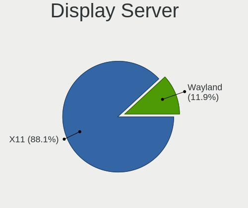
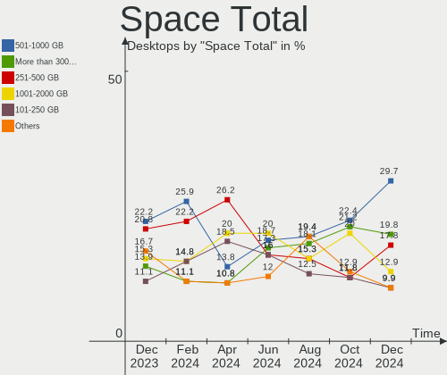
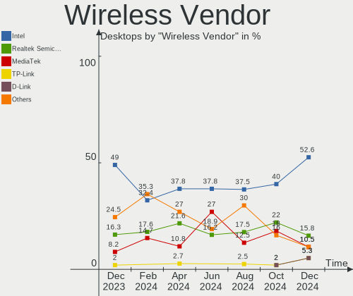
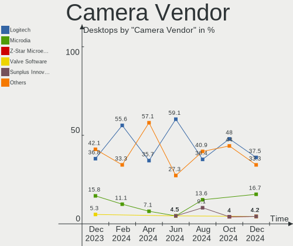
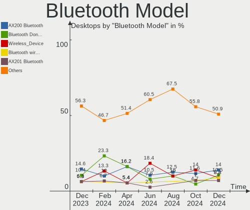

Pop!_OS Hardware Trends (Desktop)
---------------------------------

A project to identify most popular hardware characteristics and track their change
over time based on data collected by Pop!_OS users at https://Linux-Hardware.org.

Anyone can contribute to the study by uploading probes of their computers by
the [hw-probe](https://github.com/linuxhw/hw-probe) tool:

    sudo -E hw-probe -all -upload

Full-feature report is available here: https://linux-hardware.org/?view=trends&formfactor=desktop

Period: Feb, 2021.

Contents
--------

- [ OS                       ](#os)
- [ OS Family                ](#os-family)
- [ Kernel                   ](#kernel)
- [ Kernel Family            ](#kernel-family)
- [ Kernel Major Ver.        ](#kernel-major-ver)
- [ Arch                     ](#arch)
- [ DE                       ](#de)
- [ Display Server           ](#display-server)
- [ Display Manager          ](#display-manager)
- [ OS Lang                  ](#os-lang)
- [ Boot Mode                ](#boot-mode)
- [ Filesystem               ](#filesystem)
- [ Part. scheme             ](#part-scheme)
- [ Dual Boot with Linux/BSD ](#dual-boot-with-linux/bsd)
- [ Dual Boot (Win)          ](#dual-boot-win)
- [ Country                  ](#country)
- [ City                     ](#city)
- [ Vendor                   ](#vendor)
- [ Model                    ](#model)
- [ Model Family             ](#model-family)
- [ MFG Year                 ](#mfg-year)
- [ Form Factor              ](#form-factor)
- [ Secure Boot              ](#secure-boot)
- [ Coreboot                 ](#coreboot)
- [ RAM Size                 ](#ram-size)
- [ RAM Used                 ](#ram-used)
- [ Has CD-ROM               ](#has-cd-rom)
- [ Total Drives             ](#total-drives)
- [ Has Ethernet             ](#has-ethernet)
- [ Drive Vendor             ](#drive-vendor)
- [ Drive Model              ](#drive-model)
- [ HDD Vendor               ](#hdd-vendor)
- [ SSD Vendor               ](#ssd-vendor)
- [ Drive Kind               ](#drive-kind)
- [ Drive Connector          ](#drive-connector)
- [ Drive Size               ](#drive-size)
- [ Space Total              ](#space-total)
- [ Space Used               ](#space-used)
- [ Malfunc. Drives          ](#malfunc-drives)
- [ Malfunc. Drive Vendor    ](#malfunc-drive-vendor)
- [ Malfunc. HDD Vendor      ](#malfunc-hdd-vendor)
- [ Malfunc. Drive Kind      ](#malfunc-drive-kind)
- [ Failed Drives            ](#failed-drives)
- [ Failed Drive Vendor      ](#failed-drive-vendor)
- [ Drive Status             ](#drive-status)
- [ Storage Vendor           ](#storage-vendor)
- [ Storage Model            ](#storage-model)
- [ Storage Kind             ](#storage-kind)
- [ CPU Vendor               ](#cpu-vendor)
- [ CPU Model                ](#cpu-model)
- [ CPU Model Family         ](#cpu-model-family)
- [ CPU Cores                ](#cpu-cores)
- [ CPU Sockets              ](#cpu-sockets)
- [ CPU Threads              ](#cpu-threads)
- [ CPU Op-Modes             ](#cpu-op-modes)
- [ CPU Microcode            ](#cpu-microcode)
- [ CPU Microarch            ](#cpu-microarch)
- [ GPU Vendor               ](#gpu-vendor)
- [ GPU Model                ](#gpu-model)
- [ GPU Combo                ](#gpu-combo)
- [ GPU Driver               ](#gpu-driver)
- [ GPU Memory               ](#gpu-memory)
- [ Monitor Vendor           ](#monitor-vendor)
- [ Monitor Model            ](#monitor-model)
- [ Monitor Resolution       ](#monitor-resolution)
- [ Monitor Diagonal         ](#monitor-diagonal)
- [ Monitor Width            ](#monitor-width)
- [ Aspect Ratio             ](#aspect-ratio)
- [ Monitor Area             ](#monitor-area)
- [ Pixel Density            ](#pixel-density)
- [ Multiple Monitors        ](#multiple-monitors)
- [ Net Controller Vendor    ](#net-controller-vendor)
- [ Net Controller Model     ](#net-controller-model)
- [ Wireless Vendor          ](#wireless-vendor)
- [ Wireless Model           ](#wireless-model)
- [ Ethernet Vendor          ](#ethernet-vendor)
- [ Ethernet Model           ](#ethernet-model)
- [ Net Controller Kind      ](#net-controller-kind)
- [ Used Controller          ](#used-controller)
- [ NICs                     ](#nics)
- [ Memory Vendor            ](#memory-vendor)
- [ Memory Model             ](#memory-model)
- [ Memory Kind              ](#memory-kind)
- [ Memory Form Factor       ](#memory-form-factor)
- [ Memory Size              ](#memory-size)
- [ Memory Speed             ](#memory-speed)
- [ Sound Vendor             ](#sound-vendor)
- [ Sound Model              ](#sound-model)
- [ Camera Vendor            ](#camera-vendor)
- [ Camera Model             ](#camera-model)
- [ Fingerprint Vendor       ](#fingerprint-vendor)
- [ Fingerprint Model        ](#fingerprint-model)
- [ Chipcard Vendor          ](#chipcard-vendor)
- [ Chipcard Model           ](#chipcard-model)
- [ Printer Vendor           ](#printer-vendor)
- [ Printer Model            ](#printer-model)
- [ Scanner Vendor           ](#scanner-vendor)
- [ Scanner Model            ](#scanner-model)
- [ Bluetooth Vendor         ](#bluetooth-vendor)
- [ Bluetooth Model          ](#bluetooth-model)
- [ Unsupported Devices      ](#unsupported-devices)
- [ Unsupported Device Types ](#unsupported-device-types)

OS
--

Installed operating systems

| Name          | Desktops | Percent |
|---------------|----------|---------|
| Pop!_OS 20.10 | 86       | 78.9%   |
| Pop!_OS 20.04 | 23       | 21.1%   |

OS Family
---------

OS without a version

| Name    | Desktops | Percent |
|---------|----------|---------|
| Pop!_OS | 109      | 100%    |

Kernel
------

Version of the Linux kernel

| Version                  | Desktops | Percent |
|--------------------------|----------|---------|
| 5.8.0-7642-generic       | 82       | 75.23%  |
| 5.8.0-7630-generic       | 22       | 20.18%  |
| 5.4.0-7642-generic       | 2        | 1.83%   |
| 5.11.0-051100rc3-generic | 1        | 0.92%   |
| 5.11.0-051100-generic    | 1        | 0.92%   |
| 5.10.13-051013-generic   | 1        | 0.92%   |

Kernel Family
-------------

Linux kernel without a distro release

| Version | Desktops | Percent |
|---------|----------|---------|
| 5.8.0   | 104      | 95.41%  |
| 5.4.0   | 2        | 1.83%   |
| 5.11.0  | 2        | 1.83%   |
| 5.10.13 | 1        | 0.92%   |

Kernel Major Ver.
-----------------

Linux kernel major version

| Version | Desktops | Percent |
|---------|----------|---------|
| 5.8     | 104      | 95.41%  |
| 5.4     | 2        | 1.83%   |
| 5.11    | 2        | 1.83%   |
| 5.10    | 1        | 0.92%   |

Arch
----

OS architecture (x86_64, i586, etc.)

| Name   | Desktops | Percent |
|--------|----------|---------|
| x86_64 | 109      | 100%    |

DE
--

Desktop Environment

| Name       | Desktops | Percent |
|------------|----------|---------|
| GNOME      | 104      | 95.41%  |
| KDE        | 2        | 1.83%   |
| X-Cinnamon | 1        | 0.92%   |
| MATE       | 1        | 0.92%   |
| i3         | 1        | 0.92%   |

Display Server
--------------

X11 or Wayland

| Name | Desktops | Percent |
|------|----------|---------|
| X11  | 108      | 99.08%  |
| Tty  | 1        | 0.92%   |

Display Manager
---------------

SDDM, LightDM, etc.

| Name    | Desktops | Percent |
|---------|----------|---------|
| Unknown | 99       | 90.83%  |
| GDM     | 10       | 9.17%   |

OS Lang
-------

Language

| Lang  | Desktops | Percent |
|-------|----------|---------|
| en_US | 66       | 60.55%  |
| en_GB | 12       | 11.01%  |
| de_DE | 8        | 7.34%   |
| pt_BR | 4        | 3.67%   |
| it_IT | 3        | 2.75%   |
| es_ES | 3        | 2.75%   |
| en_CA | 3        | 2.75%   |
| C     | 3        | 2.75%   |
| fr_FR | 2        | 1.83%   |
| ru_RU | 1        | 0.92%   |
| pl_PL | 1        | 0.92%   |
| fi_FI | 1        | 0.92%   |
| en_AU | 1        | 0.92%   |
| da_DK | 1        | 0.92%   |

Boot Mode
---------

EFI or BIOS

| Mode | Desktops | Percent |
|------|----------|---------|
| BIOS | 105      | 96.33%  |
| EFI  | 4        | 3.67%   |

Filesystem
----------

Type of filesystem

| Type | Desktops | Percent |
|------|----------|---------|
| Ext4 | 109      | 100%    |

Part. scheme
------------

Scheme of partitioning

| Type    | Desktops | Percent |
|---------|----------|---------|
| Unknown | 101      | 92.66%  |
| MBR     | 4        | 3.67%   |
| GPT     | 4        | 3.67%   |

Dual Boot with Linux/BSD
------------------------

Hosting more than one Linux/BSD

| Dual boot | Desktops | Percent |
|-----------|----------|---------|
| No        | 108      | 99.08%  |
| Yes       | 1        | 0.92%   |

Dual Boot (Win)
---------------

Hosting Linux and Windows

| Dual boot | Desktops | Percent |
|-----------|----------|---------|
| No        | 104      | 95.41%  |
| Yes       | 5        | 4.59%   |

Country
-------

Geographic location (country)

| Country              | Desktops | Percent |
|----------------------|----------|---------|
| USA                  | 42       | 38.53%  |
| UK                   | 8        | 7.34%   |
| Germany              | 8        | 7.34%   |
| Canada               | 5        | 4.59%   |
| Brazil               | 5        | 4.59%   |
| South Africa         | 4        | 3.67%   |
| Italy                | 3        | 2.75%   |
| Spain                | 2        | 1.83%   |
| Romania              | 2        | 1.83%   |
| Poland               | 2        | 1.83%   |
| Philippines          | 2        | 1.83%   |
| Netherlands          | 2        | 1.83%   |
| Switzerland          | 1        | 0.92%   |
| Sweden               | 1        | 0.92%   |
| Saudi Arabia         | 1        | 0.92%   |
| Russia               | 1        | 0.92%   |
| Puerto Rico          | 1        | 0.92%   |
| Portugal             | 1        | 0.92%   |
| Paraguay             | 1        | 0.92%   |
| New Zealand          | 1        | 0.92%   |
| Morocco              | 1        | 0.92%   |
| Moldova, Republic of | 1        | 0.92%   |
| Mexico               | 1        | 0.92%   |
| Lithuania            | 1        | 0.92%   |
| Ireland              | 1        | 0.92%   |
| Indonesia            | 1        | 0.92%   |
| Hong Kong            | 1        | 0.92%   |
| Greece               | 1        | 0.92%   |
| Finland              | 1        | 0.92%   |
| Egypt                | 1        | 0.92%   |
| Denmark              | 1        | 0.92%   |
| Cyprus               | 1        | 0.92%   |
| Bulgaria             | 1        | 0.92%   |
| Belgium              | 1        | 0.92%   |
| Austria              | 1        | 0.92%   |
| Australia            | 1        | 0.92%   |

City
----

Geographic location (city)

| City                     | Desktops | Percent |
|--------------------------|----------|---------|
| Valencia                 | 2        | 1.83%   |
| Toccoa                   | 2        | 1.83%   |
| Pretoria                 | 2        | 1.83%   |
| Miami                    | 2        | 1.83%   |
| Baia Mare                | 2        | 1.83%   |
| Zele                     | 1        | 0.92%   |
| Zanesville               | 1        | 0.92%   |
| Yeovil                   | 1        | 0.92%   |
| Washington               | 1        | 0.92%   |
| Wallenstein              | 1        | 0.92%   |
| Wake Forest              | 1        | 0.92%   |
| Vienna                   | 1        | 0.92%   |
| Varna                    | 1        | 0.92%   |
| Truth or Consequences    | 1        | 0.92%   |
| Torre del Greco          | 1        | 0.92%   |
| Thessaloniki             | 1        | 0.92%   |
| The Hague                | 1        | 0.92%   |
| Tauranga                 | 1        | 0.92%   |
| Taguig                   | 1        | 0.92%   |
| Stockholm                | 1        | 0.92%   |
| Stockbridge              | 1        | 0.92%   |
| Springfield              | 1        | 0.92%   |
| Simi Valley              | 1        | 0.92%   |
| Secunda                  | 1        | 0.92%   |
| San Jose                 | 1        | 0.92%   |
| Sale                     | 1        | 0.92%   |
| Sainte-Marthe-sur-le-Lac | 1        | 0.92%   |
| Saint Clair Shores       | 1        | 0.92%   |
| Rutland                  | 1        | 0.92%   |
| Rio de Janeiro           | 1        | 0.92%   |
| Richland                 | 1        | 0.92%   |
| Redhill                  | 1        | 0.92%   |
| Redford                  | 1        | 0.92%   |
| Rathenow                 | 1        | 0.92%   |
| Quezon City              | 1        | 0.92%   |
| Quedlinburg              | 1        | 0.92%   |
| Porto Alegre             | 1        | 0.92%   |
| Perry                    | 1        | 0.92%   |
| Odense                   | 1        | 0.92%   |
| Nova Ponte               | 1        | 0.92%   |
| Moscow                   | 1        | 0.92%   |
| Mittweida                | 1        | 0.92%   |
| Minneapolis              | 1        | 0.92%   |
| Merrimack                | 1        | 0.92%   |
| Mebane                   | 1        | 0.92%   |
| Maywood Park             | 1        | 0.92%   |
| Marlow                   | 1        | 0.92%   |
| Maple                    | 1        | 0.92%   |
| Lumberton                | 1        | 0.92%   |
| Longmont                 | 1        | 0.92%   |
| London                   | 1        | 0.92%   |
| Littleton                | 1        | 0.92%   |
| Lisbon                   | 1        | 0.92%   |
| Limassol                 | 1        | 0.92%   |
| Leisnig                  | 1        | 0.92%   |
| Leiden                   | 1        | 0.92%   |
| Las Vegas                | 1        | 0.92%   |
| Ladera Ranch             | 1        | 0.92%   |
| Krakow                   | 1        | 0.92%   |
| Killaloe                 | 1        | 0.92%   |

Vendor
------

Motherboard manufacturer

| Name                | Desktops | Percent |
|---------------------|----------|---------|
| ASUSTek Computer    | 27       | 24.77%  |
| Gigabyte Technology | 24       | 22.02%  |
| MSI                 | 18       | 16.51%  |
| Dell                | 11       | 10.09%  |
| ASRock              | 9        | 8.26%   |
| Hewlett-Packard     | 6        | 5.5%    |
| Intel               | 4        | 3.67%   |
| Lenovo              | 2        | 1.83%   |
| Pegatron            | 1        | 0.92%   |
| JOOYON              | 1        | 0.92%   |
| Fujitsu Siemens     | 1        | 0.92%   |
| Foxconn             | 1        | 0.92%   |
| ECS                 | 1        | 0.92%   |
| AMI                 | 1        | 0.92%   |
| Alienware           | 1        | 0.92%   |
| Acer                | 1        | 0.92%   |

Model
-----

Motherboard model

| Name                             | Desktops | Percent |
|----------------------------------|----------|---------|
| Gigabyte A320M-S2H               | 3        | 2.75%   |
| ASUS TUF GAMING X570-PLUS        | 3        | 2.75%   |
| ASUS P8Z68-V                     | 2        | 1.83%   |
| ASUS All Series                  | 2        | 1.83%   |
| Pegatron 220-1150xt              | 1        | 0.92%   |
| MSI p7-1447c                     | 1        | 0.92%   |
| MSI MS-7C82                      | 1        | 0.92%   |
| MSI MS-7C35                      | 1        | 0.92%   |
| MSI MS-7C02                      | 1        | 0.92%   |
| MSI MS-7B89                      | 1        | 0.92%   |
| MSI MS-7B86                      | 1        | 0.92%   |
| MSI MS-7B85                      | 1        | 0.92%   |
| MSI MS-7B22                      | 1        | 0.92%   |
| MSI MS-7B17                      | 1        | 0.92%   |
| MSI MS-7A67                      | 1        | 0.92%   |
| MSI MS-7A40                      | 1        | 0.92%   |
| MSI MS-7A38                      | 1        | 0.92%   |
| MSI MS-7918                      | 1        | 0.92%   |
| MSI MS-7885                      | 1        | 0.92%   |
| MSI MS-7821                      | 1        | 0.92%   |
| MSI MS-7721                      | 1        | 0.92%   |
| MSI MS-7681                      | 1        | 0.92%   |
| MSI MS-7592                      | 1        | 0.92%   |
| Lenovo ThinkCentre A70z 0401CWG  | 1        | 0.92%   |
| Lenovo IdeaCentre K330           | 1        | 0.92%   |
| JOOYON IPM41-D3                  | 1        | 0.92%   |
| Intel DQ77MK                     | 1        | 0.92%   |
| Intel DP55WB AAE64798-204        | 1        | 0.92%   |
| Intel DH77EB AAG39073-304        | 1        | 0.92%   |
| Intel D33217GKE G76540-205       | 1        | 0.92%   |
| HP Z200 Workstation              | 1        | 0.92%   |
| HP ProDesk 600 G2 SFF            | 1        | 0.92%   |
| HP Compaq Pro 6300 SFF           | 1        | 0.92%   |
| HP Compaq Elite 8300 SFF         | 1        | 0.92%   |
| HP Compaq 8200 Elite SFF PC      | 1        | 0.92%   |
| HP 500-119c                      | 1        | 0.92%   |
| Gigabyte Z97P-D3                 | 1        | 0.92%   |
| Gigabyte Z77X-UD3H               | 1        | 0.92%   |
| Gigabyte Z490I AORUS ULTRA       | 1        | 0.92%   |
| Gigabyte Z370 AORUS Gaming K3    | 1        | 0.92%   |
| Gigabyte Z170X-Gaming 3          | 1        | 0.92%   |
| Gigabyte Z170-HD3-CF             | 1        | 0.92%   |
| Gigabyte X570 I AORUS PRO WIFI   | 1        | 0.92%   |
| Gigabyte X570 AORUS PRO WIFI     | 1        | 0.92%   |
| Gigabyte X470 AORUS ULTRA GAMING | 1        | 0.92%   |
| Gigabyte P35-DS4                 | 1        | 0.92%   |
| Gigabyte H370M-DS3H              | 1        | 0.92%   |
| Gigabyte GA-MA790GP-DS4H         | 1        | 0.92%   |
| Gigabyte GA-MA770T-UD3           | 1        | 0.92%   |
| Gigabyte GA-78LMT-USB3 6.0       | 1        | 0.92%   |
| Gigabyte G41MT-S2P               | 1        | 0.92%   |
| Gigabyte F2A88XM-D3H             | 1        | 0.92%   |
| Gigabyte B450 AORUS PRO          | 1        | 0.92%   |
| Gigabyte B450 AORUS M            | 1        | 0.92%   |
| Gigabyte AX370M-DS3H             | 1        | 0.92%   |
| Gigabyte AX370-Gaming K3         | 1        | 0.92%   |
| Gigabyte 965P-DS3                | 1        | 0.92%   |
| Fujitsu Siemens ESPRIMO E5730    | 1        | 0.92%   |
| Foxconn Pro 3500 Series          | 1        | 0.92%   |
| ECS A780GM-A                     | 1        | 0.92%   |

Model Family
------------

Motherboard model prefix

| Name                     | Desktops | Percent |
|--------------------------|----------|---------|
| Dell OptiPlex            | 5        | 4.59%   |
| ASUS TUF                 | 4        | 3.67%   |
| ASUS PRIME               | 4        | 3.67%   |
| HP Compaq                | 3        | 2.75%   |
| Gigabyte A320M-S2H       | 3        | 2.75%   |
| Dell Inspiron            | 3        | 2.75%   |
| ASUS ROG                 | 3        | 2.75%   |
| Gigabyte X570            | 2        | 1.83%   |
| Gigabyte B450            | 2        | 1.83%   |
| Dell Precision           | 2        | 1.83%   |
| ASUS SABERTOOTH          | 2        | 1.83%   |
| ASUS P8Z68-V             | 2        | 1.83%   |
| ASUS All                 | 2        | 1.83%   |
| Pegatron 220-1150xt      | 1        | 0.92%   |
| MSI p7-1447c             | 1        | 0.92%   |
| MSI MS-7C82              | 1        | 0.92%   |
| MSI MS-7C35              | 1        | 0.92%   |
| MSI MS-7C02              | 1        | 0.92%   |
| MSI MS-7B89              | 1        | 0.92%   |
| MSI MS-7B86              | 1        | 0.92%   |
| MSI MS-7B85              | 1        | 0.92%   |
| MSI MS-7B22              | 1        | 0.92%   |
| MSI MS-7B17              | 1        | 0.92%   |
| MSI MS-7A67              | 1        | 0.92%   |
| MSI MS-7A40              | 1        | 0.92%   |
| MSI MS-7A38              | 1        | 0.92%   |
| MSI MS-7918              | 1        | 0.92%   |
| MSI MS-7885              | 1        | 0.92%   |
| MSI MS-7821              | 1        | 0.92%   |
| MSI MS-7721              | 1        | 0.92%   |
| MSI MS-7681              | 1        | 0.92%   |
| MSI MS-7592              | 1        | 0.92%   |
| Lenovo ThinkCentre       | 1        | 0.92%   |
| Lenovo IdeaCentre        | 1        | 0.92%   |
| JOOYON IPM41-D3          | 1        | 0.92%   |
| Intel DQ77MK             | 1        | 0.92%   |
| Intel DP55WB             | 1        | 0.92%   |
| Intel DH77EB             | 1        | 0.92%   |
| Intel D33217GKE          | 1        | 0.92%   |
| HP Z200                  | 1        | 0.92%   |
| HP ProDesk               | 1        | 0.92%   |
| HP 500-119c              | 1        | 0.92%   |
| Gigabyte Z97P-D3         | 1        | 0.92%   |
| Gigabyte Z77X-UD3H       | 1        | 0.92%   |
| Gigabyte Z490I           | 1        | 0.92%   |
| Gigabyte Z370            | 1        | 0.92%   |
| Gigabyte Z170X-Gaming    | 1        | 0.92%   |
| Gigabyte Z170-HD3-CF     | 1        | 0.92%   |
| Gigabyte X470            | 1        | 0.92%   |
| Gigabyte P35-DS4         | 1        | 0.92%   |
| Gigabyte H370M-DS3H      | 1        | 0.92%   |
| Gigabyte GA-MA790GP-DS4H | 1        | 0.92%   |
| Gigabyte GA-MA770T-UD3   | 1        | 0.92%   |
| Gigabyte GA-78LMT-USB3   | 1        | 0.92%   |
| Gigabyte G41MT-S2P       | 1        | 0.92%   |
| Gigabyte F2A88XM-D3H     | 1        | 0.92%   |
| Gigabyte AX370M-DS3H     | 1        | 0.92%   |
| Gigabyte AX370-Gaming    | 1        | 0.92%   |
| Gigabyte 965P-DS3        | 1        | 0.92%   |
| Fujitsu Siemens ESPRIMO  | 1        | 0.92%   |

MFG Year
--------

Motherboard manufacture year

| Year | Desktops | Percent |
|------|----------|---------|
| 2020 | 22       | 20.18%  |
| 2018 | 14       | 12.84%  |
| 2019 | 11       | 10.09%  |
| 2010 | 9        | 8.26%   |
| 2016 | 8        | 7.34%   |
| 2014 | 8        | 7.34%   |
| 2012 | 8        | 7.34%   |
| 2009 | 7        | 6.42%   |
| 2013 | 6        | 5.5%    |
| 2021 | 5        | 4.59%   |
| 2015 | 5        | 4.59%   |
| 2011 | 4        | 3.67%   |
| 2017 | 2        | 1.83%   |

Form Factor
-----------

Physical design of the computer

| Name    | Desktops | Percent |
|---------|----------|---------|
| Desktop | 109      | 100%    |

Secure Boot
-----------

Enabled or disabled

| State    | Desktops | Percent |
|----------|----------|---------|
| Disabled | 109      | 100%    |

Coreboot
--------

Have coreboot on board

| Used | Desktops | Percent |
|------|----------|---------|
| No   | 109      | 100%    |

RAM Size
--------

Total RAM memory

| Size in GB      | Desktops | Percent |
|-----------------|----------|---------|
| 16.01-24.0      | 32       | 29.36%  |
| 8.01-16.0       | 25       | 22.94%  |
| 32.01-64.0      | 17       | 15.6%   |
| 4.01-8.0        | 14       | 12.84%  |
| 3.01-4.0        | 11       | 10.09%  |
| 24.01-32.0      | 4        | 3.67%   |
| 64.01-256.0     | 2        | 1.83%   |
| 1.01-2.0        | 2        | 1.83%   |
| More than 256.0 | 1        | 0.92%   |
| 2.01-3.0        | 1        | 0.92%   |

RAM Used
--------

Used RAM memory

| Used GB     | Desktops | Percent |
|-------------|----------|---------|
| 1.01-2.0    | 46       | 42.2%   |
| 2.01-3.0    | 30       | 27.52%  |
| 4.01-8.0    | 18       | 16.51%  |
| 3.01-4.0    | 9        | 8.26%   |
| 8.01-16.0   | 5        | 4.59%   |
| 64.01-256.0 | 1        | 0.92%   |

Has CD-ROM
----------

Has CD-ROM on board

| Presented | Desktops | Percent |
|-----------|----------|---------|
| No        | 60       | 55.05%  |
| Yes       | 49       | 44.95%  |

Total Drives
------------

Number of drives on board

| Drives | Desktops | Percent |
|--------|----------|---------|
| 1      | 40       | 36.7%   |
| 2      | 28       | 25.69%  |
| 3      | 19       | 17.43%  |
| 4      | 16       | 14.68%  |
| 7      | 2        | 1.83%   |
| 5      | 2        | 1.83%   |
| 11     | 1        | 0.92%   |
| 6      | 1        | 0.92%   |

Has Ethernet
------------

Has Ethernet on board

| Presented | Desktops | Percent |
|-----------|----------|---------|
| Yes       | 107      | 98.17%  |
| No        | 2        | 1.83%   |

Drive Vendor
------------

Hard drive vendors

| Vendor                    | Desktops | Drives | Percent |
|---------------------------|----------|--------|---------|
| Seagate                   | 40       | 48     | 18.87%  |
| WDC                       | 38       | 52     | 17.92%  |
| Samsung Electronics       | 28       | 40     | 13.21%  |
| Sandisk                   | 15       | 15     | 7.08%   |
| Toshiba                   | 10       | 10     | 4.72%   |
| Hitachi                   | 10       | 10     | 4.72%   |
| Crucial                   | 10       | 13     | 4.72%   |
| Kingston                  | 8        | 8      | 3.77%   |
| A-DATA Technology         | 6        | 7      | 2.83%   |
| Phison                    | 5        | 8      | 2.36%   |
| Silicon Motion            | 4        | 4      | 1.89%   |
| Micron/Crucial Technology | 3        | 3      | 1.42%   |
| MAXTOR                    | 3        | 3      | 1.42%   |
| Corsair                   | 3        | 5      | 1.42%   |
| XPG                       | 2        | 2      | 0.94%   |
| Unknown                   | 2        | 2      | 0.94%   |
| PNY                       | 2        | 2      | 0.94%   |
| Micron Technology         | 2        | 2      | 0.94%   |
| Intel                     | 2        | 2      | 0.94%   |
| USB                       | 1        | 1      | 0.47%   |
| Transcend                 | 1        | 1      | 0.47%   |
| T-FORCE                   | 1        | 2      | 0.47%   |
| SK Hynix                  | 1        | 1      | 0.47%   |
| Quantum                   | 1        | 1      | 0.47%   |
| PNY USB                   | 1        | 1      | 0.47%   |
| Patriot                   | 1        | 2      | 0.47%   |
| OWC                       | 1        | 4      | 0.47%   |
| OCZ                       | 1        | 1      | 0.47%   |
| Magnetic Data             | 1        | 1      | 0.47%   |
| LITEON                    | 1        | 1      | 0.47%   |
| KIOXIA-E                  | 1        | 1      | 0.47%   |
| JMicron                   | 1        | 1      | 0.47%   |
| INDMEM                    | 1        | 1      | 0.47%   |
| HS-SSD-C100               | 1        | 1      | 0.47%   |
| HGST                      | 1        | 1      | 0.47%   |
| CT480BX5                  | 1        | 1      | 0.47%   |
| China                     | 1        | 1      | 0.47%   |
| Addonics                  | 1        | 1      | 0.47%   |

Drive Model
-----------

Hard drive models

| Model                                | Desktops | Percent |
|--------------------------------------|----------|---------|
| Seagate ST500DM002-1BD142 500GB      | 5        | 2.04%   |
| Seagate ST2000DM008-2FR102 2TB       | 5        | 2.04%   |
| Sandisk NVMe SSD Drive 500GB         | 5        | 2.04%   |
| Samsung NVMe SSD Drive 500GB         | 5        | 2.04%   |
| WDC WDS240G2G0A-00JH30 240GB SSD     | 4        | 1.63%   |
| Samsung SSD 860 EVO 250GB            | 4        | 1.63%   |
| Kingston SA400S37240G 240GB SSD      | 4        | 1.63%   |
| Seagate ST31000528AS 1TB             | 3        | 1.22%   |
| Seagate ST1000DM010-2EP102 1TB       | 3        | 1.22%   |
| WDC WDBNCE5000PNC 500GB SSD          | 2        | 0.82%   |
| WDC WD10EZEX-08WN4A0 1TB             | 2        | 0.82%   |
| WDC WD10EZEX-00WN4A0 1TB             | 2        | 0.82%   |
| WDC WD10EZEX-00BN5A0 1TB             | 2        | 0.82%   |
| Toshiba HDWD110 1TB                  | 2        | 0.82%   |
| Toshiba DT01ACA100 1TB               | 2        | 0.82%   |
| Silicon Motion NVMe SSD Drive 1024GB | 2        | 0.82%   |
| Seagate ST4000VN008-2DR166 4TB       | 2        | 0.82%   |
| Sandisk NVMe SSD Drive 1TB           | 2        | 0.82%   |
| Samsung SSD 970 EVO Plus 250GB       | 2        | 0.82%   |
| Samsung SSD 860 EVO 1TB              | 2        | 0.82%   |
| Samsung SSD 840 PRO Series 256GB     | 2        | 0.82%   |
| Samsung SSD 840 EVO 250GB            | 2        | 0.82%   |
| Samsung SSD 840 EVO 120GB            | 2        | 0.82%   |
| Samsung NVMe SSD Drive 250GB         | 2        | 0.82%   |
| Phison NVMe SSD Drive 1TB            | 2        | 0.82%   |
| Micron/Crucial NVMe SSD Drive 1TB    | 2        | 0.82%   |
| Kingston SV300S37A120G 120GB SSD     | 2        | 0.82%   |
| Intel NVMe SSD Drive 1024GB          | 2        | 0.82%   |
| Crucial CT480BX500SSD1 480GB         | 2        | 0.82%   |
| Crucial CT240BX500SSD1 240GB         | 2        | 0.82%   |
| Crucial CT1000MX500SSD1 1TB          | 2        | 0.82%   |
| A-DATA SU635 240GB SSD               | 2        | 0.82%   |
| XPG NVMe SSD Drive 512GB             | 1        | 0.41%   |
| XPG NVMe SSD Drive 256GB             | 1        | 0.41%   |
| WDC WDS500G3X0C-00SJG0 500GB         | 1        | 0.41%   |
| WDC WDS500G2B0B-00YS70 500GB SSD     | 1        | 0.41%   |
| WDC WDS500G2B0A-00SM50 500GB SSD     | 1        | 0.41%   |
| WDC WDS480G2G0A-00JH30 480GB SSD     | 1        | 0.41%   |
| WDC WDS250G1B0A-00H9H0 250GB SSD     | 1        | 0.41%   |
| WDC WDS240G2G0B-00EPW0 240GB SSD     | 1        | 0.41%   |
| WDC WDS120G2G0A-00JH30 120GB SSD     | 1        | 0.41%   |
| WDC WDS100T3X0C-00SJG0 1TB           | 1        | 0.41%   |
| WDC WDS100T2B0A-00SM50 1TB SSD       | 1        | 0.41%   |
| WDC WD800JD-75MSA3 80GB              | 1        | 0.41%   |
| WDC WD6400AAKS-0 640GB               | 1        | 0.41%   |
| WDC WD5001AALS-00L3B2 500GB          | 1        | 0.41%   |
| WDC WD5001AALS-00E3A0 500GB          | 1        | 0.41%   |
| WDC WD5000AZLX-00K4KA0 500GB         | 1        | 0.41%   |
| WDC WD5000AVVS-63H0B1 500GB          | 1        | 0.41%   |
| WDC WD5000AAKX-75U6AA0 500GB         | 1        | 0.41%   |
| WDC WD5000AAKS-22V1A0 500GB          | 1        | 0.41%   |
| WDC WD5000AADS-22S9B0 500GB          | 1        | 0.41%   |
| WDC WD5000AADS-00S9B0 500GB          | 1        | 0.41%   |
| WDC WD5000AACS-00ZUB0 500GB          | 1        | 0.41%   |
| WDC WD3200JS-22PDB0 320GB            | 1        | 0.41%   |
| WDC WD3200AAJS-22L7A0 320GB          | 1        | 0.41%   |
| WDC WD3200AAJS-00L7A0 320GB          | 1        | 0.41%   |
| WDC WD30EFRX-68EUZN0 3TB             | 1        | 0.41%   |
| WDC WD2500BEVT-00EGHT0 250GB         | 1        | 0.41%   |
| WDC WD20EFRX-68EUZN0 2TB             | 1        | 0.41%   |

HDD Vendor
----------

Hard disk drive vendors

| Vendor              | Desktops | Drives | Percent |
|---------------------|----------|--------|---------|
| Seagate             | 39       | 46     | 39.8%   |
| WDC                 | 28       | 35     | 28.57%  |
| Toshiba             | 10       | 10     | 10.2%   |
| Hitachi             | 10       | 10     | 10.2%   |
| Samsung Electronics | 5        | 5      | 5.1%    |
| Maxtor              | 3        | 3      | 3.06%   |
| USB                 | 1        | 1      | 1.02%   |
| Quantum             | 1        | 1      | 1.02%   |
| HGST                | 1        | 1      | 1.02%   |

SSD Vendor
----------

Solid state drive vendors

| Vendor              | Desktops | Drives | Percent |
|---------------------|----------|--------|---------|
| Samsung Electronics | 19       | 23     | 23.46%  |
| WDC                 | 14       | 15     | 17.28%  |
| Crucial             | 10       | 13     | 12.35%  |
| SanDisk             | 8        | 8      | 9.88%   |
| Kingston            | 8        | 8      | 9.88%   |
| A-DATA Technology   | 6        | 7      | 7.41%   |
| PNY                 | 2        | 2      | 2.47%   |
| Corsair             | 2        | 2      | 2.47%   |
| Transcend           | 1        | 1      | 1.23%   |
| T-FORCE             | 1        | 1      | 1.23%   |
| PNY USB             | 1        | 1      | 1.23%   |
| Patriot             | 1        | 2      | 1.23%   |
| OWC                 | 1        | 4      | 1.23%   |
| OCZ                 | 1        | 1      | 1.23%   |
| Micron Technology   | 1        | 1      | 1.23%   |
| LITEON              | 1        | 1      | 1.23%   |
| KIOXIA-E            | 1        | 1      | 1.23%   |
| INDMEM              | 1        | 1      | 1.23%   |
| CT480BX5            | 1        | 1      | 1.23%   |
| China               | 1        | 1      | 1.23%   |

Drive Kind
----------

HDD or SSD

| Kind    | Desktops | Drives | Percent |
|---------|----------|--------|---------|
| HDD     | 76       | 112    | 41.99%  |
| SSD     | 65       | 94     | 35.91%  |
| NVMe    | 32       | 46     | 17.68%  |
| Unknown | 6        | 6      | 3.31%   |
| MMC     | 2        | 2      | 1.1%    |

Drive Connector
---------------

SATA, SAS, NVMe, etc.

| Type | Desktops | Drives | Percent |
|------|----------|--------|---------|
| SATA | 101      | 199    | 69.18%  |
| NVMe | 32       | 46     | 21.92%  |
| SAS  | 11       | 13     | 7.53%   |
| MMC  | 2        | 2      | 1.37%   |

Drive Size
----------

Size of hard drive

| Size in TB | Desktops | Drives | Percent |
|------------|----------|--------|---------|
| 0.01-0.5   | 80       | 126    | 55.56%  |
| 0.51-1.0   | 42       | 56     | 29.17%  |
| 1.01-2.0   | 10       | 12     | 6.94%   |
| 3.01-4.0   | 4        | 4      | 2.78%   |
| 2.01-3.0   | 4        | 4      | 2.78%   |
| 4.01-10.0  | 3        | 3      | 2.08%   |
| 10.01-20.0 | 1        | 1      | 0.69%   |

Space Total
-----------

Amount of disk space available on the file system

| Size in GB     | Desktops | Percent |
|----------------|----------|---------|
| 101-250        | 27       | 24.77%  |
| 501-1000       | 25       | 22.94%  |
| 251-500        | 22       | 20.18%  |
| More than 3000 | 10       | 9.17%   |
| 1001-2000      | 10       | 9.17%   |
| 51-100         | 6        | 5.5%    |
| 2001-3000      | 5        | 4.59%   |
| 21-50          | 2        | 1.83%   |
| 1-20           | 2        | 1.83%   |

Space Used
----------

Amount of used disk space

| Used GB        | Desktops | Percent |
|----------------|----------|---------|
| 1-20           | 48       | 44.04%  |
| 21-50          | 16       | 14.68%  |
| 101-250        | 11       | 10.09%  |
| 51-100         | 9        | 8.26%   |
| 251-500        | 7        | 6.42%   |
| 1001-2000      | 6        | 5.5%    |
| 501-1000       | 6        | 5.5%    |
| More than 3000 | 5        | 4.59%   |
| 2001-3000      | 1        | 0.92%   |

Malfunc. Drives
---------------

Drive models with a malfunction

| Model                                 | Desktops | Drives | Percent |
|---------------------------------------|----------|--------|---------|
| WDC WD15EADS-11P8B1 1TB               | 1        | 1      | 50%     |
| Samsung Electronics SSD 860 EVO 500GB | 1        | 2      | 50%     |

Malfunc. Drive Vendor
---------------------

Vendors of faulty drives

| Vendor              | Desktops | Drives | Percent |
|---------------------|----------|--------|---------|
| WDC                 | 1        | 1      | 50%     |
| Samsung Electronics | 1        | 2      | 50%     |

Malfunc. HDD Vendor
-------------------

Vendors of faulty HDD drives

| Vendor | Desktops | Drives | Percent |
|--------|----------|--------|---------|
| WDC    | 1        | 1      | 100%    |

Malfunc. Drive Kind
-------------------

Kinds of faulty drives

| Kind | Desktops | Drives | Percent |
|------|----------|--------|---------|
| SSD  | 1        | 2      | 50%     |
| HDD  | 1        | 1      | 50%     |

Failed Drives
-------------

Failed drive models

Zero info for selected period =(

Failed Drive Vendor
-------------------

Failed drive vendors

Zero info for selected period =(

Drive Status
------------

Number of failed and malfunc. drives

| Status   | Desktops | Drives | Percent |
|----------|----------|--------|---------|
| Detected | 101      | 233    | 90.18%  |
| Works    | 9        | 24     | 8.04%   |
| Malfunc  | 2        | 3      | 1.79%   |

Storage Vendor
--------------

Storage controller vendors

| Vendor                    | Desktops | Percent |
|---------------------------|----------|---------|
| Intel                     | 66       | 41.77%  |
| AMD                       | 43       | 27.22%  |
| Samsung Electronics       | 10       | 6.33%   |
| Sandisk                   | 7        | 4.43%   |
| Phison Electronics        | 5        | 3.16%   |
| Silicon Motion            | 4        | 2.53%   |
| JMicron Technology        | 4        | 2.53%   |
| Micron/Crucial Technology | 3        | 1.9%    |
| Broadcom / LSI            | 3        | 1.9%    |
| Marvell Technology Group  | 2        | 1.27%   |
| ASMedia Technology        | 2        | 1.27%   |
| ADATA Technology          | 2        | 1.27%   |
| VIA Technologies          | 1        | 0.63%   |
| SK Hynix                  | 1        | 0.63%   |
| Seagate Technology        | 1        | 0.63%   |
| Nvidia                    | 1        | 0.63%   |
| Micron Technology         | 1        | 0.63%   |
| LSI Logic / Symbios Logic | 1        | 0.63%   |
| Adaptec                   | 1        | 0.63%   |

Storage Model
-------------

Storage controller models

| Model                                                                                   | Desktops | Percent |
|-----------------------------------------------------------------------------------------|----------|---------|
| AMD FCH SATA Controller [AHCI mode]                                                     | 24       | 12.31%  |
| Samsung NVMe SSD Controller SM981/PM981/PM983                                           | 9        | 4.62%   |
| AMD 400 Series Chipset SATA Controller                                                  | 9        | 4.62%   |
| Intel 7 Series/C210 Series Chipset Family 6-port SATA Controller [AHCI mode]            | 8        | 4.1%    |
| AMD SB7x0/SB8x0/SB9x0 IDE Controller                                                    | 8        | 4.1%    |
| AMD SB7x0/SB8x0/SB9x0 SATA Controller [IDE mode]                                        | 7        | 3.59%   |
| Intel SATA Controller [RAID mode]                                                       | 6        | 3.08%   |
| Intel Q170/Q150/B150/H170/H110/Z170/CM236 Chipset SATA Controller [AHCI Mode]           | 6        | 3.08%   |
| Intel 200 Series PCH SATA controller [AHCI mode]                                        | 6        | 3.08%   |
| Intel NM10/ICH7 Family SATA Controller [IDE mode]                                       | 5        | 2.56%   |
| Intel 8 Series/C220 Series Chipset Family 6-port SATA Controller 1 [AHCI mode]          | 5        | 2.56%   |
| Intel 6 Series/C200 Series Chipset Family 6 port Desktop SATA AHCI Controller           | 5        | 2.56%   |
| Sandisk WD Blue SN550 NVMe SSD                                                          | 4        | 2.05%   |
| AMD SB7x0/SB8x0/SB9x0 SATA Controller [AHCI mode]                                       | 4        | 2.05%   |
| AMD SATA controller                                                                     | 4        | 2.05%   |
| Silicon Motion SM2263EN/SM2263XT SSD Controller                                         | 3        | 1.54%   |
| Phison E16 PCIe4 NVMe Controller                                                        | 3        | 1.54%   |
| Intel Cannon Lake PCH SATA AHCI Controller                                              | 3        | 1.54%   |
| Intel 9 Series Chipset Family SATA Controller [AHCI Mode]                               | 3        | 1.54%   |
| Intel 82801G (ICH7 Family) IDE Controller                                               | 3        | 1.54%   |
| AMD FCH SATA Controller D                                                               | 3        | 1.54%   |
| Sandisk WD Black SN750 / PC SN730 NVMe SSD                                              | 2        | 1.03%   |
| Samsung NVMe SSD Controller SM961/PM961/SM963                                           | 2        | 1.03%   |
| Micron/Crucial Non-Volatile memory controller                                           | 2        | 1.03%   |
| JMicron JMB363 SATA/IDE Controller                                                      | 2        | 1.03%   |
| JMicron JMB362 SATA Controller                                                          | 2        | 1.03%   |
| Intel 82801JD/DO (ICH10 Family) SATA AHCI Controller                                    | 2        | 1.03%   |
| Intel 82801IR/IO/IH (ICH9R/DO/DH) 4 port SATA Controller [IDE mode]                     | 2        | 1.03%   |
| Intel 82801I (ICH9 Family) 2 port SATA Controller [IDE mode]                            | 2        | 1.03%   |
| Intel 6 Series/C200 Series Chipset Family Desktop SATA Controller (IDE mode, ports 4-5) | 2        | 1.03%   |
| Intel 6 Series/C200 Series Chipset Family Desktop SATA Controller (IDE mode, ports 0-3) | 2        | 1.03%   |
| Intel 4 Series Chipset PT IDER Controller                                               | 2        | 1.03%   |
| Broadcom / LSI SAS1068E PCI-Express Fusion-MPT SAS                                      | 2        | 1.03%   |
| ASMedia ASM1062 Serial ATA Controller                                                   | 2        | 1.03%   |
| AMD X370 Series Chipset SATA Controller                                                 | 2        | 1.03%   |
| AMD RS690 PCI to PCI Bridge (PCI Express Port 2)                                        | 2        | 1.03%   |
| ADATA XPG SX8200 Pro PCIe Gen3x4 M.2 2280 Solid State Drive                             | 2        | 1.03%   |
| VIA VT6415 PATA IDE Host Controller                                                     | 1        | 0.51%   |
| SK Hynix PC300 NVMe Solid State Drive 256GB                                             | 1        | 0.51%   |
| Silicon Motion SM2262/SM2262EN SSD Controller                                           | 1        | 0.51%   |
| Seagate Non-Volatile memory controller                                                  | 1        | 0.51%   |
| Sandisk WD Blue SN500 / PC SN520 NVMe SSD                                               | 1        | 0.51%   |
| Phison Electronics Non-Volatile memory controller                                       | 1        | 0.51%   |
| Phison E12 NVMe Controller                                                              | 1        | 0.51%   |
| Nvidia MCP61 SATA Controller                                                            | 1        | 0.51%   |
| Nvidia MCP61 IDE                                                                        | 1        | 0.51%   |
| Micron/Crucial P1 NVMe PCIe SSD                                                         | 1        | 0.51%   |
| Micron Non-Volatile memory controller                                                   | 1        | 0.51%   |
| Marvell Group 88SE9172 SATA 6Gb/s Controller                                            | 1        | 0.51%   |
| Marvell Group 88SE9123 PCIe SATA 6.0 Gb/s controller                                    | 1        | 0.51%   |
| LSI Logic / Symbios Logic MegaRAID SAS 2108 [Liberator]                                 | 1        | 0.51%   |
| Intel SSD 660P Series                                                                   | 1        | 0.51%   |
| Intel Non-Volatile memory controller                                                    | 1        | 0.51%   |
| Intel Chipset SATA RAID Controller                                                      | 1        | 0.51%   |
| Intel C610/X99 series chipset 6-Port SATA Controller [AHCI mode]                        | 1        | 0.51%   |
| Intel C600/X79 series chipset SATA RAID Controller                                      | 1        | 0.51%   |
| Intel C600/X79 series chipset IDE-r Controller                                          | 1        | 0.51%   |
| Intel C600/X79 series chipset 6-Port SATA AHCI Controller                               | 1        | 0.51%   |
| Intel 82801JI (ICH10 Family) 4 port SATA IDE Controller #1                              | 1        | 0.51%   |
| Intel 82801JI (ICH10 Family) 2 port SATA IDE Controller #2                              | 1        | 0.51%   |

Storage Kind
------------

Kind of storage controller (IDE, SATA, NVMe, SAS, ...)

| Kind | Desktops | Percent |
|------|----------|---------|
| SATA | 86       | 54.09%  |
| NVMe | 32       | 20.13%  |
| IDE  | 26       | 16.35%  |
| RAID | 11       | 6.92%   |
| SCSI | 3        | 1.89%   |
| SAS  | 1        | 0.63%   |

CPU Vendor
----------

Processor vendors

| Vendor | Desktops | Percent |
|--------|----------|---------|
| Intel  | 65       | 59.63%  |
| AMD    | 44       | 40.37%  |

CPU Model
---------

Processor models

| Model                                       | Desktops | Percent |
|---------------------------------------------|----------|---------|
| AMD Ryzen 5 3600 6-Core Processor           | 4        | 3.67%   |
| Intel Core i7-3770 CPU @ 3.40GHz            | 3        | 2.75%   |
| AMD Ryzen 7 3700X 8-Core Processor          | 3        | 2.75%   |
| AMD Ryzen 5 3600X 6-Core Processor          | 3        | 2.75%   |
| AMD Ryzen 5 1600 Six-Core Processor         | 3        | 2.75%   |
| AMD FX-8350 Eight-Core Processor            | 3        | 2.75%   |
| Intel Pentium Dual-Core CPU E5300 @ 2.60GHz | 2        | 1.83%   |
| Intel Core i7-6700K CPU @ 4.00GHz           | 2        | 1.83%   |
| Intel Core i7-6700 CPU @ 3.40GHz            | 2        | 1.83%   |
| Intel Core i7-4790K CPU @ 4.00GHz           | 2        | 1.83%   |
| Intel Core i7-3770K CPU @ 3.50GHz           | 2        | 1.83%   |
| Intel Core i7-2600 CPU @ 3.40GHz            | 2        | 1.83%   |
| Intel Core i5-9400F CPU @ 2.90GHz           | 2        | 1.83%   |
| Intel Core i5-6500 CPU @ 3.20GHz            | 2        | 1.83%   |
| Intel Core i5-4670K CPU @ 3.40GHz           | 2        | 1.83%   |
| Intel Core i5-3570 CPU @ 3.40GHz            | 2        | 1.83%   |
| Intel Core i5-10400 CPU @ 2.90GHz           | 2        | 1.83%   |
| Intel Core 2 Duo CPU E8400 @ 3.00GHz        | 2        | 1.83%   |
| AMD Ryzen 7 2700X Eight-Core Processor      | 2        | 1.83%   |
| AMD Ryzen 5 3400G with Radeon Vega Graphics | 2        | 1.83%   |
| AMD Phenom II X4 955 Processor              | 2        | 1.83%   |
| AMD FX-6300 Six-Core Processor              | 2        | 1.83%   |
| AMD A10-6800K APU with Radeon HD Graphics   | 2        | 1.83%   |
| Intel Xeon CPU X5672 @ 3.20GHz              | 1        | 0.92%   |
| Intel Xeon CPU X3470 @ 2.93GHz              | 1        | 0.92%   |
| Intel Xeon CPU E5-2680 0 @ 2.70GHz          | 1        | 0.92%   |
| Intel Xeon CPU E5-1607 v2 @ 3.00GHz         | 1        | 0.92%   |
| Intel Pentium Dual-Core CPU E6700 @ 3.20GHz | 1        | 0.92%   |
| Intel Pentium Dual-Core CPU E5700 @ 3.00GHz | 1        | 0.92%   |
| Intel Pentium Dual-Core CPU E5500 @ 2.80GHz | 1        | 0.92%   |
| Intel Core i7-8086K CPU @ 4.00GHz           | 1        | 0.92%   |
| Intel Core i7-7700K CPU @ 4.20GHz           | 1        | 0.92%   |
| Intel Core i7-6700T CPU @ 2.80GHz           | 1        | 0.92%   |
| Intel Core i7-5930K CPU @ 3.50GHz           | 1        | 0.92%   |
| Intel Core i7-4790 CPU @ 3.60GHz            | 1        | 0.92%   |
| Intel Core i7-2600S CPU @ 2.80GHz           | 1        | 0.92%   |
| Intel Core i7-2600K CPU @ 3.40GHz           | 1        | 0.92%   |
| Intel Core i5-9600KF CPU @ 3.70GHz          | 1        | 0.92%   |
| Intel Core i5-9600K CPU @ 3.70GHz           | 1        | 0.92%   |
| Intel Core i5-6500T CPU @ 2.50GHz           | 1        | 0.92%   |
| Intel Core i5-4690 CPU @ 3.50GHz            | 1        | 0.92%   |
| Intel Core i5-4590 CPU @ 3.30GHz            | 1        | 0.92%   |
| Intel Core i5-4460 CPU @ 3.20GHz            | 1        | 0.92%   |
| Intel Core i5-3570K CPU @ 3.40GHz           | 1        | 0.92%   |
| Intel Core i5-3470 CPU @ 3.20GHz            | 1        | 0.92%   |
| Intel Core i5-3350P CPU @ 3.10GHz           | 1        | 0.92%   |
| Intel Core i5-2500K CPU @ 3.30GHz           | 1        | 0.92%   |
| Intel Core i5-2400S CPU @ 2.50GHz           | 1        | 0.92%   |
| Intel Core i5-2400 CPU @ 3.10GHz            | 1        | 0.92%   |
| Intel Core i5-10600K CPU @ 4.10GHz          | 1        | 0.92%   |
| Intel Core i5 CPU 750 @ 2.67GHz             | 1        | 0.92%   |
| Intel Core i3-8100 CPU @ 3.60GHz            | 1        | 0.92%   |
| Intel Core i3-7100T CPU @ 3.40GHz           | 1        | 0.92%   |
| Intel Core i3-7100 CPU @ 3.90GHz            | 1        | 0.92%   |
| Intel Core i3-4330 CPU @ 3.50GHz            | 1        | 0.92%   |
| Intel Core i3-3217U CPU @ 1.80GHz           | 1        | 0.92%   |
| Intel Core i3 CPU 550 @ 3.20GHz             | 1        | 0.92%   |
| Intel Core 2 Quad CPU Q8200 @ 2.33GHz       | 1        | 0.92%   |
| Intel Core 2 Quad CPU Q6600 @ 2.40GHz       | 1        | 0.92%   |
| Intel Core 2 Duo CPU E8600 @ 3.33GHz        | 1        | 0.92%   |

CPU Model Family
----------------

Processor model prefix

| Model                   | Desktops | Percent |
|-------------------------|----------|---------|
| Intel Core i5           | 24       | 22.02%  |
| Intel Core i7           | 20       | 18.35%  |
| AMD Ryzen 5             | 15       | 13.76%  |
| Intel Core i3           | 6        | 5.5%    |
| AMD Ryzen 7             | 6        | 5.5%    |
| AMD FX                  | 6        | 5.5%    |
| Intel Pentium Dual-Core | 5        | 4.59%   |
| Intel Xeon              | 4        | 3.67%   |
| AMD Phenom II X4        | 4        | 3.67%   |
| Intel Core 2 Duo        | 3        | 2.75%   |
| AMD Ryzen 9             | 3        | 2.75%   |
| Intel Core 2 Quad       | 2        | 1.83%   |
| AMD Ryzen 3             | 2        | 1.83%   |
| AMD A6                  | 2        | 1.83%   |
| AMD A10                 | 2        | 1.83%   |
| Intel Atom              | 1        | 0.92%   |
| AMD Ryzen Threadripper  | 1        | 0.92%   |
| AMD Phenom II X6        | 1        | 0.92%   |
| AMD Athlon 64           | 1        | 0.92%   |
| AMD A8                  | 1        | 0.92%   |

CPU Cores
---------

Number of processor cores

| Number | Desktops | Percent |
|--------|----------|---------|
| 4      | 52       | 47.71%  |
| 6      | 23       | 21.1%   |
| 2      | 17       | 15.6%   |
| 8      | 8        | 7.34%   |
| 1      | 3        | 2.75%   |
| 12     | 2        | 1.83%   |
| 3      | 2        | 1.83%   |
| 24     | 1        | 0.92%   |
| 16     | 1        | 0.92%   |

CPU Sockets
-----------

Number of sockets

| Number | Desktops | Percent |
|--------|----------|---------|
| 1      | 108      | 99.08%  |
| 2      | 1        | 0.92%   |

CPU Threads
-----------

Threads per core (Hyper-Threading)

| Number | Desktops | Percent |
|--------|----------|---------|
| 2      | 67       | 61.47%  |
| 1      | 42       | 38.53%  |

CPU Op-Modes
------------

CPU Operation Modes (32-bit, 64-bit)

| Op mode        | Desktops | Percent |
|----------------|----------|---------|
| 32-bit, 64-bit | 109      | 100%    |

CPU Microcode
-------------

Microcode number

| Number     | Desktops | Percent |
|------------|----------|---------|
| Unknown    | 100      | 91.74%  |
| 0x1067a    | 2        | 1.83%   |
| 0x906e9    | 1        | 0.92%   |
| 0x306c3    | 1        | 0.92%   |
| 0x20655    | 1        | 0.92%   |
| 0x08301039 | 1        | 0.92%   |
| 0x08108109 | 1        | 0.92%   |
| 0x0800820d | 1        | 0.92%   |
| 0x06001119 | 1        | 0.92%   |

CPU Microarch
-------------

Microarchitecture

| Name        | Desktops | Percent |
|-------------|----------|---------|
| Zen 2       | 15       | 13.76%  |
| IvyBridge   | 12       | 11.01%  |
| Haswell     | 10       | 9.17%   |
| Piledriver  | 9        | 8.26%   |
| Penryn      | 9        | 8.26%   |
| KabyLake    | 9        | 8.26%   |
| Skylake     | 8        | 7.34%   |
| SandyBridge | 8        | 7.34%   |
| Zen+        | 7        | 6.42%   |
| K10         | 5        | 4.59%   |
| Zen         | 3        | 2.75%   |
| CometLake   | 3        | 2.75%   |
| Westmere    | 2        | 1.83%   |
| Nehalem     | 2        | 1.83%   |
| Unknown     | 2        | 1.83%   |
| Silvermont  | 1        | 0.92%   |
| K8 Hammer   | 1        | 0.92%   |
| Excavator   | 1        | 0.92%   |
| Core        | 1        | 0.92%   |
| Bulldozer   | 1        | 0.92%   |

GPU Vendor
----------

Vendors of graphics cards

| Vendor | Desktops | Percent |
|--------|----------|---------|
| Nvidia | 61       | 51.69%  |
| AMD    | 33       | 27.97%  |
| Intel  | 24       | 20.34%  |

GPU Model
---------

Graphics card models

| Model                                                                                    | Desktops | Percent |
|------------------------------------------------------------------------------------------|----------|---------|
| AMD Ellesmere [Radeon RX 470/480/570/570X/580/580X/590]                                  | 6        | 5%      |
| Nvidia GP106 [GeForce GTX 1060 6GB]                                                      | 5        | 4.17%   |
| Intel 4 Series Chipset Integrated Graphics Controller                                    | 5        | 4.17%   |
| AMD Navi 10 [Radeon RX 5600 OEM/5600 XT / 5700/5700 XT]                                  | 5        | 4.17%   |
| Nvidia TU116 [GeForce GTX 1660 SUPER]                                                    | 4        | 3.33%   |
| Nvidia GT218 [GeForce 210]                                                               | 4        | 3.33%   |
| Nvidia GP104 [GeForce GTX 1080]                                                          | 4        | 3.33%   |
| Nvidia GK208B [GeForce GT 710]                                                           | 4        | 3.33%   |
| Intel Xeon E3-1200 v2/3rd Gen Core processor Graphics Controller                         | 4        | 3.33%   |
| Intel HD Graphics 530                                                                    | 4        | 3.33%   |
| Nvidia TU106 [GeForce RTX 2060 SUPER]                                                    | 3        | 2.5%    |
| Nvidia TU104 [GeForce RTX 2070 SUPER]                                                    | 3        | 2.5%    |
| Nvidia GM204 [GeForce GTX 970]                                                           | 3        | 2.5%    |
| Intel Xeon E3-1200 v3/4th Gen Core Processor Integrated Graphics Controller              | 3        | 2.5%    |
| Nvidia TU117 [GeForce GTX 1650]                                                          | 2        | 1.67%   |
| Nvidia TU106 [GeForce RTX 2060 Rev. A]                                                   | 2        | 1.67%   |
| Nvidia GP108 [GeForce GT 1030]                                                           | 2        | 1.67%   |
| Nvidia GP107 [GeForce GTX 1050]                                                          | 2        | 1.67%   |
| Intel HD Graphics 630                                                                    | 2        | 1.67%   |
| Intel 2nd Generation Core Processor Family Integrated Graphics Controller                | 2        | 1.67%   |
| AMD Tahiti PRO [Radeon HD 7950/8950 OEM / R9 280]                                        | 2        | 1.67%   |
| AMD Picasso                                                                              | 2        | 1.67%   |
| AMD Navi 14 [Radeon RX 5500/5500M / Pro 5500M]                                           | 2        | 1.67%   |
| Nvidia TU116 [GeForce GTX 1660]                                                          | 1        | 0.83%   |
| Nvidia TU116 [GeForce GTX 1660 Ti]                                                       | 1        | 0.83%   |
| Nvidia TU116 [GeForce GTX 1650]                                                          | 1        | 0.83%   |
| Nvidia TU116 [GeForce GTX 1650 SUPER]                                                    | 1        | 0.83%   |
| Nvidia TU106 [GeForce RTX 2070 Rev. A]                                                   | 1        | 0.83%   |
| Nvidia NV43 [GeForce 6600 LE]                                                            | 1        | 0.83%   |
| Nvidia GT216 [GeForce 315]                                                               | 1        | 0.83%   |
| Nvidia GP107 [GeForce GTX 1050 Ti]                                                       | 1        | 0.83%   |
| Nvidia GP106 [GeForce GTX 1060 3GB]                                                      | 1        | 0.83%   |
| Nvidia GP104 [GeForce GTX 1070]                                                          | 1        | 0.83%   |
| Nvidia GM206 [GeForce GTX 960 OEM]                                                       | 1        | 0.83%   |
| Nvidia GM200 [GeForce GTX 980 Ti]                                                        | 1        | 0.83%   |
| Nvidia GM107 [GeForce GTX 750]                                                           | 1        | 0.83%   |
| Nvidia GK208B [GeForce GT 730]                                                           | 1        | 0.83%   |
| Nvidia GK110B [GeForce GTX 780 Ti]                                                       | 1        | 0.83%   |
| Nvidia GK107 [GeForce GT 630 OEM]                                                        | 1        | 0.83%   |
| Nvidia GF119 [NVS 310]                                                                   | 1        | 0.83%   |
| Nvidia GF116 [GeForce GTX 550 Ti]                                                        | 1        | 0.83%   |
| Nvidia GF116 [GeForce GTS 450 Rev. 2]                                                    | 1        | 0.83%   |
| Nvidia GF110 [GeForce GTX 570 Rev. 2]                                                    | 1        | 0.83%   |
| Nvidia GF106 [GeForce GT 440]                                                            | 1        | 0.83%   |
| Nvidia G98 [GeForce 8400 GS Rev. 2]                                                      | 1        | 0.83%   |
| Nvidia G96CGL [Quadro FX 580]                                                            | 1        | 0.83%   |
| Intel CometLake-S GT2 [UHD Graphics 630]                                                 | 1        | 0.83%   |
| Intel Atom/Celeron/Pentium Processor x5-E8000/J3xxx/N3xxx Integrated Graphics Controller | 1        | 0.83%   |
| Intel 82G33/G31 Express Integrated Graphics Controller                                   | 1        | 0.83%   |
| Intel 3rd Gen Core processor Graphics Controller                                         | 1        | 0.83%   |
| AMD Wani [Radeon R5/R6/R7 Graphics]                                                      | 1        | 0.83%   |
| AMD Turks XT [Radeon HD 6670/7670]                                                       | 1        | 0.83%   |
| AMD Turks GL [FirePro V3900]                                                             | 1        | 0.83%   |
| AMD Tahiti XT [Radeon HD 7970/8970 OEM / R9 280X]                                        | 1        | 0.83%   |
| AMD RV670 [Radeon HD 3690/3850]                                                          | 1        | 0.83%   |
| AMD RS880 [Radeon HD 4200]                                                               | 1        | 0.83%   |
| AMD Richland [Radeon HD 8670D]                                                           | 1        | 0.83%   |
| AMD Pitcairn XT [Radeon HD 7870 GHz Edition]                                             | 1        | 0.83%   |
| AMD Oland [Radeon HD 8570 / R5 430 OEM / R7 240/340 / Radeon 520 OEM]                    | 1        | 0.83%   |
| AMD Lexa PRO [Radeon 540/540X/550/550X / RX 540X/550/550X]                               | 1        | 0.83%   |

GPU Combo
---------

Combinations of graphics cards

| Name         | Desktops | Percent |
|--------------|----------|---------|
| 1 x Nvidia   | 57       | 52.29%  |
| 1 x AMD      | 29       | 26.61%  |
| 1 x Intel    | 19       | 17.43%  |
| AMD + Nvidia | 2        | 1.83%   |
| 2 x AMD      | 1        | 0.92%   |
| Intel + AMD  | 1        | 0.92%   |

GPU Driver
----------

Free vs proprietary

| Driver      | Desktops | Percent |
|-------------|----------|---------|
| Free        | 53       | 48.62%  |
| Proprietary | 48       | 44.04%  |
| Unknown     | 8        | 7.34%   |

GPU Memory
----------

Total video memory

| Size in GB | Desktops | Percent |
|------------|----------|---------|
| Unknown    | 60       | 55.05%  |
| 5.01-6.0   | 14       | 12.84%  |
| 7.01-8.0   | 11       | 10.09%  |
| 3.01-4.0   | 8        | 7.34%   |
| 1.01-2.0   | 7        | 6.42%   |
| 0.51-1.0   | 6        | 5.5%    |
| 2.01-3.0   | 2        | 1.83%   |
| 0.01-0.5   | 1        | 0.92%   |

Monitor Vendor
--------------

Monitor vendors

| Vendor               | Desktops | Percent |
|----------------------|----------|---------|
| Dell                 | 18       | 16.07%  |
| Samsung Electronics  | 17       | 15.18%  |
| Goldstar             | 15       | 13.39%  |
| Hewlett-Packard      | 12       | 10.71%  |
| Acer                 | 10       | 8.93%   |
| Lenovo               | 5        | 4.46%   |
| AOC                  | 5        | 4.46%   |
| ASUSTek Computer     | 4        | 3.57%   |
| Ancor Communications | 4        | 3.57%   |
| Philips              | 3        | 2.68%   |
| Unknown              | 2        | 1.79%   |
| MStar                | 2        | 1.79%   |
| BenQ                 | 2        | 1.79%   |
| ___                  | 1        | 0.89%   |
| Vizio                | 1        | 0.89%   |
| ViewSonic            | 1        | 0.89%   |
| UGD                  | 1        | 0.89%   |
| Sony                 | 1        | 0.89%   |
| RTK                  | 1        | 0.89%   |
| KON                  | 1        | 0.89%   |
| Insignia             | 1        | 0.89%   |
| Huion                | 1        | 0.89%   |
| HannStar             | 1        | 0.89%   |
| Grundig              | 1        | 0.89%   |
| Gigabyte Technology  | 1        | 0.89%   |
| ASM                  | 1        | 0.89%   |

Monitor Model
-------------

Monitor models

| Model                                                                                 | Desktops | Percent |
|---------------------------------------------------------------------------------------|----------|---------|
| Samsung Electronics C24F390 SAM0D2C 1920x1080 520x290mm 23.4-inch                     | 2        | 1.68%   |
| MStar TV_MONITOR MST0030 1440x900 1150x650mm 52.0-inch                                | 2        | 1.68%   |
| Lenovo LEN L24q-30 LEN65FB 2560x1440 527x296mm 23.8-inch                              | 2        | 1.68%   |
| Goldstar Ultra HD GSM5B09 3840x2160 600x340mm 27.2-inch                               | 2        | 1.68%   |
| Goldstar IPS FULLHD GSM5AB8 1920x1080 480x270mm 21.7-inch                             | 2        | 1.68%   |
| Goldstar 2D FHD LG TV GSM59C6 1920x1080 509x286mm 23.0-inch                           | 2        | 1.68%   |
| ___ Monitor ranges (GTF): 48-62Hz V, 14-68kHz H, max dotclock 150MHz ___9000 1440x900 | 1        | 0.84%   |
| Vizio E190VA VIZ0067 1360x768 410x230mm 18.5-inch                                     | 1        | 0.84%   |
| ViewSonic VA2465 SERIES VSCB730 1920x1080 521x293mm 23.5-inch                         | 1        | 0.84%   |
| Unknown TV PHILCO 9000 1360x768 1600x900mm 72.3-inch                                  | 1        | 0.84%   |
| Unknown LCD Monitor SAMSUNG 1920x1080                                                 | 1        | 0.84%   |
| UGD Artist 156 UGD1501 1920x1080 293x165mm 13.2-inch                                  | 1        | 0.84%   |
| Sony TV SNY9B01 1360x768 1600x900mm 72.3-inch                                         | 1        | 0.84%   |
| Samsung Electronics U32R59x SAM0F94 3840x2160 697x392mm 31.5-inch                     | 1        | 0.84%   |
| Samsung Electronics U28H75x SAM0E00 3840x2160 607x345mm 27.5-inch                     | 1        | 0.84%   |
| Samsung Electronics SyncMaster SAM0612 1920x1080 604x342mm 27.3-inch                  | 1        | 0.84%   |
| Samsung Electronics SyncMaster SAM060D 1920x1080 531x299mm 24.0-inch                  | 1        | 0.84%   |
| Samsung Electronics SyncMaster SAM0376 1680x1050 494x320mm 23.2-inch                  | 1        | 0.84%   |
| Samsung Electronics SMS24A450 SAM083A 1920x1200 518x324mm 24.1-inch                   | 1        | 0.84%   |
| Samsung Electronics S24D300 SAM0B43 1920x1080 531x299mm 24.0-inch                     | 1        | 0.84%   |
| Samsung Electronics S24C350 SAM0A3A 1920x1080 531x299mm 24.0-inch                     | 1        | 0.84%   |
| Samsung Electronics LS32R75 SAM0F93 3840x2160 697x392mm 31.5-inch                     | 1        | 0.84%   |
| Samsung Electronics LCD Monitor SAM0F0B 1920x1080 1872x1053mm 84.6-inch               | 1        | 0.84%   |
| Samsung Electronics LC27RG50 SAM100A 1920x1080 532x304mm 24.1-inch                    | 1        | 0.84%   |
| Samsung Electronics C32F391 SAM0D34 1920x1080 698x393mm 31.5-inch                     | 1        | 0.84%   |
| Samsung Electronics C27JG5x SAM0FDB 2560x1440 597x336mm 27.0-inch                     | 1        | 0.84%   |
| Samsung Electronics C27JG5x SAM0F58 2560x1440 597x336mm 27.0-inch                     | 1        | 0.84%   |
| Samsung Electronics C27FG7x SAM0E41 1920x1080 598x337mm 27.0-inch                     | 1        | 0.84%   |
| Samsung Electronics C27F390 SAM0D32 1920x1080 600x340mm 27.2-inch                     | 1        | 0.84%   |
| RTK LCD Monitor RTK1D1A 1920x1080 1020x570mm 46.0-inch                                | 1        | 0.84%   |
| Philips PHL 278E9Q PHLC17F 1920x1080 598x336mm 27.0-inch                              | 1        | 0.84%   |
| Philips PHL 243V7 PHLC155 1920x1080 530x300mm 24.0-inch                               | 1        | 0.84%   |
| Philips LCD Monitor PHL0001 1920x1080 710x400mm 32.1-inch                             | 1        | 0.84%   |
| Lenovo LEN T2424pA LEN60C8 1920x1080 527x296mm 23.8-inch                              | 1        | 0.84%   |
| Lenovo LEN C24-10 LEN65E3 1920x1080 521x293mm 23.5-inch                               | 1        | 0.84%   |
| Lenovo E24-10 LEN61B7 1920x1080 476x267mm 21.5-inch                                   | 1        | 0.84%   |
| KON TV_MONITOR KON0030 1920x1080 708x398mm 32.0-inch                                  | 1        | 0.84%   |
| Insignia NS19D220NA16A BBY0019 1680x1050 640x384mm 29.4-inch                          | 1        | 0.84%   |
| Huion GT-133 HAT1330 1920x1080 294x165mm 13.3-inch                                    | 1        | 0.84%   |
| Hewlett-Packard w2558hc HWP2816 1920x1200 550x344mm 25.5-inch                         | 1        | 0.84%   |
| Hewlett-Packard W2082a HWP325C 1600x900 443x249mm 20.0-inch                           | 1        | 0.84%   |
| Hewlett-Packard w1907 HWP26A2 1440x900 408x255mm 18.9-inch                            | 1        | 0.84%   |
| Hewlett-Packard LE2202x HWP2967 1920x1080 476x268mm 21.5-inch                         | 1        | 0.84%   |
| Hewlett-Packard LE2202x HWP2966 1920x1080 476x268mm 21.5-inch                         | 1        | 0.84%   |
| Hewlett-Packard LA2205 HWP2849 1680x1050 473x296mm 22.0-inch                          | 1        | 0.84%   |
| Hewlett-Packard LA1956x HWP3021 1280x1024 376x301mm 19.0-inch                         | 1        | 0.84%   |
| Hewlett-Packard E273 HPN3470 1920x1080 598x336mm 27.0-inch                            | 1        | 0.84%   |
| Hewlett-Packard 25x HPN357F 1920x1080 544x303mm 24.5-inch                             | 1        | 0.84%   |
| Hewlett-Packard 24x HPN3635 1920x1080 527x297mm 23.8-inch                             | 1        | 0.84%   |
| Hewlett-Packard 24w HPN3431 1920x1080 527x296mm 23.8-inch                             | 1        | 0.84%   |
| Hewlett-Packard 23er HWP331E 1920x1080 509x286mm 23.0-inch                            | 1        | 0.84%   |
| Hewlett-Packard 22cwa HWP3183 1920x1080 476x268mm 21.5-inch                           | 1        | 0.84%   |
| HannStar iL195ABB HSD2425 1366x768 409x230mm 18.5-inch                                | 1        | 0.84%   |
| Grundig G2 1080p dig GRU4448 1920x1080 1600x900mm 72.3-inch                           | 1        | 0.84%   |
| Goldstar W2486 GSM5723 1920x1080 531x299mm 24.0-inch                                  | 1        | 0.84%   |
| Goldstar W1953 GSM4BA6 1360x768 406x229mm 18.4-inch                                   | 1        | 0.84%   |
| Goldstar ULTRAWIDE GSM76FE 2560x1080 798x334mm 34.1-inch                              | 1        | 0.84%   |
| Goldstar MP59HT GSM5B43 1920x1080 480x270mm 21.7-inch                                 | 1        | 0.84%   |
| Goldstar LG 32 FHD GSM7700 1920x1080 700x390mm 31.5-inch                              | 1        | 0.84%   |
| Goldstar HDR WQHD GSM7756 3440x1440 820x346mm 35.0-inch                               | 1        | 0.84%   |

Monitor Resolution
------------------

Monitor screen resolution

| Resolution         | Desktops | Percent |
|--------------------|----------|---------|
| 1920x1080 (FHD)    | 51       | 49.04%  |
| 3840x2160 (4K)     | 12       | 11.54%  |
| 2560x1440 (QHD)    | 10       | 9.62%   |
| 1280x1024 (SXGA)   | 5        | 4.81%   |
| 3440x1440          | 4        | 3.85%   |
| 1920x1200 (WUXGA)  | 4        | 3.85%   |
| 1680x1050 (WSXGA+) | 4        | 3.85%   |
| 1360x768           | 4        | 3.85%   |
| 1440x900 (WXGA+)   | 3        | 2.88%   |
| 1600x900 (HD+)     | 2        | 1.92%   |
| 1366x768 (WXGA)    | 2        | 1.92%   |
| 2960x1050          | 1        | 0.96%   |
| 2560x1080          | 1        | 0.96%   |
| Unknown            | 1        | 0.96%   |

Monitor Diagonal
----------------

Diagonal size in inches

| Inches  | Desktops | Percent |
|---------|----------|---------|
| 27      | 20       | 17.54%  |
| 24      | 18       | 15.79%  |
| 23      | 18       | 15.79%  |
| 21      | 12       | 10.53%  |
| 31      | 8        | 7.02%   |
| 19      | 6        | 5.26%   |
| 72      | 3        | 2.63%   |
| 34      | 3        | 2.63%   |
| 22      | 3        | 2.63%   |
| 18      | 3        | 2.63%   |
| Unknown | 3        | 2.63%   |
| 52      | 2        | 1.75%   |
| 35      | 2        | 1.75%   |
| 29      | 2        | 1.75%   |
| 25      | 2        | 1.75%   |
| 17      | 2        | 1.75%   |
| 84      | 1        | 0.88%   |
| 46      | 1        | 0.88%   |
| 40      | 1        | 0.88%   |
| 32      | 1        | 0.88%   |
| 20      | 1        | 0.88%   |
| 15      | 1        | 0.88%   |
| 13      | 1        | 0.88%   |

Monitor Width
-------------

Physical width

| Width in mm | Desktops | Percent |
|-------------|----------|---------|
| 501-600     | 49       | 45.37%  |
| 401-500     | 22       | 20.37%  |
| 601-700     | 13       | 12.04%  |
| 701-800     | 4        | 3.7%    |
| 1501-2000   | 4        | 3.7%    |
| 801-900     | 3        | 2.78%   |
| 351-400     | 3        | 2.78%   |
| 301-350     | 3        | 2.78%   |
| 1001-1500   | 3        | 2.78%   |
| Unknown     | 3        | 2.78%   |
| 201-300     | 1        | 0.93%   |

Aspect Ratio
------------

Proportional relationship between the width and the height

| Ratio   | Desktops | Percent |
|---------|----------|---------|
| 16/9    | 79       | 79%     |
| 16/10   | 8        | 8%      |
| 5/4     | 5        | 5%      |
| 21/9    | 5        | 5%      |
| Unknown | 2        | 2%      |
| 3/2     | 1        | 1%      |

Monitor Area
------------

Area in inch

| Area in inch | Desktops | Percent |
|----------------|----------|---------|
| 201-250        | 38       | 34.86%  |
| 301-350        | 20       | 18.35%  |
| 351-500        | 15       | 13.76%  |
| 151-200        | 11       | 10.09%  |
| 251-300        | 7        | 6.42%   |
| More than 1000 | 6        | 5.5%    |
| 141-150        | 5        | 4.59%   |
| Unknown        | 3        | 2.75%   |
| 501-1000       | 2        | 1.83%   |
| 71-80          | 1        | 0.92%   |
| 91-100         | 1        | 0.92%   |

Pixel Density
-------------

Pixels per inch

| Density | Desktops | Percent |
|---------|----------|---------|
| 51-100  | 62       | 60.19%  |
| 101-120 | 19       | 18.45%  |
| 121-160 | 9        | 8.74%   |
| 1-50    | 7        | 6.8%    |
| 161-240 | 3        | 2.91%   |
| Unknown | 3        | 2.91%   |

Multiple Monitors
-----------------

Total monitors connected

| Total | Desktops | Percent |
|-------|----------|---------|
| 1     | 73       | 66.97%  |
| 2     | 21       | 19.27%  |
| 0     | 13       | 11.93%  |
| 3     | 2        | 1.83%   |

Net Controller Vendor
---------------------

Controller vendors

| Vendor                                | Desktops | Percent |
|---------------------------------------|----------|---------|
| Realtek Semiconductor                 | 61       | 37.2%   |
| Intel                                 | 60       | 36.59%  |
| Qualcomm Atheros                      | 16       | 9.76%   |
| Broadcom Inc. and subsidiaries        | 4        | 2.44%   |
| TP-Link                               | 3        | 1.83%   |
| Xiaomi                                | 2        | 1.22%   |
| NetGear                               | 2        | 1.22%   |
| Edimax Technology                     | 2        | 1.22%   |
| Samsung Electronics                   | 1        | 0.61%   |
| Ralink Technology                     | 1        | 0.61%   |
| Ralink                                | 1        | 0.61%   |
| Nvidia                                | 1        | 0.61%   |
| Motorola PCS                          | 1        | 0.61%   |
| Microsoft                             | 1        | 0.61%   |
| MediaTek                              | 1        | 0.61%   |
| Marvell Technology Group              | 1        | 0.61%   |
| Linksys                               | 1        | 0.61%   |
| Google                                | 1        | 0.61%   |
| DisplayLink                           | 1        | 0.61%   |
| Broadcom                              | 1        | 0.61%   |
| ASUSTek Computer                      | 1        | 0.61%   |
| 802.11g Adapter [Linksys WUSB54GC v3] | 1        | 0.61%   |

Net Controller Model
--------------------

Controller models

| Model                                                                     | Desktops | Percent |
|---------------------------------------------------------------------------|----------|---------|
| Realtek RTL8111/8168/8411 PCI Express Gigabit Ethernet Controller         | 49       | 26.78%  |
| Intel I211 Gigabit Network Connection                                     | 9        | 4.92%   |
| Intel Wi-Fi 6 AX200                                                       | 8        | 4.37%   |
| Intel 82579LM Gigabit Network Connection (Lewisville)                     | 7        | 3.83%   |
| Intel Wireless-AC 9260                                                    | 6        | 3.28%   |
| Intel 82579V Gigabit Network Connection                                   | 6        | 3.28%   |
| Intel Ethernet Connection (7) I219-V                                      | 4        | 2.19%   |
| Intel Ethernet Connection (2) I219-V                                      | 4        | 2.19%   |
| Realtek RTL8125 2.5GbE Controller                                         | 3        | 1.64%   |
| Qualcomm Atheros Killer E220x Gigabit Ethernet Controller                 | 3        | 1.64%   |
| Intel Ethernet Connection (2) I218-V                                      | 3        | 1.64%   |
| Intel Dual Band Wireless-AC 3168NGW [Stone Peak]                          | 3        | 1.64%   |
| Xiaomi Mi/Redmi series (RNDIS)                                            | 2        | 1.09%   |
| Realtek RTL8188EUS 802.11n Wireless Network Adapter                       | 2        | 1.09%   |
| Qualcomm Atheros AR9485 Wireless Network Adapter                          | 2        | 1.09%   |
| Qualcomm Atheros AR9287 Wireless Network Adapter (PCI-Express)            | 2        | 1.09%   |
| Intel Wireless 8260                                                       | 2        | 1.09%   |
| Intel Wireless 7260                                                       | 2        | 1.09%   |
| Intel Ethernet Controller I225-V                                          | 2        | 1.09%   |
| Intel Ethernet Connection (2) I219-LM                                     | 2        | 1.09%   |
| Intel 82574L Gigabit Network Connection                                   | 2        | 1.09%   |
| Broadcom Inc. and subsidiaries BCM4360 802.11ac Wireless Network Adapter  | 2        | 1.09%   |
| TP-Link TL-WN722N v2/v3 [Realtek RTL8188EUS]                              | 1        | 0.55%   |
| TP-Link Archer T9UH v1 [Realtek RTL8814AU]                                | 1        | 0.55%   |
| TP-Link Archer T4UH wireless Realtek 8812AU                               | 1        | 0.55%   |
| Samsung Galaxy series, misc. (tethering mode)                             | 1        | 0.55%   |
| Realtek RTL88x2bu [AC1200 Techkey]                                        | 1        | 0.55%   |
| Realtek RTL8822BE 802.11a/b/g/n/ac WiFi adapter                           | 1        | 0.55%   |
| Realtek RTL8821AE 802.11ac PCIe Wireless Network Adapter                  | 1        | 0.55%   |
| Realtek RTL8814AU 802.11a/b/g/n/ac Wireless Adapter                       | 1        | 0.55%   |
| Realtek RTL8813AE 802.11ac PCIe Wireless Network Adapter                  | 1        | 0.55%   |
| Realtek RTL8723BU 802.11b/g/n WLAN Adapter                                | 1        | 0.55%   |
| Realtek RTL8192EU 802.11b/g/n WLAN Adapter                                | 1        | 0.55%   |
| Realtek RTL8192CU 802.11n WLAN Adapter                                    | 1        | 0.55%   |
| Realtek RTL8188EE Wireless Network Adapter                                | 1        | 0.55%   |
| Realtek RTL8188CUS 802.11n WLAN Adapter                                   | 1        | 0.55%   |
| Realtek RTL8153 Gigabit Ethernet Adapter                                  | 1        | 0.55%   |
| Realtek RTL-8100/8101L/8139 PCI Fast Ethernet Adapter                     | 1        | 0.55%   |
| Realtek 802.11ac NIC                                                      | 1        | 0.55%   |
| Ralink MT7601U Wireless Adapter                                           | 1        | 0.55%   |
| Ralink RT5390 Wireless 802.11n 1T/1R PCIe                                 | 1        | 0.55%   |
| Qualcomm Atheros QCA9565 / AR9565 Wireless Network Adapter                | 1        | 0.55%   |
| Qualcomm Atheros QCA9377 802.11ac Wireless Network Adapter                | 1        | 0.55%   |
| Qualcomm Atheros QCA6174 802.11ac Wireless Network Adapter                | 1        | 0.55%   |
| Qualcomm Atheros Killer E2500 Gigabit Ethernet Controller                 | 1        | 0.55%   |
| Qualcomm Atheros Attansic L1 Gigabit Ethernet                             | 1        | 0.55%   |
| Qualcomm Atheros AR8161 Gigabit Ethernet                                  | 1        | 0.55%   |
| Qualcomm Atheros AR8151 v2.0 Gigabit Ethernet                             | 1        | 0.55%   |
| Qualcomm Atheros AR8151 v1.0 Gigabit Ethernet                             | 1        | 0.55%   |
| Qualcomm Atheros AR8121/AR8113/AR8114 Gigabit or Fast Ethernet            | 1        | 0.55%   |
| Nvidia MCP61 Ethernet                                                     | 1        | 0.55%   |
| NetGear Nighthawk A7000 802.11ac Wireless Adapter AC1900 [Realtek 8814AU] | 1        | 0.55%   |
| NetGear A6210                                                             | 1        | 0.55%   |
| Motorola PCS Moto G (5)                                                   | 1        | 0.55%   |
| Microsoft Wireless XBox Controller Dongle                                 | 1        | 0.55%   |
| MediaTek 802.11 n WLAN                                                    | 1        | 0.55%   |
| Marvell Group 88E8053 PCI-E Gigabit Ethernet Controller                   | 1        | 0.55%   |
| Linksys AE1000 v1 802.11n [Ralink RT3572]                                 | 1        | 0.55%   |
| Intel Wireless 8265 / 8275                                                | 1        | 0.55%   |
| Intel Wireless 7265                                                       | 1        | 0.55%   |

Wireless Vendor
---------------

Wireless vendors

| Vendor                                | Desktops | Percent |
|---------------------------------------|----------|---------|
| Intel                                 | 25       | 40.32%  |
| Realtek Semiconductor                 | 12       | 19.35%  |
| Qualcomm Atheros                      | 7        | 11.29%  |
| TP-Link                               | 3        | 4.84%   |
| Broadcom Inc. and subsidiaries        | 3        | 4.84%   |
| NetGear                               | 2        | 3.23%   |
| Edimax Technology                     | 2        | 3.23%   |
| Ralink Technology                     | 1        | 1.61%   |
| Ralink                                | 1        | 1.61%   |
| Microsoft                             | 1        | 1.61%   |
| MediaTek                              | 1        | 1.61%   |
| Linksys                               | 1        | 1.61%   |
| Broadcom                              | 1        | 1.61%   |
| ASUSTek Computer                      | 1        | 1.61%   |
| 802.11g Adapter [Linksys WUSB54GC v3] | 1        | 1.61%   |

Wireless Model
--------------

Wireless models

| Model                                                                                                  | Desktops | Percent |
|--------------------------------------------------------------------------------------------------------|----------|---------|
| Intel Wi-Fi 6 AX200                                                                                    | 8        | 12.5%   |
| Intel Wireless-AC 9260                                                                                 | 6        | 9.38%   |
| Intel Dual Band Wireless-AC 3168NGW [Stone Peak]                                                       | 3        | 4.69%   |
| Realtek RTL8188EUS 802.11n Wireless Network Adapter                                                    | 2        | 3.13%   |
| Qualcomm Atheros AR9485 Wireless Network Adapter                                                       | 2        | 3.13%   |
| Qualcomm Atheros AR9287 Wireless Network Adapter (PCI-Express)                                         | 2        | 3.13%   |
| Intel Wireless 8260                                                                                    | 2        | 3.13%   |
| Intel Wireless 7260                                                                                    | 2        | 3.13%   |
| Broadcom Inc. and subsidiaries BCM4360 802.11ac Wireless Network Adapter                               | 2        | 3.13%   |
| TP-Link TL-WN722N v2/v3 [Realtek RTL8188EUS]                                                           | 1        | 1.56%   |
| TP-Link Archer T9UH v1 [Realtek RTL8814AU]                                                             | 1        | 1.56%   |
| TP-Link Archer T4UH wireless Realtek 8812AU                                                            | 1        | 1.56%   |
| Realtek RTL88x2bu [AC1200 Techkey]                                                                     | 1        | 1.56%   |
| Realtek RTL8822BE 802.11a/b/g/n/ac WiFi adapter                                                        | 1        | 1.56%   |
| Realtek RTL8821AE 802.11ac PCIe Wireless Network Adapter                                               | 1        | 1.56%   |
| Realtek RTL8814AU 802.11a/b/g/n/ac Wireless Adapter                                                    | 1        | 1.56%   |
| Realtek RTL8813AE 802.11ac PCIe Wireless Network Adapter                                               | 1        | 1.56%   |
| Realtek RTL8723BU 802.11b/g/n WLAN Adapter                                                             | 1        | 1.56%   |
| Realtek RTL8192EU 802.11b/g/n WLAN Adapter                                                             | 1        | 1.56%   |
| Realtek RTL8192CU 802.11n WLAN Adapter                                                                 | 1        | 1.56%   |
| Realtek RTL8188EE Wireless Network Adapter                                                             | 1        | 1.56%   |
| Realtek RTL8188CUS 802.11n WLAN Adapter                                                                | 1        | 1.56%   |
| Realtek 802.11ac NIC                                                                                   | 1        | 1.56%   |
| Ralink MT7601U Wireless Adapter                                                                        | 1        | 1.56%   |
| Ralink RT5390 Wireless 802.11n 1T/1R PCIe                                                              | 1        | 1.56%   |
| Qualcomm Atheros QCA9565 / AR9565 Wireless Network Adapter                                             | 1        | 1.56%   |
| Qualcomm Atheros QCA9377 802.11ac Wireless Network Adapter                                             | 1        | 1.56%   |
| Qualcomm Atheros QCA6174 802.11ac Wireless Network Adapter                                             | 1        | 1.56%   |
| NetGear Nighthawk A7000 802.11ac Wireless Adapter AC1900 [Realtek 8814AU]                              | 1        | 1.56%   |
| NetGear A6210                                                                                          | 1        | 1.56%   |
| Microsoft Wireless XBox Controller Dongle                                                              | 1        | 1.56%   |
| MediaTek 802.11 n WLAN                                                                                 | 1        | 1.56%   |
| Linksys AE1000 v1 802.11n [Ralink RT3572]                                                              | 1        | 1.56%   |
| Intel Wireless 8265 / 8275                                                                             | 1        | 1.56%   |
| Intel Wireless 7265                                                                                    | 1        | 1.56%   |
| Intel Wireless 3165                                                                                    | 1        | 1.56%   |
| Intel Comet Lake PCH CNVi WiFi                                                                         | 1        | 1.56%   |
| Edimax EW-7811Un 802.11n Wireless Adapter [Realtek RTL8188CUS]                                         | 1        | 1.56%   |
| Edimax AC600 USB                                                                                       | 1        | 1.56%   |
| Broadcom Inc. and subsidiaries BCM4321 802.11a/b/g/n                                                   | 1        | 1.56%   |
| Broadcom Inc. and subsidiaries BCM4313 802.11bgn Wireless Network Adapter                              | 1        | 1.56%   |
| Broadcom BCM43143 802.11bgn (1x1) Wireless Adapter                                                     | 1        | 1.56%   |
| ASUS AC51 802.11a/b/g/n/ac Wireless Adapter [Mediatek MT7610U]                                         | 1        | 1.56%   |
| 802.11g Adapter [Linksys WUSB54GC v3] WUSB600N v1 Dual-Band Wireless-N Network Adapter [Ralink RT2870] | 1        | 1.56%   |

Ethernet Vendor
---------------

Ethernet vendors

| Vendor                         | Desktops | Percent |
|--------------------------------|----------|---------|
| Realtek Semiconductor          | 53       | 45.69%  |
| Intel                          | 45       | 38.79%  |
| Qualcomm Atheros               | 9        | 7.76%   |
| Xiaomi                         | 2        | 1.72%   |
| Samsung Electronics            | 1        | 0.86%   |
| Nvidia                         | 1        | 0.86%   |
| Motorola PCS                   | 1        | 0.86%   |
| Marvell Technology Group       | 1        | 0.86%   |
| Google                         | 1        | 0.86%   |
| DisplayLink                    | 1        | 0.86%   |
| Broadcom Inc. and subsidiaries | 1        | 0.86%   |

Ethernet Model
--------------

Ethernet models

| Model                                                                 | Desktops | Percent |
|-----------------------------------------------------------------------|----------|---------|
| Realtek RTL8111/8168/8411 PCI Express Gigabit Ethernet Controller     | 49       | 41.18%  |
| Intel I211 Gigabit Network Connection                                 | 9        | 7.56%   |
| Intel 82579LM Gigabit Network Connection (Lewisville)                 | 7        | 5.88%   |
| Intel 82579V Gigabit Network Connection                               | 6        | 5.04%   |
| Intel Ethernet Connection (7) I219-V                                  | 4        | 3.36%   |
| Intel Ethernet Connection (2) I219-V                                  | 4        | 3.36%   |
| Realtek RTL8125 2.5GbE Controller                                     | 3        | 2.52%   |
| Qualcomm Atheros Killer E220x Gigabit Ethernet Controller             | 3        | 2.52%   |
| Intel Ethernet Connection (2) I218-V                                  | 3        | 2.52%   |
| Xiaomi Mi/Redmi series (RNDIS)                                        | 2        | 1.68%   |
| Intel Ethernet Controller I225-V                                      | 2        | 1.68%   |
| Intel Ethernet Connection (2) I219-LM                                 | 2        | 1.68%   |
| Intel 82574L Gigabit Network Connection                               | 2        | 1.68%   |
| Samsung Galaxy series, misc. (tethering mode)                         | 1        | 0.84%   |
| Realtek RTL8153 Gigabit Ethernet Adapter                              | 1        | 0.84%   |
| Realtek RTL-8100/8101L/8139 PCI Fast Ethernet Adapter                 | 1        | 0.84%   |
| Qualcomm Atheros Killer E2500 Gigabit Ethernet Controller             | 1        | 0.84%   |
| Qualcomm Atheros Attansic L1 Gigabit Ethernet                         | 1        | 0.84%   |
| Qualcomm Atheros AR8161 Gigabit Ethernet                              | 1        | 0.84%   |
| Qualcomm Atheros AR8151 v2.0 Gigabit Ethernet                         | 1        | 0.84%   |
| Qualcomm Atheros AR8151 v1.0 Gigabit Ethernet                         | 1        | 0.84%   |
| Qualcomm Atheros AR8121/AR8113/AR8114 Gigabit or Fast Ethernet        | 1        | 0.84%   |
| Nvidia MCP61 Ethernet                                                 | 1        | 0.84%   |
| Motorola PCS Moto G (5)                                               | 1        | 0.84%   |
| Marvell Group 88E8053 PCI-E Gigabit Ethernet Controller               | 1        | 0.84%   |
| Intel I210 Gigabit Network Connection                                 | 1        | 0.84%   |
| Intel Ethernet Connection I217-V                                      | 1        | 0.84%   |
| Intel Ethernet Connection (11) I219-V                                 | 1        | 0.84%   |
| Intel 82578DM Gigabit Network Connection                              | 1        | 0.84%   |
| Intel 82578DC Gigabit Network Connection                              | 1        | 0.84%   |
| Intel 82567LM-3 Gigabit Network Connection                            | 1        | 0.84%   |
| Intel 82567LF-3 Gigabit Network Connection                            | 1        | 0.84%   |
| Intel 82562V-2 10/100 Network Connection                              | 1        | 0.84%   |
| Google Nexus/Pixel Device (tether)                                    | 1        | 0.84%   |
| DisplayLink Dell Universal Dock D6000                                 | 1        | 0.84%   |
| Broadcom Inc. and subsidiaries NetLink BCM57781 Gigabit Ethernet PCIe | 1        | 0.84%   |

Net Controller Kind
-------------------

Ethernet, WiFi or modem

| Kind     | Desktops | Percent |
|----------|----------|---------|
| Ethernet | 107      | 65.24%  |
| WiFi     | 57       | 34.76%  |

Used Controller
---------------

Currently used network controller

| Kind     | Desktops | Percent |
|----------|----------|---------|
| Ethernet | 103      | 69.59%  |
| WiFi     | 45       | 30.41%  |

NICs
----

Total network controllers on board

| Total | Desktops | Percent |
|-------|----------|---------|
| 1     | 64       | 58.72%  |
| 2     | 43       | 39.45%  |
| 3     | 1        | 0.92%   |
| 0     | 1        | 0.92%   |

Memory Vendor
-------------

Memory module vendors

| Vendor            | Desktops | Percent |
|-------------------|----------|---------|
| Unknown           | 4        | 30.77%  |
| Kingston          | 3        | 23.08%  |
| Corsair           | 2        | 15.38%  |
| Unifosa           | 1        | 7.69%   |
| Toshiba           | 1        | 7.69%   |
| Micron Technology | 1        | 7.69%   |
| G.Skill           | 1        | 7.69%   |

Memory Model
------------

Memory module models

| Model                                                    | Desktops | Percent |
|----------------------------------------------------------|----------|---------|
| Unknown RAM Module 512MB DIMM DDR 333MT/s                | 1        | 6.67%   |
| Unknown RAM Module 32GB DIMM DDR4 3200MT/s               | 1        | 6.67%   |
| Unknown RAM Module 2048MB DIMM 800MT/s                   | 1        | 6.67%   |
| Unknown RAM Module 1024MB DIMM DDR2                      | 1        | 6.67%   |
| Unknown RAM Module 1024MB DIMM DDR 333MT/s               | 1        | 6.67%   |
| Unifosa RAM GU512303EP0202 2048MB DIMM DDR3 1333MT/s     | 1        | 6.67%   |
| Toshiba RAM HP669237-071-HYC 2048MB DIMM DDR3 1333MT/s   | 1        | 6.67%   |
| Micron RAM 9JSF12872AZ-1G4G1 1024MB DIMM DDR3 1333MT/s   | 1        | 6.67%   |
| Kingston RAM KHX2400C15/8G 8192MB DIMM DDR4 2933MT/s     | 1        | 6.67%   |
| Kingston RAM KHX2133C14/8G 8192MB DIMM DDR4 2400MT/s     | 1        | 6.67%   |
| Kingston RAM KHX1600C9D3/4GX 4GB DIMM DDR3 2400MT/s      | 1        | 6.67%   |
| Kingston RAM ASU16D3LS1MNG/8G 8GB SODIMM DDR3 1600MT/s   | 1        | 6.67%   |
| G.Skill RAM F4-3200C16-8GTZR 8GB DIMM DDR4 3200MT/s      | 1        | 6.67%   |
| Corsair RAM CMZ16GX3M2A1600C10 8GB DIMM DDR3 1600MT/s    | 1        | 6.67%   |
| Corsair RAM CMK32GX4M4Z2933C16 8192MB DIMM DDR4 2933MT/s | 1        | 6.67%   |

Memory Kind
-----------

Memory module kinds

| Kind    | Desktops | Percent |
|---------|----------|---------|
| DDR4    | 4        | 36.36%  |
| DDR3    | 4        | 36.36%  |
| DDR2    | 1        | 9.09%   |
| DDR     | 1        | 9.09%   |
| Unknown | 1        | 9.09%   |

Memory Form Factor
------------------

Physical design of the memory module

| Name   | Desktops | Percent |
|--------|----------|---------|
| DIMM   | 10       | 90.91%  |
| SODIMM | 1        | 9.09%   |

Memory Size
-----------

Memory module size

| Size  | Desktops | Percent |
|-------|----------|---------|
| 8192  | 5        | 38.46%  |
| 1024  | 3        | 23.08%  |
| 2048  | 2        | 15.38%  |
| 32768 | 1        | 7.69%   |
| 4096  | 1        | 7.69%   |
| 512   | 1        | 7.69%   |

Memory Speed
------------

Memory module speed

| Speed   | Desktops | Percent |
|---------|----------|---------|
| 2933    | 2        | 16.67%  |
| 2400    | 2        | 16.67%  |
| 1600    | 2        | 16.67%  |
| 3600    | 1        | 8.33%   |
| 3200    | 1        | 8.33%   |
| 1333    | 1        | 8.33%   |
| 800     | 1        | 8.33%   |
| 333     | 1        | 8.33%   |
| Unknown | 1        | 8.33%   |

Sound Vendor
------------

Sound card vendors

| Vendor                     | Desktops | Percent |
|----------------------------|----------|---------|
| Intel                      | 60       | 29.56%  |
| Nvidia                     | 58       | 28.57%  |
| AMD                        | 55       | 27.09%  |
| Creative Labs              | 6        | 2.96%   |
| C-Media Electronics        | 5        | 2.46%   |
| Corsair                    | 2        | 0.99%   |
| Syntek                     | 1        | 0.49%   |
| SteelSeries ApS            | 1        | 0.49%   |
| Samson Technologies        | 1        | 0.49%   |
| Razer USA                  | 1        | 0.49%   |
| Plantronics                | 1        | 0.49%   |
| NAD Electronics            | 1        | 0.49%   |
| Logitech                   | 1        | 0.49%   |
| Kingston Technology        | 1        | 0.49%   |
| JMTek                      | 1        | 0.49%   |
| GYROCOM C&C                | 1        | 0.49%   |
| GEMBIRD                    | 1        | 0.49%   |
| Dell                       | 1        | 0.49%   |
| ClearOne Communications    | 1        | 0.49%   |
| Bose                       | 1        | 0.49%   |
| BlackWeb                   | 1        | 0.49%   |
| ASUSTek Computer           | 1        | 0.49%   |
| Altec Lansing Technologies | 1        | 0.49%   |

Sound Model
-----------

Sound card models

| Model                                                                      | Desktops | Percent |
|----------------------------------------------------------------------------|----------|---------|
| AMD Starship/Matisse HD Audio Controller                                   | 17       | 7.42%   |
| AMD SBx00 Azalia (Intel HDA)                                               | 11       | 4.8%    |
| Intel 7 Series/C216 Chipset Family High Definition Audio Controller        | 9        | 3.93%   |
| Nvidia TU116 High Definition Audio Controller                              | 8        | 3.49%   |
| Intel 6 Series/C200 Series Chipset Family High Definition Audio Controller | 8        | 3.49%   |
| AMD Family 17h (Models 00h-0fh) HD Audio Controller                        | 8        | 3.49%   |
| Intel 100 Series/C230 Series Chipset Family HD Audio Controller            | 7        | 3.06%   |
| AMD Navi 10 HDMI Audio                                                     | 7        | 3.06%   |
| Nvidia TU106 High Definition Audio Controller                              | 6        | 2.62%   |
| Nvidia GP106 High Definition Audio Controller                              | 6        | 2.62%   |
| AMD Ellesmere HDMI Audio [Radeon RX 470/480 / 570/580/590]                 | 6        | 2.62%   |
| Nvidia GP104 High Definition Audio Controller                              | 5        | 2.18%   |
| Nvidia GK208 HDMI/DP Audio Controller                                      | 5        | 2.18%   |
| Intel NM10/ICH7 Family High Definition Audio Controller                    | 5        | 2.18%   |
| Intel 8 Series/C220 Series Chipset High Definition Audio Controller        | 5        | 2.18%   |
| Intel 200 Series PCH HD Audio                                              | 5        | 2.18%   |
| Nvidia High Definition Audio Controller                                    | 4        | 1.75%   |
| Intel Cannon Lake PCH cAVS                                                 | 4        | 1.75%   |
| Intel 9 Series Chipset Family HD Audio Controller                          | 4        | 1.75%   |
| AMD Oland/Hainan/Cape Verde/Pitcairn HDMI Audio [Radeon HD 7000 Series]    | 4        | 1.75%   |
| AMD FCH Azalia Controller                                                  | 4        | 1.75%   |
| Nvidia TU104 HD Audio Controller                                           | 3        | 1.31%   |
| Nvidia GM204 High Definition Audio Controller                              | 3        | 1.31%   |
| Nvidia GF116 High Definition Audio Controller                              | 3        | 1.31%   |
| Intel 5 Series/3400 Series Chipset High Definition Audio                   | 3        | 1.31%   |
| AMD Tahiti HDMI Audio [Radeon HD 7870 XT / 7950/7970]                      | 3        | 1.31%   |
| Nvidia TU107 GeForce GTX 1650 High Definition Audio Controller             | 2        | 0.87%   |
| Nvidia GP108 High Definition Audio Controller                              | 2        | 0.87%   |
| Nvidia GP107GL High Definition Audio Controller                            | 2        | 0.87%   |
| Intel Xeon E3-1200 v3/4th Gen Core Processor HD Audio Controller           | 2        | 0.87%   |
| Intel C600/X79 series chipset High Definition Audio Controller             | 2        | 0.87%   |
| Intel 82801JD/DO (ICH10 Family) HD Audio Controller                        | 2        | 0.87%   |
| Creative Labs CA0106/CA0111 [SB Live!/Audigy/X-Fi Series]                  | 2        | 0.87%   |
| AMD Turks HDMI Audio [Radeon HD 6500/6600 / 6700M Series]                  | 2        | 0.87%   |
| AMD Raven/Raven2/Fenghuang HDMI/DP Audio Controller                        | 2        | 0.87%   |
| AMD Juniper HDMI Audio [Radeon HD 5700 Series]                             | 2        | 0.87%   |
| AMD Family 17h (Models 10h-1fh) HD Audio Controller                        | 2        | 0.87%   |
| AMD Baffin HDMI/DP Audio [Radeon RX 550 640SP / RX 560/560X]               | 2        | 0.87%   |
| Syntek ARCTIC Sound P261 Headphones                                        | 1        | 0.44%   |
| SteelSeries ApS SteelSeries Arctis Pro                                     | 1        | 0.44%   |
| Samson Technologies Meteor condenser microphone                            | 1        | 0.44%   |
| Razer USA Razer USB Sound Card                                             | 1        | 0.44%   |
| Plantronics C435                                                           | 1        | 0.44%   |
| Nvidia MCP61 High Definition Audio                                         | 1        | 0.44%   |
| Nvidia GT216 HDMI Audio Controller                                         | 1        | 0.44%   |
| Nvidia GM206 High Definition Audio Controller                              | 1        | 0.44%   |
| Nvidia GM200 High Definition Audio                                         | 1        | 0.44%   |
| Nvidia GM107 High Definition Audio Controller [GeForce 940MX]              | 1        | 0.44%   |
| Nvidia GK110 High Definition Audio Controller                              | 1        | 0.44%   |
| Nvidia GK107 HDMI Audio Controller                                         | 1        | 0.44%   |
| Nvidia GF119 HDMI Audio Controller                                         | 1        | 0.44%   |
| Nvidia GF110 High Definition Audio Controller                              | 1        | 0.44%   |
| Nvidia GF106 High Definition Audio Controller                              | 1        | 0.44%   |
| NAD Electronics USB Audio                                                  | 1        | 0.44%   |
| Logitech H570e Mono                                                        | 1        | 0.44%   |
| Kingston Technology HyperX Virtual Surround Sound                          | 1        | 0.44%   |
| JMTek USB PnP Audio Device                                                 | 1        | 0.44%   |
| Intel Comet Lake PCH cAVS                                                  | 1        | 0.44%   |
| Intel C610/X99 series chipset HD Audio Controller                          | 1        | 0.44%   |
| Intel Audio device                                                         | 1        | 0.44%   |

Camera Vendor
-------------

Camera device vendors

| Vendor                        | Desktops | Percent |
|-------------------------------|----------|---------|
| Logitech                      | 7        | 31.82%  |
| Microsoft                     | 4        | 18.18%  |
| Chicony Electronics           | 2        | 9.09%   |
| ARC International             | 2        | 9.09%   |
| Teslong                       | 1        | 4.55%   |
| Sunplus Innovation Technology | 1        | 4.55%   |
| Samsung Electronics           | 1        | 4.55%   |
| Microdia                      | 1        | 4.55%   |
| Jieli Technology              | 1        | 4.55%   |
| Asuscom Network               | 1        | 4.55%   |
| A4Tech                        | 1        | 4.55%   |

Camera Model
------------

Camera device models

| Model                                 | Desktops | Percent |
|---------------------------------------|----------|---------|
| Logitech Webcam C270                  | 3        | 13.64%  |
| ARC International Camera              | 2        | 9.09%   |
| Teslong Endoscope Camera              | 1        | 4.55%   |
| Sunplus UHD 4K Camera                 | 1        | 4.55%   |
| Samsung Galaxy A5 (MTP)               | 1        | 4.55%   |
| Microsoft Microsoft LifeCam Studio  | 1        | 4.55%   |
| Microsoft Microsoft LifeCam HD-5001 | 1        | 4.55%   |
| Microsoft LifeCam HD-5000             | 1        | 4.55%   |
| Microsoft LifeCam Cinema              | 1        | 4.55%   |
| Microdia Webcam Vitade AF             | 1        | 4.55%   |
| Logitech Webcam C170                  | 1        | 4.55%   |
| Logitech QuickCam Pro 9000            | 1        | 4.55%   |
| Logitech HD Pro Webcam C920           | 1        | 4.55%   |
| Logitech BRIO                         | 1        | 4.55%   |
| Jieli USB PHY 2.0                     | 1        | 4.55%   |
| Chicony USB 2.0 Camera                | 1        | 4.55%   |
| Chicony HP High Definition 1MP Webcam | 1        | 4.55%   |
| Asuscom Network REDRAGON Live Camera  | 1        | 4.55%   |
| A4Tech USB Live camera                | 1        | 4.55%   |

Fingerprint Vendor
------------------

Fingerprint sensor vendors

| Vendor    | Desktops | Percent |
|-----------|----------|---------|
| Synaptics | 1        | 100%    |

Fingerprint Model
-----------------

Fingerprint sensor models

| Model                                        | Desktops | Percent |
|----------------------------------------------|----------|---------|
| Synaptics  WBDI Fingerprint Reader - USB 052 | 1        | 100%    |

Chipcard Vendor
---------------

Chipcard module vendors

Zero info for selected period =(

Chipcard Model
--------------

Chipcard module models

Zero info for selected period =(

Printer Vendor
--------------

Printer device vendors

| Vendor              | Desktops | Percent |
|---------------------|----------|---------|
| Samsung Electronics | 1        | 25%     |
| Hewlett-Packard     | 1        | 25%     |
| Canon               | 1        | 25%     |
| Brother Industries  | 1        | 25%     |

Printer Model
-------------

Printer device models

| Model                    | Desktops | Percent |
|--------------------------|----------|---------|
| Samsung C43x Series      | 1        | 25%     |
| HP ENVY 4510 series      | 1        | 25%     |
| Canon PIXMA MX920 Series | 1        | 25%     |
| Brother MFC-L2700DW      | 1        | 25%     |

Scanner Vendor
--------------

Scanner device vendors

| Vendor | Desktops | Percent |
|--------|----------|---------|
| Canon  | 1        | 100%    |

Scanner Model
-------------

Scanner device models

| Model                   | Desktops | Percent |
|-------------------------|----------|---------|
| Canon CanoScan LiDE 210 | 1        | 100%    |

Bluetooth Vendor
----------------

Controller vendors

| Vendor                          | Desktops | Percent |
|---------------------------------|----------|---------|
| Intel                           | 23       | 52.27%  |
| Cambridge Silicon Radio         | 8        | 18.18%  |
| Qualcomm Atheros Communications | 4        | 9.09%   |
| ASUSTek Computer                | 4        | 9.09%   |
| Broadcom                        | 3        | 6.82%   |
| IMC Networks                    | 1        | 2.27%   |
| Dynex                           | 1        | 2.27%   |

Bluetooth Model
---------------

Controller models

| Model                                                    | Desktops | Percent |
|----------------------------------------------------------|----------|---------|
| Intel AX200 Bluetooth                                    | 9        | 20.45%  |
| Cambridge Silicon Radio Bluetooth Dongle (HCI mode)      | 8        | 18.18%  |
| Intel Wireless-AC 9260 Bluetooth Adapter                 | 5        | 11.36%  |
| Intel Bluetooth wireless interface                       | 5        | 11.36%  |
| Intel Wireless-AC 3168 Bluetooth                         | 3        | 6.82%   |
| Broadcom BCM20702A0 Bluetooth 4.0                        | 3        | 6.82%   |
| Qualcomm Atheros  Bluetooth Device                       | 2        | 4.55%   |
| Qualcomm Atheros Bluetooth USB Host Controller           | 1        | 2.27%   |
| Qualcomm Atheros AR3011 Bluetooth                        | 1        | 2.27%   |
| Intel Bluetooth Device                                   | 1        | 2.27%   |
| IMC Networks Bluetooth Radio                             | 1        | 2.27%   |
| Dynex Bluetooth 4.0 Adapter [Broadcom, 1.12, BCM20702A0] | 1        | 2.27%   |
| ASUS Qualcomm Bluetooth 4.1                              | 1        | 2.27%   |
| ASUS Broadcom BCM20702A0 Bluetooth                       | 1        | 2.27%   |
| ASUS Bluetooth Radio                                     | 1        | 2.27%   |
| ASUS Bluetooth Adapter                                   | 1        | 2.27%   |

Unsupported Devices
-------------------

Total unsupported devices on board

| Total | Desktops | Percent |
|-------|----------|---------|
| 0     | 90       | 82.57%  |
| 1     | 17       | 15.6%   |
| 2     | 2        | 1.83%   |

Unsupported Device Types
------------------------

Types of unsupported devices

| Type               | Desktops | Percent |
|--------------------|----------|---------|
| Net/wireless       | 9        | 42.86%  |
| Graphics card      | 9        | 42.86%  |
| Unassigned class   | 1        | 4.76%   |
| Fingerprint reader | 1        | 4.76%   |
| Camera             | 1        | 4.76%   |

