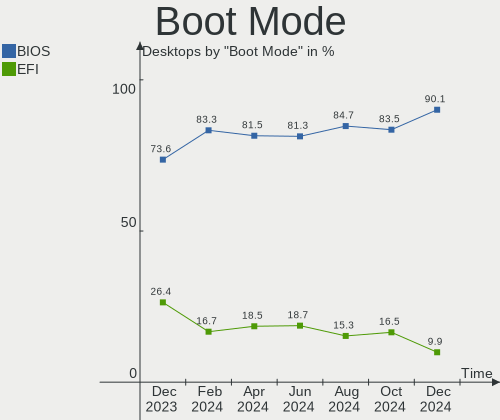
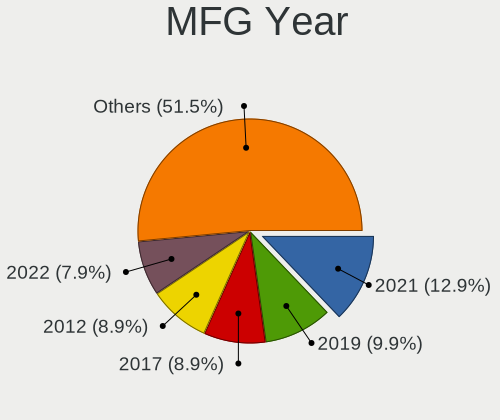
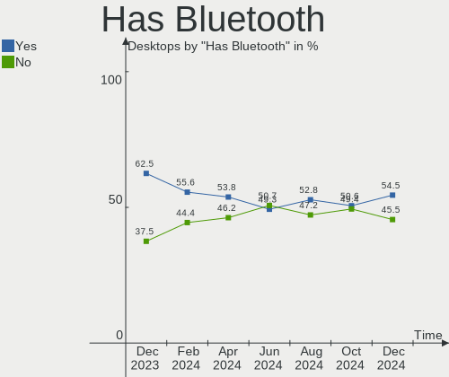
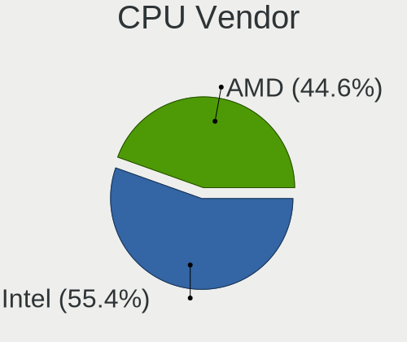
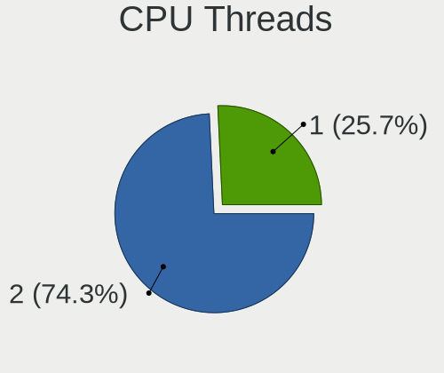
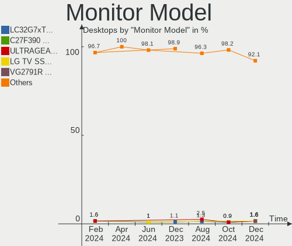
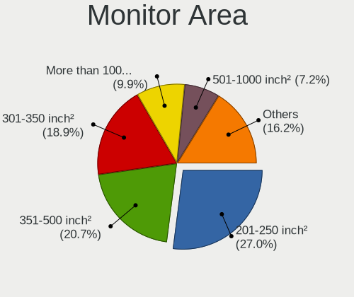

Pop!_OS - Hardware Trends (Desktops)
------------------------------------

A project to identify most popular hardware characteristics and track their change
over time based on data collected by Linux users at https://Linux-Hardware.org.

Anyone can contribute to this report by the [hw-probe](https://github.com/linuxhw/hw-probe) tool:

    sudo -E hw-probe -all -upload

This report is for one last month. Overall report since the beginning of time: [TestDays](https://github.com/linuxhw/TestDays)

Period: Apr, 2024.

Contents
--------

* [ System ](#system)
  - [ OS                       ](#os)
  - [ OS Family                ](#os-family)
  - [ Kernel                   ](#kernel)
  - [ Kernel Family            ](#kernel-family)
  - [ Kernel Major Ver.        ](#kernel-major-ver)
  - [ Arch                     ](#arch)
  - [ DE                       ](#de)
  - [ Display Server           ](#display-server)
  - [ Display Manager          ](#display-manager)
  - [ OS Lang                  ](#os-lang)
  - [ Boot Mode                ](#boot-mode)
  - [ Filesystem               ](#filesystem)
  - [ Part. scheme             ](#part-scheme)
  - [ Dual Boot with Linux/BSD ](#dual-boot-with-linuxbsd)
  - [ Dual Boot (Win)          ](#dual-boot-win)

* [ Board ](#board)
  - [ Vendor                   ](#vendor)
  - [ Model                    ](#model)
  - [ Model Family             ](#model-family)
  - [ MFG Year                 ](#mfg-year)
  - [ Form Factor              ](#form-factor)
  - [ Secure Boot              ](#secure-boot)
  - [ Coreboot                 ](#coreboot)
  - [ RAM Size                 ](#ram-size)
  - [ RAM Used                 ](#ram-used)
  - [ Total Drives             ](#total-drives)
  - [ Has CD-ROM               ](#has-cd-rom)
  - [ Has Ethernet             ](#has-ethernet)
  - [ Has WiFi                 ](#has-wifi)
  - [ Has Bluetooth            ](#has-bluetooth)

* [ Location ](#location)
  - [ Country                  ](#country)
  - [ City                     ](#city)

* [ Drives ](#drives)
  - [ Drive Vendor             ](#drive-vendor)
  - [ Drive Model              ](#drive-model)
  - [ HDD Vendor               ](#hdd-vendor)
  - [ SSD Vendor               ](#ssd-vendor)
  - [ Drive Kind               ](#drive-kind)
  - [ Drive Connector          ](#drive-connector)
  - [ Drive Size               ](#drive-size)
  - [ Space Total              ](#space-total)
  - [ Space Used               ](#space-used)
  - [ Malfunc. Drives          ](#malfunc-drives)
  - [ Malfunc. Drive Vendor    ](#malfunc-drive-vendor)
  - [ Malfunc. HDD Vendor      ](#malfunc-hdd-vendor)
  - [ Malfunc. Drive Kind      ](#malfunc-drive-kind)
  - [ Failed Drives            ](#failed-drives)
  - [ Failed Drive Vendor      ](#failed-drive-vendor)
  - [ Drive Status             ](#drive-status)

* [ Storage controller ](#storage-controller)
  - [ Storage Vendor           ](#storage-vendor)
  - [ Storage Model            ](#storage-model)
  - [ Storage Kind             ](#storage-kind)

* [ Processor ](#processor)
  - [ CPU Vendor               ](#cpu-vendor)
  - [ CPU Model                ](#cpu-model)
  - [ CPU Model Family         ](#cpu-model-family)
  - [ CPU Cores                ](#cpu-cores)
  - [ CPU Sockets              ](#cpu-sockets)
  - [ CPU Threads              ](#cpu-threads)
  - [ CPU Op-Modes             ](#cpu-op-modes)
  - [ CPU Microcode            ](#cpu-microcode)
  - [ CPU Microarch            ](#cpu-microarch)

* [ Graphics ](#graphics)
  - [ GPU Vendor               ](#gpu-vendor)
  - [ GPU Model                ](#gpu-model)
  - [ GPU Combo                ](#gpu-combo)
  - [ GPU Driver               ](#gpu-driver)
  - [ GPU Memory               ](#gpu-memory)

* [ Monitor ](#monitor)
  - [ Monitor Vendor           ](#monitor-vendor)
  - [ Monitor Model            ](#monitor-model)
  - [ Monitor Resolution       ](#monitor-resolution)
  - [ Monitor Diagonal         ](#monitor-diagonal)
  - [ Monitor Width            ](#monitor-width)
  - [ Aspect Ratio             ](#aspect-ratio)
  - [ Monitor Area             ](#monitor-area)
  - [ Pixel Density            ](#pixel-density)
  - [ Multiple Monitors        ](#multiple-monitors)

* [ Network ](#network)
  - [ Net Controller Vendor    ](#net-controller-vendor)
  - [ Net Controller Model     ](#net-controller-model)
  - [ Wireless Vendor          ](#wireless-vendor)
  - [ Wireless Model           ](#wireless-model)
  - [ Ethernet Vendor          ](#ethernet-vendor)
  - [ Ethernet Model           ](#ethernet-model)
  - [ Net Controller Kind      ](#net-controller-kind)
  - [ Used Controller          ](#used-controller)
  - [ NICs                     ](#nics)
  - [ IPv6                     ](#ipv6)

* [ Bluetooth ](#bluetooth)
  - [ Bluetooth Vendor         ](#bluetooth-vendor)
  - [ Bluetooth Model          ](#bluetooth-model)

* [ Sound ](#sound)
  - [ Sound Vendor             ](#sound-vendor)
  - [ Sound Model              ](#sound-model)

* [ Memory ](#memory)
  - [ Memory Vendor            ](#memory-vendor)
  - [ Memory Model             ](#memory-model)
  - [ Memory Kind              ](#memory-kind)
  - [ Memory Form Factor       ](#memory-form-factor)
  - [ Memory Size              ](#memory-size)
  - [ Memory Speed             ](#memory-speed)

* [ Printers & scanners ](#printers--scanners)
  - [ Printer Vendor           ](#printer-vendor)
  - [ Printer Model            ](#printer-model)
  - [ Scanner Vendor           ](#scanner-vendor)
  - [ Scanner Model            ](#scanner-model)

* [ Camera ](#camera)
  - [ Camera Vendor            ](#camera-vendor)
  - [ Camera Model             ](#camera-model)

* [ Security ](#security)
  - [ Fingerprint Vendor       ](#fingerprint-vendor)
  - [ Fingerprint Model        ](#fingerprint-model)
  - [ Chipcard Vendor          ](#chipcard-vendor)
  - [ Chipcard Model           ](#chipcard-model)

* [ Unsupported ](#unsupported)
  - [ Unsupported Devices      ](#unsupported-devices)
  - [ Unsupported Device Types ](#unsupported-device-types)

System
------

OS
--

Installed operating systems

| Name          | Desktops | Percent |
|---------------|----------|---------|
| Pop!_OS 22.04 | 64       | 98.46%  |
| Pop!_OS 21.10 | 1        | 1.54%   |

OS Family
---------

OS without a version

| Name    | Desktops | Percent |
|---------|----------|---------|
| Pop!_OS | 65       | 100%    |

Kernel
------

Version of the Linux kernel

| Version                             | Desktops | Percent |
|-------------------------------------|----------|---------|
| 6.8.0-76060800daily20240311-generic | 54       | 83.08%  |
| 6.6.10-76060610-generic             | 8        | 12.31%  |
| 6.5.4-76060504-generic              | 1        | 1.54%   |
| 6.2.6-76060206-generic              | 1        | 1.54%   |
| 5.18.10-76051810-generic            | 1        | 1.54%   |

Kernel Family
-------------

Linux kernel without a distro release

| Version | Desktops | Percent |
|---------|----------|---------|
| 6.8.0   | 54       | 83.08%  |
| 6.6.10  | 8        | 12.31%  |
| 6.5.4   | 1        | 1.54%   |
| 6.2.6   | 1        | 1.54%   |
| 5.18.10 | 1        | 1.54%   |

Kernel Major Ver.
-----------------

Linux kernel major version

| Version | Desktops | Percent |
|---------|----------|---------|
| 6.8     | 54       | 83.08%  |
| 6.6     | 8        | 12.31%  |
| 6.5     | 1        | 1.54%   |
| 6.2     | 1        | 1.54%   |
| 5.18    | 1        | 1.54%   |

Arch
----

OS architecture (x86_64, i586, etc.)

| Name   | Desktops | Percent |
|--------|----------|---------|
| x86_64 | 65       | 100%    |

DE
--

Desktop Environment

| Name       | Desktops | Percent |
|------------|----------|---------|
| GNOME      | 62       | 95.38%  |
| KDE5       | 2        | 3.08%   |
| X-Cinnamon | 1        | 1.54%   |

Display Server
--------------

X11 or Wayland

| Name    | Desktops | Percent |
|---------|----------|---------|
| X11     | 60       | 92.31%  |
| Wayland | 5        | 7.69%   |

Display Manager
---------------

SDDM, LightDM, etc.

| Name    | Desktops | Percent |
|---------|----------|---------|
| Unknown | 53       | 81.54%  |
| GDM3    | 11       | 16.92%  |
| SDDM    | 1        | 1.54%   |

OS Lang
-------

Language

| Lang  | Desktops | Percent |
|-------|----------|---------|
| en_US | 35       | 53.85%  |
| pt_BR | 5        | 7.69%   |
| en_GB | 5        | 7.69%   |
| de_DE | 3        | 4.62%   |
| es_ES | 2        | 3.08%   |
| tr_TR | 1        | 1.54%   |
| sk_SK | 1        | 1.54%   |
| ru_RU | 1        | 1.54%   |
| ro_RO | 1        | 1.54%   |
| pt_PT | 1        | 1.54%   |
| it_IT | 1        | 1.54%   |
| es_US | 1        | 1.54%   |
| es_CL | 1        | 1.54%   |
| en_ZW | 1        | 1.54%   |
| en_DK | 1        | 1.54%   |
| en_CA | 1        | 1.54%   |
| en_AU | 1        | 1.54%   |
| de_CH | 1        | 1.54%   |
| de_AT | 1        | 1.54%   |
| C     | 1        | 1.54%   |

Boot Mode
---------

EFI or BIOS

| Mode | Desktops | Percent |
|------|----------|---------|
| BIOS | 53       | 81.54%  |
| EFI  | 12       | 18.46%  |

Filesystem
----------

Type of filesystem

| Type | Desktops | Percent |
|------|----------|---------|
| Ext4 | 65       | 100%    |

Part. scheme
------------

Scheme of partitioning

| Type    | Desktops | Percent |
|---------|----------|---------|
| Unknown | 53       | 81.54%  |
| GPT     | 12       | 18.46%  |

Dual Boot with Linux/BSD
------------------------

Hosting more than one Linux/BSD

| Dual boot | Desktops | Percent |
|-----------|----------|---------|
| No        | 64       | 98.46%  |
| Yes       | 1        | 1.54%   |

Dual Boot (Win)
---------------

Hosting Linux and Windows

| Dual boot | Desktops | Percent |
|-----------|----------|---------|
| No        | 58       | 89.23%  |
| Yes       | 7        | 10.77%  |

Board
-----

Vendor
------

Motherboard manufacturer

| Name                | Desktops | Percent |
|---------------------|----------|---------|
| ASUSTek Computer    | 20       | 30.77%  |
| Gigabyte Technology | 10       | 15.38%  |
| MSI                 | 7        | 10.77%  |
| ASRock              | 7        | 10.77%  |
| Dell                | 5        | 7.69%   |
| Hewlett-Packard     | 4        | 6.15%   |
| Intel               | 3        | 4.62%   |
| Acer                | 2        | 3.08%   |
| System76            | 1        | 1.54%   |
| Supermicro          | 1        | 1.54%   |
| Itautec             | 1        | 1.54%   |
| Huanan              | 1        | 1.54%   |
| Biostar             | 1        | 1.54%   |
| BESSTAR Tech        | 1        | 1.54%   |
| Unknown             | 1        | 1.54%   |

Model
-----

Motherboard model

| Name                                    | Desktops | Percent |
|-----------------------------------------|----------|---------|
| ASUS TUF Gaming B650M-E WIFI            | 2        | 3.08%   |
| System76 Thelio Mira                    | 1        | 1.54%   |
| Supermicro Mediasite Recorder           | 1        | 1.54%   |
| MSI MS-7C95                             | 1        | 1.54%   |
| MSI MS-7C92                             | 1        | 1.54%   |
| MSI MS-7C56                             | 1        | 1.54%   |
| MSI MS-7C02                             | 1        | 1.54%   |
| MSI MS-7A74                             | 1        | 1.54%   |
| MSI MS-7821                             | 1        | 1.54%   |
| MSI MS-7693                             | 1        | 1.54%   |
| Itautec ST 4271                         | 1        | 1.54%   |
| Intel X99 V1.0                          | 1        | 1.54%   |
| Intel DH67CF AAG10215-203               | 1        | 1.54%   |
| Intel B75                               | 1        | 1.54%   |
| Huanan X99-QD4 V1.0                     | 1        | 1.54%   |
| HP Z840 Workstation                     | 1        | 1.54%   |
| HP OMEN by 40L Gaming Desktop GT21-0xxx | 1        | 1.54%   |
| HP OMEN 25L Desktop GT12-0xxx           | 1        | 1.54%   |
| HP EliteDesk 800 G3 SFF                 | 1        | 1.54%   |
| Gigabyte Z790 GAMING X AX               | 1        | 1.54%   |
| Gigabyte Z590I AORUS ULTRA              | 1        | 1.54%   |
| Gigabyte X570 AORUS MASTER              | 1        | 1.54%   |
| Gigabyte H410M S2 V2                    | 1        | 1.54%   |
| Gigabyte H170-HD3-CF                    | 1        | 1.54%   |
| Gigabyte B75M-D3H                       | 1        | 1.54%   |
| Gigabyte B560M H                        | 1        | 1.54%   |
| Gigabyte B450M S2H                      | 1        | 1.54%   |
| Gigabyte B450 AORUS ELITE               | 1        | 1.54%   |
| Gigabyte 970A-DS3P                      | 1        | 1.54%   |
| Dell XPS 8930                           | 1        | 1.54%   |
| Dell Precision Tower 5810               | 1        | 1.54%   |
| Dell OptiPlex 7070                      | 1        | 1.54%   |
| Dell OptiPlex 3060                      | 1        | 1.54%   |
| Dell Inspiron 3847                      | 1        | 1.54%   |
| Biostar TA970                           | 1        | 1.54%   |
| BESSTAR Tech HM90                       | 1        | 1.54%   |
| ASUS Z170 PRO GAMING                    | 1        | 1.54%   |
| ASUS TUF Gaming Z690-PLUS WIFI D4       | 1        | 1.54%   |
| ASUS TUF Gaming B650M-PLUS              | 1        | 1.54%   |
| ASUS TUF Gaming B650-PLUS WIFI          | 1        | 1.54%   |

Model Family
------------

Motherboard model prefix

| Name                 | Desktops | Percent |
|----------------------|----------|---------|
| ASUS TUF             | 6        | 9.23%   |
| ASUS PRIME           | 4        | 6.15%   |
| HP OMEN              | 2        | 3.08%   |
| Dell OptiPlex        | 2        | 3.08%   |
| ASUS ROG             | 2        | 3.08%   |
| ASRock B450M         | 2        | 3.08%   |
| Acer Aspire          | 2        | 3.08%   |
| System76 Thelio      | 1        | 1.54%   |
| Supermicro Mediasite | 1        | 1.54%   |
| MSI MS-7C95          | 1        | 1.54%   |
| MSI MS-7C92          | 1        | 1.54%   |
| MSI MS-7C56          | 1        | 1.54%   |
| MSI MS-7C02          | 1        | 1.54%   |
| MSI MS-7A74          | 1        | 1.54%   |
| MSI MS-7821          | 1        | 1.54%   |
| MSI MS-7693          | 1        | 1.54%   |
| Itautec ST           | 1        | 1.54%   |
| Intel X99            | 1        | 1.54%   |
| Intel DH67CF         | 1        | 1.54%   |
| Intel B75            | 1        | 1.54%   |
| Huanan X99-QD4       | 1        | 1.54%   |
| HP Z840              | 1        | 1.54%   |
| HP EliteDesk         | 1        | 1.54%   |
| Gigabyte Z790        | 1        | 1.54%   |
| Gigabyte Z590I       | 1        | 1.54%   |
| Gigabyte X570        | 1        | 1.54%   |
| Gigabyte H410M       | 1        | 1.54%   |
| Gigabyte H170-HD3-CF | 1        | 1.54%   |
| Gigabyte B75M-D3H    | 1        | 1.54%   |
| Gigabyte B560M       | 1        | 1.54%   |
| Gigabyte B450M       | 1        | 1.54%   |
| Gigabyte B450        | 1        | 1.54%   |
| Gigabyte 970A-DS3P   | 1        | 1.54%   |
| Dell XPS             | 1        | 1.54%   |
| Dell Precision       | 1        | 1.54%   |
| Dell Inspiron        | 1        | 1.54%   |
| Biostar TA970        | 1        | 1.54%   |
| BESSTAR Tech HM90    | 1        | 1.54%   |
| ASUS Z170            | 1        | 1.54%   |
| ASUS STRIX           | 1        | 1.54%   |

MFG Year
--------

Motherboard manufacture year

| Year | Desktops | Percent |
|------|----------|---------|
| 2020 | 10       | 15.38%  |
| 2021 | 8        | 12.31%  |
| 2022 | 7        | 10.77%  |
| 2018 | 5        | 7.69%   |
| 2023 | 4        | 6.15%   |
| 2019 | 4        | 6.15%   |
| 2017 | 4        | 6.15%   |
| 2013 | 4        | 6.15%   |
| 2012 | 4        | 6.15%   |
| 2015 | 3        | 4.62%   |
| 2010 | 3        | 4.62%   |
| 2009 | 3        | 4.62%   |
| 2016 | 2        | 3.08%   |
| 2014 | 2        | 3.08%   |
| 2011 | 1        | 1.54%   |
| 2008 | 1        | 1.54%   |

Form Factor
-----------

Physical design of the computer

| Name    | Desktops | Percent |
|---------|----------|---------|
| Desktop | 65       | 100%    |

Secure Boot
-----------

Enabled or disabled

| State    | Desktops | Percent |
|----------|----------|---------|
| Disabled | 65       | 100%    |

Coreboot
--------

Have coreboot on board

| Used | Desktops | Percent |
|------|----------|---------|
| No   | 65       | 100%    |

RAM Size
--------

Total RAM memory

| Size in GB  | Desktops | Percent |
|-------------|----------|---------|
| 16.01-24.0  | 24       | 36.92%  |
| 32.01-64.0  | 21       | 32.31%  |
| 64.01-256.0 | 8        | 12.31%  |
| 4.01-8.0    | 5        | 7.69%   |
| 8.01-16.0   | 5        | 7.69%   |
| 3.01-4.0    | 1        | 1.54%   |
| 24.01-32.0  | 1        | 1.54%   |

RAM Used
--------

Used RAM memory

| Used GB    | Desktops | Percent |
|------------|----------|---------|
| 4.01-8.0   | 31       | 47.69%  |
| 8.01-16.0  | 15       | 23.08%  |
| 3.01-4.0   | 11       | 16.92%  |
| 2.01-3.0   | 3        | 4.62%   |
| 1.01-2.0   | 3        | 4.62%   |
| 16.01-24.0 | 2        | 3.08%   |

Total Drives
------------

Number of drives on board

| Drives | Desktops | Percent |
|--------|----------|---------|
| 2      | 20       | 30.77%  |
| 1      | 19       | 29.23%  |
| 3      | 10       | 15.38%  |
| 5      | 7        | 10.77%  |
| 6      | 4        | 6.15%   |
| 4      | 4        | 6.15%   |
| 7      | 1        | 1.54%   |

Has CD-ROM
----------

Has CD-ROM on board

| Presented | Desktops | Percent |
|-----------|----------|---------|
| No        | 50       | 76.92%  |
| Yes       | 15       | 23.08%  |

Has Ethernet
------------

Has Ethernet on board

| Presented | Desktops | Percent |
|-----------|----------|---------|
| Yes       | 65       | 100%    |

Has WiFi
--------

Has WiFi module

| Presented | Desktops | Percent |
|-----------|----------|---------|
| Yes       | 38       | 58.46%  |
| No        | 27       | 41.54%  |

Has Bluetooth
-------------

Has Bluetooth module

| Presented | Desktops | Percent |
|-----------|----------|---------|
| Yes       | 35       | 53.85%  |
| No        | 30       | 46.15%  |

Location
--------

Country
-------

Geographic location (country)

| Country     | Desktops | Percent |
|-------------|----------|---------|
| USA         | 19       | 29.23%  |
| Brazil      | 9        | 13.85%  |
| UK          | 5        | 7.69%   |
| Canada      | 4        | 6.15%   |
| Germany     | 3        | 4.62%   |
| Austria     | 3        | 4.62%   |
| Spain       | 2        | 3.08%   |
| Greece      | 2        | 3.08%   |
| Turkey      | 1        | 1.54%   |
| Thailand    | 1        | 1.54%   |
| Switzerland | 1        | 1.54%   |
| Slovakia    | 1        | 1.54%   |
| Russia      | 1        | 1.54%   |
| Portugal    | 1        | 1.54%   |
| Poland      | 1        | 1.54%   |
| Norway      | 1        | 1.54%   |
| New Zealand | 1        | 1.54%   |
| Netherlands | 1        | 1.54%   |
| Malaysia    | 1        | 1.54%   |
| Italy       | 1        | 1.54%   |
| Finland     | 1        | 1.54%   |
| Czechia     | 1        | 1.54%   |
| Chile       | 1        | 1.54%   |
| Azerbaijan  | 1        | 1.54%   |
| Australia   | 1        | 1.54%   |
| Albania     | 1        | 1.54%   |

City
----

Geographic location (city)

| City                | Desktops | Percent |
|---------------------|----------|---------|
| Vienna              | 2        | 3.08%   |
| Seattle             | 2        | 3.08%   |
| New York            | 2        | 3.08%   |
| Contagem            | 2        | 3.08%   |
| Wroclaw             | 1        | 1.54%   |
| Wichita             | 1        | 1.54%   |
| Viña del Mar       | 1        | 1.54%   |
| Uba                 | 1        | 1.54%   |
| Tonypandy           | 1        | 1.54%   |
| Tirana              | 1        | 1.54%   |
| Sydney              | 1        | 1.54%   |
| Sunshine Coast      | 1        | 1.54%   |
| St Louis            | 1        | 1.54%   |
| St Austell          | 1        | 1.54%   |
| Southwark           | 1        | 1.54%   |
| Rio Branco          | 1        | 1.54%   |
| Richmond Hill       | 1        | 1.54%   |
| Richmond            | 1        | 1.54%   |
| Prague              | 1        | 1.54%   |
| Porto Velho         | 1        | 1.54%   |
| Pirapora            | 1        | 1.54%   |
| Phitsanulok         | 1        | 1.54%   |
| Palmyra             | 1        | 1.54%   |
| New Haven           | 1        | 1.54%   |
| Námestovo          | 1        | 1.54%   |
| Mukilteo            | 1        | 1.54%   |
| Morehead City       | 1        | 1.54%   |
| Montreal            | 1        | 1.54%   |
| Milton              | 1        | 1.54%   |
| Manaus              | 1        | 1.54%   |
| Lucerne             | 1        | 1.54%   |
| Lisbon              | 1        | 1.54%   |
| Limburg an der Lahn | 1        | 1.54%   |
| Larissa             | 1        | 1.54%   |
| Lake Charles        | 1        | 1.54%   |
| Kajang              | 1        | 1.54%   |
| Hornby              | 1        | 1.54%   |
| Hollywood           | 1        | 1.54%   |
| Helsinki            | 1        | 1.54%   |
| Heathsville         | 1        | 1.54%   |

Drives
------

Drive Vendor
------------

Hard drive vendors

| Vendor                      | Desktops | Drives | Percent |
|-----------------------------|----------|--------|---------|
| Samsung Electronics         | 27       | 38     | 18.88%  |
| WDC                         | 20       | 21     | 13.99%  |
| Seagate                     | 20       | 29     | 13.99%  |
| Kingston                    | 8        | 9      | 5.59%   |
| Toshiba                     | 7        | 8      | 4.9%    |
| Sandisk                     | 7        | 7      | 4.9%    |
| Crucial                     | 7        | 9      | 4.9%    |
| Phison Electronics          | 5        | 6      | 3.5%    |
| Intel                       | 4        | 4      | 2.8%    |
| Silicon Motion              | 3        | 3      | 2.1%    |
| Netac                       | 3        | 3      | 2.1%    |
| Hitachi                     | 3        | 3      | 2.1%    |
| China                       | 3        | 3      | 2.1%    |
| SPCC                        | 2        | 2      | 1.4%    |
| MAXIO Technology (Hangzhou) | 2        | 2      | 1.4%    |
| KingDian                    | 2        | 2      | 1.4%    |
| WD MediaMax                 | 1        | 1      | 0.7%    |
| WALRAM                      | 1        | 1      | 0.7%    |
| Unknown                     | 1        | 1      | 0.7%    |
| SK hynix                    | 1        | 1      | 0.7%    |
| Realtek                     | 1        | 1      | 0.7%    |
| Patriot                     | 1        | 2      | 0.7%    |
| OCZ                         | 1        | 1      | 0.7%    |
| Micron/Crucial Technology   | 1        | 1      | 0.7%    |
| Micron Technology           | 1        | 1      | 0.7%    |
| Lexar                       | 1        | 2      | 0.7%    |
| KIOXIA-EXCERIA              | 1        | 1      | 0.7%    |
| Kingston Technology Company | 1        | 1      | 0.7%    |
| KingSpec                    | 1        | 1      | 0.7%    |
| Intenso                     | 1        | 1      | 0.7%    |
| HS-SSD-E100                 | 1        | 1      | 0.7%    |
| HS-SSD-C100                 | 1        | 1      | 0.7%    |
| HGST                        | 1        | 1      | 0.7%    |
| Hewlett-Packard             | 1        | 1      | 0.7%    |
| Gigabyte Technology         | 1        | 2      | 0.7%    |
| Apacer                      | 1        | 1      | 0.7%    |

Drive Model
-----------

Hard drive models

| Model                                                 | Desktops | Percent |
|-------------------------------------------------------|----------|---------|
| Samsung NVMe SSD Controller SM981/PM981/PM983 1TB     | 4        | 2.41%   |
| Samsung NVMe SSD Controller PM9A1/PM9A3/980PRO 1TB    | 4        | 2.41%   |
| WDC WD10EZEX-00WN4A0 1TB                              | 3        | 1.81%   |
| Seagate ST1000DM010-2EP102 1TB                        | 3        | 1.81%   |
| Silicon Motion SM2263EN/SM2263XT SSD Controller 256GB | 2        | 1.2%    |
| Sandisk WD Blue SN550 NVMe SSD 2TB                    | 2        | 1.2%    |
| Samsung SSD 860 EVO 500GB                             | 2        | 1.2%    |
| Samsung SSD 850 EVO 500GB                             | 2        | 1.2%    |
| Kingston SV300S37A240G 240GB SSD                      | 2        | 1.2%    |
| Kingston SA400S37480G 480GB SSD                       | 2        | 1.2%    |
| Crucial CT2000MX500SSD1 2TB                           | 2        | 1.2%    |
| WDC WDS500G2B0C-00PXH0 500GB                          | 1        | 0.6%    |
| WDC WDS240G2G0A-00JH30 240GB SSD                      | 1        | 0.6%    |
| WDC WDS100T2B0A-00SM50 1TB SSD                        | 1        | 0.6%    |
| WDC WD80EMAZ-00WJTA0 8TB                              | 1        | 0.6%    |
| WDC WD8002FZWX-00BKUA0 8TB                            | 1        | 0.6%    |
| WDC WD6400AAKS-65A7B0 640GB                           | 1        | 0.6%    |
| WDC WD60EFAX-68JH4N0 6TB                              | 1        | 0.6%    |
| WDC WD5000BPVT-22HXZT3 500GB                          | 1        | 0.6%    |
| WDC WD5000AAKX-08ERMA0 500GB                          | 1        | 0.6%    |
| WDC WD3200BEVT-11ZCT0 320GB                           | 1        | 0.6%    |
| WDC WD30EZRZ-00GXCB0 3TB                              | 1        | 0.6%    |
| WDC WD30EZRX-00D8PB0 3TB                              | 1        | 0.6%    |
| WDC WD23PURZ-85C5HY0 2TB                              | 1        | 0.6%    |
| WDC WD20EFRX-68AX9N0 2TB                              | 1        | 0.6%    |
| WDC WD20EARS-00MVWB0 2TB                              | 1        | 0.6%    |
| WDC WD2002FYPS-01U1B1 2TB                             | 1        | 0.6%    |
| WDC WD10EZEX-75M2NA0 1TB                              | 1        | 0.6%    |
| WDC WD BLACK SDBPNTY-512G-1106 512GB                  | 1        | 0.6%    |
| WD MediaMax WL2000GSA1672 2TB                         | 1        | 0.6%    |
| WALRAM SSD 512GB                                      | 1        | 0.6%    |
| Unknown SD/MMC/MS PRO 128GB                           | 1        | 0.6%    |
| Toshiba MQ01ABF032 320GB                              | 1        | 0.6%    |
| Toshiba MQ01ABD100 1TB                                | 1        | 0.6%    |
| Toshiba KXG60ZNV512G 512GB                            | 1        | 0.6%    |
| Toshiba HDWD130 3TB                                   | 1        | 0.6%    |
| Toshiba HDWD110 1TB                                   | 1        | 0.6%    |
| Toshiba HDWD105 500GB                                 | 1        | 0.6%    |
| Toshiba DT01ACA100 1TB                                | 1        | 0.6%    |
| Toshiba DT01ABA200 2TB                                | 1        | 0.6%    |

HDD Vendor
----------

Hard disk drive vendors

| Vendor              | Desktops | Drives | Percent |
|---------------------|----------|--------|---------|
| Seagate             | 19       | 27     | 38.78%  |
| WDC                 | 16       | 17     | 32.65%  |
| Toshiba             | 6        | 7      | 12.24%  |
| Hitachi             | 3        | 3      | 6.12%   |
| Samsung Electronics | 2        | 2      | 4.08%   |
| WD MediaMax         | 1        | 1      | 2.04%   |
| Unknown             | 1        | 1      | 2.04%   |
| HGST                | 1        | 1      | 2.04%   |

SSD Vendor
----------

Solid state drive vendors

| Vendor              | Desktops | Drives | Percent |
|---------------------|----------|--------|---------|
| Samsung Electronics | 15       | 19     | 33.33%  |
| Crucial             | 7        | 8      | 15.56%  |
| Kingston            | 6        | 7      | 13.33%  |
| WDC                 | 2        | 2      | 4.44%   |
| KingDian            | 2        | 2      | 4.44%   |
| China               | 2        | 2      | 4.44%   |
| WALRAM              | 1        | 1      | 2.22%   |
| SPCC                | 1        | 1      | 2.22%   |
| SanDisk             | 1        | 1      | 2.22%   |
| Patriot             | 1        | 2      | 2.22%   |
| OCZ                 | 1        | 1      | 2.22%   |
| Netac               | 1        | 1      | 2.22%   |
| Lexar               | 1        | 2      | 2.22%   |
| KingSpec            | 1        | 1      | 2.22%   |
| Intenso             | 1        | 1      | 2.22%   |
| Gigabyte Technology | 1        | 2      | 2.22%   |
| Apacer              | 1        | 1      | 2.22%   |

Drive Kind
----------

HDD or SSD

| Kind    | Desktops | Drives | Percent |
|---------|----------|--------|---------|
| SSD     | 37       | 54     | 32.74%  |
| HDD     | 37       | 59     | 32.74%  |
| NVMe    | 35       | 54     | 30.97%  |
| Unknown | 4        | 5      | 3.54%   |

Drive Connector
---------------

SATA, SAS, NVMe, etc.

| Type | Desktops | Drives | Percent |
|------|----------|--------|---------|
| SATA | 53       | 112    | 56.38%  |
| NVMe | 35       | 53     | 37.23%  |
| SAS  | 6        | 7      | 6.38%   |

Drive Size
----------

Size of hard drive

| Size in TB | Desktops | Drives | Percent |
|------------|----------|--------|---------|
| 0.01-0.5   | 35       | 50     | 41.67%  |
| 0.51-1.0   | 26       | 36     | 30.95%  |
| 1.01-2.0   | 12       | 16     | 14.29%  |
| 2.01-3.0   | 4        | 4      | 4.76%   |
| 4.01-10.0  | 4        | 4      | 4.76%   |
| 3.01-4.0   | 2        | 2      | 2.38%   |
| 10.01-20.0 | 1        | 1      | 1.19%   |

Space Total
-----------

Amount of disk space available on the file system

| Size in GB     | Desktops | Percent |
|----------------|----------|---------|
| 251-500        | 17       | 26.15%  |
| 1001-2000      | 13       | 20%     |
| 101-250        | 12       | 18.46%  |
| 501-1000       | 9        | 13.85%  |
| More than 3000 | 7        | 10.77%  |
| 2001-3000      | 5        | 7.69%   |
| 21-50          | 1        | 1.54%   |
| 51-100         | 1        | 1.54%   |

Space Used
----------

Amount of used disk space

| Used GB        | Desktops | Percent |
|----------------|----------|---------|
| 101-250        | 13       | 20%     |
| 1-20           | 13       | 20%     |
| 251-500        | 8        | 12.31%  |
| 21-50          | 8        | 12.31%  |
| 1001-2000      | 6        | 9.23%   |
| 51-100         | 6        | 9.23%   |
| More than 3000 | 5        | 7.69%   |
| 501-1000       | 5        | 7.69%   |
| 2001-3000      | 1        | 1.54%   |

Malfunc. Drives
---------------

Drive models with a malfunction

| Model                             | Desktops | Drives | Percent |
|-----------------------------------|----------|--------|---------|
| WDC WD20EFRX-68AX9N0 2TB          | 1        | 1      | 14.29%  |
| Toshiba MQ01ABD100 1TB            | 1        | 1      | 14.29%  |
| Seagate ST3750640AS 752GB         | 1        | 1      | 14.29%  |
| Seagate ST2000DM001-1CH164 2TB    | 1        | 1      | 14.29%  |
| Seagate ST1500DL003-9VT16L 1TB    | 1        | 1      | 14.29%  |
| Samsung Electronics HD502HI 500GB | 1        | 1      | 14.29%  |
| Crucial CT480M500SSD1 480GB       | 1        | 1      | 14.29%  |

Malfunc. Drive Vendor
---------------------

Vendors of faulty drives

| Vendor              | Desktops | Drives | Percent |
|---------------------|----------|--------|---------|
| Seagate             | 2        | 3      | 33.33%  |
| WDC                 | 1        | 1      | 16.67%  |
| Toshiba             | 1        | 1      | 16.67%  |
| Samsung Electronics | 1        | 1      | 16.67%  |
| Crucial             | 1        | 1      | 16.67%  |

Malfunc. HDD Vendor
-------------------

Vendors of faulty HDD drives

| Vendor              | Desktops | Drives | Percent |
|---------------------|----------|--------|---------|
| Seagate             | 2        | 3      | 40%     |
| WDC                 | 1        | 1      | 20%     |
| Toshiba             | 1        | 1      | 20%     |
| Samsung Electronics | 1        | 1      | 20%     |

Malfunc. Drive Kind
-------------------

Kinds of faulty drives

| Kind | Desktops | Drives | Percent |
|------|----------|--------|---------|
| HDD  | 4        | 6      | 80%     |
| SSD  | 1        | 1      | 20%     |

Failed Drives
-------------

Failed drive models

Zero info for selected period =(

Failed Drive Vendor
-------------------

Failed drive vendors

Zero info for selected period =(

Drive Status
------------

Number of failed and malfunc. drives

| Status   | Desktops | Drives | Percent |
|----------|----------|--------|---------|
| Detected | 56       | 136    | 76.71%  |
| Works    | 13       | 29     | 17.81%  |
| Malfunc  | 4        | 7      | 5.48%   |

Storage controller
------------------

Storage Vendor
--------------

Storage controller vendors

| Vendor                       | Desktops | Percent |
|------------------------------|----------|---------|
| Intel                        | 37       | 32.74%  |
| AMD                          | 28       | 24.78%  |
| Samsung Electronics          | 13       | 11.5%   |
| SanDisk                      | 7        | 6.19%   |
| Phison Electronics           | 6        | 5.31%   |
| Silicon Motion               | 4        | 3.54%   |
| Kingston Technology Company  | 3        | 2.65%   |
| Micron/Crucial Technology    | 2        | 1.77%   |
| MAXIO Technology (Hangzhou)  | 2        | 1.77%   |
| JMicron Technology           | 2        | 1.77%   |
| ASMedia Technology           | 2        | 1.77%   |
| Toshiba America Info Systems | 1        | 0.88%   |
| SK hynix                     | 1        | 0.88%   |
| Nvidia                       | 1        | 0.88%   |
| Netac Technology             | 1        | 0.88%   |
| Micron Technology            | 1        | 0.88%   |
| KIOXIA                       | 1        | 0.88%   |
| Biwin Storage Technology     | 1        | 0.88%   |

Storage Model
-------------

Storage controller models

| Model                                                                          | Desktops | Percent |
|--------------------------------------------------------------------------------|----------|---------|
| AMD FCH SATA Controller [AHCI mode]                                            | 10       | 7.69%   |
| AMD 400 Series Chipset SATA Controller                                         | 8        | 6.15%   |
| Samsung NVMe SSD Controller PM9A1/PM9A3/980PRO                                 | 6        | 4.62%   |
| AMD 600 Series Chipset SATA Controller                                         | 6        | 4.62%   |
| Intel 200 Series PCH SATA controller [AHCI mode]                               | 5        | 3.85%   |
| AMD 500 Series Chipset SATA Controller                                         | 5        | 3.85%   |
| Samsung NVMe SSD Controller SM981/PM981/PM983                                  | 4        | 3.08%   |
| Intel 8 Series/C220 Series Chipset Family 6-port SATA Controller 1 [AHCI mode] | 4        | 3.08%   |
| Silicon Motion SM2263EN/SM2263XT (DRAM-less) NVMe SSD Controllers              | 3        | 2.31%   |
| SanDisk Ultra 3D / WD Blue SN550 NVMe SSD                                      | 3        | 2.31%   |
| Samsung NVMe SSD Controller S4LV008[Pascal]                                    | 3        | 2.31%   |
| Phison E18 PCIe4 NVMe Controller                                               | 3        | 2.31%   |
| Intel SATA Controller [RAID mode]                                              | 3        | 2.31%   |
| Intel 7 Series/C210 Series Chipset Family 6-port SATA Controller [AHCI mode]   | 3        | 2.31%   |
| AMD SB7x0/SB8x0/SB9x0 SATA Controller [IDE mode]                               | 3        | 2.31%   |
| AMD SB7x0/SB8x0/SB9x0 IDE Controller                                           | 3        | 2.31%   |
| Phison E12 NVMe Controller                                                     | 2        | 1.54%   |
| MAXIO (Hangzhou) NVMe SSD Controller MAP1602 (DRAM-less)                       | 2        | 1.54%   |
| Intel Raptor Lake SATA AHCI Controller                                         | 2        | 1.54%   |
| Intel Q170/Q150/B150/H170/H110/Z170/CM236 Chipset SATA Controller [AHCI Mode]  | 2        | 1.54%   |
| Intel C610/X99 series chipset 6-Port SATA Controller [AHCI mode]               | 2        | 1.54%   |
| Intel Alder Lake-S PCH SATA Controller [AHCI Mode]                             | 2        | 1.54%   |
| Intel 82801JI (ICH10 Family) SATA AHCI Controller                              | 2        | 1.54%   |
| Intel 6 Series/C200 Series Chipset Family 6 port Desktop SATA AHCI Controller  | 2        | 1.54%   |
| Intel 500 Series Chipset Family SATA AHCI Controller                           | 2        | 1.54%   |
| ASMedia ASM1061/ASM1062 Serial ATA Controller                                  | 2        | 1.54%   |
| Toshiba America Info Systems XG6 NVMe SSD Controller                           | 1        | 0.77%   |
| SK hynix BC511 NVMe SSD                                                        | 1        | 0.77%   |
| Silicon Motion SM2262/SM2262EN SSD Controller                                  | 1        | 0.77%   |
| SanDisk WD PC SN540 / Green SN350 NVMe SSD 1 TB (DRAM-less)                    | 1        | 0.77%   |
| Sandisk WD Black SN850X NVMe SSD                                               | 1        | 0.77%   |
| SanDisk Ultra 3D / WD Blue SN570 NVMe SSD (DRAM-less)                          | 1        | 0.77%   |
| SanDisk Extreme Pro / WD Black SN750 / PC SN730 / Red SN700 NVMe SSD           | 1        | 0.77%   |
| Phison E16 PCIe4 NVMe Controller                                               | 1        | 0.77%   |
| Nvidia MCP78S [GeForce 8200] IDE                                               | 1        | 0.77%   |
| Nvidia MCP78S [GeForce 8200] AHCI Controller                                   | 1        | 0.77%   |
| Netac PCIe 4 INNOGRIT based NVMe SSD                                           | 1        | 0.77%   |
| Micron/Crucial P5 Plus NVMe PCIe SSD                                           | 1        | 0.77%   |
| Micron/Crucial P1 NVMe PCIe SSD[Frampton]                                      | 1        | 0.77%   |
| Micron 2550 NVMe SSD (DRAM-less)                                               | 1        | 0.77%   |

Storage Kind
------------

Kind of storage controller (IDE, SATA, NVMe, SAS, ...)

| Kind | Desktops | Percent |
|------|----------|---------|
| SATA | 60       | 56.07%  |
| NVMe | 35       | 32.71%  |
| IDE  | 8        | 7.48%   |
| RAID | 4        | 3.74%   |

Processor
---------

CPU Vendor
----------

Processor vendors

| Vendor | Desktops | Percent |
|--------|----------|---------|
| Intel  | 36       | 55.38%  |
| AMD    | 29       | 44.62%  |

CPU Model
---------

Processor models

| Model                                  | Desktops | Percent |
|----------------------------------------|----------|---------|
| AMD Ryzen 7 7800X3D 8-Core Processor   | 4        | 6.15%   |
| Intel Core i7-6700 CPU @ 3.40GHz       | 3        | 4.62%   |
| AMD Ryzen 7 5800X 8-Core Processor     | 3        | 4.62%   |
| AMD Ryzen 5 3600 6-Core Processor      | 3        | 4.62%   |
| Intel Xeon CPU E5-2620 v3 @ 2.40GHz    | 2        | 3.08%   |
| Intel Core i7-7700K CPU @ 4.20GHz      | 2        | 3.08%   |
| Intel Core i7-10700 CPU @ 2.90GHz      | 2        | 3.08%   |
| Intel Core i3-3240 CPU @ 3.40GHz       | 2        | 3.08%   |
| AMD Ryzen 9 5950X 16-Core Processor    | 2        | 3.08%   |
| AMD Ryzen 7 2700 Eight-Core Processor  | 2        | 3.08%   |
| AMD Ryzen 5 5600X 6-Core Processor     | 2        | 3.08%   |
| AMD Ryzen 5 5600G with Radeon Graphics | 2        | 3.08%   |
| Intel Xeon CPU E5450 @ 3.00GHz         | 1        | 1.54%   |
| Intel Xeon CPU E5-2687W v3 @ 3.10GHz   | 1        | 1.54%   |
| Intel Xeon CPU E5-1620 v3 @ 3.50GHz    | 1        | 1.54%   |
| Intel Pentium Gold G7400               | 1        | 1.54%   |
| Intel Genuine CPU 0000 @ 1.70GHz       | 1        | 1.54%   |
| Intel Core i7-8700 CPU @ 3.20GHz       | 1        | 1.54%   |
| Intel Core i7-2600 CPU @ 3.40GHz       | 1        | 1.54%   |
| Intel Core i7-14700K                   | 1        | 1.54%   |
| Intel Core i7 CPU 920 @ 2.67GHz        | 1        | 1.54%   |
| Intel Core i5-9500T CPU @ 2.20GHz      | 1        | 1.54%   |
| Intel Core i5-8500T CPU @ 2.10GHz      | 1        | 1.54%   |
| Intel Core i5-8269U CPU @ 2.60GHz      | 1        | 1.54%   |
| Intel Core i5-7600K CPU @ 3.80GHz      | 1        | 1.54%   |
| Intel Core i5-4670 CPU @ 3.40GHz       | 1        | 1.54%   |
| Intel Core i5-4440 CPU @ 3.10GHz       | 1        | 1.54%   |
| Intel Core i5-3570K CPU @ 3.40GHz      | 1        | 1.54%   |
| Intel Core i5-2500K CPU @ 3.30GHz      | 1        | 1.54%   |
| Intel Core i5 CPU 750 @ 2.67GHz        | 1        | 1.54%   |
| Intel Core i5 CPU 660 @ 3.33GHz        | 1        | 1.54%   |
| Intel Core i3-10105F CPU @ 3.70GHz     | 1        | 1.54%   |
| Intel Core i3-10100F CPU @ 3.60GHz     | 1        | 1.54%   |
| Intel Core 2 Duo CPU E8400 @ 3.00GHz   | 1        | 1.54%   |
| Intel Celeron CPU J1800 @ 2.41GHz      | 1        | 1.54%   |
| Intel 12th Gen Core i5-12600K          | 1        | 1.54%   |
| Intel 12th Gen Core i5-12400           | 1        | 1.54%   |
| AMD Ryzen 9 7900 12-Core Processor     | 1        | 1.54%   |
| AMD Ryzen 9 5900X 12-Core Processor    | 1        | 1.54%   |
| AMD Ryzen 9 4900H with Radeon Graphics | 1        | 1.54%   |

CPU Model Family
----------------

Processor model prefix

| Model              | Desktops | Percent |
|--------------------|----------|---------|
| Intel Core i7      | 11       | 16.92%  |
| Intel Core i5      | 10       | 15.38%  |
| AMD Ryzen 7        | 10       | 15.38%  |
| AMD Ryzen 5        | 8        | 12.31%  |
| Intel Xeon         | 5        | 7.69%   |
| AMD Ryzen 9        | 5        | 7.69%   |
| Intel Core i3      | 4        | 6.15%   |
| AMD FX             | 3        | 4.62%   |
| Other              | 2        | 3.08%   |
| Intel Pentium Gold | 1        | 1.54%   |
| Intel Genuine      | 1        | 1.54%   |
| Intel Core 2 Duo   | 1        | 1.54%   |
| Intel Celeron      | 1        | 1.54%   |
| AMD Ryzen 3        | 1        | 1.54%   |
| AMD Phenom II X6   | 1        | 1.54%   |
| AMD A8             | 1        | 1.54%   |

CPU Cores
---------

Number of processor cores

| Number | Desktops | Percent |
|--------|----------|---------|
| 4      | 21       | 32.31%  |
| 6      | 15       | 23.08%  |
| 8      | 14       | 21.54%  |
| 2      | 8        | 12.31%  |
| 20     | 2        | 3.08%   |
| 16     | 2        | 3.08%   |
| 12     | 2        | 3.08%   |
| 10     | 1        | 1.54%   |

CPU Sockets
-----------

Number of sockets

| Number | Desktops | Percent |
|--------|----------|---------|
| 1      | 64       | 98.46%  |
| 2      | 1        | 1.54%   |

CPU Threads
-----------

Threads per core (Hyper-Threading)

| Number | Desktops | Percent |
|--------|----------|---------|
| 2      | 53       | 81.54%  |
| 1      | 12       | 18.46%  |

CPU Op-Modes
------------

CPU Operation Modes (32-bit, 64-bit)

| Op mode        | Desktops | Percent |
|----------------|----------|---------|
| 32-bit, 64-bit | 65       | 100%    |

CPU Microcode
-------------

Microcode number

| Number     | Desktops | Percent |
|------------|----------|---------|
| Unknown    | 64       | 98.46%  |
| 0x0a50000c | 1        | 1.54%   |

CPU Microarch
-------------

Microarchitecture

| Name        | Desktops | Percent |
|-------------|----------|---------|
| Zen 3       | 11       | 16.92%  |
| Unknown     | 10       | 15.38%  |
| KabyLake    | 8        | 12.31%  |
| Haswell     | 6        | 9.23%   |
| Zen 2       | 5        | 7.69%   |
| CometLake   | 4        | 6.15%   |
| Skylake     | 3        | 4.62%   |
| Piledriver  | 3        | 4.62%   |
| IvyBridge   | 3        | 4.62%   |
| Zen+        | 2        | 3.08%   |
| SandyBridge | 2        | 3.08%   |
| Penryn      | 2        | 3.08%   |
| Nehalem     | 2        | 3.08%   |
| Westmere    | 1        | 1.54%   |
| Silvermont  | 1        | 1.54%   |
| K10         | 1        | 1.54%   |
| Bulldozer   | 1        | 1.54%   |

Graphics
--------

GPU Vendor
----------

Vendors of graphics cards

| Vendor | Desktops | Percent |
|--------|----------|---------|
| Nvidia | 32       | 45.07%  |
| AMD    | 23       | 32.39%  |
| Intel  | 16       | 22.54%  |

GPU Model
---------

Graphics card models

| Model                                                                       | Desktops | Percent |
|-----------------------------------------------------------------------------|----------|---------|
| AMD Raphael                                                                 | 5        | 6.58%   |
| Intel CoffeeLake-S GT2 [UHD Graphics 630]                                   | 4        | 5.26%   |
| Nvidia TU117 [GeForce GTX 1650]                                             | 3        | 3.95%   |
| Nvidia GM204 [GeForce GTX 970]                                              | 3        | 3.95%   |
| AMD Lexa PRO [Radeon 540/540X/550/550X / RX 540X/550/550X]                  | 3        | 3.95%   |
| Nvidia TU106 [GeForce RTX 2060 SUPER]                                       | 2        | 2.63%   |
| Nvidia GP108 [GeForce GT 1030]                                              | 2        | 2.63%   |
| Nvidia GP107 [GeForce GTX 1050 Ti]                                          | 2        | 2.63%   |
| Nvidia GA106 [GeForce RTX 3060 Lite Hash Rate]                              | 2        | 2.63%   |
| Nvidia GA104 [GeForce RTX 3060 Ti]                                          | 2        | 2.63%   |
| Nvidia AD102 [GeForce RTX 4090]                                             | 2        | 2.63%   |
| Intel HD Graphics 530                                                       | 2        | 2.63%   |
| Intel 4 Series Chipset Integrated Graphics Controller                       | 2        | 2.63%   |
| AMD Navi 32 [Radeon RX 7700 XT / 7800 XT]                                   | 2        | 2.63%   |
| AMD Navi 22 [Radeon RX 6700/6700 XT/6750 XT / 6800M/6850M XT]               | 2        | 2.63%   |
| AMD Cezanne [Radeon Vega Series / Radeon Vega Mobile Series]                | 2        | 2.63%   |
| Nvidia TU116 [GeForce GTX 1660]                                             | 1        | 1.32%   |
| Nvidia TU104 [GeForce RTX 2070 SUPER]                                       | 1        | 1.32%   |
| Nvidia GP107 [GeForce GTX 1050]                                             | 1        | 1.32%   |
| Nvidia GP106 [GeForce GTX 1060 6GB]                                         | 1        | 1.32%   |
| Nvidia GP102 [GeForce GTX 1080 Ti]                                          | 1        | 1.32%   |
| Nvidia GM206 [GeForce GTX 960]                                              | 1        | 1.32%   |
| Nvidia GM107 [GeForce GTX 750 Ti]                                           | 1        | 1.32%   |
| Nvidia GK106GL [Quadro K4000]                                               | 1        | 1.32%   |
| Nvidia GF106 [GeForce GTS 450]                                              | 1        | 1.32%   |
| Nvidia GA104 [GeForce RTX 3070]                                             | 1        | 1.32%   |
| Nvidia GA104 [GeForce RTX 3070 Ti]                                          | 1        | 1.32%   |
| Nvidia AD107 [GeForce RTX 4060]                                             | 1        | 1.32%   |
| Nvidia AD106 [GeForce RTX 4060 Ti]                                          | 1        | 1.32%   |
| Nvidia AD104 [GeForce RTX 4070 SUPER]                                       | 1        | 1.32%   |
| Intel Xeon E3-1200 v3/4th Gen Core Processor Integrated Graphics Controller | 1        | 1.32%   |
| Intel Xeon E3-1200 v2/3rd Gen Core processor Graphics Controller            | 1        | 1.32%   |
| Intel IvyBridge GT2 [HD Graphics 4000]                                      | 1        | 1.32%   |
| Intel CoffeeLake-U GT3e [Iris Plus Graphics 655]                            | 1        | 1.32%   |
| Intel Atom Processor Z36xxx/Z37xxx Series Graphics & Display                | 1        | 1.32%   |
| Intel AlderLake-S GT1                                                       | 1        | 1.32%   |
| Intel Alder Lake-S GT1 [UHD Graphics 730]                                   | 1        | 1.32%   |
| Intel Alder Lake-S GT1 [UHD Graphics 710]                                   | 1        | 1.32%   |
| AMD RV770 [Radeon HD 4850]                                                  | 1        | 1.32%   |
| AMD Richland [Radeon HD 8570D]                                              | 1        | 1.32%   |

GPU Combo
---------

Combinations of graphics cards

| Name         | Desktops | Percent |
|--------------|----------|---------|
| 1 x Nvidia   | 30       | 46.15%  |
| 1 x AMD      | 15       | 23.08%  |
| 1 x Intel    | 12       | 18.46%  |
| 2 x AMD      | 5        | 7.69%   |
| AMD + Nvidia | 2        | 3.08%   |
| Intel + AMD  | 1        | 1.54%   |

GPU Driver
----------

Free vs proprietary

| Driver      | Desktops | Percent |
|-------------|----------|---------|
| Free        | 37       | 56.92%  |
| Proprietary | 28       | 43.08%  |

GPU Memory
----------

Total video memory

| Size in GB | Desktops | Percent |
|------------|----------|---------|
| Unknown    | 47       | 72.31%  |
| 3.01-4.0   | 5        | 7.69%   |
| 1.01-2.0   | 4        | 6.15%   |
| 8.01-16.0  | 4        | 6.15%   |
| 7.01-8.0   | 2        | 3.08%   |
| 5.01-6.0   | 1        | 1.54%   |
| 16.01-24.0 | 1        | 1.54%   |
| 0.01-0.5   | 1        | 1.54%   |

Monitor
-------

Monitor Vendor
--------------

Monitor vendors

| Vendor               | Desktops | Percent |
|----------------------|----------|---------|
| Goldstar             | 16       | 17.2%   |
| Samsung Electronics  | 14       | 15.05%  |
| Dell                 | 13       | 13.98%  |
| Hewlett-Packard      | 8        | 8.6%    |
| AOC                  | 5        | 5.38%   |
| Ancor Communications | 5        | 5.38%   |
| Acer                 | 3        | 3.23%   |
| Sony                 | 2        | 2.15%   |
| Huion                | 2        | 2.15%   |
| BenQ                 | 2        | 2.15%   |
| ASUSTek Computer     | 2        | 2.15%   |
| Vizio                | 1        | 1.08%   |
| ViewSonic            | 1        | 1.08%   |
| VIE                  | 1        | 1.08%   |
| Valve                | 1        | 1.08%   |
| Unknown (XXX)        | 1        | 1.08%   |
| Unknown              | 1        | 1.08%   |
| RTK                  | 1        | 1.08%   |
| Philips              | 1        | 1.08%   |
| Panasonic            | 1        | 1.08%   |
| OEM                  | 1        | 1.08%   |
| NEC Computers        | 1        | 1.08%   |
| Mi                   | 1        | 1.08%   |
| Lenovo               | 1        | 1.08%   |
| Iiyama               | 1        | 1.08%   |
| Gigabyte Technology  | 1        | 1.08%   |
| GDH                  | 1        | 1.08%   |
| Eizo                 | 1        | 1.08%   |
| CMT                  | 1        | 1.08%   |
| CHD                  | 1        | 1.08%   |
| CAP                  | 1        | 1.08%   |
| AGO                  | 1        | 1.08%   |

Monitor Model
-------------

Monitor models

| Model                                                                 | Desktops | Percent |
|-----------------------------------------------------------------------|----------|---------|
| Goldstar ULTRAWIDE GSM5AE2 3440x1440 800x335mm 34.1-inch              | 2        | 2.02%   |
| Goldstar ULTRAWIDE GSM59F1 2560x1080 673x284mm 28.8-inch              | 2        | 2.02%   |
| Goldstar ULTRAGEAR GSM775C 1920x1080 698x393mm 31.5-inch              | 2        | 2.02%   |
| Goldstar ULTRAGEAR GSM5BD3 2560x1440 697x392mm 31.5-inch              | 2        | 2.02%   |
| Goldstar HDR WFHD GSM7714 2560x1080 798x334mm 34.1-inch               | 2        | 2.02%   |
| Vizio E280i-A1 VIZ1002 1360x768 607x345mm 27.5-inch                   | 1        | 1.01%   |
| ViewSonic VX922 VSCAD1C 1280x1024 372x302mm 18.9-inch                 | 1        | 1.01%   |
| VIE R270Q144 VIE2700 2560x1440 598x336mm 27.0-inch                    | 1        | 1.01%   |
| Valve Index HMD VLV91A8 2880x1600                                     | 1        | 1.01%   |
| Unknown LCD Monitor FFFF 2288x1287 2550x2550mm 142.0-inch             | 1        | 1.01%   |
| Unknown (XXX) Beyond TV XXX2851 3840x2160 1209x680mm 54.6-inch        | 1        | 1.01%   |
| Sony TV SNY6702 1360x768                                              | 1        | 1.01%   |
| Sony TV SNY1403 1920x1080                                             | 1        | 1.01%   |
| Samsung Electronics U32J59x SAM0F35 3840x2160 700x390mm 31.5-inch     | 1        | 1.01%   |
| Samsung Electronics T24B301 SAM098E 1920x1080 521x293mm 23.5-inch     | 1        | 1.01%   |
| Samsung Electronics SMBX1931N SAM0768 1366x768 410x230mm 18.5-inch    | 1        | 1.01%   |
| Samsung Electronics SMB2430HD SAM0711 1920x1080 531x299mm 24.0-inch   | 1        | 1.01%   |
| Samsung Electronics SMB2330H SAM064A 1920x1080 509x286mm 23.0-inch    | 1        | 1.01%   |
| Samsung Electronics SMB2230N SAM0635 1920x1080 477x268mm 21.5-inch    | 1        | 1.01%   |
| Samsung Electronics SA300/SA350 SAM0795 1920x1080 521x293mm 23.5-inch | 1        | 1.01%   |
| Samsung Electronics S24E650 SAM0CB8 1920x1080 521x293mm 23.5-inch     | 1        | 1.01%   |
| Samsung Electronics S22A33x SAM7122 1920x1080 479x260mm 21.5-inch     | 1        | 1.01%   |
| Samsung Electronics LS28AG700N SAM7177 3840x2160 632x360mm 28.6-inch  | 1        | 1.01%   |
| Samsung Electronics LS27A600U SAM7172 2560x1440 597x337mm 27.0-inch   | 1        | 1.01%   |
| Samsung Electronics LC34G55T SAM711A 3440x1440 798x334mm 34.1-inch    | 1        | 1.01%   |
| Samsung Electronics LC27RG50 SAM100A 1920x1080 532x304mm 24.1-inch    | 1        | 1.01%   |
| Samsung Electronics C43J89x SAM0F5B 3840x1200 1052x329mm 43.4-inch    | 1        | 1.01%   |
| RTK J584T05 RTK2775 3840x2160 609x355mm 27.8-inch                     | 1        | 1.01%   |
| Philips LCD Monitor PHL8222 1360x768 580x320mm 26.1-inch              | 1        | 1.01%   |
| Panasonic TV MEIA296 1920x1080 698x392mm 31.5-inch                    | 1        | 1.01%   |
| OEM 26W_LCD_TV OEM3700 1920x540                                       | 1        | 1.01%   |
| NEC Computers 20WGX2 NEC6698 1680x1050 433x270mm 20.1-inch            | 1        | 1.01%   |
| Mi Monitor XMI3445 3440x1440 797x334mm 34.0-inch                      | 1        | 1.01%   |
| Lenovo T24i-10 LEN61A6 1920x1080 527x296mm 23.8-inch                  | 1        | 1.01%   |
| Iiyama PLE2472HD IVM6103 1920x1080 531x299mm 24.0-inch                | 1        | 1.01%   |
| Huion HUION HUI2200 1920x1080 368x207mm 16.6-inch                     | 1        | 1.01%   |
| Huion GT-191 HUN1953 1920x1080 400x270mm 19.0-inch                    | 1        | 1.01%   |
| Hewlett-Packard x23LED HWP2911 1920x1080 509x286mm 23.0-inch          | 1        | 1.01%   |
| Hewlett-Packard vs17 HWP2647 1280x1024 337x270mm 17.0-inch            | 1        | 1.01%   |
| Hewlett-Packard LE2202x HWP2967 1920x1080 476x268mm 21.5-inch         | 1        | 1.01%   |

Monitor Resolution
------------------

Monitor screen resolution

| Resolution         | Desktops | Percent |
|--------------------|----------|---------|
| 1920x1080 (FHD)    | 39       | 44.83%  |
| 2560x1440 (QHD)    | 10       | 11.49%  |
| 3840x2160 (4K)     | 9        | 10.34%  |
| 3440x1440          | 6        | 6.9%    |
| 2560x1080          | 4        | 4.6%    |
| 1680x1050 (WSXGA+) | 4        | 4.6%    |
| 1366x768 (WXGA)    | 3        | 3.45%   |
| 1360x768           | 3        | 3.45%   |
| 1280x1024 (SXGA)   | 3        | 3.45%   |
| 1600x900 (HD+)     | 2        | 2.3%    |
| 3840x1200          | 1        | 1.15%   |
| 2288x1287          | 1        | 1.15%   |
| 1920x540           | 1        | 1.15%   |
| Unknown            | 1        | 1.15%   |

Monitor Diagonal
----------------

Diagonal size in inches

| Inches  | Desktops | Percent |
|---------|----------|---------|
| 24      | 17       | 18.89%  |
| 27      | 11       | 12.22%  |
| 23      | 11       | 12.22%  |
| 34      | 9        | 10%     |
| 21      | 8        | 8.89%   |
| 31      | 7        | 7.78%   |
| 19      | 4        | 4.44%   |
| 22      | 3        | 3.33%   |
| 18      | 3        | 3.33%   |
| 72      | 2        | 2.22%   |
| 142     | 1        | 1.11%   |
| 84      | 1        | 1.11%   |
| 54      | 1        | 1.11%   |
| 52      | 1        | 1.11%   |
| 47      | 1        | 1.11%   |
| 43      | 1        | 1.11%   |
| 38      | 1        | 1.11%   |
| 32      | 1        | 1.11%   |
| 28      | 1        | 1.11%   |
| 20      | 1        | 1.11%   |
| 17      | 1        | 1.11%   |
| 16      | 1        | 1.11%   |
| 15      | 1        | 1.11%   |
| 14      | 1        | 1.11%   |
| Unknown | 1        | 1.11%   |

Monitor Width
-------------

Physical width

| Width in mm    | Desktops | Percent |
|----------------|----------|---------|
| 501-600        | 33       | 38.82%  |
| 401-500        | 17       | 20%     |
| 701-800        | 10       | 11.76%  |
| 601-700        | 9        | 10.59%  |
| 1001-1500      | 4        | 4.71%   |
| 351-400        | 3        | 3.53%   |
| 1501-2000      | 3        | 3.53%   |
| 301-350        | 2        | 2.35%   |
| More than 2000 | 1        | 1.18%   |
| 801-900        | 1        | 1.18%   |
| 201-300        | 1        | 1.18%   |
| Unknown        | 1        | 1.18%   |

Aspect Ratio
------------

Proportional relationship between the width and the height

| Ratio   | Desktops | Percent |
|---------|----------|---------|
| 16/9    | 56       | 70.89%  |
| 21/9    | 9        | 11.39%  |
| 16/10   | 7        | 8.86%   |
| 5/4     | 3        | 3.8%    |
| 4/3     | 1        | 1.27%   |
| 3.20    | 1        | 1.27%   |
| 1.00    | 1        | 1.27%   |
| Unknown | 1        | 1.27%   |

Monitor Area
------------

Area in inch²

| Area in inch² | Desktops | Percent |
|----------------|----------|---------|
| 201-250        | 28       | 32.94%  |
| 351-500        | 17       | 20%     |
| 301-350        | 11       | 12.94%  |
| 151-200        | 8        | 9.41%   |
| More than 1000 | 6        | 7.06%   |
| 251-300        | 5        | 5.88%   |
| 141-150        | 3        | 3.53%   |
| 501-1000       | 3        | 3.53%   |
| 101-110        | 2        | 2.35%   |
| 111-120        | 1        | 1.18%   |
| Unknown        | 1        | 1.18%   |

Pixel Density
-------------

Pixels per inch

| Density | Desktops | Percent |
|---------|----------|---------|
| 51-100  | 41       | 53.25%  |
| 101-120 | 20       | 25.97%  |
| 121-160 | 7        | 9.09%   |
| 1-50    | 6        | 7.79%   |
| 161-240 | 2        | 2.6%    |
| Unknown | 1        | 1.3%    |

Multiple Monitors
-----------------

Total monitors connected

| Total | Desktops | Percent |
|-------|----------|---------|
| 1     | 39       | 60%     |
| 2     | 17       | 26.15%  |
| 3     | 7        | 10.77%  |
| 4     | 2        | 3.08%   |

Network
-------

Net Controller Vendor
---------------------

Controller vendors

| Vendor                | Desktops | Percent |
|-----------------------|----------|---------|
| Realtek Semiconductor | 45       | 46.88%  |
| Intel                 | 27       | 28.13%  |
| Qualcomm Atheros      | 8        | 8.33%   |
| MediaTek              | 4        | 4.17%   |
| Broadcom              | 2        | 2.08%   |
| TP-Link               | 1        | 1.04%   |
| Samsung Electronics   | 1        | 1.04%   |
| Ralink Technology     | 1        | 1.04%   |
| Qualcomm              | 1        | 1.04%   |
| Nvidia                | 1        | 1.04%   |
| Motorola PCS          | 1        | 1.04%   |
| InterBiometrics       | 1        | 1.04%   |
| Broadcom Limited      | 1        | 1.04%   |
| ASUSTek Computer      | 1        | 1.04%   |
| ASIX Electronics      | 1        | 1.04%   |

Net Controller Model
--------------------

Controller models

| Model                                                                  | Desktops | Percent |
|------------------------------------------------------------------------|----------|---------|
| Realtek RTL8111/8168/8211/8411 PCI Express Gigabit Ethernet Controller | 31       | 26.72%  |
| Realtek RTL8125 2.5GbE Controller                                      | 11       | 9.48%   |
| Intel Wi-Fi 6 AX200                                                    | 6        | 5.17%   |
| Intel I211 Gigabit Network Connection                                  | 4        | 3.45%   |
| Intel Ethernet Controller I225-V                                       | 4        | 3.45%   |
| Intel Ethernet Connection (2) I219-V                                   | 3        | 2.59%   |
| Realtek RTL8188FTV 802.11b/g/n 1T1R 2.4G WLAN Adapter                  | 2        | 1.72%   |
| Qualcomm Atheros QCA6174 802.11ac Wireless Network Adapter             | 2        | 1.72%   |
| MediaTek Wi-Fi 6E MT7902 Wireless Network Adapter                      | 2        | 1.72%   |
| MediaTek MT7921K (RZ608) Wi-Fi 6E 80MHz                                | 2        | 1.72%   |
| Intel Wireless 7260                                                    | 2        | 1.72%   |
| Intel Alder Lake-S PCH CNVi WiFi                                       | 2        | 1.72%   |
| Intel 82574L Gigabit Network Connection                                | 2        | 1.72%   |
| TP-Link TL-WN823N v2/v3 [Realtek RTL8192EU]                            | 1        | 0.86%   |
| Samsung GT-I9070 (network tethering, USB debugging enabled)            | 1        | 0.86%   |
| Realtek RTL88x2bu [AC1200 Techkey]                                     | 1        | 0.86%   |
| Realtek RTL8852BE PCIe 802.11ax Wireless Network Controller            | 1        | 0.86%   |
| Realtek RTL8852AE 802.11ax PCIe Wireless Network Adapter               | 1        | 0.86%   |
| Realtek RTL8822CE 802.11ac PCIe Wireless Network Adapter               | 1        | 0.86%   |
| Realtek RTL8192EU 802.11b/g/n WLAN Adapter                             | 1        | 0.86%   |
| Realtek RTL8192EE PCIe Wireless Network Adapter                        | 1        | 0.86%   |
| Realtek RTL8188EUS 802.11n Wireless Network Adapter                    | 1        | 0.86%   |
| Realtek RTL810xE PCI Express Fast Ethernet controller                  | 1        | 0.86%   |
| Realtek Killer E3000 2.5GbE Controller                                 | 1        | 0.86%   |
| Ralink RT2870/RT3070 Wireless Adapter                                  | 1        | 0.86%   |
| Qualcomm Nokia G42 5G                                                  | 1        | 0.86%   |
| Qualcomm Atheros QCA9565 / AR9565 Wireless Network Adapter             | 1        | 0.86%   |
| Qualcomm Atheros QCA9377 802.11ac Wireless Network Adapter             | 1        | 0.86%   |
| Qualcomm Atheros Killer E2400 Gigabit Ethernet Controller              | 1        | 0.86%   |
| Qualcomm Atheros Killer E220x Gigabit Ethernet Controller              | 1        | 0.86%   |
| Qualcomm Atheros AR9287 Wireless Network Adapter (PCI-Express)         | 1        | 0.86%   |
| Qualcomm Atheros AR9227 Wireless Network Adapter                       | 1        | 0.86%   |
| Qualcomm Atheros AR8131 Gigabit Ethernet                               | 1        | 0.86%   |
| Nvidia MCP77 Ethernet                                                  | 1        | 0.86%   |
| Motorola PCS moto g(7) power                                           | 1        | 0.86%   |
| InterBiometrics Io                                                     | 1        | 0.86%   |
| Intel Wireless 3160                                                    | 1        | 0.86%   |
| Intel Wi-Fi 7(802.11be) AX1775*/AX1790*/BE20*/BE401/BE1750* 2x2        | 1        | 0.86%   |
| Intel Raptor Lake-S PCH CNVi WiFi                                      | 1        | 0.86%   |
| Intel I210 Gigabit Network Connection                                  | 1        | 0.86%   |

Wireless Vendor
---------------

Wireless vendors

| Vendor                | Desktops | Percent |
|-----------------------|----------|---------|
| Intel                 | 15       | 38.46%  |
| Realtek Semiconductor | 9        | 23.08%  |
| Qualcomm Atheros      | 6        | 15.38%  |
| MediaTek              | 4        | 10.26%  |
| TP-Link               | 1        | 2.56%   |
| Ralink Technology     | 1        | 2.56%   |
| Broadcom Limited      | 1        | 2.56%   |
| Broadcom              | 1        | 2.56%   |
| ASUSTek Computer      | 1        | 2.56%   |

Wireless Model
--------------

Wireless models

| Model                                                                | Desktops | Percent |
|----------------------------------------------------------------------|----------|---------|
| Intel Wi-Fi 6 AX200                                                  | 6        | 15.38%  |
| Realtek RTL8188FTV 802.11b/g/n 1T1R 2.4G WLAN Adapter                | 2        | 5.13%   |
| Qualcomm Atheros QCA6174 802.11ac Wireless Network Adapter           | 2        | 5.13%   |
| MediaTek Wi-Fi 6E MT7902 Wireless Network Adapter                    | 2        | 5.13%   |
| MediaTek MT7921K (RZ608) Wi-Fi 6E 80MHz                              | 2        | 5.13%   |
| Intel Wireless 7260                                                  | 2        | 5.13%   |
| Intel Alder Lake-S PCH CNVi WiFi                                     | 2        | 5.13%   |
| TP-Link TL-WN823N v2/v3 [Realtek RTL8192EU]                          | 1        | 2.56%   |
| Realtek RTL88x2bu [AC1200 Techkey]                                   | 1        | 2.56%   |
| Realtek RTL8852BE PCIe 802.11ax Wireless Network Controller          | 1        | 2.56%   |
| Realtek RTL8852AE 802.11ax PCIe Wireless Network Adapter             | 1        | 2.56%   |
| Realtek RTL8822CE 802.11ac PCIe Wireless Network Adapter             | 1        | 2.56%   |
| Realtek RTL8192EU 802.11b/g/n WLAN Adapter                           | 1        | 2.56%   |
| Realtek RTL8192EE PCIe Wireless Network Adapter                      | 1        | 2.56%   |
| Realtek RTL8188EUS 802.11n Wireless Network Adapter                  | 1        | 2.56%   |
| Ralink RT2870/RT3070 Wireless Adapter                                | 1        | 2.56%   |
| Qualcomm Atheros QCA9565 / AR9565 Wireless Network Adapter           | 1        | 2.56%   |
| Qualcomm Atheros QCA9377 802.11ac Wireless Network Adapter           | 1        | 2.56%   |
| Qualcomm Atheros AR9287 Wireless Network Adapter (PCI-Express)       | 1        | 2.56%   |
| Qualcomm Atheros AR9227 Wireless Network Adapter                     | 1        | 2.56%   |
| Intel Wireless 3160                                                  | 1        | 2.56%   |
| Intel Wi-Fi 7(802.11be) AX1775*/AX1790*/BE20*/BE401/BE1750* 2x2      | 1        | 2.56%   |
| Intel Raptor Lake-S PCH CNVi WiFi                                    | 1        | 2.56%   |
| Intel Dual Band Wireless-AC 3168NGW [Stone Peak]                     | 1        | 2.56%   |
| Intel Cannon Lake PCH CNVi WiFi                                      | 1        | 2.56%   |
| Broadcom Limited BCM4360 802.11ac Dual Band Wireless Network Adapter | 1        | 2.56%   |
| Broadcom BCM4352 802.11ac Dual Band Wireless Network Adapter         | 1        | 2.56%   |
| ASUS ASUS USB-AC58 USB Wireless adapter                              | 1        | 2.56%   |

Ethernet Vendor
---------------

Ethernet vendors

| Vendor                | Desktops | Percent |
|-----------------------|----------|---------|
| Realtek Semiconductor | 44       | 59.46%  |
| Intel                 | 21       | 28.38%  |
| Qualcomm Atheros      | 3        | 4.05%   |
| Samsung Electronics   | 1        | 1.35%   |
| Qualcomm              | 1        | 1.35%   |
| Nvidia                | 1        | 1.35%   |
| Motorola PCS          | 1        | 1.35%   |
| Broadcom              | 1        | 1.35%   |
| ASIX Electronics      | 1        | 1.35%   |

Ethernet Model
--------------

Ethernet models

| Model                                                                  | Desktops | Percent |
|------------------------------------------------------------------------|----------|---------|
| Realtek RTL8111/8168/8211/8411 PCI Express Gigabit Ethernet Controller | 31       | 40.79%  |
| Realtek RTL8125 2.5GbE Controller                                      | 11       | 14.47%  |
| Intel I211 Gigabit Network Connection                                  | 4        | 5.26%   |
| Intel Ethernet Controller I225-V                                       | 4        | 5.26%   |
| Intel Ethernet Connection (2) I219-V                                   | 3        | 3.95%   |
| Intel 82574L Gigabit Network Connection                                | 2        | 2.63%   |
| Samsung GT-I9070 (network tethering, USB debugging enabled)            | 1        | 1.32%   |
| Realtek RTL810xE PCI Express Fast Ethernet controller                  | 1        | 1.32%   |
| Realtek Killer E3000 2.5GbE Controller                                 | 1        | 1.32%   |
| Qualcomm Nokia G42 5G                                                  | 1        | 1.32%   |
| Qualcomm Atheros Killer E2400 Gigabit Ethernet Controller              | 1        | 1.32%   |
| Qualcomm Atheros Killer E220x Gigabit Ethernet Controller              | 1        | 1.32%   |
| Qualcomm Atheros AR8131 Gigabit Ethernet                               | 1        | 1.32%   |
| Nvidia MCP77 Ethernet                                                  | 1        | 1.32%   |
| Motorola PCS moto g(7) power                                           | 1        | 1.32%   |
| Intel I210 Gigabit Network Connection                                  | 1        | 1.32%   |
| Intel Ethernet Connection I217-LM                                      | 1        | 1.32%   |
| Intel Ethernet Connection (7) I219-LM                                  | 1        | 1.32%   |
| Intel Ethernet Connection (5) I219-LM                                  | 1        | 1.32%   |
| Intel Ethernet Connection (2) I218-LM                                  | 1        | 1.32%   |
| Intel Ethernet Connection (11) I219-V                                  | 1        | 1.32%   |
| Intel 82579V Gigabit Network Connection                                | 1        | 1.32%   |
| Intel 82579LM Gigabit Network Connection (Lewisville)                  | 1        | 1.32%   |
| Intel 82578DM Gigabit Network Connection                               | 1        | 1.32%   |
| Intel 82567LF-2 Gigabit Network Connection                             | 1        | 1.32%   |
| Broadcom NetLink BCM57781 Gigabit Ethernet PCIe                        | 1        | 1.32%   |
| ASIX AX88772A Fast Ethernet                                            | 1        | 1.32%   |

Net Controller Kind
-------------------

Ethernet, WiFi or modem

| Kind     | Desktops | Percent |
|----------|----------|---------|
| Ethernet | 65       | 62.5%   |
| WiFi     | 38       | 36.54%  |
| Modem    | 1        | 0.96%   |

Used Controller
---------------

Currently used network controller

| Kind     | Desktops | Percent |
|----------|----------|---------|
| Ethernet | 49       | 71.01%  |
| WiFi     | 20       | 28.99%  |

NICs
----

Total network controllers on board

| Total | Desktops | Percent |
|-------|----------|---------|
| 1     | 33       | 50.77%  |
| 2     | 25       | 38.46%  |
| 3     | 7        | 10.77%  |

IPv6
----

IPv6 vs IPv4

| Used | Desktops | Percent |
|------|----------|---------|
| No   | 40       | 61.54%  |
| Yes  | 25       | 38.46%  |

Bluetooth
---------

Bluetooth Vendor
----------------

Controller vendors

| Vendor                          | Desktops | Percent |
|---------------------------------|----------|---------|
| Intel                           | 14       | 37.84%  |
| Cambridge Silicon Radio         | 6        | 16.22%  |
| Realtek Semiconductor           | 3        | 8.11%   |
| Qualcomm Atheros Communications | 3        | 8.11%   |
| IMC Networks                    | 3        | 8.11%   |
| MediaTek                        | 2        | 5.41%   |
| Broadcom                        | 2        | 5.41%   |
| ASUSTek Computer                | 2        | 5.41%   |
| TP-Link                         | 1        | 2.7%    |
| Apple                           | 1        | 2.7%    |

Bluetooth Model
---------------

Controller models

| Model                                               | Desktops | Percent |
|-----------------------------------------------------|----------|---------|
| Intel AX200 Bluetooth                               | 6        | 16.22%  |
| Cambridge Silicon Radio Bluetooth Dongle (HCI mode) | 6        | 16.22%  |
| Realtek Bluetooth Radio                             | 2        | 5.41%   |
| Qualcomm Atheros  Bluetooth Device                  | 2        | 5.41%   |
| MediaTek Wireless_Device                            | 2        | 5.41%   |
| Intel Bluetooth wireless interface                  | 2        | 5.41%   |
| Intel AX201 Bluetooth                               | 2        | 5.41%   |
| IMC Networks Wireless_Device                        | 2        | 5.41%   |
| Broadcom BCM20702A0 Bluetooth 4.0                   | 2        | 5.41%   |
| TP-Link UB500 Adapter                               | 1        | 2.7%    |
| Realtek 802.11ac WLAN Adapter                       | 1        | 2.7%    |
| Qualcomm Atheros AR9462 Bluetooth                   | 1        | 2.7%    |
| Intel Wireless-AC 3168 Bluetooth                    | 1        | 2.7%    |
| Intel Bluetooth Device                              | 1        | 2.7%    |
| Intel Bluetooth 9460/9560 Jefferson Peak (JfP)      | 1        | 2.7%    |
| Intel AX211 Bluetooth                               | 1        | 2.7%    |
| IMC Networks Bluetooth Radio                        | 1        | 2.7%    |
| ASUS Qualcomm Bluetooth 4.1                         | 1        | 2.7%    |
| ASUS ASUS USB-BT500                                 | 1        | 2.7%    |
| Apple Bluetooth Host Controller                     | 1        | 2.7%    |

Sound
-----

Sound Vendor
------------

Sound card vendors

| Vendor              | Desktops | Percent |
|---------------------|----------|---------|
| Intel               | 37       | 30.08%  |
| AMD                 | 33       | 26.83%  |
| Nvidia              | 32       | 26.02%  |
| C-Media Electronics | 4        | 3.25%   |
| Logitech            | 2        | 1.63%   |
| Kingston Technology | 2        | 1.63%   |
| JMTek               | 2        | 1.63%   |
| Texas Instruments   | 1        | 0.81%   |
| SM950T Microphone   | 1        | 0.81%   |
| NZXT                | 1        | 0.81%   |
| Hewlett-Packard     | 1        | 0.81%   |
| Focusrite-Novation  | 1        | 0.81%   |
| FIFINE Microphones  | 1        | 0.81%   |
| Dell                | 1        | 0.81%   |
| Creative Technology | 1        | 0.81%   |
| Cooler Master       | 1        | 0.81%   |
| Astro Gaming        | 1        | 0.81%   |
| ASRock              | 1        | 0.81%   |

Sound Model
-----------

Sound card models

| Model                                                                      | Desktops | Percent |
|----------------------------------------------------------------------------|----------|---------|
| AMD Starship/Matisse HD Audio Controller                                   | 11       | 7.43%   |
| AMD Family 17h/19h HD Audio Controller                                     | 10       | 6.76%   |
| Intel 200 Series PCH HD Audio                                              | 6        | 4.05%   |
| AMD Rembrandt Radeon High Definition Audio Controller                      | 6        | 4.05%   |
| AMD Navi 21/23 HDMI/DP Audio Controller                                    | 5        | 3.38%   |
| Nvidia GA104 High Definition Audio Controller                              | 4        | 2.7%    |
| Intel 8 Series/C220 Series Chipset High Definition Audio Controller        | 4        | 2.7%    |
| AMD Renoir Radeon High Definition Audio Controller                         | 4        | 2.7%    |
| AMD Baffin HDMI/DP Audio [Radeon RX 550 640SP / RX 560/560X]               | 4        | 2.7%    |
| Nvidia TU107 GeForce GTX 1650 High Definition Audio Controller             | 3        | 2.03%   |
| Nvidia GP107GL High Definition Audio Controller                            | 3        | 2.03%   |
| Nvidia GM204 High Definition Audio Controller                              | 3        | 2.03%   |
| Nvidia Audio device                                                        | 3        | 2.03%   |
| Intel 7 Series/C216 Chipset Family High Definition Audio Controller        | 3        | 2.03%   |
| AMD SBx00 Azalia (Intel HDA)                                               | 3        | 2.03%   |
| AMD Navi 31 HDMI/DP Audio                                                  | 3        | 2.03%   |
| Nvidia TU106 High Definition Audio Controller                              | 2        | 1.35%   |
| Nvidia GP108 High Definition Audio Controller                              | 2        | 1.35%   |
| Nvidia GA106 High Definition Audio Controller                              | 2        | 1.35%   |
| Nvidia AD102 High Definition Audio Controller                              | 2        | 1.35%   |
| Intel Smart Sound Technology (SST) Audio Controller                        | 2        | 1.35%   |
| Intel Raptor Lake High Definition Audio Controller                         | 2        | 1.35%   |
| Intel Comet Lake PCH cAVS                                                  | 2        | 1.35%   |
| Intel Cannon Lake PCH cAVS                                                 | 2        | 1.35%   |
| Intel C610/X99 series chipset HD Audio Controller                          | 2        | 1.35%   |
| Intel Alder Lake-S HD Audio Controller                                     | 2        | 1.35%   |
| Intel 82801JI (ICH10 Family) HD Audio Controller                           | 2        | 1.35%   |
| Intel 6 Series/C200 Series Chipset Family High Definition Audio Controller | 2        | 1.35%   |
| Intel 5 Series/3400 Series Chipset High Definition Audio                   | 2        | 1.35%   |
| Intel 100 Series/C230 Series Chipset Family HD Audio Controller            | 2        | 1.35%   |
| AMD Family 17h (Models 00h-0fh) HD Audio Controller                        | 2        | 1.35%   |
| AMD Ellesmere HDMI Audio [Radeon RX 470/480 / 570/580/590]                 | 2        | 1.35%   |
| Texas Instruments PCM2902 Audio Codec                                      | 1        | 0.68%   |
| SM950T Microphone SM950T Microphone                                        | 1        | 0.68%   |
| NZXT USB MIC                                                               | 1        | 0.68%   |
| Nvidia TU116 High Definition Audio Controller                              | 1        | 0.68%   |
| Nvidia TU104 HD Audio Controller                                           | 1        | 0.68%   |
| Nvidia MCP72XE/MCP72P/MCP78U/MCP78S High Definition Audio                  | 1        | 0.68%   |
| Nvidia GP106 High Definition Audio Controller                              | 1        | 0.68%   |
| Nvidia GP102 HDMI Audio Controller                                         | 1        | 0.68%   |

Memory
------

Memory Vendor
-------------

Memory module vendors

| Vendor              | Desktops | Percent |
|---------------------|----------|---------|
| Corsair             | 4        | 28.57%  |
| Micron Technology   | 2        | 14.29%  |
| Unknown             | 1        | 7.14%   |
| SK hynix            | 1        | 7.14%   |
| Samsung Electronics | 1        | 7.14%   |
| PNY                 | 1        | 7.14%   |
| Kingston            | 1        | 7.14%   |
| G.Skill             | 1        | 7.14%   |
| Crucial             | 1        | 7.14%   |
| Apacer              | 1        | 7.14%   |

Memory Model
------------

Memory module models

| Model                                                  | Desktops | Percent |
|--------------------------------------------------------|----------|---------|
| Unknown RAM Module 4GB DIMM DDR3 800MT/s               | 1        | 7.14%   |
| SK hynix RAM HMA81GR7AFR8N-UH 8GB DIMM DDR4 2400MT/s   | 1        | 7.14%   |
| Samsung RAM M471A1K43DB1-CTD 8GB SODIMM DDR4 2667MT/s  | 1        | 7.14%   |
| PNY RAM 16GF2X16QFHH36-135-K 16GB DIMM DDR4 3200MT/s   | 1        | 7.14%   |
| Micron RAM M378A1K43BB2G3A141 8GB DIMM DDR4 2400MT/s   | 1        | 7.14%   |
| Micron RAM 18ASF1G72PZ-2G1A2 8GB DIMM DDR4 2400MT/s    | 1        | 7.14%   |
| Kingston RAM HP37D4U1S8MR-8XR 8GB DIMM DDR4 3200MT/s   | 1        | 7.14%   |
| G.Skill RAM F5-6000J3238G32G 32GB DIMM DDR5 4800MT/s   | 1        | 7.14%   |
| Crucial RAM BLS8G4D26BFSEK.8FD 8GB DIMM DDR4 3000MT/s  | 1        | 7.14%   |
| Corsair RAM CMW16GX4M2C3200C16 8GB DIMM DDR4 3733MT/s  | 1        | 7.14%   |
| Corsair RAM CMK32GX5M2B6400C32 16GB DIMM DDR5 6400MT/s | 1        | 7.14%   |
| Corsair RAM CMK32GX4M2Z3600C18 16GB DIMM DDR4 3800MT/s | 1        | 7.14%   |
| Corsair RAM CMK16GX4M2B3200C16 8GB DIMM DDR4 3600MT/s  | 1        | 7.14%   |
| Apacer RAM GD2.47312H.004 16GB DIMM DDR5 4800MT/s      | 1        | 7.14%   |

Memory Kind
-----------

Memory module kinds

| Kind | Desktops | Percent |
|------|----------|---------|
| DDR4 | 9        | 69.23%  |
| DDR5 | 3        | 23.08%  |
| DDR3 | 1        | 7.69%   |

Memory Form Factor
------------------

Physical design of the memory module

| Name   | Desktops | Percent |
|--------|----------|---------|
| DIMM   | 12       | 92.31%  |
| SODIMM | 1        | 7.69%   |

Memory Size
-----------

Memory module size

| Size  | Desktops | Percent |
|-------|----------|---------|
| 8192  | 7        | 53.85%  |
| 16384 | 4        | 30.77%  |
| 32768 | 1        | 7.69%   |
| 4096  | 1        | 7.69%   |

Memory Speed
------------

Memory module speed

| Speed | Desktops | Percent |
|-------|----------|---------|
| 2400  | 3        | 21.43%  |
| 4800  | 2        | 14.29%  |
| 3200  | 2        | 14.29%  |
| 6400  | 1        | 7.14%   |
| 3800  | 1        | 7.14%   |
| 3733  | 1        | 7.14%   |
| 3600  | 1        | 7.14%   |
| 3000  | 1        | 7.14%   |
| 2667  | 1        | 7.14%   |
| 800   | 1        | 7.14%   |

Printers & scanners
-------------------

Printer Vendor
--------------

Printer device vendors

| Vendor             | Desktops | Percent |
|--------------------|----------|---------|
| Brother Industries | 2        | 50%     |
| Pantum             | 1        | 25%     |
| Canon              | 1        | 25%     |

Printer Model
-------------

Printer device models

| Model                     | Desktops | Percent |
|---------------------------|----------|---------|
| Pantum P2500W-series      | 1        | 25%     |
| Canon PIXMA MG2500 Series | 1        | 25%     |
| Brother Printer           | 1        | 25%     |
| Brother HL-2240D series   | 1        | 25%     |

Scanner Vendor
--------------

Scanner device vendors

| Vendor         | Desktops | Percent |
|----------------|----------|---------|
| Mustek Systems | 1        | 100%    |

Scanner Model
-------------

Scanner device models

| Model                              | Desktops | Percent |
|------------------------------------|----------|---------|
| Mustek Systems ScanExpress 1200 UB | 1        | 100%    |

Camera
------

Camera Vendor
-------------

Camera device vendors

| Vendor                  | Desktops | Percent |
|-------------------------|----------|---------|
| Logitech                | 5        | 35.71%  |
| ValueHD                 | 1        | 7.14%   |
| USB3.0 HD Audio Capture | 1        | 7.14%   |
| Tobii Technology AB     | 1        | 7.14%   |
| Microdia                | 1        | 7.14%   |
| Lenovo                  | 1        | 7.14%   |
| Generalplus Technology  | 1        | 7.14%   |
| Cubeternet              | 1        | 7.14%   |
| Creative Technology     | 1        | 7.14%   |
| Aveo Technology         | 1        | 7.14%   |

Camera Model
------------

Camera device models

| Model                                           | Desktops | Percent |
|-------------------------------------------------|----------|---------|
| ValueHD HD Camera                               | 1        | 7.14%   |
| USB3.0 HD Audio Capture USB3.0 HD Video Capture | 1        | 7.14%   |
| Tobii AB EyeChip                                | 1        | 7.14%   |
| Microdia Webcam Vitade AF                       | 1        | 7.14%   |
| Logitech Webcam C930e                           | 1        | 7.14%   |
| Logitech Webcam C270                            | 1        | 7.14%   |
| Logitech Webcam C260                            | 1        | 7.14%   |
| Logitech C922 Pro Stream Webcam                 | 1        | 7.14%   |
| Logitech BRIO Ultra HD Webcam                   | 1        | 7.14%   |
| Lenovo FHD Webcam                               | 1        | 7.14%   |
| Generalplus WEB CAM                             | 1        | 7.14%   |
| Cubeternet USB2.0 Camera                        | 1        | 7.14%   |
| Creative Live! Cam Sync V3                      | 1        | 7.14%   |
| Aveo UVC camera (Bresser microscope)            | 1        | 7.14%   |

Security
--------

Fingerprint Vendor
------------------

Fingerprint sensor vendors

Zero info for selected period =(

Fingerprint Model
-----------------

Fingerprint sensor models

Zero info for selected period =(

Chipcard Vendor
---------------

Chipcard module vendors

| Vendor              | Desktops | Percent |
|---------------------|----------|---------|
| Chicony Electronics | 1        | 100%    |

Chipcard Model
--------------

Chipcard module models

| Model                                                | Desktops | Percent |
|------------------------------------------------------|----------|---------|
| Chicony Electronics HP Skylab USB Smartcard Keyboard | 1        | 100%    |

Unsupported
-----------

Unsupported Devices
-------------------

Total unsupported devices on board

| Total | Desktops | Percent |
|-------|----------|---------|
| 0     | 56       | 86.15%  |
| 1     | 8        | 12.31%  |
| 5     | 1        | 1.54%   |

Unsupported Device Types
------------------------

Types of unsupported devices

| Type                  | Desktops | Percent |
|-----------------------|----------|---------|
| Net/wireless          | 4        | 33.33%  |
| Unassigned class      | 2        | 16.67%  |
| Multimedia controller | 2        | 16.67%  |
| Sound                 | 1        | 8.33%   |
| Graphics card         | 1        | 8.33%   |
| Camera                | 1        | 8.33%   |
| Bluetooth             | 1        | 8.33%   |

