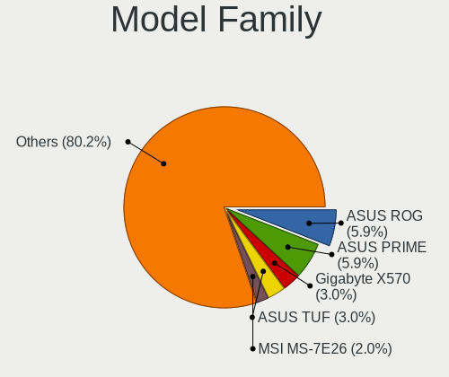
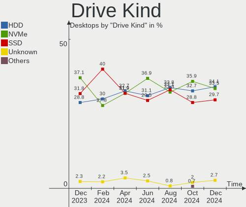
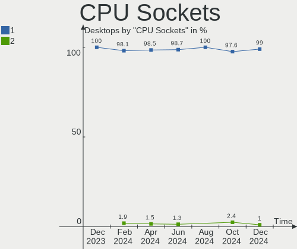
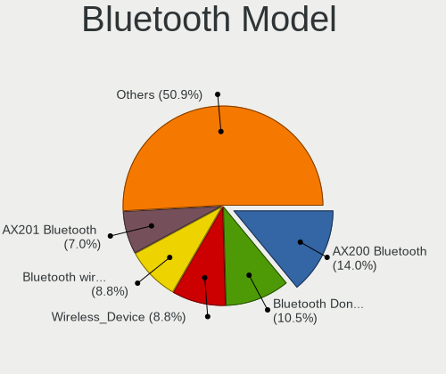

Pop!_OS Hardware Trends (Desktop)
---------------------------------

A project to identify most popular hardware characteristics and track their change
over time based on data collected by Pop!_OS users at https://Linux-Hardware.org.

Anyone can contribute to the study by uploading probes of their computers by
the [hw-probe](https://github.com/linuxhw/hw-probe) tool:

    sudo -E hw-probe -all -upload

Full-feature report is available here: https://linux-hardware.org/?view=trends&formfactor=desktop

Period: May, 2021.

Contents
--------

- [ OS                       ](#os)
- [ OS Family                ](#os-family)
- [ Kernel                   ](#kernel)
- [ Kernel Family            ](#kernel-family)
- [ Kernel Major Ver.        ](#kernel-major-ver)
- [ Arch                     ](#arch)
- [ DE                       ](#de)
- [ Display Server           ](#display-server)
- [ Display Manager          ](#display-manager)
- [ OS Lang                  ](#os-lang)
- [ Boot Mode                ](#boot-mode)
- [ Filesystem               ](#filesystem)
- [ Part. scheme             ](#part-scheme)
- [ Dual Boot with Linux/BSD ](#dual-boot-with-linux/bsd)
- [ Dual Boot (Win)          ](#dual-boot-win)
- [ Country                  ](#country)
- [ City                     ](#city)
- [ Vendor                   ](#vendor)
- [ Model                    ](#model)
- [ Model Family             ](#model-family)
- [ MFG Year                 ](#mfg-year)
- [ Form Factor              ](#form-factor)
- [ Secure Boot              ](#secure-boot)
- [ Coreboot                 ](#coreboot)
- [ RAM Size                 ](#ram-size)
- [ RAM Used                 ](#ram-used)
- [ Has CD-ROM               ](#has-cd-rom)
- [ Total Drives             ](#total-drives)
- [ Has Ethernet             ](#has-ethernet)
- [ Has WiFi                 ](#has-wifi)
- [ Has Bluetooth            ](#has-bluetooth)
- [ Drive Vendor             ](#drive-vendor)
- [ Drive Model              ](#drive-model)
- [ HDD Vendor               ](#hdd-vendor)
- [ SSD Vendor               ](#ssd-vendor)
- [ Drive Kind               ](#drive-kind)
- [ Drive Connector          ](#drive-connector)
- [ Drive Size               ](#drive-size)
- [ Space Total              ](#space-total)
- [ Space Used               ](#space-used)
- [ Malfunc. Drives          ](#malfunc-drives)
- [ Malfunc. Drive Vendor    ](#malfunc-drive-vendor)
- [ Malfunc. HDD Vendor      ](#malfunc-hdd-vendor)
- [ Malfunc. Drive Kind      ](#malfunc-drive-kind)
- [ Failed Drives            ](#failed-drives)
- [ Failed Drive Vendor      ](#failed-drive-vendor)
- [ Drive Status             ](#drive-status)
- [ Storage Vendor           ](#storage-vendor)
- [ Storage Model            ](#storage-model)
- [ Storage Kind             ](#storage-kind)
- [ CPU Vendor               ](#cpu-vendor)
- [ CPU Model                ](#cpu-model)
- [ CPU Model Family         ](#cpu-model-family)
- [ CPU Cores                ](#cpu-cores)
- [ CPU Sockets              ](#cpu-sockets)
- [ CPU Threads              ](#cpu-threads)
- [ CPU Op-Modes             ](#cpu-op-modes)
- [ CPU Microcode            ](#cpu-microcode)
- [ CPU Microarch            ](#cpu-microarch)
- [ GPU Vendor               ](#gpu-vendor)
- [ GPU Model                ](#gpu-model)
- [ GPU Combo                ](#gpu-combo)
- [ GPU Driver               ](#gpu-driver)
- [ GPU Memory               ](#gpu-memory)
- [ Monitor Vendor           ](#monitor-vendor)
- [ Monitor Model            ](#monitor-model)
- [ Monitor Resolution       ](#monitor-resolution)
- [ Monitor Diagonal         ](#monitor-diagonal)
- [ Monitor Width            ](#monitor-width)
- [ Aspect Ratio             ](#aspect-ratio)
- [ Monitor Area             ](#monitor-area)
- [ Pixel Density            ](#pixel-density)
- [ Multiple Monitors        ](#multiple-monitors)
- [ Net Controller Vendor    ](#net-controller-vendor)
- [ Net Controller Model     ](#net-controller-model)
- [ Wireless Vendor          ](#wireless-vendor)
- [ Wireless Model           ](#wireless-model)
- [ Ethernet Vendor          ](#ethernet-vendor)
- [ Ethernet Model           ](#ethernet-model)
- [ Net Controller Kind      ](#net-controller-kind)
- [ Used Controller          ](#used-controller)
- [ NICs                     ](#nics)
- [ IPv6                     ](#ipv6)
- [ Memory Vendor            ](#memory-vendor)
- [ Memory Model             ](#memory-model)
- [ Memory Kind              ](#memory-kind)
- [ Memory Form Factor       ](#memory-form-factor)
- [ Memory Size              ](#memory-size)
- [ Memory Speed             ](#memory-speed)
- [ Sound Vendor             ](#sound-vendor)
- [ Sound Model              ](#sound-model)
- [ Camera Vendor            ](#camera-vendor)
- [ Camera Model             ](#camera-model)
- [ Fingerprint Vendor       ](#fingerprint-vendor)
- [ Fingerprint Model        ](#fingerprint-model)
- [ Chipcard Vendor          ](#chipcard-vendor)
- [ Chipcard Model           ](#chipcard-model)
- [ Printer Vendor           ](#printer-vendor)
- [ Printer Model            ](#printer-model)
- [ Scanner Vendor           ](#scanner-vendor)
- [ Scanner Model            ](#scanner-model)
- [ Bluetooth Vendor         ](#bluetooth-vendor)
- [ Bluetooth Model          ](#bluetooth-model)
- [ Unsupported Devices      ](#unsupported-devices)
- [ Unsupported Device Types ](#unsupported-device-types)

OS
--

Installed operating systems

| Name          | Desktops | Percent |
|---------------|----------|---------|
| Pop!_OS 20.10 | 79       | 79.8%   |
| Pop!_OS 20.04 | 20       | 20.2%   |

OS Family
---------

OS without a version

| Name    | Desktops | Percent |
|---------|----------|---------|
| Pop!_OS | 99       | 100%    |

Kernel
------

Version of the Linux kernel

| Version             | Desktops | Percent |
|---------------------|----------|---------|
| 5.11.0-7614-generic | 76       | 76.77%  |
| 5.11.0-7612-generic | 14       | 14.14%  |
| 5.8.0-7642-generic  | 6        | 6.06%   |
| 5.8.0-7630-generic  | 2        | 2.02%   |
| 5.4.0-7634-generic  | 1        | 1.01%   |

Kernel Family
-------------

Linux kernel without a distro release

| Version | Desktops | Percent |
|---------|----------|---------|
| 5.11.0  | 90       | 90.91%  |
| 5.8.0   | 8        | 8.08%   |
| 5.4.0   | 1        | 1.01%   |

Kernel Major Ver.
-----------------

Linux kernel major version

| Version | Desktops | Percent |
|---------|----------|---------|
| 5.11    | 90       | 90.91%  |
| 5.8     | 8        | 8.08%   |
| 5.4     | 1        | 1.01%   |

Arch
----

OS architecture (x86_64, i586, etc.)

| Name   | Desktops | Percent |
|--------|----------|---------|
| x86_64 | 99       | 100%    |

DE
--

Desktop Environment

| Name  | Desktops | Percent |
|-------|----------|---------|
| GNOME | 93       | 93.94%  |
| KDE   | 4        | 4.04%   |
| XFCE  | 1        | 1.01%   |
| MATE  | 1        | 1.01%   |

Display Server
--------------

X11 or Wayland

| Name    | Desktops | Percent |
|---------|----------|---------|
| X11     | 98       | 98.99%  |
| Wayland | 1        | 1.01%   |

Display Manager
---------------

SDDM, LightDM, etc.

| Name    | Desktops | Percent |
|---------|----------|---------|
| Unknown | 91       | 91.92%  |
| GDM     | 8        | 8.08%   |

OS Lang
-------

Language

| Lang  | Desktops | Percent |
|-------|----------|---------|
| en_US | 54       | 54.55%  |
| en_GB | 13       | 13.13%  |
| pt_BR | 8        | 8.08%   |
| it_IT | 3        | 3.03%   |
| fr_FR | 3        | 3.03%   |
| de_DE | 3        | 3.03%   |
| C     | 3        | 3.03%   |
| sk_SK | 2        | 2.02%   |
| ru_RU | 2        | 2.02%   |
| en_CA | 2        | 2.02%   |
| en_AU | 2        | 2.02%   |
| zh_TW | 1        | 1.01%   |
| tr_TR | 1        | 1.01%   |
| sv_SE | 1        | 1.01%   |
| es_ES | 1        | 1.01%   |

Boot Mode
---------

EFI or BIOS

| Mode | Desktops | Percent |
|------|----------|---------|
| BIOS | 93       | 93.94%  |
| EFI  | 6        | 6.06%   |

Filesystem
----------

Type of filesystem

| Type    | Desktops | Percent |
|---------|----------|---------|
| Ext4    | 96       | 96.97%  |
| Overlay | 2        | 2.02%   |
| Btrfs   | 1        | 1.01%   |

Part. scheme
------------

Scheme of partitioning

| Type    | Desktops | Percent |
|---------|----------|---------|
| Unknown | 91       | 91.92%  |
| GPT     | 6        | 6.06%   |
| MBR     | 2        | 2.02%   |

Dual Boot with Linux/BSD
------------------------

Hosting more than one Linux/BSD

| Dual boot | Desktops | Percent |
|-----------|----------|---------|
| No        | 98       | 98.99%  |
| Yes       | 1        | 1.01%   |

Dual Boot (Win)
---------------

Hosting Linux and Windows

| Dual boot | Desktops | Percent |
|-----------|----------|---------|
| No        | 96       | 96.97%  |
| Yes       | 3        | 3.03%   |

Country
-------

Geographic location (country)

| Country      | Desktops | Percent |
|--------------|----------|---------|
| USA          | 39       | 39.39%  |
| Brazil       | 10       | 10.1%   |
| UK           | 7        | 7.07%   |
| Germany      | 4        | 4.04%   |
| Sweden       | 3        | 3.03%   |
| South Africa | 3        | 3.03%   |
| France       | 3        | 3.03%   |
| Chile        | 3        | 3.03%   |
| Slovakia     | 2        | 2.02%   |
| Russia       | 2        | 2.02%   |
| Netherlands  | 2        | 2.02%   |
| Italy        | 2        | 2.02%   |
| India        | 2        | 2.02%   |
| Canada       | 2        | 2.02%   |
| Bulgaria     | 2        | 2.02%   |
| Australia    | 2        | 2.02%   |
| Ukraine      | 1        | 1.01%   |
| Turkey       | 1        | 1.01%   |
| Taiwan       | 1        | 1.01%   |
| Switzerland  | 1        | 1.01%   |
| Spain        | 1        | 1.01%   |
| Serbia       | 1        | 1.01%   |
| Poland       | 1        | 1.01%   |
| Greece       | 1        | 1.01%   |
| Finland      | 1        | 1.01%   |
| Bangladesh   | 1        | 1.01%   |
| Austria      | 1        | 1.01%   |

City
----

Geographic location (city)

| City                  | Desktops | Percent |
|-----------------------|----------|---------|
| Dallas                | 3        | 3.03%   |
| São Paulo            | 2        | 2.02%   |
| Miami                 | 2        | 2.02%   |
| Brierley Hill         | 2        | 2.02%   |
| Östersund            | 1        | 1.01%   |
| Witbank               | 1        | 1.01%   |
| West Jordan           | 1        | 1.01%   |
| Wausau                | 1        | 1.01%   |
| Waterford             | 1        | 1.01%   |
| Warsaw                | 1        | 1.01%   |
| Viganello             | 1        | 1.01%   |
| Vienna                | 1        | 1.01%   |
| Victoria              | 1        | 1.01%   |
| Venlo                 | 1        | 1.01%   |
| Topeka                | 1        | 1.01%   |
| Thetford-Mines        | 1        | 1.01%   |
| Thessaloniki          | 1        | 1.01%   |
| Surat                 | 1        | 1.01%   |
| St Petersburg         | 1        | 1.01%   |
| South Pasadena        | 1        | 1.01%   |
| Slatina               | 1        | 1.01%   |
| Sarasota              | 1        | 1.01%   |
| Sao Jose              | 1        | 1.01%   |
| Santiago              | 1        | 1.01%   |
| San Diego             | 1        | 1.01%   |
| Saint-Jeannet         | 1        | 1.01%   |
| Saint-Basile-le-Grand | 1        | 1.01%   |
| Sacramento            | 1        | 1.01%   |
| Rostov-on-Don         | 1        | 1.01%   |
| Richmond              | 1        | 1.01%   |
| Queens                | 1        | 1.01%   |
| Pirapora              | 1        | 1.01%   |
| Philadelphia          | 1        | 1.01%   |
| Peoria                | 1        | 1.01%   |
| Paray-le-Monial       | 1        | 1.01%   |
| Osorio                | 1        | 1.01%   |
| Oil City              | 1        | 1.01%   |
| Nové Zámky          | 1        | 1.01%   |
| Norwalk               | 1        | 1.01%   |
| Nijmegen              | 1        | 1.01%   |
| New Belgrade          | 1        | 1.01%   |
| Neumünster           | 1        | 1.01%   |
| Morehead City         | 1        | 1.01%   |
| Missouri City         | 1        | 1.01%   |
| Melbourne             | 1        | 1.01%   |
| Manchester            | 1        | 1.01%   |
| Malmo                 | 1        | 1.01%   |
| Maipu                 | 1        | 1.01%   |
| Madrid                | 1        | 1.01%   |
| Lviv                  | 1        | 1.01%   |
| Los Angeles           | 1        | 1.01%   |
| Koeping               | 1        | 1.01%   |
| Knoxville             | 1        | 1.01%   |
| Kirkintilloch         | 1        | 1.01%   |
| Kansas City           | 1        | 1.01%   |
| Jyväskylä           | 1        | 1.01%   |
| Jundiaí              | 1        | 1.01%   |
| Johannesburg          | 1        | 1.01%   |
| Jaraguá do Sul       | 1        | 1.01%   |
| Istanbul              | 1        | 1.01%   |

Vendor
------

Motherboard manufacturer

| Name                | Desktops | Percent |
|---------------------|----------|---------|
| ASUSTek Computer    | 29       | 29.29%  |
| Gigabyte Technology | 22       | 22.22%  |
| ASRock              | 11       | 11.11%  |
| MSI                 | 9        | 9.09%   |
| Hewlett-Packard     | 8        | 8.08%   |
| Dell                | 4        | 4.04%   |
| System76            | 2        | 2.02%   |
| TYAN Computer       | 1        | 1.01%   |
| Supermicro          | 1        | 1.01%   |
| Pegatron            | 1        | 1.01%   |
| Minix               | 1        | 1.01%   |
| MAXSUN              | 1        | 1.01%   |
| Huanan              | 1        | 1.01%   |
| HOUTER              | 1        | 1.01%   |
| Google              | 1        | 1.01%   |
| Fujitsu Siemens     | 1        | 1.01%   |
| Fujitsu             | 1        | 1.01%   |
| Biostar             | 1        | 1.01%   |
| Apple               | 1        | 1.01%   |
| Alienware           | 1        | 1.01%   |
| Acer                | 1        | 1.01%   |

Model
-----

Motherboard model

| Name                          | Desktops | Percent |
|-------------------------------|----------|---------|
| MSI MS-7B86                   | 3        | 3.03%   |
| Gigabyte B450M DS3H           | 3        | 3.03%   |
| System76 Thelio Major         | 2        | 2.02%   |
| ASUS TUF GAMING B550-PLUS     | 2        | 2.02%   |
| ASRock B365 Pro4              | 2        | 2.02%   |
| TYAN S5517                    | 1        | 1.01%   |
| Supermicro X9SCI/X9SCA        | 1        | 1.01%   |
| Pegatron BK139AA-ABA 600-1120 | 1        | 1.01%   |
| MSI MS-7C02                   | 1        | 1.01%   |
| MSI MS-7B89                   | 1        | 1.01%   |
| MSI MS-7A70                   | 1        | 1.01%   |
| MSI MS-7A39                   | 1        | 1.01%   |
| MSI MS-7A38                   | 1        | 1.01%   |
| MSI MS-7522                   | 1        | 1.01%   |
| Minix Z83-4                   | 1        | 1.01%   |
| MAXSUN MS-B85-BTC             | 1        | 1.01%   |
| Huanan X99-TF                 | 1        | 1.01%   |
| HOUTER IPMH61R1               | 1        | 1.01%   |
| HP Z4 G4 Workstation          | 1        | 1.01%   |
| HP Z240 Tower Workstation     | 1        | 1.01%   |
| HP ProLiant MicroServer       | 1        | 1.01%   |
| HP Compaq Pro 6300 SFF        | 1        | 1.01%   |
| HP Compaq 8200 Elite SFF PC   | 1        | 1.01%   |
| HP Compaq 6200 Pro MT PC      | 1        | 1.01%   |
| HP Compaq 6005 Pro MT PC      | 1        | 1.01%   |
| HP 290 G2 MT Business PC      | 1        | 1.01%   |
| Google Teemo                  | 1        | 1.01%   |
| Gigabyte Z97-HD3              | 1        | 1.01%   |
| Gigabyte Z77P-D3              | 1        | 1.01%   |
| Gigabyte X570 UD              | 1        | 1.01%   |
| Gigabyte X170-Extreme ECC     | 1        | 1.01%   |
| Gigabyte P35-DQ6              | 1        | 1.01%   |
| Gigabyte H61M-S1              | 1        | 1.01%   |
| Gigabyte H110M-S2V            | 1        | 1.01%   |
| Gigabyte H110-D3A             | 1        | 1.01%   |
| Gigabyte GA-78LMT-USB3 6.0    | 1        | 1.01%   |
| Gigabyte G31M-ES2L            | 1        | 1.01%   |
| Gigabyte B75M-D3H             | 1        | 1.01%   |
| Gigabyte B550M AORUS PRO-P    | 1        | 1.01%   |
| Gigabyte B550I AORUS PRO AX   | 1        | 1.01%   |
| Gigabyte B550 AORUS PRO       | 1        | 1.01%   |
| Gigabyte B460MDS3H            | 1        | 1.01%   |
| Gigabyte B450 AORUS PRO WIFI  | 1        | 1.01%   |
| Gigabyte B450 AORUS ELITE     | 1        | 1.01%   |
| Gigabyte A320M-S2H V2         | 1        | 1.01%   |
| Gigabyte A320M-H              | 1        | 1.01%   |
| Fujitsu Siemens ESPRIMO E5925 | 1        | 1.01%   |
| Fujitsu PRIMERGY TX1310 M1    | 1        | 1.01%   |
| Dell Vostro 270               | 1        | 1.01%   |
| Dell Vostro 260               | 1        | 1.01%   |
| Dell Precision Tower 5810     | 1        | 1.01%   |
| Dell OptiPlex 9020            | 1        | 1.01%   |
| Biostar A68MHE                | 1        | 1.01%   |
| ASUS Z170-K                   | 1        | 1.01%   |
| ASUS TUF GAMING X570-PLUS     | 1        | 1.01%   |
| ASUS TUF B450M-PLUS GAMING    | 1        | 1.01%   |
| ASUS TRILINE PROFI            | 1        | 1.01%   |
| ASUS SABERTOOTH X58           | 1        | 1.01%   |
| ASUS ROG STRIX X570-F GAMING  | 1        | 1.01%   |
| ASUS ROG STRIX B550-E GAMING  | 1        | 1.01%   |

Model Family
------------

Motherboard model prefix

| Name                    | Desktops | Percent |
|-------------------------|----------|---------|
| ASUS PRIME              | 5        | 5.05%   |
| HP Compaq               | 4        | 4.04%   |
| ASUS TUF                | 4        | 4.04%   |
| ASUS ROG                | 4        | 4.04%   |
| MSI MS-7B86             | 3        | 3.03%   |
| Gigabyte B450M          | 3        | 3.03%   |
| System76 Thelio         | 2        | 2.02%   |
| Gigabyte B450           | 2        | 2.02%   |
| Dell Vostro             | 2        | 2.02%   |
| ASUS P7P55D             | 2        | 2.02%   |
| ASUS Maximus            | 2        | 2.02%   |
| ASRock B365             | 2        | 2.02%   |
| TYAN S5517              | 1        | 1.01%   |
| Supermicro X9SCI        | 1        | 1.01%   |
| Pegatron BK139AA-ABA    | 1        | 1.01%   |
| MSI MS-7C02             | 1        | 1.01%   |
| MSI MS-7B89             | 1        | 1.01%   |
| MSI MS-7A70             | 1        | 1.01%   |
| MSI MS-7A39             | 1        | 1.01%   |
| MSI MS-7A38             | 1        | 1.01%   |
| MSI MS-7522             | 1        | 1.01%   |
| Minix Z83-4             | 1        | 1.01%   |
| MAXSUN MS-B85-BTC       | 1        | 1.01%   |
| Huanan X99-TF           | 1        | 1.01%   |
| HOUTER IPMH61R1         | 1        | 1.01%   |
| HP Z4                   | 1        | 1.01%   |
| HP Z240                 | 1        | 1.01%   |
| HP ProLiant             | 1        | 1.01%   |
| HP 290                  | 1        | 1.01%   |
| Google Teemo            | 1        | 1.01%   |
| Gigabyte Z97-HD3        | 1        | 1.01%   |
| Gigabyte Z77P-D3        | 1        | 1.01%   |
| Gigabyte X570           | 1        | 1.01%   |
| Gigabyte X170-Extreme   | 1        | 1.01%   |
| Gigabyte P35-DQ6        | 1        | 1.01%   |
| Gigabyte H61M-S1        | 1        | 1.01%   |
| Gigabyte H110M-S2V      | 1        | 1.01%   |
| Gigabyte H110-D3A       | 1        | 1.01%   |
| Gigabyte GA-78LMT-USB3  | 1        | 1.01%   |
| Gigabyte G31M-ES2L      | 1        | 1.01%   |
| Gigabyte B75M-D3H       | 1        | 1.01%   |
| Gigabyte B550M          | 1        | 1.01%   |
| Gigabyte B550I          | 1        | 1.01%   |
| Gigabyte B550           | 1        | 1.01%   |
| Gigabyte B460MDS3H      | 1        | 1.01%   |
| Gigabyte A320M-S2H      | 1        | 1.01%   |
| Gigabyte A320M-H        | 1        | 1.01%   |
| Fujitsu Siemens ESPRIMO | 1        | 1.01%   |
| Fujitsu PRIMERGY        | 1        | 1.01%   |
| Dell Precision          | 1        | 1.01%   |
| Dell OptiPlex           | 1        | 1.01%   |
| Biostar A68MHE          | 1        | 1.01%   |
| ASUS Z170-K             | 1        | 1.01%   |
| ASUS TRILINE            | 1        | 1.01%   |
| ASUS SABERTOOTH         | 1        | 1.01%   |
| ASUS P8Z77-V            | 1        | 1.01%   |
| ASUS P8Z68-V            | 1        | 1.01%   |
| ASUS M5A97              | 1        | 1.01%   |
| ASUS M5A78L-M           | 1        | 1.01%   |
| ASUS M3N18L             | 1        | 1.01%   |

MFG Year
--------

Motherboard manufacture year

| Year | Desktops | Percent |
|------|----------|---------|
| 2021 | 19       | 19.19%  |
| 2019 | 15       | 15.15%  |
| 2020 | 12       | 12.12%  |
| 2018 | 9        | 9.09%   |
| 2013 | 8        | 8.08%   |
| 2012 | 8        | 8.08%   |
| 2011 | 6        | 6.06%   |
| 2017 | 4        | 4.04%   |
| 2016 | 3        | 3.03%   |
| 2015 | 3        | 3.03%   |
| 2014 | 3        | 3.03%   |
| 2010 | 3        | 3.03%   |
| 2008 | 3        | 3.03%   |
| 2009 | 2        | 2.02%   |
| 2007 | 1        | 1.01%   |

Form Factor
-----------

Physical design of the computer

| Name    | Desktops | Percent |
|---------|----------|---------|
| Desktop | 99       | 100%    |

Secure Boot
-----------

Enabled or disabled

| State    | Desktops | Percent |
|----------|----------|---------|
| Disabled | 99       | 100%    |

Coreboot
--------

Have coreboot on board

| Used | Desktops | Percent |
|------|----------|---------|
| No   | 98       | 98.99%  |
| Yes  | 1        | 1.01%   |

RAM Size
--------

Total RAM memory

| Size in GB  | Desktops | Percent |
|-------------|----------|---------|
| 16.01-24.0  | 29       | 29.29%  |
| 8.01-16.0   | 24       | 24.24%  |
| 32.01-64.0  | 17       | 17.17%  |
| 4.01-8.0    | 11       | 11.11%  |
| 3.01-4.0    | 10       | 10.1%   |
| 64.01-256.0 | 5        | 5.05%   |
| 1.01-2.0    | 2        | 2.02%   |
| 24.01-32.0  | 1        | 1.01%   |

RAM Used
--------

Used RAM memory

| Used GB    | Desktops | Percent |
|------------|----------|---------|
| 1.01-2.0   | 42       | 42.42%  |
| 2.01-3.0   | 25       | 25.25%  |
| 4.01-8.0   | 14       | 14.14%  |
| 3.01-4.0   | 12       | 12.12%  |
| 8.01-16.0  | 4        | 4.04%   |
| 16.01-24.0 | 1        | 1.01%   |
| 0.51-1.0   | 1        | 1.01%   |

Has CD-ROM
----------

Has CD-ROM on board

| Presented | Desktops | Percent |
|-----------|----------|---------|
| No        | 58       | 58.59%  |
| Yes       | 41       | 41.41%  |

Total Drives
------------

Number of drives on board

| Drives | Desktops | Percent |
|--------|----------|---------|
| 2      | 35       | 35.35%  |
| 1      | 34       | 34.34%  |
| 3      | 12       | 12.12%  |
| 4      | 9        | 9.09%   |
| 5      | 4        | 4.04%   |
| 6      | 3        | 3.03%   |
| 8      | 1        | 1.01%   |
| 7      | 1        | 1.01%   |

Has Ethernet
------------

Has Ethernet on board

| Presented | Desktops | Percent |
|-----------|----------|---------|
| Yes       | 98       | 98.99%  |
| No        | 1        | 1.01%   |

Has WiFi
--------

Has WiFi module

| Presented | Desktops | Percent |
|-----------|----------|---------|
| No        | 51       | 51.52%  |
| Yes       | 48       | 48.48%  |

Has Bluetooth
-------------

Has Bluetooth module

| Presented | Desktops | Percent |
|-----------|----------|---------|
| No        | 72       | 72.73%  |
| Yes       | 27       | 27.27%  |

Drive Vendor
------------

Hard drive vendors

| Vendor                    | Desktops | Drives | Percent |
|---------------------------|----------|--------|---------|
| Seagate                   | 41       | 52     | 20.4%   |
| WDC                       | 36       | 41     | 17.91%  |
| Samsung Electronics       | 21       | 26     | 10.45%  |
| SanDisk                   | 12       | 12     | 5.97%   |
| Kingston                  | 12       | 12     | 5.97%   |
| Crucial                   | 10       | 11     | 4.98%   |
| Toshiba                   | 8        | 8      | 3.98%   |
| China                     | 7        | 10     | 3.48%   |
| Silicon Motion            | 5        | 5      | 2.49%   |
| Phison                    | 5        | 5      | 2.49%   |
| Hitachi                   | 5        | 5      | 2.49%   |
| A-DATA Technology         | 5        | 6      | 2.49%   |
| Intel                     | 4        | 4      | 1.99%   |
| PNY                       | 3        | 3      | 1.49%   |
| Micron/Crucial Technology | 3        | 4      | 1.49%   |
| OCZ                       | 2        | 2      | 1%      |
| KingSpec                  | 2        | 2      | 1%      |
| HGST                      | 2        | 2      | 1%      |
| Vaseky                    | 1        | 1      | 0.5%    |
| Unknown                   | 1        | 1      | 0.5%    |
| Union Memory (Shenzhen)   | 1        | 4      | 0.5%    |
| UNIC2                     | 1        | 1      | 0.5%    |
| TCSUNBOW                  | 1        | 1      | 0.5%    |
| SK Hynix                  | 1        | 1      | 0.5%    |
| SABRENT                   | 1        | 1      | 0.5%    |
| Realtek Semiconductor     | 1        | 1      | 0.5%    |
| Patriot                   | 1        | 1      | 0.5%    |
| Mushkin                   | 1        | 1      | 0.5%    |
| Micron Technology         | 1        | 2      | 0.5%    |
| Maxtor                    | 1        | 1      | 0.5%    |
| Magnetic Data             | 1        | 1      | 0.5%    |
| LITEONIT                  | 1        | 1      | 0.5%    |
| JMicron                   | 1        | 1      | 0.5%    |
| Hewlett-Packard           | 1        | 1      | 0.5%    |
| H/W RAID                  | 1        | 1      | 0.5%    |
| Apacer                    | 1        | 1      | 0.5%    |

Drive Model
-----------

Hard drive models

| Model                               | Desktops | Percent |
|-------------------------------------|----------|---------|
| Seagate ST2000DM008-2FR102 2TB      | 6        | 2.74%   |
| Kingston SA400S37240G 240GB SSD     | 6        | 2.74%   |
| Seagate ST1000DM003-1CH162 1TB      | 5        | 2.28%   |
| Sandisk NVMe SSD Drive 500GB        | 4        | 1.83%   |
| Toshiba HDWD110 1TB                 | 3        | 1.37%   |
| Sandisk NVMe SSD Drive 1TB          | 3        | 1.37%   |
| Samsung NVMe SSD Drive 500GB        | 3        | 1.37%   |
| Samsung NVMe SSD Drive 1TB          | 3        | 1.37%   |
| Crucial CT240BX500SSD1 240GB        | 3        | 1.37%   |
| A-DATA SU650 120GB SSD              | 3        | 1.37%   |
| WDC WD20EZAZ-00GGJB0 2TB            | 2        | 0.91%   |
| Silicon Motion NVMe SSD Drive 256GB | 2        | 0.91%   |
| Seagate ST500DM002-1BD142 500GB     | 2        | 0.91%   |
| Seagate ST4000DM004-2CV104 4TB      | 2        | 0.91%   |
| Seagate ST4000DM000-1F2168 4TB      | 2        | 0.91%   |
| Seagate ST3500418AS 500GB           | 2        | 0.91%   |
| Seagate ST31000524AS 1TB            | 2        | 0.91%   |
| Samsung SSD 970 EVO Plus 500GB      | 2        | 0.91%   |
| Samsung SSD 850 EVO 500GB           | 2        | 0.91%   |
| Samsung SSD 850 EVO 1TB             | 2        | 0.91%   |
| Phison NVMe SSD Drive 256GB         | 2        | 0.91%   |
| Phison NVMe SSD Drive 1TB           | 2        | 0.91%   |
| KingSpec T-64 64GB                  | 2        | 0.91%   |
| China SATA SSD 240GB                | 2        | 0.91%   |
| China SATA SSD 128GB                | 2        | 0.91%   |
| WDC WDS500G2B0B-00YS70 500GB SSD    | 1        | 0.46%   |
| WDC WDS100T2B0C-00PXH0 1TB          | 1        | 0.46%   |
| WDC WD5003ABYX-01WERA1 500GB        | 1        | 0.46%   |
| WDC WD5000LPVX-75V0TT0 500GB        | 1        | 0.46%   |
| WDC WD5000ABYS-01TNA0 499GB         | 1        | 0.46%   |
| WDC WD5000AAVS-00G9B1 500GB         | 1        | 0.46%   |
| WDC WD5000AAKS-65YGA0 500GB         | 1        | 0.46%   |
| WDC WD5000AACS-00G8B1 500GB         | 1        | 0.46%   |
| WDC WD40PURZ-85TTDY0 4TB            | 1        | 0.46%   |
| WDC WD40EZRZ-22GXCB0 4TB            | 1        | 0.46%   |
| WDC WD40EZRZ-00GXCB0 4TB            | 1        | 0.46%   |
| WDC WD40EFAX-68JH4N0 4TB            | 1        | 0.46%   |
| WDC WD3200BEVT-22ZCT0 320GB         | 1        | 0.46%   |
| WDC WD3200AAKS-00B3A0 320GB         | 1        | 0.46%   |
| WDC WD3200AAJS-55B4A0 320GB         | 1        | 0.46%   |
| WDC WD30EZRZ-00GXCB0 3TB            | 1        | 0.46%   |
| WDC WD30EZRX-00DC0B0 3TB            | 1        | 0.46%   |
| WDC WD2500JB-00REA0 250GB           | 1        | 0.46%   |
| WDC WD2500AAKX-753CA1 250GB         | 1        | 0.46%   |
| WDC WD2500AAJS-75M0A0 249GB         | 1        | 0.46%   |
| WDC WD20EZRZ-00Z5HB0 2TB            | 1        | 0.46%   |
| WDC WD20EZRX-22D8PB0 2TB            | 1        | 0.46%   |
| WDC WD20EZRX-00DC0B0 2TB            | 1        | 0.46%   |
| WDC WD20EARX-00PASB0 2TB            | 1        | 0.46%   |
| WDC WD121PURZ-85GUCY0 12TB          | 1        | 0.46%   |
| WDC WD10JPVX-22JC3T0 1TB            | 1        | 0.46%   |
| WDC WD10JPCX-24UE4T0 1TB            | 1        | 0.46%   |
| WDC WD10EZEX-75M2NA0 1TB            | 1        | 0.46%   |
| WDC WD10EZEX-60ZF5A0 1TB            | 1        | 0.46%   |
| WDC WD10EZEX-60WN4A0 1TB            | 1        | 0.46%   |
| WDC WD10EZEX-21M2NA0 1TB            | 1        | 0.46%   |
| WDC WD10EZEX-08M2NA0 1TB            | 1        | 0.46%   |
| WDC WD10EZEX-00RKKA0 1TB            | 1        | 0.46%   |
| WDC WD10EZEX-00BN5A0 1TB            | 1        | 0.46%   |
| WDC WD10EURX-63FH1Y0 1TB            | 1        | 0.46%   |

HDD Vendor
----------

Hard disk drive vendors

| Vendor              | Desktops | Drives | Percent |
|---------------------|----------|--------|---------|
| Seagate             | 40       | 50     | 42.55%  |
| WDC                 | 35       | 39     | 37.23%  |
| Toshiba             | 6        | 6      | 6.38%   |
| Hitachi             | 5        | 5      | 5.32%   |
| Samsung Electronics | 3        | 3      | 3.19%   |
| HGST                | 2        | 2      | 2.13%   |
| Maxtor              | 1        | 1      | 1.06%   |
| Magnetic Data       | 1        | 1      | 1.06%   |
| JMicron             | 1        | 1      | 1.06%   |

SSD Vendor
----------

Solid state drive vendors

| Vendor              | Desktops | Drives | Percent |
|---------------------|----------|--------|---------|
| Kingston            | 11       | 11     | 16.18%  |
| Samsung Electronics | 10       | 12     | 14.71%  |
| Crucial             | 9        | 9      | 13.24%  |
| China               | 7        | 10     | 10.29%  |
| SanDisk             | 5        | 5      | 7.35%   |
| A-DATA Technology   | 4        | 4      | 5.88%   |
| PNY                 | 3        | 3      | 4.41%   |
| Intel               | 3        | 3      | 4.41%   |
| Seagate             | 2        | 2      | 2.94%   |
| OCZ                 | 2        | 2      | 2.94%   |
| KingSpec            | 2        | 2      | 2.94%   |
| WDC                 | 1        | 1      | 1.47%   |
| UNIC2               | 1        | 1      | 1.47%   |
| Toshiba             | 1        | 1      | 1.47%   |
| TCSUNBOW            | 1        | 1      | 1.47%   |
| SK Hynix            | 1        | 1      | 1.47%   |
| SABRENT             | 1        | 1      | 1.47%   |
| Patriot             | 1        | 1      | 1.47%   |
| LITEONIT            | 1        | 1      | 1.47%   |
| Hewlett-Packard     | 1        | 1      | 1.47%   |
| Apacer              | 1        | 1      | 1.47%   |

Drive Kind
----------

HDD or SSD

| Kind    | Desktops | Drives | Percent |
|---------|----------|--------|---------|
| HDD     | 73       | 108    | 44.24%  |
| SSD     | 58       | 73     | 35.15%  |
| NVMe    | 31       | 48     | 18.79%  |
| Unknown | 2        | 2      | 1.21%   |
| MMC     | 1        | 1      | 0.61%   |

Drive Connector
---------------

SATA, SAS, NVMe, etc.

| Type | Desktops | Drives | Percent |
|------|----------|--------|---------|
| SATA | 94       | 177    | 71.76%  |
| NVMe | 31       | 48     | 23.66%  |
| SAS  | 5        | 6      | 3.82%   |
| MMC  | 1        | 1      | 0.76%   |

Drive Size
----------

Size of hard drive

| Size in TB | Desktops | Drives | Percent |
|------------|----------|--------|---------|
| 0.01-0.5   | 71       | 100    | 50.35%  |
| 0.51-1.0   | 35       | 41     | 24.82%  |
| 1.01-2.0   | 20       | 22     | 14.18%  |
| 3.01-4.0   | 9        | 12     | 6.38%   |
| 2.01-3.0   | 4        | 4      | 2.84%   |
| 20.01-50.0 | 1        | 1      | 0.71%   |
| 10.01-20.0 | 1        | 1      | 0.71%   |

Space Total
-----------

Amount of disk space available on the file system

| Size in GB     | Desktops | Percent |
|----------------|----------|---------|
| 101-250        | 26       | 26.26%  |
| 251-500        | 19       | 19.19%  |
| 501-1000       | 18       | 18.18%  |
| 1001-2000      | 11       | 11.11%  |
| 2001-3000      | 8        | 8.08%   |
| More than 3000 | 6        | 6.06%   |
| 51-100         | 5        | 5.05%   |
| 21-50          | 3        | 3.03%   |
| 1-20           | 3        | 3.03%   |

Space Used
----------

Amount of used disk space

| Used GB        | Desktops | Percent |
|----------------|----------|---------|
| 1-20           | 38       | 38.38%  |
| 21-50          | 20       | 20.2%   |
| 51-100         | 12       | 12.12%  |
| 501-1000       | 10       | 10.1%   |
| 251-500        | 7        | 7.07%   |
| 101-250        | 6        | 6.06%   |
| 1001-2000      | 3        | 3.03%   |
| More than 3000 | 2        | 2.02%   |
| 2001-3000      | 1        | 1.01%   |

Malfunc. Drives
---------------

Drive models with a malfunction

| Model                            | Desktops | Drives | Percent |
|----------------------------------|----------|--------|---------|
| Seagate ST500LT012-9WS142 500GB  | 1        | 1      | 50%     |
| Kingston SV300S37A120G 120GB SSD | 1        | 1      | 50%     |

Malfunc. Drive Vendor
---------------------

Vendors of faulty drives

| Vendor   | Desktops | Drives | Percent |
|----------|----------|--------|---------|
| Seagate  | 1        | 1      | 50%     |
| Kingston | 1        | 1      | 50%     |

Malfunc. HDD Vendor
-------------------

Vendors of faulty HDD drives

| Vendor  | Desktops | Drives | Percent |
|---------|----------|--------|---------|
| Seagate | 1        | 1      | 100%    |

Malfunc. Drive Kind
-------------------

Kinds of faulty drives

| Kind | Desktops | Drives | Percent |
|------|----------|--------|---------|
| SSD  | 1        | 1      | 50%     |
| HDD  | 1        | 1      | 50%     |

Failed Drives
-------------

Failed drive models

Zero info for selected period =(

Failed Drive Vendor
-------------------

Failed drive vendors

Zero info for selected period =(

Drive Status
------------

Number of failed and malfunc. drives

| Status   | Desktops | Drives | Percent |
|----------|----------|--------|---------|
| Detected | 94       | 213    | 90.38%  |
| Works    | 8        | 17     | 7.69%   |
| Malfunc  | 2        | 2      | 1.92%   |

Storage Vendor
--------------

Storage controller vendors

| Vendor                       | Desktops | Percent |
|------------------------------|----------|---------|
| Intel                        | 50       | 32.26%  |
| AMD                          | 44       | 28.39%  |
| Samsung Electronics          | 11       | 7.1%    |
| Sandisk                      | 8        | 5.16%   |
| ASMedia Technology           | 7        | 4.52%   |
| Silicon Motion               | 6        | 3.87%   |
| JMicron Technology           | 6        | 3.87%   |
| Phison Electronics           | 5        | 3.23%   |
| Nvidia                       | 4        | 2.58%   |
| Micron/Crucial Technology    | 4        | 2.58%   |
| Marvell Technology Group     | 4        | 2.58%   |
| Union Memory (Shenzhen)      | 1        | 0.65%   |
| Toshiba America Info Systems | 1        | 0.65%   |
| Realtek Semiconductor        | 1        | 0.65%   |
| Micron Technology            | 1        | 0.65%   |
| Kingston Technology Company  | 1        | 0.65%   |
| ADATA Technology             | 1        | 0.65%   |

Storage Model
-------------

Storage controller models

| Model                                                                                   | Desktops | Percent |
|-----------------------------------------------------------------------------------------|----------|---------|
| AMD FCH SATA Controller [AHCI mode]                                                     | 25       | 12.76%  |
| AMD 400 Series Chipset SATA Controller                                                  | 17       | 8.67%   |
| Samsung NVMe SSD Controller SM981/PM981/PM983                                           | 7        | 3.57%   |
| ASMedia ASM1062 Serial ATA Controller                                                   | 7        | 3.57%   |
| Sandisk WD Blue SN550 NVMe SSD                                                          | 6        | 3.06%   |
| Intel 6 Series/C200 Series Chipset Family 6 port Desktop SATA AHCI Controller           | 6        | 3.06%   |
| AMD Starship/Matisse Chipset SATA Controller [AHCI mode]                                | 6        | 3.06%   |
| Intel Q170/Q150/B150/H170/H110/Z170/CM236 Chipset SATA Controller [AHCI Mode]           | 5        | 2.55%   |
| AMD SB7x0/SB8x0/SB9x0 SATA Controller [AHCI mode]                                       | 5        | 2.55%   |
| Silicon Motion SM2263EN/SM2263XT SSD Controller                                         | 4        | 2.04%   |
| JMicron JMB363 SATA/IDE Controller                                                      | 4        | 2.04%   |
| Intel SATA Controller [RAID mode]                                                       | 4        | 2.04%   |
| AMD SB7x0/SB8x0/SB9x0 IDE Controller                                                    | 4        | 2.04%   |
| Phison E12 NVMe Controller                                                              | 3        | 1.53%   |
| Intel 9 Series Chipset Family SATA Controller [AHCI Mode]                               | 3        | 1.53%   |
| Intel 8 Series/C220 Series Chipset Family 6-port SATA Controller 1 [AHCI mode]          | 3        | 1.53%   |
| Intel 7 Series/C210 Series Chipset Family 6-port SATA Controller [AHCI mode]            | 3        | 1.53%   |
| Intel 7 Series/C210 Series Chipset Family 4-port SATA Controller [IDE mode]             | 3        | 1.53%   |
| Intel 7 Series/C210 Series Chipset Family 2-port SATA Controller [IDE mode]             | 3        | 1.53%   |
| Intel 6 Series/C200 Series Chipset Family Desktop SATA Controller (IDE mode, ports 4-5) | 3        | 1.53%   |
| Intel 6 Series/C200 Series Chipset Family Desktop SATA Controller (IDE mode, ports 0-3) | 3        | 1.53%   |
| Intel 200 Series PCH SATA controller [AHCI mode]                                        | 3        | 1.53%   |
| Silicon Motion SM2262/SM2262EN SSD Controller                                           | 2        | 1.02%   |
| Samsung NVMe SSD Controller PM9A1/PM9A3/980PRO                                          | 2        | 1.02%   |
| Nvidia MCP61 SATA Controller                                                            | 2        | 1.02%   |
| Nvidia MCP61 IDE                                                                        | 2        | 1.02%   |
| Micron/Crucial P1 NVMe PCIe SSD                                                         | 2        | 1.02%   |
| Micron/Crucial NVMe Controller                                                          | 2        | 1.02%   |
| JMicron JMB362 SATA Controller                                                          | 2        | 1.02%   |
| Intel Cannon Lake PCH SATA AHCI Controller                                              | 2        | 1.02%   |
| Intel C610/X99 series chipset 6-Port SATA Controller [AHCI mode]                        | 2        | 1.02%   |
| Intel 82801IR/IO/IH (ICH9R/DO/DH) 4 port SATA Controller [IDE mode]                     | 2        | 1.02%   |
| Intel 82801I (ICH9 Family) 2 port SATA Controller [IDE mode]                            | 2        | 1.02%   |
| Intel 5 Series/3400 Series Chipset 6 port SATA AHCI Controller                          | 2        | 1.02%   |
| AMD SB7x0/SB8x0/SB9x0 SATA Controller [IDE mode]                                        | 2        | 1.02%   |
| AMD SB600 Non-Raid-5 SATA                                                               | 2        | 1.02%   |
| AMD SB600 IDE                                                                           | 2        | 1.02%   |
| AMD FCH SATA Controller D                                                               | 2        | 1.02%   |
| AMD 300 Series Chipset SATA Controller                                                  | 2        | 1.02%   |
| Union Memory (Shenzhen) Non-Volatile memory controller                                  | 1        | 0.51%   |
| Toshiba America Info Systems BG3 NVMe SSD Controller                                    | 1        | 0.51%   |
| Sandisk WD Black SN750 / PC SN730 NVMe SSD                                              | 1        | 0.51%   |
| Sandisk WD Black 2018/SN750 / PC SN720 NVMe SSD                                         | 1        | 0.51%   |
| Samsung NVMe SSD Controller SM961/PM961/SM963                                           | 1        | 0.51%   |
| Samsung NVMe SSD Controller SM951/PM951                                                 | 1        | 0.51%   |
| Realtek Realtek Non-Volatile memory controller                                          | 1        | 0.51%   |
| Phison E7 NVMe Controller                                                               | 1        | 0.51%   |
| Phison E16 PCIe4 NVMe Controller                                                        | 1        | 0.51%   |
| Nvidia MCP78S [GeForce 8200] SATA Controller (non-AHCI mode)                            | 1        | 0.51%   |
| Nvidia MCP78S [GeForce 8200] IDE                                                        | 1        | 0.51%   |
| Nvidia MCP51 Serial ATA Controller                                                      | 1        | 0.51%   |
| Nvidia MCP51 IDE                                                                        | 1        | 0.51%   |
| Micron/Crucial Non-Volatile memory controller                                           | 1        | 0.51%   |
| Micron Non-Volatile memory controller                                                   | 1        | 0.51%   |
| Marvell Group 88SE9182 PCIe 2.0 x2 2-port SATA 6 Gb/s Controller                        | 1        | 0.51%   |
| Marvell Group 88SE9128 PCIe SATA 6 Gb/s RAID controller with HyperDuo                   | 1        | 0.51%   |
| Marvell Group 88SE9125 PCIe SATA 6.0 Gb/s controller                                    | 1        | 0.51%   |
| Marvell Group 88SE9123 PCIe SATA 6.0 Gb/s controller                                    | 1        | 0.51%   |
| Kingston Company A2000 NVMe SSD                                                         | 1        | 0.51%   |
| Intel Sunrise Point-LP SATA Controller [AHCI mode]                                      | 1        | 0.51%   |

Storage Kind
------------

Kind of storage controller (IDE, SATA, NVMe, SAS, ...)

| Kind | Desktops | Percent |
|------|----------|---------|
| SATA | 79       | 57.66%  |
| NVMe | 31       | 22.63%  |
| IDE  | 22       | 16.06%  |
| RAID | 5        | 3.65%   |

CPU Vendor
----------

Processor vendors

| Vendor | Desktops | Percent |
|--------|----------|---------|
| Intel  | 51       | 51.52%  |
| AMD    | 48       | 48.48%  |

CPU Model
---------

Processor models

| Model                                           | Desktops | Percent |
|-------------------------------------------------|----------|---------|
| AMD Ryzen 7 3700X 8-Core Processor              | 5        | 5.05%   |
| AMD Ryzen 5 3600 6-Core Processor               | 5        | 5.05%   |
| AMD Ryzen 5 5600X 6-Core Processor              | 4        | 4.04%   |
| AMD Ryzen 5 1600 Six-Core Processor             | 3        | 3.03%   |
| AMD Ryzen 3 3200G with Radeon Vega Graphics     | 3        | 3.03%   |
| Intel Core i7-3770K CPU @ 3.50GHz               | 2        | 2.02%   |
| Intel Core i7-2600 CPU @ 3.40GHz                | 2        | 2.02%   |
| Intel Core i5-6500 CPU @ 3.20GHz                | 2        | 2.02%   |
| Intel Core i5-4590 CPU @ 3.30GHz                | 2        | 2.02%   |
| Intel Core i5-3570 CPU @ 3.40GHz                | 2        | 2.02%   |
| Intel Core i5-3330 CPU @ 3.00GHz                | 2        | 2.02%   |
| Intel Core i5-2400 CPU @ 3.10GHz                | 2        | 2.02%   |
| AMD Ryzen 9 3900X 12-Core Processor             | 2        | 2.02%   |
| AMD Ryzen 5 2400G with Radeon Vega Graphics     | 2        | 2.02%   |
| AMD FX-6300 Six-Core Processor                  | 2        | 2.02%   |
| Intel Xeon W-2145 CPU @ 3.70GHz                 | 1        | 1.01%   |
| Intel Xeon CPU E5-2640 v3 @ 2.60GHz             | 1        | 1.01%   |
| Intel Xeon CPU E5-1680 v2 @ 3.00GHz             | 1        | 1.01%   |
| Intel Xeon CPU E5-1620 v3 @ 3.50GHz             | 1        | 1.01%   |
| Intel Xeon CPU E31220 @ 3.10GHz                 | 1        | 1.01%   |
| Intel Xeon CPU E3-1275L v3 @ 2.70GHz            | 1        | 1.01%   |
| Intel Xeon CPU E3-1275 v5 @ 3.60GHz             | 1        | 1.01%   |
| Intel Pentium D CPU 3.20GHz                     | 1        | 1.01%   |
| Intel Pentium CPU G850 @ 2.90GHz                | 1        | 1.01%   |
| Intel Pentium CPU G630 @ 2.70GHz                | 1        | 1.01%   |
| Intel Pentium CPU G4400 @ 3.30GHz               | 1        | 1.01%   |
| Intel Pentium CPU G3420 @ 3.20GHz               | 1        | 1.01%   |
| Intel Core i9-9900K CPU @ 3.60GHz               | 1        | 1.01%   |
| Intel Core i7-9700K CPU @ 3.60GHz               | 1        | 1.01%   |
| Intel Core i7-9700F CPU @ 3.00GHz               | 1        | 1.01%   |
| Intel Core i7-8550U CPU @ 1.80GHz               | 1        | 1.01%   |
| Intel Core i7-6700K CPU @ 4.00GHz               | 1        | 1.01%   |
| Intel Core i7-6700 CPU @ 3.40GHz                | 1        | 1.01%   |
| Intel Core i7-4930K CPU @ 3.40GHz               | 1        | 1.01%   |
| Intel Core i7-4790K CPU @ 4.00GHz               | 1        | 1.01%   |
| Intel Core i7-4770S CPU @ 3.10GHz               | 1        | 1.01%   |
| Intel Core i7-4770 CPU @ 3.40GHz                | 1        | 1.01%   |
| Intel Core i7 CPU 960 @ 3.20GHz                 | 1        | 1.01%   |
| Intel Core i7 CPU 920 @ 2.67GHz                 | 1        | 1.01%   |
| Intel Core i5-4690 CPU @ 3.50GHz                | 1        | 1.01%   |
| Intel Core i5-2500K CPU @ 3.30GHz               | 1        | 1.01%   |
| Intel Core i5-10600 CPU @ 3.30GHz               | 1        | 1.01%   |
| Intel Core i5 CPU 760 @ 2.80GHz                 | 1        | 1.01%   |
| Intel Core i5 CPU 750 @ 2.67GHz                 | 1        | 1.01%   |
| Intel Core i3-8100 CPU @ 3.60GHz                | 1        | 1.01%   |
| Intel Core i3-7100 CPU @ 3.90GHz                | 1        | 1.01%   |
| Intel Core i3-3240 CPU @ 3.40GHz                | 1        | 1.01%   |
| Intel Core i3 CPU M 330 @ 2.13GHz               | 1        | 1.01%   |
| Intel Core 2 Quad CPU Q9450 @ 2.66GHz           | 1        | 1.01%   |
| Intel Core 2 Duo CPU E6850 @ 3.00GHz            | 1        | 1.01%   |
| Intel Atom x5-Z8350 CPU @ 1.44GHz               | 1        | 1.01%   |
| Intel 11th Gen Core i5-11500 @ 2.70GHz          | 1        | 1.01%   |
| AMD Turion II Neo N40L Dual-Core Processor      | 1        | 1.01%   |
| AMD Ryzen Threadripper 3970X 32-Core Processor  | 1        | 1.01%   |
| AMD Ryzen Threadripper 3960X 24-Core Processor  | 1        | 1.01%   |
| AMD Ryzen 7 5800X 8-Core Processor              | 1        | 1.01%   |
| AMD Ryzen 7 1700X Eight-Core Processor          | 1        | 1.01%   |
| AMD Ryzen 5 PRO 4650G with Radeon Graphics      | 1        | 1.01%   |
| AMD Ryzen 5 PRO 3400G with Radeon Vega Graphics | 1        | 1.01%   |
| AMD Ryzen 5 3600X 6-Core Processor              | 1        | 1.01%   |

CPU Model Family
----------------

Processor model prefix

| Model                  | Desktops | Percent |
|------------------------|----------|---------|
| AMD Ryzen 5            | 16       | 16.16%  |
| Intel Core i7          | 15       | 15.15%  |
| Intel Core i5          | 15       | 15.15%  |
| Intel Xeon             | 7        | 7.07%   |
| AMD Ryzen 7            | 7        | 7.07%   |
| AMD FX                 | 5        | 5.05%   |
| Intel Pentium          | 4        | 4.04%   |
| Intel Core i3          | 4        | 4.04%   |
| AMD Ryzen 3            | 4        | 4.04%   |
| AMD Athlon 64 X2       | 3        | 3.03%   |
| AMD Ryzen Threadripper | 2        | 2.02%   |
| AMD Ryzen 9            | 2        | 2.02%   |
| AMD Ryzen 5 PRO        | 2        | 2.02%   |
| AMD Athlon II X2       | 2        | 2.02%   |
| Other                  | 1        | 1.01%   |
| Intel Pentium D        | 1        | 1.01%   |
| Intel Core i9          | 1        | 1.01%   |
| Intel Core 2 Quad      | 1        | 1.01%   |
| Intel Core 2 Duo       | 1        | 1.01%   |
| Intel Atom             | 1        | 1.01%   |
| AMD Turion II Neo      | 1        | 1.01%   |
| AMD Phenom II X4       | 1        | 1.01%   |
| AMD Phenom II X3       | 1        | 1.01%   |
| AMD A8                 | 1        | 1.01%   |
| AMD A10                | 1        | 1.01%   |

CPU Cores
---------

Number of processor cores

| Number | Desktops | Percent |
|--------|----------|---------|
| 4      | 42       | 42.42%  |
| 2      | 19       | 19.19%  |
| 6      | 17       | 17.17%  |
| 8      | 13       | 13.13%  |
| 3      | 4        | 4.04%   |
| 12     | 2        | 2.02%   |
| 32     | 1        | 1.01%   |
| 24     | 1        | 1.01%   |

CPU Sockets
-----------

Number of sockets

| Number | Desktops | Percent |
|--------|----------|---------|
| 1      | 99       | 100%    |

CPU Threads
-----------

Threads per core (Hyper-Threading)

| Number | Desktops | Percent |
|--------|----------|---------|
| 2      | 61       | 61.62%  |
| 1      | 38       | 38.38%  |

CPU Op-Modes
------------

CPU Operation Modes (32-bit, 64-bit)

| Op mode        | Desktops | Percent |
|----------------|----------|---------|
| 32-bit, 64-bit | 99       | 100%    |

CPU Microcode
-------------

Microcode number

| Number     | Desktops | Percent |
|------------|----------|---------|
| Unknown    | 86       | 86.87%  |
| 0x08701021 | 2        | 2.02%   |
| 0xa0671    | 1        | 1.01%   |
| 0x506e3    | 1        | 1.01%   |
| 0x306f2    | 1        | 1.01%   |
| 0x306c3    | 1        | 1.01%   |
| 0x206a7    | 1        | 1.01%   |
| 0x106e5    | 1        | 1.01%   |
| 0x0a201009 | 1        | 1.01%   |
| 0x08600106 | 1        | 1.01%   |
| 0x0800820d | 1        | 1.01%   |
| 0x06000852 | 1        | 1.01%   |
| 0x0600063e | 1        | 1.01%   |

CPU Microarch
-------------

Microarchitecture

| Name        | Desktops | Percent |
|-------------|----------|---------|
| Zen 2       | 16       | 16.16%  |
| Haswell     | 10       | 10.1%   |
| IvyBridge   | 9        | 9.09%   |
| Zen+        | 8        | 8.08%   |
| SandyBridge | 8        | 8.08%   |
| Skylake     | 7        | 7.07%   |
| KabyLake    | 6        | 6.06%   |
| Zen 3       | 5        | 5.05%   |
| K10         | 5        | 5.05%   |
| Zen         | 4        | 4.04%   |
| Piledriver  | 4        | 4.04%   |
| Nehalem     | 4        | 4.04%   |
| K8 Hammer   | 3        | 3.03%   |
| Westmere    | 1        | 1.01%   |
| Steamroller | 1        | 1.01%   |
| Silvermont  | 1        | 1.01%   |
| Penryn      | 1        | 1.01%   |
| NetBurst    | 1        | 1.01%   |
| Icelake     | 1        | 1.01%   |
| Excavator   | 1        | 1.01%   |
| Core        | 1        | 1.01%   |
| CometLake   | 1        | 1.01%   |
| Bulldozer   | 1        | 1.01%   |

GPU Vendor
----------

Vendors of graphics cards

| Vendor                     | Desktops | Percent |
|----------------------------|----------|---------|
| Nvidia                     | 47       | 45.63%  |
| AMD                        | 35       | 33.98%  |
| Intel                      | 20       | 19.42%  |
| Matrox Electronics Systems | 1        | 0.97%   |

GPU Model
---------

Graphics card models

| Model                                                                                    | Desktops | Percent |
|------------------------------------------------------------------------------------------|----------|---------|
| AMD Ellesmere [Radeon RX 470/480/570/570X/580/580X/590]                                  | 7        | 6.67%   |
| Nvidia GM206 [GeForce GTX 960]                                                           | 5        | 4.76%   |
| Nvidia GK208B [GeForce GT 710]                                                           | 4        | 3.81%   |
| Intel Xeon E3-1200 v3/4th Gen Core Processor Integrated Graphics Controller              | 4        | 3.81%   |
| Intel 2nd Generation Core Processor Family Integrated Graphics Controller                | 4        | 3.81%   |
| AMD Navi 14 [Radeon RX 5500/5500M / Pro 5500M]                                           | 4        | 3.81%   |
| Nvidia GM204 [GeForce GTX 970]                                                           | 3        | 2.86%   |
| Intel Xeon E3-1200 v2/3rd Gen Core processor Graphics Controller                         | 3        | 2.86%   |
| Intel CoffeeLake-S GT2 [UHD Graphics 630]                                                | 3        | 2.86%   |
| Nvidia TU116 [GeForce GTX 1660]                                                          | 2        | 1.9%    |
| Nvidia TU106 [GeForce RTX 2060 SUPER]                                                    | 2        | 1.9%    |
| Nvidia GP107 [GeForce GTX 1050 Ti]                                                       | 2        | 1.9%    |
| Nvidia GP106 [GeForce GTX 1060 6GB]                                                      | 2        | 1.9%    |
| Nvidia GM107 [GeForce GTX 750 Ti]                                                        | 2        | 1.9%    |
| Nvidia GF119 [GeForce GT 610]                                                            | 2        | 1.9%    |
| Nvidia GA106 [GeForce RTX 3060]                                                          | 2        | 1.9%    |
| Nvidia GA104 [GeForce RTX 3070]                                                          | 2        | 1.9%    |
| AMD Raven Ridge [Radeon Vega Series / Radeon Vega Mobile Series]                         | 2        | 1.9%    |
| AMD Picasso                                                                              | 2        | 1.9%    |
| AMD Cedar [Radeon HD 5000/6000/7350/8350 Series]                                         | 2        | 1.9%    |
| Nvidia TU116 [GeForce GTX 1660 SUPER]                                                    | 1        | 0.95%   |
| Nvidia TU106 [GeForce RTX 2060 Rev. A]                                                   | 1        | 0.95%   |
| Nvidia TU104GL [Quadro RTX 4000]                                                         | 1        | 0.95%   |
| Nvidia TU104 [GeForce RTX 2060]                                                          | 1        | 0.95%   |
| Nvidia NV44 [GeForce 6200 LE]                                                            | 1        | 0.95%   |
| Nvidia GP108 [GeForce GT 1030]                                                           | 1        | 0.95%   |
| Nvidia GP107 [GeForce GTX 1050]                                                          | 1        | 0.95%   |
| Nvidia GP106 [GeForce GTX 1060 3GB]                                                      | 1        | 0.95%   |
| Nvidia GP102 [GeForce GTX 1080 Ti]                                                       | 1        | 0.95%   |
| Nvidia GM200 [GeForce GTX 980 Ti]                                                        | 1        | 0.95%   |
| Nvidia GK110BGL [Tesla K40m]                                                             | 1        | 0.95%   |
| Nvidia GK110B [GeForce GTX 780 Ti]                                                       | 1        | 0.95%   |
| Nvidia GK107GL [Quadro K600]                                                             | 1        | 0.95%   |
| Nvidia GK104 [GeForce GTX 770]                                                           | 1        | 0.95%   |
| Nvidia GF119 [GeForce GT 520]                                                            | 1        | 0.95%   |
| Nvidia GF116 [GeForce GTX 550 Ti]                                                        | 1        | 0.95%   |
| Nvidia GF108 [GeForce GT 430]                                                            | 1        | 0.95%   |
| Nvidia GF104 [GeForce GTX 460]                                                           | 1        | 0.95%   |
| Nvidia G80 [GeForce 8800 GTX]                                                            | 1        | 0.95%   |
| Nvidia G80 [GeForce 8800 GTS]                                                            | 1        | 0.95%   |
| Nvidia C61 [GeForce 7025 / nForce 630a]                                                  | 1        | 0.95%   |
| Matrox Electronics Systems MGA G200eW WPCM450                                            | 1        | 0.95%   |
| Intel UHD Graphics 620                                                                   | 1        | 0.95%   |
| Intel RocketLake-S GT1 [UHD Graphics 750]                                                | 1        | 0.95%   |
| Intel Core Processor Integrated Graphics Controller                                      | 1        | 0.95%   |
| Intel Atom/Celeron/Pentium Processor x5-E8000/J3xxx/N3xxx Integrated Graphics Controller | 1        | 0.95%   |
| Intel 82Q35 Express Integrated Graphics Controller                                       | 1        | 0.95%   |
| Intel 82G33/G31 Express Integrated Graphics Controller                                   | 1        | 0.95%   |
| AMD Wani [Radeon R5/R6/R7 Graphics]                                                      | 1        | 0.95%   |
| AMD Vega 10 XTX [Radeon Vega Frontier Edition]                                           | 1        | 0.95%   |
| AMD Vega 10 XL/XT [Radeon RX Vega 56/64]                                                 | 1        | 0.95%   |
| AMD Turks [Radeon HD 7600 Series]                                                        | 1        | 0.95%   |
| AMD Turks PRO [Radeon HD 6570/7570/8550 / R5 230]                                        | 1        | 0.95%   |
| AMD Tahiti XT [Radeon HD 7970/8970 OEM / R9 280X]                                        | 1        | 0.95%   |
| AMD RV770 [Radeon HD 4850]                                                               | 1        | 0.95%   |
| AMD RV630 PRO [Radeon HD 2600 PRO]                                                       | 1        | 0.95%   |
| AMD RS880 [Radeon HD 4200]                                                               | 1        | 0.95%   |
| AMD RS780L [Radeon 3000]                                                                 | 1        | 0.95%   |
| AMD RS690 [Radeon X1200]                                                                 | 1        | 0.95%   |
| AMD Renoir                                                                               | 1        | 0.95%   |

GPU Combo
---------

Combinations of graphics cards

| Name           | Desktops | Percent |
|----------------|----------|---------|
| 1 x Nvidia     | 44       | 44.44%  |
| 1 x AMD        | 33       | 33.33%  |
| 1 x Intel      | 16       | 16.16%  |
| 2 x Nvidia     | 2        | 2.02%   |
| 2 x AMD        | 1        | 1.01%   |
| 1 x Matrox     | 1        | 1.01%   |
| Intel + Nvidia | 1        | 1.01%   |
| Intel + AMD    | 1        | 1.01%   |

GPU Driver
----------

Free vs proprietary

| Driver      | Desktops | Percent |
|-------------|----------|---------|
| Free        | 52       | 52.53%  |
| Proprietary | 37       | 37.37%  |
| Unknown     | 10       | 10.1%   |

GPU Memory
----------

Total video memory

| Size in GB | Desktops | Percent |
|------------|----------|---------|
| Unknown    | 62       | 62.63%  |
| 1.01-2.0   | 9        | 9.09%   |
| 5.01-6.0   | 7        | 7.07%   |
| 3.01-4.0   | 7        | 7.07%   |
| 7.01-8.0   | 6        | 6.06%   |
| 8.01-16.0  | 3        | 3.03%   |
| 2.01-3.0   | 2        | 2.02%   |
| 0.51-1.0   | 2        | 2.02%   |
| 0.01-0.5   | 1        | 1.01%   |

Monitor Vendor
--------------

Monitor vendors

| Vendor               | Desktops | Percent |
|----------------------|----------|---------|
| Samsung Electronics  | 16       | 15.69%  |
| Dell                 | 14       | 13.73%  |
| Hewlett-Packard      | 12       | 11.76%  |
| Acer                 | 11       | 10.78%  |
| Goldstar             | 7        | 6.86%   |
| Philips              | 6        | 5.88%   |
| AOC                  | 5        | 4.9%    |
| Ancor Communications | 4        | 3.92%   |
| ViewSonic            | 2        | 1.96%   |
| Sony                 | 2        | 1.96%   |
| Eizo                 | 2        | 1.96%   |
| BenQ                 | 2        | 1.96%   |
| ASUSTek Computer     | 2        | 1.96%   |
| Toshiba              | 1        | 0.98%   |
| Sceptre Tech         | 1        | 0.98%   |
| RCA                  | 1        | 0.98%   |
| Pixio                | 1        | 0.98%   |
| NEC Computers        | 1        | 0.98%   |
| MSI                  | 1        | 0.98%   |
| LINK Technologies    | 1        | 0.98%   |
| Lenovo               | 1        | 0.98%   |
| Iiyama               | 1        | 0.98%   |
| Hyundai ImageQuest   | 1        | 0.98%   |
| Huion                | 1        | 0.98%   |
| Hitachi              | 1        | 0.98%   |
| Gigabyte Technology  | 1        | 0.98%   |
| Fujitsu Siemens      | 1        | 0.98%   |
| Element              | 1        | 0.98%   |
| Denver               | 1        | 0.98%   |
| CVT                  | 1        | 0.98%   |

Monitor Model
-------------

Monitor models

| Model                                                                  | Desktops | Percent |
|------------------------------------------------------------------------|----------|---------|
| Goldstar LG ULTRAWIDE GSM59F1 1920x1080 580x240mm 24.7-inch            | 3        | 2.8%    |
| Hewlett-Packard V270 HPN3521 1920x1080 598x336mm 27.0-inch             | 2        | 1.87%   |
| ViewSonic VA2719 Series VSCC132 1920x1080 598x336mm 27.0-inch          | 1        | 0.93%   |
| ViewSonic VA2037 SERIES VSCCC2C 1600x900 432x240mm 19.5-inch           | 1        | 0.93%   |
| Toshiba LCD-MONITOR LCDE780 1280x1024 340x270mm 17.1-inch              | 1        | 0.93%   |
| Sony TV SNYEE01 1920x1080 1600x900mm 72.3-inch                         | 1        | 0.93%   |
| Sony TV SNYEA01 1920x1080 1600x900mm 72.3-inch                         | 1        | 0.93%   |
| Sony TV SNYDB01 1920x1080 1600x900mm 72.3-inch                         | 1        | 0.93%   |
| Sceptre Tech Sceptre C35 SPT0DB7 3440x1440 820x350mm 35.1-inch         | 1        | 0.93%   |
| Samsung Electronics SyncMaster SAM03E4 1680x1050 474x296mm 22.0-inch   | 1        | 0.93%   |
| Samsung Electronics S34J55x SAM0F71 3440x1440 797x333mm 34.0-inch      | 1        | 0.93%   |
| Samsung Electronics S24F350 SAM0D20 1920x1080 521x293mm 23.5-inch      | 1        | 0.93%   |
| Samsung Electronics S24E650 SAM0C86 1920x1200 518x324mm 24.1-inch      | 1        | 0.93%   |
| Samsung Electronics S24E390 SAM0C1A 1920x1080 520x290mm 23.4-inch      | 1        | 0.93%   |
| Samsung Electronics S23B300 SAM08AE 1680x1050 510x290mm 23.1-inch      | 1        | 0.93%   |
| Samsung Electronics S19B150 SAM08A2 1366x768 410x230mm 18.5-inch       | 1        | 0.93%   |
| Samsung Electronics LCD Monitor SAM0E96 1920x1080 885x498mm 40.0-inch  | 1        | 0.93%   |
| Samsung Electronics LCD Monitor SAM0D42 1920x540                       | 1        | 0.93%   |
| Samsung Electronics LCD Monitor SAM0D3B 4096x2160 950x540mm 43.0-inch  | 1        | 0.93%   |
| Samsung Electronics LCD Monitor SAM0B30 1920x1080 890x500mm 40.2-inch  | 1        | 0.93%   |
| Samsung Electronics LCD Monitor SAM094E 1920x1080 1020x570mm 46.0-inch | 1        | 0.93%   |
| Samsung Electronics LCD Monitor SAM07C5 1920x1080 1020x570mm 46.0-inch | 1        | 0.93%   |
| Samsung Electronics LCD Monitor SAM0667 1920x1080                      | 1        | 0.93%   |
| Samsung Electronics LCD Monitor SAM04FB 1920x1080                      | 1        | 0.93%   |
| Samsung Electronics C49J89x SAM0F21 3840x1080 1196x336mm 48.9-inch     | 1        | 0.93%   |
| Samsung Electronics C32F391 SAM0D34 1920x1080 698x393mm 31.5-inch      | 1        | 0.93%   |
| RCA ONA19AV902 RCA0026 1920x1080 708x398mm 32.0-inch                   | 1        | 0.93%   |
| Pixio PX248PS PNS0248 1920x1080 698x393mm 31.5-inch                    | 1        | 0.93%   |
| Philips PHL 240V5 PHLC10A 1920x1080 527x296mm 23.8-inch                | 1        | 0.93%   |
| Philips LCD Monitor PHLC0B1 1920x1080 480x270mm 21.7-inch              | 1        | 0.93%   |
| Philips LCD Monitor PHILIPS FTV 1920x1080                              | 1        | 0.93%   |
| Philips FTV PHL04C3 1920x1080 1440x810mm 65.0-inch                     | 1        | 0.93%   |
| Philips 215Vw PHL2151 1920x1080 476x268mm 21.5-inch                    | 1        | 0.93%   |
| Philips 17S PHL0877 1280x1024 337x270mm 17.0-inch                      | 1        | 0.93%   |
| NEC Computers LCD195VXM+ NEC66C1 1280x1024 376x301mm 19.0-inch         | 1        | 0.93%   |
| MSI Optix MAG27CQ MSI1462 2560x1440 597x336mm 27.0-inch                | 1        | 0.93%   |
| LINK Technologies LNKG H2VA001 LNKA001 1920x1080 880x500mm 39.8-inch   | 1        | 0.93%   |
| Lenovo D19-10 LEN61E0 1366x768 430x255mm 19.7-inch                     | 1        | 0.93%   |
| Iiyama PL2490 IVM611F 1920x1080 527x296mm 23.8-inch                    | 1        | 0.93%   |
| Hyundai ImageQuest HDIT22W DVI IQT9D05 1680x1050 473x296mm 22.0-inch   | 1        | 0.93%   |
| Huion CNDLCD HAT1490 1440x900 300x230mm 14.9-inch                      | 1        | 0.93%   |
| Hitachi 40E31 HTC0139 1920x1080 575x323mm 26.0-inch                    | 1        | 0.93%   |
| Hewlett-Packard w2207 HWP26A8 1680x1050 473x296mm 22.0-inch            | 1        | 0.93%   |
| Hewlett-Packard W2072a HWP3000 1600x900 443x249mm 20.0-inch            | 1        | 0.93%   |
| Hewlett-Packard vs19 HWP264C 1280x1024 376x301mm 19.0-inch             | 1        | 0.93%   |
| Hewlett-Packard vp15 HWP2698 1024x768 304x228mm 15.0-inch              | 1        | 0.93%   |
| Hewlett-Packard V206hz HWP3139 1600x900 443x249mm 20.0-inch            | 1        | 0.93%   |
| Hewlett-Packard LA2205 HWP2849 1680x1050 473x296mm 22.0-inch           | 1        | 0.93%   |
| Hewlett-Packard LA2205 HWP2848 1680x1050 473x296mm 22.0-inch           | 1        | 0.93%   |
| Hewlett-Packard 32f HPN3659 1920x1080 699x393mm 31.6-inch              | 1        | 0.93%   |
| Hewlett-Packard 2710 HWP2893 1920x1080 600x340mm 27.2-inch             | 1        | 0.93%   |
| Hewlett-Packard 2211 HWP2936 1920x1080 476x268mm 21.5-inch             | 1        | 0.93%   |
| Goldstar L194WT GSM4B06 1440x900 408x255mm 18.9-inch                   | 1        | 0.93%   |
| Goldstar HDR WFHD GSM7714 2560x1080 798x334mm 34.1-inch                | 1        | 0.93%   |
| Goldstar 27GL850 GSM5B7F 2560x1440 597x336mm 27.0-inch                 | 1        | 0.93%   |
| Goldstar 24BL550J GSM5B77 1920x1080 600x340mm 27.2-inch                | 1        | 0.93%   |
| Gigabyte Technology G34WQC GBT3400 3440x1440 797x334mm 34.0-inch       | 1        | 0.93%   |
| Fujitsu Siemens E20T-7 LED FUS0858 1600x900 434x236mm 19.4-inch        | 1        | 0.93%   |
| Element ELEFW328 ELE1366 1366x768 700x400mm 31.7-inch                  | 1        | 0.93%   |
| Eizo S1921 ENC1831 1280x1024 376x301mm 19.0-inch                       | 1        | 0.93%   |

Monitor Resolution
------------------

Monitor screen resolution

| Resolution         | Desktops | Percent |
|--------------------|----------|---------|
| 1920x1080 (FHD)    | 48       | 47.52%  |
| 2560x1440 (QHD)    | 9        | 8.91%   |
| 3840x2160 (4K)     | 6        | 5.94%   |
| 1600x900 (HD+)     | 6        | 5.94%   |
| 1280x1024 (SXGA)   | 6        | 5.94%   |
| 3440x1440          | 5        | 4.95%   |
| 1680x1050 (WSXGA+) | 5        | 4.95%   |
| 2560x1080          | 4        | 3.96%   |
| 1440x900 (WXGA+)   | 4        | 3.96%   |
| 1920x1200 (WUXGA)  | 2        | 1.98%   |
| 1366x768 (WXGA)    | 2        | 1.98%   |
| 1024x768 (XGA)     | 2        | 1.98%   |
| 3840x1600          | 1        | 0.99%   |
| 3840x1080          | 1        | 0.99%   |

Monitor Diagonal
----------------

Diagonal size in inches

| Inches  | Desktops | Percent |
|---------|----------|---------|
| 27      | 17       | 16.35%  |
| 23      | 9        | 8.65%   |
| 19      | 9        | 8.65%   |
| 34      | 8        | 7.69%   |
| 31      | 8        | 7.69%   |
| 24      | 8        | 7.69%   |
| 22      | 6        | 5.77%   |
| 21      | 6        | 5.77%   |
| 72      | 3        | 2.88%   |
| 20      | 3        | 2.88%   |
| 17      | 3        | 2.88%   |
| Unknown | 3        | 2.88%   |
| 84      | 2        | 1.92%   |
| 40      | 2        | 1.92%   |
| 26      | 2        | 1.92%   |
| 18      | 2        | 1.92%   |
| 15      | 2        | 1.92%   |
| 65      | 1        | 0.96%   |
| 54      | 1        | 0.96%   |
| 49      | 1        | 0.96%   |
| 46      | 1        | 0.96%   |
| 39      | 1        | 0.96%   |
| 37      | 1        | 0.96%   |
| 35      | 1        | 0.96%   |
| 33      | 1        | 0.96%   |
| 32      | 1        | 0.96%   |
| 25      | 1        | 0.96%   |
| 14      | 1        | 0.96%   |

Monitor Width
-------------

Physical width

| Width in mm | Desktops | Percent |
|-------------|----------|---------|
| 501-600     | 34       | 33.66%  |
| 401-500     | 22       | 21.78%  |
| 701-800     | 10       | 9.9%    |
| 601-700     | 9        | 8.91%   |
| 801-900     | 5        | 4.95%   |
| 301-350     | 5        | 4.95%   |
| 1501-2000   | 5        | 4.95%   |
| 1001-1500   | 4        | 3.96%   |
| 351-400     | 3        | 2.97%   |
| Unknown     | 3        | 2.97%   |
| 201-300     | 1        | 0.99%   |

Aspect Ratio
------------

Proportional relationship between the width and the height

| Ratio   | Desktops | Percent |
|---------|----------|---------|
| 16/9    | 62       | 65.96%  |
| 16/10   | 11       | 11.7%   |
| 21/9    | 10       | 10.64%  |
| 5/4     | 6        | 6.38%   |
| 4/3     | 3        | 3.19%   |
| 32/9    | 1        | 1.06%   |
| Unknown | 1        | 1.06%   |

Monitor Area
------------

Area in inch²

| Area in inch² | Desktops | Percent |
|----------------|----------|---------|
| 201-250        | 24       | 23.08%  |
| 351-500        | 19       | 18.27%  |
| 301-350        | 17       | 16.35%  |
| 151-200        | 14       | 13.46%  |
| More than 1000 | 7        | 6.73%   |
| 251-300        | 7        | 6.73%   |
| 501-1000       | 6        | 5.77%   |
| 141-150        | 4        | 3.85%   |
| 101-110        | 3        | 2.88%   |
| Unknown        | 3        | 2.88%   |

Pixel Density
-------------

Pixels per inch

| Density | Desktops | Percent |
|---------|----------|---------|
| 51-100  | 64       | 65.98%  |
| 101-120 | 20       | 20.62%  |
| 1-50    | 6        | 6.19%   |
| 121-160 | 4        | 4.12%   |
| Unknown | 3        | 3.09%   |

Multiple Monitors
-----------------

Total monitors connected

| Total | Desktops | Percent |
|-------|----------|---------|
| 1     | 71       | 71.72%  |
| 2     | 16       | 16.16%  |
| 0     | 11       | 11.11%  |
| 4     | 1        | 1.01%   |

Net Controller Vendor
---------------------

Controller vendors

| Vendor                          | Desktops | Percent |
|---------------------------------|----------|---------|
| Realtek Semiconductor           | 60       | 40.27%  |
| Intel                           | 42       | 28.19%  |
| Ralink Technology               | 8        | 5.37%   |
| Qualcomm Atheros                | 8        | 5.37%   |
| Broadcom                        | 5        | 3.36%   |
| TP-Link                         | 3        | 2.01%   |
| Nvidia                          | 3        | 2.01%   |
| Qualcomm Atheros Communications | 2        | 1.34%   |
| Microsoft                       | 2        | 1.34%   |
| Marvell Technology Group        | 2        | 1.34%   |
| InterBiometrics                 | 2        | 1.34%   |
| AVM                             | 2        | 1.34%   |
| Xiaomi                          | 1        | 0.67%   |
| Samsung Electronics             | 1        | 0.67%   |
| Ralink                          | 1        | 0.67%   |
| Motorola PCS                    | 1        | 0.67%   |
| Mellanox Technologies           | 1        | 0.67%   |
| Linksys                         | 1        | 0.67%   |
| Edimax Technology               | 1        | 0.67%   |
| D-Link System                   | 1        | 0.67%   |
| ARTERY Technology               | 1        | 0.67%   |
| 3Com                            | 1        | 0.67%   |

Net Controller Model
--------------------

Controller models

| Model                                                                                                                  | Desktops | Percent |
|------------------------------------------------------------------------------------------------------------------------|----------|---------|
| Realtek RTL8111/8168/8411 PCI Express Gigabit Ethernet Controller                                                      | 50       | 29.94%  |
| Intel Wi-Fi 6 AX200                                                                                                    | 9        | 5.39%   |
| Intel I211 Gigabit Network Connection                                                                                  | 8        | 4.79%   |
| Realtek RTL8125 2.5GbE Controller                                                                                      | 5        | 2.99%   |
| Intel 82579LM Gigabit Network Connection (Lewisville)                                                                  | 4        | 2.4%    |
| Qualcomm Atheros AR9485 Wireless Network Adapter                                                                       | 3        | 1.8%    |
| Intel I210 Gigabit Network Connection                                                                                  | 3        | 1.8%    |
| Intel Ethernet Connection I217-LM                                                                                      | 3        | 1.8%    |
| Intel Ethernet Connection (2) I219-V                                                                                   | 3        | 1.8%    |
| Intel Ethernet Connection (2) I219-LM                                                                                  | 3        | 1.8%    |
| Realtek RTL8192CU 802.11n WLAN Adapter                                                                                 | 2        | 1.2%    |
| Realtek RTL8188EUS 802.11n Wireless Network Adapter                                                                    | 2        | 1.2%    |
| Realtek RTL8153 Gigabit Ethernet Adapter                                                                               | 2        | 1.2%    |
| Realtek RTL-8110SC/8169SC Gigabit Ethernet                                                                             | 2        | 1.2%    |
| Ralink RT5572 Wireless Adapter                                                                                         | 2        | 1.2%    |
| Ralink RT5370 Wireless Adapter                                                                                         | 2        | 1.2%    |
| Ralink RT2870/RT3070 Wireless Adapter                                                                                  | 2        | 1.2%    |
| Ralink MT7601U Wireless Adapter                                                                                        | 2        | 1.2%    |
| Qualcomm Atheros AR9271 802.11n                                                                                        | 2        | 1.2%    |
| Nvidia MCP61 Ethernet                                                                                                  | 2        | 1.2%    |
| Marvell Group 88E8056 PCI-E Gigabit Ethernet Controller                                                                | 2        | 1.2%    |
| InterBiometrics Io                                                                                                     | 2        | 1.2%    |
| Intel Wireless 7265                                                                                                    | 2        | 1.2%    |
| Intel Ethernet Connection (2) I218-V                                                                                   | 2        | 1.2%    |
| Intel Dual Band Wireless-AC 3168NGW [Stone Peak]                                                                       | 2        | 1.2%    |
| Intel 82583V Gigabit Network Connection                                                                                | 2        | 1.2%    |
| Intel 82579V Gigabit Network Connection                                                                                | 2        | 1.2%    |
| Intel 82574L Gigabit Network Connection                                                                                | 2        | 1.2%    |
| AVM Fritz!WLAN N [Atheros AR9001U]                                                                                     | 2        | 1.2%    |
| Xiaomi Mi/Redmi series (RNDIS)                                                                                         | 1        | 0.6%    |
| TP-Link TL-WN722N v2/v3 [Realtek RTL8188EUS]                                                                           | 1        | 0.6%    |
| TP-Link Archer T4U ver.3                                                                                               | 1        | 0.6%    |
| TP-Link 802.11ac WLAN Adapter                                                                                          | 1        | 0.6%    |
| Samsung Galaxy series, misc. (tethering mode)                                                                          | 1        | 0.6%    |
| Realtek RTL8822BE 802.11a/b/g/n/ac WiFi adapter                                                                        | 1        | 0.6%    |
| Realtek RTL8813AE 802.11ac PCIe Wireless Network Adapter                                                               | 1        | 0.6%    |
| Realtek RTL8811AU 802.11a/b/g/n/ac WLAN Adapter                                                                        | 1        | 0.6%    |
| Realtek RTL8192CE PCIe Wireless Network Adapter                                                                        | 1        | 0.6%    |
| Realtek 802.11ac NIC                                                                                                   | 1        | 0.6%    |
| Ralink RT3092 Wireless 802.11n 2T/2R PCIe                                                                              | 1        | 0.6%    |
| Qualcomm Atheros Killer E2400 Gigabit Ethernet Controller                                                              | 1        | 0.6%    |
| Qualcomm Atheros Attansic L1 Gigabit Ethernet                                                                          | 1        | 0.6%    |
| Qualcomm Atheros AR9227 Wireless Network Adapter                                                                       | 1        | 0.6%    |
| Qualcomm Atheros AR8151 v2.0 Gigabit Ethernet                                                                          | 1        | 0.6%    |
| Qualcomm Atheros AR8131 Gigabit Ethernet                                                                               | 1        | 0.6%    |
| Nvidia MCP51 Ethernet Controller                                                                                       | 1        | 0.6%    |
| Motorola PCS moto g power (2021)                                                                                       | 1        | 0.6%    |
| Microsoft XBOX ACC                                                                                                     | 1        | 0.6%    |
| Microsoft Xbox 360 Wireless Adapter                                                                                    | 1        | 0.6%    |
| Mellanox MT25408A0-FCC-QI ConnectX, Dual Port 40Gb/s InfiniBand / 10GigE Adapter IC with PCIe 2.0 x8 5.0GT/s Interface | 1        | 0.6%    |
| Linksys WUSB6100M 802.11a/b/g/n/ac Wireless Adapter                                                                    | 1        | 0.6%    |
| Intel Wireless-AC 9260                                                                                                 | 1        | 0.6%    |
| Intel Wireless 7260                                                                                                    | 1        | 0.6%    |
| Intel Ethernet Controller I225-V                                                                                       | 1        | 0.6%    |
| Intel Ethernet Connection (7) I219-V                                                                                   | 1        | 0.6%    |
| Intel Ethernet Connection (14) I219-V                                                                                  | 1        | 0.6%    |
| Intel 82566DM-2 Gigabit Network Connection                                                                             | 1        | 0.6%    |
| Edimax AC600 USB                                                                                                       | 1        | 0.6%    |
| D-Link System DGE-528T Gigabit Ethernet Adapter                                                                        | 1        | 0.6%    |
| Broadcom NetXtreme BCM57762 Gigabit Ethernet PCIe                                                                      | 1        | 0.6%    |

Wireless Vendor
---------------

Wireless vendors

| Vendor                          | Desktops | Percent |
|---------------------------------|----------|---------|
| Intel                           | 15       | 30%     |
| Realtek Semiconductor           | 9        | 18%     |
| Ralink Technology               | 8        | 16%     |
| Qualcomm Atheros                | 4        | 8%      |
| TP-Link                         | 3        | 6%      |
| Qualcomm Atheros Communications | 2        | 4%      |
| Microsoft                       | 2        | 4%      |
| Broadcom                        | 2        | 4%      |
| AVM                             | 2        | 4%      |
| Ralink                          | 1        | 2%      |
| Linksys                         | 1        | 2%      |
| Edimax Technology               | 1        | 2%      |

Wireless Model
--------------

Wireless models

| Model                                                    | Desktops | Percent |
|----------------------------------------------------------|----------|---------|
| Intel Wi-Fi 6 AX200                                      | 9        | 18%     |
| Qualcomm Atheros AR9485 Wireless Network Adapter         | 3        | 6%      |
| Realtek RTL8192CU 802.11n WLAN Adapter                   | 2        | 4%      |
| Realtek RTL8188EUS 802.11n Wireless Network Adapter      | 2        | 4%      |
| Ralink RT5572 Wireless Adapter                           | 2        | 4%      |
| Ralink RT5370 Wireless Adapter                           | 2        | 4%      |
| Ralink RT2870/RT3070 Wireless Adapter                    | 2        | 4%      |
| Ralink MT7601U Wireless Adapter                          | 2        | 4%      |
| Qualcomm Atheros AR9271 802.11n                          | 2        | 4%      |
| Intel Wireless 7265                                      | 2        | 4%      |
| Intel Dual Band Wireless-AC 3168NGW [Stone Peak]         | 2        | 4%      |
| AVM Fritz!WLAN N [Atheros AR9001U]                       | 2        | 4%      |
| TP-Link TL-WN722N v2/v3 [Realtek RTL8188EUS]             | 1        | 2%      |
| TP-Link Archer T4U ver.3                                 | 1        | 2%      |
| TP-Link 802.11ac WLAN Adapter                            | 1        | 2%      |
| Realtek RTL8822BE 802.11a/b/g/n/ac WiFi adapter          | 1        | 2%      |
| Realtek RTL8813AE 802.11ac PCIe Wireless Network Adapter | 1        | 2%      |
| Realtek RTL8811AU 802.11a/b/g/n/ac WLAN Adapter          | 1        | 2%      |
| Realtek RTL8192CE PCIe Wireless Network Adapter          | 1        | 2%      |
| Realtek 802.11ac NIC                                     | 1        | 2%      |
| Ralink RT3092 Wireless 802.11n 2T/2R PCIe                | 1        | 2%      |
| Qualcomm Atheros AR9227 Wireless Network Adapter         | 1        | 2%      |
| Microsoft XBOX ACC                                       | 1        | 2%      |
| Microsoft Xbox 360 Wireless Adapter                      | 1        | 2%      |
| Linksys WUSB6100M 802.11a/b/g/n/ac Wireless Adapter      | 1        | 2%      |
| Intel Wireless-AC 9260                                   | 1        | 2%      |
| Intel Wireless 7260                                      | 1        | 2%      |
| Edimax AC600 USB                                         | 1        | 2%      |
| Broadcom Network controller                              | 1        | 2%      |
| Broadcom BCM4360 802.11ac Wireless Network Adapter       | 1        | 2%      |

Ethernet Vendor
---------------

Ethernet vendors

| Vendor                   | Desktops | Percent |
|--------------------------|----------|---------|
| Realtek Semiconductor    | 57       | 53.77%  |
| Intel                    | 32       | 30.19%  |
| Qualcomm Atheros         | 4        | 3.77%   |
| Broadcom                 | 4        | 3.77%   |
| Nvidia                   | 3        | 2.83%   |
| Marvell Technology Group | 2        | 1.89%   |
| Xiaomi                   | 1        | 0.94%   |
| Samsung Electronics      | 1        | 0.94%   |
| D-Link System            | 1        | 0.94%   |
| 3Com                     | 1        | 0.94%   |

Ethernet Model
--------------

Ethernet models

| Model                                                             | Desktops | Percent |
|-------------------------------------------------------------------|----------|---------|
| Realtek RTL8111/8168/8411 PCI Express Gigabit Ethernet Controller | 50       | 44.64%  |
| Intel I211 Gigabit Network Connection                             | 8        | 7.14%   |
| Realtek RTL8125 2.5GbE Controller                                 | 5        | 4.46%   |
| Intel 82579LM Gigabit Network Connection (Lewisville)             | 4        | 3.57%   |
| Intel I210 Gigabit Network Connection                             | 3        | 2.68%   |
| Intel Ethernet Connection I217-LM                                 | 3        | 2.68%   |
| Intel Ethernet Connection (2) I219-V                              | 3        | 2.68%   |
| Intel Ethernet Connection (2) I219-LM                             | 3        | 2.68%   |
| Realtek RTL8153 Gigabit Ethernet Adapter                          | 2        | 1.79%   |
| Realtek RTL-8110SC/8169SC Gigabit Ethernet                        | 2        | 1.79%   |
| Nvidia MCP61 Ethernet                                             | 2        | 1.79%   |
| Marvell Group 88E8056 PCI-E Gigabit Ethernet Controller           | 2        | 1.79%   |
| Intel Ethernet Connection (2) I218-V                              | 2        | 1.79%   |
| Intel 82583V Gigabit Network Connection                           | 2        | 1.79%   |
| Intel 82579V Gigabit Network Connection                           | 2        | 1.79%   |
| Intel 82574L Gigabit Network Connection                           | 2        | 1.79%   |
| Xiaomi Mi/Redmi series (RNDIS)                                    | 1        | 0.89%   |
| Samsung Galaxy series, misc. (tethering mode)                     | 1        | 0.89%   |
| Qualcomm Atheros Killer E2400 Gigabit Ethernet Controller         | 1        | 0.89%   |
| Qualcomm Atheros Attansic L1 Gigabit Ethernet                     | 1        | 0.89%   |
| Qualcomm Atheros AR8151 v2.0 Gigabit Ethernet                     | 1        | 0.89%   |
| Qualcomm Atheros AR8131 Gigabit Ethernet                          | 1        | 0.89%   |
| Nvidia MCP51 Ethernet Controller                                  | 1        | 0.89%   |
| Intel Ethernet Controller I225-V                                  | 1        | 0.89%   |
| Intel Ethernet Connection (7) I219-V                              | 1        | 0.89%   |
| Intel Ethernet Connection (14) I219-V                             | 1        | 0.89%   |
| Intel 82566DM-2 Gigabit Network Connection                        | 1        | 0.89%   |
| D-Link System DGE-528T Gigabit Ethernet Adapter                   | 1        | 0.89%   |
| Broadcom NetXtreme BCM57762 Gigabit Ethernet PCIe                 | 1        | 0.89%   |
| Broadcom NetXtreme BCM5761 Gigabit Ethernet PCIe                  | 1        | 0.89%   |
| Broadcom NetXtreme BCM5723 Gigabit Ethernet PCIe                  | 1        | 0.89%   |
| Broadcom NetLink BCM57781 Gigabit Ethernet PCIe                   | 1        | 0.89%   |
| 3Com 3c940 10/100/1000Base-T [Marvell]                            | 1        | 0.89%   |

Net Controller Kind
-------------------

Ethernet, WiFi or modem

| Kind     | Desktops | Percent |
|----------|----------|---------|
| Ethernet | 98       | 64.9%   |
| WiFi     | 48       | 31.79%  |
| Modem    | 3        | 1.99%   |
| Unknown  | 2        | 1.32%   |

Used Controller
---------------

Currently used network controller

| Kind     | Desktops | Percent |
|----------|----------|---------|
| Ethernet | 96       | 70.07%  |
| WiFi     | 40       | 29.2%   |
| Unknown  | 1        | 0.73%   |

NICs
----

Total network controllers on board

| Total | Desktops | Percent |
|-------|----------|---------|
| 1     | 60       | 60.61%  |
| 2     | 34       | 34.34%  |
| 4     | 2        | 2.02%   |
| 0     | 2        | 2.02%   |
| 3     | 1        | 1.01%   |

IPv6
----

IPv6 vs IPv4

| Used | Desktops | Percent |
|------|----------|---------|
| No   | 73       | 73.74%  |
| Yes  | 26       | 26.26%  |

Memory Vendor
-------------

Memory module vendors

| Vendor              | Desktops | Percent |
|---------------------|----------|---------|
| Unknown             | 4        | 26.67%  |
| Kingston            | 3        | 20%     |
| Corsair             | 2        | 13.33%  |
| SK Hynix            | 1        | 6.67%   |
| Samsung Electronics | 1        | 6.67%   |
| Patriot             | 1        | 6.67%   |
| G.Skill             | 1        | 6.67%   |
| Crucial             | 1        | 6.67%   |
| A-DATA Technology   | 1        | 6.67%   |

Memory Model
------------

Memory module models

| Model                                                    | Desktops | Percent |
|----------------------------------------------------------|----------|---------|
| Unknown RAM Module 4096MB DIMM DDR 1333MT/s              | 1        | 6.67%   |
| Unknown RAM Module 4096MB DIMM 1600MT/s                  | 1        | 6.67%   |
| Unknown RAM Module 1024MB DIMM DDR2 667MT/s              | 1        | 6.67%   |
| Unknown RAM D4 8G 8GB DIMM DDR4 2666MT/s                 | 1        | 6.67%   |
| SK Hynix RAM HMT325U6BFR8C-H9 2GB DIMM DDR3 1333MT/s     | 1        | 6.67%   |
| Samsung RAM M378B5173EB0-CK0 4GB DIMM DDR3 1600MT/s      | 1        | 6.67%   |
| Patriot RAM 4133 C19 Series 8192MB DIMM DDR4 3600MT/s    | 1        | 6.67%   |
| Kingston RAM KHX2400C11D3/8GX 8GB DIMM DDR3 2400MT/s     | 1        | 6.67%   |
| Kingston RAM 99P5428-002.A00LF 8192MB DIMM DDR4 2667MT/s | 1        | 6.67%   |
| Kingston RAM 9965669-008.A03G 16384MB DIMM DDR4 2133MT/s | 1        | 6.67%   |
| G.Skill RAM F4-3600C18-32GVK 32GB DIMM DDR4 3600MT/s     | 1        | 6.67%   |
| Crucial RAM BL8G26C16U4W.8FD 8192MB DIMM DDR4 3000MT/s   | 1        | 6.67%   |
| Corsair RAM CMWX8GD3200C16W4 8192MB DIMM DDR4 3200MT/s   | 1        | 6.67%   |
| Corsair RAM CMK16GX4M2B3200C16 8GB DIMM DDR4 3600MT/s    | 1        | 6.67%   |
| A-DATA RAM DDR4 3200 8GB DIMM DDR4 3200MT/s              | 1        | 6.67%   |

Memory Kind
-----------

Memory module kinds

| Kind    | Desktops | Percent |
|---------|----------|---------|
| DDR4    | 8        | 61.54%  |
| DDR3    | 2        | 15.38%  |
| DDR2    | 1        | 7.69%   |
| DDR     | 1        | 7.69%   |
| Unknown | 1        | 7.69%   |

Memory Form Factor
------------------

Physical design of the memory module

| Name | Desktops | Percent |
|------|----------|---------|
| DIMM | 13       | 100%    |

Memory Size
-----------

Memory module size

| Size  | Desktops | Percent |
|-------|----------|---------|
| 8192  | 6        | 42.86%  |
| 4096  | 3        | 21.43%  |
| 32768 | 2        | 14.29%  |
| 16384 | 1        | 7.14%   |
| 2048  | 1        | 7.14%   |
| 1024  | 1        | 7.14%   |

Memory Speed
------------

Memory module speed

| Speed | Desktops | Percent |
|-------|----------|---------|
| 3600  | 3        | 21.43%  |
| 3200  | 2        | 14.29%  |
| 1600  | 2        | 14.29%  |
| 1333  | 2        | 14.29%  |
| 3000  | 1        | 7.14%   |
| 2667  | 1        | 7.14%   |
| 2400  | 1        | 7.14%   |
| 2133  | 1        | 7.14%   |
| 667   | 1        | 7.14%   |

Sound Vendor
------------

Sound card vendors

| Vendor                                          | Desktops | Percent |
|-------------------------------------------------|----------|---------|
| AMD                                             | 54       | 31.95%  |
| Intel                                           | 47       | 27.81%  |
| Nvidia                                          | 45       | 26.63%  |
| C-Media Electronics                             | 4        | 2.37%   |
| Plantronics                                     | 3        | 1.78%   |
| Texas Instruments                               | 2        | 1.18%   |
| SteelSeries ApS                                 | 2        | 1.18%   |
| Logitech                                        | 2        | 1.18%   |
| JMTek                                           | 2        | 1.18%   |
| Giga-Byte Technology                            | 2        | 1.18%   |
| Corsair                                         | 2        | 1.18%   |
| Licensed by Sony Computer Entertainment America | 1        | 0.59%   |
| Kingston Technology                             | 1        | 0.59%   |
| Bose                                            | 1        | 0.59%   |
| BEHRINGER International                         | 1        | 0.59%   |

Sound Model
-----------

Sound card models

| Model                                                                      | Desktops | Percent |
|----------------------------------------------------------------------------|----------|---------|
| AMD Starship/Matisse HD Audio Controller                                   | 20       | 10.1%   |
| AMD SBx00 Azalia (Intel HDA)                                               | 8        | 4.04%   |
| Intel 6 Series/C200 Series Chipset Family High Definition Audio Controller | 7        | 3.54%   |
| AMD Family 17h (Models 10h-1fh) HD Audio Controller                        | 7        | 3.54%   |
| AMD Ellesmere HDMI Audio [Radeon RX 470/480 / 570/580/590]                 | 7        | 3.54%   |
| Intel 7 Series/C216 Chipset Family High Definition Audio Controller        | 6        | 3.03%   |
| Intel 100 Series/C230 Series Chipset Family HD Audio Controller            | 6        | 3.03%   |
| AMD Family 17h (Models 00h-0fh) HD Audio Controller                        | 6        | 3.03%   |
| Nvidia GM206 High Definition Audio Controller                              | 4        | 2.02%   |
| Nvidia GK208 HDMI/DP Audio Controller                                      | 4        | 2.02%   |
| Intel 8 Series/C220 Series Chipset High Definition Audio Controller        | 4        | 2.02%   |
| Intel 200 Series PCH HD Audio                                              | 4        | 2.02%   |
| AMD Raven/Raven2/Fenghuang HDMI/DP Audio Controller                        | 4        | 2.02%   |
| AMD Navi 10 HDMI Audio                                                     | 4        | 2.02%   |
| Nvidia TU116 High Definition Audio Controller                              | 3        | 1.52%   |
| Nvidia TU106 High Definition Audio Controller                              | 3        | 1.52%   |
| Nvidia GP107GL High Definition Audio Controller                            | 3        | 1.52%   |
| Nvidia GP106 High Definition Audio Controller                              | 3        | 1.52%   |
| Nvidia GM204 High Definition Audio Controller                              | 3        | 1.52%   |
| Intel Xeon E3-1200 v3/4th Gen Core Processor HD Audio Controller           | 3        | 1.52%   |
| Intel 9 Series Chipset Family HD Audio Controller                          | 3        | 1.52%   |
| Intel 5 Series/3400 Series Chipset High Definition Audio                   | 3        | 1.52%   |
| AMD Oland/Hainan/Cape Verde/Pitcairn HDMI Audio [Radeon HD 7000 Series]    | 3        | 1.52%   |
| Texas Instruments PCM2902 Audio Codec                                      | 2        | 1.01%   |
| Nvidia TU104 HD Audio Controller                                           | 2        | 1.01%   |
| Nvidia MCP61 High Definition Audio                                         | 2        | 1.01%   |
| Nvidia GM107 High Definition Audio Controller [GeForce 940MX]              | 2        | 1.01%   |
| Nvidia GF119 HDMI Audio Controller                                         | 2        | 1.01%   |
| Nvidia GF116 High Definition Audio Controller                              | 2        | 1.01%   |
| Nvidia GF108 High Definition Audio Controller                              | 2        | 1.01%   |
| Nvidia GA104 High Definition Audio Controller                              | 2        | 1.01%   |
| Nvidia Audio device                                                        | 2        | 1.01%   |
| JMTek USB PnP Audio Device                                                 | 2        | 1.01%   |
| Intel Cannon Lake PCH cAVS                                                 | 2        | 1.01%   |
| Intel C610/X99 series chipset HD Audio Controller                          | 2        | 1.01%   |
| Intel C600/X79 series chipset High Definition Audio Controller             | 2        | 1.01%   |
| Intel 82801JI (ICH10 Family) HD Audio Controller                           | 2        | 1.01%   |
| Intel 82801I (ICH9 Family) HD Audio Controller                             | 2        | 1.01%   |
| Giga-Byte Technology USB Audio                                             | 2        | 1.01%   |
| C-Media Electronics USB Audio Device                                       | 2        | 1.01%   |
| AMD Vega 10 HDMI Audio [Radeon Vega 56/64]                                 | 2        | 1.01%   |
| AMD Turks HDMI Audio [Radeon HD 6500/6600 / 6700M Series]                  | 2        | 1.01%   |
| AMD Cedar HDMI Audio [Radeon HD 5400/6300/7300 Series]                     | 2        | 1.01%   |
| Texas Instruments PCM2912A Audio Codec                                     | 1        | 0.51%   |
| SteelSeries ApS SteelSeries Arctis 1 Wireless                              | 1        | 0.51%   |
| SteelSeries ApS Arctis 7 wireless adapter                                  | 1        | 0.51%   |
| Plantronics Savi 7xx-M                                                     | 1        | 0.51%   |
| Plantronics BT600                                                          | 1        | 0.51%   |
| Plantronics Blackwire 3225 Series                                          | 1        | 0.51%   |
| Nvidia MCP72XE/MCP72P/MCP78U/MCP78S High Definition Audio                  | 1        | 0.51%   |
| Nvidia MCP51 High Definition Audio                                         | 1        | 0.51%   |
| Nvidia GP108 High Definition Audio Controller                              | 1        | 0.51%   |
| Nvidia GP102 HDMI Audio Controller                                         | 1        | 0.51%   |
| Nvidia GM200 High Definition Audio                                         | 1        | 0.51%   |
| Nvidia GK110 High Definition Audio Controller                              | 1        | 0.51%   |
| Nvidia GK107 HDMI Audio Controller                                         | 1        | 0.51%   |
| Nvidia GK104 HDMI Audio Controller                                         | 1        | 0.51%   |
| Nvidia GF104 High Definition Audio Controller                              | 1        | 0.51%   |
| Logitech PRO X                                                             | 1        | 0.51%   |
| Logitech G935 Gaming Headset                                               | 1        | 0.51%   |

Camera Vendor
-------------

Camera device vendors

| Vendor                      | Desktops | Percent |
|-----------------------------|----------|---------|
| Logitech                    | 5        | 41.67%  |
| Z-Star Microelectronics     | 1        | 8.33%   |
| SiGma Micro                 | 1        | 8.33%   |
| Samsung Electronics         | 1        | 8.33%   |
| KYE Systems (Mouse Systems) | 1        | 8.33%   |
| Jieli Technology            | 1        | 8.33%   |
| Chicony Electronics         | 1        | 8.33%   |
| AVerMedia Technologies      | 1        | 8.33%   |

Camera Model
------------

Camera device models

| Model                                     | Desktops | Percent |
|-------------------------------------------|----------|---------|
| Logitech HD Pro Webcam C920               | 2        | 16.67%  |
| Z-Star Venus USB2.0 Camera                | 1        | 8.33%   |
| SiGma Micro WebCam SiGma Micro            | 1        | 8.33%   |
| Samsung Galaxy A5 (MTP)                   | 1        | 8.33%   |
| Logitech Webcam C270                      | 1        | 8.33%   |
| Logitech Portable Webcam C905             | 1        | 8.33%   |
| Logitech HD Webcam C910                   | 1        | 8.33%   |
| KYE Systems (Mouse Systems) FaceCam 1000X | 1        | 8.33%   |
| Jieli USB PHY 2.0                         | 1        | 8.33%   |
| Chicony CNF8050 Webcam                    | 1        | 8.33%   |
| AVerMedia Live Streamer CAM 313           | 1        | 8.33%   |

Fingerprint Vendor
------------------

Fingerprint sensor vendors

Zero info for selected period =(

Fingerprint Model
-----------------

Fingerprint sensor models

Zero info for selected period =(

Chipcard Vendor
---------------

Chipcard module vendors

Zero info for selected period =(

Chipcard Model
--------------

Chipcard module models

Zero info for selected period =(

Printer Vendor
--------------

Printer device vendors

| Vendor             | Desktops | Percent |
|--------------------|----------|---------|
| Hewlett-Packard    | 2        | 33.33%  |
| Brother Industries | 2        | 33.33%  |
| Dymo-CoStar        | 1        | 16.67%  |
| Canon              | 1        | 16.67%  |

Printer Model
-------------

Printer device models

| Model                                  | Desktops | Percent |
|----------------------------------------|----------|---------|
| HP PSC-1315/PSC-1317                   | 1        | 16.67%  |
| HP Deskjet 3050 J610 series            | 1        | 16.67%  |
| Dymo-CoStar DYMO LabelWriter 330 Turbo | 1        | 16.67%  |
| Canon MF4700 Series                    | 1        | 16.67%  |
| Brother MFC-7460DN                     | 1        | 16.67%  |
| Brother MFC-5440CN                     | 1        | 16.67%  |

Scanner Vendor
--------------

Scanner device vendors

| Vendor | Desktops | Percent |
|--------|----------|---------|
| Canon  | 1        | 100%    |

Scanner Model
-------------

Scanner device models

| Model                                  | Desktops | Percent |
|----------------------------------------|----------|---------|
| Canon CanoScan LiDE 50/LiDE 35/LiDE 40 | 1        | 100%    |

Bluetooth Vendor
----------------

Controller vendors

| Vendor                  | Desktops | Percent |
|-------------------------|----------|---------|
| Intel                   | 14       | 51.85%  |
| Cambridge Silicon Radio | 9        | 33.33%  |
| ASUSTek Computer        | 3        | 11.11%  |
| Apple                   | 1        | 3.7%    |

Bluetooth Model
---------------

Controller models

| Model                                               | Desktops | Percent |
|-----------------------------------------------------|----------|---------|
| Cambridge Silicon Radio Bluetooth Dongle (HCI mode) | 9        | 33.33%  |
| Intel AX200 Bluetooth                               | 8        | 29.63%  |
| Intel Wireless-AC 3168 Bluetooth                    | 2        | 7.41%   |
| Intel Bluetooth Device                              | 2        | 7.41%   |
| ASUS Broadcom BCM20702A0 Bluetooth                  | 2        | 7.41%   |
| Intel Wireless-AC 9260 Bluetooth Adapter            | 1        | 3.7%    |
| Intel Bluetooth wireless interface                  | 1        | 3.7%    |
| ASUS ASUS USB-BT500                                 | 1        | 3.7%    |
| Apple Bluetooth USB Host Controller                 | 1        | 3.7%    |

Unsupported Devices
-------------------

Total unsupported devices on board

| Total | Desktops | Percent |
|-------|----------|---------|
| 0     | 77       | 77.78%  |
| 1     | 19       | 19.19%  |
| 2     | 3        | 3.03%   |

Unsupported Device Types
------------------------

Types of unsupported devices

| Type                     | Desktops | Percent |
|--------------------------|----------|---------|
| Graphics card            | 12       | 52.17%  |
| Net/wireless             | 3        | 13.04%  |
| Unassigned class         | 2        | 8.7%    |
| Sound                    | 1        | 4.35%   |
| Multimedia controller    | 1        | 4.35%   |
| Firewire controller      | 1        | 4.35%   |
| Communication controller | 1        | 4.35%   |
| Card reader              | 1        | 4.35%   |
| Bluetooth                | 1        | 4.35%   |

