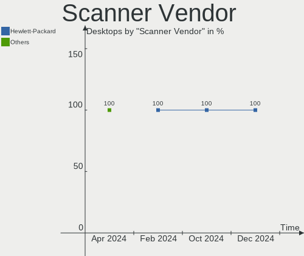

Pop!_OS - Hardware Trends (Desktops)
------------------------------------

A project to identify most popular hardware characteristics and track their change
over time based on data collected by Linux users at https://Linux-Hardware.org.

Anyone can contribute to this report by the [hw-probe](https://github.com/linuxhw/hw-probe) tool:

    sudo -E hw-probe -all -upload

This report is for one last month. Overall report since the beginning of time: [TestDays](https://github.com/linuxhw/TestDays)

Period: Nov, 2023.

Contents
--------

* [ System ](#system)
  - [ OS                       ](#os)
  - [ OS Family                ](#os-family)
  - [ Kernel                   ](#kernel)
  - [ Kernel Family            ](#kernel-family)
  - [ Kernel Major Ver.        ](#kernel-major-ver)
  - [ Arch                     ](#arch)
  - [ DE                       ](#de)
  - [ Display Server           ](#display-server)
  - [ Display Manager          ](#display-manager)
  - [ OS Lang                  ](#os-lang)
  - [ Boot Mode                ](#boot-mode)
  - [ Filesystem               ](#filesystem)
  - [ Part. scheme             ](#part-scheme)
  - [ Dual Boot with Linux/BSD ](#dual-boot-with-linuxbsd)
  - [ Dual Boot (Win)          ](#dual-boot-win)

* [ Board ](#board)
  - [ Vendor                   ](#vendor)
  - [ Model                    ](#model)
  - [ Model Family             ](#model-family)
  - [ MFG Year                 ](#mfg-year)
  - [ Form Factor              ](#form-factor)
  - [ Secure Boot              ](#secure-boot)
  - [ Coreboot                 ](#coreboot)
  - [ RAM Size                 ](#ram-size)
  - [ RAM Used                 ](#ram-used)
  - [ Total Drives             ](#total-drives)
  - [ Has CD-ROM               ](#has-cd-rom)
  - [ Has Ethernet             ](#has-ethernet)
  - [ Has WiFi                 ](#has-wifi)
  - [ Has Bluetooth            ](#has-bluetooth)

* [ Location ](#location)
  - [ Country                  ](#country)
  - [ City                     ](#city)

* [ Drives ](#drives)
  - [ Drive Vendor             ](#drive-vendor)
  - [ Drive Model              ](#drive-model)
  - [ HDD Vendor               ](#hdd-vendor)
  - [ SSD Vendor               ](#ssd-vendor)
  - [ Drive Kind               ](#drive-kind)
  - [ Drive Connector          ](#drive-connector)
  - [ Drive Size               ](#drive-size)
  - [ Space Total              ](#space-total)
  - [ Space Used               ](#space-used)
  - [ Malfunc. Drives          ](#malfunc-drives)
  - [ Malfunc. Drive Vendor    ](#malfunc-drive-vendor)
  - [ Malfunc. HDD Vendor      ](#malfunc-hdd-vendor)
  - [ Malfunc. Drive Kind      ](#malfunc-drive-kind)
  - [ Failed Drives            ](#failed-drives)
  - [ Failed Drive Vendor      ](#failed-drive-vendor)
  - [ Drive Status             ](#drive-status)

* [ Storage controller ](#storage-controller)
  - [ Storage Vendor           ](#storage-vendor)
  - [ Storage Model            ](#storage-model)
  - [ Storage Kind             ](#storage-kind)

* [ Processor ](#processor)
  - [ CPU Vendor               ](#cpu-vendor)
  - [ CPU Model                ](#cpu-model)
  - [ CPU Model Family         ](#cpu-model-family)
  - [ CPU Cores                ](#cpu-cores)
  - [ CPU Sockets              ](#cpu-sockets)
  - [ CPU Threads              ](#cpu-threads)
  - [ CPU Op-Modes             ](#cpu-op-modes)
  - [ CPU Microcode            ](#cpu-microcode)
  - [ CPU Microarch            ](#cpu-microarch)

* [ Graphics ](#graphics)
  - [ GPU Vendor               ](#gpu-vendor)
  - [ GPU Model                ](#gpu-model)
  - [ GPU Combo                ](#gpu-combo)
  - [ GPU Driver               ](#gpu-driver)
  - [ GPU Memory               ](#gpu-memory)

* [ Monitor ](#monitor)
  - [ Monitor Vendor           ](#monitor-vendor)
  - [ Monitor Model            ](#monitor-model)
  - [ Monitor Resolution       ](#monitor-resolution)
  - [ Monitor Diagonal         ](#monitor-diagonal)
  - [ Monitor Width            ](#monitor-width)
  - [ Aspect Ratio             ](#aspect-ratio)
  - [ Monitor Area             ](#monitor-area)
  - [ Pixel Density            ](#pixel-density)
  - [ Multiple Monitors        ](#multiple-monitors)

* [ Network ](#network)
  - [ Net Controller Vendor    ](#net-controller-vendor)
  - [ Net Controller Model     ](#net-controller-model)
  - [ Wireless Vendor          ](#wireless-vendor)
  - [ Wireless Model           ](#wireless-model)
  - [ Ethernet Vendor          ](#ethernet-vendor)
  - [ Ethernet Model           ](#ethernet-model)
  - [ Net Controller Kind      ](#net-controller-kind)
  - [ Used Controller          ](#used-controller)
  - [ NICs                     ](#nics)
  - [ IPv6                     ](#ipv6)

* [ Bluetooth ](#bluetooth)
  - [ Bluetooth Vendor         ](#bluetooth-vendor)
  - [ Bluetooth Model          ](#bluetooth-model)

* [ Sound ](#sound)
  - [ Sound Vendor             ](#sound-vendor)
  - [ Sound Model              ](#sound-model)

* [ Memory ](#memory)
  - [ Memory Vendor            ](#memory-vendor)
  - [ Memory Model             ](#memory-model)
  - [ Memory Kind              ](#memory-kind)
  - [ Memory Form Factor       ](#memory-form-factor)
  - [ Memory Size              ](#memory-size)
  - [ Memory Speed             ](#memory-speed)

* [ Printers & scanners ](#printers--scanners)
  - [ Printer Vendor           ](#printer-vendor)
  - [ Printer Model            ](#printer-model)
  - [ Scanner Vendor           ](#scanner-vendor)
  - [ Scanner Model            ](#scanner-model)

* [ Camera ](#camera)
  - [ Camera Vendor            ](#camera-vendor)
  - [ Camera Model             ](#camera-model)

* [ Security ](#security)
  - [ Fingerprint Vendor       ](#fingerprint-vendor)
  - [ Fingerprint Model        ](#fingerprint-model)
  - [ Chipcard Vendor          ](#chipcard-vendor)
  - [ Chipcard Model           ](#chipcard-model)

* [ Unsupported ](#unsupported)
  - [ Unsupported Devices      ](#unsupported-devices)
  - [ Unsupported Device Types ](#unsupported-device-types)

System
------

OS
--

Installed operating systems

| Name          | Desktops | Percent |
|---------------|----------|---------|
| Pop!_OS 22.04 | 71       | 100%    |

OS Family
---------

OS without a version

| Name    | Desktops | Percent |
|---------|----------|---------|
| Pop!_OS | 71       | 100%    |

Kernel
------

Version of the Linux kernel

| Version                | Desktops | Percent |
|------------------------|----------|---------|
| 6.5.6-76060506-generic | 57       | 80.28%  |
| 6.5.4-76060504-generic | 10       | 14.08%  |
| 6.5.12-x64v3-xanmod1   | 1        | 1.41%   |
| 6.5.10-x64v3-xanmod1   | 1        | 1.41%   |
| 6.4.6-76060406-generic | 1        | 1.41%   |
| 6.2.6-76060206-generic | 1        | 1.41%   |

Kernel Family
-------------

Linux kernel without a distro release

| Version | Desktops | Percent |
|---------|----------|---------|
| 6.5.6   | 57       | 80.28%  |
| 6.5.4   | 10       | 14.08%  |
| 6.5.12  | 1        | 1.41%   |
| 6.5.10  | 1        | 1.41%   |
| 6.4.6   | 1        | 1.41%   |
| 6.2.6   | 1        | 1.41%   |

Kernel Major Ver.
-----------------

Linux kernel major version

| Version | Desktops | Percent |
|---------|----------|---------|
| 6.5     | 69       | 97.18%  |
| 6.4     | 1        | 1.41%   |
| 6.2     | 1        | 1.41%   |

Arch
----

OS architecture (x86_64, i586, etc.)

| Name   | Desktops | Percent |
|--------|----------|---------|
| x86_64 | 71       | 100%    |

DE
--

Desktop Environment

| Name    | Desktops | Percent |
|---------|----------|---------|
| GNOME   | 69       | 97.18%  |
| i3      | 1        | 1.41%   |
| Unknown | 1        | 1.41%   |

Display Server
--------------

X11 or Wayland

| Name    | Desktops | Percent |
|---------|----------|---------|
| X11     | 67       | 94.37%  |
| Wayland | 3        | 4.23%   |
| Unknown | 1        | 1.41%   |

Display Manager
---------------

SDDM, LightDM, etc.

| Name    | Desktops | Percent |
|---------|----------|---------|
| Unknown | 50       | 70.42%  |
| GDM3    | 21       | 29.58%  |

OS Lang
-------

Language

| Lang    | Desktops | Percent |
|---------|----------|---------|
| en_US   | 40       | 56.34%  |
| de_DE   | 7        | 9.86%   |
| it_IT   | 5        | 7.04%   |
| en_GB   | 5        | 7.04%   |
| en_AU   | 3        | 4.23%   |
| pt_BR   | 2        | 2.82%   |
| en_NZ   | 2        | 2.82%   |
| C       | 2        | 2.82%   |
| zh_TW   | 1        | 1.41%   |
| pl_PL   | 1        | 1.41%   |
| en_ZA   | 1        | 1.41%   |
| de_CH   | 1        | 1.41%   |
| Unknown | 1        | 1.41%   |

Boot Mode
---------

EFI or BIOS

| Mode | Desktops | Percent |
|------|----------|---------|
| BIOS | 51       | 71.83%  |
| EFI  | 20       | 28.17%  |

Filesystem
----------

Type of filesystem

| Type    | Desktops | Percent |
|---------|----------|---------|
| Ext4    | 69       | 97.18%  |
| Zfs     | 1        | 1.41%   |
| Overlay | 1        | 1.41%   |

Part. scheme
------------

Scheme of partitioning

| Type    | Desktops | Percent |
|---------|----------|---------|
| Unknown | 49       | 69.01%  |
| GPT     | 22       | 30.99%  |

Dual Boot with Linux/BSD
------------------------

Hosting more than one Linux/BSD

| Dual boot | Desktops | Percent |
|-----------|----------|---------|
| No        | 67       | 94.37%  |
| Yes       | 4        | 5.63%   |

Dual Boot (Win)
---------------

Hosting Linux and Windows

| Dual boot | Desktops | Percent |
|-----------|----------|---------|
| No        | 60       | 84.51%  |
| Yes       | 11       | 15.49%  |

Board
-----

Vendor
------

Motherboard manufacturer

| Name                | Desktops | Percent |
|---------------------|----------|---------|
| ASUSTek Computer    | 24       | 33.8%   |
| MSI                 | 13       | 18.31%  |
| Gigabyte Technology | 12       | 16.9%   |
| ASRock              | 9        | 12.68%  |
| Hewlett-Packard     | 5        | 7.04%   |
| Intel               | 2        | 2.82%   |
| Dell                | 2        | 2.82%   |
| Lenovo              | 1        | 1.41%   |
| HC Technology.      | 1        | 1.41%   |
| Apple               | 1        | 1.41%   |
| AMI                 | 1        | 1.41%   |

Model
-----

Motherboard model

| Name                                    | Desktops | Percent |
|-----------------------------------------|----------|---------|
| MSI MS-7C95                             | 2        | 2.82%   |
| MSI MS-7B86                             | 2        | 2.82%   |
| ASUS ROG STRIX B550-F GAMING            | 2        | 2.82%   |
| ASUS All Series                         | 2        | 2.82%   |
| ASRock B760M PG Riptide                 | 2        | 2.82%   |
| MSI MS-7C90                             | 1        | 1.41%   |
| MSI MS-7C51                             | 1        | 1.41%   |
| MSI MS-7C35                             | 1        | 1.41%   |
| MSI MS-7C02                             | 1        | 1.41%   |
| MSI MS-7B98                             | 1        | 1.41%   |
| MSI MS-7B45                             | 1        | 1.41%   |
| MSI MS-7A38                             | 1        | 1.41%   |
| MSI MS-7978                             | 1        | 1.41%   |
| MSI MS-7821                             | 1        | 1.41%   |
| Lenovo IdeaCentre G5 14IMB05 90N9006TTW | 1        | 1.41%   |
| Intel X79 V1.0                          | 1        | 1.41%   |
| Intel DH61WW AAG23116-206               | 1        | 1.41%   |
| HP Z200 Workstation                     | 1        | 1.41%   |
| HP ProDesk 405 G4 SFF                   | 1        | 1.41%   |
| HP EliteDesk 800 G3 SFF                 | 1        | 1.41%   |
| HP EliteDesk 800 G2 SFF                 | 1        | 1.41%   |
| HP 500-166eg                            | 1        | 1.41%   |
| HC Technology. HCAR5000-MI              | 1        | 1.41%   |
| Gigabyte Z270-Gaming K3                 | 1        | 1.41%   |
| Gigabyte X570 I AORUS PRO WIFI          | 1        | 1.41%   |
| Gigabyte X570 AORUS PRO                 | 1        | 1.41%   |
| Gigabyte X399 AORUS Gaming 7            | 1        | 1.41%   |
| Gigabyte H97M-D3H                       | 1        | 1.41%   |
| Gigabyte H61M-S2PV                      | 1        | 1.41%   |
| Gigabyte H510M S2H V2                   | 1        | 1.41%   |
| Gigabyte H410M S2 V2                    | 1        | 1.41%   |
| Gigabyte H170N-WIFI                     | 1        | 1.41%   |
| Gigabyte B550M DS3H AC                  | 1        | 1.41%   |
| Gigabyte A320M-S2H                      | 1        | 1.41%   |
| Gigabyte 222534                         | 1        | 1.41%   |
| Dell XPS 8700                           | 1        | 1.41%   |
| Dell Inspiron 531                       | 1        | 1.41%   |
| ASUS Z170M-PLUS                         | 1        | 1.41%   |
| ASUS Z170-A                             | 1        | 1.41%   |
| ASUS TUF Gaming B650-PLUS WIFI          | 1        | 1.41%   |

Model Family
------------

Motherboard model prefix

| Name                       | Desktops | Percent |
|----------------------------|----------|---------|
| ASUS ROG                   | 8        | 11.27%  |
| ASUS PRIME                 | 4        | 5.63%   |
| MSI MS-7C95                | 2        | 2.82%   |
| MSI MS-7B86                | 2        | 2.82%   |
| HP EliteDesk               | 2        | 2.82%   |
| Gigabyte X570              | 2        | 2.82%   |
| ASUS TUF                   | 2        | 2.82%   |
| ASUS All                   | 2        | 2.82%   |
| ASRock B760M               | 2        | 2.82%   |
| ASRock B450                | 2        | 2.82%   |
| MSI MS-7C90                | 1        | 1.41%   |
| MSI MS-7C51                | 1        | 1.41%   |
| MSI MS-7C35                | 1        | 1.41%   |
| MSI MS-7C02                | 1        | 1.41%   |
| MSI MS-7B98                | 1        | 1.41%   |
| MSI MS-7B45                | 1        | 1.41%   |
| MSI MS-7A38                | 1        | 1.41%   |
| MSI MS-7978                | 1        | 1.41%   |
| MSI MS-7821                | 1        | 1.41%   |
| Lenovo IdeaCentre          | 1        | 1.41%   |
| Intel X79                  | 1        | 1.41%   |
| Intel DH61WW               | 1        | 1.41%   |
| HP Z200                    | 1        | 1.41%   |
| HP ProDesk                 | 1        | 1.41%   |
| HP 500-166eg               | 1        | 1.41%   |
| HC Technology. HCAR5000-MI | 1        | 1.41%   |
| Gigabyte Z270-Gaming       | 1        | 1.41%   |
| Gigabyte X399              | 1        | 1.41%   |
| Gigabyte H97M-D3H          | 1        | 1.41%   |
| Gigabyte H61M-S2PV         | 1        | 1.41%   |
| Gigabyte H510M             | 1        | 1.41%   |
| Gigabyte H410M             | 1        | 1.41%   |
| Gigabyte H170N-WIFI        | 1        | 1.41%   |
| Gigabyte B550M             | 1        | 1.41%   |
| Gigabyte A320M-S2H         | 1        | 1.41%   |
| Gigabyte 222534            | 1        | 1.41%   |
| Dell XPS                   | 1        | 1.41%   |
| Dell Inspiron              | 1        | 1.41%   |
| ASUS Z170M-PLUS            | 1        | 1.41%   |
| ASUS Z170-A                | 1        | 1.41%   |

MFG Year
--------

Motherboard manufacture year

| Year | Desktops | Percent |
|------|----------|---------|
| 2021 | 9        | 12.68%  |
| 2019 | 9        | 12.68%  |
| 2020 | 8        | 11.27%  |
| 2018 | 7        | 9.86%   |
| 2022 | 6        | 8.45%   |
| 2017 | 6        | 8.45%   |
| 2023 | 5        | 7.04%   |
| 2012 | 5        | 7.04%   |
| 2015 | 4        | 5.63%   |
| 2013 | 4        | 5.63%   |
| 2016 | 3        | 4.23%   |
| 2011 | 2        | 2.82%   |
| 2014 | 1        | 1.41%   |
| 2010 | 1        | 1.41%   |
| 2007 | 1        | 1.41%   |

Form Factor
-----------

Physical design of the computer

| Name    | Desktops | Percent |
|---------|----------|---------|
| Desktop | 71       | 100%    |

Secure Boot
-----------

Enabled or disabled

| State    | Desktops | Percent |
|----------|----------|---------|
| Disabled | 71       | 100%    |

Coreboot
--------

Have coreboot on board

| Used | Desktops | Percent |
|------|----------|---------|
| No   | 71       | 100%    |

RAM Size
--------

Total RAM memory

| Size in GB  | Desktops | Percent |
|-------------|----------|---------|
| 32.01-64.0  | 20       | 28.17%  |
| 16.01-24.0  | 20       | 28.17%  |
| 64.01-256.0 | 9        | 12.68%  |
| 24.01-32.0  | 8        | 11.27%  |
| 4.01-8.0    | 7        | 9.86%   |
| 8.01-16.0   | 6        | 8.45%   |
| 3.01-4.0    | 1        | 1.41%   |

RAM Used
--------

Used RAM memory

| Used GB    | Desktops | Percent |
|------------|----------|---------|
| 4.01-8.0   | 35       | 49.3%   |
| 8.01-16.0  | 16       | 22.54%  |
| 3.01-4.0   | 10       | 14.08%  |
| 2.01-3.0   | 6        | 8.45%   |
| 16.01-24.0 | 3        | 4.23%   |
| 24.01-32.0 | 1        | 1.41%   |

Total Drives
------------

Number of drives on board

| Drives | Desktops | Percent |
|--------|----------|---------|
| 1      | 23       | 32.39%  |
| 2      | 22       | 30.99%  |
| 3      | 13       | 18.31%  |
| 4      | 10       | 14.08%  |
| 5      | 2        | 2.82%   |
| 9      | 1        | 1.41%   |

Has CD-ROM
----------

Has CD-ROM on board

| Presented | Desktops | Percent |
|-----------|----------|---------|
| No        | 54       | 76.06%  |
| Yes       | 17       | 23.94%  |

Has Ethernet
------------

Has Ethernet on board

| Presented | Desktops | Percent |
|-----------|----------|---------|
| Yes       | 71       | 100%    |

Has WiFi
--------

Has WiFi module

| Presented | Desktops | Percent |
|-----------|----------|---------|
| Yes       | 43       | 60.56%  |
| No        | 28       | 39.44%  |

Has Bluetooth
-------------

Has Bluetooth module

| Presented | Desktops | Percent |
|-----------|----------|---------|
| Yes       | 40       | 56.34%  |
| No        | 31       | 43.66%  |

Location
--------

Country
-------

Geographic location (country)

| Country      | Desktops | Percent |
|--------------|----------|---------|
| USA          | 21       | 29.58%  |
| Italy        | 8        | 11.27%  |
| Germany      | 8        | 11.27%  |
| UK           | 4        | 5.63%   |
| Brazil       | 4        | 5.63%   |
| Switzerland  | 2        | 2.82%   |
| Norway       | 2        | 2.82%   |
| New Zealand  | 2        | 2.82%   |
| Netherlands  | 2        | 2.82%   |
| Canada       | 2        | 2.82%   |
| Australia    | 2        | 2.82%   |
| Taiwan       | 1        | 1.41%   |
| Sweden       | 1        | 1.41%   |
| South Africa | 1        | 1.41%   |
| Saudi Arabia | 1        | 1.41%   |
| Russia       | 1        | 1.41%   |
| Portugal     | 1        | 1.41%   |
| Poland       | 1        | 1.41%   |
| Malaysia     | 1        | 1.41%   |
| Hong Kong    | 1        | 1.41%   |
| Greece       | 1        | 1.41%   |
| France       | 1        | 1.41%   |
| Estonia      | 1        | 1.41%   |
| Austria      | 1        | 1.41%   |
| Algeria      | 1        | 1.41%   |

City
----

Geographic location (city)

| City            | Desktops | Percent |
|-----------------|----------|---------|
| Winnipeg        | 2        | 2.82%   |
| Pisa            | 2        | 2.82%   |
| Cologne         | 2        | 2.82%   |
| Austin          | 2        | 2.82%   |
| Yekaterinburg   | 1        | 1.41%   |
| West Palm Beach | 1        | 1.41%   |
| Wellington      | 1        | 1.41%   |
| Warnsveld       | 1        | 1.41%   |
| Vitry-sur-Seine | 1        | 1.41%   |
| Udine           | 1        | 1.41%   |
| Tulsa           | 1        | 1.41%   |
| Timbauba        | 1        | 1.41%   |
| Tartu           | 1        | 1.41%   |
| St. Gallen      | 1        | 1.41%   |
| Solna           | 1        | 1.41%   |
| Ski             | 1        | 1.41%   |
| Schutterwald    | 1        | 1.41%   |
| Rome            | 1        | 1.41%   |
| Rio de Janeiro  | 1        | 1.41%   |
| Porto           | 1        | 1.41%   |
| Petaling Jaya   | 1        | 1.41%   |
| Perth           | 1        | 1.41%   |
| Padova          | 1        | 1.41%   |
| Osasco          | 1        | 1.41%   |
| Orange Park     | 1        | 1.41%   |
| Oran            | 1        | 1.41%   |
| Onex            | 1        | 1.41%   |
| Olympia         | 1        | 1.41%   |
| Oakland         | 1        | 1.41%   |
| New Taipei      | 1        | 1.41%   |
| New Braunfels   | 1        | 1.41%   |
| Mukilteo        | 1        | 1.41%   |
| Milano          | 1        | 1.41%   |
| Milan           | 1        | 1.41%   |
| Melbourne       | 1        | 1.41%   |
| Markkleeberg    | 1        | 1.41%   |
| Manhattan Beach | 1        | 1.41%   |
| Lynchburg       | 1        | 1.41%   |
| Lufkin          | 1        | 1.41%   |
| Los Angeles     | 1        | 1.41%   |

Drives
------

Drive Vendor
------------

Hard drive vendors

| Vendor                      | Desktops | Drives | Percent |
|-----------------------------|----------|--------|---------|
| Samsung Electronics         | 33       | 49     | 25.58%  |
| Seagate                     | 17       | 24     | 13.18%  |
| WDC                         | 10       | 12     | 7.75%   |
| Sandisk                     | 9        | 10     | 6.98%   |
| Kingston                    | 6        | 9      | 4.65%   |
| Crucial                     | 5        | 7      | 3.88%   |
| Toshiba                     | 4        | 4      | 3.1%    |
| Phison Electronics          | 4        | 4      | 3.1%    |
| Hitachi                     | 4        | 5      | 3.1%    |
| Intel                       | 3        | 3      | 2.33%   |
| China                       | 3        | 3      | 2.33%   |
| T-FORCE                     | 2        | 2      | 1.55%   |
| Silicon Motion              | 2        | 2      | 1.55%   |
| PNY                         | 2        | 2      | 1.55%   |
| Micron Technology           | 2        | 2      | 1.55%   |
| JMicron Technology          | 2        | 2      | 1.55%   |
| Apple                       | 2        | 2      | 1.55%   |
| A-DATA Technology           | 2        | 2      | 1.55%   |
| WXC-R1                      | 1        | 1      | 0.78%   |
| Unknown                     | 1        | 1      | 0.78%   |
| Team                        | 1        | 1      | 0.78%   |
| SSK                         | 1        | 1      | 0.78%   |
| SPCC                        | 1        | 1      | 0.78%   |
| SABRENT                     | 1        | 1      | 0.78%   |
| Realtek Semiconductor       | 1        | 1      | 0.78%   |
| PC611 NV                    | 1        | 1      | 0.78%   |
| Patriot                     | 1        | 1      | 0.78%   |
| Netac                       | 1        | 1      | 0.78%   |
| Micron/Crucial Technology   | 1        | 1      | 0.78%   |
| LITEONIT                    | 1        | 1      | 0.78%   |
| Kingston Technology Company | 1        | 1      | 0.78%   |
| Intenso                     | 1        | 1      | 0.78%   |
| HGST                        | 1        | 3      | 0.78%   |
| ASMT                        | 1        | 1      | 0.78%   |
| ADATA Technology            | 1        | 2      | 0.78%   |

Drive Model
-----------

Hard drive models

| Model                                                 | Desktops | Percent |
|-------------------------------------------------------|----------|---------|
| Samsung NVMe SSD Controller SM981/PM981/PM983 250GB   | 9        | 5.96%   |
| Seagate ST2000DM001-1ER164 2TB                        | 3        | 1.99%   |
| Seagate ST2000DM001-1CH164 2TB                        | 3        | 1.99%   |
| Sandisk WD Black SN850 1024GB                         | 3        | 1.99%   |
| Samsung NVMe SSD Controller PM9A1/PM9A3/980PRO 2TB    | 3        | 1.99%   |
| Kingston SA400S37240G 240GB SSD                       | 3        | 1.99%   |
| WDC WD20EZRZ-00Z5HB0 2TB                              | 2        | 1.32%   |
| Seagate BUP Slim BL 1TB                               | 2        | 1.32%   |
| Sandisk WD Blue SN570 1TB                             | 2        | 1.32%   |
| Sandisk WD Blue SN550 NVMe SSD 512GB                  | 2        | 1.32%   |
| Samsung SSD 860 EVO 1TB                               | 2        | 1.32%   |
| Samsung SSD 850 EVO 500GB                             | 2        | 1.32%   |
| Samsung SSD 850 EVO 250GB                             | 2        | 1.32%   |
| Samsung SSD 850 EVO 1TB                               | 2        | 1.32%   |
| Hitachi HDS721010CLA332 1TB                           | 2        | 1.32%   |
| Crucial CT2000P3PSSD8 2TB                             | 2        | 1.32%   |
| Crucial CT1000MX500SSD1 1TB                           | 2        | 1.32%   |
| WXC-R1 512GB                                          | 1        | 0.66%   |
| WDC WDS500G2B0A-00SM50 500GB SSD                      | 1        | 0.66%   |
| WDC WDS100T3X0C-00SJG0 1TB                            | 1        | 0.66%   |
| WDC WD5000AAKX-001CA0 500GB                           | 1        | 0.66%   |
| WDC WD10EZRX-00A8LB0 1TB                              | 1        | 0.66%   |
| WDC WD10EZEX-22MFCA0 1TB                              | 1        | 0.66%   |
| WDC WD10EZEX-00WN4A0 1TB                              | 1        | 0.66%   |
| WDC WD10EZEX-00BN5A0 1TB                              | 1        | 0.66%   |
| WDC WD10EARX-00N0YB0 1TB                              | 1        | 0.66%   |
| WDC WD10EALX-009BA0 1TB                               | 1        | 0.66%   |
| Unknown NVMe SSD Drive 1024GB                         | 1        | 0.66%   |
| Toshiba THNSNJ256GMCU 256GB SSD                       | 1        | 0.66%   |
| Toshiba HDWD110 1TB                                   | 1        | 0.66%   |
| Toshiba DT01ACA300 3TB                                | 1        | 0.66%   |
| Toshiba DT01ACA100 1TB                                | 1        | 0.66%   |
| Team T253LE240G 240GB SSD                             | 1        | 0.66%   |
| T-FORCE SSD 1TB                                       | 1        | 0.66%   |
| T-FORCE 512GB                                         | 1        | 0.66%   |
| SSK Storage 1TB                                       | 1        | 0.66%   |
| SPCC Solid State Disk 1024GB                          | 1        | 0.66%   |
| Silicon Motion SM2263EN/SM2263XT SSD Controller 256GB | 1        | 0.66%   |
| Silicon Motion 256GB PCS PCIe M.2 SSD                 | 1        | 0.66%   |
| Seagate ST500LM012 HN-M5 500GB                        | 1        | 0.66%   |

HDD Vendor
----------

Hard disk drive vendors

| Vendor              | Desktops | Drives | Percent |
|---------------------|----------|--------|---------|
| Seagate             | 17       | 24     | 45.95%  |
| WDC                 | 8        | 10     | 21.62%  |
| Hitachi             | 4        | 5      | 10.81%  |
| Toshiba             | 3        | 3      | 8.11%   |
| Samsung Electronics | 3        | 3      | 8.11%   |
| HGST                | 1        | 3      | 2.7%    |
| Apple               | 1        | 1      | 2.7%    |

SSD Vendor
----------

Solid state drive vendors

| Vendor              | Desktops | Drives | Percent |
|---------------------|----------|--------|---------|
| Samsung Electronics | 15       | 21     | 34.09%  |
| Kingston            | 6        | 7      | 13.64%  |
| China               | 3        | 3      | 6.82%   |
| PNY                 | 2        | 2      | 4.55%   |
| Crucial             | 2        | 2      | 4.55%   |
| A-DATA Technology   | 2        | 2      | 4.55%   |
| WDC                 | 1        | 1      | 2.27%   |
| Toshiba             | 1        | 1      | 2.27%   |
| Team                | 1        | 1      | 2.27%   |
| T-FORCE             | 1        | 1      | 2.27%   |
| SPCC                | 1        | 1      | 2.27%   |
| Patriot             | 1        | 1      | 2.27%   |
| Netac               | 1        | 1      | 2.27%   |
| Micron Technology   | 1        | 1      | 2.27%   |
| LITEONIT            | 1        | 1      | 2.27%   |
| JMicron Technology  | 1        | 1      | 2.27%   |
| Intenso             | 1        | 1      | 2.27%   |
| Intel               | 1        | 1      | 2.27%   |
| ASMT                | 1        | 1      | 2.27%   |
| Apple               | 1        | 1      | 2.27%   |

Drive Kind
----------

HDD or SSD

| Kind    | Desktops | Drives | Percent |
|---------|----------|--------|---------|
| NVMe    | 43       | 60     | 38.05%  |
| SSD     | 36       | 51     | 31.86%  |
| HDD     | 30       | 49     | 26.55%  |
| Unknown | 4        | 4      | 3.54%   |

Drive Connector
---------------

SATA, SAS, NVMe, etc.

| Type | Desktops | Drives | Percent |
|------|----------|--------|---------|
| SATA | 49       | 94     | 48.51%  |
| NVMe | 42       | 58     | 41.58%  |
| SAS  | 10       | 12     | 9.9%    |

Drive Size
----------

Size of hard drive

| Size in TB | Desktops | Drives | Percent |
|------------|----------|--------|---------|
| 0.01-0.5   | 31       | 37     | 43.66%  |
| 0.51-1.0   | 22       | 34     | 30.99%  |
| 1.01-2.0   | 15       | 18     | 21.13%  |
| 3.01-4.0   | 2        | 10     | 2.82%   |
| 2.01-3.0   | 1        | 1      | 1.41%   |

Space Total
-----------

Amount of disk space available on the file system

| Size in GB     | Desktops | Percent |
|----------------|----------|---------|
| 1001-2000      | 18       | 25.35%  |
| 251-500        | 15       | 21.13%  |
| 501-1000       | 14       | 19.72%  |
| More than 3000 | 8        | 11.27%  |
| 101-250        | 8        | 11.27%  |
| 2001-3000      | 3        | 4.23%   |
| 1-20           | 2        | 2.82%   |
| 51-100         | 2        | 2.82%   |
| Unknown        | 1        | 1.41%   |

Space Used
----------

Amount of used disk space

| Used GB        | Desktops | Percent |
|----------------|----------|---------|
| 21-50          | 14       | 19.72%  |
| 101-250        | 12       | 16.9%   |
| 1-20           | 12       | 16.9%   |
| 501-1000       | 9        | 12.68%  |
| 251-500        | 7        | 9.86%   |
| 1001-2000      | 7        | 9.86%   |
| 51-100         | 7        | 9.86%   |
| More than 3000 | 1        | 1.41%   |
| 2001-3000      | 1        | 1.41%   |
| Unknown        | 1        | 1.41%   |

Malfunc. Drives
---------------

Drive models with a malfunction

| Model                                       | Desktops | Drives | Percent |
|---------------------------------------------|----------|--------|---------|
| WDC WD20EZRZ-00Z5HB0 2TB                    | 1        | 1      | 12.5%   |
| WDC WD10EZEX-00BN5A0 1TB                    | 1        | 1      | 12.5%   |
| Samsung Electronics SSD PM810 2.5 7mm 128GB | 1        | 1      | 12.5%   |
| Samsung Electronics SSD 850 EVO 1TB         | 1        | 1      | 12.5%   |
| Samsung Electronics HD154UI 1TB             | 1        | 1      | 12.5%   |
| Hitachi HDS721010CLA332 1TB                 | 1        | 1      | 12.5%   |
| Apple HDD ST1000DM003 1TB                   | 1        | 1      | 12.5%   |
| A-DATA Technology SSD S599 64GB             | 1        | 1      | 12.5%   |

Malfunc. Drive Vendor
---------------------

Vendors of faulty drives

| Vendor              | Desktops | Drives | Percent |
|---------------------|----------|--------|---------|
| Samsung Electronics | 2        | 3      | 33.33%  |
| WDC                 | 1        | 2      | 16.67%  |
| Hitachi             | 1        | 1      | 16.67%  |
| Apple               | 1        | 1      | 16.67%  |
| A-DATA Technology   | 1        | 1      | 16.67%  |

Malfunc. HDD Vendor
-------------------

Vendors of faulty HDD drives

| Vendor              | Desktops | Drives | Percent |
|---------------------|----------|--------|---------|
| WDC                 | 1        | 2      | 25%     |
| Samsung Electronics | 1        | 1      | 25%     |
| Hitachi             | 1        | 1      | 25%     |
| Apple               | 1        | 1      | 25%     |

Malfunc. Drive Kind
-------------------

Kinds of faulty drives

| Kind | Desktops | Drives | Percent |
|------|----------|--------|---------|
| HDD  | 4        | 5      | 57.14%  |
| SSD  | 3        | 3      | 42.86%  |

Failed Drives
-------------

Failed drive models

Zero info for selected period =(

Failed Drive Vendor
-------------------

Failed drive vendors

Zero info for selected period =(

Drive Status
------------

Number of failed and malfunc. drives

| Status   | Desktops | Drives | Percent |
|----------|----------|--------|---------|
| Detected | 52       | 117    | 65.82%  |
| Works    | 21       | 39     | 26.58%  |
| Malfunc  | 6        | 8      | 7.59%   |

Storage controller
------------------

Storage Vendor
--------------

Storage controller vendors

| Vendor                      | Desktops | Percent |
|-----------------------------|----------|---------|
| Intel                       | 35       | 27.78%  |
| AMD                         | 34       | 26.98%  |
| Samsung Electronics         | 23       | 18.25%  |
| SanDisk                     | 10       | 7.94%   |
| Phison Electronics          | 4        | 3.17%   |
| Micron/Crucial Technology   | 4        | 3.17%   |
| ASMedia Technology          | 4        | 3.17%   |
| Kingston Technology Company | 3        | 2.38%   |
| Silicon Motion              | 2        | 1.59%   |
| Solidigm                    | 1        | 0.79%   |
| Realtek Semiconductor       | 1        | 0.79%   |
| Nvidia                      | 1        | 0.79%   |
| Micron Technology           | 1        | 0.79%   |
| Marvell Technology Group    | 1        | 0.79%   |
| JMicron Technology          | 1        | 0.79%   |
| ADATA Technology            | 1        | 0.79%   |

Storage Model
-------------

Storage controller models

| Model                                                                                   | Desktops | Percent |
|-----------------------------------------------------------------------------------------|----------|---------|
| AMD FCH SATA Controller [AHCI mode]                                                     | 23       | 15.86%  |
| Samsung NVMe SSD Controller SM981/PM981/PM983                                           | 12       | 8.28%   |
| AMD 500 Series Chipset SATA Controller                                                  | 9        | 6.21%   |
| AMD 400 Series Chipset SATA Controller                                                  | 9        | 6.21%   |
| Samsung NVMe SSD Controller PM9A1/PM9A3/980PRO                                          | 5        | 3.45%   |
| Intel Q170/Q150/B150/H170/H110/Z170/CM236 Chipset SATA Controller [AHCI Mode]           | 5        | 3.45%   |
| Intel 8 Series/C220 Series Chipset Family 6-port SATA Controller 1 [AHCI mode]          | 4        | 2.76%   |
| ASMedia ASM1062 Serial ATA Controller                                                   | 4        | 2.76%   |
| SanDisk WD PC SN810 / Black SN850 NVMe SSD                                              | 3        | 2.07%   |
| Samsung NVMe SSD Controller 980 (DRAM-less)                                             | 3        | 2.07%   |
| Micron/Crucial P2 [Nick P2] / P3 / P3 Plus NVMe PCIe SSD (DRAM-less)                    | 3        | 2.07%   |
| Intel SATA Controller [RAID mode]                                                       | 3        | 2.07%   |
| Intel Comet Lake SATA AHCI Controller                                                   | 3        | 2.07%   |
| Intel 200 Series PCH SATA controller [AHCI mode]                                        | 3        | 2.07%   |
| Silicon Motion SM2263EN/SM2263XT (DRAM-less) NVMe SSD Controllers                       | 2        | 1.38%   |
| SanDisk Ultra 3D / WD Blue SN570 NVMe SSD (DRAM-less)                                   | 2        | 1.38%   |
| SanDisk Ultra 3D / WD Blue SN550 NVMe SSD                                               | 2        | 1.38%   |
| SanDisk Extreme Pro / WD Black SN750 / PC SN730 / Red SN700 NVMe SSD                    | 2        | 1.38%   |
| Phison E12 NVMe Controller                                                              | 2        | 1.38%   |
| Intel 9 Series Chipset Family SATA Controller [AHCI Mode]                               | 2        | 1.38%   |
| Intel 700 Series Chipset Family SATA AHCI Controller                                    | 2        | 1.38%   |
| Intel 6 Series/C200 Series Chipset Family Desktop SATA Controller (IDE mode, ports 4-5) | 2        | 1.38%   |
| Intel 6 Series/C200 Series Chipset Family Desktop SATA Controller (IDE mode, ports 0-3) | 2        | 1.38%   |
| Intel 6 Series/C200 Series Chipset Family 6 port Desktop SATA AHCI Controller           | 2        | 1.38%   |
| AMD FCH SATA Controller D                                                               | 2        | 1.38%   |
| AMD 300 Series Chipset SATA Controller                                                  | 2        | 1.38%   |
| Solidigm P44 Pro NVMe SSD [Hollywood Beach]                                             | 1        | 0.69%   |
| SanDisk WD PC SN540 / Green SN350 NVMe SSD 1 TB (DRAM-less)                             | 1        | 0.69%   |
| SanDisk WD Green SN350 240GB (DRAM-less) / SN560E NVMe SSD                              | 1        | 0.69%   |
| Samsung S4LN053X01 AHCI SSD Controller(Apple slot)                                      | 1        | 0.69%   |
| Samsung NVMe SSD Controller SM961/PM961/SM963                                           | 1        | 0.69%   |
| Samsung NVMe SSD Controller S4LV008[Pascal]                                             | 1        | 0.69%   |
| Realtek RTS5763DL NVMe SSD Controller (DRAM-less)                                       | 1        | 0.69%   |
| Phison PS5013-E13 PCIe3 NVMe Controller (DRAM-less)                                     | 1        | 0.69%   |
| Phison E8 PCIe3 NVMe Controller                                                         | 1        | 0.69%   |
| Nvidia MCP61 SATA Controller                                                            | 1        | 0.69%   |
| Nvidia MCP61 IDE                                                                        | 1        | 0.69%   |
| Micron/Crucial P5 Plus NVMe PCIe SSD                                                    | 1        | 0.69%   |
| Micron 2550 NVMe SSD (DRAM-less)                                                        | 1        | 0.69%   |
| Marvell Group 88SE9172 SATA 6Gb/s Controller                                            | 1        | 0.69%   |

Storage Kind
------------

Kind of storage controller (IDE, SATA, NVMe, SAS, ...)

| Kind | Desktops | Percent |
|------|----------|---------|
| SATA | 63       | 55.75%  |
| NVMe | 42       | 37.17%  |
| RAID | 4        | 3.54%   |
| IDE  | 4        | 3.54%   |

Processor
---------

CPU Vendor
----------

Processor vendors

| Vendor | Desktops | Percent |
|--------|----------|---------|
| Intel  | 36       | 50.7%   |
| AMD    | 35       | 49.3%   |

CPU Model
---------

Processor models

| Model                                           | Desktops | Percent |
|-------------------------------------------------|----------|---------|
| AMD Ryzen 7 5800X 8-Core Processor              | 5        | 7.04%   |
| Intel Core i7-6700 CPU @ 3.40GHz                | 4        | 5.63%   |
| AMD Ryzen 9 5950X 16-Core Processor             | 3        | 4.23%   |
| AMD Ryzen 9 5900X 12-Core Processor             | 3        | 4.23%   |
| AMD Ryzen 7 2700X Eight-Core Processor          | 3        | 4.23%   |
| Intel Core i7-9700K CPU @ 3.60GHz               | 2        | 2.82%   |
| Intel Core i7-2600K CPU @ 3.40GHz               | 2        | 2.82%   |
| Intel Core i5-6600K CPU @ 3.50GHz               | 2        | 2.82%   |
| Intel Core i3-10105F CPU @ 3.70GHz              | 2        | 2.82%   |
| Intel 13th Gen Core i7-13700KF                  | 2        | 2.82%   |
| AMD Ryzen 5 PRO 2400G with Radeon Vega Graphics | 2        | 2.82%   |
| AMD Ryzen 5 7600 6-Core Processor               | 2        | 2.82%   |
| Intel Xeon CPU E5-2697 v2 @ 2.70GHz             | 1        | 1.41%   |
| Intel Xeon CPU E5-2652 v3 @ 2.30GHz             | 1        | 1.41%   |
| Intel Xeon CPU E5-1650 v2 @ 3.50GHz             | 1        | 1.41%   |
| Intel Core i7-8086K CPU @ 4.00GHz               | 1        | 1.41%   |
| Intel Core i7-7700K CPU @ 4.20GHz               | 1        | 1.41%   |
| Intel Core i7-4790K CPU @ 4.00GHz               | 1        | 1.41%   |
| Intel Core i7-4790 CPU @ 3.60GHz                | 1        | 1.41%   |
| Intel Core i7-4770 CPU @ 3.40GHz                | 1        | 1.41%   |
| Intel Core i5-4670K CPU @ 3.40GHz               | 1        | 1.41%   |
| Intel Core i5-4460 CPU @ 3.20GHz                | 1        | 1.41%   |
| Intel Core i5-4440 CPU @ 3.10GHz                | 1        | 1.41%   |
| Intel Core i5-4430S CPU @ 2.70GHz               | 1        | 1.41%   |
| Intel Core i5-3570 CPU @ 3.40GHz                | 1        | 1.41%   |
| Intel Core i5-3550 CPU @ 3.30GHz                | 1        | 1.41%   |
| Intel Core i5-2500K CPU @ 3.30GHz               | 1        | 1.41%   |
| Intel Core i5-10600K CPU @ 4.10GHz              | 1        | 1.41%   |
| Intel Core i5-10400F CPU @ 2.90GHz              | 1        | 1.41%   |
| Intel Core i5-10400 CPU @ 2.90GHz               | 1        | 1.41%   |
| Intel Core i5 CPU 650 @ 3.20GHz                 | 1        | 1.41%   |
| Intel Core i3-2100 CPU @ 3.10GHz                | 1        | 1.41%   |
| Intel Celeron J4105 CPU @ 1.50GHz               | 1        | 1.41%   |
| Intel 12th Gen Core i9-12900K                   | 1        | 1.41%   |
| AMD Ryzen Threadripper 1900X 8-Core Processor   | 1        | 1.41%   |
| AMD Ryzen 9 3900 12-Core Processor              | 1        | 1.41%   |
| AMD Ryzen 7 7800X3D 8-Core Processor            | 1        | 1.41%   |
| AMD Ryzen 7 5700U with Radeon Graphics          | 1        | 1.41%   |
| AMD Ryzen 7 3800XT 8-Core Processor             | 1        | 1.41%   |
| AMD Ryzen 7 2700 Eight-Core Processor           | 1        | 1.41%   |

CPU Model Family
----------------

Processor model prefix

| Model                  | Desktops | Percent |
|------------------------|----------|---------|
| Intel Core i7          | 13       | 18.31%  |
| Intel Core i5          | 13       | 18.31%  |
| AMD Ryzen 7            | 12       | 16.9%   |
| AMD Ryzen 5            | 11       | 15.49%  |
| AMD Ryzen 9            | 7        | 9.86%   |
| Other                  | 3        | 4.23%   |
| Intel Xeon             | 3        | 4.23%   |
| Intel Core i3          | 3        | 4.23%   |
| AMD Ryzen 5 PRO        | 2        | 2.82%   |
| Intel Celeron          | 1        | 1.41%   |
| AMD Ryzen Threadripper | 1        | 1.41%   |
| AMD Ryzen 3            | 1        | 1.41%   |
| AMD Athlon 64 X2       | 1        | 1.41%   |

CPU Cores
---------

Number of processor cores

| Number | Desktops | Percent |
|--------|----------|---------|
| 4      | 26       | 36.62%  |
| 8      | 15       | 21.13%  |
| 6      | 15       | 21.13%  |
| 16     | 6        | 8.45%   |
| 12     | 5        | 7.04%   |
| 2      | 3        | 4.23%   |
| 10     | 1        | 1.41%   |

CPU Sockets
-----------

Number of sockets

| Number | Desktops | Percent |
|--------|----------|---------|
| 1      | 71       | 100%    |

CPU Threads
-----------

Threads per core (Hyper-Threading)

| Number | Desktops | Percent |
|--------|----------|---------|
| 2      | 57       | 80.28%  |
| 1      | 14       | 19.72%  |

CPU Op-Modes
------------

CPU Operation Modes (32-bit, 64-bit)

| Op mode        | Desktops | Percent |
|----------------|----------|---------|
| 32-bit, 64-bit | 71       | 100%    |

CPU Microcode
-------------

Microcode number

| Number     | Desktops | Percent |
|------------|----------|---------|
| Unknown    | 62       | 87.32%  |
| 0x0a601203 | 2        | 2.82%   |
| 0x0a20102b | 2        | 2.82%   |
| 0x0800820d | 2        | 2.82%   |
| 0x0a20120a | 1        | 1.41%   |
| 0x08101016 | 1        | 1.41%   |
| 0x08001137 | 1        | 1.41%   |

CPU Microarch
-------------

Microarchitecture

| Name          | Desktops | Percent |
|---------------|----------|---------|
| Zen 3         | 14       | 19.72%  |
| Haswell       | 8        | 11.27%  |
| Unknown       | 8        | 11.27%  |
| Zen+          | 7        | 9.86%   |
| Skylake       | 6        | 8.45%   |
| CometLake     | 5        | 7.04%   |
| Zen 2         | 4        | 5.63%   |
| Zen           | 4        | 5.63%   |
| SandyBridge   | 4        | 5.63%   |
| KabyLake      | 4        | 5.63%   |
| IvyBridge     | 4        | 5.63%   |
| Westmere      | 1        | 1.41%   |
| K8 Hammer     | 1        | 1.41%   |
| Goldmont plus | 1        | 1.41%   |

Graphics
--------

GPU Vendor
----------

Vendors of graphics cards

| Vendor | Desktops | Percent |
|--------|----------|---------|
| Nvidia | 38       | 50%     |
| AMD    | 26       | 34.21%  |
| Intel  | 12       | 15.79%  |

GPU Model
---------

Graphics card models

| Model                                                                       | Desktops | Percent |
|-----------------------------------------------------------------------------|----------|---------|
| AMD Ellesmere [Radeon RX 470/480/570/570X/580/580X/590]                     | 5        | 6.17%   |
| Intel Xeon E3-1200 v3/4th Gen Core Processor Integrated Graphics Controller | 4        | 4.94%   |
| AMD Raphael                                                                 | 4        | 4.94%   |
| AMD Navi 21 [Radeon RX 6800/6800 XT / 6900 XT]                              | 4        | 4.94%   |
| Nvidia TU106 [GeForce RTX 2060 Rev. A]                                      | 3        | 3.7%    |
| Nvidia GP104 [GeForce GTX 1070]                                             | 3        | 3.7%    |
| Nvidia GA102 [GeForce RTX 3080 Ti]                                          | 3        | 3.7%    |
| Nvidia AD107 [GeForce RTX 4060]                                             | 3        | 3.7%    |
| Intel HD Graphics 530                                                       | 3        | 3.7%    |
| Nvidia TU117 [GeForce GTX 1650]                                             | 2        | 2.47%   |
| Nvidia TU116 [GeForce GTX 1660 SUPER]                                       | 2        | 2.47%   |
| Nvidia TU116 [GeForce GTX 1650 SUPER]                                       | 2        | 2.47%   |
| Nvidia GP102 [GeForce GTX 1080 Ti]                                          | 2        | 2.47%   |
| Nvidia AD106 [GeForce RTX 4060 Ti 16GB]                                     | 2        | 2.47%   |
| Nvidia AD102 [GeForce RTX 4090]                                             | 2        | 2.47%   |
| Intel 2nd Generation Core Processor Family Integrated Graphics Controller   | 2        | 2.47%   |
| AMD Raven Ridge [Radeon Vega Series / Radeon Vega Mobile Series]            | 2        | 2.47%   |
| AMD Navi 31 [Radeon RX 7900 XT/7900 XTX]                                    | 2        | 2.47%   |
| AMD Baffin [Radeon RX 550 640SP / RX 560/560X]                              | 2        | 2.47%   |
| Nvidia TU116 [GeForce GTX 1660]                                             | 1        | 1.23%   |
| Nvidia TU116 [GeForce GTX 1650]                                             | 1        | 1.23%   |
| Nvidia TU104 [GeForce RTX 2080 SUPER]                                       | 1        | 1.23%   |
| Nvidia GP107 [GeForce GTX 1050 Ti]                                          | 1        | 1.23%   |
| Nvidia GP106 [GeForce GTX 1060 3GB]                                         | 1        | 1.23%   |
| Nvidia GP104 [GeForce GTX 1080]                                             | 1        | 1.23%   |
| Nvidia GP102GL [Tesla P40]                                                  | 1        | 1.23%   |
| Nvidia GM206 [GeForce GTX 960]                                              | 1        | 1.23%   |
| Nvidia GM107GL [Quadro K2200]                                               | 1        | 1.23%   |
| Nvidia GM107 [GeForce GTX 750 Ti]                                           | 1        | 1.23%   |
| Nvidia GA106 [GeForce RTX 3060 Lite Hash Rate]                              | 1        | 1.23%   |
| Nvidia GA104 [GeForce RTX 3070]                                             | 1        | 1.23%   |
| Nvidia GA104 [GeForce RTX 3070 Ti]                                          | 1        | 1.23%   |
| Nvidia GA104 [GeForce RTX 3060 Ti]                                          | 1        | 1.23%   |
| Nvidia GA102 [GeForce RTX 3090 Ti]                                          | 1        | 1.23%   |
| Intel Xeon E3-1200 v2/3rd Gen Core processor Graphics Controller            | 1        | 1.23%   |
| Intel GeminiLake [UHD Graphics 600]                                         | 1        | 1.23%   |
| Intel CometLake-S GT2 [UHD Graphics 630]                                    | 1        | 1.23%   |
| AMD Vega 10 XL/XT [Radeon RX Vega 56/64]                                    | 1        | 1.23%   |
| AMD Turks XT [Radeon HD 6670/7670]                                          | 1        | 1.23%   |
| AMD Tahiti XT [Radeon HD 7970/8970 OEM / R9 280X]                           | 1        | 1.23%   |

GPU Combo
---------

Combinations of graphics cards

| Name           | Desktops | Percent |
|----------------|----------|---------|
| 1 x Nvidia     | 36       | 50.7%   |
| 1 x AMD        | 21       | 29.58%  |
| 1 x Intel      | 7        | 9.86%   |
| 2 x AMD        | 5        | 7.04%   |
| 2 x Nvidia     | 1        | 1.41%   |
| Intel + Nvidia | 1        | 1.41%   |

GPU Driver
----------

Free vs proprietary

| Driver      | Desktops | Percent |
|-------------|----------|---------|
| Proprietary | 38       | 53.52%  |
| Free        | 33       | 46.48%  |

GPU Memory
----------

Total video memory

| Size in GB | Desktops | Percent |
|------------|----------|---------|
| Unknown    | 49       | 69.01%  |
| 8.01-16.0  | 9        | 12.68%  |
| 7.01-8.0   | 4        | 5.63%   |
| 3.01-4.0   | 3        | 4.23%   |
| 5.01-6.0   | 2        | 2.82%   |
| 0.51-1.0   | 2        | 2.82%   |
| 2.01-3.0   | 1        | 1.41%   |
| 1.01-2.0   | 1        | 1.41%   |

Monitor
-------

Monitor Vendor
--------------

Monitor vendors

| Vendor               | Desktops | Percent |
|----------------------|----------|---------|
| Samsung Electronics  | 18       | 20.22%  |
| Dell                 | 14       | 15.73%  |
| Goldstar             | 9        | 10.11%  |
| BenQ                 | 6        | 6.74%   |
| Philips              | 5        | 5.62%   |
| Acer                 | 5        | 5.62%   |
| ViewSonic            | 3        | 3.37%   |
| MSI                  | 3        | 3.37%   |
| Hewlett-Packard      | 3        | 3.37%   |
| AOC                  | 3        | 3.37%   |
| Ancor Communications | 3        | 3.37%   |
| ASUSTek Computer     | 2        | 2.25%   |
| Valve                | 1        | 1.12%   |
| Unknown (XXX)        | 1        | 1.12%   |
| UGD                  | 1        | 1.12%   |
| SKG                  | 1        | 1.12%   |
| Sharp                | 1        | 1.12%   |
| RTK                  | 1        | 1.12%   |
| Packard Bell         | 1        | 1.12%   |
| Medion               | 1        | 1.12%   |
| Lenovo               | 1        | 1.12%   |
| Huion                | 1        | 1.12%   |
| HUAWEI               | 1        | 1.12%   |
| Hitachi              | 1        | 1.12%   |
| Gateway              | 1        | 1.12%   |
| eMachines            | 1        | 1.12%   |
| CHD                  | 1        | 1.12%   |

Monitor Model
-------------

Monitor models

| Model                                                                   | Desktops | Percent |
|-------------------------------------------------------------------------|----------|---------|
| Samsung Electronics LU28R55 SAM1016 3840x2160 632x360mm 28.6-inch       | 2        | 2.2%    |
| Samsung Electronics LC34G55T SAM711A 1720x1440 800x340mm 34.2-inch      | 2        | 2.2%    |
| ViewSonic VX2252 Series VSCDC2E 1920x1080 477x268mm 21.5-inch           | 1        | 1.1%    |
| ViewSonic VX2240w-2 VSCDF20 1680x1050 474x296mm 22.0-inch               | 1        | 1.1%    |
| ViewSonic VA2446 SERIES VSC732E 1920x1080 521x293mm 23.5-inch           | 1        | 1.1%    |
| Valve Index HMD VLV91A8                                                 | 1        | 1.1%    |
| Unknown (XXX) Beyond TV XXX2851 3840x2160 1209x680mm 54.6-inch          | 1        | 1.1%    |
| UGD Artist13.3pro UGD1302 1920x1080 294x165mm 13.3-inch                 | 1        | 1.1%    |
| SKG H27T22 SKG2702 2560x1440 597x336mm 27.0-inch                        | 1        | 1.1%    |
| Sharp HDMI SHP0FE9 1360x768 820x460mm 37.0-inch                         | 1        | 1.1%    |
| Samsung Electronics U28E590 SAM0C4D 3840x2160 610x350mm 27.7-inch       | 1        | 1.1%    |
| Samsung Electronics T24E390 SAM0DB2 1920x1080 521x293mm 23.5-inch       | 1        | 1.1%    |
| Samsung Electronics SyncMaster SAM02AD 1440x900 410x257mm 19.1-inch     | 1        | 1.1%    |
| Samsung Electronics S32D850 SAM0BCC 2560x1440 708x398mm 32.0-inch       | 1        | 1.1%    |
| Samsung Electronics S24D390 SAM0B65 1920x1080 521x293mm 23.5-inch       | 1        | 1.1%    |
| Samsung Electronics S22F350 SAM0D1A 1920x1080 477x268mm 21.5-inch       | 1        | 1.1%    |
| Samsung Electronics LS49AG95 SAM71AC 3840x1080 1193x336mm 48.8-inch     | 1        | 1.1%    |
| Samsung Electronics LCD Monitor SAM0F14 3840x2160 1872x1053mm 84.6-inch | 1        | 1.1%    |
| Samsung Electronics LC49G95T SAM7053 3840x1080 1193x336mm 48.8-inch     | 1        | 1.1%    |
| Samsung Electronics LC27G5xT SAM707A 2560x1440 698x393mm 31.5-inch      | 1        | 1.1%    |
| Samsung Electronics C49RG9x SAM0F9C 3840x1080 1190x340mm 48.7-inch      | 1        | 1.1%    |
| Samsung Electronics C32F391 SAM0D34 1920x1080 698x393mm 31.5-inch       | 1        | 1.1%    |
| Samsung Electronics C27F398 SAM0D45 1920x1080 598x336mm 27.0-inch       | 1        | 1.1%    |
| Samsung Electronics C24F390 SAM0D2C 1920x1080 521x293mm 23.5-inch       | 1        | 1.1%    |
| RTK HDMI RTK1560 1920x1080 345x194mm 15.6-inch                          | 1        | 1.1%    |
| Philips PHL 246V5 PHLC0C5 1920x1080 531x299mm 24.0-inch                 | 1        | 1.1%    |
| Philips PHL 241P6V PHL08F1 3840x2160 527x296mm 23.8-inch                | 1        | 1.1%    |
| Philips PHL 223V5 PHLC0CF 1920x1080 477x268mm 21.5-inch                 | 1        | 1.1%    |
| Philips 248CLH PHLC088 1920x1080 521x293mm 23.5-inch                    | 1        | 1.1%    |
| Philips 226V4 PHLC0B1 1920x1080 477x268mm 21.5-inch                     | 1        | 1.1%    |
| Packard Bell Viseo 200Ws PKB00C2 1600x900 442x249mm 20.0-inch           | 1        | 1.1%    |
| MSI MAG322CQR MSI3DA7 2560x1440 697x392mm 31.5-inch                     | 1        | 1.1%    |
| MSI MAG241CR MSI3EA2 1920x1080 520x290mm 23.4-inch                      | 1        | 1.1%    |
| MSI G32C4 MSI3DA6 1920x1080 698x393mm 31.5-inch                         | 1        | 1.1%    |
| Medion MD20434 MED36C8 1920x1080 521x293mm 23.5-inch                    | 1        | 1.1%    |
| Lenovo P27q-20 LEN61EA 2560x1440 609x349mm 27.6-inch                    | 1        | 1.1%    |
| Huion Kamvas Pro 16 HAT1560 1920x1080 345x195mm 15.6-inch               | 1        | 1.1%    |
| HUAWEI XWU-CBA HWV62F5 2560x1440 597x336mm 27.0-inch                    | 1        | 1.1%    |
| Hitachi HISENSE HEC002F 3840x2160 1872x1053mm 84.6-inch                 | 1        | 1.1%    |
| Hewlett-Packard Z22n HWP3281 1920x1080 476x268mm 21.5-inch              | 1        | 1.1%    |

Monitor Resolution
------------------

Monitor screen resolution

| Resolution         | Desktops | Percent |
|--------------------|----------|---------|
| 1920x1080 (FHD)    | 32       | 39.02%  |
| 2560x1440 (QHD)    | 15       | 18.29%  |
| 3840x2160 (4K)     | 11       | 13.41%  |
| 3440x1440          | 7        | 8.54%   |
| 3840x1080          | 3        | 3.66%   |
| 2560x1080          | 2        | 2.44%   |
| 1680x1050 (WSXGA+) | 2        | 2.44%   |
| 1600x900 (HD+)     | 2        | 2.44%   |
| 1280x1024 (SXGA)   | 2        | 2.44%   |
| 2048x1152          | 1        | 1.22%   |
| 1920x1200 (WUXGA)  | 1        | 1.22%   |
| 1440x900 (WXGA+)   | 1        | 1.22%   |
| 1366x768 (WXGA)    | 1        | 1.22%   |
| 1360x768           | 1        | 1.22%   |
| Unknown            | 1        | 1.22%   |

Monitor Diagonal
----------------

Diagonal size in inches

| Inches  | Desktops | Percent |
|---------|----------|---------|
| 27      | 19       | 21.84%  |
| 23      | 10       | 11.49%  |
| 21      | 10       | 11.49%  |
| 24      | 8        | 9.2%    |
| 34      | 7        | 8.05%   |
| 31      | 7        | 8.05%   |
| 48      | 3        | 3.45%   |
| 28      | 3        | 3.45%   |
| 84      | 2        | 2.3%    |
| 32      | 2        | 2.3%    |
| 22      | 2        | 2.3%    |
| 20      | 2        | 2.3%    |
| 16      | 2        | 2.3%    |
| 54      | 1        | 1.15%   |
| 37      | 1        | 1.15%   |
| 35      | 1        | 1.15%   |
| 25      | 1        | 1.15%   |
| 19      | 1        | 1.15%   |
| 18      | 1        | 1.15%   |
| 17      | 1        | 1.15%   |
| 15      | 1        | 1.15%   |
| 13      | 1        | 1.15%   |
| Unknown | 1        | 1.15%   |

Monitor Width
-------------

Physical width

| Width in mm | Desktops | Percent |
|-------------|----------|---------|
| 501-600     | 33       | 37.93%  |
| 401-500     | 16       | 18.39%  |
| 601-700     | 15       | 17.24%  |
| 701-800     | 8        | 9.2%    |
| 1001-1500   | 4        | 4.6%    |
| 801-900     | 3        | 3.45%   |
| 351-400     | 2        | 2.3%    |
| 301-350     | 2        | 2.3%    |
| 1501-2000   | 2        | 2.3%    |
| 201-300     | 1        | 1.15%   |
| Unknown     | 1        | 1.15%   |

Aspect Ratio
------------

Proportional relationship between the width and the height

| Ratio   | Desktops | Percent |
|---------|----------|---------|
| 16/9    | 57       | 75%     |
| 21/9    | 9        | 11.84%  |
| 16/10   | 4        | 5.26%   |
| 32/9    | 3        | 3.95%   |
| 5/4     | 1        | 1.32%   |
| 3/2     | 1        | 1.32%   |
| Unknown | 1        | 1.32%   |

Monitor Area
------------

Area in inch

| Area in inch | Desktops | Percent |
|----------------|----------|---------|
| 201-250        | 25       | 29.76%  |
| 351-500        | 19       | 22.62%  |
| 301-350        | 19       | 22.62%  |
| 151-200        | 5        | 5.95%   |
| 501-1000       | 4        | 4.76%   |
| More than 1000 | 3        | 3.57%   |
| 251-300        | 2        | 2.38%   |
| 141-150        | 2        | 2.38%   |
| 101-110        | 2        | 2.38%   |
| 71-80          | 1        | 1.19%   |
| 121-130        | 1        | 1.19%   |
| Unknown        | 1        | 1.19%   |

Pixel Density
-------------

Pixels per inch

| Density | Desktops | Percent |
|---------|----------|---------|
| 51-100  | 43       | 53.75%  |
| 101-120 | 25       | 31.25%  |
| 121-160 | 8        | 10%     |
| 161-240 | 2        | 2.5%    |
| 1-50    | 1        | 1.25%   |
| Unknown | 1        | 1.25%   |

Multiple Monitors
-----------------

Total monitors connected

| Total | Desktops | Percent |
|-------|----------|---------|
| 1     | 53       | 74.65%  |
| 2     | 16       | 22.54%  |
| 3     | 2        | 2.82%   |

Network
-------

Net Controller Vendor
---------------------

Controller vendors

| Vendor                | Desktops | Percent |
|-----------------------|----------|---------|
| Intel                 | 41       | 38.32%  |
| Realtek Semiconductor | 38       | 35.51%  |
| Qualcomm Atheros      | 8        | 7.48%   |
| NetGear               | 3        | 2.8%    |
| MediaTek              | 3        | 2.8%    |
| Broadcom              | 3        | 2.8%    |
| Aquantia              | 3        | 2.8%    |
| TP-Link               | 2        | 1.87%   |
| Ralink Technology     | 1        | 0.93%   |
| Nvidia                | 1        | 0.93%   |
| Microsoft             | 1        | 0.93%   |
| Linksys               | 1        | 0.93%   |
| Google                | 1        | 0.93%   |
| Conexant Systems      | 1        | 0.93%   |

Net Controller Model
--------------------

Controller models

| Model                                                                     | Desktops | Percent |
|---------------------------------------------------------------------------|----------|---------|
| Realtek RTL8111/8168/8411 PCI Express Gigabit Ethernet Controller         | 27       | 21.43%  |
| Intel I211 Gigabit Network Connection                                     | 9        | 7.14%   |
| Intel Ethernet Controller I225-V                                          | 8        | 6.35%   |
| Realtek RTL8125 2.5GbE Controller                                         | 7        | 5.56%   |
| Intel Wi-Fi 6 AX200                                                       | 7        | 5.56%   |
| Intel Ethernet Connection (2) I219-V                                      | 4        | 3.17%   |
| Intel Dual Band Wireless-AC 3168NGW [Stone Peak]                          | 4        | 3.17%   |
| Realtek RTL8852BE PCIe 802.11ax Wireless Network Controller               | 3        | 2.38%   |
| MediaTek MT7921K (RZ608) Wi-Fi 6E 80MHz                                   | 3        | 2.38%   |
| Intel Wi-Fi 6 AX210/AX211/AX411 160MHz                                    | 3        | 2.38%   |
| Intel 82579V Gigabit Network Connection                                   | 3        | 2.38%   |
| Realtek RTL8153 Gigabit Ethernet Adapter                                  | 2        | 1.59%   |
| Qualcomm Atheros Killer E2500 Gigabit Ethernet Controller                 | 2        | 1.59%   |
| Qualcomm Atheros AR9485 Wireless Network Adapter                          | 2        | 1.59%   |
| Intel Wireless 7260                                                       | 2        | 1.59%   |
| Intel Ethernet Connection (7) I219-V                                      | 2        | 1.59%   |
| Intel Ethernet Connection (11) I219-V                                     | 2        | 1.59%   |
| Broadcom BCM4360 802.11ac Dual Band Wireless Network Adapter              | 2        | 1.59%   |
| Aquantia AQC107 NBase-T/IEEE 802.3bz Ethernet Controller [AQtion]         | 2        | 1.59%   |
| TP-Link TL-WN722N v2/v3 [Realtek RTL8188EUS]                              | 1        | 0.79%   |
| TP-Link Archer T9UH v1 [Realtek RTL8814AU]                                | 1        | 0.79%   |
| Realtek RTL88x2bu [AC1200 Techkey]                                        | 1        | 0.79%   |
| Realtek RTL8822BE 802.11a/b/g/n/ac WiFi adapter                           | 1        | 0.79%   |
| Realtek 802.11ac NIC                                                      | 1        | 0.79%   |
| Ralink MT7601U Wireless Adapter                                           | 1        | 0.79%   |
| Qualcomm Atheros QCA6174 802.11ac Wireless Network Adapter                | 1        | 0.79%   |
| Qualcomm Atheros Killer E2400 Gigabit Ethernet Controller                 | 1        | 0.79%   |
| Qualcomm Atheros Killer E220x Gigabit Ethernet Controller                 | 1        | 0.79%   |
| Qualcomm Atheros AR93xx Wireless Network Adapter                          | 1        | 0.79%   |
| Nvidia MCP61 Ethernet                                                     | 1        | 0.79%   |
| NetGear WNA3100(v1) Wireless-N 300 [Broadcom BCM43231]                    | 1        | 0.79%   |
| NetGear Nighthawk A7000 802.11ac Wireless Adapter AC1900 [Realtek 8814AU] | 1        | 0.79%   |
| NetGear A6210                                                             | 1        | 0.79%   |
| Microsoft XBOX ACC                                                        | 1        | 0.79%   |
| Linksys AE3000 802.11abgn (3x3) Wireless Adapter [Ralink RT3573]          | 1        | 0.79%   |
| Intel Wireless 8265 / 8275                                                | 1        | 0.79%   |
| Intel Wireless 8260                                                       | 1        | 0.79%   |
| Intel Wireless 7265                                                       | 1        | 0.79%   |
| Intel Gemini Lake PCH CNVi WiFi                                           | 1        | 0.79%   |
| Intel Ethernet Controller I226-V                                          | 1        | 0.79%   |

Wireless Vendor
---------------

Wireless vendors

| Vendor                | Desktops | Percent |
|-----------------------|----------|---------|
| Intel                 | 21       | 47.73%  |
| Realtek Semiconductor | 6        | 13.64%  |
| Qualcomm Atheros      | 4        | 9.09%   |
| NetGear               | 3        | 6.82%   |
| MediaTek              | 3        | 6.82%   |
| TP-Link               | 2        | 4.55%   |
| Broadcom              | 2        | 4.55%   |
| Ralink Technology     | 1        | 2.27%   |
| Microsoft             | 1        | 2.27%   |
| Linksys               | 1        | 2.27%   |

Wireless Model
--------------

Wireless models

| Model                                                                     | Desktops | Percent |
|---------------------------------------------------------------------------|----------|---------|
| Intel Wi-Fi 6 AX200                                                       | 7        | 15.91%  |
| Intel Dual Band Wireless-AC 3168NGW [Stone Peak]                          | 4        | 9.09%   |
| Realtek RTL8852BE PCIe 802.11ax Wireless Network Controller               | 3        | 6.82%   |
| MediaTek MT7921K (RZ608) Wi-Fi 6E 80MHz                                   | 3        | 6.82%   |
| Intel Wi-Fi 6 AX210/AX211/AX411 160MHz                                    | 3        | 6.82%   |
| Qualcomm Atheros AR9485 Wireless Network Adapter                          | 2        | 4.55%   |
| Intel Wireless 7260                                                       | 2        | 4.55%   |
| Broadcom BCM4360 802.11ac Dual Band Wireless Network Adapter              | 2        | 4.55%   |
| TP-Link TL-WN722N v2/v3 [Realtek RTL8188EUS]                              | 1        | 2.27%   |
| TP-Link Archer T9UH v1 [Realtek RTL8814AU]                                | 1        | 2.27%   |
| Realtek RTL88x2bu [AC1200 Techkey]                                        | 1        | 2.27%   |
| Realtek RTL8822BE 802.11a/b/g/n/ac WiFi adapter                           | 1        | 2.27%   |
| Realtek 802.11ac NIC                                                      | 1        | 2.27%   |
| Ralink MT7601U Wireless Adapter                                           | 1        | 2.27%   |
| Qualcomm Atheros QCA6174 802.11ac Wireless Network Adapter                | 1        | 2.27%   |
| Qualcomm Atheros AR93xx Wireless Network Adapter                          | 1        | 2.27%   |
| NetGear WNA3100(v1) Wireless-N 300 [Broadcom BCM43231]                    | 1        | 2.27%   |
| NetGear Nighthawk A7000 802.11ac Wireless Adapter AC1900 [Realtek 8814AU] | 1        | 2.27%   |
| NetGear A6210                                                             | 1        | 2.27%   |
| Microsoft XBOX ACC                                                        | 1        | 2.27%   |
| Linksys AE3000 802.11abgn (3x3) Wireless Adapter [Ralink RT3573]          | 1        | 2.27%   |
| Intel Wireless 8265 / 8275                                                | 1        | 2.27%   |
| Intel Wireless 8260                                                       | 1        | 2.27%   |
| Intel Wireless 7265                                                       | 1        | 2.27%   |
| Intel Gemini Lake PCH CNVi WiFi                                           | 1        | 2.27%   |
| Intel Comet Lake PCH CNVi WiFi                                            | 1        | 2.27%   |

Ethernet Vendor
---------------

Ethernet vendors

| Vendor                | Desktops | Percent |
|-----------------------|----------|---------|
| Realtek Semiconductor | 36       | 45%     |
| Intel                 | 33       | 41.25%  |
| Qualcomm Atheros      | 4        | 5%      |
| Aquantia              | 3        | 3.75%   |
| Broadcom              | 2        | 2.5%    |
| Nvidia                | 1        | 1.25%   |
| Google                | 1        | 1.25%   |

Ethernet Model
--------------

Ethernet models

| Model                                                               | Desktops | Percent |
|---------------------------------------------------------------------|----------|---------|
| Realtek RTL8111/8168/8411 PCI Express Gigabit Ethernet Controller   | 27       | 33.33%  |
| Intel I211 Gigabit Network Connection                               | 9        | 11.11%  |
| Intel Ethernet Controller I225-V                                    | 8        | 9.88%   |
| Realtek RTL8125 2.5GbE Controller                                   | 7        | 8.64%   |
| Intel Ethernet Connection (2) I219-V                                | 4        | 4.94%   |
| Intel 82579V Gigabit Network Connection                             | 3        | 3.7%    |
| Realtek RTL8153 Gigabit Ethernet Adapter                            | 2        | 2.47%   |
| Qualcomm Atheros Killer E2500 Gigabit Ethernet Controller           | 2        | 2.47%   |
| Intel Ethernet Connection (7) I219-V                                | 2        | 2.47%   |
| Intel Ethernet Connection (11) I219-V                               | 2        | 2.47%   |
| Aquantia AQC107 NBase-T/IEEE 802.3bz Ethernet Controller [AQtion]   | 2        | 2.47%   |
| Qualcomm Atheros Killer E2400 Gigabit Ethernet Controller           | 1        | 1.23%   |
| Qualcomm Atheros Killer E220x Gigabit Ethernet Controller           | 1        | 1.23%   |
| Nvidia MCP61 Ethernet                                               | 1        | 1.23%   |
| Intel Ethernet Controller I226-V                                    | 1        | 1.23%   |
| Intel Ethernet Connection I217-V                                    | 1        | 1.23%   |
| Intel Ethernet Connection (5) I219-LM                               | 1        | 1.23%   |
| Intel Ethernet Connection (2) I219-LM                               | 1        | 1.23%   |
| Intel Ethernet Connection (2) I218-V                                | 1        | 1.23%   |
| Intel 82578DM Gigabit Network Connection                            | 1        | 1.23%   |
| Google Nexus/Pixel Device (tether+ debug)                           | 1        | 1.23%   |
| Broadcom NetXtreme II BCM57810 10 Gigabit Ethernet                  | 1        | 1.23%   |
| Broadcom NetXtreme BCM57762 Gigabit Ethernet PCIe                   | 1        | 1.23%   |
| Aquantia AQC113CS NBase-T/IEEE 802.3bz Ethernet Controller [AQtion] | 1        | 1.23%   |

Net Controller Kind
-------------------

Ethernet, WiFi or modem

| Kind     | Desktops | Percent |
|----------|----------|---------|
| Ethernet | 71       | 61.74%  |
| WiFi     | 43       | 37.39%  |
| Modem    | 1        | 0.87%   |

Used Controller
---------------

Currently used network controller

| Kind     | Desktops | Percent |
|----------|----------|---------|
| Ethernet | 53       | 69.74%  |
| WiFi     | 23       | 30.26%  |

NICs
----

Total network controllers on board

| Total | Desktops | Percent |
|-------|----------|---------|
| 1     | 37       | 52.11%  |
| 2     | 28       | 39.44%  |
| 3     | 5        | 7.04%   |
| 5     | 1        | 1.41%   |

IPv6
----

IPv6 vs IPv4

| Used | Desktops | Percent |
|------|----------|---------|
| No   | 49       | 69.01%  |
| Yes  | 22       | 30.99%  |

Bluetooth
---------

Bluetooth Vendor
----------------

Controller vendors

| Vendor                  | Desktops | Percent |
|-------------------------|----------|---------|
| Intel                   | 21       | 50%     |
| Cambridge Silicon Radio | 7        | 16.67%  |
| MediaTek                | 4        | 9.52%   |
| ASUSTek Computer        | 3        | 7.14%   |
| IMC Networks            | 2        | 4.76%   |
| TP-Link                 | 1        | 2.38%   |
| Realtek Semiconductor   | 1        | 2.38%   |
| Dell                    | 1        | 2.38%   |
| Broadcom                | 1        | 2.38%   |
| Apple                   | 1        | 2.38%   |

Bluetooth Model
---------------

Controller models

| Model                                               | Desktops | Percent |
|-----------------------------------------------------|----------|---------|
| Intel AX200 Bluetooth                               | 7        | 16.67%  |
| Cambridge Silicon Radio Bluetooth Dongle (HCI mode) | 7        | 16.67%  |
| Intel Bluetooth wireless interface                  | 5        | 11.9%   |
| MediaTek Wireless_Device                            | 4        | 9.52%   |
| Intel Wireless-AC 3168 Bluetooth                    | 4        | 9.52%   |
| Intel AX210 Bluetooth                               | 3        | 7.14%   |
| IMC Networks Bluetooth Radio                        | 2        | 4.76%   |
| TP-Link TP-Cdj+ UB5A Adapter                        | 1        | 2.38%   |
| Realtek Bluetooth Radio                             | 1        | 2.38%   |
| Intel Bluetooth 9460/9560 Jefferson Peak (JfP)      | 1        | 2.38%   |
| Intel AX201 Bluetooth                               | 1        | 2.38%   |
| Dell BT Mini-Receiver                               | 1        | 2.38%   |
| Broadcom BCM20702A0 Bluetooth 4.0                   | 1        | 2.38%   |
| ASUS Qualcomm Bluetooth 4.1                         | 1        | 2.38%   |
| ASUS Bluetooth Radio                                | 1        | 2.38%   |
| ASUS ASUS USB-BT500                                 | 1        | 2.38%   |
| Apple Bluetooth Host Controller                     | 1        | 2.38%   |

Sound
-----

Sound Vendor
------------

Sound card vendors

| Vendor                               | Desktops | Percent |
|--------------------------------------|----------|---------|
| AMD                                  | 43       | 27.39%  |
| Nvidia                               | 38       | 24.2%   |
| Intel                                | 35       | 22.29%  |
| C-Media Electronics                  | 8        | 5.1%    |
| Logitech                             | 4        | 2.55%   |
| Valve Software                       | 2        | 1.27%   |
| Thesycon Systemsoftware & Consulting | 2        | 1.27%   |
| Razer USA                            | 2        | 1.27%   |
| Kingston Technology                  | 2        | 1.27%   |
| Generalplus Technology               | 2        | 1.27%   |
| EasyPass Industrial                  | 2        | 1.27%   |
| DSEA A/S                             | 2        | 1.27%   |
| Creative Technology                  | 2        | 1.27%   |
| Creative Labs                        | 2        | 1.27%   |
| ASUSTek Computer                     | 2        | 1.27%   |
| Thomann                              | 1        | 0.64%   |
| Solid State System                   | 1        | 0.64%   |
| JMTek                                | 1        | 0.64%   |
| GYROCOM C&C                          | 1        | 0.64%   |
| GN Netcom                            | 1        | 0.64%   |
| DCMT Technology                      | 1        | 0.64%   |
| Corsair                              | 1        | 0.64%   |
| Audeze                               | 1        | 0.64%   |
| Astro Gaming                         | 1        | 0.64%   |

Sound Model
-----------

Sound card models

| Model                                                                                           | Desktops | Percent |
|-------------------------------------------------------------------------------------------------|----------|---------|
| AMD Starship/Matisse HD Audio Controller                                                        | 16       | 8.7%    |
| AMD Family 17h/19h HD Audio Controller                                                          | 9        | 4.89%   |
| AMD Family 17h (Models 00h-0fh) HD Audio Controller                                             | 8        | 4.35%   |
| Nvidia TU116 High Definition Audio Controller                                                   | 6        | 3.26%   |
| Nvidia Audio device                                                                             | 5        | 2.72%   |
| Intel 8 Series/C220 Series Chipset High Definition Audio Controller                             | 5        | 2.72%   |
| Intel 100 Series/C230 Series Chipset Family HD Audio Controller                                 | 5        | 2.72%   |
| AMD Navi 21/23 HDMI/DP Audio Controller                                                         | 5        | 2.72%   |
| AMD Ellesmere HDMI Audio [Radeon RX 470/480 / 570/580/590]                                      | 5        | 2.72%   |
| Nvidia GP104 High Definition Audio Controller                                                   | 4        | 2.17%   |
| Nvidia GA102 High Definition Audio Controller                                                   | 4        | 2.17%   |
| AMD Rembrandt Radeon High Definition Audio Controller                                           | 4        | 2.17%   |
| Nvidia TU106 High Definition Audio Controller                                                   | 3        | 1.63%   |
| Nvidia GA104 High Definition Audio Controller                                                   | 3        | 1.63%   |
| Intel Xeon E3-1200 v3/4th Gen Core Processor HD Audio Controller                                | 3        | 1.63%   |
| Intel Comet Lake PCH cAVS                                                                       | 3        | 1.63%   |
| Intel 6 Series/C200 Series Chipset Family High Definition Audio Controller                      | 3        | 1.63%   |
| Intel 200 Series PCH HD Audio                                                                   | 3        | 1.63%   |
| AMD Renoir Radeon High Definition Audio Controller                                              | 3        | 1.63%   |
| AMD Raven/Raven2/Fenghuang HDMI/DP Audio Controller                                             | 3        | 1.63%   |
| AMD Navi 31 HDMI/DP Audio                                                                       | 3        | 1.63%   |
| Valve Software Valve VR Radio & HMD Mic                                                         | 2        | 1.09%   |
| Thesycon Systemsoftware & Consulting DX3 Pro                                                    | 2        | 1.09%   |
| Nvidia TU107 GeForce GTX 1650 High Definition Audio Controller                                  | 2        | 1.09%   |
| Nvidia GP102 HDMI Audio Controller                                                              | 2        | 1.09%   |
| Nvidia GM107 High Definition Audio Controller [GeForce 940MX]                                   | 2        | 1.09%   |
| Nvidia AD102 High Definition Audio Controller                                                   | 2        | 1.09%   |
| Intel C600/X79 series chipset High Definition Audio Controller                                  | 2        | 1.09%   |
| Intel 9 Series Chipset Family HD Audio Controller                                               | 2        | 1.09%   |
| Intel 700 Series Chipset Family Precise Touch and Stylus Port #1                                | 2        | 1.09%   |
| Intel 7 Series/C216 Chipset Family High Definition Audio Controller                             | 2        | 1.09%   |
| Generalplus Technology USB Audio Device                                                         | 2        | 1.09%   |
| EasyPass Industrial Audioengine D1                                                              | 2        | 1.09%   |
| Creative Labs CA0132 Sound Core3D [Sound Blaster Recon3D / Z-Series / Sound BlasterX AE-5 Plus] | 2        | 1.09%   |
| C-Media Electronics USB Audio Device                                                            | 2        | 1.09%   |
| C-Media Electronics CMI8788 [Oxygen HD Audio]                                                   | 2        | 1.09%   |
| C-Media Electronics Audio Adapter (Unitek Y-247A)                                               | 2        | 1.09%   |
| ASUSTek Computer USB Audio                                                                      | 2        | 1.09%   |
| AMD Baffin HDMI/DP Audio [Radeon RX 550 640SP / RX 560/560X]                                    | 2        | 1.09%   |
| Thomann SWISSONIC EasyKeys61 Midikeyboard                                                       | 1        | 0.54%   |

Memory
------

Memory Vendor
-------------

Memory module vendors

| Vendor              | Desktops | Percent |
|---------------------|----------|---------|
| Corsair             | 7        | 26.92%  |
| Crucial             | 4        | 15.38%  |
| G.Skill             | 3        | 11.54%  |
| SK hynix            | 2        | 7.69%   |
| Samsung Electronics | 2        | 7.69%   |
| Kingston            | 2        | 7.69%   |
| Unknown (ABCD)      | 1        | 3.85%   |
| Unknown             | 1        | 3.85%   |
| Team                | 1        | 3.85%   |
| Patriot             | 1        | 3.85%   |
| Micron Technology   | 1        | 3.85%   |
| Juhor               | 1        | 3.85%   |

Memory Model
------------

Memory module models

| Model                                                             | Desktops | Percent |
|-------------------------------------------------------------------|----------|---------|
| Unknown RAM Module 16GB DIMM DDR4 2667MT/s                        | 1        | 3.33%   |
| Unknown RAM Module 16GB DIMM DDR4 2400MT/s                        | 1        | 3.33%   |
| Unknown (ABCD) RAM 123456789012345678 1536MB DIMM LPDDR4 2400MT/s | 1        | 3.33%   |
| Team RAM TEAMGROUP-UD4-3200 16GB DIMM DDR4 3800MT/s               | 1        | 3.33%   |
| SK hynix RAM Module 8GB DIMM DDR4 2667MT/s                        | 1        | 3.33%   |
| SK hynix RAM HMT451U6BFR8C-PB 4GB DIMM DDR3 1600MT/s              | 1        | 3.33%   |
| Samsung RAM M378A1K43DB2-CVF 8GB DIMM DDR4 2933MT/s               | 1        | 3.33%   |
| Samsung RAM M3 78T2953EZ3-CE7 1GB DIMM DDR2 667MT/s               | 1        | 3.33%   |
| Samsung RAM M3 78T2863EHS-CF7 1GB DIMM DDR2 800MT/s               | 1        | 3.33%   |
| Patriot RAM PSD48G320081 8GB DIMM DDR4 3200MT/s                   | 1        | 3.33%   |
| Micron RAM 16JTF1G64AZ-1G6E1 8GB DIMM DDR3 1600MT/s               | 1        | 3.33%   |
| Kingston RAM HP698650-154-KEB 4GB DIMM DDR3 1600MT/s              | 1        | 3.33%   |
| Kingston RAM 99U5471-012.A00LF 4GB DIMM DDR3 1600MT/s             | 1        | 3.33%   |
| Juhor RAM JHD3200U1816JG 16GB DIMM DDR4 3200MT/s                  | 1        | 3.33%   |
| G.Skill RAM F4-3600C18-32GVK 32GB DIMM DDR4 3600MT/s              | 1        | 3.33%   |
| G.Skill RAM F4-3600C16-16GTZRC 16GB DIMM DDR4 4400MT/s            | 1        | 3.33%   |
| G.Skill RAM F4-3000C15-8GVR 8GB DIMM DDR4 3000MT/s                | 1        | 3.33%   |
| Crucial RAM CT8G4DFS832A.M8FR 8GB DIMM DDR4 3200MT/s              | 1        | 3.33%   |
| Crucial RAM CT51264BD160B.M16F 4GB DIMM DDR3 1600MT/s             | 1        | 3.33%   |
| Crucial RAM CP16G56C46U5.M8G1 16GB DIMM DDR5 5600MT/s             | 1        | 3.33%   |
| Crucial RAM BL8G36C16U4RL.M8FE1 8GB DIMM DDR4 2667MT/s            | 1        | 3.33%   |
| Corsair RAM CMW64GX4M2D3600C18 32GB DIMM DDR4 3600MT/s            | 1        | 3.33%   |
| Corsair RAM CMW32GX4M2Z3600C18 16GB DIMM DDR4 3733MT/s            | 1        | 3.33%   |
| Corsair RAM CMV8GX3M2A1600C11 4GB DIMM DDR3 1600MT/s              | 1        | 3.33%   |
| Corsair RAM CMK32GX5M2B6000Z30 16GB DIMM DDR5 4800MT/s            | 1        | 3.33%   |
| Corsair RAM CMK16GX4M2Z3600C18 8GB DIMM DDR4 3600MT/s             | 1        | 3.33%   |
| Corsair RAM CMK16GX4M2A2400C16 8GB DIMM DDR4 2933MT/s             | 1        | 3.33%   |
| Corsair RAM CMK16GX4M1A2400C14 16GB DIMM DDR4 2400MT/s            | 1        | 3.33%   |
| Corsair RAM CMD16GX3M2A1866C9 8GB DIMM DDR3 1867MT/s              | 1        | 3.33%   |
| Corsair RAM CM4X8GD3000C15K4 8GB DIMM DDR4 3600MT/s               | 1        | 3.33%   |

Memory Kind
-----------

Memory module kinds

| Kind   | Desktops | Percent |
|--------|----------|---------|
| DDR4   | 13       | 56.52%  |
| DDR3   | 5        | 21.74%  |
| DDR5   | 2        | 8.7%    |
| SDRAM  | 1        | 4.35%   |
| LPDDR4 | 1        | 4.35%   |
| DDR2   | 1        | 4.35%   |

Memory Form Factor
------------------

Physical design of the memory module

| Name | Desktops | Percent |
|------|----------|---------|
| DIMM | 22       | 100%    |

Memory Size
-----------

Memory module size

| Size  | Desktops | Percent |
|-------|----------|---------|
| 8192  | 9        | 36%     |
| 16384 | 8        | 32%     |
| 4096  | 4        | 16%     |
| 32768 | 3        | 12%     |
| 1024  | 1        | 4%      |

Memory Speed
------------

Memory module speed

| Speed | Desktops | Percent |
|-------|----------|---------|
| 1600  | 4        | 14.81%  |
| 3600  | 3        | 11.11%  |
| 3200  | 3        | 11.11%  |
| 2667  | 3        | 11.11%  |
| 2400  | 3        | 11.11%  |
| 2933  | 2        | 7.41%   |
| 5600  | 1        | 3.7%    |
| 4800  | 1        | 3.7%    |
| 4400  | 1        | 3.7%    |
| 3800  | 1        | 3.7%    |
| 3733  | 1        | 3.7%    |
| 3000  | 1        | 3.7%    |
| 1867  | 1        | 3.7%    |
| 800   | 1        | 3.7%    |
| 667   | 1        | 3.7%    |

Printers & scanners
-------------------

Printer Vendor
--------------

Printer device vendors

| Vendor          | Desktops | Percent |
|-----------------|----------|---------|
| Hewlett-Packard | 2        | 66.67%  |
| Dymo-CoStar     | 1        | 33.33%  |

Printer Model
-------------

Printer device models

| Model                       | Desktops | Percent |
|-----------------------------|----------|---------|
| HP LaserJet Pro M201dw      | 1        | 33.33%  |
| HP Deskjet F2280 series     | 1        | 33.33%  |
| Dymo-CoStar LabelWriter 450 | 1        | 33.33%  |

Scanner Vendor
--------------

Scanner device vendors

| Vendor          | Desktops | Percent |
|-----------------|----------|---------|
| Hewlett-Packard | 1        | 100%    |

Scanner Model
-------------

Scanner device models

| Model            | Desktops | Percent |
|------------------|----------|---------|
| HP ScanJet 82x0C | 1        | 100%    |

Camera
------

Camera Vendor
-------------

Camera device vendors

| Vendor                        | Desktops | Percent |
|-------------------------------|----------|---------|
| Logitech                      | 5        | 35.71%  |
| Valve Software                | 2        | 14.29%  |
| Microdia                      | 2        | 14.29%  |
| Trust                         | 1        | 7.14%   |
| Sunplus Innovation Technology | 1        | 7.14%   |
| OmniVision Technologies       | 1        | 7.14%   |
| Microsoft                     | 1        | 7.14%   |
| Creative Technology           | 1        | 7.14%   |

Camera Model
------------

Camera device models

| Model                       | Desktops | Percent |
|-----------------------------|----------|---------|
| Logitech C920 PRO HD Webcam | 3        | 21.43%  |
| Valve Software 3D Camera    | 2        | 14.29%  |
| Trust Full HD Webcam        | 1        | 7.14%   |
| Sunplus HD 720P webcam      | 1        | 7.14%   |
| OmniVision Monitor Webcam   | 1        | 7.14%   |
| Microsoft LifeCam HD-3000   | 1        | 7.14%   |
| Microdia Webcam Vitade AF   | 1        | 7.14%   |
| Microdia AUKEY-W1           | 1        | 7.14%   |
| Logitech Webcam C930e       | 1        | 7.14%   |
| Logitech HD Pro Webcam C920 | 1        | 7.14%   |
| Creative Live! Cam Optia    | 1        | 7.14%   |

Security
--------

Fingerprint Vendor
------------------

Fingerprint sensor vendors

Zero info for selected period =(

Fingerprint Model
-----------------

Fingerprint sensor models

Zero info for selected period =(

Chipcard Vendor
---------------

Chipcard module vendors

Zero info for selected period =(

Chipcard Model
--------------

Chipcard module models

Zero info for selected period =(

Unsupported
-----------

Unsupported Devices
-------------------

Total unsupported devices on board

| Total | Desktops | Percent |
|-------|----------|---------|
| 0     | 61       | 85.92%  |
| 1     | 9        | 12.68%  |
| 2     | 1        | 1.41%   |

Unsupported Device Types
------------------------

Types of unsupported devices

| Type             | Desktops | Percent |
|------------------|----------|---------|
| Net/wireless     | 9        | 81.82%  |
| Unassigned class | 1        | 9.09%   |
| Bluetooth        | 1        | 9.09%   |

