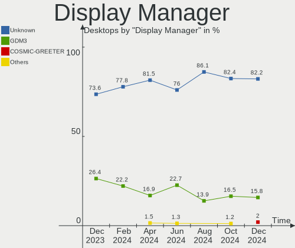
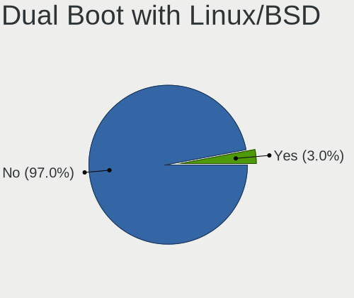
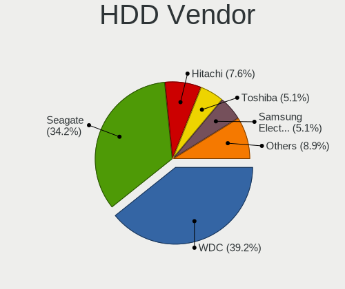

Pop!_OS - Hardware Trends (Desktops)
------------------------------------

A project to identify most popular hardware characteristics and track their change
over time based on data collected by Linux users at https://Linux-Hardware.org.

Anyone can contribute to this report by the [hw-probe](https://github.com/linuxhw/hw-probe) tool:

    sudo -E hw-probe -all -upload

This report is for one last month. Overall report since the beginning of time: [TestDays](https://github.com/linuxhw/TestDays)

Period: Jan, 2024.

Contents
--------

* [ System ](#system)
  - [ OS                       ](#os)
  - [ OS Family                ](#os-family)
  - [ Kernel                   ](#kernel)
  - [ Kernel Family            ](#kernel-family)
  - [ Kernel Major Ver.        ](#kernel-major-ver)
  - [ Arch                     ](#arch)
  - [ DE                       ](#de)
  - [ Display Server           ](#display-server)
  - [ Display Manager          ](#display-manager)
  - [ OS Lang                  ](#os-lang)
  - [ Boot Mode                ](#boot-mode)
  - [ Filesystem               ](#filesystem)
  - [ Part. scheme             ](#part-scheme)
  - [ Dual Boot with Linux/BSD ](#dual-boot-with-linuxbsd)
  - [ Dual Boot (Win)          ](#dual-boot-win)

* [ Board ](#board)
  - [ Vendor                   ](#vendor)
  - [ Model                    ](#model)
  - [ Model Family             ](#model-family)
  - [ MFG Year                 ](#mfg-year)
  - [ Form Factor              ](#form-factor)
  - [ Secure Boot              ](#secure-boot)
  - [ Coreboot                 ](#coreboot)
  - [ RAM Size                 ](#ram-size)
  - [ RAM Used                 ](#ram-used)
  - [ Total Drives             ](#total-drives)
  - [ Has CD-ROM               ](#has-cd-rom)
  - [ Has Ethernet             ](#has-ethernet)
  - [ Has WiFi                 ](#has-wifi)
  - [ Has Bluetooth            ](#has-bluetooth)

* [ Location ](#location)
  - [ Country                  ](#country)
  - [ City                     ](#city)

* [ Drives ](#drives)
  - [ Drive Vendor             ](#drive-vendor)
  - [ Drive Model              ](#drive-model)
  - [ HDD Vendor               ](#hdd-vendor)
  - [ SSD Vendor               ](#ssd-vendor)
  - [ Drive Kind               ](#drive-kind)
  - [ Drive Connector          ](#drive-connector)
  - [ Drive Size               ](#drive-size)
  - [ Space Total              ](#space-total)
  - [ Space Used               ](#space-used)
  - [ Malfunc. Drives          ](#malfunc-drives)
  - [ Malfunc. Drive Vendor    ](#malfunc-drive-vendor)
  - [ Malfunc. HDD Vendor      ](#malfunc-hdd-vendor)
  - [ Malfunc. Drive Kind      ](#malfunc-drive-kind)
  - [ Failed Drives            ](#failed-drives)
  - [ Failed Drive Vendor      ](#failed-drive-vendor)
  - [ Drive Status             ](#drive-status)

* [ Storage controller ](#storage-controller)
  - [ Storage Vendor           ](#storage-vendor)
  - [ Storage Model            ](#storage-model)
  - [ Storage Kind             ](#storage-kind)

* [ Processor ](#processor)
  - [ CPU Vendor               ](#cpu-vendor)
  - [ CPU Model                ](#cpu-model)
  - [ CPU Model Family         ](#cpu-model-family)
  - [ CPU Cores                ](#cpu-cores)
  - [ CPU Sockets              ](#cpu-sockets)
  - [ CPU Threads              ](#cpu-threads)
  - [ CPU Op-Modes             ](#cpu-op-modes)
  - [ CPU Microcode            ](#cpu-microcode)
  - [ CPU Microarch            ](#cpu-microarch)

* [ Graphics ](#graphics)
  - [ GPU Vendor               ](#gpu-vendor)
  - [ GPU Model                ](#gpu-model)
  - [ GPU Combo                ](#gpu-combo)
  - [ GPU Driver               ](#gpu-driver)
  - [ GPU Memory               ](#gpu-memory)

* [ Monitor ](#monitor)
  - [ Monitor Vendor           ](#monitor-vendor)
  - [ Monitor Model            ](#monitor-model)
  - [ Monitor Resolution       ](#monitor-resolution)
  - [ Monitor Diagonal         ](#monitor-diagonal)
  - [ Monitor Width            ](#monitor-width)
  - [ Aspect Ratio             ](#aspect-ratio)
  - [ Monitor Area             ](#monitor-area)
  - [ Pixel Density            ](#pixel-density)
  - [ Multiple Monitors        ](#multiple-monitors)

* [ Network ](#network)
  - [ Net Controller Vendor    ](#net-controller-vendor)
  - [ Net Controller Model     ](#net-controller-model)
  - [ Wireless Vendor          ](#wireless-vendor)
  - [ Wireless Model           ](#wireless-model)
  - [ Ethernet Vendor          ](#ethernet-vendor)
  - [ Ethernet Model           ](#ethernet-model)
  - [ Net Controller Kind      ](#net-controller-kind)
  - [ Used Controller          ](#used-controller)
  - [ NICs                     ](#nics)
  - [ IPv6                     ](#ipv6)

* [ Bluetooth ](#bluetooth)
  - [ Bluetooth Vendor         ](#bluetooth-vendor)
  - [ Bluetooth Model          ](#bluetooth-model)

* [ Sound ](#sound)
  - [ Sound Vendor             ](#sound-vendor)
  - [ Sound Model              ](#sound-model)

* [ Memory ](#memory)
  - [ Memory Vendor            ](#memory-vendor)
  - [ Memory Model             ](#memory-model)
  - [ Memory Kind              ](#memory-kind)
  - [ Memory Form Factor       ](#memory-form-factor)
  - [ Memory Size              ](#memory-size)
  - [ Memory Speed             ](#memory-speed)

* [ Printers & scanners ](#printers--scanners)
  - [ Printer Vendor           ](#printer-vendor)
  - [ Printer Model            ](#printer-model)
  - [ Scanner Vendor           ](#scanner-vendor)
  - [ Scanner Model            ](#scanner-model)

* [ Camera ](#camera)
  - [ Camera Vendor            ](#camera-vendor)
  - [ Camera Model             ](#camera-model)

* [ Security ](#security)
  - [ Fingerprint Vendor       ](#fingerprint-vendor)
  - [ Fingerprint Model        ](#fingerprint-model)
  - [ Chipcard Vendor          ](#chipcard-vendor)
  - [ Chipcard Model           ](#chipcard-model)

* [ Unsupported ](#unsupported)
  - [ Unsupported Devices      ](#unsupported-devices)
  - [ Unsupported Device Types ](#unsupported-device-types)

System
------

OS
--

Installed operating systems

| Name          | Desktops | Percent |
|---------------|----------|---------|
| Pop!_OS 22.04 | 73       | 98.65%  |
| Pop!_OS 20.04 | 1        | 1.35%   |

OS Family
---------

OS without a version

| Name    | Desktops | Percent |
|---------|----------|---------|
| Pop!_OS | 74       | 100%    |

Kernel
------

Version of the Linux kernel

| Version                 | Desktops | Percent |
|-------------------------|----------|---------|
| 6.6.6-76060606-generic  | 55       | 74.32%  |
| 6.6.10-76060610-generic | 12       | 16.22%  |
| 6.7.1-1-liquorix-amd64  | 1        | 1.35%   |
| 6.7.1-060701-generic    | 1        | 1.35%   |
| 6.5.6-76060506-generic  | 1        | 1.35%   |
| 6.5.4-76060504-generic  | 1        | 1.35%   |
| 6.2.6-76060206-generic  | 1        | 1.35%   |
| 6.0.12-76060012-generic | 1        | 1.35%   |
| 5.17.5-76051705-generic | 1        | 1.35%   |

Kernel Family
-------------

Linux kernel without a distro release

| Version | Desktops | Percent |
|---------|----------|---------|
| 6.6.6   | 55       | 74.32%  |
| 6.6.10  | 12       | 16.22%  |
| 6.7.1   | 2        | 2.7%    |
| 6.5.6   | 1        | 1.35%   |
| 6.5.4   | 1        | 1.35%   |
| 6.2.6   | 1        | 1.35%   |
| 6.0.12  | 1        | 1.35%   |
| 5.17.5  | 1        | 1.35%   |

Kernel Major Ver.
-----------------

Linux kernel major version

| Version | Desktops | Percent |
|---------|----------|---------|
| 6.6     | 67       | 90.54%  |
| 6.7     | 2        | 2.7%    |
| 6.5     | 2        | 2.7%    |
| 6.2     | 1        | 1.35%   |
| 6.0     | 1        | 1.35%   |
| 5.17    | 1        | 1.35%   |

Arch
----

OS architecture (x86_64, i586, etc.)

| Name   | Desktops | Percent |
|--------|----------|---------|
| x86_64 | 74       | 100%    |

DE
--

Desktop Environment

| Name       | Desktops | Percent |
|------------|----------|---------|
| GNOME      | 69       | 93.24%  |
| KDE5       | 3        | 4.05%   |
| X-Cinnamon | 1        | 1.35%   |
| Unknown    | 1        | 1.35%   |

Display Server
--------------

X11 or Wayland

| Name    | Desktops | Percent |
|---------|----------|---------|
| X11     | 70       | 94.59%  |
| Wayland | 4        | 5.41%   |

Display Manager
---------------

SDDM, LightDM, etc.

| Name    | Desktops | Percent |
|---------|----------|---------|
| Unknown | 56       | 75.68%  |
| GDM3    | 16       | 21.62%  |
| SDDM    | 2        | 2.7%    |

OS Lang
-------

Language

| Lang    | Desktops | Percent |
|---------|----------|---------|
| en_US   | 47       | 63.51%  |
| en_GB   | 8        | 10.81%  |
| de_DE   | 5        | 6.76%   |
| fr_FR   | 3        | 4.05%   |
| C       | 3        | 4.05%   |
| sv_SE   | 2        | 2.7%    |
| ru_RU   | 1        | 1.35%   |
| pt_PT   | 1        | 1.35%   |
| pt_BR   | 1        | 1.35%   |
| es_ES   | 1        | 1.35%   |
| en_AU   | 1        | 1.35%   |
| Unknown | 1        | 1.35%   |

Boot Mode
---------

EFI or BIOS

| Mode | Desktops | Percent |
|------|----------|---------|
| BIOS | 59       | 79.73%  |
| EFI  | 15       | 20.27%  |

Filesystem
----------

Type of filesystem

| Type  | Desktops | Percent |
|-------|----------|---------|
| Ext4  | 70       | 94.59%  |
| Btrfs | 3        | 4.05%   |
| Zfs   | 1        | 1.35%   |

Part. scheme
------------

Scheme of partitioning

| Type    | Desktops | Percent |
|---------|----------|---------|
| Unknown | 55       | 74.32%  |
| GPT     | 18       | 24.32%  |
| MBR     | 1        | 1.35%   |

Dual Boot with Linux/BSD
------------------------

Hosting more than one Linux/BSD

| Dual boot | Desktops | Percent |
|-----------|----------|---------|
| No        | 71       | 95.95%  |
| Yes       | 3        | 4.05%   |

Dual Boot (Win)
---------------

Hosting Linux and Windows

| Dual boot | Desktops | Percent |
|-----------|----------|---------|
| No        | 64       | 86.49%  |
| Yes       | 10       | 13.51%  |

Board
-----

Vendor
------

Motherboard manufacturer

| Name                | Desktops | Percent |
|---------------------|----------|---------|
| ASUSTek Computer    | 23       | 31.08%  |
| MSI                 | 17       | 22.97%  |
| Gigabyte Technology | 16       | 21.62%  |
| Dell                | 5        | 6.76%   |
| ASRock              | 5        | 6.76%   |
| Unknown             | 2        | 2.7%    |
| SZMZ                | 1        | 1.35%   |
| Lenovo              | 1        | 1.35%   |
| Hewlett-Packard     | 1        | 1.35%   |
| Fujitsu             | 1        | 1.35%   |
| Foxconn             | 1        | 1.35%   |
| Alienware           | 1        | 1.35%   |

Model
-----

Motherboard model

| Name                               | Desktops | Percent |
|------------------------------------|----------|---------|
| MSI MS-7D67                        | 2        | 2.7%    |
| ASUS ROG STRIX Z790-E GAMING WIFI  | 2        | 2.7%    |
| ASUS All Series                    | 2        | 2.7%    |
| Unknown                            | 2        | 2.7%    |
| SZMZ X99-S3                        | 1        | 1.35%   |
| MSI MS-7E12                        | 1        | 1.35%   |
| MSI MS-7D77                        | 1        | 1.35%   |
| MSI MS-7D42                        | 1        | 1.35%   |
| MSI MS-7D22                        | 1        | 1.35%   |
| MSI MS-7D07                        | 1        | 1.35%   |
| MSI MS-7C95                        | 1        | 1.35%   |
| MSI MS-7C91                        | 1        | 1.35%   |
| MSI MS-7C90                        | 1        | 1.35%   |
| MSI MS-7C83                        | 1        | 1.35%   |
| MSI MS-7C56                        | 1        | 1.35%   |
| MSI MS-7C02                        | 1        | 1.35%   |
| MSI MS-7A74                        | 1        | 1.35%   |
| MSI MS-7A37                        | 1        | 1.35%   |
| MSI MS-7750                        | 1        | 1.35%   |
| MSI MS-7636                        | 1        | 1.35%   |
| Lenovo ThinkCentre M93p 10AB004DUS | 1        | 1.35%   |
| HP 285 G3 MT Business PC           | 1        | 1.35%   |
| Gigabyte Z97X-SLI                  | 1        | 1.35%   |
| Gigabyte Z690 UD DDR4              | 1        | 1.35%   |
| Gigabyte X99-Gaming 5P             | 1        | 1.35%   |
| Gigabyte X570 AORUS MASTER         | 1        | 1.35%   |
| Gigabyte H97N-WIFI                 | 1        | 1.35%   |
| Gigabyte H81M-D2V                  | 1        | 1.35%   |
| Gigabyte H610M S2H                 | 1        | 1.35%   |
| Gigabyte H610M H DDR4              | 1        | 1.35%   |
| Gigabyte GA-78LMT-USB3 R2          | 1        | 1.35%   |
| Gigabyte B660 AORUS MASTER DDR4    | 1        | 1.35%   |
| Gigabyte B550I AORUS PRO AX        | 1        | 1.35%   |
| Gigabyte B450M S2H                 | 1        | 1.35%   |
| Gigabyte B450M DS3H WIFI           | 1        | 1.35%   |
| Gigabyte B450 AORUS M              | 1        | 1.35%   |
| Gigabyte B450 AORUS ELITE          | 1        | 1.35%   |
| Gigabyte 970A-DS3P                 | 1        | 1.35%   |
| Fujitsu ESPRIMO Q920               | 1        | 1.35%   |
| Foxconn Pro3500 Series             | 1        | 1.35%   |

Model Family
------------

Motherboard model prefix

| Name                   | Desktops | Percent |
|------------------------|----------|---------|
| ASUS ROG               | 8        | 10.81%  |
| ASUS PRIME             | 5        | 6.76%   |
| MSI MS-7D67            | 2        | 2.7%    |
| Gigabyte H610M         | 2        | 2.7%    |
| Gigabyte B450M         | 2        | 2.7%    |
| Gigabyte B450          | 2        | 2.7%    |
| Dell OptiPlex          | 2        | 2.7%    |
| ASUS All               | 2        | 2.7%    |
| Unknown                | 2        | 2.7%    |
| SZMZ X99-S3            | 1        | 1.35%   |
| MSI MS-7E12            | 1        | 1.35%   |
| MSI MS-7D77            | 1        | 1.35%   |
| MSI MS-7D42            | 1        | 1.35%   |
| MSI MS-7D22            | 1        | 1.35%   |
| MSI MS-7D07            | 1        | 1.35%   |
| MSI MS-7C95            | 1        | 1.35%   |
| MSI MS-7C91            | 1        | 1.35%   |
| MSI MS-7C90            | 1        | 1.35%   |
| MSI MS-7C83            | 1        | 1.35%   |
| MSI MS-7C56            | 1        | 1.35%   |
| MSI MS-7C02            | 1        | 1.35%   |
| MSI MS-7A74            | 1        | 1.35%   |
| MSI MS-7A37            | 1        | 1.35%   |
| MSI MS-7750            | 1        | 1.35%   |
| MSI MS-7636            | 1        | 1.35%   |
| Lenovo ThinkCentre     | 1        | 1.35%   |
| HP 285                 | 1        | 1.35%   |
| Gigabyte Z97X-SLI      | 1        | 1.35%   |
| Gigabyte Z690          | 1        | 1.35%   |
| Gigabyte X99-Gaming    | 1        | 1.35%   |
| Gigabyte X570          | 1        | 1.35%   |
| Gigabyte H97N-WIFI     | 1        | 1.35%   |
| Gigabyte H81M-D2V      | 1        | 1.35%   |
| Gigabyte GA-78LMT-USB3 | 1        | 1.35%   |
| Gigabyte B660          | 1        | 1.35%   |
| Gigabyte B550I         | 1        | 1.35%   |
| Gigabyte 970A-DS3P     | 1        | 1.35%   |
| Fujitsu ESPRIMO        | 1        | 1.35%   |
| Foxconn Pro3500        | 1        | 1.35%   |
| Dell XPS               | 1        | 1.35%   |

MFG Year
--------

Motherboard manufacture year

| Year | Desktops | Percent |
|------|----------|---------|
| 2022 | 13       | 17.57%  |
| 2020 | 9        | 12.16%  |
| 2018 | 9        | 12.16%  |
| 2021 | 7        | 9.46%   |
| 2014 | 6        | 8.11%   |
| 2019 | 5        | 6.76%   |
| 2017 | 5        | 6.76%   |
| 2013 | 4        | 5.41%   |
| 2023 | 3        | 4.05%   |
| 2015 | 3        | 4.05%   |
| 2011 | 3        | 4.05%   |
| 2016 | 2        | 2.7%    |
| 2012 | 2        | 2.7%    |
| 2009 | 2        | 2.7%    |
| 2008 | 1        | 1.35%   |

Form Factor
-----------

Physical design of the computer

| Name    | Desktops | Percent |
|---------|----------|---------|
| Desktop | 74       | 100%    |

Secure Boot
-----------

Enabled or disabled

| State    | Desktops | Percent |
|----------|----------|---------|
| Disabled | 73       | 98.65%  |
| Enabled  | 1        | 1.35%   |

Coreboot
--------

Have coreboot on board

| Used | Desktops | Percent |
|------|----------|---------|
| No   | 74       | 100%    |

RAM Size
--------

Total RAM memory

| Size in GB  | Desktops | Percent |
|-------------|----------|---------|
| 16.01-24.0  | 27       | 36.49%  |
| 32.01-64.0  | 24       | 32.43%  |
| 4.01-8.0    | 7        | 9.46%   |
| 64.01-256.0 | 7        | 9.46%   |
| 24.01-32.0  | 4        | 5.41%   |
| 8.01-16.0   | 3        | 4.05%   |
| 3.01-4.0    | 2        | 2.7%    |

RAM Used
--------

Used RAM memory

| Used GB    | Desktops | Percent |
|------------|----------|---------|
| 4.01-8.0   | 37       | 50%     |
| 3.01-4.0   | 15       | 20.27%  |
| 8.01-16.0  | 11       | 14.86%  |
| 2.01-3.0   | 4        | 5.41%   |
| 16.01-24.0 | 4        | 5.41%   |
| 24.01-32.0 | 2        | 2.7%    |
| 32.01-64.0 | 1        | 1.35%   |

Total Drives
------------

Number of drives on board

| Drives | Desktops | Percent |
|--------|----------|---------|
| 2      | 26       | 35.14%  |
| 1      | 25       | 33.78%  |
| 3      | 14       | 18.92%  |
| 4      | 4        | 5.41%   |
| 6      | 3        | 4.05%   |
| 7      | 1        | 1.35%   |
| 5      | 1        | 1.35%   |

Has CD-ROM
----------

Has CD-ROM on board

| Presented | Desktops | Percent |
|-----------|----------|---------|
| No        | 60       | 81.08%  |
| Yes       | 14       | 18.92%  |

Has Ethernet
------------

Has Ethernet on board

| Presented | Desktops | Percent |
|-----------|----------|---------|
| Yes       | 74       | 100%    |

Has WiFi
--------

Has WiFi module

| Presented | Desktops | Percent |
|-----------|----------|---------|
| Yes       | 45       | 60.81%  |
| No        | 29       | 39.19%  |

Has Bluetooth
-------------

Has Bluetooth module

| Presented | Desktops | Percent |
|-----------|----------|---------|
| Yes       | 42       | 56.76%  |
| No        | 32       | 43.24%  |

Location
--------

Country
-------

Geographic location (country)

| Country      | Desktops | Percent |
|--------------|----------|---------|
| USA          | 26       | 35.14%  |
| Germany      | 8        | 10.81%  |
| France       | 4        | 5.41%   |
| Brazil       | 4        | 5.41%   |
| UK           | 3        | 4.05%   |
| Russia       | 3        | 4.05%   |
| Finland      | 3        | 4.05%   |
| Sweden       | 2        | 2.7%    |
| Spain        | 2        | 2.7%    |
| Poland       | 2        | 2.7%    |
| Netherlands  | 2        | 2.7%    |
| Argentina    | 2        | 2.7%    |
| Saudi Arabia | 1        | 1.35%   |
| Puerto Rico  | 1        | 1.35%   |
| Philippines  | 1        | 1.35%   |
| Lithuania    | 1        | 1.35%   |
| Japan        | 1        | 1.35%   |
| India        | 1        | 1.35%   |
| Hungary      | 1        | 1.35%   |
| Czechia      | 1        | 1.35%   |
| Canada       | 1        | 1.35%   |
| Azerbaijan   | 1        | 1.35%   |
| Austria      | 1        | 1.35%   |
| Australia    | 1        | 1.35%   |
| Angola       | 1        | 1.35%   |

City
----

Geographic location (city)

| City            | Desktops | Percent |
|-----------------|----------|---------|
| Zaragoza        | 1        | 1.35%   |
| Yekaterinburg   | 1        | 1.35%   |
| Wichita         | 1        | 1.35%   |
| Warsaw          | 1        | 1.35%   |
| Vénissieux     | 1        | 1.35%   |
| Umeå           | 1        | 1.35%   |
| Uelzen          | 1        | 1.35%   |
| Tyn nad Vltavou | 1        | 1.35%   |
| Toronto         | 1        | 1.35%   |
| Toms River      | 1        | 1.35%   |
| Tokyo           | 1        | 1.35%   |
| The Hague       | 1        | 1.35%   |
| Strasbourg      | 1        | 1.35%   |
| Spring Hill     | 1        | 1.35%   |
| Sheboygan       | 1        | 1.35%   |
| Schiltigheim    | 1        | 1.35%   |
| Santee          | 1        | 1.35%   |
| Salt Lake City  | 1        | 1.35%   |
| Roubaix         | 1        | 1.35%   |
| Rio Grande      | 1        | 1.35%   |
| Rio de Janeiro  | 1        | 1.35%   |
| Richmond        | 1        | 1.35%   |
| Quilmes         | 1        | 1.35%   |
| Osasco          | 1        | 1.35%   |
| Olympia         | 1        | 1.35%   |
| New York        | 1        | 1.35%   |
| Mukilteo        | 1        | 1.35%   |
| Mölnlycke      | 1        | 1.35%   |
| Middletown      | 1        | 1.35%   |
| Michigan City   | 1        | 1.35%   |
| Manila          | 1        | 1.35%   |
| Luanda          | 1        | 1.35%   |
| Lora del Rio    | 1        | 1.35%   |
| London          | 1        | 1.35%   |
| Lehi            | 1        | 1.35%   |
| La Vernia       | 1        | 1.35%   |
| Klaipėda       | 1        | 1.35%   |
| Juiz de Fora    | 1        | 1.35%   |
| Joensuu         | 1        | 1.35%   |
| Jelenia Góra   | 1        | 1.35%   |

Drives
------

Drive Vendor
------------

Hard drive vendors

| Vendor                      | Desktops | Drives | Percent |
|-----------------------------|----------|--------|---------|
| Samsung Electronics         | 30       | 49     | 21.9%   |
| WDC                         | 16       | 17     | 11.68%  |
| Seagate                     | 13       | 15     | 9.49%   |
| Kingston                    | 10       | 10     | 7.3%    |
| SanDisk                     | 9        | 9      | 6.57%   |
| Crucial                     | 9        | 10     | 6.57%   |
| Kingston Technology Company | 8        | 8      | 5.84%   |
| Toshiba                     | 7        | 7      | 5.11%   |
| Micron/Crucial Technology   | 5        | 5      | 3.65%   |
| Silicon Motion              | 3        | 3      | 2.19%   |
| Hitachi                     | 3        | 3      | 2.19%   |
| A-DATA Technology           | 3        | 3      | 2.19%   |
| SPCC                        | 2        | 2      | 1.46%   |
| Micron Technology           | 2        | 2      | 1.46%   |
| Intel                       | 2        | 2      | 1.46%   |
| Hewlett-Packard             | 2        | 2      | 1.46%   |
| XPG                         | 1        | 2      | 0.73%   |
| Unknown                     | 1        | 3      | 0.73%   |
| SK hynix                    | 1        | 1      | 0.73%   |
| Realtek Semiconductor       | 1        | 1      | 0.73%   |
| PNY                         | 1        | 1      | 0.73%   |
| OCZ                         | 1        | 1      | 0.73%   |
| MaxDigital                  | 1        | 1      | 0.73%   |
| KingFast                    | 1        | 1      | 0.73%   |
| Intenso                     | 1        | 1      | 0.73%   |
| Integral                    | 1        | 1      | 0.73%   |
| HUAWEI                      | 1        | 1      | 0.73%   |
| Corsair                     | 1        | 1      | 0.73%   |
| China                       | 1        | 1      | 0.73%   |

Drive Model
-----------

Hard drive models

| Model                                                 | Desktops | Percent |
|-------------------------------------------------------|----------|---------|
| Samsung NVMe SSD Controller SM981/PM981/PM983 1TB     | 5        | 3.27%   |
| Samsung NVMe SSD Controller PM9A1/PM9A3/980PRO 2TB    | 4        | 2.61%   |
| Kingston Company SNV2S2000G 2TB                       | 4        | 2.61%   |
| Kingston Company SNV2S1000G 1TB                       | 4        | 2.61%   |
| Silicon Motion SM2263EN/SM2263XT SSD Controller 128GB | 3        | 1.96%   |
| Samsung SSD 980 PRO 2TB                               | 3        | 1.96%   |
| Samsung SSD 980 1TB                                   | 3        | 1.96%   |
| Samsung SSD 850 EVO 500GB                             | 3        | 1.96%   |
| Micron/Crucial P2 NVMe PCIe SSD 1TB                   | 3        | 1.96%   |
| Kingston SA400S37240G 240GB SSD                       | 3        | 1.96%   |
| Crucial CT1000MX500SSD1 1TB                           | 3        | 1.96%   |
| Toshiba DT01ACA100 1TB                                | 2        | 1.31%   |
| Seagate ST500DM002-1BD142 500GB                       | 2        | 1.31%   |
| Sandisk WD Blue SN570 500GB                           | 2        | 1.31%   |
| Sandisk WD Blue SN550 NVMe SSD 512GB                  | 2        | 1.31%   |
| Samsung SSD 870 QVO 1TB                               | 2        | 1.31%   |
| Samsung SSD 870 EVO 2TB                               | 2        | 1.31%   |
| Samsung SSD 850 EVO 250GB                             | 2        | 1.31%   |
| Crucial CT2000MX500SSD1 2TB                           | 2        | 1.31%   |
| XPG GAMMIX S11 Pro 256GB                              | 1        | 0.65%   |
| WDC WDS500G2B0B-00YS70 500GB SSD                      | 1        | 0.65%   |
| WDC WDS500G2B0B 500GB SSD                             | 1        | 0.65%   |
| WDC WDS500G2B0A 500GB SSD                             | 1        | 0.65%   |
| WDC WDS240G2G0A-00JH30 240GB SSD                      | 1        | 0.65%   |
| WDC WDBNCE5000PNC 500GB SSD                           | 1        | 0.65%   |
| WDC WD5000LPLX-60ZNTT1 500GB                          | 1        | 0.65%   |
| WDC WD5000AZLX-75K2TA0 500GB                          | 1        | 0.65%   |
| WDC WD5000AAKX-60U6AA0 500GB                          | 1        | 0.65%   |
| WDC WD5000AAKX-00U6AA0 500GB                          | 1        | 0.65%   |
| WDC WD40EFRX-68N32N0 4TB                              | 1        | 0.65%   |
| WDC WD4003FRYZ-01F0DB0 4TB                            | 1        | 0.65%   |
| WDC WD20EZRZ-22Z5HB0 2TB                              | 1        | 0.65%   |
| WDC WD20EFRX-68AX9N0 2TB                              | 1        | 0.65%   |
| WDC WD10JPVX-22JC3T0 1TB                              | 1        | 0.65%   |
| WDC WD10EZEX-08WN4A0 1TB                              | 1        | 0.65%   |
| WDC WD10EZEX-00M2NA0 1TB                              | 1        | 0.65%   |
| WDC WD10EZEX-00BN5A0 1TB                              | 1        | 0.65%   |
| Unknown SD/MMC 2GB                                    | 1        | 0.65%   |
| Unknown M.S./M.S.Pro/HG 16GB                          | 1        | 0.65%   |
| Unknown Compact Flash 977MB                           | 1        | 0.65%   |

HDD Vendor
----------

Hard disk drive vendors

| Vendor              | Desktops | Drives | Percent |
|---------------------|----------|--------|---------|
| WDC                 | 12       | 12     | 33.33%  |
| Seagate             | 12       | 14     | 33.33%  |
| Toshiba             | 6        | 6      | 16.67%  |
| Samsung Electronics | 3        | 3      | 8.33%   |
| Hitachi             | 3        | 3      | 8.33%   |

SSD Vendor
----------

Solid state drive vendors

| Vendor              | Desktops | Drives | Percent |
|---------------------|----------|--------|---------|
| Samsung Electronics | 13       | 21     | 26.53%  |
| Kingston            | 9        | 9      | 18.37%  |
| Crucial             | 9        | 9      | 18.37%  |
| WDC                 | 5        | 5      | 10.2%   |
| SanDisk             | 5        | 5      | 10.2%   |
| SPCC                | 1        | 1      | 2.04%   |
| PNY                 | 1        | 1      | 2.04%   |
| OCZ                 | 1        | 1      | 2.04%   |
| Intenso             | 1        | 1      | 2.04%   |
| Integral            | 1        | 1      | 2.04%   |
| Hewlett-Packard     | 1        | 1      | 2.04%   |
| China               | 1        | 1      | 2.04%   |
| A-DATA Technology   | 1        | 1      | 2.04%   |

Drive Kind
----------

HDD or SSD

| Kind    | Desktops | Drives | Percent |
|---------|----------|--------|---------|
| NVMe    | 46       | 62     | 38.33%  |
| SSD     | 39       | 57     | 32.5%   |
| HDD     | 31       | 38     | 25.83%  |
| Unknown | 4        | 6      | 3.33%   |

Drive Connector
---------------

SATA, SAS, NVMe, etc.

| Type | Desktops | Drives | Percent |
|------|----------|--------|---------|
| SATA | 53       | 96     | 51.96%  |
| NVMe | 46       | 62     | 45.1%   |
| SAS  | 3        | 5      | 2.94%   |

Drive Size
----------

Size of hard drive

| Size in TB | Desktops | Drives | Percent |
|------------|----------|--------|---------|
| 0.01-0.5   | 33       | 43     | 47.14%  |
| 0.51-1.0   | 21       | 27     | 30%     |
| 1.01-2.0   | 9        | 14     | 12.86%  |
| 3.01-4.0   | 4        | 8      | 5.71%   |
| 2.01-3.0   | 2        | 2      | 2.86%   |
| 4.01-10.0  | 1        | 1      | 1.43%   |

Space Total
-----------

Amount of disk space available on the file system

| Size in GB     | Desktops | Percent |
|----------------|----------|---------|
| 251-500        | 17       | 22.97%  |
| 101-250        | 15       | 20.27%  |
| 1001-2000      | 13       | 17.57%  |
| 501-1000       | 13       | 17.57%  |
| 2001-3000      | 9        | 12.16%  |
| More than 3000 | 5        | 6.76%   |
| 51-100         | 1        | 1.35%   |
| Unknown        | 1        | 1.35%   |

Space Used
----------

Amount of used disk space

| Used GB        | Desktops | Percent |
|----------------|----------|---------|
| 101-250        | 13       | 17.57%  |
| 501-1000       | 12       | 16.22%  |
| 251-500        | 11       | 14.86%  |
| 51-100         | 11       | 14.86%  |
| 21-50          | 10       | 13.51%  |
| 1-20           | 9        | 12.16%  |
| 1001-2000      | 5        | 6.76%   |
| More than 3000 | 1        | 1.35%   |
| 2001-3000      | 1        | 1.35%   |
| Unknown        | 1        | 1.35%   |

Malfunc. Drives
---------------

Drive models with a malfunction

| Model                    | Desktops | Drives | Percent |
|--------------------------|----------|--------|---------|
| WDC WD20EFRX-68AX9N0 2TB | 1        | 1      | 50%     |
| SanDisk SSD PLUS 1000GB  | 1        | 1      | 50%     |

Malfunc. Drive Vendor
---------------------

Vendors of faulty drives

| Vendor  | Desktops | Drives | Percent |
|---------|----------|--------|---------|
| WDC     | 1        | 1      | 50%     |
| SanDisk | 1        | 1      | 50%     |

Malfunc. HDD Vendor
-------------------

Vendors of faulty HDD drives

| Vendor | Desktops | Drives | Percent |
|--------|----------|--------|---------|
| WDC    | 1        | 1      | 100%    |

Malfunc. Drive Kind
-------------------

Kinds of faulty drives

| Kind | Desktops | Drives | Percent |
|------|----------|--------|---------|
| SSD  | 1        | 1      | 50%     |
| HDD  | 1        | 1      | 50%     |

Failed Drives
-------------

Failed drive models

Zero info for selected period =(

Failed Drive Vendor
-------------------

Failed drive vendors

Zero info for selected period =(

Drive Status
------------

Number of failed and malfunc. drives

| Status   | Desktops | Drives | Percent |
|----------|----------|--------|---------|
| Detected | 57       | 124    | 73.08%  |
| Works    | 19       | 37     | 24.36%  |
| Malfunc  | 2        | 2      | 2.56%   |

Storage controller
------------------

Storage Vendor
--------------

Storage controller vendors

| Vendor                       | Desktops | Percent |
|------------------------------|----------|---------|
| Intel                        | 43       | 31.62%  |
| AMD                          | 31       | 22.79%  |
| Samsung Electronics          | 20       | 14.71%  |
| Kingston Technology Company  | 9        | 6.62%   |
| ASMedia Technology           | 7        | 5.15%   |
| Micron/Crucial Technology    | 6        | 4.41%   |
| Silicon Motion               | 4        | 2.94%   |
| SanDisk                      | 4        | 2.94%   |
| ADATA Technology             | 3        | 2.21%   |
| Phison Electronics           | 2        | 1.47%   |
| Micron Technology            | 2        | 1.47%   |
| Toshiba America Info Systems | 1        | 0.74%   |
| SK hynix                     | 1        | 0.74%   |
| Seagate Technology           | 1        | 0.74%   |
| Realtek Semiconductor        | 1        | 0.74%   |
| JMicron Technology           | 1        | 0.74%   |

Storage Model
-------------

Storage controller models

| Model                                                                                   | Desktops | Percent |
|-----------------------------------------------------------------------------------------|----------|---------|
| AMD FCH SATA Controller [AHCI mode]                                                     | 12       | 7.36%   |
| Samsung NVMe SSD Controller SM981/PM981/PM983                                           | 10       | 6.13%   |
| Samsung NVMe SSD Controller PM9A1/PM9A3/980PRO                                          | 8        | 4.91%   |
| Kingston Company NV2 NVMe SSD SM2267XT (DRAM-less)                                      | 8        | 4.91%   |
| AMD 400 Series Chipset SATA Controller                                                  | 8        | 4.91%   |
| Intel Alder Lake-S PCH SATA Controller [AHCI Mode]                                      | 7        | 4.29%   |
| Intel 8 Series/C220 Series Chipset Family 6-port SATA Controller 1 [AHCI mode]          | 7        | 4.29%   |
| ASMedia ASM1061/ASM1062 Serial ATA Controller                                           | 7        | 4.29%   |
| AMD 600 Series Chipset SATA Controller                                                  | 7        | 4.29%   |
| AMD 500 Series Chipset SATA Controller                                                  | 6        | 3.68%   |
| Silicon Motion SM2263EN/SM2263XT (DRAM-less) NVMe SSD Controllers                       | 4        | 2.45%   |
| Intel Volume Management Device NVMe RAID Controller Intel Corporation                   | 4        | 2.45%   |
| Samsung NVMe SSD Controller 980 (DRAM-less)                                             | 3        | 1.84%   |
| Micron/Crucial P2 [Nick P2] / P3 / P3 Plus NVMe PCIe SSD (DRAM-less)                    | 3        | 1.84%   |
| Intel Raptor Lake SATA AHCI Controller                                                  | 3        | 1.84%   |
| Intel Q170/Q150/B150/H170/H110/Z170/CM236 Chipset SATA Controller [AHCI Mode]           | 3        | 1.84%   |
| Intel 9 Series Chipset Family SATA Controller [AHCI Mode]                               | 3        | 1.84%   |
| Intel 500 Series Chipset Family SATA AHCI Controller                                    | 3        | 1.84%   |
| Intel 200 Series PCH SATA controller [AHCI mode]                                        | 3        | 1.84%   |
| AMD SB7x0/SB8x0/SB9x0 IDE Controller                                                    | 3        | 1.84%   |
| SanDisk Ultra 3D / WD Blue SN570 NVMe SSD (DRAM-less)                                   | 2        | 1.23%   |
| SanDisk Ultra 3D / WD Blue SN550 NVMe SSD                                               | 2        | 1.23%   |
| Samsung NVMe SSD Controller S4LV008[Pascal]                                             | 2        | 1.23%   |
| Intel SATA Controller [RAID mode]                                                       | 2        | 1.23%   |
| Intel 6 Series/C200 Series Chipset Family Desktop SATA Controller (IDE mode, ports 4-5) | 2        | 1.23%   |
| Intel 6 Series/C200 Series Chipset Family 6 port Desktop SATA AHCI Controller           | 2        | 1.23%   |
| AMD SB7x0/SB8x0/SB9x0 SATA Controller [IDE mode]                                        | 2        | 1.23%   |
| AMD SB7x0/SB8x0/SB9x0 SATA Controller [AHCI mode]                                       | 2        | 1.23%   |
| AMD 300 Series Chipset SATA Controller                                                  | 2        | 1.23%   |
| ADATA XPG SX8200 Pro PCIe Gen3x4 M.2 2280 Solid State Drive                             | 2        | 1.23%   |
| Toshiba America Info Systems BG3 x2 NVMe SSD Controller (DRAM-less)                     | 1        | 0.61%   |
| SK hynix BC511 NVMe SSD                                                                 | 1        | 0.61%   |
| Seagate FireCuda 530 SSD                                                                | 1        | 0.61%   |
| Samsung NVMe SSD Controller PM173X                                                      | 1        | 0.61%   |
| Realtek RTS5765DL NVMe SSD Controller (DRAM-less)                                       | 1        | 0.61%   |
| Phison E16 PCIe4 NVMe Controller                                                        | 1        | 0.61%   |
| Phison E12 NVMe Controller                                                              | 1        | 0.61%   |
| Micron/Crucial T500 NVMe PCIe SSD                                                       | 1        | 0.61%   |
| Micron/Crucial P5 Plus NVMe PCIe SSD                                                    | 1        | 0.61%   |
| Micron/Crucial P1 NVMe PCIe SSD[Frampton]                                               | 1        | 0.61%   |

Storage Kind
------------

Kind of storage controller (IDE, SATA, NVMe, SAS, ...)

| Kind | Desktops | Percent |
|------|----------|---------|
| SATA | 68       | 53.13%  |
| NVMe | 46       | 35.94%  |
| RAID | 7        | 5.47%   |
| IDE  | 7        | 5.47%   |

Processor
---------

CPU Vendor
----------

Processor vendors

| Vendor | Desktops | Percent |
|--------|----------|---------|
| Intel  | 43       | 58.11%  |
| AMD    | 31       | 41.89%  |

CPU Model
---------

Processor models

| Model                                  | Desktops | Percent |
|----------------------------------------|----------|---------|
| AMD Ryzen 7 2700X Eight-Core Processor | 3        | 4.05%   |
| Intel Core i9-14900KF                  | 2        | 2.7%    |
| Intel Core i5-4590T CPU @ 2.00GHz      | 2        | 2.7%    |
| Intel 13th Gen Core i9-13900K          | 2        | 2.7%    |
| AMD Ryzen 9 7950X3D 16-Core Processor  | 2        | 2.7%    |
| AMD Ryzen 7 7800X3D 8-Core Processor   | 2        | 2.7%    |
| AMD Ryzen 7 5800X 8-Core Processor     | 2        | 2.7%    |
| AMD Ryzen 5 5600X 6-Core Processor     | 2        | 2.7%    |
| AMD Ryzen 5 3600 6-Core Processor      | 2        | 2.7%    |
| AMD Ryzen 5 1600 Six-Core Processor    | 2        | 2.7%    |
| AMD FX-8320 Eight-Core Processor       | 2        | 2.7%    |
| Intel Xeon CPU E5-2670 v3 @ 2.30GHz    | 1        | 1.35%   |
| Intel Xeon CPU E5-1660 v4 @ 3.20GHz    | 1        | 1.35%   |
| Intel Xeon CPU E3-1245 V2 @ 3.40GHz    | 1        | 1.35%   |
| Intel Pentium CPU G2030 @ 3.00GHz      | 1        | 1.35%   |
| Intel N100                             | 1        | 1.35%   |
| Intel Core i9-9900K CPU @ 3.60GHz      | 1        | 1.35%   |
| Intel Core i9-10900K CPU @ 3.70GHz     | 1        | 1.35%   |
| Intel Core i7-8700 CPU @ 3.20GHz       | 1        | 1.35%   |
| Intel Core i7-7700K CPU @ 4.20GHz      | 1        | 1.35%   |
| Intel Core i7-6700K CPU @ 4.00GHz      | 1        | 1.35%   |
| Intel Core i7-5960X CPU @ 3.00GHz      | 1        | 1.35%   |
| Intel Core i7-4770K CPU @ 3.50GHz      | 1        | 1.35%   |
| Intel Core i7-3770K CPU @ 3.50GHz      | 1        | 1.35%   |
| Intel Core i7 CPU 920 @ 2.67GHz        | 1        | 1.35%   |
| Intel Core i7 CPU 870 @ 2.93GHz        | 1        | 1.35%   |
| Intel Core i5-8500 CPU @ 3.00GHz       | 1        | 1.35%   |
| Intel Core i5-7400 CPU @ 3.00GHz       | 1        | 1.35%   |
| Intel Core i5-6600K CPU @ 3.50GHz      | 1        | 1.35%   |
| Intel Core i5-6500 CPU @ 3.20GHz       | 1        | 1.35%   |
| Intel Core i5-4690K CPU @ 3.50GHz      | 1        | 1.35%   |
| Intel Core i5-4690 CPU @ 3.50GHz       | 1        | 1.35%   |
| Intel Core i5-4460 CPU @ 3.20GHz       | 1        | 1.35%   |
| Intel Core i5-10600K CPU @ 4.10GHz     | 1        | 1.35%   |
| Intel Core i5-10400F CPU @ 2.90GHz     | 1        | 1.35%   |
| Intel Core i3-4350 CPU @ 3.60GHz       | 1        | 1.35%   |
| Intel Core i3-4170T CPU @ 3.20GHz      | 1        | 1.35%   |
| Intel Core i3-2100 CPU @ 3.10GHz       | 1        | 1.35%   |
| Intel Core i3-10105 CPU @ 3.70GHz      | 1        | 1.35%   |
| Intel Core 2 Quad CPU Q8200 @ 2.33GHz  | 1        | 1.35%   |

CPU Model Family
----------------

Processor model prefix

| Model             | Desktops | Percent |
|-------------------|----------|---------|
| Other             | 11       | 14.86%  |
| Intel Core i5     | 11       | 14.86%  |
| AMD Ryzen 5       | 11       | 14.86%  |
| AMD Ryzen 7       | 10       | 13.51%  |
| Intel Core i7     | 8        | 10.81%  |
| Intel Core i9     | 4        | 5.41%   |
| Intel Core i3     | 4        | 5.41%   |
| AMD Ryzen 9       | 4        | 5.41%   |
| AMD FX            | 4        | 5.41%   |
| Intel Xeon        | 3        | 4.05%   |
| Intel Pentium     | 1        | 1.35%   |
| Intel Core 2 Quad | 1        | 1.35%   |
| AMD Ryzen 3       | 1        | 1.35%   |
| AMD Athlon X4     | 1        | 1.35%   |

CPU Cores
---------

Number of processor cores

| Number | Desktops | Percent |
|--------|----------|---------|
| 4      | 24       | 32.43%  |
| 6      | 16       | 21.62%  |
| 8      | 13       | 17.57%  |
| 16     | 5        | 6.76%   |
| 2      | 5        | 6.76%   |
| 24     | 4        | 5.41%   |
| 12     | 3        | 4.05%   |
| 10     | 2        | 2.7%    |
| 14     | 1        | 1.35%   |
| 3      | 1        | 1.35%   |

CPU Sockets
-----------

Number of sockets

| Number | Desktops | Percent |
|--------|----------|---------|
| 1      | 74       | 100%    |

CPU Threads
-----------

Threads per core (Hyper-Threading)

| Number | Desktops | Percent |
|--------|----------|---------|
| 2      | 62       | 83.78%  |
| 1      | 12       | 16.22%  |

CPU Op-Modes
------------

CPU Operation Modes (32-bit, 64-bit)

| Op mode        | Desktops | Percent |
|----------------|----------|---------|
| 32-bit, 64-bit | 74       | 100%    |

CPU Microcode
-------------

Microcode number

| Number     | Desktops | Percent |
|------------|----------|---------|
| Unknown    | 64       | 86.49%  |
| 0x0a601206 | 2        | 2.7%    |
| 0x08701021 | 2        | 2.7%    |
| 0x90672    | 1        | 1.35%   |
| 0x0a20120a | 1        | 1.35%   |
| 0x0a201016 | 1        | 1.35%   |
| 0x08701013 | 1        | 1.35%   |
| 0x08600109 | 1        | 1.35%   |
| 0x0800820d | 1        | 1.35%   |

CPU Microarch
-------------

Microarchitecture

| Name             | Desktops | Percent |
|------------------|----------|---------|
| Unknown          | 15       | 20.27%  |
| Haswell          | 10       | 13.51%  |
| Zen 3            | 6        | 8.11%   |
| Zen+             | 5        | 6.76%   |
| Zen 2            | 5        | 6.76%   |
| KabyLake         | 5        | 6.76%   |
| Piledriver       | 4        | 5.41%   |
| CometLake        | 4        | 5.41%   |
| Alderlake Hybrid | 4        | 5.41%   |
| Zen              | 3        | 4.05%   |
| Skylake          | 3        | 4.05%   |
| IvyBridge        | 3        | 4.05%   |
| Nehalem          | 2        | 2.7%    |
| SandyBridge      | 1        | 1.35%   |
| Penryn           | 1        | 1.35%   |
| Gracemont        | 1        | 1.35%   |
| Excavator        | 1        | 1.35%   |
| Broadwell        | 1        | 1.35%   |

Graphics
--------

GPU Vendor
----------

Vendors of graphics cards

| Vendor | Desktops | Percent |
|--------|----------|---------|
| Nvidia | 39       | 45.88%  |
| AMD    | 27       | 31.76%  |
| Intel  | 19       | 22.35%  |

GPU Model
---------

Graphics card models

| Model                                                                       | Desktops | Percent |
|-----------------------------------------------------------------------------|----------|---------|
| AMD Raphael                                                                 | 6        | 6.52%   |
| Intel Xeon E3-1200 v3/4th Gen Core Processor Integrated Graphics Controller | 5        | 5.43%   |
| AMD Ellesmere [Radeon RX 470/480/570/570X/580/580X/590]                     | 5        | 5.43%   |
| AMD Navi 10 [Radeon RX 5600 OEM/5600 XT / 5700/5700 XT]                     | 4        | 4.35%   |
| Nvidia TU116 [GeForce GTX 1660 SUPER]                                       | 3        | 3.26%   |
| Nvidia GM204 [GeForce GTX 970]                                              | 3        | 3.26%   |
| Nvidia GA102 [GeForce RTX 3090]                                             | 3        | 3.26%   |
| AMD Navi 31 [Radeon RX 7900 XT/7900 XTX/7900M]                              | 3        | 3.26%   |
| Nvidia GP106 [GeForce GTX 1060 6GB]                                         | 2        | 2.17%   |
| Nvidia GM107 [GeForce GTX 750 Ti]                                           | 2        | 2.17%   |
| Nvidia AD106 [GeForce RTX 4060 Ti]                                          | 2        | 2.17%   |
| Nvidia AD103 [GeForce RTX 4080]                                             | 2        | 2.17%   |
| Nvidia AD102 [GeForce RTX 4090]                                             | 2        | 2.17%   |
| Intel Xeon E3-1200 v2/3rd Gen Core processor Graphics Controller            | 2        | 2.17%   |
| Intel Raptor Lake-S GT1 [UHD Graphics 770]                                  | 2        | 2.17%   |
| Intel CoffeeLake-S GT2 [UHD Graphics 630]                                   | 2        | 2.17%   |
| Intel AlderLake-S GT1                                                       | 2        | 2.17%   |
| AMD Navi 32 [Radeon RX 7700 XT / 7800 XT]                                   | 2        | 2.17%   |
| AMD Navi 21 [Radeon RX 6800/6800 XT / 6900 XT]                              | 2        | 2.17%   |
| Nvidia TU116 [GeForce GTX 1660]                                             | 1        | 1.09%   |
| Nvidia TU116 [GeForce GTX 1660 Ti]                                          | 1        | 1.09%   |
| Nvidia TU106 [GeForce RTX 2070]                                             | 1        | 1.09%   |
| Nvidia TU106 [GeForce RTX 2060 SUPER]                                       | 1        | 1.09%   |
| Nvidia GT216 [GeForce GT 220]                                               | 1        | 1.09%   |
| Nvidia GP107 [GeForce GTX 1050 Ti]                                          | 1        | 1.09%   |
| Nvidia GP106 [GeForce GTX 1060 3GB]                                         | 1        | 1.09%   |
| Nvidia GP104GL [Tesla P4]                                                   | 1        | 1.09%   |
| Nvidia GP104 [GeForce GTX 1080]                                             | 1        | 1.09%   |
| Nvidia GP104 [GeForce GTX 1070]                                             | 1        | 1.09%   |
| Nvidia GP104 [GeForce GTX 1070 Ti]                                          | 1        | 1.09%   |
| Nvidia GM206 [GeForce GTX 960]                                              | 1        | 1.09%   |
| Nvidia GM107M [GeForce GTX 860M]                                            | 1        | 1.09%   |
| Nvidia GK208B [GeForce GT 710]                                              | 1        | 1.09%   |
| Nvidia GA106 [GeForce RTX 3060]                                             | 1        | 1.09%   |
| Nvidia GA106 [GeForce RTX 3060 Lite Hash Rate]                              | 1        | 1.09%   |
| Nvidia GA104 [GeForce RTX 3070 Ti]                                          | 1        | 1.09%   |
| Nvidia GA104 [GeForce RTX 3070 Lite Hash Rate]                              | 1        | 1.09%   |
| Nvidia GA102 [GeForce RTX 3080 Lite Hash Rate]                              | 1        | 1.09%   |
| Nvidia AD107 [GeForce RTX 4060]                                             | 1        | 1.09%   |
| Intel RocketLake-S GT1 [UHD Graphics 730]                                   | 1        | 1.09%   |

GPU Combo
---------

Combinations of graphics cards

| Name           | Desktops | Percent |
|----------------|----------|---------|
| 1 x Nvidia     | 34       | 45.95%  |
| 1 x AMD        | 17       | 22.97%  |
| 1 x Intel      | 10       | 13.51%  |
| 2 x AMD        | 7        | 9.46%   |
| Intel + Nvidia | 4        | 5.41%   |
| Intel + AMD    | 1        | 1.35%   |
| AMD + Nvidia   | 1        | 1.35%   |

GPU Driver
----------

Free vs proprietary

| Driver      | Desktops | Percent |
|-------------|----------|---------|
| Proprietary | 36       | 48.65%  |
| Free        | 36       | 48.65%  |
| Unknown     | 2        | 2.7%    |

GPU Memory
----------

Total video memory

| Size in GB | Desktops | Percent |
|------------|----------|---------|
| Unknown    | 52       | 70.27%  |
| 7.01-8.0   | 6        | 8.11%   |
| 5.01-6.0   | 4        | 5.41%   |
| 3.01-4.0   | 3        | 4.05%   |
| 1.01-2.0   | 3        | 4.05%   |
| 8.01-16.0  | 3        | 4.05%   |
| 16.01-24.0 | 2        | 2.7%    |
| 0.01-0.5   | 1        | 1.35%   |

Monitor
-------

Monitor Vendor
--------------

Monitor vendors

| Vendor               | Desktops | Percent |
|----------------------|----------|---------|
| Samsung Electronics  | 16       | 18.18%  |
| Goldstar             | 12       | 13.64%  |
| Acer                 | 12       | 13.64%  |
| Ancor Communications | 6        | 6.82%   |
| Philips              | 5        | 5.68%   |
| Hewlett-Packard      | 5        | 5.68%   |
| Dell                 | 5        | 5.68%   |
| BenQ                 | 3        | 3.41%   |
| ASUSTek Computer     | 3        | 3.41%   |
| AOC                  | 3        | 3.41%   |
| Vizio                | 2        | 2.27%   |
| ViewSonic            | 2        | 2.27%   |
| Mi                   | 2        | 2.27%   |
| Lenovo               | 2        | 2.27%   |
| Vestel Elektronik    | 1        | 1.14%   |
| Sceptre Tech         | 1        | 1.14%   |
| SANYO                | 1        | 1.14%   |
| MStar                | 1        | 1.14%   |
| MSI                  | 1        | 1.14%   |
| INNOCN               | 1        | 1.14%   |
| Iiyama               | 1        | 1.14%   |
| FUN                  | 1        | 1.14%   |
| Eizo                 | 1        | 1.14%   |
| Aosiman              | 1        | 1.14%   |

Monitor Model
-------------

Monitor models

| Model                                                                   | Desktops | Percent |
|-------------------------------------------------------------------------|----------|---------|
| Samsung Electronics LS49AG95 SAM71AC 3840x1080 1193x336mm 48.8-inch     | 2        | 2.17%   |
| Goldstar ULTRAGEAR GSM7766 2560x1440 697x392mm 31.5-inch                | 2        | 2.17%   |
| Goldstar ULTRAGEAR GSM5BB2 1920x1080 527x296mm 23.8-inch                | 2        | 2.17%   |
| Acer G276HL ACR0300 1920x1080 600x340mm 27.2-inch                       | 2        | 2.17%   |
| Vizio E370VL VIZ0070 1920x1080 820x461mm 37.0-inch                      | 1        | 1.09%   |
| Vizio E280i-A1 VIZ1002 1360x768 607x345mm 27.5-inch                     | 1        | 1.09%   |
| ViewSonic XG2703-GS VSCBA32 2560x1440 598x336mm 27.0-inch               | 1        | 1.09%   |
| ViewSonic VA2223wm VSC0523 1920x1080 477x268mm 21.5-inch                | 1        | 1.09%   |
| Vestel Elektronik 32FHD_LCD_TV VES3700 1920x1080 700x400mm 31.7-inch    | 1        | 1.09%   |
| Sceptre Tech U27 SPT0ABF 3840x2160 600x340mm 27.2-inch                  | 1        | 1.09%   |
| SANYO LCD SAN0A2A 1920x540                                              | 1        | 1.09%   |
| Samsung Electronics U32J59x SAM0F35 3840x2160 697x392mm 31.5-inch       | 1        | 1.09%   |
| Samsung Electronics SyncMaster SAM0529 1920x1080 510x287mm 23.0-inch    | 1        | 1.09%   |
| Samsung Electronics SyncMaster SAM03E8 1920x1080                        | 1        | 1.09%   |
| Samsung Electronics SMB2330H SAM064A 1920x1080 509x286mm 23.0-inch      | 1        | 1.09%   |
| Samsung Electronics S27E390 SAM0C1C 1920x1080 598x336mm 27.0-inch       | 1        | 1.09%   |
| Samsung Electronics S24D340 SAM0BBB 1920x1080 531x299mm 24.0-inch       | 1        | 1.09%   |
| Samsung Electronics LCD Monitor SAM0F14 3840x2160 1872x1053mm 84.6-inch | 1        | 1.09%   |
| Samsung Electronics LCD Monitor SAM0D47 1920x1080 885x498mm 40.0-inch   | 1        | 1.09%   |
| Samsung Electronics LCD Monitor SAM0B30 1920x1080 885x498mm 40.0-inch   | 1        | 1.09%   |
| Samsung Electronics LCD Monitor SAM0992 1920x1080 700x390mm 31.5-inch   | 1        | 1.09%   |
| Samsung Electronics LCD Monitor SAM08FE 1920x1080                       | 1        | 1.09%   |
| Samsung Electronics LCD Monitor SAM067A 1360x768                        | 1        | 1.09%   |
| Samsung Electronics LC34G55T SAM711A 3440x1440 798x334mm 34.1-inch      | 1        | 1.09%   |
| Samsung Electronics C43J89x SAM0F5B 3840x1200 1052x329mm 43.4-inch      | 1        | 1.09%   |
| Philips PHL 439P9H PHL0939 3840x1200 1052x329mm 43.4-inch               | 1        | 1.09%   |
| Philips PHL 322E1 PHLC20F 1920x1080 698x393mm 31.5-inch                 | 1        | 1.09%   |
| Philips PHL 276E9Q PHLC17B 1920x1080 600x340mm 27.2-inch                | 1        | 1.09%   |
| Philips PHL 272B7QU PHL0926 2560x1440 597x336mm 27.0-inch               | 1        | 1.09%   |
| Philips PHL 240V5A PHLC10C 1920x1080 527x296mm 23.8-inch                | 1        | 1.09%   |
| MStar TV MST0030 1920x1080 708x398mm 32.0-inch                          | 1        | 1.09%   |
| MSI MAG271CR MSI3FA6 1920x1080 598x336mm 27.0-inch                      | 1        | 1.09%   |
| Mi Monitor XMI3446 3440x1440 797x334mm 34.0-inch                        | 1        | 1.09%   |
| Mi Monitor XMI3444 3440x1440 797x334mm 34.0-inch                        | 1        | 1.09%   |
| Lenovo LT1952p Wide LEN0990 1440x900 408x255mm 18.9-inch                | 1        | 1.09%   |
| Lenovo LEN T32p-20 LEN61F2 3840x2160 697x392mm 31.5-inch                | 1        | 1.09%   |
| INNOCN 27G1S IOCFFFF 2560x1440 596x335mm 26.9-inch                      | 1        | 1.09%   |
| Iiyama PL3467WQ IVM7624 3440x1440 797x334mm 34.0-inch                   | 1        | 1.09%   |
| Hewlett-Packard X27q HPN375B 2560x1440 597x336mm 27.0-inch              | 1        | 1.09%   |
| Hewlett-Packard x23LED HWP2911 1920x1080 509x286mm 23.0-inch            | 1        | 1.09%   |

Monitor Resolution
------------------

Monitor screen resolution

| Resolution         | Desktops | Percent |
|--------------------|----------|---------|
| 1920x1080 (FHD)    | 37       | 44.58%  |
| 2560x1440 (QHD)    | 13       | 15.66%  |
| 3840x2160 (4K)     | 12       | 14.46%  |
| 3440x1440          | 7        | 8.43%   |
| 3840x1200          | 2        | 2.41%   |
| 3840x1080          | 2        | 2.41%   |
| 1366x768 (WXGA)    | 2        | 2.41%   |
| 2560x1600          | 1        | 1.2%    |
| 2560x1080          | 1        | 1.2%    |
| 1920x540           | 1        | 1.2%    |
| 1680x1050 (WSXGA+) | 1        | 1.2%    |
| 1600x900 (HD+)     | 1        | 1.2%    |
| 1440x900 (WXGA+)   | 1        | 1.2%    |
| 1360x768           | 1        | 1.2%    |
| 1280x1024 (SXGA)   | 1        | 1.2%    |

Monitor Diagonal
----------------

Diagonal size in inches

| Inches  | Desktops | Percent |
|---------|----------|---------|
| 27      | 21       | 24.42%  |
| 24      | 12       | 13.95%  |
| 23      | 11       | 12.79%  |
| 34      | 7        | 8.14%   |
| 31      | 6        | 6.98%   |
| 21      | 4        | 4.65%   |
| Unknown | 4        | 4.65%   |
| 84      | 2        | 2.33%   |
| 48      | 2        | 2.33%   |
| 43      | 2        | 2.33%   |
| 32      | 2        | 2.33%   |
| 19      | 2        | 2.33%   |
| 54      | 1        | 1.16%   |
| 52      | 1        | 1.16%   |
| 46      | 1        | 1.16%   |
| 44      | 1        | 1.16%   |
| 42      | 1        | 1.16%   |
| 40      | 1        | 1.16%   |
| 38      | 1        | 1.16%   |
| 22      | 1        | 1.16%   |
| 20      | 1        | 1.16%   |
| 18      | 1        | 1.16%   |
| 16      | 1        | 1.16%   |

Monitor Width
-------------

Physical width

| Width in mm | Desktops | Percent |
|-------------|----------|---------|
| 501-600     | 37       | 46.25%  |
| 701-800     | 8        | 10%     |
| 401-500     | 8        | 10%     |
| 1001-1500   | 8        | 10%     |
| 601-700     | 7        | 8.75%   |
| Unknown     | 4        | 5%      |
| 801-900     | 3        | 3.75%   |
| 351-400     | 2        | 2.5%    |
| 1501-2000   | 2        | 2.5%    |
| 901-1000    | 1        | 1.25%   |

Aspect Ratio
------------

Proportional relationship between the width and the height

| Ratio | Desktops | Percent |
|-------|----------|---------|
| 16/9  | 59       | 78.67%  |
| 21/9  | 8        | 10.67%  |
| 32/9  | 3        | 4%      |
| 3.20  | 2        | 2.67%   |
| 16/10 | 2        | 2.67%   |
| 5/4   | 1        | 1.33%   |

Monitor Area
------------

Area in inch²

| Area in inch² | Desktops | Percent |
|----------------|----------|---------|
| 201-250        | 24       | 28.92%  |
| 301-350        | 21       | 25.3%   |
| 351-500        | 14       | 16.87%  |
| 501-1000       | 9        | 10.84%  |
| More than 1000 | 4        | 4.82%   |
| 151-200        | 4        | 4.82%   |
| Unknown        | 4        | 4.82%   |
| 251-300        | 1        | 1.2%    |
| 141-150        | 1        | 1.2%    |
| 101-110        | 1        | 1.2%    |

Pixel Density
-------------

Pixels per inch

| Density | Desktops | Percent |
|---------|----------|---------|
| 51-100  | 46       | 56.79%  |
| 101-120 | 17       | 20.99%  |
| 161-240 | 6        | 7.41%   |
| 1-50    | 4        | 4.94%   |
| 121-160 | 4        | 4.94%   |
| Unknown | 4        | 4.94%   |

Multiple Monitors
-----------------

Total monitors connected

| Total | Desktops | Percent |
|-------|----------|---------|
| 1     | 51       | 68.92%  |
| 2     | 19       | 25.68%  |
| 0     | 2        | 2.7%    |
| 5     | 1        | 1.35%   |
| 3     | 1        | 1.35%   |

Network
-------

Net Controller Vendor
---------------------

Controller vendors

| Vendor                | Desktops | Percent |
|-----------------------|----------|---------|
| Realtek Semiconductor | 50       | 45.05%  |
| Intel                 | 36       | 32.43%  |
| Qualcomm Atheros      | 8        | 7.21%   |
| MediaTek              | 5        | 4.5%    |
| TP-Link               | 3        | 2.7%    |
| Microsoft             | 2        | 1.8%    |
| Aquantia              | 2        | 1.8%    |
| Samsung Electronics   | 1        | 0.9%    |
| QinHeng Electronics   | 1        | 0.9%    |
| NetGear               | 1        | 0.9%    |
| Huawei Technologies   | 1        | 0.9%    |
| ASIX Electronics      | 1        | 0.9%    |

Net Controller Model
--------------------

Controller models

| Model                                                                     | Desktops | Percent |
|---------------------------------------------------------------------------|----------|---------|
| Realtek RTL8111/8168/8211/8411 PCI Express Gigabit Ethernet Controller    | 35       | 26.52%  |
| Realtek RTL8125 2.5GbE Controller                                         | 13       | 9.85%   |
| Intel Ethernet Controller I225-V                                          | 7        | 5.3%    |
| Intel Wi-Fi 6E(802.11ax) AX210/AX1675* 2x2 [Typhoon Peak]                 | 5        | 3.79%   |
| Intel I211 Gigabit Network Connection                                     | 5        | 3.79%   |
| MediaTek MT7922 802.11ax PCI Express Wireless Network Adapter             | 4        | 3.03%   |
| Intel Wi-Fi 6 AX200                                                       | 4        | 3.03%   |
| Intel Dual Band Wireless-AC 3168NGW [Stone Peak]                          | 4        | 3.03%   |
| Realtek RTL8188EUS 802.11n Wireless Network Adapter                       | 3        | 2.27%   |
| Realtek 802.11ac NIC                                                      | 3        | 2.27%   |
| Intel Wireless 7260                                                       | 3        | 2.27%   |
| Intel Ethernet Controller I226-V                                          | 3        | 2.27%   |
| Intel Alder Lake-S PCH CNVi WiFi                                          | 3        | 2.27%   |
| Qualcomm Atheros Killer E2400 Gigabit Ethernet Controller                 | 2        | 1.52%   |
| Qualcomm Atheros AR9485 Wireless Network Adapter                          | 2        | 1.52%   |
| Intel Ethernet Connection I217-V                                          | 2        | 1.52%   |
| Intel Ethernet Connection I217-LM                                         | 2        | 1.52%   |
| Intel Ethernet Connection (2) I219-V                                      | 2        | 1.52%   |
| TP-Link TL-WN821N v5/v6 [RTL8192EU]                                       | 1        | 0.76%   |
| TP-Link 802.11ac WLAN Adapter                                             | 1        | 0.76%   |
| TP-Link 802.11ac NIC                                                      | 1        | 0.76%   |
| Samsung Galaxy series, misc. (tethering mode)                             | 1        | 0.76%   |
| Realtek RTL8852CE PCIe 802.11ax Wireless Network Controller               | 1        | 0.76%   |
| Realtek RTL8822BE 802.11a/b/g/n/ac WiFi adapter                           | 1        | 0.76%   |
| Realtek RTL810xE PCI Express Fast Ethernet controller                     | 1        | 0.76%   |
| Qualcomm Atheros QCA9377 802.11ac Wireless Network Adapter                | 1        | 0.76%   |
| Qualcomm Atheros Killer E220x Gigabit Ethernet Controller                 | 1        | 0.76%   |
| Qualcomm Atheros AR93xx Wireless Network Adapter                          | 1        | 0.76%   |
| Qualcomm Atheros AR8161 Gigabit Ethernet                                  | 1        | 0.76%   |
| Qualcomm Atheros AR8121/AR8113/AR8114 Gigabit or Fast Ethernet            | 1        | 0.76%   |
| QinHeng UsbMonitor                                                        | 1        | 0.76%   |
| NetGear Nighthawk A7000 802.11ac Wireless Adapter AC1900 [Realtek 8814AU] | 1        | 0.76%   |
| Microsoft Xbox Wireless Adapter for Windows                               | 1        | 0.76%   |
| Microsoft Xbox 360 Wireless Adapter                                       | 1        | 0.76%   |
| MediaTek MT7921K (RZ608) Wi-Fi 6E 80MHz                                   | 1        | 0.76%   |
| Intel Wireless 3165                                                       | 1        | 0.76%   |
| Intel Wireless 3160                                                       | 1        | 0.76%   |
| Intel Wi-Fi 5(802.11ac) Wireless-AC 9x6x [Thunder Peak]                   | 1        | 0.76%   |
| Intel Tiger Lake PCH CNVi WiFi                                            | 1        | 0.76%   |
| Intel Raptor Lake-S PCH CNVi WiFi                                         | 1        | 0.76%   |

Wireless Vendor
---------------

Wireless vendors

| Vendor                | Desktops | Percent |
|-----------------------|----------|---------|
| Intel                 | 24       | 51.06%  |
| Realtek Semiconductor | 8        | 17.02%  |
| MediaTek              | 5        | 10.64%  |
| Qualcomm Atheros      | 4        | 8.51%   |
| TP-Link               | 3        | 6.38%   |
| Microsoft             | 2        | 4.26%   |
| NetGear               | 1        | 2.13%   |

Wireless Model
--------------

Wireless models

| Model                                                                     | Desktops | Percent |
|---------------------------------------------------------------------------|----------|---------|
| Intel Wi-Fi 6E(802.11ax) AX210/AX1675* 2x2 [Typhoon Peak]                 | 5        | 10.64%  |
| MediaTek MT7922 802.11ax PCI Express Wireless Network Adapter             | 4        | 8.51%   |
| Intel Wi-Fi 6 AX200                                                       | 4        | 8.51%   |
| Intel Dual Band Wireless-AC 3168NGW [Stone Peak]                          | 4        | 8.51%   |
| Realtek RTL8188EUS 802.11n Wireless Network Adapter                       | 3        | 6.38%   |
| Realtek 802.11ac NIC                                                      | 3        | 6.38%   |
| Intel Wireless 7260                                                       | 3        | 6.38%   |
| Intel Alder Lake-S PCH CNVi WiFi                                          | 3        | 6.38%   |
| Qualcomm Atheros AR9485 Wireless Network Adapter                          | 2        | 4.26%   |
| TP-Link TL-WN821N v5/v6 [RTL8192EU]                                       | 1        | 2.13%   |
| TP-Link 802.11ac WLAN Adapter                                             | 1        | 2.13%   |
| TP-Link 802.11ac NIC                                                      | 1        | 2.13%   |
| Realtek RTL8852CE PCIe 802.11ax Wireless Network Controller               | 1        | 2.13%   |
| Realtek RTL8822BE 802.11a/b/g/n/ac WiFi adapter                           | 1        | 2.13%   |
| Qualcomm Atheros QCA9377 802.11ac Wireless Network Adapter                | 1        | 2.13%   |
| Qualcomm Atheros AR93xx Wireless Network Adapter                          | 1        | 2.13%   |
| NetGear Nighthawk A7000 802.11ac Wireless Adapter AC1900 [Realtek 8814AU] | 1        | 2.13%   |
| Microsoft Xbox Wireless Adapter for Windows                               | 1        | 2.13%   |
| Microsoft Xbox 360 Wireless Adapter                                       | 1        | 2.13%   |
| MediaTek MT7921K (RZ608) Wi-Fi 6E 80MHz                                   | 1        | 2.13%   |
| Intel Wireless 3165                                                       | 1        | 2.13%   |
| Intel Wireless 3160                                                       | 1        | 2.13%   |
| Intel Wi-Fi 5(802.11ac) Wireless-AC 9x6x [Thunder Peak]                   | 1        | 2.13%   |
| Intel Tiger Lake PCH CNVi WiFi                                            | 1        | 2.13%   |
| Intel Raptor Lake-S PCH CNVi WiFi                                         | 1        | 2.13%   |

Ethernet Vendor
---------------

Ethernet vendors

| Vendor                | Desktops | Percent |
|-----------------------|----------|---------|
| Realtek Semiconductor | 48       | 58.54%  |
| Intel                 | 25       | 30.49%  |
| Qualcomm Atheros      | 5        | 6.1%    |
| Aquantia              | 2        | 2.44%   |
| Samsung Electronics   | 1        | 1.22%   |
| ASIX Electronics      | 1        | 1.22%   |

Ethernet Model
--------------

Ethernet models

| Model                                                                           | Desktops | Percent |
|---------------------------------------------------------------------------------|----------|---------|
| Realtek RTL8111/8168/8211/8411 PCI Express Gigabit Ethernet Controller          | 35       | 42.17%  |
| Realtek RTL8125 2.5GbE Controller                                               | 13       | 15.66%  |
| Intel Ethernet Controller I225-V                                                | 7        | 8.43%   |
| Intel I211 Gigabit Network Connection                                           | 5        | 6.02%   |
| Intel Ethernet Controller I226-V                                                | 3        | 3.61%   |
| Qualcomm Atheros Killer E2400 Gigabit Ethernet Controller                       | 2        | 2.41%   |
| Intel Ethernet Connection I217-V                                                | 2        | 2.41%   |
| Intel Ethernet Connection I217-LM                                               | 2        | 2.41%   |
| Intel Ethernet Connection (2) I219-V                                            | 2        | 2.41%   |
| Samsung Galaxy series, misc. (tethering mode)                                   | 1        | 1.2%    |
| Realtek RTL810xE PCI Express Fast Ethernet controller                           | 1        | 1.2%    |
| Qualcomm Atheros Killer E220x Gigabit Ethernet Controller                       | 1        | 1.2%    |
| Qualcomm Atheros AR8161 Gigabit Ethernet                                        | 1        | 1.2%    |
| Qualcomm Atheros AR8121/AR8113/AR8114 Gigabit or Fast Ethernet                  | 1        | 1.2%    |
| Intel Ethernet Connection (7) I219-V                                            | 1        | 1.2%    |
| Intel Ethernet Connection (17) I219-V                                           | 1        | 1.2%    |
| Intel Ethernet Connection (11) I219-V                                           | 1        | 1.2%    |
| Intel Ethernet Connection (10) I219-V                                           | 1        | 1.2%    |
| ASIX AX88179 Gigabit Ethernet                                                   | 1        | 1.2%    |
| Aquantia AQtion AQC113CS NBase-T/IEEE 802.3an Ethernet Controller [Antigua 10G] | 1        | 1.2%    |
| Aquantia AQtion AQC107 NBase-T/IEEE 802.3an Ethernet Controller [Atlantic 10G]  | 1        | 1.2%    |

Net Controller Kind
-------------------

Ethernet, WiFi or modem

| Kind     | Desktops | Percent |
|----------|----------|---------|
| Ethernet | 74       | 61.16%  |
| WiFi     | 45       | 37.19%  |
| Modem    | 2        | 1.65%   |

Used Controller
---------------

Currently used network controller

| Kind     | Desktops | Percent |
|----------|----------|---------|
| Ethernet | 56       | 72.73%  |
| WiFi     | 21       | 27.27%  |

NICs
----

Total network controllers on board

| Total | Desktops | Percent |
|-------|----------|---------|
| 1     | 35       | 47.3%   |
| 2     | 34       | 45.95%  |
| 3     | 4        | 5.41%   |
| 4     | 1        | 1.35%   |

IPv6
----

IPv6 vs IPv4

| Used | Desktops | Percent |
|------|----------|---------|
| No   | 44       | 59.46%  |
| Yes  | 30       | 40.54%  |

Bluetooth
---------

Bluetooth Vendor
----------------

Controller vendors

| Vendor                          | Desktops | Percent |
|---------------------------------|----------|---------|
| Intel                           | 22       | 52.38%  |
| Realtek Semiconductor           | 6        | 14.29%  |
| Cambridge Silicon Radio         | 5        | 11.9%   |
| MediaTek                        | 4        | 9.52%   |
| ASUSTek Computer                | 2        | 4.76%   |
| TP-Link                         | 1        | 2.38%   |
| Qualcomm Atheros Communications | 1        | 2.38%   |
| IMC Networks                    | 1        | 2.38%   |

Bluetooth Model
---------------

Controller models

| Model                                               | Desktops | Percent |
|-----------------------------------------------------|----------|---------|
| Realtek Bluetooth Radio                             | 5        | 11.9%   |
| Intel Bluetooth wireless interface                  | 5        | 11.9%   |
| Intel AX210 Bluetooth                               | 5        | 11.9%   |
| Cambridge Silicon Radio Bluetooth Dongle (HCI mode) | 5        | 11.9%   |
| MediaTek Wireless_Device                            | 4        | 9.52%   |
| Intel AX201 Bluetooth                               | 4        | 9.52%   |
| Intel Wireless-AC 3168 Bluetooth                    | 3        | 7.14%   |
| Intel AX200 Bluetooth                               | 3        | 7.14%   |
| TP-Link UB500 Adapter                               | 1        | 2.38%   |
| Realtek Bluetooth 5.3 Radio                         | 1        | 2.38%   |
| Qualcomm Atheros  Bluetooth Device                  | 1        | 2.38%   |
| Intel Wireless-AC 9260 Bluetooth Adapter            | 1        | 2.38%   |
| Intel Bluetooth Device                              | 1        | 2.38%   |
| IMC Networks Atheros AR3012 Bluetooth 4.0 Adapter   | 1        | 2.38%   |
| ASUS Bluetooth Radio                                | 1        | 2.38%   |
| ASUS ASUS USB-BT500                                 | 1        | 2.38%   |

Sound
-----

Sound Vendor
------------

Sound card vendors

| Vendor                   | Desktops | Percent |
|--------------------------|----------|---------|
| Intel                    | 43       | 27.74%  |
| Nvidia                   | 38       | 24.52%  |
| AMD                      | 37       | 23.87%  |
| ASUSTek Computer         | 6        | 3.87%   |
| Logitech                 | 5        | 3.23%   |
| Micro Star International | 3        | 1.94%   |
| Kingston Technology      | 3        | 1.94%   |
| SteelSeries ApS          | 2        | 1.29%   |
| Razer USA                | 2        | 1.29%   |
| JMTek                    | 2        | 1.29%   |
| Yamaha                   | 1        | 0.65%   |
| Valve Software           | 1        | 0.65%   |
| Texas Instruments        | 1        | 0.65%   |
| Tenx Technology          | 1        | 0.65%   |
| NZXT                     | 1        | 0.65%   |
| KTMicro                  | 1        | 0.65%   |
| Generalplus Technology   | 1        | 0.65%   |
| Focusrite-Novation       | 1        | 0.65%   |
| eMPIA Technology         | 1        | 0.65%   |
| Creative Technology      | 1        | 0.65%   |
| Creative Labs            | 1        | 0.65%   |
| Cambridge Audio          | 1        | 0.65%   |
| C-Media Electronics      | 1        | 0.65%   |
| Blue Microphones         | 1        | 0.65%   |

Sound Model
-----------

Sound card models

| Model                                                                      | Desktops | Percent |
|----------------------------------------------------------------------------|----------|---------|
| AMD Starship/Matisse HD Audio Controller                                   | 9        | 4.95%   |
| Intel Alder Lake-S HD Audio Controller                                     | 7        | 3.85%   |
| Intel 8 Series/C220 Series Chipset High Definition Audio Controller        | 7        | 3.85%   |
| AMD Family 17h/19h HD Audio Controller                                     | 7        | 3.85%   |
| AMD Family 17h (Models 00h-0fh) HD Audio Controller                        | 7        | 3.85%   |
| AMD Rembrandt Radeon High Definition Audio Controller                      | 6        | 3.3%    |
| AMD Navi 31 HDMI/DP Audio                                                  | 6        | 3.3%    |
| AMD Navi 21/23 HDMI/DP Audio Controller                                    | 6        | 3.3%    |
| Nvidia TU116 High Definition Audio Controller                              | 5        | 2.75%   |
| Nvidia Audio device                                                        | 5        | 2.75%   |
| Intel Xeon E3-1200 v3/4th Gen Core Processor HD Audio Controller           | 5        | 2.75%   |
| ASUSTek Computer USB Audio                                                 | 5        | 2.75%   |
| AMD Ellesmere HDMI Audio [Radeon RX 470/480 / 570/580/590]                 | 5        | 2.75%   |
| Nvidia GA102 High Definition Audio Controller                              | 4        | 2.2%    |
| Intel 6 Series/C200 Series Chipset Family High Definition Audio Controller | 4        | 2.2%    |
| AMD SBx00 Azalia (Intel HDA)                                               | 4        | 2.2%    |
| AMD Navi 10 HDMI Audio                                                     | 4        | 2.2%    |
| Nvidia GP106 High Definition Audio Controller                              | 3        | 1.65%   |
| Nvidia GP104 High Definition Audio Controller                              | 3        | 1.65%   |
| Nvidia GM204 High Definition Audio Controller                              | 3        | 1.65%   |
| Nvidia GM107 High Definition Audio Controller [GeForce 940MX]              | 3        | 1.65%   |
| Micro Star International USB Audio                                         | 3        | 1.65%   |
| Intel Raptor Lake High Definition Audio Controller                         | 3        | 1.65%   |
| Intel 9 Series Chipset Family HD Audio Controller                          | 3        | 1.65%   |
| Intel 200 Series PCH HD Audio                                              | 3        | 1.65%   |
| Intel 100 Series/C230 Series Chipset Family HD Audio Controller            | 3        | 1.65%   |
| Nvidia TU106 High Definition Audio Controller                              | 2        | 1.1%    |
| Nvidia GA106 High Definition Audio Controller                              | 2        | 1.1%    |
| Nvidia GA104 High Definition Audio Controller                              | 2        | 1.1%    |
| Nvidia AD102 High Definition Audio Controller                              | 2        | 1.1%    |
| Logitech PRO X                                                             | 2        | 1.1%    |
| Intel Tiger Lake-H HD Audio Controller                                     | 2        | 1.1%    |
| Intel Comet Lake PCH cAVS                                                  | 2        | 1.1%    |
| Intel Cannon Lake PCH cAVS                                                 | 2        | 1.1%    |
| Yamaha MG-XU                                                               | 1        | 0.55%   |
| Valve Software Valve VR Radio & HMD Mic                                    | 1        | 0.55%   |
| Texas Instruments PCM2902 Audio Codec                                      | 1        | 0.55%   |
| Tenx Technology USB AUDIO                                                  | 1        | 0.55%   |
| SteelSeries ApS Arctis Pro Wireless                                        | 1        | 0.55%   |
| SteelSeries ApS Arctis Nova Pro Wireless                                   | 1        | 0.55%   |

Memory
------

Memory Vendor
-------------

Memory module vendors

| Vendor            | Desktops | Percent |
|-------------------|----------|---------|
| Corsair           | 8        | 40%     |
| G.Skill           | 3        | 15%     |
| Crucial           | 3        | 15%     |
| Micron Technology | 2        | 10%     |
| Unknown           | 1        | 5%      |
| SK hynix          | 1        | 5%      |
| Kingston          | 1        | 5%      |
| A-DATA Technology | 1        | 5%      |

Memory Model
------------

Memory module models

| Model                                                     | Desktops | Percent |
|-----------------------------------------------------------|----------|---------|
| Corsair RAM CMH32GX5M2E6000C36 16GB DIMM DDR5 4800MT/s    | 2        | 9.52%   |
| Unknown RAM Module 8GB DIMM DDR4 3200MT/s                 | 1        | 4.76%   |
| SK hynix RAM HMCG78AEBSA092N BA 16GB SODIMM DDR5 4800MT/s | 1        | 4.76%   |
| Micron RAM Module 4GB DIMM DDR3 1600MT/s                  | 1        | 4.76%   |
| Micron RAM M378A1K43BB2G3A141 8GB DIMM DDR4 2400MT/s      | 1        | 4.76%   |
| Kingston RAM KF552C40-32 32GB DIMM DDR5 5200MT/s          | 1        | 4.76%   |
| G.Skill RAM F5-6000J3636F16G 16GB DIMM DDR5 6400MT/s      | 1        | 4.76%   |
| G.Skill RAM F4-3600C18-8GVK 8GB DIMM DDR4 3600MT/s        | 1        | 4.76%   |
| G.Skill RAM F4-2400C15-8GNT 8GB DIMM DDR4 2666MT/s        | 1        | 4.76%   |
| Crucial RAM CT51264BA160B.C16F 4GB DIMM DDR3 1600MT/s     | 1        | 4.76%   |
| Crucial RAM BLE8G4D36BEEAK.M8FE1 8GB DIMM DDR4 3800MT/s   | 1        | 4.76%   |
| Crucial RAM BL8G36C16U4BL.M8FE1 8GB DIMM DDR4 3600MT/s    | 1        | 4.76%   |
| Crucial RAM BL8G32C16U4B.M8FE1 8192MB DIMM DDR4 3600MT/s  | 1        | 4.76%   |
| Corsair RAM CMW32GX4M2Z3200C16 16GB DIMM DDR4 3200MT/s    | 1        | 4.76%   |
| Corsair RAM CMW16GX4M2C3200C16 8GB DIMM DDR4 3733MT/s     | 1        | 4.76%   |
| Corsair RAM CMT32GX4M2D3600C18 16GB DIMM DDR4 2133MT/s    | 1        | 4.76%   |
| Corsair RAM CMK32GX4M2E3200C16 16GB DIMM DDR4 3534MT/s    | 1        | 4.76%   |
| Corsair RAM CMK32GX4M1D3000C16 32GB DIMM DDR4 3000MT/s    | 1        | 4.76%   |
| Corsair RAM CMK16GX4M2B3200C16 8GB DIMM DDR4 3600MT/s     | 1        | 4.76%   |
| A-DATA RAM AX4U320016G16A-SBKD3 16GB DIMM DDR4 3200MT/s   | 1        | 4.76%   |

Memory Kind
-----------

Memory module kinds

| Kind | Desktops | Percent |
|------|----------|---------|
| DDR4 | 13       | 65%     |
| DDR5 | 5        | 25%     |
| DDR3 | 2        | 10%     |

Memory Form Factor
------------------

Physical design of the memory module

| Name   | Desktops | Percent |
|--------|----------|---------|
| DIMM   | 19       | 95%     |
| SODIMM | 1        | 5%      |

Memory Size
-----------

Memory module size

| Size  | Desktops | Percent |
|-------|----------|---------|
| 16384 | 8        | 40%     |
| 8192  | 8        | 40%     |
| 32768 | 2        | 10%     |
| 4096  | 2        | 10%     |

Memory Speed
------------

Memory module speed

| Speed | Desktops | Percent |
|-------|----------|---------|
| 3600  | 4        | 19.05%  |
| 4800  | 3        | 14.29%  |
| 3200  | 3        | 14.29%  |
| 1600  | 2        | 9.52%   |
| 6400  | 1        | 4.76%   |
| 5200  | 1        | 4.76%   |
| 3800  | 1        | 4.76%   |
| 3733  | 1        | 4.76%   |
| 3534  | 1        | 4.76%   |
| 3000  | 1        | 4.76%   |
| 2666  | 1        | 4.76%   |
| 2400  | 1        | 4.76%   |
| 2133  | 1        | 4.76%   |

Printers & scanners
-------------------

Printer Vendor
--------------

Printer device vendors

| Vendor          | Desktops | Percent |
|-----------------|----------|---------|
| Hewlett-Packard | 2        | 100%    |

Printer Model
-------------

Printer device models

| Model                     | Desktops | Percent |
|---------------------------|----------|---------|
| HP Officejet 4500 G510a-f | 1        | 50%     |
| HP HP LaserJet M14-M17    | 1        | 50%     |

Scanner Vendor
--------------

Scanner device vendors

Zero info for selected period =(

Scanner Model
-------------

Scanner device models

Zero info for selected period =(

Camera
------

Camera Vendor
-------------

Camera device vendors

| Vendor                        | Desktops | Percent |
|-------------------------------|----------|---------|
| Logitech                      | 9        | 64.29%  |
| Microdia                      | 2        | 14.29%  |
| Valve Software                | 1        | 7.14%   |
| Sunplus Innovation Technology | 1        | 7.14%   |
| Microsoft                     | 1        | 7.14%   |

Camera Model
------------

Camera device models

| Model                           | Desktops | Percent |
|---------------------------------|----------|---------|
| Logitech C922 Pro Stream Webcam | 4        | 28.57%  |
| Microdia USB 2.0 Camera         | 2        | 14.29%  |
| Logitech Webcam C270            | 2        | 14.29%  |
| Valve Software 3D Camera        | 1        | 7.14%   |
| Sunplus FHD Camera Microphone   | 1        | 7.14%   |
| Microsoft LifeCam HD-3000       | 1        | 7.14%   |
| Logitech Webcam C930e           | 1        | 7.14%   |
| Logitech HD Pro Webcam C920     | 1        | 7.14%   |
| Logitech C920 PRO HD Webcam     | 1        | 7.14%   |

Security
--------

Fingerprint Vendor
------------------

Fingerprint sensor vendors

Zero info for selected period =(

Fingerprint Model
-----------------

Fingerprint sensor models

Zero info for selected period =(

Chipcard Vendor
---------------

Chipcard module vendors

Zero info for selected period =(

Chipcard Model
--------------

Chipcard module models

Zero info for selected period =(

Unsupported
-----------

Unsupported Devices
-------------------

Total unsupported devices on board

| Total | Desktops | Percent |
|-------|----------|---------|
| 0     | 66       | 89.19%  |
| 1     | 8        | 10.81%  |

Unsupported Device Types
------------------------

Types of unsupported devices

| Type                     | Desktops | Percent |
|--------------------------|----------|---------|
| Graphics card            | 4        | 50%     |
| Unassigned class         | 1        | 12.5%   |
| Tv card                  | 1        | 12.5%   |
| Net/wireless             | 1        | 12.5%   |
| Communication controller | 1        | 12.5%   |

