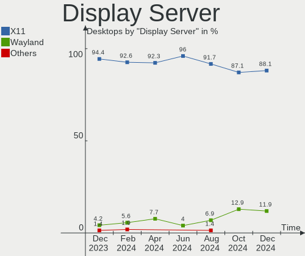

Pop!_OS - Hardware Trends (Desktops)
------------------------------------

A project to identify most popular hardware characteristics and track their change
over time based on data collected by Linux users at https://Linux-Hardware.org.

Anyone can contribute to this report by the [hw-probe](https://github.com/linuxhw/hw-probe) tool:

    sudo -E hw-probe -all -upload

This report is for one last month. Overall report since the beginning of time: [TestCoverage](https://github.com/linuxhw/TestCoverage)

Period: Jun, 2022.

Contents
--------

* [ System ](#system)
  - [ OS                       ](#os)
  - [ OS Family                ](#os-family)
  - [ Kernel                   ](#kernel)
  - [ Kernel Family            ](#kernel-family)
  - [ Kernel Major Ver.        ](#kernel-major-ver)
  - [ Arch                     ](#arch)
  - [ DE                       ](#de)
  - [ Display Server           ](#display-server)
  - [ Display Manager          ](#display-manager)
  - [ OS Lang                  ](#os-lang)
  - [ Boot Mode                ](#boot-mode)
  - [ Filesystem               ](#filesystem)
  - [ Part. scheme             ](#part-scheme)
  - [ Dual Boot with Linux/BSD ](#dual-boot-with-linuxbsd)
  - [ Dual Boot (Win)          ](#dual-boot-win)

* [ Board ](#board)
  - [ Vendor                   ](#vendor)
  - [ Model                    ](#model)
  - [ Model Family             ](#model-family)
  - [ MFG Year                 ](#mfg-year)
  - [ Form Factor              ](#form-factor)
  - [ Secure Boot              ](#secure-boot)
  - [ Coreboot                 ](#coreboot)
  - [ RAM Size                 ](#ram-size)
  - [ RAM Used                 ](#ram-used)
  - [ Total Drives             ](#total-drives)
  - [ Has CD-ROM               ](#has-cd-rom)
  - [ Has Ethernet             ](#has-ethernet)
  - [ Has WiFi                 ](#has-wifi)
  - [ Has Bluetooth            ](#has-bluetooth)

* [ Location ](#location)
  - [ Country                  ](#country)
  - [ City                     ](#city)

* [ Drives ](#drives)
  - [ Drive Vendor             ](#drive-vendor)
  - [ Drive Model              ](#drive-model)
  - [ HDD Vendor               ](#hdd-vendor)
  - [ SSD Vendor               ](#ssd-vendor)
  - [ Drive Kind               ](#drive-kind)
  - [ Drive Connector          ](#drive-connector)
  - [ Drive Size               ](#drive-size)
  - [ Space Total              ](#space-total)
  - [ Space Used               ](#space-used)
  - [ Malfunc. Drives          ](#malfunc-drives)
  - [ Malfunc. Drive Vendor    ](#malfunc-drive-vendor)
  - [ Malfunc. HDD Vendor      ](#malfunc-hdd-vendor)
  - [ Malfunc. Drive Kind      ](#malfunc-drive-kind)
  - [ Failed Drives            ](#failed-drives)
  - [ Failed Drive Vendor      ](#failed-drive-vendor)
  - [ Drive Status             ](#drive-status)

* [ Storage controller ](#storage-controller)
  - [ Storage Vendor           ](#storage-vendor)
  - [ Storage Model            ](#storage-model)
  - [ Storage Kind             ](#storage-kind)

* [ Processor ](#processor)
  - [ CPU Vendor               ](#cpu-vendor)
  - [ CPU Model                ](#cpu-model)
  - [ CPU Model Family         ](#cpu-model-family)
  - [ CPU Cores                ](#cpu-cores)
  - [ CPU Sockets              ](#cpu-sockets)
  - [ CPU Threads              ](#cpu-threads)
  - [ CPU Op-Modes             ](#cpu-op-modes)
  - [ CPU Microcode            ](#cpu-microcode)
  - [ CPU Microarch            ](#cpu-microarch)

* [ Graphics ](#graphics)
  - [ GPU Vendor               ](#gpu-vendor)
  - [ GPU Model                ](#gpu-model)
  - [ GPU Combo                ](#gpu-combo)
  - [ GPU Driver               ](#gpu-driver)
  - [ GPU Memory               ](#gpu-memory)

* [ Monitor ](#monitor)
  - [ Monitor Vendor           ](#monitor-vendor)
  - [ Monitor Model            ](#monitor-model)
  - [ Monitor Resolution       ](#monitor-resolution)
  - [ Monitor Diagonal         ](#monitor-diagonal)
  - [ Monitor Width            ](#monitor-width)
  - [ Aspect Ratio             ](#aspect-ratio)
  - [ Monitor Area             ](#monitor-area)
  - [ Pixel Density            ](#pixel-density)
  - [ Multiple Monitors        ](#multiple-monitors)

* [ Network ](#network)
  - [ Net Controller Vendor    ](#net-controller-vendor)
  - [ Net Controller Model     ](#net-controller-model)
  - [ Wireless Vendor          ](#wireless-vendor)
  - [ Wireless Model           ](#wireless-model)
  - [ Ethernet Vendor          ](#ethernet-vendor)
  - [ Ethernet Model           ](#ethernet-model)
  - [ Net Controller Kind      ](#net-controller-kind)
  - [ Used Controller          ](#used-controller)
  - [ NICs                     ](#nics)
  - [ IPv6                     ](#ipv6)

* [ Bluetooth ](#bluetooth)
  - [ Bluetooth Vendor         ](#bluetooth-vendor)
  - [ Bluetooth Model          ](#bluetooth-model)

* [ Sound ](#sound)
  - [ Sound Vendor             ](#sound-vendor)
  - [ Sound Model              ](#sound-model)

* [ Memory ](#memory)
  - [ Memory Vendor            ](#memory-vendor)
  - [ Memory Model             ](#memory-model)
  - [ Memory Kind              ](#memory-kind)
  - [ Memory Form Factor       ](#memory-form-factor)
  - [ Memory Size              ](#memory-size)
  - [ Memory Speed             ](#memory-speed)

* [ Printers & scanners ](#printers--scanners)
  - [ Printer Vendor           ](#printer-vendor)
  - [ Printer Model            ](#printer-model)
  - [ Scanner Vendor           ](#scanner-vendor)
  - [ Scanner Model            ](#scanner-model)

* [ Camera ](#camera)
  - [ Camera Vendor            ](#camera-vendor)
  - [ Camera Model             ](#camera-model)

* [ Security ](#security)
  - [ Fingerprint Vendor       ](#fingerprint-vendor)
  - [ Fingerprint Model        ](#fingerprint-model)
  - [ Chipcard Vendor          ](#chipcard-vendor)
  - [ Chipcard Model           ](#chipcard-model)

* [ Unsupported ](#unsupported)
  - [ Unsupported Devices      ](#unsupported-devices)
  - [ Unsupported Device Types ](#unsupported-device-types)

System
------

OS
--

Installed operating systems

| Name          | Desktops | Percent |
|---------------|----------|---------|
| Pop!_OS 22.04 | 85       | 91.4%   |
| Pop!_OS 21.10 | 6        | 6.45%   |
| Pop!_OS 21.04 | 1        | 1.08%   |
| Pop!_OS 20.04 | 1        | 1.08%   |

OS Family
---------

OS without a version

| Name    | Desktops | Percent |
|---------|----------|---------|
| Pop!_OS | 93       | 100%    |

Kernel
------

Version of the Linux kernel

| Version                  | Desktops | Percent |
|--------------------------|----------|---------|
| 5.17.5-76051705-generic  | 83       | 89.25%  |
| 5.17.15-76051715-generic | 8        | 8.6%    |
| 5.16.11-76051611-generic | 1        | 1.08%   |
| 5.11.0-7620-generic      | 1        | 1.08%   |

Kernel Family
-------------

Linux kernel without a distro release

| Version | Desktops | Percent |
|---------|----------|---------|
| 5.17.5  | 83       | 89.25%  |
| 5.17.15 | 8        | 8.6%    |
| 5.16.11 | 1        | 1.08%   |
| 5.11.0  | 1        | 1.08%   |

Kernel Major Ver.
-----------------

Linux kernel major version

| Version | Desktops | Percent |
|---------|----------|---------|
| 5.17    | 91       | 97.85%  |
| 5.16    | 1        | 1.08%   |
| 5.11    | 1        | 1.08%   |

Arch
----

OS architecture (x86_64, i586, etc.)

| Name   | Desktops | Percent |
|--------|----------|---------|
| x86_64 | 93       | 100%    |

DE
--

Desktop Environment

| Name  | Desktops | Percent |
|-------|----------|---------|
| GNOME | 91       | 97.85%  |
| KDE5  | 2        | 2.15%   |

Display Server
--------------

X11 or Wayland

| Name | Desktops | Percent |
|------|----------|---------|
| X11  | 92       | 98.92%  |
| Tty  | 1        | 1.08%   |

Display Manager
---------------

SDDM, LightDM, etc.

| Name    | Desktops | Percent |
|---------|----------|---------|
| Unknown | 78       | 83.87%  |
| GDM3    | 12       | 12.9%   |
| GDM     | 3        | 3.23%   |

OS Lang
-------

Language

| Lang  | Desktops | Percent |
|-------|----------|---------|
| en_US | 48       | 51.61%  |
| C     | 8        | 8.6%    |
| pt_BR | 7        | 7.53%   |
| en_CA | 7        | 7.53%   |
| en_GB | 5        | 5.38%   |
| en_AU | 3        | 3.23%   |
| pl_PL | 2        | 2.15%   |
| es_ES | 2        | 2.15%   |
| es_CL | 2        | 2.15%   |
| de_DE | 2        | 2.15%   |
| sv_SE | 1        | 1.08%   |
| ru_RU | 1        | 1.08%   |
| nl_BE | 1        | 1.08%   |
| ja_JP | 1        | 1.08%   |
| fr_FR | 1        | 1.08%   |
| fi_FI | 1        | 1.08%   |
| de_AT | 1        | 1.08%   |

Boot Mode
---------

EFI or BIOS

| Mode | Desktops | Percent |
|------|----------|---------|
| BIOS | 79       | 84.95%  |
| EFI  | 14       | 15.05%  |

Filesystem
----------

Type of filesystem

| Type    | Desktops | Percent |
|---------|----------|---------|
| Ext4    | 84       | 90.32%  |
| Overlay | 4        | 4.3%    |
| Btrfs   | 4        | 4.3%    |
| Xfs     | 1        | 1.08%   |

Part. scheme
------------

Scheme of partitioning

| Type    | Desktops | Percent |
|---------|----------|---------|
| Unknown | 78       | 83.87%  |
| GPT     | 15       | 16.13%  |

Dual Boot with Linux/BSD
------------------------

Hosting more than one Linux/BSD

| Dual boot | Desktops | Percent |
|-----------|----------|---------|
| No        | 89       | 95.7%   |
| Yes       | 4        | 4.3%    |

Dual Boot (Win)
---------------

Hosting Linux and Windows

| Dual boot | Desktops | Percent |
|-----------|----------|---------|
| No        | 81       | 87.1%   |
| Yes       | 12       | 12.9%   |

Board
-----

Vendor
------

Motherboard manufacturer

| Name                | Desktops | Percent |
|---------------------|----------|---------|
| ASUSTek Computer    | 32       | 34.41%  |
| Gigabyte Technology | 17       | 18.28%  |
| MSI                 | 14       | 15.05%  |
| Dell                | 7        | 7.53%   |
| ASRock              | 6        | 6.45%   |
| Lenovo              | 4        | 4.3%    |
| Hewlett-Packard     | 4        | 4.3%    |
| System76            | 1        | 1.08%   |
| PCWare              | 1        | 1.08%   |
| Medion              | 1        | 1.08%   |
| Intel               | 1        | 1.08%   |
| Foxconn             | 1        | 1.08%   |
| Biostar             | 1        | 1.08%   |
| BESSTAR Tech        | 1        | 1.08%   |
| Alienware           | 1        | 1.08%   |
| Unknown             | 1        | 1.08%   |

Model
-----

Motherboard model

| Name                                         | Desktops | Percent |
|----------------------------------------------|----------|---------|
| ASUS All Series                              | 3        | 3.23%   |
| Gigabyte X570 AORUS ELITE                    | 2        | 2.15%   |
| Dell OptiPlex 3020                           | 2        | 2.15%   |
| ASUS P6X58D PREMIUM                          | 2        | 2.15%   |
| System76 Thelio                              | 1        | 1.08%   |
| PCWare IPX4105G Pro                          | 1        | 1.08%   |
| MSI MS-7D54                                  | 1        | 1.08%   |
| MSI MS-7D32                                  | 1        | 1.08%   |
| MSI MS-7C96                                  | 1        | 1.08%   |
| MSI MS-7C75                                  | 1        | 1.08%   |
| MSI MS-7C56                                  | 1        | 1.08%   |
| MSI MS-7C37                                  | 1        | 1.08%   |
| MSI MS-7C35                                  | 1        | 1.08%   |
| MSI MS-7C02                                  | 1        | 1.08%   |
| MSI MS-7B17                                  | 1        | 1.08%   |
| MSI MS-7A74                                  | 1        | 1.08%   |
| MSI MS-7A38                                  | 1        | 1.08%   |
| MSI MS-7A34                                  | 1        | 1.08%   |
| MSI MS-7918                                  | 1        | 1.08%   |
| MSI MPG B460 Trident A (MS-B926)             | 1        | 1.08%   |
| Medion MS-7728                               | 1        | 1.08%   |
| Lenovo ZHENGJIUZHE REN9000K-34IMZ 90Q90022CP | 1        | 1.08%   |
| Lenovo ThinkStation S30 43516Y7              | 1        | 1.08%   |
| Lenovo ThinkCentre M93p 10A6S0RN00           | 1        | 1.08%   |
| Lenovo IdeaCentre 510-15IKL 90G8008EAL       | 1        | 1.08%   |
| Intel MAHOBAY                                | 1        | 1.08%   |
| HP Z820 Workstation                          | 1        | 1.08%   |
| HP Z230 Tower Workstation                    | 1        | 1.08%   |
| HP ProDesk 600 G1 SFF                        | 1        | 1.08%   |
| HP Compaq 8000 Elite CMT PC                  | 1        | 1.08%   |
| Gigabyte Z97X-SLI                            | 1        | 1.08%   |
| Gigabyte Z590 AORUS ELITE AX                 | 1        | 1.08%   |
| Gigabyte Z390 UD                             | 1        | 1.08%   |
| Gigabyte Z170-Gaming K3                      | 1        | 1.08%   |
| Gigabyte X570 AORUS MASTER                   | 1        | 1.08%   |
| Gigabyte X470 AORUS ULTRA GAMING             | 1        | 1.08%   |
| Gigabyte H87M-HD3                            | 1        | 1.08%   |
| Gigabyte GA-78LMT-USB3                       | 1        | 1.08%   |
| Gigabyte G1.Sniper M3-CF                     | 1        | 1.08%   |
| Gigabyte B550I AORUS PRO AX                  | 1        | 1.08%   |
| Gigabyte B550 AORUS ELITE V2                 | 1        | 1.08%   |
| Gigabyte B450M DS3H WIFI                     | 1        | 1.08%   |
| Gigabyte B450 AORUS M                        | 1        | 1.08%   |
| Gigabyte AB350-Gaming 3                      | 1        | 1.08%   |
| Gigabyte 970A-DS3P                           | 1        | 1.08%   |
| Foxconn G41MX/G41MX-K 2.0 1.0                | 1        | 1.08%   |
| Dell Precision Tower 5810                    | 1        | 1.08%   |
| Dell Precision T1700                         | 1        | 1.08%   |
| Dell Precision 3630 Tower                    | 1        | 1.08%   |
| Dell OptiPlex 990                            | 1        | 1.08%   |
| Dell OptiPlex 7010                           | 1        | 1.08%   |
| Biostar N68S3+                               | 1        | 1.08%   |
| BESSTAR Tech UM700                           | 1        | 1.08%   |
| ASUS Z170 PRO GAMING/AURA                    | 1        | 1.08%   |
| ASUS VM40B                                   | 1        | 1.08%   |
| ASUS TUF X299 MARK 2                         | 1        | 1.08%   |
| ASUS TUF Gaming Z590-PLUS WIFI               | 1        | 1.08%   |
| ASUS TUF Gaming X570-PRO                     | 1        | 1.08%   |
| ASUS TUF Gaming X570-PLUS_BR                 | 1        | 1.08%   |
| ASUS ROG STRIX X570-F GAMING                 | 1        | 1.08%   |

Model Family
------------

Motherboard model prefix

| Name                   | Desktops | Percent |
|------------------------|----------|---------|
| ASUS ROG               | 7        | 7.53%   |
| ASUS PRIME             | 6        | 6.45%   |
| Dell OptiPlex          | 4        | 4.3%    |
| ASUS TUF               | 4        | 4.3%    |
| Gigabyte X570          | 3        | 3.23%   |
| Dell Precision         | 3        | 3.23%   |
| ASUS All               | 3        | 3.23%   |
| ASUS P6X58D            | 2        | 2.15%   |
| ASRock B450            | 2        | 2.15%   |
| System76 Thelio        | 1        | 1.08%   |
| PCWare IPX4105G        | 1        | 1.08%   |
| MSI MS-7D54            | 1        | 1.08%   |
| MSI MS-7D32            | 1        | 1.08%   |
| MSI MS-7C96            | 1        | 1.08%   |
| MSI MS-7C75            | 1        | 1.08%   |
| MSI MS-7C56            | 1        | 1.08%   |
| MSI MS-7C37            | 1        | 1.08%   |
| MSI MS-7C35            | 1        | 1.08%   |
| MSI MS-7C02            | 1        | 1.08%   |
| MSI MS-7B17            | 1        | 1.08%   |
| MSI MS-7A74            | 1        | 1.08%   |
| MSI MS-7A38            | 1        | 1.08%   |
| MSI MS-7A34            | 1        | 1.08%   |
| MSI MS-7918            | 1        | 1.08%   |
| MSI MPG                | 1        | 1.08%   |
| Medion MS-7728         | 1        | 1.08%   |
| Lenovo ZHENGJIUZHE     | 1        | 1.08%   |
| Lenovo ThinkStation    | 1        | 1.08%   |
| Lenovo ThinkCentre     | 1        | 1.08%   |
| Lenovo IdeaCentre      | 1        | 1.08%   |
| Intel MAHOBAY          | 1        | 1.08%   |
| HP Z820                | 1        | 1.08%   |
| HP Z230                | 1        | 1.08%   |
| HP ProDesk             | 1        | 1.08%   |
| HP Compaq              | 1        | 1.08%   |
| Gigabyte Z97X-SLI      | 1        | 1.08%   |
| Gigabyte Z590          | 1        | 1.08%   |
| Gigabyte Z390          | 1        | 1.08%   |
| Gigabyte Z170-Gaming   | 1        | 1.08%   |
| Gigabyte X470          | 1        | 1.08%   |
| Gigabyte H87M-HD3      | 1        | 1.08%   |
| Gigabyte GA-78LMT-USB3 | 1        | 1.08%   |
| Gigabyte G1.Sniper     | 1        | 1.08%   |
| Gigabyte B550I         | 1        | 1.08%   |
| Gigabyte B550          | 1        | 1.08%   |
| Gigabyte B450M         | 1        | 1.08%   |
| Gigabyte B450          | 1        | 1.08%   |
| Gigabyte AB350-Gaming  | 1        | 1.08%   |
| Gigabyte 970A-DS3P     | 1        | 1.08%   |
| Foxconn G41MX          | 1        | 1.08%   |
| Biostar N68S3+         | 1        | 1.08%   |
| BESSTAR Tech UM700     | 1        | 1.08%   |
| ASUS Z170              | 1        | 1.08%   |
| ASUS VM40B             | 1        | 1.08%   |
| ASUS P8Z77-V           | 1        | 1.08%   |
| ASUS P8Z68-V           | 1        | 1.08%   |
| ASUS P7H55-M           | 1        | 1.08%   |
| ASUS M5A97             | 1        | 1.08%   |
| ASUS F2A85-M           | 1        | 1.08%   |
| ASUS EX278AA-ABA       | 1        | 1.08%   |

MFG Year
--------

Motherboard manufacture year

| Year | Desktops | Percent |
|------|----------|---------|
| 2019 | 18       | 19.35%  |
| 2020 | 10       | 10.75%  |
| 2021 | 9        | 9.68%   |
| 2018 | 9        | 9.68%   |
| 2014 | 8        | 8.6%    |
| 2013 | 8        | 8.6%    |
| 2017 | 6        | 6.45%   |
| 2016 | 5        | 5.38%   |
| 2012 | 5        | 5.38%   |
| 2010 | 4        | 4.3%    |
| 2022 | 3        | 3.23%   |
| 2011 | 3        | 3.23%   |
| 2009 | 3        | 3.23%   |
| 2015 | 1        | 1.08%   |
| 2006 | 1        | 1.08%   |

Form Factor
-----------

Physical design of the computer

| Name    | Desktops | Percent |
|---------|----------|---------|
| Desktop | 93       | 100%    |

Secure Boot
-----------

Enabled or disabled

| State    | Desktops | Percent |
|----------|----------|---------|
| Disabled | 93       | 100%    |

Coreboot
--------

Have coreboot on board

| Used | Desktops | Percent |
|------|----------|---------|
| No   | 93       | 100%    |

RAM Size
--------

Total RAM memory

| Size in GB      | Desktops | Percent |
|-----------------|----------|---------|
| 32.01-64.0      | 30       | 32.26%  |
| 16.01-24.0      | 26       | 27.96%  |
| 8.01-16.0       | 11       | 11.83%  |
| 4.01-8.0        | 9        | 9.68%   |
| 3.01-4.0        | 7        | 7.53%   |
| 64.01-256.0     | 7        | 7.53%   |
| More than 256.0 | 1        | 1.08%   |
| 24.01-32.0      | 1        | 1.08%   |
| 1.01-2.0        | 1        | 1.08%   |

RAM Used
--------

Used RAM memory

| Used GB    | Desktops | Percent |
|------------|----------|---------|
| 2.01-3.0   | 29       | 31.18%  |
| 4.01-8.0   | 26       | 27.96%  |
| 3.01-4.0   | 19       | 20.43%  |
| 1.01-2.0   | 11       | 11.83%  |
| 8.01-16.0  | 6        | 6.45%   |
| 16.01-24.0 | 2        | 2.15%   |

Total Drives
------------

Number of drives on board

| Drives | Desktops | Percent |
|--------|----------|---------|
| 3      | 26       | 27.96%  |
| 2      | 26       | 27.96%  |
| 1      | 22       | 23.66%  |
| 4      | 7        | 7.53%   |
| 6      | 5        | 5.38%   |
| 5      | 3        | 3.23%   |
| 7      | 2        | 2.15%   |
| 8      | 1        | 1.08%   |
| 0      | 1        | 1.08%   |

Has CD-ROM
----------

Has CD-ROM on board

| Presented | Desktops | Percent |
|-----------|----------|---------|
| No        | 56       | 60.22%  |
| Yes       | 37       | 39.78%  |

Has Ethernet
------------

Has Ethernet on board

| Presented | Desktops | Percent |
|-----------|----------|---------|
| Yes       | 90       | 96.77%  |
| No        | 3        | 3.23%   |

Has WiFi
--------

Has WiFi module

| Presented | Desktops | Percent |
|-----------|----------|---------|
| Yes       | 48       | 51.61%  |
| No        | 45       | 48.39%  |

Has Bluetooth
-------------

Has Bluetooth module

| Presented | Desktops | Percent |
|-----------|----------|---------|
| No        | 55       | 59.14%  |
| Yes       | 38       | 40.86%  |

Location
--------

Country
-------

Geographic location (country)

| Country     | Desktops | Percent |
|-------------|----------|---------|
| USA         | 33       | 35.48%  |
| Canada      | 7        | 7.53%   |
| Brazil      | 7        | 7.53%   |
| Netherlands | 5        | 5.38%   |
| UK          | 4        | 4.3%    |
| France      | 3        | 3.23%   |
| Australia   | 3        | 3.23%   |
| Thailand    | 2        | 2.15%   |
| Spain       | 2        | 2.15%   |
| Poland      | 2        | 2.15%   |
| Japan       | 2        | 2.15%   |
| Italy       | 2        | 2.15%   |
| Germany     | 2        | 2.15%   |
| Chile       | 2        | 2.15%   |
| Tunisia     | 1        | 1.08%   |
| Switzerland | 1        | 1.08%   |
| Sweden      | 1        | 1.08%   |
| Slovenia    | 1        | 1.08%   |
| Russia      | 1        | 1.08%   |
| Romania     | 1        | 1.08%   |
| Mexico      | 1        | 1.08%   |
| Hungary     | 1        | 1.08%   |
| Hong Kong   | 1        | 1.08%   |
| Greece      | 1        | 1.08%   |
| Finland     | 1        | 1.08%   |
| Czechia     | 1        | 1.08%   |
| Bulgaria    | 1        | 1.08%   |
| Belgium     | 1        | 1.08%   |
| Azerbaijan  | 1        | 1.08%   |
| Austria     | 1        | 1.08%   |
| Argentina   | 1        | 1.08%   |

City
----

Geographic location (city)

| City             | Desktops | Percent |
|------------------|----------|---------|
| Ogden            | 2        | 2.15%   |
| Cleveland        | 2        | 2.15%   |
| Bedford          | 2        | 2.15%   |
| Yekaterinburg    | 1        | 1.08%   |
| Winter Garden    | 1        | 1.08%   |
| Westland         | 1        | 1.08%   |
| Virginia Beach   | 1        | 1.08%   |
| Vienna           | 1        | 1.08%   |
| Vicksburg        | 1        | 1.08%   |
| Tunis            | 1        | 1.08%   |
| Tuen Mun         | 1        | 1.08%   |
| Toronto          | 1        | 1.08%   |
| Tempe            | 1        | 1.08%   |
| Sydney           | 1        | 1.08%   |
| Swannanoa        | 1        | 1.08%   |
| Sunnyside        | 1        | 1.08%   |
| Strzegom         | 1        | 1.08%   |
| Stevensville     | 1        | 1.08%   |
| Springfield      | 1        | 1.08%   |
| Sofia            | 1        | 1.08%   |
| Sidrolandia      | 1        | 1.08%   |
| Saskatoon        | 1        | 1.08%   |
| Sarcelles        | 1        | 1.08%   |
| Sapporo          | 1        | 1.08%   |
| Santiago         | 1        | 1.08%   |
| San Francisco    | 1        | 1.08%   |
| Richmond         | 1        | 1.08%   |
| Quilicura        | 1        | 1.08%   |
| Puebla City      | 1        | 1.08%   |
| Prague           | 1        | 1.08%   |
| Pine Bluffs      | 1        | 1.08%   |
| Phitsanulok      | 1        | 1.08%   |
| Parsippany       | 1        | 1.08%   |
| Nuremberg        | 1        | 1.08%   |
| Nelson           | 1        | 1.08%   |
| Nashville        | 1        | 1.08%   |
| Nao Me Toque     | 1        | 1.08%   |
| Musselkanaal     | 1        | 1.08%   |
| Munich           | 1        | 1.08%   |
| Melbourne        | 1        | 1.08%   |
| Mason            | 1        | 1.08%   |
| Manaus           | 1        | 1.08%   |
| Madrid           | 1        | 1.08%   |
| Luni             | 1        | 1.08%   |
| Lund             | 1        | 1.08%   |
| Londrina         | 1        | 1.08%   |
| Laurel           | 1        | 1.08%   |
| Kuopio           | 1        | 1.08%   |
| Kidlington       | 1        | 1.08%   |
| Keswick          | 1        | 1.08%   |
| Huntington Beach | 1        | 1.08%   |
| Halifax          | 1        | 1.08%   |
| Haarlem          | 1        | 1.08%   |
| Goiânia         | 1        | 1.08%   |
| Glasgow          | 1        | 1.08%   |
| Fukuoka          | 1        | 1.08%   |
| Fresnoy-le-Grand | 1        | 1.08%   |
| Franconville     | 1        | 1.08%   |
| Fort Collins     | 1        | 1.08%   |
| Everett          | 1        | 1.08%   |

Drives
------

Drive Vendor
------------

Hard drive vendors

| Vendor                    | Desktops | Drives | Percent |
|---------------------------|----------|--------|---------|
| Seagate                   | 42       | 49     | 21.88%  |
| Samsung Electronics       | 37       | 58     | 19.27%  |
| WDC                       | 25       | 33     | 13.02%  |
| Crucial                   | 14       | 19     | 7.29%   |
| SanDisk                   | 10       | 11     | 5.21%   |
| Kingston                  | 10       | 12     | 5.21%   |
| Toshiba                   | 9        | 10     | 4.69%   |
| Hitachi                   | 5        | 8      | 2.6%    |
| Phison                    | 4        | 6      | 2.08%   |
| SK hynix                  | 3        | 3      | 1.56%   |
| Micron/Crucial Technology | 3        | 4      | 1.56%   |
| Micron Technology         | 3        | 4      | 1.56%   |
| China                     | 3        | 3      | 1.56%   |
| T-FORCE                   | 2        | 2      | 1.04%   |
| Lexar                     | 2        | 2      | 1.04%   |
| Intel                     | 2        | 2      | 1.04%   |
| Corsair                   | 2        | 2      | 1.04%   |
| A-DATA Technology         | 2        | 3      | 1.04%   |
| Unknown                   | 1        | 1      | 0.52%   |
| SPCC                      | 1        | 1      | 0.52%   |
| Silicon Motion            | 1        | 1      | 0.52%   |
| Qunion                    | 1        | 1      | 0.52%   |
| PNY                       | 1        | 1      | 0.52%   |
| Mushkin                   | 1        | 2      | 0.52%   |
| MaxDigital                | 1        | 1      | 0.52%   |
| KingFast                  | 1        | 1      | 0.52%   |
| HS-SSD-C100               | 1        | 1      | 0.52%   |
| HGST                      | 1        | 1      | 0.52%   |
| Hewlett-Packard           | 1        | 1      | 0.52%   |
| Fujitsu                   | 1        | 2      | 0.52%   |
| FORESEE                   | 1        | 1      | 0.52%   |
| Apacer                    | 1        | 1      | 0.52%   |

Drive Model
-----------

Hard drive models

| Model                                  | Desktops | Percent |
|----------------------------------------|----------|---------|
| Seagate ST2000DM008-2FR102 2TB         | 7        | 3.04%   |
| Samsung SM963 2.5" NVMe PCIe SSD 500GB | 6        | 2.61%   |
| Seagate ST1000DM003-1CH162 1TB         | 5        | 2.17%   |
| Samsung SSD 850 EVO 250GB              | 5        | 2.17%   |
| Phison NVMe SSD Drive 1TB              | 4        | 1.74%   |
| Kingston SA400S37240G 240GB SSD        | 4        | 1.74%   |
| WDC WD30EFRX-68EUZN0 3TB               | 3        | 1.3%    |
| WDC WD10EZEX-08WN4A0 1TB               | 3        | 1.3%    |
| Seagate ST500DM002-1BD142 500GB        | 3        | 1.3%    |
| Seagate Expansion 1TB                  | 3        | 1.3%    |
| Kingston SA400S37120G 120GB SSD        | 3        | 1.3%    |
| Crucial CT2000MX500SSD1 2TB            | 3        | 1.3%    |
| Crucial CT1000MX500SSD1 1TB            | 3        | 1.3%    |
| WDC WDS100T2B0A-00SM50 1TB SSD         | 2        | 0.87%   |
| Toshiba DT01ACA200 2TB                 | 2        | 0.87%   |
| Toshiba DT01ACA100 1TB                 | 2        | 0.87%   |
| Seagate ST3500418AS 500GB              | 2        | 0.87%   |
| Seagate ST3320620AS 320GB              | 2        | 0.87%   |
| Seagate ST31000528AS 1TB               | 2        | 0.87%   |
| Seagate ST2000DM001-1CH164 2TB         | 2        | 0.87%   |
| Seagate ST1000DM010-2EP102 1TB         | 2        | 0.87%   |
| SanDisk NVMe SSD Drive 1TB             | 2        | 0.87%   |
| Samsung SSD 970 EVO Plus 1TB           | 2        | 0.87%   |
| Samsung SSD 970 EVO 500GB              | 2        | 0.87%   |
| Samsung SSD 870 EVO 500GB              | 2        | 0.87%   |
| Samsung SSD 860 EVO 250GB              | 2        | 0.87%   |
| Samsung SSD 850 EVO 500GB              | 2        | 0.87%   |
| Samsung NVMe SSD Drive 2TB             | 2        | 0.87%   |
| Samsung NVMe SSD Drive 1TB             | 2        | 0.87%   |
| Micron/Crucial NVMe SSD Drive 1TB      | 2        | 0.87%   |
| Lexar 256GB SSD                        | 2        | 0.87%   |
| Kingston SV300S37A120G 120GB SSD       | 2        | 0.87%   |
| Hitachi HTS547575A9E384 752GB          | 2        | 0.87%   |
| Crucial CT1050MX300SSD1 1TB            | 2        | 0.87%   |
| WDC WDS500G2B0A-00SM50 500GB SSD       | 1        | 0.43%   |
| WDC WDS240G2G0A-00JH30 240GB SSD       | 1        | 0.43%   |
| WDC WD8004FRYZ-01VAEB0 8TB             | 1        | 0.43%   |
| WDC WD8003FRYZ-01JPDB1 8TB             | 1        | 0.43%   |
| WDC WD5001AALS-00E3A0 500GB            | 1        | 0.43%   |
| WDC WD5000AZLX-07K2TA0 500GB           | 1        | 0.43%   |
| WDC WD3200AAKS-00L9A0 320GB            | 1        | 0.43%   |
| WDC WD2502ABYS-02B7A0 256GB            | 1        | 0.43%   |
| WDC WD2500BEVS-22UST0 250GB            | 1        | 0.43%   |
| WDC WD20EZRX-00D8PB0 2TB               | 1        | 0.43%   |
| WDC WD20EZBX-00AYRA0 2TB               | 1        | 0.43%   |
| WDC WD20EZAZ-00GGJB0 2TB               | 1        | 0.43%   |
| WDC WD20EFRX-68AX9N0 2TB               | 1        | 0.43%   |
| WDC WD20EARS-00MVWB0 2TB               | 1        | 0.43%   |
| WDC WD2003FZEX-00SRLA0 2TB             | 1        | 0.43%   |
| WDC WD10EZEX-60M2NA0 1TB               | 1        | 0.43%   |
| WDC WD10EZEX-22BN5A0 1TB               | 1        | 0.43%   |
| WDC WD10EZEX-00RKKA0 1TB               | 1        | 0.43%   |
| WDC WD10EZEX-00BN5A0 1TB               | 1        | 0.43%   |
| WDC WD10EARX-00N0YB0 1TB               | 1        | 0.43%   |
| WDC WD10EALX-009BA0 1TB                | 1        | 0.43%   |
| WDC WD1001FALS-00E8B0 1TB              | 1        | 0.43%   |
| WDC PC SN530 SDBPNPZ-512G-1032 512GB   | 1        | 0.43%   |
| Unknown SD/MMC/MS PRO 128GB            | 1        | 0.43%   |
| Toshiba THNSN5512GPU7 512GB            | 1        | 0.43%   |
| Toshiba MQ01AAD032C 320GB              | 1        | 0.43%   |

HDD Vendor
----------

Hard disk drive vendors

| Vendor              | Desktops | Drives | Percent |
|---------------------|----------|--------|---------|
| Seagate             | 41       | 47     | 48.81%  |
| WDC                 | 22       | 27     | 26.19%  |
| Toshiba             | 8        | 9      | 9.52%   |
| Samsung Electronics | 5        | 8      | 5.95%   |
| Hitachi             | 5        | 8      | 5.95%   |
| Unknown             | 1        | 1      | 1.19%   |
| HGST                | 1        | 1      | 1.19%   |
| Fujitsu             | 1        | 2      | 1.19%   |

SSD Vendor
----------

Solid state drive vendors

| Vendor              | Desktops | Drives | Percent |
|---------------------|----------|--------|---------|
| Samsung Electronics | 18       | 26     | 25.71%  |
| Crucial             | 14       | 19     | 20%     |
| Kingston            | 10       | 11     | 14.29%  |
| SanDisk             | 5        | 6      | 7.14%   |
| WDC                 | 4        | 5      | 5.71%   |
| China               | 3        | 3      | 4.29%   |
| SK hynix            | 2        | 2      | 2.86%   |
| Lexar               | 2        | 2      | 2.86%   |
| A-DATA Technology   | 2        | 3      | 2.86%   |
| SPCC                | 1        | 1      | 1.43%   |
| Seagate             | 1        | 1      | 1.43%   |
| PNY                 | 1        | 1      | 1.43%   |
| Mushkin             | 1        | 2      | 1.43%   |
| Micron Technology   | 1        | 1      | 1.43%   |
| Intel               | 1        | 1      | 1.43%   |
| Hewlett-Packard     | 1        | 1      | 1.43%   |
| FORESEE             | 1        | 1      | 1.43%   |
| Corsair             | 1        | 1      | 1.43%   |
| Apacer              | 1        | 1      | 1.43%   |

Drive Kind
----------

HDD or SSD

| Kind    | Desktops | Drives | Percent |
|---------|----------|--------|---------|
| HDD     | 64       | 103    | 40.25%  |
| SSD     | 53       | 88     | 33.33%  |
| NVMe    | 37       | 51     | 23.27%  |
| Unknown | 5        | 5      | 3.14%   |

Drive Connector
---------------

SATA, SAS, NVMe, etc.

| Type | Desktops | Drives | Percent |
|------|----------|--------|---------|
| SATA | 87       | 188    | 65.91%  |
| NVMe | 37       | 51     | 28.03%  |
| SAS  | 8        | 8      | 6.06%   |

Drive Size
----------

Size of hard drive

| Size in TB | Desktops | Drives | Percent |
|------------|----------|--------|---------|
| 0.01-0.5   | 55       | 83     | 37.93%  |
| 0.51-1.0   | 48       | 62     | 33.1%   |
| 1.01-2.0   | 28       | 30     | 19.31%  |
| 2.01-3.0   | 7        | 8      | 4.83%   |
| 4.01-10.0  | 4        | 5      | 2.76%   |
| 3.01-4.0   | 3        | 3      | 2.07%   |

Space Total
-----------

Amount of disk space available on the file system

| Size in GB     | Desktops | Percent |
|----------------|----------|---------|
| 251-500        | 22       | 23.66%  |
| 501-1000       | 20       | 21.51%  |
| More than 3000 | 15       | 16.13%  |
| 101-250        | 10       | 10.75%  |
| 1001-2000      | 9        | 9.68%   |
| 1-20           | 7        | 7.53%   |
| 2001-3000      | 6        | 6.45%   |
| 51-100         | 2        | 2.15%   |
| 21-50          | 1        | 1.08%   |
| Unknown        | 1        | 1.08%   |

Space Used
----------

Amount of used disk space

| Used GB        | Desktops | Percent |
|----------------|----------|---------|
| 21-50          | 18       | 19.35%  |
| 1-20           | 18       | 19.35%  |
| 101-250        | 13       | 13.98%  |
| 251-500        | 12       | 12.9%   |
| 51-100         | 11       | 11.83%  |
| More than 3000 | 8        | 8.6%    |
| 1001-2000      | 6        | 6.45%   |
| 501-1000       | 5        | 5.38%   |
| 2001-3000      | 1        | 1.08%   |
| Unknown        | 1        | 1.08%   |

Malfunc. Drives
---------------

Drive models with a malfunction

| Model                          | Desktops | Drives | Percent |
|--------------------------------|----------|--------|---------|
| WDC WD1001FALS-00E8B0 1TB      | 1        | 1      | 25%     |
| Seagate ST2000DM008-2FR102 2TB | 1        | 1      | 25%     |
| Seagate ST1500DL003-9VT16L 1TB | 1        | 1      | 25%     |
| China SSD 240GB                | 1        | 1      | 25%     |

Malfunc. Drive Vendor
---------------------

Vendors of faulty drives

| Vendor  | Desktops | Drives | Percent |
|---------|----------|--------|---------|
| Seagate | 2        | 2      | 50%     |
| WDC     | 1        | 1      | 25%     |
| China   | 1        | 1      | 25%     |

Malfunc. HDD Vendor
-------------------

Vendors of faulty HDD drives

| Vendor  | Desktops | Drives | Percent |
|---------|----------|--------|---------|
| Seagate | 2        | 2      | 66.67%  |
| WDC     | 1        | 1      | 33.33%  |

Malfunc. Drive Kind
-------------------

Kinds of faulty drives

| Kind | Desktops | Drives | Percent |
|------|----------|--------|---------|
| HDD  | 3        | 3      | 75%     |
| SSD  | 1        | 1      | 25%     |

Failed Drives
-------------

Failed drive models

Zero info for selected period =(

Failed Drive Vendor
-------------------

Failed drive vendors

Zero info for selected period =(

Drive Status
------------

Number of failed and malfunc. drives

| Status   | Desktops | Drives | Percent |
|----------|----------|--------|---------|
| Detected | 77       | 201    | 78.57%  |
| Works    | 17       | 42     | 17.35%  |
| Malfunc  | 4        | 4      | 4.08%   |

Storage controller
------------------

Storage Vendor
--------------

Storage controller vendors

| Vendor                       | Desktops | Percent |
|------------------------------|----------|---------|
| Intel                        | 54       | 38.57%  |
| AMD                          | 38       | 27.14%  |
| Samsung Electronics          | 20       | 14.29%  |
| Phison Electronics           | 6        | 4.29%   |
| SanDisk                      | 5        | 3.57%   |
| Micron/Crucial Technology    | 3        | 2.14%   |
| Nvidia                       | 2        | 1.43%   |
| Micron Technology            | 2        | 1.43%   |
| Marvell Technology Group     | 2        | 1.43%   |
| ASMedia Technology           | 2        | 1.43%   |
| VIA Technologies             | 1        | 0.71%   |
| Toshiba America Info Systems | 1        | 0.71%   |
| SK hynix                     | 1        | 0.71%   |
| Silicon Motion               | 1        | 0.71%   |
| Kingston Technology Company  | 1        | 0.71%   |
| Broadcom / LSI               | 1        | 0.71%   |

Storage Model
-------------

Storage controller models

| Model                                                                                   | Desktops | Percent |
|-----------------------------------------------------------------------------------------|----------|---------|
| AMD FCH SATA Controller [AHCI mode]                                                     | 28       | 16.57%  |
| Samsung NVMe SSD Controller SM981/PM981/PM983                                           | 11       | 6.51%   |
| AMD 400 Series Chipset SATA Controller                                                  | 8        | 4.73%   |
| Intel 8 Series/C220 Series Chipset Family 6-port SATA Controller 1 [AHCI mode]          | 6        | 3.55%   |
| AMD 500 Series Chipset SATA Controller                                                  | 6        | 3.55%   |
| Intel SATA Controller [RAID mode]                                                       | 5        | 2.96%   |
| Intel 200 Series PCH SATA controller [AHCI mode]                                        | 5        | 2.96%   |
| Samsung NVMe SSD Controller PM9A1/PM9A3/980PRO                                          | 4        | 2.37%   |
| Samsung NVMe SSD Controller 980                                                         | 4        | 2.37%   |
| Intel 500 Series Chipset Family SATA AHCI Controller                                    | 4        | 2.37%   |
| Phison E12 NVMe Controller                                                              | 3        | 1.78%   |
| Intel Cannon Lake PCH SATA AHCI Controller                                              | 3        | 1.78%   |
| Intel 7 Series/C210 Series Chipset Family 6-port SATA Controller [AHCI mode]            | 3        | 1.78%   |
| AMD SB7x0/SB8x0/SB9x0 SATA Controller [AHCI mode]                                       | 3        | 1.78%   |
| SanDisk WD Blue SN550 NVMe SSD                                                          | 2        | 1.18%   |
| Phison E16 PCIe4 NVMe Controller                                                        | 2        | 1.18%   |
| Nvidia MCP61 SATA Controller                                                            | 2        | 1.18%   |
| Nvidia MCP61 IDE                                                                        | 2        | 1.18%   |
| Micron/Crucial NVMe Controller                                                          | 2        | 1.18%   |
| Micron Non-Volatile memory controller                                                   | 2        | 1.18%   |
| Marvell Group 88SE9123 PCIe SATA 6.0 Gb/s controller                                    | 2        | 1.18%   |
| Intel Q170/Q150/B150/H170/H110/Z170/CM236 Chipset SATA Controller [AHCI Mode]           | 2        | 1.18%   |
| Intel NM10/ICH7 Family SATA Controller [IDE mode]                                       | 2        | 1.18%   |
| Intel Comet Lake SATA AHCI Controller                                                   | 2        | 1.18%   |
| Intel C610/X99 series chipset sSATA Controller [AHCI mode]                              | 2        | 1.18%   |
| Intel C602 chipset 4-Port SATA Storage Control Unit                                     | 2        | 1.18%   |
| Intel C600/X79 series chipset SATA RAID Controller                                      | 2        | 1.18%   |
| Intel 9 Series Chipset Family SATA Controller [AHCI Mode]                               | 2        | 1.18%   |
| Intel 82801JI (ICH10 Family) SATA AHCI Controller                                       | 2        | 1.18%   |
| Intel 6 Series/C200 Series Chipset Family Desktop SATA Controller (IDE mode, ports 4-5) | 2        | 1.18%   |
| Intel 6 Series/C200 Series Chipset Family Desktop SATA Controller (IDE mode, ports 0-3) | 2        | 1.18%   |
| Intel 6 Series/C200 Series Chipset Family 6 port Desktop SATA AHCI Controller           | 2        | 1.18%   |
| ASMedia ASM1062 Serial ATA Controller                                                   | 2        | 1.18%   |
| AMD 300 Series Chipset SATA Controller                                                  | 2        | 1.18%   |
| VIA VT6421 IDE/SATA Controller                                                          | 1        | 0.59%   |
| Toshiba America Info Systems NVMe Controller                                            | 1        | 0.59%   |
| SK hynix Gold P31 SSD                                                                   | 1        | 0.59%   |
| Silicon Motion SM2263EN/SM2263XT SSD Controller                                         | 1        | 0.59%   |
| SanDisk WD PC SN810 / Black SN850 NVMe SSD                                              | 1        | 0.59%   |
| SanDisk WD Blue SN570 NVMe SSD                                                          | 1        | 0.59%   |
| SanDisk Non-Volatile memory controller                                                  | 1        | 0.59%   |
| Samsung NVMe SSD Controller SM961/PM961/SM963                                           | 1        | 0.59%   |
| Samsung Electronics SATA controller                                                     | 1        | 0.59%   |
| Phison PS5013 E13 NVMe Controller                                                       | 1        | 0.59%   |
| Phison E18 PCIe4 NVMe Controller                                                        | 1        | 0.59%   |
| Micron/Crucial Non-Volatile memory controller                                           | 1        | 0.59%   |
| Kingston Company OM3PDP3 NVMe SSD                                                       | 1        | 0.59%   |
| Intel SSD 660P Series                                                                   | 1        | 0.59%   |
| Intel Celeron/Pentium Silver Processor SATA Controller                                  | 1        | 0.59%   |
| Intel C610/X99 series chipset 6-Port SATA Controller [AHCI mode]                        | 1        | 0.59%   |
| Intel C600/X79 series chipset IDE-r Controller                                          | 1        | 0.59%   |
| Intel C600/X79 series chipset 6-Port SATA AHCI Controller                               | 1        | 0.59%   |
| Intel Alder Lake-S PCH SATA Controller [AHCI Mode]                                      | 1        | 0.59%   |
| Intel 82801JD/DO (ICH10 Family) SATA AHCI Controller                                    | 1        | 0.59%   |
| Intel 82801G (ICH7 Family) IDE Controller                                               | 1        | 0.59%   |
| Intel 8 Series/C220 Series Chipset Family 4-port SATA Controller 1 [IDE mode]           | 1        | 0.59%   |
| Intel 8 Series/C220 Series Chipset Family 2-port SATA Controller 2 [IDE mode]           | 1        | 0.59%   |
| Intel 7 Series/C210 Series Chipset Family 4-port SATA Controller [IDE mode]             | 1        | 0.59%   |
| Intel 7 Series/C210 Series Chipset Family 2-port SATA Controller [IDE mode]             | 1        | 0.59%   |
| Intel 7 Series Chipset Family 6-port SATA Controller [AHCI mode]                        | 1        | 0.59%   |

Storage Kind
------------

Kind of storage controller (IDE, SATA, NVMe, SAS, ...)

| Kind | Desktops | Percent |
|------|----------|---------|
| SATA | 77       | 56.2%   |
| NVMe | 37       | 27.01%  |
| IDE  | 12       | 8.76%   |
| RAID | 9        | 6.57%   |
| SAS  | 2        | 1.46%   |

Processor
---------

CPU Vendor
----------

Processor vendors

| Vendor | Desktops | Percent |
|--------|----------|---------|
| Intel  | 53       | 56.99%  |
| AMD    | 40       | 43.01%  |

CPU Model
---------

Processor models

| Model                                           | Desktops | Percent |
|-------------------------------------------------|----------|---------|
| AMD Ryzen 5 5600X 6-Core Processor              | 5        | 5.38%   |
| AMD Ryzen 5 3600 6-Core Processor               | 5        | 5.38%   |
| AMD Ryzen 9 5900X 12-Core Processor             | 3        | 3.23%   |
| AMD Ryzen 7 5800X 8-Core Processor              | 3        | 3.23%   |
| AMD Ryzen 7 3700X 8-Core Processor              | 3        | 3.23%   |
| AMD FX-8350 Eight-Core Processor                | 3        | 3.23%   |
| Intel Core i7-9700K CPU @ 3.60GHz               | 2        | 2.15%   |
| Intel Core i7 CPU 950 @ 3.07GHz                 | 2        | 2.15%   |
| Intel Core i5-9600K CPU @ 3.70GHz               | 2        | 2.15%   |
| Intel Core i5-6600K CPU @ 3.50GHz               | 2        | 2.15%   |
| Intel Core i5-4570 CPU @ 3.20GHz                | 2        | 2.15%   |
| Intel Core i3-4150 CPU @ 3.50GHz                | 2        | 2.15%   |
| AMD Ryzen 9 5950X 16-Core Processor             | 2        | 2.15%   |
| AMD Ryzen 5 5600G with Radeon Graphics          | 2        | 2.15%   |
| Intel Xeon E-2146G CPU @ 3.50GHz                | 1        | 1.08%   |
| Intel Xeon CPU E5-2687W 0 @ 3.10GHz             | 1        | 1.08%   |
| Intel Xeon CPU E5-1680 v2 @ 3.00GHz             | 1        | 1.08%   |
| Intel Xeon CPU E5-1630 v4 @ 3.70GHz             | 1        | 1.08%   |
| Intel Pentium D CPU 2.80GHz                     | 1        | 1.08%   |
| Intel Pentium CPU G4560 @ 3.50GHz               | 1        | 1.08%   |
| Intel Pentium CPU G3240 @ 3.10GHz               | 1        | 1.08%   |
| Intel Core i9-9900K CPU @ 3.60GHz               | 1        | 1.08%   |
| Intel Core i9-7940X CPU @ 3.10GHz               | 1        | 1.08%   |
| Intel Core i9-10900K CPU @ 3.70GHz              | 1        | 1.08%   |
| Intel Core i7-9700 CPU @ 3.00GHz                | 1        | 1.08%   |
| Intel Core i7-8700K CPU @ 3.70GHz               | 1        | 1.08%   |
| Intel Core i7-7700K CPU @ 4.20GHz               | 1        | 1.08%   |
| Intel Core i7-6800K CPU @ 3.40GHz               | 1        | 1.08%   |
| Intel Core i7-4790K CPU @ 4.00GHz               | 1        | 1.08%   |
| Intel Core i7-4790 CPU @ 3.60GHz                | 1        | 1.08%   |
| Intel Core i7-4770K CPU @ 3.50GHz               | 1        | 1.08%   |
| Intel Core i7-4770 CPU @ 3.40GHz                | 1        | 1.08%   |
| Intel Core i7-3770 CPU @ 3.40GHz                | 1        | 1.08%   |
| Intel Core i7-2700K CPU @ 3.50GHz               | 1        | 1.08%   |
| Intel Core i7-10700KF CPU @ 3.80GHz             | 1        | 1.08%   |
| Intel Core i5-4690K CPU @ 3.50GHz               | 1        | 1.08%   |
| Intel Core i5-4460 CPU @ 3.20GHz                | 1        | 1.08%   |
| Intel Core i5-3330 CPU @ 3.00GHz                | 1        | 1.08%   |
| Intel Core i5-2500K CPU @ 3.30GHz               | 1        | 1.08%   |
| Intel Core i5-2400 CPU @ 3.10GHz                | 1        | 1.08%   |
| Intel Core i5-2320 CPU @ 3.00GHz                | 1        | 1.08%   |
| Intel Core i5-10400F CPU @ 2.90GHz              | 1        | 1.08%   |
| Intel Core i5-10400 CPU @ 2.90GHz               | 1        | 1.08%   |
| Intel Core i5 CPU 760 @ 2.80GHz                 | 1        | 1.08%   |
| Intel Core i3-3240 CPU @ 3.40GHz                | 1        | 1.08%   |
| Intel Core i3-2120 CPU @ 3.30GHz                | 1        | 1.08%   |
| Intel Core i3-10105 CPU @ 3.70GHz               | 1        | 1.08%   |
| Intel Core 2 Quad CPU Q9500 @ 2.83GHz           | 1        | 1.08%   |
| Intel Core 2 CPU 6600 @ 2.40GHz                 | 1        | 1.08%   |
| Intel Celeron J4105 CPU @ 1.50GHz               | 1        | 1.08%   |
| Intel Celeron CPU 1007U @ 1.50GHz               | 1        | 1.08%   |
| Intel 12th Gen Core i9-12900K                   | 1        | 1.08%   |
| Intel 11th Gen Core i7-11700K @ 3.60GHz         | 1        | 1.08%   |
| Intel 11th Gen Core i7-11700 @ 2.50GHz          | 1        | 1.08%   |
| Intel 11th Gen Core i5-11600K @ 3.90GHz         | 1        | 1.08%   |
| AMD Ryzen Threadripper 2990WX 32-Core Processor | 1        | 1.08%   |
| AMD Ryzen 9 3950X 16-Core Processor             | 1        | 1.08%   |
| AMD Ryzen 9 3900X 12-Core Processor             | 1        | 1.08%   |
| AMD Ryzen 7 5700G with Radeon Graphics          | 1        | 1.08%   |
| AMD Ryzen 7 3750H with Radeon Vega Mobile Gfx   | 1        | 1.08%   |

CPU Model Family
----------------

Processor model prefix

| Model                  | Desktops | Percent |
|------------------------|----------|---------|
| Intel Core i7          | 15       | 16.13%  |
| Intel Core i5          | 15       | 16.13%  |
| AMD Ryzen 5            | 14       | 15.05%  |
| AMD Ryzen 7            | 11       | 11.83%  |
| AMD Ryzen 9            | 7        | 7.53%   |
| Intel Core i3          | 5        | 5.38%   |
| Other                  | 4        | 4.3%    |
| Intel Xeon             | 4        | 4.3%    |
| AMD FX                 | 4        | 4.3%    |
| Intel Core i9          | 3        | 3.23%   |
| Intel Pentium          | 2        | 2.15%   |
| Intel Celeron          | 2        | 2.15%   |
| Intel Pentium D        | 1        | 1.08%   |
| Intel Core 2 Quad      | 1        | 1.08%   |
| Intel Core 2           | 1        | 1.08%   |
| AMD Ryzen Threadripper | 1        | 1.08%   |
| AMD Phenom II X2       | 1        | 1.08%   |
| AMD Athlon II X4       | 1        | 1.08%   |
| AMD A8                 | 1        | 1.08%   |

CPU Cores
---------

Number of processor cores

| Number | Desktops | Percent |
|--------|----------|---------|
| 4      | 30       | 32.26%  |
| 6      | 22       | 23.66%  |
| 8      | 18       | 19.35%  |
| 2      | 11       | 11.83%  |
| 16     | 5        | 5.38%   |
| 12     | 4        | 4.3%    |
| 32     | 1        | 1.08%   |
| 14     | 1        | 1.08%   |
| 10     | 1        | 1.08%   |

CPU Sockets
-----------

Number of sockets

| Number | Desktops | Percent |
|--------|----------|---------|
| 1      | 92       | 98.92%  |
| 2      | 1        | 1.08%   |

CPU Threads
-----------

Threads per core (Hyper-Threading)

| Number | Desktops | Percent |
|--------|----------|---------|
| 2      | 69       | 74.19%  |
| 1      | 24       | 25.81%  |

CPU Op-Modes
------------

CPU Operation Modes (32-bit, 64-bit)

| Op mode        | Desktops | Percent |
|----------------|----------|---------|
| 32-bit, 64-bit | 93       | 100%    |

CPU Microcode
-------------

Microcode number

| Number     | Desktops | Percent |
|------------|----------|---------|
| Unknown    | 78       | 83.87%  |
| 0x0a201016 | 2        | 2.15%   |
| 0x08701021 | 2        | 2.15%   |
| 0xa0655    | 1        | 1.08%   |
| 0xa0653    | 1        | 1.08%   |
| 0x906ec    | 1        | 1.08%   |
| 0x906ea    | 1        | 1.08%   |
| 0x906e9    | 1        | 1.08%   |
| 0x306c3    | 1        | 1.08%   |
| 0x206a7    | 1        | 1.08%   |
| 0x0a50000c | 1        | 1.08%   |
| 0x08701013 | 1        | 1.08%   |
| 0x0800820d | 1        | 1.08%   |
| 0x08001138 | 1        | 1.08%   |

CPU Microarch
-------------

Microarchitecture

| Name          | Desktops | Percent |
|---------------|----------|---------|
| Zen 3         | 16       | 17.2%   |
| Haswell       | 11       | 11.83%  |
| Zen 2         | 10       | 10.75%  |
| KabyLake      | 10       | 10.75%  |
| SandyBridge   | 6        | 6.45%   |
| Piledriver    | 5        | 5.38%   |
| IvyBridge     | 5        | 5.38%   |
| CometLake     | 5        | 5.38%   |
| Zen+          | 4        | 4.3%    |
| Unknown       | 4        | 4.3%    |
| Zen           | 3        | 3.23%   |
| Skylake       | 3        | 3.23%   |
| Nehalem       | 3        | 3.23%   |
| K10           | 2        | 2.15%   |
| Broadwell     | 2        | 2.15%   |
| Penryn        | 1        | 1.08%   |
| NetBurst      | 1        | 1.08%   |
| Goldmont plus | 1        | 1.08%   |
| Core          | 1        | 1.08%   |

Graphics
--------

GPU Vendor
----------

Vendors of graphics cards

| Vendor | Desktops | Percent |
|--------|----------|---------|
| Nvidia | 52       | 50.98%  |
| AMD    | 29       | 28.43%  |
| Intel  | 21       | 20.59%  |

GPU Model
---------

Graphics card models

| Model                                                                       | Desktops | Percent |
|-----------------------------------------------------------------------------|----------|---------|
| AMD Ellesmere [Radeon RX 470/480/570/570X/580/580X/590]                     | 6        | 5.61%   |
| Nvidia GP107 [GeForce GTX 1050 Ti]                                          | 4        | 3.74%   |
| Nvidia GP106 [GeForce GTX 1060 6GB]                                         | 3        | 2.8%    |
| Nvidia GP106 [GeForce GTX 1060 3GB]                                         | 3        | 2.8%    |
| Intel CoffeeLake-S GT2 [UHD Graphics 630]                                   | 3        | 2.8%    |
| AMD Navi 22 [Radeon RX 6700/6700 XT/6750 XT / 6800M]                        | 3        | 2.8%    |
| Nvidia TU116 [GeForce GTX 1660]                                             | 2        | 1.87%   |
| Nvidia TU104 [GeForce RTX 2080 Rev. A]                                      | 2        | 1.87%   |
| Nvidia TU102 [GeForce RTX 2080 Ti]                                          | 2        | 1.87%   |
| Nvidia GP104 [GeForce GTX 1080]                                             | 2        | 1.87%   |
| Nvidia GK208B [GeForce GT 710]                                              | 2        | 1.87%   |
| Nvidia GF108 [GeForce GT 730]                                               | 2        | 1.87%   |
| Nvidia GA106 [GeForce RTX 3060 Lite Hash Rate]                              | 2        | 1.87%   |
| Nvidia GA104 [GeForce RTX 3060 Ti Lite Hash Rate]                           | 2        | 1.87%   |
| Intel Xeon E3-1200 v3/4th Gen Core Processor Integrated Graphics Controller | 2        | 1.87%   |
| Intel RocketLake-S GT1 [UHD Graphics 750]                                   | 2        | 1.87%   |
| Intel 4th Generation Core Processor Family Integrated Graphics Controller   | 2        | 1.87%   |
| Intel 2nd Generation Core Processor Family Integrated Graphics Controller   | 2        | 1.87%   |
| AMD Turks XT [Radeon HD 6670/7670]                                          | 2        | 1.87%   |
| AMD Tonga PRO [Radeon R9 285/380]                                           | 2        | 1.87%   |
| AMD Navi 23 [Radeon RX 6600/6600 XT/6600M]                                  | 2        | 1.87%   |
| AMD Lexa PRO [Radeon 540/540X/550/550X / RX 540X/550/550X]                  | 2        | 1.87%   |
| AMD Cypress XT [Radeon HD 5870]                                             | 2        | 1.87%   |
| AMD Cezanne                                                                 | 2        | 1.87%   |
| Nvidia TU116 [GeForce GTX 1660 SUPER]                                       | 1        | 0.93%   |
| Nvidia TU116 [GeForce GTX 1650]                                             | 1        | 0.93%   |
| Nvidia TU106 [GeForce RTX 2070 Rev. A]                                      | 1        | 0.93%   |
| Nvidia TU106 [GeForce RTX 2060 Rev. A]                                      | 1        | 0.93%   |
| Nvidia GV100 [TITAN V]                                                      | 1        | 0.93%   |
| Nvidia GP108 [GeForce GT 1030]                                              | 1        | 0.93%   |
| Nvidia GP107GL [Quadro P1000]                                               | 1        | 0.93%   |
| Nvidia GP104 [GeForce GTX 1070]                                             | 1        | 0.93%   |
| Nvidia GP102 [GeForce GTX 1080 Ti]                                          | 1        | 0.93%   |
| Nvidia GP100GL [Quadro GP100]                                               | 1        | 0.93%   |
| Nvidia GM206 [GeForce GTX 960]                                              | 1        | 0.93%   |
| Nvidia GM206 [GeForce GTX 950]                                              | 1        | 0.93%   |
| Nvidia GM204 [GeForce GTX 970]                                              | 1        | 0.93%   |
| Nvidia GK110GL [Tesla K20Xm]                                                | 1        | 0.93%   |
| Nvidia GK107 [GeForce GT 640]                                               | 1        | 0.93%   |
| Nvidia GK106GL [Quadro K4000]                                               | 1        | 0.93%   |
| Nvidia GK104GL [Quadro K5000]                                               | 1        | 0.93%   |
| Nvidia GK104 [GeForce GTX 770]                                              | 1        | 0.93%   |
| Nvidia GF114 [GeForce GTX 560 Ti]                                           | 1        | 0.93%   |
| Nvidia GF108 [GeForce GT 530]                                               | 1        | 0.93%   |
| Nvidia GF106GL [Quadro 2000]                                                | 1        | 0.93%   |
| Nvidia GF100GL [Quadro 5000]                                                | 1        | 0.93%   |
| Nvidia GA106 [GeForce RTX 3060]                                             | 1        | 0.93%   |
| Nvidia GA104 [GeForce RTX 3070 Ti]                                          | 1        | 0.93%   |
| Nvidia GA102 [GeForce RTX 3090]                                             | 1        | 0.93%   |
| Nvidia GA102 [GeForce RTX 3080 Lite Hash Rate]                              | 1        | 0.93%   |
| Nvidia G94 [GeForce 9600 GT]                                                | 1        | 0.93%   |
| Nvidia C61 [GeForce 7025 / nForce 630a]                                     | 1        | 0.93%   |
| Intel Xeon E3-1200 v2/3rd Gen Core processor Graphics Controller            | 1        | 0.93%   |
| Intel HD Graphics 610                                                       | 1        | 0.93%   |
| Intel HD Graphics 530                                                       | 1        | 0.93%   |
| Intel GeminiLake [UHD Graphics 600]                                         | 1        | 0.93%   |
| Intel CometLake-S GT2 [UHD Graphics 630]                                    | 1        | 0.93%   |
| Intel CoffeeLake-S GT2 [UHD Graphics P630]                                  | 1        | 0.93%   |
| Intel AlderLake-S GT1                                                       | 1        | 0.93%   |
| Intel 82945G/GZ Integrated Graphics Controller                              | 1        | 0.93%   |

GPU Combo
---------

Combinations of graphics cards

| Name                 | Desktops | Percent |
|----------------------|----------|---------|
| 1 x Nvidia           | 48       | 51.61%  |
| 1 x AMD              | 22       | 23.66%  |
| 1 x Intel            | 14       | 15.05%  |
| 2 x Nvidia           | 2        | 2.15%   |
| 2 x AMD              | 2        | 2.15%   |
| Intel + AMD          | 2        | 2.15%   |
| Other                | 1        | 1.08%   |
| 2 x AMD + 1 x Nvidia | 1        | 1.08%   |
| AMD + Nvidia         | 1        | 1.08%   |

GPU Driver
----------

Free vs proprietary

| Driver      | Desktops | Percent |
|-------------|----------|---------|
| Proprietary | 47       | 50.54%  |
| Free        | 43       | 46.24%  |
| Unknown     | 3        | 3.23%   |

GPU Memory
----------

Total video memory

| Size in GB | Desktops | Percent |
|------------|----------|---------|
| Unknown    | 46       | 49.46%  |
| 3.01-4.0   | 11       | 11.83%  |
| 8.01-16.0  | 9        | 9.68%   |
| 7.01-8.0   | 8        | 8.6%    |
| 5.01-6.0   | 7        | 7.53%   |
| 1.01-2.0   | 6        | 6.45%   |
| 2.01-3.0   | 3        | 3.23%   |
| 0.51-1.0   | 2        | 2.15%   |
| 16.01-24.0 | 1        | 1.08%   |

Monitor
-------

Monitor Vendor
--------------

Monitor vendors

| Vendor               | Desktops | Percent |
|----------------------|----------|---------|
| Samsung Electronics  | 18       | 17.14%  |
| Dell                 | 14       | 13.33%  |
| Acer                 | 9        | 8.57%   |
| Goldstar             | 8        | 7.62%   |
| BenQ                 | 7        | 6.67%   |
| Ancor Communications | 7        | 6.67%   |
| Hewlett-Packard      | 6        | 5.71%   |
| AOC                  | 6        | 5.71%   |
| ASUSTek Computer     | 5        | 4.76%   |
| Unknown              | 3        | 2.86%   |
| MSI                  | 2        | 1.9%    |
| Viotek               | 1        | 0.95%   |
| Vestel Elektronik    | 1        | 0.95%   |
| Valve                | 1        | 0.95%   |
| Sony                 | 1        | 0.95%   |
| SKY                  | 1        | 0.95%   |
| Sharp                | 1        | 0.95%   |
| Sceptre Tech         | 1        | 0.95%   |
| RTK                  | 1        | 0.95%   |
| Orion                | 1        | 0.95%   |
| ONN                  | 1        | 0.95%   |
| OEM                  | 1        | 0.95%   |
| NEC Computers        | 1        | 0.95%   |
| Medion Akoya         | 1        | 0.95%   |
| ITE                  | 1        | 0.95%   |
| Impression           | 1        | 0.95%   |
| Hitachi              | 1        | 0.95%   |
| GVE                  | 1        | 0.95%   |
| GDH                  | 1        | 0.95%   |
| Fujitsu Siemens      | 1        | 0.95%   |
| Eizo                 | 1        | 0.95%   |

Monitor Model
-------------

Monitor models

| Model                                                                   | Desktops | Percent |
|-------------------------------------------------------------------------|----------|---------|
| ASUSTek Computer VG279 AUS2782 1920x1080 598x336mm 27.0-inch            | 2        | 1.82%   |
| Viotek SUW49DA VTK0490 2560x1440 1194x336mm 48.8-inch                   | 1        | 0.91%   |
| Vestel Elektronik 28W_LCD_TV VES3700 1920x540                           | 1        | 0.91%   |
| Valve Index HMD VLV91A8                                                 | 1        | 0.91%   |
| Unknown SMART TV 0563 1920x1080 1209x680mm 54.6-inch                    | 1        | 0.91%   |
| Unknown LCD Monitor SAMSUNG 1920x1080                                   | 1        | 0.91%   |
| Unknown LCD Monitor MEC MD20491 1920x1080                               | 1        | 0.91%   |
| Sony TV SNY9C01 1920x1080                                               | 1        | 0.91%   |
| SKY M16U1 SKY0156 3840x2160 345x194mm 15.6-inch                         | 1        | 0.91%   |
| Sharp HDMI SHP0FEC 1920x1080 820x460mm 37.0-inch                        | 1        | 0.91%   |
| Sceptre Tech F27 SPT0ABF 1920x1080 409x230mm 18.5-inch                  | 1        | 0.91%   |
| Samsung Electronics U32J59x SAM0F34 3840x2160 697x392mm 31.5-inch       | 1        | 0.91%   |
| Samsung Electronics U28E590 SAM0C4D 3840x2160 607x345mm 27.5-inch       | 1        | 0.91%   |
| Samsung Electronics SyncMaster SAM044C 1680x1050 474x296mm 22.0-inch    | 1        | 0.91%   |
| Samsung Electronics SyncMaster SAM030E 1680x1050 474x296mm 22.0-inch    | 1        | 0.91%   |
| Samsung Electronics SMBX2431 SAM0771 1920x1080 531x299mm 24.0-inch      | 1        | 0.91%   |
| Samsung Electronics SMB2220N SAM06A2 1920x1080 480x270mm 21.7-inch      | 1        | 0.91%   |
| Samsung Electronics SA300/SA350 SAM0793 1920x1080 531x299mm 24.0-inch   | 1        | 0.91%   |
| Samsung Electronics S24D590 SAM0B47 1920x1080 521x293mm 23.5-inch       | 1        | 0.91%   |
| Samsung Electronics LU28R55 SAM1017 3840x2160 632x360mm 28.6-inch       | 1        | 0.91%   |
| Samsung Electronics LU28R55 SAM1015 3840x2160 632x360mm 28.6-inch       | 1        | 0.91%   |
| Samsung Electronics LS27A70 SAM71A0 3840x2160 597x336mm 27.0-inch       | 1        | 0.91%   |
| Samsung Electronics LCD Monitor SyncMaster 3040x900                     | 1        | 0.91%   |
| Samsung Electronics LCD Monitor SyncMaster                              | 1        | 0.91%   |
| Samsung Electronics LCD Monitor SAM0F14 3840x2160 950x540mm 43.0-inch   | 1        | 0.91%   |
| Samsung Electronics LCD Monitor SAM0F13 3840x2160 1872x1053mm 84.6-inch | 1        | 0.91%   |
| Samsung Electronics LCD Monitor SAM07BA 1920x1080                       | 1        | 0.91%   |
| Samsung Electronics LC49G95T SAM7053 3840x1080 1193x336mm 48.8-inch     | 1        | 0.91%   |
| Samsung Electronics C34J79x SAM0F1D 3440x1440 797x333mm 34.0-inch       | 1        | 0.91%   |
| Samsung Electronics C27HG7x SAM0E16 2560x1440 598x336mm 27.0-inch       | 1        | 0.91%   |
| Samsung Electronics C24F390 SAM0D2C 1920x1080 521x293mm 23.5-inch       | 1        | 0.91%   |
| RTK LCD Monitor RTK1D1A 1920x1080 1020x570mm 46.0-inch                  | 1        | 0.91%   |
| Orion ORION ORN1209 1920x1080                                           | 1        | 0.91%   |
| ONN onn. TV ONN0055 1920x1080 698x392mm 31.5-inch                       | 1        | 0.91%   |
| OEM 32W_LCD_TV OEM3700 1920x540                                         | 1        | 0.91%   |
| NEC Computers EA232WMi NEC6815 1920x1080 510x287mm 23.0-inch            | 1        | 0.91%   |
| MSI MAG241C MSI3EA2 1920x1080 521x293mm 23.5-inch                       | 1        | 0.91%   |
| MSI G273Q MSI3CA8 2560x1440 597x336mm 27.0-inch                         | 1        | 0.91%   |
| Medion Akoya MD21850 MEC7203 1920x1080 477x268mm 21.5-inch              | 1        | 0.91%   |
| ITE DP2VGA V222 ITE6516 1920x1080 600x340mm 27.2-inch                   | 1        | 0.91%   |
| Impression OM20WD IMP2007 1680x1050 434x270mm 20.1-inch                 | 1        | 0.91%   |
| Hitachi HISENSE HEC002F 3840x2160 1872x1053mm 84.6-inch                 | 1        | 0.91%   |
| Hewlett-Packard x23LED HWP2911 1920x1080 509x286mm 23.0-inch            | 1        | 0.91%   |
| Hewlett-Packard w2558hc HWP2816 1920x1200 550x344mm 25.5-inch           | 1        | 0.91%   |
| Hewlett-Packard P24vb G4 HPN3775 1920x1080 527x296mm 23.8-inch          | 1        | 0.91%   |
| Hewlett-Packard M24fw FHD HPN3708 1920x1080 527x296mm 23.8-inch         | 1        | 0.91%   |
| Hewlett-Packard 22fw HPN3541 1920x1080 476x268mm 21.5-inch              | 1        | 0.91%   |
| Hewlett-Packard 2159 HWP282C 1920x1080 479x269mm 21.6-inch              | 1        | 0.91%   |
| GVE DVID Extender GVE0200 1920x1200 708x398mm 32.0-inch                 | 1        | 0.91%   |
| Goldstar W1934 GSM4B7A 1440x900 410x256mm 19.0-inch                     | 1        | 0.91%   |
| Goldstar ULTRAWIDE GSM76E4 3440x1440 800x335mm 34.1-inch                | 1        | 0.91%   |
| Goldstar IPS234 GSM58DA 1920x1080 510x290mm 23.1-inch                   | 1        | 0.91%   |
| Goldstar HDR WFHD GSM7714 2560x1080 798x334mm 34.1-inch                 | 1        | 0.91%   |
| Goldstar FHD GSM5BE5 1920x1080 480x270mm 21.7-inch                      | 1        | 0.91%   |
| Goldstar FHD GSM5BE4 1920x1080 480x270mm 21.7-inch                      | 1        | 0.91%   |
| Goldstar E2241 GSM581A 1920x1080 477x268mm 21.5-inch                    | 1        | 0.91%   |
| Goldstar 32ML60TM GSM7746 1920x1080 480x270mm 21.7-inch                 | 1        | 0.91%   |
| Goldstar 29EA93 GSM5975 2560x1080 677x290mm 29.0-inch                   | 1        | 0.91%   |
| GDH PHILCO GDH0030 1920x540 708x398mm 32.0-inch                         | 1        | 0.91%   |
| Fujitsu Siemens P23T-6 LED FUS081A 1920x1080 509x286mm 23.0-inch        | 1        | 0.91%   |

Monitor Resolution
------------------

Monitor screen resolution

| Resolution         | Desktops | Percent |
|--------------------|----------|---------|
| 1920x1080 (FHD)    | 48       | 48.48%  |
| 3840x2160 (4K)     | 14       | 14.14%  |
| 2560x1440 (QHD)    | 10       | 10.1%   |
| 1680x1050 (WSXGA+) | 6        | 6.06%   |
| 1920x1200 (WUXGA)  | 4        | 4.04%   |
| 3440x1440          | 3        | 3.03%   |
| 1280x1024 (SXGA)   | 3        | 3.03%   |
| 2560x1080          | 2        | 2.02%   |
| 1920x540           | 2        | 2.02%   |
| 1440x900 (WXGA+)   | 2        | 2.02%   |
| Unknown            | 2        | 2.02%   |
| 3840x1080          | 1        | 1.01%   |
| 3040x900           | 1        | 1.01%   |
| 2560x1600          | 1        | 1.01%   |

Monitor Diagonal
----------------

Diagonal size in inches

| Inches  | Desktops | Percent |
|---------|----------|---------|
| 27      | 20       | 19.42%  |
| 23      | 14       | 13.59%  |
| 24      | 13       | 12.62%  |
| 21      | 11       | 10.68%  |
| Unknown | 5        | 4.85%   |
| 84      | 4        | 3.88%   |
| 34      | 4        | 3.88%   |
| 22      | 4        | 3.88%   |
| 19      | 4        | 3.88%   |
| 32      | 3        | 2.91%   |
| 31      | 3        | 2.91%   |
| 25      | 3        | 2.91%   |
| 72      | 2        | 1.94%   |
| 48      | 2        | 1.94%   |
| 46      | 2        | 1.94%   |
| 54      | 1        | 0.97%   |
| 52      | 1        | 0.97%   |
| 37      | 1        | 0.97%   |
| 30      | 1        | 0.97%   |
| 29      | 1        | 0.97%   |
| 28      | 1        | 0.97%   |
| 20      | 1        | 0.97%   |
| 17      | 1        | 0.97%   |
| 15      | 1        | 0.97%   |

Monitor Width
-------------

Physical width

| Width in mm | Desktops | Percent |
|-------------|----------|---------|
| 501-600     | 43       | 43.88%  |
| 401-500     | 18       | 18.37%  |
| 601-700     | 8        | 8.16%   |
| 701-800     | 7        | 7.14%   |
| 1501-2000   | 6        | 6.12%   |
| 1001-1500   | 6        | 6.12%   |
| Unknown     | 5        | 5.1%    |
| 351-400     | 2        | 2.04%   |
| 301-350     | 2        | 2.04%   |
| 801-900     | 1        | 1.02%   |

Aspect Ratio
------------

Proportional relationship between the width and the height

| Ratio   | Desktops | Percent |
|---------|----------|---------|
| 16/9    | 63       | 68.48%  |
| 16/10   | 14       | 15.22%  |
| 21/9    | 5        | 5.43%   |
| Unknown | 5        | 5.43%   |
| 5/4     | 3        | 3.26%   |
| 32/9    | 2        | 2.17%   |

Monitor Area
------------

Area in inch²

| Area in inch² | Desktops | Percent |
|----------------|----------|---------|
| 201-250        | 31       | 31%     |
| 301-350        | 21       | 21%     |
| 351-500        | 12       | 12%     |
| 251-300        | 9        | 9%      |
| More than 1000 | 8        | 8%      |
| 151-200        | 7        | 7%      |
| 501-1000       | 5        | 5%      |
| Unknown        | 5        | 5%      |
| 141-150        | 1        | 1%      |
| 101-110        | 1        | 1%      |

Pixel Density
-------------

Pixels per inch

| Density       | Desktops | Percent |
|---------------|----------|---------|
| 51-100        | 53       | 56.99%  |
| 101-120       | 21       | 22.58%  |
| 1-50          | 6        | 6.45%   |
| 121-160       | 6        | 6.45%   |
| Unknown       | 5        | 5.38%   |
| More than 240 | 1        | 1.08%   |
| 161-240       | 1        | 1.08%   |

Multiple Monitors
-----------------

Total monitors connected

| Total | Desktops | Percent |
|-------|----------|---------|
| 1     | 66       | 70.97%  |
| 2     | 20       | 21.51%  |
| 0     | 4        | 4.3%    |
| 3     | 2        | 2.15%   |
| 6     | 1        | 1.08%   |

Network
-------

Net Controller Vendor
---------------------

Controller vendors

| Vendor                          | Desktops | Percent |
|---------------------------------|----------|---------|
| Realtek Semiconductor           | 53       | 40.46%  |
| Intel                           | 53       | 40.46%  |
| Qualcomm Atheros                | 4        | 3.05%   |
| Ralink Technology               | 3        | 2.29%   |
| Nvidia                          | 2        | 1.53%   |
| NetGear                         | 2        | 1.53%   |
| Microsoft                       | 2        | 1.53%   |
| Broadcom                        | 2        | 1.53%   |
| Xiaomi                          | 1        | 0.76%   |
| TP-Link                         | 1        | 0.76%   |
| Qualcomm Atheros Communications | 1        | 0.76%   |
| MediaTek                        | 1        | 0.76%   |
| InterBiometrics                 | 1        | 0.76%   |
| IMC Networks                    | 1        | 0.76%   |
| DisplayLink                     | 1        | 0.76%   |
| D-Link System                   | 1        | 0.76%   |
| D-Link                          | 1        | 0.76%   |
| Broadcom Limited                | 1        | 0.76%   |

Net Controller Model
--------------------

Controller models

| Model                                                                   | Desktops | Percent |
|-------------------------------------------------------------------------|----------|---------|
| Realtek RTL8111/8168/8411 PCI Express Gigabit Ethernet Controller       | 34       | 21.94%  |
| Intel I211 Gigabit Network Connection                                   | 15       | 9.68%   |
| Intel Wi-Fi 6 AX200                                                     | 13       | 8.39%   |
| Realtek RTL8125 2.5GbE Controller                                       | 12       | 7.74%   |
| Intel Ethernet Controller I225-V                                        | 7        | 4.52%   |
| Intel Ethernet Connection I217-LM                                       | 5        | 3.23%   |
| Realtek 802.11ac NIC                                                    | 4        | 2.58%   |
| Intel Wi-Fi 6 AX210/AX211/AX411 160MHz                                  | 4        | 2.58%   |
| Intel Ethernet Connection (2) I219-V                                    | 4        | 2.58%   |
| Intel Dual Band Wireless-AC 3168NGW [Stone Peak]                        | 4        | 2.58%   |
| Intel 82579LM Gigabit Network Connection (Lewisville)                   | 3        | 1.94%   |
| Realtek RTL810xE PCI Express Fast Ethernet controller                   | 2        | 1.29%   |
| Nvidia MCP61 Ethernet                                                   | 2        | 1.29%   |
| NetGear A6210                                                           | 2        | 1.29%   |
| Intel Wireless 7265                                                     | 2        | 1.29%   |
| Intel Tiger Lake PCH CNVi WiFi                                          | 2        | 1.29%   |
| Intel Ethernet Connection (7) I219-V                                    | 2        | 1.29%   |
| Intel Cannon Lake PCH CNVi WiFi                                         | 2        | 1.29%   |
| Broadcom BCM4360 802.11ac Wireless Network Adapter                      | 2        | 1.29%   |
| Xiaomi Mi/Redmi series (RNDIS + ADB)                                    | 1        | 0.65%   |
| TP-Link UE300 10/100/1000 LAN (ethernet mode) [Realtek RTL8153]         | 1        | 0.65%   |
| Realtek RTL8821AE 802.11ac PCIe Wireless Network Adapter                | 1        | 0.65%   |
| Realtek RTL8191SU 802.11n WLAN Adapter                                  | 1        | 0.65%   |
| Realtek RTL8188EUS 802.11n Wireless Network Adapter                     | 1        | 0.65%   |
| Realtek RTL8153 Gigabit Ethernet Adapter                                | 1        | 0.65%   |
| Realtek RTL8152 Fast Ethernet Adapter                                   | 1        | 0.65%   |
| Ralink RT3572 Wireless Adapter                                          | 1        | 0.65%   |
| Ralink RT2870/RT3070 Wireless Adapter                                   | 1        | 0.65%   |
| Ralink MT7601U Wireless Adapter                                         | 1        | 0.65%   |
| Qualcomm Atheros QCA6174 802.11ac Wireless Network Adapter              | 1        | 0.65%   |
| Qualcomm Atheros Killer E2500 Gigabit Ethernet Controller               | 1        | 0.65%   |
| Qualcomm Atheros Killer E2400 Gigabit Ethernet Controller               | 1        | 0.65%   |
| Qualcomm Atheros Killer E220x Gigabit Ethernet Controller               | 1        | 0.65%   |
| Qualcomm Atheros AR9271 802.11n                                         | 1        | 0.65%   |
| Qualcomm Atheros AR9227 Wireless Network Adapter                        | 1        | 0.65%   |
| Microsoft XBOX ACC                                                      | 1        | 0.65%   |
| Microsoft Xbox 360 Wireless Adapter                                     | 1        | 0.65%   |
| MediaTek MT7921 802.11ax PCI Express Wireless Network Adapter           | 1        | 0.65%   |
| InterBiometrics Io                                                      | 1        | 0.65%   |
| Intel Ethernet Connection I217-V                                        | 1        | 0.65%   |
| Intel Ethernet Connection (7) I219-LM                                   | 1        | 0.65%   |
| Intel Ethernet Connection (2) I218-V                                    | 1        | 0.65%   |
| Intel Ethernet Connection (14) I219-V                                   | 1        | 0.65%   |
| Intel Comet Lake PCH CNVi WiFi                                          | 1        | 0.65%   |
| Intel 82599ES 10-Gigabit SFI/SFP+ Network Connection                    | 1        | 0.65%   |
| Intel 82579V Gigabit Network Connection                                 | 1        | 0.65%   |
| Intel 82574L Gigabit Network Connection                                 | 1        | 0.65%   |
| Intel 82567LM-3 Gigabit Network Connection                              | 1        | 0.65%   |
| IMC Networks Mediao 802.11n WLAN [Realtek RTL8191SU]                    | 1        | 0.65%   |
| DisplayLink USB3.0 Dual Video Dock                                      | 1        | 0.65%   |
| D-Link System DWA-140 RangeBooster N Adapter(rev.B2) [Ralink RT3072]    | 1        | 0.65%   |
| D-Link DWA-121 802.11n Wireless N 150 Pico Adapter [Realtek RTL8188CUS] | 1        | 0.65%   |
| Broadcom Limited NetXtreme BCM5722 Gigabit Ethernet PCI Express         | 1        | 0.65%   |

Wireless Vendor
---------------

Wireless vendors

| Vendor                          | Desktops | Percent |
|---------------------------------|----------|---------|
| Intel                           | 28       | 54.9%   |
| Realtek Semiconductor           | 7        | 13.73%  |
| Ralink Technology               | 3        | 5.88%   |
| Qualcomm Atheros                | 2        | 3.92%   |
| NetGear                         | 2        | 3.92%   |
| Microsoft                       | 2        | 3.92%   |
| Broadcom                        | 2        | 3.92%   |
| Qualcomm Atheros Communications | 1        | 1.96%   |
| MediaTek                        | 1        | 1.96%   |
| IMC Networks                    | 1        | 1.96%   |
| D-Link System                   | 1        | 1.96%   |
| D-Link                          | 1        | 1.96%   |

Wireless Model
--------------

Wireless models

| Model                                                                   | Desktops | Percent |
|-------------------------------------------------------------------------|----------|---------|
| Intel Wi-Fi 6 AX200                                                     | 13       | 25.49%  |
| Realtek 802.11ac NIC                                                    | 4        | 7.84%   |
| Intel Wi-Fi 6 AX210/AX211/AX411 160MHz                                  | 4        | 7.84%   |
| Intel Dual Band Wireless-AC 3168NGW [Stone Peak]                        | 4        | 7.84%   |
| NetGear A6210                                                           | 2        | 3.92%   |
| Intel Wireless 7265                                                     | 2        | 3.92%   |
| Intel Tiger Lake PCH CNVi WiFi                                          | 2        | 3.92%   |
| Intel Cannon Lake PCH CNVi WiFi                                         | 2        | 3.92%   |
| Broadcom BCM4360 802.11ac Wireless Network Adapter                      | 2        | 3.92%   |
| Realtek RTL8821AE 802.11ac PCIe Wireless Network Adapter                | 1        | 1.96%   |
| Realtek RTL8191SU 802.11n WLAN Adapter                                  | 1        | 1.96%   |
| Realtek RTL8188EUS 802.11n Wireless Network Adapter                     | 1        | 1.96%   |
| Ralink RT3572 Wireless Adapter                                          | 1        | 1.96%   |
| Ralink RT2870/RT3070 Wireless Adapter                                   | 1        | 1.96%   |
| Ralink MT7601U Wireless Adapter                                         | 1        | 1.96%   |
| Qualcomm Atheros QCA6174 802.11ac Wireless Network Adapter              | 1        | 1.96%   |
| Qualcomm Atheros AR9271 802.11n                                         | 1        | 1.96%   |
| Qualcomm Atheros AR9227 Wireless Network Adapter                        | 1        | 1.96%   |
| Microsoft XBOX ACC                                                      | 1        | 1.96%   |
| Microsoft Xbox 360 Wireless Adapter                                     | 1        | 1.96%   |
| MediaTek MT7921 802.11ax PCI Express Wireless Network Adapter           | 1        | 1.96%   |
| Intel Comet Lake PCH CNVi WiFi                                          | 1        | 1.96%   |
| IMC Networks Mediao 802.11n WLAN [Realtek RTL8191SU]                    | 1        | 1.96%   |
| D-Link System DWA-140 RangeBooster N Adapter(rev.B2) [Ralink RT3072]    | 1        | 1.96%   |
| D-Link DWA-121 802.11n Wireless N 150 Pico Adapter [Realtek RTL8188CUS] | 1        | 1.96%   |

Ethernet Vendor
---------------

Ethernet vendors

| Vendor                | Desktops | Percent |
|-----------------------|----------|---------|
| Realtek Semiconductor | 50       | 50%     |
| Intel                 | 41       | 41%     |
| Qualcomm Atheros      | 3        | 3%      |
| Nvidia                | 2        | 2%      |
| Xiaomi                | 1        | 1%      |
| TP-Link               | 1        | 1%      |
| DisplayLink           | 1        | 1%      |
| Broadcom Limited      | 1        | 1%      |

Ethernet Model
--------------

Ethernet models

| Model                                                             | Desktops | Percent |
|-------------------------------------------------------------------|----------|---------|
| Realtek RTL8111/8168/8411 PCI Express Gigabit Ethernet Controller | 34       | 33.01%  |
| Intel I211 Gigabit Network Connection                             | 15       | 14.56%  |
| Realtek RTL8125 2.5GbE Controller                                 | 12       | 11.65%  |
| Intel Ethernet Controller I225-V                                  | 7        | 6.8%    |
| Intel Ethernet Connection I217-LM                                 | 5        | 4.85%   |
| Intel Ethernet Connection (2) I219-V                              | 4        | 3.88%   |
| Intel 82579LM Gigabit Network Connection (Lewisville)             | 3        | 2.91%   |
| Realtek RTL810xE PCI Express Fast Ethernet controller             | 2        | 1.94%   |
| Nvidia MCP61 Ethernet                                             | 2        | 1.94%   |
| Intel Ethernet Connection (7) I219-V                              | 2        | 1.94%   |
| Xiaomi Mi/Redmi series (RNDIS + ADB)                              | 1        | 0.97%   |
| TP-Link UE300 10/100/1000 LAN (ethernet mode) [Realtek RTL8153]   | 1        | 0.97%   |
| Realtek RTL8153 Gigabit Ethernet Adapter                          | 1        | 0.97%   |
| Realtek RTL8152 Fast Ethernet Adapter                             | 1        | 0.97%   |
| Qualcomm Atheros Killer E2500 Gigabit Ethernet Controller         | 1        | 0.97%   |
| Qualcomm Atheros Killer E2400 Gigabit Ethernet Controller         | 1        | 0.97%   |
| Qualcomm Atheros Killer E220x Gigabit Ethernet Controller         | 1        | 0.97%   |
| Intel Ethernet Connection I217-V                                  | 1        | 0.97%   |
| Intel Ethernet Connection (7) I219-LM                             | 1        | 0.97%   |
| Intel Ethernet Connection (2) I218-V                              | 1        | 0.97%   |
| Intel Ethernet Connection (14) I219-V                             | 1        | 0.97%   |
| Intel 82599ES 10-Gigabit SFI/SFP+ Network Connection              | 1        | 0.97%   |
| Intel 82579V Gigabit Network Connection                           | 1        | 0.97%   |
| Intel 82574L Gigabit Network Connection                           | 1        | 0.97%   |
| Intel 82567LM-3 Gigabit Network Connection                        | 1        | 0.97%   |
| DisplayLink USB3.0 Dual Video Dock                                | 1        | 0.97%   |
| Broadcom Limited NetXtreme BCM5722 Gigabit Ethernet PCI Express   | 1        | 0.97%   |

Net Controller Kind
-------------------

Ethernet, WiFi or modem

| Kind     | Desktops | Percent |
|----------|----------|---------|
| Ethernet | 91       | 65%     |
| WiFi     | 48       | 34.29%  |
| Modem    | 1        | 0.71%   |

Used Controller
---------------

Currently used network controller

| Kind     | Desktops | Percent |
|----------|----------|---------|
| Ethernet | 67       | 69.79%  |
| WiFi     | 29       | 30.21%  |

NICs
----

Total network controllers on board

| Total | Desktops | Percent |
|-------|----------|---------|
| 1     | 51       | 54.84%  |
| 2     | 32       | 34.41%  |
| 3     | 6        | 6.45%   |
| 0     | 4        | 4.3%    |

IPv6
----

IPv6 vs IPv4

| Used | Desktops | Percent |
|------|----------|---------|
| No   | 62       | 66.67%  |
| Yes  | 31       | 33.33%  |

Bluetooth
---------

Bluetooth Vendor
----------------

Controller vendors

| Vendor                          | Desktops | Percent |
|---------------------------------|----------|---------|
| Intel                           | 23       | 58.97%  |
| Cambridge Silicon Radio         | 8        | 20.51%  |
| ASUSTek Computer                | 3        | 7.69%   |
| Realtek Semiconductor           | 2        | 5.13%   |
| Qualcomm Atheros Communications | 1        | 2.56%   |
| MediaTek                        | 1        | 2.56%   |
| Apple                           | 1        | 2.56%   |

Bluetooth Model
---------------

Controller models

| Model                                                 | Desktops | Percent |
|-------------------------------------------------------|----------|---------|
| Intel AX200 Bluetooth                                 | 10       | 25.64%  |
| Cambridge Silicon Radio Bluetooth Dongle (HCI mode)   | 8        | 20.51%  |
| Intel Wireless-AC 3168 Bluetooth                      | 4        | 10.26%  |
| Intel Bluetooth Device                                | 3        | 7.69%   |
| Realtek Bluetooth Radio                               | 2        | 5.13%   |
| Intel Bluetooth wireless interface                    | 2        | 5.13%   |
| Intel Bluetooth 9460/9560 Jefferson Peak (JfP)        | 2        | 5.13%   |
| Intel AX210 Bluetooth                                 | 2        | 5.13%   |
| Qualcomm Atheros  Bluetooth Device                    | 1        | 2.56%   |
| MediaTek Wireless_Device                              | 1        | 2.56%   |
| ASUS Broadcom BCM20702A0 Bluetooth                    | 1        | 2.56%   |
| ASUS Broadcom BCM20702 Single-Chip Bluetooth 4.0 + LE | 1        | 2.56%   |
| ASUS Bluetooth Radio                                  | 1        | 2.56%   |
| Apple Bluetooth USB Host Controller                   | 1        | 2.56%   |

Sound
-----

Sound Vendor
------------

Sound card vendors

| Vendor                               | Desktops | Percent |
|--------------------------------------|----------|---------|
| Nvidia                               | 51       | 26.02%  |
| AMD                                  | 51       | 26.02%  |
| Intel                                | 50       | 25.51%  |
| C-Media Electronics                  | 8        | 4.08%   |
| Logitech                             | 5        | 2.55%   |
| Kingston Technology                  | 3        | 1.53%   |
| Texas Instruments                    | 2        | 1.02%   |
| SteelSeries ApS                      | 2        | 1.02%   |
| Micro Star International             | 2        | 1.02%   |
| JMTek                                | 2        | 1.02%   |
| Creative Labs                        | 2        | 1.02%   |
| Valve Software                       | 1        | 0.51%   |
| Thesycon Systemsoftware & Consulting | 1        | 0.51%   |
| Sony                                 | 1        | 0.51%   |
| Sennheiser Communications            | 1        | 0.51%   |
| Samson Technologies                  | 1        | 0.51%   |
| Razer USA                            | 1        | 0.51%   |
| Google                               | 1        | 0.51%   |
| GN Netcom                            | 1        | 0.51%   |
| Generalplus Technology               | 1        | 0.51%   |
| GEMBIRD                              | 1        | 0.51%   |
| Focusrite-Novation                   | 1        | 0.51%   |
| FiiO Electronics Technology          | 1        | 0.51%   |
| fifinemicrophone.com                 | 1        | 0.51%   |
| FIFINE Microphones                   | 1        | 0.51%   |
| Creative Technology                  | 1        | 0.51%   |
| Blue Microphones                     | 1        | 0.51%   |
| ASUSTek Computer                     | 1        | 0.51%   |
| Antlion Audio                        | 1        | 0.51%   |

Sound Model
-----------

Sound card models

| Model                                                                      | Desktops | Percent |
|----------------------------------------------------------------------------|----------|---------|
| AMD Starship/Matisse HD Audio Controller                                   | 22       | 10%     |
| Intel 8 Series/C220 Series Chipset High Definition Audio Controller        | 9        | 4.09%   |
| AMD Navi 21/23 HDMI/DP Audio Controller                                    | 7        | 3.18%   |
| Nvidia GP106 High Definition Audio Controller                              | 6        | 2.73%   |
| Intel 200 Series PCH HD Audio                                              | 6        | 2.73%   |
| AMD Family 17h (Models 00h-0fh) HD Audio Controller                        | 6        | 2.73%   |
| AMD Ellesmere HDMI Audio [Radeon RX 470/480 / 570/580/590]                 | 6        | 2.73%   |
| Nvidia GP107GL High Definition Audio Controller                            | 5        | 2.27%   |
| Intel 7 Series/C216 Chipset Family High Definition Audio Controller        | 5        | 2.27%   |
| Nvidia TU116 High Definition Audio Controller                              | 4        | 1.82%   |
| Nvidia Audio device                                                        | 4        | 1.82%   |
| Intel Xeon E3-1200 v3/4th Gen Core Processor HD Audio Controller           | 4        | 1.82%   |
| Intel Cannon Lake PCH cAVS                                                 | 4        | 1.82%   |
| Intel 6 Series/C200 Series Chipset Family High Definition Audio Controller | 4        | 1.82%   |
| AMD SBx00 Azalia (Intel HDA)                                               | 4        | 1.82%   |
| AMD Family 17h/19h HD Audio Controller                                     | 4        | 1.82%   |
| Nvidia GP104 High Definition Audio Controller                              | 3        | 1.36%   |
| Nvidia GA104 High Definition Audio Controller                              | 3        | 1.36%   |
| Intel Tiger Lake-H HD Audio Controller                                     | 3        | 1.36%   |
| AMD Renoir Radeon High Definition Audio Controller                         | 3        | 1.36%   |
| AMD Baffin HDMI/DP Audio [Radeon RX 550 640SP / RX 560/560X]               | 3        | 1.36%   |
| Nvidia TU106 High Definition Audio Controller                              | 2        | 0.91%   |
| Nvidia TU104 HD Audio Controller                                           | 2        | 0.91%   |
| Nvidia TU102 High Definition Audio Controller                              | 2        | 0.91%   |
| Nvidia MCP61 High Definition Audio                                         | 2        | 0.91%   |
| Nvidia GM206 High Definition Audio Controller                              | 2        | 0.91%   |
| Nvidia GK208 HDMI/DP Audio Controller                                      | 2        | 0.91%   |
| Nvidia GK104 HDMI Audio Controller                                         | 2        | 0.91%   |
| Nvidia GF108 High Definition Audio Controller                              | 2        | 0.91%   |
| Nvidia GA102 High Definition Audio Controller                              | 2        | 0.91%   |
| Micro Star International USB Audio                                         | 2        | 0.91%   |
| Logitech PRO X Wireless Gaming Headset                                     | 2        | 0.91%   |
| Kingston Technology HyperX Quadcast                                        | 2        | 0.91%   |
| Intel Comet Lake PCH cAVS                                                  | 2        | 0.91%   |
| Intel C610/X99 series chipset HD Audio Controller                          | 2        | 0.91%   |
| Intel Audio device                                                         | 2        | 0.91%   |
| Intel 9 Series Chipset Family HD Audio Controller                          | 2        | 0.91%   |
| Intel 82801JI (ICH10 Family) HD Audio Controller                           | 2        | 0.91%   |
| Intel 100 Series/C230 Series Chipset Family HD Audio Controller            | 2        | 0.91%   |
| Creative Labs Sound Core3D [Sound Blaster Recon3D / Z-Series]              | 2        | 0.91%   |
| C-Media Electronics USB Audio Device                                       | 2        | 0.91%   |
| C-Media Electronics USB Advanced Audio Device                              | 2        | 0.91%   |
| AMD Turks HDMI Audio [Radeon HD 6500/6600 / 6700M Series]                  | 2        | 0.91%   |
| AMD Tonga HDMI Audio [Radeon R9 285/380]                                   | 2        | 0.91%   |
| AMD Cypress HDMI Audio [Radeon HD 5830/5850/5870 / 6850/6870 Rebrand]      | 2        | 0.91%   |
| Valve Software Valve VR Radio & HMD Mic                                    | 1        | 0.45%   |
| Thesycon Systemsoftware & Consulting SMSL USB AUDIO                        | 1        | 0.45%   |
| Texas Instruments PCM2902 Audio Codec                                      | 1        | 0.45%   |
| Texas Instruments PCM2900C Audio CODEC                                     | 1        | 0.45%   |
| SteelSeries ApS SteelSeries Arctis 7                                       | 1        | 0.45%   |
| SteelSeries ApS Arctis 7 wireless adapter                                  | 1        | 0.45%   |
| Sony Wireless Controller                                                   | 1        | 0.45%   |
| Sennheiser Communications Sennheiser DECT                                  | 1        | 0.45%   |
| Samson Technologies Q9U                                                    | 1        | 0.45%   |
| Razer USA Gaming Headset [Kraken USB]                                      | 1        | 0.45%   |
| Nvidia GV100 TITAN V High Definition Audio Controller                      | 1        | 0.45%   |
| Nvidia GP108 High Definition Audio Controller                              | 1        | 0.45%   |
| Nvidia GP102 HDMI Audio Controller                                         | 1        | 0.45%   |
| Nvidia GM204 High Definition Audio Controller                              | 1        | 0.45%   |
| Nvidia GK107 HDMI Audio Controller                                         | 1        | 0.45%   |

Memory
------

Memory Vendor
-------------

Memory module vendors

| Vendor              | Desktops | Percent |
|---------------------|----------|---------|
| Kingston            | 4        | 25%     |
| G.Skill             | 4        | 25%     |
| Corsair             | 3        | 18.75%  |
| Team                | 1        | 6.25%   |
| SK hynix            | 1        | 6.25%   |
| Samsung Electronics | 1        | 6.25%   |
| Micron Technology   | 1        | 6.25%   |
| Unknown             | 1        | 6.25%   |

Memory Model
------------

Memory module models

| Model                                                    | Desktops | Percent |
|----------------------------------------------------------|----------|---------|
| G.Skill RAM F4-3600C18-8GTZRX 8GB DIMM DDR4 3600MT/s     | 2        | 12.5%   |
| Corsair RAM CMK16GX4M2B3000C15 8192MB DIMM DDR4 3000MT/s | 2        | 12.5%   |
| Team RAM TEAMGROUP-UD4-3000 8GB DIMM DDR4 3067MT/s       | 1        | 6.25%   |
| SK hynix RAM HMT351U6CFR8C-PBA 4GB DIMM DDR3 1600MT/s    | 1        | 6.25%   |
| Samsung RAM M378A1K43CB2-CTD 8192MB DIMM DDR4 3200MT/s   | 1        | 6.25%   |
| Micron RAM M378A1K43BB2G3A141 8GB DIMM DDR4 2400MT/s     | 1        | 6.25%   |
| Kingston RAM KVT8FP-HYC 4GB DIMM DDR3 1600MT/s           | 1        | 6.25%   |
| Kingston RAM KHX3600C18D4/16GX 16GB DIMM DDR4 3600MT/s   | 1        | 6.25%   |
| Kingston RAM KHX3000C15D4/8GX 8GB DIMM DDR4 3400MT/s     | 1        | 6.25%   |
| Kingston RAM KHX1600C10D3/8G 8GB DIMM DDR3 1600MT/s      | 1        | 6.25%   |
| G.Skill RAM F4-4000C18-16GTZN 16GB DIMM DDR4 4000MT/s    | 1        | 6.25%   |
| G.Skill RAM F4-3200C16-16GVK 16GB DIMM DDR4 3600MT/s     | 1        | 6.25%   |
| Corsair RAM CMT32GX4M2C3200C16 16GB DIMM DDR4 3200MT/s   | 1        | 6.25%   |
| Unknown                                                  | 1        | 6.25%   |

Memory Kind
-----------

Memory module kinds

| Kind | Desktops | Percent |
|------|----------|---------|
| DDR4 | 13       | 86.67%  |
| DDR3 | 2        | 13.33%  |

Memory Form Factor
------------------

Physical design of the memory module

| Name | Desktops | Percent |
|------|----------|---------|
| DIMM | 15       | 100%    |

Memory Size
-----------

Memory module size

| Size  | Desktops | Percent |
|-------|----------|---------|
| 8192  | 9        | 60%     |
| 16384 | 5        | 33.33%  |
| 4096  | 1        | 6.67%   |

Memory Speed
------------

Memory module speed

| Speed | Desktops | Percent |
|-------|----------|---------|
| 3600  | 4        | 26.67%  |
| 3200  | 3        | 20%     |
| 3466  | 2        | 13.33%  |
| 4000  | 1        | 6.67%   |
| 3400  | 1        | 6.67%   |
| 3067  | 1        | 6.67%   |
| 2400  | 1        | 6.67%   |
| 1867  | 1        | 6.67%   |
| 1600  | 1        | 6.67%   |

Printers & scanners
-------------------

Printer Vendor
--------------

Printer device vendors

| Vendor              | Desktops | Percent |
|---------------------|----------|---------|
| Brother Industries  | 2        | 33.33%  |
| Seiko Epson         | 1        | 16.67%  |
| Samsung Electronics | 1        | 16.67%  |
| Dymo-CoStar         | 1        | 16.67%  |
| Canon               | 1        | 16.67%  |

Printer Model
-------------

Printer device models

| Model                                  | Desktops | Percent |
|----------------------------------------|----------|---------|
| Seiko Epson WF-4830 Series             | 1        | 14.29%  |
| Samsung ML-191x/ML-252x Laser Printer  | 1        | 14.29%  |
| Dymo-CoStar DYMO LabelWriter 4XL       | 1        | 14.29%  |
| Dymo-CoStar DYMO LabelWriter 450 Turbo | 1        | 14.29%  |
| Canon Pro9000II series                 | 1        | 14.29%  |
| Brother MFC-L2700DW                    | 1        | 14.29%  |
| Brother HL-2130 series                 | 1        | 14.29%  |

Scanner Vendor
--------------

Scanner device vendors

Zero info for selected period =(

Scanner Model
-------------

Scanner device models

Zero info for selected period =(

Camera
------

Camera Vendor
-------------

Camera device vendors

| Vendor                        | Desktops | Percent |
|-------------------------------|----------|---------|
| Logitech                      | 9        | 42.86%  |
| Microdia                      | 2        | 9.52%   |
| XHT-210518                    | 1        | 4.76%   |
| WaveRider Communications      | 1        | 4.76%   |
| Valve Software                | 1        | 4.76%   |
| Sunplus Innovation Technology | 1        | 4.76%   |
| Samsung Electronics           | 1        | 4.76%   |
| Realtek Semiconductor         | 1        | 4.76%   |
| icSpring                      | 1        | 4.76%   |
| Hewlett-Packard               | 1        | 4.76%   |
| Cubeternet                    | 1        | 4.76%   |
| Apple                         | 1        | 4.76%   |

Camera Model
------------

Camera device models

| Model                                   | Desktops | Percent |
|-----------------------------------------|----------|---------|
| Logitech HD Webcam C525                 | 2        | 9.52%   |
| Logitech HD Pro Webcam C920             | 2        | 9.52%   |
| XHT-210518 EC500X                       | 1        | 4.76%   |
| WaveRider USB 2.0 Camera                | 1        | 4.76%   |
| Valve Software 3D Camera                | 1        | 4.76%   |
| Sunplus Full HD webcam                  | 1        | 4.76%   |
| Samsung Galaxy series, misc. (MTP mode) | 1        | 4.76%   |
| Realtek Thronmax StreamGo Webcam        | 1        | 4.76%   |
| Microdia Rapoo camera                   | 1        | 4.76%   |
| Microdia AUKEY PC-W1                    | 1        | 4.76%   |
| Logitech Webcam C925e                   | 1        | 4.76%   |
| Logitech Webcam C270                    | 1        | 4.76%   |
| Logitech HD Webcam C615                 | 1        | 4.76%   |
| Logitech C922 Pro Stream Webcam         | 1        | 4.76%   |
| Logitech BRIO Ultra HD Webcam           | 1        | 4.76%   |
| icSpring camera                         | 1        | 4.76%   |
| HP USB Webcam                           | 1        | 4.76%   |
| Cubeternet Live Streaming USB Device    | 1        | 4.76%   |
| Apple iPhone 5/5C/5S/6/SE               | 1        | 4.76%   |

Security
--------

Fingerprint Vendor
------------------

Fingerprint sensor vendors

Zero info for selected period =(

Fingerprint Model
-----------------

Fingerprint sensor models

Zero info for selected period =(

Chipcard Vendor
---------------

Chipcard module vendors

Zero info for selected period =(

Chipcard Model
--------------

Chipcard module models

Zero info for selected period =(

Unsupported
-----------

Unsupported Devices
-------------------

Total unsupported devices on board

| Total | Desktops | Percent |
|-------|----------|---------|
| 0     | 84       | 90.32%  |
| 1     | 8        | 8.6%    |
| 2     | 1        | 1.08%   |

Unsupported Device Types
------------------------

Types of unsupported devices

| Type                  | Desktops | Percent |
|-----------------------|----------|---------|
| Graphics card         | 5        | 45.45%  |
| Unassigned class      | 2        | 18.18%  |
| Net/wireless          | 2        | 18.18%  |
| Net/ethernet          | 1        | 9.09%   |
| Multimedia controller | 1        | 9.09%   |

