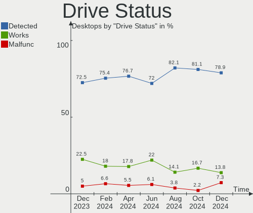

Pop!_OS Hardware Trends (Desktop)
---------------------------------

A project to identify most popular hardware characteristics and track their change
over time based on data collected by Pop!_OS users at https://Linux-Hardware.org.

Anyone can contribute to the study by uploading probes of their computers by
the [hw-probe](https://github.com/linuxhw/hw-probe) tool:

    sudo -E hw-probe -all -upload

Full-feature report is available here: https://linux-hardware.org/?view=trends&formfactor=desktop

Period: Dec, 2020.

Contents
--------

- [ OS                       ](#os)
- [ OS Family                ](#os-family)
- [ Kernel                   ](#kernel)
- [ Kernel Family            ](#kernel-family)
- [ Kernel Major Ver.        ](#kernel-major-ver)
- [ Arch                     ](#arch)
- [ DE                       ](#de)
- [ Display Server           ](#display-server)
- [ Display Manager          ](#display-manager)
- [ OS Lang                  ](#os-lang)
- [ Boot Mode                ](#boot-mode)
- [ Filesystem               ](#filesystem)
- [ Part. scheme             ](#part-scheme)
- [ Dual Boot with Linux/BSD ](#dual-boot-with-linux/bsd)
- [ Dual Boot (Win)          ](#dual-boot-win)
- [ Country                  ](#country)
- [ City                     ](#city)
- [ Vendor                   ](#vendor)
- [ Model                    ](#model)
- [ Model Family             ](#model-family)
- [ MFG Year                 ](#mfg-year)
- [ Form Factor              ](#form-factor)
- [ Secure Boot              ](#secure-boot)
- [ Coreboot                 ](#coreboot)
- [ RAM Size                 ](#ram-size)
- [ RAM Used                 ](#ram-used)
- [ Has CD-ROM               ](#has-cd-rom)
- [ Total Drives             ](#total-drives)
- [ Has Ethernet             ](#has-ethernet)
- [ Drive Vendor             ](#drive-vendor)
- [ Drive Model              ](#drive-model)
- [ HDD Vendor               ](#hdd-vendor)
- [ SSD Vendor               ](#ssd-vendor)
- [ Drive Kind               ](#drive-kind)
- [ Drive Connector          ](#drive-connector)
- [ Drive Size               ](#drive-size)
- [ Space Total              ](#space-total)
- [ Space Used               ](#space-used)
- [ Malfunc. Drives          ](#malfunc-drives)
- [ Malfunc. Drive Vendor    ](#malfunc-drive-vendor)
- [ Malfunc. HDD Vendor      ](#malfunc-hdd-vendor)
- [ Malfunc. Drive Kind      ](#malfunc-drive-kind)
- [ Failed Drives            ](#failed-drives)
- [ Failed Drive Vendor      ](#failed-drive-vendor)
- [ Drive Status             ](#drive-status)
- [ Storage Vendor           ](#storage-vendor)
- [ Storage Model            ](#storage-model)
- [ Storage Kind             ](#storage-kind)
- [ CPU Vendor               ](#cpu-vendor)
- [ CPU Model                ](#cpu-model)
- [ CPU Model Family         ](#cpu-model-family)
- [ CPU Cores                ](#cpu-cores)
- [ CPU Sockets              ](#cpu-sockets)
- [ CPU Threads              ](#cpu-threads)
- [ CPU Op-Modes             ](#cpu-op-modes)
- [ CPU Microcode            ](#cpu-microcode)
- [ CPU Microarch            ](#cpu-microarch)
- [ GPU Vendor               ](#gpu-vendor)
- [ GPU Model                ](#gpu-model)
- [ GPU Combo                ](#gpu-combo)
- [ GPU Driver               ](#gpu-driver)
- [ GPU Memory               ](#gpu-memory)
- [ Monitor Vendor           ](#monitor-vendor)
- [ Monitor Model            ](#monitor-model)
- [ Monitor Resolution       ](#monitor-resolution)
- [ Monitor Diagonal         ](#monitor-diagonal)
- [ Monitor Width            ](#monitor-width)
- [ Aspect Ratio             ](#aspect-ratio)
- [ Monitor Area             ](#monitor-area)
- [ Pixel Density            ](#pixel-density)
- [ Multiple Monitors        ](#multiple-monitors)
- [ Net Controller Vendor    ](#net-controller-vendor)
- [ Net Controller Model     ](#net-controller-model)
- [ Wireless Vendor          ](#wireless-vendor)
- [ Wireless Model           ](#wireless-model)
- [ Ethernet Vendor          ](#ethernet-vendor)
- [ Ethernet Model           ](#ethernet-model)
- [ Net Controller Kind      ](#net-controller-kind)
- [ Used Controller          ](#used-controller)
- [ NICs                     ](#nics)
- [ Memory Vendor            ](#memory-vendor)
- [ Memory Model             ](#memory-model)
- [ Memory Kind              ](#memory-kind)
- [ Memory Form Factor       ](#memory-form-factor)
- [ Memory Size              ](#memory-size)
- [ Memory Speed             ](#memory-speed)
- [ Sound Vendor             ](#sound-vendor)
- [ Sound Model              ](#sound-model)
- [ Camera Vendor            ](#camera-vendor)
- [ Camera Model             ](#camera-model)
- [ Fingerprint Vendor       ](#fingerprint-vendor)
- [ Fingerprint Model        ](#fingerprint-model)
- [ Chipcard Vendor          ](#chipcard-vendor)
- [ Chipcard Model           ](#chipcard-model)
- [ Printer Vendor           ](#printer-vendor)
- [ Printer Model            ](#printer-model)
- [ Scanner Vendor           ](#scanner-vendor)
- [ Scanner Model            ](#scanner-model)
- [ Bluetooth Vendor         ](#bluetooth-vendor)
- [ Bluetooth Model          ](#bluetooth-model)
- [ Unsupported Devices      ](#unsupported-devices)
- [ Unsupported Device Types ](#unsupported-device-types)

OS
--

Installed operating systems

| Name          | Desktops | Percent |
|---------------|----------|---------|
| Pop!_OS 20.10 | 95       | 74.8%   |
| Pop!_OS 20.04 | 31       | 24.41%  |
| Pop!_OS 18.04 | 1        | 0.79%   |

OS Family
---------

OS without a version

| Name    | Desktops | Percent |
|---------|----------|---------|
| Pop!_OS | 127      | 100%    |

Kernel
------

Version of the Linux kernel

| Version               | Desktops | Percent |
|-----------------------|----------|---------|
| 5.8.0-7630-generic    | 114      | 89.76%  |
| 5.4.0-7642-generic    | 5        | 3.94%   |
| 5.8.0-7625-generic    | 3        | 2.36%   |
| 5.9.8-xanmod1         | 1        | 0.79%   |
| 5.9.16-050916-generic | 1        | 0.79%   |
| 5.9.13-xanmod2        | 1        | 0.79%   |
| 5.4.0-7625-generic    | 1        | 0.79%   |
| 5.3.0-7648-generic    | 1        | 0.79%   |

Kernel Family
-------------

Linux kernel without a distro release

| Version | Desktops | Percent |
|---------|----------|---------|
| 5.8.0   | 117      | 92.13%  |
| 5.4.0   | 6        | 4.72%   |
| 5.9.8   | 1        | 0.79%   |
| 5.9.16  | 1        | 0.79%   |
| 5.9.13  | 1        | 0.79%   |
| 5.3.0   | 1        | 0.79%   |

Kernel Major Ver.
-----------------

Linux kernel major version

| Version | Desktops | Percent |
|---------|----------|---------|
| 5.8     | 117      | 92.13%  |
| 5.4     | 6        | 4.72%   |
| 5.9     | 3        | 2.36%   |
| 5.3     | 1        | 0.79%   |

Arch
----

OS architecture (x86_64, i586, etc.)

| Name   | Desktops | Percent |
|--------|----------|---------|
| x86_64 | 127      | 100%    |

DE
--

Desktop Environment

| Name  | Desktops | Percent |
|-------|----------|---------|
| GNOME | 124      | 97.64%  |
| KDE   | 2        | 1.57%   |
| MATE  | 1        | 0.79%   |

Display Server
--------------

X11 or Wayland

| Name    | Desktops | Percent |
|---------|----------|---------|
| X11     | 126      | 99.21%  |
| Wayland | 1        | 0.79%   |

Display Manager
---------------

SDDM, LightDM, etc.

| Name    | Desktops | Percent |
|---------|----------|---------|
| Unknown | 113      | 88.98%  |
| GDM     | 14       | 11.02%  |

OS Lang
-------

Language

| Lang  | Desktops | Percent |
|-------|----------|---------|
| en_US | 77       | 60.63%  |
| pt_BR | 9        | 7.09%   |
| de_DE | 9        | 7.09%   |
| en_GB | 8        | 6.3%    |
| C     | 7        | 5.51%   |
| en_CA | 5        | 3.94%   |
| fr_FR | 3        | 2.36%   |
| it_IT | 2        | 1.57%   |
| hu_HU | 2        | 1.57%   |
| sv_SE | 1        | 0.79%   |
| nl_NL | 1        | 0.79%   |
| nl_BE | 1        | 0.79%   |
| es_ES | 1        | 0.79%   |
| en_AU | 1        | 0.79%   |

Boot Mode
---------

EFI or BIOS

| Mode | Desktops | Percent |
|------|----------|---------|
| BIOS | 113      | 88.98%  |
| EFI  | 14       | 11.02%  |

Filesystem
----------

Type of filesystem

| Type    | Desktops | Percent |
|---------|----------|---------|
| Ext4    | 122      | 96.06%  |
| Overlay | 3        | 2.36%   |
| Zfs     | 1        | 0.79%   |
| Xfs     | 1        | 0.79%   |

Part. scheme
------------

Scheme of partitioning

| Type    | Desktops | Percent |
|---------|----------|---------|
| Unknown | 114      | 89.76%  |
| GPT     | 13       | 10.24%  |

Dual Boot with Linux/BSD
------------------------

Hosting more than one Linux/BSD

| Dual boot | Desktops | Percent |
|-----------|----------|---------|
| No        | 123      | 96.85%  |
| Yes       | 4        | 3.15%   |

Dual Boot (Win)
---------------

Hosting Linux and Windows

| Dual boot | Desktops | Percent |
|-----------|----------|---------|
| No        | 119      | 93.7%   |
| Yes       | 8        | 6.3%    |

Country
-------

Geographic location (country)

| Country                | Desktops | Percent |
|------------------------|----------|---------|
| USA                    | 48       | 37.8%   |
| Brazil                 | 14       | 11.02%  |
| Germany                | 11       | 8.66%   |
| UK                     | 8        | 6.3%    |
| Canada                 | 8        | 6.3%    |
| Italy                  | 5        | 3.94%   |
| Hungary                | 4        | 3.15%   |
| Sweden                 | 2        | 1.57%   |
| Poland                 | 2        | 1.57%   |
| Netherlands            | 2        | 1.57%   |
| India                  | 2        | 1.57%   |
| France                 | 2        | 1.57%   |
| Finland                | 2        | 1.57%   |
| Argentina              | 2        | 1.57%   |
| Thailand               | 1        | 0.79%   |
| Switzerland            | 1        | 0.79%   |
| Serbia                 | 1        | 0.79%   |
| Philippines            | 1        | 0.79%   |
| New Zealand            | 1        | 0.79%   |
| Malaysia               | 1        | 0.79%   |
| Kosovo                 | 1        | 0.79%   |
| Denmark                | 1        | 0.79%   |
| Costa Rica             | 1        | 0.79%   |
| Bulgaria               | 1        | 0.79%   |
| Bosnia and Herzegovina | 1        | 0.79%   |
| Belgium                | 1        | 0.79%   |
| Austria                | 1        | 0.79%   |
| Australia              | 1        | 0.79%   |
| Algeria                | 1        | 0.79%   |

City
----

Geographic location (city)

| City                  | Desktops | Percent |
|-----------------------|----------|---------|
| Budapest              | 3        | 2.36%   |
| Vienna                | 2        | 1.57%   |
| São Paulo            | 2        | 1.57%   |
| Miami                 | 2        | 1.57%   |
| Melbourne             | 2        | 1.57%   |
| Helsinki              | 2        | 1.57%   |
| Cologne               | 2        | 1.57%   |
| Chicago               | 2        | 1.57%   |
| Amsterdam             | 2        | 1.57%   |
| Wylie                 | 1        | 0.79%   |
| Wrocław              | 1        | 0.79%   |
| Woodland              | 1        | 0.79%   |
| Wilmette              | 1        | 0.79%   |
| Wellington            | 1        | 0.79%   |
| Warner Robins         | 1        | 0.79%   |
| Varberg               | 1        | 0.79%   |
| Vancouver             | 1        | 0.79%   |
| Valpiana              | 1        | 0.79%   |
| Untereisesheim        | 1        | 0.79%   |
| Uberlândia           | 1        | 0.79%   |
| Trani                 | 1        | 0.79%   |
| Toronto               | 1        | 0.79%   |
| Timoteo               | 1        | 0.79%   |
| The Bronx             | 1        | 0.79%   |
| Tell City             | 1        | 0.79%   |
| Tassin-la-Demi-Lune   | 1        | 0.79%   |
| São José dos Campos | 1        | 0.79%   |
| Subotica              | 1        | 0.79%   |
| Stroud                | 1        | 0.79%   |
| Stanwood              | 1        | 0.79%   |
| St Louis              | 1        | 0.79%   |
| Sofia                 | 1        | 0.79%   |
| Sheffield             | 1        | 0.79%   |
| Seattle               | 1        | 0.79%   |
| Santo André          | 1        | 0.79%   |
| San Jose              | 1        | 0.79%   |
| Salt Lake City        | 1        | 0.79%   |
| Rome                  | 1        | 0.79%   |
| Richmond Hill         | 1        | 0.79%   |
| Reno                  | 1        | 0.79%   |
| Reichertshofen        | 1        | 0.79%   |
| Regina                | 1        | 0.79%   |
| Redhill               | 1        | 0.79%   |
| Recife                | 1        | 0.79%   |
| Pristina              | 1        | 0.79%   |
| Phuket                | 1        | 0.79%   |
| Paris                 | 1        | 0.79%   |
| Paramus               | 1        | 0.79%   |
| Palermo               | 1        | 0.79%   |
| Novo Hamburgo         | 1        | 0.79%   |
| Norwich               | 1        | 0.79%   |
| New York              | 1        | 0.79%   |
| Neckarsulm            | 1        | 0.79%   |
| Nanaimo               | 1        | 0.79%   |
| Mount Holly           | 1        | 0.79%   |
| Middletown            | 1        | 0.79%   |
| Merano                | 1        | 0.79%   |
| Meadville             | 1        | 0.79%   |
| Manchester            | 1        | 0.79%   |
| Madison               | 1        | 0.79%   |

Vendor
------

Motherboard manufacturer

| Name                | Desktops | Percent |
|---------------------|----------|---------|
| ASUSTek Computer    | 30       | 23.62%  |
| Gigabyte Technology | 28       | 22.05%  |
| MSI                 | 26       | 20.47%  |
| Dell                | 10       | 7.87%   |
| ASRock              | 10       | 7.87%   |
| Hewlett-Packard     | 7        | 5.51%   |
| Unknown             | 3        | 2.36%   |
| System76            | 2        | 1.57%   |
| Lenovo              | 2        | 1.57%   |
| Intel               | 2        | 1.57%   |
| Biostar             | 2        | 1.57%   |
| Pegatron            | 1        | 0.79%   |
| PCWare              | 1        | 0.79%   |
| Medion              | 1        | 0.79%   |
| HOUTER              | 1        | 0.79%   |
| Gateway             | 1        | 0.79%   |

Model
-----

Motherboard model

| Name                                 | Desktops | Percent |
|--------------------------------------|----------|---------|
| ASUS All Series                      | 4        | 3.15%   |
| MSI MS-7B86                          | 3        | 2.36%   |
| Gigabyte B450M DS3H                  | 3        | 2.36%   |
| ASUS TUF GAMING X570-PLUS            | 3        | 2.36%   |
| Unknown                              | 3        | 2.36%   |
| MSI MS-7693                          | 2        | 1.57%   |
| HP Desktop M01-F0xxx                 | 2        | 1.57%   |
| Gigabyte H110M-H                     | 2        | 1.57%   |
| Gigabyte GA-78LMT-USB3               | 2        | 1.57%   |
| Gigabyte A320M-S2H                   | 2        | 1.57%   |
| ASRock B450M Steel Legend            | 2        | 1.57%   |
| ASRock B450M Pro4                    | 2        | 1.57%   |
| System76 Thelio Major                | 1        | 0.79%   |
| System76 Thelio                      | 1        | 0.79%   |
| Pegatron p6-2100z                    | 1        | 0.79%   |
| PCWare IPMH61R3                      | 1        | 0.79%   |
| MSI MS-7C95                          | 1        | 0.79%   |
| MSI MS-7C91                          | 1        | 0.79%   |
| MSI MS-7C84                          | 1        | 0.79%   |
| MSI MS-7C02                          | 1        | 0.79%   |
| MSI MS-7B93                          | 1        | 0.79%   |
| MSI MS-7B85                          | 1        | 0.79%   |
| MSI MS-7B84                          | 1        | 0.79%   |
| MSI MS-7B79                          | 1        | 0.79%   |
| MSI MS-7B23                          | 1        | 0.79%   |
| MSI MS-7B17                          | 1        | 0.79%   |
| MSI MS-7B09                          | 1        | 0.79%   |
| MSI MS-7A71                          | 1        | 0.79%   |
| MSI MS-7A66                          | 1        | 0.79%   |
| MSI MS-7A63                          | 1        | 0.79%   |
| MSI MS-7885                          | 1        | 0.79%   |
| MSI MS-7845                          | 1        | 0.79%   |
| MSI MS-7817                          | 1        | 0.79%   |
| MSI MS-7721                          | 1        | 0.79%   |
| MSI MS-7522                          | 1        | 0.79%   |
| MSI H310 Gaming Infinite S (MS-B928) | 1        | 0.79%   |
| MSI AY702AA-A2K p6390d               | 1        | 0.79%   |
| Medion MD34070/2534                  | 1        | 0.79%   |
| Lenovo ThinkCentre M910x 10N0CTO1WW  | 1        | 0.79%   |
| Lenovo ThinkCentre Edge91 1855A9G    | 1        | 0.79%   |
| Intel DZ68BC AAG30742-403            | 1        | 0.79%   |
| Intel B75                            | 1        | 0.79%   |
| HOUTER IPMH61R1                      | 1        | 0.79%   |
| HP Z820 Workstation                  | 1        | 0.79%   |
| HP ProDesk 600 G1 SFF                | 1        | 0.79%   |
| HP OMEN by HP Desktop PC 880-p0xx    | 1        | 0.79%   |
| HP Compaq dc7800p Small Form Factor  | 1        | 0.79%   |
| HP Compaq 8200 Elite USDT PC         | 1        | 0.79%   |
| Gigabyte Z77X-D3H                    | 1        | 0.79%   |
| Gigabyte Z370 HD3                    | 1        | 0.79%   |
| Gigabyte X570 AORUS ELITE WIFI       | 1        | 0.79%   |
| Gigabyte X299 AORUS Ultra Gaming Pro | 1        | 0.79%   |
| Gigabyte TRX40 AORUS XTREME          | 1        | 0.79%   |
| Gigabyte H81M-S2H                    | 1        | 0.79%   |
| Gigabyte H77-DS3H                    | 1        | 0.79%   |
| Gigabyte H61M-DS2 DVI                | 1        | 0.79%   |
| Gigabyte H170-Gaming 3 DDR3          | 1        | 0.79%   |
| Gigabyte GA-970A-D3                  | 1        | 0.79%   |
| Gigabyte GA-78LMT-USB3 R2            | 1        | 0.79%   |
| Gigabyte B550M AORUS PRO             | 1        | 0.79%   |

Model Family
------------

Motherboard model prefix

| Name                   | Desktops | Percent |
|------------------------|----------|---------|
| ASUS PRIME             | 7        | 5.51%   |
| ASUS TUF               | 4        | 3.15%   |
| ASUS ROG               | 4        | 3.15%   |
| ASUS All               | 4        | 3.15%   |
| ASRock B450M           | 4        | 3.15%   |
| MSI MS-7B86            | 3        | 2.36%   |
| Gigabyte GA-78LMT-USB3 | 3        | 2.36%   |
| Gigabyte B450M         | 3        | 2.36%   |
| Dell Precision         | 3        | 2.36%   |
| Dell OptiPlex          | 3        | 2.36%   |
| Dell Inspiron          | 3        | 2.36%   |
| Unknown                | 3        | 2.36%   |
| System76 Thelio        | 2        | 1.57%   |
| MSI MS-7693            | 2        | 1.57%   |
| Lenovo ThinkCentre     | 2        | 1.57%   |
| HP Desktop             | 2        | 1.57%   |
| HP Compaq              | 2        | 1.57%   |
| Gigabyte H110M-H       | 2        | 1.57%   |
| Gigabyte A320M-S2H     | 2        | 1.57%   |
| ASUS P8H61-M           | 2        | 1.57%   |
| ASUS H110M-C           | 2        | 1.57%   |
| Pegatron p6-2100z      | 1        | 0.79%   |
| PCWare IPMH61R3        | 1        | 0.79%   |
| MSI MS-7C95            | 1        | 0.79%   |
| MSI MS-7C91            | 1        | 0.79%   |
| MSI MS-7C84            | 1        | 0.79%   |
| MSI MS-7C02            | 1        | 0.79%   |
| MSI MS-7B93            | 1        | 0.79%   |
| MSI MS-7B85            | 1        | 0.79%   |
| MSI MS-7B84            | 1        | 0.79%   |
| MSI MS-7B79            | 1        | 0.79%   |
| MSI MS-7B23            | 1        | 0.79%   |
| MSI MS-7B17            | 1        | 0.79%   |
| MSI MS-7B09            | 1        | 0.79%   |
| MSI MS-7A71            | 1        | 0.79%   |
| MSI MS-7A66            | 1        | 0.79%   |
| MSI MS-7A63            | 1        | 0.79%   |
| MSI MS-7885            | 1        | 0.79%   |
| MSI MS-7845            | 1        | 0.79%   |
| MSI MS-7817            | 1        | 0.79%   |
| MSI MS-7721            | 1        | 0.79%   |
| MSI MS-7522            | 1        | 0.79%   |
| MSI H310               | 1        | 0.79%   |
| MSI AY702AA-A2K        | 1        | 0.79%   |
| Medion MD34070         | 1        | 0.79%   |
| Intel DZ68BC           | 1        | 0.79%   |
| Intel B75              | 1        | 0.79%   |
| HOUTER IPMH61R1        | 1        | 0.79%   |
| HP Z820                | 1        | 0.79%   |
| HP ProDesk             | 1        | 0.79%   |
| HP OMEN                | 1        | 0.79%   |
| Gigabyte Z77X-D3H      | 1        | 0.79%   |
| Gigabyte Z370          | 1        | 0.79%   |
| Gigabyte X570          | 1        | 0.79%   |
| Gigabyte X299          | 1        | 0.79%   |
| Gigabyte TRX40         | 1        | 0.79%   |
| Gigabyte H81M-S2H      | 1        | 0.79%   |
| Gigabyte H77-DS3H      | 1        | 0.79%   |
| Gigabyte H61M-DS2      | 1        | 0.79%   |
| Gigabyte H170-Gaming   | 1        | 0.79%   |

MFG Year
--------

Motherboard manufacture year

| Year | Desktops | Percent |
|------|----------|---------|
| 2020 | 32       | 25.2%   |
| 2019 | 27       | 21.26%  |
| 2018 | 13       | 10.24%  |
| 2013 | 10       | 7.87%   |
| 2017 | 9        | 7.09%   |
| 2014 | 8        | 6.3%    |
| 2015 | 6        | 4.72%   |
| 2011 | 6        | 4.72%   |
| 2012 | 5        | 3.94%   |
| 2007 | 3        | 2.36%   |
| 2016 | 2        | 1.57%   |
| 2010 | 2        | 1.57%   |
| 2009 | 2        | 1.57%   |
| 2008 | 1        | 0.79%   |
| 2006 | 1        | 0.79%   |

Form Factor
-----------

Physical design of the computer

| Name    | Desktops | Percent |
|---------|----------|---------|
| Desktop | 127      | 100%    |

Secure Boot
-----------

Enabled or disabled

| State    | Desktops | Percent |
|----------|----------|---------|
| Disabled | 127      | 100%    |

Coreboot
--------

Have coreboot on board

| Used | Desktops | Percent |
|------|----------|---------|
| No   | 127      | 100%    |

RAM Size
--------

Total RAM memory

| Size in GB  | Desktops | Percent |
|-------------|----------|---------|
| 16.01-24.0  | 40       | 31.5%   |
| 32.01-64.0  | 28       | 22.05%  |
| 8.01-16.0   | 28       | 22.05%  |
| 4.01-8.0    | 11       | 8.66%   |
| 64.01-256.0 | 10       | 7.87%   |
| 3.01-4.0    | 4        | 3.15%   |
| 24.01-32.0  | 3        | 2.36%   |
| 1.01-2.0    | 2        | 1.57%   |
| 2.01-3.0    | 1        | 0.79%   |

RAM Used
--------

Used RAM memory

| Used GB    | Desktops | Percent |
|------------|----------|---------|
| 2.01-3.0   | 38       | 29.92%  |
| 1.01-2.0   | 38       | 29.92%  |
| 3.01-4.0   | 22       | 17.32%  |
| 4.01-8.0   | 20       | 15.75%  |
| 8.01-16.0  | 7        | 5.51%   |
| 16.01-24.0 | 2        | 1.57%   |

Has CD-ROM
----------

Has CD-ROM on board

| Presented | Desktops | Percent |
|-----------|----------|---------|
| No        | 80       | 62.99%  |
| Yes       | 47       | 37.01%  |

Total Drives
------------

Number of drives on board

| Drives | Desktops | Percent |
|--------|----------|---------|
| 2      | 43       | 33.86%  |
| 1      | 40       | 31.5%   |
| 3      | 22       | 17.32%  |
| 4      | 12       | 9.45%   |
| 5      | 7        | 5.51%   |
| 9      | 1        | 0.79%   |
| 6      | 1        | 0.79%   |
| 0      | 1        | 0.79%   |

Has Ethernet
------------

Has Ethernet on board

| Presented | Desktops | Percent |
|-----------|----------|---------|
| Yes       | 126      | 99.21%  |
| No        | 1        | 0.79%   |

Drive Vendor
------------

Hard drive vendors

| Vendor                    | Desktops | Drives | Percent |
|---------------------------|----------|--------|---------|
| WDC                       | 52       | 63     | 21.05%  |
| Seagate                   | 39       | 53     | 15.79%  |
| Samsung Electronics       | 38       | 48     | 15.38%  |
| Kingston                  | 21       | 23     | 8.5%    |
| Sandisk                   | 18       | 20     | 7.29%   |
| Crucial                   | 10       | 10     | 4.05%   |
| Toshiba                   | 9        | 9      | 3.64%   |
| Intel                     | 9        | 10     | 3.64%   |
| Phison                    | 8        | 8      | 3.24%   |
| Hitachi                   | 7        | 7      | 2.83%   |
| Micron/Crucial Technology | 3        | 3      | 1.21%   |
| HGST                      | 3        | 4      | 1.21%   |
| XPG                       | 2        | 2      | 0.81%   |
| SPCC                      | 2        | 3      | 0.81%   |
| Silicon Motion            | 2        | 2      | 0.81%   |
| PNY                       | 2        | 2      | 0.81%   |
| Patriot                   | 2        | 2      | 0.81%   |
| Unknown                   | 1        | 1      | 0.4%    |
| Transcend                 | 1        | 1      | 0.4%    |
| Team                      | 1        | 1      | 0.4%    |
| SATAFIRM                  | 1        | 1      | 0.4%    |
| SABRENT                   | 1        | 1      | 0.4%    |
| OCZ                       | 1        | 1      | 0.4%    |
| Micron Technology         | 1        | 1      | 0.4%    |
| MAXTOR                    | 1        | 1      | 0.4%    |
| LITEON                    | 1        | 1      | 0.4%    |
| KingSpec                  | 1        | 1      | 0.4%    |
| JMicron                   | 1        | 1      | 0.4%    |
| JASTER                    | 1        | 1      | 0.4%    |
| Intenso                   | 1        | 1      | 0.4%    |
| Hoodisk                   | 1        | 1      | 0.4%    |
| ExcelStor                 | 1        | 1      | 0.4%    |
| dogfish                   | 1        | 1      | 0.4%    |
| China                     | 1        | 1      | 0.4%    |
| Apple                     | 1        | 2      | 0.4%    |
| AMD                       | 1        | 2      | 0.4%    |
| A-DATA Technology         | 1        | 2      | 0.4%    |

Drive Model
-----------

Hard drive models

| Model                                | Desktops | Percent |
|--------------------------------------|----------|---------|
| WDC WD10EZEX-08WN4A0 1TB             | 8        | 2.91%   |
| Kingston SA400S37240G 240GB SSD      | 8        | 2.91%   |
| Samsung SSD 850 EVO 500GB            | 6        | 2.18%   |
| Sandisk NVMe SSD Drive 500GB         | 5        | 1.82%   |
| Samsung NVMe SSD Drive 500GB         | 5        | 1.82%   |
| Samsung NVMe SSD Drive 250GB         | 5        | 1.82%   |
| Seagate ST1000DM010-2EP102 1TB       | 4        | 1.45%   |
| Samsung SSD 860 EVO 500GB            | 4        | 1.45%   |
| WDC WD10EZEX-08M2NA0 1TB             | 3        | 1.09%   |
| WDC WD10EZEX-00BN5A0 1TB             | 3        | 1.09%   |
| Seagate ST500DM002-1BD142 500GB      | 3        | 1.09%   |
| Seagate ST2000DM008-2FR102 2TB       | 3        | 1.09%   |
| Seagate ST2000DM006-2DM164 2TB       | 3        | 1.09%   |
| Samsung SSD 840 EVO 250GB            | 3        | 1.09%   |
| Phison NVMe SSD Drive 256GB          | 3        | 1.09%   |
| Phison NVMe SSD Drive 1TB            | 3        | 1.09%   |
| Kingston SV300S37A120G 120GB SSD     | 3        | 1.09%   |
| Kingston SA400S37120G 120GB SSD      | 3        | 1.09%   |
| WDC WD20EZAZ-00GGJB0 2TB             | 2        | 0.73%   |
| Toshiba MQ01ABD100 1TB               | 2        | 0.73%   |
| Toshiba DT01ACA300 3TB               | 2        | 0.73%   |
| SPCC Solid State Disk 256GB          | 2        | 0.73%   |
| Silicon Motion NVMe SSD Drive 1024GB | 2        | 0.73%   |
| Seagate ST4000DM004-2CV104 4TB       | 2        | 0.73%   |
| Seagate ST1000LM048-2E7172 1TB       | 2        | 0.73%   |
| Seagate Backup+ Desk 4TB             | 2        | 0.73%   |
| SanDisk SSD G5 BICS4 1TB             | 2        | 0.73%   |
| Sandisk NVMe SSD Drive 1TB           | 2        | 0.73%   |
| Samsung SSD 970 EVO Plus 1TB         | 2        | 0.73%   |
| Samsung SSD 860 QVO 1TB              | 2        | 0.73%   |
| Samsung SSD 860 EVO 1TB              | 2        | 0.73%   |
| Samsung NVMe SSD Drive 512GB         | 2        | 0.73%   |
| Samsung NVMe SSD Drive 1TB           | 2        | 0.73%   |
| Micron/Crucial NVMe SSD Drive 1TB    | 2        | 0.73%   |
| Kingston NVMe SSD Drive 500GB        | 2        | 0.73%   |
| Intel NVMe SSD Drive 512GB           | 2        | 0.73%   |
| Intel NVMe SSD Drive 256GB           | 2        | 0.73%   |
| Crucial CT500MX500SSD1 500GB         | 2        | 0.73%   |
| Crucial CT240M500SSD1 240GB          | 2        | 0.73%   |
| XPG NVMe SSD Drive 256GB             | 1        | 0.36%   |
| XPG NVMe SSD Drive 1024GB            | 1        | 0.36%   |
| WDC WDS250G2B0C-00PXH0 250GB         | 1        | 0.36%   |
| WDC WDS250G1B0A-00H9H0 250GB SSD     | 1        | 0.36%   |
| WDC WDS240G2G0B-00EPW0 240GB SSD     | 1        | 0.36%   |
| WDC WDS240G2G0A-00JH30 240GB SSD     | 1        | 0.36%   |
| WDC WDS240G1G0A-00SS50 240GB SSD     | 1        | 0.36%   |
| WDC WDS100T1B0A-00H9H0 1TB SSD       | 1        | 0.36%   |
| WDC WD6400AAKS-22A7B2 640GB          | 1        | 0.36%   |
| WDC WD5000LPVX-00V0TT0 500GB         | 1        | 0.36%   |
| WDC WD5000AZRX-00L4HB0 500GB         | 1        | 0.36%   |
| WDC WD5000AVCS-632DY1 500GB          | 1        | 0.36%   |
| WDC WD5000AAKX-08U6AA0 500GB         | 1        | 0.36%   |
| WDC WD5000AAKX-08ERMA0 500GB         | 1        | 0.36%   |
| WDC WD5000AAKX-001CA0 500GB          | 1        | 0.36%   |
| WDC WD5000AAKS-00A7B2 500GB          | 1        | 0.36%   |
| WDC WD5000AACS-00G8B1 500GB          | 1        | 0.36%   |
| WDC WD4000AAJS-00YFA0 400GB          | 1        | 0.36%   |
| WDC WD3200BPVT-00HXZT3 320GB         | 1        | 0.36%   |
| WDC WD3200AAJS-56M0A0 320GB          | 1        | 0.36%   |
| WDC WD30EZRX-00D8PB0 3TB             | 1        | 0.36%   |

HDD Vendor
----------

Hard disk drive vendors

| Vendor              | Desktops | Drives | Percent |
|---------------------|----------|--------|---------|
| WDC                 | 46       | 55     | 42.59%  |
| Seagate             | 34       | 43     | 31.48%  |
| Toshiba             | 8        | 8      | 7.41%   |
| Samsung Electronics | 7        | 7      | 6.48%   |
| Hitachi             | 7        | 7      | 6.48%   |
| HGST                | 3        | 4      | 2.78%   |
| MAXTOR              | 1        | 1      | 0.93%   |
| ExcelStor           | 1        | 1      | 0.93%   |
| Apple               | 1        | 2      | 0.93%   |

SSD Vendor
----------

Solid state drive vendors

| Vendor              | Desktops | Drives | Percent |
|---------------------|----------|--------|---------|
| Samsung Electronics | 18       | 22     | 22.22%  |
| Kingston            | 18       | 20     | 22.22%  |
| SanDisk             | 10       | 11     | 12.35%  |
| Crucial             | 9        | 9      | 11.11%  |
| WDC                 | 5        | 5      | 6.17%   |
| Intel               | 3        | 3      | 3.7%    |
| SPCC                | 2        | 3      | 2.47%   |
| PNY                 | 2        | 2      | 2.47%   |
| Patriot             | 2        | 2      | 2.47%   |
| Transcend           | 1        | 1      | 1.23%   |
| Team                | 1        | 1      | 1.23%   |
| Seagate             | 1        | 4      | 1.23%   |
| SABRENT             | 1        | 1      | 1.23%   |
| OCZ                 | 1        | 1      | 1.23%   |
| Micron Technology   | 1        | 1      | 1.23%   |
| LITEON              | 1        | 1      | 1.23%   |
| JMicron             | 1        | 1      | 1.23%   |
| Hoodisk             | 1        | 1      | 1.23%   |
| dogfish             | 1        | 1      | 1.23%   |
| China               | 1        | 1      | 1.23%   |
| A-DATA Technology   | 1        | 2      | 1.23%   |

Drive Kind
----------

HDD or SSD

| Kind    | Desktops | Drives | Percent |
|---------|----------|--------|---------|
| HDD     | 85       | 128    | 41.67%  |
| SSD     | 66       | 93     | 32.35%  |
| NVMe    | 43       | 58     | 21.08%  |
| Unknown | 10       | 13     | 4.9%    |

Drive Connector
---------------

SATA, SAS, NVMe, etc.

| Type | Desktops | Drives | Percent |
|------|----------|--------|---------|
| SATA | 113      | 221    | 68.07%  |
| NVMe | 43       | 58     | 25.9%   |
| SAS  | 10       | 13     | 6.02%   |

Drive Size
----------

Size of hard drive

| Size in TB | Desktops | Drives | Percent |
|------------|----------|--------|---------|
| 0.01-0.5   | 79       | 112    | 47.02%  |
| 0.51-1.0   | 57       | 69     | 33.93%  |
| 1.01-2.0   | 18       | 23     | 10.71%  |
| 3.01-4.0   | 6        | 8      | 3.57%   |
| 2.01-3.0   | 4        | 5      | 2.38%   |
| 4.01-10.0  | 4        | 4      | 2.38%   |

Space Total
-----------

Amount of disk space available on the file system

| Size in GB     | Desktops | Percent |
|----------------|----------|---------|
| 101-250        | 34       | 26.77%  |
| 501-1000       | 28       | 22.05%  |
| 251-500        | 19       | 14.96%  |
| 1001-2000      | 16       | 12.6%   |
| More than 3000 | 13       | 10.24%  |
| 2001-3000      | 7        | 5.51%   |
| 1-20           | 5        | 3.94%   |
| 21-50          | 2        | 1.57%   |
| 51-100         | 2        | 1.57%   |
| Unknown        | 1        | 0.79%   |

Space Used
----------

Amount of used disk space

| Used GB        | Desktops | Percent |
|----------------|----------|---------|
| 1-20           | 50       | 39.37%  |
| 101-250        | 18       | 14.17%  |
| 21-50          | 14       | 11.02%  |
| 51-100         | 10       | 7.87%   |
| 251-500        | 9        | 7.09%   |
| 501-1000       | 9        | 7.09%   |
| 1001-2000      | 6        | 4.72%   |
| More than 3000 | 5        | 3.94%   |
| 2001-3000      | 5        | 3.94%   |
| Unknown        | 1        | 0.79%   |

Malfunc. Drives
---------------

Drive models with a malfunction

| Model                            | Desktops | Drives | Percent |
|----------------------------------|----------|--------|---------|
| WDC WD6400AAKS-22A7B2 640GB      | 1        | 1      | 25%     |
| Seagate ST500DM002-1BD142 500GB  | 1        | 1      | 25%     |
| Seagate ST1000LM048-2E7172 1TB   | 1        | 1      | 25%     |
| Kingston SV300S37A120G 120GB SSD | 1        | 1      | 25%     |

Malfunc. Drive Vendor
---------------------

Vendors of faulty drives

| Vendor   | Desktops | Drives | Percent |
|----------|----------|--------|---------|
| Seagate  | 2        | 2      | 50%     |
| WDC      | 1        | 1      | 25%     |
| Kingston | 1        | 1      | 25%     |

Malfunc. HDD Vendor
-------------------

Vendors of faulty HDD drives

| Vendor  | Desktops | Drives | Percent |
|---------|----------|--------|---------|
| Seagate | 2        | 2      | 66.67%  |
| WDC     | 1        | 1      | 33.33%  |

Malfunc. Drive Kind
-------------------

Kinds of faulty drives

| Kind | Desktops | Drives | Percent |
|------|----------|--------|---------|
| HDD  | 3        | 3      | 75%     |
| SSD  | 1        | 1      | 25%     |

Failed Drives
-------------

Failed drive models

Zero info for selected period =(

Failed Drive Vendor
-------------------

Failed drive vendors

Zero info for selected period =(

Drive Status
------------

Number of failed and malfunc. drives

| Status   | Desktops | Drives | Percent |
|----------|----------|--------|---------|
| Detected | 113      | 264    | 85.61%  |
| Works    | 15       | 24     | 11.36%  |
| Malfunc  | 4        | 4      | 3.03%   |

Storage Vendor
--------------

Storage controller vendors

| Vendor                       | Desktops | Percent |
|------------------------------|----------|---------|
| Intel                        | 67       | 35.83%  |
| AMD                          | 61       | 32.62%  |
| Samsung Electronics          | 16       | 8.56%   |
| Sandisk                      | 8        | 4.28%   |
| Phison Electronics           | 8        | 4.28%   |
| ASMedia Technology           | 7        | 3.74%   |
| Micron/Crucial Technology    | 4        | 2.14%   |
| Marvell Technology Group     | 3        | 1.6%    |
| Kingston Technology Company  | 3        | 1.6%    |
| Silicon Motion               | 2        | 1.07%   |
| Broadcom / LSI               | 2        | 1.07%   |
| ADATA Technology             | 2        | 1.07%   |
| VIA Technologies             | 1        | 0.53%   |
| Toshiba America Info Systems | 1        | 0.53%   |
| LSI Logic / Symbios Logic    | 1        | 0.53%   |
| JMicron Technology           | 1        | 0.53%   |

Storage Model
-------------

Storage controller models

| Model                                                                                   | Desktops | Percent |
|-----------------------------------------------------------------------------------------|----------|---------|
| AMD FCH SATA Controller [AHCI mode]                                                     | 42       | 17.07%  |
| AMD 400 Series Chipset SATA Controller                                                  | 21       | 8.54%   |
| Samsung NVMe SSD Controller SM981/PM981/PM983                                           | 12       | 4.88%   |
| Intel 8 Series/C220 Series Chipset Family 6-port SATA Controller 1 [AHCI mode]          | 10       | 4.07%   |
| Intel SATA Controller [RAID mode]                                                       | 8        | 3.25%   |
| Intel 200 Series PCH SATA controller [AHCI mode]                                        | 7        | 2.85%   |
| ASMedia ASM1062 Serial ATA Controller                                                   | 7        | 2.85%   |
| AMD SB7x0/SB8x0/SB9x0 SATA Controller [AHCI mode]                                       | 7        | 2.85%   |
| Sandisk WD Blue SN550 NVMe SSD                                                          | 6        | 2.44%   |
| Intel Q170/Q150/B150/H170/H110/Z170/CM236 Chipset SATA Controller [AHCI Mode]           | 6        | 2.44%   |
| Intel 6 Series/C200 Series Chipset Family 6 port Desktop SATA AHCI Controller           | 6        | 2.44%   |
| AMD SB7x0/SB8x0/SB9x0 IDE Controller                                                    | 6        | 2.44%   |
| AMD SATA controller                                                                     | 6        | 2.44%   |
| Phison E12 NVMe Controller                                                              | 5        | 2.03%   |
| AMD FCH SATA Controller D                                                               | 5        | 2.03%   |
| Intel Cannon Lake PCH SATA AHCI Controller                                              | 4        | 1.63%   |
| AMD SB7x0/SB8x0/SB9x0 SATA Controller [IDE mode]                                        | 4        | 1.63%   |
| Samsung NVMe SSD Controller SM961/PM961/SM963                                           | 3        | 1.22%   |
| Micron/Crucial Non-Volatile memory controller                                           | 3        | 1.22%   |
| Kingston Company A2000 NVMe SSD                                                         | 3        | 1.22%   |
| Intel NM10/ICH7 Family SATA Controller [IDE mode]                                       | 3        | 1.22%   |
| Intel C600/X79 series chipset 6-Port SATA AHCI Controller                               | 3        | 1.22%   |
| Intel 82801G (ICH7 Family) IDE Controller                                               | 3        | 1.22%   |
| Phison E16 PCIe4 NVMe Controller                                                        | 2        | 0.81%   |
| Marvell Group 88SE9172 SATA 6Gb/s Controller                                            | 2        | 0.81%   |
| Intel SSD 600P Series                                                                   | 2        | 0.81%   |
| Intel C600/X79 series chipset IDE-r Controller                                          | 2        | 0.81%   |
| Intel 7 Series/C210 Series Chipset Family 6-port SATA Controller [AHCI mode]            | 2        | 0.81%   |
| Intel 6 Series/C200 Series Chipset Family Desktop SATA Controller (IDE mode, ports 4-5) | 2        | 0.81%   |
| Intel 6 Series/C200 Series Chipset Family Desktop SATA Controller (IDE mode, ports 0-3) | 2        | 0.81%   |
| Intel 400 Series Chipset Family SATA AHCI Controller                                    | 2        | 0.81%   |
| Broadcom / LSI SAS2308 PCI-Express Fusion-MPT SAS-2                                     | 2        | 0.81%   |
| AMD X399 Series Chipset SATA Controller                                                 | 2        | 0.81%   |
| AMD X370 Series Chipset SATA Controller                                                 | 2        | 0.81%   |
| AMD 300 Series Chipset SATA Controller                                                  | 2        | 0.81%   |
| ADATA XPG SX8200 Pro PCIe Gen3x4 M.2 2280 Solid State Drive                             | 2        | 0.81%   |
| VIA VT82C586A/B/VT82C686/A/B/VT823x/A/C PIPC Bus Master IDE                             | 1        | 0.41%   |
| VIA Serial ATA Controller                                                               | 1        | 0.41%   |
| Toshiba America Info Systems BG3 NVMe SSD Controller                                    | 1        | 0.41%   |
| Silicon Motion SM2263EN/SM2263XT SSD Controller                                         | 1        | 0.41%   |
| Silicon Motion SM2262/SM2262EN SSD Controller                                           | 1        | 0.41%   |
| Sandisk WD Black SN750 / PC SN730 NVMe SSD                                              | 1        | 0.41%   |
| Sandisk WD Black 2018 / PC SN720 NVMe SSD                                               | 1        | 0.41%   |
| Samsung Electronics Non-Volatile memory controller                                      | 1        | 0.41%   |
| Phison E7 NVMe Controller                                                               | 1        | 0.41%   |
| Micron/Crucial P1 NVMe PCIe SSD                                                         | 1        | 0.41%   |
| Marvell Group 88SE91A3 SATA-600 Controller                                              | 1        | 0.41%   |
| LSI Logic / Symbios Logic SAS1068E PCI-Express Fusion-MPT SAS                           | 1        | 0.41%   |
| JMicron JMB363 SATA/IDE Controller                                                      | 1        | 0.41%   |
| Intel Sunrise Point-LP SATA Controller [AHCI mode]                                      | 1        | 0.41%   |
| Intel SSD Pro 7600p/760p/E 6100p Series                                                 | 1        | 0.41%   |
| Intel SSD 660P Series                                                                   | 1        | 0.41%   |
| Intel NVMe Datacenter SSD [3DNAND, Beta Rock Controller]                                | 1        | 0.41%   |
| Intel Non-Volatile memory controller                                                    | 1        | 0.41%   |
| Intel Comet Lake SATA AHCI Controller                                                   | 1        | 0.41%   |
| Intel Chipset SATA RAID Controller                                                      | 1        | 0.41%   |
| Intel C610/X99 series chipset sSATA Controller [AHCI mode]                              | 1        | 0.41%   |
| Intel C610/X99 series chipset 6-Port SATA Controller [AHCI mode]                        | 1        | 0.41%   |
| Intel C602 chipset 4-Port SATA Storage Control Unit                                     | 1        | 0.41%   |
| Intel C600/X79 series chipset SATA RAID Controller                                      | 1        | 0.41%   |

Storage Kind
------------

Kind of storage controller (IDE, SATA, NVMe, SAS, ...)

| Kind | Desktops | Percent |
|------|----------|---------|
| SATA | 107      | 57.84%  |
| NVMe | 43       | 23.24%  |
| IDE  | 21       | 11.35%  |
| RAID | 11       | 5.95%   |
| SAS  | 2        | 1.08%   |
| SCSI | 1        | 0.54%   |

CPU Vendor
----------

Processor vendors

| Vendor | Desktops | Percent |
|--------|----------|---------|
| Intel  | 66       | 51.97%  |
| AMD    | 61       | 48.03%  |

CPU Model
---------

Processor models

| Model                                       | Desktops | Percent |
|---------------------------------------------|----------|---------|
| AMD Ryzen 5 3600 6-Core Processor           | 7        | 5.51%   |
| AMD Ryzen 7 3700X 8-Core Processor          | 5        | 3.94%   |
| AMD Ryzen 5 3400G with Radeon Vega Graphics | 4        | 3.15%   |
| AMD Ryzen 5 2600 Six-Core Processor         | 4        | 3.15%   |
| Intel Core i7-4790 CPU @ 3.60GHz            | 3        | 2.36%   |
| AMD Ryzen 5 3600X 6-Core Processor          | 3        | 2.36%   |
| AMD Ryzen 3 3200G with Radeon Vega Graphics | 3        | 2.36%   |
| Intel Pentium CPU G4560 @ 3.50GHz           | 2        | 1.57%   |
| Intel Core i7-8700K CPU @ 3.70GHz           | 2        | 1.57%   |
| Intel Core i7-7700K CPU @ 4.20GHz           | 2        | 1.57%   |
| Intel Core i7-7700 CPU @ 3.60GHz            | 2        | 1.57%   |
| Intel Core i7-4770K CPU @ 3.50GHz           | 2        | 1.57%   |
| Intel Core i7-3770K CPU @ 3.50GHz           | 2        | 1.57%   |
| Intel Core i7-2600 CPU @ 3.40GHz            | 2        | 1.57%   |
| Intel Core i7 CPU 920 @ 2.67GHz             | 2        | 1.57%   |
| Intel Core i5-4590 CPU @ 3.30GHz            | 2        | 1.57%   |
| Intel Core i3-4130 CPU @ 3.40GHz            | 2        | 1.57%   |
| Intel Core i3-2120 CPU @ 3.30GHz            | 2        | 1.57%   |
| Intel Core i3-2100 CPU @ 3.10GHz            | 2        | 1.57%   |
| AMD Ryzen 9 3900X 12-Core Processor         | 2        | 1.57%   |
| AMD Ryzen 5 2600X Six-Core Processor        | 2        | 1.57%   |
| AMD Ryzen 3 3100 4-Core Processor           | 2        | 1.57%   |
| AMD FX-8350 Eight-Core Processor            | 2        | 1.57%   |
| AMD FX-6300 Six-Core Processor              | 2        | 1.57%   |
| Intel Xeon CPU X5482 @ 3.20GHz              | 1        | 0.79%   |
| Intel Xeon CPU E5-2690 0 @ 2.90GHz          | 1        | 0.79%   |
| Intel Xeon CPU E5-2680 0 @ 2.70GHz          | 1        | 0.79%   |
| Intel Pentium 4 CPU 3.20GHz                 | 1        | 0.79%   |
| Intel Core i9-9900K CPU @ 3.60GHz           | 1        | 0.79%   |
| Intel Core i9-10940X CPU @ 3.30GHz          | 1        | 0.79%   |
| Intel Core i9-10850K CPU @ 3.60GHz          | 1        | 0.79%   |
| Intel Core i7-9700F CPU @ 3.00GHz           | 1        | 0.79%   |
| Intel Core i7-8700 CPU @ 3.20GHz            | 1        | 0.79%   |
| Intel Core i7-7800X CPU @ 3.50GHz           | 1        | 0.79%   |
| Intel Core i7-7700T CPU @ 2.90GHz           | 1        | 0.79%   |
| Intel Core i7-5930K CPU @ 3.50GHz           | 1        | 0.79%   |
| Intel Core i7-4930K CPU @ 3.40GHz           | 1        | 0.79%   |
| Intel Core i7-4770 CPU @ 3.40GHz            | 1        | 0.79%   |
| Intel Core i7-3820 CPU @ 3.60GHz            | 1        | 0.79%   |
| Intel Core i7-3770 CPU @ 3.40GHz            | 1        | 0.79%   |
| Intel Core i7-2700K CPU @ 3.50GHz           | 1        | 0.79%   |
| Intel Core i7-10700 CPU @ 2.90GHz           | 1        | 0.79%   |
| Intel Core i7-10510U CPU @ 1.80GHz          | 1        | 0.79%   |
| Intel Core i5-9400F CPU @ 2.90GHz           | 1        | 0.79%   |
| Intel Core i5-8600K CPU @ 3.60GHz           | 1        | 0.79%   |
| Intel Core i5-8400 CPU @ 2.80GHz            | 1        | 0.79%   |
| Intel Core i5-7600K CPU @ 3.80GHz           | 1        | 0.79%   |
| Intel Core i5-6500 CPU @ 3.20GHz            | 1        | 0.79%   |
| Intel Core i5-6400 CPU @ 2.70GHz            | 1        | 0.79%   |
| Intel Core i5-4670 CPU @ 3.40GHz            | 1        | 0.79%   |
| Intel Core i5-4460 CPU @ 3.20GHz            | 1        | 0.79%   |
| Intel Core i5-3330 CPU @ 3.00GHz            | 1        | 0.79%   |
| Intel Core i5-10400 CPU @ 2.90GHz           | 1        | 0.79%   |
| Intel Core i5 CPU 750 @ 2.67GHz             | 1        | 0.79%   |
| Intel Core i3-8350K CPU @ 4.00GHz           | 1        | 0.79%   |
| Intel Core i3-7100U CPU @ 2.40GHz           | 1        | 0.79%   |
| Intel Core i3-7100 CPU @ 3.90GHz            | 1        | 0.79%   |
| Intel Core 2 Quad CPU Q9505 @ 2.83GHz       | 1        | 0.79%   |
| Intel Core 2 Quad CPU Q9400 @ 2.66GHz       | 1        | 0.79%   |
| Intel Core 2 Duo CPU E8400 @ 3.00GHz        | 1        | 0.79%   |

CPU Model Family
----------------

Processor model prefix

| Model                  | Desktops | Percent |
|------------------------|----------|---------|
| Intel Core i7          | 29       | 22.83%  |
| AMD Ryzen 5            | 23       | 18.11%  |
| Intel Core i5          | 13       | 10.24%  |
| AMD Ryzen 7            | 10       | 7.87%   |
| Intel Core i3          | 9        | 7.09%   |
| AMD Ryzen 3            | 7        | 5.51%   |
| AMD FX                 | 7        | 5.51%   |
| AMD Ryzen Threadripper | 4        | 3.15%   |
| Intel Xeon             | 3        | 2.36%   |
| Intel Core i9          | 3        | 2.36%   |
| AMD Ryzen 9            | 3        | 2.36%   |
| Intel Pentium          | 2        | 1.57%   |
| Intel Core 2 Quad      | 2        | 1.57%   |
| Intel Core 2 Duo       | 2        | 1.57%   |
| Intel Core 2           | 2        | 1.57%   |
| Intel Pentium 4        | 1        | 0.79%   |
| AMD Ryzen 5 PRO        | 1        | 0.79%   |
| AMD Phenom II X4       | 1        | 0.79%   |
| AMD Phenom             | 1        | 0.79%   |
| AMD E                  | 1        | 0.79%   |
| AMD Athlon 64 X2       | 1        | 0.79%   |
| AMD A6                 | 1        | 0.79%   |
| AMD A4                 | 1        | 0.79%   |

CPU Cores
---------

Number of processor cores

| Number | Desktops | Percent |
|--------|----------|---------|
| 4      | 53       | 41.73%  |
| 6      | 28       | 22.05%  |
| 2      | 16       | 12.6%   |
| 8      | 13       | 10.24%  |
| 12     | 4        | 3.15%   |
| 3      | 3        | 2.36%   |
| 1      | 3        | 2.36%   |
| 32     | 2        | 1.57%   |
| 16     | 2        | 1.57%   |
| 24     | 1        | 0.79%   |
| 14     | 1        | 0.79%   |
| 10     | 1        | 0.79%   |

CPU Sockets
-----------

Number of sockets

| Number | Desktops | Percent |
|--------|----------|---------|
| 1      | 125      | 98.43%  |
| 2      | 2        | 1.57%   |

CPU Threads
-----------

Threads per core (Hyper-Threading)

| Number | Desktops | Percent |
|--------|----------|---------|
| 2      | 96       | 75.59%  |
| 1      | 31       | 24.41%  |

CPU Op-Modes
------------

CPU Operation Modes (32-bit, 64-bit)

| Op mode        | Desktops | Percent |
|----------------|----------|---------|
| 32-bit, 64-bit | 127      | 100%    |

CPU Microcode
-------------

Microcode number

| Number     | Desktops | Percent |
|------------|----------|---------|
| Unknown    | 107      | 84.25%  |
| 0x08701021 | 3        | 2.36%   |
| 0x906e9    | 2        | 1.57%   |
| 0x306c3    | 2        | 1.57%   |
| 0x0800820d | 2        | 1.57%   |
| 0x906eb    | 1        | 0.79%   |
| 0x806ec    | 1        | 0.79%   |
| 0x806e9    | 1        | 0.79%   |
| 0x506e3    | 1        | 0.79%   |
| 0x206a7    | 1        | 0.79%   |
| 0x1067a    | 1        | 0.79%   |
| 0x08701013 | 1        | 0.79%   |
| 0x08108109 | 1        | 0.79%   |
| 0x06000852 | 1        | 0.79%   |
| 0x05000119 | 1        | 0.79%   |
| 0x010000c8 | 1        | 0.79%   |

CPU Microarch
-------------

Microarchitecture

| Name        | Desktops | Percent |
|-------------|----------|---------|
| Zen 2       | 23       | 18.11%  |
| KabyLake    | 20       | 15.75%  |
| Zen+        | 15       | 11.81%  |
| Haswell     | 13       | 10.24%  |
| SandyBridge | 10       | 7.87%   |
| Zen         | 8        | 6.3%    |
| Piledriver  | 7        | 5.51%   |
| IvyBridge   | 5        | 3.94%   |
| Skylake     | 4        | 3.15%   |
| Penryn      | 4        | 3.15%   |
| Nehalem     | 3        | 2.36%   |
| Core        | 3        | 2.36%   |
| CometLake   | 3        | 2.36%   |
| K10         | 2        | 1.57%   |
| Bulldozer   | 2        | 1.57%   |
| Unknown     | 2        | 1.57%   |
| NetBurst    | 1        | 0.79%   |
| K8 Hammer   | 1        | 0.79%   |
| Bobcat      | 1        | 0.79%   |

GPU Vendor
----------

Vendors of graphics cards

| Vendor | Desktops | Percent |
|--------|----------|---------|
| Nvidia | 73       | 53.68%  |
| AMD    | 43       | 31.62%  |
| Intel  | 20       | 14.71%  |

GPU Model
---------

Graphics card models

| Model                                                                       | Desktops | Percent |
|-----------------------------------------------------------------------------|----------|---------|
| AMD Ellesmere [Radeon RX 470/480/570/570X/580/580X/590]                     | 10       | 7.19%   |
| Nvidia GP107 [GeForce GTX 1050 Ti]                                          | 8        | 5.76%   |
| AMD Picasso                                                                 | 6        | 4.32%   |
| Nvidia GP106 [GeForce GTX 1060 6GB]                                         | 5        | 3.6%    |
| AMD Navi 10 [Radeon RX 5600 OEM/5600 XT / 5700/5700 XT]                     | 5        | 3.6%    |
| Nvidia GM107 [GeForce GTX 750 Ti]                                           | 4        | 2.88%   |
| Intel Xeon E3-1200 v3/4th Gen Core Processor Integrated Graphics Controller | 4        | 2.88%   |
| Intel 2nd Generation Core Processor Family Integrated Graphics Controller   | 4        | 2.88%   |
| Nvidia GP108 [GeForce GT 1030]                                              | 3        | 2.16%   |
| Nvidia GP106 [GeForce GTX 1060 3GB]                                         | 3        | 2.16%   |
| Nvidia GP104 [GeForce GTX 1070 Ti]                                          | 3        | 2.16%   |
| Intel UHD Graphics 630 (Desktop)                                            | 3        | 2.16%   |
| Nvidia TU116 [GeForce GTX 1660 SUPER]                                       | 2        | 1.44%   |
| Nvidia TU106 [GeForce RTX 2060 SUPER]                                       | 2        | 1.44%   |
| Nvidia TU106 [GeForce RTX 2060 Rev. A]                                      | 2        | 1.44%   |
| Nvidia TU104 [GeForce RTX 2080 SUPER]                                       | 2        | 1.44%   |
| Nvidia GM206 [GeForce GTX 960]                                              | 2        | 1.44%   |
| Nvidia GK208B [GeForce GT 730]                                              | 2        | 1.44%   |
| Nvidia GK104 [GeForce GTX 770]                                              | 2        | 1.44%   |
| Nvidia GF119 [GeForce GT 620 OEM]                                           | 2        | 1.44%   |
| Nvidia GA104 [GeForce RTX 3070]                                             | 2        | 1.44%   |
| Nvidia GA102 [GeForce RTX 3090]                                             | 2        | 1.44%   |
| Intel HD Graphics 630                                                       | 2        | 1.44%   |
| AMD Turks XT [Radeon HD 6670/7670]                                          | 2        | 1.44%   |
| AMD Turks PRO [Radeon HD 6570/7570/8550]                                    | 2        | 1.44%   |
| AMD RV730 PRO [Radeon HD 4650]                                              | 2        | 1.44%   |
| AMD Cedar [Radeon HD 5000/6000/7350/8350 Series]                            | 2        | 1.44%   |
| AMD Cape Verde PRO [Radeon HD 7750/8740 / R7 250E]                          | 2        | 1.44%   |
| Nvidia TU117 [GeForce GTX 1650]                                             | 1        | 0.72%   |
| Nvidia TU116 [GeForce GTX 1660]                                             | 1        | 0.72%   |
| Nvidia TU116 [GeForce GTX 1650 SUPER]                                       | 1        | 0.72%   |
| Nvidia TU106 [GeForce RTX 2070]                                             | 1        | 0.72%   |
| Nvidia TU106 [GeForce RTX 2070 Rev. A]                                      | 1        | 0.72%   |
| Nvidia TU104 [GeForce RTX 2080 Rev. A]                                      | 1        | 0.72%   |
| Nvidia TU104 [GeForce RTX 2060]                                             | 1        | 0.72%   |
| Nvidia GT218 [GeForce 210]                                                  | 1        | 0.72%   |
| Nvidia GP104GL [Quadro P5000]                                               | 1        | 0.72%   |
| Nvidia GP104 [GeForce GTX 1080]                                             | 1        | 0.72%   |
| Nvidia GP104 [GeForce GTX 1070]                                             | 1        | 0.72%   |
| Nvidia GM204 [GeForce GTX 980]                                              | 1        | 0.72%   |
| Nvidia GM204 [GeForce GTX 970]                                              | 1        | 0.72%   |
| Nvidia GM200 [GeForce GTX TITAN X]                                          | 1        | 0.72%   |
| Nvidia GK107GL [Quadro K2000]                                               | 1        | 0.72%   |
| Nvidia GK107 [NVS 510]                                                      | 1        | 0.72%   |
| Nvidia GK106 [GeForce GTX 660]                                              | 1        | 0.72%   |
| Nvidia GK104GL [Quadro K4200]                                               | 1        | 0.72%   |
| Nvidia GK104 [GeForce GTX 760]                                              | 1        | 0.72%   |
| Nvidia GF119 [GeForce GT 610]                                               | 1        | 0.72%   |
| Nvidia GF119 [GeForce GT 520]                                               | 1        | 0.72%   |
| Nvidia GF116 [GeForce GTX 550 Ti]                                           | 1        | 0.72%   |
| Nvidia GF108 [GeForce GT 730]                                               | 1        | 0.72%   |
| Nvidia GF108 [GeForce GT 630]                                               | 1        | 0.72%   |
| Nvidia GA102 [GeForce RTX 3080]                                             | 1        | 0.72%   |
| Nvidia G94 [GeForce 9600 GT]                                                | 1        | 0.72%   |
| Nvidia G92GL [Quadro FX 3700]                                               | 1        | 0.72%   |
| Nvidia G86 [GeForce 8400 GS]                                                | 1        | 0.72%   |
| Intel UHD Graphics 630                                                      | 1        | 0.72%   |
| Intel UHD Graphics                                                          | 1        | 0.72%   |
| Intel Mobile 4 Series Chipset Integrated Graphics Controller                | 1        | 0.72%   |
| Intel HD Graphics 620                                                       | 1        | 0.72%   |

GPU Combo
---------

Combinations of graphics cards

| Name           | Desktops | Percent |
|----------------|----------|---------|
| 1 x Nvidia     | 67       | 52.76%  |
| 1 x AMD        | 38       | 29.92%  |
| 1 x Intel      | 14       | 11.02%  |
| 2 x AMD        | 2        | 1.57%   |
| Intel + Nvidia | 2        | 1.57%   |
| AMD + Nvidia   | 2        | 1.57%   |
| 2 x Nvidia     | 1        | 0.79%   |
| Intel + AMD    | 1        | 0.79%   |

GPU Driver
----------

Free vs proprietary

| Driver      | Desktops | Percent |
|-------------|----------|---------|
| Free        | 60       | 47.24%  |
| Proprietary | 59       | 46.46%  |
| Unknown     | 8        | 6.3%    |

GPU Memory
----------

Total video memory

| Size in GB | Desktops | Percent |
|------------|----------|---------|
| Unknown    | 65       | 51.18%  |
| 1.01-2.0   | 17       | 13.39%  |
| 7.01-8.0   | 14       | 11.02%  |
| 3.01-4.0   | 12       | 9.45%   |
| 5.01-6.0   | 9        | 7.09%   |
| 2.01-3.0   | 3        | 2.36%   |
| 8.01-16.0  | 3        | 2.36%   |
| 16.01-24.0 | 2        | 1.57%   |
| 0.51-1.0   | 1        | 0.79%   |
| 0.01-0.5   | 1        | 0.79%   |

Monitor Vendor
--------------

Monitor vendors

| Vendor               | Desktops | Percent |
|----------------------|----------|---------|
| Samsung Electronics  | 24       | 17.65%  |
| Goldstar             | 20       | 14.71%  |
| Hewlett-Packard      | 14       | 10.29%  |
| Acer                 | 12       | 8.82%   |
| Dell                 | 10       | 7.35%   |
| BenQ                 | 9        | 6.62%   |
| AOC                  | 5        | 3.68%   |
| Lenovo               | 4        | 2.94%   |
| Iiyama               | 4        | 2.94%   |
| Ancor Communications | 4        | 2.94%   |
| Sceptre Tech         | 3        | 2.21%   |
| Philips              | 3        | 2.21%   |
| ViewSonic            | 2        | 1.47%   |
| Daewoo               | 2        | 1.47%   |
| AU Optronics         | 2        | 1.47%   |
| ASUSTek Computer     | 2        | 1.47%   |
| Westinghouse         | 1        | 0.74%   |
| Vizio                | 1        | 0.74%   |
| Unknown              | 1        | 0.74%   |
| Sony                 | 1        | 0.74%   |
| SGT                  | 1        | 0.74%   |
| RTK                  | 1        | 0.74%   |
| Plain Tree Systems   | 1        | 0.74%   |
| Panasonic            | 1        | 0.74%   |
| Packard Bell         | 1        | 0.74%   |
| OWC                  | 1        | 0.74%   |
| NTI                  | 1        | 0.74%   |
| Mi                   | 1        | 0.74%   |
| LG Electronics       | 1        | 0.74%   |
| KJT                  | 1        | 0.74%   |
| Insignia             | 1        | 0.74%   |
| HKC                  | 1        | 0.74%   |

Monitor Model
-------------

Monitor models

| Model                                                                   | Desktops | Percent |
|-------------------------------------------------------------------------|----------|---------|
| Goldstar Ultra HD GSM5B09 3840x2160 600x340mm 27.2-inch                 | 5        | 3.47%   |
| Sceptre Tech E248W-1920 SPT099D 1920x1080 443x249mm 20.0-inch           | 2        | 1.39%   |
| Samsung Electronics S24D330 SAM0D92 1920x1080 531x299mm 24.0-inch       | 2        | 1.39%   |
| Lenovo LEN G34w-10 LEN66A1 3440x1440 797x334mm 34.0-inch                | 2        | 1.39%   |
| Westinghouse EU24H1G1 WDT1D42 1366x768 1150x650mm 52.0-inch             | 1        | 0.69%   |
| Vizio D32f-F1 VIZ1027 1920x1080 698x392mm 31.5-inch                     | 1        | 0.69%   |
| ViewSonic XG2700 SERIES VSC0E32 3840x2160 597x336mm 27.0-inch           | 1        | 0.69%   |
| ViewSonic Q22wb VSCDB1F 1680x1050 474x296mm 22.0-inch                   | 1        | 0.69%   |
| Unknown LCD Monitor TXD HDMI                                            | 1        | 0.69%   |
| Sony TV SNY1A02 1920x1080 1600x900mm 72.3-inch                          | 1        | 0.69%   |
| SGT HDMI SGT2271 1920x1080 477x268mm 21.5-inch                          | 1        | 0.69%   |
| Sceptre Tech H32 SPT0CB8 1920x1080 575x323mm 26.0-inch                  | 1        | 0.69%   |
| Samsung Electronics U28E590 SAM0C4E 3840x2160 608x345mm 27.5-inch       | 1        | 0.69%   |
| Samsung Electronics T27B300 SAM0931 1920x1080 598x336mm 27.0-inch       | 1        | 0.69%   |
| Samsung Electronics T19B300 SAM0928 1366x768 410x230mm 18.5-inch        | 1        | 0.69%   |
| Samsung Electronics SyncMaster SAM0582 1680x1050 480x270mm 21.7-inch    | 1        | 0.69%   |
| Samsung Electronics SyncMaster SAM034F 1440x900 428x255mm 19.6-inch     | 1        | 0.69%   |
| Samsung Electronics SMS23A550H SAM07CA 1920x1080 510x290mm 23.1-inch    | 1        | 0.69%   |
| Samsung Electronics SMEX2220 SAM0686 1920x1080 477x268mm 21.5-inch      | 1        | 0.69%   |
| Samsung Electronics SMBX1931N SAM0768 1366x768 410x230mm 18.5-inch      | 1        | 0.69%   |
| Samsung Electronics S24D390 SAM0B65 1920x1080 520x290mm 23.4-inch       | 1        | 0.69%   |
| Samsung Electronics S24D332 SAM0F5E 1920x1080 531x299mm 24.0-inch       | 1        | 0.69%   |
| Samsung Electronics LCD Monitor U28D590                                 | 1        | 0.69%   |
| Samsung Electronics LCD Monitor SAM7017 3840x2160 1872x1053mm 84.6-inch | 1        | 0.69%   |
| Samsung Electronics LCD Monitor SAM7016 3840x2160 950x540mm 43.0-inch   | 1        | 0.69%   |
| Samsung Electronics LCD Monitor SAM0F14 3840x2160 1872x1053mm 84.6-inch | 1        | 0.69%   |
| Samsung Electronics LCD Monitor SAM0F13 3840x2160 1872x1053mm 84.6-inch | 1        | 0.69%   |
| Samsung Electronics LCD Monitor SAM0F09 3840x2160 1872x1053mm 84.6-inch | 1        | 0.69%   |
| Samsung Electronics LCD Monitor SAM0BB4 3840x2160 1872x1053mm 84.6-inch | 1        | 0.69%   |
| Samsung Electronics LCD Monitor SAM0B7C 1920x1080 886x498mm 40.0-inch   | 1        | 0.69%   |
| Samsung Electronics LCD Monitor SAM0667 1920x1080                       | 1        | 0.69%   |
| Samsung Electronics C32F391 SAM0D35 1920x1080 698x393mm 31.5-inch       | 1        | 0.69%   |
| Samsung Electronics C27F390 SAM0D33 1920x1080 598x336mm 27.0-inch       | 1        | 0.69%   |
| Samsung Electronics C27F390 SAM0D32 1920x1080 600x340mm 27.2-inch       | 1        | 0.69%   |
| Samsung Electronics C24F390 SAM0D2C 1920x1080 520x290mm 23.4-inch       | 1        | 0.69%   |
| RTK LCD Monitor RTK1D1A 1920x1080 1020x570mm 46.0-inch                  | 1        | 0.69%   |
| Plain Tree Systems FLU-2632 PTS0A4A 1360x765 600x340mm 27.2-inch        | 1        | 0.69%   |
| Philips PHL 243V7 PHLC155 1920x1080 530x300mm 24.0-inch                 | 1        | 0.69%   |
| Philips LCD Monitor PHL 242G5 3360x1080                                 | 1        | 0.69%   |
| Philips 200V4 PHLC0BF 1600x900 432x240mm 19.5-inch                      | 1        | 0.69%   |
| Panasonic TV MEIA060 1920x540 920x518mm 41.6-inch                       | 1        | 0.69%   |
| Packard Bell Viseo233D PKB037C 1920x1080 509x286mm 23.0-inch            | 1        | 0.69%   |
| OWC NT HEADLESS OWC0003 4095x2160 800x450mm 36.1-inch                   | 1        | 0.69%   |
| NTI NX-VUE27D NTI2701 2560x1440 597x336mm 27.0-inch                     | 1        | 0.69%   |
| Mi Redmi Monitor XMI23C3 1920x1080 527x293mm 23.7-inch                  | 1        | 0.69%   |
| LG Electronics LCD Monitor 27GN950 8160x4627                            | 1        | 0.69%   |
| Lenovo LEN T32p-20 LEN61F2 3840x2160 697x392mm 31.5-inch                | 1        | 0.69%   |
| Lenovo L2321x Wide LEN0FAE 1920x1080 510x287mm 23.0-inch                | 1        | 0.69%   |
| KJT DVI KJT78C5 2560x1440 596x335mm 26.9-inch                           | 1        | 0.69%   |
| Insignia NS-39D310NA15 BBY3533 1680x1050 708x398mm 32.0-inch            | 1        | 0.69%   |
| Iiyama PLE2483H IVM6113 1920x1080 531x299mm 24.0-inch                   | 1        | 0.69%   |
| Iiyama PL2875UH IVM7111 3840x2160 621x341mm 27.9-inch                   | 1        | 0.69%   |
| Iiyama PL2792Q IVM6637 2560x1440 597x336mm 27.0-inch                    | 1        | 0.69%   |
| Iiyama PL1902W IVM4834 1440x900 400x250mm 18.6-inch                     | 1        | 0.69%   |
| HKC GF40 HKC2413 1920x1080 521x297mm 23.6-inch                          | 1        | 0.69%   |
| Hewlett-Packard ZR24w HWP286A 1920x1200 546x352mm 25.6-inch             | 1        | 0.69%   |
| Hewlett-Packard Z23i HWP3090 1920x1080 509x286mm 23.0-inch              | 1        | 0.69%   |
| Hewlett-Packard Z23i HWP308F 1920x1080 509x286mm 23.0-inch              | 1        | 0.69%   |
| Hewlett-Packard w2408 HWP26CF 1920x1200 518x324mm 24.1-inch             | 1        | 0.69%   |
| Hewlett-Packard w2408 HWP26CE 1920x1200 518x324mm 24.1-inch             | 1        | 0.69%   |

Monitor Resolution
------------------

Monitor screen resolution

| Resolution         | Desktops | Percent |
|--------------------|----------|---------|
| 1920x1080 (FHD)    | 61       | 47.66%  |
| 3840x2160 (4K)     | 19       | 14.84%  |
| 2560x1440 (QHD)    | 11       | 8.59%   |
| 1366x768 (WXGA)    | 6        | 4.69%   |
| 3440x1440          | 5        | 3.91%   |
| 1280x1024 (SXGA)   | 4        | 3.13%   |
| 1920x1200 (WUXGA)  | 3        | 2.34%   |
| 1440x900 (WXGA+)   | 3        | 2.34%   |
| 1360x768           | 3        | 2.34%   |
| 1680x1050 (WSXGA+) | 2        | 1.56%   |
| 1600x900 (HD+)     | 2        | 1.56%   |
| 1280x720 (HD)      | 2        | 1.56%   |
| Unknown            | 2        | 1.56%   |
| 8160x4627          | 1        | 0.78%   |
| 3840x1080          | 1        | 0.78%   |
| 3360x1080          | 1        | 0.78%   |
| 2560x1080          | 1        | 0.78%   |
| 1920x540           | 1        | 0.78%   |

Monitor Diagonal
----------------

Diagonal size in inches

| Inches  | Desktops | Percent |
|---------|----------|---------|
| 27      | 25       | 18.38%  |
| 23      | 21       | 15.44%  |
| 24      | 19       | 13.97%  |
| 21      | 13       | 9.56%   |
| 31      | 9        | 6.62%   |
| 84      | 6        | 4.41%   |
| 18      | 6        | 4.41%   |
| 32      | 5        | 3.68%   |
| 34      | 4        | 2.94%   |
| 19      | 4        | 2.94%   |
| 15      | 4        | 2.94%   |
| 22      | 3        | 2.21%   |
| Unknown | 3        | 2.21%   |
| 35      | 2        | 1.47%   |
| 72      | 1        | 0.74%   |
| 52      | 1        | 0.74%   |
| 49      | 1        | 0.74%   |
| 46      | 1        | 0.74%   |
| 41      | 1        | 0.74%   |
| 40      | 1        | 0.74%   |
| 38      | 1        | 0.74%   |
| 36      | 1        | 0.74%   |
| 26      | 1        | 0.74%   |
| 25      | 1        | 0.74%   |
| 20      | 1        | 0.74%   |
| 17      | 1        | 0.74%   |

Monitor Width
-------------

Physical width

| Width in mm | Desktops | Percent |
|-------------|----------|---------|
| 501-600     | 58       | 46.03%  |
| 401-500     | 22       | 17.46%  |
| 601-700     | 11       | 8.73%   |
| 701-800     | 9        | 7.14%   |
| 1501-2000   | 7        | 5.56%   |
| 301-350     | 5        | 3.97%   |
| 801-900     | 4        | 3.17%   |
| 351-400     | 3        | 2.38%   |
| 1001-1500   | 3        | 2.38%   |
| Unknown     | 3        | 2.38%   |
| 901-1000    | 1        | 0.79%   |

Aspect Ratio
------------

Proportional relationship between the width and the height

| Ratio   | Desktops | Percent |
|---------|----------|---------|
| 16/9    | 89       | 80.91%  |
| 16/10   | 8        | 7.27%   |
| 21/9    | 6        | 5.45%   |
| 5/4     | 3        | 2.73%   |
| Unknown | 2        | 1.82%   |
| 6/5     | 1        | 0.91%   |
| 32/9    | 1        | 0.91%   |

Monitor Area
------------

Area in inch²

| Area in inch² | Desktops | Percent |
|----------------|----------|---------|
| 201-250        | 39       | 30.71%  |
| 301-350        | 25       | 19.69%  |
| 351-500        | 19       | 14.96%  |
| 151-200        | 13       | 10.24%  |
| More than 1000 | 8        | 6.3%    |
| 251-300        | 6        | 4.72%   |
| 501-1000       | 6        | 4.72%   |
| 141-150        | 4        | 3.15%   |
| Unknown        | 3        | 2.36%   |
| 101-110        | 2        | 1.57%   |
| 91-100         | 2        | 1.57%   |

Pixel Density
-------------

Pixels per inch

| Density | Desktops | Percent |
|---------|----------|---------|
| 51-100  | 74       | 59.68%  |
| 101-120 | 28       | 22.58%  |
| 121-160 | 7        | 5.65%   |
| 1-50    | 6        | 4.84%   |
| 161-240 | 6        | 4.84%   |
| Unknown | 3        | 2.42%   |

Multiple Monitors
-----------------

Total monitors connected

| Total | Desktops | Percent |
|-------|----------|---------|
| 1     | 83       | 65.35%  |
| 2     | 30       | 23.62%  |
| 0     | 9        | 7.09%   |
| 4     | 2        | 1.57%   |
| 3     | 2        | 1.57%   |
| 5     | 1        | 0.79%   |

Net Controller Vendor
---------------------

Controller vendors

| Vendor                          | Desktops | Percent |
|---------------------------------|----------|---------|
| Realtek Semiconductor           | 81       | 43.32%  |
| Intel                           | 53       | 28.34%  |
| Qualcomm Atheros                | 15       | 8.02%   |
| Ralink Technology               | 4        | 2.14%   |
| Broadcom Inc. and subsidiaries  | 4        | 2.14%   |
| TP-Link                         | 3        | 1.6%    |
| Qualcomm Atheros Communications | 3        | 1.6%    |
| D-Link                          | 3        | 1.6%    |
| Samsung Electronics             | 2        | 1.07%   |
| Microsoft                       | 2        | 1.07%   |
| InterBiometrics                 | 2        | 1.07%   |
| ASUSTek Computer                | 2        | 1.07%   |
| ZTE WCDMA Technologies MSM      | 1        | 0.53%   |
| VIA Technologies                | 1        | 0.53%   |
| Ralink                          | 1        | 0.53%   |
| Ovislink                        | 1        | 0.53%   |
| OPPO Electronics                | 1        | 0.53%   |
| Motorola PCS                    | 1        | 0.53%   |
| Marvell Technology Group        | 1        | 0.53%   |
| Linksys                         | 1        | 0.53%   |
| Huawei Technologies             | 1        | 0.53%   |
| Emulex                          | 1        | 0.53%   |
| Belkin Components               | 1        | 0.53%   |
| ASIX Electronics                | 1        | 0.53%   |
| Aquantia                        | 1        | 0.53%   |

Net Controller Model
--------------------

Controller models

| Model                                                                         | Desktops | Percent |
|-------------------------------------------------------------------------------|----------|---------|
| Realtek RTL8111/8168/8411 PCI Express Gigabit Ethernet Controller             | 69       | 31.08%  |
| Intel I211 Gigabit Network Connection                                         | 12       | 5.41%   |
| Intel Wi-Fi 6 AX200                                                           | 8        | 3.6%    |
| Intel Ethernet Connection (2) I219-V                                          | 7        | 3.15%   |
| Intel Wireless-AC 9260                                                        | 6        | 2.7%    |
| Realtek RTL8188EUS 802.11n Wireless Network Adapter                           | 5        | 2.25%   |
| Realtek RTL88x2bu [AC1200 Techkey]                                            | 4        | 1.8%    |
| Realtek RTL8821CE 802.11ac PCIe Wireless Network Adapter                      | 4        | 1.8%    |
| Realtek RTL8125 2.5GbE Controller                                             | 4        | 1.8%    |
| Qualcomm Atheros Killer E220x Gigabit Ethernet Controller                     | 4        | 1.8%    |
| Intel Dual Band Wireless-AC 3168NGW [Stone Peak]                              | 4        | 1.8%    |
| Intel 82579LM Gigabit Network Connection (Lewisville)                         | 4        | 1.8%    |
| Realtek RTL810xE PCI Express Fast Ethernet controller                         | 3        | 1.35%   |
| Ralink MT7601U Wireless Adapter                                               | 3        | 1.35%   |
| Qualcomm Atheros AR8151 v2.0 Gigabit Ethernet                                 | 3        | 1.35%   |
| Intel Wireless 8265 / 8275                                                    | 3        | 1.35%   |
| Intel Ethernet Connection I217-LM                                             | 3        | 1.35%   |
| Intel Ethernet Connection (7) I219-V                                          | 3        | 1.35%   |
| Samsung Galaxy series, misc. (tethering mode)                                 | 2        | 0.9%    |
| Realtek RTL8821AE 802.11ac PCIe Wireless Network Adapter                      | 2        | 0.9%    |
| Qualcomm Atheros QCA9377 802.11ac Wireless Network Adapter                    | 2        | 0.9%    |
| Qualcomm Atheros AR9271 802.11n                                               | 2        | 0.9%    |
| Qualcomm Atheros AR9462 Wireless Network Adapter                              | 2        | 0.9%    |
| Microsoft Xbox 360 Wireless Adapter                                           | 2        | 0.9%    |
| InterBiometrics Io                                                            | 2        | 0.9%    |
| Intel Ethernet Connection (2) I218-V                                          | 2        | 0.9%    |
| Intel 82574L Gigabit Network Connection                                       | 2        | 0.9%    |
| Intel 82566DM-2 Gigabit Network Connection                                    | 2        | 0.9%    |
| D-Link DWA-171                                                                | 2        | 0.9%    |
| ZTE WCDMA MSM Android                                                         | 1        | 0.45%   |
| VIA VT6102/VT6103 [Rhine-II]                                                  | 1        | 0.45%   |
| TP-Link TL-WN821N Version 5 RTL8192EU                                         | 1        | 0.45%   |
| TP-Link Archer T3U [Realtek RTL8812BU]                                        | 1        | 0.45%   |
| TP-Link AC600 wireless Realtek RTL8811AU [Archer T2U Nano]                    | 1        | 0.45%   |
| Realtek RTL8822BE 802.11a/b/g/n/ac WiFi adapter                               | 1        | 0.45%   |
| Realtek RTL8812AE 802.11ac PCIe Wireless Network Adapter                      | 1        | 0.45%   |
| Realtek RTL8192EE PCIe Wireless Network Adapter                               | 1        | 0.45%   |
| Realtek RTL8192CU 802.11n WLAN Adapter                                        | 1        | 0.45%   |
| Realtek RTL-8185 IEEE 802.11a/b/g Wireless LAN Controller                     | 1        | 0.45%   |
| Realtek RTL-8100/8101L/8139 PCI Fast Ethernet Adapter                         | 1        | 0.45%   |
| Realtek 802.11n WLAN Adapter                                                  | 1        | 0.45%   |
| Ralink MT7610U ("Archer T2U" 2.4G+5G WLAN Adapter                             | 1        | 0.45%   |
| Ralink RT3062 Wireless 802.11n 2T/2R                                          | 1        | 0.45%   |
| Qualcomm Atheros QCA9565 / AR9565 Wireless Network Adapter                    | 1        | 0.45%   |
| Qualcomm Atheros QCA6174 802.11ac Wireless Network Adapter                    | 1        | 0.45%   |
| Qualcomm Atheros TP-Link TL-WN821N v2 / TL-WN822N v1 802.11n [Atheros AR9170] | 1        | 0.45%   |
| Qualcomm Atheros AR8161 Gigabit Ethernet                                      | 1        | 0.45%   |
| Qualcomm Atheros AR2413/AR2414 Wireless Network Adapter [AR5005G(S) 802.11bg] | 1        | 0.45%   |
| Ovislink WN-370USB 802.11bgn Wireless Adapter [Realtek RTL8188SU]             | 1        | 0.45%   |
| OPPO SDM712-MTP _SN:DFEBFFF7                                                  | 1        | 0.45%   |
| Motorola PCS moto g(8) power                                                  | 1        | 0.45%   |
| Marvell Group 88E8071 PCI-E Gigabit Ethernet Controller                       | 1        | 0.45%   |
| Linksys WUSB54GC v1 802.11g Adapter [Ralink RT73]                             | 1        | 0.45%   |
| Intel Wireless 8260                                                           | 1        | 0.45%   |
| Intel Wireless 7265                                                           | 1        | 0.45%   |
| Intel Wireless 7260                                                           | 1        | 0.45%   |
| Intel Wireless 3165                                                           | 1        | 0.45%   |
| Intel NM10/ICH7 Family LAN Controller                                         | 1        | 0.45%   |
| Intel I210 Gigabit Network Connection                                         | 1        | 0.45%   |
| Intel Ethernet Controller 10G X550T                                           | 1        | 0.45%   |

Wireless Vendor
---------------

Wireless vendors

| Vendor                          | Desktops | Percent |
|---------------------------------|----------|---------|
| Intel                           | 27       | 35.06%  |
| Realtek Semiconductor           | 21       | 27.27%  |
| Qualcomm Atheros                | 7        | 9.09%   |
| Ralink Technology               | 4        | 5.19%   |
| TP-Link                         | 3        | 3.9%    |
| Qualcomm Atheros Communications | 3        | 3.9%    |
| D-Link                          | 3        | 3.9%    |
| Microsoft                       | 2        | 2.6%    |
| ASUSTek Computer                | 2        | 2.6%    |
| Ralink                          | 1        | 1.3%    |
| Ovislink                        | 1        | 1.3%    |
| Linksys                         | 1        | 1.3%    |
| Broadcom Inc. and subsidiaries  | 1        | 1.3%    |
| Belkin Components               | 1        | 1.3%    |

Wireless Model
--------------

Wireless models

| Model                                                                         | Desktops | Percent |
|-------------------------------------------------------------------------------|----------|---------|
| Intel Wi-Fi 6 AX200                                                           | 8        | 10.39%  |
| Intel Wireless-AC 9260                                                        | 6        | 7.79%   |
| Realtek RTL8188EUS 802.11n Wireless Network Adapter                           | 5        | 6.49%   |
| Realtek RTL88x2bu [AC1200 Techkey]                                            | 4        | 5.19%   |
| Realtek RTL8821CE 802.11ac PCIe Wireless Network Adapter                      | 4        | 5.19%   |
| Intel Dual Band Wireless-AC 3168NGW [Stone Peak]                              | 4        | 5.19%   |
| Ralink MT7601U Wireless Adapter                                               | 3        | 3.9%    |
| Intel Wireless 8265 / 8275                                                    | 3        | 3.9%    |
| Realtek RTL8821AE 802.11ac PCIe Wireless Network Adapter                      | 2        | 2.6%    |
| Qualcomm Atheros QCA9377 802.11ac Wireless Network Adapter                    | 2        | 2.6%    |
| Qualcomm Atheros AR9271 802.11n                                               | 2        | 2.6%    |
| Qualcomm Atheros AR9462 Wireless Network Adapter                              | 2        | 2.6%    |
| Microsoft Xbox 360 Wireless Adapter                                           | 2        | 2.6%    |
| D-Link DWA-171                                                                | 2        | 2.6%    |
| TP-Link TL-WN821N Version 5 RTL8192EU                                         | 1        | 1.3%    |
| TP-Link Archer T3U [Realtek RTL8812BU]                                        | 1        | 1.3%    |
| TP-Link AC600 wireless Realtek RTL8811AU [Archer T2U Nano]                    | 1        | 1.3%    |
| Realtek RTL8822BE 802.11a/b/g/n/ac WiFi adapter                               | 1        | 1.3%    |
| Realtek RTL8812AE 802.11ac PCIe Wireless Network Adapter                      | 1        | 1.3%    |
| Realtek RTL8192EE PCIe Wireless Network Adapter                               | 1        | 1.3%    |
| Realtek RTL8192CU 802.11n WLAN Adapter                                        | 1        | 1.3%    |
| Realtek RTL-8185 IEEE 802.11a/b/g Wireless LAN Controller                     | 1        | 1.3%    |
| Realtek 802.11n WLAN Adapter                                                  | 1        | 1.3%    |
| Ralink MT7610U ("Archer T2U" 2.4G+5G WLAN Adapter                             | 1        | 1.3%    |
| Ralink RT3062 Wireless 802.11n 2T/2R                                          | 1        | 1.3%    |
| Qualcomm Atheros QCA9565 / AR9565 Wireless Network Adapter                    | 1        | 1.3%    |
| Qualcomm Atheros QCA6174 802.11ac Wireless Network Adapter                    | 1        | 1.3%    |
| Qualcomm Atheros TP-Link TL-WN821N v2 / TL-WN822N v1 802.11n [Atheros AR9170] | 1        | 1.3%    |
| Qualcomm Atheros AR2413/AR2414 Wireless Network Adapter [AR5005G(S) 802.11bg] | 1        | 1.3%    |
| Ovislink WN-370USB 802.11bgn Wireless Adapter [Realtek RTL8188SU]             | 1        | 1.3%    |
| Linksys WUSB54GC v1 802.11g Adapter [Ralink RT73]                             | 1        | 1.3%    |
| Intel Wireless 8260                                                           | 1        | 1.3%    |
| Intel Wireless 7265                                                           | 1        | 1.3%    |
| Intel Wireless 7260                                                           | 1        | 1.3%    |
| Intel Wireless 3165                                                           | 1        | 1.3%    |
| Intel Centrino Wireless-N 1030 [Rainbow Peak]                                 | 1        | 1.3%    |
| Intel Centrino Ultimate-N 6300                                                | 1        | 1.3%    |
| D-Link 802.11ac NIC                                                           | 1        | 1.3%    |
| Broadcom Inc. and subsidiaries BCM4360 802.11ac Wireless Network Adapter      | 1        | 1.3%    |
| Belkin Components F5D7050 Wireless G Adapter v4000 [Zydas ZD1211B]            | 1        | 1.3%    |
| ASUS USB-N53 802.11abgn Network Adapter [Ralink RT3572]                       | 1        | 1.3%    |
| ASUS 802.11ac NIC                                                             | 1        | 1.3%    |

Ethernet Vendor
---------------

Ethernet vendors

| Vendor                         | Desktops | Percent |
|--------------------------------|----------|---------|
| Realtek Semiconductor          | 76       | 55.47%  |
| Intel                          | 40       | 29.2%   |
| Qualcomm Atheros               | 8        | 5.84%   |
| Broadcom Inc. and subsidiaries | 3        | 2.19%   |
| Samsung Electronics            | 2        | 1.46%   |
| ZTE WCDMA Technologies MSM     | 1        | 0.73%   |
| VIA Technologies               | 1        | 0.73%   |
| OPPO Electronics               | 1        | 0.73%   |
| Motorola PCS                   | 1        | 0.73%   |
| Marvell Technology Group       | 1        | 0.73%   |
| Huawei Technologies            | 1        | 0.73%   |
| ASIX Electronics               | 1        | 0.73%   |
| Aquantia                       | 1        | 0.73%   |

Ethernet Model
--------------

Ethernet models

| Model                                                                         | Desktops | Percent |
|-------------------------------------------------------------------------------|----------|---------|
| Realtek RTL8111/8168/8411 PCI Express Gigabit Ethernet Controller             | 69       | 48.59%  |
| Intel I211 Gigabit Network Connection                                         | 12       | 8.45%   |
| Intel Ethernet Connection (2) I219-V                                          | 7        | 4.93%   |
| Realtek RTL8125 2.5GbE Controller                                             | 4        | 2.82%   |
| Qualcomm Atheros Killer E220x Gigabit Ethernet Controller                     | 4        | 2.82%   |
| Intel 82579LM Gigabit Network Connection (Lewisville)                         | 4        | 2.82%   |
| Realtek RTL810xE PCI Express Fast Ethernet controller                         | 3        | 2.11%   |
| Qualcomm Atheros AR8151 v2.0 Gigabit Ethernet                                 | 3        | 2.11%   |
| Intel Ethernet Connection I217-LM                                             | 3        | 2.11%   |
| Intel Ethernet Connection (7) I219-V                                          | 3        | 2.11%   |
| Samsung Galaxy series, misc. (tethering mode)                                 | 2        | 1.41%   |
| Intel Ethernet Connection (2) I218-V                                          | 2        | 1.41%   |
| Intel 82574L Gigabit Network Connection                                       | 2        | 1.41%   |
| Intel 82566DM-2 Gigabit Network Connection                                    | 2        | 1.41%   |
| ZTE WCDMA MSM Android                                                         | 1        | 0.7%    |
| VIA VT6102/VT6103 [Rhine-II]                                                  | 1        | 0.7%    |
| Realtek RTL-8100/8101L/8139 PCI Fast Ethernet Adapter                         | 1        | 0.7%    |
| Qualcomm Atheros AR8161 Gigabit Ethernet                                      | 1        | 0.7%    |
| OPPO SDM712-MTP _SN:DFEBFFF7                                                  | 1        | 0.7%    |
| Motorola PCS moto g(8) power                                                  | 1        | 0.7%    |
| Marvell Group 88E8071 PCI-E Gigabit Ethernet Controller                       | 1        | 0.7%    |
| Intel NM10/ICH7 Family LAN Controller                                         | 1        | 0.7%    |
| Intel I210 Gigabit Network Connection                                         | 1        | 0.7%    |
| Intel Ethernet Controller 10G X550T                                           | 1        | 0.7%    |
| Intel Ethernet Connection I217-V                                              | 1        | 0.7%    |
| Intel Ethernet Connection (2) I219-LM                                         | 1        | 0.7%    |
| Intel Ethernet Connection (11) I219-V                                         | 1        | 0.7%    |
| Intel 82579V Gigabit Network Connection                                       | 1        | 0.7%    |
| Intel 82572EI Gigabit Ethernet Controller (Copper)                            | 1        | 0.7%    |
| Intel 82562V 10/100 Network Connection                                        | 1        | 0.7%    |
| Huawei SNE-LX1                                                                | 1        | 0.7%    |
| Broadcom Inc. and subsidiaries NetXtreme BCM5754 Gigabit Ethernet PCI Express | 1        | 0.7%    |
| Broadcom Inc. and subsidiaries NetLink BCM57781 Gigabit Ethernet PCIe         | 1        | 0.7%    |
| Broadcom Inc. and subsidiaries NetLink BCM57780 Gigabit Ethernet PCIe         | 1        | 0.7%    |
| ASIX AX88179 Gigabit Ethernet                                                 | 1        | 0.7%    |
| Aquantia AQC107 NBase-T/IEEE 802.3bz Ethernet Controller [AQtion]             | 1        | 0.7%    |

Net Controller Kind
-------------------

Ethernet, WiFi or modem

| Kind     | Desktops | Percent |
|----------|----------|---------|
| Ethernet | 126      | 61.76%  |
| WiFi     | 75       | 36.76%  |
| Modem    | 2        | 0.98%   |
| Unknown  | 1        | 0.49%   |

Used Controller
---------------

Currently used network controller

| Kind     | Desktops | Percent |
|----------|----------|---------|
| Ethernet | 122      | 67.4%   |
| WiFi     | 59       | 32.6%   |

NICs
----

Total network controllers on board

| Total | Desktops | Percent |
|-------|----------|---------|
| 1     | 76       | 59.84%  |
| 2     | 46       | 36.22%  |
| 3     | 3        | 2.36%   |
| 10    | 1        | 0.79%   |
| 4     | 1        | 0.79%   |

Memory Vendor
-------------

Memory module vendors

| Vendor              | Desktops | Percent |
|---------------------|----------|---------|
| Kingston            | 5        | 33.33%  |
| Corsair             | 5        | 33.33%  |
| Crucial             | 2        | 13.33%  |
| Unknown             | 1        | 6.67%   |
| Samsung Electronics | 1        | 6.67%   |
| A-DATA Technology   | 1        | 6.67%   |

Memory Model
------------

Memory module models

| Model                                                    | Desktops | Percent |
|----------------------------------------------------------|----------|---------|
| Unknown RAM Module 4096MB DIMM 1333MT/s                  | 1        | 6.25%   |
| Samsung RAM M471A2K43CB1-CTD 16GB SODIMM DDR4 2667MT/s   | 1        | 6.25%   |
| Kingston RAM KHX3200C16D4/8GX 8192MB DIMM DDR4 3533MT/s  | 1        | 6.25%   |
| Kingston RAM KHX2933C17D4/16G 16384MB DIMM DDR4 2933MT/s | 1        | 6.25%   |
| Kingston RAM KHX2400C15D4/4G 4GB DIMM DDR4 2400MT/s      | 1        | 6.25%   |
| Kingston RAM KHX1600C10D3/8GX 8192MB DIMM DDR3 1600MT/s  | 1        | 6.25%   |
| Kingston RAM KHX1600C10D3/8G 8192MB DIMM DDR3 1867MT/s   | 1        | 6.25%   |
| Kingston RAM 9905474-029.A00LF 2048MB DIMM DDR3 1333MT/s | 1        | 6.25%   |
| Crucial RAM CT8G4DFS824A.M8FE 8192MB DIMM DDR4 2400MT/s  | 1        | 6.25%   |
| Crucial RAM CT102464BF160B.M16 8GB SODIMM DDR3 1600MT/s  | 1        | 6.25%   |
| Corsair RAM CMV8GX4M1L2400C16 8192MB DIMM DDR4 2400MT/s  | 1        | 6.25%   |
| Corsair RAM CMK8GX4M2A2666C16 4096MB DIMM DDR4 2747MT/s  | 1        | 6.25%   |
| Corsair RAM CMK64GX4M2E3200C16 32GB DIMM DDR4 3200MT/s   | 1        | 6.25%   |
| Corsair RAM CMK32GX4M4A2666C16 8192MB DIMM DDR4 2667MT/s | 1        | 6.25%   |
| Corsair RAM CMK16GX4M2B3200C16 8192MB DIMM DDR4 3266MT/s | 1        | 6.25%   |
| A-DATA RAM DDR4 2400 2OZ 8192MB DIMM DDR4 2666MT/s       | 1        | 6.25%   |

Memory Kind
-----------

Memory module kinds

| Kind    | Desktops | Percent |
|---------|----------|---------|
| DDR4    | 10       | 71.43%  |
| DDR3    | 3        | 21.43%  |
| Unknown | 1        | 7.14%   |

Memory Form Factor
------------------

Physical design of the memory module

| Name   | Desktops | Percent |
|--------|----------|---------|
| DIMM   | 12       | 85.71%  |
| SODIMM | 2        | 14.29%  |

Memory Size
-----------

Memory module size

| Size  | Desktops | Percent |
|-------|----------|---------|
| 8192  | 8        | 53.33%  |
| 4096  | 3        | 20%     |
| 16384 | 2        | 13.33%  |
| 32768 | 1        | 6.67%   |
| 2048  | 1        | 6.67%   |

Memory Speed
------------

Memory module speed

| Speed | Desktops | Percent |
|-------|----------|---------|
| 2400  | 3        | 18.75%  |
| 2667  | 2        | 12.5%   |
| 1600  | 2        | 12.5%   |
| 1333  | 2        | 12.5%   |
| 3533  | 1        | 6.25%   |
| 3266  | 1        | 6.25%   |
| 3200  | 1        | 6.25%   |
| 2933  | 1        | 6.25%   |
| 2747  | 1        | 6.25%   |
| 2666  | 1        | 6.25%   |
| 1867  | 1        | 6.25%   |

Sound Vendor
------------

Sound card vendors

| Vendor                 | Desktops | Percent |
|------------------------|----------|---------|
| Nvidia                 | 70       | 28.81%  |
| AMD                    | 70       | 28.81%  |
| Intel                  | 65       | 26.75%  |
| Logitech               | 4        | 1.65%   |
| Creative Labs          | 4        | 1.65%   |
| C-Media Electronics    | 4        | 1.65%   |
| Texas Instruments      | 3        | 1.23%   |
| SteelSeries ApS        | 3        | 1.23%   |
| JMTek                  | 3        | 1.23%   |
| Generalplus Technology | 3        | 1.23%   |
| Creative Technology    | 2        | 0.82%   |
| Yamaha                 | 1        | 0.41%   |
| VIA Technologies       | 1        | 0.41%   |
| Turtle Beach           | 1        | 0.41%   |
| Razer USA              | 1        | 0.41%   |
| Plantronics            | 1        | 0.41%   |
| M-Audio                | 1        | 0.41%   |
| Kingston Technology    | 1        | 0.41%   |
| Giga-Byte Technology   | 1        | 0.41%   |
| Conexant Systems       | 1        | 0.41%   |
| ASUSTek Computer       | 1        | 0.41%   |
| Astro Gaming           | 1        | 0.41%   |
| 2Wire                  | 1        | 0.41%   |

Sound Model
-----------

Sound card models

| Model                                                                      | Desktops | Percent |
|----------------------------------------------------------------------------|----------|---------|
| AMD Starship/Matisse HD Audio Controller                                   | 23       | 8.19%   |
| AMD Family 17h (Models 00h-0fh) HD Audio Controller                        | 14       | 4.98%   |
| Intel 200 Series PCH HD Audio                                              | 12       | 4.27%   |
| Intel 8 Series/C220 Series Chipset High Definition Audio Controller        | 11       | 3.91%   |
| AMD SBx00 Azalia (Intel HDA)                                               | 10       | 3.56%   |
| AMD Family 17h (Models 10h-1fh) HD Audio Controller                        | 10       | 3.56%   |
| AMD Ellesmere HDMI Audio [Radeon RX 470/480 / 570/580/590]                 | 9        | 3.2%    |
| Nvidia GP107GL High Definition Audio Controller                            | 8        | 2.85%   |
| Intel 6 Series/C200 Series Chipset Family High Definition Audio Controller | 8        | 2.85%   |
| Nvidia GP106 High Definition Audio Controller                              | 7        | 2.49%   |
| Nvidia TU106 High Definition Audio Controller                              | 6        | 2.14%   |
| Nvidia GP104 High Definition Audio Controller                              | 6        | 2.14%   |
| Intel 100 Series/C230 Series Chipset Family HD Audio Controller            | 6        | 2.14%   |
| AMD Raven/Raven2/Fenghuang HDMI/DP Audio Controller                        | 6        | 2.14%   |
| AMD Navi 10 HDMI Audio                                                     | 6        | 2.14%   |
| Intel Xeon E3-1200 v3/4th Gen Core Processor HD Audio Controller           | 5        | 1.78%   |
| Nvidia TU116 High Definition Audio Controller                              | 4        | 1.42%   |
| Nvidia TU104 HD Audio Controller                                           | 4        | 1.42%   |
| Nvidia GM107 High Definition Audio Controller [GeForce 940MX]              | 4        | 1.42%   |
| Nvidia GK104 HDMI Audio Controller                                         | 4        | 1.42%   |
| Nvidia GF119 HDMI Audio Controller                                         | 4        | 1.42%   |
| Intel Cannon Lake PCH cAVS                                                 | 4        | 1.42%   |
| Intel C600/X79 series chipset High Definition Audio Controller             | 4        | 1.42%   |
| AMD Turks HDMI Audio [Radeon HD 6500/6600 / 6700M Series]                  | 4        | 1.42%   |
| Nvidia GP108 High Definition Audio Controller                              | 3        | 1.07%   |
| Nvidia Audio device                                                        | 3        | 1.07%   |
| Intel NM10/ICH7 Family High Definition Audio Controller                    | 3        | 1.07%   |
| Intel 7 Series/C216 Chipset Family High Definition Audio Controller        | 3        | 1.07%   |
| Generalplus Technology USB Audio Device                                    | 3        | 1.07%   |
| AMD Oland/Hainan/Cape Verde/Pitcairn HDMI Audio [Radeon HD 7000 Series]    | 3        | 1.07%   |
| AMD Cedar HDMI Audio [Radeon HD 5400/6300/7300 Series]                     | 3        | 1.07%   |
| Texas Instruments PCM2902 Audio Codec                                      | 2        | 0.71%   |
| Nvidia GM206 High Definition Audio Controller                              | 2        | 0.71%   |
| Nvidia GM204 High Definition Audio Controller                              | 2        | 0.71%   |
| Nvidia GK208 HDMI/DP Audio Controller                                      | 2        | 0.71%   |
| Nvidia GK107 HDMI Audio Controller                                         | 2        | 0.71%   |
| Nvidia GF116 High Definition Audio Controller                              | 2        | 0.71%   |
| Nvidia GF108 High Definition Audio Controller                              | 2        | 0.71%   |
| Nvidia GA104 High Definition Audio Controller                              | 2        | 0.71%   |
| Logitech G930                                                              | 2        | 0.71%   |
| JMTek USB PnP Audio Device                                                 | 2        | 0.71%   |
| Intel Audio device                                                         | 2        | 0.71%   |
| Intel 82801JI (ICH10 Family) HD Audio Controller                           | 2        | 0.71%   |
| Intel 82801I (ICH9 Family) HD Audio Controller                             | 2        | 0.71%   |
| AMD RV710/730 HDMI Audio [Radeon HD 4000 series]                           | 2        | 0.71%   |
| AMD FCH Azalia Controller                                                  | 2        | 0.71%   |
| AMD Baffin HDMI/DP Audio [Radeon RX 550 640SP / RX 560/560X]               | 2        | 0.71%   |
| Yamaha Steinberg UR12                                                      | 1        | 0.36%   |
| VIA Technologies VT8237A/VT8251 HDA Controller                             | 1        | 0.36%   |
| Turtle Beach Recon 60P                                                     | 1        | 0.36%   |
| Texas Instruments PCM2900C Audio CODEC                                     | 1        | 0.36%   |
| SteelSeries ApS SteelSeries Arctis 5                                       | 1        | 0.36%   |
| SteelSeries ApS Arctis Pro Wireless                                        | 1        | 0.36%   |
| SteelSeries ApS Arctis 7 wireless adapter                                  | 1        | 0.36%   |
| Razer USA Kraken Tournament Edition                                        | 1        | 0.36%   |
| Plantronics BT600                                                          | 1        | 0.36%   |
| Nvidia TU107 GeForce GTX 1650 High Definition Audio Controller             | 1        | 0.36%   |
| Nvidia High Definition Audio Controller                                    | 1        | 0.36%   |
| Nvidia GM200 High Definition Audio                                         | 1        | 0.36%   |
| Nvidia GK106 HDMI Audio Controller                                         | 1        | 0.36%   |

Camera Vendor
-------------

Camera device vendors

| Vendor                        | Desktops | Percent |
|-------------------------------|----------|---------|
| Microsoft                     | 3        | 20%     |
| Logitech                      | 3        | 20%     |
| KYE Systems (Mouse Systems)   | 2        | 13.33%  |
| Generalplus Technology        | 2        | 13.33%  |
| Sunplus Innovation Technology | 1        | 6.67%   |
| Realtek Semiconductor         | 1        | 6.67%   |
| Microdia                      | 1        | 6.67%   |
| MACROSILICON                  | 1        | 6.67%   |
| Creative Technology           | 1        | 6.67%   |

Camera Model
------------

Camera device models

| Model                                               | Desktops | Percent |
|-----------------------------------------------------|----------|---------|
| Logitech HD Pro Webcam C920                         | 2        | 13.33%  |
| Sunplus UHD 4K Camera                               | 1        | 6.67%   |
| Realtek BRI-S90AF                                   | 1        | 6.67%   |
| Microsoft Microsoft LifeCam Studio                | 1        | 6.67%   |
| Microsoft LifeCam VX-2000                           | 1        | 6.67%   |
| Microsoft LifeCam Cinema                            | 1        | 6.67%   |
| Microdia Integrated Camera                          | 1        | 6.67%   |
| MACROSILICON USB Video                              | 1        | 6.67%   |
| Logitech Webcam C170                                | 1        | 6.67%   |
| KYE Systems (Mouse Systems) FaceCam 1000X           | 1        | 6.67%   |
| KYE Systems (Mouse Systems) Acer Crystal Eye Webcam | 1        | 6.67%   |
| Generalplus GENERAL WEBCAM                          | 1        | 6.67%   |
| Generalplus 808 Camera                              | 1        | 6.67%   |
| Creative Live! Cam Sync HD [VF0770]                 | 1        | 6.67%   |

Fingerprint Vendor
------------------

Fingerprint sensor vendors

Zero info for selected period =(

Fingerprint Model
-----------------

Fingerprint sensor models

Zero info for selected period =(

Chipcard Vendor
---------------

Chipcard module vendors

Zero info for selected period =(

Chipcard Model
--------------

Chipcard module models

Zero info for selected period =(

Printer Vendor
--------------

Printer device vendors

| Vendor              | Desktops | Percent |
|---------------------|----------|---------|
| Hewlett-Packard     | 5        | 55.56%  |
| Samsung Electronics | 2        | 22.22%  |
| Brother Industries  | 2        | 22.22%  |

Printer Model
-------------

Printer device models

| Model                           | Desktops | Percent |
|---------------------------------|----------|---------|
| Samsung M2020 Series            | 1        | 11.11%  |
| Samsung C43x Series             | 1        | 11.11%  |
| HP OfficeJet Pro 69             | 1        | 11.11%  |
| HP ENVY 4500 series             | 1        | 11.11%  |
| HP DeskJet F4100 Printer series | 1        | 11.11%  |
| HP Deskjet 3050 J610 series     | 1        | 11.11%  |
| HP Deskjet 1000 J110 series     | 1        | 11.11%  |
| Brother MFC-J475DW              | 1        | 11.11%  |
| Brother MFC-8710DW              | 1        | 11.11%  |

Scanner Vendor
--------------

Scanner device vendors

Zero info for selected period =(

Scanner Model
-------------

Scanner device models

Zero info for selected period =(

Bluetooth Vendor
----------------

Controller vendors

| Vendor                          | Desktops | Percent |
|---------------------------------|----------|---------|
| Intel                           | 26       | 54.17%  |
| Cambridge Silicon Radio         | 7        | 14.58%  |
| ASUSTek Computer                | 6        | 12.5%   |
| Qualcomm Atheros Communications | 5        | 10.42%  |
| Realtek Semiconductor           | 2        | 4.17%   |
| IMC Networks                    | 1        | 2.08%   |
| Foxconn / Hon Hai               | 1        | 2.08%   |

Bluetooth Model
---------------

Controller models

| Model                                               | Desktops | Percent |
|-----------------------------------------------------|----------|---------|
| Intel Bluetooth Device                              | 12       | 25%     |
| Cambridge Silicon Radio Bluetooth Dongle (HCI mode) | 7        | 14.58%  |
| Intel Wireless-AC 9260 Bluetooth Adapter            | 6        | 12.5%   |
| Intel Wireless-AC 3168 Bluetooth                    | 4        | 8.33%   |
| ASUS Bluetooth Radio                                | 4        | 8.33%   |
| Qualcomm Atheros  Bluetooth Device                  | 3        | 6.25%   |
| Intel Bluetooth wireless interface                  | 3        | 6.25%   |
| Realtek  Bluetooth 4.2 Adapter                      | 2        | 4.17%   |
| Qualcomm Atheros QCA61x4 Bluetooth 4.0              | 1        | 2.08%   |
| Qualcomm Atheros AR3011 Bluetooth                   | 1        | 2.08%   |
| Intel Centrino Advanced-N 6230 Bluetooth adapter    | 1        | 2.08%   |
| IMC Networks Bluetooth Radio                        | 1        | 2.08%   |
| Foxconn / Hon Hai Bluetooth Device                  | 1        | 2.08%   |
| ASUS Broadcom BCM20702A0 Bluetooth                  | 1        | 2.08%   |
| ASUS Bluetooth Device                               | 1        | 2.08%   |

Unsupported Devices
-------------------

Total unsupported devices on board

| Total | Desktops | Percent |
|-------|----------|---------|
| 0     | 103      | 81.1%   |
| 1     | 19       | 14.96%  |
| 2     | 5        | 3.94%   |

Unsupported Device Types
------------------------

Types of unsupported devices

| Type                  | Desktops | Percent |
|-----------------------|----------|---------|
| Net/wireless          | 11       | 40.74%  |
| Graphics card         | 11       | 40.74%  |
| Multimedia controller | 2        | 7.41%   |
| Unassigned class      | 1        | 3.7%    |
| Sound                 | 1        | 3.7%    |
| Network               | 1        | 3.7%    |

