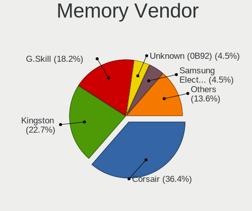

Pop!_OS - Hardware Trends (Desktops)
------------------------------------

A project to identify most popular hardware characteristics and track their change
over time based on data collected by Linux users at https://Linux-Hardware.org.

Anyone can contribute to this report by the [hw-probe](https://github.com/linuxhw/hw-probe) tool:

    sudo -E hw-probe -all -upload

This report is for one last month. Overall report since the beginning of time: [TestDays](https://github.com/linuxhw/TestDays)

Period: Dec, 2024.

Contents
--------

* [ System ](#system)
  - [ OS                       ](#os)
  - [ OS Family                ](#os-family)
  - [ Kernel                   ](#kernel)
  - [ Kernel Family            ](#kernel-family)
  - [ Kernel Major Ver.        ](#kernel-major-ver)
  - [ Arch                     ](#arch)
  - [ DE                       ](#de)
  - [ Display Server           ](#display-server)
  - [ Display Manager          ](#display-manager)
  - [ OS Lang                  ](#os-lang)
  - [ Boot Mode                ](#boot-mode)
  - [ Filesystem               ](#filesystem)
  - [ Part. scheme             ](#part-scheme)
  - [ Dual Boot with Linux/BSD ](#dual-boot-with-linuxbsd)
  - [ Dual Boot (Win)          ](#dual-boot-win)

* [ Board ](#board)
  - [ Vendor                   ](#vendor)
  - [ Model                    ](#model)
  - [ Model Family             ](#model-family)
  - [ MFG Year                 ](#mfg-year)
  - [ Form Factor              ](#form-factor)
  - [ Secure Boot              ](#secure-boot)
  - [ Coreboot                 ](#coreboot)
  - [ RAM Size                 ](#ram-size)
  - [ RAM Used                 ](#ram-used)
  - [ Total Drives             ](#total-drives)
  - [ Has CD-ROM               ](#has-cd-rom)
  - [ Has Ethernet             ](#has-ethernet)
  - [ Has WiFi                 ](#has-wifi)
  - [ Has Bluetooth            ](#has-bluetooth)

* [ Location ](#location)
  - [ Country                  ](#country)
  - [ City                     ](#city)

* [ Drives ](#drives)
  - [ Drive Vendor             ](#drive-vendor)
  - [ Drive Model              ](#drive-model)
  - [ HDD Vendor               ](#hdd-vendor)
  - [ SSD Vendor               ](#ssd-vendor)
  - [ Drive Kind               ](#drive-kind)
  - [ Drive Connector          ](#drive-connector)
  - [ Drive Size               ](#drive-size)
  - [ Space Total              ](#space-total)
  - [ Space Used               ](#space-used)
  - [ Malfunc. Drives          ](#malfunc-drives)
  - [ Malfunc. Drive Vendor    ](#malfunc-drive-vendor)
  - [ Malfunc. HDD Vendor      ](#malfunc-hdd-vendor)
  - [ Malfunc. Drive Kind      ](#malfunc-drive-kind)
  - [ Failed Drives            ](#failed-drives)
  - [ Failed Drive Vendor      ](#failed-drive-vendor)
  - [ Drive Status             ](#drive-status)

* [ Storage controller ](#storage-controller)
  - [ Storage Vendor           ](#storage-vendor)
  - [ Storage Model            ](#storage-model)
  - [ Storage Kind             ](#storage-kind)

* [ Processor ](#processor)
  - [ CPU Vendor               ](#cpu-vendor)
  - [ CPU Model                ](#cpu-model)
  - [ CPU Model Family         ](#cpu-model-family)
  - [ CPU Cores                ](#cpu-cores)
  - [ CPU Sockets              ](#cpu-sockets)
  - [ CPU Threads              ](#cpu-threads)
  - [ CPU Op-Modes             ](#cpu-op-modes)
  - [ CPU Microcode            ](#cpu-microcode)
  - [ CPU Microarch            ](#cpu-microarch)

* [ Graphics ](#graphics)
  - [ GPU Vendor               ](#gpu-vendor)
  - [ GPU Model                ](#gpu-model)
  - [ GPU Combo                ](#gpu-combo)
  - [ GPU Driver               ](#gpu-driver)
  - [ GPU Memory               ](#gpu-memory)

* [ Monitor ](#monitor)
  - [ Monitor Vendor           ](#monitor-vendor)
  - [ Monitor Model            ](#monitor-model)
  - [ Monitor Resolution       ](#monitor-resolution)
  - [ Monitor Diagonal         ](#monitor-diagonal)
  - [ Monitor Width            ](#monitor-width)
  - [ Aspect Ratio             ](#aspect-ratio)
  - [ Monitor Area             ](#monitor-area)
  - [ Pixel Density            ](#pixel-density)
  - [ Multiple Monitors        ](#multiple-monitors)

* [ Network ](#network)
  - [ Net Controller Vendor    ](#net-controller-vendor)
  - [ Net Controller Model     ](#net-controller-model)
  - [ Wireless Vendor          ](#wireless-vendor)
  - [ Wireless Model           ](#wireless-model)
  - [ Ethernet Vendor          ](#ethernet-vendor)
  - [ Ethernet Model           ](#ethernet-model)
  - [ Net Controller Kind      ](#net-controller-kind)
  - [ Used Controller          ](#used-controller)
  - [ NICs                     ](#nics)
  - [ IPv6                     ](#ipv6)

* [ Bluetooth ](#bluetooth)
  - [ Bluetooth Vendor         ](#bluetooth-vendor)
  - [ Bluetooth Model          ](#bluetooth-model)

* [ Sound ](#sound)
  - [ Sound Vendor             ](#sound-vendor)
  - [ Sound Model              ](#sound-model)

* [ Memory ](#memory)
  - [ Memory Vendor            ](#memory-vendor)
  - [ Memory Model             ](#memory-model)
  - [ Memory Kind              ](#memory-kind)
  - [ Memory Form Factor       ](#memory-form-factor)
  - [ Memory Size              ](#memory-size)
  - [ Memory Speed             ](#memory-speed)

* [ Printers & scanners ](#printers--scanners)
  - [ Printer Vendor           ](#printer-vendor)
  - [ Printer Model            ](#printer-model)
  - [ Scanner Vendor           ](#scanner-vendor)
  - [ Scanner Model            ](#scanner-model)

* [ Camera ](#camera)
  - [ Camera Vendor            ](#camera-vendor)
  - [ Camera Model             ](#camera-model)

* [ Security ](#security)
  - [ Fingerprint Vendor       ](#fingerprint-vendor)
  - [ Fingerprint Model        ](#fingerprint-model)
  - [ Chipcard Vendor          ](#chipcard-vendor)
  - [ Chipcard Model           ](#chipcard-model)

* [ Unsupported ](#unsupported)
  - [ Unsupported Devices      ](#unsupported-devices)
  - [ Unsupported Device Types ](#unsupported-device-types)

System
------

OS
--

Installed operating systems

| Name          | Desktops | Percent |
|---------------|----------|---------|
| Pop!_OS 22.04 | 95       | 94.06%  |
| Pop!_OS 24.04 | 5        | 4.95%   |
| Pop!_OS 20.04 | 1        | 0.99%   |

OS Family
---------

OS without a version

| Name    | Desktops | Percent |
|---------|----------|---------|
| Pop!_OS | 101      | 100%    |

Kernel
------

Version of the Linux kernel

| Version                 | Desktops | Percent |
|-------------------------|----------|---------|
| 6.9.3-76060903-generic  | 98       | 97.03%  |
| 6.0.12-76060006-generic | 2        | 1.98%   |
| 6.0.12-76060012-generic | 1        | 0.99%   |

Kernel Family
-------------

Linux kernel without a distro release

| Version | Desktops | Percent |
|---------|----------|---------|
| 6.9.3   | 98       | 97.03%  |
| 6.0.12  | 3        | 2.97%   |

Kernel Major Ver.
-----------------

Linux kernel major version

| Version | Desktops | Percent |
|---------|----------|---------|
| 6.9     | 98       | 97.03%  |
| 6.0     | 3        | 2.97%   |

Arch
----

OS architecture (x86_64, i586, etc.)

| Name   | Desktops | Percent |
|--------|----------|---------|
| x86_64 | 101      | 100%    |

DE
--

Desktop Environment

| Name       | Desktops | Percent |
|------------|----------|---------|
| GNOME      | 91       | 90.1%   |
| COSMIC     | 7        | 6.93%   |
| XFCE       | 1        | 0.99%   |
| X-Cinnamon | 1        | 0.99%   |
| KDE5       | 1        | 0.99%   |

Display Server
--------------

X11 or Wayland

| Name    | Desktops | Percent |
|---------|----------|---------|
| X11     | 89       | 88.12%  |
| Wayland | 12       | 11.88%  |

Display Manager
---------------

SDDM, LightDM, etc.

| Name           | Desktops | Percent |
|----------------|----------|---------|
| Unknown        | 83       | 82.18%  |
| GDM3           | 16       | 15.84%  |
| COSMIC-GREETER | 2        | 1.98%   |

OS Lang
-------

Language

| Lang  | Desktops | Percent |
|-------|----------|---------|
| en_US | 57       | 56.44%  |
| en_GB | 8        | 7.92%   |
| de_DE | 7        | 6.93%   |
| pt_BR | 5        | 4.95%   |
| C     | 5        | 4.95%   |
| pl_PL | 2        | 1.98%   |
| it_IT | 2        | 1.98%   |
| hu_HU | 2        | 1.98%   |
| fr_FR | 2        | 1.98%   |
| en_CA | 2        | 1.98%   |
| de_CH | 2        | 1.98%   |
| sv_SE | 1        | 0.99%   |
| nn_NO | 1        | 0.99%   |
| nl_NL | 1        | 0.99%   |
| es_BO | 1        | 0.99%   |
| en_IE | 1        | 0.99%   |
| en_AU | 1        | 0.99%   |
| cs_CZ | 1        | 0.99%   |

Boot Mode
---------

EFI or BIOS

| Mode | Desktops | Percent |
|------|----------|---------|
| BIOS | 91       | 90.1%   |
| EFI  | 10       | 9.9%    |

Filesystem
----------

Type of filesystem

| Type    | Desktops | Percent |
|---------|----------|---------|
| Ext4    | 99       | 98.02%  |
| Overlay | 1        | 0.99%   |
| Btrfs   | 1        | 0.99%   |

Part. scheme
------------

Scheme of partitioning

| Type    | Desktops | Percent |
|---------|----------|---------|
| Unknown | 83       | 82.18%  |
| GPT     | 14       | 13.86%  |
| MBR     | 4        | 3.96%   |

Dual Boot with Linux/BSD
------------------------

Hosting more than one Linux/BSD

| Dual boot | Desktops | Percent |
|-----------|----------|---------|
| No        | 98       | 97.03%  |
| Yes       | 3        | 2.97%   |

Dual Boot (Win)
---------------

Hosting Linux and Windows

| Dual boot | Desktops | Percent |
|-----------|----------|---------|
| No        | 92       | 91.09%  |
| Yes       | 9        | 8.91%   |

Board
-----

Vendor
------

Motherboard manufacturer

| Name                | Desktops | Percent |
|---------------------|----------|---------|
| ASUSTek Computer    | 29       | 28.71%  |
| Gigabyte Technology | 18       | 17.82%  |
| MSI                 | 15       | 14.85%  |
| ASRock              | 12       | 11.88%  |
| Dell                | 7        | 6.93%   |
| Hewlett-Packard     | 5        | 4.95%   |
| Lenovo              | 2        | 1.98%   |
| System76            | 1        | 0.99%   |
| Supermicro          | 1        | 0.99%   |
| Positivo            | 1        | 0.99%   |
| JGINYUE             | 1        | 0.99%   |
| Intel               | 1        | 0.99%   |
| Fujitsu             | 1        | 0.99%   |
| ECS                 | 1        | 0.99%   |
| Biostar             | 1        | 0.99%   |
| AZW                 | 1        | 0.99%   |
| Apple               | 1        | 0.99%   |
| Alienware           | 1        | 0.99%   |
| Acer                | 1        | 0.99%   |
| Unknown             | 1        | 0.99%   |

Model
-----

Motherboard model

| Name                                 | Desktops | Percent |
|--------------------------------------|----------|---------|
| MSI MS-7E26                          | 2        | 1.98%   |
| MSI MS-7C56                          | 2        | 1.98%   |
| MSI MS-7B45                          | 2        | 1.98%   |
| Gigabyte X570 AORUS ULTRA            | 2        | 1.98%   |
| Dell Precision WorkStation T3500     | 2        | 1.98%   |
| System76 Thelio                      | 1        | 0.99%   |
| Supermicro X9DRD-iF/LF               | 1        | 0.99%   |
| Positivo POS-EIH61CQ                 | 1        | 0.99%   |
| MSI MS-7E07                          | 1        | 0.99%   |
| MSI MS-7D73                          | 1        | 0.99%   |
| MSI MS-7D30                          | 1        | 0.99%   |
| MSI MS-7D20                          | 1        | 0.99%   |
| MSI MS-7D08                          | 1        | 0.99%   |
| MSI MS-7C37                          | 1        | 0.99%   |
| MSI MS-7B86                          | 1        | 0.99%   |
| MSI MS-7A59                          | 1        | 0.99%   |
| MSI MS-7978                          | 1        | 0.99%   |
| Lenovo ThinkCentre M720s 10SUA01X00  | 1        | 0.99%   |
| Lenovo ThinkCentre E73 10AU002PUS    | 1        | 0.99%   |
| JGINYUE B650I Night Devil            | 1        | 0.99%   |
| Intel B75                            | 1        | 0.99%   |
| HP Z230 Tower Workstation            | 1        | 0.99%   |
| HP Pavilion Gaming Desktop TG01-2xxx | 1        | 0.99%   |
| HP EliteDesk 705 G3 SFF              | 1        | 0.99%   |
| HP Compaq Elite 8300 SFF             | 1        | 0.99%   |
| HP Compaq Elite 8300 CMT             | 1        | 0.99%   |
| Gigabyte Z590 VISION D               | 1        | 0.99%   |
| Gigabyte Z390 AORUS ULTRA            | 1        | 0.99%   |
| Gigabyte Z390 AORUS PRO              | 1        | 0.99%   |
| Gigabyte Z370P D3                    | 1        | 0.99%   |
| Gigabyte Z170-Gaming K3              | 1        | 0.99%   |
| Gigabyte X870 GAMING X WIFI7         | 1        | 0.99%   |
| Gigabyte X870 EAGLE WIFI7            | 1        | 0.99%   |
| Gigabyte X570S AERO G                | 1        | 0.99%   |
| Gigabyte X570 AORUS MASTER           | 1        | 0.99%   |
| Gigabyte G41M-ES2L                   | 1        | 0.99%   |
| Gigabyte B650 EAGLE                  | 1        | 0.99%   |
| Gigabyte B550M AORUS ELITE           | 1        | 0.99%   |
| Gigabyte B550 GAMING X               | 1        | 0.99%   |
| Gigabyte B550 AORUS ELITE V2         | 1        | 0.99%   |

Model Family
------------

Motherboard model prefix

| Name                 | Desktops | Percent |
|----------------------|----------|---------|
| ASUS ROG             | 6        | 5.94%   |
| ASUS PRIME           | 6        | 5.94%   |
| Gigabyte X570        | 3        | 2.97%   |
| ASUS TUF             | 3        | 2.97%   |
| MSI MS-7E26          | 2        | 1.98%   |
| MSI MS-7C56          | 2        | 1.98%   |
| MSI MS-7B45          | 2        | 1.98%   |
| Lenovo ThinkCentre   | 2        | 1.98%   |
| HP Compaq            | 2        | 1.98%   |
| Gigabyte Z390        | 2        | 1.98%   |
| Gigabyte X870        | 2        | 1.98%   |
| Gigabyte B550        | 2        | 1.98%   |
| Dell Precision       | 2        | 1.98%   |
| Dell OptiPlex        | 2        | 1.98%   |
| Dell Inspiron        | 2        | 1.98%   |
| ASRock X570          | 2        | 1.98%   |
| ASRock B450M         | 2        | 1.98%   |
| System76 Thelio      | 1        | 0.99%   |
| Supermicro X9DRD-iF  | 1        | 0.99%   |
| Positivo POS-EIH61CQ | 1        | 0.99%   |
| MSI MS-7E07          | 1        | 0.99%   |
| MSI MS-7D73          | 1        | 0.99%   |
| MSI MS-7D30          | 1        | 0.99%   |
| MSI MS-7D20          | 1        | 0.99%   |
| MSI MS-7D08          | 1        | 0.99%   |
| MSI MS-7C37          | 1        | 0.99%   |
| MSI MS-7B86          | 1        | 0.99%   |
| MSI MS-7A59          | 1        | 0.99%   |
| MSI MS-7978          | 1        | 0.99%   |
| JGINYUE B650I        | 1        | 0.99%   |
| Intel B75            | 1        | 0.99%   |
| HP Z230              | 1        | 0.99%   |
| HP Pavilion          | 1        | 0.99%   |
| HP EliteDesk         | 1        | 0.99%   |
| Gigabyte Z590        | 1        | 0.99%   |
| Gigabyte Z370P       | 1        | 0.99%   |
| Gigabyte Z170-Gaming | 1        | 0.99%   |
| Gigabyte X570S       | 1        | 0.99%   |
| Gigabyte G41M-ES2L   | 1        | 0.99%   |
| Gigabyte B650        | 1        | 0.99%   |

MFG Year
--------

Motherboard manufacture year

| Year | Desktops | Percent |
|------|----------|---------|
| 2021 | 13       | 12.87%  |
| 2019 | 10       | 9.9%    |
| 2017 | 9        | 8.91%   |
| 2012 | 9        | 8.91%   |
| 2022 | 8        | 7.92%   |
| 2020 | 8        | 7.92%   |
| 2018 | 8        | 7.92%   |
| 2024 | 7        | 6.93%   |
| 2023 | 6        | 5.94%   |
| 2016 | 6        | 5.94%   |
| 2013 | 5        | 4.95%   |
| 2010 | 5        | 4.95%   |
| 2015 | 3        | 2.97%   |
| 2014 | 1        | 0.99%   |
| 2011 | 1        | 0.99%   |
| 2009 | 1        | 0.99%   |
| 2008 | 1        | 0.99%   |

Form Factor
-----------

Physical design of the computer

| Name    | Desktops | Percent |
|---------|----------|---------|
| Desktop | 101      | 100%    |

Secure Boot
-----------

Enabled or disabled

| State    | Desktops | Percent |
|----------|----------|---------|
| Disabled | 100      | 99.01%  |
| Enabled  | 1        | 0.99%   |

Coreboot
--------

Have coreboot on board

| Used | Desktops | Percent |
|------|----------|---------|
| No   | 101      | 100%    |

RAM Size
--------

Total RAM memory

| Size in GB  | Desktops | Percent |
|-------------|----------|---------|
| 32.01-64.0  | 37       | 36.63%  |
| 16.01-24.0  | 25       | 24.75%  |
| 64.01-256.0 | 13       | 12.87%  |
| 24.01-32.0  | 9        | 8.91%   |
| 8.01-16.0   | 8        | 7.92%   |
| 4.01-8.0    | 6        | 5.94%   |
| 3.01-4.0    | 3        | 2.97%   |

RAM Used
--------

Used RAM memory

| Used GB    | Desktops | Percent |
|------------|----------|---------|
| 4.01-8.0   | 39       | 38.61%  |
| 8.01-16.0  | 29       | 28.71%  |
| 3.01-4.0   | 16       | 15.84%  |
| 2.01-3.0   | 7        | 6.93%   |
| 16.01-24.0 | 4        | 3.96%   |
| 24.01-32.0 | 3        | 2.97%   |
| 1.01-2.0   | 2        | 1.98%   |
| 32.01-64.0 | 1        | 0.99%   |

Total Drives
------------

Number of drives on board

| Drives | Desktops | Percent |
|--------|----------|---------|
| 1      | 31       | 30.69%  |
| 3      | 23       | 22.77%  |
| 2      | 22       | 21.78%  |
| 4      | 12       | 11.88%  |
| 5      | 6        | 5.94%   |
| 6      | 4        | 3.96%   |
| 22     | 1        | 0.99%   |
| 14     | 1        | 0.99%   |
| 11     | 1        | 0.99%   |

Has CD-ROM
----------

Has CD-ROM on board

| Presented | Desktops | Percent |
|-----------|----------|---------|
| No        | 74       | 73.27%  |
| Yes       | 27       | 26.73%  |

Has Ethernet
------------

Has Ethernet on board

| Presented | Desktops | Percent |
|-----------|----------|---------|
| Yes       | 100      | 99.01%  |
| No        | 1        | 0.99%   |

Has WiFi
--------

Has WiFi module

| Presented | Desktops | Percent |
|-----------|----------|---------|
| Yes       | 58       | 57.43%  |
| No        | 43       | 42.57%  |

Has Bluetooth
-------------

Has Bluetooth module

| Presented | Desktops | Percent |
|-----------|----------|---------|
| Yes       | 55       | 54.46%  |
| No        | 46       | 45.54%  |

Location
--------

Country
-------

Geographic location (country)

| Country                | Desktops | Percent |
|------------------------|----------|---------|
| USA                    | 35       | 34.65%  |
| Germany                | 10       | 9.9%    |
| Brazil                 | 5        | 4.95%   |
| UK                     | 4        | 3.96%   |
| Poland                 | 4        | 3.96%   |
| Hungary                | 4        | 3.96%   |
| Netherlands            | 3        | 2.97%   |
| Italy                  | 3        | 2.97%   |
| France                 | 3        | 2.97%   |
| Canada                 | 3        | 2.97%   |
| Switzerland            | 2        | 1.98%   |
| Sweden                 | 2        | 1.98%   |
| Finland                | 2        | 1.98%   |
| Denmark                | 2        | 1.98%   |
| Australia              | 2        | 1.98%   |
| Ukraine                | 1        | 0.99%   |
| Turkey                 | 1        | 0.99%   |
| Thailand               | 1        | 0.99%   |
| South Africa           | 1        | 0.99%   |
| Russia                 | 1        | 0.99%   |
| Portugal               | 1        | 0.99%   |
| Norway                 | 1        | 0.99%   |
| Lithuania              | 1        | 0.99%   |
| Israel                 | 1        | 0.99%   |
| Indonesia              | 1        | 0.99%   |
| Czechia                | 1        | 0.99%   |
| Chile                  | 1        | 0.99%   |
| Bulgaria               | 1        | 0.99%   |
| Bosnia and Herzegovina | 1        | 0.99%   |
| Bolivia                | 1        | 0.99%   |
| Austria                | 1        | 0.99%   |
| Argentina              | 1        | 0.99%   |

City
----

Geographic location (city)

| City          | Desktops | Percent |
|---------------|----------|---------|
| Sao Paulo     | 3        | 2.97%   |
| Minneapolis   | 2        | 1.98%   |
| Helsinki      | 2        | 1.98%   |
| Berlin        | 2        | 1.98%   |
| York          | 1        | 0.99%   |
| Wil           | 1        | 0.99%   |
| Voelklingen   | 1        | 0.99%   |
| Vilnius       | 1        | 0.99%   |
| Vienna        | 1        | 0.99%   |
| Västerås    | 1        | 0.99%   |
| Vallejo       | 1        | 0.99%   |
| Trondheim     | 1        | 0.99%   |
| Timmins       | 1        | 0.99%   |
| The Villages  | 1        | 0.99%   |
| The Hague     | 1        | 0.99%   |
| Tatabánya    | 1        | 0.99%   |
| Tábor        | 1        | 0.99%   |
| Sydney        | 1        | 0.99%   |
| St Louis      | 1        | 0.99%   |
| Springdale    | 1        | 0.99%   |
| Sosnowiec     | 1        | 0.99%   |
| Sofia         | 1        | 0.99%   |
| Smorumnedre   | 1        | 0.99%   |
| Sleen         | 1        | 0.99%   |
| Simpsonville  | 1        | 0.99%   |
| Siegen        | 1        | 0.99%   |
| Scotts Valley | 1        | 0.99%   |
| Scott Depot   | 1        | 0.99%   |
| Santiago      | 1        | 0.99%   |
| Saint Paul    | 1        | 0.99%   |
| Sacramento    | 1        | 0.99%   |
| Royal Oak     | 1        | 0.99%   |
| Rostov-on-Don | 1        | 0.99%   |
| Purmerend     | 1        | 0.99%   |
| Punta Gorda   | 1        | 0.99%   |
| Prades-le-Lez | 1        | 0.99%   |
| Poznan        | 1        | 0.99%   |
| Pomeroy       | 1        | 0.99%   |
| Phitsanulok   | 1        | 0.99%   |
| Orpington     | 1        | 0.99%   |

Drives
------

Drive Vendor
------------

Hard drive vendors

| Vendor                      | Desktops | Drives | Percent |
|-----------------------------|----------|--------|---------|
| Samsung Electronics         | 35       | 52     | 15.98%  |
| WDC                         | 33       | 57     | 15.07%  |
| Seagate                     | 29       | 47     | 13.24%  |
| SanDisk                     | 17       | 23     | 7.76%   |
| Kingston                    | 11       | 12     | 5.02%   |
| Phison Electronics          | 8        | 9      | 3.65%   |
| Kingston Technology Company | 7        | 7      | 3.2%    |
| Crucial                     | 7        | 7      | 3.2%    |
| Micron/Crucial Technology   | 6        | 6      | 2.74%   |
| Hitachi                     | 6        | 8      | 2.74%   |
| Toshiba                     | 5        | 5      | 2.28%   |
| HGST                        | 3        | 3      | 1.37%   |
| China                       | 3        | 3      | 1.37%   |
| A-DATA Technology           | 3        | 3      | 1.37%   |
| Team                        | 2        | 2      | 0.91%   |
| SABRENT                     | 2        | 2      | 0.91%   |
| Realtek Semiconductor       | 2        | 3      | 0.91%   |
| Patriot                     | 2        | 2      | 0.91%   |
| OCZ                         | 2        | 2      | 0.91%   |
| Netac                       | 2        | 2      | 0.91%   |
| Micron Technology           | 2        | 3      | 0.91%   |
| Intel                       | 2        | 2      | 0.91%   |
| Inland                      | 2        | 2      | 0.91%   |
| Corsair                     | 2        | 2      | 0.91%   |
| ASMT                        | 2        | 4      | 0.91%   |
| ADATA Technology            | 2        | 2      | 0.91%   |
| WD MediaMax                 | 1        | 1      | 0.46%   |
| Verbatim                    | 1        | 1      | 0.46%   |
| USB                         | 1        | 1      | 0.46%   |
| Unknown                     | 1        | 2      | 0.46%   |
| Transcend                   | 1        | 1      | 0.46%   |
| TEAM T25                    | 1        | 1      | 0.46%   |
| T-FORCE                     | 1        | 1      | 0.46%   |
| SK hynix                    | 1        | 1      | 0.46%   |
| Realtek                     | 1        | 1      | 0.46%   |
| Plextor                     | 1        | 2      | 0.46%   |
| Phison                      | 1        | 1      | 0.46%   |
| KODAK                       | 1        | 1      | 0.46%   |
| KINGBANK                    | 1        | 1      | 0.46%   |
| Intenso                     | 1        | 1      | 0.46%   |

Drive Model
-----------

Hard drive models

| Model                                                 | Desktops | Percent |
|-------------------------------------------------------|----------|---------|
| Samsung NVMe SSD Controller SM981/PM981/PM983 512GB   | 6        | 2.32%   |
| Samsung NVMe SSD Controller PM9A1/PM9A3/980PRO 512GB  | 4        | 1.54%   |
| Micron/Crucial P2 NVMe PCIe SSD 500GB                 | 4        | 1.54%   |
| Kingston Company SNV2S1000G 1TB                       | 4        | 1.54%   |
| Seagate ST1000DM010-2EP102 1TB                        | 3        | 1.16%   |
| Phison E12 NVMe Controller 480GB                      | 3        | 1.16%   |
| WDC WD20EZBX-00AYRA0 2TB                              | 2        | 0.77%   |
| WDC WD10EZEX-08M2NA0 1TB                              | 2        | 0.77%   |
| Seagate ST2000DM008-2FR102 2TB                        | 2        | 0.77%   |
| Sandisk WD Blue SN580 1TB                             | 2        | 0.77%   |
| Sandisk WD Black 2018/SN750 / PC SN720 NVMe SSD 512GB | 2        | 0.77%   |
| Samsung SSD 970 EVO Plus 2TB                          | 2        | 0.77%   |
| Samsung SSD 870 EVO 2TB                               | 2        | 0.77%   |
| Samsung SSD 860 EVO 1TB                               | 2        | 0.77%   |
| Samsung SSD 850 EVO 250GB                             | 2        | 0.77%   |
| Samsung SSD 840 EVO 250GB                             | 2        | 0.77%   |
| SABRENT Disk 2TB                                      | 2        | 0.77%   |
| Kingston SUV400S37120G 120GB SSD                      | 2        | 0.77%   |
| Kingston SA400S37120G 120GB SSD                       | 2        | 0.77%   |
| Intel SSD 660P Series 1024GB                          | 2        | 0.77%   |
| WDC WUH721414ALE604 14TB                              | 1        | 0.39%   |
| WDC WDS500G2B0C-00PXH0 500GB                          | 1        | 0.39%   |
| WDC WDS480G2G0A-00JH30 480GB SSD                      | 1        | 0.39%   |
| WDC WDS120G3G0A 120GB SSD                             | 1        | 0.39%   |
| WDC WDS100T2B0A-00SM50 1TB SSD                        | 1        | 0.39%   |
| WDC WD7501AALS-00J7B0 752GB                           | 1        | 0.39%   |
| WDC WD60EZRZ-00GZ5B1 6TB                              | 1        | 0.39%   |
| WDC WD60EFAX-68JH4N0 6TB                              | 1        | 0.39%   |
| WDC WD60EDAZ-11U78B0 6TB                              | 1        | 0.39%   |
| WDC WD6004FZWX-00BKVA0 6TB                            | 1        | 0.39%   |
| WDC WD6002FZWX-00GBGB0 6TB                            | 1        | 0.39%   |
| WDC WD5001AALS-00L3B2 500GB                           | 1        | 0.39%   |
| WDC WD5000LPVX-28V0TT0 500GB                          | 1        | 0.39%   |
| WDC WD5000LPVX-22V0TT0 500GB                          | 1        | 0.39%   |
| WDC WD5000AVCS-632DY1 500GB                           | 1        | 0.39%   |
| WDC WD5000AUDX-63WNHY0 500GB                          | 1        | 0.39%   |
| WDC WD5000AAKX-75U6AA0 500GB                          | 1        | 0.39%   |
| WDC WD5000AAKX-08ERMA0 500GB                          | 1        | 0.39%   |
| WDC WD5000AAKX-00ERMA0 500GB                          | 1        | 0.39%   |
| WDC WD40EZRZ-22GXCB0 4TB                              | 1        | 0.39%   |

HDD Vendor
----------

Hard disk drive vendors

| Vendor              | Desktops | Drives | Percent |
|---------------------|----------|--------|---------|
| WDC                 | 31       | 53     | 39.24%  |
| Seagate             | 27       | 44     | 34.18%  |
| Hitachi             | 6        | 8      | 7.59%   |
| Toshiba             | 4        | 4      | 5.06%   |
| Samsung Electronics | 4        | 4      | 5.06%   |
| HGST                | 3        | 3      | 3.8%    |
| SABRENT             | 2        | 2      | 2.53%   |
| WD MediaMax         | 1        | 1      | 1.27%   |
| ASMT                | 1        | 3      | 1.27%   |

SSD Vendor
----------

Solid state drive vendors

| Vendor              | Desktops | Drives | Percent |
|---------------------|----------|--------|---------|
| Samsung Electronics | 16       | 23     | 23.19%  |
| Kingston            | 8        | 9      | 11.59%  |
| SanDisk             | 7        | 10     | 10.14%  |
| Crucial             | 4        | 4      | 5.8%    |
| WDC                 | 3        | 3      | 4.35%   |
| China               | 3        | 3      | 4.35%   |
| Patriot             | 2        | 2      | 2.9%    |
| OCZ                 | 2        | 2      | 2.9%    |
| Netac               | 2        | 2      | 2.9%    |
| Inland              | 2        | 2      | 2.9%    |
| A-DATA Technology   | 2        | 2      | 2.9%    |
| Verbatim            | 1        | 1      | 1.45%   |
| Transcend           | 1        | 1      | 1.45%   |
| Toshiba             | 1        | 1      | 1.45%   |
| TEAM T25            | 1        | 1      | 1.45%   |
| Team                | 1        | 1      | 1.45%   |
| T-FORCE             | 1        | 1      | 1.45%   |
| SK hynix            | 1        | 1      | 1.45%   |
| Seagate             | 1        | 1      | 1.45%   |
| Plextor             | 1        | 2      | 1.45%   |
| Phison              | 1        | 1      | 1.45%   |
| Micron Technology   | 1        | 2      | 1.45%   |
| KODAK               | 1        | 1      | 1.45%   |
| Intenso             | 1        | 1      | 1.45%   |
| GOODRAM             | 1        | 1      | 1.45%   |
| FORESEE             | 1        | 1      | 1.45%   |
| Esmart              | 1        | 4      | 1.45%   |
| Corsair             | 1        | 1      | 1.45%   |
| Apacer              | 1        | 1      | 1.45%   |

Drive Kind
----------

HDD or SSD

| Kind    | Desktops | Drives | Percent |
|---------|----------|--------|---------|
| HDD     | 62       | 122    | 34.07%  |
| NVMe    | 61       | 84     | 33.52%  |
| SSD     | 54       | 85     | 29.67%  |
| Unknown | 5        | 6      | 2.75%   |

Drive Connector
---------------

SATA, SAS, NVMe, etc.

| Type | Desktops | Drives | Percent |
|------|----------|--------|---------|
| SATA | 76       | 194    | 51.35%  |
| NVMe | 61       | 82     | 41.22%  |
| SAS  | 11       | 21     | 7.43%   |

Drive Size
----------

Size of hard drive

| Size in TB | Desktops | Drives | Percent |
|------------|----------|--------|---------|
| 0.01-0.5   | 46       | 76     | 34.85%  |
| 0.51-1.0   | 37       | 45     | 28.03%  |
| 1.01-2.0   | 23       | 35     | 17.42%  |
| 3.01-4.0   | 11       | 19     | 8.33%   |
| 4.01-10.0  | 7        | 10     | 5.3%    |
| 2.01-3.0   | 4        | 7      | 3.03%   |
| 10.01-20.0 | 4        | 15     | 3.03%   |

Space Total
-----------

Amount of disk space available on the file system

| Size in GB     | Desktops | Percent |
|----------------|----------|---------|
| 501-1000       | 30       | 29.7%   |
| More than 3000 | 20       | 19.8%   |
| 251-500        | 18       | 17.82%  |
| 1001-2000      | 13       | 12.87%  |
| 101-250        | 10       | 9.9%    |
| 2001-3000      | 9        | 8.91%   |
| Unknown        | 1        | 0.99%   |

Space Used
----------

Amount of used disk space

| Used GB        | Desktops | Percent |
|----------------|----------|---------|
| 21-50          | 18       | 17.82%  |
| 1-20           | 14       | 13.86%  |
| 101-250        | 13       | 12.87%  |
| 501-1000       | 13       | 12.87%  |
| 1001-2000      | 10       | 9.9%    |
| More than 3000 | 9        | 8.91%   |
| 251-500        | 9        | 8.91%   |
| 51-100         | 9        | 8.91%   |
| 2001-3000      | 5        | 4.95%   |
| Unknown        | 1        | 0.99%   |

Malfunc. Drives
---------------

Drive models with a malfunction

| Model                                               | Desktops | Drives | Percent |
|-----------------------------------------------------|----------|--------|---------|
| WDC WD5000LPVX-28V0TT0 500GB                        | 1        | 1      | 10%     |
| WDC WD40EZRZ-00GXCB0 4TB                            | 1        | 1      | 10%     |
| SanDisk SSD PLUS 240GB                              | 1        | 1      | 10%     |
| Samsung Electronics SSD 980 PRO 2TB                 | 1        | 1      | 10%     |
| Samsung Electronics SSD 980 PRO 1TB S5GXNF0R522804M | 1        | 1      | 10%     |
| Samsung Electronics HD501LJ 500GB                   | 1        | 1      | 10%     |
| HGST HTS721010A9E630 1TB                            | 1        | 1      | 10%     |
| Crucial CT500P1SSD8 500GB                           | 1        | 1      | 10%     |
| Crucial CT2000MX500SSD1 2TB                         | 1        | 1      | 10%     |
| A-DATA Technology SX8200PNP 1TB                     | 1        | 1      | 10%     |

Malfunc. Drive Vendor
---------------------

Vendors of faulty drives

| Vendor              | Desktops | Drives | Percent |
|---------------------|----------|--------|---------|
| Samsung Electronics | 3        | 3      | 30%     |
| WDC                 | 2        | 2      | 20%     |
| Crucial             | 2        | 2      | 20%     |
| SanDisk             | 1        | 1      | 10%     |
| HGST                | 1        | 1      | 10%     |
| A-DATA Technology   | 1        | 1      | 10%     |

Malfunc. HDD Vendor
-------------------

Vendors of faulty HDD drives

| Vendor              | Desktops | Drives | Percent |
|---------------------|----------|--------|---------|
| WDC                 | 2        | 2      | 50%     |
| Samsung Electronics | 1        | 1      | 25%     |
| HGST                | 1        | 1      | 25%     |

Malfunc. Drive Kind
-------------------

Kinds of faulty drives

| Kind | Desktops | Drives | Percent |
|------|----------|--------|---------|
| NVMe | 4        | 4      | 44.44%  |
| HDD  | 3        | 4      | 33.33%  |
| SSD  | 2        | 2      | 22.22%  |

Failed Drives
-------------

Failed drive models

Zero info for selected period =(

Failed Drive Vendor
-------------------

Failed drive vendors

Zero info for selected period =(

Drive Status
------------

Number of failed and malfunc. drives

| Status   | Desktops | Drives | Percent |
|----------|----------|--------|---------|
| Detected | 86       | 252    | 78.9%   |
| Works    | 15       | 35     | 13.76%  |
| Malfunc  | 8        | 10     | 7.34%   |

Storage controller
------------------

Storage Vendor
--------------

Storage controller vendors

| Vendor                      | Desktops | Percent |
|-----------------------------|----------|---------|
| Intel                       | 56       | 31.11%  |
| AMD                         | 44       | 24.44%  |
| Samsung Electronics         | 19       | 10.56%  |
| SanDisk                     | 11       | 6.11%   |
| Phison Electronics          | 9        | 5%      |
| Kingston Technology Company | 9        | 5%      |
| Micron/Crucial Technology   | 8        | 4.44%   |
| ASMedia Technology          | 6        | 3.33%   |
| JMicron Technology          | 3        | 1.67%   |
| Realtek Semiconductor       | 2        | 1.11%   |
| Micron Technology           | 2        | 1.11%   |
| Marvell Technology Group    | 2        | 1.11%   |
| ADATA Technology            | 2        | 1.11%   |
| Solidigm                    | 1        | 0.56%   |
| Silicon Motion              | 1        | 0.56%   |
| Seagate Technology          | 1        | 0.56%   |
| Nvidia                      | 1        | 0.56%   |
| MAXIO Technology (Hangzhou) | 1        | 0.56%   |
| LSI Logic / Symbios Logic   | 1        | 0.56%   |
| Broadcom / LSI              | 1        | 0.56%   |

Storage Model
-------------

Storage controller models

| Model                                                                                   | Desktops | Percent |
|-----------------------------------------------------------------------------------------|----------|---------|
| AMD FCH SATA Controller [AHCI mode]                                                     | 18       | 9.05%   |
| AMD 600 Series Chipset SATA Controller                                                  | 11       | 5.53%   |
| AMD 500 Series Chipset SATA Controller                                                  | 9        | 4.52%   |
| Intel 200 Series PCH SATA controller [AHCI mode]                                        | 8        | 4.02%   |
| Samsung NVMe SSD Controller SM981/PM981/PM983                                           | 7        | 3.52%   |
| Samsung NVMe SSD Controller PM9A1/PM9A3/980PRO                                          | 7        | 3.52%   |
| Intel SATA Controller [RAID mode]                                                       | 6        | 3.02%   |
| Intel Q170/Q150/B150/H170/H110/Z170/CM236 Chipset SATA Controller [AHCI Mode]           | 6        | 3.02%   |
| Intel 7 Series/C210 Series Chipset Family 6-port SATA Controller [AHCI mode]            | 6        | 3.02%   |
| Intel 500 Series Chipset Family SATA AHCI Controller                                    | 6        | 3.02%   |
| Intel Alder Lake-S PCH SATA Controller [AHCI Mode]                                      | 5        | 2.51%   |
| ASMedia ASM1061/ASM1062 Serial ATA Controller                                           | 5        | 2.51%   |
| AMD 400 Series Chipset SATA Controller                                                  | 5        | 2.51%   |
| Micron/Crucial P2 [Nick P2] / P3 / P3 Plus NVMe PCIe SSD (DRAM-less)                    | 4        | 2.01%   |
| Phison PS5021-E21 PCIe4 NVMe Controller (DRAM-less)                                     | 3        | 1.51%   |
| Phison E12 NVMe Controller                                                              | 3        | 1.51%   |
| Intel Volume Management Device NVMe RAID Controller Intel Corporation                   | 3        | 1.51%   |
| Intel Raptor Lake SATA AHCI Controller                                                  | 3        | 1.51%   |
| Intel 6 Series/C200 Series Chipset Family 6 port Desktop SATA AHCI Controller           | 3        | 1.51%   |
| AMD 300 Series Chipset SATA Controller                                                  | 3        | 1.51%   |
| Sandisk WD Blue SN580 NVMe SSD (DRAM-less)                                              | 2        | 1.01%   |
| SanDisk Extreme Pro / WD Black 2018/SN750/PC SN720 NVMe SSD                             | 2        | 1.01%   |
| Samsung NVMe SSD Controller S4LV008[Pascal]                                             | 2        | 1.01%   |
| Samsung NVMe SSD Controller 980 (DRAM-less)                                             | 2        | 1.01%   |
| Phison E18 PCIe4 NVMe Controller                                                        | 2        | 1.01%   |
| Micron/Crucial P1 NVMe PCIe SSD[Frampton]                                               | 2        | 1.01%   |
| Micron 2550 NVMe SSD (DRAM-less)                                                        | 2        | 1.01%   |
| Kingston Company NV2 NVMe SSD [SM2267XT] (DRAM-less)                                    | 2        | 1.01%   |
| Kingston Company NV2 NVMe SSD [E21T] (DRAM-less)                                        | 2        | 1.01%   |
| Kingston Company KC3000/FURY Renegade NVMe SSD [E18]                                    | 2        | 1.01%   |
| Intel SSD 660P Series                                                                   | 2        | 1.01%   |
| Intel Cannon Lake PCH SATA AHCI Controller                                              | 2        | 1.01%   |
| Intel 8 Series/C220 Series Chipset Family 6-port SATA Controller 1 [AHCI mode]          | 2        | 1.01%   |
| Intel 6 Series/C200 Series Chipset Family Desktop SATA Controller (IDE mode, ports 4-5) | 2        | 1.01%   |
| Intel 6 Series/C200 Series Chipset Family Desktop SATA Controller (IDE mode, ports 0-3) | 2        | 1.01%   |
| AMD SB7x0/SB8x0/SB9x0 SATA Controller [AHCI mode]                                       | 2        | 1.01%   |
| Solidigm P41 Plus NVMe SSD (DRAM-less) [Echo Harbor]                                    | 1        | 0.5%    |
| Silicon Motion SM2263EN/SM2263XT (DRAM-less) NVMe SSD Controllers                       | 1        | 0.5%    |
| Seagate E18 PCIe SSD                                                                    | 1        | 0.5%    |
| SanDisk WD PC SN810 / Black SN850 NVMe SSD                                              | 1        | 0.5%    |

Storage Kind
------------

Kind of storage controller (IDE, SATA, NVMe, SAS, ...)

| Kind | Desktops | Percent |
|------|----------|---------|
| SATA | 90       | 52.94%  |
| NVMe | 60       | 35.29%  |
| RAID | 12       | 7.06%   |
| IDE  | 7        | 4.12%   |
| SAS  | 1        | 0.59%   |

Processor
---------

CPU Vendor
----------

Processor vendors

| Vendor | Desktops | Percent |
|--------|----------|---------|
| Intel  | 56       | 55.45%  |
| AMD    | 45       | 44.55%  |

CPU Model
---------

Processor models

| Model                                  | Desktops | Percent |
|----------------------------------------|----------|---------|
| AMD Ryzen 7 5800X 8-Core Processor     | 6        | 5.94%   |
| Intel Core i7-6700K CPU @ 4.00GHz      | 3        | 2.97%   |
| Intel Core i7-3770 CPU @ 3.40GHz       | 3        | 2.97%   |
| AMD Ryzen 9 5900X 12-Core Processor    | 3        | 2.97%   |
| AMD Ryzen 5 5600X 6-Core Processor     | 3        | 2.97%   |
| AMD Ryzen 5 5600 6-Core Processor      | 3        | 2.97%   |
| Intel Core i7-7700K CPU @ 4.20GHz      | 2        | 1.98%   |
| Intel Core i7-10700 CPU @ 2.90GHz      | 2        | 1.98%   |
| Intel Core i5-8400 CPU @ 2.80GHz       | 2        | 1.98%   |
| Intel Core i5-7500 CPU @ 3.40GHz       | 2        | 1.98%   |
| AMD Ryzen 7 5700X3D 8-Core Processor   | 2        | 1.98%   |
| AMD Ryzen 7 5700G with Radeon Graphics | 2        | 1.98%   |
| AMD Ryzen 7 1800X Eight-Core Processor | 2        | 1.98%   |
| AMD Ryzen 5 7600X 6-Core Processor     | 2        | 1.98%   |
| AMD FX-8350 Eight-Core Processor       | 2        | 1.98%   |
| Intel Xeon CPU X5650 @ 2.67GHz         | 1        | 0.99%   |
| Intel Xeon CPU W5580 @ 3.20GHz         | 1        | 0.99%   |
| Intel Xeon CPU W3565 @ 3.20GHz         | 1        | 0.99%   |
| Intel Xeon CPU E5-2690 v4 @ 2.60GHz    | 1        | 0.99%   |
| Intel Xeon CPU E5-2665 0 @ 2.40GHz     | 1        | 0.99%   |
| Intel Xeon CPU E5-1650 v2 @ 3.50GHz    | 1        | 0.99%   |
| Intel Xeon CPU E3-1246 v3 @ 3.50GHz    | 1        | 0.99%   |
| Intel Pentium CPU G4400 @ 3.30GHz      | 1        | 0.99%   |
| Intel N100                             | 1        | 0.99%   |
| Intel Core i9-9900KF CPU @ 3.60GHz     | 1        | 0.99%   |
| Intel Core i9-14900K                   | 1        | 0.99%   |
| Intel Core i7-9700K CPU @ 3.60GHz      | 1        | 0.99%   |
| Intel Core i7-8086K CPU @ 4.00GHz      | 1        | 0.99%   |
| Intel Core i7-4790 CPU @ 3.60GHz       | 1        | 0.99%   |
| Intel Core i7-2600K CPU @ 3.40GHz      | 1        | 0.99%   |
| Intel Core i7-14700F                   | 1        | 0.99%   |
| Intel Core i5-9600K CPU @ 3.70GHz      | 1        | 0.99%   |
| Intel Core i5-8600K CPU @ 3.60GHz      | 1        | 0.99%   |
| Intel Core i5-7600K CPU @ 3.80GHz      | 1        | 0.99%   |
| Intel Core i5-7400 CPU @ 3.00GHz       | 1        | 0.99%   |
| Intel Core i5-6600K CPU @ 3.50GHz      | 1        | 0.99%   |
| Intel Core i5-6500 CPU @ 3.20GHz       | 1        | 0.99%   |
| Intel Core i5-4590 CPU @ 3.30GHz       | 1        | 0.99%   |
| Intel Core i5-3470T CPU @ 2.90GHz      | 1        | 0.99%   |
| Intel Core i5-3470S CPU @ 2.90GHz      | 1        | 0.99%   |

CPU Model Family
----------------

Processor model prefix

| Model                  | Desktops | Percent |
|------------------------|----------|---------|
| AMD Ryzen 7            | 20       | 19.8%   |
| Intel Core i5          | 17       | 16.83%  |
| Intel Core i7          | 15       | 14.85%  |
| AMD Ryzen 5            | 11       | 10.89%  |
| Other                  | 9        | 8.91%   |
| Intel Xeon             | 7        | 6.93%   |
| AMD Ryzen 9            | 6        | 5.94%   |
| Intel Core i3          | 4        | 3.96%   |
| Intel Core i9          | 2        | 1.98%   |
| AMD Phenom II X4       | 2        | 1.98%   |
| AMD FX                 | 2        | 1.98%   |
| Intel Pentium          | 1        | 0.99%   |
| Intel Celeron          | 1        | 0.99%   |
| AMD Ryzen Threadripper | 1        | 0.99%   |
| AMD Ryzen 3            | 1        | 0.99%   |
| AMD A8                 | 1        | 0.99%   |
| AMD A10                | 1        | 0.99%   |

CPU Cores
---------

Number of processor cores

| Number | Desktops | Percent |
|--------|----------|---------|
| 4      | 32       | 31.68%  |
| 8      | 25       | 24.75%  |
| 6      | 21       | 20.79%  |
| 2      | 7        | 6.93%   |
| 12     | 6        | 5.94%   |
| 24     | 3        | 2.97%   |
| 16     | 3        | 2.97%   |
| 14     | 2        | 1.98%   |
| 20     | 1        | 0.99%   |
| 10     | 1        | 0.99%   |

CPU Sockets
-----------

Number of sockets

| Number | Desktops | Percent |
|--------|----------|---------|
| 1      | 100      | 99.01%  |
| 2      | 1        | 0.99%   |

CPU Threads
-----------

Threads per core (Hyper-Threading)

| Number | Desktops | Percent |
|--------|----------|---------|
| 2      | 75       | 74.26%  |
| 1      | 26       | 25.74%  |

CPU Op-Modes
------------

CPU Operation Modes (32-bit, 64-bit)

| Op mode        | Desktops | Percent |
|----------------|----------|---------|
| 32-bit, 64-bit | 101      | 100%    |

CPU Microcode
-------------

Microcode number

| Number  | Desktops | Percent |
|---------|----------|---------|
| Unknown | 101      | 100%    |

CPU Microarch
-------------

Microarchitecture

| Name        | Desktops | Percent |
|-------------|----------|---------|
| Unknown     | 22       | 21.78%  |
| Zen 3       | 21       | 20.79%  |
| KabyLake    | 13       | 12.87%  |
| IvyBridge   | 9        | 8.91%   |
| Skylake     | 6        | 5.94%   |
| SandyBridge | 4        | 3.96%   |
| Haswell     | 4        | 3.96%   |
| CometLake   | 4        | 3.96%   |
| Zen 2       | 3        | 2.97%   |
| Zen         | 3        | 2.97%   |
| Piledriver  | 2        | 1.98%   |
| Nehalem     | 2        | 1.98%   |
| K10         | 2        | 1.98%   |
| Zen+        | 1        | 0.99%   |
| Westmere    | 1        | 0.99%   |
| Penryn      | 1        | 0.99%   |
| K10 Llano   | 1        | 0.99%   |
| Excavator   | 1        | 0.99%   |
| Broadwell   | 1        | 0.99%   |

Graphics
--------

GPU Vendor
----------

Vendors of graphics cards

| Vendor                     | Desktops | Percent |
|----------------------------|----------|---------|
| Nvidia                     | 68       | 53.54%  |
| AMD                        | 36       | 28.35%  |
| Intel                      | 22       | 17.32%  |
| Matrox Electronics Systems | 1        | 0.79%   |

GPU Model
---------

Graphics card models

| Model                                                                       | Desktops | Percent |
|-----------------------------------------------------------------------------|----------|---------|
| AMD Raphael                                                                 | 8        | 6.15%   |
| Nvidia GP107 [GeForce GTX 1050 Ti]                                          | 5        | 3.85%   |
| Nvidia GA104 [GeForce RTX 3060 Ti Lite Hash Rate]                           | 4        | 3.08%   |
| Intel HD Graphics 630                                                       | 4        | 3.08%   |
| AMD Navi 32 [Radeon RX 7700 XT / 7800 XT]                                   | 4        | 3.08%   |
| Nvidia TU116 [GeForce GTX 1660 Ti]                                          | 3        | 2.31%   |
| Nvidia GP108 [GeForce GT 1030]                                              | 3        | 2.31%   |
| Nvidia GK104 [GeForce GTX 760]                                              | 3        | 2.31%   |
| Nvidia AD106 [GeForce RTX 4060 Ti]                                          | 3        | 2.31%   |
| Intel Xeon E3-1200 v2/3rd Gen Core processor Graphics Controller            | 3        | 2.31%   |
| Nvidia TU116 [GeForce GTX 1660 SUPER]                                       | 2        | 1.54%   |
| Nvidia GP104 [GeForce GTX 1080]                                             | 2        | 1.54%   |
| Nvidia GP104 [GeForce GTX 1070]                                             | 2        | 1.54%   |
| Nvidia GP102 [GeForce GTX 1080 Ti]                                          | 2        | 1.54%   |
| Nvidia GM204 [GeForce GTX 970]                                              | 2        | 1.54%   |
| Nvidia GK208B [GeForce GT 710]                                              | 2        | 1.54%   |
| Nvidia GA106 [GeForce RTX 3060 Lite Hash Rate]                              | 2        | 1.54%   |
| Nvidia GA104 [GeForce RTX 3060]                                             | 2        | 1.54%   |
| Nvidia AD104 [GeForce RTX 4070]                                             | 2        | 1.54%   |
| Nvidia AD102 [GeForce RTX 4090]                                             | 2        | 1.54%   |
| Intel Xeon E3-1200 v3/4th Gen Core Processor Integrated Graphics Controller | 2        | 1.54%   |
| Intel HD Graphics 530                                                       | 2        | 1.54%   |
| Intel DG2 [Arc A380]                                                        | 2        | 1.54%   |
| AMD Navi 31 [Radeon RX 7900 XT/7900 XTX/7900 GRE/7900M]                     | 2        | 1.54%   |
| AMD Navi 21 [Radeon RX 6800/6800 XT / 6900 XT]                              | 2        | 1.54%   |
| AMD Navi 10 [Radeon RX 5600 OEM/5600 XT / 5700/5700 XT]                     | 2        | 1.54%   |
| AMD Granite Ridge [Radeon Graphics]                                         | 2        | 1.54%   |
| AMD Ellesmere [Radeon RX 470/480/570/570X/580/580X/590]                     | 2        | 1.54%   |
| AMD Cezanne [Radeon Vega Series / Radeon Vega Mobile Series]                | 2        | 1.54%   |
| Nvidia TU116 [GeForce GTX 1660]                                             | 1        | 0.77%   |
| Nvidia TU116 [GeForce GTX 1650]                                             | 1        | 0.77%   |
| Nvidia TU106 [GeForce RTX 2060 SUPER]                                       | 1        | 0.77%   |
| Nvidia TU106 [GeForce RTX 2060 Rev. A]                                      | 1        | 0.77%   |
| Nvidia TU106 [GeForce GTX 1650]                                             | 1        | 0.77%   |
| Nvidia GT218 [GeForce 405]                                                  | 1        | 0.77%   |
| Nvidia GT216 [GeForce 210]                                                  | 1        | 0.77%   |
| Nvidia GP104 [GeForce GTX 1070 Ti]                                          | 1        | 0.77%   |
| Nvidia GP102GL [Tesla P40]                                                  | 1        | 0.77%   |
| Nvidia GM206 [GeForce GTX 960]                                              | 1        | 0.77%   |
| Nvidia GM200 [GeForce GTX 980 Ti]                                           | 1        | 0.77%   |

GPU Combo
---------

Combinations of graphics cards

| Name                 | Desktops | Percent |
|----------------------|----------|---------|
| 1 x Nvidia           | 50       | 49.5%   |
| 1 x AMD              | 21       | 20.79%  |
| AMD + Nvidia         | 10       | 9.9%    |
| 1 x Intel            | 9        | 8.91%   |
| Intel + Nvidia       | 6        | 5.94%   |
| 2 x AMD              | 2        | 1.98%   |
| 2 x AMD + 2 x Nvidia | 1        | 0.99%   |
| Nvidia + Matrox      | 1        | 0.99%   |
| Intel + AMD          | 1        | 0.99%   |

GPU Driver
----------

Free vs proprietary

| Driver      | Desktops | Percent |
|-------------|----------|---------|
| Proprietary | 56       | 55.45%  |
| Free        | 40       | 39.6%   |
| Unknown     | 5        | 4.95%   |

GPU Memory
----------

Total video memory

| Size in GB | Desktops | Percent |
|------------|----------|---------|
| Unknown    | 71       | 70.3%   |
| 8.01-16.0  | 9        | 8.91%   |
| 7.01-8.0   | 6        | 5.94%   |
| 5.01-6.0   | 5        | 4.95%   |
| 3.01-4.0   | 4        | 3.96%   |
| 16.01-24.0 | 3        | 2.97%   |
| 1.01-2.0   | 3        | 2.97%   |

Monitor
-------

Monitor Vendor
--------------

Monitor vendors

| Vendor               | Desktops | Percent |
|----------------------|----------|---------|
| Samsung Electronics  | 23       | 19.01%  |
| Goldstar             | 14       | 11.57%  |
| Acer                 | 12       | 9.92%   |
| AOC                  | 9        | 7.44%   |
| ASUSTek Computer     | 7        | 5.79%   |
| Philips              | 6        | 4.96%   |
| Dell                 | 6        | 4.96%   |
| BenQ                 | 6        | 4.96%   |
| Hewlett-Packard      | 5        | 4.13%   |
| Ancor Communications | 4        | 3.31%   |
| Sceptre Tech         | 3        | 2.48%   |
| Vizio                | 2        | 1.65%   |
| MSI                  | 2        | 1.65%   |
| Iiyama               | 2        | 1.65%   |
| HUAWEI               | 2        | 1.65%   |
| Gigabyte Technology  | 2        | 1.65%   |
| ZSC                  | 1        | 0.83%   |
| ViewSonic            | 1        | 0.83%   |
| Vestel Elektronik    | 1        | 0.83%   |
| Valve                | 1        | 0.83%   |
| SuperFrame           | 1        | 0.83%   |
| Sony                 | 1        | 0.83%   |
| SKG                  | 1        | 0.83%   |
| Sharp                | 1        | 0.83%   |
| NEC Computers        | 1        | 0.83%   |
| MPI                  | 1        | 0.83%   |
| ITE                  | 1        | 0.83%   |
| Huion                | 1        | 0.83%   |
| Fujitsu Siemens      | 1        | 0.83%   |
| Eizo                 | 1        | 0.83%   |
| DENON                | 1        | 0.83%   |
| CMT                  | 1        | 0.83%   |

Monitor Model
-------------

Monitor models

| Model                                                                   | Desktops | Percent |
|-------------------------------------------------------------------------|----------|---------|
| Samsung Electronics LC32G7xT SAM7058 2560x1440 698x393mm 31.5-inch      | 2        | 1.57%   |
| Samsung Electronics C27F390 SAM0D32 1920x1080 600x340mm 27.2-inch       | 2        | 1.57%   |
| Goldstar ULTRAGEAR GSM7766 2560x1440 697x392mm 31.5-inch                | 2        | 1.57%   |
| Goldstar LG TV SSCR2 GSMC0C8 3840x2160                                  | 2        | 1.57%   |
| ASUSTek Computer VG2791R AUS2708 1920x1080 597x336mm 27.0-inch          | 2        | 1.57%   |
| ASUSTek Computer VG24V AUS2420 1920x1080 521x293mm 23.5-inch            | 2        | 1.57%   |
| AOC Q3279WG5B AOC3279 2560x1440 725x428mm 33.1-inch                     | 2        | 1.57%   |
| ZSC Display ZSC2520 2520x1680 344x215mm 16.0-inch                       | 1        | 0.79%   |
| Vizio VXW20LHDTV10A VIZ0035 1366x768 440x250mm 19.9-inch                | 1        | 0.79%   |
| Vizio D48-D0 VIZ1004 1920x1080 1070x610mm 48.5-inch                     | 1        | 0.79%   |
| ViewSonic VX2703 SERIES VSCF62B 1920x1080 597x336mm 27.0-inch           | 1        | 0.79%   |
| Vestel Elektronik 49FHD_LCD_TV VES3700 1920x1080 1280x720mm 57.8-inch   | 1        | 0.79%   |
| Valve Index HMD VLV91A8                                                 | 1        | 0.79%   |
| SuperFrame SFP2701G SUE2712 2560x1440 530x280mm 23.6-inch               | 1        | 0.79%   |
| Sony TV SNYDC02 1920x1080 708x398mm 32.0-inch                           | 1        | 0.79%   |
| SKG H27P22S SKG2723 3840x2160 600x330mm 27.0-inch                       | 1        | 0.79%   |
| Sharp LC-42LB150U SHP4233 1920x1080 853x480mm 38.5-inch                 | 1        | 0.79%   |
| Sceptre Tech Sceptre Z27 SPT6B0B 3840x2160 598x336mm 27.0-inch          | 1        | 0.79%   |
| Sceptre Tech Sceptre F24 SPT09AB 1920x1080 526x296mm 23.8-inch          | 1        | 0.79%   |
| Sceptre Tech E248W-1920 SPT099D 1920x1080 443x249mm 20.0-inch           | 1        | 0.79%   |
| Samsung Electronics SyncMaster SAM060A 1920x1080                        | 1        | 0.79%   |
| Samsung Electronics SyncMaster SAM027D 1680x1050 433x271mm 20.1-inch    | 1        | 0.79%   |
| Samsung Electronics S24F350 SAM0D20 1920x1080 521x293mm 23.5-inch       | 1        | 0.79%   |
| Samsung Electronics S24E650C SAM0CD7 1920x1080 521x293mm 23.5-inch      | 1        | 0.79%   |
| Samsung Electronics S22E650 SAM0CA9 1920x1080 477x268mm 21.5-inch       | 1        | 0.79%   |
| Samsung Electronics S22D300 SAM0B3F 1920x1080 477x268mm 21.5-inch       | 1        | 0.79%   |
| Samsung Electronics S22B300 SAM08A9 1600x900 443x249mm 20.0-inch        | 1        | 0.79%   |
| Samsung Electronics S19B150 SAM08A2 1366x768 410x230mm 18.5-inch        | 1        | 0.79%   |
| Samsung Electronics Odyssey G50A SAM7181 2560x1440 597x336mm 27.0-inch  | 1        | 0.79%   |
| Samsung Electronics Odyssey Ark SAM72C8 3840x2160 1210x680mm 54.6-inch  | 1        | 0.79%   |
| Samsung Electronics LF24T35 SAM707D 1920x1080 528x297mm 23.9-inch       | 1        | 0.79%   |
| Samsung Electronics LCD Monitor SAM0FEE 3840x2160 1872x1053mm 84.6-inch | 1        | 0.79%   |
| Samsung Electronics LCD Monitor SAM0FA5 3840x2160 1872x1053mm 84.6-inch | 1        | 0.79%   |
| Samsung Electronics LCD Monitor SAM0A7D 1920x1080 1060x626mm 48.5-inch  | 1        | 0.79%   |
| Samsung Electronics LCD Monitor SAM0A7A 1920x1080 1060x626mm 48.5-inch  | 1        | 0.79%   |
| Samsung Electronics LCD Monitor SAM07BF 1920x1080 886x498mm 40.0-inch   | 1        | 0.79%   |
| Samsung Electronics LCD Monitor SAM0503 1920x1080                       | 1        | 0.79%   |
| Samsung Electronics LC34G55T SAM711A 3440x1440 798x334mm 34.1-inch      | 1        | 0.79%   |
| Samsung Electronics LC24T55 SAM7021 1920x1080 522x272mm 23.2-inch       | 1        | 0.79%   |
| Samsung Electronics C32HG7x SAM0E14 2560x1440 697x392mm 31.5-inch       | 1        | 0.79%   |

Monitor Resolution
------------------

Monitor screen resolution

| Resolution         | Desktops | Percent |
|--------------------|----------|---------|
| 1920x1080 (FHD)    | 51       | 47.22%  |
| 2560x1440 (QHD)    | 20       | 18.52%  |
| 3840x2160 (4K)     | 16       | 14.81%  |
| 3440x1440          | 5        | 4.63%   |
| 2560x1080          | 3        | 2.78%   |
| 1680x1050 (WSXGA+) | 2        | 1.85%   |
| 1440x900 (WXGA+)   | 2        | 1.85%   |
| 1280x1024 (SXGA)   | 2        | 1.85%   |
| 800x480            | 1        | 0.93%   |
| 3840x1600          | 1        | 0.93%   |
| 2520x1680          | 1        | 0.93%   |
| 1920x1200 (WUXGA)  | 1        | 0.93%   |
| 1600x900 (HD+)     | 1        | 0.93%   |
| 1366x768 (WXGA)    | 1        | 0.93%   |
| Unknown            | 1        | 0.93%   |

Monitor Diagonal
----------------

Diagonal size in inches

| Inches  | Desktops | Percent |
|---------|----------|---------|
| 27      | 22       | 18.64%  |
| 24      | 19       | 16.1%   |
| 31      | 12       | 10.17%  |
| 21      | 12       | 10.17%  |
| 23      | 10       | 8.47%   |
| 34      | 8        | 6.78%   |
| 84      | 4        | 3.39%   |
| 46      | 3        | 2.54%   |
| 19      | 3        | 2.54%   |
| Unknown | 3        | 2.54%   |
| 72      | 2        | 1.69%   |
| 54      | 2        | 1.69%   |
| 48      | 2        | 1.69%   |
| 40      | 2        | 1.69%   |
| 33      | 2        | 1.69%   |
| 20      | 2        | 1.69%   |
| 65      | 1        | 0.85%   |
| 38      | 1        | 0.85%   |
| 37      | 1        | 0.85%   |
| 36      | 1        | 0.85%   |
| 32      | 1        | 0.85%   |
| 22      | 1        | 0.85%   |
| 18      | 1        | 0.85%   |
| 16      | 1        | 0.85%   |
| 15      | 1        | 0.85%   |
| 14      | 1        | 0.85%   |

Monitor Width
-------------

Physical width

| Width in mm | Desktops | Percent |
|-------------|----------|---------|
| 501-600     | 43       | 38.39%  |
| 401-500     | 17       | 15.18%  |
| 601-700     | 15       | 13.39%  |
| 701-800     | 12       | 10.71%  |
| 1001-1500   | 7        | 6.25%   |
| 1501-2000   | 6        | 5.36%   |
| 801-900     | 4        | 3.57%   |
| Unknown     | 3        | 2.68%   |
| 351-400     | 2        | 1.79%   |
| 301-350     | 2        | 1.79%   |
| 201-300     | 1        | 0.89%   |

Aspect Ratio
------------

Proportional relationship between the width and the height

| Ratio   | Desktops | Percent |
|---------|----------|---------|
| 16/9    | 77       | 76.24%  |
| 21/9    | 9        | 8.91%   |
| 16/10   | 9        | 8.91%   |
| 5/4     | 2        | 1.98%   |
| 3/2     | 1        | 0.99%   |
| 2.12    | 1        | 0.99%   |
| 1.00    | 1        | 0.99%   |
| Unknown | 1        | 0.99%   |

Monitor Area
------------

Area in inch²

| Area in inch² | Desktops | Percent |
|----------------|----------|---------|
| 201-250        | 30       | 27.03%  |
| 351-500        | 23       | 20.72%  |
| 301-350        | 21       | 18.92%  |
| More than 1000 | 11       | 9.91%   |
| 501-1000       | 8        | 7.21%   |
| 151-200        | 7        | 6.31%   |
| 251-300        | 4        | 3.6%    |
| Unknown        | 3        | 2.7%    |
| 101-110        | 2        | 1.8%    |
| 141-150        | 1        | 0.9%    |
| 111-120        | 1        | 0.9%    |

Pixel Density
-------------

Pixels per inch

| Density | Desktops | Percent |
|---------|----------|---------|
| 51-100  | 61       | 58.1%   |
| 101-120 | 27       | 25.71%  |
| 1-50    | 7        | 6.67%   |
| 121-160 | 4        | 3.81%   |
| 161-240 | 3        | 2.86%   |
| Unknown | 3        | 2.86%   |

Multiple Monitors
-----------------

Total monitors connected

| Total | Desktops | Percent |
|-------|----------|---------|
| 1     | 67       | 66.34%  |
| 2     | 21       | 20.79%  |
| 3     | 7        | 6.93%   |
| 0     | 5        | 4.95%   |
| 4     | 1        | 0.99%   |

Network
-------

Net Controller Vendor
---------------------

Controller vendors

| Vendor                     | Desktops | Percent |
|----------------------------|----------|---------|
| Realtek Semiconductor      | 55       | 37.67%  |
| Intel                      | 54       | 36.99%  |
| MediaTek                   | 9        | 6.16%   |
| Qualcomm Atheros           | 5        | 3.42%   |
| Broadcom                   | 5        | 3.42%   |
| TP-Link                    | 3        | 2.05%   |
| D-Link                     | 3        | 2.05%   |
| Aquantia                   | 2        | 1.37%   |
| Xiaomi                     | 1        | 0.68%   |
| QinHeng Electronics        | 1        | 0.68%   |
| Nvidia                     | 1        | 0.68%   |
| Microsoft                  | 1        | 0.68%   |
| Marvell Technology Group   | 1        | 0.68%   |
| Linksys                    | 1        | 0.68%   |
| InterBiometrics            | 1        | 0.68%   |
| ASIX Electronics           | 1        | 0.68%   |
| ArteryTek                  | 1        | 0.68%   |
| American Future Technology | 1        | 0.68%   |

Net Controller Model
--------------------

Controller models

| Model                                                                  | Desktops | Percent |
|------------------------------------------------------------------------|----------|---------|
| Realtek RTL8111/8168/8211/8411 PCI Express Gigabit Ethernet Controller | 36       | 20.34%  |
| Realtek RTL8125 2.5GbE Controller                                      | 15       | 8.47%   |
| Intel Ethernet Controller I225-V                                       | 10       | 5.65%   |
| Intel Wi-Fi 6 AX200                                                    | 9        | 5.08%   |
| Intel I211 Gigabit Network Connection                                  | 9        | 5.08%   |
| Intel Ethernet Connection (2) I219-V                                   | 7        | 3.95%   |
| Intel Wi-Fi 6E(802.11ax) AX210/AX1675* 2x2 [Typhoon Peak]              | 4        | 2.26%   |
| Intel Alder Lake-S PCH CNVi WiFi                                       | 4        | 2.26%   |
| Realtek 802.11ac NIC                                                   | 3        | 1.69%   |
| MediaTek MT7921K (RZ608) Wi-Fi 6E 80MHz                                | 3        | 1.69%   |
| Intel Ethernet Connection (7) I219-V                                   | 3        | 1.69%   |
| Intel 82579LM Gigabit Network Connection (Lewisville)                  | 3        | 1.69%   |
| D-Link 802.11ac NIC                                                    | 3        | 1.69%   |
| Realtek RTL8812AE 802.11ac PCIe Wireless Network Adapter               | 2        | 1.13%   |
| MediaTek WLAN controller                                               | 2        | 1.13%   |
| MediaTek MT7922 802.11ax PCI Express Wireless Network Adapter          | 2        | 1.13%   |
| Intel Wireless 3165                                                    | 2        | 1.13%   |
| Intel Wi-Fi 5(802.11ac) Wireless-AC 9x6x [Thunder Peak]                | 2        | 1.13%   |
| Intel Raptor Lake-S PCH CNVi WiFi                                      | 2        | 1.13%   |
| Intel 82579V Gigabit Network Connection                                | 2        | 1.13%   |
| Broadcom NetXtreme BCM5761 Gigabit Ethernet PCIe                       | 2        | 1.13%   |
| Broadcom BCM4360 802.11ac Dual Band Wireless Network Adapter           | 2        | 1.13%   |
| Xiaomi Mi/Redmi series (RNDIS)                                         | 1        | 0.56%   |
| TP-Link TL-WN722N v2/v3 [Realtek RTL8188EUS]                           | 1        | 0.56%   |
| TP-Link RTL8812AU Archer T4U 802.11ac                                  | 1        | 0.56%   |
| TP-Link Archer T2U PLUS [RTL8821AU]                                    | 1        | 0.56%   |
| Realtek USB 10/100/1G/2.5G LAN                                         | 1        | 0.56%   |
| Realtek RTL8821CE 802.11ac PCIe Wireless Network Adapter               | 1        | 0.56%   |
| Realtek RTL8812AU 802.11a/b/g/n/ac 2T2R DB WLAN Adapter                | 1        | 0.56%   |
| Realtek RTL8723BU 802.11b/g/n WLAN Adapter                             | 1        | 0.56%   |
| Realtek RTL8192EU 802.11b/g/n WLAN Adapter                             | 1        | 0.56%   |
| Realtek RTL8188EUS 802.11n Wireless Network Adapter                    | 1        | 0.56%   |
| Realtek RTL8153 Gigabit Ethernet Adapter                               | 1        | 0.56%   |
| Realtek RTL8152 Fast Ethernet Adapter                                  | 1        | 0.56%   |
| Realtek RTL810xE PCI Express Fast Ethernet controller                  | 1        | 0.56%   |
| Realtek Realtek Network controller                                     | 1        | 0.56%   |
| Qualcomm Atheros QCA8171 Gigabit Ethernet                              | 1        | 0.56%   |
| Qualcomm Atheros Killer E2400 Gigabit Ethernet Controller              | 1        | 0.56%   |
| Qualcomm Atheros Killer E220x Gigabit Ethernet Controller              | 1        | 0.56%   |
| Qualcomm Atheros AR9485 Wireless Network Adapter                       | 1        | 0.56%   |

Wireless Vendor
---------------

Wireless vendors

| Vendor                | Desktops | Percent |
|-----------------------|----------|---------|
| Intel                 | 30       | 52.63%  |
| Realtek Semiconductor | 9        | 15.79%  |
| MediaTek              | 6        | 10.53%  |
| TP-Link               | 3        | 5.26%   |
| D-Link                | 3        | 5.26%   |
| Qualcomm Atheros      | 2        | 3.51%   |
| Broadcom              | 2        | 3.51%   |
| Microsoft             | 1        | 1.75%   |
| Linksys               | 1        | 1.75%   |

Wireless Model
--------------

Wireless models

| Model                                                         | Desktops | Percent |
|---------------------------------------------------------------|----------|---------|
| Intel Wi-Fi 6 AX200                                           | 9        | 15.52%  |
| Intel Wi-Fi 6E(802.11ax) AX210/AX1675* 2x2 [Typhoon Peak]     | 4        | 6.9%    |
| Intel Alder Lake-S PCH CNVi WiFi                              | 4        | 6.9%    |
| Realtek 802.11ac NIC                                          | 3        | 5.17%   |
| MediaTek MT7921K (RZ608) Wi-Fi 6E 80MHz                       | 3        | 5.17%   |
| D-Link 802.11ac NIC                                           | 3        | 5.17%   |
| Realtek RTL8812AE 802.11ac PCIe Wireless Network Adapter      | 2        | 3.45%   |
| MediaTek MT7922 802.11ax PCI Express Wireless Network Adapter | 2        | 3.45%   |
| Intel Wireless 3165                                           | 2        | 3.45%   |
| Intel Wi-Fi 5(802.11ac) Wireless-AC 9x6x [Thunder Peak]       | 2        | 3.45%   |
| Intel Raptor Lake-S PCH CNVi WiFi                             | 2        | 3.45%   |
| Broadcom BCM4360 802.11ac Dual Band Wireless Network Adapter  | 2        | 3.45%   |
| TP-Link TL-WN722N v2/v3 [Realtek RTL8188EUS]                  | 1        | 1.72%   |
| TP-Link RTL8812AU Archer T4U 802.11ac                         | 1        | 1.72%   |
| TP-Link Archer T2U PLUS [RTL8821AU]                           | 1        | 1.72%   |
| Realtek RTL8821CE 802.11ac PCIe Wireless Network Adapter      | 1        | 1.72%   |
| Realtek RTL8812AU 802.11a/b/g/n/ac 2T2R DB WLAN Adapter       | 1        | 1.72%   |
| Realtek RTL8723BU 802.11b/g/n WLAN Adapter                    | 1        | 1.72%   |
| Realtek RTL8192EU 802.11b/g/n WLAN Adapter                    | 1        | 1.72%   |
| Realtek RTL8188EUS 802.11n Wireless Network Adapter           | 1        | 1.72%   |
| Qualcomm Atheros AR9485 Wireless Network Adapter              | 1        | 1.72%   |
| Qualcomm Atheros AR9227 Wireless Network Adapter              | 1        | 1.72%   |
| Microsoft Xbox Wireless Adapter for Windows                   | 1        | 1.72%   |
| MediaTek MT7921 802.11ax PCI Express Wireless Network Adapter | 1        | 1.72%   |
| Linksys WUSB54GC v1 802.11g Adapter [Ralink RT73]             | 1        | 1.72%   |
| Intel Wireless 8265 / 8275                                    | 1        | 1.72%   |
| Intel Wireless 8260                                           | 1        | 1.72%   |
| Intel Wireless 7265                                           | 1        | 1.72%   |
| Intel Wireless 7260                                           | 1        | 1.72%   |
| Intel Tiger Lake PCH CNVi WiFi                                | 1        | 1.72%   |
| Intel Dual Band Wireless-AC 3168NGW [Stone Peak]              | 1        | 1.72%   |
| Intel Cannon Lake PCH CNVi WiFi                               | 1        | 1.72%   |

Ethernet Vendor
---------------

Ethernet vendors

| Vendor                   | Desktops | Percent |
|--------------------------|----------|---------|
| Realtek Semiconductor    | 52       | 46.85%  |
| Intel                    | 43       | 38.74%  |
| Broadcom                 | 4        | 3.6%    |
| Qualcomm Atheros         | 3        | 2.7%    |
| MediaTek                 | 3        | 2.7%    |
| Aquantia                 | 2        | 1.8%    |
| Xiaomi                   | 1        | 0.9%    |
| Nvidia                   | 1        | 0.9%    |
| Marvell Technology Group | 1        | 0.9%    |
| ASIX Electronics         | 1        | 0.9%    |

Ethernet Model
--------------

Ethernet models

| Model                                                                             | Desktops | Percent |
|-----------------------------------------------------------------------------------|----------|---------|
| Realtek RTL8111/8168/8211/8411 PCI Express Gigabit Ethernet Controller            | 36       | 31.3%   |
| Realtek RTL8125 2.5GbE Controller                                                 | 15       | 13.04%  |
| Intel Ethernet Controller I225-V                                                  | 10       | 8.7%    |
| Intel I211 Gigabit Network Connection                                             | 9        | 7.83%   |
| Intel Ethernet Connection (2) I219-V                                              | 7        | 6.09%   |
| Intel Ethernet Connection (7) I219-V                                              | 3        | 2.61%   |
| Intel 82579LM Gigabit Network Connection (Lewisville)                             | 3        | 2.61%   |
| MediaTek WLAN controller                                                          | 2        | 1.74%   |
| Intel 82579V Gigabit Network Connection                                           | 2        | 1.74%   |
| Broadcom NetXtreme BCM5761 Gigabit Ethernet PCIe                                  | 2        | 1.74%   |
| Xiaomi Mi/Redmi series (RNDIS)                                                    | 1        | 0.87%   |
| Realtek USB 10/100/1G/2.5G LAN                                                    | 1        | 0.87%   |
| Realtek RTL8153 Gigabit Ethernet Adapter                                          | 1        | 0.87%   |
| Realtek RTL8152 Fast Ethernet Adapter                                             | 1        | 0.87%   |
| Realtek RTL810xE PCI Express Fast Ethernet controller                             | 1        | 0.87%   |
| Realtek Realtek Network controller                                                | 1        | 0.87%   |
| Qualcomm Atheros QCA8171 Gigabit Ethernet                                         | 1        | 0.87%   |
| Qualcomm Atheros Killer E2400 Gigabit Ethernet Controller                         | 1        | 0.87%   |
| Qualcomm Atheros Killer E220x Gigabit Ethernet Controller                         | 1        | 0.87%   |
| Nvidia MCP61 Ethernet                                                             | 1        | 0.87%   |
| MediaTek Infinix SMART 5                                                          | 1        | 0.87%   |
| Marvell Group 88E8056 PCI-E Gigabit Ethernet Controller                           | 1        | 0.87%   |
| Intel I350 Gigabit Network Connection                                             | 1        | 0.87%   |
| Intel Ethernet Controller X550                                                    | 1        | 0.87%   |
| Intel Ethernet Controller I226-V                                                  | 1        | 0.87%   |
| Intel Ethernet Connection I217-V                                                  | 1        | 0.87%   |
| Intel Ethernet Connection I217-LM                                                 | 1        | 0.87%   |
| Intel Ethernet Connection (5) I219-LM                                             | 1        | 0.87%   |
| Intel Ethernet Connection (17) I219-V                                             | 1        | 0.87%   |
| Intel Ethernet Connection (14) I219-V                                             | 1        | 0.87%   |
| Intel CNVi: Wi-Fi                                                                 | 1        | 0.87%   |
| Broadcom NetXtreme BCM57762 Gigabit Ethernet PCIe                                 | 1        | 0.87%   |
| Broadcom NetXtreme BCM5762 Gigabit Ethernet PCIe                                  | 1        | 0.87%   |
| ASIX AX88179 Gigabit Ethernet                                                     | 1        | 0.87%   |
| Aquantia AQtion AQC100 NBase-T/IEEE 802.3an Ethernet Controller [Atlantic 10G]    | 1        | 0.87%   |
| Aquantia AQC113C NBase-T/IEEE 802.3an Ethernet Controller [Marvell Scalable mGig] | 1        | 0.87%   |

Net Controller Kind
-------------------

Ethernet, WiFi or modem

| Kind     | Desktops | Percent |
|----------|----------|---------|
| Ethernet | 100      | 62.11%  |
| WiFi     | 57       | 35.4%   |
| Modem    | 4        | 2.48%   |

Used Controller
---------------

Currently used network controller

| Kind     | Desktops | Percent |
|----------|----------|---------|
| Ethernet | 76       | 71.7%   |
| WiFi     | 30       | 28.3%   |

NICs
----

Total network controllers on board

| Total | Desktops | Percent |
|-------|----------|---------|
| 1     | 51       | 50.5%   |
| 2     | 45       | 44.55%  |
| 3     | 4        | 3.96%   |
| 4     | 1        | 0.99%   |

IPv6
----

IPv6 vs IPv4

| Used | Desktops | Percent |
|------|----------|---------|
| No   | 74       | 73.27%  |
| Yes  | 27       | 26.73%  |

Bluetooth
---------

Bluetooth Vendor
----------------

Controller vendors

| Vendor                  | Desktops | Percent |
|-------------------------|----------|---------|
| Intel                   | 27       | 47.37%  |
| Cambridge Silicon Radio | 6        | 10.53%  |
| MediaTek                | 5        | 8.77%   |
| Foxconn / Hon Hai       | 5        | 8.77%   |
| Realtek Semiconductor   | 4        | 7.02%   |
| ASUSTek Computer        | 4        | 7.02%   |
| TP-Link                 | 2        | 3.51%   |
| Realtek                 | 2        | 3.51%   |
| Apple                   | 1        | 1.75%   |
| Actions                 | 1        | 1.75%   |

Bluetooth Model
---------------

Controller models

| Model                                               | Desktops | Percent |
|-----------------------------------------------------|----------|---------|
| Intel AX200 Bluetooth                               | 8        | 14.04%  |
| Cambridge Silicon Radio Bluetooth Dongle (HCI mode) | 6        | 10.53%  |
| MediaTek Wireless_Device                            | 5        | 8.77%   |
| Intel Bluetooth wireless interface                  | 5        | 8.77%   |
| Intel AX201 Bluetooth                               | 4        | 7.02%   |
| Realtek Bluetooth Radio                             | 3        | 5.26%   |
| Intel AX211 Bluetooth                               | 3        | 5.26%   |
| Intel AX210 Bluetooth                               | 3        | 5.26%   |
| TP-Link TP-Link Bluetooth USB Adapter               | 2        | 3.51%   |
| Realtek Bluetooth Radio                             | 2        | 3.51%   |
| Intel Wireless-AC 9260 Bluetooth Adapter            | 2        | 3.51%   |
| Foxconn / Hon Hai Wireless_Device                   | 2        | 3.51%   |
| ASUS Broadcom BCM20702A0 Bluetooth                  | 2        | 3.51%   |
| Realtek Bluetooth 5.3 Radio                         | 1        | 1.75%   |
| Intel Wireless-AC 3168 Bluetooth                    | 1        | 1.75%   |
| Intel Bluetooth 9460/9560 Jefferson Peak (JfP)      | 1        | 1.75%   |
| Foxconn / Hon Hai MediaTek MT7921 Bluetooth         | 1        | 1.75%   |
| Foxconn / Hon Hai Bluetooth Radio                   | 1        | 1.75%   |
| Foxconn / Hon Hai Bluetooth Device                  | 1        | 1.75%   |
| ASUS Bluetooth Adapter                              | 1        | 1.75%   |
| ASUS ASUS USB-BT500                                 | 1        | 1.75%   |
| Apple Bluetooth Host Controller                     | 1        | 1.75%   |
| Actions general adapter                             | 1        | 1.75%   |

Sound
-----

Sound Vendor
------------

Sound card vendors

| Vendor                      | Desktops | Percent |
|-----------------------------|----------|---------|
| Nvidia                      | 67       | 29.78%  |
| Intel                       | 57       | 25.33%  |
| AMD                         | 52       | 23.11%  |
| C-Media Electronics         | 5        | 2.22%   |
| Micro Star International    | 4        | 1.78%   |
| Logitech                    | 3        | 1.33%   |
| Creative Technology         | 3        | 1.33%   |
| Texas Instruments           | 2        | 0.89%   |
| Razer USA                   | 2        | 0.89%   |
| Kingston Technology         | 2        | 0.89%   |
| JMTek                       | 2        | 0.89%   |
| Jieli Technology            | 2        | 0.89%   |
| ASUSTek Computer            | 2        | 0.89%   |
| XMOS                        | 1        | 0.44%   |
| Valve Software              | 1        | 0.44%   |
| Tenx Technology             | 1        | 0.44%   |
| SteelSeries ApS             | 1        | 0.44%   |
| Sony                        | 1        | 0.44%   |
| Sennheiser Communications   | 1        | 0.44%   |
| RODE Microphones            | 1        | 0.44%   |
| Medeli Electronics          | 1        | 0.44%   |
| KTMicro                     | 1        | 0.44%   |
| Giga-Byte Technology        | 1        | 0.44%   |
| Focusrite-Novation          | 1        | 0.44%   |
| FiiO Electronics Technology | 1        | 0.44%   |
| fifine Microphones          | 1        | 0.44%   |
| Elgato Systems              | 1        | 0.44%   |
| DSEA A/S                    | 1        | 0.44%   |
| Dell                        | 1        | 0.44%   |
| Creative Labs               | 1        | 0.44%   |
| Corsair                     | 1        | 0.44%   |
| Audio-Technica              | 1        | 0.44%   |
| Astro Gaming                | 1        | 0.44%   |
| Apple                       | 1        | 0.44%   |
| AKAI Professional M.I.      | 1        | 0.44%   |

Sound Model
-----------

Sound card models

| Model                                                                      | Desktops | Percent |
|----------------------------------------------------------------------------|----------|---------|
| AMD Starship/Matisse HD Audio Controller                                   | 21       | 8.11%   |
| AMD Family 17h/19h/1ah HD Audio Controller                                 | 14       | 5.41%   |
| AMD Rembrandt Radeon High Definition Audio Controller                      | 10       | 3.86%   |
| Intel 200 Series PCH HD Audio                                              | 9        | 3.47%   |
| Nvidia TU116 High Definition Audio Controller                              | 7        | 2.7%    |
| Nvidia GA104 High Definition Audio Controller                              | 7        | 2.7%    |
| Intel 100 Series/C230 Series Chipset Family HD Audio Controller            | 7        | 2.7%    |
| AMD Navi 31 HDMI/DP Audio                                                  | 7        | 2.7%    |
| Intel 7 Series/C216 Chipset Family High Definition Audio Controller        | 6        | 2.32%   |
| Nvidia GP107GL High Definition Audio Controller                            | 5        | 1.93%   |
| Nvidia GP104 High Definition Audio Controller                              | 5        | 1.93%   |
| Intel 6 Series/C200 Series Chipset Family High Definition Audio Controller | 5        | 1.93%   |
| AMD Navi 21/23 HDMI/DP Audio Controller                                    | 5        | 1.93%   |
| Nvidia GK104 HDMI Audio Controller                                         | 4        | 1.54%   |
| Nvidia GA106 High Definition Audio Controller                              | 4        | 1.54%   |
| Nvidia GA102 High Definition Audio Controller                              | 4        | 1.54%   |
| Micro Star International USB Audio                                         | 4        | 1.54%   |
| Intel Smart Sound Technology (SST) Audio Controller                        | 4        | 1.54%   |
| Intel Alder Lake-S HD Audio Controller                                     | 4        | 1.54%   |
| Nvidia TU106 High Definition Audio Controller                              | 3        | 1.16%   |
| Nvidia GP108 High Definition Audio Controller                              | 3        | 1.16%   |
| Nvidia Audio device                                                        | 3        | 1.16%   |
| Nvidia AD106M High Definition Audio Controller                             | 3        | 1.16%   |
| Nvidia AD104 High Definition Audio Controller                              | 3        | 1.16%   |
| Intel Xeon E3-1200 v3/4th Gen Core Processor HD Audio Controller           | 3        | 1.16%   |
| Intel Raptor Lake High Definition Audio Controller                         | 3        | 1.16%   |
| Intel Cannon Lake PCH cAVS                                                 | 3        | 1.16%   |
| Intel 82801JI (ICH10 Family) HD Audio Controller                           | 3        | 1.16%   |
| Intel 8 Series/C220 Series Chipset High Definition Audio Controller        | 3        | 1.16%   |
| C-Media Electronics Blue Snowball                                          | 3        | 1.16%   |
| AMD SBx00 Azalia (Intel HDA)                                               | 3        | 1.16%   |
| AMD Renoir Radeon High Definition Audio Controller                         | 3        | 1.16%   |
| AMD Navi 10 HDMI Audio                                                     | 3        | 1.16%   |
| AMD Family 17h (Models 00h-0fh) HD Audio Controller                        | 3        | 1.16%   |
| Nvidia GP102 HDMI Audio Controller                                         | 2        | 0.77%   |
| Nvidia GM204 High Definition Audio Controller                              | 2        | 0.77%   |
| Nvidia GK208 HDMI/DP Audio Controller                                      | 2        | 0.77%   |
| Nvidia AD102 High Definition Audio Controller                              | 2        | 0.77%   |
| Intel Tiger Lake-H HD Audio Controller                                     | 2        | 0.77%   |
| Intel DG2 Audio Controller                                                 | 2        | 0.77%   |

Memory
------

Memory Vendor
-------------

Memory module vendors

| Vendor              | Desktops | Percent |
|---------------------|----------|---------|
| Corsair             | 8        | 36.36%  |
| Kingston            | 5        | 22.73%  |
| G.Skill             | 4        | 18.18%  |
| Unknown (0B92)      | 1        | 4.55%   |
| SK hynix            | 1        | 4.55%   |
| Samsung Electronics | 1        | 4.55%   |
| Micron Technology   | 1        | 4.55%   |
| A-DATA Technology   | 1        | 4.55%   |

Memory Model
------------

Memory module models

| Model                                                  | Desktops | Percent |
|--------------------------------------------------------|----------|---------|
| Corsair RAM CMK16GX4M2B3000C15 8GB DIMM DDR4 3600MT/s  | 2        | 8.33%   |
| Unknown (0B92) RAM Module 8GB DIMM DDR3                | 1        | 4.17%   |
| SK hynix RAM HMT351U6CFR8C-H9 4GB DIMM DDR3 1600MT/s   | 1        | 4.17%   |
| Samsung RAM M378B1G73EB0-YK0 8GB DIMM DDR3 1600MT/s    | 1        | 4.17%   |
| Micron RAM 9ASF1G72PZ-2G6D1 8GB DIMM DDR4 2667MT/s     | 1        | 4.17%   |
| Kingston RAM KHX3200C16D4/16GX 16GB DIMM DDR4 3600MT/s | 1        | 4.17%   |
| Kingston RAM KHX2400C15/8G 8GB DIMM DDR4 3400MT/s      | 1        | 4.17%   |
| Kingston RAM KF3200C16D4/8GX 8GB DIMM DDR4 3600MT/s    | 1        | 4.17%   |
| Kingston RAM 99U5584-020.A00LF 4GB DIMM DDR3 1600MT/s  | 1        | 4.17%   |
| Kingston RAM 99U5584-010.A00LF 4GB DIMM DDR3 1866MT/s  | 1        | 4.17%   |
| Kingston RAM 9905471-074.A00LF 8GB DIMM DDR3 1600MT/s  | 1        | 4.17%   |
| G.Skill RAM F5-6000J3636F16G 16GB DIMM DDR5 6400MT/s   | 1        | 4.17%   |
| G.Skill RAM F4-3600C16-16GVKC 16GB DIMM DDR4 3866MT/s  | 1        | 4.17%   |
| G.Skill RAM F4-3000C15-16GVR 16GB DIMM DDR4 3200MT/s   | 1        | 4.17%   |
| G.Skill RAM F4-2666C15-8GVR 8GB DIMM DDR4 2800MT/s     | 1        | 4.17%   |
| Corsair RAM CMW32GX4M2Z3600C18 16GB DIMM DDR4 3733MT/s | 1        | 4.17%   |
| Corsair RAM CMW16GX4M2C3200C16 8GB DIMM DDR4 3733MT/s  | 1        | 4.17%   |
| Corsair RAM CMW16GX4M2C3000C15 8GB DIMM DDR4 3467MT/s  | 1        | 4.17%   |
| Corsair RAM CMK32GX5M2B6400C32 16GB DIMM DDR5 6400MT/s | 1        | 4.17%   |
| Corsair RAM CMK32GX5M2B5200Z40 16GB DIMM DDR5 4800MT/s | 1        | 4.17%   |
| Corsair RAM CMK32GX4M2E3200C16 16GB DIMM DDR4 3534MT/s | 1        | 4.17%   |
| Corsair RAM CMK32GX4M2D3600C18 16GB DIMM DDR4 3800MT/s | 1        | 4.17%   |
| A-DATA RAM DDR4 3000 8GB DIMM DDR4 3600MT/s            | 1        | 4.17%   |

Memory Kind
-----------

Memory module kinds

| Kind | Desktops | Percent |
|------|----------|---------|
| DDR4 | 13       | 65%     |
| DDR3 | 4        | 20%     |
| DDR5 | 3        | 15%     |

Memory Form Factor
------------------

Physical design of the memory module

| Name | Desktops | Percent |
|------|----------|---------|
| DIMM | 20       | 100%    |

Memory Size
-----------

Memory module size

| Size  | Desktops | Percent |
|-------|----------|---------|
| 16384 | 11       | 52.38%  |
| 8192  | 8        | 38.1%   |
| 4096  | 2        | 9.52%   |

Memory Speed
------------

Memory module speed

| Speed   | Desktops | Percent |
|---------|----------|---------|
| 3600    | 5        | 21.74%  |
| 1600    | 3        | 13.04%  |
| 6400    | 2        | 8.7%    |
| 3733    | 2        | 8.7%    |
| 4800    | 1        | 4.35%   |
| 3866    | 1        | 4.35%   |
| 3800    | 1        | 4.35%   |
| 3534    | 1        | 4.35%   |
| 3467    | 1        | 4.35%   |
| 3400    | 1        | 4.35%   |
| 3200    | 1        | 4.35%   |
| 2800    | 1        | 4.35%   |
| 2667    | 1        | 4.35%   |
| 1866    | 1        | 4.35%   |
| Unknown | 1        | 4.35%   |

Printers & scanners
-------------------

Printer Vendor
--------------

Printer device vendors

| Vendor              | Desktops | Percent |
|---------------------|----------|---------|
| Samsung Electronics | 2        | 50%     |
| Hewlett-Packard     | 1        | 25%     |
| Canon               | 1        | 25%     |

Printer Model
-------------

Printer device models

| Model                   | Desktops | Percent |
|-------------------------|----------|---------|
| Samsung M283x Series    | 1        | 25%     |
| Samsung CLX-3300 Series | 1        | 25%     |
| HP LaserJet 1018        | 1        | 25%     |
| Canon LiDE 400          | 1        | 25%     |

Scanner Vendor
--------------

Scanner device vendors

| Vendor          | Desktops | Percent |
|-----------------|----------|---------|
| Hewlett-Packard | 1        | 100%    |

Scanner Model
-------------

Scanner device models

| Model            | Desktops | Percent |
|------------------|----------|---------|
| HP Scanjet G2710 | 1        | 100%    |

Camera
------

Camera Vendor
-------------

Camera device vendors

| Vendor                        | Desktops | Percent |
|-------------------------------|----------|---------|
| Logitech                      | 9        | 37.5%   |
| Microdia                      | 4        | 16.67%  |
| Z-Star Microelectronics       | 1        | 4.17%   |
| Valve Software                | 1        | 4.17%   |
| Sunplus Innovation Technology | 1        | 4.17%   |
| Samsung Electronics           | 1        | 4.17%   |
| Razer USA                     | 1        | 4.17%   |
| Microsoft                     | 1        | 4.17%   |
| Linux Foundation              | 1        | 4.17%   |
| Jieli Technology              | 1        | 4.17%   |
| Generalplus Technology        | 1        | 4.17%   |
| Crestron                      | 1        | 4.17%   |
| Apple                         | 1        | 4.17%   |

Camera Model
------------

Camera device models

| Model                                   | Desktops | Percent |
|-----------------------------------------|----------|---------|
| Logitech HD Pro Webcam C920             | 2        | 8%      |
| Logitech C922 Pro Stream Webcam         | 2        | 8%      |
| Z-Star Vega USB 2.0 Camera              | 1        | 4%      |
| Valve Software 3D Camera                | 1        | 4%      |
| Sunplus DICOTA 4K                       | 1        | 4%      |
| Samsung Galaxy series, misc. (MTP mode) | 1        | 4%      |
| Razer USA Gaming Webcam [Kiyo]          | 1        | 4%      |
| Microsoft LifeCam Cinema                | 1        | 4%      |
| Microdia USB Live camera                | 1        | 4%      |
| Microdia USB 2.0 Camera                 | 1        | 4%      |
| Microdia NEXIGO HD Webcam               | 1        | 4%      |
| Microdia Camera                         | 1        | 4%      |
| Logitech Webcam C270                    | 1        | 4%      |
| Logitech MX Brio                        | 1        | 4%      |
| Logitech CrystalCam                     | 1        | 4%      |
| Logitech BRIO Ultra HD Webcam           | 1        | 4%      |
| Logitech Brio 500                       | 1        | 4%      |
| Logitech Brio 100                       | 1        | 4%      |
| Linux Foundation NexiGo N970P 4K Camera | 1        | 4%      |
| Jieli USB PHY 2.0                       | 1        | 4%      |
| Generalplus WEB CAM                     | 1        | 4%      |
| Crestron HD-CONV-USB-300 Content        | 1        | 4%      |
| Apple iPhone 5/5C/5S/6/SE/7/8/X/XR      | 1        | 4%      |

Security
--------

Fingerprint Vendor
------------------

Fingerprint sensor vendors

Zero info for selected period =(

Fingerprint Model
-----------------

Fingerprint sensor models

Zero info for selected period =(

Chipcard Vendor
---------------

Chipcard module vendors

Zero info for selected period =(

Chipcard Model
--------------

Chipcard module models

Zero info for selected period =(

Unsupported
-----------

Unsupported Devices
-------------------

Total unsupported devices on board

| Total | Desktops | Percent |
|-------|----------|---------|
| 0     | 86       | 85.15%  |
| 1     | 12       | 11.88%  |
| 2     | 3        | 2.97%   |

Unsupported Device Types
------------------------

Types of unsupported devices

| Type                     | Desktops | Percent |
|--------------------------|----------|---------|
| Graphics card            | 9        | 56.25%  |
| Net/wireless             | 3        | 18.75%  |
| Unassigned class         | 1        | 6.25%   |
| Storage/raid             | 1        | 6.25%   |
| Network                  | 1        | 6.25%   |
| Communication controller | 1        | 6.25%   |

