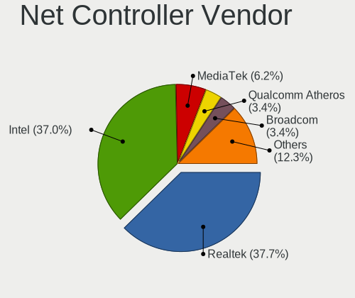

Pop!_OS - Hardware Trends (Desktops)
------------------------------------

A project to identify most popular hardware characteristics and track their change
over time based on data collected by Linux users at https://Linux-Hardware.org.

Anyone can contribute to this report by the [hw-probe](https://github.com/linuxhw/hw-probe) tool:

    sudo -E hw-probe -all -upload

This report is for one last month. Overall report since the beginning of time: [TestCoverage](https://github.com/linuxhw/TestCoverage)

Period: May, 2022.

Contents
--------

* [ System ](#system)
  - [ OS                       ](#os)
  - [ OS Family                ](#os-family)
  - [ Kernel                   ](#kernel)
  - [ Kernel Family            ](#kernel-family)
  - [ Kernel Major Ver.        ](#kernel-major-ver)
  - [ Arch                     ](#arch)
  - [ DE                       ](#de)
  - [ Display Server           ](#display-server)
  - [ Display Manager          ](#display-manager)
  - [ OS Lang                  ](#os-lang)
  - [ Boot Mode                ](#boot-mode)
  - [ Filesystem               ](#filesystem)
  - [ Part. scheme             ](#part-scheme)
  - [ Dual Boot with Linux/BSD ](#dual-boot-with-linuxbsd)
  - [ Dual Boot (Win)          ](#dual-boot-win)

* [ Board ](#board)
  - [ Vendor                   ](#vendor)
  - [ Model                    ](#model)
  - [ Model Family             ](#model-family)
  - [ MFG Year                 ](#mfg-year)
  - [ Form Factor              ](#form-factor)
  - [ Secure Boot              ](#secure-boot)
  - [ Coreboot                 ](#coreboot)
  - [ RAM Size                 ](#ram-size)
  - [ RAM Used                 ](#ram-used)
  - [ Total Drives             ](#total-drives)
  - [ Has CD-ROM               ](#has-cd-rom)
  - [ Has Ethernet             ](#has-ethernet)
  - [ Has WiFi                 ](#has-wifi)
  - [ Has Bluetooth            ](#has-bluetooth)

* [ Location ](#location)
  - [ Country                  ](#country)
  - [ City                     ](#city)

* [ Drives ](#drives)
  - [ Drive Vendor             ](#drive-vendor)
  - [ Drive Model              ](#drive-model)
  - [ HDD Vendor               ](#hdd-vendor)
  - [ SSD Vendor               ](#ssd-vendor)
  - [ Drive Kind               ](#drive-kind)
  - [ Drive Connector          ](#drive-connector)
  - [ Drive Size               ](#drive-size)
  - [ Space Total              ](#space-total)
  - [ Space Used               ](#space-used)
  - [ Malfunc. Drives          ](#malfunc-drives)
  - [ Malfunc. Drive Vendor    ](#malfunc-drive-vendor)
  - [ Malfunc. HDD Vendor      ](#malfunc-hdd-vendor)
  - [ Malfunc. Drive Kind      ](#malfunc-drive-kind)
  - [ Failed Drives            ](#failed-drives)
  - [ Failed Drive Vendor      ](#failed-drive-vendor)
  - [ Drive Status             ](#drive-status)

* [ Storage controller ](#storage-controller)
  - [ Storage Vendor           ](#storage-vendor)
  - [ Storage Model            ](#storage-model)
  - [ Storage Kind             ](#storage-kind)

* [ Processor ](#processor)
  - [ CPU Vendor               ](#cpu-vendor)
  - [ CPU Model                ](#cpu-model)
  - [ CPU Model Family         ](#cpu-model-family)
  - [ CPU Cores                ](#cpu-cores)
  - [ CPU Sockets              ](#cpu-sockets)
  - [ CPU Threads              ](#cpu-threads)
  - [ CPU Op-Modes             ](#cpu-op-modes)
  - [ CPU Microcode            ](#cpu-microcode)
  - [ CPU Microarch            ](#cpu-microarch)

* [ Graphics ](#graphics)
  - [ GPU Vendor               ](#gpu-vendor)
  - [ GPU Model                ](#gpu-model)
  - [ GPU Combo                ](#gpu-combo)
  - [ GPU Driver               ](#gpu-driver)
  - [ GPU Memory               ](#gpu-memory)

* [ Monitor ](#monitor)
  - [ Monitor Vendor           ](#monitor-vendor)
  - [ Monitor Model            ](#monitor-model)
  - [ Monitor Resolution       ](#monitor-resolution)
  - [ Monitor Diagonal         ](#monitor-diagonal)
  - [ Monitor Width            ](#monitor-width)
  - [ Aspect Ratio             ](#aspect-ratio)
  - [ Monitor Area             ](#monitor-area)
  - [ Pixel Density            ](#pixel-density)
  - [ Multiple Monitors        ](#multiple-monitors)

* [ Network ](#network)
  - [ Net Controller Vendor    ](#net-controller-vendor)
  - [ Net Controller Model     ](#net-controller-model)
  - [ Wireless Vendor          ](#wireless-vendor)
  - [ Wireless Model           ](#wireless-model)
  - [ Ethernet Vendor          ](#ethernet-vendor)
  - [ Ethernet Model           ](#ethernet-model)
  - [ Net Controller Kind      ](#net-controller-kind)
  - [ Used Controller          ](#used-controller)
  - [ NICs                     ](#nics)
  - [ IPv6                     ](#ipv6)

* [ Bluetooth ](#bluetooth)
  - [ Bluetooth Vendor         ](#bluetooth-vendor)
  - [ Bluetooth Model          ](#bluetooth-model)

* [ Sound ](#sound)
  - [ Sound Vendor             ](#sound-vendor)
  - [ Sound Model              ](#sound-model)

* [ Memory ](#memory)
  - [ Memory Vendor            ](#memory-vendor)
  - [ Memory Model             ](#memory-model)
  - [ Memory Kind              ](#memory-kind)
  - [ Memory Form Factor       ](#memory-form-factor)
  - [ Memory Size              ](#memory-size)
  - [ Memory Speed             ](#memory-speed)

* [ Printers & scanners ](#printers--scanners)
  - [ Printer Vendor           ](#printer-vendor)
  - [ Printer Model            ](#printer-model)
  - [ Scanner Vendor           ](#scanner-vendor)
  - [ Scanner Model            ](#scanner-model)

* [ Camera ](#camera)
  - [ Camera Vendor            ](#camera-vendor)
  - [ Camera Model             ](#camera-model)

* [ Security ](#security)
  - [ Fingerprint Vendor       ](#fingerprint-vendor)
  - [ Fingerprint Model        ](#fingerprint-model)
  - [ Chipcard Vendor          ](#chipcard-vendor)
  - [ Chipcard Model           ](#chipcard-model)

* [ Unsupported ](#unsupported)
  - [ Unsupported Devices      ](#unsupported-devices)
  - [ Unsupported Device Types ](#unsupported-device-types)

System
------

OS
--

Installed operating systems

| Name          | Desktops | Percent |
|---------------|----------|---------|
| Pop!_OS 22.04 | 100      | 86.96%  |
| Pop!_OS 21.10 | 12       | 10.43%  |
| Pop!_OS 21.04 | 1        | 0.87%   |
| Pop!_OS 20.10 | 1        | 0.87%   |
| Pop!_OS 20.04 | 1        | 0.87%   |

OS Family
---------

OS without a version

| Name    | Desktops | Percent |
|---------|----------|---------|
| Pop!_OS | 115      | 100%    |

Kernel
------

Version of the Linux kernel

| Version                  | Desktops | Percent |
|--------------------------|----------|---------|
| 5.17.5-76051705-generic  | 89       | 77.39%  |
| 5.16.19-76051619-generic | 20       | 17.39%  |
| 5.8.0-7630-generic       | 1        | 0.87%   |
| 5.17.4-051704-generic    | 1        | 0.87%   |
| 5.16.15-76051615-generic | 1        | 0.87%   |
| 5.16.11-76051611-generic | 1        | 0.87%   |
| 5.15.5-76051505-generic  | 1        | 0.87%   |
| 5.15.11-76051511-generic | 1        | 0.87%   |

Kernel Family
-------------

Linux kernel without a distro release

| Version | Desktops | Percent |
|---------|----------|---------|
| 5.17.5  | 89       | 77.39%  |
| 5.16.19 | 20       | 17.39%  |
| 5.8.0   | 1        | 0.87%   |
| 5.17.4  | 1        | 0.87%   |
| 5.16.15 | 1        | 0.87%   |
| 5.16.11 | 1        | 0.87%   |
| 5.15.5  | 1        | 0.87%   |
| 5.15.11 | 1        | 0.87%   |

Kernel Major Ver.
-----------------

Linux kernel major version

| Version | Desktops | Percent |
|---------|----------|---------|
| 5.17    | 90       | 78.26%  |
| 5.16    | 22       | 19.13%  |
| 5.15    | 2        | 1.74%   |
| 5.8     | 1        | 0.87%   |

Arch
----

OS architecture (x86_64, i586, etc.)

| Name   | Desktops | Percent |
|--------|----------|---------|
| x86_64 | 115      | 100%    |

DE
--

Desktop Environment

| Name       | Desktops | Percent |
|------------|----------|---------|
| GNOME      | 113      | 98.26%  |
| X-Cinnamon | 1        | 0.87%   |
| LXQt       | 1        | 0.87%   |

Display Server
--------------

X11 or Wayland

| Name    | Desktops | Percent |
|---------|----------|---------|
| X11     | 113      | 98.26%  |
| Wayland | 2        | 1.74%   |

Display Manager
---------------

SDDM, LightDM, etc.

| Name    | Desktops | Percent |
|---------|----------|---------|
| Unknown | 94       | 81.74%  |
| GDM3    | 18       | 15.65%  |
| GDM     | 3        | 2.61%   |

OS Lang
-------

Language

| Lang  | Desktops | Percent |
|-------|----------|---------|
| en_US | 74       | 64.35%  |
| de_DE | 7        | 6.09%   |
| en_GB | 5        | 4.35%   |
| C     | 5        | 4.35%   |
| pt_BR | 4        | 3.48%   |
| fr_FR | 4        | 3.48%   |
| en_AU | 4        | 3.48%   |
| pl_PL | 3        | 2.61%   |
| en_CA | 2        | 1.74%   |
| nl_NL | 1        | 0.87%   |
| it_IT | 1        | 0.87%   |
| fi_FI | 1        | 0.87%   |
| es_ES | 1        | 0.87%   |
| en_IL | 1        | 0.87%   |
| en_IE | 1        | 0.87%   |
| cs_CZ | 1        | 0.87%   |

Boot Mode
---------

EFI or BIOS

| Mode | Desktops | Percent |
|------|----------|---------|
| BIOS | 98       | 85.22%  |
| EFI  | 17       | 14.78%  |

Filesystem
----------

Type of filesystem

| Type    | Desktops | Percent |
|---------|----------|---------|
| Ext4    | 109      | 94.78%  |
| Btrfs   | 4        | 3.48%   |
| Overlay | 2        | 1.74%   |

Part. scheme
------------

Scheme of partitioning

| Type    | Desktops | Percent |
|---------|----------|---------|
| Unknown | 94       | 81.74%  |
| GPT     | 19       | 16.52%  |
| MBR     | 2        | 1.74%   |

Dual Boot with Linux/BSD
------------------------

Hosting more than one Linux/BSD

| Dual boot | Desktops | Percent |
|-----------|----------|---------|
| No        | 112      | 97.39%  |
| Yes       | 3        | 2.61%   |

Dual Boot (Win)
---------------

Hosting Linux and Windows

| Dual boot | Desktops | Percent |
|-----------|----------|---------|
| No        | 100      | 86.96%  |
| Yes       | 15       | 13.04%  |

Board
-----

Vendor
------

Motherboard manufacturer

| Name                | Desktops | Percent |
|---------------------|----------|---------|
| ASUSTek Computer    | 38       | 33.04%  |
| Gigabyte Technology | 23       | 20%     |
| ASRock              | 14       | 12.17%  |
| MSI                 | 13       | 11.3%   |
| Dell                | 7        | 6.09%   |
| Hewlett-Packard     | 5        | 4.35%   |
| Lenovo              | 3        | 2.61%   |
| Alienware           | 2        | 1.74%   |
| System76            | 1        | 0.87%   |
| Supermicro          | 1        | 0.87%   |
| SIEMENS             | 1        | 0.87%   |
| Positivo            | 1        | 0.87%   |
| NZXT                | 1        | 0.87%   |
| Foxconn             | 1        | 0.87%   |
| ECS                 | 1        | 0.87%   |
| AZW                 | 1        | 0.87%   |
| Acer                | 1        | 0.87%   |
| Unknown             | 1        | 0.87%   |

Model
-----

Motherboard model

| Name                                               | Desktops | Percent |
|----------------------------------------------------|----------|---------|
| ASUS All Series                                    | 4        | 3.48%   |
| Gigabyte Z170-HD3P                                 | 2        | 1.74%   |
| Gigabyte X570 AORUS ELITE                          | 2        | 1.74%   |
| Gigabyte B450 AORUS M                              | 2        | 1.74%   |
| Dell OptiPlex 3020                                 | 2        | 1.74%   |
| ASUS ROG CROSSHAIR VIII DARK HERO                  | 2        | 1.74%   |
| ASUS PRIME B450M-A                                 | 2        | 1.74%   |
| System76 Thelio Major                              | 1        | 0.87%   |
| Supermicro X8SIL                                   | 1        | 0.87%   |
| SIEMENS SIMATIC BOX PC 627B/PANEL PC 677B Profibus | 1        | 0.87%   |
| Positivo POS-MI945AA                               | 1        | 0.87%   |
| NZXT N7 B550                                       | 1        | 0.87%   |
| MSI MS-7C91                                        | 1        | 0.87%   |
| MSI MS-7C37                                        | 1        | 0.87%   |
| MSI MS-7B86                                        | 1        | 0.87%   |
| MSI MS-7B12                                        | 1        | 0.87%   |
| MSI MS-7A74                                        | 1        | 0.87%   |
| MSI MS-7A71                                        | 1        | 0.87%   |
| MSI MS-7A40                                        | 1        | 0.87%   |
| MSI MS-7A37                                        | 1        | 0.87%   |
| MSI MS-7A32                                        | 1        | 0.87%   |
| MSI MS-7A16                                        | 1        | 0.87%   |
| MSI MS-7817                                        | 1        | 0.87%   |
| MSI MS-7693                                        | 1        | 0.87%   |
| MSI A55PV.AR3510D                                  | 1        | 0.87%   |
| Lenovo ThinkStation S30 43516Y7                    | 1        | 0.87%   |
| Lenovo ThinkCentre M93p 10A6S0RN00                 | 1        | 0.87%   |
| Lenovo ThinkCentre M82 2929AZ6                     | 1        | 0.87%   |
| HP Z820 Workstation                                | 1        | 0.87%   |
| HP Z600 Workstation                                | 1        | 0.87%   |
| HP OMEN 30L Desktop GT13-0xxx                      | 1        | 0.87%   |
| HP EliteDesk 800 G2 SFF                            | 1        | 0.87%   |
| HP EliteDesk 705 G3 Desktop Mini                   | 1        | 0.87%   |
| Gigabyte Z390 AORUS PRO                            | 1        | 0.87%   |
| Gigabyte Z170-Gaming K3                            | 1        | 0.87%   |
| Gigabyte X570S AERO G                              | 1        | 0.87%   |
| Gigabyte X570 AORUS PRO WIFI                       | 1        | 0.87%   |
| Gigabyte X470 AORUS GAMING 7 WIFI                  | 1        | 0.87%   |
| Gigabyte H67N-USB3-B3                              | 1        | 0.87%   |
| Gigabyte H310M S2H 2.0                             | 1        | 0.87%   |
| Gigabyte H270-Gaming 3                             | 1        | 0.87%   |
| Gigabyte H110M-S2V                                 | 1        | 0.87%   |
| Gigabyte GA-78LMT-S2P                              | 1        | 0.87%   |
| Gigabyte B75M-D3H                                  | 1        | 0.87%   |
| Gigabyte B660 AORUS MASTER DDR4                    | 1        | 0.87%   |
| Gigabyte B550M AORUS PRO-P                         | 1        | 0.87%   |
| Gigabyte B450 AORUS PRO WIFI                       | 1        | 0.87%   |
| Gigabyte AX370M-DS3H                               | 1        | 0.87%   |
| Gigabyte AB350-Gaming 3                            | 1        | 0.87%   |
| Gigabyte 990FXA-UD3                                | 1        | 0.87%   |
| Foxconn Pro 3500 Series                            | 1        | 0.87%   |
| ECS FQ565AA-ABA a6700f                             | 1        | 0.87%   |
| Dell XPS 8300                                      | 1        | 0.87%   |
| Dell Precision WorkStation T5500                   | 1        | 0.87%   |
| Dell OptiPlex 790                                  | 1        | 0.87%   |
| Dell OptiPlex 5040                                 | 1        | 0.87%   |
| Dell Inspiron 3470                                 | 1        | 0.87%   |
| AZW BT3 X                                          | 1        | 0.87%   |
| ASUS TUF Gaming Z690-PLUS WIFI D4                  | 1        | 0.87%   |
| ASUS TUF B450M-PLUS GAMING                         | 1        | 0.87%   |

Model Family
------------

Motherboard model prefix

| Name                  | Desktops | Percent |
|-----------------------|----------|---------|
| ASUS ROG              | 14       | 12.17%  |
| ASUS PRIME            | 6        | 5.22%   |
| Dell OptiPlex         | 4        | 3.48%   |
| ASUS All              | 4        | 3.48%   |
| Gigabyte X570         | 3        | 2.61%   |
| Gigabyte B450         | 3        | 2.61%   |
| Lenovo ThinkCentre    | 2        | 1.74%   |
| HP EliteDesk          | 2        | 1.74%   |
| Gigabyte Z170-HD3P    | 2        | 1.74%   |
| ASUS TUF              | 2        | 1.74%   |
| ASRock B450           | 2        | 1.74%   |
| Alienware Aurora      | 2        | 1.74%   |
| System76 Thelio       | 1        | 0.87%   |
| Supermicro X8SIL      | 1        | 0.87%   |
| SIEMENS SIMATIC       | 1        | 0.87%   |
| Positivo POS-MI945AA  | 1        | 0.87%   |
| NZXT N7               | 1        | 0.87%   |
| MSI MS-7C91           | 1        | 0.87%   |
| MSI MS-7C37           | 1        | 0.87%   |
| MSI MS-7B86           | 1        | 0.87%   |
| MSI MS-7B12           | 1        | 0.87%   |
| MSI MS-7A74           | 1        | 0.87%   |
| MSI MS-7A71           | 1        | 0.87%   |
| MSI MS-7A40           | 1        | 0.87%   |
| MSI MS-7A37           | 1        | 0.87%   |
| MSI MS-7A32           | 1        | 0.87%   |
| MSI MS-7A16           | 1        | 0.87%   |
| MSI MS-7817           | 1        | 0.87%   |
| MSI MS-7693           | 1        | 0.87%   |
| MSI A55PV.AR3510D     | 1        | 0.87%   |
| Lenovo ThinkStation   | 1        | 0.87%   |
| HP Z820               | 1        | 0.87%   |
| HP Z600               | 1        | 0.87%   |
| HP OMEN               | 1        | 0.87%   |
| Gigabyte Z390         | 1        | 0.87%   |
| Gigabyte Z170-Gaming  | 1        | 0.87%   |
| Gigabyte X570S        | 1        | 0.87%   |
| Gigabyte X470         | 1        | 0.87%   |
| Gigabyte H67N-USB3-B3 | 1        | 0.87%   |
| Gigabyte H310M        | 1        | 0.87%   |
| Gigabyte H270-Gaming  | 1        | 0.87%   |
| Gigabyte H110M-S2V    | 1        | 0.87%   |
| Gigabyte GA-78LMT-S2P | 1        | 0.87%   |
| Gigabyte B75M-D3H     | 1        | 0.87%   |
| Gigabyte B660         | 1        | 0.87%   |
| Gigabyte B550M        | 1        | 0.87%   |
| Gigabyte AX370M-DS3H  | 1        | 0.87%   |
| Gigabyte AB350-Gaming | 1        | 0.87%   |
| Gigabyte 990FXA-UD3   | 1        | 0.87%   |
| Foxconn Pro           | 1        | 0.87%   |
| ECS FQ565AA-ABA       | 1        | 0.87%   |
| Dell XPS              | 1        | 0.87%   |
| Dell Precision        | 1        | 0.87%   |
| Dell Inspiron         | 1        | 0.87%   |
| AZW BT3               | 1        | 0.87%   |
| ASUS SABERTOOTH       | 1        | 0.87%   |
| ASUS P8H61-M          | 1        | 0.87%   |
| ASUS P7P55D-E         | 1        | 0.87%   |
| ASUS P5QPL-AM         | 1        | 0.87%   |
| ASUS P5KPL-SE         | 1        | 0.87%   |

MFG Year
--------

Motherboard manufacture year

| Year | Desktops | Percent |
|------|----------|---------|
| 2018 | 22       | 19.13%  |
| 2021 | 14       | 12.17%  |
| 2019 | 13       | 11.3%   |
| 2011 | 9        | 7.83%   |
| 2020 | 8        | 6.96%   |
| 2016 | 8        | 6.96%   |
| 2017 | 7        | 6.09%   |
| 2014 | 7        | 6.09%   |
| 2015 | 6        | 5.22%   |
| 2012 | 5        | 4.35%   |
| 2009 | 5        | 4.35%   |
| 2022 | 3        | 2.61%   |
| 2013 | 3        | 2.61%   |
| 2008 | 3        | 2.61%   |
| 2010 | 1        | 0.87%   |
| 2007 | 1        | 0.87%   |

Form Factor
-----------

Physical design of the computer

| Name    | Desktops | Percent |
|---------|----------|---------|
| Desktop | 115      | 100%    |

Secure Boot
-----------

Enabled or disabled

| State    | Desktops | Percent |
|----------|----------|---------|
| Disabled | 115      | 100%    |

Coreboot
--------

Have coreboot on board

| Used | Desktops | Percent |
|------|----------|---------|
| No   | 115      | 100%    |

RAM Size
--------

Total RAM memory

| Size in GB      | Desktops | Percent |
|-----------------|----------|---------|
| 32.01-64.0      | 37       | 32.17%  |
| 16.01-24.0      | 28       | 24.35%  |
| 8.01-16.0       | 20       | 17.39%  |
| 64.01-256.0     | 9        | 7.83%   |
| 4.01-8.0        | 8        | 6.96%   |
| 3.01-4.0        | 7        | 6.09%   |
| 24.01-32.0      | 4        | 3.48%   |
| More than 256.0 | 2        | 1.74%   |

RAM Used
--------

Used RAM memory

| Used GB    | Desktops | Percent |
|------------|----------|---------|
| 4.01-8.0   | 36       | 31.3%   |
| 2.01-3.0   | 35       | 30.43%  |
| 3.01-4.0   | 23       | 20%     |
| 1.01-2.0   | 13       | 11.3%   |
| 8.01-16.0  | 6        | 5.22%   |
| 16.01-24.0 | 2        | 1.74%   |

Total Drives
------------

Number of drives on board

| Drives | Desktops | Percent |
|--------|----------|---------|
| 2      | 48       | 41.74%  |
| 1      | 26       | 22.61%  |
| 3      | 22       | 19.13%  |
| 4      | 8        | 6.96%   |
| 5      | 5        | 4.35%   |
| 6      | 3        | 2.61%   |
| 10     | 1        | 0.87%   |
| 9      | 1        | 0.87%   |
| 7      | 1        | 0.87%   |

Has CD-ROM
----------

Has CD-ROM on board

| Presented | Desktops | Percent |
|-----------|----------|---------|
| No        | 84       | 73.04%  |
| Yes       | 31       | 26.96%  |

Has Ethernet
------------

Has Ethernet on board

| Presented | Desktops | Percent |
|-----------|----------|---------|
| Yes       | 115      | 100%    |

Has WiFi
--------

Has WiFi module

| Presented | Desktops | Percent |
|-----------|----------|---------|
| Yes       | 73       | 63.48%  |
| No        | 42       | 36.52%  |

Has Bluetooth
-------------

Has Bluetooth module

| Presented | Desktops | Percent |
|-----------|----------|---------|
| No        | 63       | 54.78%  |
| Yes       | 52       | 45.22%  |

Location
--------

Country
-------

Geographic location (country)

| Country      | Desktops | Percent |
|--------------|----------|---------|
| USA          | 51       | 44.35%  |
| Germany      | 8        | 6.96%   |
| Australia    | 6        | 5.22%   |
| UK           | 5        | 4.35%   |
| Brazil       | 5        | 4.35%   |
| France       | 4        | 3.48%   |
| Switzerland  | 3        | 2.61%   |
| Norway       | 3        | 2.61%   |
| Canada       | 3        | 2.61%   |
| South Africa | 2        | 1.74%   |
| Poland       | 2        | 1.74%   |
| Ireland      | 2        | 1.74%   |
| Finland      | 2        | 1.74%   |
| Austria      | 2        | 1.74%   |
| Turkey       | 1        | 0.87%   |
| Thailand     | 1        | 0.87%   |
| Sweden       | 1        | 0.87%   |
| Spain        | 1        | 0.87%   |
| South Korea  | 1        | 0.87%   |
| Saudi Arabia | 1        | 0.87%   |
| Russia       | 1        | 0.87%   |
| Philippines  | 1        | 0.87%   |
| Nicaragua    | 1        | 0.87%   |
| Netherlands  | 1        | 0.87%   |
| Mexico       | 1        | 0.87%   |
| Lithuania    | 1        | 0.87%   |
| Jordan       | 1        | 0.87%   |
| Italy        | 1        | 0.87%   |
| Greece       | 1        | 0.87%   |
| Czechia      | 1        | 0.87%   |
| Azerbaijan   | 1        | 0.87%   |

City
----

Geographic location (city)

| City                 | Desktops | Percent |
|----------------------|----------|---------|
| Zurich               | 2        | 1.74%   |
| Vienna               | 2        | 1.74%   |
| Norwalk              | 2        | 1.74%   |
| Chicago              | 2        | 1.74%   |
| Brisbane             | 2        | 1.74%   |
| Żyrardów           | 1        | 0.87%   |
| Zaragoza             | 1        | 0.87%   |
| Zapopan              | 1        | 0.87%   |
| Woodstock            | 1        | 0.87%   |
| Wichita              | 1        | 0.87%   |
| Weston-super-Mare    | 1        | 0.87%   |
| Wendorf              | 1        | 0.87%   |
| Weimar               | 1        | 0.87%   |
| Walker               | 1        | 0.87%   |
| Vilnius              | 1        | 0.87%   |
| Ventura              | 1        | 0.87%   |
| Valparaiso           | 1        | 0.87%   |
| Union                | 1        | 0.87%   |
| Turku                | 1        | 0.87%   |
| Tucson               | 1        | 0.87%   |
| Tuam                 | 1        | 0.87%   |
| Trondheim            | 1        | 0.87%   |
| Thessaloniki         | 1        | 0.87%   |
| Theilingen           | 1        | 0.87%   |
| Taunton              | 1        | 0.87%   |
| Tarlac City          | 1        | 0.87%   |
| Sydney               | 1        | 0.87%   |
| Sumter               | 1        | 0.87%   |
| Stuttgart            | 1        | 0.87%   |
| Sokolov              | 1        | 0.87%   |
| Sao Paulo            | 1        | 0.87%   |
| Sanger               | 1        | 0.87%   |
| San Jose             | 1        | 0.87%   |
| San Francisco        | 1        | 0.87%   |
| San Antonio          | 1        | 0.87%   |
| Sacramento           | 1        | 0.87%   |
| Røyken Municipality | 1        | 0.87%   |
| Rotterdam            | 1        | 0.87%   |
| Rome                 | 1        | 0.87%   |
| Riyadh               | 1        | 0.87%   |
| Richmond             | 1        | 0.87%   |
| Rensselaer           | 1        | 0.87%   |
| Recife               | 1        | 0.87%   |
| Provo                | 1        | 0.87%   |
| Potsdam              | 1        | 0.87%   |
| Portsmouth           | 1        | 0.87%   |
| Phitsanulok          | 1        | 0.87%   |
| Philadelphia         | 1        | 0.87%   |
| Pelotas              | 1        | 0.87%   |
| Parsippany           | 1        | 0.87%   |
| Paris                | 1        | 0.87%   |
| Oslo                 | 1        | 0.87%   |
| Orzesze              | 1        | 0.87%   |
| Olympia              | 1        | 0.87%   |
| Ollainville          | 1        | 0.87%   |
| Noisy-le-Roi         | 1        | 0.87%   |
| Nelson               | 1        | 0.87%   |
| Moscow               | 1        | 0.87%   |
| Merced               | 1        | 0.87%   |
| Melton Mowbray       | 1        | 0.87%   |

Drives
------

Drive Vendor
------------

Hard drive vendors

| Vendor                    | Desktops | Drives | Percent |
|---------------------------|----------|--------|---------|
| Samsung Electronics       | 47       | 63     | 19.58%  |
| Seagate                   | 44       | 60     | 18.33%  |
| WDC                       | 29       | 38     | 12.08%  |
| Sandisk                   | 17       | 19     | 7.08%   |
| Toshiba                   | 15       | 16     | 6.25%   |
| Kingston                  | 14       | 15     | 5.83%   |
| Hitachi                   | 10       | 11     | 4.17%   |
| Crucial                   | 10       | 13     | 4.17%   |
| Phison                    | 8        | 8      | 3.33%   |
| Intel                     | 5        | 5      | 2.08%   |
| SPCC                      | 4        | 5      | 1.67%   |
| Silicon Motion            | 4        | 6      | 1.67%   |
| A-DATA Technology         | 4        | 4      | 1.67%   |
| Patriot                   | 3        | 3      | 1.25%   |
| Micron Technology         | 3        | 3      | 1.25%   |
| SK Hynix                  | 2        | 2      | 0.83%   |
| Micron/Crucial Technology | 2        | 2      | 0.83%   |
| XPG                       | 1        | 1      | 0.42%   |
| Unknown                   | 1        | 1      | 0.42%   |
| TurXun                    | 1        | 1      | 0.42%   |
| TO Exter                  | 1        | 1      | 0.42%   |
| Realtek Semiconductor     | 1        | 1      | 0.42%   |
| PNY USB                   | 1        | 1      | 0.42%   |
| OCZ                       | 1        | 1      | 0.42%   |
| Mass                      | 1        | 1      | 0.42%   |
| LITEON                    | 1        | 1      | 0.42%   |
| Lexar                     | 1        | 1      | 0.42%   |
| Intenso                   | 1        | 1      | 0.42%   |
| HS-SSD-C100               | 1        | 1      | 0.42%   |
| HGST                      | 1        | 1      | 0.42%   |
| Hewlett-Packard           | 1        | 1      | 0.42%   |
| Gigabyte Technology       | 1        | 1      | 0.42%   |
| Fujitsu                   | 1        | 1      | 0.42%   |
| FORESEE                   | 1        | 1      | 0.42%   |
| China                     | 1        | 2      | 0.42%   |
| ASMT                      | 1        | 1      | 0.42%   |

Drive Model
-----------

Hard drive models

| Model                               | Desktops | Percent |
|-------------------------------------|----------|---------|
| Samsung NVMe SSD Drive 500GB        | 10       | 3.56%   |
| Samsung NVMe SSD Drive 1TB          | 10       | 3.56%   |
| Seagate ST4000DM004-2CV104 4TB      | 5        | 1.78%   |
| Seagate ST2000DM008-2FR102 2TB      | 5        | 1.78%   |
| Kingston SA400S37240G 240GB SSD     | 5        | 1.78%   |
| Seagate ST1000DM010-2EP102 1TB      | 4        | 1.42%   |
| Sandisk NVMe SSD Drive 1TB          | 4        | 1.42%   |
| Toshiba HDWD120 2TB                 | 3        | 1.07%   |
| SPCC Solid State Disk 512GB         | 3        | 1.07%   |
| Seagate ST500LM012 HN-M500MBB 500GB | 3        | 1.07%   |
| Seagate ST500DM002-1BD142 500GB     | 3        | 1.07%   |
| Samsung SSD 970 EVO Plus 1TB        | 3        | 1.07%   |
| Samsung SSD 860 EVO 1TB             | 3        | 1.07%   |
| Samsung NVMe SSD Drive 2TB          | 3        | 1.07%   |
| Phison NVMe SSD Drive 2TB           | 3        | 1.07%   |
| Crucial CT1000MX500SSD1 1TB         | 3        | 1.07%   |
| WDC WDS500G2B0A-00SM50 500GB SSD    | 2        | 0.71%   |
| WDC WD20EZRZ-00Z5HB0 2TB            | 2        | 0.71%   |
| WDC WD10EZEX-08M2NA0 1TB            | 2        | 0.71%   |
| WDC WD10EZEX-00WN4A0 1TB            | 2        | 0.71%   |
| Toshiba HDWD110 1TB                 | 2        | 0.71%   |
| Toshiba DT01ACA200 2TB              | 2        | 0.71%   |
| Silicon Motion NVMe SSD Drive 128GB | 2        | 0.71%   |
| Seagate ST4000DM000-1F2168 4TB      | 2        | 0.71%   |
| Seagate ST2000DM006-2DM164 2TB      | 2        | 0.71%   |
| Seagate ST1000DM003-1CH162 1TB      | 2        | 0.71%   |
| Seagate NVMe SSD Drive 1TB          | 2        | 0.71%   |
| Seagate Expansion 4TB               | 2        | 0.71%   |
| Sandisk NVMe SSD Drive 512GB        | 2        | 0.71%   |
| Sandisk NVMe SSD Drive 500GB        | 2        | 0.71%   |
| Sandisk NVMe SSD Drive 2TB          | 2        | 0.71%   |
| Samsung SSD 980 PRO 1TB             | 2        | 0.71%   |
| Samsung SSD 860 EVO 500GB           | 2        | 0.71%   |
| Samsung SSD 860 EVO 2TB             | 2        | 0.71%   |
| Samsung SSD 850 EVO 250GB           | 2        | 0.71%   |
| Samsung SSD 840 PRO Series 256GB    | 2        | 0.71%   |
| Phison NVMe SSD Drive 960GB         | 2        | 0.71%   |
| Phison NVMe SSD Drive 1TB           | 2        | 0.71%   |
| XPG NVMe SSD Drive 2TB              | 1        | 0.36%   |
| WDC WDS500G2B0B 500GB SSD           | 1        | 0.36%   |
| WDC WDS500G1B0B-00AS40 500GB SSD    | 1        | 0.36%   |
| WDC WDS100T3X0C-00SJG0 1TB          | 1        | 0.36%   |
| WDC WDS100T2G0A-00JH30 1TB SSD      | 1        | 0.36%   |
| WDC WD80EZAZ-11TDBA0 8TB            | 1        | 0.36%   |
| WDC WD800JD-60LSA5 80GB             | 1        | 0.36%   |
| WDC WD5000LPCX-00VHAT0 500GB        | 1        | 0.36%   |
| WDC WD5000AVDS-63U7B1 500GB         | 1        | 0.36%   |
| WDC WD5000AAKX-22ERMA0 500GB        | 1        | 0.36%   |
| WDC WD50 00LPCX-00VHAT0 500GB       | 1        | 0.36%   |
| WDC WD40EZRZ-22GXCB0 4TB            | 1        | 0.36%   |
| WDC WD40EZRZ-00GXCB0 4TB            | 1        | 0.36%   |
| WDC WD40EZAZ-19SF3B0 4TB            | 1        | 0.36%   |
| WDC WD3200AAKS-00L6A0 320GB         | 1        | 0.36%   |
| WDC WD2500BEVS-60UST0 250GB         | 1        | 0.36%   |
| WDC WD20EZWX-60F5KA0 2TB            | 1        | 0.36%   |
| WDC WD20EZRX-00D8PB0 2TB            | 1        | 0.36%   |
| WDC WD20EFRX-68EUZN0 2TB            | 1        | 0.36%   |
| WDC WD15EADS-65P8B1 1TB             | 1        | 0.36%   |
| WDC WD10JPVX-60JC3T0 1TB            | 1        | 0.36%   |
| WDC WD10JPVT-22A1YT0 1TB            | 1        | 0.36%   |

HDD Vendor
----------

Hard disk drive vendors

| Vendor              | Desktops | Drives | Percent |
|---------------------|----------|--------|---------|
| Seagate             | 41       | 54     | 44.57%  |
| WDC                 | 24       | 31     | 26.09%  |
| Toshiba             | 14       | 15     | 15.22%  |
| Hitachi             | 10       | 11     | 10.87%  |
| Samsung Electronics | 1        | 1      | 1.09%   |
| HGST                | 1        | 1      | 1.09%   |
| ASMT                | 1        | 1      | 1.09%   |

SSD Vendor
----------

Solid state drive vendors

| Vendor              | Desktops | Drives | Percent |
|---------------------|----------|--------|---------|
| Samsung Electronics | 18       | 25     | 24.66%  |
| Kingston            | 12       | 12     | 16.44%  |
| SanDisk             | 7        | 7      | 9.59%   |
| Crucial             | 7        | 10     | 9.59%   |
| WDC                 | 5        | 5      | 6.85%   |
| SPCC                | 3        | 3      | 4.11%   |
| Patriot             | 3        | 3      | 4.11%   |
| Intel               | 3        | 3      | 4.11%   |
| A-DATA Technology   | 3        | 3      | 4.11%   |
| Toshiba             | 1        | 1      | 1.37%   |
| TO Exter            | 1        | 1      | 1.37%   |
| SK Hynix            | 1        | 1      | 1.37%   |
| PNY USB             | 1        | 1      | 1.37%   |
| OCZ                 | 1        | 1      | 1.37%   |
| Micron Technology   | 1        | 1      | 1.37%   |
| Lexar               | 1        | 1      | 1.37%   |
| Hewlett-Packard     | 1        | 1      | 1.37%   |
| Gigabyte Technology | 1        | 1      | 1.37%   |
| Fujitsu             | 1        | 1      | 1.37%   |
| FORESEE             | 1        | 1      | 1.37%   |
| China               | 1        | 2      | 1.37%   |

Drive Kind
----------

HDD or SSD

| Kind    | Desktops | Drives | Percent |
|---------|----------|--------|---------|
| HDD     | 70       | 114    | 35.9%   |
| SSD     | 61       | 84     | 31.28%  |
| NVMe    | 57       | 88     | 29.23%  |
| Unknown | 6        | 6      | 3.08%   |
| MMC     | 1        | 1      | 0.51%   |

Drive Connector
---------------

SATA, SAS, NVMe, etc.

| Type | Desktops | Drives | Percent |
|------|----------|--------|---------|
| SATA | 95       | 187    | 57.58%  |
| NVMe | 57       | 88     | 34.55%  |
| SAS  | 12       | 17     | 7.27%   |
| MMC  | 1        | 1      | 0.61%   |

Drive Size
----------

Size of hard drive

| Size in TB | Desktops | Drives | Percent |
|------------|----------|--------|---------|
| 0.01-0.5   | 59       | 86     | 38.82%  |
| 0.51-1.0   | 42       | 52     | 27.63%  |
| 1.01-2.0   | 26       | 29     | 17.11%  |
| 3.01-4.0   | 16       | 20     | 10.53%  |
| 4.01-10.0  | 5        | 7      | 3.29%   |
| 2.01-3.0   | 4        | 4      | 2.63%   |

Space Total
-----------

Amount of disk space available on the file system

| Size in GB     | Desktops | Percent |
|----------------|----------|---------|
| 1001-2000      | 24       | 20.87%  |
| 101-250        | 22       | 19.13%  |
| 251-500        | 19       | 16.52%  |
| 501-1000       | 19       | 16.52%  |
| More than 3000 | 17       | 14.78%  |
| 2001-3000      | 6        | 5.22%   |
| 1-20           | 4        | 3.48%   |
| 21-50          | 2        | 1.74%   |
| 51-100         | 1        | 0.87%   |
| Unknown        | 1        | 0.87%   |

Space Used
----------

Amount of used disk space

| Used GB        | Desktops | Percent |
|----------------|----------|---------|
| 1-20           | 33       | 28.7%   |
| 21-50          | 17       | 14.78%  |
| 101-250        | 13       | 11.3%   |
| 51-100         | 13       | 11.3%   |
| 1001-2000      | 11       | 9.57%   |
| 501-1000       | 10       | 8.7%    |
| 251-500        | 9        | 7.83%   |
| More than 3000 | 5        | 4.35%   |
| 2001-3000      | 3        | 2.61%   |
| Unknown        | 1        | 0.87%   |

Malfunc. Drives
---------------

Drive models with a malfunction

| Model                                 | Desktops | Drives | Percent |
|---------------------------------------|----------|--------|---------|
| WDC WD10JPVX-60JC3T0 1TB              | 1        | 1      | 25%     |
| Samsung Electronics SSD 850 PRO 256GB | 1        | 1      | 25%     |
| Kingston SV300S37A240G 240GB SSD      | 1        | 1      | 25%     |
| Hitachi HDP725050GLA360 500GB         | 1        | 1      | 25%     |

Malfunc. Drive Vendor
---------------------

Vendors of faulty drives

| Vendor              | Desktops | Drives | Percent |
|---------------------|----------|--------|---------|
| WDC                 | 1        | 1      | 25%     |
| Samsung Electronics | 1        | 1      | 25%     |
| Kingston            | 1        | 1      | 25%     |
| Hitachi             | 1        | 1      | 25%     |

Malfunc. HDD Vendor
-------------------

Vendors of faulty HDD drives

| Vendor  | Desktops | Drives | Percent |
|---------|----------|--------|---------|
| WDC     | 1        | 1      | 50%     |
| Hitachi | 1        | 1      | 50%     |

Malfunc. Drive Kind
-------------------

Kinds of faulty drives

| Kind | Desktops | Drives | Percent |
|------|----------|--------|---------|
| SSD  | 2        | 2      | 50%     |
| HDD  | 2        | 2      | 50%     |

Failed Drives
-------------

Failed drive models

Zero info for selected period =(

Failed Drive Vendor
-------------------

Failed drive vendors

Zero info for selected period =(

Drive Status
------------

Number of failed and malfunc. drives

| Status   | Desktops | Drives | Percent |
|----------|----------|--------|---------|
| Detected | 97       | 242    | 77.6%   |
| Works    | 24       | 47     | 19.2%   |
| Malfunc  | 4        | 4      | 3.2%    |

Storage controller
------------------

Storage Vendor
--------------

Storage controller vendors

| Vendor                      | Desktops | Percent |
|-----------------------------|----------|---------|
| Intel                       | 60       | 28.99%  |
| AMD                         | 55       | 26.57%  |
| Samsung Electronics         | 32       | 15.46%  |
| Sandisk                     | 10       | 4.83%   |
| Phison Electronics          | 10       | 4.83%   |
| ASMedia Technology          | 9        | 4.35%   |
| Silicon Motion              | 5        | 2.42%   |
| Micron/Crucial Technology   | 4        | 1.93%   |
| Seagate Technology          | 3        | 1.45%   |
| Marvell Technology Group    | 3        | 1.45%   |
| JMicron Technology          | 3        | 1.45%   |
| Micron Technology           | 2        | 0.97%   |
| Kingston Technology Company | 2        | 0.97%   |
| ADATA Technology            | 2        | 0.97%   |
| SK Hynix                    | 1        | 0.48%   |
| Silicon Image               | 1        | 0.48%   |
| Realtek Semiconductor       | 1        | 0.48%   |
| Nvidia                      | 1        | 0.48%   |
| LSI Logic / Symbios Logic   | 1        | 0.48%   |
| Lite-On Technology          | 1        | 0.48%   |
| Broadcom / LSI              | 1        | 0.48%   |

Storage Model
-------------

Storage controller models

| Model                                                                                   | Desktops | Percent |
|-----------------------------------------------------------------------------------------|----------|---------|
| AMD FCH SATA Controller [AHCI mode]                                                     | 38       | 14.9%   |
| Samsung NVMe SSD Controller SM981/PM981/PM983                                           | 24       | 9.41%   |
| AMD 400 Series Chipset SATA Controller                                                  | 16       | 6.27%   |
| Intel Q170/Q150/B150/H170/H110/Z170/CM236 Chipset SATA Controller [AHCI Mode]           | 10       | 3.92%   |
| ASMedia ASM1062 Serial ATA Controller                                                   | 8        | 3.14%   |
| Intel 200 Series PCH SATA controller [AHCI mode]                                        | 7        | 2.75%   |
| Samsung NVMe SSD Controller PM9A1/PM9A3/980PRO                                          | 6        | 2.35%   |
| Phison E12 NVMe Controller                                                              | 6        | 2.35%   |
| Intel 8 Series/C220 Series Chipset Family 6-port SATA Controller 1 [AHCI mode]          | 6        | 2.35%   |
| AMD SB7x0/SB8x0/SB9x0 IDE Controller                                                    | 6        | 2.35%   |
| Silicon Motion SM2263EN/SM2263XT SSD Controller                                         | 5        | 1.96%   |
| Intel 6 Series/C200 Series Chipset Family 6 port Desktop SATA AHCI Controller           | 5        | 1.96%   |
| AMD 500 Series Chipset SATA Controller                                                  | 5        | 1.96%   |
| Intel SATA Controller [RAID mode]                                                       | 4        | 1.57%   |
| Intel NM10/ICH7 Family SATA Controller [IDE mode]                                       | 4        | 1.57%   |
| Intel Cannon Lake PCH SATA AHCI Controller                                              | 4        | 1.57%   |
| Intel Alder Lake-S PCH SATA Controller [AHCI Mode]                                      | 4        | 1.57%   |
| Intel 82801G (ICH7 Family) IDE Controller                                               | 4        | 1.57%   |
| AMD SB7x0/SB8x0/SB9x0 SATA Controller [IDE mode]                                        | 4        | 1.57%   |
| AMD SB7x0/SB8x0/SB9x0 SATA Controller [AHCI mode]                                       | 4        | 1.57%   |
| Sandisk WD Black SN750 / PC SN730 NVMe SSD                                              | 3        | 1.18%   |
| Sandisk WD Black 2018/SN750 / PC SN720 NVMe SSD                                         | 3        | 1.18%   |
| Samsung NVMe SSD Controller SM961/PM961/SM963                                           | 3        | 1.18%   |
| Samsung NVMe SSD Controller SM951/PM951                                                 | 3        | 1.18%   |
| Phison E16 PCIe4 NVMe Controller                                                        | 3        | 1.18%   |
| AMD X370 Series Chipset SATA Controller                                                 | 3        | 1.18%   |
| AMD 300 Series Chipset SATA Controller                                                  | 3        | 1.18%   |
| Seagate FireCuda 530 SSD                                                                | 2        | 0.78%   |
| Sandisk WD PC SN810 / Black SN850 NVMe SSD                                              | 2        | 0.78%   |
| Micron/Crucial P1 NVMe PCIe SSD                                                         | 2        | 0.78%   |
| Micron Non-Volatile memory controller                                                   | 2        | 0.78%   |
| JMicron JMB361 AHCI/IDE                                                                 | 2        | 0.78%   |
| Intel Volume Management Device NVMe RAID Controller                                     | 2        | 0.78%   |
| Intel C602 chipset 4-Port SATA Storage Control Unit                                     | 2        | 0.78%   |
| Intel C600/X79 series chipset IDE-r Controller                                          | 2        | 0.78%   |
| Intel 7 Series/C210 Series Chipset Family 6-port SATA Controller [AHCI mode]            | 2        | 0.78%   |
| Intel 6 Series/C200 Series Chipset Family Desktop SATA Controller (IDE mode, ports 4-5) | 2        | 0.78%   |
| Intel 6 Series/C200 Series Chipset Family Desktop SATA Controller (IDE mode, ports 0-3) | 2        | 0.78%   |
| AMD FCH SATA Controller D                                                               | 2        | 0.78%   |
| ADATA XPG SX8200 Pro PCIe Gen3x4 M.2 2280 Solid State Drive                             | 2        | 0.78%   |
| SK Hynix BC501 NVMe Solid State Drive                                                   | 1        | 0.39%   |
| Silicon Image SiI 3132 Serial ATA Raid II Controller                                    | 1        | 0.39%   |
| Seagate FireCuda 520 SSD                                                                | 1        | 0.39%   |
| Sandisk WD Blue SN500 / PC SN520 NVMe SSD                                               | 1        | 0.39%   |
| Sandisk WD Black NVMe SSD                                                               | 1        | 0.39%   |
| Sandisk Non-Volatile memory controller                                                  | 1        | 0.39%   |
| Realtek Realtek Non-Volatile memory controller                                          | 1        | 0.39%   |
| Phison E18 PCIe4 NVMe Controller                                                        | 1        | 0.39%   |
| Nvidia MCP61 SATA Controller                                                            | 1        | 0.39%   |
| Nvidia MCP61 IDE                                                                        | 1        | 0.39%   |
| Micron/Crucial P2 NVMe PCIe SSD                                                         | 1        | 0.39%   |
| Micron/Crucial NVMe Controller                                                          | 1        | 0.39%   |
| Marvell Group 88SE9182 PCIe 2.0 x2 2-port SATA 6 Gb/s Controller                        | 1        | 0.39%   |
| Marvell Group 88SE9172 SATA 6Gb/s Controller                                            | 1        | 0.39%   |
| Marvell Group 88SE9120 SATA 6Gb/s Controller                                            | 1        | 0.39%   |
| LSI Logic / Symbios Logic SAS2008 PCI-Express Fusion-MPT SAS-2 [Falcon]                 | 1        | 0.39%   |
| Lite-On Non-Volatile memory controller                                                  | 1        | 0.39%   |
| Kingston Company Company Non-Volatile memory controller                                 | 1        | 0.39%   |
| Kingston Company KC2000 NVMe SSD                                                        | 1        | 0.39%   |
| Kingston Company A2000 NVMe SSD                                                         | 1        | 0.39%   |

Storage Kind
------------

Kind of storage controller (IDE, SATA, NVMe, SAS, ...)

| Kind | Desktops | Percent |
|------|----------|---------|
| SATA | 98       | 52.41%  |
| NVMe | 58       | 31.02%  |
| IDE  | 17       | 9.09%   |
| RAID | 12       | 6.42%   |
| SAS  | 2        | 1.07%   |

Processor
---------

CPU Vendor
----------

Processor vendors

| Vendor | Desktops | Percent |
|--------|----------|---------|
| Intel  | 59       | 51.3%   |
| AMD    | 56       | 48.7%   |

CPU Model
---------

Processor models

| Model                                          | Desktops | Percent |
|------------------------------------------------|----------|---------|
| Intel Core i7-7700K CPU @ 4.20GHz              | 4        | 3.48%   |
| Intel Core i7-6700K CPU @ 4.00GHz              | 4        | 3.48%   |
| AMD Ryzen 9 5900X 12-Core Processor            | 4        | 3.48%   |
| AMD Ryzen 7 5800X 8-Core Processor             | 4        | 3.48%   |
| Intel Core i7-2600 CPU @ 3.40GHz               | 3        | 2.61%   |
| AMD Ryzen 9 5950X 16-Core Processor            | 3        | 2.61%   |
| AMD Ryzen 9 3900X 12-Core Processor            | 3        | 2.61%   |
| AMD Ryzen 7 5700G with Radeon Graphics         | 3        | 2.61%   |
| AMD Ryzen 7 3700X 8-Core Processor             | 3        | 2.61%   |
| AMD Ryzen 5 2600X Six-Core Processor           | 3        | 2.61%   |
| AMD Ryzen 5 1600X Six-Core Processor           | 3        | 2.61%   |
| Intel Core i9-10900X CPU @ 3.70GHz             | 2        | 1.74%   |
| Intel Core i7-8700K CPU @ 3.70GHz              | 2        | 1.74%   |
| Intel Core i7-6700 CPU @ 3.40GHz               | 2        | 1.74%   |
| Intel Core i7-4790K CPU @ 4.00GHz              | 2        | 1.74%   |
| Intel Core i5-7400 CPU @ 3.00GHz               | 2        | 1.74%   |
| Intel Core i3-8100 CPU @ 3.60GHz               | 2        | 1.74%   |
| Intel 12th Gen Core i5-12600K                  | 2        | 1.74%   |
| AMD Ryzen 7 2700X Eight-Core Processor         | 2        | 1.74%   |
| AMD Ryzen 7 1700 Eight-Core Processor          | 2        | 1.74%   |
| AMD Ryzen 5 3600X 6-Core Processor             | 2        | 1.74%   |
| AMD Ryzen 5 3600 6-Core Processor              | 2        | 1.74%   |
| AMD FX-8350 Eight-Core Processor               | 2        | 1.74%   |
| AMD FX-6300 Six-Core Processor                 | 2        | 1.74%   |
| Intel Xeon CPU X5670 @ 2.93GHz                 | 1        | 0.87%   |
| Intel Xeon CPU X3430 @ 2.40GHz                 | 1        | 0.87%   |
| Intel Xeon CPU E5540 @ 2.53GHz                 | 1        | 0.87%   |
| Intel Xeon CPU E5-2687W 0 @ 3.10GHz            | 1        | 0.87%   |
| Intel Xeon CPU E5-2620 0 @ 2.00GHz             | 1        | 0.87%   |
| Intel Xeon CPU E5-1680 v2 @ 3.00GHz            | 1        | 0.87%   |
| Intel Pentium Gold G6400 CPU @ 4.00GHz         | 1        | 0.87%   |
| Intel Pentium Dual CPU E2140 @ 1.60GHz         | 1        | 0.87%   |
| Intel Pentium CPU G3240 @ 3.10GHz              | 1        | 0.87%   |
| Intel Pentium CPU G2030 @ 3.00GHz              | 1        | 0.87%   |
| Intel Core i9-9900KF CPU @ 3.60GHz             | 1        | 0.87%   |
| Intel Core i9-9900K CPU @ 3.60GHz              | 1        | 0.87%   |
| Intel Core i7-7700 CPU @ 3.60GHz               | 1        | 0.87%   |
| Intel Core i7-3770 CPU @ 3.40GHz               | 1        | 0.87%   |
| Intel Core i7-10700K CPU @ 3.80GHz             | 1        | 0.87%   |
| Intel Core i5-6600K CPU @ 3.50GHz              | 1        | 0.87%   |
| Intel Core i5-4670 CPU @ 3.40GHz               | 1        | 0.87%   |
| Intel Core i5-4590S CPU @ 3.00GHz              | 1        | 0.87%   |
| Intel Core i5-4590 CPU @ 3.30GHz               | 1        | 0.87%   |
| Intel Core i5-4570 CPU @ 3.20GHz               | 1        | 0.87%   |
| Intel Core i5-2500K CPU @ 3.30GHz              | 1        | 0.87%   |
| Intel Core i5-2400 CPU @ 3.10GHz               | 1        | 0.87%   |
| Intel Core i5 CPU 650 @ 3.20GHz                | 1        | 0.87%   |
| Intel Core i3-6100 CPU @ 3.70GHz               | 1        | 0.87%   |
| Intel Core i3-3240 CPU @ 3.40GHz               | 1        | 0.87%   |
| Intel Core i3-2120 CPU @ 3.30GHz               | 1        | 0.87%   |
| Intel Core 2 Quad CPU Q9400 @ 2.66GHz          | 1        | 0.87%   |
| Intel Core 2 Quad CPU Q8400 @ 2.66GHz          | 1        | 0.87%   |
| Intel Core 2 CPU T5500 @ 1.66GHz               | 1        | 0.87%   |
| Intel Celeron CPU J3355 @ 2.00GHz              | 1        | 0.87%   |
| Intel 12th Gen Core i7-12700KF                 | 1        | 0.87%   |
| Intel 12th Gen Core i5-12600                   | 1        | 0.87%   |
| Intel 11th Gen Core i7-11700K @ 3.60GHz        | 1        | 0.87%   |
| Intel 11th Gen Core i5-11600KF @ 3.90GHz       | 1        | 0.87%   |
| AMD Sempron 2650 APU with Radeon R3            | 1        | 0.87%   |
| AMD Ryzen Threadripper 3970X 32-Core Processor | 1        | 0.87%   |

CPU Model Family
----------------

Processor model prefix

| Model                  | Desktops | Percent |
|------------------------|----------|---------|
| Intel Core i7          | 20       | 17.39%  |
| AMD Ryzen 5            | 17       | 14.78%  |
| AMD Ryzen 7            | 14       | 12.17%  |
| AMD Ryzen 9            | 11       | 9.57%   |
| Intel Core i5          | 10       | 8.7%    |
| Other                  | 6        | 5.22%   |
| Intel Xeon             | 6        | 5.22%   |
| Intel Core i3          | 5        | 4.35%   |
| Intel Core i9          | 4        | 3.48%   |
| AMD FX                 | 4        | 3.48%   |
| Intel Pentium          | 2        | 1.74%   |
| Intel Core 2 Quad      | 2        | 1.74%   |
| AMD Ryzen Threadripper | 2        | 1.74%   |
| AMD Phenom             | 2        | 1.74%   |
| Intel Pentium Gold     | 1        | 0.87%   |
| Intel Pentium Dual     | 1        | 0.87%   |
| Intel Core 2           | 1        | 0.87%   |
| Intel Celeron          | 1        | 0.87%   |
| AMD Sempron            | 1        | 0.87%   |
| AMD Ryzen 3            | 1        | 0.87%   |
| AMD PRO A10            | 1        | 0.87%   |
| AMD Phenom II X6       | 1        | 0.87%   |
| AMD Phenom II X3       | 1        | 0.87%   |
| AMD Athlon II X2       | 1        | 0.87%   |

CPU Cores
---------

Number of processor cores

| Number | Desktops | Percent |
|--------|----------|---------|
| 4      | 38       | 33.04%  |
| 8      | 20       | 17.39%  |
| 6      | 20       | 17.39%  |
| 2      | 14       | 12.17%  |
| 12     | 9        | 7.83%   |
| 16     | 5        | 4.35%   |
| 10     | 4        | 3.48%   |
| 3      | 3        | 2.61%   |
| 32     | 1        | 0.87%   |
| 24     | 1        | 0.87%   |

CPU Sockets
-----------

Number of sockets

| Number | Desktops | Percent |
|--------|----------|---------|
| 1      | 112      | 97.39%  |
| 2      | 3        | 2.61%   |

CPU Threads
-----------

Threads per core (Hyper-Threading)

| Number | Desktops | Percent |
|--------|----------|---------|
| 2      | 85       | 73.91%  |
| 1      | 30       | 26.09%  |

CPU Op-Modes
------------

CPU Operation Modes (32-bit, 64-bit)

| Op mode        | Desktops | Percent |
|----------------|----------|---------|
| 32-bit, 64-bit | 115      | 100%    |

CPU Microcode
-------------

Microcode number

| Number     | Desktops | Percent |
|------------|----------|---------|
| Unknown    | 91       | 79.13%  |
| 0x0800820d | 4        | 3.48%   |
| 0x906e9    | 3        | 2.61%   |
| 0x90672    | 2        | 1.74%   |
| 0x08001138 | 2        | 1.74%   |
| 0x906ec    | 1        | 0.87%   |
| 0x906ea    | 1        | 0.87%   |
| 0x506e3    | 1        | 0.87%   |
| 0x50657    | 1        | 0.87%   |
| 0x206a7    | 1        | 0.87%   |
| 0x106a5    | 1        | 0.87%   |
| 0x0a201016 | 1        | 0.87%   |
| 0x08701021 | 1        | 0.87%   |
| 0x08301039 | 1        | 0.87%   |
| 0x08101016 | 1        | 0.87%   |
| 0x08001137 | 1        | 0.87%   |
| 0x0600611a | 1        | 0.87%   |
| 0x06000852 | 1        | 0.87%   |

CPU Microarch
-------------

Microarchitecture

| Name             | Desktops | Percent |
|------------------|----------|---------|
| Zen 3            | 16       | 13.91%  |
| Zen 2            | 14       | 12.17%  |
| KabyLake         | 13       | 11.3%   |
| Skylake          | 10       | 8.7%    |
| Zen+             | 8        | 6.96%   |
| SandyBridge      | 8        | 6.96%   |
| Zen              | 7        | 6.09%   |
| Haswell          | 7        | 6.09%   |
| K10              | 5        | 4.35%   |
| Piledriver       | 4        | 3.48%   |
| IvyBridge        | 4        | 3.48%   |
| Unknown          | 4        | 3.48%   |
| Westmere         | 2        | 1.74%   |
| Penryn           | 2        | 1.74%   |
| Nehalem          | 2        | 1.74%   |
| Core             | 2        | 1.74%   |
| CometLake        | 2        | 1.74%   |
| Alderlake Hybrid | 2        | 1.74%   |
| Jaguar           | 1        | 0.87%   |
| Goldmont         | 1        | 0.87%   |
| Excavator        | 1        | 0.87%   |

Graphics
--------

GPU Vendor
----------

Vendors of graphics cards

| Vendor                     | Desktops | Percent |
|----------------------------|----------|---------|
| Nvidia                     | 57       | 47.5%   |
| AMD                        | 46       | 38.33%  |
| Intel                      | 16       | 13.33%  |
| Matrox Electronics Systems | 1        | 0.83%   |

GPU Model
---------

Graphics card models

| Model                                                                         | Desktops | Percent |
|-------------------------------------------------------------------------------|----------|---------|
| AMD Navi 10 [Radeon RX 5600 OEM/5600 XT / 5700/5700 XT]                       | 6        | 4.76%   |
| AMD Navi 21 [Radeon RX 6800/6800 XT / 6900 XT]                                | 5        | 3.97%   |
| AMD Ellesmere [Radeon RX 470/480/570/570X/580/580X/590]                       | 5        | 3.97%   |
| Nvidia GP107 [GeForce GTX 1050 Ti]                                            | 4        | 3.17%   |
| Nvidia GP106 [GeForce GTX 1060 6GB]                                           | 4        | 3.17%   |
| Nvidia GP106 [GeForce GTX 1060 3GB]                                           | 3        | 2.38%   |
| Nvidia GK208B [GeForce GT 710]                                                | 3        | 2.38%   |
| Nvidia GA104 [GeForce RTX 3060 Ti]                                            | 3        | 2.38%   |
| Intel HD Graphics 530                                                         | 3        | 2.38%   |
| AMD Navi 23 [Radeon RX 6600/6600 XT/6600M]                                    | 3        | 2.38%   |
| AMD Juniper XT [Radeon HD 5770]                                               | 3        | 2.38%   |
| AMD Cedar [Radeon HD 5000/6000/7350/8350 Series]                              | 3        | 2.38%   |
| Nvidia TU104 [GeForce RTX 2080 SUPER]                                         | 2        | 1.59%   |
| Nvidia TU102 [GeForce RTX 2080 Ti Rev. A]                                     | 2        | 1.59%   |
| Nvidia GP108 [GeForce GT 1030]                                                | 2        | 1.59%   |
| Nvidia GP104 [GeForce GTX 1080]                                               | 2        | 1.59%   |
| Nvidia GP104 [GeForce GTX 1070]                                               | 2        | 1.59%   |
| Nvidia GA106 [GeForce RTX 3060]                                               | 2        | 1.59%   |
| Nvidia GA106 [GeForce RTX 3060 Lite Hash Rate]                                | 2        | 1.59%   |
| Nvidia GA104 [GeForce RTX 3070 Ti]                                            | 2        | 1.59%   |
| Nvidia GA102 [GeForce RTX 3080 Ti]                                            | 2        | 1.59%   |
| Intel 2nd Generation Core Processor Family Integrated Graphics Controller     | 2        | 1.59%   |
| AMD Cezanne                                                                   | 2        | 1.59%   |
| AMD Baffin [Radeon RX 550 640SP / RX 560/560X]                                | 2        | 1.59%   |
| Nvidia TU117 [GeForce GTX 1650]                                               | 1        | 0.79%   |
| Nvidia TU116 [GeForce GTX 1660]                                               | 1        | 0.79%   |
| Nvidia TU116 [GeForce GTX 1660 SUPER]                                         | 1        | 0.79%   |
| Nvidia TU106 [GeForce RTX 2070 Rev. A]                                        | 1        | 0.79%   |
| Nvidia TU106 [GeForce RTX 2060 Rev. A]                                        | 1        | 0.79%   |
| Nvidia TU104 [GeForce RTX 2080]                                               | 1        | 0.79%   |
| Nvidia TU104 [GeForce RTX 2070 SUPER]                                         | 1        | 0.79%   |
| Nvidia GT216 [GeForce GT 220]                                                 | 1        | 0.79%   |
| Nvidia GP107 [GeForce GTX 1050]                                               | 1        | 0.79%   |
| Nvidia GP107 [GeForce GTX 1050 3GB]                                           | 1        | 0.79%   |
| Nvidia GP104 [GeForce GTX 1070 Ti]                                            | 1        | 0.79%   |
| Nvidia GP102 [GeForce GTX 1080 Ti]                                            | 1        | 0.79%   |
| Nvidia GM206 [GeForce GTX 960]                                                | 1        | 0.79%   |
| Nvidia GM204 [GeForce GTX 970]                                                | 1        | 0.79%   |
| Nvidia GM107GL [Quadro K620]                                                  | 1        | 0.79%   |
| Nvidia GK110GL [Tesla K20Xm]                                                  | 1        | 0.79%   |
| Nvidia GK107 [GeForce GT 640]                                                 | 1        | 0.79%   |
| Nvidia GK106 [GeForce GTX 660]                                                | 1        | 0.79%   |
| Nvidia GK104GL [Quadro K5000]                                                 | 1        | 0.79%   |
| Nvidia GK104 [GeForce GTX 760]                                                | 1        | 0.79%   |
| Nvidia GK104 [GeForce GTX 680]                                                | 1        | 0.79%   |
| Nvidia GA104 [GeForce RTX 3070 Lite Hash Rate]                                | 1        | 0.79%   |
| Nvidia GA104 [GeForce RTX 3060 Ti Lite Hash Rate]                             | 1        | 0.79%   |
| Nvidia GA102GL [RTX A6000]                                                    | 1        | 0.79%   |
| Nvidia GA102 [GeForce RTX 3080]                                               | 1        | 0.79%   |
| Nvidia G96C [GeForce 9500 GT]                                                 | 1        | 0.79%   |
| Matrox Electronics Systems MGA G200eW WPCM450                                 | 1        | 0.79%   |
| Intel Xeon E3-1200 v3/4th Gen Core Processor Integrated Graphics Controller   | 1        | 0.79%   |
| Intel Xeon E3-1200 v2/3rd Gen Core processor Graphics Controller              | 1        | 0.79%   |
| Intel VGA compatible controller                                               | 1        | 0.79%   |
| Intel RocketLake-S GT1 [UHD Graphics 750]                                     | 1        | 0.79%   |
| Intel Mobile 945GM/GMS/GME, 943/940GML Express Integrated Graphics Controller | 1        | 0.79%   |
| Intel Mobile 945GM/GMS, 943/940GML Express Integrated Graphics Controller     | 1        | 0.79%   |
| Intel HD Graphics 630                                                         | 1        | 0.79%   |
| Intel HD Graphics 500                                                         | 1        | 0.79%   |
| Intel CometLake-S GT1 [UHD Graphics 610]                                      | 1        | 0.79%   |

GPU Combo
---------

Combinations of graphics cards

| Name             | Desktops | Percent |
|------------------|----------|---------|
| 1 x Nvidia       | 51       | 44.35%  |
| 1 x AMD          | 41       | 35.65%  |
| 1 x Intel        | 13       | 11.3%   |
| 2 x Nvidia       | 3        | 2.61%   |
| 2 x AMD          | 2        | 1.74%   |
| 1 x Matrox       | 1        | 0.87%   |
| Intel + Nvidia   | 1        | 0.87%   |
| Intel + AMD      | 1        | 0.87%   |
| AMD + 2 x Nvidia | 1        | 0.87%   |
| AMD + Nvidia     | 1        | 0.87%   |

GPU Driver
----------

Free vs proprietary

| Driver      | Desktops | Percent |
|-------------|----------|---------|
| Free        | 61       | 53.04%  |
| Proprietary | 53       | 46.09%  |
| Unknown     | 1        | 0.87%   |

GPU Memory
----------

Total video memory

| Size in GB | Desktops | Percent |
|------------|----------|---------|
| Unknown    | 56       | 48.7%   |
| 7.01-8.0   | 17       | 14.78%  |
| 8.01-16.0  | 11       | 9.57%   |
| 3.01-4.0   | 10       | 8.7%    |
| 5.01-6.0   | 8        | 6.96%   |
| 1.01-2.0   | 7        | 6.09%   |
| 2.01-3.0   | 3        | 2.61%   |
| 32.01-64.0 | 1        | 0.87%   |
| 0.51-1.0   | 1        | 0.87%   |
| 0.01-0.5   | 1        | 0.87%   |

Monitor
-------

Monitor Vendor
--------------

Monitor vendors

| Vendor               | Desktops | Percent |
|----------------------|----------|---------|
| Samsung Electronics  | 21       | 15.79%  |
| Dell                 | 20       | 15.04%  |
| Goldstar             | 12       | 9.02%   |
| Ancor Communications | 10       | 7.52%   |
| Hewlett-Packard      | 9        | 6.77%   |
| ASUSTek Computer     | 9        | 6.77%   |
| Acer                 | 8        | 6.02%   |
| BenQ                 | 7        | 5.26%   |
| AOC                  | 7        | 5.26%   |
| NEC Computers        | 3        | 2.26%   |
| Iiyama               | 3        | 2.26%   |
| Gigabyte Technology  | 3        | 2.26%   |
| Vizio                | 2        | 1.5%    |
| Lenovo               | 2        | 1.5%    |
| ___                  | 1        | 0.75%   |
| VOXICON              | 1        | 0.75%   |
| Viotek               | 1        | 0.75%   |
| ViewSonic            | 1        | 0.75%   |
| Unknown (XXX)        | 1        | 0.75%   |
| Unknown              | 1        | 0.75%   |
| Sony                 | 1        | 0.75%   |
| Sceptre Tech         | 1        | 0.75%   |
| Positivo             | 1        | 0.75%   |
| Pioneer              | 1        | 0.75%   |
| Philips              | 1        | 0.75%   |
| Orion                | 1        | 0.75%   |
| Onkyo                | 1        | 0.75%   |
| MSI                  | 1        | 0.75%   |
| Huion                | 1        | 0.75%   |
| Element              | 1        | 0.75%   |
| Denver               | 1        | 0.75%   |

Monitor Model
-------------

Monitor models

| Model                                                                   | Desktops | Percent |
|-------------------------------------------------------------------------|----------|---------|
| ASUSTek Computer VG249 AUS2421 1920x1080 527x296mm 23.8-inch            | 3        | 2.21%   |
| Vizio V435-H1 VIZ1039 3840x2160 941x529mm 42.5-inch                     | 2        | 1.47%   |
| Dell U2212HM DELD048 1920x1080 475x267mm 21.5-inch                      | 2        | 1.47%   |
| Dell S2716DG DELA0D1 2560x1440 598x336mm 27.0-inch                      | 2        | 1.47%   |
| Dell P2419H DELD0DA 1920x1080 527x296mm 23.8-inch                       | 2        | 1.47%   |
| Dell AW3821DW DELA17F 3840x1600 880x367mm 37.5-inch                     | 2        | 1.47%   |
| BenQ GW2765 BNQ78D6 2560x1440 597x336mm 27.0-inch                       | 2        | 1.47%   |
| Ancor Communications ASUS VP228 ACI22C3 1920x1080 476x268mm 21.5-inch   | 2        | 1.47%   |
| ___ LCDTV16 ___9000 1360x768                                            | 1        | 0.74%   |
| VOXICON D27Q0 DUS2700 2560x1440 597x336mm 27.0-inch                     | 1        | 0.74%   |
| Viotek VIOTEKGN27C2 VTK0027 1920x1080 598x336mm 27.0-inch               | 1        | 0.74%   |
| ViewSonic VA2261 Series VSC0F30 1920x1080 477x268mm 21.5-inch           | 1        | 0.74%   |
| Unknown LCDTV16 9000 1360x768 1600x900mm 72.3-inch                      | 1        | 0.74%   |
| Unknown (XXX) SMART TV XXX2851 3840x2160                                | 1        | 0.74%   |
| Sony TV SNYC901 1920x1080                                               | 1        | 0.74%   |
| Sceptre Tech Sceptre M25 SPT09FB 1920x1080 544x303mm 24.5-inch          | 1        | 0.74%   |
| Samsung Electronics T22B300 SAM092D 1920x1080 477x268mm 21.5-inch       | 1        | 0.74%   |
| Samsung Electronics SyncMaster SAM0604 1920x1080                        | 1        | 0.74%   |
| Samsung Electronics SyncMaster SAM0598 1360x768 410x230mm 18.5-inch     | 1        | 0.74%   |
| Samsung Electronics SyncMaster SAM031F 1680x1050 474x296mm 22.0-inch    | 1        | 0.74%   |
| Samsung Electronics SMS24A450/460 SAM0838 1920x1080 531x299mm 24.0-inch | 1        | 0.74%   |
| Samsung Electronics SMBX2440 SAM068A 1920x1080 531x299mm 24.0-inch      | 1        | 0.74%   |
| Samsung Electronics SA300/SA350 SAM0788 1366x768 410x230mm 18.5-inch    | 1        | 0.74%   |
| Samsung Electronics S32F351 SAM0D24 1920x1080 700x390mm 31.5-inch       | 1        | 0.74%   |
| Samsung Electronics S24E390 SAM0C1A 1920x1080 521x293mm 23.5-inch       | 1        | 0.74%   |
| Samsung Electronics S23B550 SAM0919 1920x1080 510x287mm 23.0-inch       | 1        | 0.74%   |
| Samsung Electronics S22C300 SAM0A20 1920x1080 477x268mm 21.5-inch       | 1        | 0.74%   |
| Samsung Electronics S22B150 SAM08A3 1920x1080 477x268mm 21.5-inch       | 1        | 0.74%   |
| Samsung Electronics LS24AG30x SAM7178 1920x1080 527x296mm 23.8-inch     | 1        | 0.74%   |
| Samsung Electronics LCD Monitor SAM0C39 1920x1080 885x498mm 40.0-inch   | 1        | 0.74%   |
| Samsung Electronics LCD Monitor SAM029D 1360x768                        | 1        | 0.74%   |
| Samsung Electronics LC34G55T SAM711A 3440x1440 798x334mm 34.1-inch      | 1        | 0.74%   |
| Samsung Electronics LC27G7xT SAM105C 2560x1440 597x336mm 27.0-inch      | 1        | 0.74%   |
| Samsung Electronics LC24RG50 SAM0F90 1920x1080 532x304mm 24.1-inch      | 1        | 0.74%   |
| Samsung Electronics C49RG9x SAM0F9C 3840x1080 1193x336mm 48.8-inch      | 1        | 0.74%   |
| Samsung Electronics C32F39M SAM100B 1920x1080 698x393mm 31.5-inch       | 1        | 0.74%   |
| Samsung Electronics C24F390 SAM0D2C 1920x1080 521x293mm 23.5-inch       | 1        | 0.74%   |
| Positivo EM27144C NON0027 1920x1080 598x336mm 27.0-inch                 | 1        | 0.74%   |
| Pioneer AV Receiver PIO10C7 3840x2160 1440x810mm 65.0-inch              | 1        | 0.74%   |
| Philips PHL 248E9Q PHLC17E 1920x1080 521x293mm 23.5-inch                | 1        | 0.74%   |
| Orion ORION ORN1209 1920x1080                                           | 1        | 0.74%   |
| Onkyo AV Receiver ONK1260 3840x2160 1209x680mm 54.6-inch                | 1        | 0.74%   |
| NEC Computers V423 NEC68AC 1920x1080 930x523mm 42.0-inch                | 1        | 0.74%   |
| NEC Computers EA245WMi-2 NEC2DE1 1920x1200 519x324mm 24.1-inch          | 1        | 0.74%   |
| NEC Computers EA223WM NEC6890 1680x1050 474x296mm 22.0-inch             | 1        | 0.74%   |
| MSI G273 MSI3CA7 1920x1080 597x336mm 27.0-inch                          | 1        | 0.74%   |
| Lenovo LEN Y27fA LEN65BF 1920x1080 595x336mm 26.9-inch                  | 1        | 0.74%   |
| Lenovo LEN T2254pC LEN60CC 1680x1050 470x300mm 22.0-inch                | 1        | 0.74%   |
| Iiyama PLE2001WSV IVM5398 1680x1050 433x271mm 20.1-inch                 | 1        | 0.74%   |
| Iiyama PL3461WQ IVM7615 3440x1440 800x335mm 34.1-inch                   | 1        | 0.74%   |
| Iiyama PL2776HD IVM6605 1920x1080 598x336mm 27.0-inch                   | 1        | 0.74%   |
| Iiyama PL2473HD IVM6107 1920x1080 521x293mm 23.5-inch                   | 1        | 0.74%   |
| Huion Kamvas 20 HAT1950 1920x1080 432x243mm 19.5-inch                   | 1        | 0.74%   |
| Hewlett-Packard X24ih HPN36DA 1920x1080 527x297mm 23.8-inch             | 1        | 0.74%   |
| Hewlett-Packard X24ih HPN36D9 1920x1080 527x297mm 23.8-inch             | 1        | 0.74%   |
| Hewlett-Packard x23LED HWP2911 1920x1080 509x286mm 23.0-inch            | 1        | 0.74%   |
| Hewlett-Packard L1950 HWP26E8 1280x1024 380x300mm 19.1-inch             | 1        | 0.74%   |
| Hewlett-Packard 27es HWP3325 1920x1080 598x336mm 27.0-inch              | 1        | 0.74%   |
| Hewlett-Packard 23fi HWP3075 1920x1080 509x286mm 23.0-inch              | 1        | 0.74%   |
| Hewlett-Packard 23es HWP331E 1920x1080 509x286mm 23.0-inch              | 1        | 0.74%   |

Monitor Resolution
------------------

Monitor screen resolution

| Resolution         | Desktops | Percent |
|--------------------|----------|---------|
| 1920x1080 (FHD)    | 62       | 49.21%  |
| 2560x1440 (QHD)    | 16       | 12.7%   |
| 3840x2160 (4K)     | 14       | 11.11%  |
| 1680x1050 (WSXGA+) | 6        | 4.76%   |
| 3440x1440          | 5        | 3.97%   |
| 1280x1024 (SXGA)   | 4        | 3.17%   |
| 3840x1600          | 3        | 2.38%   |
| 2560x1080          | 3        | 2.38%   |
| 1360x768           | 3        | 2.38%   |
| 3840x1080          | 2        | 1.59%   |
| 1920x1200 (WUXGA)  | 2        | 1.59%   |
| 1366x768 (WXGA)    | 2        | 1.59%   |
| 2560x1600          | 1        | 0.79%   |
| 1920x540           | 1        | 0.79%   |
| 1600x900 (HD+)     | 1        | 0.79%   |
| 1440x900 (WXGA+)   | 1        | 0.79%   |

Monitor Diagonal
----------------

Diagonal size in inches

| Inches  | Desktops | Percent |
|---------|----------|---------|
| 27      | 23       | 17.83%  |
| 23      | 19       | 14.73%  |
| 24      | 18       | 13.95%  |
| 21      | 12       | 9.3%    |
| 31      | 8        | 6.2%    |
| 34      | 7        | 5.43%   |
| 72      | 5        | 3.88%   |
| 22      | 4        | 3.1%    |
| Unknown | 4        | 3.1%    |
| 54      | 3        | 2.33%   |
| 37      | 3        | 2.33%   |
| 25      | 3        | 2.33%   |
| 20      | 3        | 2.33%   |
| 19      | 3        | 2.33%   |
| 18      | 3        | 2.33%   |
| 17      | 2        | 1.55%   |
| 65      | 1        | 0.78%   |
| 49      | 1        | 0.78%   |
| 48      | 1        | 0.78%   |
| 47      | 1        | 0.78%   |
| 42      | 1        | 0.78%   |
| 35      | 1        | 0.78%   |
| 30      | 1        | 0.78%   |
| 28      | 1        | 0.78%   |
| 26      | 1        | 0.78%   |

Monitor Width
-------------

Physical width

| Width in mm | Desktops | Percent |
|-------------|----------|---------|
| 501-600     | 60       | 48%     |
| 401-500     | 22       | 17.6%   |
| 601-700     | 11       | 8.8%    |
| 701-800     | 7        | 5.6%    |
| 1001-1500   | 7        | 5.6%    |
| 1501-2000   | 5        | 4%      |
| 801-900     | 4        | 3.2%    |
| Unknown     | 4        | 3.2%    |
| 351-400     | 2        | 1.6%    |
| 301-350     | 2        | 1.6%    |
| 901-1000    | 1        | 0.8%    |

Aspect Ratio
------------

Proportional relationship between the width and the height

| Ratio   | Desktops | Percent |
|---------|----------|---------|
| 16/9    | 91       | 75.21%  |
| 21/9    | 12       | 9.92%   |
| 16/10   | 11       | 9.09%   |
| 5/4     | 4        | 3.31%   |
| 32/9    | 2        | 1.65%   |
| Unknown | 1        | 0.83%   |

Monitor Area
------------

Area in inch²

| Area in inch² | Desktops | Percent |
|----------------|----------|---------|
| 201-250        | 42       | 33.33%  |
| 301-350        | 24       | 19.05%  |
| 351-500        | 18       | 14.29%  |
| More than 1000 | 9        | 7.14%   |
| 251-300        | 9        | 7.14%   |
| 151-200        | 9        | 7.14%   |
| 501-1000       | 6        | 4.76%   |
| 141-150        | 5        | 3.97%   |
| Unknown        | 4        | 3.17%   |

Pixel Density
-------------

Pixels per inch

| Density | Desktops | Percent |
|---------|----------|---------|
| 51-100  | 67       | 58.77%  |
| 101-120 | 33       | 28.95%  |
| 1-50    | 6        | 5.26%   |
| Unknown | 4        | 3.51%   |
| 161-240 | 2        | 1.75%   |
| 121-160 | 2        | 1.75%   |

Multiple Monitors
-----------------

Total monitors connected

| Total | Desktops | Percent |
|-------|----------|---------|
| 1     | 87       | 75.65%  |
| 2     | 26       | 22.61%  |
| 3     | 1        | 0.87%   |
| 0     | 1        | 0.87%   |

Network
-------

Net Controller Vendor
---------------------

Controller vendors

| Vendor                   | Desktops | Percent |
|--------------------------|----------|---------|
| Realtek Semiconductor    | 69       | 37.5%   |
| Intel                    | 63       | 34.24%  |
| Qualcomm Atheros         | 11       | 5.98%   |
| Broadcom                 | 8        | 4.35%   |
| TP-Link                  | 4        | 2.17%   |
| Aquantia                 | 4        | 2.17%   |
| NetGear                  | 3        | 1.63%   |
| MEDIATEK                 | 3        | 1.63%   |
| ASUSTek Computer         | 3        | 1.63%   |
| Microsoft                | 2        | 1.09%   |
| Xiaomi                   | 1        | 0.54%   |
| Sitecom Europe           | 1        | 0.54%   |
| Siemens                  | 1        | 0.54%   |
| Samsung Electronics      | 1        | 0.54%   |
| Ralink Technology        | 1        | 0.54%   |
| Ralink                   | 1        | 0.54%   |
| Qualcomm                 | 1        | 0.54%   |
| Nvidia                   | 1        | 0.54%   |
| Mellanox Technologies    | 1        | 0.54%   |
| Marvell Technology Group | 1        | 0.54%   |
| Linksys                  | 1        | 0.54%   |
| Google                   | 1        | 0.54%   |
| Gemtek                   | 1        | 0.54%   |
| D-Link                   | 1        | 0.54%   |

Net Controller Model
--------------------

Controller models

| Model                                                                                         | Desktops | Percent |
|-----------------------------------------------------------------------------------------------|----------|---------|
| Realtek RTL8111/8168/8411 PCI Express Gigabit Ethernet Controller                             | 48       | 21.92%  |
| Intel I211 Gigabit Network Connection                                                         | 20       | 9.13%   |
| Intel Wi-Fi 6 AX200                                                                           | 18       | 8.22%   |
| Realtek RTL8125 2.5GbE Controller                                                             | 14       | 6.39%   |
| Intel Ethernet Connection (2) I219-V                                                          | 7        | 3.2%    |
| Intel Ethernet Controller I225-V                                                              | 6        | 2.74%   |
| Intel Dual Band Wireless-AC 3168NGW [Stone Peak]                                              | 6        | 2.74%   |
| Intel Wi-Fi 6 AX210/AX211/AX411 160MHz                                                        | 5        | 2.28%   |
| Intel 82579LM Gigabit Network Connection (Lewisville)                                         | 4        | 1.83%   |
| Broadcom BCM4360 802.11ac Wireless Network Adapter                                            | 4        | 1.83%   |
| Realtek 802.11ac NIC                                                                          | 3        | 1.37%   |
| Intel Ethernet Connection (7) I219-V                                                          | 3        | 1.37%   |
| Intel Alder Lake-S PCH CNVi WiFi                                                              | 3        | 1.37%   |
| Intel 82574L Gigabit Network Connection                                                       | 3        | 1.37%   |
| Realtek RTL810xE PCI Express Fast Ethernet controller                                         | 2        | 0.91%   |
| Qualcomm Atheros Killer E2500 Gigabit Ethernet Controller                                     | 2        | 0.91%   |
| Qualcomm Atheros Killer E220x Gigabit Ethernet Controller                                     | 2        | 0.91%   |
| NetGear A6100 AC600 DB Wireless Adapter [Realtek RTL8811AU]                                   | 2        | 0.91%   |
| Intel Wireless Gigabit 17265                                                                  | 2        | 0.91%   |
| Intel Comet Lake PCH CNVi WiFi                                                                | 2        | 0.91%   |
| Intel Cannon Lake PCH CNVi WiFi                                                               | 2        | 0.91%   |
| Intel 82579V Gigabit Network Connection                                                       | 2        | 0.91%   |
| Aquantia AQC107 NBase-T/IEEE 802.3bz Ethernet Controller [AQtion]                             | 2        | 0.91%   |
| Xiaomi Mi/Redmi series (RNDIS + ADB)                                                          | 1        | 0.46%   |
| TP-Link TL-WN823N v2/v3 [Realtek RTL8192EU]                                                   | 1        | 0.46%   |
| TP-Link TL-WN722N v2/v3 [Realtek RTL8188EUS]                                                  | 1        | 0.46%   |
| TP-Link Archer T1U 802.11a/n/ac Wireless Adapter [MediaTek MT7610U]                           | 1        | 0.46%   |
| TP-Link 802.11ac NIC                                                                          | 1        | 0.46%   |
| Sitecom Europe WL-344 Wireless Adapter 300N X2 [Ralink RT3071]                                | 1        | 0.46%   |
| Siemens SIMATIC NET CP 5611 / 5621                                                            | 1        | 0.46%   |
| Samsung Galaxy series, misc. (tethering mode)                                                 | 1        | 0.46%   |
| Realtek RTL88x2bu [AC1200 Techkey]                                                            | 1        | 0.46%   |
| Realtek RTL8822CE 802.11ac PCIe Wireless Network Adapter                                      | 1        | 0.46%   |
| Realtek RTL8822BE 802.11a/b/g/n/ac WiFi adapter                                               | 1        | 0.46%   |
| Realtek RTL8188EUS 802.11n Wireless Network Adapter                                           | 1        | 0.46%   |
| Realtek RTL-8185 IEEE 802.11a/b/g Wireless LAN Controller                                     | 1        | 0.46%   |
| Realtek Realtek 8812AU/8821AU 802.11ac WLAN Adapter [USB Wireless Dual-Band Adapter 2.4/5Ghz] | 1        | 0.46%   |
| Realtek Killer E3000 2.5GbE Controller                                                        | 1        | 0.46%   |
| Ralink RT5372 Wireless Adapter                                                                | 1        | 0.46%   |
| Ralink RT2500 Wireless 802.11bg                                                               | 1        | 0.46%   |
| Qualcomm Redmi Note 9S                                                                        | 1        | 0.46%   |
| Qualcomm Atheros QCA9565 / AR9565 Wireless Network Adapter                                    | 1        | 0.46%   |
| Qualcomm Atheros AR9462 Wireless Network Adapter                                              | 1        | 0.46%   |
| Qualcomm Atheros AR93xx Wireless Network Adapter                                              | 1        | 0.46%   |
| Qualcomm Atheros AR928X Wireless Network Adapter (PCI-Express)                                | 1        | 0.46%   |
| Qualcomm Atheros AR9285 Wireless Network Adapter (PCI-Express)                                | 1        | 0.46%   |
| Qualcomm Atheros AR8161 Gigabit Ethernet                                                      | 1        | 0.46%   |
| Qualcomm Atheros AR8121/AR8113/AR8114 Gigabit or Fast Ethernet                                | 1        | 0.46%   |
| Nvidia MCP61 Ethernet                                                                         | 1        | 0.46%   |
| NetGear A6210                                                                                 | 1        | 0.46%   |
| Microsoft Xbox 360 Wireless Adapter                                                           | 1        | 0.46%   |
| Microsoft Wireless XBox Controller Dongle                                                     | 1        | 0.46%   |
| Mellanox MT27500 Family [ConnectX-3]                                                          | 1        | 0.46%   |
| MediaTek Wireless                                                                             | 1        | 0.46%   |
| MEDIATEK MT7921K (RZ608) Wi-Fi 6E 80MHz                                                       | 1        | 0.46%   |
| MEDIATEK MT7921 802.11ax PCI Express Wireless Network Adapter                                 | 1        | 0.46%   |
| Marvell Group 88E8071 PCI-E Gigabit Ethernet Controller                                       | 1        | 0.46%   |
| Linksys WUSB6100M 802.11a/b/g/n/ac Wireless Adapter                                           | 1        | 0.46%   |
| Intel Wireless-AC 9260                                                                        | 1        | 0.46%   |
| Intel Wireless 8260                                                                           | 1        | 0.46%   |

Wireless Vendor
---------------

Wireless vendors

| Vendor                | Desktops | Percent |
|-----------------------|----------|---------|
| Intel                 | 38       | 48.72%  |
| Realtek Semiconductor | 9        | 11.54%  |
| Qualcomm Atheros      | 5        | 6.41%   |
| Broadcom              | 5        | 6.41%   |
| TP-Link               | 4        | 5.13%   |
| NetGear               | 3        | 3.85%   |
| MEDIATEK              | 3        | 3.85%   |
| ASUSTek Computer      | 3        | 3.85%   |
| Microsoft             | 2        | 2.56%   |
| Sitecom Europe        | 1        | 1.28%   |
| Ralink Technology     | 1        | 1.28%   |
| Ralink                | 1        | 1.28%   |
| Linksys               | 1        | 1.28%   |
| Gemtek                | 1        | 1.28%   |
| D-Link                | 1        | 1.28%   |

Wireless Model
--------------

Wireless models

| Model                                                                                         | Desktops | Percent |
|-----------------------------------------------------------------------------------------------|----------|---------|
| Intel Wi-Fi 6 AX200                                                                           | 18       | 22.5%   |
| Intel Dual Band Wireless-AC 3168NGW [Stone Peak]                                              | 6        | 7.5%    |
| Intel Wi-Fi 6 AX210/AX211/AX411 160MHz                                                        | 5        | 6.25%   |
| Broadcom BCM4360 802.11ac Wireless Network Adapter                                            | 4        | 5%      |
| Realtek 802.11ac NIC                                                                          | 3        | 3.75%   |
| Intel Alder Lake-S PCH CNVi WiFi                                                              | 3        | 3.75%   |
| NetGear A6100 AC600 DB Wireless Adapter [Realtek RTL8811AU]                                   | 2        | 2.5%    |
| Intel Wireless Gigabit 17265                                                                  | 2        | 2.5%    |
| Intel Comet Lake PCH CNVi WiFi                                                                | 2        | 2.5%    |
| Intel Cannon Lake PCH CNVi WiFi                                                               | 2        | 2.5%    |
| TP-Link TL-WN823N v2/v3 [Realtek RTL8192EU]                                                   | 1        | 1.25%   |
| TP-Link TL-WN722N v2/v3 [Realtek RTL8188EUS]                                                  | 1        | 1.25%   |
| TP-Link Archer T1U 802.11a/n/ac Wireless Adapter [MediaTek MT7610U]                           | 1        | 1.25%   |
| TP-Link 802.11ac NIC                                                                          | 1        | 1.25%   |
| Sitecom Europe WL-344 Wireless Adapter 300N X2 [Ralink RT3071]                                | 1        | 1.25%   |
| Realtek RTL88x2bu [AC1200 Techkey]                                                            | 1        | 1.25%   |
| Realtek RTL8822CE 802.11ac PCIe Wireless Network Adapter                                      | 1        | 1.25%   |
| Realtek RTL8822BE 802.11a/b/g/n/ac WiFi adapter                                               | 1        | 1.25%   |
| Realtek RTL8188EUS 802.11n Wireless Network Adapter                                           | 1        | 1.25%   |
| Realtek RTL-8185 IEEE 802.11a/b/g Wireless LAN Controller                                     | 1        | 1.25%   |
| Realtek Realtek 8812AU/8821AU 802.11ac WLAN Adapter [USB Wireless Dual-Band Adapter 2.4/5Ghz] | 1        | 1.25%   |
| Ralink RT5372 Wireless Adapter                                                                | 1        | 1.25%   |
| Ralink RT2500 Wireless 802.11bg                                                               | 1        | 1.25%   |
| Qualcomm Atheros QCA9565 / AR9565 Wireless Network Adapter                                    | 1        | 1.25%   |
| Qualcomm Atheros AR9462 Wireless Network Adapter                                              | 1        | 1.25%   |
| Qualcomm Atheros AR93xx Wireless Network Adapter                                              | 1        | 1.25%   |
| Qualcomm Atheros AR928X Wireless Network Adapter (PCI-Express)                                | 1        | 1.25%   |
| Qualcomm Atheros AR9285 Wireless Network Adapter (PCI-Express)                                | 1        | 1.25%   |
| NetGear A6210                                                                                 | 1        | 1.25%   |
| Microsoft Xbox 360 Wireless Adapter                                                           | 1        | 1.25%   |
| Microsoft Wireless XBox Controller Dongle                                                     | 1        | 1.25%   |
| MediaTek Wireless                                                                             | 1        | 1.25%   |
| MEDIATEK MT7921K (RZ608) Wi-Fi 6E 80MHz                                                       | 1        | 1.25%   |
| MEDIATEK MT7921 802.11ax PCI Express Wireless Network Adapter                                 | 1        | 1.25%   |
| Linksys WUSB6100M 802.11a/b/g/n/ac Wireless Adapter                                           | 1        | 1.25%   |
| Intel Wireless-AC 9260                                                                        | 1        | 1.25%   |
| Intel Wireless 8260                                                                           | 1        | 1.25%   |
| Gemtek WUBR-177G [Ralink RT2571W]                                                             | 1        | 1.25%   |
| D-Link DWA-131 Wireless N Nano Adapter (Rev. E1) [Realtek RTL8192EU]                          | 1        | 1.25%   |
| Broadcom BCM4313 802.11bgn Wireless Network Adapter                                           | 1        | 1.25%   |
| ASUS USB-AC68 802.11a/b/g/n/ac (4x4) Wireless Adapter [Realtek RTL8814AU]                     | 1        | 1.25%   |
| ASUS USB-AC56 802.11a/b/g/n/ac Wireless Adapter [Realtek RTL8812AU]                           | 1        | 1.25%   |
| ASUS 802.11ac NIC                                                                             | 1        | 1.25%   |

Ethernet Vendor
---------------

Ethernet vendors

| Vendor                   | Desktops | Percent |
|--------------------------|----------|---------|
| Realtek Semiconductor    | 64       | 47.76%  |
| Intel                    | 50       | 37.31%  |
| Qualcomm Atheros         | 6        | 4.48%   |
| Broadcom                 | 4        | 2.99%   |
| Aquantia                 | 4        | 2.99%   |
| Xiaomi                   | 1        | 0.75%   |
| Samsung Electronics      | 1        | 0.75%   |
| Qualcomm                 | 1        | 0.75%   |
| Nvidia                   | 1        | 0.75%   |
| Mellanox Technologies    | 1        | 0.75%   |
| Marvell Technology Group | 1        | 0.75%   |

Ethernet Model
--------------

Ethernet models

| Model                                                             | Desktops | Percent |
|-------------------------------------------------------------------|----------|---------|
| Realtek RTL8111/8168/8411 PCI Express Gigabit Ethernet Controller | 48       | 35.04%  |
| Intel I211 Gigabit Network Connection                             | 20       | 14.6%   |
| Realtek RTL8125 2.5GbE Controller                                 | 14       | 10.22%  |
| Intel Ethernet Connection (2) I219-V                              | 7        | 5.11%   |
| Intel Ethernet Controller I225-V                                  | 6        | 4.38%   |
| Intel 82579LM Gigabit Network Connection (Lewisville)             | 4        | 2.92%   |
| Intel Ethernet Connection (7) I219-V                              | 3        | 2.19%   |
| Intel 82574L Gigabit Network Connection                           | 3        | 2.19%   |
| Realtek RTL810xE PCI Express Fast Ethernet controller             | 2        | 1.46%   |
| Qualcomm Atheros Killer E2500 Gigabit Ethernet Controller         | 2        | 1.46%   |
| Qualcomm Atheros Killer E220x Gigabit Ethernet Controller         | 2        | 1.46%   |
| Intel 82579V Gigabit Network Connection                           | 2        | 1.46%   |
| Aquantia AQC107 NBase-T/IEEE 802.3bz Ethernet Controller [AQtion] | 2        | 1.46%   |
| Xiaomi Mi/Redmi series (RNDIS + ADB)                              | 1        | 0.73%   |
| Samsung Galaxy series, misc. (tethering mode)                     | 1        | 0.73%   |
| Realtek Killer E3000 2.5GbE Controller                            | 1        | 0.73%   |
| Qualcomm Redmi Note 9S                                            | 1        | 0.73%   |
| Qualcomm Atheros AR8161 Gigabit Ethernet                          | 1        | 0.73%   |
| Qualcomm Atheros AR8121/AR8113/AR8114 Gigabit or Fast Ethernet    | 1        | 0.73%   |
| Nvidia MCP61 Ethernet                                             | 1        | 0.73%   |
| Mellanox MT27500 Family [ConnectX-3]                              | 1        | 0.73%   |
| Marvell Group 88E8071 PCI-E Gigabit Ethernet Controller           | 1        | 0.73%   |
| Intel Ethernet Connection I217-LM                                 | 1        | 0.73%   |
| Intel Ethernet Connection (2) I219-LM                             | 1        | 0.73%   |
| Intel Ethernet Connection (2) I218-V                              | 1        | 0.73%   |
| Intel Ethernet Connection (17) I219-V                             | 1        | 0.73%   |
| Intel Ethernet Connection (11) I219-V                             | 1        | 0.73%   |
| Intel 82583V Gigabit Network Connection                           | 1        | 0.73%   |
| Intel 82573L Gigabit Ethernet Controller                          | 1        | 0.73%   |
| Broadcom NetXtreme BCM5764M Gigabit Ethernet PCIe                 | 1        | 0.73%   |
| Broadcom NetXtreme BCM5762 Gigabit Ethernet PCIe                  | 1        | 0.73%   |
| Broadcom NetXtreme BCM5761 Gigabit Ethernet PCIe                  | 1        | 0.73%   |
| Broadcom NetLink BCM57788 Gigabit Ethernet PCIe                   | 1        | 0.73%   |
| Aquantia AQC111 NBase-T/IEEE 802.3bz Ethernet Controller [AQtion] | 1        | 0.73%   |
| Aquantia AQC108 NBase-T/IEEE 802.3bz Ethernet Controller [AQtion] | 1        | 0.73%   |

Net Controller Kind
-------------------

Ethernet, WiFi or modem

| Kind     | Desktops | Percent |
|----------|----------|---------|
| Ethernet | 115      | 60.21%  |
| WiFi     | 74       | 38.74%  |
| Modem    | 1        | 0.52%   |
| Unknown  | 1        | 0.52%   |

Used Controller
---------------

Currently used network controller

| Kind     | Desktops | Percent |
|----------|----------|---------|
| Ethernet | 83       | 72.17%  |
| WiFi     | 32       | 27.83%  |

NICs
----

Total network controllers on board

| Total | Desktops | Percent |
|-------|----------|---------|
| 1     | 54       | 46.96%  |
| 2     | 46       | 40%     |
| 3     | 13       | 11.3%   |
| 4     | 2        | 1.74%   |

IPv6
----

IPv6 vs IPv4

| Used | Desktops | Percent |
|------|----------|---------|
| No   | 89       | 77.39%  |
| Yes  | 26       | 22.61%  |

Bluetooth
---------

Bluetooth Vendor
----------------

Controller vendors

| Vendor                          | Desktops | Percent |
|---------------------------------|----------|---------|
| Intel                           | 37       | 71.15%  |
| Cambridge Silicon Radio         | 7        | 13.46%  |
| Foxconn / Hon Hai               | 2        | 3.85%   |
| ASUSTek Computer                | 2        | 3.85%   |
| Qualcomm Atheros Communications | 1        | 1.92%   |
| MediaTek                        | 1        | 1.92%   |
| IMC Networks                    | 1        | 1.92%   |
| Broadcom                        | 1        | 1.92%   |

Bluetooth Model
---------------

Controller models

| Model                                               | Desktops | Percent |
|-----------------------------------------------------|----------|---------|
| Intel AX200 Bluetooth                               | 17       | 32.69%  |
| Cambridge Silicon Radio Bluetooth Dongle (HCI mode) | 7        | 13.46%  |
| Intel Wireless-AC 3168 Bluetooth                    | 6        | 11.54%  |
| Intel AX210 Bluetooth                               | 5        | 9.62%   |
| Intel AX201 Bluetooth                               | 4        | 7.69%   |
| Intel Bluetooth 9460/9560 Jefferson Peak (JfP)      | 2        | 3.85%   |
| Qualcomm Atheros  Bluetooth Device                  | 1        | 1.92%   |
| MediaTek Wireless_Device                            | 1        | 1.92%   |
| Intel Wireless-AC 9260 Bluetooth Adapter            | 1        | 1.92%   |
| Intel Bluetooth wireless interface                  | 1        | 1.92%   |
| Intel Bluetooth Device                              | 1        | 1.92%   |
| IMC Networks Bluetooth Radio                        | 1        | 1.92%   |
| Foxconn / Hon Hai Wireless_Device                   | 1        | 1.92%   |
| Foxconn / Hon Hai Bluetooth Device                  | 1        | 1.92%   |
| Broadcom BCM20702A0 Bluetooth 4.0                   | 1        | 1.92%   |
| ASUS Bluetooth Radio                                | 1        | 1.92%   |
| ASUS ASUS USB-BT500                                 | 1        | 1.92%   |

Sound
-----

Sound Vendor
------------

Sound card vendors

| Vendor                               | Desktops | Percent |
|--------------------------------------|----------|---------|
| AMD                                  | 66       | 29.86%  |
| Nvidia                               | 57       | 25.79%  |
| Intel                                | 55       | 24.89%  |
| Logitech                             | 4        | 1.81%   |
| Corsair                              | 4        | 1.81%   |
| C-Media Electronics                  | 4        | 1.81%   |
| Kingston Technology                  | 3        | 1.36%   |
| Focusrite-Novation                   | 3        | 1.36%   |
| SteelSeries ApS                      | 2        | 0.9%    |
| Sennheiser Communications            | 2        | 0.9%    |
| Razer USA                            | 2        | 0.9%    |
| JMTek                                | 2        | 0.9%    |
| ASUSTek Computer                     | 2        | 0.9%    |
| Unknown                              | 1        | 0.45%   |
| Turtle Beach                         | 1        | 0.45%   |
| Thesycon Systemsoftware & Consulting | 1        | 0.45%   |
| Shenzhen Rapoo Technology            | 1        | 0.45%   |
| SAVITECH                             | 1        | 0.45%   |
| Native Instruments                   | 1        | 0.45%   |
| Microsoft                            | 1        | 0.45%   |
| JOUNIVO JV601                        | 1        | 0.45%   |
| GN Netcom                            | 1        | 0.45%   |
| Giga-Byte Technology                 | 1        | 0.45%   |
| DEXP BK-20                           | 1        | 0.45%   |
| Creative Labs                        | 1        | 0.45%   |
| CMX Systems                          | 1        | 0.45%   |
| BEHRINGER International              | 1        | 0.45%   |
| Antlion Audio                        | 1        | 0.45%   |

Sound Model
-----------

Sound card models

| Model                                                                      | Desktops | Percent |
|----------------------------------------------------------------------------|----------|---------|
| AMD Starship/Matisse HD Audio Controller                                   | 25       | 9.58%   |
| AMD Family 17h (Models 00h-0fh) HD Audio Controller                        | 13       | 4.98%   |
| AMD Navi 21/23 HDMI/DP Audio Controller                                    | 12       | 4.6%    |
| Intel 100 Series/C230 Series Chipset Family HD Audio Controller            | 10       | 3.83%   |
| Intel 6 Series/C200 Series Chipset Family High Definition Audio Controller | 8        | 3.07%   |
| Nvidia GP106 High Definition Audio Controller                              | 7        | 2.68%   |
| Nvidia GA104 High Definition Audio Controller                              | 7        | 2.68%   |
| Intel 200 Series PCH HD Audio                                              | 7        | 2.68%   |
| AMD SBx00 Azalia (Intel HDA)                                               | 7        | 2.68%   |
| Nvidia GP107GL High Definition Audio Controller                            | 6        | 2.3%    |
| Intel 8 Series/C220 Series Chipset High Definition Audio Controller        | 6        | 2.3%    |
| AMD Navi 10 HDMI Audio                                                     | 6        | 2.3%    |
| AMD Family 17h/19h HD Audio Controller                                     | 6        | 2.3%    |
| Nvidia GP104 High Definition Audio Controller                              | 5        | 1.92%   |
| Intel Cannon Lake PCH cAVS                                                 | 5        | 1.92%   |
| AMD Ellesmere HDMI Audio [Radeon RX 470/480 / 570/580/590]                 | 5        | 1.92%   |
| Nvidia TU104 HD Audio Controller                                           | 4        | 1.53%   |
| Nvidia GA102 High Definition Audio Controller                              | 4        | 1.53%   |
| Nvidia Audio device                                                        | 4        | 1.53%   |
| Intel Alder Lake-S HD Audio Controller                                     | 4        | 1.53%   |
| AMD Renoir Radeon High Definition Audio Controller                         | 4        | 1.53%   |
| AMD Juniper HDMI Audio [Radeon HD 5700 Series]                             | 4        | 1.53%   |
| Nvidia GK208 HDMI/DP Audio Controller                                      | 3        | 1.15%   |
| Nvidia GK104 HDMI Audio Controller                                         | 3        | 1.15%   |
| Kingston Technology HyperX 7.1 Audio                                       | 3        | 1.15%   |
| Intel NM10/ICH7 Family High Definition Audio Controller                    | 3        | 1.15%   |
| AMD Cedar HDMI Audio [Radeon HD 5400/6300/7300 Series]                     | 3        | 1.15%   |
| AMD Baffin HDMI/DP Audio [Radeon RX 550 640SP / RX 560/560X]               | 3        | 1.15%   |
| Nvidia TU116 High Definition Audio Controller                              | 2        | 0.77%   |
| Nvidia TU106 High Definition Audio Controller                              | 2        | 0.77%   |
| Nvidia TU102 High Definition Audio Controller                              | 2        | 0.77%   |
| Nvidia GP108 High Definition Audio Controller                              | 2        | 0.77%   |
| JMTek USB PnP Audio Device                                                 | 2        | 0.77%   |
| Intel Comet Lake PCH cAVS                                                  | 2        | 0.77%   |
| Intel 82801JI (ICH10 Family) HD Audio Controller                           | 2        | 0.77%   |
| Intel 7 Series/C216 Chipset Family High Definition Audio Controller        | 2        | 0.77%   |
| Focusrite-Novation Scarlett 2i2 Camera                                     | 2        | 0.77%   |
| C-Media Electronics Blue Snowball                                          | 2        | 0.77%   |
| AMD Raven/Raven2/Fenghuang HDMI/DP Audio Controller                        | 2        | 0.77%   |
| AMD Oland/Hainan/Cape Verde/Pitcairn HDMI Audio [Radeon HD 7000 Series]    | 2        | 0.77%   |
| AMD Kabini HDMI/DP Audio                                                   | 2        | 0.77%   |
| Unknown USB Audio                                                          | 1        | 0.38%   |
| Turtle Beach Ear Force Stealth 450                                         | 1        | 0.38%   |
| Thesycon Systemsoftware & Consulting SMSL USB AUDIO                        | 1        | 0.38%   |
| SteelSeries ApS SteelSeries SC2 USB Headset                                | 1        | 0.38%   |
| SteelSeries ApS SteelSeries Arctis 9                                       | 1        | 0.38%   |
| Shenzhen Rapoo Technology Rapoo Gaming Headset                             | 1        | 0.38%   |
| Sennheiser Communications Sennheiser DECT                                  | 1        | 0.38%   |
| Sennheiser Communications GSP 370                                          | 1        | 0.38%   |
| SAVITECH SA9023 audio controller                                           | 1        | 0.38%   |
| Razer USA RZ19-0229 Gaming Microphone                                      | 1        | 0.38%   |
| Razer USA Razer Barracuda X                                                | 1        | 0.38%   |
| Nvidia TU107 GeForce GTX 1650 High Definition Audio Controller             | 1        | 0.38%   |
| Nvidia MCP61 High Definition Audio                                         | 1        | 0.38%   |
| Nvidia GT216 HDMI Audio Controller                                         | 1        | 0.38%   |
| Nvidia GP102 HDMI Audio Controller                                         | 1        | 0.38%   |
| Nvidia GM206 High Definition Audio Controller                              | 1        | 0.38%   |
| Nvidia GM204 High Definition Audio Controller                              | 1        | 0.38%   |
| Nvidia GM107 High Definition Audio Controller [GeForce 940MX]              | 1        | 0.38%   |
| Nvidia GK107 HDMI Audio Controller                                         | 1        | 0.38%   |

Memory
------

Memory Vendor
-------------

Memory module vendors

| Vendor            | Desktops | Percent |
|-------------------|----------|---------|
| Corsair           | 12       | 44.44%  |
| G.Skill           | 4        | 14.81%  |
| Unknown           | 2        | 7.41%   |
| Team              | 2        | 7.41%   |
| Micron Technology | 2        | 7.41%   |
| Patriot Memory    | 1        | 3.7%    |
| Kingston          | 1        | 3.7%    |
| Crucial           | 1        | 3.7%    |
| Avant             | 1        | 3.7%    |
| Unknown           | 1        | 3.7%    |

Memory Model
------------

Memory module models

| Model                                                     | Desktops | Percent |
|-----------------------------------------------------------|----------|---------|
| Unknown RAM Module 16GB DIMM DDR4 3600MT/s                | 1        | 3.57%   |
| Unknown RAM 1333EL Series 4096MB DIMM DDR3 1600MT/s       | 1        | 3.57%   |
| Team RAM TEAMGROUP-UD4-3200 8GB DIMM DDR4 3200MT/s        | 1        | 3.57%   |
| Team RAM TEAMGROUP-UD4-3000 8GB DIMM DDR4 3000MT/s        | 1        | 3.57%   |
| Patriot Memory RAM 4400 C19 Series 8GB DIMM DDR4 3000MT/s | 1        | 3.57%   |
| Micron RAM M378A1K43BB2G3A141 8GB DIMM DDR4 2400MT/s      | 1        | 3.57%   |
| Micron RAM F7251U64F9333G 4GB DIMM DDR3 1333MT/s          | 1        | 3.57%   |
| Kingston RAM KHX1866C10D3/8G 8GB DIMM DDR3 1867MT/s       | 1        | 3.57%   |
| G.Skill RAM F4-3600C18-8GVK 8GB DIMM DDR4 3600MT/s        | 1        | 3.57%   |
| G.Skill RAM F4-3200C16-8GVKB 8GB DIMM DDR4 3200MT/s       | 1        | 3.57%   |
| G.Skill RAM F4-3200C16-4GVKB 4GB DIMM DDR4 3200MT/s       | 1        | 3.57%   |
| G.Skill RAM F4-3000C16-8GISB 8GB DIMM DDR4 3200MT/s       | 1        | 3.57%   |
| Crucial RAM BLS4G4D240FSB.8FBD 4GB DIMM DDR4 2400MT/s     | 1        | 3.57%   |
| Corsair RAM Module 16GB SODIMM DDR4 2400MT/s              | 1        | 3.57%   |
| Corsair RAM CMY8GX3M2A2400C11 4GB DIMM DDR3 2133MT/s      | 1        | 3.57%   |
| Corsair RAM CMX16GX3M4A1333C9 4GB DIMM DDR3 1333MT/s      | 1        | 3.57%   |
| Corsair RAM CMW16GX4M2C3200C16 8GB DIMM DDR4 3266MT/s     | 1        | 3.57%   |
| Corsair RAM CML16GX3M2A1600C11 8GB DIMM DDR3 1600MT/s     | 1        | 3.57%   |
| Corsair RAM CML16GX3M2A1600C10 8GB DIMM DDR3 1600MT/s     | 1        | 3.57%   |
| Corsair RAM CMK8GX4M1A2400C14 8GB DIMM DDR4 2800MT/s      | 1        | 3.57%   |
| Corsair RAM CMK32GX4M4A2400C14 8GB DIMM DDR4 2666MT/s     | 1        | 3.57%   |
| Corsair RAM CMK32GX4M2D3600C18 16GB DIMM DDR4 3600MT/s    | 1        | 3.57%   |
| Corsair RAM CMK32GX4M2A2666C16 16GB DIMM DDR4 3100MT/s    | 1        | 3.57%   |
| Corsair RAM CMK16GX4M2B3200C16 8GB DIMM DDR4 3600MT/s     | 1        | 3.57%   |
| Corsair RAM CMK16GX4M2B3000C15 8GB DIMM DDR4 3000MT/s     | 1        | 3.57%   |
| Corsair RAM CMG32GX4M2D3600C18 16GB DIMM DDR4 2133MT/s    | 1        | 3.57%   |
| Avant RAM W641GU42J5213NB 8GB DIMM DDR4 2133MT/s          | 1        | 3.57%   |
| Unknown                                                   | 1        | 3.57%   |

Memory Kind
-----------

Memory module kinds

| Kind | Desktops | Percent |
|------|----------|---------|
| DDR4 | 21       | 80.77%  |
| DDR3 | 5        | 19.23%  |

Memory Form Factor
------------------

Physical design of the memory module

| Name   | Desktops | Percent |
|--------|----------|---------|
| DIMM   | 25       | 96.15%  |
| SODIMM | 1        | 3.85%   |

Memory Size
-----------

Memory module size

| Size  | Desktops | Percent |
|-------|----------|---------|
| 8192  | 14       | 51.85%  |
| 16384 | 6        | 22.22%  |
| 4096  | 5        | 18.52%  |
| 32768 | 2        | 7.41%   |

Memory Speed
------------

Memory module speed

| Speed | Desktops | Percent |
|-------|----------|---------|
| 3600  | 4        | 14.81%  |
| 2133  | 4        | 14.81%  |
| 3200  | 3        | 11.11%  |
| 2400  | 3        | 11.11%  |
| 3466  | 2        | 7.41%   |
| 3000  | 2        | 7.41%   |
| 1600  | 2        | 7.41%   |
| 1333  | 2        | 7.41%   |
| 3266  | 1        | 3.7%    |
| 3100  | 1        | 3.7%    |
| 2800  | 1        | 3.7%    |
| 2667  | 1        | 3.7%    |
| 2666  | 1        | 3.7%    |

Printers & scanners
-------------------

Printer Vendor
--------------

Printer device vendors

| Vendor              | Desktops | Percent |
|---------------------|----------|---------|
| Samsung Electronics | 2        | 40%     |
| Hewlett-Packard     | 2        | 40%     |
| Brother Industries  | 1        | 20%     |

Printer Model
-------------

Printer device models

| Model                   | Desktops | Percent |
|-------------------------|----------|---------|
| Samsung SCX-3400 Series | 1        | 20%     |
| Samsung M2070 Series    | 1        | 20%     |
| HP LaserJet P2035       | 1        | 20%     |
| HP ENVY Pro 6400 series | 1        | 20%     |
| Brother HL-2130 series  | 1        | 20%     |

Scanner Vendor
--------------

Scanner device vendors

| Vendor | Desktops | Percent |
|--------|----------|---------|
| Canon  | 1        | 100%    |

Scanner Model
-------------

Scanner device models

| Model                  | Desktops | Percent |
|------------------------|----------|---------|
| Canon CanoScan LiDE 60 | 1        | 100%    |

Camera
------

Camera Vendor
-------------

Camera device vendors

| Vendor                        | Desktops | Percent |
|-------------------------------|----------|---------|
| Logitech                      | 12       | 44.44%  |
| Sunplus Innovation Technology | 3        | 11.11%  |
| Microdia                      | 3        | 11.11%  |
| Sunplus IT                    | 2        | 7.41%   |
| Razer USA                     | 2        | 7.41%   |
| Samsung Electronics           | 1        | 3.7%    |
| Nokia Mobile Phones           | 1        | 3.7%    |
| Jieli Technology              | 1        | 3.7%    |
| GenesysLogic Technology       | 1        | 3.7%    |
| Creative Technology           | 1        | 3.7%    |

Camera Model
------------

Camera device models

| Model                               | Desktops | Percent |
|-------------------------------------|----------|---------|
| Logitech Webcam C270                | 4        | 14.81%  |
| Logitech HD Pro Webcam C920         | 4        | 14.81%  |
| Sunplus IT AUKEY PC-LM1 USB Camera  | 2        | 7.41%   |
| Sunplus SPCA2281 Web Camera         | 2        | 7.41%   |
| Razer USA Gaming Webcam [Kiyo]      | 2        | 7.41%   |
| Microdia Integrated Camera          | 2        | 7.41%   |
| Sunplus Canyon CNS-CWC5 Webcam      | 1        | 3.7%    |
| Samsung Galaxy A5 (MTP)             | 1        | 3.7%    |
| Nokia Mobile Phones Lumia 640 Phone | 1        | 3.7%    |
| Microdia Webcam Vitade AF           | 1        | 3.7%    |
| Logitech HD Webcam C510             | 1        | 3.7%    |
| Logitech CrystalCam                 | 1        | 3.7%    |
| Logitech C922 Pro Stream Webcam     | 1        | 3.7%    |
| Logitech C920 PRO HD Webcam         | 1        | 3.7%    |
| Jieli USB PHY 2.0                   | 1        | 3.7%    |
| GenesysLogic USB2.0 UVC PC Camera   | 1        | 3.7%    |
| Creative Live! Cam Optia            | 1        | 3.7%    |

Security
--------

Fingerprint Vendor
------------------

Fingerprint sensor vendors

Zero info for selected period =(

Fingerprint Model
-----------------

Fingerprint sensor models

Zero info for selected period =(

Chipcard Vendor
---------------

Chipcard module vendors

| Vendor                | Desktops | Percent |
|-----------------------|----------|---------|
| SCM Microsystems      | 1        | 50%     |
| Realtek Semiconductor | 1        | 50%     |

Chipcard Model
--------------

Chipcard module models

| Model                                                  | Desktops | Percent |
|--------------------------------------------------------|----------|---------|
| SCM Microsystems SCR331-LC1 / SCR3310 SmartCard Reader | 1        | 50%     |
| Realtek Semiconductor Smart Card Reader Interface      | 1        | 50%     |

Unsupported
-----------

Unsupported Devices
-------------------

Total unsupported devices on board

| Total | Desktops | Percent |
|-------|----------|---------|
| 0     | 95       | 82.61%  |
| 1     | 16       | 13.91%  |
| 2     | 3        | 2.61%   |
| 3     | 1        | 0.87%   |

Unsupported Device Types
------------------------

Types of unsupported devices

| Type                     | Desktops | Percent |
|--------------------------|----------|---------|
| Net/wireless             | 11       | 45.83%  |
| Multimedia controller    | 2        | 8.33%   |
| Graphics card            | 2        | 8.33%   |
| Communication controller | 2        | 8.33%   |
| Chipcard                 | 2        | 8.33%   |
| Bluetooth                | 2        | 8.33%   |
| Storage/ide              | 1        | 4.17%   |
| Sound                    | 1        | 4.17%   |
| Network                  | 1        | 4.17%   |

