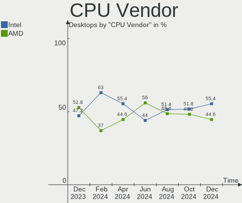
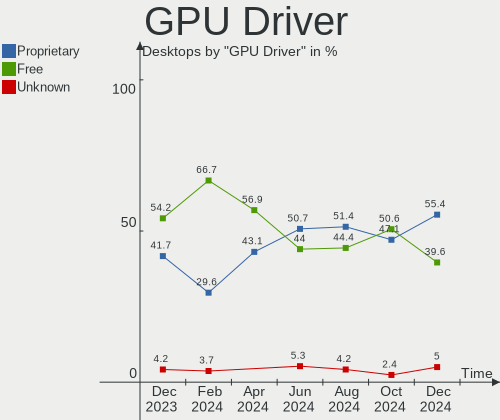
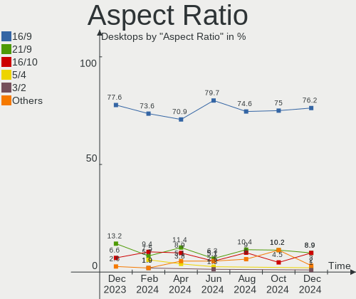
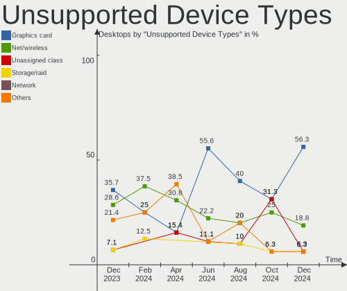

Pop!_OS - Hardware Trends (Desktops)
------------------------------------

A project to identify most popular hardware characteristics and track their change
over time based on data collected by Linux users at https://Linux-Hardware.org.

Anyone can contribute to this report by the [hw-probe](https://github.com/linuxhw/hw-probe) tool:

    sudo -E hw-probe -all -upload

This report is for one last month. Overall report since the beginning of time: [TestDays](https://github.com/linuxhw/TestDays)

Period: Oct, 2023.

Contents
--------

* [ System ](#system)
  - [ OS                       ](#os)
  - [ OS Family                ](#os-family)
  - [ Kernel                   ](#kernel)
  - [ Kernel Family            ](#kernel-family)
  - [ Kernel Major Ver.        ](#kernel-major-ver)
  - [ Arch                     ](#arch)
  - [ DE                       ](#de)
  - [ Display Server           ](#display-server)
  - [ Display Manager          ](#display-manager)
  - [ OS Lang                  ](#os-lang)
  - [ Boot Mode                ](#boot-mode)
  - [ Filesystem               ](#filesystem)
  - [ Part. scheme             ](#part-scheme)
  - [ Dual Boot with Linux/BSD ](#dual-boot-with-linuxbsd)
  - [ Dual Boot (Win)          ](#dual-boot-win)

* [ Board ](#board)
  - [ Vendor                   ](#vendor)
  - [ Model                    ](#model)
  - [ Model Family             ](#model-family)
  - [ MFG Year                 ](#mfg-year)
  - [ Form Factor              ](#form-factor)
  - [ Secure Boot              ](#secure-boot)
  - [ Coreboot                 ](#coreboot)
  - [ RAM Size                 ](#ram-size)
  - [ RAM Used                 ](#ram-used)
  - [ Total Drives             ](#total-drives)
  - [ Has CD-ROM               ](#has-cd-rom)
  - [ Has Ethernet             ](#has-ethernet)
  - [ Has WiFi                 ](#has-wifi)
  - [ Has Bluetooth            ](#has-bluetooth)

* [ Location ](#location)
  - [ Country                  ](#country)
  - [ City                     ](#city)

* [ Drives ](#drives)
  - [ Drive Vendor             ](#drive-vendor)
  - [ Drive Model              ](#drive-model)
  - [ HDD Vendor               ](#hdd-vendor)
  - [ SSD Vendor               ](#ssd-vendor)
  - [ Drive Kind               ](#drive-kind)
  - [ Drive Connector          ](#drive-connector)
  - [ Drive Size               ](#drive-size)
  - [ Space Total              ](#space-total)
  - [ Space Used               ](#space-used)
  - [ Malfunc. Drives          ](#malfunc-drives)
  - [ Malfunc. Drive Vendor    ](#malfunc-drive-vendor)
  - [ Malfunc. HDD Vendor      ](#malfunc-hdd-vendor)
  - [ Malfunc. Drive Kind      ](#malfunc-drive-kind)
  - [ Failed Drives            ](#failed-drives)
  - [ Failed Drive Vendor      ](#failed-drive-vendor)
  - [ Drive Status             ](#drive-status)

* [ Storage controller ](#storage-controller)
  - [ Storage Vendor           ](#storage-vendor)
  - [ Storage Model            ](#storage-model)
  - [ Storage Kind             ](#storage-kind)

* [ Processor ](#processor)
  - [ CPU Vendor               ](#cpu-vendor)
  - [ CPU Model                ](#cpu-model)
  - [ CPU Model Family         ](#cpu-model-family)
  - [ CPU Cores                ](#cpu-cores)
  - [ CPU Sockets              ](#cpu-sockets)
  - [ CPU Threads              ](#cpu-threads)
  - [ CPU Op-Modes             ](#cpu-op-modes)
  - [ CPU Microcode            ](#cpu-microcode)
  - [ CPU Microarch            ](#cpu-microarch)

* [ Graphics ](#graphics)
  - [ GPU Vendor               ](#gpu-vendor)
  - [ GPU Model                ](#gpu-model)
  - [ GPU Combo                ](#gpu-combo)
  - [ GPU Driver               ](#gpu-driver)
  - [ GPU Memory               ](#gpu-memory)

* [ Monitor ](#monitor)
  - [ Monitor Vendor           ](#monitor-vendor)
  - [ Monitor Model            ](#monitor-model)
  - [ Monitor Resolution       ](#monitor-resolution)
  - [ Monitor Diagonal         ](#monitor-diagonal)
  - [ Monitor Width            ](#monitor-width)
  - [ Aspect Ratio             ](#aspect-ratio)
  - [ Monitor Area             ](#monitor-area)
  - [ Pixel Density            ](#pixel-density)
  - [ Multiple Monitors        ](#multiple-monitors)

* [ Network ](#network)
  - [ Net Controller Vendor    ](#net-controller-vendor)
  - [ Net Controller Model     ](#net-controller-model)
  - [ Wireless Vendor          ](#wireless-vendor)
  - [ Wireless Model           ](#wireless-model)
  - [ Ethernet Vendor          ](#ethernet-vendor)
  - [ Ethernet Model           ](#ethernet-model)
  - [ Net Controller Kind      ](#net-controller-kind)
  - [ Used Controller          ](#used-controller)
  - [ NICs                     ](#nics)
  - [ IPv6                     ](#ipv6)

* [ Bluetooth ](#bluetooth)
  - [ Bluetooth Vendor         ](#bluetooth-vendor)
  - [ Bluetooth Model          ](#bluetooth-model)

* [ Sound ](#sound)
  - [ Sound Vendor             ](#sound-vendor)
  - [ Sound Model              ](#sound-model)

* [ Memory ](#memory)
  - [ Memory Vendor            ](#memory-vendor)
  - [ Memory Model             ](#memory-model)
  - [ Memory Kind              ](#memory-kind)
  - [ Memory Form Factor       ](#memory-form-factor)
  - [ Memory Size              ](#memory-size)
  - [ Memory Speed             ](#memory-speed)

* [ Printers & scanners ](#printers--scanners)
  - [ Printer Vendor           ](#printer-vendor)
  - [ Printer Model            ](#printer-model)
  - [ Scanner Vendor           ](#scanner-vendor)
  - [ Scanner Model            ](#scanner-model)

* [ Camera ](#camera)
  - [ Camera Vendor            ](#camera-vendor)
  - [ Camera Model             ](#camera-model)

* [ Security ](#security)
  - [ Fingerprint Vendor       ](#fingerprint-vendor)
  - [ Fingerprint Model        ](#fingerprint-model)
  - [ Chipcard Vendor          ](#chipcard-vendor)
  - [ Chipcard Model           ](#chipcard-model)

* [ Unsupported ](#unsupported)
  - [ Unsupported Devices      ](#unsupported-devices)
  - [ Unsupported Device Types ](#unsupported-device-types)

System
------

OS
--

Installed operating systems

| Name          | Desktops | Percent |
|---------------|----------|---------|
| Pop!_OS 22.04 | 75       | 100%    |

OS Family
---------

OS without a version

| Name    | Desktops | Percent |
|---------|----------|---------|
| Pop!_OS | 75       | 100%    |

Kernel
------

Version of the Linux kernel

| Version                | Desktops | Percent |
|------------------------|----------|---------|
| 6.5.4-76060504-generic | 41       | 54.67%  |
| 6.5.6-76060506-generic | 21       | 28%     |
| 6.4.6-76060406-generic | 11       | 14.67%  |
| 6.5.7-x64v3-xanmod1    | 1        | 1.33%   |
| 6.5.5-x64v3-xanmod1    | 1        | 1.33%   |

Kernel Family
-------------

Linux kernel without a distro release

| Version | Desktops | Percent |
|---------|----------|---------|
| 6.5.4   | 41       | 54.67%  |
| 6.5.6   | 21       | 28%     |
| 6.4.6   | 11       | 14.67%  |
| 6.5.7   | 1        | 1.33%   |
| 6.5.5   | 1        | 1.33%   |

Kernel Major Ver.
-----------------

Linux kernel major version

| Version | Desktops | Percent |
|---------|----------|---------|
| 6.5     | 64       | 85.33%  |
| 6.4     | 11       | 14.67%  |

Arch
----

OS architecture (x86_64, i586, etc.)

| Name   | Desktops | Percent |
|--------|----------|---------|
| x86_64 | 75       | 100%    |

DE
--

Desktop Environment

| Name  | Desktops | Percent |
|-------|----------|---------|
| GNOME | 73       | 97.33%  |
| KDE5  | 2        | 2.67%   |

Display Server
--------------

X11 or Wayland

| Name    | Desktops | Percent |
|---------|----------|---------|
| X11     | 72       | 96%     |
| Wayland | 3        | 4%      |

Display Manager
---------------

SDDM, LightDM, etc.

| Name    | Desktops | Percent |
|---------|----------|---------|
| Unknown | 64       | 85.33%  |
| GDM3    | 11       | 14.67%  |

OS Lang
-------

Language

| Lang  | Desktops | Percent |
|-------|----------|---------|
| en_US | 34       | 45.33%  |
| de_DE | 8        | 10.67%  |
| pt_BR | 5        | 6.67%   |
| en_GB | 5        | 6.67%   |
| en_AU | 4        | 5.33%   |
| C     | 3        | 4%      |
| ru_RU | 2        | 2.67%   |
| fr_FR | 2        | 2.67%   |
| es_ES | 2        | 2.67%   |
| nl_NL | 1        | 1.33%   |
| ko_KR | 1        | 1.33%   |
| fi_FI | 1        | 1.33%   |
| es_CR | 1        | 1.33%   |
| es_AR | 1        | 1.33%   |
| en_IN | 1        | 1.33%   |
| en_DK | 1        | 1.33%   |
| en_CA | 1        | 1.33%   |
| de_CH | 1        | 1.33%   |
| da_DK | 1        | 1.33%   |

Boot Mode
---------

EFI or BIOS

| Mode | Desktops | Percent |
|------|----------|---------|
| BIOS | 64       | 85.33%  |
| EFI  | 11       | 14.67%  |

Filesystem
----------

Type of filesystem

| Type    | Desktops | Percent |
|---------|----------|---------|
| Ext4    | 71       | 94.67%  |
| Btrfs   | 3        | 4%      |
| Overlay | 1        | 1.33%   |

Part. scheme
------------

Scheme of partitioning

| Type    | Desktops | Percent |
|---------|----------|---------|
| Unknown | 64       | 85.33%  |
| GPT     | 11       | 14.67%  |

Dual Boot with Linux/BSD
------------------------

Hosting more than one Linux/BSD

| Dual boot | Desktops | Percent |
|-----------|----------|---------|
| No        | 74       | 98.67%  |
| Yes       | 1        | 1.33%   |

Dual Boot (Win)
---------------

Hosting Linux and Windows

| Dual boot | Desktops | Percent |
|-----------|----------|---------|
| No        | 67       | 89.33%  |
| Yes       | 8        | 10.67%  |

Board
-----

Vendor
------

Motherboard manufacturer

| Name                | Desktops | Percent |
|---------------------|----------|---------|
| ASUSTek Computer    | 21       | 28%     |
| Gigabyte Technology | 14       | 18.67%  |
| MSI                 | 11       | 14.67%  |
| ASRock              | 6        | 8%      |
| Hewlett-Packard     | 5        | 6.67%   |
| Dell                | 5        | 6.67%   |
| Lenovo              | 2        | 2.67%   |
| Intel               | 2        | 2.67%   |
| Huanan              | 2        | 2.67%   |
| Unknown             | 2        | 2.67%   |
| System76            | 1        | 1.33%   |
| Kllisre             | 1        | 1.33%   |
| eMachines           | 1        | 1.33%   |
| Danuri              | 1        | 1.33%   |
| Biostar             | 1        | 1.33%   |

Model
-----

Motherboard model

| Name                                 | Desktops | Percent |
|--------------------------------------|----------|---------|
| MSI MS-7D25                          | 2        | 2.67%   |
| MSI MS-7C37                          | 2        | 2.67%   |
| ASUS ROG STRIX B550-F GAMING         | 2        | 2.67%   |
| ASUS PRIME B450M-A                   | 2        | 2.67%   |
| Unknown                              | 2        | 2.67%   |
| System76 Thelio Mega                 | 1        | 1.33%   |
| MSI MS-7E06                          | 1        | 1.33%   |
| MSI MS-7D30                          | 1        | 1.33%   |
| MSI MS-7C56                          | 1        | 1.33%   |
| MSI MS-7C52                          | 1        | 1.33%   |
| MSI MS-7B93                          | 1        | 1.33%   |
| MSI MS-7B79                          | 1        | 1.33%   |
| MSI MS-7A32                          | 1        | 1.33%   |
| Lenovo ThinkCentre M93p 10A8S00200   | 1        | 1.33%   |
| Lenovo ThinkCentre M93 10A4A05QGE    | 1        | 1.33%   |
| Kllisre X79 V1.2                     | 1        | 1.33%   |
| Intel H61 V124                       | 1        | 1.33%   |
| Intel DG965RY AAD41691-301           | 1        | 1.33%   |
| Huanan X99-QD4 V1.0                  | 1        | 1.33%   |
| Huanan X99-BD4 V1.33                 | 1        | 1.33%   |
| HP Z440 Workstation                  | 1        | 1.33%   |
| HP EliteDesk 800 G3 SFF              | 1        | 1.33%   |
| HP Compaq dc7800p Ultra-slim Desktop | 1        | 1.33%   |
| HP Compaq 6005 Pro SFF PC            | 1        | 1.33%   |
| HP 500-166eg                         | 1        | 1.33%   |
| Gigabyte Z77MX-D3H                   | 1        | 1.33%   |
| Gigabyte Z77-DS3H                    | 1        | 1.33%   |
| Gigabyte Z590I VISION D              | 1        | 1.33%   |
| Gigabyte Z590 VISION D               | 1        | 1.33%   |
| Gigabyte Z390 M GAMING               | 1        | 1.33%   |
| Gigabyte Z390 AORUS ULTRA            | 1        | 1.33%   |
| Gigabyte Z270P-D3                    | 1        | 1.33%   |
| Gigabyte X570S AORUS ELITE AX        | 1        | 1.33%   |
| Gigabyte X570 GAMING X               | 1        | 1.33%   |
| Gigabyte H61M-S2PV                   | 1        | 1.33%   |
| Gigabyte B75M-D3V                    | 1        | 1.33%   |
| Gigabyte B550M AORUS PRO             | 1        | 1.33%   |
| Gigabyte B450 GAMING X               | 1        | 1.33%   |
| Gigabyte 970A-DS3P                   | 1        | 1.33%   |
| eMachines EL1352G                    | 1        | 1.33%   |

Model Family
------------

Motherboard model prefix

| Name               | Desktops | Percent |
|--------------------|----------|---------|
| ASUS PRIME         | 7        | 9.33%   |
| ASUS ROG           | 6        | 8%      |
| Dell OptiPlex      | 4        | 5.33%   |
| MSI MS-7D25        | 2        | 2.67%   |
| MSI MS-7C37        | 2        | 2.67%   |
| Lenovo ThinkCentre | 2        | 2.67%   |
| HP Compaq          | 2        | 2.67%   |
| Gigabyte Z390      | 2        | 2.67%   |
| ASUS TUF           | 2        | 2.67%   |
| Unknown            | 2        | 2.67%   |
| System76 Thelio    | 1        | 1.33%   |
| MSI MS-7E06        | 1        | 1.33%   |
| MSI MS-7D30        | 1        | 1.33%   |
| MSI MS-7C56        | 1        | 1.33%   |
| MSI MS-7C52        | 1        | 1.33%   |
| MSI MS-7B93        | 1        | 1.33%   |
| MSI MS-7B79        | 1        | 1.33%   |
| MSI MS-7A32        | 1        | 1.33%   |
| Kllisre X79        | 1        | 1.33%   |
| Intel H61          | 1        | 1.33%   |
| Intel DG965RY      | 1        | 1.33%   |
| Huanan X99-QD4     | 1        | 1.33%   |
| Huanan X99-BD4     | 1        | 1.33%   |
| HP Z440            | 1        | 1.33%   |
| HP EliteDesk       | 1        | 1.33%   |
| HP 500-166eg       | 1        | 1.33%   |
| Gigabyte Z77MX-D3H | 1        | 1.33%   |
| Gigabyte Z77-DS3H  | 1        | 1.33%   |
| Gigabyte Z590I     | 1        | 1.33%   |
| Gigabyte Z590      | 1        | 1.33%   |
| Gigabyte Z270P-D3  | 1        | 1.33%   |
| Gigabyte X570S     | 1        | 1.33%   |
| Gigabyte X570      | 1        | 1.33%   |
| Gigabyte H61M-S2PV | 1        | 1.33%   |
| Gigabyte B75M-D3V  | 1        | 1.33%   |
| Gigabyte B550M     | 1        | 1.33%   |
| Gigabyte B450      | 1        | 1.33%   |
| Gigabyte 970A-DS3P | 1        | 1.33%   |
| eMachines EL1352G  | 1        | 1.33%   |
| Dell Precision     | 1        | 1.33%   |

MFG Year
--------

Motherboard manufacture year

| Year | Desktops | Percent |
|------|----------|---------|
| 2021 | 11       | 14.67%  |
| 2019 | 10       | 13.33%  |
| 2022 | 8        | 10.67%  |
| 2020 | 8        | 10.67%  |
| 2018 | 6        | 8%      |
| 2023 | 5        | 6.67%   |
| 2017 | 5        | 6.67%   |
| 2012 | 5        | 6.67%   |
| 2014 | 4        | 5.33%   |
| 2013 | 3        | 4%      |
| 2016 | 2        | 2.67%   |
| 2011 | 2        | 2.67%   |
| 2010 | 2        | 2.67%   |
| 2007 | 2        | 2.67%   |
| 2015 | 1        | 1.33%   |
| 2009 | 1        | 1.33%   |

Form Factor
-----------

Physical design of the computer

| Name    | Desktops | Percent |
|---------|----------|---------|
| Desktop | 75       | 100%    |

Secure Boot
-----------

Enabled or disabled

| State    | Desktops | Percent |
|----------|----------|---------|
| Disabled | 74       | 98.67%  |
| Enabled  | 1        | 1.33%   |

Coreboot
--------

Have coreboot on board

| Used | Desktops | Percent |
|------|----------|---------|
| No   | 75       | 100%    |

RAM Size
--------

Total RAM memory

| Size in GB  | Desktops | Percent |
|-------------|----------|---------|
| 16.01-24.0  | 24       | 32%     |
| 32.01-64.0  | 20       | 26.67%  |
| 8.01-16.0   | 10       | 13.33%  |
| 64.01-256.0 | 9        | 12%     |
| 4.01-8.0    | 4        | 5.33%   |
| 24.01-32.0  | 3        | 4%      |
| 3.01-4.0    | 2        | 2.67%   |
| 1.01-2.0    | 2        | 2.67%   |
| 2.01-3.0    | 1        | 1.33%   |

RAM Used
--------

Used RAM memory

| Used GB    | Desktops | Percent |
|------------|----------|---------|
| 4.01-8.0   | 33       | 44%     |
| 8.01-16.0  | 14       | 18.67%  |
| 3.01-4.0   | 12       | 16%     |
| 2.01-3.0   | 10       | 13.33%  |
| 1.01-2.0   | 2        | 2.67%   |
| 32.01-64.0 | 1        | 1.33%   |
| 24.01-32.0 | 1        | 1.33%   |
| 16.01-24.0 | 1        | 1.33%   |
| 0.51-1.0   | 1        | 1.33%   |

Total Drives
------------

Number of drives on board

| Drives | Desktops | Percent |
|--------|----------|---------|
| 2      | 24       | 32%     |
| 1      | 20       | 26.67%  |
| 3      | 17       | 22.67%  |
| 4      | 6        | 8%      |
| 7      | 3        | 4%      |
| 6      | 3        | 4%      |
| 11     | 1        | 1.33%   |
| 5      | 1        | 1.33%   |

Has CD-ROM
----------

Has CD-ROM on board

| Presented | Desktops | Percent |
|-----------|----------|---------|
| No        | 56       | 74.67%  |
| Yes       | 19       | 25.33%  |

Has Ethernet
------------

Has Ethernet on board

| Presented | Desktops | Percent |
|-----------|----------|---------|
| Yes       | 75       | 100%    |

Has WiFi
--------

Has WiFi module

| Presented | Desktops | Percent |
|-----------|----------|---------|
| Yes       | 46       | 61.33%  |
| No        | 29       | 38.67%  |

Has Bluetooth
-------------

Has Bluetooth module

| Presented | Desktops | Percent |
|-----------|----------|---------|
| Yes       | 40       | 53.33%  |
| No        | 35       | 46.67%  |

Location
--------

Country
-------

Geographic location (country)

| Country     | Desktops | Percent |
|-------------|----------|---------|
| USA         | 20       | 26.67%  |
| Germany     | 10       | 13.33%  |
| Brazil      | 7        | 9.33%   |
| UK          | 5        | 6.67%   |
| Australia   | 4        | 5.33%   |
| Russia      | 3        | 4%      |
| Canada      | 3        | 4%      |
| Sweden      | 2        | 2.67%   |
| Spain       | 2        | 2.67%   |
| Portugal    | 2        | 2.67%   |
| France      | 2        | 2.67%   |
| Finland     | 2        | 2.67%   |
| Switzerland | 1        | 1.33%   |
| South Korea | 1        | 1.33%   |
| Poland      | 1        | 1.33%   |
| Norway      | 1        | 1.33%   |
| Netherlands | 1        | 1.33%   |
| India       | 1        | 1.33%   |
| Denmark     | 1        | 1.33%   |
| Croatia     | 1        | 1.33%   |
| Costa Rica  | 1        | 1.33%   |
| Bulgaria    | 1        | 1.33%   |
| Bolivia     | 1        | 1.33%   |
| Belgium     | 1        | 1.33%   |
| Argentina   | 1        | 1.33%   |

City
----

Geographic location (city)

| City                    | Desktops | Percent |
|-------------------------|----------|---------|
| Berlin                  | 2        | 2.67%   |
| Wuppertal               | 1        | 1.33%   |
| Weilheim                | 1        | 1.33%   |
| Wantagh                 | 1        | 1.33%   |
| Troy                    | 1        | 1.33%   |
| Toronto                 | 1        | 1.33%   |
| Thalwil                 | 1        | 1.33%   |
| Tampa                   | 1        | 1.33%   |
| Taby                    | 1        | 1.33%   |
| Sydney                  | 1        | 1.33%   |
| Surubim                 | 1        | 1.33%   |
| Stockport               | 1        | 1.33%   |
| Sofia                   | 1        | 1.33%   |
| Seville                 | 1        | 1.33%   |
| Schutterwald            | 1        | 1.33%   |
| Sao Paulo               | 1        | 1.33%   |
| Sao Jose do Rio Preto   | 1        | 1.33%   |
| Santo André            | 1        | 1.33%   |
| Santa Cruz              | 1        | 1.33%   |
| San José               | 1        | 1.33%   |
| Salvador                | 1        | 1.33%   |
| Salem                   | 1        | 1.33%   |
| Saintes                 | 1        | 1.33%   |
| Sacramento              | 1        | 1.33%   |
| Rijeka                  | 1        | 1.33%   |
| Perm                    | 1        | 1.33%   |
| Pensacola               | 1        | 1.33%   |
| Paranavai               | 1        | 1.33%   |
| Ottawa                  | 1        | 1.33%   |
| New Haven               | 1        | 1.33%   |
| Moscow                  | 1        | 1.33%   |
| Mikołów               | 1        | 1.33%   |
| Matosinhos Municipality | 1        | 1.33%   |
| Mansfield               | 1        | 1.33%   |
| Málaga                 | 1        | 1.33%   |
| Madurai                 | 1        | 1.33%   |
| Madison                 | 1        | 1.33%   |
| Lisbon                  | 1        | 1.33%   |
| Largo                   | 1        | 1.33%   |
| Kemerovo                | 1        | 1.33%   |

Drives
------

Drive Vendor
------------

Hard drive vendors

| Vendor                      | Desktops | Drives | Percent |
|-----------------------------|----------|--------|---------|
| Seagate                     | 30       | 43     | 19.23%  |
| Samsung Electronics         | 29       | 42     | 18.59%  |
| WDC                         | 16       | 23     | 10.26%  |
| Sandisk                     | 10       | 11     | 6.41%   |
| Crucial                     | 8        | 10     | 5.13%   |
| Kingston                    | 7        | 7      | 4.49%   |
| Phison Electronics          | 4        | 5      | 2.56%   |
| China                       | 4        | 5      | 2.56%   |
| Toshiba                     | 3        | 3      | 1.92%   |
| Hitachi                     | 3        | 3      | 1.92%   |
| HGST                        | 3        | 3      | 1.92%   |
| Team                        | 2        | 2      | 1.28%   |
| SPCC                        | 2        | 2      | 1.28%   |
| SK hynix                    | 2        | 2      | 1.28%   |
| Silicon Motion              | 2        | 2      | 1.28%   |
| OCZ                         | 2        | 2      | 1.28%   |
| Netac                       | 2        | 2      | 1.28%   |
| Micron/Crucial Technology   | 2        | 4      | 1.28%   |
| Apple                       | 2        | 2      | 1.28%   |
| WALRAM                      | 1        | 1      | 0.64%   |
| Unknown                     | 1        | 1      | 0.64%   |
| Transcend                   | 1        | 1      | 0.64%   |
| Realtek Semiconductor       | 1        | 1      | 0.64%   |
| Plextor                     | 1        | 1      | 0.64%   |
| Patriot                     | 1        | 2      | 0.64%   |
| Micron Technology           | 1        | 1      | 0.64%   |
| MAXIO Technology (Hangzhou) | 1        | 1      | 0.64%   |
| Lexar                       | 1        | 1      | 0.64%   |
| LDLC                        | 1        | 1      | 0.64%   |
| KIOXIA-EXCERIA              | 1        | 1      | 0.64%   |
| Kingston Technology Company | 1        | 2      | 0.64%   |
| KingSpec                    | 1        | 1      | 0.64%   |
| KingFast                    | 1        | 1      | 0.64%   |
| Intel                       | 1        | 2      | 0.64%   |
| Gigabyte Technology         | 1        | 1      | 0.64%   |
| Fujitsu                     | 1        | 1      | 0.64%   |
| BlueRay                     | 1        | 1      | 0.64%   |
| Apacer                      | 1        | 1      | 0.64%   |
| AGI                         | 1        | 1      | 0.64%   |
| ADATA Technology            | 1        | 1      | 0.64%   |

Drive Model
-----------

Hard drive models

| Model                                                 | Desktops | Percent |
|-------------------------------------------------------|----------|---------|
| Samsung NVMe SSD Controller PM9A1/PM9A3/980PRO 1TB    | 6        | 3.28%   |
| Samsung NVMe SSD Controller SM981/PM981/PM983 1TB     | 5        | 2.73%   |
| Seagate ST2000DM008-2FR102 2TB                        | 4        | 2.19%   |
| Seagate Expansion Desk 3TB                            | 3        | 1.64%   |
| Sandisk WD Blue SN550 NVMe SSD 1TB                    | 3        | 1.64%   |
| Samsung SSD 980 1TB                                   | 3        | 1.64%   |
| Samsung SSD 850 EVO 500GB                             | 3        | 1.64%   |
| Toshiba HDWD130 3TB                                   | 2        | 1.09%   |
| Silicon Motion SM2263EN/SM2263XT SSD Controller 256GB | 2        | 1.09%   |
| Seagate ST9500325AS 500GB                             | 2        | 1.09%   |
| Seagate ST4000DM004-2CV104 4TB                        | 2        | 1.09%   |
| Seagate ST2000DM008-2UB102 2TB                        | 2        | 1.09%   |
| Seagate ST1000LM024 HN-M101MBB 1TB                    | 2        | 1.09%   |
| Samsung SSD 980 500GB                                 | 2        | 1.09%   |
| Samsung SSD 870 QVO 1TB                               | 2        | 1.09%   |
| Samsung SSD 850 EVO 250GB                             | 2        | 1.09%   |
| Phison E12 NVMe Controller 1TB                        | 2        | 1.09%   |
| Kingston SV300S37A120G 120GB SSD                      | 2        | 1.09%   |
| WDC WDS480G2G0B-00EPW0 480GB SSD                      | 1        | 0.55%   |
| WDC WDS2048G3B0A-00AXR0 2TB SSD                       | 1        | 0.55%   |
| WDC WDS100T2B0C-00PXH0 1TB                            | 1        | 0.55%   |
| WDC WDS100T2B0A-00SM50 1TB SSD                        | 1        | 0.55%   |
| WDC WD5000KS-00MNB0 500GB                             | 1        | 0.55%   |
| WDC WD5000AAKX-753CA1 500GB                           | 1        | 0.55%   |
| WDC WD5000AAKS-22V1A0 500GB                           | 1        | 0.55%   |
| WDC WD40EZRZ-00GXCB0 4TB                              | 1        | 0.55%   |
| WDC WD4000F9YZ-09N20L0 4TB                            | 1        | 0.55%   |
| WDC WD30EZRX-00DC0B0 3TB                              | 1        | 0.55%   |
| WDC WD20PURZ-85AKKY0 2TB                              | 1        | 0.55%   |
| WDC WD20PURX-64P6ZY0 2TB                              | 1        | 0.55%   |
| WDC WD20EZRZ-00Z5HB0 2TB                              | 1        | 0.55%   |
| WDC WD15EARS-00MVWB0 1TB                              | 1        | 0.55%   |
| WDC WD10EZRX-00L4HB0 1TB                              | 1        | 0.55%   |
| WDC WD10EZEX-60ZF5A0 1TB                              | 1        | 0.55%   |
| WDC WD10EZEX-22MFCA0 1TB                              | 1        | 0.55%   |
| WDC WD10EZEX-00BN5A0 1TB                              | 1        | 0.55%   |
| WDC WD1003FZEX-00MK2A0 1TB                            | 1        | 0.55%   |
| WDC WD1002FAEX-00Z3A0 1TB                             | 1        | 0.55%   |
| WALRAM SSD 512GB                                      | 1        | 0.55%   |
| Unknown NVMe SSD Drive 2TB                            | 1        | 0.55%   |

HDD Vendor
----------

Hard disk drive vendors

| Vendor              | Desktops | Drives | Percent |
|---------------------|----------|--------|---------|
| Seagate             | 29       | 41     | 50%     |
| WDC                 | 14       | 19     | 24.14%  |
| Toshiba             | 3        | 3      | 5.17%   |
| Samsung Electronics | 3        | 3      | 5.17%   |
| Hitachi             | 3        | 3      | 5.17%   |
| HGST                | 3        | 3      | 5.17%   |
| Apple               | 2        | 2      | 3.45%   |
| Fujitsu             | 1        | 1      | 1.72%   |

SSD Vendor
----------

Solid state drive vendors

| Vendor              | Desktops | Drives | Percent |
|---------------------|----------|--------|---------|
| Samsung Electronics | 12       | 15     | 21.82%  |
| Crucial             | 7        | 7      | 12.73%  |
| Kingston            | 5        | 5      | 9.09%   |
| China               | 4        | 5      | 7.27%   |
| WDC                 | 3        | 3      | 5.45%   |
| Team                | 2        | 2      | 3.64%   |
| SPCC                | 2        | 2      | 3.64%   |
| SK hynix            | 2        | 2      | 3.64%   |
| SanDisk             | 2        | 2      | 3.64%   |
| OCZ                 | 2        | 2      | 3.64%   |
| WALRAM              | 1        | 1      | 1.82%   |
| Transcend           | 1        | 1      | 1.82%   |
| Seagate             | 1        | 1      | 1.82%   |
| Plextor             | 1        | 1      | 1.82%   |
| Patriot             | 1        | 2      | 1.82%   |
| Netac               | 1        | 1      | 1.82%   |
| KIOXIA-EXCERIA      | 1        | 1      | 1.82%   |
| KingSpec            | 1        | 1      | 1.82%   |
| Intel               | 1        | 2      | 1.82%   |
| Gigabyte Technology | 1        | 1      | 1.82%   |
| Apacer              | 1        | 1      | 1.82%   |
| AGI                 | 1        | 1      | 1.82%   |
| A-DATA Technology   | 1        | 1      | 1.82%   |
| Unknown             | 1        | 1      | 1.82%   |

Drive Kind
----------

HDD or SSD

| Kind    | Desktops | Drives | Percent |
|---------|----------|--------|---------|
| HDD     | 49       | 75     | 36.3%   |
| SSD     | 43       | 61     | 31.85%  |
| NVMe    | 40       | 60     | 29.63%  |
| Unknown | 3        | 3      | 2.22%   |

Drive Connector
---------------

SATA, SAS, NVMe, etc.

| Type | Desktops | Drives | Percent |
|------|----------|--------|---------|
| SATA | 63       | 134    | 58.33%  |
| NVMe | 40       | 60     | 37.04%  |
| SAS  | 5        | 5      | 4.63%   |

Drive Size
----------

Size of hard drive

| Size in TB | Desktops | Drives | Percent |
|------------|----------|--------|---------|
| 0.01-0.5   | 38       | 57     | 36.89%  |
| 0.51-1.0   | 28       | 31     | 27.18%  |
| 1.01-2.0   | 20       | 24     | 19.42%  |
| 3.01-4.0   | 8        | 15     | 7.77%   |
| 2.01-3.0   | 6        | 6      | 5.83%   |
| 4.01-10.0  | 2        | 2      | 1.94%   |
| 10.01-20.0 | 1        | 1      | 0.97%   |

Space Total
-----------

Amount of disk space available on the file system

| Size in GB     | Desktops | Percent |
|----------------|----------|---------|
| 501-1000       | 19       | 25.33%  |
| 251-500        | 17       | 22.67%  |
| More than 3000 | 16       | 21.33%  |
| 101-250        | 10       | 13.33%  |
| 2001-3000      | 5        | 6.67%   |
| 1001-2000      | 5        | 6.67%   |
| 51-100         | 2        | 2.67%   |
| 1-20           | 1        | 1.33%   |

Space Used
----------

Amount of used disk space

| Used GB        | Desktops | Percent |
|----------------|----------|---------|
| 1-20           | 19       | 25.33%  |
| 101-250        | 13       | 17.33%  |
| 21-50          | 12       | 16%     |
| More than 3000 | 8        | 10.67%  |
| 251-500        | 6        | 8%      |
| 51-100         | 6        | 8%      |
| 501-1000       | 5        | 6.67%   |
| 1001-2000      | 4        | 5.33%   |
| 2001-3000      | 2        | 2.67%   |

Malfunc. Drives
---------------

Drive models with a malfunction

| Model                                    | Desktops | Drives | Percent |
|------------------------------------------|----------|--------|---------|
| WDC WD20PURZ-85AKKY0 2TB                 | 1        | 1      | 20%     |
| WDC WD20PURX-64P6ZY0 2TB                 | 1        | 1      | 20%     |
| WDC WD10EZEX-60ZF5A0 1TB                 | 1        | 1      | 20%     |
| Seagate ST4000DX001-1CE168 4TB           | 1        | 1      | 20%     |
| Samsung Electronics SSD 970 EVO Plus 1TB | 1        | 1      | 20%     |

Malfunc. Drive Vendor
---------------------

Vendors of faulty drives

| Vendor              | Desktops | Drives | Percent |
|---------------------|----------|--------|---------|
| WDC                 | 3        | 3      | 60%     |
| Seagate             | 1        | 1      | 20%     |
| Samsung Electronics | 1        | 1      | 20%     |

Malfunc. HDD Vendor
-------------------

Vendors of faulty HDD drives

| Vendor  | Desktops | Drives | Percent |
|---------|----------|--------|---------|
| WDC     | 3        | 3      | 75%     |
| Seagate | 1        | 1      | 25%     |

Malfunc. Drive Kind
-------------------

Kinds of faulty drives

| Kind | Desktops | Drives | Percent |
|------|----------|--------|---------|
| HDD  | 3        | 4      | 75%     |
| NVMe | 1        | 1      | 25%     |

Failed Drives
-------------

Failed drive models

Zero info for selected period =(

Failed Drive Vendor
-------------------

Failed drive vendors

Zero info for selected period =(

Drive Status
------------

Number of failed and malfunc. drives

| Status   | Desktops | Drives | Percent |
|----------|----------|--------|---------|
| Detected | 65       | 161    | 80.25%  |
| Works    | 13       | 33     | 16.05%  |
| Malfunc  | 3        | 5      | 3.7%    |

Storage controller
------------------

Storage Vendor
--------------

Storage controller vendors

| Vendor                      | Desktops | Percent |
|-----------------------------|----------|---------|
| Intel                       | 42       | 32.06%  |
| AMD                         | 30       | 22.9%   |
| Samsung Electronics         | 19       | 14.5%   |
| SanDisk                     | 9        | 6.87%   |
| ASMedia Technology          | 6        | 4.58%   |
| Phison Electronics          | 4        | 3.05%   |
| Micron/Crucial Technology   | 4        | 3.05%   |
| Silicon Motion              | 3        | 2.29%   |
| Kingston Technology Company | 3        | 2.29%   |
| Nvidia                      | 2        | 1.53%   |
| Marvell Technology Group    | 2        | 1.53%   |
| Solidigm                    | 1        | 0.76%   |
| Seagate Technology          | 1        | 0.76%   |
| Realtek Semiconductor       | 1        | 0.76%   |
| Micron Technology           | 1        | 0.76%   |
| MAXIO Technology (Hangzhou) | 1        | 0.76%   |
| LSI Logic / Symbios Logic   | 1        | 0.76%   |
| ADATA Technology            | 1        | 0.76%   |

Storage Model
-------------

Storage controller models

| Model                                                                                   | Desktops | Percent |
|-----------------------------------------------------------------------------------------|----------|---------|
| AMD FCH SATA Controller [AHCI mode]                                                     | 16       | 10.39%  |
| AMD 400 Series Chipset SATA Controller                                                  | 9        | 5.84%   |
| AMD 500 Series Chipset SATA Controller                                                  | 8        | 5.19%   |
| Samsung NVMe SSD Controller PM9A1/PM9A3/980PRO                                          | 7        | 4.55%   |
| Samsung NVMe SSD Controller SM981/PM981/PM983                                           | 6        | 3.9%    |
| Samsung NVMe SSD Controller 980 (DRAM-less)                                             | 5        | 3.25%   |
| Intel 8 Series/C220 Series Chipset Family 6-port SATA Controller 1 [AHCI mode]          | 5        | 3.25%   |
| Intel 200 Series PCH SATA controller [AHCI mode]                                        | 5        | 3.25%   |
| ASMedia ASM1062 Serial ATA Controller                                                   | 5        | 3.25%   |
| Intel SATA Controller [RAID mode]                                                       | 4        | 2.6%    |
| Silicon Motion SM2263EN/SM2263XT (DRAM-less) NVMe SSD Controllers                       | 3        | 1.95%   |
| SanDisk Ultra 3D / WD Blue SN550 NVMe SSD                                               | 3        | 1.95%   |
| Micron/Crucial P2 [Nick P2] / P3 / P3 Plus NVMe PCIe SSD (DRAM-less)                    | 3        | 1.95%   |
| Intel Alder Lake-S PCH SATA Controller [AHCI Mode]                                      | 3        | 1.95%   |
| Intel 700 Series Chipset Family SATA AHCI Controller                                    | 3        | 1.95%   |
| Intel 500 Series Chipset Family SATA AHCI Controller                                    | 3        | 1.95%   |
| Phison E12 NVMe Controller                                                              | 2        | 1.3%    |
| Nvidia MCP61 SATA Controller                                                            | 2        | 1.3%    |
| Nvidia MCP61 IDE                                                                        | 2        | 1.3%    |
| Kingston Company NV2 NVMe SSD SM2267XT                                                  | 2        | 1.3%    |
| Intel Cannon Lake PCH SATA AHCI Controller                                              | 2        | 1.3%    |
| Intel 9 Series Chipset Family SATA Controller [AHCI Mode]                               | 2        | 1.3%    |
| Intel 7 Series/C210 Series Chipset Family 6-port SATA Controller [AHCI mode]            | 2        | 1.3%    |
| Intel 7 Series/C210 Series Chipset Family 4-port SATA Controller [IDE mode]             | 2        | 1.3%    |
| Intel 7 Series/C210 Series Chipset Family 2-port SATA Controller [IDE mode]             | 2        | 1.3%    |
| Intel 6 Series/C200 Series Chipset Family Desktop SATA Controller (IDE mode, ports 4-5) | 2        | 1.3%    |
| Intel 6 Series/C200 Series Chipset Family Desktop SATA Controller (IDE mode, ports 0-3) | 2        | 1.3%    |
| AMD SB7x0/SB8x0/SB9x0 SATA Controller [AHCI mode]                                       | 2        | 1.3%    |
| Solidigm P44 Pro NVMe SSD [Hollywood Beach]                                             | 1        | 0.65%   |
| Seagate FireCuda 520/IronWolf 525 SSD                                                   | 1        | 0.65%   |
| SanDisk WD PC SN810 / Black SN850 NVMe SSD                                              | 1        | 0.65%   |
| SanDisk WD PC SN540 / Green SN350 NVMe SSD 1 TB (DRAM-less)                             | 1        | 0.65%   |
| SanDisk WD Green SN350 240GB (DRAM-less) / SN560E NVMe SSD                              | 1        | 0.65%   |
| Sandisk WD Black SN850X NVMe SSD                                                        | 1        | 0.65%   |
| SanDisk WD Black SN770 / PC SN740 256GB / PC SN560 (DRAM-less) NVMe SSD                 | 1        | 0.65%   |
| SanDisk Ultra 3D / WD Blue SN570 NVMe SSD (DRAM-less)                                   | 1        | 0.65%   |
| SanDisk Extreme Pro / WD Black 2018/SN750/PC SN720 NVMe SSD                             | 1        | 0.65%   |
| Samsung NVMe SSD Controller SM961/PM961/SM963                                           | 1        | 0.65%   |
| Samsung NVMe SSD Controller S4LV008[Pascal]                                             | 1        | 0.65%   |
| Realtek RTS5763DL NVMe SSD Controller (DRAM-less)                                       | 1        | 0.65%   |

Storage Kind
------------

Kind of storage controller (IDE, SATA, NVMe, SAS, ...)

| Kind | Desktops | Percent |
|------|----------|---------|
| SATA | 63       | 52.5%   |
| NVMe | 39       | 32.5%   |
| IDE  | 10       | 8.33%   |
| RAID | 7        | 5.83%   |
| SCSI | 1        | 0.83%   |

Processor
---------

CPU Vendor
----------

Processor vendors

| Vendor | Desktops | Percent |
|--------|----------|---------|
| Intel  | 42       | 56%     |
| AMD    | 33       | 44%     |

CPU Model
---------

Processor models

| Model                                      | Desktops | Percent |
|--------------------------------------------|----------|---------|
| AMD Ryzen 5 3600 6-Core Processor          | 4        | 5.33%   |
| Intel Core i7-9700K CPU @ 3.60GHz          | 3        | 4%      |
| Intel Core i7-2600 CPU @ 3.40GHz           | 3        | 4%      |
| AMD Ryzen 9 5950X 16-Core Processor        | 3        | 4%      |
| Intel Core i7-3770 CPU @ 3.40GHz           | 2        | 2.67%   |
| Intel Core i5-6500 CPU @ 3.20GHz           | 2        | 2.67%   |
| Intel Core i3-3220 CPU @ 3.30GHz           | 2        | 2.67%   |
| Intel 13th Gen Core i5-13600K              | 2        | 2.67%   |
| AMD Ryzen 7 5800X 8-Core Processor         | 2        | 2.67%   |
| AMD Ryzen 5 2600 Six-Core Processor        | 2        | 2.67%   |
| Intel Xeon CPU E5503 @ 2.00GHz             | 1        | 1.33%   |
| Intel Xeon CPU E5-2699 v3 @ 2.30GHz        | 1        | 1.33%   |
| Intel Xeon CPU E5-2698 v3 @ 2.30GHz        | 1        | 1.33%   |
| Intel Xeon CPU E5-2687W 0 @ 3.10GHz        | 1        | 1.33%   |
| Intel Xeon CPU E5-2620 v3 @ 2.40GHz        | 1        | 1.33%   |
| Intel Pentium Silver N6005 @ 2.00GHz       | 1        | 1.33%   |
| Intel Core i7-9700 CPU @ 3.00GHz           | 1        | 1.33%   |
| Intel Core i7-7800X CPU @ 3.50GHz          | 1        | 1.33%   |
| Intel Core i7-7700K CPU @ 4.20GHz          | 1        | 1.33%   |
| Intel Core i7-4770 CPU @ 3.40GHz           | 1        | 1.33%   |
| Intel Core i7-10710U CPU @ 1.10GHz         | 1        | 1.33%   |
| Intel Core i7-10700K CPU @ 3.80GHz         | 1        | 1.33%   |
| Intel Core i7-10700 CPU @ 2.90GHz          | 1        | 1.33%   |
| Intel Core i5-6600 CPU @ 3.30GHz           | 1        | 1.33%   |
| Intel Core i5-6500T CPU @ 2.50GHz          | 1        | 1.33%   |
| Intel Core i5-4690K CPU @ 3.50GHz          | 1        | 1.33%   |
| Intel Core i5-4590T CPU @ 2.00GHz          | 1        | 1.33%   |
| Intel Core i5-4590 CPU @ 3.30GHz           | 1        | 1.33%   |
| Intel Core i5-4460 CPU @ 3.20GHz           | 1        | 1.33%   |
| Intel Core i5-4440 CPU @ 3.10GHz           | 1        | 1.33%   |
| Intel Core i5-3570 CPU @ 3.40GHz           | 1        | 1.33%   |
| Intel Core i5-10400 CPU @ 2.90GHz          | 1        | 1.33%   |
| Intel Core 2 Duo CPU E6550 @ 2.33GHz       | 1        | 1.33%   |
| Intel Core 2 CPU 6320 @ 1.86GHz            | 1        | 1.33%   |
| Intel 13th Gen Core i7-13700K              | 1        | 1.33%   |
| Intel 13th Gen Core i5-13600KF             | 1        | 1.33%   |
| Intel 12th Gen Core i9-12900K              | 1        | 1.33%   |
| Intel 12th Gen Core i7-12700K              | 1        | 1.33%   |
| AMD Ryzen Threadripper PRO 5955WX 16-Cores | 1        | 1.33%   |
| AMD Ryzen 9 7900X 12-Core Processor        | 1        | 1.33%   |

CPU Model Family
----------------

Processor model prefix

| Model                  | Desktops | Percent |
|------------------------|----------|---------|
| Intel Core i7          | 15       | 20%     |
| AMD Ryzen 5            | 14       | 18.67%  |
| Intel Core i5          | 11       | 14.67%  |
| AMD Ryzen 7            | 8        | 10.67%  |
| Other                  | 6        | 8%      |
| Intel Xeon             | 5        | 6.67%   |
| AMD Ryzen 9            | 5        | 6.67%   |
| Intel Core i3          | 2        | 2.67%   |
| AMD Athlon II X2       | 2        | 2.67%   |
| Intel Pentium Silver   | 1        | 1.33%   |
| Intel Core 2 Duo       | 1        | 1.33%   |
| Intel Core 2           | 1        | 1.33%   |
| AMD Ryzen Threadripper | 1        | 1.33%   |
| AMD Ryzen 5 PRO        | 1        | 1.33%   |
| AMD FX                 | 1        | 1.33%   |
| AMD Athlon II X4       | 1        | 1.33%   |

CPU Cores
---------

Number of processor cores

| Number | Desktops | Percent |
|--------|----------|---------|
| 4      | 22       | 29.33%  |
| 6      | 18       | 24%     |
| 8      | 15       | 20%     |
| 16     | 7        | 9.33%   |
| 2      | 6        | 8%      |
| 14     | 3        | 4%      |
| 12     | 3        | 4%      |
| 18     | 1        | 1.33%   |

CPU Sockets
-----------

Number of sockets

| Number | Desktops | Percent |
|--------|----------|---------|
| 1      | 74       | 98.67%  |
| 2      | 1        | 1.33%   |

CPU Threads
-----------

Threads per core (Hyper-Threading)

| Number | Desktops | Percent |
|--------|----------|---------|
| 2      | 53       | 70.67%  |
| 1      | 22       | 29.33%  |

CPU Op-Modes
------------

CPU Operation Modes (32-bit, 64-bit)

| Op mode        | Desktops | Percent |
|----------------|----------|---------|
| 32-bit, 64-bit | 75       | 100%    |

CPU Microcode
-------------

Microcode number

| Number     | Desktops | Percent |
|------------|----------|---------|
| Unknown    | 66       | 88%     |
| 0x0a601203 | 2        | 2.67%   |
| 0x0a20120a | 2        | 2.67%   |
| 0x0a50000c | 1        | 1.33%   |
| 0x08701030 | 1        | 1.33%   |
| 0x08701021 | 1        | 1.33%   |
| 0x0800820d | 1        | 1.33%   |
| 0x010000c8 | 1        | 1.33%   |

CPU Microarch
-------------

Microarchitecture

| Name        | Desktops | Percent |
|-------------|----------|---------|
| Zen 3       | 11       | 14.67%  |
| Zen 2       | 10       | 13.33%  |
| Unknown     | 10       | 13.33%  |
| Haswell     | 9        | 12%     |
| Zen+        | 5        | 6.67%   |
| Skylake     | 5        | 6.67%   |
| KabyLake    | 5        | 6.67%   |
| IvyBridge   | 5        | 6.67%   |
| SandyBridge | 4        | 5.33%   |
| CometLake   | 4        | 5.33%   |
| K10         | 3        | 4%      |
| Core        | 2        | 2.67%   |
| Piledriver  | 1        | 1.33%   |
| Nehalem     | 1        | 1.33%   |

Graphics
--------

GPU Vendor
----------

Vendors of graphics cards

| Vendor | Desktops | Percent |
|--------|----------|---------|
| Nvidia | 41       | 51.25%  |
| AMD    | 23       | 28.75%  |
| Intel  | 16       | 20%     |

GPU Model
---------

Graphics card models

| Model                                                                       | Desktops | Percent |
|-----------------------------------------------------------------------------|----------|---------|
| AMD Ellesmere [Radeon RX 470/480/570/570X/580/580X/590]                     | 6        | 7.5%    |
| Nvidia TU104 [GeForce RTX 2070 SUPER]                                       | 3        | 3.75%   |
| Intel Xeon E3-1200 v3/4th Gen Core Processor Integrated Graphics Controller | 3        | 3.75%   |
| AMD Navi 22 [Radeon RX 6700/6700 XT/6750 XT / 6800M/6850M XT]               | 3        | 3.75%   |
| Nvidia TU106 [GeForce RTX 2060 Rev. A]                                      | 2        | 2.5%    |
| Nvidia GP104 [GeForce GTX 1070 Ti]                                          | 2        | 2.5%    |
| Nvidia GA106 [GeForce RTX 3060]                                             | 2        | 2.5%    |
| Nvidia GA106 [GeForce RTX 3060 Lite Hash Rate]                              | 2        | 2.5%    |
| Nvidia GA104 [GeForce RTX 3070 Ti]                                          | 2        | 2.5%    |
| Intel Xeon E3-1200 v2/3rd Gen Core processor Graphics Controller            | 2        | 2.5%    |
| Intel HD Graphics 530                                                       | 2        | 2.5%    |
| AMD Raphael                                                                 | 2        | 2.5%    |
| AMD Navi 21 [Radeon RX 6800/6800 XT / 6900 XT]                              | 2        | 2.5%    |
| Nvidia TU116 [GeForce GTX 1660 Ti]                                          | 1        | 1.25%   |
| Nvidia TU116 [GeForce GTX 1660 SUPER]                                       | 1        | 1.25%   |
| Nvidia TU116 [GeForce GTX 1650]                                             | 1        | 1.25%   |
| Nvidia TU116 [GeForce GTX 1650 SUPER]                                       | 1        | 1.25%   |
| Nvidia GT218 [GeForce 8400 GS Rev. 3]                                       | 1        | 1.25%   |
| Nvidia GP108 [GeForce GT 1030]                                              | 1        | 1.25%   |
| Nvidia GP107 [GeForce GTX 1050 Ti]                                          | 1        | 1.25%   |
| Nvidia GP106 [GeForce GTX 1060 3GB]                                         | 1        | 1.25%   |
| Nvidia GP102 [GeForce GTX 1080 Ti]                                          | 1        | 1.25%   |
| Nvidia GM206 [GeForce GTX 960]                                              | 1        | 1.25%   |
| Nvidia GM200 [GeForce GTX 980 Ti]                                           | 1        | 1.25%   |
| Nvidia GM107GL [Quadro K2200]                                               | 1        | 1.25%   |
| Nvidia GM107 [GeForce GTX 750]                                              | 1        | 1.25%   |
| Nvidia GK208B [GeForce GT 730]                                              | 1        | 1.25%   |
| Nvidia GK208B [GeForce GT 710]                                              | 1        | 1.25%   |
| Nvidia GK110 [GeForce GTX 780]                                              | 1        | 1.25%   |
| Nvidia GF110 [GeForce GTX 560 Ti OEM]                                       | 1        | 1.25%   |
| Nvidia GF108GL [Quadro 600]                                                 | 1        | 1.25%   |
| Nvidia GA104 [GeForce RTX 3060 Ti Lite Hash Rate]                           | 1        | 1.25%   |
| Nvidia GA102 [GeForce RTX 3090]                                             | 1        | 1.25%   |
| Nvidia GA102 [GeForce RTX 3090 Ti]                                          | 1        | 1.25%   |
| Nvidia GA102 [GeForce RTX 3080]                                             | 1        | 1.25%   |
| Nvidia GA102 [GeForce RTX 3080 Ti]                                          | 1        | 1.25%   |
| Nvidia G73 [GeForce 7600 GS]                                                | 1        | 1.25%   |
| Nvidia C61 [GeForce 6150SE nForce 430]                                      | 1        | 1.25%   |
| Nvidia AD107 [GeForce RTX 4060]                                             | 1        | 1.25%   |
| Nvidia AD104 [GeForce RTX 4070]                                             | 1        | 1.25%   |

GPU Combo
---------

Combinations of graphics cards

| Name         | Desktops | Percent |
|--------------|----------|---------|
| 1 x Nvidia   | 39       | 52%     |
| 1 x AMD      | 21       | 28%     |
| 1 x Intel    | 13       | 17.33%  |
| AMD + Nvidia | 2        | 2.67%   |

GPU Driver
----------

Free vs proprietary

| Driver      | Desktops | Percent |
|-------------|----------|---------|
| Free        | 36       | 48%     |
| Proprietary | 35       | 46.67%  |
| Unknown     | 4        | 5.33%   |

GPU Memory
----------

Total video memory

| Size in GB | Desktops | Percent |
|------------|----------|---------|
| Unknown    | 54       | 72%     |
| 8.01-16.0  | 7        | 9.33%   |
| 1.01-2.0   | 5        | 6.67%   |
| 7.01-8.0   | 2        | 2.67%   |
| 5.01-6.0   | 2        | 2.67%   |
| 2.01-3.0   | 2        | 2.67%   |
| 3.01-4.0   | 1        | 1.33%   |
| 16.01-24.0 | 1        | 1.33%   |
| 0.01-0.5   | 1        | 1.33%   |

Monitor
-------

Monitor Vendor
--------------

Monitor vendors

| Vendor               | Desktops | Percent |
|----------------------|----------|---------|
| Goldstar             | 12       | 14.46%  |
| Samsung Electronics  | 11       | 13.25%  |
| Dell                 | 10       | 12.05%  |
| AOC                  | 7        | 8.43%   |
| Ancor Communications | 6        | 7.23%   |
| Acer                 | 5        | 6.02%   |
| Sony                 | 3        | 3.61%   |
| Hewlett-Packard      | 3        | 3.61%   |
| ASUSTek Computer     | 3        | 3.61%   |
| Mi                   | 2        | 2.41%   |
| Lenovo               | 2        | 2.41%   |
| Iiyama               | 2        | 2.41%   |
| Hitachi              | 2        | 2.41%   |
| AGO                  | 2        | 2.41%   |
| ViewSonic            | 1        | 1.2%    |
| SKG                  | 1        | 1.2%    |
| Philips              | 1        | 1.2%    |
| ONN                  | 1        | 1.2%    |
| NEW                  | 1        | 1.2%    |
| MSI                  | 1        | 1.2%    |
| Medion               | 1        | 1.2%    |
| HKC                  | 1        | 1.2%    |
| Gigabyte Technology  | 1        | 1.2%    |
| Fujitsu Siemens      | 1        | 1.2%    |
| Eizo                 | 1        | 1.2%    |
| DENON                | 1        | 1.2%    |
| BenQ                 | 1        | 1.2%    |

Monitor Model
-------------

Monitor models

| Model                                                                   | Desktops | Percent |
|-------------------------------------------------------------------------|----------|---------|
| Mi Monitor XMI3446 3440x1440 800x330mm 34.1-inch                        | 2        | 2.13%   |
| Goldstar ULTRAGEAR GSM5B7F 2560x1440 597x336mm 27.0-inch                | 2        | 2.13%   |
| AOC 27G1G4 AOC2701 1920x1080 598x336mm 27.0-inch                        | 2        | 2.13%   |
| ViewSonic VA2012wSERIES VSC6A1C 1680x1050 433x271mm 20.1-inch           | 1        | 1.06%   |
| Sony TV SNY5304 1600x900                                                | 1        | 1.06%   |
| Sony TV *30 SNYF305 3840x2160 1218x685mm 55.0-inch                      | 1        | 1.06%   |
| Sony 55P605 SNY0408 640x480 1220x680mm 55.0-inch                        | 1        | 1.06%   |
| SKG DEXP DF24H1 SKG2413 1920x1080 597x336mm 27.0-inch                   | 1        | 1.06%   |
| Samsung Electronics U28E590 SAM0C4D 3840x2160 610x350mm 27.7-inch       | 1        | 1.06%   |
| Samsung Electronics SyncMaster SAM04E5 1920x1080 477x268mm 21.5-inch    | 1        | 1.06%   |
| Samsung Electronics SyncMaster SAM027F 1680x1050 474x296mm 22.0-inch    | 1        | 1.06%   |
| Samsung Electronics SyncMaster SAM0255 1680x1050 474x296mm 22.0-inch    | 1        | 1.06%   |
| Samsung Electronics SMBX2331 SAM076E 1920x1080 509x286mm 23.0-inch      | 1        | 1.06%   |
| Samsung Electronics S27E330 SAM0D90 1920x1080 598x336mm 27.0-inch       | 1        | 1.06%   |
| Samsung Electronics S24B300 SAM08CC 1920x1080 521x293mm 23.5-inch       | 1        | 1.06%   |
| Samsung Electronics LCD Monitor SAM0F14 3840x2160 1872x1053mm 84.6-inch | 1        | 1.06%   |
| Samsung Electronics LCD Monitor SAM0B54 1366x768 609x347mm 27.6-inch    | 1        | 1.06%   |
| Samsung Electronics LCD Monitor SAM0A7A 1920x1080 410x230mm 18.5-inch   | 1        | 1.06%   |
| Samsung Electronics LCD Monitor SAM0669 1920x1080                       | 1        | 1.06%   |
| Samsung Electronics C32R50x SAM7000 1920x1080 698x393mm 31.5-inch       | 1        | 1.06%   |
| Philips PHL 242V8 PHLC219 1920x1080 527x296mm 23.8-inch                 | 1        | 1.06%   |
| ONN 100002487 ONN0101 1920x1080 517x323mm 24.0-inch                     | 1        | 1.06%   |
| NEW NEWSYNC P240F NEW2380 1920x1080 527x296mm 23.8-inch                 | 1        | 1.06%   |
| MSI MAG271C MSI3FA6 1920x1080 598x336mm 27.0-inch                       | 1        | 1.06%   |
| MSI G27C4 MSI3CA9 1920x1080 598x336mm 27.0-inch                         | 1        | 1.06%   |
| Medion MD20434 MED36C8 1920x1080 521x293mm 23.5-inch                    | 1        | 1.06%   |
| Lenovo LEN LS1921wA LEN1149 1366x768 409x230mm 18.5-inch                | 1        | 1.06%   |
| Lenovo D32u-40 LEN66FD 3840x2160 697x392mm 31.5-inch                    | 1        | 1.06%   |
| Iiyama PLG2773H IVM6619 1920x1080 598x336mm 27.0-inch                   | 1        | 1.06%   |
| Iiyama PL2474H IVM6137 1920x1080 521x293mm 23.5-inch                    | 1        | 1.06%   |
| HKC 22N1 HKCB215 1920x1080 476x268mm 21.5-inch                          | 1        | 1.06%   |
| Hitachi Hisense HEC0030 1920x1080 580x330mm 26.3-inch                   | 1        | 1.06%   |
| Hitachi HISENSE HEC002F 3840x2160 1872x1053mm 84.6-inch                 | 1        | 1.06%   |
| Hewlett-Packard E231 HWP3063 1920x1080 509x286mm 23.0-inch              | 1        | 1.06%   |
| Hewlett-Packard 2509 HWP283B 1920x1080 553x311mm 25.0-inch              | 1        | 1.06%   |
| Hewlett-Packard 22cwa HWP3183 1920x1080 476x268mm 21.5-inch             | 1        | 1.06%   |
| Goldstar WFHD GSM7748 2560x1080 798x334mm 34.1-inch                     | 1        | 1.06%   |
| Goldstar WFHD GSM7747 2560x1080 798x334mm 34.1-inch                     | 1        | 1.06%   |
| Goldstar W2353 GSM56F0 1920x1080 510x290mm 23.1-inch                    | 1        | 1.06%   |
| Goldstar ULTRAWIDE GSM7770 2560x1080 798x334mm 34.1-inch                | 1        | 1.06%   |

Monitor Resolution
------------------

Monitor screen resolution

| Resolution         | Desktops | Percent |
|--------------------|----------|---------|
| 1920x1080 (FHD)    | 39       | 46.99%  |
| 3840x2160 (4K)     | 17       | 20.48%  |
| 2560x1440 (QHD)    | 8        | 9.64%   |
| 3440x1440          | 5        | 6.02%   |
| 1680x1050 (WSXGA+) | 4        | 4.82%   |
| 1600x900 (HD+)     | 3        | 3.61%   |
| 2560x1080          | 2        | 2.41%   |
| 1920x1200 (WUXGA)  | 2        | 2.41%   |
| 1366x768 (WXGA)    | 2        | 2.41%   |
| 1920x540           | 1        | 1.2%    |

Monitor Diagonal
----------------

Diagonal size in inches

| Inches  | Desktops | Percent |
|---------|----------|---------|
| 27      | 21       | 24.42%  |
| 23      | 15       | 17.44%  |
| 31      | 8        | 9.3%    |
| 24      | 8        | 9.3%    |
| 34      | 7        | 8.14%   |
| 21      | 6        | 6.98%   |
| 84      | 3        | 3.49%   |
| 22      | 3        | 3.49%   |
| 72      | 2        | 2.33%   |
| 55      | 2        | 2.33%   |
| 20      | 2        | 2.33%   |
| 12      | 2        | 2.33%   |
| 57      | 1        | 1.16%   |
| 48      | 1        | 1.16%   |
| 32      | 1        | 1.16%   |
| 25      | 1        | 1.16%   |
| 19      | 1        | 1.16%   |
| 18      | 1        | 1.16%   |
| Unknown | 1        | 1.16%   |

Monitor Width
-------------

Physical width

| Width in mm | Desktops | Percent |
|-------------|----------|---------|
| 501-600     | 37       | 45.68%  |
| 401-500     | 13       | 16.05%  |
| 601-700     | 11       | 13.58%  |
| 701-800     | 8        | 9.88%   |
| 1501-2000   | 5        | 6.17%   |
| 1001-1500   | 4        | 4.94%   |
| 201-300     | 2        | 2.47%   |
| Unknown     | 1        | 1.23%   |

Aspect Ratio
------------

Proportional relationship between the width and the height

| Ratio | Desktops | Percent |
|-------|----------|---------|
| 16/9  | 58       | 78.38%  |
| 21/9  | 7        | 9.46%   |
| 16/10 | 7        | 9.46%   |
| 4/3   | 2        | 2.7%    |

Monitor Area
------------

Area in inch²

| Area in inch² | Desktops | Percent |
|----------------|----------|---------|
| 201-250        | 28       | 32.94%  |
| 301-350        | 21       | 24.71%  |
| 351-500        | 16       | 18.82%  |
| More than 1000 | 9        | 10.59%  |
| 251-300        | 4        | 4.71%   |
| 151-200        | 3        | 3.53%   |
| 71-80          | 2        | 2.35%   |
| 141-150        | 1        | 1.18%   |
| Unknown        | 1        | 1.18%   |

Pixel Density
-------------

Pixels per inch

| Density | Desktops | Percent |
|---------|----------|---------|
| 51-100  | 47       | 58.75%  |
| 101-120 | 17       | 21.25%  |
| 121-160 | 6        | 7.5%    |
| 161-240 | 5        | 6.25%   |
| 1-50    | 4        | 5%      |
| Unknown | 1        | 1.25%   |

Multiple Monitors
-----------------

Total monitors connected

| Total | Desktops | Percent |
|-------|----------|---------|
| 1     | 50       | 66.67%  |
| 2     | 12       | 16%     |
| 0     | 6        | 8%      |
| 3     | 4        | 5.33%   |
| 4     | 3        | 4%      |

Network
-------

Net Controller Vendor
---------------------

Controller vendors

| Vendor                          | Desktops | Percent |
|---------------------------------|----------|---------|
| Realtek Semiconductor           | 48       | 43.64%  |
| Intel                           | 36       | 32.73%  |
| Qualcomm Atheros                | 5        | 4.55%   |
| TP-Link                         | 3        | 2.73%   |
| Microsoft                       | 3        | 2.73%   |
| MediaTek                        | 3        | 2.73%   |
| Ralink Technology               | 2        | 1.82%   |
| Qualcomm Atheros Communications | 2        | 1.82%   |
| Nvidia                          | 2        | 1.82%   |
| Broadcom                        | 2        | 1.82%   |
| InterBiometrics                 | 1        | 0.91%   |
| Broadcom Limited                | 1        | 0.91%   |
| ASUSTek Computer                | 1        | 0.91%   |
| Aquantia                        | 1        | 0.91%   |

Net Controller Model
--------------------

Controller models

| Model                                                             | Desktops | Percent |
|-------------------------------------------------------------------|----------|---------|
| Realtek RTL8111/8168/8411 PCI Express Gigabit Ethernet Controller | 33       | 25.19%  |
| Intel Wi-Fi 6 AX200                                               | 10       | 7.63%   |
| Intel Ethernet Controller I225-V                                  | 8        | 6.11%   |
| Realtek RTL8125 2.5GbE Controller                                 | 5        | 3.82%   |
| Intel I211 Gigabit Network Connection                             | 5        | 3.82%   |
| Realtek RTL8852BE PCIe 802.11ax Wireless Network Controller       | 3        | 2.29%   |
| Intel Ethernet Connection I217-LM                                 | 3        | 2.29%   |
| Realtek RTL8188EUS 802.11n Wireless Network Adapter               | 2        | 1.53%   |
| Realtek 802.11ac NIC                                              | 2        | 1.53%   |
| Qualcomm Atheros AR9271 802.11n                                   | 2        | 1.53%   |
| Nvidia MCP61 Ethernet                                             | 2        | 1.53%   |
| Microsoft Xbox Wireless Adapter for Windows                       | 2        | 1.53%   |
| MediaTek MT7921 802.11ax PCI Express Wireless Network Adapter     | 2        | 1.53%   |
| Intel Wi-Fi 6 AX210/AX211/AX411 160MHz                            | 2        | 1.53%   |
| Intel Ethernet Connection (7) I219-V                              | 2        | 1.53%   |
| Intel Ethernet Connection (5) I219-LM                             | 2        | 1.53%   |
| Intel Ethernet Connection (2) I219-V                              | 2        | 1.53%   |
| Intel Alder Lake-S PCH CNVi WiFi                                  | 2        | 1.53%   |
| Intel 700 Series Chipset Family Wi-Fi                             | 2        | 1.53%   |
| Broadcom NetXtreme BCM5761 Gigabit Ethernet PCIe                  | 2        | 1.53%   |
| TP-Link TL-WN823N v2/v3 [Realtek RTL8192EU]                       | 1        | 0.76%   |
| TP-Link TL-WN722N v2/v3 [Realtek RTL8188EUS]                      | 1        | 0.76%   |
| TP-Link Archer T3U [Realtek RTL8812BU]                            | 1        | 0.76%   |
| Realtek USB 10/100/1G/2.5G LAN                                    | 1        | 0.76%   |
| Realtek RTL8821CE 802.11ac PCIe Wireless Network Adapter          | 1        | 0.76%   |
| Realtek RTL8723BU 802.11b/g/n WLAN Adapter                        | 1        | 0.76%   |
| Realtek RTL8192EU 802.11b/g/n WLAN Adapter                        | 1        | 0.76%   |
| Realtek RTL8188FTV 802.11b/g/n 1T1R 2.4G WLAN Adapter             | 1        | 0.76%   |
| Realtek RTL810xE PCI Express Fast Ethernet controller             | 1        | 0.76%   |
| Realtek RTL-8185 IEEE 802.11a/b/g Wireless LAN Controller         | 1        | 0.76%   |
| Realtek Killer E3000 2.5GbE Controller                            | 1        | 0.76%   |
| Ralink RT5572 Wireless Adapter                                    | 1        | 0.76%   |
| Ralink MT7601U Wireless Adapter                                   | 1        | 0.76%   |
| Qualcomm Atheros QCA6174 802.11ac Wireless Network Adapter        | 1        | 0.76%   |
| Qualcomm Atheros AR9485 Wireless Network Adapter                  | 1        | 0.76%   |
| Qualcomm Atheros AR9287 Wireless Network Adapter (PCI-Express)    | 1        | 0.76%   |
| Qualcomm Atheros AR8161 Gigabit Ethernet                          | 1        | 0.76%   |
| Qualcomm Atheros AR8151 v2.0 Gigabit Ethernet                     | 1        | 0.76%   |
| Microsoft Xbox 360 Wireless Adapter                               | 1        | 0.76%   |
| MediaTek MT7921K (RZ608) Wi-Fi 6E 80MHz                           | 1        | 0.76%   |

Wireless Vendor
---------------

Wireless vendors

| Vendor                          | Desktops | Percent |
|---------------------------------|----------|---------|
| Intel                           | 20       | 40%     |
| Realtek Semiconductor           | 12       | 24%     |
| TP-Link                         | 3        | 6%      |
| Qualcomm Atheros                | 3        | 6%      |
| Microsoft                       | 3        | 6%      |
| MediaTek                        | 3        | 6%      |
| Ralink Technology               | 2        | 4%      |
| Qualcomm Atheros Communications | 2        | 4%      |
| Broadcom Limited                | 1        | 2%      |
| ASUSTek Computer                | 1        | 2%      |

Wireless Model
--------------

Wireless models

| Model                                                                | Desktops | Percent |
|----------------------------------------------------------------------|----------|---------|
| Intel Wi-Fi 6 AX200                                                  | 10       | 20%     |
| Realtek RTL8852BE PCIe 802.11ax Wireless Network Controller          | 3        | 6%      |
| Realtek RTL8188EUS 802.11n Wireless Network Adapter                  | 2        | 4%      |
| Realtek 802.11ac NIC                                                 | 2        | 4%      |
| Qualcomm Atheros AR9271 802.11n                                      | 2        | 4%      |
| Microsoft Xbox Wireless Adapter for Windows                          | 2        | 4%      |
| MediaTek MT7921 802.11ax PCI Express Wireless Network Adapter        | 2        | 4%      |
| Intel Wi-Fi 6 AX210/AX211/AX411 160MHz                               | 2        | 4%      |
| Intel Alder Lake-S PCH CNVi WiFi                                     | 2        | 4%      |
| Intel 700 Series Chipset Family Wi-Fi                                | 2        | 4%      |
| TP-Link TL-WN823N v2/v3 [Realtek RTL8192EU]                          | 1        | 2%      |
| TP-Link TL-WN722N v2/v3 [Realtek RTL8188EUS]                         | 1        | 2%      |
| TP-Link Archer T3U [Realtek RTL8812BU]                               | 1        | 2%      |
| Realtek RTL8821CE 802.11ac PCIe Wireless Network Adapter             | 1        | 2%      |
| Realtek RTL8723BU 802.11b/g/n WLAN Adapter                           | 1        | 2%      |
| Realtek RTL8192EU 802.11b/g/n WLAN Adapter                           | 1        | 2%      |
| Realtek RTL8188FTV 802.11b/g/n 1T1R 2.4G WLAN Adapter                | 1        | 2%      |
| Realtek RTL-8185 IEEE 802.11a/b/g Wireless LAN Controller            | 1        | 2%      |
| Ralink RT5572 Wireless Adapter                                       | 1        | 2%      |
| Ralink MT7601U Wireless Adapter                                      | 1        | 2%      |
| Qualcomm Atheros QCA6174 802.11ac Wireless Network Adapter           | 1        | 2%      |
| Qualcomm Atheros AR9485 Wireless Network Adapter                     | 1        | 2%      |
| Qualcomm Atheros AR9287 Wireless Network Adapter (PCI-Express)       | 1        | 2%      |
| Microsoft Xbox 360 Wireless Adapter                                  | 1        | 2%      |
| MediaTek MT7921K (RZ608) Wi-Fi 6E 80MHz                              | 1        | 2%      |
| Intel Wireless 8265 / 8275                                           | 1        | 2%      |
| Intel Wireless 7265                                                  | 1        | 2%      |
| Intel Dual Band Wireless-AC 3168NGW [Stone Peak]                     | 1        | 2%      |
| Intel Cannon Lake PCH CNVi WiFi                                      | 1        | 2%      |
| Broadcom Limited BCM4360 802.11ac Dual Band Wireless Network Adapter | 1        | 2%      |
| ASUS USB-N53 802.11abgn Network Adapter [Ralink RT3572]              | 1        | 2%      |

Ethernet Vendor
---------------

Ethernet vendors

| Vendor                | Desktops | Percent |
|-----------------------|----------|---------|
| Realtek Semiconductor | 40       | 51.28%  |
| Intel                 | 31       | 39.74%  |
| Qualcomm Atheros      | 2        | 2.56%   |
| Nvidia                | 2        | 2.56%   |
| Broadcom              | 2        | 2.56%   |
| Aquantia              | 1        | 1.28%   |

Ethernet Model
--------------

Ethernet models

| Model                                                             | Desktops | Percent |
|-------------------------------------------------------------------|----------|---------|
| Realtek RTL8111/8168/8411 PCI Express Gigabit Ethernet Controller | 33       | 41.25%  |
| Intel Ethernet Controller I225-V                                  | 8        | 10%     |
| Realtek RTL8125 2.5GbE Controller                                 | 5        | 6.25%   |
| Intel I211 Gigabit Network Connection                             | 5        | 6.25%   |
| Intel Ethernet Connection I217-LM                                 | 3        | 3.75%   |
| Nvidia MCP61 Ethernet                                             | 2        | 2.5%    |
| Intel Ethernet Connection (7) I219-V                              | 2        | 2.5%    |
| Intel Ethernet Connection (5) I219-LM                             | 2        | 2.5%    |
| Intel Ethernet Connection (2) I219-V                              | 2        | 2.5%    |
| Broadcom NetXtreme BCM5761 Gigabit Ethernet PCIe                  | 2        | 2.5%    |
| Realtek USB 10/100/1G/2.5G LAN                                    | 1        | 1.25%   |
| Realtek RTL810xE PCI Express Fast Ethernet controller             | 1        | 1.25%   |
| Realtek Killer E3000 2.5GbE Controller                            | 1        | 1.25%   |
| Qualcomm Atheros AR8161 Gigabit Ethernet                          | 1        | 1.25%   |
| Qualcomm Atheros AR8151 v2.0 Gigabit Ethernet                     | 1        | 1.25%   |
| Intel Ethernet Controller X550                                    | 1        | 1.25%   |
| Intel Ethernet Connection (2) I219-LM                             | 1        | 1.25%   |
| Intel Ethernet Connection (2) I218-V                              | 1        | 1.25%   |
| Intel Ethernet Connection (2) I218-LM                             | 1        | 1.25%   |
| Intel Ethernet Connection (14) I219-V                             | 1        | 1.25%   |
| Intel 82599 10 Gigabit Network Connection                         | 1        | 1.25%   |
| Intel 82579LM Gigabit Network Connection (Lewisville)             | 1        | 1.25%   |
| Intel 82574L Gigabit Network Connection                           | 1        | 1.25%   |
| Intel 82566DM-2 Gigabit Network Connection                        | 1        | 1.25%   |
| Intel 82566DC Gigabit Network Connection                          | 1        | 1.25%   |
| Aquantia AQC107 NBase-T/IEEE 802.3bz Ethernet Controller [AQtion] | 1        | 1.25%   |

Net Controller Kind
-------------------

Ethernet, WiFi or modem

| Kind     | Desktops | Percent |
|----------|----------|---------|
| Ethernet | 75       | 61.48%  |
| WiFi     | 46       | 37.7%   |
| Modem    | 1        | 0.82%   |

Used Controller
---------------

Currently used network controller

| Kind     | Desktops | Percent |
|----------|----------|---------|
| Ethernet | 54       | 65.06%  |
| WiFi     | 29       | 34.94%  |

NICs
----

Total network controllers on board

| Total | Desktops | Percent |
|-------|----------|---------|
| 1     | 42       | 56%     |
| 2     | 28       | 37.33%  |
| 3     | 5        | 6.67%   |

IPv6
----

IPv6 vs IPv4

| Used | Desktops | Percent |
|------|----------|---------|
| No   | 44       | 58.67%  |
| Yes  | 31       | 41.33%  |

Bluetooth
---------

Bluetooth Vendor
----------------

Controller vendors

| Vendor                  | Desktops | Percent |
|-------------------------|----------|---------|
| Intel                   | 18       | 41.86%  |
| Cambridge Silicon Radio | 10       | 23.26%  |
| Realtek Semiconductor   | 3        | 6.98%   |
| IMC Networks            | 3        | 6.98%   |
| TP-Link                 | 2        | 4.65%   |
| Broadcom                | 2        | 4.65%   |
| ASUSTek Computer        | 2        | 4.65%   |
| Realtek                 | 1        | 2.33%   |
| MediaTek                | 1        | 2.33%   |
| Apple                   | 1        | 2.33%   |

Bluetooth Model
---------------

Controller models

| Model                                               | Desktops | Percent |
|-----------------------------------------------------|----------|---------|
| Cambridge Silicon Radio Bluetooth Dongle (HCI mode) | 10       | 23.26%  |
| Intel AX200 Bluetooth                               | 8        | 18.6%   |
| Realtek Bluetooth Radio                             | 3        | 6.98%   |
| Intel Bluetooth Device                              | 3        | 6.98%   |
| TP-Link UB500 Adapter                               | 2        | 4.65%   |
| Intel Bluetooth wireless interface                  | 2        | 4.65%   |
| Intel AX210 Bluetooth                               | 2        | 4.65%   |
| IMC Networks Wireless_Device                        | 2        | 4.65%   |
| Broadcom BCM20702A0 Bluetooth 4.0                   | 2        | 4.65%   |
| Realtek Bluetooth Radio                             | 1        | 2.33%   |
| MediaTek Wireless_Device                            | 1        | 2.33%   |
| Intel Wireless-AC 3168 Bluetooth                    | 1        | 2.33%   |
| Intel Bluetooth 9460/9560 Jefferson Peak (JfP)      | 1        | 2.33%   |
| Intel AX201 Bluetooth                               | 1        | 2.33%   |
| IMC Networks Bluetooth Radio                        | 1        | 2.33%   |
| ASUS Bluetooth Radio                                | 1        | 2.33%   |
| ASUS ASUS USB-BT500                                 | 1        | 2.33%   |
| Apple Bluetooth USB Host Controller                 | 1        | 2.33%   |

Sound
-----

Sound Vendor
------------

Sound card vendors

| Vendor                   | Desktops | Percent |
|--------------------------|----------|---------|
| Nvidia                   | 41       | 27.33%  |
| Intel                    | 41       | 27.33%  |
| AMD                      | 39       | 26%     |
| C-Media Electronics      | 6        | 4%      |
| Razer USA                | 3        | 2%      |
| SteelSeries ApS          | 2        | 1.33%   |
| Logitech                 | 2        | 1.33%   |
| Giga-Byte Technology     | 2        | 1.33%   |
| Creative Labs            | 2        | 1.33%   |
| ASUSTek Computer         | 2        | 1.33%   |
| Texas Instruments        | 1        | 0.67%   |
| Tenx Technology          | 1        | 0.67%   |
| Micro Star International | 1        | 0.67%   |
| Kingston Technology      | 1        | 0.67%   |
| Jieli Technology         | 1        | 0.67%   |
| Dell                     | 1        | 0.67%   |
| Comtrue                  | 1        | 0.67%   |
| Blue Microphones         | 1        | 0.67%   |
| BEHRINGER International  | 1        | 0.67%   |
| AOKEO                    | 1        | 0.67%   |

Sound Model
-----------

Sound card models

| Model                                                                      | Desktops | Percent |
|----------------------------------------------------------------------------|----------|---------|
| AMD Starship/Matisse HD Audio Controller                                   | 16       | 9.36%   |
| AMD Family 17h/19h HD Audio Controller                                     | 8        | 4.68%   |
| AMD Ellesmere HDMI Audio [Radeon RX 470/480 / 570/580/590]                 | 7        | 4.09%   |
| Intel 8 Series/C220 Series Chipset High Definition Audio Controller        | 6        | 3.51%   |
| Intel 200 Series PCH HD Audio                                              | 6        | 3.51%   |
| Intel 7 Series/C216 Chipset Family High Definition Audio Controller        | 5        | 2.92%   |
| AMD Renoir Radeon High Definition Audio Controller                         | 5        | 2.92%   |
| AMD Navi 21/23 HDMI/DP Audio Controller                                    | 5        | 2.92%   |
| Nvidia TU116 High Definition Audio Controller                              | 4        | 2.34%   |
| Nvidia GA106 High Definition Audio Controller                              | 4        | 2.34%   |
| Nvidia GA102 High Definition Audio Controller                              | 4        | 2.34%   |
| AMD Family 17h (Models 00h-0fh) HD Audio Controller                        | 4        | 2.34%   |
| Nvidia TU104 HD Audio Controller                                           | 3        | 1.75%   |
| Nvidia GA104 High Definition Audio Controller                              | 3        | 1.75%   |
| Nvidia Audio device                                                        | 3        | 1.75%   |
| Intel Xeon E3-1200 v3/4th Gen Core Processor HD Audio Controller           | 3        | 1.75%   |
| Intel Smart Sound Technology (SST) Audio Controller                        | 3        | 1.75%   |
| Intel Alder Lake-S HD Audio Controller                                     | 3        | 1.75%   |
| Intel 6 Series/C200 Series Chipset Family High Definition Audio Controller | 3        | 1.75%   |
| Nvidia TU106 High Definition Audio Controller                              | 2        | 1.17%   |
| Nvidia MCP61 High Definition Audio                                         | 2        | 1.17%   |
| Nvidia GP104 High Definition Audio Controller                              | 2        | 1.17%   |
| Nvidia GM107 High Definition Audio Controller [GeForce 940MX]              | 2        | 1.17%   |
| Nvidia GK208 HDMI/DP Audio Controller                                      | 2        | 1.17%   |
| Intel Cannon Lake PCH cAVS                                                 | 2        | 1.17%   |
| Intel 9 Series Chipset Family HD Audio Controller                          | 2        | 1.17%   |
| Intel 700 Series Chipset Family Precise Touch and Stylus Port #1           | 2        | 1.17%   |
| Intel 100 Series/C230 Series Chipset Family HD Audio Controller            | 2        | 1.17%   |
| Giga-Byte Technology USB Audio                                             | 2        | 1.17%   |
| C-Media Electronics USB Advanced Audio Device                              | 2        | 1.17%   |
| AMD SBx00 Azalia (Intel HDA)                                               | 2        | 1.17%   |
| AMD Rembrandt Radeon High Definition Audio Controller                      | 2        | 1.17%   |
| AMD Navi 31 HDMI/DP Audio                                                  | 2        | 1.17%   |
| Texas Instruments PCM2902 Audio Codec                                      | 1        | 0.58%   |
| Tenx Technology USB AUDIO                                                  | 1        | 0.58%   |
| SteelSeries ApS SteelSeries Arctis 1 Wireless                              | 1        | 0.58%   |
| SteelSeries ApS Arctis 7 wireless adapter                                  | 1        | 0.58%   |
| Razer USA Razer Seiren Mini                                                | 1        | 0.58%   |
| Razer USA Razer BlackShark V2 Pro                                          | 1        | 0.58%   |
| Razer USA Razer Barracuda X                                                | 1        | 0.58%   |

Memory
------

Memory Vendor
-------------

Memory module vendors

| Vendor              | Desktops | Percent |
|---------------------|----------|---------|
| Corsair             | 5        | 31.25%  |
| G.Skill             | 3        | 18.75%  |
| Kingston            | 2        | 12.5%   |
| Crucial             | 2        | 12.5%   |
| Unknown             | 1        | 6.25%   |
| Samsung Electronics | 1        | 6.25%   |
| Patriot             | 1        | 6.25%   |
| Micron Technology   | 1        | 6.25%   |

Memory Model
------------

Memory module models

| Model                                                    | Desktops | Percent |
|----------------------------------------------------------|----------|---------|
| G.Skill RAM F4-3200C16-8GTZR 8GB DIMM DDR4 3200MT/s      | 2        | 11.76%  |
| Unknown RAM Module 8GB DIMM DDR3 1333MT/s                | 1        | 5.88%   |
| Samsung RAM M378B5273DH0-CH9 4096MB DIMM DDR3 2133MT/s   | 1        | 5.88%   |
| Patriot RAM 3600 C18 Series 8GB DIMM DDR4 3600MT/s       | 1        | 5.88%   |
| Micron RAM 18ASF1G72PZ-2G1A2 8GB DIMM DDR4 2400MT/s      | 1        | 5.88%   |
| Kingston RAM KF552C40-16 16GB DIMM DDR5 5200MT/s         | 1        | 5.88%   |
| Kingston RAM 99U5474-038.A00LF 4GB DIMM DDR3 1333MT/s    | 1        | 5.88%   |
| Kingston RAM 9905403-038.A00G 4GB DIMM DDR3 1333MT/s     | 1        | 5.88%   |
| G.Skill RAM Module 8GB DIMM DDR4 3600MT/s                | 1        | 5.88%   |
| Crucial RAM BLS16G4D32AESB.M16FE 16GB DIMM DDR4 3600MT/s | 1        | 5.88%   |
| Crucial RAM BL16G32C16U4R.M16FE1 16GB DIMM DDR4 3600MT/s | 1        | 5.88%   |
| Corsair RAM CMK8GX4M1A2400C16 8GB DIMM DDR4 2800MT/s     | 1        | 5.88%   |
| Corsair RAM CMK32GX4M2D3200C16 16GB DIMM DDR4 3266MT/s   | 1        | 5.88%   |
| Corsair RAM CMK16GX4M2B3000C15 8GB DIMM DDR4 3533MT/s    | 1        | 5.88%   |
| Corsair RAM CMH32GX5M2B5600Z36 16GB DIMM DDR5 4800MT/s   | 1        | 5.88%   |
| Corsair RAM CMH16GX4M2D3600C18 8GB DIMM DDR4 3600MT/s    | 1        | 5.88%   |

Memory Kind
-----------

Memory module kinds

| Kind | Desktops | Percent |
|------|----------|---------|
| DDR4 | 10       | 71.43%  |
| DDR5 | 2        | 14.29%  |
| DDR3 | 2        | 14.29%  |

Memory Form Factor
------------------

Physical design of the memory module

| Name | Desktops | Percent |
|------|----------|---------|
| DIMM | 14       | 100%    |

Memory Size
-----------

Memory module size

| Size  | Desktops | Percent |
|-------|----------|---------|
| 8192  | 8        | 57.14%  |
| 16384 | 4        | 28.57%  |
| 32768 | 1        | 7.14%   |
| 4096  | 1        | 7.14%   |

Memory Speed
------------

Memory module speed

| Speed | Desktops | Percent |
|-------|----------|---------|
| 3600  | 6        | 37.5%   |
| 1333  | 2        | 12.5%   |
| 5200  | 1        | 6.25%   |
| 4800  | 1        | 6.25%   |
| 3800  | 1        | 6.25%   |
| 3533  | 1        | 6.25%   |
| 3266  | 1        | 6.25%   |
| 2800  | 1        | 6.25%   |
| 2400  | 1        | 6.25%   |
| 2133  | 1        | 6.25%   |

Printers & scanners
-------------------

Printer Vendor
--------------

Printer device vendors

| Vendor             | Desktops | Percent |
|--------------------|----------|---------|
| Hewlett-Packard    | 1        | 25%     |
| Dymo-CoStar        | 1        | 25%     |
| Canon              | 1        | 25%     |
| Brother Industries | 1        | 25%     |

Printer Model
-------------

Printer device models

| Model                       | Desktops | Percent |
|-----------------------------|----------|---------|
| HP LaserJet 1018            | 1        | 25%     |
| Dymo-CoStar LabelWriter 450 | 1        | 25%     |
| Canon PIXMA MX490 Series    | 1        | 25%     |
| Brother HL-5250DN Printer   | 1        | 25%     |

Scanner Vendor
--------------

Scanner device vendors

| Vendor          | Desktops | Percent |
|-----------------|----------|---------|
| Seiko Epson     | 1        | 50%     |
| Hewlett-Packard | 1        | 50%     |

Scanner Model
-------------

Scanner device models

| Model                                 | Desktops | Percent |
|---------------------------------------|----------|---------|
| Seiko Epson GT-X770 [Perfection V500] | 1        | 50%     |
| HP Scanjet G2710                      | 1        | 50%     |

Camera
------

Camera Vendor
-------------

Camera device vendors

| Vendor                        | Desktops | Percent |
|-------------------------------|----------|---------|
| Logitech                      | 6        | 54.55%  |
| YGTek                         | 1        | 9.09%   |
| Sunplus Innovation Technology | 1        | 9.09%   |
| Samsung Electronics           | 1        | 9.09%   |
| Generalplus Technology        | 1        | 9.09%   |
| Anker Innovations Limited     | 1        | 9.09%   |

Camera Model
------------

Camera device models

| Model                                           | Desktops | Percent |
|-------------------------------------------------|----------|---------|
| YGTek Webcam                                    | 1        | 8.33%   |
| Sunplus Full HD webcam                          | 1        | 8.33%   |
| Samsung Galaxy series, misc. (MTP mode)         | 1        | 8.33%   |
| Logitech Webcam C930e                           | 1        | 8.33%   |
| Logitech Webcam C270                            | 1        | 8.33%   |
| Logitech Webcam C110                            | 1        | 8.33%   |
| Logitech HD Webcam C615                         | 1        | 8.33%   |
| Logitech HD Webcam C525                         | 1        | 8.33%   |
| Logitech HD Pro Webcam C920                     | 1        | 8.33%   |
| Logitech BRIO 4K Stream Edition                 | 1        | 8.33%   |
| Generalplus WEB CAM                             | 1        | 8.33%   |
| Anker Innovations Limited AnkerWork C310 Webcam | 1        | 8.33%   |

Security
--------

Fingerprint Vendor
------------------

Fingerprint sensor vendors

Zero info for selected period =(

Fingerprint Model
-----------------

Fingerprint sensor models

Zero info for selected period =(

Chipcard Vendor
---------------

Chipcard module vendors

| Vendor                | Desktops | Percent |
|-----------------------|----------|---------|
| Realtek Semiconductor | 1        | 100%    |

Chipcard Model
--------------

Chipcard module models

| Model                                             | Desktops | Percent |
|---------------------------------------------------|----------|---------|
| Realtek Semiconductor Smart Card Reader Interface | 1        | 100%    |

Unsupported
-----------

Unsupported Devices
-------------------

Total unsupported devices on board

| Total | Desktops | Percent |
|-------|----------|---------|
| 0     | 58       | 77.33%  |
| 1     | 15       | 20%     |
| 2     | 2        | 2.67%   |

Unsupported Device Types
------------------------

Types of unsupported devices

| Type                  | Desktops | Percent |
|-----------------------|----------|---------|
| Net/wireless          | 9        | 47.37%  |
| Graphics card         | 4        | 21.05%  |
| Sound                 | 2        | 10.53%  |
| Multimedia controller | 2        | 10.53%  |
| Unassigned class      | 1        | 5.26%   |
| Storage/raid          | 1        | 5.26%   |

