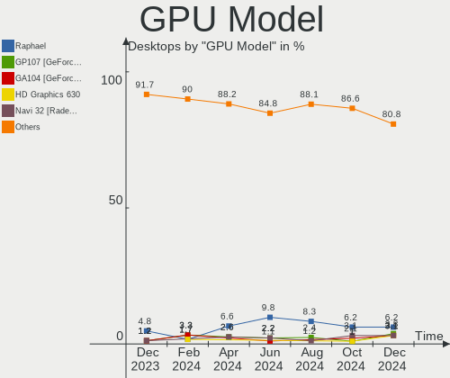
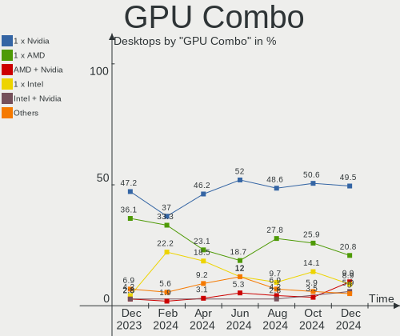

Pop!_OS Hardware Trends (Desktop)
---------------------------------

A project to identify most popular hardware characteristics and track their change
over time based on data collected by Pop!_OS users at https://Linux-Hardware.org.

Anyone can contribute to the study by uploading probes of their computers by
the [hw-probe](https://github.com/linuxhw/hw-probe) tool:

    sudo -E hw-probe -all -upload

Full-feature report is available here: https://linux-hardware.org/?view=trends&formfactor=desktop

Period: May, 2020.

Contents
--------

- [ OS                       ](#os)
- [ OS Family                ](#os-family)
- [ Kernel                   ](#kernel)
- [ Kernel Family            ](#kernel-family)
- [ Kernel Major Ver.        ](#kernel-major-ver)
- [ Arch                     ](#arch)
- [ DE                       ](#de)
- [ Display Server           ](#display-server)
- [ Display Manager          ](#display-manager)
- [ OS Lang                  ](#os-lang)
- [ Boot Mode                ](#boot-mode)
- [ Filesystem               ](#filesystem)
- [ Part. scheme             ](#part-scheme)
- [ Dual Boot with Linux/BSD ](#dual-boot-with-linux/bsd)
- [ Dual Boot (Win)          ](#dual-boot-win)
- [ Country                  ](#country)
- [ City                     ](#city)
- [ Vendor                   ](#vendor)
- [ Model                    ](#model)
- [ Model Family             ](#model-family)
- [ MFG Year                 ](#mfg-year)
- [ Form Factor              ](#form-factor)
- [ Secure Boot              ](#secure-boot)
- [ Coreboot                 ](#coreboot)
- [ RAM Size                 ](#ram-size)
- [ RAM Used                 ](#ram-used)
- [ Drive Vendor             ](#drive-vendor)
- [ Drive Model              ](#drive-model)
- [ Drive Kind               ](#drive-kind)
- [ Drive Connector          ](#drive-connector)
- [ Drive Size               ](#drive-size)
- [ Space Total              ](#space-total)
- [ Space Used               ](#space-used)
- [ Malfunc. Drives          ](#malfunc-drives)
- [ Malfunc. Drive Vendor    ](#malfunc-drive-vendor)
- [ Malfunc. Drive Kind      ](#malfunc-drive-kind)
- [ Failed Drives            ](#failed-drives)
- [ Failed Drive Vendor      ](#failed-drive-vendor)
- [ Drive Status             ](#drive-status)
- [ Storage Vendor           ](#storage-vendor)
- [ Storage Model            ](#storage-model)
- [ Storage Kind             ](#storage-kind)
- [ CPU Vendor               ](#cpu-vendor)
- [ CPU Model                ](#cpu-model)
- [ CPU Model Family         ](#cpu-model-family)
- [ CPU Cores                ](#cpu-cores)
- [ CPU Sockets              ](#cpu-sockets)
- [ CPU Threads              ](#cpu-threads)
- [ CPU Op-Modes             ](#cpu-op-modes)
- [ CPU Microcode            ](#cpu-microcode)
- [ CPU Microarch            ](#cpu-microarch)
- [ GPU Vendor               ](#gpu-vendor)
- [ GPU Model                ](#gpu-model)
- [ GPU Combo                ](#gpu-combo)
- [ GPU Driver               ](#gpu-driver)
- [ GPU Memory               ](#gpu-memory)
- [ Monitor Vendor           ](#monitor-vendor)
- [ Monitor Model            ](#monitor-model)
- [ Monitor Resolution       ](#monitor-resolution)
- [ Monitor Diagonal         ](#monitor-diagonal)
- [ Monitor Width            ](#monitor-width)
- [ Aspect Ratio             ](#aspect-ratio)
- [ Monitor Area             ](#monitor-area)
- [ Pixel Density            ](#pixel-density)
- [ Multiple Monitors        ](#multiple-monitors)
- [ Net Controller Vendor    ](#net-controller-vendor)
- [ Net Controller Model     ](#net-controller-model)
- [ Net Controller Kind      ](#net-controller-kind)
- [ Used Controller          ](#used-controller)
- [ NICs                     ](#nics)
- [ Unsupported Devices      ](#unsupported-devices)
- [ Unsupported Device Types ](#unsupported-device-types)

OS
--

Installed operating systems

| Name          | Computers | Percent |
|---------------|-----------|---------|
| Pop!_OS 20.04 | 85        | 100%    |

OS Family
---------

OS without a version

| Name    | Computers | Percent |
|---------|-----------|---------|
| Pop!_OS | 85        | 100%    |

Kernel
------

Version of the Linux kernel

| Version            | Computers | Percent |
|--------------------|-----------|---------|
| 5.4.0-7626-generic | 42        | 49.41%  |
| 5.4.0-7629-generic | 20        | 23.53%  |
| 5.4.0-7625-generic | 15        | 17.65%  |
| 5.4.0-7634-generic | 5         | 5.88%   |
| 5.6.12             | 1         | 1.18%   |
| 5.6.10-xanmod1     | 1         | 1.18%   |
| 5.4.0-7624-generic | 1         | 1.18%   |

Kernel Family
-------------

Linux kernel without a distro release

| Version | Computers | Percent |
|---------|-----------|---------|
| 5.4.0   | 83        | 97.65%  |
| 5.6.12  | 1         | 1.18%   |
| 5.6.10  | 1         | 1.18%   |

Kernel Major Ver.
-----------------

Linux kernel major version

| Version | Computers | Percent |
|---------|-----------|---------|
| 5.4     | 83        | 97.65%  |
| 5.6     | 2         | 2.35%   |

Arch
----

OS architecture (x86_64, i586, etc.)

| Name   | Computers | Percent |
|--------|-----------|---------|
| x86_64 | 85        | 100%    |

DE
--

Desktop Environment

| Name     | Computers | Percent |
|----------|-----------|---------|
| GNOME    | 83        | 97.65%  |
| MATE     | 1         | 1.18%   |
| Cinnamon | 1         | 1.18%   |

Display Server
--------------

X11 or Wayland

| Name | Computers | Percent |
|------|-----------|---------|
| X11  | 85        | 100%    |

Display Manager
---------------

SDDM, LightDM, etc.

| Name    | Computers | Percent |
|---------|-----------|---------|
| Unknown | 81        | 95.29%  |
| GDM     | 4         | 4.71%   |

OS Lang
-------

Language

| Lang  | Computers | Percent |
|-------|-----------|---------|
| en_US | 42        | 49.41%  |
| en_GB | 9         | 10.59%  |
| en_AU | 6         | 7.06%   |
| pt_BR | 5         | 5.88%   |
| de_DE | 5         | 5.88%   |
| en_CA | 4         | 4.71%   |
| nl_NL | 2         | 2.35%   |
| it_IT | 2         | 2.35%   |
| C     | 2         | 2.35%   |
| zh_TW | 1         | 1.18%   |
| tr_TR | 1         | 1.18%   |
| ru_RU | 1         | 1.18%   |
| nl_BE | 1         | 1.18%   |
| hr_HR | 1         | 1.18%   |
| fr_CA | 1         | 1.18%   |
| es_ES | 1         | 1.18%   |
| es_AR | 1         | 1.18%   |

Boot Mode
---------

EFI or BIOS

| Mode | Computers | Percent |
|------|-----------|---------|
| EFI  | 44        | 51.76%  |
| BIOS | 41        | 48.24%  |

Filesystem
----------

Type of filesystem

| Type    | Computers | Percent |
|---------|-----------|---------|
| Ext4    | 82        | 96.47%  |
| Btrfs   | 2         | 2.35%   |
| Overlay | 1         | 1.18%   |

Part. scheme
------------

Scheme of partitioning

| Type    | Computers | Percent |
|---------|-----------|---------|
| Unknown | 84        | 98.82%  |
| GPT     | 1         | 1.18%   |

Dual Boot with Linux/BSD
------------------------

Hosting more than one Linux/BSD

| Dual boot | Computers | Percent |
|-----------|-----------|---------|
| No        | 82        | 96.47%  |
| Yes       | 3         | 3.53%   |

Dual Boot (Win)
---------------

Hosting Linux and Windows

| Dual boot | Computers | Percent |
|-----------|-----------|---------|
| No        | 82        | 96.47%  |
| Yes       | 3         | 3.53%   |

Country
-------

Geographic location (country)

| Country      | Computers | Percent |
|--------------|-----------|---------|
| USA          | 30        | 35.29%  |
| UK           | 7         | 8.24%   |
| Germany      | 6         | 7.06%   |
| Canada       | 6         | 7.06%   |
| Brazil       | 6         | 7.06%   |
| Australia    | 6         | 7.06%   |
| Netherlands  | 2         | 2.35%   |
| Italy        | 2         | 2.35%   |
| Belgium      | 2         | 2.35%   |
| Turkey       | 1         | 1.18%   |
| Taiwan       | 1         | 1.18%   |
| Switzerland  | 1         | 1.18%   |
| Sweden       | 1         | 1.18%   |
| Spain        | 1         | 1.18%   |
| South Africa | 1         | 1.18%   |
| Singapore    | 1         | 1.18%   |
| Russia       | 1         | 1.18%   |
| Romania      | 1         | 1.18%   |
| Norway       | 1         | 1.18%   |
| New Zealand  | 1         | 1.18%   |
| Mexico       | 1         | 1.18%   |
| Malaysia     | 1         | 1.18%   |
| Indonesia    | 1         | 1.18%   |
| India        | 1         | 1.18%   |
| Croatia      | 1         | 1.18%   |
| Austria      | 1         | 1.18%   |
| Argentina    | 1         | 1.18%   |

City
----

Geographic location (city)

| City            | Computers | Percent |
|-----------------|-----------|---------|
| São Paulo      | 2         | 2.35%   |
| Melbourne       | 2         | 2.35%   |
| Cricklewood     | 2         | 2.35%   |
| Berlin          | 2         | 2.35%   |
| Zagreb          | 1         | 1.18%   |
| Xalapa          | 1         | 1.18%   |
| Wenatchee       | 1         | 1.18%   |
| Wasilla         | 1         | 1.18%   |
| Tuscaloosa      | 1         | 1.18%   |
| Turin           | 1         | 1.18%   |
| Trois-Rivières | 1         | 1.18%   |
| Toronto         | 1         | 1.18%   |
| Toledo          | 1         | 1.18%   |
| Tempe           | 1         | 1.18%   |
| Taichung        | 1         | 1.18%   |
| Sydney          | 1         | 1.18%   |
| Swindon         | 1         | 1.18%   |
| Stittsville     | 1         | 1.18%   |
| St. Marys       | 1         | 1.18%   |
| Singapore       | 1         | 1.18%   |
| Signal Mountain | 1         | 1.18%   |
| Seattle         | 1         | 1.18%   |
| Sao Gotardo     | 1         | 1.18%   |
| Sandnes         | 1         | 1.18%   |
| San Antonio     | 1         | 1.18%   |
| Rotterdam       | 1         | 1.18%   |
| Port Saint John | 1         | 1.18%   |
| Phoenix         | 1         | 1.18%   |
| Perth           | 1         | 1.18%   |
| Owensboro       | 1         | 1.18%   |
| Oudenaarde      | 1         | 1.18%   |
| Ottawa          | 1         | 1.18%   |
| Orlando         | 1         | 1.18%   |
| Oetwil am See   | 1         | 1.18%   |
| North Las Vegas | 1         | 1.18%   |
| Muratpasa       | 1         | 1.18%   |
| Munich          | 1         | 1.18%   |
| Moscow          | 1         | 1.18%   |
| Mortsel         | 1         | 1.18%   |
| Mont-Tremblant  | 1         | 1.18%   |
| Monrovia        | 1         | 1.18%   |
| Mistretta       | 1         | 1.18%   |
| Miami           | 1         | 1.18%   |
| Metairie        | 1         | 1.18%   |
| Mellerud        | 1         | 1.18%   |
| Manchester      | 1         | 1.18%   |
| Magdeburg       | 1         | 1.18%   |
| Madrid          | 1         | 1.18%   |
| Los Angeles     | 1         | 1.18%   |
| London          | 1         | 1.18%   |
| Kuala Lumpur    | 1         | 1.18%   |
| Kolkata         | 1         | 1.18%   |
| Klagenfurt      | 1         | 1.18%   |
| Killeen         | 1         | 1.18%   |
| Jatai           | 1         | 1.18%   |
| Jackson         | 1         | 1.18%   |
| Ipu             | 1         | 1.18%   |
| Houten          | 1         | 1.18%   |
| Hamilton        | 1         | 1.18%   |
| Goose Creek     | 1         | 1.18%   |

Vendor
------

Motherboard manufacturer

| Name                | Computers | Percent |
|---------------------|-----------|---------|
| ASUSTek Computer    | 24        | 28.24%  |
| Gigabyte Technology | 20        | 23.53%  |
| MSI                 | 10        | 11.76%  |
| ASRock              | 7         | 8.24%   |
| Dell                | 5         | 5.88%   |
| Lenovo              | 4         | 4.71%   |
| Hewlett-Packard     | 4         | 4.71%   |
| PCWare              | 2         | 2.35%   |
| Acer                | 2         | 2.35%   |
| System76            | 1         | 1.18%   |
| Pegatron            | 1         | 1.18%   |
| Login Informatica   | 1         | 1.18%   |
| Intel               | 1         | 1.18%   |
| Gateway             | 1         | 1.18%   |
| Fujitsu             | 1         | 1.18%   |
| Unknown             | 1         | 1.18%   |

Model
-----

Motherboard model

| Name                                   | Computers | Percent |
|----------------------------------------|-----------|---------|
| ASUS All Series                        | 5         | 5.88%   |
| MSI MS-7B87                            | 2         | 2.35%   |
| Gigabyte Z77-D3H                       | 2         | 2.35%   |
| ASUS SABERTOOTH 990FX                  | 2         | 2.35%   |
| ASUS PRIME B450M-A                     | 2         | 2.35%   |
| System76 Thelio Major                  | 1         | 1.18%   |
| Pegatron Pro 3010 Small Form Factor PC | 1         | 1.18%   |
| PCWare IPX1800G1                       | 1         | 1.18%   |
| PCWare IPMH310G                        | 1         | 1.18%   |
| MSI s5650br                            | 1         | 1.18%   |
| MSI MS-7C52                            | 1         | 1.18%   |
| MSI MS-7C35                            | 1         | 1.18%   |
| MSI MS-7B98                            | 1         | 1.18%   |
| MSI MS-7A34                            | 1         | 1.18%   |
| MSI MS-7971                            | 1         | 1.18%   |
| MSI MS-7640                            | 1         | 1.18%   |
| MSI MS-7586                            | 1         | 1.18%   |
| Login Informatica LOG-H61H2-M2         | 1         | 1.18%   |
| Lenovo ThinkServer TS430 044111G       | 1         | 1.18%   |
| Lenovo ThinkCentre M58p 7220RU5        | 1         | 1.18%   |
| Lenovo IdeaCentre 510-15ICK 90LU005KIX | 1         | 1.18%   |
| Lenovo H50-55 90BG003JUS               | 1         | 1.18%   |
| Intel Mecer_X102                       | 1         | 1.18%   |
| HP Slim Desktop 290-p0xxx              | 1         | 1.18%   |
| HP Compaq Pro 6305 SFF                 | 1         | 1.18%   |
| HP Compaq Elite 8300 CMT               | 1         | 1.18%   |
| HP 8433 11                             | 1         | 1.18%   |
| Gigabyte Z390 AORUS MASTER             | 1         | 1.18%   |
| Gigabyte Z370 AORUS Gaming 7           | 1         | 1.18%   |
| Gigabyte Z170X-Gaming 7                | 1         | 1.18%   |
| Gigabyte X570 AORUS XTREME             | 1         | 1.18%   |
| Gigabyte X470 AORUS ULTRA GAMING       | 1         | 1.18%   |
| Gigabyte X399 AORUS Gaming 7           | 1         | 1.18%   |
| Gigabyte TRX40 DESIGNARE               | 1         | 1.18%   |
| Gigabyte H61M-DS2 DVI                  | 1         | 1.18%   |
| Gigabyte GA-MA770T-UD3                 | 1         | 1.18%   |
| Gigabyte G31MX-S2                      | 1         | 1.18%   |
| Gigabyte G31M-S2L                      | 1         | 1.18%   |
| Gigabyte F2A88X-D3H                    | 1         | 1.18%   |
| Gigabyte F2A85XM-D3H                   | 1         | 1.18%   |
| Gigabyte F2A68HM-H                     | 1         | 1.18%   |
| Gigabyte B75M-D3H                      | 1         | 1.18%   |
| Gigabyte B450M DS3H WIFI               | 1         | 1.18%   |
| Gigabyte B450M DS3H                    | 1         | 1.18%   |
| Gigabyte 990FXA-UD5                    | 1         | 1.18%   |
| Gateway DX4320                         | 1         | 1.18%   |
| Fujitsu CELSIUS R570-2                 | 1         | 1.18%   |
| Dell Studio XPS 8100                   | 1         | 1.18%   |
| Dell OptiPlex 990                      | 1         | 1.18%   |
| Dell OptiPlex 790                      | 1         | 1.18%   |
| Dell OptiPlex 780                      | 1         | 1.18%   |
| Dell OptiPlex 7010                     | 1         | 1.18%   |
| ASUS VM62N                             | 1         | 1.18%   |
| ASUS TUF X470-PLUS GAMING              | 1         | 1.18%   |
| ASUS TUF B450M-PLUS GAMING             | 1         | 1.18%   |
| ASUS ROG STRIX Z390-I GAMING           | 1         | 1.18%   |
| ASUS ROG STRIX B360-F GAMING           | 1         | 1.18%   |
| ASUS ROG CROSSHAIR VIII HERO           | 1         | 1.18%   |
| ASUS PRIME Z390-P                      | 1         | 1.18%   |
| ASUS PRIME X570-P                      | 1         | 1.18%   |

Model Family
------------

Motherboard model prefix

| Name                           | Computers | Percent |
|--------------------------------|-----------|---------|
| ASUS PRIME                     | 8         | 9.41%   |
| ASUS All                       | 5         | 5.88%   |
| Dell OptiPlex                  | 4         | 4.71%   |
| ASUS ROG                       | 3         | 3.53%   |
| MSI MS-7B87                    | 2         | 2.35%   |
| HP Compaq                      | 2         | 2.35%   |
| Gigabyte Z77-D3H               | 2         | 2.35%   |
| Gigabyte B450M                 | 2         | 2.35%   |
| ASUS TUF                       | 2         | 2.35%   |
| ASUS SABERTOOTH                | 2         | 2.35%   |
| Acer Aspire                    | 2         | 2.35%   |
| System76 Thelio                | 1         | 1.18%   |
| Pegatron Pro                   | 1         | 1.18%   |
| PCWare IPX1800G1               | 1         | 1.18%   |
| PCWare IPMH310G                | 1         | 1.18%   |
| MSI s5650br                    | 1         | 1.18%   |
| MSI MS-7C52                    | 1         | 1.18%   |
| MSI MS-7C35                    | 1         | 1.18%   |
| MSI MS-7B98                    | 1         | 1.18%   |
| MSI MS-7A34                    | 1         | 1.18%   |
| MSI MS-7971                    | 1         | 1.18%   |
| MSI MS-7640                    | 1         | 1.18%   |
| MSI MS-7586                    | 1         | 1.18%   |
| Login Informatica LOG-H61H2-M2 | 1         | 1.18%   |
| Lenovo ThinkServer             | 1         | 1.18%   |
| Lenovo ThinkCentre             | 1         | 1.18%   |
| Lenovo IdeaCentre              | 1         | 1.18%   |
| Lenovo H50-55                  | 1         | 1.18%   |
| Intel Mecer                    | 1         | 1.18%   |
| HP Slim                        | 1         | 1.18%   |
| HP 8433                        | 1         | 1.18%   |
| Gigabyte Z390                  | 1         | 1.18%   |
| Gigabyte Z370                  | 1         | 1.18%   |
| Gigabyte Z170X-Gaming          | 1         | 1.18%   |
| Gigabyte X570                  | 1         | 1.18%   |
| Gigabyte X470                  | 1         | 1.18%   |
| Gigabyte X399                  | 1         | 1.18%   |
| Gigabyte TRX40                 | 1         | 1.18%   |
| Gigabyte H61M-DS2              | 1         | 1.18%   |
| Gigabyte GA-MA770T-UD3         | 1         | 1.18%   |
| Gigabyte G31MX-S2              | 1         | 1.18%   |
| Gigabyte G31M-S2L              | 1         | 1.18%   |
| Gigabyte F2A88X-D3H            | 1         | 1.18%   |
| Gigabyte F2A85XM-D3H           | 1         | 1.18%   |
| Gigabyte F2A68HM-H             | 1         | 1.18%   |
| Gigabyte B75M-D3H              | 1         | 1.18%   |
| Gigabyte 990FXA-UD5            | 1         | 1.18%   |
| Gateway DX4320                 | 1         | 1.18%   |
| Fujitsu CELSIUS                | 1         | 1.18%   |
| Dell Studio                    | 1         | 1.18%   |
| ASUS VM62N                     | 1         | 1.18%   |
| ASUS P5Q                       | 1         | 1.18%   |
| ASUS M4A87TD                   | 1         | 1.18%   |
| ASUS H61M-K                    | 1         | 1.18%   |
| ASRock Z97E-ITX                | 1         | 1.18%   |
| ASRock Z77                     | 1         | 1.18%   |
| ASRock X570                    | 1         | 1.18%   |
| ASRock N68C-GS                 | 1         | 1.18%   |
| ASRock N68-GS4                 | 1         | 1.18%   |
| ASRock B450M                   | 1         | 1.18%   |

MFG Year
--------

Motherboard manufacture year

| Year | Computers | Percent |
|------|-----------|---------|
| 2019 | 26        | 30.59%  |
| 2013 | 9         | 10.59%  |
| 2012 | 7         | 8.24%   |
| 2018 | 6         | 7.06%   |
| 2015 | 6         | 7.06%   |
| 2014 | 6         | 7.06%   |
| 2010 | 6         | 7.06%   |
| 2020 | 5         | 5.88%   |
| 2011 | 5         | 5.88%   |
| 2016 | 2         | 2.35%   |
| 2009 | 2         | 2.35%   |
| 2008 | 2         | 2.35%   |
| 2007 | 2         | 2.35%   |
| 2017 | 1         | 1.18%   |

Form Factor
-----------

Physical design of the computer

| Name    | Computers | Percent |
|---------|-----------|---------|
| Desktop | 85        | 100%    |

Secure Boot
-----------

Enabled or disabled

| State    | Computers | Percent |
|----------|-----------|---------|
| Disabled | 85        | 100%    |

Coreboot
--------

Have coreboot on board

| Used | Computers | Percent |
|------|-----------|---------|
| No   | 85        | 100%    |

RAM Size
--------

Total RAM memory

| Size in GB  | Computers | Percent |
|-------------|-----------|---------|
| 16.01-24.0  | 29        | 34.12%  |
| 8.01-16.0   | 23        | 27.06%  |
| 3.01-4.0    | 11        | 12.94%  |
| 32.01-64.0  | 9         | 10.59%  |
| 4.01-8.0    | 6         | 7.06%   |
| 24.01-32.0  | 4         | 4.71%   |
| 64.01-256.0 | 2         | 2.35%   |
| 1.01-2.0    | 1         | 1.18%   |

RAM Used
--------

Used RAM memory

| Used GB    | Computers | Percent |
|------------|-----------|---------|
| 1.01-2.0   | 31        | 36.47%  |
| 2.01-3.0   | 24        | 28.24%  |
| 3.01-4.0   | 16        | 18.82%  |
| 4.01-8.0   | 12        | 14.12%  |
| 16.01-24.0 | 1         | 1.18%   |
| 8.01-16.0  | 1         | 1.18%   |

Drive Vendor
------------

Hard drive vendors

| Vendor              | Computers | Drives | Percent |
|---------------------|-----------|--------|---------|
| WDC                 | 38        | 48     | 33.63%  |
| Seagate             | 22        | 27     | 19.47%  |
| Samsung Electronics | 20        | 31     | 17.7%   |
| Hitachi             | 8         | 8      | 7.08%   |
| Crucial             | 5         | 5      | 4.42%   |
| Kingston            | 4         | 4      | 3.54%   |
| Toshiba             | 2         | 2      | 1.77%   |
| OCZ                 | 2         | 2      | 1.77%   |
| Corsair             | 2         | 2      | 1.77%   |
| XPG                 | 1         | 1      | 0.88%   |
| T-FORCE             | 1         | 1      | 0.88%   |
| SPCC                | 1         | 1      | 0.88%   |
| SK Hynix            | 1         | 1      | 0.88%   |
| SanDisk             | 1         | 1      | 0.88%   |
| PNY                 | 1         | 1      | 0.88%   |
| MGS                 | 1         | 1      | 0.88%   |
| LITEONIT            | 1         | 1      | 0.88%   |
| Intel               | 1         | 1      | 0.88%   |
| China               | 1         | 1      | 0.88%   |

Drive Model
-----------

Hard drive models

| Model                        | Computers | Percent |
|------------------------------|-----------|---------|
| SSD 850 EVO 250GB            | 4         | 2.88%   |
| ST500DM002-1BD142 500GB      | 3         | 2.16%   |
| SSD 840 EVO 500GB            | 3         | 2.16%   |
| SSD 840 EVO 250GB            | 3         | 2.16%   |
| WDS240G2G0A-00JH30 240GB SSD | 2         | 1.44%   |
| WD3200AAKS-75B3A0 320GB      | 2         | 1.44%   |
| WD2500AAKX-75U6AA0 250GB     | 2         | 1.44%   |
| WD2003FZEX-00Z4SA0 2TB       | 2         | 1.44%   |
| WD10EZEX-08WN4A0 1TB         | 2         | 1.44%   |
| ST2000DM006-2DM164 2TB       | 2         | 1.44%   |
| ST2000DM001-1ER164 2TB       | 2         | 1.44%   |
| SSD 970 EVO Plus 1TB         | 2         | 1.44%   |
| SSD 860 EVO 250GB            | 2         | 1.44%   |
| HD103SJ 1TB                  | 2         | 1.44%   |
| Force 3 SSD 240GB            | 2         | 1.44%   |
| WDS500G2B0B-00YS70 500GB SSD | 1         | 0.72%   |
| WDS250G1B0A-00H9H0 250GB SSD | 1         | 0.72%   |
| WDS240G2G0B-00EPW0 240GB SSD | 1         | 0.72%   |
| WDBNCE0020PNC 2TB SSD        | 1         | 0.72%   |
| WD7500BPVT-75HXZT3 752GB     | 1         | 0.72%   |
| WD6400AAKS-22A7B2 640GB      | 1         | 0.72%   |
| WD5001AALS-00L3B2 500GB      | 1         | 0.72%   |
| WD5000LPCX-00VHAT0 500GB     | 1         | 0.72%   |
| WD5000AVDS-63U7B1 500GB      | 1         | 0.72%   |
| WD5000AAKX-22ERMA0 500GB     | 1         | 0.72%   |
| WD5000AAKX-00U6AA0 500GB     | 1         | 0.72%   |
| WD5000AAKS-07YGA0 500GB      | 1         | 0.72%   |
| WD40EZRZ-00GXCB0 4TB         | 1         | 0.72%   |
| WD40EZRX-00SPEB0 4TB         | 1         | 0.72%   |
| WD3202ABYS-01B7A0 320GB      | 1         | 0.72%   |
| WD3200BPVT-00HXZT3 320GB     | 1         | 0.72%   |
| WD3200AAKS-75L9A0 320GB      | 1         | 0.72%   |
| WD30EZRX-00DC0B0 3TB         | 1         | 0.72%   |
| WD30EFRX-68N32N0 3TB         | 1         | 0.72%   |
| WD2500AAKS-00VSA0 250GB      | 1         | 0.72%   |
| WD2500AAJS-61B4A0 250GB      | 1         | 0.72%   |
| WD20EZRZ-22Z5HB0 2TB         | 1         | 0.72%   |
| WD20EZRZ-00Z5HB0 2TB         | 1         | 0.72%   |
| WD20EURX-63T0FY0 2TB         | 1         | 0.72%   |
| WD2002FAEX-007BA0 2TB        | 1         | 0.72%   |
| WD1600HLFS-75G6U1 160GB      | 1         | 0.72%   |
| WD1600AVVS-63L2B0 160GB      | 1         | 0.72%   |
| WD1600AAJS-65M0A0 160GB      | 1         | 0.72%   |
| WD15EARS-00MVWB0 1TB         | 1         | 0.72%   |
| WD10PURX-64E5EY0 1TB         | 1         | 0.72%   |
| WD10JPLX-00MBPT0 1TB         | 1         | 0.72%   |
| WD10EZRZ-00HTKB0 1TB         | 1         | 0.72%   |
| WD10EZEX-60WN4A1 1TB         | 1         | 0.72%   |
| WD10EZEX-22BN5A0 1TB         | 1         | 0.72%   |
| WD10EZEX-00RKKA0 1TB         | 1         | 0.72%   |
| WD10EALX-009BA0 1TB          | 1         | 0.72%   |
| WD1002FAEX-00Y9A0 1TB        | 1         | 0.72%   |
| WD1001FAES-75W7A0 1TB        | 1         | 0.72%   |
| VERTEX2 160GB SSD            | 1         | 0.72%   |
| SX950U 480GB                 | 1         | 0.72%   |
| SUV400S37120G 120GB SSD      | 1         | 0.72%   |
| ST6000NE0023-2EX110 6TB      | 1         | 0.72%   |
| ST6000DM003-2CY186 6TB       | 1         | 0.72%   |
| ST3808110AS 80GB             | 1         | 0.72%   |
| ST3500414CS 500GB            | 1         | 0.72%   |

Drive Kind
----------

HDD or SSD

| Kind    | Computers | Drives | Percent |
|---------|-----------|--------|---------|
| HDD     | 59        | 81     | 57.28%  |
| SSD     | 37        | 51     | 35.92%  |
| Unknown | 4         | 4      | 3.88%   |
| NVMe    | 3         | 3      | 2.91%   |

Drive Connector
---------------

SATA, SAS, NVMe, etc.

| Type | Computers | Drives | Percent |
|------|-----------|--------|---------|
| SATA | 75        | 133    | 92.59%  |
| SAS  | 3         | 3      | 3.7%    |
| NVMe | 3         | 3      | 3.7%    |

Drive Size
----------

Size of hard drive

| Size in TB | Computers | Drives | Percent |
|------------|-----------|--------|---------|
| 0.01-0.5   | 57        | 79     | 53.77%  |
| 0.51-1.0   | 26        | 33     | 24.53%  |
| 1.01-2.0   | 14        | 16     | 13.21%  |
| 2.01-3.0   | 4         | 4      | 3.77%   |
| 4.01-10.0  | 3         | 4      | 2.83%   |
| 3.01-4.0   | 1         | 2      | 0.94%   |
| 10.01-20.0 | 1         | 1      | 0.94%   |

Space Total
-----------

Amount of disk space available on the file system

| Size in GB     | Computers | Percent |
|----------------|-----------|---------|
| 251-500        | 24        | 28.24%  |
| 101-250        | 23        | 27.06%  |
| 501-1000       | 13        | 15.29%  |
| 1001-2000      | 11        | 12.94%  |
| More than 3000 | 5         | 5.88%   |
| 21-50          | 5         | 5.88%   |
| 2001-3000      | 3         | 3.53%   |
| 51-100         | 1         | 1.18%   |

Space Used
----------

Amount of used disk space

| Used GB        | Computers | Percent |
|----------------|-----------|---------|
| 1-20           | 37        | 43.53%  |
| 21-50          | 14        | 16.47%  |
| 101-250        | 12        | 14.12%  |
| 251-500        | 8         | 9.41%   |
| 51-100         | 7         | 8.24%   |
| More than 3000 | 3         | 3.53%   |
| 501-1000       | 3         | 3.53%   |
| 1001-2000      | 1         | 1.18%   |

Malfunc. Drives
---------------

Drive models with a malfunction

| Model                   | Computers | Drives | Percent |
|-------------------------|-----------|--------|---------|
| WD3200AAKS-75B3A0 320GB | 2         | 2      | 50%     |
| HD103SJ 1TB             | 2         | 2      | 50%     |

Malfunc. Drive Vendor
---------------------

Vendors of faulty drives

| Vendor              | Computers | Drives | Percent |
|---------------------|-----------|--------|---------|
| WDC                 | 2         | 2      | 50%     |
| Samsung Electronics | 2         | 2      | 50%     |

Malfunc. Drive Kind
-------------------

Kinds of faulty drives

| Kind | Computers | Drives | Percent |
|------|-----------|--------|---------|
| HDD  | 2         | 4      | 100%    |

Failed Drives
-------------

Failed drive models

Zero info for selected period =(

Failed Drive Vendor
-------------------

Failed drive vendors

Zero info for selected period =(

Drive Status
------------

Number of failed and malfunc. drives

| Status   | Computers | Drives | Percent |
|----------|-----------|--------|---------|
| Detected | 71        | 123    | 92.21%  |
| Works    | 4         | 12     | 5.19%   |
| Malfunc  | 2         | 4      | 2.6%    |

Storage Vendor
--------------

Storage controller vendors

| Vendor                           | Computers | Percent |
|----------------------------------|-----------|---------|
| Intel                            | 45        | 37.19%  |
| AMD                              | 38        | 31.4%   |
| Phison Electronics               | 8         | 6.61%   |
| Samsung Electronics              | 6         | 4.96%   |
| JMicron Technology               | 5         | 4.13%   |
| Silicon Motion                   | 3         | 2.48%   |
| Sandisk                          | 2         | 1.65%   |
| Nvidia                           | 2         | 1.65%   |
| Kingston Technology Company      | 2         | 1.65%   |
| ASMedia Technology               | 2         | 1.65%   |
| ADATA Technology                 | 2         | 1.65%   |
| Silicon Integrated Systems [SiS] | 1         | 0.83%   |
| Micron/Crucial Technology        | 1         | 0.83%   |
| Marvell Technology Group         | 1         | 0.83%   |
| HighPoint Technologies           | 1         | 0.83%   |
| Broadcom / LSI                   | 1         | 0.83%   |
| Adaptec                          | 1         | 0.83%   |

Storage Model
-------------

Storage controller models

| Model                                                                             | Computers | Percent |
|-----------------------------------------------------------------------------------|-----------|---------|
| FCH SATA Controller [AHCI mode]                                                   | 30        | 18.87%  |
| 400 Series Chipset SATA Controller                                                | 12        | 7.55%   |
| NVMe SSD Controller SM981/PM981/PM983                                             | 6         | 3.77%   |
| 7 Series/C210 Series Chipset Family 6-port SATA Controller [AHCI mode]            | 6         | 3.77%   |
| SATA Controller [RAID mode]                                                       | 5         | 3.14%   |
| Cannon Lake PCH SATA AHCI Controller                                              | 5         | 3.14%   |
| 6 Series/C200 Series Chipset Family 6 port Desktop SATA AHCI Controller           | 5         | 3.14%   |
| Non-Volatile memory controller                                                    | 4         | 2.52%   |
| E16 PCIe4 NVMe Controller                                                         | 4         | 2.52%   |
| 8 Series/C220 Series Chipset Family 6-port SATA Controller 1 [AHCI mode]          | 4         | 2.52%   |
| SB7x0/SB8x0/SB9x0 SATA Controller [IDE mode]                                      | 3         | 1.89%   |
| SB7x0/SB8x0/SB9x0 SATA Controller [AHCI mode]                                     | 3         | 1.89%   |
| SB7x0/SB8x0/SB9x0 IDE Controller                                                  | 3         | 1.89%   |
| JMB368 IDE controller                                                             | 3         | 1.89%   |
| E12 NVMe Controller                                                               | 3         | 1.89%   |
| 200 Series PCH SATA controller [AHCI mode]                                        | 3         | 1.89%   |
| XPG SX8200 Pro PCIe Gen3x4 M.2 2280 Solid State Drive                             | 2         | 1.26%   |
| X370 Series Chipset SATA Controller                                               | 2         | 1.26%   |
| SSD 660P Series                                                                   | 2         | 1.26%   |
| Q170/Q150/B150/H170/H110/Z170/CM236 Chipset SATA Controller [AHCI Mode]           | 2         | 1.26%   |
| NM10/ICH7 Family SATA Controller [IDE mode]                                       | 2         | 1.26%   |
| MCP61 SATA Controller                                                             | 2         | 1.26%   |
| MCP61 IDE                                                                         | 2         | 1.26%   |
| JMB362 SATA Controller                                                            | 2         | 1.26%   |
| FCH SATA Controller D                                                             | 2         | 1.26%   |
| ASM1062 Serial ATA Controller                                                     | 2         | 1.26%   |
| 82801JI (ICH10 Family) SATA AHCI Controller                                       | 2         | 1.26%   |
| 82801JD/DO (ICH10 Family) SATA AHCI Controller                                    | 2         | 1.26%   |
| 4 Series Chipset PT IDER Controller                                               | 2         | 1.26%   |
| 300 Series Chipset SATA Controller                                                | 2         | 1.26%   |
| WD Black NVMe SSD                                                                 | 1         | 0.63%   |
| WD Black 2018/PC SN720 NVMe SSD                                                   | 1         | 0.63%   |
| WD Black 2018/PC SN520 NVMe SSD                                                   | 1         | 0.63%   |
| Technology Company Non-Volatile memory controller                                 | 1         | 0.63%   |
| Series 7 6G SAS/PCIe 3                                                            | 1         | 0.63%   |
| SB7x0/SB8x0/SB9x0 SATA Controller [RAID5 mode]                                    | 1         | 0.63%   |
| SATA Controller / IDE mode                                                        | 1         | 0.63%   |
| RS690 PCI to PCI Bridge (PCI Express Port 3)                                      | 1         | 0.63%   |
| RAID bus controller                                                               | 1         | 0.63%   |
| PS5013 E13 NVMe Controller                                                        | 1         | 0.63%   |
| P1 NVMe PCIe SSD                                                                  | 1         | 0.63%   |
| NVMe Storage Controller                                                           | 1         | 0.63%   |
| NVMe SSD Optane Series Controller                                                 | 1         | 0.63%   |
| MegaRAID SAS 2008 [Falcon]                                                        | 1         | 0.63%   |
| JMB363 SATA/IDE Controller                                                        | 1         | 0.63%   |
| JMB361 AHCI/IDE                                                                   | 1         | 0.63%   |
| FCH RAID Controller                                                               | 1         | 0.63%   |
| FCH IDE Controller                                                                | 1         | 0.63%   |
| Atom/Celeron/Pentium Processor x5-E8000/J3xxx/N3xxx Series SATA Controller        | 1         | 0.63%   |
| Atom Processor E3800 Series SATA AHCI Controller                                  | 1         | 0.63%   |
| 9 Series Chipset Family SATA Controller [AHCI Mode]                               | 1         | 0.63%   |
| 88SE9172 SATA 6Gb/s Controller                                                    | 1         | 0.63%   |
| 82801JI (ICH10 Family) 4 port SATA IDE Controller #1                              | 1         | 0.63%   |
| 82801JI (ICH10 Family) 2 port SATA IDE Controller #2                              | 1         | 0.63%   |
| 8 Series SATA Controller 1 [AHCI mode]                                            | 1         | 0.63%   |
| 6 Series/C200 Series Chipset Family Desktop SATA Controller (IDE mode, ports 4-5) | 1         | 0.63%   |
| 6 Series/C200 Series Chipset Family Desktop SATA Controller (IDE mode, ports 0-3) | 1         | 0.63%   |
| 5513 IDE Controller                                                               | 1         | 0.63%   |
| 5 Series/3400 Series Chipset PT IDER Controller                                   | 1         | 0.63%   |
| 5 Series/3400 Series Chipset 6 port SATA AHCI Controller                          | 1         | 0.63%   |

Storage Kind
------------

Kind of storage controller (IDE, SATA, NVMe, SAS, ...)

| Kind | Computers | Percent |
|------|-----------|---------|
| SATA | 71        | 59.17%  |
| NVMe | 24        | 20%     |
| IDE  | 15        | 12.5%   |
| RAID | 10        | 8.33%   |

CPU Vendor
----------

Processor vendors

| Vendor | Computers | Percent |
|--------|-----------|---------|
| Intel  | 45        | 52.94%  |
| AMD    | 40        | 47.06%  |

CPU Model
---------

Processor models

| Model                                          | Computers | Percent |
|------------------------------------------------|-----------|---------|
| Intel Core i7-3770 CPU @ 3.40GHz               | 3         | 3.53%   |
| AMD Ryzen 5 3600 6-Core Processor              | 3         | 3.53%   |
| AMD Ryzen 5 2600 Six-Core Processor            | 3         | 3.53%   |
| Intel Core i7-9700F CPU @ 3.00GHz              | 2         | 2.35%   |
| Intel Core i7-3770K CPU @ 3.50GHz              | 2         | 2.35%   |
| Intel Core 2 Duo CPU E8400 @ 3.00GHz           | 2         | 2.35%   |
| AMD Ryzen 9 3950X 16-Core Processor            | 2         | 2.35%   |
| AMD Ryzen 9 3900X 12-Core Processor            | 2         | 2.35%   |
| AMD Ryzen 7 2700X Eight-Core Processor         | 2         | 2.35%   |
| AMD Ryzen 3 3200G with Radeon Vega Graphics    | 2         | 2.35%   |
| AMD Ryzen 3 2200G with Radeon Vega Graphics    | 2         | 2.35%   |
| AMD Phenom II X6 1055T Processor               | 2         | 2.35%   |
| Intel Xeon CPU L5640 @ 2.27GHz                 | 1         | 1.18%   |
| Intel Xeon CPU E31220 @ 3.10GHz                | 1         | 1.18%   |
| Intel Xeon CPU E3-1240 v3 @ 3.40GHz            | 1         | 1.18%   |
| Intel Pentium Dual-Core CPU E5400 @ 2.70GHz    | 1         | 1.18%   |
| Intel Pentium Dual CPU E2140 @ 1.60GHz         | 1         | 1.18%   |
| Intel Pentium CPU G645 @ 2.90GHz               | 1         | 1.18%   |
| Intel Pentium CPU G4400 @ 3.30GHz              | 1         | 1.18%   |
| Intel Core i9-9900K CPU @ 3.60GHz              | 1         | 1.18%   |
| Intel Core i7-8700 CPU @ 3.20GHz               | 1         | 1.18%   |
| Intel Core i7-8086K CPU @ 4.00GHz              | 1         | 1.18%   |
| Intel Core i7 CPU 870 @ 2.93GHz                | 1         | 1.18%   |
| Intel Core i5-9600KF CPU @ 3.70GHz             | 1         | 1.18%   |
| Intel Core i5-9400F CPU @ 2.90GHz              | 1         | 1.18%   |
| Intel Core i5-8600K CPU @ 3.60GHz              | 1         | 1.18%   |
| Intel Core i5-6600K CPU @ 3.50GHz              | 1         | 1.18%   |
| Intel Core i5-4690K CPU @ 3.50GHz              | 1         | 1.18%   |
| Intel Core i5-4570 CPU @ 3.20GHz               | 1         | 1.18%   |
| Intel Core i5-4440 CPU @ 3.10GHz               | 1         | 1.18%   |
| Intel Core i5-4210U CPU @ 1.70GHz              | 1         | 1.18%   |
| Intel Core i5-3570K CPU @ 3.40GHz              | 1         | 1.18%   |
| Intel Core i5-3470 CPU @ 3.20GHz               | 1         | 1.18%   |
| Intel Core i5-2400S CPU @ 2.50GHz              | 1         | 1.18%   |
| Intel Core i5-2400 CPU @ 3.10GHz               | 1         | 1.18%   |
| Intel Core i5 CPU 760 @ 2.80GHz                | 1         | 1.18%   |
| Intel Core i5 CPU 650 @ 3.20GHz                | 1         | 1.18%   |
| Intel Core i3-4160 CPU @ 3.60GHz               | 1         | 1.18%   |
| Intel Core i3-3240 CPU @ 3.40GHz               | 1         | 1.18%   |
| Intel Core i3-2100 CPU @ 3.10GHz               | 1         | 1.18%   |
| Intel Core i3 CPU 550 @ 3.20GHz                | 1         | 1.18%   |
| Intel Core 2 Quad CPU Q9400 @ 2.66GHz          | 1         | 1.18%   |
| Intel Core 2 Quad CPU Q8200 @ 2.33GHz          | 1         | 1.18%   |
| Intel Core 2 Duo CPU E4500 @ 2.20GHz           | 1         | 1.18%   |
| Intel Celeron G4930 CPU @ 3.20GHz              | 1         | 1.18%   |
| Intel Celeron CPU N3050 @ 1.60GHz              | 1         | 1.18%   |
| Intel Celeron CPU J1800 @ 2.41GHz              | 1         | 1.18%   |
| Intel Celeron CPU E3300 @ 2.50GHz              | 1         | 1.18%   |
| AMD Ryzen Threadripper 3970X 32-Core Processor | 1         | 1.18%   |
| AMD Ryzen Threadripper 3960X 24-Core Processor | 1         | 1.18%   |
| AMD Ryzen Threadripper 1900X 8-Core Processor  | 1         | 1.18%   |
| AMD Ryzen 7 3700X 8-Core Processor             | 1         | 1.18%   |
| AMD Ryzen 7 1800X Eight-Core Processor         | 1         | 1.18%   |
| AMD Ryzen 7 1700X Eight-Core Processor         | 1         | 1.18%   |
| AMD Ryzen 5 2600X Six-Core Processor           | 1         | 1.18%   |
| AMD Ryzen 5 2400G with Radeon Vega Graphics    | 1         | 1.18%   |
| AMD Ryzen 5 1600 Six-Core Processor            | 1         | 1.18%   |
| AMD Phenom II X4 955 Processor                 | 1         | 1.18%   |
| AMD Phenom II X4 945 Processor                 | 1         | 1.18%   |
| AMD FX-8320 Eight-Core Processor               | 1         | 1.18%   |

CPU Model Family
----------------

Processor model prefix

| Model                   | Computers | Percent |
|-------------------------|-----------|---------|
| Intel Core i5           | 14        | 16.47%  |
| Intel Core i7           | 10        | 11.76%  |
| AMD Ryzen 5             | 9         | 10.59%  |
| AMD Ryzen 7             | 5         | 5.88%   |
| Intel Core i3           | 4         | 4.71%   |
| Intel Celeron           | 4         | 4.71%   |
| AMD Ryzen 9             | 4         | 4.71%   |
| AMD Ryzen 3             | 4         | 4.71%   |
| AMD FX                  | 4         | 4.71%   |
| Intel Xeon              | 3         | 3.53%   |
| Intel Core 2 Duo        | 3         | 3.53%   |
| AMD Ryzen Threadripper  | 3         | 3.53%   |
| Intel Pentium           | 2         | 2.35%   |
| Intel Core 2 Quad       | 2         | 2.35%   |
| AMD Phenom II X6        | 2         | 2.35%   |
| AMD Phenom II X4        | 2         | 2.35%   |
| AMD A8                  | 2         | 2.35%   |
| AMD A10                 | 2         | 2.35%   |
| Intel Pentium Dual-Core | 1         | 1.18%   |
| Intel Pentium Dual      | 1         | 1.18%   |
| Intel Core i9           | 1         | 1.18%   |
| AMD Athlon II X3        | 1         | 1.18%   |
| AMD Athlon              | 1         | 1.18%   |
| AMD A6                  | 1         | 1.18%   |

CPU Cores
---------

Number of processor cores

| Number | Computers | Percent |
|--------|-----------|---------|
| 4      | 28        | 32.94%  |
| 2      | 23        | 27.06%  |
| 6      | 15        | 17.65%  |
| 8      | 9         | 10.59%  |
| 12     | 3         | 3.53%   |
| 16     | 2         | 2.35%   |
| 3      | 2         | 2.35%   |
| 32     | 1         | 1.18%   |
| 24     | 1         | 1.18%   |
| 1      | 1         | 1.18%   |

CPU Sockets
-----------

Number of sockets

| Number | Computers | Percent |
|--------|-----------|---------|
| 1      | 84        | 98.82%  |
| 2      | 1         | 1.18%   |

CPU Threads
-----------

Threads per core (Hyper-Threading)

| Number | Computers | Percent |
|--------|-----------|---------|
| 2      | 47        | 55.29%  |
| 1      | 38        | 44.71%  |

CPU Op-Modes
------------

CPU Operation Modes (32-bit, 64-bit)

| Op mode        | Computers | Percent |
|----------------|-----------|---------|
| 32-bit, 64-bit | 85        | 100%    |

CPU Microcode
-------------

Microcode number

| Number     | Computers | Percent |
|------------|-----------|---------|
| 0x306a9    | 8         | 9.41%   |
| 0x08701013 | 8         | 9.41%   |
| Unknown    | 8         | 9.41%   |
| 0x1067a    | 6         | 7.06%   |
| 0x306c3    | 5         | 5.88%   |
| 0x0800820d | 5         | 5.88%   |
| 0x206a7    | 4         | 4.71%   |
| 0x906ea    | 3         | 3.53%   |
| 0x08108109 | 3         | 3.53%   |
| 0x06001119 | 3         | 3.53%   |
| 0x906ed    | 2         | 2.35%   |
| 0x906ec    | 2         | 2.35%   |
| 0x6fd      | 2         | 2.35%   |
| 0x506e3    | 2         | 2.35%   |
| 0x20655    | 2         | 2.35%   |
| 0x106e5    | 2         | 2.35%   |
| 0x08301025 | 2         | 2.35%   |
| 0x08001138 | 2         | 2.35%   |
| 0x06000852 | 2         | 2.35%   |
| 0x010000dc | 2         | 2.35%   |
| 0x010000c8 | 2         | 2.35%   |
| 0x906eb    | 1         | 1.18%   |
| 0x406c3    | 1         | 1.18%   |
| 0x30673    | 1         | 1.18%   |
| 0x206c2    | 1         | 1.18%   |
| 0x08101016 | 1         | 1.18%   |
| 0x08101013 | 1         | 1.18%   |
| 0x0810100b | 1         | 1.18%   |
| 0x08001105 | 1         | 1.18%   |
| 0x06003106 | 1         | 1.18%   |
| 0x0600063e | 1         | 1.18%   |

CPU Microarch
-------------

Microarchitecture

| Name        | Computers | Percent |
|-------------|-----------|---------|
| Zen 2       | 10        | 11.76%  |
| Skylake     | 10        | 11.76%  |
| Zen+        | 9         | 10.59%  |
| IvyBridge   | 8         | 9.41%   |
| Core        | 8         | 9.41%   |
| Zen         | 7         | 8.24%   |
| Piledriver  | 6         | 7.06%   |
| Haswell     | 6         | 7.06%   |
| SandyBridge | 5         | 5.88%   |
| K10         | 5         | 5.88%   |
| Westmere    | 3         | 3.53%   |
| Steamroller | 2         | 2.35%   |
| Silvermont  | 2         | 2.35%   |
| Nehalem     | 2         | 2.35%   |
| KabyLake    | 1         | 1.18%   |
| Bulldozer   | 1         | 1.18%   |

GPU Vendor
----------

Vendors of graphics cards

| Vendor                           | Computers | Percent |
|----------------------------------|-----------|---------|
| Nvidia                           | 38        | 43.68%  |
| AMD                              | 32        | 36.78%  |
| Intel                            | 16        | 18.39%  |
| Silicon Integrated Systems [SiS] | 1         | 1.15%   |

GPU Model
---------

Graphics card models

| Model                                                                              | Computers | Percent |
|------------------------------------------------------------------------------------|-----------|---------|
| Ellesmere [Radeon RX 470/480/570/570X/580/580X/590]                                | 6         | 6.74%   |
| GP107 [GeForce GTX 1050 Ti]                                                        | 4         | 4.49%   |
| GP106 [GeForce GTX 1060 6GB]                                                       | 4         | 4.49%   |
| Xeon E3-1200 v2/3rd Gen Core processor Graphics Controller                         | 3         | 3.37%   |
| Picasso                                                                            | 3         | 3.37%   |
| Navi 10 [Radeon RX 5600 OEM/5600 XT / 5700/5700 XT]                                | 3         | 3.37%   |
| GP104 [GeForce GTX 1080]                                                           | 3         | 3.37%   |
| GK208B [GeForce GT 710]                                                            | 3         | 3.37%   |
| Cedar [Radeon HD 5000/6000/7350/8350 Series]                                       | 3         | 3.37%   |
| UHD Graphics 630 (Desktop)                                                         | 2         | 2.25%   |
| TU116 [GeForce GTX 1660 SUPER]                                                     | 2         | 2.25%   |
| Tahiti XT [Radeon HD 7970/8970 OEM / R9 280X]                                      | 2         | 2.25%   |
| Raven Ridge [Radeon Vega Series / Radeon Vega Mobile Series]                       | 2         | 2.25%   |
| Kaveri [Radeon R7 Graphics]                                                        | 2         | 2.25%   |
| GT218 [GeForce 210]                                                                | 2         | 2.25%   |
| GP102 [GeForce GTX 1080 Ti]                                                        | 2         | 2.25%   |
| 82G33/G31 Express Integrated Graphics Controller                                   | 2         | 2.25%   |
| 4 Series Chipset Integrated Graphics Controller                                    | 2         | 2.25%   |
| 2nd Generation Core Processor Family Integrated Graphics Controller                | 2         | 2.25%   |
| Vega 10 XL/XT [Radeon RX Vega 56/64]                                               | 1         | 1.12%   |
| UHD Graphics 610                                                                   | 1         | 1.12%   |
| Turks XT [Radeon HD 6670/7670]                                                     | 1         | 1.12%   |
| Turks PRO [Radeon HD 7570]                                                         | 1         | 1.12%   |
| TU116 [GeForce GTX 1660]                                                           | 1         | 1.12%   |
| TU106 [GeForce RTX 2070]                                                           | 1         | 1.12%   |
| TU106 [GeForce RTX 2060 SUPER]                                                     | 1         | 1.12%   |
| TU104 [GeForce RTX 2080 SUPER]                                                     | 1         | 1.12%   |
| TU104 [GeForce RTX 2080 Rev. A]                                                    | 1         | 1.12%   |
| TU104 [GeForce RTX 2070 SUPER]                                                     | 1         | 1.12%   |
| Trinity 2 [Radeon HD 7540D]                                                        | 1         | 1.12%   |
| RV670 [Radeon HD 3690/3850]                                                        | 1         | 1.12%   |
| RV370 [Radeon X300/X550/X1050 Series] (Secondary)                                  | 1         | 1.12%   |
| RV370 [Radeon X300/X550/X1050 Series]                                              | 1         | 1.12%   |
| Oland PRO [Radeon R7 240/340]                                                      | 1         | 1.12%   |
| Lexa PRO [Radeon 540/540X/550/550X / RX 540X/550/550X]                             | 1         | 1.12%   |
| Juniper XT [Radeon HD 5770]                                                        | 1         | 1.12%   |
| Haswell-ULT Integrated Graphics Controller                                         | 1         | 1.12%   |
| GT216 [GeForce GT 220]                                                             | 1         | 1.12%   |
| GP104 [GeForce GTX 1070 Ti]                                                        | 1         | 1.12%   |
| GM206 [GeForce GTX 960]                                                            | 1         | 1.12%   |
| GM204 [GeForce GTX 970]                                                            | 1         | 1.12%   |
| GM107 [GeForce GTX 750 Ti]                                                         | 1         | 1.12%   |
| GK106GL [Quadro K4000]                                                             | 1         | 1.12%   |
| GK106 [GeForce GTX 660]                                                            | 1         | 1.12%   |
| GF114 [GeForce GTX 560 SE]                                                         | 1         | 1.12%   |
| GF108 [GeForce GT 430]                                                             | 1         | 1.12%   |
| GF104 [GeForce GTX 460]                                                            | 1         | 1.12%   |
| G92 [GeForce 9800 GT]                                                              | 1         | 1.12%   |
| G84 [GeForce 8600 GT]                                                              | 1         | 1.12%   |
| Cayman PRO [Radeon HD 6950]                                                        | 1         | 1.12%   |
| Caicos PRO [Radeon HD 7450]                                                        | 1         | 1.12%   |
| Baffin [Radeon RX 460/560D / Pro 450/455/460/555/555X/560/560X]                    | 1         | 1.12%   |
| Atom/Celeron/Pentium Processor x5-E8000/J3xxx/N3xxx Integrated Graphics Controller | 1         | 1.12%   |
| Atom Processor Z36xxx/Z37xxx Series Graphics & Display                             | 1         | 1.12%   |
| 771/671 PCIE VGA Display Adapter                                                   | 1         | 1.12%   |
| 4th Generation Core Processor Family Integrated Graphics Controller                | 1         | 1.12%   |

GPU Combo
---------

Combinations of graphics cards

| Name           | Computers | Percent |
|----------------|-----------|---------|
| 1 x Nvidia     | 36        | 42.35%  |
| 1 x AMD        | 29        | 34.12%  |
| 1 x Intel      | 13        | 15.29%  |
| 2 x AMD        | 3         | 3.53%   |
| 1 x SiS        | 1         | 1.18%   |
| Intel + Nvidia | 1         | 1.18%   |
| Intel + AMD    | 1         | 1.18%   |
| AMD + Nvidia   | 1         | 1.18%   |

GPU Driver
----------

Free vs proprietary

| Driver      | Computers | Percent |
|-------------|-----------|---------|
| Free        | 49        | 57.65%  |
| Proprietary | 29        | 34.12%  |
| Unknown     | 7         | 8.24%   |

GPU Memory
----------

Total video memory

| Size in GB | Computers | Percent |
|------------|-----------|---------|
| Unknown    | 23        | 27.06%  |
| 7.01-8.0   | 15        | 17.65%  |
| 1.01-2.0   | 14        | 16.47%  |
| 3.01-4.0   | 8         | 9.41%   |
| 5.01-6.0   | 7         | 8.24%   |
| 0.51-1.0   | 7         | 8.24%   |
| 0.01-0.5   | 6         | 7.06%   |
| 2.01-3.0   | 3         | 3.53%   |
| 8.01-16.0  | 2         | 2.35%   |

Monitor Vendor
--------------

Monitor vendors

| Vendor               | Computers | Percent |
|----------------------|-----------|---------|
| Dell                 | 16        | 19.51%  |
| Samsung Electronics  | 8         | 9.76%   |
| Goldstar             | 8         | 9.76%   |
| Acer                 | 7         | 8.54%   |
| BenQ                 | 5         | 6.1%    |
| Sony                 | 4         | 4.88%   |
| Hewlett-Packard      | 4         | 4.88%   |
| AOC                  | 4         | 4.88%   |
| ViewSonic            | 3         | 3.66%   |
| Iiyama               | 3         | 3.66%   |
| Ancor Communications | 3         | 3.66%   |
| ONN                  | 2         | 2.44%   |
| Eizo                 | 2         | 2.44%   |
| Xerox                | 1         | 1.22%   |
| Vizio                | 1         | 1.22%   |
| Viotek               | 1         | 1.22%   |
| Seiki                | 1         | 1.22%   |
| Sceptre Tech         | 1         | 1.22%   |
| PNS                  | 1         | 1.22%   |
| Philips              | 1         | 1.22%   |
| Panasonic            | 1         | 1.22%   |
| Lenovo               | 1         | 1.22%   |
| InnoLux Display      | 1         | 1.22%   |
| Hitachi              | 1         | 1.22%   |
| Fujitsu Siemens      | 1         | 1.22%   |
| DZX                  | 1         | 1.22%   |

Monitor Model
-------------

Monitor models

| Model                                               | Computers | Percent |
|-----------------------------------------------------|-----------|---------|
| U2718Q DELA0EC 3840x2160 609x349mm 27.6-inch        | 2         | 2.33%   |
| SE2417HG DELD08D 1920x1080 521x293mm 23.5-inch      | 2         | 2.33%   |
| ONA18HO015 ONN0101 1920x1080 698x393mm 31.5-inch    | 2         | 2.33%   |
| 24GM77 GSM5A92 1920x1080 530x300mm 24.0-inch        | 2         | 2.33%   |
| 2009W DEL4042 1680x1050 433x270mm 20.1-inch         | 2         | 2.33%   |
| Z1 DZX1560 1920x1080 477x268mm 21.5-inch            | 1         | 1.16%   |
| XA7-17i XER77B2 1280x1024 337x270mm 17.0-inch       | 1         | 1.16%   |
| w2338h HWP281C 1920x1080 509x286mm 23.0-inch        | 1         | 1.16%   |
| VX2450 SERIES VSCE226 1920x1080 525x297mm 23.7-inch | 1         | 1.16%   |
| VP2771 VSCCC32 2560x1440 597x336mm 27.0-inch        | 1         | 1.16%   |
| VIOTEKGN27C2 VTK0027 1920x1080 598x336mm 27.0-inch  | 1         | 1.16%   |
| VE247 ACI2493 1920x1080 531x299mm 24.0-inch         | 1         | 1.16%   |
| VA1903a VSC8A31 1280x720 410x230mm 18.5-inch        | 1         | 1.16%   |
| V223W ACR0027 1680x1050 473x296mm 22.0-inch         | 1         | 1.16%   |
| ULTRAWIDE GSM76E4 3440x1440 800x335mm 34.1-inch     | 1         | 1.16%   |
| TV SNYA401 1920x1080 1600x900mm 72.3-inch           | 1         | 1.16%   |
| TV MEIA296 1920x1080 1280x720mm 57.8-inch           | 1         | 1.16%   |
| TV *00 SNYF503 1920x1080 1218x685mm 55.0-inch       | 1         | 1.16%   |
| SyncMaster SAM0472 1440x900 367x229mm 17.0-inch     | 1         | 1.16%   |
| SyncMaster SAM0274 1440x900 410x257mm 19.1-inch     | 1         | 1.16%   |
| ST2310 DELF01D 1920x1080 510x287mm 23.0-inch        | 1         | 1.16%   |
| ST2310 DELF01C 1920x1080 510x287mm 23.0-inch        | 1         | 1.16%   |
| SP1908FP DEL4030 1280x1024 376x301mm 19.0-inch      | 1         | 1.16%   |
| SE26HY10 SEK2610 1366x768 580x310mm 25.9-inch       | 1         | 1.16%   |
| SDM-HS94 SNY1A90 1280x1024 376x301mm 19.0-inch      | 1         | 1.16%   |
| Sceptre C24 SPT09AB 1920x1080 530x300mm 24.0-inch   | 1         | 1.16%   |
| S32D850 SAM0BCB 1920x1080 710x400mm 32.1-inch       | 1         | 1.16%   |
| S2719DGF DELD0E6 2560x1440 597x336mm 27.0-inch      | 1         | 1.16%   |
| S24E390 SAM0C1A 1920x1080 520x290mm 23.4-inch       | 1         | 1.16%   |
| S24E310 SAM0C2F 1920x1080 521x293mm 23.5-inch       | 1         | 1.16%   |
| S24E310 SAM0C2E 1920x1080 521x293mm 23.5-inch       | 1         | 1.16%   |
| S20B300 SAM08A8 1600x900 443x249mm 20.0-inch        | 1         | 1.16%   |
| PX329 PNS0329 2560x1440 697x392mm 31.5-inch         | 1         | 1.16%   |
| PLG2888UH IVM710A 3840x2160 621x341mm 27.9-inch     | 1         | 1.16%   |
| PLG2888UH IVM7107 2048x1152 620x340mm 27.8-inch     | 1         | 1.16%   |
| PL2791Q IVM6646 2560x1440 597x336mm 27.0-inch       | 1         | 1.16%   |
| PL2377 IVM561D 1920x1080 510x287mm 23.0-inch        | 1         | 1.16%   |
| P2416D DELA0C3 1920x1080 530x300mm 24.0-inch        | 1         | 1.16%   |
| M550VSE VIZ0079 1920x1080 1210x680mm 54.6-inch      | 1         | 1.16%   |
| LG FULL HD GSM5AB9 1680x1050 480x270mm 21.7-inch    | 1         | 1.16%   |
| LE-1708 INL1708 1280x1024 338x270mm 17.0-inch       | 1         | 1.16%   |
| LCD Monitor SAM0FA2 3840x2160 1872x1053mm 84.6-inch | 1         | 1.16%   |
| LCD Monitor SAM0F9F 3840x2160 1872x1053mm 84.6-inch | 1         | 1.16%   |
| LCD Monitor SAM0E4A 1366x768 522x293mm 23.6-inch    | 1         | 1.16%   |
| LCD Monitor AL1916W 2720x1024                       | 1         | 1.16%   |
| LCD Monitor 1704FPT                                 | 1         | 1.16%   |
| L22W-9 FUS075E 1680x1050 474x296mm 22.0-inch        | 1         | 1.16%   |
| L2251p Wide LEN0A0C 1680x1050 474x296mm 22.0-inch   | 1         | 1.16%   |
| L1953H GSM4AED 1280x1024 376x301mm 19.0-inch        | 1         | 1.16%   |
| L194WT GSM4B06 1440x900 408x255mm 18.9-inch         | 1         | 1.16%   |
| KA220HQ ACR0497 1920x1080 477x268mm 21.5-inch       | 1         | 1.16%   |
| IPS FULLHD GSM5AB8 1920x1080 480x270mm 21.7-inch    | 1         | 1.16%   |
| IN2020M DELF030 1600x900 443x249mm 20.0-inch        | 1         | 1.16%   |
| HDR 4K GSM7706 3840x2160 600x340mm 27.2-inch        | 1         | 1.16%   |
| HDMI    HEC0088 1920x1080 1100x560mm 48.6-inch      | 1         | 1.16%   |
| H213H ACR0087 1920x1080 531x299mm 24.0-inch         | 1         | 1.16%   |
| GW2760 BNQ78C6 1920x1080 598x336mm 27.0-inch        | 1         | 1.16%   |
| GW2470 BNQ78D9 1920x1080 530x300mm 24.0-inch        | 1         | 1.16%   |
| GL2760 BNQ78D5 1920x1080 600x340mm 27.2-inch        | 1         | 1.16%   |
| GL2450H BNQ78A7 1920x1080 530x300mm 24.0-inch       | 1         | 1.16%   |

Monitor Resolution
------------------

Monitor screen resolution

| Resolution         | Computers | Percent |
|--------------------|-----------|---------|
| 1920x1080 (FHD)    | 37        | 46.84%  |
| 2560x1440 (QHD)    | 7         | 8.86%   |
| 1280x1024 (SXGA)   | 7         | 8.86%   |
| 3840x2160 (4K)     | 6         | 7.59%   |
| 1366x768 (WXGA)    | 6         | 7.59%   |
| 1680x1050 (WSXGA+) | 5         | 6.33%   |
| 1440x900 (WXGA+)   | 3         | 3.8%    |
| 1600x900 (HD+)     | 2         | 2.53%   |
| 3440x1440          | 1         | 1.27%   |
| 2720x1024          | 1         | 1.27%   |
| 2048x1152          | 1         | 1.27%   |
| 1920x540           | 1         | 1.27%   |
| 1920x1200 (WUXGA)  | 1         | 1.27%   |
| Unknown            | 1         | 1.27%   |

Monitor Diagonal
----------------

Diagonal size in inches

| Inches  | Computers | Percent |
|---------|-----------|---------|
| 23      | 16        | 19.75%  |
| 24      | 12        | 14.81%  |
| 27      | 11        | 13.58%  |
| 21      | 7         | 8.64%   |
| 19      | 5         | 6.17%   |
| 18      | 5         | 6.17%   |
| 22      | 4         | 4.94%   |
| 20      | 4         | 4.94%   |
| 31      | 3         | 3.7%    |
| 17      | 3         | 3.7%    |
| 72      | 2         | 2.47%   |
| 84      | 1         | 1.23%   |
| 55      | 1         | 1.23%   |
| 54      | 1         | 1.23%   |
| 48      | 1         | 1.23%   |
| 41      | 1         | 1.23%   |
| 34      | 1         | 1.23%   |
| 32      | 1         | 1.23%   |
| 25      | 1         | 1.23%   |
| Unknown | 1         | 1.23%   |

Monitor Width
-------------

Physical width

| Width in mm | Computers | Percent |
|-------------|-----------|---------|
| 501-600     | 33        | 42.86%  |
| 401-500     | 21        | 27.27%  |
| 351-400     | 6         | 7.79%   |
| 601-700     | 5         | 6.49%   |
| 1501-2000   | 3         | 3.9%    |
| 1001-1500   | 3         | 3.9%    |
| 701-800     | 2         | 2.6%    |
| 301-350     | 2         | 2.6%    |
| 901-1000    | 1         | 1.3%    |
| Unknown     | 1         | 1.3%    |

Aspect Ratio
------------

Proportional relationship between the width and the height

| Ratio   | Computers | Percent |
|---------|-----------|---------|
| 16/9    | 53        | 71.62%  |
| 16/10   | 11        | 14.86%  |
| 5/4     | 7         | 9.46%   |
| 32/9    | 1         | 1.35%   |
| 21/9    | 1         | 1.35%   |
| Unknown | 1         | 1.35%   |

Monitor Area
------------

Area in inch²

| Area in inch² | Computers | Percent |
|----------------|-----------|---------|
| 201-250        | 27        | 34.62%  |
| 151-200        | 15        | 19.23%  |
| 301-350        | 11        | 14.1%   |
| 141-150        | 6         | 7.69%   |
| More than 1000 | 5         | 6.41%   |
| 351-500        | 5         | 6.41%   |
| 251-300        | 5         | 6.41%   |
| 501-1000       | 2         | 2.56%   |
| 121-130        | 1         | 1.28%   |
| Unknown        | 1         | 1.28%   |

Pixel Density
-------------

Pixels per inch

| Density | Computers | Percent |
|---------|-----------|---------|
| 51-100  | 50        | 67.57%  |
| 101-120 | 12        | 16.22%  |
| 1-50    | 5         | 6.76%   |
| 121-160 | 5         | 6.76%   |
| 161-240 | 1         | 1.35%   |
| Unknown | 1         | 1.35%   |

Multiple Monitors
-----------------

Total monitors connected

| Total | Computers | Percent |
|-------|-----------|---------|
| 1     | 60        | 70.59%  |
| 2     | 16        | 18.82%  |
| 0     | 8         | 9.41%   |
| 3     | 1         | 1.18%   |

Net Controller Vendor
---------------------

Controller vendors

| Vendor                | Computers | Percent |
|-----------------------|-----------|---------|
| Intel                 | 20        | 66.67%  |
| Realtek Semiconductor | 3         | 10%     |
| TP-Link               | 1         | 3.33%   |
| Samsung Electronics   | 1         | 3.33%   |
| OnePlus               | 1         | 3.33%   |
| Nvidia                | 1         | 3.33%   |
| InterBiometrics       | 1         | 3.33%   |
| Huawei Technologies   | 1         | 3.33%   |
| Arduino SA            | 1         | 3.33%   |

Net Controller Model
--------------------

Controller models

| Model                                           | Computers | Percent |
|-------------------------------------------------|-----------|---------|
| I211 Gigabit Network Connection                 | 8         | 23.53%  |
| 82579LM Gigabit Network Connection (Lewisville) | 5         | 14.71%  |
| Wi-Fi 6 AX200                                   | 4         | 11.76%  |
| 82567LM-3 Gigabit Network Connection            | 2         | 5.88%   |
| Wireless 8265 / 8275                            | 1         | 2.94%   |
| USB 10/100 LAN                                  | 1         | 2.94%   |
| RTL8153 Gigabit Ethernet Adapter                | 1         | 2.94%   |
| RTL8152 Fast Ethernet Adapter                   | 1         | 2.94%   |
| RTL8125 2.5GbE Controller                       | 1         | 2.94%   |
| Mega 2560 R3 (CDC ACM)                          | 1         | 2.94%   |
| MCP61 Ethernet                                  | 1         | 2.94%   |
| Io                                              | 1         | 2.94%   |
| I210 Gigabit Network Connection                 | 1         | 2.94%   |
| HD1907                                          | 1         | 2.94%   |
| Galaxy series, misc. (tethering mode)           | 1         | 2.94%   |
| FIG-LX1                                         | 1         | 2.94%   |
| 82578DM Gigabit Network Connection              | 1         | 2.94%   |
| 82574L Gigabit Network Connection               | 1         | 2.94%   |
| 82567V-2 Gigabit Network Connection             | 1         | 2.94%   |

Net Controller Kind
-------------------

Ethernet, WiFi or modem

| Kind     | Computers | Percent |
|----------|-----------|---------|
| Ethernet | 24        | 77.42%  |
| WiFi     | 5         | 16.13%  |
| Modem    | 2         | 6.45%   |

Used Controller
---------------

Currently used network controller

| Kind     | Computers | Percent |
|----------|-----------|---------|
| Ethernet | 20        | 95.24%  |
| WiFi     | 1         | 4.76%   |

NICs
----

Total network controllers on board

| Total | Computers | Percent |
|-------|-----------|---------|
| 1     | 54        | 63.53%  |
| 2     | 25        | 29.41%  |
| 0     | 4         | 4.71%   |
| 3     | 2         | 2.35%   |

Unsupported Devices
-------------------

Total unsupported devices on board

| Total | Computers | Percent |
|-------|-----------|---------|
| 0     | 69        | 81.18%  |
| 1     | 13        | 15.29%  |
| 2     | 3         | 3.53%   |

Unsupported Device Types
------------------------

Types of unsupported devices

| Type                  | Computers | Percent |
|-----------------------|-----------|---------|
| Graphics card         | 7         | 36.84%  |
| Net/wireless          | 4         | 21.05%  |
| Storage/raid          | 3         | 15.79%  |
| Chipcard              | 2         | 10.53%  |
| Storage/nvme          | 1         | 5.26%   |
| Storage/ide           | 1         | 5.26%   |
| Multimedia controller | 1         | 5.26%   |

