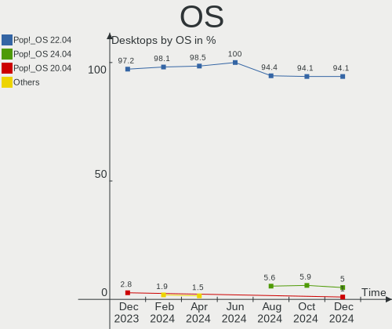
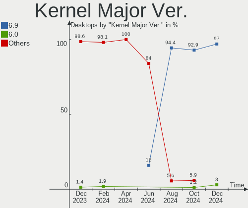
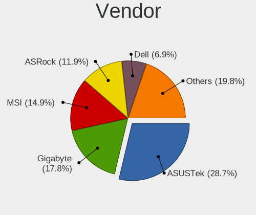
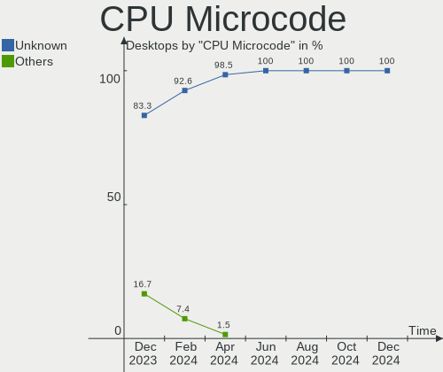
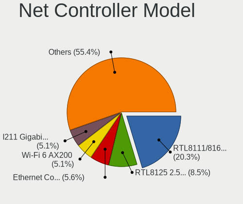
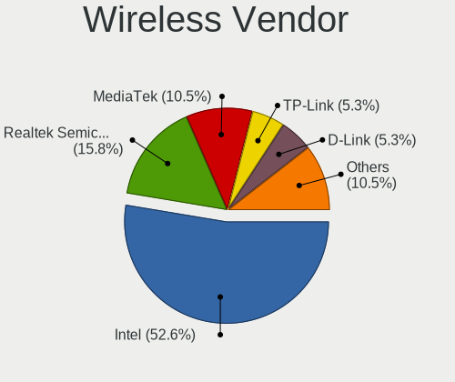

Pop!_OS - Hardware Trends (Desktops)
------------------------------------

A project to identify most popular hardware characteristics and track their change
over time based on data collected by Linux users at https://Linux-Hardware.org.

Anyone can contribute to this report by the [hw-probe](https://github.com/linuxhw/hw-probe) tool:

    sudo -E hw-probe -all -upload

This report is for one last month. Overall report since the beginning of time: [TestDays](https://github.com/linuxhw/TestDays)

Period: Dec, 2023.

Contents
--------

* [ System ](#system)
  - [ OS                       ](#os)
  - [ OS Family                ](#os-family)
  - [ Kernel                   ](#kernel)
  - [ Kernel Family            ](#kernel-family)
  - [ Kernel Major Ver.        ](#kernel-major-ver)
  - [ Arch                     ](#arch)
  - [ DE                       ](#de)
  - [ Display Server           ](#display-server)
  - [ Display Manager          ](#display-manager)
  - [ OS Lang                  ](#os-lang)
  - [ Boot Mode                ](#boot-mode)
  - [ Filesystem               ](#filesystem)
  - [ Part. scheme             ](#part-scheme)
  - [ Dual Boot with Linux/BSD ](#dual-boot-with-linuxbsd)
  - [ Dual Boot (Win)          ](#dual-boot-win)

* [ Board ](#board)
  - [ Vendor                   ](#vendor)
  - [ Model                    ](#model)
  - [ Model Family             ](#model-family)
  - [ MFG Year                 ](#mfg-year)
  - [ Form Factor              ](#form-factor)
  - [ Secure Boot              ](#secure-boot)
  - [ Coreboot                 ](#coreboot)
  - [ RAM Size                 ](#ram-size)
  - [ RAM Used                 ](#ram-used)
  - [ Total Drives             ](#total-drives)
  - [ Has CD-ROM               ](#has-cd-rom)
  - [ Has Ethernet             ](#has-ethernet)
  - [ Has WiFi                 ](#has-wifi)
  - [ Has Bluetooth            ](#has-bluetooth)

* [ Location ](#location)
  - [ Country                  ](#country)
  - [ City                     ](#city)

* [ Drives ](#drives)
  - [ Drive Vendor             ](#drive-vendor)
  - [ Drive Model              ](#drive-model)
  - [ HDD Vendor               ](#hdd-vendor)
  - [ SSD Vendor               ](#ssd-vendor)
  - [ Drive Kind               ](#drive-kind)
  - [ Drive Connector          ](#drive-connector)
  - [ Drive Size               ](#drive-size)
  - [ Space Total              ](#space-total)
  - [ Space Used               ](#space-used)
  - [ Malfunc. Drives          ](#malfunc-drives)
  - [ Malfunc. Drive Vendor    ](#malfunc-drive-vendor)
  - [ Malfunc. HDD Vendor      ](#malfunc-hdd-vendor)
  - [ Malfunc. Drive Kind      ](#malfunc-drive-kind)
  - [ Failed Drives            ](#failed-drives)
  - [ Failed Drive Vendor      ](#failed-drive-vendor)
  - [ Drive Status             ](#drive-status)

* [ Storage controller ](#storage-controller)
  - [ Storage Vendor           ](#storage-vendor)
  - [ Storage Model            ](#storage-model)
  - [ Storage Kind             ](#storage-kind)

* [ Processor ](#processor)
  - [ CPU Vendor               ](#cpu-vendor)
  - [ CPU Model                ](#cpu-model)
  - [ CPU Model Family         ](#cpu-model-family)
  - [ CPU Cores                ](#cpu-cores)
  - [ CPU Sockets              ](#cpu-sockets)
  - [ CPU Threads              ](#cpu-threads)
  - [ CPU Op-Modes             ](#cpu-op-modes)
  - [ CPU Microcode            ](#cpu-microcode)
  - [ CPU Microarch            ](#cpu-microarch)

* [ Graphics ](#graphics)
  - [ GPU Vendor               ](#gpu-vendor)
  - [ GPU Model                ](#gpu-model)
  - [ GPU Combo                ](#gpu-combo)
  - [ GPU Driver               ](#gpu-driver)
  - [ GPU Memory               ](#gpu-memory)

* [ Monitor ](#monitor)
  - [ Monitor Vendor           ](#monitor-vendor)
  - [ Monitor Model            ](#monitor-model)
  - [ Monitor Resolution       ](#monitor-resolution)
  - [ Monitor Diagonal         ](#monitor-diagonal)
  - [ Monitor Width            ](#monitor-width)
  - [ Aspect Ratio             ](#aspect-ratio)
  - [ Monitor Area             ](#monitor-area)
  - [ Pixel Density            ](#pixel-density)
  - [ Multiple Monitors        ](#multiple-monitors)

* [ Network ](#network)
  - [ Net Controller Vendor    ](#net-controller-vendor)
  - [ Net Controller Model     ](#net-controller-model)
  - [ Wireless Vendor          ](#wireless-vendor)
  - [ Wireless Model           ](#wireless-model)
  - [ Ethernet Vendor          ](#ethernet-vendor)
  - [ Ethernet Model           ](#ethernet-model)
  - [ Net Controller Kind      ](#net-controller-kind)
  - [ Used Controller          ](#used-controller)
  - [ NICs                     ](#nics)
  - [ IPv6                     ](#ipv6)

* [ Bluetooth ](#bluetooth)
  - [ Bluetooth Vendor         ](#bluetooth-vendor)
  - [ Bluetooth Model          ](#bluetooth-model)

* [ Sound ](#sound)
  - [ Sound Vendor             ](#sound-vendor)
  - [ Sound Model              ](#sound-model)

* [ Memory ](#memory)
  - [ Memory Vendor            ](#memory-vendor)
  - [ Memory Model             ](#memory-model)
  - [ Memory Kind              ](#memory-kind)
  - [ Memory Form Factor       ](#memory-form-factor)
  - [ Memory Size              ](#memory-size)
  - [ Memory Speed             ](#memory-speed)

* [ Printers & scanners ](#printers--scanners)
  - [ Printer Vendor           ](#printer-vendor)
  - [ Printer Model            ](#printer-model)
  - [ Scanner Vendor           ](#scanner-vendor)
  - [ Scanner Model            ](#scanner-model)

* [ Camera ](#camera)
  - [ Camera Vendor            ](#camera-vendor)
  - [ Camera Model             ](#camera-model)

* [ Security ](#security)
  - [ Fingerprint Vendor       ](#fingerprint-vendor)
  - [ Fingerprint Model        ](#fingerprint-model)
  - [ Chipcard Vendor          ](#chipcard-vendor)
  - [ Chipcard Model           ](#chipcard-model)

* [ Unsupported ](#unsupported)
  - [ Unsupported Devices      ](#unsupported-devices)
  - [ Unsupported Device Types ](#unsupported-device-types)

System
------

OS
--

Installed operating systems

| Name          | Desktops | Percent |
|---------------|----------|---------|
| Pop!_OS 22.04 | 70       | 97.22%  |
| Pop!_OS 20.04 | 2        | 2.78%   |

OS Family
---------

OS without a version

| Name    | Desktops | Percent |
|---------|----------|---------|
| Pop!_OS | 72       | 100%    |

Kernel
------

Version of the Linux kernel

| Version                 | Desktops | Percent |
|-------------------------|----------|---------|
| 6.5.6-76060506-generic  | 36       | 50%     |
| 6.6.6-76060606-generic  | 32       | 44.44%  |
| 6.5.4-76060504-generic  | 1        | 1.39%   |
| 6.1.11-76060111-generic | 1        | 1.39%   |
| 6.0.12-76060012-generic | 1        | 1.39%   |
| 5.4.0-7634-generic      | 1        | 1.39%   |

Kernel Family
-------------

Linux kernel without a distro release

| Version | Desktops | Percent |
|---------|----------|---------|
| 6.5.6   | 36       | 50%     |
| 6.6.6   | 32       | 44.44%  |
| 6.5.4   | 1        | 1.39%   |
| 6.1.11  | 1        | 1.39%   |
| 6.0.12  | 1        | 1.39%   |
| 5.4.0   | 1        | 1.39%   |

Kernel Major Ver.
-----------------

Linux kernel major version

| Version | Desktops | Percent |
|---------|----------|---------|
| 6.5     | 37       | 51.39%  |
| 6.6     | 32       | 44.44%  |
| 6.1     | 1        | 1.39%   |
| 6.0     | 1        | 1.39%   |
| 5.4     | 1        | 1.39%   |

Arch
----

OS architecture (x86_64, i586, etc.)

| Name   | Desktops | Percent |
|--------|----------|---------|
| x86_64 | 72       | 100%    |

DE
--

Desktop Environment

| Name       | Desktops | Percent |
|------------|----------|---------|
| GNOME      | 66       | 91.67%  |
| KDE5       | 3        | 4.17%   |
| X-Cinnamon | 2        | 2.78%   |
| Unknown    | 1        | 1.39%   |

Display Server
--------------

X11 or Wayland

| Name    | Desktops | Percent |
|---------|----------|---------|
| X11     | 68       | 94.44%  |
| Wayland | 3        | 4.17%   |
| Unknown | 1        | 1.39%   |

Display Manager
---------------

SDDM, LightDM, etc.

| Name    | Desktops | Percent |
|---------|----------|---------|
| Unknown | 56       | 77.78%  |
| GDM3    | 16       | 22.22%  |

OS Lang
-------

Language

| Lang    | Desktops | Percent |
|---------|----------|---------|
| en_US   | 43       | 59.72%  |
| de_DE   | 9        | 12.5%   |
| en_GB   | 4        | 5.56%   |
| pt_BR   | 3        | 4.17%   |
| C       | 3        | 4.17%   |
| en_IN   | 2        | 2.78%   |
| zh_CN   | 1        | 1.39%   |
| sv_SE   | 1        | 1.39%   |
| ru_RU   | 1        | 1.39%   |
| es_ES   | 1        | 1.39%   |
| en_ZA   | 1        | 1.39%   |
| en_FI   | 1        | 1.39%   |
| en_AU   | 1        | 1.39%   |
| Unknown | 1        | 1.39%   |

Boot Mode
---------

EFI or BIOS

| Mode | Desktops | Percent |
|------|----------|---------|
| BIOS | 56       | 77.78%  |
| EFI  | 16       | 22.22%  |

Filesystem
----------

Type of filesystem

| Type    | Desktops | Percent |
|---------|----------|---------|
| Ext4    | 70       | 97.22%  |
| Overlay | 1        | 1.39%   |
| Btrfs   | 1        | 1.39%   |

Part. scheme
------------

Scheme of partitioning

| Type    | Desktops | Percent |
|---------|----------|---------|
| Unknown | 55       | 76.39%  |
| GPT     | 17       | 23.61%  |

Dual Boot with Linux/BSD
------------------------

Hosting more than one Linux/BSD

| Dual boot | Desktops | Percent |
|-----------|----------|---------|
| No        | 71       | 98.61%  |
| Yes       | 1        | 1.39%   |

Dual Boot (Win)
---------------

Hosting Linux and Windows

| Dual boot | Desktops | Percent |
|-----------|----------|---------|
| No        | 61       | 84.72%  |
| Yes       | 11       | 15.28%  |

Board
-----

Vendor
------

Motherboard manufacturer

| Name                | Desktops | Percent |
|---------------------|----------|---------|
| ASUSTek Computer    | 26       | 36.11%  |
| Gigabyte Technology | 15       | 20.83%  |
| MSI                 | 13       | 18.06%  |
| ASRock              | 9        | 12.5%   |
| Hewlett-Packard     | 2        | 2.78%   |
| Dell                | 2        | 2.78%   |
| SZMZ                | 1        | 1.39%   |
| System76            | 1        | 1.39%   |
| Intel               | 1        | 1.39%   |
| Biostar             | 1        | 1.39%   |
| Alienware           | 1        | 1.39%   |

Model
-----

Motherboard model

| Name                                 | Desktops | Percent |
|--------------------------------------|----------|---------|
| MSI MS-7C84                          | 2        | 2.78%   |
| ASUS TUF Gaming X570-PLUS            | 2        | 2.78%   |
| SZMZ X99-S3                          | 1        | 1.39%   |
| System76 Thelio                      | 1        | 1.39%   |
| MSI MS-7E25                          | 1        | 1.39%   |
| MSI MS-7D54                          | 1        | 1.39%   |
| MSI MS-7D50                          | 1        | 1.39%   |
| MSI MS-7D46                          | 1        | 1.39%   |
| MSI MS-7C95                          | 1        | 1.39%   |
| MSI MS-7C35                          | 1        | 1.39%   |
| MSI MS-7B93                          | 1        | 1.39%   |
| MSI MS-7A62                          | 1        | 1.39%   |
| MSI MS-7A39                          | 1        | 1.39%   |
| MSI MS-7920                          | 1        | 1.39%   |
| MSI MS-7752                          | 1        | 1.39%   |
| Intel DH61BF AAG81311-101            | 1        | 1.39%   |
| HP Z240 SFF Workstation              | 1        | 1.39%   |
| HP 500-166eg                         | 1        | 1.39%   |
| Gigabyte Z590I VISION D              | 1        | 1.39%   |
| Gigabyte Z270N-WIFI                  | 1        | 1.39%   |
| Gigabyte TERRA_PC                    | 1        | 1.39%   |
| Gigabyte H87M-HD3                    | 1        | 1.39%   |
| Gigabyte H610M S2H                   | 1        | 1.39%   |
| Gigabyte H510M H                     | 1        | 1.39%   |
| Gigabyte H410M H V3                  | 1        | 1.39%   |
| Gigabyte GA-MA770T-UD3P              | 1        | 1.39%   |
| Gigabyte EDDPC1627I5                 | 1        | 1.39%   |
| Gigabyte B660M DS3H AX DDR4          | 1        | 1.39%   |
| Gigabyte B550I AORUS PRO AX          | 1        | 1.39%   |
| Gigabyte B550 AORUS PRO AC           | 1        | 1.39%   |
| Gigabyte B450 AORUS ELITE            | 1        | 1.39%   |
| Gigabyte B365 M AORUS ELITE          | 1        | 1.39%   |
| Gigabyte AB350-Gaming 3              | 1        | 1.39%   |
| Dell OptiPlex 790                    | 1        | 1.39%   |
| Dell ASM100                          | 1        | 1.39%   |
| Biostar A320MH                       | 1        | 1.39%   |
| ASUS TUF Gaming Z490-PLUS            | 1        | 1.39%   |
| ASUS TUF Gaming A520M-PLUS WIFI      | 1        | 1.39%   |
| ASUS SABERTOOTH P67                  | 1        | 1.39%   |
| ASUS ROG STRIX Z790-A GAMING WIFI D4 | 1        | 1.39%   |

Model Family
------------

Motherboard model prefix

| Name                    | Desktops | Percent |
|-------------------------|----------|---------|
| ASUS PRIME              | 8        | 11.11%  |
| ASUS ROG                | 7        | 9.72%   |
| ASUS TUF                | 4        | 5.56%   |
| ASRock B450M            | 3        | 4.17%   |
| MSI MS-7C84             | 2        | 2.78%   |
| SZMZ X99-S3             | 1        | 1.39%   |
| System76 Thelio         | 1        | 1.39%   |
| MSI MS-7E25             | 1        | 1.39%   |
| MSI MS-7D54             | 1        | 1.39%   |
| MSI MS-7D50             | 1        | 1.39%   |
| MSI MS-7D46             | 1        | 1.39%   |
| MSI MS-7C95             | 1        | 1.39%   |
| MSI MS-7C35             | 1        | 1.39%   |
| MSI MS-7B93             | 1        | 1.39%   |
| MSI MS-7A62             | 1        | 1.39%   |
| MSI MS-7A39             | 1        | 1.39%   |
| MSI MS-7920             | 1        | 1.39%   |
| MSI MS-7752             | 1        | 1.39%   |
| Intel DH61BF            | 1        | 1.39%   |
| HP Z240                 | 1        | 1.39%   |
| HP 500-166eg            | 1        | 1.39%   |
| Gigabyte Z590I          | 1        | 1.39%   |
| Gigabyte Z270N-WIFI     | 1        | 1.39%   |
| Gigabyte TERRA          | 1        | 1.39%   |
| Gigabyte H87M-HD3       | 1        | 1.39%   |
| Gigabyte H610M          | 1        | 1.39%   |
| Gigabyte H510M          | 1        | 1.39%   |
| Gigabyte H410M          | 1        | 1.39%   |
| Gigabyte GA-MA770T-UD3P | 1        | 1.39%   |
| Gigabyte EDDPC1627I5    | 1        | 1.39%   |
| Gigabyte B660M          | 1        | 1.39%   |
| Gigabyte B550I          | 1        | 1.39%   |
| Gigabyte B550           | 1        | 1.39%   |
| Gigabyte B450           | 1        | 1.39%   |
| Gigabyte B365           | 1        | 1.39%   |
| Gigabyte AB350-Gaming   | 1        | 1.39%   |
| Dell OptiPlex           | 1        | 1.39%   |
| Dell ASM100             | 1        | 1.39%   |
| Biostar A320MH          | 1        | 1.39%   |
| ASUS SABERTOOTH         | 1        | 1.39%   |

MFG Year
--------

Motherboard manufacture year

| Year | Desktops | Percent |
|------|----------|---------|
| 2022 | 11       | 15.28%  |
| 2020 | 10       | 13.89%  |
| 2021 | 9        | 12.5%   |
| 2018 | 8        | 11.11%  |
| 2019 | 7        | 9.72%   |
| 2023 | 5        | 6.94%   |
| 2017 | 4        | 5.56%   |
| 2013 | 3        | 4.17%   |
| 2009 | 3        | 4.17%   |
| 2016 | 2        | 2.78%   |
| 2015 | 2        | 2.78%   |
| 2014 | 2        | 2.78%   |
| 2012 | 2        | 2.78%   |
| 2011 | 2        | 2.78%   |
| 2010 | 1        | 1.39%   |
| 2008 | 1        | 1.39%   |

Form Factor
-----------

Physical design of the computer

| Name    | Desktops | Percent |
|---------|----------|---------|
| Desktop | 72       | 100%    |

Secure Boot
-----------

Enabled or disabled

| State    | Desktops | Percent |
|----------|----------|---------|
| Disabled | 72       | 100%    |

Coreboot
--------

Have coreboot on board

| Used | Desktops | Percent |
|------|----------|---------|
| No   | 72       | 100%    |

RAM Size
--------

Total RAM memory

| Size in GB  | Desktops | Percent |
|-------------|----------|---------|
| 32.01-64.0  | 23       | 31.94%  |
| 16.01-24.0  | 16       | 22.22%  |
| 8.01-16.0   | 13       | 18.06%  |
| 64.01-256.0 | 11       | 15.28%  |
| 24.01-32.0  | 6        | 8.33%   |
| 4.01-8.0    | 2        | 2.78%   |
| 3.01-4.0    | 1        | 1.39%   |

RAM Used
--------

Used RAM memory

| Used GB    | Desktops | Percent |
|------------|----------|---------|
| 4.01-8.0   | 38       | 52.78%  |
| 8.01-16.0  | 16       | 22.22%  |
| 3.01-4.0   | 7        | 9.72%   |
| 2.01-3.0   | 5        | 6.94%   |
| 1.01-2.0   | 4        | 5.56%   |
| 32.01-64.0 | 1        | 1.39%   |
| 16.01-24.0 | 1        | 1.39%   |

Total Drives
------------

Number of drives on board

| Drives | Desktops | Percent |
|--------|----------|---------|
| 2      | 26       | 36.11%  |
| 3      | 15       | 20.83%  |
| 1      | 14       | 19.44%  |
| 4      | 10       | 13.89%  |
| 6      | 4        | 5.56%   |
| 5      | 3        | 4.17%   |

Has CD-ROM
----------

Has CD-ROM on board

| Presented | Desktops | Percent |
|-----------|----------|---------|
| No        | 59       | 81.94%  |
| Yes       | 13       | 18.06%  |

Has Ethernet
------------

Has Ethernet on board

| Presented | Desktops | Percent |
|-----------|----------|---------|
| Yes       | 71       | 98.61%  |
| No        | 1        | 1.39%   |

Has WiFi
--------

Has WiFi module

| Presented | Desktops | Percent |
|-----------|----------|---------|
| Yes       | 47       | 65.28%  |
| No        | 25       | 34.72%  |

Has Bluetooth
-------------

Has Bluetooth module

| Presented | Desktops | Percent |
|-----------|----------|---------|
| Yes       | 45       | 62.5%   |
| No        | 27       | 37.5%   |

Location
--------

Country
-------

Geographic location (country)

| Country      | Desktops | Percent |
|--------------|----------|---------|
| USA          | 25       | 34.72%  |
| Germany      | 12       | 16.67%  |
| UK           | 4        | 5.56%   |
| Brazil       | 4        | 5.56%   |
| Sweden       | 3        | 4.17%   |
| Russia       | 3        | 4.17%   |
| Spain        | 2        | 2.78%   |
| India        | 2        | 2.78%   |
| Hungary      | 2        | 2.78%   |
| Canada       | 2        | 2.78%   |
| Australia    | 2        | 2.78%   |
| Ukraine      | 1        | 1.39%   |
| Thailand     | 1        | 1.39%   |
| South Africa | 1        | 1.39%   |
| Norway       | 1        | 1.39%   |
| Mexico       | 1        | 1.39%   |
| Japan        | 1        | 1.39%   |
| Indonesia    | 1        | 1.39%   |
| Finland      | 1        | 1.39%   |
| China        | 1        | 1.39%   |
| Austria      | 1        | 1.39%   |
| Argentina    | 1        | 1.39%   |

City
----

Geographic location (city)

| City           | Desktops | Percent |
|----------------|----------|---------|
| Anderson       | 2        | 2.78%   |
| Yucaipa        | 1        | 1.39%   |
| Yogyakarta     | 1        | 1.39%   |
| Yachiyo        | 1        | 1.39%   |
| Wilhelmshaven  | 1        | 1.39%   |
| Wenonah        | 1        | 1.39%   |
| Umeå          | 1        | 1.39%   |
| Toronto        | 1        | 1.39%   |
| Topeka         | 1        | 1.39%   |
| Timnath        | 1        | 1.39%   |
| Szabadszallas  | 1        | 1.39%   |
| Staten Island  | 1        | 1.39%   |
| St Austell     | 1        | 1.39%   |
| Sheboygan      | 1        | 1.39%   |
| Severnyy       | 1        | 1.39%   |
| Seattle        | 1        | 1.39%   |
| Schutterwald   | 1        | 1.39%   |
| Saskatoon      | 1        | 1.39%   |
| Sarasota       | 1        | 1.39%   |
| San Francisco  | 1        | 1.39%   |
| Samara         | 1        | 1.39%   |
| Round Rock     | 1        | 1.39%   |
| Rosenheim      | 1        | 1.39%   |
| Rio de Janeiro | 1        | 1.39%   |
| Pretoria       | 1        | 1.39%   |
| Phitsanulok    | 1        | 1.39%   |
| Perth          | 1        | 1.39%   |
| Örebro        | 1        | 1.39%   |
| Oelsnitz       | 1        | 1.39%   |
| Neath          | 1        | 1.39%   |
| Nadiad         | 1        | 1.39%   |
| Mumbai         | 1        | 1.39%   |
| Mexico City    | 1        | 1.39%   |
| Markkleeberg   | 1        | 1.39%   |
| Mannheim       | 1        | 1.39%   |
| Manaus         | 1        | 1.39%   |
| Mainburg       | 1        | 1.39%   |
| London         | 1        | 1.39%   |
| Liaocheng      | 1        | 1.39%   |
| Lenoir         | 1        | 1.39%   |

Drives
------

Drive Vendor
------------

Hard drive vendors

| Vendor                       | Desktops | Drives | Percent |
|------------------------------|----------|--------|---------|
| Samsung Electronics          | 28       | 46     | 17.61%  |
| WDC                          | 23       | 25     | 14.47%  |
| Seagate                      | 19       | 27     | 11.95%  |
| Crucial                      | 9        | 10     | 5.66%   |
| Kingston                     | 8        | 9      | 5.03%   |
| Toshiba                      | 7        | 8      | 4.4%    |
| Sandisk                      | 6        | 7      | 3.77%   |
| Kingston Technology Company  | 5        | 5      | 3.14%   |
| Intel                        | 5        | 6      | 3.14%   |
| Micron/Crucial Technology    | 4        | 4      | 2.52%   |
| SPCC                         | 3        | 3      | 1.89%   |
| Phison Electronics           | 3        | 4      | 1.89%   |
| Fanxiang                     | 3        | 3      | 1.89%   |
| Team                         | 2        | 2      | 1.26%   |
| Realtek Semiconductor        | 2        | 2      | 1.26%   |
| Phison                       | 2        | 2      | 1.26%   |
| KIOXIA-EXCERIA               | 2        | 2      | 1.26%   |
| JMicron Technology           | 2        | 2      | 1.26%   |
| China                        | 2        | 2      | 1.26%   |
| AMD                          | 2        | 2      | 1.26%   |
| WD MediaMax                  | 1        | 1      | 0.63%   |
| Vaseky                       | 1        | 1      | 0.63%   |
| Unknown                      | 1        | 3      | 0.63%   |
| Timetec                      | 1        | 1      | 0.63%   |
| SK hynix                     | 1        | 1      | 0.63%   |
| Silicon Motion               | 1        | 1      | 0.63%   |
| Shenzhen Longsys Electronics | 1        | 1      | 0.63%   |
| OCZ                          | 1        | 1      | 0.63%   |
| Netac                        | 1        | 1      | 0.63%   |
| Mushkin                      | 1        | 1      | 0.63%   |
| MAXIO Technology (Hangzhou)  | 1        | 1      | 0.63%   |
| MaxDigital                   | 1        | 1      | 0.63%   |
| KingSpec                     | 1        | 1      | 0.63%   |
| KingFast                     | 1        | 1      | 0.63%   |
| KingDian                     | 1        | 1      | 0.63%   |
| Intenso                      | 1        | 1      | 0.63%   |
| HS-SSD-C100                  | 1        | 1      | 0.63%   |
| HGST                         | 1        | 1      | 0.63%   |
| Flashwar                     | 1        | 1      | 0.63%   |
| Dogfish                      | 1        | 1      | 0.63%   |

Drive Model
-----------

Hard drive models

| Model                                               | Desktops | Percent |
|-----------------------------------------------------|----------|---------|
| Samsung NVMe SSD Controller SM981/PM981/PM983 512GB | 6        | 3.19%   |
| Samsung NVMe SSD Controller PM9A1/PM9A3/980PRO 2TB  | 4        | 2.13%   |
| Samsung SSD 860 EVO 500GB                           | 3        | 1.6%    |
| Micron/Crucial P2 NVMe PCIe SSD 4TB                 | 3        | 1.6%    |
| Kingston Company SNV2S1000G 1TB                     | 3        | 1.6%    |
| Intel SSD 660P Series 1TB                           | 3        | 1.6%    |
| WDC WD40EZAZ-00SF3B0 4TB                            | 2        | 1.06%   |
| Toshiba DT01ACA200 2TB                              | 2        | 1.06%   |
| Toshiba DT01ACA100 1TB                              | 2        | 1.06%   |
| Seagate ST500DM002-1BD142 500GB                     | 2        | 1.06%   |
| Seagate ST4000DM004-2CV104 4TB                      | 2        | 1.06%   |
| Seagate ST2000DM001-1CH164 2TB                      | 2        | 1.06%   |
| Samsung SSD 980 1TB                                 | 2        | 1.06%   |
| Samsung SSD 870 QVO 1TB                             | 2        | 1.06%   |
| Samsung SSD 860 EVO 1TB                             | 2        | 1.06%   |
| Samsung SSD 850 EVO 500GB                           | 2        | 1.06%   |
| Samsung NVMe SSD Controller SM961/PM961/SM963 250GB | 2        | 1.06%   |
| Phison E12 NVMe Controller 1TB                      | 2        | 1.06%   |
| Kingston SNVS250G 250GB                             | 2        | 1.06%   |
| Kingston SA400S37480G 480GB SSD                     | 2        | 1.06%   |
| WDC WDS500G2B0C-00PXH0 500GB                        | 1        | 0.53%   |
| WDC WDS500G2B0A-00SM50 500GB SSD                    | 1        | 0.53%   |
| WDC WDS120G2G0A-00JH30 120GB SSD                    | 1        | 0.53%   |
| WDC WDS100T3X0C-00SJG0 1TB                          | 1        | 0.53%   |
| WDC WDS100T2B0A-00SM50 1TB SSD                      | 1        | 0.53%   |
| WDC WD80EMAZ-00WJTA0 8TB                            | 1        | 0.53%   |
| WDC WD7501AALS-00J7B0 752GB                         | 1        | 0.53%   |
| WDC WD5000BEVT-22ZAT0 500GB                         | 1        | 0.53%   |
| WDC WD5000AAKX-08U6AA0 500GB                        | 1        | 0.53%   |
| WDC WD5000AAKS-22A7B0 500GB                         | 1        | 0.53%   |
| WDC WD4003FZEX-00Z4SA0 4TB                          | 1        | 0.53%   |
| WDC WD4000FYYZ-01UL1B0 4TB                          | 1        | 0.53%   |
| WDC WD2500AAJS-75M0A0 250GB                         | 1        | 0.53%   |
| WDC WD20EZBX-00AYRA0 2TB                            | 1        | 0.53%   |
| WDC WD20EZAZ-00GGJB0 2TB                            | 1        | 0.53%   |
| WDC WD20EFRX-68EUZN0 2TB                            | 1        | 0.53%   |
| WDC WD20EFRX-68AX9N0 2TB                            | 1        | 0.53%   |
| WDC WD1600AAJS-00L7A0 160GB                         | 1        | 0.53%   |
| WDC WD10EZEX-08WN4A0 1TB                            | 1        | 0.53%   |
| WDC WD10EZEX-00BN5A0 1TB                            | 1        | 0.53%   |

HDD Vendor
----------

Hard disk drive vendors

| Vendor              | Desktops | Drives | Percent |
|---------------------|----------|--------|---------|
| WDC                 | 18       | 19     | 38.3%   |
| Seagate             | 18       | 25     | 38.3%   |
| Toshiba             | 5        | 6      | 10.64%  |
| Samsung Electronics | 2        | 2      | 4.26%   |
| WD MediaMax         | 1        | 1      | 2.13%   |
| MaxDigital          | 1        | 1      | 2.13%   |
| JMicron Technology  | 1        | 1      | 2.13%   |
| HGST                | 1        | 1      | 2.13%   |

SSD Vendor
----------

Solid state drive vendors

| Vendor              | Desktops | Drives | Percent |
|---------------------|----------|--------|---------|
| Samsung Electronics | 17       | 21     | 28.81%  |
| Crucial             | 6        | 6      | 10.17%  |
| Kingston            | 5        | 5      | 8.47%   |
| WDC                 | 4        | 4      | 6.78%   |
| Team                | 2        | 2      | 3.39%   |
| SPCC                | 2        | 2      | 3.39%   |
| SanDisk             | 2        | 2      | 3.39%   |
| Intel               | 2        | 3      | 3.39%   |
| China               | 2        | 2      | 3.39%   |
| Vaseky              | 1        | 1      | 1.69%   |
| Toshiba             | 1        | 1      | 1.69%   |
| Timetec             | 1        | 1      | 1.69%   |
| SK hynix            | 1        | 1      | 1.69%   |
| OCZ                 | 1        | 1      | 1.69%   |
| Netac               | 1        | 1      | 1.69%   |
| Mushkin             | 1        | 1      | 1.69%   |
| KIOXIA-EXCERIA      | 1        | 1      | 1.69%   |
| KingSpec            | 1        | 1      | 1.69%   |
| KingDian            | 1        | 1      | 1.69%   |
| JMicron Technology  | 1        | 1      | 1.69%   |
| Intenso             | 1        | 1      | 1.69%   |
| Flashwar            | 1        | 1      | 1.69%   |
| Dogfish             | 1        | 1      | 1.69%   |
| Corsair             | 1        | 1      | 1.69%   |
| AMD                 | 1        | 1      | 1.69%   |
| A-DATA Technology   | 1        | 1      | 1.69%   |

Drive Kind
----------

HDD or SSD

| Kind    | Desktops | Drives | Percent |
|---------|----------|--------|---------|
| NVMe    | 49       | 71     | 37.12%  |
| SSD     | 42       | 64     | 31.82%  |
| HDD     | 38       | 56     | 28.79%  |
| Unknown | 3        | 4      | 2.27%   |

Drive Connector
---------------

SATA, SAS, NVMe, etc.

| Type | Desktops | Drives | Percent |
|------|----------|--------|---------|
| SATA | 54       | 117    | 50%     |
| NVMe | 49       | 71     | 45.37%  |
| SAS  | 5        | 7      | 4.63%   |

Drive Size
----------

Size of hard drive

| Size in TB | Desktops | Drives | Percent |
|------------|----------|--------|---------|
| 0.01-0.5   | 36       | 57     | 41.86%  |
| 0.51-1.0   | 22       | 30     | 25.58%  |
| 1.01-2.0   | 16       | 20     | 18.6%   |
| 3.01-4.0   | 9        | 10     | 10.47%  |
| 2.01-3.0   | 1        | 1      | 1.16%   |
| 10.01-20.0 | 1        | 1      | 1.16%   |
| 4.01-10.0  | 1        | 1      | 1.16%   |

Space Total
-----------

Amount of disk space available on the file system

| Size in GB     | Desktops | Percent |
|----------------|----------|---------|
| 501-1000       | 17       | 23.61%  |
| 251-500        | 14       | 19.44%  |
| 1001-2000      | 11       | 15.28%  |
| More than 3000 | 10       | 13.89%  |
| 2001-3000      | 8        | 11.11%  |
| 101-250        | 8        | 11.11%  |
| 51-100         | 2        | 2.78%   |
| 1-20           | 1        | 1.39%   |
| Unknown        | 1        | 1.39%   |

Space Used
----------

Amount of used disk space

| Used GB        | Desktops | Percent |
|----------------|----------|---------|
| 21-50          | 16       | 22.22%  |
| 501-1000       | 11       | 15.28%  |
| 101-250        | 10       | 13.89%  |
| 251-500        | 8        | 11.11%  |
| 1001-2000      | 8        | 11.11%  |
| 1-20           | 6        | 8.33%   |
| 51-100         | 6        | 8.33%   |
| More than 3000 | 4        | 5.56%   |
| 2001-3000      | 2        | 2.78%   |
| Unknown        | 1        | 1.39%   |

Malfunc. Drives
---------------

Drive models with a malfunction

| Model                           | Desktops | Drives | Percent |
|---------------------------------|----------|--------|---------|
| WDC WD20EFRX-68EUZN0 2TB        | 1        | 1      | 25%     |
| WDC WD20EFRX-68AX9N0 2TB        | 1        | 1      | 25%     |
| Seagate ST500DM002-1BD142 500GB | 1        | 1      | 25%     |
| Flashwar SSD S500 Pro 512GB     | 1        | 1      | 25%     |

Malfunc. Drive Vendor
---------------------

Vendors of faulty drives

| Vendor   | Desktops | Drives | Percent |
|----------|----------|--------|---------|
| WDC      | 2        | 2      | 50%     |
| Seagate  | 1        | 1      | 25%     |
| Flashwar | 1        | 1      | 25%     |

Malfunc. HDD Vendor
-------------------

Vendors of faulty HDD drives

| Vendor  | Desktops | Drives | Percent |
|---------|----------|--------|---------|
| WDC     | 2        | 2      | 66.67%  |
| Seagate | 1        | 1      | 33.33%  |

Malfunc. Drive Kind
-------------------

Kinds of faulty drives

| Kind | Desktops | Drives | Percent |
|------|----------|--------|---------|
| HDD  | 3        | 3      | 75%     |
| SSD  | 1        | 1      | 25%     |

Failed Drives
-------------

Failed drive models

Zero info for selected period =(

Failed Drive Vendor
-------------------

Failed drive vendors

Zero info for selected period =(

Drive Status
------------

Number of failed and malfunc. drives

| Status   | Desktops | Drives | Percent |
|----------|----------|--------|---------|
| Detected | 58       | 150    | 72.5%   |
| Works    | 18       | 41     | 22.5%   |
| Malfunc  | 4        | 4      | 5%      |

Storage controller
------------------

Storage Vendor
--------------

Storage controller vendors

| Vendor                       | Desktops | Percent |
|------------------------------|----------|---------|
| AMD                          | 37       | 26.43%  |
| Intel                        | 36       | 25.71%  |
| Samsung Electronics          | 17       | 12.14%  |
| Micron/Crucial Technology    | 8        | 5.71%   |
| Kingston Technology Company  | 8        | 5.71%   |
| SanDisk                      | 6        | 4.29%   |
| Phison Electronics           | 6        | 4.29%   |
| Marvell Technology Group     | 4        | 2.86%   |
| ASMedia Technology           | 4        | 2.86%   |
| Realtek Semiconductor        | 2        | 1.43%   |
| MAXIO Technology (Hangzhou)  | 2        | 1.43%   |
| JMicron Technology           | 2        | 1.43%   |
| Toshiba America Info Systems | 1        | 0.71%   |
| Solidigm                     | 1        | 0.71%   |
| Silicon Motion               | 1        | 0.71%   |
| Shenzhen Longsys Electronics | 1        | 0.71%   |
| Seagate Technology           | 1        | 0.71%   |
| Nvidia                       | 1        | 0.71%   |
| KIOXIA                       | 1        | 0.71%   |
| INNOGRIT                     | 1        | 0.71%   |

Storage Model
-------------

Storage controller models

| Model                                                                          | Desktops | Percent |
|--------------------------------------------------------------------------------|----------|---------|
| AMD FCH SATA Controller [AHCI mode]                                            | 21       | 12.8%   |
| AMD 400 Series Chipset SATA Controller                                         | 10       | 6.1%    |
| AMD 500 Series Chipset SATA Controller                                         | 8        | 4.88%   |
| Samsung NVMe SSD Controller SM981/PM981/PM983                                  | 6        | 3.66%   |
| Samsung NVMe SSD Controller PM9A1/PM9A3/980PRO                                 | 6        | 3.66%   |
| Intel 8 Series/C220 Series Chipset Family 6-port SATA Controller 1 [AHCI mode] | 6        | 3.66%   |
| Micron/Crucial P2 [Nick P2] / P3 / P3 Plus NVMe PCIe SSD (DRAM-less)           | 5        | 3.05%   |
| Intel Alder Lake-S PCH SATA Controller [AHCI Mode]                             | 5        | 3.05%   |
| Samsung NVMe SSD Controller 980 (DRAM-less)                                    | 4        | 2.44%   |
| Phison E12 NVMe Controller                                                     | 4        | 2.44%   |
| Intel 700 Series Chipset Family SATA AHCI Controller                           | 4        | 2.44%   |
| Intel 200 Series PCH SATA controller [AHCI mode]                               | 4        | 2.44%   |
| ASMedia ASM1062 Serial ATA Controller                                          | 4        | 2.44%   |
| Samsung NVMe SSD Controller SM961/PM961/SM963                                  | 3        | 1.83%   |
| Kingston Company NV2 NVMe SSD SM2267XT                                         | 3        | 1.83%   |
| Intel SSD 660P Series                                                          | 3        | 1.83%   |
| Intel SATA Controller [RAID mode]                                              | 3        | 1.83%   |
| Intel 6 Series/C200 Series Chipset Family 6 port Desktop SATA AHCI Controller  | 3        | 1.83%   |
| Intel 500 Series Chipset Family SATA AHCI Controller                           | 3        | 1.83%   |
| SanDisk WD Black SN770 / PC SN740 256GB / PC SN560 (DRAM-less) NVMe SSD        | 2        | 1.22%   |
| Realtek RTS5765DL NVMe SSD Controller (DRAM-less)                              | 2        | 1.22%   |
| Micron/Crucial P1 NVMe PCIe SSD[Frampton]                                      | 2        | 1.22%   |
| Marvell Group 88SE6111/6121 SATA II / PATA Controller                          | 2        | 1.22%   |
| Kingston Company KC3000/FURY Renegade NVMe SSD E18                             | 2        | 1.22%   |
| Intel Q170/Q150/B150/H170/H110/Z170/CM236 Chipset SATA Controller [AHCI Mode]  | 2        | 1.22%   |
| AMD SB7x0/SB8x0/SB9x0 IDE Controller                                           | 2        | 1.22%   |
| AMD FCH SATA Controller D                                                      | 2        | 1.22%   |
| AMD 300 Series Chipset SATA Controller                                         | 2        | 1.22%   |
| Toshiba America Info Systems XG4 NVMe SSD Controller                           | 1        | 0.61%   |
| Solidigm P44 Pro NVMe SSD [Hollywood Beach]                                    | 1        | 0.61%   |
| Solidigm P41 Plus NVMe SSD (DRAM-less) [Echo Harbor]                           | 1        | 0.61%   |
| Silicon Motion SM2263EN/SM2263XT (DRAM-less) NVMe SSD Controllers              | 1        | 0.61%   |
| Shenzhen Longsys Lexar NM620 NVME SSD (DRAM-less)                              | 1        | 0.61%   |
| Seagate FireCuda 530 SSD                                                       | 1        | 0.61%   |
| SanDisk WD PC SN810 / Black SN850 NVMe SSD                                     | 1        | 0.61%   |
| Sandisk WD Black SN850X NVMe SSD                                               | 1        | 0.61%   |
| SanDisk Ultra 3D / WD Blue SN550 NVMe SSD                                      | 1        | 0.61%   |
| SanDisk Extreme Pro / WD Black SN750 / PC SN730 / Red SN700 NVMe SSD           | 1        | 0.61%   |
| Samsung NVMe SSD Controller S4LV008[Pascal]                                    | 1        | 0.61%   |
| Phison PS5021-E21 PCIe4 NVMe Controller (DRAM-less)                            | 1        | 0.61%   |

Storage Kind
------------

Kind of storage controller (IDE, SATA, NVMe, SAS, ...)

| Kind | Desktops | Percent |
|------|----------|---------|
| SATA | 69       | 53.49%  |
| NVMe | 49       | 37.98%  |
| RAID | 6        | 4.65%   |
| IDE  | 5        | 3.88%   |

Processor
---------

CPU Vendor
----------

Processor vendors

| Vendor | Desktops | Percent |
|--------|----------|---------|
| AMD    | 38       | 52.78%  |
| Intel  | 34       | 47.22%  |

CPU Model
---------

Processor models

| Model                                  | Desktops | Percent |
|----------------------------------------|----------|---------|
| AMD Ryzen 9 5900X 12-Core Processor    | 4        | 5.56%   |
| AMD Ryzen 7 5800X 8-Core Processor     | 4        | 5.56%   |
| AMD Ryzen 5 5600G with Radeon Graphics | 4        | 5.56%   |
| AMD Ryzen 7 7700X 8-Core Processor     | 3        | 4.17%   |
| AMD Ryzen 7 3700X 8-Core Processor     | 3        | 4.17%   |
| AMD Ryzen 5 3600 6-Core Processor      | 3        | 4.17%   |
| Intel Core i7-7700K CPU @ 4.20GHz      | 2        | 2.78%   |
| Intel Core i5-9400F CPU @ 2.90GHz      | 2        | 2.78%   |
| Intel Xeon CPU E5-2670 v3 @ 2.30GHz    | 1        | 1.39%   |
| Intel Pentium CPU G3250 @ 3.20GHz      | 1        | 1.39%   |
| Intel Core i9-9900K CPU @ 3.60GHz      | 1        | 1.39%   |
| Intel Core i9-14900KF                  | 1        | 1.39%   |
| Intel Core i9-14900K                   | 1        | 1.39%   |
| Intel Core i7-6700K CPU @ 4.00GHz      | 1        | 1.39%   |
| Intel Core i7-5820K CPU @ 3.30GHz      | 1        | 1.39%   |
| Intel Core i7-4790 CPU @ 3.60GHz       | 1        | 1.39%   |
| Intel Core i7-3770K CPU @ 3.50GHz      | 1        | 1.39%   |
| Intel Core i7-2600K CPU @ 3.40GHz      | 1        | 1.39%   |
| Intel Core i5-6500 CPU @ 3.20GHz       | 1        | 1.39%   |
| Intel Core i5-4590 CPU @ 3.30GHz       | 1        | 1.39%   |
| Intel Core i5-4570 CPU @ 3.20GHz       | 1        | 1.39%   |
| Intel Core i5-4440 CPU @ 3.10GHz       | 1        | 1.39%   |
| Intel Core i5-2400 CPU @ 3.10GHz       | 1        | 1.39%   |
| Intel Core i5-10400F CPU @ 2.90GHz     | 1        | 1.39%   |
| Intel Core i5-10400 CPU @ 2.90GHz      | 1        | 1.39%   |
| Intel Core i5 CPU 760 @ 2.80GHz        | 1        | 1.39%   |
| Intel Core i3-4170T CPU @ 3.20GHz      | 1        | 1.39%   |
| Intel Core i3-3220 CPU @ 3.30GHz       | 1        | 1.39%   |
| Intel Core i3-10100F CPU @ 3.60GHz     | 1        | 1.39%   |
| Intel Core 2 Quad CPU Q9550 @ 2.83GHz  | 1        | 1.39%   |
| Intel 13th Gen Core i7-13700KF         | 1        | 1.39%   |
| Intel 13th Gen Core i7-13700K          | 1        | 1.39%   |
| Intel 12th Gen Core i9-12900K          | 1        | 1.39%   |
| Intel 12th Gen Core i7-12700K          | 1        | 1.39%   |
| Intel 12th Gen Core i5-12600K          | 1        | 1.39%   |
| Intel 12th Gen Core i5-12400F          | 1        | 1.39%   |
| Intel 12th Gen Core i5-12400           | 1        | 1.39%   |
| Intel 11th Gen Core i5-11400 @ 2.60GHz | 1        | 1.39%   |
| AMD Ryzen 9 5950X 16-Core Processor    | 1        | 1.39%   |
| AMD Ryzen 9 3950X 16-Core Processor    | 1        | 1.39%   |

CPU Model Family
----------------

Processor model prefix

| Model             | Desktops | Percent |
|-------------------|----------|---------|
| AMD Ryzen 5       | 15       | 20.83%  |
| AMD Ryzen 7       | 12       | 16.67%  |
| Intel Core i5     | 10       | 13.89%  |
| Other             | 8        | 11.11%  |
| Intel Core i7     | 7        | 9.72%   |
| AMD Ryzen 9       | 6        | 8.33%   |
| Intel Core i9     | 3        | 4.17%   |
| Intel Core i3     | 3        | 4.17%   |
| Intel Xeon        | 1        | 1.39%   |
| Intel Pentium     | 1        | 1.39%   |
| Intel Core 2 Quad | 1        | 1.39%   |
| AMD Ryzen 7 PRO   | 1        | 1.39%   |
| AMD Phenom II X6  | 1        | 1.39%   |
| AMD Phenom II X4  | 1        | 1.39%   |
| AMD Phenom II X3  | 1        | 1.39%   |
| AMD Athlon        | 1        | 1.39%   |

CPU Cores
---------

Number of processor cores

| Number | Desktops | Percent |
|--------|----------|---------|
| 6      | 24       | 33.33%  |
| 4      | 15       | 20.83%  |
| 8      | 14       | 19.44%  |
| 12     | 6        | 8.33%   |
| 16     | 5        | 6.94%   |
| 2      | 4        | 5.56%   |
| 24     | 2        | 2.78%   |
| 10     | 1        | 1.39%   |
| 3      | 1        | 1.39%   |

CPU Sockets
-----------

Number of sockets

| Number | Desktops | Percent |
|--------|----------|---------|
| 1      | 72       | 100%    |

CPU Threads
-----------

Threads per core (Hyper-Threading)

| Number | Desktops | Percent |
|--------|----------|---------|
| 2      | 58       | 80.56%  |
| 1      | 14       | 19.44%  |

CPU Op-Modes
------------

CPU Operation Modes (32-bit, 64-bit)

| Op mode        | Desktops | Percent |
|----------------|----------|---------|
| 32-bit, 64-bit | 72       | 100%    |

CPU Microcode
-------------

Microcode number

| Number     | Desktops | Percent |
|------------|----------|---------|
| Unknown    | 60       | 83.33%  |
| 0x0a50000d | 2        | 2.78%   |
| 0x0a20120a | 2        | 2.78%   |
| 0x08701021 | 2        | 2.78%   |
| 0x0a601203 | 1        | 1.39%   |
| 0x0a601201 | 1        | 1.39%   |
| 0x0a201204 | 1        | 1.39%   |
| 0x0a20102b | 1        | 1.39%   |
| 0x0a201009 | 1        | 1.39%   |
| 0x08600106 | 1        | 1.39%   |

CPU Microarch
-------------

Microarchitecture

| Name             | Desktops | Percent |
|------------------|----------|---------|
| Zen 3            | 18       | 25%     |
| Unknown          | 12       | 16.67%  |
| Zen 2            | 10       | 13.89%  |
| Haswell          | 8        | 11.11%  |
| KabyLake         | 5        | 6.94%   |
| K10              | 3        | 4.17%   |
| CometLake        | 3        | 4.17%   |
| Alderlake Hybrid | 3        | 4.17%   |
| Skylake          | 2        | 2.78%   |
| SandyBridge      | 2        | 2.78%   |
| IvyBridge        | 2        | 2.78%   |
| Zen+             | 1        | 1.39%   |
| Zen              | 1        | 1.39%   |
| Penryn           | 1        | 1.39%   |
| Nehalem          | 1        | 1.39%   |

Graphics
--------

GPU Vendor
----------

Vendors of graphics cards

| Vendor | Desktops | Percent |
|--------|----------|---------|
| Nvidia | 38       | 48.1%   |
| AMD    | 34       | 43.04%  |
| Intel  | 7        | 8.86%   |

GPU Model
---------

Graphics card models

| Model                                                                       | Desktops | Percent |
|-----------------------------------------------------------------------------|----------|---------|
| AMD Ellesmere [Radeon RX 470/480/570/570X/580/580X/590]                     | 6        | 7.14%   |
| AMD Navi 21 [Radeon RX 6800/6800 XT / 6900 XT]                              | 5        | 5.95%   |
| AMD Raphael                                                                 | 4        | 4.76%   |
| AMD Cezanne [Radeon Vega Series / Radeon Vega Mobile Series]                | 4        | 4.76%   |
| AMD Navi 22 [Radeon RX 6700/6700 XT/6750 XT / 6800M/6850M XT]               | 3        | 3.57%   |
| Nvidia TU116 [GeForce GTX 1660 Ti]                                          | 2        | 2.38%   |
| Nvidia GT218 [GeForce 210]                                                  | 2        | 2.38%   |
| Nvidia GM107 [GeForce GTX 750 Ti]                                           | 2        | 2.38%   |
| Nvidia GA106 [GeForce RTX 3060 Lite Hash Rate]                              | 2        | 2.38%   |
| Nvidia GA104 [GeForce RTX 3070]                                             | 2        | 2.38%   |
| Nvidia GA102 [GeForce RTX 3080 Lite Hash Rate]                              | 2        | 2.38%   |
| Nvidia AD104 [GeForce RTX 4070 Ti]                                          | 2        | 2.38%   |
| Intel Xeon E3-1200 v3/4th Gen Core Processor Integrated Graphics Controller | 2        | 2.38%   |
| AMD Turks XT [Radeon HD 6670/7670]                                          | 2        | 2.38%   |
| AMD Polaris 20 XL [Radeon RX 580 2048SP]                                    | 2        | 2.38%   |
| AMD Navi 33 [Radeon RX 7700S/7600/7600S/7600M XT/PRO W7600]                 | 2        | 2.38%   |
| AMD Navi 31 [Radeon RX 7900 XT/7900 XTX]                                    | 2        | 2.38%   |
| AMD Navi 10 [Radeon RX 5600 OEM/5600 XT / 5700/5700 XT]                     | 2        | 2.38%   |
| AMD Lexa PRO [Radeon 540/540X/550/550X / RX 540X/550/550X]                  | 2        | 2.38%   |
| Nvidia TU117 [GeForce GTX 1650]                                             | 1        | 1.19%   |
| Nvidia TU116 [GeForce GTX 1660 SUPER]                                       | 1        | 1.19%   |
| Nvidia TU106 [GeForce RTX 2060 SUPER]                                       | 1        | 1.19%   |
| Nvidia TU106 [GeForce RTX 2060 Rev. A]                                      | 1        | 1.19%   |
| Nvidia TU106 [GeForce GTX 1650]                                             | 1        | 1.19%   |
| Nvidia GP107 [GeForce GTX 1050 Ti]                                          | 1        | 1.19%   |
| Nvidia GP104 [GeForce GTX 1080]                                             | 1        | 1.19%   |
| Nvidia GP104 [GeForce GTX 1070]                                             | 1        | 1.19%   |
| Nvidia GM204 [GeForce GTX 970]                                              | 1        | 1.19%   |
| Nvidia GM107M [GeForce GTX 860M]                                            | 1        | 1.19%   |
| Nvidia GK208B [GeForce GT 730]                                              | 1        | 1.19%   |
| Nvidia GK208B [GeForce GT 710]                                              | 1        | 1.19%   |
| Nvidia GF116 [GeForce GTX 550 Ti]                                           | 1        | 1.19%   |
| Nvidia GF104 [GeForce GTX 460]                                              | 1        | 1.19%   |
| Nvidia GA106 [GeForce RTX 3060]                                             | 1        | 1.19%   |
| Nvidia GA104 [GeForce RTX 3070 Ti]                                          | 1        | 1.19%   |
| Nvidia GA104 [GeForce RTX 3060]                                             | 1        | 1.19%   |
| Nvidia GA104 [GeForce RTX 3060 Ti Lite Hash Rate]                           | 1        | 1.19%   |
| Nvidia GA102 [GeForce RTX 3090]                                             | 1        | 1.19%   |
| Nvidia GA102 [GeForce RTX 3090 Ti]                                          | 1        | 1.19%   |
| Nvidia G92 [GeForce 9600 GSO]                                               | 1        | 1.19%   |

GPU Combo
---------

Combinations of graphics cards

| Name           | Desktops | Percent |
|----------------|----------|---------|
| 1 x Nvidia     | 34       | 47.22%  |
| 1 x AMD        | 26       | 36.11%  |
| 2 x AMD        | 5        | 6.94%   |
| 1 x Intel      | 3        | 4.17%   |
| Intel + Nvidia | 2        | 2.78%   |
| AMD + Nvidia   | 2        | 2.78%   |

GPU Driver
----------

Free vs proprietary

| Driver      | Desktops | Percent |
|-------------|----------|---------|
| Free        | 39       | 54.17%  |
| Proprietary | 30       | 41.67%  |
| Unknown     | 3        | 4.17%   |

GPU Memory
----------

Total video memory

| Size in GB | Desktops | Percent |
|------------|----------|---------|
| Unknown    | 51       | 70.83%  |
| 8.01-16.0  | 7        | 9.72%   |
| 7.01-8.0   | 5        | 6.94%   |
| 1.01-2.0   | 3        | 4.17%   |
| 5.01-6.0   | 2        | 2.78%   |
| 16.01-24.0 | 2        | 2.78%   |
| 3.01-4.0   | 1        | 1.39%   |
| 0.51-1.0   | 1        | 1.39%   |

Monitor
-------

Monitor Vendor
--------------

Monitor vendors

| Vendor               | Desktops | Percent |
|----------------------|----------|---------|
| Samsung Electronics  | 19       | 21.84%  |
| Goldstar             | 13       | 14.94%  |
| AOC                  | 7        | 8.05%   |
| Hewlett-Packard      | 6        | 6.9%    |
| Dell                 | 6        | 6.9%    |
| Acer                 | 5        | 5.75%   |
| BenQ                 | 4        | 4.6%    |
| Ancor Communications | 4        | 4.6%    |
| Philips              | 3        | 3.45%   |
| MSI                  | 2        | 2.3%    |
| Iiyama               | 2        | 2.3%    |
| Vizio                | 1        | 1.15%   |
| ViewSonic            | 1        | 1.15%   |
| Valve                | 1        | 1.15%   |
| Unknown (XXX)        | 1        | 1.15%   |
| UGD                  | 1        | 1.15%   |
| STD                  | 1        | 1.15%   |
| Sceptre Tech         | 1        | 1.15%   |
| SANSUI               | 1        | 1.15%   |
| Mi                   | 1        | 1.15%   |
| HUAWEI               | 1        | 1.15%   |
| Gigabyte Technology  | 1        | 1.15%   |
| GDH                  | 1        | 1.15%   |
| Fujitsu Siemens      | 1        | 1.15%   |
| Eizo                 | 1        | 1.15%   |
| Compal               | 1        | 1.15%   |
| ASUSTek Computer     | 1        | 1.15%   |

Monitor Model
-------------

Monitor models

| Model                                                                 | Desktops | Percent |
|-----------------------------------------------------------------------|----------|---------|
| Samsung Electronics LC34G55T SAM711A 3440x1440 798x334mm 34.1-inch    | 2        | 2.27%   |
| AOC 24B1W AOC2401 1920x1080 521x293mm 23.5-inch                       | 2        | 2.27%   |
| AOC 2250W AOC2250 1920x1080 477x268mm 21.5-inch                       | 2        | 2.27%   |
| Vizio M220VA VIZ0070 1920x1080 476x268mm 21.5-inch                    | 1        | 1.14%   |
| ViewSonic VA2231 Series VSCBB25 1920x1080 477x268mm 21.5-inch         | 1        | 1.14%   |
| Valve Index HMD VLV91A8                                               | 1        | 1.14%   |
| Unknown (XXX) Beyond TV XXX2851 1920x1080 1209x680mm 54.6-inch        | 1        | 1.14%   |
| UGD Artist13.3pro UGD1302 1920x1080 294x165mm 13.3-inch               | 1        | 1.14%   |
| STD HDMI TV STD00C7 1440x900 698x392mm 31.5-inch                      | 1        | 1.14%   |
| Sceptre Tech U435CV-UMC SPT1109 3840x2160 575x323mm 26.0-inch         | 1        | 1.14%   |
| SANSUI ES-24X3 XEC2315 1920x1080 527x296mm 23.8-inch                  | 1        | 1.14%   |
| Samsung Electronics U32R59x SAM0F95 3840x2160 697x392mm 31.5-inch     | 1        | 1.14%   |
| Samsung Electronics U28E590 SAM0C4D 3840x2160 610x350mm 27.7-inch     | 1        | 1.14%   |
| Samsung Electronics SyncMaster SAM05FC 1920x1080                      | 1        | 1.14%   |
| Samsung Electronics SyncMaster SAM0498 1600x900 443x249mm 20.0-inch   | 1        | 1.14%   |
| Samsung Electronics SyncMaster SAM02B6 1920x1200 518x324mm 24.1-inch  | 1        | 1.14%   |
| Samsung Electronics S24D300 SAM0B43 1920x1080 531x299mm 24.0-inch     | 1        | 1.14%   |
| Samsung Electronics S24B300 SAM08CC 1920x1080 521x293mm 23.5-inch     | 1        | 1.14%   |
| Samsung Electronics LS49AG95 SAM71AC 3840x1080 1193x336mm 48.8-inch   | 1        | 1.14%   |
| Samsung Electronics LF24T35 SAM707D 1920x1080 528x297mm 23.9-inch     | 1        | 1.14%   |
| Samsung Electronics LCD Monitor SAM7241 3840x2160 700x390mm 31.5-inch | 1        | 1.14%   |
| Samsung Electronics LCD Monitor SAM0FEF 3840x2160 950x540mm 43.0-inch | 1        | 1.14%   |
| Samsung Electronics LCD Monitor SAM0F13 3840x2160 950x540mm 43.0-inch | 1        | 1.14%   |
| Samsung Electronics LCD Monitor SAM0D47 1920x1080 480x270mm 21.7-inch | 1        | 1.14%   |
| Samsung Electronics LC32G7xT SAM7058 2560x1440 700x400mm 31.7-inch    | 1        | 1.14%   |
| Samsung Electronics LC32G5xT SAM7080 2560x1440 698x393mm 31.5-inch    | 1        | 1.14%   |
| Samsung Electronics C32JG5x SAM0F55 2560x1440 697x392mm 31.5-inch     | 1        | 1.14%   |
| Samsung Electronics C27FG7x SAM0E41 1920x1080 598x337mm 27.0-inch     | 1        | 1.14%   |
| Philips PHL 328E9Q PHLC180 1920x1080 698x393mm 31.5-inch              | 1        | 1.14%   |
| Philips PHL 272E1GJ PHLC245 1920x1080 598x336mm 27.0-inch             | 1        | 1.14%   |
| Philips PHL 241E1 PHLC207 1920x1080 527x296mm 23.8-inch               | 1        | 1.14%   |
| MSI MAG322CQR MSI3DA7 2560x1440 697x392mm 31.5-inch                   | 1        | 1.14%   |
| MSI G241V MSI3BA7 1920x1080 527x296mm 23.8-inch                       | 1        | 1.14%   |
| Mi A24FAA-RG XMID001 1920x1080 527x296mm 23.8-inch                    | 1        | 1.14%   |
| Iiyama PL2740QS IVM6664 2560x1440 597x336mm 27.0-inch                 | 1        | 1.14%   |
| Iiyama PL2481H IVM610E 1920x1080 521x293mm 23.5-inch                  | 1        | 1.14%   |
| HUAWEI XWU-CBA HWV62F5 2560x1440 597x336mm 27.0-inch                  | 1        | 1.14%   |
| Hewlett-Packard X34 HPN3728 3440x1440 800x335mm 34.1-inch             | 1        | 1.14%   |
| Hewlett-Packard P241v HPN3641 1920x1080 528x297mm 23.9-inch           | 1        | 1.14%   |
| Hewlett-Packard OMEN by HP 25 HPN3427 1920x1080 543x302mm 24.5-inch   | 1        | 1.14%   |

Monitor Resolution
------------------

Monitor screen resolution

| Resolution        | Desktops | Percent |
|-------------------|----------|---------|
| 1920x1080 (FHD)   | 38       | 45.78%  |
| 3840x2160 (4K)    | 15       | 18.07%  |
| 2560x1440 (QHD)   | 13       | 15.66%  |
| 3440x1440         | 7        | 8.43%   |
| 2560x1080         | 2        | 2.41%   |
| 1920x1200 (WUXGA) | 2        | 2.41%   |
| 1600x900 (HD+)    | 2        | 2.41%   |
| 3840x1600         | 1        | 1.2%    |
| 3840x1080         | 1        | 1.2%    |
| 1366x768 (WXGA)   | 1        | 1.2%    |
| Unknown           | 1        | 1.2%    |

Monitor Diagonal
----------------

Diagonal size in inches

| Inches  | Desktops | Percent |
|---------|----------|---------|
| 27      | 20       | 22.73%  |
| 24      | 16       | 18.18%  |
| 23      | 11       | 12.5%   |
| 31      | 9        | 10.23%  |
| 34      | 7        | 7.95%   |
| 21      | 5        | 5.68%   |
| Unknown | 3        | 3.41%   |
| 84      | 2        | 2.27%   |
| 35      | 2        | 2.27%   |
| 20      | 2        | 2.27%   |
| 54      | 1        | 1.14%   |
| 52      | 1        | 1.14%   |
| 48      | 1        | 1.14%   |
| 42      | 1        | 1.14%   |
| 40      | 1        | 1.14%   |
| 37      | 1        | 1.14%   |
| 36      | 1        | 1.14%   |
| 32      | 1        | 1.14%   |
| 25      | 1        | 1.14%   |
| 18      | 1        | 1.14%   |
| 13      | 1        | 1.14%   |

Monitor Width
-------------

Physical width

| Width in mm | Desktops | Percent |
|-------------|----------|---------|
| 501-600     | 40       | 48.78%  |
| 601-700     | 11       | 13.41%  |
| 401-500     | 8        | 9.76%   |
| 701-800     | 7        | 8.54%   |
| 801-900     | 6        | 7.32%   |
| 1001-1500   | 3        | 3.66%   |
| Unknown     | 3        | 3.66%   |
| 1501-2000   | 2        | 2.44%   |
| 201-300     | 1        | 1.22%   |
| 901-1000    | 1        | 1.22%   |

Aspect Ratio
------------

Proportional relationship between the width and the height

| Ratio   | Desktops | Percent |
|---------|----------|---------|
| 16/9    | 59       | 77.63%  |
| 21/9    | 10       | 13.16%  |
| 16/10   | 5        | 6.58%   |
| 32/9    | 1        | 1.32%   |
| Unknown | 1        | 1.32%   |

Monitor Area
------------

Area in inch²

| Area in inch² | Desktops | Percent |
|----------------|----------|---------|
| 201-250        | 24       | 28.24%  |
| 301-350        | 20       | 23.53%  |
| 351-500        | 19       | 22.35%  |
| 251-300        | 6        | 7.06%   |
| 501-1000       | 5        | 5.88%   |
| More than 1000 | 4        | 4.71%   |
| Unknown        | 3        | 3.53%   |
| 151-200        | 2        | 2.35%   |
| 71-80          | 1        | 1.18%   |
| 141-150        | 1        | 1.18%   |

Pixel Density
-------------

Pixels per inch

| Density | Desktops | Percent |
|---------|----------|---------|
| 51-100  | 49       | 61.25%  |
| 101-120 | 18       | 22.5%   |
| 121-160 | 6        | 7.5%    |
| 161-240 | 3        | 3.75%   |
| Unknown | 3        | 3.75%   |
| 1-50    | 1        | 1.25%   |

Multiple Monitors
-----------------

Total monitors connected

| Total | Desktops | Percent |
|-------|----------|---------|
| 1     | 51       | 70.83%  |
| 2     | 15       | 20.83%  |
| 3     | 3        | 4.17%   |
| 0     | 3        | 4.17%   |

Network
-------

Net Controller Vendor
---------------------

Controller vendors

| Vendor                | Desktops | Percent |
|-----------------------|----------|---------|
| Realtek Semiconductor | 49       | 42.61%  |
| Intel                 | 39       | 33.91%  |
| Qualcomm Atheros      | 7        | 6.09%   |
| MediaTek              | 6        | 5.22%   |
| Microsoft             | 3        | 2.61%   |
| Broadcom              | 3        | 2.61%   |
| Samsung Electronics   | 2        | 1.74%   |
| TP-Link               | 1        | 0.87%   |
| Qualcomm Technologies | 1        | 0.87%   |
| Nvidia                | 1        | 0.87%   |
| Linksys               | 1        | 0.87%   |
| InterBiometrics       | 1        | 0.87%   |
| ASIX Electronics      | 1        | 0.87%   |

Net Controller Model
--------------------

Controller models

| Model                                                                  | Desktops | Percent |
|------------------------------------------------------------------------|----------|---------|
| Realtek RTL8111/8168/8411 PCI Express Gigabit Ethernet Controller      | 33       | 25%     |
| Realtek RTL8125 2.5GbE Controller                                      | 14       | 10.61%  |
| Intel Wi-Fi 6 AX200                                                    | 7        | 5.3%    |
| Intel Ethernet Controller I225-V                                       | 7        | 5.3%    |
| Intel I211 Gigabit Network Connection                                  | 5        | 3.79%   |
| Intel Wi-Fi 6 AX210/AX211/AX411 160MHz                                 | 4        | 3.03%   |
| Intel Dual Band Wireless-AC 3168NGW [Stone Peak]                       | 4        | 3.03%   |
| MediaTek MT7922 802.11ax PCI Express Wireless Network Adapter          | 3        | 2.27%   |
| Intel Ethernet Connection (2) I219-V                                   | 3        | 2.27%   |
| Broadcom BCM4360 802.11ac Dual Band Wireless Network Adapter           | 3        | 2.27%   |
| Realtek 802.11ac NIC                                                   | 2        | 1.52%   |
| Microsoft Xbox 360 Wireless Adapter                                    | 2        | 1.52%   |
| MediaTek MT7921 802.11ax PCI Express Wireless Network Adapter          | 2        | 1.52%   |
| Intel Alder Lake-S PCH CNVi WiFi                                       | 2        | 1.52%   |
| TP-Link TL-WN722N v2/v3 [Realtek RTL8188EUS]                           | 1        | 0.76%   |
| Samsung GT-I9070 (network tethering, USB debugging enabled)            | 1        | 0.76%   |
| Samsung Galaxy series, misc. (tethering mode)                          | 1        | 0.76%   |
| Realtek RTL8852BE PCIe 802.11ax Wireless Network Controller            | 1        | 0.76%   |
| Realtek RTL8822BE 802.11a/b/g/n/ac WiFi adapter                        | 1        | 0.76%   |
| Realtek RTL8821CE 802.11ac PCIe Wireless Network Adapter               | 1        | 0.76%   |
| Realtek RTL8192EU 802.11b/g/n WLAN Adapter                             | 1        | 0.76%   |
| Realtek RTL8192EE PCIe Wireless Network Adapter                        | 1        | 0.76%   |
| Realtek RTL8192CE PCIe Wireless Network Adapter                        | 1        | 0.76%   |
| Realtek Realtek WLAN controller                                        | 1        | 0.76%   |
| Qualcomm Network controller                                            | 1        | 0.76%   |
| Qualcomm Atheros Killer E2500 Gigabit Ethernet Controller              | 1        | 0.76%   |
| Qualcomm Atheros Killer E220x Gigabit Ethernet Controller              | 1        | 0.76%   |
| Qualcomm Atheros AR9485 Wireless Network Adapter                       | 1        | 0.76%   |
| Qualcomm Atheros AR9462 Wireless Network Adapter                       | 1        | 0.76%   |
| Qualcomm Atheros AR93xx Wireless Network Adapter                       | 1        | 0.76%   |
| Qualcomm Atheros AR9287 Wireless Network Adapter (PCI-Express)         | 1        | 0.76%   |
| Qualcomm Atheros AR8121/AR8113/AR8114 Gigabit or Fast Ethernet         | 1        | 0.76%   |
| Nvidia MCP77 Ethernet                                                  | 1        | 0.76%   |
| Microsoft Xbox Wireless Adapter for Windows                            | 1        | 0.76%   |
| MediaTek MT7921K (RZ608) Wi-Fi 6E 80MHz                                | 1        | 0.76%   |
| Linksys WUSB6300 802.11a/b/g/n/ac Wireless Adapter [Realtek RTL8812AU] | 1        | 0.76%   |
| InterBiometrics Io                                                     | 1        | 0.76%   |
| Intel Wireless-AC 9260                                                 | 1        | 0.76%   |
| Intel Wireless 8265 / 8275                                             | 1        | 0.76%   |
| Intel Wireless 7260                                                    | 1        | 0.76%   |

Wireless Vendor
---------------

Wireless vendors

| Vendor                | Desktops | Percent |
|-----------------------|----------|---------|
| Intel                 | 24       | 47.06%  |
| Realtek Semiconductor | 9        | 17.65%  |
| MediaTek              | 6        | 11.76%  |
| Qualcomm Atheros      | 4        | 7.84%   |
| Microsoft             | 3        | 5.88%   |
| Broadcom              | 3        | 5.88%   |
| TP-Link               | 1        | 1.96%   |
| Linksys               | 1        | 1.96%   |

Wireless Model
--------------

Wireless models

| Model                                                                  | Desktops | Percent |
|------------------------------------------------------------------------|----------|---------|
| Intel Wi-Fi 6 AX200                                                    | 7        | 13.73%  |
| Intel Wi-Fi 6 AX210/AX211/AX411 160MHz                                 | 4        | 7.84%   |
| Intel Dual Band Wireless-AC 3168NGW [Stone Peak]                       | 4        | 7.84%   |
| MediaTek MT7922 802.11ax PCI Express Wireless Network Adapter          | 3        | 5.88%   |
| Broadcom BCM4360 802.11ac Dual Band Wireless Network Adapter           | 3        | 5.88%   |
| Realtek 802.11ac NIC                                                   | 2        | 3.92%   |
| Microsoft Xbox 360 Wireless Adapter                                    | 2        | 3.92%   |
| MediaTek MT7921 802.11ax PCI Express Wireless Network Adapter          | 2        | 3.92%   |
| Intel Alder Lake-S PCH CNVi WiFi                                       | 2        | 3.92%   |
| TP-Link TL-WN722N v2/v3 [Realtek RTL8188EUS]                           | 1        | 1.96%   |
| Realtek RTL8852BE PCIe 802.11ax Wireless Network Controller            | 1        | 1.96%   |
| Realtek RTL8822BE 802.11a/b/g/n/ac WiFi adapter                        | 1        | 1.96%   |
| Realtek RTL8821CE 802.11ac PCIe Wireless Network Adapter               | 1        | 1.96%   |
| Realtek RTL8192EU 802.11b/g/n WLAN Adapter                             | 1        | 1.96%   |
| Realtek RTL8192EE PCIe Wireless Network Adapter                        | 1        | 1.96%   |
| Realtek RTL8192CE PCIe Wireless Network Adapter                        | 1        | 1.96%   |
| Realtek Realtek WLAN controller                                        | 1        | 1.96%   |
| Qualcomm Atheros AR9485 Wireless Network Adapter                       | 1        | 1.96%   |
| Qualcomm Atheros AR9462 Wireless Network Adapter                       | 1        | 1.96%   |
| Qualcomm Atheros AR93xx Wireless Network Adapter                       | 1        | 1.96%   |
| Qualcomm Atheros AR9287 Wireless Network Adapter (PCI-Express)         | 1        | 1.96%   |
| Microsoft Xbox Wireless Adapter for Windows                            | 1        | 1.96%   |
| MediaTek MT7921K (RZ608) Wi-Fi 6E 80MHz                                | 1        | 1.96%   |
| Linksys WUSB6300 802.11a/b/g/n/ac Wireless Adapter [Realtek RTL8812AU] | 1        | 1.96%   |
| Intel Wireless-AC 9260                                                 | 1        | 1.96%   |
| Intel Wireless 8265 / 8275                                             | 1        | 1.96%   |
| Intel Wireless 7260                                                    | 1        | 1.96%   |
| Intel Wireless 3160                                                    | 1        | 1.96%   |
| Intel Comet Lake PCH CNVi WiFi                                         | 1        | 1.96%   |
| Intel Cannon Lake PCH CNVi WiFi                                        | 1        | 1.96%   |
| Intel 700 Series Chipset Family Wi-Fi                                  | 1        | 1.96%   |

Ethernet Vendor
---------------

Ethernet vendors

| Vendor                | Desktops | Percent |
|-----------------------|----------|---------|
| Realtek Semiconductor | 46       | 62.16%  |
| Intel                 | 22       | 29.73%  |
| Qualcomm Atheros      | 3        | 4.05%   |
| Samsung Electronics   | 1        | 1.35%   |
| Nvidia                | 1        | 1.35%   |
| ASIX Electronics      | 1        | 1.35%   |

Ethernet Model
--------------

Ethernet models

| Model                                                             | Desktops | Percent |
|-------------------------------------------------------------------|----------|---------|
| Realtek RTL8111/8168/8411 PCI Express Gigabit Ethernet Controller | 33       | 42.31%  |
| Realtek RTL8125 2.5GbE Controller                                 | 14       | 17.95%  |
| Intel Ethernet Controller I225-V                                  | 7        | 8.97%   |
| Intel I211 Gigabit Network Connection                             | 5        | 6.41%   |
| Intel Ethernet Connection (2) I219-V                              | 3        | 3.85%   |
| Samsung Galaxy series, misc. (tethering mode)                     | 1        | 1.28%   |
| Qualcomm Atheros Killer E2500 Gigabit Ethernet Controller         | 1        | 1.28%   |
| Qualcomm Atheros Killer E220x Gigabit Ethernet Controller         | 1        | 1.28%   |
| Qualcomm Atheros AR8121/AR8113/AR8114 Gigabit or Fast Ethernet    | 1        | 1.28%   |
| Nvidia MCP77 Ethernet                                             | 1        | 1.28%   |
| Intel I210 Gigabit Network Connection                             | 1        | 1.28%   |
| Intel Ethernet Controller I226-V                                  | 1        | 1.28%   |
| Intel Ethernet Connection I217-LM                                 | 1        | 1.28%   |
| Intel Ethernet Connection (2) I219-LM                             | 1        | 1.28%   |
| Intel Ethernet Connection (2) I218-V                              | 1        | 1.28%   |
| Intel Ethernet Connection (17) I219-V                             | 1        | 1.28%   |
| Intel Ethernet Connection (11) I219-V                             | 1        | 1.28%   |
| Intel 82579V Gigabit Network Connection                           | 1        | 1.28%   |
| Intel 82579LM Gigabit Network Connection (Lewisville)             | 1        | 1.28%   |
| Intel 82575EB Gigabit Network Connection                          | 1        | 1.28%   |
| ASIX AX88179 Gigabit Ethernet                                     | 1        | 1.28%   |

Net Controller Kind
-------------------

Ethernet, WiFi or modem

| Kind     | Desktops | Percent |
|----------|----------|---------|
| Ethernet | 71       | 58.68%  |
| WiFi     | 47       | 38.84%  |
| Modem    | 2        | 1.65%   |
| Unknown  | 1        | 0.83%   |

Used Controller
---------------

Currently used network controller

| Kind     | Desktops | Percent |
|----------|----------|---------|
| Ethernet | 53       | 68.83%  |
| WiFi     | 24       | 31.17%  |

NICs
----

Total network controllers on board

| Total | Desktops | Percent |
|-------|----------|---------|
| 2     | 38       | 52.78%  |
| 1     | 29       | 40.28%  |
| 3     | 4        | 5.56%   |
| 4     | 1        | 1.39%   |

IPv6
----

IPv6 vs IPv4

| Used | Desktops | Percent |
|------|----------|---------|
| No   | 48       | 66.67%  |
| Yes  | 24       | 33.33%  |

Bluetooth
---------

Bluetooth Vendor
----------------

Controller vendors

| Vendor                  | Desktops | Percent |
|-------------------------|----------|---------|
| Intel                   | 24       | 50%     |
| Realtek Semiconductor   | 5        | 10.42%  |
| Cambridge Silicon Radio | 5        | 10.42%  |
| Foxconn / Hon Hai       | 4        | 8.33%   |
| MediaTek                | 3        | 6.25%   |
| IMC Networks            | 3        | 6.25%   |
| ASUSTek Computer        | 2        | 4.17%   |
| TP-Link                 | 1        | 2.08%   |
| Actions                 | 1        | 2.08%   |

Bluetooth Model
---------------

Controller models

| Model                                                 | Desktops | Percent |
|-------------------------------------------------------|----------|---------|
| Intel AX200 Bluetooth                                 | 7        | 14.58%  |
| Cambridge Silicon Radio Bluetooth Dongle (HCI mode)   | 5        | 10.42%  |
| Realtek Bluetooth Radio                               | 4        | 8.33%   |
| Intel Wireless-AC 3168 Bluetooth                      | 4        | 8.33%   |
| Intel Bluetooth Device                                | 4        | 8.33%   |
| Intel AX210 Bluetooth                                 | 4        | 8.33%   |
| MediaTek Wireless_Device                              | 3        | 6.25%   |
| Intel Bluetooth wireless interface                    | 3        | 6.25%   |
| IMC Networks Bluetooth Radio                          | 2        | 4.17%   |
| Foxconn / Hon Hai Wireless_Device                     | 2        | 4.17%   |
| TP-Link UB500 Adapter                                 | 1        | 2.08%   |
| Realtek Bluetooth 5.1 Radio                           | 1        | 2.08%   |
| Intel Wireless-AC 9260 Bluetooth Adapter              | 1        | 2.08%   |
| Intel Bluetooth 9460/9560 Jefferson Peak (JfP)        | 1        | 2.08%   |
| IMC Networks Wireless_Device                          | 1        | 2.08%   |
| Foxconn / Hon Hai MediaTek MT7921 Bluetooth           | 1        | 2.08%   |
| Foxconn / Hon Hai Bluetooth Device                    | 1        | 2.08%   |
| ASUS Broadcom BCM20702 Single-Chip Bluetooth 4.0 + LE | 1        | 2.08%   |
| ASUS Bluetooth Radio                                  | 1        | 2.08%   |
| Actions general adapter                               | 1        | 2.08%   |

Sound
-----

Sound Vendor
------------

Sound card vendors

| Vendor                   | Desktops | Percent |
|--------------------------|----------|---------|
| AMD                      | 45       | 29.61%  |
| Nvidia                   | 36       | 23.68%  |
| Intel                    | 33       | 21.71%  |
| Micro Star International | 4        | 2.63%   |
| Kingston Technology      | 4        | 2.63%   |
| Corsair                  | 3        | 1.97%   |
| C-Media Electronics      | 3        | 1.97%   |
| ASUSTek Computer         | 3        | 1.97%   |
| Razer USA                | 2        | 1.32%   |
| Plantronics              | 2        | 1.32%   |
| JMTek                    | 2        | 1.32%   |
| Focusrite-Novation       | 2        | 1.32%   |
| Dell                     | 2        | 1.32%   |
| Creative Labs            | 2        | 1.32%   |
| Yamaha                   | 1        | 0.66%   |
| Valve Software           | 1        | 0.66%   |
| Realtek Semiconductor    | 1        | 0.66%   |
| Microsoft                | 1        | 0.66%   |
| Jieli Technology         | 1        | 0.66%   |
| Giga-Byte Technology     | 1        | 0.66%   |
| DCMT Technology          | 1        | 0.66%   |
| Blue Microphones         | 1        | 0.66%   |
| Unknown                  | 1        | 0.66%   |

Sound Model
-----------

Sound card models

| Model                                                                      | Desktops | Percent |
|----------------------------------------------------------------------------|----------|---------|
| AMD Starship/Matisse HD Audio Controller                                   | 21       | 11.41%  |
| AMD Family 17h/19h HD Audio Controller                                     | 11       | 5.98%   |
| AMD Navi 21/23 HDMI/DP Audio Controller                                    | 9        | 4.89%   |
| AMD Ellesmere HDMI Audio [Radeon RX 470/480 / 570/580/590]                 | 8        | 4.35%   |
| AMD Renoir Radeon High Definition Audio Controller                         | 7        | 3.8%    |
| Intel 8 Series/C220 Series Chipset High Definition Audio Controller        | 6        | 3.26%   |
| Nvidia GA104 High Definition Audio Controller                              | 5        | 2.72%   |
| Intel Alder Lake-S HD Audio Controller                                     | 5        | 2.72%   |
| AMD Navi 31 HDMI/DP Audio                                                  | 5        | 2.72%   |
| Nvidia GA102 High Definition Audio Controller                              | 4        | 2.17%   |
| Micro Star International USB Audio                                         | 4        | 2.17%   |
| Intel 200 Series PCH HD Audio                                              | 4        | 2.17%   |
| AMD Rembrandt Radeon High Definition Audio Controller                      | 4        | 2.17%   |
| Nvidia TU116 High Definition Audio Controller                              | 3        | 1.63%   |
| Nvidia TU106 High Definition Audio Controller                              | 3        | 1.63%   |
| Nvidia GM107 High Definition Audio Controller [GeForce 940MX]              | 3        | 1.63%   |
| Nvidia GA106 High Definition Audio Controller                              | 3        | 1.63%   |
| Nvidia Audio device                                                        | 3        | 1.63%   |
| Intel 700 Series Chipset Family Precise Touch and Stylus Port #1           | 3        | 1.63%   |
| ASUSTek Computer USB Audio                                                 | 3        | 1.63%   |
| AMD Navi 10 HDMI Audio                                                     | 3        | 1.63%   |
| Nvidia High Definition Audio Controller                                    | 2        | 1.09%   |
| Nvidia GP104 High Definition Audio Controller                              | 2        | 1.09%   |
| Nvidia GK208 HDMI/DP Audio Controller                                      | 2        | 1.09%   |
| JMTek USB PnP Audio Device                                                 | 2        | 1.09%   |
| Intel Smart Sound Technology (SST) Audio Controller                        | 2        | 1.09%   |
| Intel 6 Series/C200 Series Chipset Family High Definition Audio Controller | 2        | 1.09%   |
| Intel 100 Series/C230 Series Chipset Family HD Audio Controller            | 2        | 1.09%   |
| AMD Turks HDMI Audio [Radeon HD 6500/6600 / 6700M Series]                  | 2        | 1.09%   |
| AMD Baffin HDMI/DP Audio [Radeon RX 550 640SP / RX 560/560X]               | 2        | 1.09%   |
| Yamaha Steinberg UR242                                                     | 1        | 0.54%   |
| Valve Software Valve VR Radio & HMD Mic                                    | 1        | 0.54%   |
| Realtek Semiconductor USB Audio Device                                     | 1        | 0.54%   |
| Razer USA Razer Barracuda X                                                | 1        | 0.54%   |
| Razer USA Kraken Tournament Edition                                        | 1        | 0.54%   |
| Plantronics BT600                                                          | 1        | 0.54%   |
| Plantronics Blackwire 3220 Series                                          | 1        | 0.54%   |
| Nvidia TU107 GeForce GTX 1650 High Definition Audio Controller             | 1        | 0.54%   |
| Nvidia MCP72XE/MCP72P/MCP78U/MCP78S High Definition Audio                  | 1        | 0.54%   |
| Nvidia GP107GL High Definition Audio Controller                            | 1        | 0.54%   |

Memory
------

Memory Vendor
-------------

Memory module vendors

| Vendor              | Desktops | Percent |
|---------------------|----------|---------|
| G.Skill             | 4        | 20%     |
| Corsair             | 4        | 20%     |
| Samsung Electronics | 3        | 15%     |
| Unknown             | 3        | 15%     |
| Team                | 2        | 10%     |
| Kingston            | 2        | 10%     |
| Goldkey             | 1        | 5%      |
| Colorful            | 1        | 5%      |

Memory Model
------------

Memory module models

| Model                                                    | Desktops | Percent |
|----------------------------------------------------------|----------|---------|
| Unknown                                                  | 3        | 13.64%  |
| Team RAM TEAMGROUP-UD4-3600 8GB DIMM DDR4 3733MT/s       | 1        | 4.55%   |
| Team RAM TEAMGROUP-UD4-3200 8GB DIMM DDR4 3733MT/s       | 1        | 4.55%   |
| Samsung RAM Module 8GB DIMM DDR4 2133MT/s                | 1        | 4.55%   |
| Samsung RAM M393A2K40BB2-CTD6Q 8GB DIMM DDR4 2667MT/s    | 1        | 4.55%   |
| Samsung RAM M378B5173QH0-CK0 4GB DIMM DDR3 1600MT/s      | 1        | 4.55%   |
| Samsung RAM M378B5173EB0-CK0 4GB DIMM DDR3 1600MT/s      | 1        | 4.55%   |
| Kingston RAM KF552C40-16 16GB DIMM DDR5 5200MT/s         | 1        | 4.55%   |
| Kingston RAM KF2666C16D4/8G 8GB DIMM DDR4 2667MT/s       | 1        | 4.55%   |
| Goldkey RAM GKE800UD102408-2666 8GB DIMM DDR4 2667MT/s   | 1        | 4.55%   |
| G.Skill RAM F5-6000J3038F16G 16GB DIMM DDR5 6000MT/s     | 1        | 4.55%   |
| G.Skill RAM F5-5600J2834F16G 16GB DIMM DDR5 5600MT/s     | 1        | 4.55%   |
| G.Skill RAM F4-3200C16-16GVK 16GB DIMM DDR4 3600MT/s     | 1        | 4.55%   |
| G.Skill RAM F4-3200C16-16GTRS 16GB DIMM DDR4 3200MT/s    | 1        | 4.55%   |
| Corsair RAM CMW32GX4M2Z3600C18 16GB DIMM DDR4 3733MT/s   | 1        | 4.55%   |
| Corsair RAM CMK64GX4M2D3600C18 32GB DIMM DDR4 3600MT/s   | 1        | 4.55%   |
| Corsair RAM CMK32GX4M2E3200C16 16GB DIMM DDR4 3534MT/s   | 1        | 4.55%   |
| Corsair RAM CMK16GX4M2B3200C16 8GB DIMM DDR4 3600MT/s    | 1        | 4.55%   |
| Colorful RAM CDPC16G2666D4N PLUS 16GB DIMM DDR4 2667MT/s | 1        | 4.55%   |
| Colorful RAM CDPC16G2666D4F4 16GB DIMM DDR4 2667MT/s     | 1        | 4.55%   |

Memory Kind
-----------

Memory module kinds

| Kind | Desktops | Percent |
|------|----------|---------|
| DDR4 | 15       | 75%     |
| DDR5 | 4        | 20%     |
| DDR3 | 1        | 5%      |

Memory Form Factor
------------------

Physical design of the memory module

| Name | Desktops | Percent |
|------|----------|---------|
| DIMM | 20       | 100%    |

Memory Size
-----------

Memory module size

| Size  | Desktops | Percent |
|-------|----------|---------|
| 16384 | 11       | 55%     |
| 8192  | 5        | 25%     |
| 32768 | 3        | 15%     |
| 4096  | 1        | 5%      |

Memory Speed
------------

Memory module speed

| Speed | Desktops | Percent |
|-------|----------|---------|
| 2667  | 4        | 19.05%  |
| 3733  | 3        | 14.29%  |
| 3600  | 3        | 14.29%  |
| 5600  | 2        | 9.52%   |
| 3200  | 2        | 9.52%   |
| 6000  | 1        | 4.76%   |
| 5200  | 1        | 4.76%   |
| 4000  | 1        | 4.76%   |
| 3534  | 1        | 4.76%   |
| 2133  | 1        | 4.76%   |
| 1866  | 1        | 4.76%   |
| 1600  | 1        | 4.76%   |

Printers & scanners
-------------------

Printer Vendor
--------------

Printer device vendors

| Vendor          | Desktops | Percent |
|-----------------|----------|---------|
| Hewlett-Packard | 3        | 100%    |

Printer Model
-------------

Printer device models

| Model                     | Desktops | Percent |
|---------------------------|----------|---------|
| HP LaserJet Pro M118-M119 | 1        | 33.33%  |
| HP Deskjet F2280 series   | 1        | 33.33%  |
| HP Deskjet 3520 series    | 1        | 33.33%  |

Scanner Vendor
--------------

Scanner device vendors

Zero info for selected period =(

Scanner Model
-------------

Scanner device models

Zero info for selected period =(

Camera
------

Camera Vendor
-------------

Camera device vendors

| Vendor                 | Desktops | Percent |
|------------------------|----------|---------|
| Logitech               | 7        | 36.84%  |
| Microdia               | 3        | 15.79%  |
| Microsoft              | 2        | 10.53%  |
| YGTek                  | 1        | 5.26%   |
| Valve Software         | 1        | 5.26%   |
| MacroSilicon           | 1        | 5.26%   |
| Jieli Technology       | 1        | 5.26%   |
| Generalplus Technology | 1        | 5.26%   |
| ARC International      | 1        | 5.26%   |
| Apple                  | 1        | 5.26%   |

Camera Model
------------

Camera device models

| Model                        | Desktops | Percent |
|------------------------------|----------|---------|
| Microdia USB Camera          | 2        | 10.53%  |
| Logitech C920 PRO HD Webcam  | 2        | 10.53%  |
| YGTek webcam                 | 1        | 5.26%   |
| Valve Software 3D Camera     | 1        | 5.26%   |
| Microsoft Xbox NUI Camera    | 1        | 5.26%   |
| Microsoft LifeCam Cinema     | 1        | 5.26%   |
| Microdia USB 2.0 Camera      | 1        | 5.26%   |
| MacroSilicon USB3. 0 capture | 1        | 5.26%   |
| Logitech Webcam C310         | 1        | 5.26%   |
| Logitech Webcam C270         | 1        | 5.26%   |
| Logitech HD Webcam C910      | 1        | 5.26%   |
| Logitech HD Webcam C615      | 1        | 5.26%   |
| Logitech HD Pro Webcam C920  | 1        | 5.26%   |
| Jieli USB PHY 2.0            | 1        | 5.26%   |
| Generalplus GENERAL WEBCAM   | 1        | 5.26%   |
| ARC International Camera     | 1        | 5.26%   |
| Apple iPhone 5/5C/5S/6/SE    | 1        | 5.26%   |

Security
--------

Fingerprint Vendor
------------------

Fingerprint sensor vendors

Zero info for selected period =(

Fingerprint Model
-----------------

Fingerprint sensor models

Zero info for selected period =(

Chipcard Vendor
---------------

Chipcard module vendors

Zero info for selected period =(

Chipcard Model
--------------

Chipcard module models

Zero info for selected period =(

Unsupported
-----------

Unsupported Devices
-------------------

Total unsupported devices on board

| Total | Desktops | Percent |
|-------|----------|---------|
| 0     | 60       | 83.33%  |
| 1     | 11       | 15.28%  |
| 3     | 1        | 1.39%   |

Unsupported Device Types
------------------------

Types of unsupported devices

| Type             | Desktops | Percent |
|------------------|----------|---------|
| Graphics card    | 5        | 35.71%  |
| Net/wireless     | 4        | 28.57%  |
| Bluetooth        | 3        | 21.43%  |
| Unassigned class | 1        | 7.14%   |
| Storage/raid     | 1        | 7.14%   |

