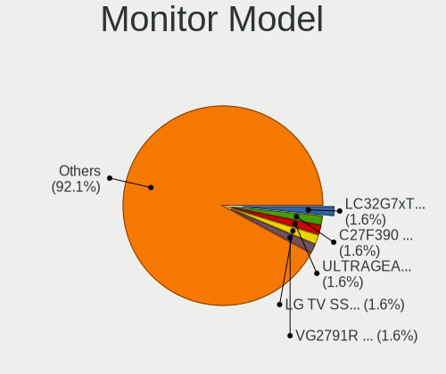
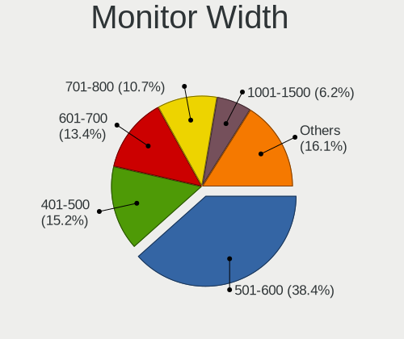
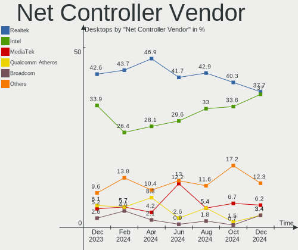
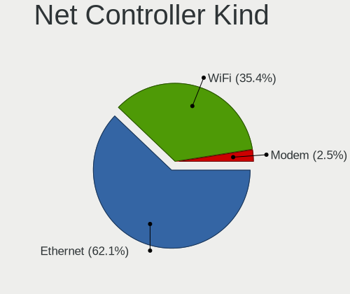
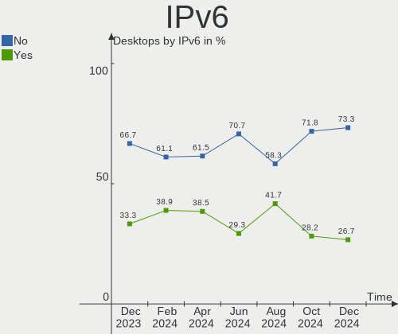
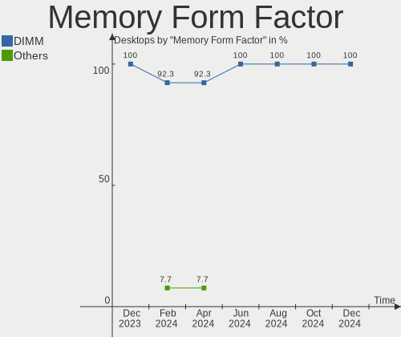
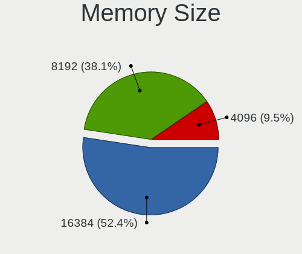
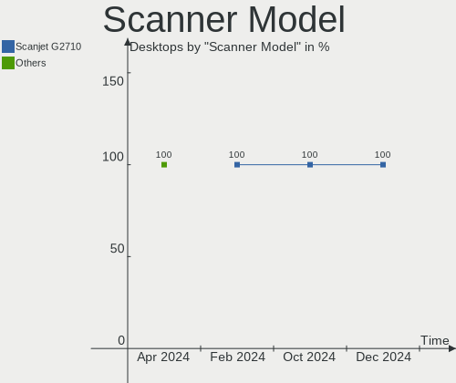

Pop!_OS - Hardware Trends (Desktops)
------------------------------------

A project to identify most popular hardware characteristics and track their change
over time based on data collected by Linux users at https://Linux-Hardware.org.

Anyone can contribute to this report by the [hw-probe](https://github.com/linuxhw/hw-probe) tool:

    sudo -E hw-probe -all -upload

This report is for one last month. Overall report since the beginning of time: [TestCoverage](https://github.com/linuxhw/TestCoverage)

Period: Dec, 2022.

Contents
--------

* [ System ](#system)
  - [ OS                       ](#os)
  - [ OS Family                ](#os-family)
  - [ Kernel                   ](#kernel)
  - [ Kernel Family            ](#kernel-family)
  - [ Kernel Major Ver.        ](#kernel-major-ver)
  - [ Arch                     ](#arch)
  - [ DE                       ](#de)
  - [ Display Server           ](#display-server)
  - [ Display Manager          ](#display-manager)
  - [ OS Lang                  ](#os-lang)
  - [ Boot Mode                ](#boot-mode)
  - [ Filesystem               ](#filesystem)
  - [ Part. scheme             ](#part-scheme)
  - [ Dual Boot with Linux/BSD ](#dual-boot-with-linuxbsd)
  - [ Dual Boot (Win)          ](#dual-boot-win)

* [ Board ](#board)
  - [ Vendor                   ](#vendor)
  - [ Model                    ](#model)
  - [ Model Family             ](#model-family)
  - [ MFG Year                 ](#mfg-year)
  - [ Form Factor              ](#form-factor)
  - [ Secure Boot              ](#secure-boot)
  - [ Coreboot                 ](#coreboot)
  - [ RAM Size                 ](#ram-size)
  - [ RAM Used                 ](#ram-used)
  - [ Total Drives             ](#total-drives)
  - [ Has CD-ROM               ](#has-cd-rom)
  - [ Has Ethernet             ](#has-ethernet)
  - [ Has WiFi                 ](#has-wifi)
  - [ Has Bluetooth            ](#has-bluetooth)

* [ Location ](#location)
  - [ Country                  ](#country)
  - [ City                     ](#city)

* [ Drives ](#drives)
  - [ Drive Vendor             ](#drive-vendor)
  - [ Drive Model              ](#drive-model)
  - [ HDD Vendor               ](#hdd-vendor)
  - [ SSD Vendor               ](#ssd-vendor)
  - [ Drive Kind               ](#drive-kind)
  - [ Drive Connector          ](#drive-connector)
  - [ Drive Size               ](#drive-size)
  - [ Space Total              ](#space-total)
  - [ Space Used               ](#space-used)
  - [ Malfunc. Drives          ](#malfunc-drives)
  - [ Malfunc. Drive Vendor    ](#malfunc-drive-vendor)
  - [ Malfunc. HDD Vendor      ](#malfunc-hdd-vendor)
  - [ Malfunc. Drive Kind      ](#malfunc-drive-kind)
  - [ Failed Drives            ](#failed-drives)
  - [ Failed Drive Vendor      ](#failed-drive-vendor)
  - [ Drive Status             ](#drive-status)

* [ Storage controller ](#storage-controller)
  - [ Storage Vendor           ](#storage-vendor)
  - [ Storage Model            ](#storage-model)
  - [ Storage Kind             ](#storage-kind)

* [ Processor ](#processor)
  - [ CPU Vendor               ](#cpu-vendor)
  - [ CPU Model                ](#cpu-model)
  - [ CPU Model Family         ](#cpu-model-family)
  - [ CPU Cores                ](#cpu-cores)
  - [ CPU Sockets              ](#cpu-sockets)
  - [ CPU Threads              ](#cpu-threads)
  - [ CPU Op-Modes             ](#cpu-op-modes)
  - [ CPU Microcode            ](#cpu-microcode)
  - [ CPU Microarch            ](#cpu-microarch)

* [ Graphics ](#graphics)
  - [ GPU Vendor               ](#gpu-vendor)
  - [ GPU Model                ](#gpu-model)
  - [ GPU Combo                ](#gpu-combo)
  - [ GPU Driver               ](#gpu-driver)
  - [ GPU Memory               ](#gpu-memory)

* [ Monitor ](#monitor)
  - [ Monitor Vendor           ](#monitor-vendor)
  - [ Monitor Model            ](#monitor-model)
  - [ Monitor Resolution       ](#monitor-resolution)
  - [ Monitor Diagonal         ](#monitor-diagonal)
  - [ Monitor Width            ](#monitor-width)
  - [ Aspect Ratio             ](#aspect-ratio)
  - [ Monitor Area             ](#monitor-area)
  - [ Pixel Density            ](#pixel-density)
  - [ Multiple Monitors        ](#multiple-monitors)

* [ Network ](#network)
  - [ Net Controller Vendor    ](#net-controller-vendor)
  - [ Net Controller Model     ](#net-controller-model)
  - [ Wireless Vendor          ](#wireless-vendor)
  - [ Wireless Model           ](#wireless-model)
  - [ Ethernet Vendor          ](#ethernet-vendor)
  - [ Ethernet Model           ](#ethernet-model)
  - [ Net Controller Kind      ](#net-controller-kind)
  - [ Used Controller          ](#used-controller)
  - [ NICs                     ](#nics)
  - [ IPv6                     ](#ipv6)

* [ Bluetooth ](#bluetooth)
  - [ Bluetooth Vendor         ](#bluetooth-vendor)
  - [ Bluetooth Model          ](#bluetooth-model)

* [ Sound ](#sound)
  - [ Sound Vendor             ](#sound-vendor)
  - [ Sound Model              ](#sound-model)

* [ Memory ](#memory)
  - [ Memory Vendor            ](#memory-vendor)
  - [ Memory Model             ](#memory-model)
  - [ Memory Kind              ](#memory-kind)
  - [ Memory Form Factor       ](#memory-form-factor)
  - [ Memory Size              ](#memory-size)
  - [ Memory Speed             ](#memory-speed)

* [ Printers & scanners ](#printers--scanners)
  - [ Printer Vendor           ](#printer-vendor)
  - [ Printer Model            ](#printer-model)
  - [ Scanner Vendor           ](#scanner-vendor)
  - [ Scanner Model            ](#scanner-model)

* [ Camera ](#camera)
  - [ Camera Vendor            ](#camera-vendor)
  - [ Camera Model             ](#camera-model)

* [ Security ](#security)
  - [ Fingerprint Vendor       ](#fingerprint-vendor)
  - [ Fingerprint Model        ](#fingerprint-model)
  - [ Chipcard Vendor          ](#chipcard-vendor)
  - [ Chipcard Model           ](#chipcard-model)

* [ Unsupported ](#unsupported)
  - [ Unsupported Devices      ](#unsupported-devices)
  - [ Unsupported Device Types ](#unsupported-device-types)

System
------

OS
--

Installed operating systems

| Name          | Desktops | Percent |
|---------------|----------|---------|
| Pop!_OS 22.04 | 94       | 95.92%  |
| Pop!_OS 21.10 | 2        | 2.04%   |
| Pop!_OS 20.10 | 1        | 1.02%   |
| Pop!_OS 20.04 | 1        | 1.02%   |

OS Family
---------

OS without a version

| Name    | Desktops | Percent |
|---------|----------|---------|
| Pop!_OS | 98       | 100%    |

Kernel
------

Version of the Linux kernel

| Version                  | Desktops | Percent |
|--------------------------|----------|---------|
| 6.0.6-76060006-generic   | 65       | 66.33%  |
| 6.0.12-76060006-generic  | 22       | 22.45%  |
| 6.1.0-x64v1-xanmod1      | 2        | 2.04%   |
| 6.1.0-060100rc5-generic  | 1        | 1.02%   |
| 6.0.2-76060002-generic   | 1        | 1.02%   |
| 6.0.12-x64v1-xanmod1     | 1        | 1.02%   |
| 5.8.0-7642-generic       | 1        | 1.02%   |
| 5.19.16-76051916-generic | 1        | 1.02%   |
| 5.19.0-76051900-generic  | 1        | 1.02%   |
| 5.18.10-76051810-generic | 1        | 1.02%   |
| 5.17.5-76051705-generic  | 1        | 1.02%   |
| 5.16.19-76051619-generic | 1        | 1.02%   |

Kernel Family
-------------

Linux kernel without a distro release

| Version | Desktops | Percent |
|---------|----------|---------|
| 6.0.6   | 65       | 66.33%  |
| 6.0.12  | 23       | 23.47%  |
| 6.1.0   | 3        | 3.06%   |
| 6.0.2   | 1        | 1.02%   |
| 5.8.0   | 1        | 1.02%   |
| 5.19.16 | 1        | 1.02%   |
| 5.19.0  | 1        | 1.02%   |
| 5.18.10 | 1        | 1.02%   |
| 5.17.5  | 1        | 1.02%   |
| 5.16.19 | 1        | 1.02%   |

Kernel Major Ver.
-----------------

Linux kernel major version

| Version | Desktops | Percent |
|---------|----------|---------|
| 6.0     | 89       | 90.82%  |
| 6.1     | 3        | 3.06%   |
| 5.19    | 2        | 2.04%   |
| 5.8     | 1        | 1.02%   |
| 5.18    | 1        | 1.02%   |
| 5.17    | 1        | 1.02%   |
| 5.16    | 1        | 1.02%   |

Arch
----

OS architecture (x86_64, i586, etc.)

| Name   | Desktops | Percent |
|--------|----------|---------|
| x86_64 | 98       | 100%    |

DE
--

Desktop Environment

| Name       | Desktops | Percent |
|------------|----------|---------|
| GNOME      | 93       | 94.9%   |
| KDE5       | 3        | 3.06%   |
| X-Cinnamon | 2        | 2.04%   |

Display Server
--------------

X11 or Wayland

| Name    | Desktops | Percent |
|---------|----------|---------|
| X11     | 93       | 94.9%   |
| Wayland | 5        | 5.1%    |

Display Manager
---------------

SDDM, LightDM, etc.

| Name    | Desktops | Percent |
|---------|----------|---------|
| Unknown | 78       | 79.59%  |
| GDM3    | 20       | 20.41%  |

OS Lang
-------

Language

| Lang  | Desktops | Percent |
|-------|----------|---------|
| en_US | 59       | 60.2%   |
| en_GB | 10       | 10.2%   |
| C     | 8        | 8.16%   |
| pt_BR | 4        | 4.08%   |
| en_CA | 4        | 4.08%   |
| de_DE | 3        | 3.06%   |
| ru_RU | 1        | 1.02%   |
| pt_PT | 1        | 1.02%   |
| pl_PL | 1        | 1.02%   |
| nl_NL | 1        | 1.02%   |
| it_IT | 1        | 1.02%   |
| hu_HU | 1        | 1.02%   |
| fi_FI | 1        | 1.02%   |
| es_AR | 1        | 1.02%   |
| en_ZA | 1        | 1.02%   |
| da_DK | 1        | 1.02%   |

Boot Mode
---------

EFI or BIOS

| Mode | Desktops | Percent |
|------|----------|---------|
| BIOS | 80       | 81.63%  |
| EFI  | 18       | 18.37%  |

Filesystem
----------

Type of filesystem

| Type    | Desktops | Percent |
|---------|----------|---------|
| Ext4    | 89       | 90.82%  |
| Overlay | 6        | 6.12%   |
| Btrfs   | 2        | 2.04%   |
| Xfs     | 1        | 1.02%   |

Part. scheme
------------

Scheme of partitioning

| Type    | Desktops | Percent |
|---------|----------|---------|
| Unknown | 78       | 79.59%  |
| GPT     | 17       | 17.35%  |
| MBR     | 3        | 3.06%   |

Dual Boot with Linux/BSD
------------------------

Hosting more than one Linux/BSD

| Dual boot | Desktops | Percent |
|-----------|----------|---------|
| No        | 94       | 95.92%  |
| Yes       | 4        | 4.08%   |

Dual Boot (Win)
---------------

Hosting Linux and Windows

| Dual boot | Desktops | Percent |
|-----------|----------|---------|
| No        | 87       | 88.78%  |
| Yes       | 11       | 11.22%  |

Board
-----

Vendor
------

Motherboard manufacturer

| Name                | Desktops | Percent |
|---------------------|----------|---------|
| ASUSTek Computer    | 33       | 33.67%  |
| MSI                 | 18       | 18.37%  |
| Gigabyte Technology | 13       | 13.27%  |
| ASRock              | 9        | 9.18%   |
| Dell                | 5        | 5.1%    |
| Hewlett-Packard     | 4        | 4.08%   |
| Intel               | 3        | 3.06%   |
| Acer                | 3        | 3.06%   |
| System76            | 2        | 2.04%   |
| Supermicro          | 2        | 2.04%   |
| Unknown             | 2        | 2.04%   |
| Lenovo              | 1        | 1.02%   |
| Fujitsu             | 1        | 1.02%   |
| BESSTAR Tech        | 1        | 1.02%   |
| Apple               | 1        | 1.02%   |

Model
-----

Motherboard model

| Name                                   | Desktops | Percent |
|----------------------------------------|----------|---------|
| ASUS All Series                        | 3        | 3.06%   |
| System76 Thelio                        | 2        | 2.04%   |
| MSI MS-7D54                            | 2        | 2.04%   |
| MSI MS-7A34                            | 2        | 2.04%   |
| ASUS TUF Gaming B550-PLUS              | 2        | 2.04%   |
| ASUS ROG STRIX B550-F GAMING           | 2        | 2.04%   |
| ASUS ROG STRIX B550-E GAMING           | 2        | 2.04%   |
| ASUS ROG CROSSHAIR VIII HERO           | 2        | 2.04%   |
| ASUS PRIME B550M-A                     | 2        | 2.04%   |
| Unknown                                | 2        | 2.04%   |
| Supermicro X9DR3-F                     | 1        | 1.02%   |
| Supermicro C7Q67                       | 1        | 1.02%   |
| MSI MS-7E07                            | 1        | 1.02%   |
| MSI MS-7D76                            | 1        | 1.02%   |
| MSI MS-7C95                            | 1        | 1.02%   |
| MSI MS-7C84                            | 1        | 1.02%   |
| MSI MS-7C56                            | 1        | 1.02%   |
| MSI MS-7B84                            | 1        | 1.02%   |
| MSI MS-7B17                            | 1        | 1.02%   |
| MSI MS-7A33                            | 1        | 1.02%   |
| MSI MS-7972                            | 1        | 1.02%   |
| MSI MS-7817                            | 1        | 1.02%   |
| MSI MS-7721                            | 1        | 1.02%   |
| MSI MS-7641                            | 1        | 1.02%   |
| MSI Gseries                            | 1        | 1.02%   |
| MSI B250 Gaming Infinite A(MS-B915)    | 1        | 1.02%   |
| Lenovo 11365K5                         | 1        | 1.02%   |
| Intel X99                              | 1        | 1.02%   |
| Intel X79M-S                           | 1        | 1.02%   |
| Intel DP55WB AAE64798-206              | 1        | 1.02%   |
| HP Slim Desktop S01-aF0xxx             | 1        | 1.02%   |
| HP ProDesk 600 G1 SFF                  | 1        | 1.02%   |
| HP Pavilion 690-0067c Desktop Rfrbd PC | 1        | 1.02%   |
| HP 870-115ng                           | 1        | 1.02%   |
| Gigabyte H61M-S2PV                     | 1        | 1.02%   |
| Gigabyte H110M-S2H-CF                  | 1        | 1.02%   |
| Gigabyte F2A88XM-D3H                   | 1        | 1.02%   |
| Gigabyte B550I AORUS PRO AX            | 1        | 1.02%   |
| Gigabyte B550 VISION D-P               | 1        | 1.02%   |
| Gigabyte B550 AORUS ELITE AX V2        | 1        | 1.02%   |

Model Family
------------

Motherboard model prefix

| Name                  | Desktops | Percent |
|-----------------------|----------|---------|
| ASUS ROG              | 13       | 13.27%  |
| ASUS PRIME            | 9        | 9.18%   |
| Gigabyte B450         | 4        | 4.08%   |
| ASUS TUF              | 4        | 4.08%   |
| ASUS All              | 3        | 3.06%   |
| System76 Thelio       | 2        | 2.04%   |
| MSI MS-7D54           | 2        | 2.04%   |
| MSI MS-7A34           | 2        | 2.04%   |
| Gigabyte B550         | 2        | 2.04%   |
| Acer Aspire           | 2        | 2.04%   |
| Unknown               | 2        | 2.04%   |
| Supermicro X9DR3-F    | 1        | 1.02%   |
| Supermicro C7Q67      | 1        | 1.02%   |
| MSI MS-7E07           | 1        | 1.02%   |
| MSI MS-7D76           | 1        | 1.02%   |
| MSI MS-7C95           | 1        | 1.02%   |
| MSI MS-7C84           | 1        | 1.02%   |
| MSI MS-7C56           | 1        | 1.02%   |
| MSI MS-7B84           | 1        | 1.02%   |
| MSI MS-7B17           | 1        | 1.02%   |
| MSI MS-7A33           | 1        | 1.02%   |
| MSI MS-7972           | 1        | 1.02%   |
| MSI MS-7817           | 1        | 1.02%   |
| MSI MS-7721           | 1        | 1.02%   |
| MSI MS-7641           | 1        | 1.02%   |
| MSI Gseries           | 1        | 1.02%   |
| MSI B250              | 1        | 1.02%   |
| Lenovo 11365K5        | 1        | 1.02%   |
| Intel X99             | 1        | 1.02%   |
| Intel X79M-S          | 1        | 1.02%   |
| Intel DP55WB          | 1        | 1.02%   |
| HP Slim               | 1        | 1.02%   |
| HP ProDesk            | 1        | 1.02%   |
| HP Pavilion           | 1        | 1.02%   |
| HP 870-115ng          | 1        | 1.02%   |
| Gigabyte H61M-S2PV    | 1        | 1.02%   |
| Gigabyte H110M-S2H-CF | 1        | 1.02%   |
| Gigabyte F2A88XM-D3H  | 1        | 1.02%   |
| Gigabyte B550I        | 1        | 1.02%   |
| Gigabyte AB350M-DS3H  | 1        | 1.02%   |

MFG Year
--------

Motherboard manufacture year

| Year | Desktops | Percent |
|------|----------|---------|
| 2020 | 23       | 23.47%  |
| 2018 | 14       | 14.29%  |
| 2022 | 10       | 10.2%   |
| 2013 | 10       | 10.2%   |
| 2021 | 8        | 8.16%   |
| 2019 | 8        | 8.16%   |
| 2017 | 7        | 7.14%   |
| 2014 | 4        | 4.08%   |
| 2015 | 3        | 3.06%   |
| 2012 | 3        | 3.06%   |
| 2010 | 3        | 3.06%   |
| 2016 | 2        | 2.04%   |
| 2011 | 2        | 2.04%   |
| 2009 | 1        | 1.02%   |

Form Factor
-----------

Physical design of the computer

| Name    | Desktops | Percent |
|---------|----------|---------|
| Desktop | 98       | 100%    |

Secure Boot
-----------

Enabled or disabled

| State    | Desktops | Percent |
|----------|----------|---------|
| Disabled | 98       | 100%    |

Coreboot
--------

Have coreboot on board

| Used | Desktops | Percent |
|------|----------|---------|
| No   | 98       | 100%    |

RAM Size
--------

Total RAM memory

| Size in GB  | Desktops | Percent |
|-------------|----------|---------|
| 16.01-24.0  | 38       | 38.78%  |
| 32.01-64.0  | 24       | 24.49%  |
| 64.01-256.0 | 13       | 13.27%  |
| 8.01-16.0   | 10       | 10.2%   |
| 4.01-8.0    | 6        | 6.12%   |
| 24.01-32.0  | 5        | 5.1%    |
| 3.01-4.0    | 2        | 2.04%   |

RAM Used
--------

Used RAM memory

| Used GB   | Desktops | Percent |
|-----------|----------|---------|
| 4.01-8.0  | 31       | 31.63%  |
| 3.01-4.0  | 26       | 26.53%  |
| 2.01-3.0  | 24       | 24.49%  |
| 8.01-16.0 | 9        | 9.18%   |
| 1.01-2.0  | 8        | 8.16%   |

Total Drives
------------

Number of drives on board

| Drives | Desktops | Percent |
|--------|----------|---------|
| 2      | 30       | 30.61%  |
| 1      | 29       | 29.59%  |
| 3      | 17       | 17.35%  |
| 4      | 10       | 10.2%   |
| 5      | 4        | 4.08%   |
| 6      | 3        | 3.06%   |
| 7      | 2        | 2.04%   |
| 0      | 2        | 2.04%   |
| 10     | 1        | 1.02%   |

Has CD-ROM
----------

Has CD-ROM on board

| Presented | Desktops | Percent |
|-----------|----------|---------|
| No        | 79       | 80.61%  |
| Yes       | 19       | 19.39%  |

Has Ethernet
------------

Has Ethernet on board

| Presented | Desktops | Percent |
|-----------|----------|---------|
| Yes       | 98       | 100%    |

Has WiFi
--------

Has WiFi module

| Presented | Desktops | Percent |
|-----------|----------|---------|
| Yes       | 57       | 58.16%  |
| No        | 41       | 41.84%  |

Has Bluetooth
-------------

Has Bluetooth module

| Presented | Desktops | Percent |
|-----------|----------|---------|
| Yes       | 51       | 52.04%  |
| No        | 47       | 47.96%  |

Location
--------

Country
-------

Geographic location (country)

| Country      | Desktops | Percent |
|--------------|----------|---------|
| USA          | 28       | 28.57%  |
| Canada       | 12       | 12.24%  |
| Germany      | 10       | 10.2%   |
| UK           | 6        | 6.12%   |
| Brazil       | 5        | 5.1%    |
| Italy        | 4        | 4.08%   |
| Portugal     | 3        | 3.06%   |
| Greece       | 3        | 3.06%   |
| Russia       | 2        | 2.04%   |
| Norway       | 2        | 2.04%   |
| Netherlands  | 2        | 2.04%   |
| Hungary      | 2        | 2.04%   |
| France       | 2        | 2.04%   |
| Finland      | 2        | 2.04%   |
| Austria      | 2        | 2.04%   |
| UAE          | 1        | 1.02%   |
| Switzerland  | 1        | 1.02%   |
| Sweden       | 1        | 1.02%   |
| Spain        | 1        | 1.02%   |
| South Africa | 1        | 1.02%   |
| Serbia       | 1        | 1.02%   |
| Romania      | 1        | 1.02%   |
| Réunion     | 1        | 1.02%   |
| Poland       | 1        | 1.02%   |
| Ireland      | 1        | 1.02%   |
| Denmark      | 1        | 1.02%   |
| Australia    | 1        | 1.02%   |
| Argentina    | 1        | 1.02%   |

City
----

Geographic location (city)

| City              | Desktops | Percent |
|-------------------|----------|---------|
| Cambridge         | 3        | 3.06%   |
| Rio de Janeiro    | 2        | 2.04%   |
| Lisbon            | 2        | 2.04%   |
| Charlevoix        | 2        | 2.04%   |
| Zurich            | 1        | 1.02%   |
| Yeovil            | 1        | 1.02%   |
| Yekaterinburg     | 1        | 1.02%   |
| Weimar            | 1        | 1.02%   |
| Waterford         | 1        | 1.02%   |
| Virginia Beach    | 1        | 1.02%   |
| Vienna            | 1        | 1.02%   |
| Vancouver         | 1        | 1.02%   |
| Urbandale         | 1        | 1.02%   |
| Uberlândia       | 1        | 1.02%   |
| Turku             | 1        | 1.02%   |
| Sun Prairie       | 1        | 1.02%   |
| St. John's        | 1        | 1.02%   |
| Sopron            | 1        | 1.02%   |
| Shakopee          | 1        | 1.02%   |
| Seattle           | 1        | 1.02%   |
| Sao Paulo         | 1        | 1.02%   |
| San Antonio       | 1        | 1.02%   |
| Saint-Pierre      | 1        | 1.02%   |
| Rodi Garganico    | 1        | 1.02%   |
| Remseck am Neckar | 1        | 1.02%   |
| Québec           | 1        | 1.02%   |
| Portland          | 1        | 1.02%   |
| Poplar            | 1        | 1.02%   |
| Pleasanton        | 1        | 1.02%   |
| Piraeus           | 1        | 1.02%   |
| Philadelphia      | 1        | 1.02%   |
| Notodden          | 1        | 1.02%   |
| Newton Abbot      | 1        | 1.02%   |
| Nanaimo           | 1        | 1.02%   |
| Mysłowice        | 1        | 1.02%   |
| Münster          | 1        | 1.02%   |
| Moscow            | 1        | 1.02%   |
| Mjanger           | 1        | 1.02%   |
| Mississauga       | 1        | 1.02%   |
| Mirandela         | 1        | 1.02%   |

Drives
------

Drive Vendor
------------

Hard drive vendors

| Vendor                      | Desktops | Drives | Percent |
|-----------------------------|----------|--------|---------|
| Samsung Electronics         | 45       | 71     | 23.81%  |
| Seagate                     | 29       | 43     | 15.34%  |
| WDC                         | 23       | 27     | 12.17%  |
| Crucial                     | 12       | 13     | 6.35%   |
| Sandisk                     | 11       | 11     | 5.82%   |
| Kingston                    | 11       | 11     | 5.82%   |
| Toshiba                     | 7        | 7      | 3.7%    |
| Phison Electronics          | 4        | 4      | 2.12%   |
| Unknown                     | 3        | 4      | 1.59%   |
| LaCie                       | 3        | 3      | 1.59%   |
| SK hynix                    | 2        | 2      | 1.06%   |
| Silicon Motion              | 2        | 3      | 1.06%   |
| PNY                         | 2        | 2      | 1.06%   |
| Micron/Crucial Technology   | 2        | 2      | 1.06%   |
| Kingston Technology Company | 2        | 3      | 1.06%   |
| Intenso                     | 2        | 2      | 1.06%   |
| Hitachi                     | 2        | 2      | 1.06%   |
| HGST                        | 2        | 2      | 1.06%   |
| GOODRAM                     | 2        | 2      | 1.06%   |
| XPG                         | 1        | 2      | 0.53%   |
| WD MediaMax                 | 1        | 1      | 0.53%   |
| Verbatim                    | 1        | 1      | 0.53%   |
| TrekStor                    | 1        | 1      | 0.53%   |
| TO Exter                    | 1        | 1      | 0.53%   |
| SYMWAVE                     | 1        | 1      | 0.53%   |
| SPCC                        | 1        | 1      | 0.53%   |
| RZX                         | 1        | 1      | 0.53%   |
| RSH-339                     | 1        | 1      | 0.53%   |
| Realtek Semiconductor       | 1        | 1      | 0.53%   |
| Phison                      | 1        | 1      | 0.53%   |
| Patriot                     | 1        | 1      | 0.53%   |
| OCZ                         | 1        | 1      | 0.53%   |
| Lexar                       | 1        | 1      | 0.53%   |
| KIOXIA-EXCERIA              | 1        | 1      | 0.53%   |
| KIOXIA                      | 1        | 1      | 0.53%   |
| KingSpec                    | 1        | 1      | 0.53%   |
| Intel                       | 1        | 2      | 0.53%   |
| Corsair                     | 1        | 2      | 0.53%   |
| China                       | 1        | 1      | 0.53%   |
| BlueRay                     | 1        | 1      | 0.53%   |

Drive Model
-----------

Hard drive models

| Model                                               | Desktops | Percent |
|-----------------------------------------------------|----------|---------|
| Samsung NVMe SSD Controller SM981/PM981/PM983 500GB | 10       | 4.37%   |
| Samsung NVMe SSD Controller PM9A1/PM9A3/980PRO 2TB  | 9        | 3.93%   |
| Kingston SA400S37480G 480GB SSD                     | 5        | 2.18%   |
| Seagate ST1000DM010-2EP102 1TB                      | 4        | 1.75%   |
| Samsung SSD 870 QVO 1TB                             | 4        | 1.75%   |
| Samsung SSD 860 EVO 1TB                             | 4        | 1.75%   |
| Seagate ST2000DM008-2FR102 2TB                      | 3        | 1.31%   |
| Sandisk WD Blue SN550 NVMe SSD 500GB                | 3        | 1.31%   |
| Samsung SSD 870 EVO 500GB                           | 3        | 1.31%   |
| Samsung SSD 870 EVO 2TB                             | 3        | 1.31%   |
| Samsung SSD 860 EVO 500GB                           | 3        | 1.31%   |
| Phison E16 PCIe4 NVMe Controller 512GB              | 3        | 1.31%   |
| WDC WDS500G3X0C-00SJG0 500GB                        | 2        | 0.87%   |
| WDC WD30EFRX-68EUZN0 3TB                            | 2        | 0.87%   |
| Toshiba DT01ACA200 2TB                              | 2        | 0.87%   |
| Seagate ST4000DM004-2CV104 4TB                      | 2        | 0.87%   |
| Seagate ST2000DM006-2DM164 2TB                      | 2        | 0.87%   |
| Seagate ST1000DM003-1ER162 1TB                      | 2        | 0.87%   |
| Seagate ST1000DM003-1CH162 1TB                      | 2        | 0.87%   |
| Samsung SSD 870 QVO 2TB                             | 2        | 0.87%   |
| Samsung SSD 850 EVO 500GB                           | 2        | 0.87%   |
| Samsung SSD 850 EVO 1TB                             | 2        | 0.87%   |
| Samsung SSD 850 EVO 120GB                           | 2        | 0.87%   |
| Samsung NVMe SSD Controller SM961/PM961/SM963 256GB | 2        | 0.87%   |
| Samsung NVMe SSD Controller SM951/PM951 512GB       | 2        | 0.87%   |
| Micron/Crucial P2 NVMe PCIe SSD 500GB               | 2        | 0.87%   |
| Kingston SA400S37240G 240GB SSD                     | 2        | 0.87%   |
| Crucial CT500MX500SSD1 500GB                        | 2        | 0.87%   |
| Crucial CT240BX500SSD1 240GB                        | 2        | 0.87%   |
| Crucial CT1000P1SSD8 1TB                            | 2        | 0.87%   |
| XPG GAMMIX S11 Pro 512GB                            | 1        | 0.44%   |
| WDC WDS500G2B0A-00SM50 500GB SSD                    | 1        | 0.44%   |
| WDC WDS480G2G0A-00JH30 480GB SSD                    | 1        | 0.44%   |
| WDC WDS100T2B0A-00SM50 1TB SSD                      | 1        | 0.44%   |
| WDC WD80EZAZ-11TDBA0 8TB                            | 1        | 0.44%   |
| WDC WD5003ABYZ-011FA0 500GB                         | 1        | 0.44%   |
| WDC WD5000BPVT-22A1YT0 500GB                        | 1        | 0.44%   |
| WDC WD5000AAKX-75U6AA0 500GB                        | 1        | 0.44%   |
| WDC WD5000AAKX-22ERMA0 500GB                        | 1        | 0.44%   |
| WDC WD40EZRZ-00GXCB0 4TB                            | 1        | 0.44%   |

HDD Vendor
----------

Hard disk drive vendors

| Vendor              | Desktops | Drives | Percent |
|---------------------|----------|--------|---------|
| Seagate             | 28       | 42     | 45.9%   |
| WDC                 | 17       | 21     | 27.87%  |
| Toshiba             | 6        | 6      | 9.84%   |
| Samsung Electronics | 3        | 3      | 4.92%   |
| Hitachi             | 2        | 2      | 3.28%   |
| HGST                | 2        | 2      | 3.28%   |
| Unknown             | 1        | 1      | 1.64%   |
| RSH-339             | 1        | 1      | 1.64%   |
| Apple               | 1        | 1      | 1.64%   |

SSD Vendor
----------

Solid state drive vendors

| Vendor              | Desktops | Drives | Percent |
|---------------------|----------|--------|---------|
| Samsung Electronics | 25       | 38     | 36.23%  |
| Kingston            | 9        | 9      | 13.04%  |
| Crucial             | 9        | 10     | 13.04%  |
| SanDisk             | 5        | 5      | 7.25%   |
| WDC                 | 4        | 4      | 5.8%    |
| SK hynix            | 2        | 2      | 2.9%    |
| PNY                 | 2        | 2      | 2.9%    |
| GOODRAM             | 2        | 2      | 2.9%    |
| Verbatim            | 1        | 1      | 1.45%   |
| TrekStor            | 1        | 1      | 1.45%   |
| TO Exter            | 1        | 1      | 1.45%   |
| RZX                 | 1        | 1      | 1.45%   |
| Patriot             | 1        | 1      | 1.45%   |
| OCZ                 | 1        | 1      | 1.45%   |
| Lexar               | 1        | 1      | 1.45%   |
| LaCie               | 1        | 1      | 1.45%   |
| KingSpec            | 1        | 1      | 1.45%   |
| Intenso             | 1        | 1      | 1.45%   |
| China               | 1        | 1      | 1.45%   |

Drive Kind
----------

HDD or SSD

| Kind    | Desktops | Drives | Percent |
|---------|----------|--------|---------|
| SSD     | 56       | 83     | 34.57%  |
| NVMe    | 51       | 67     | 31.48%  |
| HDD     | 46       | 79     | 28.4%   |
| Unknown | 8        | 10     | 4.94%   |
| MMC     | 1        | 1      | 0.62%   |

Drive Connector
---------------

SATA, SAS, NVMe, etc.

| Type | Desktops | Drives | Percent |
|------|----------|--------|---------|
| SATA | 78       | 154    | 53.06%  |
| NVMe | 51       | 67     | 34.69%  |
| SAS  | 17       | 18     | 11.56%  |
| MMC  | 1        | 1      | 0.68%   |

Drive Size
----------

Size of hard drive

| Size in TB | Desktops | Drives | Percent |
|------------|----------|--------|---------|
| 0.01-0.5   | 50       | 68     | 42.02%  |
| 0.51-1.0   | 31       | 39     | 26.05%  |
| 1.01-2.0   | 21       | 25     | 17.65%  |
| 3.01-4.0   | 6        | 13     | 5.04%   |
| 4.01-10.0  | 6        | 9      | 5.04%   |
| 2.01-3.0   | 5        | 8      | 4.2%    |

Space Total
-----------

Amount of disk space available on the file system

| Size in GB     | Desktops | Percent |
|----------------|----------|---------|
| 501-1000       | 21       | 21.43%  |
| 251-500        | 18       | 18.37%  |
| More than 3000 | 15       | 15.31%  |
| 101-250        | 15       | 15.31%  |
| 1001-2000      | 12       | 12.24%  |
| 2001-3000      | 8        | 8.16%   |
| 1-20           | 7        | 7.14%   |
| 51-100         | 2        | 2.04%   |

Space Used
----------

Amount of used disk space

| Used GB        | Desktops | Percent |
|----------------|----------|---------|
| 21-50          | 17       | 17.35%  |
| 101-250        | 17       | 17.35%  |
| 1-20           | 17       | 17.35%  |
| 251-500        | 12       | 12.24%  |
| 51-100         | 12       | 12.24%  |
| 501-1000       | 10       | 10.2%   |
| More than 3000 | 6        | 6.12%   |
| 1001-2000      | 4        | 4.08%   |
| 2001-3000      | 3        | 3.06%   |

Malfunc. Drives
---------------

Drive models with a malfunction

| Model                                        | Desktops | Drives | Percent |
|----------------------------------------------|----------|--------|---------|
| WDC WD20EFRX-68AX9N0 2TB                     | 1        | 1      | 33.33%  |
| Samsung Electronics MZVKW512HMJP-00000 512GB | 1        | 1      | 33.33%  |
| Crucial CT500MX500SSD1 500GB                 | 1        | 1      | 33.33%  |

Malfunc. Drive Vendor
---------------------

Vendors of faulty drives

| Vendor              | Desktops | Drives | Percent |
|---------------------|----------|--------|---------|
| WDC                 | 1        | 1      | 33.33%  |
| Samsung Electronics | 1        | 1      | 33.33%  |
| Crucial             | 1        | 1      | 33.33%  |

Malfunc. HDD Vendor
-------------------

Vendors of faulty HDD drives

| Vendor | Desktops | Drives | Percent |
|--------|----------|--------|---------|
| WDC    | 1        | 1      | 100%    |

Malfunc. Drive Kind
-------------------

Kinds of faulty drives

| Kind | Desktops | Drives | Percent |
|------|----------|--------|---------|
| NVMe | 1        | 1      | 33.33%  |
| SSD  | 1        | 1      | 33.33%  |
| HDD  | 1        | 1      | 33.33%  |

Failed Drives
-------------

Failed drive models

Zero info for selected period =(

Failed Drive Vendor
-------------------

Failed drive vendors

Zero info for selected period =(

Drive Status
------------

Number of failed and malfunc. drives

| Status   | Desktops | Drives | Percent |
|----------|----------|--------|---------|
| Detected | 84       | 205    | 81.55%  |
| Works    | 16       | 32     | 15.53%  |
| Malfunc  | 3        | 3      | 2.91%   |

Storage controller
------------------

Storage Vendor
--------------

Storage controller vendors

| Vendor                       | Desktops | Percent |
|------------------------------|----------|---------|
| AMD                          | 54       | 32.53%  |
| Intel                        | 45       | 27.11%  |
| Samsung Electronics          | 29       | 17.47%  |
| SanDisk                      | 8        | 4.82%   |
| Phison Electronics           | 7        | 4.22%   |
| Micron/Crucial Technology    | 5        | 3.01%   |
| ASMedia Technology           | 4        | 2.41%   |
| Kingston Technology Company  | 3        | 1.81%   |
| Silicon Motion               | 2        | 1.2%    |
| KIOXIA                       | 2        | 1.2%    |
| JMicron Technology           | 2        | 1.2%    |
| Toshiba America Info Systems | 1        | 0.6%    |
| Realtek Semiconductor        | 1        | 0.6%    |
| Marvell Technology Group     | 1        | 0.6%    |
| Broadcom / LSI               | 1        | 0.6%    |
| ADATA Technology             | 1        | 0.6%    |

Storage Model
-------------

Storage controller models

| Model                                                                          | Desktops | Percent |
|--------------------------------------------------------------------------------|----------|---------|
| AMD FCH SATA Controller [AHCI mode]                                            | 33       | 16.92%  |
| AMD 500 Series Chipset SATA Controller                                         | 16       | 8.21%   |
| Samsung NVMe SSD Controller PM9A1/PM9A3/980PRO                                 | 13       | 6.67%   |
| Samsung NVMe SSD Controller SM981/PM981/PM983                                  | 11       | 5.64%   |
| AMD 400 Series Chipset SATA Controller                                         | 9        | 4.62%   |
| Intel 8 Series/C220 Series Chipset Family 6-port SATA Controller 1 [AHCI mode] | 7        | 3.59%   |
| Phison E16 PCIe4 NVMe Controller                                               | 5        | 2.56%   |
| Intel SATA Controller [RAID mode]                                              | 4        | 2.05%   |
| Intel Q170/Q150/B150/H170/H110/Z170/CM236 Chipset SATA Controller [AHCI Mode]  | 4        | 2.05%   |
| Intel Cannon Lake PCH SATA AHCI Controller                                     | 4        | 2.05%   |
| Intel 6 Series/C200 Series Chipset Family 6 port Desktop SATA AHCI Controller  | 4        | 2.05%   |
| Intel 200 Series PCH SATA controller [AHCI mode]                               | 4        | 2.05%   |
| ASMedia ASM1062 Serial ATA Controller                                          | 4        | 2.05%   |
| AMD 300 Series Chipset SATA Controller                                         | 4        | 2.05%   |
| SanDisk WD Blue SN550 NVMe SSD                                                 | 3        | 1.54%   |
| Samsung NVMe SSD Controller SM961/PM961/SM963                                  | 3        | 1.54%   |
| Micron/Crucial P2 NVMe PCIe SSD                                                | 3        | 1.54%   |
| Intel SATA controller                                                          | 3        | 1.54%   |
| Intel 9 Series Chipset Family SATA Controller [AHCI Mode]                      | 3        | 1.54%   |
| AMD SATA controller                                                            | 3        | 1.54%   |
| SanDisk WD Black SN750 / PC SN730 NVMe SSD                                     | 2        | 1.03%   |
| Samsung NVMe SSD Controller SM951/PM951                                        | 2        | 1.03%   |
| Phison E12 NVMe Controller                                                     | 2        | 1.03%   |
| Micron/Crucial P1 NVMe PCIe SSD                                                | 2        | 1.03%   |
| Kingston Company Company Non-Volatile memory controller                        | 2        | 1.03%   |
| Intel Volume Management Device NVMe RAID Controller                            | 2        | 1.03%   |
| Intel C602 chipset 4-Port SATA Storage Control Unit                            | 2        | 1.03%   |
| Intel C600/X79 series chipset 6-Port SATA AHCI Controller                      | 2        | 1.03%   |
| Intel Alder Lake-S PCH SATA Controller [AHCI Mode]                             | 2        | 1.03%   |
| Intel 82801JI (ICH10 Family) SATA AHCI Controller                              | 2        | 1.03%   |
| Intel 5 Series/3400 Series Chipset 4 port SATA IDE Controller                  | 2        | 1.03%   |
| Intel 5 Series/3400 Series Chipset 2 port SATA IDE Controller                  | 2        | 1.03%   |
| AMD SB7x0/SB8x0/SB9x0 SATA Controller [AHCI mode]                              | 2        | 1.03%   |
| AMD SB7x0/SB8x0/SB9x0 IDE Controller                                           | 2        | 1.03%   |
| AMD FCH SATA Controller D                                                      | 2        | 1.03%   |
| Toshiba America Info Systems XG5 NVMe SSD Controller                           | 1        | 0.51%   |
| Silicon Motion SM2263EN/SM2263XT SSD Controller                                | 1        | 0.51%   |
| Silicon Motion SM2262/SM2262EN SSD Controller                                  | 1        | 0.51%   |
| SanDisk WD PC SN810 / Black SN850 NVMe SSD                                     | 1        | 0.51%   |
| SanDisk WD Black 2018/SN750 / PC SN720 NVMe SSD                                | 1        | 0.51%   |

Storage Kind
------------

Kind of storage controller (IDE, SATA, NVMe, SAS, ...)

| Kind | Desktops | Percent |
|------|----------|---------|
| SATA | 91       | 57.96%  |
| NVMe | 51       | 32.48%  |
| RAID | 7        | 4.46%   |
| IDE  | 6        | 3.82%   |
| SAS  | 2        | 1.27%   |

Processor
---------

CPU Vendor
----------

Processor vendors

| Vendor | Desktops | Percent |
|--------|----------|---------|
| AMD    | 54       | 55.1%   |
| Intel  | 44       | 44.9%   |

CPU Model
---------

Processor models

| Model                                  | Desktops | Percent |
|----------------------------------------|----------|---------|
| AMD Ryzen 5 5600X 6-Core Processor     | 6        | 6.12%   |
| AMD Ryzen 5 3600 6-Core Processor      | 6        | 6.12%   |
| AMD Ryzen 5 2600 Six-Core Processor    | 4        | 4.08%   |
| Intel Core i7-4790K CPU @ 4.00GHz      | 3        | 3.06%   |
| Intel Core i5-9400 CPU @ 2.90GHz       | 3        | 3.06%   |
| AMD Ryzen 9 5950X 16-Core Processor    | 3        | 3.06%   |
| Intel Core i7-4790 CPU @ 3.60GHz       | 2        | 2.04%   |
| Intel Core i5-6500 CPU @ 3.20GHz       | 2        | 2.04%   |
| Intel Core i3-2100 CPU @ 3.10GHz       | 2        | 2.04%   |
| Intel 13th Gen Core i7-13700K          | 2        | 2.04%   |
| AMD Ryzen 9 7950X 16-Core Processor    | 2        | 2.04%   |
| AMD Ryzen 9 5900X 12-Core Processor    | 2        | 2.04%   |
| AMD Ryzen 9 3900X 12-Core Processor    | 2        | 2.04%   |
| AMD Ryzen 7 5800X 8-Core Processor     | 2        | 2.04%   |
| AMD Ryzen 7 5700G with Radeon Graphics | 2        | 2.04%   |
| AMD Ryzen 7 2700X Eight-Core Processor | 2        | 2.04%   |
| AMD Ryzen 5 5600G with Radeon Graphics | 2        | 2.04%   |
| AMD Ryzen 5 1600 Six-Core Processor    | 2        | 2.04%   |
| Intel Xeon CPU X5690 @ 3.47GHz         | 1        | 1.02%   |
| Intel Xeon CPU E5-2697 v2 @ 2.70GHz    | 1        | 1.02%   |
| Intel Xeon CPU E5-2630 0 @ 2.30GHz     | 1        | 1.02%   |
| Intel Xeon CPU E5-2620 v3 @ 2.40GHz    | 1        | 1.02%   |
| Intel Xeon CPU E5-2620 0 @ 2.00GHz     | 1        | 1.02%   |
| Intel Pentium Silver N6005 @ 2.00GHz   | 1        | 1.02%   |
| Intel Core i7-9700K CPU @ 3.60GHz      | 1        | 1.02%   |
| Intel Core i7-9700 CPU @ 3.00GHz       | 1        | 1.02%   |
| Intel Core i7-8700 CPU @ 3.20GHz       | 1        | 1.02%   |
| Intel Core i7-7700 CPU @ 3.60GHz       | 1        | 1.02%   |
| Intel Core i7-6700K CPU @ 4.00GHz      | 1        | 1.02%   |
| Intel Core i7-6700 CPU @ 3.40GHz       | 1        | 1.02%   |
| Intel Core i7-4770K CPU @ 3.50GHz      | 1        | 1.02%   |
| Intel Core i7-2600 CPU @ 3.40GHz       | 1        | 1.02%   |
| Intel Core i7 CPU 960 @ 3.20GHz        | 1        | 1.02%   |
| Intel Core i7 CPU 860 @ 2.80GHz        | 1        | 1.02%   |
| Intel Core i5-9600KF CPU @ 3.70GHz     | 1        | 1.02%   |
| Intel Core i5-9600K CPU @ 3.70GHz      | 1        | 1.02%   |
| Intel Core i5-9500 CPU @ 3.00GHz       | 1        | 1.02%   |
| Intel Core i5-6600K CPU @ 3.50GHz      | 1        | 1.02%   |
| Intel Core i5-4590 CPU @ 3.30GHz       | 1        | 1.02%   |
| Intel Core i5 CPU 750 @ 2.67GHz        | 1        | 1.02%   |

CPU Model Family
----------------

Processor model prefix

| Model                | Desktops | Percent |
|----------------------|----------|---------|
| AMD Ryzen 5          | 23       | 23.47%  |
| Intel Core i7        | 15       | 15.31%  |
| AMD Ryzen 7          | 12       | 12.24%  |
| Intel Core i5        | 11       | 11.22%  |
| AMD Ryzen 9          | 11       | 11.22%  |
| Other                | 5        | 5.1%    |
| Intel Xeon           | 5        | 5.1%    |
| Intel Core i3        | 5        | 5.1%    |
| Intel Celeron        | 2        | 2.04%   |
| AMD FX               | 2        | 2.04%   |
| AMD A10              | 2        | 2.04%   |
| Intel Pentium Silver | 1        | 1.02%   |
| AMD Ryzen 3          | 1        | 1.02%   |
| AMD Athlon II X3     | 1        | 1.02%   |
| AMD Athlon           | 1        | 1.02%   |
| AMD A4               | 1        | 1.02%   |

CPU Cores
---------

Number of processor cores

| Number | Desktops | Percent |
|--------|----------|---------|
| 6      | 31       | 31.63%  |
| 4      | 24       | 24.49%  |
| 8      | 14       | 14.29%  |
| 16     | 9        | 9.18%   |
| 12     | 7        | 7.14%   |
| 2      | 7        | 7.14%   |
| 3      | 2        | 2.04%   |
| 24     | 1        | 1.02%   |
| 14     | 1        | 1.02%   |
| 10     | 1        | 1.02%   |
| 1      | 1        | 1.02%   |

CPU Sockets
-----------

Number of sockets

| Number | Desktops | Percent |
|--------|----------|---------|
| 1      | 95       | 96.94%  |
| 2      | 3        | 3.06%   |

CPU Threads
-----------

Threads per core (Hyper-Threading)

| Number | Desktops | Percent |
|--------|----------|---------|
| 2      | 77       | 78.57%  |
| 1      | 21       | 21.43%  |

CPU Op-Modes
------------

CPU Operation Modes (32-bit, 64-bit)

| Op mode        | Desktops | Percent |
|----------------|----------|---------|
| 32-bit, 64-bit | 98       | 100%    |

CPU Microcode
-------------

Microcode number

| Number     | Desktops | Percent |
|------------|----------|---------|
| Unknown    | 79       | 80.61%  |
| 0x0800820d | 4        | 4.08%   |
| 0x506e3    | 2        | 2.04%   |
| 0x306c3    | 2        | 2.04%   |
| 0x0a201016 | 2        | 2.04%   |
| 0x08701021 | 2        | 2.04%   |
| 0xb0671    | 1        | 1.02%   |
| 0x906ec    | 1        | 1.02%   |
| 0x906e9    | 1        | 1.02%   |
| 0x306e4    | 1        | 1.02%   |
| 0x0a601203 | 1        | 1.02%   |
| 0x0a201205 | 1        | 1.02%   |
| 0x08108109 | 1        | 1.02%   |

CPU Microarch
-------------

Microarchitecture

| Name             | Desktops | Percent |
|------------------|----------|---------|
| Zen 3            | 19       | 19.39%  |
| Zen 2            | 12       | 12.24%  |
| KabyLake         | 11       | 11.22%  |
| Haswell          | 10       | 10.2%   |
| Zen+             | 9        | 9.18%   |
| Unknown          | 8        | 8.16%   |
| Zen              | 5        | 5.1%    |
| Skylake          | 5        | 5.1%    |
| SandyBridge      | 5        | 5.1%    |
| Piledriver       | 4        | 4.08%   |
| Nehalem          | 3        | 3.06%   |
| Westmere         | 1        | 1.02%   |
| Steamroller      | 1        | 1.02%   |
| Silvermont       | 1        | 1.02%   |
| K10              | 1        | 1.02%   |
| IvyBridge        | 1        | 1.02%   |
| Goldmont         | 1        | 1.02%   |
| Alderlake Hybrid | 1        | 1.02%   |

Graphics
--------

GPU Vendor
----------

Vendors of graphics cards

| Vendor | Desktops | Percent |
|--------|----------|---------|
| AMD    | 48       | 47.06%  |
| Nvidia | 40       | 39.22%  |
| Intel  | 14       | 13.73%  |

GPU Model
---------

Graphics card models

| Model                                                                       | Desktops | Percent |
|-----------------------------------------------------------------------------|----------|---------|
| AMD Ellesmere [Radeon RX 470/480/570/570X/580/580X/590]                     | 8        | 7.48%   |
| AMD Navi 23 [Radeon RX 6600/6600 XT/6600M]                                  | 6        | 5.61%   |
| Intel CoffeeLake-S GT2 [UHD Graphics 630]                                   | 5        | 4.67%   |
| AMD Navi 10 [Radeon RX 5600 OEM/5600 XT / 5700/5700 XT]                     | 5        | 4.67%   |
| AMD Navi 22 [Radeon RX 6700/6700 XT/6750 XT / 6800M]                        | 4        | 3.74%   |
| Nvidia GP104 [GeForce GTX 1080]                                             | 3        | 2.8%    |
| Nvidia GP104 [GeForce GTX 1070]                                             | 3        | 2.8%    |
| AMD Vega 10 XL/XT [Radeon RX Vega 56/64]                                    | 3        | 2.8%    |
| AMD Raphael                                                                 | 3        | 2.8%    |
| AMD Lexa PRO [Radeon 540/540X/550/550X / RX 540X/550/550X]                  | 3        | 2.8%    |
| AMD Cezanne [Radeon Vega Series / Radeon Vega Mobile Series]                | 3        | 2.8%    |
| Nvidia TU117 [GeForce GTX 1650]                                             | 2        | 1.87%   |
| Nvidia TU106 [GeForce RTX 2070]                                             | 2        | 1.87%   |
| Nvidia GP106 [GeForce GTX 1060 3GB]                                         | 2        | 1.87%   |
| Nvidia GM204 [GeForce GTX 970]                                              | 2        | 1.87%   |
| Nvidia GK208B [GeForce GT 710]                                              | 2        | 1.87%   |
| Nvidia GA106 [GeForce RTX 3060 Lite Hash Rate]                              | 2        | 1.87%   |
| Nvidia GA104 [GeForce RTX 3070 Ti]                                          | 2        | 1.87%   |
| Intel Xeon E3-1200 v3/4th Gen Core Processor Integrated Graphics Controller | 2        | 1.87%   |
| Intel 2nd Generation Core Processor Family Integrated Graphics Controller   | 2        | 1.87%   |
| AMD Tahiti PRO [Radeon HD 7950/8950 OEM / R9 280]                           | 2        | 1.87%   |
| AMD Picasso/Raven 2 [Radeon Vega Series / Radeon Vega Mobile Series]        | 2        | 1.87%   |
| AMD Navi 24 [Radeon RX 6400/6500 XT/6500M]                                  | 2        | 1.87%   |
| AMD Baffin [Radeon RX 550 640SP / RX 560/560X]                              | 2        | 1.87%   |
| Nvidia TU116 [GeForce GTX 1660]                                             | 1        | 0.93%   |
| Nvidia TU106 [GeForce RTX 2060 SUPER]                                       | 1        | 0.93%   |
| Nvidia GT218 [GeForce 210]                                                  | 1        | 0.93%   |
| Nvidia GP108 [GeForce GT 1030]                                              | 1        | 0.93%   |
| Nvidia GP107GL [Quadro P400]                                                | 1        | 0.93%   |
| Nvidia GP106 [GeForce GTX 1060 6GB]                                         | 1        | 0.93%   |
| Nvidia GP104 [GeForce GTX 1070 Ti]                                          | 1        | 0.93%   |
| Nvidia GP102 [GeForce GTX 1080 Ti]                                          | 1        | 0.93%   |
| Nvidia GM107 [GeForce GTX 750 Ti]                                           | 1        | 0.93%   |
| Nvidia GM107 [GeForce GTX 745]                                              | 1        | 0.93%   |
| Nvidia GK106 [GeForce GTX 650 Ti]                                           | 1        | 0.93%   |
| Nvidia GF110 [GeForce GTX 570 Rev. 2]                                       | 1        | 0.93%   |
| Nvidia GF106GL [Quadro 2000]                                                | 1        | 0.93%   |
| Nvidia GA106 [GeForce RTX 3060]                                             | 1        | 0.93%   |
| Nvidia GA104 [GeForce RTX 3070 Lite Hash Rate]                              | 1        | 0.93%   |
| Nvidia GA104 [GeForce RTX 3060]                                             | 1        | 0.93%   |

GPU Combo
---------

Combinations of graphics cards

| Name           | Desktops | Percent |
|----------------|----------|---------|
| 1 x AMD        | 42       | 42.86%  |
| 1 x Nvidia     | 36       | 36.73%  |
| 1 x Intel      | 12       | 12.24%  |
| 2 x AMD        | 4        | 4.08%   |
| 2 x Nvidia     | 1        | 1.02%   |
| Intel + Nvidia | 1        | 1.02%   |
| Intel + AMD    | 1        | 1.02%   |
| AMD + Nvidia   | 1        | 1.02%   |

GPU Driver
----------

Free vs proprietary

| Driver      | Desktops | Percent |
|-------------|----------|---------|
| Free        | 58       | 59.18%  |
| Proprietary | 36       | 36.73%  |
| Unknown     | 4        | 4.08%   |

GPU Memory
----------

Total video memory

| Size in GB | Desktops | Percent |
|------------|----------|---------|
| Unknown    | 74       | 75.51%  |
| 7.01-8.0   | 9        | 9.18%   |
| 3.01-4.0   | 4        | 4.08%   |
| 1.01-2.0   | 3        | 3.06%   |
| 8.01-16.0  | 3        | 3.06%   |
| 5.01-6.0   | 2        | 2.04%   |
| 2.01-3.0   | 1        | 1.02%   |
| 0.51-1.0   | 1        | 1.02%   |
| 0.01-0.5   | 1        | 1.02%   |

Monitor
-------

Monitor Vendor
--------------

Monitor vendors

| Vendor               | Desktops | Percent |
|----------------------|----------|---------|
| Samsung Electronics  | 17       | 15.89%  |
| Dell                 | 13       | 12.15%  |
| Goldstar             | 10       | 9.35%   |
| Acer                 | 10       | 9.35%   |
| ASUSTek Computer     | 7        | 6.54%   |
| Ancor Communications | 7        | 6.54%   |
| Hewlett-Packard      | 5        | 4.67%   |
| BenQ                 | 5        | 4.67%   |
| AOC                  | 5        | 4.67%   |
| Sceptre Tech         | 2        | 1.87%   |
| Philips              | 2        | 1.87%   |
| NCS                  | 2        | 1.87%   |
| MSI                  | 2        | 1.87%   |
| Iiyama               | 2        | 1.87%   |
| Eizo                 | 2        | 1.87%   |
| ViewSonic            | 1        | 0.93%   |
| Unknown              | 1        | 0.93%   |
| Targa Visionary      | 1        | 0.93%   |
| Sony                 | 1        | 0.93%   |
| SKY                  | 1        | 0.93%   |
| SGT                  | 1        | 0.93%   |
| Plain Tree Systems   | 1        | 0.93%   |
| Pioneer              | 1        | 0.93%   |
| Nixeus               | 1        | 0.93%   |
| Mi                   | 1        | 0.93%   |
| MHD                  | 1        | 0.93%   |
| Lenovo               | 1        | 0.93%   |
| Fujitsu Siemens      | 1        | 0.93%   |
| Denver               | 1        | 0.93%   |
| DENON                | 1        | 0.93%   |
| Unknown              | 1        | 0.93%   |

Monitor Model
-------------

Monitor models

| Model                                                                   | Desktops | Percent |
|-------------------------------------------------------------------------|----------|---------|
| NCS LCD Monitor NCS2275 1920x1080 256x192mm 12.6-inch                   | 2        | 1.74%   |
| Hewlett-Packard E231 HWP3063 1920x1080 509x286mm 23.0-inch              | 2        | 1.74%   |
| Goldstar ULTRAWIDE GSM59F1 2560x1080 798x334mm 34.1-inch                | 2        | 1.74%   |
| Dell U2412M DELA07B 1920x1200 518x324mm 24.1-inch                       | 2        | 1.74%   |
| Ancor Communications ASUS VN247 ACI24C3 1920x1080 521x293mm 23.5-inch   | 2        | 1.74%   |
| ViewSonic VX3276-QHD VSCE635 2560x1440 698x393mm 31.5-inch              | 1        | 0.87%   |
| Unknown LCD Monitor SAMSUNG 1920x1080                                   | 1        | 0.87%   |
| Targa Visionary LCD 24-1 Wide TARA240 1920x1080 521x293mm 23.5-inch     | 1        | 0.87%   |
| Sony TV SNYDC02 1920x1080 930x523mm 42.0-inch                           | 1        | 0.87%   |
| SKY SKYWORTH SKY0001 1920x1080 885x498mm 40.0-inch                      | 1        | 0.87%   |
| SGT HS156PC SGT9156 1920x1080 345x194mm 15.6-inch                       | 1        | 0.87%   |
| Sceptre Tech X246W-1080p SPT2303 1920x1080 521x293mm 23.5-inch          | 1        | 0.87%   |
| Sceptre Tech Sceptre C27 SPT0AD7 1920x1080 598x336mm 27.0-inch          | 1        | 0.87%   |
| Samsung Electronics U28E590 SAM0C4E 3840x2160 608x345mm 27.5-inch       | 1        | 0.87%   |
| Samsung Electronics SyncMaster SAM030C 1680x1050 474x296mm 22.0-inch    | 1        | 0.87%   |
| Samsung Electronics SMS24A450 SAM0839 1920x1200 518x324mm 24.1-inch     | 1        | 0.87%   |
| Samsung Electronics S27E590 SAM0C5D 1920x1080 598x336mm 27.0-inch       | 1        | 0.87%   |
| Samsung Electronics S24E650 SAM0CB8 1920x1080 521x293mm 23.5-inch       | 1        | 0.87%   |
| Samsung Electronics S22C570 SAM0A55 1920x1080 477x268mm 21.5-inch       | 1        | 0.87%   |
| Samsung Electronics S22B300 SAM08AC 1920x1080 477x268mm 21.5-inch       | 1        | 0.87%   |
| Samsung Electronics LS49AG95 SAM71AC 2560x1440 1193x336mm 48.8-inch     | 1        | 0.87%   |
| Samsung Electronics LCD Monitor SAM0FEE 3840x2160 1872x1053mm 84.6-inch | 1        | 0.87%   |
| Samsung Electronics LCD Monitor SAM0505 1360x768                        | 1        | 0.87%   |
| Samsung Electronics LC34G55T SAM711A 3440x1440 798x334mm 34.1-inch      | 1        | 0.87%   |
| Samsung Electronics LC32G7xT SAM7058 2560x1440 698x393mm 31.5-inch      | 1        | 0.87%   |
| Samsung Electronics C49RG9x SAM0F9C 3840x1080 1193x336mm 48.8-inch      | 1        | 0.87%   |
| Samsung Electronics C32JG5x SAM0F55 2560x1440 697x392mm 31.5-inch       | 1        | 0.87%   |
| Samsung Electronics C27HG7x SAM0E15 2560x1440 598x336mm 27.0-inch       | 1        | 0.87%   |
| Samsung Electronics C27FG7x SAM0E41 1920x1080 598x337mm 27.0-inch       | 1        | 0.87%   |
| Samsung Electronics C27F390 SAM0D32 1920x1080 598x336mm 27.0-inch       | 1        | 0.87%   |
| Samsung Electronics C24F390 SAM0D2C 1920x1080 521x293mm 23.5-inch       | 1        | 0.87%   |
| Plain Tree Systems Monitor PTS0899 1680x1050 474x296mm 22.0-inch        | 1        | 0.87%   |
| Pioneer AV Receiver PIO1487 3840x2160                                   | 1        | 0.87%   |
| Philips PHL 273V7 PHLC156 1920x1080 598x336mm 27.0-inch                 | 1        | 0.87%   |
| Philips MAGNAVOX TV PHLD01E 1920x1080 640x360mm 28.9-inch               | 1        | 0.87%   |
| Nixeus NX-EDG27 NIX2717 2560x1440 598x336mm 27.0-inch                   | 1        | 0.87%   |
| MSI MAG271CQR MSI3FA7 2560x1440 597x336mm 27.0-inch                     | 1        | 0.87%   |
| MSI G272 MSI4CB5 1920x1080 598x336mm 27.0-inch                          | 1        | 0.87%   |
| Mi Monitor XMI3444 3440x1440 800x330mm 34.1-inch                        | 1        | 0.87%   |
| MHD MHD700 MHD665D 1600x1200 338x270mm 17.0-inch                        | 1        | 0.87%   |

Monitor Resolution
------------------

Monitor screen resolution

| Resolution         | Desktops | Percent |
|--------------------|----------|---------|
| 1920x1080 (FHD)    | 51       | 47.66%  |
| 3840x2160 (4K)     | 13       | 12.15%  |
| 2560x1440 (QHD)    | 12       | 11.21%  |
| 3440x1440          | 7        | 6.54%   |
| 1920x1200 (WUXGA)  | 6        | 5.61%   |
| 3840x1080          | 3        | 2.8%    |
| 2560x1080          | 3        | 2.8%    |
| 1280x1024 (SXGA)   | 3        | 2.8%    |
| 1680x1050 (WSXGA+) | 2        | 1.87%   |
| 2560x1600          | 1        | 0.93%   |
| 1920x540           | 1        | 0.93%   |
| 1820x1023          | 1        | 0.93%   |
| 1600x900 (HD+)     | 1        | 0.93%   |
| 1600x1200          | 1        | 0.93%   |
| 1440x900 (WXGA+)   | 1        | 0.93%   |
| 1366x768 (WXGA)    | 1        | 0.93%   |

Monitor Diagonal
----------------

Diagonal size in inches

| Inches  | Desktops | Percent |
|---------|----------|---------|
| 27      | 27       | 24.11%  |
| 23      | 18       | 16.07%  |
| 24      | 12       | 10.71%  |
| 34      | 10       | 8.93%   |
| 31      | 6        | 5.36%   |
| 21      | 6        | 5.36%   |
| Unknown | 5        | 4.46%   |
| 22      | 3        | 2.68%   |
| 17      | 3        | 2.68%   |
| 48      | 2        | 1.79%   |
| 32      | 2        | 1.79%   |
| 25      | 2        | 1.79%   |
| 19      | 2        | 1.79%   |
| 12      | 2        | 1.79%   |
| 84      | 1        | 0.89%   |
| 72      | 1        | 0.89%   |
| 57      | 1        | 0.89%   |
| 49      | 1        | 0.89%   |
| 46      | 1        | 0.89%   |
| 40      | 1        | 0.89%   |
| 35      | 1        | 0.89%   |
| 29      | 1        | 0.89%   |
| 28      | 1        | 0.89%   |
| 20      | 1        | 0.89%   |
| 18      | 1        | 0.89%   |
| 15      | 1        | 0.89%   |

Monitor Width
-------------

Physical width

| Width in mm | Desktops | Percent |
|-------------|----------|---------|
| 501-600     | 52       | 49.06%  |
| 701-800     | 12       | 11.32%  |
| 401-500     | 12       | 11.32%  |
| 601-700     | 9        | 8.49%   |
| 1001-1500   | 5        | 4.72%   |
| Unknown     | 5        | 4.72%   |
| 301-350     | 4        | 3.77%   |
| 801-900     | 2        | 1.89%   |
| 201-300     | 2        | 1.89%   |
| 1501-2000   | 2        | 1.89%   |
| 351-400     | 1        | 0.94%   |

Aspect Ratio
------------

Proportional relationship between the width and the height

| Ratio   | Desktops | Percent |
|---------|----------|---------|
| 16/9    | 68       | 67.33%  |
| 21/9    | 10       | 9.9%    |
| 16/10   | 10       | 9.9%    |
| 5/4     | 4        | 3.96%   |
| 32/9    | 4        | 3.96%   |
| Unknown | 3        | 2.97%   |
| 4/3     | 2        | 1.98%   |

Monitor Area
------------

Area in inch²

| Area in inch² | Desktops | Percent |
|----------------|----------|---------|
| 201-250        | 28       | 25.45%  |
| 301-350        | 27       | 24.55%  |
| 351-500        | 19       | 17.27%  |
| 251-300        | 11       | 10%     |
| 501-1000       | 6        | 5.45%   |
| Unknown        | 5        | 4.55%   |
| 151-200        | 4        | 3.64%   |
| 141-150        | 4        | 3.64%   |
| More than 1000 | 3        | 2.73%   |
| 71-80          | 2        | 1.82%   |
| 101-110        | 1        | 0.91%   |

Pixel Density
-------------

Pixels per inch

| Density | Desktops | Percent |
|---------|----------|---------|
| 51-100  | 63       | 60.58%  |
| 101-120 | 21       | 20.19%  |
| 161-240 | 7        | 6.73%   |
| 121-160 | 5        | 4.81%   |
| Unknown | 5        | 4.81%   |
| 1-50    | 3        | 2.88%   |

Multiple Monitors
-----------------

Total monitors connected

| Total | Desktops | Percent |
|-------|----------|---------|
| 1     | 69       | 70.41%  |
| 2     | 22       | 22.45%  |
| 0     | 4        | 4.08%   |
| 3     | 3        | 3.06%   |

Network
-------

Net Controller Vendor
---------------------

Controller vendors

| Vendor                | Desktops | Percent |
|-----------------------|----------|---------|
| Realtek Semiconductor | 61       | 43.26%  |
| Intel                 | 54       | 38.3%   |
| Qualcomm Atheros      | 6        | 4.26%   |
| Broadcom              | 4        | 2.84%   |
| Microsoft             | 3        | 2.13%   |
| MediaTek              | 3        | 2.13%   |
| InterBiometrics       | 2        | 1.42%   |
| Xiaomi                | 1        | 0.71%   |
| TP-Link               | 1        | 0.71%   |
| Samsung Electronics   | 1        | 0.71%   |
| Ralink Technology     | 1        | 0.71%   |
| Ralink                | 1        | 0.71%   |
| NetGear               | 1        | 0.71%   |
| Lenovo                | 1        | 0.71%   |
| Edimax Technology     | 1        | 0.71%   |

Net Controller Model
--------------------

Controller models

| Model                                                             | Desktops | Percent |
|-------------------------------------------------------------------|----------|---------|
| Realtek RTL8111/8168/8411 PCI Express Gigabit Ethernet Controller | 47       | 26.86%  |
| Intel Wi-Fi 6 AX200                                               | 17       | 9.71%   |
| Realtek RTL8125 2.5GbE Controller                                 | 13       | 7.43%   |
| Intel I211 Gigabit Network Connection                             | 11       | 6.29%   |
| Intel Ethernet Controller I225-V                                  | 11       | 6.29%   |
| Realtek RTL8821CE 802.11ac PCIe Wireless Network Adapter          | 4        | 2.29%   |
| Intel Ethernet Connection (7) I219-V                              | 4        | 2.29%   |
| Intel Dual Band Wireless-AC 3168NGW [Stone Peak]                  | 4        | 2.29%   |
| Intel Ethernet Connection (2) I218-V                              | 3        | 1.71%   |
| Intel 82579LM Gigabit Network Connection (Lewisville)             | 3        | 1.71%   |
| Broadcom BCM4360 802.11ac Wireless Network Adapter                | 3        | 1.71%   |
| Realtek RTL88x2bu [AC1200 Techkey]                                | 2        | 1.14%   |
| Realtek 802.11ac NIC                                              | 2        | 1.14%   |
| Qualcomm Atheros AR93xx Wireless Network Adapter                  | 2        | 1.14%   |
| Microsoft XBOX ACC                                                | 2        | 1.14%   |
| MediaTek MT7922 802.11ax PCI Express Wireless Network Adapter     | 2        | 1.14%   |
| InterBiometrics Io                                                | 2        | 1.14%   |
| Intel WLAN controller                                             | 2        | 1.14%   |
| Intel Wi-Fi 6 AX210/AX211/AX411 160MHz                            | 2        | 1.14%   |
| Intel Ethernet Connection (2) I219-V                              | 2        | 1.14%   |
| Intel 82574L Gigabit Network Connection                           | 2        | 1.14%   |
| Xiaomi Mi/Redmi series (RNDIS)                                    | 1        | 0.57%   |
| TP-Link TL-WN823N v2/v3 [Realtek RTL8192EU]                       | 1        | 0.57%   |
| Samsung GT-I9070 (network tethering, USB debugging enabled)       | 1        | 0.57%   |
| Realtek RTL8812AE 802.11ac PCIe Wireless Network Adapter          | 1        | 0.57%   |
| Realtek RTL8811AU 802.11a/b/g/n/ac WLAN Adapter                   | 1        | 0.57%   |
| Realtek RTL8192EE PCIe Wireless Network Adapter                   | 1        | 0.57%   |
| Realtek RTL8188FTV 802.11b/g/n 1T1R 2.4G WLAN Adapter             | 1        | 0.57%   |
| Realtek RTL-8110SC/8169SC Gigabit Ethernet                        | 1        | 0.57%   |
| Realtek Realtek Network controller                                | 1        | 0.57%   |
| Realtek Killer E3000 2.5GbE Controller                            | 1        | 0.57%   |
| Ralink MT7601U Wireless Adapter                                   | 1        | 0.57%   |
| Ralink RT2561/RT61 802.11g PCI                                    | 1        | 0.57%   |
| Qualcomm Atheros QCA9565 / AR9565 Wireless Network Adapter        | 1        | 0.57%   |
| Qualcomm Atheros Killer E2400 Gigabit Ethernet Controller         | 1        | 0.57%   |
| Qualcomm Atheros AR9485 Wireless Network Adapter                  | 1        | 0.57%   |
| Qualcomm Atheros AR9462 Wireless Network Adapter                  | 1        | 0.57%   |
| Qualcomm Atheros AR9227 Wireless Network Adapter                  | 1        | 0.57%   |
| NetGear A6100 AC600 DB Wireless Adapter [Realtek RTL8811AU]       | 1        | 0.57%   |
| Microsoft Xbox 360 Wireless Adapter                               | 1        | 0.57%   |

Wireless Vendor
---------------

Wireless vendors

| Vendor                | Desktops | Percent |
|-----------------------|----------|---------|
| Intel                 | 28       | 47.46%  |
| Realtek Semiconductor | 10       | 16.95%  |
| Qualcomm Atheros      | 6        | 10.17%  |
| Broadcom              | 4        | 6.78%   |
| Microsoft             | 3        | 5.08%   |
| MediaTek              | 3        | 5.08%   |
| TP-Link               | 1        | 1.69%   |
| Ralink Technology     | 1        | 1.69%   |
| Ralink                | 1        | 1.69%   |
| NetGear               | 1        | 1.69%   |
| Edimax Technology     | 1        | 1.69%   |

Wireless Model
--------------

Wireless models

| Model                                                         | Desktops | Percent |
|---------------------------------------------------------------|----------|---------|
| Intel Wi-Fi 6 AX200                                           | 17       | 27.87%  |
| Realtek RTL8821CE 802.11ac PCIe Wireless Network Adapter      | 4        | 6.56%   |
| Intel Dual Band Wireless-AC 3168NGW [Stone Peak]              | 4        | 6.56%   |
| Broadcom BCM4360 802.11ac Wireless Network Adapter            | 3        | 4.92%   |
| Realtek RTL88x2bu [AC1200 Techkey]                            | 2        | 3.28%   |
| Realtek 802.11ac NIC                                          | 2        | 3.28%   |
| Qualcomm Atheros AR93xx Wireless Network Adapter              | 2        | 3.28%   |
| Microsoft XBOX ACC                                            | 2        | 3.28%   |
| MediaTek MT7922 802.11ax PCI Express Wireless Network Adapter | 2        | 3.28%   |
| Intel WLAN controller                                         | 2        | 3.28%   |
| Intel Wi-Fi 6 AX210/AX211/AX411 160MHz                        | 2        | 3.28%   |
| TP-Link TL-WN823N v2/v3 [Realtek RTL8192EU]                   | 1        | 1.64%   |
| Realtek RTL8812AE 802.11ac PCIe Wireless Network Adapter      | 1        | 1.64%   |
| Realtek RTL8811AU 802.11a/b/g/n/ac WLAN Adapter               | 1        | 1.64%   |
| Realtek RTL8192EE PCIe Wireless Network Adapter               | 1        | 1.64%   |
| Realtek RTL8188FTV 802.11b/g/n 1T1R 2.4G WLAN Adapter         | 1        | 1.64%   |
| Ralink MT7601U Wireless Adapter                               | 1        | 1.64%   |
| Ralink RT2561/RT61 802.11g PCI                                | 1        | 1.64%   |
| Qualcomm Atheros QCA9565 / AR9565 Wireless Network Adapter    | 1        | 1.64%   |
| Qualcomm Atheros AR9485 Wireless Network Adapter              | 1        | 1.64%   |
| Qualcomm Atheros AR9462 Wireless Network Adapter              | 1        | 1.64%   |
| Qualcomm Atheros AR9227 Wireless Network Adapter              | 1        | 1.64%   |
| NetGear A6100 AC600 DB Wireless Adapter [Realtek RTL8811AU]   | 1        | 1.64%   |
| Microsoft Xbox 360 Wireless Adapter                           | 1        | 1.64%   |
| MediaTek MT7921K (RZ608) Wi-Fi 6E 80MHz                       | 1        | 1.64%   |
| Intel Wireless-AC 9260                                        | 1        | 1.64%   |
| Intel Wireless 3165                                           | 1        | 1.64%   |
| Intel Cannon Lake PCH CNVi WiFi                               | 1        | 1.64%   |
| Edimax AC1750 USB                                             | 1        | 1.64%   |
| Broadcom BCM4322 802.11a/b/g/n Wireless LAN Controller        | 1        | 1.64%   |

Ethernet Vendor
---------------

Ethernet vendors

| Vendor                | Desktops | Percent |
|-----------------------|----------|---------|
| Realtek Semiconductor | 61       | 57.55%  |
| Intel                 | 41       | 38.68%  |
| Xiaomi                | 1        | 0.94%   |
| Samsung Electronics   | 1        | 0.94%   |
| Qualcomm Atheros      | 1        | 0.94%   |
| Lenovo                | 1        | 0.94%   |

Ethernet Model
--------------

Ethernet models

| Model                                                             | Desktops | Percent |
|-------------------------------------------------------------------|----------|---------|
| Realtek RTL8111/8168/8411 PCI Express Gigabit Ethernet Controller | 47       | 42.34%  |
| Realtek RTL8125 2.5GbE Controller                                 | 13       | 11.71%  |
| Intel I211 Gigabit Network Connection                             | 11       | 9.91%   |
| Intel Ethernet Controller I225-V                                  | 11       | 9.91%   |
| Intel Ethernet Connection (7) I219-V                              | 4        | 3.6%    |
| Intel Ethernet Connection (2) I218-V                              | 3        | 2.7%    |
| Intel 82579LM Gigabit Network Connection (Lewisville)             | 3        | 2.7%    |
| Intel Ethernet Connection (2) I219-V                              | 2        | 1.8%    |
| Intel 82574L Gigabit Network Connection                           | 2        | 1.8%    |
| Xiaomi Mi/Redmi series (RNDIS)                                    | 1        | 0.9%    |
| Samsung GT-I9070 (network tethering, USB debugging enabled)       | 1        | 0.9%    |
| Realtek RTL-8110SC/8169SC Gigabit Ethernet                        | 1        | 0.9%    |
| Realtek Killer E3000 2.5GbE Controller                            | 1        | 0.9%    |
| Qualcomm Atheros Killer E2400 Gigabit Ethernet Controller         | 1        | 0.9%    |
| Lenovo ThinkPad TBT3 LAN                                          | 1        | 0.9%    |
| Intel I350 Gigabit Network Connection                             | 1        | 0.9%    |
| Intel Ethernet Controller I226-V                                  | 1        | 0.9%    |
| Intel Ethernet Controller 10-Gigabit X540-AT2                     | 1        | 0.9%    |
| Intel Ethernet controller                                         | 1        | 0.9%    |
| Intel Ethernet Connection I217-V                                  | 1        | 0.9%    |
| Intel Ethernet Connection I217-LM                                 | 1        | 0.9%    |
| Intel Ethernet Connection (7) I219-LM                             | 1        | 0.9%    |
| Intel Ethernet Connection (17) I219-V                             | 1        | 0.9%    |
| Intel 82578DC Gigabit Network Connection                          | 1        | 0.9%    |

Net Controller Kind
-------------------

Ethernet, WiFi or modem

| Kind     | Desktops | Percent |
|----------|----------|---------|
| Ethernet | 98       | 62.03%  |
| WiFi     | 57       | 36.08%  |
| Modem    | 2        | 1.27%   |
| Unknown  | 1        | 0.63%   |

Used Controller
---------------

Currently used network controller

| Kind     | Desktops | Percent |
|----------|----------|---------|
| Ethernet | 73       | 70.87%  |
| WiFi     | 30       | 29.13%  |

NICs
----

Total network controllers on board

| Total | Desktops | Percent |
|-------|----------|---------|
| 2     | 47       | 47.96%  |
| 1     | 44       | 44.9%   |
| 3     | 6        | 6.12%   |
| 4     | 1        | 1.02%   |

IPv6
----

IPv6 vs IPv4

| Used | Desktops | Percent |
|------|----------|---------|
| No   | 64       | 65.31%  |
| Yes  | 34       | 34.69%  |

Bluetooth
---------

Bluetooth Vendor
----------------

Controller vendors

| Vendor                          | Desktops | Percent |
|---------------------------------|----------|---------|
| Intel                           | 26       | 50.98%  |
| Realtek Semiconductor           | 8        | 15.69%  |
| Cambridge Silicon Radio         | 6        | 11.76%  |
| Qualcomm Atheros Communications | 2        | 3.92%   |
| ASUSTek Computer                | 2        | 3.92%   |
| SINO WEALTH                     | 1        | 1.96%   |
| MediaTek                        | 1        | 1.96%   |
| Lite-On Technology              | 1        | 1.96%   |
| Foxconn / Hon Hai               | 1        | 1.96%   |
| Dynex                           | 1        | 1.96%   |
| Broadcom                        | 1        | 1.96%   |
| Apple                           | 1        | 1.96%   |

Bluetooth Model
---------------

Controller models

| Model                                                    | Desktops | Percent |
|----------------------------------------------------------|----------|---------|
| Intel AX200 Bluetooth                                    | 17       | 33.33%  |
| Realtek Bluetooth Radio                                  | 6        | 11.76%  |
| Cambridge Silicon Radio Bluetooth Dongle (HCI mode)      | 6        | 11.76%  |
| Intel Wireless-AC 3168 Bluetooth                         | 4        | 7.84%   |
| Realtek  Bluetooth 4.2 Adapter                           | 2        | 3.92%   |
| Intel Bluetooth Device                                   | 2        | 3.92%   |
| SINO WEALTH RK Bluetooth Keyboar                         | 1        | 1.96%   |
| Qualcomm Atheros  Bluetooth Device                       | 1        | 1.96%   |
| Qualcomm Atheros Bluetooth USB Host Controller           | 1        | 1.96%   |
| MediaTek Wireless_Device                                 | 1        | 1.96%   |
| Lite-On Bluetooth Device                                 | 1        | 1.96%   |
| Intel Wireless-AC 9260 Bluetooth Adapter                 | 1        | 1.96%   |
| Intel Bluetooth 9460/9560 Jefferson Peak (JfP)           | 1        | 1.96%   |
| Intel AX210 Bluetooth                                    | 1        | 1.96%   |
| Foxconn / Hon Hai Wireless_Device                        | 1        | 1.96%   |
| Dynex Bluetooth 4.0 Adapter [Broadcom, 1.12, BCM20702A0] | 1        | 1.96%   |
| Broadcom BCM20702A0 Bluetooth 4.0                        | 1        | 1.96%   |
| ASUS Bluetooth Radio                                     | 1        | 1.96%   |
| ASUS Bluetooth Device                                    | 1        | 1.96%   |
| Apple Built-in Bluetooth 2.0+EDR HCI                     | 1        | 1.96%   |

Sound
-----

Sound Vendor
------------

Sound card vendors

| Vendor                      | Desktops | Percent |
|-----------------------------|----------|---------|
| AMD                         | 70       | 35.18%  |
| Intel                       | 41       | 20.6%   |
| Nvidia                      | 39       | 19.6%   |
| C-Media Electronics         | 8        | 4.02%   |
| Micro Star International    | 4        | 2.01%   |
| Focusrite-Novation          | 4        | 2.01%   |
| ASUSTek Computer            | 4        | 2.01%   |
| Razer USA                   | 3        | 1.51%   |
| Kingston Technology         | 3        | 1.51%   |
| Tenx Technology             | 2        | 1.01%   |
| SteelSeries ApS             | 2        | 1.01%   |
| Sony                        | 2        | 1.01%   |
| Nordic Semiconductor ASA    | 1        | 0.5%    |
| Native Instruments          | 1        | 0.5%    |
| Mackie Designs              | 1        | 0.5%    |
| Logitech                    | 1        | 0.5%    |
| Lenovo                      | 1        | 0.5%    |
| KTMicro                     | 1        | 0.5%    |
| JMTek                       | 1        | 0.5%    |
| FiiO Electronics Technology | 1        | 0.5%    |
| Elgato Systems              | 1        | 0.5%    |
| DSEA A/S                    | 1        | 0.5%    |
| Darfon Electronics          | 1        | 0.5%    |
| Corsair                     | 1        | 0.5%    |
| BR25                        | 1        | 0.5%    |
| Bose                        | 1        | 0.5%    |
| Barco Display Systems       | 1        | 0.5%    |
| Astro Gaming                | 1        | 0.5%    |
| Arturia                     | 1        | 0.5%    |

Sound Model
-----------

Sound card models

| Model                                                                      | Desktops | Percent |
|----------------------------------------------------------------------------|----------|---------|
| AMD Starship/Matisse HD Audio Controller                                   | 26       | 10.92%  |
| AMD Navi 21/23 HDMI/DP Audio Controller                                    | 12       | 5.04%   |
| AMD Family 17h (Models 00h-0fh) HD Audio Controller                        | 12       | 5.04%   |
| AMD Family 17h/19h HD Audio Controller                                     | 8        | 3.36%   |
| AMD Ellesmere HDMI Audio [Radeon RX 470/480 / 570/580/590]                 | 8        | 3.36%   |
| Nvidia GP104 High Definition Audio Controller                              | 7        | 2.94%   |
| Intel 8 Series/C220 Series Chipset High Definition Audio Controller        | 7        | 2.94%   |
| AMD Navi 10 HDMI Audio                                                     | 6        | 2.52%   |
| Nvidia GA104 High Definition Audio Controller                              | 5        | 2.1%    |
| Intel Cannon Lake PCH cAVS                                                 | 5        | 2.1%    |
| Intel 200 Series PCH HD Audio                                              | 5        | 2.1%    |
| Intel 100 Series/C230 Series Chipset Family HD Audio Controller            | 5        | 2.1%    |
| AMD Baffin HDMI/DP Audio [Radeon RX 550 640SP / RX 560/560X]               | 5        | 2.1%    |
| Nvidia GA102 High Definition Audio Controller                              | 4        | 1.68%   |
| Micro Star International USB Audio                                         | 4        | 1.68%   |
| Intel 6 Series/C200 Series Chipset Family High Definition Audio Controller | 4        | 1.68%   |
| AMD Renoir Radeon High Definition Audio Controller                         | 4        | 1.68%   |
| Nvidia TU106 High Definition Audio Controller                              | 3        | 1.26%   |
| Nvidia GP106 High Definition Audio Controller                              | 3        | 1.26%   |
| Nvidia GA106 High Definition Audio Controller                              | 3        | 1.26%   |
| Intel Xeon E3-1200 v3/4th Gen Core Processor HD Audio Controller           | 3        | 1.26%   |
| Intel Audio device                                                         | 3        | 1.26%   |
| Intel 9 Series Chipset Family HD Audio Controller                          | 3        | 1.26%   |
| AMD Vega 10 HDMI Audio [Radeon Vega 56/64]                                 | 3        | 1.26%   |
| AMD SBx00 Azalia (Intel HDA)                                               | 3        | 1.26%   |
| AMD Rembrandt Radeon High Definition Audio Controller                      | 3        | 1.26%   |
| AMD FCH Azalia Controller                                                  | 3        | 1.26%   |
| Tenx Technology USB AUDIO                                                  | 2        | 0.84%   |
| Sony DualShock 4 [CUH-ZCT2x]                                               | 2        | 0.84%   |
| Razer USA CONEXANT USB AUDIO                                               | 2        | 0.84%   |
| Nvidia TU107 GeForce GTX 1650 High Definition Audio Controller             | 2        | 0.84%   |
| Nvidia GM204 High Definition Audio Controller                              | 2        | 0.84%   |
| Nvidia GM107 High Definition Audio Controller [GeForce 940MX]              | 2        | 0.84%   |
| Nvidia GK208 HDMI/DP Audio Controller                                      | 2        | 0.84%   |
| Kingston Technology HyperX 7.1 Audio                                       | 2        | 0.84%   |
| Intel Alder Lake-S HD Audio Controller                                     | 2        | 0.84%   |
| Intel 5 Series/3400 Series Chipset High Definition Audio                   | 2        | 0.84%   |
| C-Media Electronics CMI8788 [Oxygen HD Audio]                              | 2        | 0.84%   |
| C-Media Electronics Blue Snowball                                          | 2        | 0.84%   |
| C-Media Electronics Audio Adapter (Unitek Y-247A)                          | 2        | 0.84%   |

Memory
------

Memory Vendor
-------------

Memory module vendors

| Vendor              | Desktops | Percent |
|---------------------|----------|---------|
| Kingston            | 7        | 35%     |
| Corsair             | 6        | 30%     |
| G.Skill             | 3        | 15%     |
| Team                | 1        | 5%      |
| SK hynix            | 1        | 5%      |
| Samsung Electronics | 1        | 5%      |
| Micron Technology   | 1        | 5%      |

Memory Model
------------

Memory module models

| Model                                                  | Desktops | Percent |
|--------------------------------------------------------|----------|---------|
| Corsair RAM CMK16GX4M2B3200C16 8GB DIMM DDR4 3600MT/s  | 2        | 10%     |
| Team RAM TEAMGROUP-UD4-3200 16GB DIMM DDR4 3733MT/s    | 1        | 5%      |
| SK hynix RAM HMT42GR7AFR4A 16GB DIMM DDR3 1600MT/s     | 1        | 5%      |
| Samsung RAM M378B5173QH0-CK0 4GB DIMM DDR3 1600MT/s    | 1        | 5%      |
| Micron RAM 8JTF51264AZ-1G6E1 4GB DIMM DDR3 1600MT/s    | 1        | 5%      |
| Kingston RAM MSI24D4U7S8MB-8 8GB DIMM DDR4 2400MT/s    | 1        | 5%      |
| Kingston RAM KHX4000C19D4/8GX 8GB DIMM DDR4 3600MT/s   | 1        | 5%      |
| Kingston RAM KHX2666C16/8G 8GB DIMM DDR4 3466MT/s      | 1        | 5%      |
| Kingston RAM KHX2133C14D4/8G 8GB DIMM DDR4 2667MT/s    | 1        | 5%      |
| Kingston RAM KF564C32-16 16GB DIMM DDR5 6400MT/s       | 1        | 5%      |
| Kingston RAM KF3600C16D4/16GX 16GB DIMM DDR4 3600MT/s  | 1        | 5%      |
| Kingston RAM CL16-16-16 D4-2400 8GB DIMM DDR4 2400MT/s | 1        | 5%      |
| G.Skill RAM F4-3200C16-8GVKB 8GB DIMM DDR4 3866MT/s    | 1        | 5%      |
| G.Skill RAM F4-3200C16-16GVK 16GB DIMM DDR4 3600MT/s   | 1        | 5%      |
| G.Skill RAM F4-3000C15-8GVKB 8GB DIMM DDR4 3066MT/s    | 1        | 5%      |
| Corsair RAM CMW16GX4M2C3000C15 8GB DIMM DDR4 3200MT/s  | 1        | 5%      |
| Corsair RAM CMK64GX5M2B5200C40 32GB DIMM DDR5 4800MT/s | 1        | 5%      |
| Corsair RAM CMK32GX4M2B3200C16 16GB DIMM DDR4 3400MT/s | 1        | 5%      |
| Corsair RAM CMK16GX4M2B3000C15 8GB DIMM DDR4 3200MT/s  | 1        | 5%      |

Memory Kind
-----------

Memory module kinds

| Kind | Desktops | Percent |
|------|----------|---------|
| DDR4 | 15       | 75%     |
| DDR3 | 3        | 15%     |
| DDR5 | 2        | 10%     |

Memory Form Factor
------------------

Physical design of the memory module

| Name | Desktops | Percent |
|------|----------|---------|
| DIMM | 20       | 100%    |

Memory Size
-----------

Memory module size

| Size  | Desktops | Percent |
|-------|----------|---------|
| 8192  | 10       | 50%     |
| 16384 | 6        | 30%     |
| 32768 | 2        | 10%     |
| 4096  | 2        | 10%     |

Memory Speed
------------

Memory module speed

| Speed | Desktops | Percent |
|-------|----------|---------|
| 3600  | 5        | 25%     |
| 3466  | 2        | 10%     |
| 2400  | 2        | 10%     |
| 1600  | 2        | 10%     |
| 6400  | 1        | 5%      |
| 4800  | 1        | 5%      |
| 3866  | 1        | 5%      |
| 3733  | 1        | 5%      |
| 3400  | 1        | 5%      |
| 3200  | 1        | 5%      |
| 3066  | 1        | 5%      |
| 2667  | 1        | 5%      |
| 1866  | 1        | 5%      |

Printers & scanners
-------------------

Printer Vendor
--------------

Printer device vendors

| Vendor          | Desktops | Percent |
|-----------------|----------|---------|
| Hewlett-Packard | 1        | 100%    |

Printer Model
-------------

Printer device models

| Model                           | Desktops | Percent |
|---------------------------------|----------|---------|
| HP LaserJet Professional P1102w | 1        | 100%    |

Scanner Vendor
--------------

Scanner device vendors

| Vendor         | Desktops | Percent |
|----------------|----------|---------|
| Mustek Systems | 1        | 100%    |

Scanner Model
-------------

Scanner device models

| Model                              | Desktops | Percent |
|------------------------------------|----------|---------|
| Mustek Systems ScanExpress 1200 UB | 1        | 100%    |

Camera
------

Camera Vendor
-------------

Camera device vendors

| Vendor                        | Desktops | Percent |
|-------------------------------|----------|---------|
| Logitech                      | 10       | 41.67%  |
| Microsoft                     | 3        | 12.5%   |
| Sunplus Innovation Technology | 2        | 8.33%   |
| Realtek Semiconductor         | 2        | 8.33%   |
| Microdia                      | 2        | 8.33%   |
| Xiaomi                        | 1        | 4.17%   |
| Cubeternet                    | 1        | 4.17%   |
| ARC International             | 1        | 4.17%   |
| Apple                         | 1        | 4.17%   |
| Anker PowerConf C200          | 1        | 4.17%   |

Camera Model
------------

Camera device models

| Model                           | Desktops | Percent |
|---------------------------------|----------|---------|
| Logitech Webcam C270            | 3        | 12.5%   |
| Sunplus SPCA2650 AV Camera      | 2        | 8.33%   |
| Logitech HD Pro Webcam C920     | 2        | 8.33%   |
| Xiaomi POCO X3 Pro              | 1        | 4.17%   |
| Realtek NexiGo N660P FHD Webcam | 1        | 4.17%   |
| Realtek Full HD webcam          | 1        | 4.17%   |
| Microsoft LifeCam VX-700        | 1        | 4.17%   |
| Microsoft LifeCam HD-3000       | 1        | 4.17%   |
| Microsoft LifeCam Cinema        | 1        | 4.17%   |
| Microdia Webcam Vitade AF       | 1        | 4.17%   |
| Microdia Camera                 | 1        | 4.17%   |
| Logitech Webcam C925e           | 1        | 4.17%   |
| Logitech Webcam C310            | 1        | 4.17%   |
| Logitech StreamCam              | 1        | 4.17%   |
| Logitech C922 Pro Stream Webcam | 1        | 4.17%   |
| Logitech C920 PRO HD Webcam     | 1        | 4.17%   |
| Cubeternet USB2.0 Camera        | 1        | 4.17%   |
| ARC International Camera        | 1        | 4.17%   |
| Apple iPhone5/5C/5S/6           | 1        | 4.17%   |
| Anker PowerConf C200            | 1        | 4.17%   |

Security
--------

Fingerprint Vendor
------------------

Fingerprint sensor vendors

Zero info for selected period =(

Fingerprint Model
-----------------

Fingerprint sensor models

Zero info for selected period =(

Chipcard Vendor
---------------

Chipcard module vendors

Zero info for selected period =(

Chipcard Model
--------------

Chipcard module models

Zero info for selected period =(

Unsupported
-----------

Unsupported Devices
-------------------

Total unsupported devices on board

| Total | Desktops | Percent |
|-------|----------|---------|
| 0     | 78       | 79.59%  |
| 1     | 18       | 18.37%  |
| 2     | 2        | 2.04%   |

Unsupported Device Types
------------------------

Types of unsupported devices

| Type                     | Desktops | Percent |
|--------------------------|----------|---------|
| Net/wireless             | 9        | 42.86%  |
| Graphics card            | 4        | 19.05%  |
| Communication controller | 2        | 9.52%   |
| Camera                   | 2        | 9.52%   |
| Bluetooth                | 2        | 9.52%   |
| Network                  | 1        | 4.76%   |
| Multimedia controller    | 1        | 4.76%   |

