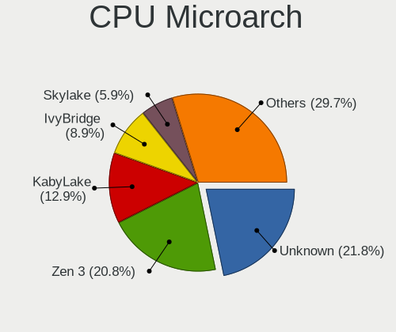
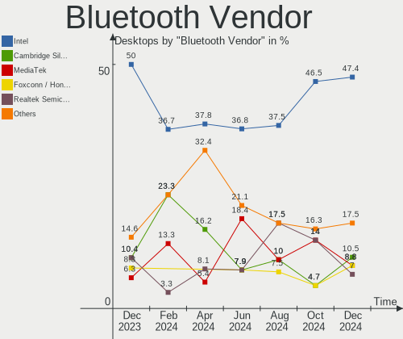
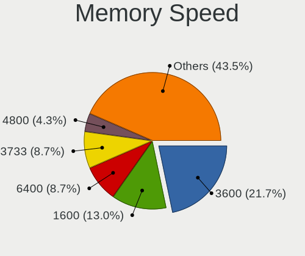

Pop!_OS Hardware Trends (Desktops)
----------------------------------

A project to identify most popular hardware characteristics and track their change
over time based on data collected by Pop!_OS users at https://Linux-Hardware.org.

Anyone can contribute to this report by the [hw-probe](https://github.com/linuxhw/hw-probe) tool:

    sudo -E hw-probe -all -upload

Full-feature report is available here: https://linux-hardware.org/?view=trends

Period: Jan, 2022.

Contents
--------

* [ System ](#system)
  - [ OS                       ](#os)
  - [ OS Family                ](#os-family)
  - [ Kernel                   ](#kernel)
  - [ Kernel Family            ](#kernel-family)
  - [ Kernel Major Ver.        ](#kernel-major-ver)
  - [ Arch                     ](#arch)
  - [ DE                       ](#de)
  - [ Display Server           ](#display-server)
  - [ Display Manager          ](#display-manager)
  - [ OS Lang                  ](#os-lang)
  - [ Boot Mode                ](#boot-mode)
  - [ Filesystem               ](#filesystem)
  - [ Part. scheme             ](#part-scheme)
  - [ Dual Boot with Linux/BSD ](#dual-boot-with-linuxbsd)
  - [ Dual Boot (Win)          ](#dual-boot-win)

* [ Board ](#board)
  - [ Vendor                   ](#vendor)
  - [ Model                    ](#model)
  - [ Model Family             ](#model-family)
  - [ MFG Year                 ](#mfg-year)
  - [ Form Factor              ](#form-factor)
  - [ Secure Boot              ](#secure-boot)
  - [ Coreboot                 ](#coreboot)
  - [ RAM Size                 ](#ram-size)
  - [ RAM Used                 ](#ram-used)
  - [ Total Drives             ](#total-drives)
  - [ Has CD-ROM               ](#has-cd-rom)
  - [ Has Ethernet             ](#has-ethernet)
  - [ Has WiFi                 ](#has-wifi)
  - [ Has Bluetooth            ](#has-bluetooth)

* [ Location ](#location)
  - [ Country                  ](#country)
  - [ City                     ](#city)

* [ Drives ](#drives)
  - [ Drive Vendor             ](#drive-vendor)
  - [ Drive Model              ](#drive-model)
  - [ HDD Vendor               ](#hdd-vendor)
  - [ SSD Vendor               ](#ssd-vendor)
  - [ Drive Kind               ](#drive-kind)
  - [ Drive Connector          ](#drive-connector)
  - [ Drive Size               ](#drive-size)
  - [ Space Total              ](#space-total)
  - [ Space Used               ](#space-used)
  - [ Malfunc. Drives          ](#malfunc-drives)
  - [ Malfunc. Drive Vendor    ](#malfunc-drive-vendor)
  - [ Malfunc. HDD Vendor      ](#malfunc-hdd-vendor)
  - [ Malfunc. Drive Kind      ](#malfunc-drive-kind)
  - [ Failed Drives            ](#failed-drives)
  - [ Failed Drive Vendor      ](#failed-drive-vendor)
  - [ Drive Status             ](#drive-status)

* [ Storage controller ](#storage-controller)
  - [ Storage Vendor           ](#storage-vendor)
  - [ Storage Model            ](#storage-model)
  - [ Storage Kind             ](#storage-kind)

* [ Processor ](#processor)
  - [ CPU Vendor               ](#cpu-vendor)
  - [ CPU Model                ](#cpu-model)
  - [ CPU Model Family         ](#cpu-model-family)
  - [ CPU Cores                ](#cpu-cores)
  - [ CPU Sockets              ](#cpu-sockets)
  - [ CPU Threads              ](#cpu-threads)
  - [ CPU Op-Modes             ](#cpu-op-modes)
  - [ CPU Microcode            ](#cpu-microcode)
  - [ CPU Microarch            ](#cpu-microarch)

* [ Graphics ](#graphics)
  - [ GPU Vendor               ](#gpu-vendor)
  - [ GPU Model                ](#gpu-model)
  - [ GPU Combo                ](#gpu-combo)
  - [ GPU Driver               ](#gpu-driver)
  - [ GPU Memory               ](#gpu-memory)

* [ Monitor ](#monitor)
  - [ Monitor Vendor           ](#monitor-vendor)
  - [ Monitor Model            ](#monitor-model)
  - [ Monitor Resolution       ](#monitor-resolution)
  - [ Monitor Diagonal         ](#monitor-diagonal)
  - [ Monitor Width            ](#monitor-width)
  - [ Aspect Ratio             ](#aspect-ratio)
  - [ Monitor Area             ](#monitor-area)
  - [ Pixel Density            ](#pixel-density)
  - [ Multiple Monitors        ](#multiple-monitors)

* [ Network ](#network)
  - [ Net Controller Vendor    ](#net-controller-vendor)
  - [ Net Controller Model     ](#net-controller-model)
  - [ Wireless Vendor          ](#wireless-vendor)
  - [ Wireless Model           ](#wireless-model)
  - [ Ethernet Vendor          ](#ethernet-vendor)
  - [ Ethernet Model           ](#ethernet-model)
  - [ Net Controller Kind      ](#net-controller-kind)
  - [ Used Controller          ](#used-controller)
  - [ NICs                     ](#nics)
  - [ IPv6                     ](#ipv6)

* [ Bluetooth ](#bluetooth)
  - [ Bluetooth Vendor         ](#bluetooth-vendor)
  - [ Bluetooth Model          ](#bluetooth-model)

* [ Sound ](#sound)
  - [ Sound Vendor             ](#sound-vendor)
  - [ Sound Model              ](#sound-model)

* [ Memory ](#memory)
  - [ Memory Vendor            ](#memory-vendor)
  - [ Memory Model             ](#memory-model)
  - [ Memory Kind              ](#memory-kind)
  - [ Memory Form Factor       ](#memory-form-factor)
  - [ Memory Size              ](#memory-size)
  - [ Memory Speed             ](#memory-speed)

* [ Printers & scanners ](#printers--scanners)
  - [ Printer Vendor           ](#printer-vendor)
  - [ Printer Model            ](#printer-model)
  - [ Scanner Vendor           ](#scanner-vendor)
  - [ Scanner Model            ](#scanner-model)

* [ Camera ](#camera)
  - [ Camera Vendor            ](#camera-vendor)
  - [ Camera Model             ](#camera-model)

* [ Security ](#security)
  - [ Fingerprint Vendor       ](#fingerprint-vendor)
  - [ Fingerprint Model        ](#fingerprint-model)
  - [ Chipcard Vendor          ](#chipcard-vendor)
  - [ Chipcard Model           ](#chipcard-model)

* [ Unsupported ](#unsupported)
  - [ Unsupported Devices      ](#unsupported-devices)
  - [ Unsupported Device Types ](#unsupported-device-types)

System
------

OS
--

Installed operating systems

| Name          | Desktops | Percent |
|---------------|----------|---------|
| Pop!_OS 21.10 | 95       | 77.87%  |
| Pop!_OS 21.04 | 13       | 10.66%  |
| Pop!_OS 20.04 | 13       | 10.66%  |
| Pop!_OS 20.10 | 1        | 0.82%   |

OS Family
---------

OS without a version

| Name    | Desktops | Percent |
|---------|----------|---------|
| Pop!_OS | 122      | 100%    |

Kernel
------

Version of the Linux kernel

| Version                  | Desktops | Percent |
|--------------------------|----------|---------|
| 5.15.11-76051511-generic | 39       | 31.97%  |
| 5.15.8-76051508-generic  | 29       | 23.77%  |
| 5.15.15-76051515-generic | 29       | 23.77%  |
| 5.15.5-76051505-generic  | 13       | 10.66%  |
| 5.13.0-7620-generic      | 4        | 3.28%   |
| 5.11.0-7633-generic      | 2        | 1.64%   |
| 5.8.0-7630-generic       | 1        | 0.82%   |
| 5.16.0-051600-lowlatency | 1        | 0.82%   |
| 5.15.15-xanmod1          | 1        | 0.82%   |
| 5.15.12-xanmod1          | 1        | 0.82%   |
| 5.13.0-7614-generic      | 1        | 0.82%   |
| 5.11.0-7620-generic      | 1        | 0.82%   |

Kernel Family
-------------

Linux kernel without a distro release

| Version | Desktops | Percent |
|---------|----------|---------|
| 5.15.11 | 39       | 31.97%  |
| 5.15.15 | 30       | 24.59%  |
| 5.15.8  | 29       | 23.77%  |
| 5.15.5  | 13       | 10.66%  |
| 5.13.0  | 5        | 4.1%    |
| 5.11.0  | 3        | 2.46%   |
| 5.8.0   | 1        | 0.82%   |
| 5.16.0  | 1        | 0.82%   |
| 5.15.12 | 1        | 0.82%   |

Kernel Major Ver.
-----------------

Linux kernel major version

| Version | Desktops | Percent |
|---------|----------|---------|
| 5.15    | 112      | 91.8%   |
| 5.13    | 5        | 4.1%    |
| 5.11    | 3        | 2.46%   |
| 5.8     | 1        | 0.82%   |
| 5.16    | 1        | 0.82%   |

Arch
----

OS architecture (x86_64, i586, etc.)

| Name   | Desktops | Percent |
|--------|----------|---------|
| x86_64 | 122      | 100%    |

DE
--

Desktop Environment

| Name  | Desktops | Percent |
|-------|----------|---------|
| GNOME | 120      | 98.36%  |
| MATE  | 1        | 0.82%   |
| KDE5  | 1        | 0.82%   |

Display Server
--------------

X11 or Wayland

| Name    | Desktops | Percent |
|---------|----------|---------|
| X11     | 120      | 98.36%  |
| Wayland | 2        | 1.64%   |

Display Manager
---------------

SDDM, LightDM, etc.

| Name    | Desktops | Percent |
|---------|----------|---------|
| Unknown | 107      | 87.7%   |
| GDM     | 15       | 12.3%   |

OS Lang
-------

Language

| Lang  | Desktops | Percent |
|-------|----------|---------|
| en_US | 72       | 59.02%  |
| en_GB | 9        | 7.38%   |
| pt_BR | 7        | 5.74%   |
| en_AU | 6        | 4.92%   |
| en_CA | 4        | 3.28%   |
| C     | 4        | 3.28%   |
| nl_NL | 3        | 2.46%   |
| ru_RU | 2        | 1.64%   |
| fr_FR | 2        | 1.64%   |
| de_DE | 2        | 1.64%   |
| sv_SE | 1        | 0.82%   |
| ro_RO | 1        | 0.82%   |
| pt_PT | 1        | 0.82%   |
| nl_BE | 1        | 0.82%   |
| nb_NO | 1        | 0.82%   |
| fr_CA | 1        | 0.82%   |
| es_MX | 1        | 0.82%   |
| es_ES | 1        | 0.82%   |
| es_CL | 1        | 0.82%   |
| en_IN | 1        | 0.82%   |
| en_IL | 1        | 0.82%   |

Boot Mode
---------

EFI or BIOS

| Mode | Desktops | Percent |
|------|----------|---------|
| BIOS | 109      | 89.34%  |
| EFI  | 13       | 10.66%  |

Filesystem
----------

Type of filesystem

| Type    | Desktops | Percent |
|---------|----------|---------|
| Ext4    | 119      | 97.54%  |
| Overlay | 2        | 1.64%   |
| Btrfs   | 1        | 0.82%   |

Part. scheme
------------

Scheme of partitioning

| Type    | Desktops | Percent |
|---------|----------|---------|
| Unknown | 107      | 87.7%   |
| GPT     | 13       | 10.66%  |
| MBR     | 2        | 1.64%   |

Dual Boot with Linux/BSD
------------------------

Hosting more than one Linux/BSD

| Dual boot | Desktops | Percent |
|-----------|----------|---------|
| No        | 118      | 96.72%  |
| Yes       | 4        | 3.28%   |

Dual Boot (Win)
---------------

Hosting Linux and Windows

| Dual boot | Desktops | Percent |
|-----------|----------|---------|
| No        | 114      | 93.44%  |
| Yes       | 8        | 6.56%   |

Board
-----

Vendor
------

Motherboard manufacturer

| Name                | Desktops | Percent |
|---------------------|----------|---------|
| ASUSTek Computer    | 38       | 31.15%  |
| Gigabyte Technology | 26       | 21.31%  |
| Dell                | 17       | 13.93%  |
| ASRock              | 11       | 9.02%   |
| MSI                 | 9        | 7.38%   |
| Hewlett-Packard     | 6        | 4.92%   |
| Lenovo              | 3        | 2.46%   |
| Pegatron            | 2        | 1.64%   |
| Intel               | 2        | 1.64%   |
| Huanan              | 2        | 1.64%   |
| Acer                | 2        | 1.64%   |
| System76            | 1        | 0.82%   |
| Biostar             | 1        | 0.82%   |
| BESSTAR Tech        | 1        | 0.82%   |
| Apple               | 1        | 0.82%   |

Model
-----

Motherboard model

| Name                                   | Desktops | Percent |
|----------------------------------------|----------|---------|
| ASUS All Series                        | 5        | 4.1%    |
| Gigabyte X470 AORUS ULTRA GAMING       | 3        | 2.46%   |
| Dell OptiPlex 9020                     | 3        | 2.46%   |
| Gigabyte AB350-Gaming 3                | 2        | 1.64%   |
| Dell XPS 8930                          | 2        | 1.64%   |
| Dell OptiPlex 7040                     | 2        | 1.64%   |
| Dell OptiPlex 3010                     | 2        | 1.64%   |
| Dell Inspiron 570                      | 2        | 1.64%   |
| ASUS TUF GAMING X570-PRO               | 2        | 1.64%   |
| ASUS TUF GAMING X570-PLUS              | 2        | 1.64%   |
| System76 Thelio                        | 1        | 0.82%   |
| Pegatron NY799AA-ABA p6243w            | 1        | 0.82%   |
| Pegatron AV321AV-ABA e9180t            | 1        | 0.82%   |
| MSI MS-7C52                            | 1        | 0.82%   |
| MSI MS-7C37                            | 1        | 0.82%   |
| MSI MS-7B89                            | 1        | 0.82%   |
| MSI MS-7B85                            | 1        | 0.82%   |
| MSI MS-7B28                            | 1        | 0.82%   |
| MSI MS-7B17                            | 1        | 0.82%   |
| MSI MS-7917                            | 1        | 0.82%   |
| MSI MS-7817                            | 1        | 0.82%   |
| MSI MS-7788                            | 1        | 0.82%   |
| Lenovo ThinkCentre M93p 10A8S00200     | 1        | 0.82%   |
| Lenovo ThinkCentre M92p 3227A84        | 1        | 0.82%   |
| Lenovo IdeaCentre 720-18ASU 90H10003US | 1        | 0.82%   |
| Intel D54250WYK H13922-304             | 1        | 0.82%   |
| Intel B75                              | 1        | 0.82%   |
| Huanan X99-F8                          | 1        | 0.82%   |
| Huanan X79 V2.47                       | 1        | 0.82%   |
| HP Z800 Workstation                    | 1        | 0.82%   |
| HP ProDesk 490 G2 MT                   | 1        | 0.82%   |
| HP Pavilion Desktop 590-p0xxx          | 1        | 0.82%   |
| HP EliteDesk 800 G1 SFF                | 1        | 0.82%   |
| HP Compaq Elite 8300 USDT              | 1        | 0.82%   |
| HP 750-409                             | 1        | 0.82%   |
| Gigabyte Z97X-Gaming 5                 | 1        | 0.82%   |
| Gigabyte Z97-D3H                       | 1        | 0.82%   |
| Gigabyte Z87X-UD5H                     | 1        | 0.82%   |
| Gigabyte Z390 UD                       | 1        | 0.82%   |
| Gigabyte Z390 I AORUS PRO WIFI         | 1        | 0.82%   |
| Gigabyte Z170X-Gaming 3                | 1        | 0.82%   |
| Gigabyte X99-UD3-CF                    | 1        | 0.82%   |
| Gigabyte X570 AORUS ULTRA              | 1        | 0.82%   |
| Gigabyte X570 AORUS ELITE              | 1        | 0.82%   |
| Gigabyte X399 DESIGNARE EX             | 1        | 0.82%   |
| Gigabyte X399 AORUS Gaming 7           | 1        | 0.82%   |
| Gigabyte GA-870A-UD3                   | 1        | 0.82%   |
| Gigabyte GA-78LMT-USB3                 | 1        | 0.82%   |
| Gigabyte F2A68HM-H                     | 1        | 0.82%   |
| Gigabyte B85M-DS3H-A                   | 1        | 0.82%   |
| Gigabyte B550 VISION D-P               | 1        | 0.82%   |
| Gigabyte B550 AORUS PRO AC             | 1        | 0.82%   |
| Gigabyte B460MDS3H                     | 1        | 0.82%   |
| Gigabyte B450 AORUS PRO                | 1        | 0.82%   |
| Gigabyte B360 AORUS GAMING 3           | 1        | 0.82%   |
| Gigabyte A320M-S2H                     | 1        | 0.82%   |
| Dell Precision T1500                   | 1        | 0.82%   |
| Dell OptiPlex 980                      | 1        | 0.82%   |
| Dell OptiPlex 9020M                    | 1        | 0.82%   |
| Dell OptiPlex 9010                     | 1        | 0.82%   |

Model Family
------------

Motherboard model prefix

| Name                   | Desktops | Percent |
|------------------------|----------|---------|
| Dell OptiPlex          | 11       | 9.02%   |
| ASUS TUF               | 7        | 5.74%   |
| ASUS PRIME             | 7        | 5.74%   |
| ASUS All               | 5        | 4.1%    |
| ASUS ROG               | 4        | 3.28%   |
| Gigabyte X470          | 3        | 2.46%   |
| Dell Inspiron          | 3        | 2.46%   |
| Lenovo ThinkCentre     | 2        | 1.64%   |
| Gigabyte Z390          | 2        | 1.64%   |
| Gigabyte X570          | 2        | 1.64%   |
| Gigabyte X399          | 2        | 1.64%   |
| Gigabyte B550          | 2        | 1.64%   |
| Gigabyte AB350-Gaming  | 2        | 1.64%   |
| Dell XPS               | 2        | 1.64%   |
| ASUS SABERTOOTH        | 2        | 1.64%   |
| ASUS P6T               | 2        | 1.64%   |
| ASUS M5A97             | 2        | 1.64%   |
| System76 Thelio        | 1        | 0.82%   |
| Pegatron NY799AA-ABA   | 1        | 0.82%   |
| Pegatron AV321AV-ABA   | 1        | 0.82%   |
| MSI MS-7C52            | 1        | 0.82%   |
| MSI MS-7C37            | 1        | 0.82%   |
| MSI MS-7B89            | 1        | 0.82%   |
| MSI MS-7B85            | 1        | 0.82%   |
| MSI MS-7B28            | 1        | 0.82%   |
| MSI MS-7B17            | 1        | 0.82%   |
| MSI MS-7917            | 1        | 0.82%   |
| MSI MS-7817            | 1        | 0.82%   |
| MSI MS-7788            | 1        | 0.82%   |
| Lenovo IdeaCentre      | 1        | 0.82%   |
| Intel D54250WYK        | 1        | 0.82%   |
| Intel B75              | 1        | 0.82%   |
| Huanan X99-F8          | 1        | 0.82%   |
| Huanan X79             | 1        | 0.82%   |
| HP Z800                | 1        | 0.82%   |
| HP ProDesk             | 1        | 0.82%   |
| HP Pavilion            | 1        | 0.82%   |
| HP EliteDesk           | 1        | 0.82%   |
| HP Compaq              | 1        | 0.82%   |
| HP 750-409             | 1        | 0.82%   |
| Gigabyte Z97X-Gaming   | 1        | 0.82%   |
| Gigabyte Z97-D3H       | 1        | 0.82%   |
| Gigabyte Z87X-UD5H     | 1        | 0.82%   |
| Gigabyte Z170X-Gaming  | 1        | 0.82%   |
| Gigabyte X99-UD3-CF    | 1        | 0.82%   |
| Gigabyte GA-870A-UD3   | 1        | 0.82%   |
| Gigabyte GA-78LMT-USB3 | 1        | 0.82%   |
| Gigabyte F2A68HM-H     | 1        | 0.82%   |
| Gigabyte B85M-DS3H-A   | 1        | 0.82%   |
| Gigabyte B460MDS3H     | 1        | 0.82%   |
| Gigabyte B450          | 1        | 0.82%   |
| Gigabyte B360          | 1        | 0.82%   |
| Gigabyte A320M-S2H     | 1        | 0.82%   |
| Dell Precision         | 1        | 0.82%   |
| Biostar Hi-Fi          | 1        | 0.82%   |
| BESSTAR Tech DMAF5     | 1        | 0.82%   |
| ASUS X750LB            | 1        | 0.82%   |
| ASUS Rampage           | 1        | 0.82%   |
| ASUS ProArt            | 1        | 0.82%   |
| ASUS P8Z77-V           | 1        | 0.82%   |

MFG Year
--------

Motherboard manufacture year

| Year | Desktops | Percent |
|------|----------|---------|
| 2018 | 20       | 16.39%  |
| 2020 | 14       | 11.48%  |
| 2019 | 12       | 9.84%   |
| 2014 | 12       | 9.84%   |
| 2015 | 11       | 9.02%   |
| 2017 | 9        | 7.38%   |
| 2021 | 8        | 6.56%   |
| 2013 | 8        | 6.56%   |
| 2012 | 8        | 6.56%   |
| 2010 | 7        | 5.74%   |
| 2009 | 6        | 4.92%   |
| 2011 | 4        | 3.28%   |
| 2008 | 2        | 1.64%   |
| 2016 | 1        | 0.82%   |

Form Factor
-----------

Physical design of the computer

| Name    | Desktops | Percent |
|---------|----------|---------|
| Desktop | 122      | 100%    |

Secure Boot
-----------

Enabled or disabled

| State    | Desktops | Percent |
|----------|----------|---------|
| Disabled | 122      | 100%    |

Coreboot
--------

Have coreboot on board

| Used | Desktops | Percent |
|------|----------|---------|
| No   | 122      | 100%    |

RAM Size
--------

Total RAM memory

| Size in GB  | Desktops | Percent |
|-------------|----------|---------|
| 16.01-24.0  | 43       | 35.25%  |
| 32.01-64.0  | 21       | 17.21%  |
| 4.01-8.0    | 20       | 16.39%  |
| 8.01-16.0   | 20       | 16.39%  |
| 64.01-256.0 | 9        | 7.38%   |
| 24.01-32.0  | 6        | 4.92%   |
| 3.01-4.0    | 3        | 2.46%   |

RAM Used
--------

Used RAM memory

| Used GB    | Desktops | Percent |
|------------|----------|---------|
| 1.01-2.0   | 37       | 30.33%  |
| 2.01-3.0   | 36       | 29.51%  |
| 4.01-8.0   | 21       | 17.21%  |
| 3.01-4.0   | 21       | 17.21%  |
| 8.01-16.0  | 6        | 4.92%   |
| 32.01-64.0 | 1        | 0.82%   |

Total Drives
------------

Number of drives on board

| Drives | Desktops | Percent |
|--------|----------|---------|
| 1      | 43       | 35.25%  |
| 2      | 30       | 24.59%  |
| 3      | 25       | 20.49%  |
| 4      | 13       | 10.66%  |
| 5      | 6        | 4.92%   |
| 6      | 4        | 3.28%   |
| 20     | 1        | 0.82%   |

Has CD-ROM
----------

Has CD-ROM on board

| Presented | Desktops | Percent |
|-----------|----------|---------|
| No        | 74       | 60.66%  |
| Yes       | 48       | 39.34%  |

Has Ethernet
------------

Has Ethernet on board

| Presented | Desktops | Percent |
|-----------|----------|---------|
| Yes       | 121      | 99.18%  |
| No        | 1        | 0.82%   |

Has WiFi
--------

Has WiFi module

| Presented | Desktops | Percent |
|-----------|----------|---------|
| Yes       | 69       | 56.56%  |
| No        | 53       | 43.44%  |

Has Bluetooth
-------------

Has Bluetooth module

| Presented | Desktops | Percent |
|-----------|----------|---------|
| No        | 71       | 58.2%   |
| Yes       | 51       | 41.8%   |

Location
--------

Country
-------

Geographic location (country)

| Country      | Desktops | Percent |
|--------------|----------|---------|
| USA          | 50       | 40.98%  |
| Brazil       | 10       | 8.2%    |
| Canada       | 8        | 6.56%   |
| Australia    | 8        | 6.56%   |
| Netherlands  | 7        | 5.74%   |
| UK           | 4        | 3.28%   |
| Germany      | 4        | 3.28%   |
| Norway       | 3        | 2.46%   |
| Russia       | 2        | 1.64%   |
| Mexico       | 2        | 1.64%   |
| Hungary      | 2        | 1.64%   |
| Zambia       | 1        | 0.82%   |
| Switzerland  | 1        | 0.82%   |
| Sweden       | 1        | 0.82%   |
| Spain        | 1        | 0.82%   |
| South Africa | 1        | 0.82%   |
| Serbia       | 1        | 0.82%   |
| Portugal     | 1        | 0.82%   |
| Poland       | 1        | 0.82%   |
| New Zealand  | 1        | 0.82%   |
| Moldova      | 1        | 0.82%   |
| Italy        | 1        | 0.82%   |
| Israel       | 1        | 0.82%   |
| Ireland      | 1        | 0.82%   |
| India        | 1        | 0.82%   |
| France       | 1        | 0.82%   |
| Estonia      | 1        | 0.82%   |
| El Salvador  | 1        | 0.82%   |
| Croatia      | 1        | 0.82%   |
| Chile        | 1        | 0.82%   |
| Belgium      | 1        | 0.82%   |
| Bahamas      | 1        | 0.82%   |
| Algeria      | 1        | 0.82%   |

City
----

Geographic location (city)

| City              | Desktops | Percent |
|-------------------|----------|---------|
| Sydney            | 4        | 3.28%   |
| Browning          | 3        | 2.46%   |
| Melbourne         | 2        | 1.64%   |
| Lincoln           | 2        | 1.64%   |
| Jacksonville      | 2        | 1.64%   |
| Budapest          | 2        | 1.64%   |
| Zwijndrecht       | 1        | 0.82%   |
| Zapopan           | 1        | 0.82%   |
| Wasilla           | 1        | 0.82%   |
| Victoria          | 1        | 0.82%   |
| Ume??             | 1        | 0.82%   |
| Tuxtla Guti?©rrez | 1        | 0.82%   |
| Turin             | 1        | 0.82%   |
| Tiraspol          | 1        | 0.82%   |
| The Villages      | 1        | 0.82%   |
| The Colony        | 1        | 0.82%   |
| Telford           | 1        | 0.82%   |
| Tczew             | 1        | 0.82%   |
| Tallinn           | 1        | 0.82%   |
| St Petersburg     | 1        | 0.82%   |
| Springfield       | 1        | 0.82%   |
| Split             | 1        | 0.82%   |
| Spartanburg       | 1        | 0.82%   |
| Simi Valley       | 1        | 0.82%   |
| Show Low          | 1        | 0.82%   |
| Sherwood Park     | 1        | 0.82%   |
| Sherbrooke        | 1        | 0.82%   |
| Seuzach Dorf      | 1        | 0.82%   |
| Seattle           | 1        | 0.82%   |
| S??o Paulo        | 1        | 0.82%   |
| Santiago          | 1        | 0.82%   |
| Sandy Bay         | 1        | 0.82%   |
| San Salvador      | 1        | 0.82%   |
| Salem             | 1        | 0.82%   |
| Roswell           | 1        | 0.82%   |
| Rolla             | 1        | 0.82%   |
| Ringgold          | 1        | 0.82%   |
| Ridderkerk        | 1        | 0.82%   |
| Recife            | 1        | 0.82%   |
| Porto Alegre      | 1        | 0.82%   |
| Portland          | 1        | 0.82%   |
| Ponca City        | 1        | 0.82%   |
| Phoenix           | 1        | 0.82%   |
| Palmerston North  | 1        | 0.82%   |
| Ottawa            | 1        | 0.82%   |
| Oslo              | 1        | 0.82%   |
| Orlando           | 1        | 0.82%   |
| Ondina            | 1        | 0.82%   |
| Novi Sad          | 1        | 0.82%   |
| Norwich           | 1        | 0.82%   |
| Norwalk           | 1        | 0.82%   |
| Nanaimo           | 1        | 0.82%   |
| Mumbai            | 1        | 0.82%   |
| Mostaganem        | 1        | 0.82%   |
| Moscow            | 1        | 0.82%   |
| Montreal          | 1        | 0.82%   |
| Mission           | 1        | 0.82%   |
| Mirandopolis      | 1        | 0.82%   |
| Milton            | 1        | 0.82%   |
| Medford           | 1        | 0.82%   |

Drives
------

Drive Vendor
------------

Hard drive vendors

| Vendor                       | Desktops | Drives | Percent |
|------------------------------|----------|--------|---------|
| Samsung Electronics          | 52       | 75     | 20.97%  |
| Seagate                      | 43       | 57     | 17.34%  |
| WDC                          | 38       | 47     | 15.32%  |
| Kingston                     | 15       | 16     | 6.05%   |
| SanDisk                      | 14       | 16     | 5.65%   |
| Toshiba                      | 11       | 11     | 4.44%   |
| Hitachi                      | 9        | 11     | 3.63%   |
| Intel                        | 6        | 6      | 2.42%   |
| Crucial                      | 6        | 7      | 2.42%   |
| A-DATA Technology            | 6        | 6      | 2.42%   |
| Silicon Motion               | 4        | 4      | 1.61%   |
| Phison                       | 3        | 4      | 1.21%   |
| MAXTOR                       | 3        | 4      | 1.21%   |
| China                        | 3        | 5      | 1.21%   |
| Unknown                      | 2        | 4      | 0.81%   |
| SPCC                         | 2        | 2      | 0.81%   |
| SK Hynix                     | 2        | 2      | 0.81%   |
| PNY                          | 2        | 2      | 0.81%   |
| Micron/Crucial Technology    | 2        | 2      | 0.81%   |
| Micron Technology            | 2        | 2      | 0.81%   |
| KingSpec                     | 2        | 2      | 0.81%   |
| HGST                         | 2        | 5      | 0.81%   |
| Corsair                      | 2        | 2      | 0.81%   |
| XPG                          | 1        | 1      | 0.4%    |
| WDS100T1                     | 1        | 1      | 0.4%    |
| Shenzhen Longsys Electronics | 1        | 1      | 0.4%    |
| SATAFIRM                     | 1        | 1      | 0.4%    |
| Sasmung                      | 1        | 1      | 0.4%    |
| Realtek Semiconductor        | 1        | 1      | 0.4%    |
| Phison Electronics           | 1        | 1      | 0.4%    |
| OCZ                          | 1        | 1      | 0.4%    |
| Netac                        | 1        | 1      | 0.4%    |
| Mushkin                      | 1        | 1      | 0.4%    |
| LaCie                        | 1        | 1      | 0.4%    |
| KingFast                     | 1        | 1      | 0.4%    |
| Intenso                      | 1        | 1      | 0.4%    |
| Glyph                        | 1        | 1      | 0.4%    |
| Fujitsu                      | 1        | 1      | 0.4%    |
| Apacer                       | 1        | 1      | 0.4%    |
| Unknown                      | 1        | 1      | 0.4%    |

Drive Model
-----------

Hard drive models

| Model                            | Desktops | Percent |
|----------------------------------|----------|---------|
| Samsung NVMe SSD Drive 1TB       | 11       | 3.81%   |
| Seagate ST500DM002-1BD142 500GB  | 6        | 2.08%   |
| Seagate ST2000DM008-2FR102 2TB   | 6        | 2.08%   |
| Sandisk NVMe SSD Drive 1TB       | 5        | 1.73%   |
| Samsung NVMe SSD Drive 500GB     | 5        | 1.73%   |
| Kingston SA400S37480G 480GB SSD  | 5        | 1.73%   |
| Kingston SA400S37240G 240GB SSD  | 4        | 1.38%   |
| Toshiba DT01ACA200 2TB           | 3        | 1.04%   |
| Toshiba DT01ACA100 1TB           | 3        | 1.04%   |
| Seagate ST4000DM004-2CV104 4TB   | 3        | 1.04%   |
| Seagate ST1000DM003-1CH162 1TB   | 3        | 1.04%   |
| Sandisk NVMe SSD Drive 500GB     | 3        | 1.04%   |
| Samsung SSD 870 QVO 1TB          | 3        | 1.04%   |
| Samsung SSD 860 EVO 1TB          | 3        | 1.04%   |
| Samsung NVMe SSD Drive 2TB       | 3        | 1.04%   |
| Samsung NVMe SSD Drive 1024GB    | 3        | 1.04%   |
| WDC WD10EZEX-08WN4A0 1TB         | 2        | 0.69%   |
| WDC WD10EZEX-00WN4A0 1TB         | 2        | 0.69%   |
| WDC WD1002FAEX-00Z3A0 1TB        | 2        | 0.69%   |
| Seagate ST500LM000-1EJ162 500GB  | 2        | 0.69%   |
| Seagate ST2000DM006-2DM164 2TB   | 2        | 0.69%   |
| Samsung SSD 870 EVO 1TB          | 2        | 0.69%   |
| Samsung SSD 860 EVO 500GB        | 2        | 0.69%   |
| Samsung SSD 860 EVO 250GB        | 2        | 0.69%   |
| Samsung SSD 850 PRO 128GB        | 2        | 0.69%   |
| Samsung SSD 850 EVO 500GB        | 2        | 0.69%   |
| Samsung SSD 850 EVO 250GB        | 2        | 0.69%   |
| Samsung SSD 840 PRO Series 128GB | 2        | 0.69%   |
| Samsung NVMe SSD Drive 250GB     | 2        | 0.69%   |
| Phison NVMe SSD Drive 1TB        | 2        | 0.69%   |
| Micron NVMe SSD Drive 512GB      | 2        | 0.69%   |
| Crucial CT480BX500SSD1 480GB     | 2        | 0.69%   |
| Crucial CT1000MX500SSD1 1TB      | 2        | 0.69%   |
| XPG NVMe SSD Drive 512GB         | 1        | 0.35%   |
| WDS100T1 X0E-00AFY0 1TB          | 1        | 0.35%   |
| WDC WDS240G2G0B-00EPW0 240GB SSD | 1        | 0.35%   |
| WDC WDS240G2G0A-00JH30 240GB SSD | 1        | 0.35%   |
| WDC WDS120G2G0A-00JH30 120GB SSD | 1        | 0.35%   |
| WDC WDBNCE5000PNC 500GB SSD      | 1        | 0.35%   |
| WDC WD800JD-75MSA3 80GB          | 1        | 0.35%   |
| WDC WD7500BPKT-75PK4T0 752GB     | 1        | 0.35%   |
| WDC WD6400AAKS-22A7B2 640GB      | 1        | 0.35%   |
| WDC WD5000KS-00MNB0 500GB        | 1        | 0.35%   |
| WDC WD5000BEVT-22ZAT0 500GB      | 1        | 0.35%   |
| WDC WD5000AVVS-63M8B0 500GB      | 1        | 0.35%   |
| WDC WD5000AAKX-75U6AA0 500GB     | 1        | 0.35%   |
| WDC WD5000AAKX-001CA0 500GB      | 1        | 0.35%   |
| WDC WD5000AAKS-22YGA0 500GB      | 1        | 0.35%   |
| WDC WD5000AAJS-00A8B0 500GB      | 1        | 0.35%   |
| WDC WD50 00LPCX-00VHAT0 500GB    | 1        | 0.35%   |
| WDC WD40EZRZ-00GXCB0 4TB         | 1        | 0.35%   |
| WDC WD4005FZBX-00K5WB0 4TB       | 1        | 0.35%   |
| WDC WD3200BEVT-22ZCT0 320GB      | 1        | 0.35%   |
| WDC WD3200AAKS-00UU3A0 320GB     | 1        | 0.35%   |
| WDC WD30EZRZ-00Z5HB0 3TB         | 1        | 0.35%   |
| WDC WD2500BEVT-60ZCT1 250GB      | 1        | 0.35%   |
| WDC WD2500AAJS-00L7A0 250GB      | 1        | 0.35%   |
| WDC WD20EZRZ-00Z5HB0 2TB         | 1        | 0.35%   |
| WDC WD20EZBX-00AYRA0 2TB         | 1        | 0.35%   |
| WDC WD2003FZEX-00Z4SA0 2TB       | 1        | 0.35%   |

HDD Vendor
----------

Hard disk drive vendors

| Vendor              | Desktops | Drives | Percent |
|---------------------|----------|--------|---------|
| Seagate             | 40       | 51     | 38.83%  |
| WDC                 | 34       | 42     | 33.01%  |
| Toshiba             | 9        | 9      | 8.74%   |
| Hitachi             | 9        | 11     | 8.74%   |
| MAXTOR              | 3        | 4      | 2.91%   |
| Samsung Electronics | 2        | 3      | 1.94%   |
| HGST                | 2        | 5      | 1.94%   |
| Unknown             | 1        | 3      | 0.97%   |
| SATAFIRM            | 1        | 1      | 0.97%   |
| Glyph               | 1        | 1      | 0.97%   |
| Fujitsu             | 1        | 1      | 0.97%   |

SSD Vendor
----------

Solid state drive vendors

| Vendor              | Desktops | Drives | Percent |
|---------------------|----------|--------|---------|
| Samsung Electronics | 31       | 38     | 37.35%  |
| Kingston            | 11       | 11     | 13.25%  |
| A-DATA Technology   | 6        | 6      | 7.23%   |
| SanDisk             | 5        | 6      | 6.02%   |
| Crucial             | 5        | 6      | 6.02%   |
| WDC                 | 4        | 4      | 4.82%   |
| Intel               | 3        | 3      | 3.61%   |
| China               | 3        | 5      | 3.61%   |
| Toshiba             | 2        | 2      | 2.41%   |
| SPCC                | 2        | 2      | 2.41%   |
| PNY                 | 2        | 2      | 2.41%   |
| KingSpec            | 2        | 2      | 2.41%   |
| SK Hynix            | 1        | 1      | 1.2%    |
| Seagate             | 1        | 1      | 1.2%    |
| Sasmung             | 1        | 1      | 1.2%    |
| OCZ                 | 1        | 1      | 1.2%    |
| Netac               | 1        | 1      | 1.2%    |
| Corsair             | 1        | 1      | 1.2%    |
| Apacer              | 1        | 1      | 1.2%    |

Drive Kind
----------

HDD or SSD

| Kind    | Desktops | Drives | Percent |
|---------|----------|--------|---------|
| HDD     | 79       | 131    | 38.16%  |
| SSD     | 69       | 94     | 33.33%  |
| NVMe    | 51       | 72     | 24.64%  |
| Unknown | 8        | 12     | 3.86%   |

Drive Connector
---------------

SATA, SAS, NVMe, etc.

| Type | Desktops | Drives | Percent |
|------|----------|--------|---------|
| SATA | 108      | 212    | 63.16%  |
| NVMe | 51       | 72     | 29.82%  |
| SAS  | 12       | 25     | 7.02%   |

Drive Size
----------

Size of hard drive

| Size in TB | Desktops | Drives | Percent |
|------------|----------|--------|---------|
| 0.01-0.5   | 74       | 117    | 46.25%  |
| 0.51-1.0   | 50       | 63     | 31.25%  |
| 1.01-2.0   | 24       | 26     | 15%     |
| 3.01-4.0   | 5        | 7      | 3.13%   |
| 4.01-10.0  | 4        | 8      | 2.5%    |
| 2.01-3.0   | 3        | 4      | 1.88%   |

Space Total
-----------

Amount of disk space available on the file system

| Size in GB     | Desktops | Percent |
|----------------|----------|---------|
| 101-250        | 29       | 23.77%  |
| 501-1000       | 26       | 21.31%  |
| 251-500        | 21       | 17.21%  |
| 1001-2000      | 18       | 14.75%  |
| More than 3000 | 12       | 9.84%   |
| 2001-3000      | 7        | 5.74%   |
| 1-20           | 3        | 2.46%   |
| 51-100         | 3        | 2.46%   |
| 21-50          | 2        | 1.64%   |
| Unknown        | 1        | 0.82%   |

Space Used
----------

Amount of used disk space

| Used GB        | Desktops | Percent |
|----------------|----------|---------|
| 1-20           | 36       | 29.51%  |
| 21-50          | 22       | 18.03%  |
| 101-250        | 21       | 17.21%  |
| 251-500        | 12       | 9.84%   |
| 501-1000       | 9        | 7.38%   |
| 51-100         | 9        | 7.38%   |
| 1001-2000      | 8        | 6.56%   |
| More than 3000 | 2        | 1.64%   |
| 2001-3000      | 2        | 1.64%   |
| Unknown        | 1        | 0.82%   |

Malfunc. Drives
---------------

Drive models with a malfunction

| Model                                 | Desktops | Drives | Percent |
|---------------------------------------|----------|--------|---------|
| WDC WD10EZEX-00WN4A0 1TB              | 1        | 1      | 25%     |
| Seagate ST500LM012 HN-M500MBB 500GB   | 1        | 1      | 25%     |
| Seagate ST500DM002-1BD142 500GB       | 1        | 1      | 25%     |
| Samsung Electronics SSD 840 EVO 250GB | 1        | 1      | 25%     |

Malfunc. Drive Vendor
---------------------

Vendors of faulty drives

| Vendor              | Desktops | Drives | Percent |
|---------------------|----------|--------|---------|
| Seagate             | 2        | 2      | 50%     |
| WDC                 | 1        | 1      | 25%     |
| Samsung Electronics | 1        | 1      | 25%     |

Malfunc. HDD Vendor
-------------------

Vendors of faulty HDD drives

| Vendor  | Desktops | Drives | Percent |
|---------|----------|--------|---------|
| Seagate | 2        | 2      | 66.67%  |
| WDC     | 1        | 1      | 33.33%  |

Malfunc. Drive Kind
-------------------

Kinds of faulty drives

| Kind | Desktops | Drives | Percent |
|------|----------|--------|---------|
| HDD  | 2        | 3      | 66.67%  |
| SSD  | 1        | 1      | 33.33%  |

Failed Drives
-------------

Failed drive models

Zero info for selected period =(

Failed Drive Vendor
-------------------

Failed drive vendors

Zero info for selected period =(

Drive Status
------------

Number of failed and malfunc. drives

| Status   | Desktops | Drives | Percent |
|----------|----------|--------|---------|
| Detected | 109      | 272    | 86.51%  |
| Works    | 14       | 33     | 11.11%  |
| Malfunc  | 3        | 4      | 2.38%   |

Storage controller
------------------

Storage Vendor
--------------

Storage controller vendors

| Vendor                       | Desktops | Percent |
|------------------------------|----------|---------|
| Intel                        | 72       | 34.95%  |
| AMD                          | 50       | 24.27%  |
| Samsung Electronics          | 29       | 14.08%  |
| Sandisk                      | 9        | 4.37%   |
| Marvell Technology Group     | 6        | 2.91%   |
| ASMedia Technology           | 6        | 2.91%   |
| Phison Electronics           | 5        | 2.43%   |
| Silicon Motion               | 4        | 1.94%   |
| Kingston Technology Company  | 4        | 1.94%   |
| JMicron Technology           | 4        | 1.94%   |
| Nvidia                       | 3        | 1.46%   |
| Micron/Crucial Technology    | 3        | 1.46%   |
| Micron Technology            | 2        | 0.97%   |
| Adaptec                      | 2        | 0.97%   |
| SK Hynix                     | 1        | 0.49%   |
| Silicon Image                | 1        | 0.49%   |
| Shenzhen Longsys Electronics | 1        | 0.49%   |
| Realtek Semiconductor        | 1        | 0.49%   |
| LSI Logic / Symbios Logic    | 1        | 0.49%   |
| Broadcom / LSI               | 1        | 0.49%   |
| ADATA Technology             | 1        | 0.49%   |

Storage Model
-------------

Storage controller models

| Model                                                                                   | Desktops | Percent |
|-----------------------------------------------------------------------------------------|----------|---------|
| AMD FCH SATA Controller [AHCI mode]                                                     | 31       | 12.97%  |
| Samsung NVMe SSD Controller SM981/PM981/PM983                                           | 16       | 6.69%   |
| Intel 8 Series/C220 Series Chipset Family 6-port SATA Controller 1 [AHCI mode]          | 10       | 4.18%   |
| Intel SATA Controller [RAID mode]                                                       | 8        | 3.35%   |
| Intel Cannon Lake PCH SATA AHCI Controller                                              | 8        | 3.35%   |
| AMD 400 Series Chipset SATA Controller                                                  | 8        | 3.35%   |
| AMD Starship/Matisse Chipset SATA Controller [AHCI mode]                                | 7        | 2.93%   |
| Intel 9 Series Chipset Family SATA Controller [AHCI Mode]                               | 6        | 2.51%   |
| ASMedia ASM1062 Serial ATA Controller                                                   | 6        | 2.51%   |
| AMD SB7x0/SB8x0/SB9x0 SATA Controller [AHCI mode]                                       | 6        | 2.51%   |
| AMD FCH SATA Controller D                                                               | 6        | 2.51%   |
| Samsung NVMe SSD Controller PM9A1/PM9A3/980PRO                                          | 5        | 2.09%   |
| Intel 7 Series/C210 Series Chipset Family 6-port SATA Controller [AHCI mode]            | 5        | 2.09%   |
| Intel 6 Series/C200 Series Chipset Family 6 port Desktop SATA AHCI Controller           | 5        | 2.09%   |
| Silicon Motion SM2263EN/SM2263XT SSD Controller                                         | 4        | 1.67%   |
| Sandisk WD PC SN810 / Black SN850 NVMe SSD                                              | 4        | 1.67%   |
| Samsung NVMe SSD Controller SM961/PM961/SM963                                           | 4        | 1.67%   |
| Intel 82801JI (ICH10 Family) SATA AHCI Controller                                       | 4        | 1.67%   |
| AMD 300 Series Chipset SATA Controller                                                  | 4        | 1.67%   |
| Sandisk WD Blue SN550 NVMe SSD                                                          | 3        | 1.26%   |
| Samsung NVMe SSD Controller 980                                                         | 3        | 1.26%   |
| Micron/Crucial NVMe Controller                                                          | 3        | 1.26%   |
| Intel Q170/Q150/B150/H170/H110/Z170/CM236 Chipset SATA Controller [AHCI Mode]           | 3        | 1.26%   |
| Sandisk WD Black SN750 / PC SN730 NVMe SSD                                              | 2        | 0.84%   |
| Phison E16 PCIe4 NVMe Controller                                                        | 2        | 0.84%   |
| Phison E12 NVMe Controller                                                              | 2        | 0.84%   |
| Nvidia MCP61 SATA Controller                                                            | 2        | 0.84%   |
| Micron Non-Volatile memory controller                                                   | 2        | 0.84%   |
| Marvell Group 88SE6440 SAS/SATA PCIe controller                                         | 2        | 0.84%   |
| Kingston Company A2000 NVMe SSD                                                         | 2        | 0.84%   |
| JMicron JMB363 SATA/IDE Controller                                                      | 2        | 0.84%   |
| JMicron JMB362 SATA Controller                                                          | 2        | 0.84%   |
| Intel NVMe Datacenter SSD [Optane]                                                      | 2        | 0.84%   |
| Intel Comet Lake SATA AHCI Controller                                                   | 2        | 0.84%   |
| Intel C610/X99 series chipset sSATA Controller [AHCI mode]                              | 2        | 0.84%   |
| Intel C610/X99 series chipset 6-Port SATA Controller [AHCI mode]                        | 2        | 0.84%   |
| Intel Alder Lake-S PCH SATA Controller [AHCI Mode]                                      | 2        | 0.84%   |
| Intel 8 Series SATA Controller 1 [AHCI mode]                                            | 2        | 0.84%   |
| Intel 6 Series/C200 Series Chipset Family Desktop SATA Controller (IDE mode, ports 4-5) | 2        | 0.84%   |
| Intel 6 Series/C200 Series Chipset Family Desktop SATA Controller (IDE mode, ports 0-3) | 2        | 0.84%   |
| Intel 500 Series Chipset Family SATA AHCI Controller                                    | 2        | 0.84%   |
| Intel 5 Series/3400 Series Chipset 6 port SATA AHCI Controller                          | 2        | 0.84%   |
| AMD SB7x0/SB8x0/SB9x0 SATA Controller [IDE mode]                                        | 2        | 0.84%   |
| AMD SB7x0/SB8x0/SB9x0 IDE Controller                                                    | 2        | 0.84%   |
| SK Hynix PE8000 Series NVMe Solid State Drive                                           | 1        | 0.42%   |
| Silicon Image SiI 3132 Serial ATA Raid II Controller                                    | 1        | 0.42%   |
| Shenzhen Longsys Electronics Non-Volatile memory controller                             | 1        | 0.42%   |
| Sandisk WD Black 2018/SN750 / PC SN720 NVMe SSD                                         | 1        | 0.42%   |
| Samsung NVMe SSD Controller SM951/PM951                                                 | 1        | 0.42%   |
| Realtek Realtek Non-Volatile memory controller                                          | 1        | 0.42%   |
| Phison E18 PCIe4 NVMe Controller                                                        | 1        | 0.42%   |
| Nvidia MCP78S [GeForce 8200] IDE                                                        | 1        | 0.42%   |
| Nvidia MCP78S [GeForce 8200] AHCI Controller                                            | 1        | 0.42%   |
| Marvell Group 88SE9230 PCIe 2.0 x2 4-port SATA 6 Gb/s RAID Controller                   | 1        | 0.42%   |
| Marvell Group 88SE9215 PCIe 2.0 x1 4-port SATA 6 Gb/s Controller                        | 1        | 0.42%   |
| Marvell Group 88SE9182 PCIe 2.0 x2 2-port SATA 6 Gb/s Controller                        | 1        | 0.42%   |
| Marvell Group 88SE6111/6121 SATA II / PATA Controller                                   | 1        | 0.42%   |
| Marvell Group 88SE6101/6102 single-port PATA133 interface                               | 1        | 0.42%   |
| LSI Logic / Symbios Logic SAS1068E PCI-Express Fusion-MPT SAS                           | 1        | 0.42%   |
| Kingston Company U-SNS8154P3 NVMe SSD                                                   | 1        | 0.42%   |

Storage Kind
------------

Kind of storage controller (IDE, SATA, NVMe, SAS, ...)

| Kind | Desktops | Percent |
|------|----------|---------|
| SATA | 108      | 57.14%  |
| NVMe | 51       | 26.98%  |
| IDE  | 14       | 7.41%   |
| RAID | 13       | 6.88%   |
| SCSI | 2        | 1.06%   |
| SAS  | 1        | 0.53%   |

Processor
---------

CPU Vendor
----------

Processor vendors

| Vendor | Desktops | Percent |
|--------|----------|---------|
| Intel  | 69       | 56.56%  |
| AMD    | 53       | 43.44%  |

CPU Model
---------

Processor models

| Model                                       | Desktops | Percent |
|---------------------------------------------|----------|---------|
| AMD Ryzen 5 3600 6-Core Processor           | 6        | 4.92%   |
| Intel Core i7-4790 CPU @ 3.60GHz            | 4        | 3.28%   |
| Intel Core i7-8700 CPU @ 3.20GHz            | 3        | 2.46%   |
| Intel Core i5-4590 CPU @ 3.30GHz            | 3        | 2.46%   |
| AMD Ryzen 5 5600X 6-Core Processor          | 3        | 2.46%   |
| AMD FX-8350 Eight-Core Processor            | 3        | 2.46%   |
| Intel Core i7-4790K CPU @ 4.00GHz           | 2        | 1.64%   |
| Intel Core i5-2500K CPU @ 3.30GHz           | 2        | 1.64%   |
| Intel Core i5-10400 CPU @ 2.90GHz           | 2        | 1.64%   |
| AMD Ryzen 9 5950X 16-Core Processor         | 2        | 1.64%   |
| AMD Ryzen 9 3900X 12-Core Processor         | 2        | 1.64%   |
| AMD Ryzen 7 5800X 8-Core Processor          | 2        | 1.64%   |
| AMD Ryzen 7 5700G with Radeon Graphics      | 2        | 1.64%   |
| AMD Ryzen 7 3700X 8-Core Processor          | 2        | 1.64%   |
| AMD Ryzen 7 2700X Eight-Core Processor      | 2        | 1.64%   |
| AMD Ryzen 5 1600 Six-Core Processor         | 2        | 1.64%   |
| AMD Ryzen 3 3200G with Radeon Vega Graphics | 2        | 1.64%   |
| AMD FX-6350 Six-Core Processor              | 2        | 1.64%   |
| AMD Athlon II X4 630 Processor              | 2        | 1.64%   |
| AMD Athlon 3000G with Radeon Vega Graphics  | 2        | 1.64%   |
| Intel Xeon CPU X5670 @ 2.93GHz              | 1        | 0.82%   |
| Intel Xeon CPU X5650 @ 2.67GHz              | 1        | 0.82%   |
| Intel Xeon CPU W3520 @ 2.67GHz              | 1        | 0.82%   |
| Intel Xeon CPU E5-2689 0 @ 2.60GHz          | 1        | 0.82%   |
| Intel Xeon CPU E5-2678 v3 @ 2.50GHz         | 1        | 0.82%   |
| Intel Xeon CPU E3-1241 v3 @ 3.50GHz         | 1        | 0.82%   |
| Intel Pentium CPU G2030 @ 3.00GHz           | 1        | 0.82%   |
| Intel Genuine CPU 0000 @ 2.70GHz            | 1        | 0.82%   |
| Intel Core i9-9900K CPU @ 3.60GHz           | 1        | 0.82%   |
| Intel Core i9-9900 CPU @ 3.10GHz            | 1        | 0.82%   |
| Intel Core i7-9700K CPU @ 3.60GHz           | 1        | 0.82%   |
| Intel Core i7-9700 CPU @ 3.00GHz            | 1        | 0.82%   |
| Intel Core i7-6700 CPU @ 3.40GHz            | 1        | 0.82%   |
| Intel Core i7-5820K CPU @ 3.30GHz           | 1        | 0.82%   |
| Intel Core i7-4785T CPU @ 2.20GHz           | 1        | 0.82%   |
| Intel Core i7-4770K CPU @ 3.50GHz           | 1        | 0.82%   |
| Intel Core i7-4770 CPU @ 3.40GHz            | 1        | 0.82%   |
| Intel Core i7-3820 CPU @ 3.60GHz            | 1        | 0.82%   |
| Intel Core i7-3770K CPU @ 3.50GHz           | 1        | 0.82%   |
| Intel Core i7-3770 CPU @ 3.40GHz            | 1        | 0.82%   |
| Intel Core i7-2600K CPU @ 3.40GHz           | 1        | 0.82%   |
| Intel Core i7-10700 CPU @ 2.90GHz           | 1        | 0.82%   |
| Intel Core i7 CPU 965 @ 3.20GHz             | 1        | 0.82%   |
| Intel Core i7 CPU 950 @ 3.07GHz             | 1        | 0.82%   |
| Intel Core i7 CPU 920 @ 2.67GHz             | 1        | 0.82%   |
| Intel Core i7 CPU 870 @ 2.93GHz             | 1        | 0.82%   |
| Intel Core i5-9600K CPU @ 3.70GHz           | 1        | 0.82%   |
| Intel Core i5-6600 CPU @ 3.30GHz            | 1        | 0.82%   |
| Intel Core i5-6500 CPU @ 3.20GHz            | 1        | 0.82%   |
| Intel Core i5-6400 CPU @ 2.70GHz            | 1        | 0.82%   |
| Intel Core i5-4690K CPU @ 3.50GHz           | 1        | 0.82%   |
| Intel Core i5-4670K CPU @ 3.40GHz           | 1        | 0.82%   |
| Intel Core i5-4670 CPU @ 3.40GHz            | 1        | 0.82%   |
| Intel Core i5-4250U CPU @ 1.30GHz           | 1        | 0.82%   |
| Intel Core i5-4200U CPU @ 1.60GHz           | 1        | 0.82%   |
| Intel Core i5-3570S CPU @ 3.10GHz           | 1        | 0.82%   |
| Intel Core i5-3470 CPU @ 3.20GHz            | 1        | 0.82%   |
| Intel Core i5-2400 CPU @ 3.10GHz            | 1        | 0.82%   |
| Intel Core i5-2320 CPU @ 3.00GHz            | 1        | 0.82%   |
| Intel Core i5-10600 CPU @ 3.30GHz           | 1        | 0.82%   |

CPU Model Family
----------------

Processor model prefix

| Model                  | Desktops | Percent |
|------------------------|----------|---------|
| Intel Core i7          | 25       | 20.49%  |
| Intel Core i5          | 23       | 18.85%  |
| AMD Ryzen 5            | 17       | 13.93%  |
| AMD Ryzen 7            | 10       | 8.2%    |
| Intel Xeon             | 6        | 4.92%   |
| Intel Core i3          | 6        | 4.92%   |
| AMD FX                 | 6        | 4.92%   |
| AMD Ryzen 9            | 5        | 4.1%    |
| Other                  | 3        | 2.46%   |
| AMD Ryzen 3            | 3        | 2.46%   |
| AMD Athlon II X4       | 3        | 2.46%   |
| Intel Core i9          | 2        | 1.64%   |
| Intel Core 2 Quad      | 2        | 1.64%   |
| AMD Sempron            | 2        | 1.64%   |
| AMD Ryzen Threadripper | 2        | 1.64%   |
| AMD Athlon             | 2        | 1.64%   |
| Intel Pentium          | 1        | 0.82%   |
| Intel Genuine          | 1        | 0.82%   |
| AMD Phenom II X6       | 1        | 0.82%   |
| AMD A8                 | 1        | 0.82%   |
| AMD A4                 | 1        | 0.82%   |

CPU Cores
---------

Number of processor cores

| Number | Desktops | Percent |
|--------|----------|---------|
| 4      | 54       | 44.26%  |
| 6      | 23       | 18.85%  |
| 8      | 18       | 14.75%  |
| 2      | 12       | 9.84%   |
| 12     | 6        | 4.92%   |
| 16     | 4        | 3.28%   |
| 3      | 3        | 2.46%   |
| 1      | 2        | 1.64%   |

CPU Sockets
-----------

Number of sockets

| Number | Desktops | Percent |
|--------|----------|---------|
| 1      | 121      | 99.18%  |
| 2      | 1        | 0.82%   |

CPU Threads
-----------

Threads per core (Hyper-Threading)

| Number | Desktops | Percent |
|--------|----------|---------|
| 2      | 88       | 72.13%  |
| 1      | 34       | 27.87%  |

CPU Op-Modes
------------

CPU Operation Modes (32-bit, 64-bit)

| Op mode        | Desktops | Percent |
|----------------|----------|---------|
| 32-bit, 64-bit | 122      | 100%    |

CPU Microcode
-------------

Microcode number

| Number     | Desktops | Percent |
|------------|----------|---------|
| Unknown    | 106      | 86.89%  |
| 0x906ed    | 2        | 1.64%   |
| 0x0a201016 | 2        | 1.64%   |
| 0x08001138 | 2        | 1.64%   |
| 0xa0653    | 1        | 0.82%   |
| 0x506e3    | 1        | 0.82%   |
| 0x40651    | 1        | 0.82%   |
| 0x306c3    | 1        | 0.82%   |
| 0x206a7    | 1        | 0.82%   |
| 0x20652    | 1        | 0.82%   |
| 0x0a201009 | 1        | 0.82%   |
| 0x08108102 | 1        | 0.82%   |
| 0x0800820d | 1        | 0.82%   |
| 0x010000db | 1        | 0.82%   |

CPU Microarch
-------------

Microarchitecture

| Name        | Desktops | Percent |
|-------------|----------|---------|
| Haswell     | 22       | 18.03%  |
| Zen 2       | 11       | 9.02%   |
| Zen+        | 10       | 8.2%    |
| KabyLake    | 10       | 8.2%    |
| Zen 3       | 9        | 7.38%   |
| Zen         | 9        | 7.38%   |
| SandyBridge | 8        | 6.56%   |
| Piledriver  | 7        | 5.74%   |
| IvyBridge   | 6        | 4.92%   |
| Nehalem     | 5        | 4.1%    |
| CometLake   | 5        | 4.1%    |
| Westmere    | 4        | 3.28%   |
| Skylake     | 4        | 3.28%   |
| K10         | 4        | 3.28%   |
| Unknown     | 3        | 2.46%   |
| Penryn      | 2        | 1.64%   |
| Steamroller | 1        | 0.82%   |
| K8 Hammer   | 1        | 0.82%   |
| Jaguar      | 1        | 0.82%   |

Graphics
--------

GPU Vendor
----------

Vendors of graphics cards

| Vendor | Desktops | Percent |
|--------|----------|---------|
| Nvidia | 66       | 49.25%  |
| AMD    | 42       | 31.34%  |
| Intel  | 26       | 19.4%   |

GPU Model
---------

Graphics card models

| Model                                                                       | Desktops | Percent |
|-----------------------------------------------------------------------------|----------|---------|
| AMD Ellesmere [Radeon RX 470/480/570/570X/580/580X/590]                     | 9        | 6.57%   |
| Nvidia GP107 [GeForce GTX 1050 Ti]                                          | 6        | 4.38%   |
| Intel Xeon E3-1200 v3/4th Gen Core Processor Integrated Graphics Controller | 6        | 4.38%   |
| Intel CoffeeLake-S GT2 [UHD Graphics 630]                                   | 6        | 4.38%   |
| Nvidia TU104 [GeForce RTX 2070 SUPER]                                       | 5        | 3.65%   |
| Intel Xeon E3-1200 v2/3rd Gen Core processor Graphics Controller            | 4        | 2.92%   |
| AMD Picasso/Raven 2 [Radeon Vega Series / Radeon Vega Mobile Series]        | 4        | 2.92%   |
| Nvidia TU116 [GeForce GTX 1660 SUPER]                                       | 3        | 2.19%   |
| Nvidia TU106 [GeForce RTX 2060 Rev. A]                                      | 3        | 2.19%   |
| Nvidia GP108 [GeForce GT 1030]                                              | 3        | 2.19%   |
| Nvidia GM204 [GeForce GTX 970]                                              | 3        | 2.19%   |
| Nvidia GK208B [GeForce GT 710]                                              | 3        | 2.19%   |
| Intel 2nd Generation Core Processor Family Integrated Graphics Controller   | 3        | 2.19%   |
| AMD Navi 10 [Radeon RX 5600 OEM/5600 XT / 5700/5700 XT]                     | 3        | 2.19%   |
| AMD Cedar [Radeon HD 5000/6000/7350/8350 Series]                            | 3        | 2.19%   |
| Nvidia TU106 [GeForce RTX 2060 SUPER]                                       | 2        | 1.46%   |
| Nvidia GP106 [GeForce GTX 1060 6GB]                                         | 2        | 1.46%   |
| Nvidia GP104 [GeForce GTX 1080]                                             | 2        | 1.46%   |
| Nvidia GP104 [GeForce GTX 1070]                                             | 2        | 1.46%   |
| Nvidia GM107 [GeForce GTX 750 Ti]                                           | 2        | 1.46%   |
| Intel HD Graphics 530                                                       | 2        | 1.46%   |
| Intel Haswell-ULT Integrated Graphics Controller                            | 2        | 1.46%   |
| AMD RS880 [Radeon HD 4200]                                                  | 2        | 1.46%   |
| AMD Raven Ridge [Radeon Vega Series / Radeon Vega Mobile Series]            | 2        | 1.46%   |
| AMD Oland [Radeon HD 8570 / R5 430 OEM / R7 240/340 / Radeon 520 OEM]       | 2        | 1.46%   |
| AMD Navi 21 [Radeon RX 6800/6800 XT / 6900 XT]                              | 2        | 1.46%   |
| AMD Navi 14 [Radeon RX 5500/5500M / Pro 5500M]                              | 2        | 1.46%   |
| AMD Cezanne                                                                 | 2        | 1.46%   |
| Nvidia TU117 [GeForce GTX 1650]                                             | 1        | 0.73%   |
| Nvidia TU116 [GeForce GTX 1660 Ti]                                          | 1        | 0.73%   |
| Nvidia TU116 [GeForce GTX 1650 SUPER]                                       | 1        | 0.73%   |
| Nvidia TU104 [GeForce RTX 2080]                                             | 1        | 0.73%   |
| Nvidia TU104 [GeForce RTX 2080 Rev. A]                                      | 1        | 0.73%   |
| Nvidia GT218 [GeForce 210]                                                  | 1        | 0.73%   |
| Nvidia GT200GL [Quadro FX 4800]                                             | 1        | 0.73%   |
| Nvidia GP102 [GeForce GTX 1080 Ti]                                          | 1        | 0.73%   |
| Nvidia GM206 [GeForce GTX 960]                                              | 1        | 0.73%   |
| Nvidia GM206 [GeForce GTX 950]                                              | 1        | 0.73%   |
| Nvidia GM200 [GeForce GTX 980 Ti]                                           | 1        | 0.73%   |
| Nvidia GM107 [GeForce GTX 750]                                              | 1        | 0.73%   |
| Nvidia GM107 [GeForce GTX 745]                                              | 1        | 0.73%   |
| Nvidia GK208M [GeForce GT 740M]                                             | 1        | 0.73%   |
| Nvidia GK208B [GeForce GT 730]                                              | 1        | 0.73%   |
| Nvidia GK208 [GeForce GT 640 Rev. 2]                                        | 1        | 0.73%   |
| Nvidia GK104 [GeForce GTX 770]                                              | 1        | 0.73%   |
| Nvidia GK104 [GeForce GTX 760]                                              | 1        | 0.73%   |
| Nvidia GK104 [GeForce GTX 670]                                              | 1        | 0.73%   |
| Nvidia GF119 [GeForce GT 620 OEM]                                           | 1        | 0.73%   |
| Nvidia GF108 [GeForce GT 730]                                               | 1        | 0.73%   |
| Nvidia GF108 [GeForce GT 630]                                               | 1        | 0.73%   |
| Nvidia GF108 [GeForce GT 620]                                               | 1        | 0.73%   |
| Nvidia GA104GL [RTX A4000]                                                  | 1        | 0.73%   |
| Nvidia GA104 [GeForce RTX 3070 Ti]                                          | 1        | 0.73%   |
| Nvidia GA104 [GeForce RTX 3070 Lite Hash Rate]                              | 1        | 0.73%   |
| Nvidia GA102 [GeForce RTX 3090]                                             | 1        | 0.73%   |
| Nvidia GA102 [GeForce RTX 3080 Ti]                                          | 1        | 0.73%   |
| Nvidia G96C [GeForce 9500 GT]                                               | 1        | 0.73%   |
| Nvidia C61 [GeForce 7025 / nForce 630a]                                     | 1        | 0.73%   |
| Nvidia C61 [GeForce 6150SE nForce 430]                                      | 1        | 0.73%   |
| Intel Core Processor Integrated Graphics Controller                         | 1        | 0.73%   |

GPU Combo
---------

Combinations of graphics cards

| Name           | Desktops | Percent |
|----------------|----------|---------|
| 1 x Nvidia     | 61       | 50%     |
| 1 x AMD        | 38       | 31.15%  |
| 1 x Intel      | 15       | 12.3%   |
| Intel + Nvidia | 3        | 2.46%   |
| Intel + AMD    | 2        | 1.64%   |
| 2 x Nvidia     | 1        | 0.82%   |
| 2 x AMD        | 1        | 0.82%   |
| AMD + Nvidia   | 1        | 0.82%   |

GPU Driver
----------

Free vs proprietary

| Driver      | Desktops | Percent |
|-------------|----------|---------|
| Free        | 57       | 46.72%  |
| Proprietary | 56       | 45.9%   |
| Unknown     | 9        | 7.38%   |

GPU Memory
----------

Total video memory

| Size in GB | Desktops | Percent |
|------------|----------|---------|
| Unknown    | 64       | 52.46%  |
| 7.01-8.0   | 15       | 12.3%   |
| 3.01-4.0   | 14       | 11.48%  |
| 1.01-2.0   | 12       | 9.84%   |
| 5.01-6.0   | 10       | 8.2%    |
| 8.01-16.0  | 3        | 2.46%   |
| 0.51-1.0   | 2        | 1.64%   |
| 16.01-24.0 | 1        | 0.82%   |
| 0.01-0.5   | 1        | 0.82%   |

Monitor
-------

Monitor Vendor
--------------

Monitor vendors

| Vendor               | Desktops | Percent |
|----------------------|----------|---------|
| Dell                 | 17       | 12.32%  |
| Samsung Electronics  | 15       | 10.87%  |
| Goldstar             | 12       | 8.7%    |
| AOC                  | 12       | 8.7%    |
| Ancor Communications | 11       | 7.97%   |
| Acer                 | 10       | 7.25%   |
| Hewlett-Packard      | 8        | 5.8%    |
| BenQ                 | 7        | 5.07%   |
| ViewSonic            | 6        | 4.35%   |
| Philips              | 5        | 3.62%   |
| Sony                 | 3        | 2.17%   |
| ASUSTek Computer     | 3        | 2.17%   |
| Videoseven           | 2        | 1.45%   |
| Vestel Elektronik    | 2        | 1.45%   |
| Sceptre Tech         | 2        | 1.45%   |
| MSI                  | 2        | 1.45%   |
| Gigabyte Technology  | 2        | 1.45%   |
| YTH                  | 1        | 0.72%   |
| Vizio                | 1        | 0.72%   |
| Viotek               | 1        | 0.72%   |
| RTK                  | 1        | 0.72%   |
| Planar               | 1        | 0.72%   |
| ONN                  | 1        | 0.72%   |
| Onkyo                | 1        | 0.72%   |
| MiTAC                | 1        | 0.72%   |
| LG Display           | 1        | 0.72%   |
| Lenovo               | 1        | 0.72%   |
| KON                  | 1        | 0.72%   |
| Insignia             | 1        | 0.72%   |
| Iiyama               | 1        | 0.72%   |
| Hitachi              | 1        | 0.72%   |
| GKK                  | 1        | 0.72%   |
| Envision             | 1        | 0.72%   |
| Element              | 1        | 0.72%   |
| CVT                  | 1        | 0.72%   |
| AUS                  | 1        | 0.72%   |

Monitor Model
-------------

Monitor models

| Model                                                                 | Desktops | Percent |
|-----------------------------------------------------------------------|----------|---------|
| Videoseven D19W12C IGM19C1 1440x900 408x255mm 18.9-inch               | 2        | 1.4%    |
| Vestel Elektronik LCD Monitor VES3700 1920x540                        | 2        | 1.4%    |
| Gigabyte Technology M27Q GBT270D 2560x1440 596x335mm 26.9-inch        | 2        | 1.4%    |
| BenQ GL2460 BNQ78CE 1920x1080 531x299mm 24.0-inch                     | 2        | 1.4%    |
| AOC U2790B AOC2790 3840x2160 597x336mm 27.0-inch                      | 2        | 1.4%    |
| Ancor Communications VS278 ACI27A1 1920x1080 598x336mm 27.0-inch      | 2        | 1.4%    |
| YTH YTH156PC YTH1560 1920x1080 600x330mm 27.0-inch                    | 1        | 0.7%    |
| Vizio E50 VIZ1035 4096x2160 1100x620mm 49.7-inch                      | 1        | 0.7%    |
| Viotek GN34CW VTK3400 3440x1440 795x334mm 33.9-inch                   | 1        | 0.7%    |
| ViewSonic XG2401 SERIES VSCBB31 1920x1080 531x299mm 24.0-inch         | 1        | 0.7%    |
| ViewSonic VX3276-QHD VSCE635 2560x1440 698x393mm 31.5-inch            | 1        | 0.7%    |
| ViewSonic VG1655 VSCD239 1920x1080 344x194mm 15.5-inch                | 1        | 0.7%    |
| ViewSonic VA903 SERIES VSC111E 1280x1024 376x301mm 19.0-inch          | 1        | 0.7%    |
| ViewSonic VA2226w-11 VSC2051 1680x1050 495x291mm 22.6-inch            | 1        | 0.7%    |
| ViewSonic VA2012wSERIES VSC6A1C 1680x1050 433x271mm 20.1-inch         | 1        | 0.7%    |
| Sony TV SNY9C01 1920x1080                                             | 1        | 0.7%    |
| Sony TV SNY2701 1920x1080 880x490mm 39.7-inch                         | 1        | 0.7%    |
| Sony LG TV SSCR SNY05D1 3840x2160                                     | 1        | 0.7%    |
| Sceptre Tech Sceptre E24 SPT099D 1920x1080 521x293mm 23.5-inch        | 1        | 0.7%    |
| Sceptre Tech E22 SPT08D5 1920x1080 521x293mm 23.5-inch                | 1        | 0.7%    |
| Samsung Electronics U28E590 SAM0C4D 3840x2160 607x345mm 27.5-inch     | 1        | 0.7%    |
| Samsung Electronics SyncMaster SAM0571 1920x1080 510x287mm 23.0-inch  | 1        | 0.7%    |
| Samsung Electronics SA300/SA350 SAM0788 1366x768 410x230mm 18.5-inch  | 1        | 0.7%    |
| Samsung Electronics LCD Monitor SAM7017 3840x2160 950x540mm 43.0-inch | 1        | 0.7%    |
| Samsung Electronics LCD Monitor SAM0C3C 1366x768 609x347mm 27.6-inch  | 1        | 0.7%    |
| Samsung Electronics LCD Monitor SAM0B54 1366x768 609x347mm 27.6-inch  | 1        | 0.7%    |
| Samsung Electronics LCD Monitor SAM0A75 1280x720 949x543mm 43.0-inch  | 1        | 0.7%    |
| Samsung Electronics LCD Monitor SAM094E 1920x1080 700x390mm 31.5-inch | 1        | 0.7%    |
| Samsung Electronics LCD Monitor SAM090B 1920x1080 890x500mm 40.2-inch | 1        | 0.7%    |
| Samsung Electronics LCD Monitor SAM07BA 1920x1080 480x270mm 21.7-inch | 1        | 0.7%    |
| Samsung Electronics LC27G5xT SAM707A 2560x1440 698x393mm 31.5-inch    | 1        | 0.7%    |
| Samsung Electronics LC24RG50 SAM0F90 1920x1080 532x304mm 24.1-inch    | 1        | 0.7%    |
| Samsung Electronics C49RG9x SAM0F9C 3840x1080 1193x336mm 48.8-inch    | 1        | 0.7%    |
| Samsung Electronics C32R50x SAM7000 1920x1080 698x393mm 31.5-inch     | 1        | 0.7%    |
| Samsung Electronics C27F390 SAM0D33 1920x1080 598x336mm 27.0-inch     | 1        | 0.7%    |
| Samsung Electronics C27F390 SAM0D32 1920x1080 598x336mm 27.0-inch     | 1        | 0.7%    |
| RTK LCD Monitor RTK1D1A 1920x1080 1020x570mm 46.0-inch                | 1        | 0.7%    |
| Planar PLL2251MW PLN2250 1920x1080 477x268mm 21.5-inch                | 1        | 0.7%    |
| Philips PHL 273V7 PHLC156 1920x1080 598x336mm 27.0-inch               | 1        | 0.7%    |
| Philips PHL 245E1 PHLC20B 2560x1440 527x296mm 23.8-inch               | 1        | 0.7%    |
| Philips PHL 242E1GJ PHLC244 1920x1080 527x296mm 23.8-inch             | 1        | 0.7%    |
| Philips 227ELH PHLC07B 1920x1080 480x268mm 21.6-inch                  | 1        | 0.7%    |
| Philips 220WS PHL0851 1680x1050 474x296mm 22.0-inch                   | 1        | 0.7%    |
| ONN ONA24HB19T01 ONN0101 1920x1080 517x323mm 24.0-inch                | 1        | 0.7%    |
| Onkyo AV Receiver ONK1271 3840x2160 1872x1053mm 84.6-inch             | 1        | 0.7%    |
| MSI Optix MAG27CQ MSI1462 2560x1440 597x336mm 27.0-inch               | 1        | 0.7%    |
| MSI G272 MSI3CB5 1920x1080 598x336mm 27.0-inch                        | 1        | 0.7%    |
| MiTAC Smart TV SZM0030 3840x2160 708x398mm 32.0-inch                  | 1        | 0.7%    |
| LG Display LCD Monitor LGD0390 1600x900 382x215mm 17.3-inch           | 1        | 0.7%    |
| Lenovo LEN S22e-19 LEN61C9 1920x1080 476x268mm 21.5-inch              | 1        | 0.7%    |
| KON TV_MONITOR KON0030 3840x2160 708x398mm 32.0-inch                  | 1        | 0.7%    |
| Insignia NS-32L120A13 BBY0032 1680x1050 640x384mm 29.4-inch           | 1        | 0.7%    |
| Iiyama PL2783Q IVM661F 2560x1440 597x336mm 27.0-inch                  | 1        | 0.7%    |
| Hitachi HISENSE HEC0030 1920x540                                      | 1        | 0.7%    |
| Hewlett-Packard w2558hc HWP2816 1920x1200 550x344mm 25.5-inch         | 1        | 0.7%    |
| Hewlett-Packard w1907 HWP26A3 1440x900 408x255mm 18.9-inch            | 1        | 0.7%    |
| Hewlett-Packard V270 HPN3521 1920x1080 598x336mm 27.0-inch            | 1        | 0.7%    |
| Hewlett-Packard L1702 HWP2601 1280x1024 338x270mm 17.0-inch           | 1        | 0.7%    |
| Hewlett-Packard E221 HWP3061 1920x1080 496x292mm 22.7-inch            | 1        | 0.7%    |
| Hewlett-Packard 23es HWP331E 1920x1080 509x286mm 23.0-inch            | 1        | 0.7%    |

Monitor Resolution
------------------

Monitor screen resolution

| Resolution         | Desktops | Percent |
|--------------------|----------|---------|
| 1920x1080 (FHD)    | 56       | 42.75%  |
| 3840x2160 (4K)     | 22       | 16.79%  |
| 2560x1440 (QHD)    | 12       | 9.16%   |
| 1680x1050 (WSXGA+) | 7        | 5.34%   |
| 1366x768 (WXGA)    | 6        | 4.58%   |
| 3440x1440          | 5        | 3.82%   |
| 1440x900 (WXGA+)   | 5        | 3.82%   |
| 1280x1024 (SXGA)   | 4        | 3.05%   |
| 1920x1200 (WUXGA)  | 3        | 2.29%   |
| 2560x1080          | 2        | 1.53%   |
| 1600x900 (HD+)     | 2        | 1.53%   |
| 4480x1440          | 1        | 0.76%   |
| 3840x1080          | 1        | 0.76%   |
| 1920x540           | 1        | 0.76%   |
| 1360x768           | 1        | 0.76%   |
| 1280x720 (HD)      | 1        | 0.76%   |
| 1024x768 (XGA)     | 1        | 0.76%   |
| Unknown            | 1        | 0.76%   |

Monitor Diagonal
----------------

Diagonal size in inches

| Inches  | Desktops | Percent |
|---------|----------|---------|
| 27      | 26       | 19.12%  |
| 24      | 20       | 14.71%  |
| 21      | 11       | 8.09%   |
| 23      | 10       | 7.35%   |
| 31      | 8        | 5.88%   |
| 18      | 7        | 5.15%   |
| 34      | 6        | 4.41%   |
| 84      | 5        | 3.68%   |
| 22      | 5        | 3.68%   |
| 20      | 4        | 2.94%   |
| 19      | 4        | 2.94%   |
| Unknown | 4        | 2.94%   |
| 72      | 3        | 2.21%   |
| 32      | 3        | 2.21%   |
| 17      | 3        | 2.21%   |
| 15      | 3        | 2.21%   |
| 48      | 2        | 1.47%   |
| 46      | 2        | 1.47%   |
| 26      | 2        | 1.47%   |
| 25      | 2        | 1.47%   |
| 64      | 1        | 0.74%   |
| 54      | 1        | 0.74%   |
| 43      | 1        | 0.74%   |
| 40      | 1        | 0.74%   |
| 39      | 1        | 0.74%   |
| 35      | 1        | 0.74%   |

Monitor Width
-------------

Physical width

| Width in mm | Desktops | Percent |
|-------------|----------|---------|
| 501-600     | 55       | 41.04%  |
| 401-500     | 28       | 20.9%   |
| 601-700     | 11       | 8.21%   |
| 701-800     | 9        | 6.72%   |
| 1501-2000   | 8        | 5.97%   |
| 1001-1500   | 6        | 4.48%   |
| 301-350     | 5        | 3.73%   |
| 351-400     | 4        | 2.99%   |
| Unknown     | 4        | 2.99%   |
| 801-900     | 3        | 2.24%   |
| 901-1000    | 1        | 0.75%   |

Aspect Ratio
------------

Proportional relationship between the width and the height

| Ratio   | Desktops | Percent |
|---------|----------|---------|
| 16/9    | 92       | 75.41%  |
| 16/10   | 15       | 12.3%   |
| 21/9    | 7        | 5.74%   |
| 5/4     | 4        | 3.28%   |
| 4/3     | 1        | 0.82%   |
| 32/9    | 1        | 0.82%   |
| 1.96    | 1        | 0.82%   |
| Unknown | 1        | 0.82%   |

Monitor Area
------------

Area in inch²

| Area in inch² | Desktops | Percent |
|----------------|----------|---------|
| 201-250        | 35       | 26.32%  |
| 301-350        | 26       | 19.55%  |
| 351-500        | 18       | 13.53%  |
| 151-200        | 16       | 12.03%  |
| More than 1000 | 10       | 7.52%   |
| 251-300        | 8        | 6.02%   |
| 501-1000       | 7        | 5.26%   |
| 141-150        | 5        | 3.76%   |
| Unknown        | 4        | 3.01%   |
| 101-110        | 3        | 2.26%   |
| 121-130        | 1        | 0.75%   |

Pixel Density
-------------

Pixels per inch

| Density | Desktops | Percent |
|---------|----------|---------|
| 51-100  | 84       | 65.12%  |
| 101-120 | 21       | 16.28%  |
| 1-50    | 8        | 6.2%    |
| 161-240 | 6        | 4.65%   |
| 121-160 | 6        | 4.65%   |
| Unknown | 4        | 3.1%    |

Multiple Monitors
-----------------

Total monitors connected

| Total | Desktops | Percent |
|-------|----------|---------|
| 1     | 80       | 65.57%  |
| 2     | 30       | 24.59%  |
| 0     | 8        | 6.56%   |
| 3     | 4        | 3.28%   |

Network
-------

Net Controller Vendor
---------------------

Controller vendors

| Vendor                   | Desktops | Percent |
|--------------------------|----------|---------|
| Realtek Semiconductor    | 67       | 36.02%  |
| Intel                    | 65       | 34.95%  |
| Qualcomm Atheros         | 11       | 5.91%   |
| Broadcom                 | 6        | 3.23%   |
| TP-Link                  | 3        | 1.61%   |
| Samsung Electronics      | 3        | 1.61%   |
| Ralink Technology        | 3        | 1.61%   |
| Nvidia                   | 3        | 1.61%   |
| Linksys                  | 3        | 1.61%   |
| Google                   | 3        | 1.61%   |
| Ralink                   | 2        | 1.08%   |
| Microsoft                | 2        | 1.08%   |
| MediaTek                 | 2        | 1.08%   |
| Marvell Technology Group | 2        | 1.08%   |
| ASIX Electronics         | 2        | 1.08%   |
| Sitecom Europe           | 1        | 0.54%   |
| NetGear                  | 1        | 0.54%   |
| Mercucys                 | 1        | 0.54%   |
| InterBiometrics          | 1        | 0.54%   |
| Huawei Technologies      | 1        | 0.54%   |
| D-Link                   | 1        | 0.54%   |
| ASUSTek Computer         | 1        | 0.54%   |
| Aquantia                 | 1        | 0.54%   |
| Accton Technology        | 1        | 0.54%   |

Net Controller Model
--------------------

Controller models

| Model                                                                                         | Desktops | Percent |
|-----------------------------------------------------------------------------------------------|----------|---------|
| Realtek RTL8111/8168/8411 PCI Express Gigabit Ethernet Controller                             | 50       | 22.94%  |
| Intel Wi-Fi 6 AX200                                                                           | 14       | 6.42%   |
| Intel I211 Gigabit Network Connection                                                         | 13       | 5.96%   |
| Intel Ethernet Controller I225-V                                                              | 8        | 3.67%   |
| Intel Ethernet Connection I217-LM                                                             | 6        | 2.75%   |
| Intel Ethernet Connection (7) I219-V                                                          | 6        | 2.75%   |
| Realtek RTL8125 2.5GbE Controller                                                             | 4        | 1.83%   |
| Realtek 802.11ac NIC                                                                          | 4        | 1.83%   |
| Intel Wireless-AC 9260                                                                        | 4        | 1.83%   |
| Intel Ethernet Connection (2) I218-V                                                          | 4        | 1.83%   |
| Intel Dual Band Wireless-AC 3168NGW [Stone Peak]                                              | 4        | 1.83%   |
| Samsung Galaxy series, misc. (tethering mode)                                                 | 3        | 1.38%   |
| Qualcomm Atheros QCA9377 802.11ac Wireless Network Adapter                                    | 3        | 1.38%   |
| Qualcomm Atheros Killer E220x Gigabit Ethernet Controller                                     | 3        | 1.38%   |
| Intel Cannon Lake PCH CNVi WiFi                                                               | 3        | 1.38%   |
| Intel 82579LM Gigabit Network Connection (Lewisville)                                         | 3        | 1.38%   |
| Google Nexus/Pixel Device (tether)                                                            | 3        | 1.38%   |
| TP-Link 802.11ac WLAN Adapter                                                                 | 2        | 0.92%   |
| Realtek RTL88x2bu [AC1200 Techkey]                                                            | 2        | 0.92%   |
| Realtek RTL8812AE 802.11ac PCIe Wireless Network Adapter                                      | 2        | 0.92%   |
| Realtek RTL810xE PCI Express Fast Ethernet controller                                         | 2        | 0.92%   |
| Qualcomm Atheros Killer E2400 Gigabit Ethernet Controller                                     | 2        | 0.92%   |
| Qualcomm Atheros AR9287 Wireless Network Adapter (PCI-Express)                                | 2        | 0.92%   |
| Nvidia MCP61 Ethernet                                                                         | 2        | 0.92%   |
| Marvell Group 88E8056 PCI-E Gigabit Ethernet Controller                                       | 2        | 0.92%   |
| Linksys AE1000 v1 802.11n [Ralink RT3572]                                                     | 2        | 0.92%   |
| Intel Wireless 8265 / 8275                                                                    | 2        | 0.92%   |
| Intel Ethernet Connection I217-V                                                              | 2        | 0.92%   |
| Intel Ethernet Connection (2) I219-LM                                                         | 2        | 0.92%   |
| Intel Ethernet Connection (11) I219-V                                                         | 2        | 0.92%   |
| Intel 82579V Gigabit Network Connection                                                       | 2        | 0.92%   |
| Broadcom NetLink BCM57788 Gigabit Ethernet PCIe                                               | 2        | 0.92%   |
| Broadcom NetLink BCM57780 Gigabit Ethernet PCIe                                               | 2        | 0.92%   |
| ASIX AX88179 Gigabit Ethernet                                                                 | 2        | 0.92%   |
| TP-Link TL-WN823N v2/v3 [Realtek RTL8192EU]                                                   | 1        | 0.46%   |
| Sitecom Europe 802.11n WLAN Adapter                                                           | 1        | 0.46%   |
| Realtek RTL8822CE 802.11ac PCIe Wireless Network Adapter                                      | 1        | 0.46%   |
| Realtek RTL8822BE 802.11a/b/g/n/ac WiFi adapter                                               | 1        | 0.46%   |
| Realtek RTL8821CE 802.11ac PCIe Wireless Network Adapter                                      | 1        | 0.46%   |
| Realtek RTL8821AE 802.11ac PCIe Wireless Network Adapter                                      | 1        | 0.46%   |
| Realtek RTL8723BU 802.11b/g/n WLAN Adapter                                                    | 1        | 0.46%   |
| Realtek RTL8192EU 802.11b/g/n WLAN Adapter                                                    | 1        | 0.46%   |
| Realtek RTL8188EUS 802.11n Wireless Network Adapter                                           | 1        | 0.46%   |
| Realtek RTL8188CE 802.11b/g/n WiFi Adapter                                                    | 1        | 0.46%   |
| Realtek Realtek 8812AU/8821AU 802.11ac WLAN Adapter [USB Wireless Dual-Band Adapter 2.4/5Ghz] | 1        | 0.46%   |
| Realtek 802.11n WLAN Adapter                                                                  | 1        | 0.46%   |
| Ralink RT5572 Wireless Adapter                                                                | 1        | 0.46%   |
| Ralink RT5370 Wireless Adapter                                                                | 1        | 0.46%   |
| Ralink MT7601U Wireless Adapter                                                               | 1        | 0.46%   |
| Ralink RT5392 PCIe Wireless Network Adapter                                                   | 1        | 0.46%   |
| Ralink RT2790 Wireless 802.11n 1T/2R PCIe                                                     | 1        | 0.46%   |
| Qualcomm Atheros Killer E2500 Gigabit Ethernet Controller                                     | 1        | 0.46%   |
| Qualcomm Atheros AR9227 Wireless Network Adapter                                              | 1        | 0.46%   |
| Qualcomm Atheros AR5212/5213/2414 Wireless Network Adapter                                    | 1        | 0.46%   |
| Nvidia MCP77 Ethernet                                                                         | 1        | 0.46%   |
| NetGear A6150                                                                                 | 1        | 0.46%   |
| Microsoft XBOX ACC                                                                            | 1        | 0.46%   |
| Microsoft Xbox 360 Wireless Adapter                                                           | 1        | 0.46%   |
| Mercucys 802.11n NIC                                                                          | 1        | 0.46%   |
| MEDIATEK MT7630e 802.11bgn Wireless Network Adapter                                           | 1        | 0.46%   |

Wireless Vendor
---------------

Wireless vendors

| Vendor                | Desktops | Percent |
|-----------------------|----------|---------|
| Intel                 | 32       | 41.56%  |
| Realtek Semiconductor | 17       | 22.08%  |
| Qualcomm Atheros      | 7        | 9.09%   |
| TP-Link               | 3        | 3.9%    |
| Ralink Technology     | 3        | 3.9%    |
| Linksys               | 3        | 3.9%    |
| Ralink                | 2        | 2.6%    |
| Microsoft             | 2        | 2.6%    |
| Sitecom Europe        | 1        | 1.3%    |
| NetGear               | 1        | 1.3%    |
| Mercucys              | 1        | 1.3%    |
| MEDIATEK              | 1        | 1.3%    |
| D-Link                | 1        | 1.3%    |
| Broadcom              | 1        | 1.3%    |
| ASUSTek Computer      | 1        | 1.3%    |
| Accton Technology     | 1        | 1.3%    |

Wireless Model
--------------

Wireless models

| Model                                                                                         | Desktops | Percent |
|-----------------------------------------------------------------------------------------------|----------|---------|
| Intel Wi-Fi 6 AX200                                                                           | 14       | 17.95%  |
| Realtek 802.11ac NIC                                                                          | 4        | 5.13%   |
| Intel Wireless-AC 9260                                                                        | 4        | 5.13%   |
| Intel Dual Band Wireless-AC 3168NGW [Stone Peak]                                              | 4        | 5.13%   |
| Qualcomm Atheros QCA9377 802.11ac Wireless Network Adapter                                    | 3        | 3.85%   |
| Intel Cannon Lake PCH CNVi WiFi                                                               | 3        | 3.85%   |
| TP-Link 802.11ac WLAN Adapter                                                                 | 2        | 2.56%   |
| Realtek RTL88x2bu [AC1200 Techkey]                                                            | 2        | 2.56%   |
| Realtek RTL8812AE 802.11ac PCIe Wireless Network Adapter                                      | 2        | 2.56%   |
| Qualcomm Atheros AR9287 Wireless Network Adapter (PCI-Express)                                | 2        | 2.56%   |
| Linksys AE1000 v1 802.11n [Ralink RT3572]                                                     | 2        | 2.56%   |
| Intel Wireless 8265 / 8275                                                                    | 2        | 2.56%   |
| TP-Link TL-WN823N v2/v3 [Realtek RTL8192EU]                                                   | 1        | 1.28%   |
| Sitecom Europe 802.11n WLAN Adapter                                                           | 1        | 1.28%   |
| Realtek RTL8822CE 802.11ac PCIe Wireless Network Adapter                                      | 1        | 1.28%   |
| Realtek RTL8822BE 802.11a/b/g/n/ac WiFi adapter                                               | 1        | 1.28%   |
| Realtek RTL8821CE 802.11ac PCIe Wireless Network Adapter                                      | 1        | 1.28%   |
| Realtek RTL8821AE 802.11ac PCIe Wireless Network Adapter                                      | 1        | 1.28%   |
| Realtek RTL8723BU 802.11b/g/n WLAN Adapter                                                    | 1        | 1.28%   |
| Realtek RTL8192EU 802.11b/g/n WLAN Adapter                                                    | 1        | 1.28%   |
| Realtek RTL8188EUS 802.11n Wireless Network Adapter                                           | 1        | 1.28%   |
| Realtek RTL8188CE 802.11b/g/n WiFi Adapter                                                    | 1        | 1.28%   |
| Realtek Realtek 8812AU/8821AU 802.11ac WLAN Adapter [USB Wireless Dual-Band Adapter 2.4/5Ghz] | 1        | 1.28%   |
| Realtek 802.11n WLAN Adapter                                                                  | 1        | 1.28%   |
| Ralink RT5572 Wireless Adapter                                                                | 1        | 1.28%   |
| Ralink RT5370 Wireless Adapter                                                                | 1        | 1.28%   |
| Ralink MT7601U Wireless Adapter                                                               | 1        | 1.28%   |
| Ralink RT5392 PCIe Wireless Network Adapter                                                   | 1        | 1.28%   |
| Ralink RT2790 Wireless 802.11n 1T/2R PCIe                                                     | 1        | 1.28%   |
| Qualcomm Atheros AR9227 Wireless Network Adapter                                              | 1        | 1.28%   |
| Qualcomm Atheros AR5212/5213/2414 Wireless Network Adapter                                    | 1        | 1.28%   |
| NetGear A6150                                                                                 | 1        | 1.28%   |
| Microsoft XBOX ACC                                                                            | 1        | 1.28%   |
| Microsoft Xbox 360 Wireless Adapter                                                           | 1        | 1.28%   |
| Mercucys 802.11n NIC                                                                          | 1        | 1.28%   |
| MEDIATEK MT7630e 802.11bgn Wireless Network Adapter                                           | 1        | 1.28%   |
| Linksys WUSB6100M 802.11a/b/g/n/ac Wireless Adapter                                           | 1        | 1.28%   |
| Intel Wireless 7265                                                                           | 1        | 1.28%   |
| Intel Wireless 7260                                                                           | 1        | 1.28%   |
| Intel Wi-Fi 6 AX210/AX211/AX411 160MHz                                                        | 1        | 1.28%   |
| Intel Comet Lake PCH CNVi WiFi                                                                | 1        | 1.28%   |
| Intel Alder Lake-S PCH CNVi WiFi                                                              | 1        | 1.28%   |
| D-Link DWA-131 Wireless N Nano Adapter (Rev. E1) [Realtek RTL8192EU]                          | 1        | 1.28%   |
| Broadcom BCM4322 802.11a/b/g/n Wireless LAN Controller                                        | 1        | 1.28%   |
| ASUS 802.11ac NIC                                                                             | 1        | 1.28%   |
| Accton SMCWUSBS-N2 EZ Connect N Wireless Adapter [Ralink RT2870]                              | 1        | 1.28%   |

Ethernet Vendor
---------------

Ethernet vendors

| Vendor                   | Desktops | Percent |
|--------------------------|----------|---------|
| Realtek Semiconductor    | 55       | 40.44%  |
| Intel                    | 54       | 39.71%  |
| Qualcomm Atheros         | 6        | 4.41%   |
| Broadcom                 | 5        | 3.68%   |
| Samsung Electronics      | 3        | 2.21%   |
| Nvidia                   | 3        | 2.21%   |
| Google                   | 3        | 2.21%   |
| Marvell Technology Group | 2        | 1.47%   |
| ASIX Electronics         | 2        | 1.47%   |
| MediaTek                 | 1        | 0.74%   |
| Huawei Technologies      | 1        | 0.74%   |
| Aquantia                 | 1        | 0.74%   |

Ethernet Model
--------------

Ethernet models

| Model                                                                         | Desktops | Percent |
|-------------------------------------------------------------------------------|----------|---------|
| Realtek RTL8111/8168/8411 PCI Express Gigabit Ethernet Controller             | 50       | 35.97%  |
| Intel I211 Gigabit Network Connection                                         | 13       | 9.35%   |
| Intel Ethernet Controller I225-V                                              | 8        | 5.76%   |
| Intel Ethernet Connection I217-LM                                             | 6        | 4.32%   |
| Intel Ethernet Connection (7) I219-V                                          | 6        | 4.32%   |
| Realtek RTL8125 2.5GbE Controller                                             | 4        | 2.88%   |
| Intel Ethernet Connection (2) I218-V                                          | 4        | 2.88%   |
| Samsung Galaxy series, misc. (tethering mode)                                 | 3        | 2.16%   |
| Qualcomm Atheros Killer E220x Gigabit Ethernet Controller                     | 3        | 2.16%   |
| Intel 82579LM Gigabit Network Connection (Lewisville)                         | 3        | 2.16%   |
| Google Nexus/Pixel Device (tether)                                            | 3        | 2.16%   |
| Realtek RTL810xE PCI Express Fast Ethernet controller                         | 2        | 1.44%   |
| Qualcomm Atheros Killer E2400 Gigabit Ethernet Controller                     | 2        | 1.44%   |
| Nvidia MCP61 Ethernet                                                         | 2        | 1.44%   |
| Marvell Group 88E8056 PCI-E Gigabit Ethernet Controller                       | 2        | 1.44%   |
| Intel Ethernet Connection I217-V                                              | 2        | 1.44%   |
| Intel Ethernet Connection (2) I219-LM                                         | 2        | 1.44%   |
| Intel Ethernet Connection (11) I219-V                                         | 2        | 1.44%   |
| Intel 82579V Gigabit Network Connection                                       | 2        | 1.44%   |
| Broadcom NetLink BCM57788 Gigabit Ethernet PCIe                               | 2        | 1.44%   |
| Broadcom NetLink BCM57780 Gigabit Ethernet PCIe                               | 2        | 1.44%   |
| ASIX AX88179 Gigabit Ethernet                                                 | 2        | 1.44%   |
| Qualcomm Atheros Killer E2500 Gigabit Ethernet Controller                     | 1        | 0.72%   |
| Nvidia MCP77 Ethernet                                                         | 1        | 0.72%   |
| MediaTek Infinix HOT 10T                                                      | 1        | 0.72%   |
| Intel I210 Gigabit Network Connection                                         | 1        | 0.72%   |
| Intel Ethernet Connection I218-V                                              | 1        | 0.72%   |
| Intel Ethernet Connection (14) I219-V                                         | 1        | 0.72%   |
| Intel 82583V Gigabit Network Connection                                       | 1        | 0.72%   |
| Intel 82578DM Gigabit Network Connection                                      | 1        | 0.72%   |
| Intel 82574L Gigabit Network Connection                                       | 1        | 0.72%   |
| Intel 82571EB/82571GB Gigabit Ethernet Controller D0/D1 (copper applications) | 1        | 0.72%   |
| Intel 82567V-2 Gigabit Network Connection                                     | 1        | 0.72%   |
| Huawei SNE-LX1                                                                | 1        | 0.72%   |
| Broadcom NetXtreme BCM5764M Gigabit Ethernet PCIe                             | 1        | 0.72%   |
| Aquantia Ethernet controller                                                  | 1        | 0.72%   |

Net Controller Kind
-------------------

Ethernet, WiFi or modem

| Kind     | Desktops | Percent |
|----------|----------|---------|
| Ethernet | 121      | 63.35%  |
| WiFi     | 69       | 36.13%  |
| Modem    | 1        | 0.52%   |

Used Controller
---------------

Currently used network controller

| Kind     | Desktops | Percent |
|----------|----------|---------|
| Ethernet | 114      | 65.9%   |
| WiFi     | 59       | 34.1%   |

NICs
----

Total network controllers on board

| Total | Desktops | Percent |
|-------|----------|---------|
| 1     | 69       | 56.56%  |
| 2     | 43       | 35.25%  |
| 3     | 9        | 7.38%   |
| 4     | 1        | 0.82%   |

IPv6
----

IPv6 vs IPv4

| Used | Desktops | Percent |
|------|----------|---------|
| No   | 76       | 62.3%   |
| Yes  | 46       | 37.7%   |

Bluetooth
---------

Bluetooth Vendor
----------------

Controller vendors

| Vendor                          | Desktops | Percent |
|---------------------------------|----------|---------|
| Intel                           | 28       | 51.85%  |
| Cambridge Silicon Radio         | 10       | 18.52%  |
| Realtek Semiconductor           | 6        | 11.11%  |
| Qualcomm Atheros Communications | 2        | 3.7%    |
| TP-Link                         | 1        | 1.85%   |
| Lite-On Technology              | 1        | 1.85%   |
| IMC Networks                    | 1        | 1.85%   |
| Foxconn / Hon Hai               | 1        | 1.85%   |
| Creative Technology             | 1        | 1.85%   |
| Broadcom                        | 1        | 1.85%   |
| ASUSTek Computer                | 1        | 1.85%   |
| Apple                           | 1        | 1.85%   |

Bluetooth Model
---------------

Controller models

| Model                                               | Desktops | Percent |
|-----------------------------------------------------|----------|---------|
| Intel Bluetooth Device                              | 14       | 25.93%  |
| Cambridge Silicon Radio Bluetooth Dongle (HCI mode) | 10       | 18.52%  |
| Realtek Bluetooth Radio                             | 4        | 7.41%   |
| Intel Wireless-AC 9260 Bluetooth Adapter            | 4        | 7.41%   |
| Intel Wireless-AC 3168 Bluetooth                    | 4        | 7.41%   |
| Intel Bluetooth 9460/9560 Jefferson Peak (JfP)      | 3        | 5.56%   |
| Realtek  Bluetooth 4.2 Adapter                      | 2        | 3.7%    |
| Qualcomm Atheros  Bluetooth Device                  | 2        | 3.7%    |
| Intel Bluetooth wireless interface                  | 2        | 3.7%    |
| TP-Link UB500 Adapter                               | 1        | 1.85%   |
| Lite-On Bluetooth Radio                             | 1        | 1.85%   |
| Intel AX210 Bluetooth                               | 1        | 1.85%   |
| IMC Networks Bluetooth Radio                        | 1        | 1.85%   |
| Foxconn / Hon Hai BT                                | 1        | 1.85%   |
| Creative Bluetooth Audio W2                         | 1        | 1.85%   |
| Broadcom BCM20702A0 Bluetooth 4.0                   | 1        | 1.85%   |
| ASUS Broadcom BCM20702A0 Bluetooth                  | 1        | 1.85%   |
| Apple Built-in Bluetooth 2.0+EDR HCI                | 1        | 1.85%   |

Sound
-----

Sound Vendor
------------

Sound card vendors

| Vendor                    | Desktops | Percent |
|---------------------------|----------|---------|
| Intel                     | 67       | 29.91%  |
| Nvidia                    | 64       | 28.57%  |
| AMD                       | 63       | 28.13%  |
| Logitech                  | 4        | 1.79%   |
| C-Media Electronics       | 4        | 1.79%   |
| SteelSeries ApS           | 3        | 1.34%   |
| Razer USA                 | 3        | 1.34%   |
| Kingston Technology       | 3        | 1.34%   |
| ASUSTek Computer          | 2        | 0.89%   |
| Valve Software            | 1        | 0.45%   |
| Texas Instruments         | 1        | 0.45%   |
| Sennheiser Communications | 1        | 0.45%   |
| SAVITECH                  | 1        | 0.45%   |
| Generalplus Technology    | 1        | 0.45%   |
| FIFINE Microphones        | 1        | 0.45%   |
| Dell                      | 1        | 0.45%   |
| Creative Labs             | 1        | 0.45%   |
| BigBen Interactive        | 1        | 0.45%   |
| Betop                     | 1        | 0.45%   |
| AudioQuest                | 1        | 0.45%   |

Sound Model
-----------

Sound card models

| Model                                                                      | Desktops | Percent |
|----------------------------------------------------------------------------|----------|---------|
| AMD Starship/Matisse HD Audio Controller                                   | 17       | 6.44%   |
| AMD Family 17h (Models 00h-0fh) HD Audio Controller                        | 12       | 4.55%   |
| Intel 8 Series/C220 Series Chipset High Definition Audio Controller        | 11       | 4.17%   |
| AMD Family 17h (Models 10h-1fh) HD Audio Controller                        | 9        | 3.41%   |
| AMD Ellesmere HDMI Audio [Radeon RX 470/480 / 570/580/590]                 | 9        | 3.41%   |
| Intel Cannon Lake PCH cAVS                                                 | 8        | 3.03%   |
| AMD SBx00 Azalia (Intel HDA)                                               | 8        | 3.03%   |
| Nvidia TU104 HD Audio Controller                                           | 7        | 2.65%   |
| Intel Xeon E3-1200 v3/4th Gen Core Processor HD Audio Controller           | 7        | 2.65%   |
| Intel 9 Series Chipset Family HD Audio Controller                          | 7        | 2.65%   |
| Intel 6 Series/C200 Series Chipset Family High Definition Audio Controller | 7        | 2.65%   |
| Nvidia GP107GL High Definition Audio Controller                            | 6        | 2.27%   |
| Intel 7 Series/C216 Chipset Family High Definition Audio Controller        | 6        | 2.27%   |
| AMD Raven/Raven2/Fenghuang HDMI/DP Audio Controller                        | 6        | 2.27%   |
| AMD Navi 10 HDMI Audio                                                     | 6        | 2.27%   |
| Nvidia TU116 High Definition Audio Controller                              | 5        | 1.89%   |
| Nvidia TU106 High Definition Audio Controller                              | 5        | 1.89%   |
| Nvidia GK208 HDMI/DP Audio Controller                                      | 5        | 1.89%   |
| Intel 82801JI (ICH10 Family) HD Audio Controller                           | 5        | 1.89%   |
| Nvidia GP104 High Definition Audio Controller                              | 4        | 1.52%   |
| Nvidia GM107 High Definition Audio Controller [GeForce 940MX]              | 4        | 1.52%   |
| Intel 100 Series/C230 Series Chipset Family HD Audio Controller            | 4        | 1.52%   |
| Nvidia GP108 High Definition Audio Controller                              | 3        | 1.14%   |
| Nvidia GM204 High Definition Audio Controller                              | 3        | 1.14%   |
| Nvidia GK104 HDMI Audio Controller                                         | 3        | 1.14%   |
| Nvidia GF108 High Definition Audio Controller                              | 3        | 1.14%   |
| Nvidia GA104 High Definition Audio Controller                              | 3        | 1.14%   |
| Intel 5 Series/3400 Series Chipset High Definition Audio                   | 3        | 1.14%   |
| AMD Oland/Hainan/Cape Verde/Pitcairn HDMI Audio [Radeon HD 7000 Series]    | 3        | 1.14%   |
| AMD Navi 21 HDMI Audio [Radeon RX 6800/6800 XT / 6900 XT]                  | 3        | 1.14%   |
| AMD FCH Azalia Controller                                                  | 3        | 1.14%   |
| SteelSeries ApS SteelSeries Arctis 7                                       | 2        | 0.76%   |
| Nvidia MCP61 High Definition Audio                                         | 2        | 0.76%   |
| Nvidia GP106 High Definition Audio Controller                              | 2        | 0.76%   |
| Nvidia GM206 High Definition Audio Controller                              | 2        | 0.76%   |
| Nvidia GA102 High Definition Audio Controller                              | 2        | 0.76%   |
| Kingston Technology HyperX Cloud Alpha S                                   | 2        | 0.76%   |
| Intel Haswell-ULT HD Audio Controller                                      | 2        | 0.76%   |
| Intel Comet Lake PCH-V cAVS                                                | 2        | 0.76%   |
| Intel Comet Lake PCH cAVS                                                  | 2        | 0.76%   |
| Intel C610/X99 series chipset HD Audio Controller                          | 2        | 0.76%   |
| Intel Alder Lake-S HD Audio Controller                                     | 2        | 0.76%   |
| Intel 8 Series HD Audio Controller                                         | 2        | 0.76%   |
| Intel 200 Series PCH HD Audio                                              | 2        | 0.76%   |
| C-Media Electronics USB Audio Device                                       | 2        | 0.76%   |
| C-Media Electronics Blue Snowball                                          | 2        | 0.76%   |
| AMD RS880 HDMI Audio [Radeon HD 4200 Series]                               | 2        | 0.76%   |
| AMD Renoir Radeon High Definition Audio Controller                         | 2        | 0.76%   |
| AMD Cedar HDMI Audio [Radeon HD 5400/6300/7300 Series]                     | 2        | 0.76%   |
| AMD Barts HDMI Audio [Radeon HD 6790/6850/6870 / 7720 OEM]                 | 2        | 0.76%   |
| AMD Baffin HDMI/DP Audio [Radeon RX 550 640SP / RX 560/560X]               | 2        | 0.76%   |
| Valve Software Valve VR Radio & HMD Mic                                    | 1        | 0.38%   |
| Texas Instruments PCM2902 Audio Codec                                      | 1        | 0.38%   |
| SteelSeries ApS Arctis Pro Wireless                                        | 1        | 0.38%   |
| Sennheiser Communications EPOS GSX 300                                     | 1        | 0.38%   |
| SAVITECH SA9023 audio controller                                           | 1        | 0.38%   |
| Razer USA Razer Seiren Mini                                                | 1        | 0.38%   |
| Razer USA Nari Ultimate                                                    | 1        | 0.38%   |
| Razer USA ManO'War                                                         | 1        | 0.38%   |
| Nvidia TU107 GeForce GTX 1650 High Definition Audio Controller             | 1        | 0.38%   |

Memory
------

Memory Vendor
-------------

Memory module vendors

| Vendor              | Desktops | Percent |
|---------------------|----------|---------|
| Kingston            | 4        | 21.05%  |
| Crucial             | 4        | 21.05%  |
| Samsung Electronics | 3        | 15.79%  |
| Team                | 2        | 10.53%  |
| SK Hynix            | 2        | 10.53%  |
| G.Skill             | 2        | 10.53%  |
| Corsair             | 2        | 10.53%  |

Memory Model
------------

Memory module models

| Model                                                   | Desktops | Percent |
|---------------------------------------------------------|----------|---------|
| Team RAM TEAMGROUP-UD4-3200 16384MB DIMM DDR4 3200MT/s  | 1        | 4.35%   |
| Team RAM TEAMGROUP-UD4-2666 8GB DIMM DDR4 2667MT/s      | 1        | 4.35%   |
| SK Hynix RAM HMA81GU6CJR8N-VK 8GB DIMM DDR4 2667MT/s    | 1        | 4.35%   |
| SK Hynix RAM HMA41GU6AFR8N-TF 8192MB DIMM DDR4 2465MT/s | 1        | 4.35%   |
| Samsung RAM Module 2GB DIMM DDR3 1066MT/s               | 1        | 4.35%   |
| Samsung RAM Module 1GB DIMM DDR3 1066MT/s               | 1        | 4.35%   |
| Samsung RAM M378B5273CH0-CH9 4096MB DIMM DDR3 1867MT/s  | 1        | 4.35%   |
| Samsung RAM M378A2G43MX3-CTD 16GB DIMM DDR4 2666MT/s    | 1        | 4.35%   |
| Kingston RAM KHX3200C16D4/16GX 16GB DIMM DDR4 3600MT/s  | 1        | 4.35%   |
| Kingston RAM KHX1866C10D3/4G 4096MB DIMM DDR3 1867MT/s  | 1        | 4.35%   |
| Kingston RAM KHX1600C10D3/4G 4GB DIMM 1866MT/s          | 1        | 4.35%   |
| Kingston RAM KF3200C16D4/16GX 16GB DIMM DDR4 3200MT/s   | 1        | 4.35%   |
| Kingston RAM CBD24D4S7S8K1A-8 8GB SODIMM DDR4 2400MT/s  | 1        | 4.35%   |
| G.Skill RAM F4-3600C16-16GTZNC 16GB DIMM DDR4 3600MT/s  | 1        | 4.35%   |
| G.Skill RAM F4-3600C16-16GTZN 16GB DIMM DDR4 3733MT/s   | 1        | 4.35%   |
| Crucial RAM CT8G4DFS8266.C8FE 8GB DIMM DDR4 2667MT/s    | 1        | 4.35%   |
| Crucial RAM CT8G4DFS824A.M8FH 8GB DIMM DDR4 2400MT/s    | 1        | 4.35%   |
| Crucial RAM CT8G4DFRA266.C8FJ 8GB DIMM DDR4 2667MT/s    | 1        | 4.35%   |
| Crucial RAM CT102464BF160B.C16 8GB SODIMM DDR3 1600MT/s | 1        | 4.35%   |
| Crucial RAM CT102464BA160B.M16 8GB DIMM DDR3 1600MT/s   | 1        | 4.35%   |
| Crucial RAM CT102464BA160B.C16 8GB DIMM DDR3 1600MT/s   | 1        | 4.35%   |
| Corsair RAM CMK16GX4M2D3000C16 8GB DIMM DDR4 3200MT/s   | 1        | 4.35%   |
| Corsair RAM CMK16GX4M2A2400C16 8GB DIMM DDR4 2933MT/s   | 1        | 4.35%   |

Memory Kind
-----------

Memory module kinds

| Kind | Desktops | Percent |
|------|----------|---------|
| DDR4 | 11       | 68.75%  |
| DDR3 | 5        | 31.25%  |

Memory Form Factor
------------------

Physical design of the memory module

| Name   | Desktops | Percent |
|--------|----------|---------|
| DIMM   | 14       | 87.5%   |
| SODIMM | 2        | 12.5%   |

Memory Size
-----------

Memory module size

| Size  | Desktops | Percent |
|-------|----------|---------|
| 8192  | 9        | 47.37%  |
| 16384 | 5        | 26.32%  |
| 4096  | 2        | 10.53%  |
| 32768 | 1        | 5.26%   |
| 2048  | 1        | 5.26%   |
| 1024  | 1        | 5.26%   |

Memory Speed
------------

Memory module speed

| Speed | Desktops | Percent |
|-------|----------|---------|
| 3200  | 3        | 15%     |
| 2667  | 3        | 15%     |
| 3600  | 2        | 10%     |
| 2400  | 2        | 10%     |
| 1600  | 2        | 10%     |
| 3733  | 1        | 5%      |
| 2933  | 1        | 5%      |
| 2666  | 1        | 5%      |
| 2465  | 1        | 5%      |
| 2133  | 1        | 5%      |
| 1867  | 1        | 5%      |
| 1866  | 1        | 5%      |
| 1066  | 1        | 5%      |

Printers & scanners
-------------------

Printer Vendor
--------------

Printer device vendors

| Vendor              | Desktops | Percent |
|---------------------|----------|---------|
| Brother Industries  | 2        | 33.33%  |
| Samsung Electronics | 1        | 16.67%  |
| Hewlett-Packard     | 1        | 16.67%  |
| Dymo-CoStar         | 1        | 16.67%  |
| Canon               | 1        | 16.67%  |

Printer Model
-------------

Printer device models

| Model                       | Desktops | Percent |
|-----------------------------|----------|---------|
| Samsung SCX-3400 Series     | 1        | 16.67%  |
| HP DeskJet 2130 series      | 1        | 16.67%  |
| Dymo-CoStar LabelWriter 450 | 1        | 16.67%  |
| Canon LiDE 400              | 1        | 16.67%  |
| Brother MFC-L2700DW         | 1        | 16.67%  |
| Brother HL-1110 series      | 1        | 16.67%  |

Scanner Vendor
--------------

Scanner device vendors

Zero info for selected period =(

Scanner Model
-------------

Scanner device models

Zero info for selected period =(

Camera
------

Camera Vendor
-------------

Camera device vendors

| Vendor                   | Desktops | Percent |
|--------------------------|----------|---------|
| Logitech                 | 13       | 61.9%   |
| WaveRider Communications | 1        | 4.76%   |
| Valve Software           | 1        | 4.76%   |
| Realtek Semiconductor    | 1        | 4.76%   |
| Microsoft                | 1        | 4.76%   |
| GenesysLogic Technology  | 1        | 4.76%   |
| Genesys Logic            | 1        | 4.76%   |
| AVerMedia Technologies   | 1        | 4.76%   |
| ARC International        | 1        | 4.76%   |

Camera Model
------------

Camera device models

| Model                              | Desktops | Percent |
|------------------------------------|----------|---------|
| Logitech HD Pro Webcam C920        | 4        | 19.05%  |
| Logitech C922 Pro Stream Webcam    | 2        | 9.52%   |
| WaveRider USB 2.0 Camera           | 1        | 4.76%   |
| Valve Software 3D Camera           | 1        | 4.76%   |
| Realtek Asus laptop camera         | 1        | 4.76%   |
| Microsoft LifeCam HD-3000          | 1        | 4.76%   |
| Logitech Webcam C310               | 1        | 4.76%   |
| Logitech Webcam C270               | 1        | 4.76%   |
| Logitech Webcam C210               | 1        | 4.76%   |
| Logitech StreamCam                 | 1        | 4.76%   |
| Logitech HD Webcam C615            | 1        | 4.76%   |
| Logitech HD Webcam C525            | 1        | 4.76%   |
| Logitech C920 PRO HD Webcam        | 1        | 4.76%   |
| GenesysLogic USB2.0 UVC PC Camera  | 1        | 4.76%   |
| Genesys Logic USB2.0 UVC PC Camera | 1        | 4.76%   |
| AVerMedia Live Streamer CAM 313    | 1        | 4.76%   |
| ARC International Camera           | 1        | 4.76%   |

Security
--------

Fingerprint Vendor
------------------

Fingerprint sensor vendors

Zero info for selected period =(

Fingerprint Model
-----------------

Fingerprint sensor models

Zero info for selected period =(

Chipcard Vendor
---------------

Chipcard module vendors

| Vendor  | Desktops | Percent |
|---------|----------|---------|
| OmniKey | 1        | 100%    |

Chipcard Model
--------------

Chipcard module models

| Model                | Desktops | Percent |
|----------------------|----------|---------|
| OmniKey CardMan 1021 | 1        | 100%    |

Unsupported
-----------

Unsupported Devices
-------------------

Total unsupported devices on board

| Total | Desktops | Percent |
|-------|----------|---------|
| 0     | 96       | 78.69%  |
| 1     | 24       | 19.67%  |
| 2     | 2        | 1.64%   |

Unsupported Device Types
------------------------

Types of unsupported devices

| Type                     | Desktops | Percent |
|--------------------------|----------|---------|
| Net/wireless             | 12       | 42.86%  |
| Graphics card            | 11       | 39.29%  |
| Unassigned class         | 2        | 7.14%   |
| Storage/raid             | 1        | 3.57%   |
| Communication controller | 1        | 3.57%   |
| Bluetooth                | 1        | 3.57%   |

