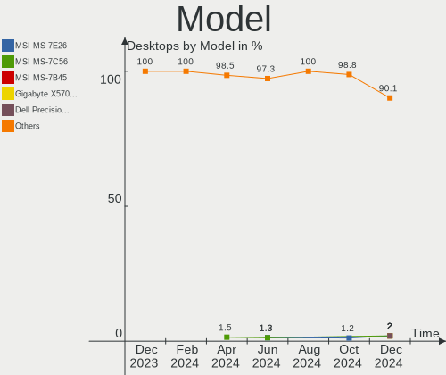
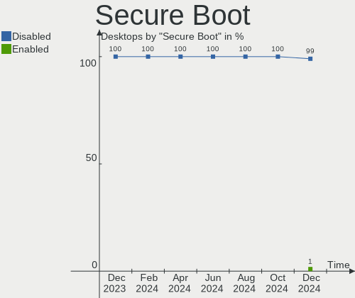
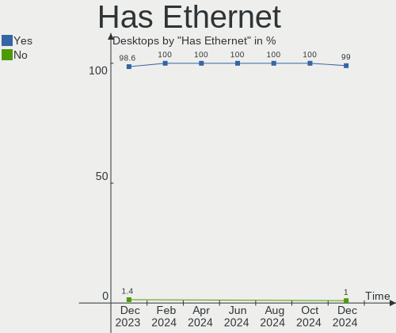
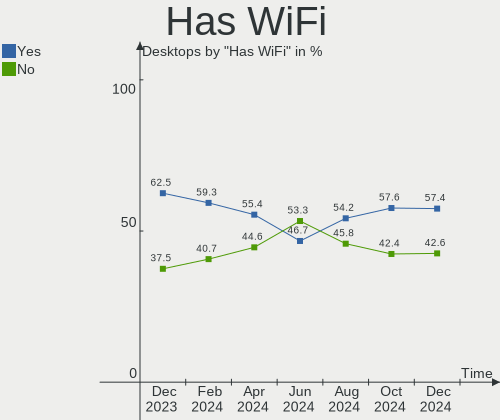
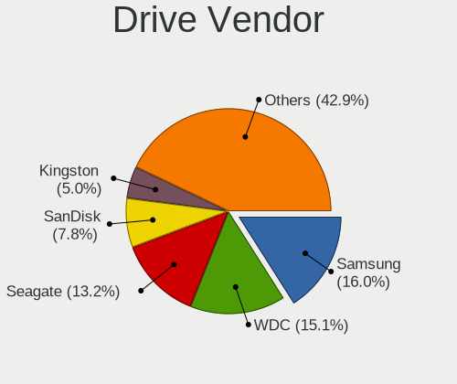
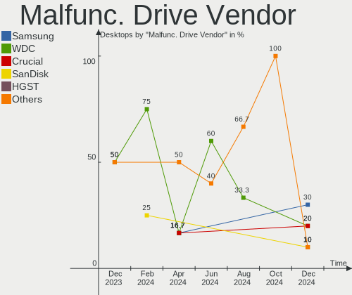

Pop!_OS - Hardware Trends (Desktops)
------------------------------------

A project to identify most popular hardware characteristics and track their change
over time based on data collected by Linux users at https://Linux-Hardware.org.

Anyone can contribute to this report by the [hw-probe](https://github.com/linuxhw/hw-probe) tool:

    sudo -E hw-probe -all -upload

This report is for one last month. Overall report since the beginning of time: [TestDays](https://github.com/linuxhw/TestDays)

Period: Mar, 2023.

Contents
--------

* [ System ](#system)
  - [ OS                       ](#os)
  - [ OS Family                ](#os-family)
  - [ Kernel                   ](#kernel)
  - [ Kernel Family            ](#kernel-family)
  - [ Kernel Major Ver.        ](#kernel-major-ver)
  - [ Arch                     ](#arch)
  - [ DE                       ](#de)
  - [ Display Server           ](#display-server)
  - [ Display Manager          ](#display-manager)
  - [ OS Lang                  ](#os-lang)
  - [ Boot Mode                ](#boot-mode)
  - [ Filesystem               ](#filesystem)
  - [ Part. scheme             ](#part-scheme)
  - [ Dual Boot with Linux/BSD ](#dual-boot-with-linuxbsd)
  - [ Dual Boot (Win)          ](#dual-boot-win)

* [ Board ](#board)
  - [ Vendor                   ](#vendor)
  - [ Model                    ](#model)
  - [ Model Family             ](#model-family)
  - [ MFG Year                 ](#mfg-year)
  - [ Form Factor              ](#form-factor)
  - [ Secure Boot              ](#secure-boot)
  - [ Coreboot                 ](#coreboot)
  - [ RAM Size                 ](#ram-size)
  - [ RAM Used                 ](#ram-used)
  - [ Total Drives             ](#total-drives)
  - [ Has CD-ROM               ](#has-cd-rom)
  - [ Has Ethernet             ](#has-ethernet)
  - [ Has WiFi                 ](#has-wifi)
  - [ Has Bluetooth            ](#has-bluetooth)

* [ Location ](#location)
  - [ Country                  ](#country)
  - [ City                     ](#city)

* [ Drives ](#drives)
  - [ Drive Vendor             ](#drive-vendor)
  - [ Drive Model              ](#drive-model)
  - [ HDD Vendor               ](#hdd-vendor)
  - [ SSD Vendor               ](#ssd-vendor)
  - [ Drive Kind               ](#drive-kind)
  - [ Drive Connector          ](#drive-connector)
  - [ Drive Size               ](#drive-size)
  - [ Space Total              ](#space-total)
  - [ Space Used               ](#space-used)
  - [ Malfunc. Drives          ](#malfunc-drives)
  - [ Malfunc. Drive Vendor    ](#malfunc-drive-vendor)
  - [ Malfunc. HDD Vendor      ](#malfunc-hdd-vendor)
  - [ Malfunc. Drive Kind      ](#malfunc-drive-kind)
  - [ Failed Drives            ](#failed-drives)
  - [ Failed Drive Vendor      ](#failed-drive-vendor)
  - [ Drive Status             ](#drive-status)

* [ Storage controller ](#storage-controller)
  - [ Storage Vendor           ](#storage-vendor)
  - [ Storage Model            ](#storage-model)
  - [ Storage Kind             ](#storage-kind)

* [ Processor ](#processor)
  - [ CPU Vendor               ](#cpu-vendor)
  - [ CPU Model                ](#cpu-model)
  - [ CPU Model Family         ](#cpu-model-family)
  - [ CPU Cores                ](#cpu-cores)
  - [ CPU Sockets              ](#cpu-sockets)
  - [ CPU Threads              ](#cpu-threads)
  - [ CPU Op-Modes             ](#cpu-op-modes)
  - [ CPU Microcode            ](#cpu-microcode)
  - [ CPU Microarch            ](#cpu-microarch)

* [ Graphics ](#graphics)
  - [ GPU Vendor               ](#gpu-vendor)
  - [ GPU Model                ](#gpu-model)
  - [ GPU Combo                ](#gpu-combo)
  - [ GPU Driver               ](#gpu-driver)
  - [ GPU Memory               ](#gpu-memory)

* [ Monitor ](#monitor)
  - [ Monitor Vendor           ](#monitor-vendor)
  - [ Monitor Model            ](#monitor-model)
  - [ Monitor Resolution       ](#monitor-resolution)
  - [ Monitor Diagonal         ](#monitor-diagonal)
  - [ Monitor Width            ](#monitor-width)
  - [ Aspect Ratio             ](#aspect-ratio)
  - [ Monitor Area             ](#monitor-area)
  - [ Pixel Density            ](#pixel-density)
  - [ Multiple Monitors        ](#multiple-monitors)

* [ Network ](#network)
  - [ Net Controller Vendor    ](#net-controller-vendor)
  - [ Net Controller Model     ](#net-controller-model)
  - [ Wireless Vendor          ](#wireless-vendor)
  - [ Wireless Model           ](#wireless-model)
  - [ Ethernet Vendor          ](#ethernet-vendor)
  - [ Ethernet Model           ](#ethernet-model)
  - [ Net Controller Kind      ](#net-controller-kind)
  - [ Used Controller          ](#used-controller)
  - [ NICs                     ](#nics)
  - [ IPv6                     ](#ipv6)

* [ Bluetooth ](#bluetooth)
  - [ Bluetooth Vendor         ](#bluetooth-vendor)
  - [ Bluetooth Model          ](#bluetooth-model)

* [ Sound ](#sound)
  - [ Sound Vendor             ](#sound-vendor)
  - [ Sound Model              ](#sound-model)

* [ Memory ](#memory)
  - [ Memory Vendor            ](#memory-vendor)
  - [ Memory Model             ](#memory-model)
  - [ Memory Kind              ](#memory-kind)
  - [ Memory Form Factor       ](#memory-form-factor)
  - [ Memory Size              ](#memory-size)
  - [ Memory Speed             ](#memory-speed)

* [ Printers & scanners ](#printers--scanners)
  - [ Printer Vendor           ](#printer-vendor)
  - [ Printer Model            ](#printer-model)
  - [ Scanner Vendor           ](#scanner-vendor)
  - [ Scanner Model            ](#scanner-model)

* [ Camera ](#camera)
  - [ Camera Vendor            ](#camera-vendor)
  - [ Camera Model             ](#camera-model)

* [ Security ](#security)
  - [ Fingerprint Vendor       ](#fingerprint-vendor)
  - [ Fingerprint Model        ](#fingerprint-model)
  - [ Chipcard Vendor          ](#chipcard-vendor)
  - [ Chipcard Model           ](#chipcard-model)

* [ Unsupported ](#unsupported)
  - [ Unsupported Devices      ](#unsupported-devices)
  - [ Unsupported Device Types ](#unsupported-device-types)

System
------

OS
--

Installed operating systems

| Name          | Desktops | Percent |
|---------------|----------|---------|
| Pop!_OS 22.04 | 93       | 97.89%  |
| Pop!_OS 21.04 | 1        | 1.05%   |
| Pop!_OS 20.10 | 1        | 1.05%   |

OS Family
---------

OS without a version

| Name    | Desktops | Percent |
|---------|----------|---------|
| Pop!_OS | 95       | 100%    |

Kernel
------

Version of the Linux kernel

| Version                  | Desktops | Percent |
|--------------------------|----------|---------|
| 6.2.0-76060200-generic   | 33       | 34.74%  |
| 6.2.6-76060206-generic   | 21       | 22.11%  |
| 6.1.11-76060111-generic  | 20       | 21.05%  |
| 6.0.12-76060006-generic  | 14       | 14.74%  |
| 6.0.6-76060006-generic   | 2        | 2.11%   |
| 6.2.2-x64v3-xanmod1      | 1        | 1.05%   |
| 5.8.0-7625-generic       | 1        | 1.05%   |
| 5.18.10-76051810-generic | 1        | 1.05%   |
| 5.17.15-76051715-generic | 1        | 1.05%   |
| 5.11.0-7614-generic      | 1        | 1.05%   |

Kernel Family
-------------

Linux kernel without a distro release

| Version | Desktops | Percent |
|---------|----------|---------|
| 6.2.0   | 33       | 34.74%  |
| 6.2.6   | 21       | 22.11%  |
| 6.1.11  | 20       | 21.05%  |
| 6.0.12  | 14       | 14.74%  |
| 6.0.6   | 2        | 2.11%   |
| 6.2.2   | 1        | 1.05%   |
| 5.8.0   | 1        | 1.05%   |
| 5.18.10 | 1        | 1.05%   |
| 5.17.15 | 1        | 1.05%   |
| 5.11.0  | 1        | 1.05%   |

Kernel Major Ver.
-----------------

Linux kernel major version

| Version | Desktops | Percent |
|---------|----------|---------|
| 6.2     | 55       | 57.89%  |
| 6.1     | 20       | 21.05%  |
| 6.0     | 16       | 16.84%  |
| 5.8     | 1        | 1.05%   |
| 5.18    | 1        | 1.05%   |
| 5.17    | 1        | 1.05%   |
| 5.11    | 1        | 1.05%   |

Arch
----

OS architecture (x86_64, i586, etc.)

| Name   | Desktops | Percent |
|--------|----------|---------|
| x86_64 | 95       | 100%    |

DE
--

Desktop Environment

| Name    | Desktops | Percent |
|---------|----------|---------|
| GNOME   | 92       | 96.84%  |
| KDE5    | 2        | 2.11%   |
| Unknown | 1        | 1.05%   |

Display Server
--------------

X11 or Wayland

| Name    | Desktops | Percent |
|---------|----------|---------|
| X11     | 92       | 96.84%  |
| Wayland | 2        | 2.11%   |
| Unknown | 1        | 1.05%   |

Display Manager
---------------

SDDM, LightDM, etc.

| Name    | Desktops | Percent |
|---------|----------|---------|
| Unknown | 79       | 83.16%  |
| GDM3    | 16       | 16.84%  |

OS Lang
-------

Language

| Lang    | Desktops | Percent |
|---------|----------|---------|
| en_US   | 58       | 61.05%  |
| en_GB   | 7        | 7.37%   |
| de_DE   | 6        | 6.32%   |
| C       | 4        | 4.21%   |
| pt_BR   | 3        | 3.16%   |
| en_DK   | 3        | 3.16%   |
| en_CA   | 3        | 3.16%   |
| en_AU   | 3        | 3.16%   |
| es_CL   | 2        | 2.11%   |
| pl_PL   | 1        | 1.05%   |
| nb_NO   | 1        | 1.05%   |
| fi_FI   | 1        | 1.05%   |
| Default | 1        | 1.05%   |
| da_DK   | 1        | 1.05%   |
| Unknown | 1        | 1.05%   |

Boot Mode
---------

EFI or BIOS

| Mode | Desktops | Percent |
|------|----------|---------|
| BIOS | 81       | 85.26%  |
| EFI  | 14       | 14.74%  |

Filesystem
----------

Type of filesystem

| Type    | Desktops | Percent |
|---------|----------|---------|
| Ext4    | 91       | 95.79%  |
| Overlay | 2        | 2.11%   |
| Btrfs   | 2        | 2.11%   |

Part. scheme
------------

Scheme of partitioning

| Type    | Desktops | Percent |
|---------|----------|---------|
| Unknown | 78       | 82.11%  |
| GPT     | 15       | 15.79%  |
| MBR     | 2        | 2.11%   |

Dual Boot with Linux/BSD
------------------------

Hosting more than one Linux/BSD

| Dual boot | Desktops | Percent |
|-----------|----------|---------|
| No        | 91       | 95.79%  |
| Yes       | 4        | 4.21%   |

Dual Boot (Win)
---------------

Hosting Linux and Windows

| Dual boot | Desktops | Percent |
|-----------|----------|---------|
| No        | 86       | 90.53%  |
| Yes       | 9        | 9.47%   |

Board
-----

Vendor
------

Motherboard manufacturer

| Name                | Desktops | Percent |
|---------------------|----------|---------|
| ASUSTek Computer    | 27       | 28.42%  |
| Gigabyte Technology | 20       | 21.05%  |
| MSI                 | 11       | 11.58%  |
| Dell                | 8        | 8.42%   |
| ASRock              | 8        | 8.42%   |
| Hewlett-Packard     | 7        | 7.37%   |
| Acer                | 2        | 2.11%   |
| Win element         | 1        | 1.05%   |
| Supermicro          | 1        | 1.05%   |
| Positivo            | 1        | 1.05%   |
| Lenovo              | 1        | 1.05%   |
| Huanan              | 1        | 1.05%   |
| Gateway             | 1        | 1.05%   |
| Fujitsu             | 1        | 1.05%   |
| Foxconn             | 1        | 1.05%   |
| Biostar             | 1        | 1.05%   |
| ASRockRack          | 1        | 1.05%   |
| Apple               | 1        | 1.05%   |
| Unknown             | 1        | 1.05%   |

Model
-----

Motherboard model

| Name                                   | Desktops | Percent |
|----------------------------------------|----------|---------|
| ASUS All Series                        | 3        | 3.16%   |
| MSI MS-7C91                            | 2        | 2.11%   |
| MSI MS-7A34                            | 2        | 2.11%   |
| Dell OptiPlex 9020                     | 2        | 2.11%   |
| ASUS TUF Gaming X570-PLUS              | 2        | 2.11%   |
| ASUS SABERTOOTH 990FX R2.0             | 2        | 2.11%   |
| ASUS ROG CROSSHAIR VIII HERO           | 2        | 2.11%   |
| Win element M600                       | 1        | 1.05%   |
| Supermicro X9SAE                       | 1        | 1.05%   |
| Positivo POS-PIQ77CL                   | 1        | 1.05%   |
| MSI MS-7D70                            | 1        | 1.05%   |
| MSI MS-7D06                            | 1        | 1.05%   |
| MSI MS-7C98                            | 1        | 1.05%   |
| MSI MS-7C95                            | 1        | 1.05%   |
| MSI MS-7A38                            | 1        | 1.05%   |
| MSI MS-7721                            | 1        | 1.05%   |
| MSI MS-7522                            | 1        | 1.05%   |
| Lenovo IdeaCentre 200-01IBW 90FA0032MT | 1        | 1.05%   |
| Huanan X99-AD3 GAMING V2.0             | 1        | 1.05%   |
| HP Z440 Workstation                    | 1        | 1.05%   |
| HP Slim Desktop 290-p0xxx              | 1        | 1.05%   |
| HP Pavilion Desktop 590-p0xxx          | 1        | 1.05%   |
| HP EliteDesk 705 G4 DM 35W (TAA)       | 1        | 1.05%   |
| HP Compaq Pro 6300 SFF                 | 1        | 1.05%   |
| HP Compaq dc7800p Ultra-slim Desktop   | 1        | 1.05%   |
| HP Compaq dc7600 Convertible Minitower | 1        | 1.05%   |
| Gigabyte Z97X-Gaming 7                 | 1        | 1.05%   |
| Gigabyte Z87X-UD4H                     | 1        | 1.05%   |
| Gigabyte Z77X-UP4 TH                   | 1        | 1.05%   |
| Gigabyte Z590I AORUS ULTRA             | 1        | 1.05%   |
| Gigabyte X79-UD3                       | 1        | 1.05%   |
| Gigabyte X58A-UD7                      | 1        | 1.05%   |
| Gigabyte X570S AORUS ELITE AX          | 1        | 1.05%   |
| Gigabyte X570 AORUS ULTRA              | 1        | 1.05%   |
| Gigabyte X570 AORUS MASTER             | 1        | 1.05%   |
| Gigabyte X570 AORUS ELITE              | 1        | 1.05%   |
| Gigabyte X470 AORUS ULTRA GAMING       | 1        | 1.05%   |
| Gigabyte X399 DESIGNARE EX             | 1        | 1.05%   |
| Gigabyte H110M-DS2V DDR3-CF            | 1        | 1.05%   |
| Gigabyte B550M DS3H AC                 | 1        | 1.05%   |

Model Family
------------

Motherboard model prefix

| Name                 | Desktops | Percent |
|----------------------|----------|---------|
| ASUS ROG             | 9        | 9.47%   |
| ASUS PRIME           | 6        | 6.32%   |
| Dell OptiPlex        | 5        | 5.26%   |
| HP Compaq            | 3        | 3.16%   |
| Gigabyte X570        | 3        | 3.16%   |
| ASUS TUF             | 3        | 3.16%   |
| ASUS SABERTOOTH      | 3        | 3.16%   |
| ASUS All             | 3        | 3.16%   |
| MSI MS-7C91          | 2        | 2.11%   |
| MSI MS-7A34          | 2        | 2.11%   |
| Gigabyte B550M       | 2        | 2.11%   |
| Acer Aspire          | 2        | 2.11%   |
| Win element M600     | 1        | 1.05%   |
| Supermicro X9SAE     | 1        | 1.05%   |
| Positivo POS-PIQ77CL | 1        | 1.05%   |
| MSI MS-7D70          | 1        | 1.05%   |
| MSI MS-7D06          | 1        | 1.05%   |
| MSI MS-7C98          | 1        | 1.05%   |
| MSI MS-7C95          | 1        | 1.05%   |
| MSI MS-7A38          | 1        | 1.05%   |
| MSI MS-7721          | 1        | 1.05%   |
| MSI MS-7522          | 1        | 1.05%   |
| Lenovo IdeaCentre    | 1        | 1.05%   |
| Huanan X99-AD3       | 1        | 1.05%   |
| HP Z440              | 1        | 1.05%   |
| HP Slim              | 1        | 1.05%   |
| HP Pavilion          | 1        | 1.05%   |
| HP EliteDesk         | 1        | 1.05%   |
| Gigabyte Z97X-Gaming | 1        | 1.05%   |
| Gigabyte Z87X-UD4H   | 1        | 1.05%   |
| Gigabyte Z77X-UP4    | 1        | 1.05%   |
| Gigabyte Z590I       | 1        | 1.05%   |
| Gigabyte X79-UD3     | 1        | 1.05%   |
| Gigabyte X58A-UD7    | 1        | 1.05%   |
| Gigabyte X570S       | 1        | 1.05%   |
| Gigabyte X470        | 1        | 1.05%   |
| Gigabyte X399        | 1        | 1.05%   |
| Gigabyte H110M-DS2V  | 1        | 1.05%   |
| Gigabyte B450M       | 1        | 1.05%   |
| Gigabyte B450        | 1        | 1.05%   |

MFG Year
--------

Motherboard manufacture year

| Year    | Desktops | Percent |
|---------|----------|---------|
| 2022    | 13       | 13.68%  |
| 2020    | 13       | 13.68%  |
| 2019    | 9        | 9.47%   |
| 2018    | 9        | 9.47%   |
| 2021    | 7        | 7.37%   |
| 2013    | 7        | 7.37%   |
| 2012    | 7        | 7.37%   |
| 2014    | 6        | 6.32%   |
| 2017    | 5        | 5.26%   |
| 2010    | 5        | 5.26%   |
| 2015    | 4        | 4.21%   |
| 2011    | 4        | 4.21%   |
| 2008    | 2        | 2.11%   |
| 2009    | 1        | 1.05%   |
| 2007    | 1        | 1.05%   |
| 2005    | 1        | 1.05%   |
| Unknown | 1        | 1.05%   |

Form Factor
-----------

Physical design of the computer

| Name    | Desktops | Percent |
|---------|----------|---------|
| Desktop | 95       | 100%    |

Secure Boot
-----------

Enabled or disabled

| State    | Desktops | Percent |
|----------|----------|---------|
| Disabled | 95       | 100%    |

Coreboot
--------

Have coreboot on board

| Used | Desktops | Percent |
|------|----------|---------|
| No   | 95       | 100%    |

RAM Size
--------

Total RAM memory

| Size in GB  | Desktops | Percent |
|-------------|----------|---------|
| 32.01-64.0  | 27       | 28.42%  |
| 16.01-24.0  | 27       | 28.42%  |
| 8.01-16.0   | 13       | 13.68%  |
| 64.01-256.0 | 11       | 11.58%  |
| 4.01-8.0    | 10       | 10.53%  |
| 24.01-32.0  | 3        | 3.16%   |
| 3.01-4.0    | 2        | 2.11%   |
| 2.01-3.0    | 1        | 1.05%   |
| 1.01-2.0    | 1        | 1.05%   |

RAM Used
--------

Used RAM memory

| Used GB    | Desktops | Percent |
|------------|----------|---------|
| 4.01-8.0   | 40       | 42.11%  |
| 3.01-4.0   | 18       | 18.95%  |
| 8.01-16.0  | 16       | 16.84%  |
| 2.01-3.0   | 13       | 13.68%  |
| 1.01-2.0   | 4        | 4.21%   |
| 16.01-24.0 | 2        | 2.11%   |
| 32.01-64.0 | 1        | 1.05%   |
| 24.01-32.0 | 1        | 1.05%   |

Total Drives
------------

Number of drives on board

| Drives | Desktops | Percent |
|--------|----------|---------|
| 2      | 39       | 41.05%  |
| 1      | 26       | 27.37%  |
| 3      | 12       | 12.63%  |
| 4      | 8        | 8.42%   |
| 5      | 6        | 6.32%   |
| 7      | 2        | 2.11%   |
| 8      | 1        | 1.05%   |
| 6      | 1        | 1.05%   |

Has CD-ROM
----------

Has CD-ROM on board

| Presented | Desktops | Percent |
|-----------|----------|---------|
| No        | 63       | 66.32%  |
| Yes       | 32       | 33.68%  |

Has Ethernet
------------

Has Ethernet on board

| Presented | Desktops | Percent |
|-----------|----------|---------|
| Yes       | 94       | 98.95%  |
| No        | 1        | 1.05%   |

Has WiFi
--------

Has WiFi module

| Presented | Desktops | Percent |
|-----------|----------|---------|
| Yes       | 52       | 54.74%  |
| No        | 43       | 45.26%  |

Has Bluetooth
-------------

Has Bluetooth module

| Presented | Desktops | Percent |
|-----------|----------|---------|
| No        | 53       | 55.79%  |
| Yes       | 42       | 44.21%  |

Location
--------

Country
-------

Geographic location (country)

| Country     | Desktops | Percent |
|-------------|----------|---------|
| USA         | 41       | 43.16%  |
| Germany     | 11       | 11.58%  |
| Brazil      | 6        | 6.32%   |
| Canada      | 5        | 5.26%   |
| UK          | 4        | 4.21%   |
| Australia   | 4        | 4.21%   |
| Norway      | 3        | 3.16%   |
| Finland     | 3        | 3.16%   |
| Denmark     | 3        | 3.16%   |
| Chile       | 3        | 3.16%   |
| India       | 2        | 2.11%   |
| Switzerland | 1        | 1.05%   |
| Sweden      | 1        | 1.05%   |
| Serbia      | 1        | 1.05%   |
| Russia      | 1        | 1.05%   |
| Portugal    | 1        | 1.05%   |
| Poland      | 1        | 1.05%   |
| Mexico      | 1        | 1.05%   |
| Latvia      | 1        | 1.05%   |
| Bolivia     | 1        | 1.05%   |
| Austria     | 1        | 1.05%   |

City
----

Geographic location (city)

| City                | Desktops | Percent |
|---------------------|----------|---------|
| Santiago            | 2        | 2.11%   |
| Notodden            | 2        | 2.11%   |
| Melbourne           | 2        | 2.11%   |
| Youngstown          | 1        | 1.05%   |
| Winchester          | 1        | 1.05%   |
| Wiesbaden           | 1        | 1.05%   |
| Whitehorse          | 1        | 1.05%   |
| Weatherford         | 1        | 1.05%   |
| Waverly             | 1        | 1.05%   |
| Viking              | 1        | 1.05%   |
| Victorville         | 1        | 1.05%   |
| Viby J              | 1        | 1.05%   |
| Vancouver           | 1        | 1.05%   |
| Traverse City       | 1        | 1.05%   |
| Tommerup Stationsby | 1        | 1.05%   |
| The Villages        | 1        | 1.05%   |
| Tampere             | 1        | 1.05%   |
| Stockton-on-Tees    | 1        | 1.05%   |
| Stockholm           | 1        | 1.05%   |
| Stavropol           | 1        | 1.05%   |
| Sipoo               | 1        | 1.05%   |
| Seguin              | 1        | 1.05%   |
| Seewald             | 1        | 1.05%   |
| Sao Paulo           | 1        | 1.05%   |
| Salt Lake City      | 1        | 1.05%   |
| Rosenberg           | 1        | 1.05%   |
| Portland            | 1        | 1.05%   |
| Port Charlotte      | 1        | 1.05%   |
| Ponta Grossa        | 1        | 1.05%   |
| Polch               | 1        | 1.05%   |
| Phoenix             | 1        | 1.05%   |
| Ogre                | 1        | 1.05%   |
| Ocean City          | 1        | 1.05%   |
| Nuremberg           | 1        | 1.05%   |
| North York          | 1        | 1.05%   |
| Newcastle upon Tyne | 1        | 1.05%   |
| Minneapolis         | 1        | 1.05%   |
| Milwaukee           | 1        | 1.05%   |
| Mexico City         | 1        | 1.05%   |
| Mechanicsburg       | 1        | 1.05%   |

Drives
------

Drive Vendor
------------

Hard drive vendors

| Vendor                      | Desktops | Drives | Percent |
|-----------------------------|----------|--------|---------|
| Samsung Electronics         | 40       | 65     | 22.35%  |
| WDC                         | 26       | 30     | 14.53%  |
| Seagate                     | 19       | 27     | 10.61%  |
| Sandisk                     | 14       | 17     | 7.82%   |
| Kingston                    | 9        | 11     | 5.03%   |
| Toshiba                     | 7        | 7      | 3.91%   |
| Crucial                     | 7        | 8      | 3.91%   |
| Phison Electronics          | 5        | 6      | 2.79%   |
| Kingston Technology Company | 5        | 5      | 2.79%   |
| SK hynix                    | 4        | 4      | 2.23%   |
| Hitachi                     | 4        | 4      | 2.23%   |
| SPCC                        | 3        | 3      | 1.68%   |
| Intel                       | 3        | 4      | 1.68%   |
| China                       | 3        | 3      | 1.68%   |
| Unknown                     | 2        | 3      | 1.12%   |
| PNY                         | 2        | 2      | 1.12%   |
| Patriot                     | 2        | 2      | 1.12%   |
| Micron/Crucial Technology   | 2        | 2      | 1.12%   |
| Intenso                     | 2        | 2      | 1.12%   |
| Unknown                     | 2        | 2      | 1.12%   |
| Verbatim                    | 1        | 1      | 0.56%   |
| Union Memory (Shenzhen)     | 1        | 1      | 0.56%   |
| Transcend                   | 1        | 1      | 0.56%   |
| Silicon Motion              | 1        | 1      | 0.56%   |
| Realtek Semiconductor       | 1        | 1      | 0.56%   |
| ORTIAL                      | 1        | 1      | 0.56%   |
| Netac                       | 1        | 1      | 0.56%   |
| Mushkin                     | 1        | 1      | 0.56%   |
| Micron Technology           | 1        | 1      | 0.56%   |
| LITEON                      | 1        | 1      | 0.56%   |
| Leven                       | 1        | 1      | 0.56%   |
| Hewlett-Packard             | 1        | 4      | 0.56%   |
| Fujitsu                     | 1        | 1      | 0.56%   |
| Corsair                     | 1        | 1      | 0.56%   |
| BlueRay                     | 1        | 1      | 0.56%   |
| ASMT                        | 1        | 1      | 0.56%   |
| Apple                       | 1        | 1      | 0.56%   |
| A-DATA Technology           | 1        | 1      | 0.56%   |

Drive Model
-----------

Hard drive models

| Model                                               | Desktops | Percent |
|-----------------------------------------------------|----------|---------|
| Samsung NVMe SSD Controller SM981/PM981/PM983 250GB | 9        | 4.31%   |
| Samsung NVMe SSD Controller PM9A1/PM9A3/980PRO 1TB  | 8        | 3.83%   |
| Samsung SSD 860 EVO 1TB                             | 4        | 1.91%   |
| Kingston Company A2000 NVMe SSD 500GB               | 4        | 1.91%   |
| Seagate ST1000DM003-1CH162 1TB                      | 3        | 1.44%   |
| Samsung SSD 850 EVO 500GB                           | 3        | 1.44%   |
| Phison E12 NVMe Controller 256GB                    | 3        | 1.44%   |
| WDC WDS240G2G0A-00JH30 240GB SSD                    | 2        | 0.96%   |
| Toshiba DT01ACA100 1TB                              | 2        | 0.96%   |
| SK hynix SHGP31-1000GM 1TB                          | 2        | 0.96%   |
| SK hynix BC511 512GB                                | 2        | 0.96%   |
| Seagate ST500DM002-1BD142 500GB                     | 2        | 0.96%   |
| Sandisk WD Black SN750 / PC SN730 NVMe SSD 1TB      | 2        | 0.96%   |
| Samsung SSD 990 PRO 2TB                             | 2        | 0.96%   |
| Samsung SSD 870 EVO 1TB                             | 2        | 0.96%   |
| Samsung SSD 850 EVO 250GB                           | 2        | 0.96%   |
| Samsung SSD 840 PRO Series 256GB                    | 2        | 0.96%   |
| Kingston SA400S37240G 240GB SSD                     | 2        | 0.96%   |
| Kingston SA400S37120G 120GB SSD                     | 2        | 0.96%   |
| Crucial CT1000MX500SSD1 1TB                         | 2        | 0.96%   |
| Unknown                                             | 2        | 0.96%   |
| WDC WDS500G2B0A-00SM50 500GB SSD                    | 1        | 0.48%   |
| WDC WD60EZAZ-00ZGHB0 6TB                            | 1        | 0.48%   |
| WDC WD5000BEVT-24A0RT0 500GB                        | 1        | 0.48%   |
| WDC WD5000AAVS-00G9B1 500GB                         | 1        | 0.48%   |
| WDC WD5000AAKX-753CA1 500GB                         | 1        | 0.48%   |
| WDC WD5000AAKX-001CA0 500GB                         | 1        | 0.48%   |
| WDC WD40EZRZ-00GXCB0 4TB                            | 1        | 0.48%   |
| WDC WD3200BPVT-22JJ5T0 320GB                        | 1        | 0.48%   |
| WDC WD3200AAKS-00B3A0 320GB                         | 1        | 0.48%   |
| WDC WD3200AAJS-55B4A0 320GB                         | 1        | 0.48%   |
| WDC WD3200AAJS-08L7A0 320GB                         | 1        | 0.48%   |
| WDC WD30EZRX-00SPEB0 3TB                            | 1        | 0.48%   |
| WDC WD2500AAKX-321CA0 250GB                         | 1        | 0.48%   |
| WDC WD2500AAJS-08B4A0 250GB                         | 1        | 0.48%   |
| WDC WD20EZRX-00D8PB0 2TB                            | 1        | 0.48%   |
| WDC WD20EZAZ-00L9GB0 2TB                            | 1        | 0.48%   |
| WDC WD20EARX-22PASB0 2TB                            | 1        | 0.48%   |
| WDC WD20EARX-008FB0 2TB                             | 1        | 0.48%   |
| WDC WD15EADS-00P8B0 1TB                             | 1        | 0.48%   |

HDD Vendor
----------

Hard disk drive vendors

| Vendor              | Desktops | Drives | Percent |
|---------------------|----------|--------|---------|
| WDC                 | 22       | 26     | 40.74%  |
| Seagate             | 17       | 24     | 31.48%  |
| Toshiba             | 6        | 6      | 11.11%  |
| Hitachi             | 4        | 4      | 7.41%   |
| Samsung Electronics | 2        | 2      | 3.7%    |
| Fujitsu             | 1        | 1      | 1.85%   |
| ASMT                | 1        | 1      | 1.85%   |
| Apple               | 1        | 1      | 1.85%   |

SSD Vendor
----------

Solid state drive vendors

| Vendor              | Desktops | Drives | Percent |
|---------------------|----------|--------|---------|
| Samsung Electronics | 21       | 31     | 30.88%  |
| Kingston            | 7        | 8      | 10.29%  |
| SanDisk             | 6        | 6      | 8.82%   |
| Crucial             | 6        | 7      | 8.82%   |
| WDC                 | 4        | 4      | 5.88%   |
| China               | 3        | 3      | 4.41%   |
| SPCC                | 2        | 2      | 2.94%   |
| PNY                 | 2        | 2      | 2.94%   |
| Patriot             | 2        | 2      | 2.94%   |
| Intenso             | 2        | 2      | 2.94%   |
| Verbatim            | 1        | 1      | 1.47%   |
| Transcend           | 1        | 1      | 1.47%   |
| Toshiba             | 1        | 1      | 1.47%   |
| Seagate             | 1        | 1      | 1.47%   |
| ORTIAL              | 1        | 1      | 1.47%   |
| Netac               | 1        | 1      | 1.47%   |
| Mushkin             | 1        | 1      | 1.47%   |
| LITEON              | 1        | 1      | 1.47%   |
| Leven               | 1        | 1      | 1.47%   |
| Intel               | 1        | 2      | 1.47%   |
| Hewlett-Packard     | 1        | 4      | 1.47%   |
| A-DATA Technology   | 1        | 1      | 1.47%   |
| Unknown             | 1        | 1      | 1.47%   |

Drive Kind
----------

HDD or SSD

| Kind    | Desktops | Drives | Percent |
|---------|----------|--------|---------|
| SSD     | 56       | 84     | 38.1%   |
| NVMe    | 43       | 72     | 29.25%  |
| HDD     | 43       | 65     | 29.25%  |
| Unknown | 4        | 6      | 2.72%   |
| MMC     | 1        | 1      | 0.68%   |

Drive Connector
---------------

SATA, SAS, NVMe, etc.

| Type | Desktops | Drives | Percent |
|------|----------|--------|---------|
| SATA | 75       | 147    | 59.52%  |
| NVMe | 43       | 72     | 34.13%  |
| SAS  | 7        | 8      | 5.56%   |
| MMC  | 1        | 1      | 0.79%   |

Drive Size
----------

Size of hard drive

| Size in TB | Desktops | Drives | Percent |
|------------|----------|--------|---------|
| 0.01-0.5   | 51       | 81     | 48.57%  |
| 0.51-1.0   | 37       | 46     | 35.24%  |
| 1.01-2.0   | 9        | 14     | 8.57%   |
| 3.01-4.0   | 3        | 3      | 2.86%   |
| 4.01-10.0  | 3        | 3      | 2.86%   |
| 2.01-3.0   | 2        | 2      | 1.9%    |

Space Total
-----------

Amount of disk space available on the file system

| Size in GB     | Desktops | Percent |
|----------------|----------|---------|
| 501-1000       | 23       | 24.21%  |
| 251-500        | 20       | 21.05%  |
| 101-250        | 19       | 20%     |
| 1001-2000      | 17       | 17.89%  |
| More than 3000 | 6        | 6.32%   |
| 2001-3000      | 5        | 5.26%   |
| 1-20           | 2        | 2.11%   |
| Unknown        | 2        | 2.11%   |
| 51-100         | 1        | 1.05%   |

Space Used
----------

Amount of used disk space

| Used GB        | Desktops | Percent |
|----------------|----------|---------|
| 21-50          | 19       | 20%     |
| 251-500        | 14       | 14.74%  |
| 101-250        | 14       | 14.74%  |
| 1-20           | 14       | 14.74%  |
| 51-100         | 13       | 13.68%  |
| 501-1000       | 12       | 12.63%  |
| 1001-2000      | 6        | 6.32%   |
| Unknown        | 2        | 2.11%   |
| More than 3000 | 1        | 1.05%   |

Malfunc. Drives
---------------

Drive models with a malfunction

| Model                                        | Desktops | Drives | Percent |
|----------------------------------------------|----------|--------|---------|
| WDC WD15EADS-00P8B0 1TB                      | 1        | 1      | 33.33%  |
| Samsung Electronics MZVLB512HAJQ-000L7 512GB | 1        | 1      | 33.33%  |
| Kingston SA400S37120G 120GB SSD              | 1        | 1      | 33.33%  |

Malfunc. Drive Vendor
---------------------

Vendors of faulty drives

| Vendor              | Desktops | Drives | Percent |
|---------------------|----------|--------|---------|
| WDC                 | 1        | 1      | 33.33%  |
| Samsung Electronics | 1        | 1      | 33.33%  |
| Kingston            | 1        | 1      | 33.33%  |

Malfunc. HDD Vendor
-------------------

Vendors of faulty HDD drives

| Vendor | Desktops | Drives | Percent |
|--------|----------|--------|---------|
| WDC    | 1        | 1      | 100%    |

Malfunc. Drive Kind
-------------------

Kinds of faulty drives

| Kind | Desktops | Drives | Percent |
|------|----------|--------|---------|
| NVMe | 1        | 1      | 33.33%  |
| SSD  | 1        | 1      | 33.33%  |
| HDD  | 1        | 1      | 33.33%  |

Failed Drives
-------------

Failed drive models

Zero info for selected period =(

Failed Drive Vendor
-------------------

Failed drive vendors

Zero info for selected period =(

Drive Status
------------

Number of failed and malfunc. drives

| Status   | Desktops | Drives | Percent |
|----------|----------|--------|---------|
| Detected | 80       | 181    | 80%     |
| Works    | 17       | 44     | 17%     |
| Malfunc  | 3        | 3      | 3%      |

Storage controller
------------------

Storage Vendor
--------------

Storage controller vendors

| Vendor                      | Desktops | Percent |
|-----------------------------|----------|---------|
| AMD                         | 49       | 29.17%  |
| Intel                       | 46       | 27.38%  |
| Samsung Electronics         | 24       | 14.29%  |
| SanDisk                     | 8        | 4.76%   |
| Kingston Technology Company | 7        | 4.17%   |
| Phison Electronics          | 6        | 3.57%   |
| ASMedia Technology          | 6        | 3.57%   |
| Marvell Technology Group    | 5        | 2.98%   |
| SK hynix                    | 4        | 2.38%   |
| Micron/Crucial Technology   | 3        | 1.79%   |
| JMicron Technology          | 3        | 1.79%   |
| Silicon Motion              | 2        | 1.19%   |
| Union Memory (Shenzhen)     | 1        | 0.6%    |
| Realtek Semiconductor       | 1        | 0.6%    |
| Micron Technology           | 1        | 0.6%    |
| Broadcom / LSI              | 1        | 0.6%    |
| Adaptec                     | 1        | 0.6%    |

Storage Model
-------------

Storage controller models

| Model                                                                          | Desktops | Percent |
|--------------------------------------------------------------------------------|----------|---------|
| AMD FCH SATA Controller [AHCI mode]                                            | 32       | 15.92%  |
| Samsung NVMe SSD Controller SM981/PM981/PM983                                  | 14       | 6.97%   |
| Samsung NVMe SSD Controller PM9A1/PM9A3/980PRO                                 | 10       | 4.98%   |
| AMD 500 Series Chipset SATA Controller                                         | 10       | 4.98%   |
| Intel 8 Series/C220 Series Chipset Family 6-port SATA Controller 1 [AHCI mode] | 7        | 3.48%   |
| AMD 400 Series Chipset SATA Controller                                         | 7        | 3.48%   |
| Intel 7 Series/C210 Series Chipset Family 6-port SATA Controller [AHCI mode]   | 6        | 2.99%   |
| ASMedia ASM1062 Serial ATA Controller                                          | 6        | 2.99%   |
| AMD 300 Series Chipset SATA Controller                                         | 5        | 2.49%   |
| Kingston Company A2000 NVMe SSD                                                | 4        | 1.99%   |
| AMD SB7x0/SB8x0/SB9x0 SATA Controller [AHCI mode]                              | 4        | 1.99%   |
| Sandisk Western Digital WD Black SN850X NVMe SSD                               | 3        | 1.49%   |
| SanDisk NVMe Controller                                                        | 3        | 1.49%   |
| Phison E12 NVMe Controller                                                     | 3        | 1.49%   |
| Marvell Group 88SE9172 SATA 6Gb/s Controller                                   | 3        | 1.49%   |
| JMicron JMB363 SATA/IDE Controller                                             | 3        | 1.49%   |
| Intel SATA Controller [RAID mode]                                              | 3        | 1.49%   |
| Intel Cannon Lake PCH SATA AHCI Controller                                     | 3        | 1.49%   |
| Intel 500 Series Chipset Family SATA AHCI Controller                           | 3        | 1.49%   |
| Intel 200 Series PCH SATA controller [AHCI mode]                               | 3        | 1.49%   |
| SK hynix Gold P31/PC711 NVMe Solid State Drive                                 | 2        | 1%      |
| SK hynix BC511                                                                 | 2        | 1%      |
| SanDisk WD Black SN750 / PC SN730 NVMe SSD                                     | 2        | 1%      |
| Samsung Electronics Non-Volatile memory controller                             | 2        | 1%      |
| Phison E16 PCIe4 NVMe Controller                                               | 2        | 1%      |
| Micron/Crucial P1 NVMe PCIe SSD                                                | 2        | 1%      |
| Kingston Company Company Non-Volatile memory controller                        | 2        | 1%      |
| Intel NM10/ICH7 Family SATA Controller [IDE mode]                              | 2        | 1%      |
| Intel C600/X79 series chipset 6-Port SATA AHCI Controller                      | 2        | 1%      |
| Intel 9 Series Chipset Family SATA Controller [AHCI Mode]                      | 2        | 1%      |
| Intel 82801JI (ICH10 Family) 4 port SATA IDE Controller #1                     | 2        | 1%      |
| Intel 82801JI (ICH10 Family) 2 port SATA IDE Controller #2                     | 2        | 1%      |
| Intel 82801IR/IO/IH (ICH9R/DO/DH) 4 port SATA Controller [IDE mode]            | 2        | 1%      |
| Intel 82801I (ICH9 Family) 2 port SATA Controller [IDE mode]                   | 2        | 1%      |
| Intel 82801G (ICH7 Family) IDE Controller                                      | 2        | 1%      |
| AMD FCH SATA Controller D                                                      | 2        | 1%      |
| Union Memory (Shenzhen) Non-Volatile memory controller                         | 1        | 0.5%    |
| Silicon Motion SM2263EN/SM2263XT SSD Controller                                | 1        | 0.5%    |
| Silicon Motion SM2262/SM2262EN SSD Controller                                  | 1        | 0.5%    |
| SanDisk WD PC SN810 / Black SN850 NVMe SSD                                     | 1        | 0.5%    |

Storage Kind
------------

Kind of storage controller (IDE, SATA, NVMe, SAS, ...)

| Kind | Desktops | Percent |
|------|----------|---------|
| SATA | 82       | 57.34%  |
| NVMe | 43       | 30.07%  |
| IDE  | 10       | 6.99%   |
| RAID | 6        | 4.2%    |
| SAS  | 1        | 0.7%    |
| SCSI | 1        | 0.7%    |

Processor
---------

CPU Vendor
----------

Processor vendors

| Vendor | Desktops | Percent |
|--------|----------|---------|
| AMD    | 49       | 51.58%  |
| Intel  | 46       | 48.42%  |

CPU Model
---------

Processor models

| Model                                       | Desktops | Percent |
|---------------------------------------------|----------|---------|
| AMD Ryzen 9 5950X 16-Core Processor         | 5        | 5.26%   |
| Intel Core i7-4790 CPU @ 3.60GHz            | 3        | 3.16%   |
| AMD Ryzen 7 7700X 8-Core Processor          | 3        | 3.16%   |
| AMD Ryzen 7 5800X3D 8-Core Processor        | 3        | 3.16%   |
| AMD Ryzen 5 5600X 6-Core Processor          | 3        | 3.16%   |
| AMD Ryzen 5 5600G with Radeon Graphics      | 3        | 3.16%   |
| Intel Core i7-4790K CPU @ 4.00GHz           | 2        | 2.11%   |
| Intel Core i5-4590 CPU @ 3.30GHz            | 2        | 2.11%   |
| AMD Ryzen 5 3600 6-Core Processor           | 2        | 2.11%   |
| AMD Ryzen 3 2200G with Radeon Vega Graphics | 2        | 2.11%   |
| AMD FX-8350 Eight-Core Processor            | 2        | 2.11%   |
| Intel Xeon CPU X5472 @ 3.00GHz              | 1        | 1.05%   |
| Intel Xeon CPU E5-2678 v3 @ 2.50GHz         | 1        | 1.05%   |
| Intel Xeon CPU E5-2640 v4 @ 2.40GHz         | 1        | 1.05%   |
| Intel Xeon CPU E3-1230 v3 @ 3.30GHz         | 1        | 1.05%   |
| Intel Xeon CPU E3-1225 V2 @ 3.20GHz         | 1        | 1.05%   |
| Intel Pentium Silver N6005 @ 2.00GHz        | 1        | 1.05%   |
| Intel Pentium Dual-Core CPU E5800 @ 3.20GHz | 1        | 1.05%   |
| Intel Pentium D CPU 3.40GHz                 | 1        | 1.05%   |
| Intel Core i9-10920X CPU @ 3.50GHz          | 1        | 1.05%   |
| Intel Core i9-10850K CPU @ 3.60GHz          | 1        | 1.05%   |
| Intel Core i7-9700K CPU @ 3.60GHz           | 1        | 1.05%   |
| Intel Core i7-8700K CPU @ 3.70GHz           | 1        | 1.05%   |
| Intel Core i7-6700K CPU @ 4.00GHz           | 1        | 1.05%   |
| Intel Core i7-4930K CPU @ 3.40GHz           | 1        | 1.05%   |
| Intel Core i7-4770S CPU @ 3.10GHz           | 1        | 1.05%   |
| Intel Core i7-4770K CPU @ 3.50GHz           | 1        | 1.05%   |
| Intel Core i7-3960X CPU @ 3.30GHz           | 1        | 1.05%   |
| Intel Core i7-3770K CPU @ 3.50GHz           | 1        | 1.05%   |
| Intel Core i7-3770 CPU @ 3.40GHz            | 1        | 1.05%   |
| Intel Core i7-10700KF CPU @ 3.80GHz         | 1        | 1.05%   |
| Intel Core i7 CPU 930 @ 2.80GHz             | 1        | 1.05%   |
| Intel Core i7 CPU 920 @ 2.67GHz             | 1        | 1.05%   |
| Intel Core i5-9400 CPU @ 2.90GHz            | 1        | 1.05%   |
| Intel Core i5-8500 CPU @ 3.00GHz            | 1        | 1.05%   |
| Intel Core i5-4670S CPU @ 3.10GHz           | 1        | 1.05%   |
| Intel Core i5-3470 CPU @ 3.20GHz            | 1        | 1.05%   |
| Intel Core i5-2400S CPU @ 2.50GHz           | 1        | 1.05%   |
| Intel Core i5-2320 CPU @ 3.00GHz            | 1        | 1.05%   |
| Intel Core i5-2300 CPU @ 2.80GHz            | 1        | 1.05%   |

CPU Model Family
----------------

Processor model prefix

| Model                   | Desktops | Percent |
|-------------------------|----------|---------|
| Intel Core i7           | 17       | 17.89%  |
| AMD Ryzen 5             | 14       | 14.74%  |
| AMD Ryzen 7             | 13       | 13.68%  |
| AMD Ryzen 9             | 11       | 11.58%  |
| Intel Core i5           | 9        | 9.47%   |
| Intel Xeon              | 5        | 5.26%   |
| Other                   | 3        | 3.16%   |
| Intel Core 2 Duo        | 3        | 3.16%   |
| AMD FX                  | 3        | 3.16%   |
| Intel Core i9           | 2        | 2.11%   |
| Intel Core i3           | 2        | 2.11%   |
| AMD Ryzen 3             | 2        | 2.11%   |
| AMD Athlon X4           | 2        | 2.11%   |
| Intel Pentium Silver    | 1        | 1.05%   |
| Intel Pentium Dual-Core | 1        | 1.05%   |
| Intel Pentium D         | 1        | 1.05%   |
| Intel Core 2 Quad       | 1        | 1.05%   |
| Intel Celeron           | 1        | 1.05%   |
| AMD Ryzen Threadripper  | 1        | 1.05%   |
| AMD Ryzen 5 PRO         | 1        | 1.05%   |
| AMD Phenom II X6        | 1        | 1.05%   |
| AMD Phenom II X4        | 1        | 1.05%   |

CPU Cores
---------

Number of processor cores

| Number | Desktops | Percent |
|--------|----------|---------|
| 4      | 31       | 32.63%  |
| 6      | 22       | 23.16%  |
| 8      | 17       | 17.89%  |
| 2      | 9        | 9.47%   |
| 16     | 8        | 8.42%   |
| 12     | 5        | 5.26%   |
| 10     | 2        | 2.11%   |
| 14     | 1        | 1.05%   |

CPU Sockets
-----------

Number of sockets

| Number | Desktops | Percent |
|--------|----------|---------|
| 1      | 94       | 98.95%  |
| 2      | 1        | 1.05%   |

CPU Threads
-----------

Threads per core (Hyper-Threading)

| Number | Desktops | Percent |
|--------|----------|---------|
| 2      | 69       | 72.63%  |
| 1      | 26       | 27.37%  |

CPU Op-Modes
------------

CPU Operation Modes (32-bit, 64-bit)

| Op mode        | Desktops | Percent |
|----------------|----------|---------|
| 32-bit, 64-bit | 95       | 100%    |

CPU Microcode
-------------

Microcode number

| Number     | Desktops | Percent |
|------------|----------|---------|
| Unknown    | 84       | 88.42%  |
| 0x0a601203 | 3        | 3.16%   |
| 0x0a201016 | 2        | 2.11%   |
| 0xa0655    | 1        | 1.05%   |
| 0x506e3    | 1        | 1.05%   |
| 0x406f1    | 1        | 1.05%   |
| 0x306c3    | 1        | 1.05%   |
| 0x0a201025 | 1        | 1.05%   |
| 0x08701013 | 1        | 1.05%   |

CPU Microarch
-------------

Microarchitecture

| Name        | Desktops | Percent |
|-------------|----------|---------|
| Zen 3       | 19       | 20%     |
| Haswell     | 12       | 12.63%  |
| Unknown     | 12       | 12.63%  |
| Zen 2       | 7        | 7.37%   |
| Zen         | 6        | 6.32%   |
| SandyBridge | 5        | 5.26%   |
| KabyLake    | 5        | 5.26%   |
| IvyBridge   | 5        | 5.26%   |
| Penryn      | 4        | 4.21%   |
| Piledriver  | 3        | 3.16%   |
| Zen+        | 2        | 2.11%   |
| Skylake     | 2        | 2.11%   |
| Nehalem     | 2        | 2.11%   |
| K10         | 2        | 2.11%   |
| Core        | 2        | 2.11%   |
| CometLake   | 2        | 2.11%   |
| Broadwell   | 2        | 2.11%   |
| Steamroller | 1        | 1.05%   |
| NetBurst    | 1        | 1.05%   |
| Excavator   | 1        | 1.05%   |

Graphics
--------

GPU Vendor
----------

Vendors of graphics cards

| Vendor | Desktops | Percent |
|--------|----------|---------|
| Nvidia | 43       | 41.75%  |
| AMD    | 37       | 35.92%  |
| Intel  | 23       | 22.33%  |

GPU Model
---------

Graphics card models

| Model                                                                       | Desktops | Percent |
|-----------------------------------------------------------------------------|----------|---------|
| Intel Xeon E3-1200 v3/4th Gen Core Processor Integrated Graphics Controller | 8        | 7.21%   |
| AMD Raphael                                                                 | 6        | 5.41%   |
| AMD Ellesmere [Radeon RX 470/480/570/570X/580/580X/590]                     | 6        | 5.41%   |
| Nvidia GA104 [GeForce RTX 3070 Ti]                                          | 4        | 3.6%    |
| AMD Cezanne [Radeon Vega Series / Radeon Vega Mobile Series]                | 4        | 3.6%    |
| Nvidia GP107 [GeForce GTX 1050 Ti]                                          | 3        | 2.7%    |
| Nvidia GM204 [GeForce GTX 970]                                              | 3        | 2.7%    |
| Intel 4 Series Chipset Integrated Graphics Controller                       | 3        | 2.7%    |
| AMD Navi 31 [Radeon RX 7900 XT/7900 XTX]                                    | 3        | 2.7%    |
| Nvidia TU104 [GeForce RTX 2070 SUPER]                                       | 2        | 1.8%    |
| Nvidia GP108 [GeForce GT 1030]                                              | 2        | 1.8%    |
| Nvidia GP104 [GeForce GTX 1070]                                             | 2        | 1.8%    |
| Nvidia GM204 [GeForce GTX 980]                                              | 2        | 1.8%    |
| Nvidia GA104 [GeForce RTX 3070]                                             | 2        | 1.8%    |
| Nvidia GA102 [GeForce RTX 3080]                                             | 2        | 1.8%    |
| Intel Xeon E3-1200 v2/3rd Gen Core processor Graphics Controller            | 2        | 1.8%    |
| AMD Vega 10 XL/XT [Radeon RX Vega 56/64]                                    | 2        | 1.8%    |
| AMD Raven Ridge [Radeon Vega Series / Radeon Vega Mobile Series]            | 2        | 1.8%    |
| AMD Navi 23 [Radeon RX 6600/6600 XT/6600M]                                  | 2        | 1.8%    |
| AMD Navi 21 [Radeon RX 6800/6800 XT / 6900 XT]                              | 2        | 1.8%    |
| AMD Navi 10 [Radeon RX 5600 OEM/5600 XT / 5700/5700 XT]                     | 2        | 1.8%    |
| AMD Juniper XT [Radeon HD 5770]                                             | 2        | 1.8%    |
| AMD Cedar [Radeon HD 5000/6000/7350/8350 Series]                            | 2        | 1.8%    |
| Nvidia TU116 [GeForce GTX 1660 Ti]                                          | 1        | 0.9%    |
| Nvidia TU116 [GeForce GTX 1660 SUPER]                                       | 1        | 0.9%    |
| Nvidia TU106 [GeForce RTX 2060 Rev. A]                                      | 1        | 0.9%    |
| Nvidia TU104 [GeForce RTX 2080 SUPER]                                       | 1        | 0.9%    |
| Nvidia TU102 [GeForce RTX 2080 Ti Rev. A]                                   | 1        | 0.9%    |
| Nvidia GP107GL [Quadro P600]                                                | 1        | 0.9%    |
| Nvidia GP107 [GeForce GTX 1050]                                             | 1        | 0.9%    |
| Nvidia GP106 [GeForce GTX 1060 3GB]                                         | 1        | 0.9%    |
| Nvidia GP104 [GeForce GTX 1080]                                             | 1        | 0.9%    |
| Nvidia GP104 [GeForce GTX 1070 Ti]                                          | 1        | 0.9%    |
| Nvidia GM206 [GeForce GTX 960]                                              | 1        | 0.9%    |
| Nvidia GM200 [GeForce GTX 980 Ti]                                           | 1        | 0.9%    |
| Nvidia GK208B [GeForce GT 710]                                              | 1        | 0.9%    |
| Nvidia GK110B [GeForce GTX 780 Ti]                                          | 1        | 0.9%    |
| Nvidia GK107GL [Quadro K600]                                                | 1        | 0.9%    |
| Nvidia GK104 [GeForce GTX 760]                                              | 1        | 0.9%    |
| Nvidia GF119 [GeForce 605]                                                  | 1        | 0.9%    |

GPU Combo
---------

Combinations of graphics cards

| Name           | Desktops | Percent |
|----------------|----------|---------|
| 1 x Nvidia     | 38       | 40%     |
| 1 x AMD        | 29       | 30.53%  |
| 1 x Intel      | 18       | 18.95%  |
| 2 x AMD        | 5        | 5.26%   |
| 2 x Nvidia     | 2        | 2.11%   |
| Intel + Nvidia | 2        | 2.11%   |
| AMD + Nvidia   | 1        | 1.05%   |

GPU Driver
----------

Free vs proprietary

| Driver      | Desktops | Percent |
|-------------|----------|---------|
| Free        | 56       | 58.95%  |
| Proprietary | 36       | 37.89%  |
| Unknown     | 3        | 3.16%   |

GPU Memory
----------

Total video memory

| Size in GB | Desktops | Percent |
|------------|----------|---------|
| Unknown    | 77       | 81.05%  |
| 7.01-8.0   | 4        | 4.21%   |
| 3.01-4.0   | 4        | 4.21%   |
| 8.01-16.0  | 4        | 4.21%   |
| 16.01-24.0 | 2        | 2.11%   |
| 0.51-1.0   | 2        | 2.11%   |
| 2.01-3.0   | 1        | 1.05%   |
| 1.01-2.0   | 1        | 1.05%   |

Monitor
-------

Monitor Vendor
--------------

Monitor vendors

| Vendor               | Desktops | Percent |
|----------------------|----------|---------|
| Goldstar             | 16       | 15.24%  |
| Dell                 | 16       | 15.24%  |
| Samsung Electronics  | 14       | 13.33%  |
| AOC                  | 6        | 5.71%   |
| Hewlett-Packard      | 5        | 4.76%   |
| ASUSTek Computer     | 5        | 4.76%   |
| Acer                 | 5        | 4.76%   |
| Philips              | 4        | 3.81%   |
| Ancor Communications | 3        | 2.86%   |
| Vizio                | 2        | 1.9%    |
| Sceptre Tech         | 2        | 1.9%    |
| NEC Computers        | 2        | 1.9%    |
| Iiyama               | 2        | 1.9%    |
| Gigabyte Technology  | 2        | 1.9%    |
| BenQ                 | 2        | 1.9%    |
| ViewSonic            | 1        | 0.95%   |
| Unknown              | 1        | 0.95%   |
| Toshiba              | 1        | 0.95%   |
| TFC                  | 1        | 0.95%   |
| SFX                  | 1        | 0.95%   |
| RTK                  | 1        | 0.95%   |
| ONN                  | 1        | 0.95%   |
| MSI                  | 1        | 0.95%   |
| LG Electronics       | 1        | 0.95%   |
| Insignia             | 1        | 0.95%   |
| INNOCN               | 1        | 0.95%   |
| HannStar             | 1        | 0.95%   |
| Grundig              | 1        | 0.95%   |
| Denver               | 1        | 0.95%   |
| CRM                  | 1        | 0.95%   |
| Compal               | 1        | 0.95%   |
| CHD                  | 1        | 0.95%   |
| Apple                | 1        | 0.95%   |
| Unknown              | 1        | 0.95%   |

Monitor Model
-------------

Monitor models

| Model                                                                   | Desktops | Percent |
|-------------------------------------------------------------------------|----------|---------|
| Dell UP2720Q DELA140 3840x2160 597x336mm 27.0-inch                      | 2        | 1.8%    |
| Dell U2410 DELF016 1920x1200 518x324mm 24.1-inch                        | 2        | 1.8%    |
| Vizio E55u-D2 VIZ1018 3840x2160 1209x680mm 54.6-inch                    | 1        | 0.9%    |
| Vizio D32f-E1 VIZ1027 1920x1080 698x392mm 31.5-inch                     | 1        | 0.9%    |
| ViewSonic VA2249 Series VSC7B2E 1920x1080 476x268mm 21.5-inch           | 1        | 0.9%    |
| Unknown LCD Monitor Dell AW3418DW 3440x1440                             | 1        | 0.9%    |
| Toshiba TV TSB0206 1920x1080                                            | 1        | 0.9%    |
| TFC TF2421 TFC2421 1920x1080 527x296mm 23.8-inch                        | 1        | 0.9%    |
| SFX HDMI2.0 KVM SFX0100 1920x1080 708x398mm 32.0-inch                   | 1        | 0.9%    |
| Sceptre Tech Sceptre F24 SPT09AB 1920x1080 520x320mm 24.0-inch          | 1        | 0.9%    |
| Sceptre Tech Sceptre C35 SPT0DB7 3440x1440 819x346mm 35.0-inch          | 1        | 0.9%    |
| Samsung Electronics SyncMaster SAM060D 1920x1080                        | 1        | 0.9%    |
| Samsung Electronics SyncMaster SAM03E5 1680x1050 474x296mm 22.0-inch    | 1        | 0.9%    |
| Samsung Electronics SMS27A350H SAM07CE 1920x1080 598x336mm 27.0-inch    | 1        | 0.9%    |
| Samsung Electronics S24E450 SAM0C80 1920x1080 521x293mm 23.5-inch       | 1        | 0.9%    |
| Samsung Electronics S24E390 SAM0C1A 1920x1080 521x293mm 23.5-inch       | 1        | 0.9%    |
| Samsung Electronics S19C170 SAM0B02 1366x768 410x230mm 18.5-inch        | 1        | 0.9%    |
| Samsung Electronics LS28AG700N SAM7177 3840x2160 632x360mm 28.6-inch    | 1        | 0.9%    |
| Samsung Electronics LCD Monitor SAM7202 3840x2160 1872x1053mm 84.6-inch | 1        | 0.9%    |
| Samsung Electronics LCD Monitor SAM0F13 3840x2160 1872x1053mm 84.6-inch | 1        | 0.9%    |
| Samsung Electronics LCD Monitor SAM0DF6 3840x2160 950x540mm 43.0-inch   | 1        | 0.9%    |
| Samsung Electronics LCD Monitor SAM0C3C 1366x768 609x347mm 27.6-inch    | 1        | 0.9%    |
| Samsung Electronics LCD Monitor SAM0B32 1366x768 607x345mm 27.5-inch    | 1        | 0.9%    |
| Samsung Electronics LCD Monitor SAM0667 1920x1080                       | 1        | 0.9%    |
| Samsung Electronics LCD Monitor SAM03A7 1920x540                        | 1        | 0.9%    |
| Samsung Electronics LC32G5xT SAM7088 2560x1440 698x393mm 31.5-inch      | 1        | 0.9%    |
| Samsung Electronics LC27G5xT SAM707A 2560x1440 698x393mm 31.5-inch      | 1        | 0.9%    |
| RTK LCD Monitor RTK1D1A 1920x1080 1020x570mm 46.0-inch                  | 1        | 0.9%    |
| Philips PHL 272V8 PHLC21A 1920x1080 598x336mm 27.0-inch                 | 1        | 0.9%    |
| Philips PHL 241V8 PHLC212 1920x1080 527x296mm 23.8-inch                 | 1        | 0.9%    |
| Philips PHL 223V5 PHLC0CF 1920x1080 477x268mm 21.5-inch                 | 1        | 0.9%    |
| Philips 221EL PHLC056 1920x1080 477x268mm 21.5-inch                     | 1        | 0.9%    |
| ONN 100002487 ONN0101 1920x1080 517x323mm 24.0-inch                     | 1        | 0.9%    |
| NEC Computers LCD2190UXi NEC66B2 1600x1200 432x324mm 21.3-inch          | 1        | 0.9%    |
| NEC Computers LCD19WV NEC671C 1440x900 410x256mm 19.0-inch              | 1        | 0.9%    |
| MSI Optix G241VC MSI1462 1920x1080 521x294mm 23.6-inch                  | 1        | 0.9%    |
| LG Electronics LCD Monitor LG TV 3840x2160                              | 1        | 0.9%    |
| Insignia NS24DF310NA21 BBY2491 1366x768 521x293mm 23.5-inch             | 1        | 0.9%    |
| INNOCN 27C1U-D IOCFFFF 3840x2160 597x336mm 27.0-inch                    | 1        | 0.9%    |
| Iiyama PL3461WQ IVM7614 3440x1440 800x335mm 34.1-inch                   | 1        | 0.9%    |

Monitor Resolution
------------------

Monitor screen resolution

| Resolution         | Desktops | Percent |
|--------------------|----------|---------|
| 1920x1080 (FHD)    | 38       | 35.85%  |
| 3840x2160 (4K)     | 17       | 16.04%  |
| 2560x1440 (QHD)    | 15       | 14.15%  |
| 3440x1440          | 8        | 7.55%   |
| 1920x1200 (WUXGA)  | 5        | 4.72%   |
| 1366x768 (WXGA)    | 4        | 3.77%   |
| 1440x900 (WXGA+)   | 3        | 2.83%   |
| 1280x1024 (SXGA)   | 3        | 2.83%   |
| 2560x1080          | 2        | 1.89%   |
| 1680x1050 (WSXGA+) | 2        | 1.89%   |
| 1600x900 (HD+)     | 2        | 1.89%   |
| 4480x1440          | 1        | 0.94%   |
| 3840x1080          | 1        | 0.94%   |
| 2560x1600          | 1        | 0.94%   |
| 2288x1287          | 1        | 0.94%   |
| 1920x540           | 1        | 0.94%   |
| 1600x1200          | 1        | 0.94%   |
| Unknown            | 1        | 0.94%   |

Monitor Diagonal
----------------

Diagonal size in inches

| Inches  | Desktops | Percent |
|---------|----------|---------|
| 27      | 18       | 16.67%  |
| 24      | 15       | 13.89%  |
| 31      | 12       | 11.11%  |
| 21      | 10       | 9.26%   |
| 23      | 8        | 7.41%   |
| 34      | 7        | 6.48%   |
| 19      | 5        | 4.63%   |
| Unknown | 4        | 3.7%    |
| 84      | 3        | 2.78%   |
| 32      | 3        | 2.78%   |
| 17      | 3        | 2.78%   |
| 74      | 2        | 1.85%   |
| 72      | 2        | 1.85%   |
| 28      | 2        | 1.85%   |
| 20      | 2        | 1.85%   |
| 18      | 2        | 1.85%   |
| 54      | 1        | 0.93%   |
| 49      | 1        | 0.93%   |
| 48      | 1        | 0.93%   |
| 46      | 1        | 0.93%   |
| 40      | 1        | 0.93%   |
| 38      | 1        | 0.93%   |
| 35      | 1        | 0.93%   |
| 29      | 1        | 0.93%   |
| 25      | 1        | 0.93%   |
| 22      | 1        | 0.93%   |

Monitor Width
-------------

Physical width

| Width in mm | Desktops | Percent |
|-------------|----------|---------|
| 501-600     | 37       | 36.63%  |
| 401-500     | 17       | 16.83%  |
| 601-700     | 16       | 15.84%  |
| 701-800     | 9        | 8.91%   |
| 1501-2000   | 7        | 6.93%   |
| 1001-1500   | 4        | 3.96%   |
| Unknown     | 4        | 3.96%   |
| 801-900     | 3        | 2.97%   |
| 301-350     | 3        | 2.97%   |
| 351-400     | 1        | 0.99%   |

Aspect Ratio
------------

Proportional relationship between the width and the height

| Ratio   | Desktops | Percent |
|---------|----------|---------|
| 16/9    | 65       | 67.01%  |
| 16/10   | 14       | 14.43%  |
| 21/9    | 9        | 9.28%   |
| 5/4     | 4        | 4.12%   |
| Unknown | 3        | 3.09%   |
| 4/3     | 1        | 1.03%   |
| 32/9    | 1        | 1.03%   |

Monitor Area
------------

Area in inch

| Area in inch | Desktops | Percent |
|----------------|----------|---------|
| 201-250        | 24       | 22.64%  |
| 351-500        | 23       | 21.7%   |
| 301-350        | 18       | 16.98%  |
| 151-200        | 10       | 9.43%   |
| More than 1000 | 9        | 8.49%   |
| 251-300        | 9        | 8.49%   |
| 141-150        | 5        | 4.72%   |
| 501-1000       | 4        | 3.77%   |
| Unknown        | 4        | 3.77%   |

Pixel Density
-------------

Pixels per inch

| Density | Desktops | Percent |
|---------|----------|---------|
| 51-100  | 59       | 59%     |
| 101-120 | 22       | 22%     |
| 1-50    | 6        | 6%      |
| 161-240 | 5        | 5%      |
| 121-160 | 4        | 4%      |
| Unknown | 4        | 4%      |

Multiple Monitors
-----------------

Total monitors connected

| Total | Desktops | Percent |
|-------|----------|---------|
| 1     | 64       | 67.37%  |
| 2     | 24       | 25.26%  |
| 0     | 6        | 6.32%   |
| 3     | 1        | 1.05%   |

Network
-------

Net Controller Vendor
---------------------

Controller vendors

| Vendor                        | Desktops | Percent |
|-------------------------------|----------|---------|
| Realtek Semiconductor         | 57       | 40.71%  |
| Intel                         | 50       | 35.71%  |
| MediaTek                      | 6        | 4.29%   |
| Qualcomm Atheros              | 3        | 2.14%   |
| NetGear                       | 3        | 2.14%   |
| Broadcom                      | 3        | 2.14%   |
| Ralink                        | 2        | 1.43%   |
| Google                        | 2        | 1.43%   |
| D-Link System                 | 2        | 1.43%   |
| Broadcom Limited              | 2        | 1.43%   |
| ASIX Electronics              | 2        | 1.43%   |
| Aquantia                      | 2        | 1.43%   |
| Samsung Electronics           | 1        | 0.71%   |
| Ralink Technology             | 1        | 0.71%   |
| OnePlus Technology (Shenzhen) | 1        | 0.71%   |
| Marvell Technology Group      | 1        | 0.71%   |
| Belkin Components             | 1        | 0.71%   |
| American Megatrends           | 1        | 0.71%   |

Net Controller Model
--------------------

Controller models

| Model                                                                          | Desktops | Percent |
|--------------------------------------------------------------------------------|----------|---------|
| Realtek RTL8111/8168/8411 PCI Express Gigabit Ethernet Controller              | 40       | 24.24%  |
| Realtek RTL8125 2.5GbE Controller                                              | 14       | 8.48%   |
| Intel Wi-Fi 6 AX200                                                            | 13       | 7.88%   |
| Intel I211 Gigabit Network Connection                                          | 10       | 6.06%   |
| Intel Ethernet Controller I225-V                                               | 6        | 3.64%   |
| MediaTek MT7921K (RZ608) Wi-Fi 6E 80MHz                                        | 4        | 2.42%   |
| Intel 82579LM Gigabit Network Connection (Lewisville)                          | 4        | 2.42%   |
| Realtek RTL8153 Gigabit Ethernet Adapter                                       | 3        | 1.82%   |
| Intel Wireless-AC 9260                                                         | 3        | 1.82%   |
| Intel Ethernet Connection I217-LM                                              | 3        | 1.82%   |
| Intel 82579V Gigabit Network Connection                                        | 3        | 1.82%   |
| Realtek RTL8821CE 802.11ac PCIe Wireless Network Adapter                       | 2        | 1.21%   |
| MediaTek MT7922 802.11ax PCI Express Wireless Network Adapter                  | 2        | 1.21%   |
| Intel Ethernet Connection (7) I219-V                                           | 2        | 1.21%   |
| Intel Ethernet Connection (2) I219-V                                           | 2        | 1.21%   |
| Intel Dual Band Wireless-AC 3168NGW [Stone Peak]                               | 2        | 1.21%   |
| Broadcom BCM4360 802.11ac Wireless Network Adapter                             | 2        | 1.21%   |
| ASIX AX88179 Gigabit Ethernet                                                  | 2        | 1.21%   |
| Samsung GT-I9070 (network tethering, USB debugging enabled)                    | 1        | 0.61%   |
| Realtek USB 10/100/1G/2.5G LAN                                                 | 1        | 0.61%   |
| Realtek RTL8852BE PCIe 802.11ax Wireless Network Controller                    | 1        | 0.61%   |
| Realtek RTL8821AE 802.11ac PCIe Wireless Network Adapter                       | 1        | 0.61%   |
| Realtek RTL8812AE 802.11ac PCIe Wireless Network Adapter                       | 1        | 0.61%   |
| Realtek RTL8192CE PCIe Wireless Network Adapter                                | 1        | 0.61%   |
| Realtek RTL8188EUS 802.11n Wireless Network Adapter                            | 1        | 0.61%   |
| Realtek RTL810xE PCI Express Fast Ethernet controller                          | 1        | 0.61%   |
| Realtek 8821CE PCIe 802.11ac Wireless Network Controller                       | 1        | 0.61%   |
| Realtek 802.11ac NIC                                                           | 1        | 0.61%   |
| Ralink MT7601U Wireless Adapter                                                | 1        | 0.61%   |
| Ralink RT3090 Wireless 802.11n 1T/1R PCIe                                      | 1        | 0.61%   |
| Ralink RT2890 Wireless 802.11n PCIe                                            | 1        | 0.61%   |
| Qualcomm Atheros QCA9565 / AR9565 Wireless Network Adapter                     | 1        | 0.61%   |
| Qualcomm Atheros Killer E220x Gigabit Ethernet Controller                      | 1        | 0.61%   |
| Qualcomm Atheros AR9462 Wireless Network Adapter                               | 1        | 0.61%   |
| OnePlus (Shenzhen) SM8150-MTP _SN:D902E15D                                     | 1        | 0.61%   |
| NetGear A6210                                                                  | 1        | 0.61%   |
| NetGear A6150                                                                  | 1        | 0.61%   |
| NetGear A6100 AC600 DB Wireless Adapter [Realtek RTL8811AU]                    | 1        | 0.61%   |
| Marvell Group Yukon Optima 88E8059 [PCIe Gigabit Ethernet Controller with AVB] | 1        | 0.61%   |
| Intel Wireless 8265 / 8275                                                     | 1        | 0.61%   |

Wireless Vendor
---------------

Wireless vendors

| Vendor                | Desktops | Percent |
|-----------------------|----------|---------|
| Intel                 | 23       | 44.23%  |
| Realtek Semiconductor | 9        | 17.31%  |
| MediaTek              | 6        | 11.54%  |
| NetGear               | 3        | 5.77%   |
| Broadcom              | 3        | 5.77%   |
| Ralink                | 2        | 3.85%   |
| Qualcomm Atheros      | 2        | 3.85%   |
| Ralink Technology     | 1        | 1.92%   |
| D-Link System         | 1        | 1.92%   |
| Broadcom Limited      | 1        | 1.92%   |
| Belkin Components     | 1        | 1.92%   |

Wireless Model
--------------

Wireless models

| Model                                                                      | Desktops | Percent |
|----------------------------------------------------------------------------|----------|---------|
| Intel Wi-Fi 6 AX200                                                        | 13       | 25%     |
| MediaTek MT7921K (RZ608) Wi-Fi 6E 80MHz                                    | 4        | 7.69%   |
| Intel Wireless-AC 9260                                                     | 3        | 5.77%   |
| Realtek RTL8821CE 802.11ac PCIe Wireless Network Adapter                   | 2        | 3.85%   |
| MediaTek MT7922 802.11ax PCI Express Wireless Network Adapter              | 2        | 3.85%   |
| Intel Dual Band Wireless-AC 3168NGW [Stone Peak]                           | 2        | 3.85%   |
| Broadcom BCM4360 802.11ac Wireless Network Adapter                         | 2        | 3.85%   |
| Realtek RTL8852BE PCIe 802.11ax Wireless Network Controller                | 1        | 1.92%   |
| Realtek RTL8821AE 802.11ac PCIe Wireless Network Adapter                   | 1        | 1.92%   |
| Realtek RTL8812AE 802.11ac PCIe Wireless Network Adapter                   | 1        | 1.92%   |
| Realtek RTL8192CE PCIe Wireless Network Adapter                            | 1        | 1.92%   |
| Realtek RTL8188EUS 802.11n Wireless Network Adapter                        | 1        | 1.92%   |
| Realtek 8821CE PCIe 802.11ac Wireless Network Controller                   | 1        | 1.92%   |
| Realtek 802.11ac NIC                                                       | 1        | 1.92%   |
| Ralink MT7601U Wireless Adapter                                            | 1        | 1.92%   |
| Ralink RT3090 Wireless 802.11n 1T/1R PCIe                                  | 1        | 1.92%   |
| Ralink RT2890 Wireless 802.11n PCIe                                        | 1        | 1.92%   |
| Qualcomm Atheros QCA9565 / AR9565 Wireless Network Adapter                 | 1        | 1.92%   |
| Qualcomm Atheros AR9462 Wireless Network Adapter                           | 1        | 1.92%   |
| NetGear A6210                                                              | 1        | 1.92%   |
| NetGear A6150                                                              | 1        | 1.92%   |
| NetGear A6100 AC600 DB Wireless Adapter [Realtek RTL8811AU]                | 1        | 1.92%   |
| Intel Wireless 8265 / 8275                                                 | 1        | 1.92%   |
| Intel Wireless 7265                                                        | 1        | 1.92%   |
| Intel Wireless 7260                                                        | 1        | 1.92%   |
| Intel Wi-Fi 6 AX210/AX211/AX411 160MHz                                     | 1        | 1.92%   |
| Intel 700 Series Chipset Family Wi-Fi                                      | 1        | 1.92%   |
| D-Link System AirPlus G DWL-G122 Wireless Adapter(rev.C1) [Ralink RT2571W] | 1        | 1.92%   |
| Broadcom Limited BCM4331 802.11a/b/g/n                                     | 1        | 1.92%   |
| Broadcom BCM43142 802.11b/g/n                                              | 1        | 1.92%   |
| Belkin Components F7D1101 v1 Basic Wireless Adapter [Realtek RTL8188SU]    | 1        | 1.92%   |

Ethernet Vendor
---------------

Ethernet vendors

| Vendor                   | Desktops | Percent |
|--------------------------|----------|---------|
| Realtek Semiconductor    | 54       | 50.94%  |
| Intel                    | 40       | 37.74%  |
| Google                   | 2        | 1.89%   |
| ASIX Electronics         | 2        | 1.89%   |
| Aquantia                 | 2        | 1.89%   |
| Samsung Electronics      | 1        | 0.94%   |
| Qualcomm Atheros         | 1        | 0.94%   |
| Marvell Technology Group | 1        | 0.94%   |
| D-Link System            | 1        | 0.94%   |
| Broadcom Limited         | 1        | 0.94%   |
| American Megatrends      | 1        | 0.94%   |

Ethernet Model
--------------

Ethernet models

| Model                                                                          | Desktops | Percent |
|--------------------------------------------------------------------------------|----------|---------|
| Realtek RTL8111/8168/8411 PCI Express Gigabit Ethernet Controller              | 40       | 35.71%  |
| Realtek RTL8125 2.5GbE Controller                                              | 14       | 12.5%   |
| Intel I211 Gigabit Network Connection                                          | 10       | 8.93%   |
| Intel Ethernet Controller I225-V                                               | 6        | 5.36%   |
| Intel 82579LM Gigabit Network Connection (Lewisville)                          | 4        | 3.57%   |
| Realtek RTL8153 Gigabit Ethernet Adapter                                       | 3        | 2.68%   |
| Intel Ethernet Connection I217-LM                                              | 3        | 2.68%   |
| Intel 82579V Gigabit Network Connection                                        | 3        | 2.68%   |
| Intel Ethernet Connection (7) I219-V                                           | 2        | 1.79%   |
| Intel Ethernet Connection (2) I219-V                                           | 2        | 1.79%   |
| ASIX AX88179 Gigabit Ethernet                                                  | 2        | 1.79%   |
| Samsung GT-I9070 (network tethering, USB debugging enabled)                    | 1        | 0.89%   |
| Realtek USB 10/100/1G/2.5G LAN                                                 | 1        | 0.89%   |
| Realtek RTL810xE PCI Express Fast Ethernet controller                          | 1        | 0.89%   |
| Qualcomm Atheros Killer E220x Gigabit Ethernet Controller                      | 1        | 0.89%   |
| Marvell Group Yukon Optima 88E8059 [PCIe Gigabit Ethernet Controller with AVB] | 1        | 0.89%   |
| Intel I210 Gigabit Network Connection                                          | 1        | 0.89%   |
| Intel Ethernet Connection I217-V                                               | 1        | 0.89%   |
| Intel Ethernet Connection (2) I218-V                                           | 1        | 0.89%   |
| Intel Ethernet Connection (2) I218-LM                                          | 1        | 0.89%   |
| Intel Ethernet Connection (11) I219-V                                          | 1        | 0.89%   |
| Intel 82574L Gigabit Network Connection                                        | 1        | 0.89%   |
| Intel 82567V-2 Gigabit Network Connection                                      | 1        | 0.89%   |
| Intel 82567LM-3 Gigabit Network Connection                                     | 1        | 0.89%   |
| Intel 82566DM-2 Gigabit Network Connection                                     | 1        | 0.89%   |
| Intel 82562V-2 10/100 Network Connection                                       | 1        | 0.89%   |
| Intel 80003ES2LAN Gigabit Ethernet Controller (Copper)                         | 1        | 0.89%   |
| Google Pixel 6 Pro                                                             | 1        | 0.89%   |
| Google Nexus/Pixel Device (tether)                                             | 1        | 0.89%   |
| D-Link System DGE-528T Gigabit Ethernet Adapter                                | 1        | 0.89%   |
| Broadcom Limited NetXtreme BCM5752 Gigabit Ethernet PCI Express                | 1        | 0.89%   |
| Aquantia AQC111 NBase-T/IEEE 802.3bz Ethernet Controller [AQtion]              | 1        | 0.89%   |
| Aquantia AQC107 NBase-T/IEEE 802.3bz Ethernet Controller [AQtion]              | 1        | 0.89%   |
| American Megatrends Virtual Ethernet                                           | 1        | 0.89%   |

Net Controller Kind
-------------------

Ethernet, WiFi or modem

| Kind     | Desktops | Percent |
|----------|----------|---------|
| Ethernet | 94       | 63.95%  |
| WiFi     | 52       | 35.37%  |
| Unknown  | 1        | 0.68%   |

Used Controller
---------------

Currently used network controller

| Kind     | Desktops | Percent |
|----------|----------|---------|
| Ethernet | 73       | 75.26%  |
| WiFi     | 24       | 24.74%  |

NICs
----

Total network controllers on board

| Total | Desktops | Percent |
|-------|----------|---------|
| 1     | 45       | 47.37%  |
| 2     | 43       | 45.26%  |
| 3     | 7        | 7.37%   |

IPv6
----

IPv6 vs IPv4

| Used | Desktops | Percent |
|------|----------|---------|
| No   | 65       | 68.42%  |
| Yes  | 30       | 31.58%  |

Bluetooth
---------

Bluetooth Vendor
----------------

Controller vendors

| Vendor                          | Desktops | Percent |
|---------------------------------|----------|---------|
| Intel                           | 21       | 50%     |
| Realtek Semiconductor           | 6        | 14.29%  |
| Cambridge Silicon Radio         | 5        | 11.9%   |
| MediaTek                        | 3        | 7.14%   |
| Broadcom                        | 2        | 4.76%   |
| Apple                           | 2        | 4.76%   |
| TP-Link                         | 1        | 2.38%   |
| Qualcomm Atheros Communications | 1        | 2.38%   |
| ASUSTek Computer                | 1        | 2.38%   |

Bluetooth Model
---------------

Controller models

| Model                                               | Desktops | Percent |
|-----------------------------------------------------|----------|---------|
| Intel AX200 Bluetooth                               | 12       | 28.57%  |
| Cambridge Silicon Radio Bluetooth Dongle (HCI mode) | 5        | 11.9%   |
| Realtek Bluetooth Radio                             | 3        | 7.14%   |
| MediaTek Wireless_Device                            | 3        | 7.14%   |
| Intel Wireless-AC 9260 Bluetooth Adapter            | 3        | 7.14%   |
| Realtek  Bluetooth 4.2 Adapter                      | 2        | 4.76%   |
| Intel Wireless-AC 3168 Bluetooth                    | 2        | 4.76%   |
| Intel Bluetooth wireless interface                  | 2        | 4.76%   |
| TP-Link UB500 Adapter                               | 1        | 2.38%   |
| Realtek RTL8821A Bluetooth                          | 1        | 2.38%   |
| Qualcomm Atheros  Bluetooth Device                  | 1        | 2.38%   |
| Intel AX210 Bluetooth                               | 1        | 2.38%   |
| Intel AX201 Bluetooth                               | 1        | 2.38%   |
| Broadcom BCM43142 Bluetooth 4.0                     | 1        | 2.38%   |
| Broadcom BCM20702A0 Bluetooth 4.0                   | 1        | 2.38%   |
| ASUS Broadcom BCM20702A0 Bluetooth                  | 1        | 2.38%   |
| Apple Bluetooth USB Host Controller                 | 1        | 2.38%   |
| Apple Bluetooth HCI                                 | 1        | 2.38%   |

Sound
-----

Sound Vendor
------------

Sound card vendors

| Vendor                   | Desktops | Percent |
|--------------------------|----------|---------|
| AMD                      | 61       | 32.45%  |
| Intel                    | 46       | 24.47%  |
| Nvidia                   | 42       | 22.34%  |
| ASUSTek Computer         | 5        | 2.66%   |
| C-Media Electronics      | 4        | 2.13%   |
| JMTek                    | 3        | 1.6%    |
| Razer USA                | 2        | 1.06%   |
| Micro Star International | 2        | 1.06%   |
| Medeli Electronics       | 2        | 1.06%   |
| Focusrite-Novation       | 2        | 1.06%   |
| DSEA A/S                 | 2        | 1.06%   |
| Creative Labs            | 2        | 1.06%   |
| Corsair                  | 2        | 1.06%   |
| XMOS                     | 1        | 0.53%   |
| VIA Technologies         | 1        | 0.53%   |
| SteelSeries ApS          | 1        | 0.53%   |
| Plantronics              | 1        | 0.53%   |
| Logitech                 | 1        | 0.53%   |
| Kingston Technology      | 1        | 0.53%   |
| Hewlett-Packard          | 1        | 0.53%   |
| Harman International     | 1        | 0.53%   |
| Elite Silicon            | 1        | 0.53%   |
| DCMT Technology          | 1        | 0.53%   |
| Cambridge Silicon Radio  | 1        | 0.53%   |
| Blue Microphones         | 1        | 0.53%   |
| Areson Technology        | 1        | 0.53%   |

Sound Model
-----------

Sound card models

| Model                                                                      | Desktops | Percent |
|----------------------------------------------------------------------------|----------|---------|
| AMD Starship/Matisse HD Audio Controller                                   | 18       | 7.93%   |
| AMD Family 17h/19h HD Audio Controller                                     | 15       | 6.61%   |
| Intel 8 Series/C220 Series Chipset High Definition Audio Controller        | 9        | 3.96%   |
| Intel Xeon E3-1200 v3/4th Gen Core Processor HD Audio Controller           | 8        | 3.52%   |
| Nvidia GA104 High Definition Audio Controller                              | 7        | 3.08%   |
| AMD Rembrandt Radeon High Definition Audio Controller                      | 7        | 3.08%   |
| Intel 7 Series/C216 Chipset Family High Definition Audio Controller        | 6        | 2.64%   |
| AMD Renoir Radeon High Definition Audio Controller                         | 6        | 2.64%   |
| AMD Navi 21/23 HDMI/DP Audio Controller                                    | 6        | 2.64%   |
| AMD Ellesmere HDMI Audio [Radeon RX 470/480 / 570/580/590]                 | 6        | 2.64%   |
| Nvidia GP107GL High Definition Audio Controller                            | 5        | 2.2%    |
| Nvidia GM204 High Definition Audio Controller                              | 5        | 2.2%    |
| AMD SBx00 Azalia (Intel HDA)                                               | 5        | 2.2%    |
| AMD Family 17h (Models 00h-0fh) HD Audio Controller                        | 5        | 2.2%    |
| Nvidia GP104 High Definition Audio Controller                              | 4        | 1.76%   |
| Nvidia TU104 HD Audio Controller                                           | 3        | 1.32%   |
| Nvidia GA102 High Definition Audio Controller                              | 3        | 1.32%   |
| Intel Cannon Lake PCH cAVS                                                 | 3        | 1.32%   |
| Intel 82801JI (ICH10 Family) HD Audio Controller                           | 3        | 1.32%   |
| Intel 200 Series PCH HD Audio                                              | 3        | 1.32%   |
| AMD Navi 31 [Radeon RX 7000 HDMI Audio]                                    | 3        | 1.32%   |
| AMD Juniper HDMI Audio [Radeon HD 5700 Series]                             | 3        | 1.32%   |
| AMD Cedar HDMI Audio [Radeon HD 5400/6300/7300 Series]                     | 3        | 1.32%   |
| Nvidia TU116 High Definition Audio Controller                              | 2        | 0.88%   |
| Nvidia GP108 High Definition Audio Controller                              | 2        | 0.88%   |
| Nvidia GA106 High Definition Audio Controller                              | 2        | 0.88%   |
| Micro Star International USB Audio                                         | 2        | 0.88%   |
| JMTek USB PnP Audio Device                                                 | 2        | 0.88%   |
| Intel Tiger Lake-H HD Audio Controller                                     | 2        | 0.88%   |
| Intel NM10/ICH7 Family High Definition Audio Controller                    | 2        | 0.88%   |
| Intel C610/X99 series chipset HD Audio Controller                          | 2        | 0.88%   |
| Intel C600/X79 series chipset High Definition Audio Controller             | 2        | 0.88%   |
| Intel 9 Series Chipset Family HD Audio Controller                          | 2        | 0.88%   |
| Intel 82801I (ICH9 Family) HD Audio Controller                             | 2        | 0.88%   |
| Intel 6 Series/C200 Series Chipset Family High Definition Audio Controller | 2        | 0.88%   |
| C-Media Electronics CMI8788 [Oxygen HD Audio]                              | 2        | 0.88%   |
| ASUSTek Computer USB Audio                                                 | 2        | 0.88%   |
| AMD Vega 10 HDMI Audio [Radeon Vega 56/64]                                 | 2        | 0.88%   |
| AMD Raven/Raven2/Fenghuang HDMI/DP Audio Controller                        | 2        | 0.88%   |
| AMD Navi 10 HDMI Audio                                                     | 2        | 0.88%   |

Memory
------

Memory Vendor
-------------

Memory module vendors

| Vendor              | Desktops | Percent |
|---------------------|----------|---------|
| G.Skill             | 7        | 41.18%  |
| Corsair             | 3        | 17.65%  |
| SK hynix            | 2        | 11.76%  |
| Samsung Electronics | 2        | 11.76%  |
| Unknown             | 1        | 5.88%   |
| Team                | 1        | 5.88%   |
| Kingston            | 1        | 5.88%   |

Memory Model
------------

Memory module models

| Model                                                   | Desktops | Percent |
|---------------------------------------------------------|----------|---------|
| Unknown RAM Module 2GB DIMM 400MT/s                     | 1        | 5.88%   |
| Team RAM TEAMGROUP-UD4-3200 8GB DIMM DDR4 3800MT/s      | 1        | 5.88%   |
| SK hynix RAM HMT84GL7DMR4A-PB 32GB DIMM DDR3 1600MT/s   | 1        | 5.88%   |
| SK hynix RAM HMT351U6CFR8C-PB 4GB DIMM DDR3 1600MT/s    | 1        | 5.88%   |
| Samsung RAM M393A2G40EB1-CPB 16GB DIMM DDR4 2133MT/s    | 1        | 5.88%   |
| Samsung RAM M378A2K43CB1-CTD 16GB DIMM DDR4 3200MT/s    | 1        | 5.88%   |
| Kingston RAM 9905402-666.A00LF 4GB DIMM DDR3 1333MT/s   | 1        | 5.88%   |
| G.Skill RAM F5-6000J3040G32G 32GB DIMM 4800MT/s         | 1        | 5.88%   |
| G.Skill RAM F5-5600J3636D32G 32GB DIMM DDR5 4800MT/s    | 1        | 5.88%   |
| G.Skill RAM F4-3600C16-8GTZNC 8GB DIMM DDR4 3800MT/s    | 1        | 5.88%   |
| G.Skill RAM F4-3600C16-16GVKC 16GB DIMM DDR4 3866MT/s   | 1        | 5.88%   |
| G.Skill RAM F4-3600C16-16GTZRC 16GB DIMM DDR4 4400MT/s  | 1        | 5.88%   |
| G.Skill RAM F4-3200C16-32GVK 32GB DIMM DDR4 3200MT/s    | 1        | 5.88%   |
| G.Skill RAM F4-3200C14-8GTZR 8GB DIMM DDR4 3200MT/s     | 1        | 5.88%   |
| Corsair RAM CMY32GX3M4A1600C9 8192MB DIMM DDR3 1600MT/s | 1        | 5.88%   |
| Corsair RAM CMK32GX4M2B3200C16 16GB DIMM DDR4 3400MT/s  | 1        | 5.88%   |
| Corsair RAM CMH32GX5M2B5600Z36 16GB DIMM DDR5 4800MT/s  | 1        | 5.88%   |

Memory Kind
-----------

Memory module kinds

| Kind    | Desktops | Percent |
|---------|----------|---------|
| DDR4    | 9        | 52.94%  |
| DDR3    | 4        | 23.53%  |
| DDR5    | 3        | 17.65%  |
| Unknown | 1        | 5.88%   |

Memory Form Factor
------------------

Physical design of the memory module

| Name | Desktops | Percent |
|------|----------|---------|
| DIMM | 17       | 100%    |

Memory Size
-----------

Memory module size

| Size  | Desktops | Percent |
|-------|----------|---------|
| 16384 | 6        | 35.29%  |
| 32768 | 5        | 29.41%  |
| 8192  | 3        | 17.65%  |
| 4096  | 2        | 11.76%  |
| 2048  | 1        | 5.88%   |

Memory Speed
------------

Memory module speed

| Speed | Desktops | Percent |
|-------|----------|---------|
| 4800  | 3        | 17.65%  |
| 3200  | 3        | 17.65%  |
| 1600  | 3        | 17.65%  |
| 3800  | 2        | 11.76%  |
| 4400  | 1        | 5.88%   |
| 3866  | 1        | 5.88%   |
| 3400  | 1        | 5.88%   |
| 2133  | 1        | 5.88%   |
| 1333  | 1        | 5.88%   |
| 400   | 1        | 5.88%   |

Printers & scanners
-------------------

Printer Vendor
--------------

Printer device vendors

| Vendor | Desktops | Percent |
|--------|----------|---------|
| Dell   | 1        | 100%    |

Printer Model
-------------

Printer device models

| Model                   | Desktops | Percent |
|-------------------------|----------|---------|
| Dell Laser Printer 1720 | 1        | 100%    |

Scanner Vendor
--------------

Scanner device vendors

| Vendor | Desktops | Percent |
|--------|----------|---------|
| Canon  | 1        | 100%    |

Scanner Model
-------------

Scanner device models

| Model                        | Desktops | Percent |
|------------------------------|----------|---------|
| Canon CanoScan 9000F Mark II | 1        | 100%    |

Camera
------

Camera Vendor
-------------

Camera device vendors

| Vendor                        | Desktops | Percent |
|-------------------------------|----------|---------|
| Logitech                      | 13       | 59.09%  |
| Apple                         | 3        | 13.64%  |
| Sunplus Innovation Technology | 1        | 4.55%   |
| Ruision                       | 1        | 4.55%   |
| Razer USA                     | 1        | 4.55%   |
| Microdia                      | 1        | 4.55%   |
| Generalplus Technology        | 1        | 4.55%   |
| eMeet-200611                  | 1        | 4.55%   |

Camera Model
------------

Camera device models

| Model                           | Desktops | Percent |
|---------------------------------|----------|---------|
| Logitech HD Pro Webcam C920     | 4        | 18.18%  |
| Logitech Webcam C270            | 3        | 13.64%  |
| Apple iPhone 5/5C/5S/6/SE/7/8/X | 3        | 13.64%  |
| Sunplus MiraBox Video Capture   | 1        | 4.55%   |
| Ruision UVC Camera              | 1        | 4.55%   |
| Razer USA Gaming Webcam [Kiyo]  | 1        | 4.55%   |
| Microdia Webcam Vitade AF       | 1        | 4.55%   |
| Logitech Webcam C930e           | 1        | 4.55%   |
| Logitech Webcam C925e           | 1        | 4.55%   |
| Logitech HD Webcam C615         | 1        | 4.55%   |
| Logitech C922 Pro Stream Webcam | 1        | 4.55%   |
| Logitech BRIO Ultra HD Webcam   | 1        | 4.55%   |
| Logitech BRIO 4K Stream Edition | 1        | 4.55%   |
| Generalplus GENERAL WEBCAM      | 1        | 4.55%   |
| eMeet-200611 eMeet Nova         | 1        | 4.55%   |

Security
--------

Fingerprint Vendor
------------------

Fingerprint sensor vendors

| Vendor                | Desktops | Percent |
|-----------------------|----------|---------|
| Elan Microelectronics | 1        | 100%    |

Fingerprint Model
-----------------

Fingerprint sensor models

| Model                                       | Desktops | Percent |
|---------------------------------------------|----------|---------|
| Elan fingerprint sensor [FeinTech FPS00200] | 1        | 100%    |

Chipcard Vendor
---------------

Chipcard module vendors

Zero info for selected period =(

Chipcard Model
--------------

Chipcard module models

Zero info for selected period =(

Unsupported
-----------

Unsupported Devices
-------------------

Total unsupported devices on board

| Total | Desktops | Percent |
|-------|----------|---------|
| 0     | 82       | 86.32%  |
| 1     | 12       | 12.63%  |
| 2     | 1        | 1.05%   |

Unsupported Device Types
------------------------

Types of unsupported devices

| Type                     | Desktops | Percent |
|--------------------------|----------|---------|
| Graphics card            | 6        | 42.86%  |
| Net/wireless             | 3        | 21.43%  |
| Unassigned class         | 2        | 14.29%  |
| Firewire controller      | 1        | 7.14%   |
| Fingerprint reader       | 1        | 7.14%   |
| Communication controller | 1        | 7.14%   |

