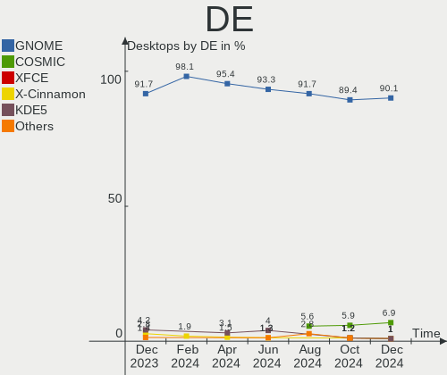
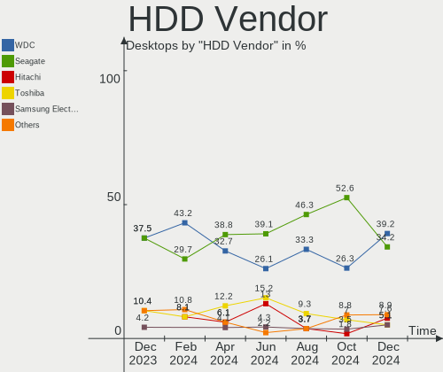
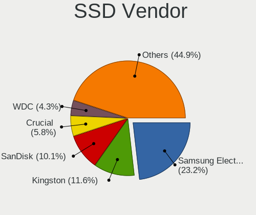
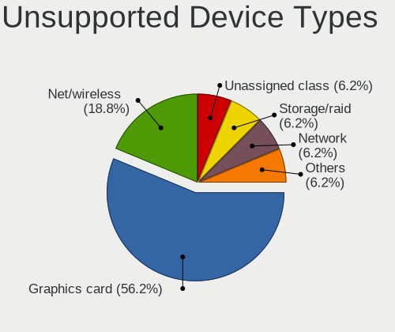

Pop!_OS Hardware Trends (Desktop)
---------------------------------

A project to identify most popular hardware characteristics and track their change
over time based on data collected by Pop!_OS users at https://Linux-Hardware.org.

Anyone can contribute to the study by uploading probes of their computers by
the [hw-probe](https://github.com/linuxhw/hw-probe) tool:

    sudo -E hw-probe -all -upload

Full-feature report is available here: https://linux-hardware.org/?view=trends&formfactor=desktop

Period: Sep, 2020.

Contents
--------

- [ OS                       ](#os)
- [ OS Family                ](#os-family)
- [ Kernel                   ](#kernel)
- [ Kernel Family            ](#kernel-family)
- [ Kernel Major Ver.        ](#kernel-major-ver)
- [ Arch                     ](#arch)
- [ DE                       ](#de)
- [ Display Server           ](#display-server)
- [ Display Manager          ](#display-manager)
- [ OS Lang                  ](#os-lang)
- [ Boot Mode                ](#boot-mode)
- [ Filesystem               ](#filesystem)
- [ Part. scheme             ](#part-scheme)
- [ Dual Boot with Linux/BSD ](#dual-boot-with-linux/bsd)
- [ Dual Boot (Win)          ](#dual-boot-win)
- [ Country                  ](#country)
- [ City                     ](#city)
- [ Vendor                   ](#vendor)
- [ Model                    ](#model)
- [ Model Family             ](#model-family)
- [ MFG Year                 ](#mfg-year)
- [ Form Factor              ](#form-factor)
- [ Secure Boot              ](#secure-boot)
- [ Coreboot                 ](#coreboot)
- [ RAM Size                 ](#ram-size)
- [ RAM Used                 ](#ram-used)
- [ Has CD-ROM               ](#has-cd-rom)
- [ Total Drives             ](#total-drives)
- [ Has Ethernet             ](#has-ethernet)
- [ Drive Vendor             ](#drive-vendor)
- [ HDD Vendor               ](#hdd-vendor)
- [ SSD Vendor               ](#ssd-vendor)
- [ Drive Model              ](#drive-model)
- [ Drive Kind               ](#drive-kind)
- [ Drive Connector          ](#drive-connector)
- [ Drive Size               ](#drive-size)
- [ Space Total              ](#space-total)
- [ Space Used               ](#space-used)
- [ Malfunc. Drives          ](#malfunc-drives)
- [ Malfunc. Drive Vendor    ](#malfunc-drive-vendor)
- [ Malfunc. HDD Vendor      ](#malfunc-hdd-vendor)
- [ Malfunc. Drive Kind      ](#malfunc-drive-kind)
- [ Failed Drives            ](#failed-drives)
- [ Failed Drive Vendor      ](#failed-drive-vendor)
- [ Drive Status             ](#drive-status)
- [ Storage Vendor           ](#storage-vendor)
- [ Storage Model            ](#storage-model)
- [ Storage Kind             ](#storage-kind)
- [ CPU Vendor               ](#cpu-vendor)
- [ CPU Model                ](#cpu-model)
- [ CPU Model Family         ](#cpu-model-family)
- [ CPU Cores                ](#cpu-cores)
- [ CPU Sockets              ](#cpu-sockets)
- [ CPU Threads              ](#cpu-threads)
- [ CPU Op-Modes             ](#cpu-op-modes)
- [ CPU Microcode            ](#cpu-microcode)
- [ CPU Microarch            ](#cpu-microarch)
- [ GPU Vendor               ](#gpu-vendor)
- [ GPU Model                ](#gpu-model)
- [ GPU Combo                ](#gpu-combo)
- [ GPU Driver               ](#gpu-driver)
- [ GPU Memory               ](#gpu-memory)
- [ Monitor Vendor           ](#monitor-vendor)
- [ Monitor Model            ](#monitor-model)
- [ Monitor Resolution       ](#monitor-resolution)
- [ Monitor Diagonal         ](#monitor-diagonal)
- [ Monitor Width            ](#monitor-width)
- [ Aspect Ratio             ](#aspect-ratio)
- [ Monitor Area             ](#monitor-area)
- [ Pixel Density            ](#pixel-density)
- [ Multiple Monitors        ](#multiple-monitors)
- [ Net Controller Vendor    ](#net-controller-vendor)
- [ Net Controller Model     ](#net-controller-model)
- [ Wireless Vendor          ](#wireless-vendor)
- [ Wireless Model           ](#wireless-model)
- [ Ethernet Vendor          ](#ethernet-vendor)
- [ Ethernet Model           ](#ethernet-model)
- [ Net Controller Kind      ](#net-controller-kind)
- [ Used Controller          ](#used-controller)
- [ NICs                     ](#nics)
- [ Memory Vendor            ](#memory-vendor)
- [ Memory Model             ](#memory-model)
- [ Memory Kind              ](#memory-kind)
- [ Memory Form Factor       ](#memory-form-factor)
- [ Memory Size              ](#memory-size)
- [ Memory Speed             ](#memory-speed)
- [ Sound Vendor             ](#sound-vendor)
- [ Sound Model              ](#sound-model)
- [ Camera Vendor            ](#camera-vendor)
- [ Camera Model             ](#camera-model)
- [ Fingerprint Vendor       ](#fingerprint-vendor)
- [ Fingerprint Model        ](#fingerprint-model)
- [ Chipcard Vendor          ](#chipcard-vendor)
- [ Chipcard Model           ](#chipcard-model)
- [ Printer Vendor           ](#printer-vendor)
- [ Printer Model            ](#printer-model)
- [ Scanner Vendor           ](#scanner-vendor)
- [ Scanner Model            ](#scanner-model)
- [ Bluetooth Vendor         ](#bluetooth-vendor)
- [ Bluetooth Model          ](#bluetooth-model)
- [ Unsupported Devices      ](#unsupported-devices)
- [ Unsupported Device Types ](#unsupported-device-types)

OS
--

Installed operating systems

| Name          | Desktops | Percent |
|---------------|----------|---------|
| Pop!_OS 20.04 | 97       | 100%    |

OS Family
---------

OS without a version

| Name    | Desktops | Percent |
|---------|----------|---------|
| Pop!_OS | 97       | 100%    |

Kernel
------

Version of the Linux kernel

| Version                   | Desktops | Percent |
|---------------------------|----------|---------|
| 5.4.0-7642-generic        | 75       | 77.32%  |
| 5.4.0-7634-generic        | 5        | 5.15%   |
| 5.8.12-xanmod1            | 3        | 3.09%   |
| 5.8.5-xanmod1             | 2        | 2.06%   |
| 5.8.5-050805-generic      | 2        | 2.06%   |
| 5.7.16-xanmod2            | 2        | 2.06%   |
| 5.4.0-7625-generic        | 2        | 2.06%   |
| 5.8.9-050809-generic      | 1        | 1.03%   |
| 5.8.8-xanmod1             | 1        | 1.03%   |
| 5.8.3-050803-generic      | 1        | 1.03%   |
| 5.8.10-xanmod1            | 1        | 1.03%   |
| 5.8.0-10.1-liquorix-amd64 | 1        | 1.03%   |
| 5.7.0-050700-generic      | 1        | 1.03%   |

Kernel Family
-------------

Linux kernel without a distro release

| Version | Desktops | Percent |
|---------|----------|---------|
| 5.4.0   | 82       | 84.54%  |
| 5.8.5   | 4        | 4.12%   |
| 5.8.12  | 3        | 3.09%   |
| 5.7.16  | 2        | 2.06%   |
| 5.8.9   | 1        | 1.03%   |
| 5.8.8   | 1        | 1.03%   |
| 5.8.3   | 1        | 1.03%   |
| 5.8.10  | 1        | 1.03%   |
| 5.8.0   | 1        | 1.03%   |
| 5.7.0   | 1        | 1.03%   |

Kernel Major Ver.
-----------------

Linux kernel major version

| Version | Desktops | Percent |
|---------|----------|---------|
| 5.4     | 82       | 84.54%  |
| 5.8     | 12       | 12.37%  |
| 5.7     | 3        | 3.09%   |

Arch
----

OS architecture (x86_64, i586, etc.)

| Name   | Desktops | Percent |
|--------|----------|---------|
| x86_64 | 97       | 100%    |

DE
--

Desktop Environment

| Name     | Desktops | Percent |
|----------|----------|---------|
| GNOME    | 92       | 94.85%  |
| XFCE     | 1        | 1.03%   |
| KDE5     | 1        | 1.03%   |
| KDE      | 1        | 1.03%   |
| Cinnamon | 1        | 1.03%   |
| Budgie   | 1        | 1.03%   |

Display Server
--------------

X11 or Wayland

| Name    | Desktops | Percent |
|---------|----------|---------|
| X11     | 94       | 96.91%  |
| Wayland | 2        | 2.06%   |
| Tty     | 1        | 1.03%   |

Display Manager
---------------

SDDM, LightDM, etc.

| Name    | Desktops | Percent |
|---------|----------|---------|
| Unknown | 71       | 73.2%   |
| GDM     | 25       | 25.77%  |
| SDDM    | 1        | 1.03%   |

OS Lang
-------

Language

| Lang  | Desktops | Percent |
|-------|----------|---------|
| en_US | 51       | 52.58%  |
| en_GB | 12       | 12.37%  |
| de_DE | 5        | 5.15%   |
| en_CA | 4        | 4.12%   |
| en_AU | 4        | 4.12%   |
| nl_NL | 3        | 3.09%   |
| es_ES | 3        | 3.09%   |
| ru_RU | 2        | 2.06%   |
| pt_BR | 2        | 2.06%   |
| it_IT | 2        | 2.06%   |
| fr_FR | 2        | 2.06%   |
| C     | 2        | 2.06%   |
| zh_TW | 1        | 1.03%   |
| pl_PL | 1        | 1.03%   |
| nb_NO | 1        | 1.03%   |
| ko_KR | 1        | 1.03%   |
| cs_CZ | 1        | 1.03%   |

Boot Mode
---------

EFI or BIOS

| Mode | Desktops | Percent |
|------|----------|---------|
| EFI  | 61       | 62.89%  |
| BIOS | 36       | 37.11%  |

Filesystem
----------

Type of filesystem

| Type | Desktops | Percent |
|------|----------|---------|
| Ext4 | 97       | 100%    |

Part. scheme
------------

Scheme of partitioning

| Type    | Desktops | Percent |
|---------|----------|---------|
| Unknown | 71       | 73.2%   |
| GPT     | 23       | 23.71%  |
| MBR     | 3        | 3.09%   |

Dual Boot with Linux/BSD
------------------------

Hosting more than one Linux/BSD

| Dual boot | Desktops | Percent |
|-----------|----------|---------|
| No        | 92       | 94.85%  |
| Yes       | 5        | 5.15%   |

Dual Boot (Win)
---------------

Hosting Linux and Windows

| Dual boot | Desktops | Percent |
|-----------|----------|---------|
| No        | 76       | 78.35%  |
| Yes       | 21       | 21.65%  |

Country
-------

Geographic location (country)

| Country            | Desktops | Percent |
|--------------------|----------|---------|
| USA                | 33       | 34.02%  |
| UK                 | 8        | 8.25%   |
| Canada             | 5        | 5.15%   |
| Brazil             | 4        | 4.12%   |
| Australia          | 4        | 4.12%   |
| Switzerland        | 3        | 3.09%   |
| Spain              | 3        | 3.09%   |
| Norway             | 3        | 3.09%   |
| Netherlands        | 3        | 3.09%   |
| Germany            | 3        | 3.09%   |
| Belgium            | 3        | 3.09%   |
| Taiwan             | 2        | 2.06%   |
| South Africa       | 2        | 2.06%   |
| Russia             | 2        | 2.06%   |
| Poland             | 2        | 2.06%   |
| Italy              | 2        | 2.06%   |
| Ukraine            | 1        | 1.03%   |
| Thailand           | 1        | 1.03%   |
| Singapore          | 1        | 1.03%   |
| Philippines        | 1        | 1.03%   |
| Mexico             | 1        | 1.03%   |
| Mauritius          | 1        | 1.03%   |
| Korea, Republic of | 1        | 1.03%   |
| Japan              | 1        | 1.03%   |
| Israel             | 1        | 1.03%   |
| Indonesia          | 1        | 1.03%   |
| Iceland            | 1        | 1.03%   |
| France             | 1        | 1.03%   |
| Finland            | 1        | 1.03%   |
| Czech Republic     | 1        | 1.03%   |
| Argentina          | 1        | 1.03%   |

City
----

Geographic location (city)

| City                    | Desktops | Percent |
|-------------------------|----------|---------|
| Horw                    | 2        | 2.06%   |
| Zonhoven                | 1        | 1.03%   |
| Zandvoort               | 1        | 1.03%   |
| Yamaguchi               | 1        | 1.03%   |
| Wrocław                | 1        | 1.03%   |
| Woodbury                | 1        | 1.03%   |
| Winter Garden           | 1        | 1.03%   |
| Weatherford             | 1        | 1.03%   |
| Warsaw                  | 1        | 1.03%   |
| Villa Martelli          | 1        | 1.03%   |
| Turin                   | 1        | 1.03%   |
| Truth or Consequences   | 1        | 1.03%   |
| Trussville              | 1        | 1.03%   |
| Tel Aviv                | 1        | 1.03%   |
| Taoyuan District        | 1        | 1.03%   |
| Taganrog                | 1        | 1.03%   |
| Sydney                  | 1        | 1.03%   |
| St Petersburg           | 1        | 1.03%   |
| Solbergelva             | 1        | 1.03%   |
| Soemmerda               | 1        | 1.03%   |
| Singapore               | 1        | 1.03%   |
| Sejong                  | 1        | 1.03%   |
| Seattle                 | 1        | 1.03%   |
| Sangerdi                | 1        | 1.03%   |
| San Antonio             | 1        | 1.03%   |
| Salt Lake City          | 1        | 1.03%   |
| Rio de Janeiro          | 1        | 1.03%   |
| Red Deer                | 1        | 1.03%   |
| Recife                  | 1        | 1.03%   |
| Raynes Park             | 1        | 1.03%   |
| Quezon City             | 1        | 1.03%   |
| Prosper                 | 1        | 1.03%   |
| Princeton               | 1        | 1.03%   |
| Porsgrunn               | 1        | 1.03%   |
| Polokwane               | 1        | 1.03%   |
| Pilsen                  | 1        | 1.03%   |
| Perth                   | 1        | 1.03%   |
| Oviedo                  | 1        | 1.03%   |
| Osteras                 | 1        | 1.03%   |
| Orlando                 | 1        | 1.03%   |
| Olympia                 | 1        | 1.03%   |
| Nonthaburi              | 1        | 1.03%   |
| Newport                 | 1        | 1.03%   |
| New York                | 1        | 1.03%   |
| Monza                   | 1        | 1.03%   |
| McKinney                | 1        | 1.03%   |
| Lubbock                 | 1        | 1.03%   |
| Lockport                | 1        | 1.03%   |
| Llinars del Valles      | 1        | 1.03%   |
| Lincoln                 | 1        | 1.03%   |
| Lexington               | 1        | 1.03%   |
| Leuven                  | 1        | 1.03%   |
| Killeen                 | 1        | 1.03%   |
| Kharkiv                 | 1        | 1.03%   |
| Kansas City             | 1        | 1.03%   |
| Jaboatao dos Guararapes | 1        | 1.03%   |
| Hyattsville             | 1        | 1.03%   |
| Hsinchu                 | 1        | 1.03%   |
| Hornsby                 | 1        | 1.03%   |
| Helsinki                | 1        | 1.03%   |

Vendor
------

Motherboard manufacturer

| Name                | Desktops | Percent |
|---------------------|----------|---------|
| ASUSTek Computer    | 32       | 32.99%  |
| MSI                 | 20       | 20.62%  |
| Gigabyte Technology | 13       | 13.4%   |
| ASRock              | 10       | 10.31%  |
| Dell                | 7        | 7.22%   |
| Hewlett-Packard     | 3        | 3.09%   |
| Medion              | 2        | 2.06%   |
| Foxconn             | 2        | 2.06%   |
| Acer                | 2        | 2.06%   |
| T-bao               | 1        | 1.03%   |
| System76            | 1        | 1.03%   |
| Pegatron            | 1        | 1.03%   |
| Minix               | 1        | 1.03%   |
| ECS                 | 1        | 1.03%   |
| Biostar             | 1        | 1.03%   |

Model
-----

Motherboard model

| Name                           | Desktops | Percent |
|--------------------------------|----------|---------|
| ASUS All Series                | 6        | 6.19%   |
| MSI MS-7B86                    | 3        | 3.09%   |
| MSI MS-7B85                    | 2        | 2.06%   |
| MSI MS-7A34                    | 2        | 2.06%   |
| Gigabyte X570 UD               | 2        | 2.06%   |
| Dell OptiPlex 3010             | 2        | 2.06%   |
| ASUS ROG STRIX B350-F GAMING   | 2        | 2.06%   |
| ASUS PRIME B450M-A             | 2        | 2.06%   |
| ASUS PRIME B350-PLUS           | 2        | 2.06%   |
| T-bao MINI PC                  | 1        | 1.03%   |
| System76 Thelio                | 1        | 1.03%   |
| Pegatron p6-2136               | 1        | 1.03%   |
| MSI Pro 3130 Microtower PC     | 1        | 1.03%   |
| MSI MS-7C10                    | 1        | 1.03%   |
| MSI MS-7C02                    | 1        | 1.03%   |
| MSI MS-7B79                    | 1        | 1.03%   |
| MSI MS-7B78                    | 1        | 1.03%   |
| MSI MS-7B22                    | 1        | 1.03%   |
| MSI MS-7B17                    | 1        | 1.03%   |
| MSI MS-7B07                    | 1        | 1.03%   |
| MSI MS-7A71                    | 1        | 1.03%   |
| MSI MS-7A40                    | 1        | 1.03%   |
| MSI MS-7917                    | 1        | 1.03%   |
| MSI MS-7640                    | 1        | 1.03%   |
| MSI MS-7522                    | 1        | 1.03%   |
| Minix NEO J50C-4               | 1        | 1.03%   |
| Medion MS-7728                 | 1        | 1.03%   |
| Medion MD34070/2534            | 1        | 1.03%   |
| HP Z440 Workstation            | 1        | 1.03%   |
| HP EliteDesk 705 G3 MT         | 1        | 1.03%   |
| HP Elite Slice                 | 1        | 1.03%   |
| Gigabyte Z370P D3              | 1        | 1.03%   |
| Gigabyte X570 I AORUS PRO WIFI | 1        | 1.03%   |
| Gigabyte X570 AORUS PRO        | 1        | 1.03%   |
| Gigabyte X570 AORUS MASTER     | 1        | 1.03%   |
| Gigabyte H97N-WIFI             | 1        | 1.03%   |
| Gigabyte H81M-HD3              | 1        | 1.03%   |
| Gigabyte H61M-S2V-B3           | 1        | 1.03%   |
| Gigabyte H110M-S2PV            | 1        | 1.03%   |
| Gigabyte G1.Sniper A88X-CF     | 1        | 1.03%   |
| Gigabyte B550 AORUS MASTER     | 1        | 1.03%   |
| Gigabyte 990FXA-UD3            | 1        | 1.03%   |
| Foxconn H61MXE                 | 1        | 1.03%   |
| Foxconn BK170AA-ABA HPE-210y   | 1        | 1.03%   |
| ECS H81H3-M4                   | 1        | 1.03%   |
| Dell XPS 8700                  | 1        | 1.03%   |
| Dell Studio One 1909           | 1        | 1.03%   |
| Dell OptiPlex 7010             | 1        | 1.03%   |
| Dell OptiPlex 390              | 1        | 1.03%   |
| Dell Inspiron 5680             | 1        | 1.03%   |
| Biostar A320MH PRO             | 1        | 1.03%   |
| ASUS Z8NA-D6                   | 1        | 1.03%   |
| ASUS TUF GAMING X570-PLUS      | 1        | 1.03%   |
| ASUS TUF GAMING B550-PLUS      | 1        | 1.03%   |
| ASUS TUF B360M-PLUS GAMING/BR  | 1        | 1.03%   |
| ASUS SABERTOOTH Z170 S         | 1        | 1.03%   |
| ASUS ROG STRIX X570-E GAMING   | 1        | 1.03%   |
| ASUS ROG STRIX X470-F GAMING   | 1        | 1.03%   |
| ASUS ROG STRIX B550-F GAMING   | 1        | 1.03%   |
| ASUS ROG STRIX B360-F GAMING   | 1        | 1.03%   |

Model Family
------------

Motherboard model prefix

| Name                 | Desktops | Percent |
|----------------------|----------|---------|
| ASUS ROG             | 9        | 9.28%   |
| ASUS PRIME           | 6        | 6.19%   |
| ASUS All             | 6        | 6.19%   |
| Gigabyte X570        | 5        | 5.15%   |
| Dell OptiPlex        | 4        | 4.12%   |
| MSI MS-7B86          | 3        | 3.09%   |
| ASUS TUF             | 3        | 3.09%   |
| MSI MS-7B85          | 2        | 2.06%   |
| MSI MS-7A34          | 2        | 2.06%   |
| ASRock B450M         | 2        | 2.06%   |
| T-bao MINI           | 1        | 1.03%   |
| System76 Thelio      | 1        | 1.03%   |
| Pegatron p6-2136     | 1        | 1.03%   |
| MSI Pro              | 1        | 1.03%   |
| MSI MS-7C10          | 1        | 1.03%   |
| MSI MS-7C02          | 1        | 1.03%   |
| MSI MS-7B79          | 1        | 1.03%   |
| MSI MS-7B78          | 1        | 1.03%   |
| MSI MS-7B22          | 1        | 1.03%   |
| MSI MS-7B17          | 1        | 1.03%   |
| MSI MS-7B07          | 1        | 1.03%   |
| MSI MS-7A71          | 1        | 1.03%   |
| MSI MS-7A40          | 1        | 1.03%   |
| MSI MS-7917          | 1        | 1.03%   |
| MSI MS-7640          | 1        | 1.03%   |
| MSI MS-7522          | 1        | 1.03%   |
| Minix NEO            | 1        | 1.03%   |
| Medion MS-7728       | 1        | 1.03%   |
| Medion MD34070       | 1        | 1.03%   |
| HP Z440              | 1        | 1.03%   |
| HP EliteDesk         | 1        | 1.03%   |
| HP Elite             | 1        | 1.03%   |
| Gigabyte Z370P       | 1        | 1.03%   |
| Gigabyte H97N-WIFI   | 1        | 1.03%   |
| Gigabyte H81M-HD3    | 1        | 1.03%   |
| Gigabyte H61M-S2V-B3 | 1        | 1.03%   |
| Gigabyte H110M-S2PV  | 1        | 1.03%   |
| Gigabyte G1.Sniper   | 1        | 1.03%   |
| Gigabyte B550        | 1        | 1.03%   |
| Gigabyte 990FXA-UD3  | 1        | 1.03%   |
| Foxconn H61MXE       | 1        | 1.03%   |
| Foxconn BK170AA-ABA  | 1        | 1.03%   |
| ECS H81H3-M4         | 1        | 1.03%   |
| Dell XPS             | 1        | 1.03%   |
| Dell Studio          | 1        | 1.03%   |
| Dell Inspiron        | 1        | 1.03%   |
| Biostar A320MH       | 1        | 1.03%   |
| ASUS Z8NA-D6         | 1        | 1.03%   |
| ASUS SABERTOOTH      | 1        | 1.03%   |
| ASUS Pro             | 1        | 1.03%   |
| ASUS P8Z77-V         | 1        | 1.03%   |
| ASUS P8H61-M         | 1        | 1.03%   |
| ASUS M5A97           | 1        | 1.03%   |
| ASUS G20AJ           | 1        | 1.03%   |
| ASUS A88XM-PLUS      | 1        | 1.03%   |
| ASRock Z390          | 1        | 1.03%   |
| ASRock X570M         | 1        | 1.03%   |
| ASRock X570          | 1        | 1.03%   |
| ASRock X399          | 1        | 1.03%   |
| ASRock N68C-GS       | 1        | 1.03%   |

MFG Year
--------

Motherboard manufacture year

| Year | Desktops | Percent |
|------|----------|---------|
| 2019 | 26       | 26.8%   |
| 2020 | 21       | 21.65%  |
| 2018 | 9        | 9.28%   |
| 2017 | 9        | 9.28%   |
| 2013 | 7        | 7.22%   |
| 2012 | 6        | 6.19%   |
| 2014 | 5        | 5.15%   |
| 2015 | 4        | 4.12%   |
| 2011 | 3        | 3.09%   |
| 2009 | 3        | 3.09%   |
| 2016 | 2        | 2.06%   |
| 2010 | 1        | 1.03%   |
| 2007 | 1        | 1.03%   |

Form Factor
-----------

Physical design of the computer

| Name    | Desktops | Percent |
|---------|----------|---------|
| Desktop | 97       | 100%    |

Secure Boot
-----------

Enabled or disabled

| State    | Desktops | Percent |
|----------|----------|---------|
| Disabled | 97       | 100%    |

Coreboot
--------

Have coreboot on board

| Used | Desktops | Percent |
|------|----------|---------|
| No   | 97       | 100%    |

RAM Size
--------

Total RAM memory

| Size in GB  | Desktops | Percent |
|-------------|----------|---------|
| 16.01-24.0  | 34       | 35.05%  |
| 32.01-64.0  | 21       | 21.65%  |
| 8.01-16.0   | 17       | 17.53%  |
| 4.01-8.0    | 9        | 9.28%   |
| 3.01-4.0    | 6        | 6.19%   |
| 24.01-32.0  | 6        | 6.19%   |
| 64.01-256.0 | 3        | 3.09%   |
| 1.01-2.0    | 1        | 1.03%   |

RAM Used
--------

Used RAM memory

| Used GB    | Desktops | Percent |
|------------|----------|---------|
| 2.01-3.0   | 31       | 31.96%  |
| 4.01-8.0   | 24       | 24.74%  |
| 3.01-4.0   | 19       | 19.59%  |
| 1.01-2.0   | 17       | 17.53%  |
| 8.01-16.0  | 5        | 5.15%   |
| 24.01-32.0 | 1        | 1.03%   |

Has CD-ROM
----------

Has CD-ROM on board

| Presented | Desktops | Percent |
|-----------|----------|---------|
| No        | 73       | 75.26%  |
| Yes       | 24       | 24.74%  |

Total Drives
------------

Number of drives on board

| Drives | Desktops | Percent |
|--------|----------|---------|
| 2      | 29       | 29.9%   |
| 1      | 22       | 22.68%  |
| 3      | 20       | 20.62%  |
| 4      | 17       | 17.53%  |
| 5      | 5        | 5.15%   |
| 6      | 2        | 2.06%   |
| 0      | 2        | 2.06%   |

Has Ethernet
------------

Has Ethernet on board

| Presented | Desktops | Percent |
|-----------|----------|---------|
| Yes       | 96       | 98.97%  |
| No        | 1        | 1.03%   |

Drive Vendor
------------

Hard drive vendors

| Vendor                    | Desktops | Drives | Percent |
|---------------------------|----------|--------|---------|
| Seagate                   | 37       | 45     | 18.32%  |
| WDC                       | 36       | 48     | 17.82%  |
| Samsung Electronics       | 27       | 43     | 13.37%  |
| Toshiba                   | 18       | 20     | 8.91%   |
| Kingston                  | 17       | 18     | 8.42%   |
| Crucial                   | 15       | 17     | 7.43%   |
| SanDisk                   | 9        | 9      | 4.46%   |
| Hitachi                   | 7        | 7      | 3.47%   |
| A-DATA Technology         | 6        | 6      | 2.97%   |
| Unknown                   | 4        | 3      | 1.98%   |
| Phison                    | 4        | 6      | 1.98%   |
| Intel                     | 4        | 4      | 1.98%   |
| Silicon Motion            | 2        | 2      | 0.99%   |
| TO Exter                  | 1        | 1      | 0.5%    |
| Team                      | 1        | 2      | 0.5%    |
| SK Hynix                  | 1        | 1      | 0.5%    |
| PNY                       | 1        | 1      | 0.5%    |
| Patriot                   | 1        | 1      | 0.5%    |
| OCZ                       | 1        | 1      | 0.5%    |
| Neo Forza                 | 1        | 1      | 0.5%    |
| Micron/Crucial Technology | 1        | 1      | 0.5%    |
| Micron Technology         | 1        | 1      | 0.5%    |
| LITEON                    | 1        | 1      | 0.5%    |
| Intenso                   | 1        | 1      | 0.5%    |
| HGST                      | 1        | 1      | 0.5%    |
| Hewlett-Packard           | 1        | 1      | 0.5%    |
| GOODRAM                   | 1        | 1      | 0.5%    |
| GAMER                     | 1        | 1      | 0.5%    |
| Apacer                    | 1        | 1      | 0.5%    |

HDD Vendor
----------

Hard disk drive vendors

| Vendor          | Desktops | Drives | Percent |
|-----------------|----------|--------|---------|
| Seagate         | 37       | 44     | 38.95%  |
| WDC             | 32       | 40     | 33.68%  |
| Toshiba         | 16       | 18     | 16.84%  |
| Hitachi         | 7        | 7      | 7.37%   |
| TO Exter        | 1        | 1      | 1.05%   |
| HGST            | 1        | 1      | 1.05%   |
| Hewlett-Packard | 1        | 1      | 1.05%   |

SSD Vendor
----------

Solid state drive vendors

| Vendor              | Desktops | Drives | Percent |
|---------------------|----------|--------|---------|
| Samsung Electronics | 16       | 21     | 21.33%  |
| Kingston            | 14       | 15     | 18.67%  |
| Crucial             | 14       | 16     | 18.67%  |
| WDC                 | 7        | 7      | 9.33%   |
| SanDisk             | 7        | 7      | 9.33%   |
| A-DATA Technology   | 5        | 5      | 6.67%   |
| Toshiba             | 2        | 2      | 2.67%   |
| Unknown             | 1        | 1      | 1.33%   |
| Team                | 1        | 2      | 1.33%   |
| PNY                 | 1        | 1      | 1.33%   |
| Patriot             | 1        | 1      | 1.33%   |
| OCZ                 | 1        | 1      | 1.33%   |
| Micron Technology   | 1        | 1      | 1.33%   |
| LITEON              | 1        | 1      | 1.33%   |
| Intenso             | 1        | 1      | 1.33%   |
| GOODRAM             | 1        | 1      | 1.33%   |
| Apacer              | 1        | 1      | 1.33%   |

Drive Model
-----------

Hard drive models

| Model                        | Desktops | Percent |
|------------------------------|----------|---------|
| NVMe SSD Drive 1TB           | 11       | 4.74%   |
| ST1000DM010-2EP102 1TB       | 6        | 2.59%   |
| NVMe SSD Drive 1024GB        | 6        | 2.59%   |
| SV300S37A120G 120GB SSD      | 4        | 1.72%   |
| ST1000DM003-1CH162 1TB       | 4        | 1.72%   |
| SSD 860 EVO 1TB              | 3        | 1.29%   |
| SSD 850 EVO 250GB            | 3        | 1.29%   |
| SA400S37240G 240GB SSD       | 3        | 1.29%   |
| NVMe SSD Drive 512GB         | 3        | 1.29%   |
| NVMe SSD Drive 500GB         | 3        | 1.29%   |
| DT01ACA100 1TB               | 3        | 1.29%   |
| CT525MX300SSD1 528GB         | 3        | 1.29%   |
| WD30EZRX-00SPEB0 3TB         | 2        | 0.86%   |
| WD20EARS-00MVWB0 2TB         | 2        | 0.86%   |
| WD10EZEX-22BN5A0 1TB         | 2        | 0.86%   |
| WD10EZEX-08WN4A0 1TB         | 2        | 0.86%   |
| WD1003FZEX-00MK2A0 1TB       | 2        | 0.86%   |
| WD1003FZEX-00K3CA0 1TB       | 2        | 0.86%   |
| ST500DM002-1BD142 500GB      | 2        | 0.86%   |
| ST2000DM008-2FR102 2TB       | 2        | 0.86%   |
| ST2000DM006-2DM164 2TB       | 2        | 0.86%   |
| ST2000DM001-1ER164 2TB       | 2        | 0.86%   |
| SSD 970 EVO Plus 1TB         | 2        | 0.86%   |
| SSD 860 EVO 250GB            | 2        | 0.86%   |
| SSD 850 EVO 120GB            | 2        | 0.86%   |
| SA400M8240G 240GB SSD        | 2        | 0.86%   |
| NVMe SSD Drive 256GB         | 2        | 0.86%   |
| NVMe SSD Drive 250GB         | 2        | 0.86%   |
| HDWD130 3TB                  | 2        | 0.86%   |
| HDWD120 2TB                  | 2        | 0.86%   |
| HDS721616PLA380 160GB        | 2        | 0.86%   |
| DT01ACA300 3TB               | 2        | 0.86%   |
| DT01ACA200 2TB               | 2        | 0.86%   |
| CT500MX500SSD1 500GB         | 2        | 0.86%   |
| CT1000MX500SSD1 1TB          | 2        | 0.86%   |
| WDS500G2B0B-00YS70 500GB SSD | 1        | 0.43%   |
| WDS500G2B0A-00SM50 500GB SSD | 1        | 0.43%   |
| WDS480G2G0A-00JH30 480GB SSD | 1        | 0.43%   |
| WDS400T2B0A-00SM50 4TB SSD   | 1        | 0.43%   |
| WDS120G2G0A-00JH30 120GB SSD | 1        | 0.43%   |
| WDS100T2B0C-00PXH0 1TB       | 1        | 0.43%   |
| WDBNCE5000PNC 500GB SSD      | 1        | 0.43%   |
| WDBNCE0010PNC 1TB SSD        | 1        | 0.43%   |
| WD7500BPVT-60HXZT1 752GB     | 1        | 0.43%   |
| WD6401AALS-00L3B2 640GB      | 1        | 0.43%   |
| WD5000LPVX-22V0TT0 500GB     | 1        | 0.43%   |
| WD5000BEVT-35A0RT0 500GB     | 1        | 0.43%   |
| WD5000AVVS-63ZWB0 500GB      | 1        | 0.43%   |
| WD5000AVCS-632DY1 500GB      | 1        | 0.43%   |
| WD5000AADS-00S9B0 500GB      | 1        | 0.43%   |
| WD4003FZEX-00Z4SA0 4TB       | 1        | 0.43%   |
| WD3200AAKX-001CA0 320GB      | 1        | 0.43%   |
| WD3200AAKS-00YGA0 320GB      | 1        | 0.43%   |
| WD30EZRS-00J99B0 3TB         | 1        | 0.43%   |
| WD30EFRX-68EUZN0 3TB         | 1        | 0.43%   |
| WD2502ABYS-18B7A0 250GB      | 1        | 0.43%   |
| WD20EZRZ-00Z5HB0 2TB         | 1        | 0.43%   |
| WD20EZRX-00D8PB0 2TB         | 1        | 0.43%   |
| WD20EARX-00PASB0 2TB         | 1        | 0.43%   |
| WD2003FYPS-27Y2B0 2TB        | 1        | 0.43%   |

Drive Kind
----------

HDD or SSD

| Kind    | Desktops | Drives | Percent |
|---------|----------|--------|---------|
| HDD     | 72       | 112    | 41.38%  |
| SSD     | 60       | 84     | 34.48%  |
| NVMe    | 37       | 45     | 21.26%  |
| Unknown | 4        | 3      | 2.3%    |
| MMC     | 1        | 1      | 0.57%   |

Drive Connector
---------------

SATA, SAS, NVMe, etc.

| Type | Desktops | Drives | Percent |
|------|----------|--------|---------|
| SATA | 86       | 194    | 66.15%  |
| NVMe | 37       | 45     | 28.46%  |
| SAS  | 6        | 5      | 4.62%   |
| MMC  | 1        | 1      | 0.77%   |

Drive Size
----------

Size of hard drive

| Size in TB | Desktops | Drives | Percent |
|------------|----------|--------|---------|
| 0.01-0.5   | 70       | 103    | 40.94%  |
| 0.51-1.0   | 55       | 82     | 32.16%  |
| 1.01-2.0   | 28       | 38     | 16.37%  |
| 3.01-4.0   | 7        | 8      | 4.09%   |
| 2.01-3.0   | 7        | 9      | 4.09%   |
| 4.01-10.0  | 4        | 5      | 2.34%   |

Space Total
-----------

Amount of disk space available on the file system

| Size in GB     | Desktops | Percent |
|----------------|----------|---------|
| 101-250        | 22       | 22.68%  |
| 501-1000       | 19       | 19.59%  |
| 251-500        | 14       | 14.43%  |
| 1001-2000      | 14       | 14.43%  |
| More than 3000 | 13       | 13.4%   |
| 2001-3000      | 9        | 9.28%   |
| 51-100         | 3        | 3.09%   |
| 21-50          | 2        | 2.06%   |
| 1-20           | 1        | 1.03%   |

Space Used
----------

Amount of used disk space

| Used GB        | Desktops | Percent |
|----------------|----------|---------|
| 1-20           | 28       | 28.87%  |
| 251-500        | 18       | 18.56%  |
| 21-50          | 13       | 13.4%   |
| 101-250        | 10       | 10.31%  |
| 501-1000       | 9        | 9.28%   |
| More than 3000 | 6        | 6.19%   |
| 51-100         | 6        | 6.19%   |
| 1001-2000      | 5        | 5.15%   |
| 2001-3000      | 2        | 2.06%   |

Malfunc. Drives
---------------

Drive models with a malfunction

| Model                             | Desktops | Drives | Percent |
|-----------------------------------|----------|--------|---------|
| WD7500BPVT-60HXZT1 752GB          | 1        | 1      | 9.09%   |
| WD30EZRX-00SPEB0 3TB              | 1        | 1      | 9.09%   |
| WD10JPCX-24UE4T0 1TB              | 1        | 1      | 9.09%   |
| WD10EZRX-00A8LB0 1TB              | 1        | 1      | 9.09%   |
| ST500LT012-9WS142 500GB           | 1        | 1      | 9.09%   |
| ST31000524AS 1TB                  | 1        | 1      | 9.09%   |
| ST1000DM003-1CH162 1TB            | 1        | 1      | 9.09%   |
| SA400S37120G 120GB SSD            | 1        | 1      | 9.09%   |
| MTFDDAK512MBF-1AN1ZABHA 512GB SSD | 1        | 1      | 9.09%   |
| MK5061GSY 500GB                   | 1        | 1      | 9.09%   |
| CT525MX300SSD1 528GB              | 1        | 1      | 9.09%   |

Malfunc. Drive Vendor
---------------------

Vendors of faulty drives

| Vendor            | Desktops | Drives | Percent |
|-------------------|----------|--------|---------|
| WDC               | 4        | 4      | 36.36%  |
| Seagate           | 3        | 3      | 27.27%  |
| Toshiba           | 1        | 1      | 9.09%   |
| Micron Technology | 1        | 1      | 9.09%   |
| Kingston          | 1        | 1      | 9.09%   |
| Crucial           | 1        | 1      | 9.09%   |

Malfunc. HDD Vendor
-------------------

Vendors of faulty HDD drives

| Vendor  | Desktops | Drives | Percent |
|---------|----------|--------|---------|
| WDC     | 4        | 4      | 50%     |
| Seagate | 3        | 3      | 37.5%   |
| Toshiba | 1        | 1      | 12.5%   |

Malfunc. Drive Kind
-------------------

Kinds of faulty drives

| Kind | Desktops | Drives | Percent |
|------|----------|--------|---------|
| HDD  | 7        | 8      | 70%     |
| SSD  | 3        | 3      | 30%     |

Failed Drives
-------------

Failed drive models

Zero info for selected period =(

Failed Drive Vendor
-------------------

Failed drive vendors

Zero info for selected period =(

Drive Status
------------

Number of failed and malfunc. drives

| Status   | Desktops | Drives | Percent |
|----------|----------|--------|---------|
| Detected | 70       | 164    | 66.04%  |
| Works    | 26       | 70     | 24.53%  |
| Malfunc  | 10       | 11     | 9.43%   |

Storage Vendor
--------------

Storage controller vendors

| Vendor                           | Desktops | Percent |
|----------------------------------|----------|---------|
| AMD                              | 52       | 36.11%  |
| Intel                            | 45       | 31.25%  |
| Samsung Electronics              | 18       | 12.5%   |
| ASMedia Technology               | 7        | 4.86%   |
| Phison Electronics               | 4        | 2.78%   |
| Sandisk                          | 3        | 2.08%   |
| Kingston Technology Company      | 3        | 2.08%   |
| Silicon Motion                   | 2        | 1.39%   |
| Nvidia                           | 2        | 1.39%   |
| Micron/Crucial Technology        | 2        | 1.39%   |
| ADATA Technology                 | 2        | 1.39%   |
| SK Hynix                         | 1        | 0.69%   |
| Silicon Integrated Systems [SiS] | 1        | 0.69%   |
| Marvell Technology Group         | 1        | 0.69%   |
| JMicron Technology               | 1        | 0.69%   |

Storage Model
-------------

Storage controller models

| Model                                                                             | Desktops | Percent |
|-----------------------------------------------------------------------------------|----------|---------|
| FCH SATA Controller [AHCI mode]                                                   | 45       | 24.46%  |
| NVMe SSD Controller SM981/PM981/PM983                                             | 16       | 8.7%    |
| 400 Series Chipset SATA Controller                                                | 15       | 8.15%   |
| 300 Series Chipset SATA Controller                                                | 8        | 4.35%   |
| ASM1062 Serial ATA Controller                                                     | 7        | 3.8%    |
| 8 Series/C220 Series Chipset Family 6-port SATA Controller 1 [AHCI mode]          | 7        | 3.8%    |
| Cannon Lake PCH SATA AHCI Controller                                              | 6        | 3.26%   |
| Non-Volatile memory controller                                                    | 5        | 2.72%   |
| 9 Series Chipset Family SATA Controller [AHCI Mode]                               | 5        | 2.72%   |
| 6 Series/C200 Series Chipset Family 6 port Desktop SATA AHCI Controller           | 5        | 2.72%   |
| SB7x0/SB8x0/SB9x0 SATA Controller [AHCI mode]                                     | 4        | 2.17%   |
| 200 Series PCH SATA controller [AHCI mode]                                        | 4        | 2.17%   |
| SATA controller                                                                   | 3        | 1.63%   |
| Q170/Q150/B150/H170/H110/Z170/CM236 Chipset SATA Controller [AHCI Mode]           | 3        | 1.63%   |
| NVMe SSD Controller SM961/PM961                                                   | 3        | 1.63%   |
| FCH SATA Controller D                                                             | 3        | 1.63%   |
| A2000, M.2, 500GB                                                                 | 3        | 1.63%   |
| XPG SX8200 Pro PCIe Gen3x4 M.2 2280 Solid State Drive                             | 2        | 1.09%   |
| SSD 660P Series                                                                   | 2        | 1.09%   |
| SSD 600P Series                                                                   | 2        | 1.09%   |
| SATA Controller [RAID mode]                                                       | 2        | 1.09%   |
| P1 NVMe PCIe SSD                                                                  | 2        | 1.09%   |
| E16 PCIe4 NVMe Controller                                                         | 2        | 1.09%   |
| E12 NVMe Controller                                                               | 2        | 1.09%   |
| 82801JI (ICH10 Family) 4 port SATA IDE Controller #1                              | 2        | 1.09%   |
| 82801JI (ICH10 Family) 2 port SATA IDE Controller #2                              | 2        | 1.09%   |
| 7 Series/C210 Series Chipset Family 6-port SATA Controller [AHCI mode]            | 2        | 1.09%   |
| 6 Series/C200 Series Chipset Family Desktop SATA Controller (IDE mode, ports 4-5) | 2        | 1.09%   |
| 6 Series/C200 Series Chipset Family Desktop SATA Controller (IDE mode, ports 0-3) | 2        | 1.09%   |
| X399 Series Chipset SATA Controller                                               | 1        | 0.54%   |
| X370 Series Chipset SATA Controller                                               | 1        | 0.54%   |
| SB7x0/SB8x0/SB9x0 IDE Controller                                                  | 1        | 0.54%   |
| SATA Controller / IDE mode                                                        | 1        | 0.54%   |
| RS690 PCI to PCI Bridge (PCI Express Port 2)                                      | 1        | 0.54%   |
| MCP79 AHCI Controller                                                             | 1        | 0.54%   |
| MCP61 SATA Controller                                                             | 1        | 0.54%   |
| MCP61 IDE                                                                         | 1        | 0.54%   |
| JMB363 SATA/IDE Controller                                                        | 1        | 0.54%   |
| FCH RAID Controller                                                               | 1        | 0.54%   |
| C610/X99 series chipset sSATA Controller [RAID mode]                              | 1        | 0.54%   |
| C600/X79 series chipset SATA RAID Controller                                      | 1        | 0.54%   |
| BC501 NVMe Solid State Drive 512GB                                                | 1        | 0.54%   |
| 88SE9172 SATA 6Gb/s Controller                                                    | 1        | 0.54%   |
| 82Q35 Express PT IDER Controller                                                  | 1        | 0.54%   |
| 82801IR/IO/IH (ICH9R/DO/DH) 6 port SATA Controller [AHCI mode]                    | 1        | 0.54%   |
| 5513 IDE Controller                                                               | 1        | 0.54%   |
| 5 Series/3400 Series Chipset 6 port SATA AHCI Controller                          | 1        | 0.54%   |

Storage Kind
------------

Kind of storage controller (IDE, SATA, NVMe, SAS, ...)

| Kind | Desktops | Percent |
|------|----------|---------|
| SATA | 87       | 63.97%  |
| NVMe | 37       | 27.21%  |
| IDE  | 8        | 5.88%   |
| RAID | 4        | 2.94%   |

CPU Vendor
----------

Processor vendors

| Vendor | Desktops | Percent |
|--------|----------|---------|
| AMD    | 53       | 54.64%  |
| Intel  | 44       | 45.36%  |

CPU Model
---------

Processor models

| Model                                          | Desktops | Percent |
|------------------------------------------------|----------|---------|
| AMD Ryzen 9 3900X 12-Core Processor            | 6        | 6.19%   |
| AMD Ryzen 5 3600 6-Core Processor              | 6        | 6.19%   |
| AMD Ryzen 5 3600X 6-Core Processor             | 5        | 5.15%   |
| AMD Ryzen 5 1600 Six-Core Processor            | 5        | 5.15%   |
| Intel Core i5-3470 CPU @ 3.20GHz               | 3        | 3.09%   |
| AMD Ryzen 7 3700X 8-Core Processor             | 3        | 3.09%   |
| AMD Ryzen 5 2600X Six-Core Processor           | 3        | 3.09%   |
| AMD Ryzen 5 2600 Six-Core Processor            | 3        | 3.09%   |
| Intel Core i7-4790 CPU @ 3.60GHz               | 2        | 2.06%   |
| Intel Core i5-9400F CPU @ 2.90GHz              | 2        | 2.06%   |
| Intel Core i5-8400 CPU @ 2.80GHz               | 2        | 2.06%   |
| Intel Core i5-4670K CPU @ 3.40GHz              | 2        | 2.06%   |
| AMD Ryzen 7 3800X 8-Core Processor             | 2        | 2.06%   |
| AMD Ryzen 5 3400G with Radeon Vega Graphics    | 2        | 2.06%   |
| AMD FX-8320 Eight-Core Processor               | 2        | 2.06%   |
| Intel Xeon CPU X5672 @ 3.20GHz                 | 1        | 1.03%   |
| Intel Xeon CPU E5-1620 v3 @ 3.50GHz            | 1        | 1.03%   |
| Intel Xeon CPU E3-1231 v3 @ 3.40GHz            | 1        | 1.03%   |
| Intel Pentium Silver J5005 CPU @ 1.50GHz       | 1        | 1.03%   |
| Intel Pentium Dual-Core CPU E5200 @ 2.50GHz    | 1        | 1.03%   |
| Intel Pentium Dual CPU E2140 @ 1.60GHz         | 1        | 1.03%   |
| Intel Pentium CPU G630 @ 2.70GHz               | 1        | 1.03%   |
| Intel Pentium CPU G4560 @ 3.50GHz              | 1        | 1.03%   |
| Intel Core i9-9900K CPU @ 3.60GHz              | 1        | 1.03%   |
| Intel Core i9-9900 CPU @ 3.10GHz               | 1        | 1.03%   |
| Intel Core i7-9700K CPU @ 3.60GHz              | 1        | 1.03%   |
| Intel Core i7-8700K CPU @ 3.70GHz              | 1        | 1.03%   |
| Intel Core i7-8700 CPU @ 3.20GHz               | 1        | 1.03%   |
| Intel Core i7-6700K CPU @ 4.00GHz              | 1        | 1.03%   |
| Intel Core i7-6700 CPU @ 3.40GHz               | 1        | 1.03%   |
| Intel Core i7-4790K CPU @ 4.00GHz              | 1        | 1.03%   |
| Intel Core i7-4770 CPU @ 3.40GHz               | 1        | 1.03%   |
| Intel Core i7 CPU 960 @ 3.20GHz                | 1        | 1.03%   |
| Intel Core i5-7600K CPU @ 3.80GHz              | 1        | 1.03%   |
| Intel Core i5-6500T CPU @ 2.50GHz              | 1        | 1.03%   |
| Intel Core i5-4670 CPU @ 3.40GHz               | 1        | 1.03%   |
| Intel Core i5-4460 CPU @ 3.20GHz               | 1        | 1.03%   |
| Intel Core i5-4440 CPU @ 3.10GHz               | 1        | 1.03%   |
| Intel Core i3-9100F CPU @ 3.60GHz              | 1        | 1.03%   |
| Intel Core i3-4350 CPU @ 3.60GHz               | 1        | 1.03%   |
| Intel Core i3-4160 CPU @ 3.60GHz               | 1        | 1.03%   |
| Intel Core i3-3240 CPU @ 3.40GHz               | 1        | 1.03%   |
| Intel Core i3-3220 CPU @ 3.30GHz               | 1        | 1.03%   |
| Intel Core i3-2120 CPU @ 3.30GHz               | 1        | 1.03%   |
| Intel Core i3-2105 CPU @ 3.10GHz               | 1        | 1.03%   |
| Intel Core i3-2100 CPU @ 3.10GHz               | 1        | 1.03%   |
| Intel Core i3 CPU 540 @ 3.07GHz                | 1        | 1.03%   |
| Intel Core 2 Quad CPU Q6600 @ 2.40GHz          | 1        | 1.03%   |
| AMD Ryzen Threadripper 1950X 16-Core Processor | 1        | 1.03%   |
| AMD Ryzen 9 3950X 16-Core Processor            | 1        | 1.03%   |
| AMD Ryzen 9 3900XT 12-Core Processor           | 1        | 1.03%   |
| AMD Ryzen 7 1700X Eight-Core Processor         | 1        | 1.03%   |
| AMD Ryzen 5 PRO 1500 Quad-Core Processor       | 1        | 1.03%   |
| AMD Ryzen 5 3500X 6-Core Processor             | 1        | 1.03%   |
| AMD Ryzen 5 2500U with Radeon Vega Mobile Gfx  | 1        | 1.03%   |
| AMD Ryzen 5 2400G with Radeon Vega Graphics    | 1        | 1.03%   |
| AMD Ryzen 5 1500X Quad-Core Processor          | 1        | 1.03%   |
| AMD Ryzen 5 1400 Quad-Core Processor           | 1        | 1.03%   |
| AMD Phenom II X4 945 Processor                 | 1        | 1.03%   |
| AMD FX-8350 Eight-Core Processor               | 1        | 1.03%   |

CPU Model Family
----------------

Processor model prefix

| Model                   | Desktops | Percent |
|-------------------------|----------|---------|
| AMD Ryzen 5             | 29       | 29.9%   |
| Intel Core i5           | 14       | 14.43%  |
| Intel Core i7           | 10       | 10.31%  |
| Intel Core i3           | 9        | 9.28%   |
| AMD Ryzen 9             | 8        | 8.25%   |
| AMD Ryzen 7             | 6        | 6.19%   |
| AMD FX                  | 4        | 4.12%   |
| Intel Xeon              | 3        | 3.09%   |
| Intel Pentium           | 2        | 2.06%   |
| Intel Core i9           | 2        | 2.06%   |
| Intel Pentium Silver    | 1        | 1.03%   |
| Intel Pentium Dual-Core | 1        | 1.03%   |
| Intel Pentium Dual      | 1        | 1.03%   |
| Intel Core 2 Quad       | 1        | 1.03%   |
| AMD Ryzen Threadripper  | 1        | 1.03%   |
| AMD Ryzen 5 PRO         | 1        | 1.03%   |
| AMD Phenom II X4        | 1        | 1.03%   |
| AMD Athlon X4           | 1        | 1.03%   |
| AMD A6                  | 1        | 1.03%   |
| AMD A10                 | 1        | 1.03%   |

CPU Cores
---------

Number of processor cores

| Number | Desktops | Percent |
|--------|----------|---------|
| 4      | 34       | 35.05%  |
| 6      | 29       | 29.9%   |
| 2      | 14       | 14.43%  |
| 8      | 10       | 10.31%  |
| 12     | 7        | 7.22%   |
| 16     | 2        | 2.06%   |
| 3      | 1        | 1.03%   |

CPU Sockets
-----------

Number of sockets

| Number | Desktops | Percent |
|--------|----------|---------|
| 1      | 96       | 98.97%  |
| 2      | 1        | 1.03%   |

CPU Threads
-----------

Threads per core (Hyper-Threading)

| Number | Desktops | Percent |
|--------|----------|---------|
| 2      | 73       | 75.26%  |
| 1      | 24       | 24.74%  |

CPU Op-Modes
------------

CPU Operation Modes (32-bit, 64-bit)

| Op mode        | Desktops | Percent |
|----------------|----------|---------|
| 32-bit, 64-bit | 97       | 100%    |

CPU Microcode
-------------

Microcode number

| Number     | Desktops | Percent |
|------------|----------|---------|
| 0x08701021 | 14       | 14.43%  |
| 0x306c3    | 10       | 10.31%  |
| 0x08701013 | 9        | 9.28%   |
| 0x906ea    | 7        | 7.22%   |
| 0x0800820d | 6        | 6.19%   |
| Unknown    | 6        | 6.19%   |
| 0x306a9    | 5        | 5.15%   |
| 0x08001138 | 5        | 5.15%   |
| 0x206a7    | 4        | 4.12%   |
| 0x506e3    | 3        | 3.09%   |
| 0x08001137 | 3        | 3.09%   |
| 0x06000852 | 3        | 3.09%   |
| 0x906ec    | 2        | 2.06%   |
| 0x906e9    | 2        | 2.06%   |
| 0x08108109 | 2        | 2.06%   |
| 0x06003106 | 2        | 2.06%   |
| 0x706a1    | 1        | 1.03%   |
| 0x6fd      | 1        | 1.03%   |
| 0x6fb      | 1        | 1.03%   |
| 0x306f2    | 1        | 1.03%   |
| 0x206c2    | 1        | 1.03%   |
| 0x20655    | 1        | 1.03%   |
| 0x106a5    | 1        | 1.03%   |
| 0x1067a    | 1        | 1.03%   |
| 0x0810100b | 1        | 1.03%   |
| 0x08101007 | 1        | 1.03%   |
| 0x08001122 | 1        | 1.03%   |
| 0x0800110e | 1        | 1.03%   |
| 0x0600063e | 1        | 1.03%   |
| 0x03000027 | 1        | 1.03%   |

CPU Microarch
-------------

Microarchitecture

| Name          | Desktops | Percent |
|---------------|----------|---------|
| Zen 2         | 25       | 25.77%  |
| Skylake       | 14       | 14.43%  |
| Haswell       | 13       | 13.4%   |
| Zen           | 12       | 12.37%  |
| Zen+          | 8        | 8.25%   |
| IvyBridge     | 5        | 5.15%   |
| SandyBridge   | 4        | 4.12%   |
| Piledriver    | 3        | 3.09%   |
| Core          | 3        | 3.09%   |
| Westmere      | 2        | 2.06%   |
| Steamroller   | 2        | 2.06%   |
| Nehalem       | 1        | 1.03%   |
| KabyLake      | 1        | 1.03%   |
| K10 Llano     | 1        | 1.03%   |
| K10           | 1        | 1.03%   |
| Goldmont plus | 1        | 1.03%   |
| Bulldozer     | 1        | 1.03%   |

GPU Vendor
----------

Vendors of graphics cards

| Vendor                           | Desktops | Percent |
|----------------------------------|----------|---------|
| Nvidia                           | 45       | 44.12%  |
| AMD                              | 40       | 39.22%  |
| Intel                            | 16       | 15.69%  |
| Silicon Integrated Systems [SiS] | 1        | 0.98%   |

GPU Model
---------

Graphics card models

| Model                                                                 | Desktops | Percent |
|-----------------------------------------------------------------------|----------|---------|
| Navi 10 [Radeon RX 5600 OEM/5600 XT / 5700/5700 XT]                   | 11       | 10.68%  |
| Ellesmere [Radeon RX 470/480/570/570X/580/580X/590]                   | 10       | 9.71%   |
| GP107 [GeForce GTX 1050 Ti]                                           | 6        | 5.83%   |
| Xeon E3-1200 v3/4th Gen Core Processor Integrated Graphics Controller | 4        | 3.88%   |
| Xeon E3-1200 v2/3rd Gen Core processor Graphics Controller            | 4        | 3.88%   |
| Vega 10 XL/XT [Radeon RX Vega 56/64]                                  | 3        | 2.91%   |
| TU104 [GeForce RTX 2070 SUPER]                                        | 3        | 2.91%   |
| 2nd Generation Core Processor Family Integrated Graphics Controller   | 3        | 2.91%   |
| TU116 [GeForce GTX 1660 Ti]                                           | 2        | 1.94%   |
| TU106 [GeForce RTX 2070]                                              | 2        | 1.94%   |
| Tonga PRO [Radeon R9 285/380]                                         | 2        | 1.94%   |
| Raven Ridge [Radeon Vega Series / Radeon Vega Mobile Series]          | 2        | 1.94%   |
| Picasso                                                               | 2        | 1.94%   |
| GP106 [GeForce GTX 1060 6GB]                                          | 2        | 1.94%   |
| GP106 [GeForce GTX 1060 3GB]                                          | 2        | 1.94%   |
| GP102 [GeForce GTX 1080 Ti]                                           | 2        | 1.94%   |
| GM204 [GeForce GTX 970]                                               | 2        | 1.94%   |
| GK110B [GeForce GTX 780 Ti]                                           | 2        | 1.94%   |
| Curacao XT / Trinidad XT [Radeon R7 370 / R9 270X/370X]               | 2        | 1.94%   |
| Baffin [Radeon RX 550 640SP / RX 560/560X]                            | 2        | 1.94%   |
| Vega 20 [Radeon VII]                                                  | 1        | 0.97%   |
| UHD Graphics 630 (Desktop)                                            | 1        | 0.97%   |
| UHD Graphics 605                                                      | 1        | 0.97%   |
| TU116 [GeForce GTX 1660]                                              | 1        | 0.97%   |
| TU116 [GeForce GTX 1660 SUPER]                                        | 1        | 0.97%   |
| TU106 [GeForce RTX 2070 Rev. A]                                       | 1        | 0.97%   |
| TU106 [GeForce RTX 2060 SUPER]                                        | 1        | 0.97%   |
| TU106 [GeForce RTX 2060 Rev. A]                                       | 1        | 0.97%   |
| Sumo [Radeon HD 6530D]                                                | 1        | 0.97%   |
| Redwood PRO [Radeon HD 5550/5570/5630/6510/6610/7570]                 | 1        | 0.97%   |
| Oland [Radeon HD 8570 / R5 430 OEM / R7 240/340 / Radeon 520 OEM]     | 1        | 0.97%   |
| Lexa PRO [Radeon 540/540X/550/550X / RX 540X/550/550X]                | 1        | 0.97%   |
| Kaveri [Radeon R7 Graphics]                                           | 1        | 0.97%   |
| HD Graphics 530                                                       | 1        | 0.97%   |
| Hawaii PRO [Radeon R9 290/390]                                        | 1        | 0.97%   |
| GP108 [GeForce GT 1030]                                               | 1        | 0.97%   |
| GP107 [GeForce GTX 1050]                                              | 1        | 0.97%   |
| GP104 [GeForce GTX 1080]                                              | 1        | 0.97%   |
| GP104 [GeForce GTX 1070]                                              | 1        | 0.97%   |
| GP104 [GeForce GTX 1060 3GB]                                          | 1        | 0.97%   |
| GM206 [GeForce GTX 960]                                               | 1        | 0.97%   |
| GM204 [GeForce GTX 980]                                               | 1        | 0.97%   |
| GM107GL [Quadro K2200]                                                | 1        | 0.97%   |
| GK208B [GeForce GT 710]                                               | 1        | 0.97%   |
| GK208 [GeForce GT 635]                                                | 1        | 0.97%   |
| GK107 [GeForce GT 740]                                                | 1        | 0.97%   |
| GK104 [GeForce GTX 770]                                               | 1        | 0.97%   |
| GF119 [GeForce GT 610]                                                | 1        | 0.97%   |
| GF108 [GeForce GT 730]                                                | 1        | 0.97%   |
| GF108 [GeForce GT 630]                                                | 1        | 0.97%   |
| GF108 [GeForce GT 440]                                                | 1        | 0.97%   |
| Core Processor Integrated Graphics Controller                         | 1        | 0.97%   |
| C79 [GeForce 9200]                                                    | 1        | 0.97%   |
| 771/671 PCIE VGA Display Adapter                                      | 1        | 0.97%   |
| 4th Generation Core Processor Family Integrated Graphics Controller   | 1        | 0.97%   |

GPU Combo
---------

Combinations of graphics cards

| Name           | Desktops | Percent |
|----------------|----------|---------|
| 1 x Nvidia     | 43       | 44.33%  |
| 1 x AMD        | 37       | 38.14%  |
| 1 x Intel      | 12       | 12.37%  |
| 2 x AMD        | 1        | 1.03%   |
| 1 x SiS        | 1        | 1.03%   |
| Intel + Nvidia | 1        | 1.03%   |
| Intel + AMD    | 1        | 1.03%   |
| AMD + Nvidia   | 1        | 1.03%   |

GPU Driver
----------

Free vs proprietary

| Driver      | Desktops | Percent |
|-------------|----------|---------|
| Free        | 53       | 54.64%  |
| Proprietary | 40       | 41.24%  |
| Unknown     | 4        | 4.12%   |

GPU Memory
----------

Total video memory

| Size in GB | Desktops | Percent |
|------------|----------|---------|
| 7.01-8.0   | 27       | 27.84%  |
| 3.01-4.0   | 19       | 19.59%  |
| Unknown    | 19       | 19.59%  |
| 1.01-2.0   | 12       | 12.37%  |
| 5.01-6.0   | 9        | 9.28%   |
| 2.01-3.0   | 5        | 5.15%   |
| 8.01-16.0  | 3        | 3.09%   |
| 0.51-1.0   | 2        | 2.06%   |
| 0.01-0.5   | 1        | 1.03%   |

Monitor Vendor
--------------

Monitor vendors

| Vendor               | Desktops | Percent |
|----------------------|----------|---------|
| Samsung Electronics  | 14       | 12.73%  |
| Goldstar             | 12       | 10.91%  |
| Dell                 | 12       | 10.91%  |
| Hewlett-Packard      | 11       | 10%     |
| Acer                 | 10       | 9.09%   |
| AOC                  | 6        | 5.45%   |
| BenQ                 | 5        | 4.55%   |
| LG Electronics       | 4        | 3.64%   |
| Lenovo               | 4        | 3.64%   |
| ASUSTek Computer     | 4        | 3.64%   |
| Ancor Communications | 4        | 3.64%   |
| Sony                 | 3        | 2.73%   |
| Philips              | 3        | 2.73%   |
| ViewSonic            | 2        | 1.82%   |
| WAM                  | 1        | 0.91%   |
| VIZ                  | 1        | 0.91%   |
| Vestel Elektronik    | 1        | 0.91%   |
| Unknown              | 1        | 0.91%   |
| Toshiba              | 1        | 0.91%   |
| Tech Concepts        | 1        | 0.91%   |
| SHARP                | 1        | 0.91%   |
| Sceptre Tech         | 1        | 0.91%   |
| Sanyo                | 1        | 0.91%   |
| OEM                  | 1        | 0.91%   |
| MStar                | 1        | 0.91%   |
| MSI                  | 1        | 0.91%   |
| Medion               | 1        | 0.91%   |
| Impression           | 1        | 0.91%   |
| HKC                  | 1        | 0.91%   |
| CVT                  | 1        | 0.91%   |

Monitor Model
-------------

Monitor models

| Model                                               | Desktops | Percent |
|-----------------------------------------------------|----------|---------|
| S2716DG DELA0D1 2560x1440 598x336mm 27.0-inch       | 2        | 1.69%   |
| LG ULTRAWIDE GSM59F1 1920x1080 580x240mm 24.7-inch  | 2        | 1.69%   |
| LEN P27h-10 LEN61AF 2560x1440 597x336mm 27.0-inch   | 2        | 1.69%   |
| HDR 4K GSM7707 3840x2160 600x340mm 27.2-inch        | 2        | 1.69%   |
| GW2470 BNQ78D9 1920x1080 530x300mm 24.0-inch        | 2        | 1.69%   |
| C34H89x SAM0E25 3440x1440 797x333mm 34.0-inch       | 2        | 1.69%   |
| 2460 AOC2460 1920x1080 531x299mm 24.0-inch          | 2        | 1.69%   |
| ZOWIE XL LCD BNQ7F31 1920x1080 531x298mm 24.0-inch  | 1        | 0.85%   |
| Z23i HWP3090 1920x1080 509x286mm 23.0-inch          | 1        | 0.85%   |
| XZ242Q ACR0735 1920x1080 521x293mm 23.5-inch        | 1        | 0.85%   |
| XR342CK ACR0519 3440x1440 800x335mm 34.1-inch       | 1        | 0.85%   |
| XG43V AUS4390 3840x1200 1052x329mm 43.4-inch        | 1        | 0.85%   |
| XG32V AUS32B1 2560x1440 697x393mm 31.5-inch         | 1        | 0.85%   |
| XB241H ACR050E 1920x1080 531x299mm 24.0-inch        | 1        | 0.85%   |
| w2408 HWP26CE 1920x1200 518x324mm 24.1-inch         | 1        | 0.85%   |
| W2253 GSM56DC 1920x1080 477x268mm 21.5-inch         | 1        | 0.85%   |
| w1907 HWP26A3 1440x900 410x260mm 19.1-inch          | 1        | 0.85%   |
| w1858 HWP2835 1366x768 413x234mm 18.7-inch          | 1        | 0.85%   |
| VZ249 AUS24CC 1920x1080 527x296mm 23.8-inch         | 1        | 0.85%   |
| VX2209 SERIES VSC662E 1920x1080 477x268mm 21.5-inch | 1        | 0.85%   |
| VG249 AUS2421 1920x1080 527x296mm 23.8-inch         | 1        | 0.85%   |
| VE248 ACI2494 1920x1080 531x299mm 24.0-inch         | 1        | 0.85%   |
| VA2037 SERIES VSCCC2C 1600x900 432x240mm 19.5-inch  | 1        | 0.85%   |
| ULTRAWIDE GSM76F9 2560x1080 531x298mm 24.0-inch     | 1        | 0.85%   |
| ULTRAWIDE GSM5AE2 3440x1440 800x335mm 34.1-inch     | 1        | 0.85%   |
| U2412M DELA07A 1920x1200 518x324mm 24.1-inch        | 1        | 0.85%   |
| TV TSB0108 1920x1080 890x500mm 40.2-inch            | 1        | 0.85%   |
| TV SNYE903 1920x1080 1600x900mm 72.3-inch           | 1        | 0.85%   |
| TV SNY4B03 1920x1080 1110x620mm 50.1-inch           | 1        | 0.85%   |
| TV SNY3102 1920x1080 886x498mm 40.0-inch            | 1        | 0.85%   |
| T22B300 SAM092D 1920x1080 477x268mm 21.5-inch       | 1        | 0.85%   |
| SyncMaster SAM0585 2048x1152 510x290mm 23.1-inch    | 1        | 0.85%   |
| SyncMaster SAM030D 1680x1050 474x296mm 22.0-inch    | 1        | 0.85%   |
| ST2310 DELF01D 1920x1080 510x287mm 23.0-inch        | 1        | 0.85%   |
| SMT24A550 SAM07B5 1920x1080 531x299mm 24.0-inch     | 1        | 0.85%   |
| S27E510 SAM0C5F 1920x1080 598x336mm 27.0-inch       | 1        | 0.85%   |
| S27C650 SAM09E1 1920x1080 600x340mm 27.2-inch       | 1        | 0.85%   |
| S2740L DELA08E 1920x1080 600x340mm 27.2-inch        | 1        | 0.85%   |
| S24D360 SAM0B25 1920x1080 521x293mm 23.5-inch       | 1        | 0.85%   |
| S242HL ACR0216 1920x1080 531x299mm 24.0-inch        | 1        | 0.85%   |
| S2415H DELA0B5 1920x1080 527x296mm 23.8-inch        | 1        | 0.85%   |
| S2409W DELA038 1920x1080 531x298mm 24.0-inch        | 1        | 0.85%   |
| S22D300 SAM0B3F 1920x1080 477x268mm 21.5-inch       | 1        | 0.85%   |
| PX275h WAM2700 2560x1440 600x330mm 27.0-inch        | 1        | 0.85%   |
| PHL 276E9Q PHLC17B 1920x1080 598x336mm 27.0-inch    | 1        | 0.85%   |
| P2419HC DELA11E 1920x1080 527x296mm 23.8-inch       | 1        | 0.85%   |
| P2419H DELD0D9 1920x1080 527x296mm 23.8-inch        | 1        | 0.85%   |
| P2017H DELD094 1600x900 434x236mm 19.4-inch         | 1        | 0.85%   |
| Optix AG32C MSI1462 1920x1080 700x390mm 31.5-inch   | 1        | 0.85%   |
| MD 20144 MED3634 1920x1080 521x293mm 23.5-inch      | 1        | 0.85%   |
| LEN LT2323pwA LEN0BD0 1920x1080 510x287mm 23.0-inch | 1        | 0.85%   |
| LEN L27q-10 LEN65CE 2560x1440 597x336mm 27.0-inch   | 1        | 0.85%   |
| LCD SAN0B51 1920x540                                | 1        | 0.85%   |
| LCD Monitor PHL BDM4037U 3840x2160                  | 1        | 0.85%   |
| LCD Monitor M550VSE                                 | 1        | 0.85%   |
| LCD Monitor LG ULTRAWIDE 2560x1080                  | 1        | 0.85%   |
| LCD Monitor LG Ultra HD 9840x3840                   | 1        | 0.85%   |
| LCD Monitor LG Ultra HD                             | 1        | 0.85%   |
| LCD Monitor Kingston Technology Q2711SH             | 1        | 0.85%   |
| LCD Monitor HDMI 1920x1080                          | 1        | 0.85%   |

Monitor Resolution
------------------

Monitor screen resolution

| Resolution         | Desktops | Percent |
|--------------------|----------|---------|
| 1920x1080 (FHD)    | 56       | 53.85%  |
| 2560x1440 (QHD)    | 8        | 7.69%   |
| 3840x2160 (4K)     | 6        | 5.77%   |
| 3440x1440          | 4        | 3.85%   |
| 2560x1080          | 4        | 3.85%   |
| 1600x900 (HD+)     | 3        | 2.88%   |
| 1440x900 (WXGA+)   | 3        | 2.88%   |
| 1280x1024 (SXGA)   | 3        | 2.88%   |
| Unknown            | 3        | 2.88%   |
| 1920x1200 (WUXGA)  | 2        | 1.92%   |
| 1680x1050 (WSXGA+) | 2        | 1.92%   |
| 1366x768 (WXGA)    | 2        | 1.92%   |
| 9840x3840          | 1        | 0.96%   |
| 8320x2160          | 1        | 0.96%   |
| 3840x1600          | 1        | 0.96%   |
| 3840x1200          | 1        | 0.96%   |
| 3840x1080          | 1        | 0.96%   |
| 2048x1152          | 1        | 0.96%   |
| 1920x540           | 1        | 0.96%   |
| 1360x768           | 1        | 0.96%   |

Monitor Diagonal
----------------

Diagonal size in inches

| Inches  | Desktops | Percent |
|---------|----------|---------|
| 23      | 22       | 19.82%  |
| 27      | 21       | 18.92%  |
| 24      | 17       | 15.32%  |
| 21      | 11       | 9.91%   |
| Unknown | 11       | 9.91%   |
| 19      | 5        | 4.5%    |
| 34      | 4        | 3.6%    |
| 31      | 3        | 2.7%    |
| 18      | 3        | 2.7%    |
| 72      | 2        | 1.8%    |
| 29      | 2        | 1.8%    |
| 22      | 2        | 1.8%    |
| 65      | 1        | 0.9%    |
| 46      | 1        | 0.9%    |
| 43      | 1        | 0.9%    |
| 40      | 1        | 0.9%    |
| 32      | 1        | 0.9%    |
| 26      | 1        | 0.9%    |
| 20      | 1        | 0.9%    |
| 16      | 1        | 0.9%    |

Monitor Width
-------------

Physical width

| Width in mm | Desktops | Percent |
|-------------|----------|---------|
| 501-600     | 54       | 51.43%  |
| 401-500     | 20       | 19.05%  |
| Unknown     | 11       | 10.48%  |
| 601-700     | 6        | 5.71%   |
| 701-800     | 5        | 4.76%   |
| 1001-1500   | 3        | 2.86%   |
| 351-400     | 2        | 1.9%    |
| 1501-2000   | 2        | 1.9%    |
| 801-900     | 1        | 0.95%   |
| 301-350     | 1        | 0.95%   |

Aspect Ratio
------------

Proportional relationship between the width and the height

| Ratio   | Desktops | Percent |
|---------|----------|---------|
| 16/9    | 71       | 72.45%  |
| Unknown | 9        | 9.18%   |
| 16/10   | 7        | 7.14%   |
| 21/9    | 6        | 6.12%   |
| 5/4     | 2        | 2.04%   |
| 4/3     | 1        | 1.02%   |
| 32/9    | 1        | 1.02%   |
| 3.20    | 1        | 1.02%   |

Monitor Area
------------

Area in inch²

| Area in inch² | Desktops | Percent |
|----------------|----------|---------|
| 201-250        | 37       | 33.94%  |
| 301-350        | 23       | 21.1%   |
| 151-200        | 15       | 13.76%  |
| Unknown        | 11       | 10.09%  |
| 351-500        | 8        | 7.34%   |
| 251-300        | 6        | 5.5%    |
| More than 1000 | 3        | 2.75%   |
| 501-1000       | 3        | 2.75%   |
| 141-150        | 2        | 1.83%   |
| 131-140        | 1        | 0.92%   |

Pixel Density
-------------

Pixels per inch

| Density | Desktops | Percent |
|---------|----------|---------|
| 51-100  | 57       | 57%     |
| 101-120 | 22       | 22%     |
| Unknown | 11       | 11%     |
| 1-50    | 4        | 4%      |
| 161-240 | 3        | 3%      |
| 121-160 | 3        | 3%      |

Multiple Monitors
-----------------

Total monitors connected

| Total | Desktops | Percent |
|-------|----------|---------|
| 1     | 67       | 69.07%  |
| 2     | 26       | 26.8%   |
| 0     | 3        | 3.09%   |
| 3     | 1        | 1.03%   |

Net Controller Vendor
---------------------

Controller vendors

| Vendor                           | Desktops | Percent |
|----------------------------------|----------|---------|
| Realtek Semiconductor            | 59       | 42.14%  |
| Intel                            | 46       | 32.86%  |
| Qualcomm Atheros                 | 10       | 7.14%   |
| Broadcom Inc. and subsidiaries   | 6        | 4.29%   |
| Microsoft                        | 3        | 2.14%   |
| Broadcom Limited                 | 2        | 1.43%   |
| ASIX Electronics                 | 2        | 1.43%   |
| Aquantia                         | 2        | 1.43%   |
| Unknown                          | 1        | 0.71%   |
| TP-Link                          | 1        | 0.71%   |
| Silicon Integrated Systems [SiS] | 1        | 0.71%   |
| Samsung Electronics              | 1        | 0.71%   |
| Ralink Technology                | 1        | 0.71%   |
| Ralink                           | 1        | 0.71%   |
| Nvidia                           | 1        | 0.71%   |
| NetGear                          | 1        | 0.71%   |
| IMC Networks                     | 1        | 0.71%   |
| DisplayLink                      | 1        | 0.71%   |

Net Controller Model
--------------------

Controller models

| Model                                                     | Desktops | Percent |
|-----------------------------------------------------------|----------|---------|
| RTL8111/8168/8411 PCI Express Gigabit Ethernet Controller | 52       | 31.52%  |
| I211 Gigabit Network Connection                           | 19       | 11.52%  |
| Wi-Fi 6 AX200                                             | 12       | 7.27%   |
| Ethernet Connection (7) I219-V                            | 6        | 3.64%   |
| Wireless-AC 9260                                          | 4        | 2.42%   |
| RTL8125 2.5GbE Controller                                 | 4        | 2.42%   |
| Ethernet Connection I217-V                                | 3        | 1.82%   |
| Ethernet Connection (2) I218-V                            | 3        | 1.82%   |
| Dual Band Wireless-AC 3168NGW [Stone Peak]                | 3        | 1.82%   |
| BCM4360 802.11ac Wireless Network Adapter                 | 3        | 1.82%   |
| AR9485 Wireless Network Adapter                           | 3        | 1.82%   |
| Xbox 360 Wireless Adapter                                 | 2        | 1.21%   |
| Wireless-AC 9560 [Jefferson Peak]                         | 2        | 1.21%   |
| AR93xx Wireless Network Adapter                           | 2        | 1.21%   |
| XBOX ACC                                                  | 1        | 0.61%   |
| WNDA3100v2 802.11abgn [Broadcom BCM4323]                  | 1        | 0.61%   |
| Wireless 8265 / 8275                                      | 1        | 0.61%   |
| Wireless 8260                                             | 1        | 0.61%   |
| Wireless 7260                                             | 1        | 0.61%   |
| Wireless 3165                                             | 1        | 0.61%   |
| USB3.0 802.11ac 1200M Adapter                             | 1        | 0.61%   |
| TL WN823N RTL8192EU                                       | 1        | 0.61%   |
| RTL8821CE 802.11ac PCIe Wireless Network Adapter          | 1        | 0.61%   |
| RTL8821AE 802.11ac PCIe Wireless Network Adapter          | 1        | 0.61%   |
| RTL8723BU 802.11b/g/n WLAN Adapter                        | 1        | 0.61%   |
| RTL8192EE PCIe Wireless Network Adapter                   | 1        | 0.61%   |
| RTL8192CU 802.11n WLAN Adapter                            | 1        | 0.61%   |
| RTL8188EUS 802.11n Wireless Network Adapter               | 1        | 0.61%   |
| RT5390 Wireless 802.11n 1T/1R PCIe                        | 1        | 0.61%   |
| RT2870/RT3070 Wireless Adapter                            | 1        | 0.61%   |
| QCA9377 802.11ac Wireless Network Adapter                 | 1        | 0.61%   |
| NetXtreme BCM5762 Gigabit Ethernet PCIe                   | 1        | 0.61%   |
| Network controller                                        | 1        | 0.61%   |
| NetLink BCM5906M Fast Ethernet PCI Express                | 1        | 0.61%   |
| Mediao 802.11n WLAN [Realtek RTL8191SU]                   | 1        | 0.61%   |
| MCP61 Ethernet                                            | 1        | 0.61%   |
| Killer E220x Gigabit Ethernet Controller                  | 1        | 0.61%   |
| Io                                                        | 1        | 0.61%   |
| GT-I9070 (network tethering, USB debugging enabled)       | 1        | 0.61%   |
| Ethernet Controller I225-V                                | 1        | 0.61%   |
| Ethernet Connection (2) I219-V                            | 1        | 0.61%   |
| Ethernet Connection (2) I219-LM                           | 1        | 0.61%   |
| Ethernet Connection (2) I218-LM                           | 1        | 0.61%   |
| Dell USB3.0 Dock                                          | 1        | 0.61%   |
| BCM4352 802.11ac Wireless Network Adapter                 | 1        | 0.61%   |
| BCM4312 802.11b/g LP-PHY                                  | 1        | 0.61%   |
| AX88772                                                   | 1        | 0.61%   |
| AX88179 Gigabit Ethernet                                  | 1        | 0.61%   |
| AR9462 Wireless Network Adapter                           | 1        | 0.61%   |
| AR928X Wireless Network Adapter (PCI-Express)             | 1        | 0.61%   |
| AR8161 Gigabit Ethernet                                   | 1        | 0.61%   |
| AQC111 NBase-T/IEEE 802.3bz Ethernet Controller [AQtion]  | 1        | 0.61%   |
| AQC107 NBase-T/IEEE 802.3bz Ethernet Controller [AQtion]  | 1        | 0.61%   |
| 82599ES 10-Gigabit SFI/SFP+ Network Connection            | 1        | 0.61%   |
| 82579V Gigabit Network Connection                         | 1        | 0.61%   |
| 82579LM Gigabit Network Connection (Lewisville)           | 1        | 0.61%   |
| 82574L Gigabit Network Connection                         | 1        | 0.61%   |
| 82566DM-2 Gigabit Network Connection                      | 1        | 0.61%   |
| 802.11ac WLAN Adapter                                     | 1        | 0.61%   |
| 802.11ac NIC                                              | 1        | 0.61%   |

Wireless Vendor
---------------

Wireless vendors

| Vendor                         | Desktops | Percent |
|--------------------------------|----------|---------|
| Intel                          | 25       | 45.45%  |
| Realtek Semiconductor          | 8        | 14.55%  |
| Qualcomm Atheros               | 8        | 14.55%  |
| Broadcom Inc. and subsidiaries | 4        | 7.27%   |
| Microsoft                      | 3        | 5.45%   |
| Broadcom Limited               | 2        | 3.64%   |
| TP-Link                        | 1        | 1.82%   |
| Ralink Technology              | 1        | 1.82%   |
| Ralink                         | 1        | 1.82%   |
| NetGear                        | 1        | 1.82%   |
| IMC Networks                   | 1        | 1.82%   |

Wireless Model
--------------

Wireless models

| Model                                            | Desktops | Percent |
|--------------------------------------------------|----------|---------|
| Wi-Fi 6 AX200                                    | 12       | 21.43%  |
| Wireless-AC 9260                                 | 4        | 7.14%   |
| Dual Band Wireless-AC 3168NGW [Stone Peak]       | 3        | 5.36%   |
| BCM4360 802.11ac Wireless Network Adapter        | 3        | 5.36%   |
| AR9485 Wireless Network Adapter                  | 3        | 5.36%   |
| Xbox 360 Wireless Adapter                        | 2        | 3.57%   |
| Wireless-AC 9560 [Jefferson Peak]                | 2        | 3.57%   |
| AR93xx Wireless Network Adapter                  | 2        | 3.57%   |
| XBOX ACC                                         | 1        | 1.79%   |
| WNDA3100v2 802.11abgn [Broadcom BCM4323]         | 1        | 1.79%   |
| Wireless 8265 / 8275                             | 1        | 1.79%   |
| Wireless 8260                                    | 1        | 1.79%   |
| Wireless 7260                                    | 1        | 1.79%   |
| Wireless 3165                                    | 1        | 1.79%   |
| USB3.0 802.11ac 1200M Adapter                    | 1        | 1.79%   |
| TL WN823N RTL8192EU                              | 1        | 1.79%   |
| RTL8821CE 802.11ac PCIe Wireless Network Adapter | 1        | 1.79%   |
| RTL8821AE 802.11ac PCIe Wireless Network Adapter | 1        | 1.79%   |
| RTL8723BU 802.11b/g/n WLAN Adapter               | 1        | 1.79%   |
| RTL8192EE PCIe Wireless Network Adapter          | 1        | 1.79%   |
| RTL8192CU 802.11n WLAN Adapter                   | 1        | 1.79%   |
| RTL8188EUS 802.11n Wireless Network Adapter      | 1        | 1.79%   |
| RT5390 Wireless 802.11n 1T/1R PCIe               | 1        | 1.79%   |
| RT2870/RT3070 Wireless Adapter                   | 1        | 1.79%   |
| QCA9377 802.11ac Wireless Network Adapter        | 1        | 1.79%   |
| Network controller                               | 1        | 1.79%   |
| Mediao 802.11n WLAN [Realtek RTL8191SU]          | 1        | 1.79%   |
| BCM4352 802.11ac Wireless Network Adapter        | 1        | 1.79%   |
| BCM4312 802.11b/g LP-PHY                         | 1        | 1.79%   |
| AR9462 Wireless Network Adapter                  | 1        | 1.79%   |
| AR928X Wireless Network Adapter (PCI-Express)    | 1        | 1.79%   |
| 802.11ac WLAN Adapter                            | 1        | 1.79%   |
| 802.11ac NIC                                     | 1        | 1.79%   |

Ethernet Vendor
---------------

Ethernet vendors

| Vendor                           | Desktops | Percent |
|----------------------------------|----------|---------|
| Realtek Semiconductor            | 56       | 52.83%  |
| Intel                            | 38       | 35.85%  |
| Qualcomm Atheros                 | 2        | 1.89%   |
| Broadcom Inc. and subsidiaries   | 2        | 1.89%   |
| ASIX Electronics                 | 2        | 1.89%   |
| Aquantia                         | 2        | 1.89%   |
| Silicon Integrated Systems [SiS] | 1        | 0.94%   |
| Samsung Electronics              | 1        | 0.94%   |
| Nvidia                           | 1        | 0.94%   |
| DisplayLink                      | 1        | 0.94%   |

Ethernet Model
--------------

Ethernet models

| Model                                                     | Desktops | Percent |
|-----------------------------------------------------------|----------|---------|
| RTL8111/8168/8411 PCI Express Gigabit Ethernet Controller | 52       | 48.15%  |
| I211 Gigabit Network Connection                           | 19       | 17.59%  |
| Ethernet Connection (7) I219-V                            | 6        | 5.56%   |
| RTL8125 2.5GbE Controller                                 | 4        | 3.7%    |
| Ethernet Connection I217-V                                | 3        | 2.78%   |
| Ethernet Connection (2) I218-V                            | 3        | 2.78%   |
| NetXtreme BCM5762 Gigabit Ethernet PCIe                   | 1        | 0.93%   |
| NetLink BCM5906M Fast Ethernet PCI Express                | 1        | 0.93%   |
| MCP61 Ethernet                                            | 1        | 0.93%   |
| Killer E220x Gigabit Ethernet Controller                  | 1        | 0.93%   |
| GT-I9070 (network tethering, USB debugging enabled)       | 1        | 0.93%   |
| Ethernet Controller I225-V                                | 1        | 0.93%   |
| Ethernet Connection (2) I219-V                            | 1        | 0.93%   |
| Ethernet Connection (2) I219-LM                           | 1        | 0.93%   |
| Ethernet Connection (2) I218-LM                           | 1        | 0.93%   |
| Dell USB3.0 Dock                                          | 1        | 0.93%   |
| AX88772                                                   | 1        | 0.93%   |
| AX88179 Gigabit Ethernet                                  | 1        | 0.93%   |
| AR8161 Gigabit Ethernet                                   | 1        | 0.93%   |
| AQC111 NBase-T/IEEE 802.3bz Ethernet Controller [AQtion]  | 1        | 0.93%   |
| AQC107 NBase-T/IEEE 802.3bz Ethernet Controller [AQtion]  | 1        | 0.93%   |
| 82599ES 10-Gigabit SFI/SFP+ Network Connection            | 1        | 0.93%   |
| 82579V Gigabit Network Connection                         | 1        | 0.93%   |
| 82579LM Gigabit Network Connection (Lewisville)           | 1        | 0.93%   |
| 82574L Gigabit Network Connection                         | 1        | 0.93%   |
| 82566DM-2 Gigabit Network Connection                      | 1        | 0.93%   |
| 191 Gigabit Ethernet Adapter                              | 1        | 0.93%   |

Net Controller Kind
-------------------

Ethernet, WiFi or modem

| Kind     | Desktops | Percent |
|----------|----------|---------|
| Ethernet | 96       | 64%     |
| WiFi     | 53       | 35.33%  |
| Modem    | 1        | 0.67%   |

Used Controller
---------------

Currently used network controller

| Kind     | Desktops | Percent |
|----------|----------|---------|
| Ethernet | 92       | 69.7%   |
| WiFi     | 40       | 30.3%   |

NICs
----

Total network controllers on board

| Total | Desktops | Percent |
|-------|----------|---------|
| 1     | 53       | 54.64%  |
| 2     | 37       | 38.14%  |
| 3     | 5        | 5.15%   |
| 4     | 2        | 2.06%   |

Memory Vendor
-------------

Memory module vendors

| Vendor              | Desktops | Percent |
|---------------------|----------|---------|
| Kingston            | 7        | 24.14%  |
| G.Skill             | 5        | 17.24%  |
| Corsair             | 4        | 13.79%  |
| Unknown             | 2        | 6.9%    |
| Samsung Electronics | 2        | 6.9%    |
| Crucial             | 2        | 6.9%    |
| A-DATA Technology   | 2        | 6.9%    |
| Team                | 1        | 3.45%   |
| SK Hynix            | 1        | 3.45%   |
| Patriot             | 1        | 3.45%   |
| OLOY                | 1        | 3.45%   |
| ASint Technology    | 1        | 3.45%   |

Memory Model
------------

Memory module models

| Model                                             | Desktops | Percent |
|---------------------------------------------------|----------|---------|
| RAM KHX1600C10D3/8G 4096MB DIMM DDR3 1867MT/s     | 2        | 6.45%   |
| RAM TEAMGROUP-UD4-3000 8GB DIMM DDR4 3000MT/s     | 1        | 3.23%   |
| RAM M393A1G40DB0-CPB 8192MB DIMM DDR4 2133MT/s    | 1        | 3.23%   |
| RAM M378B5173EB0-CK0 4096MB DIMM 1600MT/s         | 1        | 3.23%   |
| RAM M378A1K43BB2-CRC 4096MB DIMM DDR4 2400MT/s    | 1        | 3.23%   |
| RAM KHX3333C16D4/8GX 8192MB DIMM DDR4 3333MT/s    | 1        | 3.23%   |
| RAM KHX3200C16D4/16GX 16384MB DIMM DDR4 3200MT/s  | 1        | 3.23%   |
| RAM KHX2400C15/8G 8192MB DIMM DDR4 2933MT/s       | 1        | 3.23%   |
| RAM KHX1600C10D3/8GX 8192MB DIMM DDR3 1600MT/s    | 1        | 3.23%   |
| RAM KHX1600C10D3/4G 4096MB DIMM DDR3 1866MT/s     | 1        | 3.23%   |
| RAM HMT325U6BFR8C-H9 2048MB DIMM 1333MT/s         | 1        | 3.23%   |
| RAM F4-3600C18-8GTZRX 8192MB DIMM DDR4 3600MT/s   | 1        | 3.23%   |
| RAM F4-3600C16-8GVKC 8192MB DIMM DDR4 3600MT/s    | 1        | 3.23%   |
| RAM F4-3466C16-16GTZ 16384MB DIMM DDR4 3200MT/s   | 1        | 3.23%   |
| RAM F4-3200C16-8GVKB 8192MB DIMM DDR4 3200MT/s    | 1        | 3.23%   |
| RAM F4-3200C14-16GTZR 16384MB DIMM DDR4 3533MT/s  | 1        | 3.23%   |
| RAM DDR4 3000 2OZ 16384MB DIMM DDR4 3000MT/s      | 1        | 3.23%   |
| RAM DDR4 2400 2OZ 8192MB DIMM DDR4 2400MT/s       | 1        | 3.23%   |
| RAM CT51264BA160B.C16F 4096MB DIMM DDR3 1600MT/s  | 1        | 3.23%   |
| RAM CMZ16GX3M2A1866C9 8192MB DIMM DDR3 1867MT/s   | 1        | 3.23%   |
| RAM CMW32GX4M2D3600C18 16384MB DIMM DDR4 3600MT/s | 1        | 3.23%   |
| RAM CMV8GX4M1L2400C16 8192MB DIMM DDR4 2400MT/s   | 1        | 3.23%   |
| RAM CMK16GX4M1B3000C15 16384MB DIMM DDR4 3400MT/s | 1        | 3.23%   |
| RAM CL18-22-22 D4-3600 16384MB DIMM DDR4 3600MT/s | 1        | 3.23%   |
| RAM BLS8G4D32AESCK.M8FE 8192MB DIMM DDR4 3200MT/s | 1        | 3.23%   |
| RAM ASU16D3LS1MNG/8G 8192MB SODIMM DDR3 1600MT/s  | 1        | 3.23%   |
| RAM ASAD404GB-WIN 4096MB SODIMM DDR4 1333MT/s     | 1        | 3.23%   |
| RAM 4400 C19 Series 8192MB DIMM DDR4 4266MT/s     | 1        | 3.23%   |
| RAM 2400 C16 Series 8192MB DIMM DDR4 1200MT/s     | 1        | 3.23%   |
| RAM 16G-D4-2400-MR 8192MB DIMM DDR4 2400MT/s      | 1        | 3.23%   |

Memory Kind
-----------

Memory module kinds

| Kind | Desktops | Percent |
|------|----------|---------|
| DDR4 | 20       | 74.07%  |
| DDR3 | 7        | 25.93%  |

Memory Form Factor
------------------

Physical design of the memory module

| Name   | Desktops | Percent |
|--------|----------|---------|
| DIMM   | 25       | 92.59%  |
| SODIMM | 2        | 7.41%   |

Memory Size
-----------

Memory module size

| Size  | Desktops | Percent |
|-------|----------|---------|
| 8192  | 14       | 46.67%  |
| 16384 | 7        | 23.33%  |
| 4096  | 7        | 23.33%  |
| 8000  | 1        | 3.33%   |
| 2048  | 1        | 3.33%   |

Memory Speed
------------

Memory module speed

| Speed | Desktops | Percent |
|-------|----------|---------|
| 3200  | 4        | 14.81%  |
| 1600  | 4        | 14.81%  |
| 3600  | 3        | 11.11%  |
| 2400  | 3        | 11.11%  |
| 2133  | 2        | 7.41%   |
| 1333  | 2        | 7.41%   |
| 4266  | 1        | 3.7%    |
| 3533  | 1        | 3.7%    |
| 3400  | 1        | 3.7%    |
| 3333  | 1        | 3.7%    |
| 3000  | 1        | 3.7%    |
| 2667  | 1        | 3.7%    |
| 1867  | 1        | 3.7%    |
| 1200  | 1        | 3.7%    |
| 800   | 1        | 3.7%    |

Sound Vendor
------------

Sound card vendors

| Vendor                           | Desktops | Percent |
|----------------------------------|----------|---------|
| AMD                              | 59       | 32.78%  |
| Nvidia                           | 45       | 25%     |
| Intel                            | 40       | 22.22%  |
| Logitech                         | 5        | 2.78%   |
| Corsair                          | 4        | 2.22%   |
| C-Media Electronics              | 4        | 2.22%   |
| Texas Instruments                | 3        | 1.67%   |
| Razer USA                        | 2        | 1.11%   |
| Creative Technology              | 2        | 1.11%   |
| Creative Labs                    | 2        | 1.11%   |
| XMOS                             | 1        | 0.56%   |
| Valve Software                   | 1        | 0.56%   |
| Turtle Beach                     | 1        | 0.56%   |
| Tenx Technology                  | 1        | 0.56%   |
| SteelSeries ApS                  | 1        | 0.56%   |
| Sony                             | 1        | 0.56%   |
| Silicon Integrated Systems [SiS] | 1        | 0.56%   |
| Samson Technologies              | 1        | 0.56%   |
| Kingston Technology              | 1        | 0.56%   |
| Hewlett-Packard                  | 1        | 0.56%   |
| Harman                           | 1        | 0.56%   |
| GuangZhou FiiO Electronics       | 1        | 0.56%   |
| Griffin Technology               | 1        | 0.56%   |
| Blue Microphones                 | 1        | 0.56%   |

Sound Model
-----------

Sound card models

| Model                                                                | Desktops | Percent |
|----------------------------------------------------------------------|----------|---------|
| Starship/Matisse HD Audio Controller                                 | 25       | 11.42%  |
| Family 17h (Models 00h-0fh) HD Audio Controller                      | 16       | 7.31%   |
| Navi 10 HDMI Audio                                                   | 11       | 5.02%   |
| Ellesmere HDMI Audio [Radeon RX 470/480 / 570/580/590]               | 10       | 4.57%   |
| GP107GL High Definition Audio Controller                             | 7        | 3.2%    |
| 8 Series/C220 Series Chipset High Definition Audio Controller        | 7        | 3.2%    |
| 6 Series/C200 Series Chipset Family High Definition Audio Controller | 7        | 3.2%    |
| Xeon E3-1200 v3/4th Gen Core Processor HD Audio Controller           | 5        | 2.28%   |
| TU106 High Definition Audio Controller                               | 5        | 2.28%   |
| Cannon Lake PCH cAVS                                                 | 5        | 2.28%   |
| 9 Series Chipset Family HD Audio Controller                          | 5        | 2.28%   |
| 200 Series PCH HD Audio                                              | 5        | 2.28%   |
| TU116 High Definition Audio Controller                               | 4        | 1.83%   |
| SBx00 Azalia (Intel HDA)                                             | 4        | 1.83%   |
| Raven/Raven2/Fenghuang HDMI/DP Audio Controller                      | 4        | 1.83%   |
| GP106 High Definition Audio Controller                               | 4        | 1.83%   |
| Family 17h (Models 10h-1fh) HD Audio Controller                      | 4        | 1.83%   |
| Vega 10 HDMI Audio [Radeon Vega 56/64]                               | 3        | 1.37%   |
| TU104 HD Audio Controller                                            | 3        | 1.37%   |
| Oland/Hainan/Cape Verde/Pitcairn HDMI Audio [Radeon HD 7000 Series]  | 3        | 1.37%   |
| GP104 High Definition Audio Controller                               | 3        | 1.37%   |
| GM204 High Definition Audio Controller                               | 3        | 1.37%   |
| GF108 High Definition Audio Controller                               | 3        | 1.37%   |
| FCH Azalia Controller                                                | 3        | 1.37%   |
| Baffin HDMI/DP Audio [Radeon RX 550 640SP / RX 560/560X]             | 3        | 1.37%   |
| 100 Series/C230 Series Chipset Family HD Audio Controller            | 3        | 1.37%   |
| VOID ELITE Wireless Gaming Dongle                                    | 2        | 0.91%   |
| Tonga HDMI Audio [Radeon R9 285/380]                                 | 2        | 0.91%   |
| Razer Kraken Tournament Edition                                      | 2        | 0.91%   |
| PCM2902 Audio Codec                                                  | 2        | 0.91%   |
| GP102 HDMI Audio Controller                                          | 2        | 0.91%   |
| GK208 HDMI/DP Audio Controller                                       | 2        | 0.91%   |
| GK110 High Definition Audio Controller                               | 2        | 0.91%   |
| Blue Snowball                                                        | 2        | 0.91%   |
| 82801JI (ICH10 Family) HD Audio Controller                           | 2        | 0.91%   |
| 7 Series/C216 Chipset Family High Definition Audio Controller        | 2        | 0.91%   |
| Yeti Nano                                                            | 1        | 0.46%   |
| xCORE USB Audio 2.0                                                  | 1        | 0.46%   |
| VOID PRO Wireless Gaming Headset                                     | 1        | 0.46%   |
| VIRTUOSO Wireless Gaming Headset                                     | 1        | 0.46%   |
| VF0800                                                               | 1        | 0.46%   |
| Vega 20 HDMI Audio [Radeon VII]                                      | 1        | 0.46%   |
| Valve VR Radio & HMD Mic                                             | 1        | 0.46%   |
| V20 portable speakers (USB powered)                                  | 1        | 0.46%   |
| USB AUDIO                                                            | 1        | 0.46%   |
| SteelSeries Arctis 7                                                 | 1        | 0.46%   |
| Sound Core3D [Sound Blaster Recon3D / Z-Series]                      | 1        | 0.46%   |
| Sound BlasterX G5                                                    | 1        | 0.46%   |
| SMSL IDOL Pocket DAC                                                 | 1        | 0.46%   |
| Redwood HDMI Audio [Radeon HD 5000 Series]                           | 1        | 0.46%   |
| Recon 60P                                                            | 1        | 0.46%   |
| Q2U handheld mic with XLR                                            | 1        | 0.46%   |
| Notepad-12FX                                                         | 1        | 0.46%   |
| MCP79 High Definition Audio                                          | 1        | 0.46%   |
| MCP61 High Definition Audio                                          | 1        | 0.46%   |
| Kaveri HDMI/DP Audio Controller                                      | 1        | 0.46%   |
| iMic                                                                 | 1        | 0.46%   |
| HyperX 7.1 Audio                                                     | 1        | 0.46%   |
| Hawaii HDMI Audio [Radeon R9 290/290X / 390/390X]                    | 1        | 0.46%   |
| H600 [Wireless Headset]                                              | 1        | 0.46%   |

Camera Vendor
-------------

Camera device vendors

| Vendor         | Desktops | Percent |
|----------------|----------|---------|
| Logitech       | 14       | 77.78%  |
| Microsoft      | 2        | 11.11%  |
| Valve Software | 1        | 5.56%   |
| Intel          | 1        | 5.56%   |

Camera Model
------------

Camera device models

| Model                            | Desktops | Percent |
|----------------------------------|----------|---------|
| Webcam C270                      | 4        | 22.22%  |
| HD Pro Webcam C920               | 3        | 16.67%  |
| HD Webcam C510                   | 2        | 11.11%  |
| Webcam C930e                     | 1        | 5.56%   |
| Webcam C250                      | 1        | 5.56%   |
| RealSense 3D Camera (Front F200) | 1        | 5.56%   |
| OEM Camera                       | 1        | 5.56%   |
| LifeCam Studio                   | 1        | 5.56%   |
| LifeCam HD-3000                  | 1        | 5.56%   |
| C930c                            | 1        | 5.56%   |
| C922 Pro Stream Webcam           | 1        | 5.56%   |
| 3D Camera                        | 1        | 5.56%   |

Fingerprint Vendor
------------------

Fingerprint sensor vendors

| Vendor           | Desktops | Percent |
|------------------|----------|---------|
| Validity Sensors | 1        | 33.33%  |
| Synaptics        | 1        | 33.33%  |
| AuthenTec        | 1        | 33.33%  |

Fingerprint Model
-----------------

Fingerprint sensor models

| Model                                       | Desktops | Percent |
|---------------------------------------------|----------|---------|
| Synaptics WBDI Fingerprint Reader - USB 052 | 1        | 33.33%  |
| Synaptics VFS7552 Touch Fingerprint Sensor  | 1        | 33.33%  |
| Fingerprint Sensor                          | 1        | 33.33%  |

Chipcard Vendor
---------------

Chipcard module vendors

| Vendor           | Desktops | Percent |
|------------------|----------|---------|
| SCM Microsystems | 1        | 100%    |

Chipcard Model
--------------

Chipcard module models

| Model                   | Desktops | Percent |
|-------------------------|----------|---------|
| SCR331 SmartCard Reader | 1        | 100%    |

Printer Vendor
--------------

Printer device vendors

| Vendor              | Desktops | Percent |
|---------------------|----------|---------|
| Brother Industries  | 3        | 60%     |
| Samsung Electronics | 2        | 40%     |

Printer Model
-------------

Printer device models

| Model                        | Desktops | Percent |
|------------------------------|----------|---------|
| QL-800 P-touch Label Printer | 1        | 20%     |
| QL-570 P-touch Label Printer | 1        | 20%     |
| ML-2540 Series Laser Printer | 1        | 20%     |
| ML-1660 Series               | 1        | 20%     |
| DCP-L2560DW                  | 1        | 20%     |

Scanner Vendor
--------------

Scanner device vendors

| Vendor | Desktops | Percent |
|--------|----------|---------|
| Canon  | 1        | 100%    |

Scanner Model
-------------

Scanner device models

| Model                   | Desktops | Percent |
|-------------------------|----------|---------|
| CanoScan N1240U/LiDE 30 | 1        | 100%    |

Bluetooth Vendor
----------------

Controller vendors

| Vendor                          | Desktops | Percent |
|---------------------------------|----------|---------|
| Intel                           | 24       | 55.81%  |
| Cambridge Silicon Radio         | 9        | 20.93%  |
| Qualcomm Atheros Communications | 2        | 4.65%   |
| IMC Networks                    | 2        | 4.65%   |
| Broadcom                        | 2        | 4.65%   |
| ASUSTek Computer                | 2        | 4.65%   |
| Conwise Technology              | 1        | 2.33%   |
| Apple                           | 1        | 2.33%   |

Bluetooth Model
---------------

Controller models

| Model                             | Desktops | Percent |
|-----------------------------------|----------|---------|
| Bluetooth Device                  | 22       | 51.16%  |
| Bluetooth Dongle (HCI mode)       | 9        | 20.93%  |
| Wireless-AC 3168 Bluetooth        | 3        | 6.98%   |
| Bluetooth USB Host Controller     | 2        | 4.65%   |
| Bluetooth Radio                   | 2        | 4.65%   |
| BCM20702A0 Bluetooth 4.0          | 2        | 4.65%   |
| Qualcomm Atheros Bluetooth Device | 1        | 2.33%   |
| CW6622                            | 1        | 2.33%   |
| Broadcom BCM20702A0 Bluetooth     | 1        | 2.33%   |

Unsupported Devices
-------------------

Total unsupported devices on board

| Total | Desktops | Percent |
|-------|----------|---------|
| 0     | 79       | 81.44%  |
| 1     | 16       | 16.49%  |
| 2     | 2        | 2.06%   |

Unsupported Device Types
------------------------

Types of unsupported devices

| Type                  | Desktops | Percent |
|-----------------------|----------|---------|
| Net/wireless          | 5        | 25%     |
| Graphics card         | 5        | 25%     |
| Fingerprint reader    | 3        | 15%     |
| Unassigned class      | 2        | 10%     |
| Storage/raid          | 1        | 5%      |
| Network               | 1        | 5%      |
| Net/ethernet          | 1        | 5%      |
| Multimedia controller | 1        | 5%      |
| Chipcard              | 1        | 5%      |

