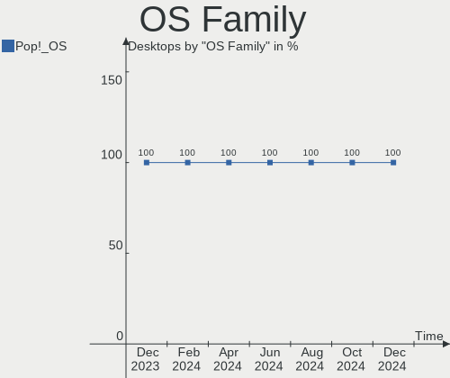
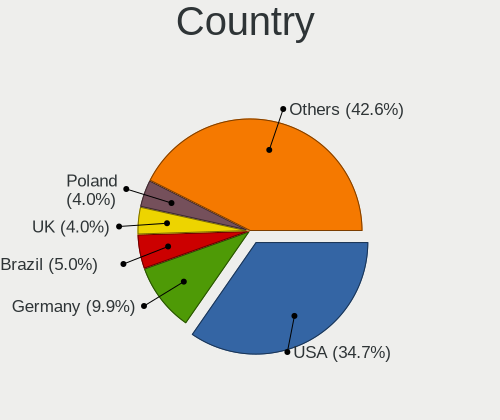
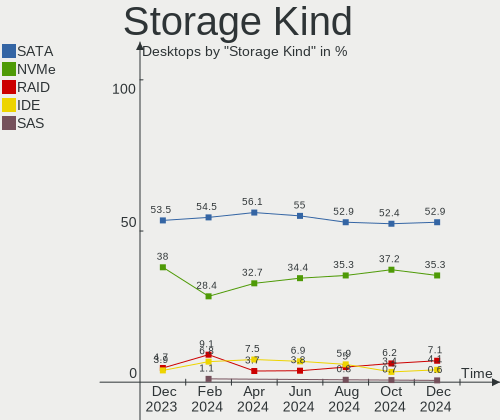
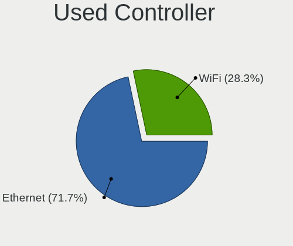
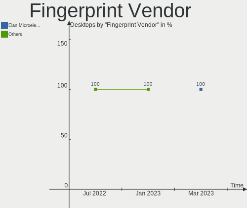

Pop!_OS - Hardware Trends (Desktops)
------------------------------------

A project to identify most popular hardware characteristics and track their change
over time based on data collected by Linux users at https://Linux-Hardware.org.

Anyone can contribute to this report by the [hw-probe](https://github.com/linuxhw/hw-probe) tool:

    sudo -E hw-probe -all -upload

This report is for one last month. Overall report since the beginning of time: [TestCoverage](https://github.com/linuxhw/TestCoverage)

Period: Jan, 2023.

Contents
--------

* [ System ](#system)
  - [ OS                       ](#os)
  - [ OS Family                ](#os-family)
  - [ Kernel                   ](#kernel)
  - [ Kernel Family            ](#kernel-family)
  - [ Kernel Major Ver.        ](#kernel-major-ver)
  - [ Arch                     ](#arch)
  - [ DE                       ](#de)
  - [ Display Server           ](#display-server)
  - [ Display Manager          ](#display-manager)
  - [ OS Lang                  ](#os-lang)
  - [ Boot Mode                ](#boot-mode)
  - [ Filesystem               ](#filesystem)
  - [ Part. scheme             ](#part-scheme)
  - [ Dual Boot with Linux/BSD ](#dual-boot-with-linuxbsd)
  - [ Dual Boot (Win)          ](#dual-boot-win)

* [ Board ](#board)
  - [ Vendor                   ](#vendor)
  - [ Model                    ](#model)
  - [ Model Family             ](#model-family)
  - [ MFG Year                 ](#mfg-year)
  - [ Form Factor              ](#form-factor)
  - [ Secure Boot              ](#secure-boot)
  - [ Coreboot                 ](#coreboot)
  - [ RAM Size                 ](#ram-size)
  - [ RAM Used                 ](#ram-used)
  - [ Total Drives             ](#total-drives)
  - [ Has CD-ROM               ](#has-cd-rom)
  - [ Has Ethernet             ](#has-ethernet)
  - [ Has WiFi                 ](#has-wifi)
  - [ Has Bluetooth            ](#has-bluetooth)

* [ Location ](#location)
  - [ Country                  ](#country)
  - [ City                     ](#city)

* [ Drives ](#drives)
  - [ Drive Vendor             ](#drive-vendor)
  - [ Drive Model              ](#drive-model)
  - [ HDD Vendor               ](#hdd-vendor)
  - [ SSD Vendor               ](#ssd-vendor)
  - [ Drive Kind               ](#drive-kind)
  - [ Drive Connector          ](#drive-connector)
  - [ Drive Size               ](#drive-size)
  - [ Space Total              ](#space-total)
  - [ Space Used               ](#space-used)
  - [ Malfunc. Drives          ](#malfunc-drives)
  - [ Malfunc. Drive Vendor    ](#malfunc-drive-vendor)
  - [ Malfunc. HDD Vendor      ](#malfunc-hdd-vendor)
  - [ Malfunc. Drive Kind      ](#malfunc-drive-kind)
  - [ Failed Drives            ](#failed-drives)
  - [ Failed Drive Vendor      ](#failed-drive-vendor)
  - [ Drive Status             ](#drive-status)

* [ Storage controller ](#storage-controller)
  - [ Storage Vendor           ](#storage-vendor)
  - [ Storage Model            ](#storage-model)
  - [ Storage Kind             ](#storage-kind)

* [ Processor ](#processor)
  - [ CPU Vendor               ](#cpu-vendor)
  - [ CPU Model                ](#cpu-model)
  - [ CPU Model Family         ](#cpu-model-family)
  - [ CPU Cores                ](#cpu-cores)
  - [ CPU Sockets              ](#cpu-sockets)
  - [ CPU Threads              ](#cpu-threads)
  - [ CPU Op-Modes             ](#cpu-op-modes)
  - [ CPU Microcode            ](#cpu-microcode)
  - [ CPU Microarch            ](#cpu-microarch)

* [ Graphics ](#graphics)
  - [ GPU Vendor               ](#gpu-vendor)
  - [ GPU Model                ](#gpu-model)
  - [ GPU Combo                ](#gpu-combo)
  - [ GPU Driver               ](#gpu-driver)
  - [ GPU Memory               ](#gpu-memory)

* [ Monitor ](#monitor)
  - [ Monitor Vendor           ](#monitor-vendor)
  - [ Monitor Model            ](#monitor-model)
  - [ Monitor Resolution       ](#monitor-resolution)
  - [ Monitor Diagonal         ](#monitor-diagonal)
  - [ Monitor Width            ](#monitor-width)
  - [ Aspect Ratio             ](#aspect-ratio)
  - [ Monitor Area             ](#monitor-area)
  - [ Pixel Density            ](#pixel-density)
  - [ Multiple Monitors        ](#multiple-monitors)

* [ Network ](#network)
  - [ Net Controller Vendor    ](#net-controller-vendor)
  - [ Net Controller Model     ](#net-controller-model)
  - [ Wireless Vendor          ](#wireless-vendor)
  - [ Wireless Model           ](#wireless-model)
  - [ Ethernet Vendor          ](#ethernet-vendor)
  - [ Ethernet Model           ](#ethernet-model)
  - [ Net Controller Kind      ](#net-controller-kind)
  - [ Used Controller          ](#used-controller)
  - [ NICs                     ](#nics)
  - [ IPv6                     ](#ipv6)

* [ Bluetooth ](#bluetooth)
  - [ Bluetooth Vendor         ](#bluetooth-vendor)
  - [ Bluetooth Model          ](#bluetooth-model)

* [ Sound ](#sound)
  - [ Sound Vendor             ](#sound-vendor)
  - [ Sound Model              ](#sound-model)

* [ Memory ](#memory)
  - [ Memory Vendor            ](#memory-vendor)
  - [ Memory Model             ](#memory-model)
  - [ Memory Kind              ](#memory-kind)
  - [ Memory Form Factor       ](#memory-form-factor)
  - [ Memory Size              ](#memory-size)
  - [ Memory Speed             ](#memory-speed)

* [ Printers & scanners ](#printers--scanners)
  - [ Printer Vendor           ](#printer-vendor)
  - [ Printer Model            ](#printer-model)
  - [ Scanner Vendor           ](#scanner-vendor)
  - [ Scanner Model            ](#scanner-model)

* [ Camera ](#camera)
  - [ Camera Vendor            ](#camera-vendor)
  - [ Camera Model             ](#camera-model)

* [ Security ](#security)
  - [ Fingerprint Vendor       ](#fingerprint-vendor)
  - [ Fingerprint Model        ](#fingerprint-model)
  - [ Chipcard Vendor          ](#chipcard-vendor)
  - [ Chipcard Model           ](#chipcard-model)

* [ Unsupported ](#unsupported)
  - [ Unsupported Devices      ](#unsupported-devices)
  - [ Unsupported Device Types ](#unsupported-device-types)

System
------

OS
--

Installed operating systems

| Name          | Desktops | Percent |
|---------------|----------|---------|
| Pop!_OS 22.04 | 87       | 97.75%  |
| Pop!_OS 20.04 | 2        | 2.25%   |

OS Family
---------

OS without a version

| Name    | Desktops | Percent |
|---------|----------|---------|
| Pop!_OS | 89       | 100%    |

Kernel
------

Version of the Linux kernel

| Version                  | Desktops | Percent |
|--------------------------|----------|---------|
| 6.0.12-76060006-generic  | 78       | 87.64%  |
| 6.0.6-76060006-generic   | 5        | 5.62%   |
| 6.1.8-060108-generic     | 1        | 1.12%   |
| 6.0.3-76060003-generic   | 1        | 1.12%   |
| 5.19.0-76051900-generic  | 1        | 1.12%   |
| 5.18.10-76051810-generic | 1        | 1.12%   |
| 5.17.5-76051705-generic  | 1        | 1.12%   |
| 5.13.0-7620-generic      | 1        | 1.12%   |

Kernel Family
-------------

Linux kernel without a distro release

| Version | Desktops | Percent |
|---------|----------|---------|
| 6.0.12  | 78       | 87.64%  |
| 6.0.6   | 5        | 5.62%   |
| 6.1.8   | 1        | 1.12%   |
| 6.0.3   | 1        | 1.12%   |
| 5.19.0  | 1        | 1.12%   |
| 5.18.10 | 1        | 1.12%   |
| 5.17.5  | 1        | 1.12%   |
| 5.13.0  | 1        | 1.12%   |

Kernel Major Ver.
-----------------

Linux kernel major version

| Version | Desktops | Percent |
|---------|----------|---------|
| 6.0     | 84       | 94.38%  |
| 6.1     | 1        | 1.12%   |
| 5.19    | 1        | 1.12%   |
| 5.18    | 1        | 1.12%   |
| 5.17    | 1        | 1.12%   |
| 5.13    | 1        | 1.12%   |

Arch
----

OS architecture (x86_64, i586, etc.)

| Name   | Desktops | Percent |
|--------|----------|---------|
| x86_64 | 89       | 100%    |

DE
--

Desktop Environment

| Name    | Desktops | Percent |
|---------|----------|---------|
| GNOME   | 86       | 96.63%  |
| LXQt    | 1        | 1.12%   |
| KDE5    | 1        | 1.12%   |
| Unknown | 1        | 1.12%   |

Display Server
--------------

X11 or Wayland

| Name    | Desktops | Percent |
|---------|----------|---------|
| X11     | 87       | 97.75%  |
| Wayland | 2        | 2.25%   |

Display Manager
---------------

SDDM, LightDM, etc.

| Name    | Desktops | Percent |
|---------|----------|---------|
| Unknown | 75       | 84.27%  |
| GDM3    | 14       | 15.73%  |

OS Lang
-------

Language

| Lang    | Desktops | Percent |
|---------|----------|---------|
| en_US   | 60       | 67.42%  |
| pt_BR   | 6        | 6.74%   |
| en_GB   | 5        | 5.62%   |
| de_DE   | 5        | 5.62%   |
| en_CA   | 2        | 2.25%   |
| C       | 2        | 2.25%   |
| sk_SK   | 1        | 1.12%   |
| ru_RU   | 1        | 1.12%   |
| ro_RO   | 1        | 1.12%   |
| nb_NO   | 1        | 1.12%   |
| ja_JP   | 1        | 1.12%   |
| fr_FR   | 1        | 1.12%   |
| en_AU   | 1        | 1.12%   |
| de_AT   | 1        | 1.12%   |
| Unknown | 1        | 1.12%   |

Boot Mode
---------

EFI or BIOS

| Mode | Desktops | Percent |
|------|----------|---------|
| BIOS | 75       | 84.27%  |
| EFI  | 14       | 15.73%  |

Filesystem
----------

Type of filesystem

| Type    | Desktops | Percent |
|---------|----------|---------|
| Ext4    | 85       | 95.51%  |
| Btrfs   | 2        | 2.25%   |
| Overlay | 1        | 1.12%   |
| Unknown | 1        | 1.12%   |

Part. scheme
------------

Scheme of partitioning

| Type    | Desktops | Percent |
|---------|----------|---------|
| Unknown | 74       | 83.15%  |
| GPT     | 15       | 16.85%  |

Dual Boot with Linux/BSD
------------------------

Hosting more than one Linux/BSD

| Dual boot | Desktops | Percent |
|-----------|----------|---------|
| No        | 86       | 96.63%  |
| Yes       | 3        | 3.37%   |

Dual Boot (Win)
---------------

Hosting Linux and Windows

| Dual boot | Desktops | Percent |
|-----------|----------|---------|
| No        | 77       | 86.52%  |
| Yes       | 12       | 13.48%  |

Board
-----

Vendor
------

Motherboard manufacturer

| Name                | Desktops | Percent |
|---------------------|----------|---------|
| ASUSTek Computer    | 31       | 34.83%  |
| ASRock              | 13       | 14.61%  |
| MSI                 | 12       | 13.48%  |
| Gigabyte Technology | 12       | 13.48%  |
| Hewlett-Packard     | 5        | 5.62%   |
| Intel               | 3        | 3.37%   |
| Dell                | 2        | 2.25%   |
| Acer                | 2        | 2.25%   |
| Win element         | 1        | 1.12%   |
| System76            | 1        | 1.12%   |
| MAXSUN              | 1        | 1.12%   |
| MACHINIST           | 1        | 1.12%   |
| Lenovo              | 1        | 1.12%   |
| HC                  | 1        | 1.12%   |
| Gateway             | 1        | 1.12%   |
| AZW                 | 1        | 1.12%   |
| Alienware           | 1        | 1.12%   |

Model
-----

Motherboard model

| Name                                   | Desktops | Percent |
|----------------------------------------|----------|---------|
| Gigabyte B450 AORUS PRO WIFI           | 2        | 2.25%   |
| ASUS ROG STRIX B550-I GAMING           | 2        | 2.25%   |
| ASUS ROG STRIX B450-F GAMING           | 2        | 2.25%   |
| Win element M600                       | 1        | 1.12%   |
| System76 Thelio Mira                   | 1        | 1.12%   |
| MSI MS-7D53                            | 1        | 1.12%   |
| MSI MS-7D36                            | 1        | 1.12%   |
| MSI MS-7C95                            | 1        | 1.12%   |
| MSI MS-7C91                            | 1        | 1.12%   |
| MSI MS-7C83                            | 1        | 1.12%   |
| MSI MS-7C56                            | 1        | 1.12%   |
| MSI MS-7B89                            | 1        | 1.12%   |
| MSI MS-7B85                            | 1        | 1.12%   |
| MSI MS-7A74                            | 1        | 1.12%   |
| MSI MS-7A38                            | 1        | 1.12%   |
| MSI MS-7817                            | 1        | 1.12%   |
| MSI H310 Gaming Infinite (MS-B915)     | 1        | 1.12%   |
| MAXSUN MS-TZZ B460M                    | 1        | 1.12%   |
| MACHINIST X79 Z9-D7 V2.0               | 1        | 1.12%   |
| Lenovo ThinkCentre M71e 3157W8B        | 1        | 1.12%   |
| Intel HM570                            | 1        | 1.12%   |
| Intel H61                              | 1        | 1.12%   |
| Intel DQ67SW                           | 1        | 1.12%   |
| HP Pavilion 690-0067c Desktop Rfrbd PC | 1        | 1.12%   |
| HP EliteDesk 800 G3 SFF                | 1        | 1.12%   |
| HP Compaq 8200 Elite SFF PC            | 1        | 1.12%   |
| HP Compaq 6005 Pro SFF PC              | 1        | 1.12%   |
| HP 870-120                             | 1        | 1.12%   |
| HC HCAR357-MI                          | 1        | 1.12%   |
| Gigabyte Z690 AORUS PRO                | 1        | 1.12%   |
| Gigabyte X570S AERO G                  | 1        | 1.12%   |
| Gigabyte X570 AORUS MASTER             | 1        | 1.12%   |
| Gigabyte H77M-D3H                      | 1        | 1.12%   |
| Gigabyte GA-78LMT-USB3                 | 1        | 1.12%   |
| Gigabyte G41MT-S2                      | 1        | 1.12%   |
| Gigabyte B550M DS3H AC                 | 1        | 1.12%   |
| Gigabyte B550I AORUS PRO AX            | 1        | 1.12%   |
| Gigabyte B450M S2H                     | 1        | 1.12%   |
| Gigabyte A320M-S2H                     | 1        | 1.12%   |
| Gateway SX2800                         | 1        | 1.12%   |

Model Family
------------

Motherboard model prefix

| Name                   | Desktops | Percent |
|------------------------|----------|---------|
| ASUS ROG               | 12       | 13.48%  |
| ASUS TUF               | 5        | 5.62%   |
| ASRock B550            | 3        | 3.37%   |
| HP Compaq              | 2        | 2.25%   |
| Gigabyte B450          | 2        | 2.25%   |
| ASUS PRIME             | 2        | 2.25%   |
| ASUS P6T               | 2        | 2.25%   |
| ASUS M5A97             | 2        | 2.25%   |
| ASRock B450            | 2        | 2.25%   |
| Acer Aspire            | 2        | 2.25%   |
| Win element M600       | 1        | 1.12%   |
| System76 Thelio        | 1        | 1.12%   |
| MSI MS-7D53            | 1        | 1.12%   |
| MSI MS-7D36            | 1        | 1.12%   |
| MSI MS-7C95            | 1        | 1.12%   |
| MSI MS-7C91            | 1        | 1.12%   |
| MSI MS-7C83            | 1        | 1.12%   |
| MSI MS-7C56            | 1        | 1.12%   |
| MSI MS-7B89            | 1        | 1.12%   |
| MSI MS-7B85            | 1        | 1.12%   |
| MSI MS-7A74            | 1        | 1.12%   |
| MSI MS-7A38            | 1        | 1.12%   |
| MSI MS-7817            | 1        | 1.12%   |
| MSI H310               | 1        | 1.12%   |
| MAXSUN MS-TZZ          | 1        | 1.12%   |
| MACHINIST X79          | 1        | 1.12%   |
| Lenovo ThinkCentre     | 1        | 1.12%   |
| Intel HM570            | 1        | 1.12%   |
| Intel H61              | 1        | 1.12%   |
| Intel DQ67SW           | 1        | 1.12%   |
| HP Pavilion            | 1        | 1.12%   |
| HP EliteDesk           | 1        | 1.12%   |
| HP 870-120             | 1        | 1.12%   |
| HC HCAR357-MI          | 1        | 1.12%   |
| Gigabyte Z690          | 1        | 1.12%   |
| Gigabyte X570S         | 1        | 1.12%   |
| Gigabyte X570          | 1        | 1.12%   |
| Gigabyte H77M-D3H      | 1        | 1.12%   |
| Gigabyte GA-78LMT-USB3 | 1        | 1.12%   |
| Gigabyte G41MT-S2      | 1        | 1.12%   |

MFG Year
--------

Motherboard manufacture year

| Year    | Desktops | Percent |
|---------|----------|---------|
| 2020    | 17       | 19.1%   |
| 2021    | 16       | 17.98%  |
| 2012    | 9        | 10.11%  |
| 2018    | 8        | 8.99%   |
| 2022    | 6        | 6.74%   |
| 2019    | 6        | 6.74%   |
| 2017    | 5        | 5.62%   |
| 2009    | 5        | 5.62%   |
| 2011    | 4        | 4.49%   |
| 2014    | 3        | 3.37%   |
| 2013    | 3        | 3.37%   |
| 2016    | 2        | 2.25%   |
| 2015    | 2        | 2.25%   |
| 2010    | 1        | 1.12%   |
| 2008    | 1        | 1.12%   |
| Unknown | 1        | 1.12%   |

Form Factor
-----------

Physical design of the computer

| Name    | Desktops | Percent |
|---------|----------|---------|
| Desktop | 89       | 100%    |

Secure Boot
-----------

Enabled or disabled

| State    | Desktops | Percent |
|----------|----------|---------|
| Disabled | 89       | 100%    |

Coreboot
--------

Have coreboot on board

| Used | Desktops | Percent |
|------|----------|---------|
| No   | 89       | 100%    |

RAM Size
--------

Total RAM memory

| Size in GB  | Desktops | Percent |
|-------------|----------|---------|
| 32.01-64.0  | 29       | 32.58%  |
| 16.01-24.0  | 26       | 29.21%  |
| 8.01-16.0   | 15       | 16.85%  |
| 4.01-8.0    | 7        | 7.87%   |
| 64.01-256.0 | 5        | 5.62%   |
| 24.01-32.0  | 4        | 4.49%   |
| 3.01-4.0    | 3        | 3.37%   |

RAM Used
--------

Used RAM memory

| Used GB    | Desktops | Percent |
|------------|----------|---------|
| 4.01-8.0   | 38       | 42.7%   |
| 2.01-3.0   | 20       | 22.47%  |
| 3.01-4.0   | 18       | 20.22%  |
| 8.01-16.0  | 5        | 5.62%   |
| 1.01-2.0   | 4        | 4.49%   |
| 16.01-24.0 | 3        | 3.37%   |
| 24.01-32.0 | 1        | 1.12%   |

Total Drives
------------

Number of drives on board

| Drives | Desktops | Percent |
|--------|----------|---------|
| 2      | 30       | 33.71%  |
| 1      | 30       | 33.71%  |
| 3      | 14       | 15.73%  |
| 4      | 9        | 10.11%  |
| 5      | 6        | 6.74%   |

Has CD-ROM
----------

Has CD-ROM on board

| Presented | Desktops | Percent |
|-----------|----------|---------|
| No        | 65       | 73.03%  |
| Yes       | 24       | 26.97%  |

Has Ethernet
------------

Has Ethernet on board

| Presented | Desktops | Percent |
|-----------|----------|---------|
| Yes       | 86       | 96.63%  |
| No        | 3        | 3.37%   |

Has WiFi
--------

Has WiFi module

| Presented | Desktops | Percent |
|-----------|----------|---------|
| Yes       | 54       | 60.67%  |
| No        | 35       | 39.33%  |

Has Bluetooth
-------------

Has Bluetooth module

| Presented | Desktops | Percent |
|-----------|----------|---------|
| No        | 48       | 53.93%  |
| Yes       | 41       | 46.07%  |

Location
--------

Country
-------

Geographic location (country)

| Country     | Desktops | Percent |
|-------------|----------|---------|
| USA         | 38       | 42.7%   |
| Germany     | 8        | 8.99%   |
| Canada      | 7        | 7.87%   |
| Brazil      | 7        | 7.87%   |
| Australia   | 5        | 5.62%   |
| UK          | 4        | 4.49%   |
| Norway      | 2        | 2.25%   |
| Netherlands | 2        | 2.25%   |
| Italy       | 2        | 2.25%   |
| Greece      | 2        | 2.25%   |
| South Korea | 1        | 1.12%   |
| Slovakia    | 1        | 1.12%   |
| Serbia      | 1        | 1.12%   |
| Russia      | 1        | 1.12%   |
| Portugal    | 1        | 1.12%   |
| Poland      | 1        | 1.12%   |
| Japan       | 1        | 1.12%   |
| Hungary     | 1        | 1.12%   |
| Hong Kong   | 1        | 1.12%   |
| France      | 1        | 1.12%   |
| Azerbaijan  | 1        | 1.12%   |
| Austria     | 1        | 1.12%   |

City
----

Geographic location (city)

| City           | Desktops | Percent |
|----------------|----------|---------|
| Portland       | 3        | 3.37%   |
| Temecula       | 2        | 2.25%   |
| Jacksonville   | 2        | 2.25%   |
| Yongin-si      | 1        | 1.12%   |
| Yekaterinburg  | 1        | 1.12%   |
| Woodville      | 1        | 1.12%   |
| Winnipeg       | 1        | 1.12%   |
| Weaverville    | 1        | 1.12%   |
| Washington     | 1        | 1.12%   |
| Waipahu        | 1        | 1.12%   |
| Vitória       | 1        | 1.12%   |
| Vienna         | 1        | 1.12%   |
| Vancouver      | 1        | 1.12%   |
| Utrecht        | 1        | 1.12%   |
| Uba            | 1        | 1.12%   |
| Telford        | 1        | 1.12%   |
| Sydney         | 1        | 1.12%   |
| Stafford       | 1        | 1.12%   |
| St Louis       | 1        | 1.12%   |
| Salt Lake City | 1        | 1.12%   |
| Roermond       | 1        | 1.12%   |
| Risstissen     | 1        | 1.12%   |
| Rio de Janeiro | 1        | 1.12%   |
| Pueblo         | 1        | 1.12%   |
| Prescott       | 1        | 1.12%   |
| Port Coquitlam | 1        | 1.12%   |
| Pittsburgh     | 1        | 1.12%   |
| Pittsburg      | 1        | 1.12%   |
| Phelan         | 1        | 1.12%   |
| Paranaguá     | 1        | 1.12%   |
| Oswestry       | 1        | 1.12%   |
| Oswego         | 1        | 1.12%   |
| Oslo           | 1        | 1.12%   |
| Opelika        | 1        | 1.12%   |
| Nuremberg      | 1        | 1.12%   |
| North Rothbury | 1        | 1.12%   |
| Norristown     | 1        | 1.12%   |
| Naxos          | 1        | 1.12%   |
| Mirandela      | 1        | 1.12%   |
| Milano         | 1        | 1.12%   |

Drives
------

Drive Vendor
------------

Hard drive vendors

| Vendor                      | Desktops | Drives | Percent |
|-----------------------------|----------|--------|---------|
| Samsung Electronics         | 33       | 38     | 18.97%  |
| WDC                         | 22       | 28     | 12.64%  |
| Seagate                     | 20       | 25     | 11.49%  |
| Sandisk                     | 16       | 18     | 9.2%    |
| Kingston                    | 11       | 11     | 6.32%   |
| Crucial                     | 9        | 13     | 5.17%   |
| Toshiba                     | 6        | 6      | 3.45%   |
| Phison Electronics          | 6        | 6      | 3.45%   |
| SK hynix                    | 5        | 6      | 2.87%   |
| Silicon Motion              | 4        | 4      | 2.3%    |
| Micron/Crucial Technology   | 4        | 4      | 2.3%    |
| Hitachi                     | 4        | 4      | 2.3%    |
| China                       | 3        | 3      | 1.72%   |
| SPCC                        | 2        | 2      | 1.15%   |
| Realtek Semiconductor       | 2        | 2      | 1.15%   |
| PNY                         | 2        | 2      | 1.15%   |
| LITEON                      | 2        | 2      | 1.15%   |
| Intel                       | 2        | 3      | 1.15%   |
| A-DATA Technology           | 2        | 2      | 1.15%   |
| XPG                         | 1        | 1      | 0.57%   |
| Unknown                     | 1        | 1      | 0.57%   |
| Team                        | 1        | 1      | 0.57%   |
| SABRENT                     | 1        | 1      | 0.57%   |
| Phison                      | 1        | 1      | 0.57%   |
| Netac                       | 1        | 1      | 0.57%   |
| Micron Technology           | 1        | 1      | 0.57%   |
| Maxtor                      | 1        | 1      | 0.57%   |
| LITEONIT                    | 1        | 1      | 0.57%   |
| Lexar                       | 1        | 1      | 0.57%   |
| Kingston Technology Company | 1        | 1      | 0.57%   |
| Intenso                     | 1        | 1      | 0.57%   |
| Indilinx                    | 1        | 1      | 0.57%   |
| HL-DT-ST                    | 1        | 1      | 0.57%   |
| Hewlett-Packard             | 1        | 1      | 0.57%   |
| Dogfish                     | 1        | 1      | 0.57%   |
| ASMT                        | 1        | 1      | 0.57%   |
| AMD                         | 1        | 1      | 0.57%   |
| ADATA Technology            | 1        | 1      | 0.57%   |

Drive Model
-----------

Hard drive models

| Model                                                 | Desktops | Percent |
|-------------------------------------------------------|----------|---------|
| Samsung NVMe SSD Controller SM981/PM981/PM983 500GB   | 5        | 2.67%   |
| Silicon Motion SM2263EN/SM2263XT SSD Controller 512GB | 4        | 2.14%   |
| Kingston SA400S37240G 240GB SSD                       | 4        | 2.14%   |
| WDC WD20EZAZ-00GGJB0 2TB                              | 3        | 1.6%    |
| Seagate ST2000DM008-2FR102 2TB                        | 3        | 1.6%    |
| Samsung SSD 850 EVO 250GB                             | 3        | 1.6%    |
| WDC WDS500G2B0A-00SM50 500GB SSD                      | 2        | 1.07%   |
| WDC WD4005FZBX-00K5WB0 4TB                            | 2        | 1.07%   |
| SK hynix SHGS31-500GS-2 500GB SSD                     | 2        | 1.07%   |
| Seagate ST1000DM010-2EP102 1TB                        | 2        | 1.07%   |
| Sandisk WD_BLACK SN770 1TB                            | 2        | 1.07%   |
| Sandisk WD Blue SN570 1TB                             | 2        | 1.07%   |
| SanDisk NVMe SSD Drive 1TB                            | 2        | 1.07%   |
| Samsung SSD 870 QVO 2TB                               | 2        | 1.07%   |
| Samsung SSD 850 EVO 500GB                             | 2        | 1.07%   |
| Samsung MZVLQ256HAJD-000H1 256GB                      | 2        | 1.07%   |
| Samsung HD502HI 500GB                                 | 2        | 1.07%   |
| Phison E16 PCIe4 NVMe Controller 2TB                  | 2        | 1.07%   |
| Phison E12 NVMe Controller 1TB                        | 2        | 1.07%   |
| Micron/Crucial P2 NVMe PCIe SSD 500GB                 | 2        | 1.07%   |
| Kingston SA400S37480G 480GB SSD                       | 2        | 1.07%   |
| Kingston SA400S37120G 120GB SSD                       | 2        | 1.07%   |
| Crucial CT1000MX500SSD1 1TB                           | 2        | 1.07%   |
| XPG SX950U 240GB                                      | 1        | 0.53%   |
| WDC WDS500G2B0B-00YS70 500GB SSD                      | 1        | 0.53%   |
| WDC WDS240G2G0A-00JH30 240GB SSD                      | 1        | 0.53%   |
| WDC WDS100T3X0C-00SJG0 1TB                            | 1        | 0.53%   |
| WDC WD6400AAKS-75A7B2 640GB                           | 1        | 0.53%   |
| WDC WD5000LPCX-60VHAT0 500GB                          | 1        | 0.53%   |
| WDC WD5000AAKX-003CA0 500GB                           | 1        | 0.53%   |
| WDC WD40EZRZ-19GXCB0 4TB                              | 1        | 0.53%   |
| WDC WD30PURX-64P6ZY0 3TB                              | 1        | 0.53%   |
| WDC WD20EZBX-00AYRA0 2TB                              | 1        | 0.53%   |
| WDC WD20EZAZ-00L9GB0 2TB                              | 1        | 0.53%   |
| WDC WD20EARS-00MVWB0 2TB                              | 1        | 0.53%   |
| WDC WD1600AAJS-75M0A0 160GB                           | 1        | 0.53%   |
| WDC WD10EZEX-75WN4A1 1TB                              | 1        | 0.53%   |
| WDC WD10EZEX-60WN4A0 1TB                              | 1        | 0.53%   |
| WDC WD10EZEX-00WN4A0 1TB                              | 1        | 0.53%   |
| WDC WD10EZEX-00RKKA0 1TB                              | 1        | 0.53%   |

HDD Vendor
----------

Hard disk drive vendors

| Vendor              | Desktops | Drives | Percent |
|---------------------|----------|--------|---------|
| WDC                 | 19       | 23     | 34.55%  |
| Seagate             | 19       | 24     | 34.55%  |
| Toshiba             | 6        | 6      | 10.91%  |
| Samsung Electronics | 4        | 4      | 7.27%   |
| Hitachi             | 4        | 4      | 7.27%   |
| Unknown             | 1        | 1      | 1.82%   |
| SABRENT             | 1        | 1      | 1.82%   |
| Maxtor              | 1        | 1      | 1.82%   |

SSD Vendor
----------

Solid state drive vendors

| Vendor              | Desktops | Drives | Percent |
|---------------------|----------|--------|---------|
| Samsung Electronics | 17       | 19     | 25.76%  |
| Kingston            | 10       | 10     | 15.15%  |
| Crucial             | 7        | 9      | 10.61%  |
| WDC                 | 4        | 4      | 6.06%   |
| SanDisk             | 4        | 4      | 6.06%   |
| China               | 3        | 3      | 4.55%   |
| SPCC                | 2        | 2      | 3.03%   |
| SK hynix            | 2        | 2      | 3.03%   |
| PNY                 | 2        | 2      | 3.03%   |
| LITEON              | 2        | 2      | 3.03%   |
| A-DATA Technology   | 2        | 2      | 3.03%   |
| XPG                 | 1        | 1      | 1.52%   |
| Team                | 1        | 1      | 1.52%   |
| Seagate             | 1        | 1      | 1.52%   |
| Netac               | 1        | 1      | 1.52%   |
| Micron Technology   | 1        | 1      | 1.52%   |
| LITEONIT            | 1        | 1      | 1.52%   |
| Lexar               | 1        | 1      | 1.52%   |
| Intenso             | 1        | 1      | 1.52%   |
| Intel               | 1        | 2      | 1.52%   |
| Hewlett-Packard     | 1        | 1      | 1.52%   |
| Dogfish             | 1        | 1      | 1.52%   |

Drive Kind
----------

HDD or SSD

| Kind    | Desktops | Drives | Percent |
|---------|----------|--------|---------|
| SSD     | 54       | 71     | 36.49%  |
| NVMe    | 48       | 60     | 32.43%  |
| HDD     | 43       | 64     | 29.05%  |
| Unknown | 3        | 3      | 2.03%   |

Drive Connector
---------------

SATA, SAS, NVMe, etc.

| Type | Desktops | Drives | Percent |
|------|----------|--------|---------|
| SATA | 73       | 129    | 56.15%  |
| NVMe | 48       | 60     | 36.92%  |
| SAS  | 9        | 9      | 6.92%   |

Drive Size
----------

Size of hard drive

| Size in TB | Desktops | Drives | Percent |
|------------|----------|--------|---------|
| 0.01-0.5   | 48       | 63     | 44.44%  |
| 0.51-1.0   | 29       | 37     | 26.85%  |
| 1.01-2.0   | 20       | 22     | 18.52%  |
| 3.01-4.0   | 8        | 8      | 7.41%   |
| 4.01-10.0  | 2        | 2      | 1.85%   |
| 2.01-3.0   | 1        | 3      | 0.93%   |

Space Total
-----------

Amount of disk space available on the file system

| Size in GB     | Desktops | Percent |
|----------------|----------|---------|
| 501-1000       | 25       | 28.09%  |
| 101-250        | 21       | 23.6%   |
| 251-500        | 13       | 14.61%  |
| 2001-3000      | 9        | 10.11%  |
| More than 3000 | 8        | 8.99%   |
| 1001-2000      | 8        | 8.99%   |
| 1-20           | 2        | 2.25%   |
| 51-100         | 2        | 2.25%   |
| Unknown        | 1        | 1.12%   |

Space Used
----------

Amount of used disk space

| Used GB        | Desktops | Percent |
|----------------|----------|---------|
| 1-20           | 20       | 22.47%  |
| 21-50          | 16       | 17.98%  |
| 251-500        | 13       | 14.61%  |
| 101-250        | 11       | 12.36%  |
| 1001-2000      | 9        | 10.11%  |
| 51-100         | 9        | 10.11%  |
| 501-1000       | 6        | 6.74%   |
| More than 3000 | 2        | 2.25%   |
| 2001-3000      | 2        | 2.25%   |
| Unknown        | 1        | 1.12%   |

Malfunc. Drives
---------------

Drive models with a malfunction

| Model                             | Desktops | Drives | Percent |
|-----------------------------------|----------|--------|---------|
| WDC WD1002FAEX-00Z3A0 1TB         | 1        | 1      | 14.29%  |
| Toshiba MK1655GSX 160GB           | 1        | 1      | 14.29%  |
| Seagate ST2000DM001-1CH164 2TB    | 1        | 1      | 14.29%  |
| Seagate ST1500DL003-9VT16L 1TB    | 1        | 1      | 14.29%  |
| Samsung Electronics HD502HI 500GB | 1        | 1      | 14.29%  |
| Kingston SA400S37120G 120GB SSD   | 1        | 1      | 14.29%  |
| Hitachi HDS5C3020BLE630 2TB       | 1        | 1      | 14.29%  |

Malfunc. Drive Vendor
---------------------

Vendors of faulty drives

| Vendor              | Desktops | Drives | Percent |
|---------------------|----------|--------|---------|
| WDC                 | 1        | 1      | 16.67%  |
| Toshiba             | 1        | 1      | 16.67%  |
| Seagate             | 1        | 2      | 16.67%  |
| Samsung Electronics | 1        | 1      | 16.67%  |
| Kingston            | 1        | 1      | 16.67%  |
| Hitachi             | 1        | 1      | 16.67%  |

Malfunc. HDD Vendor
-------------------

Vendors of faulty HDD drives

| Vendor              | Desktops | Drives | Percent |
|---------------------|----------|--------|---------|
| WDC                 | 1        | 1      | 20%     |
| Toshiba             | 1        | 1      | 20%     |
| Seagate             | 1        | 2      | 20%     |
| Samsung Electronics | 1        | 1      | 20%     |
| Hitachi             | 1        | 1      | 20%     |

Malfunc. Drive Kind
-------------------

Kinds of faulty drives

| Kind | Desktops | Drives | Percent |
|------|----------|--------|---------|
| HDD  | 4        | 6      | 80%     |
| SSD  | 1        | 1      | 20%     |

Failed Drives
-------------

Failed drive models

Zero info for selected period =(

Failed Drive Vendor
-------------------

Failed drive vendors

Zero info for selected period =(

Drive Status
------------

Number of failed and malfunc. drives

| Status   | Desktops | Drives | Percent |
|----------|----------|--------|---------|
| Detected | 79       | 155    | 79.8%   |
| Works    | 15       | 36     | 15.15%  |
| Malfunc  | 5        | 7      | 5.05%   |

Storage controller
------------------

Storage Vendor
--------------

Storage controller vendors

| Vendor                      | Desktops | Percent |
|-----------------------------|----------|---------|
| AMD                         | 51       | 34.23%  |
| Intel                       | 37       | 24.83%  |
| SanDisk                     | 13       | 8.72%   |
| Samsung Electronics         | 13       | 8.72%   |
| Phison Electronics          | 7        | 4.7%    |
| ASMedia Technology          | 7        | 4.7%    |
| Micron/Crucial Technology   | 6        | 4.03%   |
| Silicon Motion              | 4        | 2.68%   |
| SK hynix                    | 3        | 2.01%   |
| Realtek Semiconductor       | 2        | 1.34%   |
| Kingston Technology Company | 2        | 1.34%   |
| Micron Technology           | 1        | 0.67%   |
| Marvell Technology Group    | 1        | 0.67%   |
| JMicron Technology          | 1        | 0.67%   |
| ADATA Technology            | 1        | 0.67%   |

Storage Model
-------------

Storage controller models

| Model                                                                          | Desktops | Percent |
|--------------------------------------------------------------------------------|----------|---------|
| AMD FCH SATA Controller [AHCI mode]                                            | 24       | 14.12%  |
| AMD 500 Series Chipset SATA Controller                                         | 16       | 9.41%   |
| AMD 400 Series Chipset SATA Controller                                         | 10       | 5.88%   |
| SanDisk Non-Volatile memory controller                                         | 8        | 4.71%   |
| Samsung NVMe SSD Controller SM981/PM981/PM983                                  | 8        | 4.71%   |
| Intel 6 Series/C200 Series Chipset Family 6 port Desktop SATA AHCI Controller  | 6        | 3.53%   |
| ASMedia ASM1062 Serial ATA Controller                                          | 6        | 3.53%   |
| AMD SB7x0/SB8x0/SB9x0 SATA Controller [AHCI mode]                              | 6        | 3.53%   |
| Intel 500 Series Chipset Family SATA AHCI Controller                           | 5        | 2.94%   |
| Silicon Motion SM2263EN/SM2263XT SSD Controller                                | 4        | 2.35%   |
| Samsung NVMe SSD Controller 980                                                | 4        | 2.35%   |
| SanDisk WD Blue SN570 NVMe SSD                                                 | 3        | 1.76%   |
| Phison E12 NVMe Controller                                                     | 3        | 1.76%   |
| Micron/Crucial P2 NVMe PCIe SSD                                                | 3        | 1.76%   |
| Intel Alder Lake-S PCH SATA Controller [AHCI Mode]                             | 3        | 1.76%   |
| Intel 82801JI (ICH10 Family) SATA AHCI Controller                              | 3        | 1.76%   |
| Intel 8 Series/C220 Series Chipset Family 6-port SATA Controller 1 [AHCI mode] | 3        | 1.76%   |
| AMD SB7x0/SB8x0/SB9x0 IDE Controller                                           | 3        | 1.76%   |
| SK hynix Gold P31/PC711 NVMe Solid State Drive                                 | 2        | 1.18%   |
| SanDisk WD Black SN750 / PC SN730 NVMe SSD                                     | 2        | 1.18%   |
| Realtek Realtek Non-Volatile memory controller                                 | 2        | 1.18%   |
| Phison E16 PCIe4 NVMe Controller                                               | 2        | 1.18%   |
| Micron/Crucial P1 NVMe PCIe SSD                                                | 2        | 1.18%   |
| Intel SATA Controller [RAID mode]                                              | 2        | 1.18%   |
| Intel C600/X79 series chipset 6-Port SATA AHCI Controller                      | 2        | 1.18%   |
| Intel 7 Series/C210 Series Chipset Family 6-port SATA Controller [AHCI mode]   | 2        | 1.18%   |
| Intel 7 Series/C210 Series Chipset Family 4-port SATA Controller [IDE mode]    | 2        | 1.18%   |
| Intel 7 Series/C210 Series Chipset Family 2-port SATA Controller [IDE mode]    | 2        | 1.18%   |
| Intel 400 Series Chipset Family SATA AHCI Controller                           | 2        | 1.18%   |
| Intel 200 Series PCH SATA controller [AHCI mode]                               | 2        | 1.18%   |
| AMD FCH SATA Controller D                                                      | 2        | 1.18%   |
| AMD 300 Series Chipset SATA Controller                                         | 2        | 1.18%   |
| SK hynix BC501 NVMe Solid State Drive                                          | 1        | 0.59%   |
| SanDisk WD Blue SN550 NVMe SSD                                                 | 1        | 0.59%   |
| Samsung NVMe SSD Controller SM961/PM961/SM963                                  | 1        | 0.59%   |
| Phison NVMe Storage Controller                                                 | 1        | 0.59%   |
| Phison Electronics Non-Volatile memory controller                              | 1        | 0.59%   |
| Micron/Crucial P5 Plus NVMe PCIe SSD                                           | 1        | 0.59%   |
| Micron Non-Volatile memory controller                                          | 1        | 0.59%   |
| Marvell Group 88SE9230 PCIe 2.0 x2 4-port SATA 6 Gb/s RAID Controller          | 1        | 0.59%   |

Storage Kind
------------

Kind of storage controller (IDE, SATA, NVMe, SAS, ...)

| Kind | Desktops | Percent |
|------|----------|---------|
| SATA | 82       | 58.16%  |
| NVMe | 47       | 33.33%  |
| IDE  | 9        | 6.38%   |
| RAID | 3        | 2.13%   |

Processor
---------

CPU Vendor
----------

Processor vendors

| Vendor | Desktops | Percent |
|--------|----------|---------|
| AMD    | 53       | 59.55%  |
| Intel  | 36       | 40.45%  |

CPU Model
---------

Processor models

| Model                                   | Desktops | Percent |
|-----------------------------------------|----------|---------|
| AMD Ryzen 7 2700X Eight-Core Processor  | 4        | 4.49%   |
| AMD Ryzen 5 5600G with Radeon Graphics  | 4        | 4.49%   |
| AMD Ryzen 5 3600 6-Core Processor       | 4        | 4.49%   |
| AMD Ryzen 9 5900X 12-Core Processor     | 3        | 3.37%   |
| AMD Ryzen 7 5800X 8-Core Processor      | 3        | 3.37%   |
| AMD Ryzen 7 5700G with Radeon Graphics  | 3        | 3.37%   |
| AMD Ryzen 5 5600X 6-Core Processor      | 3        | 3.37%   |
| Intel Core i7-2600 CPU @ 3.40GHz        | 2        | 2.25%   |
| Intel Core i5-2400 CPU @ 3.10GHz        | 2        | 2.25%   |
| Intel Core i3-10100 CPU @ 3.60GHz       | 2        | 2.25%   |
| AMD Ryzen 9 6900HX with Radeon Graphics | 2        | 2.25%   |
| AMD Ryzen 9 3900X 12-Core Processor     | 2        | 2.25%   |
| AMD Ryzen 7 3700X 8-Core Processor      | 2        | 2.25%   |
| AMD Ryzen 7 1700 Eight-Core Processor   | 2        | 2.25%   |
| AMD Ryzen 5 3600X 6-Core Processor      | 2        | 2.25%   |
| AMD Ryzen 5 2600 Six-Core Processor     | 2        | 2.25%   |
| Intel Xeon CPU X5660 @ 2.80GHz          | 1        | 1.12%   |
| Intel Xeon CPU E5-2690 0 @ 2.90GHz      | 1        | 1.12%   |
| Intel Xeon CPU E5-2665 0 @ 2.40GHz      | 1        | 1.12%   |
| Intel Pentium CPU G2020 @ 2.90GHz       | 1        | 1.12%   |
| Intel Core i9-10900KF CPU @ 3.70GHz     | 1        | 1.12%   |
| Intel Core i7-7700K CPU @ 4.20GHz       | 1        | 1.12%   |
| Intel Core i7-4770 CPU @ 3.40GHz        | 1        | 1.12%   |
| Intel Core i7-3770 CPU @ 3.40GHz        | 1        | 1.12%   |
| Intel Core i7-2600K CPU @ 3.40GHz       | 1        | 1.12%   |
| Intel Core i7 CPU 940 @ 2.93GHz         | 1        | 1.12%   |
| Intel Core i7 CPU 920 @ 2.67GHz         | 1        | 1.12%   |
| Intel Core i5-8400 CPU @ 2.80GHz        | 1        | 1.12%   |
| Intel Core i5-6500 CPU @ 3.20GHz        | 1        | 1.12%   |
| Intel Core i5-6400 CPU @ 2.70GHz        | 1        | 1.12%   |
| Intel Core i5-4590S CPU @ 3.00GHz       | 1        | 1.12%   |
| Intel Core i5-3470 CPU @ 3.20GHz        | 1        | 1.12%   |
| Intel Core i5-3450 CPU @ 3.10GHz        | 1        | 1.12%   |
| Intel Core i5-2320 CPU @ 3.00GHz        | 1        | 1.12%   |
| Intel Core i5-10400F CPU @ 2.90GHz      | 1        | 1.12%   |
| Intel Core i3-4360 CPU @ 3.70GHz        | 1        | 1.12%   |
| Intel Core i3-10105F CPU @ 3.70GHz      | 1        | 1.12%   |
| Intel Core 2 Quad CPU Q8300 @ 2.50GHz   | 1        | 1.12%   |
| Intel Core 2 Quad CPU Q8200 @ 2.33GHz   | 1        | 1.12%   |
| Intel Celeron CPU J1900 @ 1.99GHz       | 1        | 1.12%   |

CPU Model Family
----------------

Processor model prefix

| Model             | Desktops | Percent |
|-------------------|----------|---------|
| AMD Ryzen 7       | 17       | 19.1%   |
| AMD Ryzen 5       | 17       | 19.1%   |
| Intel Core i5     | 10       | 11.24%  |
| AMD Ryzen 9       | 9        | 10.11%  |
| Intel Core i7     | 8        | 8.99%   |
| Other             | 6        | 6.74%   |
| Intel Core i3     | 4        | 4.49%   |
| AMD FX            | 4        | 4.49%   |
| Intel Xeon        | 3        | 3.37%   |
| Intel Core 2 Quad | 2        | 2.25%   |
| AMD Athlon II X2  | 2        | 2.25%   |
| Intel Pentium     | 1        | 1.12%   |
| Intel Core i9     | 1        | 1.12%   |
| Intel Celeron     | 1        | 1.12%   |
| AMD Ryzen 3       | 1        | 1.12%   |
| AMD Athlon II X4  | 1        | 1.12%   |
| AMD Athlon        | 1        | 1.12%   |
| AMD A8            | 1        | 1.12%   |

CPU Cores
---------

Number of processor cores

| Number | Desktops | Percent |
|--------|----------|---------|
| 4      | 28       | 31.46%  |
| 8      | 22       | 24.72%  |
| 6      | 21       | 23.6%   |
| 2      | 6        | 6.74%   |
| 12     | 5        | 5.62%   |
| 16     | 4        | 4.49%   |
| 10     | 2        | 2.25%   |
| 3      | 1        | 1.12%   |

CPU Sockets
-----------

Number of sockets

| Number | Desktops | Percent |
|--------|----------|---------|
| 1      | 89       | 100%    |

CPU Threads
-----------

Threads per core (Hyper-Threading)

| Number | Desktops | Percent |
|--------|----------|---------|
| 2      | 70       | 78.65%  |
| 1      | 19       | 21.35%  |

CPU Op-Modes
------------

CPU Operation Modes (32-bit, 64-bit)

| Op mode        | Desktops | Percent |
|----------------|----------|---------|
| 32-bit, 64-bit | 89       | 100%    |

CPU Microcode
-------------

Microcode number

| Number     | Desktops | Percent |
|------------|----------|---------|
| Unknown    | 75       | 84.27%  |
| 0x08701021 | 5        | 5.62%   |
| 0x0a201016 | 3        | 3.37%   |
| 0xa0655    | 1        | 1.12%   |
| 0x906e9    | 1        | 1.12%   |
| 0x806d1    | 1        | 1.12%   |
| 0x0a50000d | 1        | 1.12%   |
| 0x08001137 | 1        | 1.12%   |
| 0x06000852 | 1        | 1.12%   |

CPU Microarch
-------------

Microarchitecture

| Name        | Desktops | Percent |
|-------------|----------|---------|
| Zen 3       | 19       | 21.35%  |
| Zen 2       | 12       | 13.48%  |
| SandyBridge | 8        | 8.99%   |
| Zen+        | 7        | 7.87%   |
| Unknown     | 7        | 7.87%   |
| CometLake   | 5        | 5.62%   |
| Zen         | 4        | 4.49%   |
| Piledriver  | 4        | 4.49%   |
| IvyBridge   | 4        | 4.49%   |
| K10         | 3        | 3.37%   |
| Haswell     | 3        | 3.37%   |
| Skylake     | 2        | 2.25%   |
| Penryn      | 2        | 2.25%   |
| Nehalem     | 2        | 2.25%   |
| KabyLake    | 2        | 2.25%   |
| Westmere    | 1        | 1.12%   |
| Steamroller | 1        | 1.12%   |
| Silvermont  | 1        | 1.12%   |
| Jaguar      | 1        | 1.12%   |
| Icelake     | 1        | 1.12%   |

Graphics
--------

GPU Vendor
----------

Vendors of graphics cards

| Vendor | Desktops | Percent |
|--------|----------|---------|
| Nvidia | 47       | 47.96%  |
| AMD    | 38       | 38.78%  |
| Intel  | 13       | 13.27%  |

GPU Model
---------

Graphics card models

| Model                                                                       | Desktops | Percent |
|-----------------------------------------------------------------------------|----------|---------|
| AMD Cezanne [Radeon Vega Series / Radeon Vega Mobile Series]                | 6        | 6%      |
| Nvidia GP107 [GeForce GTX 1050 Ti]                                          | 5        | 5%      |
| Nvidia GP107 [GeForce GTX 1050]                                             | 3        | 3%      |
| Nvidia GA106 [GeForce RTX 3060 Lite Hash Rate]                              | 3        | 3%      |
| AMD Navi 21 [Radeon RX 6800/6800 XT / 6900 XT]                              | 3        | 3%      |
| AMD Navi 10 [Radeon RX 5600 OEM/5600 XT / 5700/5700 XT]                     | 3        | 3%      |
| AMD Ellesmere [Radeon RX 470/480/570/570X/580/580X/590]                     | 3        | 3%      |
| Nvidia TU116 [GeForce GTX 1660 Ti]                                          | 2        | 2%      |
| Nvidia TU116 [GeForce GTX 1650 SUPER]                                       | 2        | 2%      |
| Nvidia TU106 [GeForce RTX 2060 SUPER]                                       | 2        | 2%      |
| Nvidia GP108 [GeForce GT 1030]                                              | 2        | 2%      |
| Nvidia GP106 [GeForce GTX 1060 6GB]                                         | 2        | 2%      |
| Nvidia GK208B [GeForce GT 710]                                              | 2        | 2%      |
| Nvidia GF108 [GeForce GT 730]                                               | 2        | 2%      |
| Nvidia GA104 [GeForce RTX 3070]                                             | 2        | 2%      |
| Nvidia GA104 [GeForce RTX 3060]                                             | 2        | 2%      |
| Intel Xeon E3-1200 v3/4th Gen Core Processor Integrated Graphics Controller | 2        | 2%      |
| Intel Xeon E3-1200 v2/3rd Gen Core processor Graphics Controller            | 2        | 2%      |
| Intel 2nd Generation Core Processor Family Integrated Graphics Controller   | 2        | 2%      |
| AMD Turks XT [Radeon HD 6670/7670]                                          | 2        | 2%      |
| AMD Rembrandt [Radeon 680M]                                                 | 2        | 2%      |
| AMD Navi 31 [Radeon RX 7900 XT/7900 XTX]                                    | 2        | 2%      |
| AMD Navi 23 [Radeon RX 6600/6600 XT/6600M]                                  | 2        | 2%      |
| AMD Navi 14 [Radeon RX 5500/5500M / Pro 5500M]                              | 2        | 2%      |
| AMD Lexa PRO [Radeon 540/540X/550/550X / RX 540X/550/550X]                  | 2        | 2%      |
| Nvidia TU116 [GeForce GTX 1660]                                             | 1        | 1%      |
| Nvidia TU116 [GeForce GTX 1660 SUPER]                                       | 1        | 1%      |
| Nvidia TU106 [GeForce RTX 2060 Rev. A]                                      | 1        | 1%      |
| Nvidia TU104 [GeForce RTX 2080 Rev. A]                                      | 1        | 1%      |
| Nvidia GP106 [GeForce GTX 1060 6GB Rev. 2]                                  | 1        | 1%      |
| Nvidia GP106 [GeForce GTX 1060 3GB]                                         | 1        | 1%      |
| Nvidia GP104 [GeForce GTX 1070]                                             | 1        | 1%      |
| Nvidia GP104 [GeForce GTX 1070 Ti]                                          | 1        | 1%      |
| Nvidia GP102 [TITAN X]                                                      | 1        | 1%      |
| Nvidia GM206 [GeForce GTX 960]                                              | 1        | 1%      |
| Nvidia GK208B [GeForce GT 730]                                              | 1        | 1%      |
| Nvidia GK104 [GeForce GTX 680]                                              | 1        | 1%      |
| Nvidia GK104 [GeForce GTX 660 Ti]                                           | 1        | 1%      |
| Nvidia GF110 [GeForce GTX 570]                                              | 1        | 1%      |
| Nvidia GA106 [GeForce RTX 3060]                                             | 1        | 1%      |

GPU Combo
---------

Combinations of graphics cards

| Name               | Desktops | Percent |
|--------------------|----------|---------|
| 1 x Nvidia         | 40       | 44.94%  |
| 1 x AMD            | 34       | 38.2%   |
| 1 x Intel          | 8        | 8.99%   |
| AMD + Nvidia       | 4        | 4.49%   |
| Intel + Nvidia     | 2        | 2.25%   |
| Intel + 2 x Nvidia | 1        | 1.12%   |

GPU Driver
----------

Free vs proprietary

| Driver      | Desktops | Percent |
|-------------|----------|---------|
| Free        | 48       | 53.93%  |
| Proprietary | 39       | 43.82%  |
| Unknown     | 2        | 2.25%   |

GPU Memory
----------

Total video memory

| Size in GB | Desktops | Percent |
|------------|----------|---------|
| Unknown    | 64       | 71.91%  |
| 7.01-8.0   | 6        | 6.74%   |
| 8.01-16.0  | 6        | 6.74%   |
| 5.01-6.0   | 4        | 4.49%   |
| 1.01-2.0   | 4        | 4.49%   |
| 3.01-4.0   | 3        | 3.37%   |
| 2.01-3.0   | 1        | 1.12%   |
| 16.01-24.0 | 1        | 1.12%   |

Monitor
-------

Monitor Vendor
--------------

Monitor vendors

| Vendor               | Desktops | Percent |
|----------------------|----------|---------|
| Goldstar             | 15       | 15.31%  |
| Samsung Electronics  | 14       | 14.29%  |
| Dell                 | 13       | 13.27%  |
| Acer                 | 7        | 7.14%   |
| AOC                  | 6        | 6.12%   |
| Hewlett-Packard      | 4        | 4.08%   |
| BenQ                 | 4        | 4.08%   |
| Philips              | 3        | 3.06%   |
| Iiyama               | 3        | 3.06%   |
| ASUSTek Computer     | 3        | 3.06%   |
| ViewSonic            | 2        | 2.04%   |
| Gigabyte Technology  | 2        | 2.04%   |
| Ancor Communications | 2        | 2.04%   |
| Xiaomi               | 1        | 1.02%   |
| Vizio                | 1        | 1.02%   |
| Viotek               | 1        | 1.02%   |
| Vestel Elektronik    | 1        | 1.02%   |
| Unknown (XXX)        | 1        | 1.02%   |
| Sceptre Tech         | 1        | 1.02%   |
| Panasonic            | 1        | 1.02%   |
| ONN                  | 1        | 1.02%   |
| NEC Computers        | 1        | 1.02%   |
| NCS                  | 1        | 1.02%   |
| MSI                  | 1        | 1.02%   |
| MiTAC                | 1        | 1.02%   |
| Medion               | 1        | 1.02%   |
| Lenovo               | 1        | 1.02%   |
| Hitachi              | 1        | 1.02%   |
| Fujitsu Siemens      | 1        | 1.02%   |
| eMachines            | 1        | 1.02%   |
| Belinea              | 1        | 1.02%   |
| Achieva Shimian      | 1        | 1.02%   |
| Unknown              | 1        | 1.02%   |

Monitor Model
-------------

Monitor models

| Model                                                                   | Desktops | Percent |
|-------------------------------------------------------------------------|----------|---------|
| Goldstar LG ULTRAWIDE GSM59F1 2560x1080 670x280mm 28.6-inch             | 2        | 1.9%    |
| Dell U2412M DELA07A 1920x1200 518x324mm 24.1-inch                       | 2        | 1.9%    |
| Xiaomi Mi TV XMD00E2 3840x2160 800x450mm 36.1-inch                      | 1        | 0.95%   |
| Vizio VO420E VIZ0050 1920x1080 930x520mm 41.9-inch                      | 1        | 0.95%   |
| Viotek FI24D VTK0238 2560x1440 530x290mm 23.8-inch                      | 1        | 0.95%   |
| ViewSonic VX2768-2KPC VSC093A 2560x1440 597x336mm 27.0-inch             | 1        | 0.95%   |
| ViewSonic VG921m VSC301E 1280x1024 380x300mm 19.1-inch                  | 1        | 0.95%   |
| Vestel Elektronik 50FHD_LCD_TV VES3700 1920x1080 1280x720mm 57.8-inch   | 1        | 0.95%   |
| Unknown (XXX) Beyond TV XXX9615 3840x2160 1210x680mm 54.6-inch          | 1        | 0.95%   |
| Sceptre Tech E22 SPT08D5 1920x1080 470x300mm 22.0-inch                  | 1        | 0.95%   |
| Samsung Electronics U28E590 SAM0C4D 3840x2160 607x345mm 27.5-inch       | 1        | 0.95%   |
| Samsung Electronics SyncMaster SAM0193 1280x1024 376x301mm 19.0-inch    | 1        | 0.95%   |
| Samsung Electronics SMS24A450 SAM0839 1920x1200 518x324mm 24.1-inch     | 1        | 0.95%   |
| Samsung Electronics SA300/SA350 SAM0791 1920x1080 510x287mm 23.0-inch   | 1        | 0.95%   |
| Samsung Electronics S34J55x SAM0F70 3440x1440 797x333mm 34.0-inch       | 1        | 0.95%   |
| Samsung Electronics S27E510 SAM0C5F 1920x1080 598x336mm 27.0-inch       | 1        | 0.95%   |
| Samsung Electronics S24D590 SAM0B47 1920x1080 521x293mm 23.5-inch       | 1        | 0.95%   |
| Samsung Electronics S24B300 SAM08CC 1920x1080 521x293mm 23.5-inch       | 1        | 0.95%   |
| Samsung Electronics LS49A950U SAM71CC 3840x1080 1192x336mm 48.8-inch    | 1        | 0.95%   |
| Samsung Electronics LCD Monitor SAM7202 3840x2160 1872x1053mm 84.6-inch | 1        | 0.95%   |
| Samsung Electronics LCD Monitor SAM7017 3840x2160 1872x1053mm 84.6-inch | 1        | 0.95%   |
| Samsung Electronics LCD Monitor SAM0F09 3840x2160 1872x1053mm 84.6-inch | 1        | 0.95%   |
| Samsung Electronics LCD Monitor SAM0C3C 1366x768 609x347mm 27.6-inch    | 1        | 0.95%   |
| Samsung Electronics LC49G95T SAM7053 3840x1080 1193x336mm 48.8-inch     | 1        | 0.95%   |
| Samsung Electronics LC32G5xT SAM7089 2560x1440 698x393mm 31.5-inch      | 1        | 0.95%   |
| Samsung Electronics C27F390 SAM0D32 1920x1080 598x336mm 27.0-inch       | 1        | 0.95%   |
| Philips FTV PHL04C3 1920x1080 1440x810mm 65.0-inch                      | 1        | 0.95%   |
| Philips 226V4 PHLC0B1 1920x1080 477x268mm 21.5-inch                     | 1        | 0.95%   |
| Philips 224E PHLC053 1920x1080 476x268mm 21.5-inch                      | 1        | 0.95%   |
| Panasonic TV MEIC333 1366x768 521x293mm 23.5-inch                       | 1        | 0.95%   |
| ONN 100002487 ONN0101 1920x1080 517x323mm 24.0-inch                     | 1        | 0.95%   |
| NEC Computers EA244WMi NEC68D4 1920x1200 519x324mm 24.1-inch            | 1        | 0.95%   |
| NCS LCD Monitor NCS2275 1920x1080 256x192mm 12.6-inch                   | 1        | 0.95%   |
| MSI Optix G241VC MSI1462 1920x1080 521x294mm 23.6-inch                  | 1        | 0.95%   |
| MiTAC Smart TV SZM0030 1920x1080 708x398mm 32.0-inch                    | 1        | 0.95%   |
| Medion MD 20430 MED36A2 1920x1080 521x293mm 23.5-inch                   | 1        | 0.95%   |
| Lenovo Q27q-10 LEN65F4 2560x1440 597x336mm 27.0-inch                    | 1        | 0.95%   |
| Iiyama PL2773HD IVM6606 1920x1080 598x336mm 27.0-inch                   | 1        | 0.95%   |
| Iiyama PL2473HD IVM6107 1920x1080 521x293mm 23.5-inch                   | 1        | 0.95%   |
| Iiyama PL2470H IVM615B 1920x1080 527x296mm 23.8-inch                    | 1        | 0.95%   |

Monitor Resolution
------------------

Monitor screen resolution

| Resolution        | Desktops | Percent |
|-------------------|----------|---------|
| 1920x1080 (FHD)   | 36       | 38.71%  |
| 2560x1440 (QHD)   | 15       | 16.13%  |
| 3840x2160 (4K)    | 14       | 15.05%  |
| 2560x1080         | 5        | 5.38%   |
| 1280x1024 (SXGA)  | 5        | 5.38%   |
| 3440x1440         | 4        | 4.3%    |
| 1920x1200 (WUXGA) | 4        | 4.3%    |
| 1440x900 (WXGA+)  | 3        | 3.23%   |
| 3840x1080         | 2        | 2.15%   |
| 1600x900 (HD+)    | 2        | 2.15%   |
| 1366x768 (WXGA)   | 2        | 2.15%   |
| 3840x1600         | 1        | 1.08%   |

Monitor Diagonal
----------------

Diagonal size in inches

| Inches  | Desktops | Percent |
|---------|----------|---------|
| 27      | 23       | 23.23%  |
| 23      | 14       | 14.14%  |
| 34      | 9        | 9.09%   |
| 31      | 8        | 8.08%   |
| 24      | 8        | 8.08%   |
| 19      | 8        | 8.08%   |
| 21      | 7        | 7.07%   |
| 84      | 4        | 4.04%   |
| 32      | 3        | 3.03%   |
| 48      | 2        | 2.02%   |
| 20      | 2        | 2.02%   |
| 65      | 1        | 1.01%   |
| 54      | 1        | 1.01%   |
| 47      | 1        | 1.01%   |
| 42      | 1        | 1.01%   |
| 40      | 1        | 1.01%   |
| 37      | 1        | 1.01%   |
| 36      | 1        | 1.01%   |
| 33      | 1        | 1.01%   |
| 28      | 1        | 1.01%   |
| 12      | 1        | 1.01%   |
| Unknown | 1        | 1.01%   |

Monitor Width
-------------

Physical width

| Width in mm | Desktops | Percent |
|-------------|----------|---------|
| 501-600     | 39       | 41.49%  |
| 701-800     | 14       | 14.89%  |
| 601-700     | 11       | 11.7%   |
| 401-500     | 11       | 11.7%   |
| 351-400     | 5        | 5.32%   |
| 1001-1500   | 5        | 5.32%   |
| 1501-2000   | 4        | 4.26%   |
| 801-900     | 2        | 2.13%   |
| 201-300     | 1        | 1.06%   |
| 901-1000    | 1        | 1.06%   |
| Unknown     | 1        | 1.06%   |

Aspect Ratio
------------

Proportional relationship between the width and the height

| Ratio   | Desktops | Percent |
|---------|----------|---------|
| 16/9    | 60       | 67.42%  |
| 21/9    | 11       | 12.36%  |
| 16/10   | 9        | 10.11%  |
| 5/4     | 5        | 5.62%   |
| 32/9    | 2        | 2.25%   |
| 4/3     | 1        | 1.12%   |
| Unknown | 1        | 1.12%   |

Monitor Area
------------

Area in inch²

| Area in inch² | Desktops | Percent |
|----------------|----------|---------|
| 301-350        | 23       | 25%     |
| 351-500        | 20       | 21.74%  |
| 201-250        | 19       | 20.65%  |
| 151-200        | 11       | 11.96%  |
| 251-300        | 6        | 6.52%   |
| 501-1000       | 6        | 6.52%   |
| More than 1000 | 5        | 5.43%   |
| 71-80          | 1        | 1.09%   |
| Unknown        | 1        | 1.09%   |

Pixel Density
-------------

Pixels per inch

| Density | Desktops | Percent |
|---------|----------|---------|
| 51-100  | 60       | 65.22%  |
| 101-120 | 21       | 22.83%  |
| 121-160 | 6        | 6.52%   |
| 1-50    | 3        | 3.26%   |
| 161-240 | 1        | 1.09%   |
| Unknown | 1        | 1.09%   |

Multiple Monitors
-----------------

Total monitors connected

| Total | Desktops | Percent |
|-------|----------|---------|
| 1     | 69       | 77.53%  |
| 2     | 16       | 17.98%  |
| 3     | 3        | 3.37%   |
| 0     | 1        | 1.12%   |

Network
-------

Net Controller Vendor
---------------------

Controller vendors

| Vendor                | Desktops | Percent |
|-----------------------|----------|---------|
| Realtek Semiconductor | 60       | 45.45%  |
| Intel                 | 40       | 30.3%   |
| Qualcomm Atheros      | 8        | 6.06%   |
| TP-Link               | 4        | 3.03%   |
| Ralink Technology     | 3        | 2.27%   |
| MediaTek              | 3        | 2.27%   |
| Broadcom              | 3        | 2.27%   |
| Xiaomi                | 2        | 1.52%   |
| VIA Technologies      | 1        | 0.76%   |
| U-Blox                | 1        | 0.76%   |
| Linksys               | 1        | 0.76%   |
| InterBiometrics       | 1        | 0.76%   |
| Google                | 1        | 0.76%   |
| D-Link System         | 1        | 0.76%   |
| D-Link                | 1        | 0.76%   |
| Broadcom Limited      | 1        | 0.76%   |
| ASIX Electronics      | 1        | 0.76%   |

Net Controller Model
--------------------

Controller models

| Model                                                             | Desktops | Percent |
|-------------------------------------------------------------------|----------|---------|
| Realtek RTL8111/8168/8411 PCI Express Gigabit Ethernet Controller | 40       | 25.81%  |
| Realtek RTL8125 2.5GbE Controller                                 | 15       | 9.68%   |
| Intel Wi-Fi 6 AX200                                               | 12       | 7.74%   |
| Intel I211 Gigabit Network Connection                             | 11       | 7.1%    |
| Intel Ethernet Controller I225-V                                  | 9        | 5.81%   |
| Intel Dual Band Wireless-AC 3168NGW [Stone Peak]                  | 7        | 4.52%   |
| MediaTek MT7921K (RZ608) Wi-Fi 6E 80MHz                           | 3        | 1.94%   |
| Intel Wireless-AC 9260                                            | 3        | 1.94%   |
| Xiaomi Mi/Redmi series (RNDIS + ADB)                              | 2        | 1.29%   |
| TP-Link Archer T3U [Realtek RTL8812BU]                            | 2        | 1.29%   |
| Realtek RTL88x2bu [AC1200 Techkey]                                | 2        | 1.29%   |
| Realtek RTL8821CE 802.11ac PCIe Wireless Network Adapter          | 2        | 1.29%   |
| Realtek RTL8188CUS 802.11n WLAN Adapter                           | 2        | 1.29%   |
| Realtek RTL8153 Gigabit Ethernet Adapter                          | 2        | 1.29%   |
| Ralink RT5372 Wireless Adapter                                    | 2        | 1.29%   |
| Qualcomm Atheros AR9287 Wireless Network Adapter (PCI-Express)    | 2        | 1.29%   |
| Intel 82579LM Gigabit Network Connection (Lewisville)             | 2        | 1.29%   |
| VIA VT6105/VT6106S [Rhine-III]                                    | 1        | 0.65%   |
| U-Blox [u-blox 7]                                                 | 1        | 0.65%   |
| TP-Link TL-WN823N v2/v3 [Realtek RTL8192EU]                       | 1        | 0.65%   |
| TP-Link TL-WN722N v2/v3 [Realtek RTL8188EUS]                      | 1        | 0.65%   |
| Realtek RTL8852AE 802.11ax PCIe Wireless Network Adapter          | 1        | 0.65%   |
| Realtek RTL8822CE 802.11ac PCIe Wireless Network Adapter          | 1        | 0.65%   |
| Realtek RTL8814AU 802.11a/b/g/n/ac Wireless Adapter               | 1        | 0.65%   |
| Realtek RTL8169 PCI Gigabit Ethernet Controller                   | 1        | 0.65%   |
| Realtek Killer E3000 2.5GbE Controller                            | 1        | 0.65%   |
| Ralink RT2070 Wireless Adapter                                    | 1        | 0.65%   |
| Qualcomm Atheros QCA9377 802.11ac Wireless Network Adapter        | 1        | 0.65%   |
| Qualcomm Atheros AR9485 Wireless Network Adapter                  | 1        | 0.65%   |
| Qualcomm Atheros AR93xx Wireless Network Adapter                  | 1        | 0.65%   |
| Qualcomm Atheros AR9285 Wireless Network Adapter (PCI-Express)    | 1        | 0.65%   |
| Qualcomm Atheros AR8161 Gigabit Ethernet                          | 1        | 0.65%   |
| Qualcomm Atheros AR8151 v1.0 Gigabit Ethernet                     | 1        | 0.65%   |
| Linksys WUSB6300 V2                                               | 1        | 0.65%   |
| InterBiometrics Io                                                | 1        | 0.65%   |
| Intel Wireless 7265                                               | 1        | 0.65%   |
| Intel Wi-Fi 6 AX210/AX211/AX411 160MHz                            | 1        | 0.65%   |
| Intel Tiger Lake PCH CNVi WiFi                                    | 1        | 0.65%   |
| Intel I210 Gigabit Network Connection                             | 1        | 0.65%   |
| Intel Ethernet Connection I217-V                                  | 1        | 0.65%   |

Wireless Vendor
---------------

Wireless vendors

| Vendor                | Desktops | Percent |
|-----------------------|----------|---------|
| Intel                 | 26       | 46.43%  |
| Realtek Semiconductor | 8        | 14.29%  |
| Qualcomm Atheros      | 6        | 10.71%  |
| TP-Link               | 4        | 7.14%   |
| Ralink Technology     | 3        | 5.36%   |
| MediaTek              | 3        | 5.36%   |
| Broadcom              | 2        | 3.57%   |
| Linksys               | 1        | 1.79%   |
| D-Link System         | 1        | 1.79%   |
| D-Link                | 1        | 1.79%   |
| Broadcom Limited      | 1        | 1.79%   |

Wireless Model
--------------

Wireless models

| Model                                                          | Desktops | Percent |
|----------------------------------------------------------------|----------|---------|
| Intel Wi-Fi 6 AX200                                            | 12       | 21.05%  |
| Intel Dual Band Wireless-AC 3168NGW [Stone Peak]               | 7        | 12.28%  |
| MediaTek MT7921K (RZ608) Wi-Fi 6E 80MHz                        | 3        | 5.26%   |
| Intel Wireless-AC 9260                                         | 3        | 5.26%   |
| TP-Link Archer T3U [Realtek RTL8812BU]                         | 2        | 3.51%   |
| Realtek RTL88x2bu [AC1200 Techkey]                             | 2        | 3.51%   |
| Realtek RTL8821CE 802.11ac PCIe Wireless Network Adapter       | 2        | 3.51%   |
| Realtek RTL8188CUS 802.11n WLAN Adapter                        | 2        | 3.51%   |
| Ralink RT5372 Wireless Adapter                                 | 2        | 3.51%   |
| Qualcomm Atheros AR9287 Wireless Network Adapter (PCI-Express) | 2        | 3.51%   |
| TP-Link TL-WN823N v2/v3 [Realtek RTL8192EU]                    | 1        | 1.75%   |
| TP-Link TL-WN722N v2/v3 [Realtek RTL8188EUS]                   | 1        | 1.75%   |
| Realtek RTL8852AE 802.11ax PCIe Wireless Network Adapter       | 1        | 1.75%   |
| Realtek RTL8822CE 802.11ac PCIe Wireless Network Adapter       | 1        | 1.75%   |
| Realtek RTL8814AU 802.11a/b/g/n/ac Wireless Adapter            | 1        | 1.75%   |
| Ralink RT2070 Wireless Adapter                                 | 1        | 1.75%   |
| Qualcomm Atheros QCA9377 802.11ac Wireless Network Adapter     | 1        | 1.75%   |
| Qualcomm Atheros AR9485 Wireless Network Adapter               | 1        | 1.75%   |
| Qualcomm Atheros AR93xx Wireless Network Adapter               | 1        | 1.75%   |
| Qualcomm Atheros AR9285 Wireless Network Adapter (PCI-Express) | 1        | 1.75%   |
| Linksys WUSB6300 V2                                            | 1        | 1.75%   |
| Intel Wireless 7265                                            | 1        | 1.75%   |
| Intel Wi-Fi 6 AX210/AX211/AX411 160MHz                         | 1        | 1.75%   |
| Intel Tiger Lake PCH CNVi WiFi                                 | 1        | 1.75%   |
| Intel Alder Lake-S PCH CNVi WiFi                               | 1        | 1.75%   |
| D-Link System WUA-1340                                         | 1        | 1.75%   |
| D-Link 802.11 n WLAN                                           | 1        | 1.75%   |
| Broadcom Limited BCM4360 802.11ac Wireless Network Adapter     | 1        | 1.75%   |
| Broadcom BCM4360 802.11ac Wireless Network Adapter             | 1        | 1.75%   |
| Broadcom BCM4301 802.11b Wireless LAN Controller               | 1        | 1.75%   |

Ethernet Vendor
---------------

Ethernet vendors

| Vendor                | Desktops | Percent |
|-----------------------|----------|---------|
| Realtek Semiconductor | 58       | 61.05%  |
| Intel                 | 28       | 29.47%  |
| Xiaomi                | 2        | 2.11%   |
| Qualcomm Atheros      | 2        | 2.11%   |
| Broadcom              | 2        | 2.11%   |
| VIA Technologies      | 1        | 1.05%   |
| Google                | 1        | 1.05%   |
| ASIX Electronics      | 1        | 1.05%   |

Ethernet Model
--------------

Ethernet models

| Model                                                             | Desktops | Percent |
|-------------------------------------------------------------------|----------|---------|
| Realtek RTL8111/8168/8411 PCI Express Gigabit Ethernet Controller | 40       | 41.67%  |
| Realtek RTL8125 2.5GbE Controller                                 | 15       | 15.63%  |
| Intel I211 Gigabit Network Connection                             | 11       | 11.46%  |
| Intel Ethernet Controller I225-V                                  | 9        | 9.38%   |
| Xiaomi Mi/Redmi series (RNDIS + ADB)                              | 2        | 2.08%   |
| Realtek RTL8153 Gigabit Ethernet Adapter                          | 2        | 2.08%   |
| Intel 82579LM Gigabit Network Connection (Lewisville)             | 2        | 2.08%   |
| VIA VT6105/VT6106S [Rhine-III]                                    | 1        | 1.04%   |
| Realtek RTL8169 PCI Gigabit Ethernet Controller                   | 1        | 1.04%   |
| Realtek Killer E3000 2.5GbE Controller                            | 1        | 1.04%   |
| Qualcomm Atheros AR8161 Gigabit Ethernet                          | 1        | 1.04%   |
| Qualcomm Atheros AR8151 v1.0 Gigabit Ethernet                     | 1        | 1.04%   |
| Intel I210 Gigabit Network Connection                             | 1        | 1.04%   |
| Intel Ethernet Connection I217-V                                  | 1        | 1.04%   |
| Intel Ethernet Connection (5) I219-LM                             | 1        | 1.04%   |
| Intel Ethernet Connection (2) I219-V                              | 1        | 1.04%   |
| Intel Ethernet Connection (14) I219-V                             | 1        | 1.04%   |
| Intel 82567V-2 Gigabit Network Connection                         | 1        | 1.04%   |
| Google Pixel 6                                                    | 1        | 1.04%   |
| Broadcom NetXtreme BCM5761 Gigabit Ethernet PCIe                  | 1        | 1.04%   |
| Broadcom NetLink BCM57788 Gigabit Ethernet PCIe                   | 1        | 1.04%   |
| ASIX AX88772B                                                     | 1        | 1.04%   |

Net Controller Kind
-------------------

Ethernet, WiFi or modem

| Kind     | Desktops | Percent |
|----------|----------|---------|
| Ethernet | 86       | 60.56%  |
| WiFi     | 54       | 38.03%  |
| Modem    | 2        | 1.41%   |

Used Controller
---------------

Currently used network controller

| Kind     | Desktops | Percent |
|----------|----------|---------|
| Ethernet | 61       | 67.03%  |
| WiFi     | 30       | 32.97%  |

NICs
----

Total network controllers on board

| Total | Desktops | Percent |
|-------|----------|---------|
| 1     | 43       | 48.31%  |
| 2     | 41       | 46.07%  |
| 3     | 3        | 3.37%   |
| 0     | 2        | 2.25%   |

IPv6
----

IPv6 vs IPv4

| Used | Desktops | Percent |
|------|----------|---------|
| No   | 54       | 60.67%  |
| Yes  | 35       | 39.33%  |

Bluetooth
---------

Bluetooth Vendor
----------------

Controller vendors

| Vendor                          | Desktops | Percent |
|---------------------------------|----------|---------|
| Intel                           | 24       | 57.14%  |
| Cambridge Silicon Radio         | 4        | 9.52%   |
| Realtek Semiconductor           | 3        | 7.14%   |
| MediaTek                        | 3        | 7.14%   |
| ASUSTek Computer                | 2        | 4.76%   |
| TP-Link                         | 1        | 2.38%   |
| Qualcomm Atheros Communications | 1        | 2.38%   |
| Lite-On Technology              | 1        | 2.38%   |
| Integrated System Solution      | 1        | 2.38%   |
| Dynex                           | 1        | 2.38%   |
| Apple                           | 1        | 2.38%   |

Bluetooth Model
---------------

Controller models

| Model                                                    | Desktops | Percent |
|----------------------------------------------------------|----------|---------|
| Intel AX200 Bluetooth                                    | 11       | 26.19%  |
| Intel Wireless-AC 3168 Bluetooth                         | 6        | 14.29%  |
| Cambridge Silicon Radio Bluetooth Dongle (HCI mode)      | 4        | 9.52%   |
| MediaTek Wireless_Device                                 | 3        | 7.14%   |
| Intel Wireless-AC 9260 Bluetooth Adapter                 | 3        | 7.14%   |
| Realtek Bluetooth Radio                                  | 2        | 4.76%   |
| Intel Bluetooth Device                                   | 2        | 4.76%   |
| ASUS Broadcom BCM20702A0 Bluetooth                       | 2        | 4.76%   |
| TP-Link TPuLink UB500 Adapter                            | 1        | 2.38%   |
| Realtek  Bluetooth 4.2 Adapter                           | 1        | 2.38%   |
| Qualcomm Atheros  Bluetooth Device                       | 1        | 2.38%   |
| Lite-On Bluetooth Radio                                  | 1        | 2.38%   |
| Intel Bluetooth wireless interface                       | 1        | 2.38%   |
| Intel AX210 Bluetooth                                    | 1        | 2.38%   |
| Integrated System Solution Bluetooth Device              | 1        | 2.38%   |
| Dynex Bluetooth 4.0 Adapter [Broadcom, 1.12, BCM20702A0] | 1        | 2.38%   |
| Apple Bluetooth USB Host Controller                      | 1        | 2.38%   |

Sound
-----

Sound Vendor
------------

Sound card vendors

| Vendor                      | Desktops | Percent |
|-----------------------------|----------|---------|
| AMD                         | 58       | 32.04%  |
| Nvidia                      | 47       | 25.97%  |
| Intel                       | 33       | 18.23%  |
| C-Media Electronics         | 6        | 3.31%   |
| Creative Labs               | 4        | 2.21%   |
| Texas Instruments           | 3        | 1.66%   |
| JMTek                       | 3        | 1.66%   |
| Corsair                     | 3        | 1.66%   |
| Focusrite-Novation          | 2        | 1.1%    |
| SteelSeries ApS             | 1        | 0.55%   |
| Shure                       | 1        | 0.55%   |
| Schiit Audio                | 1        | 0.55%   |
| Realtek Semiconductor       | 1        | 0.55%   |
| Razer USA                   | 1        | 0.55%   |
| Micro Star International    | 1        | 0.55%   |
| Medeli Electronics          | 1        | 0.55%   |
| Logitech                    | 1        | 0.55%   |
| Hewlett-Packard             | 1        | 0.55%   |
| GN Netcom                   | 1        | 0.55%   |
| Giga-Byte Technology        | 1        | 0.55%   |
| Generalplus Technology      | 1        | 0.55%   |
| FiiO Electronics Technology | 1        | 0.55%   |
| DSEA A/S                    | 1        | 0.55%   |
| Dell                        | 1        | 0.55%   |
| Creative Technology         | 1        | 0.55%   |
| ASUSTek Computer            | 1        | 0.55%   |
| Astro Gaming                | 1        | 0.55%   |
| Arturia                     | 1        | 0.55%   |
| AOKEO                       | 1        | 0.55%   |
| Antlion Audio               | 1        | 0.55%   |
| A4Tech                      | 1        | 0.55%   |

Sound Model
-----------

Sound card models

| Model                                                                                           | Desktops | Percent |
|-------------------------------------------------------------------------------------------------|----------|---------|
| AMD Starship/Matisse HD Audio Controller                                                        | 23       | 10.7%   |
| AMD Family 17h/19h HD Audio Controller                                                          | 10       | 4.65%   |
| AMD Family 17h (Models 00h-0fh) HD Audio Controller                                             | 9        | 4.19%   |
| AMD Navi 21/23 HDMI/DP Audio Controller                                                         | 8        | 3.72%   |
| Nvidia GP107GL High Definition Audio Controller                                                 | 7        | 3.26%   |
| Nvidia GA104 High Definition Audio Controller                                                   | 7        | 3.26%   |
| AMD SBx00 Azalia (Intel HDA)                                                                    | 7        | 3.26%   |
| AMD Renoir Radeon High Definition Audio Controller                                              | 7        | 3.26%   |
| Nvidia TU116 High Definition Audio Controller                                                   | 6        | 2.79%   |
| Intel 6 Series/C200 Series Chipset Family High Definition Audio Controller                      | 6        | 2.79%   |
| AMD Navi 10 HDMI Audio                                                                          | 5        | 2.33%   |
| Nvidia GP106 High Definition Audio Controller                                                   | 4        | 1.86%   |
| Nvidia GA106 High Definition Audio Controller                                                   | 4        | 1.86%   |
| Intel 82801JI (ICH10 Family) HD Audio Controller                                                | 4        | 1.86%   |
| Creative Labs CA0132 Sound Core3D [Sound Blaster Recon3D / Z-Series / Sound BlasterX AE-5 Plus] | 4        | 1.86%   |
| Nvidia TU106 High Definition Audio Controller                                                   | 3        | 1.4%    |
| Nvidia GK208 HDMI/DP Audio Controller                                                           | 3        | 1.4%    |
| Intel 8 Series/C220 Series Chipset High Definition Audio Controller                             | 3        | 1.4%    |
| Intel 7 Series/C216 Chipset Family High Definition Audio Controller                             | 3        | 1.4%    |
| Intel 200 Series PCH HD Audio                                                                   | 3        | 1.4%    |
| C-Media Electronics TONOR TC-777 Audio Device                                                   | 3        | 1.4%    |
| C-Media Electronics CMI8788 [Oxygen HD Audio]                                                   | 3        | 1.4%    |
| AMD Ellesmere HDMI Audio [Radeon RX 470/480 / 570/580/590]                                      | 3        | 1.4%    |
| Texas Instruments PCM2902 Audio Codec                                                           | 2        | 0.93%   |
| Nvidia GP108 High Definition Audio Controller                                                   | 2        | 0.93%   |
| Nvidia GP104 High Definition Audio Controller                                                   | 2        | 0.93%   |
| Nvidia GK104 HDMI Audio Controller                                                              | 2        | 0.93%   |
| Nvidia GA102 High Definition Audio Controller                                                   | 2        | 0.93%   |
| JMTek USB PnP Audio Device                                                                      | 2        | 0.93%   |
| Intel Xeon E3-1200 v3/4th Gen Core Processor HD Audio Controller                                | 2        | 0.93%   |
| Intel Tiger Lake-H HD Audio Controller                                                          | 2        | 0.93%   |
| Intel Comet Lake PCH-V cAVS                                                                     | 2        | 0.93%   |
| Intel C600/X79 series chipset High Definition Audio Controller                                  | 2        | 0.93%   |
| Intel Audio device                                                                              | 2        | 0.93%   |
| Intel Alder Lake-S HD Audio Controller                                                          | 2        | 0.93%   |
| Corsair VOID PRO Wireless Gaming Headset                                                        | 2        | 0.93%   |
| AMD Turks HDMI Audio [Radeon HD 6500/6600 / 6700M Series]                                       | 2        | 0.93%   |
| AMD Rembrandt Radeon High Definition Audio Controller                                           | 2        | 0.93%   |
| AMD Baffin HDMI/DP Audio [Radeon RX 550 640SP / RX 560/560X]                                    | 2        | 0.93%   |
| AMD Audio device                                                                                | 2        | 0.93%   |

Memory
------

Memory Vendor
-------------

Memory module vendors

| Vendor            | Desktops | Percent |
|-------------------|----------|---------|
| Corsair           | 6        | 40%     |
| G.Skill           | 2        | 13.33%  |
| Crucial           | 2        | 13.33%  |
| Team              | 1        | 6.67%   |
| Micron Technology | 1        | 6.67%   |
| Kingston          | 1        | 6.67%   |
| GeIL              | 1        | 6.67%   |
| A-DATA Technology | 1        | 6.67%   |

Memory Model
------------

Memory module models

| Model                                                    | Desktops | Percent |
|----------------------------------------------------------|----------|---------|
| Team RAM TEAMGROUP-UD4-3200 16GB DIMM DDR4 3800MT/s      | 1        | 6.67%   |
| Micron RAM M378A1K43BB2G3A141 8GB DIMM DDR4 2400MT/s     | 1        | 6.67%   |
| Kingston RAM X0N6VG-HYD2 16GB DIMM DDR4 3333MT/s         | 1        | 6.67%   |
| GeIL RAM CL11-11-11 D3-2133 4GB DIMM DDR3 1600MT/s       | 1        | 6.67%   |
| G.Skill RAM F4-3600C18-32GTZN 32GB DIMM DDR4 3600MT/s    | 1        | 6.67%   |
| G.Skill RAM F4-3200C16-16GVK 16GB DIMM DDR4 3600MT/s     | 1        | 6.67%   |
| Crucial RAM CT16G4DFD8266.C16FD1 16GB DIMM DDR4 2667MT/s | 1        | 6.67%   |
| Crucial RAM BLS8G4D26BFSEK.8FD 8GB DIMM DDR4 3000MT/s    | 1        | 6.67%   |
| Corsair RAM CMW32GX4M2Z3600C18 16GB DIMM DDR4 3733MT/s   | 1        | 6.67%   |
| Corsair RAM CMT32GX4M2C3200C16 16GB DIMM DDR4 3200MT/s   | 1        | 6.67%   |
| Corsair RAM CMK32GX4M2E3200C16 16GB DIMM DDR4 3200MT/s   | 1        | 6.67%   |
| Corsair RAM CMK32GX4M2B3200C16 16GB DIMM DDR4 3400MT/s   | 1        | 6.67%   |
| Corsair RAM CMK32GX4M2A2666C16 16GB DIMM DDR4 3100MT/s   | 1        | 6.67%   |
| Corsair RAM CMK16GX4M2B3000C15 8GB DIMM DDR4 3200MT/s    | 1        | 6.67%   |
| A-DATA RAM DDR4 3000 8GB DIMM DDR4 3600MT/s              | 1        | 6.67%   |

Memory Kind
-----------

Memory module kinds

| Kind | Desktops | Percent |
|------|----------|---------|
| DDR4 | 14       | 93.33%  |
| DDR3 | 1        | 6.67%   |

Memory Form Factor
------------------

Physical design of the memory module

| Name | Desktops | Percent |
|------|----------|---------|
| DIMM | 15       | 100%    |

Memory Size
-----------

Memory module size

| Size  | Desktops | Percent |
|-------|----------|---------|
| 16384 | 9        | 60%     |
| 8192  | 4        | 26.67%  |
| 32768 | 2        | 13.33%  |

Memory Speed
------------

Memory module speed

| Speed | Desktops | Percent |
|-------|----------|---------|
| 3600  | 3        | 20%     |
| 3200  | 2        | 13.33%  |
| 3800  | 1        | 6.67%   |
| 3733  | 1        | 6.67%   |
| 3466  | 1        | 6.67%   |
| 3400  | 1        | 6.67%   |
| 3333  | 1        | 6.67%   |
| 3100  | 1        | 6.67%   |
| 3000  | 1        | 6.67%   |
| 2667  | 1        | 6.67%   |
| 2400  | 1        | 6.67%   |
| 1600  | 1        | 6.67%   |

Printers & scanners
-------------------

Printer Vendor
--------------

Printer device vendors

| Vendor          | Desktops | Percent |
|-----------------|----------|---------|
| Hewlett-Packard | 2        | 66.67%  |
| Canon           | 1        | 33.33%  |

Printer Model
-------------

Printer device models

| Model                        | Desktops | Percent |
|------------------------------|----------|---------|
| HP OfficeJet Pro 9010 series | 1        | 33.33%  |
| HP LaserJet 3050             | 1        | 33.33%  |
| Canon TS9100 series          | 1        | 33.33%  |

Scanner Vendor
--------------

Scanner device vendors

Zero info for selected period =(

Scanner Model
-------------

Scanner device models

Zero info for selected period =(

Camera
------

Camera Vendor
-------------

Camera device vendors

| Vendor                        | Desktops | Percent |
|-------------------------------|----------|---------|
| Logitech                      | 10       | 41.67%  |
| Microdia                      | 2        | 8.33%   |
| Apple                         | 2        | 8.33%   |
| SunplusIT                     | 1        | 4.17%   |
| Sunplus Innovation Technology | 1        | 4.17%   |
| Razer USA                     | 1        | 4.17%   |
| Philips (or NXP)              | 1        | 4.17%   |
| Microsoft                     | 1        | 4.17%   |
| LG Electronics                | 1        | 4.17%   |
| Jieli Technology              | 1        | 4.17%   |
| Creative Technology           | 1        | 4.17%   |
| Chicony Electronics           | 1        | 4.17%   |
| ARC International             | 1        | 4.17%   |

Camera Model
------------

Camera device models

| Model                                                 | Desktops | Percent |
|-------------------------------------------------------|----------|---------|
| Microdia Webcam Vitade AF                             | 2        | 8.33%   |
| Logitech Webcam C270                                  | 2        | 8.33%   |
| Logitech HD Pro Webcam C920                           | 2        | 8.33%   |
| Apple iPhone 5/5C/5S/6/SE                             | 2        | 8.33%   |
| SunplusIT USB 2.0 Camera                              | 1        | 4.17%   |
| Sunplus Aukey-PC-LM1E Camera                          | 1        | 4.17%   |
| Razer USA Razer Kiyo X                                | 1        | 4.17%   |
| Philips (or NXP) Webcam SPC530NC                      | 1        | 4.17%   |
| Microsoft LifeCam HD-3000                             | 1        | 4.17%   |
| Logitech Webcam C930e                                 | 1        | 4.17%   |
| Logitech Webcam C170                                  | 1        | 4.17%   |
| Logitech StreamCam                                    | 1        | 4.17%   |
| Logitech Logi Webcam C920e                            | 1        | 4.17%   |
| Logitech HD Webcam C525                               | 1        | 4.17%   |
| Logitech C922 Pro Stream Webcam                       | 1        | 4.17%   |
| LG LM-X420xxx/G2/G3 Android Phone (MTP/download mode) | 1        | 4.17%   |
| Jieli USB PHY 2.0                                     | 1        | 4.17%   |
| Creative Live! Cam Chat HD [VF0700]                   | 1        | 4.17%   |
| Chicony HP Deluxe Webcam KQ246AA                      | 1        | 4.17%   |
| ARC International Camera                              | 1        | 4.17%   |

Security
--------

Fingerprint Vendor
------------------

Fingerprint sensor vendors

| Vendor                | Desktops | Percent |
|-----------------------|----------|---------|
| LighTuning Technology | 1        | 100%    |

Fingerprint Model
-----------------

Fingerprint sensor models

| Model                         | Desktops | Percent |
|-------------------------------|----------|---------|
| LighTuning Fingerprint Sensor | 1        | 100%    |

Chipcard Vendor
---------------

Chipcard module vendors

Zero info for selected period =(

Chipcard Model
--------------

Chipcard module models

Zero info for selected period =(

Unsupported
-----------

Unsupported Devices
-------------------

Total unsupported devices on board

| Total | Desktops | Percent |
|-------|----------|---------|
| 0     | 77       | 86.52%  |
| 1     | 8        | 8.99%   |
| 2     | 3        | 3.37%   |
| 3     | 1        | 1.12%   |

Unsupported Device Types
------------------------

Types of unsupported devices

| Type                     | Desktops | Percent |
|--------------------------|----------|---------|
| Net/wireless             | 6        | 37.5%   |
| Graphics card            | 5        | 31.25%  |
| Storage/raid             | 1        | 6.25%   |
| Storage/nvme             | 1        | 6.25%   |
| Sound                    | 1        | 6.25%   |
| Fingerprint reader       | 1        | 6.25%   |
| Communication controller | 1        | 6.25%   |

