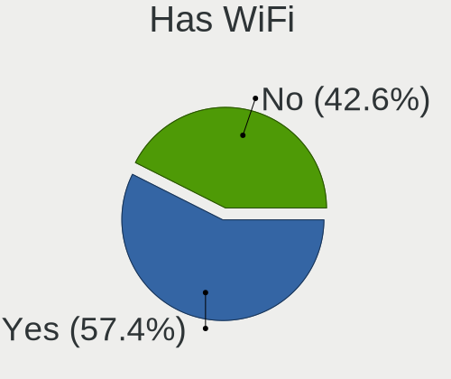
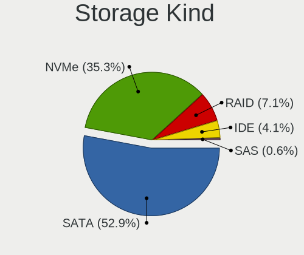
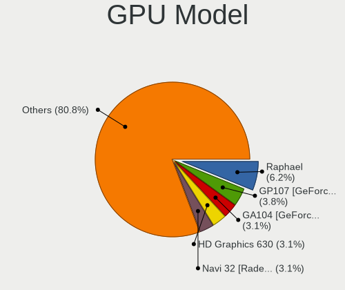
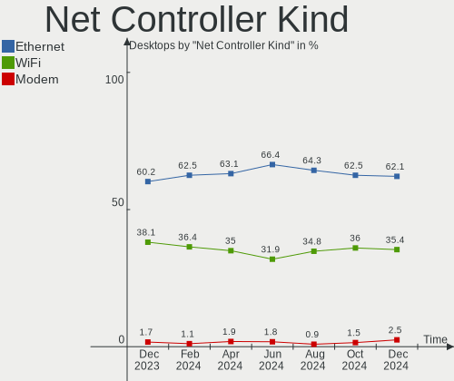

Pop!_OS - Hardware Trends (Desktops)
------------------------------------

A project to identify most popular hardware characteristics and track their change
over time based on data collected by Linux users at https://Linux-Hardware.org.

Anyone can contribute to this report by the [hw-probe](https://github.com/linuxhw/hw-probe) tool:

    sudo -E hw-probe -all -upload

This report is for one last month. Overall report since the beginning of time: [TestDays](https://github.com/linuxhw/TestDays)

Period: Aug, 2023.

Contents
--------

* [ System ](#system)
  - [ OS                       ](#os)
  - [ OS Family                ](#os-family)
  - [ Kernel                   ](#kernel)
  - [ Kernel Family            ](#kernel-family)
  - [ Kernel Major Ver.        ](#kernel-major-ver)
  - [ Arch                     ](#arch)
  - [ DE                       ](#de)
  - [ Display Server           ](#display-server)
  - [ Display Manager          ](#display-manager)
  - [ OS Lang                  ](#os-lang)
  - [ Boot Mode                ](#boot-mode)
  - [ Filesystem               ](#filesystem)
  - [ Part. scheme             ](#part-scheme)
  - [ Dual Boot with Linux/BSD ](#dual-boot-with-linuxbsd)
  - [ Dual Boot (Win)          ](#dual-boot-win)

* [ Board ](#board)
  - [ Vendor                   ](#vendor)
  - [ Model                    ](#model)
  - [ Model Family             ](#model-family)
  - [ MFG Year                 ](#mfg-year)
  - [ Form Factor              ](#form-factor)
  - [ Secure Boot              ](#secure-boot)
  - [ Coreboot                 ](#coreboot)
  - [ RAM Size                 ](#ram-size)
  - [ RAM Used                 ](#ram-used)
  - [ Total Drives             ](#total-drives)
  - [ Has CD-ROM               ](#has-cd-rom)
  - [ Has Ethernet             ](#has-ethernet)
  - [ Has WiFi                 ](#has-wifi)
  - [ Has Bluetooth            ](#has-bluetooth)

* [ Location ](#location)
  - [ Country                  ](#country)
  - [ City                     ](#city)

* [ Drives ](#drives)
  - [ Drive Vendor             ](#drive-vendor)
  - [ Drive Model              ](#drive-model)
  - [ HDD Vendor               ](#hdd-vendor)
  - [ SSD Vendor               ](#ssd-vendor)
  - [ Drive Kind               ](#drive-kind)
  - [ Drive Connector          ](#drive-connector)
  - [ Drive Size               ](#drive-size)
  - [ Space Total              ](#space-total)
  - [ Space Used               ](#space-used)
  - [ Malfunc. Drives          ](#malfunc-drives)
  - [ Malfunc. Drive Vendor    ](#malfunc-drive-vendor)
  - [ Malfunc. HDD Vendor      ](#malfunc-hdd-vendor)
  - [ Malfunc. Drive Kind      ](#malfunc-drive-kind)
  - [ Failed Drives            ](#failed-drives)
  - [ Failed Drive Vendor      ](#failed-drive-vendor)
  - [ Drive Status             ](#drive-status)

* [ Storage controller ](#storage-controller)
  - [ Storage Vendor           ](#storage-vendor)
  - [ Storage Model            ](#storage-model)
  - [ Storage Kind             ](#storage-kind)

* [ Processor ](#processor)
  - [ CPU Vendor               ](#cpu-vendor)
  - [ CPU Model                ](#cpu-model)
  - [ CPU Model Family         ](#cpu-model-family)
  - [ CPU Cores                ](#cpu-cores)
  - [ CPU Sockets              ](#cpu-sockets)
  - [ CPU Threads              ](#cpu-threads)
  - [ CPU Op-Modes             ](#cpu-op-modes)
  - [ CPU Microcode            ](#cpu-microcode)
  - [ CPU Microarch            ](#cpu-microarch)

* [ Graphics ](#graphics)
  - [ GPU Vendor               ](#gpu-vendor)
  - [ GPU Model                ](#gpu-model)
  - [ GPU Combo                ](#gpu-combo)
  - [ GPU Driver               ](#gpu-driver)
  - [ GPU Memory               ](#gpu-memory)

* [ Monitor ](#monitor)
  - [ Monitor Vendor           ](#monitor-vendor)
  - [ Monitor Model            ](#monitor-model)
  - [ Monitor Resolution       ](#monitor-resolution)
  - [ Monitor Diagonal         ](#monitor-diagonal)
  - [ Monitor Width            ](#monitor-width)
  - [ Aspect Ratio             ](#aspect-ratio)
  - [ Monitor Area             ](#monitor-area)
  - [ Pixel Density            ](#pixel-density)
  - [ Multiple Monitors        ](#multiple-monitors)

* [ Network ](#network)
  - [ Net Controller Vendor    ](#net-controller-vendor)
  - [ Net Controller Model     ](#net-controller-model)
  - [ Wireless Vendor          ](#wireless-vendor)
  - [ Wireless Model           ](#wireless-model)
  - [ Ethernet Vendor          ](#ethernet-vendor)
  - [ Ethernet Model           ](#ethernet-model)
  - [ Net Controller Kind      ](#net-controller-kind)
  - [ Used Controller          ](#used-controller)
  - [ NICs                     ](#nics)
  - [ IPv6                     ](#ipv6)

* [ Bluetooth ](#bluetooth)
  - [ Bluetooth Vendor         ](#bluetooth-vendor)
  - [ Bluetooth Model          ](#bluetooth-model)

* [ Sound ](#sound)
  - [ Sound Vendor             ](#sound-vendor)
  - [ Sound Model              ](#sound-model)

* [ Memory ](#memory)
  - [ Memory Vendor            ](#memory-vendor)
  - [ Memory Model             ](#memory-model)
  - [ Memory Kind              ](#memory-kind)
  - [ Memory Form Factor       ](#memory-form-factor)
  - [ Memory Size              ](#memory-size)
  - [ Memory Speed             ](#memory-speed)

* [ Printers & scanners ](#printers--scanners)
  - [ Printer Vendor           ](#printer-vendor)
  - [ Printer Model            ](#printer-model)
  - [ Scanner Vendor           ](#scanner-vendor)
  - [ Scanner Model            ](#scanner-model)

* [ Camera ](#camera)
  - [ Camera Vendor            ](#camera-vendor)
  - [ Camera Model             ](#camera-model)

* [ Security ](#security)
  - [ Fingerprint Vendor       ](#fingerprint-vendor)
  - [ Fingerprint Model        ](#fingerprint-model)
  - [ Chipcard Vendor          ](#chipcard-vendor)
  - [ Chipcard Model           ](#chipcard-model)

* [ Unsupported ](#unsupported)
  - [ Unsupported Devices      ](#unsupported-devices)
  - [ Unsupported Device Types ](#unsupported-device-types)

System
------

OS
--

Installed operating systems

| Name          | Desktops | Percent |
|---------------|----------|---------|
| Pop!_OS 22.04 | 66       | 100%    |

OS Family
---------

OS without a version

| Name    | Desktops | Percent |
|---------|----------|---------|
| Pop!_OS | 66       | 100%    |

Kernel
------

Version of the Linux kernel

| Version                | Desktops | Percent |
|------------------------|----------|---------|
| 6.4.6-76060406-generic | 37       | 56.06%  |
| 6.2.6-76060206-generic | 27       | 40.91%  |
| 6.4.8-x64v3-xanmod1    | 1        | 1.52%   |
| 6.3.7-060307-generic   | 1        | 1.52%   |

Kernel Family
-------------

Linux kernel without a distro release

| Version | Desktops | Percent |
|---------|----------|---------|
| 6.4.6   | 37       | 56.06%  |
| 6.2.6   | 27       | 40.91%  |
| 6.4.8   | 1        | 1.52%   |
| 6.3.7   | 1        | 1.52%   |

Kernel Major Ver.
-----------------

Linux kernel major version

| Version | Desktops | Percent |
|---------|----------|---------|
| 6.4     | 38       | 57.58%  |
| 6.2     | 27       | 40.91%  |
| 6.3     | 1        | 1.52%   |

Arch
----

OS architecture (x86_64, i586, etc.)

| Name   | Desktops | Percent |
|--------|----------|---------|
| x86_64 | 66       | 100%    |

DE
--

Desktop Environment

| Name       | Desktops | Percent |
|------------|----------|---------|
| GNOME      | 65       | 98.48%  |
| X-Cinnamon | 1        | 1.52%   |

Display Server
--------------

X11 or Wayland

| Name    | Desktops | Percent |
|---------|----------|---------|
| X11     | 65       | 98.48%  |
| Wayland | 1        | 1.52%   |

Display Manager
---------------

SDDM, LightDM, etc.

| Name    | Desktops | Percent |
|---------|----------|---------|
| Unknown | 57       | 86.36%  |
| GDM3    | 9        | 13.64%  |

OS Lang
-------

Language

| Lang  | Desktops | Percent |
|-------|----------|---------|
| en_US | 30       | 45.45%  |
| de_DE | 12       | 18.18%  |
| en_GB | 5        | 7.58%   |
| pt_BR | 4        | 6.06%   |
| it_IT | 2        | 3.03%   |
| fr_FR | 2        | 3.03%   |
| en_AU | 2        | 3.03%   |
| C     | 2        | 3.03%   |
| sv_SE | 1        | 1.52%   |
| pl_PL | 1        | 1.52%   |
| nl_NL | 1        | 1.52%   |
| ja_JP | 1        | 1.52%   |
| es_AR | 1        | 1.52%   |
| de_CH | 1        | 1.52%   |
| de_AT | 1        | 1.52%   |

Boot Mode
---------

EFI or BIOS

| Mode | Desktops | Percent |
|------|----------|---------|
| BIOS | 57       | 86.36%  |
| EFI  | 9        | 13.64%  |

Filesystem
----------

Type of filesystem

| Type    | Desktops | Percent |
|---------|----------|---------|
| Ext4    | 61       | 92.42%  |
| Overlay | 2        | 3.03%   |
| Btrfs   | 2        | 3.03%   |
| Tmpfs   | 1        | 1.52%   |

Part. scheme
------------

Scheme of partitioning

| Type    | Desktops | Percent |
|---------|----------|---------|
| Unknown | 57       | 86.36%  |
| GPT     | 8        | 12.12%  |
| MBR     | 1        | 1.52%   |

Dual Boot with Linux/BSD
------------------------

Hosting more than one Linux/BSD

| Dual boot | Desktops | Percent |
|-----------|----------|---------|
| No        | 65       | 98.48%  |
| Yes       | 1        | 1.52%   |

Dual Boot (Win)
---------------

Hosting Linux and Windows

| Dual boot | Desktops | Percent |
|-----------|----------|---------|
| No        | 61       | 92.42%  |
| Yes       | 5        | 7.58%   |

Board
-----

Vendor
------

Motherboard manufacturer

| Name                | Desktops | Percent |
|---------------------|----------|---------|
| ASUSTek Computer    | 16       | 24.24%  |
| Gigabyte Technology | 11       | 16.67%  |
| MSI                 | 10       | 15.15%  |
| Hewlett-Packard     | 8        | 12.12%  |
| ASRock              | 5        | 7.58%   |
| Dell                | 3        | 4.55%   |
| Unknown             | 3        | 4.55%   |
| NZXT                | 2        | 3.03%   |
| System76            | 1        | 1.52%   |
| Positivo            | 1        | 1.52%   |
| Lenovo              | 1        | 1.52%   |
| JHZD                | 1        | 1.52%   |
| Intel               | 1        | 1.52%   |
| Fujitsu             | 1        | 1.52%   |
| Apple               | 1        | 1.52%   |
| Alienware           | 1        | 1.52%   |

Model
-----

Motherboard model

| Name                                    | Desktops | Percent |
|-----------------------------------------|----------|---------|
| Unknown                                 | 3        | 4.55%   |
| System76 Thelio Major                   | 1        | 1.52%   |
| Positivo C8300                          | 1        | 1.52%   |
| NZXT N7 Z590                            | 1        | 1.52%   |
| NZXT N7 B550                            | 1        | 1.52%   |
| MSI MS-7E07                             | 1        | 1.52%   |
| MSI MS-7D75                             | 1        | 1.52%   |
| MSI MS-7C95                             | 1        | 1.52%   |
| MSI MS-7C91                             | 1        | 1.52%   |
| MSI MS-7B79                             | 1        | 1.52%   |
| MSI MS-7B09                             | 1        | 1.52%   |
| MSI MS-7883                             | 1        | 1.52%   |
| MSI MS-7845                             | 1        | 1.52%   |
| MSI MS-7721                             | 1        | 1.52%   |
| MSI Mr. Office V R4                     | 1        | 1.52%   |
| Lenovo IdeaCentre 510S-07ICK 90LX006TGE | 1        | 1.52%   |
| JHZD X830                               | 1        | 1.52%   |
| Intel B75A                              | 1        | 1.52%   |
| HP Z400 Workstation                     | 1        | 1.52%   |
| HP ProDesk 600 G1 TWR                   | 1        | 1.52%   |
| HP Pavilion Gaming Desktop TG01-0xxx    | 1        | 1.52%   |
| HP OMEN by Desktop PC 880-p0xx          | 1        | 1.52%   |
| HP EliteDesk 800 G2 SFF                 | 1        | 1.52%   |
| HP 500-321                              | 1        | 1.52%   |
| HP 402 G1 SFF Business PC               | 1        | 1.52%   |
| HP 23-f200br                            | 1        | 1.52%   |
| Gigabyte Z790 GAMING X AX               | 1        | 1.52%   |
| Gigabyte Z270X-UD5                      | 1        | 1.52%   |
| Gigabyte X570S AORUS ELITE AX           | 1        | 1.52%   |
| Gigabyte X570 I AORUS PRO WIFI          | 1        | 1.52%   |
| Gigabyte X570 AORUS ELITE               | 1        | 1.52%   |
| Gigabyte H97-HD3                        | 1        | 1.52%   |
| Gigabyte H410M S2 V2                    | 1        | 1.52%   |
| Gigabyte H410M H V3                     | 1        | 1.52%   |
| Gigabyte B550 VISION D-P                | 1        | 1.52%   |
| Gigabyte 970A-UD3P                      | 1        | 1.52%   |
| Gigabyte 970A-DS3P                      | 1        | 1.52%   |
| Fujitsu D3128-A1                        | 1        | 1.52%   |
| Dell XPS 8700                           | 1        | 1.52%   |
| Dell OptiPlex 3020M                     | 1        | 1.52%   |

Model Family
------------

Motherboard model prefix

| Name               | Desktops | Percent |
|--------------------|----------|---------|
| ASUS ROG           | 5        | 7.58%   |
| ASUS PRIME         | 4        | 6.06%   |
| Unknown            | 3        | 4.55%   |
| NZXT N7            | 2        | 3.03%   |
| Gigabyte X570      | 2        | 3.03%   |
| Gigabyte H410M     | 2        | 3.03%   |
| ASUS TUF           | 2        | 3.03%   |
| System76 Thelio    | 1        | 1.52%   |
| Positivo C8300     | 1        | 1.52%   |
| MSI MS-7E07        | 1        | 1.52%   |
| MSI MS-7D75        | 1        | 1.52%   |
| MSI MS-7C95        | 1        | 1.52%   |
| MSI MS-7C91        | 1        | 1.52%   |
| MSI MS-7B79        | 1        | 1.52%   |
| MSI MS-7B09        | 1        | 1.52%   |
| MSI MS-7883        | 1        | 1.52%   |
| MSI MS-7845        | 1        | 1.52%   |
| MSI MS-7721        | 1        | 1.52%   |
| MSI Mr.            | 1        | 1.52%   |
| Lenovo IdeaCentre  | 1        | 1.52%   |
| JHZD X830          | 1        | 1.52%   |
| Intel B75A         | 1        | 1.52%   |
| HP Z400            | 1        | 1.52%   |
| HP ProDesk         | 1        | 1.52%   |
| HP Pavilion        | 1        | 1.52%   |
| HP OMEN            | 1        | 1.52%   |
| HP EliteDesk       | 1        | 1.52%   |
| HP 500-321         | 1        | 1.52%   |
| HP 402             | 1        | 1.52%   |
| HP 23-f200br       | 1        | 1.52%   |
| Gigabyte Z790      | 1        | 1.52%   |
| Gigabyte Z270X-UD5 | 1        | 1.52%   |
| Gigabyte X570S     | 1        | 1.52%   |
| Gigabyte H97-HD3   | 1        | 1.52%   |
| Gigabyte B550      | 1        | 1.52%   |
| Gigabyte 970A-UD3P | 1        | 1.52%   |
| Gigabyte 970A-DS3P | 1        | 1.52%   |
| Fujitsu D3128-A1   | 1        | 1.52%   |
| Dell XPS           | 1        | 1.52%   |
| Dell OptiPlex      | 1        | 1.52%   |

MFG Year
--------

Motherboard manufacture year

| Year | Desktops | Percent |
|------|----------|---------|
| 2022 | 14       | 21.21%  |
| 2021 | 9        | 13.64%  |
| 2013 | 7        | 10.61%  |
| 2020 | 6        | 9.09%   |
| 2014 | 6        | 9.09%   |
| 2019 | 5        | 7.58%   |
| 2023 | 4        | 6.06%   |
| 2018 | 4        | 6.06%   |
| 2017 | 2        | 3.03%   |
| 2015 | 2        | 3.03%   |
| 2012 | 2        | 3.03%   |
| 2009 | 2        | 3.03%   |
| 2016 | 1        | 1.52%   |
| 2010 | 1        | 1.52%   |
| 2008 | 1        | 1.52%   |

Form Factor
-----------

Physical design of the computer

| Name    | Desktops | Percent |
|---------|----------|---------|
| Desktop | 66       | 100%    |

Secure Boot
-----------

Enabled or disabled

| State    | Desktops | Percent |
|----------|----------|---------|
| Disabled | 66       | 100%    |

Coreboot
--------

Have coreboot on board

| Used | Desktops | Percent |
|------|----------|---------|
| No   | 66       | 100%    |

RAM Size
--------

Total RAM memory

| Size in GB  | Desktops | Percent |
|-------------|----------|---------|
| 32.01-64.0  | 25       | 37.88%  |
| 16.01-24.0  | 16       | 24.24%  |
| 24.01-32.0  | 7        | 10.61%  |
| 64.01-256.0 | 6        | 9.09%   |
| 8.01-16.0   | 5        | 7.58%   |
| 3.01-4.0    | 4        | 6.06%   |
| 4.01-8.0    | 3        | 4.55%   |

RAM Used
--------

Used RAM memory

| Used GB    | Desktops | Percent |
|------------|----------|---------|
| 4.01-8.0   | 29       | 43.94%  |
| 8.01-16.0  | 19       | 28.79%  |
| 3.01-4.0   | 8        | 12.12%  |
| 2.01-3.0   | 7        | 10.61%  |
| 1.01-2.0   | 2        | 3.03%   |
| 24.01-32.0 | 1        | 1.52%   |

Total Drives
------------

Number of drives on board

| Drives | Desktops | Percent |
|--------|----------|---------|
| 2      | 24       | 36.36%  |
| 1      | 17       | 25.76%  |
| 4      | 7        | 10.61%  |
| 3      | 7        | 10.61%  |
| 5      | 6        | 9.09%   |
| 6      | 3        | 4.55%   |
| 7      | 2        | 3.03%   |

Has CD-ROM
----------

Has CD-ROM on board

| Presented | Desktops | Percent |
|-----------|----------|---------|
| No        | 50       | 75.76%  |
| Yes       | 16       | 24.24%  |

Has Ethernet
------------

Has Ethernet on board

| Presented | Desktops | Percent |
|-----------|----------|---------|
| Yes       | 66       | 100%    |

Has WiFi
--------

Has WiFi module

| Presented | Desktops | Percent |
|-----------|----------|---------|
| Yes       | 41       | 62.12%  |
| No        | 25       | 37.88%  |

Has Bluetooth
-------------

Has Bluetooth module

| Presented | Desktops | Percent |
|-----------|----------|---------|
| Yes       | 37       | 56.06%  |
| No        | 29       | 43.94%  |

Location
--------

Country
-------

Geographic location (country)

| Country     | Desktops | Percent |
|-------------|----------|---------|
| USA         | 17       | 25.76%  |
| Germany     | 16       | 24.24%  |
| Brazil      | 6        | 9.09%   |
| Netherlands | 3        | 4.55%   |
| UK          | 2        | 3.03%   |
| Italy       | 2        | 3.03%   |
| France      | 2        | 3.03%   |
| Canada      | 2        | 3.03%   |
| Australia   | 2        | 3.03%   |
| Thailand    | 1        | 1.52%   |
| Sweden      | 1        | 1.52%   |
| Slovenia    | 1        | 1.52%   |
| Singapore   | 1        | 1.52%   |
| Russia      | 1        | 1.52%   |
| Portugal    | 1        | 1.52%   |
| Poland      | 1        | 1.52%   |
| Pakistan    | 1        | 1.52%   |
| Malta       | 1        | 1.52%   |
| Malaysia    | 1        | 1.52%   |
| Japan       | 1        | 1.52%   |
| Greece      | 1        | 1.52%   |
| Austria     | 1        | 1.52%   |
| Argentina   | 1        | 1.52%   |

City
----

Geographic location (city)

| City             | Desktops | Percent |
|------------------|----------|---------|
| Coburg           | 3        | 4.55%   |
| Winnipeg         | 1        | 1.52%   |
| Willow Grove     | 1        | 1.52%   |
| Willenhall       | 1        | 1.52%   |
| Weimar           | 1        | 1.52%   |
| Vienna           | 1        | 1.52%   |
| Valletta         | 1        | 1.52%   |
| Umeå            | 1        | 1.52%   |
| Sydney           | 1        | 1.52%   |
| Springfield      | 1        | 1.52%   |
| Sitio Palmital   | 1        | 1.52%   |
| Singapore        | 1        | 1.52%   |
| Signal Mountain  | 1        | 1.52%   |
| Shalimar         | 1        | 1.52%   |
| Schiltigheim     | 1        | 1.52%   |
| Sao Paulo        | 1        | 1.52%   |
| San Francisco    | 1        | 1.52%   |
| Round Rock       | 1        | 1.52%   |
| Rome             | 1        | 1.52%   |
| Roanoke          | 1        | 1.52%   |
| Rio de Janeiro   | 1        | 1.52%   |
| Porto Alegre     | 1        | 1.52%   |
| Phitsanulok      | 1        | 1.52%   |
| Perth            | 1        | 1.52%   |
| Orlando          | 1        | 1.52%   |
| Ocean Isle Beach | 1        | 1.52%   |
| Oberviechtach    | 1        | 1.52%   |
| Nuremberg        | 1        | 1.52%   |
| Nuenen           | 1        | 1.52%   |
| Moscow           | 1        | 1.52%   |
| Mornsheim        | 1        | 1.52%   |
| Meerbusch        | 1        | 1.52%   |
| Maplewood        | 1        | 1.52%   |
| Mansfield        | 1        | 1.52%   |
| Mannheim         | 1        | 1.52%   |
| Manaus           | 1        | 1.52%   |
| Livorno          | 1        | 1.52%   |
| Lisbon           | 1        | 1.52%   |
| Leipzig          | 1        | 1.52%   |
| La Roche-sur-Yon | 1        | 1.52%   |

Drives
------

Drive Vendor
------------

Hard drive vendors

| Vendor                         | Desktops | Drives | Percent |
|--------------------------------|----------|--------|---------|
| Samsung Electronics            | 26       | 41     | 19.12%  |
| WDC                            | 17       | 23     | 12.5%   |
| Seagate                        | 16       | 25     | 11.76%  |
| Kingston                       | 12       | 15     | 8.82%   |
| Sandisk                        | 10       | 11     | 7.35%   |
| Toshiba                        | 8        | 8      | 5.88%   |
| Phison Electronics             | 6        | 9      | 4.41%   |
| Crucial                        | 5        | 5      | 3.68%   |
| Kingston Technology Company    | 4        | 4      | 2.94%   |
| Verbatim                       | 3        | 3      | 2.21%   |
| Intel                          | 3        | 3      | 2.21%   |
| China                          | 3        | 3      | 2.21%   |
| Unknown                        | 2        | 3      | 1.47%   |
| Apple                          | 2        | 2      | 1.47%   |
| ADATA Technology               | 2        | 2      | 1.47%   |
| WD MediaMax                    | 1        | 1      | 0.74%   |
| Solid State Storage Technology | 1        | 1      | 0.74%   |
| Silicon Motion                 | 1        | 1      | 0.74%   |
| Patriot                        | 1        | 1      | 0.74%   |
| Oyen                           | 1        | 1      | 0.74%   |
| OCZ                            | 1        | 1      | 0.74%   |
| Netac                          | 1        | 1      | 0.74%   |
| Micron/Crucial Technology      | 1        | 2      | 0.74%   |
| LaCie                          | 1        | 1      | 0.74%   |
| KingDian                       | 1        | 1      | 0.74%   |
| JMicron Technology             | 1        | 1      | 0.74%   |
| Intenso                        | 1        | 1      | 0.74%   |
| INTEL SS                       | 1        | 1      | 0.74%   |
| HS-SSD-C100                    | 1        | 1      | 0.74%   |
| Hitachi                        | 1        | 1      | 0.74%   |
| HGST                           | 1        | 1      | 0.74%   |
| BlueRay                        | 1        | 1      | 0.74%   |

Drive Model
-----------

Hard drive models

| Model                                                           | Desktops | Percent |
|-----------------------------------------------------------------|----------|---------|
| Samsung NVMe SSD Controller SM981/PM981/PM983 500GB             | 4        | 2.45%   |
| Samsung NVMe SSD Controller PM9A1/PM9A3/980PRO 1024GB           | 4        | 2.45%   |
| Kingston SA400S37120G 120GB SSD                                 | 4        | 2.45%   |
| Verbatim Vi550 S3 512GB                                         | 3        | 1.84%   |
| Sandisk WD Black SN850 256GB                                    | 3        | 1.84%   |
| Phison E12 NVMe Controller 256GB                                | 3        | 1.84%   |
| Toshiba DT01ACA200 2TB                                          | 2        | 1.23%   |
| Seagate ST500DM002-1BD142 500GB                                 | 2        | 1.23%   |
| Seagate ST2000DM008-2FR102 2TB                                  | 2        | 1.23%   |
| Seagate ST1000DM003-1SB102 1TB                                  | 2        | 1.23%   |
| Samsung SSD 980 500GB                                           | 2        | 1.23%   |
| Samsung SSD 870 QVO 1TB                                         | 2        | 1.23%   |
| Samsung SSD 870 EVO 500GB                                       | 2        | 1.23%   |
| Samsung SSD 860 EVO 1TB                                         | 2        | 1.23%   |
| Samsung SSD 850 EVO 500GB                                       | 2        | 1.23%   |
| Samsung SSD 850 EVO 120GB                                       | 2        | 1.23%   |
| Samsung SSD 840 EVO 250GB                                       | 2        | 1.23%   |
| Phison PCIe SSD 512GB                                           | 2        | 1.23%   |
| Kingston Company SNV2S2000G 2TB                                 | 2        | 1.23%   |
| Kingston SKC3000D2048G 2TB                                      | 2        | 1.23%   |
| Kingston SA400S37960G 960GB SSD                                 | 2        | 1.23%   |
| Crucial CT1000MX500SSD1 1TB                                     | 2        | 1.23%   |
| ADATA XPG SX8200 Pro PCIe Gen3x4 M.2 2280 Solid State Drive 2TB | 2        | 1.23%   |
| WDC WDS250G2B0A-00SM50 250GB SSD                                | 1        | 0.61%   |
| WDC WDS100T2B0A-00SM50 1TB SSD                                  | 1        | 0.61%   |
| WDC WD8000AARS-00Y5B1 800GB                                     | 1        | 0.61%   |
| WDC WD5000LPLX-08ZNTT0 500GB                                    | 1        | 0.61%   |
| WDC WD5000AAKX-753CA1 500GB                                     | 1        | 0.61%   |
| WDC WD5000AAKS-65A7B0 500GB                                     | 1        | 0.61%   |
| WDC WD40EZRZ-00GXCB0 4TB                                        | 1        | 0.61%   |
| WDC WD30EFRX-68EUZN0 3TB                                        | 1        | 0.61%   |
| WDC WD2500BEVT-35A23T0 250GB                                    | 1        | 0.61%   |
| WDC WD2500AAJS-40VWA0 250GB                                     | 1        | 0.61%   |
| WDC WD20EZRX-22D8PB0 2TB                                        | 1        | 0.61%   |
| WDC WD20EZRX-00D8PB0 2TB                                        | 1        | 0.61%   |
| WDC WD20EFAX-68FB5N0 2TB                                        | 1        | 0.61%   |
| WDC WD10PURZ-85U8XY0 1TB                                        | 1        | 0.61%   |
| WDC WD10JPVX-75JC3T0 1TB                                        | 1        | 0.61%   |
| WDC WD10EZEX-08WN4A0 1TB                                        | 1        | 0.61%   |
| WDC WD10EZEX-00WN4A0 1TB                                        | 1        | 0.61%   |

HDD Vendor
----------

Hard disk drive vendors

| Vendor              | Desktops | Drives | Percent |
|---------------------|----------|--------|---------|
| Seagate             | 16       | 21     | 37.21%  |
| WDC                 | 14       | 20     | 32.56%  |
| Toshiba             | 7        | 7      | 16.28%  |
| WD MediaMax         | 1        | 1      | 2.33%   |
| Unknown             | 1        | 1      | 2.33%   |
| Samsung Electronics | 1        | 1      | 2.33%   |
| LaCie               | 1        | 1      | 2.33%   |
| Hitachi             | 1        | 1      | 2.33%   |
| HGST                | 1        | 1      | 2.33%   |

SSD Vendor
----------

Solid state drive vendors

| Vendor              | Desktops | Drives | Percent |
|---------------------|----------|--------|---------|
| Samsung Electronics | 15       | 24     | 30%     |
| Kingston            | 8        | 8      | 16%     |
| Crucial             | 5        | 5      | 10%     |
| WDC                 | 3        | 3      | 6%      |
| Verbatim            | 3        | 3      | 6%      |
| China               | 3        | 3      | 6%      |
| SanDisk             | 2        | 2      | 4%      |
| Intel               | 2        | 2      | 4%      |
| Apple               | 2        | 2      | 4%      |
| Patriot             | 1        | 1      | 2%      |
| OCZ                 | 1        | 1      | 2%      |
| Netac               | 1        | 1      | 2%      |
| KingDian            | 1        | 1      | 2%      |
| JMicron Technology  | 1        | 1      | 2%      |
| Intenso             | 1        | 1      | 2%      |
| INTEL SS            | 1        | 1      | 2%      |

Drive Kind
----------

HDD or SSD

| Kind    | Desktops | Drives | Percent |
|---------|----------|--------|---------|
| SSD     | 41       | 59     | 36.61%  |
| NVMe    | 36       | 56     | 32.14%  |
| HDD     | 31       | 54     | 27.68%  |
| Unknown | 4        | 6      | 3.57%   |

Drive Connector
---------------

SATA, SAS, NVMe, etc.

| Type | Desktops | Drives | Percent |
|------|----------|--------|---------|
| SATA | 54       | 108    | 54.55%  |
| NVMe | 36       | 56     | 36.36%  |
| SAS  | 9        | 11     | 9.09%   |

Drive Size
----------

Size of hard drive

| Size in TB | Desktops | Drives | Percent |
|------------|----------|--------|---------|
| 0.01-0.5   | 33       | 49     | 40.24%  |
| 0.51-1.0   | 29       | 35     | 35.37%  |
| 1.01-2.0   | 11       | 17     | 13.41%  |
| 3.01-4.0   | 5        | 7      | 6.1%    |
| 2.01-3.0   | 2        | 2      | 2.44%   |
| 4.01-10.0  | 2        | 3      | 2.44%   |

Space Total
-----------

Amount of disk space available on the file system

| Size in GB     | Desktops | Percent |
|----------------|----------|---------|
| More than 3000 | 13       | 19.7%   |
| 101-250        | 11       | 16.67%  |
| 1001-2000      | 10       | 15.15%  |
| 501-1000       | 10       | 15.15%  |
| 251-500        | 9        | 13.64%  |
| 2001-3000      | 7        | 10.61%  |
| 51-100         | 5        | 7.58%   |
| 1-20           | 1        | 1.52%   |

Space Used
----------

Amount of used disk space

| Used GB        | Desktops | Percent |
|----------------|----------|---------|
| 1-20           | 15       | 22.73%  |
| 21-50          | 12       | 18.18%  |
| More than 3000 | 8        | 12.12%  |
| 101-250        | 8        | 12.12%  |
| 1001-2000      | 7        | 10.61%  |
| 501-1000       | 5        | 7.58%   |
| 2001-3000      | 4        | 6.06%   |
| 51-100         | 4        | 6.06%   |
| 251-500        | 3        | 4.55%   |

Malfunc. Drives
---------------

Drive models with a malfunction

| Model                     | Desktops | Drives | Percent |
|---------------------------|----------|--------|---------|
| WDC WD10EARS-00MVWB0 1TB  | 1        | 1      | 50%     |
| Seagate ST3250310AS 250GB | 1        | 1      | 50%     |

Malfunc. Drive Vendor
---------------------

Vendors of faulty drives

| Vendor  | Desktops | Drives | Percent |
|---------|----------|--------|---------|
| WDC     | 1        | 1      | 50%     |
| Seagate | 1        | 1      | 50%     |

Malfunc. HDD Vendor
-------------------

Vendors of faulty HDD drives

| Vendor  | Desktops | Drives | Percent |
|---------|----------|--------|---------|
| WDC     | 1        | 1      | 50%     |
| Seagate | 1        | 1      | 50%     |

Malfunc. Drive Kind
-------------------

Kinds of faulty drives

| Kind | Desktops | Drives | Percent |
|------|----------|--------|---------|
| HDD  | 2        | 2      | 100%    |

Failed Drives
-------------

Failed drive models

Zero info for selected period =(

Failed Drive Vendor
-------------------

Failed drive vendors

Zero info for selected period =(

Drive Status
------------

Number of failed and malfunc. drives

| Status   | Desktops | Drives | Percent |
|----------|----------|--------|---------|
| Detected | 58       | 153    | 84.06%  |
| Works    | 9        | 20     | 13.04%  |
| Malfunc  | 2        | 2      | 2.9%    |

Storage controller
------------------

Storage Vendor
--------------

Storage controller vendors

| Vendor                         | Desktops | Percent |
|--------------------------------|----------|---------|
| Intel                          | 35       | 28.69%  |
| AMD                            | 32       | 26.23%  |
| Samsung Electronics            | 15       | 12.3%   |
| Kingston Technology Company    | 9        | 7.38%   |
| SanDisk                        | 8        | 6.56%   |
| Phison Electronics             | 6        | 4.92%   |
| ASMedia Technology             | 6        | 4.92%   |
| Seagate Technology             | 2        | 1.64%   |
| Marvell Technology Group       | 2        | 1.64%   |
| ADATA Technology               | 2        | 1.64%   |
| Toshiba America Info Systems   | 1        | 0.82%   |
| Solid State Storage Technology | 1        | 0.82%   |
| Silicon Motion                 | 1        | 0.82%   |
| Micron/Crucial Technology      | 1        | 0.82%   |
| JMicron Technology             | 1        | 0.82%   |

Storage Model
-------------

Storage controller models

| Model                                                                          | Desktops | Percent |
|--------------------------------------------------------------------------------|----------|---------|
| AMD FCH SATA Controller [AHCI mode]                                            | 19       | 13.19%  |
| AMD 500 Series Chipset SATA Controller                                         | 7        | 4.86%   |
| Intel 8 Series/C220 Series Chipset Family 6-port SATA Controller 1 [AHCI mode] | 6        | 4.17%   |
| AMD 400 Series Chipset SATA Controller                                         | 6        | 4.17%   |
| Samsung NVMe SSD Controller SM981/PM981/PM983                                  | 5        | 3.47%   |
| Samsung NVMe SSD Controller PM9A1/PM9A3/980PRO                                 | 5        | 3.47%   |
| ASMedia ASM1062 Serial ATA Controller                                          | 5        | 3.47%   |
| SanDisk WD PC SN810 / Black SN850 NVMe SSD                                     | 3        | 2.08%   |
| Samsung NVMe SSD Controller 980                                                | 3        | 2.08%   |
| Phison E12 NVMe Controller                                                     | 3        | 2.08%   |
| Kingston Company Company Non-Volatile memory controller                        | 3        | 2.08%   |
| Kingston Company KC3000/Renegade NVMe SSD                                      | 3        | 2.08%   |
| Intel Comet Lake SATA AHCI Controller                                          | 3        | 2.08%   |
| Intel 7 Series/C210 Series Chipset Family 6-port SATA Controller [AHCI mode]   | 3        | 2.08%   |
| Intel 500 Series Chipset Family SATA AHCI Controller                           | 3        | 2.08%   |
| Intel 200 Series PCH SATA controller [AHCI mode]                               | 3        | 2.08%   |
| Seagate FireCuda 530 SSD                                                       | 2        | 1.39%   |
| Sandisk Western Digital WD Black SN850X NVMe SSD                               | 2        | 1.39%   |
| Kingston Company NV1 NVMe SSD                                                  | 2        | 1.39%   |
| Intel Jasper Lake SATA AHCI Controller                                         | 2        | 1.39%   |
| Intel 82801JI (ICH10 Family) 4 port SATA IDE Controller #1                     | 2        | 1.39%   |
| Intel 82801JI (ICH10 Family) 2 port SATA IDE Controller #2                     | 2        | 1.39%   |
| Intel 700 Series Chipset Family SATA AHCI Controller                           | 2        | 1.39%   |
| AMD X370 Series Chipset SATA Controller                                        | 2        | 1.39%   |
| AMD SB7x0/SB8x0/SB9x0 SATA Controller [AHCI mode]                              | 2        | 1.39%   |
| AMD SB7x0/SB8x0/SB9x0 IDE Controller                                           | 2        | 1.39%   |
| AMD 300 Series Chipset SATA Controller                                         | 2        | 1.39%   |
| ADATA XPG SX8200 Pro PCIe Gen3x4 M.2 2280 Solid State Drive                    | 2        | 1.39%   |
| Toshiba America Info Systems XG5 NVMe SSD Controller                           | 1        | 0.69%   |
| Solid State Storage CL4-8D512 NVMe SSD M.2 (DRAM-less)                         | 1        | 0.69%   |
| Silicon Motion SM2263EN/SM2263XT (DRAM-less) NVMe SSD Controllers              | 1        | 0.69%   |
| SanDisk WD Green SN350 NVMe SSD 1 TB (DRAM-less)                               | 1        | 0.69%   |
| SanDisk WD Black SN770 / PC SN740 256GB / PC SN560 (DRAM-less) NVMe SSD        | 1        | 0.69%   |
| SanDisk WD Black 2018/SN750 / PC SN720 NVMe SSD                                | 1        | 0.69%   |
| SanDisk IX SN530 NVMe SSD (DRAM-less)                                          | 1        | 0.69%   |
| Samsung S4LN058A01[SSUBX] AHCI SSD Controller (Apple slot)                     | 1        | 0.69%   |
| Samsung S4LN053X01 AHCI SSD Controller(Apple slot)                             | 1        | 0.69%   |
| Samsung NVMe SSD Controller SM961/PM961/SM963                                  | 1        | 0.69%   |
| Phison PS5021-E21 PCIe4 NVMe Controller (DRAM-less)                            | 1        | 0.69%   |
| Phison Electronics Non-Volatile memory controller                              | 1        | 0.69%   |

Storage Kind
------------

Kind of storage controller (IDE, SATA, NVMe, SAS, ...)

| Kind | Desktops | Percent |
|------|----------|---------|
| SATA | 61       | 55.96%  |
| NVMe | 36       | 33.03%  |
| IDE  | 7        | 6.42%   |
| RAID | 4        | 3.67%   |
| SAS  | 1        | 0.92%   |

Processor
---------

CPU Vendor
----------

Processor vendors

| Vendor | Desktops | Percent |
|--------|----------|---------|
| Intel  | 34       | 51.52%  |
| AMD    | 32       | 48.48%  |

CPU Model
---------

Processor models

| Model                                         | Desktops | Percent |
|-----------------------------------------------|----------|---------|
| AMD Ryzen 9 7900X 12-Core Processor           | 3        | 4.55%   |
| Intel Core i5-3570K CPU @ 3.40GHz             | 2        | 3.03%   |
| Intel Core i3-9100 CPU @ 3.60GHz              | 2        | 3.03%   |
| AMD Ryzen 9 5900X 12-Core Processor           | 2        | 3.03%   |
| AMD Ryzen 7 5800X 8-Core Processor            | 2        | 3.03%   |
| AMD Ryzen 7 1800X Eight-Core Processor        | 2        | 3.03%   |
| AMD Ryzen 5 5500                              | 2        | 3.03%   |
| AMD Ryzen 5 3600 6-Core Processor             | 2        | 3.03%   |
| Intel Xeon CPU W3680 @ 3.33GHz                | 1        | 1.52%   |
| Intel Xeon CPU E5-2690 0 @ 2.90GHz            | 1        | 1.52%   |
| Intel Xeon CPU E5-1620 v2 @ 3.70GHz           | 1        | 1.52%   |
| Intel Pentium Silver N6005 @ 2.00GHz          | 1        | 1.52%   |
| Intel Core i7-7700K CPU @ 4.20GHz             | 1        | 1.52%   |
| Intel Core i7-6700 CPU @ 3.40GHz              | 1        | 1.52%   |
| Intel Core i7-5930K CPU @ 3.50GHz             | 1        | 1.52%   |
| Intel Core i7-4790K CPU @ 4.00GHz             | 1        | 1.52%   |
| Intel Core i7-4790 CPU @ 3.60GHz              | 1        | 1.52%   |
| Intel Core i7-4770K CPU @ 3.50GHz             | 1        | 1.52%   |
| Intel Core i7-10710U CPU @ 1.10GHz            | 1        | 1.52%   |
| Intel Core i5-4590T CPU @ 2.00GHz             | 1        | 1.52%   |
| Intel Core i5-4590 CPU @ 3.30GHz              | 1        | 1.52%   |
| Intel Core i5-4570 CPU @ 3.20GHz              | 1        | 1.52%   |
| Intel Core i5-3330S CPU @ 2.70GHz             | 1        | 1.52%   |
| Intel Core i5-10500T CPU @ 2.30GHz            | 1        | 1.52%   |
| Intel Core i5 CPU 750 @ 2.67GHz               | 1        | 1.52%   |
| Intel Core i3-4130 CPU @ 3.40GHz              | 1        | 1.52%   |
| Intel Core i3-10105F CPU @ 3.70GHz            | 1        | 1.52%   |
| Intel Core i3-10100F CPU @ 3.60GHz            | 1        | 1.52%   |
| Intel Core 2 Quad CPU Q9550 @ 2.83GHz         | 1        | 1.52%   |
| Intel Core 2 Duo CPU E8600 @ 3.33GHz          | 1        | 1.52%   |
| Intel Celeron N5105 @ 2.00GHz                 | 1        | 1.52%   |
| Intel Celeron CPU J1900 @ 1.99GHz             | 1        | 1.52%   |
| Intel 13th Gen Core i7-13700KF                | 1        | 1.52%   |
| Intel 13th Gen Core i7-13700K                 | 1        | 1.52%   |
| Intel 12th Gen Core i7-12700H                 | 1        | 1.52%   |
| Intel 12th Gen Core i5-12600K                 | 1        | 1.52%   |
| Intel 11th Gen Core i9-11900KF @ 3.50GHz      | 1        | 1.52%   |
| Intel 11th Gen Core i7-11700K @ 3.60GHz       | 1        | 1.52%   |
| AMD Ryzen Threadripper 1900X 8-Core Processor | 1        | 1.52%   |
| AMD Ryzen 9 5950X 16-Core Processor           | 1        | 1.52%   |

CPU Model Family
----------------

Processor model prefix

| Model                  | Desktops | Percent |
|------------------------|----------|---------|
| AMD Ryzen 7            | 11       | 16.67%  |
| AMD Ryzen 5            | 10       | 15.15%  |
| Intel Core i5          | 8        | 12.12%  |
| Intel Core i7          | 7        | 10.61%  |
| Other                  | 6        | 9.09%   |
| AMD Ryzen 9            | 6        | 9.09%   |
| Intel Core i3          | 5        | 7.58%   |
| Intel Xeon             | 3        | 4.55%   |
| Intel Celeron          | 2        | 3.03%   |
| AMD FX                 | 2        | 3.03%   |
| Intel Pentium Silver   | 1        | 1.52%   |
| Intel Core 2 Quad      | 1        | 1.52%   |
| Intel Core 2 Duo       | 1        | 1.52%   |
| AMD Ryzen Threadripper | 1        | 1.52%   |
| AMD Athlon II X2       | 1        | 1.52%   |
| AMD A8                 | 1        | 1.52%   |

CPU Cores
---------

Number of processor cores

| Number | Desktops | Percent |
|--------|----------|---------|
| 4      | 24       | 36.36%  |
| 8      | 15       | 22.73%  |
| 6      | 13       | 19.7%   |
| 12     | 5        | 7.58%   |
| 2      | 4        | 6.06%   |
| 16     | 3        | 4.55%   |
| 14     | 1        | 1.52%   |
| 10     | 1        | 1.52%   |

CPU Sockets
-----------

Number of sockets

| Number | Desktops | Percent |
|--------|----------|---------|
| 1      | 66       | 100%    |

CPU Threads
-----------

Threads per core (Hyper-Threading)

| Number | Desktops | Percent |
|--------|----------|---------|
| 2      | 51       | 77.27%  |
| 1      | 15       | 22.73%  |

CPU Op-Modes
------------

CPU Operation Modes (32-bit, 64-bit)

| Op mode        | Desktops | Percent |
|----------------|----------|---------|
| 32-bit, 64-bit | 66       | 100%    |

CPU Microcode
-------------

Microcode number

| Number     | Desktops | Percent |
|------------|----------|---------|
| Unknown    | 61       | 92.42%  |
| 0x0a601203 | 2        | 3.03%   |
| 0x0a201205 | 1        | 1.52%   |
| 0x0a201009 | 1        | 1.52%   |
| 0x06000852 | 1        | 1.52%   |

CPU Microarch
-------------

Microarchitecture

| Name             | Desktops | Percent |
|------------------|----------|---------|
| Unknown          | 13       | 19.7%   |
| Zen 3            | 12       | 18.18%  |
| Haswell          | 8        | 12.12%  |
| Zen              | 4        | 6.06%   |
| IvyBridge        | 4        | 6.06%   |
| CometLake        | 4        | 6.06%   |
| Zen+             | 3        | 4.55%   |
| Zen 2            | 3        | 4.55%   |
| KabyLake         | 3        | 4.55%   |
| Piledriver       | 2        | 3.03%   |
| Penryn           | 2        | 3.03%   |
| Westmere         | 1        | 1.52%   |
| Steamroller      | 1        | 1.52%   |
| Skylake          | 1        | 1.52%   |
| Silvermont       | 1        | 1.52%   |
| SandyBridge      | 1        | 1.52%   |
| Nehalem          | 1        | 1.52%   |
| K10              | 1        | 1.52%   |
| Alderlake Hybrid | 1        | 1.52%   |

Graphics
--------

GPU Vendor
----------

Vendors of graphics cards

| Vendor | Desktops | Percent |
|--------|----------|---------|
| Nvidia | 34       | 45.95%  |
| AMD    | 22       | 29.73%  |
| Intel  | 18       | 24.32%  |

GPU Model
---------

Graphics card models

| Model                                                                       | Desktops | Percent |
|-----------------------------------------------------------------------------|----------|---------|
| Intel Xeon E3-1200 v3/4th Gen Core Processor Integrated Graphics Controller | 5        | 6.58%   |
| AMD Raphael                                                                 | 5        | 6.58%   |
| Nvidia GA104 [GeForce RTX 3070 Lite Hash Rate]                              | 4        | 5.26%   |
| AMD Ellesmere [Radeon RX 470/480/570/570X/580/580X/590]                     | 4        | 5.26%   |
| AMD Lexa PRO [Radeon 540/540X/550/550X / RX 540X/550/550X]                  | 3        | 3.95%   |
| Nvidia GT218 [GeForce 210]                                                  | 2        | 2.63%   |
| Nvidia GA106 [GeForce RTX 3060]                                             | 2        | 2.63%   |
| Nvidia GA102 [GeForce RTX 3080 Lite Hash Rate]                              | 2        | 2.63%   |
| Nvidia AD104 [GeForce RTX 4070]                                             | 2        | 2.63%   |
| Nvidia AD103 [GeForce RTX 4080]                                             | 2        | 2.63%   |
| Intel JasperLake [UHD Graphics]                                             | 2        | 2.63%   |
| Intel CoffeeLake-S GT2 [UHD Graphics 630]                                   | 2        | 2.63%   |
| AMD Navi 31 [Radeon RX 7900 XT/7900 XTX]                                    | 2        | 2.63%   |
| AMD Navi 22 [Radeon RX 6700/6700 XT/6750 XT / 6800M/6850M XT]               | 2        | 2.63%   |
| AMD Navi 21 [Radeon RX 6800/6800 XT / 6900 XT]                              | 2        | 2.63%   |
| Nvidia TU117 [GeForce GTX 1650]                                             | 1        | 1.32%   |
| Nvidia TU104 [GeForce RTX 2080 SUPER]                                       | 1        | 1.32%   |
| Nvidia GT200 [GeForce GTX 260]                                              | 1        | 1.32%   |
| Nvidia GP107 [GeForce GTX 1050 Ti]                                          | 1        | 1.32%   |
| Nvidia GP106 [GeForce GTX 1060 6GB]                                         | 1        | 1.32%   |
| Nvidia GP104 [GeForce GTX 1080]                                             | 1        | 1.32%   |
| Nvidia GP102 [GeForce GTX 1080 Ti]                                          | 1        | 1.32%   |
| Nvidia GM206GL [Quadro M2000]                                               | 1        | 1.32%   |
| Nvidia GM206 [GeForce GTX 960]                                              | 1        | 1.32%   |
| Nvidia GM204 [GeForce GTX 970]                                              | 1        | 1.32%   |
| Nvidia GF117M [GeForce 610M/710M/810M/820M / GT 620M/625M/630M/720M]        | 1        | 1.32%   |
| Nvidia GF108 [GeForce GT 620]                                               | 1        | 1.32%   |
| Nvidia GA107M [GeForce RTX 3050 Ti Mobile]                                  | 1        | 1.32%   |
| Nvidia GA106 [RTX A2000]                                                    | 1        | 1.32%   |
| Nvidia GA106 [GeForce RTX 3060 Lite Hash Rate]                              | 1        | 1.32%   |
| Nvidia GA104 [GeForce RTX 3070]                                             | 1        | 1.32%   |
| Nvidia GA104 [GeForce RTX 3060]                                             | 1        | 1.32%   |
| Nvidia G92 [GeForce 9800 GT]                                                | 1        | 1.32%   |
| Nvidia AD106 [GeForce RTX 4060 Ti]                                          | 1        | 1.32%   |
| Nvidia AD102 [GeForce RTX 4090]                                             | 1        | 1.32%   |
| Intel Xeon E3-1200 v2/3rd Gen Core processor Graphics Controller            | 1        | 1.32%   |
| Intel Raptor Lake-S GT1 [UHD Graphics 770]                                  | 1        | 1.32%   |
| Intel IvyBridge GT2 [HD Graphics 4000]                                      | 1        | 1.32%   |
| Intel HD Graphics 530                                                       | 1        | 1.32%   |
| Intel CometLake-S GT2 [UHD Graphics 630]                                    | 1        | 1.32%   |

GPU Combo
---------

Combinations of graphics cards

| Name           | Desktops | Percent |
|----------------|----------|---------|
| 1 x Nvidia     | 26       | 39.39%  |
| 1 x AMD        | 15       | 22.73%  |
| 1 x Intel      | 14       | 21.21%  |
| Intel + Nvidia | 4        | 6.06%   |
| AMD + Nvidia   | 4        | 6.06%   |
| 2 x AMD        | 3        | 4.55%   |

GPU Driver
----------

Free vs proprietary

| Driver      | Desktops | Percent |
|-------------|----------|---------|
| Free        | 36       | 54.55%  |
| Proprietary | 27       | 40.91%  |
| Unknown     | 3        | 4.55%   |

GPU Memory
----------

Total video memory

| Size in GB | Desktops | Percent |
|------------|----------|---------|
| Unknown    | 48       | 72.73%  |
| 7.01-8.0   | 8        | 12.12%  |
| 8.01-16.0  | 4        | 6.06%   |
| 3.01-4.0   | 3        | 4.55%   |
| 0.01-0.5   | 2        | 3.03%   |
| 0.51-1.0   | 1        | 1.52%   |

Monitor
-------

Monitor Vendor
--------------

Monitor vendors

| Vendor               | Desktops | Percent |
|----------------------|----------|---------|
| Samsung Electronics  | 14       | 20.59%  |
| Goldstar             | 7        | 10.29%  |
| Dell                 | 6        | 8.82%   |
| Acer                 | 6        | 8.82%   |
| Hewlett-Packard      | 4        | 5.88%   |
| AOC                  | 4        | 5.88%   |
| Philips              | 3        | 4.41%   |
| MSI                  | 3        | 4.41%   |
| BenQ                 | 3        | 4.41%   |
| Lenovo               | 2        | 2.94%   |
| ASUSTek Computer     | 2        | 2.94%   |
| Ancor Communications | 2        | 2.94%   |
| ViewSonic            | 1        | 1.47%   |
| Toshiba              | 1        | 1.47%   |
| Sceptre Tech         | 1        | 1.47%   |
| MStar                | 1        | 1.47%   |
| Microstep            | 1        | 1.47%   |
| Medion Akoya         | 1        | 1.47%   |
| Medion               | 1        | 1.47%   |
| Iiyama               | 1        | 1.47%   |
| HKC                  | 1        | 1.47%   |
| Hitachi              | 1        | 1.47%   |
| GreenWood            | 1        | 1.47%   |
| Unknown              | 1        | 1.47%   |

Monitor Model
-------------

Monitor models

| Model                                                                   | Desktops | Percent |
|-------------------------------------------------------------------------|----------|---------|
| Samsung Electronics LCD Monitor SAM71B4 3840x2160 950x540mm 43.0-inch   | 2        | 2.78%   |
| ViewSonic XG270QC VSCC438 2560x1440 597x336mm 27.0-inch                 | 1        | 1.39%   |
| Toshiba TV TSB0206 1920x1080                                            | 1        | 1.39%   |
| Sceptre Tech U435CV-UMC SPT1109 3840x2160 575x323mm 26.0-inch           | 1        | 1.39%   |
| Samsung Electronics U32R59x SAM0F95 3840x2160 697x392mm 31.5-inch       | 1        | 1.39%   |
| Samsung Electronics U28E590 SAM0C4D 3840x2160 607x345mm 27.5-inch       | 1        | 1.39%   |
| Samsung Electronics SyncMaster SAM0255 1680x1050 474x296mm 22.0-inch    | 1        | 1.39%   |
| Samsung Electronics SMB2230 SAM063F 1920x1080 477x268mm 21.5-inch       | 1        | 1.39%   |
| Samsung Electronics S32D850 SAM0BCC 2560x1440 708x398mm 32.0-inch       | 1        | 1.39%   |
| Samsung Electronics LS28AG700N SAM7177 3840x2160 632x360mm 28.6-inch    | 1        | 1.39%   |
| Samsung Electronics LCD Monitor SAM0FEF 3840x2160 1872x1053mm 84.6-inch | 1        | 1.39%   |
| Samsung Electronics LCD Monitor SAM0C39 1920x1080 885x498mm 40.0-inch   | 1        | 1.39%   |
| Samsung Electronics LCD Monitor SAM0A7C 1366x768 698x393mm 31.5-inch    | 1        | 1.39%   |
| Samsung Electronics LC32G7xT SAM7058 2560x1440 698x393mm 31.5-inch      | 1        | 1.39%   |
| Samsung Electronics LC27G5xT SAM7079 2560x1440 597x336mm 27.0-inch      | 1        | 1.39%   |
| Samsung Electronics C49RG9x SAM0F99 3840x1080 1193x336mm 48.8-inch      | 1        | 1.39%   |
| Philips PHL 328P6V PHL090B 3840x2160 698x398mm 31.6-inch                | 1        | 1.39%   |
| Philips PHL 243V7 PHLC155 1920x1080 527x296mm 23.8-inch                 | 1        | 1.39%   |
| Philips PHL 223V5 PHLC0CF 1920x1080 477x268mm 21.5-inch                 | 1        | 1.39%   |
| MStar Demo MST0030 2288x1430 708x398mm 32.0-inch                        | 1        | 1.39%   |
| MSI MAG271CQR MSI3FA7 2560x1440 597x336mm 27.0-inch                     | 1        | 1.39%   |
| MSI MAG271C MSI3FA6 1920x1080 598x336mm 27.0-inch                       | 1        | 1.39%   |
| MSI G241 MSI3BA4 1920x1080 527x296mm 23.8-inch                          | 1        | 1.39%   |
| Microstep LCD Monitor MSI G27CQ4 1920x1080                              | 1        | 1.39%   |
| Medion MD 20310 MED3647 1920x1080 521x293mm 23.5-inch                   | 1        | 1.39%   |
| Medion Akoya MD22320 MEC8101 1920x1080 698x392mm 31.5-inch              | 1        | 1.39%   |
| Lenovo Q24i-1L LEN66C0 1920x1080 527x296mm 23.8-inch                    | 1        | 1.39%   |
| Lenovo D22-20 LEN66AD 1920x1080 477x268mm 21.5-inch                     | 1        | 1.39%   |
| Iiyama PLE2483H IVM6113 1920x1080 531x299mm 24.0-inch                   | 1        | 1.39%   |
| HKC 27E6QC HKC274F 2560x1440 597x336mm 27.0-inch                        | 1        | 1.39%   |
| Hitachi HISENSE HEC002F 3840x2160 1872x1053mm 84.6-inch                 | 1        | 1.39%   |
| Hewlett-Packard P241v HPN3642 1920x1080 528x297mm 23.9-inch             | 1        | 1.39%   |
| Hewlett-Packard LA2405x HWP301E 1920x1200 518x324mm 24.1-inch           | 1        | 1.39%   |
| Hewlett-Packard All-in-One HWP422A 1920x1080 509x286mm 23.0-inch        | 1        | 1.39%   |
| Hewlett-Packard 24f HPN3545 1920x1080 527x296mm 23.8-inch               | 1        | 1.39%   |
| GreenWood NEOFYTE GWD1580 1920x1080 350x200mm 15.9-inch                 | 1        | 1.39%   |
| Goldstar W1642C GSM3E89 1366x768 344x194mm 15.5-inch                    | 1        | 1.39%   |
| Goldstar ULTRAGEAR+ GSM5C34 2560x1440 590x333mm 26.7-inch               | 1        | 1.39%   |
| Goldstar ULTRAGEAR GSM5B80 2560x1440 597x336mm 27.0-inch                | 1        | 1.39%   |
| Goldstar Ultra HD GSM5B08 3840x2160 600x340mm 27.2-inch                 | 1        | 1.39%   |

Monitor Resolution
------------------

Monitor screen resolution

| Resolution         | Desktops | Percent |
|--------------------|----------|---------|
| 1920x1080 (FHD)    | 27       | 39.71%  |
| 3840x2160 (4K)     | 14       | 20.59%  |
| 2560x1440 (QHD)    | 13       | 19.12%  |
| 3840x1080          | 3        | 4.41%   |
| 1680x1050 (WSXGA+) | 3        | 4.41%   |
| 1366x768 (WXGA)    | 3        | 4.41%   |
| 3440x1440          | 1        | 1.47%   |
| 2560x1080          | 1        | 1.47%   |
| 1920x1200 (WUXGA)  | 1        | 1.47%   |
| 1600x900 (HD+)     | 1        | 1.47%   |
| 1280x1024 (SXGA)   | 1        | 1.47%   |

Monitor Diagonal
----------------

Diagonal size in inches

| Inches  | Desktops | Percent |
|---------|----------|---------|
| 27      | 12       | 18.18%  |
| 24      | 9        | 13.64%  |
| 31      | 7        | 10.61%  |
| 21      | 6        | 9.09%   |
| 23      | 5        | 7.58%   |
| 84      | 4        | 6.06%   |
| 22      | 3        | 4.55%   |
| 48      | 2        | 3.03%   |
| 34      | 2        | 3.03%   |
| 32      | 2        | 3.03%   |
| 26      | 2        | 3.03%   |
| 19      | 2        | 3.03%   |
| 15      | 2        | 3.03%   |
| Unknown | 2        | 3.03%   |
| 74      | 1        | 1.52%   |
| 54      | 1        | 1.52%   |
| 52      | 1        | 1.52%   |
| 49      | 1        | 1.52%   |
| 28      | 1        | 1.52%   |
| 18      | 1        | 1.52%   |

Monitor Width
-------------

Physical width

| Width in mm | Desktops | Percent |
|-------------|----------|---------|
| 501-600     | 25       | 39.06%  |
| 401-500     | 11       | 17.19%  |
| 601-700     | 9        | 14.06%  |
| 1501-2000   | 5        | 7.81%   |
| 1001-1500   | 5        | 7.81%   |
| 701-800     | 4        | 6.25%   |
| 301-350     | 2        | 3.13%   |
| Unknown     | 2        | 3.13%   |
| 351-400     | 1        | 1.56%   |

Aspect Ratio
------------

Proportional relationship between the width and the height

| Ratio   | Desktops | Percent |
|---------|----------|---------|
| 16/9    | 48       | 77.42%  |
| 16/10   | 6        | 9.68%   |
| 32/9    | 3        | 4.84%   |
| 21/9    | 2        | 3.23%   |
| Unknown | 2        | 3.23%   |
| 5/4     | 1        | 1.61%   |

Monitor Area
------------

Area in inch²

| Area in inch² | Desktops | Percent |
|----------------|----------|---------|
| 201-250        | 18       | 28.13%  |
| 301-350        | 13       | 20.31%  |
| 351-500        | 12       | 18.75%  |
| More than 1000 | 7        | 10.94%  |
| 151-200        | 4        | 6.25%   |
| 501-1000       | 3        | 4.69%   |
| 251-300        | 2        | 3.13%   |
| 101-110        | 2        | 3.13%   |
| Unknown        | 2        | 3.13%   |
| 141-150        | 1        | 1.56%   |

Pixel Density
-------------

Pixels per inch

| Density | Desktops | Percent |
|---------|----------|---------|
| 51-100  | 35       | 54.69%  |
| 101-120 | 16       | 25%     |
| 121-160 | 6        | 9.38%   |
| 1-50    | 4        | 6.25%   |
| Unknown | 2        | 3.13%   |
| 161-240 | 1        | 1.56%   |

Multiple Monitors
-----------------

Total monitors connected

| Total | Desktops | Percent |
|-------|----------|---------|
| 1     | 50       | 75.76%  |
| 2     | 8        | 12.12%  |
| 3     | 4        | 6.06%   |
| 0     | 4        | 6.06%   |

Network
-------

Net Controller Vendor
---------------------

Controller vendors

| Vendor                | Desktops | Percent |
|-----------------------|----------|---------|
| Realtek Semiconductor | 41       | 42.71%  |
| Intel                 | 28       | 29.17%  |
| MediaTek              | 8        | 8.33%   |
| Qualcomm Atheros      | 7        | 7.29%   |
| Broadcom              | 6        | 6.25%   |
| Aquantia              | 3        | 3.13%   |
| ROCCAT                | 1        | 1.04%   |
| Linksys               | 1        | 1.04%   |
| InterBiometrics       | 1        | 1.04%   |

Net Controller Model
--------------------

Controller models

| Model                                                             | Desktops | Percent |
|-------------------------------------------------------------------|----------|---------|
| Realtek RTL8111/8168/8411 PCI Express Gigabit Ethernet Controller | 30       | 25.42%  |
| Realtek RTL8125 2.5GbE Controller                                 | 10       | 8.47%   |
| Intel Ethernet Controller I225-V                                  | 8        | 6.78%   |
| Intel I211 Gigabit Network Connection                             | 6        | 5.08%   |
| Broadcom BCM4360 802.11ac Wireless Network Adapter                | 4        | 3.39%   |
| MediaTek MT7922 802.11ax PCI Express Wireless Network Adapter     | 3        | 2.54%   |
| MediaTek MT7921K (RZ608) Wi-Fi 6E 80MHz                           | 3        | 2.54%   |
| Intel Wi-Fi 6 AX210/AX211/AX411 160MHz                            | 3        | 2.54%   |
| Intel Wi-Fi 6 AX200                                               | 3        | 2.54%   |
| Realtek RTL88x2bu [AC1200 Techkey]                                | 2        | 1.69%   |
| Realtek RTL8852BE PCIe 802.11ax Wireless Network Controller       | 2        | 1.69%   |
| Qualcomm Atheros QCA6174 802.11ac Wireless Network Adapter        | 2        | 1.69%   |
| Qualcomm Atheros AR9485 Wireless Network Adapter                  | 2        | 1.69%   |
| Qualcomm Atheros AR8121/AR8113/AR8114 Gigabit or Fast Ethernet    | 2        | 1.69%   |
| MediaTek MT7921 802.11ax PCI Express Wireless Network Adapter     | 2        | 1.69%   |
| Intel Ethernet Controller I226-V                                  | 2        | 1.69%   |
| Intel Dual Band Wireless-AC 3168NGW [Stone Peak]                  | 2        | 1.69%   |
| Intel 700 Series Chipset Family Wi-Fi                             | 2        | 1.69%   |
| ROCCAT Aimo Pad Mid                                               | 1        | 0.85%   |
| Realtek RTL8822CE 802.11ac PCIe Wireless Network Adapter          | 1        | 0.85%   |
| Realtek RTL8822BE 802.11a/b/g/n/ac WiFi adapter                   | 1        | 0.85%   |
| Realtek RTL8192CU 802.11n WLAN Adapter                            | 1        | 0.85%   |
| Realtek RTL8153 Gigabit Ethernet Adapter                          | 1        | 0.85%   |
| Realtek RTL810xE PCI Express Fast Ethernet controller             | 1        | 0.85%   |
| Realtek 802.11ac NIC                                              | 1        | 0.85%   |
| Qualcomm Atheros Killer E2400 Gigabit Ethernet Controller         | 1        | 0.85%   |
| Qualcomm Atheros Killer E220x Gigabit Ethernet Controller         | 1        | 0.85%   |
| Linksys WUSB54GC v1 802.11g Adapter [Ralink RT73]                 | 1        | 0.85%   |
| InterBiometrics Io                                                | 1        | 0.85%   |
| Intel Wireless 8265 / 8275                                        | 1        | 0.85%   |
| Intel Tiger Lake PCH CNVi WiFi                                    | 1        | 0.85%   |
| Intel Ethernet Connection I217-LM                                 | 1        | 0.85%   |
| Intel Ethernet Connection (2) I219-V                              | 1        | 0.85%   |
| Intel Ethernet Connection (2) I219-LM                             | 1        | 0.85%   |
| Intel Ethernet Connection (11) I219-V                             | 1        | 0.85%   |
| Intel Ethernet Connection (11) I219-LM                            | 1        | 0.85%   |
| Intel Dual Band Wireless-AC 3165 Plus Bluetooth                   | 1        | 0.85%   |
| Intel Comet Lake PCH CNVi WiFi                                    | 1        | 0.85%   |
| Intel Alder Lake-S PCH CNVi WiFi                                  | 1        | 0.85%   |
| Intel Alder Lake-P PCH CNVi WiFi                                  | 1        | 0.85%   |

Wireless Vendor
---------------

Wireless vendors

| Vendor                | Desktops | Percent |
|-----------------------|----------|---------|
| Intel                 | 16       | 38.1%   |
| Realtek Semiconductor | 8        | 19.05%  |
| MediaTek              | 8        | 19.05%  |
| Broadcom              | 5        | 11.9%   |
| Qualcomm Atheros      | 4        | 9.52%   |
| Linksys               | 1        | 2.38%   |

Wireless Model
--------------

Wireless models

| Model                                                         | Desktops | Percent |
|---------------------------------------------------------------|----------|---------|
| Broadcom BCM4360 802.11ac Wireless Network Adapter            | 4        | 9.52%   |
| MediaTek MT7922 802.11ax PCI Express Wireless Network Adapter | 3        | 7.14%   |
| MediaTek MT7921K (RZ608) Wi-Fi 6E 80MHz                       | 3        | 7.14%   |
| Intel Wi-Fi 6 AX210/AX211/AX411 160MHz                        | 3        | 7.14%   |
| Intel Wi-Fi 6 AX200                                           | 3        | 7.14%   |
| Realtek RTL88x2bu [AC1200 Techkey]                            | 2        | 4.76%   |
| Realtek RTL8852BE PCIe 802.11ax Wireless Network Controller   | 2        | 4.76%   |
| Qualcomm Atheros QCA6174 802.11ac Wireless Network Adapter    | 2        | 4.76%   |
| Qualcomm Atheros AR9485 Wireless Network Adapter              | 2        | 4.76%   |
| MediaTek MT7921 802.11ax PCI Express Wireless Network Adapter | 2        | 4.76%   |
| Intel Dual Band Wireless-AC 3168NGW [Stone Peak]              | 2        | 4.76%   |
| Intel 700 Series Chipset Family Wi-Fi                         | 2        | 4.76%   |
| Realtek RTL8822CE 802.11ac PCIe Wireless Network Adapter      | 1        | 2.38%   |
| Realtek RTL8822BE 802.11a/b/g/n/ac WiFi adapter               | 1        | 2.38%   |
| Realtek RTL8192CU 802.11n WLAN Adapter                        | 1        | 2.38%   |
| Realtek 802.11ac NIC                                          | 1        | 2.38%   |
| Linksys WUSB54GC v1 802.11g Adapter [Ralink RT73]             | 1        | 2.38%   |
| Intel Wireless 8265 / 8275                                    | 1        | 2.38%   |
| Intel Tiger Lake PCH CNVi WiFi                                | 1        | 2.38%   |
| Intel Dual Band Wireless-AC 3165 Plus Bluetooth               | 1        | 2.38%   |
| Intel Comet Lake PCH CNVi WiFi                                | 1        | 2.38%   |
| Intel Alder Lake-S PCH CNVi WiFi                              | 1        | 2.38%   |
| Intel Alder Lake-P PCH CNVi WiFi                              | 1        | 2.38%   |
| Broadcom BCM43142 802.11b/g/n                                 | 1        | 2.38%   |

Ethernet Vendor
---------------

Ethernet vendors

| Vendor                | Desktops | Percent |
|-----------------------|----------|---------|
| Realtek Semiconductor | 39       | 55.71%  |
| Intel                 | 22       | 31.43%  |
| Qualcomm Atheros      | 4        | 5.71%   |
| Aquantia              | 3        | 4.29%   |
| Broadcom              | 2        | 2.86%   |

Ethernet Model
--------------

Ethernet models

| Model                                                               | Desktops | Percent |
|---------------------------------------------------------------------|----------|---------|
| Realtek RTL8111/8168/8411 PCI Express Gigabit Ethernet Controller   | 30       | 40.54%  |
| Realtek RTL8125 2.5GbE Controller                                   | 10       | 13.51%  |
| Intel Ethernet Controller I225-V                                    | 8        | 10.81%  |
| Intel I211 Gigabit Network Connection                               | 6        | 8.11%   |
| Qualcomm Atheros AR8121/AR8113/AR8114 Gigabit or Fast Ethernet      | 2        | 2.7%    |
| Intel Ethernet Controller I226-V                                    | 2        | 2.7%    |
| Realtek RTL8153 Gigabit Ethernet Adapter                            | 1        | 1.35%   |
| Realtek RTL810xE PCI Express Fast Ethernet controller               | 1        | 1.35%   |
| Qualcomm Atheros Killer E2400 Gigabit Ethernet Controller           | 1        | 1.35%   |
| Qualcomm Atheros Killer E220x Gigabit Ethernet Controller           | 1        | 1.35%   |
| Intel Ethernet Connection I217-LM                                   | 1        | 1.35%   |
| Intel Ethernet Connection (2) I219-V                                | 1        | 1.35%   |
| Intel Ethernet Connection (2) I219-LM                               | 1        | 1.35%   |
| Intel Ethernet Connection (11) I219-V                               | 1        | 1.35%   |
| Intel Ethernet Connection (11) I219-LM                              | 1        | 1.35%   |
| Intel 82579LM Gigabit Network Connection (Lewisville)               | 1        | 1.35%   |
| Intel 82574L Gigabit Network Connection                             | 1        | 1.35%   |
| Broadcom NetXtreme BCM57762 Gigabit Ethernet PCIe                   | 1        | 1.35%   |
| Broadcom NetXtreme BCM5764M Gigabit Ethernet PCIe                   | 1        | 1.35%   |
| Aquantia AQC113CS NBase-T/IEEE 802.3bz Ethernet Controller [AQtion] | 1        | 1.35%   |
| Aquantia AQC113C NBase-T/IEEE 802.3bz Ethernet Controller [AQtion]  | 1        | 1.35%   |
| Aquantia AQC100 10G Ethernet MAC controller [AQtion]                | 1        | 1.35%   |

Net Controller Kind
-------------------

Ethernet, WiFi or modem

| Kind     | Desktops | Percent |
|----------|----------|---------|
| Ethernet | 66       | 60.55%  |
| WiFi     | 41       | 37.61%  |
| Modem    | 1        | 0.92%   |
| Unknown  | 1        | 0.92%   |

Used Controller
---------------

Currently used network controller

| Kind     | Desktops | Percent |
|----------|----------|---------|
| Ethernet | 55       | 76.39%  |
| WiFi     | 17       | 23.61%  |

NICs
----

Total network controllers on board

| Total | Desktops | Percent |
|-------|----------|---------|
| 2     | 34       | 51.52%  |
| 1     | 25       | 37.88%  |
| 3     | 6        | 9.09%   |
| 4     | 1        | 1.52%   |

IPv6
----

IPv6 vs IPv4

| Used | Desktops | Percent |
|------|----------|---------|
| No   | 41       | 62.12%  |
| Yes  | 25       | 37.88%  |

Bluetooth
---------

Bluetooth Vendor
----------------

Controller vendors

| Vendor                          | Desktops | Percent |
|---------------------------------|----------|---------|
| Intel                           | 12       | 32.43%  |
| Realtek Semiconductor           | 5        | 13.51%  |
| MediaTek                        | 5        | 13.51%  |
| Foxconn / Hon Hai               | 3        | 8.11%   |
| Cambridge Silicon Radio         | 3        | 8.11%   |
| Apple                           | 3        | 8.11%   |
| Qualcomm Atheros Communications | 2        | 5.41%   |
| TP-Link                         | 1        | 2.7%    |
| Edimax Technology               | 1        | 2.7%    |
| Broadcom                        | 1        | 2.7%    |
| ASUSTek Computer                | 1        | 2.7%    |

Bluetooth Model
---------------

Controller models

| Model                                               | Desktops | Percent |
|-----------------------------------------------------|----------|---------|
| MediaTek Wireless_Device                            | 5        | 13.51%  |
| Realtek Bluetooth Radio                             | 4        | 10.81%  |
| Intel AX201 Bluetooth                               | 4        | 10.81%  |
| Intel Bluetooth Device                              | 3        | 8.11%   |
| Intel AX210 Bluetooth                               | 3        | 8.11%   |
| Cambridge Silicon Radio Bluetooth Dongle (HCI mode) | 3        | 8.11%   |
| Apple Bluetooth Host Controller                     | 3        | 8.11%   |
| Foxconn / Hon Hai Wireless_Device                   | 2        | 5.41%   |
| TP-Link UB5A Adapter                                | 1        | 2.7%    |
| Realtek  Bluetooth 4.2 Adapter                      | 1        | 2.7%    |
| Qualcomm Atheros  Bluetooth Device                  | 1        | 2.7%    |
| Qualcomm Atheros QCA61x4 Bluetooth 4.0              | 1        | 2.7%    |
| Intel Bluetooth wireless interface                  | 1        | 2.7%    |
| Intel AX200 Bluetooth                               | 1        | 2.7%    |
| Foxconn / Hon Hai MediaTek MT7921 Bluetooth         | 1        | 2.7%    |
| Edimax Bluetooth Adapter                            | 1        | 2.7%    |
| Broadcom BCM43142 Bluetooth 4.0                     | 1        | 2.7%    |
| ASUS ASUS USB-BT500                                 | 1        | 2.7%    |

Sound
-----

Sound Vendor
------------

Sound card vendors

| Vendor                     | Desktops | Percent |
|----------------------------|----------|---------|
| AMD                        | 36       | 27.69%  |
| Intel                      | 34       | 26.15%  |
| Nvidia                     | 31       | 23.85%  |
| C-Media Electronics        | 4        | 3.08%   |
| SteelSeries ApS            | 3        | 2.31%   |
| Razer USA                  | 3        | 2.31%   |
| Kingston Technology        | 3        | 2.31%   |
| Texas Instruments          | 2        | 1.54%   |
| PreSonus Audio Electronics | 2        | 1.54%   |
| Micro Star International   | 2        | 1.54%   |
| Creative Labs              | 2        | 1.54%   |
| ASUSTek Computer           | 2        | 1.54%   |
| Seth                       | 1        | 0.77%   |
| RODE Microphones           | 1        | 0.77%   |
| Logitech                   | 1        | 0.77%   |
| JMTek                      | 1        | 0.77%   |
| DCMT Technology            | 1        | 0.77%   |
| Creative Technology        | 1        | 0.77%   |

Sound Model
-----------

Sound card models

| Model                                                               | Desktops | Percent |
|---------------------------------------------------------------------|----------|---------|
| AMD Starship/Matisse HD Audio Controller                            | 11       | 7.05%   |
| AMD Family 17h/19h HD Audio Controller                              | 10       | 6.41%   |
| Nvidia GA104 High Definition Audio Controller                       | 6        | 3.85%   |
| Nvidia Audio device                                                 | 6        | 3.85%   |
| Intel 8 Series/C220 Series Chipset High Definition Audio Controller | 6        | 3.85%   |
| AMD Family 17h (Models 00h-0fh) HD Audio Controller                 | 6        | 3.85%   |
| Intel Xeon E3-1200 v3/4th Gen Core Processor HD Audio Controller    | 5        | 3.21%   |
| AMD Rembrandt Radeon High Definition Audio Controller               | 5        | 3.21%   |
| Nvidia GA106 High Definition Audio Controller                       | 4        | 2.56%   |
| AMD Renoir Radeon High Definition Audio Controller                  | 4        | 2.56%   |
| AMD Navi 21/23 HDMI/DP Audio Controller                             | 4        | 2.56%   |
| AMD Ellesmere HDMI Audio [Radeon RX 470/480 / 570/580/590]          | 4        | 2.56%   |
| Intel 7 Series/C216 Chipset Family High Definition Audio Controller | 3        | 1.92%   |
| Intel 200 Series PCH HD Audio                                       | 3        | 1.92%   |
| AMD Baffin HDMI/DP Audio [Radeon RX 550 640SP / RX 560/560X]        | 3        | 1.92%   |
| Texas Instruments PCM2902 Audio Codec                               | 2        | 1.28%   |
| Nvidia High Definition Audio Controller                             | 2        | 1.28%   |
| Nvidia GM206 High Definition Audio Controller                       | 2        | 1.28%   |
| Nvidia GA102 High Definition Audio Controller                       | 2        | 1.28%   |
| Micro Star International USB Audio                                  | 2        | 1.28%   |
| Intel Tiger Lake-H HD Audio Controller                              | 2        | 1.28%   |
| Intel Jasper Lake HD Audio                                          | 2        | 1.28%   |
| Intel Comet Lake PCH cAVS                                           | 2        | 1.28%   |
| Intel C600/X79 series chipset High Definition Audio Controller      | 2        | 1.28%   |
| Intel 82801JI (ICH10 Family) HD Audio Controller                    | 2        | 1.28%   |
| Intel 700 Series Chipset Family Precise Touch and Stylus Port #1    | 2        | 1.28%   |
| C-Media Electronics USB PnP Audio Device                            | 2        | 1.28%   |
| ASUSTek Computer USB Audio                                          | 2        | 1.28%   |
| AMD SBx00 Azalia (Intel HDA)                                        | 2        | 1.28%   |
| AMD Navi 31 HDMI/DP Audio                                           | 2        | 1.28%   |
| SteelSeries ApS SteelSeries Arctis 7                                | 1        | 0.64%   |
| SteelSeries ApS Arctis Pro Wireless                                 | 1        | 0.64%   |
| SteelSeries ApS Arctis Nova 7                                       | 1        | 0.64%   |
| Seth Tanuki-Ext-Oled                                                | 1        | 0.64%   |
| RODE Microphones RODE NT-USB                                        | 1        | 0.64%   |
| Razer USA Razer Leviathan V2 X                                      | 1        | 0.64%   |
| Razer USA Razer Kraken X USB                                        | 1        | 0.64%   |
| Razer USA Razer Barracuda X                                         | 1        | 0.64%   |
| PreSonus Audio Electronics Revelator IO 24                          | 1        | 0.64%   |
| PreSonus Audio Electronics AudioBox USB 96                          | 1        | 0.64%   |

Memory
------

Memory Vendor
-------------

Memory module vendors

| Vendor              | Desktops | Percent |
|---------------------|----------|---------|
| Kingston            | 4        | 36.36%  |
| Corsair             | 2        | 18.18%  |
| Unknown             | 1        | 9.09%   |
| Samsung Electronics | 1        | 9.09%   |
| G.Skill             | 1        | 9.09%   |
| Crucial             | 1        | 9.09%   |
| Asgard              | 1        | 9.09%   |

Memory Model
------------

Memory module models

| Model                                                  | Desktops | Percent |
|--------------------------------------------------------|----------|---------|
| Unknown RAM Module 2GB DIMM DDR2 800MT/s               | 1        | 9.09%   |
| Samsung RAM M378B5173EB0-YK0 4GB DIMM DDR3 1600MT/s    | 1        | 9.09%   |
| Kingston RAM KF564C32-16 16GB DIMM DDR5 6400MT/s       | 1        | 9.09%   |
| Kingston RAM KF560C36-32 32GB DIMM DDR5 4800MT/s       | 1        | 9.09%   |
| Kingston RAM HX316C10FRK2/16 8GB DIMM DDR3 1600MT/s    | 1        | 9.09%   |
| Kingston RAM 9965525-138.A00LF 8GB DIMM DDR3 1600MT/s  | 1        | 9.09%   |
| G.Skill RAM F3-1600C11-8GIS 8GB DIMM DDR3 1600MT/s     | 1        | 9.09%   |
| Crucial RAM BLS8G3D1609DS 8GB DIMM DDR3 1600MT/s       | 1        | 9.09%   |
| Corsair RAM CMK32GX4M2Z3600C18 16GB DIMM DDR4 3800MT/s | 1        | 9.09%   |
| Corsair RAM CMH32GX5M2D6000C36 16GB DIMM DDR5 4800MT/s | 1        | 9.09%   |
| Asgard RAM VMA45UG-MEC1U2AW2 8GB DIMM DDR4 3200MT/s    | 1        | 9.09%   |

Memory Kind
-----------

Memory module kinds

| Kind | Desktops | Percent |
|------|----------|---------|
| DDR3 | 4        | 40%     |
| DDR5 | 3        | 30%     |
| DDR4 | 2        | 20%     |
| DDR2 | 1        | 10%     |

Memory Form Factor
------------------

Physical design of the memory module

| Name | Desktops | Percent |
|------|----------|---------|
| DIMM | 10       | 100%    |

Memory Size
-----------

Memory module size

| Size  | Desktops | Percent |
|-------|----------|---------|
| 8192  | 5        | 45.45%  |
| 16384 | 3        | 27.27%  |
| 32768 | 1        | 9.09%   |
| 4096  | 1        | 9.09%   |
| 2048  | 1        | 9.09%   |

Memory Speed
------------

Memory module speed

| Speed | Desktops | Percent |
|-------|----------|---------|
| 1600  | 4        | 40%     |
| 4800  | 2        | 20%     |
| 6400  | 1        | 10%     |
| 3800  | 1        | 10%     |
| 3200  | 1        | 10%     |
| 800   | 1        | 10%     |

Printers & scanners
-------------------

Printer Vendor
--------------

Printer device vendors

| Vendor             | Desktops | Percent |
|--------------------|----------|---------|
| STMicroelectronics | 1        | 100%    |

Printer Model
-------------

Printer device models

| Model                            | Desktops | Percent |
|----------------------------------|----------|---------|
| STMicroelectronics USB Printer P | 1        | 100%    |

Scanner Vendor
--------------

Scanner device vendors

Zero info for selected period =(

Scanner Model
-------------

Scanner device models

Zero info for selected period =(

Camera
------

Camera Vendor
-------------

Camera device vendors

| Vendor                        | Desktops | Percent |
|-------------------------------|----------|---------|
| Logitech                      | 4        | 33.33%  |
| Apple                         | 2        | 16.67%  |
| Sunplus Innovation Technology | 1        | 8.33%   |
| Samsung Electronics           | 1        | 8.33%   |
| Microdia                      | 1        | 8.33%   |
| Generalplus Technology        | 1        | 8.33%   |
| Creative Technology           | 1        | 8.33%   |
| Chicony Electronics           | 1        | 8.33%   |

Camera Model
------------

Camera device models

| Model                                   | Desktops | Percent |
|-----------------------------------------|----------|---------|
| Logitech HD Pro Webcam C920             | 2        | 16.67%  |
| Apple iPhone 5/5C/5S/6/SE/7/8/X         | 2        | 16.67%  |
| Sunplus Depstech webcam                 | 1        | 8.33%   |
| Samsung Galaxy series, misc. (MTP mode) | 1        | 8.33%   |
| Microdia Lumina Camera - Raw            | 1        | 8.33%   |
| Logitech Webcam C925e                   | 1        | 8.33%   |
| Logitech Webcam C250                    | 1        | 8.33%   |
| Generalplus CAMERA - UVC                | 1        | 8.33%   |
| Creative Live! Cam Optia                | 1        | 8.33%   |
| Chicony HP High Definition 1MP Webcam   | 1        | 8.33%   |

Security
--------

Fingerprint Vendor
------------------

Fingerprint sensor vendors

Zero info for selected period =(

Fingerprint Model
-----------------

Fingerprint sensor models

Zero info for selected period =(

Chipcard Vendor
---------------

Chipcard module vendors

Zero info for selected period =(

Chipcard Model
--------------

Chipcard module models

Zero info for selected period =(

Unsupported
-----------

Unsupported Devices
-------------------

Total unsupported devices on board

| Total | Desktops | Percent |
|-------|----------|---------|
| 0     | 53       | 80.3%   |
| 1     | 13       | 19.7%   |

Unsupported Device Types
------------------------

Types of unsupported devices

| Type             | Desktops | Percent |
|------------------|----------|---------|
| Net/wireless     | 4        | 30.77%  |
| Graphics card    | 4        | 30.77%  |
| Bluetooth        | 2        | 15.38%  |
| Unassigned class | 1        | 7.69%   |
| Storage/raid     | 1        | 7.69%   |
| Sound            | 1        | 7.69%   |

