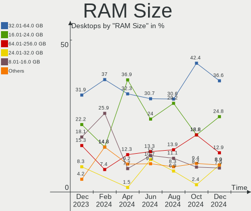
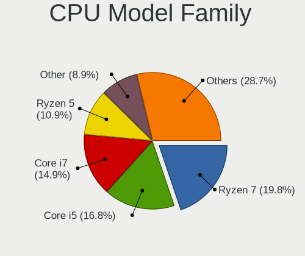
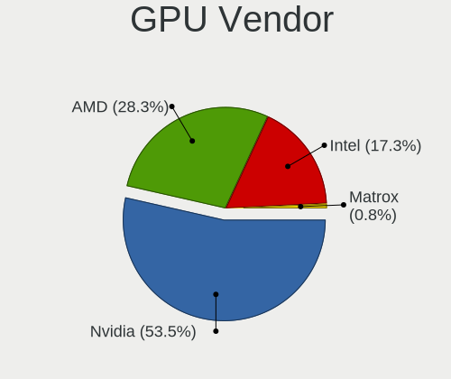
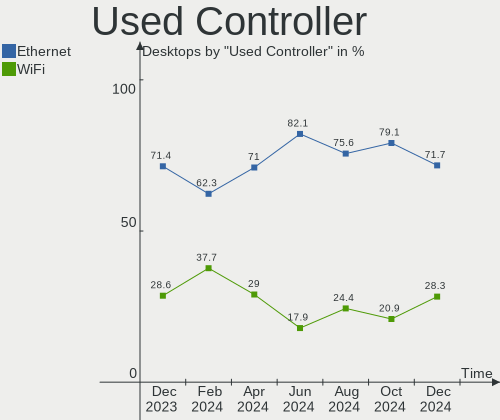

Pop!_OS Hardware Trends (Desktops)
----------------------------------

A project to identify most popular hardware characteristics and track their change
over time based on data collected by Pop!_OS users at https://Linux-Hardware.org.

Anyone can contribute to this report by the [hw-probe](https://github.com/linuxhw/hw-probe) tool:

    sudo -E hw-probe -all -upload

Full-feature report is available here: https://linux-hardware.org/?view=trends

Period: Feb, 2022.

Contents
--------

* [ System ](#system)
  - [ OS                       ](#os)
  - [ OS Family                ](#os-family)
  - [ Kernel                   ](#kernel)
  - [ Kernel Family            ](#kernel-family)
  - [ Kernel Major Ver.        ](#kernel-major-ver)
  - [ Arch                     ](#arch)
  - [ DE                       ](#de)
  - [ Display Server           ](#display-server)
  - [ Display Manager          ](#display-manager)
  - [ OS Lang                  ](#os-lang)
  - [ Boot Mode                ](#boot-mode)
  - [ Filesystem               ](#filesystem)
  - [ Part. scheme             ](#part-scheme)
  - [ Dual Boot with Linux/BSD ](#dual-boot-with-linuxbsd)
  - [ Dual Boot (Win)          ](#dual-boot-win)

* [ Board ](#board)
  - [ Vendor                   ](#vendor)
  - [ Model                    ](#model)
  - [ Model Family             ](#model-family)
  - [ MFG Year                 ](#mfg-year)
  - [ Form Factor              ](#form-factor)
  - [ Secure Boot              ](#secure-boot)
  - [ Coreboot                 ](#coreboot)
  - [ RAM Size                 ](#ram-size)
  - [ RAM Used                 ](#ram-used)
  - [ Total Drives             ](#total-drives)
  - [ Has CD-ROM               ](#has-cd-rom)
  - [ Has Ethernet             ](#has-ethernet)
  - [ Has WiFi                 ](#has-wifi)
  - [ Has Bluetooth            ](#has-bluetooth)

* [ Location ](#location)
  - [ Country                  ](#country)
  - [ City                     ](#city)

* [ Drives ](#drives)
  - [ Drive Vendor             ](#drive-vendor)
  - [ Drive Model              ](#drive-model)
  - [ HDD Vendor               ](#hdd-vendor)
  - [ SSD Vendor               ](#ssd-vendor)
  - [ Drive Kind               ](#drive-kind)
  - [ Drive Connector          ](#drive-connector)
  - [ Drive Size               ](#drive-size)
  - [ Space Total              ](#space-total)
  - [ Space Used               ](#space-used)
  - [ Malfunc. Drives          ](#malfunc-drives)
  - [ Malfunc. Drive Vendor    ](#malfunc-drive-vendor)
  - [ Malfunc. HDD Vendor      ](#malfunc-hdd-vendor)
  - [ Malfunc. Drive Kind      ](#malfunc-drive-kind)
  - [ Failed Drives            ](#failed-drives)
  - [ Failed Drive Vendor      ](#failed-drive-vendor)
  - [ Drive Status             ](#drive-status)

* [ Storage controller ](#storage-controller)
  - [ Storage Vendor           ](#storage-vendor)
  - [ Storage Model            ](#storage-model)
  - [ Storage Kind             ](#storage-kind)

* [ Processor ](#processor)
  - [ CPU Vendor               ](#cpu-vendor)
  - [ CPU Model                ](#cpu-model)
  - [ CPU Model Family         ](#cpu-model-family)
  - [ CPU Cores                ](#cpu-cores)
  - [ CPU Sockets              ](#cpu-sockets)
  - [ CPU Threads              ](#cpu-threads)
  - [ CPU Op-Modes             ](#cpu-op-modes)
  - [ CPU Microcode            ](#cpu-microcode)
  - [ CPU Microarch            ](#cpu-microarch)

* [ Graphics ](#graphics)
  - [ GPU Vendor               ](#gpu-vendor)
  - [ GPU Model                ](#gpu-model)
  - [ GPU Combo                ](#gpu-combo)
  - [ GPU Driver               ](#gpu-driver)
  - [ GPU Memory               ](#gpu-memory)

* [ Monitor ](#monitor)
  - [ Monitor Vendor           ](#monitor-vendor)
  - [ Monitor Model            ](#monitor-model)
  - [ Monitor Resolution       ](#monitor-resolution)
  - [ Monitor Diagonal         ](#monitor-diagonal)
  - [ Monitor Width            ](#monitor-width)
  - [ Aspect Ratio             ](#aspect-ratio)
  - [ Monitor Area             ](#monitor-area)
  - [ Pixel Density            ](#pixel-density)
  - [ Multiple Monitors        ](#multiple-monitors)

* [ Network ](#network)
  - [ Net Controller Vendor    ](#net-controller-vendor)
  - [ Net Controller Model     ](#net-controller-model)
  - [ Wireless Vendor          ](#wireless-vendor)
  - [ Wireless Model           ](#wireless-model)
  - [ Ethernet Vendor          ](#ethernet-vendor)
  - [ Ethernet Model           ](#ethernet-model)
  - [ Net Controller Kind      ](#net-controller-kind)
  - [ Used Controller          ](#used-controller)
  - [ NICs                     ](#nics)
  - [ IPv6                     ](#ipv6)

* [ Bluetooth ](#bluetooth)
  - [ Bluetooth Vendor         ](#bluetooth-vendor)
  - [ Bluetooth Model          ](#bluetooth-model)

* [ Sound ](#sound)
  - [ Sound Vendor             ](#sound-vendor)
  - [ Sound Model              ](#sound-model)

* [ Memory ](#memory)
  - [ Memory Vendor            ](#memory-vendor)
  - [ Memory Model             ](#memory-model)
  - [ Memory Kind              ](#memory-kind)
  - [ Memory Form Factor       ](#memory-form-factor)
  - [ Memory Size              ](#memory-size)
  - [ Memory Speed             ](#memory-speed)

* [ Printers & scanners ](#printers--scanners)
  - [ Printer Vendor           ](#printer-vendor)
  - [ Printer Model            ](#printer-model)
  - [ Scanner Vendor           ](#scanner-vendor)
  - [ Scanner Model            ](#scanner-model)

* [ Camera ](#camera)
  - [ Camera Vendor            ](#camera-vendor)
  - [ Camera Model             ](#camera-model)

* [ Security ](#security)
  - [ Fingerprint Vendor       ](#fingerprint-vendor)
  - [ Fingerprint Model        ](#fingerprint-model)
  - [ Chipcard Vendor          ](#chipcard-vendor)
  - [ Chipcard Model           ](#chipcard-model)

* [ Unsupported ](#unsupported)
  - [ Unsupported Devices      ](#unsupported-devices)
  - [ Unsupported Device Types ](#unsupported-device-types)

System
------

OS
--

Installed operating systems

| Name          | Desktops | Percent |
|---------------|----------|---------|
| Pop!_OS 21.10 | 88       | 83.02%  |
| Pop!_OS 20.04 | 10       | 9.43%   |
| Pop!_OS 21.04 | 8        | 7.55%   |

OS Family
---------

OS without a version

| Name    | Desktops | Percent |
|---------|----------|---------|
| Pop!_OS | 106      | 100%    |

Kernel
------

Version of the Linux kernel

| Version                   | Desktops | Percent |
|---------------------------|----------|---------|
| 5.15.15-76051515-generic  | 69       | 65.09%  |
| 5.15.23-76051523-generic  | 20       | 18.87%  |
| 5.15.8-76051508-generic   | 3        | 2.83%   |
| 5.15.11-76051511-generic  | 3        | 2.83%   |
| 5.15.22-xanmod1           | 2        | 1.89%   |
| 5.17.0-051700rc4-generic  | 1        | 0.94%   |
| 5.16.9-tkg-pds            | 1        | 0.94%   |
| 5.16.0-9.1-liquorix-amd64 | 1        | 0.94%   |
| 5.15.5-76051505-generic   | 1        | 0.94%   |
| 5.15.24-xanmod1           | 1        | 0.94%   |
| 5.15.0-76051500-generic   | 1        | 0.94%   |
| 5.13.0-7620-generic       | 1        | 0.94%   |
| 5.13.0-7614-generic       | 1        | 0.94%   |
| 5.11.0-7620-generic       | 1        | 0.94%   |

Kernel Family
-------------

Linux kernel without a distro release

| Version | Desktops | Percent |
|---------|----------|---------|
| 5.15.15 | 69       | 65.09%  |
| 5.15.23 | 20       | 18.87%  |
| 5.15.8  | 3        | 2.83%   |
| 5.15.11 | 3        | 2.83%   |
| 5.15.22 | 2        | 1.89%   |
| 5.13.0  | 2        | 1.89%   |
| 5.17.0  | 1        | 0.94%   |
| 5.16.9  | 1        | 0.94%   |
| 5.16.0  | 1        | 0.94%   |
| 5.15.5  | 1        | 0.94%   |
| 5.15.24 | 1        | 0.94%   |
| 5.15.0  | 1        | 0.94%   |
| 5.11.0  | 1        | 0.94%   |

Kernel Major Ver.
-----------------

Linux kernel major version

| Version | Desktops | Percent |
|---------|----------|---------|
| 5.15    | 100      | 94.34%  |
| 5.16    | 2        | 1.89%   |
| 5.13    | 2        | 1.89%   |
| 5.17    | 1        | 0.94%   |
| 5.11    | 1        | 0.94%   |

Arch
----

OS architecture (x86_64, i586, etc.)

| Name   | Desktops | Percent |
|--------|----------|---------|
| x86_64 | 106      | 100%    |

DE
--

Desktop Environment

| Name  | Desktops | Percent |
|-------|----------|---------|
| GNOME | 106      | 100%    |

Display Server
--------------

X11 or Wayland

| Name    | Desktops | Percent |
|---------|----------|---------|
| X11     | 104      | 98.11%  |
| Wayland | 2        | 1.89%   |

Display Manager
---------------

SDDM, LightDM, etc.

| Name    | Desktops | Percent |
|---------|----------|---------|
| Unknown | 88       | 83.02%  |
| GDM     | 17       | 16.04%  |
| GDM3    | 1        | 0.94%   |

OS Lang
-------

Language

| Lang  | Desktops | Percent |
|-------|----------|---------|
| en_US | 58       | 54.72%  |
| de_DE | 7        | 6.6%    |
| en_GB | 6        | 5.66%   |
| pt_BR | 5        | 4.72%   |
| fr_FR | 5        | 4.72%   |
| es_ES | 3        | 2.83%   |
| en_AU | 3        | 2.83%   |
| C     | 3        | 2.83%   |
| pl_PL | 2        | 1.89%   |
| it_IT | 2        | 1.89%   |
| en_CA | 2        | 1.89%   |
| tr_TR | 1        | 0.94%   |
| ru_UA | 1        | 0.94%   |
| nl_NL | 1        | 0.94%   |
| nl_BE | 1        | 0.94%   |
| nb_NO | 1        | 0.94%   |
| ja_JP | 1        | 0.94%   |
| fr_BE | 1        | 0.94%   |
| es_UY | 1        | 0.94%   |
| en_NZ | 1        | 0.94%   |
| bg_BG | 1        | 0.94%   |

Boot Mode
---------

EFI or BIOS

| Mode | Desktops | Percent |
|------|----------|---------|
| BIOS | 93       | 87.74%  |
| EFI  | 13       | 12.26%  |

Filesystem
----------

Type of filesystem

| Type    | Desktops | Percent |
|---------|----------|---------|
| Ext4    | 102      | 96.23%  |
| Btrfs   | 3        | 2.83%   |
| Overlay | 1        | 0.94%   |

Part. scheme
------------

Scheme of partitioning

| Type    | Desktops | Percent |
|---------|----------|---------|
| Unknown | 88       | 83.02%  |
| GPT     | 15       | 14.15%  |
| MBR     | 3        | 2.83%   |

Dual Boot with Linux/BSD
------------------------

Hosting more than one Linux/BSD

| Dual boot | Desktops | Percent |
|-----------|----------|---------|
| No        | 102      | 96.23%  |
| Yes       | 4        | 3.77%   |

Dual Boot (Win)
---------------

Hosting Linux and Windows

| Dual boot | Desktops | Percent |
|-----------|----------|---------|
| No        | 99       | 93.4%   |
| Yes       | 7        | 6.6%    |

Board
-----

Vendor
------

Motherboard manufacturer

| Name                | Desktops | Percent |
|---------------------|----------|---------|
| ASUSTek Computer    | 36       | 33.96%  |
| Gigabyte Technology | 22       | 20.75%  |
| MSI                 | 16       | 15.09%  |
| ASRock              | 12       | 11.32%  |
| Dell                | 6        | 5.66%   |
| Hewlett-Packard     | 4        | 3.77%   |
| Pegatron            | 2        | 1.89%   |
| Lenovo              | 2        | 1.89%   |
| Foxconn             | 2        | 1.89%   |
| Medion              | 1        | 0.94%   |
| Fujitsu             | 1        | 0.94%   |
| eMachines           | 1        | 0.94%   |
| ECS                 | 1        | 0.94%   |

Model
-----

Motherboard model

| Name                                   | Desktops | Percent |
|----------------------------------------|----------|---------|
| ASUS All Series                        | 5        | 4.72%   |
| MSI MS-7C02                            | 4        | 3.77%   |
| MSI MS-7C56                            | 2        | 1.89%   |
| Gigabyte Z170XP-SLI                    | 2        | 1.89%   |
| Gigabyte B450 AORUS M                  | 2        | 1.89%   |
| Pegatron KQ437AA-ABA IQ506             | 1        | 0.94%   |
| Pegatron h8-1380t                      | 1        | 0.94%   |
| MSI MS-7D42                            | 1        | 0.94%   |
| MSI MS-7D18                            | 1        | 0.94%   |
| MSI MS-7C89                            | 1        | 0.94%   |
| MSI MS-7C37                            | 1        | 0.94%   |
| MSI MS-7B93                            | 1        | 0.94%   |
| MSI MS-7B89                            | 1        | 0.94%   |
| MSI MS-7B17                            | 1        | 0.94%   |
| MSI MS-7A74                            | 1        | 0.94%   |
| MSI MS-7A70                            | 1        | 0.94%   |
| MSI MS-7250                            | 1        | 0.94%   |
| Medion MS-7728                         | 1        | 0.94%   |
| Lenovo ThinkCentre M93p 10A90045US     | 1        | 0.94%   |
| Lenovo IdeaCentre 720-18ASU 90H10003US | 1        | 0.94%   |
| HP Z440 Workstation                    | 1        | 0.94%   |
| HP Z420 Workstation                    | 1        | 0.94%   |
| HP Compaq 6200 Pro MT PC               | 1        | 0.94%   |
| HP 23-f319                             | 1        | 0.94%   |
| Gigabyte Z97MX-Gaming 5                | 1        | 0.94%   |
| Gigabyte Z590 VISION G                 | 1        | 0.94%   |
| Gigabyte Z390 AORUS PRO WIFI           | 1        | 0.94%   |
| Gigabyte X399 DESIGNARE EX             | 1        | 0.94%   |
| Gigabyte M68M-S2P                      | 1        | 0.94%   |
| Gigabyte H97N-WIFI                     | 1        | 0.94%   |
| Gigabyte H61M-S1                       | 1        | 0.94%   |
| Gigabyte H410M H                       | 1        | 0.94%   |
| Gigabyte H110M-H-CF                    | 1        | 0.94%   |
| Gigabyte GA-MA770T-UD3P                | 1        | 0.94%   |
| Gigabyte GA-880GA-UD3H                 | 1        | 0.94%   |
| Gigabyte G31M-ES2L                     | 1        | 0.94%   |
| Gigabyte B75M-D3H                      | 1        | 0.94%   |
| Gigabyte B550M DS3H                    | 1        | 0.94%   |
| Gigabyte B460MDS3HV2                   | 1        | 0.94%   |
| Gigabyte B450M S2H                     | 1        | 0.94%   |
| Gigabyte B150M-D3H-CF                  | 1        | 0.94%   |
| Gigabyte AB350-Gaming 3                | 1        | 0.94%   |
| Fujitsu ESPRIMO_D756                   | 1        | 0.94%   |
| Foxconn G5260de                        | 1        | 0.94%   |
| Foxconn Compaq 500B Microtower         | 1        | 0.94%   |
| eMachines ET1831                       | 1        | 0.94%   |
| ECS A75F2-M2                           | 1        | 0.94%   |
| Dell XPS 8700                          | 1        | 0.94%   |
| Dell Vostro 420 Series                 | 1        | 0.94%   |
| Dell Precision Tower 3420              | 1        | 0.94%   |
| Dell OptiPlex 9020                     | 1        | 0.94%   |
| Dell OptiPlex 790                      | 1        | 0.94%   |
| Dell OptiPlex 3010                     | 1        | 0.94%   |
| ASUS TUF GAMING X570-PRO               | 1        | 0.94%   |
| ASUS TUF GAMING X570-PLUS              | 1        | 0.94%   |
| ASUS TUF GAMING B460M-PLUS             | 1        | 0.94%   |
| ASUS TUF B450M-PLUS GAMING             | 1        | 0.94%   |
| ASUS TUF B450-PLUS GAMING              | 1        | 0.94%   |
| ASUS SABERTOOTH X79                    | 1        | 0.94%   |
| ASUS SABERTOOTH P67                    | 1        | 0.94%   |

Model Family
------------

Motherboard model prefix

| Name                    | Desktops | Percent |
|-------------------------|----------|---------|
| ASUS ROG                | 7        | 6.6%    |
| ASUS PRIME              | 7        | 6.6%    |
| ASUS TUF                | 5        | 4.72%   |
| ASUS All                | 5        | 4.72%   |
| MSI MS-7C02             | 4        | 3.77%   |
| Dell OptiPlex           | 3        | 2.83%   |
| MSI MS-7C56             | 2        | 1.89%   |
| Gigabyte Z170XP-SLI     | 2        | 1.89%   |
| Gigabyte B450           | 2        | 1.89%   |
| ASUS SABERTOOTH         | 2        | 1.89%   |
| Pegatron KQ437AA-ABA    | 1        | 0.94%   |
| Pegatron h8-1380t       | 1        | 0.94%   |
| MSI MS-7D42             | 1        | 0.94%   |
| MSI MS-7D18             | 1        | 0.94%   |
| MSI MS-7C89             | 1        | 0.94%   |
| MSI MS-7C37             | 1        | 0.94%   |
| MSI MS-7B93             | 1        | 0.94%   |
| MSI MS-7B89             | 1        | 0.94%   |
| MSI MS-7B17             | 1        | 0.94%   |
| MSI MS-7A74             | 1        | 0.94%   |
| MSI MS-7A70             | 1        | 0.94%   |
| MSI MS-7250             | 1        | 0.94%   |
| Medion MS-7728          | 1        | 0.94%   |
| Lenovo ThinkCentre      | 1        | 0.94%   |
| Lenovo IdeaCentre       | 1        | 0.94%   |
| HP Z440                 | 1        | 0.94%   |
| HP Z420                 | 1        | 0.94%   |
| HP Compaq               | 1        | 0.94%   |
| HP 23-f319              | 1        | 0.94%   |
| Gigabyte Z97MX-Gaming   | 1        | 0.94%   |
| Gigabyte Z590           | 1        | 0.94%   |
| Gigabyte Z390           | 1        | 0.94%   |
| Gigabyte X399           | 1        | 0.94%   |
| Gigabyte M68M-S2P       | 1        | 0.94%   |
| Gigabyte H97N-WIFI      | 1        | 0.94%   |
| Gigabyte H61M-S1        | 1        | 0.94%   |
| Gigabyte H410M          | 1        | 0.94%   |
| Gigabyte H110M-H-CF     | 1        | 0.94%   |
| Gigabyte GA-MA770T-UD3P | 1        | 0.94%   |
| Gigabyte GA-880GA-UD3H  | 1        | 0.94%   |
| Gigabyte G31M-ES2L      | 1        | 0.94%   |
| Gigabyte B75M-D3H       | 1        | 0.94%   |
| Gigabyte B550M          | 1        | 0.94%   |
| Gigabyte B460MDS3HV2    | 1        | 0.94%   |
| Gigabyte B450M          | 1        | 0.94%   |
| Gigabyte B150M-D3H-CF   | 1        | 0.94%   |
| Gigabyte AB350-Gaming   | 1        | 0.94%   |
| Fujitsu ESPRIMO         | 1        | 0.94%   |
| Foxconn G5260de         | 1        | 0.94%   |
| Foxconn Compaq          | 1        | 0.94%   |
| eMachines ET1831        | 1        | 0.94%   |
| ECS A75F2-M2            | 1        | 0.94%   |
| Dell XPS                | 1        | 0.94%   |
| Dell Vostro             | 1        | 0.94%   |
| Dell Precision          | 1        | 0.94%   |
| ASUS Rampage            | 1        | 0.94%   |
| ASUS ProArt             | 1        | 0.94%   |
| ASUS P8H77-M            | 1        | 0.94%   |
| ASUS P8H67-M            | 1        | 0.94%   |
| ASUS P8B75-M            | 1        | 0.94%   |

MFG Year
--------

Motherboard manufacture year

| Year | Desktops | Percent |
|------|----------|---------|
| 2020 | 18       | 16.98%  |
| 2018 | 16       | 15.09%  |
| 2012 | 10       | 9.43%   |
| 2021 | 8        | 7.55%   |
| 2016 | 8        | 7.55%   |
| 2011 | 8        | 7.55%   |
| 2019 | 7        | 6.6%    |
| 2014 | 6        | 5.66%   |
| 2013 | 6        | 5.66%   |
| 2009 | 4        | 3.77%   |
| 2015 | 3        | 2.83%   |
| 2010 | 3        | 2.83%   |
| 2008 | 3        | 2.83%   |
| 2022 | 2        | 1.89%   |
| 2017 | 2        | 1.89%   |
| 2007 | 1        | 0.94%   |
| 2006 | 1        | 0.94%   |

Form Factor
-----------

Physical design of the computer

| Name    | Desktops | Percent |
|---------|----------|---------|
| Desktop | 106      | 100%    |

Secure Boot
-----------

Enabled or disabled

| State    | Desktops | Percent |
|----------|----------|---------|
| Disabled | 106      | 100%    |

Coreboot
--------

Have coreboot on board

| Used | Desktops | Percent |
|------|----------|---------|
| No   | 106      | 100%    |

RAM Size
--------

Total RAM memory

| Size in GB  | Desktops | Percent |
|-------------|----------|---------|
| 16.01-24.0  | 28       | 26.42%  |
| 32.01-64.0  | 22       | 20.75%  |
| 8.01-16.0   | 21       | 19.81%  |
| 3.01-4.0    | 12       | 11.32%  |
| 64.01-256.0 | 9        | 8.49%   |
| 4.01-8.0    | 8        | 7.55%   |
| 24.01-32.0  | 5        | 4.72%   |
| 1.01-2.0    | 1        | 0.94%   |

RAM Used
--------

Used RAM memory

| Used GB    | Desktops | Percent |
|------------|----------|---------|
| 1.01-2.0   | 30       | 28.3%   |
| 4.01-8.0   | 24       | 22.64%  |
| 2.01-3.0   | 23       | 21.7%   |
| 3.01-4.0   | 20       | 18.87%  |
| 8.01-16.0  | 5        | 4.72%   |
| 16.01-24.0 | 2        | 1.89%   |
| 24.01-32.0 | 1        | 0.94%   |
| 0.51-1.0   | 1        | 0.94%   |

Total Drives
------------

Number of drives on board

| Drives | Desktops | Percent |
|--------|----------|---------|
| 2      | 35       | 33.02%  |
| 1      | 33       | 31.13%  |
| 3      | 18       | 16.98%  |
| 4      | 10       | 9.43%   |
| 5      | 4        | 3.77%   |
| 6      | 3        | 2.83%   |
| 14     | 1        | 0.94%   |
| 8      | 1        | 0.94%   |
| 7      | 1        | 0.94%   |

Has CD-ROM
----------

Has CD-ROM on board

| Presented | Desktops | Percent |
|-----------|----------|---------|
| No        | 70       | 66.04%  |
| Yes       | 36       | 33.96%  |

Has Ethernet
------------

Has Ethernet on board

| Presented | Desktops | Percent |
|-----------|----------|---------|
| Yes       | 105      | 99.06%  |
| No        | 1        | 0.94%   |

Has WiFi
--------

Has WiFi module

| Presented | Desktops | Percent |
|-----------|----------|---------|
| Yes       | 54       | 50.94%  |
| No        | 52       | 49.06%  |

Has Bluetooth
-------------

Has Bluetooth module

| Presented | Desktops | Percent |
|-----------|----------|---------|
| No        | 64       | 60.38%  |
| Yes       | 42       | 39.62%  |

Location
--------

Country
-------

Geographic location (country)

| Country      | Desktops | Percent |
|--------------|----------|---------|
| USA          | 31       | 29.25%  |
| Germany      | 8        | 7.55%   |
| Brazil       | 6        | 5.66%   |
| UK           | 5        | 4.72%   |
| Poland       | 5        | 4.72%   |
| France       | 5        | 4.72%   |
| Spain        | 4        | 3.77%   |
| Australia    | 4        | 3.77%   |
| Ukraine      | 3        | 2.83%   |
| New Zealand  | 3        | 2.83%   |
| Italy        | 3        | 2.83%   |
| Canada       | 3        | 2.83%   |
| Belgium      | 3        | 2.83%   |
| Netherlands  | 2        | 1.89%   |
| Japan        | 2        | 1.89%   |
| Iceland      | 2        | 1.89%   |
| Bulgaria     | 2        | 1.89%   |
| Uruguay      | 1        | 0.94%   |
| Turkey       | 1        | 0.94%   |
| Sweden       | 1        | 0.94%   |
| South Africa | 1        | 0.94%   |
| Serbia       | 1        | 0.94%   |
| Romania      | 1        | 0.94%   |
| Norway       | 1        | 0.94%   |
| Lithuania    | 1        | 0.94%   |
| Ireland      | 1        | 0.94%   |
| Greece       | 1        | 0.94%   |
| Finland      | 1        | 0.94%   |
| Denmark      | 1        | 0.94%   |
| Croatia      | 1        | 0.94%   |
| Bangladesh   | 1        | 0.94%   |
| Azerbaijan   | 1        | 0.94%   |

City
----

Geographic location (city)

| City                      | Desktops | Percent |
|---------------------------|----------|---------|
| Sydney                    | 3        | 2.83%   |
| Rome                      | 2        | 1.89%   |
| Berlin                    | 2        | 1.89%   |
| Auckland                  | 2        | 1.89%   |
| Wylie                     | 1        | 0.94%   |
| Weymouth                  | 1        | 0.94%   |
| Westfield                 | 1        | 0.94%   |
| Waterloo                  | 1        | 0.94%   |
| Waterford                 | 1        | 0.94%   |
| Warsaw                    | 1        | 0.94%   |
| Virum                     | 1        | 0.94%   |
| Vilnius                   | 1        | 0.94%   |
| Verona                    | 1        | 0.94%   |
| Valladolid                | 1        | 0.94%   |
| Uppsala                   | 1        | 0.94%   |
| Tyler                     | 1        | 0.94%   |
| Torun                     | 1        | 0.94%   |
| Tallahassee               | 1        | 0.94%   |
| St Austell                | 1        | 0.94%   |
| Springfield               | 1        | 0.94%   |
| Sorocaba                  | 1        | 0.94%   |
| Sofia                     | 1        | 0.94%   |
| Slomniki                  | 1        | 0.94%   |
| Skien                     | 1        | 0.94%   |
| Sir Lowry's Pass          | 1        | 0.94%   |
| Selfoss                   | 1        | 0.94%   |
| Seattle                   | 1        | 0.94%   |
| São Paulo              | 1        | 0.94%   |
| São José dos Campos | 1        | 0.94%   |
| Santa Maria a Monte       | 1        | 0.94%   |
| Santa Cruz de Tenerife    | 1        | 0.94%   |
| Saint-Jerome              | 1        | 0.94%   |
| Sabadell                  | 1        | 0.94%   |
| Rumia                     | 1        | 0.94%   |
| Roswell                   | 1        | 0.94%   |
| Rochester                 | 1        | 0.94%   |
| Ringwood                  | 1        | 0.94%   |
| Ridgeland                 | 1        | 0.94%   |
| Reykjavik                 | 1        | 0.94%   |
| Raslina                   | 1        | 0.94%   |
| Phoenix                   | 1        | 0.94%   |
| Philipsburg               | 1        | 0.94%   |
| Pelotas                   | 1        | 0.94%   |
| Pau                       | 1        | 0.94%   |
| Palhoca                   | 1        | 0.94%   |
| Osasco                    | 1        | 0.94%   |
| Orange                    | 1        | 0.94%   |
| Oradea                    | 1        | 0.94%   |
| Oneonta                   | 1        | 0.94%   |
| Nelson                    | 1        | 0.94%   |
| Morgan Hill               | 1        | 0.94%   |
| Montreal                  | 1        | 0.94%   |
| Montevideo                | 1        | 0.94%   |
| Marrero                   | 1        | 0.94%   |
| Lyon                      | 1        | 0.94%   |
| Lviv                      | 1        | 0.94%   |
| Long Beach                | 1        | 0.94%   |
| Limnos                    | 1        | 0.94%   |
| Liévin                 | 1        | 0.94%   |
| Labergement-Sainte-Marie  | 1        | 0.94%   |

Drives
------

Drive Vendor
------------

Hard drive vendors

| Vendor                         | Desktops | Drives | Percent |
|--------------------------------|----------|--------|---------|
| Seagate                        | 42       | 58     | 19.27%  |
| Samsung Electronics            | 36       | 52     | 16.51%  |
| WDC                            | 29       | 32     | 13.3%   |
| Toshiba                        | 13       | 14     | 5.96%   |
| Kingston                       | 12       | 14     | 5.5%    |
| Sandisk                        | 10       | 10     | 4.59%   |
| Crucial                        | 10       | 14     | 4.59%   |
| Hitachi                        | 7        | 7      | 3.21%   |
| Phison                         | 6        | 6      | 2.75%   |
| Intel                          | 5        | 7      | 2.29%   |
| A-DATA Technology              | 4        | 5      | 1.83%   |
| OCZ                            | 3        | 3      | 1.38%   |
| Micron Technology              | 3        | 3      | 1.38%   |
| Unknown                        | 2        | 3      | 0.92%   |
| Team                           | 2        | 2      | 0.92%   |
| Silicon Motion                 | 2        | 2      | 0.92%   |
| Realtek Semiconductor          | 2        | 2      | 0.92%   |
| PNY                            | 2        | 2      | 0.92%   |
| Patriot                        | 2        | 2      | 0.92%   |
| Mushkin                        | 2        | 2      | 0.92%   |
| Intenso                        | 2        | 2      | 0.92%   |
| China                          | 2        | 2      | 0.92%   |
| XPG                            | 1        | 2      | 0.46%   |
| Teutons                        | 1        | 1      | 0.46%   |
| SPCC                           | 1        | 1      | 0.46%   |
| Solid State Storage Technology | 1        | 1      | 0.46%   |
| SK Hynix                       | 1        | 2      | 0.46%   |
| Sasmung                        | 1        | 1      | 0.46%   |
| MARVELL                        | 1        | 2      | 0.46%   |
| Lite-On                        | 1        | 1      | 0.46%   |
| LaCie                          | 1        | 1      | 0.46%   |
| KIOXIA-EXCERIA                 | 1        | 1      | 0.46%   |
| JetDrive                       | 1        | 1      | 0.46%   |
| HGST                           | 1        | 4      | 0.46%   |
| Glyph                          | 1        | 1      | 0.46%   |
| Gigabyte Technology            | 1        | 1      | 0.46%   |
| Fujitsu                        | 1        | 1      | 0.46%   |
| Corsair                        | 1        | 1      | 0.46%   |
| Biostar                        | 1        | 1      | 0.46%   |
| ASMT                           | 1        | 1      | 0.46%   |
| Apacer                         | 1        | 1      | 0.46%   |
| AMD                            | 1        | 1      | 0.46%   |

Drive Model
-----------

Hard drive models

| Model                                  | Desktops | Percent |
|----------------------------------------|----------|---------|
| Samsung NVMe SSD Drive 500GB           | 8        | 3.23%   |
| Samsung NVMe SSD Drive 1TB             | 7        | 2.82%   |
| Seagate ST4000DM004-2CV104 4TB         | 5        | 2.02%   |
| Kingston SA400S37240G 240GB SSD        | 5        | 2.02%   |
| Toshiba DT01ACA200 2TB                 | 4        | 1.61%   |
| Seagate ST500DM002-1BD142 500GB        | 4        | 1.61%   |
| Seagate ST2000DM008-2FR102 2TB         | 4        | 1.61%   |
| Crucial CT500MX500SSD1 500GB           | 4        | 1.61%   |
| Seagate ST3500418AS 500GB              | 3        | 1.21%   |
| Seagate ST2000DL003-9VT166 2TB         | 3        | 1.21%   |
| Sandisk NVMe SSD Drive 500GB           | 3        | 1.21%   |
| Sandisk NVMe SSD Drive 1TB             | 3        | 1.21%   |
| Samsung SSD 850 EVO 500GB              | 3        | 1.21%   |
| Samsung SSD 850 EVO 250GB              | 3        | 1.21%   |
| Crucial CT1000MX500SSD1 1TB            | 3        | 1.21%   |
| WDC WD10EZEX-00WN4A0 1TB               | 2        | 0.81%   |
| Toshiba HDWD110 1TB                    | 2        | 0.81%   |
| Seagate ST31000528AS 1TB               | 2        | 0.81%   |
| Seagate ST2000DM006-2DM164 2TB         | 2        | 0.81%   |
| Samsung SSD 970 EVO 1TB                | 2        | 0.81%   |
| Samsung SSD 850 EVO 1TB                | 2        | 0.81%   |
| Samsung SM963 2.5" NVMe PCIe SSD 128GB | 2        | 0.81%   |
| Samsung NVMe SSD Drive 250GB           | 2        | 0.81%   |
| PNY CS900 240GB SSD                    | 2        | 0.81%   |
| Phison NVMe SSD Drive 2TB              | 2        | 0.81%   |
| Patriot Burst 120GB SSD                | 2        | 0.81%   |
| Kingston SUV400S37120G 120GB SSD       | 2        | 0.81%   |
| A-DATA SU800 1024GB SSD                | 2        | 0.81%   |
| XPG NVMe SSD Drive 1024GB              | 1        | 0.4%    |
| WDC WDS500G1B0B-00AS40 500GB SSD       | 1        | 0.4%    |
| WDC WDS240G2G0B-00EPW0 240GB SSD       | 1        | 0.4%    |
| WDC WDS240G2G0A-00JH30 240GB SSD       | 1        | 0.4%    |
| WDC WDS200T2B0B-00YS70 2TB SSD         | 1        | 0.4%    |
| WDC WDS100T2B0A-00SM50 1TB SSD         | 1        | 0.4%    |
| WDC WDBNCE5000PNC 500GB SSD            | 1        | 0.4%    |
| WDC WD6400BEVT-22A0RT0 640GB           | 1        | 0.4%    |
| WDC WD60EFRX-68L0BN1 6TB               | 1        | 0.4%    |
| WDC WD5000LPCX-22VHAT1 500GB           | 1        | 0.4%    |
| WDC WD5000AAKX-753CA1 500GB            | 1        | 0.4%    |
| WDC WD5000AAKX-00U6AA0 500GB           | 1        | 0.4%    |
| WDC WD5000AAKX-001CA0 500GB            | 1        | 0.4%    |
| WDC WD5000AAKS-60Z1A0 500GB            | 1        | 0.4%    |
| WDC WD40PURZ-85AKKY0 4TB               | 1        | 0.4%    |
| WDC WD40EFZX-68AWUN0 4TB               | 1        | 0.4%    |
| WDC WD4002FYYZ-01B7CB1 4TB             | 1        | 0.4%    |
| WDC WD3200BEVT-26A0RT0 320GB           | 1        | 0.4%    |
| WDC WD2500AAKX-75U6AA0 250GB           | 1        | 0.4%    |
| WDC WD20EZRX-00D8PB0 2TB               | 1        | 0.4%    |
| WDC WD20EFAX-68FB5N0 2TB               | 1        | 0.4%    |
| WDC WD2003FZEX-00Z4SA0 2TB             | 1        | 0.4%    |
| WDC WD1600BEVS-08VAT1 160GB            | 1        | 0.4%    |
| WDC WD10EZEX-60WN4A1 1TB               | 1        | 0.4%    |
| WDC WD10EZEX-08M2NA0 1TB               | 1        | 0.4%    |
| WDC WD10EZEX-00RKKA0 1TB               | 1        | 0.4%    |
| WDC WD10EZEX-00M2NA0 1TB               | 1        | 0.4%    |
| WDC WD10EADS-00L5B1 1TB                | 1        | 0.4%    |
| WDC WD1003FZEX-00K3CA0 1TB             | 1        | 0.4%    |
| WDC WD1002FAEX-00Y9A0 1TB              | 1        | 0.4%    |
| Unknown SD/MMC/MS PRO 64GB             | 1        | 0.4%    |
| Unknown SD/MMC 16GB                    | 1        | 0.4%    |

HDD Vendor
----------

Hard disk drive vendors

| Vendor              | Desktops | Drives | Percent |
|---------------------|----------|--------|---------|
| Seagate             | 38       | 50     | 43.18%  |
| WDC                 | 24       | 26     | 27.27%  |
| Toshiba             | 12       | 13     | 13.64%  |
| Hitachi             | 7        | 7      | 7.95%   |
| Unknown             | 1        | 1      | 1.14%   |
| Samsung Electronics | 1        | 1      | 1.14%   |
| MARVELL             | 1        | 2      | 1.14%   |
| HGST                | 1        | 4      | 1.14%   |
| Glyph               | 1        | 1      | 1.14%   |
| Fujitsu             | 1        | 1      | 1.14%   |
| ASMT                | 1        | 1      | 1.14%   |

SSD Vendor
----------

Solid state drive vendors

| Vendor              | Desktops | Drives | Percent |
|---------------------|----------|--------|---------|
| Samsung Electronics | 16       | 23     | 21.05%  |
| Crucial             | 10       | 13     | 13.16%  |
| Kingston            | 9        | 10     | 11.84%  |
| WDC                 | 6        | 6      | 7.89%   |
| Seagate             | 3        | 3      | 3.95%   |
| SanDisk             | 3        | 3      | 3.95%   |
| OCZ                 | 3        | 3      | 3.95%   |
| A-DATA Technology   | 3        | 4      | 3.95%   |
| PNY                 | 2        | 2      | 2.63%   |
| Patriot             | 2        | 2      | 2.63%   |
| Mushkin             | 2        | 2      | 2.63%   |
| Micron Technology   | 2        | 2      | 2.63%   |
| Intenso             | 2        | 2      | 2.63%   |
| Intel               | 2        | 3      | 2.63%   |
| China               | 2        | 2      | 2.63%   |
| Toshiba             | 1        | 1      | 1.32%   |
| Teutons             | 1        | 1      | 1.32%   |
| Team                | 1        | 1      | 1.32%   |
| SPCC                | 1        | 1      | 1.32%   |
| Sasmung             | 1        | 1      | 1.32%   |
| KIOXIA-EXCERIA      | 1        | 1      | 1.32%   |
| Corsair             | 1        | 1      | 1.32%   |
| Apacer              | 1        | 1      | 1.32%   |
| AMD                 | 1        | 1      | 1.32%   |

Drive Kind
----------

HDD or SSD

| Kind    | Desktops | Drives | Percent |
|---------|----------|--------|---------|
| HDD     | 69       | 107    | 37.5%   |
| SSD     | 65       | 89     | 35.33%  |
| NVMe    | 45       | 64     | 24.46%  |
| Unknown | 5        | 10     | 2.72%   |

Drive Connector
---------------

SATA, SAS, NVMe, etc.

| Type | Desktops | Drives | Percent |
|------|----------|--------|---------|
| SATA | 91       | 187    | 62.33%  |
| NVMe | 45       | 64     | 30.82%  |
| SAS  | 10       | 19     | 6.85%   |

Drive Size
----------

Size of hard drive

| Size in TB | Desktops | Drives | Percent |
|------------|----------|--------|---------|
| 0.01-0.5   | 70       | 97     | 48.95%  |
| 0.51-1.0   | 34       | 41     | 23.78%  |
| 1.01-2.0   | 22       | 26     | 15.38%  |
| 3.01-4.0   | 12       | 21     | 8.39%   |
| 10.01-20.0 | 2        | 2      | 1.4%    |
| 4.01-10.0  | 2        | 7      | 1.4%    |
| 2.01-3.0   | 1        | 2      | 0.7%    |

Space Total
-----------

Amount of disk space available on the file system

| Size in GB     | Desktops | Percent |
|----------------|----------|---------|
| 101-250        | 27       | 25.47%  |
| 501-1000       | 22       | 20.75%  |
| 251-500        | 21       | 19.81%  |
| 1001-2000      | 15       | 14.15%  |
| More than 3000 | 9        | 8.49%   |
| 2001-3000      | 9        | 8.49%   |
| 1-20           | 2        | 1.89%   |
| 51-100         | 1        | 0.94%   |

Space Used
----------

Amount of used disk space

| Used GB        | Desktops | Percent |
|----------------|----------|---------|
| 1-20           | 30       | 28.3%   |
| 51-100         | 17       | 16.04%  |
| 101-250        | 16       | 15.09%  |
| 251-500        | 14       | 13.21%  |
| 21-50          | 13       | 12.26%  |
| More than 3000 | 5        | 4.72%   |
| 501-1000       | 5        | 4.72%   |
| 1001-2000      | 4        | 3.77%   |
| 2001-3000      | 2        | 1.89%   |

Malfunc. Drives
---------------

Drive models with a malfunction

| Model         | Desktops | Drives | Percent |
|---------------|----------|--------|---------|
| ASMT 2105 2TB | 1        | 1      | 100%    |

Malfunc. Drive Vendor
---------------------

Vendors of faulty drives

| Vendor | Desktops | Drives | Percent |
|--------|----------|--------|---------|
| ASMT   | 1        | 1      | 100%    |

Malfunc. HDD Vendor
-------------------

Vendors of faulty HDD drives

| Vendor | Desktops | Drives | Percent |
|--------|----------|--------|---------|
| ASMT   | 1        | 1      | 100%    |

Malfunc. Drive Kind
-------------------

Kinds of faulty drives

| Kind | Desktops | Drives | Percent |
|------|----------|--------|---------|
| HDD  | 1        | 1      | 100%    |

Failed Drives
-------------

Failed drive models

Zero info for selected period =(

Failed Drive Vendor
-------------------

Failed drive vendors

Zero info for selected period =(

Drive Status
------------

Number of failed and malfunc. drives

| Status   | Desktops | Drives | Percent |
|----------|----------|--------|---------|
| Detected | 90       | 224    | 81.08%  |
| Works    | 20       | 45     | 18.02%  |
| Malfunc  | 1        | 1      | 0.9%    |

Storage controller
------------------

Storage Vendor
--------------

Storage controller vendors

| Vendor                         | Desktops | Percent |
|--------------------------------|----------|---------|
| Intel                          | 61       | 34.46%  |
| AMD                            | 42       | 23.73%  |
| Samsung Electronics            | 21       | 11.86%  |
| ASMedia Technology             | 8        | 4.52%   |
| Sandisk                        | 7        | 3.95%   |
| Phison Electronics             | 7        | 3.95%   |
| Nvidia                         | 5        | 2.82%   |
| JMicron Technology             | 5        | 2.82%   |
| Silicon Motion                 | 4        | 2.26%   |
| Marvell Technology Group       | 3        | 1.69%   |
| Kingston Technology Company    | 3        | 1.69%   |
| Realtek Semiconductor          | 2        | 1.13%   |
| VIA Technologies               | 1        | 0.56%   |
| Solid State Storage Technology | 1        | 0.56%   |
| SK Hynix                       | 1        | 0.56%   |
| Micron/Crucial Technology      | 1        | 0.56%   |
| Micron Technology              | 1        | 0.56%   |
| Lite-On Technology             | 1        | 0.56%   |
| Broadcom / LSI                 | 1        | 0.56%   |
| ADATA Technology               | 1        | 0.56%   |
| Adaptec                        | 1        | 0.56%   |

Storage Model
-------------

Storage controller models

| Model                                                                          | Desktops | Percent |
|--------------------------------------------------------------------------------|----------|---------|
| AMD FCH SATA Controller [AHCI mode]                                            | 28       | 12.79%  |
| AMD 400 Series Chipset SATA Controller                                         | 15       | 6.85%   |
| Samsung NVMe SSD Controller SM981/PM981/PM983                                  | 14       | 6.39%   |
| ASMedia ASM1062 Serial ATA Controller                                          | 8        | 3.65%   |
| Intel 6 Series/C200 Series Chipset Family 6 port Desktop SATA AHCI Controller  | 7        | 3.2%    |
| AMD Starship/Matisse Chipset SATA Controller [AHCI mode]                       | 7        | 3.2%    |
| Intel 8 Series/C220 Series Chipset Family 6-port SATA Controller 1 [AHCI mode] | 6        | 2.74%   |
| Intel Q170/Q150/B150/H170/H110/Z170/CM236 Chipset SATA Controller [AHCI Mode]  | 5        | 2.28%   |
| Phison E16 PCIe4 NVMe Controller                                               | 4        | 1.83%   |
| JMicron JMB363 SATA/IDE Controller                                             | 4        | 1.83%   |
| Intel NM10/ICH7 Family SATA Controller [IDE mode]                              | 4        | 1.83%   |
| Intel Alder Lake-S PCH SATA Controller [AHCI Mode]                             | 4        | 1.83%   |
| Intel 82801G (ICH7 Family) IDE Controller                                      | 4        | 1.83%   |
| Intel 500 Series Chipset Family SATA AHCI Controller                           | 4        | 1.83%   |
| Intel 200 Series PCH SATA controller [AHCI mode]                               | 4        | 1.83%   |
| Silicon Motion SM2263EN/SM2263XT SSD Controller                                | 3        | 1.37%   |
| Sandisk WD Blue SN550 NVMe SSD                                                 | 3        | 1.37%   |
| Samsung NVMe SSD Controller SM961/PM961/SM963                                  | 3        | 1.37%   |
| Samsung NVMe SSD Controller PM9A1/PM9A3/980PRO                                 | 3        | 1.37%   |
| Samsung NVMe SSD Controller 980                                                | 3        | 1.37%   |
| Nvidia MCP61 SATA Controller                                                   | 3        | 1.37%   |
| Nvidia MCP61 IDE                                                               | 3        | 1.37%   |
| Kingston Company A2000 NVMe SSD                                                | 3        | 1.37%   |
| Intel 9 Series Chipset Family SATA Controller [AHCI Mode]                      | 3        | 1.37%   |
| Intel 400 Series Chipset Family SATA AHCI Controller                           | 3        | 1.37%   |
| AMD SB7x0/SB8x0/SB9x0 SATA Controller [AHCI mode]                              | 3        | 1.37%   |
| AMD SB7x0/SB8x0/SB9x0 IDE Controller                                           | 3        | 1.37%   |
| Sandisk WD Black SN750 / PC SN730 NVMe SSD                                     | 2        | 0.91%   |
| Phison E12 NVMe Controller                                                     | 2        | 0.91%   |
| Intel Volume Management Device NVMe RAID Controller                            | 2        | 0.91%   |
| Intel Cannon Lake PCH SATA AHCI Controller                                     | 2        | 0.91%   |
| Intel C600/X79 series chipset SATA RAID Controller                             | 2        | 0.91%   |
| Intel 82801JI (ICH10 Family) SATA AHCI Controller                              | 2        | 0.91%   |
| Intel 7 Series/C210 Series Chipset Family 4-port SATA Controller [IDE mode]    | 2        | 0.91%   |
| Intel 7 Series/C210 Series Chipset Family 2-port SATA Controller [IDE mode]    | 2        | 0.91%   |
| VIA VT6415 PATA IDE Host Controller                                            | 1        | 0.46%   |
| Solid State Storage Non-Volatile memory controller                             | 1        | 0.46%   |
| SK Hynix PE8000 Series NVMe Solid State Drive                                  | 1        | 0.46%   |
| Silicon Motion SM2262/SM2262EN SSD Controller                                  | 1        | 0.46%   |
| Sandisk WD Blue SN500 / PC SN520 NVMe SSD                                      | 1        | 0.46%   |
| Sandisk Non-Volatile memory controller                                         | 1        | 0.46%   |
| Realtek RTS5763DL NVMe SSD Controller                                          | 1        | 0.46%   |
| Realtek Realtek Non-Volatile memory controller                                 | 1        | 0.46%   |
| Phison PS5013 E13 NVMe Controller                                              | 1        | 0.46%   |
| Nvidia MCP55 SATA Controller                                                   | 1        | 0.46%   |
| Nvidia MCP55 IDE                                                               | 1        | 0.46%   |
| Nvidia GeForce 7100/nForce 630i SATA                                           | 1        | 0.46%   |
| Micron/Crucial P2 NVMe PCIe SSD                                                | 1        | 0.46%   |
| Micron Non-Volatile memory controller                                          | 1        | 0.46%   |
| Marvell Group 88SE9230 PCIe 2.0 x2 4-port SATA 6 Gb/s RAID Controller          | 1        | 0.46%   |
| Marvell Group 88SE9215 PCIe 2.0 x1 4-port SATA 6 Gb/s Controller               | 1        | 0.46%   |
| Marvell Group 88SE9128 PCIe SATA 6 Gb/s RAID controller with HyperDuo          | 1        | 0.46%   |
| Lite-On Non-Volatile memory controller                                         | 1        | 0.46%   |
| JMicron JMB362 SATA Controller                                                 | 1        | 0.46%   |
| Intel SSD 660P Series                                                          | 1        | 0.46%   |
| Intel SSD 600P Series                                                          | 1        | 0.46%   |
| Intel SATA Controller [RAID mode]                                              | 1        | 0.46%   |
| Intel NVMe Datacenter SSD [Optane]                                             | 1        | 0.46%   |
| Intel Comet Lake SATA AHCI Controller                                          | 1        | 0.46%   |
| Intel Comet Lake PCH-H RAID                                                    | 1        | 0.46%   |

Storage Kind
------------

Kind of storage controller (IDE, SATA, NVMe, SAS, ...)

| Kind | Desktops | Percent |
|------|----------|---------|
| SATA | 90       | 54.55%  |
| NVMe | 45       | 27.27%  |
| IDE  | 20       | 12.12%  |
| RAID | 8        | 4.85%   |
| SAS  | 2        | 1.21%   |

Processor
---------

CPU Vendor
----------

Processor vendors

| Vendor | Desktops | Percent |
|--------|----------|---------|
| Intel  | 60       | 56.6%   |
| AMD    | 46       | 43.4%   |

CPU Model
---------

Processor models

| Model                                       | Desktops | Percent |
|---------------------------------------------|----------|---------|
| AMD Ryzen 5 3600 6-Core Processor           | 5        | 4.72%   |
| AMD Ryzen 9 5900X 12-Core Processor         | 3        | 2.83%   |
| AMD Ryzen 9 3900X 12-Core Processor         | 3        | 2.83%   |
| AMD Ryzen 5 2600 Six-Core Processor         | 3        | 2.83%   |
| Intel Core i9-9900K CPU @ 3.60GHz           | 2        | 1.89%   |
| Intel Core i7-3820 CPU @ 3.60GHz            | 2        | 1.89%   |
| Intel Core i5-4590 CPU @ 3.30GHz            | 2        | 1.89%   |
| Intel Core i5-3570K CPU @ 3.40GHz           | 2        | 1.89%   |
| Intel Core i5-3470 CPU @ 3.20GHz            | 2        | 1.89%   |
| Intel Core i5-2400 CPU @ 3.10GHz            | 2        | 1.89%   |
| Intel Core i5-10400F CPU @ 2.90GHz          | 2        | 1.89%   |
| Intel Core i5-10400 CPU @ 2.90GHz           | 2        | 1.89%   |
| Intel 12th Gen Core i9-12900K               | 2        | 1.89%   |
| AMD Ryzen 7 3700X 8-Core Processor          | 2        | 1.89%   |
| AMD Ryzen 7 2700X Eight-Core Processor      | 2        | 1.89%   |
| AMD Ryzen 7 1700 Eight-Core Processor       | 2        | 1.89%   |
| AMD Ryzen 5 3600X 6-Core Processor          | 2        | 1.89%   |
| AMD Ryzen 5 2600X Six-Core Processor        | 2        | 1.89%   |
| Intel Xeon CPU X5650 @ 2.67GHz              | 1        | 0.94%   |
| Intel Xeon CPU E5-2697 v2 @ 2.70GHz         | 1        | 0.94%   |
| Intel Xeon CPU E5-1650 v4 @ 3.60GHz         | 1        | 0.94%   |
| Intel Xeon CPU E3-1270 v5 @ 3.60GHz         | 1        | 0.94%   |
| Intel Xeon CPU E3-1230 v3 @ 3.30GHz         | 1        | 0.94%   |
| Intel Pentium Dual-Core CPU E6300 @ 2.80GHz | 1        | 0.94%   |
| Intel Pentium Dual-Core CPU E5500 @ 2.80GHz | 1        | 0.94%   |
| Intel Pentium Dual-Core CPU E5400 @ 2.70GHz | 1        | 0.94%   |
| Intel Pentium Dual-Core CPU E5300 @ 2.60GHz | 1        | 0.94%   |
| Intel Core i9-10920X CPU @ 3.50GHz          | 1        | 0.94%   |
| Intel Core i7-9700K CPU @ 3.60GHz           | 1        | 0.94%   |
| Intel Core i7-7700K CPU @ 4.20GHz           | 1        | 0.94%   |
| Intel Core i7-7700 CPU @ 3.60GHz            | 1        | 0.94%   |
| Intel Core i7-6700K CPU @ 4.00GHz           | 1        | 0.94%   |
| Intel Core i7-6700 CPU @ 3.40GHz            | 1        | 0.94%   |
| Intel Core i7-4790K CPU @ 4.00GHz           | 1        | 0.94%   |
| Intel Core i7-4790 CPU @ 3.60GHz            | 1        | 0.94%   |
| Intel Core i7-2600K CPU @ 3.40GHz           | 1        | 0.94%   |
| Intel Core i7 CPU 860 @ 2.80GHz             | 1        | 0.94%   |
| Intel Core i5-7600K CPU @ 3.80GHz           | 1        | 0.94%   |
| Intel Core i5-6500 CPU @ 3.20GHz            | 1        | 0.94%   |
| Intel Core i5-4670K CPU @ 3.40GHz           | 1        | 0.94%   |
| Intel Core i5-4570S CPU @ 2.90GHz           | 1        | 0.94%   |
| Intel Core i5-4570 CPU @ 3.20GHz            | 1        | 0.94%   |
| Intel Core i5-2320 CPU @ 3.00GHz            | 1        | 0.94%   |
| Intel Core i5-2300 CPU @ 2.80GHz            | 1        | 0.94%   |
| Intel Core i3-6100 CPU @ 3.70GHz            | 1        | 0.94%   |
| Intel Core i3-4350 CPU @ 3.60GHz            | 1        | 0.94%   |
| Intel Core i3-4150 CPU @ 3.50GHz            | 1        | 0.94%   |
| Intel Core i3-2100 CPU @ 3.10GHz            | 1        | 0.94%   |
| Intel Core i3-10100F CPU @ 3.60GHz          | 1        | 0.94%   |
| Intel Core 2 Quad CPU Q9300 @ 2.50GHz       | 1        | 0.94%   |
| Intel Core 2 Quad CPU Q8200 @ 2.33GHz       | 1        | 0.94%   |
| Intel Core 2 Duo CPU T5850 @ 2.16GHz        | 1        | 0.94%   |
| Intel Core 2 Duo CPU E4500 @ 2.20GHz        | 1        | 0.94%   |
| Intel Celeron G5905 CPU @ 3.50GHz           | 1        | 0.94%   |
| Intel Celeron CPU J1900 @ 1.99GHz           | 1        | 0.94%   |
| Intel 12th Gen Core i7-12700                | 1        | 0.94%   |
| Intel 12th Gen Core i3-12100                | 1        | 0.94%   |
| Intel 11th Gen Core i9-11900K @ 3.50GHz     | 1        | 0.94%   |
| Intel 11th Gen Core i5-11600KF @ 3.90GHz    | 1        | 0.94%   |
| Intel 11th Gen Core i5-11400F @ 2.60GHz     | 1        | 0.94%   |

CPU Model Family
----------------

Processor model prefix

| Model                   | Desktops | Percent |
|-------------------------|----------|---------|
| Intel Core i5           | 19       | 17.92%  |
| AMD Ryzen 5             | 16       | 15.09%  |
| Intel Core i7           | 11       | 10.38%  |
| AMD Ryzen 7             | 8        | 7.55%   |
| Other                   | 7        | 6.6%    |
| AMD Ryzen 9             | 7        | 6.6%    |
| Intel Xeon              | 5        | 4.72%   |
| Intel Core i3           | 5        | 4.72%   |
| Intel Pentium Dual-Core | 4        | 3.77%   |
| Intel Core i9           | 3        | 2.83%   |
| Intel Core 2 Quad       | 2        | 1.89%   |
| Intel Core 2 Duo        | 2        | 1.89%   |
| Intel Celeron           | 2        | 1.89%   |
| AMD FX                  | 2        | 1.89%   |
| AMD Athlon II X4        | 2        | 1.89%   |
| AMD Ryzen Threadripper  | 1        | 0.94%   |
| AMD Ryzen Embedded      | 1        | 0.94%   |
| AMD Ryzen 7 PRO         | 1        | 0.94%   |
| AMD Ryzen 5 PRO         | 1        | 0.94%   |
| AMD Ryzen 3             | 1        | 0.94%   |
| AMD Phenom II X6        | 1        | 0.94%   |
| AMD Phenom II X4        | 1        | 0.94%   |
| AMD Phenom II X2        | 1        | 0.94%   |
| AMD Athlon X4           | 1        | 0.94%   |
| AMD Athlon 64           | 1        | 0.94%   |
| AMD A10                 | 1        | 0.94%   |

CPU Cores
---------

Number of processor cores

| Number | Desktops | Percent |
|--------|----------|---------|
| 4      | 40       | 37.74%  |
| 6      | 24       | 22.64%  |
| 2      | 14       | 13.21%  |
| 8      | 13       | 12.26%  |
| 12     | 10       | 9.43%   |
| 16     | 3        | 2.83%   |
| 3      | 1        | 0.94%   |
| 1      | 1        | 0.94%   |

CPU Sockets
-----------

Number of sockets

| Number | Desktops | Percent |
|--------|----------|---------|
| 1      | 106      | 100%    |

CPU Threads
-----------

Threads per core (Hyper-Threading)

| Number | Desktops | Percent |
|--------|----------|---------|
| 2      | 69       | 65.09%  |
| 1      | 37       | 34.91%  |

CPU Op-Modes
------------

CPU Operation Modes (32-bit, 64-bit)

| Op mode        | Desktops | Percent |
|----------------|----------|---------|
| 32-bit, 64-bit | 106      | 100%    |

CPU Microcode
-------------

Microcode number

| Number     | Desktops | Percent |
|------------|----------|---------|
| Unknown    | 86       | 81.13%  |
| 0x306c3    | 3        | 2.83%   |
| 0xa0655    | 2        | 1.89%   |
| 0x0a201009 | 2        | 1.89%   |
| 0x08701021 | 2        | 1.89%   |
| 0xa0653    | 1        | 0.94%   |
| 0x906e9    | 1        | 0.94%   |
| 0x90672    | 1        | 0.94%   |
| 0x506e3    | 1        | 0.94%   |
| 0x306a9    | 1        | 0.94%   |
| 0x206d7    | 1        | 0.94%   |
| 0x0a201016 | 1        | 0.94%   |
| 0x08600106 | 1        | 0.94%   |
| 0x0800820d | 1        | 0.94%   |
| 0x06000852 | 1        | 0.94%   |
| 0x010000dc | 1        | 0.94%   |

CPU Microarch
-------------

Microarchitecture

| Name             | Desktops | Percent |
|------------------|----------|---------|
| Zen 2            | 15       | 14.15%  |
| Haswell          | 10       | 9.43%   |
| Zen+             | 9        | 8.49%   |
| SandyBridge      | 8        | 7.55%   |
| Zen 3            | 6        | 5.66%   |
| Zen              | 6        | 5.66%   |
| Skylake          | 6        | 5.66%   |
| Penryn           | 6        | 5.66%   |
| KabyLake         | 6        | 5.66%   |
| CometLake        | 6        | 5.66%   |
| Unknown          | 6        | 5.66%   |
| K10              | 5        | 4.72%   |
| IvyBridge        | 5        | 4.72%   |
| Piledriver       | 4        | 3.77%   |
| Core             | 2        | 1.89%   |
| Westmere         | 1        | 0.94%   |
| Silvermont       | 1        | 0.94%   |
| Nehalem          | 1        | 0.94%   |
| K8 Hammer        | 1        | 0.94%   |
| Broadwell        | 1        | 0.94%   |
| Alderlake Hybrid | 1        | 0.94%   |

Graphics
--------

GPU Vendor
----------

Vendors of graphics cards

| Vendor | Desktops | Percent |
|--------|----------|---------|
| Nvidia | 60       | 53.57%  |
| AMD    | 34       | 30.36%  |
| Intel  | 18       | 16.07%  |

GPU Model
---------

Graphics card models

| Model                                                                             | Desktops | Percent |
|-----------------------------------------------------------------------------------|----------|---------|
| AMD Ellesmere [Radeon RX 470/480/570/570X/580/580X/590]                           | 6        | 5.26%   |
| Nvidia GM107 [GeForce GTX 750 Ti]                                                 | 5        | 4.39%   |
| Intel Xeon E3-1200 v3/4th Gen Core Processor Integrated Graphics Controller       | 5        | 4.39%   |
| Nvidia GP102 [GeForce GTX 1080 Ti]                                                | 4        | 3.51%   |
| Nvidia GK208B [GeForce GT 710]                                                    | 4        | 3.51%   |
| Nvidia GP104 [GeForce GTX 1070]                                                   | 3        | 2.63%   |
| Intel AlderLake-S GT1                                                             | 3        | 2.63%   |
| AMD Navi 14 [Radeon RX 5500/5500M / Pro 5500M]                                    | 3        | 2.63%   |
| AMD Navi 10 [Radeon RX 5600 OEM/5600 XT / 5700/5700 XT]                           | 3        | 2.63%   |
| Nvidia TU116 [GeForce GTX 1650 SUPER]                                             | 2        | 1.75%   |
| Nvidia TU104 [GeForce RTX 2070 SUPER]                                             | 2        | 1.75%   |
| Nvidia GP107 [GeForce GTX 1050 Ti]                                                | 2        | 1.75%   |
| Nvidia GK104 [GeForce GTX 760]                                                    | 2        | 1.75%   |
| Nvidia GF119 [GeForce GT 610]                                                     | 2        | 1.75%   |
| Nvidia GA104 [GeForce RTX 3070 Ti]                                                | 2        | 1.75%   |
| Intel HD Graphics 530                                                             | 2        | 1.75%   |
| AMD Picasso/Raven 2 [Radeon Vega Series / Radeon Vega Mobile Series]              | 2        | 1.75%   |
| AMD Navi 23 [Radeon RX 6600/6600 XT/6600M]                                        | 2        | 1.75%   |
| AMD Juniper XT [Radeon HD 5770]                                                   | 2        | 1.75%   |
| AMD Cape Verde PRO / Venus LE / Tropo PRO-L [Radeon HD 8830M / R7 250 / R7 M465X] | 2        | 1.75%   |
| Nvidia TU117GLM [Quadro T400 Mobile]                                              | 1        | 0.88%   |
| Nvidia TU116 [GeForce GTX 1660]                                                   | 1        | 0.88%   |
| Nvidia TU116 [GeForce GTX 1660 Ti]                                                | 1        | 0.88%   |
| Nvidia TU106 [GeForce RTX 2060 Rev. A]                                            | 1        | 0.88%   |
| Nvidia TU104 [GeForce RTX 2080 Rev. A]                                            | 1        | 0.88%   |
| Nvidia TU102 [GeForce RTX 2080 Ti Rev. A]                                         | 1        | 0.88%   |
| Nvidia GP108 [GeForce GT 1030]                                                    | 1        | 0.88%   |
| Nvidia GP107 [GeForce GTX 1050]                                                   | 1        | 0.88%   |
| Nvidia GP106GL [Quadro P2000]                                                     | 1        | 0.88%   |
| Nvidia GP106 [GeForce GTX 1060 6GB]                                               | 1        | 0.88%   |
| Nvidia GP106 [GeForce GTX 1060 3GB]                                               | 1        | 0.88%   |
| Nvidia GP104 [GeForce GTX 1080]                                                   | 1        | 0.88%   |
| Nvidia GM206 [GeForce GTX 950]                                                    | 1        | 0.88%   |
| Nvidia GM204 [GeForce GTX 970]                                                    | 1        | 0.88%   |
| Nvidia GM200 [GeForce GTX 980 Ti]                                                 | 1        | 0.88%   |
| Nvidia GM107GL [Quadro K620]                                                      | 1        | 0.88%   |
| Nvidia GM107GL [Quadro K1200]                                                     | 1        | 0.88%   |
| Nvidia GK208B [GeForce GT 730]                                                    | 1        | 0.88%   |
| Nvidia GK106 [GeForce GTX 660]                                                    | 1        | 0.88%   |
| Nvidia GF119 [NVS 310]                                                            | 1        | 0.88%   |
| Nvidia GF114 [GeForce GTX 560 Ti]                                                 | 1        | 0.88%   |
| Nvidia GA104GL [RTX A4000]                                                        | 1        | 0.88%   |
| Nvidia GA104 [GeForce RTX 3060 Ti Lite Hash Rate]                                 | 1        | 0.88%   |
| Nvidia GA102 [GeForce RTX 3080 Ti]                                                | 1        | 0.88%   |
| Nvidia G98M [GeForce 9300M GS]                                                    | 1        | 0.88%   |
| Nvidia G98 [GeForce 8400 GS Rev. 2]                                               | 1        | 0.88%   |
| Nvidia G96CGL [Quadro FX 580]                                                     | 1        | 0.88%   |
| Nvidia G96C [GeForce 9500 GT]                                                     | 1        | 0.88%   |
| Nvidia G92 [GeForce 9800 GT]                                                      | 1        | 0.88%   |
| Nvidia G92 [GeForce 8800 GT]                                                      | 1        | 0.88%   |
| Nvidia G86 [GeForce 8500 GT]                                                      | 1        | 0.88%   |
| Nvidia G86 [GeForce 8400 GS]                                                      | 1        | 0.88%   |
| Nvidia G73 [GeForce 7300 GT]                                                      | 1        | 0.88%   |
| Nvidia C61 [GeForce 7025 / nForce 630a]                                           | 1        | 0.88%   |
| Intel Xeon E3-1200 v2/3rd Gen Core processor Graphics Controller                  | 1        | 0.88%   |
| Intel VGA compatible controller                                                   | 1        | 0.88%   |
| Intel CometLake-S GT2 [UHD Graphics 630]                                          | 1        | 0.88%   |
| Intel CoffeeLake-S GT2 [UHD Graphics 630]                                         | 1        | 0.88%   |
| Intel Atom Processor Z36xxx/Z37xxx Series Graphics & Display                      | 1        | 0.88%   |
| Intel 82G33/G31 Express Integrated Graphics Controller                            | 1        | 0.88%   |

GPU Combo
---------

Combinations of graphics cards

| Name           | Desktops | Percent |
|----------------|----------|---------|
| 1 x Nvidia     | 55       | 51.89%  |
| 1 x AMD        | 30       | 28.3%   |
| 1 x Intel      | 13       | 12.26%  |
| Intel + Nvidia | 3        | 2.83%   |
| 2 x Nvidia     | 2        | 1.89%   |
| Intel + AMD    | 2        | 1.89%   |
| 2 x AMD        | 1        | 0.94%   |

GPU Driver
----------

Free vs proprietary

| Driver      | Desktops | Percent |
|-------------|----------|---------|
| Free        | 55       | 51.89%  |
| Proprietary | 43       | 40.57%  |
| Unknown     | 8        | 7.55%   |

GPU Memory
----------

Total video memory

| Size in GB | Desktops | Percent |
|------------|----------|---------|
| Unknown    | 62       | 58.49%  |
| 7.01-8.0   | 11       | 10.38%  |
| 1.01-2.0   | 11       | 10.38%  |
| 8.01-16.0  | 7        | 6.6%    |
| 3.01-4.0   | 6        | 5.66%   |
| 5.01-6.0   | 4        | 3.77%   |
| 0.51-1.0   | 2        | 1.89%   |
| 4.01-5.0   | 1        | 0.94%   |
| 2.01-3.0   | 1        | 0.94%   |
| 0.01-0.5   | 1        | 0.94%   |

Monitor
-------

Monitor Vendor
--------------

Monitor vendors

| Vendor               | Desktops | Percent |
|----------------------|----------|---------|
| Samsung Electronics  | 23       | 20.18%  |
| Acer                 | 15       | 13.16%  |
| Dell                 | 13       | 11.4%   |
| Hewlett-Packard      | 8        | 7.02%   |
| Goldstar             | 7        | 6.14%   |
| Ancor Communications | 7        | 6.14%   |
| AOC                  | 5        | 4.39%   |
| Philips              | 4        | 3.51%   |
| MSI                  | 3        | 2.63%   |
| ASUSTek Computer     | 3        | 2.63%   |
| Vestel Elektronik    | 2        | 1.75%   |
| Lenovo               | 2        | 1.75%   |
| BenQ                 | 2        | 1.75%   |
| Wacom                | 1        | 0.88%   |
| Vizio                | 1        | 0.88%   |
| ViewSonic            | 1        | 0.88%   |
| Valve                | 1        | 0.88%   |
| Unknown              | 1        | 0.88%   |
| TCT                  | 1        | 0.88%   |
| SHI                  | 1        | 0.88%   |
| Sharp                | 1        | 0.88%   |
| Pixio                | 1        | 0.88%   |
| Pioneer              | 1        | 0.88%   |
| Panasonic            | 1        | 0.88%   |
| MStar                | 1        | 0.88%   |
| LLL                  | 1        | 0.88%   |
| JVC                  | 1        | 0.88%   |
| Insignia             | 1        | 0.88%   |
| Iiyama               | 1        | 0.88%   |
| Denver               | 1        | 0.88%   |
| CHD                  | 1        | 0.88%   |
| Belinea              | 1        | 0.88%   |
| AGO                  | 1        | 0.88%   |

Monitor Model
-------------

Monitor models

| Model                                                                   | Desktops | Percent |
|-------------------------------------------------------------------------|----------|---------|
| Vestel Elektronik 50UHD_LCD_TV VES3700 3840x2160 1100x620mm 49.7-inch   | 2        | 1.65%   |
| Samsung Electronics C24F390 SAM0D2C 1920x1080 521x293mm 23.5-inch       | 2        | 1.65%   |
| Goldstar LG ULTRAWIDE GSM76F9 2560x1080 800x340mm 34.2-inch             | 2        | 1.65%   |
| Dell U2212HM DELD048 1920x1080 475x267mm 21.5-inch                      | 2        | 1.65%   |
| Wacom Cintiq 16 WAC1064 1920x1080 344x193mm 15.5-inch                   | 1        | 0.83%   |
| Vizio E370VL VIZ0070 1920x1080 820x461mm 37.0-inch                      | 1        | 0.83%   |
| ViewSonic VE710b-2 VSC3919 1280x1024 338x270mm 17.0-inch                | 1        | 0.83%   |
| Valve Index HMD VLV91A8                                                 | 1        | 0.83%   |
| Unknown LCD Monitor SAMSUNG 1920x1080                                   | 1        | 0.83%   |
| TCT DP1080P60 TCT0270 2560x1600 480x270mm 21.7-inch                     | 1        | 0.83%   |
| SHI LCD-TV**** SHI6102 1360x768 708x398mm 32.0-inch                     | 1        | 0.83%   |
| Sharp LC-32LB150U SHP3233 1920x1080 698x392mm 31.5-inch                 | 1        | 0.83%   |
| Samsung Electronics U28E590 SAM0C4D 3840x2160 607x345mm 27.5-inch       | 1        | 0.83%   |
| Samsung Electronics SyncMaster SAM0524 1920x1080 477x268mm 21.5-inch    | 1        | 0.83%   |
| Samsung Electronics SyncMaster SAM0458 1360x768                         | 1        | 0.83%   |
| Samsung Electronics SyncMaster SAM03D2 1680x1050 474x296mm 22.0-inch    | 1        | 0.83%   |
| Samsung Electronics SA300/SA350 SAM078F 1920x1080 477x268mm 21.5-inch   | 1        | 0.83%   |
| Samsung Electronics S27E370D SAM0CF3 1920x1080 598x336mm 27.0-inch      | 1        | 0.83%   |
| Samsung Electronics S24E650 SAM0CC1 1920x1200 518x324mm 24.1-inch       | 1        | 0.83%   |
| Samsung Electronics S24E650 SAM0CBE 1920x1200 518x324mm 24.1-inch       | 1        | 0.83%   |
| Samsung Electronics S24D390 SAM0B65 1920x1080 521x293mm 23.5-inch       | 1        | 0.83%   |
| Samsung Electronics S24B350 SAM08DA 1920x1080 531x299mm 24.0-inch       | 1        | 0.83%   |
| Samsung Electronics S22C300 SAM0A1F 1920x1080 477x268mm 21.5-inch       | 1        | 0.83%   |
| Samsung Electronics LCD Monitor SAM7017 3840x2160 950x540mm 43.0-inch   | 1        | 0.83%   |
| Samsung Electronics LCD Monitor SAM0F9F 3840x2160 1872x1053mm 84.6-inch | 1        | 0.83%   |
| Samsung Electronics LCD Monitor SAM0E9B 1366x768 609x347mm 27.6-inch    | 1        | 0.83%   |
| Samsung Electronics LCD Monitor SAM0C39 1920x1080 885x498mm 40.0-inch   | 1        | 0.83%   |
| Samsung Electronics LCD Monitor SAM090B 1920x1080 700x390mm 31.5-inch   | 1        | 0.83%   |
| Samsung Electronics LCD Monitor SAM07BA 1920x1080 480x270mm 21.7-inch   | 1        | 0.83%   |
| Samsung Electronics LCD Monitor SAM0509 1920x1080                       | 1        | 0.83%   |
| Samsung Electronics C49RG9x SAM0F9C 3840x1080 1193x336mm 48.8-inch      | 1        | 0.83%   |
| Samsung Electronics C34J79x SAM0F1C 3440x1440 797x333mm 34.0-inch       | 1        | 0.83%   |
| Samsung Electronics C27F390 SAM0D32 1920x1080 598x336mm 27.0-inch       | 1        | 0.83%   |
| Pixio PX329 PNS0329 2560x1440 697x392mm 31.5-inch                       | 1        | 0.83%   |
| Pioneer AV Receiver PIO1067 3840x2160 708x398mm 32.0-inch               | 1        | 0.83%   |
| Philips PHL 276E9Q PHLC17B 1920x1080 598x336mm 27.0-inch                | 1        | 0.83%   |
| Philips 26PFL3404 EU PHLD05F 1360x768 575x323mm 26.0-inch               | 1        | 0.83%   |
| Philips 226VL PHLC081 1920x1080 480x268mm 21.6-inch                     | 1        | 0.83%   |
| Philips 220T PHLC043 1920x1080 476x268mm 21.5-inch                      | 1        | 0.83%   |
| Panasonic TV MEIC329 1920x1080 698x392mm 31.5-inch                      | 1        | 0.83%   |
| MStar Demo MST0030 1920x540 1150x650mm 52.0-inch                        | 1        | 0.83%   |
| MSI Optix G24C MSI1462 1920x1080 521x293mm 23.5-inch                    | 1        | 0.83%   |
| MSI MAG274R MSI3CA7 1920x1080 597x336mm 27.0-inch                       | 1        | 0.83%   |
| MSI G271 MSI3CB5 1920x1080 598x336mm 27.0-inch                          | 1        | 0.83%   |
| LLL LRK32G30RQ LLL4200 1920x1080 983x576mm 44.9-inch                    | 1        | 0.83%   |
| Lenovo LEN T2324pA LEN60C7 1920x1080 509x286mm 23.0-inch                | 1        | 0.83%   |
| Lenovo LEN T22i-10 LEN61A9 1920x1080 476x268mm 21.5-inch                | 1        | 0.83%   |
| JVC EM32FL AMR1007 1920x1080 700x390mm 31.5-inch                        | 1        | 0.83%   |
| Insignia NS-32D312NA15 BBY0032 1680x1050 640x384mm 29.4-inch            | 1        | 0.83%   |
| Iiyama PLX2483H IVM6114 1920x1080 531x299mm 24.0-inch                   | 1        | 0.83%   |
| Hewlett-Packard x23LED HWP2911 1920x1080 509x286mm 23.0-inch            | 1        | 0.83%   |
| Hewlett-Packard w2558hc HWP2816 1920x1200 550x344mm 25.5-inch           | 1        | 0.83%   |
| Hewlett-Packard W2371d HWP3028 1920x1080 510x287mm 23.0-inch            | 1        | 0.83%   |
| Hewlett-Packard V20 HPN36B3 1600x900 432x240mm 19.5-inch                | 1        | 0.83%   |
| Hewlett-Packard OMEN by HP 25 HPN3425 1920x1080 543x302mm 24.5-inch     | 1        | 0.83%   |
| Hewlett-Packard E233 HPN3460 1920x1080 510x290mm 23.1-inch              | 1        | 0.83%   |
| Hewlett-Packard All-in-One HWP422A 1920x1080 509x286mm 23.0-inch        | 1        | 0.83%   |
| Hewlett-Packard 22fw HPN3541 1920x1080 476x268mm 21.5-inch              | 1        | 0.83%   |
| Goldstar W2343 GSM5701 1920x1080 510x290mm 23.1-inch                    | 1        | 0.83%   |
| Goldstar W1953 GSM4BA6 1360x768 406x229mm 18.4-inch                     | 1        | 0.83%   |

Monitor Resolution
------------------

Monitor screen resolution

| Resolution         | Desktops | Percent |
|--------------------|----------|---------|
| 1920x1080 (FHD)    | 60       | 52.17%  |
| 3840x2160 (4K)     | 13       | 11.3%   |
| 2560x1440 (QHD)    | 12       | 10.43%  |
| 3440x1440          | 4        | 3.48%   |
| 2560x1080          | 4        | 3.48%   |
| 1920x1200 (WUXGA)  | 3        | 2.61%   |
| 1680x1050 (WSXGA+) | 3        | 2.61%   |
| 1366x768 (WXGA)    | 3        | 2.61%   |
| 1360x768           | 3        | 2.61%   |
| 3840x1080          | 2        | 1.74%   |
| 1600x900 (HD+)     | 2        | 1.74%   |
| 1280x1024 (SXGA)   | 2        | 1.74%   |
| Unknown            | 2        | 1.74%   |
| 1920x540           | 1        | 0.87%   |
| 1600x1200          | 1        | 0.87%   |

Monitor Diagonal
----------------

Diagonal size in inches

| Inches  | Desktops | Percent |
|---------|----------|---------|
| 27      | 20       | 18.02%  |
| 24      | 17       | 15.32%  |
| 23      | 13       | 11.71%  |
| 21      | 13       | 11.71%  |
| 34      | 8        | 7.21%   |
| 31      | 7        | 6.31%   |
| Unknown | 5        | 4.5%    |
| 84      | 4        | 3.6%    |
| 18      | 3        | 2.7%    |
| 48      | 2        | 1.8%    |
| 32      | 2        | 1.8%    |
| 26      | 2        | 1.8%    |
| 20      | 2        | 1.8%    |
| 19      | 2        | 1.8%    |
| 54      | 1        | 0.9%    |
| 52      | 1        | 0.9%    |
| 47      | 1        | 0.9%    |
| 44      | 1        | 0.9%    |
| 42      | 1        | 0.9%    |
| 40      | 1        | 0.9%    |
| 25      | 1        | 0.9%    |
| 22      | 1        | 0.9%    |
| 17      | 1        | 0.9%    |
| 15      | 1        | 0.9%    |
| 12      | 1        | 0.9%    |

Monitor Width
-------------

Physical width

| Width in mm | Desktops | Percent |
|-------------|----------|---------|
| 501-600     | 45       | 41.28%  |
| 401-500     | 21       | 19.27%  |
| 601-700     | 12       | 11.01%  |
| 701-800     | 10       | 9.17%   |
| 1001-1500   | 5        | 4.59%   |
| Unknown     | 5        | 4.59%   |
| 1501-2000   | 4        | 3.67%   |
| 301-350     | 2        | 1.83%   |
| 901-1000    | 2        | 1.83%   |
| 801-900     | 1        | 0.92%   |
| 351-400     | 1        | 0.92%   |
| 201-300     | 1        | 0.92%   |

Aspect Ratio
------------

Proportional relationship between the width and the height

| Ratio   | Desktops | Percent |
|---------|----------|---------|
| 16/9    | 80       | 78.43%  |
| 21/9    | 8        | 7.84%   |
| 16/10   | 6        | 5.88%   |
| Unknown | 3        | 2.94%   |
| 5/4     | 2        | 1.96%   |
| 4/3     | 1        | 0.98%   |
| 32/9    | 1        | 0.98%   |
| 1.96    | 1        | 0.98%   |

Monitor Area
------------

Area in inch²

| Area in inch² | Desktops | Percent |
|----------------|----------|---------|
| 201-250        | 37       | 33.33%  |
| 301-350        | 21       | 18.92%  |
| 351-500        | 17       | 15.32%  |
| 251-300        | 7        | 6.31%   |
| More than 1000 | 6        | 5.41%   |
| 151-200        | 6        | 5.41%   |
| 501-1000       | 6        | 5.41%   |
| Unknown        | 5        | 4.5%    |
| 141-150        | 4        | 3.6%    |
| 71-80          | 1        | 0.9%    |
| 101-110        | 1        | 0.9%    |

Pixel Density
-------------

Pixels per inch

| Density | Desktops | Percent |
|---------|----------|---------|
| 51-100  | 69       | 62.16%  |
| 101-120 | 24       | 21.62%  |
| 121-160 | 7        | 6.31%   |
| 1-50    | 5        | 4.5%    |
| Unknown | 5        | 4.5%    |
| 161-240 | 1        | 0.9%    |

Multiple Monitors
-----------------

Total monitors connected

| Total | Desktops | Percent |
|-------|----------|---------|
| 1     | 75       | 70.75%  |
| 2     | 18       | 16.98%  |
| 0     | 9        | 8.49%   |
| 3     | 4        | 3.77%   |

Network
-------

Net Controller Vendor
---------------------

Controller vendors

| Vendor                                 | Desktops | Percent |
|----------------------------------------|----------|---------|
| Realtek Semiconductor                  | 66       | 41.77%  |
| Intel                                  | 51       | 32.28%  |
| Qualcomm Atheros                       | 10       | 6.33%   |
| Broadcom                               | 5        | 3.16%   |
| TP-Link                                | 4        | 2.53%   |
| Ralink Technology                      | 3        | 1.9%    |
| Ralink                                 | 3        | 1.9%    |
| Nvidia                                 | 3        | 1.9%    |
| Microsoft                              | 3        | 1.9%    |
| Samsung Electronics                    | 2        | 1.27%   |
| ZTE WCDMA Technologies MSM             | 1        | 0.63%   |
| Xiaomi                                 | 1        | 0.63%   |
| Sony Ericsson Mobile Communications AB | 1        | 0.63%   |
| NetGear                                | 1        | 0.63%   |
| MediaTek                               | 1        | 0.63%   |
| Linksys                                | 1        | 0.63%   |
| IMC Networks                           | 1        | 0.63%   |
| Aquantia                               | 1        | 0.63%   |

Net Controller Model
--------------------

Controller models

| Model                                                                     | Desktops | Percent |
|---------------------------------------------------------------------------|----------|---------|
| Realtek RTL8111/8168/8411 PCI Express Gigabit Ethernet Controller         | 51       | 28.49%  |
| Intel Wi-Fi 6 AX200                                                       | 9        | 5.03%   |
| Intel I211 Gigabit Network Connection                                     | 9        | 5.03%   |
| Realtek RTL8125 2.5GbE Controller                                         | 7        | 3.91%   |
| Intel Ethernet Controller I225-V                                          | 5        | 2.79%   |
| Intel Ethernet Connection (2) I219-V                                      | 5        | 2.79%   |
| Realtek RTL810xE PCI Express Fast Ethernet controller                     | 4        | 2.23%   |
| Realtek RTL8188EUS 802.11n Wireless Network Adapter                       | 3        | 1.68%   |
| Intel Ethernet Connection (7) I219-V                                      | 3        | 1.68%   |
| Intel Dual Band Wireless-AC 3168NGW [Stone Peak]                          | 3        | 1.68%   |
| Intel 82579LM Gigabit Network Connection (Lewisville)                     | 3        | 1.68%   |
| Broadcom BCM4352 802.11ac Wireless Network Adapter                        | 3        | 1.68%   |
| Samsung GT-I9070 (network tethering, USB debugging enabled)               | 2        | 1.12%   |
| Realtek RTL88x2bu [AC1200 Techkey]                                        | 2        | 1.12%   |
| Ralink MT7601U Wireless Adapter                                           | 2        | 1.12%   |
| Qualcomm Atheros AR93xx Wireless Network Adapter                          | 2        | 1.12%   |
| Nvidia MCP61 Ethernet                                                     | 2        | 1.12%   |
| Intel Wireless-AC 9260                                                    | 2        | 1.12%   |
| Intel Wireless 8260                                                       | 2        | 1.12%   |
| Intel Wireless 7265                                                       | 2        | 1.12%   |
| Intel Wireless 7260                                                       | 2        | 1.12%   |
| Intel Ethernet Connection I217-V                                          | 2        | 1.12%   |
| Intel Ethernet Connection I217-LM                                         | 2        | 1.12%   |
| Intel Ethernet Connection (2) I218-V                                      | 2        | 1.12%   |
| Intel Ethernet Connection (17) I219-V                                     | 2        | 1.12%   |
| Intel Ethernet Connection (12) I219-V                                     | 2        | 1.12%   |
| Intel Alder Lake-S PCH CNVi WiFi                                          | 2        | 1.12%   |
| Intel 82579V Gigabit Network Connection                                   | 2        | 1.12%   |
| ZTE WCDMA MSM Spreadtrum Phone                                            | 1        | 0.56%   |
| Xiaomi Mi/Redmi series (RNDIS + ADB)                                      | 1        | 0.56%   |
| TP-Link TL-WN722N v2/v3 [Realtek RTL8188EUS]                              | 1        | 0.56%   |
| TP-Link TL WN823N RTL8192EU                                               | 1        | 0.56%   |
| TP-Link AC600 wireless Realtek RTL8811AU [Archer T2U Nano]                | 1        | 0.56%   |
| TP-Link 802.11ac NIC                                                      | 1        | 0.56%   |
| Sony Ericsson Mobile AB G8441 (Xperia XZ1 Compact) [Tethering]            | 1        | 0.56%   |
| Realtek RTL8822CE 802.11ac PCIe Wireless Network Adapter                  | 1        | 0.56%   |
| Realtek RTL8811AU 802.11a/b/g/n/ac WLAN Adapter                           | 1        | 0.56%   |
| Realtek RTL8188SU 802.11n WLAN Adapter                                    | 1        | 0.56%   |
| Realtek RTL-8100/8101L/8139 PCI Fast Ethernet Adapter                     | 1        | 0.56%   |
| Ralink RT5572 Wireless Adapter                                            | 1        | 0.56%   |
| Ralink RT5592 PCIe Wireless Network Adapter                               | 1        | 0.56%   |
| Ralink RT5390 Wireless 802.11n 1T/1R PCIe                                 | 1        | 0.56%   |
| Ralink RT2790 Wireless 802.11n 1T/2R PCIe                                 | 1        | 0.56%   |
| Qualcomm Atheros QCA9377 802.11ac Wireless Network Adapter                | 1        | 0.56%   |
| Qualcomm Atheros QCA8171 Gigabit Ethernet                                 | 1        | 0.56%   |
| Qualcomm Atheros Killer E220x Gigabit Ethernet Controller                 | 1        | 0.56%   |
| Qualcomm Atheros AR9485 Wireless Network Adapter                          | 1        | 0.56%   |
| Qualcomm Atheros AR9287 Wireless Network Adapter (PCI-Express)            | 1        | 0.56%   |
| Qualcomm Atheros AR9227 Wireless Network Adapter                          | 1        | 0.56%   |
| Qualcomm Atheros AR8161 Gigabit Ethernet                                  | 1        | 0.56%   |
| Qualcomm Atheros AR5212/5213/2414 Wireless Network Adapter                | 1        | 0.56%   |
| Nvidia MCP55 Ethernet                                                     | 1        | 0.56%   |
| NetGear Nighthawk A7000 802.11ac Wireless Adapter AC1900 [Realtek 8814AU] | 1        | 0.56%   |
| Microsoft XBOX ACC                                                        | 1        | 0.56%   |
| Microsoft Xbox 360 Wireless Adapter                                       | 1        | 0.56%   |
| Microsoft Wireless XBox Controller Dongle                                 | 1        | 0.56%   |
| MediaTek Wiko U316AT                                                      | 1        | 0.56%   |
| Linksys WUSB6100M 802.11a/b/g/n/ac Wireless Adapter                       | 1        | 0.56%   |
| Intel Wireless 8265 / 8275                                                | 1        | 0.56%   |
| Intel Wi-Fi 6 AX210/AX211/AX411 160MHz                                    | 1        | 0.56%   |

Wireless Vendor
---------------

Wireless vendors

| Vendor                | Desktops | Percent |
|-----------------------|----------|---------|
| Intel                 | 25       | 40.98%  |
| Realtek Semiconductor | 8        | 13.11%  |
| Qualcomm Atheros      | 7        | 11.48%  |
| Broadcom              | 5        | 8.2%    |
| TP-Link               | 4        | 6.56%   |
| Ralink Technology     | 3        | 4.92%   |
| Ralink                | 3        | 4.92%   |
| Microsoft             | 3        | 4.92%   |
| NetGear               | 1        | 1.64%   |
| Linksys               | 1        | 1.64%   |
| IMC Networks          | 1        | 1.64%   |

Wireless Model
--------------

Wireless models

| Model                                                                     | Desktops | Percent |
|---------------------------------------------------------------------------|----------|---------|
| Intel Wi-Fi 6 AX200                                                       | 9        | 14.75%  |
| Realtek RTL8188EUS 802.11n Wireless Network Adapter                       | 3        | 4.92%   |
| Intel Dual Band Wireless-AC 3168NGW [Stone Peak]                          | 3        | 4.92%   |
| Broadcom BCM4352 802.11ac Wireless Network Adapter                        | 3        | 4.92%   |
| Realtek RTL88x2bu [AC1200 Techkey]                                        | 2        | 3.28%   |
| Ralink MT7601U Wireless Adapter                                           | 2        | 3.28%   |
| Qualcomm Atheros AR93xx Wireless Network Adapter                          | 2        | 3.28%   |
| Intel Wireless-AC 9260                                                    | 2        | 3.28%   |
| Intel Wireless 8260                                                       | 2        | 3.28%   |
| Intel Wireless 7265                                                       | 2        | 3.28%   |
| Intel Wireless 7260                                                       | 2        | 3.28%   |
| Intel Alder Lake-S PCH CNVi WiFi                                          | 2        | 3.28%   |
| TP-Link TL-WN722N v2/v3 [Realtek RTL8188EUS]                              | 1        | 1.64%   |
| TP-Link TL WN823N RTL8192EU                                               | 1        | 1.64%   |
| TP-Link AC600 wireless Realtek RTL8811AU [Archer T2U Nano]                | 1        | 1.64%   |
| TP-Link 802.11ac NIC                                                      | 1        | 1.64%   |
| Realtek RTL8822CE 802.11ac PCIe Wireless Network Adapter                  | 1        | 1.64%   |
| Realtek RTL8811AU 802.11a/b/g/n/ac WLAN Adapter                           | 1        | 1.64%   |
| Realtek RTL8188SU 802.11n WLAN Adapter                                    | 1        | 1.64%   |
| Ralink RT5572 Wireless Adapter                                            | 1        | 1.64%   |
| Ralink RT5592 PCIe Wireless Network Adapter                               | 1        | 1.64%   |
| Ralink RT5390 Wireless 802.11n 1T/1R PCIe                                 | 1        | 1.64%   |
| Ralink RT2790 Wireless 802.11n 1T/2R PCIe                                 | 1        | 1.64%   |
| Qualcomm Atheros QCA9377 802.11ac Wireless Network Adapter                | 1        | 1.64%   |
| Qualcomm Atheros AR9485 Wireless Network Adapter                          | 1        | 1.64%   |
| Qualcomm Atheros AR9287 Wireless Network Adapter (PCI-Express)            | 1        | 1.64%   |
| Qualcomm Atheros AR9227 Wireless Network Adapter                          | 1        | 1.64%   |
| Qualcomm Atheros AR5212/5213/2414 Wireless Network Adapter                | 1        | 1.64%   |
| NetGear Nighthawk A7000 802.11ac Wireless Adapter AC1900 [Realtek 8814AU] | 1        | 1.64%   |
| Microsoft XBOX ACC                                                        | 1        | 1.64%   |
| Microsoft Xbox 360 Wireless Adapter                                       | 1        | 1.64%   |
| Microsoft Wireless XBox Controller Dongle                                 | 1        | 1.64%   |
| Linksys WUSB6100M 802.11a/b/g/n/ac Wireless Adapter                       | 1        | 1.64%   |
| Intel Wireless 8265 / 8275                                                | 1        | 1.64%   |
| Intel Wi-Fi 6 AX210/AX211/AX411 160MHz                                    | 1        | 1.64%   |
| Intel Cannon Lake PCH CNVi WiFi                                           | 1        | 1.64%   |
| IMC Networks Mediao 802.11n WLAN [Realtek RTL8191SU]                      | 1        | 1.64%   |
| Broadcom BCM4360 802.11ac Wireless Network Adapter                        | 1        | 1.64%   |
| Broadcom BCM43142 802.11b/g/n                                             | 1        | 1.64%   |

Ethernet Vendor
---------------

Ethernet vendors

| Vendor                     | Desktops | Percent |
|----------------------------|----------|---------|
| Realtek Semiconductor      | 63       | 54.78%  |
| Intel                      | 40       | 34.78%  |
| Qualcomm Atheros           | 3        | 2.61%   |
| Nvidia                     | 3        | 2.61%   |
| Samsung Electronics        | 2        | 1.74%   |
| ZTE WCDMA Technologies MSM | 1        | 0.87%   |
| Xiaomi                     | 1        | 0.87%   |
| MediaTek                   | 1        | 0.87%   |
| Aquantia                   | 1        | 0.87%   |

Ethernet Model
--------------

Ethernet models

| Model                                                             | Desktops | Percent |
|-------------------------------------------------------------------|----------|---------|
| Realtek RTL8111/8168/8411 PCI Express Gigabit Ethernet Controller | 51       | 43.59%  |
| Intel I211 Gigabit Network Connection                             | 9        | 7.69%   |
| Realtek RTL8125 2.5GbE Controller                                 | 7        | 5.98%   |
| Intel Ethernet Controller I225-V                                  | 5        | 4.27%   |
| Intel Ethernet Connection (2) I219-V                              | 5        | 4.27%   |
| Realtek RTL810xE PCI Express Fast Ethernet controller             | 4        | 3.42%   |
| Intel Ethernet Connection (7) I219-V                              | 3        | 2.56%   |
| Intel 82579LM Gigabit Network Connection (Lewisville)             | 3        | 2.56%   |
| Samsung GT-I9070 (network tethering, USB debugging enabled)       | 2        | 1.71%   |
| Nvidia MCP61 Ethernet                                             | 2        | 1.71%   |
| Intel Ethernet Connection I217-V                                  | 2        | 1.71%   |
| Intel Ethernet Connection I217-LM                                 | 2        | 1.71%   |
| Intel Ethernet Connection (2) I218-V                              | 2        | 1.71%   |
| Intel Ethernet Connection (17) I219-V                             | 2        | 1.71%   |
| Intel Ethernet Connection (12) I219-V                             | 2        | 1.71%   |
| Intel 82579V Gigabit Network Connection                           | 2        | 1.71%   |
| ZTE WCDMA MSM Spreadtrum Phone                                    | 1        | 0.85%   |
| Xiaomi Mi/Redmi series (RNDIS + ADB)                              | 1        | 0.85%   |
| Realtek RTL-8100/8101L/8139 PCI Fast Ethernet Adapter             | 1        | 0.85%   |
| Qualcomm Atheros QCA8171 Gigabit Ethernet                         | 1        | 0.85%   |
| Qualcomm Atheros Killer E220x Gigabit Ethernet Controller         | 1        | 0.85%   |
| Qualcomm Atheros AR8161 Gigabit Ethernet                          | 1        | 0.85%   |
| Nvidia MCP55 Ethernet                                             | 1        | 0.85%   |
| MediaTek Wiko U316AT                                              | 1        | 0.85%   |
| Intel I350 Gigabit Network Connection                             | 1        | 0.85%   |
| Intel Ethernet Connection (2) I219-LM                             | 1        | 0.85%   |
| Intel Ethernet Connection (14) I219-V                             | 1        | 0.85%   |
| Intel Ethernet Connection (11) I219-V                             | 1        | 0.85%   |
| Intel 82576 Gigabit Network Connection                            | 1        | 0.85%   |
| Aquantia AQC111 NBase-T/IEEE 802.3bz Ethernet Controller [AQtion] | 1        | 0.85%   |

Net Controller Kind
-------------------

Ethernet, WiFi or modem

| Kind     | Desktops | Percent |
|----------|----------|---------|
| Ethernet | 105      | 65.63%  |
| WiFi     | 54       | 33.75%  |
| Unknown  | 1        | 0.63%   |

Used Controller
---------------

Currently used network controller

| Kind     | Desktops | Percent |
|----------|----------|---------|
| Ethernet | 97       | 66.9%   |
| WiFi     | 47       | 32.41%  |
| Unknown  | 1        | 0.69%   |

NICs
----

Total network controllers on board

| Total | Desktops | Percent |
|-------|----------|---------|
| 1     | 64       | 60.38%  |
| 2     | 32       | 30.19%  |
| 3     | 8        | 7.55%   |
| 5     | 1        | 0.94%   |
| 4     | 1        | 0.94%   |

IPv6
----

IPv6 vs IPv4

| Used | Desktops | Percent |
|------|----------|---------|
| No   | 82       | 77.36%  |
| Yes  | 24       | 22.64%  |

Bluetooth
---------

Bluetooth Vendor
----------------

Controller vendors

| Vendor                     | Desktops | Percent |
|----------------------------|----------|---------|
| Intel                      | 20       | 47.62%  |
| Cambridge Silicon Radio    | 12       | 28.57%  |
| Broadcom                   | 4        | 9.52%   |
| ASUSTek Computer           | 3        | 7.14%   |
| Integrated System Solution | 1        | 2.38%   |
| IMC Networks               | 1        | 2.38%   |
| Hewlett-Packard            | 1        | 2.38%   |

Bluetooth Model
---------------

Controller models

| Model                                                 | Desktops | Percent |
|-------------------------------------------------------|----------|---------|
| Cambridge Silicon Radio Bluetooth Dongle (HCI mode)   | 12       | 28.57%  |
| Intel AX200 Bluetooth                                 | 8        | 19.05%  |
| Intel Bluetooth Device                                | 6        | 14.29%  |
| Intel Wireless-AC 9260 Bluetooth Adapter              | 2        | 4.76%   |
| Intel Wireless-AC 3168 Bluetooth                      | 2        | 4.76%   |
| Broadcom BCM20702A0 Bluetooth 4.0                     | 2        | 4.76%   |
| ASUS BCM20702A0                                       | 2        | 4.76%   |
| Intel Bluetooth wireless interface                    | 1        | 2.38%   |
| Intel AX201 Bluetooth                                 | 1        | 2.38%   |
| Integrated System Solution KY-BT100 Bluetooth Adapter | 1        | 2.38%   |
| IMC Networks Bluetooth Radio                          | 1        | 2.38%   |
| HP Bluetooth 2.0 Interface [Broadcom BCM2045]         | 1        | 2.38%   |
| Broadcom BCM43142 Bluetooth 4.0                       | 1        | 2.38%   |
| Broadcom BCM2035B3 Bluetooth Adapter                  | 1        | 2.38%   |
| ASUS ASUS USB-BT500                                   | 1        | 2.38%   |

Sound
-----

Sound Vendor
------------

Sound card vendors

| Vendor                 | Desktops | Percent |
|------------------------|----------|---------|
| Intel                  | 58       | 27.75%  |
| Nvidia                 | 54       | 25.84%  |
| AMD                    | 53       | 25.36%  |
| Logitech               | 5        | 2.39%   |
| JMTek                  | 5        | 2.39%   |
| C-Media Electronics    | 5        | 2.39%   |
| Tenx Technology        | 2        | 0.96%   |
| SteelSeries ApS        | 2        | 0.96%   |
| GN Netcom              | 2        | 0.96%   |
| Focusrite-Novation     | 2        | 0.96%   |
| Yamaha                 | 1        | 0.48%   |
| Valve Software         | 1        | 0.48%   |
| Turtle Beach           | 1        | 0.48%   |
| Sony                   | 1        | 0.48%   |
| SAVITECH               | 1        | 0.48%   |
| Native Instruments     | 1        | 0.48%   |
| Microsoft              | 1        | 0.48%   |
| Kingston Technology    | 1        | 0.48%   |
| iConnectivity          | 1        | 0.48%   |
| Giga-Byte Technology   | 1        | 0.48%   |
| Generalplus Technology | 1        | 0.48%   |
| Creative Technology    | 1        | 0.48%   |
| Creative Labs          | 1        | 0.48%   |
| BR25                   | 1        | 0.48%   |
| Bose                   | 1        | 0.48%   |
| Blue Microphones       | 1        | 0.48%   |
| BigBen Interactive     | 1        | 0.48%   |
| Best Buy               | 1        | 0.48%   |
| AudioQuest             | 1        | 0.48%   |
| Audio-Technica         | 1        | 0.48%   |
| ASUSTek Computer       | 1        | 0.48%   |

Sound Model
-----------

Sound card models

| Model                                                                      | Desktops | Percent |
|----------------------------------------------------------------------------|----------|---------|
| AMD Starship/Matisse HD Audio Controller                                   | 19       | 7.95%   |
| AMD Family 17h (Models 00h-0fh) HD Audio Controller                        | 10       | 4.18%   |
| Nvidia GM107 High Definition Audio Controller [GeForce 940MX]              | 7        | 2.93%   |
| Intel 6 Series/C200 Series Chipset Family High Definition Audio Controller | 7        | 2.93%   |
| Intel 8 Series/C220 Series Chipset High Definition Audio Controller        | 6        | 2.51%   |
| AMD Navi 10 HDMI Audio                                                     | 6        | 2.51%   |
| AMD Family 17h/19h HD Audio Controller                                     | 6        | 2.51%   |
| AMD Ellesmere HDMI Audio [Radeon RX 470/480 / 570/580/590]                 | 6        | 2.51%   |
| Nvidia GK208 HDMI/DP Audio Controller                                      | 5        | 2.09%   |
| Intel Xeon E3-1200 v3/4th Gen Core Processor HD Audio Controller           | 5        | 2.09%   |
| Intel 100 Series/C230 Series Chipset Family HD Audio Controller            | 5        | 2.09%   |
| AMD Navi 21 HDMI Audio [Radeon RX 6800/6800 XT / 6900 XT]                  | 5        | 2.09%   |
| Nvidia TU116 High Definition Audio Controller                              | 4        | 1.67%   |
| Nvidia GP104 High Definition Audio Controller                              | 4        | 1.67%   |
| Nvidia GP102 HDMI Audio Controller                                         | 4        | 1.67%   |
| Nvidia GA104 High Definition Audio Controller                              | 4        | 1.67%   |
| JMTek USB PnP Audio Device                                                 | 4        | 1.67%   |
| Intel Alder Lake-S HD Audio Controller                                     | 4        | 1.67%   |
| Intel 9 Series Chipset Family HD Audio Controller                          | 4        | 1.67%   |
| Intel 200 Series PCH HD Audio                                              | 4        | 1.67%   |
| Nvidia TU104 HD Audio Controller                                           | 3        | 1.26%   |
| Nvidia MCP61 High Definition Audio                                         | 3        | 1.26%   |
| Nvidia GP107GL High Definition Audio Controller                            | 3        | 1.26%   |
| Nvidia GP106 High Definition Audio Controller                              | 3        | 1.26%   |
| Nvidia GF119 HDMI Audio Controller                                         | 3        | 1.26%   |
| Intel NM10/ICH7 Family High Definition Audio Controller                    | 3        | 1.26%   |
| Intel Comet Lake PCH-V cAVS                                                | 3        | 1.26%   |
| Intel Cannon Lake PCH cAVS                                                 | 3        | 1.26%   |
| Intel C600/X79 series chipset High Definition Audio Controller             | 3        | 1.26%   |
| Intel 7 Series/C216 Chipset Family High Definition Audio Controller        | 3        | 1.26%   |
| AMD SBx00 Azalia (Intel HDA)                                               | 3        | 1.26%   |
| AMD Raven/Raven2/Fenghuang HDMI/DP Audio Controller                        | 3        | 1.26%   |
| AMD Oland/Hainan/Cape Verde/Pitcairn HDMI Audio [Radeon HD 7000 Series]    | 3        | 1.26%   |
| AMD Juniper HDMI Audio [Radeon HD 5700 Series]                             | 3        | 1.26%   |
| Tenx Technology USB AUDIO                                                  | 2        | 0.84%   |
| Nvidia GK104 HDMI Audio Controller                                         | 2        | 0.84%   |
| Intel USB PnP Sound Device                                                 | 2        | 0.84%   |
| Intel Tiger Lake-H HD Audio Controller                                     | 2        | 0.84%   |
| Intel Comet Lake PCH cAVS                                                  | 2        | 0.84%   |
| Intel 82801JI (ICH10 Family) HD Audio Controller                           | 2        | 0.84%   |
| Focusrite-Novation Scarlett 2i2 Camera                                     | 2        | 0.84%   |
| AMD Renoir Radeon High Definition Audio Controller                         | 2        | 0.84%   |
| AMD FCH Azalia Controller                                                  | 2        | 0.84%   |
| Yamaha AG06/AG03                                                           | 1        | 0.42%   |
| Valve Software Valve VR Radio & HMD Mic                                    | 1        | 0.42%   |
| Turtle Beach PLa Headset                                                   | 1        | 0.42%   |
| SteelSeries ApS SteelSeries GameDAC                                        | 1        | 0.42%   |
| SteelSeries ApS Arctis 7 wireless adapter                                  | 1        | 0.42%   |
| Sony DualShock 4 [CUH-ZCT2x]                                               | 1        | 0.42%   |
| SAVITECH Klipsch R-15PM                                                    | 1        | 0.42%   |
| Nvidia TU107 GeForce GTX 1650 High Definition Audio Controller             | 1        | 0.42%   |
| Nvidia TU106 High Definition Audio Controller                              | 1        | 0.42%   |
| Nvidia TU102 High Definition Audio Controller                              | 1        | 0.42%   |
| Nvidia MCP73 High Definition Audio                                         | 1        | 0.42%   |
| Nvidia MCP55 High Definition Audio                                         | 1        | 0.42%   |
| Nvidia GP108 High Definition Audio Controller                              | 1        | 0.42%   |
| Nvidia GM206 High Definition Audio Controller                              | 1        | 0.42%   |
| Nvidia GM204 High Definition Audio Controller                              | 1        | 0.42%   |
| Nvidia GM200 High Definition Audio                                         | 1        | 0.42%   |
| Nvidia GK106 HDMI Audio Controller                                         | 1        | 0.42%   |

Memory
------

Memory Vendor
-------------

Memory module vendors

| Vendor            | Desktops | Percent |
|-------------------|----------|---------|
| Corsair           | 6        | 25%     |
| G.Skill           | 4        | 16.67%  |
| Crucial           | 4        | 16.67%  |
| SK Hynix          | 3        | 12.5%   |
| Kingston          | 3        | 12.5%   |
| Unknown           | 1        | 4.17%   |
| Team              | 1        | 4.17%   |
| Patriot           | 1        | 4.17%   |
| Micron Technology | 1        | 4.17%   |

Memory Model
------------

Memory module models

| Model                                                       | Desktops | Percent |
|-------------------------------------------------------------|----------|---------|
| Unknown RAM 1333EL Series 4096MB DIMM DDR3 1600MT/s         | 1        | 4.17%   |
| Team RAM TEAMGROUP-UD4-3600 8GB DIMM DDR4 3600MT/s          | 1        | 4.17%   |
| SK Hynix RAM HMT351U6CFR8C-PB 4GB DIMM DDR3 1800MT/s        | 1        | 4.17%   |
| SK Hynix RAM HMT351U6BFR8C-H9 4GB DIMM DDR3 1333MT/s        | 1        | 4.17%   |
| SK Hynix RAM HMA82GU6JJR8N-VK 16384MB DIMM DDR4 2667MT/s    | 1        | 4.17%   |
| Patriot RAM PSD416G26662 16GB DIMM DDR4 2667MT/s            | 1        | 4.17%   |
| Micron RAM M378A1K43BB2G3A141 8GB DIMM DDR4 2400MT/s        | 1        | 4.17%   |
| Kingston RAM KHX3200C18D4/8G 8GB DIMM DDR4 3333MT/s         | 1        | 4.17%   |
| Kingston RAM KHX1866C10D3/8G 8GB DIMM DDR3 1867MT/s         | 1        | 4.17%   |
| Kingston RAM 9965745-026.A00G 16GB DIMM DDR4 3334MT/s       | 1        | 4.17%   |
| G.Skill RAM F4-3600C16-16GVKC 16GB DIMM DDR4 3866MT/s       | 1        | 4.17%   |
| G.Skill RAM F4-3200C16-8GVKB 8GB DIMM DDR4 2933MT/s         | 1        | 4.17%   |
| G.Skill RAM F4-3200C16-16GVK 16GB DIMM DDR4 3600MT/s        | 1        | 4.17%   |
| G.Skill RAM F4-3200C16-16GIS 16GB DIMM DDR4 3600MT/s        | 1        | 4.17%   |
| Crucial RAM CT51264BA160B.C16F 4096MB DIMM DDR3 1600MT/s    | 1        | 4.17%   |
| Crucial RAM CT102464BD160B.M16 8GB DIMM 1600MT/s            | 1        | 4.17%   |
| Crucial RAM BLS8G3D1609DS1S00. 8192MB DIMM DDR3 1600MT/s    | 1        | 4.17%   |
| Crucial RAM BL16G32C16U4WL.M16FE 16384MB DIMM DDR4 2400MT/s | 1        | 4.17%   |
| Corsair RAM CMZ16GX3M4X1866C9 4GB DIMM DDR3 1333MT/s        | 1        | 4.17%   |
| Corsair RAM CMW64GX4M2D3600C18 32GB DIMM DDR4 3600MT/s      | 1        | 4.17%   |
| Corsair RAM CMW32GX4M2C3200C16 16GB DIMM DDR4 3200MT/s      | 1        | 4.17%   |
| Corsair RAM CMW128GX4M4D3600C18 32GB DIMM DDR4 3600MT/s     | 1        | 4.17%   |
| Corsair RAM CMK16GX4M2Z3600C20 8GB DIMM DDR4 3600MT/s       | 1        | 4.17%   |
| Corsair RAM CMK16GX4M2A2666C16 8GB DIMM DDR4 3200MT/s       | 1        | 4.17%   |

Memory Kind
-----------

Memory module kinds

| Kind | Desktops | Percent |
|------|----------|---------|
| DDR4 | 15       | 68.18%  |
| DDR3 | 7        | 31.82%  |

Memory Form Factor
------------------

Physical design of the memory module

| Name | Desktops | Percent |
|------|----------|---------|
| DIMM | 22       | 100%    |

Memory Size
-----------

Memory module size

| Size  | Desktops | Percent |
|-------|----------|---------|
| 16384 | 8        | 34.78%  |
| 8192  | 8        | 34.78%  |
| 4096  | 5        | 21.74%  |
| 32768 | 2        | 8.7%    |

Memory Speed
------------

Memory module speed

| Speed | Desktops | Percent |
|-------|----------|---------|
| 3600  | 6        | 25%     |
| 1600  | 4        | 16.67%  |
| 3200  | 2        | 8.33%   |
| 2667  | 2        | 8.33%   |
| 2400  | 2        | 8.33%   |
| 1333  | 2        | 8.33%   |
| 3866  | 1        | 4.17%   |
| 3466  | 1        | 4.17%   |
| 3334  | 1        | 4.17%   |
| 3333  | 1        | 4.17%   |
| 2133  | 1        | 4.17%   |
| 1800  | 1        | 4.17%   |

Printers & scanners
-------------------

Printer Vendor
--------------

Printer device vendors

| Vendor             | Desktops | Percent |
|--------------------|----------|---------|
| Hewlett-Packard    | 3        | 50%     |
| Brother Industries | 2        | 33.33%  |
| Canon              | 1        | 16.67%  |

Printer Model
-------------

Printer device models

| Model                       | Desktops | Percent |
|-----------------------------|----------|---------|
| HP ENVY Photo 6200 series   | 1        | 16.67%  |
| HP DeskJet 3630 series      | 1        | 16.67%  |
| HP Deskjet 3050 J610 series | 1        | 16.67%  |
| Canon TS3400 series         | 1        | 16.67%  |
| Brother MFC-L2700DW         | 1        | 16.67%  |
| Brother HL-L3230CDW series  | 1        | 16.67%  |

Scanner Vendor
--------------

Scanner device vendors

Zero info for selected period =(

Scanner Model
-------------

Scanner device models

Zero info for selected period =(

Camera
------

Camera Vendor
-------------

Camera device vendors

| Vendor                        | Desktops | Percent |
|-------------------------------|----------|---------|
| Logitech                      | 8        | 32%     |
| ARC International             | 3        | 12%     |
| Microdia                      | 2        | 8%      |
| Generalplus Technology        | 2        | 8%      |
| Yealink Network Technology    | 1        | 4%      |
| WCM_USB                       | 1        | 4%      |
| Valve Software                | 1        | 4%      |
| Sunplus Innovation Technology | 1        | 4%      |
| Realtek Semiconductor         | 1        | 4%      |
| Razer USA                     | 1        | 4%      |
| Oculus VR                     | 1        | 4%      |
| MACROSILICON                  | 1        | 4%      |
| Chicony Electronics           | 1        | 4%      |
| Celestron                     | 1        | 4%      |

Camera Model
------------

Camera device models

| Model                                       | Desktops | Percent |
|---------------------------------------------|----------|---------|
| Logitech HD Pro Webcam C920                 | 3        | 12%     |
| ARC International Camera                    | 3        | 12%     |
| Logitech C922 Pro Stream Webcam             | 2        | 8%      |
| Yealink Network UVC30                       | 1        | 4%      |
| WCM_USB WEB CAM                             | 1        | 4%      |
| Valve Software 3D Camera                    | 1        | 4%      |
| Sunplus Full HD webcam                      | 1        | 4%      |
| Realtek HP 1.0MP High Definition Webcam     | 1        | 4%      |
| Razer USA Gaming Webcam [Kiyo]              | 1        | 4%      |
| Oculus VR Camera DK2                        | 1        | 4%      |
| Microdia USB 2.0 Camera                     | 1        | 4%      |
| Microdia JOYACCESS JA-Webcam                | 1        | 4%      |
| MACROSILICON ShadowCast                     | 1        | 4%      |
| Logitech Webcam C270                        | 1        | 4%      |
| Logitech QuickCam Communicate MP/S5500      | 1        | 4%      |
| Logitech BRIO Ultra HD Webcam               | 1        | 4%      |
| Generalplus GENERAL WEBCAM                  | 1        | 4%      |
| Generalplus 808 Camera #9 (web-cam mode)    | 1        | 4%      |
| Chicony CNF7042                             | 1        | 4%      |
| Celestron Handheld Digital Microscope 44302 | 1        | 4%      |

Security
--------

Fingerprint Vendor
------------------

Fingerprint sensor vendors

Zero info for selected period =(

Fingerprint Model
-----------------

Fingerprint sensor models

Zero info for selected period =(

Chipcard Vendor
---------------

Chipcard module vendors

| Vendor                | Desktops | Percent |
|-----------------------|----------|---------|
| Realtek Semiconductor | 1        | 100%    |

Chipcard Model
--------------

Chipcard module models

| Model                                             | Desktops | Percent |
|---------------------------------------------------|----------|---------|
| Realtek Semiconductor Smart Card Reader Interface | 1        | 100%    |

Unsupported
-----------

Unsupported Devices
-------------------

Total unsupported devices on board

| Total | Desktops | Percent |
|-------|----------|---------|
| 0     | 87       | 82.08%  |
| 1     | 16       | 15.09%  |
| 2     | 2        | 1.89%   |
| 5     | 1        | 0.94%   |

Unsupported Device Types
------------------------

Types of unsupported devices

| Type                     | Desktops | Percent |
|--------------------------|----------|---------|
| Graphics card            | 12       | 48%     |
| Net/wireless             | 6        | 24%     |
| Unassigned class         | 1        | 4%      |
| Storage/raid             | 1        | 4%      |
| Sound                    | 1        | 4%      |
| Multimedia controller    | 1        | 4%      |
| Communication controller | 1        | 4%      |
| Chipcard                 | 1        | 4%      |
| Bluetooth                | 1        | 4%      |

