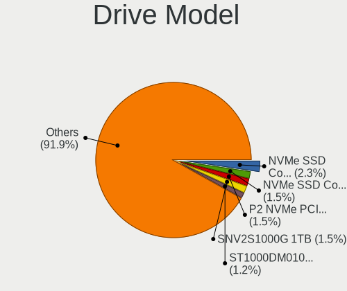
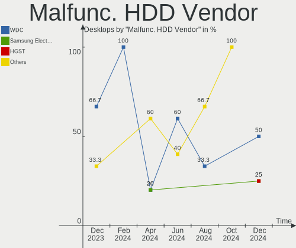
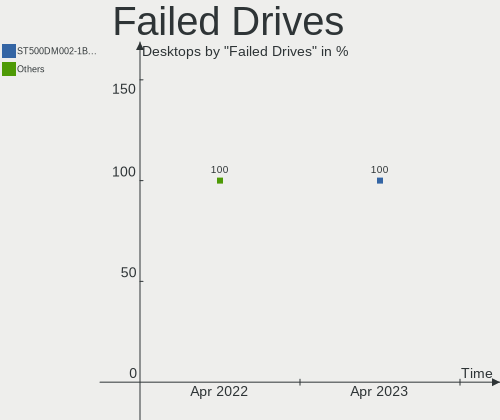
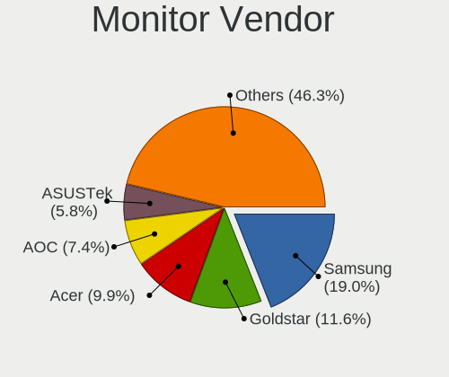
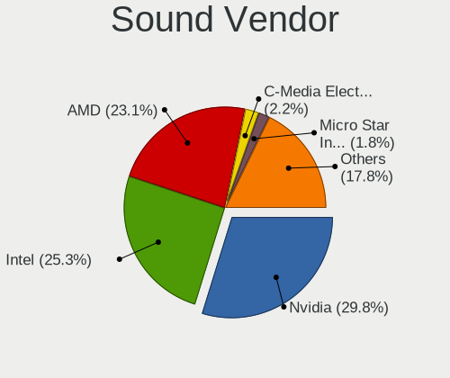

Pop!_OS - Hardware Trends (Desktops)
------------------------------------

A project to identify most popular hardware characteristics and track their change
over time based on data collected by Linux users at https://Linux-Hardware.org.

Anyone can contribute to this report by the [hw-probe](https://github.com/linuxhw/hw-probe) tool:

    sudo -E hw-probe -all -upload

This report is for one last month. Overall report since the beginning of time: [TestDays](https://github.com/linuxhw/TestDays)

Period: Apr, 2023.

Contents
--------

* [ System ](#system)
  - [ OS                       ](#os)
  - [ OS Family                ](#os-family)
  - [ Kernel                   ](#kernel)
  - [ Kernel Family            ](#kernel-family)
  - [ Kernel Major Ver.        ](#kernel-major-ver)
  - [ Arch                     ](#arch)
  - [ DE                       ](#de)
  - [ Display Server           ](#display-server)
  - [ Display Manager          ](#display-manager)
  - [ OS Lang                  ](#os-lang)
  - [ Boot Mode                ](#boot-mode)
  - [ Filesystem               ](#filesystem)
  - [ Part. scheme             ](#part-scheme)
  - [ Dual Boot with Linux/BSD ](#dual-boot-with-linuxbsd)
  - [ Dual Boot (Win)          ](#dual-boot-win)

* [ Board ](#board)
  - [ Vendor                   ](#vendor)
  - [ Model                    ](#model)
  - [ Model Family             ](#model-family)
  - [ MFG Year                 ](#mfg-year)
  - [ Form Factor              ](#form-factor)
  - [ Secure Boot              ](#secure-boot)
  - [ Coreboot                 ](#coreboot)
  - [ RAM Size                 ](#ram-size)
  - [ RAM Used                 ](#ram-used)
  - [ Total Drives             ](#total-drives)
  - [ Has CD-ROM               ](#has-cd-rom)
  - [ Has Ethernet             ](#has-ethernet)
  - [ Has WiFi                 ](#has-wifi)
  - [ Has Bluetooth            ](#has-bluetooth)

* [ Location ](#location)
  - [ Country                  ](#country)
  - [ City                     ](#city)

* [ Drives ](#drives)
  - [ Drive Vendor             ](#drive-vendor)
  - [ Drive Model              ](#drive-model)
  - [ HDD Vendor               ](#hdd-vendor)
  - [ SSD Vendor               ](#ssd-vendor)
  - [ Drive Kind               ](#drive-kind)
  - [ Drive Connector          ](#drive-connector)
  - [ Drive Size               ](#drive-size)
  - [ Space Total              ](#space-total)
  - [ Space Used               ](#space-used)
  - [ Malfunc. Drives          ](#malfunc-drives)
  - [ Malfunc. Drive Vendor    ](#malfunc-drive-vendor)
  - [ Malfunc. HDD Vendor      ](#malfunc-hdd-vendor)
  - [ Malfunc. Drive Kind      ](#malfunc-drive-kind)
  - [ Failed Drives            ](#failed-drives)
  - [ Failed Drive Vendor      ](#failed-drive-vendor)
  - [ Drive Status             ](#drive-status)

* [ Storage controller ](#storage-controller)
  - [ Storage Vendor           ](#storage-vendor)
  - [ Storage Model            ](#storage-model)
  - [ Storage Kind             ](#storage-kind)

* [ Processor ](#processor)
  - [ CPU Vendor               ](#cpu-vendor)
  - [ CPU Model                ](#cpu-model)
  - [ CPU Model Family         ](#cpu-model-family)
  - [ CPU Cores                ](#cpu-cores)
  - [ CPU Sockets              ](#cpu-sockets)
  - [ CPU Threads              ](#cpu-threads)
  - [ CPU Op-Modes             ](#cpu-op-modes)
  - [ CPU Microcode            ](#cpu-microcode)
  - [ CPU Microarch            ](#cpu-microarch)

* [ Graphics ](#graphics)
  - [ GPU Vendor               ](#gpu-vendor)
  - [ GPU Model                ](#gpu-model)
  - [ GPU Combo                ](#gpu-combo)
  - [ GPU Driver               ](#gpu-driver)
  - [ GPU Memory               ](#gpu-memory)

* [ Monitor ](#monitor)
  - [ Monitor Vendor           ](#monitor-vendor)
  - [ Monitor Model            ](#monitor-model)
  - [ Monitor Resolution       ](#monitor-resolution)
  - [ Monitor Diagonal         ](#monitor-diagonal)
  - [ Monitor Width            ](#monitor-width)
  - [ Aspect Ratio             ](#aspect-ratio)
  - [ Monitor Area             ](#monitor-area)
  - [ Pixel Density            ](#pixel-density)
  - [ Multiple Monitors        ](#multiple-monitors)

* [ Network ](#network)
  - [ Net Controller Vendor    ](#net-controller-vendor)
  - [ Net Controller Model     ](#net-controller-model)
  - [ Wireless Vendor          ](#wireless-vendor)
  - [ Wireless Model           ](#wireless-model)
  - [ Ethernet Vendor          ](#ethernet-vendor)
  - [ Ethernet Model           ](#ethernet-model)
  - [ Net Controller Kind      ](#net-controller-kind)
  - [ Used Controller          ](#used-controller)
  - [ NICs                     ](#nics)
  - [ IPv6                     ](#ipv6)

* [ Bluetooth ](#bluetooth)
  - [ Bluetooth Vendor         ](#bluetooth-vendor)
  - [ Bluetooth Model          ](#bluetooth-model)

* [ Sound ](#sound)
  - [ Sound Vendor             ](#sound-vendor)
  - [ Sound Model              ](#sound-model)

* [ Memory ](#memory)
  - [ Memory Vendor            ](#memory-vendor)
  - [ Memory Model             ](#memory-model)
  - [ Memory Kind              ](#memory-kind)
  - [ Memory Form Factor       ](#memory-form-factor)
  - [ Memory Size              ](#memory-size)
  - [ Memory Speed             ](#memory-speed)

* [ Printers & scanners ](#printers--scanners)
  - [ Printer Vendor           ](#printer-vendor)
  - [ Printer Model            ](#printer-model)
  - [ Scanner Vendor           ](#scanner-vendor)
  - [ Scanner Model            ](#scanner-model)

* [ Camera ](#camera)
  - [ Camera Vendor            ](#camera-vendor)
  - [ Camera Model             ](#camera-model)

* [ Security ](#security)
  - [ Fingerprint Vendor       ](#fingerprint-vendor)
  - [ Fingerprint Model        ](#fingerprint-model)
  - [ Chipcard Vendor          ](#chipcard-vendor)
  - [ Chipcard Model           ](#chipcard-model)

* [ Unsupported ](#unsupported)
  - [ Unsupported Devices      ](#unsupported-devices)
  - [ Unsupported Device Types ](#unsupported-device-types)

System
------

OS
--

Installed operating systems

| Name          | Desktops | Percent |
|---------------|----------|---------|
| Pop!_OS 22.04 | 79       | 100%    |

OS Family
---------

OS without a version

| Name    | Desktops | Percent |
|---------|----------|---------|
| Pop!_OS | 79       | 100%    |

Kernel
------

Version of the Linux kernel

| Version                   | Desktops | Percent |
|---------------------------|----------|---------|
| 6.2.6-76060206-generic    | 69       | 87.34%  |
| 6.2.0-76060200-generic    | 3        | 3.8%    |
| 6.0.12-76060006-generic   | 2        | 2.53%   |
| 6.2.9-060209-generic      | 1        | 1.27%   |
| 6.2.8-060208-generic      | 1        | 1.27%   |
| 5.19.0-76051900-generic   | 1        | 1.27%   |
| 5.18.0-9.1-liquorix-amd64 | 1        | 1.27%   |
| 5.17.5-76051705-generic   | 1        | 1.27%   |

Kernel Family
-------------

Linux kernel without a distro release

| Version | Desktops | Percent |
|---------|----------|---------|
| 6.2.6   | 69       | 87.34%  |
| 6.2.0   | 3        | 3.8%    |
| 6.0.12  | 2        | 2.53%   |
| 6.2.9   | 1        | 1.27%   |
| 6.2.8   | 1        | 1.27%   |
| 5.19.0  | 1        | 1.27%   |
| 5.18.0  | 1        | 1.27%   |
| 5.17.5  | 1        | 1.27%   |

Kernel Major Ver.
-----------------

Linux kernel major version

| Version | Desktops | Percent |
|---------|----------|---------|
| 6.2     | 74       | 93.67%  |
| 6.0     | 2        | 2.53%   |
| 5.19    | 1        | 1.27%   |
| 5.18    | 1        | 1.27%   |
| 5.17    | 1        | 1.27%   |

Arch
----

OS architecture (x86_64, i586, etc.)

| Name   | Desktops | Percent |
|--------|----------|---------|
| x86_64 | 79       | 100%    |

DE
--

Desktop Environment

| Name       | Desktops | Percent |
|------------|----------|---------|
| GNOME      | 74       | 93.67%  |
| KDE5       | 3        | 3.8%    |
| X-Cinnamon | 2        | 2.53%   |

Display Server
--------------

X11 or Wayland

| Name    | Desktops | Percent |
|---------|----------|---------|
| X11     | 77       | 97.47%  |
| Wayland | 2        | 2.53%   |

Display Manager
---------------

SDDM, LightDM, etc.

| Name    | Desktops | Percent |
|---------|----------|---------|
| Unknown | 64       | 81.01%  |
| GDM3    | 14       | 17.72%  |
| GDM     | 1        | 1.27%   |

OS Lang
-------

Language

| Lang  | Desktops | Percent |
|-------|----------|---------|
| en_US | 45       | 56.96%  |
| de_DE | 7        | 8.86%   |
| fr_FR | 4        | 5.06%   |
| en_GB | 4        | 5.06%   |
| pt_BR | 3        | 3.8%    |
| es_CL | 2        | 2.53%   |
| en_CA | 2        | 2.53%   |
| en_AU | 2        | 2.53%   |
| da_DK | 2        | 2.53%   |
| sv_SE | 1        | 1.27%   |
| pt_PT | 1        | 1.27%   |
| pl_PL | 1        | 1.27%   |
| it_IT | 1        | 1.27%   |
| hu_HU | 1        | 1.27%   |
| fi_FI | 1        | 1.27%   |
| en_DK | 1        | 1.27%   |
| de_CH | 1        | 1.27%   |

Boot Mode
---------

EFI or BIOS

| Mode | Desktops | Percent |
|------|----------|---------|
| BIOS | 66       | 83.54%  |
| EFI  | 13       | 16.46%  |

Filesystem
----------

Type of filesystem

| Type  | Desktops | Percent |
|-------|----------|---------|
| Ext4  | 76       | 96.2%   |
| Btrfs | 3        | 3.8%    |

Part. scheme
------------

Scheme of partitioning

| Type    | Desktops | Percent |
|---------|----------|---------|
| Unknown | 64       | 81.01%  |
| GPT     | 14       | 17.72%  |
| MBR     | 1        | 1.27%   |

Dual Boot with Linux/BSD
------------------------

Hosting more than one Linux/BSD

| Dual boot | Desktops | Percent |
|-----------|----------|---------|
| No        | 77       | 97.47%  |
| Yes       | 2        | 2.53%   |

Dual Boot (Win)
---------------

Hosting Linux and Windows

| Dual boot | Desktops | Percent |
|-----------|----------|---------|
| No        | 69       | 87.34%  |
| Yes       | 10       | 12.66%  |

Board
-----

Vendor
------

Motherboard manufacturer

| Name                | Desktops | Percent |
|---------------------|----------|---------|
| Gigabyte Technology | 16       | 20.25%  |
| MSI                 | 15       | 18.99%  |
| ASUSTek Computer    | 15       | 18.99%  |
| ASRock              | 8        | 10.13%  |
| Dell                | 6        | 7.59%   |
| Lenovo              | 3        | 3.8%    |
| Intel               | 3        | 3.8%    |
| Hewlett-Packard     | 3        | 3.8%    |
| System76            | 1        | 1.27%   |
| Samsung Electronics | 1        | 1.27%   |
| PS                  | 1        | 1.27%   |
| Packard Bell        | 1        | 1.27%   |
| G7-2011             | 1        | 1.27%   |
| Foxconn             | 1        | 1.27%   |
| Biostar             | 1        | 1.27%   |
| BESSTAR Tech        | 1        | 1.27%   |
| Apple               | 1        | 1.27%   |
| Unknown             | 1        | 1.27%   |

Model
-----

Motherboard model

| Name                                 | Desktops | Percent |
|--------------------------------------|----------|---------|
| MSI MS-7D32                          | 2        | 2.53%   |
| Gigabyte B550M DS3H                  | 2        | 2.53%   |
| Gigabyte B550 AORUS ELITE AX V2      | 2        | 2.53%   |
| ASUS TUF Gaming B550M-PLUS           | 2        | 2.53%   |
| ASUS ROG CROSSHAIR VIII HERO         | 2        | 2.53%   |
| System76 Thelio                      | 1        | 1.27%   |
| Samsung DeskTop System               | 1        | 1.27%   |
| PS G706                              | 1        | 1.27%   |
| Packard Bell IPOWER G3610            | 1        | 1.27%   |
| MSI MS-7D67                          | 1        | 1.27%   |
| MSI MS-7D53                          | 1        | 1.27%   |
| MSI MS-7D19                          | 1        | 1.27%   |
| MSI MS-7C94                          | 1        | 1.27%   |
| MSI MS-7C35                          | 1        | 1.27%   |
| MSI MS-7C13                          | 1        | 1.27%   |
| MSI MS-7B00                          | 1        | 1.27%   |
| MSI MS-7A34                          | 1        | 1.27%   |
| MSI MS-7996                          | 1        | 1.27%   |
| MSI MS-7817                          | 1        | 1.27%   |
| MSI MS-7808                          | 1        | 1.27%   |
| MSI MS-7693                          | 1        | 1.27%   |
| MSI MS-7592                          | 1        | 1.27%   |
| Lenovo ThinkStation P320 30BJS23V00  | 1        | 1.27%   |
| Lenovo ThinkCentre E73 10DS0005FR    | 1        | 1.27%   |
| Lenovo 70UCS00700 ThinkServer TS150  | 1        | 1.27%   |
| Intel X99                            | 1        | 1.27%   |
| Intel Pentino B75                    | 1        | 1.27%   |
| Intel B75                            | 1        | 1.27%   |
| HP Pavilion Desktop 590-p0xxx        | 1        | 1.27%   |
| HP EliteDesk 800 G2 SFF              | 1        | 1.27%   |
| HP Compaq dc7800p Ultra-slim Desktop | 1        | 1.27%   |
| Gigabyte Z97X-Gaming 3               | 1        | 1.27%   |
| Gigabyte Z390 M GAMING               | 1        | 1.27%   |
| Gigabyte Z170X-Gaming 7              | 1        | 1.27%   |
| Gigabyte X670 AORUS ELITE AX         | 1        | 1.27%   |
| Gigabyte X570 AORUS ELITE            | 1        | 1.27%   |
| Gigabyte H410M H                     | 1        | 1.27%   |
| Gigabyte G41MT-S2                    | 1        | 1.27%   |
| Gigabyte G1.Sniper M3-CF             | 1        | 1.27%   |
| Gigabyte B660 GAMING X DDR4          | 1        | 1.27%   |

Model Family
------------

Motherboard model prefix

| Name                  | Desktops | Percent |
|-----------------------|----------|---------|
| ASUS ROG              | 7        | 8.86%   |
| Dell OptiPlex         | 3        | 3.8%    |
| MSI MS-7D32           | 2        | 2.53%   |
| Gigabyte B550M        | 2        | 2.53%   |
| Gigabyte B550         | 2        | 2.53%   |
| Dell XPS              | 2        | 2.53%   |
| ASUS TUF              | 2        | 2.53%   |
| ASUS PRIME            | 2        | 2.53%   |
| ASRock X670E          | 2        | 2.53%   |
| System76 Thelio       | 1        | 1.27%   |
| Samsung DeskTop       | 1        | 1.27%   |
| PS G706               | 1        | 1.27%   |
| Packard Bell IPOWER   | 1        | 1.27%   |
| MSI MS-7D67           | 1        | 1.27%   |
| MSI MS-7D53           | 1        | 1.27%   |
| MSI MS-7D19           | 1        | 1.27%   |
| MSI MS-7C94           | 1        | 1.27%   |
| MSI MS-7C35           | 1        | 1.27%   |
| MSI MS-7C13           | 1        | 1.27%   |
| MSI MS-7B00           | 1        | 1.27%   |
| MSI MS-7A34           | 1        | 1.27%   |
| MSI MS-7996           | 1        | 1.27%   |
| MSI MS-7817           | 1        | 1.27%   |
| MSI MS-7808           | 1        | 1.27%   |
| MSI MS-7693           | 1        | 1.27%   |
| MSI MS-7592           | 1        | 1.27%   |
| Lenovo ThinkStation   | 1        | 1.27%   |
| Lenovo ThinkCentre    | 1        | 1.27%   |
| Lenovo 70UCS00700     | 1        | 1.27%   |
| Intel X99             | 1        | 1.27%   |
| Intel Pentino         | 1        | 1.27%   |
| Intel B75             | 1        | 1.27%   |
| HP Pavilion           | 1        | 1.27%   |
| HP EliteDesk          | 1        | 1.27%   |
| HP Compaq             | 1        | 1.27%   |
| Gigabyte Z97X-Gaming  | 1        | 1.27%   |
| Gigabyte Z390         | 1        | 1.27%   |
| Gigabyte Z170X-Gaming | 1        | 1.27%   |
| Gigabyte X670         | 1        | 1.27%   |
| Gigabyte X570         | 1        | 1.27%   |

MFG Year
--------

Motherboard manufacture year

| Year | Desktops | Percent |
|------|----------|---------|
| 2022 | 13       | 16.46%  |
| 2020 | 11       | 13.92%  |
| 2018 | 10       | 12.66%  |
| 2021 | 7        | 8.86%   |
| 2017 | 7        | 8.86%   |
| 2014 | 6        | 7.59%   |
| 2019 | 5        | 6.33%   |
| 2011 | 4        | 5.06%   |
| 2015 | 3        | 3.8%    |
| 2013 | 3        | 3.8%    |
| 2010 | 3        | 3.8%    |
| 2016 | 2        | 2.53%   |
| 2012 | 2        | 2.53%   |
| 2023 | 1        | 1.27%   |
| 2009 | 1        | 1.27%   |
| 2007 | 1        | 1.27%   |

Form Factor
-----------

Physical design of the computer

| Name    | Desktops | Percent |
|---------|----------|---------|
| Desktop | 79       | 100%    |

Secure Boot
-----------

Enabled or disabled

| State    | Desktops | Percent |
|----------|----------|---------|
| Disabled | 79       | 100%    |

Coreboot
--------

Have coreboot on board

| Used | Desktops | Percent |
|------|----------|---------|
| No   | 79       | 100%    |

RAM Size
--------

Total RAM memory

| Size in GB  | Desktops | Percent |
|-------------|----------|---------|
| 32.01-64.0  | 21       | 26.58%  |
| 16.01-24.0  | 20       | 25.32%  |
| 8.01-16.0   | 15       | 18.99%  |
| 64.01-256.0 | 12       | 15.19%  |
| 4.01-8.0    | 4        | 5.06%   |
| 3.01-4.0    | 3        | 3.8%    |
| 24.01-32.0  | 3        | 3.8%    |
| 2.01-3.0    | 1        | 1.27%   |

RAM Used
--------

Used RAM memory

| Used GB    | Desktops | Percent |
|------------|----------|---------|
| 4.01-8.0   | 28       | 35.44%  |
| 8.01-16.0  | 18       | 22.78%  |
| 3.01-4.0   | 15       | 18.99%  |
| 2.01-3.0   | 12       | 15.19%  |
| 1.01-2.0   | 3        | 3.8%    |
| 16.01-24.0 | 2        | 2.53%   |
| 32.01-64.0 | 1        | 1.27%   |

Total Drives
------------

Number of drives on board

| Drives | Desktops | Percent |
|--------|----------|---------|
| 1      | 26       | 32.91%  |
| 2      | 18       | 22.78%  |
| 3      | 16       | 20.25%  |
| 4      | 9        | 11.39%  |
| 5      | 6        | 7.59%   |
| 26     | 1        | 1.27%   |
| 8      | 1        | 1.27%   |
| 7      | 1        | 1.27%   |
| 6      | 1        | 1.27%   |

Has CD-ROM
----------

Has CD-ROM on board

| Presented | Desktops | Percent |
|-----------|----------|---------|
| No        | 60       | 75.95%  |
| Yes       | 19       | 24.05%  |

Has Ethernet
------------

Has Ethernet on board

| Presented | Desktops | Percent |
|-----------|----------|---------|
| Yes       | 79       | 100%    |

Has WiFi
--------

Has WiFi module

| Presented | Desktops | Percent |
|-----------|----------|---------|
| Yes       | 42       | 53.16%  |
| No        | 37       | 46.84%  |

Has Bluetooth
-------------

Has Bluetooth module

| Presented | Desktops | Percent |
|-----------|----------|---------|
| No        | 42       | 53.16%  |
| Yes       | 37       | 46.84%  |

Location
--------

Country
-------

Geographic location (country)

| Country     | Desktops | Percent |
|-------------|----------|---------|
| USA         | 19       | 24.05%  |
| Germany     | 11       | 13.92%  |
| France      | 6        | 7.59%   |
| Canada      | 6        | 7.59%   |
| UK          | 4        | 5.06%   |
| Mexico      | 4        | 5.06%   |
| Brazil      | 4        | 5.06%   |
| Hungary     | 2        | 2.53%   |
| Greece      | 2        | 2.53%   |
| Denmark     | 2        | 2.53%   |
| Chile       | 2        | 2.53%   |
| Bulgaria    | 2        | 2.53%   |
| Australia   | 2        | 2.53%   |
| Thailand    | 1        | 1.27%   |
| Sweden      | 1        | 1.27%   |
| Sri Lanka   | 1        | 1.27%   |
| Serbia      | 1        | 1.27%   |
| Portugal    | 1        | 1.27%   |
| Poland      | 1        | 1.27%   |
| Norway      | 1        | 1.27%   |
| Netherlands | 1        | 1.27%   |
| Italy       | 1        | 1.27%   |
| Indonesia   | 1        | 1.27%   |
| Hong Kong   | 1        | 1.27%   |
| Finland     | 1        | 1.27%   |
| Austria     | 1        | 1.27%   |

City
----

Geographic location (city)

| City                  | Desktops | Percent |
|-----------------------|----------|---------|
| Sydney                | 2        | 2.53%   |
| Edmonton              | 2        | 2.53%   |
| Zapotlan el Grande    | 1        | 1.27%   |
| Williston             | 1        | 1.27%   |
| Westville             | 1        | 1.27%   |
| Wenzenbach            | 1        | 1.27%   |
| Vila do Conde         | 1        | 1.27%   |
| Varna                 | 1        | 1.27%   |
| Trige                 | 1        | 1.27%   |
| Toronto               | 1        | 1.27%   |
| Sturgis               | 1        | 1.27%   |
| Stari Grad            | 1        | 1.27%   |
| Spaichingen           | 1        | 1.27%   |
| Soltau                | 1        | 1.27%   |
| Soest                 | 1        | 1.27%   |
| Slough                | 1        | 1.27%   |
| Sheffield             | 1        | 1.27%   |
| Seattle               | 1        | 1.27%   |
| Sauvian               | 1        | 1.27%   |
| Sartrouville          | 1        | 1.27%   |
| Sao Bernardo do Campo | 1        | 1.27%   |
| Santiago              | 1        | 1.27%   |
| Saint Paul            | 1        | 1.27%   |
| Puente Alto           | 1        | 1.27%   |
| Potsdam               | 1        | 1.27%   |
| Polch                 | 1        | 1.27%   |
| Phitsanulok           | 1        | 1.27%   |
| Pátrai               | 1        | 1.27%   |
| Notodden              | 1        | 1.27%   |
| Norwich               | 1        | 1.27%   |
| Niterói              | 1        | 1.27%   |
| New York              | 1        | 1.27%   |
| Neuwied               | 1        | 1.27%   |
| Nesscliffe            | 1        | 1.27%   |
| Milan                 | 1        | 1.27%   |
| Mexico City           | 1        | 1.27%   |
| Mérida               | 1        | 1.27%   |
| Las Vegas             | 1        | 1.27%   |
| Lake Orion            | 1        | 1.27%   |
| Kethely               | 1        | 1.27%   |

Drives
------

Drive Vendor
------------

Hard drive vendors

| Vendor                      | Desktops | Drives | Percent |
|-----------------------------|----------|--------|---------|
| Seagate                     | 29       | 34     | 17.26%  |
| Samsung Electronics         | 29       | 44     | 17.26%  |
| WDC                         | 20       | 24     | 11.9%   |
| Sandisk                     | 9        | 11     | 5.36%   |
| Kingston                    | 8        | 8      | 4.76%   |
| Crucial                     | 8        | 9      | 4.76%   |
| Phison Electronics          | 6        | 8      | 3.57%   |
| A-DATA Technology           | 6        | 6      | 3.57%   |
| Micron/Crucial Technology   | 5        | 6      | 2.98%   |
| Toshiba                     | 4        | 5      | 2.38%   |
| Hitachi                     | 4        | 24     | 2.38%   |
| Unknown                     | 3        | 4      | 1.79%   |
| T-FORCE                     | 2        | 2      | 1.19%   |
| SPCC                        | 2        | 2      | 1.19%   |
| Silicon Motion              | 2        | 2      | 1.19%   |
| PNY                         | 2        | 2      | 1.19%   |
| Kingston Technology Company | 2        | 2      | 1.19%   |
| Intenso                     | 2        | 2      | 1.19%   |
| Intel                       | 2        | 3      | 1.19%   |
| HGST                        | 2        | 2      | 1.19%   |
| China                       | 2        | 2      | 1.19%   |
| XPG                         | 1        | 1      | 0.6%    |
| Verbatim                    | 1        | 1      | 0.6%    |
| Transcend                   | 1        | 1      | 0.6%    |
| Team                        | 1        | 2      | 0.6%    |
| sobetter                    | 1        | 1      | 0.6%    |
| SK hynix                    | 1        | 1      | 0.6%    |
| SABRENT                     | 1        | 1      | 0.6%    |
| S3+                         | 1        | 1      | 0.6%    |
| Realtek Semiconductor       | 1        | 1      | 0.6%    |
| Realtek                     | 1        | 1      | 0.6%    |
| Phison                      | 1        | 1      | 0.6%    |
| Patriot                     | 1        | 1      | 0.6%    |
| OCZ                         | 1        | 1      | 0.6%    |
| Lexar                       | 1        | 1      | 0.6%    |
| HS-SSD-C100                 | 1        | 1      | 0.6%    |
| Fujitsu                     | 1        | 1      | 0.6%    |
| Elite                       | 1        | 2      | 0.6%    |
| Colorful                    | 1        | 1      | 0.6%    |
| Apacer                      | 1        | 1      | 0.6%    |

Drive Model
-----------

Hard drive models

| Model                                                  | Desktops | Percent |
|--------------------------------------------------------|----------|---------|
| Samsung NVMe SSD Controller SM981/PM981/PM983 1TB      | 6        | 3.16%   |
| Samsung SSD 850 EVO 250GB                              | 4        | 2.11%   |
| Seagate ST500DM002-1BD142 500GB                        | 3        | 1.58%   |
| Seagate ST1000DM010-2EP102 1TB                         | 3        | 1.58%   |
| Seagate Expansion Desk 8TB                             | 3        | 1.58%   |
| Samsung SSD 870 QVO 1TB                                | 3        | 1.58%   |
| Samsung SSD 850 EVO 500GB                              | 3        | 1.58%   |
| Samsung NVMe SSD Controller PM9A1/PM9A3/980PRO 2TB     | 3        | 1.58%   |
| Toshiba DT01ACA100 1TB                                 | 2        | 1.05%   |
| T-FORCE 1TB                                            | 2        | 1.05%   |
| Silicon Motion SM2263EN/SM2263XT SSD Controller 1024GB | 2        | 1.05%   |
| Seagate ST4000DM004-2CV104 4TB                         | 2        | 1.05%   |
| Seagate ST1000DM003-1ER162 1TB                         | 2        | 1.05%   |
| Sandisk WD Blue SN550 NVMe SSD 1024GB                  | 2        | 1.05%   |
| Samsung SSD 860 EVO 1TB                                | 2        | 1.05%   |
| Samsung NVMe SSD Controller SM961/PM961/SM963 500GB    | 2        | 1.05%   |
| Phison PS5013 E13 NVMe Controller 500GB                | 2        | 1.05%   |
| Kingston SKC3000S1024G 1TB                             | 2        | 1.05%   |
| Crucial CT2000BX500SSD1 2TB                            | 2        | 1.05%   |
| A-DATA SU630 480GB SSD                                 | 2        | 1.05%   |
| XPG GAMMIX S70 BLADE 512GB                             | 1        | 0.53%   |
| WDC WD6003FZBX-00K5WB0 6TB                             | 1        | 0.53%   |
| WDC WD5000LPCX-60VHAT0 500GB                           | 1        | 0.53%   |
| WDC WD5000AZLX-60K2TA0 500GB                           | 1        | 0.53%   |
| WDC WD5000AAVS-00N7B0 500GB                            | 1        | 0.53%   |
| WDC WD5000AAKX-753CA1 500GB                            | 1        | 0.53%   |
| WDC WD40EZRZ-00GXCB0 4TB                               | 1        | 0.53%   |
| WDC WD30EZRZ-00Z5HB0 3TB                               | 1        | 0.53%   |
| WDC WD2502ABYS-02B7A0 256GB                            | 1        | 0.53%   |
| WDC WD20PURZ-85GU6Y0 2TB                               | 1        | 0.53%   |
| WDC WD20EZBX-00AYRA0 2TB                               | 1        | 0.53%   |
| WDC WD20EURX-61T0FY0 2TB                               | 1        | 0.53%   |
| WDC WD20EURS-73TLHY0 2TB                               | 1        | 0.53%   |
| WDC WD20EFRX-68AX9N0 2TB                               | 1        | 0.53%   |
| WDC WD10EZEX-75WN4A0 1TB                               | 1        | 0.53%   |
| WDC WD10EZEX-08WN4A0 1TB                               | 1        | 0.53%   |
| WDC WD10EZEX-00WN4A0 1TB                               | 1        | 0.53%   |
| WDC WD10EZEX-00RKKA0 1TB                               | 1        | 0.53%   |
| WDC WD10EAVS-00D7B1 1TB                                | 1        | 0.53%   |
| WDC WD10EALS-00Z8A0 1TB                                | 1        | 0.53%   |

HDD Vendor
----------

Hard disk drive vendors

| Vendor              | Desktops | Drives | Percent |
|---------------------|----------|--------|---------|
| Seagate             | 26       | 31     | 43.33%  |
| WDC                 | 19       | 23     | 31.67%  |
| Toshiba             | 4        | 5      | 6.67%   |
| Hitachi             | 4        | 24     | 6.67%   |
| Samsung Electronics | 3        | 3      | 5%      |
| HGST                | 2        | 2      | 3.33%   |
| SABRENT             | 1        | 1      | 1.67%   |
| Fujitsu             | 1        | 1      | 1.67%   |

SSD Vendor
----------

Solid state drive vendors

| Vendor              | Desktops | Drives | Percent |
|---------------------|----------|--------|---------|
| Samsung Electronics | 17       | 24     | 32.08%  |
| Crucial             | 6        | 6      | 11.32%  |
| A-DATA Technology   | 5        | 5      | 9.43%   |
| SanDisk             | 4        | 4      | 7.55%   |
| Kingston            | 3        | 3      | 5.66%   |
| PNY                 | 2        | 2      | 3.77%   |
| Intenso             | 2        | 2      | 3.77%   |
| Intel               | 2        | 3      | 3.77%   |
| China               | 2        | 2      | 3.77%   |
| Verbatim            | 1        | 1      | 1.89%   |
| Transcend           | 1        | 1      | 1.89%   |
| SPCC                | 1        | 1      | 1.89%   |
| SK hynix            | 1        | 1      | 1.89%   |
| S3+                 | 1        | 1      | 1.89%   |
| Patriot             | 1        | 1      | 1.89%   |
| OCZ                 | 1        | 1      | 1.89%   |
| Lexar               | 1        | 1      | 1.89%   |
| Colorful            | 1        | 1      | 1.89%   |
| Apacer              | 1        | 1      | 1.89%   |

Drive Kind
----------

HDD or SSD

| Kind    | Desktops | Drives | Percent |
|---------|----------|--------|---------|
| HDD     | 45       | 90     | 33.33%  |
| SSD     | 44       | 61     | 32.59%  |
| NVMe    | 40       | 62     | 29.63%  |
| Unknown | 6        | 10     | 4.44%   |

Drive Connector
---------------

SATA, SAS, NVMe, etc.

| Type | Desktops | Drives | Percent |
|------|----------|--------|---------|
| SATA | 65       | 126    | 56.03%  |
| NVMe | 39       | 61     | 33.62%  |
| SAS  | 12       | 36     | 10.34%  |

Drive Size
----------

Size of hard drive

| Size in TB | Desktops | Drives | Percent |
|------------|----------|--------|---------|
| 0.01-0.5   | 41       | 57     | 41.84%  |
| 0.51-1.0   | 30       | 39     | 30.61%  |
| 1.01-2.0   | 13       | 20     | 13.27%  |
| 4.01-10.0  | 6        | 26     | 6.12%   |
| 3.01-4.0   | 5        | 6      | 5.1%    |
| 10.01-20.0 | 2        | 2      | 2.04%   |
| 2.01-3.0   | 1        | 1      | 1.02%   |

Space Total
-----------

Amount of disk space available on the file system

| Size in GB     | Desktops | Percent |
|----------------|----------|---------|
| More than 3000 | 20       | 25.32%  |
| 501-1000       | 18       | 22.78%  |
| 101-250        | 13       | 16.46%  |
| 251-500        | 12       | 15.19%  |
| 1001-2000      | 12       | 15.19%  |
| 2001-3000      | 2        | 2.53%   |
| 51-100         | 1        | 1.27%   |
| Unknown        | 1        | 1.27%   |

Space Used
----------

Amount of used disk space

| Used GB        | Desktops | Percent |
|----------------|----------|---------|
| 21-50          | 13       | 16.46%  |
| 501-1000       | 13       | 16.46%  |
| 1-20           | 12       | 15.19%  |
| 101-250        | 11       | 13.92%  |
| More than 3000 | 8        | 10.13%  |
| 251-500        | 8        | 10.13%  |
| 51-100         | 6        | 7.59%   |
| 2001-3000      | 4        | 5.06%   |
| 1001-2000      | 3        | 3.8%    |
| Unknown        | 1        | 1.27%   |

Malfunc. Drives
---------------

Drive models with a malfunction

| Model                           | Desktops | Drives | Percent |
|---------------------------------|----------|--------|---------|
| WDC WD20EFRX-68AX9N0 2TB        | 1        | 1      | 33.33%  |
| Seagate STM3500418AS 500GB      | 1        | 1      | 33.33%  |
| Seagate ST6000AS0002-1N917X 6TB | 1        | 1      | 33.33%  |

Malfunc. Drive Vendor
---------------------

Vendors of faulty drives

| Vendor  | Desktops | Drives | Percent |
|---------|----------|--------|---------|
| Seagate | 2        | 2      | 66.67%  |
| WDC     | 1        | 1      | 33.33%  |

Malfunc. HDD Vendor
-------------------

Vendors of faulty HDD drives

| Vendor  | Desktops | Drives | Percent |
|---------|----------|--------|---------|
| Seagate | 2        | 2      | 66.67%  |
| WDC     | 1        | 1      | 33.33%  |

Malfunc. Drive Kind
-------------------

Kinds of faulty drives

| Kind | Desktops | Drives | Percent |
|------|----------|--------|---------|
| HDD  | 3        | 3      | 100%    |

Failed Drives
-------------

Failed drive models

| Model                           | Desktops | Drives | Percent |
|---------------------------------|----------|--------|---------|
| Seagate ST500DM002-1BD142 500GB | 1        | 1      | 100%    |

Failed Drive Vendor
-------------------

Failed drive vendors

| Vendor  | Desktops | Drives | Percent |
|---------|----------|--------|---------|
| Seagate | 1        | 1      | 100%    |

Drive Status
------------

Number of failed and malfunc. drives

| Status   | Desktops | Drives | Percent |
|----------|----------|--------|---------|
| Detected | 66       | 180    | 77.65%  |
| Works    | 15       | 39     | 17.65%  |
| Malfunc  | 3        | 3      | 3.53%   |
| Failed   | 1        | 1      | 1.18%   |

Storage controller
------------------

Storage Vendor
--------------

Storage controller vendors

| Vendor                      | Desktops | Percent |
|-----------------------------|----------|---------|
| AMD                         | 40       | 28.37%  |
| Intel                       | 39       | 27.66%  |
| Samsung Electronics         | 15       | 10.64%  |
| Phison Electronics          | 8        | 5.67%   |
| SanDisk                     | 7        | 4.96%   |
| Micron/Crucial Technology   | 7        | 4.96%   |
| Kingston Technology Company | 6        | 4.26%   |
| ASMedia Technology          | 6        | 4.26%   |
| Realtek Semiconductor       | 3        | 2.13%   |
| Solidigm                    | 2        | 1.42%   |
| Silicon Motion              | 2        | 1.42%   |
| JMicron Technology          | 2        | 1.42%   |
| Seagate Technology          | 1        | 0.71%   |
| Marvell Technology Group    | 1        | 0.71%   |
| LSI Logic / Symbios Logic   | 1        | 0.71%   |
| ADATA Technology            | 1        | 0.71%   |

Storage Model
-------------

Storage controller models

| Model                                                                          | Desktops | Percent |
|--------------------------------------------------------------------------------|----------|---------|
| AMD FCH SATA Controller [AHCI mode]                                            | 27       | 17.2%   |
| Samsung NVMe SSD Controller SM981/PM981/PM983                                  | 8        | 5.1%    |
| AMD 500 Series Chipset SATA Controller                                         | 7        | 4.46%   |
| Intel 8 Series/C220 Series Chipset Family 6-port SATA Controller 1 [AHCI mode] | 6        | 3.82%   |
| ASMedia ASM1062 Serial ATA Controller                                          | 6        | 3.82%   |
| AMD 400 Series Chipset SATA Controller                                         | 6        | 3.82%   |
| Kingston Company Company Non-Volatile memory controller                        | 5        | 3.18%   |
| Intel 7 Series/C210 Series Chipset Family 6-port SATA Controller [AHCI mode]   | 5        | 3.18%   |
| Intel Q170/Q150/B150/H170/H110/Z170/CM236 Chipset SATA Controller [AHCI Mode]  | 4        | 2.55%   |
| Intel Alder Lake-S PCH SATA Controller [AHCI Mode]                             | 4        | 2.55%   |
| AMD SB7x0/SB8x0/SB9x0 SATA Controller [AHCI mode]                              | 4        | 2.55%   |
| Samsung NVMe SSD Controller PM9A1/PM9A3/980PRO                                 | 3        | 1.91%   |
| Intel 200 Series PCH SATA controller [AHCI mode]                               | 3        | 1.91%   |
| AMD 300 Series Chipset SATA Controller                                         | 3        | 1.91%   |
| Solidigm Non-Volatile memory controller                                        | 2        | 1.27%   |
| Silicon Motion SM2263EN/SM2263XT SSD Controller                                | 2        | 1.27%   |
| SanDisk WD Blue SN550 NVMe SSD                                                 | 2        | 1.27%   |
| SanDisk WD Black SN770 NVMe SSD                                                | 2        | 1.27%   |
| Samsung NVMe SSD Controller SM961/PM961/SM963                                  | 2        | 1.27%   |
| Realtek NVMe Controller                                                        | 2        | 1.27%   |
| Phison PS5013 E13 NVMe Controller                                              | 2        | 1.27%   |
| Phison E16 PCIe4 NVMe Controller                                               | 2        | 1.27%   |
| Phison E12 NVMe Controller                                                     | 2        | 1.27%   |
| Micron/Crucial P2 NVMe PCIe SSD                                                | 2        | 1.27%   |
| Micron/Crucial P1 NVMe PCIe SSD                                                | 2        | 1.27%   |
| Micron/Crucial NVMe Storage Controller                                         | 2        | 1.27%   |
| Intel SATA Controller [RAID mode]                                              | 2        | 1.27%   |
| Intel NM10/ICH7 Family SATA Controller [IDE mode]                              | 2        | 1.27%   |
| Intel Cannon Lake PCH SATA AHCI Controller                                     | 2        | 1.27%   |
| Intel 9 Series Chipset Family SATA Controller [AHCI Mode]                      | 2        | 1.27%   |
| Intel 82801JI (ICH10 Family) SATA AHCI Controller                              | 2        | 1.27%   |
| Intel 6 Series/C200 Series Chipset Family 6 port Desktop SATA AHCI Controller  | 2        | 1.27%   |
| AMD SB7x0/SB8x0/SB9x0 IDE Controller                                           | 2        | 1.27%   |
| Seagate FireCuda 530 SSD                                                       | 1        | 0.64%   |
| SanDisk WD Black 2018/SN750 / PC SN720 NVMe SSD                                | 1        | 0.64%   |
| SanDisk PC SN520 NVMe SSD                                                      | 1        | 0.64%   |
| SanDisk Non-Volatile memory controller                                         | 1        | 0.64%   |
| Samsung NVMe SSD Controller 980                                                | 1        | 0.64%   |
| Samsung Electronics Non-Volatile memory controller                             | 1        | 0.64%   |
| Realtek RTS5763DL NVMe SSD Controller                                          | 1        | 0.64%   |

Storage Kind
------------

Kind of storage controller (IDE, SATA, NVMe, SAS, ...)

| Kind | Desktops | Percent |
|------|----------|---------|
| SATA | 73       | 58.87%  |
| NVMe | 39       | 31.45%  |
| IDE  | 7        | 5.65%   |
| RAID | 4        | 3.23%   |
| SAS  | 1        | 0.81%   |

Processor
---------

CPU Vendor
----------

Processor vendors

| Vendor | Desktops | Percent |
|--------|----------|---------|
| AMD    | 40       | 50.63%  |
| Intel  | 39       | 49.37%  |

CPU Model
---------

Processor models

| Model                                  | Desktops | Percent |
|----------------------------------------|----------|---------|
| AMD Ryzen 7 3700X 8-Core Processor     | 4        | 5.06%   |
| Intel Core i7-8700 CPU @ 3.20GHz       | 3        | 3.8%    |
| AMD Ryzen 9 7950X3D 16-Core Processor  | 3        | 3.8%    |
| Intel Core i7-4790 CPU @ 3.60GHz       | 2        | 2.53%   |
| Intel Core i5-6500 CPU @ 3.20GHz       | 2        | 2.53%   |
| AMD Ryzen 9 7950X 16-Core Processor    | 2        | 2.53%   |
| AMD Ryzen 9 5900X 12-Core Processor    | 2        | 2.53%   |
| AMD Ryzen 7 7700X 8-Core Processor     | 2        | 2.53%   |
| AMD Ryzen 7 3800XT 8-Core Processor    | 2        | 2.53%   |
| AMD Ryzen 5 7600X 6-Core Processor     | 2        | 2.53%   |
| AMD Ryzen 5 5600G with Radeon Graphics | 2        | 2.53%   |
| AMD Ryzen 5 2600 Six-Core Processor    | 2        | 2.53%   |
| AMD FX-8320E Eight-Core Processor      | 2        | 2.53%   |
| Intel Xeon CPU X5650 @ 2.67GHz         | 1        | 1.27%   |
| Intel Xeon CPU W3565 @ 3.20GHz         | 1        | 1.27%   |
| Intel Xeon CPU E5-2670 v3 @ 2.30GHz    | 1        | 1.27%   |
| Intel Xeon CPU E5-2630 v3 @ 2.40GHz    | 1        | 1.27%   |
| Intel Xeon CPU E5-2630 v2 @ 2.60GHz    | 1        | 1.27%   |
| Intel Xeon CPU E3-1230 V2 @ 3.30GHz    | 1        | 1.27%   |
| Intel Xeon CPU E3-1225 v6 @ 3.30GHz    | 1        | 1.27%   |
| Intel Core i9-9900K CPU @ 3.60GHz      | 1        | 1.27%   |
| Intel Core i7-9700K CPU @ 3.60GHz      | 1        | 1.27%   |
| Intel Core i7-6700K CPU @ 4.00GHz      | 1        | 1.27%   |
| Intel Core i7-4790S CPU @ 3.20GHz      | 1        | 1.27%   |
| Intel Core i7-4790K CPU @ 4.00GHz      | 1        | 1.27%   |
| Intel Core i7-2600 CPU @ 3.40GHz       | 1        | 1.27%   |
| Intel Core i5-8600K CPU @ 3.60GHz      | 1        | 1.27%   |
| Intel Core i5-7600 CPU @ 3.50GHz       | 1        | 1.27%   |
| Intel Core i5-6600 CPU @ 3.30GHz       | 1        | 1.27%   |
| Intel Core i5-4460 CPU @ 3.20GHz       | 1        | 1.27%   |
| Intel Core i5-3470 CPU @ 3.20GHz       | 1        | 1.27%   |
| Intel Core i5-3330 CPU @ 3.00GHz       | 1        | 1.27%   |
| Intel Core i5-2500 CPU @ 3.30GHz       | 1        | 1.27%   |
| Intel Core i5-10400F CPU @ 2.90GHz     | 1        | 1.27%   |
| Intel Core i5 CPU 750 @ 2.67GHz        | 1        | 1.27%   |
| Intel Core i3-4160 CPU @ 3.60GHz       | 1        | 1.27%   |
| Intel Core i3-2130 CPU @ 3.40GHz       | 1        | 1.27%   |
| Intel Core 2 Quad CPU Q8300 @ 2.50GHz  | 1        | 1.27%   |
| Intel Core 2 Duo CPU E8500 @ 3.16GHz   | 1        | 1.27%   |
| Intel Core 2 Duo CPU E6550 @ 2.33GHz   | 1        | 1.27%   |

CPU Model Family
----------------

Processor model prefix

| Model             | Desktops | Percent |
|-------------------|----------|---------|
| AMD Ryzen 7       | 15       | 18.99%  |
| Intel Core i5     | 11       | 13.92%  |
| Intel Core i7     | 10       | 12.66%  |
| AMD Ryzen 5       | 10       | 12.66%  |
| AMD Ryzen 9       | 8        | 10.13%  |
| Intel Xeon        | 7        | 8.86%   |
| Other             | 5        | 6.33%   |
| AMD FX            | 4        | 5.06%   |
| Intel Core i3     | 2        | 2.53%   |
| Intel Core 2 Duo  | 2        | 2.53%   |
| Intel Core i9     | 1        | 1.27%   |
| Intel Core 2 Quad | 1        | 1.27%   |
| AMD Ryzen 3       | 1        | 1.27%   |
| AMD Phenom II X4  | 1        | 1.27%   |
| AMD Athlon        | 1        | 1.27%   |

CPU Cores
---------

Number of processor cores

| Number | Desktops | Percent |
|--------|----------|---------|
| 4      | 25       | 31.65%  |
| 8      | 19       | 24.05%  |
| 6      | 16       | 20.25%  |
| 16     | 8        | 10.13%  |
| 2      | 5        | 6.33%   |
| 12     | 4        | 5.06%   |
| 10     | 1        | 1.27%   |
| 3      | 1        | 1.27%   |

CPU Sockets
-----------

Number of sockets

| Number | Desktops | Percent |
|--------|----------|---------|
| 1      | 78       | 98.73%  |
| 2      | 1        | 1.27%   |

CPU Threads
-----------

Threads per core (Hyper-Threading)

| Number | Desktops | Percent |
|--------|----------|---------|
| 2      | 61       | 77.22%  |
| 1      | 18       | 22.78%  |

CPU Op-Modes
------------

CPU Operation Modes (32-bit, 64-bit)

| Op mode        | Desktops | Percent |
|----------------|----------|---------|
| 32-bit, 64-bit | 79       | 100%    |

CPU Microcode
-------------

Microcode number

| Number     | Desktops | Percent |
|------------|----------|---------|
| Unknown    | 71       | 89.87%  |
| 0x0a601203 | 2        | 2.53%   |
| 0x08701021 | 2        | 2.53%   |
| 0x0a50000d | 1        | 1.27%   |
| 0x0a20120a | 1        | 1.27%   |
| 0x0a201205 | 1        | 1.27%   |
| 0x0700010f | 1        | 1.27%   |

CPU Microarch
-------------

Microarchitecture

| Name             | Desktops | Percent |
|------------------|----------|---------|
| Unknown          | 11       | 13.92%  |
| Zen 3            | 10       | 12.66%  |
| Zen 2            | 8        | 10.13%  |
| KabyLake         | 8        | 10.13%  |
| Haswell          | 8        | 10.13%  |
| Zen              | 4        | 5.06%   |
| Skylake          | 4        | 5.06%   |
| IvyBridge        | 4        | 5.06%   |
| Zen+             | 3        | 3.8%    |
| SandyBridge      | 3        | 3.8%    |
| Alderlake Hybrid | 3        | 3.8%    |
| Piledriver       | 2        | 2.53%   |
| Penryn           | 2        | 2.53%   |
| Nehalem          | 2        | 2.53%   |
| Bulldozer        | 2        | 2.53%   |
| Westmere         | 1        | 1.27%   |
| K10              | 1        | 1.27%   |
| Jaguar           | 1        | 1.27%   |
| Core             | 1        | 1.27%   |
| CometLake        | 1        | 1.27%   |

Graphics
--------

GPU Vendor
----------

Vendors of graphics cards

| Vendor | Desktops | Percent |
|--------|----------|---------|
| Nvidia | 46       | 49.46%  |
| AMD    | 33       | 35.48%  |
| Intel  | 14       | 15.05%  |

GPU Model
---------

Graphics card models

| Model                                                                       | Desktops | Percent |
|-----------------------------------------------------------------------------|----------|---------|
| AMD Raphael                                                                 | 9        | 9.28%   |
| Nvidia GA104 [GeForce RTX 3070 Ti]                                          | 4        | 4.12%   |
| AMD Ellesmere [Radeon RX 470/480/570/570X/580/580X/590]                     | 4        | 4.12%   |
| Nvidia TU117 [GeForce GTX 1650]                                             | 3        | 3.09%   |
| Nvidia TU104 [GeForce RTX 2070 SUPER]                                       | 3        | 3.09%   |
| Nvidia GP104 [GeForce GTX 1070]                                             | 3        | 3.09%   |
| Nvidia GA102 [GeForce RTX 3090]                                             | 3        | 3.09%   |
| Intel Xeon E3-1200 v3/4th Gen Core Processor Integrated Graphics Controller | 3        | 3.09%   |
| Intel CoffeeLake-S GT2 [UHD Graphics 630]                                   | 3        | 3.09%   |
| AMD Navi 10 [Radeon RX 5600 OEM/5600 XT / 5700/5700 XT]                     | 3        | 3.09%   |
| Nvidia TU106 [GeForce RTX 2060 Rev. A]                                      | 2        | 2.06%   |
| Nvidia GM107 [GeForce GTX 750 Ti]                                           | 2        | 2.06%   |
| Nvidia GK208B [GeForce GT 710]                                              | 2        | 2.06%   |
| Nvidia GF108 [GeForce GT 730]                                               | 2        | 2.06%   |
| Nvidia AD102 [GeForce RTX 4090]                                             | 2        | 2.06%   |
| AMD Navi 21 [Radeon RX 6950 XT]                                             | 2        | 2.06%   |
| AMD Lexa PRO [Radeon 540/540X/550/550X / RX 540X/550/550X]                  | 2        | 2.06%   |
| AMD Cezanne [Radeon Vega Series / Radeon Vega Mobile Series]                | 2        | 2.06%   |
| AMD Caicos [Radeon HD 6450/7450/8450 / R5 230 OEM]                          | 2        | 2.06%   |
| AMD Caicos XTX [Radeon HD 8490 / R5 235X OEM]                               | 2        | 2.06%   |
| Nvidia TU116 [GeForce GTX 1660 Ti]                                          | 1        | 1.03%   |
| Nvidia TU116 [GeForce GTX 1660 SUPER]                                       | 1        | 1.03%   |
| Nvidia GT218 [GeForce 310]                                                  | 1        | 1.03%   |
| Nvidia GT218 [GeForce 210]                                                  | 1        | 1.03%   |
| Nvidia GP107GL [Quadro P400]                                                | 1        | 1.03%   |
| Nvidia GP107 [GeForce GTX 1050]                                             | 1        | 1.03%   |
| Nvidia GP107 [GeForce GTX 1050 Ti]                                          | 1        | 1.03%   |
| Nvidia GP106 [GeForce GTX 1060 6GB]                                         | 1        | 1.03%   |
| Nvidia GP104 [GeForce GTX 1070 Ti]                                          | 1        | 1.03%   |
| Nvidia GM206 [GeForce GTX 960]                                              | 1        | 1.03%   |
| Nvidia GM204 [GeForce GTX 970]                                              | 1        | 1.03%   |
| Nvidia GK106 [GeForce GTX 660]                                              | 1        | 1.03%   |
| Nvidia GF110 [GeForce GTX 580]                                              | 1        | 1.03%   |
| Nvidia GF108 [GeForce GT 630]                                               | 1        | 1.03%   |
| Nvidia GA106 [RTX A2000]                                                    | 1        | 1.03%   |
| Nvidia GA106 [GeForce RTX 3060 Lite Hash Rate]                              | 1        | 1.03%   |
| Nvidia GA104 [GeForce RTX 3070]                                             | 1        | 1.03%   |
| Nvidia GA104 [GeForce RTX 3070 Lite Hash Rate]                              | 1        | 1.03%   |
| Nvidia GA104 [GeForce RTX 3060 Ti Lite Hash Rate]                           | 1        | 1.03%   |
| Nvidia GA102 [GeForce RTX 3080 Ti]                                          | 1        | 1.03%   |

GPU Combo
---------

Combinations of graphics cards

| Name           | Desktops | Percent |
|----------------|----------|---------|
| 1 x Nvidia     | 37       | 46.84%  |
| 1 x AMD        | 22       | 27.85%  |
| 1 x Intel      | 8        | 10.13%  |
| AMD + Nvidia   | 8        | 10.13%  |
| 2 x AMD        | 3        | 3.8%    |
| Intel + Nvidia | 1        | 1.27%   |

GPU Driver
----------

Free vs proprietary

| Driver      | Desktops | Percent |
|-------------|----------|---------|
| Free        | 40       | 50.63%  |
| Proprietary | 37       | 46.84%  |
| Unknown     | 2        | 2.53%   |

GPU Memory
----------

Total video memory

| Size in GB | Desktops | Percent |
|------------|----------|---------|
| Unknown    | 57       | 72.15%  |
| 7.01-8.0   | 9        | 11.39%  |
| 1.01-2.0   | 4        | 5.06%   |
| 8.01-16.0  | 3        | 3.8%    |
| 0.01-0.5   | 2        | 2.53%   |
| 5.01-6.0   | 1        | 1.27%   |
| 3.01-4.0   | 1        | 1.27%   |
| 16.01-24.0 | 1        | 1.27%   |
| 0.51-1.0   | 1        | 1.27%   |

Monitor
-------

Monitor Vendor
--------------

Monitor vendors

| Vendor               | Desktops | Percent |
|----------------------|----------|---------|
| Samsung Electronics  | 13       | 13.68%  |
| Goldstar             | 13       | 13.68%  |
| Dell                 | 9        | 9.47%   |
| Acer                 | 9        | 9.47%   |
| Hewlett-Packard      | 8        | 8.42%   |
| AOC                  | 8        | 8.42%   |
| MSI                  | 4        | 4.21%   |
| BenQ                 | 4        | 4.21%   |
| Iiyama               | 3        | 3.16%   |
| Sceptre Tech         | 2        | 2.11%   |
| Philips              | 2        | 2.11%   |
| Lenovo               | 2        | 2.11%   |
| ASUSTek Computer     | 2        | 2.11%   |
| Ancor Communications | 2        | 2.11%   |
| Wacom                | 1        | 1.05%   |
| Toshiba              | 1        | 1.05%   |
| Sony                 | 1        | 1.05%   |
| Planar               | 1        | 1.05%   |
| Medion               | 1        | 1.05%   |
| LG Electronics       | 1        | 1.05%   |
| Kogan                | 1        | 1.05%   |
| Insignia             | 1        | 1.05%   |
| Hitachi              | 1        | 1.05%   |
| Gigabyte Technology  | 1        | 1.05%   |
| FUS                  | 1        | 1.05%   |
| DENON                | 1        | 1.05%   |
| CVT                  | 1        | 1.05%   |
| CRM                  | 1        | 1.05%   |

Monitor Model
-------------

Monitor models

| Model                                                                  | Desktops | Percent |
|------------------------------------------------------------------------|----------|---------|
| Goldstar HDR WFHD GSM7714 2560x1080 798x334mm 34.1-inch                | 3        | 2.8%    |
| AOC Q3279WG5B AOC3279 2560x1440 725x428mm 33.1-inch                    | 2        | 1.87%   |
| Acer GN246HL ACR02FA 1920x1080 531x299mm 24.0-inch                     | 2        | 1.87%   |
| Wacom Cintiq 22HD WAC1031 1920x1080 476x268mm 21.5-inch                | 1        | 0.93%   |
| Toshiba TV TSB0206 1920x1080 886x498mm 40.0-inch                       | 1        | 0.93%   |
| Sony TV SNY4502 1920x1080                                              | 1        | 0.93%   |
| Sceptre Tech E32 SPT0CB8 1366x768 575x323mm 26.0-inch                  | 1        | 0.93%   |
| Sceptre Tech E248W-19203S SPT099D 1920x1080 443x249mm 20.0-inch        | 1        | 0.93%   |
| Samsung Electronics U32R59x SAM0F96 3840x2160 697x392mm 31.5-inch      | 1        | 0.93%   |
| Samsung Electronics U32J59x SAM0F52 3840x2160 697x392mm 31.5-inch      | 1        | 0.93%   |
| Samsung Electronics SyncMaster SAM060C 1920x1080 510x290mm 23.1-inch   | 1        | 0.93%   |
| Samsung Electronics SyncMaster SAM05D5 1360x768                        | 1        | 0.93%   |
| Samsung Electronics SyncMaster SAM0216 1280x1024 338x270mm 17.0-inch   | 1        | 0.93%   |
| Samsung Electronics S27F350 SAM0D22 1920x1080 598x336mm 27.0-inch      | 1        | 0.93%   |
| Samsung Electronics S22F350 SAM0D1A 1920x1080 477x268mm 21.5-inch      | 1        | 0.93%   |
| Samsung Electronics S19A10N SAM083E 1366x768 410x230mm 18.5-inch       | 1        | 0.93%   |
| Samsung Electronics LS28AG700N SAM7177 3840x2160 632x360mm 28.6-inch   | 1        | 0.93%   |
| Samsung Electronics LF27T35 SAM707F 1920x1080 598x337mm 27.0-inch      | 1        | 0.93%   |
| Samsung Electronics LCD Monitor SAM7016 3840x2160 1020x570mm 46.0-inch | 1        | 0.93%   |
| Samsung Electronics LCD Monitor SAM0C44 3840x2160 890x500mm 40.2-inch  | 1        | 0.93%   |
| Samsung Electronics LCD Monitor SAM0A7A 1920x1080 1060x626mm 48.5-inch | 1        | 0.93%   |
| Samsung Electronics LC27G7xT SAM105C 2560x1440 597x336mm 27.0-inch     | 1        | 0.93%   |
| Planar PX2411W PLN2411 1920x1200 518x324mm 24.1-inch                   | 1        | 0.93%   |
| Philips PHL 243V7 PHLC155 1920x1080 527x296mm 23.8-inch                | 1        | 0.93%   |
| Philips FTV PHL3200 1360x768 697x392mm 31.5-inch                       | 1        | 0.93%   |
| MSI MAG301RF MSI3CC5 2560x1080 690x291mm 29.5-inch                     | 1        | 0.93%   |
| MSI MAG241C MSI3EA2 1920x1080 521x293mm 23.5-inch                      | 1        | 0.93%   |
| MSI G32C4 MSI3DA6 1920x1080 698x393mm 31.5-inch                        | 1        | 0.93%   |
| MSI G27CQ4 MSI3CB0 2560x1440 597x336mm 27.0-inch                       | 1        | 0.93%   |
| MSI G2712 MSI8CB5 1920x1080 597x336mm 27.0-inch                        | 1        | 0.93%   |
| Medion MD20666 MED3672 1920x1080 533x312mm 24.3-inch                   | 1        | 0.93%   |
| LG Electronics LCD Monitor LG TV                                       | 1        | 0.93%   |
| Lenovo P34w-20 LEN62CC 3440x1440 800x335mm 34.1-inch                   | 1        | 0.93%   |
| Lenovo LEN T22i-10 LEN61A9 1920x1080 476x268mm 21.5-inch               | 1        | 0.93%   |
| Kogan HDMI1 KGN3400 3440x1440 796x334mm 34.0-inch                      | 1        | 0.93%   |
| Insignia NS-PMG278 BBY0278 2560x1440 597x336mm 27.0-inch               | 1        | 0.93%   |
| Iiyama PL2730H IVM663A 1920x1080 598x336mm 27.0-inch                   | 1        | 0.93%   |
| Iiyama PL2480H IVM610B 1920x1080 521x293mm 23.5-inch                   | 1        | 0.93%   |
| Iiyama PL2440HS IVM615E 1920x1080 527x296mm 23.8-inch                  | 1        | 0.93%   |
| Hitachi HISENSE HEC002F 3840x2160 1872x1053mm 84.6-inch                | 1        | 0.93%   |

Monitor Resolution
------------------

Monitor screen resolution

| Resolution         | Desktops | Percent |
|--------------------|----------|---------|
| 1920x1080 (FHD)    | 44       | 45.36%  |
| 2560x1440 (QHD)    | 14       | 14.43%  |
| 3840x2160 (4K)     | 13       | 13.4%   |
| 2560x1080          | 7        | 7.22%   |
| 3440x1440          | 5        | 5.15%   |
| 1920x1200 (WUXGA)  | 2        | 2.06%   |
| 1600x900 (HD+)     | 2        | 2.06%   |
| 1440x900 (WXGA+)   | 2        | 2.06%   |
| 1366x768 (WXGA)    | 2        | 2.06%   |
| 1360x768           | 2        | 2.06%   |
| 1280x1024 (SXGA)   | 2        | 2.06%   |
| 1680x1050 (WSXGA+) | 1        | 1.03%   |
| Unknown            | 1        | 1.03%   |

Monitor Diagonal
----------------

Diagonal size in inches

| Inches  | Desktops | Percent |
|---------|----------|---------|
| 27      | 20       | 19.42%  |
| 24      | 19       | 18.45%  |
| 34      | 11       | 10.68%  |
| 23      | 11       | 10.68%  |
| 31      | 8        | 7.77%   |
| 21      | 7        | 6.8%    |
| 84      | 3        | 2.91%   |
| 33      | 3        | 2.91%   |
| 19      | 3        | 2.91%   |
| Unknown | 3        | 2.91%   |
| 72      | 2        | 1.94%   |
| 18      | 2        | 1.94%   |
| 74      | 1        | 0.97%   |
| 65      | 1        | 0.97%   |
| 48      | 1        | 0.97%   |
| 36      | 1        | 0.97%   |
| 32      | 1        | 0.97%   |
| 29      | 1        | 0.97%   |
| 28      | 1        | 0.97%   |
| 26      | 1        | 0.97%   |
| 22      | 1        | 0.97%   |
| 20      | 1        | 0.97%   |
| 17      | 1        | 0.97%   |

Monitor Width
-------------

Physical width

| Width in mm | Desktops | Percent |
|-------------|----------|---------|
| 501-600     | 42       | 45.16%  |
| 701-800     | 15       | 16.13%  |
| 401-500     | 14       | 15.05%  |
| 601-700     | 9        | 9.68%   |
| 1501-2000   | 6        | 6.45%   |
| Unknown     | 3        | 3.23%   |
| 1001-1500   | 2        | 2.15%   |
| 801-900     | 1        | 1.08%   |
| 301-350     | 1        | 1.08%   |

Aspect Ratio
------------

Proportional relationship between the width and the height

| Ratio   | Desktops | Percent |
|---------|----------|---------|
| 16/9    | 61       | 72.62%  |
| 21/9    | 12       | 14.29%  |
| 16/10   | 7        | 8.33%   |
| Unknown | 2        | 2.38%   |
| 5/4     | 1        | 1.19%   |
| 4/3     | 1        | 1.19%   |

Monitor Area
------------

Area in inch²

| Area in inch² | Desktops | Percent |
|----------------|----------|---------|
| 201-250        | 28       | 28%     |
| 351-500        | 23       | 23%     |
| 301-350        | 22       | 22%     |
| More than 1000 | 8        | 8%      |
| 251-300        | 7        | 7%      |
| 151-200        | 5        | 5%      |
| 141-150        | 3        | 3%      |
| Unknown        | 3        | 3%      |
| 501-1000       | 1        | 1%      |

Pixel Density
-------------

Pixels per inch

| Density | Desktops | Percent |
|---------|----------|---------|
| 51-100  | 54       | 60.67%  |
| 101-120 | 20       | 22.47%  |
| 1-50    | 5        | 5.62%   |
| 121-160 | 5        | 5.62%   |
| Unknown | 3        | 3.37%   |
| 161-240 | 2        | 2.25%   |

Multiple Monitors
-----------------

Total monitors connected

| Total | Desktops | Percent |
|-------|----------|---------|
| 1     | 51       | 64.56%  |
| 2     | 19       | 24.05%  |
| 3     | 5        | 6.33%   |
| 0     | 3        | 3.8%    |
| 4     | 1        | 1.27%   |

Network
-------

Net Controller Vendor
---------------------

Controller vendors

| Vendor                          | Desktops | Percent |
|---------------------------------|----------|---------|
| Realtek Semiconductor           | 52       | 41.6%   |
| Intel                           | 37       | 29.6%   |
| MediaTek                        | 8        | 6.4%    |
| Qualcomm Atheros                | 6        | 4.8%    |
| TP-Link                         | 3        | 2.4%    |
| Microsoft                       | 3        | 2.4%    |
| Broadcom                        | 3        | 2.4%    |
| NetGear                         | 2        | 1.6%    |
| VIA Technologies                | 1        | 0.8%    |
| Ralink Technology               | 1        | 0.8%    |
| Ralink                          | 1        | 0.8%    |
| Qualcomm Atheros Communications | 1        | 0.8%    |
| OPPO Electronics                | 1        | 0.8%    |
| Mellanox Technologies           | 1        | 0.8%    |
| Linksys                         | 1        | 0.8%    |
| InterBiometrics                 | 1        | 0.8%    |
| Google                          | 1        | 0.8%    |
| D-Link System                   | 1        | 0.8%    |
| ASIX Electronics                | 1        | 0.8%    |

Net Controller Model
--------------------

Controller models

| Model                                                                                         | Desktops | Percent |
|-----------------------------------------------------------------------------------------------|----------|---------|
| Realtek RTL8111/8168/8411 PCI Express Gigabit Ethernet Controller                             | 29       | 20.57%  |
| Realtek RTL8125 2.5GbE Controller                                                             | 19       | 13.48%  |
| Intel I211 Gigabit Network Connection                                                         | 9        | 6.38%   |
| Intel Wi-Fi 6 AX210/AX211/AX411 160MHz                                                        | 6        | 4.26%   |
| Intel Wi-Fi 6 AX200                                                                           | 6        | 4.26%   |
| MediaTek MT7922 802.11ax PCI Express Wireless Network Adapter                                 | 5        | 3.55%   |
| Intel Ethernet Controller I225-V                                                              | 5        | 3.55%   |
| MediaTek MT7921K (RZ608) Wi-Fi 6E 80MHz                                                       | 3        | 2.13%   |
| Intel Ethernet Connection (2) I219-LM                                                         | 3        | 2.13%   |
| Realtek RTL8821CE 802.11ac PCIe Wireless Network Adapter                                      | 2        | 1.42%   |
| Realtek RTL8192EU 802.11b/g/n WLAN Adapter                                                    | 2        | 1.42%   |
| Qualcomm Atheros Killer E2400 Gigabit Ethernet Controller                                     | 2        | 1.42%   |
| Qualcomm Atheros Killer E220x Gigabit Ethernet Controller                                     | 2        | 1.42%   |
| NetGear A6100 AC600 DB Wireless Adapter [Realtek RTL8811AU]                                   | 2        | 1.42%   |
| Intel Wireless 8265 / 8275                                                                    | 2        | 1.42%   |
| Intel Ethernet Connection (7) I219-V                                                          | 2        | 1.42%   |
| Intel Ethernet Connection (2) I219-V                                                          | 2        | 1.42%   |
| Intel Alder Lake-S PCH CNVi WiFi                                                              | 2        | 1.42%   |
| Intel 82579V Gigabit Network Connection                                                       | 2        | 1.42%   |
| VIA VT6105/VT6106S [Rhine-III]                                                                | 1        | 0.71%   |
| TP-Link UE300 10/100/1000 LAN (ethernet mode) [Realtek RTL8153]                               | 1        | 0.71%   |
| TP-Link TL-WN823N v2/v3 [Realtek RTL8192EU]                                                   | 1        | 0.71%   |
| TP-Link Archer T2U PLUS [RTL8821AU]                                                           | 1        | 0.71%   |
| Realtek RTL88x2bu [AC1200 Techkey]                                                            | 1        | 0.71%   |
| Realtek RTL8812AE 802.11ac PCIe Wireless Network Adapter                                      | 1        | 0.71%   |
| Realtek RTL810xE PCI Express Fast Ethernet controller                                         | 1        | 0.71%   |
| Realtek RTL-8100/8101L/8139 PCI Fast Ethernet Adapter                                         | 1        | 0.71%   |
| Realtek Realtek 8812AU/8821AU 802.11ac WLAN Adapter [USB Wireless Dual-Band Adapter 2.4/5Ghz] | 1        | 0.71%   |
| Realtek 802.11ac NIC                                                                          | 1        | 0.71%   |
| Ralink MT7601U Wireless Adapter                                                               | 1        | 0.71%   |
| Ralink RT2790 Wireless 802.11n 1T/2R PCIe                                                     | 1        | 0.71%   |
| Qualcomm Atheros QCA9377 802.11ac Wireless Network Adapter                                    | 1        | 0.71%   |
| Qualcomm Atheros AR9271 802.11n                                                               | 1        | 0.71%   |
| Qualcomm Atheros AR9485 Wireless Network Adapter                                              | 1        | 0.71%   |
| Qualcomm Atheros AR8151 v1.0 Gigabit Ethernet                                                 | 1        | 0.71%   |
| OPPO KALAMA-MTP_CID:0437_SN:AEEEF597                                                          | 1        | 0.71%   |
| Microsoft Xbox Wireless Adapter for Windows                                                   | 1        | 0.71%   |
| Microsoft Xbox 360 Wireless Adapter                                                           | 1        | 0.71%   |
| Microsoft Wireless XBox Controller Dongle                                                     | 1        | 0.71%   |
| Mellanox MT26448 [ConnectX EN 10GigE, PCIe 2.0 5GT/s]                                         | 1        | 0.71%   |

Wireless Vendor
---------------

Wireless vendors

| Vendor                          | Desktops | Percent |
|---------------------------------|----------|---------|
| Intel                           | 17       | 34.69%  |
| Realtek Semiconductor           | 8        | 16.33%  |
| MediaTek                        | 8        | 16.33%  |
| Microsoft                       | 3        | 6.12%   |
| TP-Link                         | 2        | 4.08%   |
| Qualcomm Atheros                | 2        | 4.08%   |
| NetGear                         | 2        | 4.08%   |
| Broadcom                        | 2        | 4.08%   |
| Ralink Technology               | 1        | 2.04%   |
| Ralink                          | 1        | 2.04%   |
| Qualcomm Atheros Communications | 1        | 2.04%   |
| Linksys                         | 1        | 2.04%   |
| D-Link System                   | 1        | 2.04%   |

Wireless Model
--------------

Wireless models

| Model                                                                                         | Desktops | Percent |
|-----------------------------------------------------------------------------------------------|----------|---------|
| Intel Wi-Fi 6 AX210/AX211/AX411 160MHz                                                        | 6        | 12.24%  |
| Intel Wi-Fi 6 AX200                                                                           | 6        | 12.24%  |
| MediaTek MT7922 802.11ax PCI Express Wireless Network Adapter                                 | 5        | 10.2%   |
| MediaTek MT7921K (RZ608) Wi-Fi 6E 80MHz                                                       | 3        | 6.12%   |
| Realtek RTL8821CE 802.11ac PCIe Wireless Network Adapter                                      | 2        | 4.08%   |
| Realtek RTL8192EU 802.11b/g/n WLAN Adapter                                                    | 2        | 4.08%   |
| NetGear A6100 AC600 DB Wireless Adapter [Realtek RTL8811AU]                                   | 2        | 4.08%   |
| Intel Wireless 8265 / 8275                                                                    | 2        | 4.08%   |
| Intel Alder Lake-S PCH CNVi WiFi                                                              | 2        | 4.08%   |
| TP-Link TL-WN823N v2/v3 [Realtek RTL8192EU]                                                   | 1        | 2.04%   |
| TP-Link Archer T2U PLUS [RTL8821AU]                                                           | 1        | 2.04%   |
| Realtek RTL88x2bu [AC1200 Techkey]                                                            | 1        | 2.04%   |
| Realtek RTL8812AE 802.11ac PCIe Wireless Network Adapter                                      | 1        | 2.04%   |
| Realtek Realtek 8812AU/8821AU 802.11ac WLAN Adapter [USB Wireless Dual-Band Adapter 2.4/5Ghz] | 1        | 2.04%   |
| Realtek 802.11ac NIC                                                                          | 1        | 2.04%   |
| Ralink MT7601U Wireless Adapter                                                               | 1        | 2.04%   |
| Ralink RT2790 Wireless 802.11n 1T/2R PCIe                                                     | 1        | 2.04%   |
| Qualcomm Atheros QCA9377 802.11ac Wireless Network Adapter                                    | 1        | 2.04%   |
| Qualcomm Atheros AR9271 802.11n                                                               | 1        | 2.04%   |
| Qualcomm Atheros AR9485 Wireless Network Adapter                                              | 1        | 2.04%   |
| Microsoft Xbox Wireless Adapter for Windows                                                   | 1        | 2.04%   |
| Microsoft Xbox 360 Wireless Adapter                                                           | 1        | 2.04%   |
| Microsoft Wireless XBox Controller Dongle                                                     | 1        | 2.04%   |
| Linksys AM10 v1 802.11n [Ralink RT3072]                                                       | 1        | 2.04%   |
| Intel Cannon Lake PCH CNVi WiFi                                                               | 1        | 2.04%   |
| D-Link System WUA-1340                                                                        | 1        | 2.04%   |
| Broadcom BCM4322 802.11a/b/g/n Wireless LAN Controller                                        | 1        | 2.04%   |
| Broadcom BCM43142 802.11b/g/n                                                                 | 1        | 2.04%   |

Ethernet Vendor
---------------

Ethernet vendors

| Vendor                | Desktops | Percent |
|-----------------------|----------|---------|
| Realtek Semiconductor | 49       | 54.44%  |
| Intel                 | 29       | 32.22%  |
| Qualcomm Atheros      | 5        | 5.56%   |
| VIA Technologies      | 1        | 1.11%   |
| TP-Link               | 1        | 1.11%   |
| OPPO Electronics      | 1        | 1.11%   |
| Mellanox Technologies | 1        | 1.11%   |
| Google                | 1        | 1.11%   |
| Broadcom              | 1        | 1.11%   |
| ASIX Electronics      | 1        | 1.11%   |

Ethernet Model
--------------

Ethernet models

| Model                                                             | Desktops | Percent |
|-------------------------------------------------------------------|----------|---------|
| Realtek RTL8111/8168/8411 PCI Express Gigabit Ethernet Controller | 29       | 31.87%  |
| Realtek RTL8125 2.5GbE Controller                                 | 19       | 20.88%  |
| Intel I211 Gigabit Network Connection                             | 9        | 9.89%   |
| Intel Ethernet Controller I225-V                                  | 5        | 5.49%   |
| Intel Ethernet Connection (2) I219-LM                             | 3        | 3.3%    |
| Qualcomm Atheros Killer E2400 Gigabit Ethernet Controller         | 2        | 2.2%    |
| Qualcomm Atheros Killer E220x Gigabit Ethernet Controller         | 2        | 2.2%    |
| Intel Ethernet Connection (7) I219-V                              | 2        | 2.2%    |
| Intel Ethernet Connection (2) I219-V                              | 2        | 2.2%    |
| Intel 82579V Gigabit Network Connection                           | 2        | 2.2%    |
| VIA VT6105/VT6106S [Rhine-III]                                    | 1        | 1.1%    |
| TP-Link UE300 10/100/1000 LAN (ethernet mode) [Realtek RTL8153]   | 1        | 1.1%    |
| Realtek RTL810xE PCI Express Fast Ethernet controller             | 1        | 1.1%    |
| Realtek RTL-8100/8101L/8139 PCI Fast Ethernet Adapter             | 1        | 1.1%    |
| Qualcomm Atheros AR8151 v1.0 Gigabit Ethernet                     | 1        | 1.1%    |
| OPPO KALAMA-MTP_CID:0437_SN:AEEEF597                              | 1        | 1.1%    |
| Mellanox MT26448 [ConnectX EN 10GigE, PCIe 2.0 5GT/s]             | 1        | 1.1%    |
| Intel Ethernet Connection I217-LM                                 | 1        | 1.1%    |
| Intel Ethernet Connection (5) I219-V                              | 1        | 1.1%    |
| Intel 82579LM Gigabit Network Connection (Lewisville)             | 1        | 1.1%    |
| Intel 82578DC Gigabit Network Connection                          | 1        | 1.1%    |
| Intel 82574L Gigabit Network Connection                           | 1        | 1.1%    |
| Intel 82566DM-2 Gigabit Network Connection                        | 1        | 1.1%    |
| Google Pixel 7                                                    | 1        | 1.1%    |
| Broadcom NetXtreme BCM5761 Gigabit Ethernet PCIe                  | 1        | 1.1%    |
| ASIX AX88772B                                                     | 1        | 1.1%    |

Net Controller Kind
-------------------

Ethernet, WiFi or modem

| Kind     | Desktops | Percent |
|----------|----------|---------|
| Ethernet | 79       | 64.75%  |
| WiFi     | 42       | 34.43%  |
| Modem    | 1        | 0.82%   |

Used Controller
---------------

Currently used network controller

| Kind     | Desktops | Percent |
|----------|----------|---------|
| Ethernet | 60       | 74.07%  |
| WiFi     | 21       | 25.93%  |

NICs
----

Total network controllers on board

| Total | Desktops | Percent |
|-------|----------|---------|
| 1     | 43       | 54.43%  |
| 2     | 30       | 37.97%  |
| 3     | 6        | 7.59%   |

IPv6
----

IPv6 vs IPv4

| Used | Desktops | Percent |
|------|----------|---------|
| No   | 53       | 67.09%  |
| Yes  | 26       | 32.91%  |

Bluetooth
---------

Bluetooth Vendor
----------------

Controller vendors

| Vendor                  | Desktops | Percent |
|-------------------------|----------|---------|
| Intel                   | 16       | 42.11%  |
| MediaTek                | 7        | 18.42%  |
| Cambridge Silicon Radio | 5        | 13.16%  |
| Realtek Semiconductor   | 3        | 7.89%   |
| Broadcom                | 2        | 5.26%   |
| ASUSTek Computer        | 2        | 5.26%   |
| TP-Link                 | 1        | 2.63%   |
| Apple                   | 1        | 2.63%   |
| Actions                 | 1        | 2.63%   |

Bluetooth Model
---------------

Controller models

| Model                                               | Desktops | Percent |
|-----------------------------------------------------|----------|---------|
| MediaTek Wireless_Device                            | 7        | 18.42%  |
| Intel AX210 Bluetooth                               | 6        | 15.79%  |
| Intel AX200 Bluetooth                               | 5        | 13.16%  |
| Cambridge Silicon Radio Bluetooth Dongle (HCI mode) | 5        | 13.16%  |
| Intel Bluetooth wireless interface                  | 2        | 5.26%   |
| Intel AX201 Bluetooth                               | 2        | 5.26%   |
| TP-Link UB500 Adapter                               | 1        | 2.63%   |
| Realtek  Bluetooth 4.2 Adapter                      | 1        | 2.63%   |
| Realtek Bluetooth Radio                             | 1        | 2.63%   |
| Realtek Bluetooth 5.1 Radio                         | 1        | 2.63%   |
| Intel Bluetooth 9460/9560 Jefferson Peak (JfP)      | 1        | 2.63%   |
| Broadcom BCM920702 Bluetooth 4.0 Zero Touch Dongle  | 1        | 2.63%   |
| Broadcom BCM43142 Bluetooth 4.0                     | 1        | 2.63%   |
| ASUS Broadcom BCM20702A0 Bluetooth                  | 1        | 2.63%   |
| ASUS Bluetooth Radio                                | 1        | 2.63%   |
| Apple Built-in Bluetooth 2.0+EDR HCI                | 1        | 2.63%   |
| Actions general adapter                             | 1        | 2.63%   |

Sound
-----

Sound Vendor
------------

Sound card vendors

| Vendor                               | Desktops | Percent |
|--------------------------------------|----------|---------|
| Nvidia                               | 46       | 27.54%  |
| AMD                                  | 46       | 27.54%  |
| Intel                                | 39       | 23.35%  |
| C-Media Electronics                  | 7        | 4.19%   |
| Micro Star International             | 5        | 2.99%   |
| ASUSTek Computer                     | 3        | 1.8%    |
| SteelSeries ApS                      | 2        | 1.2%    |
| Razer USA                            | 2        | 1.2%    |
| Focusrite-Novation                   | 2        | 1.2%    |
| DSEA A/S                             | 2        | 1.2%    |
| Trust                                | 1        | 0.6%    |
| Thesycon Systemsoftware & Consulting | 1        | 0.6%    |
| Solid State Logic                    | 1        | 0.6%    |
| RME                                  | 1        | 0.6%    |
| Realtek Semiconductor                | 1        | 0.6%    |
| Logitech                             | 1        | 0.6%    |
| Lewitt                               | 1        | 0.6%    |
| Kingston Technology                  | 1        | 0.6%    |
| JMTek                                | 1        | 0.6%    |
| GN Netcom                            | 1        | 0.6%    |
| Generalplus Technology               | 1        | 0.6%    |
| Creative Technology                  | 1        | 0.6%    |
| CMTECK                               | 1        | 0.6%    |

Sound Model
-----------

Sound card models

| Model                                                                             | Desktops | Percent |
|-----------------------------------------------------------------------------------|----------|---------|
| AMD Starship/Matisse HD Audio Controller                                          | 13       | 6.5%    |
| AMD Family 17h/19h HD Audio Controller                                            | 13       | 6.5%    |
| AMD Rembrandt Radeon High Definition Audio Controller                             | 9        | 4.5%    |
| Nvidia GA104 High Definition Audio Controller                                     | 7        | 3.5%    |
| Intel 8 Series/C220 Series Chipset High Definition Audio Controller               | 6        | 3%      |
| AMD Family 17h (Models 00h-0fh) HD Audio Controller                               | 6        | 3%      |
| Nvidia GA102 High Definition Audio Controller                                     | 5        | 2.5%    |
| Micro Star International USB Audio                                                | 5        | 2.5%    |
| Intel 7 Series/C216 Chipset Family High Definition Audio Controller               | 5        | 2.5%    |
| Intel 100 Series/C230 Series Chipset Family HD Audio Controller                   | 5        | 2.5%    |
| AMD SBx00 Azalia (Intel HDA)                                                      | 5        | 2.5%    |
| AMD Renoir Radeon High Definition Audio Controller                                | 5        | 2.5%    |
| Nvidia GP104 High Definition Audio Controller                                     | 4        | 2%      |
| Intel Alder Lake-S HD Audio Controller                                            | 4        | 2%      |
| Intel 200 Series PCH HD Audio                                                     | 4        | 2%      |
| C-Media Electronics Blue Snowball                                                 | 4        | 2%      |
| AMD Ellesmere HDMI Audio [Radeon RX 470/480 / 570/580/590]                        | 4        | 2%      |
| AMD Caicos HDMI Audio [Radeon HD 6450 / 7450/8450/8490 OEM / R5 230/235/235X OEM] | 4        | 2%      |
| Nvidia TU107 GeForce GTX 1650 High Definition Audio Controller                    | 3        | 1.5%    |
| Nvidia TU104 HD Audio Controller                                                  | 3        | 1.5%    |
| Nvidia GP107GL High Definition Audio Controller                                   | 3        | 1.5%    |
| Nvidia GF108 High Definition Audio Controller                                     | 3        | 1.5%    |
| Intel Cannon Lake PCH cAVS                                                        | 3        | 1.5%    |
| AMD Navi 21/23 HDMI/DP Audio Controller                                           | 3        | 1.5%    |
| AMD Navi 10 HDMI Audio                                                            | 3        | 1.5%    |
| AMD Baffin HDMI/DP Audio [Radeon RX 550 640SP / RX 560/560X]                      | 3        | 1.5%    |
| Nvidia TU116 High Definition Audio Controller                                     | 2        | 1%      |
| Nvidia TU106 High Definition Audio Controller                                     | 2        | 1%      |
| Nvidia High Definition Audio Controller                                           | 2        | 1%      |
| Nvidia GM107 High Definition Audio Controller [GeForce 940MX]                     | 2        | 1%      |
| Nvidia GK208 HDMI/DP Audio Controller                                             | 2        | 1%      |
| Nvidia GA106 High Definition Audio Controller                                     | 2        | 1%      |
| Nvidia AD102 High Definition Audio Controller                                     | 2        | 1%      |
| Intel Xeon E3-1200 v3/4th Gen Core Processor HD Audio Controller                  | 2        | 1%      |
| Intel NM10/ICH7 Family High Definition Audio Controller                           | 2        | 1%      |
| Intel 9 Series Chipset Family HD Audio Controller                                 | 2        | 1%      |
| Intel 82801JI (ICH10 Family) HD Audio Controller                                  | 2        | 1%      |
| Intel 6 Series/C200 Series Chipset Family High Definition Audio Controller        | 2        | 1%      |
| C-Media Electronics Audio Adapter (Unitek Y-247A)                                 | 2        | 1%      |
| ASUSTek Computer USB Audio                                                        | 2        | 1%      |

Memory
------

Memory Vendor
-------------

Memory module vendors

| Vendor              | Desktops | Percent |
|---------------------|----------|---------|
| Corsair             | 4        | 23.53%  |
| G.Skill             | 3        | 17.65%  |
| Team                | 2        | 11.76%  |
| Samsung Electronics | 2        | 11.76%  |
| A-DATA Technology   | 2        | 11.76%  |
| Unknown             | 1        | 5.88%   |
| SK hynix            | 1        | 5.88%   |
| Neo Forza           | 1        | 5.88%   |
| Kingston            | 1        | 5.88%   |

Memory Model
------------

Memory module models

| Model                                                  | Desktops | Percent |
|--------------------------------------------------------|----------|---------|
| Unknown RAM Module 4GB DIMM DDR3 667MT/s               | 1        | 5.88%   |
| Team RAM TEAMGROUP-UD4-2666 8GB DIMM DDR4 3000MT/s     | 1        | 5.88%   |
| Team RAM TEAMGROUP-UD4-2666 16GB DIMM DDR4 2933MT/s    | 1        | 5.88%   |
| SK hynix RAM HMT351U6CFR8C-PB 4GB DIMM DDR3 1800MT/s   | 1        | 5.88%   |
| Samsung RAM M378B1G73QH0-CK0 8GB DIMM DDR3 1600MT/s    | 1        | 5.88%   |
| Samsung RAM M378A1K43CB2-CRC 8GB DIMM DDR4 3500MT/s    | 1        | 5.88%   |
| Neo Forza RAM NMUD480E82-2400E 8GB DIMM DDR4 2400MT/s  | 1        | 5.88%   |
| Kingston RAM CL16-18-18 D4-3200 8GB DIMM DDR4 3200MT/s | 1        | 5.88%   |
| G.Skill RAM F5-6000J3040G32G 32GB DIMM DDR5 6000MT/s   | 1        | 5.88%   |
| G.Skill RAM F4-3600C16-16GTZNC 16GB DIMM DDR4 3600MT/s | 1        | 5.88%   |
| G.Skill RAM F4-3600C16-16GTZN 16GB DIMM DDR4 3733MT/s  | 1        | 5.88%   |
| Corsair RAM CMK32GX4M2E3200C16 16GB DIMM DDR4 3534MT/s | 1        | 5.88%   |
| Corsair RAM CMK32GX4M2A2400C16 16GB DIMM DDR4 2400MT/s | 1        | 5.88%   |
| Corsair RAM CMK16GX4M2B3200C16 8GB DIMM DDR4 3600MT/s  | 1        | 5.88%   |
| Corsair RAM CMH32GX5M2D6000C36 16GB DIMM DDR5 4800MT/s | 1        | 5.88%   |
| A-DATA RAM DDR4 3200 8GB DIMM DDR4 3600MT/s            | 1        | 5.88%   |
| A-DATA RAM DDR4 3000 8GB DIMM DDR4 3600MT/s            | 1        | 5.88%   |

Memory Kind
-----------

Memory module kinds

| Kind | Desktops | Percent |
|------|----------|---------|
| DDR4 | 12       | 75%     |
| DDR5 | 2        | 12.5%   |
| DDR3 | 2        | 12.5%   |

Memory Form Factor
------------------

Physical design of the memory module

| Name | Desktops | Percent |
|------|----------|---------|
| DIMM | 16       | 100%    |

Memory Size
-----------

Memory module size

| Size  | Desktops | Percent |
|-------|----------|---------|
| 16384 | 8        | 47.06%  |
| 8192  | 4        | 23.53%  |
| 32768 | 3        | 17.65%  |
| 4096  | 2        | 11.76%  |

Memory Speed
------------

Memory module speed

| Speed | Desktops | Percent |
|-------|----------|---------|
| 3600  | 4        | 23.53%  |
| 2400  | 2        | 11.76%  |
| 6000  | 1        | 5.88%   |
| 4800  | 1        | 5.88%   |
| 3733  | 1        | 5.88%   |
| 3534  | 1        | 5.88%   |
| 3500  | 1        | 5.88%   |
| 3200  | 1        | 5.88%   |
| 3000  | 1        | 5.88%   |
| 2933  | 1        | 5.88%   |
| 1800  | 1        | 5.88%   |
| 1600  | 1        | 5.88%   |
| 667   | 1        | 5.88%   |

Printers & scanners
-------------------

Printer Vendor
--------------

Printer device vendors

| Vendor             | Desktops | Percent |
|--------------------|----------|---------|
| Seiko Epson        | 1        | 33.33%  |
| Canon              | 1        | 33.33%  |
| Brother Industries | 1        | 33.33%  |

Printer Model
-------------

Printer device models

| Model                                        | Desktops | Percent |
|----------------------------------------------|----------|---------|
| Seiko Epson ME 320/330 Series [Stylus SX125] | 1        | 33.33%  |
| Canon TR4700 series                          | 1        | 33.33%  |
| Brother HL-1200 series                       | 1        | 33.33%  |

Scanner Vendor
--------------

Scanner device vendors

Zero info for selected period =(

Scanner Model
-------------

Scanner device models

Zero info for selected period =(

Camera
------

Camera Vendor
-------------

Camera device vendors

| Vendor                        | Desktops | Percent |
|-------------------------------|----------|---------|
| Logitech                      | 4        | 30.77%  |
| Microdia                      | 2        | 15.38%  |
| XHT-210518                    | 1        | 7.69%   |
| Sunplus Innovation Technology | 1        | 7.69%   |
| Razer USA                     | 1        | 7.69%   |
| Microsoft                     | 1        | 7.69%   |
| Hewlett-Packard               | 1        | 7.69%   |
| Generalplus Technology        | 1        | 7.69%   |
| Creative Technology           | 1        | 7.69%   |

Camera Model
------------

Camera device models

| Model                                | Desktops | Percent |
|--------------------------------------|----------|---------|
| XHT-210518 EC500X                    | 1        | 7.69%   |
| Sunplus SPCA2650 PC Camera           | 1        | 7.69%   |
| Razer USA Razer Kiyo Pro             | 1        | 7.69%   |
| Microsoft Microsoft LifeCam Studio | 1        | 7.69%   |
| Microdia Webcam Vitade AF            | 1        | 7.69%   |
| Microdia Integrated Camera           | 1        | 7.69%   |
| Logitech Webcam C270                 | 1        | 7.69%   |
| Logitech HD Webcam C510              | 1        | 7.69%   |
| Logitech HD Pro Webcam C920          | 1        | 7.69%   |
| Logitech BRIO Ultra HD Webcam        | 1        | 7.69%   |
| HP Webcam HD 2300                    | 1        | 7.69%   |
| Generalplus GENERAL WEBCAM           | 1        | 7.69%   |
| Creative Live! Cam Sync 1080p V2     | 1        | 7.69%   |

Security
--------

Fingerprint Vendor
------------------

Fingerprint sensor vendors

Zero info for selected period =(

Fingerprint Model
-----------------

Fingerprint sensor models

Zero info for selected period =(

Chipcard Vendor
---------------

Chipcard module vendors

| Vendor      | Desktops | Percent |
|-------------|----------|---------|
| Alcor Micro | 1        | 100%    |

Chipcard Model
--------------

Chipcard module models

| Model                        | Desktops | Percent |
|------------------------------|----------|---------|
| Alcor Micro Watchdata W 1981 | 1        | 100%    |

Unsupported
-----------

Unsupported Devices
-------------------

Total unsupported devices on board

| Total | Desktops | Percent |
|-------|----------|---------|
| 0     | 68       | 86.08%  |
| 1     | 10       | 12.66%  |
| 2     | 1        | 1.27%   |

Unsupported Device Types
------------------------

Types of unsupported devices

| Type                     | Desktops | Percent |
|--------------------------|----------|---------|
| Net/wireless             | 4        | 36.36%  |
| Graphics card            | 4        | 36.36%  |
| Multimedia controller    | 1        | 9.09%   |
| Communication controller | 1        | 9.09%   |
| Chipcard                 | 1        | 9.09%   |

