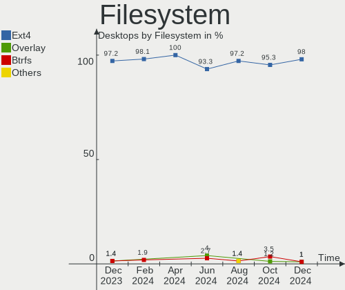
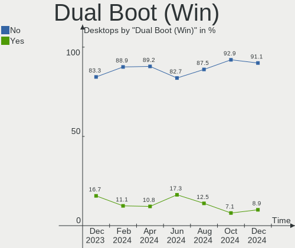
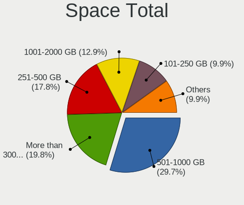
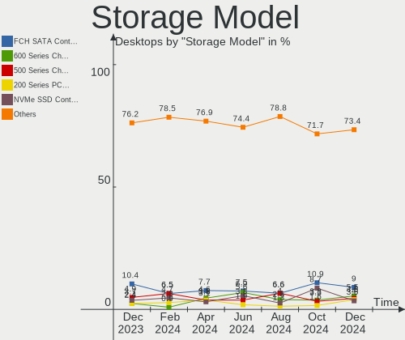
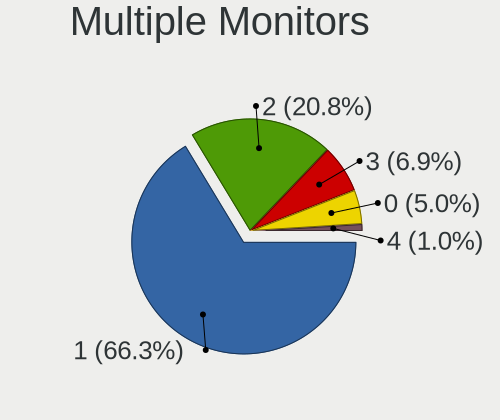
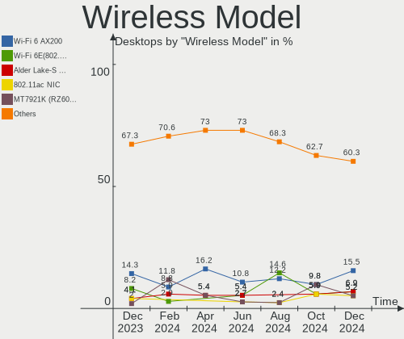

Pop!_OS Hardware Trends (Desktops)
----------------------------------

A project to identify most popular hardware characteristics and track their change
over time based on data collected by Pop!_OS users at https://Linux-Hardware.org.

Anyone can contribute to this report by the [hw-probe](https://github.com/linuxhw/hw-probe) tool:

    sudo -E hw-probe -all -upload

Full-feature report is available here: https://linux-hardware.org/?view=trends&formfactor=desktop

Period: Oct, 2021.

Contents
--------

* [ System ](#system)
  - [ OS                       ](#os)
  - [ OS Family                ](#os-family)
  - [ Kernel                   ](#kernel)
  - [ Kernel Family            ](#kernel-family)
  - [ Kernel Major Ver.        ](#kernel-major-ver)
  - [ Arch                     ](#arch)
  - [ DE                       ](#de)
  - [ Display Server           ](#display-server)
  - [ Display Manager          ](#display-manager)
  - [ OS Lang                  ](#os-lang)
  - [ Boot Mode                ](#boot-mode)
  - [ Filesystem               ](#filesystem)
  - [ Part. scheme             ](#part-scheme)
  - [ Dual Boot with Linux/BSD ](#dual-boot-with-linuxbsd)
  - [ Dual Boot (Win)          ](#dual-boot-win)

* [ Board ](#board)
  - [ Vendor                   ](#vendor)
  - [ Model                    ](#model)
  - [ Model Family             ](#model-family)
  - [ MFG Year                 ](#mfg-year)
  - [ Form Factor              ](#form-factor)
  - [ Secure Boot              ](#secure-boot)
  - [ Coreboot                 ](#coreboot)
  - [ RAM Size                 ](#ram-size)
  - [ RAM Used                 ](#ram-used)
  - [ Total Drives             ](#total-drives)
  - [ Has CD-ROM               ](#has-cd-rom)
  - [ Has Ethernet             ](#has-ethernet)
  - [ Has WiFi                 ](#has-wifi)
  - [ Has Bluetooth            ](#has-bluetooth)

* [ Location ](#location)
  - [ Country                  ](#country)
  - [ City                     ](#city)

* [ Drives ](#drives)
  - [ Drive Vendor             ](#drive-vendor)
  - [ Drive Model              ](#drive-model)
  - [ HDD Vendor               ](#hdd-vendor)
  - [ SSD Vendor               ](#ssd-vendor)
  - [ Drive Kind               ](#drive-kind)
  - [ Drive Connector          ](#drive-connector)
  - [ Drive Size               ](#drive-size)
  - [ Space Total              ](#space-total)
  - [ Space Used               ](#space-used)
  - [ Malfunc. Drives          ](#malfunc-drives)
  - [ Malfunc. Drive Vendor    ](#malfunc-drive-vendor)
  - [ Malfunc. HDD Vendor      ](#malfunc-hdd-vendor)
  - [ Malfunc. Drive Kind      ](#malfunc-drive-kind)
  - [ Failed Drives            ](#failed-drives)
  - [ Failed Drive Vendor      ](#failed-drive-vendor)
  - [ Drive Status             ](#drive-status)

* [ Storage controller ](#storage-controller)
  - [ Storage Vendor           ](#storage-vendor)
  - [ Storage Model            ](#storage-model)
  - [ Storage Kind             ](#storage-kind)

* [ Processor ](#processor)
  - [ CPU Vendor               ](#cpu-vendor)
  - [ CPU Model                ](#cpu-model)
  - [ CPU Model Family         ](#cpu-model-family)
  - [ CPU Cores                ](#cpu-cores)
  - [ CPU Sockets              ](#cpu-sockets)
  - [ CPU Threads              ](#cpu-threads)
  - [ CPU Op-Modes             ](#cpu-op-modes)
  - [ CPU Microcode            ](#cpu-microcode)
  - [ CPU Microarch            ](#cpu-microarch)

* [ Graphics ](#graphics)
  - [ GPU Vendor               ](#gpu-vendor)
  - [ GPU Model                ](#gpu-model)
  - [ GPU Combo                ](#gpu-combo)
  - [ GPU Driver               ](#gpu-driver)
  - [ GPU Memory               ](#gpu-memory)

* [ Monitor ](#monitor)
  - [ Monitor Vendor           ](#monitor-vendor)
  - [ Monitor Model            ](#monitor-model)
  - [ Monitor Resolution       ](#monitor-resolution)
  - [ Monitor Diagonal         ](#monitor-diagonal)
  - [ Monitor Width            ](#monitor-width)
  - [ Aspect Ratio             ](#aspect-ratio)
  - [ Monitor Area             ](#monitor-area)
  - [ Pixel Density            ](#pixel-density)
  - [ Multiple Monitors        ](#multiple-monitors)

* [ Network ](#network)
  - [ Net Controller Vendor    ](#net-controller-vendor)
  - [ Net Controller Model     ](#net-controller-model)
  - [ Wireless Vendor          ](#wireless-vendor)
  - [ Wireless Model           ](#wireless-model)
  - [ Ethernet Vendor          ](#ethernet-vendor)
  - [ Ethernet Model           ](#ethernet-model)
  - [ Net Controller Kind      ](#net-controller-kind)
  - [ Used Controller          ](#used-controller)
  - [ NICs                     ](#nics)
  - [ IPv6                     ](#ipv6)

* [ Bluetooth ](#bluetooth)
  - [ Bluetooth Vendor         ](#bluetooth-vendor)
  - [ Bluetooth Model          ](#bluetooth-model)

* [ Sound ](#sound)
  - [ Sound Vendor             ](#sound-vendor)
  - [ Sound Model              ](#sound-model)

* [ Memory ](#memory)
  - [ Memory Vendor            ](#memory-vendor)
  - [ Memory Model             ](#memory-model)
  - [ Memory Kind              ](#memory-kind)
  - [ Memory Form Factor       ](#memory-form-factor)
  - [ Memory Size              ](#memory-size)
  - [ Memory Speed             ](#memory-speed)

* [ Printers & scanners ](#printers--scanners)
  - [ Printer Vendor           ](#printer-vendor)
  - [ Printer Model            ](#printer-model)
  - [ Scanner Vendor           ](#scanner-vendor)
  - [ Scanner Model            ](#scanner-model)

* [ Camera ](#camera)
  - [ Camera Vendor            ](#camera-vendor)
  - [ Camera Model             ](#camera-model)

* [ Security ](#security)
  - [ Fingerprint Vendor       ](#fingerprint-vendor)
  - [ Fingerprint Model        ](#fingerprint-model)
  - [ Chipcard Vendor          ](#chipcard-vendor)
  - [ Chipcard Model           ](#chipcard-model)

* [ Unsupported ](#unsupported)
  - [ Unsupported Devices      ](#unsupported-devices)
  - [ Unsupported Device Types ](#unsupported-device-types)

System
------

OS
--

Installed operating systems

| Name          | Desktops | Percent |
|---------------|----------|---------|
| Pop!_OS 21.04 | 143      | 89.38%  |
| Pop!_OS 20.04 | 15       | 9.38%   |
| Pop!_OS 20.10 | 2        | 1.25%   |

OS Family
---------

OS without a version

| Name    | Desktops | Percent |
|---------|----------|---------|
| Pop!_OS | 160      | 100%    |

Kernel
------

Version of the Linux kernel

| Version             | Desktops | Percent |
|---------------------|----------|---------|
| 5.13.0-7614-generic | 143      | 89.38%  |
| 5.13.0-7620-generic | 6        | 3.75%   |
| 5.11.0-7620-generic | 6        | 3.75%   |
| 5.4.0-7642-generic  | 1        | 0.63%   |
| 5.14.9-xanmod2      | 1        | 0.63%   |
| 5.13.8-xanmod1      | 1        | 0.63%   |
| 5.11.0-7633-generic | 1        | 0.63%   |
| 5.11.0-7612-generic | 1        | 0.63%   |

Kernel Family
-------------

Linux kernel without a distro release

| Version | Desktops | Percent |
|---------|----------|---------|
| 5.13.0  | 149      | 93.13%  |
| 5.11.0  | 8        | 5%      |
| 5.4.0   | 1        | 0.63%   |
| 5.14.9  | 1        | 0.63%   |
| 5.13.8  | 1        | 0.63%   |

Kernel Major Ver.
-----------------

Linux kernel major version

| Version | Desktops | Percent |
|---------|----------|---------|
| 5.13    | 150      | 93.75%  |
| 5.11    | 8        | 5%      |
| 5.4     | 1        | 0.63%   |
| 5.14    | 1        | 0.63%   |

Arch
----

OS architecture (x86_64, i586, etc.)

| Name   | Desktops | Percent |
|--------|----------|---------|
| x86_64 | 160      | 100%    |

DE
--

Desktop Environment

| Name  | Desktops | Percent |
|-------|----------|---------|
| GNOME | 159      | 99.38%  |
| KDE5  | 1        | 0.63%   |

Display Server
--------------

X11 or Wayland

| Name    | Desktops | Percent |
|---------|----------|---------|
| X11     | 158      | 98.75%  |
| Wayland | 2        | 1.25%   |

Display Manager
---------------

SDDM, LightDM, etc.

| Name    | Desktops | Percent |
|---------|----------|---------|
| Unknown | 144      | 90%     |
| GDM     | 16       | 10%     |

OS Lang
-------

Language

| Lang  | Desktops | Percent |
|-------|----------|---------|
| en_US | 88       | 55%     |
| en_GB | 14       | 8.75%   |
| en_AU | 10       | 6.25%   |
| pt_BR | 9        | 5.63%   |
| C     | 7        | 4.38%   |
| fr_FR | 4        | 2.5%    |
| en_CA | 4        | 2.5%    |
| de_DE | 4        | 2.5%    |
| sv_SE | 2        | 1.25%   |
| ru_RU | 2        | 1.25%   |
| pl_PL | 2        | 1.25%   |
| fr_CA | 2        | 1.25%   |
| es_MX | 2        | 1.25%   |
| en_NZ | 2        | 1.25%   |
| nl_NL | 1        | 0.63%   |
| ja_JP | 1        | 0.63%   |
| it_IT | 1        | 0.63%   |
| fr_CH | 1        | 0.63%   |
| es_ES | 1        | 0.63%   |
| es_CO | 1        | 0.63%   |
| en_ZA | 1        | 0.63%   |
| en_IN | 1        | 0.63%   |

Boot Mode
---------

EFI or BIOS

| Mode | Desktops | Percent |
|------|----------|---------|
| BIOS | 146      | 91.25%  |
| EFI  | 14       | 8.75%   |

Filesystem
----------

Type of filesystem

| Type    | Desktops | Percent |
|---------|----------|---------|
| Ext4    | 152      | 95%     |
| Overlay | 5        | 3.13%   |
| Btrfs   | 2        | 1.25%   |
| Zfs     | 1        | 0.63%   |

Part. scheme
------------

Scheme of partitioning

| Type    | Desktops | Percent |
|---------|----------|---------|
| Unknown | 144      | 90%     |
| GPT     | 14       | 8.75%   |
| MBR     | 2        | 1.25%   |

Dual Boot with Linux/BSD
------------------------

Hosting more than one Linux/BSD

| Dual boot | Desktops | Percent |
|-----------|----------|---------|
| No        | 157      | 98.13%  |
| Yes       | 3        | 1.88%   |

Dual Boot (Win)
---------------

Hosting Linux and Windows

| Dual boot | Desktops | Percent |
|-----------|----------|---------|
| No        | 152      | 95%     |
| Yes       | 8        | 5%      |

Board
-----

Vendor
------

Motherboard manufacturer

| Name                | Desktops | Percent |
|---------------------|----------|---------|
| ASUSTek Computer    | 43       | 26.88%  |
| Gigabyte Technology | 33       | 20.63%  |
| MSI                 | 23       | 14.38%  |
| ASRock              | 15       | 9.38%   |
| Dell                | 13       | 8.13%   |
| Hewlett-Packard     | 8        | 5%      |
| Intel               | 4        | 2.5%    |
| Acer                | 3        | 1.88%   |
| Supermicro          | 2        | 1.25%   |
| Pegatron            | 2        | 1.25%   |
| Lenovo              | 2        | 1.25%   |
| Huanan              | 2        | 1.25%   |
| Wistron             | 1        | 0.63%   |
| Packard Bell        | 1        | 0.63%   |
| OEM                 | 1        | 0.63%   |
| Gateway             | 1        | 0.63%   |
| Fujitsu             | 1        | 0.63%   |
| Foxconn             | 1        | 0.63%   |
| ECS                 | 1        | 0.63%   |
| Apple               | 1        | 0.63%   |
| 16216-BM-27268      | 1        | 0.63%   |
| Unknown             | 1        | 0.63%   |

Model
-----

Motherboard model

| Name                                   | Desktops | Percent |
|----------------------------------------|----------|---------|
| MSI MS-7B86                            | 4        | 2.5%    |
| Gigabyte B450M DS3H                    | 4        | 2.5%    |
| Dell OptiPlex 9020                     | 3        | 1.88%   |
| ASUS Z170-A                            | 3        | 1.88%   |
| MSI MS-7C37                            | 2        | 1.25%   |
| HP ProDesk 600 G1 SFF                  | 2        | 1.25%   |
| Gigabyte X570 UD                       | 2        | 1.25%   |
| Gigabyte X570 AORUS MASTER             | 2        | 1.25%   |
| Gigabyte B150M-D3H                     | 2        | 1.25%   |
| Dell OptiPlex 7010                     | 2        | 1.25%   |
| ASUS ROG STRIX B450-F GAMING II        | 2        | 1.25%   |
| ASUS PRIME H510M-K                     | 2        | 1.25%   |
| ASUS PRIME B450-PLUS                   | 2        | 1.25%   |
| ASUS P8Z77-V LK                        | 2        | 1.25%   |
| ASRock B550M Steel Legend              | 2        | 1.25%   |
| ASRock B450 Gaming K4                  | 2        | 1.25%   |
| Wistron ProLiant ML110 G6              | 1        | 0.63%   |
| Supermicro X9DR3-F                     | 1        | 0.63%   |
| Supermicro SSG-6047R-E1R24N            | 1        | 0.63%   |
| Pegatron p7-1110                       | 1        | 0.63%   |
| Pegatron AY691AA-ABA p6367c            | 1        | 0.63%   |
| Packard Bell IXTREME M5850             | 1        | 0.63%   |
| OEM Intel H81                          | 1        | 0.63%   |
| MSI MS-7C96                            | 1        | 0.63%   |
| MSI MS-7C92                            | 1        | 0.63%   |
| MSI MS-7C91                            | 1        | 0.63%   |
| MSI MS-7C84                            | 1        | 0.63%   |
| MSI MS-7C83                            | 1        | 0.63%   |
| MSI MS-7C80                            | 1        | 0.63%   |
| MSI MS-7C75                            | 1        | 0.63%   |
| MSI MS-7C67                            | 1        | 0.63%   |
| MSI MS-7C35                            | 1        | 0.63%   |
| MSI MS-7C06                            | 1        | 0.63%   |
| MSI MS-7C02                            | 1        | 0.63%   |
| MSI MS-7B84                            | 1        | 0.63%   |
| MSI MS-7B79                            | 1        | 0.63%   |
| MSI MS-7A40                            | 1        | 0.63%   |
| MSI MS-7A34                            | 1        | 0.63%   |
| MSI MS-7970                            | 1        | 0.63%   |
| MSI MS-7817                            | 1        | 0.63%   |
| Lenovo ThinkCentre M82 27562P5         | 1        | 0.63%   |
| Lenovo ThinkCentre M81 5049P14         | 1        | 0.63%   |
| Intel X99                              | 1        | 0.63%   |
| Intel X64                              | 1        | 0.63%   |
| Intel H61                              | 1        | 0.63%   |
| Intel DH61SA AAG38870-300              | 1        | 0.63%   |
| Huanan X79 V2.47                       | 1        | 0.63%   |
| Huanan X79                             | 1        | 0.63%   |
| HP Z420 Workstation                    | 1        | 0.63%   |
| HP Pavilion Power Desktop PC           | 1        | 0.63%   |
| HP Pavilion Desktop PC 570-p0xx        | 1        | 0.63%   |
| HP MP4, Model 4200                     | 1        | 0.63%   |
| HP Compaq dc7800 Convertible Minitower | 1        | 0.63%   |
| HP Compaq 6200 Pro SFF PC              | 1        | 0.63%   |
| Gigabyte Z87X-D3H                      | 1        | 0.63%   |
| Gigabyte Z77X-UP4 TH                   | 1        | 0.63%   |
| Gigabyte Z77X-UD5H                     | 1        | 0.63%   |
| Gigabyte Z390 AORUS XTREME             | 1        | 0.63%   |
| Gigabyte Z390 AORUS PRO                | 1        | 0.63%   |
| Gigabyte Z370 AORUS Gaming 5           | 1        | 0.63%   |

Model Family
------------

Motherboard model prefix

| Name                        | Desktops | Percent |
|-----------------------------|----------|---------|
| ASUS PRIME                  | 12       | 7.5%    |
| Dell OptiPlex               | 9        | 5.63%   |
| ASUS ROG                    | 9        | 5.63%   |
| Gigabyte X570               | 5        | 3.13%   |
| MSI MS-7B86                 | 4        | 2.5%    |
| Gigabyte B450M              | 4        | 2.5%    |
| ASUS P8Z77-V                | 4        | 2.5%    |
| ASUS Z170-A                 | 3        | 1.88%   |
| MSI MS-7C37                 | 2        | 1.25%   |
| Lenovo ThinkCentre          | 2        | 1.25%   |
| Huanan X79                  | 2        | 1.25%   |
| HP ProDesk                  | 2        | 1.25%   |
| HP Pavilion                 | 2        | 1.25%   |
| HP Compaq                   | 2        | 1.25%   |
| Gigabyte Z390               | 2        | 1.25%   |
| Gigabyte B450               | 2        | 1.25%   |
| Gigabyte B150M-D3H          | 2        | 1.25%   |
| Dell Vostro                 | 2        | 1.25%   |
| ASUS TUF                    | 2        | 1.25%   |
| ASUS M5A97                  | 2        | 1.25%   |
| ASRock X570                 | 2        | 1.25%   |
| ASRock B550M                | 2        | 1.25%   |
| ASRock B450                 | 2        | 1.25%   |
| Wistron ProLiant            | 1        | 0.63%   |
| Supermicro X9DR3-F          | 1        | 0.63%   |
| Supermicro SSG-6047R-E1R24N | 1        | 0.63%   |
| Pegatron p7-1110            | 1        | 0.63%   |
| Pegatron AY691AA-ABA        | 1        | 0.63%   |
| Packard Bell IXTREME        | 1        | 0.63%   |
| OEM Intel                   | 1        | 0.63%   |
| MSI MS-7C96                 | 1        | 0.63%   |
| MSI MS-7C92                 | 1        | 0.63%   |
| MSI MS-7C91                 | 1        | 0.63%   |
| MSI MS-7C84                 | 1        | 0.63%   |
| MSI MS-7C83                 | 1        | 0.63%   |
| MSI MS-7C80                 | 1        | 0.63%   |
| MSI MS-7C75                 | 1        | 0.63%   |
| MSI MS-7C67                 | 1        | 0.63%   |
| MSI MS-7C35                 | 1        | 0.63%   |
| MSI MS-7C06                 | 1        | 0.63%   |
| MSI MS-7C02                 | 1        | 0.63%   |
| MSI MS-7B84                 | 1        | 0.63%   |
| MSI MS-7B79                 | 1        | 0.63%   |
| MSI MS-7A40                 | 1        | 0.63%   |
| MSI MS-7A34                 | 1        | 0.63%   |
| MSI MS-7970                 | 1        | 0.63%   |
| MSI MS-7817                 | 1        | 0.63%   |
| Intel X99                   | 1        | 0.63%   |
| Intel X64                   | 1        | 0.63%   |
| Intel H61                   | 1        | 0.63%   |
| Intel DH61SA                | 1        | 0.63%   |
| HP Z420                     | 1        | 0.63%   |
| HP MP4                      | 1        | 0.63%   |
| Gigabyte Z87X-D3H           | 1        | 0.63%   |
| Gigabyte Z77X-UP4           | 1        | 0.63%   |
| Gigabyte Z77X-UD5H          | 1        | 0.63%   |
| Gigabyte Z370               | 1        | 0.63%   |
| Gigabyte Z270N-WIFI         | 1        | 0.63%   |
| Gigabyte Z170N-WIFI-CF      | 1        | 0.63%   |
| Gigabyte X48-DS5            | 1        | 0.63%   |

MFG Year
--------

Motherboard manufacture year

| Year | Desktops | Percent |
|------|----------|---------|
| 2021 | 33       | 20.63%  |
| 2020 | 33       | 20.63%  |
| 2018 | 21       | 13.13%  |
| 2019 | 12       | 7.5%    |
| 2017 | 10       | 6.25%   |
| 2012 | 9        | 5.63%   |
| 2013 | 7        | 4.38%   |
| 2011 | 7        | 4.38%   |
| 2014 | 6        | 3.75%   |
| 2015 | 5        | 3.13%   |
| 2016 | 4        | 2.5%    |
| 2010 | 4        | 2.5%    |
| 2009 | 3        | 1.88%   |
| 2008 | 3        | 1.88%   |
| 2007 | 3        | 1.88%   |

Form Factor
-----------

Physical design of the computer

| Name    | Desktops | Percent |
|---------|----------|---------|
| Desktop | 160      | 100%    |

Secure Boot
-----------

Enabled or disabled

| State    | Desktops | Percent |
|----------|----------|---------|
| Disabled | 160      | 100%    |

Coreboot
--------

Have coreboot on board

| Used | Desktops | Percent |
|------|----------|---------|
| No   | 160      | 100%    |

RAM Size
--------

Total RAM memory

| Size in GB  | Desktops | Percent |
|-------------|----------|---------|
| 16.01-24.0  | 52       | 32.5%   |
| 32.01-64.0  | 40       | 25%     |
| 8.01-16.0   | 34       | 21.25%  |
| 4.01-8.0    | 12       | 7.5%    |
| 64.01-256.0 | 11       | 6.88%   |
| 3.01-4.0    | 5        | 3.13%   |
| 24.01-32.0  | 4        | 2.5%    |
| 1.01-2.0    | 2        | 1.25%   |

RAM Used
--------

Used RAM memory

| Used GB    | Desktops | Percent |
|------------|----------|---------|
| 1.01-2.0   | 51       | 31.88%  |
| 2.01-3.0   | 48       | 30%     |
| 4.01-8.0   | 35       | 21.88%  |
| 3.01-4.0   | 20       | 12.5%   |
| 8.01-16.0  | 3        | 1.88%   |
| 32.01-64.0 | 1        | 0.63%   |
| 16.01-24.0 | 1        | 0.63%   |
| 0.51-1.0   | 1        | 0.63%   |

Total Drives
------------

Number of drives on board

| Drives | Desktops | Percent |
|--------|----------|---------|
| 1      | 60       | 37.5%   |
| 2      | 39       | 24.38%  |
| 3      | 28       | 17.5%   |
| 4      | 18       | 11.25%  |
| 5      | 11       | 6.88%   |
| 6      | 3        | 1.88%   |
| 0      | 1        | 0.63%   |

Has CD-ROM
----------

Has CD-ROM on board

| Presented | Desktops | Percent |
|-----------|----------|---------|
| No        | 106      | 66.25%  |
| Yes       | 54       | 33.75%  |

Has Ethernet
------------

Has Ethernet on board

| Presented | Desktops | Percent |
|-----------|----------|---------|
| Yes       | 158      | 98.75%  |
| No        | 2        | 1.25%   |

Has WiFi
--------

Has WiFi module

| Presented | Desktops | Percent |
|-----------|----------|---------|
| Yes       | 82       | 51.25%  |
| No        | 78       | 48.75%  |

Has Bluetooth
-------------

Has Bluetooth module

| Presented | Desktops | Percent |
|-----------|----------|---------|
| No        | 96       | 60%     |
| Yes       | 64       | 40%     |

Location
--------

Country
-------

Geographic location (country)

| Country        | Desktops | Percent |
|----------------|----------|---------|
| USA            | 57       | 35.63%  |
| Brazil         | 12       | 7.5%    |
| UK             | 11       | 6.88%   |
| Germany        | 8        | 5%      |
| Canada         | 8        | 5%      |
| Australia      | 8        | 5%      |
| France         | 5        | 3.13%   |
| Sweden         | 4        | 2.5%    |
| South Africa   | 4        | 2.5%    |
| Poland         | 4        | 2.5%    |
| Switzerland    | 3        | 1.88%   |
| Portugal       | 3        | 1.88%   |
| New Zealand    | 3        | 1.88%   |
| Netherlands    | 3        | 1.88%   |
| Mexico         | 3        | 1.88%   |
| India          | 3        | 1.88%   |
| Russia         | 2        | 1.25%   |
| Italy          | 2        | 1.25%   |
| Spain          | 1        | 0.63%   |
| Saudi Arabia   | 1        | 0.63%   |
| Philippines    | 1        | 0.63%   |
| Norway         | 1        | 0.63%   |
| Japan          | 1        | 0.63%   |
| Indonesia      | 1        | 0.63%   |
| Finland        | 1        | 0.63%   |
| Estonia        | 1        | 0.63%   |
| Ecuador        | 1        | 0.63%   |
| Denmark        | 1        | 0.63%   |
| Czechia        | 1        | 0.63%   |
| Czech Republic | 1        | 0.63%   |
| Colombia       | 1        | 0.63%   |
| Bulgaria       | 1        | 0.63%   |
| Belgium        | 1        | 0.63%   |
| Bangladesh     | 1        | 0.63%   |
| Argentina      | 1        | 0.63%   |

City
----

Geographic location (city)

| City                  | Desktops | Percent |
|-----------------------|----------|---------|
| Seattle               | 3        | 1.88%   |
| Amsterdam             | 3        | 1.88%   |
| Valenza               | 2        | 1.25%   |
| Urbana                | 2        | 1.25%   |
| Tuscaloosa            | 2        | 1.25%   |
| Rio de Janeiro        | 2        | 1.25%   |
| Montreal              | 2        | 1.25%   |
| Malmo                 | 2        | 1.25%   |
| Huntington Beach      | 2        | 1.25%   |
| Denver                | 2        | 1.25%   |
| Dallas                | 2        | 1.25%   |
| Browning              | 2        | 1.25%   |
| Auckland              | 2        | 1.25%   |
| Adelaide CBD          | 2        | 1.25%   |
| Zurich                | 1        | 0.63%   |
| Yekaterinburg         | 1        | 0.63%   |
| Witten                | 1        | 0.63%   |
| Wisbech               | 1        | 0.63%   |
| Westwood              | 1        | 0.63%   |
| Wemmel                | 1        | 0.63%   |
| Wausau                | 1        | 0.63%   |
| Waterford             | 1        | 0.63%   |
| Warsaw                | 1        | 0.63%   |
| Votice                | 1        | 0.63%   |
| Villeurbanne          | 1        | 0.63%   |
| Vernon Hills          | 1        | 0.63%   |
| Varzea Paulista       | 1        | 0.63%   |
| Vadodara              | 1        | 0.63%   |
| Turin                 | 1        | 0.63%   |
| Tsukuba               | 1        | 0.63%   |
| Trondheim             | 1        | 0.63%   |
| Toronto               | 1        | 0.63%   |
| Tomball               | 1        | 0.63%   |
| Thunder Bay           | 1        | 0.63%   |
| Thionville            | 1        | 0.63%   |
| Temple                | 1        | 0.63%   |
| Teisendorf            | 1        | 0.63%   |
| T??bingen             | 1        | 0.63%   |
| Tallinn               | 1        | 0.63%   |
| Talairan              | 1        | 0.63%   |
| Sydney                | 1        | 0.63%   |
| Sundsvall             | 1        | 0.63%   |
| Stud?©nka             | 1        | 0.63%   |
| Staffanstorp          | 1        | 0.63%   |
| Sofia                 | 1        | 0.63%   |
| S??o Paulo            | 1        | 0.63%   |
| S??o Jos?© dos Campos | 1        | 0.63%   |
| Sao Luiz Gonzaga      | 1        | 0.63%   |
| San Fernando City     | 1        | 0.63%   |
| Salinas               | 1        | 0.63%   |
| Saint-Georges         | 1        | 0.63%   |
| Rogers                | 1        | 0.63%   |
| Risskov               | 1        | 0.63%   |
| Reno                  | 1        | 0.63%   |
| Rajshahi              | 1        | 0.63%   |
| Powers                | 1        | 0.63%   |
| Portsmouth            | 1        | 0.63%   |
| Pompey                | 1        | 0.63%   |
| Perth                 | 1        | 0.63%   |
| Palmerston North      | 1        | 0.63%   |

Drives
------

Drive Vendor
------------

Hard drive vendors

| Vendor                       | Desktops | Drives | Percent |
|------------------------------|----------|--------|---------|
| Seagate                      | 60       | 77     | 19.54%  |
| WDC                          | 47       | 57     | 15.31%  |
| Samsung Electronics          | 46       | 70     | 14.98%  |
| Kingston                     | 26       | 31     | 8.47%   |
| Sandisk                      | 19       | 19     | 6.19%   |
| Toshiba                      | 16       | 16     | 5.21%   |
| Crucial                      | 13       | 13     | 4.23%   |
| Intel                        | 12       | 12     | 3.91%   |
| Phison                       | 10       | 12     | 3.26%   |
| Hitachi                      | 7        | 7      | 2.28%   |
| Silicon Motion               | 6        | 6      | 1.95%   |
| Unknown                      | 5        | 5      | 1.63%   |
| China                        | 4        | 7      | 1.3%    |
| XPG                          | 3        | 6      | 0.98%   |
| PNY                          | 3        | 3      | 0.98%   |
| OCZ                          | 3        | 3      | 0.98%   |
| Team                         | 2        | 2      | 0.65%   |
| Realtek Semiconductor        | 2        | 2      | 0.65%   |
| Micron/Crucial Technology    | 2        | 2      | 0.65%   |
| Micron Technology            | 2        | 3      | 0.65%   |
| Hewlett-Packard              | 2        | 2      | 0.65%   |
| GOODRAM                      | 2        | 2      | 0.65%   |
| A-DATA Technology            | 2        | 2      | 0.65%   |
| SK Hynix                     | 1        | 1      | 0.33%   |
| MidasForce                   | 1        | 1      | 0.33%   |
| MAXTOR                       | 1        | 1      | 0.33%   |
| LITEONIT                     | 1        | 1      | 0.33%   |
| LITEON                       | 1        | 1      | 0.33%   |
| KingSpec                     | 1        | 1      | 0.33%   |
| JMicron                      | 1        | 1      | 0.33%   |
| HPT                          | 1        | 3      | 0.33%   |
| HGST                         | 1        | 2      | 0.33%   |
| ExcelStor                    | 1        | 1      | 0.33%   |
| Corsair                      | 1        | 1      | 0.33%   |
| Beijing Starblaze Technology | 1        | 1      | 0.33%   |
| ASMT109x                     | 1        | 1      | 0.33%   |

Drive Model
-----------

Hard drive models

| Model                                  | Desktops | Percent |
|----------------------------------------|----------|---------|
| Kingston SA400S37240G 240GB SSD        | 9        | 2.54%   |
| Samsung NVMe SSD Drive 500GB           | 7        | 1.98%   |
| Seagate ST500DM002-1BD142 500GB        | 6        | 1.69%   |
| Seagate ST3500418AS 500GB              | 5        | 1.41%   |
| Seagate ST2000DM008-2FR102 2TB         | 5        | 1.41%   |
| Seagate ST1000DM010-2EP102 1TB         | 5        | 1.41%   |
| Samsung SSD 860 EVO 500GB              | 5        | 1.41%   |
| Samsung SSD 850 EVO 500GB              | 5        | 1.41%   |
| Samsung NVMe SSD Drive 1TB             | 5        | 1.41%   |
| Toshiba DT01ACA100 1TB                 | 4        | 1.13%   |
| Sandisk NVMe SSD Drive 500GB           | 4        | 1.13%   |
| Sandisk NVMe SSD Drive 1TB             | 4        | 1.13%   |
| Samsung SM963 2.5" NVMe PCIe SSD 250GB | 4        | 1.13%   |
| Kingston SA400S37120G 120GB SSD        | 4        | 1.13%   |
| Unknown SD/MMC/MS PRO 128GB            | 3        | 0.85%   |
| Toshiba HDWD110 1TB                    | 3        | 0.85%   |
| Seagate ST3500630AS 500GB              | 3        | 0.85%   |
| Seagate ST31000528AS 1TB               | 3        | 0.85%   |
| SanDisk SDSSDA240G 240GB               | 3        | 0.85%   |
| Samsung SSD 860 QVO 2TB                | 3        | 0.85%   |
| Phison NVMe SSD Drive 1TB              | 3        | 0.85%   |
| WDC WDS100T2B0A-00SM50 1TB SSD         | 2        | 0.56%   |
| WDC WD2500AAKX-753CA1 250GB            | 2        | 0.56%   |
| WDC WD10EZEX-08WN4A0 1TB               | 2        | 0.56%   |
| Toshiba DT01ACA200 2TB                 | 2        | 0.56%   |
| Seagate ST4000VN008-2DR166 4TB         | 2        | 0.56%   |
| Seagate ST4000DM000-1F2168 4TB         | 2        | 0.56%   |
| Seagate ST3250318AS 250GB              | 2        | 0.56%   |
| Seagate ST1000LM035-1RK172 1TB         | 2        | 0.56%   |
| Seagate ST1000DM003-1CH162 1TB         | 2        | 0.56%   |
| Seagate Backup+ Hub BK 8TB             | 2        | 0.56%   |
| SanDisk SSD PLUS 240GB                 | 2        | 0.56%   |
| Samsung SSD 860 EVO 250GB              | 2        | 0.56%   |
| Samsung SSD 850 EVO 250GB              | 2        | 0.56%   |
| Samsung SSD 850 EVO 120GB              | 2        | 0.56%   |
| Samsung HD502HI 500GB                  | 2        | 0.56%   |
| Phison NVMe SSD Drive 2TB              | 2        | 0.56%   |
| Intel NVMe SSD Drive 512GB             | 2        | 0.56%   |
| Intel NVMe SSD Drive 1024GB            | 2        | 0.56%   |
| GOODRAM SSDPR-PX500-256-80 256GB       | 2        | 0.56%   |
| Crucial CT500MX500SSD4 500GB           | 2        | 0.56%   |
| Crucial CT250MX500SSD1 250GB           | 2        | 0.56%   |
| Crucial CT1000MX500SSD1 1TB            | 2        | 0.56%   |
| China SATA SSD 240GB                   | 2        | 0.56%   |
| China SATA SSD 120GB                   | 2        | 0.56%   |
| XPG NVMe SSD Drive 512GB               | 1        | 0.28%   |
| XPG NVMe SSD Drive 256GB               | 1        | 0.28%   |
| XPG NVMe SSD Drive 1024GB              | 1        | 0.28%   |
| XPG GAMMIX S11 Pro 1TB                 | 1        | 0.28%   |
| WDC WDS500G2X0C-00L350 500GB           | 1        | 0.28%   |
| WDC WDS500G2B0A-00SM50 500GB SSD       | 1        | 0.28%   |
| WDC WDS250G2B0C-00PXH0 250GB           | 1        | 0.28%   |
| WDC WDS240G2G0B-00EPW0 240GB SSD       | 1        | 0.28%   |
| WDC WDS100T2G0A-00JH30 1TB SSD         | 1        | 0.28%   |
| WDC WD8001FZBX-00ASYA0 8TB             | 1        | 0.28%   |
| WDC WD6401AALS-00L3B2 640GB            | 1        | 0.28%   |
| WDC WD6401AALS-00J7B1 640GB            | 1        | 0.28%   |
| WDC WD5000AVDS-63U7B1 500GB            | 1        | 0.28%   |
| WDC WD5000AAKX-75U6AA0 500GB           | 1        | 0.28%   |
| WDC WD5000AAKX-08U6AA0 500GB           | 1        | 0.28%   |

HDD Vendor
----------

Hard disk drive vendors

| Vendor              | Desktops | Drives | Percent |
|---------------------|----------|--------|---------|
| Seagate             | 59       | 75     | 43.38%  |
| WDC                 | 42       | 50     | 30.88%  |
| Toshiba             | 14       | 14     | 10.29%  |
| Hitachi             | 7        | 7      | 5.15%   |
| Samsung Electronics | 6        | 6      | 4.41%   |
| Unknown             | 3        | 3      | 2.21%   |
| MAXTOR              | 1        | 1      | 0.74%   |
| HGST                | 1        | 2      | 0.74%   |
| Hewlett-Packard     | 1        | 1      | 0.74%   |
| ExcelStor           | 1        | 1      | 0.74%   |
| ASMT109x            | 1        | 1      | 0.74%   |

SSD Vendor
----------

Solid state drive vendors

| Vendor              | Desktops | Drives | Percent |
|---------------------|----------|--------|---------|
| Samsung Electronics | 33       | 43     | 29.46%  |
| Kingston            | 23       | 27     | 20.54%  |
| Crucial             | 12       | 12     | 10.71%  |
| SanDisk             | 10       | 10     | 8.93%   |
| Intel               | 6        | 6      | 5.36%   |
| WDC                 | 5        | 5      | 4.46%   |
| China               | 4        | 7      | 3.57%   |
| PNY                 | 3        | 3      | 2.68%   |
| OCZ                 | 3        | 3      | 2.68%   |
| Team                | 2        | 2      | 1.79%   |
| Micron Technology   | 2        | 3      | 1.79%   |
| Unknown             | 1        | 1      | 0.89%   |
| Toshiba             | 1        | 1      | 0.89%   |
| SK Hynix            | 1        | 1      | 0.89%   |
| MidasForce          | 1        | 1      | 0.89%   |
| LITEONIT            | 1        | 1      | 0.89%   |
| LITEON              | 1        | 1      | 0.89%   |
| KingSpec            | 1        | 1      | 0.89%   |
| Hewlett-Packard     | 1        | 1      | 0.89%   |
| A-DATA Technology   | 1        | 1      | 0.89%   |

Drive Kind
----------

HDD or SSD

| Kind    | Desktops | Drives | Percent |
|---------|----------|--------|---------|
| HDD     | 101      | 161    | 38.4%   |
| SSD     | 96       | 130    | 36.5%   |
| NVMe    | 62       | 77     | 23.57%  |
| Unknown | 4        | 7      | 1.52%   |

Drive Connector
---------------

SATA, SAS, NVMe, etc.

| Type | Desktops | Drives | Percent |
|------|----------|--------|---------|
| SATA | 139      | 282    | 66.19%  |
| NVMe | 62       | 77     | 29.52%  |
| SAS  | 9        | 16     | 4.29%   |

Drive Size
----------

Size of hard drive

| Size in TB | Desktops | Drives | Percent |
|------------|----------|--------|---------|
| 0.01-0.5   | 110      | 159    | 51.4%   |
| 0.51-1.0   | 55       | 67     | 25.7%   |
| 1.01-2.0   | 23       | 31     | 10.75%  |
| 3.01-4.0   | 12       | 17     | 5.61%   |
| 2.01-3.0   | 11       | 14     | 5.14%   |
| 4.01-10.0  | 3        | 3      | 1.4%    |

Space Total
-----------

Amount of disk space available on the file system

| Size in GB     | Desktops | Percent |
|----------------|----------|---------|
| 101-250        | 38       | 23.75%  |
| 251-500        | 33       | 20.63%  |
| 501-1000       | 31       | 19.38%  |
| More than 3000 | 21       | 13.13%  |
| 1001-2000      | 14       | 8.75%   |
| 2001-3000      | 9        | 5.63%   |
| 1-20           | 6        | 3.75%   |
| 51-100         | 5        | 3.13%   |
| Unknown        | 3        | 1.88%   |

Space Used
----------

Amount of used disk space

| Used GB        | Desktops | Percent |
|----------------|----------|---------|
| 1-20           | 53       | 33.13%  |
| 21-50          | 22       | 13.75%  |
| 101-250        | 22       | 13.75%  |
| 51-100         | 18       | 11.25%  |
| 501-1000       | 15       | 9.38%   |
| 1001-2000      | 10       | 6.25%   |
| 251-500        | 8        | 5%      |
| More than 3000 | 5        | 3.13%   |
| 2001-3000      | 4        | 2.5%    |
| Unknown        | 3        | 1.88%   |

Malfunc. Drives
---------------

Drive models with a malfunction

| Model                           | Desktops | Drives | Percent |
|---------------------------------|----------|--------|---------|
| Seagate ST500DM002-1BD142 500GB | 1        | 1      | 50%     |
| Seagate ST1000DM010-2EP102 1TB  | 1        | 1      | 50%     |

Malfunc. Drive Vendor
---------------------

Vendors of faulty drives

| Vendor  | Desktops | Drives | Percent |
|---------|----------|--------|---------|
| Seagate | 2        | 2      | 100%    |

Malfunc. HDD Vendor
-------------------

Vendors of faulty HDD drives

| Vendor  | Desktops | Drives | Percent |
|---------|----------|--------|---------|
| Seagate | 2        | 2      | 100%    |

Malfunc. Drive Kind
-------------------

Kinds of faulty drives

| Kind | Desktops | Drives | Percent |
|------|----------|--------|---------|
| HDD  | 2        | 2      | 100%    |

Failed Drives
-------------

Failed drive models

Zero info for selected period =(

Failed Drive Vendor
-------------------

Failed drive vendors

Zero info for selected period =(

Drive Status
------------

Number of failed and malfunc. drives

| Status   | Desktops | Drives | Percent |
|----------|----------|--------|---------|
| Detected | 147      | 341    | 88.55%  |
| Works    | 17       | 32     | 10.24%  |
| Malfunc  | 2        | 2      | 1.2%    |

Storage controller
------------------

Storage Vendor
--------------

Storage controller vendors

| Vendor                       | Desktops | Percent |
|------------------------------|----------|---------|
| Intel                        | 95       | 39.09%  |
| AMD                          | 67       | 27.57%  |
| Samsung Electronics          | 17       | 7%      |
| ASMedia Technology           | 12       | 4.94%   |
| Phison Electronics           | 11       | 4.53%   |
| Sandisk                      | 9        | 3.7%    |
| Silicon Motion               | 6        | 2.47%   |
| Kingston Technology Company  | 4        | 1.65%   |
| ADATA Technology             | 4        | 1.65%   |
| Micron/Crucial Technology    | 3        | 1.23%   |
| Silicon Image                | 2        | 0.82%   |
| Shenzhen Longsys Electronics | 2        | 0.82%   |
| Realtek Semiconductor        | 2        | 0.82%   |
| Nvidia                       | 2        | 0.82%   |
| Marvell Technology Group     | 2        | 0.82%   |
| JMicron Technology           | 2        | 0.82%   |
| Toshiba America Info Systems | 1        | 0.41%   |
| HighPoint Technologies       | 1        | 0.41%   |
| Beijing Starblaze Technology | 1        | 0.41%   |

Storage Model
-------------

Storage controller models

| Model                                                                                   | Desktops | Percent |
|-----------------------------------------------------------------------------------------|----------|---------|
| AMD FCH SATA Controller [AHCI mode]                                                     | 46       | 15.81%  |
| AMD 400 Series Chipset SATA Controller                                                  | 26       | 8.93%   |
| Samsung NVMe SSD Controller SM981/PM981/PM983                                           | 13       | 4.47%   |
| Intel SATA Controller [RAID mode]                                                       | 12       | 4.12%   |
| Intel Q170/Q150/B150/H170/H110/Z170/CM236 Chipset SATA Controller [AHCI Mode]           | 12       | 4.12%   |
| ASMedia ASM1062 Serial ATA Controller                                                   | 12       | 4.12%   |
| AMD Starship/Matisse Chipset SATA Controller [AHCI mode]                                | 11       | 3.78%   |
| Intel 7 Series/C210 Series Chipset Family 6-port SATA Controller [AHCI mode]            | 10       | 3.44%   |
| Intel 6 Series/C200 Series Chipset Family 6 port Desktop SATA AHCI Controller           | 9        | 3.09%   |
| Intel 8 Series/C220 Series Chipset Family 6-port SATA Controller 1 [AHCI mode]          | 8        | 2.75%   |
| Intel 200 Series PCH SATA controller [AHCI mode]                                        | 6        | 2.06%   |
| Silicon Motion SM2263EN/SM2263XT SSD Controller                                         | 5        | 1.72%   |
| Intel Cannon Lake PCH SATA AHCI Controller                                              | 5        | 1.72%   |
| Intel 500 Series Chipset Family SATA AHCI Controller                                    | 5        | 1.72%   |
| AMD SB7x0/SB8x0/SB9x0 SATA Controller [AHCI mode]                                       | 5        | 1.72%   |
| Sandisk WD Blue SN550 NVMe SSD                                                          | 4        | 1.37%   |
| Phison E16 PCIe4 NVMe Controller                                                        | 4        | 1.37%   |
| Phison E12 NVMe Controller                                                              | 4        | 1.37%   |
| Intel SSD 660P Series                                                                   | 4        | 1.37%   |
| AMD 300 Series Chipset SATA Controller                                                  | 4        | 1.37%   |
| ADATA XPG SX8200 Pro PCIe Gen3x4 M.2 2280 Solid State Drive                             | 4        | 1.37%   |
| Kingston Company A2000 NVMe SSD                                                         | 3        | 1.03%   |
| Intel Comet Lake SATA AHCI Controller                                                   | 3        | 1.03%   |
| Intel C602 chipset 4-Port SATA Storage Control Unit                                     | 3        | 1.03%   |
| Intel C600/X79 series chipset 6-Port SATA AHCI Controller                               | 3        | 1.03%   |
| Intel 9 Series Chipset Family SATA Controller [AHCI Mode]                               | 3        | 1.03%   |
| Shenzhen Longsys SM2263EN/SM2263XT-based OEM SSD                                        | 2        | 0.69%   |
| Sandisk WD Black SN750 / PC SN730 NVMe SSD                                              | 2        | 0.69%   |
| Sandisk WD Black 2018/SN750 / PC SN720 NVMe SSD                                         | 2        | 0.69%   |
| Samsung NVMe SSD Controller SM961/PM961/SM963                                           | 2        | 0.69%   |
| Phison PS5013 E13 NVMe Controller                                                       | 2        | 0.69%   |
| Micron/Crucial P2 NVMe PCIe SSD                                                         | 2        | 0.69%   |
| JMicron JMB363 SATA/IDE Controller                                                      | 2        | 0.69%   |
| Intel NM10/ICH7 Family SATA Controller [IDE mode]                                       | 2        | 0.69%   |
| Intel C600/X79 series chipset SATA RAID Controller                                      | 2        | 0.69%   |
| Intel 82801G (ICH7 Family) IDE Controller                                               | 2        | 0.69%   |
| Intel 6 Series/C200 Series Chipset Family Desktop SATA Controller (IDE mode, ports 4-5) | 2        | 0.69%   |
| Intel 6 Series/C200 Series Chipset Family Desktop SATA Controller (IDE mode, ports 0-3) | 2        | 0.69%   |
| Intel 5 Series/3400 Series Chipset 6 port SATA AHCI Controller                          | 2        | 0.69%   |
| AMD SB7x0/SB8x0/SB9x0 IDE Controller                                                    | 2        | 0.69%   |
| Toshiba America Info Systems XG6 NVMe SSD Controller                                    | 1        | 0.34%   |
| Silicon Motion Non-Volatile memory controller                                           | 1        | 0.34%   |
| Silicon Image SiI 3112 [SATALink/SATARaid] Serial ATA Controller                        | 1        | 0.34%   |
| Silicon Image SiI 0649 Ultra ATA/100 PCI to ATA Host Controller                         | 1        | 0.34%   |
| Sandisk WD Black SN850                                                                  | 1        | 0.34%   |
| Samsung NVMe SSD Controller SM951/PM951                                                 | 1        | 0.34%   |
| Samsung NVMe SSD Controller PM9A1/PM9A3/980PRO                                          | 1        | 0.34%   |
| Samsung NVMe SSD Controller 980                                                         | 1        | 0.34%   |
| Realtek RTS5763DL NVMe SSD Controller                                                   | 1        | 0.34%   |
| Realtek Realtek Non-Volatile memory controller                                          | 1        | 0.34%   |
| Phison NVMe Storage Controller                                                          | 1        | 0.34%   |
| Phison E7 NVMe Controller                                                               | 1        | 0.34%   |
| Nvidia MCP61 SATA Controller                                                            | 1        | 0.34%   |
| Nvidia MCP61 IDE                                                                        | 1        | 0.34%   |
| Nvidia MCP51 Serial ATA Controller                                                      | 1        | 0.34%   |
| Nvidia MCP51 IDE                                                                        | 1        | 0.34%   |
| Micron/Crucial NVMe Controller                                                          | 1        | 0.34%   |
| Marvell Group 88SE9215 PCIe 2.0 x1 4-port SATA 6 Gb/s Controller                        | 1        | 0.34%   |
| Marvell Group 88SE9172 SATA 6Gb/s Controller                                            | 1        | 0.34%   |
| Kingston Company HyperX Predator PCIe AHCI SSD                                          | 1        | 0.34%   |

Storage Kind
------------

Kind of storage controller (IDE, SATA, NVMe, SAS, ...)

| Kind | Desktops | Percent |
|------|----------|---------|
| SATA | 135      | 57.69%  |
| NVMe | 62       | 26.5%   |
| RAID | 19       | 8.12%   |
| IDE  | 15       | 6.41%   |
| SAS  | 3        | 1.28%   |

Processor
---------

CPU Vendor
----------

Processor vendors

| Vendor | Desktops | Percent |
|--------|----------|---------|
| Intel  | 90       | 56.25%  |
| AMD    | 70       | 43.75%  |

CPU Model
---------

Processor models

| Model                                         | Desktops | Percent |
|-----------------------------------------------|----------|---------|
| AMD Ryzen 5 3600 6-Core Processor             | 7        | 4.38%   |
| AMD Ryzen 9 5900X 12-Core Processor           | 6        | 3.75%   |
| Intel Core i5-2400 CPU @ 3.10GHz              | 5        | 3.13%   |
| AMD Ryzen 5 5600X 6-Core Processor            | 5        | 3.13%   |
| Intel Core i3-3220 CPU @ 3.30GHz              | 4        | 2.5%    |
| AMD Ryzen 7 5800X 8-Core Processor            | 4        | 2.5%    |
| AMD Ryzen 7 2700X Eight-Core Processor        | 4        | 2.5%    |
| AMD Ryzen 5 2600 Six-Core Processor           | 4        | 2.5%    |
| Intel Core i5-4590 CPU @ 3.30GHz              | 3        | 1.88%   |
| Intel Core i5-3570K CPU @ 3.40GHz             | 3        | 1.88%   |
| AMD Ryzen 7 3700X 8-Core Processor            | 3        | 1.88%   |
| AMD Ryzen 5 3400G with Radeon Vega Graphics   | 3        | 1.88%   |
| AMD Ryzen 5 2600X Six-Core Processor          | 3        | 1.88%   |
| Intel Xeon CPU E5-2689 0 @ 2.60GHz            | 2        | 1.25%   |
| Intel Xeon CPU E5-1620 0 @ 3.60GHz            | 2        | 1.25%   |
| Intel Core i7-9700K CPU @ 3.60GHz             | 2        | 1.25%   |
| Intel Core i7-8700K CPU @ 3.70GHz             | 2        | 1.25%   |
| Intel Core i7-6700K CPU @ 4.00GHz             | 2        | 1.25%   |
| Intel Core i7-4790K CPU @ 4.00GHz             | 2        | 1.25%   |
| Intel Core i7-4770S CPU @ 3.10GHz             | 2        | 1.25%   |
| Intel Core i7-3770 CPU @ 3.40GHz              | 2        | 1.25%   |
| Intel Core i7-2600 CPU @ 3.40GHz              | 2        | 1.25%   |
| Intel Core i5-7400 CPU @ 3.00GHz              | 2        | 1.25%   |
| Intel Core i5-4460 CPU @ 3.20GHz              | 2        | 1.25%   |
| Intel Core i3-6100 CPU @ 3.70GHz              | 2        | 1.25%   |
| Intel Core i3-2120 CPU @ 3.30GHz              | 2        | 1.25%   |
| Intel 11th Gen Core i5-11600 @ 2.80GHz        | 2        | 1.25%   |
| AMD Ryzen 5 2400G with Radeon Vega Graphics   | 2        | 1.25%   |
| AMD Ryzen 5 1600X Six-Core Processor          | 2        | 1.25%   |
| AMD Ryzen 3 PRO 4350G with Radeon Graphics    | 2        | 1.25%   |
| AMD FX-6300 Six-Core Processor                | 2        | 1.25%   |
| AMD A8-9600 RADEON R7, 10 COMPUTE CORES 4C+6G | 2        | 1.25%   |
| Intel Xeon CPU X5472 @ 3.00GHz                | 1        | 0.63%   |
| Intel Xeon CPU X3430 @ 2.40GHz                | 1        | 0.63%   |
| Intel Xeon CPU E5-2650 v2 @ 2.60GHz           | 1        | 0.63%   |
| Intel Xeon CPU E5-2640 0 @ 2.50GHz            | 1        | 0.63%   |
| Intel Xeon CPU E5-2620 v3 @ 2.40GHz           | 1        | 0.63%   |
| Intel Xeon CPU E31245 @ 3.30GHz               | 1        | 0.63%   |
| Intel Pentium Dual-Core CPU E5800 @ 3.20GHz   | 1        | 0.63%   |
| Intel Pentium CPU G4400T @ 2.90GHz            | 1        | 0.63%   |
| Intel Pentium CPU G3260 @ 3.30GHz             | 1        | 0.63%   |
| Intel Core i9-9900X CPU @ 3.50GHz             | 1        | 0.63%   |
| Intel Core i9-9900K CPU @ 3.60GHz             | 1        | 0.63%   |
| Intel Core i9-10900K CPU @ 3.70GHz            | 1        | 0.63%   |
| Intel Core i9-10850K CPU @ 3.60GHz            | 1        | 0.63%   |
| Intel Core i7-9700F CPU @ 3.00GHz             | 1        | 0.63%   |
| Intel Core i7-6700 CPU @ 3.40GHz              | 1        | 0.63%   |
| Intel Core i7-4930K CPU @ 3.40GHz             | 1        | 0.63%   |
| Intel Core i7-4790 CPU @ 3.60GHz              | 1        | 0.63%   |
| Intel Core i7-4770 CPU @ 3.40GHz              | 1        | 0.63%   |
| Intel Core i7-2600K CPU @ 3.40GHz             | 1        | 0.63%   |
| Intel Core i7-10700KF CPU @ 3.80GHz           | 1        | 0.63%   |
| Intel Core i7-10700K CPU @ 3.80GHz            | 1        | 0.63%   |
| Intel Core i7-10700 CPU @ 2.90GHz             | 1        | 0.63%   |
| Intel Core i5-9400F CPU @ 2.90GHz             | 1        | 0.63%   |
| Intel Core i5-8600K CPU @ 3.60GHz             | 1        | 0.63%   |
| Intel Core i5-8400 CPU @ 2.80GHz              | 1        | 0.63%   |
| Intel Core i5-7600K CPU @ 3.80GHz             | 1        | 0.63%   |
| Intel Core i5-7500 CPU @ 3.40GHz              | 1        | 0.63%   |
| Intel Core i5-6600K CPU @ 3.50GHz             | 1        | 0.63%   |

CPU Model Family
----------------

Processor model prefix

| Model                   | Desktops | Percent |
|-------------------------|----------|---------|
| AMD Ryzen 5             | 31       | 19.38%  |
| Intel Core i5           | 29       | 18.13%  |
| Intel Core i7           | 23       | 14.38%  |
| AMD Ryzen 7             | 15       | 9.38%   |
| Intel Core i3           | 11       | 6.88%   |
| Intel Xeon              | 10       | 6.25%   |
| AMD Ryzen 9             | 8        | 5%      |
| Intel Core i9           | 4        | 2.5%    |
| Intel Core 2 Quad       | 4        | 2.5%    |
| AMD FX                  | 4        | 2.5%    |
| Other                   | 3        | 1.88%   |
| Intel Pentium           | 2        | 1.25%   |
| Intel Core 2 Duo        | 2        | 1.25%   |
| AMD Ryzen 3 PRO         | 2        | 1.25%   |
| AMD Phenom II X4        | 2        | 1.25%   |
| AMD A8                  | 2        | 1.25%   |
| AMD A6                  | 2        | 1.25%   |
| Intel Pentium Dual-Core | 1        | 0.63%   |
| Intel Core 2            | 1        | 0.63%   |
| AMD Turion 64 X2 Mobile | 1        | 0.63%   |
| AMD Ryzen Threadripper  | 1        | 0.63%   |
| AMD GX                  | 1        | 0.63%   |
| AMD Athlon 64 X2        | 1        | 0.63%   |

CPU Cores
---------

Number of processor cores

| Number | Desktops | Percent |
|--------|----------|---------|
| 4      | 59       | 36.88%  |
| 6      | 36       | 22.5%   |
| 8      | 27       | 16.88%  |
| 2      | 22       | 13.75%  |
| 12     | 9        | 5.63%   |
| 10     | 3        | 1.88%   |
| 3      | 2        | 1.25%   |
| 24     | 1        | 0.63%   |
| 1      | 1        | 0.63%   |

CPU Sockets
-----------

Number of sockets

| Number | Desktops | Percent |
|--------|----------|---------|
| 1      | 158      | 98.75%  |
| 2      | 2        | 1.25%   |

CPU Threads
-----------

Threads per core (Hyper-Threading)

| Number | Desktops | Percent |
|--------|----------|---------|
| 2      | 112      | 70%     |
| 1      | 48       | 30%     |

CPU Op-Modes
------------

CPU Operation Modes (32-bit, 64-bit)

| Op mode        | Desktops | Percent |
|----------------|----------|---------|
| 32-bit, 64-bit | 160      | 100%    |

CPU Microcode
-------------

Microcode number

| Number     | Desktops | Percent |
|------------|----------|---------|
| Unknown    | 135      | 84.38%  |
| 0xa0671    | 2        | 1.25%   |
| 0x306a9    | 2        | 1.25%   |
| 0x0a201016 | 2        | 1.25%   |
| 0x08701021 | 2        | 1.25%   |
| 0x08701013 | 2        | 1.25%   |
| 0xa0655    | 1        | 0.63%   |
| 0x906ed    | 1        | 0.63%   |
| 0x906ec    | 1        | 0.63%   |
| 0x6fb      | 1        | 0.63%   |
| 0x506e3    | 1        | 0.63%   |
| 0x306e4    | 1        | 0.63%   |
| 0x306c3    | 1        | 0.63%   |
| 0x206a7    | 1        | 0.63%   |
| 0x0a50000b | 1        | 0.63%   |
| 0x0a201009 | 1        | 0.63%   |
| 0x08301039 | 1        | 0.63%   |
| 0x08108109 | 1        | 0.63%   |
| 0x08001138 | 1        | 0.63%   |
| 0x0800111c | 1        | 0.63%   |
| 0x03000027 | 1        | 0.63%   |

CPU Microarch
-------------

Microarchitecture

| Name        | Desktops | Percent |
|-------------|----------|---------|
| Zen 2       | 19       | 11.88%  |
| Zen 3       | 17       | 10.63%  |
| SandyBridge | 16       | 10%     |
| Zen+        | 14       | 8.75%   |
| KabyLake    | 14       | 8.75%   |
| IvyBridge   | 14       | 8.75%   |
| Haswell     | 14       | 8.75%   |
| Skylake     | 10       | 6.25%   |
| Zen         | 7        | 4.38%   |
| CometLake   | 7        | 4.38%   |
| Penryn      | 6        | 3.75%   |
| Piledriver  | 5        | 3.13%   |
| Core        | 3        | 1.88%   |
| Westmere    | 2        | 1.25%   |
| K8 Hammer   | 2        | 1.25%   |
| K10         | 2        | 1.25%   |
| Icelake     | 2        | 1.25%   |
| Excavator   | 2        | 1.25%   |
| Nehalem     | 1        | 0.63%   |
| K10 Llano   | 1        | 0.63%   |
| Jaguar      | 1        | 0.63%   |
| Unknown     | 1        | 0.63%   |

Graphics
--------

GPU Vendor
----------

Vendors of graphics cards

| Vendor                     | Desktops | Percent |
|----------------------------|----------|---------|
| Nvidia                     | 91       | 52.6%   |
| AMD                        | 51       | 29.48%  |
| Intel                      | 29       | 16.76%  |
| Matrox Electronics Systems | 2        | 1.16%   |

GPU Model
---------

Graphics card models

| Model                                                                       | Desktops | Percent |
|-----------------------------------------------------------------------------|----------|---------|
| AMD Ellesmere [Radeon RX 470/480/570/570X/580/580X/590]                     | 11       | 6.21%   |
| Intel Xeon E3-1200 v3/4th Gen Core Processor Integrated Graphics Controller | 7        | 3.95%   |
| Nvidia GP104 [GeForce GTX 1070]                                             | 6        | 3.39%   |
| AMD Navi 10 [Radeon RX 5600 OEM/5600 XT / 5700/5700 XT]                     | 6        | 3.39%   |
| Nvidia TU116 [GeForce GTX 1660 SUPER]                                       | 5        | 2.82%   |
| Nvidia GP107 [GeForce GTX 1050 Ti]                                          | 5        | 2.82%   |
| Intel 2nd Generation Core Processor Family Integrated Graphics Controller   | 5        | 2.82%   |
| Nvidia GP104 [GeForce GTX 1080]                                             | 4        | 2.26%   |
| Nvidia GK208B [GeForce GT 710]                                              | 4        | 2.26%   |
| Intel Xeon E3-1200 v2/3rd Gen Core processor Graphics Controller            | 4        | 2.26%   |
| AMD Navi 22 [Radeon RX 6700/6700 XT / 6800M]                                | 4        | 2.26%   |
| Nvidia TU116 [GeForce GTX 1660]                                             | 3        | 1.69%   |
| Nvidia GP107 [GeForce GTX 1050]                                             | 3        | 1.69%   |
| Nvidia GP106 [GeForce GTX 1060 3GB]                                         | 3        | 1.69%   |
| Nvidia GP102 [GeForce GTX 1080 Ti]                                          | 3        | 1.69%   |
| Nvidia GM107 [GeForce GTX 750 Ti]                                           | 3        | 1.69%   |
| Nvidia GK107 [GeForce GTX 650]                                              | 3        | 1.69%   |
| Nvidia GK106 [GeForce GTX 660]                                              | 3        | 1.69%   |
| Intel RocketLake-S GT1 [UHD Graphics 750]                                   | 3        | 1.69%   |
| Intel HD Graphics 530                                                       | 3        | 1.69%   |
| AMD Renoir                                                                  | 3        | 1.69%   |
| AMD Picasso                                                                 | 3        | 1.69%   |
| AMD Navi 21 [Radeon RX 6800/6800 XT / 6900 XT]                              | 3        | 1.69%   |
| Nvidia TU106 [GeForce RTX 2070]                                             | 2        | 1.13%   |
| Nvidia GP106 [GeForce GTX 1060 6GB]                                         | 2        | 1.13%   |
| Nvidia GM206 [GeForce GTX 960]                                              | 2        | 1.13%   |
| Nvidia GM204 [GeForce GTX 970]                                              | 2        | 1.13%   |
| Nvidia GK208B [GeForce GT 730]                                              | 2        | 1.13%   |
| Nvidia GK107GL [Quadro K600]                                                | 2        | 1.13%   |
| Nvidia GK104 [GeForce GTX 660 Ti]                                           | 2        | 1.13%   |
| Nvidia GF114 [GeForce GTX 560 Ti]                                           | 2        | 1.13%   |
| Nvidia GA104 [GeForce RTX 3070]                                             | 2        | 1.13%   |
| Nvidia GA104 [GeForce RTX 3060 Ti Lite Hash Rate]                           | 2        | 1.13%   |
| Nvidia GA102 [GeForce RTX 3090]                                             | 2        | 1.13%   |
| Matrox Electronics Systems MGA G200eW WPCM450                               | 2        | 1.13%   |
| Intel CometLake-S GT2 [UHD Graphics 630]                                    | 2        | 1.13%   |
| Intel CoffeeLake-S GT2 [UHD Graphics 630]                                   | 2        | 1.13%   |
| Intel 4 Series Chipset Integrated Graphics Controller                       | 2        | 1.13%   |
| AMD Pitcairn PRO [Radeon HD 7850 / R7 265 / R9 270 1024SP]                  | 2        | 1.13%   |
| AMD Cezanne                                                                 | 2        | 1.13%   |
| Nvidia TU117 [GeForce GTX 1650]                                             | 1        | 0.56%   |
| Nvidia TU116 [GeForce GTX 1660 Ti]                                          | 1        | 0.56%   |
| Nvidia TU116 [GeForce GTX 1650]                                             | 1        | 0.56%   |
| Nvidia TU106 [GeForce RTX 2060 Rev. A]                                      | 1        | 0.56%   |
| Nvidia TU104 [GeForce RTX 2070 SUPER]                                       | 1        | 0.56%   |
| Nvidia TU104 [GeForce RTX 2060]                                             | 1        | 0.56%   |
| Nvidia GT218 [GeForce 210]                                                  | 1        | 0.56%   |
| Nvidia GP108 [GeForce GT 1030]                                              | 1        | 0.56%   |
| Nvidia GM204 [GeForce GTX 980]                                              | 1        | 0.56%   |
| Nvidia GM200 [GeForce GTX TITAN X]                                          | 1        | 0.56%   |
| Nvidia GM200 [GeForce GTX 980 Ti]                                           | 1        | 0.56%   |
| Nvidia GK208 [GeForce GT 640 Rev. 2]                                        | 1        | 0.56%   |
| Nvidia GK104 [GeForce GTX 770]                                              | 1        | 0.56%   |
| Nvidia GK104 [GeForce GTX 760]                                              | 1        | 0.56%   |
| Nvidia GK104 [GeForce GTX 670]                                              | 1        | 0.56%   |
| Nvidia GF116 [GeForce GTX 550 Ti]                                           | 1        | 0.56%   |
| Nvidia GF108 [GeForce GT 620]                                               | 1        | 0.56%   |
| Nvidia GF106GL [Quadro 2000]                                                | 1        | 0.56%   |
| Nvidia GF106 [GeForce GTS 450]                                              | 1        | 0.56%   |
| Nvidia GA104 [GeForce RTX 3060 Ti]                                          | 1        | 0.56%   |

GPU Combo
---------

Combinations of graphics cards

| Name           | Desktops | Percent |
|----------------|----------|---------|
| 1 x Nvidia     | 84       | 52.5%   |
| 1 x AMD        | 44       | 27.5%   |
| 1 x Intel      | 22       | 13.75%  |
| AMD + Nvidia   | 4        | 2.5%    |
| 2 x Nvidia     | 1        | 0.63%   |
| 2 x AMD        | 1        | 0.63%   |
| 1 x Matrox     | 1        | 0.63%   |
| Intel + Nvidia | 1        | 0.63%   |
| Intel + AMD    | 1        | 0.63%   |
| AMD + Matrox   | 1        | 0.63%   |

GPU Driver
----------

Free vs proprietary

| Driver      | Desktops | Percent |
|-------------|----------|---------|
| Proprietary | 78       | 48.75%  |
| Free        | 72       | 45%     |
| Unknown     | 10       | 6.25%   |

GPU Memory
----------

Total video memory

| Size in GB | Desktops | Percent |
|------------|----------|---------|
| Unknown    | 84       | 52.5%   |
| 7.01-8.0   | 19       | 11.88%  |
| 1.01-2.0   | 15       | 9.38%   |
| 5.01-6.0   | 13       | 8.13%   |
| 3.01-4.0   | 12       | 7.5%    |
| 8.01-16.0  | 5        | 3.13%   |
| 2.01-3.0   | 4        | 2.5%    |
| 0.51-1.0   | 3        | 1.88%   |
| 0.01-0.5   | 3        | 1.88%   |
| 16.01-24.0 | 2        | 1.25%   |

Monitor
-------

Monitor Vendor
--------------

Monitor vendors

| Vendor               | Desktops | Percent |
|----------------------|----------|---------|
| Samsung Electronics  | 25       | 13.3%   |
| Goldstar             | 19       | 10.11%  |
| Acer                 | 19       | 10.11%  |
| Dell                 | 18       | 9.57%   |
| Hewlett-Packard      | 15       | 7.98%   |
| BenQ                 | 15       | 7.98%   |
| AOC                  | 10       | 5.32%   |
| Ancor Communications | 10       | 5.32%   |
| ASUSTek Computer     | 8        | 4.26%   |
| Philips              | 6        | 3.19%   |
| Lenovo               | 4        | 2.13%   |
| ViewSonic            | 3        | 1.6%    |
| Insignia             | 3        | 1.6%    |
| Iiyama               | 3        | 1.6%    |
| Hitachi              | 3        | 1.6%    |
| Videoseven           | 2        | 1.06%   |
| Sony                 | 2        | 1.06%   |
| Panasonic            | 2        | 1.06%   |
| ___                  | 1        | 0.53%   |
| Zoran                | 1        | 0.53%   |
| Wacom                | 1        | 0.53%   |
| Vizio                | 1        | 0.53%   |
| Toshiba              | 1        | 0.53%   |
| SGT                  | 1        | 0.53%   |
| Roku                 | 1        | 0.53%   |
| PRI                  | 1        | 0.53%   |
| Nixeus               | 1        | 0.53%   |
| MSI                  | 1        | 0.53%   |
| Mi                   | 1        | 0.53%   |
| Kogan                | 1        | 0.53%   |
| ICD                  | 1        | 0.53%   |
| Gigabyte Technology  | 1        | 0.53%   |
| Fujitsu Siemens      | 1        | 0.53%   |
| eMachines            | 1        | 0.53%   |
| Eizo                 | 1        | 0.53%   |
| Denver               | 1        | 0.53%   |
| Compaq Computer      | 1        | 0.53%   |
| Alba                 | 1        | 0.53%   |
| Unknown              | 1        | 0.53%   |

Monitor Model
-------------

Monitor models

| Model                                                                  | Desktops | Percent |
|------------------------------------------------------------------------|----------|---------|
| Goldstar 27GL850 GSM5B7F 2560x1440 597x336mm 27.0-inch                 | 3        | 1.52%   |
| Videoseven D19W12C IGM19C1 1440x900 408x255mm 18.9-inch                | 2        | 1.02%   |
| Samsung Electronics LCD Monitor SAM0667 1920x1080                      | 2        | 1.02%   |
| Lenovo LEN G34w-10 LEN66A1 3440x1440 797x334mm 34.0-inch               | 2        | 1.02%   |
| Hitachi HDMI HEC0030 4096x2160 1150x650mm 52.0-inch                    | 2        | 1.02%   |
| Hewlett-Packard LE1901w HWP2842 1440x900 410x256mm 19.0-inch           | 2        | 1.02%   |
| Goldstar ULTRAGEAR GSM5B73 1920x1080 531x298mm 24.0-inch               | 2        | 1.02%   |
| Goldstar LG ULTRAWIDE GSM59F1 1920x1080 580x240mm 24.7-inch            | 2        | 1.02%   |
| Dell P2419H DELD0DA 1920x1080 527x296mm 23.8-inch                      | 2        | 1.02%   |
| BenQ GW2480 BNQ78E7 1920x1080 527x296mm 23.8-inch                      | 2        | 1.02%   |
| BenQ EL2870U BNQ7949 3840x2160 621x341mm 27.9-inch                     | 2        | 1.02%   |
| AOC 27G2G4 AOC2702 1920x1080 598x336mm 27.0-inch                       | 2        | 1.02%   |
| Ancor Communications VE228 ACI22FA 1920x1080 477x268mm 21.5-inch       | 2        | 1.02%   |
| ___ LCD Monitor ___A770 1280x1024 320x240mm 15.7-inch                  | 1        | 0.51%   |
| Zoran MATRIX ZRN0302 1360x768 500x281mm 22.6-inch                      | 1        | 0.51%   |
| Wacom One 13 WAC1070 1920x1080 294x166mm 13.3-inch                     | 1        | 0.51%   |
| Vizio E241i-A1 VIZ1005 1920x1080 521x293mm 23.5-inch                   | 1        | 0.51%   |
| ViewSonic VA1601W-LED VSC1A25 1366x768 344x193mm 15.5-inch             | 1        | 0.51%   |
| ViewSonic Q201WB VSC5E21 1680x1050 433x271mm 20.1-inch                 | 1        | 0.51%   |
| ViewSonic LCD Monitor VSCDE2E 1920x1080 520x290mm 23.4-inch            | 1        | 0.51%   |
| Toshiba TV TSB2019 3840x2160 1600x900mm 72.3-inch                      | 1        | 0.51%   |
| Sony TV SNY7402 1920x1080 890x500mm 40.2-inch                          | 1        | 0.51%   |
| Sony TV *00 SNY7105 3840x2160 1218x685mm 55.0-inch                     | 1        | 0.51%   |
| SGT LC156LF1L_03 SGT1560 1920x1080 345x194mm 15.6-inch                 | 1        | 0.51%   |
| Samsung Electronics U28E590 SAM0C4D 3840x2160 607x345mm 27.5-inch      | 1        | 0.51%   |
| Samsung Electronics U28D590 SAM0B80 3840x2160 607x345mm 27.5-inch      | 1        | 0.51%   |
| Samsung Electronics T24C300 SAM0A9B 1920x1080 531x299mm 24.0-inch      | 1        | 0.51%   |
| Samsung Electronics SyncMaster SAM05CD 1920x1080                       | 1        | 0.51%   |
| Samsung Electronics SyncMaster SAM057A 1680x1050 459x296mm 21.5-inch   | 1        | 0.51%   |
| Samsung Electronics SyncMaster SAM043F 1920x1200 518x324mm 24.1-inch   | 1        | 0.51%   |
| Samsung Electronics SyncMaster SAM0373 1680x1050 459x296mm 21.5-inch   | 1        | 0.51%   |
| Samsung Electronics SyncMaster SAM00BB 1280x1024 376x301mm 19.0-inch   | 1        | 0.51%   |
| Samsung Electronics SMB1930N SAM0632 1366x768 410x230mm 18.5-inch      | 1        | 0.51%   |
| Samsung Electronics S34J55x SAM0F70 3440x1440 797x333mm 34.0-inch      | 1        | 0.51%   |
| Samsung Electronics S22D300 SAM0B3F 1920x1080 477x268mm 21.5-inch      | 1        | 0.51%   |
| Samsung Electronics LF24T35 SAM707D 1920x1080 528x297mm 23.9-inch      | 1        | 0.51%   |
| Samsung Electronics LF22T35 SAM707C 1920x1080 477x268mm 21.5-inch      | 1        | 0.51%   |
| Samsung Electronics LCD Monitor SAM0C3C 1920x1080 700x390mm 31.5-inch  | 1        | 0.51%   |
| Samsung Electronics LCD Monitor SAM0C39 1920x1080 1050x590mm 47.4-inch | 1        | 0.51%   |
| Samsung Electronics LCD Monitor SAM07BA 1920x1080 890x500mm 40.2-inch  | 1        | 0.51%   |
| Samsung Electronics LCD Monitor SAM029D 1360x768                       | 1        | 0.51%   |
| Samsung Electronics LC34G55T SAM711A 3440x1440 798x334mm 34.1-inch     | 1        | 0.51%   |
| Samsung Electronics EPSON PJ SECA10D 1280x1024                         | 1        | 0.51%   |
| Samsung Electronics C49HG9x SAM0E5E 3840x1080 1196x336mm 48.9-inch     | 1        | 0.51%   |
| Samsung Electronics C32F391 SAM0D34 1920x1080 698x393mm 31.5-inch      | 1        | 0.51%   |
| Samsung Electronics C27JG5x SAM0F57 2560x1440 600x340mm 27.2-inch      | 1        | 0.51%   |
| Samsung Electronics C24F390 SAM0D2C 1920x1080 520x290mm 23.4-inch      | 1        | 0.51%   |
| Roku TV RKU7824 3840x2160 800x450mm 36.1-inch                          | 1        | 0.51%   |
| PRI TV PRI1040 1920x1080 819x460mm 37.0-inch                           | 1        | 0.51%   |
| Philips PHL 276E9Q PHLC17B 1920x1080 598x336mm 27.0-inch               | 1        | 0.51%   |
| Philips PHL 275E1 PHLC20C 2560x1440 597x336mm 27.0-inch                | 1        | 0.51%   |
| Philips PHL 243V7 PHLC155 1920x1080 530x300mm 24.0-inch                | 1        | 0.51%   |
| Philips PHL 243V5 PHLC0D1 1920x1080 521x293mm 23.5-inch                | 1        | 0.51%   |
| Philips LCD Monitor PHL0001 1920x1080 710x400mm 32.1-inch              | 1        | 0.51%   |
| Philips 220SW PHL086F 1680x1050 474x296mm 22.0-inch                    | 1        | 0.51%   |
| Panasonic TV MEIA296 1920x1080 1280x720mm 57.8-inch                    | 1        | 0.51%   |
| Panasonic TV MEIA081 1280x720 698x392mm 31.5-inch                      | 1        | 0.51%   |
| Nixeus NX-VUE24 NIX2415 1920x1080 477x268mm 21.5-inch                  | 1        | 0.51%   |
| MSI G32C4 MSI3DA6 1920x1080 698x393mm 31.5-inch                        | 1        | 0.51%   |
| Mi Monitor XMI3444 3440x1440 797x334mm 34.0-inch                       | 1        | 0.51%   |

Monitor Resolution
------------------

Monitor screen resolution

| Resolution         | Desktops | Percent |
|--------------------|----------|---------|
| 1920x1080 (FHD)    | 80       | 45.45%  |
| 2560x1440 (QHD)    | 25       | 14.2%   |
| 3840x2160 (4K)     | 19       | 10.8%   |
| 1680x1050 (WSXGA+) | 9        | 5.11%   |
| 3440x1440          | 7        | 3.98%   |
| 1440x900 (WXGA+)   | 7        | 3.98%   |
| 1280x1024 (SXGA)   | 7        | 3.98%   |
| 1600x900 (HD+)     | 6        | 3.41%   |
| 1366x768 (WXGA)    | 5        | 2.84%   |
| 2560x1080          | 4        | 2.27%   |
| 3840x1080          | 1        | 0.57%   |
| 1920x540           | 1        | 0.57%   |
| 1920x1200 (WUXGA)  | 1        | 0.57%   |
| 1600x1200          | 1        | 0.57%   |
| 1360x768           | 1        | 0.57%   |
| 1280x720 (HD)      | 1        | 0.57%   |
| 1152x864           | 1        | 0.57%   |

Monitor Diagonal
----------------

Diagonal size in inches

| Inches  | Desktops | Percent |
|---------|----------|---------|
| 24      | 37       | 19.68%  |
| 27      | 30       | 15.96%  |
| 23      | 25       | 13.3%   |
| 21      | 18       | 9.57%   |
| 31      | 12       | 6.38%   |
| 34      | 10       | 5.32%   |
| 20      | 10       | 5.32%   |
| 19      | 9        | 4.79%   |
| 18      | 7        | 3.72%   |
| Unknown | 5        | 2.66%   |
| 84      | 3        | 1.6%    |
| 22      | 3        | 1.6%    |
| 40      | 2        | 1.06%   |
| 15      | 2        | 1.06%   |
| 72      | 1        | 0.53%   |
| 55      | 1        | 0.53%   |
| 49      | 1        | 0.53%   |
| 48      | 1        | 0.53%   |
| 47      | 1        | 0.53%   |
| 46      | 1        | 0.53%   |
| 37      | 1        | 0.53%   |
| 36      | 1        | 0.53%   |
| 33      | 1        | 0.53%   |
| 32      | 1        | 0.53%   |
| 29      | 1        | 0.53%   |
| 28      | 1        | 0.53%   |
| 26      | 1        | 0.53%   |
| 17      | 1        | 0.53%   |
| 13      | 1        | 0.53%   |

Monitor Width
-------------

Physical width

| Width in mm | Desktops | Percent |
|-------------|----------|---------|
| 501-600     | 77       | 43.26%  |
| 401-500     | 43       | 24.16%  |
| 601-700     | 19       | 10.67%  |
| 701-800     | 12       | 6.74%   |
| 351-400     | 5        | 2.81%   |
| 1001-1500   | 5        | 2.81%   |
| Unknown     | 5        | 2.81%   |
| 801-900     | 4        | 2.25%   |
| 1501-2000   | 4        | 2.25%   |
| 301-350     | 3        | 1.69%   |
| 201-300     | 1        | 0.56%   |

Aspect Ratio
------------

Proportional relationship between the width and the height

| Ratio | Desktops | Percent |
|-------|----------|---------|
| 16/9  | 121      | 74.69%  |
| 16/10 | 19       | 11.73%  |
| 21/9  | 11       | 6.79%   |
| 5/4   | 6        | 3.7%    |
| 4/3   | 2        | 1.23%   |
| 32/9  | 1        | 0.62%   |
| 3/2   | 1        | 0.62%   |
| 1.96  | 1        | 0.62%   |

Monitor Area
------------

Area in inch²

| Area in inch² | Desktops | Percent |
|----------------|----------|---------|
| 201-250        | 67       | 37.22%  |
| 301-350        | 33       | 18.33%  |
| 151-200        | 28       | 15.56%  |
| 351-500        | 24       | 13.33%  |
| 501-1000       | 8        | 4.44%   |
| More than 1000 | 5        | 2.78%   |
| Unknown        | 5        | 2.78%   |
| 141-150        | 4        | 2.22%   |
| 251-300        | 3        | 1.67%   |
| 71-80          | 1        | 0.56%   |
| 111-120        | 1        | 0.56%   |
| 101-110        | 1        | 0.56%   |

Pixel Density
-------------

Pixels per inch

| Density | Desktops | Percent |
|---------|----------|---------|
| 51-100  | 101      | 60.48%  |
| 101-120 | 39       | 23.35%  |
| 121-160 | 12       | 7.19%   |
| 1-50    | 7        | 4.19%   |
| Unknown | 5        | 2.99%   |
| 161-240 | 3        | 1.8%    |

Multiple Monitors
-----------------

Total monitors connected

| Total | Desktops | Percent |
|-------|----------|---------|
| 1     | 104      | 65%     |
| 2     | 38       | 23.75%  |
| 0     | 12       | 7.5%    |
| 3     | 6        | 3.75%   |

Network
-------

Net Controller Vendor
---------------------

Controller vendors

| Vendor                          | Desktops | Percent |
|---------------------------------|----------|---------|
| Realtek Semiconductor           | 96       | 40.17%  |
| Intel                           | 88       | 36.82%  |
| Qualcomm Atheros                | 9        | 3.77%   |
| Broadcom                        | 5        | 2.09%   |
| TP-Link                         | 4        | 1.67%   |
| Xiaomi                          | 3        | 1.26%   |
| Samsung Electronics             | 3        | 1.26%   |
| Ralink                          | 3        | 1.26%   |
| Microsoft                       | 3        | 1.26%   |
| Aquantia                        | 3        | 1.26%   |
| Ralink Technology               | 2        | 0.84%   |
| Qualcomm Atheros Communications | 2        | 0.84%   |
| Nvidia                          | 2        | 0.84%   |
| Google                          | 2        | 0.84%   |
| ZyDAS                           | 1        | 0.42%   |
| TRENDnet                        | 1        | 0.42%   |
| Qualcomm                        | 1        | 0.42%   |
| QLogic                          | 1        | 0.42%   |
| OPPO Electronics                | 1        | 0.42%   |
| NetGear                         | 1        | 0.42%   |
| MediaTek                        | 1        | 0.42%   |
| Linksys                         | 1        | 0.42%   |
| Huawei Technologies             | 1        | 0.42%   |
| HMD Global                      | 1        | 0.42%   |
| Gemtek                          | 1        | 0.42%   |
| DisplayLink                     | 1        | 0.42%   |
| Corega K.K.                     | 1        | 0.42%   |
| Conexant Systems                | 1        | 0.42%   |

Net Controller Model
--------------------

Controller models

| Model                                                                                         | Desktops | Percent |
|-----------------------------------------------------------------------------------------------|----------|---------|
| Realtek RTL8111/8168/8411 PCI Express Gigabit Ethernet Controller                             | 71       | 25.54%  |
| Intel I211 Gigabit Network Connection                                                         | 18       | 6.47%   |
| Intel Wi-Fi 6 AX200                                                                           | 17       | 6.12%   |
| Realtek RTL8125 2.5GbE Controller                                                             | 16       | 5.76%   |
| Intel Ethernet Connection (2) I219-V                                                          | 14       | 5.04%   |
| Intel 82579LM Gigabit Network Connection (Lewisville)                                         | 10       | 3.6%    |
| Intel Dual Band Wireless-AC 3168NGW [Stone Peak]                                              | 7        | 2.52%   |
| Intel Wireless-AC 9260                                                                        | 6        | 2.16%   |
| Intel Ethernet Connection I217-LM                                                             | 5        | 1.8%    |
| Intel Ethernet Connection (7) I219-V                                                          | 5        | 1.8%    |
| Realtek RTL8192EE PCIe Wireless Network Adapter                                               | 4        | 1.44%   |
| Realtek RTL810xE PCI Express Fast Ethernet controller                                         | 4        | 1.44%   |
| Intel Ethernet Connection (14) I219-V                                                         | 4        | 1.44%   |
| Intel 82579V Gigabit Network Connection                                                       | 4        | 1.44%   |
| Intel Wireless 8260                                                                           | 3        | 1.08%   |
| Intel Ethernet Controller I225-V                                                              | 3        | 1.08%   |
| Aquantia AQC107 NBase-T/IEEE 802.3bz Ethernet Controller [AQtion]                             | 3        | 1.08%   |
| Xiaomi Mi/Redmi series (RNDIS)                                                                | 2        | 0.72%   |
| Samsung Galaxy series, misc. (tethering mode)                                                 | 2        | 0.72%   |
| Realtek RTL88x2bu [AC1200 Techkey]                                                            | 2        | 0.72%   |
| Realtek RTL8188GU 802.11n WLAN Adapter (After Modeswitch)                                     | 2        | 0.72%   |
| Realtek 802.11ac NIC                                                                          | 2        | 0.72%   |
| Qualcomm Atheros QCA9377 802.11ac Wireless Network Adapter                                    | 2        | 0.72%   |
| Qualcomm Atheros AR9271 802.11n                                                               | 2        | 0.72%   |
| Intel Wireless 8265 / 8275                                                                    | 2        | 0.72%   |
| Intel Wireless 7260                                                                           | 2        | 0.72%   |
| Intel I350 Gigabit Network Connection                                                         | 2        | 0.72%   |
| Intel Cannon Lake PCH CNVi WiFi                                                               | 2        | 0.72%   |
| Google Nexus/Pixel Device (tether)                                                            | 2        | 0.72%   |
| Broadcom BCM4360 802.11ac Wireless Network Adapter                                            | 2        | 0.72%   |
| ZyDAS 802.11bg                                                                                | 1        | 0.36%   |
| Xiaomi Mi/Redmi series (RNDIS + ADB)                                                          | 1        | 0.36%   |
| TRENDnet TEW-805UB 300Mbps+867Mbps Wireless AC Adapter [Realtek RTL8812AU]                    | 1        | 0.36%   |
| TP-Link TL-WN821N v5/v6 [RTL8192EU]                                                           | 1        | 0.36%   |
| TP-Link TL-WN722N v2/v3 [Realtek RTL8188EUS]                                                  | 1        | 0.36%   |
| TP-Link Archer T9UH v1 [Realtek RTL8814AU]                                                    | 1        | 0.36%   |
| TP-Link 802.11ac WLAN Adapter                                                                 | 1        | 0.36%   |
| Samsung GT-I9070 (network tethering, USB debugging enabled)                                   | 1        | 0.36%   |
| Realtek RTL8822CE 802.11ac PCIe Wireless Network Adapter                                      | 1        | 0.36%   |
| Realtek RTL8822BE 802.11a/b/g/n/ac WiFi adapter                                               | 1        | 0.36%   |
| Realtek RTL8821CE 802.11ac PCIe Wireless Network Adapter                                      | 1        | 0.36%   |
| Realtek RTL8812AE 802.11ac PCIe Wireless Network Adapter                                      | 1        | 0.36%   |
| Realtek RTL8723BU 802.11b/g/n WLAN Adapter                                                    | 1        | 0.36%   |
| Realtek RTL8192EU 802.11b/g/n WLAN Adapter                                                    | 1        | 0.36%   |
| Realtek RTL8190 802.11n PCI Wireless Network Adapter                                          | 1        | 0.36%   |
| Realtek RTL8188FTV 802.11b/g/n 1T1R 2.4G WLAN Adapter                                         | 1        | 0.36%   |
| Realtek RTL8150 Fast Ethernet Adapter                                                         | 1        | 0.36%   |
| Realtek Realtek 8812AU/8821AU 802.11ac WLAN Adapter [USB Wireless Dual-Band Adapter 2.4/5Ghz] | 1        | 0.36%   |
| Realtek Killer E2600 Gigabit Ethernet Controller                                              | 1        | 0.36%   |
| Ralink RT5370 Wireless Adapter                                                                | 1        | 0.36%   |
| Ralink RT2870/RT3070 Wireless Adapter                                                         | 1        | 0.36%   |
| Ralink RT5392 PCIe Wireless Network Adapter                                                   | 1        | 0.36%   |
| Ralink RT3090 Wireless 802.11n 1T/1R PCIe                                                     | 1        | 0.36%   |
| Ralink RT2790 Wireless 802.11n 1T/2R PCIe                                                     | 1        | 0.36%   |
| Qualcomm Mobile Router                                                                        | 1        | 0.36%   |
| Qualcomm Atheros Killer E220x Gigabit Ethernet Controller                                     | 1        | 0.36%   |
| Qualcomm Atheros AR9485 Wireless Network Adapter                                              | 1        | 0.36%   |
| Qualcomm Atheros AR8161 Gigabit Ethernet                                                      | 1        | 0.36%   |
| Qualcomm Atheros AR8151 v2.0 Gigabit Ethernet                                                 | 1        | 0.36%   |
| Qualcomm Atheros AR8132 Fast Ethernet                                                         | 1        | 0.36%   |

Wireless Vendor
---------------

Wireless vendors

| Vendor                          | Desktops | Percent |
|---------------------------------|----------|---------|
| Intel                           | 42       | 48.28%  |
| Realtek Semiconductor           | 18       | 20.69%  |
| Qualcomm Atheros                | 5        | 5.75%   |
| TP-Link                         | 4        | 4.6%    |
| Ralink                          | 3        | 3.45%   |
| Microsoft                       | 3        | 3.45%   |
| Broadcom                        | 3        | 3.45%   |
| Ralink Technology               | 2        | 2.3%    |
| Qualcomm Atheros Communications | 2        | 2.3%    |
| ZyDAS                           | 1        | 1.15%   |
| TRENDnet                        | 1        | 1.15%   |
| NetGear                         | 1        | 1.15%   |
| Linksys                         | 1        | 1.15%   |
| Gemtek                          | 1        | 1.15%   |

Wireless Model
--------------

Wireless models

| Model                                                                                         | Desktops | Percent |
|-----------------------------------------------------------------------------------------------|----------|---------|
| Intel Wi-Fi 6 AX200                                                                           | 17       | 19.32%  |
| Intel Dual Band Wireless-AC 3168NGW [Stone Peak]                                              | 7        | 7.95%   |
| Intel Wireless-AC 9260                                                                        | 6        | 6.82%   |
| Realtek RTL8192EE PCIe Wireless Network Adapter                                               | 4        | 4.55%   |
| Intel Wireless 8260                                                                           | 3        | 3.41%   |
| Realtek RTL88x2bu [AC1200 Techkey]                                                            | 2        | 2.27%   |
| Realtek RTL8188GU 802.11n WLAN Adapter (After Modeswitch)                                     | 2        | 2.27%   |
| Realtek 802.11ac NIC                                                                          | 2        | 2.27%   |
| Qualcomm Atheros QCA9377 802.11ac Wireless Network Adapter                                    | 2        | 2.27%   |
| Qualcomm Atheros AR9271 802.11n                                                               | 2        | 2.27%   |
| Intel Wireless 8265 / 8275                                                                    | 2        | 2.27%   |
| Intel Wireless 7260                                                                           | 2        | 2.27%   |
| Intel Cannon Lake PCH CNVi WiFi                                                               | 2        | 2.27%   |
| Broadcom BCM4360 802.11ac Wireless Network Adapter                                            | 2        | 2.27%   |
| ZyDAS 802.11bg                                                                                | 1        | 1.14%   |
| TRENDnet TEW-805UB 300Mbps+867Mbps Wireless AC Adapter [Realtek RTL8812AU]                    | 1        | 1.14%   |
| TP-Link TL-WN821N v5/v6 [RTL8192EU]                                                           | 1        | 1.14%   |
| TP-Link TL-WN722N v2/v3 [Realtek RTL8188EUS]                                                  | 1        | 1.14%   |
| TP-Link Archer T9UH v1 [Realtek RTL8814AU]                                                    | 1        | 1.14%   |
| TP-Link 802.11ac WLAN Adapter                                                                 | 1        | 1.14%   |
| Realtek RTL8822CE 802.11ac PCIe Wireless Network Adapter                                      | 1        | 1.14%   |
| Realtek RTL8822BE 802.11a/b/g/n/ac WiFi adapter                                               | 1        | 1.14%   |
| Realtek RTL8821CE 802.11ac PCIe Wireless Network Adapter                                      | 1        | 1.14%   |
| Realtek RTL8812AE 802.11ac PCIe Wireless Network Adapter                                      | 1        | 1.14%   |
| Realtek RTL8723BU 802.11b/g/n WLAN Adapter                                                    | 1        | 1.14%   |
| Realtek RTL8192EU 802.11b/g/n WLAN Adapter                                                    | 1        | 1.14%   |
| Realtek RTL8190 802.11n PCI Wireless Network Adapter                                          | 1        | 1.14%   |
| Realtek RTL8188FTV 802.11b/g/n 1T1R 2.4G WLAN Adapter                                         | 1        | 1.14%   |
| Realtek Realtek 8812AU/8821AU 802.11ac WLAN Adapter [USB Wireless Dual-Band Adapter 2.4/5Ghz] | 1        | 1.14%   |
| Ralink RT5370 Wireless Adapter                                                                | 1        | 1.14%   |
| Ralink RT2870/RT3070 Wireless Adapter                                                         | 1        | 1.14%   |
| Ralink RT5392 PCIe Wireless Network Adapter                                                   | 1        | 1.14%   |
| Ralink RT3090 Wireless 802.11n 1T/1R PCIe                                                     | 1        | 1.14%   |
| Ralink RT2790 Wireless 802.11n 1T/2R PCIe                                                     | 1        | 1.14%   |
| Qualcomm Atheros AR9485 Wireless Network Adapter                                              | 1        | 1.14%   |
| Qualcomm Atheros AR5418 Wireless Network Adapter [AR5008E 802.11(a)bgn] (PCI-Express)         | 1        | 1.14%   |
| Qualcomm Atheros AR242x / AR542x Wireless Network Adapter (PCI-Express)                       | 1        | 1.14%   |
| NetGear A6210                                                                                 | 1        | 1.14%   |
| Microsoft XBOX ACC                                                                            | 1        | 1.14%   |
| Microsoft Xbox 360 Wireless Adapter                                                           | 1        | 1.14%   |
| Microsoft Wireless XBox Controller Dongle                                                     | 1        | 1.14%   |
| Linksys WUSB100 v2 RangePlus Wireless Network Adapter [Ralink RT3070]                         | 1        | 1.14%   |
| Intel Wireless 3165                                                                           | 1        | 1.14%   |
| Intel PRO/Wireless 4965 AG or AGN [Kedron] Network Connection                                 | 1        | 1.14%   |
| Intel Centrino Wireless-N 1030 [Rainbow Peak]                                                 | 1        | 1.14%   |
| Gemtek WUBR-177G [Ralink RT2571W]                                                             | 1        | 1.14%   |
| Broadcom BCM43228 802.11a/b/g/n                                                               | 1        | 1.14%   |

Ethernet Vendor
---------------

Ethernet vendors

| Vendor                | Desktops | Percent |
|-----------------------|----------|---------|
| Realtek Semiconductor | 91       | 49.46%  |
| Intel                 | 66       | 35.87%  |
| Qualcomm Atheros      | 4        | 2.17%   |
| Xiaomi                | 3        | 1.63%   |
| Samsung Electronics   | 3        | 1.63%   |
| Aquantia              | 3        | 1.63%   |
| Nvidia                | 2        | 1.09%   |
| Google                | 2        | 1.09%   |
| Broadcom              | 2        | 1.09%   |
| Qualcomm              | 1        | 0.54%   |
| QLogic                | 1        | 0.54%   |
| OPPO Electronics      | 1        | 0.54%   |
| MediaTek              | 1        | 0.54%   |
| Huawei Technologies   | 1        | 0.54%   |
| HMD Global            | 1        | 0.54%   |
| DisplayLink           | 1        | 0.54%   |
| Corega K.K.           | 1        | 0.54%   |

Ethernet Model
--------------

Ethernet models

| Model                                                             | Desktops | Percent |
|-------------------------------------------------------------------|----------|---------|
| Realtek RTL8111/8168/8411 PCI Express Gigabit Ethernet Controller | 71       | 37.57%  |
| Intel I211 Gigabit Network Connection                             | 18       | 9.52%   |
| Realtek RTL8125 2.5GbE Controller                                 | 16       | 8.47%   |
| Intel Ethernet Connection (2) I219-V                              | 14       | 7.41%   |
| Intel 82579LM Gigabit Network Connection (Lewisville)             | 10       | 5.29%   |
| Intel Ethernet Connection I217-LM                                 | 5        | 2.65%   |
| Intel Ethernet Connection (7) I219-V                              | 5        | 2.65%   |
| Realtek RTL810xE PCI Express Fast Ethernet controller             | 4        | 2.12%   |
| Intel Ethernet Connection (14) I219-V                             | 4        | 2.12%   |
| Intel 82579V Gigabit Network Connection                           | 4        | 2.12%   |
| Intel Ethernet Controller I225-V                                  | 3        | 1.59%   |
| Aquantia AQC107 NBase-T/IEEE 802.3bz Ethernet Controller [AQtion] | 3        | 1.59%   |
| Xiaomi Mi/Redmi series (RNDIS)                                    | 2        | 1.06%   |
| Samsung Galaxy series, misc. (tethering mode)                     | 2        | 1.06%   |
| Intel I350 Gigabit Network Connection                             | 2        | 1.06%   |
| Google Nexus/Pixel Device (tether)                                | 2        | 1.06%   |
| Xiaomi Mi/Redmi series (RNDIS + ADB)                              | 1        | 0.53%   |
| Samsung GT-I9070 (network tethering, USB debugging enabled)       | 1        | 0.53%   |
| Realtek RTL8150 Fast Ethernet Adapter                             | 1        | 0.53%   |
| Realtek Killer E2600 Gigabit Ethernet Controller                  | 1        | 0.53%   |
| Qualcomm Mobile Router                                            | 1        | 0.53%   |
| Qualcomm Atheros Killer E220x Gigabit Ethernet Controller         | 1        | 0.53%   |
| Qualcomm Atheros AR8161 Gigabit Ethernet                          | 1        | 0.53%   |
| Qualcomm Atheros AR8151 v2.0 Gigabit Ethernet                     | 1        | 0.53%   |
| Qualcomm Atheros AR8132 Fast Ethernet                             | 1        | 0.53%   |
| QLogic cLOM8214 1/10GbE Controller                                | 1        | 0.53%   |
| OPPO SDM712-MTP _SN:E0B69F21                                      | 1        | 0.53%   |
| Nvidia MCP61 Ethernet                                             | 1        | 0.53%   |
| Nvidia MCP51 Ethernet Controller                                  | 1        | 0.53%   |
| MediaTek moto g(8) power lite                                     | 1        | 0.53%   |
| Intel Ethernet Connection I217-V                                  | 1        | 0.53%   |
| Intel Ethernet Connection (2) I218-V                              | 1        | 0.53%   |
| Intel 82567LM-3 Gigabit Network Connection                        | 1        | 0.53%   |
| Intel 82566DM-2 Gigabit Network Connection                        | 1        | 0.53%   |
| Huawei BLA-L29                                                    | 1        | 0.53%   |
| HMD Global Nokia7.2                                               | 1        | 0.53%   |
| DisplayLink Targus USB3.0 DV2K Dock w Power                       | 1        | 0.53%   |
| Corega K.K. FEther USB2-TX                                        | 1        | 0.53%   |
| Broadcom NetXtreme II BCM5708 Gigabit Ethernet                    | 1        | 0.53%   |
| Broadcom NetXtreme BCM5723 Gigabit Ethernet PCIe                  | 1        | 0.53%   |

Net Controller Kind
-------------------

Ethernet, WiFi or modem

| Kind     | Desktops | Percent |
|----------|----------|---------|
| Ethernet | 158      | 65.56%  |
| WiFi     | 82       | 34.02%  |
| Modem    | 1        | 0.41%   |

Used Controller
---------------

Currently used network controller

| Kind     | Desktops | Percent |
|----------|----------|---------|
| Ethernet | 155      | 69.51%  |
| WiFi     | 68       | 30.49%  |

NICs
----

Total network controllers on board

| Total | Desktops | Percent |
|-------|----------|---------|
| 1     | 93       | 58.13%  |
| 2     | 52       | 32.5%   |
| 3     | 13       | 8.13%   |
| 6     | 1        | 0.63%   |
| 4     | 1        | 0.63%   |

IPv6
----

IPv6 vs IPv4

| Used | Desktops | Percent |
|------|----------|---------|
| No   | 116      | 72.5%   |
| Yes  | 44       | 27.5%   |

Bluetooth
---------

Bluetooth Vendor
----------------

Controller vendors

| Vendor                          | Desktops | Percent |
|---------------------------------|----------|---------|
| Intel                           | 37       | 57.81%  |
| Cambridge Silicon Radio         | 12       | 18.75%  |
| Broadcom                        | 5        | 7.81%   |
| Realtek Semiconductor           | 3        | 4.69%   |
| Apple                           | 2        | 3.13%   |
| Qualcomm Atheros Communications | 1        | 1.56%   |
| IMC Networks                    | 1        | 1.56%   |
| Hewlett-Packard                 | 1        | 1.56%   |
| Creative Technology             | 1        | 1.56%   |
| Belkin Components               | 1        | 1.56%   |

Bluetooth Model
---------------

Controller models

| Model                                               | Desktops | Percent |
|-----------------------------------------------------|----------|---------|
| Intel AX200 Bluetooth                               | 16       | 25%     |
| Cambridge Silicon Radio Bluetooth Dongle (HCI mode) | 12       | 18.75%  |
| Intel Wireless-AC 3168 Bluetooth                    | 7        | 10.94%  |
| Intel Wireless-AC 9260 Bluetooth Adapter            | 5        | 7.81%   |
| Intel Bluetooth Device                              | 5        | 7.81%   |
| Broadcom BCM20702A0 Bluetooth 4.0                   | 4        | 6.25%   |
| Realtek Bluetooth Radio                             | 2        | 3.13%   |
| Intel Bluetooth wireless interface                  | 2        | 3.13%   |
| Intel Bluetooth 9460/9560 Jefferson Peak (JfP)      | 2        | 3.13%   |
| Realtek  Bluetooth 4.2 Adapter                      | 1        | 1.56%   |
| Qualcomm Atheros  Bluetooth Device                  | 1        | 1.56%   |
| IMC Networks Bluetooth Radio                        | 1        | 1.56%   |
| HP Bluetooth 2.0 Interface [Broadcom BCM2045]       | 1        | 1.56%   |
| Creative Bluetooth Audio W2                         | 1        | 1.56%   |
| Broadcom HP Portable Bumble Bee                     | 1        | 1.56%   |
| Belkin Components Bluetooth Mini Dongle             | 1        | 1.56%   |
| Apple Bluetooth USB Host Controller                 | 1        | 1.56%   |
| Apple Bluetooth HCI                                 | 1        | 1.56%   |

Sound
-----

Sound Vendor
------------

Sound card vendors

| Vendor                                          | Desktops | Percent |
|-------------------------------------------------|----------|---------|
| Nvidia                                          | 88       | 28.48%  |
| Intel                                           | 85       | 27.51%  |
| AMD                                             | 83       | 26.86%  |
| C-Media Electronics                             | 7        | 2.27%   |
| Logitech                                        | 4        | 1.29%   |
| SteelSeries ApS                                 | 3        | 0.97%   |
| Creative Technology                             | 3        | 0.97%   |
| Sennheiser Communications                       | 2        | 0.65%   |
| Schiit Audio                                    | 2        | 0.65%   |
| Razer USA                                       | 2        | 0.65%   |
| Kingston Technology                             | 2        | 0.65%   |
| JMTek                                           | 2        | 0.65%   |
| Focusrite-Novation                              | 2        | 0.65%   |
| Corsair                                         | 2        | 0.65%   |
| Blue Microphones                                | 2        | 0.65%   |
| XMOS                                            | 1        | 0.32%   |
| VIA Technologies                                | 1        | 0.32%   |
| Thesycon Systemsoftware & Consulting            | 1        | 0.32%   |
| SAVITECH                                        | 1        | 0.32%   |
| Plantronics                                     | 1        | 0.32%   |
| Musical Fidelity                                | 1        | 0.32%   |
| Medeli Electronics                              | 1        | 0.32%   |
| Licensed by Sony Computer Entertainment America | 1        | 0.32%   |
| JBL                                             | 1        | 0.32%   |
| GN Netcom                                       | 1        | 0.32%   |
| Elgato Systems                                  | 1        | 0.32%   |
| Creative Labs                                   | 1        | 0.32%   |
| Cooler Master                                   | 1        | 0.32%   |
| BY EDIFIER                                      | 1        | 0.32%   |
| Bose                                            | 1        | 0.32%   |
| BEHRINGER International                         | 1        | 0.32%   |
| Audio-Technica                                  | 1        | 0.32%   |
| ASUSTek Computer                                | 1        | 0.32%   |
| Astro Gaming                                    | 1        | 0.32%   |
| Alesis                                          | 1        | 0.32%   |

Sound Model
-----------

Sound card models

| Model                                                                       | Desktops | Percent |
|-----------------------------------------------------------------------------|----------|---------|
| AMD Starship/Matisse HD Audio Controller                                    | 31       | 8.86%   |
| AMD Family 17h (Models 00h-0fh) HD Audio Controller                         | 16       | 4.57%   |
| Intel 6 Series/C200 Series Chipset Family High Definition Audio Controller  | 14       | 4%      |
| Intel 100 Series/C230 Series Chipset Family HD Audio Controller             | 12       | 3.43%   |
| Intel 7 Series/C216 Chipset Family High Definition Audio Controller         | 11       | 3.14%   |
| AMD Ellesmere HDMI Audio [Radeon RX 470/480 / 570/580/590]                  | 11       | 3.14%   |
| Nvidia TU116 High Definition Audio Controller                               | 10       | 2.86%   |
| Nvidia GP104 High Definition Audio Controller                               | 10       | 2.86%   |
| Intel 8 Series/C220 Series Chipset High Definition Audio Controller         | 10       | 2.86%   |
| AMD Family 17h (Models 10h-1fh) HD Audio Controller                         | 10       | 2.86%   |
| Nvidia GP107GL High Definition Audio Controller                             | 8        | 2.29%   |
| AMD Navi 21 HDMI Audio [Radeon RX 6800/6800 XT / 6900 XT]                   | 8        | 2.29%   |
| Nvidia GK208 HDMI/DP Audio Controller                                       | 7        | 2%      |
| Intel Xeon E3-1200 v3/4th Gen Core Processor HD Audio Controller            | 7        | 2%      |
| Intel 200 Series PCH HD Audio                                               | 7        | 2%      |
| AMD Navi 10 HDMI Audio                                                      | 6        | 1.71%   |
| Nvidia GP106 High Definition Audio Controller                               | 5        | 1.43%   |
| Nvidia GK107 HDMI Audio Controller                                          | 5        | 1.43%   |
| Nvidia GK104 HDMI Audio Controller                                          | 5        | 1.43%   |
| Nvidia GA104 High Definition Audio Controller                               | 5        | 1.43%   |
| AMD SBx00 Azalia (Intel HDA)                                                | 5        | 1.43%   |
| AMD Renoir Radeon High Definition Audio Controller                          | 5        | 1.43%   |
| AMD Oland/Hainan/Cape Verde/Pitcairn HDMI Audio [Radeon HD 7000 Series]     | 5        | 1.43%   |
| Intel Comet Lake PCH cAVS                                                   | 4        | 1.14%   |
| Intel Cannon Lake PCH cAVS                                                  | 4        | 1.14%   |
| AMD Raven/Raven2/Fenghuang HDMI/DP Audio Controller                         | 4        | 1.14%   |
| Nvidia TU106 High Definition Audio Controller                               | 3        | 0.86%   |
| Nvidia GP102 HDMI Audio Controller                                          | 3        | 0.86%   |
| Nvidia GM204 High Definition Audio Controller                               | 3        | 0.86%   |
| Nvidia GM107 High Definition Audio Controller [GeForce 940MX]               | 3        | 0.86%   |
| Nvidia GK106 HDMI Audio Controller                                          | 3        | 0.86%   |
| Intel Tiger Lake-H HD Audio Controller                                      | 3        | 0.86%   |
| Intel C600/X79 series chipset High Definition Audio Controller              | 3        | 0.86%   |
| Intel 9 Series Chipset Family HD Audio Controller                           | 3        | 0.86%   |
| Intel 82801I (ICH9 Family) HD Audio Controller                              | 3        | 0.86%   |
| AMD FCH Azalia Controller                                                   | 3        | 0.86%   |
| Schiit Audio Schiit Modi 3+                                                 | 2        | 0.57%   |
| Nvidia TU104 HD Audio Controller                                            | 2        | 0.57%   |
| Nvidia GM206 High Definition Audio Controller                               | 2        | 0.57%   |
| Nvidia GM200 High Definition Audio                                          | 2        | 0.57%   |
| Nvidia GF114 HDMI Audio Controller                                          | 2        | 0.57%   |
| Nvidia GF106 High Definition Audio Controller                               | 2        | 0.57%   |
| Nvidia GA102 High Definition Audio Controller                               | 2        | 0.57%   |
| JMTek USB PnP Audio Device                                                  | 2        | 0.57%   |
| Intel NM10/ICH7 Family High Definition Audio Controller                     | 2        | 0.57%   |
| Intel Audio device                                                          | 2        | 0.57%   |
| Intel 82801JI (ICH10 Family) HD Audio Controller                            | 2        | 0.57%   |
| Intel 5 Series/3400 Series Chipset High Definition Audio                    | 2        | 0.57%   |
| C-Media Electronics Audio Adapter (Unitek Y-247A)                           | 2        | 0.57%   |
| C-Media Electronics 7.1ch Surround Audio Device                             | 2        | 0.57%   |
| Blue Microphones Yeti Stereo Microphone                                     | 2        | 0.57%   |
| AMD Kabini HDMI/DP Audio                                                    | 2        | 0.57%   |
| AMD Family 15h (Models 60h-6fh) Audio Controller                            | 2        | 0.57%   |
| AMD Baffin HDMI/DP Audio [Radeon RX 550 640SP / RX 560/560X]                | 2        | 0.57%   |
| XMOS X1S USB DAC                                                            | 1        | 0.29%   |
| VIA Technologies VT1720/24 [Envy24PT/HT] PCI Multi-Channel Audio Controller | 1        | 0.29%   |
| Thesycon Systemsoftware & Consulting DX7 Pro                                | 1        | 0.29%   |
| SteelSeries ApS SteelSeries Siberia Elite                                   | 1        | 0.29%   |
| SteelSeries ApS SteelSeries Arctis 5                                        | 1        | 0.29%   |
| SteelSeries ApS Arctis Pro Wireless                                         | 1        | 0.29%   |

Memory
------

Memory Vendor
-------------

Memory module vendors

| Vendor              | Desktops | Percent |
|---------------------|----------|---------|
| Corsair             | 9        | 33.33%  |
| Crucial             | 4        | 14.81%  |
| Team                | 3        | 11.11%  |
| Unknown             | 2        | 7.41%   |
| SK Hynix            | 2        | 7.41%   |
| Kingston            | 2        | 7.41%   |
| G.Skill             | 2        | 7.41%   |
| Samsung Electronics | 1        | 3.7%    |
| Patriot             | 1        | 3.7%    |
| A-DATA Technology   | 1        | 3.7%    |

Memory Model
------------

Memory module models

| Model                                                    | Desktops | Percent |
|----------------------------------------------------------|----------|---------|
| Corsair RAM CMK16GX4M2B3200C16 8GB DIMM DDR4 3600MT/s    | 3        | 11.11%  |
| Team RAM TEAMGROUP-UD4-2666 8192MB DIMM DDR4 2667MT/s    | 2        | 7.41%   |
| Unknown RAM Module 4GB DIMM DDR3 1333MT/s                | 1        | 3.7%    |
| Unknown RAM 3600 C17 Series 8GB DIMM DDR4 3200MT/s       | 1        | 3.7%    |
| Team RAM TEAMGROUP-UD4-2400 8192MB DIMM DDR4 2400MT/s    | 1        | 3.7%    |
| SK Hynix RAM HMT41GR7AFR8C 8GB DIMM DDR3 1600MT/s        | 1        | 3.7%    |
| SK Hynix RAM DMT351E6CFR8C-H9 4096MB DIMM DDR3           | 1        | 3.7%    |
| Samsung RAM M378B5173EB0-YK0 4GB DIMM DDR3 1600MT/s      | 1        | 3.7%    |
| Patriot RAM 1600EL Series 4GB DIMM DDR3 1600MT/s         | 1        | 3.7%    |
| Kingston RAM KHX3200C16D4/16GX 16GB DIMM DDR4 3600MT/s   | 1        | 3.7%    |
| Kingston RAM 9905471-006.A00LF 4GB DIMM DDR3 1333MT/s    | 1        | 3.7%    |
| G.Skill RAM F4-3600C18-8GVK 8GB DIMM DDR4 3600MT/s       | 1        | 3.7%    |
| G.Skill RAM F4-3600C17-16GTZR 16384MB DIMM DDR4 3666MT/s | 1        | 3.7%    |
| Crucial RAM CT51264BA160B.C16F 4GB DIMM DDR3 1600MT/s    | 1        | 3.7%    |
| Crucial RAM BLS8G3D1609DS1S00. 8192MB DIMM DDR3 1600MT/s | 1        | 3.7%    |
| Crucial RAM BL8G36C16U4B.M8FE1 8GB DIMM DDR4 3733MT/s    | 1        | 3.7%    |
| Crucial RAM BL16G32C16U4B.M16FE 16GB DIMM DDR4 3200MT/s  | 1        | 3.7%    |
| Corsair RAM CMW32GX4M4C3600C18 8GB DIMM DDR4 3600MT/s    | 1        | 3.7%    |
| Corsair RAM CMW16GX4M2A2666C16 8192MB DIMM DDR4 2666MT/s | 1        | 3.7%    |
| Corsair RAM CMT32GX4M4C3200C16 8GB DIMM DDR4 3200MT/s    | 1        | 3.7%    |
| Corsair RAM CMK32GX4M4D3000C16 8GB DIMM DDR4 3000MT/s    | 1        | 3.7%    |
| Corsair RAM CMK32GX4M2B3200C16 16GB DIMM DDR4 3400MT/s   | 1        | 3.7%    |
| Corsair RAM CMG6GX3M3A2000C8 2GB DIMM DDR3 1333MT/s      | 1        | 3.7%    |
| A-DATA RAM Module 8GB DIMM DDR4 2400MT/s                 | 1        | 3.7%    |

Memory Kind
-----------

Memory module kinds

| Kind | Desktops | Percent |
|------|----------|---------|
| DDR4 | 18       | 75%     |
| DDR3 | 6        | 25%     |

Memory Form Factor
------------------

Physical design of the memory module

| Name | Desktops | Percent |
|------|----------|---------|
| DIMM | 24       | 100%    |

Memory Size
-----------

Memory module size

| Size  | Desktops | Percent |
|-------|----------|---------|
| 8192  | 15       | 60%     |
| 16384 | 5        | 20%     |
| 4096  | 4        | 16%     |
| 2048  | 1        | 4%      |

Memory Speed
------------

Memory module speed

| Speed | Desktops | Percent |
|-------|----------|---------|
| 3600  | 7        | 28%     |
| 1600  | 4        | 16%     |
| 1333  | 3        | 12%     |
| 3200  | 2        | 8%      |
| 2667  | 2        | 8%      |
| 2400  | 2        | 8%      |
| 3733  | 1        | 4%      |
| 3666  | 1        | 4%      |
| 3400  | 1        | 4%      |
| 3000  | 1        | 4%      |
| 2666  | 1        | 4%      |

Printers & scanners
-------------------

Printer Vendor
--------------

Printer device vendors

| Vendor              | Desktops | Percent |
|---------------------|----------|---------|
| Hewlett-Packard     | 2        | 50%     |
| Samsung Electronics | 1        | 25%     |
| Brother Industries  | 1        | 25%     |

Printer Model
-------------

Printer device models

| Model                  | Desktops | Percent |
|------------------------|----------|---------|
| Samsung M2070 Series   | 1        | 25%     |
| HP OfficeJet Pro 8740  | 1        | 25%     |
| HP DeskJet 1110 series | 1        | 25%     |
| Brother MFC-5440CN     | 1        | 25%     |

Scanner Vendor
--------------

Scanner device vendors

Zero info for selected period =(

Scanner Model
-------------

Scanner device models

Zero info for selected period =(

Camera
------

Camera Vendor
-------------

Camera device vendors

| Vendor                      | Desktops | Percent |
|-----------------------------|----------|---------|
| Logitech                    | 15       | 62.5%   |
| Microdia                    | 3        | 12.5%   |
| KYE Systems (Mouse Systems) | 2        | 8.33%   |
| Samsung Electronics         | 1        | 4.17%   |
| Generalplus Technology      | 1        | 4.17%   |
| Cubeternet                  | 1        | 4.17%   |
| Creative Technology         | 1        | 4.17%   |

Camera Model
------------

Camera device models

| Model                                      | Desktops | Percent |
|--------------------------------------------|----------|---------|
| Logitech Webcam C270                       | 4        | 16.67%  |
| Logitech HD Pro Webcam C920                | 4        | 16.67%  |
| Logitech Webcam Pro 9000                   | 2        | 8.33%   |
| KYE Systems (Mouse Systems) PC-LM1E Camera | 2        | 8.33%   |
| Samsung Galaxy A5 (MTP)                    | 1        | 4.17%   |
| Microdia Sonix USB 2.0 Camera              | 1        | 4.17%   |
| Microdia Integrated Camera                 | 1        | 4.17%   |
| Microdia ACR010 USB Webcam                 | 1        | 4.17%   |
| Logitech Mic (Fusion)                      | 1        | 4.17%   |
| Logitech Logi Webcam C920e                 | 1        | 4.17%   |
| Logitech HD Webcam C615                    | 1        | 4.17%   |
| Logitech HD Webcam C525                    | 1        | 4.17%   |
| Logitech C922 Pro Stream Webcam            | 1        | 4.17%   |
| Generalplus GENERAL WEBCAM                 | 1        | 4.17%   |
| Creative Live! Cam Video IM Pro            | 1        | 4.17%   |
| Unknown                                    | 1        | 4.17%   |

Security
--------

Fingerprint Vendor
------------------

Fingerprint sensor vendors

Zero info for selected period =(

Fingerprint Model
-----------------

Fingerprint sensor models

Zero info for selected period =(

Chipcard Vendor
---------------

Chipcard module vendors

| Vendor  | Desktops | Percent |
|---------|----------|---------|
| OmniKey | 2        | 100%    |

Chipcard Model
--------------

Chipcard module models

| Model                       | Desktops | Percent |
|-----------------------------|----------|---------|
| OmniKey CardMan 3021 / 3121 | 1        | 50%     |
| OmniKey CardMan 1021        | 1        | 50%     |

Unsupported
-----------

Unsupported Devices
-------------------

Total unsupported devices on board

| Total | Desktops | Percent |
|-------|----------|---------|
| 0     | 129      | 80.63%  |
| 1     | 28       | 17.5%   |
| 3     | 2        | 1.25%   |
| 2     | 1        | 0.63%   |

Unsupported Device Types
------------------------

Types of unsupported devices

| Type                     | Desktops | Percent |
|--------------------------|----------|---------|
| Net/wireless             | 12       | 36.36%  |
| Graphics card            | 11       | 33.33%  |
| Communication controller | 6        | 18.18%  |
| Unassigned class         | 1        | 3.03%   |
| Storage/raid             | 1        | 3.03%   |
| Multimedia controller    | 1        | 3.03%   |
| Chipcard                 | 1        | 3.03%   |

