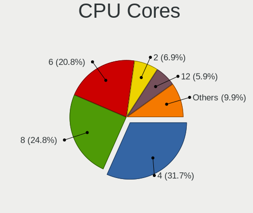
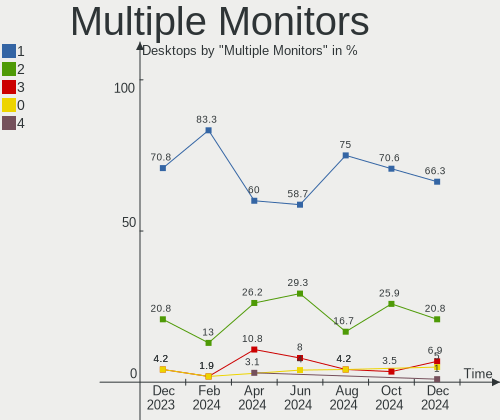
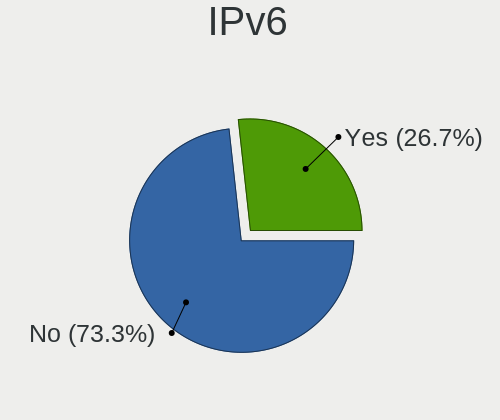
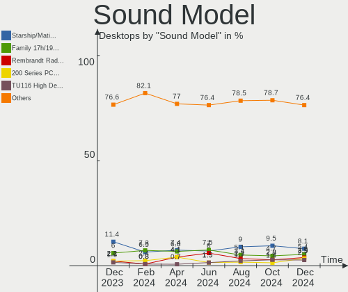
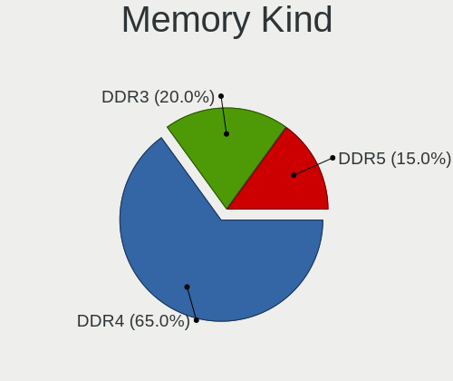

Pop!_OS - Hardware Trends (Desktops)
------------------------------------

A project to identify most popular hardware characteristics and track their change
over time based on data collected by Linux users at https://Linux-Hardware.org.

Anyone can contribute to this report by the [hw-probe](https://github.com/linuxhw/hw-probe) tool:

    sudo -E hw-probe -all -upload

This report is for one last month. Overall report since the beginning of time: [TestDays](https://github.com/linuxhw/TestDays)

Period: Sep, 2023.

Contents
--------

* [ System ](#system)
  - [ OS                       ](#os)
  - [ OS Family                ](#os-family)
  - [ Kernel                   ](#kernel)
  - [ Kernel Family            ](#kernel-family)
  - [ Kernel Major Ver.        ](#kernel-major-ver)
  - [ Arch                     ](#arch)
  - [ DE                       ](#de)
  - [ Display Server           ](#display-server)
  - [ Display Manager          ](#display-manager)
  - [ OS Lang                  ](#os-lang)
  - [ Boot Mode                ](#boot-mode)
  - [ Filesystem               ](#filesystem)
  - [ Part. scheme             ](#part-scheme)
  - [ Dual Boot with Linux/BSD ](#dual-boot-with-linuxbsd)
  - [ Dual Boot (Win)          ](#dual-boot-win)

* [ Board ](#board)
  - [ Vendor                   ](#vendor)
  - [ Model                    ](#model)
  - [ Model Family             ](#model-family)
  - [ MFG Year                 ](#mfg-year)
  - [ Form Factor              ](#form-factor)
  - [ Secure Boot              ](#secure-boot)
  - [ Coreboot                 ](#coreboot)
  - [ RAM Size                 ](#ram-size)
  - [ RAM Used                 ](#ram-used)
  - [ Total Drives             ](#total-drives)
  - [ Has CD-ROM               ](#has-cd-rom)
  - [ Has Ethernet             ](#has-ethernet)
  - [ Has WiFi                 ](#has-wifi)
  - [ Has Bluetooth            ](#has-bluetooth)

* [ Location ](#location)
  - [ Country                  ](#country)
  - [ City                     ](#city)

* [ Drives ](#drives)
  - [ Drive Vendor             ](#drive-vendor)
  - [ Drive Model              ](#drive-model)
  - [ HDD Vendor               ](#hdd-vendor)
  - [ SSD Vendor               ](#ssd-vendor)
  - [ Drive Kind               ](#drive-kind)
  - [ Drive Connector          ](#drive-connector)
  - [ Drive Size               ](#drive-size)
  - [ Space Total              ](#space-total)
  - [ Space Used               ](#space-used)
  - [ Malfunc. Drives          ](#malfunc-drives)
  - [ Malfunc. Drive Vendor    ](#malfunc-drive-vendor)
  - [ Malfunc. HDD Vendor      ](#malfunc-hdd-vendor)
  - [ Malfunc. Drive Kind      ](#malfunc-drive-kind)
  - [ Failed Drives            ](#failed-drives)
  - [ Failed Drive Vendor      ](#failed-drive-vendor)
  - [ Drive Status             ](#drive-status)

* [ Storage controller ](#storage-controller)
  - [ Storage Vendor           ](#storage-vendor)
  - [ Storage Model            ](#storage-model)
  - [ Storage Kind             ](#storage-kind)

* [ Processor ](#processor)
  - [ CPU Vendor               ](#cpu-vendor)
  - [ CPU Model                ](#cpu-model)
  - [ CPU Model Family         ](#cpu-model-family)
  - [ CPU Cores                ](#cpu-cores)
  - [ CPU Sockets              ](#cpu-sockets)
  - [ CPU Threads              ](#cpu-threads)
  - [ CPU Op-Modes             ](#cpu-op-modes)
  - [ CPU Microcode            ](#cpu-microcode)
  - [ CPU Microarch            ](#cpu-microarch)

* [ Graphics ](#graphics)
  - [ GPU Vendor               ](#gpu-vendor)
  - [ GPU Model                ](#gpu-model)
  - [ GPU Combo                ](#gpu-combo)
  - [ GPU Driver               ](#gpu-driver)
  - [ GPU Memory               ](#gpu-memory)

* [ Monitor ](#monitor)
  - [ Monitor Vendor           ](#monitor-vendor)
  - [ Monitor Model            ](#monitor-model)
  - [ Monitor Resolution       ](#monitor-resolution)
  - [ Monitor Diagonal         ](#monitor-diagonal)
  - [ Monitor Width            ](#monitor-width)
  - [ Aspect Ratio             ](#aspect-ratio)
  - [ Monitor Area             ](#monitor-area)
  - [ Pixel Density            ](#pixel-density)
  - [ Multiple Monitors        ](#multiple-monitors)

* [ Network ](#network)
  - [ Net Controller Vendor    ](#net-controller-vendor)
  - [ Net Controller Model     ](#net-controller-model)
  - [ Wireless Vendor          ](#wireless-vendor)
  - [ Wireless Model           ](#wireless-model)
  - [ Ethernet Vendor          ](#ethernet-vendor)
  - [ Ethernet Model           ](#ethernet-model)
  - [ Net Controller Kind      ](#net-controller-kind)
  - [ Used Controller          ](#used-controller)
  - [ NICs                     ](#nics)
  - [ IPv6                     ](#ipv6)

* [ Bluetooth ](#bluetooth)
  - [ Bluetooth Vendor         ](#bluetooth-vendor)
  - [ Bluetooth Model          ](#bluetooth-model)

* [ Sound ](#sound)
  - [ Sound Vendor             ](#sound-vendor)
  - [ Sound Model              ](#sound-model)

* [ Memory ](#memory)
  - [ Memory Vendor            ](#memory-vendor)
  - [ Memory Model             ](#memory-model)
  - [ Memory Kind              ](#memory-kind)
  - [ Memory Form Factor       ](#memory-form-factor)
  - [ Memory Size              ](#memory-size)
  - [ Memory Speed             ](#memory-speed)

* [ Printers & scanners ](#printers--scanners)
  - [ Printer Vendor           ](#printer-vendor)
  - [ Printer Model            ](#printer-model)
  - [ Scanner Vendor           ](#scanner-vendor)
  - [ Scanner Model            ](#scanner-model)

* [ Camera ](#camera)
  - [ Camera Vendor            ](#camera-vendor)
  - [ Camera Model             ](#camera-model)

* [ Security ](#security)
  - [ Fingerprint Vendor       ](#fingerprint-vendor)
  - [ Fingerprint Model        ](#fingerprint-model)
  - [ Chipcard Vendor          ](#chipcard-vendor)
  - [ Chipcard Model           ](#chipcard-model)

* [ Unsupported ](#unsupported)
  - [ Unsupported Devices      ](#unsupported-devices)
  - [ Unsupported Device Types ](#unsupported-device-types)

System
------

OS
--

Installed operating systems

| Name          | Desktops | Percent |
|---------------|----------|---------|
| Pop!_OS 22.04 | 53       | 100%    |

OS Family
---------

OS without a version

| Name    | Desktops | Percent |
|---------|----------|---------|
| Pop!_OS | 53       | 100%    |

Kernel
------

Version of the Linux kernel

| Version                 | Desktops | Percent |
|-------------------------|----------|---------|
| 6.4.6-76060406-generic  | 42       | 79.25%  |
| 6.2.6-76060206-generic  | 8        | 15.09%  |
| 6.0.2-76060002-generic  | 2        | 3.77%   |
| 5.19.0-76051900-generic | 1        | 1.89%   |

Kernel Family
-------------

Linux kernel without a distro release

| Version | Desktops | Percent |
|---------|----------|---------|
| 6.4.6   | 42       | 79.25%  |
| 6.2.6   | 8        | 15.09%  |
| 6.0.2   | 2        | 3.77%   |
| 5.19.0  | 1        | 1.89%   |

Kernel Major Ver.
-----------------

Linux kernel major version

| Version | Desktops | Percent |
|---------|----------|---------|
| 6.4     | 42       | 79.25%  |
| 6.2     | 8        | 15.09%  |
| 6.0     | 2        | 3.77%   |
| 5.19    | 1        | 1.89%   |

Arch
----

OS architecture (x86_64, i586, etc.)

| Name   | Desktops | Percent |
|--------|----------|---------|
| x86_64 | 53       | 100%    |

DE
--

Desktop Environment

| Name            | Desktops | Percent |
|-----------------|----------|---------|
| GNOME           | 49       | 92.45%  |
| X-Cinnamon      | 1        | 1.89%   |
| UKUI            | 1        | 1.89%   |
| GNOME Flashback | 1        | 1.89%   |
| Unknown         | 1        | 1.89%   |

Display Server
--------------

X11 or Wayland

| Name    | Desktops | Percent |
|---------|----------|---------|
| X11     | 49       | 92.45%  |
| Wayland | 3        | 5.66%   |
| Unknown | 1        | 1.89%   |

Display Manager
---------------

SDDM, LightDM, etc.

| Name    | Desktops | Percent |
|---------|----------|---------|
| Unknown | 40       | 75.47%  |
| GDM3    | 13       | 24.53%  |

OS Lang
-------

Language

| Lang  | Desktops | Percent |
|-------|----------|---------|
| en_US | 32       | 60.38%  |
| en_CA | 3        | 5.66%   |
| de_DE | 3        | 5.66%   |
| pt_BR | 2        | 3.77%   |
| en_GB | 2        | 3.77%   |
| en_AU | 2        | 3.77%   |
| sv_SE | 1        | 1.89%   |
| ru_RU | 1        | 1.89%   |
| pl_PL | 1        | 1.89%   |
| nb_NO | 1        | 1.89%   |
| lv_LV | 1        | 1.89%   |
| fi_FI | 1        | 1.89%   |
| es_PE | 1        | 1.89%   |
| de_AT | 1        | 1.89%   |
| C     | 1        | 1.89%   |

Boot Mode
---------

EFI or BIOS

| Mode | Desktops | Percent |
|------|----------|---------|
| BIOS | 44       | 83.02%  |
| EFI  | 9        | 16.98%  |

Filesystem
----------

Type of filesystem

| Type | Desktops | Percent |
|------|----------|---------|
| Ext4 | 53       | 100%    |

Part. scheme
------------

Scheme of partitioning

| Type    | Desktops | Percent |
|---------|----------|---------|
| Unknown | 41       | 77.36%  |
| GPT     | 8        | 15.09%  |
| MBR     | 4        | 7.55%   |

Dual Boot with Linux/BSD
------------------------

Hosting more than one Linux/BSD

| Dual boot | Desktops | Percent |
|-----------|----------|---------|
| No        | 50       | 94.34%  |
| Yes       | 3        | 5.66%   |

Dual Boot (Win)
---------------

Hosting Linux and Windows

| Dual boot | Desktops | Percent |
|-----------|----------|---------|
| No        | 49       | 92.45%  |
| Yes       | 4        | 7.55%   |

Board
-----

Vendor
------

Motherboard manufacturer

| Name                                 | Desktops | Percent |
|--------------------------------------|----------|---------|
| ASUSTek Computer                     | 17       | 32.08%  |
| Gigabyte Technology                  | 10       | 18.87%  |
| MSI                                  | 8        | 15.09%  |
| Dell                                 | 4        | 7.55%   |
| Lenovo                               | 2        | 3.77%   |
| Hewlett-Packard                      | 2        | 3.77%   |
| ASRock                               | 2        | 3.77%   |
| System76                             | 1        | 1.89%   |
| Shenzhen Meigao Electronic Equipment | 1        | 1.89%   |
| Hardkernel                           | 1        | 1.89%   |
| Fujitsu                              | 1        | 1.89%   |
| Biostar                              | 1        | 1.89%   |
| AZW                                  | 1        | 1.89%   |
| ASRockRack                           | 1        | 1.89%   |
| Unknown                              | 1        | 1.89%   |

Model
-----

Motherboard model

| Name                                       | Desktops | Percent |
|--------------------------------------------|----------|---------|
| ASUS All Series                            | 2        | 3.77%   |
| System76 Thelio                            | 1        | 1.89%   |
| Shenzhen Meigao Electronic Equipment UM450 | 1        | 1.89%   |
| MSI MS-7D75                                | 1        | 1.89%   |
| MSI MS-7D25                                | 1        | 1.89%   |
| MSI MS-7D18                                | 1        | 1.89%   |
| MSI MS-7C52                                | 1        | 1.89%   |
| MSI MS-7C13                                | 1        | 1.89%   |
| MSI MS-7B09                                | 1        | 1.89%   |
| MSI MS-7A34                                | 1        | 1.89%   |
| MSI Mr. Office V R4                        | 1        | 1.89%   |
| Lenovo ThinkCentre M710q 10MR0004US        | 1        | 1.89%   |
| Lenovo Legion T5 28IMB05 90NC00ELRI        | 1        | 1.89%   |
| HP EliteDesk 800 G2 SFF                    | 1        | 1.89%   |
| HP Compaq 8200 Elite SFF PC                | 1        | 1.89%   |
| Hardkernel ODROID-H3                       | 1        | 1.89%   |
| Gigabyte Z97X-SLI                          | 1        | 1.89%   |
| Gigabyte Z590 AORUS MASTER                 | 1        | 1.89%   |
| Gigabyte Z370 AORUS Gaming 7               | 1        | 1.89%   |
| Gigabyte Z270X-UD5                         | 1        | 1.89%   |
| Gigabyte Z170X-Gaming 7                    | 1        | 1.89%   |
| Gigabyte F2A68HM-H                         | 1        | 1.89%   |
| Gigabyte EDDPC1627I5                       | 1        | 1.89%   |
| Gigabyte B760I AORUS PRO DDR4              | 1        | 1.89%   |
| Gigabyte B550I AORUS PRO AX                | 1        | 1.89%   |
| Gigabyte B450 AORUS ELITE                  | 1        | 1.89%   |
| Fujitsu ESPRIMO Q920                       | 1        | 1.89%   |
| Dell Precision Tower 7810                  | 1        | 1.89%   |
| Dell Precision T5610                       | 1        | 1.89%   |
| Dell OptiPlex 7010                         | 1        | 1.89%   |
| Dell OptiPlex 390                          | 1        | 1.89%   |
| Biostar A58MD                              | 1        | 1.89%   |
| AZW SER                                    | 1        | 1.89%   |
| ASUS Z170-A                                | 1        | 1.89%   |
| ASUS TUF Gaming X670E-PLUS                 | 1        | 1.89%   |
| ASUS TUF Gaming B550-PLUS WIFI II          | 1        | 1.89%   |
| ASUS ROG STRIX B660-A GAMING WIFI D4       | 1        | 1.89%   |
| ASUS ROG STRIX B550-XE GAMING WIFI         | 1        | 1.89%   |
| ASUS ROG STRIX B460-H GAMING               | 1        | 1.89%   |
| ASUS ROG STRIX B450-F GAMING               | 1        | 1.89%   |

Model Family
------------

Motherboard model prefix

| Name                                       | Desktops | Percent |
|--------------------------------------------|----------|---------|
| ASUS ROG                                   | 5        | 9.43%   |
| Dell Precision                             | 2        | 3.77%   |
| Dell OptiPlex                              | 2        | 3.77%   |
| ASUS TUF                                   | 2        | 3.77%   |
| ASUS All                                   | 2        | 3.77%   |
| System76 Thelio                            | 1        | 1.89%   |
| Shenzhen Meigao Electronic Equipment UM450 | 1        | 1.89%   |
| MSI MS-7D75                                | 1        | 1.89%   |
| MSI MS-7D25                                | 1        | 1.89%   |
| MSI MS-7D18                                | 1        | 1.89%   |
| MSI MS-7C52                                | 1        | 1.89%   |
| MSI MS-7C13                                | 1        | 1.89%   |
| MSI MS-7B09                                | 1        | 1.89%   |
| MSI MS-7A34                                | 1        | 1.89%   |
| MSI Mr.                                    | 1        | 1.89%   |
| Lenovo ThinkCentre                         | 1        | 1.89%   |
| Lenovo Legion                              | 1        | 1.89%   |
| HP EliteDesk                               | 1        | 1.89%   |
| HP Compaq                                  | 1        | 1.89%   |
| Hardkernel ODROID-H3                       | 1        | 1.89%   |
| Gigabyte Z97X-SLI                          | 1        | 1.89%   |
| Gigabyte Z590                              | 1        | 1.89%   |
| Gigabyte Z370                              | 1        | 1.89%   |
| Gigabyte Z270X-UD5                         | 1        | 1.89%   |
| Gigabyte Z170X-Gaming                      | 1        | 1.89%   |
| Gigabyte F2A68HM-H                         | 1        | 1.89%   |
| Gigabyte EDDPC1627I5                       | 1        | 1.89%   |
| Gigabyte B760I                             | 1        | 1.89%   |
| Gigabyte B550I                             | 1        | 1.89%   |
| Gigabyte B450                              | 1        | 1.89%   |
| Fujitsu ESPRIMO                            | 1        | 1.89%   |
| Biostar A58MD                              | 1        | 1.89%   |
| AZW SER                                    | 1        | 1.89%   |
| ASUS Z170-A                                | 1        | 1.89%   |
| ASUS P5QPL-AM                              | 1        | 1.89%   |
| ASUS M5A97                                 | 1        | 1.89%   |
| ASUS M5A78L-M                              | 1        | 1.89%   |
| ASUS M5A78L                                | 1        | 1.89%   |
| ASUS M4A79T                                | 1        | 1.89%   |
| ASUS Crosshair                             | 1        | 1.89%   |

MFG Year
--------

Motherboard manufacture year

| Year | Desktops | Percent |
|------|----------|---------|
| 2022 | 8        | 15.09%  |
| 2018 | 6        | 11.32%  |
| 2014 | 6        | 11.32%  |
| 2021 | 5        | 9.43%   |
| 2011 | 5        | 9.43%   |
| 2020 | 4        | 7.55%   |
| 2015 | 4        | 7.55%   |
| 2023 | 3        | 5.66%   |
| 2017 | 3        | 5.66%   |
| 2016 | 3        | 5.66%   |
| 2012 | 2        | 3.77%   |
| 2009 | 2        | 3.77%   |
| 2019 | 1        | 1.89%   |
| 2013 | 1        | 1.89%   |

Form Factor
-----------

Physical design of the computer

| Name    | Desktops | Percent |
|---------|----------|---------|
| Desktop | 53       | 100%    |

Secure Boot
-----------

Enabled or disabled

| State    | Desktops | Percent |
|----------|----------|---------|
| Disabled | 53       | 100%    |

Coreboot
--------

Have coreboot on board

| Used | Desktops | Percent |
|------|----------|---------|
| No   | 53       | 100%    |

RAM Size
--------

Total RAM memory

| Size in GB  | Desktops | Percent |
|-------------|----------|---------|
| 32.01-64.0  | 18       | 33.96%  |
| 64.01-256.0 | 10       | 18.87%  |
| 16.01-24.0  | 10       | 18.87%  |
| 8.01-16.0   | 9        | 16.98%  |
| 24.01-32.0  | 4        | 7.55%   |
| 4.01-8.0    | 1        | 1.89%   |
| 3.01-4.0    | 1        | 1.89%   |

RAM Used
--------

Used RAM memory

| Used GB   | Desktops | Percent |
|-----------|----------|---------|
| 4.01-8.0  | 24       | 45.28%  |
| 8.01-16.0 | 14       | 26.42%  |
| 3.01-4.0  | 7        | 13.21%  |
| 2.01-3.0  | 7        | 13.21%  |
| 1.01-2.0  | 1        | 1.89%   |

Total Drives
------------

Number of drives on board

| Drives | Desktops | Percent |
|--------|----------|---------|
| 2      | 19       | 35.85%  |
| 1      | 16       | 30.19%  |
| 3      | 11       | 20.75%  |
| 7      | 3        | 5.66%   |
| 4      | 2        | 3.77%   |
| 8      | 1        | 1.89%   |
| 6      | 1        | 1.89%   |

Has CD-ROM
----------

Has CD-ROM on board

| Presented | Desktops | Percent |
|-----------|----------|---------|
| No        | 36       | 67.92%  |
| Yes       | 17       | 32.08%  |

Has Ethernet
------------

Has Ethernet on board

| Presented | Desktops | Percent |
|-----------|----------|---------|
| Yes       | 53       | 100%    |

Has WiFi
--------

Has WiFi module

| Presented | Desktops | Percent |
|-----------|----------|---------|
| Yes       | 31       | 58.49%  |
| No        | 22       | 41.51%  |

Has Bluetooth
-------------

Has Bluetooth module

| Presented | Desktops | Percent |
|-----------|----------|---------|
| No        | 30       | 56.6%   |
| Yes       | 23       | 43.4%   |

Location
--------

Country
-------

Geographic location (country)

| Country   | Desktops | Percent |
|-----------|----------|---------|
| USA       | 23       | 43.4%   |
| Germany   | 4        | 7.55%   |
| UK        | 3        | 5.66%   |
| Canada    | 3        | 5.66%   |
| Brazil    | 3        | 5.66%   |
| Austria   | 3        | 5.66%   |
| Australia | 3        | 5.66%   |
| Sweden    | 2        | 3.77%   |
| Russia    | 1        | 1.89%   |
| Romania   | 1        | 1.89%   |
| Poland    | 1        | 1.89%   |
| Peru      | 1        | 1.89%   |
| Latvia    | 1        | 1.89%   |
| Italy     | 1        | 1.89%   |
| Indonesia | 1        | 1.89%   |
| Finland   | 1        | 1.89%   |
| Belgium   | 1        | 1.89%   |

City
----

Geographic location (city)

| City             | Desktops | Percent |
|------------------|----------|---------|
| Stuttgart        | 2        | 3.77%   |
| Madison          | 2        | 3.77%   |
| Edmonton         | 2        | 3.77%   |
| Denver           | 2        | 3.77%   |
| Wappingers Falls | 1        | 1.89%   |
| Vienna           | 1        | 1.89%   |
| Viareggio        | 1        | 1.89%   |
| Umeå            | 1        | 1.89%   |
| Ulyanovsk        | 1        | 1.89%   |
| The Bronx        | 1        | 1.89%   |
| Sydney           | 1        | 1.89%   |
| Stary Sacz       | 1        | 1.89%   |
| Springfield      | 1        | 1.89%   |
| Spartanburg      | 1        | 1.89%   |
| Roya             | 1        | 1.89%   |
| Rochester        | 1        | 1.89%   |
| Rancho Cordova   | 1        | 1.89%   |
| Ramsgate         | 1        | 1.89%   |
| Pindamonhangaba  | 1        | 1.89%   |
| Perth            | 1        | 1.89%   |
| Oak Harbor       | 1        | 1.89%   |
| Nossebro         | 1        | 1.89%   |
| Nicholasville    | 1        | 1.89%   |
| Namur            | 1        | 1.89%   |
| Melbourne        | 1        | 1.89%   |
| Medford          | 1        | 1.89%   |
| Maria Enzersdorf | 1        | 1.89%   |
| Lima             | 1        | 1.89%   |
| Lakewood         | 1        | 1.89%   |
| La Grande        | 1        | 1.89%   |
| Kuopio           | 1        | 1.89%   |
| Kankakee         | 1        | 1.89%   |
| Jakarta          | 1        | 1.89%   |
| Islington        | 1        | 1.89%   |
| Hubbard          | 1        | 1.89%   |
| Hialeah          | 1        | 1.89%   |
| Halle            | 1        | 1.89%   |
| Graz             | 1        | 1.89%   |
| Fairfield        | 1        | 1.89%   |
| Duque de Caxias  | 1        | 1.89%   |

Drives
------

Drive Vendor
------------

Hard drive vendors

| Vendor              | Desktops | Drives | Percent |
|---------------------|----------|--------|---------|
| Samsung Electronics | 24       | 36     | 24.24%  |
| Seagate             | 14       | 15     | 14.14%  |
| WDC                 | 13       | 21     | 13.13%  |
| Crucial             | 7        | 9      | 7.07%   |
| SanDisk             | 6        | 8      | 6.06%   |
| Kingston            | 4        | 5      | 4.04%   |
| SPCC                | 3        | 3      | 3.03%   |
| PNY                 | 3        | 3      | 3.03%   |
| Phison Electronics  | 3        | 4      | 3.03%   |
| A-DATA Technology   | 3        | 3      | 3.03%   |
| Toshiba             | 2        | 2      | 2.02%   |
| HGST                | 2        | 2      | 2.02%   |
| Gigabyte Technology | 2        | 2      | 2.02%   |
| SK hynix            | 1        | 1      | 1.01%   |
| Silicon Motion      | 1        | 1      | 1.01%   |
| RSH-338H            | 1        | 1      | 1.01%   |
| Phison              | 1        | 1      | 1.01%   |
| KIOXIA              | 1        | 1      | 1.01%   |
| JMicron Technology  | 1        | 1      | 1.01%   |
| Integral            | 1        | 1      | 1.01%   |
| FIKWOT              | 1        | 4      | 1.01%   |
| Fanxiang            | 1        | 1      | 1.01%   |
| Corsair             | 1        | 1      | 1.01%   |
| China               | 1        | 1      | 1.01%   |
| Apacer              | 1        | 1      | 1.01%   |
| Unknown             | 1        | 1      | 1.01%   |

Drive Model
-----------

Hard drive models

| Model                                                 | Desktops | Percent |
|-------------------------------------------------------|----------|---------|
| Samsung SSD 870 QVO 2TB                               | 4        | 3.42%   |
| Samsung NVMe SSD Controller SM981/PM981/PM983 256GB   | 4        | 3.42%   |
| Samsung SSD 980 1TB                                   | 3        | 2.56%   |
| Samsung SSD 870 QVO 1TB                               | 3        | 2.56%   |
| Samsung SSD 850 EVO 250GB                             | 3        | 2.56%   |
| Phison PS5013 E13 NVMe Controller 512GB               | 3        | 2.56%   |
| WDC WD5000KS-00MNB0 500GB                             | 2        | 1.71%   |
| WDC WD1003FZEX-00MK2A0 1TB                            | 2        | 1.71%   |
| WDC WD Blue SA510 2.5 500GB                           | 2        | 1.71%   |
| Toshiba DT01ACA100 1TB                                | 2        | 1.71%   |
| Seagate ST4000DM004-2CV104 4TB                        | 2        | 1.71%   |
| Seagate ST3500414CS 500GB                             | 2        | 1.71%   |
| Seagate ST1000DM003-1ER162 1TB                        | 2        | 1.71%   |
| SanDisk SDSSDHP256G 256GB                             | 2        | 1.71%   |
| Samsung SSD 970 EVO Plus 1TB                          | 2        | 1.71%   |
| Samsung SSD 870 EVO 500GB                             | 2        | 1.71%   |
| Samsung SSD 860 EVO 500GB                             | 2        | 1.71%   |
| Kingston SA400S37480G 480GB SSD                       | 2        | 1.71%   |
| Crucial CT2000MX500SSD1 2TB                           | 2        | 1.71%   |
| Crucial CT1000MX500SSD1 1TB                           | 2        | 1.71%   |
| WDC WD80EFZZ-68BTXN0 8TB                              | 1        | 0.85%   |
| WDC WD6400AACS-00G8B1 640GB                           | 1        | 0.85%   |
| WDC WD60EFRX-68L0BN1 6TB                              | 1        | 0.85%   |
| WDC WD5000AACS-00G8B1 500GB                           | 1        | 0.85%   |
| WDC WD40EZRZ-00WN9B0 4TB                              | 1        | 0.85%   |
| WDC WD40EFRX-68WT0N0 4TB                              | 1        | 0.85%   |
| WDC WD2500AAKX-001CA0 250GB                           | 1        | 0.85%   |
| WDC WD20EFRX-68AX9N0 2TB                              | 1        | 0.85%   |
| WDC WD20EADS-00R6B0 2TB                               | 1        | 0.85%   |
| WDC WD10EZEX-75WN4A0 1TB                              | 1        | 0.85%   |
| WDC WD10EZEX-08WN4A0 1TB                              | 1        | 0.85%   |
| WDC WD10EACS-00ZJB0 1TB                               | 1        | 0.85%   |
| WDC WD10 JPVX-00JC3T0 1TB                             | 1        | 0.85%   |
| WDC WD Blue SA510 2.5 1TB                             | 1        | 0.85%   |
| SPCC Solid State Disk 512GB                           | 1        | 0.85%   |
| SPCC Solid State Disk 256GB                           | 1        | 0.85%   |
| SPCC M.2 PCIe SSD 256GB                               | 1        | 0.85%   |
| SK hynix SHGP31-2000GM 2TB                            | 1        | 0.85%   |
| Silicon Motion SM2263EN/SM2263XT SSD Controller 512GB | 1        | 0.85%   |
| Seagate ST4000DM004-2U9104 4TB                        | 1        | 0.85%   |

HDD Vendor
----------

Hard disk drive vendors

| Vendor              | Desktops | Drives | Percent |
|---------------------|----------|--------|---------|
| Seagate             | 14       | 15     | 46.67%  |
| WDC                 | 11       | 18     | 36.67%  |
| Toshiba             | 2        | 2      | 6.67%   |
| HGST                | 2        | 2      | 6.67%   |
| Samsung Electronics | 1        | 1      | 3.33%   |

SSD Vendor
----------

Solid state drive vendors

| Vendor              | Desktops | Drives | Percent |
|---------------------|----------|--------|---------|
| Samsung Electronics | 13       | 18     | 28.89%  |
| Crucial             | 6        | 7      | 13.33%  |
| SanDisk             | 4        | 4      | 8.89%   |
| WDC                 | 3        | 3      | 6.67%   |
| PNY                 | 3        | 3      | 6.67%   |
| Kingston            | 3        | 3      | 6.67%   |
| A-DATA Technology   | 3        | 3      | 6.67%   |
| SPCC                | 2        | 2      | 4.44%   |
| JMicron Technology  | 1        | 1      | 2.22%   |
| Integral            | 1        | 1      | 2.22%   |
| Gigabyte Technology | 1        | 1      | 2.22%   |
| FIKWOT              | 1        | 4      | 2.22%   |
| Fanxiang            | 1        | 1      | 2.22%   |
| Corsair             | 1        | 1      | 2.22%   |
| China               | 1        | 1      | 2.22%   |
| Apacer              | 1        | 1      | 2.22%   |

Drive Kind
----------

HDD or SSD

| Kind    | Desktops | Drives | Percent |
|---------|----------|--------|---------|
| SSD     | 35       | 54     | 40.23%  |
| NVMe    | 25       | 35     | 28.74%  |
| HDD     | 25       | 38     | 28.74%  |
| MMC     | 1        | 1      | 1.15%   |
| Unknown | 1        | 1      | 1.15%   |

Drive Connector
---------------

SATA, SAS, NVMe, etc.

| Type | Desktops | Drives | Percent |
|------|----------|--------|---------|
| SATA | 40       | 89     | 58.82%  |
| NVMe | 25       | 35     | 36.76%  |
| SAS  | 2        | 4      | 2.94%   |
| MMC  | 1        | 1      | 1.47%   |

Drive Size
----------

Size of hard drive

| Size in TB | Desktops | Drives | Percent |
|------------|----------|--------|---------|
| 0.01-0.5   | 27       | 34     | 41.54%  |
| 0.51-1.0   | 22       | 32     | 33.85%  |
| 1.01-2.0   | 9        | 13     | 13.85%  |
| 3.01-4.0   | 5        | 10     | 7.69%   |
| 4.01-10.0  | 2        | 3      | 3.08%   |

Space Total
-----------

Amount of disk space available on the file system

| Size in GB     | Desktops | Percent |
|----------------|----------|---------|
| 251-500        | 13       | 24.53%  |
| 501-1000       | 13       | 24.53%  |
| 101-250        | 11       | 20.75%  |
| 1001-2000      | 9        | 16.98%  |
| More than 3000 | 3        | 5.66%   |
| 2001-3000      | 2        | 3.77%   |
| 1-20           | 1        | 1.89%   |
| 51-100         | 1        | 1.89%   |

Space Used
----------

Amount of used disk space

| Used GB        | Desktops | Percent |
|----------------|----------|---------|
| 101-250        | 18       | 33.96%  |
| 1-20           | 12       | 22.64%  |
| 21-50          | 10       | 18.87%  |
| 251-500        | 4        | 7.55%   |
| More than 3000 | 3        | 5.66%   |
| 501-1000       | 3        | 5.66%   |
| 1001-2000      | 2        | 3.77%   |
| 51-100         | 1        | 1.89%   |

Malfunc. Drives
---------------

Drive models with a malfunction

| Model                     | Desktops | Drives | Percent |
|---------------------------|----------|--------|---------|
| WDC WD20EFRX-68AX9N0 2TB  | 1        | 1      | 50%     |
| Seagate ST3250310AS 250GB | 1        | 1      | 50%     |

Malfunc. Drive Vendor
---------------------

Vendors of faulty drives

| Vendor  | Desktops | Drives | Percent |
|---------|----------|--------|---------|
| WDC     | 1        | 1      | 50%     |
| Seagate | 1        | 1      | 50%     |

Malfunc. HDD Vendor
-------------------

Vendors of faulty HDD drives

| Vendor  | Desktops | Drives | Percent |
|---------|----------|--------|---------|
| WDC     | 1        | 1      | 50%     |
| Seagate | 1        | 1      | 50%     |

Malfunc. Drive Kind
-------------------

Kinds of faulty drives

| Kind | Desktops | Drives | Percent |
|------|----------|--------|---------|
| HDD  | 2        | 2      | 100%    |

Failed Drives
-------------

Failed drive models

Zero info for selected period =(

Failed Drive Vendor
-------------------

Failed drive vendors

Zero info for selected period =(

Drive Status
------------

Number of failed and malfunc. drives

| Status   | Desktops | Drives | Percent |
|----------|----------|--------|---------|
| Detected | 41       | 98     | 73.21%  |
| Works    | 13       | 29     | 23.21%  |
| Malfunc  | 2        | 2      | 3.57%   |

Storage controller
------------------

Storage Vendor
--------------

Storage controller vendors

| Vendor                      | Desktops | Percent |
|-----------------------------|----------|---------|
| Intel                       | 29       | 32.95%  |
| AMD                         | 23       | 26.14%  |
| Samsung Electronics         | 15       | 17.05%  |
| Phison Electronics          | 6        | 6.82%   |
| ASMedia Technology          | 5        | 5.68%   |
| Sandisk                     | 3        | 3.41%   |
| Micron/Crucial Technology   | 2        | 2.27%   |
| SK hynix                    | 1        | 1.14%   |
| Silicon Motion              | 1        | 1.14%   |
| KIOXIA                      | 1        | 1.14%   |
| Kingston Technology Company | 1        | 1.14%   |
| JMicron Technology          | 1        | 1.14%   |

Storage Model
-------------

Storage controller models

| Model                                                                                   | Desktops | Percent |
|-----------------------------------------------------------------------------------------|----------|---------|
| AMD FCH SATA Controller [AHCI mode]                                                     | 10       | 9.26%   |
| Samsung NVMe SSD Controller SM981/PM981/PM983                                           | 7        | 6.48%   |
| AMD SB7x0/SB8x0/SB9x0 IDE Controller                                                    | 5        | 4.63%   |
| Phison PS5013 E13 NVMe Controller                                                       | 4        | 3.7%    |
| Intel 200 Series PCH SATA controller [AHCI mode]                                        | 4        | 3.7%    |
| ASMedia ASM1062 Serial ATA Controller                                                   | 4        | 3.7%    |
| AMD SB7x0/SB8x0/SB9x0 SATA Controller [IDE mode]                                        | 4        | 3.7%    |
| AMD 500 Series Chipset SATA Controller                                                  | 4        | 3.7%    |
| Samsung NVMe SSD Controller 980                                                         | 3        | 2.78%   |
| Intel Q170/Q150/B150/H170/H110/Z170/CM236 Chipset SATA Controller [AHCI Mode]           | 3        | 2.78%   |
| Intel Alder Lake-S PCH SATA Controller [AHCI Mode]                                      | 3        | 2.78%   |
| AMD 400 Series Chipset SATA Controller                                                  | 3        | 2.78%   |
| Samsung NVMe SSD Controller SM961/PM961/SM963                                           | 2        | 1.85%   |
| Samsung NVMe SSD Controller PM9A1/PM9A3/980PRO                                          | 2        | 1.85%   |
| Intel C610/X99 series chipset 6-Port SATA Controller [AHCI mode]                        | 2        | 1.85%   |
| Intel 9 Series Chipset Family SATA Controller [AHCI Mode]                               | 2        | 1.85%   |
| Intel 8 Series/C220 Series Chipset Family 6-port SATA Controller 1 [AHCI mode]          | 2        | 1.85%   |
| Intel 6 Series/C200 Series Chipset Family Desktop SATA Controller (IDE mode, ports 4-5) | 2        | 1.85%   |
| Intel 6 Series/C200 Series Chipset Family Desktop SATA Controller (IDE mode, ports 0-3) | 2        | 1.85%   |
| Intel 500 Series Chipset Family SATA AHCI Controller                                    | 2        | 1.85%   |
| AMD SB7x0/SB8x0/SB9x0 SATA Controller [AHCI mode]                                       | 2        | 1.85%   |
| AMD FCH SATA Controller [IDE mode]                                                      | 2        | 1.85%   |
| AMD FCH SATA Controller D                                                               | 2        | 1.85%   |
| SK hynix Gold P31/BC711/PC711 NVMe Solid State Drive                                    | 1        | 0.93%   |
| Silicon Motion SM2263EN/SM2263XT (DRAM-less) NVMe SSD Controllers                       | 1        | 0.93%   |
| Sandisk Western Digital WD Black SN850X NVMe SSD                                        | 1        | 0.93%   |
| SanDisk WD Black SN770 / PC SN740 256GB / PC SN560 (DRAM-less) NVMe SSD                 | 1        | 0.93%   |
| SanDisk WD Black SN750 / PC SN730 NVMe SSD                                              | 1        | 0.93%   |
| Samsung NVMe SSD Controller SM951/PM951                                                 | 1        | 0.93%   |
| Samsung NVMe SSD Controller S4LV008[Pascal]                                             | 1        | 0.93%   |
| Phison E8 PCIe3 NVMe Controller                                                         | 1        | 0.93%   |
| Phison E12 NVMe Controller                                                              | 1        | 0.93%   |
| Micron/Crucial P2 [Nick P2] / P3 / P3 Plus NVMe PCIe SSD (DRAM-less)                    | 1        | 0.93%   |
| Micron/Crucial P1 NVMe PCIe SSD[Frampton]                                               | 1        | 0.93%   |
| KIOXIA NVMe SSD Controller BG4 (DRAM-less)                                              | 1        | 0.93%   |
| Kingston Company KC3000/Renegade NVMe SSD                                               | 1        | 0.93%   |
| JMicron JMB363 SATA/IDE Controller                                                      | 1        | 0.93%   |
| Intel Volume Management Device NVMe RAID Controller Intel Corporation                   | 1        | 0.93%   |
| Intel Volume Management Device NVMe RAID Controller                                     | 1        | 0.93%   |
| Intel NM10/ICH7 Family SATA Controller [IDE mode]                                       | 1        | 0.93%   |

Storage Kind
------------

Kind of storage controller (IDE, SATA, NVMe, SAS, ...)

| Kind | Desktops | Percent |
|------|----------|---------|
| SATA | 47       | 54.65%  |
| NVMe | 25       | 29.07%  |
| IDE  | 10       | 11.63%  |
| RAID | 4        | 4.65%   |

Processor
---------

CPU Vendor
----------

Processor vendors

| Vendor | Desktops | Percent |
|--------|----------|---------|
| Intel  | 29       | 54.72%  |
| AMD    | 24       | 45.28%  |

CPU Model
---------

Processor models

| Model                                          | Desktops | Percent |
|------------------------------------------------|----------|---------|
| Intel Core i7-6700K CPU @ 4.00GHz              | 2        | 3.77%   |
| Intel 13th Gen Core i7-13700K                  | 2        | 3.77%   |
| AMD Ryzen 7 5700G with Radeon Graphics         | 2        | 3.77%   |
| AMD Ryzen 5 3600 6-Core Processor              | 2        | 3.77%   |
| Intel Xeon CPU E5-2630 v3 @ 2.40GHz            | 1        | 1.89%   |
| Intel Xeon CPU E5-2620 0 @ 2.00GHz             | 1        | 1.89%   |
| Intel Xeon CPU E3-1241 v3 @ 3.50GHz            | 1        | 1.89%   |
| Intel Pentium Silver N6005 @ 2.00GHz           | 1        | 1.89%   |
| Intel Pentium Gold G6400 CPU @ 4.00GHz         | 1        | 1.89%   |
| Intel Core i9-10900F CPU @ 2.80GHz             | 1        | 1.89%   |
| Intel Core i9-10900 CPU @ 2.80GHz              | 1        | 1.89%   |
| Intel Core i9-10850K CPU @ 3.60GHz             | 1        | 1.89%   |
| Intel Core i7-8700K CPU @ 3.70GHz              | 1        | 1.89%   |
| Intel Core i7-8700 CPU @ 3.20GHz               | 1        | 1.89%   |
| Intel Core i7-7700K CPU @ 4.20GHz              | 1        | 1.89%   |
| Intel Core i7-6950X CPU @ 3.00GHz              | 1        | 1.89%   |
| Intel Core i7-6700 CPU @ 3.40GHz               | 1        | 1.89%   |
| Intel Core i7-4790K CPU @ 4.00GHz              | 1        | 1.89%   |
| Intel Core i7-3770 CPU @ 3.40GHz               | 1        | 1.89%   |
| Intel Core i7-2600 CPU @ 3.40GHz               | 1        | 1.89%   |
| Intel Core i5-6500 CPU @ 3.20GHz               | 1        | 1.89%   |
| Intel Core i5-4590T CPU @ 2.00GHz              | 1        | 1.89%   |
| Intel Core i5-4590 CPU @ 3.30GHz               | 1        | 1.89%   |
| Intel Core i3-2120 CPU @ 3.30GHz               | 1        | 1.89%   |
| Intel Core 2 Duo CPU E8600 @ 3.33GHz           | 1        | 1.89%   |
| Intel Celeron N4000 CPU @ 1.10GHz              | 1        | 1.89%   |
| Intel 12th Gen Core i9-12900K                  | 1        | 1.89%   |
| Intel 12th Gen Core i5-12600K                  | 1        | 1.89%   |
| Intel 11th Gen Core i5-11400F @ 2.60GHz        | 1        | 1.89%   |
| AMD Ryzen Threadripper 1950X 16-Core Processor | 1        | 1.89%   |
| AMD Ryzen 9 3950X 16-Core Processor            | 1        | 1.89%   |
| AMD Ryzen 7 7800X3D 8-Core Processor           | 1        | 1.89%   |
| AMD Ryzen 7 7735HS with Radeon Graphics        | 1        | 1.89%   |
| AMD Ryzen 7 7700X 8-Core Processor             | 1        | 1.89%   |
| AMD Ryzen 7 7700 8-Core Processor              | 1        | 1.89%   |
| AMD Ryzen 7 5800X 8-Core Processor             | 1        | 1.89%   |
| AMD Ryzen 7 2700X Eight-Core Processor         | 1        | 1.89%   |
| AMD Ryzen 5 4500U with Radeon Graphics         | 1        | 1.89%   |
| AMD Ryzen 5 3600XT 6-Core Processor            | 1        | 1.89%   |
| AMD Ryzen 5 1600 Six-Core Processor            | 1        | 1.89%   |

CPU Model Family
----------------

Processor model prefix

| Model                  | Desktops | Percent |
|------------------------|----------|---------|
| Intel Core i7          | 10       | 18.87%  |
| AMD Ryzen 7            | 8        | 15.09%  |
| Other                  | 5        | 9.43%   |
| AMD Ryzen 5            | 5        | 9.43%   |
| Intel Xeon             | 3        | 5.66%   |
| Intel Core i9          | 3        | 5.66%   |
| Intel Core i5          | 3        | 5.66%   |
| AMD FX                 | 3        | 5.66%   |
| AMD A4                 | 2        | 3.77%   |
| Intel Pentium Silver   | 1        | 1.89%   |
| Intel Pentium Gold     | 1        | 1.89%   |
| Intel Core i3          | 1        | 1.89%   |
| Intel Core 2 Duo       | 1        | 1.89%   |
| Intel Celeron          | 1        | 1.89%   |
| AMD Ryzen Threadripper | 1        | 1.89%   |
| AMD Ryzen 9            | 1        | 1.89%   |
| AMD Phenom II X6       | 1        | 1.89%   |
| AMD Phenom II X4       | 1        | 1.89%   |
| AMD Athlon II X2       | 1        | 1.89%   |
| AMD A10                | 1        | 1.89%   |

CPU Cores
---------

Number of processor cores

| Number | Desktops | Percent |
|--------|----------|---------|
| 4      | 14       | 26.42%  |
| 6      | 9        | 16.98%  |
| 8      | 8        | 15.09%  |
| 16     | 6        | 11.32%  |
| 2      | 6        | 11.32%  |
| 10     | 5        | 9.43%   |
| 3      | 2        | 3.77%   |
| 1      | 2        | 3.77%   |
| 12     | 1        | 1.89%   |

CPU Sockets
-----------

Number of sockets

| Number | Desktops | Percent |
|--------|----------|---------|
| 1      | 51       | 96.23%  |
| 2      | 2        | 3.77%   |

CPU Threads
-----------

Threads per core (Hyper-Threading)

| Number | Desktops | Percent |
|--------|----------|---------|
| 2      | 43       | 81.13%  |
| 1      | 10       | 18.87%  |

CPU Op-Modes
------------

CPU Operation Modes (32-bit, 64-bit)

| Op mode        | Desktops | Percent |
|----------------|----------|---------|
| 32-bit, 64-bit | 53       | 100%    |

CPU Microcode
-------------

Microcode number

| Number     | Desktops | Percent |
|------------|----------|---------|
| Unknown    | 47       | 88.68%  |
| 0x0a50000d | 2        | 3.77%   |
| 0x0a404102 | 1        | 1.89%   |
| 0x0a20120a | 1        | 1.89%   |
| 0x08701021 | 1        | 1.89%   |
| 0x08001137 | 1        | 1.89%   |

CPU Microarch
-------------

Microarchitecture

| Name          | Desktops | Percent |
|---------------|----------|---------|
| Unknown       | 8        | 15.09%  |
| Zen 2         | 5        | 9.43%   |
| Piledriver    | 5        | 9.43%   |
| Haswell       | 5        | 9.43%   |
| Skylake       | 4        | 7.55%   |
| CometLake     | 4        | 7.55%   |
| Zen 3         | 3        | 5.66%   |
| SandyBridge   | 3        | 5.66%   |
| KabyLake      | 3        | 5.66%   |
| K10           | 3        | 5.66%   |
| Zen           | 2        | 3.77%   |
| Zen+          | 1        | 1.89%   |
| Tremont       | 1        | 1.89%   |
| Penryn        | 1        | 1.89%   |
| IvyBridge     | 1        | 1.89%   |
| Icelake       | 1        | 1.89%   |
| Goldmont plus | 1        | 1.89%   |
| Excavator     | 1        | 1.89%   |
| Broadwell     | 1        | 1.89%   |

Graphics
--------

GPU Vendor
----------

Vendors of graphics cards

| Vendor | Desktops | Percent |
|--------|----------|---------|
| Nvidia | 30       | 50%     |
| AMD    | 17       | 28.33%  |
| Intel  | 13       | 21.67%  |

GPU Model
---------

Graphics card models

| Model                                                                       | Desktops | Percent |
|-----------------------------------------------------------------------------|----------|---------|
| Nvidia GA106 [GeForce RTX 3060 Lite Hash Rate]                              | 4        | 6.56%   |
| Nvidia GP106 [GeForce GTX 1060 6GB]                                         | 3        | 4.92%   |
| Nvidia GP104 [GeForce GTX 1070]                                             | 3        | 4.92%   |
| Nvidia GM107 [GeForce GTX 750 Ti]                                           | 3        | 4.92%   |
| Intel HD Graphics 530                                                       | 3        | 4.92%   |
| AMD Navi 10 [Radeon RX 5600 OEM/5600 XT / 5700/5700 XT]                     | 3        | 4.92%   |
| Nvidia GT218 [GeForce 210]                                                  | 2        | 3.28%   |
| Nvidia GA102 [GeForce RTX 3090]                                             | 2        | 3.28%   |
| Intel Xeon E3-1200 v3/4th Gen Core Processor Integrated Graphics Controller | 2        | 3.28%   |
| Intel CoffeeLake-S GT2 [UHD Graphics 630]                                   | 2        | 3.28%   |
| AMD Raphael                                                                 | 2        | 3.28%   |
| AMD Ellesmere [Radeon RX 470/480/570/570X/580/580X/590]                     | 2        | 3.28%   |
| Nvidia TU106 [GeForce RTX 2060 12GB]                                        | 1        | 1.64%   |
| Nvidia TU104 [GeForce RTX 2070 SUPER]                                       | 1        | 1.64%   |
| Nvidia TU102 [GeForce RTX 2080 Ti Rev. A]                                   | 1        | 1.64%   |
| Nvidia GT218 [NVS 300]                                                      | 1        | 1.64%   |
| Nvidia GP107 [GeForce GTX 1050]                                             | 1        | 1.64%   |
| Nvidia GP107 [GeForce GTX 1050 Ti]                                          | 1        | 1.64%   |
| Nvidia GP104 [GeForce GTX 1080]                                             | 1        | 1.64%   |
| Nvidia GK208B [GeForce GT 730]                                              | 1        | 1.64%   |
| Nvidia GK208B [GeForce GT 710]                                              | 1        | 1.64%   |
| Nvidia GK104GL [Quadro K4200]                                               | 1        | 1.64%   |
| Nvidia GA104 [GeForce RTX 3070]                                             | 1        | 1.64%   |
| Nvidia GA102 [GeForce RTX 3080 Lite Hash Rate]                              | 1        | 1.64%   |
| Nvidia GA102 [GeForce RTX 3080 12GB]                                        | 1        | 1.64%   |
| Intel Raptor Lake-S GT1 [UHD Graphics 770]                                  | 1        | 1.64%   |
| Intel JasperLake [UHD Graphics]                                             | 1        | 1.64%   |
| Intel IvyBridge GT2 [HD Graphics 4000]                                      | 1        | 1.64%   |
| Intel GeminiLake [UHD Graphics 600]                                         | 1        | 1.64%   |
| Intel AlderLake-S GT1                                                       | 1        | 1.64%   |
| Intel 2nd Generation Core Processor Family Integrated Graphics Controller   | 1        | 1.64%   |
| AMD RV730 PRO [Radeon HD 4650]                                              | 1        | 1.64%   |
| AMD RV710 [Radeon HD 4350/4550]                                             | 1        | 1.64%   |
| AMD Richland [Radeon HD 8470D]                                              | 1        | 1.64%   |
| AMD Renoir                                                                  | 1        | 1.64%   |
| AMD Rembrandt [Radeon 680M]                                                 | 1        | 1.64%   |
| AMD Polaris 20 XL [Radeon RX 580 2048SP]                                    | 1        | 1.64%   |
| AMD Navi 33 [Radeon RX 7700S/7600/7600S/7600M XT/PRO W7600]                 | 1        | 1.64%   |
| AMD Navi 31 [Radeon RX 7900 XT/7900 XTX]                                    | 1        | 1.64%   |
| AMD Lexa PRO [Radeon 540/540X/550/550X / RX 540X/550/550X]                  | 1        | 1.64%   |

GPU Combo
---------

Combinations of graphics cards

| Name           | Desktops | Percent |
|----------------|----------|---------|
| 1 x Nvidia     | 27       | 50.94%  |
| 1 x AMD        | 15       | 28.3%   |
| 1 x Intel      | 7        | 13.21%  |
| Intel + Nvidia | 2        | 3.77%   |
| 2 x AMD        | 1        | 1.89%   |
| AMD + Nvidia   | 1        | 1.89%   |

GPU Driver
----------

Free vs proprietary

| Driver      | Desktops | Percent |
|-------------|----------|---------|
| Free        | 27       | 50.94%  |
| Proprietary | 26       | 49.06%  |

GPU Memory
----------

Total video memory

| Size in GB | Desktops | Percent |
|------------|----------|---------|
| Unknown    | 40       | 75.47%  |
| 7.01-8.0   | 4        | 7.55%   |
| 3.01-4.0   | 3        | 5.66%   |
| 1.01-2.0   | 3        | 5.66%   |
| 16.01-24.0 | 1        | 1.89%   |
| 8.01-16.0  | 1        | 1.89%   |
| 0.51-1.0   | 1        | 1.89%   |

Monitor
-------

Monitor Vendor
--------------

Monitor vendors

| Vendor               | Desktops | Percent |
|----------------------|----------|---------|
| Samsung Electronics  | 12       | 20%     |
| Goldstar             | 5        | 8.33%   |
| Acer                 | 5        | 8.33%   |
| Hewlett-Packard      | 4        | 6.67%   |
| BenQ                 | 4        | 6.67%   |
| ASUSTek Computer     | 4        | 6.67%   |
| AOC                  | 3        | 5%      |
| Ancor Communications | 3        | 5%      |
| ViewSonic            | 2        | 3.33%   |
| NEC Computers        | 2        | 3.33%   |
| ___                  | 1        | 1.67%   |
| Xiaomi               | 1        | 1.67%   |
| Wacom                | 1        | 1.67%   |
| Unknown              | 1        | 1.67%   |
| TopView              | 1        | 1.67%   |
| Sony                 | 1        | 1.67%   |
| Roku                 | 1        | 1.67%   |
| Pixio                | 1        | 1.67%   |
| Philips              | 1        | 1.67%   |
| Panasonic            | 1        | 1.67%   |
| MStar                | 1        | 1.67%   |
| Lenovo               | 1        | 1.67%   |
| Iiyama               | 1        | 1.67%   |
| Gigabyte Technology  | 1        | 1.67%   |
| Dell                 | 1        | 1.67%   |
| Unknown              | 1        | 1.67%   |

Monitor Model
-------------

Monitor models

| Model                                                                   | Desktops | Percent |
|-------------------------------------------------------------------------|----------|---------|
| ViewSonic VA2012wSERIES VSC6A1C 1680x1050 433x271mm 20.1-inch           | 2        | 3.17%   |
| Samsung Electronics SMB2430H SAM064E 1920x1080                          | 2        | 3.17%   |
| Goldstar FULL HD GSM5B55 1920x1080 480x270mm 21.7-inch                  | 2        | 3.17%   |
| Acer H274HL ACR0264 1920x1080 598x336mm 27.0-inch                       | 2        | 3.17%   |
| ___ LCDTV16 ___9000 1360x768                                            | 1        | 1.59%   |
| Xiaomi Mi TV XMD009A 3440x1440 480x270mm 21.7-inch                      | 1        | 1.59%   |
| Wacom One 13 WAC1070 1920x1080 294x166mm 13.3-inch                      | 1        | 1.59%   |
| Unknown LCDTV16 9000 1360x768 1600x900mm 72.3-inch                      | 1        | 1.59%   |
| TopView HDMI TOP0814 1600x900 430x270mm 20.0-inch                       | 1        | 1.59%   |
| Sony TV SNY3001 1920x1080                                               | 1        | 1.59%   |
| Samsung Electronics U32R59x SAM0F95 3840x2160 697x392mm 31.5-inch       | 1        | 1.59%   |
| Samsung Electronics U28E850 SAM0CCE 3840x2160 608x345mm 27.5-inch       | 1        | 1.59%   |
| Samsung Electronics SE790C SAM0C63 2560x1080 700x310mm 30.1-inch        | 1        | 1.59%   |
| Samsung Electronics LS28AG700N SAM7177 3840x2160 632x360mm 28.6-inch    | 1        | 1.59%   |
| Samsung Electronics LF24T35 SAM707D 1920x1080 528x297mm 23.9-inch       | 1        | 1.59%   |
| Samsung Electronics LCD Monitor SAM0E9B 1366x768 609x347mm 27.6-inch    | 1        | 1.59%   |
| Samsung Electronics LCD Monitor SAM0D3B 3840x2160 1872x1053mm 84.6-inch | 1        | 1.59%   |
| Samsung Electronics LCD Monitor SAM0A7A 1920x1080 1060x626mm 48.5-inch  | 1        | 1.59%   |
| Samsung Electronics C32F391 SAM0D34 1920x1080 698x393mm 31.5-inch       | 1        | 1.59%   |
| Samsung Electronics C27F390 SAM0D32 1920x1080 598x336mm 27.0-inch       | 1        | 1.59%   |
| Roku TV RKUD805 1920x1080 698x392mm 31.5-inch                           | 1        | 1.59%   |
| Pixio DP WAM2500 1920x1080 560x300mm 25.0-inch                          | 1        | 1.59%   |
| Philips 170S PHL0839 1280x1024 338x270mm 17.0-inch                      | 1        | 1.59%   |
| Panasonic TV MEIA0A9 1280x720 698x392mm 31.5-inch                       | 1        | 1.59%   |
| NEC Computers V323-3 NEC2ED4 1920x1080 698x392mm 31.5-inch              | 1        | 1.59%   |
| NEC Computers EA223WM NEC6890 1680x1050 474x296mm 22.0-inch             | 1        | 1.59%   |
| MStar Demo MST0030 1360x765 1150x650mm 52.0-inch                        | 1        | 1.59%   |
| Lenovo LEN T24i-10 LEN61CE 1920x1080 527x296mm 23.8-inch                | 1        | 1.59%   |
| Iiyama PL2792Q IVM6687 2560x1440 597x336mm 27.0-inch                    | 1        | 1.59%   |
| Hewlett-Packard P232 HWP322E 1920x1080 509x286mm 23.0-inch              | 1        | 1.59%   |
| Hewlett-Packard 25x HPN357E 1920x1080 544x303mm 24.5-inch               | 1        | 1.59%   |
| Hewlett-Packard 24f HPN3545 1920x1080 527x296mm 23.8-inch               | 1        | 1.59%   |
| Hewlett-Packard 2009 HWP2828 1600x900 443x250mm 20.0-inch               | 1        | 1.59%   |
| Goldstar W1642 GSM3E86 1360x768 344x194mm 15.5-inch                     | 1        | 1.59%   |
| Goldstar HDR QHD GSM5B96 2560x1440 698x392mm 31.5-inch                  | 1        | 1.59%   |
| Goldstar HD PLUS GSM5AC6 1600x900 440x250mm 19.9-inch                   | 1        | 1.59%   |
| Gigabyte Technology M32U GBT3204 3840x2160 697x392mm 31.5-inch          | 1        | 1.59%   |
| Dell U2719D DEL415A 2560x1440 597x336mm 27.0-inch                       | 1        | 1.59%   |
| BenQ LCD BNQ8024 2560x1440 600x340mm 27.2-inch                          | 1        | 1.59%   |
| BenQ GW2790QT BNQ78F5 2560x1440 597x336mm 27.0-inch                     | 1        | 1.59%   |

Monitor Resolution
------------------

Monitor screen resolution

| Resolution         | Desktops | Percent |
|--------------------|----------|---------|
| 1920x1080 (FHD)    | 27       | 45.76%  |
| 3840x2160 (4K)     | 10       | 16.95%  |
| 2560x1440 (QHD)    | 5        | 8.47%   |
| 1680x1050 (WSXGA+) | 3        | 5.08%   |
| 1366x768 (WXGA)    | 3        | 5.08%   |
| 3440x1440          | 2        | 3.39%   |
| 1600x900 (HD+)     | 2        | 3.39%   |
| 1440x900 (WXGA+)   | 2        | 3.39%   |
| 1360x768           | 2        | 3.39%   |
| 2560x1080          | 1        | 1.69%   |
| 1280x720 (HD)      | 1        | 1.69%   |
| 1280x1024 (SXGA)   | 1        | 1.69%   |

Monitor Diagonal
----------------

Diagonal size in inches

| Inches  | Desktops | Percent |
|---------|----------|---------|
| 27      | 13       | 21.67%  |
| 31      | 9        | 15%     |
| 24      | 8        | 13.33%  |
| Unknown | 5        | 8.33%   |
| 21      | 4        | 6.67%   |
| 20      | 4        | 6.67%   |
| 23      | 2        | 3.33%   |
| 19      | 2        | 3.33%   |
| 84      | 1        | 1.67%   |
| 72      | 1        | 1.67%   |
| 52      | 1        | 1.67%   |
| 48      | 1        | 1.67%   |
| 40      | 1        | 1.67%   |
| 34      | 1        | 1.67%   |
| 30      | 1        | 1.67%   |
| 28      | 1        | 1.67%   |
| 22      | 1        | 1.67%   |
| 18      | 1        | 1.67%   |
| 17      | 1        | 1.67%   |
| 15      | 1        | 1.67%   |
| 13      | 1        | 1.67%   |

Monitor Width
-------------

Physical width

| Width in mm | Desktops | Percent |
|-------------|----------|---------|
| 501-600     | 21       | 35.59%  |
| 601-700     | 13       | 22.03%  |
| 401-500     | 11       | 18.64%  |
| Unknown     | 5        | 8.47%   |
| 301-350     | 2        | 3.39%   |
| 1501-2000   | 2        | 3.39%   |
| 1001-1500   | 2        | 3.39%   |
| 801-900     | 1        | 1.69%   |
| 701-800     | 1        | 1.69%   |
| 201-300     | 1        | 1.69%   |

Aspect Ratio
------------

Proportional relationship between the width and the height

| Ratio   | Desktops | Percent |
|---------|----------|---------|
| 16/9    | 45       | 83.33%  |
| 16/10   | 5        | 9.26%   |
| 21/9    | 2        | 3.7%    |
| 5/4     | 1        | 1.85%   |
| Unknown | 1        | 1.85%   |

Monitor Area
------------

Area in inch²

| Area in inch² | Desktops | Percent |
|----------------|----------|---------|
| 301-350        | 14       | 23.33%  |
| 201-250        | 13       | 21.67%  |
| 351-500        | 11       | 18.33%  |
| 151-200        | 7        | 11.67%  |
| Unknown        | 5        | 8.33%   |
| More than 1000 | 4        | 6.67%   |
| 141-150        | 2        | 3.33%   |
| 71-80          | 1        | 1.67%   |
| 251-300        | 1        | 1.67%   |
| 101-110        | 1        | 1.67%   |
| 501-1000       | 1        | 1.67%   |

Pixel Density
-------------

Pixels per inch

| Density | Desktops | Percent |
|---------|----------|---------|
| 51-100  | 33       | 56.9%   |
| 101-120 | 10       | 17.24%  |
| 121-160 | 5        | 8.62%   |
| Unknown | 5        | 8.62%   |
| 1-50    | 3        | 5.17%   |
| 161-240 | 2        | 3.45%   |

Multiple Monitors
-----------------

Total monitors connected

| Total | Desktops | Percent |
|-------|----------|---------|
| 1     | 45       | 84.91%  |
| 2     | 5        | 9.43%   |
| 3     | 3        | 5.66%   |

Network
-------

Net Controller Vendor
---------------------

Controller vendors

| Vendor                   | Desktops | Percent |
|--------------------------|----------|---------|
| Intel                    | 33       | 38.82%  |
| Realtek Semiconductor    | 28       | 32.94%  |
| Qualcomm Atheros         | 5        | 5.88%   |
| TP-Link                  | 3        | 3.53%   |
| MediaTek                 | 3        | 3.53%   |
| Broadcom                 | 3        | 3.53%   |
| Ralink Technology        | 2        | 2.35%   |
| Linksys                  | 2        | 2.35%   |
| Samsung Electronics      | 1        | 1.18%   |
| Microsoft                | 1        | 1.18%   |
| Mellanox Technologies    | 1        | 1.18%   |
| Marvell Technology Group | 1        | 1.18%   |
| InterBiometrics          | 1        | 1.18%   |
| Aquantia                 | 1        | 1.18%   |

Net Controller Model
--------------------

Controller models

| Model                                                                          | Desktops | Percent |
|--------------------------------------------------------------------------------|----------|---------|
| Realtek RTL8111/8168/8411 PCI Express Gigabit Ethernet Controller              | 15       | 14.56%  |
| Realtek RTL8125 2.5GbE Controller                                              | 7        | 6.8%    |
| Intel Wi-Fi 6 AX200                                                            | 7        | 6.8%    |
| Intel Ethernet Controller I225-V                                               | 7        | 6.8%    |
| Intel I211 Gigabit Network Connection                                          | 5        | 4.85%   |
| Intel Ethernet Connection (2) I219-V                                           | 5        | 4.85%   |
| Realtek 802.11ac NIC                                                           | 3        | 2.91%   |
| Intel Ethernet Connection I217-LM                                              | 3        | 2.91%   |
| Intel Alder Lake-S PCH CNVi WiFi                                               | 3        | 2.91%   |
| Intel 82579LM Gigabit Network Connection (Lewisville)                          | 3        | 2.91%   |
| Broadcom BCM4360 802.11ac Wireless Network Adapter                             | 3        | 2.91%   |
| TP-Link 802.11ac NIC                                                           | 2        | 1.94%   |
| Realtek RTL8153 Gigabit Ethernet Adapter                                       | 2        | 1.94%   |
| Linksys WUSB54GC v1 802.11g Adapter [Ralink RT73]                              | 2        | 1.94%   |
| Intel I210 Gigabit Network Connection                                          | 2        | 1.94%   |
| Intel Ethernet Connection (2) I218-V                                           | 2        | 1.94%   |
| TP-Link UE300 10/100/1000 LAN (ethernet mode) [Realtek RTL8153]                | 1        | 0.97%   |
| Samsung Galaxy series, misc. (tethering mode)                                  | 1        | 0.97%   |
| Realtek RTL8192CU 802.11n WLAN Adapter                                         | 1        | 0.97%   |
| Realtek RTL8192CE PCIe Wireless Network Adapter                                | 1        | 0.97%   |
| Realtek RTL8188EUS 802.11n Wireless Network Adapter                            | 1        | 0.97%   |
| Realtek RTL8169 PCI Gigabit Ethernet Controller                                | 1        | 0.97%   |
| Ralink RT2870/RT3070 Wireless Adapter                                          | 1        | 0.97%   |
| Ralink MT7601U Wireless Adapter                                                | 1        | 0.97%   |
| Qualcomm Atheros Killer E2500 Gigabit Ethernet Controller                      | 1        | 0.97%   |
| Qualcomm Atheros Killer E2400 Gigabit Ethernet Controller                      | 1        | 0.97%   |
| Qualcomm Atheros AR9462 Wireless Network Adapter                               | 1        | 0.97%   |
| Qualcomm Atheros AR9285 Wireless Network Adapter (PCI-Express)                 | 1        | 0.97%   |
| Qualcomm Atheros AR8121/AR8113/AR8114 Gigabit or Fast Ethernet                 | 1        | 0.97%   |
| Microsoft Xbox 360 Wireless Adapter                                            | 1        | 0.97%   |
| Mellanox MT27500 Family [ConnectX-3]                                           | 1        | 0.97%   |
| MediaTek MT7922 802.11ax PCI Express Wireless Network Adapter                  | 1        | 0.97%   |
| MediaTek MT7921K (RZ608) Wi-Fi 6E 80MHz                                        | 1        | 0.97%   |
| MediaTek MT7921 802.11ax PCI Express Wireless Network Adapter                  | 1        | 0.97%   |
| Marvell Group Yukon Optima 88E8059 [PCIe Gigabit Ethernet Controller with AVB] | 1        | 0.97%   |
| InterBiometrics Io                                                             | 1        | 0.97%   |
| Intel Wireless-AC 9260                                                         | 1        | 0.97%   |
| Intel Wireless 8265 / 8275                                                     | 1        | 0.97%   |
| Intel Wi-Fi 6 AX210/AX211/AX411 160MHz                                         | 1        | 0.97%   |
| Intel Ethernet Controller X710 for 10GBASE-T                                   | 1        | 0.97%   |

Wireless Vendor
---------------

Wireless vendors

| Vendor                | Desktops | Percent |
|-----------------------|----------|---------|
| Intel                 | 15       | 41.67%  |
| Realtek Semiconductor | 6        | 16.67%  |
| MediaTek              | 3        | 8.33%   |
| Broadcom              | 3        | 8.33%   |
| TP-Link               | 2        | 5.56%   |
| Ralink Technology     | 2        | 5.56%   |
| Qualcomm Atheros      | 2        | 5.56%   |
| Linksys               | 2        | 5.56%   |
| Microsoft             | 1        | 2.78%   |

Wireless Model
--------------

Wireless models

| Model                                                          | Desktops | Percent |
|----------------------------------------------------------------|----------|---------|
| Intel Wi-Fi 6 AX200                                            | 7        | 19.44%  |
| Realtek 802.11ac NIC                                           | 3        | 8.33%   |
| Intel Alder Lake-S PCH CNVi WiFi                               | 3        | 8.33%   |
| Broadcom BCM4360 802.11ac Wireless Network Adapter             | 3        | 8.33%   |
| TP-Link 802.11ac NIC                                           | 2        | 5.56%   |
| Linksys WUSB54GC v1 802.11g Adapter [Ralink RT73]              | 2        | 5.56%   |
| Realtek RTL8192CU 802.11n WLAN Adapter                         | 1        | 2.78%   |
| Realtek RTL8192CE PCIe Wireless Network Adapter                | 1        | 2.78%   |
| Realtek RTL8188EUS 802.11n Wireless Network Adapter            | 1        | 2.78%   |
| Ralink RT2870/RT3070 Wireless Adapter                          | 1        | 2.78%   |
| Ralink MT7601U Wireless Adapter                                | 1        | 2.78%   |
| Qualcomm Atheros AR9462 Wireless Network Adapter               | 1        | 2.78%   |
| Qualcomm Atheros AR9285 Wireless Network Adapter (PCI-Express) | 1        | 2.78%   |
| Microsoft Xbox 360 Wireless Adapter                            | 1        | 2.78%   |
| MediaTek MT7922 802.11ax PCI Express Wireless Network Adapter  | 1        | 2.78%   |
| MediaTek MT7921K (RZ608) Wi-Fi 6E 80MHz                        | 1        | 2.78%   |
| MediaTek MT7921 802.11ax PCI Express Wireless Network Adapter  | 1        | 2.78%   |
| Intel Wireless-AC 9260                                         | 1        | 2.78%   |
| Intel Wireless 8265 / 8275                                     | 1        | 2.78%   |
| Intel Wi-Fi 6 AX210/AX211/AX411 160MHz                         | 1        | 2.78%   |
| Intel Dual Band Wireless-AC 3168NGW [Stone Peak]               | 1        | 2.78%   |
| Intel 700 Series Chipset Family Wi-Fi                          | 1        | 2.78%   |

Ethernet Vendor
---------------

Ethernet vendors

| Vendor                   | Desktops | Percent |
|--------------------------|----------|---------|
| Intel                    | 29       | 48.33%  |
| Realtek Semiconductor    | 24       | 40%     |
| Qualcomm Atheros         | 3        | 5%      |
| TP-Link                  | 1        | 1.67%   |
| Samsung Electronics      | 1        | 1.67%   |
| Marvell Technology Group | 1        | 1.67%   |
| Aquantia                 | 1        | 1.67%   |

Ethernet Model
--------------

Ethernet models

| Model                                                                          | Desktops | Percent |
|--------------------------------------------------------------------------------|----------|---------|
| Realtek RTL8111/8168/8411 PCI Express Gigabit Ethernet Controller              | 15       | 23.08%  |
| Realtek RTL8125 2.5GbE Controller                                              | 7        | 10.77%  |
| Intel Ethernet Controller I225-V                                               | 7        | 10.77%  |
| Intel I211 Gigabit Network Connection                                          | 5        | 7.69%   |
| Intel Ethernet Connection (2) I219-V                                           | 5        | 7.69%   |
| Intel Ethernet Connection I217-LM                                              | 3        | 4.62%   |
| Intel 82579LM Gigabit Network Connection (Lewisville)                          | 3        | 4.62%   |
| Realtek RTL8153 Gigabit Ethernet Adapter                                       | 2        | 3.08%   |
| Intel I210 Gigabit Network Connection                                          | 2        | 3.08%   |
| Intel Ethernet Connection (2) I218-V                                           | 2        | 3.08%   |
| TP-Link UE300 10/100/1000 LAN (ethernet mode) [Realtek RTL8153]                | 1        | 1.54%   |
| Samsung Galaxy series, misc. (tethering mode)                                  | 1        | 1.54%   |
| Realtek RTL8169 PCI Gigabit Ethernet Controller                                | 1        | 1.54%   |
| Qualcomm Atheros Killer E2500 Gigabit Ethernet Controller                      | 1        | 1.54%   |
| Qualcomm Atheros Killer E2400 Gigabit Ethernet Controller                      | 1        | 1.54%   |
| Qualcomm Atheros AR8121/AR8113/AR8114 Gigabit or Fast Ethernet                 | 1        | 1.54%   |
| Marvell Group Yukon Optima 88E8059 [PCIe Gigabit Ethernet Controller with AVB] | 1        | 1.54%   |
| Intel Ethernet Controller X710 for 10GBASE-T                                   | 1        | 1.54%   |
| Intel Ethernet Controller I226-V                                               | 1        | 1.54%   |
| Intel Ethernet Connection I217-V                                               | 1        | 1.54%   |
| Intel Ethernet Connection (2) I219-LM                                          | 1        | 1.54%   |
| Intel Ethernet Connection (12) I219-V                                          | 1        | 1.54%   |
| Intel 82540EM Gigabit Ethernet Controller                                      | 1        | 1.54%   |
| Aquantia AQC107 NBase-T/IEEE 802.3bz Ethernet Controller [AQtion]              | 1        | 1.54%   |

Net Controller Kind
-------------------

Ethernet, WiFi or modem

| Kind     | Desktops | Percent |
|----------|----------|---------|
| Ethernet | 53       | 61.63%  |
| WiFi     | 31       | 36.05%  |
| Modem    | 1        | 1.16%   |
| Unknown  | 1        | 1.16%   |

Used Controller
---------------

Currently used network controller

| Kind     | Desktops | Percent |
|----------|----------|---------|
| Ethernet | 33       | 57.89%  |
| WiFi     | 24       | 42.11%  |

NICs
----

Total network controllers on board

| Total | Desktops | Percent |
|-------|----------|---------|
| 2     | 26       | 49.06%  |
| 1     | 22       | 41.51%  |
| 3     | 4        | 7.55%   |
| 4     | 1        | 1.89%   |

IPv6
----

IPv6 vs IPv4

| Used | Desktops | Percent |
|------|----------|---------|
| No   | 36       | 67.92%  |
| Yes  | 17       | 32.08%  |

Bluetooth
---------

Bluetooth Vendor
----------------

Controller vendors

| Vendor                  | Desktops | Percent |
|-------------------------|----------|---------|
| Intel                   | 13       | 56.52%  |
| MediaTek                | 3        | 13.04%  |
| Cambridge Silicon Radio | 2        | 8.7%    |
| Apple                   | 2        | 8.7%    |
| Realtek                 | 1        | 4.35%   |
| IMC Networks            | 1        | 4.35%   |
| ASUSTek Computer        | 1        | 4.35%   |

Bluetooth Model
---------------

Controller models

| Model                                               | Desktops | Percent |
|-----------------------------------------------------|----------|---------|
| Intel AX200 Bluetooth                               | 6        | 26.09%  |
| MediaTek Wireless_Device                            | 3        | 13.04%  |
| Intel Bluetooth Device                              | 2        | 8.7%    |
| Intel AX201 Bluetooth                               | 2        | 8.7%    |
| Cambridge Silicon Radio Bluetooth Dongle (HCI mode) | 2        | 8.7%    |
| Apple Bluetooth Host Controller                     | 2        | 8.7%    |
| Realtek Bluetooth Radio                             | 1        | 4.35%   |
| Intel Wireless-AC 3168 Bluetooth                    | 1        | 4.35%   |
| Intel Bluetooth wireless interface                  | 1        | 4.35%   |
| Intel AX210 Bluetooth                               | 1        | 4.35%   |
| IMC Networks Wireless_Device                        | 1        | 4.35%   |
| ASUS Broadcom BCM20702A0 Bluetooth                  | 1        | 4.35%   |

Sound
-----

Sound Vendor
------------

Sound card vendors

| Vendor                   | Desktops | Percent |
|--------------------------|----------|---------|
| Nvidia                   | 30       | 28.85%  |
| AMD                      | 28       | 26.92%  |
| Intel                    | 27       | 25.96%  |
| Logitech                 | 4        | 3.85%   |
| Micro Star International | 2        | 1.92%   |
| Kingston Technology      | 2        | 1.92%   |
| C-Media Electronics      | 2        | 1.92%   |
| ASUSTek Computer         | 2        | 1.92%   |
| Solid State Logic        | 1        | 0.96%   |
| Schiit Audio             | 1        | 0.96%   |
| NZXT                     | 1        | 0.96%   |
| Lenovo                   | 1        | 0.96%   |
| DCMT Technology          | 1        | 0.96%   |
| Creative Labs            | 1        | 0.96%   |
| Corsair                  | 1        | 0.96%   |

Sound Model
-----------

Sound card models

| Model                                                                      | Desktops | Percent |
|----------------------------------------------------------------------------|----------|---------|
| AMD Family 17h/19h HD Audio Controller                                     | 7        | 5.74%   |
| AMD SBx00 Azalia (Intel HDA)                                               | 6        | 4.92%   |
| AMD Starship/Matisse HD Audio Controller                                   | 5        | 4.1%    |
| Nvidia GP104 High Definition Audio Controller                              | 4        | 3.28%   |
| Nvidia GA106 High Definition Audio Controller                              | 4        | 3.28%   |
| Nvidia GA102 High Definition Audio Controller                              | 4        | 3.28%   |
| Intel 200 Series PCH HD Audio                                              | 4        | 3.28%   |
| Nvidia High Definition Audio Controller                                    | 3        | 2.46%   |
| Nvidia GP106 High Definition Audio Controller                              | 3        | 2.46%   |
| Nvidia GM107 High Definition Audio Controller [GeForce 940MX]              | 3        | 2.46%   |
| Intel Alder Lake-S HD Audio Controller                                     | 3        | 2.46%   |
| Intel 100 Series/C230 Series Chipset Family HD Audio Controller            | 3        | 2.46%   |
| AMD Renoir Radeon High Definition Audio Controller                         | 3        | 2.46%   |
| AMD Rembrandt Radeon High Definition Audio Controller                      | 3        | 2.46%   |
| AMD Navi 10 HDMI Audio                                                     | 3        | 2.46%   |
| AMD Family 17h (Models 00h-0fh) HD Audio Controller                        | 3        | 2.46%   |
| AMD Ellesmere HDMI Audio [Radeon RX 470/480 / 570/580/590]                 | 3        | 2.46%   |
| Nvidia GP107GL High Definition Audio Controller                            | 2        | 1.64%   |
| Nvidia GK208 HDMI/DP Audio Controller                                      | 2        | 1.64%   |
| Micro Star International USB Audio                                         | 2        | 1.64%   |
| Intel Xeon E3-1200 v3/4th Gen Core Processor HD Audio Controller           | 2        | 1.64%   |
| Intel Comet Lake PCH-V cAVS                                                | 2        | 1.64%   |
| Intel 8 Series/C220 Series Chipset High Definition Audio Controller        | 2        | 1.64%   |
| Intel 6 Series/C200 Series Chipset Family High Definition Audio Controller | 2        | 1.64%   |
| ASUSTek Computer USB Audio                                                 | 2        | 1.64%   |
| AMD RV710/730 HDMI Audio [Radeon HD 4000 series]                           | 2        | 1.64%   |
| AMD Navi 31 HDMI/DP Audio                                                  | 2        | 1.64%   |
| AMD FCH Azalia Controller                                                  | 2        | 1.64%   |
| AMD Baffin HDMI/DP Audio [Radeon RX 550 640SP / RX 560/560X]               | 2        | 1.64%   |
| Solid State Logic SSL 2+                                                   | 1        | 0.82%   |
| Schiit Audio I'm Fulla Schiit                                              | 1        | 0.82%   |
| NZXT USB MIC                                                               | 1        | 0.82%   |
| Nvidia TU106 High Definition Audio Controller                              | 1        | 0.82%   |
| Nvidia TU104 HD Audio Controller                                           | 1        | 0.82%   |
| Nvidia TU102 High Definition Audio Controller                              | 1        | 0.82%   |
| Nvidia GK104 HDMI Audio Controller                                         | 1        | 0.82%   |
| Nvidia GA104 High Definition Audio Controller                              | 1        | 0.82%   |
| Logitech Yeti Nano                                                         | 1        | 0.82%   |
| Logitech PRO X                                                             | 1        | 0.82%   |
| Logitech H390 headset with microphone                                      | 1        | 0.82%   |

Memory
------

Memory Vendor
-------------

Memory module vendors

| Vendor              | Desktops | Percent |
|---------------------|----------|---------|
| Corsair             | 4        | 30.77%  |
| G.Skill             | 2        | 15.38%  |
| Unknown             | 1        | 7.69%   |
| Samsung Electronics | 1        | 7.69%   |
| Patriot             | 1        | 7.69%   |
| Micron Technology   | 1        | 7.69%   |
| Kingston            | 1        | 7.69%   |
| Crucial             | 1        | 7.69%   |
| A-DATA Technology   | 1        | 7.69%   |

Memory Model
------------

Memory module models

| Model                                                   | Desktops | Percent |
|---------------------------------------------------------|----------|---------|
| Corsair RAM CMK16GX4M2B3200C16 8GB DIMM DDR4 3600MT/s   | 2        | 14.29%  |
| Unknown RAM Module 2GB DIMM DDR2 800MT/s                | 1        | 7.14%   |
| Samsung RAM M378A1K43EB2-CWE 8GB DIMM DDR4 3200MT/s     | 1        | 7.14%   |
| Samsung RAM M378A1G44AB0-CWE 8GB DIMM DDR4 3200MT/s     | 1        | 7.14%   |
| Patriot RAM 3200 C16 Series 16GB DIMM DDR4 3266MT/s     | 1        | 7.14%   |
| Micron RAM 16ATF4G64HZ-2G6B4 32GB SODIMM DDR4 2667MT/s  | 1        | 7.14%   |
| Kingston RAM KHX3200C16D4/32GX 32GB DIMM DDR4 3200MT/s  | 1        | 7.14%   |
| G.Skill RAM F4-3600C18-32GVK 32GB DIMM DDR4 3600MT/s    | 1        | 7.14%   |
| G.Skill RAM F4-3200C16-16GTZR 16GB DIMM DDR4 3600MT/s   | 1        | 7.14%   |
| Crucial RAM CT16G56C46S5.M8G1 16GB SODIMM DDR5 5600MT/s | 1        | 7.14%   |
| Corsair RAM CMK32GX4M2D3600C18 16GB DIMM DDR4 3800MT/s  | 1        | 7.14%   |
| Corsair RAM CMK32GX4M2D3200C16 16GB DIMM DDR4 3266MT/s  | 1        | 7.14%   |
| A-DATA RAM DDR4 3000 8GB DIMM DDR4 3600MT/s             | 1        | 7.14%   |

Memory Kind
-----------

Memory module kinds

| Kind | Desktops | Percent |
|------|----------|---------|
| DDR4 | 10       | 83.33%  |
| DDR5 | 1        | 8.33%   |
| DDR2 | 1        | 8.33%   |

Memory Form Factor
------------------

Physical design of the memory module

| Name   | Desktops | Percent |
|--------|----------|---------|
| DIMM   | 10       | 83.33%  |
| SODIMM | 2        | 16.67%  |

Memory Size
-----------

Memory module size

| Size  | Desktops | Percent |
|-------|----------|---------|
| 16384 | 5        | 41.67%  |
| 32768 | 3        | 25%     |
| 8192  | 3        | 25%     |
| 2048  | 1        | 8.33%   |

Memory Speed
------------

Memory module speed

| Speed | Desktops | Percent |
|-------|----------|---------|
| 3600  | 5        | 38.46%  |
| 3266  | 2        | 15.38%  |
| 3200  | 2        | 15.38%  |
| 5600  | 1        | 7.69%   |
| 3800  | 1        | 7.69%   |
| 2667  | 1        | 7.69%   |
| 800   | 1        | 7.69%   |

Printers & scanners
-------------------

Printer Vendor
--------------

Printer device vendors

| Vendor              | Desktops | Percent |
|---------------------|----------|---------|
| Samsung Electronics | 1        | 50%     |
| Hewlett-Packard     | 1        | 50%     |

Printer Model
-------------

Printer device models

| Model                 | Desktops | Percent |
|-----------------------|----------|---------|
| Samsung C460 Series   | 1        | 50%     |
| HP LaserJet M203-M206 | 1        | 50%     |

Scanner Vendor
--------------

Scanner device vendors

Zero info for selected period =(

Scanner Model
-------------

Scanner device models

Zero info for selected period =(

Camera
------

Camera Vendor
-------------

Camera device vendors

| Vendor                  | Desktops | Percent |
|-------------------------|----------|---------|
| Logitech                | 5        | 41.67%  |
| Microdia                | 2        | 16.67%  |
| Unknown                 | 1        | 8.33%   |
| Razer USA               | 1        | 8.33%   |
| OmniVision Technologies | 1        | 8.33%   |
| Microsoft               | 1        | 8.33%   |
| Hewlett-Packard         | 1        | 8.33%   |

Camera Model
------------

Camera device models

| Model                       | Desktops | Percent |
|-----------------------------|----------|---------|
| Logitech HD Pro Webcam C920 | 3        | 25%     |
| Unknown HD camera           | 1        | 8.33%   |
| Razer USA Razer Kiyo Pro    | 1        | 8.33%   |
| OmniVision OV511+ Webcam    | 1        | 8.33%   |
| Microsoft LifeCam Cinema    | 1        | 8.33%   |
| Microdia Webcam Vitade AF   | 1        | 8.33%   |
| Microdia Camera             | 1        | 8.33%   |
| Logitech HD Webcam C910     | 1        | 8.33%   |
| Logitech B525 HD Webcam     | 1        | 8.33%   |
| HP Webcam 3100              | 1        | 8.33%   |

Security
--------

Fingerprint Vendor
------------------

Fingerprint sensor vendors

Zero info for selected period =(

Fingerprint Model
-----------------

Fingerprint sensor models

Zero info for selected period =(

Chipcard Vendor
---------------

Chipcard module vendors

Zero info for selected period =(

Chipcard Model
--------------

Chipcard module models

Zero info for selected period =(

Unsupported
-----------

Unsupported Devices
-------------------

Total unsupported devices on board

| Total | Desktops | Percent |
|-------|----------|---------|
| 0     | 47       | 88.68%  |
| 1     | 6        | 11.32%  |

Unsupported Device Types
------------------------

Types of unsupported devices

| Type                  | Desktops | Percent |
|-----------------------|----------|---------|
| Unassigned class      | 3        | 50%     |
| Net/ethernet          | 1        | 16.67%  |
| Multimedia controller | 1        | 16.67%  |
| Bluetooth             | 1        | 16.67%  |

