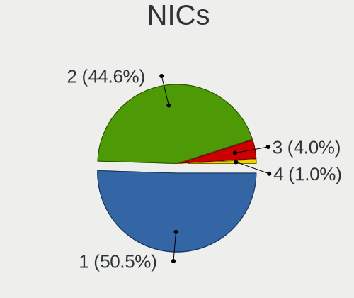

Pop!_OS Hardware Trends (Desktop)
---------------------------------

A project to identify most popular hardware characteristics and track their change
over time based on data collected by Pop!_OS users at https://Linux-Hardware.org.

Anyone can contribute to the study by uploading probes of their computers by
the [hw-probe](https://github.com/linuxhw/hw-probe) tool:

    sudo -E hw-probe -all -upload

Full-feature report is available here: https://linux-hardware.org/?view=trends&formfactor=desktop

Period: Nov, 2020.

Contents
--------

- [ OS                       ](#os)
- [ OS Family                ](#os-family)
- [ Kernel                   ](#kernel)
- [ Kernel Family            ](#kernel-family)
- [ Kernel Major Ver.        ](#kernel-major-ver)
- [ Arch                     ](#arch)
- [ DE                       ](#de)
- [ Display Server           ](#display-server)
- [ Display Manager          ](#display-manager)
- [ OS Lang                  ](#os-lang)
- [ Boot Mode                ](#boot-mode)
- [ Filesystem               ](#filesystem)
- [ Part. scheme             ](#part-scheme)
- [ Dual Boot with Linux/BSD ](#dual-boot-with-linux/bsd)
- [ Dual Boot (Win)          ](#dual-boot-win)
- [ Country                  ](#country)
- [ City                     ](#city)
- [ Vendor                   ](#vendor)
- [ Model                    ](#model)
- [ Model Family             ](#model-family)
- [ MFG Year                 ](#mfg-year)
- [ Form Factor              ](#form-factor)
- [ Secure Boot              ](#secure-boot)
- [ Coreboot                 ](#coreboot)
- [ RAM Size                 ](#ram-size)
- [ RAM Used                 ](#ram-used)
- [ Has CD-ROM               ](#has-cd-rom)
- [ Total Drives             ](#total-drives)
- [ Has Ethernet             ](#has-ethernet)
- [ Drive Vendor             ](#drive-vendor)
- [ Drive Model              ](#drive-model)
- [ HDD Vendor               ](#hdd-vendor)
- [ SSD Vendor               ](#ssd-vendor)
- [ Drive Kind               ](#drive-kind)
- [ Drive Connector          ](#drive-connector)
- [ Drive Size               ](#drive-size)
- [ Space Total              ](#space-total)
- [ Space Used               ](#space-used)
- [ Malfunc. Drives          ](#malfunc-drives)
- [ Malfunc. Drive Vendor    ](#malfunc-drive-vendor)
- [ Malfunc. HDD Vendor      ](#malfunc-hdd-vendor)
- [ Malfunc. Drive Kind      ](#malfunc-drive-kind)
- [ Failed Drives            ](#failed-drives)
- [ Failed Drive Vendor      ](#failed-drive-vendor)
- [ Drive Status             ](#drive-status)
- [ Storage Vendor           ](#storage-vendor)
- [ Storage Model            ](#storage-model)
- [ Storage Kind             ](#storage-kind)
- [ CPU Vendor               ](#cpu-vendor)
- [ CPU Model                ](#cpu-model)
- [ CPU Model Family         ](#cpu-model-family)
- [ CPU Cores                ](#cpu-cores)
- [ CPU Sockets              ](#cpu-sockets)
- [ CPU Threads              ](#cpu-threads)
- [ CPU Op-Modes             ](#cpu-op-modes)
- [ CPU Microcode            ](#cpu-microcode)
- [ CPU Microarch            ](#cpu-microarch)
- [ GPU Vendor               ](#gpu-vendor)
- [ GPU Model                ](#gpu-model)
- [ GPU Combo                ](#gpu-combo)
- [ GPU Driver               ](#gpu-driver)
- [ GPU Memory               ](#gpu-memory)
- [ Monitor Vendor           ](#monitor-vendor)
- [ Monitor Model            ](#monitor-model)
- [ Monitor Resolution       ](#monitor-resolution)
- [ Monitor Diagonal         ](#monitor-diagonal)
- [ Monitor Width            ](#monitor-width)
- [ Aspect Ratio             ](#aspect-ratio)
- [ Monitor Area             ](#monitor-area)
- [ Pixel Density            ](#pixel-density)
- [ Multiple Monitors        ](#multiple-monitors)
- [ Net Controller Vendor    ](#net-controller-vendor)
- [ Net Controller Model     ](#net-controller-model)
- [ Wireless Vendor          ](#wireless-vendor)
- [ Wireless Model           ](#wireless-model)
- [ Ethernet Vendor          ](#ethernet-vendor)
- [ Ethernet Model           ](#ethernet-model)
- [ Net Controller Kind      ](#net-controller-kind)
- [ Used Controller          ](#used-controller)
- [ NICs                     ](#nics)
- [ Memory Vendor            ](#memory-vendor)
- [ Memory Model             ](#memory-model)
- [ Memory Kind              ](#memory-kind)
- [ Memory Form Factor       ](#memory-form-factor)
- [ Memory Size              ](#memory-size)
- [ Memory Speed             ](#memory-speed)
- [ Sound Vendor             ](#sound-vendor)
- [ Sound Model              ](#sound-model)
- [ Camera Vendor            ](#camera-vendor)
- [ Camera Model             ](#camera-model)
- [ Fingerprint Vendor       ](#fingerprint-vendor)
- [ Fingerprint Model        ](#fingerprint-model)
- [ Chipcard Vendor          ](#chipcard-vendor)
- [ Chipcard Model           ](#chipcard-model)
- [ Printer Vendor           ](#printer-vendor)
- [ Printer Model            ](#printer-model)
- [ Scanner Vendor           ](#scanner-vendor)
- [ Scanner Model            ](#scanner-model)
- [ Bluetooth Vendor         ](#bluetooth-vendor)
- [ Bluetooth Model          ](#bluetooth-model)
- [ Unsupported Devices      ](#unsupported-devices)
- [ Unsupported Device Types ](#unsupported-device-types)

OS
--

Installed operating systems

| Name          | Desktops | Percent |
|---------------|----------|---------|
| Pop!_OS 20.10 | 71       | 67.62%  |
| Pop!_OS 20.04 | 33       | 31.43%  |
| Pop!_OS 18.04 | 1        | 0.95%   |

OS Family
---------

OS without a version

| Name    | Desktops | Percent |
|---------|----------|---------|
| Pop!_OS | 105      | 100%    |

Kernel
------

Version of the Linux kernel

| Version                  | Desktops | Percent |
|--------------------------|----------|---------|
| 5.8.0-7630-generic       | 47       | 44.76%  |
| 5.8.0-7625-generic       | 41       | 39.05%  |
| 5.4.0-7642-generic       | 9        | 8.57%   |
| 5.8.18-050818-generic    | 2        | 1.9%    |
| 5.9.11-xanmod1           | 1        | 0.95%   |
| 5.8.17-050817-generic    | 1        | 0.95%   |
| 5.8.16-tkg-bmq           | 1        | 0.95%   |
| 5.4.0-7634-generic       | 1        | 0.95%   |
| 5.3.0-7648-generic       | 1        | 0.95%   |
| 5.10.0-051000rc2-generic | 1        | 0.95%   |

Kernel Family
-------------

Linux kernel without a distro release

| Version | Desktops | Percent |
|---------|----------|---------|
| 5.8.0   | 88       | 83.81%  |
| 5.4.0   | 10       | 9.52%   |
| 5.8.18  | 2        | 1.9%    |
| 5.9.11  | 1        | 0.95%   |
| 5.8.17  | 1        | 0.95%   |
| 5.8.16  | 1        | 0.95%   |
| 5.3.0   | 1        | 0.95%   |
| 5.10.0  | 1        | 0.95%   |

Kernel Major Ver.
-----------------

Linux kernel major version

| Version | Desktops | Percent |
|---------|----------|---------|
| 5.8     | 92       | 87.62%  |
| 5.4     | 10       | 9.52%   |
| 5.9     | 1        | 0.95%   |
| 5.3     | 1        | 0.95%   |
| 5.10    | 1        | 0.95%   |

Arch
----

OS architecture (x86_64, i586, etc.)

| Name   | Desktops | Percent |
|--------|----------|---------|
| x86_64 | 105      | 100%    |

DE
--

Desktop Environment

| Name  | Desktops | Percent |
|-------|----------|---------|
| GNOME | 100      | 95.24%  |
| KDE   | 2        | 1.9%    |
| MATE  | 1        | 0.95%   |
| LXQt  | 1        | 0.95%   |
| i3    | 1        | 0.95%   |

Display Server
--------------

X11 or Wayland

| Name    | Desktops | Percent |
|---------|----------|---------|
| X11     | 103      | 98.1%   |
| Wayland | 1        | 0.95%   |
| Tty     | 1        | 0.95%   |

Display Manager
---------------

SDDM, LightDM, etc.

| Name    | Desktops | Percent |
|---------|----------|---------|
| Unknown | 90       | 85.71%  |
| GDM     | 15       | 14.29%  |

OS Lang
-------

Language

| Lang  | Desktops | Percent |
|-------|----------|---------|
| en_US | 62       | 59.05%  |
| en_GB | 12       | 11.43%  |
| pt_BR | 8        | 7.62%   |
| de_DE | 5        | 4.76%   |
| en_AU | 4        | 3.81%   |
| en_CA | 3        | 2.86%   |
| C     | 3        | 2.86%   |
| ru_RU | 2        | 1.9%    |
| pl_PL | 2        | 1.9%    |
| tr_TR | 1        | 0.95%   |
| nl_NL | 1        | 0.95%   |
| it_IT | 1        | 0.95%   |
| fr_FR | 1        | 0.95%   |

Boot Mode
---------

EFI or BIOS

| Mode | Desktops | Percent |
|------|----------|---------|
| BIOS | 90       | 85.71%  |
| EFI  | 15       | 14.29%  |

Filesystem
----------

Type of filesystem

| Type    | Desktops | Percent |
|---------|----------|---------|
| Ext4    | 103      | 98.1%   |
| Overlay | 1        | 0.95%   |
| Btrfs   | 1        | 0.95%   |

Part. scheme
------------

Scheme of partitioning

| Type    | Desktops | Percent |
|---------|----------|---------|
| Unknown | 91       | 86.67%  |
| GPT     | 13       | 12.38%  |
| MBR     | 1        | 0.95%   |

Dual Boot with Linux/BSD
------------------------

Hosting more than one Linux/BSD

| Dual boot | Desktops | Percent |
|-----------|----------|---------|
| No        | 100      | 95.24%  |
| Yes       | 5        | 4.76%   |

Dual Boot (Win)
---------------

Hosting Linux and Windows

| Dual boot | Desktops | Percent |
|-----------|----------|---------|
| No        | 96       | 91.43%  |
| Yes       | 9        | 8.57%   |

Country
-------

Geographic location (country)

| Country     | Desktops | Percent |
|-------------|----------|---------|
| USA         | 38       | 36.19%  |
| Brazil      | 10       | 9.52%   |
| UK          | 8        | 7.62%   |
| Germany     | 7        | 6.67%   |
| Canada      | 4        | 3.81%   |
| Australia   | 4        | 3.81%   |
| Spain       | 3        | 2.86%   |
| Russia      | 3        | 2.86%   |
| Poland      | 3        | 2.86%   |
| Norway      | 3        | 2.86%   |
| Switzerland | 2        | 1.9%    |
| Slovenia    | 2        | 1.9%    |
| Philippines | 2        | 1.9%    |
| Netherlands | 2        | 1.9%    |
| Greece      | 2        | 1.9%    |
| Austria     | 2        | 1.9%    |
| Turkey      | 1        | 0.95%   |
| Serbia      | 1        | 0.95%   |
| Romania     | 1        | 0.95%   |
| New Zealand | 1        | 0.95%   |
| Mexico      | 1        | 0.95%   |
| Italy       | 1        | 0.95%   |
| Iran        | 1        | 0.95%   |
| France      | 1        | 0.95%   |
| Argentina   | 1        | 0.95%   |
| Unknown     | 1        | 0.95%   |

City
----

Geographic location (city)

| City                  | Desktops | Percent |
|-----------------------|----------|---------|
| Vancouver             | 2        | 1.9%    |
| São Paulo            | 2        | 1.9%    |
| Sydney                | 2        | 1.9%    |
| Seattle               | 2        | 1.9%    |
| Orlando               | 2        | 1.9%    |
| Moscow                | 2        | 1.9%    |
| Miami                 | 2        | 1.9%    |
| Zurich                | 1        | 0.95%   |
| Wrocław              | 1        | 0.95%   |
| West Lafayette        | 1        | 0.95%   |
| Wellington            | 1        | 0.95%   |
| Watertown             | 1        | 0.95%   |
| Wantirna South        | 1        | 0.95%   |
| Villa Heights         | 1        | 0.95%   |
| Vienna                | 1        | 0.95%   |
| Târgovişte          | 1        | 0.95%   |
| São José dos Campos | 1        | 0.95%   |
| Stuttgart             | 1        | 0.95%   |
| Stavanger             | 1        | 0.95%   |
| Solbergelva           | 1        | 0.95%   |
| Schwarzenburg         | 1        | 0.95%   |
| Santa Maria           | 1        | 0.95%   |
| Sacramento            | 1        | 0.95%   |
| Rostock               | 1        | 0.95%   |
| Rio de Janeiro        | 1        | 0.95%   |
| Portland              | 1        | 0.95%   |
| Ponta Grossa          | 1        | 0.95%   |
| Phoenix               | 1        | 0.95%   |
| Pasig                 | 1        | 0.95%   |
| Palermo               | 1        | 0.95%   |
| Oviedo                | 1        | 0.95%   |
| Oakland               | 1        | 0.95%   |
| Novi Sad              | 1        | 0.95%   |
| Niegowonice           | 1        | 0.95%   |
| Munich                | 1        | 0.95%   |
| Milton                | 1        | 0.95%   |
| Mentor                | 1        | 0.95%   |
| Maribor               | 1        | 0.95%   |
| Mannheim              | 1        | 0.95%   |
| Mahon                 | 1        | 0.95%   |
| Lyster                | 1        | 0.95%   |
| Luton                 | 1        | 0.95%   |
| Lorette               | 1        | 0.95%   |
| Loganville            | 1        | 0.95%   |
| Liverpool             | 1        | 0.95%   |
| Las Vegas             | 1        | 0.95%   |
| Krasnodar             | 1        | 0.95%   |
| Klagenfurt            | 1        | 0.95%   |
| Kermanshah            | 1        | 0.95%   |
| Kamloops              | 1        | 0.95%   |
| Jundiaí              | 1        | 0.95%   |
| Jackson               | 1        | 0.95%   |
| Izmir                 | 1        | 0.95%   |
| Irvine                | 1        | 0.95%   |
| Irece                 | 1        | 0.95%   |
| Hounslow              | 1        | 0.95%   |
| Hays                  | 1        | 0.95%   |
| Groningen             | 1        | 0.95%   |
| Grand Ledge           | 1        | 0.95%   |
| Gorenja Vas           | 1        | 0.95%   |

Vendor
------

Motherboard manufacturer

| Name                | Desktops | Percent |
|---------------------|----------|---------|
| ASUSTek Computer    | 30       | 28.57%  |
| Gigabyte Technology | 27       | 25.71%  |
| MSI                 | 14       | 13.33%  |
| ASRock              | 9        | 8.57%   |
| Hewlett-Packard     | 7        | 6.67%   |
| Dell                | 6        | 5.71%   |
| Positivo            | 2        | 1.9%    |
| Pegatron            | 2        | 1.9%    |
| Lenovo              | 2        | 1.9%    |
| Intel               | 2        | 1.9%    |
| Supermicro          | 1        | 0.95%   |
| NEC Computers       | 1        | 0.95%   |
| Medion              | 1        | 0.95%   |
| HOUTER              | 1        | 0.95%   |

Model
-----

Motherboard model

| Name                                     | Desktops | Percent |
|------------------------------------------|----------|---------|
| ASUS All Series                          | 4        | 3.81%   |
| MSI MS-7C02                              | 2        | 1.9%    |
| MSI MS-7B86                              | 2        | 1.9%    |
| Gigabyte B550I AORUS PRO AX              | 2        | 1.9%    |
| Gigabyte B450M S2H                       | 2        | 1.9%    |
| Gigabyte B450M DS3H                      | 2        | 1.9%    |
| ASUS TUF GAMING X570-PLUS                | 2        | 1.9%    |
| ASUS PRIME B450M-A                       | 2        | 1.9%    |
| Supermicro X7DVL                         | 1        | 0.95%   |
| Positivo POS-PQ45AU                      | 1        | 0.95%   |
| Positivo POS-EIH61CR                     | 1        | 0.95%   |
| Pegatron p6-2100z                        | 1        | 0.95%   |
| Pegatron IPMH61P1                        | 1        | 0.95%   |
| NEC Computers PC-MK36LBZCHEAM            | 1        | 0.95%   |
| MSI MS-7C91                              | 1        | 0.95%   |
| MSI MS-7C52                              | 1        | 0.95%   |
| MSI MS-7C37                              | 1        | 0.95%   |
| MSI MS-7B87                              | 1        | 0.95%   |
| MSI MS-7B58                              | 1        | 0.95%   |
| MSI MS-7B22                              | 1        | 0.95%   |
| MSI MS-7A71                              | 1        | 0.95%   |
| MSI MS-7A70                              | 1        | 0.95%   |
| MSI MS-7921                              | 1        | 0.95%   |
| MSI MS-7917                              | 1        | 0.95%   |
| Medion Akoya P5286 E/B549                | 1        | 0.95%   |
| Lenovo Legion T730-28ICO 90JF0082US      | 1        | 0.95%   |
| Lenovo 0800-E3G                          | 1        | 0.95%   |
| Intel DN2820FYK H24582-204               | 1        | 0.95%   |
| Intel DH55PJ AAE93812-302                | 1        | 0.95%   |
| HOUTER IPMH61R1                          | 1        | 0.95%   |
| HP Z840 Workstation                      | 1        | 0.95%   |
| HP Z640 Workstation                      | 1        | 0.95%   |
| HP Z420 Workstation                      | 1        | 0.95%   |
| HP EliteDesk 705 G1 SFF                  | 1        | 0.95%   |
| HP Compaq Pro 6300 SFF                   | 1        | 0.95%   |
| HP Compaq Elite 8300 Touch All-in-One PC | 1        | 0.95%   |
| HP Compaq 6000 Pro MT PC                 | 1        | 0.95%   |
| Gigabyte Z97N-WIFI                       | 1        | 0.95%   |
| Gigabyte Z97-HD3                         | 1        | 0.95%   |
| Gigabyte Z390 AORUS ULTRA                | 1        | 0.95%   |
| Gigabyte X570 GAMING X                   | 1        | 0.95%   |
| Gigabyte X570 AORUS PRO WIFI             | 1        | 0.95%   |
| Gigabyte X48-DS5                         | 1        | 0.95%   |
| Gigabyte TRX40 DESIGNARE                 | 1        | 0.95%   |
| Gigabyte TRX40 AORUS XTREME              | 1        | 0.95%   |
| Gigabyte P55A-UD3P                       | 1        | 0.95%   |
| Gigabyte H61M-DS2 DVI                    | 1        | 0.95%   |
| Gigabyte H61M-D2H                        | 1        | 0.95%   |
| Gigabyte F2A75M-HD2                      | 1        | 0.95%   |
| Gigabyte B75M-D3H                        | 1        | 0.95%   |
| Gigabyte B550M AORUS ELITE               | 1        | 0.95%   |
| Gigabyte B450 I AORUS PRO WIFI           | 1        | 0.95%   |
| Gigabyte B450 GAMING X                   | 1        | 0.95%   |
| Gigabyte B450 AORUS PRO WIFI             | 1        | 0.95%   |
| Gigabyte B450 AORUS PRO                  | 1        | 0.95%   |
| Gigabyte B450 AORUS M                    | 1        | 0.95%   |
| Gigabyte A320M-S2H                       | 1        | 0.95%   |
| Gigabyte 990FXA-UD3                      | 1        | 0.95%   |
| Dell XPS 8300                            | 1        | 0.95%   |
| Dell Precision WorkStation T3400         | 1        | 0.95%   |

Model Family
------------

Motherboard model prefix

| Name                          | Desktops | Percent |
|-------------------------------|----------|---------|
| ASUS ROG                      | 6        | 5.71%   |
| ASUS PRIME                    | 6        | 5.71%   |
| Gigabyte B450                 | 5        | 4.76%   |
| Gigabyte B450M                | 4        | 3.81%   |
| ASUS All                      | 4        | 3.81%   |
| HP Compaq                     | 3        | 2.86%   |
| ASUS TUF                      | 3        | 2.86%   |
| MSI MS-7C02                   | 2        | 1.9%    |
| MSI MS-7B86                   | 2        | 1.9%    |
| Gigabyte X570                 | 2        | 1.9%    |
| Gigabyte TRX40                | 2        | 1.9%    |
| Gigabyte B550I                | 2        | 1.9%    |
| Dell OptiPlex                 | 2        | 1.9%    |
| Dell Inspiron                 | 2        | 1.9%    |
| ASUS SABERTOOTH               | 2        | 1.9%    |
| Supermicro X7DVL              | 1        | 0.95%   |
| Positivo POS-PQ45AU           | 1        | 0.95%   |
| Positivo POS-EIH61CR          | 1        | 0.95%   |
| Pegatron p6-2100z             | 1        | 0.95%   |
| Pegatron IPMH61P1             | 1        | 0.95%   |
| NEC Computers PC-MK36LBZCHEAM | 1        | 0.95%   |
| MSI MS-7C91                   | 1        | 0.95%   |
| MSI MS-7C52                   | 1        | 0.95%   |
| MSI MS-7C37                   | 1        | 0.95%   |
| MSI MS-7B87                   | 1        | 0.95%   |
| MSI MS-7B58                   | 1        | 0.95%   |
| MSI MS-7B22                   | 1        | 0.95%   |
| MSI MS-7A71                   | 1        | 0.95%   |
| MSI MS-7A70                   | 1        | 0.95%   |
| MSI MS-7921                   | 1        | 0.95%   |
| MSI MS-7917                   | 1        | 0.95%   |
| Medion Akoya                  | 1        | 0.95%   |
| Lenovo Legion                 | 1        | 0.95%   |
| Lenovo 0800-E3G               | 1        | 0.95%   |
| Intel DN2820FYK               | 1        | 0.95%   |
| Intel DH55PJ                  | 1        | 0.95%   |
| HOUTER IPMH61R1               | 1        | 0.95%   |
| HP Z840                       | 1        | 0.95%   |
| HP Z640                       | 1        | 0.95%   |
| HP Z420                       | 1        | 0.95%   |
| HP EliteDesk                  | 1        | 0.95%   |
| Gigabyte Z97N-WIFI            | 1        | 0.95%   |
| Gigabyte Z97-HD3              | 1        | 0.95%   |
| Gigabyte Z390                 | 1        | 0.95%   |
| Gigabyte X48-DS5              | 1        | 0.95%   |
| Gigabyte P55A-UD3P            | 1        | 0.95%   |
| Gigabyte H61M-DS2             | 1        | 0.95%   |
| Gigabyte H61M-D2H             | 1        | 0.95%   |
| Gigabyte F2A75M-HD2           | 1        | 0.95%   |
| Gigabyte B75M-D3H             | 1        | 0.95%   |
| Gigabyte B550M                | 1        | 0.95%   |
| Gigabyte A320M-S2H            | 1        | 0.95%   |
| Gigabyte 990FXA-UD3           | 1        | 0.95%   |
| Dell XPS                      | 1        | 0.95%   |
| Dell Precision                | 1        | 0.95%   |
| ASUS Z170-DELUXE              | 1        | 0.95%   |
| ASUS P9X79                    | 1        | 0.95%   |
| ASUS P6X58D                   | 1        | 0.95%   |
| ASUS P6T                      | 1        | 0.95%   |
| ASUS P5Q                      | 1        | 0.95%   |

MFG Year
--------

Motherboard manufacture year

| Year | Desktops | Percent |
|------|----------|---------|
| 2020 | 29       | 27.62%  |
| 2019 | 19       | 18.1%   |
| 2018 | 11       | 10.48%  |
| 2015 | 8        | 7.62%   |
| 2014 | 6        | 5.71%   |
| 2013 | 6        | 5.71%   |
| 2011 | 6        | 5.71%   |
| 2010 | 6        | 5.71%   |
| 2012 | 5        | 4.76%   |
| 2016 | 3        | 2.86%   |
| 2008 | 3        | 2.86%   |
| 2009 | 2        | 1.9%    |
| 2017 | 1        | 0.95%   |

Form Factor
-----------

Physical design of the computer

| Name    | Desktops | Percent |
|---------|----------|---------|
| Desktop | 105      | 100%    |

Secure Boot
-----------

Enabled or disabled

| State    | Desktops | Percent |
|----------|----------|---------|
| Disabled | 105      | 100%    |

Coreboot
--------

Have coreboot on board

| Used | Desktops | Percent |
|------|----------|---------|
| No   | 105      | 100%    |

RAM Size
--------

Total RAM memory

| Size in GB  | Desktops | Percent |
|-------------|----------|---------|
| 16.01-24.0  | 37       | 35.24%  |
| 8.01-16.0   | 18       | 17.14%  |
| 32.01-64.0  | 15       | 14.29%  |
| 3.01-4.0    | 10       | 9.52%   |
| 4.01-8.0    | 9        | 8.57%   |
| 24.01-32.0  | 7        | 6.67%   |
| 64.01-256.0 | 7        | 6.67%   |
| 1.01-2.0    | 2        | 1.9%    |

RAM Used
--------

Used RAM memory

| Used GB    | Desktops | Percent |
|------------|----------|---------|
| 1.01-2.0   | 34       | 32.38%  |
| 4.01-8.0   | 27       | 25.71%  |
| 2.01-3.0   | 27       | 25.71%  |
| 3.01-4.0   | 11       | 10.48%  |
| 8.01-16.0  | 5        | 4.76%   |
| 16.01-24.0 | 1        | 0.95%   |

Has CD-ROM
----------

Has CD-ROM on board

| Presented | Desktops | Percent |
|-----------|----------|---------|
| No        | 62       | 59.05%  |
| Yes       | 43       | 40.95%  |

Total Drives
------------

Number of drives on board

| Drives | Desktops | Percent |
|--------|----------|---------|
| 1      | 33       | 31.43%  |
| 3      | 27       | 25.71%  |
| 2      | 24       | 22.86%  |
| 4      | 15       | 14.29%  |
| 5      | 3        | 2.86%   |
| 8      | 1        | 0.95%   |
| 6      | 1        | 0.95%   |
| 0      | 1        | 0.95%   |

Has Ethernet
------------

Has Ethernet on board

| Presented | Desktops | Percent |
|-----------|----------|---------|
| Yes       | 104      | 99.05%  |
| No        | 1        | 0.95%   |

Drive Vendor
------------

Hard drive vendors

| Vendor                    | Desktops | Drives | Percent |
|---------------------------|----------|--------|---------|
| Seagate                   | 41       | 54     | 19.52%  |
| Samsung Electronics       | 37       | 49     | 17.62%  |
| WDC                       | 33       | 39     | 15.71%  |
| Kingston                  | 16       | 21     | 7.62%   |
| Toshiba                   | 12       | 12     | 5.71%   |
| SanDisk                   | 9        | 10     | 4.29%   |
| Crucial                   | 8        | 8      | 3.81%   |
| PNY                       | 6        | 6      | 2.86%   |
| Phison                    | 6        | 7      | 2.86%   |
| A-DATA Technology         | 6        | 8      | 2.86%   |
| Intel                     | 5        | 7      | 2.38%   |
| XPG                       | 4        | 4      | 1.9%    |
| Hitachi                   | 4        | 4      | 1.9%    |
| Micron Technology         | 3        | 3      | 1.43%   |
| Unknown                   | 2        | 2      | 0.95%   |
| Micron/Crucial Technology | 2        | 2      | 0.95%   |
| Team                      | 1        | 1      | 0.48%   |
| SK Hynix                  | 1        | 1      | 0.48%   |
| Silicon Motion            | 1        | 1      | 0.48%   |
| PLEXTOR                   | 1        | 1      | 0.48%   |
| Patriot                   | 1        | 1      | 0.48%   |
| OWC                       | 1        | 1      | 0.48%   |
| OCZ                       | 1        | 1      | 0.48%   |
| NVMe                      | 1        | 1      | 0.48%   |
| LITEON                    | 1        | 1      | 0.48%   |
| KIOXIA-EXCERIA            | 1        | 1      | 0.48%   |
| KIOXIA-E                  | 1        | 1      | 0.48%   |
| JMicron                   | 1        | 1      | 0.48%   |
| Intenso                   | 1        | 1      | 0.48%   |
| HPE                       | 1        | 1      | 0.48%   |
| GOODRAM                   | 1        | 1      | 0.48%   |
| Corsair                   | 1        | 1      | 0.48%   |

Drive Model
-----------

Hard drive models

| Model                             | Desktops | Percent |
|-----------------------------------|----------|---------|
| Seagate ST1000DM010-2EP102 1TB    | 6        | 2.49%   |
| Kingston SA400S37240G 240GB SSD   | 6        | 2.49%   |
| Seagate ST500DM002-1BD142 500GB   | 5        | 2.07%   |
| Seagate ST2000DM008-2FR102 2TB    | 5        | 2.07%   |
| Samsung SSD 860 EVO 1TB           | 5        | 2.07%   |
| Samsung SSD 850 EVO 250GB         | 5        | 2.07%   |
| Samsung NVMe SSD Drive 500GB      | 4        | 1.66%   |
| Samsung NVMe SSD Drive 250GB      | 4        | 1.66%   |
| WDC WD10EZEX-08WN4A0 1TB          | 3        | 1.24%   |
| WDC WD10EZEX-00BN5A0 1TB          | 3        | 1.24%   |
| Seagate ST1000DM003-1ER162 1TB    | 3        | 1.24%   |
| Samsung SSD 860 EVO 500GB         | 3        | 1.24%   |
| Samsung NVMe SSD Drive 1TB        | 3        | 1.24%   |
| XPG NVMe SSD Drive 256GB          | 2        | 0.83%   |
| WDC WDS500G2B0B-00YS70 500GB SSD  | 2        | 0.83%   |
| WDC WDS240G2G0A-00JH30 240GB SSD  | 2        | 0.83%   |
| WDC WD3200AAKS-75L9A0 320GB       | 2        | 0.83%   |
| WDC WD30EZRX-00MMMB0 3TB          | 2        | 0.83%   |
| Toshiba MQ01ABD100 1TB            | 2        | 0.83%   |
| Seagate ST8000DM004-2CX188 8TB    | 2        | 0.83%   |
| Seagate ST31000524AS 1TB          | 2        | 0.83%   |
| Seagate ST2000DX001-1NS164 2TB    | 2        | 0.83%   |
| Seagate ST1000DM003-1CH162 1TB    | 2        | 0.83%   |
| SanDisk SSD G5 BICS4 1TB          | 2        | 0.83%   |
| Samsung SSD 970 EVO 500GB         | 2        | 0.83%   |
| Samsung SSD 850 EVO 500GB         | 2        | 0.83%   |
| Samsung SSD 840 EVO 250GB         | 2        | 0.83%   |
| Samsung HD103SJ 1TB               | 2        | 0.83%   |
| PNY CS900 120GB SSD               | 2        | 0.83%   |
| Phison Sabrent Rocket 4.0 1TB     | 2        | 0.83%   |
| Micron/Crucial NVMe SSD Drive 1TB | 2        | 0.83%   |
| Kingston SV300S37A120G 120GB SSD  | 2        | 0.83%   |
| Kingston SA400S37120G 120GB SSD   | 2        | 0.83%   |
| Kingston NVMe SSD Drive 1TB       | 2        | 0.83%   |
| Intel NVMe SSD Drive 2TB          | 2        | 0.83%   |
| A-DATA SU650 240GB SSD            | 2        | 0.83%   |
| XPG NVMe SSD Drive 1024GB         | 1        | 0.41%   |
| XPG GAMMIX S5 512GB               | 1        | 0.41%   |
| WDC WDS250G1B0A-00H9H0 250GB SSD  | 1        | 0.41%   |
| WDC WDS240G2G0B-00EPW0 240GB SSD  | 1        | 0.41%   |
| WDC WDS120G2G0A-00JH30 120GB SSD  | 1        | 0.41%   |
| WDC WDS100T1B0B-00AS40 1TB SSD    | 1        | 0.41%   |
| WDC WD800JD-60LSA0 80GB           | 1        | 0.41%   |
| WDC WD5000AZLX-00JKKA0 500GB      | 1        | 0.41%   |
| WDC WD5000AAKX-75U6AA0 500GB      | 1        | 0.41%   |
| WDC WD5000AAKX-00U6AA0 500GB      | 1        | 0.41%   |
| WDC WD5000AAKX-00ERMA0 500GB      | 1        | 0.41%   |
| WDC WD5000AAKS-22YGA0 500GB       | 1        | 0.41%   |
| WDC WD5000AAKS-08V0A0 500GB       | 1        | 0.41%   |
| WDC WD3200BEVT-60ZCT1 320GB       | 1        | 0.41%   |
| WDC WD30EZRX-00DC0B0 3TB          | 1        | 0.41%   |
| WDC WD30EFRX-68EUZN0 3TB          | 1        | 0.41%   |
| WDC WD30EFRX-68AX9N0 3TB          | 1        | 0.41%   |
| WDC WD20EURS-73SPKY0 2TB          | 1        | 0.41%   |
| WDC WD10EZRX-00A8LB0 1TB          | 1        | 0.41%   |
| WDC WD10EZEX-22MFCA0 1TB          | 1        | 0.41%   |
| WDC WD10EZEX-08M2NA0 1TB          | 1        | 0.41%   |
| WDC WD10EARS-00MVWB0 1TB          | 1        | 0.41%   |
| WDC WD1003FZEX-00MK2A0 1TB        | 1        | 0.41%   |
| WDC WD1002FAEX-00Y9A0 1TB         | 1        | 0.41%   |

HDD Vendor
----------

Hard disk drive vendors

| Vendor              | Desktops | Drives | Percent |
|---------------------|----------|--------|---------|
| Seagate             | 39       | 50     | 45.88%  |
| WDC                 | 27       | 31     | 31.76%  |
| Toshiba             | 11       | 11     | 12.94%  |
| Hitachi             | 4        | 4      | 4.71%   |
| Samsung Electronics | 3        | 3      | 3.53%   |
| Unknown             | 1        | 1      | 1.18%   |

SSD Vendor
----------

Solid state drive vendors

| Vendor              | Desktops | Drives | Percent |
|---------------------|----------|--------|---------|
| Samsung Electronics | 24       | 29     | 26.37%  |
| Kingston            | 14       | 17     | 15.38%  |
| WDC                 | 8        | 8      | 8.79%   |
| Crucial             | 8        | 8      | 8.79%   |
| SanDisk             | 7        | 8      | 7.69%   |
| PNY                 | 6        | 6      | 6.59%   |
| A-DATA Technology   | 6        | 8      | 6.59%   |
| Micron Technology   | 3        | 3      | 3.3%    |
| Intel               | 2        | 3      | 2.2%    |
| Unknown             | 1        | 1      | 1.1%    |
| Team                | 1        | 1      | 1.1%    |
| SK Hynix            | 1        | 1      | 1.1%    |
| PLEXTOR             | 1        | 1      | 1.1%    |
| Patriot             | 1        | 1      | 1.1%    |
| OWC                 | 1        | 1      | 1.1%    |
| OCZ                 | 1        | 1      | 1.1%    |
| LITEON              | 1        | 1      | 1.1%    |
| KIOXIA-EXCERIA      | 1        | 1      | 1.1%    |
| KIOXIA-E            | 1        | 1      | 1.1%    |
| Intenso             | 1        | 1      | 1.1%    |
| GOODRAM             | 1        | 1      | 1.1%    |
| Corsair             | 1        | 1      | 1.1%    |

Drive Kind
----------

HDD or SSD

| Kind    | Desktops | Drives | Percent |
|---------|----------|--------|---------|
| HDD     | 70       | 100    | 39.33%  |
| SSD     | 69       | 103    | 38.76%  |
| NVMe    | 34       | 44     | 19.1%   |
| Unknown | 5        | 5      | 2.81%   |

Drive Connector
---------------

SATA, SAS, NVMe, etc.

| Type | Desktops | Drives | Percent |
|------|----------|--------|---------|
| SATA | 97       | 197    | 68.31%  |
| NVMe | 34       | 44     | 23.94%  |
| SAS  | 11       | 11     | 7.75%   |

Drive Size
----------

Size of hard drive

| Size in TB | Desktops | Drives | Percent |
|------------|----------|--------|---------|
| 0.01-0.5   | 76       | 112    | 50.67%  |
| 0.51-1.0   | 43       | 56     | 28.67%  |
| 1.01-2.0   | 13       | 15     | 8.67%   |
| 2.01-3.0   | 8        | 10     | 5.33%   |
| 4.01-10.0  | 5        | 5      | 3.33%   |
| 3.01-4.0   | 4        | 4      | 2.67%   |
| 10.01-20.0 | 1        | 1      | 0.67%   |

Space Total
-----------

Amount of disk space available on the file system

| Size in GB     | Desktops | Percent |
|----------------|----------|---------|
| 101-250        | 31       | 29.52%  |
| 251-500        | 23       | 21.9%   |
| 501-1000       | 16       | 15.24%  |
| 1001-2000      | 14       | 13.33%  |
| More than 3000 | 11       | 10.48%  |
| 51-100         | 5        | 4.76%   |
| 2001-3000      | 2        | 1.9%    |
| 1-20           | 2        | 1.9%    |
| 21-50          | 1        | 0.95%   |

Space Used
----------

Amount of used disk space

| Used GB        | Desktops | Percent |
|----------------|----------|---------|
| 1-20           | 33       | 31.43%  |
| 21-50          | 19       | 18.1%   |
| 101-250        | 14       | 13.33%  |
| 501-1000       | 11       | 10.48%  |
| 51-100         | 11       | 10.48%  |
| 251-500        | 7        | 6.67%   |
| More than 3000 | 4        | 3.81%   |
| 2001-3000      | 3        | 2.86%   |
| 1001-2000      | 3        | 2.86%   |

Malfunc. Drives
---------------

Drive models with a malfunction

| Model                         | Desktops | Drives | Percent |
|-------------------------------|----------|--------|---------|
| Intenso SSD 128GB             | 1        | 1      | 50%     |
| Hitachi HTS547550A9E384 500GB | 1        | 1      | 50%     |

Malfunc. Drive Vendor
---------------------

Vendors of faulty drives

| Vendor  | Desktops | Drives | Percent |
|---------|----------|--------|---------|
| Intenso | 1        | 1      | 50%     |
| Hitachi | 1        | 1      | 50%     |

Malfunc. HDD Vendor
-------------------

Vendors of faulty HDD drives

| Vendor  | Desktops | Drives | Percent |
|---------|----------|--------|---------|
| Hitachi | 1        | 1      | 100%    |

Malfunc. Drive Kind
-------------------

Kinds of faulty drives

| Kind | Desktops | Drives | Percent |
|------|----------|--------|---------|
| SSD  | 1        | 1      | 50%     |
| HDD  | 1        | 1      | 50%     |

Failed Drives
-------------

Failed drive models

Zero info for selected period =(

Failed Drive Vendor
-------------------

Failed drive vendors

Zero info for selected period =(

Drive Status
------------

Number of failed and malfunc. drives

| Status   | Desktops | Drives | Percent |
|----------|----------|--------|---------|
| Detected | 91       | 216    | 86.67%  |
| Works    | 13       | 34     | 12.38%  |
| Malfunc  | 1        | 2      | 0.95%   |

Storage Vendor
--------------

Storage controller vendors

| Vendor                       | Desktops | Percent |
|------------------------------|----------|---------|
| Intel                        | 61       | 37.65%  |
| AMD                          | 46       | 28.4%   |
| Samsung Electronics          | 15       | 9.26%   |
| ASMedia Technology           | 8        | 4.94%   |
| Phison Electronics           | 6        | 3.7%    |
| Marvell Technology Group     | 6        | 3.7%    |
| Kingston Technology Company  | 3        | 1.85%   |
| JMicron Technology           | 3        | 1.85%   |
| ADATA Technology             | 3        | 1.85%   |
| Sandisk                      | 2        | 1.23%   |
| Micron/Crucial Technology    | 2        | 1.23%   |
| VIA Technologies             | 1        | 0.62%   |
| Toshiba America Info Systems | 1        | 0.62%   |
| Silicon Motion               | 1        | 0.62%   |
| Seagate Technology           | 1        | 0.62%   |
| Realtek Semiconductor        | 1        | 0.62%   |
| LSI Logic / Symbios Logic    | 1        | 0.62%   |
| Broadcom / LSI               | 1        | 0.62%   |

Storage Model
-------------

Storage controller models

| Model                                                                                   | Desktops | Percent |
|-----------------------------------------------------------------------------------------|----------|---------|
| AMD FCH SATA Controller [AHCI mode]                                                     | 36       | 17.31%  |
| AMD 400 Series Chipset SATA Controller                                                  | 22       | 10.58%  |
| Samsung Electronics NVMe SSD Controller SM981/PM981/PM983                               | 12       | 5.77%   |
| Intel 9 Series Chipset Family SATA Controller [AHCI Mode]                               | 8        | 3.85%   |
| ASMedia Technology ASM1062 Serial ATA Controller                                        | 8        | 3.85%   |
| Intel Cannon Lake PCH SATA AHCI Controller                                              | 6        | 2.88%   |
| Intel 200 Series PCH SATA controller [AHCI mode]                                        | 6        | 2.88%   |
| AMD SATA controller                                                                     | 5        | 2.4%    |
| Phison Electronics E16 PCIe4 NVMe Controller                                            | 4        | 1.92%   |
| Intel SSD 660P Series                                                                   | 4        | 1.92%   |
| Intel 8 Series/C220 Series Chipset Family 6-port SATA Controller 1 [AHCI mode]          | 4        | 1.92%   |
| Intel 7 Series/C210 Series Chipset Family 6-port SATA Controller [AHCI mode]            | 4        | 1.92%   |
| Kingston Technology Company A2000 NVMe SSD                                              | 3        | 1.44%   |
| Intel SATA Controller [RAID mode]                                                       | 3        | 1.44%   |
| Intel 6 Series/C200 Series Chipset Family Desktop SATA Controller (IDE mode, ports 4-5) | 3        | 1.44%   |
| Intel 6 Series/C200 Series Chipset Family Desktop SATA Controller (IDE mode, ports 0-3) | 3        | 1.44%   |
| Intel 6 Series/C200 Series Chipset Family 6 port Desktop SATA AHCI Controller           | 3        | 1.44%   |
| AMD SB7x0/SB8x0/SB9x0 SATA Controller [AHCI mode]                                       | 3        | 1.44%   |
| ADATA Technology XPG SX8200 Pro PCIe Gen3x4 M.2 2280 Solid State Drive                  | 3        | 1.44%   |
| Sandisk WD Black 2019/PC SN750 NVMe SSD                                                 | 2        | 0.96%   |
| Samsung Electronics NVMe SSD Controller SM951/PM951                                     | 2        | 0.96%   |
| Samsung Electronics Electronics Non-Volatile memory controller                          | 2        | 0.96%   |
| Phison Electronics E12 NVMe Controller                                                  | 2        | 0.96%   |
| Marvell Technology Group 88SE9172 SATA 6Gb/s Controller                                 | 2        | 0.96%   |
| Marvell Technology Group 88SE9128 PCIe SATA 6 Gb/s RAID controller with HyperDuo        | 2        | 0.96%   |
| JMicron Technology JMB363 SATA/IDE Controller                                           | 2        | 0.96%   |
| Intel NM10/ICH7 Family SATA Controller [IDE mode]                                       | 2        | 0.96%   |
| Intel C610/X99 series chipset sSATA Controller [AHCI mode]                              | 2        | 0.96%   |
| Intel C600/X79 series chipset SATA RAID Controller                                      | 2        | 0.96%   |
| Intel C600/X79 series chipset 6-Port SATA AHCI Controller                               | 2        | 0.96%   |
| Intel 82801JD/DO (ICH10 Family) SATA AHCI Controller                                    | 2        | 0.96%   |
| Intel 82801IR/IO/IH (ICH9R/DO/DH) 4 port SATA Controller [IDE mode]                     | 2        | 0.96%   |
| Intel 82801I (ICH9 Family) 2 port SATA Controller [IDE mode]                            | 2        | 0.96%   |
| Intel 82801G (ICH7 Family) IDE Controller                                               | 2        | 0.96%   |
| Intel 5 Series/3400 Series Chipset 6 port SATA AHCI Controller                          | 2        | 0.96%   |
| AMD FCH SATA Controller D                                                               | 2        | 0.96%   |
| VIA Technologies VT6415 PATA IDE Host Controller                                        | 1        | 0.48%   |
| Toshiba America Info Systems Toshiba America Info Non-Volatile memory controller        | 1        | 0.48%   |
| Silicon Motion Non-Volatile memory controller                                           | 1        | 0.48%   |
| Seagate Technology Non-Volatile memory controller                                       | 1        | 0.48%   |
| Realtek Semiconductor Realtek Non-Volatile memory controller                            | 1        | 0.48%   |
| Micron/Crucial Technology P1 NVMe PCIe SSD                                              | 1        | 0.48%   |
| Micron/Crucial Technology Non-Volatile memory controller                                | 1        | 0.48%   |
| Marvell Technology Group 88SE9123 PCIe SATA 6.0 Gb/s controller                         | 1        | 0.48%   |
| Marvell Technology Group 88SE6111/6121 SATA II / PATA Controller                        | 1        | 0.48%   |
| LSI Logic / Symbios Logic SAS2308 PCI-Express Fusion-MPT SAS-2                          | 1        | 0.48%   |
| JMicron Technology JMB368 IDE controller                                                | 1        | 0.48%   |
| Intel SATA controller                                                                   | 1        | 0.48%   |
| Intel Q170/Q150/B150/H170/H110/Z170/CM236 Chipset SATA Controller [AHCI Mode]           | 1        | 0.48%   |
| Intel C610/X99 series chipset 6-Port SATA Controller [AHCI mode]                        | 1        | 0.48%   |
| Intel C602 chipset 4-Port SATA Storage Control Unit                                     | 1        | 0.48%   |
| Intel C600/X79 series chipset IDE-r Controller                                          | 1        | 0.48%   |
| Intel Atom Processor E3800 Series SATA AHCI Controller                                  | 1        | 0.48%   |
| Intel 82801JI (ICH10 Family) SATA AHCI Controller                                       | 1        | 0.48%   |
| Intel 82801JI (ICH10 Family) 4 port SATA IDE Controller #1                              | 1        | 0.48%   |
| Intel 82801JI (ICH10 Family) 2 port SATA IDE Controller #2                              | 1        | 0.48%   |
| Intel 82801IR/IO/IH (ICH9R/DO/DH) 6 port SATA Controller [AHCI mode]                    | 1        | 0.48%   |
| Intel 631xESB/632xESB/3100 Chipset SATA IDE Controller                                  | 1        | 0.48%   |
| Intel 631xESB/632xESB IDE Controller                                                    | 1        | 0.48%   |
| Intel 5 Series/3400 Series Chipset PT IDER Controller                                   | 1        | 0.48%   |

Storage Kind
------------

Kind of storage controller (IDE, SATA, NVMe, SAS, ...)

| Kind | Desktops | Percent |
|------|----------|---------|
| SATA | 93       | 61.18%  |
| NVMe | 34       | 22.37%  |
| IDE  | 16       | 10.53%  |
| RAID | 6        | 3.95%   |
| SAS  | 3        | 1.97%   |

CPU Vendor
----------

Processor vendors

| Vendor | Desktops | Percent |
|--------|----------|---------|
| Intel  | 59       | 56.19%  |
| AMD    | 46       | 43.81%  |

CPU Model
---------

Processor models

| Model                                          | Desktops | Percent |
|------------------------------------------------|----------|---------|
| AMD Ryzen 5 3600 6-Core Processor              | 7        | 6.67%   |
| AMD Ryzen 7 3700X 8-Core Processor             | 5        | 4.76%   |
| AMD Ryzen 5 3400G with Radeon Vega Graphics    | 4        | 3.81%   |
| Intel Core i7-8700 CPU @ 3.20GHz               | 3        | 2.86%   |
| Intel Core i7-4790 CPU @ 3.60GHz               | 3        | 2.86%   |
| Intel Core i7-2600 CPU @ 3.40GHz               | 3        | 2.86%   |
| Intel Core 2 Duo CPU E8400 @ 3.00GHz           | 3        | 2.86%   |
| AMD Ryzen Threadripper 3970X 32-Core Processor | 3        | 2.86%   |
| AMD Ryzen 5 2600 Six-Core Processor            | 3        | 2.86%   |
| Intel Core i7-3960X CPU @ 3.30GHz              | 2        | 1.9%    |
| Intel Core i5-6500 CPU @ 3.20GHz               | 2        | 1.9%    |
| Intel Core i5-4460 CPU @ 3.20GHz               | 2        | 1.9%    |
| Intel Core i5-3570K CPU @ 3.40GHz              | 2        | 1.9%    |
| Intel Core i5 CPU 650 @ 3.20GHz                | 2        | 1.9%    |
| AMD Ryzen 7 3800X 8-Core Processor             | 2        | 1.9%    |
| AMD Ryzen 7 2700X Eight-Core Processor         | 2        | 1.9%    |
| AMD Ryzen 5 2600X Six-Core Processor           | 2        | 1.9%    |
| AMD Ryzen 5 1600 Six-Core Processor            | 2        | 1.9%    |
| Intel Xeon CPU W3670 @ 3.20GHz                 | 1        | 0.95%   |
| Intel Xeon CPU E5450 @ 3.00GHz                 | 1        | 0.95%   |
| Intel Xeon CPU E5-2690 v3 @ 2.60GHz            | 1        | 0.95%   |
| Intel Xeon CPU E5-2689 0 @ 2.60GHz             | 1        | 0.95%   |
| Intel Xeon CPU E5-2680 v2 @ 2.80GHz            | 1        | 0.95%   |
| Intel Xeon CPU E5-1650 v3 @ 3.50GHz            | 1        | 0.95%   |
| Intel Xeon CPU E3-1231 v3 @ 3.40GHz            | 1        | 0.95%   |
| Intel Pentium Gold G5400 CPU @ 3.70GHz         | 1        | 0.95%   |
| Intel Core i9-9900K CPU @ 3.60GHz              | 1        | 0.95%   |
| Intel Core i9-9900 CPU @ 3.10GHz               | 1        | 0.95%   |
| Intel Core i7-9700K CPU @ 3.60GHz              | 1        | 0.95%   |
| Intel Core i7-9700F CPU @ 3.00GHz              | 1        | 0.95%   |
| Intel Core i7-8700K CPU @ 3.70GHz              | 1        | 0.95%   |
| Intel Core i7-6700K CPU @ 4.00GHz              | 1        | 0.95%   |
| Intel Core i7-4770K CPU @ 3.50GHz              | 1        | 0.95%   |
| Intel Core i7-4770 CPU @ 3.40GHz               | 1        | 0.95%   |
| Intel Core i7-3770 CPU @ 3.40GHz               | 1        | 0.95%   |
| Intel Core i7-10700F CPU @ 2.90GHz             | 1        | 0.95%   |
| Intel Core i7 CPU 920 @ 2.67GHz                | 1        | 0.95%   |
| Intel Core i7 CPU 860 @ 2.80GHz                | 1        | 0.95%   |
| Intel Core i5-9400F CPU @ 2.90GHz              | 1        | 0.95%   |
| Intel Core i5-6600K CPU @ 3.50GHz              | 1        | 0.95%   |
| Intel Core i5-4690K CPU @ 3.50GHz              | 1        | 0.95%   |
| Intel Core i5-4590 CPU @ 3.30GHz               | 1        | 0.95%   |
| Intel Core i5-4430 CPU @ 3.00GHz               | 1        | 0.95%   |
| Intel Core i3-4160 CPU @ 3.60GHz               | 1        | 0.95%   |
| Intel Core i3-3240 CPU @ 3.40GHz               | 1        | 0.95%   |
| Intel Core i3-3220 CPU @ 3.30GHz               | 1        | 0.95%   |
| Intel Core i3-2120 CPU @ 3.30GHz               | 1        | 0.95%   |
| Intel Core i3-2100 CPU @ 3.10GHz               | 1        | 0.95%   |
| Intel Core 2 Quad CPU Q9550 @ 2.83GHz          | 1        | 0.95%   |
| Intel Core 2 Quad CPU Q9505 @ 2.83GHz          | 1        | 0.95%   |
| Intel Core 2 Quad CPU Q8400 @ 2.66GHz          | 1        | 0.95%   |
| Intel Core 2 Quad CPU Q6600 @ 2.40GHz          | 1        | 0.95%   |
| Intel Core 2 Duo CPU E7400 @ 2.80GHz           | 1        | 0.95%   |
| Intel Celeron J4105 CPU @ 1.50GHz              | 1        | 0.95%   |
| Intel Celeron CPU N2830 @ 2.16GHz              | 1        | 0.95%   |
| AMD Ryzen 9 3950X 16-Core Processor            | 1        | 0.95%   |
| AMD Ryzen 9 3900XT 12-Core Processor           | 1        | 0.95%   |
| AMD Ryzen 7 PRO 4750G with Radeon Graphics     | 1        | 0.95%   |
| AMD Ryzen 5 PRO 4650G with Radeon Graphics     | 1        | 0.95%   |
| AMD Ryzen 5 3600X 6-Core Processor             | 1        | 0.95%   |

CPU Model Family
----------------

Processor model prefix

| Model                  | Desktops | Percent |
|------------------------|----------|---------|
| Intel Core i7          | 21       | 20%     |
| AMD Ryzen 5            | 21       | 20%     |
| Intel Core i5          | 13       | 12.38%  |
| AMD Ryzen 7            | 9        | 8.57%   |
| Intel Xeon             | 7        | 6.67%   |
| Intel Core i3          | 5        | 4.76%   |
| Intel Core 2 Quad      | 4        | 3.81%   |
| Intel Core 2 Duo       | 4        | 3.81%   |
| AMD Ryzen Threadripper | 3        | 2.86%   |
| Intel Core i9          | 2        | 1.9%    |
| Intel Celeron          | 2        | 1.9%    |
| AMD Ryzen 9            | 2        | 1.9%    |
| AMD Ryzen 3            | 2        | 1.9%    |
| Intel Pentium Gold     | 1        | 0.95%   |
| AMD Ryzen 7 PRO        | 1        | 0.95%   |
| AMD Ryzen 5 PRO        | 1        | 0.95%   |
| AMD Phenom II X4       | 1        | 0.95%   |
| AMD FX                 | 1        | 0.95%   |
| AMD E                  | 1        | 0.95%   |
| AMD Athlon II X2       | 1        | 0.95%   |
| AMD Athlon             | 1        | 0.95%   |
| AMD A4                 | 1        | 0.95%   |
| AMD A10                | 1        | 0.95%   |

CPU Cores
---------

Number of processor cores

| Number | Desktops | Percent |
|--------|----------|---------|
| 4      | 38       | 36.19%  |
| 6      | 26       | 24.76%  |
| 2      | 17       | 16.19%  |
| 8      | 16       | 15.24%  |
| 32     | 3        | 2.86%   |
| 24     | 1        | 0.95%   |
| 16     | 1        | 0.95%   |
| 12     | 1        | 0.95%   |
| 10     | 1        | 0.95%   |
| 1      | 1        | 0.95%   |

CPU Sockets
-----------

Number of sockets

| Number | Desktops | Percent |
|--------|----------|---------|
| 1      | 104      | 99.05%  |
| 2      | 1        | 0.95%   |

CPU Threads
-----------

Threads per core (Hyper-Threading)

| Number | Desktops | Percent |
|--------|----------|---------|
| 2      | 75       | 71.43%  |
| 1      | 30       | 28.57%  |

CPU Op-Modes
------------

CPU Operation Modes (32-bit, 64-bit)

| Op mode        | Desktops | Percent |
|----------------|----------|---------|
| 32-bit, 64-bit | 105      | 100%    |

CPU Microcode
-------------

Microcode number

| Number     | Desktops | Percent |
|------------|----------|---------|
| Unknown    | 83       | 79.05%  |
| 0x306c3    | 5        | 4.76%   |
| 0x1067a    | 2        | 1.9%    |
| 0x08701021 | 2        | 1.9%    |
| 0x08108109 | 2        | 1.9%    |
| 0x906ec    | 1        | 0.95%   |
| 0x906ea    | 1        | 0.95%   |
| 0x306f2    | 1        | 0.95%   |
| 0x306e4    | 1        | 0.95%   |
| 0x206d6    | 1        | 0.95%   |
| 0x08701013 | 1        | 0.95%   |
| 0x08600106 | 1        | 0.95%   |
| 0x08301039 | 1        | 0.95%   |
| 0x0810100b | 1        | 0.95%   |
| 0x0800820d | 1        | 0.95%   |
| 0x05000119 | 1        | 0.95%   |

CPU Microarch
-------------

Microarchitecture

| Name          | Desktops | Percent |
|---------------|----------|---------|
| Zen 2         | 23       | 21.9%   |
| Zen+          | 14       | 13.33%  |
| Haswell       | 14       | 13.33%  |
| KabyLake      | 10       | 9.52%   |
| SandyBridge   | 8        | 7.62%   |
| Penryn        | 8        | 7.62%   |
| IvyBridge     | 6        | 5.71%   |
| Skylake       | 4        | 3.81%   |
| Zen           | 3        | 2.86%   |
| Westmere      | 3        | 2.86%   |
| Piledriver    | 3        | 2.86%   |
| Nehalem       | 2        | 1.9%    |
| K10           | 2        | 1.9%    |
| Silvermont    | 1        | 0.95%   |
| Goldmont plus | 1        | 0.95%   |
| Core          | 1        | 0.95%   |
| CometLake     | 1        | 0.95%   |
| Bobcat        | 1        | 0.95%   |

GPU Vendor
----------

Vendors of graphics cards

| Vendor | Desktops | Percent |
|--------|----------|---------|
| Nvidia | 57       | 50%     |
| AMD    | 38       | 33.33%  |
| Intel  | 19       | 16.67%  |

GPU Model
---------

Graphics card models

| Model                                                                       | Desktops | Percent |
|-----------------------------------------------------------------------------|----------|---------|
| AMD Ellesmere [Radeon RX 470/480/570/570X/580/580X/590]                     | 10       | 8.55%   |
| Nvidia GP104 [GeForce GTX 1070]                                             | 7        | 5.98%   |
| AMD Navi 10 [Radeon RX 5600 OEM/5600 XT / 5700/5700 XT]                     | 7        | 5.98%   |
| Nvidia TU104 [GeForce RTX 2070 SUPER]                                       | 5        | 4.27%   |
| Intel Xeon E3-1200 v3/4th Gen Core Processor Integrated Graphics Controller | 5        | 4.27%   |
| AMD Picasso                                                                 | 5        | 4.27%   |
| Nvidia GP107 [GeForce GTX 1050 Ti]                                          | 4        | 3.42%   |
| Nvidia TU117 [GeForce GTX 1650]                                             | 3        | 2.56%   |
| Nvidia TU116 [GeForce GTX 1660 SUPER]                                       | 3        | 2.56%   |
| Nvidia GP107 [GeForce GTX 1050]                                             | 3        | 2.56%   |
| Nvidia GP106 [GeForce GTX 1060 6GB]                                         | 3        | 2.56%   |
| Intel 4 Series Chipset Integrated Graphics Controller                       | 3        | 2.56%   |
| Nvidia TU106 [GeForce RTX 2060 SUPER]                                       | 2        | 1.71%   |
| Nvidia TU106 [GeForce RTX 2060 Rev. A]                                      | 2        | 1.71%   |
| Nvidia GM206 [GeForce GTX 960]                                              | 2        | 1.71%   |
| Nvidia GM204 [GeForce GTX 970]                                              | 2        | 1.71%   |
| Intel Xeon E3-1200 v2/3rd Gen Core processor Graphics Controller            | 2        | 1.71%   |
| Intel Core Processor Integrated Graphics Controller                         | 2        | 1.71%   |
| Intel 2nd Generation Core Processor Family Integrated Graphics Controller   | 2        | 1.71%   |
| AMD Renoir                                                                  | 2        | 1.71%   |
| Nvidia TU116 [GeForce GTX 1660 Ti]                                          | 1        | 0.85%   |
| Nvidia TU106 [GeForce RTX 2070 Rev. A]                                      | 1        | 0.85%   |
| Nvidia TU104 [GeForce RTX 2080]                                             | 1        | 0.85%   |
| Nvidia GT218 [GeForce 8400 GS Rev. 3]                                       | 1        | 0.85%   |
| Nvidia GP108 [GeForce GT 1030]                                              | 1        | 0.85%   |
| Nvidia GP107GL [Quadro P400]                                                | 1        | 0.85%   |
| Nvidia GP106 [GeForce GTX 1060 3GB]                                         | 1        | 0.85%   |
| Nvidia GP104 [GeForce GTX 1070 Ti]                                          | 1        | 0.85%   |
| Nvidia GM206 [GeForce GTX 950]                                              | 1        | 0.85%   |
| Nvidia GM200 [GeForce GTX 980 Ti]                                           | 1        | 0.85%   |
| Nvidia GM107GL [Quadro K620]                                                | 1        | 0.85%   |
| Nvidia GM107 [GeForce GTX 750]                                              | 1        | 0.85%   |
| Nvidia GM107 [GeForce GTX 750 Ti]                                           | 1        | 0.85%   |
| Nvidia GK208B [GeForce GT 710]                                              | 1        | 0.85%   |
| Nvidia GK106 [GeForce GTX 650 Ti Boost]                                     | 1        | 0.85%   |
| Nvidia GK104 [GeForce GTX 760]                                              | 1        | 0.85%   |
| Nvidia GF119 [GeForce GT 620 OEM]                                           | 1        | 0.85%   |
| Nvidia GF119 [GeForce GT 610]                                               | 1        | 0.85%   |
| Nvidia GF119 [GeForce GT 520]                                               | 1        | 0.85%   |
| Nvidia GF114 [GeForce GTX 560 Ti]                                           | 1        | 0.85%   |
| Nvidia GF108GL [Quadro 600]                                                 | 1        | 0.85%   |
| Nvidia GF104 [GeForce GTX 460]                                              | 1        | 0.85%   |
| Nvidia GA102 [GeForce RTX 3080]                                             | 1        | 0.85%   |
| Nvidia G86 [Quadro NVS 290]                                                 | 1        | 0.85%   |
| Intel UHD Graphics 630 (Desktop)                                            | 1        | 0.85%   |
| Intel UHD Graphics 605                                                      | 1        | 0.85%   |
| Intel HD Graphics 530                                                       | 1        | 0.85%   |
| Intel Atom Processor Z36xxx/Z37xxx Series Graphics & Display                | 1        | 0.85%   |
| Intel 4th Generation Core Processor Family Integrated Graphics Controller   | 1        | 0.85%   |
| AMD Wrestler [Radeon HD 6320]                                               | 1        | 0.85%   |
| AMD Tahiti XT [Radeon HD 7970/8970 OEM / R9 280X]                           | 1        | 0.85%   |
| AMD RV770 [Radeon HD 4870]                                                  | 1        | 0.85%   |
| AMD RV670 [Radeon HD 3870]                                                  | 1        | 0.85%   |
| AMD RV670 [Radeon HD 3690/3850]                                             | 1        | 0.85%   |
| AMD RS880 [Radeon HD 4250]                                                  | 1        | 0.85%   |
| AMD RS880 [Radeon HD 4200]                                                  | 1        | 0.85%   |
| AMD Richland [Radeon HD 8470D]                                              | 1        | 0.85%   |
| AMD Oland XT [Radeon HD 8670 / R7 250/350]                                  | 1        | 0.85%   |
| AMD Lexa PRO [Radeon 540/540X/550/550X / RX 540X/550/550X]                  | 1        | 0.85%   |
| AMD Juniper XT [Radeon HD 5770]                                             | 1        | 0.85%   |

GPU Combo
---------

Combinations of graphics cards

| Name           | Desktops | Percent |
|----------------|----------|---------|
| 1 x Nvidia     | 50       | 47.62%  |
| 1 x AMD        | 34       | 32.38%  |
| 1 x Intel      | 13       | 12.38%  |
| 2 x Nvidia     | 3        | 2.86%   |
| AMD + Nvidia   | 3        | 2.86%   |
| Intel + Nvidia | 1        | 0.95%   |
| Intel + AMD    | 1        | 0.95%   |

GPU Driver
----------

Free vs proprietary

| Driver      | Desktops | Percent |
|-------------|----------|---------|
| Free        | 54       | 51.43%  |
| Proprietary | 47       | 44.76%  |
| Unknown     | 4        | 3.81%   |

GPU Memory
----------

Total video memory

| Size in GB | Desktops | Percent |
|------------|----------|---------|
| Unknown    | 49       | 46.67%  |
| 7.01-8.0   | 18       | 17.14%  |
| 3.01-4.0   | 12       | 11.43%  |
| 1.01-2.0   | 12       | 11.43%  |
| 5.01-6.0   | 9        | 8.57%   |
| 0.51-1.0   | 2        | 1.9%    |
| 2.01-3.0   | 1        | 0.95%   |
| 8.01-16.0  | 1        | 0.95%   |
| 0.01-0.5   | 1        | 0.95%   |

Monitor Vendor
--------------

Monitor vendors

| Vendor               | Desktops | Percent |
|----------------------|----------|---------|
| Samsung Electronics  | 29       | 23.58%  |
| Dell                 | 16       | 13.01%  |
| Acer                 | 12       | 9.76%   |
| Hewlett-Packard      | 10       | 8.13%   |
| Goldstar             | 9        | 7.32%   |
| AOC                  | 7        | 5.69%   |
| Ancor Communications | 4        | 3.25%   |
| ViewSonic            | 3        | 2.44%   |
| Sony                 | 3        | 2.44%   |
| Pixio                | 3        | 2.44%   |
| Toshiba              | 2        | 1.63%   |
| Sceptre Tech         | 2        | 1.63%   |
| MSI                  | 2        | 1.63%   |
| Lenovo               | 2        | 1.63%   |
| Iiyama               | 2        | 1.63%   |
| BenQ                 | 2        | 1.63%   |
| Vizio                | 1        | 0.81%   |
| USR                  | 1        | 0.81%   |
| Sharp                | 1        | 0.81%   |
| SAC                  | 1        | 0.81%   |
| Panasonic            | 1        | 0.81%   |
| MStar                | 1        | 0.81%   |
| MLK                  | 1        | 0.81%   |
| Medion               | 1        | 0.81%   |
| HannStar             | 1        | 0.81%   |
| Gigabyte Technology  | 1        | 0.81%   |
| Element              | 1        | 0.81%   |
| AU Optronics         | 1        | 0.81%   |
| ATN                  | 1        | 0.81%   |
| ASA                  | 1        | 0.81%   |
| Apple                | 1        | 0.81%   |

Monitor Model
-------------

Monitor models

| Model                                                                   | Desktops | Percent |
|-------------------------------------------------------------------------|----------|---------|
| Samsung Electronics S24F350 SAM0D20 1920x1080 521x293mm 23.5-inch       | 3        | 2.34%   |
| ViewSonic VX2252 Series VSCDC2E 1920x1080 477x268mm 21.5-inch           | 2        | 1.56%   |
| Samsung Electronics C27F390 SAM0D32 1920x1080 600x340mm 27.2-inch       | 2        | 1.56%   |
| Pixio PX329 PNS0329 2560x1440 697x392mm 31.5-inch                       | 2        | 1.56%   |
| Goldstar LG ULTRAWIDE GSM59F1 1920x1080 580x240mm 24.7-inch             | 2        | 1.56%   |
| AOC 2778G5 AOC2778 1920x1080 598x336mm 27.0-inch                        | 2        | 1.56%   |
| Acer H236HL ACR0318 1920x1080 509x286mm 23.0-inch                       | 2        | 1.56%   |
| Vizio VO37LFHDTV10A VIZ0043 1920x1080 820x460mm 37.0-inch               | 1        | 0.78%   |
| ViewSonic VX2450 SERIES VSCE226 1920x1080 525x297mm 23.7-inch           | 1        | 0.78%   |
| USR 2CH 1080 USR0100 1920x1080 708x398mm 32.0-inch                      | 1        | 0.78%   |
| Toshiba TV TSB2017 3840x2160                                            | 1        | 0.78%   |
| Toshiba TV TSB0200 1920x1080 530x300mm 24.0-inch                        | 1        | 0.78%   |
| Sony TV SNY5A01 1280x720 1600x900mm 72.3-inch                           | 1        | 0.78%   |
| Sony TV SNY0902 1920x1080 1600x900mm 72.3-inch                          | 1        | 0.78%   |
| Sony SDM-HS95P SNY2500 1280x1024 376x301mm 19.0-inch                    | 1        | 0.78%   |
| Sharp HDMI SHP10AB 1920x1080 1329x748mm 60.0-inch                       | 1        | 0.78%   |
| Sceptre Tech H32 SPT0CB8 1920x1080 575x323mm 26.0-inch                  | 1        | 0.78%   |
| Sceptre Tech E248W-1920 SPT099D 1920x1080 443x249mm 20.0-inch           | 1        | 0.78%   |
| Samsung Electronics U32H85x SAM0E3C 3840x2160 697x392mm 31.5-inch       | 1        | 0.78%   |
| Samsung Electronics U32H85x SAM0E3B 3840x2160 700x390mm 31.5-inch       | 1        | 0.78%   |
| Samsung Electronics U28E590 SAM0C4E 3840x2160 608x345mm 27.5-inch       | 1        | 0.78%   |
| Samsung Electronics U28E590 SAM0C4D 3840x2160 607x345mm 27.5-inch       | 1        | 0.78%   |
| Samsung Electronics U24E590 SAM0CD3 3840x2160 521x293mm 23.5-inch       | 1        | 0.78%   |
| Samsung Electronics SyncMaster SAM060C 1920x1080 510x290mm 23.1-inch    | 1        | 0.78%   |
| Samsung Electronics SyncMaster SAM0579 1920x1080                        | 1        | 0.78%   |
| Samsung Electronics SyncMaster SAM043F 1920x1200 518x324mm 24.1-inch    | 1        | 0.78%   |
| Samsung Electronics SyncMaster SAM03DA 1680x1050 433x270mm 20.1-inch    | 1        | 0.78%   |
| Samsung Electronics SyncMaster SAM0350 1440x900 428x255mm 19.6-inch     | 1        | 0.78%   |
| Samsung Electronics SyncMaster SAM01F9 1280x1024 376x301mm 19.0-inch    | 1        | 0.78%   |
| Samsung Electronics SMB2440L SAM069F 1920x1080 521x293mm 23.5-inch      | 1        | 0.78%   |
| Samsung Electronics SA300/SA350 SAM078F 1920x1080 477x268mm 21.5-inch   | 1        | 0.78%   |
| Samsung Electronics S27B350 SAM08DC 1920x1080 598x336mm 27.0-inch       | 1        | 0.78%   |
| Samsung Electronics S22B300 SAM08AB 1920x1080 477x268mm 21.5-inch       | 1        | 0.78%   |
| Samsung Electronics S19B300 SAM08A6 1366x768 410x230mm 18.5-inch        | 1        | 0.78%   |
| Samsung Electronics LCD Monitor SAM0DFB 3840x2160 1872x1053mm 84.6-inch | 1        | 0.78%   |
| Samsung Electronics LCD Monitor SAM0D49 1920x1080 480x270mm 21.7-inch   | 1        | 0.78%   |
| Samsung Electronics LCD Monitor SAM0C39 1920x1080 1050x590mm 47.4-inch  | 1        | 0.78%   |
| Samsung Electronics LCD Monitor SAM0667 1920x1080                       | 1        | 0.78%   |
| Samsung Electronics C32JG5x SAM0F55 2560x1440 697x392mm 31.5-inch       | 1        | 0.78%   |
| Samsung Electronics C32F391 SAM0D34 1920x1080 698x393mm 31.5-inch       | 1        | 0.78%   |
| Samsung Electronics C27JG5x SAM0F58 2560x1440 597x336mm 27.0-inch       | 1        | 0.78%   |
| Samsung Electronics C27F591 SAM0D37 1920x1080 598x336mm 27.0-inch       | 1        | 0.78%   |
| SAC DP SAC3236 1920x1080 697x392mm 31.5-inch                            | 1        | 0.78%   |
| Pixio PX247 PNS0247 1920x1080 597x336mm 27.0-inch                       | 1        | 0.78%   |
| Panasonic TV MEIC313 1280x720 698x392mm 31.5-inch                       | 1        | 0.78%   |
| MStar TV_MONITOR MST0030 1440x900 1150x650mm 52.0-inch                  | 1        | 0.78%   |
| MSI Optix MAG27CQ MSI1462 2560x1440 597x336mm 27.0-inch                 | 1        | 0.78%   |
| MSI MAG241C MSI3EA2 1920x1080 521x293mm 23.5-inch                       | 1        | 0.78%   |
| MLK monitor MLK3212 1920x1080 885x498mm 40.0-inch                       | 1        | 0.78%   |
| Medion MD20421 MED36F1 1920x1080 476x268mm 21.5-inch                    | 1        | 0.78%   |
| Lenovo LEN LS1921wA LEN1149 1366x768 409x230mm 18.5-inch                | 1        | 0.78%   |
| Lenovo AIO LEOF014 1920x1080 518x324mm 24.1-inch                        | 1        | 0.78%   |
| Iiyama PLG2888UH IVM710C 3840x2160                                      | 1        | 0.78%   |
| Iiyama PL2377 IVM561D 1920x1080 510x287mm 23.0-inch                     | 1        | 0.78%   |
| Hewlett-Packard vs17 HWP2647 1280x1024 340x270mm 17.1-inch              | 1        | 0.78%   |
| Hewlett-Packard LCD Monitor HWP4211 1920x1080 510x290mm 23.1-inch       | 1        | 0.78%   |
| Hewlett-Packard LA2205 HWP2848 1680x1050 473x296mm 22.0-inch            | 1        | 0.78%   |
| Hewlett-Packard LA1951 HWP285A 1280x1024 380x300mm 19.1-inch            | 1        | 0.78%   |
| Hewlett-Packard E344c HPN3647 3440x1440 800x335mm 34.1-inch             | 1        | 0.78%   |
| Hewlett-Packard E273m HPN346C 1920x1080 598x336mm 27.0-inch             | 1        | 0.78%   |

Monitor Resolution
------------------

Monitor screen resolution

| Resolution         | Desktops | Percent |
|--------------------|----------|---------|
| 1920x1080 (FHD)    | 56       | 48.7%   |
| 2560x1440 (QHD)    | 15       | 13.04%  |
| 3840x2160 (4K)     | 13       | 11.3%   |
| 1920x1200 (WUXGA)  | 6        | 5.22%   |
| 1280x1024 (SXGA)   | 6        | 5.22%   |
| 1680x1050 (WSXGA+) | 5        | 4.35%   |
| 1366x768 (WXGA)    | 4        | 3.48%   |
| 3440x1440          | 3        | 2.61%   |
| 2560x1080          | 2        | 1.74%   |
| 1280x720 (HD)      | 2        | 1.74%   |
| 2560x1600          | 1        | 0.87%   |
| 1440x900 (WXGA+)   | 1        | 0.87%   |
| 1024x768 (XGA)     | 1        | 0.87%   |

Monitor Diagonal
----------------

Diagonal size in inches

| Inches  | Desktops | Percent |
|---------|----------|---------|
| 27      | 26       | 21.67%  |
| 24      | 15       | 12.5%   |
| 23      | 15       | 12.5%   |
| 21      | 13       | 10.83%  |
| 31      | 12       | 10%     |
| 19      | 5        | 4.17%   |
| 72      | 3        | 2.5%    |
| 34      | 3        | 2.5%    |
| 20      | 3        | 2.5%    |
| 18      | 3        | 2.5%    |
| Unknown | 3        | 2.5%    |
| 40      | 2        | 1.67%   |
| 32      | 2        | 1.67%   |
| 22      | 2        | 1.67%   |
| 17      | 2        | 1.67%   |
| 15      | 2        | 1.67%   |
| 84      | 1        | 0.83%   |
| 60      | 1        | 0.83%   |
| 52      | 1        | 0.83%   |
| 47      | 1        | 0.83%   |
| 37      | 1        | 0.83%   |
| 35      | 1        | 0.83%   |
| 29      | 1        | 0.83%   |
| 26      | 1        | 0.83%   |
| 25      | 1        | 0.83%   |

Monitor Width
-------------

Physical width

| Width in mm | Desktops | Percent |
|-------------|----------|---------|
| 501-600     | 50       | 43.86%  |
| 401-500     | 22       | 19.3%   |
| 601-700     | 15       | 13.16%  |
| 701-800     | 5        | 4.39%   |
| 801-900     | 4        | 3.51%   |
| 351-400     | 4        | 3.51%   |
| 301-350     | 4        | 3.51%   |
| 1501-2000   | 4        | 3.51%   |
| 1001-1500   | 3        | 2.63%   |
| Unknown     | 3        | 2.63%   |

Aspect Ratio
------------

Proportional relationship between the width and the height

| Ratio | Desktops | Percent |
|-------|----------|---------|
| 16/9  | 80       | 74.77%  |
| 16/10 | 16       | 14.95%  |
| 5/4   | 6        | 5.61%   |
| 21/9  | 4        | 3.74%   |
| 4/3   | 1        | 0.93%   |

Monitor Area
------------

Area in inch²

| Area in inch² | Desktops | Percent |
|----------------|----------|---------|
| 201-250        | 28       | 24.35%  |
| 301-350        | 26       | 22.61%  |
| 351-500        | 18       | 15.65%  |
| 151-200        | 12       | 10.43%  |
| 251-300        | 11       | 9.57%   |
| More than 1000 | 6        | 5.22%   |
| 141-150        | 5        | 4.35%   |
| 501-1000       | 4        | 3.48%   |
| Unknown        | 3        | 2.61%   |
| 101-110        | 2        | 1.74%   |

Pixel Density
-------------

Pixels per inch

| Density | Desktops | Percent |
|---------|----------|---------|
| 51-100  | 68       | 61.26%  |
| 101-120 | 22       | 19.82%  |
| 121-160 | 8        | 7.21%   |
| 1-50    | 6        | 5.41%   |
| 161-240 | 4        | 3.6%    |
| Unknown | 3        | 2.7%    |

Multiple Monitors
-----------------

Total monitors connected

| Total | Desktops | Percent |
|-------|----------|---------|
| 1     | 73       | 69.52%  |
| 2     | 23       | 21.9%   |
| 0     | 5        | 4.76%   |
| 3     | 4        | 3.81%   |

Net Controller Vendor
---------------------

Controller vendors

| Vendor                          | Desktops | Percent |
|---------------------------------|----------|---------|
| Realtek Semiconductor           | 58       | 37.18%  |
| Intel                           | 51       | 32.69%  |
| Qualcomm Atheros                | 13       | 8.33%   |
| Broadcom Inc. and subsidiaries  | 8        | 5.13%   |
| TP-Link                         | 3        | 1.92%   |
| Qualcomm Atheros Communications | 3        | 1.92%   |
| Ralink Technology               | 2        | 1.28%   |
| Ralink                          | 2        | 1.28%   |
| Motorola PCS                    | 2        | 1.28%   |
| Marvell Technology Group        | 2        | 1.28%   |
| VIA Technologies                | 1        | 0.64%   |
| OnePlus Technology (Shenzhen)   | 1        | 0.64%   |
| NetGear                         | 1        | 0.64%   |
| Input Club                      | 1        | 0.64%   |
| Holtek Semiconductor            | 1        | 0.64%   |
| Dresden Elektronik              | 1        | 0.64%   |
| D-Link System                   | 1        | 0.64%   |
| Broadcom                        | 1        | 0.64%   |
| AVM                             | 1        | 0.64%   |
| ASIX Electronics                | 1        | 0.64%   |
| Aquantia                        | 1        | 0.64%   |
| 3Com                            | 1        | 0.64%   |

Net Controller Model
--------------------

Controller models

| Model                                                             | Desktops | Percent |
|-------------------------------------------------------------------|----------|---------|
| Realtek RTL8111/8168/8411 PCI Express Gigabit Ethernet Controller | 46       | 24.86%  |
| Intel Wi-Fi 6 AX200                                               | 11       | 5.95%   |
| Intel I211 Gigabit Network Connection                             | 10       | 5.41%   |
| Intel Ethernet Connection (7) I219-V                              | 5        | 2.7%    |
| Realtek RTL88x2bu [AC1200 Techkey]                                | 4        | 2.16%   |
| Realtek RTL8125 2.5GbE Controller                                 | 4        | 2.16%   |
| Intel Wireless-AC 9260                                            | 4        | 2.16%   |
| Qualcomm Atheros AR8151 v2.0 Gigabit Ethernet                     | 3        | 1.62%   |
| Intel Ethernet Connection I217-V                                  | 3        | 1.62%   |
| Intel Ethernet Connection (2) I219-V                              | 3        | 1.62%   |
| Intel Ethernet Connection (2) I218-V                              | 3        | 1.62%   |
| Intel Dual Band Wireless-AC 3168NGW [Stone Peak]                  | 3        | 1.62%   |
| Intel 82579V Gigabit Network Connection                           | 3        | 1.62%   |
| Intel 82579LM Gigabit Network Connection (Lewisville)             | 3        | 1.62%   |
| TP-Link TL-WN823N v2/v3 [Realtek RTL8192EU]                       | 2        | 1.08%   |
| Realtek RTL8822BE 802.11a/b/g/n/ac WiFi adapter                   | 2        | 1.08%   |
| Realtek RTL8188EUS 802.11n Wireless Network Adapter               | 2        | 1.08%   |
| Realtek RTL8153 Gigabit Ethernet Adapter                          | 2        | 1.08%   |
| Qualcomm Atheros AR9271 802.11n                                   | 2        | 1.08%   |
| Qualcomm Atheros AR8161 Gigabit Ethernet                          | 2        | 1.08%   |
| Motorola PCS moto g(7) optimo maxx(XT1955DL)                      | 2        | 1.08%   |
| Marvell Group 88E8056 PCI-E Gigabit Ethernet Controller           | 2        | 1.08%   |
| Intel Wireless-AC 9560 [Jefferson Peak]                           | 2        | 1.08%   |
| Intel Wireless 7260                                               | 2        | 1.08%   |
| Intel I210 Gigabit Network Connection                             | 2        | 1.08%   |
| Intel Ethernet Connection (2) I218-LM                             | 2        | 1.08%   |
| Intel 82567LM-3 Gigabit Network Connection                        | 2        | 1.08%   |
| VIA VT6105/VT6106S [Rhine-III]                                    | 1        | 0.54%   |
| TP-Link 802.11ac WLAN Adapter                                     | 1        | 0.54%   |
| Realtek RTL8821CE 802.11ac PCIe Wireless Network Adapter          | 1        | 0.54%   |
| Realtek RTL8821AE 802.11ac PCIe Wireless Network Adapter          | 1        | 0.54%   |
| Realtek RTL8812AE 802.11ac PCIe Wireless Network Adapter          | 1        | 0.54%   |
| Realtek RTL8811AU 802.11a/b/g/n/ac WLAN Adapter                   | 1        | 0.54%   |
| Realtek RTL8723BU 802.11b/g/n WLAN Adapter                        | 1        | 0.54%   |
| Realtek RTL8192CE PCIe Wireless Network Adapter                   | 1        | 0.54%   |
| Realtek RTL8188EE Wireless Network Adapter                        | 1        | 0.54%   |
| Realtek RTL810xE PCI Express Fast Ethernet controller             | 1        | 0.54%   |
| Realtek 802.11ac NIC                                              | 1        | 0.54%   |
| Ralink RT2870/RT3070 Wireless Adapter                             | 1        | 0.54%   |
| Ralink MT7601U Wireless Adapter                                   | 1        | 0.54%   |
| Ralink RT5392 PCIe Wireless Network Adapter                       | 1        | 0.54%   |
| Ralink RT2800 802.11n PCI                                         | 1        | 0.54%   |
| Qualcomm Atheros QCA9377 802.11ac Wireless Network Adapter        | 1        | 0.54%   |
| Qualcomm Atheros Killer E2500 Gigabit Ethernet Controller         | 1        | 0.54%   |
| Qualcomm Atheros Killer E220x Gigabit Ethernet Controller         | 1        | 0.54%   |
| Qualcomm Atheros Ubiquiti WiFiStationEXT 802.11n [Atheros AR9271] | 1        | 0.54%   |
| Qualcomm Atheros AR93xx Wireless Network Adapter                  | 1        | 0.54%   |
| Qualcomm Atheros AR928X Wireless Network Adapter (PCI-Express)    | 1        | 0.54%   |
| Qualcomm Atheros AR9285 Wireless Network Adapter (PCI-Express)    | 1        | 0.54%   |
| Qualcomm Atheros AR9227 Wireless Network Adapter                  | 1        | 0.54%   |
| Qualcomm Atheros AR8121/AR8113/AR8114 Gigabit or Fast Ethernet    | 1        | 0.54%   |
| OnePlus (Shenzhen) IN2013                                         | 1        | 0.54%   |
| NetGear A6100 AC600 DB Wireless Adapter [Realtek RTL8811AU]       | 1        | 0.54%   |
| Intel Wireless 7265                                               | 1        | 0.54%   |
| Intel Ethernet Controller 10G X550T                               | 1        | 0.54%   |
| Intel Ethernet Connection (12) I219-V                             | 1        | 0.54%   |
| Intel Centrino Advanced-N 6205 [Taylor Peak]                      | 1        | 0.54%   |
| Intel 82580 Gigabit Network Connection                            | 1        | 0.54%   |
| Intel 82578DM Gigabit Network Connection                          | 1        | 0.54%   |
| Intel 82578DC Gigabit Network Connection                          | 1        | 0.54%   |

Wireless Vendor
---------------

Wireless vendors

| Vendor                          | Desktops | Percent |
|---------------------------------|----------|---------|
| Intel                           | 24       | 40%     |
| Realtek Semiconductor           | 15       | 25%     |
| Qualcomm Atheros                | 5        | 8.33%   |
| Broadcom Inc. and subsidiaries  | 4        | 6.67%   |
| TP-Link                         | 3        | 5%      |
| Qualcomm Atheros Communications | 3        | 5%      |
| Ralink Technology               | 2        | 3.33%   |
| Ralink                          | 2        | 3.33%   |
| NetGear                         | 1        | 1.67%   |
| AVM                             | 1        | 1.67%   |

Wireless Model
--------------

Wireless models

| Model                                                                     | Desktops | Percent |
|---------------------------------------------------------------------------|----------|---------|
| Intel Wi-Fi 6 AX200                                                       | 11       | 18.03%  |
| Realtek RTL88x2bu [AC1200 Techkey]                                        | 4        | 6.56%   |
| Intel Wireless-AC 9260                                                    | 4        | 6.56%   |
| Intel Dual Band Wireless-AC 3168NGW [Stone Peak]                          | 3        | 4.92%   |
| TP-Link TL-WN823N v2/v3 [Realtek RTL8192EU]                               | 2        | 3.28%   |
| Realtek RTL8822BE 802.11a/b/g/n/ac WiFi adapter                           | 2        | 3.28%   |
| Realtek RTL8188EUS 802.11n Wireless Network Adapter                       | 2        | 3.28%   |
| Qualcomm Atheros AR9271 802.11n                                           | 2        | 3.28%   |
| Intel Wireless-AC 9560 [Jefferson Peak]                                   | 2        | 3.28%   |
| Intel Wireless 7260                                                       | 2        | 3.28%   |
| TP-Link 802.11ac WLAN Adapter                                             | 1        | 1.64%   |
| Realtek RTL8821CE 802.11ac PCIe Wireless Network Adapter                  | 1        | 1.64%   |
| Realtek RTL8821AE 802.11ac PCIe Wireless Network Adapter                  | 1        | 1.64%   |
| Realtek RTL8812AE 802.11ac PCIe Wireless Network Adapter                  | 1        | 1.64%   |
| Realtek RTL8811AU 802.11a/b/g/n/ac WLAN Adapter                           | 1        | 1.64%   |
| Realtek RTL8723BU 802.11b/g/n WLAN Adapter                                | 1        | 1.64%   |
| Realtek RTL8192CE PCIe Wireless Network Adapter                           | 1        | 1.64%   |
| Realtek RTL8188EE Wireless Network Adapter                                | 1        | 1.64%   |
| Realtek 802.11ac NIC                                                      | 1        | 1.64%   |
| Ralink RT2870/RT3070 Wireless Adapter                                     | 1        | 1.64%   |
| Ralink MT7601U Wireless Adapter                                           | 1        | 1.64%   |
| Ralink RT5392 PCIe Wireless Network Adapter                               | 1        | 1.64%   |
| Ralink RT2800 802.11n PCI                                                 | 1        | 1.64%   |
| Qualcomm Atheros QCA9377 802.11ac Wireless Network Adapter                | 1        | 1.64%   |
| Qualcomm Atheros Ubiquiti WiFiStationEXT 802.11n [Atheros AR9271]         | 1        | 1.64%   |
| Qualcomm Atheros AR93xx Wireless Network Adapter                          | 1        | 1.64%   |
| Qualcomm Atheros AR928X Wireless Network Adapter (PCI-Express)            | 1        | 1.64%   |
| Qualcomm Atheros AR9285 Wireless Network Adapter (PCI-Express)            | 1        | 1.64%   |
| Qualcomm Atheros AR9227 Wireless Network Adapter                          | 1        | 1.64%   |
| NetGear A6100 AC600 DB Wireless Adapter [Realtek RTL8811AU]               | 1        | 1.64%   |
| Intel Wireless 7265                                                       | 1        | 1.64%   |
| Intel Centrino Advanced-N 6205 [Taylor Peak]                              | 1        | 1.64%   |
| Broadcom Inc. and subsidiaries BCM4360 802.11ac Wireless Network Adapter  | 1        | 1.64%   |
| Broadcom Inc. and subsidiaries BCM4352 802.11ac Wireless Network Adapter  | 1        | 1.64%   |
| Broadcom Inc. and subsidiaries BCM4313 802.11bgn Wireless Network Adapter | 1        | 1.64%   |
| Broadcom Inc. and subsidiaries BCM4311 802.11b/g WLAN                     | 1        | 1.64%   |
| AVM FRITZ WLAN N v2 [RT5572/rt2870.bin]                                   | 1        | 1.64%   |

Ethernet Vendor
---------------

Ethernet vendors

| Vendor                         | Desktops | Percent |
|--------------------------------|----------|---------|
| Realtek Semiconductor          | 51       | 43.59%  |
| Intel                          | 42       | 35.9%   |
| Qualcomm Atheros               | 8        | 6.84%   |
| Broadcom Inc. and subsidiaries | 5        | 4.27%   |
| Motorola PCS                   | 2        | 1.71%   |
| Marvell Technology Group       | 2        | 1.71%   |
| VIA Technologies               | 1        | 0.85%   |
| OnePlus Technology (Shenzhen)  | 1        | 0.85%   |
| D-Link System                  | 1        | 0.85%   |
| Broadcom                       | 1        | 0.85%   |
| ASIX Electronics               | 1        | 0.85%   |
| Aquantia                       | 1        | 0.85%   |
| 3Com                           | 1        | 0.85%   |

Ethernet Model
--------------

Ethernet models

| Model                                                                         | Desktops | Percent |
|-------------------------------------------------------------------------------|----------|---------|
| Realtek RTL8111/8168/8411 PCI Express Gigabit Ethernet Controller             | 46       | 38.02%  |
| Intel I211 Gigabit Network Connection                                         | 10       | 8.26%   |
| Intel Ethernet Connection (7) I219-V                                          | 5        | 4.13%   |
| Realtek RTL8125 2.5GbE Controller                                             | 4        | 3.31%   |
| Qualcomm Atheros AR8151 v2.0 Gigabit Ethernet                                 | 3        | 2.48%   |
| Intel Ethernet Connection I217-V                                              | 3        | 2.48%   |
| Intel Ethernet Connection (2) I219-V                                          | 3        | 2.48%   |
| Intel Ethernet Connection (2) I218-V                                          | 3        | 2.48%   |
| Intel 82579V Gigabit Network Connection                                       | 3        | 2.48%   |
| Intel 82579LM Gigabit Network Connection (Lewisville)                         | 3        | 2.48%   |
| Realtek RTL8153 Gigabit Ethernet Adapter                                      | 2        | 1.65%   |
| Qualcomm Atheros AR8161 Gigabit Ethernet                                      | 2        | 1.65%   |
| Motorola PCS moto g(7) optimo maxx(XT1955DL)                                  | 2        | 1.65%   |
| Marvell Group 88E8056 PCI-E Gigabit Ethernet Controller                       | 2        | 1.65%   |
| Intel I210 Gigabit Network Connection                                         | 2        | 1.65%   |
| Intel Ethernet Connection (2) I218-LM                                         | 2        | 1.65%   |
| Intel 82567LM-3 Gigabit Network Connection                                    | 2        | 1.65%   |
| VIA VT6105/VT6106S [Rhine-III]                                                | 1        | 0.83%   |
| Realtek RTL810xE PCI Express Fast Ethernet controller                         | 1        | 0.83%   |
| Qualcomm Atheros Killer E2500 Gigabit Ethernet Controller                     | 1        | 0.83%   |
| Qualcomm Atheros Killer E220x Gigabit Ethernet Controller                     | 1        | 0.83%   |
| Qualcomm Atheros AR8121/AR8113/AR8114 Gigabit or Fast Ethernet                | 1        | 0.83%   |
| OnePlus (Shenzhen) IN2013                                                     | 1        | 0.83%   |
| Intel Ethernet Controller 10G X550T                                           | 1        | 0.83%   |
| Intel Ethernet Connection (12) I219-V                                         | 1        | 0.83%   |
| Intel 82580 Gigabit Network Connection                                        | 1        | 0.83%   |
| Intel 82578DM Gigabit Network Connection                                      | 1        | 0.83%   |
| Intel 82578DC Gigabit Network Connection                                      | 1        | 0.83%   |
| Intel 82574L Gigabit Network Connection                                       | 1        | 0.83%   |
| Intel 82571EB/82571GB Gigabit Ethernet Controller D0/D1 (copper applications) | 1        | 0.83%   |
| Intel 80003ES2LAN Gigabit Ethernet Controller (Copper)                        | 1        | 0.83%   |
| D-Link System DGE-530T Gigabit Ethernet Adapter (rev 11)                      | 1        | 0.83%   |
| Broadcom NetLink BCM57788 Gigabit Ethernet PCIe                               | 1        | 0.83%   |
| Broadcom Inc. and subsidiaries NetXtreme BCM5762 Gigabit Ethernet PCIe        | 1        | 0.83%   |
| Broadcom Inc. and subsidiaries NetXtreme BCM5754 Gigabit Ethernet PCI Express | 1        | 0.83%   |
| Broadcom Inc. and subsidiaries NetLink BCM57788 Gigabit Ethernet PCIe         | 1        | 0.83%   |
| Broadcom Inc. and subsidiaries NetLink BCM57781 Gigabit Ethernet PCIe         | 1        | 0.83%   |
| Broadcom Inc. and subsidiaries NetLink BCM57780 Gigabit Ethernet PCIe         | 1        | 0.83%   |
| ASIX AX88772A Fast Ethernet                                                   | 1        | 0.83%   |
| Aquantia AQC107 NBase-T/IEEE 802.3bz Ethernet Controller [AQtion]             | 1        | 0.83%   |
| 3Com 3c905C-TX/TX-M [Tornado]                                                 | 1        | 0.83%   |

Net Controller Kind
-------------------

Ethernet, WiFi or modem

| Kind     | Desktops | Percent |
|----------|----------|---------|
| Ethernet | 104      | 63.41%  |
| WiFi     | 57       | 34.76%  |
| Modem    | 2        | 1.22%   |
| Unknown  | 1        | 0.61%   |

Used Controller
---------------

Currently used network controller

| Kind     | Desktops | Percent |
|----------|----------|---------|
| Ethernet | 101      | 66.89%  |
| WiFi     | 50       | 33.11%  |

NICs
----

Total network controllers on board

| Total | Desktops | Percent |
|-------|----------|---------|
| 1     | 52       | 49.52%  |
| 2     | 42       | 40%     |
| 3     | 9        | 8.57%   |
| 5     | 1        | 0.95%   |
| 0     | 1        | 0.95%   |

Memory Vendor
-------------

Memory module vendors

| Vendor              | Desktops | Percent |
|---------------------|----------|---------|
| Corsair             | 5        | 35.71%  |
| Kingston            | 4        | 28.57%  |
| Samsung Electronics | 2        | 14.29%  |
| Crucial             | 2        | 14.29%  |
| Micron Technology   | 1        | 7.14%   |

Memory Model
------------

Memory module models

| Model                                                       | Desktops | Percent |
|-------------------------------------------------------------|----------|---------|
| Samsung RAM M393B5173FH0-CF8 4096MB DIMM DDR3 1066MT/s      | 1        | 7.14%   |
| Samsung RAM M378A2K43CB1-CTD 16384MB DIMM DDR4 2667MT/s     | 1        | 7.14%   |
| Micron RAM 16ATF4G64AZ-2G6B1 32GB DIMM DDR4 2666MT/s        | 1        | 7.14%   |
| Kingston RAM KHX4000C19D4/8GX 8192MB DIMM DDR4 3600MT/s     | 1        | 7.14%   |
| Kingston RAM KHX3200C16D4/8GX 8GB DIMM DDR4 3533MT/s        | 1        | 7.14%   |
| Kingston RAM KHX1600C10D3/4G 4096MB DIMM DDR3 1866MT/s      | 1        | 7.14%   |
| Kingston RAM 9905458-026.A00LF 4GB DIMM DDR3 1333MT/s       | 1        | 7.14%   |
| Crucial RAM BLT4G3D1608DT1TX0. 4096MB DIMM DDR3 1600MT/s    | 1        | 7.14%   |
| Crucial RAM BL16G30C15U4B.M16FE1 16384MB DIMM DDR4 2667MT/s | 1        | 7.14%   |
| Corsair RAM CMW64GX4M2D3600C18 32GB DIMM DDR4 3600MT/s      | 1        | 7.14%   |
| Corsair RAM CMT32GX4M2C3200C16 16384MB DIMM DDR4 3200MT/s   | 1        | 7.14%   |
| Corsair RAM CMK8GX4M1D3000C16 8GB DIMM DDR4 3200MT/s        | 1        | 7.14%   |
| Corsair RAM CMK16GX4M2Z3600C14 8192MB DIMM DDR4 3600MT/s    | 1        | 7.14%   |
| Corsair RAM CMK16GX4M2E3200C16 8192MB DIMM DDR4 3200MT/s    | 1        | 7.14%   |

Memory Kind
-----------

Memory module kinds

| Kind | Desktops | Percent |
|------|----------|---------|
| DDR4 | 9        | 69.23%  |
| DDR3 | 4        | 30.77%  |

Memory Form Factor
------------------

Physical design of the memory module

| Name | Desktops | Percent |
|------|----------|---------|
| DIMM | 13       | 100%    |

Memory Size
-----------

Memory module size

| Size  | Desktops | Percent |
|-------|----------|---------|
| 8192  | 5        | 35.71%  |
| 4096  | 4        | 28.57%  |
| 16384 | 3        | 21.43%  |
| 32768 | 2        | 14.29%  |

Memory Speed
------------

Memory module speed

| Speed | Desktops | Percent |
|-------|----------|---------|
| 3600  | 3        | 21.43%  |
| 3200  | 3        | 21.43%  |
| 2667  | 2        | 14.29%  |
| 3533  | 1        | 7.14%   |
| 2666  | 1        | 7.14%   |
| 1866  | 1        | 7.14%   |
| 1600  | 1        | 7.14%   |
| 1333  | 1        | 7.14%   |
| 1066  | 1        | 7.14%   |

Sound Vendor
------------

Sound card vendors

| Vendor                     | Desktops | Percent |
|----------------------------|----------|---------|
| Nvidia                     | 56       | 29.02%  |
| AMD                        | 55       | 28.5%   |
| Intel                      | 53       | 27.46%  |
| Texas Instruments          | 2        | 1.04%   |
| Logitech                   | 2        | 1.04%   |
| Giga-Byte Technology       | 2        | 1.04%   |
| Focusrite-Novation         | 2        | 1.04%   |
| C-Media Electronics        | 2        | 1.04%   |
| Unknown                    | 1        | 0.52%   |
| Turtle Beach               | 1        | 0.52%   |
| Sony                       | 1        | 0.52%   |
| Samsung Electronics        | 1        | 0.52%   |
| RODE Microphones           | 1        | 0.52%   |
| PreSonus Audio Electronics | 1        | 0.52%   |
| Microsoft                  | 1        | 0.52%   |
| Mad Catz                   | 1        | 0.52%   |
| M-Audio                    | 1        | 0.52%   |
| Kingston Technology        | 1        | 0.52%   |
| Hewlett-Packard            | 1        | 0.52%   |
| Dell                       | 1        | 0.52%   |
| Creative Technology        | 1        | 0.52%   |
| Creative Labs              | 1        | 0.52%   |
| Corsair                    | 1        | 0.52%   |
| Blue Microphones           | 1        | 0.52%   |
| BEHRINGER International    | 1        | 0.52%   |
| AudioQuest                 | 1        | 0.52%   |
| Afatech                    | 1        | 0.52%   |

Sound Model
-----------

Sound card models

| Model                                                                      | Desktops | Percent |
|----------------------------------------------------------------------------|----------|---------|
| AMD Starship/Matisse HD Audio Controller                                   | 20       | 8.77%   |
| AMD Family 17h (Models 10h-1fh) HD Audio Controller                        | 10       | 4.39%   |
| AMD Ellesmere HDMI Audio [Radeon RX 470/480 / 570/580/590]                 | 10       | 4.39%   |
| AMD Family 17h (Models 00h-0fh) HD Audio Controller                        | 9        | 3.95%   |
| Nvidia GP107GL High Definition Audio Controller                            | 8        | 3.51%   |
| Nvidia GP104 High Definition Audio Controller                              | 8        | 3.51%   |
| Intel 9 Series Chipset Family HD Audio Controller                          | 8        | 3.51%   |
| AMD Navi 10 HDMI Audio                                                     | 7        | 3.07%   |
| Nvidia TU104 HD Audio Controller                                           | 6        | 2.63%   |
| Intel Xeon E3-1200 v3/4th Gen Core Processor HD Audio Controller           | 6        | 2.63%   |
| Intel Cannon Lake PCH cAVS                                                 | 6        | 2.63%   |
| Intel 6 Series/C200 Series Chipset Family High Definition Audio Controller | 6        | 2.63%   |
| Nvidia TU106 High Definition Audio Controller                              | 5        | 2.19%   |
| Intel 200 Series PCH HD Audio                                              | 5        | 2.19%   |
| AMD Raven/Raven2/Fenghuang HDMI/DP Audio Controller                        | 5        | 2.19%   |
| Nvidia TU116 High Definition Audio Controller                              | 4        | 1.75%   |
| Nvidia GP106 High Definition Audio Controller                              | 4        | 1.75%   |
| Intel C600/X79 series chipset High Definition Audio Controller             | 4        | 1.75%   |
| Intel 8 Series/C220 Series Chipset High Definition Audio Controller        | 4        | 1.75%   |
| AMD SBx00 Azalia (Intel HDA)                                               | 4        | 1.75%   |
| Nvidia TU107 GeForce GTX 1650 High Definition Audio Controller             | 3        | 1.32%   |
| Nvidia GM206 High Definition Audio Controller                              | 3        | 1.32%   |
| Nvidia GM107 High Definition Audio Controller [GeForce 940MX]              | 3        | 1.32%   |
| Nvidia GF119 HDMI Audio Controller                                         | 3        | 1.32%   |
| Intel 82801JI (ICH10 Family) HD Audio Controller                           | 3        | 1.32%   |
| Intel 82801I (ICH9 Family) HD Audio Controller                             | 3        | 1.32%   |
| Intel 7 Series/C216 Chipset Family High Definition Audio Controller        | 3        | 1.32%   |
| Texas Instruments PCM2902 Audio Codec                                      | 2        | 0.88%   |
| Nvidia GM204 High Definition Audio Controller                              | 2        | 0.88%   |
| Intel NM10/ICH7 Family High Definition Audio Controller                    | 2        | 0.88%   |
| Intel C610/X99 series chipset HD Audio Controller                          | 2        | 0.88%   |
| Intel 82801JD/DO (ICH10 Family) HD Audio Controller                        | 2        | 0.88%   |
| Intel 5 Series/3400 Series Chipset High Definition Audio                   | 2        | 0.88%   |
| Giga-Byte Technology USB Audio                                             | 2        | 0.88%   |
| AMD RV670/680 HDMI Audio [Radeon HD 3690/3800 Series]                      | 2        | 0.88%   |
| AMD RS880 HDMI Audio [Radeon HD 4200 Series]                               | 2        | 0.88%   |
| AMD Renoir Radeon High Definition Audio Controller                         | 2        | 0.88%   |
| AMD Oland/Hainan/Cape Verde/Pitcairn HDMI Audio [Radeon HD 7000 Series]    | 2        | 0.88%   |
| AMD FCH Azalia Controller                                                  | 2        | 0.88%   |
| Unknown USB Audio                                                          | 1        | 0.44%   |
| Turtle Beach PX11 Chat                                                     | 1        | 0.44%   |
| Sony DualShock 4 [CUH-ZCT2x]                                               | 1        | 0.44%   |
| Samsung Electronics USB Audio                                              | 1        | 0.44%   |
| RODE Microphones RODE NT-USB                                               | 1        | 0.44%   |
| PreSonus Audio Electronics PreSonus AudioBox iTwo                          | 1        | 0.44%   |
| Nvidia High Definition Audio Controller                                    | 1        | 0.44%   |
| Nvidia GP108 High Definition Audio Controller                              | 1        | 0.44%   |
| Nvidia GM200 High Definition Audio                                         | 1        | 0.44%   |
| Nvidia GK208 HDMI/DP Audio Controller                                      | 1        | 0.44%   |
| Nvidia GK106 HDMI Audio Controller                                         | 1        | 0.44%   |
| Nvidia GK104 HDMI Audio Controller                                         | 1        | 0.44%   |
| Nvidia GF114 HDMI Audio Controller                                         | 1        | 0.44%   |
| Nvidia GF108 High Definition Audio Controller                              | 1        | 0.44%   |
| Nvidia GF104 High Definition Audio Controller                              | 1        | 0.44%   |
| Nvidia Audio device                                                        | 1        | 0.44%   |
| Microsoft Kinect Audio                                                     | 1        | 0.44%   |
| Mad Catz TRITTON AX 180 Headset                                            | 1        | 0.44%   |
| M-Audio Axiom 25                                                           | 1        | 0.44%   |
| Logitech G633 Gaming Headset                                               | 1        | 0.44%   |
| Logitech G430 Surround Sound Gaming Headset                                | 1        | 0.44%   |

Camera Vendor
-------------

Camera device vendors

| Vendor                   | Desktops | Percent |
|--------------------------|----------|---------|
| Logitech                 | 6        | 40%     |
| Z-Star Microelectronics  | 2        | 13.33%  |
| Novatek Microelectronics | 1        | 6.67%   |
| Microsoft                | 1        | 6.67%   |
| Microdia                 | 1        | 6.67%   |
| Linux Foundation         | 1        | 6.67%   |
| Jieli Technology         | 1        | 6.67%   |
| Intel                    | 1        | 6.67%   |
| Apple                    | 1        | 6.67%   |

Camera Model
------------

Camera device models

| Model                                  | Desktops | Percent |
|----------------------------------------|----------|---------|
| Logitech Webcam C270                   | 2        | 13.33%  |
| Logitech HD Pro Webcam C920            | 2        | 13.33%  |
| Z-Star Venus USB2.0 Camera             | 1        | 6.67%   |
| Z-Star Lenovo ThinkCentre Web Camera   | 1        | 6.67%   |
| Novatek HP High Definition 2MP Webcam  | 1        | 6.67%   |
| Microsoft Xbox NUI Camera              | 1        | 6.67%   |
| Microdia Sonix USB 2.0 Camera          | 1        | 6.67%   |
| Logitech HD Webcam C525                | 1        | 6.67%   |
| Logitech B525 HD Webcam                | 1        | 6.67%   |
| Linux Foundation EEM Gadget            | 1        | 6.67%   |
| Jieli USB PHY 2.0                      | 1        | 6.67%   |
| Intel RealSense 3D Camera (Front F200) | 1        | 6.67%   |
| Apple iPhone 5/5C/5S/6/SE              | 1        | 6.67%   |

Fingerprint Vendor
------------------

Fingerprint sensor vendors

Zero info for selected period =(

Fingerprint Model
-----------------

Fingerprint sensor models

Zero info for selected period =(

Chipcard Vendor
---------------

Chipcard module vendors

Zero info for selected period =(

Chipcard Model
--------------

Chipcard module models

Zero info for selected period =(

Printer Vendor
--------------

Printer device vendors

| Vendor             | Desktops | Percent |
|--------------------|----------|---------|
| Seiko Epson        | 4        | 57.14%  |
| Hewlett-Packard    | 1        | 14.29%  |
| Fuji Xerox         | 1        | 14.29%  |
| Brother Industries | 1        | 14.29%  |

Printer Model
-------------

Printer device models

| Model                       | Desktops | Percent |
|-----------------------------|----------|---------|
| Seiko Epson L4150 Series    | 1        | 14.29%  |
| Seiko Epson L395 Series     | 1        | 14.29%  |
| Seiko Epson L3110 Series    | 1        | 14.29%  |
| Seiko Epson ET-3760 Series  | 1        | 14.29%  |
| HP Deskjet 2540 series      | 1        | 14.29%  |
| Fuji Xerox DocuPrint P355 d | 1        | 14.29%  |
| Brother DCP-7030            | 1        | 14.29%  |

Scanner Vendor
--------------

Scanner device vendors

| Vendor          | Desktops | Percent |
|-----------------|----------|---------|
| Hewlett-Packard | 1        | 50%     |
| Canon           | 1        | 50%     |

Scanner Model
-------------

Scanner device models

| Model                   | Desktops | Percent |
|-------------------------|----------|---------|
| HP ScanJet 2400c        | 1        | 50%     |
| Canon CanoScan LiDE 210 | 1        | 50%     |

Bluetooth Vendor
----------------

Controller vendors

| Vendor                          | Desktops | Percent |
|---------------------------------|----------|---------|
| Intel                           | 23       | 53.49%  |
| Cambridge Silicon Radio         | 8        | 18.6%   |
| Broadcom                        | 5        | 11.63%  |
| ASUSTek Computer                | 3        | 6.98%   |
| Realtek Semiconductor           | 1        | 2.33%   |
| Qualcomm Atheros Communications | 1        | 2.33%   |
| IMC Networks                    | 1        | 2.33%   |
| Conwise Technology              | 1        | 2.33%   |

Bluetooth Model
---------------

Controller models

| Model                                                 | Desktops | Percent |
|-------------------------------------------------------|----------|---------|
| Intel AX200 Bluetooth                                 | 11       | 25.58%  |
| Cambridge Silicon Radio Bluetooth Dongle (HCI mode)   | 8        | 18.6%   |
| Intel Wireless-AC 9260 Bluetooth Adapter              | 4        | 9.3%    |
| Intel Wireless-AC 3168 Bluetooth                      | 3        | 6.98%   |
| Intel Bluetooth wireless interface                    | 3        | 6.98%   |
| Broadcom BCM20702A0 Bluetooth 4.0                     | 3        | 6.98%   |
| Intel Bluetooth 9460/9560 Jefferson Peak (JfP)        | 2        | 4.65%   |
| ASUS Bluetooth Radio                                  | 2        | 4.65%   |
| Realtek RTL8822BE Bluetooth 4.2 Adapter               | 1        | 2.33%   |
| Qualcomm Atheros  Bluetooth Device                    | 1        | 2.33%   |
| IMC Networks Bluetooth Radio                          | 1        | 2.33%   |
| Conwise CW6622                                        | 1        | 2.33%   |
| Broadcom Bluetooth 2.1 Device                         | 1        | 2.33%   |
| Broadcom BCM2045 Bluetooth                            | 1        | 2.33%   |
| ASUS Broadcom BCM20702 Single-Chip Bluetooth 4.0 + LE | 1        | 2.33%   |

Unsupported Devices
-------------------

Total unsupported devices on board

| Total | Desktops | Percent |
|-------|----------|---------|
| 0     | 91       | 86.67%  |
| 1     | 13       | 12.38%  |
| 2     | 1        | 0.95%   |

Unsupported Device Types
------------------------

Types of unsupported devices

| Type             | Desktops | Percent |
|------------------|----------|---------|
| Net/wireless     | 5        | 35.71%  |
| Graphics card    | 5        | 35.71%  |
| Unassigned class | 2        | 14.29%  |
| Network          | 1        | 7.14%   |
| Camera           | 1        | 7.14%   |

